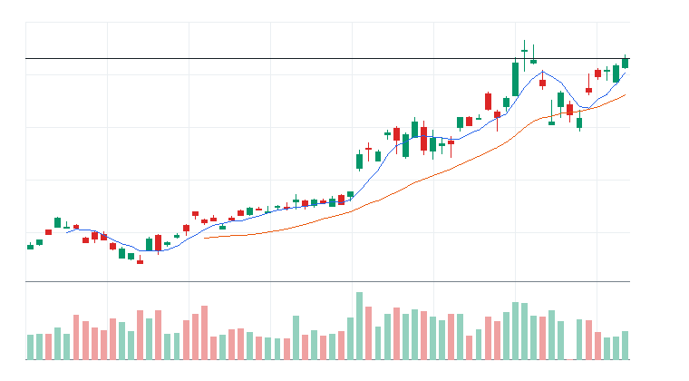
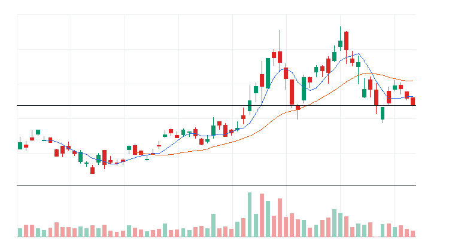

# 오늘의 데일리 트레이딩 요약

**REAL DATA TEST - 가격/거래량은 실제 데이터, 거래대금 유동성 일부 연결, 뉴스/ETF 구성종목 확산도 미연결**

**목적:** 이 리포트는 최근 오른 자산을 나열하는 것이 아니라, 돈이 몰리는 근거와 다음 매수 주체가 확인할 트레이딩 후보를 찾기 위한 보고서다.

> 핵심 질문: 현재 가격에서 누가 사고 있고, 누가 앞으로 더 비싸게 사줄 수 있는가?

## 모바일 요약

[오늘의 데일리 트레이딩 요약]

생성 성공 / 데이터 모드: REAL_TEST

시장:
- 위험선호

시장 지배 서사:
1. AI 반도체/HBM 공급망 - 약화 - 069500.KS, 005930.KS, 000660.KS 중심으로 5일 +20.98%, 20일 +36.27% 흐름이 형성됨. 뉴스 직접성 제한.
2. 자동차/부품 수출 모멘텀 - 약화 - 069500.KS, 005380.KS 중심으로 5일 +8.94%, 20일 +13.24% 흐름이 형성됨. 뉴스 직접성 제한.

트렌드 강도:
1. AI 반도체/HBM 공급망 - TSI 63 - 약화 - 진입품질 낮음
2. 자동차/부품 수출 모멘텀 - TSI 52 - 약화 - 진입품질 낮음

오늘 결론:
- 성장/테마 ETF 쪽 ETF 자금 흐름이 가장 선명함
- 행동 후보는 linkedNarrative와 함께 확인한다.
- 추격보다 진입 조건 확인 후 접근한다.

오늘 실제 행동 후보:
1. 행동 후보 없음 - 미분류 - 조건 충족 후보 없음

다크호스 후보:
1. 다크호스 후보 없음 - 조건 충족 후보 없음

ETF 후보 TOP 5:
1. 069500.KS - AI 반도체/HBM 공급망 - 거래량 확인 전 관찰
2. 229200.KS - 미분류 - 거래량 확인 전 관찰

웹 리포트:
https://yoolcool.github.io/DailyTradingThesisAgent/

## 오늘 결론

- 오늘 결론: 신규 추격 없음 / 관찰
- 신규 진입 후보: 0개
- 조건부 진입 후보: 0개
- 관찰 후보: 5개
- 주요 제한 요인: RVOL 미달, Entry Quality < 40, 뉴스 직접성 부족
- 주문 판단: 지정가 권장 / 시장가 주의
- 실전 판단: 오늘은 추세 후보는 있으나, 왜 돈이 몰리는가와 누가 더 비싸게 사줄 수 있는가를 주문 실행 신뢰도와 거래량이 충분히 뒷받침하지 못해 신규 추격은 보류한다. 기존 관심 종목은 전일 고점 돌파와 RVOL 1.00x 회복을 확인한 뒤 조건부로 본다.

### 후보 제한 요인 집계

- RVOL < 1.00x: 5개
- 거래대금 유동성 낮음: 0개
- Entry Quality 50~54 near miss: 0개
- Entry Quality 40~49 관찰: 0개
- Entry Quality < 40: 5개
- Exhaustion Risk >= 70: 3개
- ETF breadth 샘플 부족: 2개
- 뉴스 직접성 부족: 5개

## 데이터 신뢰도

- 전체 데이터 신뢰도 등급: LOW
- 분석 신뢰도: LOW
- 주문 실행 신뢰도: MEDIUM
- ETF breadth 신뢰도: LOW
- 신뢰도 해석: 테마 확산 판단 제한, 프리/애프터마켓 확인 불가
- 리포트 생성 시각: 2026-06-18 14:33 KST
- 가격 기준 거래일: 2026-06-18 US regular close
- 뉴스 수집 시각: 2026-06-18 14:33 KST
- 가장 최근 뉴스 발행 시각: 데이터 없음
- 뉴스 신선도 상태: UNKNOWN
- 뉴스 소스: DART
- 뉴스 소스 상태: DART DISABLED
- 뉴스 신뢰도: LOW
- 추천 적용 거래일: 2026-06-18 US regular session
- 가격/거래량 데이터 상태: 연결됨
- 뉴스 데이터 상태: 미연결
- ETF 구성종목 확산도 상태: 미연결
- ETF 구성종목 샘플 수: 0
- 거래대금 유동성 데이터 상태: 일부 연결
- 프리마켓/애프터마켓 데이터 상태: UNAVAILABLE
- 데이터 provider: yfinance, DART, config fallback sample, price-volume dollar-volume fallback
- 실전 사용 경고: 이 리포트는 투자판단 보조용이며, REAL_TEST 모드에서는 일부 데이터가 누락되거나 지연될 수 있다. 실제 주문 전 현재가, 뉴스, 프리마켓/정규장 거래량을 별도 확인해야 한다.

## 0. 시장 상태

- 데이터 모드: REAL_TEST
- 가격/거래량: 연결됨
- 뉴스: 미연결
- ETF 구성종목 확산도: 미연결
- 거래대금 유동성: 일부 연결
- 생성 시각: 2026년 6월 18일 목요일 오후 2:33
- 시장 상태: 위험선호
- 오늘 돈의 방향: 성장/테마 ETF 쪽 ETF 자금 흐름이 가장 선명함
- 강한 테마 TOP 3: Semiconductors(66), 성장/테마 ETF(37), Autos(0)
- 데이터 한계:
  - API 또는 provider 상태에 따라 뉴스/ETF 확산도/거래대금 유동성 반영 범위가 달라질 수 있다.
  - 수집 실패 데이터는 점수 반영에서 제외하거나 confidence를 제한한다.
  - reasonConfidence HIGH는 직접 촉매, 가격/거래량, 확산도/유동성 근거가 함께 있을 때만 사용한다.

## 오늘 시장을 지배하는 서사

### 오늘 시장을 지배하는 서사 TOP 3

#### 1. AI 반도체/HBM 공급망
- 상태: 약화
- narrativeScore: 68
- reasonConfidence: LOW
- 근거 ETF: 069500.KS
- 근거 개별 종목: 005930.KS, 000660.KS
- 돈이 몰리는 이유: AI 반도체/HBM 공급망 관련 069500.KS와 005930.KS, 000660.KS의 5일(+20.98%)·20일(+36.27%) 흐름을 함께 본다. 평균 상대 거래량은 0.74배이고, ETF 확산도는 추가 확인이 필요하다. 뉴스 직접성은 아직 제한적이다.
- 다음 매수 주체: HBM과 AI 서버 공급망 회복을 확인한 국내 대형주 및 반도체 섹터 자금
- 가장 좋은 트레이딩 수단: ETF 우선: 069500.KS / 개별 종목 우선: 005930.KS, 000660.KS
- 서사가 깨지는 조건: KOSPI200 약세 전환 또는 삼성전자/SK하이닉스가 20일선을 동반 이탈
- 오늘 행동: 추격보다 대형 반도체 동조성과 거래대금 회복 확인

상세 narrativeScore 근거 보기

- rawScore: 68
- ETF 평균 moneyFlowScore: 74
- 개별 종목 평균 moneyFlowScore: 66
- ETF 후보 비율: 0%
- 개별 종목 후보 비율: 0%
- 5일 평균 수익률: +21.00%
- 20일 평균 수익률: +36.00%
- 평균 상대 거래량: 1.00배
- ETF 평균 상대 거래량: 1.00배
- 개별주 평균 상대 거래량: 1.00배
- 52주 고점 근접 후보 비율: 100%
- 뉴스 직접성 점수: 0
- ETF 확산도 점수: 0
- 유동성 점수: 5
- 과열 리스크 차감: -1

#### 2. 자동차/부품 수출 모멘텀
- 상태: 약화
- narrativeScore: 37
- reasonConfidence: LOW
- 근거 ETF: 069500.KS
- 근거 개별 종목: 005380.KS
- 돈이 몰리는 이유: 자동차/부품 수출 모멘텀 관련 069500.KS와 005380.KS의 5일(+8.94%)·20일(+13.24%) 흐름을 함께 본다. 평균 상대 거래량은 0.56배이고, ETF 확산도는 추가 확인이 필요하다. 뉴스 직접성은 아직 제한적이다.
- 다음 매수 주체: 원화 약세, 수출 호조, 주주환원을 확인한 국내 대형 가치/수출주 자금
- 가장 좋은 트레이딩 수단: ETF 우선: 069500.KS / 개별 종목 우선: 005380.KS
- 서사가 깨지는 조건: 자동차 대표주가 20일선을 이탈하거나 KOSPI200 대비 상대강도가 약화
- 오늘 행동: 시장 대비 상대강도와 거래대금이 유지될 때만 선별 관찰

상세 narrativeScore 근거 보기

- rawScore: 37
- ETF 평균 moneyFlowScore: 74
- 개별 종목 평균 moneyFlowScore: 0
- ETF 후보 비율: 0%
- 개별 종목 후보 비율: 0%
- 5일 평균 수익률: +9.00%
- 20일 평균 수익률: +13.00%
- 평균 상대 거래량: 1.00배
- ETF 평균 상대 거래량: 1.00배
- 개별주 평균 상대 거래량: 0.00배
- 52주 고점 근접 후보 비율: 50%
- 뉴스 직접성 점수: 0
- ETF 확산도 점수: 0
- 유동성 점수: 5
- 과열 리스크 차감: 0

### 전체 narrative 요약

| 서사명 | 상태 | narrativeScore | reasonConfidence | 대표 ETF | 대표 종목 | 오늘 행동 |
| --- | --- | ---: | --- | --- | --- | --- |
| AI 반도체/HBM 공급망 | 약화 | 68 | LOW | 069500.KS | 005930.KS, 000660.KS | 추격보다 대형 반도체 동조성과 거래대금 회복 확인 |
| 자동차/부품 수출 모멘텀 | 약화 | 37 | LOW | 069500.KS | 005380.KS | 시장 대비 상대강도와 거래대금이 유지될 때만 선별 관찰 |

## 트렌드 강도 판단

### 1. AI 반도체/HBM 공급망
- Trend Strength Index: 63
- 트렌드 상태 라벨: 약화
- 테마 확산도: 보통
- ETF 동조성: 강함
- 거래량 강도: 부족
- 과열 위험: 높음 (81)
- 오늘 진입 품질: 낮음 (13)
- 한 줄 판단: AI 반도체/HBM 공급망는 관찰 가능한 흐름은 있으나 가격, 거래량, 확산도 중 일부 확인이 더 필요하다.
- 오늘 접근법: 상승률이 남아 있어도 069500.KS와 구성 종목 확산도가 회복될 때까지 신규 진입은 낮춘다.

트렌드 강도 상세 근거 보기

- 가격 모멘텀: 가격 모멘텀 29/25. 평균 5D +20.98%, 20D +36.27%.
- 거래량 강도: 거래량 강도 3/20. 평균 RVOL 0.74배.
- ETF 동조성: ETF 동조성 15/15. 관련 ETF 069500.KS 흐름을 기준으로 판단.
- 테마 확산도: 테마 확산도 12/20. 상위 1~2개 쏠림 감점 3점 반영.
- 뉴스 촉매: 뉴스/촉매 신선도 0/10. HIGH 직접 촉매 0개.
- 과열 리스크: 과열 리스크 81/100. 단기 급등, 고점 근접, ETF-개별주 괴리, 쏠림을 함께 반영.
- 시장 환경: 시장 환경 4/10. QQQ/SPY/IWM 가격 흐름 기반 위험선호 점수.

### 2. 자동차/부품 수출 모멘텀
- Trend Strength Index: 52
- 트렌드 상태 라벨: 약화
- 테마 확산도: 약함
- ETF 동조성: 강함
- 거래량 강도: 부족
- 과열 위험: 보통 (38)
- 오늘 진입 품질: 낮음 (19)
- 한 줄 판단: 자동차/부품 수출 모멘텀는 관찰 가능한 흐름은 있으나 가격, 거래량, 확산도 중 일부 확인이 더 필요하다.
- 오늘 접근법: 상승률이 남아 있어도 069500.KS와 구성 종목 확산도가 회복될 때까지 신규 진입은 낮춘다.

트렌드 강도 상세 근거 보기

- 가격 모멘텀: 가격 모멘텀 23/25. 평균 5D +8.94%, 20D +13.24%.
- 거래량 강도: 거래량 강도 3/20. 평균 RVOL 0.56배.
- ETF 동조성: ETF 동조성 15/15. 관련 ETF 069500.KS 흐름을 기준으로 판단.
- 테마 확산도: 테마 확산도 7/20. 상위 1~2개 쏠림 감점 4점 반영.
- 뉴스 촉매: 뉴스/촉매 신선도 0/10. HIGH 직접 촉매 0개.
- 과열 리스크: 과열 리스크 38/100. 단기 급등, 고점 근접, ETF-개별주 괴리, 쏠림을 함께 반영.
- 시장 환경: 시장 환경 4/10. QQQ/SPY/IWM 가격 흐름 기반 위험선호 점수.

## 최근 추천 결과 트래킹

개별주는 데이트레이딩 관점으로 추천 이후 첫 정규장의 장중 최고가와 종가를 추적한다. ETF는 테마/스윙 관점으로 추천 이후 1주일 동안의 최고가와 현재 종가를 추적한다.

### 개별주 Top 3 추천 성과 요약
- 최근 5개 리포트 표본: 0개 (초기 검증 단계)
- 장중 최고가 기준 성공률: 데이터 없음
- 종가 기준 성공률: 데이터 없음
- 평균 장중 최고 수익률: 데이터 없음
- 평균 종가 수익률: 데이터 없음

### ETF 추천 성과 요약
- 최근 5개 리포트 표본: 0개 (초기 검증 단계)
- 1주 최고가 기준 성공률: 데이터 없음
- 현재 종가 기준 성공률: 데이터 없음
- 평균 1주 최고 수익률: 데이터 없음
- 평균 현재 수익률: 데이터 없음

최근 추천 결과 상세 테이블 펼치기

| 추천일 | 유형 | 순위 | 티커 | 기준가 | 추적 기간 | 상태 | High 수익률 | Close 수익률 | 결과 | 코멘트 |
| --- | --- | ---: | --- | ---: | --- | --- | ---: | ---: | --- | --- |
| - | - | - | 데이터 없음 | - | - | - | - | - | - | - |

## 오늘 실제 행동 후보

오늘은 추세 후보는 있으나, 왜 돈이 몰리는가와 누가 더 비싸게 사줄 수 있는가를 주문 실행 신뢰도와 거래량이 충분히 뒷받침하지 못해 신규 추격은 보류한다. 기존 관심 종목은 전일 고점 돌파와 RVOL 1.00x 회복을 확인한 뒤 조건부로 본다.

## 다크호스 후보

다크호스 후보 없음. 상위 서사 정렬, MA20 위 안착, MA5/MA20 구조 개선, RVOL 0.90x 이상 조건을 동시에 충족한 개별주가 없다.

- darkHorseScore: 조건 충족 후보 없음
- 왜 아직 메인이 아닌가: 확인 조건을 통과한 보조 관찰 후보가 없다.

darkHorseScore 상세 근거 보기

- 서사 정렬: 조건 미충족
- 초기 추세 구조: 조건 미충족
- 베이스 돌파/정돈: 조건 미충족
- 거래량 확인: 조건 미충족
- rawScore: 데이터 없음

## 참고용 행동 후보

> 실제 행동 후보가 없는 날에만 표시한다. 아래 후보는 매수 추천이 아니라 다음 정규장에서 전일 고점 돌파, RVOL 1.00x 이상, 거래대금 유동성 확인을 기다리는 관찰 리스트다.

### ETF 참고 후보 TOP 3

#### 1. [069500.KS] KODEX 200
- 상태: 참고용 관찰 후보
- todayActionLabel: 거래량 확인 전 관찰
- 제한 사유: Entry Quality 25 < 40; Exhaustion Risk 81 >= 70; RVOL 0.67x < 1.00x
- 주문 실행: 시장가 가능
- moneyFlowScore: 74
- Entry Quality: 25 (낮음)
- RVOL: 0.67x
- 진입 전 확인: 상대 거래량 1.0배 회복 후 관찰
- 무효화: 거래량 회복 실패

#### 2. [229200.KS] KODEX KOSDAQ150
- 상태: 참고용 관찰 후보
- todayActionLabel: 거래량 확인 전 관찰
- 제한 사유: Entry Quality 0 < 40; RVOL 0.35x < 1.00x
- 주문 실행: 시장가 가능
- moneyFlowScore: 0
- Entry Quality: 데이터 없음 (데이터 없음)
- RVOL: 0.35x
- 진입 전 확인: 상대 거래량 1.0배 회복 후 관찰
- 무효화: 거래량 회복 실패

### 개별주 참고 후보 TOP 3

#### 1. [005930.KS] Samsung Electronics
- 상태: 참고용 관찰 후보
- todayActionLabel: 거래량 확인 전 관찰
- 제한 사유: Entry Quality 22 < 40; Exhaustion Risk 81 >= 70; RVOL 0.77x < 1.00x
- 주문 실행: 시장가 가능
- moneyFlowScore: 67
- Entry Quality: 22 (낮음)
- RVOL: 0.77x
- 진입 전 확인: 상대 거래량 1.0배 회복 후 관찰
- 무효화: 거래량 회복 실패

#### 2. [000660.KS] SK hynix
- 상태: 참고용 관찰 후보
- todayActionLabel: 거래량 확인 전 관찰
- 제한 사유: Entry Quality 9 < 40; Exhaustion Risk 81 >= 70; RVOL 0.79x < 1.00x
- 주문 실행: 시장가 가능
- moneyFlowScore: 65
- Entry Quality: 9 (낮음)
- RVOL: 0.79x
- 진입 전 확인: 상대 거래량 1.0배 회복 후 관찰
- 무효화: 거래량 회복 실패

#### 3. [005380.KS] Hyundai Motor
- 상태: 참고용 관찰 후보
- todayActionLabel: 거래량 확인 전 관찰
- 제한 사유: Entry Quality 9 < 40; RVOL 0.44x < 1.00x
- 주문 실행: 시장가 가능
- moneyFlowScore: 0
- Entry Quality: 9 (낮음)
- RVOL: 0.44x
- 진입 전 확인: 상대 거래량 1.0배 회복 후 관찰
- 무효화: 거래량 회복 실패

## 오늘 돈이 몰리는 테마

- Semiconductors: 005930.KS, 000660.KS | 평균 moneyFlowScore 66 | 추세는 확인되지만 선별 진입이 필요한 중간 강도의 테마로 본다.
- 성장/테마 ETF: 069500.KS, 229200.KS | 평균 moneyFlowScore 37 | 관심은 유지하되 우선순위는 낮추고 추가 거래량 확인을 기다린다.
- Autos: 005380.KS | 평균 moneyFlowScore 0 | 관심은 유지하되 우선순위는 낮추고 추가 거래량 확인을 기다린다.

## 1. ETF 트레이딩 보고서
### 1-1. ETF 결론
- ETF 우선 후보: 없음
- ETF 관찰 후보: 069500.KS, 229200.KS
- ETF 매매 금지: 229200.KS
- 오늘 ETF 최우선 1개: 없음
- ETF 섹션 해석: 이 섹션은 개별 종목 선택이 아니라 테마/섹터 단위 자금 흐름을 ETF로 매매할지 판단하기 위한 영역이다.

### 1-2. ETF 후보 TOP 5

선정 기준: ETF 후보는 가격/거래량 1차 점수에 뉴스, ETF 구성종목 확산도, 유동성, 리스크 패널티를 반영한 finalRawScore 기준으로 정렬한다. 표시 점수 100점 후보가 겹치면 tieBreakerReason으로 우선순위를 설명한다.

### [ETF 069500.KS] KODEX 200
- 자산 유형: ETF
- ETF 세부 카테고리: 성장/테마 ETF
- ETF 역할: 테마 베타 매수
- 상태: 관찰
- linkedNarrative: AI 반도체/HBM 공급망
- narrativeStatus: 약화
- narrativeScore: 68
- moneyFlowScore: 74
- finalRawScore: 74
- tieBreakerReason: 최종 원점수 74, 리스크 패널티 -4, 5일 수익률 +17.20%, 상대 거래량 0.67배 순으로 정렬
- 과열 리스크: 낮음~중간
- reasonConfidence: LOW
- reasonConfidenceExplanation: 가격/거래량이 약하거나 핵심 보조 근거가 부족해 LOW로 분류했다.

- todayActionLabel: 거래량 확인 전 관찰
- 주문 실행: 시장가 가능
- 기준일: 2026-06-18
- 종가: $145,155
- 1일 수익률: +2.18%
- 5일 수익률: +17.20%
- 20일 수익률: +26.98%
- 상대 거래량: 0.67배
- 52주 고점 대비 위치: -0.60%
- whyMoneyIsFlowing: 최근 수익률은 확인되지만 상대 거래량 0.67배라 신규 자금 유입 강도는 약함. 유동성: LIQUID
- likelyNextBuyer: 섹터 베타를 노리는 단기 모멘텀 자금과 리밸런싱 자금
- whyThisCouldTradeHigher: 52주 고점 부근이라 돌파가 확인되면 신고가 추종 매수가 붙을 수 있음
- 진입 조건: 상대 거래량 1.0배 회복 후 관찰
- 무효화 조건: 거래량 회복 실패
- 차트: 

#### 상세 근거

069500.KS 상세 근거 펼치기

- moneyFlowScore(최종) 산정 근거:
  - moneyFlowScore(1차): 73
  - 최종 원점수: 74
  - 최종 표시 점수: 74
  - cap 적용: cap 미적용
  - 계산식: +73 + 0 + 0 + +5 + 0 - 4 + 0 = 74
  - 점수 해석: 관심 후보. 눌림 또는 돌파 확인 후 진입 검토.
  - 가격/거래량 1차 점수: +73
    - 추세: +24
    - 단기 모멘텀: +15
    - 중기 모멘텀: +16
    - 거래량: -8
    - 신고가 근접: +12
    - 이동평균: +14
  - 하위 점수 cap:
    - 가격 모멘텀: 원점수 +24, 상한 적용 +24 / 최대 25
    - 단기 모멘텀: 원점수 +15, 상한 적용 +15 / 최대 20
    - 중기 모멘텀: 원점수 +18, 상한 적용 +16 / 최대 16 (cap 적용)
    - 거래량: 원점수 -8, 상한 적용 -8 / 최대 20
    - 신고가 근접: 원점수 +12, 상한 적용 +12 / 최대 12
    - 이동평균: 원점수 +14, 상한 적용 +14 / 최대 14
  - 추가 데이터 가감점:
    - 뉴스: 0
    - 유동성: +5
  - ETF 확산도: 0
  - 리스크 패널티: -4
  - 주요 근거: 1차 73, 최종 원점수 74, 표시 74. 20일 수익률 강함, 5일 수익률 강함, 1일 단기 모멘텀 확인. 주의: 단기 과열/추격 위험 존재, 뉴스 데이터 미연결 또는 수집 실패.
  - 리스크 패널티 산정 근거:
    - 총 리스크 패널티: -4
    - 리스크 등급: LOW
    - 감점된 리스크:
      - volume divergence: -4 | 근거: 5d price strength is not confirmed by relative volume 0.67x. | 대응: Require relative volume recovery above 1.0x.
    - 관찰 리스크: news data not connected or unavailable; ETF breadth data not connected
    - 한 줄 해석: 1개 감점 리스크로 총 -4점 반영.
- 데이터 사용 현황:
  - 가격/거래량: 사용
  - 뉴스: 미연결
  - ETF 확산도: 미연결
  - 거래대금 유동성: 사용
  - 관련 ETF 상대강도: 사용
- 뉴스 확인:
  - 최근 뉴스 상태: 미연결
  - 뉴스 소스: DART
  - 소스별 상태: DART DISABLED
  - 긍정/중립/부정: 0/0/0
  - 직접성/방향성/신선도: 0/0/0
  - 강한 촉매 수: 0
  - 직접 촉매: 없음
  - 보조 뉴스: 없음
  - 뉴스 수집 시각: 2026-06-18 14:33 KST
  - 가장 최근 뉴스 발행 시각: 데이터 없음
  - 뉴스 신선도 상태: UNKNOWN
  - 뉴스 이후 가격 반응: 긍정
  - 가격 반응 점수 제한: 뉴스 이후 가격 반응과 점수 제한 특이사항 없음
  - 핵심 뉴스 요약: 의미 있는 신규 DART 공시 없음
  - 원점수/상한 점수: 0 / 0
  - 점수 반영: 0
  - 주의: DART_API_KEY not configured; 해당 티커의 의미 있는 신규 DART 공시가 없거나 API 결과가 비어 있음
- ETF 구성종목 확산도:
  - 구성종목 데이터 상태: 미연결
  - 샘플 수: 0/0
  - 샘플 신뢰도: UNKNOWN
  - 상승 종목 비율: 데이터 없음
  - 20일선 위 비율: 데이터 없음
  - 50일선 위 비율: 데이터 없음
  - 상위 기여 종목: 데이터 없음
  - 확산도 판단: UNKNOWN
  - 원점수/샘플 상한/반영 점수: 0 / N/A / 0
  - 점수 반영: 0
- 거래대금 유동성:
  - 데이터 상태: 일부 연결
  - 거래대금 기준 유동성: LIQUID
  - 거래대금: $1,991,442,990,720
  - 평균 거래대금: $2,985,660,825,435
  - 주문 영향: 시장가 가능
  - 매매 영향: 거래대금이 충분해 시장가 가능 범위로 본다
- reasonConfidence 근거: 가격/거래량이 약하거나 주요 데이터가 부족해 낮음.
- 차트 요약: 최근 20거래일 기준 5일선이 20일선 위에 있음
- 기준일 2026-06-18 | 종가 $145,155 | 1일 +2.18% | 5일 +17.20% | 20일 +26.98% | 상대 거래량 0.67배 | 52주 고점 대비 -0.60% | 데이터 소스: yfinance

### [ETF 229200.KS] KODEX KOSDAQ150
- 자산 유형: ETF
- ETF 세부 카테고리: 성장/테마 ETF
- ETF 역할: 테마 베타 매수
- 상태: 관찰
- linkedNarrative: 미분류
- narrativeStatus: 관찰
- narrativeScore: 0
- moneyFlowScore: 0
- finalRawScore: -21
- tieBreakerReason: 최종 원점수 -21, 리스크 패널티 -6, 5일 수익률 +0.43%, 상대 거래량 0.35배 순으로 정렬
- 과열 리스크: 낮음
- reasonConfidence: LOW
- reasonConfidenceExplanation: 가격/거래량이 약하거나 핵심 보조 근거가 부족해 LOW로 분류했다.

- todayActionLabel: 거래량 확인 전 관찰
- 주문 실행: 시장가 가능
- 기준일: 2026-06-18
- 종가: $17,710
- 1일 수익률: -2.77%
- 5일 수익률: +0.43%
- 20일 수익률: -2.37%
- 상대 거래량: 0.35배
- 52주 고점 대비 위치: -18.48%
- whyMoneyIsFlowing: 최근 수익률은 확인되지만 상대 거래량 0.35배라 신규 자금 유입 강도는 약함. 유동성: LIQUID
- likelyNextBuyer: 섹터 베타를 노리는 단기 모멘텀 자금과 리밸런싱 자금
- whyThisCouldTradeHigher: 단기 추세가 유지되고 거래량이 1.0배 이상이면 눌림 이후 재상승을 시도할 수 있음
- 진입 조건: 상대 거래량 1.0배 회복 후 관찰
- 무효화 조건: 거래량 회복 실패
- 차트: 

#### 상세 근거

229200.KS 상세 근거 펼치기

- moneyFlowScore(최종) 산정 근거:
  - moneyFlowScore(1차): 0
  - 최종 원점수: -21
  - 최종 표시 점수: 0
  - cap 적용: raw score -21 capped to displayed score 0
  - 계산식: -20 + 0 + 0 + +5 + 0 - 6 + 0 = -21 -> 0
  - 점수 해석: 매매 금지 또는 우선순위 낮은 후보.
  - 가격/거래량 1차 점수: -20
    - 추세: -1
    - 단기 모멘텀: -3
    - 중기 모멘텀: -2
    - 거래량: -8
    - 신고가 근접: 0
    - 이동평균: -6
  - 하위 점수 cap:
    - 가격 모멘텀: 원점수 -1, 상한 적용 -1 / 최대 25
    - 단기 모멘텀: 원점수 -3, 상한 적용 -3 / 최대 20
    - 중기 모멘텀: 원점수 -2, 상한 적용 -2 / 최대 16
    - 거래량: 원점수 -8, 상한 적용 -8 / 최대 20
    - 신고가 근접: 원점수 0, 상한 적용 0 / 최대 12
    - 이동평균: 원점수 -6, 상한 적용 -6 / 최대 14
  - 추가 데이터 가감점:
    - 뉴스: 0
    - 유동성: +5
  - ETF 확산도: 0
  - 리스크 패널티: -6
  - 주요 근거: 1차 0, 최종 원점수 -21, 표시 0. 거래대금 기준 유동성 양호. 주의: 단기 과열/추격 위험 존재, 뉴스 데이터 미연결 또는 수집 실패.
  - 리스크 패널티 산정 근거:
    - 총 리스크 패널티: -6
    - 리스크 등급: LOW
    - 감점된 리스크:
      - 20d moving average break risk: -6 | 근거: Close is below the 20-day moving average. | 대응: Hold off until 20-day moving average is recovered.
    - 관찰 리스크: news data not connected or unavailable; ETF breadth data not connected
    - 한 줄 해석: 1개 감점 리스크로 총 -6점 반영.
- 데이터 사용 현황:
  - 가격/거래량: 사용
  - 뉴스: 미연결
  - ETF 확산도: 미연결
  - 거래대금 유동성: 사용
  - 관련 ETF 상대강도: 사용
- 뉴스 확인:
  - 최근 뉴스 상태: 미연결
  - 뉴스 소스: DART
  - 소스별 상태: DART DISABLED
  - 긍정/중립/부정: 0/0/0
  - 직접성/방향성/신선도: 0/0/0
  - 강한 촉매 수: 0
  - 직접 촉매: 없음
  - 보조 뉴스: 없음
  - 뉴스 수집 시각: 2026-06-18 14:33 KST
  - 가장 최근 뉴스 발행 시각: 데이터 없음
  - 뉴스 신선도 상태: UNKNOWN
  - 뉴스 이후 가격 반응: 부정
  - 가격 반응 점수 제한: 뉴스 이후 가격 반응과 점수 제한 특이사항 없음
  - 핵심 뉴스 요약: 의미 있는 신규 DART 공시 없음
  - 원점수/상한 점수: 0 / 0
  - 점수 반영: 0
  - 주의: DART_API_KEY not configured; 해당 티커의 의미 있는 신규 DART 공시가 없거나 API 결과가 비어 있음
- ETF 구성종목 확산도:
  - 구성종목 데이터 상태: 미연결
  - 샘플 수: 0/0
  - 샘플 신뢰도: UNKNOWN
  - 상승 종목 비율: 데이터 없음
  - 20일선 위 비율: 데이터 없음
  - 50일선 위 비율: 데이터 없음
  - 상위 기여 종목: 데이터 없음
  - 확산도 판단: UNKNOWN
  - 원점수/샘플 상한/반영 점수: 0 / N/A / 0
  - 점수 반영: 0
- 거래대금 유동성:
  - 데이터 상태: 일부 연결
  - 거래대금 기준 유동성: LIQUID
  - 거래대금: $199,067,182,930
  - 평균 거래대금: $569,338,777,700
  - 주문 영향: 시장가 가능
  - 매매 영향: 거래대금이 충분해 시장가 가능 범위로 본다
- reasonConfidence 근거: 가격/거래량이 약하거나 주요 데이터가 부족해 낮음.
- 차트 요약: 20일선 아래라 추세 확인 전까지 보수적 접근
- 기준일 2026-06-18 | 종가 $17,710 | 1일 -2.77% | 5일 +0.43% | 20일 -2.37% | 상대 거래량 0.35배 | 52주 고점 대비 -18.48% | 데이터 소스: yfinance

### 1-3. ETF 과열/주의 후보

#### [069500.KS] KODEX 200
- moneyFlowScore(최종): 74
- moneyFlowScore 산정 근거 요약: 1차 73, 최종 원점수 74, 표시 74. 20일 수익률 강함, 5일 수익률 강함, 1일 단기 모멘텀 확인. 주의: 단기 과열/추격 위험 존재, 뉴스 데이터 미연결 또는 수집 실패.
- 과열 리스크: 낮음~중간
- 과열 근거: 테마 ETF 기준 단기 급등과 고점 근접 조합 확인
- 대응: 돌파 확인 후 진입

### 1-4. ETF 제외/매매 금지 후보

#### [229200.KS] KODEX KOSDAQ150
- moneyFlowScore(최종): 0
- moneyFlowScore 산정 근거 요약: 1차 0, 최종 원점수 -21, 표시 0. 거래대금 기준 유동성 양호. 주의: 단기 과열/추격 위험 존재, 뉴스 데이터 미연결 또는 수집 실패.
- 제외 사유: 테마 자금 흐름 약함
- 해제 조건: 상대 거래량 1.0배 회복 후 관찰

## 2. 개별 종목 트레이딩 보고서
### 2-1. 오늘 Nasdaq-100 신규 발굴 요약
- 신규 발굴 풀: Nasdaq-100 구성종목 전체
- universe source: manual fallback pending
- universe fetchStatus: EMPTY
- 총 스캔 종목 수: 0
- 데이터 수집 성공: 3
- 데이터 수집 실패: -3
- 상세 데이터 수집 대상: 가격/거래량 1차 스캔 상위 3개
- 오늘 진입 후보: 0
- 오늘 눌림 대기: 0
- 오늘 관찰: 3
- 오늘 매매 금지: 0
- 개별 종목 진입 후보: 없음
- 개별 종목 눌림 대기: 없음
- 개별 종목 매매 금지: 없음
- 오늘 개별 종목 최우선 1개: 없음
- 개별 종목 섹션 해석: 이 섹션은 ETF로 확인된 테마 자금 흐름 안에서 ETF보다 더 강한 돌파 가능성이 있는 개별 종목만 선별하는 영역이다.

### 2-2. 오늘 개별 종목 신규 후보 TOP 5

선정 기준:
1. Nasdaq-100 전체를 moneyFlowScore(1차)로 먼저 스캔
2. moneyFlowScore(1차) 상위 3개를 상세 분석
3. 뉴스/유동성/관련 ETF 대비 상대강도/리스크 패널티를 반영
4. moneyFlowScore(최종), 최종 원점수, 리스크 패널티, 5일 수익률, 상대 거래량 순으로 재정렬

### [005930.KS] Samsung Electronics
- 자산 유형: STOCK
- 상태: 관찰
- primaryTheme: Semiconductors
- primarySector: Semiconductors
- relatedEtfs: 관련 ETF 데이터 부족
- linkedNarrative: AI 반도체/HBM 공급망
- narrativeStatus: 약화
- narrativeScore: 68
- moneyFlowScore: 67
- finalRawScore: 67
- tieBreakerReason: 최종 원점수 67, 리스크 패널티 -10, 5일 수익률 +18.23%, 상대 거래량 0.77배 순으로 정렬
- 과열 리스크: 낮음~중간
- reasonConfidence: LOW
- reasonConfidenceExplanation: 가격/거래량이 약하거나 핵심 보조 근거가 부족해 LOW로 분류했다.

- todayActionLabel: 거래량 확인 전 관찰
- 주문 실행: 시장가 가능
- 기준일: 2026-06-18
- 종가: $353,500
- 1일 수익률: +2.02%
- 5일 수익률: +18.23%
- 20일 수익률: +28.31%
- 상대 거래량: 0.77배
- 52주 고점 대비 위치: -4.46%
- 관련 ETF 대비 상대강도: 관련 ETF 데이터 부족
- whyMoneyIsFlowing: 최근 수익률은 확인되지만 상대 거래량 0.77배라 신규 자금 유입 강도는 약함. 유동성: LIQUID
- likelyNextBuyer: 개별 주도주를 따라붙는 단기 모멘텀 자금과 관련 ETF 강세를 확인한 트레이더
- whyThisCouldTradeHigher: 52주 고점 부근이라 돌파가 확인되면 신고가 추종 매수가 붙을 수 있음
- 왜 ETF가 아니라 이 종목인가: 관련 ETF 데이터 부족. 개별 종목 우선으로 격상하려면 관련 ETF 대비 상대강도 유지가 더 필요하다.
- ETF가 더 나은 경우: 관련 ETF 데이터가 부족하면 개별 종목보다 ETF 또는 관찰을 우선한다.
- 진입 조건: 상대 거래량 1.0배 회복 후 관찰
- 무효화 조건: 거래량 회복 실패
- 차트: 

#### 상세 근거

005930.KS 상세 근거 펼치기

- moneyFlowScore(최종) 산정 근거:
  - moneyFlowScore(1차): 72
  - 최종 원점수: 67
  - 최종 표시 점수: 67
  - cap 적용: cap 미적용
  - 계산식: +72 + 0 + 0 + +5 + 0 - 10 + 0 = 67
  - 점수 해석: 관심 후보. 눌림 또는 돌파 확인 후 진입 검토.
  - 가격/거래량 1차 점수: +72
    - 추세: +24
    - 단기 모멘텀: +14
    - 중기 모멘텀: +16
    - 거래량: -8
    - 신고가 근접: +12
    - 이동평균: +14
  - 하위 점수 cap:
    - 가격 모멘텀: 원점수 +24, 상한 적용 +24 / 최대 25
    - 단기 모멘텀: 원점수 +14, 상한 적용 +14 / 최대 20
    - 중기 모멘텀: 원점수 +18, 상한 적용 +16 / 최대 16 (cap 적용)
    - 거래량: 원점수 -8, 상한 적용 -8 / 최대 20
    - 신고가 근접: 원점수 +12, 상한 적용 +12 / 최대 12
    - 이동평균: 원점수 +14, 상한 적용 +14 / 최대 14
    - 관련 ETF 상대강도: 원점수 0, 상한 적용 0 / 최대 8
  - 추가 데이터 가감점:
    - 뉴스: 0
    - 유동성: +5
  - ETF 대비 상대강도: 0
  - 리스크 패널티: -10
  - 주요 근거: 1차 72, 최종 원점수 67, 표시 67. 20일 수익률 강함, 5일 수익률 강함, 1일 단기 모멘텀 확인. 주의: 단기 과열/추격 위험 존재, 뉴스 데이터 미연결 또는 수집 실패.
  - 리스크 패널티 산정 근거:
    - 총 리스크 패널티: -10
    - 리스크 등급: MEDIUM
    - 감점된 리스크:
      - short-term overheat: -6 | 근거: 5d return +18.23% is extended. | 대응: Prefer pullback or prior high reclaim over chasing.
      - volume divergence: -4 | 근거: 5d price strength is not confirmed by relative volume 0.77x. | 대응: Require relative volume recovery above 1.0x.
    - 관찰 리스크: news data not connected or unavailable; related ETF relative strength mapping needs confirmation
    - 한 줄 해석: 2개 감점 리스크로 총 -10점 반영.
- 데이터 사용 현황:
  - 가격/거래량: 사용
  - 뉴스: 미연결
  - ETF 확산도: 관련 ETF에서 확인
  - 거래대금 유동성: 사용
  - 관련 ETF 상대강도: 사용
- 뉴스 확인:
  - 최근 뉴스 상태: 미연결
  - 뉴스 소스: DART
  - 소스별 상태: DART DISABLED
  - 긍정/중립/부정: 0/0/0
  - 직접성/방향성/신선도: 0/0/0
  - 강한 촉매 수: 0
  - 직접 촉매: 없음
  - 보조 뉴스: 없음
  - 뉴스 수집 시각: 2026-06-18 14:33 KST
  - 가장 최근 뉴스 발행 시각: 데이터 없음
  - 뉴스 신선도 상태: UNKNOWN
  - 뉴스 이후 가격 반응: 긍정
  - 가격 반응 점수 제한: 뉴스 이후 가격 반응과 점수 제한 특이사항 없음
  - 핵심 뉴스 요약: 의미 있는 신규 DART 공시 없음
  - 원점수/상한 점수: 0 / 0
  - 점수 반영: 0
  - 주의: DART_API_KEY not configured; 해당 티커의 의미 있는 신규 DART 공시가 없거나 API 결과가 비어 있음
- ETF 구성종목 확산도: 관련 ETF에서 확인
- 거래대금 유동성:
  - 데이터 상태: 일부 연결
  - 거래대금 기준 유동성: LIQUID
  - 거래대금: $7,972,894,146,000
  - 평균 거래대금: $10,331,184,556,000
  - 주문 영향: 시장가 가능
  - 매매 영향: 거래대금이 충분해 시장가 가능 범위로 본다
- reasonConfidence 근거: 가격/거래량이 약하거나 주요 데이터가 부족해 낮음.
- 차트 요약: 최근 20거래일 기준 5일선이 20일선 위에 있음
- 기준일 2026-06-18 | 종가 $353,500 | 1일 +2.02% | 5일 +18.23% | 20일 +28.31% | 상대 거래량 0.77배 | 52주 고점 대비 -4.46% | 데이터 소스: yfinance

### [000660.KS] SK hynix
- 자산 유형: STOCK
- 상태: 관찰
- primaryTheme: Semiconductors
- primarySector: Semiconductors
- relatedEtfs: 관련 ETF 데이터 부족
- linkedNarrative: AI 반도체/HBM 공급망
- narrativeStatus: 약화
- narrativeScore: 68
- moneyFlowScore: 65
- finalRawScore: 65
- tieBreakerReason: 최종 원점수 65, 리스크 패널티 -18, 5일 수익률 +27.51%, 상대 거래량 0.79배 순으로 정렬
- 과열 리스크: 중간
- reasonConfidence: LOW
- reasonConfidenceExplanation: 가격/거래량이 약하거나 핵심 보조 근거가 부족해 LOW로 분류했다.

- todayActionLabel: 거래량 확인 전 관찰
- 주문 실행: 시장가 가능
- 기준일: 2026-06-18
- 종가: $2,679,000
- 1일 수익률: +6.27%
- 5일 수익률: +27.51%
- 20일 수익률: +53.52%
- 상대 거래량: 0.79배
- 52주 고점 대비 위치: -0.81%
- 관련 ETF 대비 상대강도: 관련 ETF 데이터 부족
- whyMoneyIsFlowing: 최근 수익률은 확인되지만 상대 거래량 0.79배라 신규 자금 유입 강도는 약함. 유동성: LIQUID
- likelyNextBuyer: 개별 주도주를 따라붙는 단기 모멘텀 자금과 관련 ETF 강세를 확인한 트레이더
- whyThisCouldTradeHigher: 52주 고점 부근이라 돌파가 확인되면 신고가 추종 매수가 붙을 수 있음
- 왜 ETF가 아니라 이 종목인가: 관련 ETF 데이터 부족. 개별 종목 우선으로 격상하려면 관련 ETF 대비 상대강도 유지가 더 필요하다.
- ETF가 더 나은 경우: 관련 ETF 데이터가 부족하면 개별 종목보다 ETF 또는 관찰을 우선한다.
- 진입 조건: 상대 거래량 1.0배 회복 후 관찰
- 무효화 조건: 거래량 회복 실패
- 차트: 

#### 상세 근거

000660.KS 상세 근거 펼치기

- moneyFlowScore(최종) 산정 근거:
  - moneyFlowScore(1차): 78
  - 최종 원점수: 65
  - 최종 표시 점수: 65
  - cap 적용: cap 미적용
  - 계산식: +78 + 0 + 0 + +5 + 0 - 18 + 0 = 65
  - 점수 해석: 관심 후보. 눌림 또는 돌파 확인 후 진입 검토.
  - 가격/거래량 1차 점수: +78
    - 추세: +24
    - 단기 모멘텀: +20
    - 중기 모멘텀: +16
    - 거래량: -8
    - 신고가 근접: +12
    - 이동평균: +14
  - 하위 점수 cap:
    - 가격 모멘텀: 원점수 +24, 상한 적용 +24 / 최대 25
    - 단기 모멘텀: 원점수 +20, 상한 적용 +20 / 최대 20
    - 중기 모멘텀: 원점수 +35, 상한 적용 +16 / 최대 16 (cap 적용)
    - 거래량: 원점수 -8, 상한 적용 -8 / 최대 20
    - 신고가 근접: 원점수 +12, 상한 적용 +12 / 최대 12
    - 이동평균: 원점수 +14, 상한 적용 +14 / 최대 14
    - 관련 ETF 상대강도: 원점수 0, 상한 적용 0 / 최대 8
  - 추가 데이터 가감점:
    - 뉴스: 0
    - 유동성: +5
  - ETF 대비 상대강도: 0
  - 리스크 패널티: -18
  - 주요 근거: 1차 78, 최종 원점수 65, 표시 65. 20일 수익률 강함, 5일 수익률 강함, 1일 단기 모멘텀 확인. 주의: 단기 과열/추격 위험 존재, 뉴스 데이터 미연결 또는 수집 실패.
  - 리스크 패널티 산정 근거:
    - 총 리스크 패널티: -18
    - 리스크 등급: HIGH
    - 감점된 리스크:
      - short-term overheat: -6 | 근거: 5d return +27.51% is extended. | 대응: Prefer pullback or prior high reclaim over chasing.
      - extreme 1d move: -4 | 근거: 1d return +6.27% is unusually strong. | 대응: Confirm next-session volume retention.
      - near 52w high chase: -4 | 근거: Price is close to the 52-week high with fast short-term momentum. | 대응: Downgrade if breakout fails.
      - volume divergence: -4 | 근거: 5d price strength is not confirmed by relative volume 0.79x. | 대응: Require relative volume recovery above 1.0x.
    - 관찰 리스크: news data not connected or unavailable; related ETF relative strength mapping needs confirmation
    - 한 줄 해석: 4개 감점 리스크로 총 -18점 반영.
- 데이터 사용 현황:
  - 가격/거래량: 사용
  - 뉴스: 미연결
  - ETF 확산도: 관련 ETF에서 확인
  - 거래대금 유동성: 사용
  - 관련 ETF 상대강도: 사용
- 뉴스 확인:
  - 최근 뉴스 상태: 미연결
  - 뉴스 소스: DART
  - 소스별 상태: DART DISABLED
  - 긍정/중립/부정: 0/0/0
  - 직접성/방향성/신선도: 0/0/0
  - 강한 촉매 수: 0
  - 직접 촉매: 없음
  - 보조 뉴스: 없음
  - 뉴스 수집 시각: 2026-06-18 14:33 KST
  - 가장 최근 뉴스 발행 시각: 데이터 없음
  - 뉴스 신선도 상태: UNKNOWN
  - 뉴스 이후 가격 반응: 긍정
  - 가격 반응 점수 제한: 뉴스 이후 가격 반응과 점수 제한 특이사항 없음
  - 핵심 뉴스 요약: 의미 있는 신규 DART 공시 없음
  - 원점수/상한 점수: 0 / 0
  - 점수 반영: 0
  - 주의: DART_API_KEY not configured; 해당 티커의 의미 있는 신규 DART 공시가 없거나 API 결과가 비어 있음
- ETF 구성종목 확산도: 관련 ETF에서 확인
- 거래대금 유동성:
  - 데이터 상태: 일부 연결
  - 거래대금 기준 유동성: LIQUID
  - 거래대금: $10,757,527,179,000
  - 평균 거래대금: $13,667,979,384,000
  - 주문 영향: 시장가 가능
  - 매매 영향: 거래대금이 충분해 시장가 가능 범위로 본다
- reasonConfidence 근거: 가격/거래량이 약하거나 주요 데이터가 부족해 낮음.
- 차트 요약: 최근 20거래일 기준 5일선이 20일선 위에 있음
- 기준일 2026-06-18 | 종가 $2,679,000 | 1일 +6.27% | 5일 +27.51% | 20일 +53.52% | 상대 거래량 0.79배 | 52주 고점 대비 -0.81% | 데이터 소스: yfinance

### [005380.KS] Hyundai Motor
- 자산 유형: STOCK
- 상태: 관찰
- primaryTheme: Autos
- primarySector: Autos
- relatedEtfs: 069500.KS, 229200.KS
- linkedNarrative: 자동차/부품 수출 모멘텀
- narrativeStatus: 약화
- narrativeScore: 37
- moneyFlowScore: 0
- finalRawScore: -8
- tieBreakerReason: 최종 원점수 -8, 리스크 패널티 -6, 5일 수익률 +0.67%, 상대 거래량 0.44배 순으로 정렬
- 과열 리스크: 낮음
- reasonConfidence: LOW
- reasonConfidenceExplanation: 가격/거래량이 약하거나 핵심 보조 근거가 부족해 LOW로 분류했다.

- todayActionLabel: 거래량 확인 전 관찰
- 주문 실행: 시장가 가능
- 기준일: 2026-06-18
- 종가: $601,000
- 1일 수익률: -2.75%
- 5일 수익률: +0.67%
- 20일 수익률: -0.50%
- 상대 거래량: 0.44배
- 52주 고점 대비 위치: -23.24%
- 관련 ETF 대비 상대강도: 관련 ETF보다 약함 | 주식 5일 +0.67% vs ETF 평균 +8.81%, 주식 20일 -0.50% vs ETF 평균 +12.30%, 상대 거래량 0.44배 vs ETF 평균 0.51배
- whyMoneyIsFlowing: 최근 수익률은 확인되지만 상대 거래량 0.44배라 신규 자금 유입 강도는 약함. 유동성: LIQUID
- likelyNextBuyer: 개별 주도주를 따라붙는 단기 모멘텀 자금과 관련 ETF 강세를 확인한 트레이더
- whyThisCouldTradeHigher: 단기 추세가 유지되고 거래량이 1.0배 이상이면 눌림 이후 재상승을 시도할 수 있음
- 왜 ETF가 아니라 이 종목인가: 005380.KS의 가격/거래량 흐름이 약해 개별 종목 우선 근거가 부족하다.
- ETF가 더 나은 경우: 005380.KS가 관련 ETF 평균보다 약하거나 거래량이 둔화되면 개별 종목보다 관련 ETF를 우선한다.
- 진입 조건: 상대 거래량 1.0배 회복 후 관찰
- 무효화 조건: 거래량 회복 실패
- 차트: 

#### 상세 근거

005380.KS 상세 근거 펼치기

- moneyFlowScore(최종) 산정 근거:
  - moneyFlowScore(1차): 0
  - 최종 원점수: -8
  - 최종 표시 점수: 0
  - cap 적용: raw score -8 capped to displayed score 0
  - 계산식: -13 + 0 + 0 + +5 + +6 - 6 + 0 = -8 -> 0
  - 점수 해석: 매매 금지 또는 우선순위 낮은 후보.
  - 가격/거래량 1차 점수: -13
    - 추세: 0
    - 단기 모멘텀: -3
    - 중기 모멘텀: 0
    - 거래량: -8
    - 신고가 근접: 0
    - 이동평균: -2
  - 하위 점수 cap:
    - 가격 모멘텀: 원점수 0, 상한 적용 0 / 최대 25
    - 단기 모멘텀: 원점수 -3, 상한 적용 -3 / 최대 20
    - 중기 모멘텀: 원점수 0, 상한 적용 0 / 최대 16
    - 거래량: 원점수 -8, 상한 적용 -8 / 최대 20
    - 신고가 근접: 원점수 0, 상한 적용 0 / 최대 12
    - 이동평균: 원점수 -2, 상한 적용 -2 / 최대 14
    - 관련 ETF 상대강도: 원점수 +6, 상한 적용 +6 / 최대 8
  - 추가 데이터 가감점:
    - 뉴스: 0
    - 유동성: +5
  - ETF 대비 상대강도: +6
  - 리스크 패널티: -6
  - 주요 근거: 1차 0, 최종 원점수 -8, 표시 0. 관련 ETF 강세 테마 안의 개별 종목, 거래대금 기준 유동성 양호. 주의: 단기 과열/추격 위험 존재, 뉴스 데이터 미연결 또는 수집 실패.
  - 리스크 패널티 산정 근거:
    - 총 리스크 패널티: -6
    - 리스크 등급: LOW
    - 감점된 리스크:
      - 20d moving average break risk: -6 | 근거: Close is below the 20-day moving average. | 대응: Hold off until 20-day moving average is recovered.
    - 관찰 리스크: news data not connected or unavailable
    - 한 줄 해석: 1개 감점 리스크로 총 -6점 반영.
- 데이터 사용 현황:
  - 가격/거래량: 사용
  - 뉴스: 미연결
  - ETF 확산도: 관련 ETF에서 확인
  - 거래대금 유동성: 사용
  - 관련 ETF 상대강도: 사용
- 뉴스 확인:
  - 최근 뉴스 상태: 미연결
  - 뉴스 소스: DART
  - 소스별 상태: DART DISABLED
  - 긍정/중립/부정: 0/0/0
  - 직접성/방향성/신선도: 0/0/0
  - 강한 촉매 수: 0
  - 직접 촉매: 없음
  - 보조 뉴스: 없음
  - 뉴스 수집 시각: 2026-06-18 14:33 KST
  - 가장 최근 뉴스 발행 시각: 데이터 없음
  - 뉴스 신선도 상태: UNKNOWN
  - 뉴스 이후 가격 반응: 부정
  - 가격 반응 점수 제한: 뉴스 이후 가격 반응과 점수 제한 특이사항 없음
  - 핵심 뉴스 요약: 의미 있는 신규 DART 공시 없음
  - 원점수/상한 점수: 0 / 0
  - 점수 반영: 0
  - 주의: DART_API_KEY not configured; 해당 티커의 의미 있는 신규 DART 공시가 없거나 API 결과가 비어 있음
- ETF 구성종목 확산도: 관련 ETF에서 확인
- 거래대금 유동성:
  - 데이터 상태: 일부 연결
  - 거래대금 기준 유동성: LIQUID
  - 거래대금: $411,055,753,000
  - 평균 거래대금: $927,526,305,000
  - 주문 영향: 시장가 가능
  - 매매 영향: 거래대금이 충분해 시장가 가능 범위로 본다
- reasonConfidence 근거: 가격/거래량이 약하거나 주요 데이터가 부족해 낮음.
- 차트 요약: 20일선 아래라 추세 확인 전까지 보수적 접근
- 기준일 2026-06-18 | 종가 $601,000 | 1일 -2.75% | 5일 +0.67% | 20일 -0.50% | 상대 거래량 0.44배 | 52주 고점 대비 -23.24% | 데이터 소스: yfinance

### 2-3. 전일 추천 종목 점검
이 섹션은 실제 계좌 보유 종목이 아니라 전일 리포트에서 제시된 개별 종목 후보의 사후 점검이다.
실제 보유 수량/평단이 입력되지 않았으므로 계좌 수익률이 아니라 추천 기준일 이후 가격 변화를 추적한다.

전일 추천 종목 데이터 없음

### 2-4. ETF 대비 개별 종목 판단 로직

- 관련 ETF의 5일/20일 수익률과 개별 종목의 5일/20일 수익률을 비교한다.
- 관련 ETF의 상대 거래량과 개별 종목의 상대 거래량을 비교한다.
- 개별 종목이 관련 ETF보다 강하면 개별 종목 우선 가능성으로 본다.
- 개별 종목이 관련 ETF와 비슷하거나 약하면 ETF 우선 / 개별 종목 관찰로 낮춘다.
- 관련 ETF가 더 강하면 개별 종목 대신 ETF를 우선한다.

### 2-5. 개별 종목 제외/주의 후보

#### [005930.KS] Samsung Electronics
- moneyFlowScore(최종): 67
- moneyFlowScore 산정 근거 요약: 1차 72, 최종 원점수 67, 표시 67. 20일 수익률 강함, 5일 수익률 강함, 1일 단기 모멘텀 확인. 주의: 단기 과열/추격 위험 존재, 뉴스 데이터 미연결 또는 수집 실패.
- 제외/주의 사유: 개별 종목 우선 근거 부족
- 해제 조건: 상대 거래량 1.0배 회복 후 관찰

#### [000660.KS] SK hynix
- moneyFlowScore(최종): 65
- moneyFlowScore 산정 근거 요약: 1차 78, 최종 원점수 65, 표시 65. 20일 수익률 강함, 5일 수익률 강함, 1일 단기 모멘텀 확인. 주의: 단기 과열/추격 위험 존재, 뉴스 데이터 미연결 또는 수집 실패.
- 제외/주의 사유: 개별 종목 우선 근거 부족
- 해제 조건: 상대 거래량 1.0배 회복 후 관찰

#### [005380.KS] Hyundai Motor
- moneyFlowScore(최종): 0
- moneyFlowScore 산정 근거 요약: 1차 0, 최종 원점수 -8, 표시 0. 관련 ETF 강세 테마 안의 개별 종목, 거래대금 기준 유동성 양호. 주의: 단기 과열/추격 위험 존재, 뉴스 데이터 미연결 또는 수집 실패.
- 제외/주의 사유: 개별 종목 우선 근거 부족
- 해제 조건: 상대 거래량 1.0배 회복 후 관찰

### Nasdaq-100 전체 moneyFlowScore(1차) 표
이 표는 Nasdaq-100 전체 구성종목을 가격/거래량/추세 중심으로 빠르게 스캔한 moneyFlowScore(1차) 결과다. 뉴스, 유동성, 관련 ETF 대비 상대강도, 리스크 패널티를 반영한 최종 추천 점수는 Top5 카드의 moneyFlowScore(최종)에서 확인한다.

주의: Top5 카드의 moneyFlowScore(최종)는 1차 점수에 상세 데이터 가감점과 리스크 패널티를 더한 값이다. 따라서 아래 전체 표의 1차 순위와 Top5 최종 순위는 다를 수 있다.

- 총 스캔 종목 수: 0
- 점수 계산 성공: 3
- 점수 계산 실패: 0
- moneyFlowScore(1차) 80점 이상: 0
- moneyFlowScore(1차) 65~79점: 2
- moneyFlowScore(1차) 50~64점: 0
- moneyFlowScore(1차) 50점 미만: 1

상위 20개 요약:

| 순위 | 티커 | 이름 | moneyFlowScore(1차) | 최종 표시 점수 | 최종 원점수 | 점수 구간 | 오늘 판단 | 신뢰도 | 1일 | 5일 | 20일 | 상대 거래량 | 관련 ETF |
|---:|---|---|---:|---:|---:|---|---|---|---:|---:|---:|---:|---|
| 1 | 000660.KS | SK hynix | 78 | 65 | 65 | 관심 후보 | 거래량 확인 전 관찰 | LOW | +6.27% | +27.51% | +53.52% | 0.79 | - |
| 2 | 005930.KS | Samsung Electronics | 72 | 67 | 67 | 관심 후보 | 거래량 확인 전 관찰 | LOW | +2.02% | +18.23% | +28.31% | 0.77 | - |
| 3 | 005380.KS | Hyundai Motor | 0 | 0 | -8 | 우선순위 낮음/매매 금지 | 거래량 확인 전 관찰 | LOW | -2.75% | +0.67% | -0.50% | 0.44 | 069500.KS, 229200.KS |

Nasdaq-100 전체 moneyFlowScore(1차) 표 펼치기

| 순위 | 티커 | 이름 | moneyFlowScore(1차) | 최종 표시 점수 | 최종 원점수 | 점수 구간 | 오늘 판단 | 신뢰도 | 1일 | 5일 | 20일 | 상대 거래량 | 관련 ETF |
|---:|---|---|---:|---:|---:|---|---|---|---:|---:|---:|---:|---|
| 1 | 000660.KS | SK hynix | 78 | 65 | 65 | 관심 후보 | 거래량 확인 전 관찰 | LOW | +6.27% | +27.51% | +53.52% | 0.79 | - |
| 2 | 005930.KS | Samsung Electronics | 72 | 67 | 67 | 관심 후보 | 거래량 확인 전 관찰 | LOW | +2.02% | +18.23% | +28.31% | 0.77 | - |
| 3 | 005380.KS | Hyundai Motor | 0 | 0 | -8 | 우선순위 낮음/매매 금지 | 거래량 확인 전 관찰 | LOW | -2.75% | +0.67% | -0.50% | 0.44 | 069500.KS, 229200.KS |

#### 데이터 수집 실패 종목
데이터 수집 실패 종목 없음

## 감시 ETF 목록

| 티커 | 카테고리 | moneyFlowScore | 상태 | reasonConfidence | 주요 이유 |
| --- | --- | ---: | --- | --- | --- |
| 069500.KS | 성장/테마 ETF | 74 | 관찰 | LOW | 최근 수익률은 확인되지만 상대 거래량 0.67배라 신규 자금 유입 강도는 약함. 유동성: LIQUID |
| 229200.KS | 성장/테마 ETF | 0 | 관찰 | LOW | 최근 수익률은 확인되지만 상대 거래량 0.35배라 신규 자금 유입 강도는 약함. 유동성: LIQUID |

## 3. 최종 실행 판단

### 3-1. 오늘 실제로 할 일
1. ETF에서 할 일: ETF 후보는 관찰한다.
2. 개별 종목에서 할 일: 개별 종목은 관련 ETF 대비 상대강도 확인 전까지 관찰한다.
3. 하지 말아야 할 일: ETF와 개별 종목을 같은 테마 안에서 중복 매수하지 않는다.

### 3-2. 내일 확인할 조건
- ETF 확인 조건: ETF 후보 TOP 5가 20일선 위에서 유지되는지 확인
- 개별 종목 확인 조건: 관련 ETF 대비 5일/20일 상대강도와 상대 거래량 유지 확인
- 시장 상태 확인 조건: QQQ/SPY의 5일/20일 추세와 위험선호 유지 여부 확인
- 데이터 보강 필요 항목: 뉴스, ETF 구성종목 확산도, 프리마켓/정규장 거래량, 실제 보유 진입가

## 데이터 수집 상태

- 가격/거래량:
  - 상태: 연결됨
  - 소스: yfinance
  - 비고: REAL_TEST 가격/거래량 및 차트 생성 사용

- 뉴스:
  - 상태: 미연결
  - 소스: DART
  - 소스별 상태: DART DISABLED
  - 수집 뉴스 수: 0
  - 실패/제한 사유: DART_API_KEY not configured; 해당 티커의 의미 있는 신규 DART 공시가 없거나 API 결과가 비어 있음

- ETF 구성종목 확산도:
  - 상태: 미연결
  - 소스: config/etfHoldingsFallback.json 샘플
  - 수집 가능 ETF 수: 0
  - fallback 사용 여부: 사용

- Nasdaq-100 구성종목:
  - 상태: EMPTY
  - 소스: manual fallback pending
  - 총 구성종목 수: 0
  - 비고: KOSPI200 fallback universe is empty

- 전일 추천 snapshot:
  - 상태: 연결됨
  - 점검 대상: 0
  - 저장 위치: data/latest-report.json, data/previous-report.json, data/dailyReports/

- 거래대금 유동성:
  - 상태: 일부 연결
  - 소스: 가격/거래량 기반 거래대금 fallback
  - 거래대금 fallback 사용 여부: 사용

- 전체 비고:
- 거래대금 기반 유동성 fallback 5개 사용

## 참고: moneyFlowScore 산정 방식과 트렌드 강도

moneyFlowScore는 매수 추천 점수가 아니라 현재 ETF 또는 종목으로 돈이 몰리는 정도를 추적하는 트레이딩 후보 점수다.
Trend Strength Index는 테마 전체의 돈 몰림 강도이고, Entry Quality Score는 오늘 실제 진입 품질이다.
강한 트렌드와 매수 가능성은 분리해서 판단한다.

### 기본 산정 요소
- 20일 수익률: 최근 1개월 수준의 중기 추세를 반영한다.
- 5일 수익률: 최근 1주일 수준의 단기 자금 유입을 반영한다.
- 1일 수익률: 직전 거래일의 단기 추격 매수세를 반영한다.
- 상대 거래량: 가격 상승과 함께 거래량이 늘면 실제 자금 유입 가능성을 높게 본다.
- 52주 고점 대비 위치: 고점 근처 자산은 추세 추종 자금 유입 가능성이 있다.
- ETF 대비 상대강도: 개별 종목에만 적용하며, 관련 ETF보다 강할 때 개별 종목 우선 가능성이 올라간다.

### 계산 구조
- moneyFlowScore(1차) = 추세 + 단기 모멘텀 + 중기 모멘텀 + 거래량 + 신고가 근접 + 이동평균
- moneyFlowScore(최종 원점수) = moneyFlowScore(1차) + 뉴스 + ETF 확산도 + 유동성 + 관련 ETF 대비 상대강도 + 리스크 패널티
- moneyFlowScore(최종 표시 점수) = min(100, max(0, 최종 원점수))
- 하위 점수는 각 최대치를 넘지 않도록 cap 처리하고, 상세 근거에 원점수와 상한 적용 점수를 함께 표시한다.
- 리스크 패널티는 음수로 저장하고 계산식에 그대로 더한다.
- 행동 라벨은 Entry Quality, Exhaustion Risk, RVOL, 거래대금 유동성 게이트를 통과해야 진입 가능으로 표시한다.

주의: 점수가 높아도 진입 조건, 무효화 조건, 리스크 패널티 근거를 함께 확인해야 한다.
