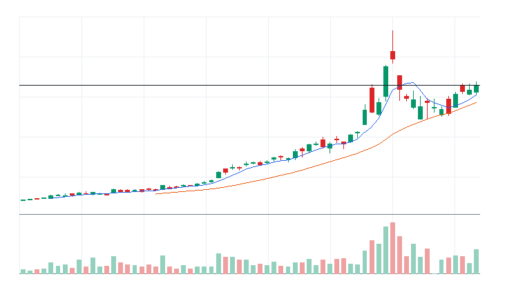
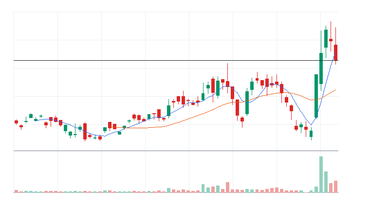
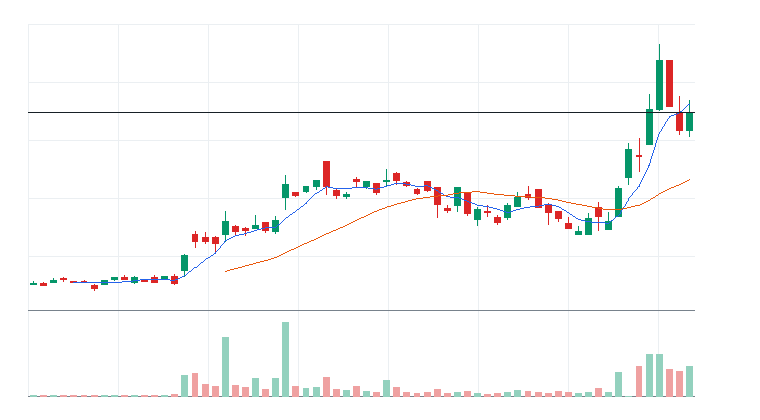
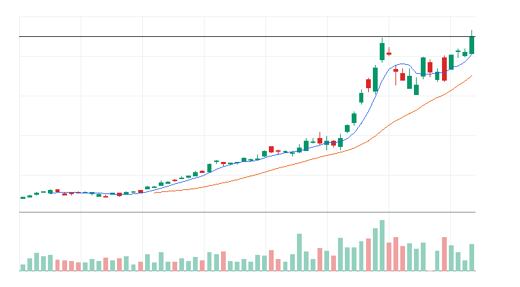

# 오늘의 데일리 트레이딩 요약

**REAL DATA TEST - 가격/거래량은 실제 데이터, 거래대금 유동성 일부 연결, 뉴스/ETF 구성종목 확산도 미연결**

**목적:** 이 리포트는 최근 오른 자산을 나열하는 것이 아니라, 돈이 몰리는 근거와 다음 매수 주체가 확인할 트레이딩 후보를 찾기 위한 보고서다.

> 핵심 질문: 현재 가격에서 누가 사고 있고, 누가 앞으로 더 비싸게 사줄 수 있는가?

## 모바일 요약

[오늘의 데일리 트레이딩 요약]

생성 성공 / 데이터 모드: REAL_TEST

시장:
- 위험선호

시장 지배 서사:
1. AI 반도체/HBM 공급망 - 관찰 - 069500.KS, 005930.KS, 000660.KS 중심으로 5일 +22.79%, 20일 +38.28% 흐름이 형성됨. 뉴스 직접성 제한.
2. 자동차/부품 수출 모멘텀 - 약화 - 069500.KS, 005380.KS 중심으로 5일 +9.95%, 20일 +14.32% 흐름이 형성됨. 뉴스 직접성 제한.

트렌드 강도:
1. AI 반도체/HBM 공급망 - TSI 64 - 약화 - 진입품질 낮음
2. 자동차/부품 수출 모멘텀 - TSI 52 - 약화 - 진입품질 낮음

오늘 결론:
- IT 개별 종목 흐름이 ETF 대비 강한지 확인 필요
- 행동 후보는 linkedNarrative와 함께 확인한다.
- 추격보다 진입 조건 확인 후 접근한다.

오늘 실제 행동 후보:
1. 행동 후보 없음 - 미분류 - 조건 충족 후보 없음

다크호스 후보:
1. 다크호스 후보 없음 - 조건 충족 후보 없음

ETF 후보 TOP 5:
1. 069500.KS - AI 반도체/HBM 공급망 - 거래량 확인 전 관찰
2. 229200.KS - 미분류 - 거래량 확인 전 관찰

웹 리포트:
https://yoolcool.github.io/DailyTradingThesisAgent/

## 오늘 결론

- 오늘 결론: 신규 추격 없음 / 관찰
- 신규 진입 후보: 0개
- 조건부 진입 후보: 0개
- 관찰 후보: 200개
- 주요 제한 요인: Entry Quality < 40, 뉴스 직접성 부족, 과열 위험
- 주문 판단: 지정가 권장 / 시장가 주의
- 실전 판단: 오늘은 추세 후보는 있으나, 왜 돈이 몰리는가와 누가 더 비싸게 사줄 수 있는가를 주문 실행 신뢰도와 거래량이 충분히 뒷받침하지 못해 신규 추격은 보류한다. 기존 관심 종목은 전일 고점 돌파와 RVOL 1.00x 회복을 확인한 뒤 조건부로 본다.

### 후보 제한 요인 집계

- RVOL < 1.00x: 169개
- 거래대금 유동성 낮음: 0개
- Entry Quality 50~54 near miss: 0개
- Entry Quality 40~49 관찰: 0개
- Entry Quality < 40: 202개
- Exhaustion Risk >= 70: 185개
- ETF breadth 샘플 부족: 2개
- 뉴스 직접성 부족: 202개

## 데이터 신뢰도

- 전체 데이터 신뢰도 등급: LOW
- 분석 신뢰도: LOW
- 주문 실행 신뢰도: MEDIUM
- ETF breadth 신뢰도: LOW
- 신뢰도 해석: 테마 확산 판단 제한, 프리/애프터마켓 확인 불가
- 리포트 생성 시각: 2026-06-18 15:38 KST
- 가격 기준 거래일: 2026-06-18 US regular close
- 뉴스 수집 시각: 2026-06-18 15:38 KST
- 가장 최근 뉴스 발행 시각: 데이터 없음
- 뉴스 신선도 상태: UNKNOWN
- 뉴스 소스: DART
- 뉴스 소스 상태: DART DISABLED
- 뉴스 신뢰도: LOW
- 추천 적용 거래일: 2026-06-18 US regular session
- 가격/거래량 데이터 상태: 연결됨
- 뉴스 데이터 상태: 미연결
- ETF 구성종목 확산도 상태: 미연결
- ETF 구성종목 샘플 수: 0
- 거래대금 유동성 데이터 상태: 일부 연결
- 프리마켓/애프터마켓 데이터 상태: UNAVAILABLE
- 데이터 provider: yfinance, DART, config fallback sample, price-volume dollar-volume fallback
- 실전 사용 경고: 이 리포트는 투자판단 보조용이며, REAL_TEST 모드에서는 일부 데이터가 누락되거나 지연될 수 있다. 실제 주문 전 현재가, 뉴스, 프리마켓/정규장 거래량을 별도 확인해야 한다.

## 0. 시장 상태

- 데이터 모드: REAL_TEST
- 가격/거래량: 연결됨
- 뉴스: 미연결
- ETF 구성종목 확산도: 미연결
- 거래대금 유동성: 일부 연결
- 생성 시각: 2026년 6월 18일 목요일 오후 3:38
- 시장 상태: 위험선호
- 오늘 돈의 방향: IT 개별 종목 흐름이 ETF 대비 강한지 확인 필요
- 강한 테마 TOP 3: 성장/테마 ETF(35), IT(31), Constructions(20)
- 데이터 한계:
  - API 또는 provider 상태에 따라 뉴스/ETF 확산도/거래대금 유동성 반영 범위가 달라질 수 있다.
  - 수집 실패 데이터는 점수 반영에서 제외하거나 confidence를 제한한다.
  - reasonConfidence HIGH는 직접 촉매, 가격/거래량, 확산도/유동성 근거가 함께 있을 때만 사용한다.

## 오늘 시장을 지배하는 서사

### 오늘 시장을 지배하는 서사 TOP 3

#### 1. AI 반도체/HBM 공급망
- 상태: 관찰
- narrativeScore: 69
- reasonConfidence: LOW
- 근거 ETF: 069500.KS
- 근거 개별 종목: 005930.KS, 000660.KS
- 돈이 몰리는 이유: AI 반도체/HBM 공급망 관련 069500.KS와 005930.KS, 000660.KS의 5일(+22.79%)·20일(+38.28%) 흐름을 함께 본다. 평균 상대 거래량은 0.94배이고, ETF 확산도는 추가 확인이 필요하다. 뉴스 직접성은 아직 제한적이다.
- 다음 매수 주체: HBM과 AI 서버 공급망 회복을 확인한 국내 대형주 및 반도체 섹터 자금
- 가장 좋은 트레이딩 수단: ETF 우선: 069500.KS / 개별 종목 우선: 005930.KS, 000660.KS
- 서사가 깨지는 조건: KOSPI200 약세 전환 또는 삼성전자/SK하이닉스가 20일선을 동반 이탈
- 오늘 행동: 추격보다 대형 반도체 동조성과 거래대금 회복 확인

상세 narrativeScore 근거 보기

- rawScore: 69
- ETF 평균 moneyFlowScore: 69
- 개별 종목 평균 moneyFlowScore: 72
- ETF 후보 비율: 0%
- 개별 종목 후보 비율: 0%
- 5일 평균 수익률: +23.00%
- 20일 평균 수익률: +38.00%
- 평균 상대 거래량: 1.00배
- ETF 평균 상대 거래량: 1.00배
- 개별주 평균 상대 거래량: 1.00배
- 52주 고점 근접 후보 비율: 100%
- 뉴스 직접성 점수: 0
- ETF 확산도 점수: 0
- 유동성 점수: 5
- 과열 리스크 차감: -3

#### 2. 자동차/부품 수출 모멘텀
- 상태: 약화
- narrativeScore: 36
- reasonConfidence: LOW
- 근거 ETF: 069500.KS
- 근거 개별 종목: 005380.KS
- 돈이 몰리는 이유: 자동차/부품 수출 모멘텀 관련 069500.KS와 005380.KS의 5일(+9.95%)·20일(+14.32%) 흐름을 함께 본다. 평균 상대 거래량은 0.70배이고, ETF 확산도는 추가 확인이 필요하다. 뉴스 직접성은 아직 제한적이다.
- 다음 매수 주체: 원화 약세, 수출 호조, 주주환원을 확인한 국내 대형 가치/수출주 자금
- 가장 좋은 트레이딩 수단: ETF 우선: 069500.KS / 개별 종목 우선: 005380.KS
- 서사가 깨지는 조건: 자동차 대표주가 20일선을 이탈하거나 KOSPI200 대비 상대강도가 약화
- 오늘 행동: 시장 대비 상대강도와 거래대금이 유지될 때만 선별 관찰

상세 narrativeScore 근거 보기

- rawScore: 36
- ETF 평균 moneyFlowScore: 69
- 개별 종목 평균 moneyFlowScore: 0
- ETF 후보 비율: 0%
- 개별 종목 후보 비율: 0%
- 5일 평균 수익률: +10.00%
- 20일 평균 수익률: +14.00%
- 평균 상대 거래량: 1.00배
- ETF 평균 상대 거래량: 1.00배
- 개별주 평균 상대 거래량: 1.00배
- 52주 고점 근접 후보 비율: 50%
- 뉴스 직접성 점수: 0
- ETF 확산도 점수: 0
- 유동성 점수: 3
- 과열 리스크 차감: 0

### 전체 narrative 요약

| 서사명 | 상태 | narrativeScore | reasonConfidence | 대표 ETF | 대표 종목 | 오늘 행동 |
| --- | --- | ---: | --- | --- | --- | --- |
| AI 반도체/HBM 공급망 | 관찰 | 69 | LOW | 069500.KS | 005930.KS, 000660.KS | 추격보다 대형 반도체 동조성과 거래대금 회복 확인 |
| 자동차/부품 수출 모멘텀 | 약화 | 36 | LOW | 069500.KS | 005380.KS | 시장 대비 상대강도와 거래대금이 유지될 때만 선별 관찰 |

## 트렌드 강도 판단

### 1. AI 반도체/HBM 공급망
- Trend Strength Index: 64
- 트렌드 상태 라벨: 약화
- 테마 확산도: 보통
- ETF 동조성: 강함
- 거래량 강도: 부족
- 과열 위험: 높음 (81)
- 오늘 진입 품질: 낮음 (14)
- 한 줄 판단: AI 반도체/HBM 공급망는 관찰 가능한 흐름은 있으나 가격, 거래량, 확산도 중 일부 확인이 더 필요하다.
- 오늘 접근법: 상승률이 남아 있어도 069500.KS와 구성 종목 확산도가 회복될 때까지 신규 진입은 낮춘다.

트렌드 강도 상세 근거 보기

- 가격 모멘텀: 가격 모멘텀 29/25. 평균 5D +22.79%, 20D +38.28%.
- 거래량 강도: 거래량 강도 4/20. 평균 RVOL 0.94배.
- ETF 동조성: ETF 동조성 15/15. 관련 ETF 069500.KS 흐름을 기준으로 판단.
- 테마 확산도: 테마 확산도 12/20. 상위 1~2개 쏠림 감점 3점 반영.
- 뉴스 촉매: 뉴스/촉매 신선도 0/10. HIGH 직접 촉매 0개.
- 과열 리스크: 과열 리스크 81/100. 단기 급등, 고점 근접, ETF-개별주 괴리, 쏠림을 함께 반영.
- 시장 환경: 시장 환경 4/10. QQQ/SPY/IWM 가격 흐름 기반 위험선호 점수.

### 2. 자동차/부품 수출 모멘텀
- Trend Strength Index: 52
- 트렌드 상태 라벨: 약화
- 테마 확산도: 약함
- ETF 동조성: 강함
- 거래량 강도: 부족
- 과열 위험: 보통 (41)
- 오늘 진입 품질: 낮음 (16)
- 한 줄 판단: 자동차/부품 수출 모멘텀는 관찰 가능한 흐름은 있으나 가격, 거래량, 확산도 중 일부 확인이 더 필요하다.
- 오늘 접근법: 상승률이 남아 있어도 069500.KS와 구성 종목 확산도가 회복될 때까지 신규 진입은 낮춘다.

트렌드 강도 상세 근거 보기

- 가격 모멘텀: 가격 모멘텀 23/25. 평균 5D +9.95%, 20D +14.32%.
- 거래량 강도: 거래량 강도 3/20. 평균 RVOL 0.70배.
- ETF 동조성: ETF 동조성 15/15. 관련 ETF 069500.KS 흐름을 기준으로 판단.
- 테마 확산도: 테마 확산도 7/20. 상위 1~2개 쏠림 감점 4점 반영.
- 뉴스 촉매: 뉴스/촉매 신선도 0/10. HIGH 직접 촉매 0개.
- 과열 리스크: 과열 리스크 41/100. 단기 급등, 고점 근접, ETF-개별주 괴리, 쏠림을 함께 반영.
- 시장 환경: 시장 환경 4/10. QQQ/SPY/IWM 가격 흐름 기반 위험선호 점수.

## 최근 추천 결과 트래킹

개별주는 데이트레이딩 관점으로 추천 이후 첫 정규장의 장중 최고가와 종가를 추적한다. ETF는 테마/스윙 관점으로 추천 이후 1주일 동안의 최고가와 현재 종가를 추적한다.

### 개별주 Top 3 추천 성과 요약
- 최근 5개 리포트 표본: 0개 (초기 검증 단계)
- 장중 최고가 기준 성공률: 데이터 없음
- 종가 기준 성공률: 데이터 없음
- 평균 장중 최고 수익률: 데이터 없음
- 평균 종가 수익률: 데이터 없음

### ETF 추천 성과 요약
- 최근 5개 리포트 표본: 0개 (초기 검증 단계)
- 1주 최고가 기준 성공률: 데이터 없음
- 현재 종가 기준 성공률: 데이터 없음
- 평균 1주 최고 수익률: 데이터 없음
- 평균 현재 수익률: 데이터 없음

최근 추천 결과 상세 테이블 펼치기

| 추천일 | 유형 | 순위 | 티커 | 기준가 | 추적 기간 | 상태 | High 수익률 | Close 수익률 | 결과 | 코멘트 |
| --- | --- | ---: | --- | ---: | --- | --- | ---: | ---: | --- | --- |
| - | - | - | 데이터 없음 | - | - | - | - | - | - | - |

## 오늘 실제 행동 후보

오늘은 추세 후보는 있으나, 왜 돈이 몰리는가와 누가 더 비싸게 사줄 수 있는가를 주문 실행 신뢰도와 거래량이 충분히 뒷받침하지 못해 신규 추격은 보류한다. 기존 관심 종목은 전일 고점 돌파와 RVOL 1.00x 회복을 확인한 뒤 조건부로 본다.

## 다크호스 후보

다크호스 후보 없음. 상위 서사 정렬, MA20 위 안착, MA5/MA20 구조 개선, RVOL 0.90x 이상 조건을 동시에 충족한 개별주가 없다.

- darkHorseScore: 조건 충족 후보 없음
- 왜 아직 메인이 아닌가: 확인 조건을 통과한 보조 관찰 후보가 없다.

darkHorseScore 상세 근거 보기

- 서사 정렬: 조건 미충족
- 초기 추세 구조: 조건 미충족
- 베이스 돌파/정돈: 조건 미충족
- 거래량 확인: 조건 미충족
- rawScore: 데이터 없음

## 참고용 행동 후보

> 실제 행동 후보가 없는 날에만 표시한다. 아래 후보는 매수 추천이 아니라 다음 정규장에서 전일 고점 돌파, RVOL 1.00x 이상, 거래대금 유동성 확인을 기다리는 관찰 리스트다.

### ETF 참고 후보 TOP 3

#### 1. [069500.KS] KODEX 200
- 상태: 참고용 관찰 후보
- todayActionLabel: 거래량 확인 전 관찰
- 제한 사유: Entry Quality 21 < 40; Exhaustion Risk 81 >= 70; RVOL 0.85x < 1.00x
- 주문 실행: 시장가 가능
- moneyFlowScore: 69
- Entry Quality: 21 (낮음)
- RVOL: 0.85x
- 진입 전 확인: 상대 거래량 1.0배 회복 후 관찰
- 무효화: 거래량 회복 실패

#### 2. [229200.KS] KODEX KOSDAQ150
- 상태: 참고용 관찰 후보
- todayActionLabel: 거래량 확인 전 관찰
- 제한 사유: Entry Quality 0 < 40; RVOL 0.49x < 1.00x
- 주문 실행: 시장가 가능
- moneyFlowScore: 0
- Entry Quality: 데이터 없음 (데이터 없음)
- RVOL: 0.49x
- 진입 전 확인: 상대 거래량 1.0배 회복 후 관찰
- 무효화: 거래량 회복 실패

### 개별주 참고 후보 TOP 3

#### 1. [011070.KS] LG Innotek
- 상태: 참고용 관찰 후보
- todayActionLabel: 추격 금지
- 제한 사유: Entry Quality 28 < 40; Exhaustion Risk 81 >= 70
- 주문 실행: 시장가 가능
- moneyFlowScore: 86
- Entry Quality: 28 (낮음)
- RVOL: 1.08x
- 진입 전 확인: 20일선 위 눌림 후 재상승 확인
- 무효화: 20일선 이탈 또는 상대 거래량 0.8배 이하 둔화

#### 2. [204320.KS] HL Mando
- 상태: 참고용 관찰 후보
- todayActionLabel: 추격 금지
- 제한 사유: Entry Quality 27 < 40; Exhaustion Risk 81 >= 70
- 주문 실행: 시장가 가능
- moneyFlowScore: 80
- Entry Quality: 27 (낮음)
- RVOL: 1.91x
- 진입 전 확인: 20일선 위 눌림 후 재상승 확인
- 무효화: 20일선 이탈 또는 상대 거래량 0.8배 이하 둔화

#### 3. [402340.KS] SK Square
- 상태: 참고용 관찰 후보
- todayActionLabel: 추격 금지
- 제한 사유: Entry Quality 10 < 40; Exhaustion Risk 81 >= 70
- 주문 실행: 시장가 가능
- moneyFlowScore: 94
- Entry Quality: 10 (낮음)
- RVOL: 1.10x
- 진입 전 확인: 전일 고점 돌파와 5일선 유지 확인
- 무효화: 20일선 이탈 또는 상대 거래량 0.8배 이하 둔화

## 오늘 돈이 몰리는 테마

- 성장/테마 ETF: 069500.KS, 229200.KS | 평균 moneyFlowScore 35 | 관심은 유지하되 우선순위는 낮추고 추가 거래량 확인을 기다린다.
- IT: 042700.KS, 307950.KS, 007660.KS, 003550.KS, 064400.KS, 034220.KS, 066570.KS, 011070.KS | 평균 moneyFlowScore 31 | 관심은 유지하되 우선순위는 낮추고 추가 거래량 확인을 기다린다.
- Constructions: 047040.KS, 000210.KS, 375500.KS, 006360.KS, 300720.KS, 000720.KS, 002380.KS, 052690.KS | 평균 moneyFlowScore 20 | 관심은 유지하되 우선순위는 낮추고 추가 거래량 확인을 기다린다.
- Financials: 138930.KS, 005830.KS, 086790.KS, 088350.KS, 001450.KS, 139130.KS, 024110.KS, 175330.KS | 평균 moneyFlowScore 18 | 관심은 유지하되 우선순위는 낮추고 추가 거래량 확인을 기다린다.
- Heavy Industries: 112610.KS, 000150.KS, 241560.KS, 034020.KS, 454910.KS, 082740.KS, 042660.KS, 267260.KS | 평균 moneyFlowScore 16 | 관심은 유지하되 우선순위는 낮추고 추가 거래량 확인을 기다린다.
- Consumer Discretionary: 021240.KS, 007340.KS, 192080.KS, 383220.KS, 114090.KS, 180640.KS, 161390.KS, 000240.KS | 평균 moneyFlowScore 14 | 관심은 유지하되 우선순위는 낮추고 추가 거래량 확인을 기다린다.

## 1. ETF 트레이딩 보고서
### 1-1. ETF 결론
- ETF 우선 후보: 없음
- ETF 관찰 후보: 069500.KS, 229200.KS
- ETF 매매 금지: 229200.KS
- 오늘 ETF 최우선 1개: 없음
- ETF 섹션 해석: 이 섹션은 개별 종목 선택이 아니라 테마/섹터 단위 자금 흐름을 ETF로 매매할지 판단하기 위한 영역이다.

### 1-2. ETF 후보 TOP 5

선정 기준: ETF 후보는 가격/거래량 1차 점수에 뉴스, ETF 구성종목 확산도, 유동성, 리스크 패널티를 반영한 finalRawScore 기준으로 정렬한다. 표시 점수 100점 후보가 겹치면 tieBreakerReason으로 우선순위를 설명한다.

### [ETF 069500.KS] KODEX 200
- 자산 유형: ETF
- ETF 세부 카테고리: 성장/테마 ETF
- ETF 역할: 테마 베타 매수
- 상태: 관찰
- linkedNarrative: AI 반도체/HBM 공급망
- narrativeStatus: 관찰
- narrativeScore: 69
- moneyFlowScore: 69
- finalRawScore: 69
- tieBreakerReason: 최종 원점수 69, 리스크 패널티 -10, 5일 수익률 +18.74%, 상대 거래량 0.85배 순으로 정렬
- 과열 리스크: 낮음~중간
- reasonConfidence: LOW
- reasonConfidenceExplanation: 가격/거래량이 약하거나 핵심 보조 근거가 부족해 LOW로 분류했다.

- todayActionLabel: 거래량 확인 전 관찰
- 주문 실행: 시장가 가능
- 기준일: 2026-06-18
- 종가: $147,065
- 1일 수익률: +3.53%
- 5일 수익률: +18.74%
- 20일 수익률: +28.65%
- 상대 거래량: 0.85배
- 52주 고점 대비 위치: -0.08%
- whyMoneyIsFlowing: 최근 수익률은 확인되지만 상대 거래량 0.85배라 신규 자금 유입 강도는 약함. 유동성: LIQUID
- likelyNextBuyer: 섹터 베타를 노리는 단기 모멘텀 자금과 리밸런싱 자금
- whyThisCouldTradeHigher: 52주 고점 부근이라 돌파가 확인되면 신고가 추종 매수가 붙을 수 있음
- 진입 조건: 상대 거래량 1.0배 회복 후 관찰
- 무효화 조건: 거래량 회복 실패
- 차트: 

#### 상세 근거

069500.KS 상세 근거 펼치기

- moneyFlowScore(최종) 산정 근거:
  - moneyFlowScore(1차): 74
  - 최종 원점수: 69
  - 최종 표시 점수: 69
  - cap 적용: cap 미적용
  - 계산식: +74 + 0 + 0 + +5 + 0 - 10 + 0 = 69
  - 점수 해석: 관심 후보. 눌림 또는 돌파 확인 후 진입 검토.
  - 가격/거래량 1차 점수: +74
    - 추세: +24
    - 단기 모멘텀: +16
    - 중기 모멘텀: +16
    - 거래량: -8
    - 신고가 근접: +12
    - 이동평균: +14
  - 하위 점수 cap:
    - 가격 모멘텀: 원점수 +24, 상한 적용 +24 / 최대 25
    - 단기 모멘텀: 원점수 +16, 상한 적용 +16 / 최대 20
    - 중기 모멘텀: 원점수 +19, 상한 적용 +16 / 최대 16 (cap 적용)
    - 거래량: 원점수 -8, 상한 적용 -8 / 최대 20
    - 신고가 근접: 원점수 +12, 상한 적용 +12 / 최대 12
    - 이동평균: 원점수 +14, 상한 적용 +14 / 최대 14
  - 추가 데이터 가감점:
    - 뉴스: 0
    - 유동성: +5
  - ETF 확산도: 0
  - 리스크 패널티: -10
  - 주요 근거: 1차 74, 최종 원점수 69, 표시 69. 20일 수익률 강함, 5일 수익률 강함, 1일 단기 모멘텀 확인. 주의: 단기 과열/추격 위험 존재, 뉴스 데이터 미연결 또는 수집 실패.
  - 리스크 패널티 산정 근거:
    - 총 리스크 패널티: -10
    - 리스크 등급: MEDIUM
    - 감점된 리스크:
      - short-term overheat: -6 | 근거: 5d return +18.74% is extended. | 대응: Prefer pullback or prior high reclaim over chasing.
      - volume divergence: -4 | 근거: 5d price strength is not confirmed by relative volume 0.85x. | 대응: Require relative volume recovery above 1.0x.
    - 관찰 리스크: news data not connected or unavailable; ETF breadth data not connected
    - 한 줄 해석: 2개 감점 리스크로 총 -10점 반영.
- 데이터 사용 현황:
  - 가격/거래량: 사용
  - 뉴스: 미연결
  - ETF 확산도: 미연결
  - 거래대금 유동성: 사용
  - 관련 ETF 상대강도: 사용
- 뉴스 확인:
  - 최근 뉴스 상태: 미연결
  - 뉴스 소스: DART
  - 소스별 상태: DART DISABLED
  - 긍정/중립/부정: 0/0/0
  - 직접성/방향성/신선도: 0/0/0
  - 강한 촉매 수: 0
  - 직접 촉매: 없음
  - 보조 뉴스: 없음
  - 뉴스 수집 시각: 2026-06-18 15:38 KST
  - 가장 최근 뉴스 발행 시각: 데이터 없음
  - 뉴스 신선도 상태: UNKNOWN
  - 뉴스 이후 가격 반응: 긍정
  - 가격 반응 점수 제한: 뉴스 이후 가격 반응과 점수 제한 특이사항 없음
  - 핵심 뉴스 요약: 의미 있는 신규 DART 공시 없음
  - 원점수/상한 점수: 0 / 0
  - 점수 반영: 0
  - 주의: DART_API_KEY not configured; 해당 티커의 의미 있는 신규 DART 공시가 없거나 API 결과가 비어 있음
- ETF 구성종목 확산도:
  - 구성종목 데이터 상태: 미연결
  - 샘플 수: 0/0
  - 샘플 신뢰도: UNKNOWN
  - 상승 종목 비율: 데이터 없음
  - 20일선 위 비율: 데이터 없음
  - 50일선 위 비율: 데이터 없음
  - 상위 기여 종목: 데이터 없음
  - 확산도 판단: UNKNOWN
  - 원점수/샘플 상한/반영 점수: 0 / N/A / 0
  - 점수 반영: 0
- 거래대금 유동성:
  - 데이터 상태: 일부 연결
  - 거래대금 기준 유동성: LIQUID
  - 거래대금: $2,598,517,809,635
  - 평균 거래대금: $3,053,990,762,225
  - 주문 영향: 시장가 가능
  - 매매 영향: 거래대금이 충분해 시장가 가능 범위로 본다
- reasonConfidence 근거: 가격/거래량이 약하거나 주요 데이터가 부족해 낮음.
- 차트 요약: 최근 20거래일 기준 5일선이 20일선 위에 있음
- 기준일 2026-06-18 | 종가 $147,065 | 1일 +3.53% | 5일 +18.74% | 20일 +28.65% | 상대 거래량 0.85배 | 52주 고점 대비 -0.08% | 데이터 소스: yfinance

### [ETF 229200.KS] KODEX KOSDAQ150
- 자산 유형: ETF
- ETF 세부 카테고리: 성장/테마 ETF
- ETF 역할: 테마 베타 매수
- 상태: 관찰
- linkedNarrative: 미분류
- narrativeStatus: 관찰
- narrativeScore: 0
- moneyFlowScore: 0
- finalRawScore: -22
- tieBreakerReason: 최종 원점수 -22, 리스크 패널티 -6, 5일 수익률 +0.06%, 상대 거래량 0.49배 순으로 정렬
- 과열 리스크: 낮음
- reasonConfidence: LOW
- reasonConfidenceExplanation: 가격/거래량이 약하거나 핵심 보조 근거가 부족해 LOW로 분류했다.

- todayActionLabel: 거래량 확인 전 관찰
- 주문 실행: 시장가 가능
- 기준일: 2026-06-18
- 종가: $17,645
- 1일 수익률: -3.13%
- 5일 수익률: +0.06%
- 20일 수익률: -2.73%
- 상대 거래량: 0.49배
- 52주 고점 대비 위치: -18.78%
- whyMoneyIsFlowing: 최근 수익률은 확인되지만 상대 거래량 0.49배라 신규 자금 유입 강도는 약함. 유동성: LIQUID
- likelyNextBuyer: 섹터 베타를 노리는 단기 모멘텀 자금과 리밸런싱 자금
- whyThisCouldTradeHigher: 단기 추세가 유지되고 거래량이 1.0배 이상이면 눌림 이후 재상승을 시도할 수 있음
- 진입 조건: 상대 거래량 1.0배 회복 후 관찰
- 무효화 조건: 거래량 회복 실패
- 차트: 

#### 상세 근거

229200.KS 상세 근거 펼치기

- moneyFlowScore(최종) 산정 근거:
  - moneyFlowScore(1차): 0
  - 최종 원점수: -22
  - 최종 표시 점수: 0
  - cap 적용: raw score -22 capped to displayed score 0
  - 계산식: -21 + 0 + 0 + +5 + 0 - 6 + 0 = -22 -> 0
  - 점수 해석: 매매 금지 또는 우선순위 낮은 후보.
  - 가격/거래량 1차 점수: -21
    - 추세: -1
    - 단기 모멘텀: -4
    - 중기 모멘텀: -2
    - 거래량: -8
    - 신고가 근접: 0
    - 이동평균: -6
  - 하위 점수 cap:
    - 가격 모멘텀: 원점수 -1, 상한 적용 -1 / 최대 25
    - 단기 모멘텀: 원점수 -4, 상한 적용 -4 / 최대 20
    - 중기 모멘텀: 원점수 -2, 상한 적용 -2 / 최대 16
    - 거래량: 원점수 -8, 상한 적용 -8 / 최대 20
    - 신고가 근접: 원점수 0, 상한 적용 0 / 최대 12
    - 이동평균: 원점수 -6, 상한 적용 -6 / 최대 14
  - 추가 데이터 가감점:
    - 뉴스: 0
    - 유동성: +5
  - ETF 확산도: 0
  - 리스크 패널티: -6
  - 주요 근거: 1차 0, 최종 원점수 -22, 표시 0. 거래대금 기준 유동성 양호. 주의: 단기 과열/추격 위험 존재, 뉴스 데이터 미연결 또는 수집 실패.
  - 리스크 패널티 산정 근거:
    - 총 리스크 패널티: -6
    - 리스크 등급: LOW
    - 감점된 리스크:
      - 20d moving average break risk: -6 | 근거: Close is below the 20-day moving average. | 대응: Hold off until 20-day moving average is recovered.
    - 관찰 리스크: news data not connected or unavailable; ETF breadth data not connected
    - 한 줄 해석: 1개 감점 리스크로 총 -6점 반영.
- 데이터 사용 현황:
  - 가격/거래량: 사용
  - 뉴스: 미연결
  - ETF 확산도: 미연결
  - 거래대금 유동성: 사용
  - 관련 ETF 상대강도: 사용
- 뉴스 확인:
  - 최근 뉴스 상태: 미연결
  - 뉴스 소스: DART
  - 소스별 상태: DART DISABLED
  - 긍정/중립/부정: 0/0/0
  - 직접성/방향성/신선도: 0/0/0
  - 강한 촉매 수: 0
  - 직접 촉매: 없음
  - 보조 뉴스: 없음
  - 뉴스 수집 시각: 2026-06-18 15:38 KST
  - 가장 최근 뉴스 발행 시각: 데이터 없음
  - 뉴스 신선도 상태: UNKNOWN
  - 뉴스 이후 가격 반응: 부정
  - 가격 반응 점수 제한: 뉴스 이후 가격 반응과 점수 제한 특이사항 없음
  - 핵심 뉴스 요약: 의미 있는 신규 DART 공시 없음
  - 원점수/상한 점수: 0 / 0
  - 점수 반영: 0
  - 주의: DART_API_KEY not configured; 해당 티커의 의미 있는 신규 DART 공시가 없거나 API 결과가 비어 있음
- ETF 구성종목 확산도:
  - 구성종목 데이터 상태: 미연결
  - 샘플 수: 0/0
  - 샘플 신뢰도: UNKNOWN
  - 상승 종목 비율: 데이터 없음
  - 20일선 위 비율: 데이터 없음
  - 50일선 위 비율: 데이터 없음
  - 상위 기여 종목: 데이터 없음
  - 확산도 판단: UNKNOWN
  - 원점수/샘플 상한/반영 점수: 0 / N/A / 0
  - 점수 반영: 0
- 거래대금 유동성:
  - 데이터 상태: 일부 연결
  - 거래대금 기준 유동성: LIQUID
  - 거래대금: $280,975,309,840
  - 평균 거래대금: $571,381,113,445
  - 주문 영향: 시장가 가능
  - 매매 영향: 거래대금이 충분해 시장가 가능 범위로 본다
- reasonConfidence 근거: 가격/거래량이 약하거나 주요 데이터가 부족해 낮음.
- 차트 요약: 20일선 아래라 추세 확인 전까지 보수적 접근
- 기준일 2026-06-18 | 종가 $17,645 | 1일 -3.13% | 5일 +0.06% | 20일 -2.73% | 상대 거래량 0.49배 | 52주 고점 대비 -18.78% | 데이터 소스: yfinance

### 1-3. ETF 과열/주의 후보

#### [069500.KS] KODEX 200
- moneyFlowScore(최종): 69
- moneyFlowScore 산정 근거 요약: 1차 74, 최종 원점수 69, 표시 69. 20일 수익률 강함, 5일 수익률 강함, 1일 단기 모멘텀 확인. 주의: 단기 과열/추격 위험 존재, 뉴스 데이터 미연결 또는 수집 실패.
- 과열 리스크: 낮음~중간
- 과열 근거: 테마 ETF 기준 단기 급등과 고점 근접 조합 확인
- 대응: 돌파 확인 후 진입

### 1-4. ETF 제외/매매 금지 후보

#### [229200.KS] KODEX KOSDAQ150
- moneyFlowScore(최종): 0
- moneyFlowScore 산정 근거 요약: 1차 0, 최종 원점수 -22, 표시 0. 거래대금 기준 유동성 양호. 주의: 단기 과열/추격 위험 존재, 뉴스 데이터 미연결 또는 수집 실패.
- 제외 사유: 테마 자금 흐름 약함
- 해제 조건: 상대 거래량 1.0배 회복 후 관찰

## 2. 개별 종목 트레이딩 보고서
### 2-1. 오늘 Nasdaq-100 신규 발굴 요약
- 신규 발굴 풀: Nasdaq-100 구성종목 전체
- universe source: C:\Users\yool\Documents\Daily Trading Thesis Agent\config\markets\kr\kospi200Fallback.json
- universe fetchStatus: MARKET_DATA
- 총 스캔 종목 수: 200
- 데이터 수집 성공: 200
- 데이터 수집 실패: 0
- 상세 데이터 수집 대상: 가격/거래량 1차 스캔 상위 20개
- 오늘 진입 후보: 0
- 오늘 눌림 대기: 0
- 오늘 관찰: 198
- 오늘 매매 금지: 2
- 개별 종목 진입 후보: 없음
- 개별 종목 눌림 대기: 없음
- 개별 종목 매매 금지: 없음
- 오늘 개별 종목 최우선 1개: 없음
- 개별 종목 섹션 해석: 이 섹션은 ETF로 확인된 테마 자금 흐름 안에서 ETF보다 더 강한 돌파 가능성이 있는 개별 종목만 선별하는 영역이다.

### 2-2. 오늘 개별 종목 신규 후보 TOP 5

선정 기준:
1. Nasdaq-100 전체를 moneyFlowScore(1차)로 먼저 스캔
2. moneyFlowScore(1차) 상위 20개를 상세 분석
3. 뉴스/유동성/관련 ETF 대비 상대강도/리스크 패널티를 반영
4. moneyFlowScore(최종), 최종 원점수, 리스크 패널티, 5일 수익률, 상대 거래량 순으로 재정렬

### [011070.KS] LG Innotek
- 자산 유형: STOCK
- 상태: 관찰
- primaryTheme: IT
- primarySector: IT
- relatedEtfs: 069500.KS, 229200.KS
- linkedNarrative: AI 반도체/HBM 공급망
- narrativeStatus: 관찰
- narrativeScore: 69
- moneyFlowScore: 86
- finalRawScore: 86
- tieBreakerReason: 최종 원점수 86, 리스크 패널티 -6, 5일 수익률 +20.34%, 상대 거래량 1.08배 순으로 정렬
- 과열 리스크: 낮음
- reasonConfidence: MEDIUM
- reasonConfidenceExplanation: 직접 촉매 부재, 뉴스 미사용 때문에 HIGH가 아니라 MEDIUM으로 제한했다.

- todayActionLabel: 추격 금지
- 주문 실행: 시장가 가능
- 기준일: 2026-06-18
- 종가: $1,290,000
- 1일 수익률: +3.37%
- 5일 수익률: +20.34%
- 20일 수익률: +62.67%
- 상대 거래량: 1.08배
- 52주 고점 대비 위치: -27.85%
- 관련 ETF 대비 상대강도: 관련 ETF보다 강함 | 주식 5일 +20.34% vs ETF 평균 +9.40%, 주식 20일 +62.67% vs ETF 평균 +12.96%, 상대 거래량 1.08배 vs ETF 평균 0.67배
- whyMoneyIsFlowing: 20일 +62.67%, 5일 +20.34%, 상대 거래량 1.08배로 가격과 거래량이 함께 개선. 유동성: LIQUID
- likelyNextBuyer: 개별 주도주를 따라붙는 단기 모멘텀 자금과 관련 ETF 강세를 확인한 트레이더
- whyThisCouldTradeHigher: 단기 추세가 유지되고 거래량이 1.0배 이상이면 눌림 이후 재상승을 시도할 수 있음
- 왜 ETF가 아니라 이 종목인가: 011070.KS가 관련 ETF 평균보다 5일/20일 흐름 또는 거래량에서 강해 개별 종목 우선 후보로 본다.
- ETF가 더 나은 경우: 011070.KS가 관련 ETF 평균보다 약하거나 거래량이 둔화되면 개별 종목보다 관련 ETF를 우선한다.
- 진입 조건: 20일선 위 눌림 후 재상승 확인
- 무효화 조건: 20일선 이탈 또는 상대 거래량 0.8배 이하 둔화
- 차트: 

#### 상세 근거

011070.KS 상세 근거 펼치기

- moneyFlowScore(최종) 산정 근거:
  - moneyFlowScore(1차): 81
  - 최종 원점수: 86
  - 최종 표시 점수: 86
  - cap 적용: cap 미적용
  - 계산식: +81 + 0 + 0 + +5 + +6 - 6 + 0 = 86
  - 점수 해석: 강한 자금 유입 후보. 단, 과열 여부 확인 필수.
  - 가격/거래량 1차 점수: +81
    - 추세: +25
    - 단기 모멘텀: +16
    - 중기 모멘텀: +16
    - 거래량: +10
    - 신고가 근접: 0
    - 이동평균: +14
  - 하위 점수 cap:
    - 가격 모멘텀: 원점수 +30, 상한 적용 +25 / 최대 25 (cap 적용)
    - 단기 모멘텀: 원점수 +16, 상한 적용 +16 / 최대 20
    - 중기 모멘텀: 원점수 +41, 상한 적용 +16 / 최대 16 (cap 적용)
    - 거래량: 원점수 +10, 상한 적용 +10 / 최대 20
    - 신고가 근접: 원점수 0, 상한 적용 0 / 최대 12
    - 이동평균: 원점수 +14, 상한 적용 +14 / 최대 14
    - 관련 ETF 상대강도: 원점수 +6, 상한 적용 +6 / 최대 8
  - 추가 데이터 가감점:
    - 뉴스: 0
    - 유동성: +5
  - ETF 대비 상대강도: +6
  - 리스크 패널티: -6
  - 주요 근거: 1차 81, 최종 원점수 86, 표시 86. 20일 수익률 강함, 5일 수익률 강함, 1일 단기 모멘텀 확인. 주의: 단기 과열/추격 위험 존재, 뉴스 데이터 미연결 또는 수집 실패.
  - 리스크 패널티 산정 근거:
    - 총 리스크 패널티: -6
    - 리스크 등급: LOW
    - 감점된 리스크:
      - short-term overheat: -6 | 근거: 5d return +20.34% is extended. | 대응: Prefer pullback or prior high reclaim over chasing.
    - 관찰 리스크: news data not connected or unavailable
    - 한 줄 해석: 1개 감점 리스크로 총 -6점 반영.
- 데이터 사용 현황:
  - 가격/거래량: 사용
  - 뉴스: 미연결
  - ETF 확산도: 관련 ETF에서 확인
  - 거래대금 유동성: 사용
  - 관련 ETF 상대강도: 사용
- 뉴스 확인:
  - 최근 뉴스 상태: 미연결
  - 뉴스 소스: DART
  - 소스별 상태: DART DISABLED
  - 긍정/중립/부정: 0/0/0
  - 직접성/방향성/신선도: 0/0/0
  - 강한 촉매 수: 0
  - 직접 촉매: 없음
  - 보조 뉴스: 없음
  - 뉴스 수집 시각: 2026-06-18 15:38 KST
  - 가장 최근 뉴스 발행 시각: 데이터 없음
  - 뉴스 신선도 상태: UNKNOWN
  - 뉴스 이후 가격 반응: 긍정
  - 가격 반응 점수 제한: 뉴스 이후 가격 반응과 점수 제한 특이사항 없음
  - 핵심 뉴스 요약: 의미 있는 신규 DART 공시 없음
  - 원점수/상한 점수: 0 / 0
  - 점수 반영: 0
  - 주의: DART_API_KEY not configured; 해당 티커의 의미 있는 신규 DART 공시가 없거나 API 결과가 비어 있음
- ETF 구성종목 확산도: 관련 ETF에서 확인
- 거래대금 유동성:
  - 데이터 상태: 일부 연결
  - 거래대금 기준 유동성: LIQUID
  - 거래대금: $923,055,630,000
  - 평균 거래대금: $856,281,360,000
  - 주문 영향: 시장가 가능
  - 매매 영향: 거래대금이 충분해 시장가 가능 범위로 본다
- reasonConfidence 근거: 가격/거래량, 거래대금 유동성, 관련 ETF 상대강도은 확인됐지만 일부 보조 데이터가 미연결 또는 fallback이라 중간으로 제한한다.
- 차트 요약: 최근 20거래일 기준 5일선이 20일선 위에 있음
- 기준일 2026-06-18 | 종가 $1,290,000 | 1일 +3.37% | 5일 +20.34% | 20일 +62.67% | 상대 거래량 1.08배 | 52주 고점 대비 -27.85% | 데이터 소스: yfinance

### [204320.KS] HL Mando
- 자산 유형: STOCK
- 상태: 관찰
- primaryTheme: Consumer Discretionary
- primarySector: Consumer Discretionary
- relatedEtfs: 069500.KS, 229200.KS
- linkedNarrative: AI 반도체/HBM 공급망
- narrativeStatus: 관찰
- narrativeScore: 69
- moneyFlowScore: 80
- finalRawScore: 80
- tieBreakerReason: 최종 원점수 80, 리스크 패널티 -6, 5일 수익률 +37.40%, 상대 거래량 1.91배 순으로 정렬
- 과열 리스크: 낮음
- reasonConfidence: MEDIUM
- reasonConfidenceExplanation: 직접 촉매 부재, 뉴스 미사용 때문에 HIGH가 아니라 MEDIUM으로 제한했다.

- todayActionLabel: 추격 금지
- 주문 실행: 시장가 가능
- 기준일: 2026-06-18
- 종가: $68,700
- 1일 수익률: -7.04%
- 5일 수익률: +37.40%
- 20일 수익률: +26.99%
- 상대 거래량: 1.91배
- 52주 고점 대비 위치: -13.15%
- 관련 ETF 대비 상대강도: 관련 ETF보다 강함 | 주식 5일 +37.40% vs ETF 평균 +9.40%, 주식 20일 +26.99% vs ETF 평균 +12.96%, 상대 거래량 1.91배 vs ETF 평균 0.67배
- whyMoneyIsFlowing: 20일 +26.99%, 5일 +37.40%, 상대 거래량 1.91배로 가격과 거래량이 함께 개선. 유동성: LIQUID
- likelyNextBuyer: 개별 주도주를 따라붙는 단기 모멘텀 자금과 관련 ETF 강세를 확인한 트레이더
- whyThisCouldTradeHigher: 단기 추세가 유지되고 거래량이 1.0배 이상이면 눌림 이후 재상승을 시도할 수 있음
- 왜 ETF가 아니라 이 종목인가: 204320.KS가 관련 ETF 평균보다 5일/20일 흐름 또는 거래량에서 강해 개별 종목 우선 후보로 본다.
- ETF가 더 나은 경우: 204320.KS가 관련 ETF 평균보다 약하거나 거래량이 둔화되면 개별 종목보다 관련 ETF를 우선한다.
- 진입 조건: 20일선 위 눌림 후 재상승 확인
- 무효화 조건: 20일선 이탈 또는 상대 거래량 0.8배 이하 둔화
- 차트: 

#### 상세 근거

204320.KS 상세 근거 펼치기

- moneyFlowScore(최종) 산정 근거:
  - moneyFlowScore(1차): 75
  - 최종 원점수: 80
  - 최종 표시 점수: 80
  - cap 적용: cap 미적용
  - 계산식: +75 + 0 + 0 + +5 + +6 - 6 + 0 = 80
  - 점수 해석: 강한 자금 유입 후보. 단, 과열 여부 확인 필수.
  - 가격/거래량 1차 점수: +75
    - 추세: +25
    - 단기 모멘텀: +6
    - 중기 모멘텀: +16
    - 거래량: +18
    - 신고가 근접: 0
    - 이동평균: +10
  - 하위 점수 cap:
    - 가격 모멘텀: 원점수 +30, 상한 적용 +25 / 최대 25 (cap 적용)
    - 단기 모멘텀: 원점수 +6, 상한 적용 +6 / 최대 20
    - 중기 모멘텀: 원점수 +18, 상한 적용 +16 / 최대 16 (cap 적용)
    - 거래량: 원점수 +18, 상한 적용 +18 / 최대 20
    - 신고가 근접: 원점수 0, 상한 적용 0 / 최대 12
    - 이동평균: 원점수 +10, 상한 적용 +10 / 최대 14
    - 관련 ETF 상대강도: 원점수 +6, 상한 적용 +6 / 최대 8
  - 추가 데이터 가감점:
    - 뉴스: 0
    - 유동성: +5
  - ETF 대비 상대강도: +6
  - 리스크 패널티: -6
  - 주요 근거: 1차 75, 최종 원점수 80, 표시 80. 20일 수익률 강함, 5일 수익률 강함, 상대 거래량 증가. 주의: 단기 과열/추격 위험 존재, 뉴스 데이터 미연결 또는 수집 실패.
  - 리스크 패널티 산정 근거:
    - 총 리스크 패널티: -6
    - 리스크 등급: LOW
    - 감점된 리스크:
      - short-term overheat: -6 | 근거: 5d return +37.40% is extended. | 대응: Prefer pullback or prior high reclaim over chasing.
    - 관찰 리스크: news data not connected or unavailable
    - 한 줄 해석: 1개 감점 리스크로 총 -6점 반영.
- 데이터 사용 현황:
  - 가격/거래량: 사용
  - 뉴스: 미연결
  - ETF 확산도: 관련 ETF에서 확인
  - 거래대금 유동성: 사용
  - 관련 ETF 상대강도: 사용
- 뉴스 확인:
  - 최근 뉴스 상태: 미연결
  - 뉴스 소스: DART
  - 소스별 상태: DART DISABLED
  - 긍정/중립/부정: 0/0/0
  - 직접성/방향성/신선도: 0/0/0
  - 강한 촉매 수: 0
  - 직접 촉매: 없음
  - 보조 뉴스: 없음
  - 뉴스 수집 시각: 2026-06-18 15:38 KST
  - 가장 최근 뉴스 발행 시각: 데이터 없음
  - 뉴스 신선도 상태: UNKNOWN
  - 뉴스 이후 가격 반응: 부정
  - 가격 반응 점수 제한: 뉴스 이후 가격 반응과 점수 제한 특이사항 없음
  - 핵심 뉴스 요약: 의미 있는 신규 DART 공시 없음
  - 원점수/상한 점수: 0 / 0
  - 점수 반영: 0
  - 주의: DART_API_KEY not configured; 해당 티커의 의미 있는 신규 DART 공시가 없거나 API 결과가 비어 있음
- ETF 구성종목 확산도: 관련 ETF에서 확인
- 거래대금 유동성:
  - 데이터 상태: 일부 연결
  - 거래대금 기준 유동성: LIQUID
  - 거래대금: $169,172,032,500
  - 평균 거래대금: $88,639,968,900
  - 주문 영향: 시장가 가능
  - 매매 영향: 거래대금이 충분해 시장가 가능 범위로 본다
- reasonConfidence 근거: 가격/거래량, 거래대금 유동성, 관련 ETF 상대강도은 확인됐지만 일부 보조 데이터가 미연결 또는 fallback이라 중간으로 제한한다.
- 차트 요약: 20일선 위에서 단기 눌림 확인 구간
- 기준일 2026-06-18 | 종가 $68,700 | 1일 -7.04% | 5일 +37.40% | 20일 +26.99% | 상대 거래량 1.91배 | 52주 고점 대비 -13.15% | 데이터 소스: yfinance

### [402340.KS] SK Square
- 자산 유형: STOCK
- 상태: 관찰
- primaryTheme: IT
- primarySector: IT
- relatedEtfs: 069500.KS, 229200.KS
- linkedNarrative: AI 반도체/HBM 공급망
- narrativeStatus: 관찰
- narrativeScore: 69
- moneyFlowScore: 94
- finalRawScore: 94
- tieBreakerReason: 최종 원점수 94, 리스크 패널티 -14, 5일 수익률 +41.12%, 상대 거래량 1.10배 순으로 정렬
- 과열 리스크: 중간
- reasonConfidence: MEDIUM
- reasonConfidenceExplanation: 직접 촉매 부재, 뉴스 미사용 때문에 HIGH가 아니라 MEDIUM으로 제한했다.

- todayActionLabel: 추격 금지
- 주문 실행: 시장가 가능
- 기준일: 2026-06-18
- 종가: $1,733,000
- 1일 수익률: +8.58%
- 5일 수익률: +41.12%
- 20일 수익률: +69.90%
- 상대 거래량: 1.10배
- 52주 고점 대비 위치: -0.29%
- 관련 ETF 대비 상대강도: 관련 ETF보다 강함 | 주식 5일 +41.12% vs ETF 평균 +9.40%, 주식 20일 +69.90% vs ETF 평균 +12.96%, 상대 거래량 1.10배 vs ETF 평균 0.67배
- whyMoneyIsFlowing: 20일 +69.90%, 5일 +41.12%, 상대 거래량 1.10배로 가격과 거래량이 함께 개선. 유동성: LIQUID
- likelyNextBuyer: 개별 주도주를 따라붙는 단기 모멘텀 자금과 관련 ETF 강세를 확인한 트레이더
- whyThisCouldTradeHigher: 52주 고점 부근이라 돌파가 확인되면 신고가 추종 매수가 붙을 수 있음
- 왜 ETF가 아니라 이 종목인가: 402340.KS가 관련 ETF 평균보다 5일/20일 흐름 또는 거래량에서 강해 개별 종목 우선 후보로 본다.
- ETF가 더 나은 경우: 402340.KS가 관련 ETF 평균보다 약하거나 거래량이 둔화되면 개별 종목보다 관련 ETF를 우선한다.
- 진입 조건: 전일 고점 돌파와 5일선 유지 확인
- 무효화 조건: 20일선 이탈 또는 상대 거래량 0.8배 이하 둔화
- 차트: 

#### 상세 근거

402340.KS 상세 근거 펼치기

- moneyFlowScore(최종) 산정 근거:
  - moneyFlowScore(1차): 97
  - 최종 원점수: 94
  - 최종 표시 점수: 94
  - cap 적용: cap 미적용
  - 계산식: +97 + 0 + 0 + +5 + +6 - 14 + 0 = 94
  - 점수 해석: 강한 자금 유입 후보. 단, 과열 여부 확인 필수.
  - 가격/거래량 1차 점수: +97
    - 추세: +25
    - 단기 모멘텀: +20
    - 중기 모멘텀: +16
    - 거래량: +10
    - 신고가 근접: +12
    - 이동평균: +14
  - 하위 점수 cap:
    - 가격 모멘텀: 원점수 +30, 상한 적용 +25 / 최대 25 (cap 적용)
    - 단기 모멘텀: 원점수 +20, 상한 적용 +20 / 최대 20
    - 중기 모멘텀: 원점수 +45, 상한 적용 +16 / 최대 16 (cap 적용)
    - 거래량: 원점수 +10, 상한 적용 +10 / 최대 20
    - 신고가 근접: 원점수 +12, 상한 적용 +12 / 최대 12
    - 이동평균: 원점수 +14, 상한 적용 +14 / 최대 14
    - 관련 ETF 상대강도: 원점수 +6, 상한 적용 +6 / 최대 8
  - 추가 데이터 가감점:
    - 뉴스: 0
    - 유동성: +5
  - ETF 대비 상대강도: +6
  - 리스크 패널티: -14
  - 주요 근거: 1차 97, 최종 원점수 94, 표시 94. 20일 수익률 강함, 5일 수익률 강함, 1일 단기 모멘텀 확인. 주의: 단기 과열/추격 위험 존재, 뉴스 데이터 미연결 또는 수집 실패.
  - 리스크 패널티 산정 근거:
    - 총 리스크 패널티: -14
    - 리스크 등급: MEDIUM
    - 감점된 리스크:
      - short-term overheat: -6 | 근거: 5d return +41.12% is extended. | 대응: Prefer pullback or prior high reclaim over chasing.
      - extreme 1d move: -4 | 근거: 1d return +8.58% is unusually strong. | 대응: Confirm next-session volume retention.
      - near 52w high chase: -4 | 근거: Price is close to the 52-week high with fast short-term momentum. | 대응: Downgrade if breakout fails.
    - 관찰 리스크: news data not connected or unavailable
    - 한 줄 해석: 3개 감점 리스크로 총 -14점 반영.
- 데이터 사용 현황:
  - 가격/거래량: 사용
  - 뉴스: 미연결
  - ETF 확산도: 관련 ETF에서 확인
  - 거래대금 유동성: 사용
  - 관련 ETF 상대강도: 사용
- 뉴스 확인:
  - 최근 뉴스 상태: 미연결
  - 뉴스 소스: DART
  - 소스별 상태: DART DISABLED
  - 긍정/중립/부정: 0/0/0
  - 직접성/방향성/신선도: 0/0/0
  - 강한 촉매 수: 0
  - 직접 촉매: 없음
  - 보조 뉴스: 없음
  - 뉴스 수집 시각: 2026-06-18 15:38 KST
  - 가장 최근 뉴스 발행 시각: 데이터 없음
  - 뉴스 신선도 상태: UNKNOWN
  - 뉴스 이후 가격 반응: 긍정
  - 가격 반응 점수 제한: 뉴스 이후 가격 반응과 점수 제한 특이사항 없음
  - 핵심 뉴스 요약: 의미 있는 신규 DART 공시 없음
  - 원점수/상한 점수: 0 / 0
  - 점수 반영: 0
  - 주의: DART_API_KEY not configured; 해당 티커의 의미 있는 신규 DART 공시가 없거나 API 결과가 비어 있음
- ETF 구성종목 확산도: 관련 ETF에서 확인
- 거래대금 유동성:
  - 데이터 상태: 일부 연결
  - 거래대금 기준 유동성: LIQUID
  - 거래대금: $1,867,990,302,000
  - 평균 거래대금: $1,690,607,354,000
  - 주문 영향: 시장가 가능
  - 매매 영향: 거래대금이 충분해 시장가 가능 범위로 본다
- reasonConfidence 근거: 가격/거래량, 거래대금 유동성, 관련 ETF 상대강도은 확인됐지만 일부 보조 데이터가 미연결 또는 fallback이라 중간으로 제한한다.
- 차트 요약: 최근 20거래일 기준 5일선이 20일선 위에 있음
- 기준일 2026-06-18 | 종가 $1,733,000 | 1일 +8.58% | 5일 +41.12% | 20일 +69.90% | 상대 거래량 1.10배 | 52주 고점 대비 -0.29% | 데이터 소스: yfinance

### [093370.KS] Foosung
- 자산 유형: STOCK
- 상태: 관찰
- primaryTheme: Energy & Chemicals
- primarySector: Energy & Chemicals
- relatedEtfs: 069500.KS, 229200.KS
- linkedNarrative: AI 반도체/HBM 공급망
- narrativeStatus: 관찰
- narrativeScore: 69
- moneyFlowScore: 90
- finalRawScore: 90
- tieBreakerReason: 최종 원점수 90, 리스크 패널티 -10, 5일 수익률 +19.40%, 상대 거래량 2.20배 순으로 정렬
- 과열 리스크: 낮음
- reasonConfidence: MEDIUM
- reasonConfidenceExplanation: 직접 촉매 부재, 뉴스 미사용 때문에 HIGH가 아니라 MEDIUM으로 제한했다.

- todayActionLabel: 추격 금지
- 주문 실행: 시장가 가능
- 기준일: 2026-06-18
- 종가: $18,830
- 1일 수익률: +7.11%
- 5일 수익률: +19.40%
- 20일 수익률: +58.50%
- 상대 거래량: 2.20배
- 52주 고점 대비 위치: -20.04%
- 관련 ETF 대비 상대강도: 관련 ETF보다 강함 | 주식 5일 +19.40% vs ETF 평균 +9.40%, 주식 20일 +58.50% vs ETF 평균 +12.96%, 상대 거래량 2.20배 vs ETF 평균 0.67배
- whyMoneyIsFlowing: 20일 +58.50%, 5일 +19.40%, 상대 거래량 2.20배로 가격과 거래량이 함께 개선. 유동성: LIQUID
- likelyNextBuyer: 개별 주도주를 따라붙는 단기 모멘텀 자금과 관련 ETF 강세를 확인한 트레이더
- whyThisCouldTradeHigher: 단기 추세가 유지되고 거래량이 1.0배 이상이면 눌림 이후 재상승을 시도할 수 있음
- 왜 ETF가 아니라 이 종목인가: 093370.KS가 관련 ETF 평균보다 5일/20일 흐름 또는 거래량에서 강해 개별 종목 우선 후보로 본다.
- ETF가 더 나은 경우: 093370.KS가 관련 ETF 평균보다 약하거나 거래량이 둔화되면 개별 종목보다 관련 ETF를 우선한다.
- 진입 조건: 20일선 위 눌림 후 재상승 확인
- 무효화 조건: 20일선 이탈 또는 상대 거래량 0.8배 이하 둔화
- 차트: 

#### 상세 근거

093370.KS 상세 근거 펼치기

- moneyFlowScore(최종) 산정 근거:
  - moneyFlowScore(1차): 89
  - 최종 원점수: 90
  - 최종 표시 점수: 90
  - cap 적용: cap 미적용
  - 계산식: +89 + 0 + 0 + +5 + +6 - 10 + 0 = 90
  - 점수 해석: 강한 자금 유입 후보. 단, 과열 여부 확인 필수.
  - 가격/거래량 1차 점수: +89
    - 추세: +25
    - 단기 모멘텀: +20
    - 중기 모멘텀: +16
    - 거래량: +18
    - 신고가 근접: 0
    - 이동평균: +10
  - 하위 점수 cap:
    - 가격 모멘텀: 원점수 +30, 상한 적용 +25 / 최대 25 (cap 적용)
    - 단기 모멘텀: 원점수 +20, 상한 적용 +20 / 최대 20
    - 중기 모멘텀: 원점수 +38, 상한 적용 +16 / 최대 16 (cap 적용)
    - 거래량: 원점수 +18, 상한 적용 +18 / 최대 20
    - 신고가 근접: 원점수 0, 상한 적용 0 / 최대 12
    - 이동평균: 원점수 +10, 상한 적용 +10 / 최대 14
    - 관련 ETF 상대강도: 원점수 +6, 상한 적용 +6 / 최대 8
  - 추가 데이터 가감점:
    - 뉴스: 0
    - 유동성: +5
  - ETF 대비 상대강도: +6
  - 리스크 패널티: -10
  - 주요 근거: 1차 89, 최종 원점수 90, 표시 90. 20일 수익률 강함, 5일 수익률 강함, 1일 단기 모멘텀 확인. 주의: 단기 과열/추격 위험 존재, 뉴스 데이터 미연결 또는 수집 실패.
  - 리스크 패널티 산정 근거:
    - 총 리스크 패널티: -10
    - 리스크 등급: MEDIUM
    - 감점된 리스크:
      - short-term overheat: -6 | 근거: 5d return +19.40% is extended. | 대응: Prefer pullback or prior high reclaim over chasing.
      - extreme 1d move: -4 | 근거: 1d return +7.11% is unusually strong. | 대응: Confirm next-session volume retention.
    - 관찰 리스크: news data not connected or unavailable
    - 한 줄 해석: 2개 감점 리스크로 총 -10점 반영.
- 데이터 사용 현황:
  - 가격/거래량: 사용
  - 뉴스: 미연결
  - ETF 확산도: 관련 ETF에서 확인
  - 거래대금 유동성: 사용
  - 관련 ETF 상대강도: 사용
- 뉴스 확인:
  - 최근 뉴스 상태: 미연결
  - 뉴스 소스: DART
  - 소스별 상태: DART DISABLED
  - 긍정/중립/부정: 0/0/0
  - 직접성/방향성/신선도: 0/0/0
  - 강한 촉매 수: 0
  - 직접 촉매: 없음
  - 보조 뉴스: 없음
  - 뉴스 수집 시각: 2026-06-18 15:38 KST
  - 가장 최근 뉴스 발행 시각: 데이터 없음
  - 뉴스 신선도 상태: UNKNOWN
  - 뉴스 이후 가격 반응: 긍정
  - 가격 반응 점수 제한: 뉴스 이후 가격 반응과 점수 제한 특이사항 없음
  - 핵심 뉴스 요약: 의미 있는 신규 DART 공시 없음
  - 원점수/상한 점수: 0 / 0
  - 점수 반영: 0
  - 주의: DART_API_KEY not configured; 해당 티커의 의미 있는 신규 DART 공시가 없거나 API 결과가 비어 있음
- ETF 구성종목 확산도: 관련 ETF에서 확인
- 거래대금 유동성:
  - 데이터 상태: 일부 연결
  - 거래대금 기준 유동성: LIQUID
  - 거래대금: $239,577,780,680
  - 평균 거래대금: $108,813,410,580
  - 주문 영향: 시장가 가능
  - 매매 영향: 거래대금이 충분해 시장가 가능 범위로 본다
- reasonConfidence 근거: 가격/거래량, 거래대금 유동성, 관련 ETF 상대강도은 확인됐지만 일부 보조 데이터가 미연결 또는 fallback이라 중간으로 제한한다.
- 차트 요약: 20일선 위에서 단기 눌림 확인 구간
- 기준일 2026-06-18 | 종가 $18,830 | 1일 +7.11% | 5일 +19.40% | 20일 +58.50% | 상대 거래량 2.20배 | 52주 고점 대비 -20.04% | 데이터 소스: yfinance

### [009150.KS] Samsung Electro-Mechanics
- 자산 유형: STOCK
- 상태: 관찰
- primaryTheme: IT
- primarySector: IT
- relatedEtfs: 069500.KS, 229200.KS
- linkedNarrative: AI 반도체/HBM 공급망
- narrativeStatus: 관찰
- narrativeScore: 69
- moneyFlowScore: 93
- finalRawScore: 93
- tieBreakerReason: 최종 원점수 93, 리스크 패널티 -14, 5일 수익률 +22.38%, 상대 거래량 1.00배 순으로 정렬
- 과열 리스크: 중간
- reasonConfidence: MEDIUM
- reasonConfidenceExplanation: 직접 촉매 부재, 뉴스 미사용 때문에 HIGH가 아니라 MEDIUM으로 제한했다.

- todayActionLabel: 추격 금지
- 주문 실행: 시장가 가능
- 기준일: 2026-06-18
- 종가: $2,209,000
- 1일 수익률: +8.71%
- 5일 수익률: +22.38%
- 20일 수익률: +123.81%
- 상대 거래량: 1.00배
- 52주 고점 대비 위치: -2.99%
- 관련 ETF 대비 상대강도: 관련 ETF보다 강함 | 주식 5일 +22.38% vs ETF 평균 +9.40%, 주식 20일 +123.81% vs ETF 평균 +12.96%, 상대 거래량 1.00배 vs ETF 평균 0.67배
- whyMoneyIsFlowing: 20일 +123.81%, 5일 +22.38%, 상대 거래량 1.00배로 가격과 거래량이 함께 개선. 유동성: LIQUID
- likelyNextBuyer: 개별 주도주를 따라붙는 단기 모멘텀 자금과 관련 ETF 강세를 확인한 트레이더
- whyThisCouldTradeHigher: 52주 고점 부근이라 돌파가 확인되면 신고가 추종 매수가 붙을 수 있음
- 왜 ETF가 아니라 이 종목인가: 009150.KS가 관련 ETF 평균보다 5일/20일 흐름 또는 거래량에서 강해 개별 종목 우선 후보로 본다.
- ETF가 더 나은 경우: 009150.KS가 관련 ETF 평균보다 약하거나 거래량이 둔화되면 개별 종목보다 관련 ETF를 우선한다.
- 진입 조건: 전일 고점 돌파와 5일선 유지 확인
- 무효화 조건: 20일선 이탈 또는 상대 거래량 0.8배 이하 둔화
- 차트: 

#### 상세 근거

009150.KS 상세 근거 펼치기

- moneyFlowScore(최종) 산정 근거:
  - moneyFlowScore(1차): 96
  - 최종 원점수: 93
  - 최종 표시 점수: 93
  - cap 적용: cap 미적용
  - 계산식: +96 + 0 + 0 + +5 + +6 - 14 + 0 = 93
  - 점수 해석: 강한 자금 유입 후보. 단, 과열 여부 확인 필수.
  - 가격/거래량 1차 점수: +96
    - 추세: +24
    - 단기 모멘텀: +20
    - 중기 모멘텀: +16
    - 거래량: +10
    - 신고가 근접: +12
    - 이동평균: +14
  - 하위 점수 cap:
    - 가격 모멘텀: 원점수 +24, 상한 적용 +24 / 최대 25
    - 단기 모멘텀: 원점수 +20, 상한 적용 +20 / 최대 20
    - 중기 모멘텀: 원점수 +80, 상한 적용 +16 / 최대 16 (cap 적용)
    - 거래량: 원점수 +10, 상한 적용 +10 / 최대 20
    - 신고가 근접: 원점수 +12, 상한 적용 +12 / 최대 12
    - 이동평균: 원점수 +14, 상한 적용 +14 / 최대 14
    - 관련 ETF 상대강도: 원점수 +6, 상한 적용 +6 / 최대 8
  - 추가 데이터 가감점:
    - 뉴스: 0
    - 유동성: +5
  - ETF 대비 상대강도: +6
  - 리스크 패널티: -14
  - 주요 근거: 1차 96, 최종 원점수 93, 표시 93. 20일 수익률 강함, 5일 수익률 강함, 1일 단기 모멘텀 확인. 주의: 단기 과열/추격 위험 존재, 뉴스 데이터 미연결 또는 수집 실패.
  - 리스크 패널티 산정 근거:
    - 총 리스크 패널티: -14
    - 리스크 등급: MEDIUM
    - 감점된 리스크:
      - short-term overheat: -6 | 근거: 5d return +22.38% is extended. | 대응: Prefer pullback or prior high reclaim over chasing.
      - extreme 1d move: -4 | 근거: 1d return +8.71% is unusually strong. | 대응: Confirm next-session volume retention.
      - near 52w high chase: -4 | 근거: Price is close to the 52-week high with fast short-term momentum. | 대응: Downgrade if breakout fails.
    - 관찰 리스크: news data not connected or unavailable
    - 한 줄 해석: 3개 감점 리스크로 총 -14점 반영.
- 데이터 사용 현황:
  - 가격/거래량: 사용
  - 뉴스: 미연결
  - ETF 확산도: 관련 ETF에서 확인
  - 거래대금 유동성: 사용
  - 관련 ETF 상대강도: 사용
- 뉴스 확인:
  - 최근 뉴스 상태: 미연결
  - 뉴스 소스: DART
  - 소스별 상태: DART DISABLED
  - 긍정/중립/부정: 0/0/0
  - 직접성/방향성/신선도: 0/0/0
  - 강한 촉매 수: 0
  - 직접 촉매: 없음
  - 보조 뉴스: 없음
  - 뉴스 수집 시각: 2026-06-18 15:38 KST
  - 가장 최근 뉴스 발행 시각: 데이터 없음
  - 뉴스 신선도 상태: UNKNOWN
  - 뉴스 이후 가격 반응: 긍정
  - 가격 반응 점수 제한: 뉴스 이후 가격 반응과 점수 제한 특이사항 없음
  - 핵심 뉴스 요약: 의미 있는 신규 DART 공시 없음
  - 원점수/상한 점수: 0 / 0
  - 점수 반영: 0
  - 주의: DART_API_KEY not configured; 해당 티커의 의미 있는 신규 DART 공시가 없거나 API 결과가 비어 있음
- ETF 구성종목 확산도: 관련 ETF에서 확인
- 거래대금 유동성:
  - 데이터 상태: 일부 연결
  - 거래대금 기준 유동성: LIQUID
  - 거래대금: $3,437,524,305,000
  - 평균 거래대금: $3,430,243,441,000
  - 주문 영향: 시장가 가능
  - 매매 영향: 거래대금이 충분해 시장가 가능 범위로 본다
- reasonConfidence 근거: 가격/거래량, 거래대금 유동성, 관련 ETF 상대강도은 확인됐지만 일부 보조 데이터가 미연결 또는 fallback이라 중간으로 제한한다.
- 차트 요약: 최근 20거래일 기준 5일선이 20일선 위에 있음
- 기준일 2026-06-18 | 종가 $2,209,000 | 1일 +8.71% | 5일 +22.38% | 20일 +123.81% | 상대 거래량 1.00배 | 52주 고점 대비 -2.99% | 데이터 소스: yfinance

### 2-3. 전일 추천 종목 점검
이 섹션은 실제 계좌 보유 종목이 아니라 전일 리포트에서 제시된 개별 종목 후보의 사후 점검이다.
실제 보유 수량/평단이 입력되지 않았으므로 계좌 수익률이 아니라 추천 기준일 이후 가격 변화를 추적한다.

전일 추천 종목 데이터 없음

### 2-4. ETF 대비 개별 종목 판단 로직

- 관련 ETF의 5일/20일 수익률과 개별 종목의 5일/20일 수익률을 비교한다.
- 관련 ETF의 상대 거래량과 개별 종목의 상대 거래량을 비교한다.
- 개별 종목이 관련 ETF보다 강하면 개별 종목 우선 가능성으로 본다.
- 개별 종목이 관련 ETF와 비슷하거나 약하면 ETF 우선 / 개별 종목 관찰로 낮춘다.
- 관련 ETF가 더 강하면 개별 종목 대신 ETF를 우선한다.

### 2-5. 개별 종목 제외/주의 후보

#### [402340.KS] SK Square
- moneyFlowScore(최종): 94
- moneyFlowScore 산정 근거 요약: 1차 97, 최종 원점수 94, 표시 94. 20일 수익률 강함, 5일 수익률 강함, 1일 단기 모멘텀 확인. 주의: 단기 과열/추격 위험 존재, 뉴스 데이터 미연결 또는 수집 실패.
- 제외/주의 사유: 개별 종목 우선 근거 부족
- 해제 조건: 전일 고점 돌파와 5일선 유지 확인

#### [009150.KS] Samsung Electro-Mechanics
- moneyFlowScore(최종): 93
- moneyFlowScore 산정 근거 요약: 1차 96, 최종 원점수 93, 표시 93. 20일 수익률 강함, 5일 수익률 강함, 1일 단기 모멘텀 확인. 주의: 단기 과열/추격 위험 존재, 뉴스 데이터 미연결 또는 수집 실패.
- 제외/주의 사유: 개별 종목 우선 근거 부족
- 해제 조건: 전일 고점 돌파와 5일선 유지 확인

#### [093370.KS] Foosung
- moneyFlowScore(최종): 90
- moneyFlowScore 산정 근거 요약: 1차 89, 최종 원점수 90, 표시 90. 20일 수익률 강함, 5일 수익률 강함, 1일 단기 모멘텀 확인. 주의: 단기 과열/추격 위험 존재, 뉴스 데이터 미연결 또는 수집 실패.
- 제외/주의 사유: 개별 종목 우선 근거 부족
- 해제 조건: 20일선 위 눌림 후 재상승 확인

#### [011070.KS] LG Innotek
- moneyFlowScore(최종): 86
- moneyFlowScore 산정 근거 요약: 1차 81, 최종 원점수 86, 표시 86. 20일 수익률 강함, 5일 수익률 강함, 1일 단기 모멘텀 확인. 주의: 단기 과열/추격 위험 존재, 뉴스 데이터 미연결 또는 수집 실패.
- 제외/주의 사유: 개별 종목 우선 근거 부족
- 해제 조건: 20일선 위 눌림 후 재상승 확인

#### [204320.KS] HL Mando
- moneyFlowScore(최종): 80
- moneyFlowScore 산정 근거 요약: 1차 75, 최종 원점수 80, 표시 80. 20일 수익률 강함, 5일 수익률 강함, 상대 거래량 증가. 주의: 단기 과열/추격 위험 존재, 뉴스 데이터 미연결 또는 수집 실패.
- 제외/주의 사유: 개별 종목 우선 근거 부족
- 해제 조건: 20일선 위 눌림 후 재상승 확인

### Nasdaq-100 전체 moneyFlowScore(1차) 표
이 표는 Nasdaq-100 전체 구성종목을 가격/거래량/추세 중심으로 빠르게 스캔한 moneyFlowScore(1차) 결과다. 뉴스, 유동성, 관련 ETF 대비 상대강도, 리스크 패널티를 반영한 최종 추천 점수는 Top5 카드의 moneyFlowScore(최종)에서 확인한다.

주의: Top5 카드의 moneyFlowScore(최종)는 1차 점수에 상세 데이터 가감점과 리스크 패널티를 더한 값이다. 따라서 아래 전체 표의 1차 순위와 Top5 최종 순위는 다를 수 있다.

- 총 스캔 종목 수: 200
- 점수 계산 성공: 200
- 점수 계산 실패: 0
- moneyFlowScore(1차) 80점 이상: 4
- moneyFlowScore(1차) 65~79점: 6
- moneyFlowScore(1차) 50~64점: 5
- moneyFlowScore(1차) 50점 미만: 185

상위 20개 요약:

| 순위 | 티커 | 이름 | moneyFlowScore(1차) | 최종 표시 점수 | 최종 원점수 | 점수 구간 | 오늘 판단 | 신뢰도 | 1일 | 5일 | 20일 | 상대 거래량 | 관련 ETF |
|---:|---|---|---:|---:|---:|---|---|---|---:|---:|---:|---:|---|
| 1 | 402340.KS | SK Square | 97 | 94 | 94 | 강한 자금 유입 후보 | 추격 금지 | MEDIUM | +8.58% | +41.12% | +69.90% | 1.10 | 069500.KS, 229200.KS |
| 2 | 009150.KS | Samsung Electro-Mechanics | 96 | 93 | 93 | 강한 자금 유입 후보 | 추격 금지 | MEDIUM | +8.71% | +22.38% | +123.81% | 1.00 | 069500.KS, 229200.KS |
| 3 | 093370.KS | Foosung | 89 | 90 | 90 | 강한 자금 유입 후보 | 추격 금지 | MEDIUM | +7.11% | +19.40% | +58.50% | 2.20 | 069500.KS, 229200.KS |
| 4 | 011070.KS | LG Innotek | 81 | 86 | 86 | 강한 자금 유입 후보 | 추격 금지 | MEDIUM | +3.37% | +20.34% | +62.67% | 1.08 | 069500.KS, 229200.KS |
| 5 | 000660.KS | SK Hynix | 78 | 71 | 71 | 관심 후보 | 거래량 확인 전 관찰 | LOW | +7.14% | +28.56% | +54.79% | 0.99 | 069500.KS, 229200.KS |
| 6 | 032830.KS | Samsung Life | 76 | 73 | 73 | 관심 후보 | 거래량 확인 전 관찰 | LOW | +4.92% | +28.49% | +50.32% | 0.97 | 069500.KS, 229200.KS |
| 7 | 204320.KS | HL Mando | 75 | 80 | 80 | 관심 후보 | 추격 금지 | MEDIUM | -7.04% | +37.40% | +26.99% | 1.91 | 069500.KS, 229200.KS |
| 8 | 005930.KS | Samsung Electronics | 75 | 72 | 72 | 관심 후보 | 거래량 확인 전 관찰 | LOW | +4.47% | +21.07% | +31.40% | 0.97 | 069500.KS, 229200.KS |
| 9 | 034730.KS | SK | 68 | 69 | 69 | 관심 후보 | 거래량 확인 전 관찰 | LOW | -1.91% | +20.78% | +33.82% | 0.96 | 069500.KS, 229200.KS |
| 10 | 207940.KS | Samsung Biologics | 66 | 71 | 71 | 관심 후보 | 제외 | MEDIUM | +4.38% | +11.20% | +6.24% | 1.65 | - |
| 11 | 042660.KS | Hanwha Ocean | 62 | 67 | 67 | 관찰 후보 | 추격 금지 | MEDIUM | -5.41% | +20.48% | +12.51% | 1.01 | 069500.KS, 229200.KS |
| 12 | 028260.KS | Samsung C&T | 58 | 59 | 59 | 관찰 후보 | 거래량 확인 전 관찰 | LOW | +0.20% | +19.76% | +29.04% | 0.57 | 069500.KS, 229200.KS |
| 13 | 069960.KS | Hyundai Department Store | 57 | 64 | 64 | 관찰 후보 | 거래량 확인 전 관찰 | LOW | -0.72% | +9.83% | +90.28% | 0.76 | 069500.KS, 229200.KS |
| 14 | 004490.KS | Sebang Global Battery | 56 | 61 | 61 | 관찰 후보 | 추격 금지 | MEDIUM | -3.45% | +18.04% | +5.49% | 1.10 | 069500.KS, 229200.KS |
| 15 | 000810.KS | Samsung Fire & Marine | 54 | 61 | 61 | 관찰 후보 | 거래량 확인 전 관찰 | LOW | +3.24% | +5.73% | +27.22% | 0.53 | 069500.KS, 229200.KS |
| 16 | 003490.KS | Korean Air | 49 | 56 | 56 | 우선순위 낮음/매매 금지 | 거래량 확인 전 관찰 | LOW | +0.35% | +16.53% | +12.02% | 0.86 | 069500.KS, 229200.KS |
| 17 | 052690.KS | KEPCO E&C | 46 | 57 | 57 | 우선순위 낮음/매매 금지 | 추격 금지 | MEDIUM | +1.03% | +17.44% | -2.36% | 3.03 | 069500.KS, 229200.KS |
| 18 | 375500.KS | DL E&C | 45 | 56 | 56 | 우선순위 낮음/매매 금지 | 추격 금지 | MEDIUM | -6.35% | +13.39% | +2.05% | 1.23 | 069500.KS, 229200.KS |
| 19 | 004170.KS | Shinsegae | 42 | 53 | 53 | 우선순위 낮음/매매 금지 | 거래량 확인 전 관찰 | LOW | -2.66% | +2.66% | +44.86% | 0.72 | 069500.KS, 229200.KS |
| 20 | 015760.KS | KEPCO | 40 | 51 | 51 | 우선순위 낮음/매매 금지 | 추격 금지 | MEDIUM | -2.22% | +10.31% | +1.15% | 1.10 | 069500.KS, 229200.KS |

Nasdaq-100 전체 moneyFlowScore(1차) 표 펼치기

| 순위 | 티커 | 이름 | moneyFlowScore(1차) | 최종 표시 점수 | 최종 원점수 | 점수 구간 | 오늘 판단 | 신뢰도 | 1일 | 5일 | 20일 | 상대 거래량 | 관련 ETF |
|---:|---|---|---:|---:|---:|---|---|---|---:|---:|---:|---:|---|
| 1 | 402340.KS | SK Square | 97 | 94 | 94 | 강한 자금 유입 후보 | 추격 금지 | MEDIUM | +8.58% | +41.12% | +69.90% | 1.10 | 069500.KS, 229200.KS |
| 2 | 009150.KS | Samsung Electro-Mechanics | 96 | 93 | 93 | 강한 자금 유입 후보 | 추격 금지 | MEDIUM | +8.71% | +22.38% | +123.81% | 1.00 | 069500.KS, 229200.KS |
| 3 | 093370.KS | Foosung | 89 | 90 | 90 | 강한 자금 유입 후보 | 추격 금지 | MEDIUM | +7.11% | +19.40% | +58.50% | 2.20 | 069500.KS, 229200.KS |
| 4 | 011070.KS | LG Innotek | 81 | 86 | 86 | 강한 자금 유입 후보 | 추격 금지 | MEDIUM | +3.37% | +20.34% | +62.67% | 1.08 | 069500.KS, 229200.KS |
| 5 | 000660.KS | SK Hynix | 78 | 71 | 71 | 관심 후보 | 거래량 확인 전 관찰 | LOW | +7.14% | +28.56% | +54.79% | 0.99 | 069500.KS, 229200.KS |
| 6 | 032830.KS | Samsung Life | 76 | 73 | 73 | 관심 후보 | 거래량 확인 전 관찰 | LOW | +4.92% | +28.49% | +50.32% | 0.97 | 069500.KS, 229200.KS |
| 7 | 204320.KS | HL Mando | 75 | 80 | 80 | 관심 후보 | 추격 금지 | MEDIUM | -7.04% | +37.40% | +26.99% | 1.91 | 069500.KS, 229200.KS |
| 8 | 005930.KS | Samsung Electronics | 75 | 72 | 72 | 관심 후보 | 거래량 확인 전 관찰 | LOW | +4.47% | +21.07% | +31.40% | 0.97 | 069500.KS, 229200.KS |
| 9 | 034730.KS | SK | 68 | 69 | 69 | 관심 후보 | 거래량 확인 전 관찰 | LOW | -1.91% | +20.78% | +33.82% | 0.96 | 069500.KS, 229200.KS |
| 10 | 207940.KS | Samsung Biologics | 66 | 71 | 71 | 관심 후보 | 제외 | MEDIUM | +4.38% | +11.20% | +6.24% | 1.65 | - |
| 11 | 042660.KS | Hanwha Ocean | 62 | 67 | 67 | 관찰 후보 | 추격 금지 | MEDIUM | -5.41% | +20.48% | +12.51% | 1.01 | 069500.KS, 229200.KS |
| 12 | 028260.KS | Samsung C&T | 58 | 59 | 59 | 관찰 후보 | 거래량 확인 전 관찰 | LOW | +0.20% | +19.76% | +29.04% | 0.57 | 069500.KS, 229200.KS |
| 13 | 069960.KS | Hyundai Department Store | 57 | 64 | 64 | 관찰 후보 | 거래량 확인 전 관찰 | LOW | -0.72% | +9.83% | +90.28% | 0.76 | 069500.KS, 229200.KS |
| 14 | 004490.KS | Sebang Global Battery | 56 | 61 | 61 | 관찰 후보 | 추격 금지 | MEDIUM | -3.45% | +18.04% | +5.49% | 1.10 | 069500.KS, 229200.KS |
| 15 | 000810.KS | Samsung Fire & Marine | 54 | 61 | 61 | 관찰 후보 | 거래량 확인 전 관찰 | LOW | +3.24% | +5.73% | +27.22% | 0.53 | 069500.KS, 229200.KS |
| 16 | 003490.KS | Korean Air | 49 | 56 | 56 | 우선순위 낮음/매매 금지 | 거래량 확인 전 관찰 | LOW | +0.35% | +16.53% | +12.02% | 0.86 | 069500.KS, 229200.KS |
| 17 | 052690.KS | KEPCO E&C | 46 | 57 | 57 | 우선순위 낮음/매매 금지 | 추격 금지 | MEDIUM | +1.03% | +17.44% | -2.36% | 3.03 | 069500.KS, 229200.KS |
| 18 | 375500.KS | DL E&C | 45 | 56 | 56 | 우선순위 낮음/매매 금지 | 추격 금지 | MEDIUM | -6.35% | +13.39% | +2.05% | 1.23 | 069500.KS, 229200.KS |
| 19 | 004170.KS | Shinsegae | 42 | 53 | 53 | 우선순위 낮음/매매 금지 | 거래량 확인 전 관찰 | LOW | -2.66% | +2.66% | +44.86% | 0.72 | 069500.KS, 229200.KS |
| 20 | 015760.KS | KEPCO | 40 | 51 | 51 | 우선순위 낮음/매매 금지 | 추격 금지 | MEDIUM | -2.22% | +10.31% | +1.15% | 1.10 | 069500.KS, 229200.KS |
| 21 | 086790.KS | Hana Financial | 39 | 41 | 41 | 우선순위 낮음/매매 금지 | 거래량 확인 전 관찰 | LOW | +0.24% | +10.71% | +10.23% | 0.53 | 069500.KS, 229200.KS |
| 22 | 009420.KS | Hanall Biopharma | 39 | 39 | 39 | 우선순위 낮음/매매 금지 | 거래량 확인 전 관찰 | LOW | -1.61% | +3.96% | +33.74% | 0.40 | - |
| 23 | 329180.KS | HD Hyundai Heavy Industries | 34 | 36 | 36 | 우선순위 낮음/매매 금지 | 거래량 확인 전 관찰 | LOW | -2.55% | +6.66% | +15.22% | 0.75 | 069500.KS, 229200.KS |
| 24 | 105560.KS | KB Financial | 32 | 34 | 34 | 우선순위 낮음/매매 금지 | 거래량 확인 전 관찰 | LOW | 0.00% | +8.25% | +7.33% | 0.89 | 069500.KS, 229200.KS |
| 25 | 008770.KS | Hotel Shilla | 29 | 35 | 35 | 우선순위 낮음/매매 금지 | 추격 금지 | MEDIUM | -0.35% | +3.41% | -0.35% | 1.19 | 069500.KS, 229200.KS |
| 26 | 064350.KS | Hyundai Rotem | 25 | 27 | 27 | 우선순위 낮음/매매 금지 | 거래량 확인 전 관찰 | LOW | -3.20% | +12.53% | +8.38% | 0.60 | 069500.KS, 229200.KS |
| 27 | 034020.KS | Doosan Enerbility | 24 | 24 | 24 | 우선순위 낮음/매매 금지 | 추격 금지 | LOW | -3.10% | +12.87% | -5.66% | 1.24 | 069500.KS, 229200.KS |
| 28 | 079550.KS | LIG Nex1 | 23 | 25 | 25 | 우선순위 낮음/매매 금지 | 거래량 확인 전 관찰 | LOW | -6.63% | +16.10% | +2.90% | 0.95 | 069500.KS, 229200.KS |
| 29 | 298040.KS | Hyosung Heavy Industries | 23 | 25 | 25 | 우선순위 낮음/매매 금지 | 거래량 확인 전 관찰 | LOW | -4.07% | +13.92% | +3.30% | 0.69 | 069500.KS, 229200.KS |
| 30 | 001040.KS | CJ | 23 | 25 | 25 | 우선순위 낮음/매매 금지 | 거래량 확인 전 관찰 | LOW | +1.31% | +7.17% | +6.25% | 0.84 | 069500.KS, 229200.KS |
| 31 | 055550.KS | Shinhan Financial | 23 | 29 | 29 | 우선순위 낮음/매매 금지 | 거래량 확인 전 관찰 | LOW | -1.75% | +4.54% | +7.88% | 0.71 | 069500.KS, 229200.KS |
| 32 | 002380.KS | KCC | 21 | 23 | 23 | 우선순위 낮음/매매 금지 | 거래량 확인 전 관찰 | LOW | -2.37% | +9.28% | +7.31% | 0.82 | 069500.KS, 229200.KS |
| 33 | 042700.KS | Hanmi Semiconductor | 21 | 23 | 23 | 우선순위 낮음/매매 금지 | 거래량 확인 전 관찰 | LOW | -1.41% | +8.25% | +9.38% | 0.50 | 069500.KS, 229200.KS |
| 34 | 001450.KS | Hyundai Marine & Fire | 21 | 23 | 23 | 우선순위 낮음/매매 금지 | 거래량 확인 전 관찰 | LOW | -0.37% | +5.82% | +2.96% | 0.73 | 069500.KS, 229200.KS |
| 35 | 009540.KS | HD KSOE | 20 | 22 | 22 | 우선순위 낮음/매매 금지 | 거래량 확인 전 관찰 | LOW | -3.57% | +11.45% | +4.62% | 0.57 | 069500.KS, 229200.KS |
| 36 | 138040.KS | Meritz Financial | 18 | 20 | 20 | 우선순위 낮음/매매 금지 | 거래량 확인 전 관찰 | LOW | -1.75% | +5.94% | +3.22% | 0.61 | 069500.KS, 229200.KS |
| 37 | 088350.KS | Hanwha Life | 17 | 19 | 19 | 우선순위 낮음/매매 금지 | 거래량 확인 전 관찰 | LOW | -4.56% | +14.53% | -6.21% | 0.92 | 069500.KS, 229200.KS |
| 38 | 268280.KS | Miwon Specialty Chemical | 17 | 23 | 23 | 우선순위 낮음/매매 금지 | 추격 금지 | LOW | +1.28% | -2.10% | -7.64% | 1.63 | 069500.KS, 229200.KS |
| 39 | 082740.KS | Hanwha Engine | 16 | 10 | 10 | 우선순위 낮음/매매 금지 | 추격 금지 | LOW | -8.85% | +19.16% | -9.95% | 1.19 | 069500.KS, 229200.KS |
| 40 | 011200.KS | HMM | 16 | 18 | 18 | 우선순위 낮음/매매 금지 | 거래량 확인 전 관찰 | LOW | -7.01% | +9.02% | +3.68% | 0.79 | 069500.KS, 229200.KS |
| 41 | 024110.KS | Industrial Bank of Korea | 16 | 18 | 18 | 우선순위 낮음/매매 금지 | 거래량 확인 전 관찰 | LOW | -2.00% | +5.01% | +6.80% | 0.39 | 069500.KS, 229200.KS |
| 42 | 180640.KS | Hanjin KAL | 16 | 22 | 22 | 우선순위 낮음/매매 금지 | 거래량 확인 전 관찰 | LOW | -0.73% | +2.79% | +9.05% | 0.30 | 069500.KS, 229200.KS |
| 43 | 012450.KS | Hanwha Aerospace | 15 | 17 | 17 | 우선순위 낮음/매매 금지 | 거래량 확인 전 관찰 | LOW | -2.61% | +17.55% | -7.31% | 0.87 | 069500.KS, 229200.KS |
| 44 | 138930.KS | BNK Financial | 15 | 17 | 17 | 우선순위 낮음/매매 금지 | 거래량 확인 전 관찰 | LOW | -1.65% | +6.24% | +3.53% | 0.44 | 069500.KS, 229200.KS |
| 45 | 035420.KS | Naver | 15 | 15 | 15 | 우선순위 낮음/매매 금지 | 거래량 확인 전 관찰 | LOW | -3.49% | +4.91% | +18.63% | 0.33 | 069500.KS, 229200.KS |
| 46 | 071970.KS | HD Hyundai Marine Engine | 14 | 14 | 14 | 우선순위 낮음/매매 금지 | 추격 금지 | LOW | -8.23% | +10.91% | -7.50% | 1.34 | 069500.KS, 229200.KS |
| 47 | 012330.KS | Hyundai Mobis | 13 | 9 | 9 | 우선순위 낮음/매매 금지 | 거래량 확인 전 관찰 | LOW | -3.65% | +5.56% | +15.81% | 0.40 | 069500.KS, 229200.KS |
| 48 | 066570.KS | LG Electronics | 13 | 13 | 13 | 우선순위 낮음/매매 금지 | 거래량 확인 전 관찰 | LOW | -1.92% | +1.77% | +19.98% | 0.36 | 069500.KS, 229200.KS |
| 49 | 112610.KS | CS Wind | 12 | 12 | 12 | 우선순위 낮음/매매 금지 | 추격 금지 | LOW | -10.32% | +10.36% | -12.94% | 1.69 | 069500.KS, 229200.KS |
| 50 | 010140.KS | Samsung Heavy Industries | 11 | 13 | 13 | 우선순위 낮음/매매 금지 | 거래량 확인 전 관찰 | LOW | -3.45% | +10.47% | -2.10% | 0.63 | 069500.KS, 229200.KS |
| 51 | 316140.KS | Woori Financial | 11 | 13 | 13 | 우선순위 낮음/매매 금지 | 거래량 확인 전 관찰 | LOW | -1.24% | +5.31% | +4.79% | 0.47 | 069500.KS, 229200.KS |
| 52 | 023530.KS | Lotte Shopping | 11 | 17 | 17 | 우선순위 낮음/매매 금지 | 거래량 확인 전 관찰 | LOW | -7.37% | -6.68% | +17.01% | 0.66 | 069500.KS, 229200.KS |
| 53 | 005850.KS | SL | 9 | 5 | 5 | 우선순위 낮음/매매 금지 | 거래량 확인 전 관찰 | LOW | -4.79% | +7.24% | +11.36% | 0.52 | 069500.KS, 229200.KS |
| 54 | 000150.KS | Doosan | 8 | 8 | 8 | 우선순위 낮음/매매 금지 | 거래량 확인 전 관찰 | LOW | +1.91% | +2.10% | +10.33% | 0.68 | 069500.KS, 229200.KS |
| 55 | 047810.KS | Korea Aerospace | 7 | 9 | 9 | 우선순위 낮음/매매 금지 | 거래량 확인 전 관찰 | LOW | -1.99% | +7.47% | -5.75% | 0.52 | 069500.KS, 229200.KS |
| 56 | 051600.KS | KEPCO KPS | 7 | 7 | 7 | 우선순위 낮음/매매 금지 | 추격 금지 | LOW | -1.92% | +3.65% | -5.19% | 1.21 | 069500.KS, 229200.KS |
| 57 | 267260.KS | HD Hyundai Electric | 6 | 8 | 8 | 우선순위 낮음/매매 금지 | 거래량 확인 전 관찰 | LOW | -2.41% | +5.81% | -0.18% | 0.63 | 069500.KS, 229200.KS |
| 58 | 011170.KS | Lotte Chemical | 6 | 8 | 8 | 우선순위 낮음/매매 금지 | 거래량 확인 전 관찰 | LOW | -2.20% | +5.39% | -2.32% | 0.90 | 069500.KS, 229200.KS |
| 59 | 029780.KS | Samsung Card | 6 | 12 | 12 | 우선순위 낮음/매매 금지 | 거래량 확인 전 관찰 | LOW | -0.60% | +4.67% | +0.41% | 0.46 | 069500.KS, 229200.KS |
| 60 | 175330.KS | JB Financial | 6 | 12 | 12 | 우선순위 낮음/매매 금지 | 거래량 확인 전 관찰 | LOW | -2.02% | +2.69% | +4.09% | 0.30 | 069500.KS, 229200.KS |
| 61 | 014680.KS | Hansol Chemical | 6 | 12 | 12 | 우선순위 낮음/매매 금지 | 거래량 확인 전 관찰 | LOW | 0.00% | +1.69% | -2.43% | 0.47 | 069500.KS, 229200.KS |
| 62 | 007340.KS | DN Automotive | 5 | 5 | 5 | 우선순위 낮음/매매 금지 | 추격 금지 | LOW | -5.54% | +6.63% | -7.49% | 1.29 | 069500.KS, 229200.KS |
| 63 | 073240.KS | Kumho Tire | 5 | 7 | 7 | 우선순위 낮음/매매 금지 | 거래량 확인 전 관찰 | LOW | -3.51% | +6.53% | -0.52% | 0.49 | 069500.KS, 229200.KS |
| 64 | 009240.KS | Hanssem | 5 | 11 | 11 | 우선순위 낮음/매매 금지 | 거래량 확인 전 관찰 | LOW | -3.85% | +4.49% | +3.37% | 0.70 | 069500.KS, 229200.KS |
| 65 | 161890.KS | Kolmar Korea | 5 | 11 | 11 | 우선순위 낮음/매매 금지 | 거래량 확인 전 관찰 | LOW | -0.34% | +2.32% | -4.03% | 0.83 | 069500.KS, 229200.KS |
| 66 | 443060.KS | HD Hyundai Marine Solution | 5 | 11 | 11 | 우선순위 낮음/매매 금지 | 거래량 확인 전 관찰 | LOW | -2.84% | -2.44% | +9.86% | 0.43 | 069500.KS, 229200.KS |
| 67 | 018260.KS | Samsung SDS | 5 | 5 | 5 | 우선순위 낮음/매매 금지 | 거래량 확인 전 관찰 | LOW | -5.16% | -3.92% | +28.95% | 0.37 | 069500.KS, 229200.KS |
| 68 | 016360.KS | Samsung Securities | 4 | 0 | 0 | 우선순위 낮음/매매 금지 | 거래량 확인 전 관찰 | LOW | -3.31% | +7.16% | +4.63% | 0.71 | 069500.KS, 229200.KS |
| 69 | 069260.KS | TKG Huchems | 4 | 6 | 6 | 우선순위 낮음/매매 금지 | 거래량 확인 전 관찰 | LOW | -2.20% | +5.29% | -4.89% | 0.64 | 069500.KS, 229200.KS |
| 70 | 377300.KS | KakaoPay | 4 | 10 | 10 | 우선순위 낮음/매매 금지 | 거래량 확인 전 관찰 | LOW | -0.43% | +2.90% | -2.43% | 0.72 | 069500.KS, 229200.KS |
| 71 | 018880.KS | Hanon Systems | 3 | 0 | -1 | 우선순위 낮음/매매 금지 | 거래량 확인 전 관찰 | LOW | -4.83% | +9.46% | +1.76% | 0.36 | 069500.KS, 229200.KS |
| 72 | 005830.KS | DB Insurance | 2 | 4 | 4 | 우선순위 낮음/매매 금지 | 거래량 확인 전 관찰 | LOW | -0.66% | +7.50% | -8.29% | 0.46 | 069500.KS, 229200.KS |
| 73 | 352820.KS | Hybe | 2 | 8 | 8 | 우선순위 낮음/매매 금지 | 거래량 확인 전 관찰 | LOW | -3.40% | +4.36% | -3.60% | 0.74 | 069500.KS, 229200.KS |
| 74 | 307950.KS | Hyundai AutoEver | 2 | 2 | 2 | 우선순위 낮음/매매 금지 | 거래량 확인 전 관찰 | LOW | -3.47% | -6.06% | +24.44% | 0.28 | 069500.KS, 229200.KS |
| 75 | 006650.KS | Korea Petrochemical | 1 | 3 | 3 | 우선순위 낮음/매매 금지 | 거래량 확인 전 관찰 | LOW | -5.11% | +7.44% | -3.92% | 0.54 | 069500.KS, 229200.KS |
| 76 | 383220.KS | F&F | 1 | 7 | 7 | 우선순위 낮음/매매 금지 | 거래량 확인 전 관찰 | LOW | -2.77% | -3.00% | +2.15% | 0.91 | 069500.KS, 229200.KS |
| 77 | 064400.KS | LG CNS | 1 | 1 | 1 | 우선순위 낮음/매매 금지 | 거래량 확인 전 관찰 | LOW | -3.14% | -3.76% | +19.65% | 0.27 | 069500.KS, 229200.KS |
| 78 | 047040.KS | Daewoo E&C | 0 | 0 | -14 | 우선순위 낮음/매매 금지 | 거래량 확인 전 관찰 | LOW | -6.85% | +12.96% | -14.60% | 0.90 | 069500.KS, 229200.KS |
| 79 | 006260.KS | LS | 0 | 0 | -7 | 우선순위 낮음/매매 금지 | 거래량 확인 전 관찰 | LOW | -2.77% | +12.72% | -22.18% | 0.67 | 069500.KS, 229200.KS |
| 80 | 062040.KS | Sanil Electric | 0 | 0 | -11 | 우선순위 낮음/매매 금지 | 거래량 확인 전 관찰 | LOW | -6.37% | +10.33% | -4.28% | 0.91 | 069500.KS, 229200.KS |
| 81 | 003670.KS | POSCO Future M | 0 | 0 | -14 | 우선순위 낮음/매매 금지 | 거래량 확인 전 관찰 | LOW | -3.10% | +9.91% | -9.38% | 0.78 | 069500.KS, 229200.KS |
| 82 | 000720.KS | Hyundai E&C | 0 | 0 | -9 | 우선순위 낮음/매매 금지 | 거래량 확인 전 관찰 | LOW | -3.73% | +9.29% | -3.73% | 0.89 | 069500.KS, 229200.KS |
| 83 | 028050.KS | Samsung E&A | 0 | 0 | -6 | 우선순위 낮음/매매 금지 | 거래량 확인 전 관찰 | LOW | -5.33% | +9.11% | +0.91% | 0.88 | 069500.KS, 229200.KS |
| 84 | 009830.KS | Hanwha Solutions | 0 | 0 | -17 | 우선순위 낮음/매매 금지 | 거래량 확인 전 관찰 | LOW | -7.38% | +8.81% | -7.38% | 0.89 | 069500.KS, 229200.KS |
| 85 | 272210.KS | Hanwha Systems | 0 | 0 | -17 | 우선순위 낮음/매매 금지 | 거래량 확인 전 관찰 | LOW | -8.55% | +8.69% | -7.49% | 0.82 | 069500.KS, 229200.KS |
| 86 | 011780.KS | Kumho Petrochemical | 0 | 0 | -14 | 우선순위 낮음/매매 금지 | 거래량 확인 전 관찰 | LOW | -3.99% | +8.60% | -5.52% | 0.77 | 069500.KS, 229200.KS |
| 87 | 051910.KS | LG Chem | 0 | 0 | -10 | 우선순위 낮음/매매 금지 | 거래량 확인 전 관찰 | LOW | -4.85% | +8.53% | -2.00% | 0.67 | 069500.KS, 229200.KS |
| 88 | 086280.KS | Hyundai Glovis | 0 | 0 | -7 | 우선순위 낮음/매매 금지 | 거래량 확인 전 관찰 | LOW | -3.41% | +8.53% | -0.70% | 0.51 | 069500.KS, 229200.KS |
| 89 | 011210.KS | Hyundai WIA | 0 | 0 | -16 | 우선순위 낮음/매매 금지 | 거래량 확인 전 관찰 | LOW | -7.93% | +6.98% | -4.49% | 0.63 | 069500.KS, 229200.KS |
| 90 | 006360.KS | GS E&C | 0 | 0 | -19 | 우선순위 낮음/매매 금지 | 거래량 확인 전 관찰 | LOW | -5.09% | +6.68% | -6.68% | 0.78 | 069500.KS, 229200.KS |
| 91 | 001440.KS | Taihan Cable & Solution | 0 | 0 | -2 | 우선순위 낮음/매매 금지 | 추격 금지 | LOW | -4.50% | +6.36% | -26.13% | 1.02 | 069500.KS, 229200.KS |
| 92 | 010120.KS | LS Electric | 0 | 0 | -9 | 우선순위 낮음/매매 금지 | 거래량 확인 전 관찰 | LOW | -4.51% | +6.10% | 0.00% | 0.64 | 069500.KS, 229200.KS |
| 93 | 006400.KS | Samsung SDI | 0 | 0 | -25 | 우선순위 낮음/매매 금지 | 거래량 확인 전 관찰 | LOW | -4.55% | +5.32% | -10.56% | 0.51 | 069500.KS, 229200.KS |
| 94 | 034220.KS | LG Display | 0 | 0 | -4 | 우선순위 낮음/매매 금지 | 거래량 확인 전 관찰 | LOW | -1.82% | +5.21% | +6.37% | 0.20 | 069500.KS, 229200.KS |
| 95 | 068270.KS | Celltrion | 0 | 0 | -12 | 우선순위 낮음/매매 금지 | 거래량 확인 전 관찰 | LOW | -0.34% | +4.69% | +0.11% | 0.61 | - |
| 96 | 010130.KS | Korea Zinc | 0 | 0 | -20 | 우선순위 낮음/매매 금지 | 거래량 확인 전 관찰 | LOW | -3.41% | +4.64% | -11.35% | 0.86 | 069500.KS, 229200.KS |
| 97 | 006280.KS | Green Cross | 0 | 0 | -9 | 우선순위 낮음/매매 금지 | 거래량 확인 전 관찰 | LOW | -0.92% | +4.59% | -0.61% | 0.49 | - |
| 98 | 0126Z0.KS | Samsung Epis | 0 | 0 | -15 | 우선순위 낮음/매매 금지 | 거래량 확인 전 관찰 | LOW | -0.11% | +4.38% | -5.43% | 0.53 | - |
| 99 | 373220.KS | LG Energy Solution | 0 | 0 | -11 | 우선순위 낮음/매매 금지 | 거래량 확인 전 관찰 | LOW | -3.61% | +4.29% | +0.25% | 0.56 | 069500.KS, 229200.KS |
| 100 | 103140.KS | Poongsan | 0 | 0 | -24 | 우선순위 낮음/매매 금지 | 거래량 확인 전 관찰 | LOW | -4.20% | +4.29% | -15.92% | 0.52 | 069500.KS, 229200.KS |
| 101 | 004020.KS | Hyundai Steel | 0 | 0 | -24 | 우선순위 낮음/매매 금지 | 거래량 확인 전 관찰 | LOW | -4.15% | +4.04% | -13.34% | 0.50 | 069500.KS, 229200.KS |
| 102 | 000880.KS | Hanwha | 0 | 0 | -15 | 우선순위 낮음/매매 금지 | 거래량 확인 전 관찰 | LOW | -5.43% | +3.74% | -0.81% | 0.95 | 069500.KS, 229200.KS |
| 103 | 128940.KS | Hanmi Pharm | 0 | 0 | -23 | 우선순위 낮음/매매 금지 | 거래량 확인 전 관찰 | LOW | -4.70% | +3.53% | -3.19% | 0.43 | - |
| 104 | 028670.KS | Pan Ocean | 0 | 0 | -6 | 우선순위 낮음/매매 금지 | 추격 금지 | LOW | -3.72% | +3.50% | -14.55% | 1.00 | 069500.KS, 229200.KS |
| 105 | 005490.KS | POSCO | 0 | 0 | -25 | 우선순위 낮음/매매 금지 | 거래량 확인 전 관찰 | LOW | -3.77% | +3.35% | -16.00% | 0.83 | 069500.KS, 229200.KS |
| 106 | 450080.KS | Ecopro Materials | 0 | 0 | -25 | 우선순위 낮음/매매 금지 | 거래량 확인 전 관찰 | LOW | -4.23% | +3.04% | -11.27% | 0.59 | 069500.KS, 229200.KS |
| 107 | 000270.KS | Kia | 0 | 0 | -5 | 우선순위 낮음/매매 금지 | 거래량 확인 전 관찰 | LOW | -3.49% | +2.88% | +3.62% | 0.67 | 069500.KS, 229200.KS |
| 108 | 000120.KS | CJ Logistics | 0 | 0 | -20 | 우선순위 낮음/매매 금지 | 거래량 확인 전 관찰 | LOW | -3.07% | +2.88% | -7.34% | 0.51 | 069500.KS, 229200.KS |
| 109 | 039490.KS | Kiwoom Securities | 0 | 0 | -23 | 우선순위 낮음/매매 금지 | 거래량 확인 전 관찰 | LOW | -4.88% | +2.78% | -7.02% | 0.94 | 069500.KS, 229200.KS |
| 110 | 017960.KS | Hankuk Carbon | 0 | 0 | -26 | 우선순위 낮음/매매 금지 | 거래량 확인 전 관찰 | LOW | -8.02% | +2.72% | -11.45% | 0.97 | 069500.KS, 229200.KS |
| 111 | 457190.KS | Isu Specialty Chemical | 0 | 0 | -28 | 우선순위 낮음/매매 금지 | 거래량 확인 전 관찰 | LOW | -6.89% | +2.40% | -14.72% | 0.85 | 069500.KS, 229200.KS |
| 112 | 000100.KS | Yuhan | 0 | 0 | -20 | 우선순위 낮음/매매 금지 | 거래량 확인 전 관찰 | LOW | -1.14% | +2.36% | -3.81% | 0.64 | - |
| 113 | 003550.KS | LG | 0 | 0 | -4 | 우선순위 낮음/매매 금지 | 거래량 확인 전 관찰 | LOW | -2.22% | +2.33% | +4.46% | 0.28 | 069500.KS, 229200.KS |
| 114 | 241560.KS | Doosan Bobcat | 0 | 0 | -13 | 우선순위 낮음/매매 금지 | 거래량 확인 전 관찰 | LOW | -0.30% | +2.17% | -2.08% | 0.90 | 069500.KS, 229200.KS |
| 115 | 005300.KS | Lotte Chilsung | 0 | 0 | -23 | 우선순위 낮음/매매 금지 | 거래량 확인 전 관찰 | LOW | -2.36% | +2.07% | -9.92% | 0.60 | 069500.KS, 229200.KS |
| 116 | 066970.KS | L&F | 0 | 0 | -28 | 우선순위 낮음/매매 금지 | 거래량 확인 전 관찰 | LOW | -8.82% | +1.91% | -18.34% | 0.98 | 069500.KS, 229200.KS |
| 117 | 185750.KS | Chong Kun Dang | 0 | 0 | -9 | 우선순위 낮음/매매 금지 | 제외 | LOW | -2.60% | +1.86% | -11.24% | 1.35 | - |
| 118 | 259960.KS | Krafton | 0 | 0 | -27 | 우선순위 낮음/매매 금지 | 거래량 확인 전 관찰 | LOW | -4.05% | +1.72% | -14.13% | 0.63 | 069500.KS, 229200.KS |
| 119 | 005380.KS | Hyundai Motor | 0 | 0 | -11 | 우선순위 낮음/매매 금지 | 거래량 확인 전 관찰 | LOW | -2.27% | +1.17% | 0.00% | 0.54 | 069500.KS, 229200.KS |
| 120 | 008930.KS | Hanmi Science | 0 | 0 | -33 | 우선순위 낮음/매매 금지 | 거래량 확인 전 관찰 | LOW | -3.83% | +1.17% | -9.87% | 0.43 | - |
| 121 | 298050.KS | HS Hyosung Advanced Materials | 0 | 0 | -27 | 우선순위 낮음/매매 금지 | 거래량 확인 전 관찰 | LOW | -3.63% | +1.13% | -10.43% | 0.49 | 069500.KS, 229200.KS |
| 122 | 005940.KS | NH Investment & Securities | 0 | 5 | 5 | 우선순위 낮음/매매 금지 | 거래량 확인 전 관찰 | LOW | -2.47% | +1.12% | +1.61% | 0.54 | 069500.KS, 229200.KS |
| 123 | 008730.KS | Youlchon Chemical | 0 | 0 | -12 | 우선순위 낮음/매매 금지 | 추격 금지 | LOW | -7.31% | +1.07% | -16.60% | 1.07 | 069500.KS, 229200.KS |
| 124 | 069620.KS | Daewoong Pharmaceutical | 0 | 0 | -30 | 우선순위 낮음/매매 금지 | 거래량 확인 전 관찰 | LOW | -1.70% | +0.91% | -9.54% | 0.49 | - |
| 125 | 071050.KS | Korea Investment | 0 | 0 | 0 | 우선순위 낮음/매매 금지 | 추격 금지 | LOW | -3.33% | +0.87% | -0.85% | 1.01 | 069500.KS, 229200.KS |
| 126 | 300720.KS | Hanil Cement | 0 | 0 | -27 | 우선순위 낮음/매매 금지 | 거래량 확인 전 관찰 | LOW | -3.10% | +0.86% | -10.17% | 0.73 | 069500.KS, 229200.KS |
| 127 | 006040.KS | Dongwon Industries | 0 | 0 | -10 | 우선순위 낮음/매매 금지 | 추격 금지 | LOW | -4.12% | +0.77% | -10.70% | 1.01 | 069500.KS, 229200.KS |
| 128 | 004000.KS | Lotte Fine Chemical | 0 | 0 | -25 | 우선순위 낮음/매매 금지 | 거래량 확인 전 관찰 | LOW | -2.38% | +0.72% | -9.56% | 0.76 | 069500.KS, 229200.KS |
| 129 | 005420.KS | Cosmo Chemical | 0 | 0 | -30 | 우선순위 낮음/매매 금지 | 거래량 확인 전 관찰 | LOW | -5.58% | +0.65% | -13.27% | 0.62 | 069500.KS, 229200.KS |
| 130 | 001680.KS | Daesang | 0 | 0 | -26 | 우선순위 낮음/매매 금지 | 거래량 확인 전 관찰 | LOW | -2.93% | +0.51% | -9.73% | 0.83 | 069500.KS, 229200.KS |
| 131 | 096770.KS | SK Innovation | 0 | 0 | -31 | 우선순위 낮음/매매 금지 | 거래량 확인 전 관찰 | LOW | -4.86% | +0.48% | -13.29% | 0.71 | 069500.KS, 229200.KS |
| 132 | 326030.KS | SK Biopharm | 0 | 0 | -27 | 우선순위 낮음/매매 금지 | 거래량 확인 전 관찰 | LOW | -1.66% | +0.45% | -4.41% | 0.20 | - |
| 133 | 000210.KS | DL | 0 | 0 | -23 | 우선순위 낮음/매매 금지 | 거래량 확인 전 관찰 | LOW | -3.51% | +0.38% | -5.09% | 0.88 | 069500.KS, 229200.KS |
| 134 | 285130.KS | SK Chemicals | 0 | 0 | -1 | 우선순위 낮음/매매 금지 | 거래량 확인 전 관찰 | LOW | -2.40% | +0.22% | -1.76% | 0.90 | 069500.KS, 229200.KS |
| 135 | 035720.KS | Kakao | 0 | 0 | -23 | 우선순위 낮음/매매 금지 | 거래량 확인 전 관찰 | LOW | -2.96% | +0.13% | -5.41% | 0.35 | 069500.KS, 229200.KS |
| 136 | 071320.KS | Korea District Heating | 0 | 0 | -25 | 우선순위 낮음/매매 금지 | 거래량 확인 전 관찰 | LOW | -3.04% | 0.00% | -5.78% | 0.74 | 069500.KS, 229200.KS |
| 137 | 302440.KS | SK Bioscience | 0 | 0 | -29 | 우선순위 낮음/매매 금지 | 거래량 확인 전 관찰 | LOW | -4.37% | 0.00% | -3.79% | 0.63 | - |
| 138 | 036570.KS | NCSoft | 0 | 0 | -19 | 우선순위 낮음/매매 금지 | 거래량 확인 전 관찰 | LOW | -2.44% | 0.00% | -1.89% | 0.39 | 069500.KS, 229200.KS |
| 139 | 000670.KS | Young Poong | 0 | 0 | -30 | 우선순위 낮음/매매 금지 | 거래량 확인 전 관찰 | LOW | -3.32% | -0.11% | -17.02% | 0.96 | 069500.KS, 229200.KS |
| 140 | 003090.KS | Daewoong | 0 | 0 | -35 | 우선순위 낮음/매매 금지 | 거래량 확인 전 관찰 | LOW | -3.63% | -0.11% | -10.96% | 0.54 | - |
| 141 | 034230.KS | Paradise | 0 | 3 | 3 | 우선순위 낮음/매매 금지 | 거래량 확인 전 관찰 | LOW | -2.38% | -0.14% | +2.01% | 0.74 | 069500.KS, 229200.KS |
| 142 | 078930.KS | GS | 0 | 0 | -5 | 우선순위 낮음/매매 금지 | 추격 금지 | LOW | -1.92% | -0.28% | -5.30% | 1.15 | 069500.KS, 229200.KS |
| 143 | 192820.KS | Cosmax | 0 | 0 | -24 | 우선순위 낮음/매매 금지 | 거래량 확인 전 관찰 | LOW | -2.07% | -0.30% | -6.55% | 0.87 | 069500.KS, 229200.KS |
| 144 | 005250.KS | Green Cross Holdings | 0 | 0 | -33 | 우선순위 낮음/매매 금지 | 거래량 확인 전 관찰 | LOW | -3.67% | -0.44% | -27.84% | 0.31 | - |
| 145 | 298020.KS | Hyosung TNC | 0 | 0 | -10 | 우선순위 낮음/매매 금지 | 추격 금지 | LOW | -8.50% | -0.46% | -19.95% | 1.38 | 069500.KS, 229200.KS |
| 146 | 003240.KS | Taekwang Industrial | 0 | 0 | -29 | 우선순위 낮음/매매 금지 | 거래량 확인 전 관찰 | LOW | -2.61% | -0.55% | -9.76% | 0.49 | 069500.KS, 229200.KS |
| 147 | 004990.KS | Lotte | 0 | 0 | -3 | 우선순위 낮음/매매 금지 | 거래량 확인 전 관찰 | LOW | -1.85% | -0.56% | -3.28% | 0.78 | 069500.KS, 229200.KS |
| 148 | 006800.KS | Mirae Asset Securities | 0 | 0 | -27 | 우선순위 낮음/매매 금지 | 거래량 확인 전 관찰 | LOW | +0.79% | -0.59% | -23.49% | 0.89 | 069500.KS, 229200.KS |
| 149 | 003030.KS | Seah Steel Holdings | 0 | 0 | -33 | 우선순위 낮음/매매 금지 | 거래량 확인 전 관찰 | LOW | -6.20% | -0.60% | -23.58% | 0.66 | 069500.KS, 229200.KS |
| 150 | 017800.KS | Hyundai Elevator | 0 | 0 | -26 | 우선순위 낮음/매매 금지 | 거래량 확인 전 관찰 | LOW | -4.36% | -0.63% | -5.17% | 0.62 | 069500.KS, 229200.KS |
| 151 | 030000.KS | Cheil Worldwide | 0 | 0 | -4 | 우선순위 낮음/매매 금지 | 거래량 확인 전 관찰 | LOW | -4.25% | -0.88% | -0.98% | 0.49 | 069500.KS, 229200.KS |
| 152 | 097950.KS | CJ CheilJedang | 0 | 0 | -12 | 우선순위 낮음/매매 금지 | 추격 금지 | LOW | -2.33% | -1.03% | -10.79% | 1.14 | 069500.KS, 229200.KS |
| 153 | 051900.KS | LG H&H | 0 | 0 | -28 | 우선순위 낮음/매매 금지 | 거래량 확인 전 관찰 | LOW | -1.46% | -1.05% | -9.23% | 0.45 | 069500.KS, 229200.KS |
| 154 | 139480.KS | Emart | 0 | 0 | -25 | 우선순위 낮음/매매 금지 | 거래량 확인 전 관찰 | LOW | -1.80% | -1.24% | -6.73% | 0.46 | 069500.KS, 229200.KS |
| 155 | 007660.KS | Isu Petasys | 0 | 0 | -19 | 우선순위 낮음/매매 금지 | 거래량 확인 전 관찰 | LOW | -2.06% | -1.42% | +0.45% | 0.55 | 069500.KS, 229200.KS |
| 156 | 021240.KS | Coway | 0 | 0 | -15 | 우선순위 낮음/매매 금지 | 거래량 확인 전 관찰 | LOW | -1.31% | -1.52% | -0.55% | 0.51 | 069500.KS, 229200.KS |
| 157 | 137310.KS | SD Biosensor | 0 | 0 | -39 | 우선순위 낮음/매매 금지 | 거래량 확인 전 관찰 | LOW | -2.77% | -1.82% | -14.51% | 0.66 | - |
| 158 | 323410.KS | KakaoBank | 0 | 1 | 1 | 우선순위 낮음/매매 금지 | 거래량 확인 전 관찰 | LOW | -2.96% | -1.92% | +3.38% | 0.53 | 069500.KS, 229200.KS |
| 159 | 035250.KS | Kangwon Land | 0 | 0 | -22 | 우선순위 낮음/매매 금지 | 거래량 확인 전 관찰 | LOW | -1.54% | -1.92% | -2.80% | 0.36 | 069500.KS, 229200.KS |
| 160 | 022100.KS | POSCO DX | 0 | 0 | -35 | 우선순위 낮음/매매 금지 | 거래량 확인 전 관찰 | LOW | -4.68% | -2.21% | -14.52% | 0.34 | 069500.KS, 229200.KS |
| 161 | 007070.KS | GS Retail | 0 | 0 | -33 | 우선순위 낮음/매매 금지 | 거래량 확인 전 관찰 | LOW | -2.93% | -2.32% | -15.17% | 0.81 | 069500.KS, 229200.KS |
| 162 | 032640.KS | LG Uplus | 0 | 0 | -26 | 우선순위 낮음/매매 금지 | 거래량 확인 전 관찰 | LOW | -3.72% | -2.40% | -3.47% | 0.41 | 069500.KS, 229200.KS |
| 163 | 267250.KS | HD Hyundai | 0 | 0 | -13 | 우선순위 낮음/매매 금지 | 추격 금지 | LOW | -8.95% | -2.65% | -9.81% | 1.26 | 069500.KS, 229200.KS |
| 164 | 033780.KS | KT&G | 0 | 0 | -12 | 우선순위 낮음/매매 금지 | 거래량 확인 전 관찰 | LOW | -3.74% | -2.65% | +1.69% | 0.51 | 069500.KS, 229200.KS |
| 165 | 047050.KS | POSCO International | 0 | 0 | -37 | 우선순위 낮음/매매 금지 | 거래량 확인 전 관찰 | LOW | -5.36% | -2.75% | -19.97% | 0.75 | 069500.KS, 229200.KS |
| 166 | 036460.KS | Korea Gas | 0 | 0 | -34 | 우선순위 낮음/매매 금지 | 거래량 확인 전 관찰 | LOW | -3.61% | -2.80% | -8.79% | 0.88 | 069500.KS, 229200.KS |
| 167 | 014820.KS | Dongwon Systems | 0 | 0 | -34 | 우선순위 낮음/매매 금지 | 거래량 확인 전 관찰 | LOW | -3.03% | -3.03% | -11.30% | 0.51 | 069500.KS, 229200.KS |
| 168 | 004370.KS | Nongshim | 0 | 0 | -30 | 우선순위 낮음/매매 금지 | 거래량 확인 전 관찰 | LOW | -1.22% | -3.07% | -8.32% | 0.78 | 069500.KS, 229200.KS |
| 169 | 111770.KS | Youngone | 0 | 0 | -32 | 우선순위 낮음/매매 금지 | 거래량 확인 전 관찰 | LOW | -1.88% | -3.09% | -9.27% | 0.56 | 069500.KS, 229200.KS |
| 170 | 026960.KS | Dongsuh | 0 | 0 | -28 | 우선순위 낮음/매매 금지 | 거래량 확인 전 관찰 | LOW | -2.57% | -3.14% | -3.90% | 0.55 | 069500.KS, 229200.KS |
| 171 | 271560.KS | Orion | 0 | 0 | 0 | 우선순위 낮음/매매 금지 | 거래량 확인 전 관찰 | LOW | -1.04% | -3.19% | -2.83% | 0.80 | 069500.KS, 229200.KS |
| 172 | 002030.KS | Asia Holdings | 0 | 0 | -36 | 우선순위 낮음/매매 금지 | 거래량 확인 전 관찰 | LOW | -3.80% | -3.21% | -17.21% | 0.67 | 069500.KS, 229200.KS |
| 173 | 010060.KS | OCI Holdings | 0 | 0 | -34 | 우선순위 낮음/매매 금지 | 거래량 확인 전 관찰 | LOW | -8.51% | -3.35% | -6.96% | 0.66 | 069500.KS, 229200.KS |
| 174 | 280360.KS | Lotte Wellfood | 0 | 0 | -11 | 우선순위 낮음/매매 금지 | 추격 금지 | LOW | -3.43% | -3.52% | -15.72% | 1.53 | 069500.KS, 229200.KS |
| 175 | 002840.KS | Miwon Commercial | 0 | 0 | -9 | 우선순위 낮음/매매 금지 | 거래량 확인 전 관찰 | LOW | +0.16% | -3.77% | -5.98% | 0.69 | 069500.KS, 229200.KS |
| 176 | 009970.KS | Youngone Holdings | 0 | 0 | -35 | 우선순위 낮음/매매 금지 | 거래량 확인 전 관찰 | LOW | -3.63% | -3.89% | -9.96% | 0.54 | 069500.KS, 229200.KS |
| 177 | 017670.KS | SK Telecom | 0 | 0 | -27 | 우선순위 낮음/매매 금지 | 거래량 확인 전 관찰 | LOW | -2.93% | -3.90% | -1.64% | 0.50 | 069500.KS, 229200.KS |
| 178 | 007310.KS | Ottogi | 0 | 0 | -33 | 우선순위 낮음/매매 금지 | 거래량 확인 전 관찰 | LOW | -2.11% | -4.71% | -7.95% | 0.51 | 069500.KS, 229200.KS |
| 179 | 000080.KS | HiteJinro | 0 | 0 | -33 | 우선순위 낮음/매매 금지 | 거래량 확인 전 관찰 | LOW | -1.70% | -4.75% | -7.23% | 0.65 | 069500.KS, 229200.KS |
| 180 | 090430.KS | Amorepacific | 0 | 0 | -38 | 우선순위 낮음/매매 금지 | 거래량 확인 전 관찰 | LOW | -3.18% | -4.83% | -11.26% | 0.96 | 069500.KS, 229200.KS |
| 181 | 000240.KS | Hankook & Company | 0 | 0 | -23 | 우선순위 낮음/매매 금지 | 거래량 확인 전 관찰 | LOW | -3.91% | -5.03% | +4.47% | 0.69 | 069500.KS, 229200.KS |
| 182 | 139130.KS | IM Financial | 0 | 0 | -31 | 우선순위 낮음/매매 금지 | 거래량 확인 전 관찰 | LOW | -2.41% | -5.08% | -5.13% | 0.68 | 069500.KS, 229200.KS |
| 183 | 002790.KS | Amorepacific Holdings | 0 | 0 | -33 | 우선순위 낮음/매매 금지 | 거래량 확인 전 관찰 | LOW | -3.12% | -5.30% | -4.91% | 0.78 | 069500.KS, 229200.KS |
| 184 | 003230.KS | Samyang Foods | 0 | 0 | -40 | 우선순위 낮음/매매 금지 | 거래량 확인 전 관찰 | LOW | -3.14% | -5.70% | -20.27% | 0.70 | 069500.KS, 229200.KS |
| 185 | 454910.KS | Doosan Robotics | 0 | 0 | -26 | 우선순위 낮음/매매 금지 | 거래량 확인 전 관찰 | LOW | -3.39% | -6.13% | +2.50% | 0.24 | 069500.KS, 229200.KS |
| 186 | 251270.KS | Netmarble | 0 | 0 | -36 | 우선순위 낮음/매매 금지 | 거래량 확인 전 관찰 | LOW | -3.36% | -6.50% | -6.40% | 0.97 | 069500.KS, 229200.KS |
| 187 | 010950.KS | S-Oil | 0 | 0 | -35 | 우선순위 낮음/매매 금지 | 거래량 확인 전 관찰 | LOW | -3.92% | -6.72% | -4.18% | 0.77 | 069500.KS, 229200.KS |
| 188 | 012750.KS | S-1 | 0 | 0 | -29 | 우선순위 낮음/매매 금지 | 거래량 확인 전 관찰 | LOW | -3.12% | -6.78% | +0.28% | 0.43 | 069500.KS, 229200.KS |
| 189 | 001430.KS | Seah Besteel | 0 | 0 | -42 | 우선순위 낮음/매매 금지 | 거래량 확인 전 관찰 | LOW | -6.81% | -7.01% | -39.64% | 0.65 | 069500.KS, 229200.KS |
| 190 | 120110.KS | Kolon Industries | 0 | 0 | -41 | 우선순위 낮음/매매 금지 | 거래량 확인 전 관찰 | LOW | -6.33% | -7.37% | -10.72% | 0.66 | 069500.KS, 229200.KS |
| 191 | 161390.KS | Hankook | 0 | 0 | -15 | 우선순위 낮음/매매 금지 | 거래량 확인 전 관찰 | LOW | -2.95% | -7.45% | +8.94% | 0.70 | 069500.KS, 229200.KS |
| 192 | 278470.KS | APR | 0 | 0 | -13 | 우선순위 낮음/매매 금지 | 추격 금지 | LOW | -7.47% | -7.92% | -4.91% | 1.31 | 069500.KS, 229200.KS |
| 193 | 001800.KS | Orion Holdings | 0 | 0 | -4 | 우선순위 낮음/매매 금지 | 거래량 확인 전 관찰 | LOW | -2.65% | -8.05% | +2.80% | 0.50 | 069500.KS, 229200.KS |
| 194 | 282330.KS | BGF Retail | 0 | 0 | -15 | 우선순위 낮음/매매 금지 | 추격 금지 | LOW | -2.25% | -8.36% | -12.40% | 1.77 | 069500.KS, 229200.KS |
| 195 | 114090.KS | Grand Korea Leisure | 0 | 0 | -37 | 우선순위 낮음/매매 금지 | 거래량 확인 전 관찰 | LOW | -4.02% | -8.94% | -5.56% | 0.52 | 069500.KS, 229200.KS |
| 196 | 081660.KS | Misto | 0 | 0 | -29 | 우선순위 낮음/매매 금지 | 거래량 확인 전 관찰 | LOW | -1.24% | -9.34% | -1.24% | 0.46 | 069500.KS, 229200.KS |
| 197 | 030200.KS | KT | 0 | 0 | -34 | 우선순위 낮음/매매 금지 | 거래량 확인 전 관찰 | LOW | -2.35% | -10.00% | -3.91% | 0.47 | 069500.KS, 229200.KS |
| 198 | 192080.KS | DoubleU Games | 0 | 0 | -15 | 우선순위 낮음/매매 금지 | 거래량 확인 전 관찰 | LOW | -2.90% | -10.32% | +9.14% | 0.64 | 069500.KS, 229200.KS |
| 199 | 361610.KS | SK IE Technology | 0 | 0 | -40 | 우선순위 낮음/매매 금지 | 거래량 확인 전 관찰 | LOW | -4.96% | -10.34% | -9.46% | 0.66 | 069500.KS, 229200.KS |
| 200 | 011790.KS | SKC | 0 | 0 | -6 | 우선순위 낮음/매매 금지 | 추격 금지 | LOW | -11.94% | -10.43% | -1.88% | 2.32 | 069500.KS, 229200.KS |

#### 데이터 수집 실패 종목
데이터 수집 실패 종목 없음

## 감시 ETF 목록

| 티커 | 카테고리 | moneyFlowScore | 상태 | reasonConfidence | 주요 이유 |
| --- | --- | ---: | --- | --- | --- |
| 069500.KS | 성장/테마 ETF | 69 | 관찰 | LOW | 최근 수익률은 확인되지만 상대 거래량 0.85배라 신규 자금 유입 강도는 약함. 유동성: LIQUID |
| 229200.KS | 성장/테마 ETF | 0 | 관찰 | LOW | 최근 수익률은 확인되지만 상대 거래량 0.49배라 신규 자금 유입 강도는 약함. 유동성: LIQUID |

## 3. 최종 실행 판단

### 3-1. 오늘 실제로 할 일
1. ETF에서 할 일: ETF 후보는 관찰한다.
2. 개별 종목에서 할 일: 개별 종목은 관련 ETF 대비 상대강도 확인 전까지 관찰한다.
3. 하지 말아야 할 일: ETF와 개별 종목을 같은 테마 안에서 중복 매수하지 않는다.

### 3-2. 내일 확인할 조건
- ETF 확인 조건: ETF 후보 TOP 5가 20일선 위에서 유지되는지 확인
- 개별 종목 확인 조건: 관련 ETF 대비 5일/20일 상대강도와 상대 거래량 유지 확인
- 시장 상태 확인 조건: QQQ/SPY의 5일/20일 추세와 위험선호 유지 여부 확인
- 데이터 보강 필요 항목: 뉴스, ETF 구성종목 확산도, 프리마켓/정규장 거래량, 실제 보유 진입가

## 데이터 수집 상태

- 가격/거래량:
  - 상태: 연결됨
  - 소스: yfinance
  - 비고: REAL_TEST 가격/거래량 및 차트 생성 사용

- 뉴스:
  - 상태: 미연결
  - 소스: DART
  - 소스별 상태: DART DISABLED
  - 수집 뉴스 수: 0
  - 실패/제한 사유: DART_API_KEY not configured; 해당 티커의 의미 있는 신규 DART 공시가 없거나 API 결과가 비어 있음

- ETF 구성종목 확산도:
  - 상태: 미연결
  - 소스: config/etfHoldingsFallback.json 샘플
  - 수집 가능 ETF 수: 0
  - fallback 사용 여부: 사용

- Nasdaq-100 구성종목:
  - 상태: MARKET_DATA
  - 소스: C:\Users\yool\Documents\Daily Trading Thesis Agent\config\markets\kr\kospi200Fallback.json
  - 총 구성종목 수: 200
  - 비고: Loaded KOSPI200 universe from latest market data

- 전일 추천 snapshot:
  - 상태: 연결됨
  - 점검 대상: 0
  - 저장 위치: data/latest-report.json, data/previous-report.json, data/dailyReports/

- 거래대금 유동성:
  - 상태: 일부 연결
  - 소스: 가격/거래량 기반 거래대금 fallback
  - 거래대금 fallback 사용 여부: 사용

- 전체 비고:
- 거래대금 기반 유동성 fallback 22개 사용

## 참고: moneyFlowScore 산정 방식과 트렌드 강도

moneyFlowScore는 매수 추천 점수가 아니라 현재 ETF 또는 종목으로 돈이 몰리는 정도를 추적하는 트레이딩 후보 점수다.
Trend Strength Index는 테마 전체의 돈 몰림 강도이고, Entry Quality Score는 오늘 실제 진입 품질이다.
강한 트렌드와 매수 가능성은 분리해서 판단한다.

### 기본 산정 요소
- 20일 수익률: 최근 1개월 수준의 중기 추세를 반영한다.
- 5일 수익률: 최근 1주일 수준의 단기 자금 유입을 반영한다.
- 1일 수익률: 직전 거래일의 단기 추격 매수세를 반영한다.
- 상대 거래량: 가격 상승과 함께 거래량이 늘면 실제 자금 유입 가능성을 높게 본다.
- 52주 고점 대비 위치: 고점 근처 자산은 추세 추종 자금 유입 가능성이 있다.
- ETF 대비 상대강도: 개별 종목에만 적용하며, 관련 ETF보다 강할 때 개별 종목 우선 가능성이 올라간다.

### 계산 구조
- moneyFlowScore(1차) = 추세 + 단기 모멘텀 + 중기 모멘텀 + 거래량 + 신고가 근접 + 이동평균
- moneyFlowScore(최종 원점수) = moneyFlowScore(1차) + 뉴스 + ETF 확산도 + 유동성 + 관련 ETF 대비 상대강도 + 리스크 패널티
- moneyFlowScore(최종 표시 점수) = min(100, max(0, 최종 원점수))
- 하위 점수는 각 최대치를 넘지 않도록 cap 처리하고, 상세 근거에 원점수와 상한 적용 점수를 함께 표시한다.
- 리스크 패널티는 음수로 저장하고 계산식에 그대로 더한다.
- 행동 라벨은 Entry Quality, Exhaustion Risk, RVOL, 거래대금 유동성 게이트를 통과해야 진입 가능으로 표시한다.

주의: 점수가 높아도 진입 조건, 무효화 조건, 리스크 패널티 근거를 함께 확인해야 한다.
