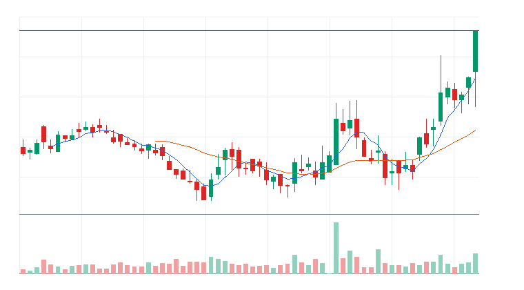
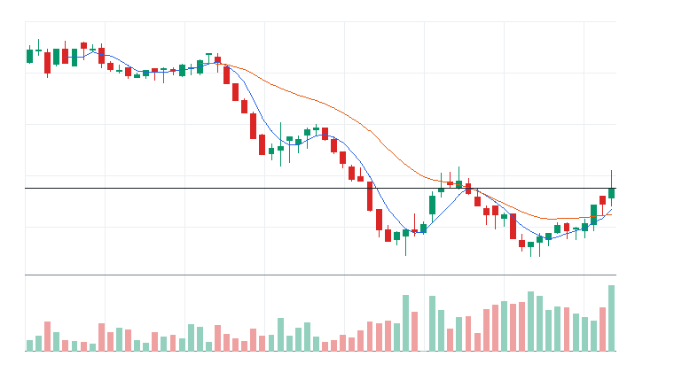

# 오늘의 데일리 트레이딩 요약

**REAL DATA TEST - 가격/거래량은 실제 데이터, 뉴스 연결, ETF 구성종목 확산도/거래대금 유동성 일부 연결**

**목적:** 이 리포트는 최근 오른 자산을 나열하는 것이 아니라, 돈이 몰리는 근거와 다음 매수 주체가 확인할 트레이딩 후보를 찾기 위한 보고서다.

> 핵심 질문: 현재 가격에서 누가 사고 있고, 누가 앞으로 더 비싸게 사줄 수 있는가?

## 모바일 요약

[오늘의 데일리 트레이딩 요약]

생성 성공 / 데이터 모드: REAL_TEST

시장:
- 위험회피

시장 지배 서사:
1. 금융/밸류업 주주환원 - 약화 - KODEX 200(069500.KS), KB금융(105560.KS), 신한지주(055550.KS) 중심으로 5일 +0.58%, 20일 +4.60% 흐름이 형성됨. 뉴스 직접성 제한.
2. 소비 회복/방어주 선별 - 약화 - KODEX 200(069500.KS), KODEX 코스닥150(229200.KS), 미스토홀딩스(081660.KS), 금호타이어(073240.KS) 중심으로 5일 -0.47%, 20일 +0.39% 흐름이 형성됨. 뉴스 직접성 제한.
3. 화장품/음식료 수출 소비재 - 약화 - KODEX 200(069500.KS), 한국콜마(161890.KS), 아모레퍼시픽(090430.KS) 중심으로 5일 -4.67%, 20일 +2.66% 흐름이 형성됨. 뉴스 직접성 제한.

트렌드 강도:
1. 금융/밸류업 주주환원 - TSI 23 - 잠복 - 진입품질 낮음
2. 소비 회복/방어주 선별 - TSI 19 - 잠복 - 진입품질 낮음
3. 화장품/음식료 수출 소비재 - TSI 6 - 잠복 - 진입품질 낮음

오늘 결론:
- 경기소비재/자동차 개별 종목 흐름이 ETF 대비 강한지 확인 필요
- 행동 후보는 linkedNarrative와 함께 확인한다.
- 추격보다 진입 조건 확인 후 접근한다.

오늘 실제 행동 후보:
1. 미스토홀딩스(081660.KS)(STOCK) - 소비 회복/방어주 선별 - 단기 추세가 유지되고 거래량이 1.0배 이상이면 눌림 이후 재상승을 시도할 수 있음

다크호스 후보:
1. 다크호스 후보 없음 - 조건 충족 후보 없음

ETF 후보 TOP 5:
1. KODEX 코스닥150(229200.KS) - 소비 회복/방어주 선별 - 제외
2. KODEX 200(069500.KS) - 금융/밸류업 주주환원 - 제외

웹 리포트:
https://yoolcool.github.io/DailyTradingThesisAgent/kr/

## 오늘 결론

- 오늘 결론: 조건부 진입
- 신규 진입 후보: 0개
- 조건부 진입 후보: 1개
- 관찰 후보: 72개
- 주요 제한 요인: Entry Quality < 40, 뉴스 직접성 부족, RVOL 미달
- 주문 판단: 지정가 권장 / 시장가 주의
- 실전 판단: 진입 후보는 있으나, 전일 고점 돌파와 거래량 확인 후 선별적으로 접근한다.

### 후보 제한 요인 집계

- RVOL < 1.00x: 72개
- 거래대금 유동성 낮음: 0개
- Entry Quality 50~54 near miss: 0개
- Entry Quality 40~49 관찰: 0개
- Entry Quality < 40: 202개
- Exhaustion Risk >= 70: 0개
- ETF breadth 샘플 부족: 0개
- 뉴스 직접성 부족: 199개

## 데이터 신뢰도

- 전체 데이터 신뢰도 등급: MEDIUM
- 분석 신뢰도: MEDIUM
- 주문 실행 신뢰도: MEDIUM
- ETF breadth 신뢰도: HIGH
- 신뢰도 해석: 가격/거래량 stale fallback 1개 사용, 장전/시간외 데이터 확인 불가
- 리포트 생성 시각: 2026-07-10 09:18 KST
- 가격 기준 거래일: 2026-07-09 KRX 정규장 종가
- 뉴스 수집 시각: 2026-07-10 09:18 KST
- 가장 최근 뉴스 발행 시각: 2026-07-09 00:00 KST
- 뉴스 신선도 상태: STALE
- 뉴스 소스: DART
- 뉴스 소스 상태: DART CONNECTED
- 뉴스 신뢰도: HIGH
- 추천 적용 거래일: 2026-07-10 KRX 정규장
- 가격/거래량 데이터 상태: 일부 연결
- 뉴스 데이터 상태: 연결됨
- ETF 구성종목 확산도 상태: 일부 연결
- ETF 구성종목 샘플 수: 20~30
- 거래대금 유동성 데이터 상태: 일부 연결
- 장전/시간외 데이터 상태: NOT_APPLICABLE
- 데이터 provider: yfinance, DART, config fallback sample, price-volume dollar-volume fallback
- 실전 사용 경고: 이 리포트는 투자판단 보조용이며, REAL_TEST 모드에서는 일부 데이터가 누락되거나 지연될 수 있다. 실제 주문 전 현재가, 뉴스, 장전/시간외 가격과 정규장 거래대금을 별도 확인해야 한다.

## 0. 시장 상태

- 데이터 모드: REAL_TEST
- 가격/거래량: 일부 연결
- 뉴스: 연결됨
- ETF 구성종목 확산도: 일부 연결
- 거래대금 유동성: 일부 연결
- 생성 시각: 2026년 7월 10일 금요일 오전 9:18
- 시장 상태: 위험회피
- 오늘 돈의 방향: 경기소비재/자동차 개별 종목 흐름이 ETF 대비 강한지 확인 필요
- 강한 테마 TOP 3: 금융/밸류업 주주환원(13), 경기소비재/자동차(13), 인터넷/게임/엔터 성장주(12)
- 데이터 한계:
  - API 또는 provider 상태에 따라 뉴스/ETF 확산도/거래대금 유동성 반영 범위가 달라질 수 있다.
  - 수집 실패 데이터는 점수 반영에서 제외하거나 confidence를 제한한다.
  - reasonConfidence HIGH는 직접 촉매, 가격/거래량, 확산도/유동성 근거가 함께 있을 때만 사용한다.

## 오늘 시장을 지배하는 서사

### 오늘 시장을 지배하는 서사 TOP 3

#### 1. 금융/밸류업 주주환원
- 상태: 약화
- narrativeScore: 19
- reasonConfidence: LOW
- 근거 ETF: KODEX 200(069500.KS)
- 근거 개별 종목: KB금융(105560.KS), 신한지주(055550.KS), 하나금융지주(086790.KS), 우리금융지주(316140.KS)
- 돈이 몰리는 이유: 금융/밸류업 주주환원 관련 KODEX 200(069500.KS)와 KB금융(105560.KS), 신한지주(055550.KS), 하나금융지주(086790.KS), 우리금융지주(316140.KS)의 5일(+0.58%)·20일(+4.60%) 흐름을 함께 본다. 평균 상대 거래량은 1.27배이고, ETF 확산도는 추가 확인이 필요하다. 뉴스 직접성은 아직 제한적이다.
- 다음 매수 주체: 배당, 자사주, 자본비율 개선 기대가 커질 때 은행/금융지주가 방어적 주도주로 부상
- 가장 좋은 트레이딩 수단: ETF 우선: KODEX 200(069500.KS) / 개별 종목 우선: KB금융(105560.KS), 신한지주(055550.KS), 하나금융지주(086790.KS)
- 서사가 깨지는 조건: 금리 하락/정책 기대 둔화로 금융주가 KOSPI200 대비 상대강도를 잃는 경우
- 오늘 행동: 지수 변동성이 커질 때 방어적 대안으로 관찰하고, 급등 후에는 배당락/정책 뉴스 확인

상세 narrativeScore 근거 보기

- rawScore: 19
- ETF 평균 moneyFlowScore: 0
- 개별 종목 평균 moneyFlowScore: 43
- ETF 후보 비율: 0%
- 개별 종목 후보 비율: 25%
- 5일 평균 수익률: +1.00%
- 20일 평균 수익률: +5.00%
- 평균 상대 거래량: 1.00배
- ETF 평균 상대 거래량: 1.00배
- 개별주 평균 상대 거래량: 1.00배
- 52주 고점 근접 후보 비율: 0%
- 뉴스 직접성 점수: 1
- ETF 확산도 점수: -4
- 유동성 점수: 4
- 과열 리스크 차감: 0

#### 2. 소비 회복/방어주 선별
- 상태: 약화
- narrativeScore: 12
- reasonConfidence: LOW
- 근거 ETF: KODEX 200(069500.KS), KODEX 코스닥150(229200.KS)
- 근거 개별 종목: 미스토홀딩스(081660.KS), 금호타이어(073240.KS), 현대백화점(069960.KS), 신세계(004170.KS)
- 돈이 몰리는 이유: 소비 회복/방어주 선별 관련 KODEX 200(069500.KS), KODEX 코스닥150(229200.KS)와 미스토홀딩스(081660.KS), 금호타이어(073240.KS), 현대백화점(069960.KS), 신세계(004170.KS)의 5일(-0.47%)·20일(+0.39%) 흐름을 함께 본다. 평균 상대 거래량은 1.36배이고, ETF 확산도는 추가 확인이 필요하다. 뉴스 직접성은 아직 제한적이다.
- 다음 매수 주체: 소비 회복/방어주 선별을 확인한 섹터 ETF 자금과 상대강도 추종 스윙 자금
- 가장 좋은 트레이딩 수단: ETF 우선: KODEX 200(069500.KS), KODEX 코스닥150(229200.KS) / 개별 종목 우선: 현대백화점(069960.KS), 신세계(004170.KS), 금호타이어(073240.KS)
- 서사가 깨지는 조건: 069500.KS 20일선 이탈 또는 관련 종목 절반 이상 5일선 이탈
- 오늘 행동: 기존 네러티브와 중복을 확인한 뒤 ETF/대표 종목 동조성이 살아날 때만 관찰 편입

상세 narrativeScore 근거 보기

- rawScore: 12
- ETF 평균 moneyFlowScore: 0
- 개별 종목 평균 moneyFlowScore: 33
- ETF 후보 비율: 0%
- 개별 종목 후보 비율: 25%
- 5일 평균 수익률: 0.00%
- 20일 평균 수익률: 0.00%
- 평균 상대 거래량: 1.00배
- ETF 평균 상대 거래량: 1.00배
- 개별주 평균 상대 거래량: 1.00배
- 52주 고점 근접 후보 비율: 0%
- 뉴스 직접성 점수: 0
- ETF 확산도 점수: -4
- 유동성 점수: 3
- 과열 리스크 차감: 0

#### 3. 화장품/음식료 수출 소비재
- 상태: 약화
- narrativeScore: 0
- reasonConfidence: LOW
- 근거 ETF: KODEX 200(069500.KS)
- 근거 개별 종목: 한국콜마(161890.KS), 아모레퍼시픽(090430.KS), LG생활건강(051900.KS), 삼양식품(003230.KS)
- 돈이 몰리는 이유: 화장품/음식료 수출 소비재 관련 KODEX 200(069500.KS)와 한국콜마(161890.KS), 아모레퍼시픽(090430.KS), LG생활건강(051900.KS), 삼양식품(003230.KS)의 5일(-4.67%)·20일(+2.66%) 흐름을 함께 본다. 평균 상대 거래량은 1.18배이고, ETF 확산도는 추가 확인이 필요하다. 뉴스 직접성은 아직 제한적이다.
- 다음 매수 주체: 중국/미국 수출, 면세, K-푸드 모멘텀이 확인될 때 소비재 대표주와 ODM 업체로 자금 유입
- 가장 좋은 트레이딩 수단: ETF 우선: KODEX 200(069500.KS) / 개별 종목 우선: 삼양식품(003230.KS), 한국콜마(161890.KS), 아모레퍼시픽(090430.KS)
- 서사가 깨지는 조건: 수출 소비재 대표 종목의 거래대금이 줄고 20일선 회복에 실패
- 오늘 행동: 실적 기대와 가격 반응이 같이 나타나는 종목만 선별, 단기 급등주는 눌림 대기

상세 narrativeScore 근거 보기

- rawScore: -1
- ETF 평균 moneyFlowScore: 0
- 개별 종목 평균 moneyFlowScore: 14
- ETF 후보 비율: 0%
- 개별 종목 후보 비율: 0%
- 5일 평균 수익률: -5.00%
- 20일 평균 수익률: +3.00%
- 평균 상대 거래량: 1.00배
- ETF 평균 상대 거래량: 1.00배
- 개별주 평균 상대 거래량: 1.00배
- 52주 고점 근접 후보 비율: 0%
- 뉴스 직접성 점수: 0
- ETF 확산도 점수: -4
- 유동성 점수: 1
- 과열 리스크 차감: 0

### 전체 narrative 요약

| 서사명 | 상태 | narrativeScore | reasonConfidence | 대표 ETF | 대표 종목 | 오늘 행동 |
| --- | --- | ---: | --- | --- | --- | --- |
| 금융/밸류업 주주환원 | 약화 | 19 | LOW | KODEX 200(069500.KS) | KB금융(105560.KS), 신한지주(055550.KS), 하나금융지주(086790.KS), 우리금융지주(316140.KS) | 지수 변동성이 커질 때 방어적 대안으로 관찰하고, 급등 후에는 배당락/정책 뉴스 확인 |
| 소비 회복/방어주 선별 | 약화 | 12 | LOW | KODEX 200(069500.KS), KODEX 코스닥150(229200.KS) | 미스토홀딩스(081660.KS), 금호타이어(073240.KS), 현대백화점(069960.KS), 신세계(004170.KS) | 기존 네러티브와 중복을 확인한 뒤 ETF/대표 종목 동조성이 살아날 때만 관찰 편입 |
| 화장품/음식료 수출 소비재 | 약화 | 0 | LOW | KODEX 200(069500.KS) | 한국콜마(161890.KS), 아모레퍼시픽(090430.KS), LG생활건강(051900.KS), 삼양식품(003230.KS) | 실적 기대와 가격 반응이 같이 나타나는 종목만 선별, 단기 급등주는 눌림 대기 |
| Constructions 자금 유입 | 소멸 | 0 | LOW | KODEX 200(069500.KS), KODEX 코스닥150(229200.KS) | GS건설(006360.KS), 삼성물산(028260.KS) | 기존 네러티브와 중복을 확인한 뒤 ETF/대표 종목 동조성이 살아날 때만 관찰 편입 |
| Financials 자금 유입 | 소멸 | 0 | LOW | KODEX 200(069500.KS), KODEX 코스닥150(229200.KS) | DB손해보험(005830.KS), 삼성생명(032830.KS), 삼성화재(000810.KS), BNK금융지주(138930.KS) | 기존 네러티브와 중복을 확인한 뒤 ETF/대표 종목 동조성이 살아날 때만 관찰 편입 |
| 바이오/헬스케어 실적 전환 | 약화 | 0 | LOW | KODEX 200(069500.KS) | 삼성바이오로직스(207940.KS), 셀트리온(068270.KS), 유한양행(000100.KS), 한미약품(128940.KS) | 뉴스 촉매와 거래량이 동반될 때만 관찰 편입, 이벤트 소멸 후 추격은 금지 |
| 인터넷/게임/엔터 성장주 | 소멸 | 0 | LOW | KODEX 200(069500.KS), KODEX 코스닥150(229200.KS) | 하이브(352820.KS), NAVER(035420.KS), 카카오(035720.KS), 크래프톤(259960.KS) | 지수 위험선호가 유지될 때만 선별 진입, 대형 플랫폼은 실적 반응을 우선 확인 |
| 조선/방산 수주 사이클 | 소멸 | 0 | LOW | KODEX 200(069500.KS) | 한국항공우주(047810.KS), 한화오션(042660.KS), HD현대중공업(329180.KS), 한화에어로스페이스(012450.KS) | 수주 공시나 업황 뉴스가 직접 확인될 때만 추세 추종, 과열 구간은 신규 진입 보류 |
| AI 반도체/HBM 공급망 | 소멸 | 0 | LOW | KODEX 200(069500.KS) | SK하이닉스(000660.KS), 삼성전자(005930.KS), 한미반도체(042700.KS), 삼성전기(009150.KS) | 추격보다 SK하이닉스/삼성전자 동조성과 거래대금 회복을 확인한 뒤 눌림 구간에서 선별 |
| 지주/배당/자사주 재평가 | 소멸 | 0 | LOW | KODEX 200(069500.KS) | LG(003550.KS), SK(034730.KS), 두산(000150.KS), 롯데지주(004990.KS) | 강한 시장에서는 후순위, 변동성 확대 구간에서 방어적 재평가 후보로 관찰 |
| Energy & Chemicals 자금 유입 | 소멸 | 0 | LOW | KODEX 200(069500.KS), KODEX 코스닥150(229200.KS) | GS(078930.KS), 후성(093370.KS), 한솔케미칼(014680.KS) | 기존 네러티브와 중복을 확인한 뒤 ETF/대표 종목 동조성이 살아날 때만 관찰 편입 |
| 자동차/부품 수출 모멘텀 | 소멸 | 0 | LOW | KODEX 200(069500.KS) | 현대차(005380.KS), 기아(000270.KS), 현대모비스(012330.KS), 현대위아(011210.KS) | 완성차 쌍두마차가 시장 대비 강할 때만 부품주까지 확산 여부를 확인 |
| 2차전지 소재/셀 반등 | 소멸 | 0 | LOW | KODEX 200(069500.KS), KODEX 코스닥150(229200.KS) | LG에너지솔루션(373220.KS), 삼성SDI(006400.KS), 포스코퓨처엠(003670.KS), 에코프로머티(450080.KS) | 추세 전환보다 반등 성격으로 접근하고, 상대 거래량이 살아나는 종목만 단기 관찰 |
| IT 자금 유입 | 소멸 | 0 | LOW | KODEX 200(069500.KS), KODEX 코스닥150(229200.KS) | SK스퀘어(402340.KS), 이수페타시스(007660.KS) | 기존 네러티브와 중복을 확인한 뒤 ETF/대표 종목 동조성이 살아날 때만 관찰 편입 |
| 전력 유틸리티 수요 재평가 | 소멸 | 0 | LOW | KODEX 200(069500.KS), KODEX 코스닥150(229200.KS) | 효성중공업(298040.KS), LS ELECTRIC(010120.KS) | 기존 네러티브와 중복을 확인한 뒤 ETF/대표 종목 동조성이 살아날 때만 관찰 편입 |
| Heavy Industries 자금 유입 | 소멸 | 0 | LOW | KODEX 200(069500.KS), KODEX 코스닥150(229200.KS) | 산일전기(062040.KS), 현대로템(064350.KS) | 기존 네러티브와 중복을 확인한 뒤 ETF/대표 종목 동조성이 살아날 때만 관찰 편입 |
| 전력기기/인프라 투자 | 소멸 | 0 | LOW | KODEX 200(069500.KS) | HD현대일렉트릭(267260.KS), LS ELECTRIC(010120.KS), 효성중공업(298040.KS), HD현대(267250.KS) | 강한 종목을 추격하기보다 거래대금 유지와 5일선 재지지를 확인 |

## 트렌드 강도 판단

### 1. 금융/밸류업 주주환원
- Trend Strength Index: 23
- 트렌드 상태 라벨: 잠복
- 테마 확산도: 부족
- ETF 동조성: 부족
- 거래량 강도: 보통
- 과열 위험: 낮음 (18)
- 오늘 진입 품질: 낮음 (13)
- 한 줄 판단: 금융/밸류업 주주환원는 Trend Strength는 높아도 시장 위험선호가 약해 시장 환경 비우호 구간이다.
- 오늘 접근법: KODEX 200(069500.KS)와 KB금융(105560.KS)/신한지주(055550.KS)/하나금융지주(086790.KS)의 거래량 확산이 확인되기 전까지 관찰한다.

트렌드 강도 상세 근거 보기

- 가격 모멘텀: 가격 모멘텀 3/25. 평균 5D +0.58%, 20D +4.60%.
- 거래량 강도: 거래량 강도 11/20. 평균 RVOL 1.27배.
- ETF 동조성: ETF 동조성 4/15. 관련 ETF KODEX 200(069500.KS) 흐름을 기준으로 판단.
- 테마 확산도: 테마 확산도 3/20. 상위 1~2개 쏠림 감점 6점 반영.
- 뉴스 촉매: 뉴스/촉매 신선도 2/10. HIGH 직접 촉매 0개.
- 과열 리스크: 과열 리스크 18/100. 단기 급등, 고점 근접, ETF-개별주 괴리, 쏠림을 함께 반영.
- 시장 환경: 시장 환경 0/10. KOSPI200/KODEX 200/KODEX KOSDAQ150 가격 흐름 기반 위험선호 점수.

### 2. 소비 회복/방어주 선별
- Trend Strength Index: 19
- 트렌드 상태 라벨: 잠복
- 테마 확산도: 부족
- ETF 동조성: 부족
- 거래량 강도: 보통
- 과열 위험: 낮음 (11)
- 오늘 진입 품질: 낮음 (12)
- 한 줄 판단: 소비 회복/방어주 선별는 Trend Strength는 높아도 시장 위험선호가 약해 시장 환경 비우호 구간이다.
- 오늘 접근법: KODEX 200(069500.KS)/KODEX 코스닥150(229200.KS)와 미스토홀딩스(081660.KS)/금호타이어(073240.KS)/현대백화점(069960.KS)의 거래량 확산이 확인되기 전까지 관찰한다.

트렌드 강도 상세 근거 보기

- 가격 모멘텀: 가격 모멘텀 0/25. 평균 5D -0.47%, 20D +0.39%.
- 거래량 강도: 거래량 강도 12/20. 평균 RVOL 1.36배.
- ETF 동조성: ETF 동조성 1/15. 관련 ETF KODEX 200(069500.KS), KODEX 코스닥150(229200.KS) 흐름을 기준으로 판단.
- 테마 확산도: 테마 확산도 4/20. 상위 1~2개 쏠림 감점 3점 반영.
- 뉴스 촉매: 뉴스/촉매 신선도 2/10. HIGH 직접 촉매 0개.
- 과열 리스크: 과열 리스크 11/100. 단기 급등, 고점 근접, ETF-개별주 괴리, 쏠림을 함께 반영.
- 시장 환경: 시장 환경 0/10. KOSPI200/KODEX 200/KODEX KOSDAQ150 가격 흐름 기반 위험선호 점수.

### 3. 화장품/음식료 수출 소비재
- Trend Strength Index: 6
- 트렌드 상태 라벨: 잠복
- 테마 확산도: 부족
- ETF 동조성: 부족
- 거래량 강도: 약함
- 과열 위험: 낮음 (20)
- 오늘 진입 품질: 낮음 (0)
- 한 줄 판단: 화장품/음식료 수출 소비재는 Trend Strength는 높아도 시장 위험선호가 약해 시장 환경 비우호 구간이다.
- 오늘 접근법: KODEX 200(069500.KS)와 한국콜마(161890.KS)/아모레퍼시픽(090430.KS)/LG생활건강(051900.KS)의 거래량 확산이 확인되기 전까지 관찰한다.

트렌드 강도 상세 근거 보기

- 가격 모멘텀: 가격 모멘텀 -7/25. 평균 5D -4.67%, 20D +2.66%.
- 거래량 강도: 거래량 강도 9/20. 평균 RVOL 1.18배.
- ETF 동조성: ETF 동조성 4/15. 관련 ETF KODEX 200(069500.KS) 흐름을 기준으로 판단.
- 테마 확산도: 테마 확산도 0/20. 상위 1~2개 쏠림 감점 6점 반영.
- 뉴스 촉매: 뉴스/촉매 신선도 0/10. HIGH 직접 촉매 0개.
- 과열 리스크: 과열 리스크 20/100. 단기 급등, 고점 근접, ETF-개별주 괴리, 쏠림을 함께 반영.
- 시장 환경: 시장 환경 0/10. KOSPI200/KODEX 200/KODEX KOSDAQ150 가격 흐름 기반 위험선호 점수.

## 최근 추천 결과 트래킹

개별주는 데이트레이딩 관점으로 추천 이후 첫 정규장의 장중 최고가와 종가를 추적한다. ETF는 테마/스윙 관점으로 추천 이후 1주일 동안의 최고가와 현재 종가를 추적한다.

### 개별주 Top 3 추천 성과 요약
- 최근 5개 리포트 표본: 8개 (초기 검증 단계)
- 장중 최고가 기준 성공률: +71.43%
- 종가 기준 성공률: +14.29%
- 평균 장중 최고 수익률: +4.08%
- 평균 종가 수익률: -0.02%

### ETF 추천 성과 요약
- 최근 5개 리포트 표본: 0개 (초기 검증 단계)
- 1주 최고가 기준 성공률: 데이터 없음
- 현재 종가 기준 성공률: 데이터 없음
- 평균 1주 최고 수익률: 데이터 없음
- 평균 현재 수익률: 데이터 없음

최근 추천 결과 상세 테이블 펼치기

| 추천일 | 유형 | 순위 | 티커 | 기준가 | 추적 기간 | 상태 | High 수익률 | Close 수익률 | 결과 | 코멘트 |
| --- | --- | ---: | --- | ---: | --- | --- | ---: | ---: | --- | --- |
| 2026-07-10 | STOCK | 1 | 미스토홀딩스(081660.KS) | $52,400 | 2026-07-10 | pending | 데이터 없음 | 데이터 없음 | 추적 대기 | 아직 추적 거래일 데이터가 완성되지 않음 |
| 2026-07-08 | STOCK | 1 | 금호타이어(073240.KS) | $6,480 | 2026-07-08 | complete | +3.70% | -1.23% | 단타 유효 | 장중 기회는 있었지만 종가 유지력은 약함 (일봉 기준) |
| 2026-07-07 | STOCK | 1 | 금호타이어(073240.KS) | $6,260 | 2026-07-07 | complete | +8.31% | +1.12% | 성공 | 장중 기회와 종가 유지가 모두 확인됨 (일봉 기준) |
| 2026-07-07 | STOCK | 1 | 한국콜마(161890.KS) | $115,100 | 2026-07-07 | complete | +8.25% | 0.00% | 단타 유효 | 장중 기회는 있었지만 종가 유지력은 약함 (일봉 기준) |
| 2026-07-06 | STOCK | 3 | GS(078930.KS) | $78,100 | 2026-07-06 | complete | +3.84% | 0.00% | 단타 유효 | 장중 기회는 있었지만 종가 유지력은 약함 (일봉 기준) |
| 2026-07-06 | STOCK | 2 | 금호타이어(073240.KS) | $6,160 | 2026-07-06 | complete | 0.00% | 0.00% | 추적 대기 | 아직 추적 거래일 데이터가 완성되지 않음 (일봉 기준) |
| 2026-07-06 | STOCK | 1 | NH투자증권(005940.KS) | $33,100 | 2026-07-06 | complete | +3.02% | 0.00% | 단타 유효 | 장중 기회는 있었지만 종가 유지력은 약함 (일봉 기준) |
| 2026-07-03 | STOCK | 1 | 한국콜마(161890.KS) | $117,800 | 2026-07-03 | complete | +1.44% | 0.00% | 제한적 유효 | 제한적인 장중 기회만 발생 (일봉 기준) |
| 2026-07-02 | STOCK | 2 | 미스토홀딩스(081660.KS) | $46,400 | 2026-07-02 | complete | +7.76% | 0.00% | 단타 유효 | 장중 기회는 있었지만 종가 유지력은 약함 (일봉 기준) |
| 2026-07-02 | STOCK | 1 | 한국콜마(161890.KS) | $113,700 | 2026-07-02 | complete | +8.18% | 0.00% | 단타 유효 | 장중 기회는 있었지만 종가 유지력은 약함 (일봉 기준) |
| 2026-07-01 | STOCK | 3 | 산일전기(062040.KS) | $261,500 | 2026-07-01 | complete | +4.21% | 0.00% | 단타 유효 | 장중 기회는 있었지만 종가 유지력은 약함 (일봉 기준) |
| 2026-07-01 | STOCK | 2 | 한국콜마(161890.KS) | $106,800 | 2026-07-01 | complete | +0.19% | 0.00% | 추적 대기 | 아직 추적 거래일 데이터가 완성되지 않음 (일봉 기준) |
| 2026-07-01 | STOCK | 1 | 한솔케미칼(014680.KS) | $304,000 | 2026-07-01 | complete | +4.93% | 0.00% | 단타 유효 | 장중 기회는 있었지만 종가 유지력은 약함 (일봉 기준) |
| 2026-06-30 | STOCK | 2 | SK(034730.KS) | $834,000 | 2026-06-30 | complete | +1.32% | 0.00% | 제한적 유효 | 제한적인 장중 기회만 발생 (일봉 기준) |
| 2026-06-30 | STOCK | 1 | 한국콜마(161890.KS) | $99,500 | 2026-06-30 | complete | +3.02% | 0.00% | 단타 유효 | 장중 기회는 있었지만 종가 유지력은 약함 (일봉 기준) |
| 2026-06-29 | STOCK | 2 | 금호타이어(073240.KS) | $5,320 | 2026-06-29 | complete | +10.34% | 0.00% | 단타 유효 | 장중 기회는 있었지만 종가 유지력은 약함 (일봉 기준) |
| 2026-06-29 | STOCK | 1 | 한국콜마(161890.KS) | $99,400 | 2026-06-29 | complete | +0.30% | 0.00% | 추적 대기 | 아직 추적 거래일 데이터가 완성되지 않음 (일봉 기준) |
| 2026-06-26 | STOCK | 1 | SK(034730.KS) | $815,000 | 2026-06-26 | complete | +7.98% | 0.00% | 단타 유효 | 장중 기회는 있었지만 종가 유지력은 약함 (일봉 기준) |
| 2026-06-25 | STOCK | 3 | 삼성물산(028260.KS) | $519,000 | 2026-06-25 | complete | +8.48% | 0.00% | 단타 유효 | 장중 기회는 있었지만 종가 유지력은 약함 (일봉 기준) |
| 2026-06-25 | STOCK | 2 | SK하이닉스(000660.KS) | $2,917,000 | 2026-06-25 | complete | +2.40% | 0.00% | 제한적 유효 | 제한적인 장중 기회만 발생 (일봉 기준) |
| 2026-06-25 | STOCK | 1 | SK스퀘어(402340.KS) | $1,899,000 | 2026-06-25 | complete | +4.79% | 0.00% | 단타 유효 | 장중 기회는 있었지만 종가 유지력은 약함 (일봉 기준) |
| 2026-06-22 | STOCK | 3 | SK스퀘어(402340.KS) | $1,970,000 | 2026-06-22 | complete | +0.86% | 0.00% | 추적 대기 | 아직 추적 거래일 데이터가 완성되지 않음 (일봉 기준) |
| 2026-06-22 | STOCK | 2 | 삼성물산(028260.KS) | $520,000 | 2026-06-22 | complete | +4.04% | 0.00% | 단타 유효 | 장중 기회는 있었지만 종가 유지력은 약함 (일봉 기준) |
| 2026-06-22 | STOCK | 1 | SK하이닉스(000660.KS) | $2,919,000 | 2026-06-22 | complete | +0.89% | 0.00% | 추적 대기 | 아직 추적 거래일 데이터가 완성되지 않음 (일봉 기준) |
| 2026-06-19 | STOCK | 3 | 삼성전자(005930.KS) | $362,500 | 2026-06-19 | complete | +3.31% | -2.34% | 단타 유효 | 장중 기회는 있었지만 종가 유지력은 약함 (일봉 기준) |
| 2026-06-19 | STOCK | 3 | SK하이닉스(000660.KS) | $2,764,000 | 2026-06-19 | complete | +4.59% | 0.00% | 단타 유효 | 장중 기회는 있었지만 종가 유지력은 약함 (일봉 기준) |
| 2026-06-19 | STOCK | 2 | SK(034730.KS) | $687,000 | 2026-06-19 | complete | +10.19% | +5.39% | 성공 | 장중 기회와 종가 유지가 모두 확인됨 (일봉 기준) |
| 2026-06-19 | STOCK | 1 | 삼성생명(032830.KS) | $469,000 | 2026-06-19 | complete | +10.13% | +5.97% | 성공 | 장중 기회와 종가 유지가 모두 확인됨 (일봉 기준) |
| 2026-06-19 | STOCK | 1 | LS ELECTRIC(010120.KS) | $255,500 | 2026-06-19 | complete | +8.22% | +1.37% | 성공 | 장중 기회와 종가 유지가 모두 확인됨 (일봉 기준) |
| 2026-06-19 | STOCK | 1 | 한화오션(042660.KS) | $128,400 | 2026-06-19 | complete | 0.00% | 0.00% | 추적 대기 | 아직 추적 거래일 데이터가 완성되지 않음 (일봉 기준) |
| 2026-06-19 | ETF | 1 | KODEX 200(069500.KS) | $146,910 | 2026-06-19~2026-06-26 | complete | +2.60% | -19.88% | 단기 고점 후 반납 | 1주 내 상승 기회는 있었지만 현재가는 반납 |
| 2026-06-18 | STOCK | 3 | SK스퀘어(402340.KS) | $1,733,000 | 2026-06-18 | complete | +0.29% | -1.90% | 실패 | 추천 이후 의미 있는 장중 기회가 부족하고 종가도 약함 (일봉 기준) |
| 2026-06-18 | STOCK | 3 | 삼성생명(032830.KS) | $469,000 | 2026-06-18 | complete | +0.32% | 0.00% | 추적 대기 | 아직 추적 거래일 데이터가 완성되지 않음 (일봉 기준) |
| 2026-06-18 | STOCK | 2 | 후성(093370.KS) | $18,830 | 2026-06-18 | complete | +4.25% | +0.05% | 단타 유효 | 장중 기회는 있었지만 종가 유지력은 약함 (일봉 기준) |
| 2026-06-18 | STOCK | 2 | SK하이닉스(000660.KS) | $2,698,000 | 2026-06-18 | complete | +1.48% | -0.48% | 제한적 유효 | 제한적인 장중 기회만 발생 (일봉 기준) |
| 2026-06-18 | STOCK | 2 | SK(034730.KS) | $687,000 | 2026-06-18 | complete | +2.62% | 0.00% | 제한적 유효 | 제한적인 장중 기회만 발생 (일봉 기준) |
| 2026-06-18 | STOCK | 1 | LG이노텍(011070.KS) | $1,290,000 | 2026-06-18 | complete | +2.33% | -0.54% | 제한적 유효 | 제한적인 장중 기회만 발생 (일봉 기준) |
| 2026-06-18 | STOCK | 1 | 삼성전자(005930.KS) | $362,500 | 2026-06-18 | complete | +0.14% | 0.00% | 추적 대기 | 아직 추적 거래일 데이터가 완성되지 않음 (일봉 기준) |

## 오늘 실제 행동 후보

### 1. 미스토홀딩스(081660.KS)
- 자산 유형: STOCK
- linkedNarrative: 소비 회복/방어주 선별
- narrativeStatus: 약화
- narrativeScore: 12
- Trend Strength Index: 19
- Exhaustion Risk: 11 (낮음)
- Entry Quality Score: 12 (낮음)
- 트렌드 판단: 테마 확산도가 낮아 개별 종목 이벤트성 흐름일 수 있다.
- moneyFlowScore: 95
- finalRawScore: 95
- reasonConfidence: MEDIUM
- reasonConfidenceExplanation: 직접 촉매 부재, 뉴스 미사용 때문에 HIGH가 아니라 MEDIUM으로 제한했다.
- tieBreakerReason: 최종 원점수 95, 리스크 패널티 -4, 5일 수익률 +12.93%, 상대 거래량 1.66배 순으로 정렬
- 후보별 시장 해석: 위험회피 / 제한적 - 전체 시장은 위험회피 / Entry Quality 12 < 50이나 moneyFlow 95, confidence MEDIUM, RVOL 1.66x로 강한 자금흐름 예외 조건 충족
- 게이트 사유: Entry Quality 12 < 50이나 moneyFlow 95, confidence MEDIUM, RVOL 1.66x로 강한 자금흐름 예외 조건 충족
- 주문 실행: 시장가 가능

- 왜 돈이 몰리는가: 20일 +19.36%, 5일 +12.93%, 상대 거래량 1.66배로 가격과 거래량이 함께 개선. 유동성: LIQUID
- 누가 더 비싸게 사줄 수 있는지: 개별 주도주를 따라붙는 단기 모멘텀 자금과 관련 ETF 강세를 확인한 트레이더
- 진입 조건: 20일선 위 눌림 후 재상승 확인
- 무효화 조건: 20일선 이탈 또는 상대 거래량 0.8배 이하 둔화
- todayActionLabel: 자금흐름 예외 조건부
#### 최근 뉴스/동향 한국어 요약

- 요약: 종목 직접 뉴스 확인 상태이며 뉴스 흐름은 긍정 우위입니다. 후보 선정 후 재확인한 핵심 이슈는 "[리포트 브리핑]미스토홀딩스, '아쿠쉬네트 호실적 속 미스토는 하반기부터 성장 확대 기대' 목표가 60,000원 - 삼성증권 - 뉴스핌"입니다.
- 직접 촉매 판단: 미스토홀딩스에 대해 직접 촉매로 분류된 뉴스가 확인됐습니다. 핵심은 "[리포트 브리핑]미스토홀딩스, '아쿠쉬네트 호실적 속 미스토는 하반기부터 성장 확대 기대' 목표가 60,000원 - 삼성증권 - 뉴스핌"이며, 일반 재료로 봅니다.
- 뉴스 1: [리포트 브리핑]미스토홀딩스, '아쿠쉬네트 호실적 속 미스토는 하반기부터 성장 확대 기대' 목표가 60,000원 - 삼성증권 - 뉴스핌
  - 내용: 미스토홀딩스의 실적 관련 뉴스입니다. 제목 기준 방향성은 긍정이며, 매출·이익 수치와 컨센서스 대비 차이를 확인해야 합니다.
  - 투자 의미: 실적/가이던스 재료는 다음 분기 기대치 변화로 이어질 수 있어 컨센서스 변화와 주가 반응 지속성을 함께 봅니다.
  - 확인할 점: 매출/마진/가이던스 수치, 컨센서스 대비 차이
- 뉴스 2: 미스토홀딩스 '아쿠쉬네트 호실적 속 미스토는 하반기부터 성장 확대 기대' 증권사 발표에 강세…9.51% - 매일경제 마켓
  - 내용: 미스토홀딩스의 실적 관련 뉴스입니다. 제목 기준 방향성은 긍정이며, 매출·이익 수치와 컨센서스 대비 차이를 확인해야 합니다.
  - 투자 의미: 미스토홀딩스의 당일 상대강도 확인에는 도움이 되지만, 실적/가이던스 같은 새 펀더멘털 변화로 보기는 어렵습니다.
  - 확인할 점: 거래량 동반 여부, 장중 고점 유지, 관련 ETF 동반 강세
- 뉴스 3: [리포트 브리핑]미스토홀딩스, '아쿠쉬네트 지분가치만 5조원 이상' 목표가 61,000원 - NH투자증권 - 뉴스핌
  - 내용: 미스토홀딩스에 대한 증권사 목표가 또는 투자의견 변화 뉴스입니다.
  - 투자 의미: 투자/증설 재료는 실적 가시성이나 밸류에이션 기대에 영향을 줄 수 있어 규모와 일정 확인이 중요합니다.
  - 확인할 점: 투자/증설의 금액, 기간, 실적 반영 시점
- 매매 해석: 매매 관점에서는 뉴스 자체보다 가격이 진입 조건을 지키는지, 거래량이 동반되는지, 그리고 뉴스가 이미 주가에 반영됐는지를 우선 확인해야 합니다.
- 차트: 

## 다크호스 후보

다크호스 후보 없음. 상위 서사 정렬, MA20 위 안착, MA5/MA20 구조 개선, RVOL 0.90x 이상 조건을 동시에 충족한 개별주가 없다.

- darkHorseScore: 조건 충족 후보 없음
- 왜 아직 메인이 아닌가: 확인 조건을 통과한 보조 관찰 후보가 없다.

darkHorseScore 상세 근거 보기

- 서사 정렬: 조건 미충족
- 초기 추세 구조: 조건 미충족
- 베이스 돌파/정돈: 조건 미충족
- 거래량 확인: 조건 미충족
- rawScore: 데이터 없음

## 오늘 돈이 몰리는 테마

- 금융/밸류업 주주환원: BNK금융지주(138930.KS), DB손해보험(005830.KS), 하나금융지주(086790.KS), 한화생명(088350.KS), 현대해상(001450.KS), iM금융지주(139130.KS), 기업은행(024110.KS), JB금융지주(175330.KS) | 평균 moneyFlowScore 13 | 관심은 유지하되 우선순위는 낮추고 추가 거래량 확인을 기다린다.
- 경기소비재/자동차: 코웨이(021240.KS), DN오토모티브(007340.KS), 더블유게임즈(192080.KS), F&F(383220.KS), GKL(114090.KS), 한진칼(180640.KS), 한국타이어앤테크놀로지(161390.KS), 한국앤컴퍼니(000240.KS) | 평균 moneyFlowScore 13 | 관심은 유지하되 우선순위는 낮추고 추가 거래량 확인을 기다린다.
- 인터넷/게임/엔터 성장주: 제일기획(030000.KS), 하이브(352820.KS), 카카오(035720.KS), 크래프톤(259960.KS), KT(030200.KS), LG유플러스(032640.KS), NAVER(035420.KS), NC(036570.KS) | 평균 moneyFlowScore 12 | 관심은 유지하되 우선순위는 낮추고 추가 거래량 확인을 기다린다.
- 철강/소재: 아세아(002030.KS), 동원시스템즈(014820.KS), 현대제철(004020.KS), 고려아연(010130.KS), 풍산(103140.KS), POSCO홀딩스(005490.KS), 세아베스틸지주(001430.KS), 세아제강지주(003030.KS) | 평균 moneyFlowScore 11 | 관심은 유지하되 우선순위는 낮추고 추가 거래량 확인을 기다린다.
- 화학/에너지: 코스모화학(005420.KS), GS(078930.KS), 한솔케미칼(014680.KS), 한화(000880.KS), 한화솔루션(009830.KS), HD현대(267250.KS), 한국카본(017960.KS), HS효성첨단소재(298050.KS) | 평균 moneyFlowScore 10 | 관심은 유지하되 우선순위는 낮추고 추가 거래량 확인을 기다린다.
- 건설/인프라: 대우건설(047040.KS), DL(000210.KS), DL이앤씨(375500.KS), GS건설(006360.KS), 한일시멘트(300720.KS), 현대건설(000720.KS), KCC(002380.KS), 한전기술(052690.KS) | 평균 moneyFlowScore 9 | 관심은 유지하되 우선순위는 낮추고 추가 거래량 확인을 기다린다.

## 1. ETF 트레이딩 보고서
### 1-1. ETF 결론
- ETF 우선 후보: 없음
- ETF 관찰 후보: 없음
- ETF 매매 금지: KODEX 200(069500.KS), KODEX 코스닥150(229200.KS)
- 오늘 ETF 최우선 1개: 없음
- ETF 섹션 해석: 이 섹션은 개별 종목 선택이 아니라 테마/섹터 단위 자금 흐름을 ETF로 매매할지 판단하기 위한 영역이다.

### 1-2. ETF 후보 TOP 5

선정 기준: ETF 후보는 가격/거래량 1차 점수에 뉴스, ETF 구성종목 확산도, 유동성, 리스크 패널티를 반영한 finalRawScore 기준으로 정렬한다. 표시 점수 100점 후보가 겹치면 tieBreakerReason으로 우선순위를 설명한다.

### [ETF] KODEX 코스닥150(229200.KS)
- 자산 유형: ETF
- ETF 세부 카테고리: 성장/테마 ETF
- ETF 역할: 테마 베타 매수
- 상태: 매매 금지
- linkedNarrative: 소비 회복/방어주 선별
- narrativeStatus: 약화
- narrativeScore: 12
- moneyFlowScore: 0
- finalRawScore: -15
- tieBreakerReason: 최종 원점수 -15, 리스크 패널티 -6, 5일 수익률 -11.05%, 상대 거래량 1.53배 순으로 정렬
- 과열 리스크: 낮음
- reasonConfidence: LOW
- reasonConfidenceExplanation: 가격/거래량이 약하거나 핵심 보조 근거가 부족해 LOW로 분류했다.

- todayActionLabel: 제외
- 주문 실행: 시장가 가능
- 기준일: 2026-07-09
- 종가: $13,770
- 1일 수익률: +1.51%
- 5일 수익률: -11.05%
- 20일 수익률: -21.92%
- 상대 거래량: 1.53배
- 52주 고점 대비 위치: -36.62%
- whyMoneyIsFlowing: 20일 -21.92%, 5일 -11.05%, 상대 거래량 1.53배로 가격과 거래량이 함께 개선. 유동성: LIQUID
- likelyNextBuyer: 섹터 베타를 노리는 단기 모멘텀 자금과 리밸런싱 자금
- whyThisCouldTradeHigher: 단기 추세가 유지되고 거래량이 1.0배 이상이면 눌림 이후 재상승을 시도할 수 있음
#### 최근 뉴스/동향 한국어 요약

- 요약: 후보 선정 후 재확인 뉴스 데이터 없음
- 진입 조건: 20일선 위 눌림 후 재상승 확인
- 무효화 조건: 20일선 이탈 또는 상대 거래량 0.8배 이하 둔화
- 차트: 

#### 상세 근거

KODEX 코스닥150(229200.KS) 상세 근거 펼치기

- moneyFlowScore(최종) 산정 근거:
  - moneyFlowScore(1차): 0
  - 최종 원점수: -15
  - 최종 표시 점수: 0
  - cap 적용: raw score -15 capped to displayed score 0
  - 계산식: -10 + 0 - 4 + +5 + 0 - 6 + 0 = -15 -> 0
  - 점수 해석: 매매 금지 또는 우선순위 낮은 후보.
  - 가격/거래량 1차 점수: -10
    - 추세: -10
    - 단기 모멘텀: -4
    - 중기 모멘텀: -8
    - 거래량: +18
    - 신고가 근접: 0
    - 이동평균: -6
  - 하위 점수 cap:
    - 가격 모멘텀: 원점수 -10, 상한 적용 -10 / 최대 25
    - 단기 모멘텀: 원점수 -4, 상한 적용 -4 / 최대 20
    - 중기 모멘텀: 원점수 -14, 상한 적용 -8 / 최대 16 (cap 적용)
    - 거래량: 원점수 +18, 상한 적용 +18 / 최대 20
    - 신고가 근접: 원점수 0, 상한 적용 0 / 최대 12
    - 이동평균: 원점수 -6, 상한 적용 -6 / 최대 14
  - 추가 데이터 가감점:
    - 뉴스: 0
    - 유동성: +5
  - ETF 확산도: -4
  - 리스크 패널티: -6
  - 주요 근거: 1차 0, 최종 원점수 -15, 표시 0. 상대 거래량 증가, 거래대금 기준 유동성 양호. 주의: 단기 과열/추격 위험 존재.
  - 리스크 패널티 산정 근거:
    - 총 리스크 패널티: -6
    - 리스크 등급: LOW
    - 감점된 리스크:
      - 20d moving average break risk: -6 | 근거: Close is below the 20-day moving average. | 대응: Hold off until 20-day moving average is recovered.
    - 관찰 리스크: 주요 관찰 리스크 없음
    - 한 줄 해석: 1개 감점 리스크로 총 -6점 반영.
- 데이터 사용 현황:
  - 가격/거래량: 사용
  - 뉴스: 연결됨
  - ETF 확산도: 사용
  - 거래대금 유동성: 사용
  - 관련 ETF 상대강도: 사용
- 뉴스 확인:
  - 최근 뉴스 상태: 연결됨
  - 뉴스 소스: DART
  - 소스별 상태: DART CONNECTED
  - 긍정/중립/부정: 0/0/0
  - 직접성/방향성/신선도: 0/0/0
  - 강한 촉매 수: 0
  - 중요 공시 수: 0
  - 직접 촉매: 없음
  - 보조 뉴스: 없음
  - 뉴스 수집 시각: 2026-07-10 09:18 KST
  - 가장 최근 뉴스 발행 시각: 데이터 없음
  - 뉴스 신선도 상태: UNKNOWN
  - 뉴스 이후 가격 반응: 긍정
  - 가격 반응 점수 제한: 뉴스 이후 가격 반응과 점수 제한 특이사항 없음
  - 핵심 뉴스 요약: 의미 있는 신규 DART 공시 없음
  - 원점수/상한 점수: 0 / 0
  - 점수 반영: 0
  - 주의: 해당 티커의 신규 DART 공시가 없거나 API 결과가 비어 있음
- ETF 구성종목 확산도:
  - 구성종목 데이터 상태: 일부 연결
  - 샘플 수: 20/20
  - 샘플 신뢰도: NORMAL
  - 상승 종목 비율: 15%
  - 20일선 위 비율: 20%
  - 50일선 위 비율: 10%
  - 상위 기여 종목: 028300.KQ, 293490.KQ, 214150.KQ, 068760.KQ, 263750.KQ
  - 확산도 판단: WEAK_BREADTH
  - 원점수/샘플 상한/반영 점수: -4 / 8 / -4
  - 점수 반영: -4
- 거래대금 유동성:
  - 데이터 상태: 일부 연결
  - 거래대금 기준 유동성: LIQUID
  - 거래대금: $701,894,065,230
  - 평균 거래대금: $459,429,715,800
  - 주문 영향: 시장가 가능
  - 매매 영향: 거래대금이 충분해 시장가 가능 범위로 본다
- reasonConfidence 근거: 가격/거래량이 약하거나 주요 데이터가 부족해 낮음.
- 후보 선정 후 뉴스/동향 재확인:
  - 재확인 상태: 데이터 없음
- 차트 요약: 20일선 아래라 추세 확인 전까지 보수적 접근
- 기준일 2026-07-09 | 종가 $13,770 | 1일 +1.51% | 5일 -11.05% | 20일 -21.92% | 상대 거래량 1.53배 | 52주 고점 대비 -36.62% | 데이터 소스: yfinance

### [ETF] KODEX 200(069500.KS)
- 자산 유형: ETF
- ETF 세부 카테고리: 성장/테마 ETF
- ETF 역할: 테마 베타 매수
- 상태: 매매 금지
- linkedNarrative: 금융/밸류업 주주환원
- narrativeStatus: 약화
- narrativeScore: 19
- moneyFlowScore: 0
- finalRawScore: -14
- tieBreakerReason: 최종 원점수 -14, 리스크 패널티 -6, 5일 수익률 -4.72%, 상대 거래량 1.11배 순으로 정렬
- 과열 리스크: 낮음
- reasonConfidence: LOW
- reasonConfidenceExplanation: 가격/거래량이 약하거나 핵심 보조 근거가 부족해 LOW로 분류했다.

- todayActionLabel: 제외
- 주문 실행: 시장가 가능
- 기준일: 2026-07-09
- 종가: $117,700
- 1일 수익률: +0.71%
- 5일 수익률: -4.72%
- 20일 수익률: -4.97%
- 상대 거래량: 1.11배
- 52주 고점 대비 위치: -22.80%
- whyMoneyIsFlowing: 20일 -4.97%, 5일 -4.72%, 상대 거래량 1.11배로 가격과 거래량이 함께 개선. 유동성: LIQUID
- likelyNextBuyer: 섹터 베타를 노리는 단기 모멘텀 자금과 리밸런싱 자금
- whyThisCouldTradeHigher: 단기 추세가 유지되고 거래량이 1.0배 이상이면 눌림 이후 재상승을 시도할 수 있음
#### 최근 뉴스/동향 한국어 요약

- 요약: 후보 선정 후 재확인 뉴스 데이터 없음
- 진입 조건: 20일선 위 눌림 후 재상승 확인
- 무효화 조건: 20일선 이탈 또는 상대 거래량 0.8배 이하 둔화
- 차트: 

#### 상세 근거

KODEX 200(069500.KS) 상세 근거 펼치기

- moneyFlowScore(최종) 산정 근거:
  - moneyFlowScore(1차): 0
  - 최종 원점수: -14
  - 최종 표시 점수: 0
  - cap 적용: raw score -14 capped to displayed score 0
  - 계산식: -9 + 0 - 4 + +5 + 0 - 6 + 0 = -14 -> 0
  - 점수 해석: 매매 금지 또는 우선순위 낮은 후보.
  - 가격/거래량 1차 점수: -9
    - 추세: -7
    - 단기 모멘텀: -3
    - 중기 모멘텀: -3
    - 거래량: +10
    - 신고가 근접: 0
    - 이동평균: -6
  - 하위 점수 cap:
    - 가격 모멘텀: 원점수 -7, 상한 적용 -7 / 최대 25
    - 단기 모멘텀: 원점수 -3, 상한 적용 -3 / 최대 20
    - 중기 모멘텀: 원점수 -3, 상한 적용 -3 / 최대 16
    - 거래량: 원점수 +10, 상한 적용 +10 / 최대 20
    - 신고가 근접: 원점수 0, 상한 적용 0 / 최대 12
    - 이동평균: 원점수 -6, 상한 적용 -6 / 최대 14
  - 추가 데이터 가감점:
    - 뉴스: 0
    - 유동성: +5
  - ETF 확산도: -4
  - 리스크 패널티: -6
  - 주요 근거: 1차 0, 최종 원점수 -14, 표시 0. 거래대금 기준 유동성 양호. 주의: 단기 과열/추격 위험 존재.
  - 리스크 패널티 산정 근거:
    - 총 리스크 패널티: -6
    - 리스크 등급: LOW
    - 감점된 리스크:
      - 20d moving average break risk: -6 | 근거: Close is below the 20-day moving average. | 대응: Hold off until 20-day moving average is recovered.
    - 관찰 리스크: 주요 관찰 리스크 없음
    - 한 줄 해석: 1개 감점 리스크로 총 -6점 반영.
- 데이터 사용 현황:
  - 가격/거래량: 사용
  - 뉴스: 연결됨
  - ETF 확산도: 사용
  - 거래대금 유동성: 사용
  - 관련 ETF 상대강도: 사용
- 뉴스 확인:
  - 최근 뉴스 상태: 연결됨
  - 뉴스 소스: DART
  - 소스별 상태: DART CONNECTED
  - 긍정/중립/부정: 0/0/0
  - 직접성/방향성/신선도: 0/0/0
  - 강한 촉매 수: 0
  - 중요 공시 수: 0
  - 직접 촉매: 없음
  - 보조 뉴스: 없음
  - 뉴스 수집 시각: 2026-07-10 09:18 KST
  - 가장 최근 뉴스 발행 시각: 데이터 없음
  - 뉴스 신선도 상태: UNKNOWN
  - 뉴스 이후 가격 반응: 긍정
  - 가격 반응 점수 제한: 뉴스 이후 가격 반응과 점수 제한 특이사항 없음
  - 핵심 뉴스 요약: 의미 있는 신규 DART 공시 없음
  - 원점수/상한 점수: 0 / 0
  - 점수 반영: 0
  - 주의: 해당 티커의 신규 DART 공시가 없거나 API 결과가 비어 있음
- ETF 구성종목 확산도:
  - 구성종목 데이터 상태: 일부 연결
  - 샘플 수: 30/30
  - 샘플 신뢰도: NORMAL
  - 상승 종목 비율: 13%
  - 20일선 위 비율: 20%
  - 50일선 위 비율: 17%
  - 상위 기여 종목: 105560.KS, 055550.KS, 003550.KS, 086790.KS, 000660.KS
  - 확산도 판단: WEAK_BREADTH
  - 원점수/샘플 상한/반영 점수: -4 / 8 / -4
  - 점수 반영: -4
- 거래대금 유동성:
  - 데이터 상태: 일부 연결
  - 거래대금 기준 유동성: LIQUID
  - 거래대금: $3,006,457,591,500
  - 평균 거래대금: $2,710,289,552,300
  - 주문 영향: 시장가 가능
  - 매매 영향: 거래대금이 충분해 시장가 가능 범위로 본다
- reasonConfidence 근거: 가격/거래량이 약하거나 주요 데이터가 부족해 낮음.
- 후보 선정 후 뉴스/동향 재확인:
  - 재확인 상태: 데이터 없음
- 차트 요약: 20일선 아래라 추세 확인 전까지 보수적 접근
- 기준일 2026-07-09 | 종가 $117,700 | 1일 +0.71% | 5일 -4.72% | 20일 -4.97% | 상대 거래량 1.11배 | 52주 고점 대비 -22.80% | 데이터 소스: yfinance

### 1-3. ETF 과열/주의 후보

해당 없음

### 1-4. ETF 제외/매매 금지 후보

#### KODEX 200(069500.KS)
- moneyFlowScore(최종): 0
- moneyFlowScore 산정 근거 요약: 1차 0, 최종 원점수 -14, 표시 0. 거래대금 기준 유동성 양호. 주의: 단기 과열/추격 위험 존재.
- 제외 사유: 테마 자금 흐름 약함
- 해제 조건: 20일선 위 눌림 후 재상승 확인

#### KODEX 코스닥150(229200.KS)
- moneyFlowScore(최종): 0
- moneyFlowScore 산정 근거 요약: 1차 0, 최종 원점수 -15, 표시 0. 상대 거래량 증가, 거래대금 기준 유동성 양호. 주의: 단기 과열/추격 위험 존재.
- 제외 사유: 테마 자금 흐름 약함
- 해제 조건: 20일선 위 눌림 후 재상승 확인

## 2. 개별 종목 트레이딩 보고서
### 2-1. 오늘 KOSPI200 신규 발굴 요약
- 신규 발굴 풀: KOSPI200 구성종목 전체
- universe source: D:\a\DailyTradingThesisAgent\DailyTradingThesisAgent\config\markets\kr\kospi200Fallback.json
- universe fetchStatus: MARKET_DATA
- 총 스캔 종목 수: 200
- 데이터 수집 성공: 200
- 데이터 수집 실패: 0
- 상세 데이터 수집 대상: 가격/거래량 1차 스캔 상위 20개
- 오늘 진입 후보: 1
- 오늘 눌림 대기: 0
- 오늘 관찰: 72
- 오늘 매매 금지: 127
- 개별 종목 진입 후보: 미스토홀딩스(081660.KS)
- 개별 종목 눌림 대기: 없음
- 개별 종목 매매 금지: 금호타이어(073240.KS), KB금융(105560.KS), S-Oil(010950.KS), 아세아(002030.KS), 미원상사(002840.KS)
- 오늘 개별 종목 최우선 1개: 미스토홀딩스(081660.KS) - 관련 ETF보다 강함 | 주식 5일 +12.93% vs ETF 평균 -7.88%, 주식 20일 +19.36% vs ETF 평균 -13.45%, 상대 거래량 1.66배 vs ETF 평균 1.32배
- 개별 종목 섹션 해석: 이 섹션은 ETF로 확인된 테마 자금 흐름 안에서 ETF보다 더 강한 돌파 가능성이 있는 개별 종목만 선별하는 영역이다.

### 2-2. 오늘 개별 종목 신규 후보 TOP 5

선정 기준:
1. KOSPI200 전체를 moneyFlowScore(1차)로 먼저 스캔
2. moneyFlowScore(1차) 상위 20개를 상세 분석
3. 뉴스/유동성/관련 ETF 대비 상대강도/리스크 패널티를 반영
4. moneyFlowScore(최종), 최종 원점수, 리스크 패널티, 5일 수익률, 상대 거래량 순으로 재정렬

### 금호타이어(073240.KS)
- 자산 유형: STOCK
- 상태: 매매 금지
- primaryTheme: 경기소비재/자동차
- primarySector: 경기소비재
- industry: 세부 업종 미분류
- relatedEtfs: KODEX 200(069500.KS), KODEX 코스닥150(229200.KS)
- linkedNarrative: 소비 회복/방어주 선별
- narrativeStatus: 약화
- narrativeScore: 12
- moneyFlowScore: 80
- finalRawScore: 80
- tieBreakerReason: 최종 원점수 80, 리스크 패널티 -6, 5일 수익률 +27.52%, 상대 거래량 1.93배 순으로 정렬
- 과열 리스크: 낮음
- reasonConfidence: MEDIUM
- reasonConfidenceExplanation: 보조 근거 일부 제한 때문에 HIGH가 아니라 MEDIUM으로 제한했다.

- todayActionLabel: 제외
- 주문 실행: 시장가 가능
- 기준일: 2026-07-09
- 종가: $6,000
- 1일 수익률: -6.25%
- 5일 수익률: +27.52%
- 20일 수익률: +32.74%
- 상대 거래량: 1.93배
- 52주 고점 대비 위치: -21.57%
- 관련 ETF 대비 상대강도: 관련 ETF보다 강함 | 주식 5일 +27.52% vs ETF 평균 -7.88%, 주식 20일 +32.74% vs ETF 평균 -13.45%, 상대 거래량 1.93배 vs ETF 평균 1.32배
- whyMoneyIsFlowing: 20일 +32.74%, 5일 +27.52%, 상대 거래량 1.93배로 가격과 거래량이 함께 개선. 뉴스: DART capex/under_72h / 유동성: LIQUID
- likelyNextBuyer: 개별 주도주를 따라붙는 단기 모멘텀 자금과 관련 ETF 강세를 확인한 트레이더
- whyThisCouldTradeHigher: 단기 추세가 유지되고 거래량이 1.0배 이상이면 눌림 이후 재상승을 시도할 수 있음
- 왜 ETF가 아니라 이 종목인가: 073240.KS가 관련 ETF 평균보다 5일/20일 흐름 또는 거래량에서 강해 개별 종목 우선 후보로 본다.
- ETF가 더 나은 경우: 073240.KS가 관련 ETF 평균보다 약하거나 거래량이 둔화되면 개별 종목보다 관련 ETF를 우선한다.
#### 최근 뉴스/동향 한국어 요약

- 요약: 후보 선정 후 재확인 뉴스 데이터 없음
- 진입 조건: 20일선 위 눌림 후 재상승 확인
- 무효화 조건: 20일선 이탈 또는 상대 거래량 0.8배 이하 둔화
- 차트: 

#### 상세 근거

금호타이어(073240.KS) 상세 근거 펼치기

- moneyFlowScore(최종) 산정 근거:
  - moneyFlowScore(1차): 79
  - 최종 원점수: 80
  - 최종 표시 점수: 80
  - cap 적용: cap 미적용
  - 계산식: +79 + +2 + 0 + +5 + 0 - 6 + 0 = 80
  - 점수 해석: 강한 자금 유입 후보. 단, 과열 여부 확인 필수.
  - 가격/거래량 1차 점수: +79
    - 추세: +25
    - 단기 모멘텀: +6
    - 중기 모멘텀: +16
    - 거래량: +18
    - 신고가 근접: 0
    - 이동평균: +14
  - 하위 점수 cap:
    - 가격 모멘텀: 원점수 +30, 상한 적용 +25 / 최대 25 (cap 적용)
    - 단기 모멘텀: 원점수 +6, 상한 적용 +6 / 최대 20
    - 중기 모멘텀: 원점수 +21, 상한 적용 +16 / 최대 16 (cap 적용)
    - 거래량: 원점수 +18, 상한 적용 +18 / 최대 20
    - 신고가 근접: 원점수 0, 상한 적용 0 / 최대 12
    - 이동평균: 원점수 +14, 상한 적용 +14 / 최대 14
    - 관련 ETF 상대강도: 원점수 0, 상한 적용 0 / 최대 8
  - 추가 데이터 가감점:
    - 뉴스: +2
    - 유동성: +5
  - ETF 대비 상대강도: 0
  - 리스크 패널티: -6
  - 주요 근거: 1차 79, 최종 원점수 80, 표시 80. 20일 수익률 강함, 5일 수익률 강함, 상대 거래량 증가. 주의: 단기 과열/추격 위험 존재.
  - 리스크 패널티 산정 근거:
    - 총 리스크 패널티: -6
    - 리스크 등급: LOW
    - 감점된 리스크:
      - short-term overheat: -6 | 근거: 5d return +27.52% is extended. | 대응: Prefer pullback or prior high reclaim over chasing.
    - 관찰 리스크: related ETF relative strength mapping needs confirmation
    - 한 줄 해석: 1개 감점 리스크로 총 -6점 반영.
- 데이터 사용 현황:
  - 가격/거래량: 사용
  - 뉴스: 사용
  - ETF 확산도: 관련 ETF에서 확인
  - 거래대금 유동성: 사용
  - 관련 ETF 상대강도: 사용
- 뉴스 확인:
  - 최근 뉴스 상태: 연결됨
  - 뉴스 소스: DART
  - 소스별 상태: DART CONNECTED
  - 긍정/중립/부정: 1/0/0
  - 직접성/방향성/신선도: 4/1/2
  - 강한 촉매 수: 1
  - 중요 공시 수: 1
  - 직접 촉매: DART / 시설투자/CAPEX / under_72h / positive / 중요도 4 - [기재정정]신규시설투자등              
  - 보조 뉴스: 없음
  - 뉴스 수집 시각: 2026-07-10 09:18 KST
  - 가장 최근 뉴스 발행 시각: 2026-07-08 00:00 KST
  - 뉴스 신선도 상태: STALE
  - 뉴스 이후 가격 반응: 부정
  - 가격 반응 점수 제한: 뉴스 이후 가격 반응 부정 -> 긍정 점수 제한
  - 핵심 뉴스 요약: [기재정정]신규시설투자등              
  - 원점수/상한 점수: +9 / +9
  - 점수 반영: +9
  - 주의: 특이사항 없음
- ETF 구성종목 확산도: 관련 ETF에서 확인
- 거래대금 유동성:
  - 데이터 상태: 일부 연결
  - 거래대금 기준 유동성: LIQUID
  - 거래대금: $77,222,274,000
  - 평균 거래대금: $39,932,070,000
  - 주문 영향: 시장가 가능
  - 매매 영향: 거래대금이 충분해 시장가 가능 범위로 본다
- reasonConfidence 근거: 가격/거래량, 뉴스, 거래대금 유동성, 관련 ETF 상대강도은 확인됐지만 일부 보조 데이터가 미연결 또는 fallback이라 중간으로 제한한다.
- 후보 선정 후 뉴스/동향 재확인:
  - 재확인 상태: 데이터 없음
- 차트 요약: 최근 20거래일 기준 5일선이 20일선 위에 있음
- 기준일 2026-07-09 | 종가 $6,000 | 1일 -6.25% | 5일 +27.52% | 20일 +32.74% | 상대 거래량 1.93배 | 52주 고점 대비 -21.57% | 데이터 소스: yfinance

### 미스토홀딩스(081660.KS)
- 자산 유형: STOCK
- 상태: 진입 후보
- primaryTheme: 경기소비재/자동차
- primarySector: 경기소비재
- industry: 세부 업종 미분류
- relatedEtfs: KODEX 200(069500.KS), KODEX 코스닥150(229200.KS)
- linkedNarrative: 소비 회복/방어주 선별
- narrativeStatus: 약화
- narrativeScore: 12
- moneyFlowScore: 95
- finalRawScore: 95
- tieBreakerReason: 최종 원점수 95, 리스크 패널티 -4, 5일 수익률 +12.93%, 상대 거래량 1.66배 순으로 정렬
- 과열 리스크: 낮음
- reasonConfidence: MEDIUM
- reasonConfidenceExplanation: 직접 촉매 부재, 뉴스 미사용 때문에 HIGH가 아니라 MEDIUM으로 제한했다.

- todayActionLabel: 자금흐름 예외 조건부
- 주문 실행: 시장가 가능
- 기준일: 2026-07-09
- 종가: $52,400
- 1일 수익률: +9.51%
- 5일 수익률: +12.93%
- 20일 수익률: +19.36%
- 상대 거래량: 1.66배
- 52주 고점 대비 위치: -6.09%
- 관련 ETF 대비 상대강도: 관련 ETF보다 강함 | 주식 5일 +12.93% vs ETF 평균 -7.88%, 주식 20일 +19.36% vs ETF 평균 -13.45%, 상대 거래량 1.66배 vs ETF 평균 1.32배
- whyMoneyIsFlowing: 20일 +19.36%, 5일 +12.93%, 상대 거래량 1.66배로 가격과 거래량이 함께 개선. 유동성: LIQUID
- likelyNextBuyer: 개별 주도주를 따라붙는 단기 모멘텀 자금과 관련 ETF 강세를 확인한 트레이더
- whyThisCouldTradeHigher: 단기 추세가 유지되고 거래량이 1.0배 이상이면 눌림 이후 재상승을 시도할 수 있음
- 왜 ETF가 아니라 이 종목인가: 081660.KS가 관련 ETF 평균보다 5일/20일 흐름 또는 거래량에서 강해 개별 종목 우선 후보로 본다.
- ETF가 더 나은 경우: 081660.KS가 관련 ETF 평균보다 약하거나 거래량이 둔화되면 개별 종목보다 관련 ETF를 우선한다.
#### 최근 뉴스/동향 한국어 요약

- 요약: 종목 직접 뉴스 확인 상태이며 뉴스 흐름은 긍정 우위입니다. 후보 선정 후 재확인한 핵심 이슈는 "[리포트 브리핑]미스토홀딩스, '아쿠쉬네트 호실적 속 미스토는 하반기부터 성장 확대 기대' 목표가 60,000원 - 삼성증권 - 뉴스핌"입니다.
- 직접 촉매 판단: 미스토홀딩스에 대해 직접 촉매로 분류된 뉴스가 확인됐습니다. 핵심은 "[리포트 브리핑]미스토홀딩스, '아쿠쉬네트 호실적 속 미스토는 하반기부터 성장 확대 기대' 목표가 60,000원 - 삼성증권 - 뉴스핌"이며, 일반 재료로 봅니다.
- 뉴스 1: [리포트 브리핑]미스토홀딩스, '아쿠쉬네트 호실적 속 미스토는 하반기부터 성장 확대 기대' 목표가 60,000원 - 삼성증권 - 뉴스핌
  - 내용: 미스토홀딩스의 실적 관련 뉴스입니다. 제목 기준 방향성은 긍정이며, 매출·이익 수치와 컨센서스 대비 차이를 확인해야 합니다.
  - 투자 의미: 실적/가이던스 재료는 다음 분기 기대치 변화로 이어질 수 있어 컨센서스 변화와 주가 반응 지속성을 함께 봅니다.
  - 확인할 점: 매출/마진/가이던스 수치, 컨센서스 대비 차이
- 뉴스 2: 미스토홀딩스 '아쿠쉬네트 호실적 속 미스토는 하반기부터 성장 확대 기대' 증권사 발표에 강세…9.51% - 매일경제 마켓
  - 내용: 미스토홀딩스의 실적 관련 뉴스입니다. 제목 기준 방향성은 긍정이며, 매출·이익 수치와 컨센서스 대비 차이를 확인해야 합니다.
  - 투자 의미: 미스토홀딩스의 당일 상대강도 확인에는 도움이 되지만, 실적/가이던스 같은 새 펀더멘털 변화로 보기는 어렵습니다.
  - 확인할 점: 거래량 동반 여부, 장중 고점 유지, 관련 ETF 동반 강세
- 뉴스 3: [리포트 브리핑]미스토홀딩스, '아쿠쉬네트 지분가치만 5조원 이상' 목표가 61,000원 - NH투자증권 - 뉴스핌
  - 내용: 미스토홀딩스에 대한 증권사 목표가 또는 투자의견 변화 뉴스입니다.
  - 투자 의미: 투자/증설 재료는 실적 가시성이나 밸류에이션 기대에 영향을 줄 수 있어 규모와 일정 확인이 중요합니다.
  - 확인할 점: 투자/증설의 금액, 기간, 실적 반영 시점
- 매매 해석: 매매 관점에서는 뉴스 자체보다 가격이 진입 조건을 지키는지, 거래량이 동반되는지, 그리고 뉴스가 이미 주가에 반영됐는지를 우선 확인해야 합니다.
- 진입 조건: 20일선 위 눌림 후 재상승 확인
- 무효화 조건: 20일선 이탈 또는 상대 거래량 0.8배 이하 둔화
- 차트: 

#### 상세 근거

미스토홀딩스(081660.KS) 상세 근거 펼치기

- moneyFlowScore(최종) 산정 근거:
  - moneyFlowScore(1차): 94
  - 최종 원점수: 95
  - 최종 표시 점수: 95
  - cap 적용: cap 미적용
  - 계산식: +94 + 0 + 0 + +5 + 0 - 4 + 0 = 95
  - 점수 해석: 강한 자금 유입 후보. 단, 과열 여부 확인 필수.
  - 가격/거래량 1차 점수: +94
    - 추세: +25
    - 단기 모멘텀: +18
    - 중기 모멘텀: +13
    - 거래량: +18
    - 신고가 근접: +6
    - 이동평균: +14
  - 하위 점수 cap:
    - 가격 모멘텀: 원점수 +27, 상한 적용 +25 / 최대 25 (cap 적용)
    - 단기 모멘텀: 원점수 +18, 상한 적용 +18 / 최대 20
    - 중기 모멘텀: 원점수 +13, 상한 적용 +13 / 최대 16
    - 거래량: 원점수 +18, 상한 적용 +18 / 최대 20
    - 신고가 근접: 원점수 +6, 상한 적용 +6 / 최대 12
    - 이동평균: 원점수 +14, 상한 적용 +14 / 최대 14
    - 관련 ETF 상대강도: 원점수 0, 상한 적용 0 / 최대 8
  - 추가 데이터 가감점:
    - 뉴스: 0
    - 유동성: +5
  - ETF 대비 상대강도: 0
  - 리스크 패널티: -4
  - 주요 근거: 1차 94, 최종 원점수 95, 표시 95. 20일 수익률 강함, 5일 수익률 강함, 1일 단기 모멘텀 확인. 주의: 단기 과열/추격 위험 존재.
  - 리스크 패널티 산정 근거:
    - 총 리스크 패널티: -4
    - 리스크 등급: LOW
    - 감점된 리스크:
      - extreme 1d move: -4 | 근거: 1d return +9.51% is unusually strong. | 대응: Confirm next-session volume retention.
    - 관찰 리스크: related ETF relative strength mapping needs confirmation
    - 한 줄 해석: 1개 감점 리스크로 총 -4점 반영.
- 데이터 사용 현황:
  - 가격/거래량: 사용
  - 뉴스: 연결됨
  - ETF 확산도: 관련 ETF에서 확인
  - 거래대금 유동성: 사용
  - 관련 ETF 상대강도: 사용
- 뉴스 확인:
  - 최근 뉴스 상태: 연결됨
  - 뉴스 소스: DART
  - 소스별 상태: DART CONNECTED
  - 긍정/중립/부정: 0/0/0
  - 직접성/방향성/신선도: 0/0/0
  - 강한 촉매 수: 0
  - 중요 공시 수: 0
  - 직접 촉매: 없음
  - 보조 뉴스: 없음
  - 뉴스 수집 시각: 2026-07-10 09:18 KST
  - 가장 최근 뉴스 발행 시각: 데이터 없음
  - 뉴스 신선도 상태: UNKNOWN
  - 뉴스 이후 가격 반응: 긍정
  - 가격 반응 점수 제한: 뉴스 이후 가격 반응과 점수 제한 특이사항 없음
  - 핵심 뉴스 요약: 의미 있는 신규 DART 공시 없음
  - 원점수/상한 점수: 0 / 0
  - 점수 반영: 0
  - 주의: 해당 티커의 신규 DART 공시가 없거나 API 결과가 비어 있음
- ETF 구성종목 확산도: 관련 ETF에서 확인
- 거래대금 유동성:
  - 데이터 상태: 일부 연결
  - 거래대금 기준 유동성: LIQUID
  - 거래대금: $18,473,724,800
  - 평균 거래대금: $11,156,798,400
  - 주문 영향: 시장가 가능
  - 매매 영향: 거래대금이 충분해 시장가 가능 범위로 본다
- reasonConfidence 근거: 가격/거래량, 거래대금 유동성, 관련 ETF 상대강도은 확인됐지만 일부 보조 데이터가 미연결 또는 fallback이라 중간으로 제한한다.
- 후보 선정 후 뉴스/동향 재확인:
  - 재확인 상태: 연결됨
  - 재확인 시각: 2026-07-10 09:18 KST
  - 최근 발행 시각: 2026-07-09 23:39 KST
  - 신선도: FRESH
  - 출처: Google News RSS
  - 소스별 상태: DART CONNECTED; Google News RSS CONNECTED
  - 한국어 요약: 종목 직접 뉴스 확인 상태이며 뉴스 흐름은 긍정 우위입니다. 후보 선정 후 재확인한 핵심 이슈는 "[리포트 브리핑]미스토홀딩스, '아쿠쉬네트 호실적 속 미스토는 하반기부터 성장 확대 기대' 목표가 60,000원 - 삼성증권 - 뉴스핌"입니다.
  - 직접 촉매: 뉴스핌 / 실적 / under_24h - [리포트 브리핑]미스토홀딩스, '아쿠쉬네트 호실적 속 미스토는 하반기부터 성장 확대 기대' 목표가 60,000원 - 삼성증권 - 뉴스핌
  - 한국어 뉴스 요약 1: [리포트 브리핑]미스토홀딩스, '아쿠쉬네트 호실적 속 미스토는 하반기부터 성장 확대 기대' 목표가 60,000원 - 삼성증권 - 뉴스핌
    - 내용: 미스토홀딩스의 실적 관련 뉴스입니다. 제목 기준 방향성은 긍정이며, 매출·이익 수치와 컨센서스 대비 차이를 확인해야 합니다.
    - 투자 의미: 실적/가이던스 재료는 다음 분기 기대치 변화로 이어질 수 있어 컨센서스 변화와 주가 반응 지속성을 함께 봅니다.
    - 확인할 점: 매출/마진/가이던스 수치, 컨센서스 대비 차이
  - 한국어 뉴스 요약 2: 미스토홀딩스 '아쿠쉬네트 호실적 속 미스토는 하반기부터 성장 확대 기대' 증권사 발표에 강세…9.51% - 매일경제 마켓
    - 내용: 미스토홀딩스의 실적 관련 뉴스입니다. 제목 기준 방향성은 긍정이며, 매출·이익 수치와 컨센서스 대비 차이를 확인해야 합니다.
    - 투자 의미: 미스토홀딩스의 당일 상대강도 확인에는 도움이 되지만, 실적/가이던스 같은 새 펀더멘털 변화로 보기는 어렵습니다.
    - 확인할 점: 거래량 동반 여부, 장중 고점 유지, 관련 ETF 동반 강세
  - 한국어 뉴스 요약 3: [리포트 브리핑]미스토홀딩스, '아쿠쉬네트 지분가치만 5조원 이상' 목표가 61,000원 - NH투자증권 - 뉴스핌
    - 내용: 미스토홀딩스에 대한 증권사 목표가 또는 투자의견 변화 뉴스입니다.
    - 투자 의미: 투자/증설 재료는 실적 가시성이나 밸류에이션 기대에 영향을 줄 수 있어 규모와 일정 확인이 중요합니다.
    - 확인할 점: 투자/증설의 금액, 기간, 실적 반영 시점
  - 원문 헤드라인 1: 뉴스핌 / 실적 / under_24h / positive - [리포트 브리핑]미스토홀딩스, '아쿠쉬네트 호실적 속 미스토는 하반기부터 성장 확대 기대' 목표가 60,000원 - 삼성증권 - 뉴스핌
  - 원문 헤드라인 2: 매일경제 마켓 / 실적 / under_24h / positive - 미스토홀딩스 '아쿠쉬네트 호실적 속 미스토는 하반기부터 성장 확대 기대' 증권사 발표에 강세…9.51% - 매일경제 마켓
  - 원문 헤드라인 3: 뉴스핌 / 투자/증설 / stale / positive - [리포트 브리핑]미스토홀딩스, '아쿠쉬네트 지분가치만 5조원 이상' 목표가 61,000원 - NH투자증권 - 뉴스핌
  - 주의: DART fallback: 의미 있는 신규 DART 공시 없음; 해당 티커의 신규 DART 공시가 없거나 API 결과가 비어 있음
- 차트 요약: 최근 20거래일 기준 5일선이 20일선 위에 있음
- 기준일 2026-07-09 | 종가 $52,400 | 1일 +9.51% | 5일 +12.93% | 20일 +19.36% | 상대 거래량 1.66배 | 52주 고점 대비 -6.09% | 데이터 소스: yfinance

### KB금융(105560.KS)
- 자산 유형: STOCK
- 상태: 매매 금지
- primaryTheme: 금융/밸류업 주주환원
- primarySector: 금융
- industry: 세부 업종 미분류
- relatedEtfs: KODEX 200(069500.KS), KODEX 코스닥150(229200.KS)
- linkedNarrative: 금융/밸류업 주주환원
- narrativeStatus: 약화
- narrativeScore: 19
- moneyFlowScore: 76
- finalRawScore: 76
- tieBreakerReason: 최종 원점수 76, 리스크 패널티 0, 5일 수익률 +3.88%, 상대 거래량 1.53배 순으로 정렬
- 과열 리스크: 낮음
- reasonConfidence: MEDIUM
- reasonConfidenceExplanation: 보조 근거 일부 제한 때문에 HIGH가 아니라 MEDIUM으로 제한했다.

- todayActionLabel: 제외
- 주문 실행: 시장가 가능
- 기준일: 2026-07-09
- 종가: $171,400
- 1일 수익률: +0.23%
- 5일 수익률: +3.88%
- 20일 수익률: +13.14%
- 상대 거래량: 1.53배
- 52주 고점 대비 위치: -6.19%
- 관련 ETF 대비 상대강도: 관련 ETF보다 강함 | 주식 5일 +3.88% vs ETF 평균 -7.88%, 주식 20일 +13.14% vs ETF 평균 -13.45%, 상대 거래량 1.53배 vs ETF 평균 1.32배
- whyMoneyIsFlowing: 20일 +13.14%, 5일 +3.88%, 상대 거래량 1.53배로 가격과 거래량이 함께 개선. 뉴스: DART filing/under_72h / 유동성: LIQUID
- likelyNextBuyer: 개별 주도주를 따라붙는 단기 모멘텀 자금과 관련 ETF 강세를 확인한 트레이더
- whyThisCouldTradeHigher: 단기 추세가 유지되고 거래량이 1.0배 이상이면 눌림 이후 재상승을 시도할 수 있음
- 왜 ETF가 아니라 이 종목인가: 105560.KS가 관련 ETF 평균보다 5일/20일 흐름 또는 거래량에서 강해 개별 종목 우선 후보로 본다.
- ETF가 더 나은 경우: 105560.KS가 관련 ETF 평균보다 약하거나 거래량이 둔화되면 개별 종목보다 관련 ETF를 우선한다.
#### 최근 뉴스/동향 한국어 요약

- 요약: 후보 선정 후 재확인 뉴스 데이터 없음
- 진입 조건: 20일선 위 눌림 후 재상승 확인
- 무효화 조건: 20일선 이탈 또는 상대 거래량 0.8배 이하 둔화
- 차트: 

#### 상세 근거

KB금융(105560.KS) 상세 근거 펼치기

- moneyFlowScore(최종) 산정 근거:
  - moneyFlowScore(1차): 66
  - 최종 원점수: 76
  - 최종 표시 점수: 76
  - cap 적용: cap 미적용
  - 계산식: +66 + +5 + 0 + +5 + 0 + 0 + 0 = 76
  - 점수 해석: 관심 후보. 눌림 또는 돌파 확인 후 진입 검토.
  - 가격/거래량 1차 점수: +66
    - 추세: +16
    - 단기 모멘텀: +3
    - 중기 모멘텀: +9
    - 거래량: +18
    - 신고가 근접: +6
    - 이동평균: +14
  - 하위 점수 cap:
    - 가격 모멘텀: 원점수 +16, 상한 적용 +16 / 최대 25
    - 단기 모멘텀: 원점수 +3, 상한 적용 +3 / 최대 20
    - 중기 모멘텀: 원점수 +9, 상한 적용 +9 / 최대 16
    - 거래량: 원점수 +18, 상한 적용 +18 / 최대 20
    - 신고가 근접: 원점수 +6, 상한 적용 +6 / 최대 12
    - 이동평균: 원점수 +14, 상한 적용 +14 / 최대 14
    - 관련 ETF 상대강도: 원점수 0, 상한 적용 0 / 최대 8
  - 추가 데이터 가감점:
    - 뉴스: +5
    - 유동성: +5
  - ETF 대비 상대강도: 0
  - 리스크 패널티: 0
  - 주요 근거: 1차 66, 최종 원점수 76, 표시 76. 20일 수익률 강함, 상대 거래량 증가, 이동평균 위 추세 유지. 주의: 큰 감점 제한적.
  - 리스크 패널티 산정 근거:
    - 총 리스크 패널티: 0
    - 리스크 등급: LOW
    - 감점된 리스크: 없음
    - 관찰 리스크: related ETF relative strength mapping needs confirmation
    - 한 줄 해석: 직접 감점된 주요 리스크는 없지만 관찰 리스크는 계속 확인해야 한다.
- 데이터 사용 현황:
  - 가격/거래량: 사용
  - 뉴스: 사용
  - ETF 확산도: 관련 ETF에서 확인
  - 거래대금 유동성: 사용
  - 관련 ETF 상대강도: 사용
- 뉴스 확인:
  - 최근 뉴스 상태: 연결됨
  - 뉴스 소스: DART
  - 소스별 상태: DART CONNECTED
  - 긍정/중립/부정: 0/1/0
  - 직접성/방향성/신선도: 4/0/2
  - 강한 촉매 수: 0
  - 중요 공시 수: 0
  - 직접 촉매: DART / 정기/기타공시 / under_72h / neutral / 중요도 2 - 기업설명회(IR)개최(안내공시)              
  - 보조 뉴스: 없음
  - 뉴스 수집 시각: 2026-07-10 09:18 KST
  - 가장 최근 뉴스 발행 시각: 2026-07-09 00:00 KST
  - 뉴스 신선도 상태: STALE
  - 뉴스 이후 가격 반응: 긍정
  - 가격 반응 점수 제한: 뉴스 이후 가격 반응과 점수 제한 특이사항 없음
  - 핵심 뉴스 요약: 기업설명회(IR)개최(안내공시)              
  - 원점수/상한 점수: +5 / +5
  - 점수 반영: +5
  - 주의: 특이사항 없음
- ETF 구성종목 확산도: 관련 ETF에서 확인
- 거래대금 유동성:
  - 데이터 상태: 일부 연결
  - 거래대금 기준 유동성: LIQUID
  - 거래대금: $408,900,238,600
  - 평균 거래대금: $267,961,960,800
  - 주문 영향: 시장가 가능
  - 매매 영향: 거래대금이 충분해 시장가 가능 범위로 본다
- reasonConfidence 근거: 가격/거래량, 뉴스, 거래대금 유동성, 관련 ETF 상대강도은 확인됐지만 일부 보조 데이터가 미연결 또는 fallback이라 중간으로 제한한다.
- 후보 선정 후 뉴스/동향 재확인:
  - 재확인 상태: 데이터 없음
- 차트 요약: 최근 20거래일 기준 5일선이 20일선 위에 있음
- 기준일 2026-07-09 | 종가 $171,400 | 1일 +0.23% | 5일 +3.88% | 20일 +13.14% | 상대 거래량 1.53배 | 52주 고점 대비 -6.19% | 데이터 소스: yfinance

### S-Oil(010950.KS)
- 자산 유형: STOCK
- 상태: 매매 금지
- primaryTheme: 화학/에너지
- primarySector: 화학/에너지
- industry: 세부 업종 미분류
- relatedEtfs: KODEX 200(069500.KS), KODEX 코스닥150(229200.KS)
- linkedNarrative: 미분류
- narrativeStatus: 관찰
- narrativeScore: 0
- moneyFlowScore: 74
- finalRawScore: 74
- tieBreakerReason: 최종 원점수 74, 리스크 패널티 -6, 5일 수익률 +22.25%, 상대 거래량 1.08배 순으로 정렬
- 과열 리스크: 낮음
- reasonConfidence: MEDIUM
- reasonConfidenceExplanation: 직접 촉매 부재, 뉴스 미사용 때문에 HIGH가 아니라 MEDIUM으로 제한했다.

- todayActionLabel: 제외
- 주문 실행: 시장가 가능
- 기준일: 2026-07-09
- 종가: $133,500
- 1일 수익률: +1.44%
- 5일 수익률: +22.25%
- 20일 수익률: +18.04%
- 상대 거래량: 1.08배
- 52주 고점 대비 위치: -24.62%
- 관련 ETF 대비 상대강도: 관련 ETF보다 강함 | 주식 5일 +22.25% vs ETF 평균 -7.88%, 주식 20일 +18.04% vs ETF 평균 -13.45%, 상대 거래량 1.08배 vs ETF 평균 1.32배
- whyMoneyIsFlowing: 20일 +18.04%, 5일 +22.25%, 상대 거래량 1.08배로 가격과 거래량이 함께 개선. 유동성: LIQUID
- likelyNextBuyer: 개별 주도주를 따라붙는 단기 모멘텀 자금과 관련 ETF 강세를 확인한 트레이더
- whyThisCouldTradeHigher: 단기 추세가 유지되고 거래량이 1.0배 이상이면 눌림 이후 재상승을 시도할 수 있음
- 왜 ETF가 아니라 이 종목인가: 010950.KS가 관련 ETF 평균보다 5일/20일 흐름 또는 거래량에서 강해 개별 종목 우선 후보로 본다.
- ETF가 더 나은 경우: 010950.KS가 관련 ETF 평균보다 약하거나 거래량이 둔화되면 개별 종목보다 관련 ETF를 우선한다.
#### 최근 뉴스/동향 한국어 요약

- 요약: 후보 선정 후 재확인 뉴스 데이터 없음
- 진입 조건: 20일선 위 눌림 후 재상승 확인
- 무효화 조건: 20일선 이탈 또는 상대 거래량 0.8배 이하 둔화
- 차트: 

#### 상세 근거

S-Oil(010950.KS) 상세 근거 펼치기

- moneyFlowScore(최종) 산정 근거:
  - moneyFlowScore(1차): 75
  - 최종 원점수: 74
  - 최종 표시 점수: 74
  - cap 적용: cap 미적용
  - 계산식: +75 + 0 + 0 + +5 + 0 - 6 + 0 = 74
  - 점수 해석: 관심 후보. 눌림 또는 돌파 확인 후 진입 검토.
  - 가격/거래량 1차 점수: +75
    - 추세: +25
    - 단기 모멘텀: +14
    - 중기 모멘텀: +12
    - 거래량: +10
    - 신고가 근접: 0
    - 이동평균: +14
  - 하위 점수 cap:
    - 가격 모멘텀: 원점수 +26, 상한 적용 +25 / 최대 25 (cap 적용)
    - 단기 모멘텀: 원점수 +14, 상한 적용 +14 / 최대 20
    - 중기 모멘텀: 원점수 +12, 상한 적용 +12 / 최대 16
    - 거래량: 원점수 +10, 상한 적용 +10 / 최대 20
    - 신고가 근접: 원점수 0, 상한 적용 0 / 최대 12
    - 이동평균: 원점수 +14, 상한 적용 +14 / 최대 14
    - 관련 ETF 상대강도: 원점수 0, 상한 적용 0 / 최대 8
  - 추가 데이터 가감점:
    - 뉴스: 0
    - 유동성: +5
  - ETF 대비 상대강도: 0
  - 리스크 패널티: -6
  - 주요 근거: 1차 75, 최종 원점수 74, 표시 74. 20일 수익률 강함, 5일 수익률 강함, 이동평균 위 추세 유지. 주의: 단기 과열/추격 위험 존재.
  - 리스크 패널티 산정 근거:
    - 총 리스크 패널티: -6
    - 리스크 등급: LOW
    - 감점된 리스크:
      - short-term overheat: -6 | 근거: 5d return +22.25% is extended. | 대응: Prefer pullback or prior high reclaim over chasing.
    - 관찰 리스크: related ETF relative strength mapping needs confirmation
    - 한 줄 해석: 1개 감점 리스크로 총 -6점 반영.
- 데이터 사용 현황:
  - 가격/거래량: 사용
  - 뉴스: 연결됨
  - ETF 확산도: 관련 ETF에서 확인
  - 거래대금 유동성: 사용
  - 관련 ETF 상대강도: 사용
- 뉴스 확인:
  - 최근 뉴스 상태: 연결됨
  - 뉴스 소스: DART
  - 소스별 상태: DART CONNECTED
  - 긍정/중립/부정: 0/0/0
  - 직접성/방향성/신선도: 0/0/0
  - 강한 촉매 수: 0
  - 중요 공시 수: 0
  - 직접 촉매: 없음
  - 보조 뉴스: 없음
  - 뉴스 수집 시각: 2026-07-10 09:18 KST
  - 가장 최근 뉴스 발행 시각: 데이터 없음
  - 뉴스 신선도 상태: UNKNOWN
  - 뉴스 이후 가격 반응: 긍정
  - 가격 반응 점수 제한: 뉴스 이후 가격 반응과 점수 제한 특이사항 없음
  - 핵심 뉴스 요약: 의미 있는 신규 DART 공시 없음
  - 원점수/상한 점수: 0 / 0
  - 점수 반영: 0
  - 주의: 해당 티커의 신규 DART 공시가 없거나 API 결과가 비어 있음
- ETF 구성종목 확산도: 관련 ETF에서 확인
- 거래대금 유동성:
  - 데이터 상태: 일부 연결
  - 거래대금 기준 유동성: LIQUID
  - 거래대금: $61,102,816,500
  - 평균 거래대금: $56,501,071,500
  - 주문 영향: 시장가 가능
  - 매매 영향: 거래대금이 충분해 시장가 가능 범위로 본다
- reasonConfidence 근거: 가격/거래량, 거래대금 유동성, 관련 ETF 상대강도은 확인됐지만 일부 보조 데이터가 미연결 또는 fallback이라 중간으로 제한한다.
- 후보 선정 후 뉴스/동향 재확인:
  - 재확인 상태: 데이터 없음
- 차트 요약: 최근 20거래일 기준 5일선이 20일선 위에 있음
- 기준일 2026-07-09 | 종가 $133,500 | 1일 +1.44% | 5일 +22.25% | 20일 +18.04% | 상대 거래량 1.08배 | 52주 고점 대비 -24.62% | 데이터 소스: yfinance

### 아세아(002030.KS)
- 자산 유형: STOCK
- 상태: 매매 금지
- primaryTheme: 철강/소재
- primarySector: 철강/소재
- industry: 세부 업종 미분류
- relatedEtfs: KODEX 200(069500.KS), KODEX 코스닥150(229200.KS)
- linkedNarrative: 미분류
- narrativeStatus: 관찰
- narrativeScore: 0
- moneyFlowScore: 71
- finalRawScore: 71
- tieBreakerReason: 최종 원점수 71, 리스크 패널티 0, 5일 수익률 +14.13%, 상대 거래량 1.57배 순으로 정렬
- 과열 리스크: 낮음
- reasonConfidence: MEDIUM
- reasonConfidenceExplanation: 직접 촉매 부재, 뉴스 미사용 때문에 HIGH가 아니라 MEDIUM으로 제한했다.

- todayActionLabel: 제외
- 주문 실행: 시장가 가능
- 기준일: 2026-07-09
- 종가: $197,900
- 1일 수익률: +4.99%
- 5일 수익률: +14.13%
- 20일 수익률: +2.38%
- 상대 거래량: 1.57배
- 52주 고점 대비 위치: -50.77%
- 관련 ETF 대비 상대강도: 관련 ETF보다 강함 | 주식 5일 +14.13% vs ETF 평균 -7.88%, 주식 20일 +2.38% vs ETF 평균 -13.45%, 상대 거래량 1.57배 vs ETF 평균 1.32배
- whyMoneyIsFlowing: 20일 +2.38%, 5일 +14.13%, 상대 거래량 1.57배로 가격과 거래량이 함께 개선. 유동성: LIQUID
- likelyNextBuyer: 개별 주도주를 따라붙는 단기 모멘텀 자금과 관련 ETF 강세를 확인한 트레이더
- whyThisCouldTradeHigher: 단기 추세가 유지되고 거래량이 1.0배 이상이면 눌림 이후 재상승을 시도할 수 있음
- 왜 ETF가 아니라 이 종목인가: 002030.KS가 관련 ETF 평균보다 5일/20일 흐름 또는 거래량에서 강해 개별 종목 우선 후보로 본다.
- ETF가 더 나은 경우: 002030.KS가 관련 ETF 평균보다 약하거나 거래량이 둔화되면 개별 종목보다 관련 ETF를 우선한다.
#### 최근 뉴스/동향 한국어 요약

- 요약: 후보 선정 후 재확인 뉴스 데이터 없음
- 진입 조건: 20일선 위 눌림 후 재상승 확인
- 무효화 조건: 20일선 이탈 또는 상대 거래량 0.8배 이하 둔화
- 차트: 

#### 상세 근거

아세아(002030.KS) 상세 근거 펼치기

- moneyFlowScore(최종) 산정 근거:
  - moneyFlowScore(1차): 66
  - 최종 원점수: 71
  - 최종 표시 점수: 71
  - cap 적용: cap 미적용
  - 계산식: +66 + 0 + 0 + +5 + 0 + 0 + 0 = 71
  - 점수 해석: 관심 후보. 눌림 또는 돌파 확인 후 진입 검토.
  - 가격/거래량 1차 점수: +66
    - 추세: +19
    - 단기 모멘텀: +17
    - 중기 모멘텀: +2
    - 거래량: +18
    - 신고가 근접: 0
    - 이동평균: +10
  - 하위 점수 cap:
    - 가격 모멘텀: 원점수 +19, 상한 적용 +19 / 최대 25
    - 단기 모멘텀: 원점수 +17, 상한 적용 +17 / 최대 20
    - 중기 모멘텀: 원점수 +2, 상한 적용 +2 / 최대 16
    - 거래량: 원점수 +18, 상한 적용 +18 / 최대 20
    - 신고가 근접: 원점수 0, 상한 적용 0 / 최대 12
    - 이동평균: 원점수 +10, 상한 적용 +10 / 최대 14
    - 관련 ETF 상대강도: 원점수 0, 상한 적용 0 / 최대 8
  - 추가 데이터 가감점:
    - 뉴스: 0
    - 유동성: +5
  - ETF 대비 상대강도: 0
  - 리스크 패널티: 0
  - 주요 근거: 1차 66, 최종 원점수 71, 표시 71. 5일 수익률 강함, 1일 단기 모멘텀 확인, 상대 거래량 증가. 주의: 큰 감점 제한적.
  - 리스크 패널티 산정 근거:
    - 총 리스크 패널티: 0
    - 리스크 등급: LOW
    - 감점된 리스크: 없음
    - 관찰 리스크: related ETF relative strength mapping needs confirmation
    - 한 줄 해석: 직접 감점된 주요 리스크는 없지만 관찰 리스크는 계속 확인해야 한다.
- 데이터 사용 현황:
  - 가격/거래량: 사용
  - 뉴스: 연결됨
  - ETF 확산도: 관련 ETF에서 확인
  - 거래대금 유동성: 사용
  - 관련 ETF 상대강도: 사용
- 뉴스 확인:
  - 최근 뉴스 상태: 연결됨
  - 뉴스 소스: DART
  - 소스별 상태: DART CONNECTED
  - 긍정/중립/부정: 0/0/0
  - 직접성/방향성/신선도: 0/0/0
  - 강한 촉매 수: 0
  - 중요 공시 수: 0
  - 직접 촉매: 없음
  - 보조 뉴스: 없음
  - 뉴스 수집 시각: 2026-07-10 09:18 KST
  - 가장 최근 뉴스 발행 시각: 데이터 없음
  - 뉴스 신선도 상태: UNKNOWN
  - 뉴스 이후 가격 반응: 긍정
  - 가격 반응 점수 제한: 뉴스 이후 가격 반응과 점수 제한 특이사항 없음
  - 핵심 뉴스 요약: 의미 있는 신규 DART 공시 없음
  - 원점수/상한 점수: 0 / 0
  - 점수 반영: 0
  - 주의: 해당 티커의 신규 DART 공시가 없거나 API 결과가 비어 있음
- ETF 구성종목 확산도: 관련 ETF에서 확인
- 거래대금 유동성:
  - 데이터 상태: 일부 연결
  - 거래대금 기준 유동성: LIQUID
  - 거래대금: $1,964,553,300
  - 평균 거래대금: $1,250,728,000
  - 주문 영향: 시장가 가능
  - 매매 영향: 거래대금이 충분해 시장가 가능 범위로 본다
- reasonConfidence 근거: 가격/거래량, 거래대금 유동성, 관련 ETF 상대강도은 확인됐지만 일부 보조 데이터가 미연결 또는 fallback이라 중간으로 제한한다.
- 후보 선정 후 뉴스/동향 재확인:
  - 재확인 상태: 데이터 없음
- 차트 요약: 최근 20거래일 기준 5일선이 20일선 위에 있음
- 기준일 2026-07-09 | 종가 $197,900 | 1일 +4.99% | 5일 +14.13% | 20일 +2.38% | 상대 거래량 1.57배 | 52주 고점 대비 -50.77% | 데이터 소스: yfinance

### 2-3. 전일 추천 종목 점검
이 섹션은 실제 계좌 보유 종목이 아니라 전일 리포트에서 제시된 개별 종목 후보의 사후 점검이다.
실제 보유 수량/평단이 입력되지 않았으므로 계좌 수익률이 아니라 추천 기준일 이후 가격 변화를 추적한다.

#### 금호타이어(073240.KS)
- 전일 추천일: 2026-07-08
- 전일 actionLabel: 자금흐름 예외 조건부
- 전일 moneyFlowScore: 87
- 전일 종가 또는 추천 기준가: $6,480
- 오늘 종가: $6,000
- 추천 이후 수익률: -7.41%
- 진입 조건 충족 여부: 미충족
- 무효화 조건 발생 여부: 발생
- 관련 ETF 대비 상대강도 유지 여부: 유지
- 오늘 상태: 무효화
- 오늘 판단 근거: 073240.KS는 전일 추천 이후 -7.41% 변화. 관련 ETF보다 강함 | 주식 5일 +27.52% vs ETF 평균 -7.88%, 주식 20일 +32.74% vs ETF 평균 -13.45%, 상대 거래량 1.93배 vs ETF 평균 1.32배
- 다음 확인 조건: 20일선 이탈 또는 상대 거래량 0.8배 이하 둔화

### 2-4. ETF 대비 개별 종목 판단 로직

- 관련 ETF의 5일/20일 수익률과 개별 종목의 5일/20일 수익률을 비교한다.
- 관련 ETF의 상대 거래량과 개별 종목의 상대 거래량을 비교한다.
- 개별 종목이 관련 ETF보다 강하면 개별 종목 우선 가능성으로 본다.
- 개별 종목이 관련 ETF와 비슷하거나 약하면 ETF 우선 / 개별 종목 관찰로 낮춘다.
- 관련 ETF가 더 강하면 개별 종목 대신 ETF를 우선한다.

### 2-5. 개별 종목 제외/주의 후보

#### 금호타이어(073240.KS)
- moneyFlowScore(최종): 80
- moneyFlowScore 산정 근거 요약: 1차 79, 최종 원점수 80, 표시 80. 20일 수익률 강함, 5일 수익률 강함, 상대 거래량 증가. 주의: 단기 과열/추격 위험 존재.
- 제외/주의 사유: 매매 조건 미충족
- 해제 조건: 20일선 위 눌림 후 재상승 확인

#### KB금융(105560.KS)
- moneyFlowScore(최종): 76
- moneyFlowScore 산정 근거 요약: 1차 66, 최종 원점수 76, 표시 76. 20일 수익률 강함, 상대 거래량 증가, 이동평균 위 추세 유지. 주의: 큰 감점 제한적.
- 제외/주의 사유: 매매 조건 미충족
- 해제 조건: 20일선 위 눌림 후 재상승 확인

#### S-Oil(010950.KS)
- moneyFlowScore(최종): 74
- moneyFlowScore 산정 근거 요약: 1차 75, 최종 원점수 74, 표시 74. 20일 수익률 강함, 5일 수익률 강함, 이동평균 위 추세 유지. 주의: 단기 과열/추격 위험 존재.
- 제외/주의 사유: 매매 조건 미충족
- 해제 조건: 20일선 위 눌림 후 재상승 확인

#### 아세아(002030.KS)
- moneyFlowScore(최종): 71
- moneyFlowScore 산정 근거 요약: 1차 66, 최종 원점수 71, 표시 71. 5일 수익률 강함, 1일 단기 모멘텀 확인, 상대 거래량 증가. 주의: 큰 감점 제한적.
- 제외/주의 사유: 매매 조건 미충족
- 해제 조건: 20일선 위 눌림 후 재상승 확인

#### 미원상사(002840.KS)
- moneyFlowScore(최종): 71
- moneyFlowScore 산정 근거 요약: 1차 70, 최종 원점수 71, 표시 71. 5일 수익률 강함, 1일 단기 모멘텀 확인, 상대 거래량 증가. 주의: 단기 과열/추격 위험 존재.
- 제외/주의 사유: 매매 조건 미충족
- 해제 조건: 20일선 위 눌림 후 재상승 확인

### KOSPI200 전체 moneyFlowScore(1차) 표
이 표는 KOSPI200 전체 구성종목을 가격/거래량/추세 중심으로 빠르게 스캔한 moneyFlowScore(1차) 결과다. 뉴스, 유동성, 관련 ETF 대비 상대강도, 리스크 패널티를 반영한 최종 추천 점수는 Top5 카드의 moneyFlowScore(최종)에서 확인한다.

주의: Top5 카드의 moneyFlowScore(최종)는 1차 점수에 상세 데이터 가감점과 리스크 패널티를 더한 값이다. 따라서 아래 전체 표의 1차 순위와 Top5 최종 순위는 다를 수 있다.

- 총 스캔 종목 수: 200
- 점수 계산 성공: 200
- 점수 계산 실패: 0
- moneyFlowScore(1차) 80점 이상: 1
- moneyFlowScore(1차) 65~79점: 6
- moneyFlowScore(1차) 50~64점: 3
- moneyFlowScore(1차) 50점 미만: 190

상위 20개 요약:

| 순위 | 티커 | 이름 | moneyFlowScore(1차) | 최종 표시 점수 | 최종 원점수 | 점수 구간 | 오늘 판단 | 신뢰도 | 1일 | 5일 | 20일 | 상대 거래량 | 관련 ETF |
|---:|---|---|---:|---:|---:|---|---|---|---:|---:|---:|---:|---|
| 1 | 081660.KS | 미스토홀딩스 | 94 | 95 | 95 | 강한 자금 유입 후보 | 자금흐름 예외 조건부 | MEDIUM | +9.51% | +12.93% | +19.36% | 1.66 | KODEX 200(069500.KS), KODEX 코스닥150(229200.KS) |
| 2 | 073240.KS | 금호타이어 | 79 | 80 | 80 | 관심 후보 | 제외 | MEDIUM | -6.25% | +27.52% | +32.74% | 1.93 | KODEX 200(069500.KS), KODEX 코스닥150(229200.KS) |
| 3 | 010950.KS | S-Oil | 75 | 74 | 74 | 관심 후보 | 제외 | MEDIUM | +1.44% | +22.25% | +18.04% | 1.08 | KODEX 200(069500.KS), KODEX 코스닥150(229200.KS) |
| 4 | 002840.KS | 미원상사 | 70 | 71 | 71 | 관심 후보 | 제외 | MEDIUM | +8.88% | +9.76% | +5.89% | 2.58 | KODEX 200(069500.KS), KODEX 코스닥150(229200.KS) |
| 5 | 002030.KS | 아세아 | 66 | 71 | 71 | 관심 후보 | 제외 | MEDIUM | +4.99% | +14.13% | +2.38% | 1.57 | KODEX 200(069500.KS), KODEX 코스닥150(229200.KS) |
| 6 | 012750.KS | 에스원 | 66 | 67 | 67 | 관심 후보 | 제외 | MEDIUM | +14.21% | +11.41% | +6.91% | 1.01 | KODEX 200(069500.KS), KODEX 코스닥150(229200.KS) |
| 7 | 105560.KS | KB금융 | 66 | 76 | 76 | 관심 후보 | 제외 | MEDIUM | +0.23% | +3.88% | +13.14% | 1.53 | KODEX 200(069500.KS), KODEX 코스닥150(229200.KS) |
| 8 | 009240.KS | 한샘 | 56 | 61 | 61 | 관찰 후보 | 제외 | MEDIUM | +2.62% | +5.07% | +8.98% | 1.34 | KODEX 200(069500.KS), KODEX 코스닥150(229200.KS) |
| 9 | 268280.KS | 미원에스씨 | 54 | 66 | 66 | 관찰 후보 | 제외 | MEDIUM | +2.52% | +4.37% | +4.67% | 1.72 | KODEX 200(069500.KS), KODEX 코스닥150(229200.KS) |
| 10 | 008930.KS | 한미사이언스 | 51 | 56 | 56 | 관찰 후보 | 제외 | MEDIUM | -3.57% | +3.84% | +8.89% | 4.02 | - |
| 11 | 030200.KS | KT | 46 | 51 | 51 | 우선순위 낮음/매매 금지 | 제외 | MEDIUM | +4.69% | +6.81% | -3.33% | 2.18 | KODEX 200(069500.KS), KODEX 코스닥150(229200.KS) |
| 12 | 300720.KS | 한일시멘트 | 45 | 50 | 50 | 우선순위 낮음/매매 금지 | 제외 | MEDIUM | +1.31% | +4.79% | +5.24% | 1.23 | KODEX 200(069500.KS), KODEX 코스닥150(229200.KS) |
| 13 | 055550.KS | 신한지주 | 44 | 49 | 49 | 우선순위 낮음/매매 금지 | 제외 | MEDIUM | -2.14% | +2.74% | +8.36% | 1.19 | KODEX 200(069500.KS), KODEX 코스닥150(229200.KS) |
| 14 | 026960.KS | 동서 | 42 | 47 | 47 | 우선순위 낮음/매매 금지 | 제외 | MEDIUM | +2.94% | +2.74% | +3.14% | 1.04 | KODEX 200(069500.KS), KODEX 코스닥150(229200.KS) |
| 15 | 138040.KS | 메리츠금융지주 | 41 | 46 | 46 | 우선순위 낮음/매매 금지 | 제외 | MEDIUM | -0.70% | +5.42% | +6.51% | 1.02 | KODEX 200(069500.KS), KODEX 코스닥150(229200.KS) |
| 16 | 009970.KS | 영원무역홀딩스 | 41 | 46 | 46 | 우선순위 낮음/매매 금지 | 제외 | MEDIUM | +1.51% | +4.44% | +1.46% | 1.31 | KODEX 200(069500.KS), KODEX 코스닥150(229200.KS) |
| 17 | 086790.KS | 하나금융지주 | 40 | 45 | 45 | 우선순위 낮음/매매 금지 | 제외 | MEDIUM | +0.25% | +1.49% | +6.79% | 1.34 | KODEX 200(069500.KS), KODEX 코스닥150(229200.KS) |
| 18 | 014820.KS | 동원시스템즈 | 38 | 39 | 39 | 우선순위 낮음/매매 금지 | 제외 | MEDIUM | +6.24% | +5.24% | -6.29% | 2.05 | KODEX 200(069500.KS), KODEX 코스닥150(229200.KS) |
| 19 | 029780.KS | 삼성카드 | 37 | 38 | 38 | 우선순위 낮음/매매 금지 | 거래량 확인 전 관찰 | LOW | +5.83% | +7.26% | +9.65% | 0.80 | KODEX 200(069500.KS), KODEX 코스닥150(229200.KS) |
| 20 | 007310.KS | 오뚜기 | 37 | 42 | 42 | 우선순위 낮음/매매 금지 | 제외 | MEDIUM | +4.41% | +3.92% | -2.50% | 1.62 | KODEX 200(069500.KS), KODEX 코스닥150(229200.KS) |

KOSPI200 전체 moneyFlowScore(1차) 표 펼치기

| 순위 | 티커 | 이름 | moneyFlowScore(1차) | 최종 표시 점수 | 최종 원점수 | 점수 구간 | 오늘 판단 | 신뢰도 | 1일 | 5일 | 20일 | 상대 거래량 | 관련 ETF |
|---:|---|---|---:|---:|---:|---|---|---|---:|---:|---:|---:|---|
| 1 | 081660.KS | 미스토홀딩스 | 94 | 95 | 95 | 강한 자금 유입 후보 | 자금흐름 예외 조건부 | MEDIUM | +9.51% | +12.93% | +19.36% | 1.66 | KODEX 200(069500.KS), KODEX 코스닥150(229200.KS) |
| 2 | 073240.KS | 금호타이어 | 79 | 80 | 80 | 관심 후보 | 제외 | MEDIUM | -6.25% | +27.52% | +32.74% | 1.93 | KODEX 200(069500.KS), KODEX 코스닥150(229200.KS) |
| 3 | 010950.KS | S-Oil | 75 | 74 | 74 | 관심 후보 | 제외 | MEDIUM | +1.44% | +22.25% | +18.04% | 1.08 | KODEX 200(069500.KS), KODEX 코스닥150(229200.KS) |
| 4 | 002840.KS | 미원상사 | 70 | 71 | 71 | 관심 후보 | 제외 | MEDIUM | +8.88% | +9.76% | +5.89% | 2.58 | KODEX 200(069500.KS), KODEX 코스닥150(229200.KS) |
| 5 | 002030.KS | 아세아 | 66 | 71 | 71 | 관심 후보 | 제외 | MEDIUM | +4.99% | +14.13% | +2.38% | 1.57 | KODEX 200(069500.KS), KODEX 코스닥150(229200.KS) |
| 6 | 012750.KS | 에스원 | 66 | 67 | 67 | 관심 후보 | 제외 | MEDIUM | +14.21% | +11.41% | +6.91% | 1.01 | KODEX 200(069500.KS), KODEX 코스닥150(229200.KS) |
| 7 | 105560.KS | KB금융 | 66 | 76 | 76 | 관심 후보 | 제외 | MEDIUM | +0.23% | +3.88% | +13.14% | 1.53 | KODEX 200(069500.KS), KODEX 코스닥150(229200.KS) |
| 8 | 009240.KS | 한샘 | 56 | 61 | 61 | 관찰 후보 | 제외 | MEDIUM | +2.62% | +5.07% | +8.98% | 1.34 | KODEX 200(069500.KS), KODEX 코스닥150(229200.KS) |
| 9 | 268280.KS | 미원에스씨 | 54 | 66 | 66 | 관찰 후보 | 제외 | MEDIUM | +2.52% | +4.37% | +4.67% | 1.72 | KODEX 200(069500.KS), KODEX 코스닥150(229200.KS) |
| 10 | 008930.KS | 한미사이언스 | 51 | 56 | 56 | 관찰 후보 | 제외 | MEDIUM | -3.57% | +3.84% | +8.89% | 4.02 | - |
| 11 | 030200.KS | KT | 46 | 51 | 51 | 우선순위 낮음/매매 금지 | 제외 | MEDIUM | +4.69% | +6.81% | -3.33% | 2.18 | KODEX 200(069500.KS), KODEX 코스닥150(229200.KS) |
| 12 | 300720.KS | 한일시멘트 | 45 | 50 | 50 | 우선순위 낮음/매매 금지 | 제외 | MEDIUM | +1.31% | +4.79% | +5.24% | 1.23 | KODEX 200(069500.KS), KODEX 코스닥150(229200.KS) |
| 13 | 055550.KS | 신한지주 | 44 | 49 | 49 | 우선순위 낮음/매매 금지 | 제외 | MEDIUM | -2.14% | +2.74% | +8.36% | 1.19 | KODEX 200(069500.KS), KODEX 코스닥150(229200.KS) |
| 14 | 026960.KS | 동서 | 42 | 47 | 47 | 우선순위 낮음/매매 금지 | 제외 | MEDIUM | +2.94% | +2.74% | +3.14% | 1.04 | KODEX 200(069500.KS), KODEX 코스닥150(229200.KS) |
| 15 | 138040.KS | 메리츠금융지주 | 41 | 46 | 46 | 우선순위 낮음/매매 금지 | 제외 | MEDIUM | -0.70% | +5.42% | +6.51% | 1.02 | KODEX 200(069500.KS), KODEX 코스닥150(229200.KS) |
| 16 | 009970.KS | 영원무역홀딩스 | 41 | 46 | 46 | 우선순위 낮음/매매 금지 | 제외 | MEDIUM | +1.51% | +4.44% | +1.46% | 1.31 | KODEX 200(069500.KS), KODEX 코스닥150(229200.KS) |
| 17 | 086790.KS | 하나금융지주 | 40 | 45 | 45 | 우선순위 낮음/매매 금지 | 제외 | MEDIUM | +0.25% | +1.49% | +6.79% | 1.34 | KODEX 200(069500.KS), KODEX 코스닥150(229200.KS) |
| 18 | 014820.KS | 동원시스템즈 | 38 | 39 | 39 | 우선순위 낮음/매매 금지 | 제외 | MEDIUM | +6.24% | +5.24% | -6.29% | 2.05 | KODEX 200(069500.KS), KODEX 코스닥150(229200.KS) |
| 19 | 029780.KS | 삼성카드 | 37 | 38 | 38 | 우선순위 낮음/매매 금지 | 거래량 확인 전 관찰 | LOW | +5.83% | +7.26% | +9.65% | 0.80 | KODEX 200(069500.KS), KODEX 코스닥150(229200.KS) |
| 20 | 007310.KS | 오뚜기 | 37 | 42 | 42 | 우선순위 낮음/매매 금지 | 제외 | MEDIUM | +4.41% | +3.92% | -2.50% | 1.62 | KODEX 200(069500.KS), KODEX 코스닥150(229200.KS) |
| 21 | 032640.KS | LG유플러스 | 36 | 36 | 36 | 우선순위 낮음/매매 금지 | 제외 | MEDIUM | +2.63% | +6.00% | -1.23% | 1.41 | KODEX 200(069500.KS), KODEX 코스닥150(229200.KS) |
| 22 | 161890.KS | 한국콜마 | 34 | 34 | 34 | 우선순위 낮음/매매 금지 | 제외 | LOW | -8.30% | -9.59% | +19.40% | 1.61 | KODEX 200(069500.KS), KODEX 코스닥150(229200.KS) |
| 23 | 047810.KS | 한국항공우주 | 33 | 33 | 33 | 우선순위 낮음/매매 금지 | 제외 | LOW | +5.63% | -2.72% | +5.71% | 1.55 | KODEX 200(069500.KS), KODEX 코스닥150(229200.KS) |
| 24 | 185750.KS | 종근당 | 32 | 32 | 32 | 우선순위 낮음/매매 금지 | 제외 | LOW | +0.29% | +1.90% | 0.00% | 2.05 | - |
| 25 | 069260.KS | TKG휴켐스 | 31 | 31 | 31 | 우선순위 낮음/매매 금지 | 제외 | LOW | +2.69% | -0.12% | -0.12% | 1.59 | KODEX 200(069500.KS), KODEX 코스닥150(229200.KS) |
| 26 | 006360.KS | GS건설 | 31 | 31 | 31 | 우선순위 낮음/매매 금지 | 제외 | LOW | +2.99% | -1.35% | +11.64% | 1.07 | KODEX 200(069500.KS), KODEX 코스닥150(229200.KS) |
| 27 | 192820.KS | 코스맥스 | 30 | 30 | 30 | 우선순위 낮음/매매 금지 | 제외 | LOW | -3.40% | +3.71% | +4.58% | 1.13 | KODEX 200(069500.KS), KODEX 코스닥150(229200.KS) |
| 28 | 030000.KS | 제일기획 | 28 | 24 | 24 | 우선순위 낮음/매매 금지 | 거래량 확인 전 관찰 | LOW | +5.32% | +6.90% | +3.52% | 0.95 | KODEX 200(069500.KS), KODEX 코스닥150(229200.KS) |
| 29 | 078930.KS | GS | 27 | 27 | 27 | 우선순위 낮음/매매 금지 | 제외 | LOW | -3.82% | -1.69% | +5.44% | 1.50 | KODEX 200(069500.KS), KODEX 코스닥150(229200.KS) |
| 30 | 005830.KS | DB손해보험 | 23 | 23 | 23 | 우선순위 낮음/매매 금지 | 제외 | LOW | -3.24% | +0.69% | +4.64% | 1.26 | KODEX 200(069500.KS), KODEX 코스닥150(229200.KS) |
| 31 | 180640.KS | 한진칼 | 22 | 22 | 22 | 우선순위 낮음/매매 금지 | 제외 | LOW | -7.42% | -3.96% | +6.42% | 1.65 | KODEX 200(069500.KS), KODEX 코스닥150(229200.KS) |
| 32 | 069620.KS | 대웅제약 | 20 | 16 | 16 | 우선순위 낮음/매매 금지 | 거래량 확인 전 관찰 | LOW | -2.45% | +5.70% | +9.39% | 0.70 | - |
| 33 | 028670.KS | 팬오션 | 20 | 20 | 20 | 우선순위 낮음/매매 금지 | 제외 | LOW | -3.29% | +0.60% | +0.10% | 1.14 | KODEX 200(069500.KS), KODEX 코스닥150(229200.KS) |
| 34 | 111770.KS | 영원무역 | 20 | 20 | 20 | 우선순위 낮음/매매 금지 | 제외 | LOW | -3.51% | -0.84% | +1.98% | 1.29 | KODEX 200(069500.KS), KODEX 코스닥150(229200.KS) |
| 35 | 000660.KS | SK하이닉스 | 19 | 13 | 13 | 우선순위 낮음/매매 금지 | 제외 | LOW | +5.30% | -0.05% | +4.05% | 1.05 | KODEX 200(069500.KS), KODEX 코스닥150(229200.KS) |
| 36 | 006040.KS | 동원산업 | 18 | 18 | 18 | 우선순위 낮음/매매 금지 | 제외 | LOW | -3.99% | +0.75% | +4.33% | 1.05 | KODEX 200(069500.KS), KODEX 코스닥150(229200.KS) |
| 37 | 090430.KS | 아모레퍼시픽 | 14 | 14 | 14 | 우선순위 낮음/매매 금지 | 제외 | LOW | -6.44% | -2.60% | +4.03% | 1.20 | KODEX 200(069500.KS), KODEX 코스닥150(229200.KS) |
| 38 | 161390.KS | 한국타이어앤테크놀로지 | 13 | 9 | 9 | 우선순위 낮음/매매 금지 | 거래량 확인 전 관찰 | LOW | -3.15% | +5.05% | -0.56% | 0.91 | KODEX 200(069500.KS), KODEX 코스닥150(229200.KS) |
| 39 | 361610.KS | SK아이이테크놀로지 | 12 | 2 | 2 | 우선순위 낮음/매매 금지 | 제외 | LOW | +11.11% | -0.19% | -21.95% | 2.14 | KODEX 200(069500.KS), KODEX 코스닥150(229200.KS) |
| 40 | 352820.KS | 하이브 | 11 | 11 | 11 | 우선순위 낮음/매매 금지 | 제외 | LOW | -6.09% | +1.17% | -0.92% | 1.06 | KODEX 200(069500.KS), KODEX 코스닥150(229200.KS) |
| 41 | 011200.KS | HMM | 11 | 5 | 5 | 우선순위 낮음/매매 금지 | 제외 | LOW | -3.64% | +1.15% | +2.49% | 1.09 | KODEX 200(069500.KS), KODEX 코스닥150(229200.KS) |
| 42 | 280360.KS | 롯데웰푸드 | 9 | 9 | 9 | 우선순위 낮음/매매 금지 | 제외 | LOW | -3.50% | +0.39% | -2.95% | 1.12 | KODEX 200(069500.KS), KODEX 코스닥150(229200.KS) |
| 43 | 139130.KS | iM금융지주 | 9 | 9 | 9 | 우선순위 낮음/매매 금지 | 제외 | LOW | -4.31% | +0.06% | -5.51% | 1.46 | KODEX 200(069500.KS), KODEX 코스닥150(229200.KS) |
| 44 | 051900.KS | LG생활건강 | 9 | 9 | 9 | 우선순위 낮음/매매 금지 | 제외 | LOW | -5.86% | -1.63% | +1.05% | 1.11 | KODEX 200(069500.KS), KODEX 코스닥150(229200.KS) |
| 45 | 033780.KS | KT&G | 7 | 1 | 1 | 우선순위 낮음/매매 금지 | 제외 | LOW | -4.29% | +1.97% | -4.70% | 1.21 | KODEX 200(069500.KS), KODEX 코스닥150(229200.KS) |
| 46 | 007070.KS | GS리테일 | 7 | 7 | 7 | 우선순위 낮음/매매 금지 | 거래량 확인 전 관찰 | LOW | -0.20% | -0.20% | +5.26% | 0.94 | KODEX 200(069500.KS), KODEX 코스닥150(229200.KS) |
| 47 | 000810.KS | 삼성화재 | 6 | 0 | 0 | 우선순위 낮음/매매 금지 | 제외 | LOW | -7.30% | +1.30% | -6.18% | 1.70 | KODEX 200(069500.KS), KODEX 코스닥150(229200.KS) |
| 48 | 000240.KS | 한국앤컴퍼니 | 4 | 4 | 4 | 우선순위 낮음/매매 금지 | 거래량 확인 전 관찰 | LOW | -0.59% | +2.41% | -1.55% | 0.76 | KODEX 200(069500.KS), KODEX 코스닥150(229200.KS) |
| 49 | 006280.KS | 녹십자 | 3 | 0 | -3 | 우선순위 낮음/매매 금지 | 제외 | LOW | -0.50% | -1.07% | -2.90% | 1.28 | - |
| 50 | 383220.KS | F&F | 2 | 0 | -4 | 우선순위 낮음/매매 금지 | 제외 | LOW | -2.12% | -1.75% | -5.65% | 1.08 | KODEX 200(069500.KS), KODEX 코스닥150(229200.KS) |
| 51 | 005300.KS | 롯데칠성 | 1 | 0 | -5 | 우선순위 낮음/매매 금지 | 제외 | LOW | -1.19% | -2.17% | -2.07% | 1.37 | KODEX 200(069500.KS), KODEX 코스닥150(229200.KS) |
| 52 | 096770.KS | SK이노베이션 | 0 | 0 | -17 | 우선순위 낮음/매매 금지 | 거래량 확인 전 관찰 | LOW | -0.80% | +5.21% | -4.07% | 0.83 | KODEX 200(069500.KS), KODEX 코스닥150(229200.KS) |
| 53 | 003550.KS | LG | 0 | 0 | -6 | 우선순위 낮음/매매 금지 | 제외 | LOW | -1.17% | +2.32% | -5.77% | 1.04 | KODEX 200(069500.KS), KODEX 코스닥150(229200.KS) |
| 54 | 000080.KS | 하이트진로 | 0 | 0 | 0 | 우선순위 낮음/매매 금지 | 거래량 확인 전 관찰 | LOW | +1.65% | +1.85% | -6.27% | 0.99 | KODEX 200(069500.KS), KODEX 코스닥150(229200.KS) |
| 55 | 005940.KS | NH투자증권 | 0 | 0 | -31 | 우선순위 낮음/매매 금지 | 거래량 확인 전 관찰 | LOW | -4.57% | +1.04% | -6.25% | 0.96 | KODEX 200(069500.KS), KODEX 코스닥150(229200.KS) |
| 56 | 282330.KS | BGF리테일 | 0 | 0 | -13 | 우선순위 낮음/매매 금지 | 거래량 확인 전 관찰 | LOW | -4.15% | +0.59% | -6.09% | 0.83 | KODEX 200(069500.KS), KODEX 코스닥150(229200.KS) |
| 57 | 006800.KS | 미래에셋증권 | 0 | 0 | -33 | 우선순위 낮음/매매 금지 | 거래량 확인 전 관찰 | LOW | -0.62% | +0.25% | -21.23% | 0.84 | KODEX 200(069500.KS), KODEX 코스닥150(229200.KS) |
| 58 | 071320.KS | 지역난방공사 | 0 | 0 | -28 | 우선순위 낮음/매매 금지 | 거래량 확인 전 관찰 | LOW | -1.63% | +0.15% | -5.42% | 0.87 | KODEX 200(069500.KS), KODEX 코스닥150(229200.KS) |
| 59 | 001450.KS | 현대해상 | 0 | 0 | -27 | 우선순위 낮음/매매 금지 | 거래량 확인 전 관찰 | LOW | -5.01% | +0.14% | -4.63% | 0.75 | KODEX 200(069500.KS), KODEX 코스닥150(229200.KS) |
| 60 | 204320.KS | HL만도 | 0 | 0 | -25 | 우선순위 낮음/매매 금지 | 거래량 확인 전 관찰 | LOW | -0.72% | -0.10% | -3.30% | 0.60 | KODEX 200(069500.KS), KODEX 코스닥150(229200.KS) |
| 61 | 035250.KS | 강원랜드 | 0 | 0 | -28 | 우선순위 낮음/매매 금지 | 거래량 확인 전 관찰 | LOW | -0.47% | -0.27% | -5.71% | 0.97 | KODEX 200(069500.KS), KODEX 코스닥150(229200.KS) |
| 62 | 000270.KS | 기아 | 0 | 0 | -17 | 우선순위 낮음/매매 금지 | 제외 | LOW | -7.65% | -0.28% | -7.18% | 1.12 | KODEX 200(069500.KS), KODEX 코스닥150(229200.KS) |
| 63 | 251270.KS | 넷마블 | 0 | 0 | -15 | 우선순위 낮음/매매 금지 | 제외 | LOW | -1.42% | -0.39% | -11.15% | 1.04 | KODEX 200(069500.KS), KODEX 코스닥150(229200.KS) |
| 64 | 024110.KS | 기업은행 | 0 | 0 | -25 | 우선순위 낮음/매매 금지 | 거래량 확인 전 관찰 | LOW | -2.15% | -0.49% | -2.15% | 0.86 | KODEX 200(069500.KS), KODEX 코스닥150(229200.KS) |
| 65 | 316140.KS | 우리금융지주 | 0 | 0 | -6 | 우선순위 낮음/매매 금지 | 제외 | LOW | -2.12% | -0.50% | -0.33% | 1.17 | KODEX 200(069500.KS), KODEX 코스닥150(229200.KS) |
| 66 | 017670.KS | SK텔레콤 | 0 | 0 | -8 | 우선순위 낮음/매매 금지 | 제외 | LOW | +3.21% | -0.80% | -13.30% | 1.07 | KODEX 200(069500.KS), KODEX 코스닥150(229200.KS) |
| 67 | 051600.KS | 한전KPS | 0 | 0 | -11 | 우선순위 낮음/매매 금지 | 제외 | LOW | +1.94% | -0.89% | -9.23% | 1.18 | KODEX 200(069500.KS), KODEX 코스닥150(229200.KS) |
| 68 | 114090.KS | GKL | 0 | 0 | -33 | 우선순위 낮음/매매 금지 | 거래량 확인 전 관찰 | LOW | +0.49% | -0.96% | -16.33% | 0.92 | KODEX 200(069500.KS), KODEX 코스닥150(229200.KS) |
| 69 | 005850.KS | 에스엘 | 0 | 0 | -36 | 우선순위 낮음/매매 금지 | 거래량 확인 전 관찰 | LOW | -1.57% | -1.05% | -12.94% | 0.95 | KODEX 200(069500.KS), KODEX 코스닥150(229200.KS) |
| 70 | 016360.KS | 삼성증권 | 0 | 0 | -32 | 우선순위 낮음/매매 금지 | 거래량 확인 전 관찰 | LOW | -4.57% | -1.20% | -4.65% | 0.94 | KODEX 200(069500.KS), KODEX 코스닥150(229200.KS) |
| 71 | 001680.KS | 대상 | 0 | 0 | -6 | 우선순위 낮음/매매 금지 | 거래량 확인 전 관찰 | LOW | -0.17% | -1.24% | -1.63% | 0.69 | KODEX 200(069500.KS), KODEX 코스닥150(229200.KS) |
| 72 | 285130.KS | SK케미칼 | 0 | 0 | -12 | 우선순위 낮음/매매 금지 | 제외 | LOW | +0.49% | -1.33% | -8.42% | 1.01 | KODEX 200(069500.KS), KODEX 코스닥150(229200.KS) |
| 73 | 071050.KS | 한국금융지주 | 0 | 0 | -32 | 우선순위 낮음/매매 금지 | 거래량 확인 전 관찰 | LOW | -4.71% | -1.33% | -3.26% | 0.94 | KODEX 200(069500.KS), KODEX 코스닥150(229200.KS) |
| 74 | 036460.KS | 한국가스공사 | 0 | 0 | -19 | 우선순위 낮음/매매 금지 | 제외 | LOW | -2.71% | -1.82% | -9.65% | 1.00 | KODEX 200(069500.KS), KODEX 코스닥150(229200.KS) |
| 75 | 042700.KS | 한미반도체 | 0 | 0 | -31 | 우선순위 낮음/매매 금지 | 거래량 확인 전 관찰 | LOW | +8.18% | -1.82% | -25.95% | 0.99 | KODEX 200(069500.KS), KODEX 코스닥150(229200.KS) |
| 76 | 001800.KS | 오리온홀딩스 | 0 | 0 | -39 | 우선순위 낮음/매매 금지 | 거래량 확인 전 관찰 | LOW | -3.45% | -1.95% | -10.02% | 0.91 | KODEX 200(069500.KS), KODEX 코스닥150(229200.KS) |
| 77 | 068270.KS | 셀트리온 | 0 | 0 | -21 | 우선순위 낮음/매매 금지 | 거래량 확인 전 관찰 | LOW | -2.09% | -1.98% | +4.15% | 0.95 | - |
| 78 | 323410.KS | 카카오뱅크 | 0 | 0 | -13 | 우선순위 낮음/매매 금지 | 제외 | LOW | -1.82% | -2.04% | -7.69% | 1.40 | KODEX 200(069500.KS), KODEX 코스닥150(229200.KS) |
| 79 | 039490.KS | 키움증권 | 0 | 0 | -39 | 우선순위 낮음/매매 금지 | 거래량 확인 전 관찰 | LOW | -5.83% | -2.33% | -7.76% | 0.99 | KODEX 200(069500.KS), KODEX 코스닥150(229200.KS) |
| 80 | 175330.KS | JB금융지주 | 0 | 0 | -8 | 우선순위 낮음/매매 금지 | 제외 | LOW | -4.23% | -2.35% | -4.23% | 1.57 | KODEX 200(069500.KS), KODEX 코스닥150(229200.KS) |
| 81 | 192080.KS | 더블유게임즈 | 0 | 0 | -15 | 우선순위 낮음/매매 금지 | 제외 | LOW | -1.24% | -2.45% | -14.61% | 1.35 | KODEX 200(069500.KS), KODEX 코스닥150(229200.KS) |
| 82 | 259960.KS | 크래프톤 | 0 | 0 | -6 | 우선순위 낮음/매매 금지 | 거래량 확인 전 관찰 | LOW | -2.65% | -2.45% | +2.36% | 0.94 | KODEX 200(069500.KS), KODEX 코스닥150(229200.KS) |
| 83 | 008770.KS | 호텔신라 | 0 | 0 | -24 | 우선순위 낮음/매매 금지 | 제외 | LOW | -4.76% | -2.49% | -11.94% | 1.01 | KODEX 200(069500.KS), KODEX 코스닥150(229200.KS) |
| 84 | 271560.KS | 오리온 | 0 | 0 | -6 | 우선순위 낮음/매매 금지 | 거래량 확인 전 관찰 | LOW | -3.42% | -2.52% | -1.88% | 0.75 | KODEX 200(069500.KS), KODEX 코스닥150(229200.KS) |
| 85 | 097950.KS | CJ제일제당 | 0 | 0 | -30 | 우선순위 낮음/매매 금지 | 거래량 확인 전 관찰 | LOW | -3.53% | -2.60% | -1.80% | 0.84 | KODEX 200(069500.KS), KODEX 코스닥150(229200.KS) |
| 86 | 002790.KS | 아모레퍼시픽홀딩스 | 0 | 0 | 0 | 우선순위 낮음/매매 금지 | 제외 | LOW | -5.24% | -2.69% | -4.28% | 1.12 | KODEX 200(069500.KS), KODEX 코스닥150(229200.KS) |
| 87 | 034220.KS | LG디스플레이 | 0 | 0 | -43 | 우선순위 낮음/매매 금지 | 거래량 확인 전 관찰 | LOW | -4.98% | -2.73% | -16.89% | 0.99 | KODEX 200(069500.KS), KODEX 코스닥150(229200.KS) |
| 88 | 005930.KS | 삼성전자 | 0 | 0 | -33 | 우선순위 낮음/매매 금지 | 거래량 확인 전 관찰 | LOW | +0.18% | -2.80% | -7.02% | 0.94 | KODEX 200(069500.KS), KODEX 코스닥150(229200.KS) |
| 89 | 302440.KS | SK바이오사이언스 | 0 | 0 | -22 | 우선순위 낮음/매매 금지 | 제외 | LOW | -4.74% | -3.34% | -8.13% | 1.10 | - |
| 90 | 137310.KS | 에스디바이오센서 | 0 | 0 | -17 | 우선순위 낮음/매매 금지 | 제외 | LOW | -1.71% | -3.36% | -11.48% | 1.38 | - |
| 91 | 005250.KS | 녹십자홀딩스 | 0 | 0 | -40 | 우선순위 낮음/매매 금지 | 거래량 확인 전 관찰 | LOW | -1.50% | -3.44% | -13.39% | 0.59 | - |
| 92 | 004370.KS | 농심 | 0 | 0 | -38 | 우선순위 낮음/매매 금지 | 거래량 확인 전 관찰 | LOW | -3.45% | -3.45% | -6.80% | 0.83 | KODEX 200(069500.KS), KODEX 코스닥150(229200.KS) |
| 93 | 011170.KS | 롯데케미칼 | 0 | 0 | -19 | 우선순위 낮음/매매 금지 | 제외 | LOW | +0.99% | -3.46% | -19.34% | 1.08 | KODEX 200(069500.KS), KODEX 코스닥150(229200.KS) |
| 94 | 088350.KS | 한화생명 | 0 | 0 | -40 | 우선순위 낮음/매매 금지 | 거래량 확인 전 관찰 | LOW | -2.08% | -3.52% | -10.63% | 0.48 | KODEX 200(069500.KS), KODEX 코스닥150(229200.KS) |
| 95 | 375500.KS | DL이앤씨 | 0 | 0 | -34 | 우선순위 낮음/매매 금지 | 거래량 확인 전 관찰 | LOW | +3.69% | -3.58% | -11.82% | 0.75 | KODEX 200(069500.KS), KODEX 코스닥150(229200.KS) |
| 96 | 003090.KS | 대웅 | 0 | 0 | -16 | 우선순위 낮음/매매 금지 | 제외 | LOW | -4.43% | -3.73% | -5.65% | 1.38 | - |
| 97 | 000100.KS | 유한양행 | 0 | 0 | -24 | 우선순위 낮음/매매 금지 | 제외 | LOW | -2.46% | -3.85% | -11.78% | 1.09 | - |
| 98 | 298020.KS | 효성티앤씨 | 0 | 0 | -37 | 우선순위 낮음/매매 금지 | 거래량 확인 전 관찰 | LOW | +1.49% | -3.89% | -16.18% | 0.86 | KODEX 200(069500.KS), KODEX 코스닥150(229200.KS) |
| 99 | 004490.KS | 세방전지 | 0 | 0 | -35 | 우선순위 낮음/매매 금지 | 거래량 확인 전 관찰 | LOW | -3.79% | -3.97% | -2.50% | 0.65 | KODEX 200(069500.KS), KODEX 코스닥150(229200.KS) |
| 100 | 001430.KS | 세아베스틸지주 | 0 | 0 | -39 | 우선순위 낮음/매매 금지 | 거래량 확인 전 관찰 | LOW | +0.66% | -4.26% | -34.52% | 0.53 | KODEX 200(069500.KS), KODEX 코스닥150(229200.KS) |
| 101 | 011780.KS | 금호석유화학 | 0 | 0 | -13 | 우선순위 낮음/매매 금지 | 제외 | LOW | -0.53% | -4.28% | -6.52% | 1.43 | KODEX 200(069500.KS), KODEX 코스닥150(229200.KS) |
| 102 | 017800.KS | 현대엘리베이터 | 0 | 0 | -23 | 우선순위 낮음/매매 금지 | 제외 | LOW | -1.59% | -4.35% | -14.11% | 1.06 | KODEX 200(069500.KS), KODEX 코스닥150(229200.KS) |
| 103 | 035720.KS | 카카오 | 0 | 0 | -26 | 우선순위 낮음/매매 금지 | 제외 | LOW | -2.89% | -4.54% | -14.38% | 1.04 | KODEX 200(069500.KS), KODEX 코스닥150(229200.KS) |
| 104 | 139480.KS | 이마트 | 0 | 0 | -23 | 우선순위 낮음/매매 금지 | 제외 | LOW | -1.85% | -4.67% | -9.95% | 1.14 | KODEX 200(069500.KS), KODEX 코스닥150(229200.KS) |
| 105 | 004990.KS | 롯데지주 | 0 | 0 | -46 | 우선순위 낮음/매매 금지 | 거래량 확인 전 관찰 | LOW | -4.38% | -4.77% | -13.88% | 0.76 | KODEX 200(069500.KS), KODEX 코스닥150(229200.KS) |
| 106 | 003230.KS | 삼양식품 | 0 | 0 | -40 | 우선순위 낮음/매매 금지 | 거래량 확인 전 관찰 | LOW | -3.75% | -4.83% | -6.21% | 0.86 | KODEX 200(069500.KS), KODEX 코스닥150(229200.KS) |
| 107 | 138930.KS | BNK금융지주 | 0 | 0 | -13 | 우선순위 낮음/매매 금지 | 제외 | LOW | -3.96% | -5.02% | +2.38% | 1.09 | KODEX 200(069500.KS), KODEX 코스닥150(229200.KS) |
| 108 | 002380.KS | KCC | 0 | 0 | -40 | 우선순위 낮음/매매 금지 | 거래량 확인 전 관찰 | LOW | -0.67% | -5.43% | -9.38% | 0.96 | KODEX 200(069500.KS), KODEX 코스닥150(229200.KS) |
| 109 | 012330.KS | 현대모비스 | 0 | 0 | -47 | 우선순위 낮음/매매 금지 | 거래량 확인 전 관찰 | LOW | -4.81% | -5.49% | -19.27% | 0.78 | KODEX 200(069500.KS), KODEX 코스닥150(229200.KS) |
| 110 | 004000.KS | 롯데정밀화학 | 0 | 0 | -17 | 우선순위 낮음/매매 금지 | 제외 | LOW | -0.92% | -5.50% | -12.08% | 2.26 | KODEX 200(069500.KS), KODEX 코스닥150(229200.KS) |
| 111 | 241560.KS | 두산밥캣 | 0 | 0 | -22 | 우선순위 낮음/매매 금지 | 제외 | LOW | -2.12% | -5.50% | -6.68% | 1.09 | KODEX 200(069500.KS), KODEX 코스닥150(229200.KS) |
| 112 | 000120.KS | CJ대한통운 | 0 | 0 | -22 | 우선순위 낮음/매매 금지 | 제외 | LOW | -3.23% | -5.52% | -9.90% | 1.41 | KODEX 200(069500.KS), KODEX 코스닥150(229200.KS) |
| 113 | 207940.KS | 삼성바이오로직스 | 0 | 0 | -30 | 우선순위 낮음/매매 금지 | 거래량 확인 전 관찰 | LOW | -2.79% | -5.76% | +3.03% | 0.82 | - |
| 114 | 036570.KS | NC | 0 | 0 | -22 | 우선순위 낮음/매매 금지 | 제외 | LOW | -3.48% | -5.85% | -4.04% | 1.02 | KODEX 200(069500.KS), KODEX 코스닥150(229200.KS) |
| 115 | 086280.KS | 현대글로비스 | 0 | 0 | -24 | 우선순위 낮음/매매 금지 | 제외 | LOW | -3.20% | -5.92% | -5.87% | 1.06 | KODEX 200(069500.KS), KODEX 코스닥150(229200.KS) |
| 116 | 047050.KS | 포스코인터내셔널 | 0 | 0 | -25 | 우선순위 낮음/매매 금지 | 제외 | LOW | -0.10% | -5.98% | -16.18% | 1.08 | KODEX 200(069500.KS), KODEX 코스닥150(229200.KS) |
| 117 | 023530.KS | 롯데쇼핑 | 0 | 0 | -26 | 우선순위 낮음/매매 금지 | 제외 | LOW | -0.75% | -5.99% | -21.58% | 1.05 | KODEX 200(069500.KS), KODEX 코스닥150(229200.KS) |
| 118 | 018880.KS | 한온시스템 | 0 | 0 | -43 | 우선순위 낮음/매매 금지 | 거래량 확인 전 관찰 | LOW | -0.14% | -6.05% | -15.60% | 0.46 | KODEX 200(069500.KS), KODEX 코스닥150(229200.KS) |
| 119 | 298050.KS | HS효성첨단소재 | 0 | 0 | -26 | 우선순위 낮음/매매 금지 | 제외 | LOW | -1.26% | -6.20% | -23.71% | 1.05 | KODEX 200(069500.KS), KODEX 코스닥150(229200.KS) |
| 120 | 103140.KS | 풍산 | 0 | 0 | -45 | 우선순위 낮음/매매 금지 | 거래량 확인 전 관찰 | LOW | -1.60% | -6.25% | -12.02% | 0.91 | KODEX 200(069500.KS), KODEX 코스닥150(229200.KS) |
| 121 | 008730.KS | 율촌화학 | 0 | 0 | -24 | 우선순위 낮음/매매 금지 | 제외 | LOW | +0.65% | -6.46% | -20.68% | 1.18 | KODEX 200(069500.KS), KODEX 코스닥150(229200.KS) |
| 122 | 005490.KS | POSCO홀딩스 | 0 | 0 | -28 | 우선순위 낮음/매매 금지 | 제외 | LOW | -2.30% | -6.46% | -17.04% | 1.16 | KODEX 200(069500.KS), KODEX 코스닥150(229200.KS) |
| 123 | 003490.KS | 대한항공 | 0 | 0 | -6 | 우선순위 낮음/매매 금지 | 제외 | LOW | -5.15% | -6.48% | +7.66% | 1.12 | KODEX 200(069500.KS), KODEX 코스닥150(229200.KS) |
| 124 | 018260.KS | 삼성에스디에스 | 0 | 0 | -47 | 우선순위 낮음/매매 금지 | 거래량 확인 전 관찰 | LOW | -3.09% | -6.55% | -17.95% | 0.73 | KODEX 200(069500.KS), KODEX 코스닥150(229200.KS) |
| 125 | 000210.KS | DL | 0 | 0 | -22 | 우선순위 낮음/매매 금지 | 제외 | LOW | -4.06% | -6.59% | -18.27% | 1.73 | KODEX 200(069500.KS), KODEX 코스닥150(229200.KS) |
| 126 | 003240.KS | 태광산업 | 0 | 0 | -28 | 우선순위 낮음/매매 금지 | 제외 | LOW | -3.01% | -6.60% | -10.64% | 1.18 | KODEX 200(069500.KS), KODEX 코스닥150(229200.KS) |
| 127 | 028260.KS | 삼성물산 | 0 | 0 | -22 | 우선순위 낮음/매매 금지 | 제외 | LOW | -4.18% | -6.89% | -7.68% | 1.29 | KODEX 200(069500.KS), KODEX 코스닥150(229200.KS) |
| 128 | 011790.KS | SKC | 0 | 0 | -21 | 우선순위 낮음/매매 금지 | 제외 | LOW | +3.61% | -7.08% | -34.36% | 1.07 | KODEX 200(069500.KS), KODEX 코스닥150(229200.KS) |
| 129 | 011210.KS | 현대위아 | 0 | 0 | -46 | 우선순위 낮음/매매 금지 | 거래량 확인 전 관찰 | LOW | -1.98% | -7.19% | -17.04% | 0.85 | KODEX 200(069500.KS), KODEX 코스닥150(229200.KS) |
| 130 | 004020.KS | 현대제철 | 0 | 0 | -26 | 우선순위 낮음/매매 금지 | 제외 | LOW | -3.35% | -7.31% | -19.13% | 1.22 | KODEX 200(069500.KS), KODEX 코스닥150(229200.KS) |
| 131 | 326030.KS | SK바이오팜 | 0 | 0 | -45 | 우선순위 낮음/매매 금지 | 거래량 확인 전 관찰 | LOW | -2.31% | -7.39% | -9.38% | 0.95 | - |
| 132 | 066570.KS | LG전자 | 0 | 0 | -30 | 우선순위 낮음/매매 금지 | 제외 | LOW | -9.09% | -7.44% | -21.24% | 1.09 | KODEX 200(069500.KS), KODEX 코스닥150(229200.KS) |
| 133 | 010130.KS | 고려아연 | 0 | 0 | -30 | 우선순위 낮음/매매 금지 | 제외 | LOW | -3.00% | -7.47% | -13.83% | 1.15 | KODEX 200(069500.KS), KODEX 코스닥150(229200.KS) |
| 134 | 005380.KS | 현대차 | 0 | 0 | -48 | 우선순위 낮음/매매 금지 | 거래량 확인 전 관찰 | LOW | -3.68% | -7.57% | -25.38% | 0.98 | KODEX 200(069500.KS), KODEX 코스닥150(229200.KS) |
| 135 | 015760.KS | 한국전력 | 0 | 0 | -38 | 우선순위 낮음/매매 금지 | 거래량 확인 전 관찰 | LOW | -4.22% | -7.73% | -1.95% | 0.82 | KODEX 200(069500.KS), KODEX 코스닥150(229200.KS) |
| 136 | 035420.KS | NAVER | 0 | 0 | -48 | 우선순위 낮음/매매 금지 | 거래량 확인 전 관찰 | LOW | -4.31% | -7.75% | -17.68% | 0.80 | KODEX 200(069500.KS), KODEX 코스닥150(229200.KS) |
| 137 | 377300.KS | 카카오페이 | 0 | 0 | -28 | 우선순위 낮음/매매 금지 | 제외 | LOW | -1.83% | -7.76% | -16.41% | 1.19 | KODEX 200(069500.KS), KODEX 코스닥150(229200.KS) |
| 138 | 128940.KS | 한미약품 | 0 | 0 | -37 | 우선순위 낮음/매매 금지 | 거래량 확인 전 관찰 | LOW | -1.96% | -8.03% | -2.43% | 0.72 | - |
| 139 | 006650.KS | 대한유화 | 0 | 0 | -23 | 우선순위 낮음/매매 금지 | 제외 | LOW | -1.07% | -8.31% | -16.05% | 1.24 | KODEX 200(069500.KS), KODEX 코스닥150(229200.KS) |
| 140 | 010140.KS | 삼성중공업 | 0 | 0 | -27 | 우선순위 낮음/매매 금지 | 제외 | LOW | -0.95% | -8.71% | -17.19% | 1.16 | KODEX 200(069500.KS), KODEX 코스닥150(229200.KS) |
| 141 | 267250.KS | HD현대 | 0 | 0 | -29 | 우선순위 낮음/매매 금지 | 제외 | LOW | -2.22% | -8.72% | -22.85% | 1.03 | KODEX 200(069500.KS), KODEX 코스닥150(229200.KS) |
| 142 | 079550.KS | LIG디펜스앤에어로스페이스 | 0 | 0 | -45 | 우선순위 낮음/매매 금지 | 거래량 확인 전 관찰 | LOW | -2.80% | -8.92% | -9.16% | 0.96 | KODEX 200(069500.KS), KODEX 코스닥150(229200.KS) |
| 143 | 003030.KS | 세아제강지주 | 0 | 0 | -27 | 우선순위 낮음/매매 금지 | 제외 | LOW | -0.57% | -9.05% | -22.01% | 1.07 | KODEX 200(069500.KS), KODEX 코스닥150(229200.KS) |
| 144 | 278470.KS | 에이피알 | 0 | 0 | -25 | 우선순위 낮음/매매 금지 | 제외 | LOW | -5.19% | -9.08% | -10.96% | 1.21 | KODEX 200(069500.KS), KODEX 코스닥150(229200.KS) |
| 145 | 000670.KS | 영풍 | 0 | 0 | -21 | 우선순위 낮음/매매 금지 | 제외 | LOW | -2.18% | -9.13% | -23.07% | 1.70 | KODEX 200(069500.KS), KODEX 코스닥150(229200.KS) |
| 146 | 120110.KS | 코오롱인더 | 0 | 0 | -25 | 우선순위 낮음/매매 금지 | 제외 | LOW | -2.85% | -9.47% | -24.20% | 1.37 | KODEX 200(069500.KS), KODEX 코스닥150(229200.KS) |
| 147 | 009540.KS | HD한국조선해양 | 0 | 0 | -30 | 우선순위 낮음/매매 금지 | 제외 | LOW | -3.68% | -9.66% | -12.78% | 1.12 | KODEX 200(069500.KS), KODEX 코스닥150(229200.KS) |
| 148 | 007340.KS | DN오토모티브 | 0 | 0 | -22 | 우선순위 낮음/매매 금지 | 제외 | LOW | -3.67% | -9.91% | -14.64% | 1.63 | KODEX 200(069500.KS), KODEX 코스닥150(229200.KS) |
| 149 | 000880.KS | 한화 | 0 | 0 | -24 | 우선순위 낮음/매매 금지 | 제외 | LOW | -1.93% | -9.93% | -23.15% | 1.44 | KODEX 200(069500.KS), KODEX 코스닥150(229200.KS) |
| 150 | 069960.KS | 현대백화점 | 0 | 0 | -40 | 우선순위 낮음/매매 금지 | 거래량 확인 전 관찰 | LOW | -0.65% | -10.04% | -10.42% | 0.87 | KODEX 200(069500.KS), KODEX 코스닥150(229200.KS) |
| 151 | 005420.KS | 코스모화학 | 0 | 0 | -44 | 우선순위 낮음/매매 금지 | 거래량 확인 전 관찰 | LOW | -0.11% | -10.28% | -24.61% | 0.02 | KODEX 200(069500.KS), KODEX 코스닥150(229200.KS) |
| 152 | 457190.KS | 이수스페셜티케미컬 | 0 | 0 | -26 | 우선순위 낮음/매매 금지 | 제외 | LOW | -0.33% | -10.31% | -24.24% | 1.19 | KODEX 200(069500.KS), KODEX 코스닥150(229200.KS) |
| 153 | 112610.KS | 씨에스윈드 | 0 | 0 | -35 | 우선순위 낮음/매매 금지 | 거래량 확인 전 관찰 | LOW | +0.38% | -10.40% | -3.33% | 0.95 | KODEX 200(069500.KS), KODEX 코스닥150(229200.KS) |
| 154 | 051910.KS | LG화학 | 0 | 0 | -28 | 우선순위 낮음/매매 금지 | 제외 | LOW | -1.37% | -10.66% | -20.54% | 1.07 | KODEX 200(069500.KS), KODEX 코스닥150(229200.KS) |
| 155 | 034730.KS | SK | 0 | 0 | -22 | 우선순위 낮음/매매 금지 | 거래량 확인 전 관찰 | LOW | +2.35% | -10.69% | +6.09% | 0.77 | KODEX 200(069500.KS), KODEX 코스닥150(229200.KS) |
| 156 | 003670.KS | 포스코퓨처엠 | 0 | 0 | -17 | 우선순위 낮음/매매 금지 | 제외 | LOW | +0.90% | -10.76% | -20.95% | 1.96 | KODEX 200(069500.KS), KODEX 코스닥150(229200.KS) |
| 157 | 009420.KS | 한올바이오파마 | 0 | 0 | -27 | 우선순위 낮음/매매 금지 | 거래량 확인 전 관찰 | LOW | -5.28% | -10.90% | +4.91% | 0.73 | - |
| 158 | 0126Z0.KS | 삼성에피스홀딩스 | 0 | 0 | -48 | 우선순위 낮음/매매 금지 | 거래량 확인 전 관찰 | LOW | -3.15% | -10.99% | -15.09% | 0.90 | - |
| 159 | 373220.KS | LG에너지솔루션 | 0 | 0 | -27 | 우선순위 낮음/매매 금지 | 제외 | LOW | -0.63% | -11.44% | -18.47% | 1.11 | KODEX 200(069500.KS), KODEX 코스닥150(229200.KS) |
| 160 | 052690.KS | 한전기술 | 0 | 0 | -25 | 우선순위 낮음/매매 금지 | 제외 | LOW | +1.05% | -11.53% | -17.61% | 1.15 | KODEX 200(069500.KS), KODEX 코스닥150(229200.KS) |
| 161 | 021240.KS | 코웨이 | 0 | 0 | -22 | 우선순위 낮음/매매 금지 | 제외 | LOW | -7.31% | -11.55% | -7.61% | 1.39 | KODEX 200(069500.KS), KODEX 코스닥150(229200.KS) |
| 162 | 014680.KS | 한솔케미칼 | 0 | 0 | -19 | 우선순위 낮음/매매 금지 | 제외 | LOW | +2.10% | -11.64% | -17.91% | 1.23 | KODEX 200(069500.KS), KODEX 코스닥150(229200.KS) |
| 163 | 009830.KS | 한화솔루션 | 0 | 0 | -14 | 우선순위 낮음/매매 금지 | 제외 | LOW | +3.18% | -11.75% | -12.38% | 1.94 | KODEX 200(069500.KS), KODEX 코스닥150(229200.KS) |
| 164 | 064400.KS | LG CNS | 0 | 0 | -30 | 우선순위 낮음/매매 금지 | 제외 | LOW | -2.95% | -11.75% | -25.70% | 1.01 | KODEX 200(069500.KS), KODEX 코스닥150(229200.KS) |
| 165 | 032830.KS | 삼성생명 | 0 | 0 | -21 | 우선순위 낮음/매매 금지 | 제외 | LOW | -5.78% | -12.01% | -10.68% | 1.54 | KODEX 200(069500.KS), KODEX 코스닥150(229200.KS) |
| 166 | 450080.KS | 에코프로머티 | 0 | 0 | -23 | 우선순위 낮음/매매 금지 | 제외 | LOW | -0.98% | -12.02% | -32.64% | 1.42 | KODEX 200(069500.KS), KODEX 코스닥150(229200.KS) |
| 167 | 017960.KS | 한국카본 | 0 | 0 | -30 | 우선순위 낮음/매매 금지 | 제외 | LOW | -3.12% | -12.10% | -25.60% | 1.08 | KODEX 200(069500.KS), KODEX 코스닥150(229200.KS) |
| 168 | 022100.KS | 포스코DX | 0 | 0 | -26 | 우선순위 낮음/매매 금지 | 제외 | LOW | -0.05% | -12.39% | -29.04% | 1.11 | KODEX 200(069500.KS), KODEX 코스닥150(229200.KS) |
| 169 | 047040.KS | 대우건설 | 0 | 0 | -42 | 우선순위 낮음/매매 금지 | 거래량 확인 전 관찰 | LOW | +1.33% | -12.59% | -21.56% | 0.58 | KODEX 200(069500.KS), KODEX 코스닥150(229200.KS) |
| 170 | 272210.KS | 한화시스템 | 0 | 0 | -22 | 우선순위 낮음/매매 금지 | 제외 | LOW | -0.31% | -12.69% | -26.98% | 1.20 | KODEX 200(069500.KS), KODEX 코스닥150(229200.KS) |
| 171 | 443060.KS | HD현대마린솔루션 | 0 | 0 | -30 | 우선순위 낮음/매매 금지 | 제외 | LOW | -4.20% | -12.97% | -22.89% | 1.07 | KODEX 200(069500.KS), KODEX 코스닥150(229200.KS) |
| 172 | 402340.KS | SK스퀘어 | 0 | 0 | -14 | 우선순위 낮음/매매 금지 | 거래량 확인 전 관찰 | LOW | +4.49% | -12.98% | +8.06% | 0.68 | KODEX 200(069500.KS), KODEX 코스닥150(229200.KS) |
| 173 | 071970.KS | HD현대마린엔진 | 0 | 0 | -25 | 우선순위 낮음/매매 금지 | 제외 | LOW | -2.50% | -14.04% | -12.52% | 1.25 | KODEX 200(069500.KS), KODEX 코스닥150(229200.KS) |
| 174 | 329180.KS | HD현대중공업 | 0 | 0 | -24 | 우선순위 낮음/매매 금지 | 제외 | LOW | -1.93% | -14.07% | -21.52% | 1.20 | KODEX 200(069500.KS), KODEX 코스닥150(229200.KS) |
| 175 | 000720.KS | 현대건설 | 0 | 0 | -46 | 우선순위 낮음/매매 금지 | 거래량 확인 전 관찰 | LOW | -1.79% | -14.15% | -19.40% | 0.91 | KODEX 200(069500.KS), KODEX 코스닥150(229200.KS) |
| 176 | 028050.KS | 삼성E&A | 0 | 0 | -44 | 우선순위 낮음/매매 금지 | 거래량 확인 전 관찰 | LOW | -3.33% | -14.18% | -7.68% | 0.95 | KODEX 200(069500.KS), KODEX 코스닥150(229200.KS) |
| 177 | 066970.KS | 엘앤에프 | 0 | 0 | -26 | 우선순위 낮음/매매 금지 | 제외 | LOW | -0.33% | -14.25% | -27.27% | 1.19 | KODEX 200(069500.KS), KODEX 코스닥150(229200.KS) |
| 178 | 012450.KS | 한화에어로스페이스 | 0 | 0 | -25 | 우선순위 낮음/매매 금지 | 제외 | LOW | -8.45% | -14.61% | -6.02% | 1.13 | KODEX 200(069500.KS), KODEX 코스닥150(229200.KS) |
| 179 | 006400.KS | 삼성SDI | 0 | 0 | -29 | 우선순위 낮음/매매 금지 | 제외 | LOW | -2.55% | -14.67% | -19.46% | 1.12 | KODEX 200(069500.KS), KODEX 코스닥150(229200.KS) |
| 180 | 034020.KS | 두산에너빌리티 | 0 | 0 | -27 | 우선순위 낮음/매매 금지 | 제외 | LOW | -1.08% | -14.88% | -17.38% | 1.14 | KODEX 200(069500.KS), KODEX 코스닥150(229200.KS) |
| 181 | 307950.KS | 현대오토에버 | 0 | 0 | -46 | 우선순위 낮음/매매 금지 | 거래량 확인 전 관찰 | LOW | -1.93% | -14.93% | -39.01% | 0.99 | KODEX 200(069500.KS), KODEX 코스닥150(229200.KS) |
| 182 | 011070.KS | LG이노텍 | 0 | 0 | -29 | 우선순위 낮음/매매 금지 | 제외 | LOW | -2.88% | -15.22% | -30.88% | 1.01 | KODEX 200(069500.KS), KODEX 코스닥150(229200.KS) |
| 183 | 454910.KS | 두산로보틱스 | 0 | 0 | -29 | 우선순위 낮음/매매 금지 | 제외 | LOW | -2.90% | -15.49% | -35.59% | 1.13 | KODEX 200(069500.KS), KODEX 코스닥150(229200.KS) |
| 184 | 267260.KS | HD현대일렉트릭 | 0 | 0 | -22 | 우선순위 낮음/매매 금지 | 제외 | LOW | +0.12% | -15.89% | -21.10% | 1.22 | KODEX 200(069500.KS), KODEX 코스닥150(229200.KS) |
| 185 | 034230.KS | 파라다이스 | 0 | 0 | -48 | 우선순위 낮음/매매 금지 | 거래량 확인 전 관찰 | LOW | -5.50% | -15.97% | -17.28% | 0.95 | KODEX 200(069500.KS), KODEX 코스닥150(229200.KS) |
| 186 | 001040.KS | CJ | 0 | 0 | -26 | 우선순위 낮음/매매 금지 | 제외 | LOW | -3.65% | -16.04% | -20.75% | 1.27 | KODEX 200(069500.KS), KODEX 코스닥150(229200.KS) |
| 187 | 010060.KS | OCI홀딩스 | 0 | 0 | -42 | 우선순위 낮음/매매 금지 | 거래량 확인 전 관찰 | LOW | +1.50% | -16.35% | -35.38% | 0.68 | KODEX 200(069500.KS), KODEX 코스닥150(229200.KS) |
| 188 | 000150.KS | 두산 | 0 | 0 | -26 | 우선순위 낮음/매매 금지 | 제외 | LOW | -5.13% | -16.86% | -25.79% | 1.32 | KODEX 200(069500.KS), KODEX 코스닥150(229200.KS) |
| 189 | 004170.KS | 신세계 | 0 | 0 | -26 | 우선순위 낮음/매매 금지 | 제외 | LOW | -3.04% | -17.21% | -15.13% | 1.12 | KODEX 200(069500.KS), KODEX 코스닥150(229200.KS) |
| 190 | 001440.KS | 대한전선 | 0 | 0 | -46 | 우선순위 낮음/매매 금지 | 거래량 확인 전 관찰 | LOW | -1.42% | -17.51% | -24.76% | 0.56 | KODEX 200(069500.KS), KODEX 코스닥150(229200.KS) |
| 191 | 006260.KS | LS | 0 | 0 | -42 | 우선순위 낮음/매매 금지 | 거래량 확인 전 관찰 | LOW | +1.62% | -17.72% | -16.06% | 0.98 | KODEX 200(069500.KS), KODEX 코스닥150(229200.KS) |
| 192 | 082740.KS | 한화엔진 | 0 | 0 | -26 | 우선순위 낮음/매매 금지 | 제외 | LOW | -4.80% | -18.55% | -14.97% | 1.23 | KODEX 200(069500.KS), KODEX 코스닥150(229200.KS) |
| 193 | 064350.KS | 현대로템 | 0 | 0 | -48 | 우선순위 낮음/매매 금지 | 거래량 확인 전 관찰 | LOW | -5.03% | -18.64% | -14.76% | 0.97 | KODEX 200(069500.KS), KODEX 코스닥150(229200.KS) |
| 194 | 298040.KS | 효성중공업 | 0 | 0 | -22 | 우선순위 낮음/매매 금지 | 제외 | LOW | +3.01% | -19.29% | -14.66% | 1.18 | KODEX 200(069500.KS), KODEX 코스닥150(229200.KS) |
| 195 | 010120.KS | LS ELECTRIC | 0 | 0 | -22 | 우선순위 낮음/매매 금지 | 제외 | LOW | +3.22% | -19.92% | -17.47% | 1.03 | KODEX 200(069500.KS), KODEX 코스닥150(229200.KS) |
| 196 | 093370.KS | 후성 | 0 | 0 | -40 | 우선순위 낮음/매매 금지 | 거래량 확인 전 관찰 | LOW | +10.24% | -22.46% | -24.92% | 0.82 | KODEX 200(069500.KS), KODEX 코스닥150(229200.KS) |
| 197 | 009150.KS | 삼성전기 | 0 | 0 | -43 | 우선순위 낮음/매매 금지 | 거래량 확인 전 관찰 | LOW | +0.95% | -22.48% | -17.29% | 0.85 | KODEX 200(069500.KS), KODEX 코스닥150(229200.KS) |
| 198 | 007660.KS | 이수페타시스 | 0 | 0 | -39 | 우선순위 낮음/매매 금지 | 거래량 확인 전 관찰 | LOW | +4.56% | -23.37% | -25.49% | 0.71 | KODEX 200(069500.KS), KODEX 코스닥150(229200.KS) |
| 199 | 062040.KS | 산일전기 | 0 | 0 | -43 | 우선순위 낮음/매매 금지 | 거래량 확인 전 관찰 | LOW | +0.79% | -24.54% | -15.68% | 0.73 | KODEX 200(069500.KS), KODEX 코스닥150(229200.KS) |
| 200 | 042660.KS | 한화오션 | 0 | 0 | -22 | 우선순위 낮음/매매 금지 | 제외 | LOW | -4.15% | -24.78% | -24.78% | 1.73 | KODEX 200(069500.KS), KODEX 코스닥150(229200.KS) |

#### 데이터 수집 실패 종목
데이터 수집 실패 종목 없음

## 감시 ETF 목록

| 티커 | 카테고리 | moneyFlowScore | 상태 | reasonConfidence | 주요 이유 |
| --- | --- | ---: | --- | --- | --- |
| KODEX 200(069500.KS) | 성장/테마 ETF | 0 | 매매 금지 | LOW | 20일 -4.97%, 5일 -4.72%, 상대 거래량 1.11배로 가격과 거래량이 함께 개선. 유동성: LIQUID |
| KODEX 코스닥150(229200.KS) | 성장/테마 ETF | 0 | 매매 금지 | LOW | 20일 -21.92%, 5일 -11.05%, 상대 거래량 1.53배로 가격과 거래량이 함께 개선. 유동성: LIQUID |

## 3. 최종 실행 판단

### 3-1. 오늘 실제로 할 일
1. ETF에서 할 일: ETF 후보는 관찰한다.
2. 개별 종목에서 할 일: 미스토홀딩스(081660.KS) 등은 관련 ETF 대비 상대강도가 유지되는지 확인하고 눌림 또는 돌파 조건에서만 검토한다.
3. 하지 말아야 할 일: ETF와 개별 종목을 같은 테마 안에서 중복 매수하지 않는다.

### 3-2. 내일 확인할 조건
- ETF 확인 조건: ETF 후보 TOP 5가 20일선 위에서 유지되는지 확인
- 개별 종목 확인 조건: 관련 ETF 대비 5일/20일 상대강도와 상대 거래량 유지 확인
- 시장 상태 확인 조건: KOSPI200/KODEX 200/KODEX KOSDAQ150의 5일/20일 추세와 위험선호 유지 여부 확인
- 데이터 보강 필요 항목: 뉴스, ETF 구성종목 확산도, 장전/시간외 가격, 실제 보유 진입가

## 데이터 수집 상태

- 가격/거래량:
  - 상태: 일부 연결
  - 소스: yfinance
  - 비고: REAL_TEST 가격/거래량 및 차트 생성 사용

- 뉴스:
  - 상태: 연결됨
  - 소스: DART
  - 소스별 상태: DART CONNECTED
  - 수집 뉴스 수: 4
  - 실패/제한 사유: 해당 티커의 신규 DART 공시가 없거나 API 결과가 비어 있음

- ETF 구성종목 확산도:
  - 상태: 일부 연결
  - 소스: config/etfHoldingsFallback.json 샘플
  - 수집 가능 ETF 수: 2
  - fallback 사용 여부: 사용

- KOSPI200 구성종목:
  - 상태: MARKET_DATA
  - 소스: D:\a\DailyTradingThesisAgent\DailyTradingThesisAgent\config\markets\kr\kospi200Fallback.json
  - 총 구성종목 수: 200
  - 비고: Loaded KOSPI200 universe from latest market data

- 전일 추천 snapshot:
  - 상태: 연결됨
  - 점검 대상: 1
  - 저장 위치: data/latest-report.json, data/previous-report.json, data/dailyReports/

- 거래대금 유동성:
  - 상태: 일부 연결
  - 소스: 가격/거래량 기반 거래대금 fallback
  - 거래대금 fallback 사용 여부: 사용

- 전체 비고:
- ETF 구성종목 확산도 fallback sample 2개 사용
- 거래대금 기반 유동성 fallback 22개 사용

## 참고: moneyFlowScore 산정 방식과 트렌드 강도

moneyFlowScore는 매수 추천 점수가 아니라 현재 ETF 또는 종목으로 돈이 몰리는 정도를 추적하는 트레이딩 후보 점수다.
Trend Strength Index는 테마 전체의 돈 몰림 강도이고, Entry Quality Score는 오늘 실제 진입 품질이다.
강한 트렌드와 매수 가능성은 분리해서 판단한다.

### 기본 산정 요소
- 20일 수익률: 최근 1개월 수준의 중기 추세를 반영한다.
- 5일 수익률: 최근 1주일 수준의 단기 자금 유입을 반영한다.
- 1일 수익률: 직전 거래일의 단기 추격 매수세를 반영한다.
- 상대 거래량: 가격 상승과 함께 거래량이 늘면 실제 자금 유입 가능성을 높게 본다.
- 52주 고점 대비 위치: 고점 근처 자산은 추세 추종 자금 유입 가능성이 있다.
- ETF 대비 상대강도: 개별 종목에만 적용하며, 관련 ETF보다 강할 때 개별 종목 우선 가능성이 올라간다.

### 계산 구조
- moneyFlowScore(1차) = 추세 + 단기 모멘텀 + 중기 모멘텀 + 거래량 + 신고가 근접 + 이동평균
- moneyFlowScore(최종 원점수) = moneyFlowScore(1차) + 뉴스 + ETF 확산도 + 유동성 + 관련 ETF 대비 상대강도 + 리스크 패널티
- moneyFlowScore(최종 표시 점수) = min(100, max(0, 최종 원점수))
- 하위 점수는 각 최대치를 넘지 않도록 cap 처리하고, 상세 근거에 원점수와 상한 적용 점수를 함께 표시한다.
- 리스크 패널티는 음수로 저장하고 계산식에 그대로 더한다.
- 행동 라벨은 Entry Quality, Exhaustion Risk, RVOL, 거래대금 유동성 게이트를 통과해야 진입 가능으로 표시한다.

주의: 점수가 높아도 진입 조건, 무효화 조건, 리스크 패널티 근거를 함께 확인해야 한다.
