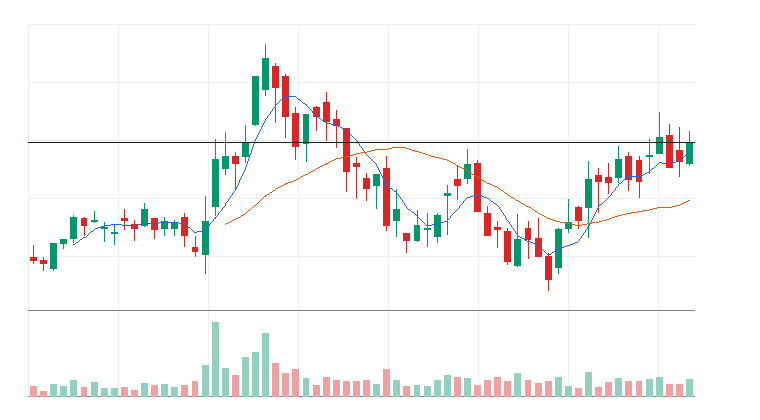
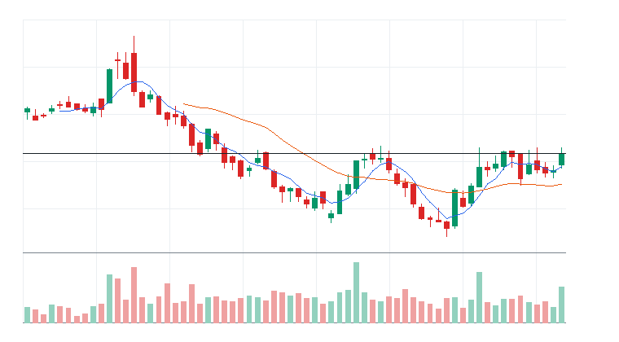

# 오늘의 데일리 트레이딩 요약

**REAL DATA TEST - 가격/거래량은 실제 데이터, 뉴스 연결, ETF 구성종목 확산도/거래대금 유동성 일부 연결**

**목적:** 이 리포트는 최근 오른 자산을 나열하는 것이 아니라, 돈이 몰리는 근거와 다음 매수 주체가 확인할 트레이딩 후보를 찾기 위한 보고서다.

> 핵심 질문: 현재 가격에서 누가 사고 있고, 누가 앞으로 더 비싸게 사줄 수 있는가?

## 시장 국면 판단

- 최종 판정: 약세장 (20점)
- 전일 대비: 약세장 유지, 점수 변화는 제한적이다(+3점).
- 판정 신뢰도: 높음 (100점) - 핵심 지수와 매크로 데이터가 대부분 직접 수집되어 판정 신뢰도가 높다.
- 행동 바이어스: 신규 매수 보류, 리스크 축소 우선
- 한 줄 결론: 기술적 추세와 매크로 환경이 모두 방어적이다. 신규 매수보다 손실 제한과 현금화가 우선이다.
- 기술적 지표: 하락 추세 (7점, 가중치 65%)
- KOSPI: 12점 | 50일선 아래, 200일선 아래, 20일 -17.82%, 60일 +17.00%, 52주 고점 대비 -22.39% -> 기술 점수 12
- KOSDAQ: 0점 | 50일선 아래, 200일선 아래, 20일 -19.63%, 60일 -29.00%, 52주 고점 대비 -32.53% -> 기술 점수 0
- 매크로 시황: 매크로 부담 (44점, 가중치 35%)
- 매크로 요약: 물가, 환율/글로벌 부담으로 매크로 환경은 방어적이다.
- 금리: 중립 45점 / 금리 중립 / confidence HIGH
  - 주요 근거: US 10Y yield 20일 +3.18%, 5일 +0.66%; US long-duration bonds 20일 -2.30%, 장기채 가격 기준 할인율 부담 확인
  - 확인 사항: 추가 확인 이벤트 없음
- 물가: 부담 40점 / 물가 부담 / confidence MEDIUM
  - 주요 근거: Oil ETF 20일 +3.32%, 유가 기반 물가 압력 확인
  - 확인 사항: 추가 확인 이벤트 없음
- 정책: 중립 50점 / 정책 이벤트 확인 전 중립 / confidence LOW
  - 주요 근거: 정책 톤은 1차 버전에서 일정/이벤트 리스크 기반 중립값으로 반영한다.
  - 확인 사항: FOMC, BOK 금통위, CPI/PCE 발표 전후에는 매크로 confidence를 보수적으로 해석한다.
- 신용/유동성: 중립 46점 / 신용/유동성 중립 / confidence HIGH
  - 주요 근거: High yield credit 20일 -0.29%, 하이일드 위험선호 확인; VIX 20일 +1.95%, 변동성 부담 확인
  - 확인 사항: 추가 확인 이벤트 없음
- 환율/글로벌: 부담 39점 / 환율/글로벌 부담 / confidence HIGH
  - 주요 근거: USD/KRW 20일 -3.74%, 원화 안정/불안 확인; Korea equity ETF 20일 -20.66%, 한국 외국인 위험선호 프록시; KOSDAQ-KOSPI 20일 상대강도 -1.81%, 성장 위험선호 확인
  - 확인 사항: 추가 확인 이벤트 없음
- USD/KRW: 57점 | 하락 시 주식 우호; 5일 -1.72%, 20일 -3.74% -> 매크로 점수 57
- US 10Y yield: 44점 | 하락 시 주식 우호; 5일 +0.66%, 20일 +3.18% -> 매크로 점수 44
- US long-duration bonds: 46점 | 상승 시 주식 우호; 5일 -0.33%, 20일 -2.30% -> 매크로 점수 46
- Oil ETF: 37점 | 하락 시 주식 우호; 5일 +9.44%, 20일 +3.32% -> 매크로 점수 37
- High yield credit: 50점 | 상승 시 주식 우호; 5일 +0.06%, 20일 -0.29% -> 매크로 점수 50
- VIX: 42점 | 하락 시 주식 우호; 5일 +5.62%, 20일 +1.95% -> 매크로 점수 42
- Korea equity ETF: 8점 | 상승 시 주식 우호; 5일 -11.58%, 20일 -20.66% -> 매크로 점수 8
- 데이터 커버리지: 기술 2/2, 매크로 7/7
- 데이터 신뢰도 근거:
  - 직접 지수 데이터: KOSPI, KOSDAQ
  - 대체 지수 데이터 없음
  - 매크로 데이터: 7/7
  - 누락 데이터 없음
  - stale 데이터 없음

## 모바일 요약

[오늘의 데일리 트레이딩 요약]

생성 성공 / 데이터 모드: REAL_TEST

시장:
- 위험회피

시장 지배 서사:
1. 금융/밸류업 주주환원 - 약화 - KODEX 200(069500.KS), 하나금융지주(086790.KS), 신한지주(055550.KS) 중심으로 5일 +3.49%, 20일 +0.12% 흐름이 형성됨. 뉴스 직접성 제한.
2. 화장품/음식료 수출 소비재 - 약화 - KODEX 200(069500.KS), 아모레퍼시픽(090430.KS), 한국콜마(161890.KS) 중심으로 5일 +0.69%, 20일 +2.80% 흐름이 형성됨. 뉴스 직접성 제한.
3. Financials 자금 유입 - 소멸 - KODEX 200(069500.KS), KODEX 코스닥150(229200.KS), 삼성화재(000810.KS), DB손해보험(005830.KS) 중심으로 5일 +3.86%, 20일 -11.01% 흐름이 형성됨. 뉴스 직접성 제한.

트렌드 강도:
1. 금융/밸류업 주주환원 - TSI 19 - 잠복 - 진입품질 낮음
2. 화장품/음식료 수출 소비재 - TSI 5 - 잠복 - 진입품질 낮음
3. Financials 자금 유입 - TSI 14 - 잠복 - 진입품질 낮음

오늘 결론:
- 금융/밸류업 주주환원 개별 종목 흐름이 ETF 대비 강한지 확인 필요
- 행동 후보는 linkedNarrative와 함께 확인한다.
- 추격보다 진입 조건 확인 후 접근한다.

오늘 실제 행동 후보:
1. SK이노베이션(096770.KS)(STOCK) - 미분류 - 단기 추세가 유지되고 거래량이 1.0배 이상이면 눌림 이후 재상승을 시도할 수 있음

다크호스 후보:
1. 다크호스 후보 없음 - 조건 충족 후보 없음

ETF 후보 TOP 5:
1. KODEX 200(069500.KS) - 금융/밸류업 주주환원 - 거래량 확인 전 관찰
2. KODEX 코스닥150(229200.KS) - Financials 자금 유입 - 거래량 확인 전 관찰

웹 리포트:
https://yoolcool.github.io/DailyTradingThesisAgent/kr/

## 오늘 결론

- 오늘 결론: 조건부 진입
- 신규 진입 후보: 0개
- 조건부 진입 후보: 1개
- 관찰 후보: 177개
- 주요 제한 요인: Entry Quality < 40, 뉴스 직접성 부족, RVOL 미달
- 주문 판단: 지정가 권장 / 시장가 주의
- 실전 판단: 진입 후보는 있으나, 전일 고점 돌파와 거래량 확인 후 선별적으로 접근한다.

### 후보 제한 요인 집계

- RVOL < 1.00x: 177개
- 거래대금 유동성 낮음: 0개
- Entry Quality 50~54 near miss: 0개
- Entry Quality 40~49 관찰: 0개
- Entry Quality < 40: 202개
- Exhaustion Risk >= 70: 0개
- ETF breadth 샘플 부족: 0개
- 뉴스 직접성 부족: 197개

## 데이터 신뢰도

- 전체 데이터 신뢰도 등급: MEDIUM
- 분석 신뢰도: MEDIUM
- 주문 실행 신뢰도: MEDIUM
- ETF breadth 신뢰도: HIGH
- 신뢰도 해석: 가격/거래량 stale fallback 1개 사용, 장전/시간외 데이터 확인 불가
- 리포트 생성 시각: 2026-07-17 09:12 KST
- 가격 기준 거래일: 2026-07-17 KRX 정규장 종가
- 뉴스 수집 시각: 2026-07-17 09:12 KST
- 가장 최근 뉴스 발행 시각: 2026-07-16 00:00 KST
- 뉴스 신선도 상태: STALE
- 뉴스 소스: DART
- 뉴스 소스 상태: DART CONNECTED
- 뉴스 신뢰도: HIGH
- 추천 적용 거래일: 2026-07-17 KRX 정규장
- 가격/거래량 데이터 상태: 일부 연결
- 뉴스 데이터 상태: 연결됨
- ETF 구성종목 확산도 상태: 일부 연결
- ETF 구성종목 샘플 수: 20~30
- 거래대금 유동성 데이터 상태: 일부 연결
- 장전/시간외 데이터 상태: NOT_APPLICABLE
- 데이터 provider: yfinance, DART, config fallback sample, price-volume dollar-volume fallback
- 실전 사용 경고: 이 리포트는 투자판단 보조용이며, REAL_TEST 모드에서는 일부 데이터가 누락되거나 지연될 수 있다. 실제 주문 전 현재가, 뉴스, 장전/시간외 가격과 정규장 거래대금을 별도 확인해야 한다.

## 0. 시장 상태

- 데이터 모드: REAL_TEST
- 가격/거래량: 일부 연결
- 뉴스: 연결됨
- ETF 구성종목 확산도: 일부 연결
- 거래대금 유동성: 일부 연결
- 생성 시각: 2026년 7월 17일 금요일 오전 9:12
- 시장 상태: 위험회피
- 오늘 돈의 방향: 금융/밸류업 주주환원 개별 종목 흐름이 ETF 대비 강한지 확인 필요
- 강한 테마 TOP 3: 금융/밸류업 주주환원(21), 화장품/음식료 수출 소비재(14), 화학/에너지(12)
- 데이터 한계:
  - API 또는 provider 상태에 따라 뉴스/ETF 확산도/거래대금 유동성 반영 범위가 달라질 수 있다.
  - 수집 실패 데이터는 점수 반영에서 제외하거나 confidence를 제한한다.
  - reasonConfidence HIGH는 직접 촉매, 가격/거래량, 확산도/유동성 근거가 함께 있을 때만 사용한다.

## 오늘 시장을 지배하는 서사

### 오늘 시장을 지배하는 서사 TOP 3

#### 1. 금융/밸류업 주주환원
- 상태: 약화
- narrativeScore: 25
- reasonConfidence: LOW
- 근거 ETF: KODEX 200(069500.KS)
- 근거 개별 종목: 하나금융지주(086790.KS), 신한지주(055550.KS), KB금융(105560.KS), 우리금융지주(316140.KS)
- 돈이 몰리는 이유: 금융/밸류업 주주환원 관련 KODEX 200(069500.KS)와 하나금융지주(086790.KS), 신한지주(055550.KS), KB금융(105560.KS), 우리금융지주(316140.KS)의 5일(+3.49%)·20일(+0.12%) 흐름을 함께 본다. 평균 상대 거래량은 0.93배이고, ETF 확산도도 이를 보조한다. 뉴스 직접성은 아직 제한적이다.
- 다음 매수 주체: 배당, 자사주, 자본비율 개선 기대가 커질 때 은행/금융지주가 방어적 주도주로 부상
- 가장 좋은 트레이딩 수단: ETF 우선: KODEX 200(069500.KS) / 개별 종목 우선: KB금융(105560.KS), 신한지주(055550.KS), 하나금융지주(086790.KS)
- 서사가 깨지는 조건: 금리 하락/정책 기대 둔화로 금융주가 KOSPI200 대비 상대강도를 잃는 경우
- 오늘 행동: 지수 변동성이 커질 때 방어적 대안으로 관찰하고, 급등 후에는 배당락/정책 뉴스 확인

상세 narrativeScore 근거 보기

- rawScore: 25
- ETF 평균 moneyFlowScore: 0
- 개별 종목 평균 moneyFlowScore: 42
- ETF 후보 비율: 0%
- 개별 종목 후보 비율: 25%
- 5일 평균 수익률: +3.00%
- 20일 평균 수익률: 0.00%
- 평균 상대 거래량: 1.00배
- ETF 평균 상대 거래량: 1.00배
- 개별주 평균 상대 거래량: 1.00배
- 52주 고점 근접 후보 비율: 40%
- 뉴스 직접성 점수: 1
- ETF 확산도 점수: 2
- 유동성 점수: 4
- 과열 리스크 차감: 0

#### 2. 화장품/음식료 수출 소비재
- 상태: 약화
- narrativeScore: 9
- reasonConfidence: LOW
- 근거 ETF: KODEX 200(069500.KS)
- 근거 개별 종목: 아모레퍼시픽(090430.KS), 한국콜마(161890.KS), LG생활건강(051900.KS), 삼양식품(003230.KS)
- 돈이 몰리는 이유: 화장품/음식료 수출 소비재 관련 KODEX 200(069500.KS)와 아모레퍼시픽(090430.KS), 한국콜마(161890.KS), LG생활건강(051900.KS), 삼양식품(003230.KS)의 5일(+0.69%)·20일(+2.80%) 흐름을 함께 본다. 평균 상대 거래량은 0.62배이고, ETF 확산도도 이를 보조한다. 뉴스 직접성은 아직 제한적이다.
- 다음 매수 주체: 중국/미국 수출, 면세, K-푸드 모멘텀이 확인될 때 소비재 대표주와 ODM 업체로 자금 유입
- 가장 좋은 트레이딩 수단: ETF 우선: KODEX 200(069500.KS) / 개별 종목 우선: 삼양식품(003230.KS), 한국콜마(161890.KS), 아모레퍼시픽(090430.KS)
- 서사가 깨지는 조건: 수출 소비재 대표 종목의 거래대금이 줄고 20일선 회복에 실패
- 오늘 행동: 실적 기대와 가격 반응이 같이 나타나는 종목만 선별, 단기 급등주는 눌림 대기

상세 narrativeScore 근거 보기

- rawScore: 9
- ETF 평균 moneyFlowScore: 0
- 개별 종목 평균 moneyFlowScore: 25
- ETF 후보 비율: 0%
- 개별 종목 후보 비율: 0%
- 5일 평균 수익률: +1.00%
- 20일 평균 수익률: +3.00%
- 평균 상대 거래량: 1.00배
- ETF 평균 상대 거래량: 1.00배
- 개별주 평균 상대 거래량: 1.00배
- 52주 고점 근접 후보 비율: 0%
- 뉴스 직접성 점수: 0
- ETF 확산도 점수: 2
- 유동성 점수: 3
- 과열 리스크 차감: 0

#### 3. Financials 자금 유입
- 상태: 소멸
- narrativeScore: 6
- reasonConfidence: LOW
- 근거 ETF: KODEX 200(069500.KS), KODEX 코스닥150(229200.KS)
- 근거 개별 종목: 삼성화재(000810.KS), DB손해보험(005830.KS), BNK금융지주(138930.KS), 삼성생명(032830.KS)
- 돈이 몰리는 이유: Financials 자금 유입 관련 KODEX 200(069500.KS), KODEX 코스닥150(229200.KS)와 삼성화재(000810.KS), DB손해보험(005830.KS), BNK금융지주(138930.KS), 삼성생명(032830.KS)의 5일(+3.86%)·20일(-11.01%) 흐름을 함께 본다. 평균 상대 거래량은 0.84배이고, ETF 확산도는 추가 확인이 필요하다. 뉴스 직접성은 아직 제한적이다.
- 다음 매수 주체: Financials 자금 유입을 확인한 섹터 ETF 자금과 상대강도 추종 스윙 자금
- 가장 좋은 트레이딩 수단: ETF 우선: KODEX 200(069500.KS), KODEX 코스닥150(229200.KS) / 개별 종목 우선: 삼성생명(032830.KS), 삼성화재(000810.KS), BNK금융지주(138930.KS)
- 서사가 깨지는 조건: 069500.KS 20일선 이탈 또는 관련 종목 절반 이상 5일선 이탈
- 오늘 행동: 기존 네러티브와 중복을 확인한 뒤 ETF/대표 종목 동조성이 살아날 때만 관찰 편입

상세 narrativeScore 근거 보기

- rawScore: 6
- ETF 평균 moneyFlowScore: 0
- 개별 종목 평균 moneyFlowScore: 30
- ETF 후보 비율: 0%
- 개별 종목 후보 비율: 25%
- 5일 평균 수익률: +4.00%
- 20일 평균 수익률: -11.00%
- 평균 상대 거래량: 1.00배
- ETF 평균 상대 거래량: 1.00배
- 개별주 평균 상대 거래량: 1.00배
- 52주 고점 근접 후보 비율: 0%
- 뉴스 직접성 점수: 0
- ETF 확산도 점수: -1
- 유동성 점수: 3
- 과열 리스크 차감: 0

### 전체 narrative 요약

| 서사명 | 상태 | narrativeScore | reasonConfidence | 대표 ETF | 대표 종목 | 오늘 행동 |
| --- | --- | ---: | --- | --- | --- | --- |
| 금융/밸류업 주주환원 | 약화 | 25 | LOW | KODEX 200(069500.KS) | 하나금융지주(086790.KS), 신한지주(055550.KS), KB금융(105560.KS), 우리금융지주(316140.KS) | 지수 변동성이 커질 때 방어적 대안으로 관찰하고, 급등 후에는 배당락/정책 뉴스 확인 |
| 화장품/음식료 수출 소비재 | 약화 | 9 | LOW | KODEX 200(069500.KS) | 아모레퍼시픽(090430.KS), 한국콜마(161890.KS), LG생활건강(051900.KS), 삼양식품(003230.KS) | 실적 기대와 가격 반응이 같이 나타나는 종목만 선별, 단기 급등주는 눌림 대기 |
| Financials 자금 유입 | 소멸 | 6 | LOW | KODEX 200(069500.KS), KODEX 코스닥150(229200.KS) | 삼성화재(000810.KS), DB손해보험(005830.KS), BNK금융지주(138930.KS), 삼성생명(032830.KS) | 기존 네러티브와 중복을 확인한 뒤 ETF/대표 종목 동조성이 살아날 때만 관찰 편입 |
| 소비 회복/방어주 선별 | 소멸 | 0 | LOW | KODEX 200(069500.KS), KODEX 코스닥150(229200.KS) | 영원무역(111770.KS), 미스토홀딩스(081660.KS), 금호타이어(073240.KS), 현대백화점(069960.KS) | 기존 네러티브와 중복을 확인한 뒤 ETF/대표 종목 동조성이 살아날 때만 관찰 편입 |
| 바이오/헬스케어 실적 전환 | 소멸 | 0 | LOW | KODEX 200(069500.KS) | 삼성바이오로직스(207940.KS), 셀트리온(068270.KS), 유한양행(000100.KS), 한미약품(128940.KS) | 뉴스 촉매와 거래량이 동반될 때만 관찰 편입, 이벤트 소멸 후 추격은 금지 |
| Energy & Chemicals 자금 유입 | 소멸 | 0 | LOW | KODEX 200(069500.KS), KODEX 코스닥150(229200.KS) | GS(078930.KS), 후성(093370.KS), 한솔케미칼(014680.KS) | 기존 네러티브와 중복을 확인한 뒤 ETF/대표 종목 동조성이 살아날 때만 관찰 편입 |
| 인터넷/게임/엔터 성장주 | 소멸 | 0 | LOW | KODEX 200(069500.KS), KODEX 코스닥150(229200.KS) | 카카오(035720.KS), 크래프톤(259960.KS), NAVER(035420.KS), 하이브(352820.KS) | 지수 위험선호가 유지될 때만 선별 진입, 대형 플랫폼은 실적 반응을 우선 확인 |
| 조선/방산 수주 사이클 | 소멸 | 0 | LOW | KODEX 200(069500.KS) | 한화오션(042660.KS), 한국항공우주(047810.KS), HD현대중공업(329180.KS), 한화에어로스페이스(012450.KS) | 수주 공시나 업황 뉴스가 직접 확인될 때만 추세 추종, 과열 구간은 신규 진입 보류 |
| 전력기기/인프라 투자 | 소멸 | 0 | LOW | KODEX 200(069500.KS) | HD현대일렉트릭(267260.KS), LS ELECTRIC(010120.KS), 효성중공업(298040.KS), HD현대(267250.KS) | 강한 종목을 추격하기보다 거래대금 유지와 5일선 재지지를 확인 |
| 자동차/부품 수출 모멘텀 | 소멸 | 0 | LOW | KODEX 200(069500.KS) | 기아(000270.KS), 현대차(005380.KS), 현대모비스(012330.KS), 현대위아(011210.KS) | 완성차 쌍두마차가 시장 대비 강할 때만 부품주까지 확산 여부를 확인 |
| 2차전지 소재/셀 반등 | 소멸 | 0 | LOW | KODEX 200(069500.KS), KODEX 코스닥150(229200.KS) | LG에너지솔루션(373220.KS), 삼성SDI(006400.KS), 포스코퓨처엠(003670.KS), 에코프로머티(450080.KS) | 추세 전환보다 반등 성격으로 접근하고, 상대 거래량이 살아나는 종목만 단기 관찰 |
| 전력 유틸리티 수요 재평가 | 소멸 | 0 | LOW | KODEX 200(069500.KS), KODEX 코스닥150(229200.KS) | 효성중공업(298040.KS), LS ELECTRIC(010120.KS) | 기존 네러티브와 중복을 확인한 뒤 ETF/대표 종목 동조성이 살아날 때만 관찰 편입 |
| AI 반도체/HBM 공급망 | 소멸 | 0 | LOW | KODEX 200(069500.KS) | 한미반도체(042700.KS), 삼성전자(005930.KS), SK하이닉스(000660.KS), 삼성전기(009150.KS) | 추격보다 SK하이닉스/삼성전자 동조성과 거래대금 회복을 확인한 뒤 눌림 구간에서 선별 |
| 지주/배당/자사주 재평가 | 소멸 | 0 | LOW | KODEX 200(069500.KS) | LG(003550.KS), SK(034730.KS), 두산(000150.KS), 롯데지주(004990.KS) | 강한 시장에서는 후순위, 변동성 확대 구간에서 방어적 재평가 후보로 관찰 |
| Heavy Industries 자금 유입 | 소멸 | 0 | LOW | KODEX 200(069500.KS), KODEX 코스닥150(229200.KS) | 산일전기(062040.KS), 현대로템(064350.KS) | 기존 네러티브와 중복을 확인한 뒤 ETF/대표 종목 동조성이 살아날 때만 관찰 편입 |
| IT 자금 유입 | 소멸 | 0 | LOW | KODEX 200(069500.KS), KODEX 코스닥150(229200.KS) | SK스퀘어(402340.KS), 이수페타시스(007660.KS) | 기존 네러티브와 중복을 확인한 뒤 ETF/대표 종목 동조성이 살아날 때만 관찰 편입 |
| Constructions 자금 유입 | 소멸 | 0 | LOW | KODEX 200(069500.KS), KODEX 코스닥150(229200.KS) | 삼성물산(028260.KS), GS건설(006360.KS) | 기존 네러티브와 중복을 확인한 뒤 ETF/대표 종목 동조성이 살아날 때만 관찰 편입 |

## 트렌드 강도 판단

### 1. 금융/밸류업 주주환원
- Trend Strength Index: 19
- 트렌드 상태 라벨: 잠복
- 테마 확산도: 부족
- ETF 동조성: 부족
- 거래량 강도: 부족
- 과열 위험: 보통 (30)
- 오늘 진입 품질: 낮음 (4)
- 한 줄 판단: 금융/밸류업 주주환원는 Trend Strength는 높아도 시장 위험선호가 약해 시장 환경 비우호 구간이다.
- 오늘 접근법: KODEX 200(069500.KS)와 하나금융지주(086790.KS)/신한지주(055550.KS)/KB금융(105560.KS)의 거래량 확산이 확인되기 전까지 관찰한다.

트렌드 강도 상세 근거 보기

- 가격 모멘텀: 가격 모멘텀 13/25. 평균 5D +3.49%, 20D +0.12%.
- 거래량 강도: 거래량 강도 4/20. 평균 RVOL 0.93배.
- ETF 동조성: ETF 동조성 -3/15. 관련 ETF KODEX 200(069500.KS) 흐름을 기준으로 판단.
- 테마 확산도: 테마 확산도 4/20. 상위 1~2개 쏠림 감점 6점 반영.
- 뉴스 촉매: 뉴스/촉매 신선도 1/10. HIGH 직접 촉매 0개.
- 과열 리스크: 과열 리스크 30/100. 단기 급등, 고점 근접, ETF-개별주 괴리, 쏠림을 함께 반영.
- 시장 환경: 시장 환경 0/10. KOSPI200/KODEX 200/KODEX KOSDAQ150 가격 흐름 기반 위험선호 점수.

### 2. 화장품/음식료 수출 소비재
- Trend Strength Index: 5
- 트렌드 상태 라벨: 잠복
- 테마 확산도: 부족
- ETF 동조성: 부족
- 거래량 강도: 부족
- 과열 위험: 낮음 (18)
- 오늘 진입 품질: 낮음 (0)
- 한 줄 판단: 화장품/음식료 수출 소비재는 Trend Strength는 높아도 시장 위험선호가 약해 시장 환경 비우호 구간이다.
- 오늘 접근법: KODEX 200(069500.KS)와 아모레퍼시픽(090430.KS)/한국콜마(161890.KS)/LG생활건강(051900.KS)의 거래량 확산이 확인되기 전까지 관찰한다.

트렌드 강도 상세 근거 보기

- 가격 모멘텀: 가격 모멘텀 4/25. 평균 5D +0.69%, 20D +2.80%.
- 거래량 강도: 거래량 강도 3/20. 평균 RVOL 0.62배.
- ETF 동조성: ETF 동조성 -3/15. 관련 ETF KODEX 200(069500.KS) 흐름을 기준으로 판단.
- 테마 확산도: 테마 확산도 1/20. 상위 1~2개 쏠림 감점 6점 반영.
- 뉴스 촉매: 뉴스/촉매 신선도 0/10. HIGH 직접 촉매 0개.
- 과열 리스크: 과열 리스크 18/100. 단기 급등, 고점 근접, ETF-개별주 괴리, 쏠림을 함께 반영.
- 시장 환경: 시장 환경 0/10. KOSPI200/KODEX 200/KODEX KOSDAQ150 가격 흐름 기반 위험선호 점수.

### 3. Financials 자금 유입
- Trend Strength Index: 14
- 트렌드 상태 라벨: 잠복
- 테마 확산도: 부족
- ETF 동조성: 부족
- 거래량 강도: 부족
- 과열 위험: 보통 (30)
- 오늘 진입 품질: 낮음 (0)
- 한 줄 판단: Financials 자금 유입는 Trend Strength는 높아도 시장 위험선호가 약해 시장 환경 비우호 구간이다.
- 오늘 접근법: KODEX 200(069500.KS)/KODEX 코스닥150(229200.KS)와 삼성화재(000810.KS)/DB손해보험(005830.KS)/BNK금융지주(138930.KS)의 거래량 확산이 확인되기 전까지 관찰한다.

트렌드 강도 상세 근거 보기

- 가격 모멘텀: 가격 모멘텀 8/25. 평균 5D +3.86%, 20D -11.01%.
- 거래량 강도: 거래량 강도 4/20. 평균 RVOL 0.84배.
- ETF 동조성: ETF 동조성 0/15. 관련 ETF KODEX 200(069500.KS), KODEX 코스닥150(229200.KS) 흐름을 기준으로 판단.
- 테마 확산도: 테마 확산도 1/20. 상위 1~2개 쏠림 감점 6점 반영.
- 뉴스 촉매: 뉴스/촉매 신선도 1/10. HIGH 직접 촉매 0개.
- 과열 리스크: 과열 리스크 30/100. 단기 급등, 고점 근접, ETF-개별주 괴리, 쏠림을 함께 반영.
- 시장 환경: 시장 환경 0/10. KOSPI200/KODEX 200/KODEX KOSDAQ150 가격 흐름 기반 위험선호 점수.

## 최근 추천 결과 트래킹

개별주는 데이트레이딩 관점으로 추천 이후 첫 정규장의 장중 최고가와 종가를 추적한다. ETF는 테마/스윙 관점으로 추천 이후 1주일 동안의 최고가와 현재 종가를 추적한다.

### 개별주 Top 3 추천 성과 요약
- 최근 5개 리포트 표본: 10개 (초기 검증 단계)
- 장중 최고가 기준 성공률: +55.56%
- 종가 기준 성공률: +22.22%
- 평균 장중 최고 수익률: +5.59%
- 평균 종가 수익률: +0.04%

### ETF 추천 성과 요약
- 최근 5개 리포트 표본: 0개 (초기 검증 단계)
- 1주 최고가 기준 성공률: 데이터 없음
- 현재 종가 기준 성공률: 데이터 없음
- 평균 1주 최고 수익률: 데이터 없음
- 평균 현재 수익률: 데이터 없음

최근 추천 결과 상세 테이블 펼치기

| 추천일 | 유형 | 순위 | 티커 | 기준가 | 추적 기간 | 상태 | High 수익률 | Close 수익률 | 결과 | 코멘트 |
| --- | --- | ---: | --- | ---: | --- | --- | ---: | ---: | --- | --- |
| 2026-07-17 | STOCK | 1 | SK이노베이션(096770.KS) | $121,400 | 2026-07-17 | pending | 데이터 없음 | 데이터 없음 | 추적 대기 | 아직 추적 거래일 데이터가 완성되지 않음 |
| 2026-07-14 | STOCK | 2 | S-Oil(010950.KS) | $139,500 | 2026-07-14 | complete | +2.87% | -5.81% | 제한적 유효 | 제한적인 장중 기회만 발생 (일봉 기준) |
| 2026-07-14 | STOCK | 1 | 금호타이어(073240.KS) | $7,160 | 2026-07-14 | complete | -2.23% | -8.66% | 실패 | 추천 이후 의미 있는 장중 기회가 부족하고 종가도 약함 (일봉 기준) |
| 2026-07-13 | STOCK | 2 | 금호타이어(073240.KS) | $6,330 | 2026-07-13 | complete | +23.85% | +13.11% | 성공 | 장중 기회와 종가 유지가 모두 확인됨 (일봉 기준) |
| 2026-07-13 | STOCK | 1 | 한국콜마(161890.KS) | $115,100 | 2026-07-13 | complete | +2.43% | +0.61% | 제한적 유효 | 제한적인 장중 기회만 발생 (일봉 기준) |
| 2026-07-07 | STOCK | 1 | 금호타이어(073240.KS) | $6,260 | 2026-07-07 | complete | +8.31% | +1.12% | 성공 | 장중 기회와 종가 유지가 모두 확인됨 (일봉 기준) |
| 2026-07-07 | STOCK | 1 | 한국콜마(161890.KS) | $115,100 | 2026-07-07 | complete | +8.25% | 0.00% | 단타 유효 | 장중 기회는 있었지만 종가 유지력은 약함 (일봉 기준) |
| 2026-07-06 | STOCK | 3 | GS(078930.KS) | $78,100 | 2026-07-06 | complete | +3.84% | 0.00% | 단타 유효 | 장중 기회는 있었지만 종가 유지력은 약함 (일봉 기준) |
| 2026-07-06 | STOCK | 2 | 금호타이어(073240.KS) | $6,160 | 2026-07-06 | complete | 0.00% | 0.00% | 추적 대기 | 아직 추적 거래일 데이터가 완성되지 않음 (일봉 기준) |
| 2026-07-06 | STOCK | 1 | NH투자증권(005940.KS) | $33,100 | 2026-07-06 | complete | +3.02% | 0.00% | 단타 유효 | 장중 기회는 있었지만 종가 유지력은 약함 (일봉 기준) |
| 2026-07-03 | STOCK | 1 | 한국콜마(161890.KS) | $117,800 | 2026-07-03 | complete | +1.44% | 0.00% | 제한적 유효 | 제한적인 장중 기회만 발생 (일봉 기준) |
| 2026-07-02 | STOCK | 2 | 미스토홀딩스(081660.KS) | $46,400 | 2026-07-02 | complete | +7.76% | 0.00% | 단타 유효 | 장중 기회는 있었지만 종가 유지력은 약함 (일봉 기준) |
| 2026-07-02 | STOCK | 1 | 한국콜마(161890.KS) | $113,700 | 2026-07-02 | complete | +8.18% | 0.00% | 단타 유효 | 장중 기회는 있었지만 종가 유지력은 약함 (일봉 기준) |
| 2026-07-01 | STOCK | 3 | 산일전기(062040.KS) | $261,500 | 2026-07-01 | complete | +4.21% | 0.00% | 단타 유효 | 장중 기회는 있었지만 종가 유지력은 약함 (일봉 기준) |
| 2026-07-01 | STOCK | 2 | 한국콜마(161890.KS) | $106,800 | 2026-07-01 | complete | +0.19% | 0.00% | 추적 대기 | 아직 추적 거래일 데이터가 완성되지 않음 (일봉 기준) |
| 2026-07-01 | STOCK | 1 | 한솔케미칼(014680.KS) | $304,000 | 2026-07-01 | complete | +4.93% | 0.00% | 단타 유효 | 장중 기회는 있었지만 종가 유지력은 약함 (일봉 기준) |
| 2026-06-30 | STOCK | 2 | SK(034730.KS) | $834,000 | 2026-06-30 | complete | +1.32% | 0.00% | 제한적 유효 | 제한적인 장중 기회만 발생 (일봉 기준) |
| 2026-06-30 | STOCK | 1 | 한국콜마(161890.KS) | $99,500 | 2026-06-30 | complete | +3.02% | 0.00% | 단타 유효 | 장중 기회는 있었지만 종가 유지력은 약함 (일봉 기준) |
| 2026-06-29 | STOCK | 2 | 금호타이어(073240.KS) | $5,320 | 2026-06-29 | complete | +10.34% | 0.00% | 단타 유효 | 장중 기회는 있었지만 종가 유지력은 약함 (일봉 기준) |
| 2026-06-29 | STOCK | 1 | 한국콜마(161890.KS) | $99,400 | 2026-06-29 | complete | +0.30% | 0.00% | 추적 대기 | 아직 추적 거래일 데이터가 완성되지 않음 (일봉 기준) |
| 2026-06-26 | STOCK | 1 | SK(034730.KS) | $815,000 | 2026-06-26 | complete | +7.98% | 0.00% | 단타 유효 | 장중 기회는 있었지만 종가 유지력은 약함 (일봉 기준) |
| 2026-06-25 | STOCK | 3 | 삼성물산(028260.KS) | $519,000 | 2026-06-25 | complete | +8.48% | 0.00% | 단타 유효 | 장중 기회는 있었지만 종가 유지력은 약함 (일봉 기준) |
| 2026-06-25 | STOCK | 2 | SK하이닉스(000660.KS) | $2,917,000 | 2026-06-25 | complete | +2.40% | 0.00% | 제한적 유효 | 제한적인 장중 기회만 발생 (일봉 기준) |
| 2026-06-25 | STOCK | 1 | SK스퀘어(402340.KS) | $1,899,000 | 2026-06-25 | complete | +4.79% | 0.00% | 단타 유효 | 장중 기회는 있었지만 종가 유지력은 약함 (일봉 기준) |
| 2026-06-22 | STOCK | 3 | SK스퀘어(402340.KS) | $1,970,000 | 2026-06-22 | complete | +0.86% | 0.00% | 추적 대기 | 아직 추적 거래일 데이터가 완성되지 않음 (일봉 기준) |
| 2026-06-22 | STOCK | 2 | 삼성물산(028260.KS) | $520,000 | 2026-06-22 | complete | +4.04% | 0.00% | 단타 유효 | 장중 기회는 있었지만 종가 유지력은 약함 (일봉 기준) |
| 2026-06-22 | STOCK | 1 | SK하이닉스(000660.KS) | $2,919,000 | 2026-06-22 | complete | +0.89% | 0.00% | 추적 대기 | 아직 추적 거래일 데이터가 완성되지 않음 (일봉 기준) |
| 2026-06-19 | STOCK | 3 | 삼성전자(005930.KS) | $362,500 | 2026-06-19 | complete | +3.31% | -2.34% | 단타 유효 | 장중 기회는 있었지만 종가 유지력은 약함 (일봉 기준) |
| 2026-06-19 | STOCK | 3 | SK하이닉스(000660.KS) | $2,764,000 | 2026-06-19 | complete | +4.59% | 0.00% | 단타 유효 | 장중 기회는 있었지만 종가 유지력은 약함 (일봉 기준) |
| 2026-06-19 | STOCK | 2 | SK(034730.KS) | $687,000 | 2026-06-19 | complete | +10.19% | +5.39% | 성공 | 장중 기회와 종가 유지가 모두 확인됨 (일봉 기준) |
| 2026-06-19 | STOCK | 1 | 삼성생명(032830.KS) | $469,000 | 2026-06-19 | complete | +10.13% | +5.97% | 성공 | 장중 기회와 종가 유지가 모두 확인됨 (일봉 기준) |
| 2026-06-19 | STOCK | 1 | LS ELECTRIC(010120.KS) | $255,500 | 2026-06-19 | complete | +8.22% | +1.37% | 성공 | 장중 기회와 종가 유지가 모두 확인됨 (일봉 기준) |
| 2026-06-19 | STOCK | 1 | 한화오션(042660.KS) | $128,400 | 2026-06-19 | complete | 0.00% | 0.00% | 추적 대기 | 아직 추적 거래일 데이터가 완성되지 않음 (일봉 기준) |
| 2026-06-19 | ETF | 1 | KODEX 200(069500.KS) | $146,910 | 2026-06-19~2026-06-26 | complete | +2.60% | -25.80% | 단기 고점 후 반납 | 1주 내 상승 기회는 있었지만 현재가는 반납 |
| 2026-06-18 | STOCK | 3 | SK스퀘어(402340.KS) | $1,733,000 | 2026-06-18 | complete | +0.29% | -1.90% | 실패 | 추천 이후 의미 있는 장중 기회가 부족하고 종가도 약함 (일봉 기준) |
| 2026-06-18 | STOCK | 3 | 삼성생명(032830.KS) | $469,000 | 2026-06-18 | complete | +0.32% | 0.00% | 추적 대기 | 아직 추적 거래일 데이터가 완성되지 않음 (일봉 기준) |
| 2026-06-18 | STOCK | 2 | 후성(093370.KS) | $18,830 | 2026-06-18 | complete | +4.25% | +0.05% | 단타 유효 | 장중 기회는 있었지만 종가 유지력은 약함 (일봉 기준) |
| 2026-06-18 | STOCK | 2 | SK하이닉스(000660.KS) | $2,698,000 | 2026-06-18 | complete | +1.48% | -0.48% | 제한적 유효 | 제한적인 장중 기회만 발생 (일봉 기준) |
| 2026-06-18 | STOCK | 2 | SK(034730.KS) | $687,000 | 2026-06-18 | complete | +2.62% | 0.00% | 제한적 유효 | 제한적인 장중 기회만 발생 (일봉 기준) |
| 2026-06-18 | STOCK | 1 | LG이노텍(011070.KS) | $1,290,000 | 2026-06-18 | complete | +2.33% | -0.54% | 제한적 유효 | 제한적인 장중 기회만 발생 (일봉 기준) |
| 2026-06-18 | STOCK | 1 | 삼성전자(005930.KS) | $362,500 | 2026-06-18 | complete | +0.14% | 0.00% | 추적 대기 | 아직 추적 거래일 데이터가 완성되지 않음 (일봉 기준) |

## 오늘 실제 행동 후보

### 1. SK이노베이션(096770.KS)
- 자산 유형: STOCK
- linkedNarrative: 미분류
- narrativeStatus: 관찰
- narrativeScore: 0
- Trend Strength Index: 데이터 없음
- Exhaustion Risk: 데이터 없음 (데이터 없음)
- Entry Quality Score: 데이터 없음 (데이터 없음)
- 트렌드 판단: 데이터 없음
- moneyFlowScore: 89
- finalRawScore: 89
- reasonConfidence: MEDIUM
- reasonConfidenceExplanation: 보조 근거 일부 제한 때문에 HIGH가 아니라 MEDIUM으로 제한했다.
- tieBreakerReason: 최종 원점수 89, 리스크 패널티 -6, 5일 수익률 +22.63%, 상대 거래량 3.04배 순으로 정렬
- 후보별 시장 해석: 위험회피 / 제한적 - 전체 시장은 위험회피 / Entry Quality 0 < 50이나 moneyFlow 89, confidence MEDIUM, RVOL 3.04x로 강한 자금흐름 예외 조건 충족
- 게이트 사유: Entry Quality 0 < 50이나 moneyFlow 89, confidence MEDIUM, RVOL 3.04x로 강한 자금흐름 예외 조건 충족
- 주문 실행: 시장가 가능

- 왜 돈이 몰리는가: 20일 +17.29%, 5일 +22.63%, 상대 거래량 3.04배로 가격과 거래량이 함께 개선. 뉴스: DART filing/under_72h / 유동성: LIQUID
- 누가 더 비싸게 사줄 수 있는지: 개별 주도주를 따라붙는 단기 모멘텀 자금과 관련 ETF 강세를 확인한 트레이더
- 진입 조건: 20일선 위 눌림 후 재상승 확인
- 무효화 조건: 20일선 이탈 또는 상대 거래량 0.8배 이하 둔화
- todayActionLabel: 자금흐름 예외 조건부
#### 최근 뉴스/동향 한국어 요약

- 요약: 종목 직접 뉴스 확인 상태이며 뉴스 흐름은 중립 또는 혼재입니다. 후보 선정 후 재확인한 핵심 이슈는 "기업설명회(IR)개최(안내공시)              "입니다.
- 직접 촉매 판단: SK이노베이션에 대해 직접 촉매로 분류된 뉴스가 확인됐습니다. 핵심은 "기업설명회(IR)개최(안내공시)              "이며, 일반 재료로 봅니다.
- 뉴스 1: 기업설명회(IR)개최(안내공시)
  - 내용: SK이노베이션 관련 일반 뉴스입니다. 제목상 핵심은 "기업설명회(IR)개최(안내공시)"입니다.
  - 투자 의미: 단기 중립 뉴스 흐름으로 볼 수 있지만, 단독 매수 근거보다는 가격·거래량 조건을 확인하는 보조 근거로 사용합니다.
  - 확인할 점: 원문 수치, 후속 보도, 가격이 진입 조건을 지키는지
- 매매 해석: 매매 관점에서는 뉴스 자체보다 가격이 진입 조건을 지키는지, 거래량이 동반되는지, 그리고 뉴스가 이미 주가에 반영됐는지를 우선 확인해야 합니다.
- 차트: 

## 다크호스 후보

다크호스 후보 없음. 상위 서사 정렬, MA20 위 안착, MA5/MA20 구조 개선, RVOL 0.90x 이상 조건을 동시에 충족한 개별주가 없다.

- darkHorseScore: 조건 충족 후보 없음
- 왜 아직 메인이 아닌가: 확인 조건을 통과한 보조 관찰 후보가 없다.

darkHorseScore 상세 근거 보기

- 서사 정렬: 조건 미충족
- 초기 추세 구조: 조건 미충족
- 베이스 돌파/정돈: 조건 미충족
- 거래량 확인: 조건 미충족
- rawScore: 데이터 없음

## 오늘 돈이 몰리는 테마

- 금융/밸류업 주주환원: BNK금융지주(138930.KS), DB손해보험(005830.KS), 하나금융지주(086790.KS), 한화생명(088350.KS), 현대해상(001450.KS), iM금융지주(139130.KS), 기업은행(024110.KS), JB금융지주(175330.KS) | 평균 moneyFlowScore 21 | 관심은 유지하되 우선순위는 낮추고 추가 거래량 확인을 기다린다.
- 화장품/음식료 수출 소비재: 아모레퍼시픽(090430.KS), 아모레퍼시픽홀딩스(002790.KS), 에이피알(278470.KS), BGF리테일(282330.KS), CJ(001040.KS), CJ제일제당(097950.KS), 코스맥스(192820.KS), 대상(001680.KS) | 평균 moneyFlowScore 14 | 관심은 유지하되 우선순위는 낮추고 추가 거래량 확인을 기다린다.
- 화학/에너지: 코스모화학(005420.KS), GS(078930.KS), 한솔케미칼(014680.KS), 한화(000880.KS), 한화솔루션(009830.KS), HD현대(267250.KS), 한국카본(017960.KS), HS효성첨단소재(298050.KS) | 평균 moneyFlowScore 12 | 관심은 유지하되 우선순위는 낮추고 추가 거래량 확인을 기다린다.
- 경기소비재/자동차: 코웨이(021240.KS), DN오토모티브(007340.KS), 더블유게임즈(192080.KS), F&F(383220.KS), GKL(114090.KS), 한진칼(180640.KS), 한국타이어앤테크놀로지(161390.KS), 한국앤컴퍼니(000240.KS) | 평균 moneyFlowScore 11 | 관심은 유지하되 우선순위는 낮추고 추가 거래량 확인을 기다린다.
- 인터넷/게임/엔터 성장주: 제일기획(030000.KS), 하이브(352820.KS), 카카오(035720.KS), 크래프톤(259960.KS), KT(030200.KS), LG유플러스(032640.KS), NAVER(035420.KS), NC(036570.KS) | 평균 moneyFlowScore 8 | 관심은 유지하되 우선순위는 낮추고 추가 거래량 확인을 기다린다.
- 조선/방산 수주 사이클: 씨에스윈드(112610.KS), 두산(000150.KS), 두산밥캣(241560.KS), 두산에너빌리티(034020.KS), 두산로보틱스(454910.KS), 한화엔진(082740.KS), 한화오션(042660.KS), HD현대일렉트릭(267260.KS) | 평균 moneyFlowScore 2 | 관심은 유지하되 우선순위는 낮추고 추가 거래량 확인을 기다린다.

## 1. ETF 트레이딩 보고서
### 1-1. ETF 결론
- ETF 우선 후보: 없음
- ETF 관찰 후보: KODEX 200(069500.KS), KODEX 코스닥150(229200.KS)
- ETF 매매 금지: KODEX 200(069500.KS), KODEX 코스닥150(229200.KS)
- 오늘 ETF 최우선 1개: 없음
- ETF 섹션 해석: 이 섹션은 개별 종목 선택이 아니라 테마/섹터 단위 자금 흐름을 ETF로 매매할지 판단하기 위한 영역이다.

### 1-2. ETF 후보 TOP 5

선정 기준: ETF 후보는 가격/거래량 1차 점수에 뉴스, ETF 구성종목 확산도, 유동성, 리스크 패널티를 반영한 finalRawScore 기준으로 정렬한다. 표시 점수 100점 후보가 겹치면 tieBreakerReason으로 우선순위를 설명한다.

### [ETF] KODEX 200(069500.KS)
- 자산 유형: ETF
- ETF 세부 카테고리: 성장/테마 ETF
- ETF 역할: 테마 베타 매수
- 상태: 관찰
- linkedNarrative: 금융/밸류업 주주환원
- narrativeStatus: 약화
- narrativeScore: 25
- moneyFlowScore: 0
- finalRawScore: -41
- tieBreakerReason: 최종 원점수 -41, 리스크 패널티 -6, 5일 수익률 -7.39%, 상대 거래량 0.82배 순으로 정렬
- 과열 리스크: 낮음
- reasonConfidence: LOW
- reasonConfidenceExplanation: 가격/거래량이 약하거나 핵심 보조 근거가 부족해 LOW로 분류했다.

- todayActionLabel: 거래량 확인 전 관찰
- 주문 실행: 시장가 가능
- 기준일: 2026-07-16
- 종가: $109,000
- 1일 수익률: -6.63%
- 5일 수익률: -7.39%
- 20일 수익률: -25.82%
- 상대 거래량: 0.82배
- 52주 고점 대비 위치: -28.50%
- whyMoneyIsFlowing: 최근 수익률은 확인되지만 상대 거래량 0.82배라 신규 자금 유입 강도는 약함. ETF 확산도: NARROW_LEADERSHIP / 유동성: LIQUID
- likelyNextBuyer: 섹터 베타를 노리는 단기 모멘텀 자금과 리밸런싱 자금
- whyThisCouldTradeHigher: 단기 추세가 유지되고 거래량이 1.0배 이상이면 눌림 이후 재상승을 시도할 수 있음
#### 최근 뉴스/동향 한국어 요약

- 요약: 후보 선정 후 재확인 뉴스 데이터 없음
- 진입 조건: 상대 거래량 1.0배 회복 후 관찰
- 무효화 조건: 거래량 회복 실패
- 차트: 

#### 상세 근거

KODEX 200(069500.KS) 상세 근거 펼치기

- moneyFlowScore(최종) 산정 근거:
  - moneyFlowScore(1차): 0
  - 최종 원점수: -41
  - 최종 표시 점수: 0
  - cap 적용: raw score -41 capped to displayed score 0
  - 계산식: -42 + 0 + +2 + +5 + 0 - 6 + 0 = -41 -> 0
  - 점수 해석: 매매 금지 또는 우선순위 낮은 후보.
  - 가격/거래량 1차 점수: -42
    - 추세: -10
    - 단기 모멘텀: -10
    - 중기 모멘텀: -8
    - 거래량: -8
    - 신고가 근접: 0
    - 이동평균: -6
  - 하위 점수 cap:
    - 가격 모멘텀: 원점수 -10, 상한 적용 -10 / 최대 25
    - 단기 모멘텀: 원점수 -12, 상한 적용 -10 / 최대 20 (cap 적용)
    - 중기 모멘텀: 원점수 -17, 상한 적용 -8 / 최대 16 (cap 적용)
    - 거래량: 원점수 -8, 상한 적용 -8 / 최대 20
    - 신고가 근접: 원점수 0, 상한 적용 0 / 최대 12
    - 이동평균: 원점수 -6, 상한 적용 -6 / 최대 14
  - 추가 데이터 가감점:
    - 뉴스: 0
    - 유동성: +5
  - ETF 확산도: +2
  - 리스크 패널티: -6
  - 주요 근거: 1차 0, 최종 원점수 -41, 표시 0. ETF 구성종목 확산도 양호, 거래대금 기준 유동성 양호. 주의: 단기 과열/추격 위험 존재.
  - 리스크 패널티 산정 근거:
    - 총 리스크 패널티: -6
    - 리스크 등급: LOW
    - 감점된 리스크:
      - 20d moving average break risk: -6 | 근거: Close is below the 20-day moving average. | 대응: Hold off until 20-day moving average is recovered.
    - 관찰 리스크: 주요 관찰 리스크 없음
    - 한 줄 해석: 1개 감점 리스크로 총 -6점 반영.
- 데이터 사용 현황:
  - 가격/거래량: 사용
  - 뉴스: 연결됨
  - ETF 확산도: 사용
  - 거래대금 유동성: 사용
  - 관련 ETF 상대강도: 사용
- 뉴스 확인:
  - 최근 뉴스 상태: 연결됨
  - 뉴스 소스: DART
  - 소스별 상태: DART CONNECTED
  - 긍정/중립/부정: 0/0/0
  - 직접성/방향성/신선도: 0/0/0
  - 강한 촉매 수: 0
  - 중요 공시 수: 0
  - 직접 촉매: 없음
  - 보조 뉴스: 없음
  - 뉴스 수집 시각: 2026-07-17 09:12 KST
  - 가장 최근 뉴스 발행 시각: 데이터 없음
  - 뉴스 신선도 상태: UNKNOWN
  - 뉴스 이후 가격 반응: 부정
  - 가격 반응 점수 제한: 뉴스 이후 가격 반응과 점수 제한 특이사항 없음
  - 핵심 뉴스 요약: 의미 있는 신규 DART 공시 없음
  - 원점수/상한 점수: 0 / 0
  - 점수 반영: 0
  - 주의: 해당 티커의 신규 DART 공시가 없거나 API 결과가 비어 있음
- ETF 구성종목 확산도:
  - 구성종목 데이터 상태: 일부 연결
  - 샘플 수: 30/30
  - 샘플 신뢰도: NORMAL
  - 상승 종목 비율: 63%
  - 20일선 위 비율: 37%
  - 50일선 위 비율: 23%
  - 상위 기여 종목: 042700.KS, 086790.KS, 042660.KS, 006400.KS, 090430.KS
  - 확산도 판단: NARROW_LEADERSHIP
  - 원점수/샘플 상한/반영 점수: +2 / 8 / +2
  - 점수 반영: +2
- 거래대금 유동성:
  - 데이터 상태: 일부 연결
  - 거래대금 기준 유동성: LIQUID
  - 거래대금: $2,191,324,555,000
  - 평균 거래대금: $2,664,064,531,000
  - 주문 영향: 시장가 가능
  - 매매 영향: 거래대금이 충분해 시장가 가능 범위로 본다
- reasonConfidence 근거: 가격/거래량이 약하거나 주요 데이터가 부족해 낮음.
- 후보 선정 후 뉴스/동향 재확인:
  - 재확인 상태: 데이터 없음
- 차트 요약: 20일선 아래라 추세 확인 전까지 보수적 접근
- 기준일 2026-07-16 | 종가 $109,000 | 1일 -6.63% | 5일 -7.39% | 20일 -25.82% | 상대 거래량 0.82배 | 52주 고점 대비 -28.50% | 데이터 소스: yfinance

### [ETF] KODEX 코스닥150(229200.KS)
- 자산 유형: ETF
- ETF 세부 카테고리: 성장/테마 ETF
- ETF 역할: 테마 베타 매수
- 상태: 관찰
- linkedNarrative: Financials 자금 유입
- narrativeStatus: 소멸
- narrativeScore: 6
- moneyFlowScore: 0
- finalRawScore: -39
- tieBreakerReason: 최종 원점수 -39, 리스크 패널티 -6, 5일 수익률 -1.38%, 상대 거래량 0.83배 순으로 정렬
- 과열 리스크: 낮음
- reasonConfidence: LOW
- reasonConfidenceExplanation: 가격/거래량이 약하거나 핵심 보조 근거가 부족해 LOW로 분류했다.

- todayActionLabel: 거래량 확인 전 관찰
- 주문 실행: 시장가 가능
- 기준일: 2026-07-16
- 종가: $13,580
- 1일 수익률: -5.33%
- 5일 수익률: -1.38%
- 20일 수익률: -23.06%
- 상대 거래량: 0.83배
- 52주 고점 대비 위치: -37.49%
- whyMoneyIsFlowing: 최근 수익률은 확인되지만 상대 거래량 0.83배라 신규 자금 유입 강도는 약함. 유동성: LIQUID
- likelyNextBuyer: 섹터 베타를 노리는 단기 모멘텀 자금과 리밸런싱 자금
- whyThisCouldTradeHigher: 단기 추세가 유지되고 거래량이 1.0배 이상이면 눌림 이후 재상승을 시도할 수 있음
#### 최근 뉴스/동향 한국어 요약

- 요약: 후보 선정 후 재확인 뉴스 데이터 없음
- 진입 조건: 상대 거래량 1.0배 회복 후 관찰
- 무효화 조건: 거래량 회복 실패
- 차트: 

#### 상세 근거

KODEX 코스닥150(229200.KS) 상세 근거 펼치기

- moneyFlowScore(최종) 산정 근거:
  - moneyFlowScore(1차): 0
  - 최종 원점수: -39
  - 최종 표시 점수: 0
  - cap 적용: raw score -39 capped to displayed score 0
  - 계산식: -34 + 0 - 4 + +5 + 0 - 6 + 0 = -39 -> 0
  - 점수 해석: 매매 금지 또는 우선순위 낮은 후보.
  - 가격/거래량 1차 점수: -34
    - 추세: -5
    - 단기 모멘텀: -7
    - 중기 모멘텀: -8
    - 거래량: -8
    - 신고가 근접: 0
    - 이동평균: -6
  - 하위 점수 cap:
    - 가격 모멘텀: 원점수 -5, 상한 적용 -5 / 최대 25
    - 단기 모멘텀: 원점수 -7, 상한 적용 -7 / 최대 20
    - 중기 모멘텀: 원점수 -15, 상한 적용 -8 / 최대 16 (cap 적용)
    - 거래량: 원점수 -8, 상한 적용 -8 / 최대 20
    - 신고가 근접: 원점수 0, 상한 적용 0 / 최대 12
    - 이동평균: 원점수 -6, 상한 적용 -6 / 최대 14
  - 추가 데이터 가감점:
    - 뉴스: 0
    - 유동성: +5
  - ETF 확산도: -4
  - 리스크 패널티: -6
  - 주요 근거: 1차 0, 최종 원점수 -39, 표시 0. 거래대금 기준 유동성 양호. 주의: 단기 과열/추격 위험 존재.
  - 리스크 패널티 산정 근거:
    - 총 리스크 패널티: -6
    - 리스크 등급: LOW
    - 감점된 리스크:
      - 20d moving average break risk: -6 | 근거: Close is below the 20-day moving average. | 대응: Hold off until 20-day moving average is recovered.
    - 관찰 리스크: 주요 관찰 리스크 없음
    - 한 줄 해석: 1개 감점 리스크로 총 -6점 반영.
- 데이터 사용 현황:
  - 가격/거래량: 사용
  - 뉴스: 연결됨
  - ETF 확산도: 사용
  - 거래대금 유동성: 사용
  - 관련 ETF 상대강도: 사용
- 뉴스 확인:
  - 최근 뉴스 상태: 연결됨
  - 뉴스 소스: DART
  - 소스별 상태: DART CONNECTED
  - 긍정/중립/부정: 0/0/0
  - 직접성/방향성/신선도: 0/0/0
  - 강한 촉매 수: 0
  - 중요 공시 수: 0
  - 직접 촉매: 없음
  - 보조 뉴스: 없음
  - 뉴스 수집 시각: 2026-07-17 09:12 KST
  - 가장 최근 뉴스 발행 시각: 데이터 없음
  - 뉴스 신선도 상태: UNKNOWN
  - 뉴스 이후 가격 반응: 부정
  - 가격 반응 점수 제한: 뉴스 이후 가격 반응과 점수 제한 특이사항 없음
  - 핵심 뉴스 요약: 의미 있는 신규 DART 공시 없음
  - 원점수/상한 점수: 0 / 0
  - 점수 반영: 0
  - 주의: 해당 티커의 신규 DART 공시가 없거나 API 결과가 비어 있음
- ETF 구성종목 확산도:
  - 구성종목 데이터 상태: 일부 연결
  - 샘플 수: 20/20
  - 샘플 신뢰도: NORMAL
  - 상승 종목 비율: 50%
  - 20일선 위 비율: 5%
  - 50일선 위 비율: 5%
  - 상위 기여 종목: 240810.KQ, 403870.KQ, 237690.KQ, 058470.KQ, 095340.KQ
  - 확산도 판단: WEAK_BREADTH
  - 원점수/샘플 상한/반영 점수: -4 / 8 / -4
  - 점수 반영: -4
- 거래대금 유동성:
  - 데이터 상태: 일부 연결
  - 거래대금 기준 유동성: LIQUID
  - 거래대금: $420,965,279,280
  - 평균 거래대금: $506,661,774,220
  - 주문 영향: 시장가 가능
  - 매매 영향: 거래대금이 충분해 시장가 가능 범위로 본다
- reasonConfidence 근거: 가격/거래량이 약하거나 주요 데이터가 부족해 낮음.
- 후보 선정 후 뉴스/동향 재확인:
  - 재확인 상태: 데이터 없음
- 차트 요약: 20일선 아래라 추세 확인 전까지 보수적 접근
- 기준일 2026-07-16 | 종가 $13,580 | 1일 -5.33% | 5일 -1.38% | 20일 -23.06% | 상대 거래량 0.83배 | 52주 고점 대비 -37.49% | 데이터 소스: yfinance

### 1-3. ETF 과열/주의 후보

해당 없음

### 1-4. ETF 제외/매매 금지 후보

#### KODEX 200(069500.KS)
- moneyFlowScore(최종): 0
- moneyFlowScore 산정 근거 요약: 1차 0, 최종 원점수 -41, 표시 0. ETF 구성종목 확산도 양호, 거래대금 기준 유동성 양호. 주의: 단기 과열/추격 위험 존재.
- 제외 사유: 테마 자금 흐름 약함
- 해제 조건: 상대 거래량 1.0배 회복 후 관찰

#### KODEX 코스닥150(229200.KS)
- moneyFlowScore(최종): 0
- moneyFlowScore 산정 근거 요약: 1차 0, 최종 원점수 -39, 표시 0. 거래대금 기준 유동성 양호. 주의: 단기 과열/추격 위험 존재.
- 제외 사유: 테마 자금 흐름 약함
- 해제 조건: 상대 거래량 1.0배 회복 후 관찰

## 2. 개별 종목 트레이딩 보고서
### 2-1. 오늘 KOSPI200 신규 발굴 요약
- 신규 발굴 풀: KOSPI200 구성종목 전체
- universe source: D:\a\DailyTradingThesisAgent\DailyTradingThesisAgent\config\markets\kr\kospi200Fallback.json
- universe fetchStatus: MARKET_DATA
- 총 스캔 종목 수: 200
- 데이터 수집 성공: 200
- 데이터 수집 실패: 0
- 상세 데이터 수집 대상: 가격/거래량 1차 스캔 상위 20개
- 오늘 진입 후보: 1
- 오늘 눌림 대기: 0
- 오늘 관찰: 175
- 오늘 매매 금지: 24
- 개별 종목 진입 후보: SK이노베이션(096770.KS)
- 개별 종목 눌림 대기: 없음
- 개별 종목 매매 금지: 하나금융지주(086790.KS), S-Oil(010950.KS), 코웨이(021240.KS), GS리테일(007070.KS), 아모레퍼시픽홀딩스(002790.KS)
- 오늘 개별 종목 최우선 1개: SK이노베이션(096770.KS) - 관련 ETF보다 강함 | 주식 5일 +22.63% vs ETF 평균 -4.38%, 주식 20일 +17.29% vs ETF 평균 -24.44%, 상대 거래량 3.04배 vs ETF 평균 0.82배
- 개별 종목 섹션 해석: 이 섹션은 ETF로 확인된 테마 자금 흐름 안에서 ETF보다 더 강한 돌파 가능성이 있는 개별 종목만 선별하는 영역이다.

### 2-2. 오늘 개별 종목 신규 후보 TOP 5

선정 기준:
1. KOSPI200 전체를 moneyFlowScore(1차)로 먼저 스캔
2. moneyFlowScore(1차) 상위 20개를 상세 분석
3. 뉴스/유동성/관련 ETF 대비 상대강도/리스크 패널티를 반영
4. moneyFlowScore(최종), 최종 원점수, 리스크 패널티, 5일 수익률, 상대 거래량 순으로 재정렬

### 하나금융지주(086790.KS)
- 자산 유형: STOCK
- 상태: 매매 금지
- primaryTheme: 금융/밸류업 주주환원
- primarySector: 금융
- industry: 세부 업종 미분류
- relatedEtfs: KODEX 200(069500.KS), KODEX 코스닥150(229200.KS)
- linkedNarrative: 금융/밸류업 주주환원
- narrativeStatus: 약화
- narrativeScore: 25
- moneyFlowScore: 82
- finalRawScore: 82
- tieBreakerReason: 최종 원점수 82, 리스크 패널티 0, 5일 수익률 +11.58%, 상대 거래량 1.17배 순으로 정렬
- 과열 리스크: 낮음
- reasonConfidence: MEDIUM
- reasonConfidenceExplanation: 보조 근거 일부 제한 때문에 HIGH가 아니라 MEDIUM으로 제한했다.

- todayActionLabel: 제외
- 주문 실행: 시장가 가능
- 기준일: 2026-07-16
- 종가: $136,800
- 1일 수익률: 0.00%
- 5일 수익률: +11.58%
- 20일 수익률: +8.49%
- 상대 거래량: 1.17배
- 52주 고점 대비 위치: -4.00%
- 관련 ETF 대비 상대강도: 관련 ETF보다 강함 | 주식 5일 +11.58% vs ETF 평균 -4.38%, 주식 20일 +8.49% vs ETF 평균 -24.44%, 상대 거래량 1.17배 vs ETF 평균 0.82배
- whyMoneyIsFlowing: 20일 +8.49%, 5일 +11.58%, 상대 거래량 1.17배로 가격과 거래량이 함께 개선. 뉴스: DART filing/under_72h / 유동성: LIQUID
- likelyNextBuyer: 개별 주도주를 따라붙는 단기 모멘텀 자금과 관련 ETF 강세를 확인한 트레이더
- whyThisCouldTradeHigher: 52주 고점 부근이라 돌파가 확인되면 신고가 추종 매수가 붙을 수 있음
- 왜 ETF가 아니라 이 종목인가: 086790.KS가 관련 ETF 평균보다 5일/20일 흐름 또는 거래량에서 강해 개별 종목 우선 후보로 본다.
- ETF가 더 나은 경우: 086790.KS가 관련 ETF 평균보다 약하거나 거래량이 둔화되면 개별 종목보다 관련 ETF를 우선한다.
#### 최근 뉴스/동향 한국어 요약

- 요약: 후보 선정 후 재확인 뉴스 데이터 없음
- 진입 조건: 전일 고점 돌파와 5일선 유지 확인
- 무효화 조건: 20일선 이탈 또는 상대 거래량 0.8배 이하 둔화
- 차트: 

#### 상세 근거

하나금융지주(086790.KS) 상세 근거 펼치기

- moneyFlowScore(최종) 산정 근거:
  - moneyFlowScore(1차): 72
  - 최종 원점수: 82
  - 최종 표시 점수: 82
  - cap 적용: cap 미적용
  - 계산식: +72 + +5 + 0 + +5 + 0 + 0 + 0 = 82
  - 점수 해석: 강한 자금 유입 후보. 단, 과열 여부 확인 필수.
  - 가격/거래량 1차 점수: +72
    - 추세: +21
    - 단기 모멘텀: +9
    - 중기 모멘텀: +6
    - 거래량: +10
    - 신고가 근접: +12
    - 이동평균: +14
  - 하위 점수 cap:
    - 가격 모멘텀: 원점수 +21, 상한 적용 +21 / 최대 25
    - 단기 모멘텀: 원점수 +9, 상한 적용 +9 / 최대 20
    - 중기 모멘텀: 원점수 +6, 상한 적용 +6 / 최대 16
    - 거래량: 원점수 +10, 상한 적용 +10 / 최대 20
    - 신고가 근접: 원점수 +12, 상한 적용 +12 / 최대 12
    - 이동평균: 원점수 +14, 상한 적용 +14 / 최대 14
    - 관련 ETF 상대강도: 원점수 0, 상한 적용 0 / 최대 8
  - 추가 데이터 가감점:
    - 뉴스: +5
    - 유동성: +5
  - ETF 대비 상대강도: 0
  - 리스크 패널티: 0
  - 주요 근거: 1차 72, 최종 원점수 82, 표시 82. 20일 수익률 강함, 5일 수익률 강함, 52주 고점 근처. 주의: 큰 감점 제한적.
  - 리스크 패널티 산정 근거:
    - 총 리스크 패널티: 0
    - 리스크 등급: LOW
    - 감점된 리스크: 없음
    - 관찰 리스크: related ETF relative strength mapping needs confirmation
    - 한 줄 해석: 직접 감점된 주요 리스크는 없지만 관찰 리스크는 계속 확인해야 한다.
- 데이터 사용 현황:
  - 가격/거래량: 사용
  - 뉴스: 사용
  - ETF 확산도: 관련 ETF에서 확인
  - 거래대금 유동성: 사용
  - 관련 ETF 상대강도: 사용
- 뉴스 확인:
  - 최근 뉴스 상태: 연결됨
  - 뉴스 소스: DART
  - 소스별 상태: DART CONNECTED
  - 긍정/중립/부정: 0/1/0
  - 직접성/방향성/신선도: 4/0/2
  - 강한 촉매 수: 0
  - 중요 공시 수: 0
  - 직접 촉매: DART / 정기/기타공시 / under_72h / neutral / 중요도 2 - 기업설명회(IR)개최(안내공시)              
  - 보조 뉴스: 없음
  - 뉴스 수집 시각: 2026-07-17 09:12 KST
  - 가장 최근 뉴스 발행 시각: 2026-07-16 00:00 KST
  - 뉴스 신선도 상태: STALE
  - 뉴스 이후 가격 반응: 중립
  - 가격 반응 점수 제한: 뉴스 이후 가격 반응과 점수 제한 특이사항 없음
  - 핵심 뉴스 요약: 기업설명회(IR)개최(안내공시)              
  - 원점수/상한 점수: +5 / +5
  - 점수 반영: +5
  - 주의: 특이사항 없음
- ETF 구성종목 확산도: 관련 ETF에서 확인
- 거래대금 유동성:
  - 데이터 상태: 일부 연결
  - 거래대금 기준 유동성: LIQUID
  - 거래대금: $151,766,467,200
  - 평균 거래대금: $130,023,748,800
  - 주문 영향: 시장가 가능
  - 매매 영향: 거래대금이 충분해 시장가 가능 범위로 본다
- reasonConfidence 근거: 가격/거래량, 뉴스, 거래대금 유동성, 관련 ETF 상대강도은 확인됐지만 일부 보조 데이터가 미연결 또는 fallback이라 중간으로 제한한다.
- 후보 선정 후 뉴스/동향 재확인:
  - 재확인 상태: 데이터 없음
- 차트 요약: 최근 20거래일 기준 5일선이 20일선 위에 있음
- 기준일 2026-07-16 | 종가 $136,800 | 1일 0.00% | 5일 +11.58% | 20일 +8.49% | 상대 거래량 1.17배 | 52주 고점 대비 -4.00% | 데이터 소스: yfinance

### SK이노베이션(096770.KS)
- 자산 유형: STOCK
- 상태: 진입 후보
- primaryTheme: 화학/에너지
- primarySector: 화학/에너지
- industry: 세부 업종 미분류
- relatedEtfs: KODEX 200(069500.KS), KODEX 코스닥150(229200.KS)
- linkedNarrative: 미분류
- narrativeStatus: 관찰
- narrativeScore: 0
- moneyFlowScore: 89
- finalRawScore: 89
- tieBreakerReason: 최종 원점수 89, 리스크 패널티 -6, 5일 수익률 +22.63%, 상대 거래량 3.04배 순으로 정렬
- 과열 리스크: 낮음
- reasonConfidence: MEDIUM
- reasonConfidenceExplanation: 보조 근거 일부 제한 때문에 HIGH가 아니라 MEDIUM으로 제한했다.

- todayActionLabel: 자금흐름 예외 조건부
- 주문 실행: 시장가 가능
- 기준일: 2026-07-16
- 종가: $121,400
- 1일 수익률: +3.76%
- 5일 수익률: +22.63%
- 20일 수익률: +17.29%
- 상대 거래량: 3.04배
- 52주 고점 대비 위치: -21.88%
- 관련 ETF 대비 상대강도: 관련 ETF보다 강함 | 주식 5일 +22.63% vs ETF 평균 -4.38%, 주식 20일 +17.29% vs ETF 평균 -24.44%, 상대 거래량 3.04배 vs ETF 평균 0.82배
- whyMoneyIsFlowing: 20일 +17.29%, 5일 +22.63%, 상대 거래량 3.04배로 가격과 거래량이 함께 개선. 뉴스: DART filing/under_72h / 유동성: LIQUID
- likelyNextBuyer: 개별 주도주를 따라붙는 단기 모멘텀 자금과 관련 ETF 강세를 확인한 트레이더
- whyThisCouldTradeHigher: 단기 추세가 유지되고 거래량이 1.0배 이상이면 눌림 이후 재상승을 시도할 수 있음
- 왜 ETF가 아니라 이 종목인가: 096770.KS가 관련 ETF 평균보다 5일/20일 흐름 또는 거래량에서 강해 개별 종목 우선 후보로 본다.
- ETF가 더 나은 경우: 096770.KS가 관련 ETF 평균보다 약하거나 거래량이 둔화되면 개별 종목보다 관련 ETF를 우선한다.
#### 최근 뉴스/동향 한국어 요약

- 요약: 종목 직접 뉴스 확인 상태이며 뉴스 흐름은 중립 또는 혼재입니다. 후보 선정 후 재확인한 핵심 이슈는 "기업설명회(IR)개최(안내공시)              "입니다.
- 직접 촉매 판단: SK이노베이션에 대해 직접 촉매로 분류된 뉴스가 확인됐습니다. 핵심은 "기업설명회(IR)개최(안내공시)              "이며, 일반 재료로 봅니다.
- 뉴스 1: 기업설명회(IR)개최(안내공시)
  - 내용: SK이노베이션 관련 일반 뉴스입니다. 제목상 핵심은 "기업설명회(IR)개최(안내공시)"입니다.
  - 투자 의미: 단기 중립 뉴스 흐름으로 볼 수 있지만, 단독 매수 근거보다는 가격·거래량 조건을 확인하는 보조 근거로 사용합니다.
  - 확인할 점: 원문 수치, 후속 보도, 가격이 진입 조건을 지키는지
- 매매 해석: 매매 관점에서는 뉴스 자체보다 가격이 진입 조건을 지키는지, 거래량이 동반되는지, 그리고 뉴스가 이미 주가에 반영됐는지를 우선 확인해야 합니다.
- 진입 조건: 20일선 위 눌림 후 재상승 확인
- 무효화 조건: 20일선 이탈 또는 상대 거래량 0.8배 이하 둔화
- 차트: 

#### 상세 근거

SK이노베이션(096770.KS) 상세 근거 펼치기

- moneyFlowScore(최종) 산정 근거:
  - moneyFlowScore(1차): 85
  - 최종 원점수: 89
  - 최종 표시 점수: 89
  - cap 적용: cap 미적용
  - 계산식: +85 + +5 + 0 + +5 + 0 - 6 + 0 = 89
  - 점수 해석: 강한 자금 유입 후보. 단, 과열 여부 확인 필수.
  - 가격/거래량 1차 점수: +85
    - 추세: +25
    - 단기 모멘텀: +17
    - 중기 모멘텀: +11
    - 거래량: +18
    - 신고가 근접: 0
    - 이동평균: +14
  - 하위 점수 cap:
    - 가격 모멘텀: 원점수 +26, 상한 적용 +25 / 최대 25 (cap 적용)
    - 단기 모멘텀: 원점수 +17, 상한 적용 +17 / 최대 20
    - 중기 모멘텀: 원점수 +11, 상한 적용 +11 / 최대 16
    - 거래량: 원점수 +18, 상한 적용 +18 / 최대 20
    - 신고가 근접: 원점수 0, 상한 적용 0 / 최대 12
    - 이동평균: 원점수 +14, 상한 적용 +14 / 최대 14
    - 관련 ETF 상대강도: 원점수 0, 상한 적용 0 / 최대 8
  - 추가 데이터 가감점:
    - 뉴스: +5
    - 유동성: +5
  - ETF 대비 상대강도: 0
  - 리스크 패널티: -6
  - 주요 근거: 1차 85, 최종 원점수 89, 표시 89. 20일 수익률 강함, 5일 수익률 강함, 1일 단기 모멘텀 확인. 주의: 단기 과열/추격 위험 존재.
  - 리스크 패널티 산정 근거:
    - 총 리스크 패널티: -6
    - 리스크 등급: LOW
    - 감점된 리스크:
      - short-term overheat: -6 | 근거: 5d return +22.63% is extended. | 대응: Prefer pullback or prior high reclaim over chasing.
    - 관찰 리스크: related ETF relative strength mapping needs confirmation
    - 한 줄 해석: 1개 감점 리스크로 총 -6점 반영.
- 데이터 사용 현황:
  - 가격/거래량: 사용
  - 뉴스: 사용
  - ETF 확산도: 관련 ETF에서 확인
  - 거래대금 유동성: 사용
  - 관련 ETF 상대강도: 사용
- 뉴스 확인:
  - 최근 뉴스 상태: 연결됨
  - 뉴스 소스: DART
  - 소스별 상태: DART CONNECTED
  - 긍정/중립/부정: 0/1/0
  - 직접성/방향성/신선도: 4/0/2
  - 강한 촉매 수: 0
  - 중요 공시 수: 0
  - 직접 촉매: DART / 정기/기타공시 / under_72h / neutral / 중요도 2 - 기업설명회(IR)개최(안내공시)              
  - 보조 뉴스: 없음
  - 뉴스 수집 시각: 2026-07-17 09:12 KST
  - 가장 최근 뉴스 발행 시각: 2026-07-16 00:00 KST
  - 뉴스 신선도 상태: STALE
  - 뉴스 이후 가격 반응: 긍정
  - 가격 반응 점수 제한: 뉴스 이후 가격 반응과 점수 제한 특이사항 없음
  - 핵심 뉴스 요약: 기업설명회(IR)개최(안내공시)              
  - 원점수/상한 점수: +5 / +5
  - 점수 반영: +5
  - 주의: 특이사항 없음
- ETF 구성종목 확산도: 관련 ETF에서 확인
- 거래대금 유동성:
  - 데이터 상태: 일부 연결
  - 거래대금 기준 유동성: LIQUID
  - 거래대금: $224,824,180,600
  - 평균 거래대금: $73,839,000,600
  - 주문 영향: 시장가 가능
  - 매매 영향: 거래대금이 충분해 시장가 가능 범위로 본다
- reasonConfidence 근거: 가격/거래량, 뉴스, 거래대금 유동성, 관련 ETF 상대강도은 확인됐지만 일부 보조 데이터가 미연결 또는 fallback이라 중간으로 제한한다.
- 후보 선정 후 뉴스/동향 재확인:
  - 재확인 상태: 연결됨
  - 재확인 시각: 2026-07-17 09:12 KST
  - 최근 발행 시각: 2026-07-16 00:00 KST
  - 신선도: STALE
  - 출처: DART
  - 소스별 상태: DART CONNECTED
  - 한국어 요약: 종목 직접 뉴스 확인 상태이며 뉴스 흐름은 중립 또는 혼재입니다. 후보 선정 후 재확인한 핵심 이슈는 "기업설명회(IR)개최(안내공시)              "입니다.
  - 직접 촉매: DART / 정기/기타공시 / under_72h - 기업설명회(IR)개최(안내공시)              
  - 한국어 뉴스 요약 1: 기업설명회(IR)개최(안내공시)
    - 내용: SK이노베이션 관련 일반 뉴스입니다. 제목상 핵심은 "기업설명회(IR)개최(안내공시)"입니다.
    - 투자 의미: 단기 중립 뉴스 흐름으로 볼 수 있지만, 단독 매수 근거보다는 가격·거래량 조건을 확인하는 보조 근거로 사용합니다.
    - 확인할 점: 원문 수치, 후속 보도, 가격이 진입 조건을 지키는지
  - 원문 헤드라인 1: DART / 정기/기타공시 / under_72h / neutral - 기업설명회(IR)개최(안내공시)              
  - 주의: 특이사항 없음
- 차트 요약: 최근 20거래일 기준 5일선이 20일선 위에 있음
- 기준일 2026-07-16 | 종가 $121,400 | 1일 +3.76% | 5일 +22.63% | 20일 +17.29% | 상대 거래량 3.04배 | 52주 고점 대비 -21.88% | 데이터 소스: yfinance

### GS리테일(007070.KS)
- 자산 유형: STOCK
- 상태: 매매 금지
- primaryTheme: 화장품/음식료 수출 소비재
- primarySector: 필수소비재
- industry: 세부 업종 미분류
- relatedEtfs: KODEX 200(069500.KS), KODEX 코스닥150(229200.KS)
- linkedNarrative: 화장품/음식료 수출 소비재
- narrativeStatus: 약화
- narrativeScore: 9
- moneyFlowScore: 70
- finalRawScore: 70
- tieBreakerReason: 최종 원점수 70, 리스크 패널티 0, 5일 수익률 +5.60%, 상대 거래량 1.11배 순으로 정렬
- 과열 리스크: 낮음
- reasonConfidence: MEDIUM
- reasonConfidenceExplanation: 직접 촉매 부재, 뉴스 미사용 때문에 HIGH가 아니라 MEDIUM으로 제한했다.

- todayActionLabel: 제외
- 주문 실행: 시장가 가능
- 기준일: 2026-07-16
- 종가: $26,400
- 1일 수익률: +2.72%
- 5일 수익률: +5.60%
- 20일 수익률: +14.53%
- 상대 거래량: 1.11배
- 52주 고점 대비 위치: -11.85%
- 관련 ETF 대비 상대강도: 관련 ETF보다 강함 | 주식 5일 +5.60% vs ETF 평균 -4.38%, 주식 20일 +14.53% vs ETF 평균 -24.44%, 상대 거래량 1.11배 vs ETF 평균 0.82배
- whyMoneyIsFlowing: 20일 +14.53%, 5일 +5.60%, 상대 거래량 1.11배로 가격과 거래량이 함께 개선. 유동성: LIQUID
- likelyNextBuyer: 개별 주도주를 따라붙는 단기 모멘텀 자금과 관련 ETF 강세를 확인한 트레이더
- whyThisCouldTradeHigher: 단기 추세가 유지되고 거래량이 1.0배 이상이면 눌림 이후 재상승을 시도할 수 있음
- 왜 ETF가 아니라 이 종목인가: 007070.KS가 관련 ETF 평균보다 5일/20일 흐름 또는 거래량에서 강해 개별 종목 우선 후보로 본다.
- ETF가 더 나은 경우: 007070.KS가 관련 ETF 평균보다 약하거나 거래량이 둔화되면 개별 종목보다 관련 ETF를 우선한다.
#### 최근 뉴스/동향 한국어 요약

- 요약: 후보 선정 후 재확인 뉴스 데이터 없음
- 진입 조건: 20일선 위 눌림 후 재상승 확인
- 무효화 조건: 20일선 이탈 또는 상대 거래량 0.8배 이하 둔화
- 차트: 

#### 상세 근거

GS리테일(007070.KS) 상세 근거 펼치기

- moneyFlowScore(최종) 산정 근거:
  - moneyFlowScore(1차): 65
  - 최종 원점수: 70
  - 최종 표시 점수: 70
  - cap 적용: cap 미적용
  - 계산식: +65 + 0 + 0 + +5 + 0 + 0 + 0 = 70
  - 점수 해석: 관심 후보. 눌림 또는 돌파 확인 후 진입 검토.
  - 가격/거래량 1차 점수: +65
    - 추세: +18
    - 단기 모멘텀: +8
    - 중기 모멘텀: +9
    - 거래량: +10
    - 신고가 근접: +6
    - 이동평균: +14
  - 하위 점수 cap:
    - 가격 모멘텀: 원점수 +18, 상한 적용 +18 / 최대 25
    - 단기 모멘텀: 원점수 +8, 상한 적용 +8 / 최대 20
    - 중기 모멘텀: 원점수 +9, 상한 적용 +9 / 최대 16
    - 거래량: 원점수 +10, 상한 적용 +10 / 최대 20
    - 신고가 근접: 원점수 +6, 상한 적용 +6 / 최대 12
    - 이동평균: 원점수 +14, 상한 적용 +14 / 최대 14
    - 관련 ETF 상대강도: 원점수 0, 상한 적용 0 / 최대 8
  - 추가 데이터 가감점:
    - 뉴스: 0
    - 유동성: +5
  - ETF 대비 상대강도: 0
  - 리스크 패널티: 0
  - 주요 근거: 1차 65, 최종 원점수 70, 표시 70. 20일 수익률 강함, 5일 수익률 강함, 1일 단기 모멘텀 확인. 주의: 큰 감점 제한적.
  - 리스크 패널티 산정 근거:
    - 총 리스크 패널티: 0
    - 리스크 등급: LOW
    - 감점된 리스크: 없음
    - 관찰 리스크: related ETF relative strength mapping needs confirmation
    - 한 줄 해석: 직접 감점된 주요 리스크는 없지만 관찰 리스크는 계속 확인해야 한다.
- 데이터 사용 현황:
  - 가격/거래량: 사용
  - 뉴스: 연결됨
  - ETF 확산도: 관련 ETF에서 확인
  - 거래대금 유동성: 사용
  - 관련 ETF 상대강도: 사용
- 뉴스 확인:
  - 최근 뉴스 상태: 연결됨
  - 뉴스 소스: DART
  - 소스별 상태: DART CONNECTED
  - 긍정/중립/부정: 0/0/0
  - 직접성/방향성/신선도: 0/0/0
  - 강한 촉매 수: 0
  - 중요 공시 수: 0
  - 직접 촉매: 없음
  - 보조 뉴스: 없음
  - 뉴스 수집 시각: 2026-07-17 09:12 KST
  - 가장 최근 뉴스 발행 시각: 데이터 없음
  - 뉴스 신선도 상태: UNKNOWN
  - 뉴스 이후 가격 반응: 긍정
  - 가격 반응 점수 제한: 뉴스 이후 가격 반응과 점수 제한 특이사항 없음
  - 핵심 뉴스 요약: 의미 있는 신규 DART 공시 없음
  - 원점수/상한 점수: 0 / 0
  - 점수 반영: 0
  - 주의: 해당 티커의 신규 DART 공시가 없거나 API 결과가 비어 있음
- ETF 구성종목 확산도: 관련 ETF에서 확인
- 거래대금 유동성:
  - 데이터 상태: 일부 연결
  - 거래대금 기준 유동성: LIQUID
  - 거래대금: $5,628,796,800
  - 평균 거래대금: $5,057,236,800
  - 주문 영향: 시장가 가능
  - 매매 영향: 거래대금이 충분해 시장가 가능 범위로 본다
- reasonConfidence 근거: 가격/거래량, 거래대금 유동성, 관련 ETF 상대강도은 확인됐지만 일부 보조 데이터가 미연결 또는 fallback이라 중간으로 제한한다.
- 후보 선정 후 뉴스/동향 재확인:
  - 재확인 상태: 데이터 없음
- 차트 요약: 최근 20거래일 기준 5일선이 20일선 위에 있음
- 기준일 2026-07-16 | 종가 $26,400 | 1일 +2.72% | 5일 +5.60% | 20일 +14.53% | 상대 거래량 1.11배 | 52주 고점 대비 -11.85% | 데이터 소스: yfinance

### S-Oil(010950.KS)
- 자산 유형: STOCK
- 상태: 매매 금지
- primaryTheme: 화학/에너지
- primarySector: 화학/에너지
- industry: 세부 업종 미분류
- relatedEtfs: KODEX 200(069500.KS), KODEX 코스닥150(229200.KS)
- linkedNarrative: 미분류
- narrativeStatus: 관찰
- narrativeScore: 0
- moneyFlowScore: 82
- finalRawScore: 82
- tieBreakerReason: 최종 원점수 82, 리스크 패널티 0, 5일 수익률 +8.54%, 상대 거래량 1.08배 순으로 정렬
- 과열 리스크: 낮음
- reasonConfidence: MEDIUM
- reasonConfidenceExplanation: 보조 근거 일부 제한 때문에 HIGH가 아니라 MEDIUM으로 제한했다.

- todayActionLabel: 제외
- 주문 실행: 시장가 가능
- 기준일: 2026-07-16
- 종가: $144,900
- 1일 수익률: +3.21%
- 5일 수익률: +8.54%
- 20일 수익률: +37.87%
- 상대 거래량: 1.08배
- 52주 고점 대비 위치: -18.18%
- 관련 ETF 대비 상대강도: 관련 ETF보다 강함 | 주식 5일 +8.54% vs ETF 평균 -4.38%, 주식 20일 +37.87% vs ETF 평균 -24.44%, 상대 거래량 1.08배 vs ETF 평균 0.82배
- whyMoneyIsFlowing: 20일 +37.87%, 5일 +8.54%, 상대 거래량 1.08배로 가격과 거래량이 함께 개선. 뉴스: DART filing/under_72h / 유동성: LIQUID
- likelyNextBuyer: 개별 주도주를 따라붙는 단기 모멘텀 자금과 관련 ETF 강세를 확인한 트레이더
- whyThisCouldTradeHigher: 단기 추세가 유지되고 거래량이 1.0배 이상이면 눌림 이후 재상승을 시도할 수 있음
- 왜 ETF가 아니라 이 종목인가: 010950.KS가 관련 ETF 평균보다 5일/20일 흐름 또는 거래량에서 강해 개별 종목 우선 후보로 본다.
- ETF가 더 나은 경우: 010950.KS가 관련 ETF 평균보다 약하거나 거래량이 둔화되면 개별 종목보다 관련 ETF를 우선한다.
#### 최근 뉴스/동향 한국어 요약

- 요약: 후보 선정 후 재확인 뉴스 데이터 없음
- 진입 조건: 20일선 위 눌림 후 재상승 확인
- 무효화 조건: 20일선 이탈 또는 상대 거래량 0.8배 이하 둔화
- 차트: 

#### 상세 근거

S-Oil(010950.KS) 상세 근거 펼치기

- moneyFlowScore(최종) 산정 근거:
  - moneyFlowScore(1차): 72
  - 최종 원점수: 82
  - 최종 표시 점수: 82
  - cap 적용: cap 미적용
  - 계산식: +72 + +5 + 0 + +5 + 0 + 0 + 0 = 82
  - 점수 해석: 강한 자금 유입 후보. 단, 과열 여부 확인 필수.
  - 가격/거래량 1차 점수: +72
    - 추세: +21
    - 단기 모멘텀: +11
    - 중기 모멘텀: +16
    - 거래량: +10
    - 신고가 근접: 0
    - 이동평균: +14
  - 하위 점수 cap:
    - 가격 모멘텀: 원점수 +21, 상한 적용 +21 / 최대 25
    - 단기 모멘텀: 원점수 +11, 상한 적용 +11 / 최대 20
    - 중기 모멘텀: 원점수 +25, 상한 적용 +16 / 최대 16 (cap 적용)
    - 거래량: 원점수 +10, 상한 적용 +10 / 최대 20
    - 신고가 근접: 원점수 0, 상한 적용 0 / 최대 12
    - 이동평균: 원점수 +14, 상한 적용 +14 / 최대 14
    - 관련 ETF 상대강도: 원점수 0, 상한 적용 0 / 최대 8
  - 추가 데이터 가감점:
    - 뉴스: +5
    - 유동성: +5
  - ETF 대비 상대강도: 0
  - 리스크 패널티: 0
  - 주요 근거: 1차 72, 최종 원점수 82, 표시 82. 20일 수익률 강함, 5일 수익률 강함, 1일 단기 모멘텀 확인. 주의: 큰 감점 제한적.
  - 리스크 패널티 산정 근거:
    - 총 리스크 패널티: 0
    - 리스크 등급: LOW
    - 감점된 리스크: 없음
    - 관찰 리스크: related ETF relative strength mapping needs confirmation
    - 한 줄 해석: 직접 감점된 주요 리스크는 없지만 관찰 리스크는 계속 확인해야 한다.
- 데이터 사용 현황:
  - 가격/거래량: 사용
  - 뉴스: 사용
  - ETF 확산도: 관련 ETF에서 확인
  - 거래대금 유동성: 사용
  - 관련 ETF 상대강도: 사용
- 뉴스 확인:
  - 최근 뉴스 상태: 연결됨
  - 뉴스 소스: DART
  - 소스별 상태: DART CONNECTED
  - 긍정/중립/부정: 0/1/0
  - 직접성/방향성/신선도: 4/0/2
  - 강한 촉매 수: 0
  - 중요 공시 수: 0
  - 직접 촉매: DART / 정기/기타공시 / under_72h / neutral / 중요도 2 - 사외이사의선임ㆍ해임또는중도퇴임에관한신고
  - 보조 뉴스: 없음
  - 뉴스 수집 시각: 2026-07-17 09:12 KST
  - 가장 최근 뉴스 발행 시각: 2026-07-16 00:00 KST
  - 뉴스 신선도 상태: STALE
  - 뉴스 이후 가격 반응: 긍정
  - 가격 반응 점수 제한: 뉴스 이후 가격 반응과 점수 제한 특이사항 없음
  - 핵심 뉴스 요약: 사외이사의선임ㆍ해임또는중도퇴임에관한신고
  - 원점수/상한 점수: +5 / +5
  - 점수 반영: +5
  - 주의: 특이사항 없음
- ETF 구성종목 확산도: 관련 ETF에서 확인
- 거래대금 유동성:
  - 데이터 상태: 일부 연결
  - 거래대금 기준 유동성: LIQUID
  - 거래대금: $74,461,501,800
  - 평균 거래대금: $69,039,054,000
  - 주문 영향: 시장가 가능
  - 매매 영향: 거래대금이 충분해 시장가 가능 범위로 본다
- reasonConfidence 근거: 가격/거래량, 뉴스, 거래대금 유동성, 관련 ETF 상대강도은 확인됐지만 일부 보조 데이터가 미연결 또는 fallback이라 중간으로 제한한다.
- 후보 선정 후 뉴스/동향 재확인:
  - 재확인 상태: 데이터 없음
- 차트 요약: 최근 20거래일 기준 5일선이 20일선 위에 있음
- 기준일 2026-07-16 | 종가 $144,900 | 1일 +3.21% | 5일 +8.54% | 20일 +37.87% | 상대 거래량 1.08배 | 52주 고점 대비 -18.18% | 데이터 소스: yfinance

### 아모레퍼시픽홀딩스(002790.KS)
- 자산 유형: STOCK
- 상태: 매매 금지
- primaryTheme: 화장품/음식료 수출 소비재
- primarySector: 필수소비재
- industry: 세부 업종 미분류
- relatedEtfs: KODEX 200(069500.KS), KODEX 코스닥150(229200.KS)
- linkedNarrative: 화장품/음식료 수출 소비재
- narrativeStatus: 약화
- narrativeScore: 9
- moneyFlowScore: 68
- finalRawScore: 68
- tieBreakerReason: 최종 원점수 68, 리스크 패널티 0, 5일 수익률 +6.38%, 상대 거래량 1.50배 순으로 정렬
- 과열 리스크: 낮음
- reasonConfidence: MEDIUM
- reasonConfidenceExplanation: 직접 촉매 부재, 뉴스 미사용 때문에 HIGH가 아니라 MEDIUM으로 제한했다.

- todayActionLabel: 제외
- 주문 실행: 시장가 가능
- 기준일: 2026-07-16
- 종가: $25,000
- 1일 수익률: +4.38%
- 5일 수익률: +6.38%
- 20일 수익률: +7.76%
- 상대 거래량: 1.50배
- 52주 고점 대비 위치: -30.46%
- 관련 ETF 대비 상대강도: 관련 ETF보다 강함 | 주식 5일 +6.38% vs ETF 평균 -4.38%, 주식 20일 +7.76% vs ETF 평균 -24.44%, 상대 거래량 1.50배 vs ETF 평균 0.82배
- whyMoneyIsFlowing: 20일 +7.76%, 5일 +6.38%, 상대 거래량 1.50배로 가격과 거래량이 함께 개선. 유동성: LIQUID
- likelyNextBuyer: 개별 주도주를 따라붙는 단기 모멘텀 자금과 관련 ETF 강세를 확인한 트레이더
- whyThisCouldTradeHigher: 단기 추세가 유지되고 거래량이 1.0배 이상이면 눌림 이후 재상승을 시도할 수 있음
- 왜 ETF가 아니라 이 종목인가: 002790.KS가 관련 ETF 평균보다 5일/20일 흐름 또는 거래량에서 강해 개별 종목 우선 후보로 본다.
- ETF가 더 나은 경우: 002790.KS가 관련 ETF 평균보다 약하거나 거래량이 둔화되면 개별 종목보다 관련 ETF를 우선한다.
#### 최근 뉴스/동향 한국어 요약

- 요약: 후보 선정 후 재확인 뉴스 데이터 없음
- 진입 조건: 20일선 위 눌림 후 재상승 확인
- 무효화 조건: 20일선 이탈 또는 상대 거래량 0.8배 이하 둔화
- 차트: 

#### 상세 근거

아모레퍼시픽홀딩스(002790.KS) 상세 근거 펼치기

- moneyFlowScore(최종) 산정 근거:
  - moneyFlowScore(1차): 63
  - 최종 원점수: 68
  - 최종 표시 점수: 68
  - cap 적용: cap 미적용
  - 계산식: +63 + 0 + 0 + +5 + 0 + 0 + 0 = 68
  - 점수 해석: 관심 후보. 눌림 또는 돌파 확인 후 진입 검토.
  - 가격/거래량 1차 점수: +63
    - 추세: +16
    - 단기 모멘텀: +10
    - 중기 모멘텀: +5
    - 거래량: +18
    - 신고가 근접: 0
    - 이동평균: +14
  - 하위 점수 cap:
    - 가격 모멘텀: 원점수 +16, 상한 적용 +16 / 최대 25
    - 단기 모멘텀: 원점수 +10, 상한 적용 +10 / 최대 20
    - 중기 모멘텀: 원점수 +5, 상한 적용 +5 / 최대 16
    - 거래량: 원점수 +18, 상한 적용 +18 / 최대 20
    - 신고가 근접: 원점수 0, 상한 적용 0 / 최대 12
    - 이동평균: 원점수 +14, 상한 적용 +14 / 최대 14
    - 관련 ETF 상대강도: 원점수 0, 상한 적용 0 / 최대 8
  - 추가 데이터 가감점:
    - 뉴스: 0
    - 유동성: +5
  - ETF 대비 상대강도: 0
  - 리스크 패널티: 0
  - 주요 근거: 1차 63, 최종 원점수 68, 표시 68. 5일 수익률 강함, 1일 단기 모멘텀 확인, 상대 거래량 증가. 주의: 큰 감점 제한적.
  - 리스크 패널티 산정 근거:
    - 총 리스크 패널티: 0
    - 리스크 등급: LOW
    - 감점된 리스크: 없음
    - 관찰 리스크: related ETF relative strength mapping needs confirmation
    - 한 줄 해석: 직접 감점된 주요 리스크는 없지만 관찰 리스크는 계속 확인해야 한다.
- 데이터 사용 현황:
  - 가격/거래량: 사용
  - 뉴스: 연결됨
  - ETF 확산도: 관련 ETF에서 확인
  - 거래대금 유동성: 사용
  - 관련 ETF 상대강도: 사용
- 뉴스 확인:
  - 최근 뉴스 상태: 연결됨
  - 뉴스 소스: DART
  - 소스별 상태: DART CONNECTED
  - 긍정/중립/부정: 0/0/0
  - 직접성/방향성/신선도: 0/0/0
  - 강한 촉매 수: 0
  - 중요 공시 수: 0
  - 직접 촉매: 없음
  - 보조 뉴스: 없음
  - 뉴스 수집 시각: 2026-07-17 09:12 KST
  - 가장 최근 뉴스 발행 시각: 데이터 없음
  - 뉴스 신선도 상태: UNKNOWN
  - 뉴스 이후 가격 반응: 긍정
  - 가격 반응 점수 제한: 뉴스 이후 가격 반응과 점수 제한 특이사항 없음
  - 핵심 뉴스 요약: 의미 있는 신규 DART 공시 없음
  - 원점수/상한 점수: 0 / 0
  - 점수 반영: 0
  - 주의: 해당 티커의 신규 DART 공시가 없거나 API 결과가 비어 있음
- ETF 구성종목 확산도: 관련 ETF에서 확인
- 거래대금 유동성:
  - 데이터 상태: 일부 연결
  - 거래대금 기준 유동성: LIQUID
  - 거래대금: $5,457,775,000
  - 평균 거래대금: $3,628,825,000
  - 주문 영향: 시장가 가능
  - 매매 영향: 거래대금이 충분해 시장가 가능 범위로 본다
- reasonConfidence 근거: 가격/거래량, 거래대금 유동성, 관련 ETF 상대강도은 확인됐지만 일부 보조 데이터가 미연결 또는 fallback이라 중간으로 제한한다.
- 후보 선정 후 뉴스/동향 재확인:
  - 재확인 상태: 데이터 없음
- 차트 요약: 최근 20거래일 기준 5일선이 20일선 위에 있음
- 기준일 2026-07-16 | 종가 $25,000 | 1일 +4.38% | 5일 +6.38% | 20일 +7.76% | 상대 거래량 1.50배 | 52주 고점 대비 -30.46% | 데이터 소스: yfinance

### 2-3. 전일 추천 종목 점검
이 섹션은 실제 계좌 보유 종목이 아니라 전일 리포트에서 제시된 개별 종목 후보의 사후 점검이다.
실제 보유 수량/평단이 입력되지 않았으므로 계좌 수익률이 아니라 추천 기준일 이후 가격 변화를 추적한다.

전일 추천 종목 데이터 없음

### 2-4. ETF 대비 개별 종목 판단 로직

- 관련 ETF의 5일/20일 수익률과 개별 종목의 5일/20일 수익률을 비교한다.
- 관련 ETF의 상대 거래량과 개별 종목의 상대 거래량을 비교한다.
- 개별 종목이 관련 ETF보다 강하면 개별 종목 우선 가능성으로 본다.
- 개별 종목이 관련 ETF와 비슷하거나 약하면 ETF 우선 / 개별 종목 관찰로 낮춘다.
- 관련 ETF가 더 강하면 개별 종목 대신 ETF를 우선한다.

### 2-5. 개별 종목 제외/주의 후보

#### 하나금융지주(086790.KS)
- moneyFlowScore(최종): 82
- moneyFlowScore 산정 근거 요약: 1차 72, 최종 원점수 82, 표시 82. 20일 수익률 강함, 5일 수익률 강함, 52주 고점 근처. 주의: 큰 감점 제한적.
- 제외/주의 사유: 매매 조건 미충족
- 해제 조건: 전일 고점 돌파와 5일선 유지 확인

#### S-Oil(010950.KS)
- moneyFlowScore(최종): 82
- moneyFlowScore 산정 근거 요약: 1차 72, 최종 원점수 82, 표시 82. 20일 수익률 강함, 5일 수익률 강함, 1일 단기 모멘텀 확인. 주의: 큰 감점 제한적.
- 제외/주의 사유: 매매 조건 미충족
- 해제 조건: 20일선 위 눌림 후 재상승 확인

#### 코웨이(021240.KS)
- moneyFlowScore(최종): 70
- moneyFlowScore 산정 근거 요약: 1차 65, 최종 원점수 70, 표시 70. 5일 수익률 강함, 상대 거래량 증가, 이동평균 위 추세 유지. 주의: 큰 감점 제한적.
- 제외/주의 사유: 매매 조건 미충족
- 해제 조건: 20일선 위 눌림 후 재상승 확인

#### GS리테일(007070.KS)
- moneyFlowScore(최종): 70
- moneyFlowScore 산정 근거 요약: 1차 65, 최종 원점수 70, 표시 70. 20일 수익률 강함, 5일 수익률 강함, 1일 단기 모멘텀 확인. 주의: 큰 감점 제한적.
- 제외/주의 사유: 매매 조건 미충족
- 해제 조건: 20일선 위 눌림 후 재상승 확인

#### 아모레퍼시픽홀딩스(002790.KS)
- moneyFlowScore(최종): 68
- moneyFlowScore 산정 근거 요약: 1차 63, 최종 원점수 68, 표시 68. 5일 수익률 강함, 1일 단기 모멘텀 확인, 상대 거래량 증가. 주의: 큰 감점 제한적.
- 제외/주의 사유: 매매 조건 미충족
- 해제 조건: 20일선 위 눌림 후 재상승 확인

### KOSPI200 전체 moneyFlowScore(1차) 표
이 표는 KOSPI200 전체 구성종목을 가격/거래량/추세 중심으로 빠르게 스캔한 moneyFlowScore(1차) 결과다. 뉴스, 유동성, 관련 ETF 대비 상대강도, 리스크 패널티를 반영한 최종 추천 점수는 Top5 카드의 moneyFlowScore(최종)에서 확인한다.

주의: Top5 카드의 moneyFlowScore(최종)는 1차 점수에 상세 데이터 가감점과 리스크 패널티를 더한 값이다. 따라서 아래 전체 표의 1차 순위와 Top5 최종 순위는 다를 수 있다.

- 총 스캔 종목 수: 200
- 점수 계산 성공: 200
- 점수 계산 실패: 0
- moneyFlowScore(1차) 80점 이상: 1
- moneyFlowScore(1차) 65~79점: 5
- moneyFlowScore(1차) 50~64점: 3
- moneyFlowScore(1차) 50점 미만: 191

상위 20개 요약:

| 순위 | 티커 | 이름 | moneyFlowScore(1차) | 최종 표시 점수 | 최종 원점수 | 점수 구간 | 오늘 판단 | 신뢰도 | 1일 | 5일 | 20일 | 상대 거래량 | 관련 ETF |
|---:|---|---|---:|---:|---:|---|---|---|---:|---:|---:|---:|---|
| 1 | 096770.KS | SK이노베이션 | 85 | 89 | 89 | 강한 자금 유입 후보 | 자금흐름 예외 조건부 | MEDIUM | +3.76% | +22.63% | +17.29% | 3.04 | KODEX 200(069500.KS), KODEX 코스닥150(229200.KS) |
| 2 | 086790.KS | 하나금융지주 | 72 | 82 | 82 | 관심 후보 | 제외 | MEDIUM | 0.00% | +11.58% | +8.49% | 1.17 | KODEX 200(069500.KS), KODEX 코스닥150(229200.KS) |
| 3 | 010950.KS | S-Oil | 72 | 82 | 82 | 관심 후보 | 제외 | MEDIUM | +3.21% | +8.54% | +37.87% | 1.08 | KODEX 200(069500.KS), KODEX 코스닥150(229200.KS) |
| 4 | 021240.KS | 코웨이 | 65 | 70 | 70 | 관심 후보 | 제외 | MEDIUM | +1.04% | +13.76% | +6.26% | 1.39 | KODEX 200(069500.KS), KODEX 코스닥150(229200.KS) |
| 5 | 000810.KS | 삼성화재 | 65 | 66 | 66 | 관심 후보 | 제외 | MEDIUM | +6.05% | +12.70% | +0.14% | 1.04 | KODEX 200(069500.KS), KODEX 코스닥150(229200.KS) |
| 6 | 007070.KS | GS리테일 | 65 | 70 | 70 | 관심 후보 | 제외 | MEDIUM | +2.72% | +5.60% | +14.53% | 1.11 | KODEX 200(069500.KS), KODEX 코스닥150(229200.KS) |
| 7 | 002790.KS | 아모레퍼시픽홀딩스 | 63 | 68 | 68 | 관찰 후보 | 제외 | MEDIUM | +4.38% | +6.38% | +7.76% | 1.50 | KODEX 200(069500.KS), KODEX 코스닥150(229200.KS) |
| 8 | 111770.KS | 영원무역 | 57 | 62 | 62 | 관찰 후보 | 제외 | MEDIUM | +3.21% | +5.46% | +11.55% | 1.05 | KODEX 200(069500.KS), KODEX 코스닥150(229200.KS) |
| 9 | 078930.KS | GS | 54 | 55 | 55 | 관찰 후보 | 거래량 확인 전 관찰 | LOW | +1.22% | +9.52% | +16.13% | 0.97 | KODEX 200(069500.KS), KODEX 코스닥150(229200.KS) |
| 10 | 011780.KS | 금호석유화학 | 44 | 54 | 54 | 우선순위 낮음/매매 금지 | 제외 | MEDIUM | +5.20% | +10.37% | -4.26% | 1.37 | KODEX 200(069500.KS), KODEX 코스닥150(229200.KS) |
| 11 | 090430.KS | 아모레퍼시픽 | 41 | 42 | 42 | 우선순위 낮음/매매 금지 | 거래량 확인 전 관찰 | LOW | +2.98% | +6.96% | +17.03% | 0.60 | KODEX 200(069500.KS), KODEX 코스닥150(229200.KS) |
| 12 | 033780.KS | KT&G | 39 | 44 | 44 | 우선순위 낮음/매매 금지 | 제외 | MEDIUM | +4.29% | +1.98% | -0.28% | 1.00 | KODEX 200(069500.KS), KODEX 코스닥150(229200.KS) |
| 13 | 161390.KS | 한국타이어앤테크놀로지 | 37 | 42 | 42 | 우선순위 낮음/매매 금지 | 거래량 확인 전 관찰 | LOW | +2.94% | +4.10% | +12.20% | 0.99 | KODEX 200(069500.KS), KODEX 코스닥150(229200.KS) |
| 14 | 005830.KS | DB손해보험 | 36 | 37 | 37 | 우선순위 낮음/매매 금지 | 거래량 확인 전 관찰 | LOW | +0.31% | +11.26% | +8.74% | 0.92 | KODEX 200(069500.KS), KODEX 코스닥150(229200.KS) |
| 15 | 001450.KS | 현대해상 | 36 | 41 | 41 | 우선순위 낮음/매매 금지 | 제외 | MEDIUM | +3.65% | +6.24% | -3.65% | 1.04 | KODEX 200(069500.KS), KODEX 코스닥150(229200.KS) |
| 16 | 161890.KS | 한국콜마 | 36 | 41 | 41 | 우선순위 낮음/매매 금지 | 거래량 확인 전 관찰 | LOW | +0.37% | +4.67% | +22.55% | 0.53 | KODEX 200(069500.KS), KODEX 코스닥150(229200.KS) |
| 17 | 024110.KS | 기업은행 | 34 | 39 | 39 | 우선순위 낮음/매매 금지 | 제외 | MEDIUM | +1.65% | +5.37% | -1.14% | 1.04 | KODEX 200(069500.KS), KODEX 코스닥150(229200.KS) |
| 18 | 055550.KS | 신한지주 | 32 | 37 | 37 | 우선순위 낮음/매매 금지 | 거래량 확인 전 관찰 | LOW | +0.56% | +2.76% | +7.04% | 0.98 | KODEX 200(069500.KS), KODEX 코스닥150(229200.KS) |
| 19 | 035720.KS | 카카오 | 30 | 35 | 35 | 우선순위 낮음/매매 금지 | 제외 | MEDIUM | +2.87% | +6.69% | -8.65% | 1.44 | KODEX 200(069500.KS), KODEX 코스닥150(229200.KS) |
| 20 | 105560.KS | KB금융 | 30 | 33 | 33 | 우선순위 낮음/매매 금지 | 거래량 확인 전 관찰 | LOW | -0.28% | +5.66% | +11.04% | 0.78 | KODEX 200(069500.KS), KODEX 코스닥150(229200.KS) |

KOSPI200 전체 moneyFlowScore(1차) 표 펼치기

| 순위 | 티커 | 이름 | moneyFlowScore(1차) | 최종 표시 점수 | 최종 원점수 | 점수 구간 | 오늘 판단 | 신뢰도 | 1일 | 5일 | 20일 | 상대 거래량 | 관련 ETF |
|---:|---|---|---:|---:|---:|---|---|---|---:|---:|---:|---:|---|
| 1 | 096770.KS | SK이노베이션 | 85 | 89 | 89 | 강한 자금 유입 후보 | 자금흐름 예외 조건부 | MEDIUM | +3.76% | +22.63% | +17.29% | 3.04 | KODEX 200(069500.KS), KODEX 코스닥150(229200.KS) |
| 2 | 086790.KS | 하나금융지주 | 72 | 82 | 82 | 관심 후보 | 제외 | MEDIUM | 0.00% | +11.58% | +8.49% | 1.17 | KODEX 200(069500.KS), KODEX 코스닥150(229200.KS) |
| 3 | 010950.KS | S-Oil | 72 | 82 | 82 | 관심 후보 | 제외 | MEDIUM | +3.21% | +8.54% | +37.87% | 1.08 | KODEX 200(069500.KS), KODEX 코스닥150(229200.KS) |
| 4 | 021240.KS | 코웨이 | 65 | 70 | 70 | 관심 후보 | 제외 | MEDIUM | +1.04% | +13.76% | +6.26% | 1.39 | KODEX 200(069500.KS), KODEX 코스닥150(229200.KS) |
| 5 | 000810.KS | 삼성화재 | 65 | 66 | 66 | 관심 후보 | 제외 | MEDIUM | +6.05% | +12.70% | +0.14% | 1.04 | KODEX 200(069500.KS), KODEX 코스닥150(229200.KS) |
| 6 | 007070.KS | GS리테일 | 65 | 70 | 70 | 관심 후보 | 제외 | MEDIUM | +2.72% | +5.60% | +14.53% | 1.11 | KODEX 200(069500.KS), KODEX 코스닥150(229200.KS) |
| 7 | 002790.KS | 아모레퍼시픽홀딩스 | 63 | 68 | 68 | 관찰 후보 | 제외 | MEDIUM | +4.38% | +6.38% | +7.76% | 1.50 | KODEX 200(069500.KS), KODEX 코스닥150(229200.KS) |
| 8 | 111770.KS | 영원무역 | 57 | 62 | 62 | 관찰 후보 | 제외 | MEDIUM | +3.21% | +5.46% | +11.55% | 1.05 | KODEX 200(069500.KS), KODEX 코스닥150(229200.KS) |
| 9 | 078930.KS | GS | 54 | 55 | 55 | 관찰 후보 | 거래량 확인 전 관찰 | LOW | +1.22% | +9.52% | +16.13% | 0.97 | KODEX 200(069500.KS), KODEX 코스닥150(229200.KS) |
| 10 | 011780.KS | 금호석유화학 | 44 | 54 | 54 | 우선순위 낮음/매매 금지 | 제외 | MEDIUM | +5.20% | +10.37% | -4.26% | 1.37 | KODEX 200(069500.KS), KODEX 코스닥150(229200.KS) |
| 11 | 090430.KS | 아모레퍼시픽 | 41 | 42 | 42 | 우선순위 낮음/매매 금지 | 거래량 확인 전 관찰 | LOW | +2.98% | +6.96% | +17.03% | 0.60 | KODEX 200(069500.KS), KODEX 코스닥150(229200.KS) |
| 12 | 033780.KS | KT&G | 39 | 44 | 44 | 우선순위 낮음/매매 금지 | 제외 | MEDIUM | +4.29% | +1.98% | -0.28% | 1.00 | KODEX 200(069500.KS), KODEX 코스닥150(229200.KS) |
| 13 | 161390.KS | 한국타이어앤테크놀로지 | 37 | 42 | 42 | 우선순위 낮음/매매 금지 | 거래량 확인 전 관찰 | LOW | +2.94% | +4.10% | +12.20% | 0.99 | KODEX 200(069500.KS), KODEX 코스닥150(229200.KS) |
| 14 | 005830.KS | DB손해보험 | 36 | 37 | 37 | 우선순위 낮음/매매 금지 | 거래량 확인 전 관찰 | LOW | +0.31% | +11.26% | +8.74% | 0.92 | KODEX 200(069500.KS), KODEX 코스닥150(229200.KS) |
| 15 | 001450.KS | 현대해상 | 36 | 41 | 41 | 우선순위 낮음/매매 금지 | 제외 | MEDIUM | +3.65% | +6.24% | -3.65% | 1.04 | KODEX 200(069500.KS), KODEX 코스닥150(229200.KS) |
| 16 | 161890.KS | 한국콜마 | 36 | 41 | 41 | 우선순위 낮음/매매 금지 | 거래량 확인 전 관찰 | LOW | +0.37% | +4.67% | +22.55% | 0.53 | KODEX 200(069500.KS), KODEX 코스닥150(229200.KS) |
| 17 | 024110.KS | 기업은행 | 34 | 39 | 39 | 우선순위 낮음/매매 금지 | 제외 | MEDIUM | +1.65% | +5.37% | -1.14% | 1.04 | KODEX 200(069500.KS), KODEX 코스닥150(229200.KS) |
| 18 | 055550.KS | 신한지주 | 32 | 37 | 37 | 우선순위 낮음/매매 금지 | 거래량 확인 전 관찰 | LOW | +0.56% | +2.76% | +7.04% | 0.98 | KODEX 200(069500.KS), KODEX 코스닥150(229200.KS) |
| 19 | 035720.KS | 카카오 | 30 | 35 | 35 | 우선순위 낮음/매매 금지 | 제외 | MEDIUM | +2.87% | +6.69% | -8.65% | 1.44 | KODEX 200(069500.KS), KODEX 코스닥150(229200.KS) |
| 20 | 105560.KS | KB금융 | 30 | 33 | 33 | 우선순위 낮음/매매 금지 | 거래량 확인 전 관찰 | LOW | -0.28% | +5.66% | +11.04% | 0.78 | KODEX 200(069500.KS), KODEX 코스닥150(229200.KS) |
| 21 | 017670.KS | SK텔레콤 | 30 | 30 | 30 | 우선순위 낮음/매매 금지 | 제외 | LOW | +5.53% | +3.46% | -6.47% | 1.35 | KODEX 200(069500.KS), KODEX 코스닥150(229200.KS) |
| 22 | 011200.KS | HMM | 29 | 29 | 29 | 우선순위 낮음/매매 금지 | 제외 | LOW | -0.25% | +3.78% | -1.96% | 1.03 | KODEX 200(069500.KS), KODEX 코스닥150(229200.KS) |
| 23 | 282330.KS | BGF리테일 | 27 | 23 | 23 | 우선순위 낮음/매매 금지 | 거래량 확인 전 관찰 | LOW | +2.27% | +5.16% | +7.57% | 0.61 | KODEX 200(069500.KS), KODEX 코스닥150(229200.KS) |
| 24 | 268280.KS | 미원에스씨 | 27 | 27 | 27 | 우선순위 낮음/매매 금지 | 거래량 확인 전 관찰 | LOW | +4.08% | +2.19% | +10.32% | 0.47 | KODEX 200(069500.KS), KODEX 코스닥150(229200.KS) |
| 25 | 139130.KS | iM금융지주 | 26 | 22 | 22 | 우선순위 낮음/매매 금지 | 거래량 확인 전 관찰 | LOW | +1.54% | +6.35% | +6.42% | 0.96 | KODEX 200(069500.KS), KODEX 코스닥150(229200.KS) |
| 26 | 175330.KS | JB금융지주 | 25 | 21 | 21 | 우선순위 낮음/매매 금지 | 거래량 확인 전 관찰 | LOW | -1.79% | +10.04% | +3.01% | 0.89 | KODEX 200(069500.KS), KODEX 코스닥150(229200.KS) |
| 27 | 192820.KS | 코스맥스 | 25 | 25 | 25 | 우선순위 낮음/매매 금지 | 거래량 확인 전 관찰 | LOW | +0.72% | +4.38% | +9.36% | 0.61 | KODEX 200(069500.KS), KODEX 코스닥150(229200.KS) |
| 28 | 278470.KS | 에이피알 | 22 | 18 | 18 | 우선순위 낮음/매매 금지 | 거래량 확인 전 관찰 | LOW | +1.95% | +7.52% | +3.97% | 0.66 | KODEX 200(069500.KS), KODEX 코스닥150(229200.KS) |
| 29 | 138930.KS | BNK금융지주 | 22 | 18 | 18 | 우선순위 낮음/매매 금지 | 거래량 확인 전 관찰 | LOW | +0.60% | +6.45% | +3.38% | 0.75 | KODEX 200(069500.KS), KODEX 코스닥150(229200.KS) |
| 30 | 138040.KS | 메리츠금융지주 | 22 | 22 | 22 | 우선순위 낮음/매매 금지 | 거래량 확인 전 관찰 | LOW | +1.20% | +4.78% | +5.44% | 0.80 | KODEX 200(069500.KS), KODEX 코스닥150(229200.KS) |
| 31 | 042660.KS | 한화오션 | 21 | 15 | 15 | 우선순위 낮음/매매 금지 | 제외 | LOW | +5.73% | +10.31% | -30.70% | 1.14 | KODEX 200(069500.KS), KODEX 코스닥150(229200.KS) |
| 32 | 009970.KS | 영원무역홀딩스 | 21 | 21 | 21 | 우선순위 낮음/매매 금지 | 거래량 확인 전 관찰 | LOW | +1.59% | +1.70% | +8.57% | 0.75 | KODEX 200(069500.KS), KODEX 코스닥150(229200.KS) |
| 33 | 323410.KS | 카카오뱅크 | 20 | 16 | 16 | 우선순위 낮음/매매 금지 | 거래량 확인 전 관찰 | LOW | +1.77% | +6.48% | +0.44% | 0.78 | KODEX 200(069500.KS), KODEX 코스닥150(229200.KS) |
| 34 | 007340.KS | DN오토모티브 | 19 | 9 | 9 | 우선순위 낮음/매매 금지 | 거래량 확인 전 관찰 | LOW | -2.04% | +19.65% | -4.45% | 0.74 | KODEX 200(069500.KS), KODEX 코스닥150(229200.KS) |
| 35 | 081660.KS | 미스토홀딩스 | 18 | 18 | 18 | 우선순위 낮음/매매 금지 | 거래량 확인 전 관찰 | LOW | +3.99% | -10.40% | +17.67% | 0.53 | KODEX 200(069500.KS), KODEX 코스닥150(229200.KS) |
| 36 | 009540.KS | HD한국조선해양 | 17 | 11 | 11 | 우선순위 낮음/매매 금지 | 제외 | LOW | +5.67% | +8.09% | -15.91% | 1.09 | KODEX 200(069500.KS), KODEX 코스닥150(229200.KS) |
| 37 | 073240.KS | 금호타이어 | 17 | 17 | 17 | 우선순위 낮음/매매 금지 | 거래량 확인 전 관찰 | LOW | -12.43% | -2.50% | +22.38% | 0.48 | KODEX 200(069500.KS), KODEX 코스닥150(229200.KS) |
| 38 | 042700.KS | 한미반도체 | 16 | 10 | 10 | 우선순위 낮음/매매 금지 | 제외 | LOW | -10.02% | +12.53% | -23.14% | 1.24 | KODEX 200(069500.KS), KODEX 코스닥150(229200.KS) |
| 39 | 316140.KS | 우리금융지주 | 16 | 16 | 16 | 우선순위 낮음/매매 금지 | 거래량 확인 전 관찰 | LOW | +0.64% | +4.83% | -0.16% | 0.90 | KODEX 200(069500.KS), KODEX 코스닥150(229200.KS) |
| 40 | 051900.KS | LG생활건강 | 15 | 15 | 15 | 우선순위 낮음/매매 금지 | 거래량 확인 전 관찰 | LOW | +3.57% | +2.28% | +4.01% | 0.66 | KODEX 200(069500.KS), KODEX 코스닥150(229200.KS) |
| 41 | 008930.KS | 한미사이언스 | 15 | 15 | 15 | 우선순위 낮음/매매 금지 | 거래량 확인 전 관찰 | LOW | +1.08% | +0.77% | +8.64% | 0.66 | - |
| 42 | 241560.KS | 두산밥캣 | 14 | 10 | 10 | 우선순위 낮음/매매 금지 | 거래량 확인 전 관찰 | LOW | +1.90% | +6.99% | -2.43% | 0.91 | KODEX 200(069500.KS), KODEX 코스닥150(229200.KS) |
| 43 | 009240.KS | 한샘 | 14 | 14 | 14 | 우선순위 낮음/매매 금지 | 거래량 확인 전 관찰 | LOW | +1.43% | +0.57% | +4.58% | 0.71 | KODEX 200(069500.KS), KODEX 코스닥150(229200.KS) |
| 44 | 003240.KS | 태광산업 | 13 | 9 | 9 | 우선순위 낮음/매매 금지 | 거래량 확인 전 관찰 | LOW | +1.05% | +7.44% | -3.24% | 0.38 | KODEX 200(069500.KS), KODEX 코스닥150(229200.KS) |
| 45 | 207940.KS | 삼성바이오로직스 | 13 | 9 | 9 | 우선순위 낮음/매매 금지 | 거래량 확인 전 관찰 | LOW | +0.94% | +5.36% | -2.38% | 0.51 | - |
| 46 | 383220.KS | F&F | 12 | 12 | 12 | 우선순위 낮음/매매 금지 | 거래량 확인 전 관찰 | LOW | +0.64% | +0.64% | -1.74% | 0.49 | KODEX 200(069500.KS), KODEX 코스닥150(229200.KS) |
| 47 | 000080.KS | 하이트진로 | 12 | 12 | 12 | 우선순위 낮음/매매 금지 | 제외 | LOW | +2.47% | -3.18% | -4.61% | 1.08 | KODEX 200(069500.KS), KODEX 코스닥150(229200.KS) |
| 48 | 001800.KS | 오리온홀딩스 | 11 | 11 | 11 | 우선순위 낮음/매매 금지 | 거래량 확인 전 관찰 | LOW | +1.36% | +3.58% | +1.96% | 0.80 | KODEX 200(069500.KS), KODEX 코스닥150(229200.KS) |
| 49 | 005940.KS | NH투자증권 | 10 | 6 | 6 | 우선순위 낮음/매매 금지 | 거래량 확인 전 관찰 | LOW | -0.32% | +5.98% | -1.43% | 0.54 | KODEX 200(069500.KS), KODEX 코스닥150(229200.KS) |
| 50 | 259960.KS | 크래프톤 | 10 | 10 | 10 | 우선순위 낮음/매매 금지 | 거래량 확인 전 관찰 | LOW | +4.57% | +0.84% | +1.05% | 0.72 | KODEX 200(069500.KS), KODEX 코스닥150(229200.KS) |
| 51 | 000240.KS | 한국앤컴퍼니 | 9 | 9 | 9 | 우선순위 낮음/매매 금지 | 거래량 확인 전 관찰 | LOW | +1.41% | -0.79% | +2.43% | 0.66 | KODEX 200(069500.KS), KODEX 코스닥150(229200.KS) |
| 52 | 377300.KS | 카카오페이 | 8 | 4 | 4 | 우선순위 낮음/매매 금지 | 거래량 확인 전 관찰 | LOW | +0.86% | +9.21% | -11.18% | 0.81 | KODEX 200(069500.KS), KODEX 코스닥150(229200.KS) |
| 53 | 026960.KS | 동서 | 8 | 8 | 8 | 우선순위 낮음/매매 금지 | 거래량 확인 전 관찰 | LOW | +2.82% | -2.86% | +3.45% | 0.58 | KODEX 200(069500.KS), KODEX 코스닥150(229200.KS) |
| 54 | 004000.KS | 롯데정밀화학 | 7 | 3 | 3 | 우선순위 낮음/매매 금지 | 거래량 확인 전 관찰 | LOW | +1.67% | +6.29% | -7.03% | 0.80 | KODEX 200(069500.KS), KODEX 코스닥150(229200.KS) |
| 55 | 000210.KS | DL | 6 | 2 | 2 | 우선순위 낮음/매매 금지 | 거래량 확인 전 관찰 | LOW | -1.28% | +9.29% | -11.35% | 0.51 | KODEX 200(069500.KS), KODEX 코스닥150(229200.KS) |
| 56 | 004490.KS | 세방전지 | 6 | 2 | 2 | 우선순위 낮음/매매 금지 | 거래량 확인 전 관찰 | LOW | 0.00% | +8.27% | -10.42% | 0.98 | KODEX 200(069500.KS), KODEX 코스닥150(229200.KS) |
| 57 | 000270.KS | 기아 | 6 | 6 | 6 | 우선순위 낮음/매매 금지 | 거래량 확인 전 관찰 | LOW | +3.24% | +3.38% | -5.73% | 0.84 | KODEX 200(069500.KS), KODEX 코스닥150(229200.KS) |
| 58 | 068270.KS | 셀트리온 | 6 | 6 | 6 | 우선순위 낮음/매매 금지 | 거래량 확인 전 관찰 | LOW | +0.06% | +1.56% | +1.27% | 0.77 | - |
| 59 | 018260.KS | 삼성에스디에스 | 3 | 0 | -1 | 우선순위 낮음/매매 금지 | 거래량 확인 전 관찰 | LOW | 0.00% | +5.84% | -9.82% | 0.62 | KODEX 200(069500.KS), KODEX 코스닥150(229200.KS) |
| 60 | 000100.KS | 유한양행 | 3 | 0 | -1 | 우선순위 낮음/매매 금지 | 거래량 확인 전 관찰 | LOW | +1.87% | +5.04% | -9.46% | 0.77 | - |
| 61 | 028670.KS | 팬오션 | 2 | 2 | 2 | 우선순위 낮음/매매 금지 | 거래량 확인 전 관찰 | LOW | -1.15% | +3.20% | +0.58% | 0.68 | KODEX 200(069500.KS), KODEX 코스닥150(229200.KS) |
| 62 | 047810.KS | 한국항공우주 | 1 | 1 | 1 | 우선순위 낮음/매매 금지 | 거래량 확인 전 관찰 | LOW | +1.15% | -0.53% | -1.84% | 0.74 | KODEX 200(069500.KS), KODEX 코스닥150(229200.KS) |
| 63 | 082740.KS | 한화엔진 | 0 | 0 | -15 | 우선순위 낮음/매매 금지 | 거래량 확인 전 관찰 | LOW | -0.74% | +10.09% | -20.91% | 0.74 | KODEX 200(069500.KS), KODEX 코스닥150(229200.KS) |
| 64 | 006400.KS | 삼성SDI | 0 | 0 | -27 | 우선순위 낮음/매매 금지 | 거래량 확인 전 관찰 | LOW | -4.30% | +8.22% | -16.76% | 0.84 | KODEX 200(069500.KS), KODEX 코스닥150(229200.KS) |
| 65 | 267250.KS | HD현대 | 0 | 0 | -15 | 우선순위 낮음/매매 금지 | 거래량 확인 전 관찰 | LOW | +2.00% | +7.97% | -14.26% | 0.64 | KODEX 200(069500.KS), KODEX 코스닥150(229200.KS) |
| 66 | 079550.KS | LIG디펜스앤에어로스페이스 | 0 | 0 | -19 | 우선순위 낮음/매매 금지 | 거래량 확인 전 관찰 | LOW | -1.06% | +7.93% | -15.27% | 0.87 | KODEX 200(069500.KS), KODEX 코스닥150(229200.KS) |
| 67 | 0126Z0.KS | 삼성에피스홀딩스 | 0 | 0 | -22 | 우선순위 낮음/매매 금지 | 거래량 확인 전 관찰 | LOW | -2.10% | +7.46% | -12.68% | 0.51 | - |
| 68 | 001430.KS | 세아베스틸지주 | 0 | 0 | -22 | 우선순위 낮음/매매 금지 | 거래량 확인 전 관찰 | LOW | -2.55% | +7.08% | -24.77% | 0.48 | KODEX 200(069500.KS), KODEX 코스닥150(229200.KS) |
| 69 | 088350.KS | 한화생명 | 0 | 0 | -19 | 우선순위 낮음/매매 금지 | 거래량 확인 전 관찰 | LOW | +0.44% | +6.95% | -16.54% | 0.59 | KODEX 200(069500.KS), KODEX 코스닥150(229200.KS) |
| 70 | 373220.KS | LG에너지솔루션 | 0 | 0 | -20 | 우선순위 낮음/매매 금지 | 거래량 확인 전 관찰 | LOW | -0.30% | +6.54% | -16.50% | 0.70 | KODEX 200(069500.KS), KODEX 코스닥150(229200.KS) |
| 71 | 010140.KS | 삼성중공업 | 0 | 0 | -18 | 우선순위 낮음/매매 금지 | 거래량 확인 전 관찰 | LOW | +2.06% | +6.44% | -19.49% | 0.84 | KODEX 200(069500.KS), KODEX 코스닥150(229200.KS) |
| 72 | 443060.KS | HD현대마린솔루션 | 0 | 0 | -22 | 우선순위 낮음/매매 금지 | 거래량 확인 전 관찰 | LOW | -0.50% | +6.18% | -15.90% | 0.68 | KODEX 200(069500.KS), KODEX 코스닥150(229200.KS) |
| 73 | 010060.KS | OCI홀딩스 | 0 | 0 | -31 | 우선순위 낮음/매매 금지 | 거래량 확인 전 관찰 | LOW | -4.52% | +6.06% | -28.43% | 0.46 | KODEX 200(069500.KS), KODEX 코스닥150(229200.KS) |
| 74 | 071970.KS | HD현대마린엔진 | 0 | 0 | -27 | 우선순위 낮음/매매 금지 | 거래량 확인 전 관찰 | LOW | -1.20% | +5.69% | -16.28% | 0.65 | KODEX 200(069500.KS), KODEX 코스닥150(229200.KS) |
| 75 | 005490.KS | POSCO홀딩스 | 0 | 0 | -20 | 우선순위 낮음/매매 금지 | 거래량 확인 전 관찰 | LOW | -0.95% | +4.88% | -15.12% | 0.77 | KODEX 200(069500.KS), KODEX 코스닥150(229200.KS) |
| 76 | 047050.KS | 포스코인터내셔널 | 0 | 0 | -1 | 우선순위 낮음/매매 금지 | 거래량 확인 전 관찰 | LOW | -0.97% | +4.52% | -9.59% | 0.96 | KODEX 200(069500.KS), KODEX 코스닥150(229200.KS) |
| 77 | 006650.KS | 대한유화 | 0 | 0 | -20 | 우선순위 낮음/매매 금지 | 거래량 확인 전 관찰 | LOW | +0.86% | +3.84% | -18.36% | 0.44 | KODEX 200(069500.KS), KODEX 코스닥150(229200.KS) |
| 78 | 012330.KS | 현대모비스 | 0 | 0 | -27 | 우선순위 낮음/매매 금지 | 거래량 확인 전 관찰 | LOW | -1.53% | +3.66% | -20.07% | 0.62 | KODEX 200(069500.KS), KODEX 코스닥150(229200.KS) |
| 79 | 051910.KS | LG화학 | 0 | 0 | -27 | 우선순위 낮음/매매 금지 | 거래량 확인 전 관찰 | LOW | -1.51% | +3.58% | -23.94% | 0.72 | KODEX 200(069500.KS), KODEX 코스닥150(229200.KS) |
| 80 | 035420.KS | NAVER | 0 | 0 | -22 | 우선순위 낮음/매매 금지 | 거래량 확인 전 관찰 | LOW | +0.21% | +3.04% | -19.15% | 0.68 | KODEX 200(069500.KS), KODEX 코스닥150(229200.KS) |
| 81 | 071050.KS | 한국금융지주 | 0 | 0 | 0 | 우선순위 낮음/매매 금지 | 거래량 확인 전 관찰 | LOW | -2.55% | +2.92% | -0.65% | 0.63 | KODEX 200(069500.KS), KODEX 코스닥150(229200.KS) |
| 82 | 450080.KS | 에코프로머티 | 0 | 0 | -30 | 우선순위 낮음/매매 금지 | 거래량 확인 전 관찰 | LOW | -2.93% | +2.82% | -32.78% | 0.53 | KODEX 200(069500.KS), KODEX 코스닥150(229200.KS) |
| 83 | 010130.KS | 고려아연 | 0 | 0 | -22 | 우선순위 낮음/매매 금지 | 거래량 확인 전 관찰 | LOW | +0.88% | +2.59% | -14.89% | 0.65 | KODEX 200(069500.KS), KODEX 코스닥150(229200.KS) |
| 84 | 086280.KS | 현대글로비스 | 0 | 0 | -25 | 우선순위 낮음/매매 금지 | 거래량 확인 전 관찰 | LOW | -1.36% | +2.33% | -11.04% | 0.59 | KODEX 200(069500.KS), KODEX 코스닥150(229200.KS) |
| 85 | 039490.KS | 키움증권 | 0 | 0 | -27 | 우선순위 낮음/매매 금지 | 거래량 확인 전 관찰 | LOW | -2.72% | +2.22% | -8.13% | 0.52 | KODEX 200(069500.KS), KODEX 코스닥150(229200.KS) |
| 86 | 298020.KS | 효성티앤씨 | 0 | 0 | -26 | 우선순위 낮음/매매 금지 | 거래량 확인 전 관찰 | LOW | -1.77% | +2.21% | -13.93% | 0.49 | KODEX 200(069500.KS), KODEX 코스닥150(229200.KS) |
| 87 | 004020.KS | 현대제철 | 0 | 0 | -29 | 우선순위 낮음/매매 금지 | 거래량 확인 전 관찰 | LOW | -0.19% | +2.12% | -20.39% | 0.69 | KODEX 200(069500.KS), KODEX 코스닥150(229200.KS) |
| 88 | 006280.KS | 녹십자 | 0 | 0 | 0 | 우선순위 낮음/매매 금지 | 거래량 확인 전 관찰 | LOW | +1.07% | +1.82% | -5.97% | 0.52 | - |
| 89 | 000880.KS | 한화 | 0 | 0 | -21 | 우선순위 낮음/매매 금지 | 거래량 확인 전 관찰 | LOW | +3.10% | +1.75% | -22.91% | 0.75 | KODEX 200(069500.KS), KODEX 코스닥150(229200.KS) |
| 90 | 112610.KS | 씨에스윈드 | 0 | 0 | -8 | 우선순위 낮음/매매 금지 | 제외 | LOW | -1.85% | +1.66% | -10.65% | 1.34 | KODEX 200(069500.KS), KODEX 코스닥150(229200.KS) |
| 91 | 032830.KS | 삼성생명 | 0 | 0 | -27 | 우선순위 낮음/매매 금지 | 거래량 확인 전 관찰 | LOW | -1.93% | +1.53% | -29.42% | 0.67 | KODEX 200(069500.KS), KODEX 코스닥150(229200.KS) |
| 92 | 000670.KS | 영풍 | 0 | 0 | -26 | 우선순위 낮음/매매 금지 | 거래량 확인 전 관찰 | LOW | -0.68% | +1.53% | -20.87% | 0.48 | KODEX 200(069500.KS), KODEX 코스닥150(229200.KS) |
| 93 | 298050.KS | HS효성첨단소재 | 0 | 0 | -23 | 우선순위 낮음/매매 금지 | 거래량 확인 전 관찰 | LOW | +2.03% | +1.48% | -23.25% | 0.47 | KODEX 200(069500.KS), KODEX 코스닥150(229200.KS) |
| 94 | 272210.KS | 한화시스템 | 0 | 0 | -31 | 우선순위 낮음/매매 금지 | 거래량 확인 전 관찰 | LOW | -0.46% | +1.24% | -31.84% | 0.61 | KODEX 200(069500.KS), KODEX 코스닥150(229200.KS) |
| 95 | 003670.KS | 포스코퓨처엠 | 0 | 0 | -35 | 우선순위 낮음/매매 금지 | 거래량 확인 전 관찰 | LOW | -3.66% | +1.10% | -26.93% | 0.90 | KODEX 200(069500.KS), KODEX 코스닥150(229200.KS) |
| 96 | 017800.KS | 현대엘리베이터 | 0 | 0 | -30 | 우선순위 낮음/매매 금지 | 거래량 확인 전 관찰 | LOW | -0.14% | +1.03% | -12.67% | 0.75 | KODEX 200(069500.KS), KODEX 코스닥150(229200.KS) |
| 97 | 016360.KS | 삼성증권 | 0 | 0 | -32 | 우선순위 낮음/매매 금지 | 거래량 확인 전 관찰 | LOW | -3.06% | +1.03% | -9.65% | 0.58 | KODEX 200(069500.KS), KODEX 코스닥150(229200.KS) |
| 98 | 103140.KS | 풍산 | 0 | 0 | -31 | 우선순위 낮음/매매 금지 | 거래량 확인 전 관찰 | LOW | -0.48% | +0.98% | -14.93% | 0.58 | KODEX 200(069500.KS), KODEX 코스닥150(229200.KS) |
| 99 | 017960.KS | 한국카본 | 0 | 0 | -30 | 우선순위 낮음/매매 금지 | 거래량 확인 전 관찰 | LOW | +0.64% | +0.86% | -26.72% | 0.85 | KODEX 200(069500.KS), KODEX 코스닥150(229200.KS) |
| 100 | 298040.KS | 효성중공업 | 0 | 0 | -30 | 우선순위 낮음/매매 금지 | 거래량 확인 전 관찰 | LOW | -2.75% | +0.69% | -24.48% | 0.87 | KODEX 200(069500.KS), KODEX 코스닥150(229200.KS) |
| 101 | 014680.KS | 한솔케미칼 | 0 | 0 | -32 | 우선순위 낮음/매매 금지 | 거래량 확인 전 관찰 | LOW | -1.61% | +0.62% | -17.82% | 0.60 | KODEX 200(069500.KS), KODEX 코스닥150(229200.KS) |
| 102 | 066570.KS | LG전자 | 0 | 0 | -37 | 우선순위 낮음/매매 금지 | 거래량 확인 전 관찰 | LOW | -7.73% | +0.56% | -21.66% | 0.74 | KODEX 200(069500.KS), KODEX 코스닥150(229200.KS) |
| 103 | 066970.KS | 엘앤에프 | 0 | 0 | -34 | 우선순위 낮음/매매 금지 | 거래량 확인 전 관찰 | LOW | -3.26% | +0.55% | -28.07% | 0.62 | KODEX 200(069500.KS), KODEX 코스닥150(229200.KS) |
| 104 | 010120.KS | LS ELECTRIC | 0 | 0 | -38 | 우선순위 낮음/매매 금지 | 거래량 확인 전 관찰 | LOW | -5.71% | +0.32% | -21.49% | 0.57 | KODEX 200(069500.KS), KODEX 코스닥150(229200.KS) |
| 105 | 036460.KS | 한국가스공사 | 0 | 0 | -27 | 우선순위 낮음/매매 금지 | 거래량 확인 전 관찰 | LOW | 0.00% | +0.31% | -6.76% | 0.72 | KODEX 200(069500.KS), KODEX 코스닥150(229200.KS) |
| 106 | 007660.KS | 이수페타시스 | 0 | 0 | -38 | 우선순위 낮음/매매 금지 | 거래량 확인 전 관찰 | LOW | -9.89% | +0.22% | -24.22% | 0.50 | KODEX 200(069500.KS), KODEX 코스닥150(229200.KS) |
| 107 | 139480.KS | 이마트 | 0 | 0 | -29 | 우선순위 낮음/매매 금지 | 거래량 확인 전 관찰 | LOW | +0.38% | +0.13% | -8.91% | 0.93 | KODEX 200(069500.KS), KODEX 코스닥150(229200.KS) |
| 108 | 005300.KS | 롯데칠성 | 0 | 0 | -5 | 우선순위 낮음/매매 금지 | 거래량 확인 전 관찰 | LOW | +0.51% | +0.10% | -3.68% | 0.60 | KODEX 200(069500.KS), KODEX 코스닥150(229200.KS) |
| 109 | 000720.KS | 현대건설 | 0 | 0 | -35 | 우선순위 낮음/매매 금지 | 거래량 확인 전 관찰 | LOW | -2.37% | +0.10% | -25.68% | 0.56 | KODEX 200(069500.KS), KODEX 코스닥150(229200.KS) |
| 110 | 004370.KS | 농심 | 0 | 0 | -5 | 우선순위 낮음/매매 금지 | 거래량 확인 전 관찰 | LOW | +2.04% | 0.00% | -3.98% | 0.60 | KODEX 200(069500.KS), KODEX 코스닥150(229200.KS) |
| 111 | 000150.KS | 두산 | 0 | 0 | -38 | 우선순위 낮음/매매 금지 | 거래량 확인 전 관찰 | LOW | -6.75% | -0.08% | -26.44% | 0.48 | KODEX 200(069500.KS), KODEX 코스닥150(229200.KS) |
| 112 | 137310.KS | 에스디바이오센서 | 0 | 0 | -24 | 우선순위 낮음/매매 금지 | 거래량 확인 전 관찰 | LOW | +2.11% | -0.32% | -9.48% | 0.64 | - |
| 113 | 001440.KS | 대한전선 | 0 | 0 | -38 | 우선순위 낮음/매매 금지 | 거래량 확인 전 관찰 | LOW | -7.51% | -0.36% | -29.87% | 0.49 | KODEX 200(069500.KS), KODEX 코스닥150(229200.KS) |
| 114 | 011170.KS | 롯데케미칼 | 0 | 0 | -28 | 우선순위 낮음/매매 금지 | 거래량 확인 전 관찰 | LOW | +0.49% | -0.49% | -23.27% | 0.89 | KODEX 200(069500.KS), KODEX 코스닥150(229200.KS) |
| 115 | 006800.KS | 미래에셋증권 | 0 | 0 | -37 | 우선순위 낮음/매매 금지 | 거래량 확인 전 관찰 | LOW | -4.07% | -0.50% | -21.01% | 0.50 | KODEX 200(069500.KS), KODEX 코스닥150(229200.KS) |
| 116 | 004990.KS | 롯데지주 | 0 | 0 | -33 | 우선순위 낮음/매매 금지 | 거래량 확인 전 관찰 | LOW | +0.44% | -0.65% | -13.96% | 0.77 | KODEX 200(069500.KS), KODEX 코스닥150(229200.KS) |
| 117 | 003490.KS | 대한항공 | 0 | 0 | -26 | 우선순위 낮음/매매 금지 | 거래량 확인 전 관찰 | LOW | -0.56% | -0.75% | -8.15% | 0.74 | KODEX 200(069500.KS), KODEX 코스닥150(229200.KS) |
| 118 | 280360.KS | 롯데웰푸드 | 0 | 0 | -3 | 우선순위 낮음/매매 금지 | 거래량 확인 전 관찰 | LOW | +0.80% | -0.88% | -0.10% | 0.50 | KODEX 200(069500.KS), KODEX 코스닥150(229200.KS) |
| 119 | 064350.KS | 현대로템 | 0 | 0 | -40 | 우선순위 낮음/매매 금지 | 거래량 확인 전 관찰 | LOW | -5.19% | -1.00% | -24.82% | 0.94 | KODEX 200(069500.KS), KODEX 코스닥150(229200.KS) |
| 120 | 326030.KS | SK바이오팜 | 0 | 0 | -27 | 우선순위 낮음/매매 금지 | 거래량 확인 전 관찰 | LOW | +1.53% | -1.00% | -10.48% | 0.61 | - |
| 121 | 001040.KS | CJ | 0 | 0 | -33 | 우선순위 낮음/매매 금지 | 거래량 확인 전 관찰 | LOW | +0.89% | -1.02% | -26.05% | 0.86 | KODEX 200(069500.KS), KODEX 코스닥150(229200.KS) |
| 122 | 006040.KS | 동원산업 | 0 | 0 | 0 | 우선순위 낮음/매매 금지 | 거래량 확인 전 관찰 | LOW | +0.60% | -1.04% | +2.62% | 0.47 | KODEX 200(069500.KS), KODEX 코스닥150(229200.KS) |
| 123 | 012450.KS | 한화에어로스페이스 | 0 | 0 | -28 | 우선순위 낮음/매매 금지 | 거래량 확인 전 관찰 | LOW | +1.51% | -1.05% | -20.69% | 0.61 | KODEX 200(069500.KS), KODEX 코스닥150(229200.KS) |
| 124 | 003090.KS | 대웅 | 0 | 0 | -28 | 우선순위 낮음/매매 금지 | 거래량 확인 전 관찰 | LOW | +1.02% | -1.12% | -6.29% | 0.63 | - |
| 125 | 093370.KS | 후성 | 0 | 0 | -40 | 우선순위 낮음/매매 금지 | 거래량 확인 전 관찰 | LOW | -8.31% | -1.27% | -37.95% | 0.30 | KODEX 200(069500.KS), KODEX 코스닥150(229200.KS) |
| 126 | 005420.KS | 코스모화학 | 0 | 0 | -39 | 우선순위 낮음/매매 금지 | 거래량 확인 전 관찰 | LOW | -3.70% | -1.37% | -24.17% | 0.70 | KODEX 200(069500.KS), KODEX 코스닥150(229200.KS) |
| 127 | 001680.KS | 대상 | 0 | 0 | -8 | 우선순위 낮음/매매 금지 | 거래량 확인 전 관찰 | LOW | +0.29% | -1.48% | -3.36% | 0.57 | KODEX 200(069500.KS), KODEX 코스닥150(229200.KS) |
| 128 | 120110.KS | 코오롱인더 | 0 | 0 | -30 | 우선순위 낮음/매매 금지 | 거래량 확인 전 관찰 | LOW | +0.94% | -1.65% | -19.16% | 0.95 | KODEX 200(069500.KS), KODEX 코스닥150(229200.KS) |
| 129 | 302440.KS | SK바이오사이언스 | 0 | 0 | -34 | 우선순위 낮음/매매 금지 | 거래량 확인 전 관찰 | LOW | +0.71% | -1.94% | -10.03% | 0.44 | - |
| 130 | 005250.KS | 녹십자홀딩스 | 0 | 0 | -37 | 우선순위 낮음/매매 금지 | 거래량 확인 전 관찰 | LOW | -1.03% | -2.03% | -14.40% | 0.89 | - |
| 131 | 035250.KS | 강원랜드 | 0 | 0 | -30 | 우선순위 낮음/매매 금지 | 거래량 확인 전 관찰 | LOW | +0.77% | -2.04% | -5.82% | 0.89 | KODEX 200(069500.KS), KODEX 코스닥150(229200.KS) |
| 132 | 014820.KS | 동원시스템즈 | 0 | 0 | -11 | 우선순위 낮음/매매 금지 | 거래량 확인 전 관찰 | LOW | -0.35% | -2.09% | -4.70% | 0.34 | KODEX 200(069500.KS), KODEX 코스닥150(229200.KS) |
| 133 | 185750.KS | 종근당 | 0 | 0 | -10 | 우선순위 낮음/매매 금지 | 거래량 확인 전 관찰 | LOW | +0.59% | -2.15% | -3.94% | 0.49 | - |
| 134 | 267260.KS | HD현대일렉트릭 | 0 | 0 | -40 | 우선순위 낮음/매매 금지 | 거래량 확인 전 관찰 | LOW | -3.16% | -2.21% | -26.68% | 0.84 | KODEX 200(069500.KS), KODEX 코스닥150(229200.KS) |
| 135 | 018880.KS | 한온시스템 | 0 | 0 | -37 | 우선순위 낮음/매매 금지 | 거래량 확인 전 관찰 | LOW | -1.27% | -2.24% | -24.78% | 0.52 | KODEX 200(069500.KS), KODEX 코스닥150(229200.KS) |
| 136 | 071320.KS | 지역난방공사 | 0 | 0 | -32 | 우선순위 낮음/매매 금지 | 거래량 확인 전 관찰 | LOW | +0.15% | -2.26% | -7.03% | 0.91 | KODEX 200(069500.KS), KODEX 코스닥150(229200.KS) |
| 137 | 003550.KS | LG | 0 | 0 | -39 | 우선순위 낮음/매매 금지 | 거래량 확인 전 관찰 | LOW | -3.52% | -2.47% | -10.10% | 0.53 | KODEX 200(069500.KS), KODEX 코스닥150(229200.KS) |
| 138 | 457190.KS | 이수스페셜티케미컬 | 0 | 0 | -41 | 우선순위 낮음/매매 금지 | 거래량 확인 전 관찰 | LOW | -3.94% | -2.50% | -27.87% | 0.60 | KODEX 200(069500.KS), KODEX 코스닥150(229200.KS) |
| 139 | 034220.KS | LG디스플레이 | 0 | 0 | -40 | 우선순위 낮음/매매 금지 | 거래량 확인 전 관찰 | LOW | -2.89% | -2.53% | -23.06% | 0.73 | KODEX 200(069500.KS), KODEX 코스닥150(229200.KS) |
| 140 | 008770.KS | 호텔신라 | 0 | 0 | -36 | 우선순위 낮음/매매 금지 | 거래량 확인 전 관찰 | LOW | +1.27% | -2.55% | -17.01% | 0.66 | KODEX 200(069500.KS), KODEX 코스닥150(229200.KS) |
| 141 | 051600.KS | 한전KPS | 0 | 0 | -38 | 우선순위 낮음/매매 금지 | 거래량 확인 전 관찰 | LOW | -0.68% | -2.68% | -14.61% | 0.55 | KODEX 200(069500.KS), KODEX 코스닥150(229200.KS) |
| 142 | 375500.KS | DL이앤씨 | 0 | 0 | -41 | 우선순위 낮음/매매 금지 | 거래량 확인 전 관찰 | LOW | -2.90% | -2.75% | -23.99% | 0.41 | KODEX 200(069500.KS), KODEX 코스닥150(229200.KS) |
| 143 | 004170.KS | 신세계 | 0 | 0 | -41 | 우선순위 낮음/매매 금지 | 거래량 확인 전 관찰 | LOW | -3.44% | -2.81% | -19.32% | 0.38 | KODEX 200(069500.KS), KODEX 코스닥150(229200.KS) |
| 144 | 028050.KS | 삼성E&A | 0 | 0 | -42 | 우선순위 낮음/매매 금지 | 거래량 확인 전 관찰 | LOW | -4.00% | -2.85% | -17.81% | 0.40 | KODEX 200(069500.KS), KODEX 코스닥150(229200.KS) |
| 145 | 011210.KS | 현대위아 | 0 | 0 | -40 | 우선순위 낮음/매매 금지 | 거래량 확인 전 관찰 | LOW | -1.87% | -3.03% | -24.51% | 0.58 | KODEX 200(069500.KS), KODEX 코스닥150(229200.KS) |
| 146 | 003230.KS | 삼양식품 | 0 | 0 | -30 | 우선순위 낮음/매매 금지 | 거래량 확인 전 관찰 | LOW | -0.28% | -3.08% | -3.78% | 0.48 | KODEX 200(069500.KS), KODEX 코스닥150(229200.KS) |
| 147 | 022100.KS | 포스코DX | 0 | 0 | -41 | 우선순위 낮음/매매 금지 | 거래량 확인 전 관찰 | LOW | -3.17% | -3.12% | -29.83% | 0.78 | KODEX 200(069500.KS), KODEX 코스닥150(229200.KS) |
| 148 | 015760.KS | 한국전력 | 0 | 0 | -37 | 우선순위 낮음/매매 금지 | 거래량 확인 전 관찰 | LOW | +0.44% | -3.27% | -13.47% | 0.89 | KODEX 200(069500.KS), KODEX 코스닥150(229200.KS) |
| 149 | 192080.KS | 더블유게임즈 | 0 | 0 | -28 | 우선순위 낮음/매매 금지 | 거래량 확인 전 관찰 | LOW | +2.50% | -3.30% | -7.65% | 0.47 | KODEX 200(069500.KS), KODEX 코스닥150(229200.KS) |
| 150 | 052690.KS | 한전기술 | 0 | 0 | -41 | 우선순위 낮음/매매 금지 | 거래량 확인 전 관찰 | LOW | -2.42% | -3.34% | -32.19% | 0.53 | KODEX 200(069500.KS), KODEX 코스닥150(229200.KS) |
| 151 | 097950.KS | CJ제일제당 | 0 | 0 | -29 | 우선순위 낮음/매매 금지 | 거래량 확인 전 관찰 | LOW | +1.20% | -3.35% | -4.20% | 0.43 | KODEX 200(069500.KS), KODEX 코스닥150(229200.KS) |
| 152 | 352820.KS | 하이브 | 0 | 0 | -17 | 우선순위 낮음/매매 금지 | 거래량 확인 전 관찰 | LOW | +0.24% | -3.47% | -8.55% | 0.60 | KODEX 200(069500.KS), KODEX 코스닥150(229200.KS) |
| 153 | 000120.KS | CJ대한통운 | 0 | 0 | -38 | 우선순위 낮음/매매 금지 | 거래량 확인 전 관찰 | LOW | 0.00% | -3.50% | -15.35% | 0.80 | KODEX 200(069500.KS), KODEX 코스닥150(229200.KS) |
| 154 | 069260.KS | TKG휴켐스 | 0 | 0 | -32 | 우선순위 낮음/매매 금지 | 거래량 확인 전 관찰 | LOW | -0.58% | -3.68% | -8.25% | 0.53 | KODEX 200(069500.KS), KODEX 코스닥150(229200.KS) |
| 155 | 005850.KS | 에스엘 | 0 | 0 | -40 | 우선순위 낮음/매매 금지 | 거래량 확인 전 관찰 | LOW | -0.91% | -3.72% | -21.61% | 0.59 | KODEX 200(069500.KS), KODEX 코스닥150(229200.KS) |
| 156 | 128940.KS | 한미약품 | 0 | 0 | -33 | 우선순위 낮음/매매 금지 | 거래량 확인 전 관찰 | LOW | +0.39% | -3.74% | -9.28% | 0.79 | - |
| 157 | 285130.KS | SK케미칼 | 0 | 0 | -39 | 우선순위 낮음/매매 금지 | 거래량 확인 전 관찰 | LOW | -0.38% | -3.80% | -11.60% | 0.48 | KODEX 200(069500.KS), KODEX 코스닥150(229200.KS) |
| 158 | 032640.KS | LG유플러스 | 0 | 0 | -5 | 우선순위 낮음/매매 금지 | 거래량 확인 전 관찰 | LOW | +2.96% | -3.82% | -2.60% | 0.89 | KODEX 200(069500.KS), KODEX 코스닥150(229200.KS) |
| 159 | 008730.KS | 율촌화학 | 0 | 0 | -41 | 우선순위 낮음/매매 금지 | 거래량 확인 전 관찰 | LOW | -1.82% | -3.99% | -24.44% | 0.47 | KODEX 200(069500.KS), KODEX 코스닥150(229200.KS) |
| 160 | 329180.KS | HD현대중공업 | 0 | 0 | -33 | 우선순위 낮음/매매 금지 | 거래량 확인 전 관찰 | LOW | +2.76% | -4.54% | -29.24% | 0.83 | KODEX 200(069500.KS), KODEX 코스닥150(229200.KS) |
| 161 | 300720.KS | 한일시멘트 | 0 | 0 | -28 | 우선순위 낮음/매매 금지 | 거래량 확인 전 관찰 | LOW | +0.72% | -4.57% | -0.43% | 0.41 | KODEX 200(069500.KS), KODEX 코스닥150(229200.KS) |
| 162 | 005380.KS | 현대차 | 0 | 0 | -43 | 우선순위 낮음/매매 금지 | 거래량 확인 전 관찰 | LOW | -2.07% | -4.60% | -29.28% | 0.72 | KODEX 200(069500.KS), KODEX 코스닥150(229200.KS) |
| 163 | 003030.KS | 세아제강지주 | 0 | 0 | -23 | 우선순위 낮음/매매 금지 | 제외 | LOW | +0.10% | -4.69% | -25.11% | 1.09 | KODEX 200(069500.KS), KODEX 코스닥150(229200.KS) |
| 164 | 034020.KS | 두산에너빌리티 | 0 | 0 | -46 | 우선순위 낮음/매매 금지 | 거래량 확인 전 관찰 | LOW | -4.52% | -4.78% | -30.02% | 0.80 | KODEX 200(069500.KS), KODEX 코스닥150(229200.KS) |
| 165 | 454910.KS | 두산로보틱스 | 0 | 0 | -47 | 우선순위 낮음/매매 금지 | 거래량 확인 전 관찰 | LOW | -5.10% | -4.83% | -34.76% | 0.62 | KODEX 200(069500.KS), KODEX 코스닥150(229200.KS) |
| 166 | 034730.KS | SK | 0 | 0 | -47 | 우선순위 낮음/매매 금지 | 거래량 확인 전 관찰 | LOW | -4.76% | -4.92% | -15.57% | 0.45 | KODEX 200(069500.KS), KODEX 코스닥150(229200.KS) |
| 167 | 009420.KS | 한올바이오파마 | 0 | 0 | -37 | 우선순위 낮음/매매 금지 | 거래량 확인 전 관찰 | LOW | -2.94% | -5.04% | -3.83% | 0.31 | - |
| 168 | 251270.KS | 넷마블 | 0 | 0 | -37 | 우선순위 낮음/매매 금지 | 거래량 확인 전 관찰 | LOW | +2.25% | -5.10% | -10.04% | 0.97 | KODEX 200(069500.KS), KODEX 코스닥150(229200.KS) |
| 169 | 271560.KS | 오리온 | 0 | 0 | -33 | 우선순위 낮음/매매 금지 | 거래량 확인 전 관찰 | LOW | +1.02% | -5.24% | -4.18% | 0.84 | KODEX 200(069500.KS), KODEX 코스닥150(229200.KS) |
| 170 | 062040.KS | 산일전기 | 0 | 0 | -47 | 우선순위 낮음/매매 금지 | 거래량 확인 전 관찰 | LOW | -5.13% | -5.35% | -29.61% | 0.62 | KODEX 200(069500.KS), KODEX 코스닥150(229200.KS) |
| 171 | 002380.KS | KCC | 0 | 0 | -46 | 우선순위 낮음/매매 금지 | 거래량 확인 전 관찰 | LOW | -2.67% | -5.51% | -21.20% | 0.47 | KODEX 200(069500.KS), KODEX 코스닥150(229200.KS) |
| 172 | 047040.KS | 대우건설 | 0 | 0 | -48 | 우선순위 낮음/매매 금지 | 거래량 확인 전 관찰 | LOW | -6.71% | -5.55% | -33.99% | 0.46 | KODEX 200(069500.KS), KODEX 코스닥150(229200.KS) |
| 173 | 007310.KS | 오뚜기 | 0 | 0 | -6 | 우선순위 낮음/매매 금지 | 거래량 확인 전 관찰 | LOW | +2.62% | -5.58% | -2.03% | 0.62 | KODEX 200(069500.KS), KODEX 코스닥150(229200.KS) |
| 174 | 064400.KS | LG CNS | 0 | 0 | -48 | 우선순위 낮음/매매 금지 | 거래량 확인 전 관찰 | LOW | -4.83% | -5.93% | -27.78% | 0.58 | KODEX 200(069500.KS), KODEX 코스닥150(229200.KS) |
| 175 | 069960.KS | 현대백화점 | 0 | 0 | -40 | 우선순위 낮음/매매 금지 | 거래량 확인 전 관찰 | LOW | -1.07% | -6.09% | -22.84% | 0.42 | KODEX 200(069500.KS), KODEX 코스닥150(229200.KS) |
| 176 | 006360.KS | GS건설 | 0 | 0 | -38 | 우선순위 낮음/매매 금지 | 거래량 확인 전 관찰 | LOW | -5.04% | -6.67% | -1.44% | 0.48 | KODEX 200(069500.KS), KODEX 코스닥150(229200.KS) |
| 177 | 002030.KS | 아세아 | 0 | 0 | -5 | 우선순위 낮음/매매 금지 | 거래량 확인 전 관찰 | LOW | +5.50% | -6.87% | -1.76% | 0.51 | KODEX 200(069500.KS), KODEX 코스닥150(229200.KS) |
| 178 | 030000.KS | 제일기획 | 0 | 0 | -34 | 우선순위 낮음/매매 금지 | 거래량 확인 전 관찰 | LOW | +0.43% | -6.90% | -3.07% | 0.77 | KODEX 200(069500.KS), KODEX 코스닥150(229200.KS) |
| 179 | 011790.KS | SKC | 0 | 0 | -48 | 우선순위 낮음/매매 금지 | 거래량 확인 전 관찰 | LOW | -5.75% | -7.29% | -32.17% | 0.52 | KODEX 200(069500.KS), KODEX 코스닥150(229200.KS) |
| 180 | 204320.KS | HL만도 | 0 | 0 | -47 | 우선순위 낮음/매매 금지 | 거래량 확인 전 관찰 | LOW | -2.50% | -7.34% | -34.88% | 0.58 | KODEX 200(069500.KS), KODEX 코스닥150(229200.KS) |
| 181 | 069620.KS | 대웅제약 | 0 | 0 | -29 | 우선순위 낮음/매매 금지 | 거래량 확인 전 관찰 | LOW | +2.52% | -7.37% | +0.66% | 0.54 | - |
| 182 | 006260.KS | LS | 0 | 0 | -48 | 우선순위 낮음/매매 금지 | 거래량 확인 전 관찰 | LOW | -5.57% | -8.13% | -31.02% | 0.79 | KODEX 200(069500.KS), KODEX 코스닥150(229200.KS) |
| 183 | 002840.KS | 미원상사 | 0 | 0 | -7 | 우선순위 낮음/매매 금지 | 거래량 확인 전 관찰 | LOW | +1.56% | -8.15% | +0.98% | 0.57 | KODEX 200(069500.KS), KODEX 코스닥150(229200.KS) |
| 184 | 005930.KS | 삼성전자 | 0 | 0 | -48 | 우선순위 낮음/매매 금지 | 거래량 확인 전 관찰 | LOW | -8.77% | -8.27% | -29.66% | 0.82 | KODEX 200(069500.KS), KODEX 코스닥150(229200.KS) |
| 185 | 028260.KS | 삼성물산 | 0 | 0 | -48 | 우선순위 낮음/매매 금지 | 거래량 확인 전 관찰 | LOW | -5.72% | -8.59% | -28.73% | 0.83 | KODEX 200(069500.KS), KODEX 코스닥150(229200.KS) |
| 186 | 402340.KS | SK스퀘어 | 0 | 0 | -48 | 우선순위 낮음/매매 금지 | 거래량 확인 전 관찰 | LOW | -12.30% | -8.67% | -28.71% | 0.56 | KODEX 200(069500.KS), KODEX 코스닥150(229200.KS) |
| 187 | 029780.KS | 삼성카드 | 0 | 0 | -38 | 우선순위 낮음/매매 금지 | 거래량 확인 전 관찰 | LOW | -1.05% | -8.99% | -5.14% | 0.76 | KODEX 200(069500.KS), KODEX 코스닥150(229200.KS) |
| 188 | 307950.KS | 현대오토에버 | 0 | 0 | -48 | 우선순위 낮음/매매 금지 | 거래량 확인 전 관찰 | LOW | -7.75% | -9.24% | -41.17% | 0.76 | KODEX 200(069500.KS), KODEX 코스닥150(229200.KS) |
| 189 | 114090.KS | GKL | 0 | 0 | -24 | 우선순위 낮음/매매 금지 | 제외 | LOW | +1.63% | -9.42% | -16.62% | 1.12 | KODEX 200(069500.KS), KODEX 코스닥150(229200.KS) |
| 190 | 030200.KS | KT | 0 | 0 | -33 | 우선순위 낮음/매매 금지 | 거래량 확인 전 관찰 | LOW | +0.77% | -9.66% | -2.06% | 0.65 | KODEX 200(069500.KS), KODEX 코스닥150(229200.KS) |
| 191 | 011070.KS | LG이노텍 | 0 | 0 | -47 | 우선순위 낮음/매매 금지 | 거래량 확인 전 관찰 | LOW | -2.91% | -9.85% | -47.93% | 0.54 | KODEX 200(069500.KS), KODEX 코스닥150(229200.KS) |
| 192 | 180640.KS | 한진칼 | 0 | 0 | -39 | 우선순위 낮음/매매 금지 | 거래량 확인 전 관찰 | LOW | +1.16% | -9.92% | -7.35% | 0.78 | KODEX 200(069500.KS), KODEX 코스닥150(229200.KS) |
| 193 | 009830.KS | 한화솔루션 | 0 | 0 | -22 | 우선순위 낮음/매매 금지 | 제외 | LOW | -10.39% | -10.39% | -27.56% | 1.74 | KODEX 200(069500.KS), KODEX 코스닥150(229200.KS) |
| 194 | 036570.KS | NC | 0 | 0 | -46 | 우선순위 낮음/매매 금지 | 거래량 확인 전 관찰 | LOW | -1.55% | -10.62% | -13.73% | 0.83 | KODEX 200(069500.KS), KODEX 코스닥150(229200.KS) |
| 195 | 361610.KS | SK아이이테크놀로지 | 0 | 0 | -46 | 우선순위 낮음/매매 금지 | 거래량 확인 전 관찰 | LOW | -1.93% | -10.88% | -22.20% | 0.48 | KODEX 200(069500.KS), KODEX 코스닥150(229200.KS) |
| 196 | 023530.KS | 롯데쇼핑 | 0 | 0 | -30 | 우선순위 낮음/매매 금지 | 제외 | LOW | -4.61% | -11.11% | -25.38% | 1.12 | KODEX 200(069500.KS), KODEX 코스닥150(229200.KS) |
| 197 | 012750.KS | 에스원 | 0 | 0 | -28 | 우선순위 낮음/매매 금지 | 거래량 확인 전 관찰 | LOW | +1.26% | -12.07% | +1.26% | 0.83 | KODEX 200(069500.KS), KODEX 코스닥150(229200.KS) |
| 198 | 009150.KS | 삼성전기 | 0 | 0 | -48 | 우선순위 낮음/매매 금지 | 거래량 확인 전 관찰 | LOW | -9.62% | -14.47% | -41.95% | 0.59 | KODEX 200(069500.KS), KODEX 코스닥150(229200.KS) |
| 199 | 000660.KS | SK하이닉스 | 0 | 0 | -48 | 우선순위 낮음/매매 금지 | 거래량 확인 전 관찰 | LOW | -11.53% | -15.74% | -31.40% | 0.85 | KODEX 200(069500.KS), KODEX 코스닥150(229200.KS) |
| 200 | 034230.KS | 파라다이스 | 0 | 0 | -21 | 우선순위 낮음/매매 금지 | 제외 | LOW | -2.49% | -16.54% | -30.59% | 1.97 | KODEX 200(069500.KS), KODEX 코스닥150(229200.KS) |

#### 데이터 수집 실패 종목
데이터 수집 실패 종목 없음

## 감시 ETF 목록

| 티커 | 카테고리 | moneyFlowScore | 상태 | reasonConfidence | 주요 이유 |
| --- | --- | ---: | --- | --- | --- |
| KODEX 200(069500.KS) | 성장/테마 ETF | 0 | 관찰 | LOW | 최근 수익률은 확인되지만 상대 거래량 0.82배라 신규 자금 유입 강도는 약함. ETF 확산도: NARROW_LEADERSHIP / 유동성: LIQUID |
| KODEX 코스닥150(229200.KS) | 성장/테마 ETF | 0 | 관찰 | LOW | 최근 수익률은 확인되지만 상대 거래량 0.83배라 신규 자금 유입 강도는 약함. 유동성: LIQUID |

## 3. 최종 실행 판단

### 3-1. 오늘 실제로 할 일
1. ETF에서 할 일: ETF 후보는 관찰한다.
2. 개별 종목에서 할 일: SK이노베이션(096770.KS) 등은 관련 ETF 대비 상대강도가 유지되는지 확인하고 눌림 또는 돌파 조건에서만 검토한다.
3. 하지 말아야 할 일: ETF와 개별 종목을 같은 테마 안에서 중복 매수하지 않는다.

### 3-2. 내일 확인할 조건
- ETF 확인 조건: ETF 후보 TOP 5가 20일선 위에서 유지되는지 확인
- 개별 종목 확인 조건: 관련 ETF 대비 5일/20일 상대강도와 상대 거래량 유지 확인
- 시장 상태 확인 조건: KOSPI200/KODEX 200/KODEX KOSDAQ150의 5일/20일 추세와 위험선호 유지 여부 확인
- 데이터 보강 필요 항목: 뉴스, ETF 구성종목 확산도, 장전/시간외 가격, 실제 보유 진입가

## 데이터 수집 상태

- 가격/거래량:
  - 상태: 일부 연결
  - 소스: yfinance
  - 비고: REAL_TEST 가격/거래량 및 차트 생성 사용

- 뉴스:
  - 상태: 연결됨
  - 소스: DART
  - 소스별 상태: DART CONNECTED
  - 수집 뉴스 수: 6
  - 실패/제한 사유: 해당 티커의 신규 DART 공시가 없거나 API 결과가 비어 있음

- ETF 구성종목 확산도:
  - 상태: 일부 연결
  - 소스: config/etfHoldingsFallback.json 샘플
  - 수집 가능 ETF 수: 2
  - fallback 사용 여부: 사용

- KOSPI200 구성종목:
  - 상태: MARKET_DATA
  - 소스: D:\a\DailyTradingThesisAgent\DailyTradingThesisAgent\config\markets\kr\kospi200Fallback.json
  - 총 구성종목 수: 200
  - 비고: Loaded KOSPI200 universe from latest market data

- 전일 추천 snapshot:
  - 상태: 연결됨
  - 점검 대상: 0
  - 저장 위치: data/latest-report.json, data/previous-report.json, data/dailyReports/

- 거래대금 유동성:
  - 상태: 일부 연결
  - 소스: 가격/거래량 기반 거래대금 fallback
  - 거래대금 fallback 사용 여부: 사용

- 전체 비고:
- ETF 구성종목 확산도 fallback sample 2개 사용
- 거래대금 기반 유동성 fallback 22개 사용

## 참고: moneyFlowScore 산정 방식과 트렌드 강도

moneyFlowScore는 매수 추천 점수가 아니라 현재 ETF 또는 종목으로 돈이 몰리는 정도를 추적하는 트레이딩 후보 점수다.
Trend Strength Index는 테마 전체의 돈 몰림 강도이고, Entry Quality Score는 오늘 실제 진입 품질이다.
강한 트렌드와 매수 가능성은 분리해서 판단한다.

### 기본 산정 요소
- 20일 수익률: 최근 1개월 수준의 중기 추세를 반영한다.
- 5일 수익률: 최근 1주일 수준의 단기 자금 유입을 반영한다.
- 1일 수익률: 직전 거래일의 단기 추격 매수세를 반영한다.
- 상대 거래량: 가격 상승과 함께 거래량이 늘면 실제 자금 유입 가능성을 높게 본다.
- 52주 고점 대비 위치: 고점 근처 자산은 추세 추종 자금 유입 가능성이 있다.
- ETF 대비 상대강도: 개별 종목에만 적용하며, 관련 ETF보다 강할 때 개별 종목 우선 가능성이 올라간다.

### 계산 구조
- moneyFlowScore(1차) = 추세 + 단기 모멘텀 + 중기 모멘텀 + 거래량 + 신고가 근접 + 이동평균
- moneyFlowScore(최종 원점수) = moneyFlowScore(1차) + 뉴스 + ETF 확산도 + 유동성 + 관련 ETF 대비 상대강도 + 리스크 패널티
- moneyFlowScore(최종 표시 점수) = min(100, max(0, 최종 원점수))
- 하위 점수는 각 최대치를 넘지 않도록 cap 처리하고, 상세 근거에 원점수와 상한 적용 점수를 함께 표시한다.
- 리스크 패널티는 음수로 저장하고 계산식에 그대로 더한다.
- 행동 라벨은 Entry Quality, Exhaustion Risk, RVOL, 거래대금 유동성 게이트를 통과해야 진입 가능으로 표시한다.

주의: 점수가 높아도 진입 조건, 무효화 조건, 리스크 패널티 근거를 함께 확인해야 한다.
