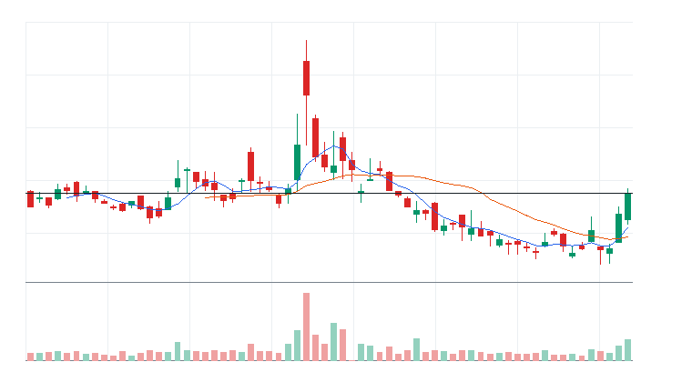
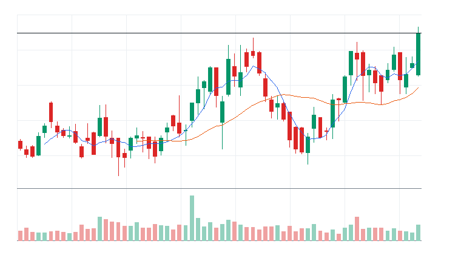

# 오늘의 데일리 트레이딩 요약

**REAL DATA TEST - 가격/거래량은 실제 데이터, 뉴스 연결, ETF 구성종목 확산도/거래대금 유동성 일부 연결**

**목적:** 이 리포트는 최근 오른 자산을 나열하는 것이 아니라, 돈이 몰리는 근거와 다음 매수 주체가 확인할 트레이딩 후보를 찾기 위한 보고서다.

> 핵심 질문: 현재 가격에서 누가 사고 있고, 누가 앞으로 더 비싸게 사줄 수 있는가?

## 시장 국면 판단

- 최종 판정: 약세장 (14점)
- 전일 대비: 약세장 유지, 점수 변화는 제한적이다(-1점).
- 판정 신뢰도: 높음 (100점) - 핵심 지수와 매크로 데이터가 대부분 직접 수집되어 판정 신뢰도가 높다.
- 행동 바이어스: 신규 매수 보류, 리스크 축소 우선
- 한 줄 결론: 기술적 추세와 매크로 환경이 모두 방어적이다. 신규 매수보다 손실 제한과 현금화가 우선이다.
- 기술적 지표: 하락 추세 (0점, 가중치 65%)
- KOSPI: 0점 | 50일선 아래, 200일선 아래, 20일 -17.14%, 60일 +6.00%, 52주 고점 대비 -27.57% -> 기술 점수 0
- KOSDAQ: 0점 | 50일선 아래, 200일선 아래, 20일 -15.75%, 60일 -36.00%, 52주 고점 대비 -38.91% -> 기술 점수 0
- 매크로 시황: 매크로 부담 (39점, 가중치 35%)
- 매크로 요약: 금리, 물가 부담으로 매크로 환경은 방어적이다.
- 금리: 부담 39점 / 금리 부담 / confidence HIGH
  - 주요 근거: US 10Y yield 20일 +6.84%, 5일 +2.93%; US long-duration bonds 20일 -4.82%, 장기채 가격 기준 할인율 부담 확인
  - 확인 사항: 장기금리 상승과 장기채 약세가 겹쳐 성장주 할인율 부담이 커질 수 있다.
- 물가: 위험 0점 / 물가 부담 / confidence MEDIUM
  - 주요 근거: Oil ETF 20일 +31.24%, 유가 기반 물가 압력 확인
  - 확인 사항: 추가 확인 이벤트 없음
- 정책: 중립 50점 / 정책 이벤트 확인 전 중립 / confidence LOW
  - 주요 근거: 정책 톤은 1차 버전에서 일정/이벤트 리스크 기반 중립값으로 반영한다.
  - 확인 사항: FOMC, BOK 금통위, CPI/PCE 발표 전후에는 매크로 confidence를 보수적으로 해석한다.
- 신용/유동성: 중립 45점 / 신용/유동성 중립 / confidence HIGH
  - 주요 근거: High yield credit 20일 -0.78%, 하이일드 위험선호 확인; VIX 20일 +0.38%, 변동성 부담 확인
  - 확인 사항: 추가 확인 이벤트 없음
- 환율/글로벌: 중립 49점 / 환율/글로벌 중립 / confidence HIGH
  - 주요 근거: USD/KRW 20일 -4.87%, 원화 안정/불안 확인; Korea equity ETF 20일 -11.86%, 한국 외국인 위험선호 프록시; KOSDAQ-KOSPI 20일 상대강도 +1.39%, 성장 위험선호 확인
  - 확인 사항: 추가 확인 이벤트 없음
- USD/KRW: 58점 | 하락 시 주식 우호; 5일 -0.52%, 20일 -4.87% -> 매크로 점수 58
- US 10Y yield: 37점 | 하락 시 주식 우호; 5일 +2.93%, 20일 +6.84% -> 매크로 점수 37
- US long-duration bonds: 41점 | 상승 시 주식 우호; 5일 -1.24%, 20일 -4.82% -> 매크로 점수 41
- Oil ETF: 0점 | 하락 시 주식 우호; 5일 +16.92%, 20일 +31.24% -> 매크로 점수 0
- High yield credit: 48점 | 상승 시 주식 우호; 5일 -0.71%, 20일 -0.78% -> 매크로 점수 48
- VIX: 40점 | 하락 시 주식 우호; 5일 +11.78%, 20일 +0.38% -> 매크로 점수 40
- Korea equity ETF: 36점 | 상승 시 주식 우호; 5일 +6.43%, 20일 -11.86% -> 매크로 점수 36
- 데이터 커버리지: 기술 2/2, 매크로 7/7
- 데이터 신뢰도 근거:
  - 직접 지수 데이터: KOSPI, KOSDAQ
  - 대체 지수 데이터 없음
  - 매크로 데이터: 7/7
  - 누락 데이터 없음
  - stale 데이터 없음

## 모바일 요약

[오늘의 데일리 트레이딩 요약]

생성 성공 / 데이터 모드: REAL_TEST

시장:
- 위험회피

시장 지배 서사:
1. Constructions 자금 유입 - 소멸 - KODEX 200(069500.KS), KODEX 코스닥150(229200.KS), GS건설(006360.KS), 삼성물산(028260.KS) 중심으로 5일 +2.04%, 20일 -5.95% 흐름이 형성됨. 뉴스 직접성 제한.
2. 인터넷/게임/엔터 성장주 - 약화 - KODEX 200(069500.KS), KODEX 코스닥150(229200.KS), NAVER(035420.KS), 카카오(035720.KS) 중심으로 5일 +2.93%, 20일 +0.08% 흐름이 형성됨. 뉴스 직접성 제한.
3. 전력기기/인프라 투자 - 소멸 - KODEX 200(069500.KS), HD현대(267250.KS), LS ELECTRIC(010120.KS) 중심으로 5일 +5.78%, 20일 -5.85% 흐름이 형성됨. 뉴스 직접성 제한.

트렌드 강도:
1. Constructions 자금 유입 - TSI 15 - 잠복 - 진입품질 낮음
2. 인터넷/게임/엔터 성장주 - TSI 23 - 잠복 - 진입품질 낮음
3. 전력기기/인프라 투자 - TSI 24 - 잠복 - 진입품질 낮음

오늘 결론:
- 인터넷/게임/엔터 성장주 개별 종목 흐름이 ETF 대비 강한지 확인 필요
- 행동 후보는 linkedNarrative와 함께 확인한다.
- 추격보다 진입 조건 확인 후 접근한다.

오늘 실제 행동 후보:
1. SK텔레콤(017670.KS)(STOCK) - 인터넷/게임/엔터 성장주 - 단기 추세가 유지되고 거래량이 1.0배 이상이면 눌림 이후 재상승을 시도할 수 있음
2. 한국타이어앤테크놀로지(161390.KS)(STOCK) - 미분류 - 52주 고점 부근이라 돌파가 확인되면 신고가 추종 매수가 붙을 수 있음
3. SK이노베이션(096770.KS)(STOCK) - 미분류 - 단기 추세가 유지되고 거래량이 1.0배 이상이면 눌림 이후 재상승을 시도할 수 있음

다크호스 후보:
1. 다크호스 후보 없음 - 조건 충족 후보 없음

ETF 후보 TOP 5:
1. KODEX 200(069500.KS) - Constructions 자금 유입 - 거래량 확인 전 관찰
2. KODEX 코스닥150(229200.KS) - Constructions 자금 유입 - 거래량 확인 전 관찰

웹 리포트:
https://yoolcool.github.io/DailyTradingThesisAgent/kr/

## 오늘 결론

- 오늘 결론: 조건부 진입
- 신규 진입 후보: 0개
- 조건부 진입 후보: 5개
- 관찰 후보: 145개
- 주요 제한 요인: Entry Quality < 40, 뉴스 직접성 부족, RVOL 미달
- 주문 판단: 지정가 권장 / 시장가 주의
- 실전 판단: 진입 후보는 있으나, 전일 고점 돌파와 거래량 확인 후 선별적으로 접근한다.

### 후보 제한 요인 집계

- RVOL < 1.00x: 145개
- 거래대금 유동성 낮음: 0개
- Entry Quality 50~54 near miss: 0개
- Entry Quality 40~49 관찰: 0개
- Entry Quality < 40: 202개
- Exhaustion Risk >= 70: 0개
- ETF breadth 샘플 부족: 0개
- 뉴스 직접성 부족: 195개

## 데이터 신뢰도

- 전체 데이터 신뢰도 등급: MEDIUM
- 분석 신뢰도: MEDIUM
- 주문 실행 신뢰도: MEDIUM
- ETF breadth 신뢰도: HIGH
- 신뢰도 해석: 장전/시간외 데이터 확인 불가
- 리포트 생성 시각: 2026-07-24 09:11 KST
- 가격 기준 거래일: 2026-07-24 KRX 정규장 종가
- 뉴스 수집 시각: 2026-07-24 09:11 KST
- 가장 최근 뉴스 발행 시각: 2026-07-24 00:00 KST
- 뉴스 신선도 상태: FRESH
- 뉴스 소스: DART
- 뉴스 소스 상태: DART CONNECTED
- 뉴스 신뢰도: HIGH
- 추천 적용 거래일: 2026-07-24 KRX 정규장
- 가격/거래량 데이터 상태: 연결됨
- 뉴스 데이터 상태: 연결됨
- ETF 구성종목 확산도 상태: 일부 연결
- ETF 구성종목 샘플 수: 20~30
- 거래대금 유동성 데이터 상태: 일부 연결
- 장전/시간외 데이터 상태: NOT_APPLICABLE
- 데이터 provider: yfinance, DART, config fallback sample, price-volume dollar-volume fallback
- 실전 사용 경고: 이 리포트는 투자판단 보조용이며, REAL_TEST 모드에서는 일부 데이터가 누락되거나 지연될 수 있다. 실제 주문 전 현재가, 뉴스, 장전/시간외 가격과 정규장 거래대금을 별도 확인해야 한다.

## 0. 시장 상태

- 데이터 모드: REAL_TEST
- 가격/거래량: 연결됨
- 뉴스: 연결됨
- ETF 구성종목 확산도: 일부 연결
- 거래대금 유동성: 일부 연결
- 생성 시각: 2026년 7월 24일 금요일 오전 9:11
- 시장 상태: 위험회피
- 오늘 돈의 방향: 인터넷/게임/엔터 성장주 개별 종목 흐름이 ETF 대비 강한지 확인 필요
- 강한 테마 TOP 3: 인터넷/게임/엔터 성장주(32), 건설/인프라(32), 화학/에너지(28)
- 데이터 한계:
  - API 또는 provider 상태에 따라 뉴스/ETF 확산도/거래대금 유동성 반영 범위가 달라질 수 있다.
  - 수집 실패 데이터는 점수 반영에서 제외하거나 confidence를 제한한다.
  - reasonConfidence HIGH는 직접 촉매, 가격/거래량, 확산도/유동성 근거가 함께 있을 때만 사용한다.

## 오늘 시장을 지배하는 서사

### 오늘 시장을 지배하는 서사 TOP 3

#### 1. Constructions 자금 유입
- 상태: 소멸
- narrativeScore: 21
- reasonConfidence: LOW
- 근거 ETF: KODEX 200(069500.KS), KODEX 코스닥150(229200.KS)
- 근거 개별 종목: GS건설(006360.KS), 삼성물산(028260.KS)
- 돈이 몰리는 이유: Constructions 자금 유입 관련 KODEX 200(069500.KS), KODEX 코스닥150(229200.KS)와 GS건설(006360.KS), 삼성물산(028260.KS)의 5일(+2.04%)·20일(-5.95%) 흐름을 함께 본다. 평균 상대 거래량은 1.23배이고, ETF 확산도는 추가 확인이 필요하다. 뉴스 직접성은 아직 제한적이다.
- 다음 매수 주체: Constructions 자금 유입을 확인한 섹터 ETF 자금과 상대강도 추종 스윙 자금
- 가장 좋은 트레이딩 수단: ETF 우선: KODEX 200(069500.KS), KODEX 코스닥150(229200.KS) / 개별 종목 우선: 삼성물산(028260.KS), GS건설(006360.KS)
- 서사가 깨지는 조건: 069500.KS 20일선 이탈 또는 관련 종목 절반 이상 5일선 이탈
- 오늘 행동: 기존 네러티브와 중복을 확인한 뒤 ETF/대표 종목 동조성이 살아날 때만 관찰 편입

상세 narrativeScore 근거 보기

- rawScore: 21
- ETF 평균 moneyFlowScore: 0
- 개별 종목 평균 moneyFlowScore: 49
- ETF 후보 비율: 0%
- 개별 종목 후보 비율: 50%
- 5일 평균 수익률: +2.00%
- 20일 평균 수익률: -6.00%
- 평균 상대 거래량: 1.00배
- ETF 평균 상대 거래량: 1.00배
- 개별주 평균 상대 거래량: 2.00배
- 52주 고점 근접 후보 비율: 0%
- 뉴스 직접성 점수: 3
- ETF 확산도 점수: -1
- 유동성 점수: 4
- 과열 리스크 차감: 0

#### 2. 인터넷/게임/엔터 성장주
- 상태: 약화
- narrativeScore: 20
- reasonConfidence: LOW
- 근거 ETF: KODEX 200(069500.KS), KODEX 코스닥150(229200.KS)
- 근거 개별 종목: NAVER(035420.KS), 카카오(035720.KS), 하이브(352820.KS), 크래프톤(259960.KS)
- 돈이 몰리는 이유: 인터넷/게임/엔터 성장주 관련 KODEX 200(069500.KS), KODEX 코스닥150(229200.KS)와 NAVER(035420.KS), 카카오(035720.KS), 하이브(352820.KS), 크래프톤(259960.KS)의 5일(+2.93%)·20일(+0.08%) 흐름을 함께 본다. 평균 상대 거래량은 1.00배이고, ETF 확산도는 추가 확인이 필요하다. 뉴스 직접성은 아직 제한적이다.
- 다음 매수 주체: 금리 부담 완화, 광고/커머스 회복, 신작/콘텐츠 모멘텀이 있을 때 성장주로 위험선호 자금 유입
- 가장 좋은 트레이딩 수단: ETF 우선: KODEX 코스닥150(229200.KS), KODEX 200(069500.KS) / 개별 종목 우선: NAVER(035420.KS), 크래프톤(259960.KS), 하이브(352820.KS)
- 서사가 깨지는 조건: KOSDAQ150 ETF가 20일선을 이탈하거나 성장주 대표 종목의 상대 거래량이 둔화
- 오늘 행동: 지수 위험선호가 유지될 때만 선별 진입, 대형 플랫폼은 실적 반응을 우선 확인

상세 narrativeScore 근거 보기

- rawScore: 20
- ETF 평균 moneyFlowScore: 0
- 개별 종목 평균 moneyFlowScore: 47
- ETF 후보 비율: 0%
- 개별 종목 후보 비율: 50%
- 5일 평균 수익률: +3.00%
- 20일 평균 수익률: 0.00%
- 평균 상대 거래량: 1.00배
- ETF 평균 상대 거래량: 1.00배
- 개별주 평균 상대 거래량: 1.00배
- 52주 고점 근접 후보 비율: 0%
- 뉴스 직접성 점수: 0
- ETF 확산도 점수: -1
- 유동성 점수: 3
- 과열 리스크 차감: 0

#### 3. 전력기기/인프라 투자
- 상태: 소멸
- narrativeScore: 13
- reasonConfidence: LOW
- 근거 ETF: KODEX 200(069500.KS)
- 근거 개별 종목: HD현대(267250.KS), LS ELECTRIC(010120.KS), HD현대일렉트릭(267260.KS), 효성중공업(298040.KS)
- 돈이 몰리는 이유: 전력기기/인프라 투자 관련 KODEX 200(069500.KS)와 HD현대(267250.KS), LS ELECTRIC(010120.KS), HD현대일렉트릭(267260.KS), 효성중공업(298040.KS)의 5일(+5.78%)·20일(-5.85%) 흐름을 함께 본다. 평균 상대 거래량은 0.89배이고, ETF 확산도도 이를 보조한다. 뉴스 직접성은 아직 제한적이다.
- 다음 매수 주체: 전력망, 변압기, 데이터센터 전력 수요가 강할 때 전력기기와 인프라 대형주로 매수세가 집중
- 가장 좋은 트레이딩 수단: ETF 우선: KODEX 200(069500.KS) / 개별 종목 우선: HD현대일렉트릭(267260.KS), LS ELECTRIC(010120.KS), 효성중공업(298040.KS)
- 서사가 깨지는 조건: 전력기기 대표 종목의 상대 거래량이 1배 아래로 내려가고 5일 수익률이 동반 둔화
- 오늘 행동: 강한 종목을 추격하기보다 거래대금 유지와 5일선 재지지를 확인

상세 narrativeScore 근거 보기

- rawScore: 13
- ETF 평균 moneyFlowScore: 0
- 개별 종목 평균 moneyFlowScore: 31
- ETF 후보 비율: 0%
- 개별 종목 후보 비율: 25%
- 5일 평균 수익률: +6.00%
- 20일 평균 수익률: -6.00%
- 평균 상대 거래량: 1.00배
- ETF 평균 상대 거래량: 1.00배
- 개별주 평균 상대 거래량: 1.00배
- 52주 고점 근접 후보 비율: 0%
- 뉴스 직접성 점수: 0
- ETF 확산도 점수: 2
- 유동성 점수: 2
- 과열 리스크 차감: 0

### 전체 narrative 요약

| 서사명 | 상태 | narrativeScore | reasonConfidence | 대표 ETF | 대표 종목 | 오늘 행동 |
| --- | --- | ---: | --- | --- | --- | --- |
| Constructions 자금 유입 | 소멸 | 21 | LOW | KODEX 200(069500.KS), KODEX 코스닥150(229200.KS) | GS건설(006360.KS), 삼성물산(028260.KS) | 기존 네러티브와 중복을 확인한 뒤 ETF/대표 종목 동조성이 살아날 때만 관찰 편입 |
| 인터넷/게임/엔터 성장주 | 약화 | 20 | LOW | KODEX 200(069500.KS), KODEX 코스닥150(229200.KS) | NAVER(035420.KS), 카카오(035720.KS), 하이브(352820.KS), 크래프톤(259960.KS) | 지수 위험선호가 유지될 때만 선별 진입, 대형 플랫폼은 실적 반응을 우선 확인 |
| 전력기기/인프라 투자 | 소멸 | 13 | LOW | KODEX 200(069500.KS) | HD현대(267250.KS), LS ELECTRIC(010120.KS), HD현대일렉트릭(267260.KS), 효성중공업(298040.KS) | 강한 종목을 추격하기보다 거래대금 유지와 5일선 재지지를 확인 |
| 조선/방산 수주 사이클 | 소멸 | 8 | LOW | KODEX 200(069500.KS) | 한국항공우주(047810.KS), 한화오션(042660.KS), HD현대중공업(329180.KS), 한화에어로스페이스(012450.KS) | 수주 공시나 업황 뉴스가 직접 확인될 때만 추세 추종, 과열 구간은 신규 진입 보류 |
| 화장품/음식료 수출 소비재 | 약화 | 7 | LOW | KODEX 200(069500.KS) | LG생활건강(051900.KS), 아모레퍼시픽(090430.KS), 삼양식품(003230.KS), 한국콜마(161890.KS) | 실적 기대와 가격 반응이 같이 나타나는 종목만 선별, 단기 급등주는 눌림 대기 |
| 금융/밸류업 주주환원 | 약화 | 4 | LOW | KODEX 200(069500.KS) | KB금융(105560.KS), 하나금융지주(086790.KS), 신한지주(055550.KS), 우리금융지주(316140.KS) | 지수 변동성이 커질 때 방어적 대안으로 관찰하고, 급등 후에는 배당락/정책 뉴스 확인 |
| Energy & Chemicals 자금 유입 | 소멸 | 4 | LOW | KODEX 200(069500.KS), KODEX 코스닥150(229200.KS) | GS(078930.KS), 후성(093370.KS), 한솔케미칼(014680.KS) | 기존 네러티브와 중복을 확인한 뒤 ETF/대표 종목 동조성이 살아날 때만 관찰 편입 |
| 소비 회복/방어주 선별 | 약화 | 0 | LOW | KODEX 200(069500.KS), KODEX 코스닥150(229200.KS) | 금호타이어(073240.KS), 미스토홀딩스(081660.KS), 현대백화점(069960.KS), 신세계(004170.KS) | 기존 네러티브와 중복을 확인한 뒤 ETF/대표 종목 동조성이 살아날 때만 관찰 편입 |
| 자동차/부품 수출 모멘텀 | 소멸 | 0 | LOW | KODEX 200(069500.KS) | 기아(000270.KS), 현대모비스(012330.KS), 현대차(005380.KS), 현대위아(011210.KS) | 완성차 쌍두마차가 시장 대비 강할 때만 부품주까지 확산 여부를 확인 |
| 바이오/헬스케어 실적 전환 | 소멸 | 0 | LOW | KODEX 200(069500.KS) | 유한양행(000100.KS), 삼성바이오로직스(207940.KS), 셀트리온(068270.KS), 한미약품(128940.KS) | 뉴스 촉매와 거래량이 동반될 때만 관찰 편입, 이벤트 소멸 후 추격은 금지 |
| 전력 유틸리티 수요 재평가 | 소멸 | 0 | LOW | KODEX 200(069500.KS), KODEX 코스닥150(229200.KS) | LS ELECTRIC(010120.KS), 효성중공업(298040.KS) | 기존 네러티브와 중복을 확인한 뒤 ETF/대표 종목 동조성이 살아날 때만 관찰 편입 |
| 지주/배당/자사주 재평가 | 소멸 | 0 | LOW | KODEX 200(069500.KS) | 롯데지주(004990.KS), LG(003550.KS), SK(034730.KS), 두산(000150.KS) | 강한 시장에서는 후순위, 변동성 확대 구간에서 방어적 재평가 후보로 관찰 |
| Financials 자금 유입 | 소멸 | 0 | LOW | KODEX 200(069500.KS), KODEX 코스닥150(229200.KS) | DB손해보험(005830.KS), BNK금융지주(138930.KS), 삼성생명(032830.KS), 삼성화재(000810.KS) | 기존 네러티브와 중복을 확인한 뒤 ETF/대표 종목 동조성이 살아날 때만 관찰 편입 |
| 2차전지 소재/셀 반등 | 소멸 | 0 | LOW | KODEX 200(069500.KS), KODEX 코스닥150(229200.KS) | LG에너지솔루션(373220.KS), 삼성SDI(006400.KS), 포스코퓨처엠(003670.KS), 에코프로머티(450080.KS) | 추세 전환보다 반등 성격으로 접근하고, 상대 거래량이 살아나는 종목만 단기 관찰 |
| Heavy Industries 자금 유입 | 소멸 | 0 | LOW | KODEX 200(069500.KS), KODEX 코스닥150(229200.KS) | 산일전기(062040.KS), 현대로템(064350.KS) | 기존 네러티브와 중복을 확인한 뒤 ETF/대표 종목 동조성이 살아날 때만 관찰 편입 |
| AI 반도체/HBM 공급망 | 소멸 | 0 | LOW | KODEX 200(069500.KS) | 삼성전자(005930.KS), SK하이닉스(000660.KS), 한미반도체(042700.KS), 삼성전기(009150.KS) | 추격보다 SK하이닉스/삼성전자 동조성과 거래대금 회복을 확인한 뒤 눌림 구간에서 선별 |
| IT 자금 유입 | 소멸 | 0 | LOW | KODEX 200(069500.KS), KODEX 코스닥150(229200.KS) | SK스퀘어(402340.KS), 이수페타시스(007660.KS) | 기존 네러티브와 중복을 확인한 뒤 ETF/대표 종목 동조성이 살아날 때만 관찰 편입 |

## 트렌드 강도 판단

### 1. Constructions 자금 유입
- Trend Strength Index: 15
- 트렌드 상태 라벨: 잠복
- 테마 확산도: 부족
- ETF 동조성: 부족
- 거래량 강도: 약함
- 과열 위험: 보통 (30)
- 오늘 진입 품질: 낮음 (0)
- 한 줄 판단: Constructions 자금 유입는 Trend Strength는 높아도 시장 위험선호가 약해 시장 환경 비우호 구간이다.
- 오늘 접근법: KODEX 200(069500.KS)/KODEX 코스닥150(229200.KS)와 GS건설(006360.KS)/삼성물산(028260.KS)의 거래량 확산이 확인되기 전까지 관찰한다.

트렌드 강도 상세 근거 보기

- 가격 모멘텀: 가격 모멘텀 5/25. 평균 5D +2.04%, 20D -5.95%.
- 거래량 강도: 거래량 강도 9/20. 평균 RVOL 1.23배.
- ETF 동조성: ETF 동조성 0/15. 관련 ETF KODEX 200(069500.KS), KODEX 코스닥150(229200.KS) 흐름을 기준으로 판단.
- 테마 확산도: 테마 확산도 0/20. 상위 1~2개 쏠림 감점 6점 반영.
- 뉴스 촉매: 뉴스/촉매 신선도 1/10. HIGH 직접 촉매 0개.
- 과열 리스크: 과열 리스크 30/100. 단기 급등, 고점 근접, ETF-개별주 괴리, 쏠림을 함께 반영.
- 시장 환경: 시장 환경 0/10. KOSPI200/KODEX 200/KODEX KOSDAQ150 가격 흐름 기반 위험선호 점수.

### 2. 인터넷/게임/엔터 성장주
- Trend Strength Index: 23
- 트렌드 상태 라벨: 잠복
- 테마 확산도: 부족
- ETF 동조성: 부족
- 거래량 강도: 약함
- 과열 위험: 보통 (30)
- 오늘 진입 품질: 낮음 (6)
- 한 줄 판단: 인터넷/게임/엔터 성장주는 Trend Strength는 높아도 시장 위험선호가 약해 시장 환경 비우호 구간이다.
- 오늘 접근법: KODEX 200(069500.KS)/KODEX 코스닥150(229200.KS)와 NAVER(035420.KS)/카카오(035720.KS)/하이브(352820.KS)의 거래량 확산이 확인되기 전까지 관찰한다.

트렌드 강도 상세 근거 보기

- 가격 모멘텀: 가격 모멘텀 10/25. 평균 5D +2.93%, 20D +0.08%.
- 거래량 강도: 거래량 강도 8/20. 평균 RVOL 1.00배.
- ETF 동조성: ETF 동조성 0/15. 관련 ETF KODEX 200(069500.KS), KODEX 코스닥150(229200.KS) 흐름을 기준으로 판단.
- 테마 확산도: 테마 확산도 3/20. 상위 1~2개 쏠림 감점 6점 반영.
- 뉴스 촉매: 뉴스/촉매 신선도 2/10. HIGH 직접 촉매 0개.
- 과열 리스크: 과열 리스크 30/100. 단기 급등, 고점 근접, ETF-개별주 괴리, 쏠림을 함께 반영.
- 시장 환경: 시장 환경 0/10. KOSPI200/KODEX 200/KODEX KOSDAQ150 가격 흐름 기반 위험선호 점수.

### 3. 전력기기/인프라 투자
- Trend Strength Index: 24
- 트렌드 상태 라벨: 잠복
- 테마 확산도: 부족
- ETF 동조성: 부족
- 거래량 강도: 약함
- 과열 위험: 보통 (34)
- 오늘 진입 품질: 낮음 (3)
- 한 줄 판단: 전력기기/인프라 투자는 Trend Strength는 높아도 시장 위험선호가 약해 시장 환경 비우호 구간이다.
- 오늘 접근법: KODEX 200(069500.KS)와 HD현대(267250.KS)/LS ELECTRIC(010120.KS)/HD현대일렉트릭(267260.KS)의 거래량 확산이 확인되기 전까지 관찰한다.

트렌드 강도 상세 근거 보기

- 가격 모멘텀: 가격 모멘텀 12/25. 평균 5D +5.78%, 20D -5.85%.
- 거래량 강도: 거래량 강도 6/20. 평균 RVOL 0.89배.
- ETF 동조성: ETF 동조성 2/15. 관련 ETF KODEX 200(069500.KS) 흐름을 기준으로 판단.
- 테마 확산도: 테마 확산도 2/20. 상위 1~2개 쏠림 감점 6점 반영.
- 뉴스 촉매: 뉴스/촉매 신선도 2/10. HIGH 직접 촉매 0개.
- 과열 리스크: 과열 리스크 34/100. 단기 급등, 고점 근접, ETF-개별주 괴리, 쏠림을 함께 반영.
- 시장 환경: 시장 환경 0/10. KOSPI200/KODEX 200/KODEX KOSDAQ150 가격 흐름 기반 위험선호 점수.

## 최근 추천 결과 트래킹

개별주는 데이트레이딩 관점으로 추천 이후 첫 정규장의 장중 최고가와 종가를 추적한다. ETF는 테마/스윙 관점으로 추천 이후 1주일 동안의 최고가와 현재 종가를 추적한다.

### 개별주 Top 3 추천 성과 요약
- 최근 5개 리포트 표본: 9개 (초기 검증 단계)
- 장중 최고가 기준 성공률: +40.00%
- 종가 기준 성공률: +40.00%
- 평균 장중 최고 수익률: +7.77%
- 평균 종가 수익률: +2.18%

### ETF 추천 성과 요약
- 최근 5개 리포트 표본: 0개 (초기 검증 단계)
- 1주 최고가 기준 성공률: 데이터 없음
- 현재 종가 기준 성공률: 데이터 없음
- 평균 1주 최고 수익률: 데이터 없음
- 평균 현재 수익률: 데이터 없음

최근 추천 결과 상세 테이블 펼치기

| 추천일 | 유형 | 순위 | 티커 | 기준가 | 추적 기간 | 상태 | High 수익률 | Close 수익률 | 결과 | 코멘트 |
| --- | --- | ---: | --- | ---: | --- | --- | ---: | ---: | --- | --- |
| 2026-07-24 | STOCK | 3 | SK이노베이션(096770.KS) | $132,200 | 2026-07-24 | pending | 데이터 없음 | 데이터 없음 | 추적 대기 | 아직 추적 거래일 데이터가 완성되지 않음 |
| 2026-07-24 | STOCK | 2 | 한국타이어앤테크놀로지(161390.KS) | $76,700 | 2026-07-24 | pending | 데이터 없음 | 데이터 없음 | 추적 대기 | 아직 추적 거래일 데이터가 완성되지 않음 |
| 2026-07-24 | STOCK | 1 | SK텔레콤(017670.KS) | $99,500 | 2026-07-24 | pending | 데이터 없음 | 데이터 없음 | 추적 대기 | 아직 추적 거래일 데이터가 완성되지 않음 |
| 2026-07-23 | STOCK | 1 | SK이노베이션(096770.KS) | $118,400 | 2026-07-23 | complete | +11.91% | +11.66% | 성공 | 장중 기회와 종가 유지가 모두 확인됨 (일봉 기준) |
| 2026-07-17 | STOCK | 1 | SK이노베이션(096770.KS) | $121,400 | 2026-07-17 | pending | 데이터 없음 | 데이터 없음 | 추적 대기 | 아직 추적 거래일 데이터가 완성되지 않음 |
| 2026-07-14 | STOCK | 2 | S-Oil(010950.KS) | $139,500 | 2026-07-14 | complete | +2.87% | -5.81% | 제한적 유효 | 제한적인 장중 기회만 발생 (일봉 기준) |
| 2026-07-14 | STOCK | 1 | 금호타이어(073240.KS) | $7,160 | 2026-07-14 | complete | -2.23% | -8.66% | 실패 | 추천 이후 의미 있는 장중 기회가 부족하고 종가도 약함 (일봉 기준) |
| 2026-07-13 | STOCK | 2 | 금호타이어(073240.KS) | $6,330 | 2026-07-13 | complete | +23.85% | +13.11% | 성공 | 장중 기회와 종가 유지가 모두 확인됨 (일봉 기준) |
| 2026-07-13 | STOCK | 1 | 한국콜마(161890.KS) | $115,100 | 2026-07-13 | complete | +2.43% | +0.61% | 제한적 유효 | 제한적인 장중 기회만 발생 (일봉 기준) |
| 2026-07-07 | STOCK | 1 | 금호타이어(073240.KS) | $6,260 | 2026-07-07 | complete | +8.31% | +1.12% | 성공 | 장중 기회와 종가 유지가 모두 확인됨 (일봉 기준) |
| 2026-07-07 | STOCK | 1 | 한국콜마(161890.KS) | $115,100 | 2026-07-07 | complete | +8.25% | 0.00% | 단타 유효 | 장중 기회는 있었지만 종가 유지력은 약함 (일봉 기준) |
| 2026-07-06 | STOCK | 3 | GS(078930.KS) | $78,100 | 2026-07-06 | complete | +3.84% | 0.00% | 단타 유효 | 장중 기회는 있었지만 종가 유지력은 약함 (일봉 기준) |
| 2026-07-06 | STOCK | 2 | 금호타이어(073240.KS) | $6,160 | 2026-07-06 | complete | 0.00% | 0.00% | 추적 대기 | 아직 추적 거래일 데이터가 완성되지 않음 (일봉 기준) |
| 2026-07-06 | STOCK | 1 | NH투자증권(005940.KS) | $33,100 | 2026-07-06 | complete | +3.02% | 0.00% | 단타 유효 | 장중 기회는 있었지만 종가 유지력은 약함 (일봉 기준) |
| 2026-07-03 | STOCK | 1 | 한국콜마(161890.KS) | $117,800 | 2026-07-03 | complete | +1.44% | 0.00% | 제한적 유효 | 제한적인 장중 기회만 발생 (일봉 기준) |
| 2026-07-02 | STOCK | 2 | 미스토홀딩스(081660.KS) | $46,400 | 2026-07-02 | complete | +7.76% | 0.00% | 단타 유효 | 장중 기회는 있었지만 종가 유지력은 약함 (일봉 기준) |
| 2026-07-02 | STOCK | 1 | 한국콜마(161890.KS) | $113,700 | 2026-07-02 | complete | +8.18% | 0.00% | 단타 유효 | 장중 기회는 있었지만 종가 유지력은 약함 (일봉 기준) |
| 2026-07-01 | STOCK | 3 | 산일전기(062040.KS) | $261,500 | 2026-07-01 | complete | +4.21% | 0.00% | 단타 유효 | 장중 기회는 있었지만 종가 유지력은 약함 (일봉 기준) |
| 2026-07-01 | STOCK | 2 | 한국콜마(161890.KS) | $106,800 | 2026-07-01 | complete | +0.19% | 0.00% | 추적 대기 | 아직 추적 거래일 데이터가 완성되지 않음 (일봉 기준) |
| 2026-07-01 | STOCK | 1 | 한솔케미칼(014680.KS) | $304,000 | 2026-07-01 | complete | +4.93% | 0.00% | 단타 유효 | 장중 기회는 있었지만 종가 유지력은 약함 (일봉 기준) |
| 2026-06-30 | STOCK | 2 | SK(034730.KS) | $834,000 | 2026-06-30 | complete | +1.32% | 0.00% | 제한적 유효 | 제한적인 장중 기회만 발생 (일봉 기준) |
| 2026-06-30 | STOCK | 1 | 한국콜마(161890.KS) | $99,500 | 2026-06-30 | complete | +3.02% | 0.00% | 단타 유효 | 장중 기회는 있었지만 종가 유지력은 약함 (일봉 기준) |
| 2026-06-29 | STOCK | 2 | 금호타이어(073240.KS) | $5,320 | 2026-06-29 | complete | +10.34% | 0.00% | 단타 유효 | 장중 기회는 있었지만 종가 유지력은 약함 (일봉 기준) |
| 2026-06-29 | STOCK | 1 | 한국콜마(161890.KS) | $99,400 | 2026-06-29 | complete | +0.30% | 0.00% | 추적 대기 | 아직 추적 거래일 데이터가 완성되지 않음 (일봉 기준) |
| 2026-06-26 | STOCK | 1 | SK(034730.KS) | $815,000 | 2026-06-26 | complete | +7.98% | 0.00% | 단타 유효 | 장중 기회는 있었지만 종가 유지력은 약함 (일봉 기준) |
| 2026-06-25 | STOCK | 3 | 삼성물산(028260.KS) | $519,000 | 2026-06-25 | complete | +8.48% | 0.00% | 단타 유효 | 장중 기회는 있었지만 종가 유지력은 약함 (일봉 기준) |
| 2026-06-25 | STOCK | 2 | SK하이닉스(000660.KS) | $2,917,000 | 2026-06-25 | complete | +2.40% | 0.00% | 제한적 유효 | 제한적인 장중 기회만 발생 (일봉 기준) |
| 2026-06-25 | STOCK | 1 | SK스퀘어(402340.KS) | $1,899,000 | 2026-06-25 | complete | +4.79% | 0.00% | 단타 유효 | 장중 기회는 있었지만 종가 유지력은 약함 (일봉 기준) |
| 2026-06-22 | STOCK | 3 | SK스퀘어(402340.KS) | $1,970,000 | 2026-06-22 | complete | +0.86% | 0.00% | 추적 대기 | 아직 추적 거래일 데이터가 완성되지 않음 (일봉 기준) |
| 2026-06-22 | STOCK | 2 | 삼성물산(028260.KS) | $520,000 | 2026-06-22 | complete | +4.04% | 0.00% | 단타 유효 | 장중 기회는 있었지만 종가 유지력은 약함 (일봉 기준) |
| 2026-06-22 | STOCK | 1 | SK하이닉스(000660.KS) | $2,919,000 | 2026-06-22 | complete | +0.89% | 0.00% | 추적 대기 | 아직 추적 거래일 데이터가 완성되지 않음 (일봉 기준) |
| 2026-06-19 | STOCK | 3 | 삼성전자(005930.KS) | $362,500 | 2026-06-19 | complete | +3.31% | -2.34% | 단타 유효 | 장중 기회는 있었지만 종가 유지력은 약함 (일봉 기준) |
| 2026-06-19 | STOCK | 3 | SK하이닉스(000660.KS) | $2,764,000 | 2026-06-19 | complete | +4.59% | 0.00% | 단타 유효 | 장중 기회는 있었지만 종가 유지력은 약함 (일봉 기준) |
| 2026-06-19 | STOCK | 2 | SK(034730.KS) | $687,000 | 2026-06-19 | complete | +10.19% | +5.39% | 성공 | 장중 기회와 종가 유지가 모두 확인됨 (일봉 기준) |
| 2026-06-19 | STOCK | 1 | 삼성생명(032830.KS) | $469,000 | 2026-06-19 | complete | +10.13% | +5.97% | 성공 | 장중 기회와 종가 유지가 모두 확인됨 (일봉 기준) |
| 2026-06-19 | STOCK | 1 | LS ELECTRIC(010120.KS) | $255,500 | 2026-06-19 | complete | +8.22% | +1.37% | 성공 | 장중 기회와 종가 유지가 모두 확인됨 (일봉 기준) |
| 2026-06-19 | STOCK | 1 | 한화오션(042660.KS) | $128,400 | 2026-06-19 | complete | 0.00% | 0.00% | 추적 대기 | 아직 추적 거래일 데이터가 완성되지 않음 (일봉 기준) |
| 2026-06-19 | ETF | 1 | KODEX 200(069500.KS) | $146,910 | 2026-06-19~2026-06-26 | complete | +2.60% | -22.93% | 단기 고점 후 반납 | 1주 내 상승 기회는 있었지만 현재가는 반납 |
| 2026-06-18 | STOCK | 3 | SK스퀘어(402340.KS) | $1,733,000 | 2026-06-18 | complete | +0.29% | -1.90% | 실패 | 추천 이후 의미 있는 장중 기회가 부족하고 종가도 약함 (일봉 기준) |
| 2026-06-18 | STOCK | 3 | 삼성생명(032830.KS) | $469,000 | 2026-06-18 | complete | +0.32% | 0.00% | 추적 대기 | 아직 추적 거래일 데이터가 완성되지 않음 (일봉 기준) |
| 2026-06-18 | STOCK | 2 | 후성(093370.KS) | $18,830 | 2026-06-18 | complete | +4.25% | +0.05% | 단타 유효 | 장중 기회는 있었지만 종가 유지력은 약함 (일봉 기준) |
| 2026-06-18 | STOCK | 2 | SK하이닉스(000660.KS) | $2,698,000 | 2026-06-18 | complete | +1.48% | -0.48% | 제한적 유효 | 제한적인 장중 기회만 발생 (일봉 기준) |
| 2026-06-18 | STOCK | 2 | SK(034730.KS) | $687,000 | 2026-06-18 | complete | +2.62% | 0.00% | 제한적 유효 | 제한적인 장중 기회만 발생 (일봉 기준) |
| 2026-06-18 | STOCK | 1 | LG이노텍(011070.KS) | $1,290,000 | 2026-06-18 | complete | +2.33% | -0.54% | 제한적 유효 | 제한적인 장중 기회만 발생 (일봉 기준) |
| 2026-06-18 | STOCK | 1 | 삼성전자(005930.KS) | $362,500 | 2026-06-18 | complete | +0.14% | 0.00% | 추적 대기 | 아직 추적 거래일 데이터가 완성되지 않음 (일봉 기준) |

## 오늘 실제 행동 후보

### 1. SK텔레콤(017670.KS)
- 자산 유형: STOCK
- linkedNarrative: 인터넷/게임/엔터 성장주
- narrativeStatus: 약화
- narrativeScore: 20
- Trend Strength Index: 23
- Exhaustion Risk: 30 (보통)
- Entry Quality Score: 23 (낮음)
- 트렌드 판단: 테마 확산도가 낮아 개별 종목 이벤트성 흐름일 수 있다.
- moneyFlowScore: 95
- finalRawScore: 95
- reasonConfidence: MEDIUM
- reasonConfidenceExplanation: 보조 근거 일부 제한 때문에 HIGH가 아니라 MEDIUM으로 제한했다.
- tieBreakerReason: 최종 원점수 95, 리스크 패널티 0, 5일 수익률 +17.06%, 상대 거래량 2.47배 순으로 정렬
- 후보별 시장 해석: 위험회피 / 제한적 - 전체 시장은 위험회피 / Entry Quality 23 < 50이나 moneyFlow 95, confidence MEDIUM, RVOL 2.47x로 강한 자금흐름 예외 조건 충족
- 게이트 사유: Entry Quality 23 < 50이나 moneyFlow 95, confidence MEDIUM, RVOL 2.47x로 강한 자금흐름 예외 조건 충족
- 주문 실행: 시장가 가능

- 왜 돈이 몰리는가: 20일 +9.34%, 5일 +17.06%, 상대 거래량 2.47배로 가격과 거래량이 함께 개선. 뉴스: DART buyback/under_72h / 유동성: LIQUID
- 누가 더 비싸게 사줄 수 있는지: 개별 주도주를 따라붙는 단기 모멘텀 자금과 관련 ETF 강세를 확인한 트레이더
- 진입 조건: 20일선 위 눌림 후 재상승 확인
- 무효화 조건: 20일선 이탈 또는 상대 거래량 0.8배 이하 둔화
- todayActionLabel: 자금흐름 예외 조건부
#### 최근 뉴스/동향 한국어 요약

- 요약: 종목 직접 뉴스 확인 상태이며 뉴스 흐름은 긍정 우위입니다. 후보 선정 후 재확인한 핵심 이슈는 "[기재정정]타법인주식및출자증권취득결정              "입니다.
- 직접 촉매 판단: SK텔레콤에 대해 직접 촉매로 분류된 뉴스가 확인됐습니다. 핵심은 "[기재정정]타법인주식및출자증권취득결정              "이며, 일반 재료로 봅니다.
- 뉴스 1: [기재정정]타법인주식및출자증권취득결정
  - 내용: SK텔레콤 관련 일반 뉴스입니다. 제목상 핵심은 "[기재정정]타법인주식및출자증권취득결정"입니다.
  - 투자 의미: 단기 긍정 뉴스 흐름으로 볼 수 있지만, 단독 매수 근거보다는 가격·거래량 조건을 확인하는 보조 근거로 사용합니다.
  - 확인할 점: 원문 수치, 후속 보도, 가격이 진입 조건을 지키는지
- 뉴스 2: 타법인주식및출자증권취득결정
  - 내용: SK텔레콤 관련 일반 뉴스입니다. 제목상 핵심은 "타법인주식및출자증권취득결정"입니다.
  - 투자 의미: 단기 긍정 뉴스 흐름으로 볼 수 있지만, 단독 매수 근거보다는 가격·거래량 조건을 확인하는 보조 근거로 사용합니다.
  - 확인할 점: 원문 수치, 후속 보도, 가격이 진입 조건을 지키는지
- 뉴스 3: 현금ㆍ현물배당결정
  - 내용: SK텔레콤 관련 일반 뉴스입니다. 제목상 핵심은 "현금ㆍ현물배당결정"입니다.
  - 투자 의미: 단기 긍정 뉴스 흐름으로 볼 수 있지만, 단독 매수 근거보다는 가격·거래량 조건을 확인하는 보조 근거로 사용합니다.
  - 확인할 점: 원문 수치, 후속 보도, 가격이 진입 조건을 지키는지
- 매매 해석: 매매 관점에서는 뉴스 자체보다 가격이 진입 조건을 지키는지, 거래량이 동반되는지, 그리고 뉴스가 이미 주가에 반영됐는지를 우선 확인해야 합니다.
- 차트: 

### 2. 한국타이어앤테크놀로지(161390.KS)
- 자산 유형: STOCK
- linkedNarrative: 미분류
- narrativeStatus: 관찰
- narrativeScore: 0
- Trend Strength Index: 데이터 없음
- Exhaustion Risk: 데이터 없음 (데이터 없음)
- Entry Quality Score: 데이터 없음 (데이터 없음)
- 트렌드 판단: 데이터 없음
- moneyFlowScore: 99
- finalRawScore: 99
- reasonConfidence: MEDIUM
- reasonConfidenceExplanation: 직접 촉매 부재, 뉴스 미사용 때문에 HIGH가 아니라 MEDIUM으로 제한했다.
- tieBreakerReason: 최종 원점수 99, 리스크 패널티 0, 5일 수익률 +7.27%, 상대 거래량 1.30배 순으로 정렬
- 후보별 시장 해석: 위험회피 / 제한적 - 전체 시장은 위험회피 / 고점 근처 추격 리스크 / Entry Quality 0 < 50이나 moneyFlow 99, confidence MEDIUM, RVOL 1.30x로 강한 자금흐름 예외 조건 충족
- 게이트 사유: Entry Quality 0 < 50이나 moneyFlow 99, confidence MEDIUM, RVOL 1.30x로 강한 자금흐름 예외 조건 충족
- 주문 실행: 시장가 가능

- 왜 돈이 몰리는가: 20일 +27.20%, 5일 +7.27%, 상대 거래량 1.30배로 가격과 거래량이 함께 개선. 유동성: LIQUID
- 누가 더 비싸게 사줄 수 있는지: 개별 주도주를 따라붙는 단기 모멘텀 자금과 관련 ETF 강세를 확인한 트레이더
- 진입 조건: 전일 고점 돌파와 5일선 유지 확인
- 무효화 조건: 20일선 이탈 또는 상대 거래량 0.8배 이하 둔화
- todayActionLabel: 자금흐름 예외 조건부
#### 최근 뉴스/동향 한국어 요약

- 요약: 종목 직접 뉴스 확인 상태이며 뉴스 흐름은 긍정 우위입니다. 후보 선정 후 재확인한 핵심 이슈는 "한국타이어앤테크놀로지 투자분석 2026. 07. 21 - 주달"입니다.
- 직접 촉매 판단: 한국타이어앤테크놀로지에 대해 직접 촉매로 분류된 뉴스가 확인됐습니다. 핵심은 "한국타이어앤테크놀로지 투자분석 2026. 07. 21 - 주달"이며, 일반 재료로 봅니다.
- 뉴스 1: 한국타이어앤테크놀로지 투자분석 2026. 07. 21 - 주달
  - 내용: 한국타이어앤테크놀로지에 대한 기술적 분석 또는 투자전략성 기사입니다. 기업의 신규 공시보다는 가격 위치, 저점 매수 관점, 향후 대응전략을 다룬 내용으로 봅니다.
  - 투자 의미: 투자/증설 재료는 실적 가시성이나 밸류에이션 기대에 영향을 줄 수 있어 규모와 일정 확인이 중요합니다.
  - 확인할 점: 투자/증설의 금액, 기간, 실적 반영 시점
- 뉴스 2: [리포트 브리핑]한국타이어앤테크놀로지, '견조한 실적, 하반기에도 지속될 것' 목표가 80,000원 - 상상인증권 - 뉴스핌
  - 내용: 한국타이어앤테크놀로지의 실적 관련 뉴스입니다. 제목 기준 방향성은 긍정이며, 매출·이익 수치와 컨센서스 대비 차이를 확인해야 합니다.
  - 투자 의미: 실적/가이던스 재료는 다음 분기 기대치 변화로 이어질 수 있어 컨센서스 변화와 주가 반응 지속성을 함께 봅니다.
  - 확인할 점: 매출/마진/가이던스 수치, 컨센서스 대비 차이
- 뉴스 3: [버핏 리포트] 한국타이어앤테크놀로지, 3Q 원터 타이어 성수기 진입으로 실적 개선... 낮은 반덤핑 관세 통해 가격 경쟁력 확보 – LS - 버핏연구소
  - 내용: 한국타이어앤테크놀로지의 실적 관련 뉴스입니다. 제목 기준 방향성은 긍정이며, 매출·이익 수치와 컨센서스 대비 차이를 확인해야 합니다.
  - 투자 의미: 실적/가이던스 재료는 다음 분기 기대치 변화로 이어질 수 있어 컨센서스 변화와 주가 반응 지속성을 함께 봅니다.
  - 확인할 점: 매출/마진/가이던스 수치, 컨센서스 대비 차이
- 매매 해석: 매매 관점에서는 뉴스 자체보다 가격이 진입 조건을 지키는지, 거래량이 동반되는지, 그리고 뉴스가 이미 주가에 반영됐는지를 우선 확인해야 합니다.
- 차트: 

### 3. SK이노베이션(096770.KS)
- 자산 유형: STOCK
- linkedNarrative: 미분류
- narrativeStatus: 관찰
- narrativeScore: 0
- Trend Strength Index: 데이터 없음
- Exhaustion Risk: 데이터 없음 (데이터 없음)
- Entry Quality Score: 데이터 없음 (데이터 없음)
- 트렌드 판단: 데이터 없음
- moneyFlowScore: 92
- finalRawScore: 92
- reasonConfidence: MEDIUM
- reasonConfidenceExplanation: 직접 촉매 부재, 뉴스 미사용 때문에 HIGH가 아니라 MEDIUM으로 제한했다.
- tieBreakerReason: 최종 원점수 92, 리스크 패널티 -4, 5일 수익률 +12.99%, 상대 거래량 2.40배 순으로 정렬
- 후보별 시장 해석: 위험회피 / 제한적 - 전체 시장은 위험회피 / Entry Quality 0 < 50이나 moneyFlow 92, confidence MEDIUM, RVOL 2.40x로 강한 자금흐름 예외 조건 충족
- 게이트 사유: Entry Quality 0 < 50이나 moneyFlow 92, confidence MEDIUM, RVOL 2.40x로 강한 자금흐름 예외 조건 충족
- 주문 실행: 시장가 가능

- 왜 돈이 몰리는가: 20일 +34.35%, 5일 +12.99%, 상대 거래량 2.40배로 가격과 거래량이 함께 개선. 유동성: LIQUID
- 누가 더 비싸게 사줄 수 있는지: 개별 주도주를 따라붙는 단기 모멘텀 자금과 관련 ETF 강세를 확인한 트레이더
- 진입 조건: 20일선 위 눌림 후 재상승 확인
- 무효화 조건: 20일선 이탈 또는 상대 거래량 0.8배 이하 둔화
- todayActionLabel: 자금흐름 예외 조건부
#### 최근 뉴스/동향 한국어 요약

- 요약: 종목 직접 뉴스 확인 상태이며 뉴스 흐름은 긍정 우위입니다. 후보 선정 후 재확인한 핵심 이슈는 "[리포트 브리핑]SK이노베이션, '투자의견을 상향할 수밖에 없는 업황' 목표가 150,000원 - DB증권 - 뉴스핌"입니다.
- 직접 촉매 판단: SK이노베이션에 대해 직접 촉매로 분류된 뉴스가 확인됐습니다. 핵심은 "[리포트 브리핑]SK이노베이션, '투자의견을 상향할 수밖에 없는 업황' 목표가 150,000원 - DB증권 - 뉴스핌"이며, 일반 재료로 봅니다.
- 뉴스 1: [리포트 브리핑]SK이노베이션, '투자의견을 상향할 수밖에 없는 업황' 목표가 150,000원 - DB증권 - 뉴스핌
  - 내용: SK이노베이션에 대한 증권사 목표가 또는 투자의견 변화 뉴스입니다.
  - 투자 의미: 투자/증설 재료는 실적 가시성이나 밸류에이션 기대에 영향을 줄 수 있어 규모와 일정 확인이 중요합니다.
  - 확인할 점: 투자/증설의 금액, 기간, 실적 반영 시점
- 뉴스 2: "2분기 실적 호조"…증권가 전망에 SK이노베이션 3%대 강세 - 뉴시스
  - 내용: SK이노베이션의 실적 관련 뉴스입니다. 제목 기준 방향성은 긍정이며, 매출·이익 수치와 컨센서스 대비 차이를 확인해야 합니다.
  - 투자 의미: SK이노베이션의 당일 상대강도 확인에는 도움이 되지만, 실적/가이던스 같은 새 펀더멘털 변화로 보기는 어렵습니다.
  - 확인할 점: 거래량 동반 여부, 장중 고점 유지, 관련 ETF 동반 강세
- 뉴스 3: DB證 "SK이노베이션, 정유·윤활유 호황에 실적 개선…목표주가 50%↑" - v.daum.net
  - 내용: SK이노베이션의 실적 관련 뉴스입니다. 제목 기준 방향성은 긍정이며, 매출·이익 수치와 컨센서스 대비 차이를 확인해야 합니다.
  - 투자 의미: SK이노베이션의 당일 상대강도 확인에는 도움이 되지만, 실적/가이던스 같은 새 펀더멘털 변화로 보기는 어렵습니다.
  - 확인할 점: 거래량 동반 여부, 장중 고점 유지, 관련 ETF 동반 강세
- 매매 해석: 매매 관점에서는 뉴스 자체보다 가격이 진입 조건을 지키는지, 거래량이 동반되는지, 그리고 뉴스가 이미 주가에 반영됐는지를 우선 확인해야 합니다.
- 차트: 

## 다크호스 후보

다크호스 후보 없음. 상위 서사 정렬, MA20 위 안착, MA5/MA20 구조 개선, RVOL 0.90x 이상 조건을 동시에 충족한 개별주가 없다.

- darkHorseScore: 조건 충족 후보 없음
- 왜 아직 메인이 아닌가: 확인 조건을 통과한 보조 관찰 후보가 없다.

darkHorseScore 상세 근거 보기

- 서사 정렬: 조건 미충족
- 초기 추세 구조: 조건 미충족
- 베이스 돌파/정돈: 조건 미충족
- 거래량 확인: 조건 미충족
- rawScore: 데이터 없음

## 오늘 돈이 몰리는 테마

- 인터넷/게임/엔터 성장주: 제일기획(030000.KS), 하이브(352820.KS), 카카오(035720.KS), 크래프톤(259960.KS), KT(030200.KS), LG유플러스(032640.KS), NAVER(035420.KS), NC(036570.KS) | 평균 moneyFlowScore 32 | 관심은 유지하되 우선순위는 낮추고 추가 거래량 확인을 기다린다.
- 건설/인프라: 대우건설(047040.KS), DL(000210.KS), DL이앤씨(375500.KS), GS건설(006360.KS), 한일시멘트(300720.KS), 현대건설(000720.KS), KCC(002380.KS), 한전기술(052690.KS) | 평균 moneyFlowScore 32 | 관심은 유지하되 우선순위는 낮추고 추가 거래량 확인을 기다린다.
- 화학/에너지: 코스모화학(005420.KS), GS(078930.KS), 한솔케미칼(014680.KS), 한화(000880.KS), 한화솔루션(009830.KS), HD현대(267250.KS), 한국카본(017960.KS), HS효성첨단소재(298050.KS) | 평균 moneyFlowScore 28 | 관심은 유지하되 우선순위는 낮추고 추가 거래량 확인을 기다린다.
- 산업재: CJ대한통운(000120.KS), 에코프로머티(450080.KS), 한화에어로스페이스(012450.KS), 한화시스템(272210.KS), HMM(011200.KS), 현대글로비스(086280.KS), 한전KPS(051600.KS), 한국항공우주(047810.KS) | 평균 moneyFlowScore 20 | 관심은 유지하되 우선순위는 낮추고 추가 거래량 확인을 기다린다.
- 조선/방산 수주 사이클: 씨에스윈드(112610.KS), 두산(000150.KS), 두산밥캣(241560.KS), 두산에너빌리티(034020.KS), 두산로보틱스(454910.KS), 한화엔진(082740.KS), 한화오션(042660.KS), HD현대일렉트릭(267260.KS) | 평균 moneyFlowScore 19 | 관심은 유지하되 우선순위는 낮추고 추가 거래량 확인을 기다린다.
- 철강/소재: 아세아(002030.KS), 동원시스템즈(014820.KS), 현대제철(004020.KS), 고려아연(010130.KS), 풍산(103140.KS), POSCO홀딩스(005490.KS), 세아베스틸지주(001430.KS), 세아제강지주(003030.KS) | 평균 moneyFlowScore 19 | 관심은 유지하되 우선순위는 낮추고 추가 거래량 확인을 기다린다.

## 1. ETF 트레이딩 보고서
### 1-1. ETF 결론
- ETF 우선 후보: 없음
- ETF 관찰 후보: KODEX 200(069500.KS), KODEX 코스닥150(229200.KS)
- ETF 매매 금지: KODEX 200(069500.KS), KODEX 코스닥150(229200.KS)
- 오늘 ETF 최우선 1개: 없음
- ETF 섹션 해석: 이 섹션은 개별 종목 선택이 아니라 테마/섹터 단위 자금 흐름을 ETF로 매매할지 판단하기 위한 영역이다.

### 1-2. ETF 후보 TOP 5

선정 기준: ETF 후보는 가격/거래량 1차 점수에 뉴스, ETF 구성종목 확산도, 유동성, 리스크 패널티를 반영한 finalRawScore 기준으로 정렬한다. 표시 점수 100점 후보가 겹치면 tieBreakerReason으로 우선순위를 설명한다.

### [ETF] KODEX 200(069500.KS)
- 자산 유형: ETF
- ETF 세부 카테고리: 성장/테마 ETF
- ETF 역할: 테마 베타 매수
- 상태: 관찰
- linkedNarrative: Constructions 자금 유입
- narrativeStatus: 소멸
- narrativeScore: 21
- moneyFlowScore: 0
- finalRawScore: -21
- tieBreakerReason: 최종 원점수 -21, 리스크 패널티 -6, 5일 수익률 -3.00%, 상대 거래량 0.59배 순으로 정렬
- 과열 리스크: 낮음
- reasonConfidence: LOW
- reasonConfidenceExplanation: 가격/거래량이 약하거나 핵심 보조 근거가 부족해 LOW로 분류했다.

- todayActionLabel: 거래량 확인 전 관찰
- 주문 실행: 시장가 가능
- 기준일: 2026-07-23
- 종가: $113,230
- 1일 수익률: +4.54%
- 5일 수익률: -3.00%
- 20일 수익률: -18.04%
- 상대 거래량: 0.59배
- 52주 고점 대비 위치: -25.73%
- whyMoneyIsFlowing: 최근 수익률은 확인되지만 상대 거래량 0.59배라 신규 자금 유입 강도는 약함. ETF 확산도: NARROW_LEADERSHIP / 유동성: LIQUID
- likelyNextBuyer: 섹터 베타를 노리는 단기 모멘텀 자금과 리밸런싱 자금
- whyThisCouldTradeHigher: 단기 추세가 유지되고 거래량이 1.0배 이상이면 눌림 이후 재상승을 시도할 수 있음
#### 최근 뉴스/동향 한국어 요약

- 요약: 후보 선정 후 재확인 뉴스 데이터 없음
- 진입 조건: 상대 거래량 1.0배 회복 후 관찰
- 무효화 조건: 거래량 회복 실패
- 차트: 

#### 상세 근거

KODEX 200(069500.KS) 상세 근거 펼치기

- moneyFlowScore(최종) 산정 근거:
  - moneyFlowScore(1차): 0
  - 최종 원점수: -21
  - 최종 표시 점수: 0
  - cap 적용: raw score -21 capped to displayed score 0
  - 계산식: -22 + 0 + +2 + +5 + 0 - 6 + 0 = -21 -> 0
  - 점수 해석: 매매 금지 또는 우선순위 낮은 후보.
  - 가격/거래량 1차 점수: -22
    - 추세: -7
    - 단기 모멘텀: +3
    - 중기 모멘텀: -8
    - 거래량: -8
    - 신고가 근접: 0
    - 이동평균: -2
  - 하위 점수 cap:
    - 가격 모멘텀: 원점수 -7, 상한 적용 -7 / 최대 25
    - 단기 모멘텀: 원점수 +3, 상한 적용 +3 / 최대 20
    - 중기 모멘텀: 원점수 -12, 상한 적용 -8 / 최대 16 (cap 적용)
    - 거래량: 원점수 -8, 상한 적용 -8 / 최대 20
    - 신고가 근접: 원점수 0, 상한 적용 0 / 최대 12
    - 이동평균: 원점수 -2, 상한 적용 -2 / 최대 14
  - 추가 데이터 가감점:
    - 뉴스: 0
    - 유동성: +5
  - ETF 확산도: +2
  - 리스크 패널티: -6
  - 주요 근거: 1차 0, 최종 원점수 -21, 표시 0. 1일 단기 모멘텀 확인, ETF 구성종목 확산도 양호, 거래대금 기준 유동성 양호. 주의: 단기 과열/추격 위험 존재.
  - 리스크 패널티 산정 근거:
    - 총 리스크 패널티: -6
    - 리스크 등급: LOW
    - 감점된 리스크:
      - 20d moving average break risk: -6 | 근거: Close is below the 20-day moving average. | 대응: Hold off until 20-day moving average is recovered.
    - 관찰 리스크: 주요 관찰 리스크 없음
    - 한 줄 해석: 1개 감점 리스크로 총 -6점 반영.
- 데이터 사용 현황:
  - 가격/거래량: 사용
  - 뉴스: 연결됨
  - ETF 확산도: 사용
  - 거래대금 유동성: 사용
  - 관련 ETF 상대강도: 사용
- 뉴스 확인:
  - 최근 뉴스 상태: 연결됨
  - 뉴스 소스: DART
  - 소스별 상태: DART CONNECTED
  - 긍정/중립/부정: 0/0/0
  - 직접성/방향성/신선도: 0/0/0
  - 강한 촉매 수: 0
  - 중요 공시 수: 0
  - 직접 촉매: 없음
  - 보조 뉴스: 없음
  - 뉴스 수집 시각: 2026-07-24 09:11 KST
  - 가장 최근 뉴스 발행 시각: 데이터 없음
  - 뉴스 신선도 상태: UNKNOWN
  - 뉴스 이후 가격 반응: 긍정
  - 가격 반응 점수 제한: 뉴스 이후 가격 반응과 점수 제한 특이사항 없음
  - 핵심 뉴스 요약: 의미 있는 신규 DART 공시 없음
  - 원점수/상한 점수: 0 / 0
  - 점수 반영: 0
  - 주의: 해당 티커의 신규 DART 공시가 없거나 API 결과가 비어 있음
- ETF 구성종목 확산도:
  - 구성종목 데이터 상태: 일부 연결
  - 샘플 수: 30/30
  - 샘플 신뢰도: NORMAL
  - 상승 종목 비율: 53%
  - 20일선 위 비율: 53%
  - 50일선 위 비율: 33%
  - 상위 기여 종목: 035420.KS, 010120.KS, 042660.KS, 034730.KS, 012330.KS
  - 확산도 판단: NARROW_LEADERSHIP
  - 원점수/샘플 상한/반영 점수: +2 / 8 / +2
  - 점수 반영: +2
- 거래대금 유동성:
  - 데이터 상태: 일부 연결
  - 거래대금 기준 유동성: LIQUID
  - 거래대금: $1,525,254,637,530
  - 평균 거래대금: $2,569,691,894,120
  - 주문 영향: 시장가 가능
  - 매매 영향: 거래대금이 충분해 시장가 가능 범위로 본다
- reasonConfidence 근거: 가격/거래량이 약하거나 주요 데이터가 부족해 낮음.
- 후보 선정 후 뉴스/동향 재확인:
  - 재확인 상태: 데이터 없음
- 차트 요약: 20일선 아래라 추세 확인 전까지 보수적 접근
- 기준일 2026-07-23 | 종가 $113,230 | 1일 +4.54% | 5일 -3.00% | 20일 -18.04% | 상대 거래량 0.59배 | 52주 고점 대비 -25.73% | 데이터 소스: yfinance

### [ETF] KODEX 코스닥150(229200.KS)
- 자산 유형: ETF
- ETF 세부 카테고리: 성장/테마 ETF
- ETF 역할: 테마 베타 매수
- 상태: 관찰
- linkedNarrative: Constructions 자금 유입
- narrativeStatus: 소멸
- narrativeScore: 21
- moneyFlowScore: 0
- finalRawScore: -34
- tieBreakerReason: 최종 원점수 -34, 리스크 패널티 -10, 5일 수익률 -6.59%, 상대 거래량 0.78배 순으로 정렬
- 과열 리스크: 낮음
- reasonConfidence: LOW
- reasonConfidenceExplanation: 가격/거래량이 약하거나 핵심 보조 근거가 부족해 LOW로 분류했다.

- todayActionLabel: 거래량 확인 전 관찰
- 주문 실행: 시장가 가능
- 기준일: 2026-07-23
- 종가: $13,400
- 1일 수익률: +6.99%
- 5일 수익률: -6.59%
- 20일 수익률: -17.84%
- 상대 거래량: 0.78배
- 52주 고점 대비 위치: -38.32%
- whyMoneyIsFlowing: 최근 수익률은 확인되지만 상대 거래량 0.78배라 신규 자금 유입 강도는 약함. 유동성: LIQUID
- likelyNextBuyer: 섹터 베타를 노리는 단기 모멘텀 자금과 리밸런싱 자금
- whyThisCouldTradeHigher: 단기 추세가 유지되고 거래량이 1.0배 이상이면 눌림 이후 재상승을 시도할 수 있음
#### 최근 뉴스/동향 한국어 요약

- 요약: 후보 선정 후 재확인 뉴스 데이터 없음
- 진입 조건: 상대 거래량 1.0배 회복 후 관찰
- 무효화 조건: 거래량 회복 실패
- 차트: 

#### 상세 근거

KODEX 코스닥150(229200.KS) 상세 근거 펼치기

- moneyFlowScore(최종) 산정 근거:
  - moneyFlowScore(1차): 0
  - 최종 원점수: -34
  - 최종 표시 점수: 0
  - cap 적용: raw score -34 capped to displayed score 0
  - 계산식: -25 + 0 - 4 + +5 + 0 - 10 + 0 = -34 -> 0
  - 점수 해석: 매매 금지 또는 우선순위 낮은 후보.
  - 가격/거래량 1차 점수: -25
    - 추세: -10
    - 단기 모멘텀: +3
    - 중기 모멘텀: -8
    - 거래량: -8
    - 신고가 근접: 0
    - 이동평균: -2
  - 하위 점수 cap:
    - 가격 모멘텀: 원점수 -10, 상한 적용 -10 / 최대 25
    - 단기 모멘텀: 원점수 +3, 상한 적용 +3 / 최대 20
    - 중기 모멘텀: 원점수 -12, 상한 적용 -8 / 최대 16 (cap 적용)
    - 거래량: 원점수 -8, 상한 적용 -8 / 최대 20
    - 신고가 근접: 원점수 0, 상한 적용 0 / 최대 12
    - 이동평균: 원점수 -2, 상한 적용 -2 / 최대 14
  - 추가 데이터 가감점:
    - 뉴스: 0
    - 유동성: +5
  - ETF 확산도: -4
  - 리스크 패널티: -10
  - 주요 근거: 1차 0, 최종 원점수 -34, 표시 0. 1일 단기 모멘텀 확인, 거래대금 기준 유동성 양호. 주의: 단기 과열/추격 위험 존재.
  - 리스크 패널티 산정 근거:
    - 총 리스크 패널티: -10
    - 리스크 등급: MEDIUM
    - 감점된 리스크:
      - extreme 1d move: -4 | 근거: 1d return +6.99% is unusually strong. | 대응: Confirm next-session volume retention.
      - 20d moving average break risk: -6 | 근거: Close is below the 20-day moving average. | 대응: Hold off until 20-day moving average is recovered.
    - 관찰 리스크: 주요 관찰 리스크 없음
    - 한 줄 해석: 2개 감점 리스크로 총 -10점 반영.
- 데이터 사용 현황:
  - 가격/거래량: 사용
  - 뉴스: 연결됨
  - ETF 확산도: 사용
  - 거래대금 유동성: 사용
  - 관련 ETF 상대강도: 사용
- 뉴스 확인:
  - 최근 뉴스 상태: 연결됨
  - 뉴스 소스: DART
  - 소스별 상태: DART CONNECTED
  - 긍정/중립/부정: 0/0/0
  - 직접성/방향성/신선도: 0/0/0
  - 강한 촉매 수: 0
  - 중요 공시 수: 0
  - 직접 촉매: 없음
  - 보조 뉴스: 없음
  - 뉴스 수집 시각: 2026-07-24 09:11 KST
  - 가장 최근 뉴스 발행 시각: 데이터 없음
  - 뉴스 신선도 상태: UNKNOWN
  - 뉴스 이후 가격 반응: 긍정
  - 가격 반응 점수 제한: 뉴스 이후 가격 반응과 점수 제한 특이사항 없음
  - 핵심 뉴스 요약: 의미 있는 신규 DART 공시 없음
  - 원점수/상한 점수: 0 / 0
  - 점수 반영: 0
  - 주의: 해당 티커의 신규 DART 공시가 없거나 API 결과가 비어 있음
- ETF 구성종목 확산도:
  - 구성종목 데이터 상태: 일부 연결
  - 샘플 수: 20/20
  - 샘플 신뢰도: NORMAL
  - 상승 종목 비율: 15%
  - 20일선 위 비율: 0%
  - 50일선 위 비율: 0%
  - 상위 기여 종목: 196170.KQ, 145020.KQ, 041510.KQ, 293490.KQ, 263750.KQ
  - 확산도 판단: WEAK_BREADTH
  - 원점수/샘플 상한/반영 점수: -4 / 8 / -4
  - 점수 반영: -4
- 거래대금 유동성:
  - 데이터 상태: 일부 연결
  - 거래대금 기준 유동성: LIQUID
  - 거래대금: $382,062,542,000
  - 평균 거래대금: $488,999,071,200
  - 주문 영향: 시장가 가능
  - 매매 영향: 거래대금이 충분해 시장가 가능 범위로 본다
- reasonConfidence 근거: 가격/거래량이 약하거나 주요 데이터가 부족해 낮음.
- 후보 선정 후 뉴스/동향 재확인:
  - 재확인 상태: 데이터 없음
- 차트 요약: 20일선 아래라 추세 확인 전까지 보수적 접근
- 기준일 2026-07-23 | 종가 $13,400 | 1일 +6.99% | 5일 -6.59% | 20일 -17.84% | 상대 거래량 0.78배 | 52주 고점 대비 -38.32% | 데이터 소스: yfinance

### 1-3. ETF 과열/주의 후보

해당 없음

### 1-4. ETF 제외/매매 금지 후보

#### KODEX 200(069500.KS)
- moneyFlowScore(최종): 0
- moneyFlowScore 산정 근거 요약: 1차 0, 최종 원점수 -21, 표시 0. 1일 단기 모멘텀 확인, ETF 구성종목 확산도 양호, 거래대금 기준 유동성 양호. 주의: 단기 과열/추격 위험 존재.
- 제외 사유: 테마 자금 흐름 약함
- 해제 조건: 상대 거래량 1.0배 회복 후 관찰

#### KODEX 코스닥150(229200.KS)
- moneyFlowScore(최종): 0
- moneyFlowScore 산정 근거 요약: 1차 0, 최종 원점수 -34, 표시 0. 1일 단기 모멘텀 확인, 거래대금 기준 유동성 양호. 주의: 단기 과열/추격 위험 존재.
- 제외 사유: 테마 자금 흐름 약함
- 해제 조건: 상대 거래량 1.0배 회복 후 관찰

## 2. 개별 종목 트레이딩 보고서
### 2-1. 오늘 KOSPI200 신규 발굴 요약
- 신규 발굴 풀: KOSPI200 구성종목 전체
- universe source: D:\a\DailyTradingThesisAgent\DailyTradingThesisAgent\config\markets\kr\kospi200Fallback.json
- universe fetchStatus: MARKET_DATA
- 총 스캔 종목 수: 200
- 데이터 수집 성공: 200
- 데이터 수집 실패: 0
- 상세 데이터 수집 대상: 가격/거래량 1차 스캔 상위 20개
- 오늘 진입 후보: 6
- 오늘 눌림 대기: 0
- 오늘 관찰: 143
- 오늘 매매 금지: 51
- 개별 종목 진입 후보: SK텔레콤(017670.KS), 한국타이어앤테크놀로지(161390.KS), SK이노베이션(096770.KS), GS건설(006360.KS), OCI홀딩스(010060.KS)
- 개별 종목 눌림 대기: 없음
- 개별 종목 매매 금지: NAVER(035420.KS), HD현대마린엔진(071970.KS), 두산밥캣(241560.KS), 효성티앤씨(298020.KS), 한국항공우주(047810.KS)
- 오늘 개별 종목 최우선 1개: SK텔레콤(017670.KS) - 관련 ETF보다 강함 | 주식 5일 +17.06% vs ETF 평균 -4.79%, 주식 20일 +9.34% vs ETF 평균 -17.94%, 상대 거래량 2.47배 vs ETF 평균 0.69배
- 개별 종목 섹션 해석: 이 섹션은 ETF로 확인된 테마 자금 흐름 안에서 ETF보다 더 강한 돌파 가능성이 있는 개별 종목만 선별하는 영역이다.

### 2-2. 오늘 개별 종목 신규 후보 TOP 5

선정 기준:
1. KOSPI200 전체를 moneyFlowScore(1차)로 먼저 스캔
2. moneyFlowScore(1차) 상위 20개를 상세 분석
3. 뉴스/유동성/관련 ETF 대비 상대강도/리스크 패널티를 반영
4. moneyFlowScore(최종), 최종 원점수, 리스크 패널티, 5일 수익률, 상대 거래량 순으로 재정렬

### SK텔레콤(017670.KS)
- 자산 유형: STOCK
- 상태: 진입 후보
- primaryTheme: 인터넷/게임/엔터 성장주
- primarySector: 커뮤니케이션서비스
- industry: 세부 업종 미분류
- relatedEtfs: KODEX 200(069500.KS), KODEX 코스닥150(229200.KS)
- linkedNarrative: 인터넷/게임/엔터 성장주
- narrativeStatus: 약화
- narrativeScore: 20
- moneyFlowScore: 95
- finalRawScore: 95
- tieBreakerReason: 최종 원점수 95, 리스크 패널티 0, 5일 수익률 +17.06%, 상대 거래량 2.47배 순으로 정렬
- 과열 리스크: 낮음
- reasonConfidence: MEDIUM
- reasonConfidenceExplanation: 보조 근거 일부 제한 때문에 HIGH가 아니라 MEDIUM으로 제한했다.

- todayActionLabel: 자금흐름 예외 조건부
- 주문 실행: 시장가 가능
- 기준일: 2026-07-23
- 종가: $99,500
- 1일 수익률: +5.74%
- 5일 수익률: +17.06%
- 20일 수익률: +9.34%
- 상대 거래량: 2.47배
- 52주 고점 대비 위치: -28.67%
- 관련 ETF 대비 상대강도: 관련 ETF보다 강함 | 주식 5일 +17.06% vs ETF 평균 -4.79%, 주식 20일 +9.34% vs ETF 평균 -17.94%, 상대 거래량 2.47배 vs ETF 평균 0.69배
- whyMoneyIsFlowing: 20일 +9.34%, 5일 +17.06%, 상대 거래량 2.47배로 가격과 거래량이 함께 개선. 뉴스: DART buyback/under_72h / 유동성: LIQUID
- likelyNextBuyer: 개별 주도주를 따라붙는 단기 모멘텀 자금과 관련 ETF 강세를 확인한 트레이더
- whyThisCouldTradeHigher: 단기 추세가 유지되고 거래량이 1.0배 이상이면 눌림 이후 재상승을 시도할 수 있음
- 왜 ETF가 아니라 이 종목인가: 017670.KS가 관련 ETF 평균보다 5일/20일 흐름 또는 거래량에서 강해 개별 종목 우선 후보로 본다.
- ETF가 더 나은 경우: 017670.KS가 관련 ETF 평균보다 약하거나 거래량이 둔화되면 개별 종목보다 관련 ETF를 우선한다.
#### 최근 뉴스/동향 한국어 요약

- 요약: 종목 직접 뉴스 확인 상태이며 뉴스 흐름은 긍정 우위입니다. 후보 선정 후 재확인한 핵심 이슈는 "[기재정정]타법인주식및출자증권취득결정              "입니다.
- 직접 촉매 판단: SK텔레콤에 대해 직접 촉매로 분류된 뉴스가 확인됐습니다. 핵심은 "[기재정정]타법인주식및출자증권취득결정              "이며, 일반 재료로 봅니다.
- 뉴스 1: [기재정정]타법인주식및출자증권취득결정
  - 내용: SK텔레콤 관련 일반 뉴스입니다. 제목상 핵심은 "[기재정정]타법인주식및출자증권취득결정"입니다.
  - 투자 의미: 단기 긍정 뉴스 흐름으로 볼 수 있지만, 단독 매수 근거보다는 가격·거래량 조건을 확인하는 보조 근거로 사용합니다.
  - 확인할 점: 원문 수치, 후속 보도, 가격이 진입 조건을 지키는지
- 뉴스 2: 타법인주식및출자증권취득결정
  - 내용: SK텔레콤 관련 일반 뉴스입니다. 제목상 핵심은 "타법인주식및출자증권취득결정"입니다.
  - 투자 의미: 단기 긍정 뉴스 흐름으로 볼 수 있지만, 단독 매수 근거보다는 가격·거래량 조건을 확인하는 보조 근거로 사용합니다.
  - 확인할 점: 원문 수치, 후속 보도, 가격이 진입 조건을 지키는지
- 뉴스 3: 현금ㆍ현물배당결정
  - 내용: SK텔레콤 관련 일반 뉴스입니다. 제목상 핵심은 "현금ㆍ현물배당결정"입니다.
  - 투자 의미: 단기 긍정 뉴스 흐름으로 볼 수 있지만, 단독 매수 근거보다는 가격·거래량 조건을 확인하는 보조 근거로 사용합니다.
  - 확인할 점: 원문 수치, 후속 보도, 가격이 진입 조건을 지키는지
- 매매 해석: 매매 관점에서는 뉴스 자체보다 가격이 진입 조건을 지키는지, 거래량이 동반되는지, 그리고 뉴스가 이미 주가에 반영됐는지를 우선 확인해야 합니다.
- 진입 조건: 20일선 위 눌림 후 재상승 확인
- 무효화 조건: 20일선 이탈 또는 상대 거래량 0.8배 이하 둔화
- 차트: 

#### 상세 근거

SK텔레콤(017670.KS) 상세 근거 펼치기

- moneyFlowScore(최종) 산정 근거:
  - moneyFlowScore(1차): 79
  - 최종 원점수: 95
  - 최종 표시 점수: 95
  - cap 적용: cap 미적용
  - 계산식: +79 + +11 + 0 + +5 + 0 + 0 + 0 = 95
  - 점수 해석: 강한 자금 유입 후보. 단, 과열 여부 확인 필수.
  - 가격/거래량 1차 점수: +79
    - 추세: +22
    - 단기 모멘텀: +19
    - 중기 모멘텀: +6
    - 거래량: +18
    - 신고가 근접: 0
    - 이동평균: +14
  - 하위 점수 cap:
    - 가격 모멘텀: 원점수 +22, 상한 적용 +22 / 최대 25
    - 단기 모멘텀: 원점수 +19, 상한 적용 +19 / 최대 20
    - 중기 모멘텀: 원점수 +6, 상한 적용 +6 / 최대 16
    - 거래량: 원점수 +18, 상한 적용 +18 / 최대 20
    - 신고가 근접: 원점수 0, 상한 적용 0 / 최대 12
    - 이동평균: 원점수 +14, 상한 적용 +14 / 최대 14
    - 관련 ETF 상대강도: 원점수 0, 상한 적용 0 / 최대 8
  - 추가 데이터 가감점:
    - 뉴스: +11
    - 유동성: +5
  - ETF 대비 상대강도: 0
  - 리스크 패널티: 0
  - 주요 근거: 1차 79, 최종 원점수 95, 표시 95. 20일 수익률 강함, 5일 수익률 강함, 1일 단기 모멘텀 확인. 주의: 큰 감점 제한적.
  - 리스크 패널티 산정 근거:
    - 총 리스크 패널티: 0
    - 리스크 등급: LOW
    - 감점된 리스크: 없음
    - 관찰 리스크: related ETF relative strength mapping needs confirmation
    - 한 줄 해석: 직접 감점된 주요 리스크는 없지만 관찰 리스크는 계속 확인해야 한다.
- 데이터 사용 현황:
  - 가격/거래량: 사용
  - 뉴스: 사용
  - ETF 확산도: 관련 ETF에서 확인
  - 거래대금 유동성: 사용
  - 관련 ETF 상대강도: 사용
- 뉴스 확인:
  - 최근 뉴스 상태: 연결됨
  - 뉴스 소스: DART
  - 소스별 상태: DART CONNECTED
  - 긍정/중립/부정: 5/1/0
  - 직접성/방향성/신선도: 4/1/2
  - 강한 촉매 수: 4
  - 중요 공시 수: 4
  - 직접 촉매: DART / 자사주/주주환원 / under_72h / positive / 중요도 4 - [기재정정]타법인주식및출자증권취득결정              
  - 보조 뉴스: DART direct_ticker / 자사주/주주환원 / under_72h
  - 뉴스 수집 시각: 2026-07-24 09:11 KST
  - 가장 최근 뉴스 발행 시각: 2026-07-23 00:00 KST
  - 뉴스 신선도 상태: STALE
  - 뉴스 이후 가격 반응: 긍정
  - 가격 반응 점수 제한: 뉴스 이후 가격 반응과 점수 제한 특이사항 없음
  - 핵심 뉴스 요약: [기재정정]타법인주식및출자증권취득결정              
  - 원점수/상한 점수: +11 / +11
  - 점수 반영: +11
  - 주의: 특이사항 없음
- ETF 구성종목 확산도: 관련 ETF에서 확인
- 거래대금 유동성:
  - 데이터 상태: 일부 연결
  - 거래대금 기준 유동성: LIQUID
  - 거래대금: $252,620,649,500
  - 평균 거래대금: $102,272,070,000
  - 주문 영향: 시장가 가능
  - 매매 영향: 거래대금이 충분해 시장가 가능 범위로 본다
- reasonConfidence 근거: 가격/거래량, 뉴스, 거래대금 유동성, 관련 ETF 상대강도은 확인됐지만 일부 보조 데이터가 미연결 또는 fallback이라 중간으로 제한한다.
- 후보 선정 후 뉴스/동향 재확인:
  - 재확인 상태: 연결됨
  - 재확인 시각: 2026-07-24 09:11 KST
  - 최근 발행 시각: 2026-07-23 00:00 KST
  - 신선도: STALE
  - 출처: DART
  - 소스별 상태: DART CONNECTED
  - 한국어 요약: 종목 직접 뉴스 확인 상태이며 뉴스 흐름은 긍정 우위입니다. 후보 선정 후 재확인한 핵심 이슈는 "[기재정정]타법인주식및출자증권취득결정              "입니다.
  - 직접 촉매: DART / 자사주/주주환원 / under_72h - [기재정정]타법인주식및출자증권취득결정              
  - 한국어 뉴스 요약 1: [기재정정]타법인주식및출자증권취득결정
    - 내용: SK텔레콤 관련 일반 뉴스입니다. 제목상 핵심은 "[기재정정]타법인주식및출자증권취득결정"입니다.
    - 투자 의미: 단기 긍정 뉴스 흐름으로 볼 수 있지만, 단독 매수 근거보다는 가격·거래량 조건을 확인하는 보조 근거로 사용합니다.
    - 확인할 점: 원문 수치, 후속 보도, 가격이 진입 조건을 지키는지
  - 한국어 뉴스 요약 2: 타법인주식및출자증권취득결정
    - 내용: SK텔레콤 관련 일반 뉴스입니다. 제목상 핵심은 "타법인주식및출자증권취득결정"입니다.
    - 투자 의미: 단기 긍정 뉴스 흐름으로 볼 수 있지만, 단독 매수 근거보다는 가격·거래량 조건을 확인하는 보조 근거로 사용합니다.
    - 확인할 점: 원문 수치, 후속 보도, 가격이 진입 조건을 지키는지
  - 한국어 뉴스 요약 3: 현금ㆍ현물배당결정
    - 내용: SK텔레콤 관련 일반 뉴스입니다. 제목상 핵심은 "현금ㆍ현물배당결정"입니다.
    - 투자 의미: 단기 긍정 뉴스 흐름으로 볼 수 있지만, 단독 매수 근거보다는 가격·거래량 조건을 확인하는 보조 근거로 사용합니다.
    - 확인할 점: 원문 수치, 후속 보도, 가격이 진입 조건을 지키는지
  - 원문 헤드라인 1: DART / 자사주/주주환원 / under_72h / positive - [기재정정]타법인주식및출자증권취득결정              
  - 원문 헤드라인 2: DART / 자사주/주주환원 / under_72h / positive - 타법인주식및출자증권취득결정              
  - 원문 헤드라인 3: DART / 자사주/주주환원 / under_72h / positive - 현금ㆍ현물배당결정              
  - 주의: 특이사항 없음
- 차트 요약: 최근 20거래일 기준 5일선이 20일선 위에 있음
- 기준일 2026-07-23 | 종가 $99,500 | 1일 +5.74% | 5일 +17.06% | 20일 +9.34% | 상대 거래량 2.47배 | 52주 고점 대비 -28.67% | 데이터 소스: yfinance

### 한국타이어앤테크놀로지(161390.KS)
- 자산 유형: STOCK
- 상태: 진입 후보
- primaryTheme: 경기소비재/자동차
- primarySector: 경기소비재
- industry: 세부 업종 미분류
- relatedEtfs: KODEX 200(069500.KS), KODEX 코스닥150(229200.KS)
- linkedNarrative: 미분류
- narrativeStatus: 관찰
- narrativeScore: 0
- moneyFlowScore: 99
- finalRawScore: 99
- tieBreakerReason: 최종 원점수 99, 리스크 패널티 0, 5일 수익률 +7.27%, 상대 거래량 1.30배 순으로 정렬
- 과열 리스크: 낮음~중간
- reasonConfidence: MEDIUM
- reasonConfidenceExplanation: 직접 촉매 부재, 뉴스 미사용 때문에 HIGH가 아니라 MEDIUM으로 제한했다.

- todayActionLabel: 자금흐름 예외 조건부
- 주문 실행: 시장가 가능
- 기준일: 2026-07-23
- 종가: $76,700
- 1일 수익률: +5.94%
- 5일 수익률: +7.27%
- 20일 수익률: +27.20%
- 상대 거래량: 1.30배
- 52주 고점 대비 위치: -2.17%
- 관련 ETF 대비 상대강도: 관련 ETF보다 강함 | 주식 5일 +7.27% vs ETF 평균 -4.79%, 주식 20일 +27.20% vs ETF 평균 -17.94%, 상대 거래량 1.30배 vs ETF 평균 0.69배
- whyMoneyIsFlowing: 20일 +27.20%, 5일 +7.27%, 상대 거래량 1.30배로 가격과 거래량이 함께 개선. 유동성: LIQUID
- likelyNextBuyer: 개별 주도주를 따라붙는 단기 모멘텀 자금과 관련 ETF 강세를 확인한 트레이더
- whyThisCouldTradeHigher: 52주 고점 부근이라 돌파가 확인되면 신고가 추종 매수가 붙을 수 있음
- 왜 ETF가 아니라 이 종목인가: 161390.KS가 관련 ETF 평균보다 5일/20일 흐름 또는 거래량에서 강해 개별 종목 우선 후보로 본다.
- ETF가 더 나은 경우: 161390.KS가 관련 ETF 평균보다 약하거나 거래량이 둔화되면 개별 종목보다 관련 ETF를 우선한다.
#### 최근 뉴스/동향 한국어 요약

- 요약: 종목 직접 뉴스 확인 상태이며 뉴스 흐름은 긍정 우위입니다. 후보 선정 후 재확인한 핵심 이슈는 "한국타이어앤테크놀로지 투자분석 2026. 07. 21 - 주달"입니다.
- 직접 촉매 판단: 한국타이어앤테크놀로지에 대해 직접 촉매로 분류된 뉴스가 확인됐습니다. 핵심은 "한국타이어앤테크놀로지 투자분석 2026. 07. 21 - 주달"이며, 일반 재료로 봅니다.
- 뉴스 1: 한국타이어앤테크놀로지 투자분석 2026. 07. 21 - 주달
  - 내용: 한국타이어앤테크놀로지에 대한 기술적 분석 또는 투자전략성 기사입니다. 기업의 신규 공시보다는 가격 위치, 저점 매수 관점, 향후 대응전략을 다룬 내용으로 봅니다.
  - 투자 의미: 투자/증설 재료는 실적 가시성이나 밸류에이션 기대에 영향을 줄 수 있어 규모와 일정 확인이 중요합니다.
  - 확인할 점: 투자/증설의 금액, 기간, 실적 반영 시점
- 뉴스 2: [리포트 브리핑]한국타이어앤테크놀로지, '견조한 실적, 하반기에도 지속될 것' 목표가 80,000원 - 상상인증권 - 뉴스핌
  - 내용: 한국타이어앤테크놀로지의 실적 관련 뉴스입니다. 제목 기준 방향성은 긍정이며, 매출·이익 수치와 컨센서스 대비 차이를 확인해야 합니다.
  - 투자 의미: 실적/가이던스 재료는 다음 분기 기대치 변화로 이어질 수 있어 컨센서스 변화와 주가 반응 지속성을 함께 봅니다.
  - 확인할 점: 매출/마진/가이던스 수치, 컨센서스 대비 차이
- 뉴스 3: [버핏 리포트] 한국타이어앤테크놀로지, 3Q 원터 타이어 성수기 진입으로 실적 개선... 낮은 반덤핑 관세 통해 가격 경쟁력 확보 – LS - 버핏연구소
  - 내용: 한국타이어앤테크놀로지의 실적 관련 뉴스입니다. 제목 기준 방향성은 긍정이며, 매출·이익 수치와 컨센서스 대비 차이를 확인해야 합니다.
  - 투자 의미: 실적/가이던스 재료는 다음 분기 기대치 변화로 이어질 수 있어 컨센서스 변화와 주가 반응 지속성을 함께 봅니다.
  - 확인할 점: 매출/마진/가이던스 수치, 컨센서스 대비 차이
- 매매 해석: 매매 관점에서는 뉴스 자체보다 가격이 진입 조건을 지키는지, 거래량이 동반되는지, 그리고 뉴스가 이미 주가에 반영됐는지를 우선 확인해야 합니다.
- 진입 조건: 전일 고점 돌파와 5일선 유지 확인
- 무효화 조건: 20일선 이탈 또는 상대 거래량 0.8배 이하 둔화
- 차트: 

#### 상세 근거

한국타이어앤테크놀로지(161390.KS) 상세 근거 펼치기

- moneyFlowScore(최종) 산정 근거:
  - moneyFlowScore(1차): 94
  - 최종 원점수: 99
  - 최종 표시 점수: 99
  - cap 적용: cap 미적용
  - 계산식: +94 + 0 + 0 + +5 + 0 + 0 + 0 = 99
  - 점수 해석: 강한 자금 유입 후보. 단, 과열 여부 확인 필수.
  - 가격/거래량 1차 점수: +94
    - 추세: +25
    - 단기 모멘텀: +13
    - 중기 모멘텀: +16
    - 거래량: +14
    - 신고가 근접: +12
    - 이동평균: +14
  - 하위 점수 cap:
    - 가격 모멘텀: 원점수 +25, 상한 적용 +25 / 최대 25
    - 단기 모멘텀: 원점수 +13, 상한 적용 +13 / 최대 20
    - 중기 모멘텀: 원점수 +18, 상한 적용 +16 / 최대 16 (cap 적용)
    - 거래량: 원점수 +14, 상한 적용 +14 / 최대 20
    - 신고가 근접: 원점수 +12, 상한 적용 +12 / 최대 12
    - 이동평균: 원점수 +14, 상한 적용 +14 / 최대 14
    - 관련 ETF 상대강도: 원점수 0, 상한 적용 0 / 최대 8
  - 추가 데이터 가감점:
    - 뉴스: 0
    - 유동성: +5
  - ETF 대비 상대강도: 0
  - 리스크 패널티: 0
  - 주요 근거: 1차 94, 최종 원점수 99, 표시 99. 20일 수익률 강함, 5일 수익률 강함, 1일 단기 모멘텀 확인. 주의: 큰 감점 제한적.
  - 리스크 패널티 산정 근거:
    - 총 리스크 패널티: 0
    - 리스크 등급: LOW
    - 감점된 리스크: 없음
    - 관찰 리스크: related ETF relative strength mapping needs confirmation
    - 한 줄 해석: 직접 감점된 주요 리스크는 없지만 관찰 리스크는 계속 확인해야 한다.
- 데이터 사용 현황:
  - 가격/거래량: 사용
  - 뉴스: 연결됨
  - ETF 확산도: 관련 ETF에서 확인
  - 거래대금 유동성: 사용
  - 관련 ETF 상대강도: 사용
- 뉴스 확인:
  - 최근 뉴스 상태: 연결됨
  - 뉴스 소스: DART
  - 소스별 상태: DART CONNECTED
  - 긍정/중립/부정: 0/0/0
  - 직접성/방향성/신선도: 0/0/0
  - 강한 촉매 수: 0
  - 중요 공시 수: 0
  - 직접 촉매: 없음
  - 보조 뉴스: 없음
  - 뉴스 수집 시각: 2026-07-24 09:11 KST
  - 가장 최근 뉴스 발행 시각: 데이터 없음
  - 뉴스 신선도 상태: UNKNOWN
  - 뉴스 이후 가격 반응: 긍정
  - 가격 반응 점수 제한: 뉴스 이후 가격 반응과 점수 제한 특이사항 없음
  - 핵심 뉴스 요약: 의미 있는 신규 DART 공시 없음
  - 원점수/상한 점수: 0 / 0
  - 점수 반영: 0
  - 주의: 해당 티커의 신규 DART 공시가 없거나 API 결과가 비어 있음
- ETF 구성종목 확산도: 관련 ETF에서 확인
- 거래대금 유동성:
  - 데이터 상태: 일부 연결
  - 거래대금 기준 유동성: LIQUID
  - 거래대금: $40,261,594,100
  - 평균 거래대금: $30,939,552,800
  - 주문 영향: 시장가 가능
  - 매매 영향: 거래대금이 충분해 시장가 가능 범위로 본다
- reasonConfidence 근거: 가격/거래량, 거래대금 유동성, 관련 ETF 상대강도은 확인됐지만 일부 보조 데이터가 미연결 또는 fallback이라 중간으로 제한한다.
- 후보 선정 후 뉴스/동향 재확인:
  - 재확인 상태: 연결됨
  - 재확인 시각: 2026-07-24 09:11 KST
  - 최근 발행 시각: 2026-07-22 01:32 KST
  - 신선도: STALE
  - 출처: Google News RSS
  - 소스별 상태: DART CONNECTED; Google News RSS CONNECTED
  - 한국어 요약: 종목 직접 뉴스 확인 상태이며 뉴스 흐름은 긍정 우위입니다. 후보 선정 후 재확인한 핵심 이슈는 "한국타이어앤테크놀로지 투자분석 2026. 07. 21 - 주달"입니다.
  - 직접 촉매: 주달 / 투자/증설 / under_72h - 한국타이어앤테크놀로지 투자분석 2026. 07. 21 - 주달
  - 한국어 뉴스 요약 1: 한국타이어앤테크놀로지 투자분석 2026. 07. 21 - 주달
    - 내용: 한국타이어앤테크놀로지에 대한 기술적 분석 또는 투자전략성 기사입니다. 기업의 신규 공시보다는 가격 위치, 저점 매수 관점, 향후 대응전략을 다룬 내용으로 봅니다.
    - 투자 의미: 투자/증설 재료는 실적 가시성이나 밸류에이션 기대에 영향을 줄 수 있어 규모와 일정 확인이 중요합니다.
    - 확인할 점: 투자/증설의 금액, 기간, 실적 반영 시점
  - 한국어 뉴스 요약 2: [리포트 브리핑]한국타이어앤테크놀로지, '견조한 실적, 하반기에도 지속될 것' 목표가 80,000원 - 상상인증권 - 뉴스핌
    - 내용: 한국타이어앤테크놀로지의 실적 관련 뉴스입니다. 제목 기준 방향성은 긍정이며, 매출·이익 수치와 컨센서스 대비 차이를 확인해야 합니다.
    - 투자 의미: 실적/가이던스 재료는 다음 분기 기대치 변화로 이어질 수 있어 컨센서스 변화와 주가 반응 지속성을 함께 봅니다.
    - 확인할 점: 매출/마진/가이던스 수치, 컨센서스 대비 차이
  - 한국어 뉴스 요약 3: [버핏 리포트] 한국타이어앤테크놀로지, 3Q 원터 타이어 성수기 진입으로 실적 개선... 낮은 반덤핑 관세 통해 가격 경쟁력 확보 – LS - 버핏연구소
    - 내용: 한국타이어앤테크놀로지의 실적 관련 뉴스입니다. 제목 기준 방향성은 긍정이며, 매출·이익 수치와 컨센서스 대비 차이를 확인해야 합니다.
    - 투자 의미: 실적/가이던스 재료는 다음 분기 기대치 변화로 이어질 수 있어 컨센서스 변화와 주가 반응 지속성을 함께 봅니다.
    - 확인할 점: 매출/마진/가이던스 수치, 컨센서스 대비 차이
  - 원문 헤드라인 1: 주달 / 투자/증설 / under_72h / positive - 한국타이어앤테크놀로지 투자분석 2026. 07. 21 - 주달
  - 원문 헤드라인 2: 뉴스핌 / 실적 / stale / positive - [리포트 브리핑]한국타이어앤테크놀로지, '견조한 실적, 하반기에도 지속될 것' 목표가 80,000원 - 상상인증권 - 뉴스핌
  - 원문 헤드라인 3: 버핏연구소 / 실적 / stale / positive - [버핏 리포트] 한국타이어앤테크놀로지, 3Q 원터 타이어 성수기 진입으로 실적 개선... 낮은 반덤핑 관세 통해 가격 경쟁력 확보 – LS - 버핏연구소
  - 주의: DART fallback: 의미 있는 신규 DART 공시 없음; 해당 티커의 신규 DART 공시가 없거나 API 결과가 비어 있음
- 차트 요약: 최근 20거래일 기준 5일선이 20일선 위에 있음
- 기준일 2026-07-23 | 종가 $76,700 | 1일 +5.94% | 5일 +7.27% | 20일 +27.20% | 상대 거래량 1.30배 | 52주 고점 대비 -2.17% | 데이터 소스: yfinance

### SK이노베이션(096770.KS)
- 자산 유형: STOCK
- 상태: 진입 후보
- primaryTheme: 화학/에너지
- primarySector: 화학/에너지
- industry: 세부 업종 미분류
- relatedEtfs: KODEX 200(069500.KS), KODEX 코스닥150(229200.KS)
- linkedNarrative: 미분류
- narrativeStatus: 관찰
- narrativeScore: 0
- moneyFlowScore: 92
- finalRawScore: 92
- tieBreakerReason: 최종 원점수 92, 리스크 패널티 -4, 5일 수익률 +12.99%, 상대 거래량 2.40배 순으로 정렬
- 과열 리스크: 낮음
- reasonConfidence: MEDIUM
- reasonConfidenceExplanation: 직접 촉매 부재, 뉴스 미사용 때문에 HIGH가 아니라 MEDIUM으로 제한했다.

- todayActionLabel: 자금흐름 예외 조건부
- 주문 실행: 시장가 가능
- 기준일: 2026-07-23
- 종가: $132,200
- 1일 수익률: +11.66%
- 5일 수익률: +12.99%
- 20일 수익률: +34.35%
- 상대 거래량: 2.40배
- 52주 고점 대비 위치: -14.93%
- 관련 ETF 대비 상대강도: 관련 ETF보다 강함 | 주식 5일 +12.99% vs ETF 평균 -4.79%, 주식 20일 +34.35% vs ETF 평균 -17.94%, 상대 거래량 2.40배 vs ETF 평균 0.69배
- whyMoneyIsFlowing: 20일 +34.35%, 5일 +12.99%, 상대 거래량 2.40배로 가격과 거래량이 함께 개선. 유동성: LIQUID
- likelyNextBuyer: 개별 주도주를 따라붙는 단기 모멘텀 자금과 관련 ETF 강세를 확인한 트레이더
- whyThisCouldTradeHigher: 단기 추세가 유지되고 거래량이 1.0배 이상이면 눌림 이후 재상승을 시도할 수 있음
- 왜 ETF가 아니라 이 종목인가: 096770.KS가 관련 ETF 평균보다 5일/20일 흐름 또는 거래량에서 강해 개별 종목 우선 후보로 본다.
- ETF가 더 나은 경우: 096770.KS가 관련 ETF 평균보다 약하거나 거래량이 둔화되면 개별 종목보다 관련 ETF를 우선한다.
#### 최근 뉴스/동향 한국어 요약

- 요약: 종목 직접 뉴스 확인 상태이며 뉴스 흐름은 긍정 우위입니다. 후보 선정 후 재확인한 핵심 이슈는 "[리포트 브리핑]SK이노베이션, '투자의견을 상향할 수밖에 없는 업황' 목표가 150,000원 - DB증권 - 뉴스핌"입니다.
- 직접 촉매 판단: SK이노베이션에 대해 직접 촉매로 분류된 뉴스가 확인됐습니다. 핵심은 "[리포트 브리핑]SK이노베이션, '투자의견을 상향할 수밖에 없는 업황' 목표가 150,000원 - DB증권 - 뉴스핌"이며, 일반 재료로 봅니다.
- 뉴스 1: [리포트 브리핑]SK이노베이션, '투자의견을 상향할 수밖에 없는 업황' 목표가 150,000원 - DB증권 - 뉴스핌
  - 내용: SK이노베이션에 대한 증권사 목표가 또는 투자의견 변화 뉴스입니다.
  - 투자 의미: 투자/증설 재료는 실적 가시성이나 밸류에이션 기대에 영향을 줄 수 있어 규모와 일정 확인이 중요합니다.
  - 확인할 점: 투자/증설의 금액, 기간, 실적 반영 시점
- 뉴스 2: "2분기 실적 호조"…증권가 전망에 SK이노베이션 3%대 강세 - 뉴시스
  - 내용: SK이노베이션의 실적 관련 뉴스입니다. 제목 기준 방향성은 긍정이며, 매출·이익 수치와 컨센서스 대비 차이를 확인해야 합니다.
  - 투자 의미: SK이노베이션의 당일 상대강도 확인에는 도움이 되지만, 실적/가이던스 같은 새 펀더멘털 변화로 보기는 어렵습니다.
  - 확인할 점: 거래량 동반 여부, 장중 고점 유지, 관련 ETF 동반 강세
- 뉴스 3: DB證 "SK이노베이션, 정유·윤활유 호황에 실적 개선…목표주가 50%↑" - v.daum.net
  - 내용: SK이노베이션의 실적 관련 뉴스입니다. 제목 기준 방향성은 긍정이며, 매출·이익 수치와 컨센서스 대비 차이를 확인해야 합니다.
  - 투자 의미: SK이노베이션의 당일 상대강도 확인에는 도움이 되지만, 실적/가이던스 같은 새 펀더멘털 변화로 보기는 어렵습니다.
  - 확인할 점: 거래량 동반 여부, 장중 고점 유지, 관련 ETF 동반 강세
- 매매 해석: 매매 관점에서는 뉴스 자체보다 가격이 진입 조건을 지키는지, 거래량이 동반되는지, 그리고 뉴스가 이미 주가에 반영됐는지를 우선 확인해야 합니다.
- 진입 조건: 20일선 위 눌림 후 재상승 확인
- 무효화 조건: 20일선 이탈 또는 상대 거래량 0.8배 이하 둔화
- 차트: 

#### 상세 근거

SK이노베이션(096770.KS) 상세 근거 펼치기

- moneyFlowScore(최종) 산정 근거:
  - moneyFlowScore(1차): 91
  - 최종 원점수: 92
  - 최종 표시 점수: 92
  - cap 적용: cap 미적용
  - 계산식: +91 + 0 + 0 + +5 + 0 - 4 + 0 = 92
  - 점수 해석: 강한 자금 유입 후보. 단, 과열 여부 확인 필수.
  - 가격/거래량 1차 점수: +91
    - 추세: +25
    - 단기 모멘텀: +18
    - 중기 모멘텀: +16
    - 거래량: +18
    - 신고가 근접: 0
    - 이동평균: +14
  - 하위 점수 cap:
    - 가격 모멘텀: 원점수 +30, 상한 적용 +25 / 최대 25 (cap 적용)
    - 단기 모멘텀: 원점수 +18, 상한 적용 +18 / 최대 20
    - 중기 모멘텀: 원점수 +22, 상한 적용 +16 / 최대 16 (cap 적용)
    - 거래량: 원점수 +18, 상한 적용 +18 / 최대 20
    - 신고가 근접: 원점수 0, 상한 적용 0 / 최대 12
    - 이동평균: 원점수 +14, 상한 적용 +14 / 최대 14
    - 관련 ETF 상대강도: 원점수 0, 상한 적용 0 / 최대 8
  - 추가 데이터 가감점:
    - 뉴스: 0
    - 유동성: +5
  - ETF 대비 상대강도: 0
  - 리스크 패널티: -4
  - 주요 근거: 1차 91, 최종 원점수 92, 표시 92. 20일 수익률 강함, 5일 수익률 강함, 1일 단기 모멘텀 확인. 주의: 단기 과열/추격 위험 존재.
  - 리스크 패널티 산정 근거:
    - 총 리스크 패널티: -4
    - 리스크 등급: LOW
    - 감점된 리스크:
      - extreme 1d move: -4 | 근거: 1d return +11.66% is unusually strong. | 대응: Confirm next-session volume retention.
    - 관찰 리스크: related ETF relative strength mapping needs confirmation
    - 한 줄 해석: 1개 감점 리스크로 총 -4점 반영.
- 데이터 사용 현황:
  - 가격/거래량: 사용
  - 뉴스: 연결됨
  - ETF 확산도: 관련 ETF에서 확인
  - 거래대금 유동성: 사용
  - 관련 ETF 상대강도: 사용
- 뉴스 확인:
  - 최근 뉴스 상태: 연결됨
  - 뉴스 소스: DART
  - 소스별 상태: DART CONNECTED
  - 긍정/중립/부정: 0/0/0
  - 직접성/방향성/신선도: 0/0/0
  - 강한 촉매 수: 0
  - 중요 공시 수: 0
  - 직접 촉매: 없음
  - 보조 뉴스: 없음
  - 뉴스 수집 시각: 2026-07-24 09:11 KST
  - 가장 최근 뉴스 발행 시각: 데이터 없음
  - 뉴스 신선도 상태: UNKNOWN
  - 뉴스 이후 가격 반응: 긍정
  - 가격 반응 점수 제한: 뉴스 이후 가격 반응과 점수 제한 특이사항 없음
  - 핵심 뉴스 요약: 의미 있는 신규 DART 공시 없음
  - 원점수/상한 점수: 0 / 0
  - 점수 반영: 0
  - 주의: 해당 티커의 신규 DART 공시가 없거나 API 결과가 비어 있음
- ETF 구성종목 확산도: 관련 ETF에서 확인
- 거래대금 유동성:
  - 데이터 상태: 일부 연결
  - 거래대금 기준 유동성: LIQUID
  - 거래대금: $223,009,766,400
  - 평균 거래대금: $92,766,987,400
  - 주문 영향: 시장가 가능
  - 매매 영향: 거래대금이 충분해 시장가 가능 범위로 본다
- reasonConfidence 근거: 가격/거래량, 거래대금 유동성, 관련 ETF 상대강도은 확인됐지만 일부 보조 데이터가 미연결 또는 fallback이라 중간으로 제한한다.
- 후보 선정 후 뉴스/동향 재확인:
  - 재확인 상태: 연결됨
  - 재확인 시각: 2026-07-24 09:11 KST
  - 최근 발행 시각: 2026-07-21 08:30 KST
  - 신선도: UNKNOWN
  - 출처: Google News RSS
  - 소스별 상태: DART CONNECTED; Google News RSS CONNECTED
  - 한국어 요약: 종목 직접 뉴스 확인 상태이며 뉴스 흐름은 긍정 우위입니다. 후보 선정 후 재확인한 핵심 이슈는 "[리포트 브리핑]SK이노베이션, '투자의견을 상향할 수밖에 없는 업황' 목표가 150,000원 - DB증권 - 뉴스핌"입니다.
  - 직접 촉매: 뉴스핌 / 투자/증설 / stale - [리포트 브리핑]SK이노베이션, '투자의견을 상향할 수밖에 없는 업황' 목표가 150,000원 - DB증권 - 뉴스핌
  - 한국어 뉴스 요약 1: [리포트 브리핑]SK이노베이션, '투자의견을 상향할 수밖에 없는 업황' 목표가 150,000원 - DB증권 - 뉴스핌
    - 내용: SK이노베이션에 대한 증권사 목표가 또는 투자의견 변화 뉴스입니다.
    - 투자 의미: 투자/증설 재료는 실적 가시성이나 밸류에이션 기대에 영향을 줄 수 있어 규모와 일정 확인이 중요합니다.
    - 확인할 점: 투자/증설의 금액, 기간, 실적 반영 시점
  - 한국어 뉴스 요약 2: "2분기 실적 호조"…증권가 전망에 SK이노베이션 3%대 강세 - 뉴시스
    - 내용: SK이노베이션의 실적 관련 뉴스입니다. 제목 기준 방향성은 긍정이며, 매출·이익 수치와 컨센서스 대비 차이를 확인해야 합니다.
    - 투자 의미: SK이노베이션의 당일 상대강도 확인에는 도움이 되지만, 실적/가이던스 같은 새 펀더멘털 변화로 보기는 어렵습니다.
    - 확인할 점: 거래량 동반 여부, 장중 고점 유지, 관련 ETF 동반 강세
  - 한국어 뉴스 요약 3: DB證 "SK이노베이션, 정유·윤활유 호황에 실적 개선…목표주가 50%↑" - v.daum.net
    - 내용: SK이노베이션의 실적 관련 뉴스입니다. 제목 기준 방향성은 긍정이며, 매출·이익 수치와 컨센서스 대비 차이를 확인해야 합니다.
    - 투자 의미: SK이노베이션의 당일 상대강도 확인에는 도움이 되지만, 실적/가이던스 같은 새 펀더멘털 변화로 보기는 어렵습니다.
    - 확인할 점: 거래량 동반 여부, 장중 고점 유지, 관련 ETF 동반 강세
  - 원문 헤드라인 1: 뉴스핌 / 투자/증설 / stale / positive - [리포트 브리핑]SK이노베이션, '투자의견을 상향할 수밖에 없는 업황' 목표가 150,000원 - DB증권 - 뉴스핌
  - 원문 헤드라인 2: 뉴시스 / 실적 / stale / positive - "2분기 실적 호조"…증권가 전망에 SK이노베이션 3%대 강세 - 뉴시스
  - 원문 헤드라인 3: v.daum.net / 실적 / stale / positive - DB證 "SK이노베이션, 정유·윤활유 호황에 실적 개선…목표주가 50%↑" - v.daum.net
  - 주의: DART fallback: 의미 있는 신규 DART 공시 없음; 해당 티커의 신규 DART 공시가 없거나 API 결과가 비어 있음
- 차트 요약: 최근 20거래일 기준 5일선이 20일선 위에 있음
- 기준일 2026-07-23 | 종가 $132,200 | 1일 +11.66% | 5일 +12.99% | 20일 +34.35% | 상대 거래량 2.40배 | 52주 고점 대비 -14.93% | 데이터 소스: yfinance

### HD현대마린엔진(071970.KS)
- 자산 유형: STOCK
- 상태: 매매 금지
- primaryTheme: 조선/방산 수주 사이클
- primarySector: 중공업/조선
- industry: 세부 업종 미분류
- relatedEtfs: KODEX 200(069500.KS), KODEX 코스닥150(229200.KS)
- linkedNarrative: 조선/방산 수주 사이클
- narrativeStatus: 소멸
- narrativeScore: 8
- moneyFlowScore: 82
- finalRawScore: 82
- tieBreakerReason: 최종 원점수 82, 리스크 패널티 0, 5일 수익률 +16.12%, 상대 거래량 1.30배 순으로 정렬
- 과열 리스크: 낮음
- reasonConfidence: MEDIUM
- reasonConfidenceExplanation: 직접 촉매 부재, 뉴스 미사용 때문에 HIGH가 아니라 MEDIUM으로 제한했다.

- todayActionLabel: 제외
- 주문 실행: 시장가 가능
- 기준일: 2026-07-23
- 종가: $67,700
- 1일 수익률: +4.80%
- 5일 수익률: +16.12%
- 20일 수익률: +11.72%
- 상대 거래량: 1.30배
- 52주 고점 대비 위치: -42.72%
- 관련 ETF 대비 상대강도: 관련 ETF보다 강함 | 주식 5일 +16.12% vs ETF 평균 -4.79%, 주식 20일 +11.72% vs ETF 평균 -17.94%, 상대 거래량 1.30배 vs ETF 평균 0.69배
- whyMoneyIsFlowing: 20일 +11.72%, 5일 +16.12%, 상대 거래량 1.30배로 가격과 거래량이 함께 개선. 유동성: LIQUID
- likelyNextBuyer: 개별 주도주를 따라붙는 단기 모멘텀 자금과 관련 ETF 강세를 확인한 트레이더
- whyThisCouldTradeHigher: 단기 추세가 유지되고 거래량이 1.0배 이상이면 눌림 이후 재상승을 시도할 수 있음
- 왜 ETF가 아니라 이 종목인가: 071970.KS가 관련 ETF 평균보다 5일/20일 흐름 또는 거래량에서 강해 개별 종목 우선 후보로 본다.
- ETF가 더 나은 경우: 071970.KS가 관련 ETF 평균보다 약하거나 거래량이 둔화되면 개별 종목보다 관련 ETF를 우선한다.
#### 최근 뉴스/동향 한국어 요약

- 요약: 후보 선정 후 재확인 뉴스 데이터 없음
- 진입 조건: 20일선 위 눌림 후 재상승 확인
- 무효화 조건: 20일선 이탈 또는 상대 거래량 0.8배 이하 둔화
- 차트: 

#### 상세 근거

HD현대마린엔진(071970.KS) 상세 근거 펼치기

- moneyFlowScore(최종) 산정 근거:
  - moneyFlowScore(1차): 77
  - 최종 원점수: 82
  - 최종 표시 점수: 82
  - cap 적용: cap 미적용
  - 계산식: +77 + 0 + 0 + +5 + 0 + 0 + 0 = 82
  - 점수 해석: 강한 자금 유입 후보. 단, 과열 여부 확인 필수.
  - 가격/거래량 1차 점수: +77
    - 추세: +23
    - 단기 모멘텀: +18
    - 중기 모멘텀: +8
    - 거래량: +14
    - 신고가 근접: 0
    - 이동평균: +14
  - 하위 점수 cap:
    - 가격 모멘텀: 원점수 +23, 상한 적용 +23 / 최대 25
    - 단기 모멘텀: 원점수 +18, 상한 적용 +18 / 최대 20
    - 중기 모멘텀: 원점수 +8, 상한 적용 +8 / 최대 16
    - 거래량: 원점수 +14, 상한 적용 +14 / 최대 20
    - 신고가 근접: 원점수 0, 상한 적용 0 / 최대 12
    - 이동평균: 원점수 +14, 상한 적용 +14 / 최대 14
    - 관련 ETF 상대강도: 원점수 0, 상한 적용 0 / 최대 8
  - 추가 데이터 가감점:
    - 뉴스: 0
    - 유동성: +5
  - ETF 대비 상대강도: 0
  - 리스크 패널티: 0
  - 주요 근거: 1차 77, 최종 원점수 82, 표시 82. 20일 수익률 강함, 5일 수익률 강함, 1일 단기 모멘텀 확인. 주의: 큰 감점 제한적.
  - 리스크 패널티 산정 근거:
    - 총 리스크 패널티: 0
    - 리스크 등급: LOW
    - 감점된 리스크: 없음
    - 관찰 리스크: related ETF relative strength mapping needs confirmation
    - 한 줄 해석: 직접 감점된 주요 리스크는 없지만 관찰 리스크는 계속 확인해야 한다.
- 데이터 사용 현황:
  - 가격/거래량: 사용
  - 뉴스: 연결됨
  - ETF 확산도: 관련 ETF에서 확인
  - 거래대금 유동성: 사용
  - 관련 ETF 상대강도: 사용
- 뉴스 확인:
  - 최근 뉴스 상태: 연결됨
  - 뉴스 소스: DART
  - 소스별 상태: DART CONNECTED
  - 긍정/중립/부정: 0/0/0
  - 직접성/방향성/신선도: 0/0/0
  - 강한 촉매 수: 0
  - 중요 공시 수: 0
  - 직접 촉매: 없음
  - 보조 뉴스: 없음
  - 뉴스 수집 시각: 2026-07-24 09:11 KST
  - 가장 최근 뉴스 발행 시각: 데이터 없음
  - 뉴스 신선도 상태: UNKNOWN
  - 뉴스 이후 가격 반응: 긍정
  - 가격 반응 점수 제한: 뉴스 이후 가격 반응과 점수 제한 특이사항 없음
  - 핵심 뉴스 요약: 의미 있는 신규 DART 공시 없음
  - 원점수/상한 점수: 0 / 0
  - 점수 반영: 0
  - 주의: 해당 티커의 신규 DART 공시가 없거나 API 결과가 비어 있음
- ETF 구성종목 확산도: 관련 ETF에서 확인
- 거래대금 유동성:
  - 데이터 상태: 일부 연결
  - 거래대금 기준 유동성: LIQUID
  - 거래대금: $22,454,126,700
  - 평균 거래대금: $17,262,281,400
  - 주문 영향: 시장가 가능
  - 매매 영향: 거래대금이 충분해 시장가 가능 범위로 본다
- reasonConfidence 근거: 가격/거래량, 거래대금 유동성, 관련 ETF 상대강도은 확인됐지만 일부 보조 데이터가 미연결 또는 fallback이라 중간으로 제한한다.
- 후보 선정 후 뉴스/동향 재확인:
  - 재확인 상태: 데이터 없음
- 차트 요약: 최근 20거래일 기준 5일선이 20일선 위에 있음
- 기준일 2026-07-23 | 종가 $67,700 | 1일 +4.80% | 5일 +16.12% | 20일 +11.72% | 상대 거래량 1.30배 | 52주 고점 대비 -42.72% | 데이터 소스: yfinance

### GS건설(006360.KS)
- 자산 유형: STOCK
- 상태: 진입 후보
- primaryTheme: 건설/인프라
- primarySector: 건설
- industry: 세부 업종 미분류
- relatedEtfs: KODEX 200(069500.KS), KODEX 코스닥150(229200.KS)
- linkedNarrative: Constructions 자금 유입
- narrativeStatus: 소멸
- narrativeScore: 21
- moneyFlowScore: 98
- finalRawScore: 98
- tieBreakerReason: 최종 원점수 98, 리스크 패널티 -10, 5일 수익률 +19.65%, 상대 거래량 3.05배 순으로 정렬
- 과열 리스크: 낮음
- reasonConfidence: MEDIUM
- reasonConfidenceExplanation: 보조 근거 일부 제한 때문에 HIGH가 아니라 MEDIUM으로 제한했다.

- todayActionLabel: 자금흐름 예외 조건부
- 주문 실행: 시장가 가능
- 기준일: 2026-07-23
- 종가: $34,400
- 1일 수익률: +18.21%
- 5일 수익률: +19.65%
- 20일 수익률: +37.33%
- 상대 거래량: 3.05배
- 52주 고점 대비 위치: -23.30%
- 관련 ETF 대비 상대강도: 관련 ETF보다 강함 | 주식 5일 +19.65% vs ETF 평균 -4.79%, 주식 20일 +37.33% vs ETF 평균 -17.94%, 상대 거래량 3.05배 vs ETF 평균 0.69배
- whyMoneyIsFlowing: 20일 +37.33%, 5일 +19.65%, 상대 거래량 3.05배로 가격과 거래량이 함께 개선. 뉴스: DART contract/under_72h / 유동성: LIQUID
- likelyNextBuyer: 개별 주도주를 따라붙는 단기 모멘텀 자금과 관련 ETF 강세를 확인한 트레이더
- whyThisCouldTradeHigher: 단기 추세가 유지되고 거래량이 1.0배 이상이면 눌림 이후 재상승을 시도할 수 있음
- 왜 ETF가 아니라 이 종목인가: 006360.KS가 관련 ETF 평균보다 5일/20일 흐름 또는 거래량에서 강해 개별 종목 우선 후보로 본다.
- ETF가 더 나은 경우: 006360.KS가 관련 ETF 평균보다 약하거나 거래량이 둔화되면 개별 종목보다 관련 ETF를 우선한다.
#### 최근 뉴스/동향 한국어 요약

- 요약: 종목 직접 뉴스 확인 상태이며 뉴스 흐름은 긍정 우위입니다. 후보 선정 후 재확인한 핵심 이슈는 "[기재정정]단일판매ㆍ공급계약체결              "입니다.
- 직접 촉매 판단: GS건설에 대해 직접 촉매로 분류된 뉴스가 확인됐습니다. 핵심은 "[기재정정]단일판매ㆍ공급계약체결              "이며, 일반 재료로 봅니다.
- 뉴스 1: [기재정정]단일판매ㆍ공급계약체결
  - 내용: GS건설의 수주·계약·공급 관련 뉴스입니다. 제목 기준으로 실적 가시성에 영향을 줄 수 있는 직접 재료입니다.
  - 투자 의미: 계약/수주 재료는 실적 가시성이나 밸류에이션 기대에 영향을 줄 수 있어 규모와 일정 확인이 중요합니다.
  - 확인할 점: 계약/수주의 금액, 기간, 실적 반영 시점
- 매매 해석: 매매 관점에서는 뉴스 자체보다 가격이 진입 조건을 지키는지, 거래량이 동반되는지, 그리고 뉴스가 이미 주가에 반영됐는지를 우선 확인해야 합니다.
- 진입 조건: 20일선 위 눌림 후 재상승 확인
- 무효화 조건: 20일선 이탈 또는 상대 거래량 0.8배 이하 둔화
- 차트: 

#### 상세 근거

GS건설(006360.KS) 상세 근거 펼치기

- moneyFlowScore(최종) 산정 근거:
  - moneyFlowScore(1차): 93
  - 최종 원점수: 98
  - 최종 표시 점수: 98
  - cap 적용: cap 미적용
  - 계산식: +93 + +10 + 0 + +5 + 0 - 10 + 0 = 98
  - 점수 해석: 강한 자금 유입 후보. 단, 과열 여부 확인 필수.
  - 가격/거래량 1차 점수: +93
    - 추세: +25
    - 단기 모멘텀: +20
    - 중기 모멘텀: +16
    - 거래량: +18
    - 신고가 근접: 0
    - 이동평균: +14
  - 하위 점수 cap:
    - 가격 모멘텀: 원점수 +30, 상한 적용 +25 / 최대 25 (cap 적용)
    - 단기 모멘텀: 원점수 +20, 상한 적용 +20 / 최대 20
    - 중기 모멘텀: 원점수 +24, 상한 적용 +16 / 최대 16 (cap 적용)
    - 거래량: 원점수 +18, 상한 적용 +18 / 최대 20
    - 신고가 근접: 원점수 0, 상한 적용 0 / 최대 12
    - 이동평균: 원점수 +14, 상한 적용 +14 / 최대 14
    - 관련 ETF 상대강도: 원점수 0, 상한 적용 0 / 최대 8
  - 추가 데이터 가감점:
    - 뉴스: +10
    - 유동성: +5
  - ETF 대비 상대강도: 0
  - 리스크 패널티: -10
  - 주요 근거: 1차 93, 최종 원점수 98, 표시 98. 20일 수익률 강함, 5일 수익률 강함, 1일 단기 모멘텀 확인. 주의: 단기 과열/추격 위험 존재.
  - 리스크 패널티 산정 근거:
    - 총 리스크 패널티: -10
    - 리스크 등급: MEDIUM
    - 감점된 리스크:
      - short-term overheat: -6 | 근거: 5d return +19.65% is extended. | 대응: Prefer pullback or prior high reclaim over chasing.
      - extreme 1d move: -4 | 근거: 1d return +18.21% is unusually strong. | 대응: Confirm next-session volume retention.
    - 관찰 리스크: related ETF relative strength mapping needs confirmation
    - 한 줄 해석: 2개 감점 리스크로 총 -10점 반영.
- 데이터 사용 현황:
  - 가격/거래량: 사용
  - 뉴스: 사용
  - ETF 확산도: 관련 ETF에서 확인
  - 거래대금 유동성: 사용
  - 관련 ETF 상대강도: 사용
- 뉴스 확인:
  - 최근 뉴스 상태: 연결됨
  - 뉴스 소스: DART
  - 소스별 상태: DART CONNECTED
  - 긍정/중립/부정: 1/0/0
  - 직접성/방향성/신선도: 4/1/2
  - 강한 촉매 수: 1
  - 중요 공시 수: 1
  - 직접 촉매: DART / 공급계약/수주 / under_72h / positive / 중요도 5 - [기재정정]단일판매ㆍ공급계약체결              
  - 보조 뉴스: 없음
  - 뉴스 수집 시각: 2026-07-24 09:11 KST
  - 가장 최근 뉴스 발행 시각: 2026-07-23 00:00 KST
  - 뉴스 신선도 상태: STALE
  - 뉴스 이후 가격 반응: 긍정
  - 가격 반응 점수 제한: 뉴스 이후 가격 반응과 점수 제한 특이사항 없음
  - 핵심 뉴스 요약: [기재정정]단일판매ㆍ공급계약체결              
  - 원점수/상한 점수: +10 / +10
  - 점수 반영: +10
  - 주의: 특이사항 없음
- ETF 구성종목 확산도: 관련 ETF에서 확인
- 거래대금 유동성:
  - 데이터 상태: 일부 연결
  - 거래대금 기준 유동성: LIQUID
  - 거래대금: $274,994,288,000
  - 평균 거래대금: $90,226,452,800
  - 주문 영향: 시장가 가능
  - 매매 영향: 거래대금이 충분해 시장가 가능 범위로 본다
- reasonConfidence 근거: 가격/거래량, 뉴스, 거래대금 유동성, 관련 ETF 상대강도은 확인됐지만 일부 보조 데이터가 미연결 또는 fallback이라 중간으로 제한한다.
- 후보 선정 후 뉴스/동향 재확인:
  - 재확인 상태: 연결됨
  - 재확인 시각: 2026-07-24 09:11 KST
  - 최근 발행 시각: 2026-07-23 00:00 KST
  - 신선도: STALE
  - 출처: DART
  - 소스별 상태: DART CONNECTED
  - 한국어 요약: 종목 직접 뉴스 확인 상태이며 뉴스 흐름은 긍정 우위입니다. 후보 선정 후 재확인한 핵심 이슈는 "[기재정정]단일판매ㆍ공급계약체결              "입니다.
  - 직접 촉매: DART / 공급계약/수주 / under_72h - [기재정정]단일판매ㆍ공급계약체결              
  - 한국어 뉴스 요약 1: [기재정정]단일판매ㆍ공급계약체결
    - 내용: GS건설의 수주·계약·공급 관련 뉴스입니다. 제목 기준으로 실적 가시성에 영향을 줄 수 있는 직접 재료입니다.
    - 투자 의미: 계약/수주 재료는 실적 가시성이나 밸류에이션 기대에 영향을 줄 수 있어 규모와 일정 확인이 중요합니다.
    - 확인할 점: 계약/수주의 금액, 기간, 실적 반영 시점
  - 원문 헤드라인 1: DART / 공급계약/수주 / under_72h / positive - [기재정정]단일판매ㆍ공급계약체결              
  - 주의: 특이사항 없음
- 차트 요약: 최근 20거래일 기준 5일선이 20일선 위에 있음
- 기준일 2026-07-23 | 종가 $34,400 | 1일 +18.21% | 5일 +19.65% | 20일 +37.33% | 상대 거래량 3.05배 | 52주 고점 대비 -23.30% | 데이터 소스: yfinance

### 2-3. 전일 추천 종목 점검
이 섹션은 실제 계좌 보유 종목이 아니라 전일 리포트에서 제시된 개별 종목 후보의 사후 점검이다.
실제 보유 수량/평단이 입력되지 않았으므로 계좌 수익률이 아니라 추천 기준일 이후 가격 변화를 추적한다.

전일 추천 종목 데이터 없음

### 2-4. ETF 대비 개별 종목 판단 로직

- 관련 ETF의 5일/20일 수익률과 개별 종목의 5일/20일 수익률을 비교한다.
- 관련 ETF의 상대 거래량과 개별 종목의 상대 거래량을 비교한다.
- 개별 종목이 관련 ETF보다 강하면 개별 종목 우선 가능성으로 본다.
- 개별 종목이 관련 ETF와 비슷하거나 약하면 ETF 우선 / 개별 종목 관찰로 낮춘다.
- 관련 ETF가 더 강하면 개별 종목 대신 ETF를 우선한다.

### 2-5. 개별 종목 제외/주의 후보

#### NAVER(035420.KS)
- moneyFlowScore(최종): 83
- moneyFlowScore 산정 근거 요약: 1차 82, 최종 원점수 83, 표시 83. 20일 수익률 강함, 5일 수익률 강함, 1일 단기 모멘텀 확인. 주의: 단기 과열/추격 위험 존재.
- 제외/주의 사유: 매매 조건 미충족
- 해제 조건: 20일선 위 눌림 후 재상승 확인

#### HD현대마린엔진(071970.KS)
- moneyFlowScore(최종): 82
- moneyFlowScore 산정 근거 요약: 1차 77, 최종 원점수 82, 표시 82. 20일 수익률 강함, 5일 수익률 강함, 1일 단기 모멘텀 확인. 주의: 큰 감점 제한적.
- 제외/주의 사유: 매매 조건 미충족
- 해제 조건: 20일선 위 눌림 후 재상승 확인

#### 두산밥캣(241560.KS)
- moneyFlowScore(최종): 80
- moneyFlowScore 산정 근거 요약: 1차 69, 최종 원점수 80, 표시 80. 20일 수익률 강함, 5일 수익률 강함, 1일 단기 모멘텀 확인. 주의: 단기 과열/추격 위험 존재.
- 제외/주의 사유: 매매 조건 미충족
- 해제 조건: 20일선 위 눌림 후 재상승 확인

#### 효성티앤씨(298020.KS)
- moneyFlowScore(최종): 80
- moneyFlowScore 산정 근거 요약: 1차 75, 최종 원점수 80, 표시 80. 20일 수익률 강함, 5일 수익률 강함, 1일 단기 모멘텀 확인. 주의: 큰 감점 제한적.
- 제외/주의 사유: 매매 조건 미충족
- 해제 조건: 20일선 위 눌림 후 재상승 확인

#### 한국항공우주(047810.KS)
- moneyFlowScore(최종): 80
- moneyFlowScore 산정 근거 요약: 1차 79, 최종 원점수 80, 표시 80. 20일 수익률 강함, 5일 수익률 강함, 1일 단기 모멘텀 확인. 주의: 단기 과열/추격 위험 존재.
- 제외/주의 사유: 매매 조건 미충족
- 해제 조건: 20일선 위 눌림 후 재상승 확인

### KOSPI200 전체 moneyFlowScore(1차) 표
이 표는 KOSPI200 전체 구성종목을 가격/거래량/추세 중심으로 빠르게 스캔한 moneyFlowScore(1차) 결과다. 뉴스, 유동성, 관련 ETF 대비 상대강도, 리스크 패널티를 반영한 최종 추천 점수는 Top5 카드의 moneyFlowScore(최종)에서 확인한다.

주의: Top5 카드의 moneyFlowScore(최종)는 1차 점수에 상세 데이터 가감점과 리스크 패널티를 더한 값이다. 따라서 아래 전체 표의 1차 순위와 Top5 최종 순위는 다를 수 있다.

- 총 스캔 종목 수: 200
- 점수 계산 성공: 200
- 점수 계산 실패: 0
- moneyFlowScore(1차) 80점 이상: 6
- moneyFlowScore(1차) 65~79점: 11
- moneyFlowScore(1차) 50~64점: 8
- moneyFlowScore(1차) 50점 미만: 175

상위 20개 요약:

| 순위 | 티커 | 이름 | moneyFlowScore(1차) | 최종 표시 점수 | 최종 원점수 | 점수 구간 | 오늘 판단 | 신뢰도 | 1일 | 5일 | 20일 | 상대 거래량 | 관련 ETF |
|---:|---|---|---:|---:|---:|---|---|---|---:|---:|---:|---:|---|
| 1 | 078930.KS | GS | 100 | 100 | 100 | 강한 자금 유입 후보 | 자금흐름 예외 조건부 | MEDIUM | +11.16% | +14.43% | +41.60% | 2.30 | KODEX 200(069500.KS), KODEX 코스닥150(229200.KS) |
| 2 | 161390.KS | 한국타이어앤테크놀로지 | 94 | 99 | 99 | 강한 자금 유입 후보 | 자금흐름 예외 조건부 | MEDIUM | +5.94% | +7.27% | +27.20% | 1.30 | KODEX 200(069500.KS), KODEX 코스닥150(229200.KS) |
| 3 | 006360.KS | GS건설 | 93 | 98 | 98 | 강한 자금 유입 후보 | 자금흐름 예외 조건부 | MEDIUM | +18.21% | +19.65% | +37.33% | 3.05 | KODEX 200(069500.KS), KODEX 코스닥150(229200.KS) |
| 4 | 096770.KS | SK이노베이션 | 91 | 92 | 92 | 강한 자금 유입 후보 | 자금흐름 예외 조건부 | MEDIUM | +11.66% | +12.99% | +34.35% | 2.40 | KODEX 200(069500.KS), KODEX 코스닥150(229200.KS) |
| 5 | 010060.KS | OCI홀딩스 | 84 | 88 | 88 | 강한 자금 유입 후보 | 자금흐름 예외 조건부 | MEDIUM | +30.00% | +21.38% | +16.51% | 2.39 | KODEX 200(069500.KS), KODEX 코스닥150(229200.KS) |
| 6 | 035420.KS | NAVER | 82 | 83 | 83 | 강한 자금 유입 후보 | 제외 | MEDIUM | +11.73% | +16.03% | +10.33% | 1.92 | KODEX 200(069500.KS), KODEX 코스닥150(229200.KS) |
| 7 | 017670.KS | SK텔레콤 | 79 | 95 | 95 | 관심 후보 | 자금흐름 예외 조건부 | MEDIUM | +5.74% | +17.06% | +9.34% | 2.47 | KODEX 200(069500.KS), KODEX 코스닥150(229200.KS) |
| 8 | 047810.KS | 한국항공우주 | 79 | 80 | 80 | 관심 후보 | 제외 | MEDIUM | +9.91% | +11.25% | +14.68% | 1.27 | KODEX 200(069500.KS), KODEX 코스닥150(229200.KS) |
| 9 | 071970.KS | HD현대마린엔진 | 77 | 82 | 82 | 관심 후보 | 제외 | MEDIUM | +4.80% | +16.12% | +11.72% | 1.30 | KODEX 200(069500.KS), KODEX 코스닥150(229200.KS) |
| 10 | 000210.KS | DL | 76 | 77 | 77 | 관심 후보 | 제외 | MEDIUM | +10.65% | +8.18% | +13.49% | 1.70 | KODEX 200(069500.KS), KODEX 코스닥150(229200.KS) |
| 11 | 298020.KS | 효성티앤씨 | 75 | 80 | 80 | 관심 후보 | 제외 | MEDIUM | +5.92% | +13.78% | +14.39% | 1.20 | KODEX 200(069500.KS), KODEX 코스닥150(229200.KS) |
| 12 | 018260.KS | 삼성에스디에스 | 72 | 79 | 79 | 관심 후보 | 제외 | MEDIUM | +11.22% | +9.38% | +14.86% | 1.14 | KODEX 200(069500.KS), KODEX 코스닥150(229200.KS) |
| 13 | 267250.KS | HD현대 | 70 | 71 | 71 | 관심 후보 | 제외 | MEDIUM | +9.20% | +15.46% | +11.03% | 1.18 | KODEX 200(069500.KS), KODEX 코스닥150(229200.KS) |
| 14 | 047050.KS | 포스코인터내셔널 | 70 | 76 | 76 | 관심 후보 | 제외 | MEDIUM | +9.48% | +10.12% | +12.08% | 1.48 | KODEX 200(069500.KS), KODEX 코스닥150(229200.KS) |
| 15 | 241560.KS | 두산밥캣 | 69 | 80 | 80 | 관심 후보 | 제외 | MEDIUM | +8.79% | +9.83% | +12.32% | 1.11 | KODEX 200(069500.KS), KODEX 코스닥150(229200.KS) |
| 16 | 112610.KS | 씨에스윈드 | 68 | 69 | 69 | 관심 후보 | 제외 | MEDIUM | +12.64% | +9.73% | +7.09% | 2.12 | KODEX 200(069500.KS), KODEX 코스닥150(229200.KS) |
| 17 | 028050.KS | 삼성E&A | 66 | 72 | 72 | 관심 후보 | 제외 | MEDIUM | +12.95% | +9.64% | +6.14% | 2.98 | KODEX 200(069500.KS), KODEX 코스닥150(229200.KS) |
| 18 | 377300.KS | 카카오페이 | 63 | 68 | 68 | 관찰 후보 | 제외 | MEDIUM | +5.22% | +6.91% | +9.75% | 2.55 | KODEX 200(069500.KS), KODEX 코스닥150(229200.KS) |
| 19 | 001430.KS | 세아베스틸지주 | 59 | 60 | 60 | 관찰 후보 | 제외 | MEDIUM | +12.94% | +9.90% | +6.39% | 1.09 | KODEX 200(069500.KS), KODEX 코스닥150(229200.KS) |
| 20 | 035720.KS | 카카오 | 58 | 63 | 63 | 관찰 후보 | 제외 | MEDIUM | +4.65% | +6.45% | +9.26% | 1.22 | KODEX 200(069500.KS), KODEX 코스닥150(229200.KS) |

KOSPI200 전체 moneyFlowScore(1차) 표 펼치기

| 순위 | 티커 | 이름 | moneyFlowScore(1차) | 최종 표시 점수 | 최종 원점수 | 점수 구간 | 오늘 판단 | 신뢰도 | 1일 | 5일 | 20일 | 상대 거래량 | 관련 ETF |
|---:|---|---|---:|---:|---:|---|---|---|---:|---:|---:|---:|---|
| 1 | 078930.KS | GS | 100 | 100 | 100 | 강한 자금 유입 후보 | 자금흐름 예외 조건부 | MEDIUM | +11.16% | +14.43% | +41.60% | 2.30 | KODEX 200(069500.KS), KODEX 코스닥150(229200.KS) |
| 2 | 161390.KS | 한국타이어앤테크놀로지 | 94 | 99 | 99 | 강한 자금 유입 후보 | 자금흐름 예외 조건부 | MEDIUM | +5.94% | +7.27% | +27.20% | 1.30 | KODEX 200(069500.KS), KODEX 코스닥150(229200.KS) |
| 3 | 006360.KS | GS건설 | 93 | 98 | 98 | 강한 자금 유입 후보 | 자금흐름 예외 조건부 | MEDIUM | +18.21% | +19.65% | +37.33% | 3.05 | KODEX 200(069500.KS), KODEX 코스닥150(229200.KS) |
| 4 | 096770.KS | SK이노베이션 | 91 | 92 | 92 | 강한 자금 유입 후보 | 자금흐름 예외 조건부 | MEDIUM | +11.66% | +12.99% | +34.35% | 2.40 | KODEX 200(069500.KS), KODEX 코스닥150(229200.KS) |
| 5 | 010060.KS | OCI홀딩스 | 84 | 88 | 88 | 강한 자금 유입 후보 | 자금흐름 예외 조건부 | MEDIUM | +30.00% | +21.38% | +16.51% | 2.39 | KODEX 200(069500.KS), KODEX 코스닥150(229200.KS) |
| 6 | 035420.KS | NAVER | 82 | 83 | 83 | 강한 자금 유입 후보 | 제외 | MEDIUM | +11.73% | +16.03% | +10.33% | 1.92 | KODEX 200(069500.KS), KODEX 코스닥150(229200.KS) |
| 7 | 017670.KS | SK텔레콤 | 79 | 95 | 95 | 관심 후보 | 자금흐름 예외 조건부 | MEDIUM | +5.74% | +17.06% | +9.34% | 2.47 | KODEX 200(069500.KS), KODEX 코스닥150(229200.KS) |
| 8 | 047810.KS | 한국항공우주 | 79 | 80 | 80 | 관심 후보 | 제외 | MEDIUM | +9.91% | +11.25% | +14.68% | 1.27 | KODEX 200(069500.KS), KODEX 코스닥150(229200.KS) |
| 9 | 071970.KS | HD현대마린엔진 | 77 | 82 | 82 | 관심 후보 | 제외 | MEDIUM | +4.80% | +16.12% | +11.72% | 1.30 | KODEX 200(069500.KS), KODEX 코스닥150(229200.KS) |
| 10 | 000210.KS | DL | 76 | 77 | 77 | 관심 후보 | 제외 | MEDIUM | +10.65% | +8.18% | +13.49% | 1.70 | KODEX 200(069500.KS), KODEX 코스닥150(229200.KS) |
| 11 | 298020.KS | 효성티앤씨 | 75 | 80 | 80 | 관심 후보 | 제외 | MEDIUM | +5.92% | +13.78% | +14.39% | 1.20 | KODEX 200(069500.KS), KODEX 코스닥150(229200.KS) |
| 12 | 018260.KS | 삼성에스디에스 | 72 | 79 | 79 | 관심 후보 | 제외 | MEDIUM | +11.22% | +9.38% | +14.86% | 1.14 | KODEX 200(069500.KS), KODEX 코스닥150(229200.KS) |
| 13 | 267250.KS | HD현대 | 70 | 71 | 71 | 관심 후보 | 제외 | MEDIUM | +9.20% | +15.46% | +11.03% | 1.18 | KODEX 200(069500.KS), KODEX 코스닥150(229200.KS) |
| 14 | 047050.KS | 포스코인터내셔널 | 70 | 76 | 76 | 관심 후보 | 제외 | MEDIUM | +9.48% | +10.12% | +12.08% | 1.48 | KODEX 200(069500.KS), KODEX 코스닥150(229200.KS) |
| 15 | 241560.KS | 두산밥캣 | 69 | 80 | 80 | 관심 후보 | 제외 | MEDIUM | +8.79% | +9.83% | +12.32% | 1.11 | KODEX 200(069500.KS), KODEX 코스닥150(229200.KS) |
| 16 | 112610.KS | 씨에스윈드 | 68 | 69 | 69 | 관심 후보 | 제외 | MEDIUM | +12.64% | +9.73% | +7.09% | 2.12 | KODEX 200(069500.KS), KODEX 코스닥150(229200.KS) |
| 17 | 028050.KS | 삼성E&A | 66 | 72 | 72 | 관심 후보 | 제외 | MEDIUM | +12.95% | +9.64% | +6.14% | 2.98 | KODEX 200(069500.KS), KODEX 코스닥150(229200.KS) |
| 18 | 377300.KS | 카카오페이 | 63 | 68 | 68 | 관찰 후보 | 제외 | MEDIUM | +5.22% | +6.91% | +9.75% | 2.55 | KODEX 200(069500.KS), KODEX 코스닥150(229200.KS) |
| 19 | 001430.KS | 세아베스틸지주 | 59 | 60 | 60 | 관찰 후보 | 제외 | MEDIUM | +12.94% | +9.90% | +6.39% | 1.09 | KODEX 200(069500.KS), KODEX 코스닥150(229200.KS) |
| 20 | 035720.KS | 카카오 | 58 | 63 | 63 | 관찰 후보 | 제외 | MEDIUM | +4.65% | +6.45% | +9.26% | 1.22 | KODEX 200(069500.KS), KODEX 코스닥150(229200.KS) |
| 21 | 003030.KS | 세아제강지주 | 55 | 51 | 51 | 관찰 후보 | 제외 | MEDIUM | +13.71% | +12.56% | -3.20% | 1.85 | KODEX 200(069500.KS), KODEX 코스닥150(229200.KS) |
| 22 | 011200.KS | HMM | 54 | 54 | 54 | 관찰 후보 | 제외 | MEDIUM | +3.45% | +4.48% | +10.88% | 1.07 | KODEX 200(069500.KS), KODEX 코스닥150(229200.KS) |
| 23 | 010950.KS | S-Oil | 53 | 49 | 49 | 관찰 후보 | 거래량 확인 전 관찰 | LOW | +5.72% | +6.70% | +39.61% | 0.87 | KODEX 200(069500.KS), KODEX 코스닥150(229200.KS) |
| 24 | 010120.KS | LS ELECTRIC | 52 | 48 | 48 | 관찰 후보 | 제외 | MEDIUM | +17.26% | +10.92% | -0.45% | 1.28 | KODEX 200(069500.KS), KODEX 코스닥150(229200.KS) |
| 25 | 036460.KS | 한국가스공사 | 51 | 47 | 47 | 관찰 후보 | 제외 | MEDIUM | +6.17% | +6.17% | +6.01% | 1.18 | KODEX 200(069500.KS), KODEX 코스닥150(229200.KS) |
| 26 | 011780.KS | 금호석유화학 | 49 | 45 | 45 | 우선순위 낮음/매매 금지 | 제외 | MEDIUM | +6.29% | +6.56% | +3.13% | 1.14 | KODEX 200(069500.KS), KODEX 코스닥150(229200.KS) |
| 27 | 285130.KS | SK케미칼 | 48 | 44 | 44 | 우선순위 낮음/매매 금지 | 제외 | MEDIUM | +8.51% | +3.55% | +3.55% | 1.36 | KODEX 200(069500.KS), KODEX 코스닥150(229200.KS) |
| 28 | 051600.KS | 한전KPS | 47 | 43 | 43 | 우선순위 낮음/매매 금지 | 제외 | MEDIUM | +6.41% | +5.93% | +2.88% | 1.02 | KODEX 200(069500.KS), KODEX 코스닥150(229200.KS) |
| 29 | 008930.KS | 한미사이언스 | 45 | 41 | 41 | 우선순위 낮음/매매 금지 | 거래량 확인 전 관찰 | LOW | +3.31% | +6.18% | +22.24% | 0.87 | - |
| 30 | 000240.KS | 한국앤컴퍼니 | 44 | 44 | 44 | 우선순위 낮음/매매 금지 | 제외 | MEDIUM | +3.04% | +2.21% | +11.62% | 1.09 | KODEX 200(069500.KS), KODEX 코스닥150(229200.KS) |
| 31 | 002840.KS | 미원상사 | 43 | 43 | 43 | 우선순위 낮음/매매 금지 | 제외 | MEDIUM | +2.23% | +1.48% | +12.04% | 1.04 | KODEX 200(069500.KS), KODEX 코스닥150(229200.KS) |
| 32 | 009240.KS | 한샘 | 42 | 38 | 38 | 우선순위 낮음/매매 금지 | 거래량 확인 전 관찰 | LOW | +3.02% | +7.59% | +17.34% | 0.99 | KODEX 200(069500.KS), KODEX 코스닥150(229200.KS) |
| 33 | 009970.KS | 영원무역홀딩스 | 42 | 42 | 42 | 우선순위 낮음/매매 금지 | 거래량 확인 전 관찰 | LOW | +3.09% | +4.62% | +22.30% | 0.67 | KODEX 200(069500.KS), KODEX 코스닥150(229200.KS) |
| 34 | 111770.KS | 영원무역 | 42 | 42 | 42 | 우선순위 낮음/매매 금지 | 거래량 확인 전 관찰 | LOW | +2.70% | +4.04% | +23.38% | 0.84 | KODEX 200(069500.KS), KODEX 코스닥150(229200.KS) |
| 35 | 280360.KS | 롯데웰푸드 | 40 | 40 | 40 | 우선순위 낮음/매매 금지 | 제외 | MEDIUM | +2.51% | +1.80% | +9.91% | 1.43 | KODEX 200(069500.KS), KODEX 코스닥150(229200.KS) |
| 36 | 010140.KS | 삼성중공업 | 39 | 35 | 35 | 우선순위 낮음/매매 금지 | 제외 | MEDIUM | +9.49% | +8.24% | -3.86% | 1.01 | KODEX 200(069500.KS), KODEX 코스닥150(229200.KS) |
| 37 | 268280.KS | 미원에스씨 | 39 | 35 | 35 | 우선순위 낮음/매매 금지 | 거래량 확인 전 관찰 | LOW | +1.67% | +7.42% | +15.92% | 0.34 | KODEX 200(069500.KS), KODEX 코스닥150(229200.KS) |
| 38 | 004020.KS | 현대제철 | 39 | 35 | 35 | 우선순위 낮음/매매 금지 | 제외 | MEDIUM | +9.11% | +5.83% | -3.10% | 1.25 | KODEX 200(069500.KS), KODEX 코스닥150(229200.KS) |
| 39 | 018880.KS | 한온시스템 | 38 | 34 | 34 | 우선순위 낮음/매매 금지 | 제외 | LOW | +7.21% | +7.21% | -3.56% | 1.11 | KODEX 200(069500.KS), KODEX 코스닥150(229200.KS) |
| 40 | 007310.KS | 오뚜기 | 38 | 38 | 38 | 우선순위 낮음/매매 금지 | 제외 | MEDIUM | +1.45% | +2.95% | +4.15% | 1.03 | KODEX 200(069500.KS), KODEX 코스닥150(229200.KS) |
| 41 | 001680.KS | 대상 | 38 | 38 | 38 | 우선순위 낮음/매매 금지 | 제외 | MEDIUM | +3.43% | +1.57% | +5.30% | 1.09 | KODEX 200(069500.KS), KODEX 코스닥150(229200.KS) |
| 42 | 009540.KS | HD한국조선해양 | 37 | 29 | 29 | 우선순위 낮음/매매 금지 | 거래량 확인 전 관찰 | LOW | +7.78% | +13.73% | +3.53% | 0.85 | KODEX 200(069500.KS), KODEX 코스닥150(229200.KS) |
| 43 | 022100.KS | 포스코DX | 34 | 30 | 30 | 우선순위 낮음/매매 금지 | 제외 | LOW | +6.39% | +4.73% | -9.64% | 1.74 | KODEX 200(069500.KS), KODEX 코스닥150(229200.KS) |
| 44 | 073240.KS | 금호타이어 | 34 | 34 | 34 | 우선순위 낮음/매매 금지 | 거래량 확인 전 관찰 | LOW | +5.40% | -3.59% | +45.37% | 0.58 | KODEX 200(069500.KS), KODEX 코스닥150(229200.KS) |
| 45 | 298050.KS | HS효성첨단소재 | 31 | 27 | 27 | 우선순위 낮음/매매 금지 | 제외 | LOW | +6.44% | +5.36% | -9.18% | 1.25 | KODEX 200(069500.KS), KODEX 코스닥150(229200.KS) |
| 46 | 005850.KS | 에스엘 | 31 | 31 | 31 | 우선순위 낮음/매매 금지 | 제외 | LOW | +4.98% | +3.64% | -1.39% | 1.06 | KODEX 200(069500.KS), KODEX 코스닥150(229200.KS) |
| 47 | 005830.KS | DB손해보험 | 31 | 31 | 31 | 우선순위 낮음/매매 금지 | 거래량 확인 전 관찰 | LOW | 0.00% | +1.78% | +20.47% | 0.88 | KODEX 200(069500.KS), KODEX 코스닥150(229200.KS) |
| 48 | 086280.KS | 현대글로비스 | 30 | 26 | 26 | 우선순위 낮음/매매 금지 | 거래량 확인 전 관찰 | LOW | +4.98% | +6.96% | +8.14% | 0.75 | KODEX 200(069500.KS), KODEX 코스닥150(229200.KS) |
| 49 | 001450.KS | 현대해상 | 29 | 29 | 29 | 우선순위 낮음/매매 금지 | 거래량 확인 전 관찰 | LOW | +4.04% | +4.47% | +9.82% | 0.72 | KODEX 200(069500.KS), KODEX 코스닥150(229200.KS) |
| 50 | 006040.KS | 동원산업 | 29 | 29 | 29 | 우선순위 낮음/매매 금지 | 거래량 확인 전 관찰 | LOW | +2.69% | +3.62% | +12.62% | 0.66 | KODEX 200(069500.KS), KODEX 코스닥150(229200.KS) |
| 51 | 002790.KS | 아모레퍼시픽홀딩스 | 29 | 29 | 29 | 우선순위 낮음/매매 금지 | 거래량 확인 전 관찰 | LOW | +3.19% | +1.25% | +15.48% | 0.41 | KODEX 200(069500.KS), KODEX 코스닥150(229200.KS) |
| 52 | 375500.KS | DL이앤씨 | 28 | 20 | 20 | 우선순위 낮음/매매 금지 | 거래량 확인 전 관찰 | LOW | +7.17% | +6.13% | +6.30% | 0.90 | KODEX 200(069500.KS), KODEX 코스닥150(229200.KS) |
| 53 | 026960.KS | 동서 | 28 | 28 | 28 | 우선순위 낮음/매매 금지 | 거래량 확인 전 관찰 | LOW | +0.98% | +4.23% | +11.66% | 0.73 | KODEX 200(069500.KS), KODEX 코스닥150(229200.KS) |
| 54 | 033780.KS | KT&G | 28 | 28 | 28 | 우선순위 낮음/매매 금지 | 거래량 확인 전 관찰 | LOW | +1.70% | +4.12% | +6.52% | 0.76 | KODEX 200(069500.KS), KODEX 코스닥150(229200.KS) |
| 55 | 004370.KS | 농심 | 27 | 23 | 23 | 우선순위 낮음/매매 금지 | 거래량 확인 전 관찰 | LOW | +3.70% | +6.28% | +8.98% | 0.99 | KODEX 200(069500.KS), KODEX 코스닥150(229200.KS) |
| 56 | 051900.KS | LG생활건강 | 27 | 27 | 27 | 우선순위 낮음/매매 금지 | 거래량 확인 전 관찰 | LOW | +1.64% | +4.20% | +10.22% | 0.70 | KODEX 200(069500.KS), KODEX 코스닥150(229200.KS) |
| 57 | 192820.KS | 코스맥스 | 27 | 27 | 27 | 우선순위 낮음/매매 금지 | 거래량 확인 전 관찰 | LOW | +4.61% | -1.56% | +16.68% | 0.70 | KODEX 200(069500.KS), KODEX 코스닥150(229200.KS) |
| 58 | 000120.KS | CJ대한통운 | 25 | 17 | 17 | 우선순위 낮음/매매 금지 | 거래량 확인 전 관찰 | LOW | +6.38% | +6.97% | +2.82% | 0.86 | KODEX 200(069500.KS), KODEX 코스닥150(229200.KS) |
| 59 | 001440.KS | 대한전선 | 25 | 21 | 21 | 우선순위 낮음/매매 금지 | 제외 | LOW | +12.93% | +3.51% | -9.22% | 1.07 | KODEX 200(069500.KS), KODEX 코스닥150(229200.KS) |
| 60 | 028670.KS | 팬오션 | 25 | 25 | 25 | 우선순위 낮음/매매 금지 | 거래량 확인 전 관찰 | LOW | +4.33% | +1.53% | +10.42% | 0.70 | KODEX 200(069500.KS), KODEX 코스닥150(229200.KS) |
| 61 | 090430.KS | 아모레퍼시픽 | 25 | 25 | 25 | 우선순위 낮음/매매 금지 | 거래량 확인 전 관찰 | LOW | +1.80% | -1.49% | +21.43% | 0.51 | KODEX 200(069500.KS), KODEX 코스닥150(229200.KS) |
| 62 | 105560.KS | KB금융 | 24 | 24 | 24 | 우선순위 낮음/매매 금지 | 거래량 확인 전 관찰 | LOW | +0.69% | -2.92% | +16.14% | 0.65 | KODEX 200(069500.KS), KODEX 코스닥150(229200.KS) |
| 63 | 002030.KS | 아세아 | 23 | 23 | 23 | 우선순위 낮음/매매 금지 | 거래량 확인 전 관찰 | LOW | +3.52% | +4.35% | +7.93% | 0.67 | KODEX 200(069500.KS), KODEX 코스닥150(229200.KS) |
| 64 | 011170.KS | 롯데케미칼 | 23 | 19 | 19 | 우선순위 낮음/매매 금지 | 제외 | LOW | +6.08% | +3.46% | -9.77% | 1.11 | KODEX 200(069500.KS), KODEX 코스닥150(229200.KS) |
| 65 | 069620.KS | 대웅제약 | 22 | 22 | 22 | 우선순위 낮음/매매 금지 | 거래량 확인 전 관찰 | LOW | +3.43% | +4.12% | +8.22% | 0.59 | - |
| 66 | 081660.KS | 미스토홀딩스 | 22 | 22 | 22 | 우선순위 낮음/매매 금지 | 거래량 확인 전 관찰 | LOW | +0.78% | +0.44% | +17.18% | 0.85 | KODEX 200(069500.KS), KODEX 코스닥150(229200.KS) |
| 67 | 352820.KS | 하이브 | 21 | 21 | 21 | 우선순위 낮음/매매 금지 | 거래량 확인 전 관찰 | LOW | +5.71% | +1.44% | +8.82% | 0.89 | KODEX 200(069500.KS), KODEX 코스닥150(229200.KS) |
| 68 | 138040.KS | 메리츠금융지주 | 21 | 21 | 21 | 우선순위 낮음/매매 금지 | 거래량 확인 전 관찰 | LOW | +1.92% | -0.26% | +12.66% | 0.73 | KODEX 200(069500.KS), KODEX 코스닥150(229200.KS) |
| 69 | 012330.KS | 현대모비스 | 20 | 16 | 16 | 우선순위 낮음/매매 금지 | 거래량 확인 전 관찰 | LOW | +2.14% | +7.05% | +2.95% | 0.78 | KODEX 200(069500.KS), KODEX 코스닥150(229200.KS) |
| 70 | 443060.KS | HD현대마린솔루션 | 20 | 12 | 12 | 우선순위 낮음/매매 금지 | 거래량 확인 전 관찰 | LOW | +7.23% | +6.44% | -1.83% | 0.58 | KODEX 200(069500.KS), KODEX 코스닥150(229200.KS) |
| 71 | 259960.KS | 크래프톤 | 20 | 20 | 20 | 우선순위 낮음/매매 금지 | 거래량 확인 전 관찰 | LOW | +2.81% | +3.26% | +7.95% | 0.61 | KODEX 200(069500.KS), KODEX 코스닥150(229200.KS) |
| 72 | 003240.KS | 태광산업 | 20 | 20 | 20 | 우선순위 낮음/매매 금지 | 거래량 확인 전 관찰 | LOW | +4.50% | +2.92% | +6.91% | 0.81 | KODEX 200(069500.KS), KODEX 코스닥150(229200.KS) |
| 73 | 004000.KS | 롯데정밀화학 | 19 | 19 | 19 | 우선순위 낮음/매매 금지 | 거래량 확인 전 관찰 | LOW | +3.88% | +4.23% | +4.70% | 0.65 | KODEX 200(069500.KS), KODEX 코스닥150(229200.KS) |
| 74 | 000270.KS | 기아 | 19 | 19 | 19 | 우선순위 낮음/매매 금지 | 거래량 확인 전 관찰 | LOW | +2.04% | +3.31% | +7.85% | 0.52 | KODEX 200(069500.KS), KODEX 코스닥150(229200.KS) |
| 75 | 030200.KS | KT | 19 | 13 | 13 | 우선순위 낮음/매매 금지 | 제외 | LOW | +0.76% | +1.35% | +1.93% | 1.46 | KODEX 200(069500.KS), KODEX 코스닥150(229200.KS) |
| 76 | 000720.KS | 현대건설 | 18 | 10 | 10 | 우선순위 낮음/매매 금지 | 거래량 확인 전 관찰 | LOW | +10.45% | +7.40% | -5.06% | 0.90 | KODEX 200(069500.KS), KODEX 코스닥150(229200.KS) |
| 77 | 082740.KS | 한화엔진 | 18 | 10 | 10 | 우선순위 낮음/매매 금지 | 거래량 확인 전 관찰 | LOW | +6.91% | +6.46% | -2.52% | 0.79 | KODEX 200(069500.KS), KODEX 코스닥150(229200.KS) |
| 78 | 139480.KS | 이마트 | 18 | 14 | 14 | 우선순위 낮음/매매 금지 | 거래량 확인 전 관찰 | LOW | +2.08% | +5.04% | +3.73% | 0.63 | KODEX 200(069500.KS), KODEX 코스닥150(229200.KS) |
| 79 | 032640.KS | LG유플러스 | 18 | 18 | 18 | 우선순위 낮음/매매 금지 | 거래량 확인 전 관찰 | LOW | +1.02% | +4.15% | +5.64% | 0.60 | KODEX 200(069500.KS), KODEX 코스닥150(229200.KS) |
| 80 | 007070.KS | GS리테일 | 17 | 17 | 17 | 우선순위 낮음/매매 금지 | 거래량 확인 전 관찰 | LOW | +4.09% | -0.97% | +11.14% | 0.63 | KODEX 200(069500.KS), KODEX 코스닥150(229200.KS) |
| 81 | 139130.KS | iM금융지주 | 17 | 17 | 17 | 우선순위 낮음/매매 금지 | 거래량 확인 전 관찰 | LOW | +2.46% | -1.05% | +12.62% | 0.61 | KODEX 200(069500.KS), KODEX 코스닥150(229200.KS) |
| 82 | 029780.KS | 삼성카드 | 16 | 16 | 16 | 우선순위 낮음/매매 금지 | 거래량 확인 전 관찰 | LOW | +1.37% | +1.26% | +5.13% | 0.76 | KODEX 200(069500.KS), KODEX 코스닥150(229200.KS) |
| 83 | 272210.KS | 한화시스템 | 15 | 5 | 5 | 우선순위 낮음/매매 금지 | 제외 | LOW | +12.60% | +5.93% | -15.62% | 1.00 | KODEX 200(069500.KS), KODEX 코스닥150(229200.KS) |
| 84 | 086790.KS | 하나금융지주 | 14 | 14 | 14 | 우선순위 낮음/매매 금지 | 거래량 확인 전 관찰 | LOW | -0.84% | -4.61% | +14.27% | 0.85 | KODEX 200(069500.KS), KODEX 코스닥150(229200.KS) |
| 85 | 003230.KS | 삼양식품 | 13 | 9 | 9 | 우선순위 낮음/매매 금지 | 거래량 확인 전 관찰 | LOW | +1.62% | +5.13% | +0.45% | 0.80 | KODEX 200(069500.KS), KODEX 코스닥150(229200.KS) |
| 86 | 300720.KS | 한일시멘트 | 13 | 13 | 13 | 우선순위 낮음/매매 금지 | 거래량 확인 전 관찰 | LOW | +4.12% | +1.80% | +3.51% | 0.56 | KODEX 200(069500.KS), KODEX 코스닥150(229200.KS) |
| 87 | 192080.KS | 더블유게임즈 | 13 | 7 | 7 | 우선순위 낮음/매매 금지 | 제외 | LOW | +1.00% | +0.67% | -1.79% | 1.42 | KODEX 200(069500.KS), KODEX 코스닥150(229200.KS) |
| 88 | 001800.KS | 오리온홀딩스 | 13 | 13 | 13 | 우선순위 낮음/매매 금지 | 거래량 확인 전 관찰 | LOW | +1.59% | -0.78% | +6.25% | 0.59 | KODEX 200(069500.KS), KODEX 코스닥150(229200.KS) |
| 89 | 103140.KS | 풍산 | 12 | 8 | 8 | 우선순위 낮음/매매 금지 | 거래량 확인 전 관찰 | LOW | +6.19% | +4.49% | -4.96% | 0.85 | KODEX 200(069500.KS), KODEX 코스닥150(229200.KS) |
| 90 | 097950.KS | CJ제일제당 | 12 | 12 | 12 | 우선순위 낮음/매매 금지 | 거래량 확인 전 관찰 | LOW | +2.53% | +4.16% | +0.11% | 0.92 | KODEX 200(069500.KS), KODEX 코스닥150(229200.KS) |
| 91 | 373220.KS | LG에너지솔루션 | 12 | 8 | 8 | 우선순위 낮음/매매 금지 | 거래량 확인 전 관찰 | LOW | +8.41% | +3.88% | -4.79% | 0.81 | KODEX 200(069500.KS), KODEX 코스닥150(229200.KS) |
| 92 | 000080.KS | 하이트진로 | 12 | 12 | 12 | 우선순위 낮음/매매 금지 | 거래량 확인 전 관찰 | LOW | +1.84% | +2.96% | +1.97% | 0.73 | KODEX 200(069500.KS), KODEX 코스닥150(229200.KS) |
| 93 | 005490.KS | POSCO홀딩스 | 12 | 8 | 8 | 우선순위 낮음/매매 금지 | 거래량 확인 전 관찰 | LOW | +6.77% | +2.86% | -2.41% | 0.97 | KODEX 200(069500.KS), KODEX 코스닥150(229200.KS) |
| 94 | 267260.KS | HD현대일렉트릭 | 11 | 3 | 3 | 우선순위 낮음/매매 금지 | 거래량 확인 전 관찰 | LOW | +9.31% | +5.59% | -7.26% | 0.77 | KODEX 200(069500.KS), KODEX 코스닥150(229200.KS) |
| 95 | 005300.KS | 롯데칠성 | 11 | 11 | 11 | 우선순위 낮음/매매 금지 | 거래량 확인 전 관찰 | LOW | +4.17% | +1.01% | +2.15% | 0.78 | KODEX 200(069500.KS), KODEX 코스닥150(229200.KS) |
| 96 | 017960.KS | 한국카본 | 11 | 5 | 5 | 우선순위 낮음/매매 금지 | 제외 | LOW | +4.44% | +0.86% | -17.98% | 2.36 | KODEX 200(069500.KS), KODEX 코스닥150(229200.KS) |
| 97 | 024110.KS | 기업은행 | 11 | 11 | 11 | 우선순위 낮음/매매 금지 | 거래량 확인 전 관찰 | LOW | +1.69% | -0.94% | +4.47% | 0.59 | KODEX 200(069500.KS), KODEX 코스닥150(229200.KS) |
| 98 | 316140.KS | 우리금융지주 | 11 | 11 | 11 | 우선순위 낮음/매매 금지 | 거래량 확인 전 관찰 | LOW | +0.82% | -1.28% | +5.64% | 0.69 | KODEX 200(069500.KS), KODEX 코스닥150(229200.KS) |
| 99 | 007340.KS | DN오토모티브 | 11 | 7 | 7 | 우선순위 낮음/매매 금지 | 거래량 확인 전 관찰 | LOW | +6.14% | -2.52% | +6.70% | 0.93 | KODEX 200(069500.KS), KODEX 코스닥150(229200.KS) |
| 100 | 055550.KS | 신한지주 | 11 | 11 | 11 | 우선순위 낮음/매매 금지 | 거래량 확인 전 관찰 | LOW | -0.67% | -3.26% | +8.46% | 0.76 | KODEX 200(069500.KS), KODEX 코스닥150(229200.KS) |
| 101 | 161890.KS | 한국콜마 | 11 | 5 | 5 | 우선순위 낮음/매매 금지 | 거래량 확인 전 관찰 | LOW | +4.17% | -4.48% | +18.52% | 0.51 | KODEX 200(069500.KS), KODEX 코스닥150(229200.KS) |
| 102 | 004990.KS | 롯데지주 | 10 | 10 | 10 | 우선순위 낮음/매매 금지 | 거래량 확인 전 관찰 | LOW | +4.71% | +2.86% | -2.51% | 0.87 | KODEX 200(069500.KS), KODEX 코스닥150(229200.KS) |
| 103 | 006400.KS | 삼성SDI | 10 | 6 | 6 | 우선순위 낮음/매매 금지 | 거래량 확인 전 관찰 | LOW | +11.46% | +2.86% | -4.50% | 0.87 | KODEX 200(069500.KS), KODEX 코스닥150(229200.KS) |
| 104 | 030000.KS | 제일기획 | 10 | 10 | 10 | 우선순위 낮음/매매 금지 | 거래량 확인 전 관찰 | LOW | +1.35% | +1.40% | +3.02% | 0.74 | KODEX 200(069500.KS), KODEX 코스닥150(229200.KS) |
| 105 | 062040.KS | 산일전기 | 8 | 0 | -2 | 우선순위 낮음/매매 금지 | 제외 | LOW | +10.14% | +2.46% | -17.67% | 1.01 | KODEX 200(069500.KS), KODEX 코스닥150(229200.KS) |
| 106 | 017800.KS | 현대엘리베이터 | 8 | 8 | 8 | 우선순위 낮음/매매 금지 | 거래량 확인 전 관찰 | LOW | +3.99% | +2.03% | -2.22% | 0.71 | KODEX 200(069500.KS), KODEX 코스닥150(229200.KS) |
| 107 | 088350.KS | 한화생명 | 8 | 8 | 8 | 우선순위 낮음/매매 금지 | 거래량 확인 전 관찰 | LOW | +3.72% | +1.66% | -1.39% | 0.78 | KODEX 200(069500.KS), KODEX 코스닥150(229200.KS) |
| 108 | 006280.KS | 녹십자 | 8 | 8 | 8 | 우선순위 낮음/매매 금지 | 거래량 확인 전 관찰 | LOW | +3.71% | +1.32% | -1.52% | 0.93 | - |
| 109 | 004490.KS | 세방전지 | 8 | 8 | 8 | 우선순위 낮음/매매 금지 | 거래량 확인 전 관찰 | LOW | +2.09% | -2.18% | +6.53% | 0.68 | KODEX 200(069500.KS), KODEX 코스닥150(229200.KS) |
| 110 | 323410.KS | 카카오뱅크 | 8 | 8 | 8 | 우선순위 낮음/매매 금지 | 거래량 확인 전 관찰 | LOW | +2.55% | -2.21% | +10.22% | 0.78 | KODEX 200(069500.KS), KODEX 코스닥150(229200.KS) |
| 111 | 009830.KS | 한화솔루션 | 8 | 0 | -2 | 우선순위 낮음/매매 금지 | 제외 | LOW | +10.50% | -2.60% | -10.71% | 1.78 | KODEX 200(069500.KS), KODEX 코스닥150(229200.KS) |
| 112 | 000100.KS | 유한양행 | 7 | 7 | 7 | 우선순위 낮음/매매 금지 | 거래량 확인 전 관찰 | LOW | +1.71% | +2.73% | -1.24% | 0.69 | - |
| 113 | 307950.KS | 현대오토에버 | 6 | 0 | -4 | 우선순위 낮음/매매 금지 | 제외 | LOW | +7.10% | +0.94% | -20.96% | 1.14 | KODEX 200(069500.KS), KODEX 코스닥150(229200.KS) |
| 114 | 003550.KS | LG | 6 | 6 | 6 | 우선순위 낮음/매매 금지 | 거래량 확인 전 관찰 | LOW | +2.52% | -0.78% | +2.42% | 0.50 | KODEX 200(069500.KS), KODEX 코스닥150(229200.KS) |
| 115 | 005250.KS | 녹십자홀딩스 | 6 | 0 | 0 | 우선순위 낮음/매매 금지 | 제외 | LOW | +4.66% | -0.82% | -5.58% | 1.19 | - |
| 116 | 138930.KS | BNK금융지주 | 6 | 6 | 6 | 우선순위 낮음/매매 금지 | 거래량 확인 전 관찰 | LOW | -0.06% | -2.47% | +8.16% | 0.63 | KODEX 200(069500.KS), KODEX 코스닥150(229200.KS) |
| 117 | 034730.KS | SK | 5 | 0 | -5 | 우선순위 낮음/매매 금지 | 거래량 확인 전 관찰 | LOW | +4.97% | +7.55% | -8.01% | 0.59 | KODEX 200(069500.KS), KODEX 코스닥150(229200.KS) |
| 118 | 051910.KS | LG화학 | 5 | 1 | 1 | 우선순위 낮음/매매 금지 | 거래량 확인 전 관찰 | LOW | +7.74% | +2.65% | -8.74% | 0.79 | KODEX 200(069500.KS), KODEX 코스닥150(229200.KS) |
| 119 | 047040.KS | 대우건설 | 5 | 0 | -5 | 우선순위 낮음/매매 금지 | 제외 | LOW | +7.01% | +0.62% | -16.12% | 1.05 | KODEX 200(069500.KS), KODEX 코스닥150(229200.KS) |
| 120 | 042660.KS | 한화오션 | 4 | 0 | -10 | 우선순위 낮음/매매 금지 | 거래량 확인 전 관찰 | LOW | +7.15% | +9.63% | -15.19% | 0.82 | KODEX 200(069500.KS), KODEX 코스닥150(229200.KS) |
| 121 | 137310.KS | 에스디바이오센서 | 4 | 0 | -2 | 우선순위 낮음/매매 금지 | 제외 | LOW | +3.95% | -1.94% | -0.98% | 1.14 | - |
| 122 | 015760.KS | 한국전력 | 2 | 0 | -8 | 우선순위 낮음/매매 금지 | 거래량 확인 전 관찰 | LOW | +5.01% | +5.01% | -3.13% | 0.87 | KODEX 200(069500.KS), KODEX 코스닥150(229200.KS) |
| 123 | 454910.KS | 두산로보틱스 | 2 | 0 | -4 | 우선순위 낮음/매매 금지 | 제외 | LOW | +3.25% | -1.13% | -26.53% | 1.23 | KODEX 200(069500.KS), KODEX 코스닥150(229200.KS) |
| 124 | 014820.KS | 동원시스템즈 | 2 | 2 | 2 | 우선순위 낮음/매매 금지 | 거래량 확인 전 관찰 | LOW | +1.05% | -2.13% | +1.68% | 0.52 | KODEX 200(069500.KS), KODEX 코스닥150(229200.KS) |
| 125 | 251270.KS | 넷마블 | 1 | 0 | -5 | 우선순위 낮음/매매 금지 | 거래량 확인 전 관찰 | LOW | +3.52% | +3.66% | +0.55% | 0.99 | KODEX 200(069500.KS), KODEX 코스닥150(229200.KS) |
| 126 | 120110.KS | 코오롱인더 | 0 | 0 | -17 | 우선순위 낮음/매매 금지 | 거래량 확인 전 관찰 | LOW | +9.13% | +5.84% | -15.11% | 0.65 | KODEX 200(069500.KS), KODEX 코스닥150(229200.KS) |
| 127 | 329180.KS | HD현대중공업 | 0 | 0 | -17 | 우선순위 낮음/매매 금지 | 거래량 확인 전 관찰 | LOW | +7.21% | +5.73% | -15.16% | 0.84 | KODEX 200(069500.KS), KODEX 코스닥150(229200.KS) |
| 128 | 006260.KS | LS | 0 | 0 | -17 | 우선순위 낮음/매매 금지 | 거래량 확인 전 관찰 | LOW | +13.01% | +5.41% | -9.05% | 0.98 | KODEX 200(069500.KS), KODEX 코스닥150(229200.KS) |
| 129 | 000880.KS | 한화 | 0 | 0 | -12 | 우선순위 낮음/매매 금지 | 거래량 확인 전 관찰 | LOW | +4.18% | +4.76% | -8.77% | 0.66 | KODEX 200(069500.KS), KODEX 코스닥150(229200.KS) |
| 130 | 114090.KS | GKL | 0 | 0 | -16 | 우선순위 낮음/매매 금지 | 거래량 확인 전 관찰 | LOW | +4.14% | +4.14% | -12.13% | 0.60 | KODEX 200(069500.KS), KODEX 코스닥150(229200.KS) |
| 131 | 012450.KS | 한화에어로스페이스 | 0 | 0 | -19 | 우선순위 낮음/매매 금지 | 거래량 확인 전 관찰 | LOW | +7.52% | +3.12% | -12.43% | 0.89 | KODEX 200(069500.KS), KODEX 코스닥150(229200.KS) |
| 132 | 204320.KS | HL만도 | 0 | 0 | -15 | 우선순위 낮음/매매 금지 | 거래량 확인 전 관찰 | LOW | +2.72% | +2.83% | -7.17% | 0.74 | KODEX 200(069500.KS), KODEX 코스닥150(229200.KS) |
| 133 | 009150.KS | 삼성전기 | 0 | 0 | -20 | 우선순위 낮음/매매 금지 | 거래량 확인 전 관찰 | LOW | +7.66% | +2.48% | -26.27% | 0.67 | KODEX 200(069500.KS), KODEX 코스닥150(229200.KS) |
| 134 | 064400.KS | LG CNS | 0 | 0 | -20 | 우선순위 낮음/매매 금지 | 거래량 확인 전 관찰 | LOW | +8.20% | +2.34% | -11.85% | 0.92 | KODEX 200(069500.KS), KODEX 코스닥150(229200.KS) |
| 135 | 010130.KS | 고려아연 | 0 | 0 | -11 | 우선순위 낮음/매매 금지 | 거래량 확인 전 관찰 | LOW | +4.93% | +2.25% | -5.01% | 0.85 | KODEX 200(069500.KS), KODEX 코스닥150(229200.KS) |
| 136 | 011210.KS | 현대위아 | 0 | 0 | -16 | 우선순위 낮음/매매 금지 | 거래량 확인 전 관찰 | LOW | +3.45% | +2.21% | -7.55% | 0.48 | KODEX 200(069500.KS), KODEX 코스닥150(229200.KS) |
| 137 | 002380.KS | KCC | 0 | 0 | -15 | 우선순위 낮음/매매 금지 | 거래량 확인 전 관찰 | LOW | +5.01% | +2.09% | -8.04% | 0.59 | KODEX 200(069500.KS), KODEX 코스닥150(229200.KS) |
| 138 | 326030.KS | SK바이오팜 | 0 | 0 | -17 | 우선순위 낮음/매매 금지 | 거래량 확인 전 관찰 | LOW | +3.78% | +1.92% | -7.97% | 0.76 | - |
| 139 | 271560.KS | 오리온 | 0 | 0 | -9 | 우선순위 낮음/매매 금지 | 거래량 확인 전 관찰 | LOW | +0.54% | +1.73% | +3.11% | 0.77 | KODEX 200(069500.KS), KODEX 코스닥150(229200.KS) |
| 140 | 012750.KS | 에스원 | 0 | 0 | -11 | 우선순위 낮음/매매 금지 | 거래량 확인 전 관찰 | LOW | +1.69% | +1.26% | +0.56% | 0.65 | KODEX 200(069500.KS), KODEX 코스닥150(229200.KS) |
| 141 | 128940.KS | 한미약품 | 0 | 0 | -11 | 우선순위 낮음/매매 금지 | 거래량 확인 전 관찰 | LOW | +5.42% | +1.17% | -3.47% | 0.67 | - |
| 142 | 052690.KS | 한전기술 | 0 | 0 | -22 | 우선순위 낮음/매매 금지 | 거래량 확인 전 관찰 | LOW | +6.31% | +1.16% | -12.08% | 0.77 | KODEX 200(069500.KS), KODEX 코스닥150(229200.KS) |
| 143 | 071320.KS | 지역난방공사 | 0 | 0 | -15 | 우선순위 낮음/매매 금지 | 거래량 확인 전 관찰 | LOW | +2.19% | +1.08% | -2.39% | 0.98 | KODEX 200(069500.KS), KODEX 코스닥150(229200.KS) |
| 144 | 361610.KS | SK아이이테크놀로지 | 0 | 0 | -21 | 우선순위 낮음/매매 금지 | 거래량 확인 전 관찰 | LOW | +8.81% | +1.03% | -10.97% | 0.76 | KODEX 200(069500.KS), KODEX 코스닥150(229200.KS) |
| 145 | 035250.KS | 강원랜드 | 0 | 0 | -13 | 우선순위 낮음/매매 금지 | 거래량 확인 전 관찰 | LOW | +1.55% | +0.70% | +0.28% | 0.70 | KODEX 200(069500.KS), KODEX 코스닥150(229200.KS) |
| 146 | 034020.KS | 두산에너빌리티 | 0 | 0 | -21 | 우선순위 낮음/매매 금지 | 거래량 확인 전 관찰 | LOW | +5.78% | +0.27% | -19.21% | 0.59 | KODEX 200(069500.KS), KODEX 코스닥150(229200.KS) |
| 147 | 008770.KS | 호텔신라 | 0 | 0 | -17 | 우선순위 낮음/매매 금지 | 거래량 확인 전 관찰 | LOW | 0.00% | +0.21% | -1.25% | 0.99 | KODEX 200(069500.KS), KODEX 코스닥150(229200.KS) |
| 148 | 298040.KS | 효성중공업 | 0 | 0 | -24 | 우선순위 낮음/매매 금지 | 거래량 확인 전 관찰 | LOW | +6.98% | -0.07% | -14.52% | 0.62 | KODEX 200(069500.KS), KODEX 코스닥150(229200.KS) |
| 149 | 207940.KS | 삼성바이오로직스 | 0 | 0 | -12 | 우선순위 낮음/매매 금지 | 거래량 확인 전 관찰 | LOW | +0.51% | -0.29% | -0.43% | 0.82 | - |
| 150 | 457190.KS | 이수스페셜티케미컬 | 0 | 0 | -24 | 우선순위 낮음/매매 금지 | 거래량 확인 전 관찰 | LOW | +9.37% | -0.33% | -15.93% | 0.76 | KODEX 200(069500.KS), KODEX 코스닥150(229200.KS) |
| 151 | 005380.KS | 현대차 | 0 | 0 | -24 | 우선순위 낮음/매매 금지 | 거래량 확인 전 관찰 | LOW | +3.35% | -0.46% | -15.13% | 0.73 | KODEX 200(069500.KS), KODEX 코스닥150(229200.KS) |
| 152 | 001040.KS | CJ | 0 | 0 | -10 | 우선순위 낮음/매매 금지 | 제외 | LOW | +1.36% | -0.59% | -17.16% | 1.10 | KODEX 200(069500.KS), KODEX 코스닥150(229200.KS) |
| 153 | 185750.KS | 종근당 | 0 | 0 | -14 | 우선순위 낮음/매매 금지 | 거래량 확인 전 관찰 | LOW | +2.12% | -0.59% | +0.30% | 0.90 | - |
| 154 | 003090.KS | 대웅 | 0 | 0 | -13 | 우선순위 낮음/매매 금지 | 거래량 확인 전 관찰 | LOW | +4.35% | -0.60% | -1.25% | 0.74 | - |
| 155 | 003670.KS | 포스코퓨처엠 | 0 | 0 | -26 | 우선순위 낮음/매매 금지 | 거래량 확인 전 관찰 | LOW | +7.87% | -0.65% | -14.54% | 0.67 | KODEX 200(069500.KS), KODEX 코스닥150(229200.KS) |
| 156 | 036570.KS | NC | 0 | 0 | -22 | 우선순위 낮음/매매 금지 | 거래량 확인 전 관찰 | LOW | +3.21% | -0.66% | -7.60% | 0.66 | KODEX 200(069500.KS), KODEX 코스닥150(229200.KS) |
| 157 | 064350.KS | 현대로템 | 0 | 0 | -26 | 우선순위 낮음/매매 금지 | 거래량 확인 전 관찰 | LOW | +6.87% | -0.72% | -14.83% | 0.71 | KODEX 200(069500.KS), KODEX 코스닥150(229200.KS) |
| 158 | 000150.KS | 두산 | 0 | 0 | -24 | 우선순위 낮음/매매 금지 | 거래량 확인 전 관찰 | LOW | +5.02% | -1.01% | -17.41% | 0.52 | KODEX 200(069500.KS), KODEX 코스닥150(229200.KS) |
| 159 | 069260.KS | TKG휴켐스 | 0 | 0 | -17 | 우선순위 낮음/매매 금지 | 거래량 확인 전 관찰 | LOW | +2.40% | -1.16% | -0.78% | 0.64 | KODEX 200(069500.KS), KODEX 코스닥150(229200.KS) |
| 160 | 008730.KS | 율촌화학 | 0 | 0 | -23 | 우선순위 낮음/매매 금지 | 거래량 확인 전 관찰 | LOW | +5.44% | -1.24% | -13.96% | 0.72 | KODEX 200(069500.KS), KODEX 코스닥150(229200.KS) |
| 161 | 011070.KS | LG이노텍 | 0 | 0 | -24 | 우선순위 낮음/매매 금지 | 거래량 확인 전 관찰 | LOW | +4.95% | -1.31% | -29.05% | 0.69 | KODEX 200(069500.KS), KODEX 코스닥150(229200.KS) |
| 162 | 006650.KS | 대한유화 | 0 | 0 | -26 | 우선순위 낮음/매매 금지 | 거래량 확인 전 관찰 | LOW | +6.96% | -1.44% | -12.04% | 0.78 | KODEX 200(069500.KS), KODEX 코스닥150(229200.KS) |
| 163 | 450080.KS | 에코프로머티 | 0 | 0 | -26 | 우선순위 낮음/매매 금지 | 거래량 확인 전 관찰 | LOW | +7.86% | -1.46% | -21.67% | 0.71 | KODEX 200(069500.KS), KODEX 코스닥150(229200.KS) |
| 164 | 005420.KS | 코스모화학 | 0 | 0 | -26 | 우선순위 낮음/매매 금지 | 거래량 확인 전 관찰 | LOW | +6.91% | -1.54% | -11.29% | 0.73 | KODEX 200(069500.KS), KODEX 코스닥150(229200.KS) |
| 165 | 028260.KS | 삼성물산 | 0 | 0 | -29 | 우선순위 낮음/매매 금지 | 거래량 확인 전 관찰 | LOW | +1.69% | -1.91% | -25.23% | 0.52 | KODEX 200(069500.KS), KODEX 코스닥150(229200.KS) |
| 166 | 068270.KS | 셀트리온 | 0 | 0 | -22 | 우선순위 낮음/매매 금지 | 거래량 확인 전 관찰 | LOW | +1.23% | -1.99% | -0.29% | 0.69 | - |
| 167 | 034220.KS | LG디스플레이 | 0 | 0 | -9 | 우선순위 낮음/매매 금지 | 제외 | LOW | +3.66% | -2.24% | -13.96% | 1.07 | KODEX 200(069500.KS), KODEX 코스닥150(229200.KS) |
| 168 | 032830.KS | 삼성생명 | 0 | 0 | -28 | 우선순위 낮음/매매 금지 | 거래량 확인 전 관찰 | LOW | +2.97% | -2.37% | -23.90% | 0.73 | KODEX 200(069500.KS), KODEX 코스닥150(229200.KS) |
| 169 | 034230.KS | 파라다이스 | 0 | 0 | -28 | 우선순위 낮음/매매 금지 | 거래량 확인 전 관찰 | LOW | +4.62% | -2.58% | -19.72% | 0.58 | KODEX 200(069500.KS), KODEX 코스닥150(229200.KS) |
| 170 | 383220.KS | F&F | 0 | 0 | -12 | 우선순위 낮음/매매 금지 | 거래량 확인 전 관찰 | LOW | +3.24% | -2.68% | +3.95% | 0.80 | KODEX 200(069500.KS), KODEX 코스닥150(229200.KS) |
| 171 | 000670.KS | 영풍 | 0 | 0 | -10 | 우선순위 낮음/매매 금지 | 제외 | LOW | +4.55% | -2.73% | -12.41% | 1.06 | KODEX 200(069500.KS), KODEX 코스닥150(229200.KS) |
| 172 | 079550.KS | LIG디펜스앤에어로스페이스 | 0 | 0 | -28 | 우선순위 낮음/매매 금지 | 거래량 확인 전 관찰 | LOW | +10.34% | -2.77% | -10.68% | 0.72 | KODEX 200(069500.KS), KODEX 코스닥150(229200.KS) |
| 173 | 011790.KS | SKC | 0 | 0 | -29 | 우선순위 낮음/매매 금지 | 거래량 확인 전 관찰 | LOW | +10.16% | -2.88% | -17.79% | 0.92 | KODEX 200(069500.KS), KODEX 코스닥150(229200.KS) |
| 174 | 066570.KS | LG전자 | 0 | 0 | -28 | 우선순위 낮음/매매 금지 | 거래량 확인 전 관찰 | LOW | +2.63% | -3.35% | -8.31% | 0.66 | KODEX 200(069500.KS), KODEX 코스닥150(229200.KS) |
| 175 | 003490.KS | 대한항공 | 0 | 0 | -25 | 우선순위 낮음/매매 금지 | 거래량 확인 전 관찰 | LOW | +3.41% | -3.38% | -5.85% | 0.62 | KODEX 200(069500.KS), KODEX 코스닥150(229200.KS) |
| 176 | 005930.KS | 삼성전자 | 0 | 0 | -29 | 우선순위 낮음/매매 금지 | 거래량 확인 전 관찰 | LOW | +3.65% | -3.40% | -20.70% | 0.55 | KODEX 200(069500.KS), KODEX 코스닥150(229200.KS) |
| 177 | 000810.KS | 삼성화재 | 0 | 0 | -16 | 우선순위 낮음/매매 금지 | 거래량 확인 전 관찰 | LOW | +1.27% | -3.48% | +0.31% | 0.61 | KODEX 200(069500.KS), KODEX 코스닥150(229200.KS) |
| 178 | 005940.KS | NH투자증권 | 0 | 0 | -14 | 우선순위 낮음/매매 금지 | 거래량 확인 전 관찰 | LOW | +3.27% | -3.54% | +4.35% | 0.65 | KODEX 200(069500.KS), KODEX 코스닥150(229200.KS) |
| 179 | 278470.KS | 에이피알 | 0 | 0 | -23 | 우선순위 낮음/매매 금지 | 거래량 확인 전 관찰 | LOW | +3.50% | -4.02% | -0.27% | 0.89 | KODEX 200(069500.KS), KODEX 코스닥150(229200.KS) |
| 180 | 282330.KS | BGF리테일 | 0 | 0 | -25 | 우선순위 낮음/매매 금지 | 거래량 확인 전 관찰 | LOW | +1.55% | -4.29% | +1.20% | 0.82 | KODEX 200(069500.KS), KODEX 코스닥150(229200.KS) |
| 181 | 302440.KS | SK바이오사이언스 | 0 | 0 | -33 | 우선순위 낮음/매매 금지 | 거래량 확인 전 관찰 | LOW | +2.75% | -4.40% | -7.43% | 0.90 | - |
| 182 | 039490.KS | 키움증권 | 0 | 0 | -21 | 우선순위 낮음/매매 금지 | 거래량 확인 전 관찰 | LOW | +3.62% | -4.98% | +0.16% | 0.85 | KODEX 200(069500.KS), KODEX 코스닥150(229200.KS) |
| 183 | 014680.KS | 한솔케미칼 | 0 | 0 | -29 | 우선순위 낮음/매매 금지 | 거래량 확인 전 관찰 | LOW | +4.89% | -5.03% | -9.75% | 0.59 | KODEX 200(069500.KS), KODEX 코스닥150(229200.KS) |
| 184 | 021240.KS | 코웨이 | 0 | 0 | -26 | 우선순위 낮음/매매 금지 | 거래량 확인 전 관찰 | LOW | -1.20% | -5.22% | +5.10% | 0.58 | KODEX 200(069500.KS), KODEX 코스닥150(229200.KS) |
| 185 | 016360.KS | 삼성증권 | 0 | 0 | -26 | 우선순위 낮음/매매 금지 | 거래량 확인 전 관찰 | LOW | +3.25% | -5.58% | -2.42% | 0.58 | KODEX 200(069500.KS), KODEX 코스닥150(229200.KS) |
| 186 | 071050.KS | 한국금융지주 | 0 | 0 | -14 | 우선순위 낮음/매매 금지 | 거래량 확인 전 관찰 | LOW | +3.02% | -5.74% | +8.31% | 0.70 | KODEX 200(069500.KS), KODEX 코스닥150(229200.KS) |
| 187 | 0126Z0.KS | 삼성에피스홀딩스 | 0 | 0 | -35 | 우선순위 낮음/매매 금지 | 거래량 확인 전 관찰 | LOW | +2.15% | -6.06% | -10.80% | 0.62 | - |
| 188 | 006800.KS | 미래에셋증권 | 0 | 0 | -29 | 우선순위 낮음/매매 금지 | 거래량 확인 전 관찰 | LOW | +4.26% | -6.11% | -6.11% | 0.78 | KODEX 200(069500.KS), KODEX 코스닥150(229200.KS) |
| 189 | 066970.KS | 엘앤에프 | 0 | 0 | -35 | 우선순위 낮음/매매 금지 | 거래량 확인 전 관찰 | LOW | +8.13% | -6.31% | -21.64% | 0.80 | KODEX 200(069500.KS), KODEX 코스닥150(229200.KS) |
| 190 | 180640.KS | 한진칼 | 0 | 0 | -36 | 우선순위 낮음/매매 금지 | 거래량 확인 전 관찰 | LOW | +3.35% | -6.51% | -7.98% | 0.70 | KODEX 200(069500.KS), KODEX 코스닥150(229200.KS) |
| 191 | 000660.KS | SK하이닉스 | 0 | 0 | -34 | 우선순위 낮음/매매 금지 | 거래량 확인 전 관찰 | LOW | +4.86% | -7.83% | -26.78% | 0.67 | KODEX 200(069500.KS), KODEX 코스닥150(229200.KS) |
| 192 | 175330.KS | JB금융지주 | 0 | 0 | -28 | 우선순위 낮음/매매 금지 | 거래량 확인 전 관찰 | LOW | -3.95% | -8.42% | +7.35% | 0.70 | KODEX 200(069500.KS), KODEX 코스닥150(229200.KS) |
| 193 | 007660.KS | 이수페타시스 | 0 | 0 | -38 | 우선순위 낮음/매매 금지 | 거래량 확인 전 관찰 | LOW | +1.97% | -8.52% | -12.95% | 0.63 | KODEX 200(069500.KS), KODEX 코스닥150(229200.KS) |
| 194 | 009420.KS | 한올바이오파마 | 0 | 0 | -36 | 우선순위 낮음/매매 금지 | 거래량 확인 전 관찰 | LOW | +3.44% | -8.73% | -15.27% | 0.50 | - |
| 195 | 004170.KS | 신세계 | 0 | 0 | -45 | 우선순위 낮음/매매 금지 | 거래량 확인 전 관찰 | LOW | -0.55% | -10.82% | -20.58% | 0.76 | KODEX 200(069500.KS), KODEX 코스닥150(229200.KS) |
| 196 | 093370.KS | 후성 | 0 | 0 | -37 | 우선순위 낮음/매매 금지 | 거래량 확인 전 관찰 | LOW | +2.17% | -11.45% | -38.51% | 0.38 | KODEX 200(069500.KS), KODEX 코스닥150(229200.KS) |
| 197 | 402340.KS | SK스퀘어 | 0 | 0 | -41 | 우선순위 낮음/매매 금지 | 거래량 확인 전 관찰 | LOW | -0.73% | -11.65% | -32.13% | 0.62 | KODEX 200(069500.KS), KODEX 코스닥150(229200.KS) |
| 198 | 069960.KS | 현대백화점 | 0 | 0 | -26 | 우선순위 낮음/매매 금지 | 제외 | LOW | +0.36% | -12.26% | -26.18% | 1.09 | KODEX 200(069500.KS), KODEX 코스닥150(229200.KS) |
| 199 | 023530.KS | 롯데쇼핑 | 0 | 0 | -22 | 우선순위 낮음/매매 금지 | 제외 | LOW | -4.61% | -13.14% | -26.45% | 2.67 | KODEX 200(069500.KS), KODEX 코스닥150(229200.KS) |
| 200 | 042700.KS | 한미반도체 | 0 | 0 | -25 | 우선순위 낮음/매매 금지 | 제외 | LOW | +0.47% | -19.85% | -20.00% | 1.09 | KODEX 200(069500.KS), KODEX 코스닥150(229200.KS) |

#### 데이터 수집 실패 종목
데이터 수집 실패 종목 없음

## 감시 ETF 목록

| 티커 | 카테고리 | moneyFlowScore | 상태 | reasonConfidence | 주요 이유 |
| --- | --- | ---: | --- | --- | --- |
| KODEX 200(069500.KS) | 성장/테마 ETF | 0 | 관찰 | LOW | 최근 수익률은 확인되지만 상대 거래량 0.59배라 신규 자금 유입 강도는 약함. ETF 확산도: NARROW_LEADERSHIP / 유동성: LIQUID |
| KODEX 코스닥150(229200.KS) | 성장/테마 ETF | 0 | 관찰 | LOW | 최근 수익률은 확인되지만 상대 거래량 0.78배라 신규 자금 유입 강도는 약함. 유동성: LIQUID |

## 3. 최종 실행 판단

### 3-1. 오늘 실제로 할 일
1. ETF에서 할 일: ETF 후보는 관찰한다.
2. 개별 종목에서 할 일: SK텔레콤(017670.KS) 등은 관련 ETF 대비 상대강도가 유지되는지 확인하고 눌림 또는 돌파 조건에서만 검토한다.
3. 하지 말아야 할 일: ETF와 개별 종목을 같은 테마 안에서 중복 매수하지 않는다.

### 3-2. 내일 확인할 조건
- ETF 확인 조건: ETF 후보 TOP 5가 20일선 위에서 유지되는지 확인
- 개별 종목 확인 조건: 관련 ETF 대비 5일/20일 상대강도와 상대 거래량 유지 확인
- 시장 상태 확인 조건: KOSPI200/KODEX 200/KODEX KOSDAQ150의 5일/20일 추세와 위험선호 유지 여부 확인
- 데이터 보강 필요 항목: 뉴스, ETF 구성종목 확산도, 장전/시간외 가격, 실제 보유 진입가

## 데이터 수집 상태

- 가격/거래량:
  - 상태: 연결됨
  - 소스: yfinance
  - 비고: REAL_TEST 가격/거래량 및 차트 생성 사용

- 뉴스:
  - 상태: 연결됨
  - 소스: DART
  - 소스별 상태: DART CONNECTED
  - 수집 뉴스 수: 17
  - 실패/제한 사유: 해당 티커의 신규 DART 공시가 없거나 API 결과가 비어 있음

- ETF 구성종목 확산도:
  - 상태: 일부 연결
  - 소스: config/etfHoldingsFallback.json 샘플
  - 수집 가능 ETF 수: 2
  - fallback 사용 여부: 사용

- KOSPI200 구성종목:
  - 상태: MARKET_DATA
  - 소스: D:\a\DailyTradingThesisAgent\DailyTradingThesisAgent\config\markets\kr\kospi200Fallback.json
  - 총 구성종목 수: 200
  - 비고: Loaded KOSPI200 universe from latest market data

- 전일 추천 snapshot:
  - 상태: 연결됨
  - 점검 대상: 0
  - 저장 위치: data/latest-report.json, data/previous-report.json, data/dailyReports/

- 거래대금 유동성:
  - 상태: 일부 연결
  - 소스: 가격/거래량 기반 거래대금 fallback
  - 거래대금 fallback 사용 여부: 사용

- 전체 비고:
- ETF 구성종목 확산도 fallback sample 2개 사용
- 거래대금 기반 유동성 fallback 22개 사용

## 참고: moneyFlowScore 산정 방식과 트렌드 강도

moneyFlowScore는 매수 추천 점수가 아니라 현재 ETF 또는 종목으로 돈이 몰리는 정도를 추적하는 트레이딩 후보 점수다.
Trend Strength Index는 테마 전체의 돈 몰림 강도이고, Entry Quality Score는 오늘 실제 진입 품질이다.
강한 트렌드와 매수 가능성은 분리해서 판단한다.

### 기본 산정 요소
- 20일 수익률: 최근 1개월 수준의 중기 추세를 반영한다.
- 5일 수익률: 최근 1주일 수준의 단기 자금 유입을 반영한다.
- 1일 수익률: 직전 거래일의 단기 추격 매수세를 반영한다.
- 상대 거래량: 가격 상승과 함께 거래량이 늘면 실제 자금 유입 가능성을 높게 본다.
- 52주 고점 대비 위치: 고점 근처 자산은 추세 추종 자금 유입 가능성이 있다.
- ETF 대비 상대강도: 개별 종목에만 적용하며, 관련 ETF보다 강할 때 개별 종목 우선 가능성이 올라간다.

### 계산 구조
- moneyFlowScore(1차) = 추세 + 단기 모멘텀 + 중기 모멘텀 + 거래량 + 신고가 근접 + 이동평균
- moneyFlowScore(최종 원점수) = moneyFlowScore(1차) + 뉴스 + ETF 확산도 + 유동성 + 관련 ETF 대비 상대강도 + 리스크 패널티
- moneyFlowScore(최종 표시 점수) = min(100, max(0, 최종 원점수))
- 하위 점수는 각 최대치를 넘지 않도록 cap 처리하고, 상세 근거에 원점수와 상한 적용 점수를 함께 표시한다.
- 리스크 패널티는 음수로 저장하고 계산식에 그대로 더한다.
- 행동 라벨은 Entry Quality, Exhaustion Risk, RVOL, 거래대금 유동성 게이트를 통과해야 진입 가능으로 표시한다.

주의: 점수가 높아도 진입 조건, 무효화 조건, 리스크 패널티 근거를 함께 확인해야 한다.
