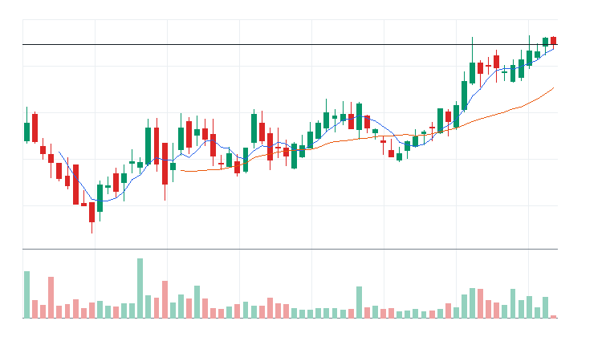

# 오늘의 데일리 트레이딩 요약

**REAL DATA TEST - 가격/거래량은 실제 데이터, 뉴스 연결, ETF 구성종목 확산도/거래대금 유동성 일부 연결**

**목적:** 이 리포트는 최근 오른 자산을 나열하는 것이 아니라, 돈이 몰리는 근거와 다음 매수 주체가 확인할 트레이딩 후보를 찾기 위한 보고서다.

> 핵심 질문: 현재 가격에서 누가 사고 있고, 누가 앞으로 더 비싸게 사줄 수 있는가?

## 시장 국면 판단

- 최종 판정: 중립-하락 (29점)
- 전일 대비: 약세장에서 중립-하락으로 개선됐다(+13점).
- 판정 신뢰도: 높음 (100점) - 핵심 지수와 매크로 데이터가 대부분 직접 수집되어 판정 신뢰도가 높다.
- 행동 바이어스: 매크로 부담 우선, 현금 비중과 손절 기준 강화
- 한 줄 결론: 주요 지수 또는 매크로 중 하나가 약세장 쪽으로 기울었다. 반등 확인 전까지 진입 크기를 줄인다.
- 기술적 지표: 하락 추세 (20점, 가중치 65%)
- KOSPI: 17점 | 50일선 아래, 200일선 아래, 20일 +10.02%, 60일 -11.00%, 52주 고점 대비 -26.63% -> 기술 점수 17
- KOSDAQ: 23점 | 50일선 위, 200일선 아래, 20일 +3.48%, 60일 -17.00%, 52주 고점 대비 -32.77% -> 기술 점수 23
- 매크로 시황: 매크로 중립 (47점, 가중치 35%)
- 매크로 요약: 환율/글로벌은 우호적이나 물가 부담이 남아 있다.
- 금리: 중립 46점 / 금리 중립 / confidence HIGH
  - 주요 근거: US 10Y yield 20일 +2.66%, 5일 +1.36%; US long-duration bonds 20일 -0.66%, 장기채 가격 기준 할인율 부담 확인
  - 확인 사항: 추가 확인 이벤트 없음
- 물가: 위험 16점 / 물가 부담 / confidence MEDIUM
  - 주요 근거: Oil ETF 20일 +20.33%, 유가 기반 물가 압력 확인
  - 확인 사항: 추가 확인 이벤트 없음
- 정책: 중립 50점 / 정책 이벤트 확인 전 중립 / confidence LOW
  - 주요 근거: 정책 톤은 1차 버전에서 일정/이벤트 리스크 기반 중립값으로 반영한다.
  - 확인 사항: FOMC, BOK 금통위, CPI/PCE 발표 전후에는 매크로 confidence를 보수적으로 해석한다.
- 신용/유동성: 중립 51점 / 신용/유동성 중립 / confidence HIGH
  - 주요 근거: High yield credit 20일 -0.57%, 하이일드 위험선호 확인; VIX 20일 -2.48%, 변동성 부담 확인
  - 확인 사항: 추가 확인 이벤트 없음
- 환율/글로벌: 중립-우호 59점 / 환율/글로벌 중립 / confidence HIGH
  - 주요 근거: USD/KRW 20일 -5.10%, 원화 안정/불안 확인; Korea equity ETF 20일 +13.72%, 한국 외국인 위험선호 프록시; KOSDAQ-KOSPI 20일 상대강도 -6.54%, 성장 위험선호 확인
  - 확인 사항: 추가 확인 이벤트 없음
- USD/KRW: 61점 | 하락 시 주식 우호; 5일 -3.04%, 20일 -5.10% -> 매크로 점수 61
- US 10Y yield: 45점 | 하락 시 주식 우호; 5일 +1.36%, 20일 +2.66% -> 매크로 점수 45
- US long-duration bonds: 48점 | 상승 시 주식 우호; 5일 -0.81%, 20일 -0.66% -> 매크로 점수 48
- Oil ETF: 10점 | 하락 시 주식 우호; 5일 +9.45%, 20일 +20.33% -> 매크로 점수 10
- High yield credit: 49점 | 상승 시 주식 우호; 5일 -0.73%, 20일 -0.57% -> 매크로 점수 49
- VIX: 53점 | 하락 시 주식 우호; 5일 +0.69%, 20일 -2.48% -> 매크로 점수 53
- Korea equity ETF: 76점 | 상승 시 주식 우호; 5일 +4.81%, 20일 +13.72% -> 매크로 점수 76
- 데이터 커버리지: 기술 2/2, 매크로 7/7
- 데이터 신뢰도 근거:
  - 직접 지수 데이터: KOSPI, KOSDAQ
  - 대체 지수 데이터 없음
  - 매크로 데이터: 7/7
  - 누락 데이터 없음
  - stale 데이터 없음

## 모바일 요약

[오늘의 데일리 트레이딩 요약]

생성 성공 / 데이터 모드: REAL_TEST

시장:
- 중립

시장 지배 서사:
1. AI 반도체/HBM 공급망 - 약화 - KODEX 200(069500.KS), 한미반도체(042700.KS), SK하이닉스(000660.KS) 중심으로 5일 +3.08%, 20일 +17.29% 흐름이 형성됨. 뉴스 직접성 제한.
2. IT 자금 유입 - 약화 - KODEX 200(069500.KS), KODEX 코스닥150(229200.KS), 이수페타시스(007660.KS), LG전자(066570.KS) 중심으로 5일 +0.10%, 20일 +15.55% 흐름이 형성됨. 뉴스 직접성 제한.
3. Financials 자금 유입 - 약화 - KODEX 200(069500.KS), KODEX 코스닥150(229200.KS), 한화생명(088350.KS), 현대해상(001450.KS) 중심으로 5일 +0.92%, 20일 +17.15% 흐름이 형성됨. 뉴스 직접성 제한.

트렌드 강도:
1. AI 반도체/HBM 공급망 - TSI 47 - 약화 - 진입품질 낮음
2. IT 자금 유입 - TSI 28 - 잠복 - 진입품질 낮음
3. Financials 자금 유입 - TSI 29 - 잠복 - 진입품질 낮음

오늘 결론:
- 화학/에너지 개별 종목 흐름이 ETF 대비 강한지 확인 필요
- 행동 후보는 linkedNarrative와 함께 확인한다.
- 추격보다 진입 조건 확인 후 접근한다.

오늘 실제 행동 후보:
1. 행동 후보 없음 - 미분류 - 조건 충족 후보 없음

다크호스 후보:
1. 다크호스 후보 없음 - 조건 충족 후보 없음

ETF 후보 TOP 5:
1. KODEX 200(069500.KS) - AI 반도체/HBM 공급망 - 거래량 확인 전 관찰
2. KODEX 코스닥150(229200.KS) - IT 자금 유입 - 거래량 확인 전 관찰

웹 리포트:
https://yoolcool.github.io/DailyTradingThesisAgent/kr/

## 오늘 결론

- 오늘 결론: 신규 추격 없음 / 관찰
- 신규 진입 후보: 0개
- 조건부 진입 후보: 0개
- 관찰 후보: 202개
- 주요 제한 요인: RVOL 미달, Entry Quality < 40, 뉴스 직접성 부족
- 주문 판단: 지정가 권장 / 시장가 주의
- 실전 판단: 오늘은 추세 후보는 있으나, 왜 돈이 몰리는가와 누가 더 비싸게 사줄 수 있는가를 주문 실행 신뢰도와 거래량이 충분히 뒷받침하지 못해 신규 추격은 보류한다. 기존 관심 종목은 전일 고점 돌파와 RVOL 1.00x 회복을 확인한 뒤 조건부로 본다.

### 후보 제한 요인 집계

- RVOL < 1.00x: 202개
- 거래대금 유동성 낮음: 0개
- Entry Quality 50~54 near miss: 0개
- Entry Quality 40~49 관찰: 0개
- Entry Quality < 40: 202개
- Exhaustion Risk >= 70: 0개
- ETF breadth 샘플 부족: 0개
- 뉴스 직접성 부족: 196개

## 데이터 신뢰도

- 전체 데이터 신뢰도 등급: MEDIUM
- 분석 신뢰도: MEDIUM
- 주문 실행 신뢰도: MEDIUM
- ETF breadth 신뢰도: HIGH
- 신뢰도 해석: 장전/시간외 데이터 확인 불가
- 리포트 생성 시각: 2026-09-07 10:01 KST
- 가격 기준 거래일: 2026-09-07 KRX 정규장 종가
- 뉴스 수집 시각: 2026-09-07 10:01 KST
- 가장 최근 뉴스 발행 시각: 2026-09-04 00:00 KST
- 뉴스 신선도 상태: UNKNOWN
- 뉴스 소스: DART
- 뉴스 소스 상태: DART CONNECTED
- 뉴스 신뢰도: HIGH
- 추천 적용 거래일: 2026-09-07 KRX 정규장
- 가격/거래량 데이터 상태: 연결됨
- 뉴스 데이터 상태: 연결됨
- ETF 구성종목 확산도 상태: 일부 연결
- ETF 구성종목 샘플 수: 20~30
- 거래대금 유동성 데이터 상태: 일부 연결
- 장전/시간외 데이터 상태: NOT_APPLICABLE
- 데이터 provider: yfinance, DART, config fallback sample, price-volume dollar-volume fallback
- 실전 사용 경고: 이 리포트는 투자판단 보조용이며, REAL_TEST 모드에서는 일부 데이터가 누락되거나 지연될 수 있다. 실제 주문 전 현재가, 뉴스, 장전/시간외 가격과 정규장 거래대금을 별도 확인해야 한다.

## 0. 시장 상태

- 데이터 모드: REAL_TEST
- 가격/거래량: 연결됨
- 뉴스: 연결됨
- ETF 구성종목 확산도: 일부 연결
- 거래대금 유동성: 일부 연결
- 생성 시각: 2026년 9월 7일 월요일 오전 10:01
- 시장 상태: 중립
- 오늘 돈의 방향: 화학/에너지 개별 종목 흐름이 ETF 대비 강한지 확인 필요
- 강한 테마 TOP 3: 2차전지 소재/셀 반등(48), 지주/배당/자사주 재평가(31), IT/전자(27)
- 데이터 한계:
  - API 또는 provider 상태에 따라 뉴스/ETF 확산도/거래대금 유동성 반영 범위가 달라질 수 있다.
  - 수집 실패 데이터는 점수 반영에서 제외하거나 confidence를 제한한다.
  - reasonConfidence HIGH는 직접 촉매, 가격/거래량, 확산도/유동성 근거가 함께 있을 때만 사용한다.

## 오늘 시장을 지배하는 서사

### 오늘 시장을 지배하는 서사 TOP 3

#### 1. AI 반도체/HBM 공급망
- 상태: 약화
- narrativeScore: 19
- reasonConfidence: LOW
- 근거 ETF: KODEX 200(069500.KS)
- 근거 개별 종목: 한미반도체(042700.KS), SK하이닉스(000660.KS), 삼성전자(005930.KS), 삼성전기(009150.KS)
- 돈이 몰리는 이유: AI 반도체/HBM 공급망 관련 KODEX 200(069500.KS)와 한미반도체(042700.KS), SK하이닉스(000660.KS), 삼성전자(005930.KS), 삼성전기(009150.KS)의 5일(+3.08%)·20일(+17.29%) 흐름을 함께 본다. 평균 상대 거래량은 0.23배이고, ETF 확산도는 추가 확인이 필요하다. 뉴스 직접성은 아직 제한적이다.
- 다음 매수 주체: HBM, AI 서버, 온디바이스 AI 수요가 이어질 때 국내 반도체 대형주와 후공정/부품주로 자금이 확산
- 가장 좋은 트레이딩 수단: ETF 우선: KODEX 200(069500.KS) / 개별 종목 우선: SK하이닉스(000660.KS), 삼성전자(005930.KS), 한미반도체(042700.KS)
- 서사가 깨지는 조건: KOSPI200이 20일선을 이탈하거나 반도체 대표 종목 절반 이상이 5일선을 동시에 이탈
- 오늘 행동: 추격보다 SK하이닉스/삼성전자 동조성과 거래대금 회복을 확인한 뒤 눌림 구간에서 선별

상세 narrativeScore 근거 보기

- rawScore: 19
- ETF 평균 moneyFlowScore: 22
- 개별 종목 평균 moneyFlowScore: 39
- ETF 후보 비율: 0%
- 개별 종목 후보 비율: 0%
- 5일 평균 수익률: +3.00%
- 20일 평균 수익률: +17.00%
- 평균 상대 거래량: 0.00배
- ETF 평균 상대 거래량: 0.00배
- 개별주 평균 상대 거래량: 0.00배
- 52주 고점 근접 후보 비율: 0%
- 뉴스 직접성 점수: 1
- ETF 확산도 점수: -4
- 유동성 점수: 3
- 과열 리스크 차감: 0

#### 2. IT 자금 유입
- 상태: 약화
- narrativeScore: 18
- reasonConfidence: LOW
- 근거 ETF: KODEX 200(069500.KS), KODEX 코스닥150(229200.KS)
- 근거 개별 종목: 이수페타시스(007660.KS), LG전자(066570.KS), LG CNS(064400.KS)
- 돈이 몰리는 이유: IT 자금 유입 관련 KODEX 200(069500.KS), KODEX 코스닥150(229200.KS)와 이수페타시스(007660.KS), LG전자(066570.KS), LG CNS(064400.KS)의 5일(+0.10%)·20일(+15.55%) 흐름을 함께 본다. 평균 상대 거래량은 0.37배이고, ETF 확산도는 추가 확인이 필요하다. 뉴스 직접성은 아직 제한적이다.
- 다음 매수 주체: IT 자금 유입을 확인한 섹터 ETF 자금과 상대강도 추종 스윙 자금
- 가장 좋은 트레이딩 수단: ETF 우선: KODEX 200(069500.KS), KODEX 코스닥150(229200.KS) / 개별 종목 우선: LG전자(066570.KS), LG CNS(064400.KS), 이수페타시스(007660.KS)
- 서사가 깨지는 조건: 069500.KS 20일선 이탈 또는 관련 종목 절반 이상 5일선 이탈
- 오늘 행동: 기존 네러티브와 중복을 확인한 뒤 ETF/대표 종목 동조성이 살아날 때만 관찰 편입

상세 narrativeScore 근거 보기

- rawScore: 18
- ETF 평균 moneyFlowScore: 11
- 개별 종목 평균 moneyFlowScore: 36
- ETF 후보 비율: 0%
- 개별 종목 후보 비율: 0%
- 5일 평균 수익률: 0.00%
- 20일 평균 수익률: +16.00%
- 평균 상대 거래량: 0.00배
- ETF 평균 상대 거래량: 0.00배
- 개별주 평균 상대 거래량: 1.00배
- 52주 고점 근접 후보 비율: 0%
- 뉴스 직접성 점수: 1
- ETF 확산도 점수: -1
- 유동성 점수: 4
- 과열 리스크 차감: 0

#### 3. Financials 자금 유입
- 상태: 약화
- narrativeScore: 15
- reasonConfidence: LOW
- 근거 ETF: KODEX 200(069500.KS), KODEX 코스닥150(229200.KS)
- 근거 개별 종목: 한화생명(088350.KS), 현대해상(001450.KS), DB손해보험(005830.KS)
- 돈이 몰리는 이유: Financials 자금 유입 관련 KODEX 200(069500.KS), KODEX 코스닥150(229200.KS)와 한화생명(088350.KS), 현대해상(001450.KS), DB손해보험(005830.KS)의 5일(+0.92%)·20일(+17.15%) 흐름을 함께 본다. 평균 상대 거래량은 0.13배이고, ETF 확산도는 추가 확인이 필요하다. 뉴스 직접성은 아직 제한적이다.
- 다음 매수 주체: Financials 자금 유입을 확인한 섹터 ETF 자금과 상대강도 추종 스윙 자금
- 가장 좋은 트레이딩 수단: ETF 우선: KODEX 200(069500.KS), KODEX 코스닥150(229200.KS) / 개별 종목 우선: 현대해상(001450.KS), 한화생명(088350.KS), DB손해보험(005830.KS)
- 서사가 깨지는 조건: 069500.KS 20일선 이탈 또는 관련 종목 절반 이상 5일선 이탈
- 오늘 행동: 기존 네러티브와 중복을 확인한 뒤 ETF/대표 종목 동조성이 살아날 때만 관찰 편입

상세 narrativeScore 근거 보기

- rawScore: 15
- ETF 평균 moneyFlowScore: 11
- 개별 종목 평균 moneyFlowScore: 35
- ETF 후보 비율: 0%
- 개별 종목 후보 비율: 0%
- 5일 평균 수익률: +1.00%
- 20일 평균 수익률: +17.00%
- 평균 상대 거래량: 0.00배
- ETF 평균 상대 거래량: 0.00배
- 개별주 평균 상대 거래량: 0.00배
- 52주 고점 근접 후보 비율: 0%
- 뉴스 직접성 점수: 0
- ETF 확산도 점수: -1
- 유동성 점수: 3
- 과열 리스크 차감: 0

### 전체 narrative 요약

| 서사명 | 상태 | narrativeScore | reasonConfidence | 대표 ETF | 대표 종목 | 오늘 행동 |
| --- | --- | ---: | --- | --- | --- | --- |
| AI 반도체/HBM 공급망 | 약화 | 19 | LOW | KODEX 200(069500.KS) | 한미반도체(042700.KS), SK하이닉스(000660.KS), 삼성전자(005930.KS), 삼성전기(009150.KS) | 추격보다 SK하이닉스/삼성전자 동조성과 거래대금 회복을 확인한 뒤 눌림 구간에서 선별 |
| IT 자금 유입 | 약화 | 18 | LOW | KODEX 200(069500.KS), KODEX 코스닥150(229200.KS) | 이수페타시스(007660.KS), LG전자(066570.KS), LG CNS(064400.KS) | 기존 네러티브와 중복을 확인한 뒤 ETF/대표 종목 동조성이 살아날 때만 관찰 편입 |
| Financials 자금 유입 | 약화 | 15 | LOW | KODEX 200(069500.KS), KODEX 코스닥150(229200.KS) | 한화생명(088350.KS), 현대해상(001450.KS), DB손해보험(005830.KS) | 기존 네러티브와 중복을 확인한 뒤 ETF/대표 종목 동조성이 살아날 때만 관찰 편입 |
| 지주/배당/자사주 재평가 | 약화 | 14 | LOW | KODEX 200(069500.KS) | SK(034730.KS), LG(003550.KS), 롯데지주(004990.KS), 두산(000150.KS) | 강한 시장에서는 후순위, 변동성 확대 구간에서 방어적 재평가 후보로 관찰 |
| Constructions 자금 유입 | 약화 | 8 | LOW | KODEX 200(069500.KS), KODEX 코스닥150(229200.KS) | DL(000210.KS) | 기존 네러티브와 중복을 확인한 뒤 ETF/대표 종목 동조성이 살아날 때만 관찰 편입 |
| Heavy Industries 자금 유입 | 약화 | 4 | LOW | KODEX 200(069500.KS), KODEX 코스닥150(229200.KS) | 산일전기(062040.KS), 현대로템(064350.KS) | 기존 네러티브와 중복을 확인한 뒤 ETF/대표 종목 동조성이 살아날 때만 관찰 편입 |
| 금융/밸류업 주주환원 | 약화 | 2 | LOW | KODEX 200(069500.KS) | 신한지주(055550.KS), 하나금융지주(086790.KS), KB금융(105560.KS), 우리금융지주(316140.KS) | 지수 변동성이 커질 때 방어적 대안으로 관찰하고, 급등 후에는 배당락/정책 뉴스 확인 |
| Energy & Chemicals 자금 유입 | 약화 | 2 | LOW | KODEX 200(069500.KS), KODEX 코스닥150(229200.KS) | GS(078930.KS), OCI홀딩스(010060.KS), HS효성첨단소재(298050.KS), 한화솔루션(009830.KS) | 기존 네러티브와 중복을 확인한 뒤 ETF/대표 종목 동조성이 살아날 때만 관찰 편입 |
| 전력기기/인프라 투자 | 약화 | 1 | LOW | KODEX 200(069500.KS) | HD현대(267250.KS), HD현대일렉트릭(267260.KS), LS ELECTRIC(010120.KS), 효성중공업(298040.KS) | 강한 종목을 추격하기보다 거래대금 유지와 5일선 재지지를 확인 |
| Communication Services 자금 유입 | 약화 | 1 | LOW | KODEX 200(069500.KS), KODEX 코스닥150(229200.KS) | KT(030200.KS), SK텔레콤(017670.KS) | 기존 네러티브와 중복을 확인한 뒤 ETF/대표 종목 동조성이 살아날 때만 관찰 편입 |
| Industrials 자금 유입 | 약화 | 1 | LOW | KODEX 200(069500.KS), KODEX 코스닥150(229200.KS) | 팬오션(028670.KS), 엘앤에프(066970.KS), 포스코인터내셔널(047050.KS), LIG디펜스앤에어로스페이스(079550.KS) | 기존 네러티브와 중복을 확인한 뒤 ETF/대표 종목 동조성이 살아날 때만 관찰 편입 |
| 2차전지 소재/셀 반등 | 약화 | 0 | LOW | KODEX 200(069500.KS), KODEX 코스닥150(229200.KS) | 포스코퓨처엠(003670.KS), 삼성SDI(006400.KS), LG에너지솔루션(373220.KS), 에코프로머티(450080.KS) | 추세 전환보다 반등 성격으로 접근하고, 상대 거래량이 살아나는 종목만 단기 관찰 |
| 소비 회복/방어주 선별 | 약화 | 0 | LOW | KODEX 200(069500.KS), KODEX 코스닥150(229200.KS) | 지역난방공사(071320.KS), 코스맥스(192820.KS), BGF리테일(282330.KS), GS리테일(007070.KS) | 기존 네러티브와 중복을 확인한 뒤 ETF/대표 종목 동조성이 살아날 때만 관찰 편입 |
| Steels & Materials 자금 유입 | 약화 | 0 | LOW | KODEX 200(069500.KS), KODEX 코스닥150(229200.KS) | 아세아(002030.KS), 세아베스틸지주(001430.KS), 풍산(103140.KS), 고려아연(010130.KS) | 기존 네러티브와 중복을 확인한 뒤 ETF/대표 종목 동조성이 살아날 때만 관찰 편입 |
| 전력 유틸리티 수요 재평가 | 약화 | 0 | LOW | KODEX 200(069500.KS), KODEX 코스닥150(229200.KS) | 효성중공업(298040.KS), LS ELECTRIC(010120.KS) | 기존 네러티브와 중복을 확인한 뒤 ETF/대표 종목 동조성이 살아날 때만 관찰 편입 |
| Internet platform 자금 유입 | 약화 | 0 | LOW | KODEX 200(069500.KS), KODEX 코스닥150(229200.KS) | NAVER(035420.KS), 카카오(035720.KS) | 기존 네러티브와 중복을 확인한 뒤 ETF/대표 종목 동조성이 살아날 때만 관찰 편입 |
| 화장품/음식료 수출 소비재 | 약화 | 0 | LOW | KODEX 200(069500.KS) | 한국콜마(161890.KS), 아모레퍼시픽(090430.KS), LG생활건강(051900.KS), 삼양식품(003230.KS) | 실적 기대와 가격 반응이 같이 나타나는 종목만 선별, 단기 급등주는 눌림 대기 |
| 바이오/헬스케어 실적 전환 | 약화 | 0 | LOW | KODEX 200(069500.KS) | 한미약품(128940.KS), 삼성바이오로직스(207940.KS), 셀트리온(068270.KS), 유한양행(000100.KS) | 뉴스 촉매와 거래량이 동반될 때만 관찰 편입, 이벤트 소멸 후 추격은 금지 |
| 인터넷/게임/엔터 성장주 | 약화 | 0 | LOW | KODEX 200(069500.KS), KODEX 코스닥150(229200.KS) | 하이브(352820.KS), NAVER(035420.KS), 카카오(035720.KS), 크래프톤(259960.KS) | 지수 위험선호가 유지될 때만 선별 진입, 대형 플랫폼은 실적 반응을 우선 확인 |
| 자동차/부품 수출 모멘텀 | 약화 | 0 | LOW | KODEX 200(069500.KS) | 현대차(005380.KS), 기아(000270.KS), 현대모비스(012330.KS), 현대위아(011210.KS) | 완성차 쌍두마차가 시장 대비 강할 때만 부품주까지 확산 여부를 확인 |
| 조선/방산 수주 사이클 | 소멸 | 0 | LOW | KODEX 200(069500.KS) | 한화오션(042660.KS), HD현대중공업(329180.KS), 한화에어로스페이스(012450.KS), 한국항공우주(047810.KS) | 수주 공시나 업황 뉴스가 직접 확인될 때만 추세 추종, 과열 구간은 신규 진입 보류 |

## 트렌드 강도 판단

### 1. AI 반도체/HBM 공급망
- Trend Strength Index: 47
- 트렌드 상태 라벨: 약화
- 테마 확산도: 약함
- ETF 동조성: 강함
- 거래량 강도: 부족
- 과열 위험: 낮음 (16)
- 오늘 진입 품질: 낮음 (29)
- 한 줄 판단: AI 반도체/HBM 공급망는 관찰 가능한 흐름은 있으나 가격, 거래량, 확산도 중 일부 확인이 더 필요하다.
- 오늘 접근법: 상승률이 남아 있어도 KODEX 200(069500.KS)와 구성 종목 확산도가 회복될 때까지 신규 진입은 낮춘다.

트렌드 강도 상세 근거 보기

- 가격 모멘텀: 가격 모멘텀 14/25. 평균 5D +3.08%, 20D +17.29%.
- 거래량 강도: 거래량 강도 3/20. 평균 RVOL 0.23배.
- ETF 동조성: ETF 동조성 15/15. 관련 ETF KODEX 200(069500.KS) 흐름을 기준으로 판단.
- 테마 확산도: 테마 확산도 8/20. 상위 1~2개 쏠림 감점 3점 반영.
- 뉴스 촉매: 뉴스/촉매 신선도 0/10. HIGH 직접 촉매 0개.
- 과열 리스크: 과열 리스크 16/100. 단기 급등, 고점 근접, ETF-개별주 괴리, 쏠림을 함께 반영.
- 시장 환경: 시장 환경 7/10. KOSPI200/KODEX 200/KODEX KOSDAQ150 가격 흐름 기반 위험선호 점수.

### 2. IT 자금 유입
- Trend Strength Index: 28
- 트렌드 상태 라벨: 잠복
- 테마 확산도: 부족
- ETF 동조성: 약함
- 거래량 강도: 부족
- 과열 위험: 낮음 (14)
- 오늘 진입 품질: 낮음 (19)
- 한 줄 판단: IT 자금 유입는 테마 확산도가 낮아 아직 개별 종목 이벤트성 흐름에 가깝다.
- 오늘 접근법: KODEX 200(069500.KS)/KODEX 코스닥150(229200.KS)와 이수페타시스(007660.KS)/LG전자(066570.KS)/LG CNS(064400.KS)의 거래량 확산이 확인되기 전까지 관찰한다.

트렌드 강도 상세 근거 보기

- 가격 모멘텀: 가격 모멘텀 7/25. 평균 5D +0.10%, 20D +15.55%.
- 거래량 강도: 거래량 강도 3/20. 평균 RVOL 0.37배.
- ETF 동조성: ETF 동조성 7/15. 관련 ETF KODEX 200(069500.KS), KODEX 코스닥150(229200.KS) 흐름을 기준으로 판단.
- 테마 확산도: 테마 확산도 4/20. 상위 1~2개 쏠림 감점 3점 반영.
- 뉴스 촉매: 뉴스/촉매 신선도 0/10. HIGH 직접 촉매 0개.
- 과열 리스크: 과열 리스크 14/100. 단기 급등, 고점 근접, ETF-개별주 괴리, 쏠림을 함께 반영.
- 시장 환경: 시장 환경 7/10. KOSPI200/KODEX 200/KODEX KOSDAQ150 가격 흐름 기반 위험선호 점수.

### 3. Financials 자금 유입
- Trend Strength Index: 29
- 트렌드 상태 라벨: 잠복
- 테마 확산도: 부족
- ETF 동조성: 약함
- 거래량 강도: 부족
- 과열 위험: 낮음 (16)
- 오늘 진입 품질: 낮음 (18)
- 한 줄 판단: Financials 자금 유입는 테마 확산도가 낮아 아직 개별 종목 이벤트성 흐름에 가깝다.
- 오늘 접근법: KODEX 200(069500.KS)/KODEX 코스닥150(229200.KS)와 한화생명(088350.KS)/현대해상(001450.KS)/DB손해보험(005830.KS)의 거래량 확산이 확인되기 전까지 관찰한다.

트렌드 강도 상세 근거 보기

- 가격 모멘텀: 가격 모멘텀 7/25. 평균 5D +0.92%, 20D +17.15%.
- 거래량 강도: 거래량 강도 3/20. 평균 RVOL 0.13배.
- ETF 동조성: ETF 동조성 7/15. 관련 ETF KODEX 200(069500.KS), KODEX 코스닥150(229200.KS) 흐름을 기준으로 판단.
- 테마 확산도: 테마 확산도 5/20. 상위 1~2개 쏠림 감점 3점 반영.
- 뉴스 촉매: 뉴스/촉매 신선도 0/10. HIGH 직접 촉매 0개.
- 과열 리스크: 과열 리스크 16/100. 단기 급등, 고점 근접, ETF-개별주 괴리, 쏠림을 함께 반영.
- 시장 환경: 시장 환경 7/10. KOSPI200/KODEX 200/KODEX KOSDAQ150 가격 흐름 기반 위험선호 점수.

## 최근 추천 결과 트래킹

개별주는 데이트레이딩 관점으로 추천 이후 첫 정규장의 장중 최고가와 종가를 추적한다. ETF는 테마/스윙 관점으로 추천 이후 1주일 동안의 최고가와 현재 종가를 추적한다.

### 개별주 Top 3 추천 성과 요약
- 최근 5개 리포트 표본: 9개 (초기 검증 단계)
- 장중 최고가 기준 성공률: +11.11%
- 종가 기준 성공률: 0.00%
- 평균 장중 최고 수익률: +1.52%
- 평균 종가 수익률: -1.40%

### ETF 추천 성과 요약
- 최근 5개 리포트 표본: 0개 (초기 검증 단계)
- 1주 최고가 기준 성공률: 데이터 없음
- 현재 종가 기준 성공률: 데이터 없음
- 평균 1주 최고 수익률: 데이터 없음
- 평균 현재 수익률: 데이터 없음

최근 추천 결과 상세 테이블 펼치기

| 추천일 | 유형 | 순위 | 티커 | 기준가 | 추적 기간 | 상태 | High 수익률 | Close 수익률 | 결과 | 코멘트 |
| --- | --- | ---: | --- | ---: | --- | --- | ---: | ---: | --- | --- |
| 2026-09-04 | STOCK | 1 | S-Oil(010950.KS) | $161,900 | 2026-09-04 | complete | +1.73% | -2.84% | 제한적 유효 | 제한적인 장중 기회만 발생 (일봉 기준) |
| 2026-09-03 | STOCK | 1 | 한화생명(088350.KS) | $6,460 | 2026-09-03 | complete | +1.39% | -5.42% | 제한적 유효 | 제한적인 장중 기회만 발생 (일봉 기준) |
| 2026-09-01 | STOCK | 1 | 이수스페셜티케미컬(457190.KS) | $72,300 | 2026-09-01 | complete | +4.70% | -3.73% | 단타 유효 | 장중 기회는 있었지만 종가 유지력은 약함 (일봉 기준) |
| 2026-08-28 | STOCK | 3 | 율촌화학(008730.KS) | $16,800 | 2026-08-28 | complete | +0.33% | 0.00% | 추적 대기 | 아직 추적 거래일 데이터가 완성되지 않음 (일봉 기준) |
| 2026-08-28 | STOCK | 2 | 롯데웰푸드(280360.KS) | $146,300 | 2026-08-28 | complete | +1.16% | 0.00% | 제한적 유효 | 제한적인 장중 기회만 발생 (일봉 기준) |
| 2026-08-28 | STOCK | 1 | 코스맥스(192820.KS) | $303,000 | 2026-08-28 | complete | +0.99% | 0.00% | 추적 대기 | 아직 추적 거래일 데이터가 완성되지 않음 (일봉 기준) |
| 2026-08-27 | STOCK | 3 | 삼성SDI(006400.KS) | $568,000 | 2026-08-27 | complete | +0.53% | +0.18% | 추적 대기 | 아직 추적 거래일 데이터가 완성되지 않음 (일봉 기준) |
| 2026-08-27 | STOCK | 2 | 두산에너빌리티(034020.KS) | $86,500 | 2026-08-27 | complete | +1.39% | -0.69% | 제한적 유효 | 제한적인 장중 기회만 발생 (일봉 기준) |
| 2026-08-27 | STOCK | 1 | 포스코퓨처엠(003670.KS) | $184,200 | 2026-08-27 | complete | +1.47% | -0.11% | 제한적 유효 | 제한적인 장중 기회만 발생 (일봉 기준) |
| 2026-08-26 | STOCK | 3 | 엘앤에프(066970.KS) | $120,400 | 2026-08-26 | complete | +2.57% | +1.50% | 제한적 유효 | 제한적인 장중 기회만 발생 (일봉 기준) |
| 2026-08-26 | STOCK | 2 | 풍산(103140.KS) | $87,600 | 2026-08-26 | complete | -0.57% | -5.94% | 실패 | 추천 이후 의미 있는 장중 기회가 부족하고 종가도 약함 (일봉 기준) |
| 2026-08-26 | STOCK | 1 | 롯데웰푸드(280360.KS) | $135,200 | 2026-08-26 | complete | +6.14% | +3.48% | 성공 | 장중 기회와 종가 유지가 모두 확인됨 (일봉 기준) |
| 2026-08-25 | STOCK | 3 | 엘앤에프(066970.KS) | $121,600 | 2026-08-25 | complete | +2.96% | -0.99% | 제한적 유효 | 제한적인 장중 기회만 발생 (일봉 기준) |
| 2026-08-25 | STOCK | 2 | 팬오션(028670.KS) | $6,320 | 2026-08-25 | complete | +3.32% | +0.95% | 단타 유효 | 장중 기회는 있었지만 종가 유지력은 약함 (일봉 기준) |
| 2026-08-25 | STOCK | 1 | 코스맥스(192820.KS) | $286,000 | 2026-08-25 | complete | +1.05% | +1.05% | 제한적 유효 | 제한적인 장중 기회만 발생 (일봉 기준) |
| 2026-08-24 | STOCK | 1 | 코스맥스(192820.KS) | $271,000 | 2026-08-24 | complete | +6.27% | +5.54% | 성공 | 장중 기회와 종가 유지가 모두 확인됨 (일봉 기준) |
| 2026-08-21 | STOCK | 3 | 코스맥스(192820.KS) | $260,500 | 2026-08-21 | complete | +5.18% | +4.03% | 성공 | 장중 기회와 종가 유지가 모두 확인됨 (일봉 기준) |
| 2026-08-21 | STOCK | 2 | 삼양식품(003230.KS) | $1,397,000 | 2026-08-21 | complete | +0.79% | -2.22% | 실패 | 추천 이후 의미 있는 장중 기회가 부족하고 종가도 약함 (일봉 기준) |
| 2026-08-21 | STOCK | 1 | 농심(004370.KS) | $441,000 | 2026-08-21 | complete | 0.00% | -1.93% | 실패 | 추천 이후 의미 있는 장중 기회가 부족하고 종가도 약함 (일봉 기준) |
| 2026-08-20 | STOCK | 3 | 한화에어로스페이스(012450.KS) | $1,177,000 | 2026-08-20 | complete | +3.06% | -0.85% | 단타 유효 | 장중 기회는 있었지만 종가 유지력은 약함 (일봉 기준) |
| 2026-08-20 | STOCK | 2 | DB손해보험(005830.KS) | $187,500 | 2026-08-20 | complete | -1.60% | -5.39% | 실패 | 추천 이후 의미 있는 장중 기회가 부족하고 종가도 약함 (일봉 기준) |
| 2026-08-20 | STOCK | 1 | 현대해상(001450.KS) | $50,000 | 2026-08-20 | complete | +0.40% | -2.30% | 실패 | 추천 이후 의미 있는 장중 기회가 부족하고 종가도 약함 (일봉 기준) |
| 2026-08-19 | STOCK | 3 | 한화생명(088350.KS) | $5,520 | 2026-08-19 | complete | +1.09% | -3.26% | 제한적 유효 | 제한적인 장중 기회만 발생 (일봉 기준) |
| 2026-08-19 | STOCK | 2 | GS(078930.KS) | $119,300 | 2026-08-19 | complete | +1.26% | +0.34% | 제한적 유효 | 제한적인 장중 기회만 발생 (일봉 기준) |
| 2026-08-19 | STOCK | 1 | 코스맥스(192820.KS) | $239,000 | 2026-08-19 | complete | +4.60% | +2.93% | 성공 | 장중 기회와 종가 유지가 모두 확인됨 (일봉 기준) |
| 2026-08-18 | STOCK | 3 | LG CNS(064400.KS) | $79,900 | 2026-08-18 | complete | +5.01% | -7.51% | 단타 유효 | 장중 기회는 있었지만 종가 유지력은 약함 (일봉 기준) |
| 2026-08-18 | STOCK | 2 | 세아베스틸지주(001430.KS) | $45,000 | 2026-08-18 | complete | +2.78% | -4.22% | 제한적 유효 | 제한적인 장중 기회만 발생 (일봉 기준) |
| 2026-08-18 | STOCK | 1 | 현대해상(001450.KS) | $45,350 | 2026-08-18 | complete | +10.80% | +9.59% | 성공 | 장중 기회와 종가 유지가 모두 확인됨 (일봉 기준) |
| 2026-08-17 | STOCK | 3 | 한국콜마(161890.KS) | $136,700 | 2026-08-17 | pending | 데이터 없음 | 데이터 없음 | 추적 대기 | 아직 추적 거래일 데이터가 완성되지 않음 |
| 2026-08-17 | STOCK | 2 | LG(003550.KS) | $120,000 | 2026-08-17 | pending | 데이터 없음 | 데이터 없음 | 추적 대기 | 아직 추적 거래일 데이터가 완성되지 않음 |
| 2026-08-17 | STOCK | 1 | 현대해상(001450.KS) | $45,350 | 2026-08-17 | pending | 데이터 없음 | 데이터 없음 | 추적 대기 | 아직 추적 거래일 데이터가 완성되지 않음 |
| 2026-08-14 | STOCK | 3 | 코스맥스(192820.KS) | $249,000 | 2026-08-14 | complete | +0.80% | -0.60% | 실패 | 추천 이후 의미 있는 장중 기회가 부족하고 종가도 약함 (일봉 기준) |
| 2026-08-14 | STOCK | 2 | GS(078930.KS) | $107,400 | 2026-08-14 | complete | +10.52% | +8.94% | 성공 | 장중 기회와 종가 유지가 모두 확인됨 (일봉 기준) |
| 2026-08-14 | STOCK | 1 | 현대해상(001450.KS) | $42,950 | 2026-08-14 | complete | +6.64% | +5.59% | 성공 | 장중 기회와 종가 유지가 모두 확인됨 (일봉 기준) |
| 2026-08-13 | STOCK | 3 | 한화에어로스페이스(012450.KS) | $1,156,000 | 2026-08-13 | complete | +4.93% | +2.51% | 성공 | 장중 기회와 종가 유지가 모두 확인됨 (일봉 기준) |
| 2026-08-13 | STOCK | 2 | 코스맥스(192820.KS) | $249,500 | 2026-08-13 | complete | +5.01% | -0.20% | 단타 유효 | 장중 기회는 있었지만 종가 유지력은 약함 (일봉 기준) |
| 2026-08-13 | STOCK | 1 | GS(078930.KS) | $101,000 | 2026-08-13 | complete | +11.88% | +6.34% | 성공 | 장중 기회와 종가 유지가 모두 확인됨 (일봉 기준) |
| 2026-08-12 | STOCK | 3 | 지역난방공사(071320.KS) | $75,100 | 2026-08-12 | complete | +2.40% | +0.13% | 제한적 유효 | 제한적인 장중 기회만 발생 (일봉 기준) |
| 2026-08-12 | STOCK | 2 | BGF리테일(282330.KS) | $150,500 | 2026-08-12 | complete | +1.00% | -3.32% | 제한적 유효 | 제한적인 장중 기회만 발생 (일봉 기준) |
| 2026-08-12 | STOCK | 1 | 고려아연(010130.KS) | $1,229,000 | 2026-08-12 | complete | +0.90% | -1.14% | 실패 | 추천 이후 의미 있는 장중 기회가 부족하고 종가도 약함 (일봉 기준) |
| 2026-08-11 | STOCK | 3 | 세아베스틸지주(001430.KS) | $43,050 | 2026-08-11 | complete | +0.46% | -4.07% | 실패 | 추천 이후 의미 있는 장중 기회가 부족하고 종가도 약함 (일봉 기준) |
| 2026-08-11 | STOCK | 2 | 현대해상(001450.KS) | $41,000 | 2026-08-11 | complete | +10.49% | +7.44% | 성공 | 장중 기회와 종가 유지가 모두 확인됨 (일봉 기준) |
| 2026-08-11 | STOCK | 1 | OCI홀딩스(010060.KS) | $284,500 | 2026-08-11 | complete | -0.35% | -3.87% | 실패 | 추천 이후 의미 있는 장중 기회가 부족하고 종가도 약함 (일봉 기준) |
| 2026-08-10 | STOCK | 3 | 풍산(103140.KS) | $83,600 | 2026-08-10 | complete | +4.67% | +3.59% | 성공 | 장중 기회와 종가 유지가 모두 확인됨 (일봉 기준) |
| 2026-08-10 | STOCK | 2 | HS효성첨단소재(298050.KS) | $183,200 | 2026-08-10 | complete | +2.89% | +0.49% | 제한적 유효 | 제한적인 장중 기회만 발생 (일봉 기준) |
| 2026-08-10 | STOCK | 1 | 세아베스틸지주(001430.KS) | $41,600 | 2026-08-10 | complete | +4.09% | +3.49% | 성공 | 장중 기회와 종가 유지가 모두 확인됨 (일봉 기준) |
| 2026-08-06 | STOCK | 3 | 풍산(103140.KS) | $80,700 | 2026-08-06 | complete | +6.82% | +3.84% | 성공 | 장중 기회와 종가 유지가 모두 확인됨 (일봉 기준) |
| 2026-08-06 | STOCK | 2 | 세아베스틸지주(001430.KS) | $40,800 | 2026-08-06 | complete | +0.49% | -1.84% | 실패 | 추천 이후 의미 있는 장중 기회가 부족하고 종가도 약함 (일봉 기준) |
| 2026-08-06 | STOCK | 1 | OCI홀딩스(010060.KS) | $246,000 | 2026-08-06 | complete | +4.47% | -0.81% | 단타 유효 | 장중 기회는 있었지만 종가 유지력은 약함 (일봉 기준) |
| 2026-08-05 | STOCK | 3 | LG생활건강(051900.KS) | $291,500 | 2026-08-05 | complete | +3.77% | +0.34% | 단타 유효 | 장중 기회는 있었지만 종가 유지력은 약함 (일봉 기준) |
| 2026-08-05 | STOCK | 2 | DL(000210.KS) | $51,900 | 2026-08-05 | complete | +1.35% | -1.35% | 제한적 유효 | 제한적인 장중 기회만 발생 (일봉 기준) |
| 2026-08-05 | STOCK | 1 | GS(078930.KS) | $96,900 | 2026-08-05 | complete | +5.16% | -1.96% | 단타 유효 | 장중 기회는 있었지만 종가 유지력은 약함 (일봉 기준) |
| 2026-08-03 | STOCK | 2 | 금호타이어(073240.KS) | $7,290 | 2026-08-03 | complete | +2.74% | -8.64% | 제한적 유효 | 제한적인 장중 기회만 발생 (일봉 기준) |
| 2026-08-03 | STOCK | 1 | LG생활건강(051900.KS) | $287,000 | 2026-08-03 | complete | +4.18% | -1.22% | 단타 유효 | 장중 기회는 있었지만 종가 유지력은 약함 (일봉 기준) |
| 2026-07-31 | STOCK | 3 | 아세아(002030.KS) | $214,000 | 2026-07-31 | complete | -2.34% | -9.81% | 실패 | 추천 이후 의미 있는 장중 기회가 부족하고 종가도 약함 (일봉 기준) |
| 2026-07-31 | STOCK | 2 | 아모레퍼시픽(090430.KS) | $134,000 | 2026-07-31 | complete | -2.24% | -2.99% | 실패 | 추천 이후 의미 있는 장중 기회가 부족하고 종가도 약함 (일봉 기준) |
| 2026-07-31 | STOCK | 1 | LG생활건강(051900.KS) | $292,000 | 2026-07-31 | complete | -1.54% | -1.71% | 실패 | 추천 이후 의미 있는 장중 기회가 부족하고 종가도 약함 (일봉 기준) |
| 2026-07-30 | STOCK | 1 | LG생활건강(051900.KS) | $263,000 | 2026-07-30 | complete | +19.58% | +11.03% | 성공 | 장중 기회와 종가 유지가 모두 확인됨 (일봉 기준) |
| 2026-07-28 | STOCK | 3 | 삼성바이오로직스(207940.KS) | $1,545,000 | 2026-07-28 | complete | +1.94% | +0.26% | 제한적 유효 | 제한적인 장중 기회만 발생 (일봉 기준) |
| 2026-07-28 | STOCK | 2 | NAVER(035420.KS) | $225,000 | 2026-07-28 | complete | +3.11% | -6.67% | 단타 유효 | 장중 기회는 있었지만 종가 유지력은 약함 (일봉 기준) |

## 오늘 실제 행동 후보

오늘은 추세 후보는 있으나, 왜 돈이 몰리는가와 누가 더 비싸게 사줄 수 있는가를 주문 실행 신뢰도와 거래량이 충분히 뒷받침하지 못해 신규 추격은 보류한다. 기존 관심 종목은 전일 고점 돌파와 RVOL 1.00x 회복을 확인한 뒤 조건부로 본다.

## 다크호스 후보

다크호스 후보 없음. 상위 서사 정렬, MA20 위 안착, MA5/MA20 구조 개선, RVOL 0.90x 이상 조건을 동시에 충족한 개별주가 없다.

- darkHorseScore: 조건 충족 후보 없음
- 왜 아직 메인이 아닌가: 확인 조건을 통과한 보조 관찰 후보가 없다.

darkHorseScore 상세 근거 보기

- 서사 정렬: 조건 미충족
- 초기 추세 구조: 조건 미충족
- 베이스 돌파/정돈: 조건 미충족
- 거래량 확인: 조건 미충족
- rawScore: 데이터 없음

## 참고용 행동 후보

> 실제 행동 후보가 없는 날에만 표시한다. 아래 후보는 매수 추천이 아니라 다음 정규장에서 전일 고점 돌파, RVOL 1.00x 이상, 거래대금 유동성 확인을 기다리는 관찰 리스트다.

### ETF 참고 후보 TOP 3

#### 1. KODEX 200(069500.KS)
- 상태: 참고용 관찰 후보
- todayActionLabel: 거래량 확인 전 관찰
- 제한 사유: Entry Quality 21 < 40; RVOL 0.16x < 1.00x
- 주문 실행: 시장가 가능
- moneyFlowScore: 22
- Entry Quality: 21 (낮음)
- RVOL: 0.16x
- 진입 전 확인: 상대 거래량 1.0배 회복 후 관찰
- 무효화: 거래량 회복 실패
#### 최근 뉴스/동향 한국어 요약

- 요약: 종목 직접 뉴스 확인 상태이며 뉴스 흐름은 중립 또는 혼재입니다. 후보 선정 후 재확인한 핵심 이슈는 "연배당률 16%인 KODEX 200위클리커버드콜 인기 - 브런치"입니다.
- 직접 촉매 판단: KODEX 200에 대해 직접 촉매로 분류된 뉴스가 확인됐습니다. 핵심은 "연배당률 16%인 KODEX 200위클리커버드콜 인기 - 브런치"이며, 일반 재료로 봅니다.
- 뉴스 1: 연배당률 16%인 KODEX 200위클리커버드콜 인기 - 브런치
  - 내용: KODEX 200 관련 시장 일반 뉴스입니다. 제목상 핵심은 "연배당률 16%인 KODEX 200위클리커버드콜 인기"입니다.
  - 투자 의미: KODEX 200의 당일 상대강도 확인에는 도움이 되지만, 실적/가이던스 같은 새 펀더멘털 변화로 보기는 어렵습니다.
  - 확인할 점: 거래량 동반 여부, 장중 고점 유지, 관련 ETF 동반 강세
- 매매 해석: 매매 관점에서는 뉴스 자체보다 가격이 진입 조건을 지키는지, 거래량이 동반되는지, 그리고 뉴스가 이미 주가에 반영됐는지를 우선 확인해야 합니다.

#### 2. KODEX 코스닥150(229200.KS)
- 상태: 참고용 관찰 후보
- todayActionLabel: 거래량 확인 전 관찰
- 제한 사유: Entry Quality 8 < 40; RVOL 0.15x < 1.00x
- 주문 실행: 시장가 가능
- moneyFlowScore: 0
- Entry Quality: 8 (낮음)
- RVOL: 0.15x
- 진입 전 확인: 상대 거래량 1.0배 회복 후 관찰
- 무효화: 거래량 회복 실패
#### 최근 뉴스/동향 한국어 요약

- 요약: KODEX 코스닥150 후보 선정 후 재확인했지만 의미 있는 신규 뉴스나 공시는 확인되지 않았습니다.
- 직접 촉매 판단: KODEX 코스닥150에 대해 강한 직접 촉매는 확인되지 않았습니다.
- 뉴스 1: 후보 선정 후 재검색 기준으로 요약할 만한 신규 뉴스가 없습니다.
- 매매 해석: 뉴스 공백 상태에서는 가격/거래량 조건이 더 중요하며, 새 공시나 직접 뉴스가 나오기 전까지 신뢰도는 제한적으로 봅니다.

### 개별주 참고 후보 TOP 3

#### 1. SK(034730.KS)
- 상태: 참고용 관찰 후보
- todayActionLabel: 거래량 확인 전 관찰
- 제한 사유: Entry Quality 23 < 40; RVOL 0.24x < 1.00x
- 주문 실행: 시장가 가능
- moneyFlowScore: 63
- Entry Quality: 23 (낮음)
- RVOL: 0.24x
- 진입 전 확인: 상대 거래량 1.0배 회복 후 관찰
- 무효화: 거래량 회복 실패
#### 최근 뉴스/동향 한국어 요약

- 요약: 종목 직접 뉴스 확인 상태이며 뉴스 흐름은 중립 또는 혼재입니다. 후보 선정 후 재확인한 핵심 이슈는 "최대주주등소유주식변동신고서              "입니다.
- 직접 촉매 판단: SK에 대해 직접 촉매로 분류된 뉴스가 확인됐습니다. 핵심은 "최대주주등소유주식변동신고서              "이며, 일반 재료로 봅니다.
- 뉴스 1: 최대주주등소유주식변동신고서
  - 내용: SK 관련 일반 뉴스입니다. 제목상 핵심은 "최대주주등소유주식변동신고서"입니다.
  - 투자 의미: 단기 혼재 뉴스 흐름으로 볼 수 있지만, 단독 매수 근거보다는 가격·거래량 조건을 확인하는 보조 근거로 사용합니다.
  - 확인할 점: 원문 수치, 후속 보도, 가격이 진입 조건을 지키는지
- 매매 해석: 매매 관점에서는 뉴스 자체보다 가격이 진입 조건을 지키는지, 거래량이 동반되는지, 그리고 뉴스가 이미 주가에 반영됐는지를 우선 확인해야 합니다.

#### 2. 한미반도체(042700.KS)
- 상태: 참고용 관찰 후보
- todayActionLabel: 거래량 확인 전 관찰
- 제한 사유: Entry Quality 20 < 40; RVOL 0.42x < 1.00x
- 주문 실행: 시장가 가능
- moneyFlowScore: 62
- Entry Quality: 20 (낮음)
- RVOL: 0.42x
- 진입 전 확인: 상대 거래량 1.0배 회복 후 관찰
- 무효화: 거래량 회복 실패
#### 최근 뉴스/동향 한국어 요약

- 요약: 종목 직접 뉴스 확인 상태이며 뉴스 흐름은 긍정 우위입니다. 후보 선정 후 재확인한 핵심 이슈는 "한미반도체 투자분석 2026. 09. 05 - 주달"입니다.
- 직접 촉매 판단: 한미반도체에 대해 직접 촉매로 분류된 뉴스가 확인됐습니다. 핵심은 "한미반도체 투자분석 2026. 09. 05 - 주달"이며, 일반 재료로 봅니다.
- 뉴스 1: 한미반도체 투자분석 2026. 09. 05 - 주달
  - 내용: 한미반도체에 대한 기술적 분석 또는 투자전략성 기사입니다. 기업의 신규 공시보다는 가격 위치, 저점 매수 관점, 향후 대응전략을 다룬 내용으로 봅니다.
  - 투자 의미: 투자/증설 재료는 실적 가시성이나 밸류에이션 기대에 영향을 줄 수 있어 규모와 일정 확인이 중요합니다.
  - 확인할 점: 투자/증설의 금액, 기간, 실적 반영 시점
- 뉴스 2: 한미반도체 23만원 터치 ‘8% 급등’…HBM4·실적 기대에 매수세 몰렸다 - job-post.co.kr
  - 내용: 한미반도체의 실적 관련 뉴스입니다. 제목 기준 방향성은 긍정이며, 매출·이익 수치와 컨센서스 대비 차이를 확인해야 합니다.
  - 투자 의미: 한미반도체의 당일 상대강도 확인에는 도움이 되지만, 실적/가이던스 같은 새 펀더멘털 변화로 보기는 어렵습니다.
  - 확인할 점: 거래량 동반 여부, 장중 고점 유지, 관련 ETF 동반 강세
- 뉴스 3: 한미반도체, 'FC본더' 추가 수주…TC본더 이어 새 성장축 - MTN 머니투데이방송
  - 내용: 한미반도체의 수주·계약·공급 관련 뉴스입니다. 제목 기준으로 실적 가시성에 영향을 줄 수 있는 직접 재료입니다.
  - 투자 의미: 계약/수주 재료는 실적 가시성이나 밸류에이션 기대에 영향을 줄 수 있어 규모와 일정 확인이 중요합니다.
  - 확인할 점: 계약/수주의 금액, 기간, 실적 반영 시점
- 매매 해석: 매매 관점에서는 뉴스 자체보다 가격이 진입 조건을 지키는지, 거래량이 동반되는지, 그리고 뉴스가 이미 주가에 반영됐는지를 우선 확인해야 합니다.

#### 3. SK하이닉스(000660.KS)
- 상태: 참고용 관찰 후보
- todayActionLabel: 거래량 확인 전 관찰
- 제한 사유: Entry Quality 22 < 40; RVOL 0.20x < 1.00x
- 주문 실행: 시장가 가능
- moneyFlowScore: 51
- Entry Quality: 22 (낮음)
- RVOL: 0.20x
- 진입 전 확인: 상대 거래량 1.0배 회복 후 관찰
- 무효화: 거래량 회복 실패
#### 최근 뉴스/동향 한국어 요약

- 요약: 종목 직접 뉴스 확인 상태이며 뉴스 흐름은 중립 또는 혼재입니다. 후보 선정 후 재확인한 핵심 이슈는 "풍문또는보도에대한해명(미확정)              "입니다.
- 직접 촉매 판단: SK하이닉스에 대해 직접 촉매로 분류된 뉴스가 확인됐습니다. 핵심은 "풍문또는보도에대한해명(미확정)              "이며, 일반 재료로 봅니다.
- 뉴스 1: 풍문또는보도에대한해명(미확정)
  - 내용: SK하이닉스 관련 일반 뉴스입니다. 제목상 핵심은 "풍문또는보도에대한해명(미확정)"입니다.
  - 투자 의미: 단기 중립 뉴스 흐름으로 볼 수 있지만, 단독 매수 근거보다는 가격·거래량 조건을 확인하는 보조 근거로 사용합니다.
  - 확인할 점: 원문 수치, 후속 보도, 가격이 진입 조건을 지키는지
- 매매 해석: 매매 관점에서는 뉴스 자체보다 가격이 진입 조건을 지키는지, 거래량이 동반되는지, 그리고 뉴스가 이미 주가에 반영됐는지를 우선 확인해야 합니다.

## 오늘 돈이 몰리는 테마

- 2차전지 소재/셀 반등: 후성(093370.KS) | 평균 moneyFlowScore 48 | 관심은 유지하되 우선순위는 낮추고 추가 거래량 확인을 기다린다.
- 지주/배당/자사주 재평가: 삼성물산(028260.KS), SK스퀘어(402340.KS) | 평균 moneyFlowScore 31 | 관심은 유지하되 우선순위는 낮추고 추가 거래량 확인을 기다린다.
- IT/전자: 000990.KS, 한미반도체(042700.KS), 현대오토에버(307950.KS), 이수페타시스(007660.KS), LG(003550.KS), LG CNS(064400.KS), LG디스플레이(034220.KS), LG전자(066570.KS) | 평균 moneyFlowScore 27 | 관심은 유지하되 우선순위는 낮추고 추가 거래량 확인을 기다린다.
- 건설/인프라: 대우건설(047040.KS), DL(000210.KS), DL이앤씨(375500.KS), 한일시멘트(300720.KS), 현대건설(000720.KS), KCC(002380.KS), 한전기술(052690.KS), 한전KPS(051600.KS) | 평균 moneyFlowScore 17 | 관심은 유지하되 우선순위는 낮추고 추가 거래량 확인을 기다린다.
- 화학/에너지: 코스모화학(005420.KS), GS(078930.KS), 한솔케미칼(014680.KS), 한화(000880.KS), 한화솔루션(009830.KS), HD현대(267250.KS), 한국카본(017960.KS), HS효성첨단소재(298050.KS) | 평균 moneyFlowScore 16 | 관심은 유지하되 우선순위는 낮추고 추가 거래량 확인을 기다린다.
- 금융/밸류업 주주환원: BNK금융지주(138930.KS), DB손해보험(005830.KS), 하나금융지주(086790.KS), 한화생명(088350.KS), 현대해상(001450.KS), iM금융지주(139130.KS), 기업은행(024110.KS), JB금융지주(175330.KS) | 평균 moneyFlowScore 15 | 관심은 유지하되 우선순위는 낮추고 추가 거래량 확인을 기다린다.

## 1. ETF 트레이딩 보고서
### 1-1. ETF 결론
- ETF 우선 후보: 없음
- ETF 관찰 후보: KODEX 200(069500.KS), KODEX 코스닥150(229200.KS)
- ETF 매매 금지: KODEX 코스닥150(229200.KS), KODEX 200(069500.KS)
- 오늘 ETF 최우선 1개: 없음
- ETF 섹션 해석: 이 섹션은 개별 종목 선택이 아니라 테마/섹터 단위 자금 흐름을 ETF로 매매할지 판단하기 위한 영역이다.

### 1-2. ETF 후보 TOP 5

선정 기준: ETF 후보는 가격/거래량 1차 점수에 뉴스, ETF 구성종목 확산도, 유동성, 리스크 패널티를 반영한 finalRawScore 기준으로 정렬한다. 표시 점수 100점 후보가 겹치면 tieBreakerReason으로 우선순위를 설명한다.

### [ETF] KODEX 200(069500.KS)
- 자산 유형: ETF
- ETF 세부 카테고리: 성장/테마 ETF
- ETF 역할: 테마 베타 매수
- 상태: 관찰
- linkedNarrative: AI 반도체/HBM 공급망
- narrativeStatus: 약화
- narrativeScore: 19
- moneyFlowScore: 22
- finalRawScore: 22
- tieBreakerReason: 최종 원점수 22, 리스크 패널티 0, 5일 수익률 +1.51%, 상대 거래량 0.16배 순으로 정렬
- 과열 리스크: 낮음
- reasonConfidence: LOW
- reasonConfidenceExplanation: 가격/거래량이 약하거나 핵심 보조 근거가 부족해 LOW로 분류했다.

- todayActionLabel: 거래량 확인 전 관찰
- 주문 실행: 시장가 가능
- 기준일: 2026-09-07
- 종가: $109,240
- 1일 수익률: +3.33%
- 5일 수익률: +1.51%
- 20일 수익률: +11.37%
- 상대 거래량: 0.16배
- 52주 고점 대비 위치: -28.35%
- whyMoneyIsFlowing: 최근 수익률은 확인되지만 상대 거래량 0.16배라 신규 자금 유입 강도는 약함. 유동성: LIQUID
- likelyNextBuyer: 섹터 베타를 노리는 단기 모멘텀 자금과 리밸런싱 자금
- whyThisCouldTradeHigher: 단기 추세가 유지되고 거래량이 1.0배 이상이면 눌림 이후 재상승을 시도할 수 있음
#### 최근 뉴스/동향 한국어 요약

- 요약: 후보 선정 후 재확인 뉴스 데이터 없음
- 진입 조건: 상대 거래량 1.0배 회복 후 관찰
- 무효화 조건: 거래량 회복 실패
- 차트: 

#### 상세 근거

KODEX 200(069500.KS) 상세 근거 펼치기

- moneyFlowScore(최종) 산정 근거:
  - moneyFlowScore(1차): 21
  - 최종 원점수: 22
  - 최종 표시 점수: 22
  - cap 적용: cap 미적용
  - 계산식: +21 + 0 - 4 + +5 + 0 + 0 + 0 = 22
  - 점수 해석: 매매 금지 또는 우선순위 낮은 후보.
  - 가격/거래량 1차 점수: +21
    - 추세: +7
    - 단기 모멘텀: +5
    - 중기 모멘텀: +7
    - 거래량: -8
    - 신고가 근접: 0
    - 이동평균: +10
  - 하위 점수 cap:
    - 가격 모멘텀: 원점수 +7, 상한 적용 +7 / 최대 25
    - 단기 모멘텀: 원점수 +5, 상한 적용 +5 / 최대 20
    - 중기 모멘텀: 원점수 +7, 상한 적용 +7 / 최대 16
    - 거래량: 원점수 -8, 상한 적용 -8 / 최대 20
    - 신고가 근접: 원점수 0, 상한 적용 0 / 최대 12
    - 이동평균: 원점수 +10, 상한 적용 +10 / 최대 14
  - 추가 데이터 가감점:
    - 뉴스: 0
    - 유동성: +5
  - ETF 확산도: -4
  - 리스크 패널티: 0
  - 주요 근거: 1차 21, 최종 원점수 22, 표시 22. 20일 수익률 강함, 1일 단기 모멘텀 확인, 이동평균 위 추세 유지. 주의: 큰 감점 제한적.
  - 리스크 패널티 산정 근거:
    - 총 리스크 패널티: 0
    - 리스크 등급: LOW
    - 감점된 리스크: 없음
    - 관찰 리스크: 주요 관찰 리스크 없음
    - 한 줄 해석: 직접 감점된 주요 리스크는 없지만 관찰 리스크는 계속 확인해야 한다.
- 데이터 사용 현황:
  - 가격/거래량: 사용
  - 뉴스: 연결됨
  - ETF 확산도: 사용
  - 거래대금 유동성: 사용
  - 관련 ETF 상대강도: 사용
- 뉴스 확인:
  - 최근 뉴스 상태: 연결됨
  - 뉴스 소스: DART
  - 소스별 상태: DART CONNECTED
  - 긍정/중립/부정: 0/0/0
  - 직접성/방향성/신선도: 0/0/0
  - 강한 촉매 수: 0
  - 중요 공시 수: 0
  - 직접 촉매: 없음
  - 보조 뉴스: 없음
  - 뉴스 수집 시각: 2026-09-07 10:01 KST
  - 가장 최근 뉴스 발행 시각: 데이터 없음
  - 뉴스 신선도 상태: UNKNOWN
  - 뉴스 이후 가격 반응: 긍정
  - 가격 반응 점수 제한: 뉴스 이후 가격 반응과 점수 제한 특이사항 없음
  - 핵심 뉴스 요약: 의미 있는 신규 DART 공시 없음
  - 원점수/상한 점수: 0 / 0
  - 점수 반영: 0
  - 주의: 해당 티커의 신규 DART 공시가 없거나 API 결과가 비어 있음
- ETF 구성종목 확산도:
  - 구성종목 데이터 상태: 일부 연결
  - 샘플 수: 30/30
  - 샘플 신뢰도: NORMAL
  - 상승 종목 비율: 27%
  - 20일선 위 비율: 50%
  - 50일선 위 비율: 70%
  - 상위 기여 종목: 042700.KS, 034730.KS, 003550.KS, 055550.KS, 000660.KS
  - 확산도 판단: WEAK_BREADTH
  - 원점수/샘플 상한/반영 점수: -4 / 8 / -4
  - 점수 반영: -4
- 거래대금 유동성:
  - 데이터 상태: 일부 연결
  - 거래대금 기준 유동성: LIQUID
  - 거래대금: $337,865,992,720
  - 평균 거래대금: $2,155,396,415,400
  - 주문 영향: 시장가 가능
  - 매매 영향: 거래대금이 충분해 시장가 가능 범위로 본다
- reasonConfidence 근거: 가격/거래량이 약하거나 주요 데이터가 부족해 낮음.
- 후보 선정 후 뉴스/동향 재확인:
  - 재확인 상태: 데이터 없음
- 차트 요약: 단기 추세 중립
- 기준일 2026-09-07 | 종가 $109,240 | 1일 +3.33% | 5일 +1.51% | 20일 +11.37% | 상대 거래량 0.16배 | 52주 고점 대비 -28.35% | 데이터 소스: yfinance

### [ETF] KODEX 코스닥150(229200.KS)
- 자산 유형: ETF
- ETF 세부 카테고리: 성장/테마 ETF
- ETF 역할: 테마 베타 매수
- 상태: 관찰
- linkedNarrative: IT 자금 유입
- narrativeStatus: 약화
- narrativeScore: 18
- moneyFlowScore: 0
- finalRawScore: -2
- tieBreakerReason: 최종 원점수 -2, 리스크 패널티 -6, 5일 수익률 -1.88%, 상대 거래량 0.15배 순으로 정렬
- 과열 리스크: 낮음
- reasonConfidence: LOW
- reasonConfidenceExplanation: 가격/거래량이 약하거나 핵심 보조 근거가 부족해 LOW로 분류했다.

- todayActionLabel: 거래량 확인 전 관찰
- 주문 실행: 시장가 가능
- 기준일: 2026-09-07
- 종가: $14,100
- 1일 수익률: +2.03%
- 5일 수익률: -1.88%
- 20일 수익률: +3.64%
- 상대 거래량: 0.15배
- 52주 고점 대비 위치: -35.10%
- whyMoneyIsFlowing: 최근 수익률은 확인되지만 상대 거래량 0.15배라 신규 자금 유입 강도는 약함. ETF 확산도: NARROW_LEADERSHIP / 유동성: LIQUID
- likelyNextBuyer: 섹터 베타를 노리는 단기 모멘텀 자금과 리밸런싱 자금
- whyThisCouldTradeHigher: 단기 추세가 유지되고 거래량이 1.0배 이상이면 눌림 이후 재상승을 시도할 수 있음
#### 최근 뉴스/동향 한국어 요약

- 요약: 후보 선정 후 재확인 뉴스 데이터 없음
- 진입 조건: 상대 거래량 1.0배 회복 후 관찰
- 무효화 조건: 거래량 회복 실패
- 차트: 

#### 상세 근거

KODEX 코스닥150(229200.KS) 상세 근거 펼치기

- moneyFlowScore(최종) 산정 근거:
  - moneyFlowScore(1차): 0
  - 최종 원점수: -2
  - 최종 표시 점수: 0
  - cap 적용: raw score -2 capped to displayed score 0
  - 계산식: -3 + 0 + +2 + +5 + 0 - 6 + 0 = -2 -> 0
  - 점수 해석: 매매 금지 또는 우선순위 낮은 후보.
  - 가격/거래량 1차 점수: -3
    - 추세: 0
    - 단기 모멘텀: +1
    - 중기 모멘텀: +2
    - 거래량: -8
    - 신고가 근접: 0
    - 이동평균: +2
  - 하위 점수 cap:
    - 가격 모멘텀: 원점수 0, 상한 적용 0 / 최대 25
    - 단기 모멘텀: 원점수 +1, 상한 적용 +1 / 최대 20
    - 중기 모멘텀: 원점수 +2, 상한 적용 +2 / 최대 16
    - 거래량: 원점수 -8, 상한 적용 -8 / 최대 20
    - 신고가 근접: 원점수 0, 상한 적용 0 / 최대 12
    - 이동평균: 원점수 +2, 상한 적용 +2 / 최대 14
  - 추가 데이터 가감점:
    - 뉴스: 0
    - 유동성: +5
  - ETF 확산도: +2
  - 리스크 패널티: -6
  - 주요 근거: 1차 0, 최종 원점수 -2, 표시 0. 1일 단기 모멘텀 확인, ETF 구성종목 확산도 양호, 거래대금 기준 유동성 양호. 주의: 단기 과열/추격 위험 존재.
  - 리스크 패널티 산정 근거:
    - 총 리스크 패널티: -6
    - 리스크 등급: LOW
    - 감점된 리스크:
      - 20d moving average break risk: -6 | 근거: Close is below the 20-day moving average. | 대응: Hold off until 20-day moving average is recovered.
    - 관찰 리스크: 주요 관찰 리스크 없음
    - 한 줄 해석: 1개 감점 리스크로 총 -6점 반영.
- 데이터 사용 현황:
  - 가격/거래량: 사용
  - 뉴스: 연결됨
  - ETF 확산도: 사용
  - 거래대금 유동성: 사용
  - 관련 ETF 상대강도: 사용
- 뉴스 확인:
  - 최근 뉴스 상태: 연결됨
  - 뉴스 소스: DART
  - 소스별 상태: DART CONNECTED
  - 긍정/중립/부정: 0/0/0
  - 직접성/방향성/신선도: 0/0/0
  - 강한 촉매 수: 0
  - 중요 공시 수: 0
  - 직접 촉매: 없음
  - 보조 뉴스: 없음
  - 뉴스 수집 시각: 2026-09-07 10:01 KST
  - 가장 최근 뉴스 발행 시각: 데이터 없음
  - 뉴스 신선도 상태: UNKNOWN
  - 뉴스 이후 가격 반응: 긍정
  - 가격 반응 점수 제한: 뉴스 이후 가격 반응과 점수 제한 특이사항 없음
  - 핵심 뉴스 요약: 의미 있는 신규 DART 공시 없음
  - 원점수/상한 점수: 0 / 0
  - 점수 반영: 0
  - 주의: 해당 티커의 신규 DART 공시가 없거나 API 결과가 비어 있음
- ETF 구성종목 확산도:
  - 구성종목 데이터 상태: 일부 연결
  - 샘플 수: 20/20
  - 샘플 신뢰도: NORMAL
  - 상승 종목 비율: 50%
  - 20일선 위 비율: 50%
  - 50일선 위 비율: 45%
  - 상위 기여 종목: 039030.KQ, 095340.KQ, 240810.KQ, 041510.KQ, 263750.KQ
  - 확산도 판단: NARROW_LEADERSHIP
  - 원점수/샘플 상한/반영 점수: +2 / 8 / +2
  - 점수 반영: +2
- 거래대금 유동성:
  - 데이터 상태: 일부 연결
  - 거래대금 기준 유동성: LIQUID
  - 거래대금: $68,228,532,300
  - 평균 거래대금: $465,424,644,000
  - 주문 영향: 시장가 가능
  - 매매 영향: 거래대금이 충분해 시장가 가능 범위로 본다
- reasonConfidence 근거: 가격/거래량이 약하거나 주요 데이터가 부족해 낮음.
- 후보 선정 후 뉴스/동향 재확인:
  - 재확인 상태: 데이터 없음
- 차트 요약: 20일선 아래라 추세 확인 전까지 보수적 접근
- 기준일 2026-09-07 | 종가 $14,100 | 1일 +2.03% | 5일 -1.88% | 20일 +3.64% | 상대 거래량 0.15배 | 52주 고점 대비 -35.10% | 데이터 소스: yfinance

### 1-3. ETF 과열/주의 후보

해당 없음

### 1-4. ETF 제외/매매 금지 후보

#### KODEX 코스닥150(229200.KS)
- moneyFlowScore(최종): 0
- moneyFlowScore 산정 근거 요약: 1차 0, 최종 원점수 -2, 표시 0. 1일 단기 모멘텀 확인, ETF 구성종목 확산도 양호, 거래대금 기준 유동성 양호. 주의: 단기 과열/추격 위험 존재.
- 제외 사유: 테마 자금 흐름 약함
- 해제 조건: 상대 거래량 1.0배 회복 후 관찰

#### KODEX 200(069500.KS)
- moneyFlowScore(최종): 22
- moneyFlowScore 산정 근거 요약: 1차 21, 최종 원점수 22, 표시 22. 20일 수익률 강함, 1일 단기 모멘텀 확인, 이동평균 위 추세 유지. 주의: 큰 감점 제한적.
- 제외 사유: 테마 자금 흐름 약함
- 해제 조건: 상대 거래량 1.0배 회복 후 관찰

## 2. 개별 종목 트레이딩 보고서
### 2-1. 오늘 KOSPI200 신규 발굴 요약
- 신규 발굴 풀: KOSPI200 구성종목 전체
- universe source: D:\a\DailyTradingThesisAgent\DailyTradingThesisAgent\config\markets\kr\kospi200Fallback.json
- universe fetchStatus: MARKET_DATA
- 총 스캔 종목 수: 200
- 데이터 수집 성공: 200
- 데이터 수집 실패: 0
- 상세 데이터 수집 대상: 가격/거래량 1차 스캔 상위 20개
- 오늘 진입 후보: 0
- 오늘 눌림 대기: 0
- 오늘 관찰: 200
- 오늘 매매 금지: 0
- 개별 종목 진입 후보: 없음
- 개별 종목 눌림 대기: 없음
- 개별 종목 매매 금지: 없음
- 오늘 개별 종목 최우선 1개: 없음
- 개별 종목 섹션 해석: 이 섹션은 ETF로 확인된 테마 자금 흐름 안에서 ETF보다 더 강한 돌파 가능성이 있는 개별 종목만 선별하는 영역이다.

### 2-2. 오늘 개별 종목 신규 후보 TOP 5

선정 기준:
1. KOSPI200 전체를 moneyFlowScore(1차)로 먼저 스캔
2. moneyFlowScore(1차) 상위 20개를 상세 분석
3. 뉴스/유동성/관련 ETF 대비 상대강도/리스크 패널티를 반영
4. moneyFlowScore(최종), 최종 원점수, 리스크 패널티, 5일 수익률, 상대 거래량 순으로 재정렬

### SK(034730.KS)
- 자산 유형: STOCK
- 상태: 관찰
- primaryTheme: 화학/에너지
- primarySector: 화학/에너지
- industry: 세부 업종 미분류
- relatedEtfs: KODEX 200(069500.KS), KODEX 코스닥150(229200.KS)
- linkedNarrative: 지주/배당/자사주 재평가
- narrativeStatus: 약화
- narrativeScore: 14
- moneyFlowScore: 63
- finalRawScore: 63
- tieBreakerReason: 최종 원점수 63, 리스크 패널티 -4, 5일 수익률 +11.01%, 상대 거래량 0.24배 순으로 정렬
- 과열 리스크: 낮음
- reasonConfidence: LOW
- reasonConfidenceExplanation: 가격/거래량이 약하거나 핵심 보조 근거가 부족해 LOW로 분류했다.

- todayActionLabel: 거래량 확인 전 관찰
- 주문 실행: 시장가 가능
- 기준일: 2026-09-07
- 종가: $605,000
- 1일 수익률: +5.58%
- 5일 수익률: +11.01%
- 20일 수익률: +19.09%
- 상대 거래량: 0.24배
- 52주 고점 대비 위치: -31.48%
- 관련 ETF 대비 상대강도: 관련 ETF보다 강함 | 주식 5일 +11.01% vs ETF 평균 -0.18%, 주식 20일 +19.09% vs ETF 평균 +7.50%, 상대 거래량 0.24배 vs ETF 평균 0.15배
- whyMoneyIsFlowing: 최근 수익률은 확인되지만 상대 거래량 0.24배라 신규 자금 유입 강도는 약함. 뉴스: DART ownership/stale / 유동성: LIQUID
- likelyNextBuyer: 개별 주도주를 따라붙는 단기 모멘텀 자금과 관련 ETF 강세를 확인한 트레이더
- whyThisCouldTradeHigher: 단기 추세가 유지되고 거래량이 1.0배 이상이면 눌림 이후 재상승을 시도할 수 있음
- 왜 ETF가 아니라 이 종목인가: 034730.KS가 관련 ETF 평균보다 5일/20일 흐름 또는 거래량에서 강해 개별 종목 우선 후보로 본다.
- ETF가 더 나은 경우: 034730.KS가 관련 ETF 평균보다 약하거나 거래량이 둔화되면 개별 종목보다 관련 ETF를 우선한다.
#### 최근 뉴스/동향 한국어 요약

- 요약: 후보 선정 후 재확인 뉴스 데이터 없음
- 진입 조건: 상대 거래량 1.0배 회복 후 관찰
- 무효화 조건: 거래량 회복 실패
- 차트: 

#### 상세 근거

SK(034730.KS) 상세 근거 펼치기

- moneyFlowScore(최종) 산정 근거:
  - moneyFlowScore(1차): 54
  - 최종 원점수: 63
  - 최종 표시 점수: 63
  - cap 적용: cap 미적용
  - 계산식: +54 + +6 + 0 + +5 + +2 - 4 + 0 = 63
  - 점수 해석: 관찰 후보. 흐름은 있으나 우선순위는 낮음.
  - 가격/거래량 1차 점수: +54
    - 추세: +20
    - 단기 모멘텀: +16
    - 중기 모멘텀: +12
    - 거래량: -8
    - 신고가 근접: 0
    - 이동평균: +14
  - 하위 점수 cap:
    - 가격 모멘텀: 원점수 +20, 상한 적용 +20 / 최대 25
    - 단기 모멘텀: 원점수 +16, 상한 적용 +16 / 최대 20
    - 중기 모멘텀: 원점수 +12, 상한 적용 +12 / 최대 16
    - 거래량: 원점수 -8, 상한 적용 -8 / 최대 20
    - 신고가 근접: 원점수 0, 상한 적용 0 / 최대 12
    - 이동평균: 원점수 +14, 상한 적용 +14 / 최대 14
    - 관련 ETF 상대강도: 원점수 +2, 상한 적용 +2 / 최대 8
  - 추가 데이터 가감점:
    - 뉴스: +6
    - 유동성: +5
  - ETF 대비 상대강도: +2
  - 리스크 패널티: -4
  - 주요 근거: 1차 54, 최종 원점수 63, 표시 63. 20일 수익률 강함, 5일 수익률 강함, 1일 단기 모멘텀 확인. 주의: 단기 과열/추격 위험 존재.
  - 리스크 패널티 산정 근거:
    - 총 리스크 패널티: -4
    - 리스크 등급: LOW
    - 감점된 리스크:
      - volume divergence: -4 | 근거: 5d price strength is not confirmed by relative volume 0.24x. | 대응: Require relative volume recovery above 1.0x.
    - 관찰 리스크: 주요 관찰 리스크 없음
    - 한 줄 해석: 1개 감점 리스크로 총 -4점 반영.
- 데이터 사용 현황:
  - 가격/거래량: 사용
  - 뉴스: 사용
  - ETF 확산도: 관련 ETF에서 확인
  - 거래대금 유동성: 사용
  - 관련 ETF 상대강도: 사용
- 뉴스 확인:
  - 최근 뉴스 상태: 연결됨
  - 뉴스 소스: DART
  - 소스별 상태: DART CONNECTED
  - 긍정/중립/부정: 0/1/0
  - 직접성/방향성/신선도: 4/0/2
  - 강한 촉매 수: 0
  - 중요 공시 수: 0
  - 직접 촉매: DART / 최대주주/지분변동 / stale / mixed / 중요도 3 - 최대주주등소유주식변동신고서              
  - 보조 뉴스: 없음
  - 뉴스 수집 시각: 2026-09-07 10:01 KST
  - 가장 최근 뉴스 발행 시각: 2026-09-04 00:00 KST
  - 뉴스 신선도 상태: UNKNOWN
  - 뉴스 이후 가격 반응: 긍정
  - 가격 반응 점수 제한: 뉴스 이후 가격 반응과 점수 제한 특이사항 없음
  - 핵심 뉴스 요약: 최대주주등소유주식변동신고서              
  - 원점수/상한 점수: +6 / +6
  - 점수 반영: +6
  - 주의: 특이사항 없음
- ETF 구성종목 확산도: 관련 ETF에서 확인
- 거래대금 유동성:
  - 데이터 상태: 일부 연결
  - 거래대금 기준 유동성: LIQUID
  - 거래대금: $20,963,855,000
  - 평균 거래대금: $86,282,075,000
  - 주문 영향: 시장가 가능
  - 매매 영향: 거래대금이 충분해 시장가 가능 범위로 본다
- reasonConfidence 근거: 가격/거래량이 약하거나 주요 데이터가 부족해 낮음.
- 후보 선정 후 뉴스/동향 재확인:
  - 재확인 상태: 데이터 없음
- 차트 요약: 최근 20거래일 기준 5일선이 20일선 위에 있음
- 기준일 2026-09-07 | 종가 $605,000 | 1일 +5.58% | 5일 +11.01% | 20일 +19.09% | 상대 거래량 0.24배 | 52주 고점 대비 -31.48% | 데이터 소스: yfinance

### 한미반도체(042700.KS)
- 자산 유형: STOCK
- 상태: 관찰
- primaryTheme: IT/전자
- primarySector: IT/전자
- industry: 세부 업종 미분류
- relatedEtfs: KODEX 200(069500.KS), KODEX 코스닥150(229200.KS)
- linkedNarrative: AI 반도체/HBM 공급망
- narrativeStatus: 약화
- narrativeScore: 19
- moneyFlowScore: 62
- finalRawScore: 62
- tieBreakerReason: 최종 원점수 62, 리스크 패널티 -8, 5일 수익률 +11.56%, 상대 거래량 0.42배 순으로 정렬
- 과열 리스크: 낮음
- reasonConfidence: LOW
- reasonConfidenceExplanation: 가격/거래량이 약하거나 핵심 보조 근거가 부족해 LOW로 분류했다.

- todayActionLabel: 거래량 확인 전 관찰
- 주문 실행: 시장가 가능
- 기준일: 2026-09-07
- 종가: $246,000
- 1일 수익률: +6.96%
- 5일 수익률: +11.56%
- 20일 수익률: +27.93%
- 상대 거래량: 0.42배
- 52주 고점 대비 위치: -42.25%
- 관련 ETF 대비 상대강도: 관련 ETF보다 강함 | 주식 5일 +11.56% vs ETF 평균 -0.18%, 주식 20일 +27.93% vs ETF 평균 +7.50%, 상대 거래량 0.42배 vs ETF 평균 0.15배
- whyMoneyIsFlowing: 최근 수익률은 확인되지만 상대 거래량 0.42배라 신규 자금 유입 강도는 약함. 유동성: LIQUID
- likelyNextBuyer: 개별 주도주를 따라붙는 단기 모멘텀 자금과 관련 ETF 강세를 확인한 트레이더
- whyThisCouldTradeHigher: 단기 추세가 유지되고 거래량이 1.0배 이상이면 눌림 이후 재상승을 시도할 수 있음
- 왜 ETF가 아니라 이 종목인가: 042700.KS가 관련 ETF 평균보다 5일/20일 흐름 또는 거래량에서 강해 개별 종목 우선 후보로 본다.
- ETF가 더 나은 경우: 042700.KS가 관련 ETF 평균보다 약하거나 거래량이 둔화되면 개별 종목보다 관련 ETF를 우선한다.
#### 최근 뉴스/동향 한국어 요약

- 요약: 후보 선정 후 재확인 뉴스 데이터 없음
- 진입 조건: 상대 거래량 1.0배 회복 후 관찰
- 무효화 조건: 거래량 회복 실패
- 차트: 

#### 상세 근거

한미반도체(042700.KS) 상세 근거 펼치기

- moneyFlowScore(최종) 산정 근거:
  - moneyFlowScore(1차): 63
  - 최종 원점수: 62
  - 최종 표시 점수: 62
  - cap 적용: cap 미적용
  - 계산식: +63 + 0 + 0 + +5 + +2 - 8 + 0 = 62
  - 점수 해석: 관찰 후보. 흐름은 있으나 우선순위는 낮음.
  - 가격/거래량 1차 점수: +63
    - 추세: +24
    - 단기 모멘텀: +17
    - 중기 모멘텀: +16
    - 거래량: -8
    - 신고가 근접: 0
    - 이동평균: +14
  - 하위 점수 cap:
    - 가격 모멘텀: 원점수 +24, 상한 적용 +24 / 최대 25
    - 단기 모멘텀: 원점수 +17, 상한 적용 +17 / 최대 20
    - 중기 모멘텀: 원점수 +18, 상한 적용 +16 / 최대 16 (cap 적용)
    - 거래량: 원점수 -8, 상한 적용 -8 / 최대 20
    - 신고가 근접: 원점수 0, 상한 적용 0 / 최대 12
    - 이동평균: 원점수 +14, 상한 적용 +14 / 최대 14
    - 관련 ETF 상대강도: 원점수 +2, 상한 적용 +2 / 최대 8
  - 추가 데이터 가감점:
    - 뉴스: 0
    - 유동성: +5
  - ETF 대비 상대강도: +2
  - 리스크 패널티: -8
  - 주요 근거: 1차 63, 최종 원점수 62, 표시 62. 20일 수익률 강함, 5일 수익률 강함, 1일 단기 모멘텀 확인. 주의: 단기 과열/추격 위험 존재.
  - 리스크 패널티 산정 근거:
    - 총 리스크 패널티: -8
    - 리스크 등급: MEDIUM
    - 감점된 리스크:
      - extreme 1d move: -4 | 근거: 1d return +6.96% is unusually strong. | 대응: Confirm next-session volume retention.
      - volume divergence: -4 | 근거: 5d price strength is not confirmed by relative volume 0.42x. | 대응: Require relative volume recovery above 1.0x.
    - 관찰 리스크: 주요 관찰 리스크 없음
    - 한 줄 해석: 2개 감점 리스크로 총 -8점 반영.
- 데이터 사용 현황:
  - 가격/거래량: 사용
  - 뉴스: 연결됨
  - ETF 확산도: 관련 ETF에서 확인
  - 거래대금 유동성: 사용
  - 관련 ETF 상대강도: 사용
- 뉴스 확인:
  - 최근 뉴스 상태: 연결됨
  - 뉴스 소스: DART
  - 소스별 상태: DART CONNECTED
  - 긍정/중립/부정: 0/0/0
  - 직접성/방향성/신선도: 0/0/0
  - 강한 촉매 수: 0
  - 중요 공시 수: 0
  - 직접 촉매: 없음
  - 보조 뉴스: 없음
  - 뉴스 수집 시각: 2026-09-07 10:01 KST
  - 가장 최근 뉴스 발행 시각: 데이터 없음
  - 뉴스 신선도 상태: UNKNOWN
  - 뉴스 이후 가격 반응: 긍정
  - 가격 반응 점수 제한: 뉴스 이후 가격 반응과 점수 제한 특이사항 없음
  - 핵심 뉴스 요약: 의미 있는 신규 DART 공시 없음
  - 원점수/상한 점수: 0 / 0
  - 점수 반영: 0
  - 주의: 해당 티커의 신규 DART 공시가 없거나 API 결과가 비어 있음
- ETF 구성종목 확산도: 관련 ETF에서 확인
- 거래대금 유동성:
  - 데이터 상태: 일부 연결
  - 거래대금 기준 유동성: LIQUID
  - 거래대금: $53,984,454,000
  - 평균 거래대금: $127,544,850,000
  - 주문 영향: 시장가 가능
  - 매매 영향: 거래대금이 충분해 시장가 가능 범위로 본다
- reasonConfidence 근거: 가격/거래량이 약하거나 주요 데이터가 부족해 낮음.
- 후보 선정 후 뉴스/동향 재확인:
  - 재확인 상태: 데이터 없음
- 차트 요약: 최근 20거래일 기준 5일선이 20일선 위에 있음
- 기준일 2026-09-07 | 종가 $246,000 | 1일 +6.96% | 5일 +11.56% | 20일 +27.93% | 상대 거래량 0.42배 | 52주 고점 대비 -42.25% | 데이터 소스: yfinance

### SK하이닉스(000660.KS)
- 자산 유형: STOCK
- 상태: 관찰
- primaryTheme: IT/전자
- primarySector: IT/전자
- industry: 세부 업종 미분류
- relatedEtfs: KODEX 200(069500.KS), KODEX 코스닥150(229200.KS)
- linkedNarrative: AI 반도체/HBM 공급망
- narrativeStatus: 약화
- narrativeScore: 19
- moneyFlowScore: 51
- finalRawScore: 51
- tieBreakerReason: 최종 원점수 51, 리스크 패널티 0, 5일 수익률 +3.70%, 상대 거래량 0.20배 순으로 정렬
- 과열 리스크: 낮음
- reasonConfidence: LOW
- reasonConfidenceExplanation: 가격/거래량이 약하거나 핵심 보조 근거가 부족해 LOW로 분류했다.

- todayActionLabel: 거래량 확인 전 관찰
- 주문 실행: 시장가 가능
- 기준일: 2026-09-07
- 종가: $1,736,000
- 1일 수익률: +5.40%
- 5일 수익률: +3.70%
- 20일 수익률: +22.08%
- 상대 거래량: 0.20배
- 52주 고점 대비 위치: -41.88%
- 관련 ETF 대비 상대강도: 관련 ETF보다 강함 | 주식 5일 +3.70% vs ETF 평균 -0.18%, 주식 20일 +22.08% vs ETF 평균 +7.50%, 상대 거래량 0.20배 vs ETF 평균 0.15배
- whyMoneyIsFlowing: 최근 수익률은 확인되지만 상대 거래량 0.20배라 신규 자금 유입 강도는 약함. 뉴스: DART filing/stale / 유동성: LIQUID
- likelyNextBuyer: 개별 주도주를 따라붙는 단기 모멘텀 자금과 관련 ETF 강세를 확인한 트레이더
- whyThisCouldTradeHigher: 단기 추세가 유지되고 거래량이 1.0배 이상이면 눌림 이후 재상승을 시도할 수 있음
- 왜 ETF가 아니라 이 종목인가: 관련 ETF보다 강함 | 주식 5일 +3.70% vs ETF 평균 -0.18%, 주식 20일 +22.08% vs ETF 평균 +7.50%, 상대 거래량 0.20배 vs ETF 평균 0.15배. 개별 종목 우선으로 격상하려면 관련 ETF 대비 상대강도 유지가 더 필요하다.
- ETF가 더 나은 경우: 000660.KS가 관련 ETF 평균보다 약하거나 거래량이 둔화되면 개별 종목보다 관련 ETF를 우선한다.
#### 최근 뉴스/동향 한국어 요약

- 요약: 후보 선정 후 재확인 뉴스 데이터 없음
- 진입 조건: 상대 거래량 1.0배 회복 후 관찰
- 무효화 조건: 거래량 회복 실패
- 차트: 

#### 상세 근거

SK하이닉스(000660.KS) 상세 근거 펼치기

- moneyFlowScore(최종) 산정 근거:
  - moneyFlowScore(1차): 39
  - 최종 원점수: 51
  - 최종 표시 점수: 51
  - cap 적용: cap 미적용
  - 계산식: +39 + +5 + 0 + +5 + +2 + 0 + 0 = 51
  - 점수 해석: 관찰 후보. 흐름은 있으나 우선순위는 낮음.
  - 가격/거래량 1차 점수: +39
    - 추세: +14
    - 단기 모멘텀: +9
    - 중기 모멘텀: +14
    - 거래량: -8
    - 신고가 근접: 0
    - 이동평균: +10
  - 하위 점수 cap:
    - 가격 모멘텀: 원점수 +14, 상한 적용 +14 / 최대 25
    - 단기 모멘텀: 원점수 +9, 상한 적용 +9 / 최대 20
    - 중기 모멘텀: 원점수 +14, 상한 적용 +14 / 최대 16
    - 거래량: 원점수 -8, 상한 적용 -8 / 최대 20
    - 신고가 근접: 원점수 0, 상한 적용 0 / 최대 12
    - 이동평균: 원점수 +10, 상한 적용 +10 / 최대 14
    - 관련 ETF 상대강도: 원점수 +2, 상한 적용 +2 / 최대 8
  - 추가 데이터 가감점:
    - 뉴스: +5
    - 유동성: +5
  - ETF 대비 상대강도: +2
  - 리스크 패널티: 0
  - 주요 근거: 1차 39, 최종 원점수 51, 표시 51. 20일 수익률 강함, 1일 단기 모멘텀 확인, 이동평균 위 추세 유지. 주의: 큰 감점 제한적.
  - 리스크 패널티 산정 근거:
    - 총 리스크 패널티: 0
    - 리스크 등급: LOW
    - 감점된 리스크: 없음
    - 관찰 리스크: 주요 관찰 리스크 없음
    - 한 줄 해석: 직접 감점된 주요 리스크는 없지만 관찰 리스크는 계속 확인해야 한다.
- 데이터 사용 현황:
  - 가격/거래량: 사용
  - 뉴스: 사용
  - ETF 확산도: 관련 ETF에서 확인
  - 거래대금 유동성: 사용
  - 관련 ETF 상대강도: 사용
- 뉴스 확인:
  - 최근 뉴스 상태: 연결됨
  - 뉴스 소스: DART
  - 소스별 상태: DART CONNECTED
  - 긍정/중립/부정: 0/1/0
  - 직접성/방향성/신선도: 4/0/2
  - 강한 촉매 수: 0
  - 중요 공시 수: 0
  - 직접 촉매: DART / 정기/기타공시 / stale / neutral / 중요도 2 - 풍문또는보도에대한해명(미확정)              
  - 보조 뉴스: 없음
  - 뉴스 수집 시각: 2026-09-07 10:01 KST
  - 가장 최근 뉴스 발행 시각: 2026-09-04 00:00 KST
  - 뉴스 신선도 상태: UNKNOWN
  - 뉴스 이후 가격 반응: 긍정
  - 가격 반응 점수 제한: 뉴스 이후 가격 반응과 점수 제한 특이사항 없음
  - 핵심 뉴스 요약: 풍문또는보도에대한해명(미확정)              
  - 원점수/상한 점수: +5 / +5
  - 점수 반영: +5
  - 주의: 특이사항 없음
- ETF 구성종목 확산도: 관련 ETF에서 확인
- 거래대금 유동성:
  - 데이터 상태: 일부 연결
  - 거래대금 기준 유동성: LIQUID
  - 거래대금: $1,283,476,880,000
  - 평균 거래대금: $6,352,989,216,000
  - 주문 영향: 시장가 가능
  - 매매 영향: 거래대금이 충분해 시장가 가능 범위로 본다
- reasonConfidence 근거: 가격/거래량이 약하거나 주요 데이터가 부족해 낮음.
- 후보 선정 후 뉴스/동향 재확인:
  - 재확인 상태: 데이터 없음
- 차트 요약: 최근 20거래일 기준 5일선이 20일선 위에 있음
- 기준일 2026-09-07 | 종가 $1,736,000 | 1일 +5.40% | 5일 +3.70% | 20일 +22.08% | 상대 거래량 0.20배 | 52주 고점 대비 -41.88% | 데이터 소스: yfinance

### JB금융지주(175330.KS)
- 자산 유형: STOCK
- 상태: 관찰
- primaryTheme: 금융/밸류업 주주환원
- primarySector: 금융
- industry: 세부 업종 미분류
- relatedEtfs: KODEX 200(069500.KS), KODEX 코스닥150(229200.KS)
- linkedNarrative: 금융/밸류업 주주환원
- narrativeStatus: 약화
- narrativeScore: 2
- moneyFlowScore: 40
- finalRawScore: 40
- tieBreakerReason: 최종 원점수 40, 리스크 패널티 -4, 5일 수익률 +10.76%, 상대 거래량 0.12배 순으로 정렬
- 과열 리스크: 낮음
- reasonConfidence: LOW
- reasonConfidenceExplanation: 가격/거래량이 약하거나 핵심 보조 근거가 부족해 LOW로 분류했다.

- todayActionLabel: 거래량 확인 전 관찰
- 주문 실행: 시장가 가능
- 기준일: 2026-09-07
- 종가: $31,400
- 1일 수익률: +1.29%
- 5일 수익률: +10.76%
- 20일 수익률: +8.84%
- 상대 거래량: 0.12배
- 52주 고점 대비 위치: -18.44%
- 관련 ETF 대비 상대강도: 관련 ETF보다 강함 | 주식 5일 +10.76% vs ETF 평균 -0.18%, 주식 20일 +8.84% vs ETF 평균 +7.50%, 상대 거래량 0.12배 vs ETF 평균 0.15배
- whyMoneyIsFlowing: 최근 수익률은 확인되지만 상대 거래량 0.12배라 신규 자금 유입 강도는 약함. 유동성: LIQUID
- likelyNextBuyer: 개별 주도주를 따라붙는 단기 모멘텀 자금과 관련 ETF 강세를 확인한 트레이더
- whyThisCouldTradeHigher: 단기 추세가 유지되고 거래량이 1.0배 이상이면 눌림 이후 재상승을 시도할 수 있음
- 왜 ETF가 아니라 이 종목인가: 관련 ETF보다 강함 | 주식 5일 +10.76% vs ETF 평균 -0.18%, 주식 20일 +8.84% vs ETF 평균 +7.50%, 상대 거래량 0.12배 vs ETF 평균 0.15배. 개별 종목 우선으로 격상하려면 관련 ETF 대비 상대강도 유지가 더 필요하다.
- ETF가 더 나은 경우: 175330.KS가 관련 ETF 평균보다 약하거나 거래량이 둔화되면 개별 종목보다 관련 ETF를 우선한다.
#### 최근 뉴스/동향 한국어 요약

- 요약: 후보 선정 후 재확인 뉴스 데이터 없음
- 진입 조건: 상대 거래량 1.0배 회복 후 관찰
- 무효화 조건: 거래량 회복 실패
- 차트: 

#### 상세 근거

JB금융지주(175330.KS) 상세 근거 펼치기

- moneyFlowScore(최종) 산정 근거:
  - moneyFlowScore(1차): 37
  - 최종 원점수: 40
  - 최종 표시 점수: 40
  - cap 적용: cap 미적용
  - 계산식: +37 + 0 + 0 + +5 + +2 - 4 + 0 = 40
  - 점수 해석: 매매 금지 또는 우선순위 낮은 후보.
  - 가격/거래량 1차 점수: +37
    - 추세: +15
    - 단기 모멘텀: +10
    - 중기 모멘텀: +6
    - 거래량: -8
    - 신고가 근접: 0
    - 이동평균: +14
  - 하위 점수 cap:
    - 가격 모멘텀: 원점수 +15, 상한 적용 +15 / 최대 25
    - 단기 모멘텀: 원점수 +10, 상한 적용 +10 / 최대 20
    - 중기 모멘텀: 원점수 +6, 상한 적용 +6 / 최대 16
    - 거래량: 원점수 -8, 상한 적용 -8 / 최대 20
    - 신고가 근접: 원점수 0, 상한 적용 0 / 최대 12
    - 이동평균: 원점수 +14, 상한 적용 +14 / 최대 14
    - 관련 ETF 상대강도: 원점수 +2, 상한 적용 +2 / 최대 8
  - 추가 데이터 가감점:
    - 뉴스: 0
    - 유동성: +5
  - ETF 대비 상대강도: +2
  - 리스크 패널티: -4
  - 주요 근거: 1차 37, 최종 원점수 40, 표시 40. 20일 수익률 강함, 5일 수익률 강함, 이동평균 위 추세 유지. 주의: 단기 과열/추격 위험 존재.
  - 리스크 패널티 산정 근거:
    - 총 리스크 패널티: -4
    - 리스크 등급: LOW
    - 감점된 리스크:
      - volume divergence: -4 | 근거: 5d price strength is not confirmed by relative volume 0.12x. | 대응: Require relative volume recovery above 1.0x.
    - 관찰 리스크: 주요 관찰 리스크 없음
    - 한 줄 해석: 1개 감점 리스크로 총 -4점 반영.
- 데이터 사용 현황:
  - 가격/거래량: 사용
  - 뉴스: 연결됨
  - ETF 확산도: 관련 ETF에서 확인
  - 거래대금 유동성: 사용
  - 관련 ETF 상대강도: 사용
- 뉴스 확인:
  - 최근 뉴스 상태: 연결됨
  - 뉴스 소스: DART
  - 소스별 상태: DART CONNECTED
  - 긍정/중립/부정: 0/0/0
  - 직접성/방향성/신선도: 0/0/0
  - 강한 촉매 수: 0
  - 중요 공시 수: 0
  - 직접 촉매: 없음
  - 보조 뉴스: 없음
  - 뉴스 수집 시각: 2026-09-07 10:01 KST
  - 가장 최근 뉴스 발행 시각: 데이터 없음
  - 뉴스 신선도 상태: UNKNOWN
  - 뉴스 이후 가격 반응: 긍정
  - 가격 반응 점수 제한: 뉴스 이후 가격 반응과 점수 제한 특이사항 없음
  - 핵심 뉴스 요약: 의미 있는 신규 DART 공시 없음
  - 원점수/상한 점수: 0 / 0
  - 점수 반영: 0
  - 주의: 해당 티커의 신규 DART 공시가 없거나 API 결과가 비어 있음
- ETF 구성종목 확산도: 관련 ETF에서 확인
- 거래대금 유동성:
  - 데이터 상태: 일부 연결
  - 거래대금 기준 유동성: LIQUID
  - 거래대금: $1,347,374,000
  - 평균 거래대금: $11,404,951,000
  - 주문 영향: 시장가 가능
  - 매매 영향: 거래대금이 충분해 시장가 가능 범위로 본다
- reasonConfidence 근거: 가격/거래량이 약하거나 주요 데이터가 부족해 낮음.
- 후보 선정 후 뉴스/동향 재확인:
  - 재확인 상태: 데이터 없음
- 차트 요약: 최근 20거래일 기준 5일선이 20일선 위에 있음
- 기준일 2026-09-07 | 종가 $31,400 | 1일 +1.29% | 5일 +10.76% | 20일 +8.84% | 상대 거래량 0.12배 | 52주 고점 대비 -18.44% | 데이터 소스: yfinance

### LG(003550.KS)
- 자산 유형: STOCK
- 상태: 관찰
- primaryTheme: IT/전자
- primarySector: IT/전자
- industry: 세부 업종 미분류
- relatedEtfs: KODEX 200(069500.KS), KODEX 코스닥150(229200.KS)
- linkedNarrative: 지주/배당/자사주 재평가
- narrativeStatus: 약화
- narrativeScore: 14
- moneyFlowScore: 43
- finalRawScore: 43
- tieBreakerReason: 최종 원점수 43, 리스크 패널티 0, 5일 수익률 +4.69%, 상대 거래량 0.17배 순으로 정렬
- 과열 리스크: 낮음
- reasonConfidence: LOW
- reasonConfidenceExplanation: 가격/거래량이 약하거나 핵심 보조 근거가 부족해 LOW로 분류했다.

- todayActionLabel: 거래량 확인 전 관찰
- 주문 실행: 시장가 가능
- 기준일: 2026-09-07
- 종가: $125,000
- 1일 수익률: +3.22%
- 5일 수익률: +4.69%
- 20일 수익률: +15.63%
- 상대 거래량: 0.17배
- 52주 고점 대비 위치: -32.76%
- 관련 ETF 대비 상대강도: 관련 ETF보다 강함 | 주식 5일 +4.69% vs ETF 평균 -0.18%, 주식 20일 +15.63% vs ETF 평균 +7.50%, 상대 거래량 0.17배 vs ETF 평균 0.15배
- whyMoneyIsFlowing: 최근 수익률은 확인되지만 상대 거래량 0.17배라 신규 자금 유입 강도는 약함. 유동성: LIQUID
- likelyNextBuyer: 개별 주도주를 따라붙는 단기 모멘텀 자금과 관련 ETF 강세를 확인한 트레이더
- whyThisCouldTradeHigher: 단기 추세가 유지되고 거래량이 1.0배 이상이면 눌림 이후 재상승을 시도할 수 있음
- 왜 ETF가 아니라 이 종목인가: 관련 ETF보다 강함 | 주식 5일 +4.69% vs ETF 평균 -0.18%, 주식 20일 +15.63% vs ETF 평균 +7.50%, 상대 거래량 0.17배 vs ETF 평균 0.15배. 개별 종목 우선으로 격상하려면 관련 ETF 대비 상대강도 유지가 더 필요하다.
- ETF가 더 나은 경우: 003550.KS가 관련 ETF 평균보다 약하거나 거래량이 둔화되면 개별 종목보다 관련 ETF를 우선한다.
#### 최근 뉴스/동향 한국어 요약

- 요약: 후보 선정 후 재확인 뉴스 데이터 없음
- 진입 조건: 상대 거래량 1.0배 회복 후 관찰
- 무효화 조건: 거래량 회복 실패
- 차트: 

#### 상세 근거

LG(003550.KS) 상세 근거 펼치기

- moneyFlowScore(최종) 산정 근거:
  - moneyFlowScore(1차): 36
  - 최종 원점수: 43
  - 최종 표시 점수: 43
  - cap 적용: cap 미적용
  - 계산식: +36 + 0 + 0 + +5 + +2 + 0 + 0 = 43
  - 점수 해석: 매매 금지 또는 우선순위 낮은 후보.
  - 가격/거래량 1차 점수: +36
    - 추세: +12
    - 단기 모멘텀: +8
    - 중기 모멘텀: +10
    - 거래량: -8
    - 신고가 근접: 0
    - 이동평균: +14
  - 하위 점수 cap:
    - 가격 모멘텀: 원점수 +12, 상한 적용 +12 / 최대 25
    - 단기 모멘텀: 원점수 +8, 상한 적용 +8 / 최대 20
    - 중기 모멘텀: 원점수 +10, 상한 적용 +10 / 최대 16
    - 거래량: 원점수 -8, 상한 적용 -8 / 최대 20
    - 신고가 근접: 원점수 0, 상한 적용 0 / 최대 12
    - 이동평균: 원점수 +14, 상한 적용 +14 / 최대 14
    - 관련 ETF 상대강도: 원점수 +2, 상한 적용 +2 / 최대 8
  - 추가 데이터 가감점:
    - 뉴스: 0
    - 유동성: +5
  - ETF 대비 상대강도: +2
  - 리스크 패널티: 0
  - 주요 근거: 1차 36, 최종 원점수 43, 표시 43. 20일 수익률 강함, 1일 단기 모멘텀 확인, 이동평균 위 추세 유지. 주의: 큰 감점 제한적.
  - 리스크 패널티 산정 근거:
    - 총 리스크 패널티: 0
    - 리스크 등급: LOW
    - 감점된 리스크: 없음
    - 관찰 리스크: 주요 관찰 리스크 없음
    - 한 줄 해석: 직접 감점된 주요 리스크는 없지만 관찰 리스크는 계속 확인해야 한다.
- 데이터 사용 현황:
  - 가격/거래량: 사용
  - 뉴스: 연결됨
  - ETF 확산도: 관련 ETF에서 확인
  - 거래대금 유동성: 사용
  - 관련 ETF 상대강도: 사용
- 뉴스 확인:
  - 최근 뉴스 상태: 연결됨
  - 뉴스 소스: DART
  - 소스별 상태: DART CONNECTED
  - 긍정/중립/부정: 0/0/0
  - 직접성/방향성/신선도: 0/0/0
  - 강한 촉매 수: 0
  - 중요 공시 수: 0
  - 직접 촉매: 없음
  - 보조 뉴스: 없음
  - 뉴스 수집 시각: 2026-09-07 10:01 KST
  - 가장 최근 뉴스 발행 시각: 데이터 없음
  - 뉴스 신선도 상태: UNKNOWN
  - 뉴스 이후 가격 반응: 긍정
  - 가격 반응 점수 제한: 뉴스 이후 가격 반응과 점수 제한 특이사항 없음
  - 핵심 뉴스 요약: 의미 있는 신규 DART 공시 없음
  - 원점수/상한 점수: 0 / 0
  - 점수 반영: 0
  - 주의: 해당 티커의 신규 DART 공시가 없거나 API 결과가 비어 있음
- ETF 구성종목 확산도: 관련 ETF에서 확인
- 거래대금 유동성:
  - 데이터 상태: 일부 연결
  - 거래대금 기준 유동성: LIQUID
  - 거래대금: $6,806,375,000
  - 평균 거래대금: $39,128,250,000
  - 주문 영향: 시장가 가능
  - 매매 영향: 거래대금이 충분해 시장가 가능 범위로 본다
- reasonConfidence 근거: 가격/거래량이 약하거나 주요 데이터가 부족해 낮음.
- 후보 선정 후 뉴스/동향 재확인:
  - 재확인 상태: 데이터 없음
- 차트 요약: 최근 20거래일 기준 5일선이 20일선 위에 있음
- 기준일 2026-09-07 | 종가 $125,000 | 1일 +3.22% | 5일 +4.69% | 20일 +15.63% | 상대 거래량 0.17배 | 52주 고점 대비 -32.76% | 데이터 소스: yfinance

### 2-3. 전일 추천 종목 점검
이 섹션은 실제 계좌 보유 종목이 아니라 전일 리포트에서 제시된 개별 종목 후보의 사후 점검이다.
실제 보유 수량/평단이 입력되지 않았으므로 계좌 수익률이 아니라 추천 기준일 이후 가격 변화를 추적한다.

#### 한화생명(088350.KS)
- 전일 추천일: 2026-09-03
- 전일 actionLabel: 자금흐름 예외 조건부
- 전일 moneyFlowScore: 94
- 전일 종가 또는 추천 기준가: $6,460
- 오늘 종가: $5,840
- 추천 이후 수익률: -9.60%
- 진입 조건 충족 여부: 미충족
- 무효화 조건 발생 여부: 미발생
- 관련 ETF 대비 상대강도 유지 여부: 유지
- 오늘 상태: 유지
- 오늘 판단 근거: 088350.KS는 전일 추천 이후 -9.60% 변화. 관련 ETF보다 강함 | 주식 5일 +1.21% vs ETF 평균 -0.18%, 주식 20일 +28.21% vs ETF 평균 +7.50%, 상대 거래량 0.17배 vs ETF 평균 0.15배
- 다음 확인 조건: 거래량 회복 실패

### 2-4. ETF 대비 개별 종목 판단 로직

- 관련 ETF의 5일/20일 수익률과 개별 종목의 5일/20일 수익률을 비교한다.
- 관련 ETF의 상대 거래량과 개별 종목의 상대 거래량을 비교한다.
- 개별 종목이 관련 ETF보다 강하면 개별 종목 우선 가능성으로 본다.
- 개별 종목이 관련 ETF와 비슷하거나 약하면 ETF 우선 / 개별 종목 관찰로 낮춘다.
- 관련 ETF가 더 강하면 개별 종목 대신 ETF를 우선한다.

### 2-5. 개별 종목 제외/주의 후보

#### SK(034730.KS)
- moneyFlowScore(최종): 63
- moneyFlowScore 산정 근거 요약: 1차 54, 최종 원점수 63, 표시 63. 20일 수익률 강함, 5일 수익률 강함, 1일 단기 모멘텀 확인. 주의: 단기 과열/추격 위험 존재.
- 제외/주의 사유: 개별 종목 우선 근거 부족
- 해제 조건: 상대 거래량 1.0배 회복 후 관찰

#### 한미반도체(042700.KS)
- moneyFlowScore(최종): 62
- moneyFlowScore 산정 근거 요약: 1차 63, 최종 원점수 62, 표시 62. 20일 수익률 강함, 5일 수익률 강함, 1일 단기 모멘텀 확인. 주의: 단기 과열/추격 위험 존재.
- 제외/주의 사유: 개별 종목 우선 근거 부족
- 해제 조건: 상대 거래량 1.0배 회복 후 관찰

#### DB HiTek(000990.KS)
- moneyFlowScore(최종): 54
- moneyFlowScore 산정 근거 요약: 1차 55, 최종 원점수 54, 표시 54. 20일 수익률 강함, 5일 수익률 강함, 1일 단기 모멘텀 확인. 주의: 단기 과열/추격 위험 존재.
- 제외/주의 사유: 개별 종목 우선 근거 부족
- 해제 조건: 상대 거래량 1.0배 회복 후 관찰

#### HD현대(267250.KS)
- moneyFlowScore(최종): 53
- moneyFlowScore 산정 근거 요약: 1차 40, 최종 원점수 53, 표시 53. 20일 수익률 강함, 5일 수익률 강함, 이동평균 위 추세 유지. 주의: 단기 과열/추격 위험 존재.
- 제외/주의 사유: 개별 종목 우선 근거 부족
- 해제 조건: 상대 거래량 1.0배 회복 후 관찰

#### SK하이닉스(000660.KS)
- moneyFlowScore(최종): 51
- moneyFlowScore 산정 근거 요약: 1차 39, 최종 원점수 51, 표시 51. 20일 수익률 강함, 1일 단기 모멘텀 확인, 이동평균 위 추세 유지. 주의: 큰 감점 제한적.
- 제외/주의 사유: 개별 종목 우선 근거 부족
- 해제 조건: 상대 거래량 1.0배 회복 후 관찰

### KOSPI200 전체 moneyFlowScore(1차) 표
이 표는 KOSPI200 전체 구성종목을 가격/거래량/추세 중심으로 빠르게 스캔한 moneyFlowScore(1차) 결과다. 뉴스, 유동성, 관련 ETF 대비 상대강도, 리스크 패널티를 반영한 최종 추천 점수는 Top5 카드의 moneyFlowScore(최종)에서 확인한다.

주의: Top5 카드의 moneyFlowScore(최종)는 1차 점수에 상세 데이터 가감점과 리스크 패널티를 더한 값이다. 따라서 아래 전체 표의 1차 순위와 Top5 최종 순위는 다를 수 있다.

- 총 스캔 종목 수: 200
- 점수 계산 성공: 200
- 점수 계산 실패: 0
- moneyFlowScore(1차) 80점 이상: 0
- moneyFlowScore(1차) 65~79점: 0
- moneyFlowScore(1차) 50~64점: 3
- moneyFlowScore(1차) 50점 미만: 197

상위 20개 요약:

| 순위 | 티커 | 이름 | moneyFlowScore(1차) | 최종 표시 점수 | 최종 원점수 | 점수 구간 | 오늘 판단 | 신뢰도 | 1일 | 5일 | 20일 | 상대 거래량 | 관련 ETF |
|---:|---|---|---:|---:|---:|---|---|---|---:|---:|---:|---:|---|
| 1 | 042700.KS | 한미반도체 | 63 | 62 | 62 | 관찰 후보 | 거래량 확인 전 관찰 | LOW | +6.96% | +11.56% | +27.93% | 0.42 | KODEX 200(069500.KS), KODEX 코스닥150(229200.KS) |
| 2 | 000990.KS | DB HiTek | 55 | 54 | 54 | 관찰 후보 | 거래량 확인 전 관찰 | LOW | +14.68% | +8.53% | +22.59% | 0.97 | KODEX 200(069500.KS), KODEX 코스닥150(229200.KS) |
| 3 | 034730.KS | SK | 54 | 63 | 63 | 관찰 후보 | 거래량 확인 전 관찰 | LOW | +5.58% | +11.01% | +19.09% | 0.24 | KODEX 200(069500.KS), KODEX 코스닥150(229200.KS) |
| 4 | 003490.KS | 대한항공 | 46 | 35 | 35 | 우선순위 낮음/매매 금지 | 거래량 확인 전 관찰 | LOW | +0.50% | +8.01% | +11.79% | 0.43 | KODEX 200(069500.KS), KODEX 코스닥150(229200.KS) |
| 5 | 008930.KS | 한미사이언스 | 45 | 46 | 46 | 우선순위 낮음/매매 금지 | 거래량 확인 전 관찰 | LOW | -3.98% | +13.17% | +13.55% | 0.11 | - |
| 6 | 096770.KS | SK이노베이션 | 42 | 47 | 47 | 우선순위 낮음/매매 금지 | 거래량 확인 전 관찰 | LOW | -1.01% | +9.08% | +13.80% | 0.12 | KODEX 200(069500.KS), KODEX 코스닥150(229200.KS) |
| 7 | 093370.KS | 후성 | 41 | 48 | 48 | 우선순위 낮음/매매 금지 | 거래량 확인 전 관찰 | LOW | +5.52% | +0.46% | +32.70% | 0.31 | KODEX 200(069500.KS), KODEX 코스닥150(229200.KS) |
| 8 | 267250.KS | HD현대 | 40 | 53 | 53 | 우선순위 낮음/매매 금지 | 거래량 확인 전 관찰 | LOW | +1.87% | +11.87% | +8.89% | 0.22 | KODEX 200(069500.KS), KODEX 코스닥150(229200.KS) |
| 9 | 066570.KS | LG전자 | 40 | 43 | 43 | 우선순위 낮음/매매 금지 | 거래량 확인 전 관찰 | LOW | +9.93% | +2.31% | +19.73% | 0.92 | KODEX 200(069500.KS), KODEX 코스닥150(229200.KS) |
| 10 | 402340.KS | SK스퀘어 | 39 | 42 | 42 | 우선순위 낮음/매매 금지 | 거래량 확인 전 관찰 | LOW | +5.67% | +6.08% | +17.15% | 0.30 | KODEX 200(069500.KS), KODEX 코스닥150(229200.KS) |
| 11 | 000660.KS | SK하이닉스 | 39 | 51 | 51 | 우선순위 낮음/매매 금지 | 거래량 확인 전 관찰 | LOW | +5.40% | +3.70% | +22.08% | 0.20 | KODEX 200(069500.KS), KODEX 코스닥150(229200.KS) |
| 12 | 175330.KS | JB금융지주 | 37 | 40 | 40 | 우선순위 낮음/매매 금지 | 거래량 확인 전 관찰 | LOW | +1.29% | +10.76% | +8.84% | 0.12 | KODEX 200(069500.KS), KODEX 코스닥150(229200.KS) |
| 13 | 000880.KS | 한화 | 37 | 44 | 44 | 우선순위 낮음/매매 금지 | 거래량 확인 전 관찰 | LOW | +0.66% | +2.07% | +24.83% | 0.13 | KODEX 200(069500.KS), KODEX 코스닥150(229200.KS) |
| 14 | 078930.KS | GS | 37 | 44 | 44 | 우선순위 낮음/매매 금지 | 거래량 확인 전 관찰 | LOW | +0.65% | -1.89% | +26.09% | 0.09 | KODEX 200(069500.KS), KODEX 코스닥150(229200.KS) |
| 15 | 003550.KS | LG | 36 | 43 | 43 | 우선순위 낮음/매매 금지 | 거래량 확인 전 관찰 | LOW | +3.22% | +4.69% | +15.63% | 0.17 | KODEX 200(069500.KS), KODEX 코스닥150(229200.KS) |
| 16 | 062040.KS | 산일전기 | 36 | 43 | 43 | 우선순위 낮음/매매 금지 | 거래량 확인 전 관찰 | LOW | +2.40% | +0.10% | +24.79% | 0.25 | KODEX 200(069500.KS), KODEX 코스닥150(229200.KS) |
| 17 | 004020.KS | 현대제철 | 34 | 37 | 37 | 우선순위 낮음/매매 금지 | 거래량 확인 전 관찰 | LOW | +1.90% | +5.59% | +13.43% | 0.27 | KODEX 200(069500.KS), KODEX 코스닥150(229200.KS) |
| 18 | 285130.KS | SK케미칼 | 34 | 38 | 38 | 우선순위 낮음/매매 금지 | 거래량 확인 전 관찰 | LOW | -1.81% | +1.88% | +24.17% | 0.08 | KODEX 200(069500.KS), KODEX 코스닥150(229200.KS) |
| 19 | 088350.KS | 한화생명 | 34 | 41 | 41 | 우선순위 낮음/매매 금지 | 거래량 확인 전 관찰 | LOW | +1.74% | +1.21% | +28.21% | 0.17 | KODEX 200(069500.KS), KODEX 코스닥150(229200.KS) |
| 20 | 007660.KS | 이수페타시스 | 34 | 47 | 47 | 우선순위 낮음/매매 금지 | 거래량 확인 전 관찰 | LOW | +1.71% | -0.88% | +37.30% | 0.27 | KODEX 200(069500.KS), KODEX 코스닥150(229200.KS) |

KOSPI200 전체 moneyFlowScore(1차) 표 펼치기

| 순위 | 티커 | 이름 | moneyFlowScore(1차) | 최종 표시 점수 | 최종 원점수 | 점수 구간 | 오늘 판단 | 신뢰도 | 1일 | 5일 | 20일 | 상대 거래량 | 관련 ETF |
|---:|---|---|---:|---:|---:|---|---|---|---:|---:|---:|---:|---|
| 1 | 042700.KS | 한미반도체 | 63 | 62 | 62 | 관찰 후보 | 거래량 확인 전 관찰 | LOW | +6.96% | +11.56% | +27.93% | 0.42 | KODEX 200(069500.KS), KODEX 코스닥150(229200.KS) |
| 2 | 000990.KS | DB HiTek | 55 | 54 | 54 | 관찰 후보 | 거래량 확인 전 관찰 | LOW | +14.68% | +8.53% | +22.59% | 0.97 | KODEX 200(069500.KS), KODEX 코스닥150(229200.KS) |
| 3 | 034730.KS | SK | 54 | 63 | 63 | 관찰 후보 | 거래량 확인 전 관찰 | LOW | +5.58% | +11.01% | +19.09% | 0.24 | KODEX 200(069500.KS), KODEX 코스닥150(229200.KS) |
| 4 | 003490.KS | 대한항공 | 46 | 35 | 35 | 우선순위 낮음/매매 금지 | 거래량 확인 전 관찰 | LOW | +0.50% | +8.01% | +11.79% | 0.43 | KODEX 200(069500.KS), KODEX 코스닥150(229200.KS) |
| 5 | 008930.KS | 한미사이언스 | 45 | 46 | 46 | 우선순위 낮음/매매 금지 | 거래량 확인 전 관찰 | LOW | -3.98% | +13.17% | +13.55% | 0.11 | - |
| 6 | 096770.KS | SK이노베이션 | 42 | 47 | 47 | 우선순위 낮음/매매 금지 | 거래량 확인 전 관찰 | LOW | -1.01% | +9.08% | +13.80% | 0.12 | KODEX 200(069500.KS), KODEX 코스닥150(229200.KS) |
| 7 | 093370.KS | 후성 | 41 | 48 | 48 | 우선순위 낮음/매매 금지 | 거래량 확인 전 관찰 | LOW | +5.52% | +0.46% | +32.70% | 0.31 | KODEX 200(069500.KS), KODEX 코스닥150(229200.KS) |
| 8 | 267250.KS | HD현대 | 40 | 53 | 53 | 우선순위 낮음/매매 금지 | 거래량 확인 전 관찰 | LOW | +1.87% | +11.87% | +8.89% | 0.22 | KODEX 200(069500.KS), KODEX 코스닥150(229200.KS) |
| 9 | 066570.KS | LG전자 | 40 | 43 | 43 | 우선순위 낮음/매매 금지 | 거래량 확인 전 관찰 | LOW | +9.93% | +2.31% | +19.73% | 0.92 | KODEX 200(069500.KS), KODEX 코스닥150(229200.KS) |
| 10 | 402340.KS | SK스퀘어 | 39 | 42 | 42 | 우선순위 낮음/매매 금지 | 거래량 확인 전 관찰 | LOW | +5.67% | +6.08% | +17.15% | 0.30 | KODEX 200(069500.KS), KODEX 코스닥150(229200.KS) |
| 11 | 000660.KS | SK하이닉스 | 39 | 51 | 51 | 우선순위 낮음/매매 금지 | 거래량 확인 전 관찰 | LOW | +5.40% | +3.70% | +22.08% | 0.20 | KODEX 200(069500.KS), KODEX 코스닥150(229200.KS) |
| 12 | 175330.KS | JB금융지주 | 37 | 40 | 40 | 우선순위 낮음/매매 금지 | 거래량 확인 전 관찰 | LOW | +1.29% | +10.76% | +8.84% | 0.12 | KODEX 200(069500.KS), KODEX 코스닥150(229200.KS) |
| 13 | 000880.KS | 한화 | 37 | 44 | 44 | 우선순위 낮음/매매 금지 | 거래량 확인 전 관찰 | LOW | +0.66% | +2.07% | +24.83% | 0.13 | KODEX 200(069500.KS), KODEX 코스닥150(229200.KS) |
| 14 | 078930.KS | GS | 37 | 44 | 44 | 우선순위 낮음/매매 금지 | 거래량 확인 전 관찰 | LOW | +0.65% | -1.89% | +26.09% | 0.09 | KODEX 200(069500.KS), KODEX 코스닥150(229200.KS) |
| 15 | 003550.KS | LG | 36 | 43 | 43 | 우선순위 낮음/매매 금지 | 거래량 확인 전 관찰 | LOW | +3.22% | +4.69% | +15.63% | 0.17 | KODEX 200(069500.KS), KODEX 코스닥150(229200.KS) |
| 16 | 062040.KS | 산일전기 | 36 | 43 | 43 | 우선순위 낮음/매매 금지 | 거래량 확인 전 관찰 | LOW | +2.40% | +0.10% | +24.79% | 0.25 | KODEX 200(069500.KS), KODEX 코스닥150(229200.KS) |
| 17 | 004020.KS | 현대제철 | 34 | 37 | 37 | 우선순위 낮음/매매 금지 | 거래량 확인 전 관찰 | LOW | +1.90% | +5.59% | +13.43% | 0.27 | KODEX 200(069500.KS), KODEX 코스닥150(229200.KS) |
| 18 | 285130.KS | SK케미칼 | 34 | 38 | 38 | 우선순위 낮음/매매 금지 | 거래량 확인 전 관찰 | LOW | -1.81% | +1.88% | +24.17% | 0.08 | KODEX 200(069500.KS), KODEX 코스닥150(229200.KS) |
| 19 | 088350.KS | 한화생명 | 34 | 41 | 41 | 우선순위 낮음/매매 금지 | 거래량 확인 전 관찰 | LOW | +1.74% | +1.21% | +28.21% | 0.17 | KODEX 200(069500.KS), KODEX 코스닥150(229200.KS) |
| 20 | 007660.KS | 이수페타시스 | 34 | 47 | 47 | 우선순위 낮음/매매 금지 | 거래량 확인 전 관찰 | LOW | +1.71% | -0.88% | +37.30% | 0.27 | KODEX 200(069500.KS), KODEX 코스닥150(229200.KS) |
| 21 | 180640.KS | 한진칼 | 33 | 31 | 31 | 우선순위 낮음/매매 금지 | 거래량 확인 전 관찰 | LOW | -3.42% | +6.02% | +18.59% | 0.19 | KODEX 200(069500.KS), KODEX 코스닥150(229200.KS) |
| 22 | 010950.KS | S-Oil | 33 | 35 | 35 | 우선순위 낮음/매매 금지 | 거래량 확인 전 관찰 | LOW | -0.83% | +3.93% | +13.37% | 0.10 | KODEX 200(069500.KS), KODEX 코스닥150(229200.KS) |
| 23 | 001450.KS | 현대해상 | 32 | 34 | 34 | 우선순위 낮음/매매 금지 | 거래량 확인 전 관찰 | LOW | -1.76% | -1.38% | +27.74% | 0.07 | KODEX 200(069500.KS), KODEX 코스닥150(229200.KS) |
| 24 | 005830.KS | DB손해보험 | 31 | 29 | 29 | 우선순위 낮음/매매 금지 | 거래량 확인 전 관찰 | LOW | -2.71% | +5.14% | +14.77% | 0.10 | KODEX 200(069500.KS), KODEX 코스닥150(229200.KS) |
| 25 | 055550.KS | 신한지주 | 31 | 33 | 33 | 우선순위 낮음/매매 금지 | 거래량 확인 전 관찰 | LOW | +2.45% | +3.76% | +2.73% | 0.13 | KODEX 200(069500.KS), KODEX 코스닥150(229200.KS) |
| 26 | 005930.KS | 삼성전자 | 31 | 33 | 33 | 우선순위 낮음/매매 금지 | 거래량 확인 전 관찰 | LOW | +3.72% | +1.92% | +14.72% | 0.16 | KODEX 200(069500.KS), KODEX 코스닥150(229200.KS) |
| 27 | 138040.KS | 메리츠금융지주 | 30 | 28 | 28 | 우선순위 낮음/매매 금지 | 거래량 확인 전 관찰 | LOW | -2.07% | +8.59% | +5.07% | 0.10 | KODEX 200(069500.KS), KODEX 코스닥150(229200.KS) |
| 28 | 028670.KS | 팬오션 | 30 | 28 | 28 | 우선순위 낮음/매매 금지 | 거래량 확인 전 관찰 | LOW | +2.35% | +7.58% | +0.99% | 0.17 | KODEX 200(069500.KS), KODEX 코스닥150(229200.KS) |
| 29 | 052690.KS | 한전기술 | 29 | 27 | 27 | 우선순위 낮음/매매 금지 | 거래량 확인 전 관찰 | LOW | +7.99% | -0.17% | +14.03% | 0.49 | KODEX 200(069500.KS), KODEX 코스닥150(229200.KS) |
| 30 | 002380.KS | KCC | 28 | 30 | 30 | 우선순위 낮음/매매 금지 | 거래량 확인 전 관찰 | LOW | +2.18% | +3.90% | +11.43% | 0.19 | KODEX 200(069500.KS), KODEX 코스닥150(229200.KS) |
| 31 | 000210.KS | DL | 26 | 24 | 24 | 우선순위 낮음/매매 금지 | 거래량 확인 전 관찰 | LOW | +0.56% | +6.94% | +5.89% | 0.09 | KODEX 200(069500.KS), KODEX 코스닥150(229200.KS) |
| 32 | 071320.KS | 지역난방공사 | 26 | 28 | 28 | 우선순위 낮음/매매 금지 | 거래량 확인 전 관찰 | LOW | +0.53% | -0.52% | +17.83% | 0.09 | KODEX 200(069500.KS), KODEX 코스닥150(229200.KS) |
| 33 | 023530.KS | 롯데쇼핑 | 25 | 27 | 27 | 우선순위 낮음/매매 금지 | 거래량 확인 전 관찰 | LOW | +3.07% | +4.14% | +11.13% | 0.07 | KODEX 200(069500.KS), KODEX 코스닥150(229200.KS) |
| 34 | 086790.KS | 하나금융지주 | 24 | 26 | 26 | 우선순위 낮음/매매 금지 | 거래량 확인 전 관찰 | LOW | +2.23% | +0.73% | +1.93% | 0.14 | KODEX 200(069500.KS), KODEX 코스닥150(229200.KS) |
| 35 | 032830.KS | 삼성생명 | 23 | 25 | 25 | 우선순위 낮음/매매 금지 | 거래량 확인 전 관찰 | LOW | +4.20% | +1.31% | +12.52% | 0.12 | KODEX 200(069500.KS), KODEX 코스닥150(229200.KS) |
| 36 | 268280.KS | 미원에스씨 | 23 | 25 | 25 | 우선순위 낮음/매매 금지 | 거래량 확인 전 관찰 | LOW | +1.53% | +0.61% | +7.80% | 0.02 | KODEX 200(069500.KS), KODEX 코스닥150(229200.KS) |
| 37 | 000720.KS | 현대건설 | 23 | 25 | 25 | 우선순위 낮음/매매 금지 | 거래량 확인 전 관찰 | LOW | +3.01% | 0.00% | +12.19% | 0.21 | KODEX 200(069500.KS), KODEX 코스닥150(229200.KS) |
| 38 | 192820.KS | 코스맥스 | 23 | 25 | 25 | 우선순위 낮음/매매 금지 | 거래량 확인 전 관찰 | LOW | -0.73% | -8.83% | +33.09% | 0.09 | KODEX 200(069500.KS), KODEX 코스닥150(229200.KS) |
| 39 | 006650.KS | 대한유화 | 22 | 24 | 24 | 우선순위 낮음/매매 금지 | 거래량 확인 전 관찰 | LOW | +2.79% | +3.33% | +6.08% | 0.09 | KODEX 200(069500.KS), KODEX 코스닥150(229200.KS) |
| 40 | 034020.KS | 두산에너빌리티 | 22 | 24 | 24 | 우선순위 낮음/매매 금지 | 거래량 확인 전 관찰 | LOW | +5.05% | +0.85% | +7.91% | 0.37 | KODEX 200(069500.KS), KODEX 코스닥150(229200.KS) |
| 41 | 375500.KS | DL이앤씨 | 21 | 23 | 23 | 우선순위 낮음/매매 금지 | 거래량 확인 전 관찰 | LOW | +2.18% | +4.17% | +4.17% | 0.26 | KODEX 200(069500.KS), KODEX 코스닥150(229200.KS) |
| 42 | 443060.KS | HD현대마린솔루션 | 20 | 22 | 22 | 우선순위 낮음/매매 금지 | 거래량 확인 전 관찰 | LOW | +0.95% | +2.41% | +8.20% | 0.07 | KODEX 200(069500.KS), KODEX 코스닥150(229200.KS) |
| 43 | 377300.KS | 카카오페이 | 20 | 22 | 22 | 우선순위 낮음/매매 금지 | 거래량 확인 전 관찰 | LOW | -0.74% | +1.08% | +11.79% | 0.09 | KODEX 200(069500.KS), KODEX 코스닥150(229200.KS) |
| 44 | 066970.KS | 엘앤에프 | 20 | 22 | 22 | 우선순위 낮음/매매 금지 | 거래량 확인 전 관찰 | LOW | +1.48% | -16.09% | +36.47% | 0.21 | KODEX 200(069500.KS), KODEX 코스닥150(229200.KS) |
| 45 | 361610.KS | SK아이이테크놀로지 | 18 | 20 | 20 | 우선순위 낮음/매매 금지 | 거래량 확인 전 관찰 | LOW | +0.06% | +0.62% | +8.74% | 0.13 | KODEX 200(069500.KS), KODEX 코스닥150(229200.KS) |
| 46 | 028260.KS | 삼성물산 | 18 | 20 | 20 | 우선순위 낮음/매매 금지 | 거래량 확인 전 관찰 | LOW | +2.32% | -0.27% | +11.59% | 0.24 | KODEX 200(069500.KS), KODEX 코스닥150(229200.KS) |
| 47 | 086280.KS | 현대글로비스 | 17 | 19 | 19 | 우선순위 낮음/매매 금지 | 거래량 확인 전 관찰 | LOW | +3.16% | +2.41% | +2.41% | 0.21 | KODEX 200(069500.KS), KODEX 코스닥150(229200.KS) |
| 48 | 454910.KS | 두산로보틱스 | 17 | 19 | 19 | 우선순위 낮음/매매 금지 | 거래량 확인 전 관찰 | LOW | +5.41% | +1.55% | +1.98% | 0.54 | KODEX 200(069500.KS), KODEX 코스닥150(229200.KS) |
| 49 | 161890.KS | 한국콜마 | 17 | 19 | 19 | 우선순위 낮음/매매 금지 | 거래량 확인 전 관찰 | LOW | -1.10% | -9.93% | +35.15% | 0.12 | KODEX 200(069500.KS), KODEX 코스닥150(229200.KS) |
| 50 | 267270.KS | HD Construction Equipment | 16 | 18 | 18 | 우선순위 낮음/매매 금지 | 거래량 확인 전 관찰 | LOW | -0.14% | +4.88% | +1.23% | 0.10 | KODEX 200(069500.KS), KODEX 코스닥150(229200.KS) |
| 51 | 004990.KS | 롯데지주 | 16 | 18 | 18 | 우선순위 낮음/매매 금지 | 거래량 확인 전 관찰 | LOW | -0.20% | +3.35% | +4.22% | 0.10 | KODEX 200(069500.KS), KODEX 코스닥150(229200.KS) |
| 52 | 022100.KS | 포스코DX | 16 | 18 | 18 | 우선순위 낮음/매매 금지 | 거래량 확인 전 관찰 | LOW | +1.15% | +1.15% | +5.54% | 0.04 | KODEX 200(069500.KS), KODEX 코스닥150(229200.KS) |
| 53 | 064400.KS | LG CNS | 16 | 18 | 18 | 우선순위 낮음/매매 금지 | 거래량 확인 전 관찰 | LOW | +3.58% | -0.58% | +5.72% | 0.34 | KODEX 200(069500.KS), KODEX 코스닥150(229200.KS) |
| 54 | 001440.KS | 대한전선 | 16 | 18 | 18 | 우선순위 낮음/매매 금지 | 거래량 확인 전 관찰 | LOW | +5.11% | -2.04% | +6.27% | 0.27 | KODEX 200(069500.KS), KODEX 코스닥150(229200.KS) |
| 55 | 030200.KS | KT | 15 | 17 | 17 | 우선순위 낮음/매매 금지 | 거래량 확인 전 관찰 | LOW | +0.74% | +2.43% | +2.63% | 0.10 | KODEX 200(069500.KS), KODEX 코스닥150(229200.KS) |
| 56 | 018260.KS | 삼성에스디에스 | 15 | 17 | 17 | 우선순위 낮음/매매 금지 | 거래량 확인 전 관찰 | LOW | +0.63% | -0.21% | +8.13% | 0.10 | KODEX 200(069500.KS), KODEX 코스닥150(229200.KS) |
| 57 | 003670.KS | 포스코퓨처엠 | 14 | 16 | 16 | 우선순위 낮음/매매 금지 | 거래량 확인 전 관찰 | LOW | +0.05% | -8.38% | +17.91% | 0.14 | KODEX 200(069500.KS), KODEX 코스닥150(229200.KS) |
| 58 | 105560.KS | KB금융 | 13 | 15 | 15 | 우선순위 낮음/매매 금지 | 거래량 확인 전 관찰 | LOW | +1.22% | +0.46% | -0.97% | 0.11 | KODEX 200(069500.KS), KODEX 코스닥150(229200.KS) |
| 59 | 300720.KS | 한일시멘트 | 13 | 15 | 15 | 우선순위 낮음/매매 금지 | 거래량 확인 전 관찰 | LOW | +0.06% | -1.94% | +12.47% | 0.07 | KODEX 200(069500.KS), KODEX 코스닥150(229200.KS) |
| 60 | 006400.KS | 삼성SDI | 13 | 15 | 15 | 우선순위 낮음/매매 금지 | 거래량 확인 전 관찰 | LOW | -0.18% | -5.20% | +19.17% | 0.23 | KODEX 200(069500.KS), KODEX 코스닥150(229200.KS) |
| 61 | 280360.KS | 롯데웰푸드 | 13 | 15 | 15 | 우선순위 낮음/매매 금지 | 거래량 확인 전 관찰 | LOW | -5.15% | -5.28% | +18.05% | 0.16 | KODEX 200(069500.KS), KODEX 코스닥150(229200.KS) |
| 62 | 017800.KS | 현대엘리베이터 | 12 | 14 | 14 | 우선순위 낮음/매매 금지 | 거래량 확인 전 관찰 | LOW | +0.13% | +1.08% | +3.45% | 0.09 | KODEX 200(069500.KS), KODEX 코스닥150(229200.KS) |
| 63 | 008730.KS | 율촌화학 | 12 | 14 | 14 | 우선순위 낮음/매매 금지 | 거래량 확인 전 관찰 | LOW | +0.43% | -3.20% | +10.04% | 0.10 | KODEX 200(069500.KS), KODEX 코스닥150(229200.KS) |
| 64 | 011790.KS | SKC | 12 | 14 | 14 | 우선순위 낮음/매매 금지 | 거래량 확인 전 관찰 | LOW | +3.20% | -3.65% | +7.14% | 0.19 | KODEX 200(069500.KS), KODEX 코스닥150(229200.KS) |
| 65 | 457190.KS | 이수스페셜티케미컬 | 12 | 14 | 14 | 우선순위 낮음/매매 금지 | 거래량 확인 전 관찰 | LOW | +5.69% | -4.43% | +6.53% | 0.31 | KODEX 200(069500.KS), KODEX 코스닥150(229200.KS) |
| 66 | 024110.KS | 기업은행 | 11 | 13 | 13 | 우선순위 낮음/매매 금지 | 거래량 확인 전 관찰 | LOW | +1.21% | +1.21% | +0.96% | 0.09 | KODEX 200(069500.KS), KODEX 코스닥150(229200.KS) |
| 67 | 051600.KS | 한전KPS | 10 | 12 | 12 | 우선순위 낮음/매매 금지 | 거래량 확인 전 관찰 | LOW | +1.86% | +1.86% | -1.27% | 0.11 | KODEX 200(069500.KS), KODEX 코스닥150(229200.KS) |
| 68 | 241560.KS | 두산밥캣 | 9 | 11 | 11 | 우선순위 낮음/매매 금지 | 거래량 확인 전 관찰 | LOW | +0.64% | +1.44% | -0.63% | 0.10 | KODEX 200(069500.KS), KODEX 코스닥150(229200.KS) |
| 69 | 112610.KS | 씨에스윈드 | 9 | 11 | 11 | 우선순위 낮음/매매 금지 | 거래량 확인 전 관찰 | LOW | +0.43% | -3.58% | +7.53% | 0.10 | KODEX 200(069500.KS), KODEX 코스닥150(229200.KS) |
| 70 | 138930.KS | BNK금융지주 | 8 | 10 | 10 | 우선순위 낮음/매매 금지 | 거래량 확인 전 관찰 | LOW | +0.58% | +1.84% | +2.18% | 0.09 | KODEX 200(069500.KS), KODEX 코스닥150(229200.KS) |
| 71 | 021240.KS | 코웨이 | 8 | 10 | 10 | 우선순위 낮음/매매 금지 | 거래량 확인 전 관찰 | LOW | -1.91% | +0.62% | +1.88% | 0.09 | KODEX 200(069500.KS), KODEX 코스닥150(229200.KS) |
| 72 | 051910.KS | LG화학 | 8 | 10 | 10 | 우선순위 낮음/매매 금지 | 거래량 확인 전 관찰 | LOW | -0.35% | +0.36% | +1.81% | 0.15 | KODEX 200(069500.KS), KODEX 코스닥150(229200.KS) |
| 73 | 000670.KS | 영풍 | 8 | 10 | 10 | 우선순위 낮음/매매 금지 | 거래량 확인 전 관찰 | LOW | +1.02% | -0.75% | +5.17% | 0.10 | KODEX 200(069500.KS), KODEX 코스닥150(229200.KS) |
| 74 | 009150.KS | 삼성전기 | 8 | 10 | 10 | 우선순위 낮음/매매 금지 | 거래량 확인 전 관찰 | LOW | +0.64% | -3.29% | +10.33% | 0.19 | KODEX 200(069500.KS), KODEX 코스닥150(229200.KS) |
| 75 | 128940.KS | 한미약품 | 8 | 8 | 8 | 우선순위 낮음/매매 금지 | 거래량 확인 전 관찰 | LOW | -2.43% | -6.19% | +17.71% | 0.15 | - |
| 76 | 001680.KS | 대상 | 7 | 9 | 9 | 우선순위 낮음/매매 금지 | 거래량 확인 전 관찰 | LOW | -1.98% | +2.84% | +1.51% | 0.10 | KODEX 200(069500.KS), KODEX 코스닥150(229200.KS) |
| 77 | 035250.KS | 강원랜드 | 7 | 9 | 9 | 우선순위 낮음/매매 금지 | 거래량 확인 전 관찰 | LOW | -0.20% | +0.48% | +0.20% | 0.10 | KODEX 200(069500.KS), KODEX 코스닥150(229200.KS) |
| 78 | 032640.KS | LG유플러스 | 7 | 9 | 9 | 우선순위 낮음/매매 금지 | 거래량 확인 전 관찰 | LOW | +1.36% | -0.20% | 0.00% | 0.12 | KODEX 200(069500.KS), KODEX 코스닥150(229200.KS) |
| 79 | 047050.KS | 포스코인터내셔널 | 6 | 8 | 8 | 우선순위 낮음/매매 금지 | 거래량 확인 전 관찰 | LOW | +0.73% | +2.61% | -5.00% | 0.04 | KODEX 200(069500.KS), KODEX 코스닥150(229200.KS) |
| 80 | 298020.KS | 효성티앤씨 | 6 | 8 | 8 | 우선순위 낮음/매매 금지 | 거래량 확인 전 관찰 | LOW | +0.43% | -1.97% | +2.80% | 0.07 | KODEX 200(069500.KS), KODEX 코스닥150(229200.KS) |
| 81 | 069960.KS | 현대백화점 | 4 | 6 | 6 | 우선순위 낮음/매매 금지 | 거래량 확인 전 관찰 | LOW | +1.66% | +2.52% | -3.93% | 0.09 | KODEX 200(069500.KS), KODEX 코스닥150(229200.KS) |
| 82 | 456040.KS | OCI | 4 | 6 | 6 | 우선순위 낮음/매매 금지 | 거래량 확인 전 관찰 | LOW | +1.77% | -2.65% | +4.26% | 0.10 | KODEX 200(069500.KS), KODEX 코스닥150(229200.KS) |
| 83 | 352820.KS | 하이브 | 3 | 5 | 5 | 우선순위 낮음/매매 금지 | 거래량 확인 전 관찰 | LOW | +1.34% | +0.84% | -2.22% | 0.19 | KODEX 200(069500.KS), KODEX 코스닥150(229200.KS) |
| 84 | 006280.KS | 녹십자 | 3 | 3 | 3 | 우선순위 낮음/매매 금지 | 거래량 확인 전 관찰 | LOW | +0.24% | -0.93% | -1.54% | 0.08 | - |
| 85 | 139130.KS | iM금융지주 | 3 | 5 | 5 | 우선순위 낮음/매매 금지 | 거래량 확인 전 관찰 | LOW | +0.83% | -1.19% | +2.24% | 0.10 | KODEX 200(069500.KS), KODEX 코스닥150(229200.KS) |
| 86 | 302440.KS | SK바이오사이언스 | 3 | 3 | 3 | 우선순위 낮음/매매 금지 | 거래량 확인 전 관찰 | LOW | -0.13% | -1.43% | +2.71% | 0.15 | - |
| 87 | 002030.KS | 아세아 | 3 | 5 | 5 | 우선순위 낮음/매매 금지 | 거래량 확인 전 관찰 | LOW | -0.24% | -3.29% | +6.63% | 0.06 | KODEX 200(069500.KS), KODEX 코스닥150(229200.KS) |
| 88 | 282330.KS | BGF리테일 | 2 | 4 | 4 | 우선순위 낮음/매매 금지 | 거래량 확인 전 관찰 | LOW | -0.47% | -0.61% | -4.05% | 0.05 | KODEX 200(069500.KS), KODEX 코스닥150(229200.KS) |
| 89 | 000150.KS | 두산 | 2 | 4 | 4 | 우선순위 낮음/매매 금지 | 거래량 확인 전 관찰 | LOW | +5.60% | -4.51% | +1.26% | 0.54 | KODEX 200(069500.KS), KODEX 코스닥150(229200.KS) |
| 90 | 010140.KS | 삼성중공업 | 1 | 3 | 3 | 우선순위 낮음/매매 금지 | 거래량 확인 전 관찰 | LOW | -0.47% | +1.91% | -3.40% | 0.16 | KODEX 200(069500.KS), KODEX 코스닥150(229200.KS) |
| 91 | 005490.KS | POSCO홀딩스 | 1 | 3 | 3 | 우선순위 낮음/매매 금지 | 거래량 확인 전 관찰 | LOW | -0.59% | -1.03% | +1.21% | 0.15 | KODEX 200(069500.KS), KODEX 코스닥150(229200.KS) |
| 92 | 012750.KS | 에스원 | 1 | 3 | 3 | 우선순위 낮음/매매 금지 | 거래량 확인 전 관찰 | LOW | +0.13% | -2.94% | +3.52% | 0.08 | KODEX 200(069500.KS), KODEX 코스닥150(229200.KS) |
| 93 | 111770.KS | 영원무역 | 0 | 0 | -26 | 우선순위 낮음/매매 금지 | 거래량 확인 전 관찰 | LOW | -1.07% | +2.63% | -20.56% | 0.08 | KODEX 200(069500.KS), KODEX 코스닥150(229200.KS) |
| 94 | 003030.KS | 세아제강지주 | 0 | 0 | -20 | 우선순위 낮음/매매 금지 | 거래량 확인 전 관찰 | LOW | +0.49% | +2.17% | -9.61% | 0.08 | KODEX 200(069500.KS), KODEX 코스닥150(229200.KS) |
| 95 | 018880.KS | 한온시스템 | 0 | 0 | -7 | 우선순위 낮음/매매 금지 | 거래량 확인 전 관찰 | LOW | +1.42% | +1.85% | -1.38% | 0.19 | KODEX 200(069500.KS), KODEX 코스닥150(229200.KS) |
| 96 | 036570.KS | NC | 0 | 0 | -17 | 우선순위 낮음/매매 금지 | 거래량 확인 전 관찰 | LOW | +2.48% | +1.34% | -8.45% | 0.23 | KODEX 200(069500.KS), KODEX 코스닥150(229200.KS) |
| 97 | 009970.KS | 영원무역홀딩스 | 0 | 0 | -24 | 우선순위 낮음/매매 금지 | 거래량 확인 전 관찰 | LOW | -0.18% | +1.25% | -17.38% | 0.14 | KODEX 200(069500.KS), KODEX 코스닥150(229200.KS) |
| 98 | 015760.KS | 한국전력 | 0 | 0 | -22 | 우선순위 낮음/매매 금지 | 거래량 확인 전 관찰 | LOW | +0.31% | +1.10% | -9.41% | 0.10 | KODEX 200(069500.KS), KODEX 코스닥150(229200.KS) |
| 99 | 001430.KS | 세아베스틸지주 | 0 | 0 | -11 | 우선순위 낮음/매매 금지 | 거래량 확인 전 관찰 | LOW | -2.24% | +0.98% | -0.48% | 0.20 | KODEX 200(069500.KS), KODEX 코스닥150(229200.KS) |
| 100 | 001040.KS | CJ | 0 | 0 | -10 | 우선순위 낮음/매매 금지 | 거래량 확인 전 관찰 | LOW | -0.38% | +0.77% | -10.16% | 0.07 | KODEX 200(069500.KS), KODEX 코스닥150(229200.KS) |
| 101 | 005940.KS | NH투자증권 | 0 | 0 | -17 | 우선순위 낮음/매매 금지 | 거래량 확인 전 관찰 | LOW | +0.19% | +0.56% | -3.96% | 0.08 | KODEX 200(069500.KS), KODEX 코스닥150(229200.KS) |
| 102 | 011170.KS | 롯데케미칼 | 0 | 0 | 0 | 우선순위 낮음/매매 금지 | 거래량 확인 전 관찰 | LOW | -1.00% | +0.51% | -2.62% | 0.12 | KODEX 200(069500.KS), KODEX 코스닥150(229200.KS) |
| 103 | 137310.KS | 에스디바이오센서 | 0 | 0 | -28 | 우선순위 낮음/매매 금지 | 거래량 확인 전 관찰 | LOW | -0.49% | +0.16% | -6.98% | 0.10 | - |
| 104 | 323410.KS | 카카오뱅크 | 0 | 0 | -1 | 우선순위 낮음/매매 금지 | 거래량 확인 전 관찰 | LOW | -0.46% | 0.00% | -0.68% | 0.11 | KODEX 200(069500.KS), KODEX 코스닥150(229200.KS) |
| 105 | 000120.KS | CJ대한통운 | 0 | 0 | -22 | 우선순위 낮음/매매 금지 | 거래량 확인 전 관찰 | LOW | +0.14% | 0.00% | -6.96% | 0.08 | KODEX 200(069500.KS), KODEX 코스닥150(229200.KS) |
| 106 | 009540.KS | HD한국조선해양 | 0 | 0 | -26 | 우선순위 낮음/매매 금지 | 거래량 확인 전 관찰 | LOW | 0.00% | 0.00% | -12.55% | 0.08 | KODEX 200(069500.KS), KODEX 코스닥150(229200.KS) |
| 107 | 185750.KS | 종근당 | 0 | 0 | -24 | 우선순위 낮음/매매 금지 | 거래량 확인 전 관찰 | LOW | +0.15% | -0.44% | -3.40% | 0.12 | - |
| 108 | 000240.KS | 한국앤컴퍼니 | 0 | 0 | -21 | 우선순위 낮음/매매 금지 | 거래량 확인 전 관찰 | LOW | -0.10% | -0.51% | -5.13% | 0.07 | KODEX 200(069500.KS), KODEX 코스닥150(229200.KS) |
| 109 | 034220.KS | LG디스플레이 | 0 | 0 | -16 | 우선순위 낮음/매매 금지 | 거래량 확인 전 관찰 | LOW | +2.85% | -0.53% | -3.89% | 0.11 | KODEX 200(069500.KS), KODEX 코스닥150(229200.KS) |
| 110 | 071050.KS | 한국금융지주 | 0 | 0 | -12 | 우선순위 낮음/매매 금지 | 거래량 확인 전 관찰 | LOW | +1.17% | -0.62% | +1.60% | 0.07 | KODEX 200(069500.KS), KODEX 코스닥150(229200.KS) |
| 111 | 139480.KS | 이마트 | 0 | 0 | -25 | 우선순위 낮음/매매 금지 | 거래량 확인 전 관찰 | LOW | +0.41% | -0.67% | -9.56% | 0.14 | KODEX 200(069500.KS), KODEX 코스닥150(229200.KS) |
| 112 | 016360.KS | 삼성증권 | 0 | 0 | -19 | 우선순위 낮음/매매 금지 | 거래량 확인 전 관찰 | LOW | +0.69% | -0.68% | -3.96% | 0.06 | KODEX 200(069500.KS), KODEX 코스닥150(229200.KS) |
| 113 | 006800.KS | 미래에셋증권 | 0 | 0 | -14 | 우선순위 낮음/매매 금지 | 거래량 확인 전 관찰 | LOW | 0.00% | -0.72% | +1.62% | 0.12 | KODEX 200(069500.KS), KODEX 코스닥150(229200.KS) |
| 114 | 001800.KS | 오리온홀딩스 | 0 | 0 | -23 | 우선순위 낮음/매매 금지 | 거래량 확인 전 관찰 | LOW | +0.20% | -0.78% | -7.75% | 0.10 | KODEX 200(069500.KS), KODEX 코스닥150(229200.KS) |
| 115 | 069260.KS | TKG휴켐스 | 0 | 1 | 1 | 우선순위 낮음/매매 금지 | 거래량 확인 전 관찰 | LOW | -0.12% | -0.79% | -0.91% | 0.18 | KODEX 200(069500.KS), KODEX 코스닥150(229200.KS) |
| 116 | 068270.KS | 셀트리온 | 0 | 0 | -25 | 우선순위 낮음/매매 금지 | 거래량 확인 전 관찰 | LOW | -0.43% | -0.85% | -6.02% | 0.14 | - |
| 117 | 000080.KS | 하이트진로 | 0 | 0 | -20 | 우선순위 낮음/매매 금지 | 거래량 확인 전 관찰 | LOW | -0.84% | -0.90% | -3.51% | 0.09 | KODEX 200(069500.KS), KODEX 코스닥150(229200.KS) |
| 118 | 006260.KS | LS | 0 | 0 | -15 | 우선순위 낮음/매매 금지 | 거래량 확인 전 관찰 | LOW | +3.01% | -0.96% | -2.68% | 0.06 | KODEX 200(069500.KS), KODEX 코스닥150(229200.KS) |
| 119 | 316140.KS | 우리금융지주 | 0 | 0 | -2 | 우선순위 낮음/매매 금지 | 거래량 확인 전 관찰 | LOW | +0.75% | -1.04% | -3.88% | 0.15 | KODEX 200(069500.KS), KODEX 코스닥150(229200.KS) |
| 120 | 035720.KS | 카카오 | 0 | 0 | -26 | 우선순위 낮음/매매 금지 | 거래량 확인 전 관찰 | LOW | -0.14% | -1.09% | -9.40% | 0.13 | KODEX 200(069500.KS), KODEX 코스닥150(229200.KS) |
| 121 | 047810.KS | 한국항공우주 | 0 | 0 | -25 | 우선순위 낮음/매매 금지 | 거래량 확인 전 관찰 | LOW | +2.37% | -1.15% | -16.02% | 0.13 | KODEX 200(069500.KS), KODEX 코스닥150(229200.KS) |
| 122 | 035420.KS | NAVER | 0 | 0 | -9 | 우선순위 낮음/매매 금지 | 거래량 확인 전 관찰 | LOW | +0.47% | -1.15% | +2.14% | 0.10 | KODEX 200(069500.KS), KODEX 코스닥150(229200.KS) |
| 123 | 011200.KS | HMM | 0 | 0 | -14 | 우선순위 낮음/매매 금지 | 거래량 확인 전 관찰 | LOW | +0.71% | -1.17% | -2.75% | 0.07 | KODEX 200(069500.KS), KODEX 코스닥150(229200.KS) |
| 124 | 034230.KS | 파라다이스 | 0 | 2 | 2 | 우선순위 낮음/매매 금지 | 거래량 확인 전 관찰 | LOW | -0.10% | -1.18% | -0.20% | 0.08 | KODEX 200(069500.KS), KODEX 코스닥150(229200.KS) |
| 125 | 042660.KS | 한화오션 | 0 | 0 | -19 | 우선순위 낮음/매매 금지 | 거래량 확인 전 관찰 | LOW | +0.17% | -1.19% | -2.74% | 0.13 | KODEX 200(069500.KS), KODEX 코스닥150(229200.KS) |
| 126 | 017670.KS | SK텔레콤 | 0 | 0 | -5 | 우선순위 낮음/매매 금지 | 거래량 확인 전 관찰 | LOW | +0.54% | -1.27% | +5.44% | 0.10 | KODEX 200(069500.KS), KODEX 코스닥150(229200.KS) |
| 127 | 007310.KS | 오뚜기 | 0 | 0 | -3 | 우선순위 낮음/매매 금지 | 거래량 확인 전 관찰 | LOW | -0.75% | -1.49% | -2.93% | 0.15 | KODEX 200(069500.KS), KODEX 코스닥150(229200.KS) |
| 128 | 000810.KS | 삼성화재 | 0 | 1 | 1 | 우선순위 낮음/매매 금지 | 거래량 확인 전 관찰 | LOW | -1.21% | -1.50% | +1.55% | 0.15 | KODEX 200(069500.KS), KODEX 코스닥150(229200.KS) |
| 129 | 030000.KS | 제일기획 | 0 | 0 | -18 | 우선순위 낮음/매매 금지 | 거래량 확인 전 관찰 | LOW | -0.16% | -1.51% | -1.41% | 0.11 | KODEX 200(069500.KS), KODEX 코스닥150(229200.KS) |
| 130 | 329180.KS | HD현대중공업 | 0 | 0 | -28 | 우선순위 낮음/매매 금지 | 거래량 확인 전 관찰 | LOW | +1.37% | -1.56% | -12.55% | 0.18 | KODEX 200(069500.KS), KODEX 코스닥150(229200.KS) |
| 131 | 029780.KS | 삼성카드 | 0 | 0 | -20 | 우선순위 낮음/매매 금지 | 거래량 확인 전 관찰 | LOW | +0.11% | -1.60% | -3.45% | 0.08 | KODEX 200(069500.KS), KODEX 코스닥150(229200.KS) |
| 132 | 039490.KS | 키움증권 | 0 | 0 | -21 | 우선순위 낮음/매매 금지 | 거래량 확인 전 관찰 | LOW | +0.92% | -1.62% | -1.62% | 0.06 | KODEX 200(069500.KS), KODEX 코스닥150(229200.KS) |
| 133 | 026960.KS | 동서 | 0 | 0 | -27 | 우선순위 낮음/매매 금지 | 거래량 확인 전 관찰 | LOW | -0.20% | -1.74% | -4.15% | 0.16 | KODEX 200(069500.KS), KODEX 코스닥150(229200.KS) |
| 134 | 005300.KS | 롯데칠성 | 0 | 0 | -27 | 우선순위 낮음/매매 금지 | 거래량 확인 전 관찰 | LOW | -0.31% | -1.80% | -4.48% | 0.09 | KODEX 200(069500.KS), KODEX 코스닥150(229200.KS) |
| 135 | 073240.KS | 금호타이어 | 0 | 0 | -21 | 우선순위 낮음/매매 금지 | 거래량 확인 전 관찰 | LOW | +0.56% | -1.90% | -7.55% | 0.05 | KODEX 200(069500.KS), KODEX 코스닥150(229200.KS) |
| 136 | 028050.KS | 삼성E&A | 0 | 0 | -18 | 우선순위 낮음/매매 금지 | 거래량 확인 전 관찰 | LOW | +0.65% | -2.02% | -4.05% | 0.16 | KODEX 200(069500.KS), KODEX 코스닥150(229200.KS) |
| 137 | 005850.KS | 에스엘 | 0 | 0 | -23 | 우선순위 낮음/매매 금지 | 거래량 확인 전 관찰 | LOW | +1.36% | -2.07% | -5.62% | 0.08 | KODEX 200(069500.KS), KODEX 코스닥150(229200.KS) |
| 138 | 097950.KS | CJ제일제당 | 0 | 0 | -33 | 우선순위 낮음/매매 금지 | 거래량 확인 전 관찰 | LOW | -0.44% | -2.09% | -10.71% | 0.16 | KODEX 200(069500.KS), KODEX 코스닥150(229200.KS) |
| 139 | 011780.KS | 금호석유화학 | 0 | 0 | -23 | 우선순위 낮음/매매 금지 | 거래량 확인 전 관찰 | LOW | -0.95% | -2.20% | -3.78% | 0.07 | KODEX 200(069500.KS), KODEX 코스닥150(229200.KS) |
| 140 | 006040.KS | 동원산업 | 0 | 0 | -21 | 우선순위 낮음/매매 금지 | 거래량 확인 전 관찰 | LOW | -1.44% | -2.34% | -0.53% | 0.30 | KODEX 200(069500.KS), KODEX 코스닥150(229200.KS) |
| 141 | 071970.KS | HD현대마린엔진 | 0 | 0 | -26 | 우선순위 낮음/매매 금지 | 거래량 확인 전 관찰 | LOW | +1.20% | -2.50% | -7.97% | 0.09 | KODEX 200(069500.KS), KODEX 코스닥150(229200.KS) |
| 142 | 000270.KS | 기아 | 0 | 0 | -23 | 우선순위 낮음/매매 금지 | 거래량 확인 전 관찰 | LOW | +0.95% | -2.52% | -5.34% | 0.13 | KODEX 200(069500.KS), KODEX 코스닥150(229200.KS) |
| 143 | 326030.KS | SK바이오팜 | 0 | 0 | -23 | 우선순위 낮음/매매 금지 | 거래량 확인 전 관찰 | LOW | -1.73% | -2.52% | -0.35% | 0.13 | - |
| 144 | 383220.KS | F&F | 0 | 0 | -29 | 우선순위 낮음/매매 금지 | 거래량 확인 전 관찰 | LOW | -2.54% | -2.54% | -2.69% | 0.20 | KODEX 200(069500.KS), KODEX 코스닥150(229200.KS) |
| 145 | 081660.KS | 미스토홀딩스 | 0 | 0 | -37 | 우선순위 낮음/매매 금지 | 거래량 확인 전 관찰 | LOW | -1.57% | -2.63% | -12.55% | 0.08 | KODEX 200(069500.KS), KODEX 코스닥150(229200.KS) |
| 146 | 010120.KS | LS ELECTRIC | 0 | 0 | -10 | 우선순위 낮음/매매 금지 | 거래량 확인 전 관찰 | LOW | +3.43% | -2.65% | +0.50% | 0.20 | KODEX 200(069500.KS), KODEX 코스닥150(229200.KS) |
| 147 | 009240.KS | 한샘 | 0 | 0 | -20 | 우선순위 낮음/매매 금지 | 거래량 확인 전 관찰 | LOW | +2.01% | -2.68% | -6.61% | 0.04 | KODEX 200(069500.KS), KODEX 코스닥150(229200.KS) |
| 148 | 011210.KS | 현대위아 | 0 | 0 | -25 | 우선순위 낮음/매매 금지 | 거래량 확인 전 관찰 | LOW | +1.22% | -2.83% | -6.72% | 0.16 | KODEX 200(069500.KS), KODEX 코스닥150(229200.KS) |
| 149 | 014680.KS | 한솔케미칼 | 0 | 0 | -24 | 우선순위 낮음/매매 금지 | 거래량 확인 전 관찰 | LOW | +4.09% | -2.90% | -9.66% | 0.18 | KODEX 200(069500.KS), KODEX 코스닥150(229200.KS) |
| 150 | 005380.KS | 현대차 | 0 | 0 | -18 | 우선순위 낮음/매매 금지 | 거래량 확인 전 관찰 | LOW | +2.09% | -2.97% | -1.01% | 0.19 | KODEX 200(069500.KS), KODEX 코스닥150(229200.KS) |
| 151 | 161390.KS | 한국타이어앤테크놀로지 | 0 | 0 | -35 | 우선순위 낮음/매매 금지 | 거래량 확인 전 관찰 | LOW | -1.38% | -3.15% | -8.51% | 0.10 | KODEX 200(069500.KS), KODEX 코스닥150(229200.KS) |
| 152 | 082740.KS | 한화엔진 | 0 | 0 | -11 | 우선순위 낮음/매매 금지 | 거래량 확인 전 관찰 | LOW | +0.77% | -3.16% | +8.12% | 0.11 | KODEX 200(069500.KS), KODEX 코스닥150(229200.KS) |
| 153 | 192080.KS | 더블유게임즈 | 0 | 0 | -35 | 우선순위 낮음/매매 금지 | 거래량 확인 전 관찰 | LOW | -1.05% | -3.25% | -9.15% | 0.10 | KODEX 200(069500.KS), KODEX 코스닥150(229200.KS) |
| 154 | 007340.KS | DN오토모티브 | 0 | 0 | -19 | 우선순위 낮음/매매 금지 | 거래량 확인 전 관찰 | LOW | +1.22% | -3.28% | -4.10% | 0.04 | KODEX 200(069500.KS), KODEX 코스닥150(229200.KS) |
| 155 | 079550.KS | LIG디펜스앤에어로스페이스 | 0 | 0 | -26 | 우선순위 낮음/매매 금지 | 거래량 확인 전 관찰 | LOW | +2.91% | -3.31% | -9.45% | 0.21 | KODEX 200(069500.KS), KODEX 코스닥150(229200.KS) |
| 156 | 003240.KS | 태광산업 | 0 | 0 | -23 | 우선순위 낮음/매매 금지 | 거래량 확인 전 관찰 | LOW | -0.22% | -3.54% | -2.18% | 0.10 | KODEX 200(069500.KS), KODEX 코스닥150(229200.KS) |
| 157 | 298050.KS | HS효성첨단소재 | 0 | 0 | -7 | 우선순위 낮음/매매 금지 | 거래량 확인 전 관찰 | LOW | +0.35% | -3.56% | -5.35% | 0.09 | KODEX 200(069500.KS), KODEX 코스닥150(229200.KS) |
| 158 | 251270.KS | 넷마블 | 0 | 0 | -36 | 우선순위 낮음/매매 금지 | 거래량 확인 전 관찰 | LOW | +0.14% | -3.58% | -11.12% | 0.13 | KODEX 200(069500.KS), KODEX 코스닥150(229200.KS) |
| 159 | 000100.KS | 유한양행 | 0 | 0 | -24 | 우선순위 낮음/매매 금지 | 거래량 확인 전 관찰 | LOW | -0.86% | -3.58% | +0.12% | 0.12 | - |
| 160 | 272210.KS | 한화시스템 | 0 | 0 | -14 | 우선순위 낮음/매매 금지 | 거래량 확인 전 관찰 | LOW | +2.47% | -3.69% | -0.28% | 0.12 | KODEX 200(069500.KS), KODEX 코스닥150(229200.KS) |
| 161 | 012450.KS | 한화에어로스페이스 | 0 | 0 | -19 | 우선순위 낮음/매매 금지 | 거래량 확인 전 관찰 | LOW | +0.47% | -3.81% | -3.37% | 0.09 | KODEX 200(069500.KS), KODEX 코스닥150(229200.KS) |
| 162 | 010130.KS | 고려아연 | 0 | 0 | -8 | 우선순위 낮음/매매 금지 | 거래량 확인 전 관찰 | LOW | +0.49% | -3.84% | +11.03% | 0.10 | KODEX 200(069500.KS), KODEX 코스닥150(229200.KS) |
| 163 | 103140.KS | 풍산 | 0 | 0 | -28 | 우선순위 낮음/매매 금지 | 거래량 확인 전 관찰 | LOW | +0.38% | -3.91% | -5.86% | 0.12 | KODEX 200(069500.KS), KODEX 코스닥150(229200.KS) |
| 164 | 033780.KS | KT&G | 0 | 0 | -30 | 우선순위 낮음/매매 금지 | 거래량 확인 전 관찰 | LOW | -0.81% | -3.93% | -9.38% | 0.14 | KODEX 200(069500.KS), KODEX 코스닥150(229200.KS) |
| 165 | 204320.KS | HL만도 | 0 | 0 | -16 | 우선순위 낮음/매매 금지 | 거래량 확인 전 관찰 | LOW | +2.58% | -3.96% | -2.07% | 0.23 | KODEX 200(069500.KS), KODEX 코스닥150(229200.KS) |
| 166 | 008770.KS | 호텔신라 | 0 | 0 | -26 | 우선순위 낮음/매매 금지 | 거래량 확인 전 관찰 | LOW | +0.36% | -3.97% | -0.82% | 0.11 | KODEX 200(069500.KS), KODEX 코스닥150(229200.KS) |
| 167 | 373220.KS | LG에너지솔루션 | 0 | 2 | 2 | 우선순위 낮음/매매 금지 | 거래량 확인 전 관찰 | LOW | +1.12% | -4.10% | +0.69% | 0.12 | KODEX 200(069500.KS), KODEX 코스닥150(229200.KS) |
| 168 | 012330.KS | 현대모비스 | 0 | 0 | -30 | 우선순위 낮음/매매 금지 | 거래량 확인 전 관찰 | LOW | +2.96% | -4.19% | -12.49% | 0.20 | KODEX 200(069500.KS), KODEX 코스닥150(229200.KS) |
| 169 | 002790.KS | 아모레퍼시픽홀딩스 | 0 | 0 | -28 | 우선순위 낮음/매매 금지 | 거래량 확인 전 관찰 | LOW | -1.33% | -4.40% | -4.40% | 0.11 | KODEX 200(069500.KS), KODEX 코스닥150(229200.KS) |
| 170 | 271560.KS | 오리온 | 0 | 0 | -38 | 우선순위 낮음/매매 금지 | 거래량 확인 전 관찰 | LOW | -1.66% | -4.46% | -9.74% | 0.17 | KODEX 200(069500.KS), KODEX 코스닥150(229200.KS) |
| 171 | 207940.KS | 삼성바이오로직스 | 0 | 0 | -35 | 우선순위 낮음/매매 금지 | 거래량 확인 전 관찰 | LOW | +0.21% | -4.48% | -6.81% | 0.09 | - |
| 172 | 259960.KS | 크래프톤 | 0 | 0 | -38 | 우선순위 낮음/매매 금지 | 거래량 확인 전 관찰 | LOW | 0.00% | -4.63% | -10.35% | 0.22 | KODEX 200(069500.KS), KODEX 코스닥150(229200.KS) |
| 173 | 004000.KS | 롯데정밀화학 | 0 | 0 | -33 | 우선순위 낮음/매매 금지 | 거래량 확인 전 관찰 | LOW | -0.33% | -4.71% | -6.18% | 0.11 | KODEX 200(069500.KS), KODEX 코스닥150(229200.KS) |
| 174 | 307950.KS | 현대오토에버 | 0 | 0 | -25 | 우선순위 낮음/매매 금지 | 거래량 확인 전 관찰 | LOW | +1.27% | -5.10% | -2.91% | 0.12 | KODEX 200(069500.KS), KODEX 코스닥150(229200.KS) |
| 175 | 007070.KS | GS리테일 | 0 | 0 | -41 | 우선순위 낮음/매매 금지 | 거래량 확인 전 관찰 | LOW | -1.57% | -5.12% | -11.82% | 0.14 | KODEX 200(069500.KS), KODEX 코스닥150(229200.KS) |
| 176 | 298040.KS | 효성중공업 | 0 | 0 | -22 | 우선순위 낮음/매매 금지 | 거래량 확인 전 관찰 | LOW | +2.71% | -5.30% | -0.92% | 0.18 | KODEX 200(069500.KS), KODEX 코스닥150(229200.KS) |
| 177 | 090430.KS | 아모레퍼시픽 | 0 | 0 | -29 | 우선순위 낮음/매매 금지 | 거래량 확인 전 관찰 | LOW | -2.79% | -5.37% | -1.76% | 0.15 | KODEX 200(069500.KS), KODEX 코스닥150(229200.KS) |
| 178 | 047040.KS | 대우건설 | 0 | 0 | -12 | 우선순위 낮음/매매 금지 | 거래량 확인 전 관찰 | LOW | +2.14% | -5.39% | +4.88% | 0.21 | KODEX 200(069500.KS), KODEX 코스닥150(229200.KS) |
| 179 | 450080.KS | 에코프로머티 | 0 | 0 | -20 | 우선순위 낮음/매매 금지 | 거래량 확인 전 관찰 | LOW | +2.09% | -5.43% | +1.81% | 0.17 | KODEX 200(069500.KS), KODEX 코스닥150(229200.KS) |
| 180 | 267260.KS | HD현대일렉트릭 | 0 | 0 | -24 | 우선순위 낮음/매매 금지 | 거래량 확인 전 관찰 | LOW | +3.08% | -5.76% | -3.41% | 0.13 | KODEX 200(069500.KS), KODEX 코스닥150(229200.KS) |
| 181 | 064350.KS | 현대로템 | 0 | 0 | -35 | 우선순위 낮음/매매 금지 | 거래량 확인 전 관찰 | LOW | +1.10% | -5.87% | -12.73% | 0.15 | KODEX 200(069500.KS), KODEX 코스닥150(229200.KS) |
| 182 | 017960.KS | 한국카본 | 0 | 0 | -30 | 우선순위 낮음/매매 금지 | 거래량 확인 전 관찰 | LOW | +0.44% | -6.21% | -1.95% | 0.10 | KODEX 200(069500.KS), KODEX 코스닥150(229200.KS) |
| 183 | 004370.KS | 농심 | 0 | 0 | -26 | 우선순위 낮음/매매 금지 | 거래량 확인 전 관찰 | LOW | -3.37% | -6.31% | +2.59% | 0.15 | KODEX 200(069500.KS), KODEX 코스닥150(229200.KS) |
| 184 | 120110.KS | 코오롱인더 | 0 | 0 | -12 | 우선순위 낮음/매매 금지 | 거래량 확인 전 관찰 | LOW | -0.18% | -6.39% | -4.95% | 0.14 | KODEX 200(069500.KS), KODEX 코스닥150(229200.KS) |
| 185 | 036460.KS | 한국가스공사 | 0 | 0 | -27 | 우선순위 낮음/매매 금지 | 거래량 확인 전 관찰 | LOW | -0.14% | -6.41% | -1.96% | 0.19 | KODEX 200(069500.KS), KODEX 코스닥150(229200.KS) |
| 186 | 014820.KS | 동원시스템즈 | 0 | 0 | -28 | 우선순위 낮음/매매 금지 | 거래량 확인 전 관찰 | LOW | 0.00% | -6.47% | -2.47% | 0.05 | KODEX 200(069500.KS), KODEX 코스닥150(229200.KS) |
| 187 | 003090.KS | 대웅 | 0 | 0 | -38 | 우선순위 낮음/매매 금지 | 거래량 확인 전 관찰 | LOW | 0.00% | -6.54% | -6.02% | 0.06 | - |
| 188 | 004170.KS | 신세계 | 0 | 0 | -37 | 우선순위 낮음/매매 금지 | 거래량 확인 전 관찰 | LOW | +0.98% | -6.70% | -8.04% | 0.04 | KODEX 200(069500.KS), KODEX 코스닥150(229200.KS) |
| 189 | 002840.KS | 미원상사 | 0 | 0 | -23 | 우선순위 낮음/매매 금지 | 거래량 확인 전 관찰 | LOW | -1.08% | -7.01% | +3.38% | 0.09 | KODEX 200(069500.KS), KODEX 코스닥150(229200.KS) |
| 190 | 051900.KS | LG생활건강 | 0 | 0 | -40 | 우선순위 낮음/매매 금지 | 거래량 확인 전 관찰 | LOW | -1.36% | -7.35% | -13.04% | 0.16 | KODEX 200(069500.KS), KODEX 코스닥150(229200.KS) |
| 191 | 0126Z0.KS | 삼성에피스홀딩스 | 0 | 0 | -43 | 우선순위 낮음/매매 금지 | 거래량 확인 전 관찰 | LOW | +0.42% | -7.62% | -13.12% | 0.06 | - |
| 192 | 069620.KS | 대웅제약 | 0 | 0 | -41 | 우선순위 낮음/매매 금지 | 거래량 확인 전 관찰 | LOW | +0.43% | -8.19% | -9.61% | 0.09 | - |
| 193 | 011070.KS | LG이노텍 | 0 | 0 | -13 | 우선순위 낮음/매매 금지 | 거래량 확인 전 관찰 | LOW | +4.80% | -8.26% | +6.70% | 0.21 | KODEX 200(069500.KS), KODEX 코스닥150(229200.KS) |
| 194 | 009420.KS | 한올바이오파마 | 0 | 0 | -32 | 우선순위 낮음/매매 금지 | 거래량 확인 전 관찰 | LOW | -0.37% | -8.71% | +0.74% | 0.08 | - |
| 195 | 005420.KS | 코스모화학 | 0 | 0 | -24 | 우선순위 낮음/매매 금지 | 거래량 확인 전 관찰 | LOW | +0.87% | -11.19% | +0.87% | 0.15 | KODEX 200(069500.KS), KODEX 코스닥150(229200.KS) |
| 196 | 009830.KS | 한화솔루션 | 0 | 0 | -41 | 우선순위 낮음/매매 금지 | 거래량 확인 전 관찰 | LOW | -0.17% | -11.37% | -11.50% | 0.17 | KODEX 200(069500.KS), KODEX 코스닥150(229200.KS) |
| 197 | 483650.KS | d'Alba Global | 0 | 0 | -43 | 우선순위 낮음/매매 금지 | 거래량 확인 전 관찰 | LOW | -0.84% | -14.09% | -23.17% | 0.20 | KODEX 200(069500.KS), KODEX 코스닥150(229200.KS) |
| 198 | 003230.KS | 삼양식품 | 0 | 0 | -30 | 우선순위 낮음/매매 금지 | 거래량 확인 전 관찰 | LOW | -7.69% | -14.57% | +0.15% | 0.47 | KODEX 200(069500.KS), KODEX 코스닥150(229200.KS) |
| 199 | 278470.KS | 에이피알 | 0 | 0 | -25 | 우선순위 낮음/매매 금지 | 거래량 확인 전 관찰 | LOW | -0.76% | -15.82% | +1.69% | 0.17 | KODEX 200(069500.KS), KODEX 코스닥150(229200.KS) |
| 200 | 010060.KS | OCI홀딩스 | 0 | 0 | -42 | 우선순위 낮음/매매 금지 | 거래량 확인 전 관찰 | LOW | 0.00% | -18.02% | -16.51% | 0.21 | KODEX 200(069500.KS), KODEX 코스닥150(229200.KS) |

#### 데이터 수집 실패 종목
데이터 수집 실패 종목 없음

## 감시 ETF 목록

| 티커 | 카테고리 | moneyFlowScore | 상태 | reasonConfidence | 주요 이유 |
| --- | --- | ---: | --- | --- | --- |
| KODEX 200(069500.KS) | 성장/테마 ETF | 22 | 관찰 | LOW | 최근 수익률은 확인되지만 상대 거래량 0.16배라 신규 자금 유입 강도는 약함. 유동성: LIQUID |
| KODEX 코스닥150(229200.KS) | 성장/테마 ETF | 0 | 관찰 | LOW | 최근 수익률은 확인되지만 상대 거래량 0.15배라 신규 자금 유입 강도는 약함. ETF 확산도: NARROW_LEADERSHIP / 유동성: LIQUID |

## 3. 최종 실행 판단

### 3-1. 오늘 실제로 할 일
1. ETF에서 할 일: ETF 후보는 관찰한다.
2. 개별 종목에서 할 일: 개별 종목은 관련 ETF 대비 상대강도 확인 전까지 관찰한다.
3. 하지 말아야 할 일: ETF와 개별 종목을 같은 테마 안에서 중복 매수하지 않는다.

### 3-2. 내일 확인할 조건
- ETF 확인 조건: ETF 후보 TOP 5가 20일선 위에서 유지되는지 확인
- 개별 종목 확인 조건: 관련 ETF 대비 5일/20일 상대강도와 상대 거래량 유지 확인
- 시장 상태 확인 조건: KOSPI200/KODEX 200/KODEX KOSDAQ150의 5일/20일 추세와 위험선호 유지 여부 확인
- 데이터 보강 필요 항목: 뉴스, ETF 구성종목 확산도, 장전/시간외 가격, 실제 보유 진입가

## 데이터 수집 상태

- 가격/거래량:
  - 상태: 연결됨
  - 소스: yfinance
  - 비고: REAL_TEST 가격/거래량 및 차트 생성 사용

- 뉴스:
  - 상태: 연결됨
  - 소스: DART
  - 소스별 상태: DART CONNECTED
  - 수집 뉴스 수: 11
  - 실패/제한 사유: 해당 티커의 신규 DART 공시가 없거나 API 결과가 비어 있음

- ETF 구성종목 확산도:
  - 상태: 일부 연결
  - 소스: config/etfHoldingsFallback.json 샘플
  - 수집 가능 ETF 수: 2
  - fallback 사용 여부: 사용

- KOSPI200 구성종목:
  - 상태: MARKET_DATA
  - 소스: D:\a\DailyTradingThesisAgent\DailyTradingThesisAgent\config\markets\kr\kospi200Fallback.json
  - 총 구성종목 수: 200
  - 비고: Loaded KOSPI200 universe from latest market data

- 전일 추천 snapshot:
  - 상태: 연결됨
  - 점검 대상: 1
  - 저장 위치: data/latest-report.json, data/previous-report.json, data/dailyReports/

- 거래대금 유동성:
  - 상태: 일부 연결
  - 소스: 가격/거래량 기반 거래대금 fallback
  - 거래대금 fallback 사용 여부: 사용

- 전체 비고:
- ETF 구성종목 확산도 fallback sample 2개 사용
- 거래대금 기반 유동성 fallback 22개 사용

## 참고: moneyFlowScore 산정 방식과 트렌드 강도

moneyFlowScore는 매수 추천 점수가 아니라 현재 ETF 또는 종목으로 돈이 몰리는 정도를 추적하는 트레이딩 후보 점수다.
Trend Strength Index는 테마 전체의 돈 몰림 강도이고, Entry Quality Score는 오늘 실제 진입 품질이다.
강한 트렌드와 매수 가능성은 분리해서 판단한다.

### 기본 산정 요소
- 20일 수익률: 최근 1개월 수준의 중기 추세를 반영한다.
- 5일 수익률: 최근 1주일 수준의 단기 자금 유입을 반영한다.
- 1일 수익률: 직전 거래일의 단기 추격 매수세를 반영한다.
- 상대 거래량: 가격 상승과 함께 거래량이 늘면 실제 자금 유입 가능성을 높게 본다.
- 52주 고점 대비 위치: 고점 근처 자산은 추세 추종 자금 유입 가능성이 있다.
- ETF 대비 상대강도: 개별 종목에만 적용하며, 관련 ETF보다 강할 때 개별 종목 우선 가능성이 올라간다.

### 계산 구조
- moneyFlowScore(1차) = 추세 + 단기 모멘텀 + 중기 모멘텀 + 거래량 + 신고가 근접 + 이동평균
- moneyFlowScore(최종 원점수) = moneyFlowScore(1차) + 뉴스 + ETF 확산도 + 유동성 + 관련 ETF 대비 상대강도 + 리스크 패널티
- moneyFlowScore(최종 표시 점수) = min(100, max(0, 최종 원점수))
- 하위 점수는 각 최대치를 넘지 않도록 cap 처리하고, 상세 근거에 원점수와 상한 적용 점수를 함께 표시한다.
- 리스크 패널티는 음수로 저장하고 계산식에 그대로 더한다.
- 행동 라벨은 Entry Quality, Exhaustion Risk, RVOL, 거래대금 유동성 게이트를 통과해야 진입 가능으로 표시한다.

주의: 점수가 높아도 진입 조건, 무효화 조건, 리스크 패널티 근거를 함께 확인해야 한다.
