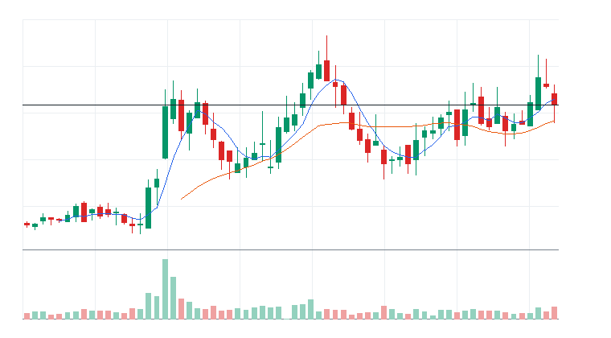
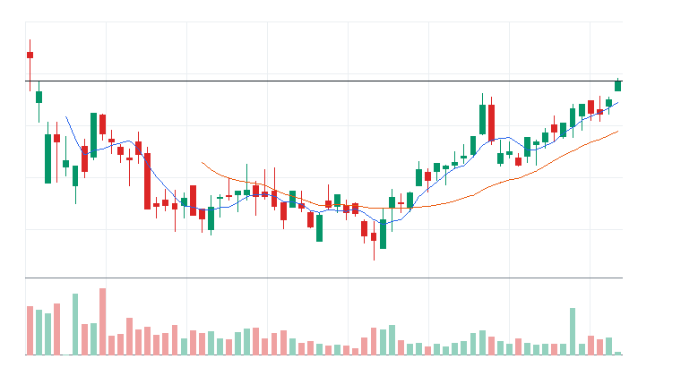
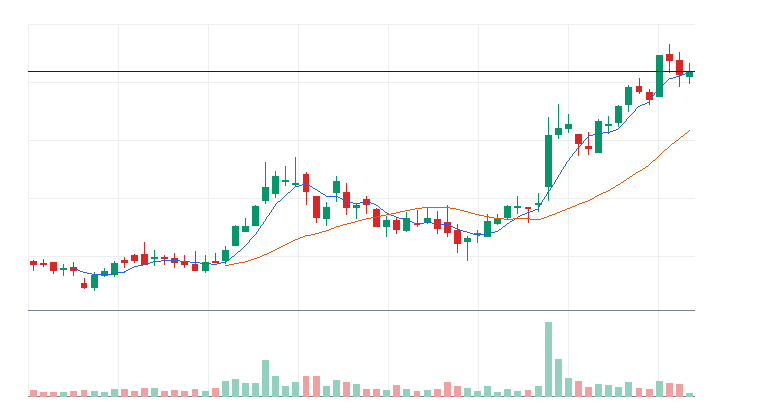
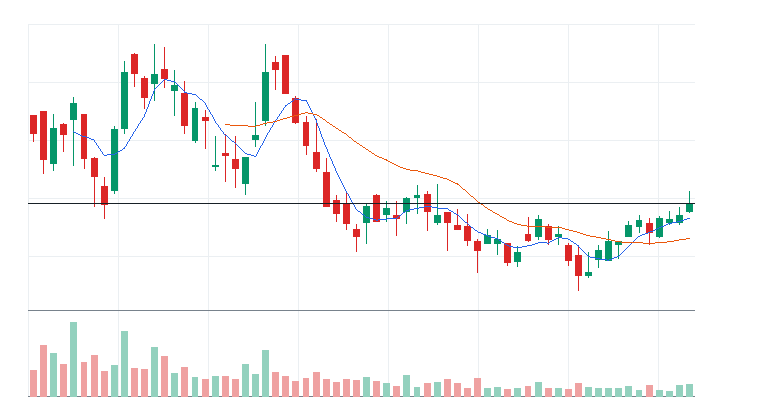
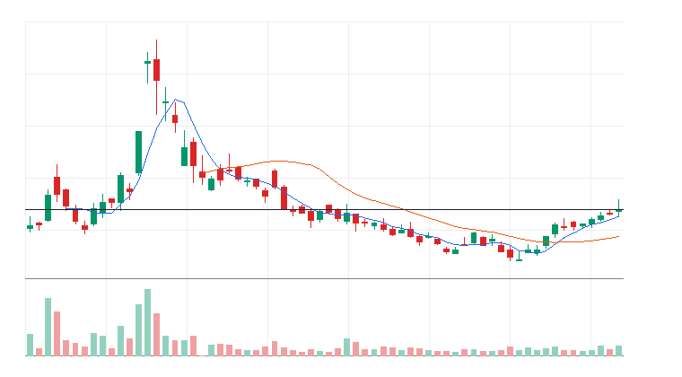
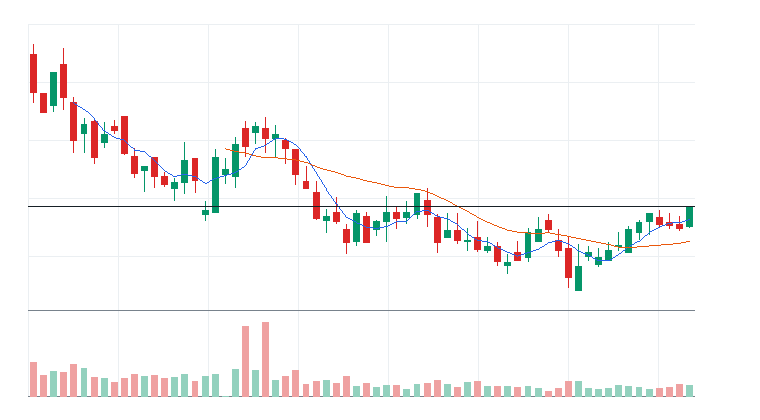
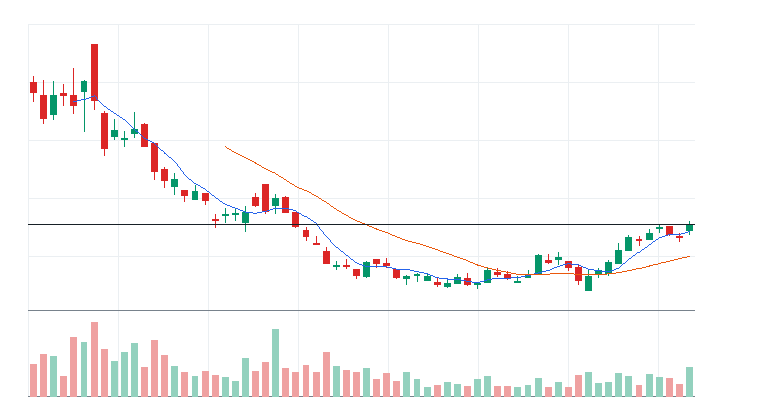

# 오늘의 데일리 트레이딩 요약

**REAL DATA TEST - 가격/거래량은 실제 데이터, 뉴스 연결, ETF 구성종목 확산도/거래대금 유동성 일부 연결**

**목적:** 이 리포트는 최근 오른 자산을 나열하는 것이 아니라, 돈이 몰리는 근거와 다음 매수 주체가 확인할 트레이딩 후보를 찾기 위한 보고서다.

> 핵심 질문: 현재 가격에서 누가 사고 있고, 누가 앞으로 더 비싸게 사줄 수 있는가?

## 시장 국면 판단

- 최종 판정: 중립-하락 (34점)
- 전일 대비: 약세장에서 중립-하락으로 개선됐다(+14점).
- 판정 신뢰도: 높음 (100점) - 핵심 지수와 매크로 데이터가 대부분 직접 수집되어 판정 신뢰도가 높다.
- 행동 바이어스: 매크로 부담 우선, 현금 비중과 손절 기준 강화
- 한 줄 결론: 주요 지수 또는 매크로 중 하나가 약세장 쪽으로 기울었다. 반등 확인 전까지 진입 크기를 줄인다.
- 기술적 지표: 하락 추세 (23점, 가중치 65%)
- KOSPI: 13점 | 50일선 아래, 200일선 아래, 20일 +2.31%, 60일 -4.00%, 52주 고점 대비 -25.65% -> 기술 점수 13
- KOSDAQ: 36점 | 50일선 위, 200일선 아래, 20일 +9.20%, 60일 -20.00%, 52주 고점 대비 -29.67% -> 기술 점수 36
- 매크로 시황: 매크로 중립-우호 (53점, 가중치 35%)
- 매크로 요약: 신용/유동성, 환율/글로벌은 우호적이나 금리, 물가 부담이 남아 있다.
- 금리: 부담 44점 / 금리 부담 / confidence HIGH
  - 주요 근거: US 10Y yield 20일 +3.41%, 5일 +0.77%; US long-duration bonds 20일 -2.93%, 장기채 가격 기준 할인율 부담 확인
  - 확인 사항: 추가 확인 이벤트 없음
- 물가: 부담 43점 / 물가 부담 / confidence MEDIUM
  - 주요 근거: Oil ETF 20일 +2.13%, 유가 기반 물가 압력 확인
  - 확인 사항: 추가 확인 이벤트 없음
- 정책: 중립 50점 / 정책 이벤트 확인 전 중립 / confidence LOW
  - 주요 근거: 정책 톤은 1차 버전에서 일정/이벤트 리스크 기반 중립값으로 반영한다.
  - 확인 사항: FOMC, BOK 금통위, CPI/PCE 발표 전후에는 매크로 confidence를 보수적으로 해석한다.
- 신용/유동성: 중립-우호 62점 / 신용/유동성 우호 / confidence HIGH
  - 주요 근거: High yield credit 20일 +0.08%, 하이일드 위험선호 확인; VIX 20일 -13.64%, 변동성 부담 확인
  - 확인 사항: 추가 확인 이벤트 없음
- 환율/글로벌: 중립-우호 62점 / 환율/글로벌 우호 / confidence HIGH
  - 주요 근거: USD/KRW 20일 -4.77%, 원화 안정/불안 확인; Korea equity ETF 20일 +10.58%, 한국 외국인 위험선호 프록시; KOSDAQ-KOSPI 20일 상대강도 +6.89%, 성장 위험선호 확인
  - 확인 사항: 추가 확인 이벤트 없음
- USD/KRW: 57점 | 하락 시 주식 우호; 5일 +0.67%, 20일 -4.77% -> 매크로 점수 57
- US 10Y yield: 44점 | 하락 시 주식 우호; 5일 +0.77%, 20일 +3.41% -> 매크로 점수 44
- US long-duration bonds: 45점 | 상승 시 주식 우호; 5일 -0.87%, 20일 -2.93% -> 매크로 점수 45
- Oil ETF: 41점 | 하락 시 주식 우호; 5일 +7.31%, 20일 +2.13% -> 매크로 점수 41
- High yield credit: 50점 | 상승 시 주식 우호; 5일 +0.13%, 20일 +0.08% -> 매크로 점수 50
- VIX: 75점 | 하락 시 주식 우호; 5일 -4.36%, 20일 -13.64% -> 매크로 점수 75
- Korea equity ETF: 74점 | 상승 시 주식 우호; 5일 +8.22%, 20일 +10.58% -> 매크로 점수 74
- 데이터 커버리지: 기술 2/2, 매크로 7/7
- 데이터 신뢰도 근거:
  - 직접 지수 데이터: KOSPI, KOSDAQ
  - 대체 지수 데이터 없음
  - 매크로 데이터: 7/7
  - 누락 데이터 없음
  - stale 데이터 없음

## 모바일 요약

[오늘의 데일리 트레이딩 요약]

생성 성공 / 데이터 모드: REAL_TEST

시장:
- 중립

시장 지배 서사:
1. IT 자금 유입 - 부상 - KODEX 코스닥150(229200.KS), KODEX 200(069500.KS), LG전자(066570.KS), LG CNS(064400.KS) 중심으로 5일 +11.87%, 20일 +11.00% 흐름이 형성됨. 뉴스 직접성 제한.
2. 소비 회복/방어주 선별 - 부상 - KODEX 코스닥150(229200.KS), KODEX 200(069500.KS), DN오토모티브(007340.KS), 에스엘(005850.KS) 중심으로 5일 +10.39%, 20일 +15.83% 흐름이 형성됨. 뉴스 직접성 제한.
3. Communication Services 자금 유입 - 관찰 - KODEX 코스닥150(229200.KS), KODEX 200(069500.KS), SK텔레콤(017670.KS), KT(030200.KS) 중심으로 5일 +8.83%, 20일 +3.73% 흐름이 형성됨. 뉴스 직접성 제한.

트렌드 강도:
1. IT 자금 유입 - TSI 64 - 부상 - 진입품질 관찰
2. 소비 회복/방어주 선별 - TSI 73 - 확인 - 진입품질 관찰
3. Communication Services 자금 유입 - TSI 62 - 부상 - 진입품질 관찰

오늘 결론:
- 금융/밸류업 주주환원 개별 종목 흐름이 ETF 대비 강한지 확인 필요
- 행동 후보는 linkedNarrative와 함께 확인한다.
- 추격보다 진입 조건 확인 후 접근한다.

오늘 실제 행동 후보:
1. 현대해상(001450.KS)(STOCK) - Financials 자금 유입 - 52주 고점 부근이라 돌파가 확인되면 신고가 추종 매수가 붙을 수 있음
2. LG(003550.KS)(STOCK) - 지주/배당/자사주 재평가 - 단기 추세가 유지되고 거래량이 1.0배 이상이면 눌림 이후 재상승을 시도할 수 있음
3. 한국콜마(161890.KS)(STOCK) - 화장품/음식료 수출 소비재 - 단기 추세가 유지되고 거래량이 1.0배 이상이면 눌림 이후 재상승을 시도할 수 있음

다크호스 후보:
1. 에스엘(005850.KS) - darkHorseScore 83 - 베이스 돌파 확인
2. LG CNS(064400.KS) - darkHorseScore 81 - 베이스 돌파 확인
3. 롯데지주(004990.KS) - darkHorseScore 81 - 초기 반전

ETF 후보 TOP 5:
1. KODEX 코스닥150(229200.KS) - IT 자금 유입 - 거래량 확인 전 관찰
2. KODEX 200(069500.KS) - IT 자금 유입 - 거래량 확인 전 관찰

웹 리포트:
https://yoolcool.github.io/DailyTradingThesisAgent/kr/

## 오늘 결론

- 오늘 결론: 조건부 진입
- 신규 진입 후보: 0개
- 조건부 진입 후보: 5개
- 관찰 후보: 136개
- 주요 제한 요인: 뉴스 직접성 부족, Entry Quality < 40, RVOL 미달
- 주문 판단: 지정가 권장 / 시장가 주의
- 실전 판단: 진입 후보는 있으나, 전일 고점 돌파와 거래량 확인 후 선별적으로 접근한다.

### 후보 제한 요인 집계

- RVOL < 1.00x: 135개
- 거래대금 유동성 낮음: 0개
- Entry Quality 50~54 near miss: 0개
- Entry Quality 40~49 관찰: 9개
- Entry Quality < 40: 193개
- Exhaustion Risk >= 70: 0개
- ETF breadth 샘플 부족: 0개
- 뉴스 직접성 부족: 198개

## 데이터 신뢰도

- 전체 데이터 신뢰도 등급: MEDIUM
- 분석 신뢰도: MEDIUM
- 주문 실행 신뢰도: MEDIUM
- ETF breadth 신뢰도: HIGH
- 신뢰도 해석: 장전/시간외 데이터 확인 불가
- 리포트 생성 시각: 2026-08-17 08:33 KST
- 가격 기준 거래일: 2026-08-16 KRX 정규장 종가
- 뉴스 수집 시각: 2026-08-17 08:33 KST
- 가장 최근 뉴스 발행 시각: 2026-08-14 00:00 KST
- 뉴스 신선도 상태: UNKNOWN
- 뉴스 소스: DART
- 뉴스 소스 상태: DART CONNECTED
- 뉴스 신뢰도: HIGH
- 추천 적용 거래일: 2026-08-17 KRX 정규장
- 가격/거래량 데이터 상태: 연결됨
- 뉴스 데이터 상태: 연결됨
- ETF 구성종목 확산도 상태: 일부 연결
- ETF 구성종목 샘플 수: 20~30
- 거래대금 유동성 데이터 상태: 일부 연결
- 장전/시간외 데이터 상태: NOT_APPLICABLE
- 데이터 provider: yfinance, DART, config fallback sample, price-volume dollar-volume fallback
- 실전 사용 경고: 이 리포트는 투자판단 보조용이며, REAL_TEST 모드에서는 일부 데이터가 누락되거나 지연될 수 있다. 실제 주문 전 현재가, 뉴스, 장전/시간외 가격과 정규장 거래대금을 별도 확인해야 한다.

## 0. 시장 상태

- 데이터 모드: REAL_TEST
- 가격/거래량: 연결됨
- 뉴스: 연결됨
- ETF 구성종목 확산도: 일부 연결
- 거래대금 유동성: 일부 연결
- 생성 시각: 2026년 8월 17일 월요일 오전 8:33
- 시장 상태: 중립
- 오늘 돈의 방향: 금융/밸류업 주주환원 개별 종목 흐름이 ETF 대비 강한지 확인 필요
- 강한 테마 TOP 3: IT/전자(53), 성장/테마 ETF(40), 화학/에너지(33)
- 데이터 한계:
  - API 또는 provider 상태에 따라 뉴스/ETF 확산도/거래대금 유동성 반영 범위가 달라질 수 있다.
  - 수집 실패 데이터는 점수 반영에서 제외하거나 confidence를 제한한다.
  - reasonConfidence HIGH는 직접 촉매, 가격/거래량, 확산도/유동성 근거가 함께 있을 때만 사용한다.

## 오늘 시장을 지배하는 서사

### 오늘 시장을 지배하는 서사 TOP 3

#### 1. IT 자금 유입
- 상태: 부상
- narrativeScore: 73
- reasonConfidence: MEDIUM
- 근거 ETF: KODEX 코스닥150(229200.KS), KODEX 200(069500.KS)
- 근거 개별 종목: LG전자(066570.KS), LG CNS(064400.KS)
- 돈이 몰리는 이유: IT 자금 유입 관련 KODEX 코스닥150(229200.KS), KODEX 200(069500.KS)와 LG전자(066570.KS), LG CNS(064400.KS)의 5일(+11.87%)·20일(+11.00%) 흐름을 함께 본다. 평균 상대 거래량은 1.10배이고, ETF 확산도도 이를 보조한다. 뉴스 직접성은 아직 제한적이다.
- 다음 매수 주체: IT 자금 유입을 확인한 섹터 ETF 자금과 상대강도 추종 스윙 자금
- 가장 좋은 트레이딩 수단: ETF 우선: KODEX 200(069500.KS), KODEX 코스닥150(229200.KS) / 개별 종목 우선: LG전자(066570.KS), LG CNS(064400.KS)
- 서사가 깨지는 조건: 069500.KS 20일선 이탈 또는 관련 종목 절반 이상 5일선 이탈
- 오늘 행동: 기존 네러티브와 중복을 확인한 뒤 ETF/대표 종목 동조성이 살아날 때만 관찰 편입

상세 narrativeScore 근거 보기

- rawScore: 73
- ETF 평균 moneyFlowScore: 40
- 개별 종목 평균 moneyFlowScore: 92
- ETF 후보 비율: 0%
- 개별 종목 후보 비율: 100%
- 5일 평균 수익률: +12.00%
- 20일 평균 수익률: +11.00%
- 평균 상대 거래량: 1.00배
- ETF 평균 상대 거래량: 1.00배
- 개별주 평균 상대 거래량: 1.00배
- 52주 고점 근접 후보 비율: 25%
- 뉴스 직접성 점수: 0
- ETF 확산도 점수: 8
- 유동성 점수: 5
- 과열 리스크 차감: 0

#### 2. 소비 회복/방어주 선별
- 상태: 부상
- narrativeScore: 69
- reasonConfidence: MEDIUM
- 근거 ETF: KODEX 코스닥150(229200.KS), KODEX 200(069500.KS)
- 근거 개별 종목: DN오토모티브(007340.KS), 에스엘(005850.KS), 금호타이어(073240.KS), 한국타이어앤테크놀로지(161390.KS)
- 돈이 몰리는 이유: 소비 회복/방어주 선별 관련 KODEX 코스닥150(229200.KS), KODEX 200(069500.KS)와 DN오토모티브(007340.KS), 에스엘(005850.KS), 금호타이어(073240.KS), 한국타이어앤테크놀로지(161390.KS)의 5일(+10.39%)·20일(+15.83%) 흐름을 함께 본다. 평균 상대 거래량은 1.56배이고, ETF 확산도도 이를 보조한다. 뉴스 직접성은 아직 제한적이다.
- 다음 매수 주체: 소비 회복/방어주 선별을 확인한 섹터 ETF 자금과 상대강도 추종 스윙 자금
- 가장 좋은 트레이딩 수단: ETF 우선: KODEX 200(069500.KS), KODEX 코스닥150(229200.KS) / 개별 종목 우선: 금호타이어(073240.KS), 한국타이어앤테크놀로지(161390.KS), DN오토모티브(007340.KS)
- 서사가 깨지는 조건: 069500.KS 20일선 이탈 또는 관련 종목 절반 이상 5일선 이탈
- 오늘 행동: 기존 네러티브와 중복을 확인한 뒤 ETF/대표 종목 동조성이 살아날 때만 관찰 편입

상세 narrativeScore 근거 보기

- rawScore: 69
- ETF 평균 moneyFlowScore: 40
- 개별 종목 평균 moneyFlowScore: 68
- ETF 후보 비율: 0%
- 개별 종목 후보 비율: 75%
- 5일 평균 수익률: +10.00%
- 20일 평균 수익률: +16.00%
- 평균 상대 거래량: 2.00배
- ETF 평균 상대 거래량: 1.00배
- 개별주 평균 상대 거래량: 2.00배
- 52주 고점 근접 후보 비율: 33%
- 뉴스 직접성 점수: 0
- ETF 확산도 점수: 8
- 유동성 점수: 3
- 과열 리스크 차감: -1

#### 3. Communication Services 자금 유입
- 상태: 관찰
- narrativeScore: 53
- reasonConfidence: LOW
- 근거 ETF: KODEX 코스닥150(229200.KS), KODEX 200(069500.KS)
- 근거 개별 종목: SK텔레콤(017670.KS), KT(030200.KS)
- 돈이 몰리는 이유: Communication Services 자금 유입 관련 KODEX 코스닥150(229200.KS), KODEX 200(069500.KS)와 SK텔레콤(017670.KS), KT(030200.KS)의 5일(+8.83%)·20일(+3.73%) 흐름을 함께 본다. 평균 상대 거래량은 1.21배이고, ETF 확산도도 이를 보조한다. 뉴스 직접성은 아직 제한적이다.
- 다음 매수 주체: Communication Services 자금 유입을 확인한 섹터 ETF 자금과 상대강도 추종 스윙 자금
- 가장 좋은 트레이딩 수단: ETF 우선: KODEX 200(069500.KS), KODEX 코스닥150(229200.KS) / 개별 종목 우선: SK텔레콤(017670.KS), KT(030200.KS)
- 서사가 깨지는 조건: 069500.KS 20일선 이탈 또는 관련 종목 절반 이상 5일선 이탈
- 오늘 행동: 기존 네러티브와 중복을 확인한 뒤 ETF/대표 종목 동조성이 살아날 때만 관찰 편입

상세 narrativeScore 근거 보기

- rawScore: 53
- ETF 평균 moneyFlowScore: 40
- 개별 종목 평균 moneyFlowScore: 62
- ETF 후보 비율: 0%
- 개별 종목 후보 비율: 50%
- 5일 평균 수익률: +9.00%
- 20일 평균 수익률: +4.00%
- 평균 상대 거래량: 1.00배
- ETF 평균 상대 거래량: 1.00배
- 개별주 평균 상대 거래량: 2.00배
- 52주 고점 근접 후보 비율: 25%
- 뉴스 직접성 점수: 0
- ETF 확산도 점수: 8
- 유동성 점수: 4
- 과열 리스크 차감: 0

### 전체 narrative 요약

| 서사명 | 상태 | narrativeScore | reasonConfidence | 대표 ETF | 대표 종목 | 오늘 행동 |
| --- | --- | ---: | --- | --- | --- | --- |
| IT 자금 유입 | 부상 | 73 | MEDIUM | KODEX 코스닥150(229200.KS), KODEX 200(069500.KS) | LG전자(066570.KS), LG CNS(064400.KS) | 기존 네러티브와 중복을 확인한 뒤 ETF/대표 종목 동조성이 살아날 때만 관찰 편입 |
| 소비 회복/방어주 선별 | 부상 | 69 | MEDIUM | KODEX 코스닥150(229200.KS), KODEX 200(069500.KS) | DN오토모티브(007340.KS), 에스엘(005850.KS), 금호타이어(073240.KS), 한국타이어앤테크놀로지(161390.KS) | 기존 네러티브와 중복을 확인한 뒤 ETF/대표 종목 동조성이 살아날 때만 관찰 편입 |
| Communication Services 자금 유입 | 관찰 | 53 | LOW | KODEX 코스닥150(229200.KS), KODEX 200(069500.KS) | SK텔레콤(017670.KS), KT(030200.KS) | 기존 네러티브와 중복을 확인한 뒤 ETF/대표 종목 동조성이 살아날 때만 관찰 편입 |
| 지주/배당/자사주 재평가 | 약화 | 49 | LOW | KODEX 200(069500.KS) | LG(003550.KS), SK(034730.KS), 롯데지주(004990.KS), 두산(000150.KS) | 강한 시장에서는 후순위, 변동성 확대 구간에서 방어적 재평가 후보로 관찰 |
| 자동차/부품 수출 모멘텀 | 약화 | 46 | LOW | KODEX 200(069500.KS) | 현대차(005380.KS), 현대모비스(012330.KS), 현대위아(011210.KS), 기아(000270.KS) | 완성차 쌍두마차가 시장 대비 강할 때만 부품주까지 확산 여부를 확인 |
| 2차전지 소재/셀 반등 | 약화 | 46 | LOW | KODEX 코스닥150(229200.KS), KODEX 200(069500.KS) | 삼성SDI(006400.KS), 포스코퓨처엠(003670.KS), 에코프로머티(450080.KS), LG에너지솔루션(373220.KS) | 추세 전환보다 반등 성격으로 접근하고, 상대 거래량이 살아나는 종목만 단기 관찰 |
| Energy & Chemicals 자금 유입 | 약화 | 46 | LOW | KODEX 코스닥150(229200.KS), KODEX 200(069500.KS) | GS(078930.KS), OCI홀딩스(010060.KS), 효성티앤씨(298020.KS), HS효성첨단소재(298050.KS) | 기존 네러티브와 중복을 확인한 뒤 ETF/대표 종목 동조성이 살아날 때만 관찰 편입 |
| 화장품/음식료 수출 소비재 | 약화 | 45 | LOW | KODEX 200(069500.KS) | 한국콜마(161890.KS), 삼양식품(003230.KS), LG생활건강(051900.KS), 아모레퍼시픽(090430.KS) | 실적 기대와 가격 반응이 같이 나타나는 종목만 선별, 단기 급등주는 눌림 대기 |
| AI 반도체/HBM 공급망 | 약화 | 43 | LOW | KODEX 200(069500.KS) | 삼성전기(009150.KS), 삼성전자(005930.KS), SK하이닉스(000660.KS), 한미반도체(042700.KS) | 추격보다 SK하이닉스/삼성전자 동조성과 거래대금 회복을 확인한 뒤 눌림 구간에서 선별 |
| Steels & Materials 자금 유입 | 약화 | 43 | LOW | KODEX 코스닥150(229200.KS), KODEX 200(069500.KS) | 세아베스틸지주(001430.KS), 풍산(103140.KS), 동원시스템즈(014820.KS), 아세아(002030.KS) | 기존 네러티브와 중복을 확인한 뒤 ETF/대표 종목 동조성이 살아날 때만 관찰 편입 |
| Financials 자금 유입 | 약화 | 42 | LOW | KODEX 코스닥150(229200.KS), KODEX 200(069500.KS) | 현대해상(001450.KS), DB손해보험(005830.KS), 삼성카드(029780.KS), 카카오페이(377300.KS) | 기존 네러티브와 중복을 확인한 뒤 ETF/대표 종목 동조성이 살아날 때만 관찰 편입 |
| Heavy Industries 자금 유입 | 약화 | 40 | LOW | KODEX 코스닥150(229200.KS), KODEX 200(069500.KS) | 산일전기(062040.KS), 현대로템(064350.KS) | 기존 네러티브와 중복을 확인한 뒤 ETF/대표 종목 동조성이 살아날 때만 관찰 편입 |
| Industrials 자금 유입 | 약화 | 40 | LOW | KODEX 코스닥150(229200.KS), KODEX 200(069500.KS) | 엘앤에프(066970.KS), LIG디펜스앤에어로스페이스(079550.KS), 팬오션(028670.KS), 포스코인터내셔널(047050.KS) | 기존 네러티브와 중복을 확인한 뒤 ETF/대표 종목 동조성이 살아날 때만 관찰 편입 |
| Internet platform 자금 유입 | 약화 | 37 | LOW | KODEX 코스닥150(229200.KS), KODEX 200(069500.KS) | NAVER(035420.KS), 카카오(035720.KS) | 기존 네러티브와 중복을 확인한 뒤 ETF/대표 종목 동조성이 살아날 때만 관찰 편입 |
| Constructions 자금 유입 | 약화 | 35 | LOW | KODEX 코스닥150(229200.KS), KODEX 200(069500.KS) | DL(000210.KS) | 기존 네러티브와 중복을 확인한 뒤 ETF/대표 종목 동조성이 살아날 때만 관찰 편입 |
| 조선/방산 수주 사이클 | 약화 | 33 | LOW | KODEX 200(069500.KS) | 한화오션(042660.KS), 한화에어로스페이스(012450.KS), HD현대중공업(329180.KS), 한국항공우주(047810.KS) | 수주 공시나 업황 뉴스가 직접 확인될 때만 추세 추종, 과열 구간은 신규 진입 보류 |
| 전력 유틸리티 수요 재평가 | 약화 | 31 | LOW | KODEX 코스닥150(229200.KS), KODEX 200(069500.KS) | 효성중공업(298040.KS), LS ELECTRIC(010120.KS) | 기존 네러티브와 중복을 확인한 뒤 ETF/대표 종목 동조성이 살아날 때만 관찰 편입 |
| 전력기기/인프라 투자 | 약화 | 28 | LOW | KODEX 200(069500.KS) | HD현대(267250.KS), 효성중공업(298040.KS), HD현대일렉트릭(267260.KS), LS ELECTRIC(010120.KS) | 강한 종목을 추격하기보다 거래대금 유지와 5일선 재지지를 확인 |
| 바이오/헬스케어 실적 전환 | 약화 | 26 | LOW | KODEX 200(069500.KS) | 유한양행(000100.KS), 셀트리온(068270.KS), 삼성바이오로직스(207940.KS), 한미약품(128940.KS) | 뉴스 촉매와 거래량이 동반될 때만 관찰 편입, 이벤트 소멸 후 추격은 금지 |
| 인터넷/게임/엔터 성장주 | 약화 | 26 | LOW | KODEX 코스닥150(229200.KS), KODEX 200(069500.KS) | NAVER(035420.KS), 카카오(035720.KS), 크래프톤(259960.KS), 하이브(352820.KS) | 지수 위험선호가 유지될 때만 선별 진입, 대형 플랫폼은 실적 반응을 우선 확인 |
| 금융/밸류업 주주환원 | 약화 | 16 | LOW | KODEX 200(069500.KS) | 우리금융지주(316140.KS), 신한지주(055550.KS), 하나금융지주(086790.KS), KB금융(105560.KS) | 지수 변동성이 커질 때 방어적 대안으로 관찰하고, 급등 후에는 배당락/정책 뉴스 확인 |

## 트렌드 강도 판단

### 1. IT 자금 유입
- Trend Strength Index: 64
- 트렌드 상태 라벨: 부상
- 테마 확산도: 보통
- ETF 동조성: 보통
- 거래량 강도: 보통
- 과열 위험: 보통 (26)
- 오늘 진입 품질: 관찰 (46)
- 한 줄 판단: IT 자금 유입는 Trend Strength는 중간이지만 진입 품질이 살아나는 초기 진입 후보 성격이다.
- 오늘 접근법: KODEX 코스닥150(229200.KS)/KODEX 200(069500.KS) 거래량 증가와 LG전자(066570.KS)/LG CNS(064400.KS) 확산을 확인하며 작은 사이즈의 초기 진입 후보로만 본다.

트렌드 강도 상세 근거 보기

- 가격 모멘텀: 가격 모멘텀 22/25. 평균 5D +11.87%, 20D +11.00%.
- 거래량 강도: 거래량 강도 10/20. 평균 RVOL 1.10배.
- ETF 동조성: ETF 동조성 10/15. 관련 ETF KODEX 200(069500.KS), KODEX 코스닥150(229200.KS) 흐름을 기준으로 판단.
- 테마 확산도: 테마 확산도 10/20. 상위 1~2개 쏠림 감점 3점 반영.
- 뉴스 촉매: 뉴스/촉매 신선도 2/10. HIGH 직접 촉매 0개.
- 과열 리스크: 과열 리스크 26/100. 단기 급등, 고점 근접, ETF-개별주 괴리, 쏠림을 함께 반영.
- 시장 환경: 시장 환경 10/10. KOSPI200/KODEX 200/KODEX KOSDAQ150 가격 흐름 기반 위험선호 점수.

### 2. 소비 회복/방어주 선별
- Trend Strength Index: 73
- 트렌드 상태 라벨: 확인
- 테마 확산도: 보통
- ETF 동조성: 보통
- 거래량 강도: 보통
- 과열 위험: 낮음 (23)
- 오늘 진입 품질: 관찰 (49)
- 한 줄 판단: 소비 회복/방어주 선별는 돈이 강하게 몰리지만 오늘 진입 품질은 아직 제한적이라 추격보다 조건 확인이 필요하다.
- 오늘 접근법: KODEX 코스닥150(229200.KS)/KODEX 200(069500.KS) 동반 강세가 유지되는 동안 돌파 추격보다 전일 고점 재돌파 또는 5일선 눌림 회복을 기다린다.

트렌드 강도 상세 근거 보기

- 가격 모멘텀: 가격 모멘텀 25/25. 평균 5D +10.39%, 20D +15.83%.
- 거래량 강도: 거래량 강도 13/20. 평균 RVOL 1.56배.
- ETF 동조성: ETF 동조성 10/15. 관련 ETF KODEX 200(069500.KS), KODEX 코스닥150(229200.KS) 흐름을 기준으로 판단.
- 테마 확산도: 테마 확산도 13/20. 상위 1~2개 쏠림 감점 0점 반영.
- 뉴스 촉매: 뉴스/촉매 신선도 2/10. HIGH 직접 촉매 0개.
- 과열 리스크: 과열 리스크 23/100. 단기 급등, 고점 근접, ETF-개별주 괴리, 쏠림을 함께 반영.
- 시장 환경: 시장 환경 10/10. KOSPI200/KODEX 200/KODEX KOSDAQ150 가격 흐름 기반 위험선호 점수.

### 3. Communication Services 자금 유입
- Trend Strength Index: 62
- 트렌드 상태 라벨: 부상
- 테마 확산도: 보통
- ETF 동조성: 보통
- 거래량 강도: 보통
- 과열 위험: 낮음 (20)
- 오늘 진입 품질: 관찰 (44)
- 한 줄 판단: Communication Services 자금 유입는 Trend Strength는 중간이지만 진입 품질이 살아나는 초기 진입 후보 성격이다.
- 오늘 접근법: KODEX 코스닥150(229200.KS)/KODEX 200(069500.KS) 거래량 증가와 SK텔레콤(017670.KS)/KT(030200.KS) 확산을 확인하며 작은 사이즈의 초기 진입 후보로만 본다.

트렌드 강도 상세 근거 보기

- 가격 모멘텀: 가격 모멘텀 19/25. 평균 5D +8.83%, 20D +3.73%.
- 거래량 강도: 거래량 강도 11/20. 평균 RVOL 1.21배.
- ETF 동조성: ETF 동조성 10/15. 관련 ETF KODEX 200(069500.KS), KODEX 코스닥150(229200.KS) 흐름을 기준으로 판단.
- 테마 확산도: 테마 확산도 10/20. 상위 1~2개 쏠림 감점 3점 반영.
- 뉴스 촉매: 뉴스/촉매 신선도 2/10. HIGH 직접 촉매 0개.
- 과열 리스크: 과열 리스크 20/100. 단기 급등, 고점 근접, ETF-개별주 괴리, 쏠림을 함께 반영.
- 시장 환경: 시장 환경 10/10. KOSPI200/KODEX 200/KODEX KOSDAQ150 가격 흐름 기반 위험선호 점수.

## 최근 추천 결과 트래킹

개별주는 데이트레이딩 관점으로 추천 이후 첫 정규장의 장중 최고가와 종가를 추적한다. ETF는 테마/스윙 관점으로 추천 이후 1주일 동안의 최고가와 현재 종가를 추적한다.

### 개별주 Top 3 추천 성과 요약
- 최근 5개 리포트 표본: 15개 (초기 검증 단계)
- 장중 최고가 기준 성공률: +50.00%
- 종가 기준 성공률: +41.67%
- 평균 장중 최고 수익률: +4.56%
- 평균 종가 수익률: +1.48%

### ETF 추천 성과 요약
- 최근 5개 리포트 표본: 0개 (초기 검증 단계)
- 1주 최고가 기준 성공률: 데이터 없음
- 현재 종가 기준 성공률: 데이터 없음
- 평균 1주 최고 수익률: 데이터 없음
- 평균 현재 수익률: 데이터 없음

최근 추천 결과 상세 테이블 펼치기

| 추천일 | 유형 | 순위 | 티커 | 기준가 | 추적 기간 | 상태 | High 수익률 | Close 수익률 | 결과 | 코멘트 |
| --- | --- | ---: | --- | ---: | --- | --- | ---: | ---: | --- | --- |
| 2026-08-17 | STOCK | 3 | 한국콜마(161890.KS) | $136,700 | 2026-08-17 | pending | 데이터 없음 | 데이터 없음 | 추적 대기 | 아직 추적 거래일 데이터가 완성되지 않음 |
| 2026-08-17 | STOCK | 2 | LG(003550.KS) | $120,000 | 2026-08-17 | pending | 데이터 없음 | 데이터 없음 | 추적 대기 | 아직 추적 거래일 데이터가 완성되지 않음 |
| 2026-08-17 | STOCK | 1 | 현대해상(001450.KS) | $45,350 | 2026-08-17 | pending | 데이터 없음 | 데이터 없음 | 추적 대기 | 아직 추적 거래일 데이터가 완성되지 않음 |
| 2026-08-14 | STOCK | 3 | 코스맥스(192820.KS) | $249,000 | 2026-08-14 | complete | +0.80% | -0.60% | 실패 | 추천 이후 의미 있는 장중 기회가 부족하고 종가도 약함 (일봉 기준) |
| 2026-08-14 | STOCK | 2 | GS(078930.KS) | $107,400 | 2026-08-14 | complete | +10.52% | +8.94% | 성공 | 장중 기회와 종가 유지가 모두 확인됨 (일봉 기준) |
| 2026-08-14 | STOCK | 1 | 현대해상(001450.KS) | $42,950 | 2026-08-14 | complete | +6.64% | +5.59% | 성공 | 장중 기회와 종가 유지가 모두 확인됨 (일봉 기준) |
| 2026-08-13 | STOCK | 3 | 한화에어로스페이스(012450.KS) | $1,156,000 | 2026-08-13 | complete | +4.93% | +2.51% | 성공 | 장중 기회와 종가 유지가 모두 확인됨 (일봉 기준) |
| 2026-08-13 | STOCK | 2 | 코스맥스(192820.KS) | $249,500 | 2026-08-13 | complete | +5.01% | -0.20% | 단타 유효 | 장중 기회는 있었지만 종가 유지력은 약함 (일봉 기준) |
| 2026-08-13 | STOCK | 1 | GS(078930.KS) | $101,000 | 2026-08-13 | complete | +11.88% | +6.34% | 성공 | 장중 기회와 종가 유지가 모두 확인됨 (일봉 기준) |
| 2026-08-12 | STOCK | 3 | 지역난방공사(071320.KS) | $75,100 | 2026-08-12 | complete | +2.40% | +0.13% | 제한적 유효 | 제한적인 장중 기회만 발생 (일봉 기준) |
| 2026-08-12 | STOCK | 2 | BGF리테일(282330.KS) | $150,500 | 2026-08-12 | complete | +1.00% | -3.32% | 제한적 유효 | 제한적인 장중 기회만 발생 (일봉 기준) |
| 2026-08-12 | STOCK | 1 | 고려아연(010130.KS) | $1,229,000 | 2026-08-12 | complete | +0.90% | -1.14% | 실패 | 추천 이후 의미 있는 장중 기회가 부족하고 종가도 약함 (일봉 기준) |
| 2026-08-11 | STOCK | 3 | 세아베스틸지주(001430.KS) | $43,050 | 2026-08-11 | complete | +0.46% | -4.07% | 실패 | 추천 이후 의미 있는 장중 기회가 부족하고 종가도 약함 (일봉 기준) |
| 2026-08-11 | STOCK | 2 | 현대해상(001450.KS) | $41,000 | 2026-08-11 | complete | +10.49% | +7.44% | 성공 | 장중 기회와 종가 유지가 모두 확인됨 (일봉 기준) |
| 2026-08-11 | STOCK | 1 | OCI홀딩스(010060.KS) | $284,500 | 2026-08-11 | complete | -0.35% | -3.87% | 실패 | 추천 이후 의미 있는 장중 기회가 부족하고 종가도 약함 (일봉 기준) |
| 2026-08-10 | STOCK | 3 | 풍산(103140.KS) | $83,600 | 2026-08-10 | complete | +4.67% | +3.59% | 성공 | 장중 기회와 종가 유지가 모두 확인됨 (일봉 기준) |
| 2026-08-10 | STOCK | 2 | HS효성첨단소재(298050.KS) | $183,200 | 2026-08-10 | complete | +2.89% | +0.49% | 제한적 유효 | 제한적인 장중 기회만 발생 (일봉 기준) |
| 2026-08-10 | STOCK | 1 | 세아베스틸지주(001430.KS) | $41,600 | 2026-08-10 | complete | +4.09% | +3.49% | 성공 | 장중 기회와 종가 유지가 모두 확인됨 (일봉 기준) |
| 2026-08-06 | STOCK | 3 | 풍산(103140.KS) | $80,700 | 2026-08-06 | complete | +6.82% | +3.84% | 성공 | 장중 기회와 종가 유지가 모두 확인됨 (일봉 기준) |
| 2026-08-06 | STOCK | 2 | 세아베스틸지주(001430.KS) | $40,800 | 2026-08-06 | complete | +0.49% | -1.84% | 실패 | 추천 이후 의미 있는 장중 기회가 부족하고 종가도 약함 (일봉 기준) |
| 2026-08-06 | STOCK | 1 | OCI홀딩스(010060.KS) | $246,000 | 2026-08-06 | complete | +4.47% | -0.81% | 단타 유효 | 장중 기회는 있었지만 종가 유지력은 약함 (일봉 기준) |
| 2026-08-05 | STOCK | 3 | LG생활건강(051900.KS) | $291,500 | 2026-08-05 | complete | +3.77% | +0.34% | 단타 유효 | 장중 기회는 있었지만 종가 유지력은 약함 (일봉 기준) |
| 2026-08-05 | STOCK | 2 | DL(000210.KS) | $51,900 | 2026-08-05 | complete | +1.35% | -1.35% | 제한적 유효 | 제한적인 장중 기회만 발생 (일봉 기준) |
| 2026-08-05 | STOCK | 1 | GS(078930.KS) | $96,900 | 2026-08-05 | complete | +5.16% | -1.96% | 단타 유효 | 장중 기회는 있었지만 종가 유지력은 약함 (일봉 기준) |
| 2026-08-03 | STOCK | 2 | 금호타이어(073240.KS) | $7,290 | 2026-08-03 | complete | +2.74% | -8.64% | 제한적 유효 | 제한적인 장중 기회만 발생 (일봉 기준) |
| 2026-08-03 | STOCK | 1 | LG생활건강(051900.KS) | $287,000 | 2026-08-03 | complete | +4.18% | -1.22% | 단타 유효 | 장중 기회는 있었지만 종가 유지력은 약함 (일봉 기준) |
| 2026-07-31 | STOCK | 3 | 아세아(002030.KS) | $214,000 | 2026-07-31 | complete | -2.34% | -9.81% | 실패 | 추천 이후 의미 있는 장중 기회가 부족하고 종가도 약함 (일봉 기준) |
| 2026-07-31 | STOCK | 2 | 아모레퍼시픽(090430.KS) | $134,000 | 2026-07-31 | complete | -2.24% | -2.99% | 실패 | 추천 이후 의미 있는 장중 기회가 부족하고 종가도 약함 (일봉 기준) |
| 2026-07-31 | STOCK | 1 | LG생활건강(051900.KS) | $292,000 | 2026-07-31 | complete | -1.54% | -1.71% | 실패 | 추천 이후 의미 있는 장중 기회가 부족하고 종가도 약함 (일봉 기준) |
| 2026-07-30 | STOCK | 1 | LG생활건강(051900.KS) | $263,000 | 2026-07-30 | complete | +19.58% | +11.03% | 성공 | 장중 기회와 종가 유지가 모두 확인됨 (일봉 기준) |
| 2026-07-28 | STOCK | 3 | 삼성바이오로직스(207940.KS) | $1,545,000 | 2026-07-28 | complete | +1.94% | +0.26% | 제한적 유효 | 제한적인 장중 기회만 발생 (일봉 기준) |
| 2026-07-28 | STOCK | 2 | NAVER(035420.KS) | $225,000 | 2026-07-28 | complete | +3.11% | -6.67% | 단타 유효 | 장중 기회는 있었지만 종가 유지력은 약함 (일봉 기준) |
| 2026-07-28 | STOCK | 1 | 코스맥스(192820.KS) | $192,500 | 2026-07-28 | complete | +2.60% | -4.10% | 제한적 유효 | 제한적인 장중 기회만 발생 (일봉 기준) |
| 2026-07-27 | STOCK | 2 | 삼성E&A(028050.KS) | $47,600 | 2026-07-27 | complete | +2.00% | +0.11% | 제한적 유효 | 제한적인 장중 기회만 발생 (일봉 기준) |
| 2026-07-27 | STOCK | 1 | GS(078930.KS) | $95,300 | 2026-07-27 | complete | +1.15% | -3.88% | 제한적 유효 | 제한적인 장중 기회만 발생 (일봉 기준) |
| 2026-07-24 | STOCK | 3 | SK이노베이션(096770.KS) | $132,200 | 2026-07-24 | complete | +2.72% | -1.59% | 제한적 유효 | 제한적인 장중 기회만 발생 (일봉 기준) |
| 2026-07-24 | STOCK | 2 | 한국타이어앤테크놀로지(161390.KS) | $76,700 | 2026-07-24 | complete | -3.39% | -8.08% | 실패 | 추천 이후 의미 있는 장중 기회가 부족하고 종가도 약함 (일봉 기준) |
| 2026-07-24 | STOCK | 1 | SK텔레콤(017670.KS) | $99,500 | 2026-07-24 | complete | +5.33% | +0.50% | 단타 유효 | 장중 기회는 있었지만 종가 유지력은 약함 (일봉 기준) |
| 2026-07-23 | STOCK | 1 | SK이노베이션(096770.KS) | $118,400 | 2026-07-23 | complete | +11.91% | +11.66% | 성공 | 장중 기회와 종가 유지가 모두 확인됨 (일봉 기준) |
| 2026-07-17 | STOCK | 1 | SK이노베이션(096770.KS) | $121,400 | 2026-07-17 | pending | 데이터 없음 | 데이터 없음 | 추적 대기 | 아직 추적 거래일 데이터가 완성되지 않음 |
| 2026-07-14 | STOCK | 2 | S-Oil(010950.KS) | $139,500 | 2026-07-14 | complete | +2.87% | -5.81% | 제한적 유효 | 제한적인 장중 기회만 발생 (일봉 기준) |
| 2026-07-14 | STOCK | 1 | 금호타이어(073240.KS) | $7,160 | 2026-07-14 | complete | -2.23% | -8.66% | 실패 | 추천 이후 의미 있는 장중 기회가 부족하고 종가도 약함 (일봉 기준) |
| 2026-07-13 | STOCK | 2 | 금호타이어(073240.KS) | $6,330 | 2026-07-13 | complete | +23.85% | +13.11% | 성공 | 장중 기회와 종가 유지가 모두 확인됨 (일봉 기준) |
| 2026-07-13 | STOCK | 1 | 한국콜마(161890.KS) | $115,100 | 2026-07-13 | complete | +2.43% | +0.61% | 제한적 유효 | 제한적인 장중 기회만 발생 (일봉 기준) |
| 2026-07-07 | STOCK | 1 | 금호타이어(073240.KS) | $6,260 | 2026-07-07 | complete | +8.31% | +1.12% | 성공 | 장중 기회와 종가 유지가 모두 확인됨 (일봉 기준) |
| 2026-07-07 | STOCK | 1 | 한국콜마(161890.KS) | $115,100 | 2026-07-07 | complete | +8.25% | 0.00% | 단타 유효 | 장중 기회는 있었지만 종가 유지력은 약함 (일봉 기준) |
| 2026-07-06 | STOCK | 3 | GS(078930.KS) | $78,100 | 2026-07-06 | complete | +3.84% | 0.00% | 단타 유효 | 장중 기회는 있었지만 종가 유지력은 약함 (일봉 기준) |
| 2026-07-06 | STOCK | 2 | 금호타이어(073240.KS) | $6,160 | 2026-07-06 | complete | 0.00% | 0.00% | 추적 대기 | 아직 추적 거래일 데이터가 완성되지 않음 (일봉 기준) |
| 2026-07-06 | STOCK | 1 | NH투자증권(005940.KS) | $33,100 | 2026-07-06 | complete | +3.02% | 0.00% | 단타 유효 | 장중 기회는 있었지만 종가 유지력은 약함 (일봉 기준) |
| 2026-07-03 | STOCK | 1 | 한국콜마(161890.KS) | $117,800 | 2026-07-03 | complete | +1.44% | 0.00% | 제한적 유효 | 제한적인 장중 기회만 발생 (일봉 기준) |
| 2026-07-02 | STOCK | 2 | 미스토홀딩스(081660.KS) | $46,400 | 2026-07-02 | complete | +7.76% | 0.00% | 단타 유효 | 장중 기회는 있었지만 종가 유지력은 약함 (일봉 기준) |
| 2026-07-02 | STOCK | 1 | 한국콜마(161890.KS) | $113,700 | 2026-07-02 | complete | +8.18% | 0.00% | 단타 유효 | 장중 기회는 있었지만 종가 유지력은 약함 (일봉 기준) |
| 2026-07-01 | STOCK | 3 | 산일전기(062040.KS) | $261,500 | 2026-07-01 | complete | +4.21% | 0.00% | 단타 유효 | 장중 기회는 있었지만 종가 유지력은 약함 (일봉 기준) |
| 2026-07-01 | STOCK | 2 | 한국콜마(161890.KS) | $106,800 | 2026-07-01 | complete | +0.19% | 0.00% | 추적 대기 | 아직 추적 거래일 데이터가 완성되지 않음 (일봉 기준) |
| 2026-07-01 | STOCK | 1 | 한솔케미칼(014680.KS) | $304,000 | 2026-07-01 | complete | +4.93% | 0.00% | 단타 유효 | 장중 기회는 있었지만 종가 유지력은 약함 (일봉 기준) |
| 2026-06-30 | STOCK | 2 | SK(034730.KS) | $834,000 | 2026-06-30 | complete | +1.32% | 0.00% | 제한적 유효 | 제한적인 장중 기회만 발생 (일봉 기준) |
| 2026-06-30 | STOCK | 1 | 한국콜마(161890.KS) | $99,500 | 2026-06-30 | complete | +3.02% | 0.00% | 단타 유효 | 장중 기회는 있었지만 종가 유지력은 약함 (일봉 기준) |
| 2026-06-29 | STOCK | 2 | 금호타이어(073240.KS) | $5,320 | 2026-06-29 | complete | +10.34% | 0.00% | 단타 유효 | 장중 기회는 있었지만 종가 유지력은 약함 (일봉 기준) |
| 2026-06-29 | STOCK | 1 | 한국콜마(161890.KS) | $99,400 | 2026-06-29 | complete | +0.30% | 0.00% | 추적 대기 | 아직 추적 거래일 데이터가 완성되지 않음 (일봉 기준) |
| 2026-06-26 | STOCK | 1 | SK(034730.KS) | $815,000 | 2026-06-26 | complete | +7.98% | 0.00% | 단타 유효 | 장중 기회는 있었지만 종가 유지력은 약함 (일봉 기준) |

## 오늘 실제 행동 후보

### 1. 현대해상(001450.KS)
- 자산 유형: STOCK
- linkedNarrative: Financials 자금 유입
- narrativeStatus: 약화
- narrativeScore: 42
- Trend Strength Index: 59
- Exhaustion Risk: 6 (낮음)
- Entry Quality Score: 46 (관찰)
- 트렌드 판단: 시장 위험선호가 약해 시장 환경 비우호 구간이다.
- moneyFlowScore: 100
- finalRawScore: 109
- reasonConfidence: MEDIUM
- reasonConfidenceExplanation: 직접 촉매 부재, 뉴스 미사용 때문에 HIGH가 아니라 MEDIUM으로 제한했다.
- tieBreakerReason: 최종 원점수 109, 리스크 패널티 0, 5일 수익률 +15.39%, 상대 거래량 1.88배 순으로 정렬
- 후보별 시장 해석: 중립 / 제한적 - 고점 근처 추격 리스크 / Entry Quality 46 < 50이나 moneyFlow 100, confidence MEDIUM, RVOL 1.88x로 강한 자금흐름 예외 조건 충족
- 게이트 사유: Entry Quality 46 < 50이나 moneyFlow 100, confidence MEDIUM, RVOL 1.88x로 강한 자금흐름 예외 조건 충족
- 주문 실행: 시장가 가능

- 왜 돈이 몰리는가: 20일 +18.41%, 5일 +15.39%, 상대 거래량 1.88배로 가격과 거래량이 함께 개선. 유동성: LIQUID
- 누가 더 비싸게 사줄 수 있는지: 개별 주도주를 따라붙는 단기 모멘텀 자금과 관련 ETF 강세를 확인한 트레이더
- 진입 조건: 전일 고점 돌파와 5일선 유지 확인
- 무효화 조건: 20일선 이탈 또는 상대 거래량 0.8배 이하 둔화
- todayActionLabel: 자금흐름 예외 조건부
#### 최근 뉴스/동향 한국어 요약

- 요약: 종목 직접 뉴스 확인 상태이며 뉴스 흐름은 긍정 우위입니다. 후보 선정 후 재확인한 핵심 이슈는 "이석현 현대해상 대표, 예실차 적자 축소에 보험 본업 체력 회복…내실 성장 속도 [금융사 2026 상반기 실적] - 한국금융신문"입니다.
- 직접 촉매 판단: 현대해상에 대해 직접 촉매로 분류된 뉴스가 확인됐습니다. 핵심은 "이석현 현대해상 대표, 예실차 적자 축소에 보험 본업 체력 회복…내실 성장 속도 [금융사 2026 상반기 실적] - 한국금융신문"이며, 일반 재료로 봅니다.
- 뉴스 1: 이석현 현대해상 대표, 예실차 적자 축소에 보험 본업 체력 회복…내실 성장 속도 [금융사 2026 상반기 실적] - 한국금융신문
  - 내용: 현대해상의 실적 관련 뉴스입니다. 제목 기준 방향성은 혼재이며, 매출·이익 수치와 컨센서스 대비 차이를 확인해야 합니다.
  - 투자 의미: 실적/가이던스 재료는 다음 분기 기대치 변화로 이어질 수 있어 컨센서스 변화와 주가 반응 지속성을 함께 봅니다.
  - 확인할 점: 매출/마진/가이던스 수치, 컨센서스 대비 차이
- 뉴스 2: 이석현號 현대해상, 2분기 실적 랠리 이어 배당 재개할까 - 서울경제TV
  - 내용: 현대해상의 실적 관련 뉴스입니다. 제목 기준 방향성은 긍정이며, 매출·이익 수치와 컨센서스 대비 차이를 확인해야 합니다.
  - 투자 의미: 실적/가이던스 재료는 다음 분기 기대치 변화로 이어질 수 있어 컨센서스 변화와 주가 반응 지속성을 함께 봅니다.
  - 확인할 점: 매출/마진/가이던스 수치, 컨센서스 대비 차이
- 뉴스 3: [기업실적]현대해상, 올 2분기 순이익 3918억원…전년比 58%↑ - nspna.com
  - 내용: 현대해상의 실적 관련 뉴스입니다. 제목 기준 방향성은 긍정이며, 매출·이익 수치와 컨센서스 대비 차이를 확인해야 합니다.
  - 투자 의미: 현대해상의 당일 상대강도 확인에는 도움이 되지만, 실적/가이던스 같은 새 펀더멘털 변화로 보기는 어렵습니다.
  - 확인할 점: 거래량 동반 여부, 장중 고점 유지, 관련 ETF 동반 강세
- 매매 해석: 매매 관점에서는 뉴스 자체보다 가격이 진입 조건을 지키는지, 거래량이 동반되는지, 그리고 뉴스가 이미 주가에 반영됐는지를 우선 확인해야 합니다.
- 차트: 

### 2. LG(003550.KS)
- 자산 유형: STOCK
- linkedNarrative: 지주/배당/자사주 재평가
- narrativeStatus: 약화
- narrativeScore: 49
- Trend Strength Index: 65
- Exhaustion Risk: 21 (낮음)
- Entry Quality Score: 42 (관찰)
- 트렌드 판단: 시장 위험선호가 약해 시장 환경 비우호 구간이다.
- moneyFlowScore: 95
- finalRawScore: 95
- reasonConfidence: MEDIUM
- reasonConfidenceExplanation: 직접 촉매 부재, 뉴스 미사용 때문에 HIGH가 아니라 MEDIUM으로 제한했다.
- tieBreakerReason: 최종 원점수 95, 리스크 패널티 0, 5일 수익률 +11.01%, 상대 거래량 1.69배 순으로 정렬
- 후보별 시장 해석: 중립 / 제한적 - Entry Quality 42 < 50이나 moneyFlow 95, confidence MEDIUM, RVOL 1.69x로 강한 자금흐름 예외 조건 충족
- 게이트 사유: Entry Quality 42 < 50이나 moneyFlow 95, confidence MEDIUM, RVOL 1.69x로 강한 자금흐름 예외 조건 충족
- 주문 실행: 시장가 가능

- 왜 돈이 몰리는가: 20일 +21.46%, 5일 +11.01%, 상대 거래량 1.69배로 가격과 거래량이 함께 개선. 유동성: LIQUID
- 누가 더 비싸게 사줄 수 있는지: 개별 주도주를 따라붙는 단기 모멘텀 자금과 관련 ETF 강세를 확인한 트레이더
- 진입 조건: 20일선 위 눌림 후 재상승 확인
- 무효화 조건: 20일선 이탈 또는 상대 거래량 0.8배 이하 둔화
- todayActionLabel: 자금흐름 예외 조건부
#### 최근 뉴스/동향 한국어 요약

- 요약: 종목 직접 뉴스 확인 상태이며 뉴스 흐름은 긍정 우위입니다. 후보 선정 후 재확인한 핵심 이슈는 "LG, 상장 자회사 할인율 축소…목표가 상향-한화투자증권 - 머니투데이 - 머니투데이"입니다.
- 직접 촉매 판단: LG에 대해 직접 촉매로 분류된 뉴스가 확인됐습니다. 핵심은 "LG, 상장 자회사 할인율 축소…목표가 상향-한화투자증권 - 머니투데이 - 머니투데이"이며, 일반 재료로 봅니다.
- 뉴스 1: LG, 상장 자회사 할인율 축소…목표가 상향-한화투자증권 - 머니투데이 - 머니투데이
  - 내용: LG에 대한 증권사 목표가 또는 투자의견 변화 뉴스입니다.
  - 투자 의미: 투자/증설 재료는 실적 가시성이나 밸류에이션 기대에 영향을 줄 수 있어 규모와 일정 확인이 중요합니다.
  - 확인할 점: 투자/증설의 금액, 기간, 실적 반영 시점
- 뉴스 2: [리포트 브리핑]LG, '실적과 환원, 순항 중' 목표가 150,000원 - 흥국증권 - 뉴스핌
  - 내용: LG의 실적 관련 뉴스입니다. 제목 기준 방향성은 긍정이며, 매출·이익 수치와 컨센서스 대비 차이를 확인해야 합니다.
  - 투자 의미: 실적/가이던스 재료는 다음 분기 기대치 변화로 이어질 수 있어 컨센서스 변화와 주가 반응 지속성을 함께 봅니다.
  - 확인할 점: 매출/마진/가이던스 수치, 컨센서스 대비 차이
- 뉴스 3: NH투자증권 LG, 주주환원 확대 기대…목표가 13만5000원 - 아주경제
  - 내용: LG에 대한 증권사 목표가 또는 투자의견 변화 뉴스입니다.
  - 투자 의미: 투자/증설 재료는 실적 가시성이나 밸류에이션 기대에 영향을 줄 수 있어 규모와 일정 확인이 중요합니다.
  - 확인할 점: 투자/증설의 금액, 기간, 실적 반영 시점
- 매매 해석: 매매 관점에서는 뉴스 자체보다 가격이 진입 조건을 지키는지, 거래량이 동반되는지, 그리고 뉴스가 이미 주가에 반영됐는지를 우선 확인해야 합니다.
- 차트: 

### 3. 한국콜마(161890.KS)
- 자산 유형: STOCK
- linkedNarrative: 화장품/음식료 수출 소비재
- narrativeStatus: 약화
- narrativeScore: 45
- Trend Strength Index: 58
- Exhaustion Risk: 17 (낮음)
- Entry Quality Score: 49 (관찰)
- 트렌드 판단: 시장 위험선호가 약해 시장 환경 비우호 구간이다.
- moneyFlowScore: 91
- finalRawScore: 91
- reasonConfidence: MEDIUM
- reasonConfidenceExplanation: 직접 촉매 부재, 뉴스 미사용 때문에 HIGH가 아니라 MEDIUM으로 제한했다.
- tieBreakerReason: 최종 원점수 91, 리스크 패널티 -6, 5일 수익률 +28.12%, 상대 거래량 1.40배 순으로 정렬
- 후보별 시장 해석: 중립 / 제한적 - Entry Quality 49 < 50이나 moneyFlow 91, confidence MEDIUM, RVOL 1.40x로 강한 자금흐름 예외 조건 충족
- 게이트 사유: Entry Quality 49 < 50이나 moneyFlow 91, confidence MEDIUM, RVOL 1.40x로 강한 자금흐름 예외 조건 충족
- 주문 실행: 시장가 가능

- 왜 돈이 몰리는가: 20일 +27.04%, 5일 +28.12%, 상대 거래량 1.40배로 가격과 거래량이 함께 개선. 유동성: LIQUID
- 누가 더 비싸게 사줄 수 있는지: 개별 주도주를 따라붙는 단기 모멘텀 자금과 관련 ETF 강세를 확인한 트레이더
- 진입 조건: 20일선 위 눌림 후 재상승 확인
- 무효화 조건: 20일선 이탈 또는 상대 거래량 0.8배 이하 둔화
- todayActionLabel: 자금흐름 예외 조건부
#### 최근 뉴스/동향 한국어 요약

- 요약: 종목 직접 뉴스 확인 상태이며 뉴스 흐름은 긍정 우위입니다. 후보 선정 후 재확인한 핵심 이슈는 "한국콜마, 분기 영업이익 첫 1천억원 돌파…역대 최대 실적(종합) - 연합뉴스"입니다.
- 직접 촉매 판단: 한국콜마에 대해 직접 촉매로 분류된 뉴스가 확인됐습니다. 핵심은 "한국콜마, 분기 영업이익 첫 1천억원 돌파…역대 최대 실적(종합) - 연합뉴스"이며, 일반 재료로 봅니다.
- 뉴스 1: 한국콜마, 분기 영업이익 첫 1천억원 돌파…역대 최대 실적(종합) - 연합뉴스
  - 내용: 한국콜마의 실적 관련 뉴스입니다. 제목 기준 방향성은 긍정이며, 매출·이익 수치와 컨센서스 대비 차이를 확인해야 합니다.
  - 투자 의미: 실적/가이던스 재료는 다음 분기 기대치 변화로 이어질 수 있어 컨센서스 변화와 주가 반응 지속성을 함께 봅니다.
  - 확인할 점: 매출/마진/가이던스 수치, 컨센서스 대비 차이
- 뉴스 2: [특징주] 한국콜마, ‘분기 최대 실적’에 25% 강세 - 소년한국일보
  - 내용: 한국콜마의 실적 관련 뉴스입니다. 제목 기준 방향성은 긍정이며, 매출·이익 수치와 컨센서스 대비 차이를 확인해야 합니다.
  - 투자 의미: 한국콜마의 당일 상대강도 확인에는 도움이 되지만, 실적/가이던스 같은 새 펀더멘털 변화로 보기는 어렵습니다.
  - 확인할 점: 거래량 동반 여부, 장중 고점 유지, 관련 ETF 동반 강세
- 뉴스 3: ‘선케어 성수기’ 한국콜마 분기 최대 실적...2분기 영업익 50% 증가한 1013억 - 매일경제
  - 내용: 한국콜마의 실적 관련 뉴스입니다. 제목 기준 방향성은 긍정이며, 매출·이익 수치와 컨센서스 대비 차이를 확인해야 합니다.
  - 투자 의미: 한국콜마의 당일 상대강도 확인에는 도움이 되지만, 실적/가이던스 같은 새 펀더멘털 변화로 보기는 어렵습니다.
  - 확인할 점: 거래량 동반 여부, 장중 고점 유지, 관련 ETF 동반 강세
- 매매 해석: 매매 관점에서는 뉴스 자체보다 가격이 진입 조건을 지키는지, 거래량이 동반되는지, 그리고 뉴스가 이미 주가에 반영됐는지를 우선 확인해야 합니다.
- 차트: 

## 다크호스 후보

> 메인 행동 후보를 대체하지 않는 보조 관찰 섹션이다. 상위 서사 안에서 아직 과열되지 않았지만 초기 추세 전환, 베이스 돌파, 거래량 회복이 시작되는 개별주만 표시한다.

### 1. 에스엘(005850.KS)
- 소속 서사: 소비 회복/방어주 선별
- darkHorseScore: 83 (강한 다크호스)
- 단계: 베이스 돌파 확인
- Confidence: LOW
- 5D / 20D / RVOL: +11.59% / +13.24% / 1.46x
- MA 구조: 종가 $61,600 / MA5 $58,400 / MA20 $54,857.5
- 선정 이유: 005850.KS는 소비 회복/방어주 선별 서사에 속하고 종가가 MA20 위에 있으며 MA5/MA20 정렬이 개선되고 있다. 최근 15거래일 베이스는 상단 돌파 상태이고, RVOL 1.46x로 거래량 확인은 충분하다. Exhaustion Risk 23로 아직 메인 후보 대비 과열 상한 안에 있다.
- 확인 조건: 돌파 후 고점 위 안착 유지, MA5 위 종가 유지, 관련 ETF 동반 강세
- 무효화 조건: MA20 $54,857.50 종가 이탈, 최근 스윙 저점 $51,600.00 이탈, RVOL 0.80x 이하 둔화
- 왜 아직 메인이 아닌가: Entry Quality 45 < 50
#### 최근 뉴스/동향 한국어 요약

- 요약: 후보 선정 후 재확인 뉴스 데이터 없음

darkHorseScore 상세 근거 보기

- 서사 정렬: 13/20
- 초기 추세 구조: 30/30
- 베이스 돌파/정돈: 11/20
- 거래량 확인: 14/15
- 낮은 과열: 10/10
- 유동성 리스크 보정: 5/5
- 리스크 차감: -0
- rawScore: 83

- 차트: 

### 2. LG CNS(064400.KS)
- 소속 서사: IT 자금 유입
- darkHorseScore: 81 (강한 다크호스)
- 단계: 베이스 돌파 확인
- Confidence: MEDIUM
- 5D / 20D / RVOL: +10.06% / +22.92% / 1.50x
- MA 구조: 종가 $79,900 / MA5 $76,960 / MA20 $68,275
- 선정 이유: 064400.KS는 IT 자금 유입 서사에 속하고 종가가 MA20 위에 있으며 MA5/MA20 정렬이 개선되고 있다. 최근 15거래일 베이스는 상단 돌파 상태이고, RVOL 1.50x로 거래량 확인은 충분하다. Exhaustion Risk 26로 아직 메인 후보 대비 과열 상한 안에 있다.
- 확인 조건: 돌파 후 고점 위 안착 유지, MA5 위 종가 유지, 관련 ETF 동반 강세
- 무효화 조건: MA20 $68,275.00 종가 이탈, 최근 스윙 저점 $60,000.00 이탈, RVOL 0.80x 이하 둔화
- 왜 아직 메인이 아닌가: Entry Quality 48 < 50
#### 최근 뉴스/동향 한국어 요약

- 요약: 후보 선정 후 재확인 뉴스 데이터 없음

darkHorseScore 상세 근거 보기

- 서사 정렬: 13/20
- 초기 추세 구조: 30/30
- 베이스 돌파/정돈: 11/20
- 거래량 확인: 14/15
- 낮은 과열: 8/10
- 유동성 리스크 보정: 5/5
- 리스크 차감: -0
- rawScore: 81

- 차트: 

### 3. 롯데지주(004990.KS)
- 소속 서사: 지주/배당/자사주 재평가
- darkHorseScore: 81 (강한 다크호스)
- 단계: 초기 반전
- Confidence: LOW
- 5D / 20D / RVOL: +2.53% / +6.58% / 1.18x
- MA 구조: 종가 $24,300 / MA5 $23,820 / MA20 $23,005
- 선정 이유: 004990.KS는 지주/배당/자사주 재평가 서사에 속하고 종가가 MA20 위에 있으며 MA5/MA20 정렬이 개선되고 있다. 최근 15거래일 베이스는 상단 돌파 상태이고, RVOL 1.18x로 거래량 확인은 보통 수준이다. Exhaustion Risk 21로 아직 메인 후보 대비 과열 상한 안에 있다.
- 확인 조건: 돌파 후 고점 위 안착 유지, RVOL 1.20x 이상 재증가, MA5 위 종가 유지, 관련 ETF 동반 강세
- 무효화 조건: MA20 $23,005.00 종가 이탈, 최근 스윙 저점 $22,050.00 이탈, RVOL 0.80x 이하 둔화
- 왜 아직 메인이 아닌가: Entry Quality 33 < 50, moneyFlowScore 49 < 75, RVOL 1.18x < 1.20x
#### 최근 뉴스/동향 한국어 요약

- 요약: 후보 선정 후 재확인 뉴스 데이터 없음

darkHorseScore 상세 근거 보기

- 서사 정렬: 13/20
- 초기 추세 구조: 30/30
- 베이스 돌파/정돈: 15/20
- 거래량 확인: 11/15
- 낮은 과열: 10/10
- 유동성 리스크 보정: 2/5
- 리스크 차감: -0
- rawScore: 81

- 차트: 

## 오늘 돈이 몰리는 테마

- IT/전자: 000990.KS, 한미반도체(042700.KS), 현대오토에버(307950.KS), 이수페타시스(007660.KS), LG(003550.KS), LG CNS(064400.KS), LG디스플레이(034220.KS), LG전자(066570.KS) | 평균 moneyFlowScore 53 | 관심은 유지하되 우선순위는 낮추고 추가 거래량 확인을 기다린다.
- 성장/테마 ETF: KODEX 200(069500.KS), KODEX 코스닥150(229200.KS) | 평균 moneyFlowScore 40 | 관심은 유지하되 우선순위는 낮추고 추가 거래량 확인을 기다린다.
- 화학/에너지: 코스모화학(005420.KS), GS(078930.KS), 한솔케미칼(014680.KS), 한화(000880.KS), 한화솔루션(009830.KS), HD현대(267250.KS), 한국카본(017960.KS), HS효성첨단소재(298050.KS) | 평균 moneyFlowScore 33 | 관심은 유지하되 우선순위는 낮추고 추가 거래량 확인을 기다린다.
- 화장품/음식료 수출 소비재: 아모레퍼시픽(090430.KS), 아모레퍼시픽홀딩스(002790.KS), 에이피알(278470.KS), BGF리테일(282330.KS), CJ(001040.KS), CJ제일제당(097950.KS), 코스맥스(192820.KS), 483650.KS | 평균 moneyFlowScore 32 | 관심은 유지하되 우선순위는 낮추고 추가 거래량 확인을 기다린다.
- 철강/소재: 아세아(002030.KS), 동원시스템즈(014820.KS), 현대제철(004020.KS), 고려아연(010130.KS), 풍산(103140.KS), POSCO홀딩스(005490.KS), 세아베스틸지주(001430.KS), 세아제강지주(003030.KS) | 평균 moneyFlowScore 32 | 관심은 유지하되 우선순위는 낮추고 추가 거래량 확인을 기다린다.
- 2차전지 소재/셀 반등: 후성(093370.KS) | 평균 moneyFlowScore 31 | 관심은 유지하되 우선순위는 낮추고 추가 거래량 확인을 기다린다.

## 1. ETF 트레이딩 보고서
### 1-1. ETF 결론
- ETF 우선 후보: 없음
- ETF 관찰 후보: KODEX 200(069500.KS), KODEX 코스닥150(229200.KS)
- ETF 매매 금지: KODEX 200(069500.KS), KODEX 코스닥150(229200.KS)
- 오늘 ETF 최우선 1개: 없음
- ETF 섹션 해석: 이 섹션은 개별 종목 선택이 아니라 테마/섹터 단위 자금 흐름을 ETF로 매매할지 판단하기 위한 영역이다.

### 1-2. ETF 후보 TOP 5

선정 기준: ETF 후보는 가격/거래량 1차 점수에 뉴스, ETF 구성종목 확산도, 유동성, 리스크 패널티를 반영한 finalRawScore 기준으로 정렬한다. 표시 점수 100점 후보가 겹치면 tieBreakerReason으로 우선순위를 설명한다.

### [ETF] KODEX 코스닥150(229200.KS)
- 자산 유형: ETF
- ETF 세부 카테고리: 성장/테마 ETF
- ETF 역할: 테마 베타 매수
- 상태: 관찰
- linkedNarrative: IT 자금 유입
- narrativeStatus: 부상
- narrativeScore: 73
- moneyFlowScore: 43
- finalRawScore: 43
- tieBreakerReason: 최종 원점수 43, 리스크 패널티 -4, 5일 수익률 +9.00%, 상대 거래량 0.85배 순으로 정렬
- 과열 리스크: 낮음
- reasonConfidence: LOW
- reasonConfidenceExplanation: 가격/거래량이 약하거나 핵심 보조 근거가 부족해 LOW로 분류했다.

- todayActionLabel: 거래량 확인 전 관찰
- 주문 실행: 시장가 가능
- 기준일: 2026-08-14
- 종가: $14,830
- 1일 수익률: +0.20%
- 5일 수익률: +9.00%
- 20일 수익률: 데이터 없음
- 상대 거래량: 0.85배
- 52주 고점 대비 위치: -2.56%
- whyMoneyIsFlowing: 최근 수익률은 확인되지만 상대 거래량 0.85배라 신규 자금 유입 강도는 약함. ETF 확산도: BROAD_ADVANCE / 유동성: LIQUID
- likelyNextBuyer: 섹터 베타를 노리는 단기 모멘텀 자금과 리밸런싱 자금
- whyThisCouldTradeHigher: 52주 고점 부근이라 돌파가 확인되면 신고가 추종 매수가 붙을 수 있음
#### 최근 뉴스/동향 한국어 요약

- 요약: 후보 선정 후 재확인 뉴스 데이터 없음
- 진입 조건: 상대 거래량 1.0배 회복 후 관찰
- 무효화 조건: 거래량 회복 실패
- 차트: 

#### 상세 근거

KODEX 코스닥150(229200.KS) 상세 근거 펼치기

- moneyFlowScore(최종) 산정 근거:
  - moneyFlowScore(1차): 34
  - 최종 원점수: 43
  - 최종 표시 점수: 43
  - cap 적용: cap 미적용
  - 계산식: +34 + 0 + +8 + +5 + 0 - 4 + 0 = 43
  - 점수 해석: 매매 금지 또는 우선순위 낮은 후보.
  - 가격/거래량 1차 점수: +34
    - 추세: +9
    - 단기 모멘텀: +7
    - 중기 모멘텀: 0
    - 거래량: -8
    - 신고가 근접: +12
    - 이동평균: +14
  - 하위 점수 cap:
    - 가격 모멘텀: 원점수 +9, 상한 적용 +9 / 최대 25
    - 단기 모멘텀: 원점수 +7, 상한 적용 +7 / 최대 20
    - 중기 모멘텀: 원점수 0, 상한 적용 0 / 최대 16
    - 거래량: 원점수 -8, 상한 적용 -8 / 최대 20
    - 신고가 근접: 원점수 +12, 상한 적용 +12 / 최대 12
    - 이동평균: 원점수 +14, 상한 적용 +14 / 최대 14
  - 추가 데이터 가감점:
    - 뉴스: 0
    - 유동성: +5
  - ETF 확산도: +8
  - 리스크 패널티: -4
  - 주요 근거: 1차 34, 최종 원점수 43, 표시 43. 5일 수익률 강함, 52주 고점 근처, 이동평균 위 추세 유지. 주의: 단기 과열/추격 위험 존재.
  - 리스크 패널티 산정 근거:
    - 총 리스크 패널티: -4
    - 리스크 등급: LOW
    - 감점된 리스크:
      - volume divergence: -4 | 근거: 5d price strength is not confirmed by relative volume 0.85x. | 대응: Require relative volume recovery above 1.0x.
    - 관찰 리스크: 주요 관찰 리스크 없음
    - 한 줄 해석: 1개 감점 리스크로 총 -4점 반영.
- 데이터 사용 현황:
  - 가격/거래량: 사용
  - 뉴스: 연결됨
  - ETF 확산도: 사용
  - 거래대금 유동성: 사용
  - 관련 ETF 상대강도: 사용
- 뉴스 확인:
  - 최근 뉴스 상태: 연결됨
  - 뉴스 소스: DART
  - 소스별 상태: DART CONNECTED
  - 긍정/중립/부정: 0/0/0
  - 직접성/방향성/신선도: 0/0/0
  - 강한 촉매 수: 0
  - 중요 공시 수: 0
  - 직접 촉매: 없음
  - 보조 뉴스: 없음
  - 뉴스 수집 시각: 2026-08-17 08:33 KST
  - 가장 최근 뉴스 발행 시각: 데이터 없음
  - 뉴스 신선도 상태: UNKNOWN
  - 뉴스 이후 가격 반응: 긍정
  - 가격 반응 점수 제한: 뉴스 이후 가격 반응과 점수 제한 특이사항 없음
  - 핵심 뉴스 요약: 의미 있는 신규 DART 공시 없음
  - 원점수/상한 점수: 0 / 0
  - 점수 반영: 0
  - 주의: 해당 티커의 신규 DART 공시가 없거나 API 결과가 비어 있음
- ETF 구성종목 확산도:
  - 구성종목 데이터 상태: 일부 연결
  - 샘플 수: 20/20
  - 샘플 신뢰도: NORMAL
  - 상승 종목 비율: 70%
  - 20일선 위 비율: 85%
  - 50일선 위 비율: 50%
  - 상위 기여 종목: 240810.KQ, 039030.KQ, 095340.KQ, 067310.KQ, 403870.KQ
  - 확산도 판단: BROAD_ADVANCE
  - 원점수/샘플 상한/반영 점수: +8 / 8 / +8
  - 점수 반영: +8
- 거래대금 유동성:
  - 데이터 상태: 일부 연결
  - 거래대금 기준 유동성: LIQUID
  - 거래대금: $517,480,452,120
  - 평균 거래대금: $611,882,166,650
  - 주문 영향: 시장가 가능
  - 매매 영향: 거래대금이 충분해 시장가 가능 범위로 본다
- reasonConfidence 근거: 가격/거래량이 약하거나 주요 데이터가 부족해 낮음.
- 후보 선정 후 뉴스/동향 재확인:
  - 재확인 상태: 데이터 없음
- 차트 요약: 차트 데이터 없음
- 기준일 2026-08-14 | 종가 $14,830 | 1일 +0.20% | 5일 +9.00% | 20일 데이터 없음 | 상대 거래량 0.85배 | 52주 고점 대비 -2.56% | 데이터 소스: yfinance

### [ETF] KODEX 200(069500.KS)
- 자산 유형: ETF
- ETF 세부 카테고리: 성장/테마 ETF
- ETF 역할: 테마 베타 매수
- 상태: 관찰
- linkedNarrative: IT 자금 유입
- narrativeStatus: 부상
- narrativeScore: 73
- moneyFlowScore: 37
- finalRawScore: 37
- tieBreakerReason: 최종 원점수 37, 리스크 패널티 -4, 5일 수익률 +12.20%, 상대 거래량 0.82배 순으로 정렬
- 과열 리스크: 낮음
- reasonConfidence: LOW
- reasonConfidenceExplanation: 가격/거래량이 약하거나 핵심 보조 근거가 부족해 LOW로 분류했다.

- todayActionLabel: 거래량 확인 전 관찰
- 주문 실행: 시장가 가능
- 기준일: 2026-08-14
- 종가: $110,060
- 1일 수익률: +2.60%
- 5일 수익률: +12.20%
- 20일 수익률: +0.97%
- 상대 거래량: 0.82배
- 52주 고점 대비 위치: -27.81%
- whyMoneyIsFlowing: 최근 수익률은 확인되지만 상대 거래량 0.82배라 신규 자금 유입 강도는 약함. ETF 확산도: BROAD_ADVANCE / 유동성: LIQUID
- likelyNextBuyer: 섹터 베타를 노리는 단기 모멘텀 자금과 리밸런싱 자금
- whyThisCouldTradeHigher: 단기 추세가 유지되고 거래량이 1.0배 이상이면 눌림 이후 재상승을 시도할 수 있음
#### 최근 뉴스/동향 한국어 요약

- 요약: 후보 선정 후 재확인 뉴스 데이터 없음
- 진입 조건: 상대 거래량 1.0배 회복 후 관찰
- 무효화 조건: 거래량 회복 실패
- 차트: 

#### 상세 근거

KODEX 200(069500.KS) 상세 근거 펼치기

- moneyFlowScore(최종) 산정 근거:
  - moneyFlowScore(1차): 28
  - 최종 원점수: 37
  - 최종 표시 점수: 37
  - cap 적용: cap 미적용
  - 계산식: +28 + 0 + +8 + +5 + 0 - 4 + 0 = 37
  - 점수 해석: 매매 금지 또는 우선순위 낮은 후보.
  - 가격/거래량 1차 점수: +28
    - 추세: +12
    - 단기 모멘텀: +13
    - 중기 모멘텀: +1
    - 거래량: -8
    - 신고가 근접: 0
    - 이동평균: +10
  - 하위 점수 cap:
    - 가격 모멘텀: 원점수 +12, 상한 적용 +12 / 최대 25
    - 단기 모멘텀: 원점수 +13, 상한 적용 +13 / 최대 20
    - 중기 모멘텀: 원점수 +1, 상한 적용 +1 / 최대 16
    - 거래량: 원점수 -8, 상한 적용 -8 / 최대 20
    - 신고가 근접: 원점수 0, 상한 적용 0 / 최대 12
    - 이동평균: 원점수 +10, 상한 적용 +10 / 최대 14
  - 추가 데이터 가감점:
    - 뉴스: 0
    - 유동성: +5
  - ETF 확산도: +8
  - 리스크 패널티: -4
  - 주요 근거: 1차 28, 최종 원점수 37, 표시 37. 5일 수익률 강함, 1일 단기 모멘텀 확인, 이동평균 위 추세 유지. 주의: 단기 과열/추격 위험 존재.
  - 리스크 패널티 산정 근거:
    - 총 리스크 패널티: -4
    - 리스크 등급: LOW
    - 감점된 리스크:
      - volume divergence: -4 | 근거: 5d price strength is not confirmed by relative volume 0.82x. | 대응: Require relative volume recovery above 1.0x.
    - 관찰 리스크: 주요 관찰 리스크 없음
    - 한 줄 해석: 1개 감점 리스크로 총 -4점 반영.
- 데이터 사용 현황:
  - 가격/거래량: 사용
  - 뉴스: 연결됨
  - ETF 확산도: 사용
  - 거래대금 유동성: 사용
  - 관련 ETF 상대강도: 사용
- 뉴스 확인:
  - 최근 뉴스 상태: 연결됨
  - 뉴스 소스: DART
  - 소스별 상태: DART CONNECTED
  - 긍정/중립/부정: 0/0/0
  - 직접성/방향성/신선도: 0/0/0
  - 강한 촉매 수: 0
  - 중요 공시 수: 0
  - 직접 촉매: 없음
  - 보조 뉴스: 없음
  - 뉴스 수집 시각: 2026-08-17 08:33 KST
  - 가장 최근 뉴스 발행 시각: 데이터 없음
  - 뉴스 신선도 상태: UNKNOWN
  - 뉴스 이후 가격 반응: 긍정
  - 가격 반응 점수 제한: 뉴스 이후 가격 반응과 점수 제한 특이사항 없음
  - 핵심 뉴스 요약: 의미 있는 신규 DART 공시 없음
  - 원점수/상한 점수: 0 / 0
  - 점수 반영: 0
  - 주의: 해당 티커의 신규 DART 공시가 없거나 API 결과가 비어 있음
- ETF 구성종목 확산도:
  - 구성종목 데이터 상태: 일부 연결
  - 샘플 수: 30/30
  - 샘플 신뢰도: NORMAL
  - 상승 종목 비율: 73%
  - 20일선 위 비율: 97%
  - 50일선 위 비율: 63%
  - 상위 기여 종목: 161890.KS, 009150.KS, 042700.KS, 005930.KS, 000660.KS
  - 확산도 판단: BROAD_ADVANCE
  - 원점수/샘플 상한/반영 점수: +8 / 8 / +8
  - 점수 반영: +8
- 거래대금 유동성:
  - 데이터 상태: 일부 연결
  - 거래대금 기준 유동성: LIQUID
  - 거래대금: $1,880,709,462,280
  - 평균 거래대금: $2,305,094,658,920
  - 주문 영향: 시장가 가능
  - 매매 영향: 거래대금이 충분해 시장가 가능 범위로 본다
- reasonConfidence 근거: 가격/거래량이 약하거나 주요 데이터가 부족해 낮음.
- 후보 선정 후 뉴스/동향 재확인:
  - 재확인 상태: 데이터 없음
- 차트 요약: 최근 20거래일 기준 5일선이 20일선 위에 있음
- 기준일 2026-08-14 | 종가 $110,060 | 1일 +2.60% | 5일 +12.20% | 20일 +0.97% | 상대 거래량 0.82배 | 52주 고점 대비 -27.81% | 데이터 소스: yfinance

### 1-3. ETF 과열/주의 후보

해당 없음

### 1-4. ETF 제외/매매 금지 후보

#### KODEX 200(069500.KS)
- moneyFlowScore(최종): 37
- moneyFlowScore 산정 근거 요약: 1차 28, 최종 원점수 37, 표시 37. 5일 수익률 강함, 1일 단기 모멘텀 확인, 이동평균 위 추세 유지. 주의: 단기 과열/추격 위험 존재.
- 제외 사유: 테마 자금 흐름 약함
- 해제 조건: 상대 거래량 1.0배 회복 후 관찰

#### KODEX 코스닥150(229200.KS)
- moneyFlowScore(최종): 43
- moneyFlowScore 산정 근거 요약: 1차 34, 최종 원점수 43, 표시 43. 5일 수익률 강함, 52주 고점 근처, 이동평균 위 추세 유지. 주의: 단기 과열/추격 위험 존재.
- 제외 사유: 테마 자금 흐름 약함
- 해제 조건: 상대 거래량 1.0배 회복 후 관찰

## 2. 개별 종목 트레이딩 보고서
### 2-1. 오늘 KOSPI200 신규 발굴 요약
- 신규 발굴 풀: KOSPI200 구성종목 전체
- universe source: D:\a\DailyTradingThesisAgent\DailyTradingThesisAgent\config\markets\kr\kospi200Fallback.json
- universe fetchStatus: MARKET_DATA
- 총 스캔 종목 수: 200
- 데이터 수집 성공: 200
- 데이터 수집 실패: 0
- 상세 데이터 수집 대상: 가격/거래량 1차 스캔 상위 20개
- 오늘 진입 후보: 19
- 오늘 눌림 대기: 0
- 오늘 관찰: 134
- 오늘 매매 금지: 47
- 개별 종목 진입 후보: 현대해상(001450.KS), LG(003550.KS), 한국콜마(161890.KS), 세아베스틸지주(001430.KS), LG CNS(064400.KS)
- 개별 종목 눌림 대기: 없음
- 개별 종목 매매 금지: 삼성전기(009150.KS), 미원에스씨(268280.KS), 현대차(005380.KS), 현대모비스(012330.KS)
- 오늘 개별 종목 최우선 1개: 현대해상(001450.KS) - 관련 ETF보다 강함 | 주식 5일 +15.39% vs ETF 평균 +10.60%, 주식 20일 +18.41% vs ETF 평균 +0.48%, 상대 거래량 1.88배 vs ETF 평균 0.83배
- 개별 종목 섹션 해석: 이 섹션은 ETF로 확인된 테마 자금 흐름 안에서 ETF보다 더 강한 돌파 가능성이 있는 개별 종목만 선별하는 영역이다.

### 2-2. 오늘 개별 종목 신규 후보 TOP 5

선정 기준:
1. KOSPI200 전체를 moneyFlowScore(1차)로 먼저 스캔
2. moneyFlowScore(1차) 상위 20개를 상세 분석
3. 뉴스/유동성/관련 ETF 대비 상대강도/리스크 패널티를 반영
4. moneyFlowScore(최종), 최종 원점수, 리스크 패널티, 5일 수익률, 상대 거래량 순으로 재정렬

### 현대해상(001450.KS)
- 자산 유형: STOCK
- 상태: 진입 후보
- primaryTheme: 금융/밸류업 주주환원
- primarySector: 금융
- industry: 세부 업종 미분류
- relatedEtfs: KODEX 200(069500.KS), KODEX 코스닥150(229200.KS)
- linkedNarrative: Financials 자금 유입
- narrativeStatus: 약화
- narrativeScore: 42
- moneyFlowScore: 100
- finalRawScore: 109
- tieBreakerReason: 최종 원점수 109, 리스크 패널티 0, 5일 수익률 +15.39%, 상대 거래량 1.88배 순으로 정렬
- 과열 리스크: 낮음~중간
- reasonConfidence: MEDIUM
- reasonConfidenceExplanation: 직접 촉매 부재, 뉴스 미사용 때문에 HIGH가 아니라 MEDIUM으로 제한했다.

- todayActionLabel: 자금흐름 예외 조건부
- 주문 실행: 시장가 가능
- 기준일: 2026-08-14
- 종가: $45,350
- 1일 수익률: +5.59%
- 5일 수익률: +15.39%
- 20일 수익률: +18.41%
- 상대 거래량: 1.88배
- 52주 고점 대비 위치: -0.98%
- 관련 ETF 대비 상대강도: 관련 ETF보다 강함 | 주식 5일 +15.39% vs ETF 평균 +10.60%, 주식 20일 +18.41% vs ETF 평균 +0.48%, 상대 거래량 1.88배 vs ETF 평균 0.83배
- whyMoneyIsFlowing: 20일 +18.41%, 5일 +15.39%, 상대 거래량 1.88배로 가격과 거래량이 함께 개선. 유동성: LIQUID
- likelyNextBuyer: 개별 주도주를 따라붙는 단기 모멘텀 자금과 관련 ETF 강세를 확인한 트레이더
- whyThisCouldTradeHigher: 52주 고점 부근이라 돌파가 확인되면 신고가 추종 매수가 붙을 수 있음
- 왜 ETF가 아니라 이 종목인가: 001450.KS가 관련 ETF 평균보다 5일/20일 흐름 또는 거래량에서 강해 개별 종목 우선 후보로 본다.
- ETF가 더 나은 경우: 001450.KS가 관련 ETF 평균보다 약하거나 거래량이 둔화되면 개별 종목보다 관련 ETF를 우선한다.
#### 최근 뉴스/동향 한국어 요약

- 요약: 종목 직접 뉴스 확인 상태이며 뉴스 흐름은 긍정 우위입니다. 후보 선정 후 재확인한 핵심 이슈는 "이석현 현대해상 대표, 예실차 적자 축소에 보험 본업 체력 회복…내실 성장 속도 [금융사 2026 상반기 실적] - 한국금융신문"입니다.
- 직접 촉매 판단: 현대해상에 대해 직접 촉매로 분류된 뉴스가 확인됐습니다. 핵심은 "이석현 현대해상 대표, 예실차 적자 축소에 보험 본업 체력 회복…내실 성장 속도 [금융사 2026 상반기 실적] - 한국금융신문"이며, 일반 재료로 봅니다.
- 뉴스 1: 이석현 현대해상 대표, 예실차 적자 축소에 보험 본업 체력 회복…내실 성장 속도 [금융사 2026 상반기 실적] - 한국금융신문
  - 내용: 현대해상의 실적 관련 뉴스입니다. 제목 기준 방향성은 혼재이며, 매출·이익 수치와 컨센서스 대비 차이를 확인해야 합니다.
  - 투자 의미: 실적/가이던스 재료는 다음 분기 기대치 변화로 이어질 수 있어 컨센서스 변화와 주가 반응 지속성을 함께 봅니다.
  - 확인할 점: 매출/마진/가이던스 수치, 컨센서스 대비 차이
- 뉴스 2: 이석현號 현대해상, 2분기 실적 랠리 이어 배당 재개할까 - 서울경제TV
  - 내용: 현대해상의 실적 관련 뉴스입니다. 제목 기준 방향성은 긍정이며, 매출·이익 수치와 컨센서스 대비 차이를 확인해야 합니다.
  - 투자 의미: 실적/가이던스 재료는 다음 분기 기대치 변화로 이어질 수 있어 컨센서스 변화와 주가 반응 지속성을 함께 봅니다.
  - 확인할 점: 매출/마진/가이던스 수치, 컨센서스 대비 차이
- 뉴스 3: [기업실적]현대해상, 올 2분기 순이익 3918억원…전년比 58%↑ - nspna.com
  - 내용: 현대해상의 실적 관련 뉴스입니다. 제목 기준 방향성은 긍정이며, 매출·이익 수치와 컨센서스 대비 차이를 확인해야 합니다.
  - 투자 의미: 현대해상의 당일 상대강도 확인에는 도움이 되지만, 실적/가이던스 같은 새 펀더멘털 변화로 보기는 어렵습니다.
  - 확인할 점: 거래량 동반 여부, 장중 고점 유지, 관련 ETF 동반 강세
- 매매 해석: 매매 관점에서는 뉴스 자체보다 가격이 진입 조건을 지키는지, 거래량이 동반되는지, 그리고 뉴스가 이미 주가에 반영됐는지를 우선 확인해야 합니다.
- 진입 조건: 전일 고점 돌파와 5일선 유지 확인
- 무효화 조건: 20일선 이탈 또는 상대 거래량 0.8배 이하 둔화
- 차트: 

#### 상세 근거

현대해상(001450.KS) 상세 근거 펼치기

- moneyFlowScore(최종) 산정 근거:
  - moneyFlowScore(1차): 100
  - 최종 원점수: 109
  - 최종 표시 점수: 100
  - cap 적용: raw score 109 capped to displayed score 100
  - 계산식: +100 + 0 + 0 + +5 + +4 + 0 + 0 = 109 -> 100
  - 점수 해석: 강한 자금 유입 후보. 단, 과열 여부 확인 필수.
  - 가격/거래량 1차 점수: +100
    - 추세: +25
    - 단기 모멘텀: +19
    - 중기 모멘텀: +12
    - 거래량: +18
    - 신고가 근접: +12
    - 이동평균: +14
  - 하위 점수 cap:
    - 가격 모멘텀: 원점수 +26, 상한 적용 +25 / 최대 25 (cap 적용)
    - 단기 모멘텀: 원점수 +19, 상한 적용 +19 / 최대 20
    - 중기 모멘텀: 원점수 +12, 상한 적용 +12 / 최대 16
    - 거래량: 원점수 +18, 상한 적용 +18 / 최대 20
    - 신고가 근접: 원점수 +12, 상한 적용 +12 / 최대 12
    - 이동평균: 원점수 +14, 상한 적용 +14 / 최대 14
    - 관련 ETF 상대강도: 원점수 +4, 상한 적용 +4 / 최대 8
  - 추가 데이터 가감점:
    - 뉴스: 0
    - 유동성: +5
  - ETF 대비 상대강도: +4
  - 리스크 패널티: 0
  - 주요 근거: 1차 100, 최종 원점수 109, 표시 100. 20일 수익률 강함, 5일 수익률 강함, 1일 단기 모멘텀 확인. 주의: 큰 감점 제한적.
  - 리스크 패널티 산정 근거:
    - 총 리스크 패널티: 0
    - 리스크 등급: LOW
    - 감점된 리스크: 없음
    - 관찰 리스크: 주요 관찰 리스크 없음
    - 한 줄 해석: 직접 감점된 주요 리스크는 없지만 관찰 리스크는 계속 확인해야 한다.
- 데이터 사용 현황:
  - 가격/거래량: 사용
  - 뉴스: 연결됨
  - ETF 확산도: 관련 ETF에서 확인
  - 거래대금 유동성: 사용
  - 관련 ETF 상대강도: 사용
- 뉴스 확인:
  - 최근 뉴스 상태: 연결됨
  - 뉴스 소스: DART
  - 소스별 상태: DART CONNECTED
  - 긍정/중립/부정: 0/0/0
  - 직접성/방향성/신선도: 0/0/0
  - 강한 촉매 수: 0
  - 중요 공시 수: 0
  - 직접 촉매: 없음
  - 보조 뉴스: 없음
  - 뉴스 수집 시각: 2026-08-17 08:33 KST
  - 가장 최근 뉴스 발행 시각: 데이터 없음
  - 뉴스 신선도 상태: UNKNOWN
  - 뉴스 이후 가격 반응: 긍정
  - 가격 반응 점수 제한: 뉴스 이후 가격 반응과 점수 제한 특이사항 없음
  - 핵심 뉴스 요약: 의미 있는 신규 DART 공시 없음
  - 원점수/상한 점수: 0 / 0
  - 점수 반영: 0
  - 주의: 해당 티커의 신규 DART 공시가 없거나 API 결과가 비어 있음
- ETF 구성종목 확산도: 관련 ETF에서 확인
- 거래대금 유동성:
  - 데이터 상태: 일부 연결
  - 거래대금 기준 유동성: LIQUID
  - 거래대금: $50,832,361,500
  - 평균 거래대금: $27,092,362,100
  - 주문 영향: 시장가 가능
  - 매매 영향: 거래대금이 충분해 시장가 가능 범위로 본다
- reasonConfidence 근거: 가격/거래량, 거래대금 유동성, 관련 ETF 상대강도은 확인됐지만 일부 보조 데이터가 미연결 또는 fallback이라 중간으로 제한한다.
- 후보 선정 후 뉴스/동향 재확인:
  - 재확인 상태: 연결됨
  - 재확인 시각: 2026-08-17 08:33 KST
  - 최근 발행 시각: 2026-08-15 09:55 KST
  - 신선도: STALE
  - 출처: Google News RSS
  - 소스별 상태: DART CONNECTED; Google News RSS CONNECTED
  - 한국어 요약: 종목 직접 뉴스 확인 상태이며 뉴스 흐름은 긍정 우위입니다. 후보 선정 후 재확인한 핵심 이슈는 "이석현 현대해상 대표, 예실차 적자 축소에 보험 본업 체력 회복…내실 성장 속도 [금융사 2026 상반기 실적] - 한국금융신문"입니다.
  - 직접 촉매: 한국금융신문 / 실적 / under_72h - 이석현 현대해상 대표, 예실차 적자 축소에 보험 본업 체력 회복…내실 성장 속도 [금융사 2026 상반기 실적] - 한국금융신문
  - 한국어 뉴스 요약 1: 이석현 현대해상 대표, 예실차 적자 축소에 보험 본업 체력 회복…내실 성장 속도 [금융사 2026 상반기 실적] - 한국금융신문
    - 내용: 현대해상의 실적 관련 뉴스입니다. 제목 기준 방향성은 혼재이며, 매출·이익 수치와 컨센서스 대비 차이를 확인해야 합니다.
    - 투자 의미: 실적/가이던스 재료는 다음 분기 기대치 변화로 이어질 수 있어 컨센서스 변화와 주가 반응 지속성을 함께 봅니다.
    - 확인할 점: 매출/마진/가이던스 수치, 컨센서스 대비 차이
  - 한국어 뉴스 요약 2: 이석현號 현대해상, 2분기 실적 랠리 이어 배당 재개할까 - 서울경제TV
    - 내용: 현대해상의 실적 관련 뉴스입니다. 제목 기준 방향성은 긍정이며, 매출·이익 수치와 컨센서스 대비 차이를 확인해야 합니다.
    - 투자 의미: 실적/가이던스 재료는 다음 분기 기대치 변화로 이어질 수 있어 컨센서스 변화와 주가 반응 지속성을 함께 봅니다.
    - 확인할 점: 매출/마진/가이던스 수치, 컨센서스 대비 차이
  - 한국어 뉴스 요약 3: [기업실적]현대해상, 올 2분기 순이익 3918억원…전년比 58%↑ - nspna.com
    - 내용: 현대해상의 실적 관련 뉴스입니다. 제목 기준 방향성은 긍정이며, 매출·이익 수치와 컨센서스 대비 차이를 확인해야 합니다.
    - 투자 의미: 현대해상의 당일 상대강도 확인에는 도움이 되지만, 실적/가이던스 같은 새 펀더멘털 변화로 보기는 어렵습니다.
    - 확인할 점: 거래량 동반 여부, 장중 고점 유지, 관련 ETF 동반 강세
  - 원문 헤드라인 1: 한국금융신문 / 실적 / under_72h / mixed - 이석현 현대해상 대표, 예실차 적자 축소에 보험 본업 체력 회복…내실 성장 속도 [금융사 2026 상반기 실적] - 한국금융신문
  - 원문 헤드라인 2: 서울경제TV / 실적 / under_72h / positive - 이석현號 현대해상, 2분기 실적 랠리 이어 배당 재개할까 - 서울경제TV
  - 원문 헤드라인 3: nspna.com / 실적 / under_72h / positive - [기업실적]현대해상, 올 2분기 순이익 3918억원…전년比 58%↑ - nspna.com
  - 주의: DART fallback: 의미 있는 신규 DART 공시 없음; 해당 티커의 신규 DART 공시가 없거나 API 결과가 비어 있음
- 차트 요약: 최근 20거래일 기준 5일선이 20일선 위에 있음
- 기준일 2026-08-14 | 종가 $45,350 | 1일 +5.59% | 5일 +15.39% | 20일 +18.41% | 상대 거래량 1.88배 | 52주 고점 대비 -0.98% | 데이터 소스: yfinance

### LG(003550.KS)
- 자산 유형: STOCK
- 상태: 진입 후보
- primaryTheme: IT/전자
- primarySector: IT/전자
- industry: 세부 업종 미분류
- relatedEtfs: KODEX 200(069500.KS), KODEX 코스닥150(229200.KS)
- linkedNarrative: 지주/배당/자사주 재평가
- narrativeStatus: 약화
- narrativeScore: 49
- moneyFlowScore: 95
- finalRawScore: 95
- tieBreakerReason: 최종 원점수 95, 리스크 패널티 0, 5일 수익률 +11.01%, 상대 거래량 1.69배 순으로 정렬
- 과열 리스크: 낮음
- reasonConfidence: MEDIUM
- reasonConfidenceExplanation: 직접 촉매 부재, 뉴스 미사용 때문에 HIGH가 아니라 MEDIUM으로 제한했다.

- todayActionLabel: 자금흐름 예외 조건부
- 주문 실행: 시장가 가능
- 기준일: 2026-08-14
- 종가: $120,000
- 1일 수익률: +5.54%
- 5일 수익률: +11.01%
- 20일 수익률: +21.46%
- 상대 거래량: 1.69배
- 52주 고점 대비 위치: -35.45%
- 관련 ETF 대비 상대강도: 관련 ETF보다 강함 | 주식 5일 +11.01% vs ETF 평균 +10.60%, 주식 20일 +21.46% vs ETF 평균 +0.48%, 상대 거래량 1.69배 vs ETF 평균 0.83배
- whyMoneyIsFlowing: 20일 +21.46%, 5일 +11.01%, 상대 거래량 1.69배로 가격과 거래량이 함께 개선. 유동성: LIQUID
- likelyNextBuyer: 개별 주도주를 따라붙는 단기 모멘텀 자금과 관련 ETF 강세를 확인한 트레이더
- whyThisCouldTradeHigher: 단기 추세가 유지되고 거래량이 1.0배 이상이면 눌림 이후 재상승을 시도할 수 있음
- 왜 ETF가 아니라 이 종목인가: 003550.KS가 관련 ETF 평균보다 5일/20일 흐름 또는 거래량에서 강해 개별 종목 우선 후보로 본다.
- ETF가 더 나은 경우: 003550.KS가 관련 ETF 평균보다 약하거나 거래량이 둔화되면 개별 종목보다 관련 ETF를 우선한다.
#### 최근 뉴스/동향 한국어 요약

- 요약: 종목 직접 뉴스 확인 상태이며 뉴스 흐름은 긍정 우위입니다. 후보 선정 후 재확인한 핵심 이슈는 "LG, 상장 자회사 할인율 축소…목표가 상향-한화투자증권 - 머니투데이 - 머니투데이"입니다.
- 직접 촉매 판단: LG에 대해 직접 촉매로 분류된 뉴스가 확인됐습니다. 핵심은 "LG, 상장 자회사 할인율 축소…목표가 상향-한화투자증권 - 머니투데이 - 머니투데이"이며, 일반 재료로 봅니다.
- 뉴스 1: LG, 상장 자회사 할인율 축소…목표가 상향-한화투자증권 - 머니투데이 - 머니투데이
  - 내용: LG에 대한 증권사 목표가 또는 투자의견 변화 뉴스입니다.
  - 투자 의미: 투자/증설 재료는 실적 가시성이나 밸류에이션 기대에 영향을 줄 수 있어 규모와 일정 확인이 중요합니다.
  - 확인할 점: 투자/증설의 금액, 기간, 실적 반영 시점
- 뉴스 2: [리포트 브리핑]LG, '실적과 환원, 순항 중' 목표가 150,000원 - 흥국증권 - 뉴스핌
  - 내용: LG의 실적 관련 뉴스입니다. 제목 기준 방향성은 긍정이며, 매출·이익 수치와 컨센서스 대비 차이를 확인해야 합니다.
  - 투자 의미: 실적/가이던스 재료는 다음 분기 기대치 변화로 이어질 수 있어 컨센서스 변화와 주가 반응 지속성을 함께 봅니다.
  - 확인할 점: 매출/마진/가이던스 수치, 컨센서스 대비 차이
- 뉴스 3: NH투자증권 LG, 주주환원 확대 기대…목표가 13만5000원 - 아주경제
  - 내용: LG에 대한 증권사 목표가 또는 투자의견 변화 뉴스입니다.
  - 투자 의미: 투자/증설 재료는 실적 가시성이나 밸류에이션 기대에 영향을 줄 수 있어 규모와 일정 확인이 중요합니다.
  - 확인할 점: 투자/증설의 금액, 기간, 실적 반영 시점
- 매매 해석: 매매 관점에서는 뉴스 자체보다 가격이 진입 조건을 지키는지, 거래량이 동반되는지, 그리고 뉴스가 이미 주가에 반영됐는지를 우선 확인해야 합니다.
- 진입 조건: 20일선 위 눌림 후 재상승 확인
- 무효화 조건: 20일선 이탈 또는 상대 거래량 0.8배 이하 둔화
- 차트: 

#### 상세 근거

LG(003550.KS) 상세 근거 펼치기

- moneyFlowScore(최종) 산정 근거:
  - moneyFlowScore(1차): 86
  - 최종 원점수: 95
  - 최종 표시 점수: 95
  - cap 적용: cap 미적용
  - 계산식: +86 + 0 + 0 + +5 + +4 + 0 + 0 = 95
  - 점수 해석: 강한 자금 유입 후보. 단, 과열 여부 확인 필수.
  - 가격/거래량 1차 점수: +86
    - 추세: +25
    - 단기 모멘텀: +15
    - 중기 모멘텀: +14
    - 거래량: +18
    - 신고가 근접: 0
    - 이동평균: +14
  - 하위 점수 cap:
    - 가격 모멘텀: 원점수 +27, 상한 적용 +25 / 최대 25 (cap 적용)
    - 단기 모멘텀: 원점수 +15, 상한 적용 +15 / 최대 20
    - 중기 모멘텀: 원점수 +14, 상한 적용 +14 / 최대 16
    - 거래량: 원점수 +18, 상한 적용 +18 / 최대 20
    - 신고가 근접: 원점수 0, 상한 적용 0 / 최대 12
    - 이동평균: 원점수 +14, 상한 적용 +14 / 최대 14
    - 관련 ETF 상대강도: 원점수 +4, 상한 적용 +4 / 최대 8
  - 추가 데이터 가감점:
    - 뉴스: 0
    - 유동성: +5
  - ETF 대비 상대강도: +4
  - 리스크 패널티: 0
  - 주요 근거: 1차 86, 최종 원점수 95, 표시 95. 20일 수익률 강함, 5일 수익률 강함, 1일 단기 모멘텀 확인. 주의: 큰 감점 제한적.
  - 리스크 패널티 산정 근거:
    - 총 리스크 패널티: 0
    - 리스크 등급: LOW
    - 감점된 리스크: 없음
    - 관찰 리스크: 주요 관찰 리스크 없음
    - 한 줄 해석: 직접 감점된 주요 리스크는 없지만 관찰 리스크는 계속 확인해야 한다.
- 데이터 사용 현황:
  - 가격/거래량: 사용
  - 뉴스: 연결됨
  - ETF 확산도: 관련 ETF에서 확인
  - 거래대금 유동성: 사용
  - 관련 ETF 상대강도: 사용
- 뉴스 확인:
  - 최근 뉴스 상태: 연결됨
  - 뉴스 소스: DART
  - 소스별 상태: DART CONNECTED
  - 긍정/중립/부정: 0/0/0
  - 직접성/방향성/신선도: 0/0/0
  - 강한 촉매 수: 0
  - 중요 공시 수: 0
  - 직접 촉매: 없음
  - 보조 뉴스: 없음
  - 뉴스 수집 시각: 2026-08-17 08:33 KST
  - 가장 최근 뉴스 발행 시각: 데이터 없음
  - 뉴스 신선도 상태: UNKNOWN
  - 뉴스 이후 가격 반응: 긍정
  - 가격 반응 점수 제한: 뉴스 이후 가격 반응과 점수 제한 특이사항 없음
  - 핵심 뉴스 요약: 의미 있는 신규 DART 공시 없음
  - 원점수/상한 점수: 0 / 0
  - 점수 반영: 0
  - 주의: 해당 티커의 신규 DART 공시가 없거나 API 결과가 비어 있음
- ETF 구성종목 확산도: 관련 ETF에서 확인
- 거래대금 유동성:
  - 데이터 상태: 일부 연결
  - 거래대금 기준 유동성: LIQUID
  - 거래대금: $60,361,320,000
  - 평균 거래대금: $35,779,080,000
  - 주문 영향: 시장가 가능
  - 매매 영향: 거래대금이 충분해 시장가 가능 범위로 본다
- reasonConfidence 근거: 가격/거래량, 거래대금 유동성, 관련 ETF 상대강도은 확인됐지만 일부 보조 데이터가 미연결 또는 fallback이라 중간으로 제한한다.
- 후보 선정 후 뉴스/동향 재확인:
  - 재확인 상태: 연결됨
  - 재확인 시각: 2026-08-17 08:33 KST
  - 최근 발행 시각: 2026-08-15 06:00 KST
  - 신선도: STALE
  - 출처: Google News RSS
  - 소스별 상태: DART CONNECTED; Google News RSS CONNECTED
  - 한국어 요약: 종목 직접 뉴스 확인 상태이며 뉴스 흐름은 긍정 우위입니다. 후보 선정 후 재확인한 핵심 이슈는 "LG, 상장 자회사 할인율 축소…목표가 상향-한화투자증권 - 머니투데이 - 머니투데이"입니다.
  - 직접 촉매: 머니투데이 / 투자/증설 / under_72h - LG, 상장 자회사 할인율 축소…목표가 상향-한화투자증권 - 머니투데이 - 머니투데이
  - 한국어 뉴스 요약 1: LG, 상장 자회사 할인율 축소…목표가 상향-한화투자증권 - 머니투데이 - 머니투데이
    - 내용: LG에 대한 증권사 목표가 또는 투자의견 변화 뉴스입니다.
    - 투자 의미: 투자/증설 재료는 실적 가시성이나 밸류에이션 기대에 영향을 줄 수 있어 규모와 일정 확인이 중요합니다.
    - 확인할 점: 투자/증설의 금액, 기간, 실적 반영 시점
  - 한국어 뉴스 요약 2: [리포트 브리핑]LG, '실적과 환원, 순항 중' 목표가 150,000원 - 흥국증권 - 뉴스핌
    - 내용: LG의 실적 관련 뉴스입니다. 제목 기준 방향성은 긍정이며, 매출·이익 수치와 컨센서스 대비 차이를 확인해야 합니다.
    - 투자 의미: 실적/가이던스 재료는 다음 분기 기대치 변화로 이어질 수 있어 컨센서스 변화와 주가 반응 지속성을 함께 봅니다.
    - 확인할 점: 매출/마진/가이던스 수치, 컨센서스 대비 차이
  - 한국어 뉴스 요약 3: NH투자증권 LG, 주주환원 확대 기대…목표가 13만5000원 - 아주경제
    - 내용: LG에 대한 증권사 목표가 또는 투자의견 변화 뉴스입니다.
    - 투자 의미: 투자/증설 재료는 실적 가시성이나 밸류에이션 기대에 영향을 줄 수 있어 규모와 일정 확인이 중요합니다.
    - 확인할 점: 투자/증설의 금액, 기간, 실적 반영 시점
  - 원문 헤드라인 1: 머니투데이 / 투자/증설 / under_72h / positive - LG, 상장 자회사 할인율 축소…목표가 상향-한화투자증권 - 머니투데이 - 머니투데이
  - 원문 헤드라인 2: 뉴스핌 / 실적 / under_72h / positive - [리포트 브리핑]LG, '실적과 환원, 순항 중' 목표가 150,000원 - 흥국증권 - 뉴스핌
  - 원문 헤드라인 3: 아주경제 / 투자/증설 / stale / positive - NH투자증권 LG, 주주환원 확대 기대…목표가 13만5000원 - 아주경제
  - 주의: DART fallback: 의미 있는 신규 DART 공시 없음; 해당 티커의 신규 DART 공시가 없거나 API 결과가 비어 있음
- 차트 요약: 최근 20거래일 기준 5일선이 20일선 위에 있음
- 기준일 2026-08-14 | 종가 $120,000 | 1일 +5.54% | 5일 +11.01% | 20일 +21.46% | 상대 거래량 1.69배 | 52주 고점 대비 -35.45% | 데이터 소스: yfinance

### 한국콜마(161890.KS)
- 자산 유형: STOCK
- 상태: 진입 후보
- primaryTheme: 화장품/음식료 수출 소비재
- primarySector: 필수소비재
- industry: 세부 업종 미분류
- relatedEtfs: KODEX 200(069500.KS), KODEX 코스닥150(229200.KS)
- linkedNarrative: 화장품/음식료 수출 소비재
- narrativeStatus: 약화
- narrativeScore: 45
- moneyFlowScore: 91
- finalRawScore: 91
- tieBreakerReason: 최종 원점수 91, 리스크 패널티 -6, 5일 수익률 +28.12%, 상대 거래량 1.40배 순으로 정렬
- 과열 리스크: 낮음
- reasonConfidence: MEDIUM
- reasonConfidenceExplanation: 직접 촉매 부재, 뉴스 미사용 때문에 HIGH가 아니라 MEDIUM으로 제한했다.

- todayActionLabel: 자금흐름 예외 조건부
- 주문 실행: 시장가 가능
- 기준일: 2026-08-14
- 종가: $136,700
- 1일 수익률: +1.11%
- 5일 수익률: +28.12%
- 20일 수익률: +27.04%
- 상대 거래량: 1.40배
- 52주 고점 대비 위치: -5.07%
- 관련 ETF 대비 상대강도: 관련 ETF보다 강함 | 주식 5일 +28.12% vs ETF 평균 +10.60%, 주식 20일 +27.04% vs ETF 평균 +0.48%, 상대 거래량 1.40배 vs ETF 평균 0.83배
- whyMoneyIsFlowing: 20일 +27.04%, 5일 +28.12%, 상대 거래량 1.40배로 가격과 거래량이 함께 개선. 유동성: LIQUID
- likelyNextBuyer: 개별 주도주를 따라붙는 단기 모멘텀 자금과 관련 ETF 강세를 확인한 트레이더
- whyThisCouldTradeHigher: 단기 추세가 유지되고 거래량이 1.0배 이상이면 눌림 이후 재상승을 시도할 수 있음
- 왜 ETF가 아니라 이 종목인가: 161890.KS가 관련 ETF 평균보다 5일/20일 흐름 또는 거래량에서 강해 개별 종목 우선 후보로 본다.
- ETF가 더 나은 경우: 161890.KS가 관련 ETF 평균보다 약하거나 거래량이 둔화되면 개별 종목보다 관련 ETF를 우선한다.
#### 최근 뉴스/동향 한국어 요약

- 요약: 종목 직접 뉴스 확인 상태이며 뉴스 흐름은 긍정 우위입니다. 후보 선정 후 재확인한 핵심 이슈는 "한국콜마, 분기 영업이익 첫 1천억원 돌파…역대 최대 실적(종합) - 연합뉴스"입니다.
- 직접 촉매 판단: 한국콜마에 대해 직접 촉매로 분류된 뉴스가 확인됐습니다. 핵심은 "한국콜마, 분기 영업이익 첫 1천억원 돌파…역대 최대 실적(종합) - 연합뉴스"이며, 일반 재료로 봅니다.
- 뉴스 1: 한국콜마, 분기 영업이익 첫 1천억원 돌파…역대 최대 실적(종합) - 연합뉴스
  - 내용: 한국콜마의 실적 관련 뉴스입니다. 제목 기준 방향성은 긍정이며, 매출·이익 수치와 컨센서스 대비 차이를 확인해야 합니다.
  - 투자 의미: 실적/가이던스 재료는 다음 분기 기대치 변화로 이어질 수 있어 컨센서스 변화와 주가 반응 지속성을 함께 봅니다.
  - 확인할 점: 매출/마진/가이던스 수치, 컨센서스 대비 차이
- 뉴스 2: [특징주] 한국콜마, ‘분기 최대 실적’에 25% 강세 - 소년한국일보
  - 내용: 한국콜마의 실적 관련 뉴스입니다. 제목 기준 방향성은 긍정이며, 매출·이익 수치와 컨센서스 대비 차이를 확인해야 합니다.
  - 투자 의미: 한국콜마의 당일 상대강도 확인에는 도움이 되지만, 실적/가이던스 같은 새 펀더멘털 변화로 보기는 어렵습니다.
  - 확인할 점: 거래량 동반 여부, 장중 고점 유지, 관련 ETF 동반 강세
- 뉴스 3: ‘선케어 성수기’ 한국콜마 분기 최대 실적...2분기 영업익 50% 증가한 1013억 - 매일경제
  - 내용: 한국콜마의 실적 관련 뉴스입니다. 제목 기준 방향성은 긍정이며, 매출·이익 수치와 컨센서스 대비 차이를 확인해야 합니다.
  - 투자 의미: 한국콜마의 당일 상대강도 확인에는 도움이 되지만, 실적/가이던스 같은 새 펀더멘털 변화로 보기는 어렵습니다.
  - 확인할 점: 거래량 동반 여부, 장중 고점 유지, 관련 ETF 동반 강세
- 매매 해석: 매매 관점에서는 뉴스 자체보다 가격이 진입 조건을 지키는지, 거래량이 동반되는지, 그리고 뉴스가 이미 주가에 반영됐는지를 우선 확인해야 합니다.
- 진입 조건: 20일선 위 눌림 후 재상승 확인
- 무효화 조건: 20일선 이탈 또는 상대 거래량 0.8배 이하 둔화
- 차트: 

#### 상세 근거

한국콜마(161890.KS) 상세 근거 펼치기

- moneyFlowScore(최종) 산정 근거:
  - moneyFlowScore(1차): 88
  - 최종 원점수: 91
  - 최종 표시 점수: 91
  - cap 적용: cap 미적용
  - 계산식: +88 + 0 + 0 + +5 + +4 - 6 + 0 = 91
  - 점수 해석: 강한 자금 유입 후보. 단, 과열 여부 확인 필수.
  - 가격/거래량 1차 점수: +88
    - 추세: +25
    - 단기 모멘텀: +13
    - 중기 모멘텀: +16
    - 거래량: +14
    - 신고가 근접: +6
    - 이동평균: +14
  - 하위 점수 cap:
    - 가격 모멘텀: 원점수 +30, 상한 적용 +25 / 최대 25 (cap 적용)
    - 단기 모멘텀: 원점수 +13, 상한 적용 +13 / 최대 20
    - 중기 모멘텀: 원점수 +18, 상한 적용 +16 / 최대 16 (cap 적용)
    - 거래량: 원점수 +14, 상한 적용 +14 / 최대 20
    - 신고가 근접: 원점수 +6, 상한 적용 +6 / 최대 12
    - 이동평균: 원점수 +14, 상한 적용 +14 / 최대 14
    - 관련 ETF 상대강도: 원점수 +4, 상한 적용 +4 / 최대 8
  - 추가 데이터 가감점:
    - 뉴스: 0
    - 유동성: +5
  - ETF 대비 상대강도: +4
  - 리스크 패널티: -6
  - 주요 근거: 1차 88, 최종 원점수 91, 표시 91. 20일 수익률 강함, 5일 수익률 강함, 상대 거래량 증가. 주의: 단기 과열/추격 위험 존재.
  - 리스크 패널티 산정 근거:
    - 총 리스크 패널티: -6
    - 리스크 등급: LOW
    - 감점된 리스크:
      - short-term overheat: -6 | 근거: 5d return +28.12% is extended. | 대응: Prefer pullback or prior high reclaim over chasing.
    - 관찰 리스크: 주요 관찰 리스크 없음
    - 한 줄 해석: 1개 감점 리스크로 총 -6점 반영.
- 데이터 사용 현황:
  - 가격/거래량: 사용
  - 뉴스: 연결됨
  - ETF 확산도: 관련 ETF에서 확인
  - 거래대금 유동성: 사용
  - 관련 ETF 상대강도: 사용
- 뉴스 확인:
  - 최근 뉴스 상태: 연결됨
  - 뉴스 소스: DART
  - 소스별 상태: DART CONNECTED
  - 긍정/중립/부정: 0/0/0
  - 직접성/방향성/신선도: 0/0/0
  - 강한 촉매 수: 0
  - 중요 공시 수: 0
  - 직접 촉매: 없음
  - 보조 뉴스: 없음
  - 뉴스 수집 시각: 2026-08-17 08:33 KST
  - 가장 최근 뉴스 발행 시각: 데이터 없음
  - 뉴스 신선도 상태: UNKNOWN
  - 뉴스 이후 가격 반응: 긍정
  - 가격 반응 점수 제한: 뉴스 이후 가격 반응과 점수 제한 특이사항 없음
  - 핵심 뉴스 요약: 의미 있는 신규 DART 공시 없음
  - 원점수/상한 점수: 0 / 0
  - 점수 반영: 0
  - 주의: 해당 티커의 신규 DART 공시가 없거나 API 결과가 비어 있음
- ETF 구성종목 확산도: 관련 ETF에서 확인
- 거래대금 유동성:
  - 데이터 상태: 일부 연결
  - 거래대금 기준 유동성: LIQUID
  - 거래대금: $82,663,720,300
  - 평균 거래대금: $59,051,529,300
  - 주문 영향: 시장가 가능
  - 매매 영향: 거래대금이 충분해 시장가 가능 범위로 본다
- reasonConfidence 근거: 가격/거래량, 거래대금 유동성, 관련 ETF 상대강도은 확인됐지만 일부 보조 데이터가 미연결 또는 fallback이라 중간으로 제한한다.
- 후보 선정 후 뉴스/동향 재확인:
  - 재확인 상태: 연결됨
  - 재확인 시각: 2026-08-17 08:33 KST
  - 최근 발행 시각: 2026-08-13 11:32 KST
  - 신선도: UNKNOWN
  - 출처: Google News RSS
  - 소스별 상태: DART CONNECTED; Google News RSS CONNECTED
  - 한국어 요약: 종목 직접 뉴스 확인 상태이며 뉴스 흐름은 긍정 우위입니다. 후보 선정 후 재확인한 핵심 이슈는 "한국콜마, 분기 영업이익 첫 1천억원 돌파…역대 최대 실적(종합) - 연합뉴스"입니다.
  - 직접 촉매: 연합뉴스 / 실적 / stale - 한국콜마, 분기 영업이익 첫 1천억원 돌파…역대 최대 실적(종합) - 연합뉴스
  - 한국어 뉴스 요약 1: 한국콜마, 분기 영업이익 첫 1천억원 돌파…역대 최대 실적(종합) - 연합뉴스
    - 내용: 한국콜마의 실적 관련 뉴스입니다. 제목 기준 방향성은 긍정이며, 매출·이익 수치와 컨센서스 대비 차이를 확인해야 합니다.
    - 투자 의미: 실적/가이던스 재료는 다음 분기 기대치 변화로 이어질 수 있어 컨센서스 변화와 주가 반응 지속성을 함께 봅니다.
    - 확인할 점: 매출/마진/가이던스 수치, 컨센서스 대비 차이
  - 한국어 뉴스 요약 2: [특징주] 한국콜마, ‘분기 최대 실적’에 25% 강세 - 소년한국일보
    - 내용: 한국콜마의 실적 관련 뉴스입니다. 제목 기준 방향성은 긍정이며, 매출·이익 수치와 컨센서스 대비 차이를 확인해야 합니다.
    - 투자 의미: 한국콜마의 당일 상대강도 확인에는 도움이 되지만, 실적/가이던스 같은 새 펀더멘털 변화로 보기는 어렵습니다.
    - 확인할 점: 거래량 동반 여부, 장중 고점 유지, 관련 ETF 동반 강세
  - 한국어 뉴스 요약 3: ‘선케어 성수기’ 한국콜마 분기 최대 실적...2분기 영업익 50% 증가한 1013억 - 매일경제
    - 내용: 한국콜마의 실적 관련 뉴스입니다. 제목 기준 방향성은 긍정이며, 매출·이익 수치와 컨센서스 대비 차이를 확인해야 합니다.
    - 투자 의미: 한국콜마의 당일 상대강도 확인에는 도움이 되지만, 실적/가이던스 같은 새 펀더멘털 변화로 보기는 어렵습니다.
    - 확인할 점: 거래량 동반 여부, 장중 고점 유지, 관련 ETF 동반 강세
  - 원문 헤드라인 1: 연합뉴스 / 실적 / stale / positive - 한국콜마, 분기 영업이익 첫 1천억원 돌파…역대 최대 실적(종합) - 연합뉴스
  - 원문 헤드라인 2: 소년한국일보 / 실적 / stale / positive - [특징주] 한국콜마, ‘분기 최대 실적’에 25% 강세 - 소년한국일보
  - 원문 헤드라인 3: 매일경제 / 실적 / stale / positive - ‘선케어 성수기’ 한국콜마 분기 최대 실적...2분기 영업익 50% 증가한 1013억 - 매일경제
  - 주의: DART fallback: 의미 있는 신규 DART 공시 없음; 해당 티커의 신규 DART 공시가 없거나 API 결과가 비어 있음
- 차트 요약: 최근 20거래일 기준 5일선이 20일선 위에 있음
- 기준일 2026-08-14 | 종가 $136,700 | 1일 +1.11% | 5일 +28.12% | 20일 +27.04% | 상대 거래량 1.40배 | 52주 고점 대비 -5.07% | 데이터 소스: yfinance

### 세아베스틸지주(001430.KS)
- 자산 유형: STOCK
- 상태: 진입 후보
- primaryTheme: 철강/소재
- primarySector: 철강/소재
- industry: 세부 업종 미분류
- relatedEtfs: KODEX 200(069500.KS), KODEX 코스닥150(229200.KS)
- linkedNarrative: Steels & Materials 자금 유입
- narrativeStatus: 약화
- narrativeScore: 43
- moneyFlowScore: 89
- finalRawScore: 89
- tieBreakerReason: 최종 원점수 89, 리스크 패널티 0, 5일 수익률 +8.17%, 상대 거래량 1.42배 순으로 정렬
- 과열 리스크: 낮음
- reasonConfidence: HIGH
- reasonConfidenceExplanation: 직접 촉매: DART / 정기/기타공시 / stale / neutral / 중요도 2 - 반기보고서 (2026.06) 가격/거래량, 관련 ETF 동반 강세, 유동성 근거가 함께 확인되어 HIGH로 분류했다.
- 직접 촉매: DART / 정기/기타공시 / stale / neutral / 중요도 2 - 반기보고서 (2026.06)
- todayActionLabel: 자금흐름 예외 조건부
- 주문 실행: 시장가 가능
- 기준일: 2026-08-14
- 종가: $45,000
- 1일 수익률: +3.33%
- 5일 수익률: +8.17%
- 20일 수익률: +38.46%
- 상대 거래량: 1.42배
- 52주 고점 대비 위치: -51.35%
- 관련 ETF 대비 상대강도: 관련 ETF보다 강함 | 주식 5일 +8.17% vs ETF 평균 +10.60%, 주식 20일 +38.46% vs ETF 평균 +0.48%, 상대 거래량 1.42배 vs ETF 평균 0.83배
- whyMoneyIsFlowing: 20일 +38.46%, 5일 +8.17%, 상대 거래량 1.42배로 가격과 거래량이 함께 개선. 뉴스: DART filing/stale / 유동성: LIQUID
- likelyNextBuyer: 개별 주도주를 따라붙는 단기 모멘텀 자금과 관련 ETF 강세를 확인한 트레이더
- whyThisCouldTradeHigher: 단기 추세가 유지되고 거래량이 1.0배 이상이면 눌림 이후 재상승을 시도할 수 있음
- 왜 ETF가 아니라 이 종목인가: 001430.KS가 관련 ETF 평균보다 5일/20일 흐름 또는 거래량에서 강해 개별 종목 우선 후보로 본다.
- ETF가 더 나은 경우: 001430.KS가 관련 ETF 평균보다 약하거나 거래량이 둔화되면 개별 종목보다 관련 ETF를 우선한다.
#### 최근 뉴스/동향 한국어 요약

- 요약: 종목 직접 뉴스 확인 상태이며 뉴스 흐름은 중립 또는 혼재입니다. 후보 선정 후 재확인한 핵심 이슈는 "반기보고서 (2026.06)"입니다.
- 직접 촉매 판단: 세아베스틸지주에 대해 직접 촉매로 분류된 뉴스가 확인됐습니다. 핵심은 "반기보고서 (2026.06)"이며, 일반 재료로 봅니다.
- 뉴스 1: 반기보고서 (2026.06)
  - 내용: 세아베스틸지주 관련 일반 뉴스입니다. 제목상 핵심은 "반기보고서 (2026.06)"입니다.
  - 투자 의미: 단기 중립 뉴스 흐름으로 볼 수 있지만, 단독 매수 근거보다는 가격·거래량 조건을 확인하는 보조 근거로 사용합니다.
  - 확인할 점: 원문 수치, 후속 보도, 가격이 진입 조건을 지키는지
- 매매 해석: 매매 관점에서는 뉴스 자체보다 가격이 진입 조건을 지키는지, 거래량이 동반되는지, 그리고 뉴스가 이미 주가에 반영됐는지를 우선 확인해야 합니다.
- 진입 조건: 20일선 위 눌림 후 재상승 확인
- 무효화 조건: 20일선 이탈 또는 상대 거래량 0.8배 이하 둔화
- 차트: 

#### 상세 근거

세아베스틸지주(001430.KS) 상세 근거 펼치기

- moneyFlowScore(최종) 산정 근거:
  - moneyFlowScore(1차): 75
  - 최종 원점수: 89
  - 최종 표시 점수: 89
  - cap 적용: cap 미적용
  - 계산식: +75 + +5 + 0 + +5 + +4 + 0 + 0 = 89
  - 점수 해석: 강한 자금 유입 후보. 단, 과열 여부 확인 필수.
  - 가격/거래량 1차 점수: +75
    - 추세: +20
    - 단기 모멘텀: +11
    - 중기 모멘텀: +16
    - 거래량: +14
    - 신고가 근접: 0
    - 이동평균: +14
  - 하위 점수 cap:
    - 가격 모멘텀: 원점수 +20, 상한 적용 +20 / 최대 25
    - 단기 모멘텀: 원점수 +11, 상한 적용 +11 / 최대 20
    - 중기 모멘텀: 원점수 +25, 상한 적용 +16 / 최대 16 (cap 적용)
    - 거래량: 원점수 +14, 상한 적용 +14 / 최대 20
    - 신고가 근접: 원점수 0, 상한 적용 0 / 최대 12
    - 이동평균: 원점수 +14, 상한 적용 +14 / 최대 14
    - 관련 ETF 상대강도: 원점수 +4, 상한 적용 +4 / 최대 8
  - 추가 데이터 가감점:
    - 뉴스: +5
    - 유동성: +5
  - ETF 대비 상대강도: +4
  - 리스크 패널티: 0
  - 주요 근거: 1차 75, 최종 원점수 89, 표시 89. 20일 수익률 강함, 5일 수익률 강함, 1일 단기 모멘텀 확인. 주의: 큰 감점 제한적.
  - 리스크 패널티 산정 근거:
    - 총 리스크 패널티: 0
    - 리스크 등급: LOW
    - 감점된 리스크: 없음
    - 관찰 리스크: 주요 관찰 리스크 없음
    - 한 줄 해석: 직접 감점된 주요 리스크는 없지만 관찰 리스크는 계속 확인해야 한다.
- 데이터 사용 현황:
  - 가격/거래량: 사용
  - 뉴스: 사용
  - ETF 확산도: 관련 ETF에서 확인
  - 거래대금 유동성: 사용
  - 관련 ETF 상대강도: 사용
- 뉴스 확인:
  - 최근 뉴스 상태: 연결됨
  - 뉴스 소스: DART
  - 소스별 상태: DART CONNECTED
  - 긍정/중립/부정: 0/1/0
  - 직접성/방향성/신선도: 4/0/2
  - 강한 촉매 수: 0
  - 중요 공시 수: 0
  - 직접 촉매: DART / 정기/기타공시 / stale / neutral / 중요도 2 - 반기보고서 (2026.06)
  - 보조 뉴스: 없음
  - 뉴스 수집 시각: 2026-08-17 08:33 KST
  - 가장 최근 뉴스 발행 시각: 2026-08-14 00:00 KST
  - 뉴스 신선도 상태: UNKNOWN
  - 뉴스 이후 가격 반응: 긍정
  - 가격 반응 점수 제한: 뉴스 이후 가격 반응과 점수 제한 특이사항 없음
  - 핵심 뉴스 요약: 반기보고서 (2026.06)
  - 원점수/상한 점수: +5 / +5
  - 점수 반영: +5
  - 주의: 특이사항 없음
- ETF 구성종목 확산도: 관련 ETF에서 확인
- 거래대금 유동성:
  - 데이터 상태: 일부 연결
  - 거래대금 기준 유동성: LIQUID
  - 거래대금: $10,010,475,000
  - 평균 거래대금: $7,051,455,000
  - 주문 영향: 시장가 가능
  - 매매 영향: 거래대금이 충분해 시장가 가능 범위로 본다
- reasonConfidence 근거: 가격/거래량, 뉴스, 거래대금 유동성, 관련 ETF 상대강도 데이터가 확인되어 신뢰도를 높게 본다.
- 후보 선정 후 뉴스/동향 재확인:
  - 재확인 상태: 연결됨
  - 재확인 시각: 2026-08-17 08:33 KST
  - 최근 발행 시각: 2026-08-14 00:00 KST
  - 신선도: UNKNOWN
  - 출처: DART
  - 소스별 상태: DART CONNECTED
  - 한국어 요약: 종목 직접 뉴스 확인 상태이며 뉴스 흐름은 중립 또는 혼재입니다. 후보 선정 후 재확인한 핵심 이슈는 "반기보고서 (2026.06)"입니다.
  - 직접 촉매: DART / 정기/기타공시 / stale - 반기보고서 (2026.06)
  - 한국어 뉴스 요약 1: 반기보고서 (2026.06)
    - 내용: 세아베스틸지주 관련 일반 뉴스입니다. 제목상 핵심은 "반기보고서 (2026.06)"입니다.
    - 투자 의미: 단기 중립 뉴스 흐름으로 볼 수 있지만, 단독 매수 근거보다는 가격·거래량 조건을 확인하는 보조 근거로 사용합니다.
    - 확인할 점: 원문 수치, 후속 보도, 가격이 진입 조건을 지키는지
  - 원문 헤드라인 1: DART / 정기/기타공시 / stale / neutral - 반기보고서 (2026.06)
  - 주의: 특이사항 없음
- 차트 요약: 최근 20거래일 기준 5일선이 20일선 위에 있음
- 기준일 2026-08-14 | 종가 $45,000 | 1일 +3.33% | 5일 +8.17% | 20일 +38.46% | 상대 거래량 1.42배 | 52주 고점 대비 -51.35% | 데이터 소스: yfinance

### LG CNS(064400.KS)
- 자산 유형: STOCK
- 상태: 진입 후보
- primaryTheme: IT/전자
- primarySector: IT/전자
- industry: 세부 업종 미분류
- relatedEtfs: KODEX 200(069500.KS), KODEX 코스닥150(229200.KS)
- linkedNarrative: IT 자금 유입
- narrativeStatus: 부상
- narrativeScore: 73
- moneyFlowScore: 91
- finalRawScore: 91
- tieBreakerReason: 최종 원점수 91, 리스크 패널티 0, 5일 수익률 +10.06%, 상대 거래량 1.50배 순으로 정렬
- 과열 리스크: 낮음
- reasonConfidence: MEDIUM
- reasonConfidenceExplanation: 직접 촉매 부재, 뉴스 미사용 때문에 HIGH가 아니라 MEDIUM으로 제한했다.

- todayActionLabel: 자금흐름 예외 조건부
- 주문 실행: 시장가 가능
- 기준일: 2026-08-14
- 종가: $79,900
- 1일 수익률: +1.91%
- 5일 수익률: +10.06%
- 20일 수익률: +22.92%
- 상대 거래량: 1.50배
- 52주 고점 대비 위치: -47.88%
- 관련 ETF 대비 상대강도: 관련 ETF보다 강함 | 주식 5일 +10.06% vs ETF 평균 +10.60%, 주식 20일 +22.92% vs ETF 평균 +0.48%, 상대 거래량 1.50배 vs ETF 평균 0.83배
- whyMoneyIsFlowing: 20일 +22.92%, 5일 +10.06%, 상대 거래량 1.50배로 가격과 거래량이 함께 개선. 유동성: LIQUID
- likelyNextBuyer: 개별 주도주를 따라붙는 단기 모멘텀 자금과 관련 ETF 강세를 확인한 트레이더
- whyThisCouldTradeHigher: 단기 추세가 유지되고 거래량이 1.0배 이상이면 눌림 이후 재상승을 시도할 수 있음
- 왜 ETF가 아니라 이 종목인가: 064400.KS가 관련 ETF 평균보다 5일/20일 흐름 또는 거래량에서 강해 개별 종목 우선 후보로 본다.
- ETF가 더 나은 경우: 064400.KS가 관련 ETF 평균보다 약하거나 거래량이 둔화되면 개별 종목보다 관련 ETF를 우선한다.
#### 최근 뉴스/동향 한국어 요약

- 요약: 종목 직접 뉴스 확인 상태이며 뉴스 흐름은 긍정 우위입니다. 후보 선정 후 재확인한 핵심 이슈는 "SKT-삼성SDS-LG CNS, 차세대 먹거리 ‘피지컬 AI’ 투자 강화 - 브릿지경제"입니다.
- 직접 촉매 판단: LG CNS에 대해 직접 촉매로 분류된 뉴스가 확인됐습니다. 핵심은 "SKT-삼성SDS-LG CNS, 차세대 먹거리 ‘피지컬 AI’ 투자 강화 - 브릿지경제"이며, 일반 재료로 봅니다.
- 뉴스 1: SKT-삼성SDS-LG CNS, 차세대 먹거리 ‘피지컬 AI’ 투자 강화 - 브릿지경제
  - 내용: LG CNS 관련 투자/증설 뉴스입니다. 제목상 핵심은 "SKT-삼성SDS-LG CNS, 차세대 먹거리 ‘피지컬 AI’ 투자 강화"입니다.
  - 투자 의미: 투자/증설 재료는 실적 가시성이나 밸류에이션 기대에 영향을 줄 수 있어 규모와 일정 확인이 중요합니다.
  - 확인할 점: 투자/증설의 금액, 기간, 실적 반영 시점
- 뉴스 2: LG CNS, 727억원 규모 중간배당…AI 투자·주주환원 병행 - 지디넷코리아
  - 내용: LG CNS 관련 투자/증설 뉴스입니다. 제목상 핵심은 "LG CNS, 727억원 규모 중간배당…AI 투자·주주환원 병행"입니다.
  - 투자 의미: 투자/증설 재료는 실적 가시성이나 밸류에이션 기대에 영향을 줄 수 있어 규모와 일정 확인이 중요합니다.
  - 확인할 점: 투자/증설의 금액, 기간, 실적 반영 시점
- 뉴스 3: 전국 14개 공항에 AI 들어간다...LG CNS, 한국공항공사 ‘AX 사업’ 수주 - 헬로티
  - 내용: LG CNS의 수주·계약·공급 관련 뉴스입니다. 제목 기준으로 실적 가시성에 영향을 줄 수 있는 직접 재료입니다.
  - 투자 의미: 계약/수주 재료는 실적 가시성이나 밸류에이션 기대에 영향을 줄 수 있어 규모와 일정 확인이 중요합니다.
  - 확인할 점: 계약/수주의 금액, 기간, 실적 반영 시점
- 매매 해석: 매매 관점에서는 뉴스 자체보다 가격이 진입 조건을 지키는지, 거래량이 동반되는지, 그리고 뉴스가 이미 주가에 반영됐는지를 우선 확인해야 합니다.
- 진입 조건: 20일선 위 눌림 후 재상승 확인
- 무효화 조건: 20일선 이탈 또는 상대 거래량 0.8배 이하 둔화
- 차트: 

#### 상세 근거

LG CNS(064400.KS) 상세 근거 펼치기

- moneyFlowScore(최종) 산정 근거:
  - moneyFlowScore(1차): 82
  - 최종 원점수: 91
  - 최종 표시 점수: 91
  - cap 적용: cap 미적용
  - 계산식: +82 + 0 + 0 + +5 + +4 + 0 + 0 = 91
  - 점수 해석: 강한 자금 유입 후보. 단, 과열 여부 확인 필수.
  - 가격/거래량 1차 점수: +82
    - 추세: +25
    - 단기 모멘텀: +10
    - 중기 모멘텀: +15
    - 거래량: +18
    - 신고가 근접: 0
    - 이동평균: +14
  - 하위 점수 cap:
    - 가격 모멘텀: 원점수 +26, 상한 적용 +25 / 최대 25 (cap 적용)
    - 단기 모멘텀: 원점수 +10, 상한 적용 +10 / 최대 20
    - 중기 모멘텀: 원점수 +15, 상한 적용 +15 / 최대 16
    - 거래량: 원점수 +18, 상한 적용 +18 / 최대 20
    - 신고가 근접: 원점수 0, 상한 적용 0 / 최대 12
    - 이동평균: 원점수 +14, 상한 적용 +14 / 최대 14
    - 관련 ETF 상대강도: 원점수 +4, 상한 적용 +4 / 최대 8
  - 추가 데이터 가감점:
    - 뉴스: 0
    - 유동성: +5
  - ETF 대비 상대강도: +4
  - 리스크 패널티: 0
  - 주요 근거: 1차 82, 최종 원점수 91, 표시 91. 20일 수익률 강함, 5일 수익률 강함, 상대 거래량 증가. 주의: 큰 감점 제한적.
  - 리스크 패널티 산정 근거:
    - 총 리스크 패널티: 0
    - 리스크 등급: LOW
    - 감점된 리스크: 없음
    - 관찰 리스크: 주요 관찰 리스크 없음
    - 한 줄 해석: 직접 감점된 주요 리스크는 없지만 관찰 리스크는 계속 확인해야 한다.
- 데이터 사용 현황:
  - 가격/거래량: 사용
  - 뉴스: 연결됨
  - ETF 확산도: 관련 ETF에서 확인
  - 거래대금 유동성: 사용
  - 관련 ETF 상대강도: 사용
- 뉴스 확인:
  - 최근 뉴스 상태: 연결됨
  - 뉴스 소스: DART
  - 소스별 상태: DART CONNECTED
  - 긍정/중립/부정: 0/0/0
  - 직접성/방향성/신선도: 0/0/0
  - 강한 촉매 수: 0
  - 중요 공시 수: 0
  - 직접 촉매: 없음
  - 보조 뉴스: 없음
  - 뉴스 수집 시각: 2026-08-17 08:33 KST
  - 가장 최근 뉴스 발행 시각: 데이터 없음
  - 뉴스 신선도 상태: UNKNOWN
  - 뉴스 이후 가격 반응: 긍정
  - 가격 반응 점수 제한: 뉴스 이후 가격 반응과 점수 제한 특이사항 없음
  - 핵심 뉴스 요약: 의미 있는 신규 DART 공시 없음
  - 원점수/상한 점수: 0 / 0
  - 점수 반영: 0
  - 주의: 해당 티커의 신규 DART 공시가 없거나 API 결과가 비어 있음
- ETF 구성종목 확산도: 관련 ETF에서 확인
- 거래대금 유동성:
  - 데이터 상태: 일부 연결
  - 거래대금 기준 유동성: LIQUID
  - 거래대금: $126,918,433,400
  - 평균 거래대금: $84,378,474,900
  - 주문 영향: 시장가 가능
  - 매매 영향: 거래대금이 충분해 시장가 가능 범위로 본다
- reasonConfidence 근거: 가격/거래량, 거래대금 유동성, 관련 ETF 상대강도은 확인됐지만 일부 보조 데이터가 미연결 또는 fallback이라 중간으로 제한한다.
- 후보 선정 후 뉴스/동향 재확인:
  - 재확인 상태: 연결됨
  - 재확인 시각: 2026-08-17 08:33 KST
  - 최근 발행 시각: 2026-08-12 14:11 KST
  - 신선도: UNKNOWN
  - 출처: Google News RSS
  - 소스별 상태: DART CONNECTED; Google News RSS CONNECTED
  - 한국어 요약: 종목 직접 뉴스 확인 상태이며 뉴스 흐름은 긍정 우위입니다. 후보 선정 후 재확인한 핵심 이슈는 "SKT-삼성SDS-LG CNS, 차세대 먹거리 ‘피지컬 AI’ 투자 강화 - 브릿지경제"입니다.
  - 직접 촉매: 브릿지경제 / 투자/증설 / stale - SKT-삼성SDS-LG CNS, 차세대 먹거리 ‘피지컬 AI’ 투자 강화 - 브릿지경제
  - 한국어 뉴스 요약 1: SKT-삼성SDS-LG CNS, 차세대 먹거리 ‘피지컬 AI’ 투자 강화 - 브릿지경제
    - 내용: LG CNS 관련 투자/증설 뉴스입니다. 제목상 핵심은 "SKT-삼성SDS-LG CNS, 차세대 먹거리 ‘피지컬 AI’ 투자 강화"입니다.
    - 투자 의미: 투자/증설 재료는 실적 가시성이나 밸류에이션 기대에 영향을 줄 수 있어 규모와 일정 확인이 중요합니다.
    - 확인할 점: 투자/증설의 금액, 기간, 실적 반영 시점
  - 한국어 뉴스 요약 2: LG CNS, 727억원 규모 중간배당…AI 투자·주주환원 병행 - 지디넷코리아
    - 내용: LG CNS 관련 투자/증설 뉴스입니다. 제목상 핵심은 "LG CNS, 727억원 규모 중간배당…AI 투자·주주환원 병행"입니다.
    - 투자 의미: 투자/증설 재료는 실적 가시성이나 밸류에이션 기대에 영향을 줄 수 있어 규모와 일정 확인이 중요합니다.
    - 확인할 점: 투자/증설의 금액, 기간, 실적 반영 시점
  - 한국어 뉴스 요약 3: 전국 14개 공항에 AI 들어간다...LG CNS, 한국공항공사 ‘AX 사업’ 수주 - 헬로티
    - 내용: LG CNS의 수주·계약·공급 관련 뉴스입니다. 제목 기준으로 실적 가시성에 영향을 줄 수 있는 직접 재료입니다.
    - 투자 의미: 계약/수주 재료는 실적 가시성이나 밸류에이션 기대에 영향을 줄 수 있어 규모와 일정 확인이 중요합니다.
    - 확인할 점: 계약/수주의 금액, 기간, 실적 반영 시점
  - 원문 헤드라인 1: 브릿지경제 / 투자/증설 / stale / positive - SKT-삼성SDS-LG CNS, 차세대 먹거리 ‘피지컬 AI’ 투자 강화 - 브릿지경제
  - 원문 헤드라인 2: 지디넷코리아 / 투자/증설 / stale / positive - LG CNS, 727억원 규모 중간배당…AI 투자·주주환원 병행 - 지디넷코리아
  - 원문 헤드라인 3: 헬로티 / 계약/수주 / stale / positive - 전국 14개 공항에 AI 들어간다...LG CNS, 한국공항공사 ‘AX 사업’ 수주 - 헬로티
  - 주의: DART fallback: 의미 있는 신규 DART 공시 없음; 해당 티커의 신규 DART 공시가 없거나 API 결과가 비어 있음
- 차트 요약: 최근 20거래일 기준 5일선이 20일선 위에 있음
- 기준일 2026-08-14 | 종가 $79,900 | 1일 +1.91% | 5일 +10.06% | 20일 +22.92% | 상대 거래량 1.50배 | 52주 고점 대비 -47.88% | 데이터 소스: yfinance

### 2-3. 전일 추천 종목 점검
이 섹션은 실제 계좌 보유 종목이 아니라 전일 리포트에서 제시된 개별 종목 후보의 사후 점검이다.
실제 보유 수량/평단이 입력되지 않았으므로 계좌 수익률이 아니라 추천 기준일 이후 가격 변화를 추적한다.

#### GS(078930.KS)
- 전일 추천일: 2026-08-12
- 전일 actionLabel: 자금흐름 예외 조건부
- 전일 moneyFlowScore: 96
- 전일 종가 또는 추천 기준가: $101,000
- 오늘 종가: $117,000
- 추천 이후 수익률: +15.84%
- 진입 조건 충족 여부: 충족 또는 유지
- 무효화 조건 발생 여부: 미발생
- 관련 ETF 대비 상대강도 유지 여부: 유지
- 오늘 상태: 눌림 대기
- 오늘 판단 근거: 078930.KS는 전일 추천 이후 +15.84% 변화. 관련 ETF보다 강함 | 주식 5일 +18.30% vs ETF 평균 +10.60%, 주식 20일 +41.30% vs ETF 평균 +0.48%, 상대 거래량 1.34배 vs ETF 평균 0.83배
- 다음 확인 조건: 20일선 이탈 또는 상대 거래량 0.8배 이하 둔화

#### 코스맥스(192820.KS)
- 전일 추천일: 2026-08-12
- 전일 actionLabel: 자금흐름 예외 조건부
- 전일 moneyFlowScore: 98
- 전일 종가 또는 추천 기준가: $249,500
- 오늘 종가: $247,500
- 추천 이후 수익률: -0.80%
- 진입 조건 충족 여부: 충족 또는 유지
- 무효화 조건 발생 여부: 미발생
- 관련 ETF 대비 상대강도 유지 여부: 유지
- 오늘 상태: 눌림 대기
- 오늘 판단 근거: 192820.KS는 전일 추천 이후 -0.80% 변화. 관련 ETF보다 강함 | 주식 5일 +20.44% vs ETF 평균 +10.60%, 주식 20일 +36.66% vs ETF 평균 +0.48%, 상대 거래량 1.17배 vs ETF 평균 0.83배
- 다음 확인 조건: 20일선 이탈 또는 상대 거래량 0.8배 이하 둔화

#### 한화에어로스페이스(012450.KS)
- 전일 추천일: 2026-08-12
- 전일 actionLabel: 자금흐름 예외 조건부
- 전일 moneyFlowScore: 96
- 전일 종가 또는 추천 기준가: $1,156,000
- 오늘 종가: $1,160,000
- 추천 이후 수익률: +0.35%
- 진입 조건 충족 여부: 미충족
- 무효화 조건 발생 여부: 미발생
- 관련 ETF 대비 상대강도 유지 여부: 유지
- 오늘 상태: 유지
- 오늘 판단 근거: 012450.KS는 전일 추천 이후 +0.35% 변화. 관련 ETF보다 강함 | 주식 5일 +5.74% vs ETF 평균 +10.60%, 주식 20일 +23.01% vs ETF 평균 +0.48%, 상대 거래량 0.76배 vs ETF 평균 0.83배
- 다음 확인 조건: 거래량 회복 실패

#### 한국콜마(161890.KS)
- 전일 추천일: 2026-08-12
- 전일 actionLabel: 자금흐름 예외 조건부
- 전일 moneyFlowScore: 98
- 전일 종가 또는 추천 기준가: $132,500
- 오늘 종가: $136,700
- 추천 이후 수익률: +3.17%
- 진입 조건 충족 여부: 충족 또는 유지
- 무효화 조건 발생 여부: 미발생
- 관련 ETF 대비 상대강도 유지 여부: 유지
- 오늘 상태: 눌림 대기
- 오늘 판단 근거: 161890.KS는 전일 추천 이후 +3.17% 변화. 관련 ETF보다 강함 | 주식 5일 +28.12% vs ETF 평균 +10.60%, 주식 20일 +27.04% vs ETF 평균 +0.48%, 상대 거래량 1.40배 vs ETF 평균 0.83배
- 다음 확인 조건: 20일선 이탈 또는 상대 거래량 0.8배 이하 둔화

#### LG전자(066570.KS)
- 전일 추천일: 2026-08-12
- 전일 actionLabel: 자금흐름 예외 조건부
- 전일 moneyFlowScore: 86
- 전일 종가 또는 추천 기준가: $205,000
- 오늘 종가: $215,000
- 추천 이후 수익률: +4.88%
- 진입 조건 충족 여부: 충족 또는 유지
- 무효화 조건 발생 여부: 미발생
- 관련 ETF 대비 상대강도 유지 여부: 유지
- 오늘 상태: 눌림 대기
- 오늘 판단 근거: 066570.KS는 전일 추천 이후 +4.88% 변화. 관련 ETF보다 강함 | 주식 5일 +16.22% vs ETF 평균 +10.60%, 주식 20일 +20.11% vs ETF 평균 +0.48%, 상대 거래량 1.22배 vs ETF 평균 0.83배
- 다음 확인 조건: 20일선 이탈 또는 상대 거래량 0.8배 이하 둔화

### 2-4. ETF 대비 개별 종목 판단 로직

- 관련 ETF의 5일/20일 수익률과 개별 종목의 5일/20일 수익률을 비교한다.
- 관련 ETF의 상대 거래량과 개별 종목의 상대 거래량을 비교한다.
- 개별 종목이 관련 ETF보다 강하면 개별 종목 우선 가능성으로 본다.
- 개별 종목이 관련 ETF와 비슷하거나 약하면 ETF 우선 / 개별 종목 관찰로 낮춘다.
- 관련 ETF가 더 강하면 개별 종목 대신 ETF를 우선한다.

### 2-5. 개별 종목 제외/주의 후보

#### 삼성전기(009150.KS)
- moneyFlowScore(최종): 83
- moneyFlowScore 산정 근거 요약: 1차 75, 최종 원점수 83, 표시 83. 20일 수익률 강함, 5일 수익률 강함, 1일 단기 모멘텀 확인. 주의: 단기 과열/추격 위험 존재.
- 제외/주의 사유: 매매 조건 미충족
- 해제 조건: 20일선 위 눌림 후 재상승 확인

#### 미원에스씨(268280.KS)
- moneyFlowScore(최종): 78
- moneyFlowScore 산정 근거 요약: 1차 74, 최종 원점수 78, 표시 78. 20일 수익률 강함, 5일 수익률 강함, 상대 거래량 증가. 주의: 뉴스 데이터 미연결 또는 수집 실패, 거래대금 유동성 데이터 미연결.
- 제외/주의 사유: 매매 조건 미충족
- 해제 조건: 20일선 위 눌림 후 재상승 확인

#### 현대차(005380.KS)
- moneyFlowScore(최종): 73
- moneyFlowScore 산정 근거 요약: 1차 73, 최종 원점수 73, 표시 73. 5일 수익률 강함, 1일 단기 모멘텀 확인, 상대 거래량 증가. 주의: 단기 과열/추격 위험 존재, 뉴스 데이터 미연결 또는 수집 실패.
- 제외/주의 사유: 매매 조건 미충족
- 해제 조건: 20일선 위 눌림 후 재상승 확인

#### 금호타이어(073240.KS)
- moneyFlowScore(최종): 73
- moneyFlowScore 산정 근거 요약: 1차 69, 최종 원점수 73, 표시 73. 20일 수익률 강함, 상대 거래량 증가, 이동평균 위 추세 유지. 주의: 뉴스 데이터 미연결 또는 수집 실패, 거래대금 유동성 데이터 미연결.
- 제외/주의 사유: 개별 종목 우선 근거 부족
- 해제 조건: 20일선 위 눌림 후 재상승 확인

#### 현대모비스(012330.KS)
- moneyFlowScore(최종): 71
- moneyFlowScore 산정 근거 요약: 1차 71, 최종 원점수 71, 표시 71. 20일 수익률 강함, 5일 수익률 강함, 1일 단기 모멘텀 확인. 주의: 단기 과열/추격 위험 존재, 뉴스 데이터 미연결 또는 수집 실패.
- 제외/주의 사유: 매매 조건 미충족
- 해제 조건: 20일선 위 눌림 후 재상승 확인

### KOSPI200 전체 moneyFlowScore(1차) 표
이 표는 KOSPI200 전체 구성종목을 가격/거래량/추세 중심으로 빠르게 스캔한 moneyFlowScore(1차) 결과다. 뉴스, 유동성, 관련 ETF 대비 상대강도, 리스크 패널티를 반영한 최종 추천 점수는 Top5 카드의 moneyFlowScore(최종)에서 확인한다.

주의: Top5 카드의 moneyFlowScore(최종)는 1차 점수에 상세 데이터 가감점과 리스크 패널티를 더한 값이다. 따라서 아래 전체 표의 1차 순위와 Top5 최종 순위는 다를 수 있다.

- 총 스캔 종목 수: 200
- 점수 계산 성공: 200
- 점수 계산 실패: 0
- moneyFlowScore(1차) 80점 이상: 16
- moneyFlowScore(1차) 65~79점: 9
- moneyFlowScore(1차) 50~64점: 12
- moneyFlowScore(1차) 50점 미만: 163

상위 20개 요약:

| 순위 | 티커 | 이름 | moneyFlowScore(1차) | 최종 표시 점수 | 최종 원점수 | 점수 구간 | 오늘 판단 | 신뢰도 | 1일 | 5일 | 20일 | 상대 거래량 | 관련 ETF |
|---:|---|---|---:|---:|---:|---|---|---|---:|---:|---:|---:|---|
| 1 | 007340.KS | DN오토모티브 | 100 | 98 | 98 | 강한 자금 유입 후보 | 자금흐름 예외 조건부 | MEDIUM | +19.11% | +23.74% | +44.36% | 4.14 | KODEX 200(069500.KS), KODEX 코스닥150(229200.KS) |
| 2 | 078930.KS | GS | 100 | 100 | 105 | 강한 자금 유입 후보 | 자금흐름 예외 조건부 | HIGH | +8.94% | +18.30% | +41.30% | 1.34 | KODEX 200(069500.KS), KODEX 코스닥150(229200.KS) |
| 3 | 001450.KS | 현대해상 | 100 | 100 | 109 | 강한 자금 유입 후보 | 자금흐름 예외 조건부 | MEDIUM | +5.59% | +15.39% | +18.41% | 1.88 | KODEX 200(069500.KS), KODEX 코스닥150(229200.KS) |
| 4 | 280360.KS | 롯데웰푸드 | 95 | 100 | 100 | 강한 자금 유입 후보 | 자금흐름 예외 조건부 | MEDIUM | +8.47% | +10.61% | +28.02% | 1.84 | KODEX 200(069500.KS), KODEX 코스닥150(229200.KS) |
| 5 | 088350.KS | 한화생명 | 93 | 92 | 92 | 강한 자금 유입 후보 | 자금흐름 예외 조건부 | MEDIUM | +11.93% | +23.60% | +24.01% | 3.90 | KODEX 200(069500.KS), KODEX 코스닥150(229200.KS) |
| 6 | 285130.KS | SK케미칼 | 93 | 98 | 98 | 강한 자금 유입 후보 | 자금흐름 예외 조건부 | MEDIUM | +14.03% | +14.55% | +27.39% | 4.87 | KODEX 200(069500.KS), KODEX 코스닥150(229200.KS) |
| 7 | 307950.KS | 현대오토에버 | 89 | 88 | 88 | 강한 자금 유입 후보 | 자금흐름 예외 조건부 | MEDIUM | +9.02% | +18.81% | +24.55% | 2.23 | KODEX 200(069500.KS), KODEX 코스닥150(229200.KS) |
| 8 | 161890.KS | 한국콜마 | 88 | 91 | 91 | 강한 자금 유입 후보 | 자금흐름 예외 조건부 | MEDIUM | +1.11% | +28.12% | +27.04% | 1.40 | KODEX 200(069500.KS), KODEX 코스닥150(229200.KS) |
| 9 | 004370.KS | 농심 | 87 | 92 | 92 | 강한 자금 유입 후보 | 자금흐름 예외 조건부 | MEDIUM | +12.32% | +8.02% | +25.18% | 4.95 | KODEX 200(069500.KS), KODEX 코스닥150(229200.KS) |
| 10 | 066970.KS | 엘앤에프 | 86 | 85 | 85 | 강한 자금 유입 후보 | 자금흐름 예외 조건부 | MEDIUM | +6.92% | +21.62% | +19.24% | 1.29 | KODEX 200(069500.KS), KODEX 코스닥150(229200.KS) |
| 11 | 003550.KS | LG | 86 | 95 | 95 | 강한 자금 유입 후보 | 자금흐름 예외 조건부 | MEDIUM | +5.54% | +11.01% | +21.46% | 1.69 | KODEX 200(069500.KS), KODEX 코스닥150(229200.KS) |
| 12 | 066570.KS | LG전자 | 83 | 92 | 92 | 강한 자금 유입 후보 | 자금흐름 예외 조건부 | MEDIUM | +4.12% | +16.22% | +20.11% | 1.22 | KODEX 200(069500.KS), KODEX 코스닥150(229200.KS) |
| 13 | 192820.KS | 코스맥스 | 82 | 85 | 85 | 강한 자금 유입 후보 | 자금흐름 예외 조건부 | MEDIUM | -0.60% | +20.44% | +36.66% | 1.17 | KODEX 200(069500.KS), KODEX 코스닥150(229200.KS) |
| 14 | 017670.KS | SK텔레콤 | 82 | 87 | 87 | 강한 자금 유입 후보 | 자금흐름 예외 조건부 | MEDIUM | +10.32% | +13.95% | +12.04% | 1.62 | KODEX 200(069500.KS), KODEX 코스닥150(229200.KS) |
| 15 | 204320.KS | HL만도 | 82 | 96 | 96 | 강한 자금 유입 후보 | 자금흐름 예외 조건부 | HIGH | +2.88% | +12.40% | +27.46% | 1.23 | KODEX 200(069500.KS), KODEX 코스닥150(229200.KS) |
| 16 | 064400.KS | LG CNS | 82 | 91 | 91 | 강한 자금 유입 후보 | 자금흐름 예외 조건부 | MEDIUM | +1.91% | +10.06% | +22.92% | 1.50 | KODEX 200(069500.KS), KODEX 코스닥150(229200.KS) |
| 17 | 006400.KS | 삼성SDI | 78 | 87 | 87 | 관심 후보 | 자금흐름 예외 조건부 | MEDIUM | +5.95% | +12.42% | +18.76% | 1.07 | KODEX 200(069500.KS), KODEX 코스닥150(229200.KS) |
| 18 | 005850.KS | 에스엘 | 76 | 85 | 85 | 관심 후보 | 자금흐름 예외 조건부 | MEDIUM | +4.41% | +11.59% | +13.24% | 1.46 | KODEX 200(069500.KS), KODEX 코스닥150(229200.KS) |
| 19 | 009150.KS | 삼성전기 | 75 | 83 | 83 | 관심 후보 | 제외 | HIGH | +3.66% | +21.91% | +22.00% | 1.07 | KODEX 200(069500.KS), KODEX 코스닥150(229200.KS) |
| 20 | 001430.KS | 세아베스틸지주 | 75 | 89 | 89 | 관심 후보 | 자금흐름 예외 조건부 | HIGH | +3.33% | +8.17% | +38.46% | 1.42 | KODEX 200(069500.KS), KODEX 코스닥150(229200.KS) |

KOSPI200 전체 moneyFlowScore(1차) 표 펼치기

| 순위 | 티커 | 이름 | moneyFlowScore(1차) | 최종 표시 점수 | 최종 원점수 | 점수 구간 | 오늘 판단 | 신뢰도 | 1일 | 5일 | 20일 | 상대 거래량 | 관련 ETF |
|---:|---|---|---:|---:|---:|---|---|---|---:|---:|---:|---:|---|
| 1 | 007340.KS | DN오토모티브 | 100 | 98 | 98 | 강한 자금 유입 후보 | 자금흐름 예외 조건부 | MEDIUM | +19.11% | +23.74% | +44.36% | 4.14 | KODEX 200(069500.KS), KODEX 코스닥150(229200.KS) |
| 2 | 078930.KS | GS | 100 | 100 | 105 | 강한 자금 유입 후보 | 자금흐름 예외 조건부 | HIGH | +8.94% | +18.30% | +41.30% | 1.34 | KODEX 200(069500.KS), KODEX 코스닥150(229200.KS) |
| 3 | 001450.KS | 현대해상 | 100 | 100 | 109 | 강한 자금 유입 후보 | 자금흐름 예외 조건부 | MEDIUM | +5.59% | +15.39% | +18.41% | 1.88 | KODEX 200(069500.KS), KODEX 코스닥150(229200.KS) |
| 4 | 280360.KS | 롯데웰푸드 | 95 | 100 | 100 | 강한 자금 유입 후보 | 자금흐름 예외 조건부 | MEDIUM | +8.47% | +10.61% | +28.02% | 1.84 | KODEX 200(069500.KS), KODEX 코스닥150(229200.KS) |
| 5 | 088350.KS | 한화생명 | 93 | 92 | 92 | 강한 자금 유입 후보 | 자금흐름 예외 조건부 | MEDIUM | +11.93% | +23.60% | +24.01% | 3.90 | KODEX 200(069500.KS), KODEX 코스닥150(229200.KS) |
| 6 | 285130.KS | SK케미칼 | 93 | 98 | 98 | 강한 자금 유입 후보 | 자금흐름 예외 조건부 | MEDIUM | +14.03% | +14.55% | +27.39% | 4.87 | KODEX 200(069500.KS), KODEX 코스닥150(229200.KS) |
| 7 | 307950.KS | 현대오토에버 | 89 | 88 | 88 | 강한 자금 유입 후보 | 자금흐름 예외 조건부 | MEDIUM | +9.02% | +18.81% | +24.55% | 2.23 | KODEX 200(069500.KS), KODEX 코스닥150(229200.KS) |
| 8 | 161890.KS | 한국콜마 | 88 | 91 | 91 | 강한 자금 유입 후보 | 자금흐름 예외 조건부 | MEDIUM | +1.11% | +28.12% | +27.04% | 1.40 | KODEX 200(069500.KS), KODEX 코스닥150(229200.KS) |
| 9 | 004370.KS | 농심 | 87 | 92 | 92 | 강한 자금 유입 후보 | 자금흐름 예외 조건부 | MEDIUM | +12.32% | +8.02% | +25.18% | 4.95 | KODEX 200(069500.KS), KODEX 코스닥150(229200.KS) |
| 10 | 066970.KS | 엘앤에프 | 86 | 85 | 85 | 강한 자금 유입 후보 | 자금흐름 예외 조건부 | MEDIUM | +6.92% | +21.62% | +19.24% | 1.29 | KODEX 200(069500.KS), KODEX 코스닥150(229200.KS) |
| 11 | 003550.KS | LG | 86 | 95 | 95 | 강한 자금 유입 후보 | 자금흐름 예외 조건부 | MEDIUM | +5.54% | +11.01% | +21.46% | 1.69 | KODEX 200(069500.KS), KODEX 코스닥150(229200.KS) |
| 12 | 066570.KS | LG전자 | 83 | 92 | 92 | 강한 자금 유입 후보 | 자금흐름 예외 조건부 | MEDIUM | +4.12% | +16.22% | +20.11% | 1.22 | KODEX 200(069500.KS), KODEX 코스닥150(229200.KS) |
| 13 | 192820.KS | 코스맥스 | 82 | 85 | 85 | 강한 자금 유입 후보 | 자금흐름 예외 조건부 | MEDIUM | -0.60% | +20.44% | +36.66% | 1.17 | KODEX 200(069500.KS), KODEX 코스닥150(229200.KS) |
| 14 | 017670.KS | SK텔레콤 | 82 | 87 | 87 | 강한 자금 유입 후보 | 자금흐름 예외 조건부 | MEDIUM | +10.32% | +13.95% | +12.04% | 1.62 | KODEX 200(069500.KS), KODEX 코스닥150(229200.KS) |
| 15 | 204320.KS | HL만도 | 82 | 96 | 96 | 강한 자금 유입 후보 | 자금흐름 예외 조건부 | HIGH | +2.88% | +12.40% | +27.46% | 1.23 | KODEX 200(069500.KS), KODEX 코스닥150(229200.KS) |
| 16 | 064400.KS | LG CNS | 82 | 91 | 91 | 강한 자금 유입 후보 | 자금흐름 예외 조건부 | MEDIUM | +1.91% | +10.06% | +22.92% | 1.50 | KODEX 200(069500.KS), KODEX 코스닥150(229200.KS) |
| 17 | 006400.KS | 삼성SDI | 78 | 87 | 87 | 관심 후보 | 자금흐름 예외 조건부 | MEDIUM | +5.95% | +12.42% | +18.76% | 1.07 | KODEX 200(069500.KS), KODEX 코스닥150(229200.KS) |
| 18 | 005850.KS | 에스엘 | 76 | 85 | 85 | 관심 후보 | 자금흐름 예외 조건부 | MEDIUM | +4.41% | +11.59% | +13.24% | 1.46 | KODEX 200(069500.KS), KODEX 코스닥150(229200.KS) |
| 19 | 009150.KS | 삼성전기 | 75 | 83 | 83 | 관심 후보 | 제외 | HIGH | +3.66% | +21.91% | +22.00% | 1.07 | KODEX 200(069500.KS), KODEX 코스닥150(229200.KS) |
| 20 | 001430.KS | 세아베스틸지주 | 75 | 89 | 89 | 관심 후보 | 자금흐름 예외 조건부 | HIGH | +3.33% | +8.17% | +38.46% | 1.42 | KODEX 200(069500.KS), KODEX 코스닥150(229200.KS) |
| 21 | 268280.KS | 미원에스씨 | 74 | 78 | 78 | 관심 후보 | 제외 | MEDIUM | +0.30% | +7.64% | +18.09% | 1.33 | KODEX 200(069500.KS), KODEX 코스닥150(229200.KS) |
| 22 | 005380.KS | 현대차 | 73 | 73 | 73 | 관심 후보 | 제외 | MEDIUM | +8.24% | +14.54% | +6.59% | 1.55 | KODEX 200(069500.KS), KODEX 코스닥150(229200.KS) |
| 23 | 012330.KS | 현대모비스 | 71 | 71 | 71 | 관심 후보 | 제외 | MEDIUM | +7.05% | +10.17% | +13.49% | 1.10 | KODEX 200(069500.KS), KODEX 코스닥150(229200.KS) |
| 24 | 073240.KS | 금호타이어 | 69 | 73 | 73 | 관심 후보 | 관찰 | MEDIUM | 0.00% | +4.23% | +39.15% | 1.42 | KODEX 200(069500.KS), KODEX 코스닥150(229200.KS) |
| 25 | 0126Z0.KS | 삼성에피스홀딩스 | 66 | 62 | 62 | 관심 후보 | 제외 | MEDIUM | +7.57% | +5.35% | +9.47% | 1.71 | - |
| 26 | 005830.KS | DB손해보험 | 63 | 63 | 63 | 관찰 후보 | 제외 | MEDIUM | +6.12% | +6.57% | +8.47% | 1.29 | KODEX 200(069500.KS), KODEX 코스닥150(229200.KS) |
| 27 | 017960.KS | 한국카본 | 62 | 66 | 66 | 관찰 후보 | 제외 | MEDIUM | +3.50% | +8.87% | +7.25% | 1.62 | KODEX 200(069500.KS), KODEX 코스닥150(229200.KS) |
| 28 | 004020.KS | 현대제철 | 62 | 66 | 66 | 관찰 후보 | 제외 | MEDIUM | +3.82% | +5.65% | +12.62% | 1.22 | KODEX 200(069500.KS), KODEX 코스닥150(229200.KS) |
| 29 | 042660.KS | 한화오션 | 61 | 65 | 65 | 관찰 후보 | 제외 | MEDIUM | +5.62% | +7.16% | +10.50% | 1.33 | KODEX 200(069500.KS), KODEX 코스닥150(229200.KS) |
| 30 | 034730.KS | SK | 58 | 62 | 62 | 관찰 후보 | 제외 | MEDIUM | +5.79% | +15.16% | +0.86% | 1.02 | KODEX 200(069500.KS), KODEX 코스닥150(229200.KS) |
| 31 | 272210.KS | 한화시스템 | 55 | 55 | 55 | 관찰 후보 | 거래량 확인 전 관찰 | LOW | +0.88% | +13.58% | +22.60% | 0.58 | KODEX 200(069500.KS), KODEX 코스닥150(229200.KS) |
| 32 | 007660.KS | 이수페타시스 | 54 | 58 | 58 | 관찰 후보 | 제외 | MEDIUM | -1.24% | +16.16% | +3.91% | 1.00 | KODEX 200(069500.KS), KODEX 코스닥150(229200.KS) |
| 33 | 062040.KS | 산일전기 | 54 | 58 | 58 | 관찰 후보 | 제외 | MEDIUM | -2.93% | +16.02% | +7.35% | 1.34 | KODEX 200(069500.KS), KODEX 코스닥150(229200.KS) |
| 34 | 071320.KS | 지역난방공사 | 53 | 47 | 47 | 관찰 후보 | 거래량 확인 전 관찰 | LOW | +2.41% | +18.45% | +17.90% | 0.76 | KODEX 200(069500.KS), KODEX 코스닥150(229200.KS) |
| 35 | 018260.KS | 삼성에스디에스 | 51 | 51 | 51 | 관찰 후보 | 거래량 확인 전 관찰 | LOW | +2.74% | +9.93% | +22.18% | 0.85 | KODEX 200(069500.KS), KODEX 코스닥150(229200.KS) |
| 36 | 002840.KS | 미원상사 | 50 | 54 | 54 | 관찰 후보 | 제외 | MEDIUM | -0.08% | +4.02% | +4.44% | 1.90 | KODEX 200(069500.KS), KODEX 코스닥150(229200.KS) |
| 37 | 009240.KS | 한샘 | 50 | 50 | 50 | 관찰 후보 | 제외 | MEDIUM | +6.44% | -0.86% | +14.41% | 1.24 | KODEX 200(069500.KS), KODEX 코스닥150(229200.KS) |
| 38 | 003230.KS | 삼양식품 | 49 | 53 | 53 | 우선순위 낮음/매매 금지 | 제외 | MEDIUM | +4.18% | -2.76% | +18.80% | 1.27 | KODEX 200(069500.KS), KODEX 코스닥150(229200.KS) |
| 39 | 029780.KS | 삼성카드 | 48 | 52 | 52 | 우선순위 낮음/매매 금지 | 제외 | MEDIUM | +3.52% | +1.46% | +3.19% | 1.52 | KODEX 200(069500.KS), KODEX 코스닥150(229200.KS) |
| 40 | 454910.KS | 두산로보틱스 | 45 | 45 | 45 | 우선순위 낮음/매매 금지 | 거래량 확인 전 관찰 | LOW | +1.54% | +12.02% | +18.21% | 0.93 | KODEX 200(069500.KS), KODEX 코스닥150(229200.KS) |
| 41 | 035420.KS | NAVER | 45 | 45 | 45 | 우선순위 낮음/매매 금지 | 거래량 확인 전 관찰 | LOW | +0.66% | +8.57% | +20.00% | 0.55 | KODEX 200(069500.KS), KODEX 코스닥150(229200.KS) |
| 42 | 004990.KS | 롯데지주 | 45 | 49 | 49 | 우선순위 낮음/매매 금지 | 제외 | MEDIUM | +3.40% | +2.53% | +6.58% | 1.18 | KODEX 200(069500.KS), KODEX 코스닥150(229200.KS) |
| 43 | 011210.KS | 현대위아 | 44 | 44 | 44 | 우선순위 낮음/매매 금지 | 거래량 확인 전 관찰 | LOW | +2.42% | +8.48% | +17.71% | 0.83 | KODEX 200(069500.KS), KODEX 코스닥150(229200.KS) |
| 44 | 003670.KS | 포스코퓨처엠 | 43 | 43 | 43 | 우선순위 낮음/매매 금지 | 거래량 확인 전 관찰 | LOW | +2.77% | +9.44% | +15.51% | 0.80 | KODEX 200(069500.KS), KODEX 코스닥150(229200.KS) |
| 45 | 457190.KS | 이수스페셜티케미컬 | 43 | 43 | 43 | 우선순위 낮음/매매 금지 | 거래량 확인 전 관찰 | LOW | +2.25% | +8.60% | +16.58% | 0.76 | KODEX 200(069500.KS), KODEX 코스닥150(229200.KS) |
| 46 | 007310.KS | 오뚜기 | 42 | 46 | 46 | 우선순위 낮음/매매 금지 | 제외 | MEDIUM | +3.22% | -1.32% | +7.67% | 1.84 | KODEX 200(069500.KS), KODEX 코스닥150(229200.KS) |
| 47 | 047040.KS | 대우건설 | 41 | 41 | 41 | 우선순위 낮음/매매 금지 | 거래량 확인 전 관찰 | LOW | -2.12% | +9.75% | +18.88% | 0.85 | KODEX 200(069500.KS), KODEX 코스닥150(229200.KS) |
| 48 | 034020.KS | 두산에너빌리티 | 41 | 41 | 41 | 우선순위 낮음/매매 금지 | 거래량 확인 전 관찰 | LOW | +2.10% | +7.13% | +18.51% | 0.90 | KODEX 200(069500.KS), KODEX 코스닥150(229200.KS) |
| 49 | 361610.KS | SK아이이테크놀로지 | 41 | 45 | 45 | 우선순위 낮음/매매 금지 | 제외 | MEDIUM | -2.08% | +3.81% | +9.05% | 1.19 | KODEX 200(069500.KS), KODEX 코스닥150(229200.KS) |
| 50 | 006260.KS | LS | 41 | 45 | 45 | 우선순위 낮음/매매 금지 | 제외 | MEDIUM | -0.77% | +2.05% | +12.33% | 1.56 | KODEX 200(069500.KS), KODEX 코스닥150(229200.KS) |
| 51 | 001680.KS | 대상 | 41 | 45 | 45 | 우선순위 낮음/매매 금지 | 제외 | MEDIUM | +3.26% | -0.97% | +6.43% | 1.97 | KODEX 200(069500.KS), KODEX 코스닥150(229200.KS) |
| 52 | 012450.KS | 한화에어로스페이스 | 39 | 39 | 39 | 우선순위 낮음/매매 금지 | 거래량 확인 전 관찰 | LOW | -2.11% | +5.74% | +23.01% | 0.76 | KODEX 200(069500.KS), KODEX 코스닥150(229200.KS) |
| 53 | 028050.KS | 삼성E&A | 38 | 42 | 42 | 우선순위 낮음/매매 금지 | 거래량 확인 전 관찰 | LOW | +1.63% | +3.53% | +21.91% | 0.70 | KODEX 200(069500.KS), KODEX 코스닥150(229200.KS) |
| 54 | 010060.KS | OCI홀딩스 | 38 | 42 | 42 | 우선순위 낮음/매매 금지 | 거래량 확인 전 관찰 | LOW | +0.36% | +2.39% | +43.59% | 0.49 | KODEX 200(069500.KS), KODEX 코스닥150(229200.KS) |
| 55 | 093370.KS | 후성 | 37 | 31 | 31 | 우선순위 낮음/매매 금지 | 거래량 확인 전 관찰 | LOW | +3.68% | +24.75% | +6.07% | 0.99 | KODEX 200(069500.KS), KODEX 코스닥150(229200.KS) |
| 56 | 005930.KS | 삼성전자 | 37 | 31 | 31 | 우선순위 낮음/매매 금지 | 거래량 확인 전 관찰 | LOW | +2.43% | +18.83% | +7.65% | 0.73 | KODEX 200(069500.KS), KODEX 코스닥150(229200.KS) |
| 57 | 082740.KS | 한화엔진 | 37 | 37 | 37 | 우선순위 낮음/매매 금지 | 거래량 확인 전 관찰 | LOW | +1.66% | +15.41% | +4.58% | 0.74 | KODEX 200(069500.KS), KODEX 코스닥150(229200.KS) |
| 58 | 009420.KS | 한올바이오파마 | 37 | 33 | 33 | 우선순위 낮음/매매 금지 | 거래량 확인 전 관찰 | LOW | -1.16% | +10.35% | +13.07% | 0.64 | - |
| 59 | 112610.KS | 씨에스윈드 | 37 | 37 | 37 | 우선순위 낮음/매매 금지 | 거래량 확인 전 관찰 | LOW | -0.11% | +6.84% | +17.57% | 0.77 | KODEX 200(069500.KS), KODEX 코스닥150(229200.KS) |
| 60 | 000720.KS | 현대건설 | 37 | 37 | 37 | 우선순위 낮음/매매 금지 | 거래량 확인 전 관찰 | LOW | +1.85% | +5.37% | +16.97% | 0.89 | KODEX 200(069500.KS), KODEX 코스닥150(229200.KS) |
| 61 | 005490.KS | POSCO홀딩스 | 37 | 41 | 41 | 우선순위 낮음/매매 금지 | 제외 | MEDIUM | +2.61% | +0.91% | +7.22% | 1.04 | KODEX 200(069500.KS), KODEX 코스닥150(229200.KS) |
| 62 | 000080.KS | 하이트진로 | 37 | 41 | 41 | 우선순위 낮음/매매 금지 | 제외 | MEDIUM | +3.12% | -0.75% | +6.30% | 1.28 | KODEX 200(069500.KS), KODEX 코스닥150(229200.KS) |
| 63 | 375500.KS | DL이앤씨 | 36 | 40 | 40 | 우선순위 낮음/매매 금지 | 거래량 확인 전 관찰 | LOW | +0.41% | +2.50% | +22.59% | 0.68 | KODEX 200(069500.KS), KODEX 코스닥150(229200.KS) |
| 64 | 282330.KS | BGF리테일 | 36 | 40 | 40 | 우선순위 낮음/매매 금지 | 제외 | MEDIUM | +1.75% | -5.16% | +14.87% | 1.10 | KODEX 200(069500.KS), KODEX 코스닥150(229200.KS) |
| 65 | 000100.KS | 유한양행 | 35 | 35 | 35 | 우선순위 낮음/매매 금지 | 거래량 확인 전 관찰 | LOW | +1.45% | +3.85% | +18.22% | 0.70 | - |
| 66 | 267250.KS | HD현대 | 34 | 38 | 38 | 우선순위 낮음/매매 금지 | 거래량 확인 전 관찰 | LOW | +2.84% | +4.67% | +15.16% | 0.83 | KODEX 200(069500.KS), KODEX 코스닥150(229200.KS) |
| 67 | 009830.KS | 한화솔루션 | 34 | 38 | 38 | 우선순위 낮음/매매 금지 | 거래량 확인 전 관찰 | LOW | -3.15% | +4.42% | +28.26% | 0.55 | KODEX 200(069500.KS), KODEX 코스닥150(229200.KS) |
| 68 | 450080.KS | 에코프로머티 | 33 | 33 | 33 | 우선순위 낮음/매매 금지 | 거래량 확인 전 관찰 | LOW | +1.40% | +10.99% | +9.32% | 0.73 | KODEX 200(069500.KS), KODEX 코스닥150(229200.KS) |
| 69 | 005420.KS | 코스모화학 | 33 | 37 | 37 | 우선순위 낮음/매매 금지 | 거래량 확인 전 관찰 | LOW | +2.09% | +4.36% | +14.71% | 0.79 | KODEX 200(069500.KS), KODEX 코스닥150(229200.KS) |
| 70 | 011070.KS | LG이노텍 | 32 | 22 | 22 | 우선순위 낮음/매매 금지 | 거래량 확인 전 관찰 | LOW | +6.34% | +18.48% | -2.10% | 0.99 | KODEX 200(069500.KS), KODEX 코스닥150(229200.KS) |
| 71 | 377300.KS | 카카오페이 | 32 | 32 | 32 | 우선순위 낮음/매매 금지 | 거래량 확인 전 관찰 | LOW | +1.01% | +7.50% | +10.39% | 0.85 | KODEX 200(069500.KS), KODEX 코스닥150(229200.KS) |
| 72 | 096770.KS | SK이노베이션 | 32 | 32 | 32 | 우선순위 낮음/매매 금지 | 거래량 확인 전 관찰 | LOW | +5.75% | +6.98% | +6.01% | 0.78 | KODEX 200(069500.KS), KODEX 코스닥150(229200.KS) |
| 73 | 030200.KS | KT | 32 | 36 | 36 | 우선순위 낮음/매매 금지 | 제외 | MEDIUM | +1.71% | +0.19% | +1.91% | 1.56 | KODEX 200(069500.KS), KODEX 코스닥150(229200.KS) |
| 74 | 000120.KS | CJ대한통운 | 32 | 36 | 36 | 우선순위 낮음/매매 금지 | 제외 | MEDIUM | +4.32% | -2.28% | +6.48% | 1.04 | KODEX 200(069500.KS), KODEX 코스닥150(229200.KS) |
| 75 | 079550.KS | LIG디펜스앤에어로스페이스 | 31 | 31 | 31 | 우선순위 낮음/매매 금지 | 거래량 확인 전 관찰 | LOW | -2.63% | +9.99% | +8.81% | 0.51 | KODEX 200(069500.KS), KODEX 코스닥150(229200.KS) |
| 76 | 010130.KS | 고려아연 | 31 | 31 | 31 | 우선순위 낮음/매매 금지 | 거래량 확인 전 관찰 | LOW | -3.00% | +8.14% | +16.23% | 0.82 | KODEX 200(069500.KS), KODEX 코스닥150(229200.KS) |
| 77 | 003090.KS | 대웅 | 31 | 31 | 31 | 우선순위 낮음/매매 금지 | 제외 | LOW | +0.84% | +0.95% | +7.54% | 1.00 | - |
| 78 | 002380.KS | KCC | 30 | 30 | 30 | 우선순위 낮음/매매 금지 | 거래량 확인 전 관찰 | LOW | +2.08% | +5.32% | +10.83% | 0.69 | KODEX 200(069500.KS), KODEX 코스닥150(229200.KS) |
| 79 | 001440.KS | 대한전선 | 29 | 29 | 29 | 우선순위 낮음/매매 금지 | 거래량 확인 전 관찰 | LOW | -0.50% | +10.52% | +8.12% | 0.74 | KODEX 200(069500.KS), KODEX 코스닥150(229200.KS) |
| 80 | 022100.KS | 포스코DX | 29 | 33 | 33 | 우선순위 낮음/매매 금지 | 거래량 확인 전 관찰 | LOW | -0.23% | +4.82% | +16.75% | 0.80 | KODEX 200(069500.KS), KODEX 코스닥150(229200.KS) |
| 81 | 009540.KS | HD한국조선해양 | 29 | 33 | 33 | 우선순위 낮음/매매 금지 | 제외 | LOW | +3.90% | -3.14% | +9.04% | 1.11 | KODEX 200(069500.KS), KODEX 코스닥150(229200.KS) |
| 82 | 001800.KS | 오리온홀딩스 | 29 | 33 | 33 | 우선순위 낮음/매매 금지 | 제외 | LOW | +1.71% | -3.42% | +2.88% | 1.24 | KODEX 200(069500.KS), KODEX 코스닥150(229200.KS) |
| 83 | 011790.KS | SKC | 28 | 28 | 28 | 우선순위 낮음/매매 금지 | 거래량 확인 전 관찰 | LOW | +0.67% | +10.59% | +5.40% | 0.62 | KODEX 200(069500.KS), KODEX 코스닥150(229200.KS) |
| 84 | 028260.KS | 삼성물산 | 28 | 28 | 28 | 우선순위 낮음/매매 금지 | 거래량 확인 전 관찰 | LOW | +1.10% | +9.66% | +6.65% | 0.55 | KODEX 200(069500.KS), KODEX 코스닥150(229200.KS) |
| 85 | 008930.KS | 한미사이언스 | 28 | 28 | 28 | 우선순위 낮음/매매 금지 | 거래량 확인 전 관찰 | LOW | -0.11% | -0.78% | +35.47% | 0.76 | - |
| 86 | 010950.KS | S-Oil | 27 | 27 | 27 | 우선순위 낮음/매매 금지 | 거래량 확인 전 관찰 | LOW | +4.76% | +7.27% | +1.86% | 0.80 | KODEX 200(069500.KS), KODEX 코스닥150(229200.KS) |
| 87 | 036460.KS | 한국가스공사 | 26 | 30 | 30 | 우선순위 낮음/매매 금지 | 거래량 확인 전 관찰 | LOW | +1.95% | +2.38% | +12.96% | 0.73 | KODEX 200(069500.KS), KODEX 코스닥150(229200.KS) |
| 88 | 086280.KS | 현대글로비스 | 26 | 30 | 30 | 우선순위 낮음/매매 금지 | 거래량 확인 전 관찰 | LOW | +3.18% | +1.69% | +11.88% | 0.77 | KODEX 200(069500.KS), KODEX 코스닥150(229200.KS) |
| 89 | 008730.KS | 율촌화학 | 26 | 30 | 30 | 우선순위 낮음/매매 금지 | 거래량 확인 전 관찰 | LOW | +3.14% | +1.68% | +11.94% | 0.84 | KODEX 200(069500.KS), KODEX 코스닥150(229200.KS) |
| 90 | 030000.KS | 제일기획 | 26 | 30 | 30 | 우선순위 낮음/매매 금지 | 제외 | LOW | +1.44% | -0.99% | +1.99% | 1.04 | KODEX 200(069500.KS), KODEX 코스닥150(229200.KS) |
| 91 | 402340.KS | SK스퀘어 | 25 | 19 | 19 | 우선순위 낮음/매매 금지 | 거래량 확인 전 관찰 | LOW | +3.31% | +22.90% | -4.79% | 0.79 | KODEX 200(069500.KS), KODEX 코스닥150(229200.KS) |
| 92 | 000210.KS | DL | 25 | 29 | 29 | 우선순위 낮음/매매 금지 | 거래량 확인 전 관찰 | LOW | +1.96% | +1.96% | +11.73% | 0.57 | KODEX 200(069500.KS), KODEX 코스닥150(229200.KS) |
| 93 | 298020.KS | 효성티앤씨 | 25 | 29 | 29 | 우선순위 낮음/매매 금지 | 거래량 확인 전 관찰 | LOW | +2.32% | -2.51% | +18.88% | 0.61 | KODEX 200(069500.KS), KODEX 코스닥150(229200.KS) |
| 94 | 051900.KS | LG생활건강 | 25 | 29 | 29 | 우선순위 낮음/매매 금지 | 거래량 확인 전 관찰 | LOW | +1.32% | -7.80% | +24.75% | 0.63 | KODEX 200(069500.KS), KODEX 코스닥150(229200.KS) |
| 95 | 103140.KS | 풍산 | 24 | 28 | 28 | 우선순위 낮음/매매 금지 | 거래량 확인 전 관찰 | LOW | -2.38% | -1.91% | +32.05% | 0.59 | KODEX 200(069500.KS), KODEX 코스닥150(229200.KS) |
| 96 | 000990.KS | DB HiTek | 23 | 17 | 17 | 우선순위 낮음/매매 금지 | 거래량 확인 전 관찰 | LOW | +3.11% | +22.24% | -6.20% | 0.78 | KODEX 200(069500.KS), KODEX 코스닥150(229200.KS) |
| 97 | 000150.KS | 두산 | 23 | 23 | 23 | 우선순위 낮음/매매 금지 | 거래량 확인 전 관찰 | LOW | +1.11% | +7.14% | +6.16% | 0.73 | KODEX 200(069500.KS), KODEX 코스닥150(229200.KS) |
| 98 | 018880.KS | 한온시스템 | 23 | 23 | 23 | 우선순위 낮음/매매 금지 | 거래량 확인 전 관찰 | LOW | +0.39% | +5.38% | +9.46% | 0.84 | KODEX 200(069500.KS), KODEX 코스닥150(229200.KS) |
| 99 | 373220.KS | LG에너지솔루션 | 23 | 27 | 27 | 우선순위 낮음/매매 금지 | 거래량 확인 전 관찰 | LOW | +1.09% | +2.64% | +10.63% | 0.82 | KODEX 200(069500.KS), KODEX 코스닥150(229200.KS) |
| 100 | 042700.KS | 한미반도체 | 21 | 15 | 15 | 우선순위 낮음/매매 금지 | 거래량 확인 전 관찰 | LOW | +1.33% | +19.08% | -5.57% | 0.67 | KODEX 200(069500.KS), KODEX 코스닥150(229200.KS) |
| 101 | 006040.KS | 동원산업 | 21 | 25 | 25 | 우선순위 낮음/매매 금지 | 거래량 확인 전 관찰 | LOW | +1.76% | -0.53% | +12.59% | 0.86 | KODEX 200(069500.KS), KODEX 코스닥150(229200.KS) |
| 102 | 036570.KS | NC | 20 | 24 | 24 | 우선순위 낮음/매매 금지 | 거래량 확인 전 관찰 | LOW | +1.64% | -0.40% | +10.99% | 0.91 | KODEX 200(069500.KS), KODEX 코스닥150(229200.KS) |
| 103 | 034230.KS | 파라다이스 | 20 | 24 | 24 | 우선순위 낮음/매매 금지 | 제외 | LOW | +1.85% | -2.08% | -2.94% | 1.24 | KODEX 200(069500.KS), KODEX 코스닥150(229200.KS) |
| 104 | 298050.KS | HS효성첨단소재 | 20 | 24 | 24 | 우선순위 낮음/매매 금지 | 거래량 확인 전 관찰 | LOW | +2.95% | -3.00% | +18.07% | 0.61 | KODEX 200(069500.KS), KODEX 코스닥150(229200.KS) |
| 105 | 000660.KS | SK하이닉스 | 19 | 19 | 19 | 우선순위 낮음/매매 금지 | 거래량 확인 전 관찰 | LOW | +3.26% | +15.68% | -10.69% | 0.79 | KODEX 200(069500.KS), KODEX 코스닥150(229200.KS) |
| 106 | 021240.KS | 코웨이 | 19 | 23 | 23 | 우선순위 낮음/매매 금지 | 거래량 확인 전 관찰 | LOW | +1.03% | +2.61% | +1.55% | 0.45 | KODEX 200(069500.KS), KODEX 코스닥150(229200.KS) |
| 107 | 302440.KS | SK바이오사이언스 | 19 | 19 | 19 | 우선순위 낮음/매매 금지 | 거래량 확인 전 관찰 | LOW | +2.17% | +2.17% | +6.21% | 0.74 | - |
| 108 | 014820.KS | 동원시스템즈 | 19 | 23 | 23 | 우선순위 낮음/매매 금지 | 거래량 확인 전 관찰 | LOW | +0.92% | -0.90% | +12.04% | 0.67 | KODEX 200(069500.KS), KODEX 코스닥150(229200.KS) |
| 109 | 241560.KS | 두산밥캣 | 18 | 22 | 22 | 우선순위 낮음/매매 금지 | 거래량 확인 전 관찰 | LOW | +1.85% | +3.93% | +2.80% | 0.73 | KODEX 200(069500.KS), KODEX 코스닥150(229200.KS) |
| 110 | 068270.KS | 셀트리온 | 18 | 18 | 18 | 우선순위 낮음/매매 금지 | 거래량 확인 전 관찰 | LOW | -0.50% | +0.85% | +14.33% | 0.44 | - |
| 111 | 035720.KS | 카카오 | 18 | 22 | 22 | 우선순위 낮음/매매 금지 | 거래량 확인 전 관찰 | LOW | -0.25% | +0.25% | +11.42% | 0.88 | KODEX 200(069500.KS), KODEX 코스닥150(229200.KS) |
| 112 | 012750.KS | 에스원 | 17 | 21 | 21 | 우선순위 낮음/매매 금지 | 거래량 확인 전 관찰 | LOW | -0.51% | +1.44% | +7.77% | 0.61 | KODEX 200(069500.KS), KODEX 코스닥150(229200.KS) |
| 113 | 007070.KS | GS리테일 | 17 | 21 | 21 | 우선순위 낮음/매매 금지 | 거래량 확인 전 관찰 | LOW | +3.55% | -2.29% | +4.92% | 0.71 | KODEX 200(069500.KS), KODEX 코스닥150(229200.KS) |
| 114 | 326030.KS | SK바이오팜 | 16 | 16 | 16 | 우선순위 낮음/매매 금지 | 거래량 확인 전 관찰 | LOW | -0.34% | +2.22% | +9.95% | 0.77 | - |
| 115 | 180640.KS | 한진칼 | 16 | 20 | 20 | 우선순위 낮음/매매 금지 | 거래량 확인 전 관찰 | LOW | +0.84% | +0.93% | +5.73% | 0.59 | KODEX 200(069500.KS), KODEX 코스닥150(229200.KS) |
| 116 | 300720.KS | 한일시멘트 | 16 | 20 | 20 | 우선순위 낮음/매매 금지 | 거래량 확인 전 관찰 | LOW | +2.48% | +0.47% | +6.50% | 0.82 | KODEX 200(069500.KS), KODEX 코스닥150(229200.KS) |
| 117 | 443060.KS | HD현대마린솔루션 | 16 | 20 | 20 | 우선순위 낮음/매매 금지 | 제외 | LOW | -1.85% | +0.20% | -2.09% | 1.32 | KODEX 200(069500.KS), KODEX 코스닥150(229200.KS) |
| 118 | 267260.KS | HD현대일렉트릭 | 15 | 15 | 15 | 우선순위 낮음/매매 금지 | 거래량 확인 전 관찰 | LOW | +2.29% | +5.38% | +0.75% | 0.57 | KODEX 200(069500.KS), KODEX 코스닥150(229200.KS) |
| 119 | 051910.KS | LG화학 | 15 | 19 | 19 | 우선순위 낮음/매매 금지 | 거래량 확인 전 관찰 | LOW | +1.81% | +1.63% | +7.68% | 0.70 | KODEX 200(069500.KS), KODEX 코스닥150(229200.KS) |
| 120 | 011780.KS | 금호석유화학 | 15 | 19 | 19 | 우선순위 낮음/매매 금지 | 거래량 확인 전 관찰 | LOW | +1.32% | +0.77% | +5.75% | 0.79 | KODEX 200(069500.KS), KODEX 코스닥150(229200.KS) |
| 121 | 185750.KS | 종근당 | 15 | 15 | 15 | 우선순위 낮음/매매 금지 | 제외 | LOW | +0.15% | -3.12% | 0.00% | 1.20 | - |
| 122 | 028670.KS | 팬오션 | 15 | 19 | 19 | 우선순위 낮음/매매 금지 | 거래량 확인 전 관찰 | LOW | +2.84% | -4.14% | +12.21% | 0.72 | KODEX 200(069500.KS), KODEX 코스닥150(229200.KS) |
| 123 | 006800.KS | 미래에셋증권 | 14 | 14 | 14 | 우선순위 낮음/매매 금지 | 거래량 확인 전 관찰 | LOW | -1.05% | +11.06% | -5.99% | 0.60 | KODEX 200(069500.KS), KODEX 코스닥150(229200.KS) |
| 124 | 008770.KS | 호텔신라 | 14 | 14 | 14 | 우선순위 낮음/매매 금지 | 거래량 확인 전 관찰 | LOW | +4.61% | +6.32% | -5.02% | 0.87 | KODEX 200(069500.KS), KODEX 코스닥150(229200.KS) |
| 125 | 071970.KS | HD현대마린엔진 | 14 | 14 | 14 | 우선순위 낮음/매매 금지 | 거래량 확인 전 관찰 | LOW | +0.34% | +5.43% | +1.04% | 0.58 | KODEX 200(069500.KS), KODEX 코스닥150(229200.KS) |
| 126 | 034220.KS | LG디스플레이 | 14 | 14 | 14 | 우선순위 낮음/매매 금지 | 거래량 확인 전 관찰 | LOW | +3.32% | +5.12% | -1.34% | 0.99 | KODEX 200(069500.KS), KODEX 코스닥150(229200.KS) |
| 127 | 298040.KS | 효성중공업 | 14 | 18 | 18 | 우선순위 낮음/매매 금지 | 거래량 확인 전 관찰 | LOW | -2.09% | +4.31% | +5.92% | 0.70 | KODEX 200(069500.KS), KODEX 코스닥150(229200.KS) |
| 128 | 000240.KS | 한국앤컴퍼니 | 14 | 18 | 18 | 우선순위 낮음/매매 금지 | 거래량 확인 전 관찰 | LOW | +0.96% | +1.55% | +3.96% | 0.89 | KODEX 200(069500.KS), KODEX 코스닥150(229200.KS) |
| 129 | 069260.KS | TKG휴켐스 | 14 | 18 | 18 | 우선순위 낮음/매매 금지 | 거래량 확인 전 관찰 | LOW | +1.81% | -0.61% | +5.83% | 0.71 | KODEX 200(069500.KS), KODEX 코스닥150(229200.KS) |
| 130 | 032640.KS | LG유플러스 | 13 | 17 | 17 | 우선순위 낮음/매매 금지 | 거래량 확인 전 관찰 | LOW | +2.45% | +0.67% | +3.01% | 0.64 | KODEX 200(069500.KS), KODEX 코스닥150(229200.KS) |
| 131 | 001040.KS | CJ | 13 | 17 | 17 | 우선순위 낮음/매매 금지 | 제외 | LOW | +0.36% | -5.22% | +1.77% | 1.43 | KODEX 200(069500.KS), KODEX 코스닥150(229200.KS) |
| 132 | 032830.KS | 삼성생명 | 12 | 12 | 12 | 우선순위 낮음/매매 금지 | 거래량 확인 전 관찰 | LOW | +3.26% | +9.26% | -9.06% | 0.88 | KODEX 200(069500.KS), KODEX 코스닥150(229200.KS) |
| 133 | 329180.KS | HD현대중공업 | 12 | 16 | 16 | 우선순위 낮음/매매 금지 | 거래량 확인 전 관찰 | LOW | +2.82% | +0.79% | +5.37% | 0.83 | KODEX 200(069500.KS), KODEX 코스닥150(229200.KS) |
| 134 | 017800.KS | 현대엘리베이터 | 12 | 16 | 16 | 우선순위 낮음/매매 금지 | 거래량 확인 전 관찰 | LOW | +0.83% | 0.00% | +5.22% | 0.70 | KODEX 200(069500.KS), KODEX 코스닥150(229200.KS) |
| 135 | 052690.KS | 한전기술 | 12 | 16 | 16 | 우선순위 낮음/매매 금지 | 거래량 확인 전 관찰 | LOW | +1.20% | -0.88% | +8.95% | 0.81 | KODEX 200(069500.KS), KODEX 코스닥150(229200.KS) |
| 136 | 039490.KS | 키움증권 | 11 | 11 | 11 | 우선순위 낮음/매매 금지 | 거래량 확인 전 관찰 | LOW | +1.18% | +8.29% | -6.68% | 0.47 | KODEX 200(069500.KS), KODEX 코스닥150(229200.KS) |
| 137 | 161390.KS | 한국타이어앤테크놀로지 | 11 | 15 | 15 | 우선순위 낮음/매매 금지 | 거래량 확인 전 관찰 | LOW | +0.14% | +1.56% | -2.72% | 0.66 | KODEX 200(069500.KS), KODEX 코스닥150(229200.KS) |
| 138 | 003240.KS | 태광산업 | 11 | 15 | 15 | 우선순위 낮음/매매 금지 | 거래량 확인 전 관찰 | LOW | -1.38% | +1.20% | +7.39% | 0.88 | KODEX 200(069500.KS), KODEX 코스닥150(229200.KS) |
| 139 | 207940.KS | 삼성바이오로직스 | 11 | 11 | 11 | 우선순위 낮음/매매 금지 | 거래량 확인 전 관찰 | LOW | -1.02% | -0.51% | +10.89% | 0.42 | - |
| 140 | 005300.KS | 롯데칠성 | 11 | 15 | 15 | 우선순위 낮음/매매 금지 | 거래량 확인 전 관찰 | LOW | +2.73% | -0.88% | +2.31% | 0.90 | KODEX 200(069500.KS), KODEX 코스닥150(229200.KS) |
| 141 | 000270.KS | 기아 | 10 | 10 | 10 | 우선순위 낮음/매매 금지 | 거래량 확인 전 관찰 | LOW | +3.13% | +5.04% | -5.34% | 0.81 | KODEX 200(069500.KS), KODEX 코스닥150(229200.KS) |
| 142 | 271560.KS | 오리온 | 10 | 14 | 14 | 우선순위 낮음/매매 금지 | 거래량 확인 전 관찰 | LOW | +1.67% | -2.62% | +4.36% | 0.64 | KODEX 200(069500.KS), KODEX 코스닥150(229200.KS) |
| 143 | 316140.KS | 우리금융지주 | 10 | 14 | 14 | 우선순위 낮음/매매 금지 | 거래량 확인 전 관찰 | LOW | +1.20% | -3.16% | +6.98% | 0.57 | KODEX 200(069500.KS), KODEX 코스닥150(229200.KS) |
| 144 | 071050.KS | 한국금융지주 | 9 | 9 | 9 | 우선순위 낮음/매매 금지 | 거래량 확인 전 관찰 | LOW | +2.15% | +8.51% | -10.92% | 0.72 | KODEX 200(069500.KS), KODEX 코스닥150(229200.KS) |
| 145 | 010120.KS | LS ELECTRIC | 9 | 13 | 13 | 우선순위 낮음/매매 금지 | 거래량 확인 전 관찰 | LOW | -3.50% | +2.74% | +8.68% | 0.90 | KODEX 200(069500.KS), KODEX 코스닥150(229200.KS) |
| 146 | 267270.KS | HD Construction Equipment | 9 | 13 | 13 | 우선순위 낮음/매매 금지 | 거래량 확인 전 관찰 | LOW | -0.65% | +0.36% | +6.37% | 0.63 | KODEX 200(069500.KS), KODEX 코스닥150(229200.KS) |
| 147 | 002030.KS | 아세아 | 9 | 7 | 7 | 우선순위 낮음/매매 금지 | 제외 | LOW | +5.01% | -3.36% | +1.30% | 1.16 | KODEX 200(069500.KS), KODEX 코스닥150(229200.KS) |
| 148 | 128940.KS | 한미약품 | 8 | 8 | 8 | 우선순위 낮음/매매 금지 | 거래량 확인 전 관찰 | LOW | 0.00% | +1.53% | +3.24% | 0.58 | - |
| 149 | 086790.KS | 하나금융지주 | 8 | 12 | 12 | 우선순위 낮음/매매 금지 | 거래량 확인 전 관찰 | LOW | +1.53% | -1.26% | -2.78% | 0.81 | KODEX 200(069500.KS), KODEX 코스닥150(229200.KS) |
| 150 | 055550.KS | 신한지주 | 8 | 12 | 12 | 우선순위 낮음/매매 금지 | 거래량 확인 전 관찰 | LOW | +0.75% | -2.36% | -0.46% | 0.61 | KODEX 200(069500.KS), KODEX 코스닥150(229200.KS) |
| 151 | 010140.KS | 삼성중공업 | 6 | 10 | 10 | 우선순위 낮음/매매 금지 | 거래량 확인 전 관찰 | LOW | +1.36% | +1.13% | 0.00% | 0.89 | KODEX 200(069500.KS), KODEX 코스닥150(229200.KS) |
| 152 | 006280.KS | 녹십자 | 6 | 6 | 6 | 우선순위 낮음/매매 금지 | 거래량 확인 전 관찰 | LOW | -0.23% | -0.54% | +5.21% | 0.40 | - |
| 153 | 137310.KS | 에스디바이오센서 | 6 | 6 | 6 | 우선순위 낮음/매매 금지 | 거래량 확인 전 관찰 | LOW | +0.61% | -0.61% | +3.97% | 0.82 | - |
| 154 | 051600.KS | 한전KPS | 6 | 10 | 10 | 우선순위 낮음/매매 금지 | 거래량 확인 전 관찰 | LOW | +0.32% | -1.90% | +6.43% | 0.75 | KODEX 200(069500.KS), KODEX 코스닥150(229200.KS) |
| 155 | 090430.KS | 아모레퍼시픽 | 6 | 10 | 10 | 우선순위 낮음/매매 금지 | 거래량 확인 전 관찰 | LOW | +0.89% | -4.30% | +9.08% | 0.60 | KODEX 200(069500.KS), KODEX 코스닥150(229200.KS) |
| 156 | 035250.KS | 강원랜드 | 5 | 9 | 9 | 우선순위 낮음/매매 금지 | 거래량 확인 전 관찰 | LOW | +1.74% | -0.68% | +1.25% | 0.86 | KODEX 200(069500.KS), KODEX 코스닥150(229200.KS) |
| 157 | 026960.KS | 동서 | 5 | 9 | 9 | 우선순위 낮음/매매 금지 | 거래량 확인 전 관찰 | LOW | +0.38% | -0.75% | +3.14% | 0.71 | KODEX 200(069500.KS), KODEX 코스닥150(229200.KS) |
| 158 | 011200.KS | HMM | 5 | 9 | 9 | 우선순위 낮음/매매 금지 | 거래량 확인 전 관찰 | LOW | +0.95% | -2.52% | +5.99% | 0.81 | KODEX 200(069500.KS), KODEX 코스닥150(229200.KS) |
| 159 | 323410.KS | 카카오뱅크 | 4 | 8 | 8 | 우선순위 낮음/매매 금지 | 거래량 확인 전 관찰 | LOW | +0.23% | +0.91% | -3.48% | 0.68 | KODEX 200(069500.KS), KODEX 코스닥150(229200.KS) |
| 160 | 000670.KS | 영풍 | 3 | 7 | 7 | 우선순위 낮음/매매 금지 | 거래량 확인 전 관찰 | LOW | -1.80% | +0.93% | +4.67% | 0.65 | KODEX 200(069500.KS), KODEX 코스닥150(229200.KS) |
| 161 | 002790.KS | 아모레퍼시픽홀딩스 | 3 | 7 | 7 | 우선순위 낮음/매매 금지 | 거래량 확인 전 관찰 | LOW | +0.57% | -3.30% | +5.40% | 0.71 | KODEX 200(069500.KS), KODEX 코스닥150(229200.KS) |
| 162 | 251270.KS | 넷마블 | 3 | 7 | 7 | 우선순위 낮음/매매 금지 | 거래량 확인 전 관찰 | LOW | +0.64% | -4.40% | +7.71% | 0.75 | KODEX 200(069500.KS), KODEX 코스닥150(229200.KS) |
| 163 | 278470.KS | 에이피알 | 2 | 6 | 6 | 우선순위 낮음/매매 금지 | 거래량 확인 전 관찰 | LOW | -2.25% | +1.56% | -0.64% | 0.74 | KODEX 200(069500.KS), KODEX 코스닥150(229200.KS) |
| 164 | 004000.KS | 롯데정밀화학 | 2 | 6 | 6 | 우선순위 낮음/매매 금지 | 거래량 확인 전 관찰 | LOW | +1.73% | -2.99% | +3.18% | 0.47 | KODEX 200(069500.KS), KODEX 코스닥150(229200.KS) |
| 165 | 033780.KS | KT&G | 2 | 0 | 0 | 우선순위 낮음/매매 금지 | 제외 | LOW | +1.27% | -6.78% | -2.17% | 1.36 | KODEX 200(069500.KS), KODEX 코스닥150(229200.KS) |
| 166 | 483650.KS | d'Alba Global | 2 | 0 | 0 | 우선순위 낮음/매매 금지 | 제외 | LOW | -3.18% | -7.11% | +9.59% | 1.09 | KODEX 200(069500.KS), KODEX 코스닥150(229200.KS) |
| 167 | 009970.KS | 영원무역홀딩스 | 2 | 0 | 0 | 우선순위 낮음/매매 금지 | 제외 | LOW | -0.47% | -8.28% | -0.94% | 2.55 | KODEX 200(069500.KS), KODEX 코스닥150(229200.KS) |
| 168 | 456040.KS | OCI | 1 | 5 | 5 | 우선순위 낮음/매매 금지 | 거래량 확인 전 관찰 | LOW | +0.50% | +4.52% | -9.91% | 0.40 | KODEX 200(069500.KS), KODEX 코스닥150(229200.KS) |
| 169 | 005940.KS | NH투자증권 | 1 | 5 | 5 | 우선순위 낮음/매매 금지 | 거래량 확인 전 관찰 | LOW | +1.41% | +3.42% | -7.26% | 0.45 | KODEX 200(069500.KS), KODEX 코스닥150(229200.KS) |
| 170 | 023530.KS | 롯데쇼핑 | 0 | 0 | -14 | 우선순위 낮음/매매 금지 | 거래량 확인 전 관찰 | LOW | +3.42% | +3.21% | -26.92% | 0.84 | KODEX 200(069500.KS), KODEX 코스닥150(229200.KS) |
| 171 | 016360.KS | 삼성증권 | 0 | 0 | -2 | 우선순위 낮음/매매 금지 | 제외 | LOW | +0.54% | +2.20% | -13.65% | 1.02 | KODEX 200(069500.KS), KODEX 코스닥150(229200.KS) |
| 172 | 004170.KS | 신세계 | 0 | 0 | -19 | 우선순위 낮음/매매 금지 | 거래량 확인 전 관찰 | LOW | +1.79% | +1.67% | -27.50% | 0.48 | KODEX 200(069500.KS), KODEX 코스닥150(229200.KS) |
| 173 | 069960.KS | 현대백화점 | 0 | 0 | -21 | 우선순위 낮음/매매 금지 | 거래량 확인 전 관찰 | LOW | +2.51% | +0.39% | -35.07% | 0.61 | KODEX 200(069500.KS), KODEX 코스닥150(229200.KS) |
| 174 | 383220.KS | F&F | 0 | 0 | -31 | 우선순위 낮음/매매 금지 | 거래량 확인 전 관찰 | LOW | -2.62% | 0.00% | -15.19% | 0.66 | KODEX 200(069500.KS), KODEX 코스닥150(229200.KS) |
| 175 | 064350.KS | 현대로템 | 0 | 0 | -3 | 우선순위 낮음/매매 금지 | 거래량 확인 전 관찰 | LOW | -0.47% | 0.00% | -7.61% | 0.48 | KODEX 200(069500.KS), KODEX 코스닥150(229200.KS) |
| 176 | 000880.KS | 한화 | 0 | 0 | -23 | 우선순위 낮음/매매 금지 | 거래량 확인 전 관찰 | LOW | 0.00% | 0.00% | -10.09% | 0.00 | KODEX 200(069500.KS), KODEX 코스닥150(229200.KS) |
| 177 | 138930.KS | BNK금융지주 | 0 | 0 | -22 | 우선순위 낮음/매매 금지 | 거래량 확인 전 관찰 | LOW | +1.89% | -0.13% | -17.46% | 0.93 | KODEX 200(069500.KS), KODEX 코스닥150(229200.KS) |
| 178 | 192080.KS | 더블유게임즈 | 0 | 0 | 0 | 우선순위 낮음/매매 금지 | 거래량 확인 전 관찰 | LOW | -0.16% | -1.12% | 0.00% | 0.98 | KODEX 200(069500.KS), KODEX 코스닥150(229200.KS) |
| 179 | 259960.KS | 크래프톤 | 0 | 0 | -14 | 우선순위 낮음/매매 금지 | 거래량 확인 전 관찰 | LOW | +1.49% | -1.45% | -1.04% | 0.83 | KODEX 200(069500.KS), KODEX 코스닥150(229200.KS) |
| 180 | 024110.KS | 기업은행 | 0 | 0 | -19 | 우선순위 낮음/매매 금지 | 거래량 확인 전 관찰 | LOW | +2.00% | -1.69% | -5.56% | 0.89 | KODEX 200(069500.KS), KODEX 코스닥150(229200.KS) |
| 181 | 014680.KS | 한솔케미칼 | 0 | 0 | -10 | 우선순위 낮음/매매 금지 | 제외 | LOW | -6.02% | -1.80% | -10.63% | 2.19 | KODEX 200(069500.KS), KODEX 코스닥150(229200.KS) |
| 182 | 139130.KS | iM금융지주 | 0 | 4 | 4 | 우선순위 낮음/매매 금지 | 거래량 확인 전 관찰 | LOW | +2.95% | -2.24% | -5.11% | 0.78 | KODEX 200(069500.KS), KODEX 코스닥150(229200.KS) |
| 183 | 006650.KS | 대한유화 | 0 | 0 | -24 | 우선순위 낮음/매매 금지 | 거래량 확인 전 관찰 | LOW | +3.28% | -2.45% | -13.28% | 0.92 | KODEX 200(069500.KS), KODEX 코스닥150(229200.KS) |
| 184 | 175330.KS | JB금융지주 | 0 | 0 | -3 | 우선순위 낮음/매매 금지 | 거래량 확인 전 관찰 | LOW | -4.60% | -2.95% | +2.19% | 0.88 | KODEX 200(069500.KS), KODEX 코스닥150(229200.KS) |
| 185 | 352820.KS | 하이브 | 0 | 0 | -31 | 우선순위 낮음/매매 금지 | 거래량 확인 전 관찰 | LOW | +1.70% | -3.03% | -13.96% | 0.59 | KODEX 200(069500.KS), KODEX 코스닥150(229200.KS) |
| 186 | 003490.KS | 대한항공 | 0 | 0 | -3 | 우선순위 낮음/매매 금지 | 거래량 확인 전 관찰 | LOW | +0.77% | -3.13% | -0.75% | 0.70 | KODEX 200(069500.KS), KODEX 코스닥150(229200.KS) |
| 187 | 139480.KS | 이마트 | 0 | 0 | -4 | 우선순위 낮음/매매 금지 | 제외 | LOW | +1.02% | -3.31% | -1.00% | 1.06 | KODEX 200(069500.KS), KODEX 코스닥150(229200.KS) |
| 188 | 069620.KS | 대웅제약 | 0 | 0 | 0 | 우선순위 낮음/매매 금지 | 거래량 확인 전 관찰 | LOW | +1.05% | -3.41% | +2.21% | 0.49 | - |
| 189 | 105560.KS | KB금융 | 0 | 0 | -23 | 우선순위 낮음/매매 금지 | 거래량 확인 전 관찰 | LOW | +0.24% | -4.15% | -6.96% | 0.88 | KODEX 200(069500.KS), KODEX 코스닥150(229200.KS) |
| 190 | 000810.KS | 삼성화재 | 0 | 0 | -10 | 우선순위 낮음/매매 금지 | 제외 | LOW | +0.65% | -4.65% | -12.27% | 1.64 | KODEX 200(069500.KS), KODEX 코스닥150(229200.KS) |
| 191 | 047810.KS | 한국항공우주 | 0 | 0 | -5 | 우선순위 낮음/매매 금지 | 거래량 확인 전 관찰 | LOW | -3.17% | -5.06% | -1.88% | 0.62 | KODEX 200(069500.KS), KODEX 코스닥150(229200.KS) |
| 192 | 120110.KS | 코오롱인더 | 0 | 0 | -5 | 우선순위 낮음/매매 금지 | 거래량 확인 전 관찰 | LOW | -0.72% | -5.63% | +3.17% | 0.81 | KODEX 200(069500.KS), KODEX 코스닥150(229200.KS) |
| 193 | 003030.KS | 세아제강지주 | 0 | 0 | 0 | 우선순위 낮음/매매 금지 | 거래량 확인 전 관찰 | LOW | -0.37% | -5.68% | +8.43% | 0.85 | KODEX 200(069500.KS), KODEX 코스닥150(229200.KS) |
| 194 | 011170.KS | 롯데케미칼 | 0 | 0 | -16 | 우선순위 낮음/매매 금지 | 제외 | LOW | -0.35% | -6.23% | -6.23% | 1.16 | KODEX 200(069500.KS), KODEX 코스닥150(229200.KS) |
| 195 | 015760.KS | 한국전력 | 0 | 0 | -12 | 우선순위 낮음/매매 금지 | 제외 | LOW | +0.45% | -6.60% | -2.35% | 1.02 | KODEX 200(069500.KS), KODEX 코스닥150(229200.KS) |
| 196 | 138040.KS | 메리츠금융지주 | 0 | 0 | -10 | 우선순위 낮음/매매 금지 | 제외 | LOW | -1.60% | -7.60% | -1.35% | 1.17 | KODEX 200(069500.KS), KODEX 코스닥150(229200.KS) |
| 197 | 111770.KS | 영원무역 | 0 | 0 | -24 | 우선순위 낮음/매매 금지 | 거래량 확인 전 관찰 | LOW | +1.42% | -8.03% | -1.15% | 0.88 | KODEX 200(069500.KS), KODEX 코스닥150(229200.KS) |
| 198 | 047050.KS | 포스코인터내셔널 | 0 | 0 | -3 | 우선순위 낮음/매매 금지 | 제외 | LOW | -1.84% | -8.10% | +4.72% | 1.42 | KODEX 200(069500.KS), KODEX 코스닥150(229200.KS) |
| 199 | 081660.KS | 미스토홀딩스 | 0 | 0 | -39 | 우선순위 낮음/매매 금지 | 거래량 확인 전 관찰 | LOW | -0.93% | -8.80% | -9.48% | 0.92 | KODEX 200(069500.KS), KODEX 코스닥150(229200.KS) |
| 200 | 097950.KS | CJ제일제당 | 0 | 0 | -8 | 우선순위 낮음/매매 금지 | 제외 | LOW | +1.59% | -9.34% | +0.32% | 1.16 | KODEX 200(069500.KS), KODEX 코스닥150(229200.KS) |

#### 데이터 수집 실패 종목
데이터 수집 실패 종목 없음

## 감시 ETF 목록

| 티커 | 카테고리 | moneyFlowScore | 상태 | reasonConfidence | 주요 이유 |
| --- | --- | ---: | --- | --- | --- |
| KODEX 200(069500.KS) | 성장/테마 ETF | 37 | 관찰 | LOW | 최근 수익률은 확인되지만 상대 거래량 0.82배라 신규 자금 유입 강도는 약함. ETF 확산도: BROAD_ADVANCE / 유동성: LIQUID |
| KODEX 코스닥150(229200.KS) | 성장/테마 ETF | 43 | 관찰 | LOW | 최근 수익률은 확인되지만 상대 거래량 0.85배라 신규 자금 유입 강도는 약함. ETF 확산도: BROAD_ADVANCE / 유동성: LIQUID |

## 3. 최종 실행 판단

### 3-1. 오늘 실제로 할 일
1. ETF에서 할 일: ETF 후보는 관찰한다.
2. 개별 종목에서 할 일: 현대해상(001450.KS) 등은 관련 ETF 대비 상대강도가 유지되는지 확인하고 눌림 또는 돌파 조건에서만 검토한다.
3. 하지 말아야 할 일: ETF와 개별 종목을 같은 테마 안에서 중복 매수하지 않는다.

### 3-2. 내일 확인할 조건
- ETF 확인 조건: ETF 후보 TOP 5가 20일선 위에서 유지되는지 확인
- 개별 종목 확인 조건: 관련 ETF 대비 5일/20일 상대강도와 상대 거래량 유지 확인
- 시장 상태 확인 조건: KOSPI200/KODEX 200/KODEX KOSDAQ150의 5일/20일 추세와 위험선호 유지 여부 확인
- 데이터 보강 필요 항목: 뉴스, ETF 구성종목 확산도, 장전/시간외 가격, 실제 보유 진입가

## 데이터 수집 상태

- 가격/거래량:
  - 상태: 연결됨
  - 소스: yfinance
  - 비고: REAL_TEST 가격/거래량 및 차트 생성 사용

- 뉴스:
  - 상태: 연결됨
  - 소스: DART
  - 소스별 상태: DART CONNECTED
  - 수집 뉴스 수: 5
  - 실패/제한 사유: 해당 티커의 신규 DART 공시가 없거나 API 결과가 비어 있음

- ETF 구성종목 확산도:
  - 상태: 일부 연결
  - 소스: config/etfHoldingsFallback.json 샘플
  - 수집 가능 ETF 수: 2
  - fallback 사용 여부: 사용

- KOSPI200 구성종목:
  - 상태: MARKET_DATA
  - 소스: D:\a\DailyTradingThesisAgent\DailyTradingThesisAgent\config\markets\kr\kospi200Fallback.json
  - 총 구성종목 수: 200
  - 비고: Loaded KOSPI200 universe from latest market data

- 전일 추천 snapshot:
  - 상태: 연결됨
  - 점검 대상: 5
  - 저장 위치: data/latest-report.json, data/previous-report.json, data/dailyReports/

- 거래대금 유동성:
  - 상태: 일부 연결
  - 소스: 가격/거래량 기반 거래대금 fallback
  - 거래대금 fallback 사용 여부: 사용

- 전체 비고:
- ETF 구성종목 확산도 fallback sample 2개 사용
- 거래대금 기반 유동성 fallback 22개 사용

## 참고: moneyFlowScore 산정 방식과 트렌드 강도

moneyFlowScore는 매수 추천 점수가 아니라 현재 ETF 또는 종목으로 돈이 몰리는 정도를 추적하는 트레이딩 후보 점수다.
Trend Strength Index는 테마 전체의 돈 몰림 강도이고, Entry Quality Score는 오늘 실제 진입 품질이다.
강한 트렌드와 매수 가능성은 분리해서 판단한다.

### 기본 산정 요소
- 20일 수익률: 최근 1개월 수준의 중기 추세를 반영한다.
- 5일 수익률: 최근 1주일 수준의 단기 자금 유입을 반영한다.
- 1일 수익률: 직전 거래일의 단기 추격 매수세를 반영한다.
- 상대 거래량: 가격 상승과 함께 거래량이 늘면 실제 자금 유입 가능성을 높게 본다.
- 52주 고점 대비 위치: 고점 근처 자산은 추세 추종 자금 유입 가능성이 있다.
- ETF 대비 상대강도: 개별 종목에만 적용하며, 관련 ETF보다 강할 때 개별 종목 우선 가능성이 올라간다.

### 계산 구조
- moneyFlowScore(1차) = 추세 + 단기 모멘텀 + 중기 모멘텀 + 거래량 + 신고가 근접 + 이동평균
- moneyFlowScore(최종 원점수) = moneyFlowScore(1차) + 뉴스 + ETF 확산도 + 유동성 + 관련 ETF 대비 상대강도 + 리스크 패널티
- moneyFlowScore(최종 표시 점수) = min(100, max(0, 최종 원점수))
- 하위 점수는 각 최대치를 넘지 않도록 cap 처리하고, 상세 근거에 원점수와 상한 적용 점수를 함께 표시한다.
- 리스크 패널티는 음수로 저장하고 계산식에 그대로 더한다.
- 행동 라벨은 Entry Quality, Exhaustion Risk, RVOL, 거래대금 유동성 게이트를 통과해야 진입 가능으로 표시한다.

주의: 점수가 높아도 진입 조건, 무효화 조건, 리스크 패널티 근거를 함께 확인해야 한다.
