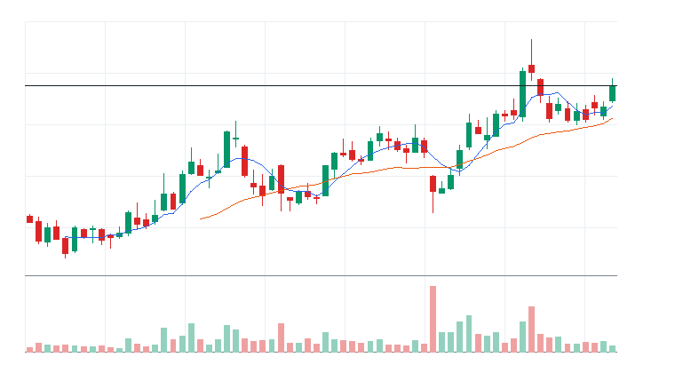
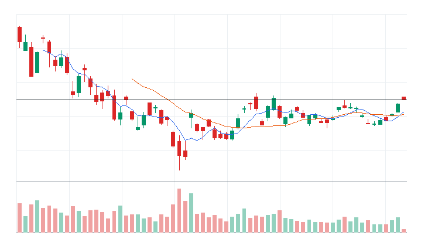
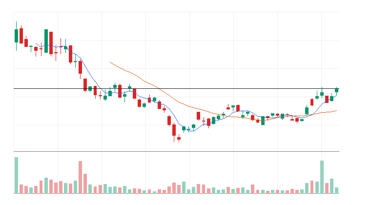

# 오늘의 데일리 트레이딩 요약

**REAL DATA TEST - 가격/거래량은 실제 데이터, 뉴스 연결, ETF 구성종목 확산도/거래대금 유동성 일부 연결**

**목적:** 이 리포트는 최근 오른 자산을 나열하는 것이 아니라, 돈이 몰리는 근거와 다음 매수 주체가 확인할 트레이딩 후보를 찾기 위한 보고서다.

> 핵심 질문: 현재 가격에서 누가 사고 있고, 누가 앞으로 더 비싸게 사줄 수 있는가?

## 시장 국면 판단

- 최종 판정: 중립 (42점)
- 전일 대비: 중립-하락에서 중립으로 개선됐다(+5점).
- 판정 신뢰도: 높음 (100점) - 핵심 지수와 매크로 데이터가 대부분 직접 수집되어 판정 신뢰도가 높다.
- 행동 바이어스: 강한 테마만 선별, 신규 추격 제한
- 한 줄 결론: 기술 점수 37, 매크로 점수 51로 방향성이 엇갈린다. 후보별 게이트를 더 엄격히 본다.
- 기술적 지표: 하락 압력 우위 (37점, 가중치 65%)
- KOSPI: 34점 | 50일선 위, 200일선 아래, 20일 +5.18%, 60일 -16.00%, 52주 고점 대비 -24.44% -> 기술 점수 34
- KOSDAQ: 40점 | 50일선 위, 200일선 아래, 20일 +1.81%, 60일 -1.00%, 52주 고점 대비 -31.50% -> 기술 점수 40
- 매크로 시황: 매크로 중립 (51점, 가중치 35%)
- 매크로 요약: 신용/유동성, 환율/글로벌은 우호적이나 물가 부담이 남아 있다.
- 금리: 중립 45점 / 금리 중립 / confidence HIGH
  - 주요 근거: US 10Y yield 20일 +5.61%, 5일 -0.56%; US long-duration bonds 20일 -0.30%, 장기채 가격 기준 할인율 부담 확인
  - 확인 사항: 추가 확인 이벤트 없음
- 물가: 부담 39점 / 물가 부담 / confidence MEDIUM
  - 주요 근거: Oil ETF 20일 +10.04%, 유가 기반 물가 압력 확인
  - 확인 사항: 추가 확인 이벤트 없음
- 정책: 중립 50점 / 정책 이벤트 확인 전 중립 / confidence LOW
  - 주요 근거: 정책 톤은 1차 버전에서 일정/이벤트 리스크 기반 중립값으로 반영한다.
  - 확인 사항: FOMC, BOK 금통위, CPI/PCE 발표 전후에는 매크로 confidence를 보수적으로 해석한다.
- 신용/유동성: 중립-우호 61점 / 신용/유동성 우호 / confidence HIGH
  - 주요 근거: High yield credit 20일 -1.17%, 하이일드 위험선호 확인; VIX 20일 -8.03%, 변동성 부담 확인
  - 확인 사항: 추가 확인 이벤트 없음
- 환율/글로벌: 중립-우호 55점 / 환율/글로벌 중립 / confidence HIGH
  - 주요 근거: USD/KRW 20일 -2.27%, 원화 안정/불안 확인; Korea equity ETF 20일 +6.07%, 한국 외국인 위험선호 프록시; KOSDAQ-KOSPI 20일 상대강도 -3.37%, 성장 위험선호 확인
  - 확인 사항: 추가 확인 이벤트 없음
- USD/KRW: 54점 | 하락 시 주식 우호; 5일 -0.98%, 20일 -2.27% -> 매크로 점수 54
- US 10Y yield: 41점 | 하락 시 주식 우호; 5일 -0.56%, 20일 +5.61% -> 매크로 점수 41
- US long-duration bonds: 50점 | 상승 시 주식 우호; 5일 +1.08%, 20일 -0.30% -> 매크로 점수 50
- Oil ETF: 38점 | 하락 시 주식 우호; 5일 -5.43%, 20일 +10.04% -> 매크로 점수 38
- High yield credit: 48점 | 상승 시 주식 우호; 5일 +0.19%, 20일 -1.17% -> 매크로 점수 48
- VIX: 77점 | 하락 시 주식 우호; 5일 -17.38%, 20일 -8.03% -> 매크로 점수 77
- Korea equity ETF: 66점 | 상승 시 주식 우호; 5일 +7.34%, 20일 +6.07% -> 매크로 점수 66
- 데이터 커버리지: 기술 2/2, 매크로 7/7
- 데이터 신뢰도 근거:
  - 직접 지수 데이터: KOSPI, KOSDAQ
  - 대체 지수 데이터 없음
  - 매크로 데이터: 7/7
  - 누락 데이터 없음
  - stale 데이터 없음

## 모바일 요약

[오늘의 데일리 트레이딩 요약]

생성 성공 / 데이터 모드: REAL_TEST

시장:
- 위험선호

시장 지배 서사:
1. AI 반도체/HBM 공급망 - 약화 - KODEX 200(069500.KS), 삼성전자(005930.KS), SK하이닉스(000660.KS) 중심으로 5일 +7.84%, 20일 +9.24% 흐름이 형성됨. 뉴스 직접성 제한.
2. IT 자금 유입 - 약화 - KODEX 200(069500.KS), KODEX 코스닥150(229200.KS), SK스퀘어(402340.KS), DB HiTek(000990.KS) 중심으로 5일 +6.97%, 20일 +11.35% 흐름이 형성됨. 뉴스 직접성 제한.
3. 지주/배당/자사주 재평가 - 약화 - KODEX 200(069500.KS), 두산(000150.KS), SK(034730.KS) 중심으로 5일 +4.35%, 20일 +8.09% 흐름이 형성됨. 뉴스 직접성 제한.

트렌드 강도:
1. AI 반도체/HBM 공급망 - TSI 59 - 약화 - 진입품질 낮음
2. IT 자금 유입 - TSI 54 - 약화 - 진입품질 낮음
3. 지주/배당/자사주 재평가 - TSI 41 - 잠복 - 진입품질 낮음

오늘 결론:
- 화학/에너지 개별 종목 흐름이 ETF 대비 강한지 확인 필요
- 행동 후보는 linkedNarrative와 함께 확인한다.
- 추격보다 진입 조건 확인 후 접근한다.

오늘 실제 행동 후보:
1. 행동 후보 없음 - 미분류 - 조건 충족 후보 없음

다크호스 후보:
1. 다크호스 후보 없음 - 조건 충족 후보 없음

ETF 후보 TOP 5:
1. KODEX 200(069500.KS) - AI 반도체/HBM 공급망 - 거래량 확인 전 관찰
2. KODEX 코스닥150(229200.KS) - IT 자금 유입 - 거래량 확인 전 관찰

웹 리포트:
https://yoolcool.github.io/DailyTradingThesisAgent/kr/

## 오늘 결론

- 오늘 결론: 신규 추격 없음 / 관찰
- 신규 진입 후보: 0개
- 조건부 진입 후보: 0개
- 관찰 후보: 199개
- 주요 제한 요인: Entry Quality < 40, RVOL 미달, 뉴스 직접성 부족
- 주문 판단: 지정가 권장 / 시장가 주의
- 실전 판단: 오늘은 추세 후보는 있으나, 왜 돈이 몰리는가와 누가 더 비싸게 사줄 수 있는가를 주문 실행 신뢰도와 거래량이 충분히 뒷받침하지 못해 신규 추격은 보류한다. 기존 관심 종목은 전일 고점 돌파와 RVOL 1.00x 회복을 확인한 뒤 조건부로 본다.

### 후보 제한 요인 집계

- RVOL < 1.00x: 199개
- 거래대금 유동성 낮음: 0개
- Entry Quality 50~54 near miss: 0개
- Entry Quality 40~49 관찰: 0개
- Entry Quality < 40: 202개
- Exhaustion Risk >= 70: 0개
- ETF breadth 샘플 부족: 0개
- 뉴스 직접성 부족: 198개

## 데이터 신뢰도

- 전체 데이터 신뢰도 등급: MEDIUM
- 분석 신뢰도: MEDIUM
- 주문 실행 신뢰도: MEDIUM
- ETF breadth 신뢰도: HIGH
- 신뢰도 해석: 장전/시간외 데이터 확인 불가
- 리포트 생성 시각: 2026-09-23 10:30 KST
- 가격 기준 거래일: 2026-09-23 KRX 정규장 종가
- 뉴스 수집 시각: 2026-09-23 10:30 KST
- 가장 최근 뉴스 발행 시각: 2026-09-22 00:00 KST
- 뉴스 신선도 상태: STALE
- 뉴스 소스: DART
- 뉴스 소스 상태: DART CONNECTED
- 뉴스 신뢰도: HIGH
- 추천 적용 거래일: 2026-09-23 KRX 정규장
- 가격/거래량 데이터 상태: 연결됨
- 뉴스 데이터 상태: 연결됨
- ETF 구성종목 확산도 상태: 일부 연결
- ETF 구성종목 샘플 수: 20~30
- 거래대금 유동성 데이터 상태: 일부 연결
- 장전/시간외 데이터 상태: NOT_APPLICABLE
- 데이터 provider: yfinance, DART, config fallback sample, price-volume dollar-volume fallback
- 실전 사용 경고: 이 리포트는 투자판단 보조용이며, REAL_TEST 모드에서는 일부 데이터가 누락되거나 지연될 수 있다. 실제 주문 전 현재가, 뉴스, 장전/시간외 가격과 정규장 거래대금을 별도 확인해야 한다.

## 0. 시장 상태

- 데이터 모드: REAL_TEST
- 가격/거래량: 연결됨
- 뉴스: 연결됨
- ETF 구성종목 확산도: 일부 연결
- 거래대금 유동성: 일부 연결
- 생성 시각: 2026년 9월 23일 수요일 오전 10:30
- 시장 상태: 위험선호
- 오늘 돈의 방향: 화학/에너지 개별 종목 흐름이 ETF 대비 강한지 확인 필요
- 강한 테마 TOP 3: 2차전지 소재/셀 반등(46), 지주/배당/자사주 재평가(31), 성장/테마 ETF(23)
- 데이터 한계:
  - API 또는 provider 상태에 따라 뉴스/ETF 확산도/거래대금 유동성 반영 범위가 달라질 수 있다.
  - 수집 실패 데이터는 점수 반영에서 제외하거나 confidence를 제한한다.
  - reasonConfidence HIGH는 직접 촉매, 가격/거래량, 확산도/유동성 근거가 함께 있을 때만 사용한다.

## 오늘 시장을 지배하는 서사

### 오늘 시장을 지배하는 서사 TOP 3

#### 1. AI 반도체/HBM 공급망
- 상태: 약화
- narrativeScore: 29
- reasonConfidence: LOW
- 근거 ETF: KODEX 200(069500.KS)
- 근거 개별 종목: 삼성전자(005930.KS), SK하이닉스(000660.KS), 삼성전기(009150.KS), 한미반도체(042700.KS)
- 돈이 몰리는 이유: AI 반도체/HBM 공급망 관련 KODEX 200(069500.KS)와 삼성전자(005930.KS), SK하이닉스(000660.KS), 삼성전기(009150.KS), 한미반도체(042700.KS)의 5일(+7.84%)·20일(+9.24%) 흐름을 함께 본다. 평균 상대 거래량은 0.28배이고, ETF 확산도도 이를 보조한다. 뉴스 직접성은 아직 제한적이다.
- 다음 매수 주체: HBM, AI 서버, 온디바이스 AI 수요가 이어질 때 국내 반도체 대형주와 후공정/부품주로 자금이 확산
- 가장 좋은 트레이딩 수단: ETF 우선: KODEX 200(069500.KS) / 개별 종목 우선: SK하이닉스(000660.KS), 삼성전자(005930.KS), 한미반도체(042700.KS)
- 서사가 깨지는 조건: KOSPI200이 20일선을 이탈하거나 반도체 대표 종목 절반 이상이 5일선을 동시에 이탈
- 오늘 행동: 추격보다 SK하이닉스/삼성전자 동조성과 거래대금 회복을 확인한 뒤 눌림 구간에서 선별

상세 narrativeScore 근거 보기

- rawScore: 29
- ETF 평균 moneyFlowScore: 28
- 개별 종목 평균 moneyFlowScore: 40
- ETF 후보 비율: 0%
- 개별 종목 후보 비율: 0%
- 5일 평균 수익률: +8.00%
- 20일 평균 수익률: +9.00%
- 평균 상대 거래량: 0.00배
- ETF 평균 상대 거래량: 0.00배
- 개별주 평균 상대 거래량: 0.00배
- 52주 고점 근접 후보 비율: 0%
- 뉴스 직접성 점수: 2
- ETF 확산도 점수: 2
- 유동성 점수: 5
- 과열 리스크 차감: 0

#### 2. IT 자금 유입
- 상태: 약화
- narrativeScore: 25
- reasonConfidence: LOW
- 근거 ETF: KODEX 200(069500.KS), KODEX 코스닥150(229200.KS)
- 근거 개별 종목: SK스퀘어(402340.KS), 000990.KS, 이수페타시스(007660.KS), LG전자(066570.KS)
- 돈이 몰리는 이유: IT 자금 유입 관련 KODEX 200(069500.KS), KODEX 코스닥150(229200.KS)와 SK스퀘어(402340.KS), DB HiTek(000990.KS), 이수페타시스(007660.KS), LG전자(066570.KS)의 5일(+6.97%)·20일(+11.35%) 흐름을 함께 본다. 평균 상대 거래량은 0.31배이고, ETF 확산도도 이를 보조한다. 뉴스 직접성은 아직 제한적이다.
- 다음 매수 주체: IT 자금 유입을 확인한 섹터 ETF 자금과 상대강도 추종 스윙 자금
- 가장 좋은 트레이딩 수단: ETF 우선: KODEX 200(069500.KS), KODEX 코스닥150(229200.KS) / 개별 종목 우선: 000990.KS, SK스퀘어(402340.KS), 이수페타시스(007660.KS)
- 서사가 깨지는 조건: 069500.KS 20일선 이탈 또는 관련 종목 절반 이상 5일선 이탈
- 오늘 행동: 기존 네러티브와 중복을 확인한 뒤 ETF/대표 종목 동조성이 살아날 때만 관찰 편입

상세 narrativeScore 근거 보기

- rawScore: 25
- ETF 평균 moneyFlowScore: 23
- 개별 종목 평균 moneyFlowScore: 37
- ETF 후보 비율: 0%
- 개별 종목 후보 비율: 0%
- 5일 평균 수익률: +7.00%
- 20일 평균 수익률: +11.00%
- 평균 상대 거래량: 0.00배
- ETF 평균 상대 거래량: 0.00배
- 개별주 평균 상대 거래량: 0.00배
- 52주 고점 근접 후보 비율: 0%
- 뉴스 직접성 점수: 0
- ETF 확산도 점수: 2
- 유동성 점수: 4
- 과열 리스크 차감: 0

#### 3. 지주/배당/자사주 재평가
- 상태: 약화
- narrativeScore: 18
- reasonConfidence: LOW
- 근거 ETF: KODEX 200(069500.KS)
- 근거 개별 종목: 두산(000150.KS), SK(034730.KS), LG(003550.KS), 롯데지주(004990.KS)
- 돈이 몰리는 이유: 지주/배당/자사주 재평가 관련 KODEX 200(069500.KS)와 두산(000150.KS), SK(034730.KS), LG(003550.KS), 롯데지주(004990.KS)의 5일(+4.35%)·20일(+8.09%) 흐름을 함께 본다. 평균 상대 거래량은 0.20배이고, ETF 확산도도 이를 보조한다. 뉴스 직접성은 아직 제한적이다.
- 다음 매수 주체: 자사주 소각, 배당 확대, 지배구조 개편 기대가 커질 때 지주회사와 저평가 대형주로 순환매 유입
- 가장 좋은 트레이딩 수단: ETF 우선: KODEX 200(069500.KS) / 개별 종목 우선: LG(003550.KS), SK(034730.KS), 두산(000150.KS)
- 서사가 깨지는 조건: 정책/주주환원 기대가 약화되고 지주사 대표 종목이 시장 대비 언더퍼폼
- 오늘 행동: 강한 시장에서는 후순위, 변동성 확대 구간에서 방어적 재평가 후보로 관찰

상세 narrativeScore 근거 보기

- rawScore: 18
- ETF 평균 moneyFlowScore: 28
- 개별 종목 평균 moneyFlowScore: 22
- ETF 후보 비율: 0%
- 개별 종목 후보 비율: 0%
- 5일 평균 수익률: +4.00%
- 20일 평균 수익률: +8.00%
- 평균 상대 거래량: 0.00배
- ETF 평균 상대 거래량: 0.00배
- 개별주 평균 상대 거래량: 0.00배
- 52주 고점 근접 후보 비율: 0%
- 뉴스 직접성 점수: 1
- ETF 확산도 점수: 2
- 유동성 점수: 3
- 과열 리스크 차감: 0

### 전체 narrative 요약

| 서사명 | 상태 | narrativeScore | reasonConfidence | 대표 ETF | 대표 종목 | 오늘 행동 |
| --- | --- | ---: | --- | --- | --- | --- |
| AI 반도체/HBM 공급망 | 약화 | 29 | LOW | KODEX 200(069500.KS) | 삼성전자(005930.KS), SK하이닉스(000660.KS), 삼성전기(009150.KS), 한미반도체(042700.KS) | 추격보다 SK하이닉스/삼성전자 동조성과 거래대금 회복을 확인한 뒤 눌림 구간에서 선별 |
| IT 자금 유입 | 약화 | 25 | LOW | KODEX 200(069500.KS), KODEX 코스닥150(229200.KS) | SK스퀘어(402340.KS), 000990.KS, 이수페타시스(007660.KS), LG전자(066570.KS) | 기존 네러티브와 중복을 확인한 뒤 ETF/대표 종목 동조성이 살아날 때만 관찰 편입 |
| 지주/배당/자사주 재평가 | 약화 | 18 | LOW | KODEX 200(069500.KS) | 두산(000150.KS), SK(034730.KS), LG(003550.KS), 롯데지주(004990.KS) | 강한 시장에서는 후순위, 변동성 확대 구간에서 방어적 재평가 후보로 관찰 |
| Industrials 자금 유입 | 약화 | 18 | LOW | KODEX 200(069500.KS), KODEX 코스닥150(229200.KS) | 대한항공(003490.KS), 대한전선(001440.KS), HD현대마린솔루션(443060.KS), SK아이이테크놀로지(361610.KS) | 기존 네러티브와 중복을 확인한 뒤 ETF/대표 종목 동조성이 살아날 때만 관찰 편입 |
| Energy & Chemicals 자금 유입 | 약화 | 16 | LOW | KODEX 200(069500.KS), KODEX 코스닥150(229200.KS) | SK이노베이션(096770.KS), 롯데케미칼(011170.KS), 한화(000880.KS), 대한유화(006650.KS) | 기존 네러티브와 중복을 확인한 뒤 ETF/대표 종목 동조성이 살아날 때만 관찰 편입 |
| 전력 유틸리티 수요 재평가 | 약화 | 9 | LOW | KODEX 200(069500.KS), KODEX 코스닥150(229200.KS) | LS ELECTRIC(010120.KS), 효성중공업(298040.KS) | 기존 네러티브와 중복을 확인한 뒤 ETF/대표 종목 동조성이 살아날 때만 관찰 편입 |
| Heavy Industries 자금 유입 | 약화 | 8 | LOW | KODEX 200(069500.KS), KODEX 코스닥150(229200.KS) | 산일전기(062040.KS), 현대로템(064350.KS) | 기존 네러티브와 중복을 확인한 뒤 ETF/대표 종목 동조성이 살아날 때만 관찰 편입 |
| Steels & Materials 자금 유입 | 약화 | 6 | LOW | KODEX 200(069500.KS), KODEX 코스닥150(229200.KS) | 현대제철(004020.KS), 영풍(000670.KS) | 기존 네러티브와 중복을 확인한 뒤 ETF/대표 종목 동조성이 살아날 때만 관찰 편입 |
| 금융/밸류업 주주환원 | 약화 | 5 | LOW | KODEX 200(069500.KS) | 우리금융지주(316140.KS), KB금융(105560.KS), 신한지주(055550.KS), 하나금융지주(086790.KS) | 지수 변동성이 커질 때 방어적 대안으로 관찰하고, 급등 후에는 배당락/정책 뉴스 확인 |
| 2차전지 소재/셀 반등 | 약화 | 5 | LOW | KODEX 200(069500.KS), KODEX 코스닥150(229200.KS) | 포스코퓨처엠(003670.KS), LG에너지솔루션(373220.KS), 삼성SDI(006400.KS), 에코프로머티(450080.KS) | 추세 전환보다 반등 성격으로 접근하고, 상대 거래량이 살아나는 종목만 단기 관찰 |
| 전력기기/인프라 투자 | 약화 | 4 | LOW | KODEX 200(069500.KS) | LS ELECTRIC(010120.KS), 효성중공업(298040.KS), HD현대일렉트릭(267260.KS), HD현대(267250.KS) | 강한 종목을 추격하기보다 거래대금 유지와 5일선 재지지를 확인 |
| Constructions 자금 유입 | 약화 | 2 | LOW | KODEX 200(069500.KS), KODEX 코스닥150(229200.KS) | 한전기술(052690.KS), 현대건설(000720.KS), 대우건설(047040.KS), DL이앤씨(375500.KS) | 기존 네러티브와 중복을 확인한 뒤 ETF/대표 종목 동조성이 살아날 때만 관찰 편입 |
| 소비 회복/방어주 선별 | 약화 | 2 | LOW | KODEX 200(069500.KS), KODEX 코스닥150(229200.KS) | 한진칼(180640.KS), 코웨이(021240.KS), 롯데쇼핑(023530.KS) | 기존 네러티브와 중복을 확인한 뒤 ETF/대표 종목 동조성이 살아날 때만 관찰 편입 |
| Internet platform 자금 유입 | 약화 | 2 | LOW | KODEX 200(069500.KS), KODEX 코스닥150(229200.KS) | NAVER(035420.KS), 카카오(035720.KS) | 기존 네러티브와 중복을 확인한 뒤 ETF/대표 종목 동조성이 살아날 때만 관찰 편입 |
| Communication Services 자금 유입 | 약화 | 1 | LOW | KODEX 200(069500.KS), KODEX 코스닥150(229200.KS) | SK텔레콤(017670.KS), KT(030200.KS) | 기존 네러티브와 중복을 확인한 뒤 ETF/대표 종목 동조성이 살아날 때만 관찰 편입 |
| 조선/방산 수주 사이클 | 약화 | 0 | LOW | KODEX 200(069500.KS) | 한화오션(042660.KS), HD현대중공업(329180.KS), 한화에어로스페이스(012450.KS), 한국항공우주(047810.KS) | 수주 공시나 업황 뉴스가 직접 확인될 때만 추세 추종, 과열 구간은 신규 진입 보류 |
| 화장품/음식료 수출 소비재 | 소멸 | 0 | LOW | KODEX 200(069500.KS) | 한국콜마(161890.KS), 아모레퍼시픽(090430.KS), LG생활건강(051900.KS), 삼양식품(003230.KS) | 실적 기대와 가격 반응이 같이 나타나는 종목만 선별, 단기 급등주는 눌림 대기 |
| Financials 자금 유입 | 약화 | 0 | LOW | KODEX 200(069500.KS), KODEX 코스닥150(229200.KS) | DB손해보험(005830.KS), 현대해상(001450.KS), 한화생명(088350.KS), iM금융지주(139130.KS) | 기존 네러티브와 중복을 확인한 뒤 ETF/대표 종목 동조성이 살아날 때만 관찰 편입 |
| 바이오/헬스케어 실적 전환 | 소멸 | 0 | LOW | KODEX 200(069500.KS) | 한미약품(128940.KS), 삼성바이오로직스(207940.KS), 셀트리온(068270.KS), 유한양행(000100.KS) | 뉴스 촉매와 거래량이 동반될 때만 관찰 편입, 이벤트 소멸 후 추격은 금지 |
| 인터넷/게임/엔터 성장주 | 소멸 | 0 | LOW | KODEX 200(069500.KS), KODEX 코스닥150(229200.KS) | NAVER(035420.KS), 카카오(035720.KS), 크래프톤(259960.KS), 하이브(352820.KS) | 지수 위험선호가 유지될 때만 선별 진입, 대형 플랫폼은 실적 반응을 우선 확인 |
| 자동차/부품 수출 모멘텀 | 소멸 | 0 | LOW | KODEX 200(069500.KS) | 현대차(005380.KS), 기아(000270.KS), 현대모비스(012330.KS), 현대위아(011210.KS) | 완성차 쌍두마차가 시장 대비 강할 때만 부품주까지 확산 여부를 확인 |

## 트렌드 강도 판단

### 1. AI 반도체/HBM 공급망
- Trend Strength Index: 59
- 트렌드 상태 라벨: 약화
- 테마 확산도: 보통
- ETF 동조성: 강함
- 거래량 강도: 부족
- 과열 위험: 낮음 (8)
- 오늘 진입 품질: 낮음 (39)
- 한 줄 판단: AI 반도체/HBM 공급망는 관찰 가능한 흐름은 있으나 가격, 거래량, 확산도 중 일부 확인이 더 필요하다.
- 오늘 접근법: 상승률이 남아 있어도 KODEX 200(069500.KS)와 구성 종목 확산도가 회복될 때까지 신규 진입은 낮춘다.

트렌드 강도 상세 근거 보기

- 가격 모멘텀: 가격 모멘텀 21/25. 평균 5D +7.84%, 20D +9.24%.
- 거래량 강도: 거래량 강도 3/20. 평균 RVOL 0.28배.
- ETF 동조성: ETF 동조성 15/15. 관련 ETF KODEX 200(069500.KS) 흐름을 기준으로 판단.
- 테마 확산도: 테마 확산도 12/20. 상위 1~2개 쏠림 감점 0점 반영.
- 뉴스 촉매: 뉴스/촉매 신선도 0/10. HIGH 직접 촉매 0개.
- 과열 리스크: 과열 리스크 8/100. 단기 급등, 고점 근접, ETF-개별주 괴리, 쏠림을 함께 반영.
- 시장 환경: 시장 환경 8/10. KOSPI200/KODEX 200/KODEX KOSDAQ150 가격 흐름 기반 위험선호 점수.

### 2. IT 자금 유입
- Trend Strength Index: 54
- 트렌드 상태 라벨: 약화
- 테마 확산도: 보통
- ETF 동조성: 보통
- 거래량 강도: 부족
- 과열 위험: 낮음 (7)
- 오늘 진입 품질: 낮음 (36)
- 한 줄 판단: IT 자금 유입는 관찰 가능한 흐름은 있으나 가격, 거래량, 확산도 중 일부 확인이 더 필요하다.
- 오늘 접근법: 상승률이 남아 있어도 KODEX 200(069500.KS)/KODEX 코스닥150(229200.KS)와 구성 종목 확산도가 회복될 때까지 신규 진입은 낮춘다.

트렌드 강도 상세 근거 보기

- 가격 모멘텀: 가격 모멘텀 22/25. 평균 5D +6.97%, 20D +11.35%.
- 거래량 강도: 거래량 강도 3/20. 평균 RVOL 0.31배.
- ETF 동조성: ETF 동조성 9/15. 관련 ETF KODEX 200(069500.KS), KODEX 코스닥150(229200.KS) 흐름을 기준으로 판단.
- 테마 확산도: 테마 확산도 12/20. 상위 1~2개 쏠림 감점 0점 반영.
- 뉴스 촉매: 뉴스/촉매 신선도 0/10. HIGH 직접 촉매 0개.
- 과열 리스크: 과열 리스크 7/100. 단기 급등, 고점 근접, ETF-개별주 괴리, 쏠림을 함께 반영.
- 시장 환경: 시장 환경 8/10. KOSPI200/KODEX 200/KODEX KOSDAQ150 가격 흐름 기반 위험선호 점수.

### 3. 지주/배당/자사주 재평가
- Trend Strength Index: 41
- 트렌드 상태 라벨: 잠복
- 테마 확산도: 부족
- ETF 동조성: 강함
- 거래량 강도: 부족
- 과열 위험: 낮음 (19)
- 오늘 진입 품질: 낮음 (23)
- 한 줄 판단: 지주/배당/자사주 재평가는 테마 확산도가 낮아 아직 개별 종목 이벤트성 흐름에 가깝다.
- 오늘 접근법: KODEX 200(069500.KS)와 두산(000150.KS)/SK(034730.KS)/LG(003550.KS)의 거래량 확산이 확인되기 전까지 관찰한다.

트렌드 강도 상세 근거 보기

- 가격 모멘텀: 가격 모멘텀 14/25. 평균 5D +4.35%, 20D +8.09%.
- 거래량 강도: 거래량 강도 2/20. 평균 RVOL 0.20배.
- ETF 동조성: ETF 동조성 15/15. 관련 ETF KODEX 200(069500.KS) 흐름을 기준으로 판단.
- 테마 확산도: 테마 확산도 2/20. 상위 1~2개 쏠림 감점 6점 반영.
- 뉴스 촉매: 뉴스/촉매 신선도 0/10. HIGH 직접 촉매 0개.
- 과열 리스크: 과열 리스크 19/100. 단기 급등, 고점 근접, ETF-개별주 괴리, 쏠림을 함께 반영.
- 시장 환경: 시장 환경 8/10. KOSPI200/KODEX 200/KODEX KOSDAQ150 가격 흐름 기반 위험선호 점수.

## 최근 추천 결과 트래킹

개별주는 데이트레이딩 관점으로 추천 이후 첫 정규장의 장중 최고가와 종가를 추적한다. ETF는 테마/스윙 관점으로 추천 이후 1주일 동안의 최고가와 현재 종가를 추적한다.

### 개별주 Top 3 추천 성과 요약
- 최근 5개 리포트 표본: 7개 (초기 검증 단계)
- 장중 최고가 기준 성공률: +42.86%
- 종가 기준 성공률: +42.86%
- 평균 장중 최고 수익률: +3.76%
- 평균 종가 수익률: -0.15%

### ETF 추천 성과 요약
- 최근 5개 리포트 표본: 0개 (초기 검증 단계)
- 1주 최고가 기준 성공률: 데이터 없음
- 현재 종가 기준 성공률: 데이터 없음
- 평균 1주 최고 수익률: 데이터 없음
- 평균 현재 수익률: 데이터 없음

최근 추천 결과 상세 테이블 펼치기

| 추천일 | 유형 | 순위 | 티커 | 기준가 | 추적 기간 | 상태 | High 수익률 | Close 수익률 | 결과 | 코멘트 |
| --- | --- | ---: | --- | ---: | --- | --- | ---: | ---: | --- | --- |
| 2026-09-22 | STOCK | 1 | 대한전선(001440.KS) | $32,050 | 2026-09-22 | complete | +4.37% | -1.40% | 단타 유효 | 장중 기회는 있었지만 종가 유지력은 약함 (일봉 기준) |
| 2026-09-18 | STOCK | 2 | 대한전선(001440.KS) | $31,450 | 2026-09-18 | complete | +1.91% | 0.00% | 제한적 유효 | 제한적인 장중 기회만 발생 (일봉 기준) |
| 2026-09-18 | STOCK | 1 | 삼성E&A(028050.KS) | $54,700 | 2026-09-18 | complete | +0.91% | -5.30% | 실패 | 추천 이후 의미 있는 장중 기회가 부족하고 종가도 약함 (일봉 기준) |
| 2026-09-15 | STOCK | 1 | 후성(093370.KS) | $14,830 | 2026-09-15 | complete | +2.83% | -0.34% | 제한적 유효 | 제한적인 장중 기회만 발생 (일봉 기준) |
| 2026-09-14 | STOCK | 1 | 영풍(000670.KS) | $48,850 | 2026-09-14 | complete | +2.25% | +2.25% | 제한적 유효 | 제한적인 장중 기회만 발생 (일봉 기준) |
| 2026-09-08 | STOCK | 2 | 대우건설(047040.KS) | $19,750 | 2026-09-08 | complete | +7.85% | +1.11% | 성공 | 장중 기회와 종가 유지가 모두 확인됨 (일봉 기준) |
| 2026-09-08 | STOCK | 1 | 한전기술(052690.KS) | $138,900 | 2026-09-08 | complete | +6.19% | +2.66% | 성공 | 장중 기회와 종가 유지가 모두 확인됨 (일봉 기준) |
| 2026-09-04 | STOCK | 1 | S-Oil(010950.KS) | $161,900 | 2026-09-04 | complete | +1.73% | -2.84% | 제한적 유효 | 제한적인 장중 기회만 발생 (일봉 기준) |
| 2026-09-03 | STOCK | 1 | 한화생명(088350.KS) | $6,460 | 2026-09-03 | complete | +1.39% | -5.42% | 제한적 유효 | 제한적인 장중 기회만 발생 (일봉 기준) |
| 2026-09-01 | STOCK | 1 | 이수스페셜티케미컬(457190.KS) | $72,300 | 2026-09-01 | complete | +4.70% | -3.73% | 단타 유효 | 장중 기회는 있었지만 종가 유지력은 약함 (일봉 기준) |
| 2026-08-28 | STOCK | 3 | 율촌화학(008730.KS) | $16,800 | 2026-08-28 | complete | +0.33% | 0.00% | 추적 대기 | 아직 추적 거래일 데이터가 완성되지 않음 (일봉 기준) |
| 2026-08-28 | STOCK | 2 | 롯데웰푸드(280360.KS) | $146,300 | 2026-08-28 | complete | +1.16% | 0.00% | 제한적 유효 | 제한적인 장중 기회만 발생 (일봉 기준) |
| 2026-08-28 | STOCK | 1 | 코스맥스(192820.KS) | $303,000 | 2026-08-28 | complete | +0.99% | 0.00% | 추적 대기 | 아직 추적 거래일 데이터가 완성되지 않음 (일봉 기준) |
| 2026-08-27 | STOCK | 3 | 삼성SDI(006400.KS) | $568,000 | 2026-08-27 | complete | +0.53% | +0.18% | 추적 대기 | 아직 추적 거래일 데이터가 완성되지 않음 (일봉 기준) |
| 2026-08-27 | STOCK | 2 | 두산에너빌리티(034020.KS) | $86,500 | 2026-08-27 | complete | +1.39% | -0.69% | 제한적 유효 | 제한적인 장중 기회만 발생 (일봉 기준) |
| 2026-08-27 | STOCK | 1 | 포스코퓨처엠(003670.KS) | $184,200 | 2026-08-27 | complete | +1.47% | -0.11% | 제한적 유효 | 제한적인 장중 기회만 발생 (일봉 기준) |
| 2026-08-26 | STOCK | 3 | 엘앤에프(066970.KS) | $120,400 | 2026-08-26 | complete | +2.57% | +1.50% | 제한적 유효 | 제한적인 장중 기회만 발생 (일봉 기준) |
| 2026-08-26 | STOCK | 2 | 풍산(103140.KS) | $87,600 | 2026-08-26 | complete | -0.57% | -5.94% | 실패 | 추천 이후 의미 있는 장중 기회가 부족하고 종가도 약함 (일봉 기준) |
| 2026-08-26 | STOCK | 1 | 롯데웰푸드(280360.KS) | $135,200 | 2026-08-26 | complete | +6.14% | +3.48% | 성공 | 장중 기회와 종가 유지가 모두 확인됨 (일봉 기준) |
| 2026-08-25 | STOCK | 3 | 엘앤에프(066970.KS) | $121,600 | 2026-08-25 | complete | +2.96% | -0.99% | 제한적 유효 | 제한적인 장중 기회만 발생 (일봉 기준) |
| 2026-08-25 | STOCK | 2 | 팬오션(028670.KS) | $6,320 | 2026-08-25 | complete | +3.32% | +0.95% | 단타 유효 | 장중 기회는 있었지만 종가 유지력은 약함 (일봉 기준) |
| 2026-08-25 | STOCK | 1 | 코스맥스(192820.KS) | $286,000 | 2026-08-25 | complete | +1.05% | +1.05% | 제한적 유효 | 제한적인 장중 기회만 발생 (일봉 기준) |
| 2026-08-24 | STOCK | 1 | 코스맥스(192820.KS) | $271,000 | 2026-08-24 | complete | +6.27% | +5.54% | 성공 | 장중 기회와 종가 유지가 모두 확인됨 (일봉 기준) |
| 2026-08-21 | STOCK | 3 | 코스맥스(192820.KS) | $260,500 | 2026-08-21 | complete | +5.18% | +4.03% | 성공 | 장중 기회와 종가 유지가 모두 확인됨 (일봉 기준) |
| 2026-08-21 | STOCK | 2 | 삼양식품(003230.KS) | $1,397,000 | 2026-08-21 | complete | +0.79% | -2.22% | 실패 | 추천 이후 의미 있는 장중 기회가 부족하고 종가도 약함 (일봉 기준) |
| 2026-08-21 | STOCK | 1 | 농심(004370.KS) | $441,000 | 2026-08-21 | complete | 0.00% | -1.93% | 실패 | 추천 이후 의미 있는 장중 기회가 부족하고 종가도 약함 (일봉 기준) |
| 2026-08-20 | STOCK | 3 | 한화에어로스페이스(012450.KS) | $1,177,000 | 2026-08-20 | complete | +3.06% | -0.85% | 단타 유효 | 장중 기회는 있었지만 종가 유지력은 약함 (일봉 기준) |
| 2026-08-20 | STOCK | 2 | DB손해보험(005830.KS) | $187,500 | 2026-08-20 | complete | -1.60% | -5.39% | 실패 | 추천 이후 의미 있는 장중 기회가 부족하고 종가도 약함 (일봉 기준) |
| 2026-08-20 | STOCK | 1 | 현대해상(001450.KS) | $50,000 | 2026-08-20 | complete | +0.40% | -2.30% | 실패 | 추천 이후 의미 있는 장중 기회가 부족하고 종가도 약함 (일봉 기준) |
| 2026-08-19 | STOCK | 3 | 한화생명(088350.KS) | $5,520 | 2026-08-19 | complete | +1.09% | -3.26% | 제한적 유효 | 제한적인 장중 기회만 발생 (일봉 기준) |
| 2026-08-19 | STOCK | 2 | GS(078930.KS) | $119,300 | 2026-08-19 | complete | +1.26% | +0.34% | 제한적 유효 | 제한적인 장중 기회만 발생 (일봉 기준) |
| 2026-08-19 | STOCK | 1 | 코스맥스(192820.KS) | $239,000 | 2026-08-19 | complete | +4.60% | +2.93% | 성공 | 장중 기회와 종가 유지가 모두 확인됨 (일봉 기준) |
| 2026-08-18 | STOCK | 3 | LG CNS(064400.KS) | $79,900 | 2026-08-18 | complete | +5.01% | -7.51% | 단타 유효 | 장중 기회는 있었지만 종가 유지력은 약함 (일봉 기준) |
| 2026-08-18 | STOCK | 2 | 세아베스틸지주(001430.KS) | $45,000 | 2026-08-18 | complete | +2.78% | -4.22% | 제한적 유효 | 제한적인 장중 기회만 발생 (일봉 기준) |
| 2026-08-18 | STOCK | 1 | 현대해상(001450.KS) | $45,350 | 2026-08-18 | complete | +10.80% | +9.59% | 성공 | 장중 기회와 종가 유지가 모두 확인됨 (일봉 기준) |
| 2026-08-17 | STOCK | 3 | 한국콜마(161890.KS) | $136,700 | 2026-08-17 | pending | 데이터 없음 | 데이터 없음 | 추적 대기 | 아직 추적 거래일 데이터가 완성되지 않음 |
| 2026-08-17 | STOCK | 2 | LG(003550.KS) | $120,000 | 2026-08-17 | pending | 데이터 없음 | 데이터 없음 | 추적 대기 | 아직 추적 거래일 데이터가 완성되지 않음 |
| 2026-08-17 | STOCK | 1 | 현대해상(001450.KS) | $45,350 | 2026-08-17 | pending | 데이터 없음 | 데이터 없음 | 추적 대기 | 아직 추적 거래일 데이터가 완성되지 않음 |
| 2026-08-14 | STOCK | 3 | 코스맥스(192820.KS) | $249,000 | 2026-08-14 | complete | +0.80% | -0.60% | 실패 | 추천 이후 의미 있는 장중 기회가 부족하고 종가도 약함 (일봉 기준) |
| 2026-08-14 | STOCK | 2 | GS(078930.KS) | $107,400 | 2026-08-14 | complete | +10.52% | +8.94% | 성공 | 장중 기회와 종가 유지가 모두 확인됨 (일봉 기준) |
| 2026-08-14 | STOCK | 1 | 현대해상(001450.KS) | $42,950 | 2026-08-14 | complete | +6.64% | +5.59% | 성공 | 장중 기회와 종가 유지가 모두 확인됨 (일봉 기준) |
| 2026-08-13 | STOCK | 3 | 한화에어로스페이스(012450.KS) | $1,156,000 | 2026-08-13 | complete | +4.93% | +2.51% | 성공 | 장중 기회와 종가 유지가 모두 확인됨 (일봉 기준) |
| 2026-08-13 | STOCK | 2 | 코스맥스(192820.KS) | $249,500 | 2026-08-13 | complete | +5.01% | -0.20% | 단타 유효 | 장중 기회는 있었지만 종가 유지력은 약함 (일봉 기준) |
| 2026-08-13 | STOCK | 1 | GS(078930.KS) | $101,000 | 2026-08-13 | complete | +11.88% | +6.34% | 성공 | 장중 기회와 종가 유지가 모두 확인됨 (일봉 기준) |
| 2026-08-12 | STOCK | 3 | 지역난방공사(071320.KS) | $75,100 | 2026-08-12 | complete | +2.40% | +0.13% | 제한적 유효 | 제한적인 장중 기회만 발생 (일봉 기준) |
| 2026-08-12 | STOCK | 2 | BGF리테일(282330.KS) | $150,500 | 2026-08-12 | complete | +1.00% | -3.32% | 제한적 유효 | 제한적인 장중 기회만 발생 (일봉 기준) |
| 2026-08-12 | STOCK | 1 | 고려아연(010130.KS) | $1,229,000 | 2026-08-12 | complete | +0.90% | -1.14% | 실패 | 추천 이후 의미 있는 장중 기회가 부족하고 종가도 약함 (일봉 기준) |
| 2026-08-11 | STOCK | 3 | 세아베스틸지주(001430.KS) | $43,050 | 2026-08-11 | complete | +0.46% | -4.07% | 실패 | 추천 이후 의미 있는 장중 기회가 부족하고 종가도 약함 (일봉 기준) |
| 2026-08-11 | STOCK | 2 | 현대해상(001450.KS) | $41,000 | 2026-08-11 | complete | +10.49% | +7.44% | 성공 | 장중 기회와 종가 유지가 모두 확인됨 (일봉 기준) |
| 2026-08-11 | STOCK | 1 | OCI홀딩스(010060.KS) | $284,500 | 2026-08-11 | complete | -0.35% | -3.87% | 실패 | 추천 이후 의미 있는 장중 기회가 부족하고 종가도 약함 (일봉 기준) |
| 2026-08-10 | STOCK | 3 | 풍산(103140.KS) | $83,600 | 2026-08-10 | complete | +4.67% | +3.59% | 성공 | 장중 기회와 종가 유지가 모두 확인됨 (일봉 기준) |
| 2026-08-10 | STOCK | 2 | HS효성첨단소재(298050.KS) | $183,200 | 2026-08-10 | complete | +2.89% | +0.49% | 제한적 유효 | 제한적인 장중 기회만 발생 (일봉 기준) |
| 2026-08-10 | STOCK | 1 | 세아베스틸지주(001430.KS) | $41,600 | 2026-08-10 | complete | +4.09% | +3.49% | 성공 | 장중 기회와 종가 유지가 모두 확인됨 (일봉 기준) |
| 2026-08-06 | STOCK | 3 | 풍산(103140.KS) | $80,700 | 2026-08-06 | complete | +6.82% | +3.84% | 성공 | 장중 기회와 종가 유지가 모두 확인됨 (일봉 기준) |
| 2026-08-06 | STOCK | 2 | 세아베스틸지주(001430.KS) | $40,800 | 2026-08-06 | complete | +0.49% | -1.84% | 실패 | 추천 이후 의미 있는 장중 기회가 부족하고 종가도 약함 (일봉 기준) |
| 2026-08-06 | STOCK | 1 | OCI홀딩스(010060.KS) | $246,000 | 2026-08-06 | complete | +4.47% | -0.81% | 단타 유효 | 장중 기회는 있었지만 종가 유지력은 약함 (일봉 기준) |
| 2026-08-05 | STOCK | 3 | LG생활건강(051900.KS) | $291,500 | 2026-08-05 | complete | +3.77% | +0.34% | 단타 유효 | 장중 기회는 있었지만 종가 유지력은 약함 (일봉 기준) |
| 2026-08-05 | STOCK | 2 | DL(000210.KS) | $51,900 | 2026-08-05 | complete | +1.35% | -1.35% | 제한적 유효 | 제한적인 장중 기회만 발생 (일봉 기준) |
| 2026-08-05 | STOCK | 1 | GS(078930.KS) | $96,900 | 2026-08-05 | complete | +5.16% | -1.96% | 단타 유효 | 장중 기회는 있었지만 종가 유지력은 약함 (일봉 기준) |
| 2026-08-03 | STOCK | 2 | 금호타이어(073240.KS) | $7,290 | 2026-08-03 | complete | +2.74% | -8.64% | 제한적 유효 | 제한적인 장중 기회만 발생 (일봉 기준) |

## 오늘 실제 행동 후보

오늘은 추세 후보는 있으나, 왜 돈이 몰리는가와 누가 더 비싸게 사줄 수 있는가를 주문 실행 신뢰도와 거래량이 충분히 뒷받침하지 못해 신규 추격은 보류한다. 기존 관심 종목은 전일 고점 돌파와 RVOL 1.00x 회복을 확인한 뒤 조건부로 본다.

## 다크호스 후보

다크호스 후보 없음. 상위 서사 정렬, MA20 위 안착, MA5/MA20 구조 개선, RVOL 0.90x 이상 조건을 동시에 충족한 개별주가 없다.

- darkHorseScore: 조건 충족 후보 없음
- 왜 아직 메인이 아닌가: 확인 조건을 통과한 보조 관찰 후보가 없다.

darkHorseScore 상세 근거 보기

- 서사 정렬: 조건 미충족
- 초기 추세 구조: 조건 미충족
- 베이스 돌파/정돈: 조건 미충족
- 거래량 확인: 조건 미충족
- rawScore: 데이터 없음

## 참고용 행동 후보

> 실제 행동 후보가 없는 날에만 표시한다. 아래 후보는 매수 추천이 아니라 다음 정규장에서 전일 고점 돌파, RVOL 1.00x 이상, 거래대금 유동성 확인을 기다리는 관찰 리스트다.

### ETF 참고 후보 TOP 3

#### 1. KODEX 200(069500.KS)
- 상태: 참고용 관찰 후보
- todayActionLabel: 거래량 확인 전 관찰
- 제한 사유: Entry Quality 31 < 40; RVOL 0.26x < 1.00x
- 주문 실행: 시장가 가능
- moneyFlowScore: 28
- Entry Quality: 31 (낮음)
- RVOL: 0.26x
- 진입 전 확인: 상대 거래량 1.0배 회복 후 관찰
- 무효화: 거래량 회복 실패
#### 최근 뉴스/동향 한국어 요약

- 요약: 종목 직접 뉴스 확인 상태이며 뉴스 흐름은 긍정 우위입니다. 후보 선정 후 재확인한 핵심 이슈는 "KODEX 200 2.08% 상승…코스피200 대형주 강세 반영 - 잡포스트"입니다.
- 직접 촉매 판단: KODEX 200에 대해 직접 촉매로 분류된 뉴스가 확인됐습니다. 핵심은 "KODEX 200 2.08% 상승…코스피200 대형주 강세 반영 - 잡포스트"이며, 일반 재료로 봅니다.
- 뉴스 1: KODEX 200 2.08% 상승…코스피200 대형주 강세 반영 - 잡포스트
  - 내용: KODEX 200 관련 시장 일반 뉴스입니다. 제목상 핵심은 "KODEX 200 2.08% 상승…코스피200 대형주 강세 반영"입니다.
  - 투자 의미: KODEX 200의 당일 상대강도 확인에는 도움이 되지만, 실적/가이던스 같은 새 펀더멘털 변화로 보기는 어렵습니다.
  - 확인할 점: 거래량 동반 여부, 장중 고점 유지, 관련 ETF 동반 강세
- 뉴스 2: [ETF머니플로우-9월3주] KODEX 200타겟위클리커버드콜 순매수 1위 탈환…TIGER 미국S&P500 4계단 - 신아일보
  - 내용: KODEX 200 관련 시장 일반 뉴스입니다. 제목상 핵심은 "[ETF머니플로우-9월3주] KODEX 200타겟위클리커버드콜 순매수 1위 탈환…TIGER 미국S&P500 4계단"입니다.
  - 투자 의미: 단기 중립 뉴스 흐름으로 볼 수 있지만, 단독 매수 근거보다는 가격·거래량 조건을 확인하는 보조 근거로 사용합니다.
  - 확인할 점: 원문 수치, 후속 보도, 가격이 진입 조건을 지키는지
- 뉴스 3: 삼성운용 "한국증시, 역사적 저평가 구간… 상승여력 충분·ETF 투자 적기" - MTN 머니투데이방송
  - 내용: KODEX 200 관련 투자/증설 뉴스입니다. 제목상 핵심은 "삼성운용 "한국증시, 역사적 저평가 구간… 상승여력 충분·ETF 투자 적기""입니다.
  - 투자 의미: 투자/증설 재료는 실적 가시성이나 밸류에이션 기대에 영향을 줄 수 있어 규모와 일정 확인이 중요합니다.
  - 확인할 점: 투자/증설의 금액, 기간, 실적 반영 시점
- 매매 해석: 매매 관점에서는 뉴스 자체보다 가격이 진입 조건을 지키는지, 거래량이 동반되는지, 그리고 뉴스가 이미 주가에 반영됐는지를 우선 확인해야 합니다.

#### 2. KODEX 코스닥150(229200.KS)
- 상태: 참고용 관찰 후보
- todayActionLabel: 거래량 확인 전 관찰
- 제한 사유: Entry Quality 26 < 40; RVOL 0.20x < 1.00x
- 주문 실행: 시장가 가능
- moneyFlowScore: 17
- Entry Quality: 26 (낮음)
- RVOL: 0.20x
- 진입 전 확인: 상대 거래량 1.0배 회복 후 관찰
- 무효화: 거래량 회복 실패
#### 최근 뉴스/동향 한국어 요약

- 요약: KODEX 코스닥150 후보 선정 후 재확인했지만 의미 있는 신규 뉴스나 공시는 확인되지 않았습니다.
- 직접 촉매 판단: KODEX 코스닥150에 대해 강한 직접 촉매는 확인되지 않았습니다.
- 뉴스 1: 후보 선정 후 재검색 기준으로 요약할 만한 신규 뉴스가 없습니다.
- 매매 해석: 뉴스 공백 상태에서는 가격/거래량 조건이 더 중요하며, 새 공시나 직접 뉴스가 나오기 전까지 신뢰도는 제한적으로 봅니다.

### 개별주 참고 후보 TOP 3

#### 1. SK이노베이션(096770.KS)
- 상태: 참고용 관찰 후보
- todayActionLabel: 거래량 확인 전 관찰
- 제한 사유: Entry Quality 29 < 40; RVOL 0.36x < 1.00x
- 주문 실행: 시장가 가능
- moneyFlowScore: 65
- Entry Quality: 29 (낮음)
- RVOL: 0.36x
- 진입 전 확인: 상대 거래량 1.0배 회복 후 관찰
- 무효화: 거래량 회복 실패
#### 최근 뉴스/동향 한국어 요약

- 요약: 종목 직접 뉴스 확인 상태이며 뉴스 흐름은 긍정 우위입니다. 후보 선정 후 재확인한 핵심 이슈는 "유안타증권 "SK이노베이션 목표가 상향…실적개선 전망" - 연합뉴스"입니다.
- 직접 촉매 판단: SK이노베이션에 대해 직접 촉매로 분류된 뉴스가 확인됐습니다. 핵심은 "유안타증권 "SK이노베이션 목표가 상향…실적개선 전망" - 연합뉴스"이며, 일반 재료로 봅니다.
- 뉴스 1: 유안타증권 "SK이노베이션 목표가 상향…실적개선 전망" - 연합뉴스
  - 내용: SK이노베이션의 실적 관련 뉴스입니다. 제목 기준 방향성은 긍정이며, 매출·이익 수치와 컨센서스 대비 차이를 확인해야 합니다.
  - 투자 의미: 실적/가이던스 재료는 다음 분기 기대치 변화로 이어질 수 있어 컨센서스 변화와 주가 반응 지속성을 함께 봅니다.
  - 확인할 점: 매출/마진/가이던스 수치, 컨센서스 대비 차이
- 뉴스 2: SK이노베이션 주가 장중 3% 상승, 영업이익 10조 전망에 증권가 목표주가 상향 - 비즈니스포스트
  - 내용: SK이노베이션의 실적 관련 뉴스입니다. 제목 기준 방향성은 긍정이며, 매출·이익 수치와 컨센서스 대비 차이를 확인해야 합니다.
  - 투자 의미: SK이노베이션의 당일 상대강도 확인에는 도움이 되지만, 실적/가이던스 같은 새 펀더멘털 변화로 보기는 어렵습니다.
  - 확인할 점: 거래량 동반 여부, 장중 고점 유지, 관련 ETF 동반 강세
- 뉴스 3: "SK이노베이션, 목표가↑…정유·윤활유 실적효과"-유안타 - 머니투데이 - 머니투데이
  - 내용: SK이노베이션의 실적 관련 뉴스입니다. 제목 기준 방향성은 긍정이며, 매출·이익 수치와 컨센서스 대비 차이를 확인해야 합니다.
  - 투자 의미: 실적/가이던스 재료는 다음 분기 기대치 변화로 이어질 수 있어 컨센서스 변화와 주가 반응 지속성을 함께 봅니다.
  - 확인할 점: 매출/마진/가이던스 수치, 컨센서스 대비 차이
- 매매 해석: 매매 관점에서는 뉴스 자체보다 가격이 진입 조건을 지키는지, 거래량이 동반되는지, 그리고 뉴스가 이미 주가에 반영됐는지를 우선 확인해야 합니다.

#### 2. 삼성전자(005930.KS)
- 상태: 참고용 관찰 후보
- todayActionLabel: 거래량 확인 전 관찰
- 제한 사유: Entry Quality 38 < 40; RVOL 0.36x < 1.00x
- 주문 실행: 시장가 가능
- moneyFlowScore: 50
- Entry Quality: 38 (낮음)
- RVOL: 0.36x
- 진입 전 확인: 상대 거래량 1.0배 회복 후 관찰
- 무효화: 거래량 회복 실패
#### 최근 뉴스/동향 한국어 요약

- 요약: 종목 직접 뉴스 확인 상태이며 뉴스 흐름은 중립 또는 혼재입니다. 후보 선정 후 재확인한 핵심 이슈는 "임원ㆍ주요주주특정증권등소유상황보고서"입니다.
- 직접 촉매 판단: 삼성전자에 대해 직접 촉매로 분류된 뉴스가 확인됐습니다. 핵심은 "임원ㆍ주요주주특정증권등소유상황보고서"이며, 일반 재료로 봅니다.
- 뉴스 1: 임원ㆍ주요주주특정증권등소유상황보고서
  - 내용: 삼성전자 관련 일반 뉴스입니다. 제목상 핵심은 "임원ㆍ주요주주특정증권등소유상황보고서"입니다.
  - 투자 의미: 단기 혼재 뉴스 흐름으로 볼 수 있지만, 단독 매수 근거보다는 가격·거래량 조건을 확인하는 보조 근거로 사용합니다.
  - 확인할 점: 원문 수치, 후속 보도, 가격이 진입 조건을 지키는지
- 매매 해석: 매매 관점에서는 뉴스 자체보다 가격이 진입 조건을 지키는지, 거래량이 동반되는지, 그리고 뉴스가 이미 주가에 반영됐는지를 우선 확인해야 합니다.

#### 3. DB HiTek(000990.KS)
- 상태: 참고용 관찰 후보
- todayActionLabel: 거래량 확인 전 관찰
- 제한 사유: Entry Quality 36 < 40; RVOL 0.19x < 1.00x
- 주문 실행: 시장가 가능
- moneyFlowScore: 48
- Entry Quality: 36 (낮음)
- RVOL: 0.19x
- 진입 전 확인: 상대 거래량 1.0배 회복 후 관찰
- 무효화: 거래량 회복 실패
#### 최근 뉴스/동향 한국어 요약

- 요약: DB HiTek 후보 선정 후 재확인했지만 의미 있는 신규 뉴스나 공시는 확인되지 않았습니다.
- 직접 촉매 판단: DB HiTek에 대해 강한 직접 촉매는 확인되지 않았습니다.
- 뉴스 1: 후보 선정 후 재검색 기준으로 요약할 만한 신규 뉴스가 없습니다.
- 매매 해석: 뉴스 공백 상태에서는 가격/거래량 조건이 더 중요하며, 새 공시나 직접 뉴스가 나오기 전까지 신뢰도는 제한적으로 봅니다.

## 오늘 돈이 몰리는 테마

- 2차전지 소재/셀 반등: 후성(093370.KS) | 평균 moneyFlowScore 46 | 관심은 유지하되 우선순위는 낮추고 추가 거래량 확인을 기다린다.
- 지주/배당/자사주 재평가: 삼성물산(028260.KS), SK스퀘어(402340.KS) | 평균 moneyFlowScore 31 | 관심은 유지하되 우선순위는 낮추고 추가 거래량 확인을 기다린다.
- 성장/테마 ETF: KODEX 200(069500.KS), KODEX 코스닥150(229200.KS) | 평균 moneyFlowScore 23 | 관심은 유지하되 우선순위는 낮추고 추가 거래량 확인을 기다린다.
- IT/전자: 000990.KS, 한미반도체(042700.KS), 현대오토에버(307950.KS), 이수페타시스(007660.KS), LG(003550.KS), LG CNS(064400.KS), LG디스플레이(034220.KS), LG전자(066570.KS) | 평균 moneyFlowScore 17 | 관심은 유지하되 우선순위는 낮추고 추가 거래량 확인을 기다린다.
- 산업재: CJ대한통운(000120.KS), 에코프로머티(450080.KS), 한화에어로스페이스(012450.KS), 한화시스템(272210.KS), HD현대마린솔루션(443060.KS), HMM(011200.KS), 현대글로비스(086280.KS), 한국항공우주(047810.KS) | 평균 moneyFlowScore 12 | 관심은 유지하되 우선순위는 낮추고 추가 거래량 확인을 기다린다.
- 화학/에너지: 코스모화학(005420.KS), GS(078930.KS), 한솔케미칼(014680.KS), 한화(000880.KS), 한화솔루션(009830.KS), HD현대(267250.KS), 한국카본(017960.KS), HS효성첨단소재(298050.KS) | 평균 moneyFlowScore 9 | 관심은 유지하되 우선순위는 낮추고 추가 거래량 확인을 기다린다.

## 1. ETF 트레이딩 보고서
### 1-1. ETF 결론
- ETF 우선 후보: 없음
- ETF 관찰 후보: KODEX 200(069500.KS), KODEX 코스닥150(229200.KS)
- ETF 매매 금지: KODEX 코스닥150(229200.KS), KODEX 200(069500.KS)
- 오늘 ETF 최우선 1개: 없음
- ETF 섹션 해석: 이 섹션은 개별 종목 선택이 아니라 테마/섹터 단위 자금 흐름을 ETF로 매매할지 판단하기 위한 영역이다.

### 1-2. ETF 후보 TOP 5

선정 기준: ETF 후보는 가격/거래량 1차 점수에 뉴스, ETF 구성종목 확산도, 유동성, 리스크 패널티를 반영한 finalRawScore 기준으로 정렬한다. 표시 점수 100점 후보가 겹치면 tieBreakerReason으로 우선순위를 설명한다.

### [ETF] KODEX 200(069500.KS)
- 자산 유형: ETF
- ETF 세부 카테고리: 성장/테마 ETF
- ETF 역할: 테마 베타 매수
- 상태: 관찰
- linkedNarrative: AI 반도체/HBM 공급망
- narrativeStatus: 약화
- narrativeScore: 29
- moneyFlowScore: 28
- finalRawScore: 28
- tieBreakerReason: 최종 원점수 28, 리스크 패널티 -4, 5일 수익률 +6.49%, 상대 거래량 0.26배 순으로 정렬
- 과열 리스크: 낮음
- reasonConfidence: LOW
- reasonConfidenceExplanation: 가격/거래량이 약하거나 핵심 보조 근거가 부족해 LOW로 분류했다.

- todayActionLabel: 거래량 확인 전 관찰
- 주문 실행: 시장가 가능
- 기준일: 2026-09-23
- 종가: $113,270
- 1일 수익률: +1.24%
- 5일 수익률: +6.49%
- 20일 수익률: +5.16%
- 상대 거래량: 0.26배
- 52주 고점 대비 위치: -25.70%
- whyMoneyIsFlowing: 최근 수익률은 확인되지만 상대 거래량 0.26배라 신규 자금 유입 강도는 약함. ETF 확산도: NARROW_LEADERSHIP / 유동성: LIQUID
- likelyNextBuyer: 섹터 베타를 노리는 단기 모멘텀 자금과 리밸런싱 자금
- whyThisCouldTradeHigher: 단기 추세가 유지되고 거래량이 1.0배 이상이면 눌림 이후 재상승을 시도할 수 있음
#### 최근 뉴스/동향 한국어 요약

- 요약: 후보 선정 후 재확인 뉴스 데이터 없음
- 진입 조건: 상대 거래량 1.0배 회복 후 관찰
- 무효화 조건: 거래량 회복 실패
- 차트: 

#### 상세 근거

KODEX 200(069500.KS) 상세 근거 펼치기

- moneyFlowScore(최종) 산정 근거:
  - moneyFlowScore(1차): 25
  - 최종 원점수: 28
  - 최종 표시 점수: 28
  - cap 적용: cap 미적용
  - 계산식: +25 + 0 + +2 + +5 + 0 - 4 + 0 = 28
  - 점수 해석: 매매 금지 또는 우선순위 낮은 후보.
  - 가격/거래량 1차 점수: +25
    - 추세: +9
    - 단기 모멘텀: +7
    - 중기 모멘텀: +3
    - 거래량: -8
    - 신고가 근접: 0
    - 이동평균: +14
  - 하위 점수 cap:
    - 가격 모멘텀: 원점수 +9, 상한 적용 +9 / 최대 25
    - 단기 모멘텀: 원점수 +7, 상한 적용 +7 / 최대 20
    - 중기 모멘텀: 원점수 +3, 상한 적용 +3 / 최대 16
    - 거래량: 원점수 -8, 상한 적용 -8 / 최대 20
    - 신고가 근접: 원점수 0, 상한 적용 0 / 최대 12
    - 이동평균: 원점수 +14, 상한 적용 +14 / 최대 14
  - 추가 데이터 가감점:
    - 뉴스: 0
    - 유동성: +5
  - ETF 확산도: +2
  - 리스크 패널티: -4
  - 주요 근거: 1차 25, 최종 원점수 28, 표시 28. 5일 수익률 강함, 이동평균 위 추세 유지, ETF 구성종목 확산도 양호. 주의: 단기 과열/추격 위험 존재.
  - 리스크 패널티 산정 근거:
    - 총 리스크 패널티: -4
    - 리스크 등급: LOW
    - 감점된 리스크:
      - volume divergence: -4 | 근거: 5d price strength is not confirmed by relative volume 0.26x. | 대응: Require relative volume recovery above 1.0x.
    - 관찰 리스크: 주요 관찰 리스크 없음
    - 한 줄 해석: 1개 감점 리스크로 총 -4점 반영.
- 데이터 사용 현황:
  - 가격/거래량: 사용
  - 뉴스: 연결됨
  - ETF 확산도: 사용
  - 거래대금 유동성: 사용
  - 관련 ETF 상대강도: 사용
- 뉴스 확인:
  - 최근 뉴스 상태: 연결됨
  - 뉴스 소스: DART
  - 소스별 상태: DART CONNECTED
  - 긍정/중립/부정: 0/0/0
  - 직접성/방향성/신선도: 0/0/0
  - 강한 촉매 수: 0
  - 중요 공시 수: 0
  - 직접 촉매: 없음
  - 보조 뉴스: 없음
  - 뉴스 수집 시각: 2026-09-23 10:30 KST
  - 가장 최근 뉴스 발행 시각: 데이터 없음
  - 뉴스 신선도 상태: UNKNOWN
  - 뉴스 이후 가격 반응: 긍정
  - 가격 반응 점수 제한: 뉴스 이후 가격 반응과 점수 제한 특이사항 없음
  - 핵심 뉴스 요약: 의미 있는 신규 DART 공시 없음
  - 원점수/상한 점수: 0 / 0
  - 점수 반영: 0
  - 주의: 해당 티커의 신규 DART 공시가 없거나 API 결과가 비어 있음
- ETF 구성종목 확산도:
  - 구성종목 데이터 상태: 일부 연결
  - 샘플 수: 30/30
  - 샘플 신뢰도: NORMAL
  - 상승 종목 비율: 40%
  - 20일선 위 비율: 37%
  - 50일선 위 비율: 63%
  - 상위 기여 종목: 005930.KS, 034730.KS, 009150.KS, 042700.KS, 000660.KS
  - 확산도 판단: NARROW_LEADERSHIP
  - 원점수/샘플 상한/반영 점수: +2 / 8 / +2
  - 점수 반영: +2
- 거래대금 유동성:
  - 데이터 상태: 일부 연결
  - 거래대금 기준 유동성: LIQUID
  - 거래대금: $648,660,477,250
  - 평균 거래대금: $2,526,328,772,000
  - 주문 영향: 시장가 가능
  - 매매 영향: 거래대금이 충분해 시장가 가능 범위로 본다
- reasonConfidence 근거: 가격/거래량이 약하거나 주요 데이터가 부족해 낮음.
- 후보 선정 후 뉴스/동향 재확인:
  - 재확인 상태: 데이터 없음
- 차트 요약: 최근 20거래일 기준 5일선이 20일선 위에 있음
- 기준일 2026-09-23 | 종가 $113,270 | 1일 +1.24% | 5일 +6.49% | 20일 +5.16% | 상대 거래량 0.26배 | 52주 고점 대비 -25.70% | 데이터 소스: yfinance

### [ETF] KODEX 코스닥150(229200.KS)
- 자산 유형: ETF
- ETF 세부 카테고리: 성장/테마 ETF
- ETF 역할: 테마 베타 매수
- 상태: 관찰
- linkedNarrative: IT 자금 유입
- narrativeStatus: 약화
- narrativeScore: 25
- moneyFlowScore: 17
- finalRawScore: 17
- tieBreakerReason: 최종 원점수 17, 리스크 패널티 0, 5일 수익률 +2.03%, 상대 거래량 0.20배 순으로 정렬
- 과열 리스크: 낮음
- reasonConfidence: LOW
- reasonConfidenceExplanation: 가격/거래량이 약하거나 핵심 보조 근거가 부족해 LOW로 분류했다.

- todayActionLabel: 거래량 확인 전 관찰
- 주문 실행: 시장가 가능
- 기준일: 2026-09-23
- 종가: $14,055
- 1일 수익률: +0.97%
- 5일 수익률: +2.03%
- 20일 수익률: -1.02%
- 상대 거래량: 0.20배
- 52주 고점 대비 위치: -35.30%
- whyMoneyIsFlowing: 최근 수익률은 확인되지만 상대 거래량 0.20배라 신규 자금 유입 강도는 약함. ETF 확산도: NARROW_LEADERSHIP / 유동성: LIQUID
- likelyNextBuyer: 섹터 베타를 노리는 단기 모멘텀 자금과 리밸런싱 자금
- whyThisCouldTradeHigher: 단기 추세가 유지되고 거래량이 1.0배 이상이면 눌림 이후 재상승을 시도할 수 있음
#### 최근 뉴스/동향 한국어 요약

- 요약: 후보 선정 후 재확인 뉴스 데이터 없음
- 진입 조건: 상대 거래량 1.0배 회복 후 관찰
- 무효화 조건: 거래량 회복 실패
- 차트: 

#### 상세 근거

KODEX 코스닥150(229200.KS) 상세 근거 펼치기

- moneyFlowScore(최종) 산정 근거:
  - moneyFlowScore(1차): 10
  - 최종 원점수: 17
  - 최종 표시 점수: 17
  - cap 적용: cap 미적용
  - 계산식: +10 + 0 + +2 + +5 + 0 + 0 + 0 = 17
  - 점수 해석: 매매 금지 또는 우선순위 낮은 후보.
  - 가격/거래량 1차 점수: +10
    - 추세: +2
    - 단기 모멘텀: +3
    - 중기 모멘텀: -1
    - 거래량: -8
    - 신고가 근접: 0
    - 이동평균: +14
  - 하위 점수 cap:
    - 가격 모멘텀: 원점수 +2, 상한 적용 +2 / 최대 25
    - 단기 모멘텀: 원점수 +3, 상한 적용 +3 / 최대 20
    - 중기 모멘텀: 원점수 -1, 상한 적용 -1 / 최대 16
    - 거래량: 원점수 -8, 상한 적용 -8 / 최대 20
    - 신고가 근접: 원점수 0, 상한 적용 0 / 최대 12
    - 이동평균: 원점수 +14, 상한 적용 +14 / 최대 14
  - 추가 데이터 가감점:
    - 뉴스: 0
    - 유동성: +5
  - ETF 확산도: +2
  - 리스크 패널티: 0
  - 주요 근거: 1차 10, 최종 원점수 17, 표시 17. 이동평균 위 추세 유지, ETF 구성종목 확산도 양호, 거래대금 기준 유동성 양호. 주의: 큰 감점 제한적.
  - 리스크 패널티 산정 근거:
    - 총 리스크 패널티: 0
    - 리스크 등급: LOW
    - 감점된 리스크: 없음
    - 관찰 리스크: 주요 관찰 리스크 없음
    - 한 줄 해석: 직접 감점된 주요 리스크는 없지만 관찰 리스크는 계속 확인해야 한다.
- 데이터 사용 현황:
  - 가격/거래량: 사용
  - 뉴스: 연결됨
  - ETF 확산도: 사용
  - 거래대금 유동성: 사용
  - 관련 ETF 상대강도: 사용
- 뉴스 확인:
  - 최근 뉴스 상태: 연결됨
  - 뉴스 소스: DART
  - 소스별 상태: DART CONNECTED
  - 긍정/중립/부정: 0/0/0
  - 직접성/방향성/신선도: 0/0/0
  - 강한 촉매 수: 0
  - 중요 공시 수: 0
  - 직접 촉매: 없음
  - 보조 뉴스: 없음
  - 뉴스 수집 시각: 2026-09-23 10:30 KST
  - 가장 최근 뉴스 발행 시각: 데이터 없음
  - 뉴스 신선도 상태: UNKNOWN
  - 뉴스 이후 가격 반응: 긍정
  - 가격 반응 점수 제한: 뉴스 이후 가격 반응과 점수 제한 특이사항 없음
  - 핵심 뉴스 요약: 의미 있는 신규 DART 공시 없음
  - 원점수/상한 점수: 0 / 0
  - 점수 반영: 0
  - 주의: 해당 티커의 신규 DART 공시가 없거나 API 결과가 비어 있음
- ETF 구성종목 확산도:
  - 구성종목 데이터 상태: 일부 연결
  - 샘플 수: 20/20
  - 샘플 신뢰도: NORMAL
  - 상승 종목 비율: 55%
  - 20일선 위 비율: 45%
  - 50일선 위 비율: 50%
  - 상위 기여 종목: 067310.KQ, 240810.KQ, 058470.KQ, 095340.KQ, 357780.KQ
  - 확산도 판단: NARROW_LEADERSHIP
  - 원점수/샘플 상한/반영 점수: +2 / 8 / +2
  - 점수 반영: +2
- 거래대금 유동성:
  - 데이터 상태: 일부 연결
  - 거래대금 기준 유동성: LIQUID
  - 거래대금: $80,898,851,235
  - 평균 거래대금: $405,482,069,685
  - 주문 영향: 시장가 가능
  - 매매 영향: 거래대금이 충분해 시장가 가능 범위로 본다
- reasonConfidence 근거: 가격/거래량이 약하거나 주요 데이터가 부족해 낮음.
- 후보 선정 후 뉴스/동향 재확인:
  - 재확인 상태: 데이터 없음
- 차트 요약: 단기 추세 중립
- 기준일 2026-09-23 | 종가 $14,055 | 1일 +0.97% | 5일 +2.03% | 20일 -1.02% | 상대 거래량 0.20배 | 52주 고점 대비 -35.30% | 데이터 소스: yfinance

### 1-3. ETF 과열/주의 후보

해당 없음

### 1-4. ETF 제외/매매 금지 후보

#### KODEX 코스닥150(229200.KS)
- moneyFlowScore(최종): 17
- moneyFlowScore 산정 근거 요약: 1차 10, 최종 원점수 17, 표시 17. 이동평균 위 추세 유지, ETF 구성종목 확산도 양호, 거래대금 기준 유동성 양호. 주의: 큰 감점 제한적.
- 제외 사유: 테마 자금 흐름 약함
- 해제 조건: 상대 거래량 1.0배 회복 후 관찰

#### KODEX 200(069500.KS)
- moneyFlowScore(최종): 28
- moneyFlowScore 산정 근거 요약: 1차 25, 최종 원점수 28, 표시 28. 5일 수익률 강함, 이동평균 위 추세 유지, ETF 구성종목 확산도 양호. 주의: 단기 과열/추격 위험 존재.
- 제외 사유: 테마 자금 흐름 약함
- 해제 조건: 상대 거래량 1.0배 회복 후 관찰

## 2. 개별 종목 트레이딩 보고서
### 2-1. 오늘 KOSPI200 신규 발굴 요약
- 신규 발굴 풀: KOSPI200 구성종목 전체
- universe source: D:\a\DailyTradingThesisAgent\DailyTradingThesisAgent\config\markets\kr\kospi200Fallback.json
- universe fetchStatus: MARKET_DATA
- 총 스캔 종목 수: 200
- 데이터 수집 성공: 200
- 데이터 수집 실패: 0
- 상세 데이터 수집 대상: 가격/거래량 1차 스캔 상위 20개
- 오늘 진입 후보: 0
- 오늘 눌림 대기: 0
- 오늘 관찰: 197
- 오늘 매매 금지: 3
- 개별 종목 진입 후보: 없음
- 개별 종목 눌림 대기: 없음
- 개별 종목 매매 금지: 후성(093370.KS)
- 오늘 개별 종목 최우선 1개: 없음
- 개별 종목 섹션 해석: 이 섹션은 ETF로 확인된 테마 자금 흐름 안에서 ETF보다 더 강한 돌파 가능성이 있는 개별 종목만 선별하는 영역이다.

### 2-2. 오늘 개별 종목 신규 후보 TOP 5

선정 기준:
1. KOSPI200 전체를 moneyFlowScore(1차)로 먼저 스캔
2. moneyFlowScore(1차) 상위 20개를 상세 분석
3. 뉴스/유동성/관련 ETF 대비 상대강도/리스크 패널티를 반영
4. moneyFlowScore(최종), 최종 원점수, 리스크 패널티, 5일 수익률, 상대 거래량 순으로 재정렬

### SK이노베이션(096770.KS)
- 자산 유형: STOCK
- 상태: 관찰
- primaryTheme: 화학/에너지
- primarySector: 화학/에너지
- industry: 세부 업종 미분류
- relatedEtfs: KODEX 200(069500.KS), KODEX 코스닥150(229200.KS)
- linkedNarrative: Energy & Chemicals 자금 유입
- narrativeStatus: 약화
- narrativeScore: 16
- moneyFlowScore: 65
- finalRawScore: 65
- tieBreakerReason: 최종 원점수 65, 리스크 패널티 -4, 5일 수익률 +8.88%, 상대 거래량 0.36배 순으로 정렬
- 과열 리스크: 낮음
- reasonConfidence: LOW
- reasonConfidenceExplanation: 가격/거래량이 약하거나 핵심 보조 근거가 부족해 LOW로 분류했다.

- todayActionLabel: 거래량 확인 전 관찰
- 주문 실행: 시장가 가능
- 기준일: 2026-09-23
- 종가: $148,400
- 1일 수익률: +5.25%
- 5일 수익률: +8.88%
- 20일 수익률: +33.45%
- 상대 거래량: 0.36배
- 52주 고점 대비 위치: -9.90%
- 관련 ETF 대비 상대강도: 관련 ETF보다 강함 | 주식 5일 +8.88% vs ETF 평균 +4.26%, 주식 20일 +33.45% vs ETF 평균 +2.07%, 상대 거래량 0.36배 vs ETF 평균 0.23배
- whyMoneyIsFlowing: 최근 수익률은 확인되지만 상대 거래량 0.36배라 신규 자금 유입 강도는 약함. 유동성: LIQUID
- likelyNextBuyer: 개별 주도주를 따라붙는 단기 모멘텀 자금과 관련 ETF 강세를 확인한 트레이더
- whyThisCouldTradeHigher: 단기 추세가 유지되고 거래량이 1.0배 이상이면 눌림 이후 재상승을 시도할 수 있음
- 왜 ETF가 아니라 이 종목인가: 096770.KS가 관련 ETF 평균보다 5일/20일 흐름 또는 거래량에서 강해 개별 종목 우선 후보로 본다.
- ETF가 더 나은 경우: 096770.KS가 관련 ETF 평균보다 약하거나 거래량이 둔화되면 개별 종목보다 관련 ETF를 우선한다.
#### 최근 뉴스/동향 한국어 요약

- 요약: 후보 선정 후 재확인 뉴스 데이터 없음
- 진입 조건: 상대 거래량 1.0배 회복 후 관찰
- 무효화 조건: 거래량 회복 실패
- 차트: 

#### 상세 근거

SK이노베이션(096770.KS) 상세 근거 펼치기

- moneyFlowScore(최종) 산정 근거:
  - moneyFlowScore(1차): 62
  - 최종 원점수: 65
  - 최종 표시 점수: 65
  - cap 적용: cap 미적용
  - 계산식: +62 + 0 + 0 + +5 + +2 - 4 + 0 = 65
  - 점수 해석: 관심 후보. 눌림 또는 돌파 확인 후 진입 검토.
  - 가격/거래량 1차 점수: +62
    - 추세: +21
    - 단기 모멘텀: +13
    - 중기 모멘텀: +16
    - 거래량: -8
    - 신고가 근접: +6
    - 이동평균: +14
  - 하위 점수 cap:
    - 가격 모멘텀: 원점수 +21, 상한 적용 +21 / 최대 25
    - 단기 모멘텀: 원점수 +13, 상한 적용 +13 / 최대 20
    - 중기 모멘텀: 원점수 +22, 상한 적용 +16 / 최대 16 (cap 적용)
    - 거래량: 원점수 -8, 상한 적용 -8 / 최대 20
    - 신고가 근접: 원점수 +6, 상한 적용 +6 / 최대 12
    - 이동평균: 원점수 +14, 상한 적용 +14 / 최대 14
    - 관련 ETF 상대강도: 원점수 +2, 상한 적용 +2 / 최대 8
  - 추가 데이터 가감점:
    - 뉴스: 0
    - 유동성: +5
  - ETF 대비 상대강도: +2
  - 리스크 패널티: -4
  - 주요 근거: 1차 62, 최종 원점수 65, 표시 65. 20일 수익률 강함, 5일 수익률 강함, 1일 단기 모멘텀 확인. 주의: 단기 과열/추격 위험 존재.
  - 리스크 패널티 산정 근거:
    - 총 리스크 패널티: -4
    - 리스크 등급: LOW
    - 감점된 리스크:
      - volume divergence: -4 | 근거: 5d price strength is not confirmed by relative volume 0.36x. | 대응: Require relative volume recovery above 1.0x.
    - 관찰 리스크: 주요 관찰 리스크 없음
    - 한 줄 해석: 1개 감점 리스크로 총 -4점 반영.
- 데이터 사용 현황:
  - 가격/거래량: 사용
  - 뉴스: 연결됨
  - ETF 확산도: 관련 ETF에서 확인
  - 거래대금 유동성: 사용
  - 관련 ETF 상대강도: 사용
- 뉴스 확인:
  - 최근 뉴스 상태: 연결됨
  - 뉴스 소스: DART
  - 소스별 상태: DART CONNECTED
  - 긍정/중립/부정: 0/0/0
  - 직접성/방향성/신선도: 0/0/0
  - 강한 촉매 수: 0
  - 중요 공시 수: 0
  - 직접 촉매: 없음
  - 보조 뉴스: 없음
  - 뉴스 수집 시각: 2026-09-23 10:30 KST
  - 가장 최근 뉴스 발행 시각: 데이터 없음
  - 뉴스 신선도 상태: UNKNOWN
  - 뉴스 이후 가격 반응: 긍정
  - 가격 반응 점수 제한: 뉴스 이후 가격 반응과 점수 제한 특이사항 없음
  - 핵심 뉴스 요약: 의미 있는 신규 DART 공시 없음
  - 원점수/상한 점수: 0 / 0
  - 점수 반영: 0
  - 주의: 해당 티커의 신규 DART 공시가 없거나 API 결과가 비어 있음
- ETF 구성종목 확산도: 관련 ETF에서 확인
- 거래대금 유동성:
  - 데이터 상태: 일부 연결
  - 거래대금 기준 유동성: LIQUID
  - 거래대금: $60,235,263,200
  - 평균 거래대금: $169,624,316,400
  - 주문 영향: 시장가 가능
  - 매매 영향: 거래대금이 충분해 시장가 가능 범위로 본다
- reasonConfidence 근거: 가격/거래량이 약하거나 주요 데이터가 부족해 낮음.
- 후보 선정 후 뉴스/동향 재확인:
  - 재확인 상태: 데이터 없음
- 차트 요약: 최근 20거래일 기준 5일선이 20일선 위에 있음
- 기준일 2026-09-23 | 종가 $148,400 | 1일 +5.25% | 5일 +8.88% | 20일 +33.45% | 상대 거래량 0.36배 | 52주 고점 대비 -9.90% | 데이터 소스: yfinance

### 삼성전자(005930.KS)
- 자산 유형: STOCK
- 상태: 관찰
- primaryTheme: IT/전자
- primarySector: IT/전자
- industry: 세부 업종 미분류
- relatedEtfs: KODEX 200(069500.KS), KODEX 코스닥150(229200.KS)
- linkedNarrative: AI 반도체/HBM 공급망
- narrativeStatus: 약화
- narrativeScore: 29
- moneyFlowScore: 50
- finalRawScore: 50
- tieBreakerReason: 최종 원점수 50, 리스크 패널티 -4, 5일 수익률 +11.93%, 상대 거래량 0.36배 순으로 정렬
- 과열 리스크: 낮음
- reasonConfidence: LOW
- reasonConfidenceExplanation: 가격/거래량이 약하거나 핵심 보조 근거가 부족해 LOW로 분류했다.

- todayActionLabel: 거래량 확인 전 관찰
- 주문 실행: 시장가 가능
- 기준일: 2026-09-23
- 종가: $283,750
- 1일 수익률: +2.62%
- 5일 수익률: +11.93%
- 20일 수익률: +8.51%
- 상대 거래량: 0.36배
- 52주 고점 대비 위치: -24.23%
- 관련 ETF 대비 상대강도: 관련 ETF보다 강함 | 주식 5일 +11.93% vs ETF 평균 +4.26%, 주식 20일 +8.51% vs ETF 평균 +2.07%, 상대 거래량 0.36배 vs ETF 평균 0.23배
- whyMoneyIsFlowing: 최근 수익률은 확인되지만 상대 거래량 0.36배라 신규 자금 유입 강도는 약함. 뉴스: DART ownership/under_72h / 유동성: LIQUID
- likelyNextBuyer: 개별 주도주를 따라붙는 단기 모멘텀 자금과 관련 ETF 강세를 확인한 트레이더
- whyThisCouldTradeHigher: 단기 추세가 유지되고 거래량이 1.0배 이상이면 눌림 이후 재상승을 시도할 수 있음
- 왜 ETF가 아니라 이 종목인가: 관련 ETF보다 강함 | 주식 5일 +11.93% vs ETF 평균 +4.26%, 주식 20일 +8.51% vs ETF 평균 +2.07%, 상대 거래량 0.36배 vs ETF 평균 0.23배. 개별 종목 우선으로 격상하려면 관련 ETF 대비 상대강도 유지가 더 필요하다.
- ETF가 더 나은 경우: 005930.KS가 관련 ETF 평균보다 약하거나 거래량이 둔화되면 개별 종목보다 관련 ETF를 우선한다.
#### 최근 뉴스/동향 한국어 요약

- 요약: 후보 선정 후 재확인 뉴스 데이터 없음
- 진입 조건: 상대 거래량 1.0배 회복 후 관찰
- 무효화 조건: 거래량 회복 실패
- 차트: 

#### 상세 근거

삼성전자(005930.KS) 상세 근거 펼치기

- moneyFlowScore(최종) 산정 근거:
  - moneyFlowScore(1차): 41
  - 최종 원점수: 50
  - 최종 표시 점수: 50
  - cap 적용: cap 미적용
  - 계산식: +41 + +6 + 0 + +5 + +2 - 4 + 0 = 50
  - 점수 해석: 관찰 후보. 흐름은 있으나 우선순위는 낮음.
  - 가격/거래량 1차 점수: +41
    - 추세: +16
    - 단기 모멘텀: +13
    - 중기 모멘텀: +6
    - 거래량: -8
    - 신고가 근접: 0
    - 이동평균: +14
  - 하위 점수 cap:
    - 가격 모멘텀: 원점수 +16, 상한 적용 +16 / 최대 25
    - 단기 모멘텀: 원점수 +13, 상한 적용 +13 / 최대 20
    - 중기 모멘텀: 원점수 +6, 상한 적용 +6 / 최대 16
    - 거래량: 원점수 -8, 상한 적용 -8 / 최대 20
    - 신고가 근접: 원점수 0, 상한 적용 0 / 최대 12
    - 이동평균: 원점수 +14, 상한 적용 +14 / 최대 14
    - 관련 ETF 상대강도: 원점수 +2, 상한 적용 +2 / 최대 8
  - 추가 데이터 가감점:
    - 뉴스: +6
    - 유동성: +5
  - ETF 대비 상대강도: +2
  - 리스크 패널티: -4
  - 주요 근거: 1차 41, 최종 원점수 50, 표시 50. 20일 수익률 강함, 5일 수익률 강함, 1일 단기 모멘텀 확인. 주의: 단기 과열/추격 위험 존재.
  - 리스크 패널티 산정 근거:
    - 총 리스크 패널티: -4
    - 리스크 등급: LOW
    - 감점된 리스크:
      - volume divergence: -4 | 근거: 5d price strength is not confirmed by relative volume 0.36x. | 대응: Require relative volume recovery above 1.0x.
    - 관찰 리스크: 주요 관찰 리스크 없음
    - 한 줄 해석: 1개 감점 리스크로 총 -4점 반영.
- 데이터 사용 현황:
  - 가격/거래량: 사용
  - 뉴스: 사용
  - ETF 확산도: 관련 ETF에서 확인
  - 거래대금 유동성: 사용
  - 관련 ETF 상대강도: 사용
- 뉴스 확인:
  - 최근 뉴스 상태: 연결됨
  - 뉴스 소스: DART
  - 소스별 상태: DART CONNECTED
  - 긍정/중립/부정: 0/1/0
  - 직접성/방향성/신선도: 4/0/2
  - 강한 촉매 수: 0
  - 중요 공시 수: 0
  - 직접 촉매: DART / 최대주주/지분변동 / under_72h / mixed / 중요도 3 - 임원ㆍ주요주주특정증권등소유상황보고서
  - 보조 뉴스: 없음
  - 뉴스 수집 시각: 2026-09-23 10:30 KST
  - 가장 최근 뉴스 발행 시각: 2026-09-22 00:00 KST
  - 뉴스 신선도 상태: STALE
  - 뉴스 이후 가격 반응: 긍정
  - 가격 반응 점수 제한: 뉴스 이후 가격 반응과 점수 제한 특이사항 없음
  - 핵심 뉴스 요약: 임원ㆍ주요주주특정증권등소유상황보고서
  - 원점수/상한 점수: +6 / +6
  - 점수 반영: +6
  - 주의: 특이사항 없음
- ETF 구성종목 확산도: 관련 ETF에서 확인
- 거래대금 유동성:
  - 데이터 상태: 일부 연결
  - 거래대금 기준 유동성: LIQUID
  - 거래대금: $1,611,974,953,750
  - 평균 거래대금: $4,522,050,826,250
  - 주문 영향: 시장가 가능
  - 매매 영향: 거래대금이 충분해 시장가 가능 범위로 본다
- reasonConfidence 근거: 가격/거래량이 약하거나 주요 데이터가 부족해 낮음.
- 후보 선정 후 뉴스/동향 재확인:
  - 재확인 상태: 데이터 없음
- 차트 요약: 최근 20거래일 기준 5일선이 20일선 위에 있음
- 기준일 2026-09-23 | 종가 $283,750 | 1일 +2.62% | 5일 +11.93% | 20일 +8.51% | 상대 거래량 0.36배 | 52주 고점 대비 -24.23% | 데이터 소스: yfinance

### DB HiTek(000990.KS)
- 자산 유형: STOCK
- 상태: 관찰
- primaryTheme: IT/전자
- primarySector: IT/전자
- industry: 세부 업종 미분류
- relatedEtfs: KODEX 200(069500.KS), KODEX 코스닥150(229200.KS)
- linkedNarrative: IT 자금 유입
- narrativeStatus: 약화
- narrativeScore: 25
- moneyFlowScore: 48
- finalRawScore: 48
- tieBreakerReason: 최종 원점수 48, 리스크 패널티 0, 5일 수익률 +4.24%, 상대 거래량 0.19배 순으로 정렬
- 과열 리스크: 낮음
- reasonConfidence: LOW
- reasonConfidenceExplanation: 가격/거래량이 약하거나 핵심 보조 근거가 부족해 LOW로 분류했다.

- todayActionLabel: 거래량 확인 전 관찰
- 주문 실행: 시장가 가능
- 기준일: 2026-09-23
- 종가: $130,300
- 1일 수익률: -0.31%
- 5일 수익률: +4.24%
- 20일 수익률: +42.40%
- 상대 거래량: 0.19배
- 52주 고점 대비 위치: -43.47%
- 관련 ETF 대비 상대강도: 관련 ETF보다 강함 | 주식 5일 +4.24% vs ETF 평균 +4.26%, 주식 20일 +42.40% vs ETF 평균 +2.07%, 상대 거래량 0.19배 vs ETF 평균 0.23배
- whyMoneyIsFlowing: 최근 수익률은 확인되지만 상대 거래량 0.19배라 신규 자금 유입 강도는 약함. 유동성: LIQUID
- likelyNextBuyer: 개별 주도주를 따라붙는 단기 모멘텀 자금과 관련 ETF 강세를 확인한 트레이더
- whyThisCouldTradeHigher: 단기 추세가 유지되고 거래량이 1.0배 이상이면 눌림 이후 재상승을 시도할 수 있음
- 왜 ETF가 아니라 이 종목인가: 관련 ETF보다 강함 | 주식 5일 +4.24% vs ETF 평균 +4.26%, 주식 20일 +42.40% vs ETF 평균 +2.07%, 상대 거래량 0.19배 vs ETF 평균 0.23배. 개별 종목 우선으로 격상하려면 관련 ETF 대비 상대강도 유지가 더 필요하다.
- ETF가 더 나은 경우: 000990.KS가 관련 ETF 평균보다 약하거나 거래량이 둔화되면 개별 종목보다 관련 ETF를 우선한다.
#### 최근 뉴스/동향 한국어 요약

- 요약: 후보 선정 후 재확인 뉴스 데이터 없음
- 진입 조건: 상대 거래량 1.0배 회복 후 관찰
- 무효화 조건: 거래량 회복 실패
- 차트: 

#### 상세 근거

DB HiTek(000990.KS) 상세 근거 펼치기

- moneyFlowScore(최종) 산정 근거:
  - moneyFlowScore(1차): 41
  - 최종 원점수: 48
  - 최종 표시 점수: 48
  - cap 적용: cap 미적용
  - 계산식: +41 + 0 + 0 + +5 + +2 + 0 + 0 = 48
  - 점수 해석: 매매 금지 또는 우선순위 낮은 후보.
  - 가격/거래량 1차 점수: +41
    - 추세: +16
    - 단기 모멘텀: +3
    - 중기 모멘텀: +16
    - 거래량: -8
    - 신고가 근접: 0
    - 이동평균: +14
  - 하위 점수 cap:
    - 가격 모멘텀: 원점수 +16, 상한 적용 +16 / 최대 25
    - 단기 모멘텀: 원점수 +3, 상한 적용 +3 / 최대 20
    - 중기 모멘텀: 원점수 +28, 상한 적용 +16 / 최대 16 (cap 적용)
    - 거래량: 원점수 -8, 상한 적용 -8 / 최대 20
    - 신고가 근접: 원점수 0, 상한 적용 0 / 최대 12
    - 이동평균: 원점수 +14, 상한 적용 +14 / 최대 14
    - 관련 ETF 상대강도: 원점수 +2, 상한 적용 +2 / 최대 8
  - 추가 데이터 가감점:
    - 뉴스: 0
    - 유동성: +5
  - ETF 대비 상대강도: +2
  - 리스크 패널티: 0
  - 주요 근거: 1차 41, 최종 원점수 48, 표시 48. 20일 수익률 강함, 이동평균 위 추세 유지, 관련 ETF 강세 테마 안의 개별 종목. 주의: 큰 감점 제한적.
  - 리스크 패널티 산정 근거:
    - 총 리스크 패널티: 0
    - 리스크 등급: LOW
    - 감점된 리스크: 없음
    - 관찰 리스크: 주요 관찰 리스크 없음
    - 한 줄 해석: 직접 감점된 주요 리스크는 없지만 관찰 리스크는 계속 확인해야 한다.
- 데이터 사용 현황:
  - 가격/거래량: 사용
  - 뉴스: 연결됨
  - ETF 확산도: 관련 ETF에서 확인
  - 거래대금 유동성: 사용
  - 관련 ETF 상대강도: 사용
- 뉴스 확인:
  - 최근 뉴스 상태: 연결됨
  - 뉴스 소스: DART
  - 소스별 상태: DART CONNECTED
  - 긍정/중립/부정: 0/0/0
  - 직접성/방향성/신선도: 0/0/0
  - 강한 촉매 수: 0
  - 중요 공시 수: 0
  - 직접 촉매: 없음
  - 보조 뉴스: 없음
  - 뉴스 수집 시각: 2026-09-23 10:30 KST
  - 가장 최근 뉴스 발행 시각: 데이터 없음
  - 뉴스 신선도 상태: UNKNOWN
  - 뉴스 이후 가격 반응: 부정
  - 가격 반응 점수 제한: 뉴스 이후 가격 반응과 점수 제한 특이사항 없음
  - 핵심 뉴스 요약: 의미 있는 신규 DART 공시 없음
  - 원점수/상한 점수: 0 / 0
  - 점수 반영: 0
  - 주의: 해당 티커의 신규 DART 공시가 없거나 API 결과가 비어 있음
- ETF 구성종목 확산도: 관련 ETF에서 확인
- 거래대금 유동성:
  - 데이터 상태: 일부 연결
  - 거래대금 기준 유동성: LIQUID
  - 거래대금: $15,763,824,300
  - 평균 거래대금: $84,005,582,700
  - 주문 영향: 시장가 가능
  - 매매 영향: 거래대금이 충분해 시장가 가능 범위로 본다
- reasonConfidence 근거: 가격/거래량이 약하거나 주요 데이터가 부족해 낮음.
- 후보 선정 후 뉴스/동향 재확인:
  - 재확인 상태: 데이터 없음
- 차트 요약: 최근 20거래일 기준 5일선이 20일선 위에 있음
- 기준일 2026-09-23 | 종가 $130,300 | 1일 -0.31% | 5일 +4.24% | 20일 +42.40% | 상대 거래량 0.19배 | 52주 고점 대비 -43.47% | 데이터 소스: yfinance

### SK스퀘어(402340.KS)
- 자산 유형: STOCK
- 상태: 관찰
- primaryTheme: 지주/배당/자사주 재평가
- primarySector: IT/전자
- industry: 세부 업종 미분류
- relatedEtfs: KODEX 200(069500.KS), KODEX 코스닥150(229200.KS)
- linkedNarrative: IT 자금 유입
- narrativeStatus: 약화
- narrativeScore: 25
- moneyFlowScore: 50
- finalRawScore: 50
- tieBreakerReason: 최종 원점수 50, 리스크 패널티 -4, 5일 수익률 +15.39%, 상대 거래량 0.35배 순으로 정렬
- 과열 리스크: 낮음
- reasonConfidence: LOW
- reasonConfidenceExplanation: 가격/거래량이 약하거나 핵심 보조 근거가 부족해 LOW로 분류했다.

- todayActionLabel: 거래량 확인 전 관찰
- 주문 실행: 시장가 가능
- 기준일: 2026-09-23
- 종가: $1,177,000
- 1일 수익률: +3.88%
- 5일 수익률: +15.39%
- 20일 수익률: +11.25%
- 상대 거래량: 0.35배
- 52주 고점 대비 위치: -46.23%
- 관련 ETF 대비 상대강도: 관련 ETF보다 강함 | 주식 5일 +15.39% vs ETF 평균 +4.26%, 주식 20일 +11.25% vs ETF 평균 +2.07%, 상대 거래량 0.35배 vs ETF 평균 0.23배
- whyMoneyIsFlowing: 최근 수익률은 확인되지만 상대 거래량 0.35배라 신규 자금 유입 강도는 약함. 유동성: LIQUID
- likelyNextBuyer: 개별 주도주를 따라붙는 단기 모멘텀 자금과 관련 ETF 강세를 확인한 트레이더
- whyThisCouldTradeHigher: 단기 추세가 유지되고 거래량이 1.0배 이상이면 눌림 이후 재상승을 시도할 수 있음
- 왜 ETF가 아니라 이 종목인가: 관련 ETF보다 강함 | 주식 5일 +15.39% vs ETF 평균 +4.26%, 주식 20일 +11.25% vs ETF 평균 +2.07%, 상대 거래량 0.35배 vs ETF 평균 0.23배. 개별 종목 우선으로 격상하려면 관련 ETF 대비 상대강도 유지가 더 필요하다.
- ETF가 더 나은 경우: 402340.KS가 관련 ETF 평균보다 약하거나 거래량이 둔화되면 개별 종목보다 관련 ETF를 우선한다.
#### 최근 뉴스/동향 한국어 요약

- 요약: 후보 선정 후 재확인 뉴스 데이터 없음
- 진입 조건: 상대 거래량 1.0배 회복 후 관찰
- 무효화 조건: 거래량 회복 실패
- 차트: 

#### 상세 근거

SK스퀘어(402340.KS) 상세 근거 펼치기

- moneyFlowScore(최종) 산정 근거:
  - moneyFlowScore(1차): 47
  - 최종 원점수: 50
  - 최종 표시 점수: 50
  - cap 적용: cap 미적용
  - 계산식: +47 + 0 + 0 + +5 + +2 - 4 + 0 = 50
  - 점수 해석: 관찰 후보. 흐름은 있으나 우선순위는 낮음.
  - 가격/거래량 1차 점수: +47
    - 추세: +17
    - 단기 모멘텀: +17
    - 중기 모멘텀: +7
    - 거래량: -8
    - 신고가 근접: 0
    - 이동평균: +14
  - 하위 점수 cap:
    - 가격 모멘텀: 원점수 +17, 상한 적용 +17 / 최대 25
    - 단기 모멘텀: 원점수 +17, 상한 적용 +17 / 최대 20
    - 중기 모멘텀: 원점수 +7, 상한 적용 +7 / 최대 16
    - 거래량: 원점수 -8, 상한 적용 -8 / 최대 20
    - 신고가 근접: 원점수 0, 상한 적용 0 / 최대 12
    - 이동평균: 원점수 +14, 상한 적용 +14 / 최대 14
    - 관련 ETF 상대강도: 원점수 +2, 상한 적용 +2 / 최대 8
  - 추가 데이터 가감점:
    - 뉴스: 0
    - 유동성: +5
  - ETF 대비 상대강도: +2
  - 리스크 패널티: -4
  - 주요 근거: 1차 47, 최종 원점수 50, 표시 50. 20일 수익률 강함, 5일 수익률 강함, 1일 단기 모멘텀 확인. 주의: 단기 과열/추격 위험 존재.
  - 리스크 패널티 산정 근거:
    - 총 리스크 패널티: -4
    - 리스크 등급: LOW
    - 감점된 리스크:
      - volume divergence: -4 | 근거: 5d price strength is not confirmed by relative volume 0.35x. | 대응: Require relative volume recovery above 1.0x.
    - 관찰 리스크: 주요 관찰 리스크 없음
    - 한 줄 해석: 1개 감점 리스크로 총 -4점 반영.
- 데이터 사용 현황:
  - 가격/거래량: 사용
  - 뉴스: 연결됨
  - ETF 확산도: 관련 ETF에서 확인
  - 거래대금 유동성: 사용
  - 관련 ETF 상대강도: 사용
- 뉴스 확인:
  - 최근 뉴스 상태: 연결됨
  - 뉴스 소스: DART
  - 소스별 상태: DART CONNECTED
  - 긍정/중립/부정: 0/0/0
  - 직접성/방향성/신선도: 0/0/0
  - 강한 촉매 수: 0
  - 중요 공시 수: 0
  - 직접 촉매: 없음
  - 보조 뉴스: 없음
  - 뉴스 수집 시각: 2026-09-23 10:30 KST
  - 가장 최근 뉴스 발행 시각: 데이터 없음
  - 뉴스 신선도 상태: UNKNOWN
  - 뉴스 이후 가격 반응: 긍정
  - 가격 반응 점수 제한: 뉴스 이후 가격 반응과 점수 제한 특이사항 없음
  - 핵심 뉴스 요약: 의미 있는 신규 DART 공시 없음
  - 원점수/상한 점수: 0 / 0
  - 점수 반영: 0
  - 주의: 해당 티커의 신규 DART 공시가 없거나 API 결과가 비어 있음
- ETF 구성종목 확산도: 관련 ETF에서 확인
- 거래대금 유동성:
  - 데이터 상태: 일부 연결
  - 거래대금 기준 유동성: LIQUID
  - 거래대금: $192,878,521,000
  - 평균 거래대금: $550,517,033,000
  - 주문 영향: 시장가 가능
  - 매매 영향: 거래대금이 충분해 시장가 가능 범위로 본다
- reasonConfidence 근거: 가격/거래량이 약하거나 주요 데이터가 부족해 낮음.
- 후보 선정 후 뉴스/동향 재확인:
  - 재확인 상태: 데이터 없음
- 차트 요약: 최근 20거래일 기준 5일선이 20일선 위에 있음
- 기준일 2026-09-23 | 종가 $1,177,000 | 1일 +3.88% | 5일 +15.39% | 20일 +11.25% | 상대 거래량 0.35배 | 52주 고점 대비 -46.23% | 데이터 소스: yfinance

### SK하이닉스(000660.KS)
- 자산 유형: STOCK
- 상태: 관찰
- primaryTheme: IT/전자
- primarySector: IT/전자
- industry: 세부 업종 미분류
- relatedEtfs: KODEX 200(069500.KS), KODEX 코스닥150(229200.KS)
- linkedNarrative: AI 반도체/HBM 공급망
- narrativeStatus: 약화
- narrativeScore: 29
- moneyFlowScore: 39
- finalRawScore: 39
- tieBreakerReason: 최종 원점수 39, 리스크 패널티 -4, 5일 수익률 +6.03%, 상대 거래량 0.29배 순으로 정렬
- 과열 리스크: 낮음
- reasonConfidence: LOW
- reasonConfidenceExplanation: 가격/거래량이 약하거나 핵심 보조 근거가 부족해 LOW로 분류했다.

- todayActionLabel: 거래량 확인 전 관찰
- 주문 실행: 시장가 가능
- 기준일: 2026-09-23
- 종가: $1,865,000
- 1일 수익률: +1.36%
- 5일 수익률: +6.03%
- 20일 수익률: +10.49%
- 상대 거래량: 0.29배
- 52주 고점 대비 위치: -37.56%
- 관련 ETF 대비 상대강도: 관련 ETF보다 강함 | 주식 5일 +6.03% vs ETF 평균 +4.26%, 주식 20일 +10.49% vs ETF 평균 +2.07%, 상대 거래량 0.29배 vs ETF 평균 0.23배
- whyMoneyIsFlowing: 최근 수익률은 확인되지만 상대 거래량 0.29배라 신규 자금 유입 강도는 약함. 뉴스: DART ownership/under_72h / 유동성: LIQUID
- likelyNextBuyer: 개별 주도주를 따라붙는 단기 모멘텀 자금과 관련 ETF 강세를 확인한 트레이더
- whyThisCouldTradeHigher: 단기 추세가 유지되고 거래량이 1.0배 이상이면 눌림 이후 재상승을 시도할 수 있음
- 왜 ETF가 아니라 이 종목인가: 관련 ETF보다 강함 | 주식 5일 +6.03% vs ETF 평균 +4.26%, 주식 20일 +10.49% vs ETF 평균 +2.07%, 상대 거래량 0.29배 vs ETF 평균 0.23배. 개별 종목 우선으로 격상하려면 관련 ETF 대비 상대강도 유지가 더 필요하다.
- ETF가 더 나은 경우: 000660.KS가 관련 ETF 평균보다 약하거나 거래량이 둔화되면 개별 종목보다 관련 ETF를 우선한다.
#### 최근 뉴스/동향 한국어 요약

- 요약: 후보 선정 후 재확인 뉴스 데이터 없음
- 진입 조건: 상대 거래량 1.0배 회복 후 관찰
- 무효화 조건: 거래량 회복 실패
- 차트: 

#### 상세 근거

SK하이닉스(000660.KS) 상세 근거 펼치기

- moneyFlowScore(최종) 산정 근거:
  - moneyFlowScore(1차): 30
  - 최종 원점수: 39
  - 최종 표시 점수: 39
  - cap 적용: cap 미적용
  - 계산식: +30 + +6 + 0 + +5 + +2 - 4 + 0 = 39
  - 점수 해석: 매매 금지 또는 우선순위 낮은 후보.
  - 가격/거래량 1차 점수: +30
    - 추세: +11
    - 단기 모멘텀: +6
    - 중기 모멘텀: +7
    - 거래량: -8
    - 신고가 근접: 0
    - 이동평균: +14
  - 하위 점수 cap:
    - 가격 모멘텀: 원점수 +11, 상한 적용 +11 / 최대 25
    - 단기 모멘텀: 원점수 +6, 상한 적용 +6 / 최대 20
    - 중기 모멘텀: 원점수 +7, 상한 적용 +7 / 최대 16
    - 거래량: 원점수 -8, 상한 적용 -8 / 최대 20
    - 신고가 근접: 원점수 0, 상한 적용 0 / 최대 12
    - 이동평균: 원점수 +14, 상한 적용 +14 / 최대 14
    - 관련 ETF 상대강도: 원점수 +2, 상한 적용 +2 / 최대 8
  - 추가 데이터 가감점:
    - 뉴스: +6
    - 유동성: +5
  - ETF 대비 상대강도: +2
  - 리스크 패널티: -4
  - 주요 근거: 1차 30, 최종 원점수 39, 표시 39. 20일 수익률 강함, 5일 수익률 강함, 이동평균 위 추세 유지. 주의: 단기 과열/추격 위험 존재.
  - 리스크 패널티 산정 근거:
    - 총 리스크 패널티: -4
    - 리스크 등급: LOW
    - 감점된 리스크:
      - volume divergence: -4 | 근거: 5d price strength is not confirmed by relative volume 0.29x. | 대응: Require relative volume recovery above 1.0x.
    - 관찰 리스크: 주요 관찰 리스크 없음
    - 한 줄 해석: 1개 감점 리스크로 총 -4점 반영.
- 데이터 사용 현황:
  - 가격/거래량: 사용
  - 뉴스: 사용
  - ETF 확산도: 관련 ETF에서 확인
  - 거래대금 유동성: 사용
  - 관련 ETF 상대강도: 사용
- 뉴스 확인:
  - 최근 뉴스 상태: 연결됨
  - 뉴스 소스: DART
  - 소스별 상태: DART CONNECTED
  - 긍정/중립/부정: 0/1/0
  - 직접성/방향성/신선도: 4/0/2
  - 강한 촉매 수: 0
  - 중요 공시 수: 0
  - 직접 촉매: DART / 최대주주/지분변동 / under_72h / mixed / 중요도 3 - 임원ㆍ주요주주특정증권등소유상황보고서
  - 보조 뉴스: 없음
  - 뉴스 수집 시각: 2026-09-23 10:30 KST
  - 가장 최근 뉴스 발행 시각: 2026-09-22 00:00 KST
  - 뉴스 신선도 상태: STALE
  - 뉴스 이후 가격 반응: 긍정
  - 가격 반응 점수 제한: 뉴스 이후 가격 반응과 점수 제한 특이사항 없음
  - 핵심 뉴스 요약: 임원ㆍ주요주주특정증권등소유상황보고서
  - 원점수/상한 점수: +6 / +6
  - 점수 반영: +6
  - 주의: 특이사항 없음
- ETF 구성종목 확산도: 관련 ETF에서 확인
- 거래대금 유동성:
  - 데이터 상태: 일부 연결
  - 거래대금 기준 유동성: LIQUID
  - 거래대금: $1,715,579,930,000
  - 평균 거래대금: $5,960,467,265,000
  - 주문 영향: 시장가 가능
  - 매매 영향: 거래대금이 충분해 시장가 가능 범위로 본다
- reasonConfidence 근거: 가격/거래량이 약하거나 주요 데이터가 부족해 낮음.
- 후보 선정 후 뉴스/동향 재확인:
  - 재확인 상태: 데이터 없음
- 차트 요약: 최근 20거래일 기준 5일선이 20일선 위에 있음
- 기준일 2026-09-23 | 종가 $1,865,000 | 1일 +1.36% | 5일 +6.03% | 20일 +10.49% | 상대 거래량 0.29배 | 52주 고점 대비 -37.56% | 데이터 소스: yfinance

### 2-3. 전일 추천 종목 점검
이 섹션은 실제 계좌 보유 종목이 아니라 전일 리포트에서 제시된 개별 종목 후보의 사후 점검이다.
실제 보유 수량/평단이 입력되지 않았으므로 계좌 수익률이 아니라 추천 기준일 이후 가격 변화를 추적한다.

전일 추천 종목 데이터 없음

### 2-4. ETF 대비 개별 종목 판단 로직

- 관련 ETF의 5일/20일 수익률과 개별 종목의 5일/20일 수익률을 비교한다.
- 관련 ETF의 상대 거래량과 개별 종목의 상대 거래량을 비교한다.
- 개별 종목이 관련 ETF보다 강하면 개별 종목 우선 가능성으로 본다.
- 개별 종목이 관련 ETF와 비슷하거나 약하면 ETF 우선 / 개별 종목 관찰로 낮춘다.
- 관련 ETF가 더 강하면 개별 종목 대신 ETF를 우선한다.

### 2-5. 개별 종목 제외/주의 후보

#### SK이노베이션(096770.KS)
- moneyFlowScore(최종): 65
- moneyFlowScore 산정 근거 요약: 1차 62, 최종 원점수 65, 표시 65. 20일 수익률 강함, 5일 수익률 강함, 1일 단기 모멘텀 확인. 주의: 단기 과열/추격 위험 존재.
- 제외/주의 사유: 개별 종목 우선 근거 부족
- 해제 조건: 상대 거래량 1.0배 회복 후 관찰

#### 삼성전자(005930.KS)
- moneyFlowScore(최종): 50
- moneyFlowScore 산정 근거 요약: 1차 41, 최종 원점수 50, 표시 50. 20일 수익률 강함, 5일 수익률 강함, 1일 단기 모멘텀 확인. 주의: 단기 과열/추격 위험 존재.
- 제외/주의 사유: 개별 종목 우선 근거 부족
- 해제 조건: 상대 거래량 1.0배 회복 후 관찰

#### SK스퀘어(402340.KS)
- moneyFlowScore(최종): 50
- moneyFlowScore 산정 근거 요약: 1차 47, 최종 원점수 50, 표시 50. 20일 수익률 강함, 5일 수익률 강함, 1일 단기 모멘텀 확인. 주의: 단기 과열/추격 위험 존재.
- 제외/주의 사유: 개별 종목 우선 근거 부족
- 해제 조건: 상대 거래량 1.0배 회복 후 관찰

#### DB HiTek(000990.KS)
- moneyFlowScore(최종): 48
- moneyFlowScore 산정 근거 요약: 1차 41, 최종 원점수 48, 표시 48. 20일 수익률 강함, 이동평균 위 추세 유지, 관련 ETF 강세 테마 안의 개별 종목. 주의: 큰 감점 제한적.
- 제외/주의 사유: 개별 종목 우선 근거 부족
- 해제 조건: 상대 거래량 1.0배 회복 후 관찰

#### 후성(093370.KS)
- moneyFlowScore(최종): 46
- moneyFlowScore 산정 근거 요약: 1차 39, 최종 원점수 46, 표시 46. 20일 수익률 강함, 1일 단기 모멘텀 확인, 상대 거래량 증가. 주의: 큰 감점 제한적.
- 제외/주의 사유: 매매 조건 미충족
- 해제 조건: 20일선 위 눌림 후 재상승 확인

### KOSPI200 전체 moneyFlowScore(1차) 표
이 표는 KOSPI200 전체 구성종목을 가격/거래량/추세 중심으로 빠르게 스캔한 moneyFlowScore(1차) 결과다. 뉴스, 유동성, 관련 ETF 대비 상대강도, 리스크 패널티를 반영한 최종 추천 점수는 Top5 카드의 moneyFlowScore(최종)에서 확인한다.

주의: Top5 카드의 moneyFlowScore(최종)는 1차 점수에 상세 데이터 가감점과 리스크 패널티를 더한 값이다. 따라서 아래 전체 표의 1차 순위와 Top5 최종 순위는 다를 수 있다.

- 총 스캔 종목 수: 200
- 점수 계산 성공: 200
- 점수 계산 실패: 0
- moneyFlowScore(1차) 80점 이상: 0
- moneyFlowScore(1차) 65~79점: 0
- moneyFlowScore(1차) 50~64점: 1
- moneyFlowScore(1차) 50점 미만: 199

상위 20개 요약:

| 순위 | 티커 | 이름 | moneyFlowScore(1차) | 최종 표시 점수 | 최종 원점수 | 점수 구간 | 오늘 판단 | 신뢰도 | 1일 | 5일 | 20일 | 상대 거래량 | 관련 ETF |
|---:|---|---|---:|---:|---:|---|---|---|---:|---:|---:|---:|---|
| 1 | 096770.KS | SK이노베이션 | 62 | 65 | 65 | 관찰 후보 | 거래량 확인 전 관찰 | LOW | +5.25% | +8.88% | +33.45% | 0.36 | KODEX 200(069500.KS), KODEX 코스닥150(229200.KS) |
| 2 | 402340.KS | SK스퀘어 | 47 | 50 | 50 | 우선순위 낮음/매매 금지 | 거래량 확인 전 관찰 | LOW | +3.88% | +15.39% | +11.25% | 0.35 | KODEX 200(069500.KS), KODEX 코스닥150(229200.KS) |
| 3 | 003490.KS | 대한항공 | 42 | 45 | 45 | 우선순위 낮음/매매 금지 | 거래량 확인 전 관찰 | LOW | -0.64% | +7.40% | +10.83% | 0.65 | KODEX 200(069500.KS), KODEX 코스닥150(229200.KS) |
| 4 | 000150.KS | 두산 | 42 | 45 | 45 | 우선순위 낮음/매매 금지 | 거래량 확인 전 관찰 | LOW | -0.54% | +5.62% | +24.15% | 0.35 | KODEX 200(069500.KS), KODEX 코스닥150(229200.KS) |
| 5 | 005930.KS | 삼성전자 | 41 | 50 | 50 | 우선순위 낮음/매매 금지 | 거래량 확인 전 관찰 | LOW | +2.62% | +11.93% | +8.51% | 0.36 | KODEX 200(069500.KS), KODEX 코스닥150(229200.KS) |
| 6 | 000990.KS | DB HiTek | 41 | 48 | 48 | 우선순위 낮음/매매 금지 | 거래량 확인 전 관찰 | LOW | -0.31% | +4.24% | +42.40% | 0.19 | KODEX 200(069500.KS), KODEX 코스닥150(229200.KS) |
| 7 | 010950.KS | S-Oil | 40 | 43 | 43 | 우선순위 낮음/매매 금지 | 거래량 확인 전 관찰 | LOW | +1.30% | +8.47% | +10.85% | 0.35 | KODEX 200(069500.KS), KODEX 코스닥150(229200.KS) |
| 8 | 001440.KS | 대한전선 | 39 | 44 | 44 | 우선순위 낮음/매매 금지 | 거래량 확인 전 관찰 | LOW | -0.63% | +12.54% | +11.35% | 0.51 | KODEX 200(069500.KS), KODEX 코스닥150(229200.KS) |
| 9 | 093370.KS | 후성 | 39 | 46 | 46 | 우선순위 낮음/매매 금지 | 제외 | MEDIUM | +3.16% | -3.44% | +12.87% | 1.56 | KODEX 200(069500.KS), KODEX 코스닥150(229200.KS) |
| 10 | 006260.KS | LS | 36 | 39 | 39 | 우선순위 낮음/매매 금지 | 거래량 확인 전 관찰 | LOW | +0.92% | +8.57% | +12.27% | 0.27 | KODEX 200(069500.KS), KODEX 코스닥150(229200.KS) |
| 11 | 014680.KS | 한솔케미칼 | 36 | 39 | 39 | 우선순위 낮음/매매 금지 | 거래량 확인 전 관찰 | LOW | +1.78% | +6.76% | +13.09% | 0.16 | KODEX 200(069500.KS), KODEX 코스닥150(229200.KS) |
| 12 | 034730.KS | SK | 35 | 43 | 43 | 우선순위 낮음/매매 금지 | 거래량 확인 전 관찰 | LOW | +2.38% | +9.26% | +8.66% | 0.17 | KODEX 200(069500.KS), KODEX 코스닥150(229200.KS) |
| 13 | 009150.KS | 삼성전기 | 35 | 38 | 38 | 우선순위 낮음/매매 금지 | 거래량 확인 전 관찰 | LOW | +0.67% | +8.33% | +12.48% | 0.32 | KODEX 200(069500.KS), KODEX 코스닥150(229200.KS) |
| 14 | 008930.KS | 한미사이언스 | 35 | 40 | 40 | 우선순위 낮음/매매 금지 | 거래량 확인 전 관찰 | LOW | +3.35% | +2.54% | +18.02% | 0.15 | - |
| 15 | 000660.KS | SK하이닉스 | 30 | 39 | 39 | 우선순위 낮음/매매 금지 | 거래량 확인 전 관찰 | LOW | +1.36% | +6.03% | +10.49% | 0.29 | KODEX 200(069500.KS), KODEX 코스닥150(229200.KS) |
| 16 | 007660.KS | 이수페타시스 | 29 | 32 | 32 | 우선순위 낮음/매매 금지 | 거래량 확인 전 관찰 | LOW | +3.10% | +8.18% | +5.05% | 0.55 | KODEX 200(069500.KS), KODEX 코스닥150(229200.KS) |
| 17 | 016360.KS | 삼성증권 | 28 | 31 | 31 | 우선순위 낮음/매매 금지 | 거래량 확인 전 관찰 | LOW | +1.98% | +8.06% | +4.52% | 0.50 | KODEX 200(069500.KS), KODEX 코스닥150(229200.KS) |
| 18 | 042700.KS | 한미반도체 | 28 | 31 | 31 | 우선순위 낮음/매매 금지 | 거래량 확인 전 관찰 | LOW | +0.21% | +6.42% | +9.57% | 0.17 | KODEX 200(069500.KS), KODEX 코스닥150(229200.KS) |
| 19 | 071320.KS | 지역난방공사 | 25 | 25 | 25 | 우선순위 낮음/매매 금지 | 거래량 확인 전 관찰 | LOW | +0.90% | +6.94% | +5.36% | 0.41 | KODEX 200(069500.KS), KODEX 코스닥150(229200.KS) |
| 20 | 062040.KS | 산일전기 | 24 | 31 | 31 | 우선순위 낮음/매매 금지 | 거래량 확인 전 관찰 | LOW | -0.98% | +3.41% | +14.75% | 0.13 | KODEX 200(069500.KS), KODEX 코스닥150(229200.KS) |

KOSPI200 전체 moneyFlowScore(1차) 표 펼치기

| 순위 | 티커 | 이름 | moneyFlowScore(1차) | 최종 표시 점수 | 최종 원점수 | 점수 구간 | 오늘 판단 | 신뢰도 | 1일 | 5일 | 20일 | 상대 거래량 | 관련 ETF |
|---:|---|---|---:|---:|---:|---|---|---|---:|---:|---:|---:|---|
| 1 | 096770.KS | SK이노베이션 | 62 | 65 | 65 | 관찰 후보 | 거래량 확인 전 관찰 | LOW | +5.25% | +8.88% | +33.45% | 0.36 | KODEX 200(069500.KS), KODEX 코스닥150(229200.KS) |
| 2 | 402340.KS | SK스퀘어 | 47 | 50 | 50 | 우선순위 낮음/매매 금지 | 거래량 확인 전 관찰 | LOW | +3.88% | +15.39% | +11.25% | 0.35 | KODEX 200(069500.KS), KODEX 코스닥150(229200.KS) |
| 3 | 003490.KS | 대한항공 | 42 | 45 | 45 | 우선순위 낮음/매매 금지 | 거래량 확인 전 관찰 | LOW | -0.64% | +7.40% | +10.83% | 0.65 | KODEX 200(069500.KS), KODEX 코스닥150(229200.KS) |
| 4 | 000150.KS | 두산 | 42 | 45 | 45 | 우선순위 낮음/매매 금지 | 거래량 확인 전 관찰 | LOW | -0.54% | +5.62% | +24.15% | 0.35 | KODEX 200(069500.KS), KODEX 코스닥150(229200.KS) |
| 5 | 005930.KS | 삼성전자 | 41 | 50 | 50 | 우선순위 낮음/매매 금지 | 거래량 확인 전 관찰 | LOW | +2.62% | +11.93% | +8.51% | 0.36 | KODEX 200(069500.KS), KODEX 코스닥150(229200.KS) |
| 6 | 000990.KS | DB HiTek | 41 | 48 | 48 | 우선순위 낮음/매매 금지 | 거래량 확인 전 관찰 | LOW | -0.31% | +4.24% | +42.40% | 0.19 | KODEX 200(069500.KS), KODEX 코스닥150(229200.KS) |
| 7 | 010950.KS | S-Oil | 40 | 43 | 43 | 우선순위 낮음/매매 금지 | 거래량 확인 전 관찰 | LOW | +1.30% | +8.47% | +10.85% | 0.35 | KODEX 200(069500.KS), KODEX 코스닥150(229200.KS) |
| 8 | 001440.KS | 대한전선 | 39 | 44 | 44 | 우선순위 낮음/매매 금지 | 거래량 확인 전 관찰 | LOW | -0.63% | +12.54% | +11.35% | 0.51 | KODEX 200(069500.KS), KODEX 코스닥150(229200.KS) |
| 9 | 093370.KS | 후성 | 39 | 46 | 46 | 우선순위 낮음/매매 금지 | 제외 | MEDIUM | +3.16% | -3.44% | +12.87% | 1.56 | KODEX 200(069500.KS), KODEX 코스닥150(229200.KS) |
| 10 | 006260.KS | LS | 36 | 39 | 39 | 우선순위 낮음/매매 금지 | 거래량 확인 전 관찰 | LOW | +0.92% | +8.57% | +12.27% | 0.27 | KODEX 200(069500.KS), KODEX 코스닥150(229200.KS) |
| 11 | 014680.KS | 한솔케미칼 | 36 | 39 | 39 | 우선순위 낮음/매매 금지 | 거래량 확인 전 관찰 | LOW | +1.78% | +6.76% | +13.09% | 0.16 | KODEX 200(069500.KS), KODEX 코스닥150(229200.KS) |
| 12 | 034730.KS | SK | 35 | 43 | 43 | 우선순위 낮음/매매 금지 | 거래량 확인 전 관찰 | LOW | +2.38% | +9.26% | +8.66% | 0.17 | KODEX 200(069500.KS), KODEX 코스닥150(229200.KS) |
| 13 | 009150.KS | 삼성전기 | 35 | 38 | 38 | 우선순위 낮음/매매 금지 | 거래량 확인 전 관찰 | LOW | +0.67% | +8.33% | +12.48% | 0.32 | KODEX 200(069500.KS), KODEX 코스닥150(229200.KS) |
| 14 | 008930.KS | 한미사이언스 | 35 | 40 | 40 | 우선순위 낮음/매매 금지 | 거래량 확인 전 관찰 | LOW | +3.35% | +2.54% | +18.02% | 0.15 | - |
| 15 | 000660.KS | SK하이닉스 | 30 | 39 | 39 | 우선순위 낮음/매매 금지 | 거래량 확인 전 관찰 | LOW | +1.36% | +6.03% | +10.49% | 0.29 | KODEX 200(069500.KS), KODEX 코스닥150(229200.KS) |
| 16 | 007660.KS | 이수페타시스 | 29 | 32 | 32 | 우선순위 낮음/매매 금지 | 거래량 확인 전 관찰 | LOW | +3.10% | +8.18% | +5.05% | 0.55 | KODEX 200(069500.KS), KODEX 코스닥150(229200.KS) |
| 17 | 016360.KS | 삼성증권 | 28 | 31 | 31 | 우선순위 낮음/매매 금지 | 거래량 확인 전 관찰 | LOW | +1.98% | +8.06% | +4.52% | 0.50 | KODEX 200(069500.KS), KODEX 코스닥150(229200.KS) |
| 18 | 042700.KS | 한미반도체 | 28 | 31 | 31 | 우선순위 낮음/매매 금지 | 거래량 확인 전 관찰 | LOW | +0.21% | +6.42% | +9.57% | 0.17 | KODEX 200(069500.KS), KODEX 코스닥150(229200.KS) |
| 19 | 071320.KS | 지역난방공사 | 25 | 25 | 25 | 우선순위 낮음/매매 금지 | 거래량 확인 전 관찰 | LOW | +0.90% | +6.94% | +5.36% | 0.41 | KODEX 200(069500.KS), KODEX 코스닥150(229200.KS) |
| 20 | 062040.KS | 산일전기 | 24 | 31 | 31 | 우선순위 낮음/매매 금지 | 거래량 확인 전 관찰 | LOW | -0.98% | +3.41% | +14.75% | 0.13 | KODEX 200(069500.KS), KODEX 코스닥150(229200.KS) |
| 21 | 443060.KS | HD현대마린솔루션 | 24 | 26 | 26 | 우선순위 낮음/매매 금지 | 거래량 확인 전 관찰 | LOW | +0.41% | +3.17% | +10.66% | 0.12 | KODEX 200(069500.KS), KODEX 코스닥150(229200.KS) |
| 22 | 138930.KS | BNK금융지주 | 22 | 24 | 24 | 우선순위 낮음/매매 금지 | 거래량 확인 전 관찰 | LOW | +3.77% | +0.81% | +9.01% | 0.48 | KODEX 200(069500.KS), KODEX 코스닥150(229200.KS) |
| 23 | 003670.KS | 포스코퓨처엠 | 22 | 24 | 24 | 우선순위 낮음/매매 금지 | 거래량 확인 전 관찰 | LOW | +2.28% | +0.11% | +11.68% | 0.65 | KODEX 200(069500.KS), KODEX 코스닥150(229200.KS) |
| 24 | 483650.KS | d'Alba Global | 20 | 18 | 18 | 우선순위 낮음/매매 금지 | 거래량 확인 전 관찰 | LOW | +4.80% | +17.30% | -18.88% | 0.50 | KODEX 200(069500.KS), KODEX 코스닥150(229200.KS) |
| 25 | 272210.KS | 한화시스템 | 20 | 18 | 18 | 우선순위 낮음/매매 금지 | 거래량 확인 전 관찰 | LOW | -2.20% | +10.03% | +3.13% | 0.40 | KODEX 200(069500.KS), KODEX 코스닥150(229200.KS) |
| 26 | 180640.KS | 한진칼 | 20 | 22 | 22 | 우선순위 낮음/매매 금지 | 거래량 확인 전 관찰 | LOW | -2.09% | +3.61% | +9.08% | 0.15 | KODEX 200(069500.KS), KODEX 코스닥150(229200.KS) |
| 27 | 066570.KS | LG전자 | 18 | 16 | 16 | 우선순위 낮음/매매 금지 | 거래량 확인 전 관찰 | LOW | -2.54% | +5.50% | +5.24% | 0.30 | KODEX 200(069500.KS), KODEX 코스닥150(229200.KS) |
| 28 | 011790.KS | SKC | 17 | 19 | 19 | 우선순위 낮음/매매 금지 | 거래량 확인 전 관찰 | LOW | +1.02% | +4.20% | +1.13% | 0.27 | KODEX 200(069500.KS), KODEX 코스닥150(229200.KS) |
| 29 | 128940.KS | 한미약품 | 16 | 16 | 16 | 우선순위 낮음/매매 금지 | 거래량 확인 전 관찰 | LOW | +3.98% | +3.98% | -1.51% | 0.27 | - |
| 30 | 361610.KS | SK아이이테크놀로지 | 15 | 13 | 13 | 우선순위 낮음/매매 금지 | 거래량 확인 전 관찰 | LOW | +5.66% | +8.00% | -14.40% | 0.49 | KODEX 200(069500.KS), KODEX 코스닥150(229200.KS) |
| 31 | 028260.KS | 삼성물산 | 14 | 12 | 12 | 우선순위 낮음/매매 금지 | 거래량 확인 전 관찰 | LOW | +1.63% | +5.52% | -3.74% | 0.26 | KODEX 200(069500.KS), KODEX 코스닥150(229200.KS) |
| 32 | 047050.KS | 포스코인터내셔널 | 14 | 16 | 16 | 우선순위 낮음/매매 금지 | 거래량 확인 전 관찰 | LOW | -0.88% | +2.55% | +7.05% | 0.04 | KODEX 200(069500.KS), KODEX 코스닥150(229200.KS) |
| 33 | 000240.KS | 한국앤컴퍼니 | 13 | 15 | 15 | 우선순위 낮음/매매 금지 | 거래량 확인 전 관찰 | LOW | +0.81% | +2.48% | +1.22% | 0.32 | KODEX 200(069500.KS), KODEX 코스닥150(229200.KS) |
| 34 | 001430.KS | 세아베스틸지주 | 12 | 14 | 14 | 우선순위 낮음/매매 금지 | 거래량 확인 전 관찰 | LOW | -1.43% | +3.93% | +4.78% | 0.19 | KODEX 200(069500.KS), KODEX 코스닥150(229200.KS) |
| 35 | 024110.KS | 기업은행 | 12 | 8 | 8 | 우선순위 낮음/매매 금지 | 제외 | LOW | +1.75% | +0.74% | 0.00% | 1.08 | KODEX 200(069500.KS), KODEX 코스닥150(229200.KS) |
| 36 | 010120.KS | LS ELECTRIC | 11 | 13 | 13 | 우선순위 낮음/매매 금지 | 거래량 확인 전 관찰 | LOW | -1.77% | +4.44% | +3.35% | 0.23 | KODEX 200(069500.KS), KODEX 코스닥150(229200.KS) |
| 37 | 009830.KS | 한화솔루션 | 11 | 3 | 3 | 우선순위 낮음/매매 금지 | 제외 | LOW | +7.10% | +3.16% | -10.64% | 1.16 | KODEX 200(069500.KS), KODEX 코스닥150(229200.KS) |
| 38 | 069960.KS | 현대백화점 | 11 | 13 | 13 | 우선순위 낮음/매매 금지 | 거래량 확인 전 관찰 | LOW | +0.81% | +1.73% | +4.40% | 0.12 | KODEX 200(069500.KS), KODEX 코스닥150(229200.KS) |
| 39 | 454910.KS | 두산로보틱스 | 10 | 12 | 12 | 우선순위 낮음/매매 금지 | 거래량 확인 전 관찰 | LOW | -0.85% | +3.99% | -1.95% | 0.38 | KODEX 200(069500.KS), KODEX 코스닥150(229200.KS) |
| 40 | 033780.KS | KT&G | 10 | 12 | 12 | 우선순위 낮음/매매 금지 | 거래량 확인 전 관찰 | LOW | -1.13% | +1.92% | +0.34% | 0.28 | KODEX 200(069500.KS), KODEX 코스닥150(229200.KS) |
| 41 | 161890.KS | 한국콜마 | 10 | 12 | 12 | 우선순위 낮음/매매 금지 | 거래량 확인 전 관찰 | LOW | +1.23% | -1.40% | -0.60% | 0.28 | KODEX 200(069500.KS), KODEX 코스닥150(229200.KS) |
| 42 | 298040.KS | 효성중공업 | 9 | 11 | 11 | 우선순위 낮음/매매 금지 | 거래량 확인 전 관찰 | LOW | -0.72% | +2.64% | +2.97% | 0.22 | KODEX 200(069500.KS), KODEX 코스닥150(229200.KS) |
| 43 | 002840.KS | 미원상사 | 9 | 11 | 11 | 우선순위 낮음/매매 금지 | 거래량 확인 전 관찰 | LOW | +0.29% | +1.64% | -0.44% | 0.17 | KODEX 200(069500.KS), KODEX 코스닥150(229200.KS) |
| 44 | 036570.KS | NC | 8 | 6 | 6 | 우선순위 낮음/매매 금지 | 거래량 확인 전 관찰 | LOW | -2.91% | +7.71% | -4.42% | 0.25 | KODEX 200(069500.KS), KODEX 코스닥150(229200.KS) |
| 45 | 005940.KS | NH투자증권 | 8 | 10 | 10 | 우선순위 낮음/매매 금지 | 거래량 확인 전 관찰 | LOW | +0.96% | +3.74% | -1.13% | 0.25 | KODEX 200(069500.KS), KODEX 코스닥150(229200.KS) |
| 46 | 009240.KS | 한샘 | 8 | 10 | 10 | 우선순위 낮음/매매 금지 | 거래량 확인 전 관찰 | LOW | 0.00% | +1.80% | -0.75% | 0.07 | KODEX 200(069500.KS), KODEX 코스닥150(229200.KS) |
| 47 | 316140.KS | 우리금융지주 | 8 | 10 | 10 | 우선순위 낮음/매매 금지 | 거래량 확인 전 관찰 | LOW | 0.00% | -1.52% | +8.33% | 0.09 | KODEX 200(069500.KS), KODEX 코스닥150(229200.KS) |
| 48 | 007340.KS | DN오토모티브 | 7 | 9 | 9 | 우선순위 낮음/매매 금지 | 거래량 확인 전 관찰 | LOW | -3.02% | +3.89% | +1.48% | 0.35 | KODEX 200(069500.KS), KODEX 코스닥150(229200.KS) |
| 49 | 383220.KS | F&F | 7 | 9 | 9 | 우선순위 낮음/매매 금지 | 거래량 확인 전 관찰 | LOW | -0.88% | +1.65% | +6.43% | 0.12 | KODEX 200(069500.KS), KODEX 코스닥150(229200.KS) |
| 50 | 002790.KS | 아모레퍼시픽홀딩스 | 7 | 9 | 9 | 우선순위 낮음/매매 금지 | 거래량 확인 전 관찰 | LOW | +0.95% | +0.57% | -1.12% | 0.15 | KODEX 200(069500.KS), KODEX 코스닥150(229200.KS) |
| 51 | 004020.KS | 현대제철 | 7 | 9 | 9 | 우선순위 낮음/매매 금지 | 거래량 확인 전 관찰 | LOW | -5.06% | -2.31% | +13.80% | 0.25 | KODEX 200(069500.KS), KODEX 코스닥150(229200.KS) |
| 52 | 011170.KS | 롯데케미칼 | 6 | 8 | 8 | 우선순위 낮음/매매 금지 | 거래량 확인 전 관찰 | LOW | -0.32% | -2.81% | +9.30% | 0.08 | KODEX 200(069500.KS), KODEX 코스닥150(229200.KS) |
| 53 | 071050.KS | 한국금융지주 | 5 | 7 | 7 | 우선순위 낮음/매매 금지 | 거래량 확인 전 관찰 | LOW | +1.83% | +1.50% | -0.78% | 0.39 | KODEX 200(069500.KS), KODEX 코스닥150(229200.KS) |
| 54 | 079550.KS | LIG디펜스앤에어로스페이스 | 4 | 6 | 6 | 우선순위 낮음/매매 금지 | 거래량 확인 전 관찰 | LOW | -0.99% | +4.65% | -1.83% | 0.17 | KODEX 200(069500.KS), KODEX 코스닥150(229200.KS) |
| 55 | 003030.KS | 세아제강지주 | 4 | 6 | 6 | 우선순위 낮음/매매 금지 | 거래량 확인 전 관찰 | LOW | -2.33% | +0.38% | +3.14% | 0.28 | KODEX 200(069500.KS), KODEX 코스닥150(229200.KS) |
| 56 | 001040.KS | CJ | 3 | 5 | 5 | 우선순위 낮음/매매 금지 | 거래량 확인 전 관찰 | LOW | +1.16% | -0.08% | +0.08% | 0.12 | KODEX 200(069500.KS), KODEX 코스닥150(229200.KS) |
| 57 | 012750.KS | 에스원 | 3 | 5 | 5 | 우선순위 낮음/매매 금지 | 거래량 확인 전 관찰 | LOW | -1.32% | -0.72% | +3.00% | 0.07 | KODEX 200(069500.KS), KODEX 코스닥150(229200.KS) |
| 58 | 052690.KS | 한전기술 | 3 | 5 | 5 | 우선순위 낮음/매매 금지 | 거래량 확인 전 관찰 | LOW | -3.77% | -1.85% | +7.70% | 0.23 | KODEX 200(069500.KS), KODEX 코스닥150(229200.KS) |
| 59 | 456040.KS | OCI | 2 | 0 | -6 | 우선순위 낮음/매매 금지 | 거래량 확인 전 관찰 | LOW | +5.44% | +6.02% | -3.85% | 0.60 | KODEX 200(069500.KS), KODEX 코스닥150(229200.KS) |
| 60 | 002380.KS | KCC | 2 | 0 | -2 | 우선순위 낮음/매매 금지 | 거래량 확인 전 관찰 | LOW | +1.82% | +2.15% | +0.85% | 0.22 | KODEX 200(069500.KS), KODEX 코스닥150(229200.KS) |
| 61 | 082740.KS | 한화엔진 | 2 | 4 | 4 | 우선순위 낮음/매매 금지 | 거래량 확인 전 관찰 | LOW | -1.93% | +0.52% | +0.84% | 0.32 | KODEX 200(069500.KS), KODEX 코스닥150(229200.KS) |
| 62 | 055550.KS | 신한지주 | 2 | 0 | -2 | 우선순위 낮음/매매 금지 | 거래량 확인 전 관찰 | LOW | -1.94% | -0.98% | +3.35% | 0.20 | KODEX 200(069500.KS), KODEX 코스닥150(229200.KS) |
| 63 | 090430.KS | 아모레퍼시픽 | 1 | 3 | 3 | 우선순위 낮음/매매 금지 | 거래량 확인 전 관찰 | LOW | +0.85% | -0.97% | -0.21% | 0.15 | KODEX 200(069500.KS), KODEX 코스닥150(229200.KS) |
| 64 | 307950.KS | 현대오토에버 | 0 | 0 | -17 | 우선순위 낮음/매매 금지 | 거래량 확인 전 관찰 | LOW | -0.65% | +5.37% | -7.72% | 0.27 | KODEX 200(069500.KS), KODEX 코스닥150(229200.KS) |
| 65 | 032830.KS | 삼성생명 | 0 | 0 | -7 | 우선순위 낮음/매매 금지 | 거래량 확인 전 관찰 | LOW | +2.23% | +4.94% | -3.88% | 0.21 | KODEX 200(069500.KS), KODEX 코스닥150(229200.KS) |
| 66 | 011070.KS | LG이노텍 | 0 | 0 | -15 | 우선순위 낮음/매매 금지 | 거래량 확인 전 관찰 | LOW | -0.74% | +4.47% | -7.72% | 0.14 | KODEX 200(069500.KS), KODEX 코스닥150(229200.KS) |
| 67 | 278470.KS | 에이피알 | 0 | 0 | -18 | 우선순위 낮음/매매 금지 | 거래량 확인 전 관찰 | LOW | +1.24% | +3.68% | -17.19% | 0.21 | KODEX 200(069500.KS), KODEX 코스닥150(229200.KS) |
| 68 | 011200.KS | HMM | 0 | 0 | -10 | 우선순위 낮음/매매 금지 | 거래량 확인 전 관찰 | LOW | -0.71% | +3.44% | -1.41% | 0.14 | KODEX 200(069500.KS), KODEX 코스닥150(229200.KS) |
| 69 | 034220.KS | LG디스플레이 | 0 | 0 | -14 | 우선순위 낮음/매매 금지 | 거래량 확인 전 관찰 | LOW | +3.07% | +3.07% | -8.01% | 0.27 | KODEX 200(069500.KS), KODEX 코스닥150(229200.KS) |
| 70 | 003550.KS | LG | 0 | 0 | -6 | 우선순위 낮음/매매 금지 | 거래량 확인 전 관찰 | LOW | -1.20% | +2.58% | +0.61% | 0.10 | KODEX 200(069500.KS), KODEX 코스닥150(229200.KS) |
| 71 | 006800.KS | 미래에셋증권 | 0 | 0 | -21 | 우선순위 낮음/매매 금지 | 거래량 확인 전 관찰 | LOW | -0.91% | +2.52% | -10.33% | 0.25 | KODEX 200(069500.KS), KODEX 코스닥150(229200.KS) |
| 72 | 047810.KS | 한국항공우주 | 0 | 0 | -19 | 우선순위 낮음/매매 금지 | 거래량 확인 전 관찰 | LOW | -1.69% | +2.40% | -3.03% | 0.16 | KODEX 200(069500.KS), KODEX 코스닥150(229200.KS) |
| 73 | 035720.KS | 카카오 | 0 | 0 | -16 | 우선순위 낮음/매매 금지 | 거래량 확인 전 관찰 | LOW | +0.44% | +2.39% | -5.64% | 0.23 | KODEX 200(069500.KS), KODEX 코스닥150(229200.KS) |
| 74 | 006280.KS | 녹십자 | 0 | 0 | -10 | 우선순위 낮음/매매 금지 | 거래량 확인 전 관찰 | LOW | +1.62% | +2.37% | -3.98% | 0.25 | - |
| 75 | 103140.KS | 풍산 | 0 | 0 | -12 | 우선순위 낮음/매매 금지 | 거래량 확인 전 관찰 | LOW | -0.51% | +2.34% | -4.61% | 0.21 | KODEX 200(069500.KS), KODEX 코스닥150(229200.KS) |
| 76 | 251270.KS | 넷마블 | 0 | 0 | -18 | 우선순위 낮음/매매 금지 | 거래량 확인 전 관찰 | LOW | +0.58% | +2.20% | -7.18% | 0.03 | KODEX 200(069500.KS), KODEX 코스닥150(229200.KS) |
| 77 | 018260.KS | 삼성에스디에스 | 0 | 0 | -11 | 우선순위 낮음/매매 금지 | 거래량 확인 전 관찰 | LOW | -1.77% | +2.07% | -2.63% | 0.15 | KODEX 200(069500.KS), KODEX 코스닥150(229200.KS) |
| 78 | 0126Z0.KS | 삼성에피스홀딩스 | 0 | 0 | -24 | 우선순위 낮음/매매 금지 | 거래량 확인 전 관찰 | LOW | +0.60% | +1.99% | -12.24% | 0.06 | - |
| 79 | 003090.KS | 대웅 | 0 | 0 | -22 | 우선순위 낮음/매매 금지 | 거래량 확인 전 관찰 | LOW | +0.06% | +1.90% | -8.98% | 0.27 | - |
| 80 | 017800.KS | 현대엘리베이터 | 0 | 0 | -9 | 우선순위 낮음/매매 금지 | 거래량 확인 전 관찰 | LOW | 0.00% | +1.79% | -1.98% | 0.17 | KODEX 200(069500.KS), KODEX 코스닥150(229200.KS) |
| 81 | 120110.KS | 코오롱인더 | 0 | 0 | -9 | 우선순위 낮음/매매 금지 | 거래량 확인 전 관찰 | LOW | -1.09% | +1.49% | +3.80% | 0.18 | KODEX 200(069500.KS), KODEX 코스닥150(229200.KS) |
| 82 | 009540.KS | HD한국조선해양 | 0 | 0 | -24 | 우선순위 낮음/매매 금지 | 거래량 확인 전 관찰 | LOW | -0.74% | +1.35% | -6.52% | 0.15 | KODEX 200(069500.KS), KODEX 코스닥150(229200.KS) |
| 83 | 010140.KS | 삼성중공업 | 0 | 0 | -18 | 우선순위 낮음/매매 금지 | 거래량 확인 전 관찰 | LOW | -0.73% | +1.24% | -1.21% | 0.15 | KODEX 200(069500.KS), KODEX 코스닥150(229200.KS) |
| 84 | 138040.KS | 메리츠금융지주 | 0 | 0 | -6 | 우선순위 낮음/매매 금지 | 거래량 확인 전 관찰 | LOW | -1.86% | +1.20% | +7.20% | 0.11 | KODEX 200(069500.KS), KODEX 코스닥150(229200.KS) |
| 85 | 030000.KS | 제일기획 | 0 | 0 | -19 | 우선순위 낮음/매매 금지 | 거래량 확인 전 관찰 | LOW | +0.74% | +1.20% | -7.69% | 0.10 | KODEX 200(069500.KS), KODEX 코스닥150(229200.KS) |
| 86 | 071970.KS | HD현대마린엔진 | 0 | 0 | -25 | 우선순위 낮음/매매 금지 | 거래량 확인 전 관찰 | LOW | -1.60% | +1.13% | -6.81% | 0.34 | KODEX 200(069500.KS), KODEX 코스닥150(229200.KS) |
| 87 | 064400.KS | LG CNS | 0 | 0 | -19 | 우선순위 낮음/매매 금지 | 거래량 확인 전 관찰 | LOW | -1.82% | +0.86% | -5.13% | 0.33 | KODEX 200(069500.KS), KODEX 코스닥150(229200.KS) |
| 88 | 377300.KS | 카카오페이 | 0 | 0 | -25 | 우선순위 낮음/매매 금지 | 거래량 확인 전 관찰 | LOW | -0.24% | +0.86% | -11.77% | 0.12 | KODEX 200(069500.KS), KODEX 코스닥150(229200.KS) |
| 89 | 329180.KS | HD현대중공업 | 0 | 0 | -24 | 우선순위 낮음/매매 금지 | 거래량 확인 전 관찰 | LOW | -2.52% | +0.79% | -4.41% | 0.20 | KODEX 200(069500.KS), KODEX 코스닥150(229200.KS) |
| 90 | 010060.KS | OCI홀딩스 | 0 | 0 | -20 | 우선순위 낮음/매매 금지 | 거래량 확인 전 관찰 | LOW | +8.78% | +0.74% | -25.77% | 0.83 | KODEX 200(069500.KS), KODEX 코스닥150(229200.KS) |
| 91 | 008730.KS | 율촌화학 | 0 | 0 | -11 | 우선순위 낮음/매매 금지 | 거래량 확인 전 관찰 | LOW | +3.57% | +0.73% | -6.33% | 0.41 | KODEX 200(069500.KS), KODEX 코스닥150(229200.KS) |
| 92 | 450080.KS | 에코프로머티 | 0 | 0 | -17 | 우선순위 낮음/매매 금지 | 거래량 확인 전 관찰 | LOW | +0.56% | +0.71% | -4.30% | 0.40 | KODEX 200(069500.KS), KODEX 코스닥150(229200.KS) |
| 93 | 068270.KS | 셀트리온 | 0 | 0 | -28 | 우선순위 낮음/매매 금지 | 거래량 확인 전 관찰 | LOW | -0.06% | +0.68% | -7.76% | 0.16 | - |
| 94 | 026960.KS | 동서 | 0 | 0 | -22 | 우선순위 낮음/매매 금지 | 거래량 확인 전 관찰 | LOW | -0.20% | +0.59% | -3.96% | 0.15 | KODEX 200(069500.KS), KODEX 코스닥150(229200.KS) |
| 95 | 192080.KS | 더블유게임즈 | 0 | 0 | -23 | 우선순위 낮음/매매 금지 | 거래량 확인 전 관찰 | LOW | -1.88% | +0.52% | -2.38% | 0.14 | KODEX 200(069500.KS), KODEX 코스닥150(229200.KS) |
| 96 | 457190.KS | 이수스페셜티케미컬 | 0 | 0 | -7 | 우선순위 낮음/매매 금지 | 거래량 확인 전 관찰 | LOW | +0.78% | +0.47% | +1.89% | 0.26 | KODEX 200(069500.KS), KODEX 코스닥150(229200.KS) |
| 97 | 300720.KS | 한일시멘트 | 0 | 0 | -14 | 우선순위 낮음/매매 금지 | 거래량 확인 전 관찰 | LOW | -0.62% | +0.44% | +0.06% | 0.10 | KODEX 200(069500.KS), KODEX 코스닥150(229200.KS) |
| 98 | 267260.KS | HD현대일렉트릭 | 0 | 0 | -21 | 우선순위 낮음/매매 금지 | 거래량 확인 전 관찰 | LOW | -0.56% | +0.42% | -3.14% | 0.14 | KODEX 200(069500.KS), KODEX 코스닥150(229200.KS) |
| 99 | 005300.KS | 롯데칠성 | 0 | 0 | -16 | 우선순위 낮음/매매 금지 | 거래량 확인 전 관찰 | LOW | +0.63% | +0.42% | -3.05% | 0.10 | KODEX 200(069500.KS), KODEX 코스닥150(229200.KS) |
| 100 | 097950.KS | CJ제일제당 | 0 | 0 | -17 | 우선순위 낮음/매매 금지 | 거래량 확인 전 관찰 | LOW | +1.84% | +0.40% | -6.24% | 0.35 | KODEX 200(069500.KS), KODEX 코스닥150(229200.KS) |
| 101 | 066970.KS | 엘앤에프 | 0 | 0 | -16 | 우선순위 낮음/매매 금지 | 거래량 확인 전 관찰 | LOW | +2.77% | +0.36% | -8.84% | 0.21 | KODEX 200(069500.KS), KODEX 코스닥150(229200.KS) |
| 102 | 039490.KS | 키움증권 | 0 | 0 | -16 | 우선순위 낮음/매매 금지 | 거래량 확인 전 관찰 | LOW | +2.10% | +0.19% | -3.95% | 0.35 | KODEX 200(069500.KS), KODEX 코스닥150(229200.KS) |
| 103 | 030200.KS | KT | 0 | 0 | -18 | 우선순위 낮음/매매 금지 | 거래량 확인 전 관찰 | LOW | -0.38% | +0.19% | -0.75% | 0.16 | KODEX 200(069500.KS), KODEX 코스닥150(229200.KS) |
| 104 | 034020.KS | 두산에너빌리티 | 0 | 0 | -21 | 우선순위 낮음/매매 금지 | 거래량 확인 전 관찰 | LOW | -3.12% | 0.00% | -2.33% | 0.37 | KODEX 200(069500.KS), KODEX 코스닥150(229200.KS) |
| 105 | 000120.KS | CJ대한통운 | 0 | 0 | -24 | 우선순위 낮음/매매 금지 | 거래량 확인 전 관찰 | LOW | -0.56% | -0.14% | -4.96% | 0.15 | KODEX 200(069500.KS), KODEX 코스닥150(229200.KS) |
| 106 | 009970.KS | 영원무역홀딩스 | 0 | 0 | -22 | 우선순위 낮음/매매 금지 | 거래량 확인 전 관찰 | LOW | +0.06% | -0.18% | -3.37% | 0.13 | KODEX 200(069500.KS), KODEX 코스닥150(229200.KS) |
| 107 | 032640.KS | LG유플러스 | 0 | 0 | -16 | 우선순위 낮음/매매 금지 | 거래량 확인 전 관찰 | LOW | +0.34% | -0.20% | -1.88% | 0.18 | KODEX 200(069500.KS), KODEX 코스닥150(229200.KS) |
| 108 | 008770.KS | 호텔신라 | 0 | 0 | -23 | 우선순위 낮음/매매 금지 | 거래량 확인 전 관찰 | LOW | -0.12% | -0.25% | -4.94% | 0.07 | KODEX 200(069500.KS), KODEX 코스닥150(229200.KS) |
| 109 | 000080.KS | 하이트진로 | 0 | 0 | -19 | 우선순위 낮음/매매 금지 | 거래량 확인 전 관찰 | LOW | -0.40% | -0.33% | -3.10% | 0.24 | KODEX 200(069500.KS), KODEX 코스닥150(229200.KS) |
| 110 | 086280.KS | 현대글로비스 | 0 | 0 | -24 | 우선순위 낮음/매매 금지 | 거래량 확인 전 관찰 | LOW | -1.67% | -0.45% | -2.40% | 0.25 | KODEX 200(069500.KS), KODEX 코스닥150(229200.KS) |
| 111 | 000720.KS | 현대건설 | 0 | 0 | -26 | 우선순위 낮음/매매 금지 | 거래량 확인 전 관찰 | LOW | -5.83% | -0.52% | -5.18% | 0.51 | KODEX 200(069500.KS), KODEX 코스닥150(229200.KS) |
| 112 | 161390.KS | 한국타이어앤테크놀로지 | 0 | 0 | -31 | 우선순위 낮음/매매 금지 | 거래량 확인 전 관찰 | LOW | 0.00% | -0.52% | -15.81% | 0.13 | KODEX 200(069500.KS), KODEX 코스닥150(229200.KS) |
| 113 | 271560.KS | 오리온 | 0 | 0 | -32 | 우선순위 낮음/매매 금지 | 거래량 확인 전 관찰 | LOW | -0.18% | -0.63% | -14.19% | 0.12 | KODEX 200(069500.KS), KODEX 코스닥150(229200.KS) |
| 114 | 069620.KS | 대웅제약 | 0 | 0 | -34 | 우선순위 낮음/매매 금지 | 거래량 확인 전 관찰 | LOW | -0.55% | -0.64% | -15.47% | 0.12 | - |
| 115 | 003240.KS | 태광산업 | 0 | 0 | -12 | 우선순위 낮음/매매 금지 | 거래량 확인 전 관찰 | LOW | 0.00% | -0.66% | 0.00% | 0.08 | KODEX 200(069500.KS), KODEX 코스닥150(229200.KS) |
| 116 | 017670.KS | SK텔레콤 | 0 | 0 | -31 | 우선순위 낮음/매매 금지 | 거래량 확인 전 관찰 | LOW | +0.23% | -0.68% | -12.15% | 0.18 | KODEX 200(069500.KS), KODEX 코스닥150(229200.KS) |
| 117 | 302440.KS | SK바이오사이언스 | 0 | 0 | -23 | 우선순위 낮음/매매 금지 | 거래량 확인 전 관찰 | LOW | +0.56% | -0.69% | -5.64% | 0.19 | - |
| 118 | 259960.KS | 크래프톤 | 0 | 0 | -32 | 우선순위 낮음/매매 금지 | 거래량 확인 전 관찰 | LOW | -0.25% | -0.74% | -11.62% | 0.11 | KODEX 200(069500.KS), KODEX 코스닥150(229200.KS) |
| 119 | 267270.KS | HD Construction Equipment | 0 | 0 | -29 | 우선순위 낮음/매매 금지 | 거래량 확인 전 관찰 | LOW | -3.56% | -0.75% | -5.15% | 0.44 | KODEX 200(069500.KS), KODEX 코스닥150(229200.KS) |
| 120 | 015760.KS | 한국전력 | 0 | 0 | -33 | 우선순위 낮음/매매 금지 | 거래량 확인 전 관찰 | LOW | -0.81% | -0.81% | -12.07% | 0.22 | KODEX 200(069500.KS), KODEX 코스닥150(229200.KS) |
| 121 | 005380.KS | 현대차 | 0 | 0 | -32 | 우선순위 낮음/매매 금지 | 거래량 확인 전 관찰 | LOW | -0.42% | -0.83% | -12.01% | 0.22 | KODEX 200(069500.KS), KODEX 코스닥150(229200.KS) |
| 122 | 111770.KS | 영원무역 | 0 | 0 | -28 | 우선순위 낮음/매매 금지 | 거래량 확인 전 관찰 | LOW | -0.97% | -0.97% | -5.93% | 0.26 | KODEX 200(069500.KS), KODEX 코스닥150(229200.KS) |
| 123 | 042660.KS | 한화오션 | 0 | 0 | -29 | 우선순위 낮음/매매 금지 | 거래량 확인 전 관찰 | LOW | -1.35% | -0.98% | -7.79% | 0.29 | KODEX 200(069500.KS), KODEX 코스닥150(229200.KS) |
| 124 | 035250.KS | 강원랜드 | 0 | 0 | -22 | 우선순위 낮음/매매 금지 | 거래량 확인 전 관찰 | LOW | 0.00% | -1.10% | -1.84% | 0.12 | KODEX 200(069500.KS), KODEX 코스닥150(229200.KS) |
| 125 | 051600.KS | 한전KPS | 0 | 0 | -20 | 우선순위 낮음/매매 금지 | 거래량 확인 전 관찰 | LOW | -1.28% | -1.18% | -2.84% | 0.12 | KODEX 200(069500.KS), KODEX 코스닥150(229200.KS) |
| 126 | 014820.KS | 동원시스템즈 | 0 | 0 | -25 | 우선순위 낮음/매매 금지 | 거래량 확인 전 관찰 | LOW | -0.24% | -1.18% | -4.12% | 0.06 | KODEX 200(069500.KS), KODEX 코스닥150(229200.KS) |
| 127 | 018880.KS | 한온시스템 | 0 | 0 | -27 | 우선순위 낮음/매매 금지 | 거래량 확인 전 관찰 | LOW | -0.45% | -1.20% | -6.77% | 0.27 | KODEX 200(069500.KS), KODEX 코스닥150(229200.KS) |
| 128 | 069260.KS | TKG휴켐스 | 0 | 0 | -16 | 우선순위 낮음/매매 금지 | 거래량 확인 전 관찰 | LOW | +0.19% | -1.22% | -0.31% | 0.21 | KODEX 200(069500.KS), KODEX 코스닥150(229200.KS) |
| 129 | 185750.KS | 종근당 | 0 | 0 | -25 | 우선순위 낮음/매매 금지 | 거래량 확인 전 관찰 | LOW | +0.31% | -1.22% | -5.81% | 0.19 | - |
| 130 | 012450.KS | 한화에어로스페이스 | 0 | 0 | -23 | 우선순위 낮음/매매 금지 | 거래량 확인 전 관찰 | LOW | -1.42% | -1.23% | -4.14% | 0.15 | KODEX 200(069500.KS), KODEX 코스닥150(229200.KS) |
| 131 | 005420.KS | 코스모화학 | 0 | 0 | -15 | 우선순위 낮음/매매 금지 | 거래량 확인 전 관찰 | LOW | +1.78% | -1.25% | -4.19% | 0.32 | KODEX 200(069500.KS), KODEX 코스닥150(229200.KS) |
| 132 | 137310.KS | 에스디바이오센서 | 0 | 0 | -28 | 우선순위 낮음/매매 금지 | 거래량 확인 전 관찰 | LOW | -0.49% | -1.30% | -3.95% | 0.12 | - |
| 133 | 051900.KS | LG생활건강 | 0 | 0 | -11 | 우선순위 낮음/매매 금지 | 거래량 확인 전 관찰 | LOW | +0.34% | -1.33% | -4.34% | 0.10 | KODEX 200(069500.KS), KODEX 코스닥150(229200.KS) |
| 134 | 036460.KS | 한국가스공사 | 0 | 0 | -16 | 우선순위 낮음/매매 금지 | 거래량 확인 전 관찰 | LOW | 0.00% | -1.38% | -3.50% | 0.11 | KODEX 200(069500.KS), KODEX 코스닥150(229200.KS) |
| 135 | 139480.KS | 이마트 | 0 | 0 | -26 | 우선순위 낮음/매매 금지 | 거래량 확인 전 관찰 | LOW | -0.69% | -1.50% | -3.86% | 0.19 | KODEX 200(069500.KS), KODEX 코스닥150(229200.KS) |
| 136 | 105560.KS | KB금융 | 0 | 0 | -7 | 우선순위 낮음/매매 금지 | 거래량 확인 전 관찰 | LOW | -1.02% | -1.58% | +4.38% | 0.16 | KODEX 200(069500.KS), KODEX 코스닥150(229200.KS) |
| 137 | 035420.KS | NAVER | 0 | 0 | -33 | 우선순위 낮음/매매 금지 | 거래량 확인 전 관찰 | LOW | -1.34% | -1.59% | -9.86% | 0.39 | KODEX 200(069500.KS), KODEX 코스닥150(229200.KS) |
| 138 | 002030.KS | 아세아 | 0 | 0 | -17 | 우선순위 낮음/매매 금지 | 거래량 확인 전 관찰 | LOW | -1.42% | -1.65% | +1.95% | 0.18 | KODEX 200(069500.KS), KODEX 코스닥150(229200.KS) |
| 139 | 010130.KS | 고려아연 | 0 | 0 | -33 | 우선순위 낮음/매매 금지 | 거래량 확인 전 관찰 | LOW | +0.36% | -1.76% | -18.80% | 0.10 | KODEX 200(069500.KS), KODEX 코스닥150(229200.KS) |
| 140 | 001680.KS | 대상 | 0 | 0 | -19 | 우선순위 낮음/매매 금지 | 거래량 확인 전 관찰 | LOW | +0.06% | -1.76% | -1.76% | 0.06 | KODEX 200(069500.KS), KODEX 코스닥150(229200.KS) |
| 141 | 078930.KS | GS | 0 | 0 | -30 | 우선순위 낮음/매매 금지 | 거래량 확인 전 관찰 | LOW | -0.63% | -1.88% | -13.94% | 0.16 | KODEX 200(069500.KS), KODEX 코스닥150(229200.KS) |
| 142 | 017960.KS | 한국카본 | 0 | 0 | -34 | 우선순위 낮음/매매 금지 | 거래량 확인 전 관찰 | LOW | -0.24% | -1.91% | -14.05% | 0.11 | KODEX 200(069500.KS), KODEX 코스닥150(229200.KS) |
| 143 | 326030.KS | SK바이오팜 | 0 | 0 | -36 | 우선순위 낮음/매매 금지 | 거래량 확인 전 관찰 | LOW | -0.26% | -1.92% | -16.27% | 0.17 | - |
| 144 | 207940.KS | 삼성바이오로직스 | 0 | 0 | -36 | 우선순위 낮음/매매 금지 | 거래량 확인 전 관찰 | LOW | -0.72% | -1.99% | -13.63% | 0.20 | - |
| 145 | 028670.KS | 팬오션 | 0 | 0 | -19 | 우선순위 낮음/매매 금지 | 거래량 확인 전 관찰 | LOW | -1.90% | -2.07% | +1.25% | 0.25 | KODEX 200(069500.KS), KODEX 코스닥150(229200.KS) |
| 146 | 004170.KS | 신세계 | 0 | 0 | -35 | 우선순위 낮음/매매 금지 | 거래량 확인 전 관찰 | LOW | -0.84% | -2.07% | -16.39% | 0.12 | KODEX 200(069500.KS), KODEX 코스닥150(229200.KS) |
| 147 | 000810.KS | 삼성화재 | 0 | 0 | -24 | 우선순위 낮음/매매 금지 | 거래량 확인 전 관찰 | LOW | -1.22% | -2.12% | -4.85% | 0.16 | KODEX 200(069500.KS), KODEX 코스닥150(229200.KS) |
| 148 | 005830.KS | DB손해보험 | 0 | 0 | -22 | 우선순위 낮음/매매 금지 | 거래량 확인 전 관찰 | LOW | -1.56% | -2.14% | -1.98% | 0.13 | KODEX 200(069500.KS), KODEX 코스닥150(229200.KS) |
| 149 | 004370.KS | 농심 | 0 | 0 | -35 | 우선순위 낮음/매매 금지 | 거래량 확인 전 관찰 | LOW | -0.76% | -2.14% | -15.14% | 0.11 | KODEX 200(069500.KS), KODEX 코스닥150(229200.KS) |
| 150 | 028050.KS | 삼성E&A | 0 | 0 | -1 | 우선순위 낮음/매매 금지 | 거래량 확인 전 관찰 | LOW | -3.52% | -2.18% | +2.38% | 0.58 | KODEX 200(069500.KS), KODEX 코스닥150(229200.KS) |
| 151 | 004990.KS | 롯데지주 | 0 | 0 | -16 | 우선순위 낮음/매매 금지 | 거래량 확인 전 관찰 | LOW | +0.20% | -2.19% | +1.87% | 0.11 | KODEX 200(069500.KS), KODEX 코스닥150(229200.KS) |
| 152 | 086790.KS | 하나금융지주 | 0 | 0 | -14 | 우선순위 낮음/매매 금지 | 거래량 확인 전 관찰 | LOW | -1.84% | -2.34% | +0.23% | 0.18 | KODEX 200(069500.KS), KODEX 코스닥150(229200.KS) |
| 153 | 034230.KS | 파라다이스 | 0 | 0 | -26 | 우선순위 낮음/매매 금지 | 거래량 확인 전 관찰 | LOW | +0.10% | -2.35% | -3.34% | 0.06 | KODEX 200(069500.KS), KODEX 코스닥150(229200.KS) |
| 154 | 064350.KS | 현대로템 | 0 | 0 | -34 | 우선순위 낮음/매매 금지 | 거래량 확인 전 관찰 | LOW | -0.43% | -2.43% | -14.52% | 0.15 | KODEX 200(069500.KS), KODEX 코스닥150(229200.KS) |
| 155 | 139130.KS | iM금융지주 | 0 | 0 | -17 | 우선순위 낮음/매매 금지 | 거래량 확인 전 관찰 | LOW | -0.55% | -2.44% | +2.16% | 0.20 | KODEX 200(069500.KS), KODEX 코스닥150(229200.KS) |
| 156 | 001800.KS | 오리온홀딩스 | 0 | 0 | -32 | 우선순위 낮음/매매 금지 | 거래량 확인 전 관찰 | LOW | -0.21% | -2.46% | -8.81% | 0.15 | KODEX 200(069500.KS), KODEX 코스닥150(229200.KS) |
| 157 | 001450.KS | 현대해상 | 0 | 0 | -28 | 우선순위 낮음/매매 금지 | 거래량 확인 전 관찰 | LOW | -1.05% | -2.47% | -8.16% | 0.10 | KODEX 200(069500.KS), KODEX 코스닥150(229200.KS) |
| 158 | 012330.KS | 현대모비스 | 0 | 0 | -34 | 우선순위 낮음/매매 금지 | 거래량 확인 전 관찰 | LOW | +0.27% | -2.48% | -19.50% | 0.15 | KODEX 200(069500.KS), KODEX 코스닥150(229200.KS) |
| 159 | 009420.KS | 한올바이오파마 | 0 | 0 | -35 | 우선순위 낮음/매매 금지 | 거래량 확인 전 관찰 | LOW | +1.31% | -2.51% | -26.46% | 0.20 | - |
| 160 | 000270.KS | 기아 | 0 | 0 | -35 | 우선순위 낮음/매매 금지 | 거래량 확인 전 관찰 | LOW | -0.76% | -2.57% | -10.50% | 0.17 | KODEX 200(069500.KS), KODEX 코스닥150(229200.KS) |
| 161 | 005850.KS | 에스엘 | 0 | 0 | -32 | 우선순위 낮음/매매 금지 | 거래량 확인 전 관찰 | LOW | -0.41% | -2.58% | -7.55% | 0.20 | KODEX 200(069500.KS), KODEX 코스닥150(229200.KS) |
| 162 | 323410.KS | 카카오뱅크 | 0 | 0 | -29 | 우선순위 낮음/매매 금지 | 거래량 확인 전 관찰 | LOW | +0.25% | -2.64% | -5.81% | 0.21 | KODEX 200(069500.KS), KODEX 코스닥150(229200.KS) |
| 163 | 007310.KS | 오뚜기 | 0 | 0 | -31 | 우선순위 낮음/매매 금지 | 거래량 확인 전 관찰 | LOW | +0.16% | -2.64% | -7.26% | 0.16 | KODEX 200(069500.KS), KODEX 코스닥150(229200.KS) |
| 164 | 192820.KS | 코스맥스 | 0 | 0 | -13 | 우선순위 낮음/매매 금지 | 거래량 확인 전 관찰 | LOW | +1.11% | -2.67% | -5.21% | 0.16 | KODEX 200(069500.KS), KODEX 코스닥150(229200.KS) |
| 165 | 373220.KS | LG에너지솔루션 | 0 | 0 | -15 | 우선순위 낮음/매매 금지 | 거래량 확인 전 관찰 | LOW | +1.85% | -2.72% | +1.71% | 0.29 | KODEX 200(069500.KS), KODEX 코스닥150(229200.KS) |
| 166 | 268280.KS | 미원에스씨 | 0 | 0 | -16 | 우선순위 낮음/매매 금지 | 거래량 확인 전 관찰 | LOW | -2.15% | -2.73% | -0.60% | 0.06 | KODEX 200(069500.KS), KODEX 코스닥150(229200.KS) |
| 167 | 029780.KS | 삼성카드 | 0 | 0 | -30 | 우선순위 낮음/매매 금지 | 거래량 확인 전 관찰 | LOW | +0.70% | -2.82% | -7.70% | 0.16 | KODEX 200(069500.KS), KODEX 코스닥150(229200.KS) |
| 168 | 241560.KS | 두산밥캣 | 0 | 0 | -33 | 우선순위 낮음/매매 금지 | 거래량 확인 전 관찰 | LOW | -1.03% | -2.86% | -7.38% | 0.16 | KODEX 200(069500.KS), KODEX 코스닥150(229200.KS) |
| 169 | 006040.KS | 동원산업 | 0 | 0 | -33 | 우선순위 낮음/매매 금지 | 거래량 확인 전 관찰 | LOW | -0.14% | -2.90% | -8.94% | 0.16 | KODEX 200(069500.KS), KODEX 코스닥150(229200.KS) |
| 170 | 298020.KS | 효성티앤씨 | 0 | 0 | -27 | 우선순위 낮음/매매 금지 | 거래량 확인 전 관찰 | LOW | +0.64% | -2.93% | -3.82% | 0.08 | KODEX 200(069500.KS), KODEX 코스닥150(229200.KS) |
| 171 | 011780.KS | 금호석유화학 | 0 | 0 | -31 | 우선순위 낮음/매매 금지 | 거래량 확인 전 관찰 | LOW | 0.00% | -3.14% | -5.48% | 0.08 | KODEX 200(069500.KS), KODEX 코스닥150(229200.KS) |
| 172 | 011210.KS | 현대위아 | 0 | 0 | -36 | 우선순위 낮음/매매 금지 | 거래량 확인 전 관찰 | LOW | -0.37% | -3.27% | -11.92% | 0.19 | KODEX 200(069500.KS), KODEX 코스닥150(229200.KS) |
| 173 | 005490.KS | POSCO홀딩스 | 0 | 0 | -28 | 우선순위 낮음/매매 금지 | 거래량 확인 전 관찰 | LOW | -0.63% | -3.37% | -3.81% | 0.19 | KODEX 200(069500.KS), KODEX 코스닥150(229200.KS) |
| 174 | 000100.KS | 유한양행 | 0 | 0 | -39 | 우선순위 낮음/매매 금지 | 거래량 확인 전 관찰 | LOW | -0.67% | -3.49% | -13.96% | 0.15 | - |
| 175 | 000880.KS | 한화 | 0 | 0 | -6 | 우선순위 낮음/매매 금지 | 거래량 확인 전 관찰 | LOW | +0.45% | -3.49% | +11.77% | 0.08 | KODEX 200(069500.KS), KODEX 코스닥150(229200.KS) |
| 176 | 003230.KS | 삼양식품 | 0 | 0 | -40 | 우선순위 낮음/매매 금지 | 거래량 확인 전 관찰 | LOW | -2.88% | -3.57% | -19.31% | 0.36 | KODEX 200(069500.KS), KODEX 코스닥150(229200.KS) |
| 177 | 004000.KS | 롯데정밀화학 | 0 | 0 | -33 | 우선순위 낮음/매매 금지 | 거래량 확인 전 관찰 | LOW | -0.23% | -3.65% | -7.72% | 0.13 | KODEX 200(069500.KS), KODEX 코스닥150(229200.KS) |
| 178 | 112610.KS | 씨에스윈드 | 0 | 0 | -1 | 우선순위 낮음/매매 금지 | 거래량 확인 전 관찰 | LOW | +0.20% | -3.81% | +1.00% | 0.24 | KODEX 200(069500.KS), KODEX 코스닥150(229200.KS) |
| 179 | 088350.KS | 한화생명 | 0 | 0 | -22 | 우선순위 낮음/매매 금지 | 거래량 확인 전 관찰 | LOW | -0.71% | -3.94% | +0.54% | 0.14 | KODEX 200(069500.KS), KODEX 코스닥150(229200.KS) |
| 180 | 081660.KS | 미스토홀딩스 | 0 | 0 | -37 | 우선순위 낮음/매매 금지 | 거래량 확인 전 관찰 | LOW | -0.26% | -4.20% | -10.46% | 0.16 | KODEX 200(069500.KS), KODEX 코스닥150(229200.KS) |
| 181 | 022100.KS | 포스코DX | 0 | 0 | -27 | 우선순위 낮음/매매 금지 | 거래량 확인 전 관찰 | LOW | +0.25% | -4.24% | -1.69% | 0.02 | KODEX 200(069500.KS), KODEX 코스닥150(229200.KS) |
| 182 | 006400.KS | 삼성SDI | 0 | 0 | -22 | 우선순위 낮음/매매 금지 | 거래량 확인 전 관찰 | LOW | -1.61% | -4.32% | +0.87% | 0.33 | KODEX 200(069500.KS), KODEX 코스닥150(229200.KS) |
| 183 | 007070.KS | GS리테일 | 0 | 0 | -39 | 우선순위 낮음/매매 금지 | 거래량 확인 전 관찰 | LOW | -1.08% | -4.37% | -15.60% | 0.12 | KODEX 200(069500.KS), KODEX 코스닥150(229200.KS) |
| 184 | 280360.KS | 롯데웰푸드 | 0 | 0 | -32 | 우선순위 낮음/매매 금지 | 거래량 확인 전 관찰 | LOW | +0.56% | -4.37% | -10.94% | 0.08 | KODEX 200(069500.KS), KODEX 코스닥150(229200.KS) |
| 185 | 267250.KS | HD현대 | 0 | 0 | -32 | 우선순위 낮음/매매 금지 | 거래량 확인 전 관찰 | LOW | -0.48% | -4.41% | -5.07% | 0.18 | KODEX 200(069500.KS), KODEX 코스닥150(229200.KS) |
| 186 | 047040.KS | 대우건설 | 0 | 0 | -37 | 우선순위 낮음/매매 금지 | 거래량 확인 전 관찰 | LOW | -5.74% | -4.58% | -7.23% | 0.51 | KODEX 200(069500.KS), KODEX 코스닥150(229200.KS) |
| 187 | 282330.KS | BGF리테일 | 0 | 0 | -37 | 우선순위 낮음/매매 금지 | 거래량 확인 전 관찰 | LOW | +0.15% | -5.16% | -9.45% | 0.08 | KODEX 200(069500.KS), KODEX 코스닥150(229200.KS) |
| 188 | 051910.KS | LG화학 | 0 | 0 | -29 | 우선순위 낮음/매매 금지 | 거래량 확인 전 관찰 | LOW | +1.18% | -5.17% | -2.47% | 0.19 | KODEX 200(069500.KS), KODEX 코스닥150(229200.KS) |
| 189 | 298050.KS | HS효성첨단소재 | 0 | 0 | -37 | 우선순위 낮음/매매 금지 | 거래량 확인 전 관찰 | LOW | -0.19% | -5.52% | -7.18% | 0.14 | KODEX 200(069500.KS), KODEX 코스닥150(229200.KS) |
| 190 | 204320.KS | HL만도 | 0 | 0 | -39 | 우선순위 낮음/매매 금지 | 거래량 확인 전 관찰 | LOW | -0.33% | -5.68% | -9.42% | 0.19 | KODEX 200(069500.KS), KODEX 코스닥150(229200.KS) |
| 191 | 073240.KS | 금호타이어 | 0 | 0 | -38 | 우선순위 낮음/매매 금지 | 거래량 확인 전 관찰 | LOW | -1.64% | -5.97% | -6.64% | 0.25 | KODEX 200(069500.KS), KODEX 코스닥150(229200.KS) |
| 192 | 000210.KS | DL | 0 | 0 | -23 | 우선순위 낮음/매매 금지 | 거래량 확인 전 관찰 | LOW | -0.58% | -6.04% | +3.32% | 0.10 | KODEX 200(069500.KS), KODEX 코스닥150(229200.KS) |
| 193 | 375500.KS | DL이앤씨 | 0 | 0 | 0 | 우선순위 낮음/매매 금지 | 거래량 확인 전 관찰 | LOW | -4.46% | -6.65% | +11.05% | 0.22 | KODEX 200(069500.KS), KODEX 코스닥150(229200.KS) |
| 194 | 285130.KS | SK케미칼 | 0 | 0 | -27 | 우선순위 낮음/매매 금지 | 거래량 확인 전 관찰 | LOW | +1.20% | -6.84% | -3.08% | 0.08 | KODEX 200(069500.KS), KODEX 코스닥150(229200.KS) |
| 195 | 352820.KS | 하이브 | 0 | 0 | -41 | 우선순위 낮음/매매 금지 | 거래량 확인 전 관찰 | LOW | +0.90% | -7.18% | -11.95% | 0.50 | KODEX 200(069500.KS), KODEX 코스닥150(229200.KS) |
| 196 | 006650.KS | 대한유화 | 0 | 0 | -27 | 우선순위 낮음/매매 금지 | 거래량 확인 전 관찰 | LOW | -3.82% | -7.73% | +5.80% | 0.20 | KODEX 200(069500.KS), KODEX 코스닥150(229200.KS) |
| 197 | 175330.KS | JB금융지주 | 0 | 0 | -18 | 우선순위 낮음/매매 금지 | 거래량 확인 전 관찰 | LOW | -1.79% | -8.19% | +8.81% | 0.11 | KODEX 200(069500.KS), KODEX 코스닥150(229200.KS) |
| 198 | 021240.KS | 코웨이 | 0 | 0 | -24 | 우선순위 낮음/매매 금지 | 거래량 확인 전 관찰 | LOW | -1.40% | -8.38% | -1.60% | 0.11 | KODEX 200(069500.KS), KODEX 코스닥150(229200.KS) |
| 199 | 000670.KS | 영풍 | 0 | 0 | -1 | 우선순위 낮음/매매 금지 | 거래량 확인 전 관찰 | LOW | -1.83% | -8.61% | +7.90% | 0.23 | KODEX 200(069500.KS), KODEX 코스닥150(229200.KS) |
| 200 | 023530.KS | 롯데쇼핑 | 0 | 0 | -32 | 우선순위 낮음/매매 금지 | 거래량 확인 전 관찰 | LOW | -3.79% | -10.20% | +1.33% | 0.08 | KODEX 200(069500.KS), KODEX 코스닥150(229200.KS) |

#### 데이터 수집 실패 종목
데이터 수집 실패 종목 없음

## 감시 ETF 목록

| 티커 | 카테고리 | moneyFlowScore | 상태 | reasonConfidence | 주요 이유 |
| --- | --- | ---: | --- | --- | --- |
| KODEX 200(069500.KS) | 성장/테마 ETF | 28 | 관찰 | LOW | 최근 수익률은 확인되지만 상대 거래량 0.26배라 신규 자금 유입 강도는 약함. ETF 확산도: NARROW_LEADERSHIP / 유동성: LIQUID |
| KODEX 코스닥150(229200.KS) | 성장/테마 ETF | 17 | 관찰 | LOW | 최근 수익률은 확인되지만 상대 거래량 0.20배라 신규 자금 유입 강도는 약함. ETF 확산도: NARROW_LEADERSHIP / 유동성: LIQUID |

## 3. 최종 실행 판단

### 3-1. 오늘 실제로 할 일
1. ETF에서 할 일: ETF 후보는 관찰한다.
2. 개별 종목에서 할 일: 개별 종목은 관련 ETF 대비 상대강도 확인 전까지 관찰한다.
3. 하지 말아야 할 일: ETF와 개별 종목을 같은 테마 안에서 중복 매수하지 않는다.

### 3-2. 내일 확인할 조건
- ETF 확인 조건: ETF 후보 TOP 5가 20일선 위에서 유지되는지 확인
- 개별 종목 확인 조건: 관련 ETF 대비 5일/20일 상대강도와 상대 거래량 유지 확인
- 시장 상태 확인 조건: KOSPI200/KODEX 200/KODEX KOSDAQ150의 5일/20일 추세와 위험선호 유지 여부 확인
- 데이터 보강 필요 항목: 뉴스, ETF 구성종목 확산도, 장전/시간외 가격, 실제 보유 진입가

## 데이터 수집 상태

- 가격/거래량:
  - 상태: 연결됨
  - 소스: yfinance
  - 비고: REAL_TEST 가격/거래량 및 차트 생성 사용

- 뉴스:
  - 상태: 연결됨
  - 소스: DART
  - 소스별 상태: DART CONNECTED
  - 수집 뉴스 수: 5
  - 실패/제한 사유: 해당 티커의 신규 DART 공시가 없거나 API 결과가 비어 있음

- ETF 구성종목 확산도:
  - 상태: 일부 연결
  - 소스: config/etfHoldingsFallback.json 샘플
  - 수집 가능 ETF 수: 2
  - fallback 사용 여부: 사용

- KOSPI200 구성종목:
  - 상태: MARKET_DATA
  - 소스: D:\a\DailyTradingThesisAgent\DailyTradingThesisAgent\config\markets\kr\kospi200Fallback.json
  - 총 구성종목 수: 200
  - 비고: Loaded KOSPI200 universe from latest market data

- 전일 추천 snapshot:
  - 상태: 연결됨
  - 점검 대상: 0
  - 저장 위치: data/latest-report.json, data/previous-report.json, data/dailyReports/

- 거래대금 유동성:
  - 상태: 일부 연결
  - 소스: 가격/거래량 기반 거래대금 fallback
  - 거래대금 fallback 사용 여부: 사용

- 전체 비고:
- ETF 구성종목 확산도 fallback sample 2개 사용
- 거래대금 기반 유동성 fallback 22개 사용

## 참고: moneyFlowScore 산정 방식과 트렌드 강도

moneyFlowScore는 매수 추천 점수가 아니라 현재 ETF 또는 종목으로 돈이 몰리는 정도를 추적하는 트레이딩 후보 점수다.
Trend Strength Index는 테마 전체의 돈 몰림 강도이고, Entry Quality Score는 오늘 실제 진입 품질이다.
강한 트렌드와 매수 가능성은 분리해서 판단한다.

### 기본 산정 요소
- 20일 수익률: 최근 1개월 수준의 중기 추세를 반영한다.
- 5일 수익률: 최근 1주일 수준의 단기 자금 유입을 반영한다.
- 1일 수익률: 직전 거래일의 단기 추격 매수세를 반영한다.
- 상대 거래량: 가격 상승과 함께 거래량이 늘면 실제 자금 유입 가능성을 높게 본다.
- 52주 고점 대비 위치: 고점 근처 자산은 추세 추종 자금 유입 가능성이 있다.
- ETF 대비 상대강도: 개별 종목에만 적용하며, 관련 ETF보다 강할 때 개별 종목 우선 가능성이 올라간다.

### 계산 구조
- moneyFlowScore(1차) = 추세 + 단기 모멘텀 + 중기 모멘텀 + 거래량 + 신고가 근접 + 이동평균
- moneyFlowScore(최종 원점수) = moneyFlowScore(1차) + 뉴스 + ETF 확산도 + 유동성 + 관련 ETF 대비 상대강도 + 리스크 패널티
- moneyFlowScore(최종 표시 점수) = min(100, max(0, 최종 원점수))
- 하위 점수는 각 최대치를 넘지 않도록 cap 처리하고, 상세 근거에 원점수와 상한 적용 점수를 함께 표시한다.
- 리스크 패널티는 음수로 저장하고 계산식에 그대로 더한다.
- 행동 라벨은 Entry Quality, Exhaustion Risk, RVOL, 거래대금 유동성 게이트를 통과해야 진입 가능으로 표시한다.

주의: 점수가 높아도 진입 조건, 무효화 조건, 리스크 패널티 근거를 함께 확인해야 한다.
