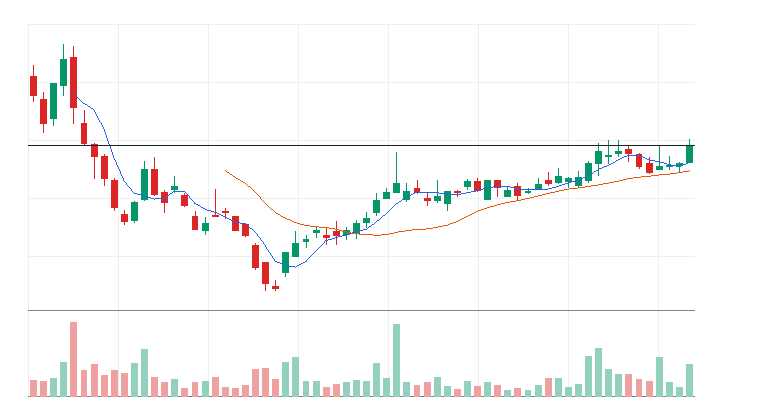
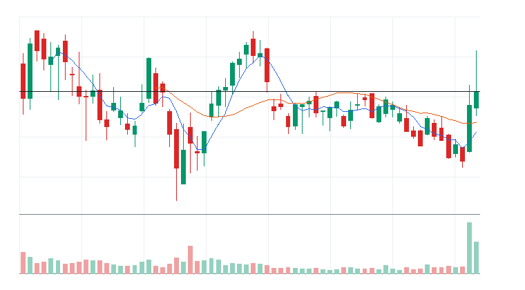

# 오늘의 데일리 트레이딩 요약

**REAL DATA TEST - 가격/거래량은 실제 데이터, 뉴스 연결, ETF 구성종목 확산도/거래대금 유동성 일부 연결**

**목적:** 이 리포트는 최근 오른 자산을 나열하는 것이 아니라, 돈이 몰리는 근거와 다음 매수 주체가 확인할 트레이딩 후보를 찾기 위한 보고서다.

> 핵심 질문: 현재 가격에서 누가 사고 있고, 누가 앞으로 더 비싸게 사줄 수 있는가?

## 시장 국면 판단

- 최종 판정: 중립-하락 (37점)
- 전일 대비: 중립-하락은 유지됐지만 점수는 전일보다 강화됐다(+5점).
- 판정 신뢰도: 높음 (100점) - 핵심 지수와 매크로 데이터가 대부분 직접 수집되어 판정 신뢰도가 높다.
- 행동 바이어스: 매크로 부담 우선, 현금 비중과 손절 기준 강화
- 한 줄 결론: 주요 지수 또는 매크로 중 하나가 약세장 쪽으로 기울었다. 반등 확인 전까지 진입 크기를 줄인다.
- 기술적 지표: 하락 압력 우위 (32점, 가중치 65%)
- KOSPI: 19점 | 50일선 위, 200일선 아래, 20일 -0.26%, 60일 -16.00%, 52주 고점 대비 -27.36% -> 기술 점수 19
- KOSDAQ: 47점 | 50일선 위, 200일선 아래, 20일 +6.93%, 60일 +1.00%, 52주 고점 대비 -28.57% -> 기술 점수 47
- 매크로 시황: 매크로 중립 (46점, 가중치 35%)
- 매크로 요약: 금리, 신용/유동성 부담으로 매크로 환경은 방어적이다.
- 금리: 부담 35점 / 금리 부담 / confidence HIGH
  - 주요 근거: US 10Y yield 20일 +10.36%, 5일 +3.50%; US long-duration bonds 20일 -5.00%, 장기채 가격 기준 할인율 부담 확인
  - 확인 사항: 장기금리 상승과 장기채 약세가 겹쳐 성장주 할인율 부담이 커질 수 있다.
- 물가: 중립 47점 / 물가 중립 / confidence MEDIUM
  - 주요 근거: Oil ETF 20일 +3.30%, 유가 기반 물가 압력 확인
  - 확인 사항: 추가 확인 이벤트 없음
- 정책: 중립 50점 / 정책 이벤트 확인 전 중립 / confidence LOW
  - 주요 근거: 정책 톤은 1차 버전에서 일정/이벤트 리스크 기반 중립값으로 반영한다.
  - 확인 사항: FOMC, BOK 금통위, CPI/PCE 발표 전후에는 매크로 confidence를 보수적으로 해석한다.
- 신용/유동성: 부담 39점 / 신용/유동성 부담 / confidence HIGH
  - 주요 근거: High yield credit 20일 -2.39%, 하이일드 위험선호 확인; VIX 20일 +7.50%, 변동성 부담 확인
  - 확인 사항: 추가 확인 이벤트 없음
- 환율/글로벌: 중립 54점 / 환율/글로벌 중립 / confidence HIGH
  - 주요 근거: USD/KRW 20일 +0.15%, 원화 안정/불안 확인; Korea equity ETF 20일 +3.97%, 한국 외국인 위험선호 프록시; KOSDAQ-KOSPI 20일 상대강도 +7.19%, 성장 위험선호 확인
  - 확인 사항: 추가 확인 이벤트 없음
- USD/KRW: 50점 | 하락 시 주식 우호; 5일 -0.15%, 20일 +0.15% -> 매크로 점수 50
- US 10Y yield: 31점 | 하락 시 주식 우호; 5일 +3.50%, 20일 +10.36% -> 매크로 점수 31
- US long-duration bonds: 39점 | 상승 시 주식 우호; 5일 -3.33%, 20일 -5.00% -> 매크로 점수 39
- Oil ETF: 46점 | 하락 시 주식 우호; 5일 -2.13%, 20일 +3.30% -> 매크로 점수 46
- High yield credit: 45점 | 상승 시 주식 우호; 5일 -1.14%, 20일 -2.39% -> 매크로 점수 45
- VIX: 32점 | 하락 시 주식 우호; 5일 +7.64%, 20일 +7.50% -> 매크로 점수 32
- Korea equity ETF: 55점 | 상승 시 주식 우호; 5일 -1.55%, 20일 +3.97% -> 매크로 점수 55
- 데이터 커버리지: 기술 2/2, 매크로 7/7
- 데이터 신뢰도 근거:
  - 직접 지수 데이터: KOSPI, KOSDAQ
  - 대체 지수 데이터 없음
  - 매크로 데이터: 7/7
  - 누락 데이터 없음
  - stale 데이터 없음

## 모바일 요약

[오늘의 데일리 트레이딩 요약]

생성 성공 / 데이터 모드: REAL_TEST

시장:
- 위험선호

시장 지배 서사:
1. Energy & Chemicals 자금 유입 - 약화 - KODEX 코스닥150(229200.KS), KODEX 200(069500.KS), 후성(093370.KS), 한솔케미칼(014680.KS) 중심으로 5일 +8.20%, 20일 +9.49% 흐름이 형성됨. 뉴스 직접성 제한.
2. IT 자금 유입 - 약화 - KODEX 코스닥150(229200.KS), KODEX 200(069500.KS), DB HiTek(000990.KS), 이수페타시스(007660.KS) 중심으로 5일 +1.54%, 20일 +8.49% 흐름이 형성됨. 뉴스 직접성 제한.
3. Industrials 자금 유입 - 약화 - KODEX 코스닥150(229200.KS), KODEX 200(069500.KS), 대한항공(003490.KS), 대한전선(001440.KS) 중심으로 5일 -0.98%, 20일 +4.52% 흐름이 형성됨. 뉴스 직접성 제한.

트렌드 강도:
1. Energy & Chemicals 자금 유입 - TSI 45 - 약화 - 진입품질 낮음
2. IT 자금 유입 - TSI 27 - 잠복 - 진입품질 낮음
3. Industrials 자금 유입 - TSI 19 - 잠복 - 진입품질 낮음

오늘 결론:
- 2차전지 소재/셀 반등 개별 종목 흐름이 ETF 대비 강한지 확인 필요
- 행동 후보는 linkedNarrative와 함께 확인한다.
- 추격보다 진입 조건 확인 후 접근한다.

오늘 실제 행동 후보:
1. 후성(093370.KS)(STOCK) - Energy & Chemicals 자금 유입 - 단기 추세가 유지되고 거래량이 1.0배 이상이면 눌림 이후 재상승을 시도할 수 있음

다크호스 후보:
1. 다크호스 후보 없음 - 조건 충족 후보 없음

ETF 후보 TOP 5:
1. KODEX 코스닥150(229200.KS) - Energy & Chemicals 자금 유입 - 거래량 확인 전 관찰
2. KODEX 200(069500.KS) - Energy & Chemicals 자금 유입 - 거래량 확인 전 관찰

웹 리포트:
https://yoolcool.github.io/DailyTradingThesisAgent/kr/

## 오늘 결론

- 오늘 결론: 조건부 진입
- 신규 진입 후보: 0개
- 조건부 진입 후보: 1개
- 관찰 후보: 196개
- 주요 제한 요인: Entry Quality < 40, 뉴스 직접성 부족, RVOL 미달
- 주문 판단: 지정가 권장 / 시장가 주의
- 실전 판단: 진입 후보는 있으나, 전일 고점 돌파와 거래량 확인 후 선별적으로 접근한다.

### 후보 제한 요인 집계

- RVOL < 1.00x: 196개
- 거래대금 유동성 낮음: 0개
- Entry Quality 50~54 near miss: 0개
- Entry Quality 40~49 관찰: 1개
- Entry Quality < 40: 201개
- Exhaustion Risk >= 70: 0개
- ETF breadth 샘플 부족: 0개
- 뉴스 직접성 부족: 197개

## 데이터 신뢰도

- 전체 데이터 신뢰도 등급: MEDIUM
- 분석 신뢰도: MEDIUM
- 주문 실행 신뢰도: MEDIUM
- ETF breadth 신뢰도: HIGH
- 신뢰도 해석: 장전/시간외 데이터 확인 불가
- 리포트 생성 시각: 2026-10-01 11:07 KST
- 가격 기준 거래일: 2026-10-01 KRX 정규장 종가
- 뉴스 수집 시각: 2026-10-01 11:07 KST
- 가장 최근 뉴스 발행 시각: 2026-09-30 00:00 KST
- 뉴스 신선도 상태: STALE
- 뉴스 소스: DART
- 뉴스 소스 상태: DART CONNECTED
- 뉴스 신뢰도: HIGH
- 추천 적용 거래일: 2026-10-01 KRX 정규장
- 가격/거래량 데이터 상태: 연결됨
- 뉴스 데이터 상태: 연결됨
- ETF 구성종목 확산도 상태: 일부 연결
- ETF 구성종목 샘플 수: 20~30
- 거래대금 유동성 데이터 상태: 일부 연결
- 장전/시간외 데이터 상태: NOT_APPLICABLE
- 데이터 provider: yfinance, DART, config fallback sample, price-volume dollar-volume fallback
- 실전 사용 경고: 이 리포트는 투자판단 보조용이며, REAL_TEST 모드에서는 일부 데이터가 누락되거나 지연될 수 있다. 실제 주문 전 현재가, 뉴스, 장전/시간외 가격과 정규장 거래대금을 별도 확인해야 한다.

## 0. 시장 상태

- 데이터 모드: REAL_TEST
- 가격/거래량: 연결됨
- 뉴스: 연결됨
- ETF 구성종목 확산도: 일부 연결
- 거래대금 유동성: 일부 연결
- 생성 시각: 2026년 10월 1일 목요일 오전 11:07
- 시장 상태: 위험선호
- 오늘 돈의 방향: 2차전지 소재/셀 반등 개별 종목 흐름이 ETF 대비 강한지 확인 필요
- 강한 테마 TOP 3: 2차전지 소재/셀 반등(92), 성장/테마 ETF(21), 바이오/헬스케어 실적 전환(16)
- 데이터 한계:
  - API 또는 provider 상태에 따라 뉴스/ETF 확산도/거래대금 유동성 반영 범위가 달라질 수 있다.
  - 수집 실패 데이터는 점수 반영에서 제외하거나 confidence를 제한한다.
  - reasonConfidence HIGH는 직접 촉매, 가격/거래량, 확산도/유동성 근거가 함께 있을 때만 사용한다.

## 오늘 시장을 지배하는 서사

### 오늘 시장을 지배하는 서사 TOP 3

#### 1. Energy & Chemicals 자금 유입
- 상태: 약화
- narrativeScore: 26
- reasonConfidence: LOW
- 근거 ETF: KODEX 코스닥150(229200.KS), KODEX 200(069500.KS)
- 근거 개별 종목: 후성(093370.KS), 한솔케미칼(014680.KS), SK이노베이션(096770.KS), S-Oil(010950.KS), 롯데케미칼(011170.KS)
- 돈이 몰리는 이유: Energy & Chemicals 자금 유입 관련 KODEX 코스닥150(229200.KS), KODEX 200(069500.KS)와 후성(093370.KS), 한솔케미칼(014680.KS), SK이노베이션(096770.KS), S-Oil(010950.KS)의 5일(+8.20%)·20일(+9.49%) 흐름을 함께 본다. 평균 상대 거래량은 0.53배이고, ETF 확산도도 이를 보조한다. 뉴스 직접성은 아직 제한적이다.
- 다음 매수 주체: Energy & Chemicals 자금 유입을 확인한 섹터 ETF 자금과 상대강도 추종 스윙 자금
- 가장 좋은 트레이딩 수단: ETF 우선: KODEX 200(069500.KS), KODEX 코스닥150(229200.KS) / 개별 종목 우선: 후성(093370.KS), 롯데케미칼(011170.KS), SK이노베이션(096770.KS)
- 서사가 깨지는 조건: 069500.KS 20일선 이탈 또는 관련 종목 절반 이상 5일선 이탈
- 오늘 행동: 기존 네러티브와 중복을 확인한 뒤 ETF/대표 종목 동조성이 살아날 때만 관찰 편입

상세 narrativeScore 근거 보기

- rawScore: 26
- ETF 평균 moneyFlowScore: 21
- 개별 종목 평균 moneyFlowScore: 33
- ETF 후보 비율: 0%
- 개별 종목 후보 비율: 14%
- 5일 평균 수익률: +8.00%
- 20일 평균 수익률: +9.00%
- 평균 상대 거래량: 1.00배
- ETF 평균 상대 거래량: 0.00배
- 개별주 평균 상대 거래량: 1.00배
- 52주 고점 근접 후보 비율: 0%
- 뉴스 직접성 점수: -1
- ETF 확산도 점수: 2
- 유동성 점수: 3
- 과열 리스크 차감: 0

#### 2. IT 자금 유입
- 상태: 약화
- narrativeScore: 14
- reasonConfidence: LOW
- 근거 ETF: KODEX 코스닥150(229200.KS), KODEX 200(069500.KS)
- 근거 개별 종목: 000990.KS, 이수페타시스(007660.KS), SK스퀘어(402340.KS), LG전자(066570.KS)
- 돈이 몰리는 이유: IT 자금 유입 관련 KODEX 코스닥150(229200.KS), KODEX 200(069500.KS)와 DB HiTek(000990.KS), 이수페타시스(007660.KS), SK스퀘어(402340.KS), LG전자(066570.KS)의 5일(+1.54%)·20일(+8.49%) 흐름을 함께 본다. 평균 상대 거래량은 0.34배이고, ETF 확산도도 이를 보조한다. 뉴스 직접성은 아직 제한적이다.
- 다음 매수 주체: IT 자금 유입을 확인한 섹터 ETF 자금과 상대강도 추종 스윙 자금
- 가장 좋은 트레이딩 수단: ETF 우선: KODEX 200(069500.KS), KODEX 코스닥150(229200.KS) / 개별 종목 우선: 000990.KS, SK스퀘어(402340.KS), 이수페타시스(007660.KS)
- 서사가 깨지는 조건: 069500.KS 20일선 이탈 또는 관련 종목 절반 이상 5일선 이탈
- 오늘 행동: 기존 네러티브와 중복을 확인한 뒤 ETF/대표 종목 동조성이 살아날 때만 관찰 편입

상세 narrativeScore 근거 보기

- rawScore: 14
- ETF 평균 moneyFlowScore: 21
- 개별 종목 평균 moneyFlowScore: 18
- ETF 후보 비율: 0%
- 개별 종목 후보 비율: 0%
- 5일 평균 수익률: +2.00%
- 20일 평균 수익률: +8.00%
- 평균 상대 거래량: 0.00배
- ETF 평균 상대 거래량: 0.00배
- 개별주 평균 상대 거래량: 0.00배
- 52주 고점 근접 후보 비율: 0%
- 뉴스 직접성 점수: 1
- ETF 확산도 점수: 2
- 유동성 점수: 3
- 과열 리스크 차감: 0

#### 3. Industrials 자금 유입
- 상태: 약화
- narrativeScore: 11
- reasonConfidence: LOW
- 근거 ETF: KODEX 코스닥150(229200.KS), KODEX 200(069500.KS)
- 근거 개별 종목: 대한항공(003490.KS), 대한전선(001440.KS)
- 돈이 몰리는 이유: Industrials 자금 유입 관련 KODEX 코스닥150(229200.KS), KODEX 200(069500.KS)와 대한항공(003490.KS), 대한전선(001440.KS)의 5일(-0.98%)·20일(+4.52%) 흐름을 함께 본다. 평균 상대 거래량은 0.34배이고, ETF 확산도도 이를 보조한다. 뉴스 직접성은 아직 제한적이다.
- 다음 매수 주체: Industrials 자금 유입을 확인한 섹터 ETF 자금과 상대강도 추종 스윙 자금
- 가장 좋은 트레이딩 수단: ETF 우선: KODEX 200(069500.KS), KODEX 코스닥150(229200.KS) / 개별 종목 우선: 대한전선(001440.KS), 대한항공(003490.KS)
- 서사가 깨지는 조건: 069500.KS 20일선 이탈 또는 관련 종목 절반 이상 5일선 이탈
- 오늘 행동: 기존 네러티브와 중복을 확인한 뒤 ETF/대표 종목 동조성이 살아날 때만 관찰 편입

상세 narrativeScore 근거 보기

- rawScore: 11
- ETF 평균 moneyFlowScore: 21
- 개별 종목 평균 moneyFlowScore: 14
- ETF 후보 비율: 0%
- 개별 종목 후보 비율: 0%
- 5일 평균 수익률: -1.00%
- 20일 평균 수익률: +5.00%
- 평균 상대 거래량: 0.00배
- ETF 평균 상대 거래량: 0.00배
- 개별주 평균 상대 거래량: 0.00배
- 52주 고점 근접 후보 비율: 25%
- 뉴스 직접성 점수: 1
- ETF 확산도 점수: 2
- 유동성 점수: 4
- 과열 리스크 차감: 0

### 전체 narrative 요약

| 서사명 | 상태 | narrativeScore | reasonConfidence | 대표 ETF | 대표 종목 | 오늘 행동 |
| --- | --- | ---: | --- | --- | --- | --- |
| Energy & Chemicals 자금 유입 | 약화 | 26 | LOW | KODEX 코스닥150(229200.KS), KODEX 200(069500.KS) | 후성(093370.KS), 한솔케미칼(014680.KS), SK이노베이션(096770.KS), S-Oil(010950.KS) | 기존 네러티브와 중복을 확인한 뒤 ETF/대표 종목 동조성이 살아날 때만 관찰 편입 |
| IT 자금 유입 | 약화 | 14 | LOW | KODEX 코스닥150(229200.KS), KODEX 200(069500.KS) | 000990.KS, 이수페타시스(007660.KS), SK스퀘어(402340.KS), LG전자(066570.KS) | 기존 네러티브와 중복을 확인한 뒤 ETF/대표 종목 동조성이 살아날 때만 관찰 편입 |
| Industrials 자금 유입 | 약화 | 11 | LOW | KODEX 코스닥150(229200.KS), KODEX 200(069500.KS) | 대한항공(003490.KS), 대한전선(001440.KS) | 기존 네러티브와 중복을 확인한 뒤 ETF/대표 종목 동조성이 살아날 때만 관찰 편입 |
| Heavy Industries 자금 유입 | 약화 | 3 | LOW | KODEX 코스닥150(229200.KS), KODEX 200(069500.KS) | 산일전기(062040.KS), 현대로템(064350.KS) | 기존 네러티브와 중복을 확인한 뒤 ETF/대표 종목 동조성이 살아날 때만 관찰 편입 |
| Constructions 자금 유입 | 약화 | 2 | LOW | KODEX 코스닥150(229200.KS), KODEX 200(069500.KS) | DL이앤씨(375500.KS), 삼성E&A(028050.KS) | 기존 네러티브와 중복을 확인한 뒤 ETF/대표 종목 동조성이 살아날 때만 관찰 편입 |
| 소비 회복/방어주 선별 | 약화 | 2 | LOW | KODEX 코스닥150(229200.KS), KODEX 200(069500.KS) | F&F(383220.KS), 코웨이(021240.KS), 롯데쇼핑(023530.KS), 한샘(009240.KS) | 기존 네러티브와 중복을 확인한 뒤 ETF/대표 종목 동조성이 살아날 때만 관찰 편입 |
| 전력 유틸리티 수요 재평가 | 약화 | 2 | LOW | KODEX 코스닥150(229200.KS), KODEX 200(069500.KS) | 효성중공업(298040.KS), LS ELECTRIC(010120.KS) | 기존 네러티브와 중복을 확인한 뒤 ETF/대표 종목 동조성이 살아날 때만 관찰 편입 |
| 2차전지 소재/셀 반등 | 약화 | 1 | LOW | KODEX 코스닥150(229200.KS), KODEX 200(069500.KS) | 에코프로머티(450080.KS), LG에너지솔루션(373220.KS), 삼성SDI(006400.KS), 포스코퓨처엠(003670.KS) | 추세 전환보다 반등 성격으로 접근하고, 상대 거래량이 살아나는 종목만 단기 관찰 |
| Communication Services 자금 유입 | 약화 | 1 | LOW | KODEX 코스닥150(229200.KS), KODEX 200(069500.KS) | SK텔레콤(017670.KS), KT(030200.KS) | 기존 네러티브와 중복을 확인한 뒤 ETF/대표 종목 동조성이 살아날 때만 관찰 편입 |
| Internet platform 자금 유입 | 약화 | 0 | LOW | KODEX 코스닥150(229200.KS), KODEX 200(069500.KS) | NAVER(035420.KS), 카카오(035720.KS) | 기존 네러티브와 중복을 확인한 뒤 ETF/대표 종목 동조성이 살아날 때만 관찰 편입 |
| AI 반도체/HBM 공급망 | 약화 | 0 | LOW | KODEX 200(069500.KS) | 한미반도체(042700.KS), 삼성전기(009150.KS), SK하이닉스(000660.KS), 삼성전자(005930.KS) | 추격보다 SK하이닉스/삼성전자 동조성과 거래대금 회복을 확인한 뒤 눌림 구간에서 선별 |
| Steels & Materials 자금 유입 | 약화 | 0 | LOW | KODEX 코스닥150(229200.KS), KODEX 200(069500.KS) | 영풍(000670.KS), 현대제철(004020.KS) | 기존 네러티브와 중복을 확인한 뒤 ETF/대표 종목 동조성이 살아날 때만 관찰 편입 |
| 인터넷/게임/엔터 성장주 | 소멸 | 0 | LOW | KODEX 코스닥150(229200.KS), KODEX 200(069500.KS) | NAVER(035420.KS), 카카오(035720.KS), 크래프톤(259960.KS), 하이브(352820.KS) | 지수 위험선호가 유지될 때만 선별 진입, 대형 플랫폼은 실적 반응을 우선 확인 |
| Financials 자금 유입 | 소멸 | 0 | LOW | KODEX 코스닥150(229200.KS), KODEX 200(069500.KS) | DB손해보험(005830.KS), 현대해상(001450.KS), 한화생명(088350.KS), iM금융지주(139130.KS) | 기존 네러티브와 중복을 확인한 뒤 ETF/대표 종목 동조성이 살아날 때만 관찰 편입 |
| 바이오/헬스케어 실적 전환 | 약화 | 0 | LOW | KODEX 200(069500.KS) | 한미약품(128940.KS), 셀트리온(068270.KS), 삼성바이오로직스(207940.KS), 유한양행(000100.KS) | 뉴스 촉매와 거래량이 동반될 때만 관찰 편입, 이벤트 소멸 후 추격은 금지 |
| 지주/배당/자사주 재평가 | 약화 | 0 | LOW | KODEX 200(069500.KS) | 두산(000150.KS), SK(034730.KS), LG(003550.KS), 롯데지주(004990.KS) | 강한 시장에서는 후순위, 변동성 확대 구간에서 방어적 재평가 후보로 관찰 |
| 조선/방산 수주 사이클 | 소멸 | 0 | LOW | KODEX 200(069500.KS) | 한화오션(042660.KS), HD현대중공업(329180.KS), 한화에어로스페이스(012450.KS), 한국항공우주(047810.KS) | 수주 공시나 업황 뉴스가 직접 확인될 때만 추세 추종, 과열 구간은 신규 진입 보류 |
| 금융/밸류업 주주환원 | 소멸 | 0 | LOW | KODEX 200(069500.KS) | KB금융(105560.KS), 신한지주(055550.KS), 하나금융지주(086790.KS), 우리금융지주(316140.KS) | 지수 변동성이 커질 때 방어적 대안으로 관찰하고, 급등 후에는 배당락/정책 뉴스 확인 |
| 자동차/부품 수출 모멘텀 | 소멸 | 0 | LOW | KODEX 200(069500.KS) | 현대모비스(012330.KS), 현대차(005380.KS), 기아(000270.KS), 현대위아(011210.KS) | 완성차 쌍두마차가 시장 대비 강할 때만 부품주까지 확산 여부를 확인 |
| 화장품/음식료 수출 소비재 | 소멸 | 0 | LOW | KODEX 200(069500.KS) | 한국콜마(161890.KS), 아모레퍼시픽(090430.KS), LG생활건강(051900.KS), 삼양식품(003230.KS) | 실적 기대와 가격 반응이 같이 나타나는 종목만 선별, 단기 급등주는 눌림 대기 |
| 전력기기/인프라 투자 | 소멸 | 0 | LOW | KODEX 200(069500.KS) | HD현대일렉트릭(267260.KS), LS ELECTRIC(010120.KS), 효성중공업(298040.KS), HD현대(267250.KS) | 강한 종목을 추격하기보다 거래대금 유지와 5일선 재지지를 확인 |

## 트렌드 강도 판단

### 1. Energy & Chemicals 자금 유입
- Trend Strength Index: 45
- 트렌드 상태 라벨: 약화
- 테마 확산도: 약함
- ETF 동조성: 보통
- 거래량 강도: 부족
- 과열 위험: 낮음 (18)
- 오늘 진입 품질: 낮음 (26)
- 한 줄 판단: Energy & Chemicals 자금 유입는 관찰 가능한 흐름은 있으나 가격, 거래량, 확산도 중 일부 확인이 더 필요하다.
- 오늘 접근법: 상승률이 남아 있어도 KODEX 코스닥150(229200.KS)/KODEX 200(069500.KS)와 구성 종목 확산도가 회복될 때까지 신규 진입은 낮춘다.

트렌드 강도 상세 근거 보기

- 가격 모멘텀: 가격 모멘텀 19/25. 평균 5D +8.20%, 20D +9.49%.
- 거래량 강도: 거래량 강도 4/20. 평균 RVOL 0.53배.
- ETF 동조성: ETF 동조성 8/15. 관련 ETF KODEX 200(069500.KS), KODEX 코스닥150(229200.KS) 흐름을 기준으로 판단.
- 테마 확산도: 테마 확산도 7/20. 상위 1~2개 쏠림 감점 3점 반영.
- 뉴스 촉매: 뉴스/촉매 신선도 1/10. HIGH 직접 촉매 0개.
- 과열 리스크: 과열 리스크 18/100. 단기 급등, 고점 근접, ETF-개별주 괴리, 쏠림을 함께 반영.
- 시장 환경: 시장 환경 6/10. KOSPI200/KODEX 200/KODEX KOSDAQ150 가격 흐름 기반 위험선호 점수.

### 2. IT 자금 유입
- Trend Strength Index: 27
- 트렌드 상태 라벨: 잠복
- 테마 확산도: 부족
- ETF 동조성: 보통
- 거래량 강도: 부족
- 과열 위험: 낮음 (18)
- 오늘 진입 품질: 낮음 (14)
- 한 줄 판단: IT 자금 유입는 테마 확산도가 낮아 아직 개별 종목 이벤트성 흐름에 가깝다.
- 오늘 접근법: KODEX 코스닥150(229200.KS)/KODEX 200(069500.KS)와 DB HiTek(000990.KS)/이수페타시스(007660.KS)/SK스퀘어(402340.KS)의 거래량 확산이 확인되기 전까지 관찰한다.

트렌드 강도 상세 근거 보기

- 가격 모멘텀: 가격 모멘텀 7/25. 평균 5D +1.54%, 20D +8.49%.
- 거래량 강도: 거래량 강도 3/20. 평균 RVOL 0.34배.
- ETF 동조성: ETF 동조성 8/15. 관련 ETF KODEX 200(069500.KS), KODEX 코스닥150(229200.KS) 흐름을 기준으로 판단.
- 테마 확산도: 테마 확산도 3/20. 상위 1~2개 쏠림 감점 6점 반영.
- 뉴스 촉매: 뉴스/촉매 신선도 0/10. HIGH 직접 촉매 0개.
- 과열 리스크: 과열 리스크 18/100. 단기 급등, 고점 근접, ETF-개별주 괴리, 쏠림을 함께 반영.
- 시장 환경: 시장 환경 6/10. KOSPI200/KODEX 200/KODEX KOSDAQ150 가격 흐름 기반 위험선호 점수.

### 3. Industrials 자금 유입
- Trend Strength Index: 19
- 트렌드 상태 라벨: 잠복
- 테마 확산도: 부족
- ETF 동조성: 보통
- 거래량 강도: 부족
- 과열 위험: 낮음 (18)
- 오늘 진입 품질: 낮음 (10)
- 한 줄 판단: Industrials 자금 유입는 테마 확산도가 낮아 아직 개별 종목 이벤트성 흐름에 가깝다.
- 오늘 접근법: KODEX 코스닥150(229200.KS)/KODEX 200(069500.KS)와 대한항공(003490.KS)/대한전선(001440.KS)의 거래량 확산이 확인되기 전까지 관찰한다.

트렌드 강도 상세 근거 보기

- 가격 모멘텀: 가격 모멘텀 0/25. 평균 5D -0.98%, 20D +4.52%.
- 거래량 강도: 거래량 강도 3/20. 평균 RVOL 0.34배.
- ETF 동조성: ETF 동조성 8/15. 관련 ETF KODEX 200(069500.KS), KODEX 코스닥150(229200.KS) 흐름을 기준으로 판단.
- 테마 확산도: 테마 확산도 2/20. 상위 1~2개 쏠림 감점 6점 반영.
- 뉴스 촉매: 뉴스/촉매 신선도 0/10. HIGH 직접 촉매 0개.
- 과열 리스크: 과열 리스크 18/100. 단기 급등, 고점 근접, ETF-개별주 괴리, 쏠림을 함께 반영.
- 시장 환경: 시장 환경 6/10. KOSPI200/KODEX 200/KODEX KOSDAQ150 가격 흐름 기반 위험선호 점수.

## 최근 추천 결과 트래킹

개별주는 데이트레이딩 관점으로 추천 이후 첫 정규장의 장중 최고가와 종가를 추적한다. ETF는 테마/스윙 관점으로 추천 이후 1주일 동안의 최고가와 현재 종가를 추적한다.

### 개별주 Top 3 추천 성과 요약
- 최근 5개 리포트 표본: 6개 (초기 검증 단계)
- 장중 최고가 기준 성공률: +33.33%
- 종가 기준 성공률: 0.00%
- 평균 장중 최고 수익률: +2.55%
- 평균 종가 수익률: -0.97%

### ETF 추천 성과 요약
- 최근 5개 리포트 표본: 0개 (초기 검증 단계)
- 1주 최고가 기준 성공률: 데이터 없음
- 현재 종가 기준 성공률: 데이터 없음
- 평균 1주 최고 수익률: 데이터 없음
- 평균 현재 수익률: 데이터 없음

최근 추천 결과 상세 테이블 펼치기

| 추천일 | 유형 | 순위 | 티커 | 기준가 | 추적 기간 | 상태 | High 수익률 | Close 수익률 | 결과 | 코멘트 |
| --- | --- | ---: | --- | ---: | --- | --- | ---: | ---: | --- | --- |
| 2026-10-01 | STOCK | 1 | 후성(093370.KS) | $15,590 | 2026-10-01 | complete | +2.12% | 0.00% | 제한적 유효 | 제한적인 장중 기회만 발생 (일봉 기준) |
| 2026-09-30 | STOCK | 1 | 세아제강지주(003030.KS) | $119,400 | 2026-09-30 | complete | +1.17% | -1.51% | 제한적 유효 | 제한적인 장중 기회만 발생 (일봉 기준) |
| 2026-09-25 | STOCK | 2 | SK스퀘어(402340.KS) | $1,190,000 | 2026-09-25 | pending | 데이터 없음 | 데이터 없음 | 추적 대기 | 아직 추적 거래일 데이터가 완성되지 않음 |
| 2026-09-25 | STOCK | 1 | 대한항공(003490.KS) | $31,500 | 2026-09-25 | pending | 데이터 없음 | 데이터 없음 | 추적 대기 | 아직 추적 거래일 데이터가 완성되지 않음 |
| 2026-09-24 | STOCK | 1 | SK스퀘어(402340.KS) | $1,190,000 | 2026-09-24 | pending | 데이터 없음 | 데이터 없음 | 추적 대기 | 아직 추적 거래일 데이터가 완성되지 않음 |
| 2026-09-22 | STOCK | 1 | 대한전선(001440.KS) | $32,050 | 2026-09-22 | complete | +4.37% | -1.40% | 단타 유효 | 장중 기회는 있었지만 종가 유지력은 약함 (일봉 기준) |
| 2026-09-18 | STOCK | 2 | 대한전선(001440.KS) | $31,450 | 2026-09-18 | complete | +1.91% | 0.00% | 제한적 유효 | 제한적인 장중 기회만 발생 (일봉 기준) |
| 2026-09-18 | STOCK | 1 | 삼성E&A(028050.KS) | $54,700 | 2026-09-18 | complete | +0.91% | -5.30% | 실패 | 추천 이후 의미 있는 장중 기회가 부족하고 종가도 약함 (일봉 기준) |
| 2026-09-15 | STOCK | 1 | 후성(093370.KS) | $14,830 | 2026-09-15 | complete | +2.83% | -0.34% | 제한적 유효 | 제한적인 장중 기회만 발생 (일봉 기준) |
| 2026-09-14 | STOCK | 1 | 영풍(000670.KS) | $48,850 | 2026-09-14 | complete | +2.25% | +2.25% | 제한적 유효 | 제한적인 장중 기회만 발생 (일봉 기준) |
| 2026-09-08 | STOCK | 2 | 대우건설(047040.KS) | $19,750 | 2026-09-08 | complete | +7.85% | +1.11% | 성공 | 장중 기회와 종가 유지가 모두 확인됨 (일봉 기준) |
| 2026-09-08 | STOCK | 1 | 한전기술(052690.KS) | $138,900 | 2026-09-08 | complete | +6.19% | +2.66% | 성공 | 장중 기회와 종가 유지가 모두 확인됨 (일봉 기준) |
| 2026-09-04 | STOCK | 1 | S-Oil(010950.KS) | $161,900 | 2026-09-04 | complete | +1.73% | -2.84% | 제한적 유효 | 제한적인 장중 기회만 발생 (일봉 기준) |
| 2026-09-03 | STOCK | 1 | 한화생명(088350.KS) | $6,460 | 2026-09-03 | complete | +1.39% | -5.42% | 제한적 유효 | 제한적인 장중 기회만 발생 (일봉 기준) |
| 2026-09-01 | STOCK | 1 | 이수스페셜티케미컬(457190.KS) | $72,300 | 2026-09-01 | complete | +4.70% | -3.73% | 단타 유효 | 장중 기회는 있었지만 종가 유지력은 약함 (일봉 기준) |
| 2026-08-28 | STOCK | 3 | 율촌화학(008730.KS) | $16,800 | 2026-08-28 | complete | +0.33% | 0.00% | 추적 대기 | 아직 추적 거래일 데이터가 완성되지 않음 (일봉 기준) |
| 2026-08-28 | STOCK | 2 | 롯데웰푸드(280360.KS) | $146,300 | 2026-08-28 | complete | +1.16% | 0.00% | 제한적 유효 | 제한적인 장중 기회만 발생 (일봉 기준) |
| 2026-08-28 | STOCK | 1 | 코스맥스(192820.KS) | $303,000 | 2026-08-28 | complete | +0.99% | 0.00% | 추적 대기 | 아직 추적 거래일 데이터가 완성되지 않음 (일봉 기준) |
| 2026-08-27 | STOCK | 3 | 삼성SDI(006400.KS) | $568,000 | 2026-08-27 | complete | +0.53% | +0.18% | 추적 대기 | 아직 추적 거래일 데이터가 완성되지 않음 (일봉 기준) |
| 2026-08-27 | STOCK | 2 | 두산에너빌리티(034020.KS) | $86,500 | 2026-08-27 | complete | +1.39% | -0.69% | 제한적 유효 | 제한적인 장중 기회만 발생 (일봉 기준) |
| 2026-08-27 | STOCK | 1 | 포스코퓨처엠(003670.KS) | $184,200 | 2026-08-27 | complete | +1.47% | -0.11% | 제한적 유효 | 제한적인 장중 기회만 발생 (일봉 기준) |
| 2026-08-26 | STOCK | 3 | 엘앤에프(066970.KS) | $120,400 | 2026-08-26 | complete | +2.57% | +1.50% | 제한적 유효 | 제한적인 장중 기회만 발생 (일봉 기준) |
| 2026-08-26 | STOCK | 2 | 풍산(103140.KS) | $87,600 | 2026-08-26 | complete | -0.57% | -5.94% | 실패 | 추천 이후 의미 있는 장중 기회가 부족하고 종가도 약함 (일봉 기준) |
| 2026-08-26 | STOCK | 1 | 롯데웰푸드(280360.KS) | $135,200 | 2026-08-26 | complete | +6.14% | +3.48% | 성공 | 장중 기회와 종가 유지가 모두 확인됨 (일봉 기준) |
| 2026-08-25 | STOCK | 3 | 엘앤에프(066970.KS) | $121,600 | 2026-08-25 | complete | +2.96% | -0.99% | 제한적 유효 | 제한적인 장중 기회만 발생 (일봉 기준) |
| 2026-08-25 | STOCK | 2 | 팬오션(028670.KS) | $6,320 | 2026-08-25 | complete | +3.32% | +0.95% | 단타 유효 | 장중 기회는 있었지만 종가 유지력은 약함 (일봉 기준) |
| 2026-08-25 | STOCK | 1 | 코스맥스(192820.KS) | $286,000 | 2026-08-25 | complete | +1.05% | +1.05% | 제한적 유효 | 제한적인 장중 기회만 발생 (일봉 기준) |
| 2026-08-24 | STOCK | 1 | 코스맥스(192820.KS) | $271,000 | 2026-08-24 | complete | +6.27% | +5.54% | 성공 | 장중 기회와 종가 유지가 모두 확인됨 (일봉 기준) |
| 2026-08-21 | STOCK | 3 | 코스맥스(192820.KS) | $260,500 | 2026-08-21 | complete | +5.18% | +4.03% | 성공 | 장중 기회와 종가 유지가 모두 확인됨 (일봉 기준) |
| 2026-08-21 | STOCK | 2 | 삼양식품(003230.KS) | $1,397,000 | 2026-08-21 | complete | +0.79% | -2.22% | 실패 | 추천 이후 의미 있는 장중 기회가 부족하고 종가도 약함 (일봉 기준) |
| 2026-08-21 | STOCK | 1 | 농심(004370.KS) | $441,000 | 2026-08-21 | complete | 0.00% | -1.93% | 실패 | 추천 이후 의미 있는 장중 기회가 부족하고 종가도 약함 (일봉 기준) |
| 2026-08-20 | STOCK | 3 | 한화에어로스페이스(012450.KS) | $1,177,000 | 2026-08-20 | complete | +3.06% | -0.85% | 단타 유효 | 장중 기회는 있었지만 종가 유지력은 약함 (일봉 기준) |
| 2026-08-20 | STOCK | 2 | DB손해보험(005830.KS) | $187,500 | 2026-08-20 | complete | -1.60% | -5.39% | 실패 | 추천 이후 의미 있는 장중 기회가 부족하고 종가도 약함 (일봉 기준) |
| 2026-08-20 | STOCK | 1 | 현대해상(001450.KS) | $50,000 | 2026-08-20 | complete | +0.40% | -2.30% | 실패 | 추천 이후 의미 있는 장중 기회가 부족하고 종가도 약함 (일봉 기준) |
| 2026-08-19 | STOCK | 3 | 한화생명(088350.KS) | $5,520 | 2026-08-19 | complete | +1.09% | -3.26% | 제한적 유효 | 제한적인 장중 기회만 발생 (일봉 기준) |
| 2026-08-19 | STOCK | 2 | GS(078930.KS) | $119,300 | 2026-08-19 | complete | +1.26% | +0.34% | 제한적 유효 | 제한적인 장중 기회만 발생 (일봉 기준) |
| 2026-08-19 | STOCK | 1 | 코스맥스(192820.KS) | $239,000 | 2026-08-19 | complete | +4.60% | +2.93% | 성공 | 장중 기회와 종가 유지가 모두 확인됨 (일봉 기준) |
| 2026-08-18 | STOCK | 3 | LG CNS(064400.KS) | $79,900 | 2026-08-18 | complete | +5.01% | -7.51% | 단타 유효 | 장중 기회는 있었지만 종가 유지력은 약함 (일봉 기준) |
| 2026-08-18 | STOCK | 2 | 세아베스틸지주(001430.KS) | $45,000 | 2026-08-18 | complete | +2.78% | -4.22% | 제한적 유효 | 제한적인 장중 기회만 발생 (일봉 기준) |
| 2026-08-18 | STOCK | 1 | 현대해상(001450.KS) | $45,350 | 2026-08-18 | complete | +10.80% | +9.59% | 성공 | 장중 기회와 종가 유지가 모두 확인됨 (일봉 기준) |
| 2026-08-17 | STOCK | 3 | 한국콜마(161890.KS) | $136,700 | 2026-08-17 | pending | 데이터 없음 | 데이터 없음 | 추적 대기 | 아직 추적 거래일 데이터가 완성되지 않음 |
| 2026-08-17 | STOCK | 2 | LG(003550.KS) | $120,000 | 2026-08-17 | pending | 데이터 없음 | 데이터 없음 | 추적 대기 | 아직 추적 거래일 데이터가 완성되지 않음 |
| 2026-08-17 | STOCK | 1 | 현대해상(001450.KS) | $45,350 | 2026-08-17 | pending | 데이터 없음 | 데이터 없음 | 추적 대기 | 아직 추적 거래일 데이터가 완성되지 않음 |
| 2026-08-14 | STOCK | 3 | 코스맥스(192820.KS) | $249,000 | 2026-08-14 | complete | +0.80% | -0.60% | 실패 | 추천 이후 의미 있는 장중 기회가 부족하고 종가도 약함 (일봉 기준) |
| 2026-08-14 | STOCK | 2 | GS(078930.KS) | $107,400 | 2026-08-14 | complete | +10.52% | +8.94% | 성공 | 장중 기회와 종가 유지가 모두 확인됨 (일봉 기준) |
| 2026-08-14 | STOCK | 1 | 현대해상(001450.KS) | $42,950 | 2026-08-14 | complete | +6.64% | +5.59% | 성공 | 장중 기회와 종가 유지가 모두 확인됨 (일봉 기준) |
| 2026-08-13 | STOCK | 3 | 한화에어로스페이스(012450.KS) | $1,156,000 | 2026-08-13 | complete | +4.93% | +2.51% | 성공 | 장중 기회와 종가 유지가 모두 확인됨 (일봉 기준) |
| 2026-08-13 | STOCK | 2 | 코스맥스(192820.KS) | $249,500 | 2026-08-13 | complete | +5.01% | -0.20% | 단타 유효 | 장중 기회는 있었지만 종가 유지력은 약함 (일봉 기준) |
| 2026-08-13 | STOCK | 1 | GS(078930.KS) | $101,000 | 2026-08-13 | complete | +11.88% | +6.34% | 성공 | 장중 기회와 종가 유지가 모두 확인됨 (일봉 기준) |
| 2026-08-12 | STOCK | 3 | 지역난방공사(071320.KS) | $75,100 | 2026-08-12 | complete | +2.40% | +0.13% | 제한적 유효 | 제한적인 장중 기회만 발생 (일봉 기준) |
| 2026-08-12 | STOCK | 2 | BGF리테일(282330.KS) | $150,500 | 2026-08-12 | complete | +1.00% | -3.32% | 제한적 유효 | 제한적인 장중 기회만 발생 (일봉 기준) |
| 2026-08-12 | STOCK | 1 | 고려아연(010130.KS) | $1,229,000 | 2026-08-12 | complete | +0.90% | -1.14% | 실패 | 추천 이후 의미 있는 장중 기회가 부족하고 종가도 약함 (일봉 기준) |
| 2026-08-11 | STOCK | 3 | 세아베스틸지주(001430.KS) | $43,050 | 2026-08-11 | complete | +0.46% | -4.07% | 실패 | 추천 이후 의미 있는 장중 기회가 부족하고 종가도 약함 (일봉 기준) |
| 2026-08-11 | STOCK | 2 | 현대해상(001450.KS) | $41,000 | 2026-08-11 | complete | +10.49% | +7.44% | 성공 | 장중 기회와 종가 유지가 모두 확인됨 (일봉 기준) |
| 2026-08-11 | STOCK | 1 | OCI홀딩스(010060.KS) | $284,500 | 2026-08-11 | complete | -0.35% | -3.87% | 실패 | 추천 이후 의미 있는 장중 기회가 부족하고 종가도 약함 (일봉 기준) |
| 2026-08-10 | STOCK | 3 | 풍산(103140.KS) | $83,600 | 2026-08-10 | complete | +4.67% | +3.59% | 성공 | 장중 기회와 종가 유지가 모두 확인됨 (일봉 기준) |
| 2026-08-10 | STOCK | 2 | HS효성첨단소재(298050.KS) | $183,200 | 2026-08-10 | complete | +2.89% | +0.49% | 제한적 유효 | 제한적인 장중 기회만 발생 (일봉 기준) |
| 2026-08-10 | STOCK | 1 | 세아베스틸지주(001430.KS) | $41,600 | 2026-08-10 | complete | +4.09% | +3.49% | 성공 | 장중 기회와 종가 유지가 모두 확인됨 (일봉 기준) |
| 2026-08-06 | STOCK | 3 | 풍산(103140.KS) | $80,700 | 2026-08-06 | complete | +6.82% | +3.84% | 성공 | 장중 기회와 종가 유지가 모두 확인됨 (일봉 기준) |
| 2026-08-06 | STOCK | 2 | 세아베스틸지주(001430.KS) | $40,800 | 2026-08-06 | complete | +0.49% | -1.84% | 실패 | 추천 이후 의미 있는 장중 기회가 부족하고 종가도 약함 (일봉 기준) |

## 오늘 실제 행동 후보

### 1. 후성(093370.KS)
- 자산 유형: STOCK
- linkedNarrative: Energy & Chemicals 자금 유입
- narrativeStatus: 약화
- narrativeScore: 26
- Trend Strength Index: 45
- Exhaustion Risk: 18 (낮음)
- Entry Quality Score: 41 (관찰)
- 트렌드 판단: 시장 위험선호가 약해 시장 환경 비우호 구간이다.
- moneyFlowScore: 92
- finalRawScore: 92
- reasonConfidence: MEDIUM
- reasonConfidenceExplanation: 직접 촉매 부재, 뉴스 미사용 때문에 HIGH가 아니라 MEDIUM으로 제한했다.
- tieBreakerReason: 최종 원점수 92, 리스크 패널티 0, 5일 수익률 +14.63%, 상대 거래량 1.40배 순으로 정렬
- 후보별 시장 해석: 위험선호 / 제한적 - 전체 시장은 위험선호 / Entry Quality 41 < 50이나 moneyFlow 92, confidence MEDIUM, RVOL 1.40x로 강한 자금흐름 예외 조건 충족
- 게이트 사유: Entry Quality 41 < 50이나 moneyFlow 92, confidence MEDIUM, RVOL 1.40x로 강한 자금흐름 예외 조건 충족
- 주문 실행: 시장가 가능

- 왜 돈이 몰리는가: 20일 +22.76%, 5일 +14.63%, 상대 거래량 1.40배로 가격과 거래량이 함께 개선. 유동성: LIQUID
- 누가 더 비싸게 사줄 수 있는지: 개별 주도주를 따라붙는 단기 모멘텀 자금과 관련 ETF 강세를 확인한 트레이더
- 진입 조건: 20일선 위 눌림 후 재상승 확인
- 무효화 조건: 20일선 이탈 또는 상대 거래량 0.8배 이하 둔화
- todayActionLabel: 자금흐름 예외 조건부
#### 최근 뉴스/동향 한국어 요약

- 요약: 종목 직접 뉴스 확인 상태이며 뉴스 흐름은 긍정 우위입니다. 후보 선정 후 재확인한 핵심 이슈는 "후성 투자분석 2026. 09. 30 - 주달"입니다.
- 직접 촉매 판단: 후성에 대해 직접 촉매로 분류된 뉴스가 확인됐습니다. 핵심은 "후성 투자분석 2026. 09. 30 - 주달"이며, 일반 재료로 봅니다.
- 뉴스 1: 후성 투자분석 2026. 09. 30 - 주달
  - 내용: 후성에 대한 기술적 분석 또는 투자전략성 기사입니다. 기업의 신규 공시보다는 가격 위치, 저점 매수 관점, 향후 대응전략을 다룬 내용으로 봅니다.
  - 투자 의미: 투자/증설 재료는 실적 가시성이나 밸류에이션 기대에 영향을 줄 수 있어 규모와 일정 확인이 중요합니다.
  - 확인할 점: 투자/증설의 금액, 기간, 실적 반영 시점
- 뉴스 2: 이수스페셜티케미컬·후성 주가 신바람… 2차전지 전반 투자심리 회복 - 핀포인트뉴스
  - 내용: 후성 관련 투자/증설 뉴스입니다. 제목상 핵심은 "이수스페셜티케미컬·후성 주가 신바람… 2차전지 전반 투자심리 회복"입니다.
  - 투자 의미: 투자/증설 재료는 실적 가시성이나 밸류에이션 기대에 영향을 줄 수 있어 규모와 일정 확인이 중요합니다.
  - 확인할 점: 투자/증설의 금액, 기간, 실적 반영 시점
- 뉴스 3: 후성 투자분석 2026. 09. 25 - 주달
  - 내용: 후성에 대한 기술적 분석 또는 투자전략성 기사입니다. 기업의 신규 공시보다는 가격 위치, 저점 매수 관점, 향후 대응전략을 다룬 내용으로 봅니다.
  - 투자 의미: 투자/증설 재료는 실적 가시성이나 밸류에이션 기대에 영향을 줄 수 있어 규모와 일정 확인이 중요합니다.
  - 확인할 점: 투자/증설의 금액, 기간, 실적 반영 시점
- 매매 해석: 매매 관점에서는 뉴스 자체보다 가격이 진입 조건을 지키는지, 거래량이 동반되는지, 그리고 뉴스가 이미 주가에 반영됐는지를 우선 확인해야 합니다.
- 차트: 

## 다크호스 후보

다크호스 후보 없음. 상위 서사 정렬, MA20 위 안착, MA5/MA20 구조 개선, RVOL 0.90x 이상 조건을 동시에 충족한 개별주가 없다.

- darkHorseScore: 조건 충족 후보 없음
- 왜 아직 메인이 아닌가: 확인 조건을 통과한 보조 관찰 후보가 없다.

darkHorseScore 상세 근거 보기

- 서사 정렬: 조건 미충족
- 초기 추세 구조: 조건 미충족
- 베이스 돌파/정돈: 조건 미충족
- 거래량 확인: 조건 미충족
- rawScore: 데이터 없음

## 오늘 돈이 몰리는 테마

- 2차전지 소재/셀 반등: 후성(093370.KS) | 평균 moneyFlowScore 92 | 단일 종목 이벤트보다 테마 단위 자금 흐름이 선명한 구간으로 본다.
- 성장/테마 ETF: KODEX 200(069500.KS), KODEX 코스닥150(229200.KS) | 평균 moneyFlowScore 21 | 관심은 유지하되 우선순위는 낮추고 추가 거래량 확인을 기다린다.
- 바이오/헬스케어 실적 전환: 셀트리온(068270.KS), 종근당(185750.KS), 대웅(003090.KS), 대웅제약(069620.KS), 녹십자(006280.KS), 한올바이오파마(009420.KS), 한미약품(128940.KS), 한미사이언스(008930.KS) | 평균 moneyFlowScore 16 | 관심은 유지하되 우선순위는 낮추고 추가 거래량 확인을 기다린다.
- IT/전자: 000990.KS, 한미반도체(042700.KS), 현대오토에버(307950.KS), 이수페타시스(007660.KS), LG(003550.KS), LG CNS(064400.KS), LG디스플레이(034220.KS), LG전자(066570.KS) | 평균 moneyFlowScore 10 | 관심은 유지하되 우선순위는 낮추고 추가 거래량 확인을 기다린다.
- 인터넷/게임/엔터 성장주: 제일기획(030000.KS), 하이브(352820.KS), 카카오(035720.KS), 크래프톤(259960.KS), KT(030200.KS), LG유플러스(032640.KS), NAVER(035420.KS), NC(036570.KS) | 평균 moneyFlowScore 9 | 관심은 유지하되 우선순위는 낮추고 추가 거래량 확인을 기다린다.
- 철강/소재: 아세아(002030.KS), 동원시스템즈(014820.KS), 현대제철(004020.KS), 고려아연(010130.KS), 풍산(103140.KS), POSCO홀딩스(005490.KS), 세아베스틸지주(001430.KS), 세아제강지주(003030.KS) | 평균 moneyFlowScore 8 | 관심은 유지하되 우선순위는 낮추고 추가 거래량 확인을 기다린다.

## 1. ETF 트레이딩 보고서
### 1-1. ETF 결론
- ETF 우선 후보: 없음
- ETF 관찰 후보: KODEX 200(069500.KS), KODEX 코스닥150(229200.KS)
- ETF 매매 금지: KODEX 200(069500.KS), KODEX 코스닥150(229200.KS)
- 오늘 ETF 최우선 1개: 없음
- ETF 섹션 해석: 이 섹션은 개별 종목 선택이 아니라 테마/섹터 단위 자금 흐름을 ETF로 매매할지 판단하기 위한 영역이다.

### 1-2. ETF 후보 TOP 5

선정 기준: ETF 후보는 가격/거래량 1차 점수에 뉴스, ETF 구성종목 확산도, 유동성, 리스크 패널티를 반영한 finalRawScore 기준으로 정렬한다. 표시 점수 100점 후보가 겹치면 tieBreakerReason으로 우선순위를 설명한다.

### [ETF] KODEX 코스닥150(229200.KS)
- 자산 유형: ETF
- ETF 세부 카테고리: 성장/테마 ETF
- ETF 역할: 테마 베타 매수
- 상태: 관찰
- linkedNarrative: Energy & Chemicals 자금 유입
- narrativeStatus: 약화
- narrativeScore: 26
- moneyFlowScore: 41
- finalRawScore: 41
- tieBreakerReason: 최종 원점수 41, 리스크 패널티 -4, 5일 수익률 +7.40%, 상대 거래량 0.47배 순으로 정렬
- 과열 리스크: 낮음
- reasonConfidence: LOW
- reasonConfidenceExplanation: 가격/거래량이 약하거나 핵심 보조 근거가 부족해 LOW로 분류했다.

- todayActionLabel: 거래량 확인 전 관찰
- 주문 실행: 시장가 가능
- 기준일: 2026-10-01
- 종가: $14,950
- 1일 수익률: +3.42%
- 5일 수익률: +7.40%
- 20일 수익률: +7.17%
- 상대 거래량: 0.47배
- 52주 고점 대비 위치: -31.19%
- whyMoneyIsFlowing: 최근 수익률은 확인되지만 상대 거래량 0.47배라 신규 자금 유입 강도는 약함. ETF 확산도: BROAD_ADVANCE / 유동성: LIQUID
- likelyNextBuyer: 섹터 베타를 노리는 단기 모멘텀 자금과 리밸런싱 자금
- whyThisCouldTradeHigher: 단기 추세가 유지되고 거래량이 1.0배 이상이면 눌림 이후 재상승을 시도할 수 있음
#### 최근 뉴스/동향 한국어 요약

- 요약: 후보 선정 후 재확인 뉴스 데이터 없음
- 진입 조건: 상대 거래량 1.0배 회복 후 관찰
- 무효화 조건: 거래량 회복 실패
- 차트: 

#### 상세 근거

KODEX 코스닥150(229200.KS) 상세 근거 펼치기

- moneyFlowScore(최종) 산정 근거:
  - moneyFlowScore(1차): 32
  - 최종 원점수: 41
  - 최종 표시 점수: 41
  - cap 적용: cap 미적용
  - 계산식: +32 + 0 + +8 + +5 + 0 - 4 + 0 = 41
  - 점수 해석: 매매 금지 또는 우선순위 낮은 후보.
  - 가격/거래량 1차 점수: +32
    - 추세: +11
    - 단기 모멘텀: +10
    - 중기 모멘텀: +5
    - 거래량: -8
    - 신고가 근접: 0
    - 이동평균: +14
  - 하위 점수 cap:
    - 가격 모멘텀: 원점수 +11, 상한 적용 +11 / 최대 25
    - 단기 모멘텀: 원점수 +10, 상한 적용 +10 / 최대 20
    - 중기 모멘텀: 원점수 +5, 상한 적용 +5 / 최대 16
    - 거래량: 원점수 -8, 상한 적용 -8 / 최대 20
    - 신고가 근접: 원점수 0, 상한 적용 0 / 최대 12
    - 이동평균: 원점수 +14, 상한 적용 +14 / 최대 14
  - 추가 데이터 가감점:
    - 뉴스: 0
    - 유동성: +5
  - ETF 확산도: +8
  - 리스크 패널티: -4
  - 주요 근거: 1차 32, 최종 원점수 41, 표시 41. 5일 수익률 강함, 1일 단기 모멘텀 확인, 이동평균 위 추세 유지. 주의: 단기 과열/추격 위험 존재.
  - 리스크 패널티 산정 근거:
    - 총 리스크 패널티: -4
    - 리스크 등급: LOW
    - 감점된 리스크:
      - volume divergence: -4 | 근거: 5d price strength is not confirmed by relative volume 0.47x. | 대응: Require relative volume recovery above 1.0x.
    - 관찰 리스크: 주요 관찰 리스크 없음
    - 한 줄 해석: 1개 감점 리스크로 총 -4점 반영.
- 데이터 사용 현황:
  - 가격/거래량: 사용
  - 뉴스: 연결됨
  - ETF 확산도: 사용
  - 거래대금 유동성: 사용
  - 관련 ETF 상대강도: 사용
- 뉴스 확인:
  - 최근 뉴스 상태: 연결됨
  - 뉴스 소스: DART
  - 소스별 상태: DART CONNECTED
  - 긍정/중립/부정: 0/0/0
  - 직접성/방향성/신선도: 0/0/0
  - 강한 촉매 수: 0
  - 중요 공시 수: 0
  - 직접 촉매: 없음
  - 보조 뉴스: 없음
  - 뉴스 수집 시각: 2026-10-01 11:07 KST
  - 가장 최근 뉴스 발행 시각: 데이터 없음
  - 뉴스 신선도 상태: UNKNOWN
  - 뉴스 이후 가격 반응: 긍정
  - 가격 반응 점수 제한: 뉴스 이후 가격 반응과 점수 제한 특이사항 없음
  - 핵심 뉴스 요약: 의미 있는 신규 DART 공시 없음
  - 원점수/상한 점수: 0 / 0
  - 점수 반영: 0
  - 주의: 해당 티커의 신규 DART 공시가 없거나 API 결과가 비어 있음
- ETF 구성종목 확산도:
  - 구성종목 데이터 상태: 일부 연결
  - 샘플 수: 20/20
  - 샘플 신뢰도: NORMAL
  - 상승 종목 비율: 85%
  - 20일선 위 비율: 65%
  - 50일선 위 비율: 60%
  - 상위 기여 종목: 028300.KQ, 357780.KQ, 403870.KQ, 039030.KQ, 293490.KQ
  - 확산도 판단: BROAD_ADVANCE
  - 원점수/샘플 상한/반영 점수: +8 / 8 / +8
  - 점수 반영: +8
- 거래대금 유동성:
  - 데이터 상태: 일부 연결
  - 거래대금 기준 유동성: LIQUID
  - 거래대금: $197,538,222,050
  - 평균 거래대금: $418,897,549,850
  - 주문 영향: 시장가 가능
  - 매매 영향: 거래대금이 충분해 시장가 가능 범위로 본다
- reasonConfidence 근거: 가격/거래량이 약하거나 주요 데이터가 부족해 낮음.
- 후보 선정 후 뉴스/동향 재확인:
  - 재확인 상태: 데이터 없음
- 차트 요약: 최근 20거래일 기준 5일선이 20일선 위에 있음
- 기준일 2026-10-01 | 종가 $14,950 | 1일 +3.42% | 5일 +7.40% | 20일 +7.17% | 상대 거래량 0.47배 | 52주 고점 대비 -31.19% | 데이터 소스: yfinance

### [ETF] KODEX 200(069500.KS)
- 자산 유형: ETF
- ETF 세부 카테고리: 성장/테마 ETF
- ETF 역할: 테마 베타 매수
- 상태: 관찰
- linkedNarrative: Energy & Chemicals 자금 유입
- narrativeStatus: 약화
- narrativeScore: 26
- moneyFlowScore: 0
- finalRawScore: -1
- tieBreakerReason: 최종 원점수 -1, 리스크 패널티 0, 5일 수익률 -2.77%, 상대 거래량 0.42배 순으로 정렬
- 과열 리스크: 낮음
- reasonConfidence: LOW
- reasonConfidenceExplanation: 가격/거래량이 약하거나 핵심 보조 근거가 부족해 LOW로 분류했다.

- todayActionLabel: 거래량 확인 전 관찰
- 주문 실행: 시장가 가능
- 기준일: 2026-10-01
- 종가: $108,785
- 1일 수익률: -0.69%
- 5일 수익률: -2.77%
- 20일 수익률: +0.83%
- 상대 거래량: 0.42배
- 52주 고점 대비 위치: -28.64%
- whyMoneyIsFlowing: 최근 수익률은 확인되지만 상대 거래량 0.42배라 신규 자금 유입 강도는 약함. 유동성: LIQUID
- likelyNextBuyer: 섹터 베타를 노리는 단기 모멘텀 자금과 리밸런싱 자금
- whyThisCouldTradeHigher: 단기 추세가 유지되고 거래량이 1.0배 이상이면 눌림 이후 재상승을 시도할 수 있음
#### 최근 뉴스/동향 한국어 요약

- 요약: 후보 선정 후 재확인 뉴스 데이터 없음
- 진입 조건: 상대 거래량 1.0배 회복 후 관찰
- 무효화 조건: 거래량 회복 실패
- 차트: 

#### 상세 근거

KODEX 200(069500.KS) 상세 근거 펼치기

- moneyFlowScore(최종) 산정 근거:
  - moneyFlowScore(1차): 0
  - 최종 원점수: -1
  - 최종 표시 점수: 0
  - cap 적용: raw score -1 capped to displayed score 0
  - 계산식: -2 + 0 - 4 + +5 + 0 + 0 + 0 = -1 -> 0
  - 점수 해석: 매매 금지 또는 우선순위 낮은 후보.
  - 가격/거래량 1차 점수: -2
    - 추세: -2
    - 단기 모멘텀: -3
    - 중기 모멘텀: +1
    - 거래량: -8
    - 신고가 근접: 0
    - 이동평균: +10
  - 하위 점수 cap:
    - 가격 모멘텀: 원점수 -2, 상한 적용 -2 / 최대 25
    - 단기 모멘텀: 원점수 -3, 상한 적용 -3 / 최대 20
    - 중기 모멘텀: 원점수 +1, 상한 적용 +1 / 최대 16
    - 거래량: 원점수 -8, 상한 적용 -8 / 최대 20
    - 신고가 근접: 원점수 0, 상한 적용 0 / 최대 12
    - 이동평균: 원점수 +10, 상한 적용 +10 / 최대 14
  - 추가 데이터 가감점:
    - 뉴스: 0
    - 유동성: +5
  - ETF 확산도: -4
  - 리스크 패널티: 0
  - 주요 근거: 1차 0, 최종 원점수 -1, 표시 0. 거래대금 기준 유동성 양호. 주의: 큰 감점 제한적.
  - 리스크 패널티 산정 근거:
    - 총 리스크 패널티: 0
    - 리스크 등급: LOW
    - 감점된 리스크: 없음
    - 관찰 리스크: 주요 관찰 리스크 없음
    - 한 줄 해석: 직접 감점된 주요 리스크는 없지만 관찰 리스크는 계속 확인해야 한다.
- 데이터 사용 현황:
  - 가격/거래량: 사용
  - 뉴스: 연결됨
  - ETF 확산도: 사용
  - 거래대금 유동성: 사용
  - 관련 ETF 상대강도: 사용
- 뉴스 확인:
  - 최근 뉴스 상태: 연결됨
  - 뉴스 소스: DART
  - 소스별 상태: DART CONNECTED
  - 긍정/중립/부정: 0/0/0
  - 직접성/방향성/신선도: 0/0/0
  - 강한 촉매 수: 0
  - 중요 공시 수: 0
  - 직접 촉매: 없음
  - 보조 뉴스: 없음
  - 뉴스 수집 시각: 2026-10-01 11:07 KST
  - 가장 최근 뉴스 발행 시각: 데이터 없음
  - 뉴스 신선도 상태: UNKNOWN
  - 뉴스 이후 가격 반응: 부정
  - 가격 반응 점수 제한: 뉴스 이후 가격 반응과 점수 제한 특이사항 없음
  - 핵심 뉴스 요약: 의미 있는 신규 DART 공시 없음
  - 원점수/상한 점수: 0 / 0
  - 점수 반영: 0
  - 주의: 해당 티커의 신규 DART 공시가 없거나 API 결과가 비어 있음
- ETF 구성종목 확산도:
  - 구성종목 데이터 상태: 일부 연결
  - 샘플 수: 30/30
  - 샘플 신뢰도: NORMAL
  - 상승 종목 비율: 27%
  - 20일선 위 비율: 30%
  - 50일선 위 비율: 40%
  - 상위 기여 종목: 042700.KS, 128940.KS, 207940.KS, 068270.KS, 373220.KS
  - 확산도 판단: WEAK_BREADTH
  - 원점수/샘플 상한/반영 점수: -4 / 8 / -4
  - 점수 반영: -4
- 거래대금 유동성:
  - 데이터 상태: 일부 연결
  - 거래대금 기준 유동성: LIQUID
  - 거래대금: $1,022,644,597,355
  - 평균 거래대금: $2,461,754,835,255
  - 주문 영향: 시장가 가능
  - 매매 영향: 거래대금이 충분해 시장가 가능 범위로 본다
- reasonConfidence 근거: 가격/거래량이 약하거나 주요 데이터가 부족해 낮음.
- 후보 선정 후 뉴스/동향 재확인:
  - 재확인 상태: 데이터 없음
- 차트 요약: 20일선 위에서 단기 눌림 확인 구간
- 기준일 2026-10-01 | 종가 $108,785 | 1일 -0.69% | 5일 -2.77% | 20일 +0.83% | 상대 거래량 0.42배 | 52주 고점 대비 -28.64% | 데이터 소스: yfinance

### 1-3. ETF 과열/주의 후보

해당 없음

### 1-4. ETF 제외/매매 금지 후보

#### KODEX 200(069500.KS)
- moneyFlowScore(최종): 0
- moneyFlowScore 산정 근거 요약: 1차 0, 최종 원점수 -1, 표시 0. 거래대금 기준 유동성 양호. 주의: 큰 감점 제한적.
- 제외 사유: 테마 자금 흐름 약함
- 해제 조건: 상대 거래량 1.0배 회복 후 관찰

#### KODEX 코스닥150(229200.KS)
- moneyFlowScore(최종): 41
- moneyFlowScore 산정 근거 요약: 1차 32, 최종 원점수 41, 표시 41. 5일 수익률 강함, 1일 단기 모멘텀 확인, 이동평균 위 추세 유지. 주의: 단기 과열/추격 위험 존재.
- 제외 사유: 테마 자금 흐름 약함
- 해제 조건: 상대 거래량 1.0배 회복 후 관찰

## 2. 개별 종목 트레이딩 보고서
### 2-1. 오늘 KOSPI200 신규 발굴 요약
- 신규 발굴 풀: KOSPI200 구성종목 전체
- universe source: D:\a\DailyTradingThesisAgent\DailyTradingThesisAgent\config\markets\kr\kospi200Fallback.json
- universe fetchStatus: MARKET_DATA
- 총 스캔 종목 수: 200
- 데이터 수집 성공: 200
- 데이터 수집 실패: 0
- 상세 데이터 수집 대상: 가격/거래량 1차 스캔 상위 20개
- 오늘 진입 후보: 1
- 오늘 눌림 대기: 0
- 오늘 관찰: 194
- 오늘 매매 금지: 5
- 개별 종목 진입 후보: 후성(093370.KS)
- 개별 종목 눌림 대기: 없음
- 개별 종목 매매 금지: 한온시스템(018880.KS), NC(036570.KS), 삼성에피스홀딩스(0126Z0.KS)
- 오늘 개별 종목 최우선 1개: 후성(093370.KS) - 관련 ETF보다 강함 | 주식 5일 +14.63% vs ETF 평균 +2.32%, 주식 20일 +22.76% vs ETF 평균 +4.00%, 상대 거래량 1.40배 vs ETF 평균 0.44배
- 개별 종목 섹션 해석: 이 섹션은 ETF로 확인된 테마 자금 흐름 안에서 ETF보다 더 강한 돌파 가능성이 있는 개별 종목만 선별하는 영역이다.

### 2-2. 오늘 개별 종목 신규 후보 TOP 5

선정 기준:
1. KOSPI200 전체를 moneyFlowScore(1차)로 먼저 스캔
2. moneyFlowScore(1차) 상위 20개를 상세 분석
3. 뉴스/유동성/관련 ETF 대비 상대강도/리스크 패널티를 반영
4. moneyFlowScore(최종), 최종 원점수, 리스크 패널티, 5일 수익률, 상대 거래량 순으로 재정렬

### 후성(093370.KS)
- 자산 유형: STOCK
- 상태: 진입 후보
- primaryTheme: 2차전지 소재/셀 반등
- primarySector: 화학/에너지
- industry: 세부 업종 미분류
- relatedEtfs: KODEX 200(069500.KS), KODEX 코스닥150(229200.KS)
- linkedNarrative: Energy & Chemicals 자금 유입
- narrativeStatus: 약화
- narrativeScore: 26
- moneyFlowScore: 92
- finalRawScore: 92
- tieBreakerReason: 최종 원점수 92, 리스크 패널티 0, 5일 수익률 +14.63%, 상대 거래량 1.40배 순으로 정렬
- 과열 리스크: 낮음
- reasonConfidence: MEDIUM
- reasonConfidenceExplanation: 직접 촉매 부재, 뉴스 미사용 때문에 HIGH가 아니라 MEDIUM으로 제한했다.

- todayActionLabel: 자금흐름 예외 조건부
- 주문 실행: 시장가 가능
- 기준일: 2026-10-01
- 종가: $15,590
- 1일 수익률: +3.93%
- 5일 수익률: +14.63%
- 20일 수익률: +22.76%
- 상대 거래량: 1.40배
- 52주 고점 대비 위치: -33.80%
- 관련 ETF 대비 상대강도: 관련 ETF보다 강함 | 주식 5일 +14.63% vs ETF 평균 +2.32%, 주식 20일 +22.76% vs ETF 평균 +4.00%, 상대 거래량 1.40배 vs ETF 평균 0.44배
- whyMoneyIsFlowing: 20일 +22.76%, 5일 +14.63%, 상대 거래량 1.40배로 가격과 거래량이 함께 개선. 유동성: LIQUID
- likelyNextBuyer: 개별 주도주를 따라붙는 단기 모멘텀 자금과 관련 ETF 강세를 확인한 트레이더
- whyThisCouldTradeHigher: 단기 추세가 유지되고 거래량이 1.0배 이상이면 눌림 이후 재상승을 시도할 수 있음
- 왜 ETF가 아니라 이 종목인가: 093370.KS가 관련 ETF 평균보다 5일/20일 흐름 또는 거래량에서 강해 개별 종목 우선 후보로 본다.
- ETF가 더 나은 경우: 093370.KS가 관련 ETF 평균보다 약하거나 거래량이 둔화되면 개별 종목보다 관련 ETF를 우선한다.
#### 최근 뉴스/동향 한국어 요약

- 요약: 종목 직접 뉴스 확인 상태이며 뉴스 흐름은 긍정 우위입니다. 후보 선정 후 재확인한 핵심 이슈는 "후성 투자분석 2026. 09. 30 - 주달"입니다.
- 직접 촉매 판단: 후성에 대해 직접 촉매로 분류된 뉴스가 확인됐습니다. 핵심은 "후성 투자분석 2026. 09. 30 - 주달"이며, 일반 재료로 봅니다.
- 뉴스 1: 후성 투자분석 2026. 09. 30 - 주달
  - 내용: 후성에 대한 기술적 분석 또는 투자전략성 기사입니다. 기업의 신규 공시보다는 가격 위치, 저점 매수 관점, 향후 대응전략을 다룬 내용으로 봅니다.
  - 투자 의미: 투자/증설 재료는 실적 가시성이나 밸류에이션 기대에 영향을 줄 수 있어 규모와 일정 확인이 중요합니다.
  - 확인할 점: 투자/증설의 금액, 기간, 실적 반영 시점
- 뉴스 2: 이수스페셜티케미컬·후성 주가 신바람… 2차전지 전반 투자심리 회복 - 핀포인트뉴스
  - 내용: 후성 관련 투자/증설 뉴스입니다. 제목상 핵심은 "이수스페셜티케미컬·후성 주가 신바람… 2차전지 전반 투자심리 회복"입니다.
  - 투자 의미: 투자/증설 재료는 실적 가시성이나 밸류에이션 기대에 영향을 줄 수 있어 규모와 일정 확인이 중요합니다.
  - 확인할 점: 투자/증설의 금액, 기간, 실적 반영 시점
- 뉴스 3: 후성 투자분석 2026. 09. 25 - 주달
  - 내용: 후성에 대한 기술적 분석 또는 투자전략성 기사입니다. 기업의 신규 공시보다는 가격 위치, 저점 매수 관점, 향후 대응전략을 다룬 내용으로 봅니다.
  - 투자 의미: 투자/증설 재료는 실적 가시성이나 밸류에이션 기대에 영향을 줄 수 있어 규모와 일정 확인이 중요합니다.
  - 확인할 점: 투자/증설의 금액, 기간, 실적 반영 시점
- 매매 해석: 매매 관점에서는 뉴스 자체보다 가격이 진입 조건을 지키는지, 거래량이 동반되는지, 그리고 뉴스가 이미 주가에 반영됐는지를 우선 확인해야 합니다.
- 진입 조건: 20일선 위 눌림 후 재상승 확인
- 무효화 조건: 20일선 이탈 또는 상대 거래량 0.8배 이하 둔화
- 차트: 

#### 상세 근거

후성(093370.KS) 상세 근거 펼치기

- moneyFlowScore(최종) 산정 근거:
  - moneyFlowScore(1차): 84
  - 최종 원점수: 92
  - 최종 표시 점수: 92
  - cap 적용: cap 미적용
  - 계산식: +84 + 0 + 0 + +5 + +3 + 0 + 0 = 92
  - 점수 해석: 강한 자금 유입 후보. 단, 과열 여부 확인 필수.
  - 가격/거래량 1차 점수: +84
    - 추세: +25
    - 단기 모멘텀: +16
    - 중기 모멘텀: +15
    - 거래량: +14
    - 신고가 근접: 0
    - 이동평균: +14
  - 하위 점수 cap:
    - 가격 모멘텀: 원점수 +28, 상한 적용 +25 / 최대 25 (cap 적용)
    - 단기 모멘텀: 원점수 +16, 상한 적용 +16 / 최대 20
    - 중기 모멘텀: 원점수 +15, 상한 적용 +15 / 최대 16
    - 거래량: 원점수 +14, 상한 적용 +14 / 최대 20
    - 신고가 근접: 원점수 0, 상한 적용 0 / 최대 12
    - 이동평균: 원점수 +14, 상한 적용 +14 / 최대 14
    - 관련 ETF 상대강도: 원점수 +3, 상한 적용 +3 / 최대 8
  - 추가 데이터 가감점:
    - 뉴스: 0
    - 유동성: +5
  - ETF 대비 상대강도: +3
  - 리스크 패널티: 0
  - 주요 근거: 1차 84, 최종 원점수 92, 표시 92. 20일 수익률 강함, 5일 수익률 강함, 1일 단기 모멘텀 확인. 주의: 큰 감점 제한적.
  - 리스크 패널티 산정 근거:
    - 총 리스크 패널티: 0
    - 리스크 등급: LOW
    - 감점된 리스크: 없음
    - 관찰 리스크: 주요 관찰 리스크 없음
    - 한 줄 해석: 직접 감점된 주요 리스크는 없지만 관찰 리스크는 계속 확인해야 한다.
- 데이터 사용 현황:
  - 가격/거래량: 사용
  - 뉴스: 연결됨
  - ETF 확산도: 관련 ETF에서 확인
  - 거래대금 유동성: 사용
  - 관련 ETF 상대강도: 사용
- 뉴스 확인:
  - 최근 뉴스 상태: 연결됨
  - 뉴스 소스: DART
  - 소스별 상태: DART CONNECTED
  - 긍정/중립/부정: 0/0/0
  - 직접성/방향성/신선도: 0/0/0
  - 강한 촉매 수: 0
  - 중요 공시 수: 0
  - 직접 촉매: 없음
  - 보조 뉴스: 없음
  - 뉴스 수집 시각: 2026-10-01 11:07 KST
  - 가장 최근 뉴스 발행 시각: 데이터 없음
  - 뉴스 신선도 상태: UNKNOWN
  - 뉴스 이후 가격 반응: 긍정
  - 가격 반응 점수 제한: 뉴스 이후 가격 반응과 점수 제한 특이사항 없음
  - 핵심 뉴스 요약: 의미 있는 신규 DART 공시 없음
  - 원점수/상한 점수: 0 / 0
  - 점수 반영: 0
  - 주의: 해당 티커의 신규 DART 공시가 없거나 API 결과가 비어 있음
- ETF 구성종목 확산도: 관련 ETF에서 확인
- 거래대금 유동성:
  - 데이터 상태: 일부 연결
  - 거래대금 기준 유동성: LIQUID
  - 거래대금: $88,237,108,270
  - 평균 거래대금: $62,945,310,960
  - 주문 영향: 시장가 가능
  - 매매 영향: 거래대금이 충분해 시장가 가능 범위로 본다
- reasonConfidence 근거: 가격/거래량, 거래대금 유동성, 관련 ETF 상대강도은 확인됐지만 일부 보조 데이터가 미연결 또는 fallback이라 중간으로 제한한다.
- 후보 선정 후 뉴스/동향 재확인:
  - 재확인 상태: 연결됨
  - 재확인 시각: 2026-10-01 11:07 KST
  - 최근 발행 시각: 2026-09-30 17:17 KST
  - 신선도: FRESH
  - 출처: Google News RSS
  - 소스별 상태: DART CONNECTED; Google News RSS CONNECTED
  - 한국어 요약: 종목 직접 뉴스 확인 상태이며 뉴스 흐름은 긍정 우위입니다. 후보 선정 후 재확인한 핵심 이슈는 "후성 투자분석 2026. 09. 30 - 주달"입니다.
  - 직접 촉매: 주달 / 투자/증설 / under_72h - 후성 투자분석 2026. 09. 30 - 주달
  - 한국어 뉴스 요약 1: 후성 투자분석 2026. 09. 30 - 주달
    - 내용: 후성에 대한 기술적 분석 또는 투자전략성 기사입니다. 기업의 신규 공시보다는 가격 위치, 저점 매수 관점, 향후 대응전략을 다룬 내용으로 봅니다.
    - 투자 의미: 투자/증설 재료는 실적 가시성이나 밸류에이션 기대에 영향을 줄 수 있어 규모와 일정 확인이 중요합니다.
    - 확인할 점: 투자/증설의 금액, 기간, 실적 반영 시점
  - 한국어 뉴스 요약 2: 이수스페셜티케미컬·후성 주가 신바람… 2차전지 전반 투자심리 회복 - 핀포인트뉴스
    - 내용: 후성 관련 투자/증설 뉴스입니다. 제목상 핵심은 "이수스페셜티케미컬·후성 주가 신바람… 2차전지 전반 투자심리 회복"입니다.
    - 투자 의미: 투자/증설 재료는 실적 가시성이나 밸류에이션 기대에 영향을 줄 수 있어 규모와 일정 확인이 중요합니다.
    - 확인할 점: 투자/증설의 금액, 기간, 실적 반영 시점
  - 한국어 뉴스 요약 3: 후성 투자분석 2026. 09. 25 - 주달
    - 내용: 후성에 대한 기술적 분석 또는 투자전략성 기사입니다. 기업의 신규 공시보다는 가격 위치, 저점 매수 관점, 향후 대응전략을 다룬 내용으로 봅니다.
    - 투자 의미: 투자/증설 재료는 실적 가시성이나 밸류에이션 기대에 영향을 줄 수 있어 규모와 일정 확인이 중요합니다.
    - 확인할 점: 투자/증설의 금액, 기간, 실적 반영 시점
  - 원문 헤드라인 1: 주달 / 투자/증설 / under_72h / positive - 후성 투자분석 2026. 09. 30 - 주달
  - 원문 헤드라인 2: 핀포인트뉴스 / 투자/증설 / under_72h / positive - 이수스페셜티케미컬·후성 주가 신바람… 2차전지 전반 투자심리 회복 - 핀포인트뉴스
  - 원문 헤드라인 3: 주달 / 투자/증설 / stale / positive - 후성 투자분석 2026. 09. 25 - 주달
  - 주의: DART fallback: 의미 있는 신규 DART 공시 없음; 해당 티커의 신규 DART 공시가 없거나 API 결과가 비어 있음
- 차트 요약: 최근 20거래일 기준 5일선이 20일선 위에 있음
- 기준일 2026-10-01 | 종가 $15,590 | 1일 +3.93% | 5일 +14.63% | 20일 +22.76% | 상대 거래량 1.40배 | 52주 고점 대비 -33.80% | 데이터 소스: yfinance

### 한솔케미칼(014680.KS)
- 자산 유형: STOCK
- 상태: 관찰
- primaryTheme: 화학/에너지
- primarySector: 화학/에너지
- industry: 세부 업종 미분류
- relatedEtfs: KODEX 200(069500.KS), KODEX 코스닥150(229200.KS)
- linkedNarrative: Energy & Chemicals 자금 유입
- narrativeStatus: 약화
- narrativeScore: 26
- moneyFlowScore: 61
- finalRawScore: 61
- tieBreakerReason: 최종 원점수 61, 리스크 패널티 -10, 5일 수익률 +20.00%, 상대 거래량 0.42배 순으로 정렬
- 과열 리스크: 낮음
- reasonConfidence: LOW
- reasonConfidenceExplanation: 가격/거래량이 약하거나 핵심 보조 근거가 부족해 LOW로 분류했다.

- todayActionLabel: 거래량 확인 전 관찰
- 주문 실행: 시장가 가능
- 기준일: 2026-10-01
- 종가: $270,000
- 1일 수익률: +4.45%
- 5일 수익률: +20.00%
- 20일 수익률: +31.39%
- 상대 거래량: 0.42배
- 52주 고점 대비 위치: -22.08%
- 관련 ETF 대비 상대강도: 관련 ETF보다 강함 | 주식 5일 +20.00% vs ETF 평균 +2.32%, 주식 20일 +31.39% vs ETF 평균 +4.00%, 상대 거래량 0.42배 vs ETF 평균 0.44배
- whyMoneyIsFlowing: 최근 수익률은 확인되지만 상대 거래량 0.42배라 신규 자금 유입 강도는 약함. 유동성: LIQUID
- likelyNextBuyer: 개별 주도주를 따라붙는 단기 모멘텀 자금과 관련 ETF 강세를 확인한 트레이더
- whyThisCouldTradeHigher: 단기 추세가 유지되고 거래량이 1.0배 이상이면 눌림 이후 재상승을 시도할 수 있음
- 왜 ETF가 아니라 이 종목인가: 014680.KS가 관련 ETF 평균보다 5일/20일 흐름 또는 거래량에서 강해 개별 종목 우선 후보로 본다.
- ETF가 더 나은 경우: 014680.KS가 관련 ETF 평균보다 약하거나 거래량이 둔화되면 개별 종목보다 관련 ETF를 우선한다.
#### 최근 뉴스/동향 한국어 요약

- 요약: 후보 선정 후 재확인 뉴스 데이터 없음
- 진입 조건: 상대 거래량 1.0배 회복 후 관찰
- 무효화 조건: 거래량 회복 실패
- 차트: 

#### 상세 근거

한솔케미칼(014680.KS) 상세 근거 펼치기

- moneyFlowScore(최종) 산정 근거:
  - moneyFlowScore(1차): 63
  - 최종 원점수: 61
  - 최종 표시 점수: 61
  - cap 적용: cap 미적용
  - 계산식: +63 + 0 + 0 + +5 + +3 - 10 + 0 = 61
  - 점수 해석: 관찰 후보. 흐름은 있으나 우선순위는 낮음.
  - 가격/거래량 1차 점수: +63
    - 추세: +24
    - 단기 모멘텀: +17
    - 중기 모멘텀: +16
    - 거래량: -8
    - 신고가 근접: 0
    - 이동평균: +14
  - 하위 점수 cap:
    - 가격 모멘텀: 원점수 +24, 상한 적용 +24 / 최대 25
    - 단기 모멘텀: 원점수 +17, 상한 적용 +17 / 최대 20
    - 중기 모멘텀: 원점수 +20, 상한 적용 +16 / 최대 16 (cap 적용)
    - 거래량: 원점수 -8, 상한 적용 -8 / 최대 20
    - 신고가 근접: 원점수 0, 상한 적용 0 / 최대 12
    - 이동평균: 원점수 +14, 상한 적용 +14 / 최대 14
    - 관련 ETF 상대강도: 원점수 +3, 상한 적용 +3 / 최대 8
  - 추가 데이터 가감점:
    - 뉴스: 0
    - 유동성: +5
  - ETF 대비 상대강도: +3
  - 리스크 패널티: -10
  - 주요 근거: 1차 63, 최종 원점수 61, 표시 61. 20일 수익률 강함, 5일 수익률 강함, 1일 단기 모멘텀 확인. 주의: 단기 과열/추격 위험 존재.
  - 리스크 패널티 산정 근거:
    - 총 리스크 패널티: -10
    - 리스크 등급: MEDIUM
    - 감점된 리스크:
      - short-term overheat: -6 | 근거: 5d return +20.00% is extended. | 대응: Prefer pullback or prior high reclaim over chasing.
      - volume divergence: -4 | 근거: 5d price strength is not confirmed by relative volume 0.42x. | 대응: Require relative volume recovery above 1.0x.
    - 관찰 리스크: 주요 관찰 리스크 없음
    - 한 줄 해석: 2개 감점 리스크로 총 -10점 반영.
- 데이터 사용 현황:
  - 가격/거래량: 사용
  - 뉴스: 연결됨
  - ETF 확산도: 관련 ETF에서 확인
  - 거래대금 유동성: 사용
  - 관련 ETF 상대강도: 사용
- 뉴스 확인:
  - 최근 뉴스 상태: 연결됨
  - 뉴스 소스: DART
  - 소스별 상태: DART CONNECTED
  - 긍정/중립/부정: 0/0/0
  - 직접성/방향성/신선도: 0/0/0
  - 강한 촉매 수: 0
  - 중요 공시 수: 0
  - 직접 촉매: 없음
  - 보조 뉴스: 없음
  - 뉴스 수집 시각: 2026-10-01 11:07 KST
  - 가장 최근 뉴스 발행 시각: 데이터 없음
  - 뉴스 신선도 상태: UNKNOWN
  - 뉴스 이후 가격 반응: 긍정
  - 가격 반응 점수 제한: 뉴스 이후 가격 반응과 점수 제한 특이사항 없음
  - 핵심 뉴스 요약: 의미 있는 신규 DART 공시 없음
  - 원점수/상한 점수: 0 / 0
  - 점수 반영: 0
  - 주의: 해당 티커의 신규 DART 공시가 없거나 API 결과가 비어 있음
- ETF 구성종목 확산도: 관련 ETF에서 확인
- 거래대금 유동성:
  - 데이터 상태: 일부 연결
  - 거래대금 기준 유동성: LIQUID
  - 거래대금: $5,563,890,000
  - 평균 거래대금: $13,374,720,000
  - 주문 영향: 시장가 가능
  - 매매 영향: 거래대금이 충분해 시장가 가능 범위로 본다
- reasonConfidence 근거: 가격/거래량이 약하거나 주요 데이터가 부족해 낮음.
- 후보 선정 후 뉴스/동향 재확인:
  - 재확인 상태: 데이터 없음
- 차트 요약: 최근 20거래일 기준 5일선이 20일선 위에 있음
- 기준일 2026-10-01 | 종가 $270,000 | 1일 +4.45% | 5일 +20.00% | 20일 +31.39% | 상대 거래량 0.42배 | 52주 고점 대비 -22.08% | 데이터 소스: yfinance

### SKC(011790.KS)
- 자산 유형: STOCK
- 상태: 관찰
- primaryTheme: 화학/에너지
- primarySector: 화학/에너지
- industry: 세부 업종 미분류
- relatedEtfs: KODEX 200(069500.KS), KODEX 코스닥150(229200.KS)
- linkedNarrative: Energy & Chemicals 자금 유입
- narrativeStatus: 약화
- narrativeScore: 26
- moneyFlowScore: 46
- finalRawScore: 46
- tieBreakerReason: 최종 원점수 46, 리스크 패널티 -4, 5일 수익률 +12.67%, 상대 거래량 0.68배 순으로 정렬
- 과열 리스크: 낮음
- reasonConfidence: LOW
- reasonConfidenceExplanation: 가격/거래량이 약하거나 핵심 보조 근거가 부족해 LOW로 분류했다.

- todayActionLabel: 거래량 확인 전 관찰
- 주문 실행: 시장가 가능
- 기준일: 2026-10-01
- 종가: $99,600
- 1일 수익률: +0.30%
- 5일 수익률: +12.67%
- 20일 수익률: +12.29%
- 상대 거래량: 0.68배
- 52주 고점 대비 위치: -45.99%
- 관련 ETF 대비 상대강도: 관련 ETF보다 강함 | 주식 5일 +12.67% vs ETF 평균 +2.32%, 주식 20일 +12.29% vs ETF 평균 +4.00%, 상대 거래량 0.68배 vs ETF 평균 0.44배
- whyMoneyIsFlowing: 최근 수익률은 확인되지만 상대 거래량 0.68배라 신규 자금 유입 강도는 약함. 유동성: LIQUID
- likelyNextBuyer: 개별 주도주를 따라붙는 단기 모멘텀 자금과 관련 ETF 강세를 확인한 트레이더
- whyThisCouldTradeHigher: 단기 추세가 유지되고 거래량이 1.0배 이상이면 눌림 이후 재상승을 시도할 수 있음
- 왜 ETF가 아니라 이 종목인가: 관련 ETF보다 강함 | 주식 5일 +12.67% vs ETF 평균 +2.32%, 주식 20일 +12.29% vs ETF 평균 +4.00%, 상대 거래량 0.68배 vs ETF 평균 0.44배. 개별 종목 우선으로 격상하려면 관련 ETF 대비 상대강도 유지가 더 필요하다.
- ETF가 더 나은 경우: 011790.KS가 관련 ETF 평균보다 약하거나 거래량이 둔화되면 개별 종목보다 관련 ETF를 우선한다.
#### 최근 뉴스/동향 한국어 요약

- 요약: 후보 선정 후 재확인 뉴스 데이터 없음
- 진입 조건: 상대 거래량 1.0배 회복 후 관찰
- 무효화 조건: 거래량 회복 실패
- 차트: 

#### 상세 근거

SKC(011790.KS) 상세 근거 펼치기

- moneyFlowScore(최종) 산정 근거:
  - moneyFlowScore(1차): 42
  - 최종 원점수: 46
  - 최종 표시 점수: 46
  - cap 적용: cap 미적용
  - 계산식: +42 + 0 + 0 + +5 + +3 - 4 + 0 = 46
  - 점수 해석: 매매 금지 또는 우선순위 낮은 후보.
  - 가격/거래량 1차 점수: +42
    - 추세: +18
    - 단기 모멘텀: +10
    - 중기 모멘텀: +8
    - 거래량: -8
    - 신고가 근접: 0
    - 이동평균: +14
  - 하위 점수 cap:
    - 가격 모멘텀: 원점수 +18, 상한 적용 +18 / 최대 25
    - 단기 모멘텀: 원점수 +10, 상한 적용 +10 / 최대 20
    - 중기 모멘텀: 원점수 +8, 상한 적용 +8 / 최대 16
    - 거래량: 원점수 -8, 상한 적용 -8 / 최대 20
    - 신고가 근접: 원점수 0, 상한 적용 0 / 최대 12
    - 이동평균: 원점수 +14, 상한 적용 +14 / 최대 14
    - 관련 ETF 상대강도: 원점수 +3, 상한 적용 +3 / 최대 8
  - 추가 데이터 가감점:
    - 뉴스: 0
    - 유동성: +5
  - ETF 대비 상대강도: +3
  - 리스크 패널티: -4
  - 주요 근거: 1차 42, 최종 원점수 46, 표시 46. 20일 수익률 강함, 5일 수익률 강함, 이동평균 위 추세 유지. 주의: 단기 과열/추격 위험 존재.
  - 리스크 패널티 산정 근거:
    - 총 리스크 패널티: -4
    - 리스크 등급: LOW
    - 감점된 리스크:
      - volume divergence: -4 | 근거: 5d price strength is not confirmed by relative volume 0.68x. | 대응: Require relative volume recovery above 1.0x.
    - 관찰 리스크: 주요 관찰 리스크 없음
    - 한 줄 해석: 1개 감점 리스크로 총 -4점 반영.
- 데이터 사용 현황:
  - 가격/거래량: 사용
  - 뉴스: 연결됨
  - ETF 확산도: 관련 ETF에서 확인
  - 거래대금 유동성: 사용
  - 관련 ETF 상대강도: 사용
- 뉴스 확인:
  - 최근 뉴스 상태: 연결됨
  - 뉴스 소스: DART
  - 소스별 상태: DART CONNECTED
  - 긍정/중립/부정: 0/0/0
  - 직접성/방향성/신선도: 0/0/0
  - 강한 촉매 수: 0
  - 중요 공시 수: 0
  - 직접 촉매: 없음
  - 보조 뉴스: 없음
  - 뉴스 수집 시각: 2026-10-01 11:07 KST
  - 가장 최근 뉴스 발행 시각: 데이터 없음
  - 뉴스 신선도 상태: UNKNOWN
  - 뉴스 이후 가격 반응: 긍정
  - 가격 반응 점수 제한: 뉴스 이후 가격 반응과 점수 제한 특이사항 없음
  - 핵심 뉴스 요약: 의미 있는 신규 DART 공시 없음
  - 원점수/상한 점수: 0 / 0
  - 점수 반영: 0
  - 주의: 해당 티커의 신규 DART 공시가 없거나 API 결과가 비어 있음
- ETF 구성종목 확산도: 관련 ETF에서 확인
- 거래대금 유동성:
  - 데이터 상태: 일부 연결
  - 거래대금 기준 유동성: LIQUID
  - 거래대금: $10,238,182,800
  - 평균 거래대금: $15,079,738,800
  - 주문 영향: 시장가 가능
  - 매매 영향: 거래대금이 충분해 시장가 가능 범위로 본다
- reasonConfidence 근거: 가격/거래량이 약하거나 주요 데이터가 부족해 낮음.
- 후보 선정 후 뉴스/동향 재확인:
  - 재확인 상태: 데이터 없음
- 차트 요약: 최근 20거래일 기준 5일선이 20일선 위에 있음
- 기준일 2026-10-01 | 종가 $99,600 | 1일 +0.30% | 5일 +12.67% | 20일 +12.29% | 상대 거래량 0.68배 | 52주 고점 대비 -45.99% | 데이터 소스: yfinance

### DB HiTek(000990.KS)
- 자산 유형: STOCK
- 상태: 관찰
- primaryTheme: IT/전자
- primarySector: IT/전자
- industry: 세부 업종 미분류
- relatedEtfs: KODEX 200(069500.KS), KODEX 코스닥150(229200.KS)
- linkedNarrative: IT 자금 유입
- narrativeStatus: 약화
- narrativeScore: 14
- moneyFlowScore: 53
- finalRawScore: 53
- tieBreakerReason: 최종 원점수 53, 리스크 패널티 -4, 5일 수익률 +6.96%, 상대 거래량 0.26배 순으로 정렬
- 과열 리스크: 낮음
- reasonConfidence: LOW
- reasonConfidenceExplanation: 가격/거래량이 약하거나 핵심 보조 근거가 부족해 LOW로 분류했다.

- todayActionLabel: 거래량 확인 전 관찰
- 주문 실행: 시장가 가능
- 기준일: 2026-10-01
- 종가: $139,800
- 1일 수익률: +2.34%
- 5일 수익률: +6.96%
- 20일 수익률: +48.09%
- 상대 거래량: 0.26배
- 52주 고점 대비 위치: -39.35%
- 관련 ETF 대비 상대강도: 관련 ETF보다 강함 | 주식 5일 +6.96% vs ETF 평균 +2.32%, 주식 20일 +48.09% vs ETF 평균 +4.00%, 상대 거래량 0.26배 vs ETF 평균 0.44배
- whyMoneyIsFlowing: 최근 수익률은 확인되지만 상대 거래량 0.26배라 신규 자금 유입 강도는 약함. 유동성: LIQUID
- likelyNextBuyer: 개별 주도주를 따라붙는 단기 모멘텀 자금과 관련 ETF 강세를 확인한 트레이더
- whyThisCouldTradeHigher: 단기 추세가 유지되고 거래량이 1.0배 이상이면 눌림 이후 재상승을 시도할 수 있음
- 왜 ETF가 아니라 이 종목인가: 관련 ETF보다 강함 | 주식 5일 +6.96% vs ETF 평균 +2.32%, 주식 20일 +48.09% vs ETF 평균 +4.00%, 상대 거래량 0.26배 vs ETF 평균 0.44배. 개별 종목 우선으로 격상하려면 관련 ETF 대비 상대강도 유지가 더 필요하다.
- ETF가 더 나은 경우: 000990.KS가 관련 ETF 평균보다 약하거나 거래량이 둔화되면 개별 종목보다 관련 ETF를 우선한다.
#### 최근 뉴스/동향 한국어 요약

- 요약: 후보 선정 후 재확인 뉴스 데이터 없음
- 진입 조건: 상대 거래량 1.0배 회복 후 관찰
- 무효화 조건: 거래량 회복 실패
- 차트: 

#### 상세 근거

DB HiTek(000990.KS) 상세 근거 펼치기

- moneyFlowScore(최종) 산정 근거:
  - moneyFlowScore(1차): 49
  - 최종 원점수: 53
  - 최종 표시 점수: 53
  - cap 적용: cap 미적용
  - 계산식: +49 + 0 + 0 + +5 + +3 - 4 + 0 = 53
  - 점수 해석: 관찰 후보. 흐름은 있으나 우선순위는 낮음.
  - 가격/거래량 1차 점수: +49
    - 추세: +19
    - 단기 모멘텀: +8
    - 중기 모멘텀: +16
    - 거래량: -8
    - 신고가 근접: 0
    - 이동평균: +14
  - 하위 점수 cap:
    - 가격 모멘텀: 원점수 +19, 상한 적용 +19 / 최대 25
    - 단기 모멘텀: 원점수 +8, 상한 적용 +8 / 최대 20
    - 중기 모멘텀: 원점수 +31, 상한 적용 +16 / 최대 16 (cap 적용)
    - 거래량: 원점수 -8, 상한 적용 -8 / 최대 20
    - 신고가 근접: 원점수 0, 상한 적용 0 / 최대 12
    - 이동평균: 원점수 +14, 상한 적용 +14 / 최대 14
    - 관련 ETF 상대강도: 원점수 +3, 상한 적용 +3 / 최대 8
  - 추가 데이터 가감점:
    - 뉴스: 0
    - 유동성: +5
  - ETF 대비 상대강도: +3
  - 리스크 패널티: -4
  - 주요 근거: 1차 49, 최종 원점수 53, 표시 53. 20일 수익률 강함, 5일 수익률 강함, 1일 단기 모멘텀 확인. 주의: 단기 과열/추격 위험 존재.
  - 리스크 패널티 산정 근거:
    - 총 리스크 패널티: -4
    - 리스크 등급: LOW
    - 감점된 리스크:
      - volume divergence: -4 | 근거: 5d price strength is not confirmed by relative volume 0.26x. | 대응: Require relative volume recovery above 1.0x.
    - 관찰 리스크: 주요 관찰 리스크 없음
    - 한 줄 해석: 1개 감점 리스크로 총 -4점 반영.
- 데이터 사용 현황:
  - 가격/거래량: 사용
  - 뉴스: 연결됨
  - ETF 확산도: 관련 ETF에서 확인
  - 거래대금 유동성: 사용
  - 관련 ETF 상대강도: 사용
- 뉴스 확인:
  - 최근 뉴스 상태: 연결됨
  - 뉴스 소스: DART
  - 소스별 상태: DART CONNECTED
  - 긍정/중립/부정: 0/0/0
  - 직접성/방향성/신선도: 0/0/0
  - 강한 촉매 수: 0
  - 중요 공시 수: 0
  - 직접 촉매: 없음
  - 보조 뉴스: 없음
  - 뉴스 수집 시각: 2026-10-01 11:07 KST
  - 가장 최근 뉴스 발행 시각: 데이터 없음
  - 뉴스 신선도 상태: UNKNOWN
  - 뉴스 이후 가격 반응: 긍정
  - 가격 반응 점수 제한: 뉴스 이후 가격 반응과 점수 제한 특이사항 없음
  - 핵심 뉴스 요약: 의미 있는 신규 DART 공시 없음
  - 원점수/상한 점수: 0 / 0
  - 점수 반영: 0
  - 주의: 해당 티커의 신규 DART 공시가 없거나 API 결과가 비어 있음
- ETF 구성종목 확산도: 관련 ETF에서 확인
- 거래대금 유동성:
  - 데이터 상태: 일부 연결
  - 거래대금 기준 유동성: LIQUID
  - 거래대금: $26,332,588,200
  - 평균 거래대금: $100,703,252,400
  - 주문 영향: 시장가 가능
  - 매매 영향: 거래대금이 충분해 시장가 가능 범위로 본다
- reasonConfidence 근거: 가격/거래량이 약하거나 주요 데이터가 부족해 낮음.
- 후보 선정 후 뉴스/동향 재확인:
  - 재확인 상태: 데이터 없음
- 차트 요약: 최근 20거래일 기준 5일선이 20일선 위에 있음
- 기준일 2026-10-01 | 종가 $139,800 | 1일 +2.34% | 5일 +6.96% | 20일 +48.09% | 상대 거래량 0.26배 | 52주 고점 대비 -39.35% | 데이터 소스: yfinance

### 한온시스템(018880.KS)
- 자산 유형: STOCK
- 상태: 매매 금지
- primaryTheme: 경기소비재/자동차
- primarySector: 경기소비재
- industry: 세부 업종 미분류
- relatedEtfs: KODEX 200(069500.KS), KODEX 코스닥150(229200.KS)
- linkedNarrative: 미분류
- narrativeStatus: 관찰
- narrativeScore: 0
- moneyFlowScore: 65
- finalRawScore: 65
- tieBreakerReason: 최종 원점수 65, 리스크 패널티 0, 5일 수익률 +8.43%, 상대 거래량 3.41배 순으로 정렬
- 과열 리스크: 낮음
- reasonConfidence: MEDIUM
- reasonConfidenceExplanation: 직접 촉매 부재, 뉴스 미사용 때문에 HIGH가 아니라 MEDIUM으로 제한했다.

- todayActionLabel: 제외
- 주문 실행: 시장가 가능
- 기준일: 2026-10-01
- 종가: $3,600
- 1일 수익률: +2.27%
- 5일 수익률: +8.43%
- 20일 수익률: +1.69%
- 상대 거래량: 3.41배
- 52주 고점 대비 위치: -39.39%
- 관련 ETF 대비 상대강도: 관련 ETF보다 강함 | 주식 5일 +8.43% vs ETF 평균 +2.32%, 주식 20일 +1.69% vs ETF 평균 +4.00%, 상대 거래량 3.41배 vs ETF 평균 0.44배
- whyMoneyIsFlowing: 20일 +1.69%, 5일 +8.43%, 상대 거래량 3.41배로 가격과 거래량이 함께 개선. 유동성: LIQUID
- likelyNextBuyer: 개별 주도주를 따라붙는 단기 모멘텀 자금과 관련 ETF 강세를 확인한 트레이더
- whyThisCouldTradeHigher: 단기 추세가 유지되고 거래량이 1.0배 이상이면 눌림 이후 재상승을 시도할 수 있음
- 왜 ETF가 아니라 이 종목인가: 018880.KS가 관련 ETF 평균보다 5일/20일 흐름 또는 거래량에서 강해 개별 종목 우선 후보로 본다.
- ETF가 더 나은 경우: 018880.KS가 관련 ETF 평균보다 약하거나 거래량이 둔화되면 개별 종목보다 관련 ETF를 우선한다.
#### 최근 뉴스/동향 한국어 요약

- 요약: 후보 선정 후 재확인 뉴스 데이터 없음
- 진입 조건: 20일선 위 눌림 후 재상승 확인
- 무효화 조건: 20일선 이탈 또는 상대 거래량 0.8배 이하 둔화
- 차트: 

#### 상세 근거

한온시스템(018880.KS) 상세 근거 펼치기

- moneyFlowScore(최종) 산정 근거:
  - moneyFlowScore(1차): 57
  - 최종 원점수: 65
  - 최종 표시 점수: 65
  - cap 적용: cap 미적용
  - 계산식: +57 + 0 + 0 + +5 + +3 + 0 + 0 = 65
  - 점수 해석: 관심 후보. 눌림 또는 돌파 확인 후 진입 검토.
  - 가격/거래량 1차 점수: +57
    - 추세: +15
    - 단기 모멘텀: +9
    - 중기 모멘텀: +1
    - 거래량: +18
    - 신고가 근접: 0
    - 이동평균: +14
  - 하위 점수 cap:
    - 가격 모멘텀: 원점수 +15, 상한 적용 +15 / 최대 25
    - 단기 모멘텀: 원점수 +9, 상한 적용 +9 / 최대 20
    - 중기 모멘텀: 원점수 +1, 상한 적용 +1 / 최대 16
    - 거래량: 원점수 +18, 상한 적용 +18 / 최대 20
    - 신고가 근접: 원점수 0, 상한 적용 0 / 최대 12
    - 이동평균: 원점수 +14, 상한 적용 +14 / 최대 14
    - 관련 ETF 상대강도: 원점수 +3, 상한 적용 +3 / 최대 8
  - 추가 데이터 가감점:
    - 뉴스: 0
    - 유동성: +5
  - ETF 대비 상대강도: +3
  - 리스크 패널티: 0
  - 주요 근거: 1차 57, 최종 원점수 65, 표시 65. 5일 수익률 강함, 1일 단기 모멘텀 확인, 상대 거래량 증가. 주의: 큰 감점 제한적.
  - 리스크 패널티 산정 근거:
    - 총 리스크 패널티: 0
    - 리스크 등급: LOW
    - 감점된 리스크: 없음
    - 관찰 리스크: 주요 관찰 리스크 없음
    - 한 줄 해석: 직접 감점된 주요 리스크는 없지만 관찰 리스크는 계속 확인해야 한다.
- 데이터 사용 현황:
  - 가격/거래량: 사용
  - 뉴스: 연결됨
  - ETF 확산도: 관련 ETF에서 확인
  - 거래대금 유동성: 사용
  - 관련 ETF 상대강도: 사용
- 뉴스 확인:
  - 최근 뉴스 상태: 연결됨
  - 뉴스 소스: DART
  - 소스별 상태: DART CONNECTED
  - 긍정/중립/부정: 0/0/0
  - 직접성/방향성/신선도: 0/0/0
  - 강한 촉매 수: 0
  - 중요 공시 수: 0
  - 직접 촉매: 없음
  - 보조 뉴스: 없음
  - 뉴스 수집 시각: 2026-10-01 11:07 KST
  - 가장 최근 뉴스 발행 시각: 데이터 없음
  - 뉴스 신선도 상태: UNKNOWN
  - 뉴스 이후 가격 반응: 긍정
  - 가격 반응 점수 제한: 뉴스 이후 가격 반응과 점수 제한 특이사항 없음
  - 핵심 뉴스 요약: 의미 있는 신규 DART 공시 없음
  - 원점수/상한 점수: 0 / 0
  - 점수 반영: 0
  - 주의: 해당 티커의 신규 DART 공시가 없거나 API 결과가 비어 있음
- ETF 구성종목 확산도: 관련 ETF에서 확인
- 거래대금 유동성:
  - 데이터 상태: 일부 연결
  - 거래대금 기준 유동성: LIQUID
  - 거래대금: $52,824,452,400
  - 평균 거래대금: $15,486,991,200
  - 주문 영향: 시장가 가능
  - 매매 영향: 거래대금이 충분해 시장가 가능 범위로 본다
- reasonConfidence 근거: 가격/거래량, 거래대금 유동성, 관련 ETF 상대강도은 확인됐지만 일부 보조 데이터가 미연결 또는 fallback이라 중간으로 제한한다.
- 후보 선정 후 뉴스/동향 재확인:
  - 재확인 상태: 데이터 없음
- 차트 요약: 단기 추세 중립
- 기준일 2026-10-01 | 종가 $3,600 | 1일 +2.27% | 5일 +8.43% | 20일 +1.69% | 상대 거래량 3.41배 | 52주 고점 대비 -39.39% | 데이터 소스: yfinance

### 2-3. 전일 추천 종목 점검
이 섹션은 실제 계좌 보유 종목이 아니라 전일 리포트에서 제시된 개별 종목 후보의 사후 점검이다.
실제 보유 수량/평단이 입력되지 않았으므로 계좌 수익률이 아니라 추천 기준일 이후 가격 변화를 추적한다.

전일 추천 종목 데이터 없음

### 2-4. ETF 대비 개별 종목 판단 로직

- 관련 ETF의 5일/20일 수익률과 개별 종목의 5일/20일 수익률을 비교한다.
- 관련 ETF의 상대 거래량과 개별 종목의 상대 거래량을 비교한다.
- 개별 종목이 관련 ETF보다 강하면 개별 종목 우선 가능성으로 본다.
- 개별 종목이 관련 ETF와 비슷하거나 약하면 ETF 우선 / 개별 종목 관찰로 낮춘다.
- 관련 ETF가 더 강하면 개별 종목 대신 ETF를 우선한다.

### 2-5. 개별 종목 제외/주의 후보

#### 한온시스템(018880.KS)
- moneyFlowScore(최종): 65
- moneyFlowScore 산정 근거 요약: 1차 57, 최종 원점수 65, 표시 65. 5일 수익률 강함, 1일 단기 모멘텀 확인, 상대 거래량 증가. 주의: 큰 감점 제한적.
- 제외/주의 사유: 매매 조건 미충족
- 해제 조건: 20일선 위 눌림 후 재상승 확인

#### NC(036570.KS)
- moneyFlowScore(최종): 64
- moneyFlowScore 산정 근거 요약: 1차 60, 최종 원점수 64, 표시 64. 1일 단기 모멘텀 확인, 상대 거래량 증가, 이동평균 위 추세 유지. 주의: 단기 과열/추격 위험 존재.
- 제외/주의 사유: 매매 조건 미충족
- 해제 조건: 20일선 위 눌림 후 재상승 확인

#### 삼성에피스홀딩스(0126Z0.KS)
- moneyFlowScore(최종): 64
- moneyFlowScore 산정 근거 요약: 1차 63, 최종 원점수 64, 표시 64. 5일 수익률 강함, 1일 단기 모멘텀 확인, 상대 거래량 증가. 주의: 단기 과열/추격 위험 존재.
- 제외/주의 사유: 매매 조건 미충족
- 해제 조건: 20일선 위 눌림 후 재상승 확인

#### 한솔케미칼(014680.KS)
- moneyFlowScore(최종): 61
- moneyFlowScore 산정 근거 요약: 1차 63, 최종 원점수 61, 표시 61. 20일 수익률 강함, 5일 수익률 강함, 1일 단기 모멘텀 확인. 주의: 단기 과열/추격 위험 존재.
- 제외/주의 사유: 개별 종목 우선 근거 부족
- 해제 조건: 상대 거래량 1.0배 회복 후 관찰

#### DB HiTek(000990.KS)
- moneyFlowScore(최종): 53
- moneyFlowScore 산정 근거 요약: 1차 49, 최종 원점수 53, 표시 53. 20일 수익률 강함, 5일 수익률 강함, 1일 단기 모멘텀 확인. 주의: 단기 과열/추격 위험 존재.
- 제외/주의 사유: 개별 종목 우선 근거 부족
- 해제 조건: 상대 거래량 1.0배 회복 후 관찰

### KOSPI200 전체 moneyFlowScore(1차) 표
이 표는 KOSPI200 전체 구성종목을 가격/거래량/추세 중심으로 빠르게 스캔한 moneyFlowScore(1차) 결과다. 뉴스, 유동성, 관련 ETF 대비 상대강도, 리스크 패널티를 반영한 최종 추천 점수는 Top5 카드의 moneyFlowScore(최종)에서 확인한다.

주의: Top5 카드의 moneyFlowScore(최종)는 1차 점수에 상세 데이터 가감점과 리스크 패널티를 더한 값이다. 따라서 아래 전체 표의 1차 순위와 Top5 최종 순위는 다를 수 있다.

- 총 스캔 종목 수: 200
- 점수 계산 성공: 200
- 점수 계산 실패: 0
- moneyFlowScore(1차) 80점 이상: 1
- moneyFlowScore(1차) 65~79점: 0
- moneyFlowScore(1차) 50~64점: 4
- moneyFlowScore(1차) 50점 미만: 195

상위 20개 요약:

| 순위 | 티커 | 이름 | moneyFlowScore(1차) | 최종 표시 점수 | 최종 원점수 | 점수 구간 | 오늘 판단 | 신뢰도 | 1일 | 5일 | 20일 | 상대 거래량 | 관련 ETF |
|---:|---|---|---:|---:|---:|---|---|---|---:|---:|---:|---:|---|
| 1 | 093370.KS | 후성 | 84 | 92 | 92 | 강한 자금 유입 후보 | 자금흐름 예외 조건부 | MEDIUM | +3.93% | +14.63% | +22.76% | 1.40 | KODEX 200(069500.KS), KODEX 코스닥150(229200.KS) |
| 2 | 014680.KS | 한솔케미칼 | 63 | 61 | 61 | 관찰 후보 | 거래량 확인 전 관찰 | LOW | +4.45% | +20.00% | +31.39% | 0.42 | KODEX 200(069500.KS), KODEX 코스닥150(229200.KS) |
| 3 | 0126Z0.KS | 삼성에피스홀딩스 | 63 | 64 | 64 | 관찰 후보 | 제외 | MEDIUM | +8.67% | +13.42% | -0.40% | 1.69 | - |
| 4 | 036570.KS | NC | 60 | 64 | 64 | 관찰 후보 | 제외 | MEDIUM | +11.96% | +4.93% | +4.46% | 1.66 | KODEX 200(069500.KS), KODEX 코스닥150(229200.KS) |
| 5 | 018880.KS | 한온시스템 | 57 | 65 | 65 | 관찰 후보 | 제외 | MEDIUM | +2.27% | +8.43% | +1.69% | 3.41 | KODEX 200(069500.KS), KODEX 코스닥150(229200.KS) |
| 6 | 042700.KS | 한미반도체 | 49 | 53 | 53 | 우선순위 낮음/매매 금지 | 거래량 확인 전 관찰 | LOW | +2.05% | +9.06% | +21.74% | 0.49 | KODEX 200(069500.KS), KODEX 코스닥150(229200.KS) |
| 7 | 000990.KS | DB HiTek | 49 | 53 | 53 | 우선순위 낮음/매매 금지 | 거래량 확인 전 관찰 | LOW | +2.34% | +6.96% | +48.09% | 0.26 | KODEX 200(069500.KS), KODEX 코스닥150(229200.KS) |
| 8 | 008930.KS | 한미사이언스 | 47 | 53 | 53 | 우선순위 낮음/매매 금지 | 거래량 확인 전 관찰 | LOW | +2.46% | +6.71% | +18.12% | 0.17 | - |
| 9 | 011790.KS | SKC | 42 | 46 | 46 | 우선순위 낮음/매매 금지 | 거래량 확인 전 관찰 | LOW | +0.30% | +12.67% | +12.29% | 0.68 | KODEX 200(069500.KS), KODEX 코스닥150(229200.KS) |
| 10 | 003030.KS | 세아제강지주 | 42 | 52 | 52 | 우선순위 낮음/매매 금지 | 제외 | HIGH | -5.87% | +2.98% | +8.21% | 1.35 | KODEX 200(069500.KS), KODEX 코스닥150(229200.KS) |
| 11 | 457190.KS | 이수스페셜티케미컬 | 38 | 36 | 36 | 우선순위 낮음/매매 금지 | 거래량 확인 전 관찰 | LOW | -3.51% | +19.97% | +10.49% | 0.98 | KODEX 200(069500.KS), KODEX 코스닥150(229200.KS) |
| 12 | 112610.KS | 씨에스윈드 | 38 | 42 | 42 | 우선순위 낮음/매매 금지 | 거래량 확인 전 관찰 | LOW | +5.30% | +6.35% | +13.32% | 0.62 | KODEX 200(069500.KS), KODEX 코스닥150(229200.KS) |
| 13 | 009830.KS | 한화솔루션 | 31 | 15 | 15 | 우선순위 낮음/매매 금지 | 거래량 확인 전 관찰 | LOW | -0.44% | +22.95% | +1.96% | 0.71 | KODEX 200(069500.KS), KODEX 코스닥150(229200.KS) |
| 14 | 128940.KS | 한미약품 | 27 | 32 | 32 | 우선순위 낮음/매매 금지 | 거래량 확인 전 관찰 | LOW | +5.01% | +4.38% | +6.50% | 0.27 | - |
| 15 | 006280.KS | 녹십자 | 22 | 27 | 27 | 우선순위 낮음/매매 금지 | 거래량 확인 전 관찰 | LOW | +5.04% | +4.79% | +0.86% | 0.63 | - |
| 16 | 272210.KS | 한화시스템 | 21 | 29 | 29 | 우선순위 낮음/매매 금지 | 거래량 확인 전 관찰 | LOW | +3.47% | +0.26% | +9.92% | 0.38 | KODEX 200(069500.KS), KODEX 코스닥150(229200.KS) |
| 17 | 007660.KS | 이수페타시스 | 20 | 34 | 34 | 우선순위 낮음/매매 금지 | 거래량 확인 전 관찰 | LOW | +1.69% | +3.68% | +5.36% | 0.28 | KODEX 200(069500.KS), KODEX 코스닥150(229200.KS) |
| 18 | 001430.KS | 세아베스틸지주 | 20 | 28 | 28 | 우선순위 낮음/매매 금지 | 거래량 확인 전 관찰 | LOW | +1.78% | +0.33% | +10.64% | 0.46 | KODEX 200(069500.KS), KODEX 코스닥150(229200.KS) |
| 19 | 030000.KS | 제일기획 | 19 | 23 | 23 | 우선순위 낮음/매매 금지 | 거래량 확인 전 관찰 | LOW | +0.91% | +7.26% | -1.41% | 0.36 | KODEX 200(069500.KS), KODEX 코스닥150(229200.KS) |
| 20 | 003490.KS | 대한항공 | 18 | 28 | 28 | 우선순위 낮음/매매 금지 | 거래량 확인 전 관찰 | LOW | -2.81% | -0.96% | +8.17% | 0.22 | KODEX 200(069500.KS), KODEX 코스닥150(229200.KS) |

KOSPI200 전체 moneyFlowScore(1차) 표 펼치기

| 순위 | 티커 | 이름 | moneyFlowScore(1차) | 최종 표시 점수 | 최종 원점수 | 점수 구간 | 오늘 판단 | 신뢰도 | 1일 | 5일 | 20일 | 상대 거래량 | 관련 ETF |
|---:|---|---|---:|---:|---:|---|---|---|---:|---:|---:|---:|---|
| 1 | 093370.KS | 후성 | 84 | 92 | 92 | 강한 자금 유입 후보 | 자금흐름 예외 조건부 | MEDIUM | +3.93% | +14.63% | +22.76% | 1.40 | KODEX 200(069500.KS), KODEX 코스닥150(229200.KS) |
| 2 | 014680.KS | 한솔케미칼 | 63 | 61 | 61 | 관찰 후보 | 거래량 확인 전 관찰 | LOW | +4.45% | +20.00% | +31.39% | 0.42 | KODEX 200(069500.KS), KODEX 코스닥150(229200.KS) |
| 3 | 0126Z0.KS | 삼성에피스홀딩스 | 63 | 64 | 64 | 관찰 후보 | 제외 | MEDIUM | +8.67% | +13.42% | -0.40% | 1.69 | - |
| 4 | 036570.KS | NC | 60 | 64 | 64 | 관찰 후보 | 제외 | MEDIUM | +11.96% | +4.93% | +4.46% | 1.66 | KODEX 200(069500.KS), KODEX 코스닥150(229200.KS) |
| 5 | 018880.KS | 한온시스템 | 57 | 65 | 65 | 관찰 후보 | 제외 | MEDIUM | +2.27% | +8.43% | +1.69% | 3.41 | KODEX 200(069500.KS), KODEX 코스닥150(229200.KS) |
| 6 | 042700.KS | 한미반도체 | 49 | 53 | 53 | 우선순위 낮음/매매 금지 | 거래량 확인 전 관찰 | LOW | +2.05% | +9.06% | +21.74% | 0.49 | KODEX 200(069500.KS), KODEX 코스닥150(229200.KS) |
| 7 | 000990.KS | DB HiTek | 49 | 53 | 53 | 우선순위 낮음/매매 금지 | 거래량 확인 전 관찰 | LOW | +2.34% | +6.96% | +48.09% | 0.26 | KODEX 200(069500.KS), KODEX 코스닥150(229200.KS) |
| 8 | 008930.KS | 한미사이언스 | 47 | 53 | 53 | 우선순위 낮음/매매 금지 | 거래량 확인 전 관찰 | LOW | +2.46% | +6.71% | +18.12% | 0.17 | - |
| 9 | 011790.KS | SKC | 42 | 46 | 46 | 우선순위 낮음/매매 금지 | 거래량 확인 전 관찰 | LOW | +0.30% | +12.67% | +12.29% | 0.68 | KODEX 200(069500.KS), KODEX 코스닥150(229200.KS) |
| 10 | 003030.KS | 세아제강지주 | 42 | 52 | 52 | 우선순위 낮음/매매 금지 | 제외 | HIGH | -5.87% | +2.98% | +8.21% | 1.35 | KODEX 200(069500.KS), KODEX 코스닥150(229200.KS) |
| 11 | 457190.KS | 이수스페셜티케미컬 | 38 | 36 | 36 | 우선순위 낮음/매매 금지 | 거래량 확인 전 관찰 | LOW | -3.51% | +19.97% | +10.49% | 0.98 | KODEX 200(069500.KS), KODEX 코스닥150(229200.KS) |
| 12 | 112610.KS | 씨에스윈드 | 38 | 42 | 42 | 우선순위 낮음/매매 금지 | 거래량 확인 전 관찰 | LOW | +5.30% | +6.35% | +13.32% | 0.62 | KODEX 200(069500.KS), KODEX 코스닥150(229200.KS) |
| 13 | 009830.KS | 한화솔루션 | 31 | 15 | 15 | 우선순위 낮음/매매 금지 | 거래량 확인 전 관찰 | LOW | -0.44% | +22.95% | +1.96% | 0.71 | KODEX 200(069500.KS), KODEX 코스닥150(229200.KS) |
| 14 | 128940.KS | 한미약품 | 27 | 32 | 32 | 우선순위 낮음/매매 금지 | 거래량 확인 전 관찰 | LOW | +5.01% | +4.38% | +6.50% | 0.27 | - |
| 15 | 006280.KS | 녹십자 | 22 | 27 | 27 | 우선순위 낮음/매매 금지 | 거래량 확인 전 관찰 | LOW | +5.04% | +4.79% | +0.86% | 0.63 | - |
| 16 | 272210.KS | 한화시스템 | 21 | 29 | 29 | 우선순위 낮음/매매 금지 | 거래량 확인 전 관찰 | LOW | +3.47% | +0.26% | +9.92% | 0.38 | KODEX 200(069500.KS), KODEX 코스닥150(229200.KS) |
| 17 | 007660.KS | 이수페타시스 | 20 | 34 | 34 | 우선순위 낮음/매매 금지 | 거래량 확인 전 관찰 | LOW | +1.69% | +3.68% | +5.36% | 0.28 | KODEX 200(069500.KS), KODEX 코스닥150(229200.KS) |
| 18 | 001430.KS | 세아베스틸지주 | 20 | 28 | 28 | 우선순위 낮음/매매 금지 | 거래량 확인 전 관찰 | LOW | +1.78% | +0.33% | +10.64% | 0.46 | KODEX 200(069500.KS), KODEX 코스닥150(229200.KS) |
| 19 | 030000.KS | 제일기획 | 19 | 23 | 23 | 우선순위 낮음/매매 금지 | 거래량 확인 전 관찰 | LOW | +0.91% | +7.26% | -1.41% | 0.36 | KODEX 200(069500.KS), KODEX 코스닥150(229200.KS) |
| 20 | 003490.KS | 대한항공 | 18 | 28 | 28 | 우선순위 낮음/매매 금지 | 거래량 확인 전 관찰 | LOW | -2.81% | -0.96% | +8.17% | 0.22 | KODEX 200(069500.KS), KODEX 코스닥150(229200.KS) |
| 21 | 007340.KS | DN오토모티브 | 16 | 19 | 19 | 우선순위 낮음/매매 금지 | 거래량 확인 전 관찰 | LOW | +1.54% | -0.30% | +7.03% | 0.38 | KODEX 200(069500.KS), KODEX 코스닥150(229200.KS) |
| 22 | 005850.KS | 에스엘 | 15 | 14 | 14 | 우선순위 낮음/매매 금지 | 거래량 확인 전 관찰 | LOW | +4.87% | +5.08% | -2.27% | 0.72 | KODEX 200(069500.KS), KODEX 코스닥150(229200.KS) |
| 23 | 137310.KS | 에스디바이오센서 | 15 | 15 | 15 | 우선순위 낮음/매매 금지 | 거래량 확인 전 관찰 | LOW | +2.12% | +2.45% | +1.13% | 0.60 | - |
| 24 | 192820.KS | 코스맥스 | 14 | 17 | 17 | 우선순위 낮음/매매 금지 | 거래량 확인 전 관찰 | LOW | +3.00% | +1.85% | -4.18% | 0.18 | KODEX 200(069500.KS), KODEX 코스닥150(229200.KS) |
| 25 | 079550.KS | LIG디펜스앤에어로스페이스 | 14 | 17 | 17 | 우선순위 낮음/매매 금지 | 거래량 확인 전 관찰 | LOW | +4.40% | +1.14% | +3.94% | 0.31 | KODEX 200(069500.KS), KODEX 코스닥150(229200.KS) |
| 26 | 010060.KS | OCI홀딩스 | 13 | 12 | 12 | 우선순위 낮음/매매 금지 | 거래량 확인 전 관찰 | LOW | -1.12% | +17.55% | -16.13% | 0.25 | KODEX 200(069500.KS), KODEX 코스닥150(229200.KS) |
| 27 | 161890.KS | 한국콜마 | 13 | 16 | 16 | 우선순위 낮음/매매 금지 | 거래량 확인 전 관찰 | LOW | +1.85% | +1.78% | -4.06% | 0.25 | KODEX 200(069500.KS), KODEX 코스닥150(229200.KS) |
| 28 | 033780.KS | KT&G | 13 | 16 | 16 | 우선순위 낮음/매매 금지 | 거래량 확인 전 관찰 | LOW | +0.17% | -0.45% | +0.91% | 0.18 | KODEX 200(069500.KS), KODEX 코스닥150(229200.KS) |
| 29 | 302440.KS | SK바이오사이언스 | 12 | 12 | 12 | 우선순위 낮음/매매 금지 | 거래량 확인 전 관찰 | LOW | +2.63% | +3.64% | -3.39% | 0.54 | - |
| 30 | 000240.KS | 한국앤컴퍼니 | 12 | 15 | 15 | 우선순위 낮음/매매 금지 | 거래량 확인 전 관찰 | LOW | 0.00% | +2.03% | +2.03% | 0.18 | KODEX 200(069500.KS), KODEX 코스닥150(229200.KS) |
| 31 | 012750.KS | 에스원 | 12 | 15 | 15 | 우선순위 낮음/매매 금지 | 거래량 확인 전 관찰 | LOW | +1.33% | +0.36% | +2.83% | 0.20 | KODEX 200(069500.KS), KODEX 코스닥150(229200.KS) |
| 32 | 450080.KS | 에코프로머티 | 11 | 14 | 14 | 우선순위 낮음/매매 금지 | 거래량 확인 전 관찰 | LOW | +3.88% | +2.12% | -3.34% | 0.58 | KODEX 200(069500.KS), KODEX 코스닥150(229200.KS) |
| 33 | 383220.KS | F&F | 11 | 14 | 14 | 우선순위 낮음/매매 금지 | 거래량 확인 전 관찰 | LOW | +1.02% | +1.17% | +1.46% | 0.20 | KODEX 200(069500.KS), KODEX 코스닥150(229200.KS) |
| 34 | 068270.KS | 셀트리온 | 10 | 10 | 10 | 우선순위 낮음/매매 금지 | 거래량 확인 전 관찰 | LOW | +3.49% | +3.03% | -2.18% | 0.52 | - |
| 35 | 096770.KS | SK이노베이션 | 9 | 12 | 12 | 우선순위 낮음/매매 금지 | 거래량 확인 전 관찰 | LOW | -3.16% | +2.20% | +6.50% | 0.23 | KODEX 200(069500.KS), KODEX 코스닥150(229200.KS) |
| 36 | 000150.KS | 두산 | 9 | 12 | 12 | 우선순위 낮음/매매 금지 | 거래량 확인 전 관찰 | LOW | +1.10% | -6.11% | +14.68% | 0.27 | KODEX 200(069500.KS), KODEX 코스닥150(229200.KS) |
| 37 | 028670.KS | 팬오션 | 8 | 5 | 5 | 우선순위 낮음/매매 금지 | 거래량 확인 전 관찰 | LOW | +1.21% | +0.86% | +4.29% | 0.55 | KODEX 200(069500.KS), KODEX 코스닥150(229200.KS) |
| 38 | 207940.KS | 삼성바이오로직스 | 7 | 7 | 7 | 우선순위 낮음/매매 금지 | 거래량 확인 전 관찰 | LOW | +3.52% | +3.52% | -5.26% | 0.74 | - |
| 39 | 361610.KS | SK아이이테크놀로지 | 7 | 10 | 10 | 우선순위 낮음/매매 금지 | 거래량 확인 전 관찰 | LOW | -3.57% | +3.46% | +3.66% | 0.22 | KODEX 200(069500.KS), KODEX 코스닥150(229200.KS) |
| 40 | 071320.KS | 지역난방공사 | 6 | 9 | 9 | 우선순위 낮음/매매 금지 | 거래량 확인 전 관찰 | LOW | -0.25% | +0.77% | +3.70% | 0.21 | KODEX 200(069500.KS), KODEX 코스닥150(229200.KS) |
| 41 | 082740.KS | 한화엔진 | 6 | 9 | 9 | 우선순위 낮음/매매 금지 | 거래량 확인 전 관찰 | LOW | -0.20% | -0.71% | +2.19% | 0.24 | KODEX 200(069500.KS), KODEX 코스닥150(229200.KS) |
| 42 | 454910.KS | 두산로보틱스 | 6 | 9 | 9 | 우선순위 낮음/매매 금지 | 거래량 확인 전 관찰 | LOW | +1.60% | -1.83% | +1.01% | 0.33 | KODEX 200(069500.KS), KODEX 코스닥150(229200.KS) |
| 43 | 012330.KS | 현대모비스 | 4 | 1 | 1 | 우선순위 낮음/매매 금지 | 제외 | LOW | +3.54% | +2.01% | -14.32% | 1.02 | KODEX 200(069500.KS), KODEX 코스닥150(229200.KS) |
| 44 | 062040.KS | 산일전기 | 4 | 7 | 7 | 우선순위 낮음/매매 금지 | 거래량 확인 전 관찰 | LOW | -3.29% | +0.24% | +5.06% | 0.21 | KODEX 200(069500.KS), KODEX 코스닥150(229200.KS) |
| 45 | 443060.KS | HD현대마린솔루션 | 4 | 7 | 7 | 우선순위 낮음/매매 금지 | 거래량 확인 전 관찰 | LOW | -3.15% | -5.14% | +13.55% | 0.19 | KODEX 200(069500.KS), KODEX 코스닥150(229200.KS) |
| 46 | 001040.KS | CJ | 3 | 6 | 6 | 우선순위 낮음/매매 금지 | 거래량 확인 전 관찰 | LOW | -1.34% | +2.32% | -0.90% | 0.20 | KODEX 200(069500.KS), KODEX 코스닥150(229200.KS) |
| 47 | 251270.KS | 넷마블 | 2 | 5 | 5 | 우선순위 낮음/매매 금지 | 거래량 확인 전 관찰 | LOW | +3.34% | +2.45% | -8.38% | 0.12 | KODEX 200(069500.KS), KODEX 코스닥150(229200.KS) |
| 48 | 011200.KS | HMM | 2 | 5 | 5 | 우선순위 낮음/매매 금지 | 거래량 확인 전 관찰 | LOW | +1.44% | -0.24% | -0.94% | 0.34 | KODEX 200(069500.KS), KODEX 코스닥150(229200.KS) |
| 49 | 009150.KS | 삼성전기 | 2 | 5 | 5 | 우선순위 낮음/매매 금지 | 거래량 확인 전 관찰 | LOW | -2.12% | -0.34% | +3.57% | 0.35 | KODEX 200(069500.KS), KODEX 코스닥150(229200.KS) |
| 50 | 483650.KS | d'Alba Global | 0 | 1 | 1 | 우선순위 낮음/매매 금지 | 거래량 확인 전 관찰 | LOW | 0.00% | +4.13% | -10.07% | 0.10 | KODEX 200(069500.KS), KODEX 코스닥150(229200.KS) |
| 51 | 004370.KS | 농심 | 0 | 0 | -10 | 우선순위 낮음/매매 금지 | 거래량 확인 전 관찰 | LOW | +0.74% | +3.57% | -7.93% | 0.27 | KODEX 200(069500.KS), KODEX 코스닥150(229200.KS) |
| 52 | 009420.KS | 한올바이오파마 | 0 | 0 | -18 | 우선순위 낮음/매매 금지 | 거래량 확인 전 관찰 | LOW | +7.82% | +3.48% | -13.70% | 0.51 | - |
| 53 | 066970.KS | 엘앤에프 | 0 | 0 | -16 | 우선순위 낮음/매매 금지 | 거래량 확인 전 관찰 | LOW | -0.18% | +3.23% | -14.71% | 0.18 | KODEX 200(069500.KS), KODEX 코스닥150(229200.KS) |
| 54 | 285130.KS | SK케미칼 | 0 | 0 | -14 | 우선순위 낮음/매매 금지 | 거래량 확인 전 관찰 | LOW | -0.19% | +2.81% | -5.36% | 0.15 | KODEX 200(069500.KS), KODEX 코스닥150(229200.KS) |
| 55 | 097950.KS | CJ제일제당 | 0 | 0 | -13 | 우선순위 낮음/매매 금지 | 거래량 확인 전 관찰 | LOW | -0.28% | +2.47% | -3.93% | 0.22 | KODEX 200(069500.KS), KODEX 코스닥150(229200.KS) |
| 56 | 005420.KS | 코스모화학 | 0 | 0 | -15 | 우선순위 낮음/매매 금지 | 거래량 확인 전 관찰 | LOW | +0.29% | +2.17% | -9.14% | 0.24 | KODEX 200(069500.KS), KODEX 코스닥150(229200.KS) |
| 57 | 373220.KS | LG에너지솔루션 | 0 | 0 | -8 | 우선순위 낮음/매매 금지 | 거래량 확인 전 관찰 | LOW | +0.28% | +2.14% | -2.45% | 0.22 | KODEX 200(069500.KS), KODEX 코스닥150(229200.KS) |
| 58 | 161390.KS | 한국타이어앤테크놀로지 | 0 | 0 | -26 | 우선순위 낮음/매매 금지 | 거래량 확인 전 관찰 | LOW | -0.51% | +2.09% | -12.91% | 0.20 | KODEX 200(069500.KS), KODEX 코스닥150(229200.KS) |
| 59 | 011070.KS | LG이노텍 | 0 | 0 | -5 | 우선순위 낮음/매매 금지 | 거래량 확인 전 관찰 | LOW | -2.13% | +1.85% | -6.44% | 0.31 | KODEX 200(069500.KS), KODEX 코스닥150(229200.KS) |
| 60 | 278470.KS | 에이피알 | 0 | 0 | -21 | 우선순위 낮음/매매 금지 | 거래량 확인 전 관찰 | LOW | +0.55% | +1.80% | -14.91% | 0.23 | KODEX 200(069500.KS), KODEX 코스닥150(229200.KS) |
| 61 | 073240.KS | 금호타이어 | 0 | 0 | -16 | 우선순위 낮음/매매 금지 | 거래량 확인 전 관찰 | LOW | +2.55% | +1.79% | -8.19% | 0.22 | KODEX 200(069500.KS), KODEX 코스닥150(229200.KS) |
| 62 | 139130.KS | iM금융지주 | 0 | 0 | -13 | 우선순위 낮음/매매 금지 | 거래량 확인 전 관찰 | LOW | +0.66% | +1.60% | -3.01% | 0.21 | KODEX 200(069500.KS), KODEX 코스닥150(229200.KS) |
| 63 | 069620.KS | 대웅제약 | 0 | 0 | -21 | 우선순위 낮음/매매 금지 | 거래량 확인 전 관찰 | LOW | +3.76% | +1.38% | -13.01% | 0.57 | - |
| 64 | 204320.KS | HL만도 | 0 | 0 | -17 | 우선순위 낮음/매매 금지 | 거래량 확인 전 관찰 | LOW | +1.42% | +1.09% | -7.95% | 0.38 | KODEX 200(069500.KS), KODEX 코스닥150(229200.KS) |
| 65 | 138930.KS | BNK금융지주 | 0 | 0 | -9 | 우선순위 낮음/매매 금지 | 거래량 확인 전 관찰 | LOW | -0.75% | +1.09% | +2.53% | 0.16 | KODEX 200(069500.KS), KODEX 코스닥150(229200.KS) |
| 66 | 185750.KS | 종근당 | 0 | 0 | -17 | 우선순위 낮음/매매 금지 | 거래량 확인 전 관찰 | LOW | +1.71% | +1.08% | -5.09% | 0.25 | - |
| 67 | 006040.KS | 동원산업 | 0 | 0 | -21 | 우선순위 낮음/매매 금지 | 거래량 확인 전 관찰 | LOW | +0.71% | +0.99% | -6.32% | 0.21 | KODEX 200(069500.KS), KODEX 코스닥150(229200.KS) |
| 68 | 298050.KS | HS효성첨단소재 | 0 | 0 | -26 | 우선순위 낮음/매매 금지 | 거래량 확인 전 관찰 | LOW | -0.86% | +0.82% | -9.05% | 0.26 | KODEX 200(069500.KS), KODEX 코스닥150(229200.KS) |
| 69 | 024110.KS | 기업은행 | 0 | 0 | -20 | 우선순위 낮음/매매 금지 | 거래량 확인 전 관찰 | LOW | -0.25% | +0.75% | -3.59% | 0.50 | KODEX 200(069500.KS), KODEX 코스닥150(229200.KS) |
| 70 | 051910.KS | LG화학 | 0 | 0 | -19 | 우선순위 낮음/매매 금지 | 거래량 확인 전 관찰 | LOW | +1.79% | +0.59% | -9.40% | 0.36 | KODEX 200(069500.KS), KODEX 코스닥150(229200.KS) |
| 71 | 022100.KS | 포스코DX | 0 | 0 | -16 | 우선순위 낮음/매매 금지 | 거래량 확인 전 관찰 | LOW | +2.46% | +0.49% | -5.99% | 0.06 | KODEX 200(069500.KS), KODEX 코스닥150(229200.KS) |
| 72 | 007310.KS | 오뚜기 | 0 | 0 | -24 | 우선순위 낮음/매매 금지 | 거래량 확인 전 관찰 | LOW | -0.48% | +0.32% | -6.84% | 0.20 | KODEX 200(069500.KS), KODEX 코스닥150(229200.KS) |
| 73 | 000100.KS | 유한양행 | 0 | 0 | -22 | 우선순위 낮음/매매 금지 | 거래량 확인 전 관찰 | LOW | +3.43% | +0.27% | -8.95% | 0.32 | - |
| 74 | 010950.KS | S-Oil | 0 | 2 | 2 | 우선순위 낮음/매매 금지 | 거래량 확인 전 관찰 | LOW | -4.33% | +0.26% | +1.98% | 0.27 | KODEX 200(069500.KS), KODEX 코스닥150(229200.KS) |
| 75 | 003240.KS | 태광산업 | 0 | 0 | -19 | 우선순위 낮음/매매 금지 | 거래량 확인 전 관찰 | LOW | -0.66% | +0.22% | -5.14% | 0.36 | KODEX 200(069500.KS), KODEX 코스닥150(229200.KS) |
| 76 | 001450.KS | 현대해상 | 0 | 0 | -24 | 우선순위 낮음/매매 금지 | 거래량 확인 전 관찰 | LOW | +0.10% | +0.21% | -10.30% | 0.15 | KODEX 200(069500.KS), KODEX 코스닥150(229200.KS) |
| 77 | 005940.KS | NH투자증권 | 0 | 0 | -13 | 우선순위 낮음/매매 금지 | 거래량 확인 전 관찰 | LOW | +0.58% | +0.19% | -1.32% | 0.22 | KODEX 200(069500.KS), KODEX 코스닥150(229200.KS) |
| 78 | 001680.KS | 대상 | 0 | 0 | -23 | 우선순위 낮음/매매 금지 | 거래량 확인 전 관찰 | LOW | -0.67% | +0.17% | -4.75% | 0.15 | KODEX 200(069500.KS), KODEX 코스닥150(229200.KS) |
| 79 | 002380.KS | KCC | 0 | 0 | -19 | 우선순위 낮음/매매 금지 | 거래량 확인 전 관찰 | LOW | -0.53% | +0.11% | -5.17% | 0.09 | KODEX 200(069500.KS), KODEX 코스닥150(229200.KS) |
| 80 | 014820.KS | 동원시스템즈 | 0 | 0 | -22 | 우선순위 낮음/매매 금지 | 거래량 확인 전 관찰 | LOW | +0.48% | 0.00% | -8.50% | 0.36 | KODEX 200(069500.KS), KODEX 코스닥150(229200.KS) |
| 81 | 352820.KS | 하이브 | 0 | 0 | -29 | 우선순위 낮음/매매 금지 | 거래량 확인 전 관찰 | LOW | -0.19% | 0.00% | -12.19% | 0.31 | KODEX 200(069500.KS), KODEX 코스닥150(229200.KS) |
| 82 | 120110.KS | 코오롱인더 | 0 | 0 | -16 | 우선순위 낮음/매매 금지 | 거래량 확인 전 관찰 | LOW | +0.18% | 0.00% | -6.28% | 0.20 | KODEX 200(069500.KS), KODEX 코스닥150(229200.KS) |
| 83 | 005300.KS | 롯데칠성 | 0 | 0 | -22 | 우선순위 낮음/매매 금지 | 거래량 확인 전 관찰 | LOW | +0.21% | 0.00% | -4.24% | 0.19 | KODEX 200(069500.KS), KODEX 코스닥150(229200.KS) |
| 84 | 021240.KS | 코웨이 | 0 | 0 | -5 | 우선순위 낮음/매매 금지 | 거래량 확인 전 관찰 | LOW | +0.30% | -0.10% | +1.94% | 0.10 | KODEX 200(069500.KS), KODEX 코스닥150(229200.KS) |
| 85 | 026960.KS | 동서 | 0 | 0 | -19 | 우선순위 낮음/매매 금지 | 거래량 확인 전 관찰 | LOW | +0.39% | -0.20% | -0.78% | 0.21 | KODEX 200(069500.KS), KODEX 코스닥150(229200.KS) |
| 86 | 081660.KS | 미스토홀딩스 | 0 | 0 | -29 | 우선순위 낮음/매매 금지 | 거래량 확인 전 관찰 | LOW | +0.13% | -0.53% | -10.06% | 0.17 | KODEX 200(069500.KS), KODEX 코스닥150(229200.KS) |
| 87 | 008730.KS | 율촌화학 | 0 | 0 | -30 | 우선순위 낮음/매매 금지 | 거래량 확인 전 관찰 | LOW | -0.41% | -0.55% | -11.10% | 0.61 | KODEX 200(069500.KS), KODEX 코스닥150(229200.KS) |
| 88 | 032640.KS | LG유플러스 | 0 | 0 | -24 | 우선순위 낮음/매매 금지 | 거래량 확인 전 관찰 | LOW | -0.28% | -0.55% | -4.80% | 0.16 | KODEX 200(069500.KS), KODEX 코스닥150(229200.KS) |
| 89 | 300720.KS | 한일시멘트 | 0 | 0 | -20 | 우선순위 낮음/매매 금지 | 거래량 확인 전 관찰 | LOW | -0.12% | -0.55% | -5.27% | 0.15 | KODEX 200(069500.KS), KODEX 코스닥150(229200.KS) |
| 90 | 002840.KS | 미원상사 | 0 | 1 | 1 | 우선순위 낮음/매매 금지 | 거래량 확인 전 관찰 | LOW | -1.02% | -0.59% | -1.88% | 0.31 | KODEX 200(069500.KS), KODEX 코스닥150(229200.KS) |
| 91 | 034220.KS | LG디스플레이 | 0 | 0 | -23 | 우선순위 낮음/매매 금지 | 거래량 확인 전 관찰 | LOW | +1.08% | -0.59% | -9.27% | 0.26 | KODEX 200(069500.KS), KODEX 코스닥150(229200.KS) |
| 92 | 280360.KS | 롯데웰푸드 | 0 | 0 | -30 | 우선순위 낮음/매매 금지 | 거래량 확인 전 관찰 | LOW | +0.33% | -0.65% | -14.93% | 0.16 | KODEX 200(069500.KS), KODEX 코스닥150(229200.KS) |
| 93 | 456040.KS | OCI | 0 | 0 | -33 | 우선순위 낮음/매매 금지 | 거래량 확인 전 관찰 | LOW | -3.44% | -0.68% | -9.54% | 0.64 | KODEX 200(069500.KS), KODEX 코스닥150(229200.KS) |
| 94 | 192080.KS | 더블유게임즈 | 0 | 0 | 0 | 우선순위 낮음/매매 금지 | 거래량 확인 전 관찰 | LOW | +0.34% | -0.68% | -0.51% | 0.19 | KODEX 200(069500.KS), KODEX 코스닥150(229200.KS) |
| 95 | 035250.KS | 강원랜드 | 0 | 0 | -22 | 우선순위 낮음/매매 금지 | 거래량 확인 전 관찰 | LOW | 0.00% | -0.77% | -3.32% | 0.14 | KODEX 200(069500.KS), KODEX 코스닥150(229200.KS) |
| 96 | 326030.KS | SK바이오팜 | 0 | 0 | -27 | 우선순위 낮음/매매 금지 | 거래량 확인 전 관찰 | LOW | +2.42% | -0.91% | -14.38% | 0.30 | - |
| 97 | 002790.KS | 아모레퍼시픽홀딩스 | 0 | 0 | -23 | 우선순위 낮음/매매 금지 | 거래량 확인 전 관찰 | LOW | +0.39% | -0.95% | -4.60% | 0.25 | KODEX 200(069500.KS), KODEX 코스닥150(229200.KS) |
| 98 | 259960.KS | 크래프톤 | 0 | 0 | -24 | 우선순위 낮음/매매 금지 | 거래량 확인 전 관찰 | LOW | +2.62% | -0.99% | -13.42% | 0.51 | KODEX 200(069500.KS), KODEX 코스닥150(229200.KS) |
| 99 | 138040.KS | 메리츠금융지주 | 0 | 0 | -12 | 우선순위 낮음/매매 금지 | 거래량 확인 전 관찰 | LOW | +1.03% | -1.01% | +1.75% | 0.18 | KODEX 200(069500.KS), KODEX 코스닥150(229200.KS) |
| 100 | 034730.KS | SK | 0 | 2 | 2 | 우선순위 낮음/매매 금지 | 거래량 확인 전 관찰 | LOW | -1.02% | -1.02% | -0.68% | 0.23 | KODEX 200(069500.KS), KODEX 코스닥150(229200.KS) |
| 101 | 000080.KS | 하이트진로 | 0 | 0 | -23 | 우선순위 낮음/매매 금지 | 거래량 확인 전 관찰 | LOW | +0.95% | -1.06% | -4.36% | 0.37 | KODEX 200(069500.KS), KODEX 코스닥150(229200.KS) |
| 102 | 035720.KS | 카카오 | 0 | 0 | -28 | 우선순위 낮음/매매 금지 | 거래량 확인 전 관찰 | LOW | +0.30% | -1.46% | -7.81% | 0.16 | KODEX 200(069500.KS), KODEX 코스닥150(229200.KS) |
| 103 | 011210.KS | 현대위아 | 0 | 0 | -29 | 우선순위 낮음/매매 금지 | 거래량 확인 전 관찰 | LOW | +0.96% | -1.50% | -10.85% | 0.32 | KODEX 200(069500.KS), KODEX 코스닥150(229200.KS) |
| 104 | 003670.KS | 포스코퓨처엠 | 0 | 0 | -16 | 우선순위 낮음/매매 금지 | 거래량 확인 전 관찰 | LOW | +1.40% | -1.57% | -5.23% | 0.28 | KODEX 200(069500.KS), KODEX 코스닥150(229200.KS) |
| 105 | 017960.KS | 한국카본 | 0 | 0 | -27 | 우선순위 낮음/매매 금지 | 거래량 확인 전 관찰 | LOW | +0.75% | -1.70% | -15.30% | 0.24 | KODEX 200(069500.KS), KODEX 코스닥150(229200.KS) |
| 106 | 009240.KS | 한샘 | 0 | 0 | -19 | 우선순위 낮음/매매 금지 | 거래량 확인 전 관찰 | LOW | -0.26% | -1.77% | +1.43% | 0.28 | KODEX 200(069500.KS), KODEX 코스닥150(229200.KS) |
| 107 | 323410.KS | 카카오뱅크 | 0 | 0 | -31 | 우선순위 낮음/매매 금지 | 거래량 확인 전 관찰 | LOW | -0.25% | -1.78% | -9.61% | 0.16 | KODEX 200(069500.KS), KODEX 코스닥150(229200.KS) |
| 108 | 011780.KS | 금호석유화학 | 0 | 0 | -32 | 우선순위 낮음/매매 금지 | 거래량 확인 전 관찰 | LOW | -0.17% | -1.79% | -11.53% | 0.16 | KODEX 200(069500.KS), KODEX 코스닥150(229200.KS) |
| 109 | 003230.KS | 삼양식품 | 0 | 0 | -27 | 우선순위 낮음/매매 금지 | 거래량 확인 전 관찰 | LOW | +1.32% | -1.84% | -17.63% | 0.16 | KODEX 200(069500.KS), KODEX 코스닥150(229200.KS) |
| 110 | 005830.KS | DB손해보험 | 0 | 0 | -23 | 우선순위 낮음/매매 금지 | 거래량 확인 전 관찰 | LOW | -1.41% | -1.88% | -5.30% | 0.18 | KODEX 200(069500.KS), KODEX 코스닥150(229200.KS) |
| 111 | 018260.KS | 삼성에스디에스 | 0 | 0 | -25 | 우선순위 낮음/매매 금지 | 거래량 확인 전 관찰 | LOW | +1.14% | -1.99% | -9.59% | 0.28 | KODEX 200(069500.KS), KODEX 코스닥150(229200.KS) |
| 112 | 009970.KS | 영원무역홀딩스 | 0 | 0 | -23 | 우선순위 낮음/매매 금지 | 거래량 확인 전 관찰 | LOW | +0.31% | -1.99% | -2.46% | 0.17 | KODEX 200(069500.KS), KODEX 코스닥150(229200.KS) |
| 113 | 103140.KS | 풍산 | 0 | 0 | -22 | 우선순위 낮음/매매 금지 | 거래량 확인 전 관찰 | LOW | -0.26% | -2.03% | -4.33% | 0.15 | KODEX 200(069500.KS), KODEX 코스닥150(229200.KS) |
| 114 | 004000.KS | 롯데정밀화학 | 0 | 0 | -33 | 우선순위 낮음/매매 금지 | 거래량 확인 전 관찰 | LOW | -0.93% | -2.06% | -10.27% | 0.20 | KODEX 200(069500.KS), KODEX 코스닥150(229200.KS) |
| 115 | 034230.KS | 파라다이스 | 0 | 0 | -29 | 우선순위 낮음/매매 금지 | 거래량 확인 전 관찰 | LOW | +0.21% | -2.09% | -8.42% | 0.29 | KODEX 200(069500.KS), KODEX 코스닥150(229200.KS) |
| 116 | 017800.KS | 현대엘리베이터 | 0 | 0 | -22 | 우선순위 낮음/매매 금지 | 거래량 확인 전 관찰 | LOW | -0.68% | -2.16% | -3.07% | 0.35 | KODEX 200(069500.KS), KODEX 코스닥150(229200.KS) |
| 117 | 047810.KS | 한국항공우주 | 0 | 0 | -20 | 우선순위 낮음/매매 금지 | 거래량 확인 전 관찰 | LOW | +0.95% | -2.23% | +0.16% | 0.21 | KODEX 200(069500.KS), KODEX 코스닥150(229200.KS) |
| 118 | 036460.KS | 한국가스공사 | 0 | 0 | -27 | 우선순위 낮음/매매 금지 | 거래량 확인 전 관찰 | LOW | +0.57% | -2.23% | -6.67% | 0.13 | KODEX 200(069500.KS), KODEX 코스닥150(229200.KS) |
| 119 | 000120.KS | CJ대한통운 | 0 | 0 | -28 | 우선순위 낮음/매매 금지 | 거래량 확인 전 관찰 | LOW | -0.57% | -2.38% | -5.31% | 0.37 | KODEX 200(069500.KS), KODEX 코스닥150(229200.KS) |
| 120 | 402340.KS | SK스퀘어 | 0 | 1 | 1 | 우선순위 낮음/매매 금지 | 거래량 확인 전 관찰 | LOW | -2.90% | -2.38% | +3.66% | 0.37 | KODEX 200(069500.KS), KODEX 코스닥150(229200.KS) |
| 121 | 047050.KS | 포스코인터내셔널 | 0 | 0 | -20 | 우선순위 낮음/매매 금지 | 거래량 확인 전 관찰 | LOW | -2.81% | -2.47% | 0.00% | 0.15 | KODEX 200(069500.KS), KODEX 코스닥150(229200.KS) |
| 122 | 139480.KS | 이마트 | 0 | 0 | -28 | 우선순위 낮음/매매 금지 | 거래량 확인 전 관찰 | LOW | -0.84% | -2.48% | -5.21% | 0.31 | KODEX 200(069500.KS), KODEX 코스닥150(229200.KS) |
| 123 | 064400.KS | LG CNS | 0 | 0 | -24 | 우선순위 낮음/매매 금지 | 거래량 확인 전 관찰 | LOW | +1.45% | -2.51% | -7.92% | 0.28 | KODEX 200(069500.KS), KODEX 코스닥150(229200.KS) |
| 124 | 017670.KS | SK텔레콤 | 0 | 0 | -34 | 우선순위 낮음/매매 금지 | 거래량 확인 전 관찰 | LOW | -0.58% | -2.52% | -10.04% | 0.24 | KODEX 200(069500.KS), KODEX 코스닥150(229200.KS) |
| 125 | 307950.KS | 현대오토에버 | 0 | 0 | -24 | 우선순위 낮음/매매 금지 | 거래량 확인 전 관찰 | LOW | +1.49% | -2.60% | -7.64% | 0.49 | KODEX 200(069500.KS), KODEX 코스닥150(229200.KS) |
| 126 | 069260.KS | TKG휴켐스 | 0 | 0 | -26 | 우선순위 낮음/매매 금지 | 거래량 확인 전 관찰 | LOW | -0.13% | -2.60% | -4.20% | 0.32 | KODEX 200(069500.KS), KODEX 코스닥150(229200.KS) |
| 127 | 030200.KS | KT | 0 | 0 | -28 | 우선순위 낮음/매매 금지 | 거래량 확인 전 관찰 | LOW | -1.15% | -2.64% | -4.26% | 0.33 | KODEX 200(069500.KS), KODEX 코스닥150(229200.KS) |
| 128 | 029780.KS | 삼성카드 | 0 | 0 | -34 | 우선순위 낮음/매매 금지 | 거래량 확인 전 관찰 | LOW | -1.18% | -2.68% | -9.45% | 0.24 | KODEX 200(069500.KS), KODEX 코스닥150(229200.KS) |
| 129 | 001800.KS | 오리온홀딩스 | 0 | 0 | -32 | 우선순위 낮음/매매 금지 | 거래량 확인 전 관찰 | LOW | 0.00% | -2.73% | -9.02% | 0.30 | KODEX 200(069500.KS), KODEX 코스닥150(229200.KS) |
| 130 | 086280.KS | 현대글로비스 | 0 | 0 | -28 | 우선순위 낮음/매매 금지 | 거래량 확인 전 관찰 | LOW | +0.30% | -2.76% | -5.78% | 0.22 | KODEX 200(069500.KS), KODEX 코스닥150(229200.KS) |
| 131 | 015760.KS | 한국전력 | 0 | 0 | -30 | 우선순위 낮음/매매 금지 | 거래량 확인 전 관찰 | LOW | +0.17% | -2.76% | -7.26% | 0.17 | KODEX 200(069500.KS), KODEX 코스닥150(229200.KS) |
| 132 | 090430.KS | 아모레퍼시픽 | 0 | 0 | -26 | 우선순위 낮음/매매 금지 | 거래량 확인 전 관찰 | LOW | -0.43% | -2.96% | -5.81% | 0.15 | KODEX 200(069500.KS), KODEX 코스닥150(229200.KS) |
| 133 | 016360.KS | 삼성증권 | 0 | 0 | -5 | 우선순위 낮음/매매 금지 | 거래량 확인 전 관찰 | LOW | -0.45% | -2.98% | -0.34% | 0.18 | KODEX 200(069500.KS), KODEX 코스닥150(229200.KS) |
| 134 | 377300.KS | 카카오페이 | 0 | 0 | -35 | 우선순위 낮음/매매 금지 | 거래량 확인 전 관찰 | LOW | -0.38% | -3.05% | -13.51% | 0.15 | KODEX 200(069500.KS), KODEX 코스닥150(229200.KS) |
| 135 | 012450.KS | 한화에어로스페이스 | 0 | 0 | -21 | 우선순위 낮음/매매 금지 | 거래량 확인 전 관찰 | LOW | +1.59% | -3.22% | -3.31% | 0.25 | KODEX 200(069500.KS), KODEX 코스닥150(229200.KS) |
| 136 | 003090.KS | 대웅 | 0 | 0 | -34 | 우선순위 낮음/매매 금지 | 거래량 확인 전 관찰 | LOW | +3.38% | -3.23% | -12.42% | 0.75 | - |
| 137 | 005930.KS | 삼성전자 | 0 | 2 | 2 | 우선순위 낮음/매매 금지 | 거래량 확인 전 관찰 | LOW | -0.37% | -3.25% | +2.49% | 0.28 | KODEX 200(069500.KS), KODEX 코스닥150(229200.KS) |
| 138 | 004990.KS | 롯데지주 | 0 | 0 | -26 | 우선순위 낮음/매매 금지 | 거래량 확인 전 관찰 | LOW | -1.46% | -3.27% | -2.27% | 0.15 | KODEX 200(069500.KS), KODEX 코스닥150(229200.KS) |
| 139 | 006400.KS | 삼성SDI | 0 | 0 | -31 | 우선순위 낮음/매매 금지 | 거래량 확인 전 관찰 | LOW | -0.78% | -3.40% | -10.19% | 0.20 | KODEX 200(069500.KS), KODEX 코스닥150(229200.KS) |
| 140 | 011170.KS | 롯데케미칼 | 0 | 0 | -18 | 우선순위 낮음/매매 금지 | 거래량 확인 전 관찰 | LOW | +0.50% | -3.52% | +0.50% | 0.18 | KODEX 200(069500.KS), KODEX 코스닥150(229200.KS) |
| 141 | 005380.KS | 현대차 | 0 | 0 | -35 | 우선순위 낮음/매매 금지 | 거래량 확인 전 관찰 | LOW | +0.58% | -3.74% | -13.36% | 0.38 | KODEX 200(069500.KS), KODEX 코스닥150(229200.KS) |
| 142 | 005490.KS | POSCO홀딩스 | 0 | 0 | -35 | 우선순위 낮음/매매 금지 | 거래량 확인 전 관찰 | LOW | -0.16% | -3.78% | -10.41% | 0.34 | KODEX 200(069500.KS), KODEX 코스닥150(229200.KS) |
| 143 | 271560.KS | 오리온 | 0 | 0 | -36 | 우선순위 낮음/매매 금지 | 거래량 확인 전 관찰 | LOW | -0.19% | -3.79% | -17.73% | 0.14 | KODEX 200(069500.KS), KODEX 코스닥150(229200.KS) |
| 144 | 000660.KS | SK하이닉스 | 0 | 3 | 3 | 우선순위 낮음/매매 금지 | 거래량 확인 전 관찰 | LOW | -0.34% | -3.80% | +4.55% | 0.22 | KODEX 200(069500.KS), KODEX 코스닥150(229200.KS) |
| 145 | 282330.KS | BGF리테일 | 0 | 0 | -37 | 우선순위 낮음/매매 금지 | 거래량 확인 전 관찰 | LOW | -0.85% | -3.81% | -14.58% | 0.23 | KODEX 200(069500.KS), KODEX 코스닥150(229200.KS) |
| 146 | 008770.KS | 호텔신라 | 0 | 0 | -37 | 우선순위 낮음/매매 금지 | 거래량 확인 전 관찰 | LOW | -1.02% | -3.83% | -13.06% | 0.47 | KODEX 200(069500.KS), KODEX 코스닥150(229200.KS) |
| 147 | 066570.KS | LG전자 | 0 | 0 | -5 | 우선순위 낮음/매매 금지 | 거래량 확인 전 관찰 | LOW | -2.12% | -3.93% | +0.73% | 0.25 | KODEX 200(069500.KS), KODEX 코스닥150(229200.KS) |
| 148 | 002030.KS | 아세아 | 0 | 0 | -22 | 우선순위 낮음/매매 금지 | 거래량 확인 전 관찰 | LOW | +2.47% | -4.01% | -5.13% | 0.35 | KODEX 200(069500.KS), KODEX 코스닥150(229200.KS) |
| 149 | 039490.KS | 키움증권 | 0 | 0 | -36 | 우선순위 낮음/매매 금지 | 거래량 확인 전 관찰 | LOW | -0.20% | -4.20% | -10.99% | 0.35 | KODEX 200(069500.KS), KODEX 코스닥150(229200.KS) |
| 150 | 000210.KS | DL | 0 | 0 | -28 | 우선순위 낮음/매매 금지 | 거래량 확인 전 관찰 | LOW | -0.40% | -4.36% | -2.47% | 0.17 | KODEX 200(069500.KS), KODEX 코스닥150(229200.KS) |
| 151 | 034020.KS | 두산에너빌리티 | 0 | 0 | -14 | 우선순위 낮음/매매 금지 | 거래량 확인 전 관찰 | LOW | +1.35% | -4.39% | +1.60% | 0.41 | KODEX 200(069500.KS), KODEX 코스닥150(229200.KS) |
| 152 | 010130.KS | 고려아연 | 0 | 0 | -38 | 우선순위 낮음/매매 금지 | 거래량 확인 전 관찰 | LOW | -0.84% | -4.41% | -15.19% | 0.17 | KODEX 200(069500.KS), KODEX 코스닥150(229200.KS) |
| 153 | 035420.KS | NAVER | 0 | 0 | -37 | 우선순위 낮음/매매 금지 | 거래량 확인 전 관찰 | LOW | -0.83% | -4.43% | -10.65% | 0.28 | KODEX 200(069500.KS), KODEX 코스닥150(229200.KS) |
| 154 | 267250.KS | HD현대 | 0 | 0 | -37 | 우선순위 낮음/매매 금지 | 거래량 확인 전 관찰 | LOW | -2.32% | -4.44% | -9.68% | 0.36 | KODEX 200(069500.KS), KODEX 코스닥150(229200.KS) |
| 155 | 032830.KS | 삼성생명 | 0 | 0 | -37 | 우선순위 낮음/매매 금지 | 거래량 확인 전 관찰 | LOW | -1.42% | -4.47% | -10.18% | 0.15 | KODEX 200(069500.KS), KODEX 코스닥150(229200.KS) |
| 156 | 071970.KS | HD현대마린엔진 | 0 | 0 | -36 | 우선순위 낮음/매매 금지 | 거래량 확인 전 관찰 | LOW | -1.54% | -4.49% | -8.51% | 0.21 | KODEX 200(069500.KS), KODEX 코스닥150(229200.KS) |
| 157 | 007070.KS | GS리테일 | 0 | 0 | -39 | 우선순위 낮음/매매 금지 | 거래량 확인 전 관찰 | LOW | -1.11% | -4.52% | -15.75% | 0.13 | KODEX 200(069500.KS), KODEX 코스닥150(229200.KS) |
| 158 | 111770.KS | 영원무역 | 0 | 0 | -34 | 우선순위 낮음/매매 금지 | 거래량 확인 전 관찰 | LOW | -0.15% | -4.72% | -7.79% | 0.12 | KODEX 200(069500.KS), KODEX 코스닥150(229200.KS) |
| 159 | 000270.KS | 기아 | 0 | 0 | -38 | 우선순위 낮음/매매 금지 | 거래량 확인 전 관찰 | LOW | +0.09% | -4.73% | -13.95% | 0.33 | KODEX 200(069500.KS), KODEX 코스닥150(229200.KS) |
| 160 | 042660.KS | 한화오션 | 0 | 0 | -40 | 우선순위 낮음/매매 금지 | 거래량 확인 전 관찰 | LOW | -1.40% | -4.78% | -11.60% | 0.42 | KODEX 200(069500.KS), KODEX 코스닥150(229200.KS) |
| 161 | 064350.KS | 현대로템 | 0 | 0 | -38 | 우선순위 낮음/매매 금지 | 거래량 확인 전 관찰 | LOW | -0.27% | -4.95% | -14.58% | 0.35 | KODEX 200(069500.KS), KODEX 코스닥150(229200.KS) |
| 162 | 009540.KS | HD한국조선해양 | 0 | 0 | -36 | 우선순위 낮음/매매 금지 | 거래량 확인 전 관찰 | LOW | -0.31% | -5.01% | -8.77% | 0.22 | KODEX 200(069500.KS), KODEX 코스닥150(229200.KS) |
| 163 | 000810.KS | 삼성화재 | 0 | 0 | -37 | 우선순위 낮음/매매 금지 | 거래량 확인 전 관찰 | LOW | -1.74% | -5.04% | -8.12% | 0.11 | KODEX 200(069500.KS), KODEX 코스닥150(229200.KS) |
| 164 | 086790.KS | 하나금융지주 | 0 | 0 | -28 | 우선순위 낮음/매매 금지 | 거래량 확인 전 관찰 | LOW | -0.77% | -5.15% | -6.11% | 0.26 | KODEX 200(069500.KS), KODEX 코스닥150(229200.KS) |
| 165 | 010140.KS | 삼성중공업 | 0 | 0 | -35 | 우선순위 낮음/매매 금지 | 거래량 확인 전 관찰 | LOW | -0.86% | -5.19% | -7.00% | 0.28 | KODEX 200(069500.KS), KODEX 코스닥150(229200.KS) |
| 166 | 047040.KS | 대우건설 | 0 | 0 | -12 | 우선순위 낮음/매매 금지 | 거래량 확인 전 관찰 | LOW | +0.45% | -5.21% | +5.95% | 0.31 | KODEX 200(069500.KS), KODEX 코스닥150(229200.KS) |
| 167 | 105560.KS | KB금융 | 0 | 0 | -32 | 우선순위 낮음/매매 금지 | 거래량 확인 전 관찰 | LOW | -1.42% | -5.29% | -2.80% | 0.50 | KODEX 200(069500.KS), KODEX 코스닥150(229200.KS) |
| 168 | 298040.KS | 효성중공업 | 0 | 0 | -35 | 우선순위 낮음/매매 금지 | 거래량 확인 전 관찰 | LOW | -1.01% | -5.38% | -5.86% | 0.41 | KODEX 200(069500.KS), KODEX 코스닥150(229200.KS) |
| 169 | 010120.KS | LS ELECTRIC | 0 | 0 | -27 | 우선순위 낮음/매매 금지 | 거래량 확인 전 관찰 | LOW | -2.20% | -5.42% | -1.96% | 0.43 | KODEX 200(069500.KS), KODEX 코스닥150(229200.KS) |
| 170 | 071050.KS | 한국금융지주 | 0 | 0 | -36 | 우선순위 낮음/매매 금지 | 거래량 확인 전 관찰 | LOW | -0.56% | -5.53% | -7.85% | 0.15 | KODEX 200(069500.KS), KODEX 코스닥150(229200.KS) |
| 171 | 268280.KS | 미원에스씨 | 0 | 0 | -35 | 우선순위 낮음/매매 금지 | 거래량 확인 전 관찰 | LOW | -1.94% | -5.94% | -4.81% | 0.24 | KODEX 200(069500.KS), KODEX 코스닥150(229200.KS) |
| 172 | 329180.KS | HD현대중공업 | 0 | 0 | -37 | 우선순위 낮음/매매 금지 | 거래량 확인 전 관찰 | LOW | -1.38% | -6.15% | -5.63% | 0.17 | KODEX 200(069500.KS), KODEX 코스닥150(229200.KS) |
| 173 | 051600.KS | 한전KPS | 0 | 0 | -30 | 우선순위 낮음/매매 금지 | 거래량 확인 전 관찰 | LOW | +0.46% | -6.30% | -3.20% | 0.35 | KODEX 200(069500.KS), KODEX 코스닥150(229200.KS) |
| 174 | 006800.KS | 미래에셋증권 | 0 | 0 | -41 | 우선순위 낮음/매매 금지 | 거래량 확인 전 관찰 | LOW | -0.65% | -6.39% | -11.89% | 0.22 | KODEX 200(069500.KS), KODEX 코스닥150(229200.KS) |
| 175 | 175330.KS | JB금융지주 | 0 | 0 | -31 | 우선순위 낮음/매매 금지 | 거래량 확인 전 관찰 | LOW | -1.03% | -6.49% | -1.54% | 0.17 | KODEX 200(069500.KS), KODEX 코스닥150(229200.KS) |
| 176 | 003550.KS | LG | 0 | 0 | -40 | 우선순위 낮음/매매 금지 | 거래량 확인 전 관찰 | LOW | -1.71% | -6.52% | -9.48% | 0.12 | KODEX 200(069500.KS), KODEX 코스닥150(229200.KS) |
| 177 | 078930.KS | GS | 0 | 0 | -45 | 우선순위 낮음/매매 금지 | 거래량 확인 전 관찰 | LOW | -3.64% | -6.60% | -17.16% | 0.19 | KODEX 200(069500.KS), KODEX 코스닥150(229200.KS) |
| 178 | 241560.KS | 두산밥캣 | 0 | 0 | -41 | 우선순위 낮음/매매 금지 | 거래량 확인 전 관찰 | LOW | -0.37% | -6.69% | -12.40% | 0.55 | KODEX 200(069500.KS), KODEX 코스닥150(229200.KS) |
| 179 | 088350.KS | 한화생명 | 0 | 0 | -37 | 우선순위 낮음/매매 금지 | 거래량 확인 전 관찰 | LOW | -1.13% | -6.73% | -10.98% | 0.18 | KODEX 200(069500.KS), KODEX 코스닥150(229200.KS) |
| 180 | 000880.KS | 한화 | 0 | 0 | -36 | 우선순위 낮음/매매 금지 | 거래량 확인 전 관찰 | LOW | -1.75% | -6.80% | -3.90% | 0.14 | KODEX 200(069500.KS), KODEX 코스닥150(229200.KS) |
| 181 | 180640.KS | 한진칼 | 0 | 0 | -20 | 우선순위 낮음/매매 금지 | 거래량 확인 전 관찰 | LOW | +0.91% | -6.90% | +2.93% | 0.16 | KODEX 200(069500.KS), KODEX 코스닥150(229200.KS) |
| 182 | 051900.KS | LG생활건강 | 0 | 0 | -35 | 우선순위 낮음/매매 금지 | 거래량 확인 전 관찰 | LOW | +2.60% | -6.91% | -9.80% | 0.43 | KODEX 200(069500.KS), KODEX 코스닥150(229200.KS) |
| 183 | 316140.KS | 우리금융지주 | 0 | 0 | -38 | 우선순위 낮음/매매 금지 | 거래량 확인 전 관찰 | LOW | -4.87% | -7.13% | -3.91% | 0.56 | KODEX 200(069500.KS), KODEX 코스닥150(229200.KS) |
| 184 | 055550.KS | 신한지주 | 0 | 0 | -31 | 우선순위 낮음/매매 금지 | 거래량 확인 전 관찰 | LOW | -1.23% | -7.42% | -5.67% | 0.39 | KODEX 200(069500.KS), KODEX 코스닥150(229200.KS) |
| 185 | 001440.KS | 대한전선 | 0 | 0 | -7 | 우선순위 낮음/매매 금지 | 거래량 확인 전 관찰 | LOW | -1.52% | -7.59% | +1.92% | 0.26 | KODEX 200(069500.KS), KODEX 코스닥150(229200.KS) |
| 186 | 028260.KS | 삼성물산 | 0 | 0 | -42 | 우선순위 낮음/매매 금지 | 거래량 확인 전 관찰 | LOW | -0.88% | -7.77% | -13.32% | 0.19 | KODEX 200(069500.KS), KODEX 코스닥150(229200.KS) |
| 187 | 004170.KS | 신세계 | 0 | 0 | -43 | 우선순위 낮음/매매 금지 | 거래량 확인 전 관찰 | LOW | -2.08% | -7.83% | -24.43% | 0.20 | KODEX 200(069500.KS), KODEX 코스닥150(229200.KS) |
| 188 | 267260.KS | HD현대일렉트릭 | 0 | 0 | -42 | 우선순위 낮음/매매 금지 | 거래량 확인 전 관찰 | LOW | -0.60% | -7.84% | -14.43% | 0.39 | KODEX 200(069500.KS), KODEX 코스닥150(229200.KS) |
| 189 | 000670.KS | 영풍 | 0 | 0 | -28 | 우선순위 낮음/매매 금지 | 거래량 확인 전 관찰 | LOW | -2.42% | -8.11% | -0.25% | 0.18 | KODEX 200(069500.KS), KODEX 코스닥150(229200.KS) |
| 190 | 028050.KS | 삼성E&A | 0 | 0 | -28 | 우선순위 낮음/매매 금지 | 거래량 확인 전 관찰 | LOW | -1.47% | -8.20% | +2.62% | 0.25 | KODEX 200(069500.KS), KODEX 코스닥150(229200.KS) |
| 191 | 006650.KS | 대한유화 | 0 | 0 | -40 | 우선순위 낮음/매매 금지 | 거래량 확인 전 관찰 | LOW | +0.23% | -8.37% | -10.04% | 0.11 | KODEX 200(069500.KS), KODEX 코스닥150(229200.KS) |
| 192 | 052690.KS | 한전기술 | 0 | 0 | -3 | 우선순위 낮음/매매 금지 | 거래량 확인 전 관찰 | LOW | +2.73% | -8.80% | +13.98% | 0.24 | KODEX 200(069500.KS), KODEX 코스닥150(229200.KS) |
| 193 | 023530.KS | 롯데쇼핑 | 0 | 0 | -41 | 우선순위 낮음/매매 금지 | 거래량 확인 전 관찰 | LOW | -1.08% | -9.39% | -11.47% | 0.14 | KODEX 200(069500.KS), KODEX 코스닥150(229200.KS) |
| 194 | 006260.KS | LS | 0 | 0 | -38 | 우선순위 낮음/매매 금지 | 거래량 확인 전 관찰 | LOW | -4.38% | -9.65% | -4.84% | 0.57 | KODEX 200(069500.KS), KODEX 코스닥150(229200.KS) |
| 195 | 069960.KS | 현대백화점 | 0 | 0 | -41 | 우선순위 낮음/매매 금지 | 거래량 확인 전 관찰 | LOW | -1.34% | -10.62% | -9.61% | 0.12 | KODEX 200(069500.KS), KODEX 코스닥150(229200.KS) |
| 196 | 375500.KS | DL이앤씨 | 0 | 0 | -21 | 우선순위 낮음/매매 금지 | 거래량 확인 전 관찰 | LOW | -2.19% | -10.68% | +6.43% | 0.26 | KODEX 200(069500.KS), KODEX 코스닥150(229200.KS) |
| 197 | 298020.KS | 효성티앤씨 | 0 | 0 | -41 | 우선순위 낮음/매매 금지 | 거래량 확인 전 관찰 | LOW | 0.00% | -10.86% | -19.13% | 0.34 | KODEX 200(069500.KS), KODEX 코스닥150(229200.KS) |
| 198 | 000720.KS | 현대건설 | 0 | 0 | -30 | 우선순위 낮음/매매 금지 | 거래량 확인 전 관찰 | LOW | -1.11% | -11.50% | -3.73% | 0.39 | KODEX 200(069500.KS), KODEX 코스닥150(229200.KS) |
| 199 | 267270.KS | HD Construction Equipment | 0 | 0 | -39 | 우선순위 낮음/매매 금지 | 거래량 확인 전 관찰 | LOW | -2.27% | -12.22% | -6.87% | 0.35 | KODEX 200(069500.KS), KODEX 코스닥150(229200.KS) |
| 200 | 004020.KS | 현대제철 | 0 | 0 | -28 | 우선순위 낮음/매매 금지 | 거래량 확인 전 관찰 | LOW | +0.17% | -15.59% | -2.44% | 0.43 | KODEX 200(069500.KS), KODEX 코스닥150(229200.KS) |

#### 데이터 수집 실패 종목
데이터 수집 실패 종목 없음

## 감시 ETF 목록

| 티커 | 카테고리 | moneyFlowScore | 상태 | reasonConfidence | 주요 이유 |
| --- | --- | ---: | --- | --- | --- |
| KODEX 200(069500.KS) | 성장/테마 ETF | 0 | 관찰 | LOW | 최근 수익률은 확인되지만 상대 거래량 0.42배라 신규 자금 유입 강도는 약함. 유동성: LIQUID |
| KODEX 코스닥150(229200.KS) | 성장/테마 ETF | 41 | 관찰 | LOW | 최근 수익률은 확인되지만 상대 거래량 0.47배라 신규 자금 유입 강도는 약함. ETF 확산도: BROAD_ADVANCE / 유동성: LIQUID |

## 3. 최종 실행 판단

### 3-1. 오늘 실제로 할 일
1. ETF에서 할 일: ETF 후보는 관찰한다.
2. 개별 종목에서 할 일: 후성(093370.KS) 등은 관련 ETF 대비 상대강도가 유지되는지 확인하고 눌림 또는 돌파 조건에서만 검토한다.
3. 하지 말아야 할 일: ETF와 개별 종목을 같은 테마 안에서 중복 매수하지 않는다.

### 3-2. 내일 확인할 조건
- ETF 확인 조건: ETF 후보 TOP 5가 20일선 위에서 유지되는지 확인
- 개별 종목 확인 조건: 관련 ETF 대비 5일/20일 상대강도와 상대 거래량 유지 확인
- 시장 상태 확인 조건: KOSPI200/KODEX 200/KODEX KOSDAQ150의 5일/20일 추세와 위험선호 유지 여부 확인
- 데이터 보강 필요 항목: 뉴스, ETF 구성종목 확산도, 장전/시간외 가격, 실제 보유 진입가

## 데이터 수집 상태

- 가격/거래량:
  - 상태: 연결됨
  - 소스: yfinance
  - 비고: REAL_TEST 가격/거래량 및 차트 생성 사용

- 뉴스:
  - 상태: 연결됨
  - 소스: DART
  - 소스별 상태: DART CONNECTED
  - 수집 뉴스 수: 5
  - 실패/제한 사유: 해당 티커의 신규 DART 공시가 없거나 API 결과가 비어 있음

- ETF 구성종목 확산도:
  - 상태: 일부 연결
  - 소스: config/etfHoldingsFallback.json 샘플
  - 수집 가능 ETF 수: 2
  - fallback 사용 여부: 사용

- KOSPI200 구성종목:
  - 상태: MARKET_DATA
  - 소스: D:\a\DailyTradingThesisAgent\DailyTradingThesisAgent\config\markets\kr\kospi200Fallback.json
  - 총 구성종목 수: 200
  - 비고: Loaded KOSPI200 universe from latest market data

- 전일 추천 snapshot:
  - 상태: 연결됨
  - 점검 대상: 0
  - 저장 위치: data/latest-report.json, data/previous-report.json, data/dailyReports/

- 거래대금 유동성:
  - 상태: 일부 연결
  - 소스: 가격/거래량 기반 거래대금 fallback
  - 거래대금 fallback 사용 여부: 사용

- 전체 비고:
- ETF 구성종목 확산도 fallback sample 2개 사용
- 거래대금 기반 유동성 fallback 22개 사용

## 참고: moneyFlowScore 산정 방식과 트렌드 강도

moneyFlowScore는 매수 추천 점수가 아니라 현재 ETF 또는 종목으로 돈이 몰리는 정도를 추적하는 트레이딩 후보 점수다.
Trend Strength Index는 테마 전체의 돈 몰림 강도이고, Entry Quality Score는 오늘 실제 진입 품질이다.
강한 트렌드와 매수 가능성은 분리해서 판단한다.

### 기본 산정 요소
- 20일 수익률: 최근 1개월 수준의 중기 추세를 반영한다.
- 5일 수익률: 최근 1주일 수준의 단기 자금 유입을 반영한다.
- 1일 수익률: 직전 거래일의 단기 추격 매수세를 반영한다.
- 상대 거래량: 가격 상승과 함께 거래량이 늘면 실제 자금 유입 가능성을 높게 본다.
- 52주 고점 대비 위치: 고점 근처 자산은 추세 추종 자금 유입 가능성이 있다.
- ETF 대비 상대강도: 개별 종목에만 적용하며, 관련 ETF보다 강할 때 개별 종목 우선 가능성이 올라간다.

### 계산 구조
- moneyFlowScore(1차) = 추세 + 단기 모멘텀 + 중기 모멘텀 + 거래량 + 신고가 근접 + 이동평균
- moneyFlowScore(최종 원점수) = moneyFlowScore(1차) + 뉴스 + ETF 확산도 + 유동성 + 관련 ETF 대비 상대강도 + 리스크 패널티
- moneyFlowScore(최종 표시 점수) = min(100, max(0, 최종 원점수))
- 하위 점수는 각 최대치를 넘지 않도록 cap 처리하고, 상세 근거에 원점수와 상한 적용 점수를 함께 표시한다.
- 리스크 패널티는 음수로 저장하고 계산식에 그대로 더한다.
- 행동 라벨은 Entry Quality, Exhaustion Risk, RVOL, 거래대금 유동성 게이트를 통과해야 진입 가능으로 표시한다.

주의: 점수가 높아도 진입 조건, 무효화 조건, 리스크 패널티 근거를 함께 확인해야 한다.
