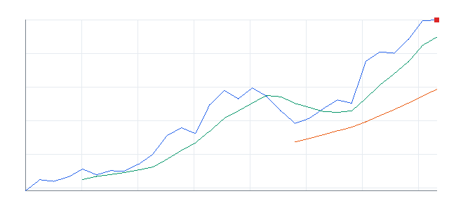

# 오늘의 데일리 트레이딩 요약

**REAL DATA TEST - 가격/거래량은 실제 데이터, 뉴스 연결, ETF 구성종목 확산도/스프레드/유동성 일부 연결**

**목적:** 이 리포트는 최근 오른 자산을 나열하는 것이 아니라, 돈이 몰리는 근거와 다음 매수 주체가 확인할 트레이딩 후보를 찾기 위한 보고서다.

> 핵심 질문: 현재 가격에서 누가 사고 있고, 누가 앞으로 더 비싸게 사줄 수 있는가?

## 0. 시장 상태

- 데이터 모드: REAL_TEST
- 가격/거래량: 연결됨
- 뉴스: 연결됨
- ETF 구성종목 확산도: 일부 연결
- 스프레드/유동성: 일부 연결
- 생성 시각: 2026년 6월 2일 화요일 오후 10:45
- 시장 상태: 위험선호
- 오늘 돈의 방향: 메모리/HBM 개별 종목 흐름이 ETF 대비 강한지 확인 필요
- 강한 테마 TOP 3: 메모리/HBM(78), 메모리/HBM ETF(77), AI 반도체 ETF(72)
- 데이터 한계:
  - API 또는 provider 상태에 따라 뉴스/ETF 확산도/스프레드 반영 범위가 달라질 수 있다.
  - 수집 실패 데이터는 점수 반영에서 제외하거나 confidence를 제한한다.
  - reasonConfidence HIGH는 직접 촉매, 가격/거래량, 확산도/유동성 근거가 함께 있을 때만 사용한다.

## 오늘 실제 행동 후보

오늘 즉시 행동 후보 없음. 왜 돈이 몰리는가, 누가 더 비싸게 사줄 수 있는가, 진입 조건이 동시에 충족된 후보가 없어 TOP 5는 관찰 목록으로만 본다.

## 오늘 돈이 몰리는 테마

- 메모리/HBM: MU, STX, WDC | 평균 moneyFlowScore 78 | 단일 종목 이벤트보다 테마 단위 자금 흐름이 선명한 구간으로 본다.
- 메모리/HBM ETF: DRAM | 평균 moneyFlowScore 77 | 단일 종목 이벤트보다 테마 단위 자금 흐름이 선명한 구간으로 본다.
- AI 반도체 ETF: SMH, SOXX, SOXQ | 평균 moneyFlowScore 72 | 추세는 확인되지만 선별 진입이 필요한 중간 강도의 테마로 본다.
- AI 반도체: NVDA, AVGO, AMD, ASML, ARM, MRVL | 평균 moneyFlowScore 68 | 추세는 확인되지만 선별 진입이 필요한 중간 강도의 테마로 본다.
- 클라우드/엔터프라이즈 소프트웨어 ETF: IGV | 평균 moneyFlowScore 66 | 추세는 확인되지만 선별 진입이 필요한 중간 강도의 테마로 본다.
- 반도체 장비/공급망: LRCX, AMAT, KLAC | 평균 moneyFlowScore 60 | 추세는 확인되지만 선별 진입이 필요한 중간 강도의 테마로 본다.

## 1. ETF 트레이딩 보고서
### 1-1. ETF 결론
- ETF 우선 후보: SOXX, DRAM, SMH
- ETF 관찰 후보: IHAK, COPX, XME, IPO, QQQ
- ETF 매매 금지: SHLD, IFRA, XLU, URA, NLR
- 오늘 ETF 최우선 1개: SOXX - 상대 거래량 1.0배 회복 후 관찰
- ETF 섹션 해석: 이 섹션은 개별 종목 선택이 아니라 테마/섹터 단위 자금 흐름을 ETF로 매매할지 판단하기 위한 영역이다.

### 1-2. ETF 후보 TOP 5

선정 기준: ETF 후보는 가격/거래량 1차 점수에 뉴스, ETF 구성종목 확산도, 유동성, 리스크 패널티를 반영한 finalRawScore 기준으로 정렬한다. 표시 점수 100점 후보가 겹치면 tieBreakerReason으로 우선순위를 설명한다.

### [ETF SOXX] iShares Semiconductor ETF
- 자산 유형: ETF
- ETF 세부 카테고리: AI 반도체 ETF
- ETF 역할: 테마 베타 매수
- 상태: 진입 가능
- moneyFlowScore: 77
- finalRawScore: 77
- tieBreakerReason: 최종 원점수 77, 리스크 패널티 0, 5일 수익률 +3.63%, 상대 거래량 0.14배 순으로 정렬
- 과열 리스크: 낮음~중간
- reasonConfidence: LOW
- reasonConfidenceExplanation: 가격/거래량이 약하거나 핵심 보조 근거가 부족해 LOW로 분류했다.

- todayActionLabel: ETF 우선
- 기준일: 2026-06-02
- 종가: $590.8
- 1일 수익률: +3.30%
- 5일 수익률: +3.63%
- 20일 수익률: +27.86%
- 상대 거래량: 0.14배
- 52주 고점 대비 위치: -0.03%
- whyMoneyIsFlowing: 최근 수익률은 확인되지만 상대 거래량 0.14배라 신규 자금 유입 강도는 약함. 뉴스: Exchange-Traded Funds, Equity Futures Lower Pre-Bell Tuesday as Traders Assess AI Momentum / ETF 확산도: BROAD_ADVANCE / 유동성: ACCEPTABLE
- likelyNextBuyer: 섹터 베타를 노리는 단기 모멘텀 자금과 리밸런싱 자금
- whyThisCouldTradeHigher: 52주 고점 부근이라 돌파가 확인되면 신고가 추종 매수가 붙을 수 있음
- 진입 조건: 상대 거래량 1.0배 회복 후 관찰
- 무효화 조건: 거래량 회복 실패
- 차트: 

#### 상세 근거

SOXX 상세 근거 펼치기

- moneyFlowScore(최종) 산정 근거:
  - moneyFlowScore(1차): 56
  - 최종 원점수: 77
  - 최종 표시 점수: 77
  - cap 적용: cap 미적용
  - 계산식: +56 + +10 + +8 + +3 + 0 + 0 + 0 = 77
  - 점수 해석: 관심 후보. 눌림 또는 돌파 확인 후 진입 검토.
  - 가격/거래량 1차 점수: +56
    - 추세: +16
    - 단기 모멘텀: +7
    - 중기 모멘텀: +16
    - 거래량: -8
    - 신고가 근접: +12
    - 이동평균: +14
  - 추가 데이터 가감점:
    - 뉴스: +10
    - 유동성: +3
  - ETF 확산도: +8
  - 리스크 패널티: 0
  - 주요 근거: 1차 56, 최종 원점수 77, 표시 77. 20일 수익률 강함, 1일 단기 모멘텀 확인, 52주 고점 근처. 주의: 큰 감점 제한적.
  - 리스크 패널티 산정 근거:
    - 총 리스크 패널티: 0
    - 리스크 등급: LOW
    - 감점된 리스크: 없음
    - 관찰 리스크: 주요 관찰 리스크 없음
    - 한 줄 해석: 직접 감점된 주요 리스크는 없지만 관찰 리스크는 계속 확인해야 한다.
- 데이터 사용 현황:
  - 가격/거래량: 사용
  - 뉴스: 사용
  - ETF 확산도: 사용
  - 유동성/스프레드: 사용
  - 관련 ETF 상대강도: 사용
- 뉴스 확인:
  - 최근 뉴스 상태: 연결됨
  - 긍정/중립/부정: 3/5/0
  - 핵심 뉴스 요약: Exchange-Traded Funds, Equity Futures Lower Pre-Bell Tuesday as Traders Assess AI Momentum
  - 점수 반영: +10
  - 주의: 특이사항 없음
- ETF 구성종목 확산도:
  - 구성종목 데이터 상태: 일부 연결
  - 샘플 수: 3/3
  - 상승 종목 비율: 100%
  - 20일선 위 비율: 100%
  - 50일선 위 비율: 100%
  - 상위 기여 종목: MU, TSM, NVDA
  - 확산도 판단: BROAD_ADVANCE
  - 점수 반영: +8
- 유동성/스프레드:
  - 데이터 상태: 일부 연결
  - 스프레드: bid/ask 데이터 없음
  - 거래대금: $671,092,674
  - 평균 거래대금: $4,944,552,900
  - 유동성 판단: ACCEPTABLE
  - 매매 영향: 거래대금은 허용 가능하나 bid/ask 확인 필요
- reasonConfidence 근거: 가격/거래량이 약하거나 주요 데이터가 부족해 낮음.
- 차트 요약: 최근 20거래일 기준 5일선이 20일선 위에 있음
- 기준일 2026-06-02 | 종가 $590.8 | 1일 +3.30% | 5일 +3.63% | 20일 +27.86% | 상대 거래량 0.14배 | 52주 고점 대비 -0.03% | 데이터 소스: yfinance

### [ETF DRAM] Roundhill Memory ETF
- 자산 유형: ETF
- ETF 세부 카테고리: 메모리/HBM ETF
- ETF 역할: 테마 베타 매수
- 상태: 진입 가능
- moneyFlowScore: 77
- finalRawScore: 77
- tieBreakerReason: 최종 원점수 77, 리스크 패널티 -4, 5일 수익률 +12.64%, 상대 거래량 0.18배 순으로 정렬
- 과열 리스크: 낮음
- reasonConfidence: LOW
- reasonConfidenceExplanation: 가격/거래량이 약하거나 핵심 보조 근거가 부족해 LOW로 분류했다.

- todayActionLabel: ETF 우선
- 기준일: 2026-06-02
- 종가: $68.16
- 1일 수익률: +0.24%
- 5일 수익률: +12.64%
- 20일 수익률: +60.49%
- 상대 거래량: 0.18배
- 52주 고점 대비 위치: -0.87%
- whyMoneyIsFlowing: 최근 수익률은 확인되지만 상대 거래량 0.18배라 신규 자금 유입 강도는 약함. 뉴스: Daily ETF Flows: DRAM Back In The Top 10 / 유동성: ACCEPTABLE
- likelyNextBuyer: 섹터 베타를 노리는 단기 모멘텀 자금과 리밸런싱 자금
- whyThisCouldTradeHigher: 52주 고점 부근이라 돌파가 확인되면 신고가 추종 매수가 붙을 수 있음
- 진입 조건: 상대 거래량 1.0배 회복 후 관찰
- 무효화 조건: 거래량 회복 실패
- 차트: 

#### 상세 근거

DRAM 상세 근거 펼치기

- moneyFlowScore(최종) 산정 근거:
  - moneyFlowScore(1차): 68
  - 최종 원점수: 77
  - 최종 표시 점수: 77
  - cap 적용: cap 미적용
  - 계산식: +68 + +10 + 0 + +3 + 0 - 4 + 0 = 77
  - 점수 해석: 관심 후보. 눌림 또는 돌파 확인 후 진입 검토.
  - 가격/거래량 1차 점수: +68
    - 추세: +24
    - 단기 모멘텀: +10
    - 중기 모멘텀: +16
    - 거래량: -8
    - 신고가 근접: +12
    - 이동평균: +14
  - 추가 데이터 가감점:
    - 뉴스: +10
    - 유동성: +3
  - ETF 확산도: 0
  - 리스크 패널티: -4
  - 주요 근거: 1차 68, 최종 원점수 77, 표시 77. 20일 수익률 강함, 5일 수익률 강함, 52주 고점 근처. 주의: 단기 과열/추격 위험 존재, ETF 구성종목 확산도 데이터 미연결.
  - 리스크 패널티 산정 근거:
    - 총 리스크 패널티: -4
    - 리스크 등급: LOW
    - 감점된 리스크:
      - volume divergence: -4 | 근거: 5d price strength is not confirmed by relative volume 0.18x. | 대응: Require relative volume recovery above 1.0x.
    - 관찰 리스크: ETF breadth data not connected
    - 한 줄 해석: 1개 감점 리스크로 총 -4점 반영.
- 데이터 사용 현황:
  - 가격/거래량: 사용
  - 뉴스: 사용
  - ETF 확산도: 미연결
  - 유동성/스프레드: 사용
  - 관련 ETF 상대강도: 사용
- 뉴스 확인:
  - 최근 뉴스 상태: 연결됨
  - 긍정/중립/부정: 3/5/0
  - 핵심 뉴스 요약: Daily ETF Flows: DRAM Back In The Top 10
  - 점수 반영: +10
  - 주의: 특이사항 없음
- ETF 구성종목 확산도:
  - 구성종목 데이터 상태: 미연결
  - 샘플 수: 0/0
  - 상승 종목 비율: 데이터 없음
  - 20일선 위 비율: 데이터 없음
  - 50일선 위 비율: 데이터 없음
  - 상위 기여 종목: 데이터 없음
  - 확산도 판단: UNKNOWN
  - 점수 반영: 0
- 유동성/스프레드:
  - 데이터 상태: 일부 연결
  - 스프레드: bid/ask 데이터 없음
  - 거래대금: $465,503,491
  - 평균 거래대금: $2,569,835,321
  - 유동성 판단: ACCEPTABLE
  - 매매 영향: 거래대금은 허용 가능하나 bid/ask 확인 필요
- reasonConfidence 근거: 가격/거래량이 약하거나 주요 데이터가 부족해 낮음.
- 차트 요약: 최근 20거래일 기준 5일선이 20일선 위에 있음
- 기준일 2026-06-02 | 종가 $68.16 | 1일 +0.24% | 5일 +12.64% | 20일 +60.49% | 상대 거래량 0.18배 | 52주 고점 대비 -0.87% | 데이터 소스: yfinance

### [ETF SMH] VanEck Semiconductor ETF
- 자산 유형: ETF
- ETF 세부 카테고리: AI 반도체 ETF
- ETF 역할: 테마 베타 매수
- 상태: 진입 가능
- moneyFlowScore: 73
- finalRawScore: 73
- tieBreakerReason: 최종 원점수 73, 리스크 패널티 0, 5일 수익률 +3.34%, 상대 거래량 0.07배 순으로 정렬
- 과열 리스크: 낮음~중간
- reasonConfidence: LOW
- reasonConfidenceExplanation: 가격/거래량이 약하거나 핵심 보조 근거가 부족해 LOW로 분류했다.

- todayActionLabel: ETF 우선
- 기준일: 2026-06-02
- 종가: $622.28
- 1일 수익률: +2.38%
- 5일 수익률: +3.34%
- 20일 수익률: +22.79%
- 상대 거래량: 0.07배
- 52주 고점 대비 위치: -0.01%
- whyMoneyIsFlowing: 최근 수익률은 확인되지만 상대 거래량 0.07배라 신규 자금 유입 강도는 약함. 뉴스: VanEck Launches Data Center Supply Chain ETF (RACK) to Capture AI Infrastructure Buildout / ETF 확산도: BROAD_ADVANCE / 유동성: ACCEPTABLE
- likelyNextBuyer: 섹터 베타를 노리는 단기 모멘텀 자금과 리밸런싱 자금
- whyThisCouldTradeHigher: 52주 고점 부근이라 돌파가 확인되면 신고가 추종 매수가 붙을 수 있음
- 진입 조건: 상대 거래량 1.0배 회복 후 관찰
- 무효화 조건: 거래량 회복 실패
- 차트: 

#### 상세 근거

SMH 상세 근거 펼치기

- moneyFlowScore(최종) 산정 근거:
  - moneyFlowScore(1차): 52
  - 최종 원점수: 73
  - 최종 표시 점수: 73
  - cap 적용: cap 미적용
  - 계산식: +52 + +10 + +8 + +3 + 0 + 0 + 0 = 73
  - 점수 해석: 관심 후보. 눌림 또는 돌파 확인 후 진입 검토.
  - 가격/거래량 1차 점수: +52
    - 추세: +14
    - 단기 모멘텀: +6
    - 중기 모멘텀: +15
    - 거래량: -8
    - 신고가 근접: +12
    - 이동평균: +14
  - 추가 데이터 가감점:
    - 뉴스: +10
    - 유동성: +3
  - ETF 확산도: +8
  - 리스크 패널티: 0
  - 주요 근거: 1차 52, 최종 원점수 73, 표시 73. 20일 수익률 강함, 1일 단기 모멘텀 확인, 52주 고점 근처. 주의: 큰 감점 제한적.
  - 리스크 패널티 산정 근거:
    - 총 리스크 패널티: 0
    - 리스크 등급: LOW
    - 감점된 리스크: 없음
    - 관찰 리스크: 주요 관찰 리스크 없음
    - 한 줄 해석: 직접 감점된 주요 리스크는 없지만 관찰 리스크는 계속 확인해야 한다.
- 데이터 사용 현황:
  - 가격/거래량: 사용
  - 뉴스: 사용
  - ETF 확산도: 사용
  - 유동성/스프레드: 사용
  - 관련 ETF 상대강도: 사용
- 뉴스 확인:
  - 최근 뉴스 상태: 연결됨
  - 긍정/중립/부정: 5/3/0
  - 핵심 뉴스 요약: VanEck Launches Data Center Supply Chain ETF (RACK) to Capture AI Infrastructure Buildout
  - 점수 반영: +10
  - 주의: 특이사항 없음
- ETF 구성종목 확산도:
  - 구성종목 데이터 상태: 일부 연결
  - 샘플 수: 3/3
  - 상승 종목 비율: 100%
  - 20일선 위 비율: 100%
  - 50일선 위 비율: 100%
  - 상위 기여 종목: MU, TSM, NVDA
  - 확산도 판단: BROAD_ADVANCE
  - 점수 반영: +8
- 유동성/스프레드:
  - 데이터 상태: 일부 연결
  - 스프레드: bid/ask 데이터 없음
  - 거래대금: $455,164,839
  - 평균 거래대금: $6,208,607,038
  - 유동성 판단: ACCEPTABLE
  - 매매 영향: 거래대금은 허용 가능하나 bid/ask 확인 필요
- reasonConfidence 근거: 가격/거래량이 약하거나 주요 데이터가 부족해 낮음.
- 차트 요약: 최근 20거래일 기준 5일선이 20일선 위에 있음
- 기준일 2026-06-02 | 종가 $622.28 | 1일 +2.38% | 5일 +3.34% | 20일 +22.79% | 상대 거래량 0.07배 | 52주 고점 대비 -0.01% | 데이터 소스: yfinance

### [ETF CIBR] First Trust NASDAQ Cybersecurity ETF
- 자산 유형: ETF
- ETF 세부 카테고리: 사이버보안 ETF
- ETF 역할: 테마 베타 매수
- 상태: 진입 후보
- moneyFlowScore: 67
- finalRawScore: 67
- tieBreakerReason: 최종 원점수 67, 리스크 패널티 -9, 5일 수익률 +10.32%, 상대 거래량 0.15배 순으로 정렬
- 과열 리스크: 낮음
- reasonConfidence: LOW
- reasonConfidenceExplanation: 가격/거래량이 약하거나 핵심 보조 근거가 부족해 LOW로 분류했다.

- todayActionLabel: 눌림 매수 대기
- 기준일: 2026-06-02
- 종가: $93.2
- 1일 수익률: -1.01%
- 5일 수익률: +10.32%
- 20일 수익률: +33.62%
- 상대 거래량: 0.15배
- 52주 고점 대비 위치: -1.18%
- whyMoneyIsFlowing: 최근 수익률은 확인되지만 상대 거래량 0.15배라 신규 자금 유입 강도는 약함. 뉴스: The Asymmetric AI Winner: Cybersecurity ETFs Gaining From Cloud Buildout / ETF 확산도: BROAD_ADVANCE
- likelyNextBuyer: 섹터 베타를 노리는 단기 모멘텀 자금과 리밸런싱 자금
- whyThisCouldTradeHigher: 52주 고점 부근이라 돌파가 확인되면 신고가 추종 매수가 붙을 수 있음
- 진입 조건: 상대 거래량 1.0배 회복 후 관찰
- 무효화 조건: 거래량 회복 실패
- 차트: 

#### 상세 근거

CIBR 상세 근거 펼치기

- moneyFlowScore(최종) 산정 근거:
  - moneyFlowScore(1차): 63
  - 최종 원점수: 67
  - 최종 표시 점수: 67
  - cap 적용: cap 미적용
  - 계산식: +63 + +10 + +8 - 5 + 0 - 9 + 0 = 67
  - 점수 해석: 관심 후보. 눌림 또는 돌파 확인 후 진입 검토.
  - 가격/거래량 1차 점수: +63
    - 추세: +22
    - 단기 모멘텀: +7
    - 중기 모멘텀: +16
    - 거래량: -8
    - 신고가 근접: +12
    - 이동평균: +14
  - 추가 데이터 가감점:
    - 뉴스: +10
    - 유동성: -5
  - ETF 확산도: +8
  - 리스크 패널티: -9
  - 주요 근거: 1차 63, 최종 원점수 67, 표시 67. 20일 수익률 강함, 5일 수익률 강함, 52주 고점 근처. 주의: 단기 과열/추격 위험 존재.
  - 리스크 패널티 산정 근거:
    - 총 리스크 패널티: -9
    - 리스크 등급: MEDIUM
    - 감점된 리스크:
      - volume divergence: -4 | 근거: 5d price strength is not confirmed by relative volume 0.15x. | 대응: Require relative volume recovery above 1.0x.
      - low liquidity: -5 | 근거: Liquidity signal: LOW_LIQUIDITY. | 대응: Avoid market-order chasing.
    - 관찰 리스크: 주요 관찰 리스크 없음
    - 한 줄 해석: 2개 감점 리스크로 총 -9점 반영.
- 데이터 사용 현황:
  - 가격/거래량: 사용
  - 뉴스: 사용
  - ETF 확산도: 사용
  - 유동성/스프레드: 사용
  - 관련 ETF 상대강도: 사용
- 뉴스 확인:
  - 최근 뉴스 상태: 연결됨
  - 긍정/중립/부정: 4/4/0
  - 핵심 뉴스 요약: The Asymmetric AI Winner: Cybersecurity ETFs Gaining From Cloud Buildout
  - 점수 반영: +10
  - 주의: 특이사항 없음
- ETF 구성종목 확산도:
  - 구성종목 데이터 상태: 일부 연결
  - 샘플 수: 2/2
  - 상승 종목 비율: 100%
  - 20일선 위 비율: 100%
  - 50일선 위 비율: 100%
  - 상위 기여 종목: PLTR, MSFT
  - 확산도 판단: BROAD_ADVANCE
  - 점수 반영: +8
- 유동성/스프레드:
  - 데이터 상태: 일부 연결
  - 스프레드: bid/ask 데이터 없음
  - 거래대금: $22,926,361
  - 평균 거래대금: $155,422,557
  - 유동성 판단: LOW_LIQUIDITY
  - 매매 영향: 유동성 부족으로 추격 금지 또는 우선순위 하향
- reasonConfidence 근거: 가격/거래량이 약하거나 주요 데이터가 부족해 낮음.
- 차트 요약: 최근 20거래일 기준 5일선이 20일선 위에 있음
- 기준일 2026-06-02 | 종가 $93.2 | 1일 -1.01% | 5일 +10.32% | 20일 +33.62% | 상대 거래량 0.15배 | 52주 고점 대비 -1.18% | 데이터 소스: yfinance

### [ETF IGV] iShares Expanded Tech-Software Sector ETF
- 자산 유형: ETF
- ETF 세부 카테고리: 클라우드/엔터프라이즈 소프트웨어 ETF
- ETF 역할: 테마 베타 매수
- 상태: 진입 후보
- moneyFlowScore: 66
- finalRawScore: 66
- tieBreakerReason: 최종 원점수 66, 리스크 패널티 -4, 5일 수익률 +11.31%, 상대 거래량 0.31배 순으로 정렬
- 과열 리스크: 낮음
- reasonConfidence: LOW
- reasonConfidenceExplanation: 가격/거래량이 약하거나 핵심 보조 근거가 부족해 LOW로 분류했다.

- todayActionLabel: 눌림 매수 대기
- 기준일: 2026-06-02
- 종가: $104.69
- 1일 수익률: -2.79%
- 5일 수익률: +11.31%
- 20일 수익률: +18.37%
- 상대 거래량: 0.31배
- 52주 고점 대비 위치: -11.27%
- whyMoneyIsFlowing: 최근 수익률은 확인되지만 상대 거래량 0.31배라 신규 자금 유입 강도는 약함. 뉴스: Software stocks whipsaw amid AI fears, as Anthropic IPO looms / ETF 확산도: BROAD_ADVANCE / 유동성: ACCEPTABLE
- likelyNextBuyer: 섹터 베타를 노리는 단기 모멘텀 자금과 리밸런싱 자금
- whyThisCouldTradeHigher: 단기 추세가 유지되고 거래량이 1.0배 이상이면 눌림 이후 재상승을 시도할 수 있음
- 진입 조건: 상대 거래량 1.0배 회복 후 관찰
- 무효화 조건: 거래량 회복 실패
- 차트: 

#### 상세 근거

IGV 상세 근거 펼치기

- moneyFlowScore(최종) 산정 근거:
  - moneyFlowScore(1차): 49
  - 최종 원점수: 66
  - 최종 표시 점수: 66
  - cap 적용: cap 미적용
  - 계산식: +49 + +10 + +8 + +3 + 0 - 4 + 0 = 66
  - 점수 해석: 관심 후보. 눌림 또는 돌파 확인 후 진입 검토.
  - 가격/거래량 1차 점수: +49
    - 추세: +20
    - 단기 모멘텀: +6
    - 중기 모멘텀: +12
    - 거래량: -8
    - 신고가 근접: +6
    - 이동평균: +14
  - 추가 데이터 가감점:
    - 뉴스: +10
    - 유동성: +3
  - ETF 확산도: +8
  - 리스크 패널티: -4
  - 주요 근거: 1차 49, 최종 원점수 66, 표시 66. 20일 수익률 강함, 5일 수익률 강함, 이동평균 위 추세 유지. 주의: 단기 과열/추격 위험 존재.
  - 리스크 패널티 산정 근거:
    - 총 리스크 패널티: -4
    - 리스크 등급: LOW
    - 감점된 리스크:
      - volume divergence: -4 | 근거: 5d price strength is not confirmed by relative volume 0.31x. | 대응: Require relative volume recovery above 1.0x.
    - 관찰 리스크: 주요 관찰 리스크 없음
    - 한 줄 해석: 1개 감점 리스크로 총 -4점 반영.
- 데이터 사용 현황:
  - 가격/거래량: 사용
  - 뉴스: 사용
  - ETF 확산도: 사용
  - 유동성/스프레드: 사용
  - 관련 ETF 상대강도: 사용
- 뉴스 확인:
  - 최근 뉴스 상태: 연결됨
  - 긍정/중립/부정: 5/3/0
  - 핵심 뉴스 요약: Software stocks whipsaw amid AI fears, as Anthropic IPO looms
  - 점수 반영: +10
  - 주의: 특이사항 없음
- ETF 구성종목 확산도:
  - 구성종목 데이터 상태: 일부 연결
  - 샘플 수: 3/3
  - 상승 종목 비율: 100%
  - 20일선 위 비율: 100%
  - 50일선 위 비율: 100%
  - 상위 기여 종목: PLTR, MSFT, AAPL
  - 확산도 판단: BROAD_ADVANCE
  - 점수 반영: +8
- 유동성/스프레드:
  - 데이터 상태: 일부 연결
  - 스프레드: bid/ask 데이터 없음
  - 거래대금: $694,514,821
  - 평균 거래대금: $2,222,255,153
  - 유동성 판단: ACCEPTABLE
  - 매매 영향: 거래대금은 허용 가능하나 bid/ask 확인 필요
- reasonConfidence 근거: 가격/거래량이 약하거나 주요 데이터가 부족해 낮음.
- 차트 요약: 최근 20거래일 기준 5일선이 20일선 위에 있음
- 기준일 2026-06-02 | 종가 $104.69 | 1일 -2.79% | 5일 +11.31% | 20일 +18.37% | 상대 거래량 0.31배 | 52주 고점 대비 -11.27% | 데이터 소스: yfinance

### 1-3. ETF 과열/주의 후보

#### [SOXX] iShares Semiconductor ETF
- moneyFlowScore(최종): 77
- moneyFlowScore 산정 근거 요약: 1차 56, 최종 원점수 77, 표시 77. 20일 수익률 강함, 1일 단기 모멘텀 확인, 52주 고점 근처. 주의: 큰 감점 제한적.
- 과열 리스크: 낮음~중간
- 과열 근거: AI 반도체 ETF 기준 단기 급등과 고점 근접 조합 확인
- 대응: 돌파 확인 후 진입

#### [SMH] VanEck Semiconductor ETF
- moneyFlowScore(최종): 73
- moneyFlowScore 산정 근거 요약: 1차 52, 최종 원점수 73, 표시 73. 20일 수익률 강함, 1일 단기 모멘텀 확인, 52주 고점 근처. 주의: 큰 감점 제한적.
- 과열 리스크: 낮음~중간
- 과열 근거: AI 반도체 ETF 기준 단기 급등과 고점 근접 조합 확인
- 대응: 돌파 확인 후 진입

#### [SOXQ] Invesco PHLX Semiconductor ETF
- moneyFlowScore(최종): 66
- moneyFlowScore 산정 근거 요약: 1차 58, 최종 원점수 66, 표시 66. 20일 수익률 강함, 1일 단기 모멘텀 확인, 52주 고점 근처. 주의: 단기 과열/추격 위험 존재.
- 과열 리스크: 낮음~중간
- 과열 근거: AI 반도체 ETF 기준 단기 급등과 고점 근접 조합 확인
- 대응: 돌파 확인 후 진입

#### [XME] SPDR S&P Metals & Mining ETF
- moneyFlowScore(최종): 41
- moneyFlowScore 산정 근거 요약: 1차 45, 최종 원점수 41, 표시 41. 20일 수익률 강함, 5일 수익률 강함, 1일 단기 모멘텀 확인. 주의: 단기 과열/추격 위험 존재, ETF 구성종목 확산도 데이터 미연결.
- 과열 리스크: 낮음~중간
- 과열 근거: 금속/광산 ETF 기준 단기 급등과 고점 근접 조합 확인
- 대응: 돌파 확인 후 진입

### 1-4. ETF 제외/매매 금지 후보

#### [SHLD] Global X Defense Tech ETF
- moneyFlowScore(최종): 0
- moneyFlowScore 산정 근거 요약: 1차 0, 최종 원점수 -36, 표시 0. 뉴스 흐름이 가격/거래량 근거 보강, 유동성/스프레드 주의. 주의: 단기 과열/추격 위험 존재, ETF 구성종목 확산도 데이터 미연결.
- 제외 사유: 테마 자금 흐름 약함
- 해제 조건: 상대 거래량 1.0배 회복 후 관찰

#### [IFRA] iShares U.S. Infrastructure ETF
- moneyFlowScore(최종): 0
- moneyFlowScore 산정 근거 요약: 1차 0, 최종 원점수 -16, 표시 0. 52주 고점 근처, 유동성/스프레드 주의. 주의: 단기 과열/추격 위험 존재, ETF 구성종목 확산도 데이터 미연결.
- 제외 사유: 테마 자금 흐름 약함
- 해제 조건: 상대 거래량 1.0배 회복 후 관찰

#### [XLU] Utilities Select Sector SPDR Fund
- moneyFlowScore(최종): 0
- moneyFlowScore 산정 근거 요약: 1차 0, 최종 원점수 -16, 표시 0. 뉴스 흐름이 가격/거래량 근거 보강, 거래대금 기준 유동성 양호. 주의: 단기 과열/추격 위험 존재, ETF 구성종목 확산도 데이터 미연결.
- 제외 사유: 테마 자금 흐름 약함
- 해제 조건: 상대 거래량 1.0배 회복 후 관찰

#### [URA] Global X Uranium ETF
- moneyFlowScore(최종): 0
- moneyFlowScore 산정 근거 요약: 1차 0, 최종 원점수 -18, 표시 0. 뉴스 흐름이 가격/거래량 근거 보강, 유동성/스프레드 주의. 주의: 단기 과열/추격 위험 존재, ETF 구성종목 확산도 데이터 미연결.
- 제외 사유: 테마 자금 흐름 약함
- 해제 조건: 상대 거래량 1.0배 회복 후 관찰

#### [NLR] VanEck Uranium and Nuclear ETF
- moneyFlowScore(최종): 0
- moneyFlowScore 산정 근거 요약: 1차 0, 최종 원점수 -23, 표시 0. 뉴스 흐름이 가격/거래량 근거 보강, 유동성/스프레드 주의. 주의: 단기 과열/추격 위험 존재, ETF 구성종목 확산도 데이터 미연결.
- 제외 사유: 테마 자금 흐름 약함
- 해제 조건: 상대 거래량 1.0배 회복 후 관찰

## 2. 개별 종목 트레이딩 보고서
### 2-1. 오늘 Nasdaq-100 신규 발굴 요약
- 신규 발굴 풀: Nasdaq-100 구성종목 전체
- universe source: fallback from StockAnalysis Nasdaq-100 list checked 2026-06-02
- universe fetchStatus: FALLBACK
- 총 스캔 종목 수: 101
- 데이터 수집 성공: 101
- 데이터 수집 실패: 0
- 상세 데이터 수집 대상: 가격/거래량 1차 스캔 상위 20개
- 오늘 진입 후보: 10
- 오늘 눌림 대기: 5
- 오늘 관찰: 11
- 오늘 매매 금지: 75
- 개별 종목 진입 후보: MU, PANW, CRWD, STX, CSCO
- 개별 종목 눌림 대기: 없음
- 개별 종목 매매 금지: 없음
- 오늘 개별 종목 최우선 1개: MU - 관련 ETF보다 강함 | 주식 5일 +15.90% vs ETF 평균 +6.00%, 주식 20일 +80.12% vs ETF 평균 +34.67%, 상대 거래량 0.12배 vs ETF 평균 0.14배
- 개별 종목 섹션 해석: 이 섹션은 ETF로 확인된 테마 자금 흐름 안에서 ETF보다 더 강한 돌파 가능성이 있는 개별 종목만 선별하는 영역이다.

### 2-2. 오늘 개별 종목 신규 후보 TOP 5

선정 기준:
1. Nasdaq-100 전체를 moneyFlowScore(1차)로 먼저 스캔
2. moneyFlowScore(1차) 상위 20개를 상세 분석
3. 뉴스/유동성/관련 ETF 대비 상대강도/리스크 패널티를 반영
4. moneyFlowScore(최종), 최종 원점수, 리스크 패널티, 5일 수익률, 상대 거래량 순으로 재정렬

### [MU] Micron Technology Inc.
- 자산 유형: STOCK
- 상태: 진입 가능
- primaryTheme: 메모리/HBM
- primarySector: Technology
- relatedEtfs: DRAM, SMH, SOXX, SOXQ
- moneyFlowScore: 87
- finalRawScore: 87
- tieBreakerReason: 최종 원점수 87, 리스크 패널티 -4, 5일 수익률 +15.90%, 상대 거래량 0.12배 순으로 정렬
- 과열 리스크: 낮음
- reasonConfidence: LOW
- reasonConfidenceExplanation: 가격/거래량이 약하거나 핵심 보조 근거가 부족해 LOW로 분류했다.

- todayActionLabel: 개별 종목 우선
- 기준일: 2026-06-02
- 종가: $1,038.31
- 1일 수익률: +0.27%
- 5일 수익률: +15.90%
- 20일 수익률: +80.12%
- 상대 거래량: 0.12배
- 52주 고점 대비 위치: -1.30%
- 관련 ETF 대비 상대강도: 관련 ETF보다 강함 | 주식 5일 +15.90% vs ETF 평균 +6.00%, 주식 20일 +80.12% vs ETF 평균 +34.67%, 상대 거래량 0.12배 vs ETF 평균 0.14배
- whyMoneyIsFlowing: 최근 수익률은 확인되지만 상대 거래량 0.12배라 신규 자금 유입 강도는 약함. 뉴스: Raymond James Doubles Micron Stock Price Target on Booming AI Demand / 유동성: LIQUID
- likelyNextBuyer: 개별 주도주를 따라붙는 단기 모멘텀 자금과 관련 ETF 강세를 확인한 트레이더
- whyThisCouldTradeHigher: 52주 고점 부근이라 돌파가 확인되면 신고가 추종 매수가 붙을 수 있음
- 왜 ETF가 아니라 이 종목인가: MU가 관련 ETF 평균보다 5일/20일 흐름 또는 거래량에서 강해 개별 종목 우선 후보로 본다.
- ETF가 더 나은 경우: MU가 관련 ETF 평균보다 약하거나 거래량이 둔화되면 개별 종목보다 관련 ETF를 우선한다.
- 진입 조건: 상대 거래량 1.0배 회복 후 관찰
- 무효화 조건: 거래량 회복 실패
- 차트: 

#### 상세 근거

MU 상세 근거 펼치기

- moneyFlowScore(최종) 산정 근거:
  - moneyFlowScore(1차): 70
  - 최종 원점수: 87
  - 최종 표시 점수: 87
  - cap 적용: cap 미적용
  - 계산식: +70 + +10 + 0 + +5 + +6.416666666666667 - 4 + 0 = 87
  - 점수 해석: 강한 자금 유입 후보. 단, 과열 여부 확인 필수.
  - 가격/거래량 1차 점수: +70
    - 추세: +24
    - 단기 모멘텀: +12
    - 중기 모멘텀: +16
    - 거래량: -8
    - 신고가 근접: +12
    - 이동평균: +14
  - 추가 데이터 가감점:
    - 뉴스: +10
    - 유동성: +5
  - ETF 대비 상대강도: +6
  - 리스크 패널티: -4
  - 주요 근거: 1차 70, 최종 원점수 87, 표시 87. 20일 수익률 강함, 5일 수익률 강함, 52주 고점 근처. 주의: 단기 과열/추격 위험 존재.
  - 리스크 패널티 산정 근거:
    - 총 리스크 패널티: -4
    - 리스크 등급: LOW
    - 감점된 리스크:
      - volume divergence: -4 | 근거: 5d price strength is not confirmed by relative volume 0.12x. | 대응: Require relative volume recovery above 1.0x.
    - 관찰 리스크: 주요 관찰 리스크 없음
    - 한 줄 해석: 1개 감점 리스크로 총 -4점 반영.
- 데이터 사용 현황:
  - 가격/거래량: 사용
  - 뉴스: 사용
  - ETF 확산도: 관련 ETF에서 확인
  - 유동성/스프레드: 사용
  - 관련 ETF 상대강도: 사용
- 뉴스 확인:
  - 최근 뉴스 상태: 연결됨
  - 긍정/중립/부정: 4/4/0
  - 핵심 뉴스 요약: Raymond James Doubles Micron Stock Price Target on Booming AI Demand
  - 점수 반영: +10
  - 주의: 특이사항 없음
- ETF 구성종목 확산도: 관련 ETF에서 확인
- 유동성/스프레드:
  - 데이터 상태: 일부 연결
  - 스프레드: bid/ask 데이터 없음
  - 거래대금: $6,690,423,811
  - 평균 거래대금: $56,267,590,091
  - 유동성 판단: LIQUID
  - 매매 영향: 거래대금 기준 실제 매매 가능성에 큰 문제 없음
- reasonConfidence 근거: 가격/거래량이 약하거나 주요 데이터가 부족해 낮음.
- 차트 요약: 최근 20거래일 기준 5일선이 20일선 위에 있음
- 기준일 2026-06-02 | 종가 $1,038.31 | 1일 +0.27% | 5일 +15.90% | 20일 +80.12% | 상대 거래량 0.12배 | 52주 고점 대비 -1.30% | 데이터 소스: yfinance

### [PANW] Palo Alto Networks Inc.
- 자산 유형: STOCK
- 상태: 진입 가능
- primaryTheme: 사이버보안
- primarySector: Technology
- relatedEtfs: HACK, CIBR, IHAK, IGV
- moneyFlowScore: 83
- finalRawScore: 83
- tieBreakerReason: 최종 원점수 83, 리스크 패널티 -4, 5일 수익률 +15.11%, 상대 거래량 0.15배 순으로 정렬
- 과열 리스크: 낮음
- reasonConfidence: LOW
- reasonConfidenceExplanation: 가격/거래량이 약하거나 핵심 보조 근거가 부족해 LOW로 분류했다.

- todayActionLabel: 개별 종목 우선
- 기준일: 2026-06-02
- 종가: $295.55
- 1일 수익률: -1.64%
- 5일 수익률: +15.11%
- 20일 수익률: +60.13%
- 상대 거래량: 0.15배
- 52주 고점 대비 위치: -2.44%
- 관련 ETF 대비 상대강도: 관련 ETF보다 강함 | 주식 5일 +15.11% vs ETF 평균 +8.69%, 주식 20일 +60.13% vs ETF 평균 +25.01%, 상대 거래량 0.15배 vs ETF 평균 0.33배
- whyMoneyIsFlowing: 최근 수익률은 확인되지만 상대 거래량 0.15배라 신규 자금 유입 강도는 약함. 뉴스: AI is multiplying the cybersecurity threat, and Palo Alto Networks and CrowdStrike are the main beneficiaries / 유동성: ACCEPTABLE
- likelyNextBuyer: 개별 주도주를 따라붙는 단기 모멘텀 자금과 관련 ETF 강세를 확인한 트레이더
- whyThisCouldTradeHigher: 52주 고점 부근이라 돌파가 확인되면 신고가 추종 매수가 붙을 수 있음
- 왜 ETF가 아니라 이 종목인가: PANW가 관련 ETF 평균보다 5일/20일 흐름 또는 거래량에서 강해 개별 종목 우선 후보로 본다.
- ETF가 더 나은 경우: PANW가 관련 ETF 평균보다 약하거나 거래량이 둔화되면 개별 종목보다 관련 ETF를 우선한다.
- 진입 조건: 상대 거래량 1.0배 회복 후 관찰
- 무효화 조건: 거래량 회복 실패
- 차트: 

#### 상세 근거

PANW 상세 근거 펼치기

- moneyFlowScore(최종) 산정 근거:
  - moneyFlowScore(1차): 68
  - 최종 원점수: 83
  - 최종 표시 점수: 83
  - cap 적용: cap 미적용
  - 계산식: +68 + +10 + 0 + +3 + +5.583333333333333 - 4 + 0 = 83
  - 점수 해석: 강한 자금 유입 후보. 단, 과열 여부 확인 필수.
  - 가격/거래량 1차 점수: +68
    - 추세: +24
    - 단기 모멘텀: +10
    - 중기 모멘텀: +16
    - 거래량: -8
    - 신고가 근접: +12
    - 이동평균: +14
  - 추가 데이터 가감점:
    - 뉴스: +10
    - 유동성: +3
  - ETF 대비 상대강도: +6
  - 리스크 패널티: -4
  - 주요 근거: 1차 68, 최종 원점수 83, 표시 83. 20일 수익률 강함, 5일 수익률 강함, 52주 고점 근처. 주의: 단기 과열/추격 위험 존재.
  - 리스크 패널티 산정 근거:
    - 총 리스크 패널티: -4
    - 리스크 등급: LOW
    - 감점된 리스크:
      - volume divergence: -4 | 근거: 5d price strength is not confirmed by relative volume 0.15x. | 대응: Require relative volume recovery above 1.0x.
    - 관찰 리스크: 주요 관찰 리스크 없음
    - 한 줄 해석: 1개 감점 리스크로 총 -4점 반영.
- 데이터 사용 현황:
  - 가격/거래량: 사용
  - 뉴스: 사용
  - ETF 확산도: 관련 ETF에서 확인
  - 유동성/스프레드: 사용
  - 관련 ETF 상대강도: 사용
- 뉴스 확인:
  - 최근 뉴스 상태: 연결됨
  - 긍정/중립/부정: 7/1/0
  - 핵심 뉴스 요약: AI is multiplying the cybersecurity threat, and Palo Alto Networks and CrowdStrike are the main beneficiaries
  - 점수 반영: +10
  - 주의: 특이사항 없음
- ETF 구성종목 확산도: 관련 ETF에서 확인
- 유동성/스프레드:
  - 데이터 상태: 일부 연결
  - 스프레드: bid/ask 데이터 없음
  - 거래대금: $374,222,034
  - 평균 거래대금: $2,576,935,174
  - 유동성 판단: ACCEPTABLE
  - 매매 영향: 거래대금은 허용 가능하나 bid/ask 확인 필요
- reasonConfidence 근거: 가격/거래량이 약하거나 주요 데이터가 부족해 낮음.
- 차트 요약: 최근 20거래일 기준 5일선이 20일선 위에 있음
- 기준일 2026-06-02 | 종가 $295.55 | 1일 -1.64% | 5일 +15.11% | 20일 +60.13% | 상대 거래량 0.15배 | 52주 고점 대비 -2.44% | 데이터 소스: yfinance

### [CRWD] CrowdStrike Holdings Inc.
- 자산 유형: STOCK
- 상태: 진입 가능
- primaryTheme: 사이버보안
- primarySector: Technology
- relatedEtfs: HACK, CIBR, IHAK, IGV
- moneyFlowScore: 83
- finalRawScore: 83
- tieBreakerReason: 최종 원점수 83, 리스크 패널티 -4, 5일 수익률 +14.59%, 상대 거래량 0.14배 순으로 정렬
- 과열 리스크: 낮음
- reasonConfidence: LOW
- reasonConfidenceExplanation: 가격/거래량이 약하거나 핵심 보조 근거가 부족해 LOW로 분류했다.

- todayActionLabel: 개별 종목 우선
- 기준일: 2026-06-02
- 종가: $769.54
- 1일 수익률: -1.61%
- 5일 수익률: +14.59%
- 20일 수익률: +64.00%
- 상대 거래량: 0.14배
- 52주 고점 대비 위치: -2.05%
- 관련 ETF 대비 상대강도: 관련 ETF보다 강함 | 주식 5일 +14.59% vs ETF 평균 +8.69%, 주식 20일 +64.00% vs ETF 평균 +25.01%, 상대 거래량 0.14배 vs ETF 평균 0.33배
- whyMoneyIsFlowing: 최근 수익률은 확인되지만 상대 거래량 0.14배라 신규 자금 유입 강도는 약함. 뉴스: AI is multiplying the cybersecurity threat, and Palo Alto Networks and CrowdStrike are the main beneficiaries / 유동성: ACCEPTABLE
- likelyNextBuyer: 개별 주도주를 따라붙는 단기 모멘텀 자금과 관련 ETF 강세를 확인한 트레이더
- whyThisCouldTradeHigher: 52주 고점 부근이라 돌파가 확인되면 신고가 추종 매수가 붙을 수 있음
- 왜 ETF가 아니라 이 종목인가: CRWD가 관련 ETF 평균보다 5일/20일 흐름 또는 거래량에서 강해 개별 종목 우선 후보로 본다.
- ETF가 더 나은 경우: CRWD가 관련 ETF 평균보다 약하거나 거래량이 둔화되면 개별 종목보다 관련 ETF를 우선한다.
- 진입 조건: 상대 거래량 1.0배 회복 후 관찰
- 무효화 조건: 거래량 회복 실패
- 차트: 

#### 상세 근거

CRWD 상세 근거 펼치기

- moneyFlowScore(최종) 산정 근거:
  - moneyFlowScore(1차): 68
  - 최종 원점수: 83
  - 최종 표시 점수: 83
  - cap 적용: cap 미적용
  - 계산식: +68 + +10 + 0 + +3 + +5.583333333333333 - 4 + 0 = 83
  - 점수 해석: 강한 자금 유입 후보. 단, 과열 여부 확인 필수.
  - 가격/거래량 1차 점수: +68
    - 추세: +24
    - 단기 모멘텀: +10
    - 중기 모멘텀: +16
    - 거래량: -8
    - 신고가 근접: +12
    - 이동평균: +14
  - 추가 데이터 가감점:
    - 뉴스: +10
    - 유동성: +3
  - ETF 대비 상대강도: +6
  - 리스크 패널티: -4
  - 주요 근거: 1차 68, 최종 원점수 83, 표시 83. 20일 수익률 강함, 5일 수익률 강함, 52주 고점 근처. 주의: 단기 과열/추격 위험 존재.
  - 리스크 패널티 산정 근거:
    - 총 리스크 패널티: -4
    - 리스크 등급: LOW
    - 감점된 리스크:
      - volume divergence: -4 | 근거: 5d price strength is not confirmed by relative volume 0.14x. | 대응: Require relative volume recovery above 1.0x.
    - 관찰 리스크: 주요 관찰 리스크 없음
    - 한 줄 해석: 1개 감점 리스크로 총 -4점 반영.
- 데이터 사용 현황:
  - 가격/거래량: 사용
  - 뉴스: 사용
  - ETF 확산도: 관련 ETF에서 확인
  - 유동성/스프레드: 사용
  - 관련 ETF 상대강도: 사용
- 뉴스 확인:
  - 최근 뉴스 상태: 연결됨
  - 긍정/중립/부정: 7/1/0
  - 핵심 뉴스 요약: AI is multiplying the cybersecurity threat, and Palo Alto Networks and CrowdStrike are the main beneficiaries
  - 점수 반영: +10
  - 주의: 특이사항 없음
- ETF 구성종목 확산도: 관련 ETF에서 확인
- 유동성/스프레드:
  - 데이터 상태: 일부 연결
  - 스프레드: bid/ask 데이터 없음
  - 거래대금: $366,363,373
  - 평균 거래대금: $2,537,849,806
  - 유동성 판단: ACCEPTABLE
  - 매매 영향: 거래대금은 허용 가능하나 bid/ask 확인 필요
- reasonConfidence 근거: 가격/거래량이 약하거나 주요 데이터가 부족해 낮음.
- 차트 요약: 최근 20거래일 기준 5일선이 20일선 위에 있음
- 기준일 2026-06-02 | 종가 $769.54 | 1일 -1.61% | 5일 +14.59% | 20일 +64.00% | 상대 거래량 0.14배 | 52주 고점 대비 -2.05% | 데이터 소스: yfinance

### [MRVL] Marvell Technology Inc.
- 자산 유형: STOCK
- 상태: 관찰
- primaryTheme: AI 반도체
- primarySector: Technology
- relatedEtfs: SMH, SOXX, SOXQ, AIQ
- moneyFlowScore: 81
- finalRawScore: 81
- tieBreakerReason: 최종 원점수 81, 리스크 패널티 -18, 5일 수익률 +32.77%, 상대 거래량 0.99배 순으로 정렬
- 과열 리스크: 중간
- reasonConfidence: LOW
- reasonConfidenceExplanation: 가격/거래량이 약하거나 핵심 보조 근거가 부족해 LOW로 분류했다.

- todayActionLabel: 돌파 확인 후 관찰
- 기준일: 2026-06-02
- 종가: $276.52
- 1일 수익률: +26.02%
- 5일 수익률: +32.77%
- 20일 수익률: +68.96%
- 상대 거래량: 0.99배
- 52주 고점 대비 위치: -0.15%
- 관련 ETF 대비 상대강도: 관련 ETF보다 강함 | 주식 5일 +32.77% vs ETF 평균 +4.47%, 주식 20일 +68.96% vs ETF 평균 +24.95%, 상대 거래량 0.99배 vs ETF 평균 0.12배
- whyMoneyIsFlowing: 최근 수익률은 확인되지만 상대 거래량 0.99배라 신규 자금 유입 강도는 약함. 뉴스: A Boring Chip ETF Quietly Tripled in Value During the AI Boom / 유동성: LIQUID
- likelyNextBuyer: 개별 주도주를 따라붙는 단기 모멘텀 자금과 관련 ETF 강세를 확인한 트레이더
- whyThisCouldTradeHigher: 52주 고점 부근이라 돌파가 확인되면 신고가 추종 매수가 붙을 수 있음
- 왜 ETF가 아니라 이 종목인가: MRVL가 관련 ETF 평균보다 5일/20일 흐름 또는 거래량에서 강해 개별 종목 우선 후보로 본다.
- ETF가 더 나은 경우: MRVL가 관련 ETF 평균보다 약하거나 거래량이 둔화되면 개별 종목보다 관련 ETF를 우선한다.
- 진입 조건: 상대 거래량 1.0배 회복 후 관찰
- 무효화 조건: 거래량 회복 실패
- 차트: 

#### 상세 근거

MRVL 상세 근거 펼치기

- moneyFlowScore(최종) 산정 근거:
  - moneyFlowScore(1차): 78
  - 최종 원점수: 81
  - 최종 표시 점수: 81
  - cap 적용: cap 미적용
  - 계산식: +78 + +10 + 0 + +5 + +6.416666666666667 - 18 + 0 = 81
  - 점수 해석: 강한 자금 유입 후보. 단, 과열 여부 확인 필수.
  - 가격/거래량 1차 점수: +78
    - 추세: +24
    - 단기 모멘텀: +20
    - 중기 모멘텀: +16
    - 거래량: -8
    - 신고가 근접: +12
    - 이동평균: +14
  - 추가 데이터 가감점:
    - 뉴스: +10
    - 유동성: +5
  - ETF 대비 상대강도: +6
  - 리스크 패널티: -18
  - 주요 근거: 1차 78, 최종 원점수 81, 표시 81. 20일 수익률 강함, 5일 수익률 강함, 1일 단기 모멘텀 확인. 주의: 단기 과열/추격 위험 존재.
  - 리스크 패널티 산정 근거:
    - 총 리스크 패널티: -18
    - 리스크 등급: HIGH
    - 감점된 리스크:
      - short-term overheat: -6 | 근거: 5d return +32.77% is extended. | 대응: Prefer pullback or prior high reclaim over chasing.
      - extreme 1d move: -4 | 근거: 1d return +26.02% is unusually strong. | 대응: Confirm next-session volume retention.
      - near 52w high chase: -4 | 근거: Price is close to the 52-week high with fast short-term momentum. | 대응: Downgrade if breakout fails.
      - volume divergence: -4 | 근거: 5d price strength is not confirmed by relative volume 0.99x. | 대응: Require relative volume recovery above 1.0x.
    - 관찰 리스크: 주요 관찰 리스크 없음
    - 한 줄 해석: 4개 감점 리스크로 총 -18점 반영.
- 데이터 사용 현황:
  - 가격/거래량: 사용
  - 뉴스: 사용
  - ETF 확산도: 관련 ETF에서 확인
  - 유동성/스프레드: 사용
  - 관련 ETF 상대강도: 사용
- 뉴스 확인:
  - 최근 뉴스 상태: 연결됨
  - 긍정/중립/부정: 5/3/0
  - 핵심 뉴스 요약: A Boring Chip ETF Quietly Tripled in Value During the AI Boom
  - 점수 반영: +10
  - 주의: 특이사항 없음
- ETF 구성종목 확산도: 관련 ETF에서 확인
- 유동성/스프레드:
  - 데이터 상태: 일부 연결
  - 스프레드: bid/ask 데이터 없음
  - 거래대금: $8,094,909,155
  - 평균 거래대금: $8,149,537,735
  - 유동성 판단: LIQUID
  - 매매 영향: 거래대금 기준 실제 매매 가능성에 큰 문제 없음
- reasonConfidence 근거: 가격/거래량이 약하거나 주요 데이터가 부족해 낮음.
- 차트 요약: 최근 20거래일 기준 5일선이 20일선 위에 있음
- 기준일 2026-06-02 | 종가 $276.52 | 1일 +26.02% | 5일 +32.77% | 20일 +68.96% | 상대 거래량 0.99배 | 52주 고점 대비 -0.15% | 데이터 소스: yfinance

### [STX] Seagate Technology Holdings plc
- 자산 유형: STOCK
- 상태: 진입 가능
- primaryTheme: 메모리/HBM
- primarySector: Technology
- relatedEtfs: QQQ
- moneyFlowScore: 78
- finalRawScore: 78
- tieBreakerReason: 최종 원점수 78, 리스크 패널티 -4, 5일 수익률 +10.11%, 상대 거래량 0.07배 순으로 정렬
- 과열 리스크: 낮음
- reasonConfidence: LOW
- reasonConfidenceExplanation: 가격/거래량이 약하거나 핵심 보조 근거가 부족해 LOW로 분류했다.

- todayActionLabel: 개별 종목 우선
- 기준일: 2026-06-02
- 종가: $931.24
- 1일 수익률: +1.08%
- 5일 수익률: +10.11%
- 20일 수익률: +26.09%
- 상대 거래량: 0.07배
- 52주 고점 대비 위치: -1.02%
- 관련 ETF 대비 상대강도: 관련 ETF보다 강함 | 주식 5일 +10.11% vs ETF 평균 +1.53%, 주식 20일 +26.09% vs ETF 평균 +10.19%, 상대 거래량 0.07배 vs ETF 평균 0.11배
- whyMoneyIsFlowing: 최근 수익률은 확인되지만 상대 거래량 0.07배라 신규 자금 유입 강도는 약함. 뉴스: STX Stock Gains Over 6% — Company Settles Huawei Lawsuit For $175M / 유동성: ACCEPTABLE
- likelyNextBuyer: 개별 주도주를 따라붙는 단기 모멘텀 자금과 관련 ETF 강세를 확인한 트레이더
- whyThisCouldTradeHigher: 52주 고점 부근이라 돌파가 확인되면 신고가 추종 매수가 붙을 수 있음
- 왜 ETF가 아니라 이 종목인가: STX가 관련 ETF 평균보다 5일/20일 흐름 또는 거래량에서 강해 개별 종목 우선 후보로 본다.
- ETF가 더 나은 경우: STX가 관련 ETF 평균보다 약하거나 거래량이 둔화되면 개별 종목보다 관련 ETF를 우선한다.
- 진입 조건: 상대 거래량 1.0배 회복 후 관찰
- 무효화 조건: 거래량 회복 실패
- 차트: 

#### 상세 근거

STX 상세 근거 펼치기

- moneyFlowScore(최종) 산정 근거:
  - moneyFlowScore(1차): 65
  - 최종 원점수: 78
  - 최종 표시 점수: 78
  - cap 적용: cap 미적용
  - 계산식: +65 + +9 + 0 + +3 + +4.583333333333333 - 4 + 0 = 78
  - 점수 해석: 관심 후보. 눌림 또는 돌파 확인 후 진입 검토.
  - 가격/거래량 1차 점수: +65
    - 추세: +22
    - 단기 모멘텀: +9
    - 중기 모멘텀: +16
    - 거래량: -8
    - 신고가 근접: +12
    - 이동평균: +14
  - 추가 데이터 가감점:
    - 뉴스: +9
    - 유동성: +3
  - ETF 대비 상대강도: +5
  - 리스크 패널티: -4
  - 주요 근거: 1차 65, 최종 원점수 78, 표시 78. 20일 수익률 강함, 5일 수익률 강함, 52주 고점 근처. 주의: 단기 과열/추격 위험 존재.
  - 리스크 패널티 산정 근거:
    - 총 리스크 패널티: -4
    - 리스크 등급: LOW
    - 감점된 리스크:
      - volume divergence: -4 | 근거: 5d price strength is not confirmed by relative volume 0.07x. | 대응: Require relative volume recovery above 1.0x.
    - 관찰 리스크: 주요 관찰 리스크 없음
    - 한 줄 해석: 1개 감점 리스크로 총 -4점 반영.
- 데이터 사용 현황:
  - 가격/거래량: 사용
  - 뉴스: 사용
  - ETF 확산도: 관련 ETF에서 확인
  - 유동성/스프레드: 사용
  - 관련 ETF 상대강도: 사용
- 뉴스 확인:
  - 최근 뉴스 상태: 연결됨
  - 긍정/중립/부정: 2/6/0
  - 핵심 뉴스 요약: STX Stock Gains Over 6% — Company Settles Huawei Lawsuit For $175M
  - 점수 반영: +9
  - 주의: 특이사항 없음
- ETF 구성종목 확산도: 관련 ETF에서 확인
- 유동성/스프레드:
  - 데이터 상태: 일부 연결
  - 스프레드: bid/ask 데이터 없음
  - 거래대금: $235,356,941
  - 평균 거래대금: $3,474,718,118
  - 유동성 판단: ACCEPTABLE
  - 매매 영향: 거래대금은 허용 가능하나 bid/ask 확인 필요
- reasonConfidence 근거: 가격/거래량이 약하거나 주요 데이터가 부족해 낮음.
- 차트 요약: 최근 20거래일 기준 5일선이 20일선 위에 있음
- 기준일 2026-06-02 | 종가 $931.24 | 1일 +1.08% | 5일 +10.11% | 20일 +26.09% | 상대 거래량 0.07배 | 52주 고점 대비 -1.02% | 데이터 소스: yfinance

### 2-3. 전일 추천 종목 점검
이 섹션은 실제 계좌 보유 종목이 아니라 전일 리포트에서 제시된 개별 종목 후보의 사후 점검이다.
실제 보유 수량/평단이 입력되지 않았으므로 계좌 수익률이 아니라 추천 기준일 이후 가격 변화를 추적한다.

#### [MU] Micron Technology Inc.
- 전일 추천일: 2026-06-02
- 전일 actionLabel: 개별 종목 우선
- 전일 moneyFlowScore: 86
- 전일 종가 또는 추천 기준가: $1,028.41
- 오늘 종가: $1,038.31
- 추천 이후 수익률: +0.96%
- 진입 조건 충족 여부: 충족 또는 유지
- 무효화 조건 발생 여부: 미발생
- 관련 ETF 대비 상대강도 유지 여부: 유지
- 오늘 상태: 유지
- 오늘 판단 근거: MU는 전일 추천 이후 +0.96% 변화. 관련 ETF보다 강함 | 주식 5일 +15.90% vs ETF 평균 +6.00%, 주식 20일 +80.12% vs ETF 평균 +34.67%, 상대 거래량 0.12배 vs ETF 평균 0.14배
- 다음 확인 조건: 거래량 회복 실패

#### [PANW] Palo Alto Networks Inc.
- 전일 추천일: 2026-06-02
- 전일 actionLabel: 개별 종목 우선
- 전일 moneyFlowScore: 81
- 전일 종가 또는 추천 기준가: $292.36
- 오늘 종가: $295.55
- 추천 이후 수익률: +1.09%
- 진입 조건 충족 여부: 충족 또는 유지
- 무효화 조건 발생 여부: 미발생
- 관련 ETF 대비 상대강도 유지 여부: 유지
- 오늘 상태: 유지
- 오늘 판단 근거: PANW는 전일 추천 이후 +1.09% 변화. 관련 ETF보다 강함 | 주식 5일 +15.11% vs ETF 평균 +8.69%, 주식 20일 +60.13% vs ETF 평균 +25.01%, 상대 거래량 0.15배 vs ETF 평균 0.33배
- 다음 확인 조건: 거래량 회복 실패

#### [CRWD] CrowdStrike Holdings Inc.
- 전일 추천일: 2026-06-02
- 전일 actionLabel: 개별 종목 우선
- 전일 moneyFlowScore: 81
- 전일 종가 또는 추천 기준가: $761.68
- 오늘 종가: $769.54
- 추천 이후 수익률: +1.03%
- 진입 조건 충족 여부: 충족 또는 유지
- 무효화 조건 발생 여부: 미발생
- 관련 ETF 대비 상대강도 유지 여부: 유지
- 오늘 상태: 유지
- 오늘 판단 근거: CRWD는 전일 추천 이후 +1.03% 변화. 관련 ETF보다 강함 | 주식 5일 +14.59% vs ETF 평균 +8.69%, 주식 20일 +64.00% vs ETF 평균 +25.01%, 상대 거래량 0.14배 vs ETF 평균 0.33배
- 다음 확인 조건: 거래량 회복 실패

#### [STX] Seagate Technology Holdings plc
- 전일 추천일: 2026-06-02
- 전일 actionLabel: 개별 종목 우선
- 전일 moneyFlowScore: 77
- 전일 종가 또는 추천 기준가: $927.79
- 오늘 종가: $931.24
- 추천 이후 수익률: +0.37%
- 진입 조건 충족 여부: 충족 또는 유지
- 무효화 조건 발생 여부: 미발생
- 관련 ETF 대비 상대강도 유지 여부: 유지
- 오늘 상태: 유지
- 오늘 판단 근거: STX는 전일 추천 이후 +0.37% 변화. 관련 ETF보다 강함 | 주식 5일 +10.11% vs ETF 평균 +1.53%, 주식 20일 +26.09% vs ETF 평균 +10.19%, 상대 거래량 0.07배 vs ETF 평균 0.11배
- 다음 확인 조건: 거래량 회복 실패

#### [CSCO] Cisco Systems Inc.
- 전일 추천일: 2026-06-02
- 전일 actionLabel: 개별 종목 우선
- 전일 moneyFlowScore: 73
- 전일 종가 또는 추천 기준가: $124.8
- 오늘 종가: $125.31
- 추천 이후 수익률: +0.41%
- 진입 조건 충족 여부: 충족 또는 유지
- 무효화 조건 발생 여부: 미발생
- 관련 ETF 대비 상대강도 유지 여부: 유지
- 오늘 상태: 유지
- 오늘 판단 근거: CSCO는 전일 추천 이후 +0.41% 변화. 관련 ETF보다 강함 | 주식 5일 +5.90% vs ETF 평균 +1.53%, 주식 20일 +35.28% vs ETF 평균 +10.19%, 상대 거래량 0.09배 vs ETF 평균 0.11배
- 다음 확인 조건: 거래량 회복 실패

### 2-4. ETF 대비 개별 종목 판단 로직

- 관련 ETF의 5일/20일 수익률과 개별 종목의 5일/20일 수익률을 비교한다.
- 관련 ETF의 상대 거래량과 개별 종목의 상대 거래량을 비교한다.
- 개별 종목이 관련 ETF보다 강하면 개별 종목 우선 가능성으로 본다.
- 개별 종목이 관련 ETF와 비슷하거나 약하면 ETF 우선 / 개별 종목 관찰로 낮춘다.
- 관련 ETF가 더 강하면 개별 종목 대신 ETF를 우선한다.

### 2-5. 개별 종목 제외/주의 후보

#### [MRVL] Marvell Technology Inc.
- moneyFlowScore(최종): 81
- moneyFlowScore 산정 근거 요약: 1차 78, 최종 원점수 81, 표시 81. 20일 수익률 강함, 5일 수익률 강함, 1일 단기 모멘텀 확인. 주의: 단기 과열/추격 위험 존재.
- 제외/주의 사유: 개별 종목 우선 근거 부족
- 해제 조건: 상대 거래량 1.0배 회복 후 관찰

#### [AVGO] Broadcom Inc.
- moneyFlowScore(최종): 78
- moneyFlowScore 산정 근거 요약: 1차 65, 최종 원점수 78, 표시 78. 20일 수익률 강함, 5일 수익률 강함, 1일 단기 모멘텀 확인. 주의: 단기 과열/추격 위험 존재.
- 제외/주의 사유: 개별 종목 우선 근거 부족
- 해제 조건: 상대 거래량 1.0배 회복 후 관찰

#### [LRCX] Lam Research Corporation
- moneyFlowScore(최종): 70
- moneyFlowScore 산정 근거 요약: 1차 53, 최종 원점수 70, 표시 70. 20일 수익률 강함, 1일 단기 모멘텀 확인, 52주 고점 근처. 주의: 큰 감점 제한적.
- 제외/주의 사유: 개별 종목 우선 근거 부족
- 해제 조건: 상대 거래량 1.0배 회복 후 관찰

#### [AMAT] Applied Materials Inc.
- moneyFlowScore(최종): 70
- moneyFlowScore 산정 근거 요약: 1차 51, 최종 원점수 70, 표시 70. 20일 수익률 강함, 1일 단기 모멘텀 확인, 52주 고점 근처. 주의: 큰 감점 제한적.
- 제외/주의 사유: 개별 종목 우선 근거 부족
- 해제 조건: 상대 거래량 1.0배 회복 후 관찰

#### [ASML] ASML Holding N.V.
- moneyFlowScore(최종): 69
- moneyFlowScore 산정 근거 요약: 1차 50, 최종 원점수 69, 표시 69. 20일 수익률 강함, 1일 단기 모멘텀 확인, 52주 고점 근처. 주의: 큰 감점 제한적.
- 제외/주의 사유: 개별 종목 우선 근거 부족
- 해제 조건: 상대 거래량 1.0배 회복 후 관찰

### Nasdaq-100 전체 moneyFlowScore(1차) 표
이 표는 Nasdaq-100 전체 구성종목을 가격/거래량/추세 중심으로 빠르게 스캔한 moneyFlowScore(1차) 결과다. 뉴스, 유동성, 관련 ETF 대비 상대강도, 리스크 패널티를 반영한 최종 추천 점수는 Top5 카드의 moneyFlowScore(최종)에서 확인한다.

주의: Top5 카드의 moneyFlowScore(최종)는 1차 점수에 상세 데이터 가감점과 리스크 패널티를 더한 값이다. 따라서 아래 전체 표의 1차 순위와 Top5 최종 순위는 다를 수 있다.

- 총 스캔 종목 수: 101
- 점수 계산 성공: 101
- 점수 계산 실패: 0
- moneyFlowScore(1차) 80점 이상: 0
- moneyFlowScore(1차) 65~79점: 7
- moneyFlowScore(1차) 50~64점: 8
- moneyFlowScore(1차) 50점 미만: 86

상위 20개 요약:

| 순위 | 티커 | 이름 | moneyFlowScore(1차) | 최종 표시 점수 | 최종 원점수 | 점수 구간 | 오늘 판단 | 신뢰도 | 1일 | 5일 | 20일 | 상대 거래량 | 관련 ETF |
|---:|---|---|---:|---:|---:|---|---|---|---:|---:|---:|---:|---|
| 1 | MRVL | Marvell Technology Inc. | 78 | 81 | 81 | 관심 후보 | 돌파 확인 후 관찰 | LOW | +26.02% | +32.77% | +68.96% | 0.99 | SMH, SOXX, SOXQ, AIQ |
| 2 | MU | Micron Technology Inc. | 70 | 87 | 87 | 관심 후보 | 개별 종목 우선 | LOW | +0.27% | +15.90% | +80.12% | 0.12 | DRAM, SMH, SOXX, SOXQ |
| 3 | PANW | Palo Alto Networks Inc. | 68 | 83 | 83 | 관심 후보 | 개별 종목 우선 | LOW | -1.64% | +15.11% | +60.13% | 0.15 | HACK, CIBR, IHAK, IGV |
| 4 | CRWD | CrowdStrike Holdings Inc. | 68 | 83 | 83 | 관심 후보 | 개별 종목 우선 | LOW | -1.61% | +14.59% | +64.00% | 0.14 | HACK, CIBR, IHAK, IGV |
| 5 | DDOG | Datadog Inc. | 66 | 75 | 75 | 관심 후보 | 개별 종목 우선 | LOW | -3.55% | +19.67% | +82.46% | 0.17 | IGV, AIQ, QQQ |
| 6 | AVGO | Broadcom Inc. | 65 | 78 | 78 | 관심 후보 | 돌파 확인 후 관찰 | LOW | +4.98% | +14.43% | +15.94% | 0.31 | SMH, SOXX, SOXQ, AIQ |
| 7 | STX | Seagate Technology Holdings plc | 65 | 78 | 78 | 관심 후보 | 개별 종목 우선 | LOW | +1.08% | +10.11% | +26.09% | 0.07 | QQQ |
| 8 | CSCO | Cisco Systems Inc. | 61 | 75 | 75 | 관찰 후보 | 개별 종목 우선 | LOW | +3.28% | +5.90% | +35.28% | 0.09 | QQQ |
| 9 | ARM | Arm Holdings plc | 60 | 71 | 71 | 관찰 후보 | 눌림 매수 대기 | LOW | -3.58% | +22.73% | +93.95% | 0.23 | SMH, SOXX, SOXQ, AIQ |
| 10 | WDC | Western Digital Corporation | 58 | 70 | 70 | 관찰 후보 | 눌림 매수 대기 | LOW | +1.55% | +5.72% | +25.39% | 0.08 | QQQ |
| 11 | FTNT | Fortinet Inc. | 57 | 59 | 59 | 관찰 후보 | 눌림 매수 대기 | LOW | -2.06% | +7.58% | +61.49% | 0.08 | HACK, CIBR, IHAK, IGV |
| 12 | APP | AppLovin Corporation | 55 | 70 | 70 | 관찰 후보 | 눌림 매수 대기 | LOW | -2.37% | +16.51% | +26.13% | 0.08 | IGV, AIQ, QQQ |
| 13 | LRCX | Lam Research Corporation | 53 | 70 | 70 | 관찰 후보 | 눌림 매수 대기 | LOW | +3.26% | +1.48% | +26.64% | 0.08 | SMH, SOXX, SOXQ, AIQ |
| 14 | AMAT | Applied Materials Inc. | 51 | 70 | 70 | 관찰 후보 | 눌림 매수 대기 | LOW | +3.12% | +3.86% | +20.72% | 0.09 | SMH, SOXX, SOXQ, AIQ |
| 15 | ASML | ASML Holding N.V. | 50 | 69 | 69 | 관찰 후보 | 눌림 매수 대기 | LOW | +3.00% | +2.78% | +21.01% | 0.17 | SMH, SOXX, SOXQ, AIQ |
| 16 | AXON | Axon Enterprise Inc. | 48 | 43 | 43 | 우선순위 낮음/매매 금지 | 돌파 확인 후 관찰 | LOW | -2.00% | +21.30% | +18.69% | 0.09 | QQQ |
| 17 | NVDA | NVIDIA Corporation | 46 | 63 | 63 | 우선순위 낮음/매매 금지 | 눌림 매수 대기 | LOW | +1.32% | +5.80% | +14.53% | 0.16 | SMH, SOXX, SOXQ, AIQ, QQQ |
| 18 | ODFL | Old Dominion Freight Line Inc. | 44 | 43 | 43 | 우선순위 낮음/매매 금지 | 돌파 확인 후 관찰 | LOW | -1.14% | +4.30% | +17.56% | 0.03 | QQQ |
| 19 | WDAY | Workday Inc. | 43 | 39 | 39 | 우선순위 낮음/매매 금지 | 돌파 확인 후 관찰 | LOW | -4.64% | +20.89% | +17.23% | 0.11 | IGV, AIQ, QQQ |
| 20 | CDNS | Cadence Design Systems Inc. | 43 | 58 | 58 | 우선순위 낮음/매매 금지 | 눌림 매수 대기 | LOW | -2.39% | +5.89% | +15.66% | 0.12 | IGV, AIQ, QQQ |

Nasdaq-100 전체 moneyFlowScore(1차) 표 펼치기

| 순위 | 티커 | 이름 | moneyFlowScore(1차) | 최종 표시 점수 | 최종 원점수 | 점수 구간 | 오늘 판단 | 신뢰도 | 1일 | 5일 | 20일 | 상대 거래량 | 관련 ETF |
|---:|---|---|---:|---:|---:|---|---|---|---:|---:|---:|---:|---|
| 1 | MRVL | Marvell Technology Inc. | 78 | 81 | 81 | 관심 후보 | 돌파 확인 후 관찰 | LOW | +26.02% | +32.77% | +68.96% | 0.99 | SMH, SOXX, SOXQ, AIQ |
| 2 | MU | Micron Technology Inc. | 70 | 87 | 87 | 관심 후보 | 개별 종목 우선 | LOW | +0.27% | +15.90% | +80.12% | 0.12 | DRAM, SMH, SOXX, SOXQ |
| 3 | PANW | Palo Alto Networks Inc. | 68 | 83 | 83 | 관심 후보 | 개별 종목 우선 | LOW | -1.64% | +15.11% | +60.13% | 0.15 | HACK, CIBR, IHAK, IGV |
| 4 | CRWD | CrowdStrike Holdings Inc. | 68 | 83 | 83 | 관심 후보 | 개별 종목 우선 | LOW | -1.61% | +14.59% | +64.00% | 0.14 | HACK, CIBR, IHAK, IGV |
| 5 | DDOG | Datadog Inc. | 66 | 75 | 75 | 관심 후보 | 개별 종목 우선 | LOW | -3.55% | +19.67% | +82.46% | 0.17 | IGV, AIQ, QQQ |
| 6 | AVGO | Broadcom Inc. | 65 | 78 | 78 | 관심 후보 | 돌파 확인 후 관찰 | LOW | +4.98% | +14.43% | +15.94% | 0.31 | SMH, SOXX, SOXQ, AIQ |
| 7 | STX | Seagate Technology Holdings plc | 65 | 78 | 78 | 관심 후보 | 개별 종목 우선 | LOW | +1.08% | +10.11% | +26.09% | 0.07 | QQQ |
| 8 | CSCO | Cisco Systems Inc. | 61 | 75 | 75 | 관찰 후보 | 개별 종목 우선 | LOW | +3.28% | +5.90% | +35.28% | 0.09 | QQQ |
| 9 | ARM | Arm Holdings plc | 60 | 71 | 71 | 관찰 후보 | 눌림 매수 대기 | LOW | -3.58% | +22.73% | +93.95% | 0.23 | SMH, SOXX, SOXQ, AIQ |
| 10 | WDC | Western Digital Corporation | 58 | 70 | 70 | 관찰 후보 | 눌림 매수 대기 | LOW | +1.55% | +5.72% | +25.39% | 0.08 | QQQ |
| 11 | FTNT | Fortinet Inc. | 57 | 59 | 59 | 관찰 후보 | 눌림 매수 대기 | LOW | -2.06% | +7.58% | +61.49% | 0.08 | HACK, CIBR, IHAK, IGV |
| 12 | APP | AppLovin Corporation | 55 | 70 | 70 | 관찰 후보 | 눌림 매수 대기 | LOW | -2.37% | +16.51% | +26.13% | 0.08 | IGV, AIQ, QQQ |
| 13 | LRCX | Lam Research Corporation | 53 | 70 | 70 | 관찰 후보 | 눌림 매수 대기 | LOW | +3.26% | +1.48% | +26.64% | 0.08 | SMH, SOXX, SOXQ, AIQ |
| 14 | AMAT | Applied Materials Inc. | 51 | 70 | 70 | 관찰 후보 | 눌림 매수 대기 | LOW | +3.12% | +3.86% | +20.72% | 0.09 | SMH, SOXX, SOXQ, AIQ |
| 15 | ASML | ASML Holding N.V. | 50 | 69 | 69 | 관찰 후보 | 눌림 매수 대기 | LOW | +3.00% | +2.78% | +21.01% | 0.17 | SMH, SOXX, SOXQ, AIQ |
| 16 | AXON | Axon Enterprise Inc. | 48 | 43 | 43 | 우선순위 낮음/매매 금지 | 돌파 확인 후 관찰 | LOW | -2.00% | +21.30% | +18.69% | 0.09 | QQQ |
| 17 | NVDA | NVIDIA Corporation | 46 | 63 | 63 | 우선순위 낮음/매매 금지 | 눌림 매수 대기 | LOW | +1.32% | +5.80% | +14.53% | 0.16 | SMH, SOXX, SOXQ, AIQ, QQQ |
| 18 | ODFL | Old Dominion Freight Line Inc. | 44 | 43 | 43 | 우선순위 낮음/매매 금지 | 돌파 확인 후 관찰 | LOW | -1.14% | +4.30% | +17.56% | 0.03 | QQQ |
| 19 | WDAY | Workday Inc. | 43 | 39 | 39 | 우선순위 낮음/매매 금지 | 돌파 확인 후 관찰 | LOW | -4.64% | +20.89% | +17.23% | 0.11 | IGV, AIQ, QQQ |
| 20 | CDNS | Cadence Design Systems Inc. | 43 | 58 | 58 | 우선순위 낮음/매매 금지 | 눌림 매수 대기 | LOW | -2.39% | +5.89% | +15.66% | 0.12 | IGV, AIQ, QQQ |
| 21 | AMD | Advanced Micro Devices Inc. | 42 | 48 | 48 | 우선순위 낮음/매매 금지 | 돌파 확인 후 관찰 | LOW | -0.61% | +0.62% | +48.45% | 0.07 | SMH, SOXX, SOXQ, AIQ |
| 22 | TEAM | Atlassian Corporation | 40 | 36 | 36 | 우선순위 낮음/매매 금지 | 돌파 확인 후 관찰 | LOW | -7.81% | +25.88% | +14.75% | 0.18 | IGV, AIQ, QQQ |
| 23 | MNST | Monster Beverage Corporation | 40 | 45 | 45 | 우선순위 낮음/매매 금지 | 돌파 확인 후 관찰 | LOW | -0.37% | +1.54% | +18.05% | 0.02 | QQQ |
| 24 | HON | Honeywell International Inc. | 37 | 42 | 42 | 우선순위 낮음/매매 금지 | 돌파 확인 후 관찰 | LOW | +0.30% | +2.38% | +13.19% | 0.07 | QQQ |
| 25 | KLAC | KLA Corporation | 34 | 40 | 40 | 우선순위 낮음/매매 금지 | 돌파 확인 후 관찰 | LOW | +1.78% | -1.83% | +15.25% | 0.06 | SMH, SOXX, SOXQ, AIQ |
| 26 | DXCM | DexCom Inc. | 33 | 38 | 38 | 우선순위 낮음/매매 금지 | 돌파 확인 후 관찰 | LOW | -1.71% | +2.19% | +22.57% | 0.03 | QQQ |
| 27 | PLTR | Palantir Technologies Inc. | 29 | 31 | 31 | 우선순위 낮음/매매 금지 | 돌파 확인 후 관찰 | LOW | -4.14% | +12.74% | +5.46% | 0.17 | IGV, AIQ, CIBR, QQQ |
| 28 | AAPL | Apple Inc. | 28 | 33 | 33 | 우선순위 낮음/매매 금지 | 돌파 확인 후 관찰 | LOW | +0.91% | +0.25% | +11.66% | 0.08 | QQQ, MAGS, SPY |
| 29 | QCOM | QUALCOMM Incorporated | 28 | 34 | 34 | 우선순위 낮음/매매 금지 | 돌파 확인 후 관찰 | LOW | +2.14% | -6.00% | +38.90% | 0.08 | SMH, SOXX, SOXQ, AIQ |
| 30 | ADBE | Adobe Inc. | 26 | 28 | 28 | 우선순위 낮음/매매 금지 | 돌파 확인 후 관찰 | LOW | -3.06% | +10.46% | +4.60% | 0.18 | IGV, AIQ, QQQ |
| 31 | ADI | Analog Devices Inc. | 25 | 31 | 31 | 우선순위 낮음/매매 금지 | 돌파 확인 후 관찰 | LOW | +3.21% | -1.03% | +4.68% | 0.08 | SMH, SOXX, SOXQ, AIQ |
| 32 | MAR | Marriott International Inc. | 24 | 29 | 29 | 우선순위 낮음/매매 금지 | 돌파 확인 후 관찰 | LOW | -0.16% | +0.68% | +8.39% | 0.03 | QQQ |
| 33 | MSFT | Microsoft Corporation | 23 | 25 | 25 | 우선순위 낮음/매매 금지 | 돌파 확인 후 관찰 | LOW | -3.23% | +7.12% | +7.74% | 0.17 | QQQ, MAGS, IGV, AIQ |
| 34 | PAYX | Paychex Inc. | 21 | 22 | 22 | 우선순위 낮음/매매 금지 | 돌파 확인 후 관찰 | LOW | -2.69% | +5.15% | +7.79% | 0.06 | QQQ |
| 35 | ADP | Automatic Data Processing Inc. | 20 | 25 | 25 | 우선순위 낮음/매매 금지 | 돌파 확인 후 관찰 | LOW | -2.39% | +4.49% | +7.97% | 0.06 | QQQ |
| 36 | SHOP | Shopify Inc. | 18 | 20 | 20 | 우선순위 낮음/매매 금지 | 돌파 확인 후 관찰 | LOW | -3.53% | +14.15% | -6.12% | 0.06 | IGV, AIQ, QQQ |
| 37 | CTSH | Cognizant Technology Solutions Corporation | 17 | 18 | 18 | 우선순위 낮음/매매 금지 | 돌파 확인 후 관찰 | LOW | -3.28% | +6.71% | +6.60% | 0.06 | QQQ |
| 38 | KDP | Keurig Dr Pepper Inc. | 16 | 21 | 21 | 우선순위 낮음/매매 금지 | 돌파 확인 후 관찰 | LOW | +0.12% | +2.32% | +4.73% | 0.07 | QQQ |
| 39 | NXPI | NXP Semiconductors N.V. | 16 | 22 | 22 | 우선순위 낮음/매매 금지 | 돌파 확인 후 관찰 | LOW | +2.78% | -3.80% | +10.06% | 0.05 | SMH, SOXX, SOXQ, AIQ |
| 40 | EA | Electronic Arts Inc. | 15 | 20 | 20 | 우선순위 낮음/매매 금지 | 돌파 확인 후 관찰 | LOW | +0.01% | +0.44% | +0.10% | 0.05 | QQQ |
| 41 | CSX | CSX Corporation | 15 | 20 | 20 | 우선순위 낮음/매매 금지 | 돌파 확인 후 관찰 | LOW | +0.29% | -1.32% | +2.85% | 0.03 | QQQ |
| 42 | WBD | Warner Bros. Discovery Inc. | 14 | 19 | 19 | 우선순위 낮음/매매 금지 | 돌파 확인 후 관찰 | LOW | -0.17% | +0.76% | +0.91% | 0.03 | QQQ |
| 43 | FANG | Diamondback Energy Inc. | 10 | 15 | 15 | 우선순위 낮음/매매 금지 | 돌파 확인 후 관찰 | LOW | +0.48% | +2.49% | -6.41% | 0.05 | QQQ |
| 44 | FAST | Fastenal Company | 10 | 15 | 15 | 우선순위 낮음/매매 금지 | 돌파 확인 후 관찰 | LOW | +1.48% | +0.43% | -0.53% | 0.03 | QQQ |
| 45 | VRSK | Verisk Analytics Inc. | 9 | 14 | 14 | 우선순위 낮음/매매 금지 | 돌파 확인 후 관찰 | LOW | -3.18% | +3.81% | -0.31% | 0.15 | QQQ |
| 46 | KHC | The Kraft Heinz Company | 7 | 12 | 12 | 우선순위 낮음/매매 금지 | 돌파 확인 후 관찰 | LOW | +0.06% | -0.86% | +5.46% | 0.04 | QQQ |
| 47 | TRI | Thomson Reuters Corporation | 6 | 7 | 7 | 우선순위 낮음/매매 금지 | 돌파 확인 후 관찰 | LOW | -4.56% | +7.12% | -6.34% | 0.06 | QQQ |
| 48 | ROP | Roper Technologies Inc. | 2 | 8 | 8 | 우선순위 낮음/매매 금지 | 돌파 확인 후 관찰 | LOW | -2.36% | +4.94% | -5.38% | 0.07 | IGV, AIQ, QQQ |
| 49 | MCHP | Microchip Technology Incorporated | 1 | 1 | 1 | 우선순위 낮음/매매 금지 | 돌파 확인 후 관찰 | LOW | +4.49% | -2.47% | +0.34% | 0.15 | SMH, SOXX, SOXQ, AIQ |
| 50 | INTU | Intuit Inc. | 0 | 0 | -24 | 우선순위 낮음/매매 금지 | 돌파 확인 후 관찰 | LOW | -8.18% | +6.73% | -20.19% | 0.20 | IGV, AIQ, QQQ |
| 51 | MELI | MercadoLibre Inc. | 0 | 0 | 0 | 우선순위 낮음/매매 금지 | 돌파 확인 후 관찰 | LOW | -1.81% | +3.13% | -6.28% | 0.07 | QQQ |
| 52 | DASH | DoorDash Inc. | 0 | 0 | -23 | 우선순위 낮음/매매 금지 | 돌파 확인 후 관찰 | LOW | -3.64% | +3.10% | -7.99% | 0.05 | QQQ |
| 53 | PYPL | PayPal Holdings Inc. | 0 | 0 | -1 | 우선순위 낮음/매매 금지 | 돌파 확인 후 관찰 | LOW | -0.31% | +2.02% | -10.60% | 0.07 | QQQ |
| 54 | ADSK | Autodesk Inc. | 0 | 0 | -12 | 우선순위 낮음/매매 금지 | 돌파 확인 후 관찰 | LOW | -3.23% | +0.81% | -2.99% | 0.08 | IGV, AIQ, QQQ |
| 55 | BKNG | Booking Holdings Inc. | 0 | 0 | -1 | 우선순위 낮음/매매 금지 | 돌파 확인 후 관찰 | LOW | -3.03% | +0.51% | -0.88% | 0.06 | QQQ |
| 56 | ABNB | Airbnb Inc. | 0 | 0 | -16 | 우선순위 낮음/매매 금지 | 돌파 확인 후 관찰 | LOW | -3.29% | +0.50% | -3.98% | 0.05 | QQQ |
| 57 | MDLZ | Mondelez International Inc. | 0 | 0 | -10 | 우선순위 낮음/매매 금지 | 돌파 확인 후 관찰 | LOW | +0.57% | +0.26% | +0.03% | 0.04 | QQQ |
| 58 | CSGP | CoStar Group Inc. | 0 | 0 | -29 | 우선순위 낮음/매매 금지 | 돌파 확인 후 관찰 | LOW | -3.99% | -0.03% | -8.11% | 0.06 | QQQ |
| 59 | TTWO | Take-Two Interactive Software Inc. | 0 | 0 | -18 | 우선순위 낮음/매매 금지 | 돌파 확인 후 관찰 | LOW | -3.11% | -0.34% | -2.33% | 0.10 | QQQ |
| 60 | CTAS | Cintas Corporation | 0 | 3 | 3 | 우선순위 낮음/매매 금지 | 돌파 확인 후 관찰 | LOW | -1.39% | -0.34% | +2.16% | 0.02 | QQQ |
| 61 | IDXX | IDEXX Laboratories Inc. | 0 | 0 | -2 | 우선순위 낮음/매매 금지 | 돌파 확인 후 관찰 | LOW | -2.25% | -0.57% | -1.61% | 0.04 | QQQ |
| 62 | CMCSA | Comcast Corporation | 0 | 0 | -25 | 우선순위 낮음/매매 금지 | 돌파 확인 후 관찰 | LOW | -0.30% | -0.70% | -7.74% | 0.04 | QQQ |
| 63 | PCAR | PACCAR Inc. | 0 | 0 | -14 | 우선순위 낮음/매매 금지 | 돌파 확인 후 관찰 | LOW | +1.52% | -0.79% | -2.83% | 0.02 | QQQ |
| 64 | VRTX | Vertex Pharmaceuticals Incorporated | 0 | 0 | -19 | 우선순위 낮음/매매 금지 | 돌파 확인 후 관찰 | LOW | -1.63% | -1.07% | +0.33% | 0.02 | QQQ |
| 65 | ALNY | Alnylam Pharmaceuticals Inc. | 0 | 0 | -21 | 우선순위 낮음/매매 금지 | 돌파 확인 후 관찰 | LOW | -1.28% | -1.24% | -2.04% | 0.05 | QQQ |
| 66 | CHTR | Charter Communications Inc. | 0 | 0 | -30 | 우선순위 낮음/매매 금지 | 돌파 확인 후 관찰 | LOW | -0.43% | -1.40% | -14.13% | 0.05 | QQQ |
| 67 | META | Meta Platforms Inc. | 0 | 0 | -21 | 우선순위 낮음/매매 금지 | 돌파 확인 후 관찰 | LOW | -0.12% | -2.06% | -1.75% | 0.18 | QQQ |
| 68 | EXC | Exelon Corporation | 0 | 2 | 2 | 우선순위 낮음/매매 금지 | 돌파 확인 후 관찰 | LOW | +0.67% | -2.22% | -3.43% | 0.04 | QQQ |
| 69 | TMUS | T-Mobile US Inc. | 0 | 0 | -24 | 우선순위 낮음/매매 금지 | 돌파 확인 후 관찰 | LOW | -0.17% | -2.45% | -4.11% | 0.04 | QQQ |
| 70 | PEP | PepsiCo Inc. | 0 | 0 | -28 | 우선순위 낮음/매매 금지 | 돌파 확인 후 관찰 | LOW | +0.36% | -2.51% | -8.12% | 0.08 | QQQ |
| 71 | AMGN | Amgen Inc. | 0 | 0 | -20 | 우선순위 낮음/매매 금지 | 돌파 확인 후 관찰 | LOW | -0.83% | -2.84% | +0.78% | 0.05 | QQQ |
| 72 | GILD | Gilead Sciences Inc. | 0 | 0 | -24 | 우선순위 낮음/매매 금지 | 돌파 확인 후 관찰 | LOW | -0.93% | -2.88% | -2.12% | 0.04 | QQQ |
| 73 | GEHC | GE HealthCare Technologies Inc. | 0 | 0 | -21 | 우선순위 낮음/매매 금지 | 돌파 확인 후 관찰 | LOW | -1.08% | -3.38% | +1.66% | 0.02 | QQQ |
| 74 | LIN | Linde plc | 0 | 0 | -8 | 우선순위 낮음/매매 금지 | 돌파 확인 후 관찰 | LOW | +0.02% | -3.39% | +0.80% | 0.03 | QQQ |
| 75 | NFLX | Netflix Inc. | 0 | 0 | -32 | 우선순위 낮음/매매 금지 | 돌파 확인 후 관찰 | LOW | -1.71% | -3.76% | -7.30% | 0.14 | QQQ |
| 76 | TSLA | Tesla Inc. | 0 | 0 | -10 | 우선순위 낮음/매매 금지 | 돌파 확인 후 관찰 | LOW | +0.34% | -3.76% | +6.31% | 0.10 | QQQ |
| 77 | WMT | Walmart Inc. | 0 | 0 | -35 | 우선순위 낮음/매매 금지 | 돌파 확인 후 관찰 | LOW | -0.53% | -3.86% | -12.54% | 0.08 | QQQ |
| 78 | CCEP | Coca-Cola Europacific Partners PLC | 0 | 0 | -25 | 우선순위 낮음/매매 금지 | 돌파 확인 후 관찰 | LOW | +0.03% | -3.96% | -2.79% | 0.03 | QQQ |
| 79 | AMZN | Amazon.com Inc. | 0 | 0 | -22 | 우선순위 낮음/매매 금지 | 돌파 확인 후 관찰 | LOW | -2.50% | -3.98% | -6.37% | 0.15 | QQQ |
| 80 | FER | Ferrovial N.V. | 0 | 0 | -18 | 우선순위 낮음/매매 금지 | 돌파 확인 후 관찰 | LOW | +0.05% | -4.01% | -1.81% | 0.06 | QQQ |
| 81 | ORLY | O'Reilly Automotive Inc. | 0 | 0 | -33 | 우선순위 낮음/매매 금지 | 돌파 확인 후 관찰 | LOW | -0.70% | -4.27% | -8.46% | 0.04 | QQQ |
| 82 | AEP | American Electric Power Company Inc. | 0 | 0 | -23 | 우선순위 낮음/매매 금지 | 돌파 확인 후 관찰 | LOW | +1.19% | -4.30% | -6.98% | 0.02 | QQQ |
| 83 | XEL | Xcel Energy Inc. | 0 | 0 | -21 | 우선순위 낮음/매매 금지 | 돌파 확인 후 관찰 | LOW | +0.96% | -4.50% | -4.96% | 0.03 | QQQ |
| 84 | BKR | Baker Hughes Company | 0 | 0 | -25 | 우선순위 낮음/매매 금지 | 돌파 확인 후 관찰 | LOW | +1.08% | -4.62% | -7.77% | 0.03 | QQQ |
| 85 | MPWR | Monolithic Power Systems Inc. | 0 | 0 | -8 | 우선순위 낮음/매매 금지 | 돌파 확인 후 관찰 | LOW | +2.78% | -4.67% | +0.76% | 0.05 | SMH, SOXX, SOXQ, AIQ |
| 86 | ROST | Ross Stores Inc. | 0 | 2 | 2 | 우선순위 낮음/매매 금지 | 돌파 확인 후 관찰 | LOW | -0.39% | -4.89% | -1.25% | 0.02 | QQQ |
| 87 | SBUX | Starbucks Corporation | 0 | 0 | -28 | 우선순위 낮음/매매 금지 | 돌파 확인 후 관찰 | LOW | -0.40% | -5.22% | -8.43% | 0.04 | QQQ |
| 88 | CPRT | Copart Inc. | 0 | 0 | -34 | 우선순위 낮음/매매 금지 | 돌파 확인 후 관찰 | LOW | -2.69% | -5.39% | -5.53% | 0.04 | QQQ |
| 89 | COST | Costco Wholesale Corporation | 0 | 0 | -32 | 우선순위 낮음/매매 금지 | 돌파 확인 후 관찰 | LOW | -0.01% | -5.67% | -6.59% | 0.06 | QQQ |
| 90 | REGN | Regeneron Pharmaceuticals Inc. | 0 | 0 | -39 | 우선순위 낮음/매매 금지 | 돌파 확인 후 관찰 | LOW | -1.09% | -6.38% | -16.23% | 0.05 | QQQ |
| 91 | PDD | PDD Holdings Inc. | 0 | 0 | -29 | 우선순위 낮음/매매 금지 | 돌파 확인 후 관찰 | LOW | +2.71% | -7.28% | -8.38% | 0.17 | QQQ |
| 92 | TXN | Texas Instruments Incorporated | 0 | 0 | -5 | 우선순위 낮음/매매 금지 | 돌파 확인 후 관찰 | LOW | +2.65% | -7.36% | +7.15% | 0.13 | SMH, SOXX, SOXQ, AIQ |
| 93 | GOOG | Alphabet Inc. Class C | 0 | 0 | -29 | 우선순위 낮음/매매 금지 | 돌파 확인 후 관찰 | LOW | -4.32% | -7.37% | -6.10% | 0.30 | QQQ |
| 94 | INSM | Insmed Incorporated | 0 | 0 | -45 | 우선순위 낮음/매매 금지 | 돌파 확인 후 관찰 | LOW | -5.00% | -7.48% | -28.06% | 0.03 | QQQ |
| 95 | GOOGL | Alphabet Inc. Class A | 0 | 0 | -29 | 우선순위 낮음/매매 금지 | 돌파 확인 후 관찰 | LOW | -4.41% | -7.49% | -6.13% | 0.36 | QQQ |
| 96 | SNPS | Synopsys Inc. | 0 | 0 | -24 | 우선순위 낮음/매매 금지 | 돌파 확인 후 관찰 | LOW | -0.33% | -8.21% | -1.38% | 0.06 | IGV, AIQ, QQQ |
| 97 | ISRG | Intuitive Surgical Inc. | 0 | 0 | -42 | 우선순위 낮음/매매 금지 | 돌파 확인 후 관찰 | LOW | -3.15% | -8.55% | -11.73% | 0.24 | QQQ |
| 98 | CEG | Constellation Energy Corporation | 0 | 0 | -38 | 우선순위 낮음/매매 금지 | 돌파 확인 후 관찰 | LOW | +0.93% | -11.08% | -16.47% | 0.21 | QQQ |
| 99 | MSTR | Strategy Inc. | 0 | 0 | -44 | 우선순위 낮음/매매 금지 | 돌파 확인 후 관찰 | LOW | -5.76% | -11.74% | -23.20% | 0.29 | IGV, AIQ, QQQ |
| 100 | INTC | Intel Corporation | 0 | 0 | -14 | 우선순위 낮음/매매 금지 | 돌파 확인 후 관찰 | LOW | -2.92% | -14.07% | +10.82% | 0.18 | SMH, SOXX, SOXQ, AIQ |
| 101 | ZS | Zscaler Inc. | 0 | 0 | -22 | 우선순위 낮음/매매 금지 | 돌파 확인 후 관찰 | LOW | -7.13% | -21.66% | +1.70% | 0.22 | HACK, CIBR, IHAK, IGV |

#### 데이터 수집 실패 종목
데이터 수집 실패 종목 없음

## 감시 ETF 목록

| 티커 | 카테고리 | moneyFlowScore | 상태 | reasonConfidence | 주요 이유 |
| --- | --- | ---: | --- | --- | --- |
| DRAM | 메모리/HBM ETF | 77 | 진입 가능 | LOW | 최근 수익률은 확인되지만 상대 거래량 0.18배라 신규 자금 유입 강도는 약함. 뉴스: Daily ETF Flows: DRAM Back In The Top 10 / 유동성: ACCEPTABLE |
| SMH | AI 반도체 ETF | 73 | 진입 가능 | LOW | 최근 수익률은 확인되지만 상대 거래량 0.07배라 신규 자금 유입 강도는 약함. 뉴스: VanEck Launches Data Center Supply Chain ETF (RACK) to Capture AI Infrastructure Buildout / ETF 확산도: BROAD_ADVANCE / 유동성: ACCEPTABLE |
| SOXX | AI 반도체 ETF | 77 | 진입 가능 | LOW | 최근 수익률은 확인되지만 상대 거래량 0.14배라 신규 자금 유입 강도는 약함. 뉴스: Exchange-Traded Funds, Equity Futures Lower Pre-Bell Tuesday as Traders Assess AI Momentum / ETF 확산도: BROAD_ADVANCE / 유동성: ACCEPTABLE |
| SOXQ | AI 반도체 ETF | 66 | 진입 후보 | LOW | 최근 수익률은 확인되지만 상대 거래량 0.17배라 신규 자금 유입 강도는 약함. 뉴스: Your Portfolio Isn’t Invested in the Right Kind of AI Unless You Hold This ETF / ETF 확산도: BROAD_ADVANCE |
| IGV | 클라우드/엔터프라이즈 소프트웨어 ETF | 66 | 진입 후보 | LOW | 최근 수익률은 확인되지만 상대 거래량 0.31배라 신규 자금 유입 강도는 약함. 뉴스: Software stocks whipsaw amid AI fears, as Anthropic IPO looms / ETF 확산도: BROAD_ADVANCE / 유동성: ACCEPTABLE |
| AIQ | AI 소프트웨어 ETF | 58 | 진입 후보 | LOW | 최근 수익률은 확인되지만 상대 거래량 0.11배라 신규 자금 유입 강도는 약함. 뉴스: OpenAI Reportedly Set to File for IPO as Early as Friday / ETF 확산도: BROAD_ADVANCE |
| BOTZ | 로봇/자동화 ETF | 22 | 매매 금지 | LOW | 최근 수익률은 확인되지만 상대 거래량 0.11배라 신규 자금 유입 강도는 약함. 뉴스: Three Humanoid Robotics ETFs Built for the Tesla Optimus and Figure AI Era Most Investors Have Never Heard Of |
| ROBO | 로봇/자동화 ETF | 27 | 매매 금지 | LOW | 최근 수익률은 확인되지만 상대 거래량 0.06배라 신규 자금 유입 강도는 약함. 뉴스: Three Humanoid Robotics ETFs Built for the Tesla Optimus and Figure AI Era Most Investors Have Never Heard Of |
| CIBR | 사이버보안 ETF | 67 | 진입 후보 | LOW | 최근 수익률은 확인되지만 상대 거래량 0.15배라 신규 자금 유입 강도는 약함. 뉴스: The Asymmetric AI Winner: Cybersecurity ETFs Gaining From Cloud Buildout / ETF 확산도: BROAD_ADVANCE |
| HACK | 사이버보안 ETF | 64 | 진입 후보 | LOW | 최근 수익률은 확인되지만 상대 거래량 0.26배라 신규 자금 유입 강도는 약함. 뉴스: The Asymmetric AI Winner: Cybersecurity ETFs Gaining From Cloud Buildout / ETF 확산도: BROAD_ADVANCE |
| IHAK | 사이버보안 ETF | 47 | 관찰 | LOW | 최근 수익률은 확인되지만 상대 거래량 0.59배라 신규 자금 유입 강도는 약함. 뉴스: The Asymmetric AI Winner: Cybersecurity ETFs Gaining From Cloud Buildout |
| ITA | 방산 ETF | 11 | 매매 금지 | LOW | 최근 수익률은 확인되지만 상대 거래량 0.13배라 신규 자금 유입 강도는 약함. 뉴스: Ondas Holdings Adds High-Margin AI Software to Its Autonomous Defense Portfolio. Here’s What That Means for ONDS Stock. |
| XAR | 방산 ETF | 15 | 매매 금지 | LOW | 최근 수익률은 확인되지만 상대 거래량 0.20배라 신규 자금 유입 강도는 약함. 뉴스: This 1 ETF Can Deliver Massive Gains After This Fragile Ceasefire |
| SHLD | 방산 ETF | 0 | 매매 금지 | LOW | 최근 수익률은 확인되지만 상대 거래량 0.15배라 신규 자금 유입 강도는 약함. 뉴스: GLOBAL X ANNOUNCES CHANGES TO RISK RATINGS FOR CERTAIN ETFs |
| PPA | 방산 ETF | 4 | 매매 금지 | LOW | 최근 수익률은 확인되지만 상대 거래량 0.23배라 신규 자금 유입 강도는 약함 |
| PAVE | 인프라 ETF | 22 | 매매 금지 | LOW | 최근 수익률은 확인되지만 상대 거래량 0.16배라 신규 자금 유입 강도는 약함. 뉴스: Thematic ETFs 101: How to Invest in AI, Clean Energy Other Megatrends |
| GRID | 전력망 인프라 ETF | 21 | 매매 금지 | LOW | 최근 수익률은 확인되지만 상대 거래량 0.08배라 신규 자금 유입 강도는 약함. 뉴스: Peter Thiel Bets $140M on Ocean-Powered Energy for AI |
| IFRA | 인프라 ETF | 0 | 매매 금지 | LOW | 최근 수익률은 확인되지만 상대 거래량 0.10배라 신규 자금 유입 강도는 약함 |
| XLU | 전력/유틸리티 ETF | 0 | 매매 금지 | LOW | 최근 수익률은 확인되지만 상대 거래량 0.17배라 신규 자금 유입 강도는 약함. 뉴스: XLU Investors: Watch PJM’s March 2027 Data Center Framework Decision / 유동성: ACCEPTABLE |
| URA | 원전/우라늄 ETF | 0 | 매매 금지 | LOW | 최근 수익률은 확인되지만 상대 거래량 0.24배라 신규 자금 유입 강도는 약함. 뉴스: Nuclear Power Is the Only Real Answer to AI Electricity Demand and These 3 ETFs Own the Trade |
| NLR | 원전/우라늄 ETF | 0 | 매매 금지 | LOW | 최근 수익률은 확인되지만 상대 거래량 0.12배라 신규 자금 유입 강도는 약함. 뉴스: VanEck Launches Data Center Supply Chain ETF (RACK) to Capture AI Infrastructure Buildout |
| LIT | 배터리/리튬 ETF | 0 | 매매 금지 | LOW | 최근 수익률은 확인되지만 상대 거래량 0.14배라 신규 자금 유입 강도는 약함. 뉴스: 3 Market Themes Driving Stocks Right Now: AI, Alt Energy and Commodities |
| COPX | 구리/금속 ETF | 45 | 관찰 | LOW | 최근 수익률은 확인되지만 상대 거래량 0.13배라 신규 자금 유입 강도는 약함. 뉴스: This Copper ETF Returned 156% in a Year and Pays 9.7% While You Wait for the 4x Case to Play Out. |
| XME | 금속/광산 ETF | 41 | 관찰 | LOW | 최근 수익률은 확인되지만 상대 거래량 0.07배라 신규 자금 유입 강도는 약함. 뉴스: 3 Market Themes Driving Stocks Right Now: AI, Alt Energy and Commodities |
| XLE | 전통 에너지 ETF | 0 | 매매 금지 | LOW | 최근 수익률은 확인되지만 상대 거래량 0.12배라 신규 자금 유입 강도는 약함. 뉴스: Exchange-Traded Funds, Equity Futures Lower Pre-Bell Tuesday as Traders Assess AI Momentum / 유동성: ACCEPTABLE |
| OIH | 전통 에너지 ETF | 0 | 매매 금지 | LOW | 최근 수익률은 확인되지만 상대 거래량 0.08배라 신규 자금 유입 강도는 약함. 뉴스: Oil &amp; Gas Following the AI Capex Boom as Crude Hovers at $100 |
| ARKK | 혁신 성장 ETF | 8 | 매매 금지 | LOW | 최근 수익률은 확인되지만 상대 거래량 0.08배라 신규 자금 유입 강도는 약함. 뉴스: Buy Nvidia Stock, Sell Its Rival. How Cathie Wood’s ARK Is Playing the Chips Rally. |
| IPO | IPO/신규상장 ETF | 43 | 관찰 | LOW | 최근 수익률은 확인되지만 상대 거래량 0.21배라 신규 자금 유입 강도는 약함. 뉴스: Bill Ackman’s Pershing Square to Raise $5 Billion from IPO |
| KWEB | 중국 인터넷 ETF | 0 | 매매 금지 | LOW | 최근 수익률은 확인되지만 상대 거래량 0.17배라 신규 자금 유입 강도는 약함. 유동성: ACCEPTABLE |
| MAGS | 메가캡 플랫폼 ETF | 0 | 매매 금지 | LOW | 최근 수익률은 확인되지만 상대 거래량 0.26배라 신규 자금 유입 강도는 약함. 뉴스: Magnificent Seven Post Best Earnings In Nearly 5 Years. Sign Of A Bubble? |
| QQQ | 시장 기준 ETF | 55 | 관찰 | LOW | 최근 수익률은 확인되지만 상대 거래량 0.11배라 신규 자금 유입 강도는 약함. 뉴스: Stock Market Today: Dow Falls With U.S.-Iran Talks 'Continuing'; AI Name Marvell Tech Soars By 19% (Live Coverage) / ETF 확산도: BROAD_ADVANCE / 유동성: LIQUID |
| SPY | 시장 기준 ETF | 49 | 관찰 | LOW | 최근 수익률은 확인되지만 상대 거래량 0.06배라 신규 자금 유입 강도는 약함. 뉴스: Stock Market Today: Dow Falls With U.S.-Iran Talks 'Continuing'; AI Name Marvell Tech Soars By 19% (Live Coverage) / ETF 확산도: BROAD_ADVANCE / 유동성: LIQUID |
| IWM | 시장 기준 ETF | 35 | 관찰 | LOW | 최근 수익률은 확인되지만 상대 거래량 0.10배라 신규 자금 유입 강도는 약함. 뉴스: Exchange-Traded Funds, Equity Futures Lower Pre-Bell Tuesday as Traders Assess AI Momentum / 유동성: ACCEPTABLE |
| TLT | 채권 ETF | 14 | 매매 금지 | LOW | 최근 수익률은 확인되지만 상대 거래량 0.06배라 신규 자금 유입 강도는 약함. 유동성: ACCEPTABLE |
| GLD | 금 ETF | 0 | 매매 금지 | LOW | 최근 수익률은 확인되지만 상대 거래량 0.15배라 신규 자금 유입 강도는 약함. 뉴스: Exchange-Traded Funds, Equity Futures Lower Pre-Bell Tuesday as Traders Assess AI Momentum / 유동성: ACCEPTABLE |
| IBIT | 비트코인 ETF | 0 | 매매 금지 | LOW | 최근 수익률은 확인되지만 상대 거래량 0.27배라 신규 자금 유입 강도는 약함. 유동성: ACCEPTABLE |
| BLOK | 비트코인 ETF | 31 | 매매 금지 | LOW | 최근 수익률은 확인되지만 상대 거래량 0.03배라 신규 자금 유입 강도는 약함. 뉴스: Despite Bitcoin Falling 7%, Amplify Blockchain Technology’s ETF has Soared 32% | BLOK |

## 3. 최종 실행 판단

### 3-1. 오늘 실제로 할 일
1. ETF에서 할 일: SOXX 포함 ETF 후보의 전일 고점 돌파와 5일선 유지를 확인한다.
2. 개별 종목에서 할 일: MU 등은 관련 ETF 대비 상대강도가 유지되는지 확인하고 눌림 또는 돌파 조건에서만 검토한다.
3. 하지 말아야 할 일: ETF와 개별 종목을 같은 테마 안에서 중복 매수하지 않는다.

### 3-2. 내일 확인할 조건
- ETF 확인 조건: ETF 후보 TOP 5가 20일선 위에서 유지되는지 확인
- 개별 종목 확인 조건: 관련 ETF 대비 5일/20일 상대강도와 상대 거래량 유지 확인
- 시장 상태 확인 조건: QQQ/SPY의 5일/20일 추세와 위험선호 유지 여부 확인
- 데이터 보강 필요 항목: 뉴스, 스프레드, ETF 구성종목 확산도, 실제 보유 진입가

## 데이터 수집 상태

- 가격/거래량:
  - 상태: 연결됨
  - 소스: yfinance
  - 비고: REAL_TEST 가격/거래량 및 차트 생성 사용

- 뉴스:
  - 상태: 연결됨
  - 소스: Yahoo Finance RSS fallback
  - 수집 뉴스 수: 445
  - 실패/제한 사유: 특이사항 없음

- ETF 구성종목 확산도:
  - 상태: 일부 연결
  - 소스: config/etfHoldingsFallback.json 샘플
  - 수집 가능 ETF 수: 9
  - fallback 사용 여부: 사용

- Nasdaq-100 구성종목:
  - 상태: FALLBACK
  - 소스: fallback from StockAnalysis Nasdaq-100 list checked 2026-06-02
  - 총 구성종목 수: 101
  - 비고: remote source returned too few members: 0

- 전일 추천 snapshot:
  - 상태: 연결됨
  - 점검 대상: 5
  - 저장 위치: data/latest-report.json, data/previous-report.json, data/dailyReports/

- 유동성/스프레드:
  - 상태: 일부 연결
  - 소스: 가격/거래량 기반 거래대금 fallback
  - bid/ask 사용 여부: 미사용
  - 거래대금 fallback 사용 여부: 사용

- 전체 비고:
- ETF 구성종목 확산도 fallback sample 13개 사용
- 스프레드/유동성 bid/ask 대신 거래대금 fallback 57개 사용

## 참고: moneyFlowScore 산정 방식

moneyFlowScore는 매수 추천 점수가 아니라 현재 ETF 또는 종목으로 돈이 몰리는 정도를 추적하는 트레이딩 후보 점수다.

### 기본 산정 요소
- 20일 수익률: 최근 1개월 수준의 중기 추세를 반영한다.
- 5일 수익률: 최근 1주일 수준의 단기 자금 유입을 반영한다.
- 1일 수익률: 직전 거래일의 단기 추격 매수세를 반영한다.
- 상대 거래량: 가격 상승과 함께 거래량이 늘면 실제 자금 유입 가능성을 높게 본다.
- 52주 고점 대비 위치: 고점 근처 자산은 추세 추종 자금 유입 가능성이 있다.
- ETF 대비 상대강도: 개별 종목에만 적용하며, 관련 ETF보다 강할 때 개별 종목 우선 가능성이 올라간다.

### 계산 구조
- moneyFlowScore(1차) = 추세 + 단기 모멘텀 + 중기 모멘텀 + 거래량 + 신고가 근접 + 이동평균
- moneyFlowScore(최종 원점수) = moneyFlowScore(1차) + 뉴스 + ETF 확산도 + 유동성 + 관련 ETF 대비 상대강도 + 리스크 패널티
- moneyFlowScore(최종 표시 점수) = min(100, max(0, 최종 원점수))
- 리스크 패널티는 음수로 저장하고 계산식에 그대로 더한다.

주의: 점수가 높아도 진입 조건, 무효화 조건, 리스크 패널티 근거를 함께 확인해야 한다.
