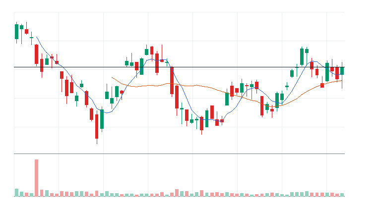
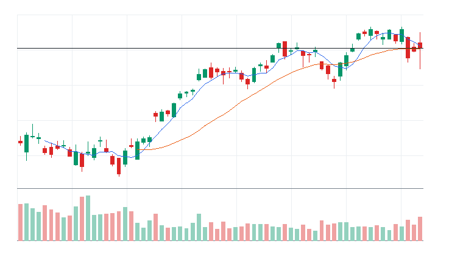
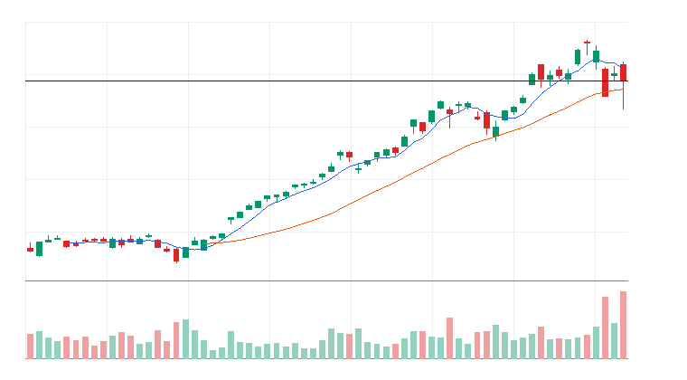
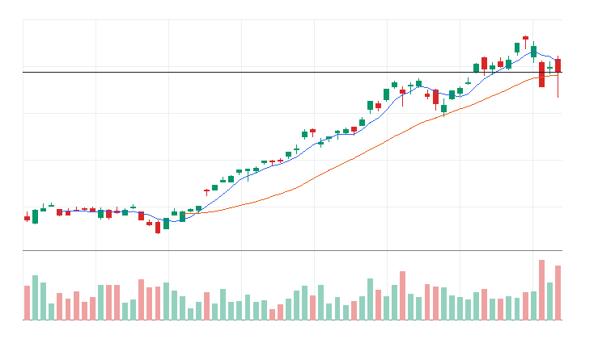
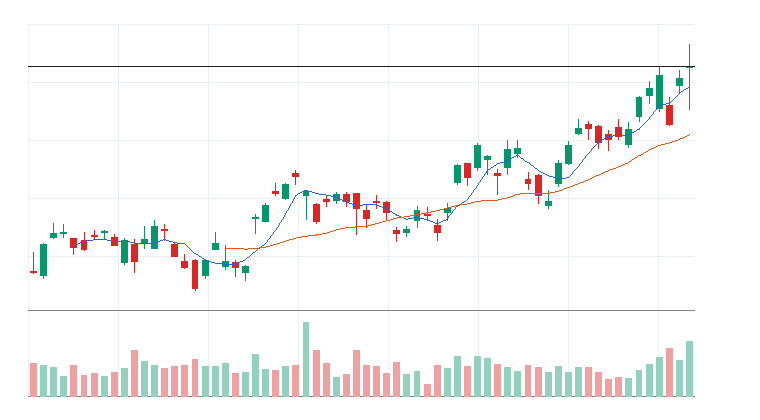
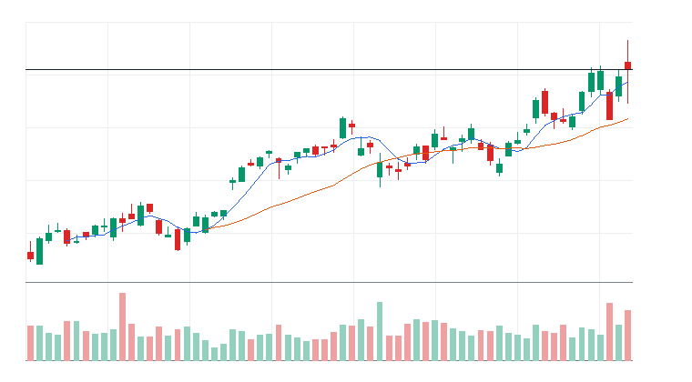
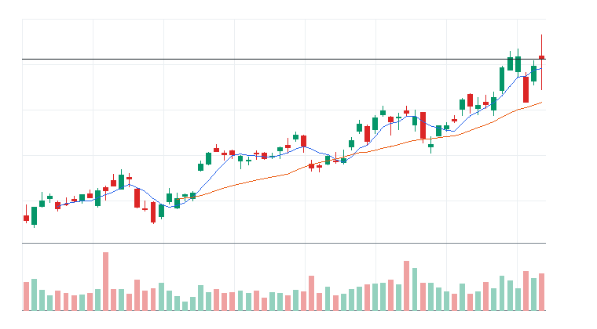
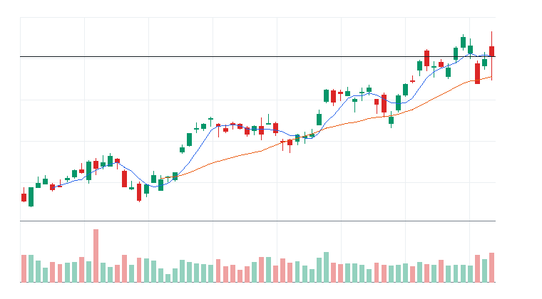
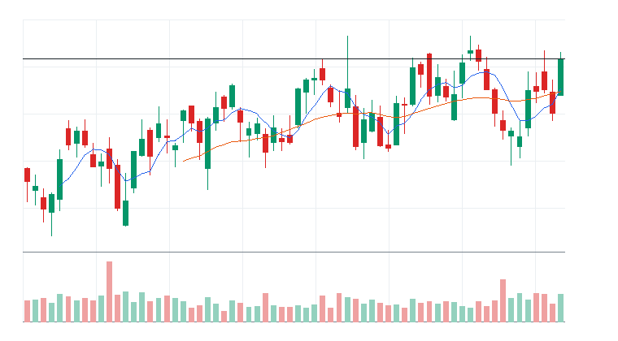

# 오늘의 데일리 트레이딩 요약

**REAL DATA TEST - 가격/거래량은 실제 데이터, 뉴스/ETF 구성종목 확산도/거래대금 유동성 일부 연결**

**목적:** 이 리포트는 최근 오른 자산을 나열하는 것이 아니라, 돈이 몰리는 근거와 다음 매수 주체가 확인할 트레이딩 후보를 찾기 위한 보고서다.

> 핵심 질문: 현재 가격에서 누가 사고 있고, 누가 앞으로 더 비싸게 사줄 수 있는가?

## 모바일 요약

[오늘의 데일리 트레이딩 요약]

생성 성공 / 데이터 모드: REAL_TEST

시장:
- 중립

시장 지배 서사:
1. AI 인프라 재가속 - 약화 - DRAM, SOXX, TSM, ARM 중심으로 5일 -8.58%, 20일 +3.00% 흐름이 형성됨. 뉴스 직접성 제한.
2. 방산/안보 프리미엄 - 약화 - ITA, XAR, AVAV, KTOS 중심으로 5일 -3.29%, 20일 +0.86% 흐름이 형성됨. 뉴스 직접성 제한.
3. 위험선호 성장주 재진입 - 약화 - IWM, QQQ, ARM, COIN 중심으로 5일 -7.68%, 20일 +1.18% 흐름이 형성됨. 뉴스 직접성 제한.

트렌드 강도:
1. AI 인프라 재가속 - TSI 19 - 잠복 - 진입품질 낮음
2. 방산/안보 프리미엄 - TSI 14 - 잠복 - 진입품질 낮음
3. 위험선호 성장주 재진입 - TSI 8 - 잠복 - 진입품질 낮음

오늘 결론:
- AI 반도체 개별 종목 흐름이 ETF 대비 강한지 확인 필요
- 행동 후보는 linkedNarrative와 함께 확인한다.
- 추격보다 진입 조건 확인 후 접근한다.

오늘 실제 행동 후보:
1. 행동 후보 없음 - 미분류 - 조건 충족 후보 없음

다크호스 후보:
1. 다크호스 후보 없음 - 조건 충족 후보 없음

ETF 후보 TOP 5:
1. ITA - 방산/안보 프리미엄 - 제외
2. IWM - 위험선호 성장주 재진입 - 제외
3. DRAM - AI 인프라 재가속 - 제외
4. SOXX - AI 인프라 재가속 - 제외
5. SMH - AI 인프라 재가속 - 제외

웹 리포트:
https://yoolcool.github.io/DailyTradingThesisAgent/

## 오늘 결론

- 오늘 결론: 매매 보류
- 신규 진입 후보: 0개
- 조건부 진입 후보: 0개
- 관찰 후보: 74개
- 주요 제한 요인: Entry Quality 부족, 뉴스 직접성 부족, RVOL 미달
- 주문 판단: 시장가 금지 / 지정가 또는 관찰
- 실전 판단: 오늘은 추세 후보는 있으나, 왜 돈이 몰리는가와 누가 더 비싸게 사줄 수 있는가를 주문 실행 신뢰도와 거래량이 충분히 뒷받침하지 못해 신규 추격은 보류한다. 기존 관심 종목은 전일 고점 돌파와 RVOL 1.00x 회복을 확인한 뒤 조건부로 본다.

### 후보 제한 요인 집계

- RVOL < 1.00x: 74개
- 거래대금 유동성 낮음: 12개
- Entry Quality < 60: 157개
- Exhaustion Risk >= 70: 0개
- ETF breadth 샘플 부족: 37개
- 뉴스 직접성 부족: 100개

## 데이터 신뢰도

- 전체 데이터 신뢰도 등급: LOW
- 분석 신뢰도: LOW
- 주문 실행 신뢰도: LOW
- ETF breadth 신뢰도: LOW
- 신뢰도 해석: 테마 확산 판단 제한, 거래대금 유동성 낮음 또는 확인 불가, 프리/애프터마켓 확인 불가
- 리포트 생성 시각: 2026-06-10 11:38 KST
- 가격 기준 거래일: 2026-06-09 US regular close
- 뉴스 수집 시각: 2026-06-10 11:38 KST
- 가장 최근 뉴스 발행 시각: 2026-06-10 11:15 KST
- 뉴스 신선도 상태: FRESH
- 뉴스 소스: Yahoo Finance RSS, MarketWatch RSS, CNBC Markets RSS, SEC EDGAR RSS, Federal Reserve RSS, Finnhub API
- 뉴스 소스 상태: Yahoo Finance RSS CONNECTED, MarketWatch RSS CONNECTED, CNBC Markets RSS PARTIAL, SEC EDGAR RSS PARTIAL, Federal Reserve RSS CONNECTED, Finnhub API DISABLED
- 뉴스 신뢰도: MEDIUM
- 추천 적용 거래일: 2026-06-09 US regular session
- 가격/거래량 데이터 상태: 연결됨
- 뉴스 데이터 상태: 일부 연결
- ETF 구성종목 확산도 상태: 일부 연결
- ETF 구성종목 샘플 수: 1~4
- 거래대금 유동성 데이터 상태: 일부 연결
- 프리마켓/애프터마켓 데이터 상태: UNAVAILABLE
- 데이터 provider: yfinance, Yahoo Finance RSS, MarketWatch RSS, CNBC Markets RSS, SEC EDGAR RSS, Federal Reserve RSS, Finnhub API, config fallback sample, price-volume dollar-volume fallback
- 실전 사용 경고: 이 리포트는 투자판단 보조용이며, REAL_TEST 모드에서는 일부 데이터가 누락되거나 지연될 수 있다. 실제 주문 전 현재가, 뉴스, 프리마켓/정규장 거래량을 별도 확인해야 한다.

## 0. 시장 상태

- 데이터 모드: REAL_TEST
- 가격/거래량: 연결됨
- 뉴스: 일부 연결
- ETF 구성종목 확산도: 일부 연결
- 거래대금 유동성: 일부 연결
- 생성 시각: 2026년 6월 10일 수요일 오전 11:38
- 시장 상태: 중립
- 오늘 돈의 방향: AI 반도체 개별 종목 흐름이 ETF 대비 강한지 확인 필요
- 강한 테마 TOP 3: 반도체 장비/공급망(76), Basic Materials(76), AI 반도체(34)
- 데이터 한계:
  - API 또는 provider 상태에 따라 뉴스/ETF 확산도/거래대금 유동성 반영 범위가 달라질 수 있다.
  - 수집 실패 데이터는 점수 반영에서 제외하거나 confidence를 제한한다.
  - reasonConfidence HIGH는 직접 촉매, 가격/거래량, 확산도/유동성 근거가 함께 있을 때만 사용한다.

## 오늘 시장을 지배하는 서사

### 오늘 시장을 지배하는 서사 TOP 3

#### 1. AI 인프라 재가속
- 상태: 약화
- narrativeScore: 10
- reasonConfidence: LOW
- 근거 ETF: DRAM, SOXX, SMH
- 근거 개별 종목: TSM, ARM, MU, NVDA, AVGO
- 돈이 몰리는 이유: AI 인프라 재가속 관련 DRAM, SOXX, SMH와 TSM, ARM, MU, NVDA의 5일(-8.58%)·20일(+3.00%) 흐름을 함께 본다. 평균 상대 거래량은 1.41배이고, ETF 확산도는 추가 확인이 필요하다. 뉴스 직접성은 아직 제한적이다.
- 다음 매수 주체: AI 인프라 CAPEX를 사는 반도체/전력망 ETF 자금과 신고가 모멘텀 추종 자금
- 가장 좋은 트레이딩 수단: ETF 우선: SMH, SOXX, DRAM / 개별 종목 우선: NVDA, AVGO, MU
- 서사가 깨지는 조건: SMH/SOXX 20일선 이탈, 관련 반도체와 전력 인프라 종목 절반 이상 5일선 이탈
- 오늘 행동: 추격보다 5일선 지지 후 재상승 확인

상세 narrativeScore 근거 보기

- rawScore: 10
- ETF 평균 moneyFlowScore: 23
- 개별 종목 평균 moneyFlowScore: 15
- ETF 후보 비율: 0%
- 개별 종목 후보 비율: 11%
- 5일 평균 수익률: -9.00%
- 20일 평균 수익률: +3.00%
- 평균 상대 거래량: 1.00배
- ETF 평균 상대 거래량: 2.00배
- 개별주 평균 상대 거래량: 1.00배
- 52주 고점 근접 후보 비율: 13%
- 뉴스 직접성 점수: 2
- ETF 확산도 점수: -2
- 유동성 점수: 2
- 과열 리스크 차감: 0

#### 2. 방산/안보 프리미엄
- 상태: 약화
- narrativeScore: 7
- reasonConfidence: LOW
- 근거 ETF: ITA, XAR, SHLD
- 근거 개별 종목: AVAV, KTOS, PLTR
- 돈이 몰리는 이유: 방산/안보 프리미엄 관련 ITA, XAR, SHLD와 AVAV, KTOS, PLTR의 5일(-3.29%)·20일(+0.86%) 흐름을 함께 본다. 평균 상대 거래량은 0.91배이고, ETF 확산도는 추가 확인이 필요하다. 뉴스 직접성은 아직 제한적이다.
- 다음 매수 주체: 지정학 리스크와 안보 예산 기대를 사는 테마 ETF 자금
- 가장 좋은 트레이딩 수단: ETF 우선: XAR, SHLD, ITA / 개별 종목 우선: AVAV, KTOS, PLTR
- 서사가 깨지는 조건: 방산 ETF 20일선 이탈 또는 안보 이벤트 프리미엄 둔화
- 오늘 행동: 뉴스 촉매가 직접 확인될 때만 추세 추종

상세 narrativeScore 근거 보기

- rawScore: 7
- ETF 평균 moneyFlowScore: 30
- 개별 종목 평균 moneyFlowScore: 5
- ETF 후보 비율: 0%
- 개별 종목 후보 비율: 0%
- 5일 평균 수익률: -3.00%
- 20일 평균 수익률: +1.00%
- 평균 상대 거래량: 1.00배
- ETF 평균 상대 거래량: 1.00배
- 개별주 평균 상대 거래량: 1.00배
- 52주 고점 근접 후보 비율: 0%
- 뉴스 직접성 점수: 5
- ETF 확산도 점수: 0
- 유동성 점수: -1
- 과열 리스크 차감: 0

#### 3. 위험선호 성장주 재진입
- 상태: 약화
- narrativeScore: 6
- reasonConfidence: LOW
- 근거 ETF: IWM, QQQ, IPO, ARKK
- 근거 개별 종목: ARM, COIN, TSLA
- 돈이 몰리는 이유: 위험선호 성장주 재진입 관련 IWM, QQQ, IPO와 ARM, COIN, TSLA의 5일(-7.68%)·20일(+1.18%) 흐름을 함께 본다. 평균 상대 거래량은 1.23배이고, ETF 확산도는 추가 확인이 필요하다. 뉴스 직접성은 아직 제한적이다.
- 다음 매수 주체: 위험선호 회복을 사는 성장주 ETF 자금과 고베타 단기 모멘텀 자금
- 가장 좋은 트레이딩 수단: ETF 우선: QQQ, IPO, ARKK / 개별 종목 우선: ARM, COIN, TSLA
- 서사가 깨지는 조건: QQQ/IWM 동반 약화, 고베타 성장주 상대 거래량 둔화
- 오늘 행동: 지수 위험선호가 유지될 때만 선별 진입

상세 narrativeScore 근거 보기

- rawScore: 6
- ETF 평균 moneyFlowScore: 12
- 개별 종목 평균 moneyFlowScore: 14
- ETF 후보 비율: 0%
- 개별 종목 후보 비율: 0%
- 5일 평균 수익률: -8.00%
- 20일 평균 수익률: +1.00%
- 평균 상대 거래량: 1.00배
- ETF 평균 상대 거래량: 1.00배
- 개별주 평균 상대 거래량: 1.00배
- 52주 고점 근접 후보 비율: 13%
- 뉴스 직접성 점수: 3
- ETF 확산도 점수: -1
- 유동성 점수: 2
- 과열 리스크 차감: 0

### 전체 narrative 요약

| 서사명 | 상태 | narrativeScore | reasonConfidence | 대표 ETF | 대표 종목 | 오늘 행동 |
| --- | --- | ---: | --- | --- | --- | --- |
| AI 인프라 재가속 | 약화 | 10 | LOW | DRAM, SOXX, SMH | TSM, ARM, MU, NVDA | 추격보다 5일선 지지 후 재상승 확인 |
| 방산/안보 프리미엄 | 약화 | 7 | LOW | ITA, XAR, SHLD | AVAV, KTOS, PLTR | 뉴스 촉매가 직접 확인될 때만 추세 추종 |
| 위험선호 성장주 재진입 | 약화 | 6 | LOW | IWM, QQQ, IPO | ARM, COIN, TSLA | 지수 위험선호가 유지될 때만 선별 진입 |
| 매크로 방어/헤지 | 약화 | 2 | LOW | TLT, XLE, GLD | XOM, CVX | 위험회피가 확인될 때만 헤지성 접근 |
| AI 소프트웨어/사이버보안 확산 | 약화 | 0 | LOW | CIBR, AIQ, IGV | PANW, DDOG, CRWD, TEAM | 추격보다 눌림 후 재상승 확인 |
| 전력망/원전/인프라 병목 | 소멸 | 0 | LOW | PAVE, GRID, URA | VRT, ETN, PWR, CEG | ETF 확산도와 거래량이 같이 살아날 때만 진입 |
| 비트코인/디지털 자산 위험선호 | 소멸 | 0 | LOW | IBIT, BLOK | MSTR, COIN, IREN | 비트코인 베타가 살아날 때만 단기 매매 |

## 트렌드 강도 판단

### 1. AI 인프라 재가속
- Trend Strength Index: 19
- 트렌드 상태 라벨: 잠복
- 테마 확산도: 약함
- ETF 동조성: 부족
- 거래량 강도: 보통
- 과열 위험: 낮음 (4)
- 오늘 진입 품질: 낮음 (17)
- 한 줄 판단: AI 인프라 재가속는 ETF 동조성이 약해 테마 자금 확인이 부족하다.
- 오늘 접근법: DRAM/SOXX/SMH와 TSM/ARM/MU의 거래량 확산이 확인되기 전까지 관찰한다.

트렌드 강도 상세 근거 보기

- 가격 모멘텀: 가격 모멘텀 -6/25. 평균 5D -8.58%, 20D +3.00%.
- 거래량 강도: 거래량 강도 11/20. 평균 RVOL 1.41배.
- ETF 동조성: ETF 동조성 2/15. 관련 ETF SMH, SOXX, SOXQ, DRAM, GRID, PAVE 흐름을 기준으로 판단.
- 테마 확산도: 테마 확산도 6/20. 상위 1~2개 쏠림 감점 0점 반영.
- 뉴스 촉매: 뉴스/촉매 신선도 2/10. HIGH 직접 촉매 0개.
- 과열 리스크: 과열 리스크 4/100. 단기 급등, 고점 근접, ETF-개별주 괴리, 쏠림을 함께 반영.
- 시장 환경: 시장 환경 4/10. QQQ/SPY/IWM 가격 흐름 기반 위험선호 점수.

### 2. 방산/안보 프리미엄
- Trend Strength Index: 14
- 트렌드 상태 라벨: 잠복
- 테마 확산도: 부족
- ETF 동조성: 약함
- 거래량 강도: 부족
- 과열 위험: 낮음 (9)
- 오늘 진입 품질: 낮음 (11)
- 한 줄 판단: 방산/안보 프리미엄는 테마 확산도가 낮아 아직 개별 종목 이벤트성 흐름에 가깝다.
- 오늘 접근법: ITA/XAR/SHLD와 AVAV/KTOS/PLTR의 거래량 확산이 확인되기 전까지 관찰한다.

트렌드 강도 상세 근거 보기

- 가격 모멘텀: 가격 모멘텀 -5/25. 평균 5D -3.29%, 20D +0.86%.
- 거래량 강도: 거래량 강도 3/20. 평균 RVOL 0.91배.
- ETF 동조성: ETF 동조성 7/15. 관련 ETF XAR, SHLD, ITA, PPA 흐름을 기준으로 판단.
- 테마 확산도: 테마 확산도 3/20. 상위 1~2개 쏠림 감점 3점 반영.
- 뉴스 촉매: 뉴스/촉매 신선도 2/10. HIGH 직접 촉매 0개.
- 과열 리스크: 과열 리스크 9/100. 단기 급등, 고점 근접, ETF-개별주 괴리, 쏠림을 함께 반영.
- 시장 환경: 시장 환경 4/10. QQQ/SPY/IWM 가격 흐름 기반 위험선호 점수.

### 3. 위험선호 성장주 재진입
- Trend Strength Index: 8
- 트렌드 상태 라벨: 잠복
- 테마 확산도: 부족
- ETF 동조성: 부족
- 거래량 강도: 약함
- 과열 위험: 낮음 (20)
- 오늘 진입 품질: 낮음 (3)
- 한 줄 판단: 위험선호 성장주 재진입는 테마 확산도가 낮아 아직 개별 종목 이벤트성 흐름에 가깝다.
- 오늘 접근법: IWM/QQQ/IPO와 ARM/COIN/TSLA의 거래량 확산이 확인되기 전까지 관찰한다.

트렌드 강도 상세 근거 보기

- 가격 모멘텀: 가격 모멘텀 -7/25. 평균 5D -7.68%, 20D +1.18%.
- 거래량 강도: 거래량 강도 9/20. 평균 RVOL 1.23배.
- ETF 동조성: ETF 동조성 0/15. 관련 ETF QQQ, IPO, ARKK, IWM, MAGS 흐름을 기준으로 판단.
- 테마 확산도: 테마 확산도 0/20. 상위 1~2개 쏠림 감점 6점 반영.
- 뉴스 촉매: 뉴스/촉매 신선도 2/10. HIGH 직접 촉매 0개.
- 과열 리스크: 과열 리스크 20/100. 단기 급등, 고점 근접, ETF-개별주 괴리, 쏠림을 함께 반영.
- 시장 환경: 시장 환경 4/10. QQQ/SPY/IWM 가격 흐름 기반 위험선호 점수.

## 최근 추천 결과 트래킹

개별주는 데이트레이딩 관점으로 추천 이후 첫 정규장의 장중 최고가와 종가를 추적한다. ETF는 테마/스윙 관점으로 추천 이후 1주일 동안의 최고가와 현재 종가를 추적한다.

### 개별주 Top 3 추천 성과 요약
- 최근 5개 리포트 표본: 7개 (초기 검증 단계)
- 장중 최고가 기준 성공률: +14.29%
- 종가 기준 성공률: +28.57%
- 평균 장중 최고 수익률: +0.98%
- 평균 종가 수익률: -1.19%

### ETF 추천 성과 요약
- 최근 5개 리포트 표본: 7개 (초기 검증 단계)
- 1주 최고가 기준 성공률: 0.00%
- 현재 종가 기준 성공률: 0.00%
- 평균 1주 최고 수익률: -3.33%
- 평균 현재 수익률: -10.07%

최근 추천 결과 상세 테이블 펼치기

| 추천일 | 유형 | 순위 | 티커 | 기준가 | 추적 기간 | 상태 | High 수익률 | Close 수익률 | 결과 | 코멘트 |
| --- | --- | ---: | --- | ---: | --- | --- | ---: | ---: | --- | --- |
| 2026-06-04 | STOCK | 3 | PANW | $280.43 | 2026-06-04 | complete | +0.10% | -0.42% | 실패 | 추천 이후 의미 있는 장중 기회가 부족하고 종가도 약함 (일봉 기준) |
| 2026-06-04 | STOCK | 2 | FTNT | $146.48 | 2026-06-04 | complete | +2.45% | +2.18% | 제한적 유효 | 제한적인 장중 기회만 발생 (일봉 기준) |
| 2026-06-04 | STOCK | 1 | CRWD | $747.61 | 2026-06-04 | complete | -3.56% | -3.81% | 실패 | 추천 이후 의미 있는 장중 기회가 부족하고 종가도 약함 (일봉 기준) |
| 2026-06-04 | ETF | 3 | HACK | $102.21 | 2026-06-04~2026-06-11 | in_progress | -1.66% | -6.97% | 진행 중 | 아직 1주 추적 기간이 끝나지 않음 |
| 2026-06-04 | ETF | 2 | SOXQ | $109.58 | 2026-06-04~2026-06-11 | in_progress | -4.68% | -9.09% | 진행 중 | 아직 1주 추적 기간이 끝나지 않음 |
| 2026-06-04 | ETF | 1 | AIQ | $69.16 | 2026-06-04~2026-06-11 | in_progress | -4.29% | -8.68% | 진행 중 | 아직 1주 추적 기간이 끝나지 않음 |
| 2026-06-03 | STOCK | 3 | FTNT | $148.86 | 2026-06-03 | complete | -0.26% | -1.60% | 실패 | 추천 이후 의미 있는 장중 기회가 부족하고 종가도 약함 (일봉 기준) |
| 2026-06-03 | STOCK | 3 | CRWD | $768.95 | 2026-06-03 | complete | -0.25% | -2.78% | 실패 | 추천 이후 의미 있는 장중 기회가 부족하고 종가도 약함 (일봉 기준) |
| 2026-06-03 | STOCK | 2 | MRVL | $290.79 | 2026-06-03 | complete | +11.49% | +3.73% | 성공 | 장중 기회와 종가 유지가 모두 확인됨 (일봉 기준) |
| 2026-06-03 | STOCK | 1 | PANW | $297.18 | 2026-06-03 | complete | -3.09% | -5.64% | 실패 | 추천 이후 의미 있는 장중 기회가 부족하고 종가도 약함 (일봉 기준) |
| 2026-06-03 | ETF | 3 | DRAM | $69.57 | 2026-06-03~2026-06-10 | in_progress | -3.52% | -13.96% | 진행 중 | 아직 1주 추적 기간이 끝나지 않음 |
| 2026-06-03 | ETF | 3 | IGV | $104.73 | 2026-06-03~2026-06-10 | in_progress | -3.31% | -11.25% | 진행 중 | 아직 1주 추적 기간이 끝나지 않음 |
| 2026-06-03 | ETF | 2 | AIQ | $70.14 | 2026-06-03~2026-06-10 | in_progress | -2.32% | -9.95% | 진행 중 | 아직 1주 추적 기간이 끝나지 않음 |
| 2026-06-03 | ETF | 1 | CIBR | $94.32 | 2026-06-03~2026-06-10 | in_progress | -3.56% | -10.58% | 진행 중 | 아직 1주 추적 기간이 끝나지 않음 |

## 오늘 실제 행동 후보

오늘은 추세 후보는 있으나, 왜 돈이 몰리는가와 누가 더 비싸게 사줄 수 있는가를 주문 실행 신뢰도와 거래량이 충분히 뒷받침하지 못해 신규 추격은 보류한다. 기존 관심 종목은 전일 고점 돌파와 RVOL 1.00x 회복을 확인한 뒤 조건부로 본다.

## 다크호스 후보

다크호스 후보 없음. 상위 서사 정렬, MA20 위 안착, MA5/MA20 구조 개선, RVOL 0.90x 이상 조건을 동시에 충족한 개별주가 없다.

- darkHorseScore: 조건 충족 후보 없음
- 왜 아직 메인이 아닌가: 확인 조건을 통과한 보조 관찰 후보가 없다.

darkHorseScore 상세 근거 보기

- 서사 정렬: 조건 미충족
- 초기 추세 구조: 조건 미충족
- 베이스 돌파/정돈: 조건 미충족
- 거래량 확인: 조건 미충족
- rawScore: 데이터 없음

## 참고용 행동 후보

> 실제 행동 후보가 없는 날에만 표시한다. 아래 후보는 매수 추천이 아니라 다음 정규장에서 전일 고점 돌파, RVOL 1.00x 이상, 거래대금 유동성 확인을 기다리는 관찰 리스트다.

### ETF 참고 후보 TOP 3

#### 1. [ITA] iShares U.S. Aerospace & Defense ETF
- 상태: 참고용 관찰 후보
- todayActionLabel: 제외
- 제한 사유: Entry Quality 23 < 45; 진입 품질 부족
- 주문 실행: 지정가 권장
- moneyFlowScore: 55
- Entry Quality: 23 (낮음)
- RVOL: 1.00x
- 진입 전 확인: 20일선 위 눌림 후 재상승 확인
- 무효화: 20일선 이탈 또는 상대 거래량 0.8배 이하 둔화

#### 2. [IWM] iShares Russell 2000 ETF
- 상태: 참고용 관찰 후보
- todayActionLabel: 제외
- 제한 사유: Entry Quality 18 < 45; 진입 품질 부족
- 주문 실행: 시장가 가능
- moneyFlowScore: 54
- Entry Quality: 18 (낮음)
- RVOL: 1.51x
- 진입 전 확인: 전일 고점 돌파와 5일선 유지 확인
- 무효화: 20일선 이탈 또는 상대 거래량 0.8배 이하 둔화

#### 3. [DRAM] Roundhill Memory ETF
- 상태: 참고용 관찰 후보
- todayActionLabel: 제외
- 제한 사유: Entry Quality 19 < 45; 진입 품질 부족
- 주문 실행: 시장가 가능
- moneyFlowScore: 32
- Entry Quality: 19 (낮음)
- RVOL: 1.66x
- 진입 전 확인: 20일선 위 눌림 후 재상승 확인
- 무효화: 20일선 이탈 또는 상대 거래량 0.8배 이하 둔화

### 개별주 참고 후보 TOP 3

#### 1. [ASML] ASML Holding N.V.
- 상태: 참고용 관찰 후보
- todayActionLabel: 제외
- 제한 사유: Entry Quality 40 < 45; 진입 품질 부족
- 주문 실행: 시장가 가능
- moneyFlowScore: 93
- Entry Quality: 40 (관찰)
- RVOL: 1.83x
- 진입 전 확인: 전일 고점 돌파와 5일선 유지 확인
- 무효화: 20일선 이탈 또는 상대 거래량 0.8배 이하 둔화

#### 2. [KLAC] KLA Corporation
- 상태: 참고용 관찰 후보
- todayActionLabel: 제외
- 제한 사유: Entry Quality 39 < 45; 진입 품질 부족
- 주문 실행: 시장가 가능
- moneyFlowScore: 90
- Entry Quality: 39 (낮음)
- RVOL: 1.57x
- 진입 전 확인: 20일선 위 눌림 후 재상승 확인
- 무효화: 20일선 이탈 또는 상대 거래량 0.8배 이하 둔화

#### 3. [AMAT] Applied Materials Inc.
- 상태: 참고용 관찰 후보
- todayActionLabel: 제외
- 제한 사유: Entry Quality 33 < 45; 진입 품질 부족
- 주문 실행: 시장가 가능
- moneyFlowScore: 72
- Entry Quality: 33 (낮음)
- RVOL: 1.29x
- 진입 전 확인: 20일선 위 눌림 후 재상승 확인
- 무효화: 20일선 이탈 또는 상대 거래량 0.8배 이하 둔화

## 오늘 돈이 몰리는 테마

- 반도체 장비/공급망: LRCX, AMAT, KLAC | 평균 moneyFlowScore 76 | 단일 종목 이벤트보다 테마 단위 자금 흐름이 선명한 구간으로 본다.
- Basic Materials: LIN | 평균 moneyFlowScore 76 | 단일 종목 이벤트보다 테마 단위 자금 흐름이 선명한 구간으로 본다.
- AI 반도체: NVDA, AVGO, AMD, ASML, ARM, MRVL, TSM | 평균 moneyFlowScore 34 | 관심은 유지하되 우선순위는 낮추고 추가 거래량 확인을 기다린다.
- 메모리/HBM ETF: DRAM | 평균 moneyFlowScore 32 | 관심은 유지하되 우선순위는 낮추고 추가 거래량 확인을 기다린다.
- 방산 ETF: ITA, XAR, SHLD, PPA | 평균 moneyFlowScore 30 | 관심은 유지하되 우선순위는 낮추고 추가 거래량 확인을 기다린다.
- 필수소비재: WMT, COST, PEP, MNST, MDLZ, KDP, CCEP, KHC | 평균 moneyFlowScore 29 | 관심은 유지하되 우선순위는 낮추고 추가 거래량 확인을 기다린다.

## 1. ETF 트레이딩 보고서
### 1-1. ETF 결론
- ETF 우선 후보: 없음
- ETF 관찰 후보: HACK, SHLD, PAVE, XLU, COPX
- ETF 매매 금지: IGV, BOTZ, ROBO, HACK, SHLD
- 오늘 ETF 최우선 1개: 없음
- ETF 섹션 해석: 이 섹션은 개별 종목 선택이 아니라 테마/섹터 단위 자금 흐름을 ETF로 매매할지 판단하기 위한 영역이다.

### 1-2. ETF 후보 TOP 5

선정 기준: ETF 후보는 가격/거래량 1차 점수에 뉴스, ETF 구성종목 확산도, 유동성, 리스크 패널티를 반영한 finalRawScore 기준으로 정렬한다. 표시 점수 100점 후보가 겹치면 tieBreakerReason으로 우선순위를 설명한다.

### [ETF ITA] iShares U.S. Aerospace & Defense ETF
- 자산 유형: ETF
- ETF 세부 카테고리: 방산 ETF
- ETF 역할: 방어 섹터 확인
- 상태: 매매 금지
- linkedNarrative: 방산/안보 프리미엄
- narrativeStatus: 약화
- narrativeScore: 7
- moneyFlowScore: 55
- finalRawScore: 55
- tieBreakerReason: 최종 원점수 55, 리스크 패널티 0, 5일 수익률 +0.93%, 상대 거래량 1.00배 순으로 정렬
- 과열 리스크: 낮음
- reasonConfidence: MEDIUM
- reasonConfidenceExplanation: ETF 확산도 제한 때문에 HIGH가 아니라 MEDIUM으로 제한했다.

- todayActionLabel: 제외
- 주문 실행: 지정가 권장
- 기준일: 2026-06-09
- 종가: $230.45
- 1일 수익률: +1.40%
- 5일 수익률: +0.93%
- 20일 수익률: +1.97%
- 상대 거래량: 1.00배
- 52주 고점 대비 위치: -8.06%
- whyMoneyIsFlowing: 20일 +1.97%, 5일 +0.93%, 상대 거래량 1.00배로 가격과 거래량이 함께 개선. 뉴스: Yahoo Finance RSS general_market/under_24h / 유동성: ACCEPTABLE
- likelyNextBuyer: 섹터 베타를 노리는 단기 모멘텀 자금과 리밸런싱 자금
- whyThisCouldTradeHigher: 단기 추세가 유지되고 거래량이 1.0배 이상이면 눌림 이후 재상승을 시도할 수 있음
- 진입 조건: 20일선 위 눌림 후 재상승 확인
- 무효화 조건: 20일선 이탈 또는 상대 거래량 0.8배 이하 둔화
- 차트: 

#### 상세 근거

ITA 상세 근거 펼치기

- moneyFlowScore(최종) 산정 근거:
  - moneyFlowScore(1차): 41
  - 최종 원점수: 55
  - 최종 표시 점수: 55
  - cap 적용: cap 미적용
  - 계산식: +41 + +12 + 0 + +2 + 0 + 0 + 0 = 55
  - 점수 해석: 관찰 후보. 흐름은 있으나 우선순위는 낮음.
  - 가격/거래량 1차 점수: +41
    - 추세: +8
    - 단기 모멘텀: +2
    - 중기 모멘텀: +1
    - 거래량: +10
    - 신고가 근접: +6
    - 이동평균: +14
  - 하위 점수 cap:
    - 가격 모멘텀: 원점수 +8, 상한 적용 +8 / 최대 25
    - 단기 모멘텀: 원점수 +2, 상한 적용 +2 / 최대 20
    - 중기 모멘텀: 원점수 +1, 상한 적용 +1 / 최대 16
    - 거래량: 원점수 +10, 상한 적용 +10 / 최대 20
    - 신고가 근접: 원점수 +6, 상한 적용 +6 / 최대 12
    - 이동평균: 원점수 +14, 상한 적용 +14 / 최대 14
  - 추가 데이터 가감점:
    - 뉴스: +12
    - 유동성: +2
  - ETF 확산도: 0
  - 리스크 패널티: 0
  - 주요 근거: 1차 41, 최종 원점수 55, 표시 55. 이동평균 위 추세 유지, 뉴스 흐름이 가격/거래량 근거 보강, 거래대금 기준 유동성 양호. 주의: ETF 구성종목 확산도 데이터 미연결.
  - 리스크 패널티 산정 근거:
    - 총 리스크 패널티: 0
    - 리스크 등급: LOW
    - 감점된 리스크: 없음
    - 관찰 리스크: ETF breadth data not connected
    - 한 줄 해석: 직접 감점된 주요 리스크는 없지만 관찰 리스크는 계속 확인해야 한다.
- 데이터 사용 현황:
  - 가격/거래량: 사용
  - 뉴스: 사용
  - ETF 확산도: 미연결
  - 거래대금 유동성: 사용
  - 관련 ETF 상대강도: 사용
- 뉴스 확인:
  - 최근 뉴스 상태: 일부 연결
  - 뉴스 소스: MarketWatch RSS, Federal Reserve RSS, Yahoo Finance RSS
  - 소스별 상태: Yahoo Finance RSS CONNECTED; MarketWatch RSS CONNECTED; CNBC Markets RSS FAILED; SEC EDGAR RSS PARTIAL; Federal Reserve RSS CONNECTED; Finnhub API DISABLED
  - 긍정/중립/부정: 10/6/0
  - 직접성/방향성/신선도: 4/1/4
  - 강한 촉매 수: 0
  - 직접 촉매: Yahoo Finance RSS / general_market / under_24h / positive - ITA Investors: Watch These Two Events Over the Next 30 Days
  - 보조 뉴스: MarketWatch RSS sector_theme / macro / under_6h
  - 뉴스 수집 시각: 2026-06-10 11:38 KST
  - 가장 최근 뉴스 발행 시각: 2026-06-10 10:31 KST
  - 뉴스 신선도 상태: FRESH
  - 뉴스 이후 가격 반응: 긍정
  - 가격 반응 점수 제한: 뉴스 이후 가격 반응과 점수 제한 특이사항 없음
  - 핵심 뉴스 요약: This proposed federal budget cut could eliminate job training for 42,000 vulnerable seniors
  - 원점수/상한 점수: +21 / +12
  - 점수 반영: +12
  - 주의: CNBC Markets RSS: HTTP 403 from https://www.cnbc.com/id/100003114/device/rss/rss.html; SEC EDGAR RSS: no matching RSS items; Finnhub API: FINNHUB_API_KEY not configured
- ETF 구성종목 확산도:
  - 구성종목 데이터 상태: 미연결
  - 샘플 수: 0/0
  - 샘플 신뢰도: UNKNOWN
  - 상승 종목 비율: 데이터 없음
  - 20일선 위 비율: 데이터 없음
  - 50일선 위 비율: 데이터 없음
  - 상위 기여 종목: 데이터 없음
  - 확산도 판단: UNKNOWN
  - 원점수/샘플 상한/반영 점수: 0 / N/A / 0
  - 점수 반영: 0
- 거래대금 유동성:
  - 데이터 상태: 일부 연결
  - 거래대금 기준 유동성: ACCEPTABLE
  - 거래대금: $199,622,473
  - 평균 거래대금: $200,566,627
  - 주문 영향: 지정가 권장
  - 매매 영향: 거래대금은 허용 가능하나 지정가를 우선한다
- reasonConfidence 근거: 가격/거래량, 뉴스, 거래대금 유동성, 관련 ETF 상대강도은 확인됐지만 일부 보조 데이터가 미연결 또는 fallback이라 중간으로 제한한다.
- 차트 요약: 최근 20거래일 기준 5일선이 20일선 위에 있음
- 기준일 2026-06-09 | 종가 $230.45 | 1일 +1.40% | 5일 +0.93% | 20일 +1.97% | 상대 거래량 1.00배 | 52주 고점 대비 -8.06% | 데이터 소스: yfinance

### [ETF IWM] iShares Russell 2000 ETF
- 자산 유형: ETF
- ETF 세부 카테고리: 시장 기준 ETF
- ETF 역할: 시장 기준 확인
- 상태: 매매 금지
- linkedNarrative: 위험선호 성장주 재진입
- narrativeStatus: 약화
- narrativeScore: 6
- moneyFlowScore: 54
- finalRawScore: 54
- tieBreakerReason: 최종 원점수 54, 리스크 패널티 0, 5일 수익률 -2.28%, 상대 거래량 1.51배 순으로 정렬
- 과열 리스크: 낮음
- reasonConfidence: MEDIUM
- reasonConfidenceExplanation: ETF 확산도 제한 때문에 HIGH가 아니라 MEDIUM으로 제한했다.

- todayActionLabel: 제외
- 주문 실행: 시장가 가능
- 기준일: 2026-06-09
- 종가: $285.02
- 1일 수익률: +0.32%
- 5일 수익률: -2.28%
- 20일 수익률: -0.11%
- 상대 거래량: 1.51배
- 52주 고점 대비 위치: -2.68%
- whyMoneyIsFlowing: 20일 -0.11%, 5일 -2.28%, 상대 거래량 1.51배로 가격과 거래량이 함께 개선. 뉴스: Yahoo Finance RSS general_market/stale / 유동성: LIQUID
- likelyNextBuyer: 섹터 베타를 노리는 단기 모멘텀 자금과 리밸런싱 자금
- whyThisCouldTradeHigher: 52주 고점 부근이라 돌파가 확인되면 신고가 추종 매수가 붙을 수 있음
- 진입 조건: 전일 고점 돌파와 5일선 유지 확인
- 무효화 조건: 20일선 이탈 또는 상대 거래량 0.8배 이하 둔화
- 차트: 

#### 상세 근거

IWM 상세 근거 펼치기

- moneyFlowScore(최종) 산정 근거:
  - moneyFlowScore(1차): 37
  - 최종 원점수: 54
  - 최종 표시 점수: 54
  - cap 적용: cap 미적용
  - 계산식: +37 + +12 + 0 + +5 + 0 + 0 + 0 = 54
  - 점수 해석: 관찰 후보. 흐름은 있으나 우선순위는 낮음.
  - 가격/거래량 1차 점수: +37
    - 추세: -2
    - 단기 모멘텀: -1
    - 중기 모멘텀: 0
    - 거래량: +18
    - 신고가 근접: +12
    - 이동평균: +10
  - 하위 점수 cap:
    - 가격 모멘텀: 원점수 -2, 상한 적용 -2 / 최대 25
    - 단기 모멘텀: 원점수 -1, 상한 적용 -1 / 최대 20
    - 중기 모멘텀: 원점수 0, 상한 적용 0 / 최대 16
    - 거래량: 원점수 +18, 상한 적용 +18 / 최대 20
    - 신고가 근접: 원점수 +12, 상한 적용 +12 / 최대 12
    - 이동평균: 원점수 +10, 상한 적용 +10 / 최대 14
  - 추가 데이터 가감점:
    - 뉴스: +12
    - 유동성: +5
  - ETF 확산도: 0
  - 리스크 패널티: 0
  - 주요 근거: 1차 37, 최종 원점수 54, 표시 54. 상대 거래량 증가, 52주 고점 근처, 뉴스 흐름이 가격/거래량 근거 보강. 주의: ETF 구성종목 확산도 데이터 미연결.
  - 리스크 패널티 산정 근거:
    - 총 리스크 패널티: 0
    - 리스크 등급: LOW
    - 감점된 리스크: 없음
    - 관찰 리스크: ETF breadth data not connected
    - 한 줄 해석: 직접 감점된 주요 리스크는 없지만 관찰 리스크는 계속 확인해야 한다.
- 데이터 사용 현황:
  - 가격/거래량: 사용
  - 뉴스: 사용
  - ETF 확산도: 미연결
  - 거래대금 유동성: 사용
  - 관련 ETF 상대강도: 사용
- 뉴스 확인:
  - 최근 뉴스 상태: 일부 연결
  - 뉴스 소스: MarketWatch RSS, Federal Reserve RSS, Yahoo Finance RSS
  - 소스별 상태: Yahoo Finance RSS CONNECTED; MarketWatch RSS CONNECTED; CNBC Markets RSS FAILED; SEC EDGAR RSS PARTIAL; Federal Reserve RSS CONNECTED; Finnhub API DISABLED
  - 긍정/중립/부정: 8/8/0
  - 직접성/방향성/신선도: 4/1/4
  - 강한 촉매 수: 0
  - 직접 촉매: Yahoo Finance RSS / general_market / stale / neutral - The Spill: Why Financial Pros Are Piling Into IWM Right Now
  - 보조 뉴스: MarketWatch RSS sector_theme / macro / under_6h
  - 뉴스 수집 시각: 2026-06-10 11:38 KST
  - 가장 최근 뉴스 발행 시각: 2026-06-10 10:31 KST
  - 뉴스 신선도 상태: FRESH
  - 뉴스 이후 가격 반응: 긍정
  - 가격 반응 점수 제한: 뉴스 이후 가격 반응과 점수 제한 특이사항 없음
  - 핵심 뉴스 요약: This proposed federal budget cut could eliminate job training for 42,000 vulnerable seniors
  - 원점수/상한 점수: +19 / +12
  - 점수 반영: +12
  - 주의: CNBC Markets RSS: HTTP 403 from https://www.cnbc.com/id/100003114/device/rss/rss.html; SEC EDGAR RSS: no matching RSS items; Finnhub API: FINNHUB_API_KEY not configured
- ETF 구성종목 확산도:
  - 구성종목 데이터 상태: 미연결
  - 샘플 수: 0/0
  - 샘플 신뢰도: UNKNOWN
  - 상승 종목 비율: 데이터 없음
  - 20일선 위 비율: 데이터 없음
  - 50일선 위 비율: 데이터 없음
  - 상위 기여 종목: 데이터 없음
  - 확산도 판단: UNKNOWN
  - 원점수/샘플 상한/반영 점수: 0 / N/A / 0
  - 점수 반영: 0
- 거래대금 유동성:
  - 데이터 상태: 일부 연결
  - 거래대금 기준 유동성: LIQUID
  - 거래대금: $11,716,874,354
  - 평균 거래대금: $7,769,139,860
  - 주문 영향: 시장가 가능
  - 매매 영향: 거래대금이 충분해 시장가 가능 범위로 본다
- reasonConfidence 근거: 가격/거래량, 뉴스, 거래대금 유동성, 관련 ETF 상대강도은 확인됐지만 일부 보조 데이터가 미연결 또는 fallback이라 중간으로 제한한다.
- 차트 요약: 20일선 위에서 단기 눌림 확인 구간
- 기준일 2026-06-09 | 종가 $285.02 | 1일 +0.32% | 5일 -2.28% | 20일 -0.11% | 상대 거래량 1.51배 | 52주 고점 대비 -2.68% | 데이터 소스: yfinance

### [ETF DRAM] Roundhill Memory ETF
- 자산 유형: ETF
- ETF 세부 카테고리: 메모리/HBM ETF
- ETF 역할: 테마 베타 매수
- 상태: 매매 금지
- linkedNarrative: AI 인프라 재가속
- narrativeStatus: 약화
- narrativeScore: 10
- moneyFlowScore: 32
- finalRawScore: 32
- tieBreakerReason: 최종 원점수 32, 리스크 패널티 0, 5일 수익률 -13.96%, 상대 거래량 1.66배 순으로 정렬
- 과열 리스크: 낮음
- reasonConfidence: LOW
- reasonConfidenceExplanation: 가격/거래량이 약하거나 핵심 보조 근거가 부족해 LOW로 분류했다.

- todayActionLabel: 제외
- 주문 실행: 시장가 가능
- 기준일: 2026-06-09
- 종가: $59.86
- 1일 수익률: -1.09%
- 5일 수익률: -13.96%
- 20일 수익률: +8.68%
- 상대 거래량: 1.66배
- 52주 고점 대비 위치: -14.67%
- whyMoneyIsFlowing: 20일 +8.68%, 5일 -13.96%, 상대 거래량 1.66배로 가격과 거래량이 함께 개선. 뉴스: CNBC Markets RSS macro/under_6h / 유동성: LIQUID
- likelyNextBuyer: 섹터 베타를 노리는 단기 모멘텀 자금과 리밸런싱 자금
- whyThisCouldTradeHigher: 단기 추세가 유지되고 거래량이 1.0배 이상이면 눌림 이후 재상승을 시도할 수 있음
- 진입 조건: 20일선 위 눌림 후 재상승 확인
- 무효화 조건: 20일선 이탈 또는 상대 거래량 0.8배 이하 둔화
- 차트: 

#### 상세 근거

DRAM 상세 근거 펼치기

- moneyFlowScore(최종) 산정 근거:
  - moneyFlowScore(1차): 25
  - 최종 원점수: 32
  - 최종 표시 점수: 32
  - cap 적용: cap 미적용
  - 계산식: +25 + +2 + 0 + +5 + 0 + 0 + 0 = 32
  - 점수 해석: 매매 금지 또는 우선순위 낮은 후보.
  - 가격/거래량 1차 점수: +25
    - 추세: -2
    - 단기 모멘텀: -7
    - 중기 모멘텀: +6
    - 거래량: +18
    - 신고가 근접: 0
    - 이동평균: +10
  - 하위 점수 cap:
    - 가격 모멘텀: 원점수 -2, 상한 적용 -2 / 최대 25
    - 단기 모멘텀: 원점수 -7, 상한 적용 -7 / 최대 20
    - 중기 모멘텀: 원점수 +6, 상한 적용 +6 / 최대 16
    - 거래량: 원점수 +18, 상한 적용 +18 / 최대 20
    - 신고가 근접: 원점수 0, 상한 적용 0 / 최대 12
    - 이동평균: 원점수 +10, 상한 적용 +10 / 최대 14
  - 추가 데이터 가감점:
    - 뉴스: +2
    - 유동성: +5
  - ETF 확산도: 0
  - 리스크 패널티: 0
  - 주요 근거: 1차 25, 최종 원점수 32, 표시 32. 20일 수익률 강함, 상대 거래량 증가, 뉴스 흐름이 가격/거래량 근거 보강. 주의: ETF 구성종목 확산도 데이터 미연결.
  - 리스크 패널티 산정 근거:
    - 총 리스크 패널티: 0
    - 리스크 등급: LOW
    - 감점된 리스크: 없음
    - 관찰 리스크: ETF breadth data not connected
    - 한 줄 해석: 직접 감점된 주요 리스크는 없지만 관찰 리스크는 계속 확인해야 한다.
- 데이터 사용 현황:
  - 가격/거래량: 사용
  - 뉴스: 사용
  - ETF 확산도: 미연결
  - 거래대금 유동성: 사용
  - 관련 ETF 상대강도: 사용
- 뉴스 확인:
  - 최근 뉴스 상태: 일부 연결
  - 뉴스 소스: CNBC Markets RSS, MarketWatch RSS, Yahoo Finance RSS
  - 소스별 상태: Yahoo Finance RSS CONNECTED; MarketWatch RSS CONNECTED; CNBC Markets RSS CONNECTED; SEC EDGAR RSS PARTIAL; Federal Reserve RSS CONNECTED; Finnhub API DISABLED
  - 긍정/중립/부정: 13/3/0
  - 직접성/방향성/신선도: 2/1/4
  - 강한 촉매 수: 1
  - 직접 촉매: 없음
  - 보조 뉴스: CNBC Markets RSS sector_theme / macro / under_6h
  - 뉴스 수집 시각: 2026-06-10 11:38 KST
  - 가장 최근 뉴스 발행 시각: 2026-06-10 10:57 KST
  - 뉴스 신선도 상태: FRESH
  - 뉴스 이후 가격 반응: 부정
  - 가격 반응 점수 제한: 뉴스 이후 가격 반응 부정 -> 긍정 점수 제한
  - 핵심 뉴스 요약: China May wholesale inflation hits near 4-year high on Iran war, AI costs; CPI misses
  - 원점수/상한 점수: +22 / +12
  - 점수 반영: +12
  - 주의: SEC EDGAR RSS: no matching RSS items; Finnhub API: FINNHUB_API_KEY not configured
- ETF 구성종목 확산도:
  - 구성종목 데이터 상태: 미연결
  - 샘플 수: 0/0
  - 샘플 신뢰도: UNKNOWN
  - 상승 종목 비율: 데이터 없음
  - 20일선 위 비율: 데이터 없음
  - 50일선 위 비율: 데이터 없음
  - 상위 기여 종목: 데이터 없음
  - 확산도 판단: UNKNOWN
  - 원점수/샘플 상한/반영 점수: 0 / N/A / 0
  - 점수 반영: 0
- 거래대금 유동성:
  - 데이터 상태: 일부 연결
  - 거래대금 기준 유동성: LIQUID
  - 거래대금: $4,108,334,566
  - 평균 거래대금: $2,474,226,542
  - 주문 영향: 시장가 가능
  - 매매 영향: 거래대금이 충분해 시장가 가능 범위로 본다
- reasonConfidence 근거: 가격/거래량이 약하거나 주요 데이터가 부족해 낮음.
- 차트 요약: 20일선 위에서 단기 눌림 확인 구간
- 기준일 2026-06-09 | 종가 $59.86 | 1일 -1.09% | 5일 -13.96% | 20일 +8.68% | 상대 거래량 1.66배 | 52주 고점 대비 -14.67% | 데이터 소스: yfinance

### [ETF SOXX] iShares Semiconductor ETF
- 자산 유형: ETF
- ETF 세부 카테고리: AI 반도체 ETF
- ETF 역할: 테마 베타 매수
- 상태: 매매 금지
- linkedNarrative: AI 인프라 재가속
- narrativeStatus: 약화
- narrativeScore: 10
- moneyFlowScore: 29
- finalRawScore: 29
- tieBreakerReason: 최종 원점수 29, 리스크 패널티 0, 5일 수익률 -7.09%, 상대 거래량 2.31배 순으로 정렬
- 과열 리스크: 낮음
- reasonConfidence: LOW
- reasonConfidenceExplanation: 가격/거래량이 약하거나 핵심 보조 근거가 부족해 LOW로 분류했다.

- todayActionLabel: 제외
- 주문 실행: 시장가 가능
- 기준일: 2026-06-09
- 종가: $562.14
- 1일 수익률: -1.63%
- 5일 수익률: -7.09%
- 20일 수익률: +5.51%
- 상대 거래량: 2.31배
- 52주 고점 대비 위치: -9.16%
- whyMoneyIsFlowing: 20일 +5.51%, 5일 -7.09%, 상대 거래량 2.31배로 가격과 거래량이 함께 개선. 뉴스: CNBC Markets RSS macro/under_6h / 유동성: LIQUID
- likelyNextBuyer: 섹터 베타를 노리는 단기 모멘텀 자금과 리밸런싱 자금
- whyThisCouldTradeHigher: 단기 추세가 유지되고 거래량이 1.0배 이상이면 눌림 이후 재상승을 시도할 수 있음
- 진입 조건: 20일선 위 눌림 후 재상승 확인
- 무효화 조건: 20일선 이탈 또는 상대 거래량 0.8배 이하 둔화
- 차트: 

#### 상세 근거

SOXX 상세 근거 펼치기

- moneyFlowScore(최종) 산정 근거:
  - moneyFlowScore(1차): 26
  - 최종 원점수: 29
  - 최종 표시 점수: 29
  - cap 적용: cap 미적용
  - 계산식: +26 + +2 - 4 + +5 + 0 + 0 + 0 = 29
  - 점수 해석: 매매 금지 또는 우선순위 낮은 후보.
  - 가격/거래량 1차 점수: +26
    - 추세: -4
    - 단기 모멘텀: -8
    - 중기 모멘텀: +4
    - 거래량: +18
    - 신고가 근접: +6
    - 이동평균: +10
  - 하위 점수 cap:
    - 가격 모멘텀: 원점수 -4, 상한 적용 -4 / 최대 25
    - 단기 모멘텀: 원점수 -8, 상한 적용 -8 / 최대 20
    - 중기 모멘텀: 원점수 +4, 상한 적용 +4 / 최대 16
    - 거래량: 원점수 +18, 상한 적용 +18 / 최대 20
    - 신고가 근접: 원점수 +6, 상한 적용 +6 / 최대 12
    - 이동평균: 원점수 +10, 상한 적용 +10 / 최대 14
  - 추가 데이터 가감점:
    - 뉴스: +2
    - 유동성: +5
  - ETF 확산도: -4
  - 리스크 패널티: 0
  - 주요 근거: 1차 26, 최종 원점수 29, 표시 29. 상대 거래량 증가, 뉴스 흐름이 가격/거래량 근거 보강, 거래대금 기준 유동성 양호. 주의: 큰 감점 제한적.
  - 리스크 패널티 산정 근거:
    - 총 리스크 패널티: 0
    - 리스크 등급: LOW
    - 감점된 리스크: 없음
    - 관찰 리스크: 주요 관찰 리스크 없음
    - 한 줄 해석: 직접 감점된 주요 리스크는 없지만 관찰 리스크는 계속 확인해야 한다.
- 데이터 사용 현황:
  - 가격/거래량: 사용
  - 뉴스: 사용
  - ETF 확산도: 일부 연결
  - 거래대금 유동성: 사용
  - 관련 ETF 상대강도: 사용
- 뉴스 확인:
  - 최근 뉴스 상태: 일부 연결
  - 뉴스 소스: CNBC Markets RSS, MarketWatch RSS
  - 소스별 상태: Yahoo Finance RSS CONNECTED; MarketWatch RSS CONNECTED; CNBC Markets RSS CONNECTED; SEC EDGAR RSS PARTIAL; Federal Reserve RSS CONNECTED; Finnhub API DISABLED
  - 긍정/중립/부정: 13/3/0
  - 직접성/방향성/신선도: 2/1/4
  - 강한 촉매 수: 1
  - 직접 촉매: 없음
  - 보조 뉴스: CNBC Markets RSS sector_theme / macro / under_6h
  - 뉴스 수집 시각: 2026-06-10 11:38 KST
  - 가장 최근 뉴스 발행 시각: 2026-06-10 10:57 KST
  - 뉴스 신선도 상태: FRESH
  - 뉴스 이후 가격 반응: 부정
  - 가격 반응 점수 제한: 뉴스 이후 가격 반응 부정 -> 긍정 점수 제한
  - 핵심 뉴스 요약: China May wholesale inflation hits near 4-year high on Iran war, AI costs; CPI misses
  - 원점수/상한 점수: +22 / +12
  - 점수 반영: +12
  - 주의: SEC EDGAR RSS: no matching RSS items; Finnhub API: FINNHUB_API_KEY not configured
- ETF 구성종목 확산도:
  - 구성종목 데이터 상태: 일부 연결
  - 샘플 수: 3/3
  - 샘플 신뢰도: INSUFFICIENT
  - 상승 종목 비율: 0%
  - 20일선 위 비율: 67%
  - 50일선 위 비율: 100%
  - 상위 기여 종목: TSM, NVDA, MU
  - 확산도 판단: WEAK_BREADTH
  - 원점수/샘플 상한/반영 점수: -4 / 0 / -4
  - 점수 반영: -4
- 거래대금 유동성:
  - 데이터 상태: 일부 연결
  - 거래대금 기준 유동성: LIQUID
  - 거래대금: $13,698,736,257
  - 평균 거래대금: $5,936,274,289
  - 주문 영향: 시장가 가능
  - 매매 영향: 거래대금이 충분해 시장가 가능 범위로 본다
- reasonConfidence 근거: 가격/거래량이 약하거나 주요 데이터가 부족해 낮음.
- 차트 요약: 20일선 위에서 단기 눌림 확인 구간
- 기준일 2026-06-09 | 종가 $562.14 | 1일 -1.63% | 5일 -7.09% | 20일 +5.51% | 상대 거래량 2.31배 | 52주 고점 대비 -9.16% | 데이터 소스: yfinance

### [ETF SMH] VanEck Semiconductor ETF
- 자산 유형: ETF
- ETF 세부 카테고리: AI 반도체 ETF
- ETF 역할: 테마 베타 매수
- 상태: 매매 금지
- linkedNarrative: AI 인프라 재가속
- narrativeStatus: 약화
- narrativeScore: 10
- moneyFlowScore: 27
- finalRawScore: 27
- tieBreakerReason: 최종 원점수 27, 리스크 패널티 0, 5일 수익률 -6.52%, 상대 거래량 1.75배 순으로 정렬
- 과열 리스크: 낮음
- reasonConfidence: LOW
- reasonConfidenceExplanation: 가격/거래량이 약하거나 핵심 보조 근거가 부족해 LOW로 분류했다.

- todayActionLabel: 제외
- 주문 실행: 시장가 가능
- 기준일: 2026-06-09
- 종가: $591.01
- 1일 수익률: -1.20%
- 5일 수익률: -6.52%
- 20일 수익률: +2.55%
- 상대 거래량: 1.75배
- 52주 고점 대비 위치: -8.05%
- whyMoneyIsFlowing: 20일 +2.55%, 5일 -6.52%, 상대 거래량 1.75배로 가격과 거래량이 함께 개선. 뉴스: Yahoo Finance RSS earnings/under_6h / 유동성: LIQUID
- likelyNextBuyer: 섹터 베타를 노리는 단기 모멘텀 자금과 리밸런싱 자금
- whyThisCouldTradeHigher: 단기 추세가 유지되고 거래량이 1.0배 이상이면 눌림 이후 재상승을 시도할 수 있음
- 진입 조건: 20일선 위 눌림 후 재상승 확인
- 무효화 조건: 20일선 이탈 또는 상대 거래량 0.8배 이하 둔화
- 차트: 

#### 상세 근거

SMH 상세 근거 펼치기

- moneyFlowScore(최종) 산정 근거:
  - moneyFlowScore(1차): 24
  - 최종 원점수: 27
  - 최종 표시 점수: 27
  - cap 적용: cap 미적용
  - 계산식: +24 + +2 - 4 + +5 + 0 + 0 + 0 = 27
  - 점수 해석: 매매 금지 또는 우선순위 낮은 후보.
  - 가격/거래량 1차 점수: +24
    - 추세: -5
    - 단기 모멘텀: -7
    - 중기 모멘텀: +2
    - 거래량: +18
    - 신고가 근접: +6
    - 이동평균: +10
  - 하위 점수 cap:
    - 가격 모멘텀: 원점수 -5, 상한 적용 -5 / 최대 25
    - 단기 모멘텀: 원점수 -7, 상한 적용 -7 / 최대 20
    - 중기 모멘텀: 원점수 +2, 상한 적용 +2 / 최대 16
    - 거래량: 원점수 +18, 상한 적용 +18 / 최대 20
    - 신고가 근접: 원점수 +6, 상한 적용 +6 / 최대 12
    - 이동평균: 원점수 +10, 상한 적용 +10 / 최대 14
  - 추가 데이터 가감점:
    - 뉴스: +2
    - 유동성: +5
  - ETF 확산도: -4
  - 리스크 패널티: 0
  - 주요 근거: 1차 24, 최종 원점수 27, 표시 27. 상대 거래량 증가, 뉴스 흐름이 가격/거래량 근거 보강, 거래대금 기준 유동성 양호. 주의: 큰 감점 제한적.
  - 리스크 패널티 산정 근거:
    - 총 리스크 패널티: 0
    - 리스크 등급: LOW
    - 감점된 리스크: 없음
    - 관찰 리스크: 주요 관찰 리스크 없음
    - 한 줄 해석: 직접 감점된 주요 리스크는 없지만 관찰 리스크는 계속 확인해야 한다.
- 데이터 사용 현황:
  - 가격/거래량: 사용
  - 뉴스: 사용
  - ETF 확산도: 일부 연결
  - 거래대금 유동성: 사용
  - 관련 ETF 상대강도: 사용
- 뉴스 확인:
  - 최근 뉴스 상태: 일부 연결
  - 뉴스 소스: Yahoo Finance RSS, CNBC Markets RSS, MarketWatch RSS
  - 소스별 상태: Yahoo Finance RSS CONNECTED; MarketWatch RSS CONNECTED; CNBC Markets RSS CONNECTED; SEC EDGAR RSS PARTIAL; Federal Reserve RSS CONNECTED; Finnhub API DISABLED
  - 긍정/중립/부정: 12/4/0
  - 직접성/방향성/신선도: 4/1/4
  - 강한 촉매 수: 2
  - 직접 촉매: Yahoo Finance RSS / earnings / under_6h / neutral - SMH ETF Investors: Watch Hyperscaler Capex Guidance at July Earnings Calls
  - 보조 뉴스: CNBC Markets RSS sector_theme / macro / under_6h
  - 뉴스 수집 시각: 2026-06-10 11:38 KST
  - 가장 최근 뉴스 발행 시각: 2026-06-10 11:11 KST
  - 뉴스 신선도 상태: FRESH
  - 뉴스 이후 가격 반응: 부정
  - 가격 반응 점수 제한: 뉴스 이후 가격 반응 부정 -> 긍정 점수 제한
  - 핵심 뉴스 요약: SMH ETF Investors: Watch Hyperscaler Capex Guidance at July Earnings Calls
  - 원점수/상한 점수: +25 / +12
  - 점수 반영: +12
  - 주의: SEC EDGAR RSS: no matching RSS items; Finnhub API: FINNHUB_API_KEY not configured
- ETF 구성종목 확산도:
  - 구성종목 데이터 상태: 일부 연결
  - 샘플 수: 3/3
  - 샘플 신뢰도: INSUFFICIENT
  - 상승 종목 비율: 0%
  - 20일선 위 비율: 67%
  - 50일선 위 비율: 100%
  - 상위 기여 종목: TSM, NVDA, MU
  - 확산도 판단: WEAK_BREADTH
  - 원점수/샘플 상한/반영 점수: -4 / 0 / -4
  - 점수 반영: -4
- 거래대금 유동성:
  - 데이터 상태: 일부 연결
  - 거래대금 기준 유동성: LIQUID
  - 거래대금: $11,744,715,612
  - 평균 거래대금: $6,715,887,762
  - 주문 영향: 시장가 가능
  - 매매 영향: 거래대금이 충분해 시장가 가능 범위로 본다
- reasonConfidence 근거: 가격/거래량이 약하거나 주요 데이터가 부족해 낮음.
- 차트 요약: 20일선 위에서 단기 눌림 확인 구간
- 기준일 2026-06-09 | 종가 $591.01 | 1일 -1.20% | 5일 -6.52% | 20일 +2.55% | 상대 거래량 1.75배 | 52주 고점 대비 -8.05% | 데이터 소스: yfinance

### 1-3. ETF 과열/주의 후보

해당 없음

### 1-4. ETF 제외/매매 금지 후보

#### [IGV] iShares Expanded Tech-Software Sector ETF
- moneyFlowScore(최종): 0
- moneyFlowScore 산정 근거 요약: 1차 0, 최종 원점수 -7, 표시 0. 뉴스 흐름이 가격/거래량 근거 보강, 거래대금 기준 유동성 양호. 주의: 단기 과열/추격 위험 존재.
- 제외 사유: 테마 자금 흐름 약함
- 해제 조건: 20일선 위 눌림 후 재상승 확인

#### [BOTZ] Global X Robotics & Artificial Intelligence ETF
- moneyFlowScore(최종): 0
- moneyFlowScore 산정 근거 요약: 1차 0, 최종 원점수 -20, 표시 0. 상대 거래량 증가, 뉴스 흐름이 가격/거래량 근거 보강, 거래대금 유동성 주의. 주의: 단기 과열/추격 위험 존재, ETF 구성종목 확산도 데이터 미연결.
- 제외 사유: 테마 자금 흐름 약함
- 해제 조건: 20일선 위 눌림 후 재상승 확인

#### [ROBO] ROBO Global Robotics and Automation Index ETF
- moneyFlowScore(최종): 0
- moneyFlowScore 산정 근거 요약: 1차 0, 최종 원점수 -15, 표시 0. 상대 거래량 증가, 뉴스 흐름이 가격/거래량 근거 보강, 거래대금 유동성 주의. 주의: 단기 과열/추격 위험 존재, ETF 구성종목 확산도 데이터 미연결.
- 제외 사유: 테마 자금 흐름 약함
- 해제 조건: 20일선 위 눌림 후 재상승 확인

#### [HACK] Amplify Cybersecurity ETF
- moneyFlowScore(최종): 0
- moneyFlowScore 산정 근거 요약: 1차 6, 최종 원점수 -6, 표시 0. 20일 수익률 강함, 뉴스 흐름이 가격/거래량 근거 보강, 거래대금 유동성 주의. 주의: 단기 과열/추격 위험 존재.
- 제외 사유: 테마 자금 흐름 약함
- 해제 조건: 상대 거래량 1.0배 회복 후 관찰

#### [SHLD] Global X Defense Tech ETF
- moneyFlowScore(최종): 0
- moneyFlowScore 산정 근거 요약: 1차 0, 최종 원점수 -26, 표시 0. 뉴스 흐름이 가격/거래량 근거 보강, 거래대금 유동성 주의. 주의: 단기 과열/추격 위험 존재, ETF 구성종목 확산도 데이터 미연결.
- 제외 사유: 테마 자금 흐름 약함
- 해제 조건: 상대 거래량 1.0배 회복 후 관찰

## 2. 개별 종목 트레이딩 보고서
### 2-1. 오늘 Nasdaq-100 신규 발굴 요약
- 신규 발굴 풀: Nasdaq-100 구성종목 전체
- universe source: fallback from StockAnalysis Nasdaq-100 list checked 2026-06-02
- universe fetchStatus: FALLBACK
- 총 스캔 종목 수: 101
- 데이터 수집 성공: 120
- 데이터 수집 실패: -19
- 상세 데이터 수집 대상: 가격/거래량 1차 스캔 상위 20개
- 오늘 진입 후보: 0
- 오늘 눌림 대기: 0
- 오늘 관찰: 65
- 오늘 매매 금지: 55
- 개별 종목 진입 후보: 없음
- 개별 종목 눌림 대기: 없음
- 개별 종목 매매 금지: ASML, KLAC, LIN, AMAT
- 오늘 개별 종목 최우선 1개: 없음
- 개별 종목 섹션 해석: 이 섹션은 ETF로 확인된 테마 자금 흐름 안에서 ETF보다 더 강한 돌파 가능성이 있는 개별 종목만 선별하는 영역이다.

### 2-2. 오늘 개별 종목 신규 후보 TOP 5

선정 기준:
1. Nasdaq-100 전체를 moneyFlowScore(1차)로 먼저 스캔
2. moneyFlowScore(1차) 상위 20개를 상세 분석
3. 뉴스/유동성/관련 ETF 대비 상대강도/리스크 패널티를 반영
4. moneyFlowScore(최종), 최종 원점수, 리스크 패널티, 5일 수익률, 상대 거래량 순으로 재정렬

### [ASML] ASML Holding N.V.
- 자산 유형: STOCK
- 상태: 매매 금지
- primaryTheme: AI 반도체
- primarySector: Technology
- relatedEtfs: SMH, SOXX, SOXQ, AIQ
- linkedNarrative: AI 인프라 재가속
- narrativeStatus: 약화
- narrativeScore: 10
- moneyFlowScore: 93
- finalRawScore: 93
- tieBreakerReason: 최종 원점수 93, 리스크 패널티 0, 5일 수익률 +4.25%, 상대 거래량 1.83배 순으로 정렬
- 과열 리스크: 낮음
- reasonConfidence: MEDIUM
- reasonConfidenceExplanation: 직접 촉매 부재 때문에 HIGH가 아니라 MEDIUM으로 제한했다.

- todayActionLabel: 제외
- 주문 실행: 시장가 가능
- 기준일: 2026-06-09
- 종가: $1,777.77
- 1일 수익률: +1.64%
- 5일 수익률: +4.25%
- 20일 수익률: +13.54%
- 상대 거래량: 1.83배
- 52주 고점 대비 위치: -2.91%
- 관련 ETF 대비 상대강도: 관련 ETF보다 강함 | 주식 5일 +4.25% vs ETF 평균 -7.84%, 주식 20일 +13.54% vs ETF 평균 +3.33%, 상대 거래량 1.83배 vs ETF 평균 2.10배
- whyMoneyIsFlowing: 20일 +13.54%, 5일 +4.25%, 상대 거래량 1.83배로 가격과 거래량이 함께 개선. 뉴스: CNBC Markets RSS macro/under_6h / 유동성: LIQUID
- likelyNextBuyer: 개별 주도주를 따라붙는 단기 모멘텀 자금과 관련 ETF 강세를 확인한 트레이더
- whyThisCouldTradeHigher: 52주 고점 부근이라 돌파가 확인되면 신고가 추종 매수가 붙을 수 있음
- 왜 ETF가 아니라 이 종목인가: ASML가 관련 ETF 평균보다 5일/20일 흐름 또는 거래량에서 강해 개별 종목 우선 후보로 본다.
- ETF가 더 나은 경우: ASML가 관련 ETF 평균보다 약하거나 거래량이 둔화되면 개별 종목보다 관련 ETF를 우선한다.
- 진입 조건: 전일 고점 돌파와 5일선 유지 확인
- 무효화 조건: 20일선 이탈 또는 상대 거래량 0.8배 이하 둔화
- 차트: 

#### 상세 근거

ASML 상세 근거 펼치기

- moneyFlowScore(최종) 산정 근거:
  - moneyFlowScore(1차): 74
  - 최종 원점수: 93
  - 최종 표시 점수: 93
  - cap 적용: cap 미적용
  - 계산식: +74 + +12 + 0 + +5 + +2 + 0 + 0 = 93
  - 점수 해석: 강한 자금 유입 후보. 단, 과열 여부 확인 필수.
  - 가격/거래량 1차 점수: +74
    - 추세: +16
    - 단기 모멘텀: +5
    - 중기 모멘텀: +9
    - 거래량: +18
    - 신고가 근접: +12
    - 이동평균: +14
  - 하위 점수 cap:
    - 가격 모멘텀: 원점수 +16, 상한 적용 +16 / 최대 25
    - 단기 모멘텀: 원점수 +5, 상한 적용 +5 / 최대 20
    - 중기 모멘텀: 원점수 +9, 상한 적용 +9 / 최대 16
    - 거래량: 원점수 +18, 상한 적용 +18 / 최대 20
    - 신고가 근접: 원점수 +12, 상한 적용 +12 / 최대 12
    - 이동평균: 원점수 +14, 상한 적용 +14 / 최대 14
    - 관련 ETF 상대강도: 원점수 +2, 상한 적용 +2 / 최대 8
  - 추가 데이터 가감점:
    - 뉴스: +12
    - 유동성: +5
  - ETF 대비 상대강도: +2
  - 리스크 패널티: 0
  - 주요 근거: 1차 74, 최종 원점수 93, 표시 93. 20일 수익률 강함, 상대 거래량 증가, 52주 고점 근처. 주의: 큰 감점 제한적.
  - 리스크 패널티 산정 근거:
    - 총 리스크 패널티: 0
    - 리스크 등급: LOW
    - 감점된 리스크: 없음
    - 관찰 리스크: 주요 관찰 리스크 없음
    - 한 줄 해석: 직접 감점된 주요 리스크는 없지만 관찰 리스크는 계속 확인해야 한다.
- 데이터 사용 현황:
  - 가격/거래량: 사용
  - 뉴스: 사용
  - ETF 확산도: 관련 ETF에서 확인
  - 거래대금 유동성: 사용
  - 관련 ETF 상대강도: 사용
- 뉴스 확인:
  - 최근 뉴스 상태: 일부 연결
  - 뉴스 소스: CNBC Markets RSS, MarketWatch RSS
  - 소스별 상태: Yahoo Finance RSS CONNECTED; MarketWatch RSS CONNECTED; CNBC Markets RSS CONNECTED; SEC EDGAR RSS PARTIAL; Federal Reserve RSS CONNECTED; Finnhub API DISABLED
  - 긍정/중립/부정: 13/3/0
  - 직접성/방향성/신선도: 2/1/4
  - 강한 촉매 수: 1
  - 직접 촉매: 없음
  - 보조 뉴스: CNBC Markets RSS sector_theme / macro / under_6h
  - 뉴스 수집 시각: 2026-06-10 11:38 KST
  - 가장 최근 뉴스 발행 시각: 2026-06-10 10:57 KST
  - 뉴스 신선도 상태: FRESH
  - 뉴스 이후 가격 반응: 긍정
  - 가격 반응 점수 제한: 뉴스 이후 가격 반응과 점수 제한 특이사항 없음
  - 핵심 뉴스 요약: China May wholesale inflation hits near 4-year high on Iran war, AI costs; CPI misses
  - 원점수/상한 점수: +22 / +12
  - 점수 반영: +12
  - 주의: SEC EDGAR RSS: no matching RSS items; Finnhub API: FINNHUB_API_KEY not configured
- ETF 구성종목 확산도: 관련 ETF에서 확인
- 거래대금 유동성:
  - 데이터 상태: 일부 연결
  - 거래대금 기준 유동성: LIQUID
  - 거래대금: $5,577,319,599
  - 평균 거래대금: $3,040,248,032
  - 주문 영향: 시장가 가능
  - 매매 영향: 거래대금이 충분해 시장가 가능 범위로 본다
- reasonConfidence 근거: 가격/거래량, 뉴스, 거래대금 유동성, 관련 ETF 상대강도은 확인됐지만 일부 보조 데이터가 미연결 또는 fallback이라 중간으로 제한한다.
- 차트 요약: 최근 20거래일 기준 5일선이 20일선 위에 있음
- 기준일 2026-06-09 | 종가 $1,777.77 | 1일 +1.64% | 5일 +4.25% | 20일 +13.54% | 상대 거래량 1.83배 | 52주 고점 대비 -2.91% | 데이터 소스: yfinance

### [KLAC] KLA Corporation
- 자산 유형: STOCK
- 상태: 매매 금지
- primaryTheme: 반도체 장비/공급망
- primarySector: Technology
- relatedEtfs: SMH, SOXX, SOXQ, AIQ
- linkedNarrative: AI 인프라 재가속
- narrativeStatus: 약화
- narrativeScore: 10
- moneyFlowScore: 90
- finalRawScore: 90
- tieBreakerReason: 최종 원점수 90, 리스크 패널티 0, 5일 수익률 +4.60%, 상대 거래량 1.57배 순으로 정렬
- 과열 리스크: 낮음
- reasonConfidence: MEDIUM
- reasonConfidenceExplanation: 직접 촉매 부재 때문에 HIGH가 아니라 MEDIUM으로 제한했다.

- todayActionLabel: 제외
- 주문 실행: 시장가 가능
- 기준일: 2026-06-09
- 종가: $2,139.37
- 1일 수익률: +1.49%
- 5일 수익률: +4.60%
- 20일 수익률: +15.94%
- 상대 거래량: 1.57배
- 52주 고점 대비 위치: -5.46%
- 관련 ETF 대비 상대강도: 관련 ETF보다 강함 | 주식 5일 +4.60% vs ETF 평균 -7.84%, 주식 20일 +15.94% vs ETF 평균 +3.33%, 상대 거래량 1.57배 vs ETF 평균 2.10배
- whyMoneyIsFlowing: 20일 +15.94%, 5일 +4.60%, 상대 거래량 1.57배로 가격과 거래량이 함께 개선. 뉴스: CNBC Markets RSS macro/under_6h / 유동성: LIQUID
- likelyNextBuyer: 개별 주도주를 따라붙는 단기 모멘텀 자금과 관련 ETF 강세를 확인한 트레이더
- whyThisCouldTradeHigher: 단기 추세가 유지되고 거래량이 1.0배 이상이면 눌림 이후 재상승을 시도할 수 있음
- 왜 ETF가 아니라 이 종목인가: KLAC가 관련 ETF 평균보다 5일/20일 흐름 또는 거래량에서 강해 개별 종목 우선 후보로 본다.
- ETF가 더 나은 경우: KLAC가 관련 ETF 평균보다 약하거나 거래량이 둔화되면 개별 종목보다 관련 ETF를 우선한다.
- 진입 조건: 20일선 위 눌림 후 재상승 확인
- 무효화 조건: 20일선 이탈 또는 상대 거래량 0.8배 이하 둔화
- 차트: 

#### 상세 근거

KLAC 상세 근거 펼치기

- moneyFlowScore(최종) 산정 근거:
  - moneyFlowScore(1차): 71
  - 최종 원점수: 90
  - 최종 표시 점수: 90
  - cap 적용: cap 미적용
  - 계산식: +71 + +12 + 0 + +5 + +2 + 0 + 0 = 90
  - 점수 해석: 강한 자금 유입 후보. 단, 과열 여부 확인 필수.
  - 가격/거래량 1차 점수: +71
    - 추세: +18
    - 단기 모멘텀: +5
    - 중기 모멘텀: +10
    - 거래량: +18
    - 신고가 근접: +6
    - 이동평균: +14
  - 하위 점수 cap:
    - 가격 모멘텀: 원점수 +18, 상한 적용 +18 / 최대 25
    - 단기 모멘텀: 원점수 +5, 상한 적용 +5 / 최대 20
    - 중기 모멘텀: 원점수 +10, 상한 적용 +10 / 최대 16
    - 거래량: 원점수 +18, 상한 적용 +18 / 최대 20
    - 신고가 근접: 원점수 +6, 상한 적용 +6 / 최대 12
    - 이동평균: 원점수 +14, 상한 적용 +14 / 최대 14
    - 관련 ETF 상대강도: 원점수 +2, 상한 적용 +2 / 최대 8
  - 추가 데이터 가감점:
    - 뉴스: +12
    - 유동성: +5
  - ETF 대비 상대강도: +2
  - 리스크 패널티: 0
  - 주요 근거: 1차 71, 최종 원점수 90, 표시 90. 20일 수익률 강함, 상대 거래량 증가, 이동평균 위 추세 유지. 주의: 큰 감점 제한적.
  - 리스크 패널티 산정 근거:
    - 총 리스크 패널티: 0
    - 리스크 등급: LOW
    - 감점된 리스크: 없음
    - 관찰 리스크: 주요 관찰 리스크 없음
    - 한 줄 해석: 직접 감점된 주요 리스크는 없지만 관찰 리스크는 계속 확인해야 한다.
- 데이터 사용 현황:
  - 가격/거래량: 사용
  - 뉴스: 사용
  - ETF 확산도: 관련 ETF에서 확인
  - 거래대금 유동성: 사용
  - 관련 ETF 상대강도: 사용
- 뉴스 확인:
  - 최근 뉴스 상태: 일부 연결
  - 뉴스 소스: CNBC Markets RSS, MarketWatch RSS
  - 소스별 상태: Yahoo Finance RSS CONNECTED; MarketWatch RSS CONNECTED; CNBC Markets RSS CONNECTED; SEC EDGAR RSS PARTIAL; Federal Reserve RSS CONNECTED; Finnhub API DISABLED
  - 긍정/중립/부정: 13/3/0
  - 직접성/방향성/신선도: 2/1/4
  - 강한 촉매 수: 1
  - 직접 촉매: 없음
  - 보조 뉴스: CNBC Markets RSS sector_theme / macro / under_6h
  - 뉴스 수집 시각: 2026-06-10 11:38 KST
  - 가장 최근 뉴스 발행 시각: 2026-06-10 10:57 KST
  - 뉴스 신선도 상태: FRESH
  - 뉴스 이후 가격 반응: 긍정
  - 가격 반응 점수 제한: 뉴스 이후 가격 반응과 점수 제한 특이사항 없음
  - 핵심 뉴스 요약: China May wholesale inflation hits near 4-year high on Iran war, AI costs; CPI misses
  - 원점수/상한 점수: +22 / +12
  - 점수 반영: +12
  - 주의: SEC EDGAR RSS: no matching RSS items; Finnhub API: FINNHUB_API_KEY not configured
- ETF 구성종목 확산도: 관련 ETF에서 확인
- 거래대금 유동성:
  - 데이터 상태: 일부 연결
  - 거래대금 기준 유동성: LIQUID
  - 거래대금: $3,467,328,466
  - 평균 거래대금: $2,212,602,878
  - 주문 영향: 시장가 가능
  - 매매 영향: 거래대금이 충분해 시장가 가능 범위로 본다
- reasonConfidence 근거: 가격/거래량, 뉴스, 거래대금 유동성, 관련 ETF 상대강도은 확인됐지만 일부 보조 데이터가 미연결 또는 fallback이라 중간으로 제한한다.
- 차트 요약: 최근 20거래일 기준 5일선이 20일선 위에 있음
- 기준일 2026-06-09 | 종가 $2,139.37 | 1일 +1.49% | 5일 +4.60% | 20일 +15.94% | 상대 거래량 1.57배 | 52주 고점 대비 -5.46% | 데이터 소스: yfinance

### [AMAT] Applied Materials Inc.
- 자산 유형: STOCK
- 상태: 매매 금지
- primaryTheme: 반도체 장비/공급망
- primarySector: Technology
- relatedEtfs: SMH, SOXX, SOXQ, AIQ
- linkedNarrative: AI 인프라 재가속
- narrativeStatus: 약화
- narrativeScore: 10
- moneyFlowScore: 72
- finalRawScore: 72
- tieBreakerReason: 최종 원점수 72, 리스크 패널티 0, 5일 수익률 +1.87%, 상대 거래량 1.29배 순으로 정렬
- 과열 리스크: 낮음
- reasonConfidence: MEDIUM
- reasonConfidenceExplanation: 직접 촉매 부재 때문에 HIGH가 아니라 MEDIUM으로 제한했다.

- todayActionLabel: 제외
- 주문 실행: 시장가 가능
- 기준일: 2026-06-09
- 종가: $499.21
- 1일 수익률: +1.43%
- 5일 수익률: +1.87%
- 20일 수익률: +12.53%
- 상대 거래량: 1.29배
- 52주 고점 대비 위치: -5.09%
- 관련 ETF 대비 상대강도: 관련 ETF보다 강함 | 주식 5일 +1.87% vs ETF 평균 -7.84%, 주식 20일 +12.53% vs ETF 평균 +3.33%, 상대 거래량 1.29배 vs ETF 평균 2.10배
- whyMoneyIsFlowing: 20일 +12.53%, 5일 +1.87%, 상대 거래량 1.29배로 가격과 거래량이 함께 개선. 뉴스: CNBC Markets RSS macro/under_6h / 유동성: LIQUID
- likelyNextBuyer: 개별 주도주를 따라붙는 단기 모멘텀 자금과 관련 ETF 강세를 확인한 트레이더
- whyThisCouldTradeHigher: 단기 추세가 유지되고 거래량이 1.0배 이상이면 눌림 이후 재상승을 시도할 수 있음
- 왜 ETF가 아니라 이 종목인가: AMAT가 관련 ETF 평균보다 5일/20일 흐름 또는 거래량에서 강해 개별 종목 우선 후보로 본다.
- ETF가 더 나은 경우: AMAT가 관련 ETF 평균보다 약하거나 거래량이 둔화되면 개별 종목보다 관련 ETF를 우선한다.
- 진입 조건: 20일선 위 눌림 후 재상승 확인
- 무효화 조건: 20일선 이탈 또는 상대 거래량 0.8배 이하 둔화
- 차트: 

#### 상세 근거

AMAT 상세 근거 펼치기

- moneyFlowScore(최종) 산정 근거:
  - moneyFlowScore(1차): 53
  - 최종 원점수: 72
  - 최종 표시 점수: 72
  - cap 적용: cap 미적용
  - 계산식: +53 + +12 + 0 + +5 + +2 + 0 + 0 = 72
  - 점수 해석: 관심 후보. 눌림 또는 돌파 확인 후 진입 검토.
  - 가격/거래량 1차 점수: +53
    - 추세: +8
    - 단기 모멘텀: +3
    - 중기 모멘텀: +8
    - 거래량: +14
    - 신고가 근접: +6
    - 이동평균: +14
  - 하위 점수 cap:
    - 가격 모멘텀: 원점수 +8, 상한 적용 +8 / 최대 25
    - 단기 모멘텀: 원점수 +3, 상한 적용 +3 / 최대 20
    - 중기 모멘텀: 원점수 +8, 상한 적용 +8 / 최대 16
    - 거래량: 원점수 +14, 상한 적용 +14 / 최대 20
    - 신고가 근접: 원점수 +6, 상한 적용 +6 / 최대 12
    - 이동평균: 원점수 +14, 상한 적용 +14 / 최대 14
    - 관련 ETF 상대강도: 원점수 +2, 상한 적용 +2 / 최대 8
  - 추가 데이터 가감점:
    - 뉴스: +12
    - 유동성: +5
  - ETF 대비 상대강도: +2
  - 리스크 패널티: 0
  - 주요 근거: 1차 53, 최종 원점수 72, 표시 72. 20일 수익률 강함, 상대 거래량 증가, 이동평균 위 추세 유지. 주의: 큰 감점 제한적.
  - 리스크 패널티 산정 근거:
    - 총 리스크 패널티: 0
    - 리스크 등급: LOW
    - 감점된 리스크: 없음
    - 관찰 리스크: 주요 관찰 리스크 없음
    - 한 줄 해석: 직접 감점된 주요 리스크는 없지만 관찰 리스크는 계속 확인해야 한다.
- 데이터 사용 현황:
  - 가격/거래량: 사용
  - 뉴스: 사용
  - ETF 확산도: 관련 ETF에서 확인
  - 거래대금 유동성: 사용
  - 관련 ETF 상대강도: 사용
- 뉴스 확인:
  - 최근 뉴스 상태: 일부 연결
  - 뉴스 소스: CNBC Markets RSS, MarketWatch RSS
  - 소스별 상태: Yahoo Finance RSS CONNECTED; MarketWatch RSS CONNECTED; CNBC Markets RSS CONNECTED; SEC EDGAR RSS PARTIAL; Federal Reserve RSS CONNECTED; Finnhub API DISABLED
  - 긍정/중립/부정: 13/3/0
  - 직접성/방향성/신선도: 2/1/4
  - 강한 촉매 수: 1
  - 직접 촉매: 없음
  - 보조 뉴스: CNBC Markets RSS sector_theme / macro / under_6h
  - 뉴스 수집 시각: 2026-06-10 11:38 KST
  - 가장 최근 뉴스 발행 시각: 2026-06-10 10:57 KST
  - 뉴스 신선도 상태: FRESH
  - 뉴스 이후 가격 반응: 긍정
  - 가격 반응 점수 제한: 뉴스 이후 가격 반응과 점수 제한 특이사항 없음
  - 핵심 뉴스 요약: China May wholesale inflation hits near 4-year high on Iran war, AI costs; CPI misses
  - 원점수/상한 점수: +22 / +12
  - 점수 반영: +12
  - 주의: SEC EDGAR RSS: no matching RSS items; Finnhub API: FINNHUB_API_KEY not configured
- ETF 구성종목 확산도: 관련 ETF에서 확인
- 거래대금 유동성:
  - 데이터 상태: 일부 연결
  - 거래대금 기준 유동성: LIQUID
  - 거래대금: $5,517,600,895
  - 평균 거래대금: $4,287,206,993
  - 주문 영향: 시장가 가능
  - 매매 영향: 거래대금이 충분해 시장가 가능 범위로 본다
- reasonConfidence 근거: 가격/거래량, 뉴스, 거래대금 유동성, 관련 ETF 상대강도은 확인됐지만 일부 보조 데이터가 미연결 또는 fallback이라 중간으로 제한한다.
- 차트 요약: 최근 20거래일 기준 5일선이 20일선 위에 있음
- 기준일 2026-06-09 | 종가 $499.21 | 1일 +1.43% | 5일 +1.87% | 20일 +12.53% | 상대 거래량 1.29배 | 52주 고점 대비 -5.09% | 데이터 소스: yfinance

### [LRCX] Lam Research Corporation
- 자산 유형: STOCK
- 상태: 매매 금지
- primaryTheme: 반도체 장비/공급망
- primarySector: Technology
- relatedEtfs: SMH, SOXX, SOXQ, AIQ
- linkedNarrative: AI 인프라 재가속
- narrativeStatus: 약화
- narrativeScore: 10
- moneyFlowScore: 66
- finalRawScore: 66
- tieBreakerReason: 최종 원점수 66, 리스크 패널티 0, 5일 수익률 -2.17%, 상대 거래량 1.54배 순으로 정렬
- 과열 리스크: 낮음
- reasonConfidence: MEDIUM
- reasonConfidenceExplanation: 보조 근거 일부 제한 때문에 HIGH가 아니라 MEDIUM으로 제한했다.

- todayActionLabel: 제외
- 주문 실행: 시장가 가능
- 기준일: 2026-06-09
- 종가: $327.16
- 1일 수익률: +0.84%
- 5일 수익률: -2.17%
- 20일 수익률: +10.51%
- 상대 거래량: 1.54배
- 52주 고점 대비 위치: -6.28%
- 관련 ETF 대비 상대강도: 관련 ETF보다 강함 | 주식 5일 -2.17% vs ETF 평균 -7.84%, 주식 20일 +10.51% vs ETF 평균 +3.33%, 상대 거래량 1.54배 vs ETF 평균 2.10배
- whyMoneyIsFlowing: 20일 +10.51%, 5일 -2.17%, 상대 거래량 1.54배로 가격과 거래량이 함께 개선. 뉴스: Yahoo Finance RSS analyst_upgrade/under_6h / 유동성: LIQUID
- likelyNextBuyer: 개별 주도주를 따라붙는 단기 모멘텀 자금과 관련 ETF 강세를 확인한 트레이더
- whyThisCouldTradeHigher: 단기 추세가 유지되고 거래량이 1.0배 이상이면 눌림 이후 재상승을 시도할 수 있음
- 왜 ETF가 아니라 이 종목인가: LRCX가 관련 ETF 평균보다 5일/20일 흐름 또는 거래량에서 강해 개별 종목 우선 후보로 본다.
- ETF가 더 나은 경우: LRCX가 관련 ETF 평균보다 약하거나 거래량이 둔화되면 개별 종목보다 관련 ETF를 우선한다.
- 진입 조건: 20일선 위 눌림 후 재상승 확인
- 무효화 조건: 20일선 이탈 또는 상대 거래량 0.8배 이하 둔화
- 차트: 

#### 상세 근거

LRCX 상세 근거 펼치기

- moneyFlowScore(최종) 산정 근거:
  - moneyFlowScore(1차): 47
  - 최종 원점수: 66
  - 최종 표시 점수: 66
  - cap 적용: cap 미적용
  - 계산식: +47 + +12 + 0 + +5 + +2 + 0 + 0 = 66
  - 점수 해석: 관심 후보. 눌림 또는 돌파 확인 후 진입 검토.
  - 가격/거래량 1차 점수: +47
    - 추세: +3
    - 단기 모멘텀: -1
    - 중기 모멘텀: +7
    - 거래량: +18
    - 신고가 근접: +6
    - 이동평균: +14
  - 하위 점수 cap:
    - 가격 모멘텀: 원점수 +3, 상한 적용 +3 / 최대 25
    - 단기 모멘텀: 원점수 -1, 상한 적용 -1 / 최대 20
    - 중기 모멘텀: 원점수 +7, 상한 적용 +7 / 최대 16
    - 거래량: 원점수 +18, 상한 적용 +18 / 최대 20
    - 신고가 근접: 원점수 +6, 상한 적용 +6 / 최대 12
    - 이동평균: 원점수 +14, 상한 적용 +14 / 최대 14
    - 관련 ETF 상대강도: 원점수 +2, 상한 적용 +2 / 최대 8
  - 추가 데이터 가감점:
    - 뉴스: +12
    - 유동성: +5
  - ETF 대비 상대강도: +2
  - 리스크 패널티: 0
  - 주요 근거: 1차 47, 최종 원점수 66, 표시 66. 20일 수익률 강함, 상대 거래량 증가, 이동평균 위 추세 유지. 주의: 큰 감점 제한적.
  - 리스크 패널티 산정 근거:
    - 총 리스크 패널티: 0
    - 리스크 등급: LOW
    - 감점된 리스크: 없음
    - 관찰 리스크: 주요 관찰 리스크 없음
    - 한 줄 해석: 직접 감점된 주요 리스크는 없지만 관찰 리스크는 계속 확인해야 한다.
- 데이터 사용 현황:
  - 가격/거래량: 사용
  - 뉴스: 사용
  - ETF 확산도: 관련 ETF에서 확인
  - 거래대금 유동성: 사용
  - 관련 ETF 상대강도: 사용
- 뉴스 확인:
  - 최근 뉴스 상태: 일부 연결
  - 뉴스 소스: CNBC Markets RSS, MarketWatch RSS, Yahoo Finance RSS
  - 소스별 상태: Yahoo Finance RSS CONNECTED; MarketWatch RSS CONNECTED; CNBC Markets RSS CONNECTED; SEC EDGAR RSS PARTIAL; Federal Reserve RSS CONNECTED; Finnhub API DISABLED
  - 긍정/중립/부정: 13/3/0
  - 직접성/방향성/신선도: 4/1/4
  - 강한 촉매 수: 1
  - 직접 촉매: Yahoo Finance RSS / analyst_upgrade / under_6h / positive - Why Lam Research (LRCX) Stock Is Trading Up Today
  - 보조 뉴스: CNBC Markets RSS sector_theme / macro / under_6h
  - 뉴스 수집 시각: 2026-06-10 11:38 KST
  - 가장 최근 뉴스 발행 시각: 2026-06-10 10:57 KST
  - 뉴스 신선도 상태: FRESH
  - 뉴스 이후 가격 반응: 긍정
  - 가격 반응 점수 제한: 뉴스 이후 가격 반응과 점수 제한 특이사항 없음
  - 핵심 뉴스 요약: China May wholesale inflation hits near 4-year high on Iran war, AI costs; CPI misses
  - 원점수/상한 점수: +24 / +12
  - 점수 반영: +12
  - 주의: SEC EDGAR RSS: no matching RSS items; Finnhub API: FINNHUB_API_KEY not configured
- ETF 구성종목 확산도: 관련 ETF에서 확인
- 거래대금 유동성:
  - 데이터 상태: 일부 연결
  - 거래대금 기준 유동성: LIQUID
  - 거래대금: $4,721,012,041
  - 평균 거래대금: $3,061,243,972
  - 주문 영향: 시장가 가능
  - 매매 영향: 거래대금이 충분해 시장가 가능 범위로 본다
- reasonConfidence 근거: 가격/거래량, 뉴스, 거래대금 유동성, 관련 ETF 상대강도은 확인됐지만 일부 보조 데이터가 미연결 또는 fallback이라 중간으로 제한한다.
- 차트 요약: 최근 20거래일 기준 5일선이 20일선 위에 있음
- 기준일 2026-06-09 | 종가 $327.16 | 1일 +0.84% | 5일 -2.17% | 20일 +10.51% | 상대 거래량 1.54배 | 52주 고점 대비 -6.28% | 데이터 소스: yfinance

### [LIN] Linde plc
- 자산 유형: STOCK
- 상태: 매매 금지
- primaryTheme: Basic Materials
- primarySector: Basic Materials
- relatedEtfs: QQQ
- linkedNarrative: 위험선호 성장주 재진입
- narrativeStatus: 약화
- narrativeScore: 6
- moneyFlowScore: 76
- finalRawScore: 76
- tieBreakerReason: 최종 원점수 76, 리스크 패널티 0, 5일 수익률 +3.97%, 상대 거래량 1.28배 순으로 정렬
- 과열 리스크: 낮음~중간
- reasonConfidence: MEDIUM
- reasonConfidenceExplanation: 직접 촉매 부재 때문에 HIGH가 아니라 MEDIUM으로 제한했다.

- todayActionLabel: 제외
- 주문 실행: 시장가 가능
- 기준일: 2026-06-09
- 종가: $515.59
- 1일 수익률: +2.72%
- 5일 수익률: +3.97%
- 20일 수익률: +2.22%
- 상대 거래량: 1.28배
- 52주 고점 대비 위치: -1.09%
- 관련 ETF 대비 상대강도: 관련 ETF보다 강함 | 주식 5일 +3.97% vs ETF 평균 -5.14%, 주식 20일 +2.22% vs ETF 평균 -0.77%, 상대 거래량 1.28배 vs ETF 평균 1.96배
- whyMoneyIsFlowing: 20일 +2.22%, 5일 +3.97%, 상대 거래량 1.28배로 가격과 거래량이 함께 개선. 뉴스: CNBC Markets RSS macro/under_6h / 유동성: LIQUID
- likelyNextBuyer: 개별 주도주를 따라붙는 단기 모멘텀 자금과 관련 ETF 강세를 확인한 트레이더
- whyThisCouldTradeHigher: 52주 고점 부근이라 돌파가 확인되면 신고가 추종 매수가 붙을 수 있음
- 왜 ETF가 아니라 이 종목인가: LIN가 관련 ETF 평균보다 5일/20일 흐름 또는 거래량에서 강해 개별 종목 우선 후보로 본다.
- ETF가 더 나은 경우: LIN가 관련 ETF 평균보다 약하거나 거래량이 둔화되면 개별 종목보다 관련 ETF를 우선한다.
- 진입 조건: 전일 고점 돌파와 5일선 유지 확인
- 무효화 조건: 20일선 이탈 또는 상대 거래량 0.8배 이하 둔화
- 차트: 

#### 상세 근거

LIN 상세 근거 펼치기

- moneyFlowScore(최종) 산정 근거:
  - moneyFlowScore(1차): 58
  - 최종 원점수: 76
  - 최종 표시 점수: 76
  - cap 적용: cap 미적용
  - 계산식: +58 + +12 + 0 + +5 + +1 + 0 + 0 = 76
  - 점수 해석: 관심 후보. 눌림 또는 돌파 확인 후 진입 검토.
  - 가격/거래량 1차 점수: +58
    - 추세: +11
    - 단기 모멘텀: +6
    - 중기 모멘텀: +1
    - 거래량: +14
    - 신고가 근접: +12
    - 이동평균: +14
  - 하위 점수 cap:
    - 가격 모멘텀: 원점수 +11, 상한 적용 +11 / 최대 25
    - 단기 모멘텀: 원점수 +6, 상한 적용 +6 / 최대 20
    - 중기 모멘텀: 원점수 +1, 상한 적용 +1 / 최대 16
    - 거래량: 원점수 +14, 상한 적용 +14 / 최대 20
    - 신고가 근접: 원점수 +12, 상한 적용 +12 / 최대 12
    - 이동평균: 원점수 +14, 상한 적용 +14 / 최대 14
    - 관련 ETF 상대강도: 원점수 +1, 상한 적용 +1 / 최대 8
  - 추가 데이터 가감점:
    - 뉴스: +12
    - 유동성: +5
  - ETF 대비 상대강도: +1
  - 리스크 패널티: 0
  - 주요 근거: 1차 58, 최종 원점수 76, 표시 76. 1일 단기 모멘텀 확인, 상대 거래량 증가, 52주 고점 근처. 주의: 큰 감점 제한적.
  - 리스크 패널티 산정 근거:
    - 총 리스크 패널티: 0
    - 리스크 등급: LOW
    - 감점된 리스크: 없음
    - 관찰 리스크: 주요 관찰 리스크 없음
    - 한 줄 해석: 직접 감점된 주요 리스크는 없지만 관찰 리스크는 계속 확인해야 한다.
- 데이터 사용 현황:
  - 가격/거래량: 사용
  - 뉴스: 사용
  - ETF 확산도: 관련 ETF에서 확인
  - 거래대금 유동성: 사용
  - 관련 ETF 상대강도: 사용
- 뉴스 확인:
  - 최근 뉴스 상태: 일부 연결
  - 뉴스 소스: CNBC Markets RSS, MarketWatch RSS
  - 소스별 상태: Yahoo Finance RSS CONNECTED; MarketWatch RSS CONNECTED; CNBC Markets RSS CONNECTED; SEC EDGAR RSS PARTIAL; Federal Reserve RSS CONNECTED; Finnhub API DISABLED
  - 긍정/중립/부정: 13/3/0
  - 직접성/방향성/신선도: 2/1/4
  - 강한 촉매 수: 1
  - 직접 촉매: 없음
  - 보조 뉴스: CNBC Markets RSS sector_theme / macro / under_6h
  - 뉴스 수집 시각: 2026-06-10 11:38 KST
  - 가장 최근 뉴스 발행 시각: 2026-06-10 10:57 KST
  - 뉴스 신선도 상태: FRESH
  - 뉴스 이후 가격 반응: 긍정
  - 가격 반응 점수 제한: 뉴스 이후 가격 반응과 점수 제한 특이사항 없음
  - 핵심 뉴스 요약: China May wholesale inflation hits near 4-year high on Iran war, AI costs; CPI misses
  - 원점수/상한 점수: +22 / +12
  - 점수 반영: +12
  - 주의: SEC EDGAR RSS: no matching RSS items; Finnhub API: FINNHUB_API_KEY not configured
- ETF 구성종목 확산도: 관련 ETF에서 확인
- 거래대금 유동성:
  - 데이터 상태: 일부 연결
  - 거래대금 기준 유동성: LIQUID
  - 거래대금: $1,521,804,101
  - 평균 거래대금: $1,186,598,418
  - 주문 영향: 시장가 가능
  - 매매 영향: 거래대금이 충분해 시장가 가능 범위로 본다
- reasonConfidence 근거: 가격/거래량, 뉴스, 거래대금 유동성, 관련 ETF 상대강도은 확인됐지만 일부 보조 데이터가 미연결 또는 fallback이라 중간으로 제한한다.
- 차트 요약: 최근 20거래일 기준 5일선이 20일선 위에 있음
- 기준일 2026-06-09 | 종가 $515.59 | 1일 +2.72% | 5일 +3.97% | 20일 +2.22% | 상대 거래량 1.28배 | 52주 고점 대비 -1.09% | 데이터 소스: yfinance

### 2-3. 전일 추천 종목 점검
이 섹션은 실제 계좌 보유 종목이 아니라 전일 리포트에서 제시된 개별 종목 후보의 사후 점검이다.
실제 보유 수량/평단이 입력되지 않았으므로 계좌 수익률이 아니라 추천 기준일 이후 가격 변화를 추적한다.

전일 추천 종목 데이터 없음

### 2-4. ETF 대비 개별 종목 판단 로직

- 관련 ETF의 5일/20일 수익률과 개별 종목의 5일/20일 수익률을 비교한다.
- 관련 ETF의 상대 거래량과 개별 종목의 상대 거래량을 비교한다.
- 개별 종목이 관련 ETF보다 강하면 개별 종목 우선 가능성으로 본다.
- 개별 종목이 관련 ETF와 비슷하거나 약하면 ETF 우선 / 개별 종목 관찰로 낮춘다.
- 관련 ETF가 더 강하면 개별 종목 대신 ETF를 우선한다.

### 2-5. 개별 종목 제외/주의 후보

#### [ASML] ASML Holding N.V.
- moneyFlowScore(최종): 93
- moneyFlowScore 산정 근거 요약: 1차 74, 최종 원점수 93, 표시 93. 20일 수익률 강함, 상대 거래량 증가, 52주 고점 근처. 주의: 큰 감점 제한적.
- 제외/주의 사유: 매매 조건 미충족
- 해제 조건: 전일 고점 돌파와 5일선 유지 확인

#### [KLAC] KLA Corporation
- moneyFlowScore(최종): 90
- moneyFlowScore 산정 근거 요약: 1차 71, 최종 원점수 90, 표시 90. 20일 수익률 강함, 상대 거래량 증가, 이동평균 위 추세 유지. 주의: 큰 감점 제한적.
- 제외/주의 사유: 매매 조건 미충족
- 해제 조건: 20일선 위 눌림 후 재상승 확인

#### [LIN] Linde plc
- moneyFlowScore(최종): 76
- moneyFlowScore 산정 근거 요약: 1차 58, 최종 원점수 76, 표시 76. 1일 단기 모멘텀 확인, 상대 거래량 증가, 52주 고점 근처. 주의: 큰 감점 제한적.
- 제외/주의 사유: 매매 조건 미충족
- 해제 조건: 전일 고점 돌파와 5일선 유지 확인

#### [ODFL] Old Dominion Freight Line Inc.
- moneyFlowScore(최종): 74
- moneyFlowScore 산정 근거 요약: 1차 63, 최종 원점수 74, 표시 74. 20일 수익률 강함, 5일 수익률 강함, 52주 고점 근처. 주의: 단기 과열/추격 위험 존재.
- 제외/주의 사유: 개별 종목 우선 근거 부족
- 해제 조건: 상대 거래량 1.0배 회복 후 관찰

#### [AMAT] Applied Materials Inc.
- moneyFlowScore(최종): 72
- moneyFlowScore 산정 근거 요약: 1차 53, 최종 원점수 72, 표시 72. 20일 수익률 강함, 상대 거래량 증가, 이동평균 위 추세 유지. 주의: 큰 감점 제한적.
- 제외/주의 사유: 매매 조건 미충족
- 해제 조건: 20일선 위 눌림 후 재상승 확인

### Nasdaq-100 전체 moneyFlowScore(1차) 표
이 표는 Nasdaq-100 전체 구성종목을 가격/거래량/추세 중심으로 빠르게 스캔한 moneyFlowScore(1차) 결과다. 뉴스, 유동성, 관련 ETF 대비 상대강도, 리스크 패널티를 반영한 최종 추천 점수는 Top5 카드의 moneyFlowScore(최종)에서 확인한다.

주의: Top5 카드의 moneyFlowScore(최종)는 1차 점수에 상세 데이터 가감점과 리스크 패널티를 더한 값이다. 따라서 아래 전체 표의 1차 순위와 Top5 최종 순위는 다를 수 있다.

- 총 스캔 종목 수: 101
- 점수 계산 성공: 120
- 점수 계산 실패: 0
- moneyFlowScore(1차) 80점 이상: 0
- moneyFlowScore(1차) 65~79점: 2
- moneyFlowScore(1차) 50~64점: 6
- moneyFlowScore(1차) 50점 미만: 112

상위 20개 요약:

| 순위 | 티커 | 이름 | moneyFlowScore(1차) | 최종 표시 점수 | 최종 원점수 | 점수 구간 | 오늘 판단 | 신뢰도 | 1일 | 5일 | 20일 | 상대 거래량 | 관련 ETF |
|---:|---|---|---:|---:|---:|---|---|---|---:|---:|---:|---:|---|
| 1 | ASML | ASML Holding N.V. | 74 | 93 | 93 | 관심 후보 | 제외 | MEDIUM | +1.64% | +4.25% | +13.54% | 1.83 | SMH, SOXX, SOXQ, AIQ |
| 2 | KLAC | KLA Corporation | 71 | 90 | 90 | 관심 후보 | 제외 | MEDIUM | +1.49% | +4.60% | +15.94% | 1.57 | SMH, SOXX, SOXQ, AIQ |
| 3 | ODFL | Old Dominion Freight Line Inc. | 63 | 74 | 74 | 관찰 후보 | 거래량 확인 전 관찰 | LOW | +0.70% | +8.58% | +27.48% | 0.73 | QQQ |
| 4 | LIN | Linde plc | 58 | 76 | 76 | 관찰 후보 | 제외 | MEDIUM | +2.72% | +3.97% | +2.22% | 1.28 | QQQ |
| 5 | MNST | Monster Beverage Corporation | 53 | 68 | 68 | 관찰 후보 | 제외 | MEDIUM | +1.90% | +2.16% | +4.33% | 1.17 | QQQ |
| 6 | AMAT | Applied Materials Inc. | 53 | 72 | 72 | 관찰 후보 | 제외 | MEDIUM | +1.43% | +1.87% | +12.53% | 1.29 | SMH, SOXX, SOXQ, AIQ |
| 7 | AMGN | Amgen Inc. | 50 | 58 | 58 | 관찰 후보 | 제외 | MEDIUM | -0.34% | +4.97% | +4.54% | 1.29 | QQQ |
| 8 | KDP | Keurig Dr Pepper Inc. | 50 | 65 | 65 | 관찰 후보 | 제외 | MEDIUM | +2.37% | +3.69% | +9.65% | 1.06 | QQQ |
| 9 | DXCM | DexCom Inc. | 48 | 59 | 59 | 우선순위 낮음/매매 금지 | 거래량 확인 전 관찰 | LOW | +2.05% | +6.45% | +31.79% | 0.66 | QQQ |
| 10 | MDLZ | Mondelez International Inc. | 47 | 62 | 62 | 우선순위 낮음/매매 금지 | 제외 | MEDIUM | +2.16% | +3.05% | +2.48% | 1.12 | QQQ |
| 11 | LRCX | Lam Research Corporation | 47 | 66 | 66 | 우선순위 낮음/매매 금지 | 제외 | MEDIUM | +0.84% | -2.17% | +10.51% | 1.54 | SMH, SOXX, SOXQ, AIQ |
| 12 | ALNY | Alnylam Pharmaceuticals Inc. | 41 | 56 | 56 | 우선순위 낮음/매매 금지 | 제외 | MEDIUM | +1.89% | +4.04% | +4.51% | 1.20 | QQQ |
| 13 | MAR | Marriott International Inc. | 40 | 51 | 51 | 우선순위 낮음/매매 금지 | 거래량 확인 전 관찰 | LOW | +0.56% | +5.31% | +11.40% | 0.92 | QQQ |
| 14 | MRVL | Marvell Technology Inc. | 40 | 49 | 49 | 우선순위 낮음/매매 금지 | 제외 | MEDIUM | -7.61% | -8.22% | +56.22% | 1.78 | SMH, SOXX, SOXQ, AIQ |
| 15 | VRSK | Verisk Analytics Inc. | 39 | 54 | 54 | 우선순위 낮음/매매 금지 | 제외 | MEDIUM | +2.00% | +1.93% | +8.29% | 1.14 | QQQ |
| 16 | TSM | Taiwan Semiconductor | 39 | 58 | 58 | 우선순위 낮음/매매 금지 | 제외 | MEDIUM | +0.26% | -4.20% | +5.78% | 1.62 | SMH, SOXX, SOXQ |
| 17 | FTNT | Fortinet Inc. | 36 | 45 | 45 | 우선순위 낮음/매매 금지 | 제외 | MEDIUM | -3.25% | -7.03% | +19.88% | 1.22 | HACK, CIBR, IHAK, IGV |
| 18 | PAYX | Paychex Inc. | 32 | 47 | 47 | 우선순위 낮음/매매 금지 | 제외 | MEDIUM | +1.37% | -0.51% | +6.82% | 1.07 | QQQ |
| 19 | ARM | Arm Holdings plc | 32 | 41 | 41 | 우선순위 낮음/매매 금지 | 제외 | MEDIUM | -6.22% | -19.33% | +52.77% | 1.06 | SMH, SOXX, SOXQ, AIQ |
| 20 | PCAR | PACCAR Inc. | 31 | 42 | 42 | 우선순위 낮음/매매 금지 | 거래량 확인 전 관찰 | LOW | +1.06% | +6.02% | +5.96% | 0.99 | QQQ |

Nasdaq-100 전체 moneyFlowScore(1차) 표 펼치기

| 순위 | 티커 | 이름 | moneyFlowScore(1차) | 최종 표시 점수 | 최종 원점수 | 점수 구간 | 오늘 판단 | 신뢰도 | 1일 | 5일 | 20일 | 상대 거래량 | 관련 ETF |
|---:|---|---|---:|---:|---:|---|---|---|---:|---:|---:|---:|---|
| 1 | ASML | ASML Holding N.V. | 74 | 93 | 93 | 관심 후보 | 제외 | MEDIUM | +1.64% | +4.25% | +13.54% | 1.83 | SMH, SOXX, SOXQ, AIQ |
| 2 | KLAC | KLA Corporation | 71 | 90 | 90 | 관심 후보 | 제외 | MEDIUM | +1.49% | +4.60% | +15.94% | 1.57 | SMH, SOXX, SOXQ, AIQ |
| 3 | ODFL | Old Dominion Freight Line Inc. | 63 | 74 | 74 | 관찰 후보 | 거래량 확인 전 관찰 | LOW | +0.70% | +8.58% | +27.48% | 0.73 | QQQ |
| 4 | LIN | Linde plc | 58 | 76 | 76 | 관찰 후보 | 제외 | MEDIUM | +2.72% | +3.97% | +2.22% | 1.28 | QQQ |
| 5 | MNST | Monster Beverage Corporation | 53 | 68 | 68 | 관찰 후보 | 제외 | MEDIUM | +1.90% | +2.16% | +4.33% | 1.17 | QQQ |
| 6 | AMAT | Applied Materials Inc. | 53 | 72 | 72 | 관찰 후보 | 제외 | MEDIUM | +1.43% | +1.87% | +12.53% | 1.29 | SMH, SOXX, SOXQ, AIQ |
| 7 | AMGN | Amgen Inc. | 50 | 58 | 58 | 관찰 후보 | 제외 | MEDIUM | -0.34% | +4.97% | +4.54% | 1.29 | QQQ |
| 8 | KDP | Keurig Dr Pepper Inc. | 50 | 65 | 65 | 관찰 후보 | 제외 | MEDIUM | +2.37% | +3.69% | +9.65% | 1.06 | QQQ |
| 9 | DXCM | DexCom Inc. | 48 | 59 | 59 | 우선순위 낮음/매매 금지 | 거래량 확인 전 관찰 | LOW | +2.05% | +6.45% | +31.79% | 0.66 | QQQ |
| 10 | MDLZ | Mondelez International Inc. | 47 | 62 | 62 | 우선순위 낮음/매매 금지 | 제외 | MEDIUM | +2.16% | +3.05% | +2.48% | 1.12 | QQQ |
| 11 | LRCX | Lam Research Corporation | 47 | 66 | 66 | 우선순위 낮음/매매 금지 | 제외 | MEDIUM | +0.84% | -2.17% | +10.51% | 1.54 | SMH, SOXX, SOXQ, AIQ |
| 12 | ALNY | Alnylam Pharmaceuticals Inc. | 41 | 56 | 56 | 우선순위 낮음/매매 금지 | 제외 | MEDIUM | +1.89% | +4.04% | +4.51% | 1.20 | QQQ |
| 13 | MAR | Marriott International Inc. | 40 | 51 | 51 | 우선순위 낮음/매매 금지 | 거래량 확인 전 관찰 | LOW | +0.56% | +5.31% | +11.40% | 0.92 | QQQ |
| 14 | MRVL | Marvell Technology Inc. | 40 | 49 | 49 | 우선순위 낮음/매매 금지 | 제외 | MEDIUM | -7.61% | -8.22% | +56.22% | 1.78 | SMH, SOXX, SOXQ, AIQ |
| 15 | VRSK | Verisk Analytics Inc. | 39 | 54 | 54 | 우선순위 낮음/매매 금지 | 제외 | MEDIUM | +2.00% | +1.93% | +8.29% | 1.14 | QQQ |
| 16 | TSM | Taiwan Semiconductor | 39 | 58 | 58 | 우선순위 낮음/매매 금지 | 제외 | MEDIUM | +0.26% | -4.20% | +5.78% | 1.62 | SMH, SOXX, SOXQ |
| 17 | FTNT | Fortinet Inc. | 36 | 45 | 45 | 우선순위 낮음/매매 금지 | 제외 | MEDIUM | -3.25% | -7.03% | +19.88% | 1.22 | HACK, CIBR, IHAK, IGV |
| 18 | PAYX | Paychex Inc. | 32 | 47 | 47 | 우선순위 낮음/매매 금지 | 제외 | MEDIUM | +1.37% | -0.51% | +6.82% | 1.07 | QQQ |
| 19 | ARM | Arm Holdings plc | 32 | 41 | 41 | 우선순위 낮음/매매 금지 | 제외 | MEDIUM | -6.22% | -19.33% | +52.77% | 1.06 | SMH, SOXX, SOXQ, AIQ |
| 20 | PCAR | PACCAR Inc. | 31 | 42 | 42 | 우선순위 낮음/매매 금지 | 거래량 확인 전 관찰 | LOW | +1.06% | +6.02% | +5.96% | 0.99 | QQQ |
| 21 | IDXX | IDEXX Laboratories Inc. | 29 | 26 | 26 | 우선순위 낮음/매매 금지 | 거래량 확인 전 관찰 | LOW | +3.16% | +5.10% | +8.81% | 0.66 | QQQ |
| 22 | CSX | CSX Corporation | 29 | 30 | 30 | 우선순위 낮음/매매 금지 | 거래량 확인 전 관찰 | LOW | +0.36% | +2.47% | +5.68% | 0.72 | QQQ |
| 23 | MU | Micron Technology Inc. | 29 | 32 | 32 | 우선순위 낮음/매매 금지 | 제외 | LOW | -1.41% | -12.05% | +17.67% | 1.29 | DRAM, SMH, SOXX, SOXQ |
| 24 | ROST | Ross Stores Inc. | 28 | 29 | 29 | 우선순위 낮음/매매 금지 | 거래량 확인 전 관찰 | LOW | +0.89% | +2.52% | +6.94% | 0.79 | QQQ |
| 25 | CTAS | Cintas Corporation | 27 | 28 | 28 | 우선순위 낮음/매매 금지 | 거래량 확인 전 관찰 | LOW | +3.58% | +3.79% | +9.23% | 0.86 | QQQ |
| 26 | FAST | Fastenal Company | 26 | 27 | 27 | 우선순위 낮음/매매 금지 | 거래량 확인 전 관찰 | LOW | +1.26% | +4.14% | +7.58% | 0.97 | QQQ |
| 27 | GEHC | GE HealthCare Technologies Inc. | 25 | 22 | 22 | 우선순위 낮음/매매 금지 | 거래량 확인 전 관찰 | LOW | +2.07% | +6.48% | +6.99% | 0.97 | QQQ |
| 28 | CCEP | Coca-Cola Europacific Partners PLC | 23 | 20 | 20 | 우선순위 낮음/매매 금지 | 거래량 확인 전 관찰 | LOW | +1.70% | +6.45% | +3.66% | 0.90 | QQQ |
| 29 | CDNS | Cadence Design Systems Inc. | 22 | 23 | 23 | 우선순위 낮음/매매 금지 | 제외 | LOW | -0.85% | -6.12% | +7.33% | 1.06 | IGV, AIQ, QQQ |
| 30 | VRTX | Vertex Pharmaceuticals Incorporated | 19 | 20 | 20 | 우선순위 낮음/매매 금지 | 거래량 확인 전 관찰 | LOW | +0.63% | +4.86% | +2.44% | 0.66 | QQQ |
| 31 | BKNG | Booking Holdings Inc. | 19 | 20 | 20 | 우선순위 낮음/매매 금지 | 제외 | LOW | +1.04% | -1.93% | +3.92% | 1.06 | QQQ |
| 32 | ORLY | O'Reilly Automotive Inc. | 18 | 13 | 13 | 우선순위 낮음/매매 금지 | 제외 | LOW | +0.53% | +3.78% | -2.04% | 1.33 | QQQ |
| 33 | CSCO | Cisco Systems Inc. | 18 | 19 | 19 | 우선순위 낮음/매매 금지 | 거래량 확인 전 관찰 | LOW | -3.05% | -5.97% | +21.92% | 0.75 | QQQ |
| 34 | ADP | Automatic Data Processing Inc. | 17 | 18 | 18 | 우선순위 낮음/매매 금지 | 거래량 확인 전 관찰 | LOW | +0.91% | 0.00% | +9.21% | 0.71 | QQQ |
| 35 | SBUX | Starbucks Corporation | 16 | 11 | 11 | 우선순위 낮음/매매 금지 | 제외 | LOW | +2.73% | +1.99% | -7.88% | 1.29 | QQQ |
| 36 | EA | Electronic Arts Inc. | 16 | 17 | 17 | 우선순위 낮음/매매 금지 | 거래량 확인 전 관찰 | LOW | -0.35% | +0.23% | +1.13% | 0.64 | QQQ |
| 37 | LMT | Lockheed Martin | 14 | 15 | 15 | 우선순위 낮음/매매 금지 | 거래량 확인 전 관찰 | LOW | +1.93% | +3.25% | +3.49% | 0.87 | QQQ |
| 38 | EXC | Exelon Corporation | 14 | 15 | 15 | 우선순위 낮음/매매 금지 | 거래량 확인 전 관찰 | LOW | +1.18% | +0.73% | +2.58% | 0.99 | QQQ |
| 39 | RTX | RTX | 13 | 14 | 14 | 우선순위 낮음/매매 금지 | 거래량 확인 전 관찰 | LOW | +1.62% | +4.19% | +1.65% | 0.80 | QQQ |
| 40 | AEP | American Electric Power Company Inc. | 13 | 8 | 8 | 우선순위 낮음/매매 금지 | 제외 | LOW | +0.78% | +0.51% | -2.25% | 1.00 | QQQ |
| 41 | PANW | Palo Alto Networks Inc. | 11 | 13 | 13 | 우선순위 낮음/매매 금지 | 거래량 확인 전 관찰 | LOW | -2.18% | -12.34% | +21.93% | 0.76 | HACK, CIBR, IHAK, IGV |
| 42 | PEP | PepsiCo Inc. | 10 | 5 | 5 | 우선순위 낮음/매매 금지 | 제외 | LOW | +1.49% | +0.55% | -4.44% | 1.25 | QQQ |
| 43 | CSGP | CoStar Group Inc. | 9 | 10 | 10 | 우선순위 낮음/매매 금지 | 거래량 확인 전 관찰 | LOW | +1.62% | +0.80% | +3.07% | 0.74 | QQQ |
| 44 | KHC | The Kraft Heinz Company | 8 | 9 | 9 | 우선순위 낮음/매매 금지 | 거래량 확인 전 관찰 | LOW | +0.34% | +0.43% | +0.73% | 0.80 | QQQ |
| 45 | WBD | Warner Bros. Discovery Inc. | 8 | 3 | 3 | 우선순위 낮음/매매 금지 | 제외 | LOW | +0.34% | -2.28% | -2.50% | 1.25 | QQQ |
| 46 | MELI | MercadoLibre Inc. | 7 | 8 | 8 | 우선순위 낮음/매매 금지 | 거래량 확인 전 관찰 | LOW | +1.81% | -1.89% | +5.38% | 0.82 | QQQ |
| 47 | WDC | Western Digital Corporation | 6 | 7 | 7 | 우선순위 낮음/매매 금지 | 제외 | LOW | -1.75% | -8.06% | +0.37% | 1.09 | QQQ |
| 48 | ISRG | Intuitive Surgical Inc. | 5 | 0 | -4 | 우선순위 낮음/매매 금지 | 거래량 확인 전 관찰 | LOW | +1.91% | +6.04% | +1.56% | 0.88 | QQQ |
| 49 | WDAY | Workday Inc. | 5 | 6 | 6 | 우선순위 낮음/매매 금지 | 거래량 확인 전 관찰 | LOW | -2.46% | -5.81% | +15.49% | 0.86 | IGV, AIQ, QQQ |
| 50 | ROP | Roper Technologies Inc. | 4 | 5 | 5 | 우선순위 낮음/매매 금지 | 거래량 확인 전 관찰 | LOW | +0.49% | -0.34% | +2.00% | 0.81 | IGV, AIQ, QQQ |
| 51 | AXON | Axon Enterprise Inc. | 3 | 4 | 4 | 우선순위 낮음/매매 금지 | 거래량 확인 전 관찰 | LOW | -3.94% | -7.67% | +14.75% | 0.76 | QQQ |
| 52 | FCX | Freeport-McMoRan | 3 | 0 | -2 | 우선순위 낮음/매매 금지 | 제외 | LOW | +0.53% | -10.42% | -0.19% | 1.03 | QQQ |
| 53 | ADI | Analog Devices Inc. | 2 | 0 | -2 | 우선순위 낮음/매매 금지 | 제외 | LOW | +0.18% | -4.39% | -4.28% | 1.03 | SMH, SOXX, SOXQ, AIQ |
| 54 | AAPL | Apple Inc. | 2 | 0 | -2 | 우선순위 낮음/매매 금지 | 제외 | LOW | -3.64% | -7.82% | -0.73% | 1.39 | QQQ, MAGS, SPY |
| 55 | DDOG | Datadog Inc. | 2 | 3 | 3 | 우선순위 낮음/매매 금지 | 거래량 확인 전 관찰 | LOW | -1.87% | -15.53% | +12.37% | 0.71 | IGV, AIQ, QQQ |
| 56 | CIFR | Cipher Mining | 1 | 1 | 1 | 우선순위 낮음/매매 금지 | 거래량 확인 전 관찰 | LOW | -5.17% | -12.38% | +13.58% | 0.95 | IBIT, BLOK |
| 57 | WMT | Walmart Inc. | 0 | 0 | -18 | 우선순위 낮음/매매 금지 | 거래량 확인 전 관찰 | LOW | -0.79% | +5.15% | -6.83% | 0.90 | QQQ |
| 58 | NOC | Northrop Grumman | 0 | 0 | -9 | 우선순위 낮음/매매 금지 | 거래량 확인 전 관찰 | LOW | +1.45% | +2.25% | +0.08% | 0.82 | QQQ |
| 59 | REGN | Regeneron Pharmaceuticals Inc. | 0 | 0 | -26 | 우선순위 낮음/매매 금지 | 거래량 확인 전 관찰 | LOW | +0.79% | +2.20% | -13.55% | 0.83 | QQQ |
| 60 | COST | Costco Wholesale Corporation | 0 | 0 | -15 | 우선순위 낮음/매매 금지 | 거래량 확인 전 관찰 | LOW | -0.63% | +1.50% | -3.09% | 0.73 | QQQ |
| 61 | CPRT | Copart Inc. | 0 | 0 | -17 | 우선순위 낮음/매매 금지 | 거래량 확인 전 관찰 | LOW | +1.46% | +1.46% | -5.89% | 0.91 | QQQ |
| 62 | GOOG | Alphabet Inc. Class C | 0 | 0 | -14 | 우선순위 낮음/매매 금지 | 거래량 확인 전 관찰 | LOW | +0.31% | +1.09% | -6.33% | 0.84 | QQQ |
| 63 | GOOGL | Alphabet Inc. Class A | 0 | 0 | -14 | 우선순위 낮음/매매 금지 | 거래량 확인 전 관찰 | LOW | +0.26% | +0.67% | -6.27% | 0.93 | QQQ |
| 64 | XEL | Xcel Energy Inc. | 0 | 0 | -17 | 우선순위 낮음/매매 금지 | 거래량 확인 전 관찰 | LOW | +0.32% | 0.00% | -3.39% | 0.80 | QQQ |
| 65 | INTC | Intel Corporation | 0 | 0 | -11 | 우선순위 낮음/매매 금지 | 제외 | LOW | -2.13% | -0.01% | -16.63% | 1.15 | SMH, SOXX, SOXQ, AIQ |
| 66 | CVX | Chevron | 0 | 0 | -20 | 우선순위 낮음/매매 금지 | 거래량 확인 전 관찰 | LOW | -1.31% | -0.42% | +1.09% | 0.71 | QQQ |
| 67 | XOM | Exxon Mobil | 0 | 0 | -23 | 우선순위 낮음/매매 금지 | 거래량 확인 전 관찰 | LOW | -1.87% | -0.43% | -0.51% | 0.72 | XLE, OIH |
| 68 | FER | Ferrovial N.V. | 0 | 0 | -10 | 우선순위 낮음/매매 금지 | 제외 | LOW | -0.32% | -0.80% | -6.05% | 1.13 | QQQ |
| 69 | DASH | DoorDash Inc. | 0 | 0 | -19 | 우선순위 낮음/매매 금지 | 거래량 확인 전 관찰 | LOW | +2.09% | -0.82% | -1.06% | 0.85 | QQQ |
| 70 | BKR | Baker Hughes Company | 0 | 0 | -20 | 우선순위 낮음/매매 금지 | 거래량 확인 전 관찰 | LOW | -1.99% | -1.53% | -1.63% | 0.81 | QQQ |
| 71 | GILD | Gilead Sciences Inc. | 0 | 0 | -13 | 우선순위 낮음/매매 금지 | 제외 | LOW | -2.03% | -1.62% | -6.01% | 1.07 | QQQ |
| 72 | PWR | Quanta Services | 0 | 0 | -30 | 우선순위 낮음/매매 금지 | 거래량 확인 전 관찰 | LOW | -0.27% | -2.00% | -11.45% | 0.82 | QQQ |
| 73 | META | Meta Platforms Inc. | 0 | 0 | -26 | 우선순위 낮음/매매 금지 | 거래량 확인 전 관찰 | LOW | -0.14% | -2.18% | -2.38% | 0.97 | QQQ |
| 74 | ABNB | Airbnb Inc. | 0 | 0 | -25 | 우선순위 낮음/매매 금지 | 거래량 확인 전 관찰 | LOW | -2.29% | -2.23% | -4.16% | 0.86 | QQQ |
| 75 | NFLX | Netflix Inc. | 0 | 0 | -12 | 우선순위 낮음/매매 금지 | 제외 | LOW | -1.49% | -2.30% | -4.73% | 1.02 | QQQ |
| 76 | CHTR | Charter Communications Inc. | 0 | 0 | -27 | 우선순위 낮음/매매 금지 | 거래량 확인 전 관찰 | LOW | +2.40% | -3.49% | -8.40% | 0.79 | QQQ |
| 77 | ETN | Eaton | 0 | 0 | -3 | 우선순위 낮음/매매 금지 | 거래량 확인 전 관찰 | LOW | -0.35% | -3.81% | -4.12% | 0.93 | QQQ |
| 78 | CTSH | Cognizant Technology Solutions Corporation | 0 | 0 | 0 | 우선순위 낮음/매매 금지 | 거래량 확인 전 관찰 | LOW | -0.09% | -3.99% | +7.49% | 0.73 | QQQ |
| 79 | CMCSA | Comcast Corporation | 0 | 0 | -9 | 우선순위 낮음/매매 금지 | 제외 | LOW | +0.38% | -4.02% | -4.71% | 1.04 | QQQ |
| 80 | FANG | Diamondback Energy Inc. | 0 | 0 | -6 | 우선순위 낮음/매매 금지 | 제외 | LOW | -2.00% | -4.03% | -0.97% | 1.11 | QQQ |
| 81 | INSM | Insmed Incorporated | 0 | 0 | -8 | 우선순위 낮음/매매 금지 | 제외 | LOW | +5.17% | -4.52% | -4.67% | 1.05 | QQQ |
| 82 | TRI | Thomson Reuters Corporation | 0 | 0 | -37 | 우선순위 낮음/매매 금지 | 거래량 확인 전 관찰 | LOW | -1.03% | -4.64% | -7.73% | 0.82 | QQQ |
| 83 | TTWO | Take-Two Interactive Software Inc. | 0 | 0 | -33 | 우선순위 낮음/매매 금지 | 거래량 확인 전 관찰 | LOW | -0.24% | -4.65% | -4.25% | 0.60 | QQQ |
| 84 | AMZN | Amazon.com Inc. | 0 | 0 | -20 | 우선순위 낮음/매매 금지 | 제외 | LOW | -0.42% | -4.81% | -9.22% | 1.01 | QQQ |
| 85 | TMUS | T-Mobile US Inc. | 0 | 0 | -30 | 우선순위 낮음/매매 금지 | 거래량 확인 전 관찰 | LOW | +0.58% | -4.96% | -5.97% | 0.96 | QQQ |
| 86 | GEV | GE Vernova | 0 | 0 | -20 | 우선순위 낮음/매매 금지 | 제외 | LOW | -1.47% | -5.11% | -14.25% | 1.46 | QQQ |
| 87 | ADSK | Autodesk Inc. | 0 | 0 | -35 | 우선순위 낮음/매매 금지 | 거래량 확인 전 관찰 | LOW | -0.43% | -5.32% | -5.08% | 0.75 | IGV, AIQ, QQQ |
| 88 | SHOP | Shopify Inc. | 0 | 0 | -3 | 우선순위 낮음/매매 금지 | 거래량 확인 전 관찰 | LOW | -0.32% | -5.63% | +7.68% | 0.72 | IGV, AIQ, QQQ |
| 89 | MCHP | Microchip Technology Incorporated | 0 | 0 | -10 | 우선순위 낮음/매매 금지 | 제외 | LOW | +0.11% | -5.66% | -7.63% | 1.35 | SMH, SOXX, SOXQ, AIQ |
| 90 | MPWR | Monolithic Power Systems Inc. | 0 | 0 | -7 | 우선순위 낮음/매매 금지 | 제외 | LOW | -1.74% | -5.72% | -7.77% | 1.35 | SMH, SOXX, SOXQ, AIQ |
| 91 | TXN | Texas Instruments Incorporated | 0 | 0 | -11 | 우선순위 낮음/매매 금지 | 제외 | LOW | -0.78% | -6.33% | -3.07% | 1.09 | SMH, SOXX, SOXQ, AIQ |
| 92 | TSLA | Tesla Inc. | 0 | 0 | -23 | 우선순위 낮음/매매 금지 | 제외 | LOW | -3.00% | -6.39% | -10.86% | 1.21 | QQQ |
| 93 | NVDA | NVIDIA Corporation | 0 | 0 | -7 | 우선순위 낮음/매매 금지 | 제외 | LOW | -0.22% | -6.57% | -5.13% | 1.00 | SMH, SOXX, SOXQ, AIQ, QQQ |
| 94 | MARA | MARA Holdings | 0 | 0 | -14 | 우선순위 낮음/매매 금지 | 제외 | LOW | -3.41% | -6.79% | -0.60% | 1.18 | IBIT, BLOK |
| 95 | PYPL | PayPal Holdings Inc. | 0 | 0 | -21 | 우선순위 낮음/매매 금지 | 제외 | LOW | +0.48% | -6.89% | -8.01% | 1.16 | QQQ |
| 96 | PDD | PDD Holdings Inc. | 0 | 0 | -44 | 우선순위 낮음/매매 금지 | 거래량 확인 전 관찰 | LOW | -0.84% | -7.09% | -17.07% | 0.58 | QQQ |
| 97 | RIOT | Riot Platforms | 0 | 0 | -12 | 우선순위 낮음/매매 금지 | 제외 | LOW | -1.54% | -7.41% | -0.18% | 1.14 | IBIT, BLOK |
| 98 | CEG | Constellation Energy Corporation | 0 | 0 | -43 | 우선순위 낮음/매매 금지 | 거래량 확인 전 관찰 | LOW | +0.39% | -7.70% | -16.03% | 0.81 | QQQ |
| 99 | NXPI | NXP Semiconductors N.V. | 0 | 0 | -12 | 우선순위 낮음/매매 금지 | 제외 | LOW | -1.24% | -8.10% | -2.80% | 1.19 | SMH, SOXX, SOXQ, AIQ |
| 100 | HON | Honeywell International Inc. | 0 | 0 | -31 | 우선순위 낮음/매매 금지 | 거래량 확인 전 관찰 | LOW | +1.84% | -8.30% | -1.56% | 0.91 | QQQ |
| 101 | SNPS | Synopsys Inc. | 0 | 0 | -25 | 우선순위 낮음/매매 금지 | 제외 | LOW | -1.73% | -8.47% | -9.86% | 1.05 | IGV, AIQ, QQQ |
| 102 | MSFT | Microsoft Corporation | 0 | 0 | -35 | 우선순위 낮음/매매 금지 | 거래량 확인 전 관찰 | LOW | -2.02% | -8.59% | -2.24% | 0.93 | QQQ, MAGS, IGV, AIQ |
| 103 | STX | Seagate Technology Holdings plc | 0 | 0 | -11 | 우선순위 낮음/매매 금지 | 거래량 확인 전 관찰 | LOW | -3.51% | -8.70% | +1.44% | 0.97 | QQQ |
| 104 | INTU | Intuit Inc. | 0 | 0 | -47 | 우선순위 낮음/매매 금지 | 거래량 확인 전 관찰 | LOW | -3.84% | -8.80% | -25.30% | 0.70 | IGV, AIQ, QQQ |
| 105 | AMD | Advanced Micro Devices Inc. | 0 | 0 | -8 | 우선순위 낮음/매매 금지 | 제외 | LOW | -3.02% | -8.83% | +3.64% | 1.15 | SMH, SOXX, SOXQ, AIQ |
| 106 | ADBE | Adobe Inc. | 0 | 0 | -16 | 우선순위 낮음/매매 금지 | 제외 | LOW | -2.90% | -9.24% | -3.36% | 1.29 | IGV, AIQ, QQQ |
| 107 | COIN | Coinbase | 0 | 0 | -47 | 우선순위 낮음/매매 금지 | 거래량 확인 전 관찰 | LOW | -4.08% | -10.63% | -28.21% | 0.91 | QQQ |
| 108 | KTOS | Kratos Defense & Security Solutions | 0 | 0 | -36 | 우선순위 낮음/매매 금지 | 거래량 확인 전 관찰 | LOW | -2.67% | -11.19% | -1.40% | 0.70 | QQQ |
| 109 | TEAM | Atlassian Corporation | 0 | 0 | -2 | 우선순위 낮음/매매 금지 | 거래량 확인 전 관찰 | LOW | -2.33% | -12.36% | +9.51% | 0.58 | IGV, AIQ, QQQ |
| 110 | ZS | Zscaler Inc. | 0 | 0 | -45 | 우선순위 낮음/매매 금지 | 거래량 확인 전 관찰 | LOW | -2.64% | -12.70% | -15.47% | 0.64 | HACK, CIBR, IHAK, IGV |
| 111 | PLTR | Palantir Technologies Inc. | 0 | 0 | -38 | 우선순위 낮음/매매 금지 | 거래량 확인 전 관찰 | LOW | -3.22% | -13.21% | -3.52% | 0.96 | IGV, AIQ, CIBR, QQQ |
| 112 | VRT | Vertiv | 0 | 0 | -21 | 우선순위 낮음/매매 금지 | 제외 | LOW | -3.68% | -13.44% | -21.31% | 1.83 | QQQ |
| 113 | AVAV | AeroVironment | 0 | 0 | -24 | 우선순위 낮음/매매 금지 | 거래량 확인 전 관찰 | LOW | -4.42% | -13.62% | +6.04% | 0.78 | XAR, SHLD, ITA, PPA |
| 114 | APP | AppLovin Corporation | 0 | 0 | -21 | 우선순위 낮음/매매 금지 | 거래량 확인 전 관찰 | LOW | -7.60% | -14.00% | +8.87% | 0.93 | IGV, AIQ, QQQ |
| 115 | MSTR | Strategy Inc. | 0 | 0 | -25 | 우선순위 낮음/매매 금지 | 제외 | LOW | -8.00% | -14.01% | -40.28% | 1.23 | IGV, AIQ, QQQ |
| 116 | QCOM | QUALCOMM Incorporated | 0 | 0 | -24 | 우선순위 낮음/매매 금지 | 제외 | LOW | -5.67% | -14.71% | -13.52% | 1.19 | SMH, SOXX, SOXQ, AIQ |
| 117 | CCJ | Cameco | 0 | 0 | -25 | 우선순위 낮음/매매 금지 | 제외 | LOW | -3.01% | -15.14% | -14.87% | 1.26 | QQQ |
| 118 | CRWD | CrowdStrike Holdings Inc. | 0 | 0 | -8 | 우선순위 낮음/매매 금지 | 거래량 확인 전 관찰 | LOW | -2.10% | -16.13% | +18.93% | 0.95 | HACK, CIBR, IHAK, IGV |
| 119 | AVGO | Broadcom Inc. | 0 | 0 | -19 | 우선순위 낮음/매매 금지 | 제외 | LOW | -1.12% | -18.57% | -8.47% | 1.24 | SMH, SOXX, SOXQ, AIQ |
| 120 | IREN | IREN | 0 | 0 | -16 | 우선순위 낮음/매매 금지 | 제외 | LOW | -8.73% | -18.89% | -2.05% | 1.08 | IBIT, BLOK |

#### 데이터 수집 실패 종목
데이터 수집 실패 종목 없음

## 감시 ETF 목록

| 티커 | 카테고리 | moneyFlowScore | 상태 | reasonConfidence | 주요 이유 |
| --- | --- | ---: | --- | --- | --- |
| DRAM | 메모리/HBM ETF | 32 | 매매 금지 | LOW | 20일 +8.68%, 5일 -13.96%, 상대 거래량 1.66배로 가격과 거래량이 함께 개선. 뉴스: CNBC Markets RSS macro/under_6h / 유동성: LIQUID |
| SMH | AI 반도체 ETF | 27 | 매매 금지 | LOW | 20일 +2.55%, 5일 -6.52%, 상대 거래량 1.75배로 가격과 거래량이 함께 개선. 뉴스: Yahoo Finance RSS earnings/under_6h / 유동성: LIQUID |
| SOXX | AI 반도체 ETF | 29 | 매매 금지 | LOW | 20일 +5.51%, 5일 -7.09%, 상대 거래량 2.31배로 가격과 거래량이 함께 개선. 뉴스: CNBC Markets RSS macro/under_6h / 유동성: LIQUID |
| SOXQ | AI 반도체 ETF | 25 | 매매 금지 | LOW | 20일 +4.79%, 5일 -7.80%, 상대 거래량 2.20배로 가격과 거래량이 함께 개선. 뉴스: CNBC Markets RSS macro/under_6h / 유동성: ACCEPTABLE |
| IGV | 클라우드/엔터프라이즈 소프트웨어 ETF | 0 | 매매 금지 | LOW | 20일 +2.49%, 5일 -11.25%, 상대 거래량 1.13배로 가격과 거래량이 함께 개선. 뉴스: CNBC Markets RSS macro/under_6h / 유동성: LIQUID |
| AIQ | AI 소프트웨어 ETF | 2 | 매매 금지 | LOW | 20일 +0.49%, 5일 -9.95%, 상대 거래량 2.14배로 가격과 거래량이 함께 개선. 뉴스: CNBC Markets RSS macro/under_6h / 유동성: ACCEPTABLE |
| BOTZ | 로봇/자동화 ETF | 0 | 매매 금지 | LOW | 20일 -8.93%, 5일 -7.43%, 상대 거래량 1.52배로 가격과 거래량이 함께 개선. 뉴스: CNBC Markets RSS macro/under_6h |
| ROBO | 로봇/자동화 ETF | 0 | 매매 금지 | LOW | 20일 -4.63%, 5일 -8.14%, 상대 거래량 1.34배로 가격과 거래량이 함께 개선. 뉴스: CNBC Markets RSS macro/under_6h |
| CIBR | 사이버보안 ETF | 29 | 매매 금지 | LOW | 20일 +11.81%, 5일 -10.58%, 상대 거래량 1.29배로 가격과 거래량이 함께 개선. 뉴스: Yahoo Finance RSS general_market/under_72h / 유동성: ACCEPTABLE |
| HACK | 사이버보안 ETF | 0 | 관찰 | LOW | 최근 수익률은 확인되지만 상대 거래량 0.95배라 신규 자금 유입 강도는 약함. 뉴스: CNBC Markets RSS macro/under_6h |
| IHAK | 사이버보안 ETF | 2 | 매매 금지 | LOW | 20일 +7.56%, 5일 -8.38%, 상대 거래량 1.55배로 가격과 거래량이 함께 개선. 뉴스: MarketWatch RSS macro/under_6h |
| ITA | 방산 ETF | 55 | 매매 금지 | MEDIUM | 20일 +1.97%, 5일 +0.93%, 상대 거래량 1.00배로 가격과 거래량이 함께 개선. 뉴스: Yahoo Finance RSS general_market/under_24h / 유동성: ACCEPTABLE |
| XAR | 방산 ETF | 27 | 매매 금지 | LOW | 20일 +1.48%, 5일 -2.11%, 상대 거래량 1.10배로 가격과 거래량이 함께 개선. 뉴스: CNBC Markets RSS macro/under_6h |
| SHLD | 방산 ETF | 0 | 관찰 | LOW | 최근 수익률은 확인되지만 상대 거래량 0.71배라 신규 자금 유입 강도는 약함. 뉴스: MarketWatch RSS macro/under_6h |
| PPA | 방산 ETF | 38 | 매매 금지 | MEDIUM | 20일 +1.36%, 5일 -0.71%, 상대 거래량 1.36배로 가격과 거래량이 함께 개선. 뉴스: CNBC Markets RSS macro/under_6h |
| PAVE | 인프라 ETF | 23 | 관찰 | LOW | 최근 수익률은 확인되지만 상대 거래량 0.97배라 신규 자금 유입 강도는 약함. 뉴스: CNBC Markets RSS macro/under_6h |
| GRID | 전력망 인프라 ETF | 0 | 매매 금지 | LOW | 20일 -6.10%, 5일 -4.99%, 상대 거래량 1.36배로 가격과 거래량이 함께 개선. 뉴스: Yahoo Finance RSS general_market/stale / 유동성: ACCEPTABLE |
| IFRA | 인프라 ETF | 34 | 매매 금지 | LOW | 20일 -1.23%, 5일 +0.11%, 상대 거래량 1.06배로 가격과 거래량이 함께 개선. 뉴스: CNBC Markets RSS macro/under_6h |
| XLU | 전력/유틸리티 ETF | 2 | 관찰 | LOW | 최근 수익률은 확인되지만 상대 거래량 0.94배라 신규 자금 유입 강도는 약함. 뉴스: Yahoo Finance RSS macro/stale / 유동성: ACCEPTABLE |
| URA | 원전/우라늄 ETF | 0 | 매매 금지 | LOW | 20일 -22.91%, 5일 -17.41%, 상대 거래량 1.52배로 가격과 거래량이 함께 개선. 뉴스: MarketWatch RSS macro/under_6h / 유동성: ACCEPTABLE |
| NLR | 원전/우라늄 ETF | 0 | 매매 금지 | LOW | 20일 -17.92%, 5일 -13.48%, 상대 거래량 1.53배로 가격과 거래량이 함께 개선. 뉴스: MarketWatch RSS macro/under_6h / 유동성: ACCEPTABLE |
| LIT | 배터리/리튬 ETF | 0 | 매매 금지 | LOW | 20일 -14.20%, 5일 -9.02%, 상대 거래량 1.20배로 가격과 거래량이 함께 개선. 뉴스: Yahoo Finance RSS general_market/under_72h |
| COPX | 구리/금속 ETF | 0 | 관찰 | LOW | 최근 수익률은 확인되지만 상대 거래량 0.91배라 신규 자금 유입 강도는 약함. 뉴스: Yahoo Finance RSS guidance/stale / 유동성: ACCEPTABLE |
| XME | 금속/광산 ETF | 0 | 관찰 | LOW | 최근 수익률은 확인되지만 상대 거래량 0.75배라 신규 자금 유입 강도는 약함. 뉴스: MarketWatch RSS macro/under_6h / 유동성: ACCEPTABLE |
| XLE | 전통 에너지 ETF | 7 | 매매 금지 | LOW | 20일 +0.38%, 5일 -0.98%, 상대 거래량 1.22배로 가격과 거래량이 함께 개선. 뉴스: MarketWatch RSS macro/under_6h / 유동성: LIQUID |
| OIH | 전통 에너지 ETF | 0 | 매매 금지 | LOW | 20일 -2.41%, 5일 -2.25%, 상대 거래량 1.16배로 가격과 거래량이 함께 개선. 뉴스: Yahoo Finance RSS general_market/stale / 유동성: ACCEPTABLE |
| ARKK | 혁신 성장 ETF | 0 | 매매 금지 | LOW | 20일 -6.29%, 5일 -6.14%, 상대 거래량 1.34배로 가격과 거래량이 함께 개선. 뉴스: MarketWatch RSS macro/under_6h / 유동성: ACCEPTABLE |
| IPO | IPO/신규상장 ETF | 0 | 관찰 | LOW | 최근 수익률은 확인되지만 상대 거래량 0.65배라 신규 자금 유입 강도는 약함. 뉴스: MarketWatch RSS general_market/under_6h |
| KWEB | 중국 인터넷 ETF | 0 | 관찰 | LOW | 최근 수익률은 확인되지만 상대 거래량 0.62배라 신규 자금 유입 강도는 약함. 뉴스: MarketWatch RSS macro/under_6h / 유동성: ACCEPTABLE |
| MAGS | 메가캡 플랫폼 ETF | 0 | 매매 금지 | LOW | 20일 -5.44%, 5일 -5.07%, 상대 거래량 1.19배로 가격과 거래량이 함께 개선. 뉴스: MarketWatch RSS macro/under_6h / 유동성: ACCEPTABLE |
| QQQ | 시장 기준 ETF | 8 | 매매 금지 | LOW | 20일 -0.77%, 5일 -5.14%, 상대 거래량 1.96배로 가격과 거래량이 함께 개선. 뉴스: Yahoo Finance RSS general_market/under_24h / 유동성: LIQUID |
| SPY | 시장 기준 ETF | 19 | 매매 금지 | LOW | 20일 -0.30%, 5일 -2.96%, 상대 거래량 1.70배로 가격과 거래량이 함께 개선. 뉴스: Yahoo Finance RSS general_market/under_24h / 유동성: LIQUID |
| IWM | 시장 기준 ETF | 54 | 매매 금지 | MEDIUM | 20일 -0.11%, 5일 -2.28%, 상대 거래량 1.51배로 가격과 거래량이 함께 개선. 뉴스: Yahoo Finance RSS general_market/stale / 유동성: LIQUID |
| TLT | 채권 ETF | 20 | 관찰 | LOW | 최근 수익률은 확인되지만 상대 거래량 0.80배라 신규 자금 유입 강도는 약함. 뉴스: Yahoo Finance RSS macro/under_72h / 유동성: LIQUID |
| GLD | 금 ETF | 0 | 매매 금지 | LOW | 20일 -10.09%, 5일 -5.14%, 상대 거래량 1.50배로 가격과 거래량이 함께 개선. 뉴스: Yahoo Finance RSS general_market/under_72h / 유동성: LIQUID |
| IBIT | 비트코인 ETF | 0 | 매매 금지 | LOW | 20일 -24.38%, 5일 -7.65%, 상대 거래량 1.06배로 가격과 거래량이 함께 개선. 뉴스: Yahoo Finance RSS general_market/under_24h / 유동성: LIQUID |
| BLOK | 비트코인 ETF | 0 | 매매 금지 | LOW | 20일 -4.37%, 5일 -8.22%, 상대 거래량 1.74배로 가격과 거래량이 함께 개선. 뉴스: MarketWatch RSS macro/under_6h |

## 3. 최종 실행 판단

### 3-1. 오늘 실제로 할 일
1. ETF에서 할 일: ETF 후보는 관찰한다.
2. 개별 종목에서 할 일: 개별 종목은 관련 ETF 대비 상대강도 확인 전까지 관찰한다.
3. 하지 말아야 할 일: ETF와 개별 종목을 같은 테마 안에서 중복 매수하지 않는다.

### 3-2. 내일 확인할 조건
- ETF 확인 조건: ETF 후보 TOP 5가 20일선 위에서 유지되는지 확인
- 개별 종목 확인 조건: 관련 ETF 대비 5일/20일 상대강도와 상대 거래량 유지 확인
- 시장 상태 확인 조건: QQQ/SPY의 5일/20일 추세와 위험선호 유지 여부 확인
- 데이터 보강 필요 항목: 뉴스, ETF 구성종목 확산도, 프리마켓/정규장 거래량, 실제 보유 진입가

## 데이터 수집 상태

- 가격/거래량:
  - 상태: 연결됨
  - 소스: yfinance
  - 비고: REAL_TEST 가격/거래량 및 차트 생성 사용

- 뉴스:
  - 상태: 일부 연결
  - 소스: Yahoo Finance RSS, MarketWatch RSS, CNBC Markets RSS, SEC EDGAR RSS, Federal Reserve RSS, Finnhub API
  - 소스별 상태: Yahoo Finance RSS CONNECTED; MarketWatch RSS CONNECTED; CNBC Markets RSS PARTIAL; SEC EDGAR RSS PARTIAL; Federal Reserve RSS CONNECTED; Finnhub API DISABLED
  - 수집 뉴스 수: 912
  - 실패/제한 사유: SEC EDGAR RSS: no matching RSS items; Finnhub API: FINNHUB_API_KEY not configured; CNBC Markets RSS: HTTP 403 from https://www.cnbc.com/id/100003114/device/rss/rss.html

- ETF 구성종목 확산도:
  - 상태: 일부 연결
  - 소스: config/etfHoldingsFallback.json 샘플
  - 수집 가능 ETF 수: 13
  - fallback 사용 여부: 사용

- Nasdaq-100 구성종목:
  - 상태: FALLBACK
  - 소스: fallback from StockAnalysis Nasdaq-100 list checked 2026-06-02
  - 총 구성종목 수: 101
  - 비고: remote source returned too few members: 0

- 전일 추천 snapshot:
  - 상태: 연결됨
  - 점검 대상: 0
  - 저장 위치: data/latest-report.json, data/previous-report.json, data/dailyReports/

- 거래대금 유동성:
  - 상태: 일부 연결
  - 소스: 가격/거래량 기반 거래대금 fallback
  - 거래대금 fallback 사용 여부: 사용

- 전체 비고:
- ETF 구성종목 확산도 fallback sample 13개 사용
- 거래대금 기반 유동성 fallback 57개 사용

## 참고: moneyFlowScore 산정 방식과 트렌드 강도

moneyFlowScore는 매수 추천 점수가 아니라 현재 ETF 또는 종목으로 돈이 몰리는 정도를 추적하는 트레이딩 후보 점수다.
Trend Strength Index는 테마 전체의 돈 몰림 강도이고, Entry Quality Score는 오늘 실제 진입 품질이다.
강한 트렌드와 매수 가능성은 분리해서 판단한다.

### 기본 산정 요소
- 20일 수익률: 최근 1개월 수준의 중기 추세를 반영한다.
- 5일 수익률: 최근 1주일 수준의 단기 자금 유입을 반영한다.
- 1일 수익률: 직전 거래일의 단기 추격 매수세를 반영한다.
- 상대 거래량: 가격 상승과 함께 거래량이 늘면 실제 자금 유입 가능성을 높게 본다.
- 52주 고점 대비 위치: 고점 근처 자산은 추세 추종 자금 유입 가능성이 있다.
- ETF 대비 상대강도: 개별 종목에만 적용하며, 관련 ETF보다 강할 때 개별 종목 우선 가능성이 올라간다.

### 계산 구조
- moneyFlowScore(1차) = 추세 + 단기 모멘텀 + 중기 모멘텀 + 거래량 + 신고가 근접 + 이동평균
- moneyFlowScore(최종 원점수) = moneyFlowScore(1차) + 뉴스 + ETF 확산도 + 유동성 + 관련 ETF 대비 상대강도 + 리스크 패널티
- moneyFlowScore(최종 표시 점수) = min(100, max(0, 최종 원점수))
- 하위 점수는 각 최대치를 넘지 않도록 cap 처리하고, 상세 근거에 원점수와 상한 적용 점수를 함께 표시한다.
- 리스크 패널티는 음수로 저장하고 계산식에 그대로 더한다.
- 행동 라벨은 Entry Quality, Exhaustion Risk, RVOL, 거래대금 유동성 게이트를 통과해야 진입 가능으로 표시한다.

주의: 점수가 높아도 진입 조건, 무효화 조건, 리스크 패널티 근거를 함께 확인해야 한다.
