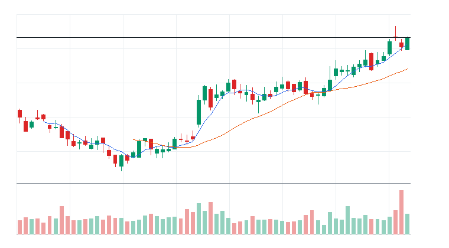

# 오늘의 데일리 트레이딩 요약

**REAL DATA TEST - 가격/거래량은 실제 데이터, 뉴스/ETF 구성종목 확산도/거래대금 유동성 일부 연결**

**목적:** 이 리포트는 최근 오른 자산을 나열하는 것이 아니라, 돈이 몰리는 근거와 다음 매수 주체가 확인할 트레이딩 후보를 찾기 위한 보고서다.

> 핵심 질문: 현재 가격에서 누가 사고 있고, 누가 앞으로 더 비싸게 사줄 수 있는가?

## 모바일 요약

[오늘의 데일리 트레이딩 요약]

생성 성공 / 데이터 모드: REAL_TEST

시장:
- 중립

시장 지배 서사:
1. 반도체 장비 사이클 재평가 - 부상 - SOXX, SOXQ, ASML, KLAC 중심으로 5일 +15.33%, 20일 +17.06% 흐름이 형성됨. 직접 촉매 일부 확인.
2. 반도체 설계/공급망 재가속 - 약화 - SOXX, SOXQ, ARM, MRVL 중심으로 5일 +5.94%, 20일 +15.46% 흐름이 형성됨. 직접 촉매 일부 확인.
3. 위험선호 성장주 재진입 - 약화 - IWM, IPO, ARM, TSLA 중심으로 5일 +3.67%, 20일 +4.47% 흐름이 형성됨. 직접 촉매 일부 확인.

트렌드 강도:
1. 반도체 장비 사이클 재평가 - TSI 70 - 부상 - 진입품질 관찰
2. 반도체 설계/공급망 재가속 - TSI 60 - 약화 - 진입품질 관찰
3. 위험선호 성장주 재진입 - TSI 55 - 부상 - 진입품질 관찰

오늘 결론:
- AI 반도체 개별 종목 흐름이 ETF 대비 강한지 확인 필요
- 행동 후보는 linkedNarrative와 함께 확인한다.
- 추격보다 진입 조건 확인 후 접근한다.

오늘 실제 행동 후보:
1. 행동 후보 없음 - 미분류 - 조건 충족 후보 없음

다크호스 후보:
1. ASML - darkHorseScore 76 - 베이스 돌파 직전

ETF 후보 TOP 5:
1. IWM - 위험선호 성장주 재진입 - 관찰
2. DRAM - AI 인프라 재가속 - 거래량 확인 전 관찰
3. IPO - 위험선호 성장주 재진입 - 제외
4. SOXX - 반도체 장비 사이클 재평가 - 거래량 확인 전 관찰
5. SOXQ - 반도체 장비 사이클 재평가 - 거래량 확인 전 관찰

웹 리포트:
https://yoolcool.github.io/DailyTradingThesisAgent/

## 오늘 결론

- 오늘 결론: 신규 추격 없음 / 관찰
- 신규 진입 후보: 0개
- 조건부 진입 후보: 0개
- 관찰 후보: 127개
- 주요 제한 요인: Entry Quality 부족, RVOL 미달, 뉴스 직접성 부족
- 주문 판단: 시장가 금지 / 지정가 또는 관찰
- 실전 판단: 오늘은 추세 후보는 있으나, 왜 돈이 몰리는가와 누가 더 비싸게 사줄 수 있는가를 주문 실행 신뢰도와 거래량이 충분히 뒷받침하지 못해 신규 추격은 보류한다. 기존 관심 종목은 전일 고점 돌파와 RVOL 1.00x 회복을 확인한 뒤 조건부로 본다.

### 후보 제한 요인 집계

- RVOL < 1.00x: 124개
- 거래대금 유동성 낮음: 14개
- Entry Quality < 60: 157개
- Exhaustion Risk >= 70: 0개
- ETF breadth 샘플 부족: 37개
- 뉴스 직접성 부족: 100개

## 데이터 신뢰도

- 전체 데이터 신뢰도 등급: LOW
- 분석 신뢰도: LOW
- 주문 실행 신뢰도: LOW
- ETF breadth 신뢰도: LOW
- 신뢰도 해석: 테마 확산 판단 제한, 거래대금 유동성 낮음 또는 확인 불가, 프리/애프터마켓 확인 불가
- 리포트 생성 시각: 2026-06-15 12:49 KST
- 가격 기준 거래일: 2026-06-12 US regular close
- 뉴스 수집 시각: 2026-06-15 12:49 KST
- 가장 최근 뉴스 발행 시각: 2026-06-15 12:02 KST
- 뉴스 신선도 상태: FRESH
- 뉴스 소스: Yahoo Finance RSS, MarketWatch RSS, CNBC Markets RSS, SEC EDGAR RSS, Federal Reserve RSS, Finnhub API
- 뉴스 소스 상태: Yahoo Finance RSS CONNECTED, MarketWatch RSS CONNECTED, CNBC Markets RSS CONNECTED, SEC EDGAR RSS PARTIAL, Federal Reserve RSS CONNECTED, Finnhub API DISABLED
- 뉴스 신뢰도: MEDIUM
- 추천 적용 거래일: 2026-06-14 US regular session
- 가격/거래량 데이터 상태: 연결됨
- 뉴스 데이터 상태: 일부 연결
- ETF 구성종목 확산도 상태: 일부 연결
- ETF 구성종목 샘플 수: 1~4
- 거래대금 유동성 데이터 상태: 일부 연결
- 프리마켓/애프터마켓 데이터 상태: UNAVAILABLE
- 데이터 provider: yfinance, Yahoo Finance RSS, MarketWatch RSS, CNBC Markets RSS, SEC EDGAR RSS, Federal Reserve RSS, Finnhub API, config fallback sample, price-volume dollar-volume fallback
- 실전 사용 경고: 이 리포트는 투자판단 보조용이며, REAL_TEST 모드에서는 일부 데이터가 누락되거나 지연될 수 있다. 실제 주문 전 현재가, 뉴스, 프리마켓/정규장 거래량을 별도 확인해야 한다.

## 0. 시장 상태

- 데이터 모드: REAL_TEST
- 가격/거래량: 연결됨
- 뉴스: 일부 연결
- ETF 구성종목 확산도: 일부 연결
- 거래대금 유동성: 일부 연결
- 생성 시각: 2026년 6월 15일 월요일 PM 12:49
- 시장 상태: 중립
- 오늘 돈의 방향: AI 반도체 개별 종목 흐름이 ETF 대비 강한지 확인 필요
- 강한 테마 TOP 3: 반도체 장비/공급망(83), 메모리/HBM(69), IPO/신규상장 ETF(67)
- 데이터 한계:
  - API 또는 provider 상태에 따라 뉴스/ETF 확산도/거래대금 유동성 반영 범위가 달라질 수 있다.
  - 수집 실패 데이터는 점수 반영에서 제외하거나 confidence를 제한한다.
  - reasonConfidence HIGH는 직접 촉매, 가격/거래량, 확산도/유동성 근거가 함께 있을 때만 사용한다.

## 오늘 시장을 지배하는 서사

### 오늘 시장을 지배하는 서사 TOP 3

#### 1. 반도체 장비 사이클 재평가
- 상태: 부상
- narrativeScore: 78
- reasonConfidence: LOW
- 근거 ETF: SOXX, SOXQ, SMH
- 근거 개별 종목: ASML, KLAC, AMAT, LRCX
- 돈이 몰리는 이유: 반도체 장비 사이클 재평가 관련 SOXX, SOXQ, SMH와 ASML, KLAC, AMAT, LRCX의 5일(+15.33%)·20일(+17.06%) 흐름을 함께 본다. 평균 상대 거래량은 0.97배이고, ETF 확산도는 추가 확인이 필요하다. 직접 뉴스/이벤트가 일부 확인된다.
- 다음 매수 주체: 반도체 장비 사이클 회복을 확인한 섹터 ETF 자금과 장비주 상대강도 추종 자금
- 가장 좋은 트레이딩 수단: ETF 우선: SMH, SOXX, SOXQ / 개별 종목 우선: KLAC, ASML, AMAT
- 서사가 깨지는 조건: SMH/SOXX 20일선 이탈 또는 장비주 절반 이상 5일선 이탈
- 오늘 행동: 장비주가 반도체 ETF보다 강하게 버틸 때만 분리 테마로 관찰

상세 narrativeScore 근거 보기

- rawScore: 78
- ETF 평균 moneyFlowScore: 54
- 개별 종목 평균 moneyFlowScore: 87
- ETF 후보 비율: 0%
- 개별 종목 후보 비율: 25%
- 5일 평균 수익률: +15.00%
- 20일 평균 수익률: +17.00%
- 평균 상대 거래량: 1.00배
- ETF 평균 상대 거래량: 1.00배
- 개별주 평균 상대 거래량: 1.00배
- 52주 고점 근접 후보 비율: 88%
- 뉴스 직접성 점수: 12
- ETF 확산도 점수: -1
- 유동성 점수: 4
- 과열 리스크 차감: 0

#### 2. 반도체 설계/공급망 재가속
- 상태: 약화
- narrativeScore: 48
- reasonConfidence: LOW
- 근거 ETF: SOXX, SOXQ, SMH
- 근거 개별 종목: ARM, MRVL, ADI, AVGO
- 돈이 몰리는 이유: 반도체 설계/공급망 재가속 관련 SOXX, SOXQ, SMH와 ARM, MRVL, ADI, AVGO의 5일(+5.94%)·20일(+15.46%) 흐름을 함께 본다. 평균 상대 거래량은 0.89배이고, ETF 확산도는 추가 확인이 필요하다. 직접 뉴스/이벤트가 일부 확인된다.
- 다음 매수 주체: 반도체 설계/공급망 재가속을 확인한 섹터 ETF 자금과 상대강도 추종 스윙 자금
- 가장 좋은 트레이딩 수단: ETF 우선: SMH, SOXX, SOXQ / 개별 종목 우선: MRVL, AVGO, ARM
- 서사가 깨지는 조건: SMH/SOXX 20일선 이탈 또는 관련 설계/공급망 종목 절반 이상 5일선 이탈
- 오늘 행동: AI 인프라 본류와 동조성이 확인될 때만 선별 관찰

상세 narrativeScore 근거 보기

- rawScore: 48
- ETF 평균 moneyFlowScore: 54
- 개별 종목 평균 moneyFlowScore: 41
- ETF 후보 비율: 0%
- 개별 종목 후보 비율: 20%
- 5일 평균 수익률: +6.00%
- 20일 평균 수익률: +15.00%
- 평균 상대 거래량: 1.00배
- ETF 평균 상대 거래량: 1.00배
- 개별주 평균 상대 거래량: 1.00배
- 52주 고점 근접 후보 비율: 44%
- 뉴스 직접성 점수: 7
- ETF 확산도 점수: -1
- 유동성 점수: 3
- 과열 리스크 차감: 0

#### 3. 위험선호 성장주 재진입
- 상태: 약화
- narrativeScore: 45
- reasonConfidence: LOW
- 근거 ETF: IWM, IPO, QQQ, ARKK
- 근거 개별 종목: ARM, TSLA, COIN
- 돈이 몰리는 이유: 위험선호 성장주 재진입 관련 IWM, IPO, QQQ와 ARM, TSLA, COIN의 5일(+3.67%)·20일(+4.47%) 흐름을 함께 본다. 평균 상대 거래량은 1.22배이고, ETF 확산도는 추가 확인이 필요하다. 직접 뉴스/이벤트가 일부 확인된다.
- 다음 매수 주체: 위험선호 회복을 사는 성장주 ETF 자금과 고베타 단기 모멘텀 자금
- 가장 좋은 트레이딩 수단: ETF 우선: QQQ, IPO, ARKK / 개별 종목 우선: ARM, COIN, TSLA
- 서사가 깨지는 조건: QQQ/IWM 동반 약화, 고베타 성장주 상대 거래량 둔화
- 오늘 행동: 지수 위험선호가 유지될 때만 선별 진입

상세 narrativeScore 근거 보기

- rawScore: 45
- ETF 평균 moneyFlowScore: 41
- 개별 종목 평균 moneyFlowScore: 38
- ETF 후보 비율: 40%
- 개별 종목 후보 비율: 33%
- 5일 평균 수익률: +4.00%
- 20일 평균 수익률: +4.00%
- 평균 상대 거래량: 1.00배
- ETF 평균 상대 거래량: 1.00배
- 개별주 평균 상대 거래량: 1.00배
- 52주 고점 근접 후보 비율: 25%
- 뉴스 직접성 점수: 9
- ETF 확산도 점수: -1
- 유동성 점수: 2
- 과열 리스크 차감: 0

### 전체 narrative 요약

| 서사명 | 상태 | narrativeScore | reasonConfidence | 대표 ETF | 대표 종목 | 오늘 행동 |
| --- | --- | ---: | --- | --- | --- | --- |
| 반도체 장비 사이클 재평가 | 부상 | 78 | LOW | SOXX, SOXQ, SMH | ASML, KLAC, AMAT, LRCX | 장비주가 반도체 ETF보다 강하게 버틸 때만 분리 테마로 관찰 |
| 반도체 설계/공급망 재가속 | 약화 | 48 | LOW | SOXX, SOXQ, SMH | ARM, MRVL, ADI, AVGO | AI 인프라 본류와 동조성이 확인될 때만 선별 관찰 |
| 위험선호 성장주 재진입 | 약화 | 45 | LOW | IWM, IPO, QQQ | ARM, TSLA, COIN | 지수 위험선호가 유지될 때만 선별 진입 |
| AI 인프라 재가속 | 약화 | 26 | LOW | SOXX, DRAM, SOXQ | MU, AMD, NVDA, VRT | 추격보다 5일선 지지 후 재상승 확인 |
| 비트코인/디지털 자산 위험선호 | 소멸 | 16 | LOW | IBIT, BLOK | MARA, CIFR, IREN, MSTR | 비트코인 베타가 살아날 때만 단기 매매 |
| 소프트웨어 실적/AI 수익화 | 약화 | 9 | LOW | QQQ, AIQ, IGV | CDNS, DDOG, PLTR, TEAM | 실적/가이던스 촉매와 가격 반응이 같이 확인될 때만 분리 테마로 관찰 |
| 사이버보안 지출 재가속 | 약화 | 8 | LOW | CIBR, HACK, IHAK | FTNT, PANW, CRWD | 보안 ETF와 대표 종목 동조성이 살아날 때만 관찰 편입 |
| 매크로 방어/헤지 | 약화 | 6 | LOW | TLT, GLD, XLE | XOM, CVX | 위험회피가 확인될 때만 헤지성 접근 |
| 전력망/원전/인프라 병목 | 소멸 | 5 | LOW | COPX, PAVE, GRID | VRT, ETN, PWR, CEG | ETF 확산도와 거래량이 같이 살아날 때만 진입 |
| AI 소프트웨어/사이버보안 확산 | 약화 | 3 | LOW | QQQ, AIQ, IGV | PLTR, DDOG, TEAM, MSFT | 추격보다 눌림 후 재상승 확인 |
| 방산/안보 프리미엄 | 약화 | 3 | LOW | ITA, XAR, SHLD | KTOS, AVAV, PLTR | 뉴스 촉매가 직접 확인될 때만 추세 추종 |

## 트렌드 강도 판단

### 1. 반도체 장비 사이클 재평가
- Trend Strength Index: 70
- 트렌드 상태 라벨: 부상
- 테마 확산도: 보통
- ETF 동조성: 강함
- 거래량 강도: 부족
- 과열 위험: 보통 (41)
- 오늘 진입 품질: 관찰 (40)
- 한 줄 판단: 반도체 장비 사이클 재평가는 돈이 강하게 몰리지만 오늘 진입 품질은 아직 제한적이라 추격보다 조건 확인이 필요하다.
- 오늘 접근법: SOXX/SOXQ/SMH 거래량 증가와 ASML/KLAC/AMAT 확산을 확인하며 작은 사이즈의 초기 진입 후보로만 본다.

트렌드 강도 상세 근거 보기

- 가격 모멘텀: 가격 모멘텀 28/25. 평균 5D +15.33%, 20D +17.06%.
- 거래량 강도: 거래량 강도 5/20. 평균 RVOL 0.97배.
- ETF 동조성: ETF 동조성 15/15. 관련 ETF SMH, SOXX, SOXQ, AIQ 흐름을 기준으로 판단.
- 테마 확산도: 테마 확산도 13/20. 상위 1~2개 쏠림 감점 0점 반영.
- 뉴스 촉매: 뉴스/촉매 신선도 3/10. HIGH 직접 촉매 1개.
- 과열 리스크: 과열 리스크 41/100. 단기 급등, 고점 근접, ETF-개별주 괴리, 쏠림을 함께 반영.
- 시장 환경: 시장 환경 6/10. QQQ/SPY/IWM 가격 흐름 기반 위험선호 점수.

### 2. 반도체 설계/공급망 재가속
- Trend Strength Index: 60
- 트렌드 상태 라벨: 약화
- 테마 확산도: 보통
- ETF 동조성: 강함
- 거래량 강도: 부족
- 과열 위험: 낮음 (9)
- 오늘 진입 품질: 관찰 (43)
- 한 줄 판단: 반도체 설계/공급망 재가속는 Trend Strength는 중간이지만 진입 품질이 살아나는 초기 진입 후보 성격이다.
- 오늘 접근법: 상승률이 남아 있어도 SOXX/SOXQ/SMH와 구성 종목 확산도가 회복될 때까지 신규 진입은 낮춘다.

트렌드 강도 상세 근거 보기

- 가격 모멘텀: 가격 모멘텀 22/25. 평균 5D +5.94%, 20D +15.46%.
- 거래량 강도: 거래량 강도 4/20. 평균 RVOL 0.89배.
- ETF 동조성: ETF 동조성 15/15. 관련 ETF SMH, SOXX, SOXQ, AIQ 흐름을 기준으로 판단.
- 테마 확산도: 테마 확산도 10/20. 상위 1~2개 쏠림 감점 0점 반영.
- 뉴스 촉매: 뉴스/촉매 신선도 3/10. HIGH 직접 촉매 1개.
- 과열 리스크: 과열 리스크 9/100. 단기 급등, 고점 근접, ETF-개별주 괴리, 쏠림을 함께 반영.
- 시장 환경: 시장 환경 6/10. QQQ/SPY/IWM 가격 흐름 기반 위험선호 점수.

### 3. 위험선호 성장주 재진입
- Trend Strength Index: 55
- 트렌드 상태 라벨: 부상
- 테마 확산도: 보통
- ETF 동조성: 보통
- 거래량 강도: 보통
- 과열 위험: 낮음 (2)
- 오늘 진입 품질: 관찰 (45)
- 한 줄 판단: 위험선호 성장주 재진입는 Trend Strength는 중간이지만 진입 품질이 살아나는 초기 진입 후보 성격이다.
- 오늘 접근법: IWM/IPO/QQQ 거래량 증가와 ARM/TSLA/COIN 확산을 확인하며 작은 사이즈의 초기 진입 후보로만 본다.

트렌드 강도 상세 근거 보기

- 가격 모멘텀: 가격 모멘텀 12/25. 평균 5D +3.67%, 20D +4.47%.
- 거래량 강도: 거래량 강도 12/20. 평균 RVOL 1.22배.
- ETF 동조성: ETF 동조성 9/15. 관련 ETF QQQ, IPO, ARKK, IWM, MAGS 흐름을 기준으로 판단.
- 테마 확산도: 테마 확산도 11/20. 상위 1~2개 쏠림 감점 0점 반영.
- 뉴스 촉매: 뉴스/촉매 신선도 5/10. HIGH 직접 촉매 1개.
- 과열 리스크: 과열 리스크 2/100. 단기 급등, 고점 근접, ETF-개별주 괴리, 쏠림을 함께 반영.
- 시장 환경: 시장 환경 6/10. QQQ/SPY/IWM 가격 흐름 기반 위험선호 점수.

## 최근 추천 결과 트래킹

개별주는 데이트레이딩 관점으로 추천 이후 첫 정규장의 장중 최고가와 종가를 추적한다. ETF는 테마/스윙 관점으로 추천 이후 1주일 동안의 최고가와 현재 종가를 추적한다.

### 개별주 Top 3 추천 성과 요약
- 최근 5개 리포트 표본: 7개 (초기 검증 단계)
- 장중 최고가 기준 성공률: +14.29%
- 종가 기준 성공률: +28.57%
- 평균 장중 최고 수익률: +0.98%
- 평균 종가 수익률: -1.19%

### ETF 추천 성과 요약
- 최근 5개 리포트 표본: 7개 (초기 검증 단계)
- 1주 최고가 기준 성공률: 0.00%
- 현재 종가 기준 성공률: 0.00%
- 평균 1주 최고 수익률: -3.33%
- 평균 현재 수익률: -7.95%

최근 추천 결과 상세 테이블 펼치기

| 추천일 | 유형 | 순위 | 티커 | 기준가 | 추적 기간 | 상태 | High 수익률 | Close 수익률 | 결과 | 코멘트 |
| --- | --- | ---: | --- | ---: | --- | --- | ---: | ---: | --- | --- |
| 2026-06-04 | STOCK | 3 | PANW | $280.43 | 2026-06-04 | complete | +0.10% | -0.42% | 실패 | 추천 이후 의미 있는 장중 기회가 부족하고 종가도 약함 (일봉 기준) |
| 2026-06-04 | STOCK | 2 | FTNT | $146.48 | 2026-06-04 | complete | +2.45% | +2.18% | 제한적 유효 | 제한적인 장중 기회만 발생 (일봉 기준) |
| 2026-06-04 | STOCK | 1 | CRWD | $747.61 | 2026-06-04 | complete | -3.56% | -3.81% | 실패 | 추천 이후 의미 있는 장중 기회가 부족하고 종가도 약함 (일봉 기준) |
| 2026-06-04 | ETF | 3 | HACK | $102.21 | 2026-06-04~2026-06-11 | complete | -1.66% | -6.03% | 실패 | 추천 이후 ETF 흐름이 약화됨 |
| 2026-06-04 | ETF | 2 | SOXQ | $109.58 | 2026-06-04~2026-06-11 | complete | -4.68% | -3.91% | 실패 | 추천 이후 ETF 흐름이 약화됨 |
| 2026-06-04 | ETF | 1 | AIQ | $69.16 | 2026-06-04~2026-06-11 | complete | -4.29% | -7.46% | 실패 | 추천 이후 ETF 흐름이 약화됨 |
| 2026-06-03 | STOCK | 3 | FTNT | $148.86 | 2026-06-03 | complete | -0.26% | -1.60% | 실패 | 추천 이후 의미 있는 장중 기회가 부족하고 종가도 약함 (일봉 기준) |
| 2026-06-03 | STOCK | 3 | CRWD | $768.95 | 2026-06-03 | complete | -0.25% | -2.78% | 실패 | 추천 이후 의미 있는 장중 기회가 부족하고 종가도 약함 (일봉 기준) |
| 2026-06-03 | STOCK | 2 | MRVL | $290.79 | 2026-06-03 | complete | +11.49% | +3.73% | 성공 | 장중 기회와 종가 유지가 모두 확인됨 (일봉 기준) |
| 2026-06-03 | STOCK | 1 | PANW | $297.18 | 2026-06-03 | complete | -3.09% | -5.64% | 실패 | 추천 이후 의미 있는 장중 기회가 부족하고 종가도 약함 (일봉 기준) |
| 2026-06-03 | ETF | 3 | DRAM | $69.57 | 2026-06-03~2026-06-10 | complete | -3.52% | -6.55% | 실패 | 추천 이후 ETF 흐름이 약화됨 |
| 2026-06-03 | ETF | 3 | IGV | $104.73 | 2026-06-03~2026-06-10 | complete | -3.31% | -13.40% | 실패 | 추천 이후 ETF 흐름이 약화됨 |
| 2026-06-03 | ETF | 2 | AIQ | $70.14 | 2026-06-03~2026-06-10 | complete | -2.32% | -8.75% | 실패 | 추천 이후 ETF 흐름이 약화됨 |
| 2026-06-03 | ETF | 1 | CIBR | $94.32 | 2026-06-03~2026-06-10 | complete | -3.56% | -9.53% | 실패 | 추천 이후 ETF 흐름이 약화됨 |

## 오늘 실제 행동 후보

오늘은 추세 후보는 있으나, 왜 돈이 몰리는가와 누가 더 비싸게 사줄 수 있는가를 주문 실행 신뢰도와 거래량이 충분히 뒷받침하지 못해 신규 추격은 보류한다. 기존 관심 종목은 전일 고점 돌파와 RVOL 1.00x 회복을 확인한 뒤 조건부로 본다.

## 다크호스 후보

> 메인 행동 후보를 대체하지 않는 보조 관찰 섹션이다. 상위 서사 안에서 아직 과열되지 않았지만 초기 추세 전환, 베이스 돌파, 거래량 회복이 시작되는 개별주만 표시한다.

### 1. [ASML] ASML Holding N.V.
- 소속 서사: 반도체 장비 사이클 재평가
- darkHorseScore: 76 (다크호스 후보)
- 단계: 베이스 돌파 직전
- Confidence: MEDIUM
- 5D / 20D / RVOL: +13.51% / +17.61% / 1.35x
- MA 구조: 종가 $1,863.55 / MA5 $1,804.81 / MA20 $1,657.03
- 선정 이유: ASML는 반도체 장비 사이클 재평가 서사에 속하고 종가가 MA20 위에 있으며 MA5/MA20 정렬이 개선되고 있다. 최근 15거래일 베이스는 상단 돌파 직전 상태이고, RVOL 1.35x로 거래량 확인은 충분하다. Exhaustion Risk 41로 아직 메인 후보 대비 과열 상한 안에 있다.
- 확인 조건: 최근 15거래일 고점 $1,903.50 돌파, MA5 위 종가 유지, 관련 ETF 동반 강세
- 무효화 조건: MA20 $1,657.03 종가 이탈, 최근 스윙 저점 $1,585.61 이탈, RVOL 0.80x 이하 둔화
- 왜 아직 메인이 아닌가: Entry Quality 48 < 60, 최근 고점 돌파 확인 전

darkHorseScore 상세 근거 보기

- 서사 정렬: 17/20
- 초기 추세 구조: 24/30
- 베이스 돌파/정돈: 10/20
- 거래량 확인: 14/15
- 낮은 과열: 6/10
- 유동성 리스크 보정: 5/5
- 리스크 차감: -0
- rawScore: 76

- 차트: 

## 참고용 행동 후보

> 실제 행동 후보가 없는 날에만 표시한다. 아래 후보는 매수 추천이 아니라 다음 정규장에서 전일 고점 돌파, RVOL 1.00x 이상, 거래대금 유동성 확인을 기다리는 관찰 리스트다.

### ETF 참고 후보 TOP 3

#### 1. [IWM] iShares Russell 2000 ETF
- 상태: 참고용 관찰 후보
- todayActionLabel: 관찰
- 제한 사유: 실제 행동 후보 게이트 미충족
- 주문 실행: 시장가 가능
- moneyFlowScore: 70
- Entry Quality: 46 (관찰)
- RVOL: 1.16x
- 진입 전 확인: 전일 고점 돌파와 5일선 유지 확인
- 무효화: 20일선 이탈 또는 상대 거래량 0.8배 이하 둔화

#### 2. [DRAM] Roundhill Memory ETF
- 상태: 참고용 관찰 후보
- todayActionLabel: 거래량 확인 전 관찰
- 제한 사유: Entry Quality 40 < 45; RVOL 0.80x < 1.00x
- 주문 실행: 시장가 가능
- moneyFlowScore: 62
- Entry Quality: 40 (관찰)
- RVOL: 0.80x
- 진입 전 확인: 상대 거래량 1.0배 회복 후 관찰
- 무효화: 거래량 회복 실패

#### 3. [IPO] Renaissance IPO ETF
- 상태: 참고용 관찰 후보
- todayActionLabel: 제외
- 제한 사유: Entry Quality 33 < 45; 거래대금 유동성 LOW/UNKNOWN; 진입 품질 부족
- 주문 실행: 추격 금지
- moneyFlowScore: 67
- Entry Quality: 33 (낮음)
- RVOL: 1.50x
- 진입 전 확인: 20일선 위 눌림 후 재상승 확인
- 무효화: 20일선 이탈 또는 상대 거래량 0.8배 이하 둔화

### 개별주 참고 후보 TOP 3

#### 1. [ASML] ASML Holding N.V.
- 상태: 참고용 관찰 후보
- todayActionLabel: 관찰
- 제한 사유: 실제 행동 후보 게이트 미충족
- 주문 실행: 시장가 가능
- moneyFlowScore: 97
- Entry Quality: 48 (관찰)
- RVOL: 1.35x
- 진입 전 확인: 전일 고점 돌파와 5일선 유지 확인
- 무효화: 20일선 이탈 또는 상대 거래량 0.8배 이하 둔화

#### 2. [ARM] Arm Holdings plc
- 상태: 참고용 관찰 후보
- todayActionLabel: 제외
- 제한 사유: Entry Quality 22 < 45; 진입 품질 부족
- 주문 실행: 시장가 가능
- moneyFlowScore: 100
- Entry Quality: 22 (낮음)
- RVOL: 1.27x
- 진입 전 확인: 20일선 위 눌림 후 재상승 확인
- 무효화: 20일선 이탈 또는 상대 거래량 0.8배 이하 둔화

#### 3. [KDP] Keurig Dr Pepper Inc.
- 상태: 참고용 관찰 후보
- todayActionLabel: 관찰
- 제한 사유: 실제 행동 후보 게이트 미충족
- 주문 실행: 지정가 권장
- moneyFlowScore: 73
- Entry Quality: 46 (관찰)
- RVOL: 1.08x
- 진입 전 확인: 20일선 위 눌림 후 재상승 확인
- 무효화: 20일선 이탈 또는 상대 거래량 0.8배 이하 둔화

## 오늘 돈이 몰리는 테마

- 반도체 장비/공급망: LRCX, AMAT, KLAC | 평균 moneyFlowScore 83 | 단일 종목 이벤트보다 테마 단위 자금 흐름이 선명한 구간으로 본다.
- 메모리/HBM: MU, STX, WDC | 평균 moneyFlowScore 69 | 추세는 확인되지만 선별 진입이 필요한 중간 강도의 테마로 본다.
- IPO/신규상장 ETF: IPO | 평균 moneyFlowScore 67 | 추세는 확인되지만 선별 진입이 필요한 중간 강도의 테마로 본다.
- 메모리/HBM ETF: DRAM | 평균 moneyFlowScore 62 | 추세는 확인되지만 선별 진입이 필요한 중간 강도의 테마로 본다.
- AI 반도체 ETF: SMH, SOXX, SOXQ | 평균 moneyFlowScore 60 | 추세는 확인되지만 선별 진입이 필요한 중간 강도의 테마로 본다.
- 구리/금속 ETF: COPX | 평균 moneyFlowScore 50 | 관심은 유지하되 우선순위는 낮추고 추가 거래량 확인을 기다린다.

## 1. ETF 트레이딩 보고서
### 1-1. ETF 결론
- ETF 우선 후보: 없음
- ETF 관찰 후보: DRAM, SMH, SOXX, SOXQ, IGV
- ETF 매매 금지: IGV, BOTZ, ROBO, HACK, IHAK
- 오늘 ETF 최우선 1개: 없음
- ETF 섹션 해석: 이 섹션은 개별 종목 선택이 아니라 테마/섹터 단위 자금 흐름을 ETF로 매매할지 판단하기 위한 영역이다.

### 1-2. ETF 후보 TOP 5

선정 기준: ETF 후보는 가격/거래량 1차 점수에 뉴스, ETF 구성종목 확산도, 유동성, 리스크 패널티를 반영한 finalRawScore 기준으로 정렬한다. 표시 점수 100점 후보가 겹치면 tieBreakerReason으로 우선순위를 설명한다.

### [ETF IWM] iShares Russell 2000 ETF
- 자산 유형: ETF
- ETF 세부 카테고리: 시장 기준 ETF
- ETF 역할: 시장 기준 확인
- 상태: 관찰
- linkedNarrative: 위험선호 성장주 재진입
- narrativeStatus: 약화
- narrativeScore: 45
- moneyFlowScore: 70
- finalRawScore: 70
- tieBreakerReason: 최종 원점수 70, 리스크 패널티 0, 5일 수익률 +4.01%, 상대 거래량 1.16배 순으로 정렬
- 과열 리스크: 낮음
- reasonConfidence: MEDIUM
- reasonConfidenceExplanation: ETF 확산도 제한 때문에 HIGH가 아니라 MEDIUM으로 제한했다.

- todayActionLabel: 관찰
- 주문 실행: 시장가 가능
- 기준일: 2026-06-12
- 종가: $292.95
- 1일 수익률: +0.87%
- 5일 수익률: +4.01%
- 20일 수익률: +2.99%
- 상대 거래량: 1.16배
- 52주 고점 대비 위치: -0.94%
- whyMoneyIsFlowing: 20일 +2.99%, 5일 +4.01%, 상대 거래량 1.16배로 가격과 거래량이 함께 개선. 뉴스: MarketWatch RSS mna/under_6h / 유동성: LIQUID
- likelyNextBuyer: 섹터 베타를 노리는 단기 모멘텀 자금과 리밸런싱 자금
- whyThisCouldTradeHigher: 52주 고점 부근이라 돌파가 확인되면 신고가 추종 매수가 붙을 수 있음
- 진입 조건: 전일 고점 돌파와 5일선 유지 확인
- 무효화 조건: 20일선 이탈 또는 상대 거래량 0.8배 이하 둔화
- 차트: 

#### 상세 근거

IWM 상세 근거 펼치기

- moneyFlowScore(최종) 산정 근거:
  - moneyFlowScore(1차): 53
  - 최종 원점수: 70
  - 최종 표시 점수: 70
  - cap 적용: cap 미적용
  - 계산식: +53 + +12 + 0 + +5 + 0 + 0 + 0 = 70
  - 점수 해석: 관심 후보. 눌림 또는 돌파 확인 후 진입 검토.
  - 가격/거래량 1차 점수: +53
    - 추세: +11
    - 단기 모멘텀: +4
    - 중기 모멘텀: +2
    - 거래량: +10
    - 신고가 근접: +12
    - 이동평균: +14
  - 하위 점수 cap:
    - 가격 모멘텀: 원점수 +11, 상한 적용 +11 / 최대 25
    - 단기 모멘텀: 원점수 +4, 상한 적용 +4 / 최대 20
    - 중기 모멘텀: 원점수 +2, 상한 적용 +2 / 최대 16
    - 거래량: 원점수 +10, 상한 적용 +10 / 최대 20
    - 신고가 근접: 원점수 +12, 상한 적용 +12 / 최대 12
    - 이동평균: 원점수 +14, 상한 적용 +14 / 최대 14
  - 추가 데이터 가감점:
    - 뉴스: +12
    - 유동성: +5
  - ETF 확산도: 0
  - 리스크 패널티: 0
  - 주요 근거: 1차 53, 최종 원점수 70, 표시 70. 52주 고점 근처, 이동평균 위 추세 유지, 뉴스 흐름이 가격/거래량 근거 보강. 주의: ETF 구성종목 확산도 데이터 미연결.
  - 리스크 패널티 산정 근거:
    - 총 리스크 패널티: 0
    - 리스크 등급: LOW
    - 감점된 리스크: 없음
    - 관찰 리스크: ETF breadth data not connected
    - 한 줄 해석: 직접 감점된 주요 리스크는 없지만 관찰 리스크는 계속 확인해야 한다.
- 데이터 사용 현황:
  - 가격/거래량: 사용
  - 뉴스: 사용
  - ETF 확산도: 미연결
  - 거래대금 유동성: 사용
  - 관련 ETF 상대강도: 사용
- 뉴스 확인:
  - 최근 뉴스 상태: 일부 연결
  - 뉴스 소스: MarketWatch RSS, CNBC Markets RSS
  - 소스별 상태: Yahoo Finance RSS CONNECTED; MarketWatch RSS CONNECTED; CNBC Markets RSS CONNECTED; SEC EDGAR RSS PARTIAL; Federal Reserve RSS CONNECTED; Finnhub API DISABLED
  - 긍정/중립/부정: 14/1/1
  - 직접성/방향성/신선도: 2/1/4
  - 강한 촉매 수: 3
  - 직접 촉매: 없음
  - 보조 뉴스: MarketWatch RSS sector_theme / mna / under_6h
  - 뉴스 수집 시각: 2026-06-15 12:49 KST
  - 가장 최근 뉴스 발행 시각: 2026-06-15 12:02 KST
  - 뉴스 신선도 상태: FRESH
  - 뉴스 이후 가격 반응: 긍정
  - 가격 반응 점수 제한: 뉴스 이후 가격 반응과 점수 제한 특이사항 없음
  - 핵심 뉴스 요약: Stock futures jump, oil prices fall as Trump says U.S. has reached peace deal with Iran
  - 원점수/상한 점수: +27 / +12
  - 점수 반영: +12
  - 주의: SEC EDGAR RSS: no matching RSS items; Finnhub API: FINNHUB_API_KEY not configured
- ETF 구성종목 확산도:
  - 구성종목 데이터 상태: 미연결
  - 샘플 수: 0/0
  - 샘플 신뢰도: UNKNOWN
  - 상승 종목 비율: 데이터 없음
  - 20일선 위 비율: 데이터 없음
  - 50일선 위 비율: 데이터 없음
  - 상위 기여 종목: 데이터 없음
  - 확산도 판단: UNKNOWN
  - 원점수/샘플 상한/반영 점수: 0 / N/A / 0
  - 점수 반영: 0
- 거래대금 유동성:
  - 데이터 상태: 일부 연결
  - 거래대금 기준 유동성: LIQUID
  - 거래대금: $10,074,111,075
  - 평균 거래대금: $8,720,881,281
  - 주문 영향: 시장가 가능
  - 매매 영향: 거래대금이 충분해 시장가 가능 범위로 본다
- reasonConfidence 근거: 가격/거래량, 뉴스, 거래대금 유동성, 관련 ETF 상대강도은 확인됐지만 일부 보조 데이터가 미연결 또는 fallback이라 중간으로 제한한다.
- 차트 요약: 최근 20거래일 기준 5일선이 20일선 위에 있음
- 기준일 2026-06-12 | 종가 $292.95 | 1일 +0.87% | 5일 +4.01% | 20일 +2.99% | 상대 거래량 1.16배 | 52주 고점 대비 -0.94% | 데이터 소스: yfinance

### [ETF DRAM] Roundhill Memory ETF
- 자산 유형: ETF
- ETF 세부 카테고리: 메모리/HBM ETF
- ETF 역할: 테마 베타 매수
- 상태: 관찰
- linkedNarrative: AI 인프라 재가속
- narrativeStatus: 약화
- narrativeScore: 26
- moneyFlowScore: 62
- finalRawScore: 62
- tieBreakerReason: 최종 원점수 62, 리스크 패널티 -4, 5일 수익률 +16.53%, 상대 거래량 0.80배 순으로 정렬
- 과열 리스크: 낮음
- reasonConfidence: LOW
- reasonConfidenceExplanation: 가격/거래량이 약하거나 핵심 보조 근거가 부족해 LOW로 분류했다.

- todayActionLabel: 거래량 확인 전 관찰
- 주문 실행: 시장가 가능
- 기준일: 2026-06-12
- 종가: $65.01
- 1일 수익률: -0.17%
- 5일 수익률: +16.53%
- 20일 수익률: +20.86%
- 상대 거래량: 0.80배
- 52주 고점 대비 위치: -7.33%
- whyMoneyIsFlowing: 최근 수익률은 확인되지만 상대 거래량 0.80배라 신규 자금 유입 강도는 약함. 뉴스: MarketWatch RSS mna/under_6h / 유동성: LIQUID
- likelyNextBuyer: 섹터 베타를 노리는 단기 모멘텀 자금과 리밸런싱 자금
- whyThisCouldTradeHigher: 단기 추세가 유지되고 거래량이 1.0배 이상이면 눌림 이후 재상승을 시도할 수 있음
- 진입 조건: 상대 거래량 1.0배 회복 후 관찰
- 무효화 조건: 거래량 회복 실패
- 차트: 

#### 상세 근거

DRAM 상세 근거 펼치기

- moneyFlowScore(최종) 산정 근거:
  - moneyFlowScore(1차): 59
  - 최종 원점수: 62
  - 최종 표시 점수: 62
  - cap 적용: cap 미적용
  - 계산식: +59 + +2 + 0 + +5 + 0 - 4 + 0 = 62
  - 점수 해석: 관찰 후보. 흐름은 있으나 우선순위는 낮음.
  - 가격/거래량 1차 점수: +59
    - 추세: +21
    - 단기 모멘텀: +12
    - 중기 모멘텀: +14
    - 거래량: -8
    - 신고가 근접: +6
    - 이동평균: +14
  - 하위 점수 cap:
    - 가격 모멘텀: 원점수 +21, 상한 적용 +21 / 최대 25
    - 단기 모멘텀: 원점수 +12, 상한 적용 +12 / 최대 20
    - 중기 모멘텀: 원점수 +14, 상한 적용 +14 / 최대 16
    - 거래량: 원점수 -8, 상한 적용 -8 / 최대 20
    - 신고가 근접: 원점수 +6, 상한 적용 +6 / 최대 12
    - 이동평균: 원점수 +14, 상한 적용 +14 / 최대 14
  - 추가 데이터 가감점:
    - 뉴스: +2
    - 유동성: +5
  - ETF 확산도: 0
  - 리스크 패널티: -4
  - 주요 근거: 1차 59, 최종 원점수 62, 표시 62. 20일 수익률 강함, 5일 수익률 강함, 이동평균 위 추세 유지. 주의: 단기 과열/추격 위험 존재, ETF 구성종목 확산도 데이터 미연결.
  - 리스크 패널티 산정 근거:
    - 총 리스크 패널티: -4
    - 리스크 등급: LOW
    - 감점된 리스크:
      - volume divergence: -4 | 근거: 5d price strength is not confirmed by relative volume 0.80x. | 대응: Require relative volume recovery above 1.0x.
    - 관찰 리스크: ETF breadth data not connected
    - 한 줄 해석: 1개 감점 리스크로 총 -4점 반영.
- 데이터 사용 현황:
  - 가격/거래량: 사용
  - 뉴스: 사용
  - ETF 확산도: 미연결
  - 거래대금 유동성: 사용
  - 관련 ETF 상대강도: 사용
- 뉴스 확인:
  - 최근 뉴스 상태: 일부 연결
  - 뉴스 소스: MarketWatch RSS, CNBC Markets RSS
  - 소스별 상태: Yahoo Finance RSS CONNECTED; MarketWatch RSS CONNECTED; CNBC Markets RSS CONNECTED; SEC EDGAR RSS PARTIAL; Federal Reserve RSS CONNECTED; Finnhub API DISABLED
  - 긍정/중립/부정: 14/1/1
  - 직접성/방향성/신선도: 2/1/4
  - 강한 촉매 수: 3
  - 직접 촉매: 없음
  - 보조 뉴스: MarketWatch RSS sector_theme / mna / under_6h
  - 뉴스 수집 시각: 2026-06-15 12:49 KST
  - 가장 최근 뉴스 발행 시각: 2026-06-15 12:02 KST
  - 뉴스 신선도 상태: FRESH
  - 뉴스 이후 가격 반응: 부정
  - 가격 반응 점수 제한: 뉴스 이후 가격 반응 부정 -> 긍정 점수 제한
  - 핵심 뉴스 요약: Stock futures jump, oil prices fall as Trump says U.S. has reached peace deal with Iran
  - 원점수/상한 점수: +27 / +12
  - 점수 반영: +12
  - 주의: SEC EDGAR RSS: no matching RSS items; Finnhub API: FINNHUB_API_KEY not configured
- ETF 구성종목 확산도:
  - 구성종목 데이터 상태: 미연결
  - 샘플 수: 0/0
  - 샘플 신뢰도: UNKNOWN
  - 상승 종목 비율: 데이터 없음
  - 20일선 위 비율: 데이터 없음
  - 50일선 위 비율: 데이터 없음
  - 상위 기여 종목: 데이터 없음
  - 확산도 판단: UNKNOWN
  - 원점수/샘플 상한/반영 점수: 0 / N/A / 0
  - 점수 반영: 0
- 거래대금 유동성:
  - 데이터 상태: 일부 연결
  - 거래대금 기준 유동성: LIQUID
  - 거래대금: $2,091,131,163
  - 평균 거래대금: $2,626,247,651
  - 주문 영향: 시장가 가능
  - 매매 영향: 거래대금이 충분해 시장가 가능 범위로 본다
- reasonConfidence 근거: 가격/거래량이 약하거나 주요 데이터가 부족해 낮음.
- 차트 요약: 최근 20거래일 기준 5일선이 20일선 위에 있음
- 기준일 2026-06-12 | 종가 $65.01 | 1일 -0.17% | 5일 +16.53% | 20일 +20.86% | 상대 거래량 0.80배 | 52주 고점 대비 -7.33% | 데이터 소스: yfinance

### [ETF IPO] Renaissance IPO ETF
- 자산 유형: ETF
- ETF 세부 카테고리: IPO/신규상장 ETF
- ETF 역할: 테마 베타 매수
- 상태: 매매 금지
- linkedNarrative: 위험선호 성장주 재진입
- narrativeStatus: 약화
- narrativeScore: 45
- moneyFlowScore: 67
- finalRawScore: 67
- tieBreakerReason: 최종 원점수 67, 리스크 패널티 -5, 5일 수익률 +4.09%, 상대 거래량 1.50배 순으로 정렬
- 과열 리스크: 낮음
- reasonConfidence: MEDIUM
- reasonConfidenceExplanation: ETF 확산도 제한 때문에 HIGH가 아니라 MEDIUM으로 제한했다.

- todayActionLabel: 제외
- 주문 실행: 추격 금지
- 기준일: 2026-06-12
- 종가: $55.72
- 1일 수익률: +1.18%
- 5일 수익률: +4.09%
- 20일 수익률: +10.38%
- 상대 거래량: 1.50배
- 52주 고점 대비 위치: -5.14%
- whyMoneyIsFlowing: 20일 +10.38%, 5일 +4.09%, 상대 거래량 1.50배로 가격과 거래량이 함께 개선. 뉴스: CNBC Markets RSS analyst_upgrade/under_24h
- likelyNextBuyer: 섹터 베타를 노리는 단기 모멘텀 자금과 리밸런싱 자금
- whyThisCouldTradeHigher: 단기 추세가 유지되고 거래량이 1.0배 이상이면 눌림 이후 재상승을 시도할 수 있음
- 진입 조건: 20일선 위 눌림 후 재상승 확인
- 무효화 조건: 20일선 이탈 또는 상대 거래량 0.8배 이하 둔화
- 차트: 

#### 상세 근거

IPO 상세 근거 펼치기

- moneyFlowScore(최종) 산정 근거:
  - moneyFlowScore(1차): 65
  - 최종 원점수: 67
  - 최종 표시 점수: 67
  - cap 적용: cap 미적용
  - 계산식: +65 + +12 + 0 - 5 + 0 - 5 + 0 = 67
  - 점수 해석: 관심 후보. 눌림 또는 돌파 확인 후 진입 검토.
  - 가격/거래량 1차 점수: +65
    - 추세: +15
    - 단기 모멘텀: +5
    - 중기 모멘텀: +7
    - 거래량: +18
    - 신고가 근접: +6
    - 이동평균: +14
  - 하위 점수 cap:
    - 가격 모멘텀: 원점수 +15, 상한 적용 +15 / 최대 25
    - 단기 모멘텀: 원점수 +5, 상한 적용 +5 / 최대 20
    - 중기 모멘텀: 원점수 +7, 상한 적용 +7 / 최대 16
    - 거래량: 원점수 +18, 상한 적용 +18 / 최대 20
    - 신고가 근접: 원점수 +6, 상한 적용 +6 / 최대 12
    - 이동평균: 원점수 +14, 상한 적용 +14 / 최대 14
  - 추가 데이터 가감점:
    - 뉴스: +12
    - 유동성: -5
  - ETF 확산도: 0
  - 리스크 패널티: -5
  - 주요 근거: 1차 65, 최종 원점수 67, 표시 67. 20일 수익률 강함, 상대 거래량 증가, 이동평균 위 추세 유지. 주의: 단기 과열/추격 위험 존재, ETF 구성종목 확산도 데이터 미연결.
  - 리스크 패널티 산정 근거:
    - 총 리스크 패널티: -5
    - 리스크 등급: LOW
    - 감점된 리스크:
      - low liquidity: -5 | 근거: Liquidity signal: LOW. | 대응: Avoid market-order chasing.
    - 관찰 리스크: ETF breadth data not connected
    - 한 줄 해석: 1개 감점 리스크로 총 -5점 반영.
- 데이터 사용 현황:
  - 가격/거래량: 사용
  - 뉴스: 사용
  - ETF 확산도: 미연결
  - 거래대금 유동성: 사용
  - 관련 ETF 상대강도: 사용
- 뉴스 확인:
  - 최근 뉴스 상태: 일부 연결
  - 뉴스 소스: MarketWatch RSS, CNBC Markets RSS
  - 소스별 상태: Yahoo Finance RSS CONNECTED; MarketWatch RSS CONNECTED; CNBC Markets RSS CONNECTED; SEC EDGAR RSS PARTIAL; Federal Reserve RSS CONNECTED; Finnhub API DISABLED
  - 긍정/중립/부정: 13/2/1
  - 직접성/방향성/신선도: 4/1/4
  - 강한 촉매 수: 3
  - 직접 촉매: CNBC Markets RSS / analyst_upgrade / under_24h / neutral - Elon Musk drifted from Larry Page over a decade ago, but their companies are closer than ever
  - 보조 뉴스: MarketWatch RSS sector_theme / mna / under_6h
  - 뉴스 수집 시각: 2026-06-15 12:49 KST
  - 가장 최근 뉴스 발행 시각: 2026-06-15 12:02 KST
  - 뉴스 신선도 상태: FRESH
  - 뉴스 이후 가격 반응: 긍정
  - 가격 반응 점수 제한: 뉴스 이후 가격 반응과 점수 제한 특이사항 없음
  - 핵심 뉴스 요약: Stock futures jump, oil prices fall as Trump says U.S. has reached peace deal with Iran
  - 원점수/상한 점수: +28 / +12
  - 점수 반영: +12
  - 주의: SEC EDGAR RSS: no matching RSS items; Finnhub API: FINNHUB_API_KEY not configured
- ETF 구성종목 확산도:
  - 구성종목 데이터 상태: 미연결
  - 샘플 수: 0/0
  - 샘플 신뢰도: UNKNOWN
  - 상승 종목 비율: 데이터 없음
  - 20일선 위 비율: 데이터 없음
  - 50일선 위 비율: 데이터 없음
  - 상위 기여 종목: 데이터 없음
  - 확산도 판단: UNKNOWN
  - 원점수/샘플 상한/반영 점수: 0 / N/A / 0
  - 점수 반영: 0
- 거래대금 유동성:
  - 데이터 상태: 일부 연결
  - 거래대금 기준 유동성: LOW
  - 거래대금: $3,510,360
  - 평균 거래대금: $2,338,290
  - 주문 영향: 추격 금지
  - 매매 영향: 유동성 부족으로 추격 금지 또는 우선순위 하향
- reasonConfidence 근거: 가격/거래량, 뉴스, 거래대금 유동성, 관련 ETF 상대강도은 확인됐지만 일부 보조 데이터가 미연결 또는 fallback이라 중간으로 제한한다.
- 차트 요약: 최근 20거래일 기준 5일선이 20일선 위에 있음
- 기준일 2026-06-12 | 종가 $55.72 | 1일 +1.18% | 5일 +4.09% | 20일 +10.38% | 상대 거래량 1.50배 | 52주 고점 대비 -5.14% | 데이터 소스: yfinance

### [ETF SOXX] iShares Semiconductor ETF
- 자산 유형: ETF
- ETF 세부 카테고리: AI 반도체 ETF
- ETF 역할: 테마 베타 매수
- 상태: 관찰
- linkedNarrative: 반도체 장비 사이클 재평가
- narrativeStatus: 부상
- narrativeScore: 78
- moneyFlowScore: 65
- finalRawScore: 65
- tieBreakerReason: 최종 원점수 65, 리스크 패널티 -4, 5일 수익률 +10.46%, 상대 거래량 0.89배 순으로 정렬
- 과열 리스크: 낮음
- reasonConfidence: LOW
- reasonConfidenceExplanation: 가격/거래량이 약하거나 핵심 보조 근거가 부족해 LOW로 분류했다.

- todayActionLabel: 거래량 확인 전 관찰
- 주문 실행: 시장가 가능
- 기준일: 2026-06-12
- 종가: $596.25
- 1일 수익률: +1.59%
- 5일 수익률: +10.46%
- 20일 수익률: +12.49%
- 상대 거래량: 0.89배
- 52주 고점 대비 위치: -3.65%
- whyMoneyIsFlowing: 최근 수익률은 확인되지만 상대 거래량 0.89배라 신규 자금 유입 강도는 약함. 뉴스: MarketWatch RSS mna/under_6h / 유동성: LIQUID
- likelyNextBuyer: 섹터 베타를 노리는 단기 모멘텀 자금과 리밸런싱 자금
- whyThisCouldTradeHigher: 52주 고점 부근이라 돌파가 확인되면 신고가 추종 매수가 붙을 수 있음
- 진입 조건: 상대 거래량 1.0배 회복 후 관찰
- 무효화 조건: 거래량 회복 실패
- 차트: 

#### 상세 근거

SOXX 상세 근거 펼치기

- moneyFlowScore(최종) 산정 근거:
  - moneyFlowScore(1차): 52
  - 최종 원점수: 65
  - 최종 표시 점수: 65
  - cap 적용: cap 미적용
  - 계산식: +52 + +12 + 0 + +5 + 0 - 4 + 0 = 65
  - 점수 해석: 관심 후보. 눌림 또는 돌파 확인 후 진입 검토.
  - 가격/거래량 1차 점수: +52
    - 추세: +16
    - 단기 모멘텀: +10
    - 중기 모멘텀: +8
    - 거래량: -8
    - 신고가 근접: +12
    - 이동평균: +14
  - 하위 점수 cap:
    - 가격 모멘텀: 원점수 +16, 상한 적용 +16 / 최대 25
    - 단기 모멘텀: 원점수 +10, 상한 적용 +10 / 최대 20
    - 중기 모멘텀: 원점수 +8, 상한 적용 +8 / 최대 16
    - 거래량: 원점수 -8, 상한 적용 -8 / 최대 20
    - 신고가 근접: 원점수 +12, 상한 적용 +12 / 최대 12
    - 이동평균: 원점수 +14, 상한 적용 +14 / 최대 14
  - 추가 데이터 가감점:
    - 뉴스: +12
    - 유동성: +5
  - ETF 확산도: 0
  - 리스크 패널티: -4
  - 주요 근거: 1차 52, 최종 원점수 65, 표시 65. 20일 수익률 강함, 5일 수익률 강함, 52주 고점 근처. 주의: 단기 과열/추격 위험 존재.
  - 리스크 패널티 산정 근거:
    - 총 리스크 패널티: -4
    - 리스크 등급: LOW
    - 감점된 리스크:
      - volume divergence: -4 | 근거: 5d price strength is not confirmed by relative volume 0.89x. | 대응: Require relative volume recovery above 1.0x.
    - 관찰 리스크: 주요 관찰 리스크 없음
    - 한 줄 해석: 1개 감점 리스크로 총 -4점 반영.
- 데이터 사용 현황:
  - 가격/거래량: 사용
  - 뉴스: 사용
  - ETF 확산도: 일부 연결
  - 거래대금 유동성: 사용
  - 관련 ETF 상대강도: 사용
- 뉴스 확인:
  - 최근 뉴스 상태: 일부 연결
  - 뉴스 소스: MarketWatch RSS, CNBC Markets RSS, Yahoo Finance RSS
  - 소스별 상태: Yahoo Finance RSS CONNECTED; MarketWatch RSS CONNECTED; CNBC Markets RSS CONNECTED; SEC EDGAR RSS PARTIAL; Federal Reserve RSS CONNECTED; Finnhub API DISABLED
  - 긍정/중립/부정: 15/0/1
  - 직접성/방향성/신선도: 2/1/4
  - 강한 촉매 수: 4
  - 직접 촉매: 없음
  - 보조 뉴스: MarketWatch RSS sector_theme / mna / under_6h
  - 뉴스 수집 시각: 2026-06-15 12:49 KST
  - 가장 최근 뉴스 발행 시각: 2026-06-15 12:02 KST
  - 뉴스 신선도 상태: FRESH
  - 뉴스 이후 가격 반응: 긍정
  - 가격 반응 점수 제한: 뉴스 이후 가격 반응과 점수 제한 특이사항 없음
  - 핵심 뉴스 요약: Stock futures jump, oil prices fall as Trump says U.S. has reached peace deal with Iran
  - 원점수/상한 점수: +30 / +12
  - 점수 반영: +12
  - 주의: SEC EDGAR RSS: no matching RSS items; Finnhub API: FINNHUB_API_KEY not configured
- ETF 구성종목 확산도:
  - 구성종목 데이터 상태: 일부 연결
  - 샘플 수: 3/3
  - 샘플 신뢰도: INSUFFICIENT
  - 상승 종목 비율: 100%
  - 20일선 위 비율: 67%
  - 50일선 위 비율: 67%
  - 상위 기여 종목: MU, TSM, NVDA
  - 확산도 판단: SAMPLE_TOO_SMALL
  - 원점수/샘플 상한/반영 점수: 0 / 0 / 0
  - 점수 반영: 0
- 거래대금 유동성:
  - 데이터 상태: 일부 연결
  - 거래대금 기준 유동성: LIQUID
  - 거래대금: $5,919,689,250
  - 평균 거래대금: $6,649,925,569
  - 주문 영향: 시장가 가능
  - 매매 영향: 거래대금이 충분해 시장가 가능 범위로 본다
- reasonConfidence 근거: 가격/거래량이 약하거나 주요 데이터가 부족해 낮음.
- 차트 요약: 최근 20거래일 기준 5일선이 20일선 위에 있음
- 기준일 2026-06-12 | 종가 $596.25 | 1일 +1.59% | 5일 +10.46% | 20일 +12.49% | 상대 거래량 0.89배 | 52주 고점 대비 -3.65% | 데이터 소스: yfinance

### [ETF SOXQ] Invesco PHLX Semiconductor ETF
- 자산 유형: ETF
- ETF 세부 카테고리: AI 반도체 ETF
- ETF 역할: 테마 베타 매수
- 상태: 관찰
- linkedNarrative: 반도체 장비 사이클 재평가
- narrativeStatus: 부상
- narrativeScore: 78
- moneyFlowScore: 58
- finalRawScore: 58
- tieBreakerReason: 최종 원점수 58, 리스크 패널티 -4, 5일 수익률 +9.35%, 상대 거래량 0.86배 순으로 정렬
- 과열 리스크: 낮음
- reasonConfidence: LOW
- reasonConfidenceExplanation: 가격/거래량이 약하거나 핵심 보조 근거가 부족해 LOW로 분류했다.

- todayActionLabel: 거래량 확인 전 관찰
- 주문 실행: 지정가 권장
- 기준일: 2026-06-12
- 종가: $105.29
- 1일 수익률: +1.53%
- 5일 수익률: +9.35%
- 20일 수익률: +10.83%
- 상대 거래량: 0.86배
- 52주 고점 대비 위치: -4.75%
- whyMoneyIsFlowing: 최근 수익률은 확인되지만 상대 거래량 0.86배라 신규 자금 유입 강도는 약함. 뉴스: MarketWatch RSS mna/under_6h / 유동성: ACCEPTABLE
- likelyNextBuyer: 섹터 베타를 노리는 단기 모멘텀 자금과 리밸런싱 자금
- whyThisCouldTradeHigher: 52주 고점 부근이라 돌파가 확인되면 신고가 추종 매수가 붙을 수 있음
- 진입 조건: 상대 거래량 1.0배 회복 후 관찰
- 무효화 조건: 거래량 회복 실패
- 차트: 

#### 상세 근거

SOXQ 상세 근거 펼치기

- moneyFlowScore(최종) 산정 근거:
  - moneyFlowScore(1차): 48
  - 최종 원점수: 58
  - 최종 표시 점수: 58
  - cap 적용: cap 미적용
  - 계산식: +48 + +12 + 0 + +2 + 0 - 4 + 0 = 58
  - 점수 해석: 관찰 후보. 흐름은 있으나 우선순위는 낮음.
  - 가격/거래량 1차 점수: +48
    - 추세: +14
    - 단기 모멘텀: +9
    - 중기 모멘텀: +7
    - 거래량: -8
    - 신고가 근접: +12
    - 이동평균: +14
  - 하위 점수 cap:
    - 가격 모멘텀: 원점수 +14, 상한 적용 +14 / 최대 25
    - 단기 모멘텀: 원점수 +9, 상한 적용 +9 / 최대 20
    - 중기 모멘텀: 원점수 +7, 상한 적용 +7 / 최대 16
    - 거래량: 원점수 -8, 상한 적용 -8 / 최대 20
    - 신고가 근접: 원점수 +12, 상한 적용 +12 / 최대 12
    - 이동평균: 원점수 +14, 상한 적용 +14 / 최대 14
  - 추가 데이터 가감점:
    - 뉴스: +12
    - 유동성: +2
  - ETF 확산도: 0
  - 리스크 패널티: -4
  - 주요 근거: 1차 48, 최종 원점수 58, 표시 58. 20일 수익률 강함, 5일 수익률 강함, 52주 고점 근처. 주의: 단기 과열/추격 위험 존재.
  - 리스크 패널티 산정 근거:
    - 총 리스크 패널티: -4
    - 리스크 등급: LOW
    - 감점된 리스크:
      - volume divergence: -4 | 근거: 5d price strength is not confirmed by relative volume 0.86x. | 대응: Require relative volume recovery above 1.0x.
    - 관찰 리스크: 주요 관찰 리스크 없음
    - 한 줄 해석: 1개 감점 리스크로 총 -4점 반영.
- 데이터 사용 현황:
  - 가격/거래량: 사용
  - 뉴스: 사용
  - ETF 확산도: 일부 연결
  - 거래대금 유동성: 사용
  - 관련 ETF 상대강도: 사용
- 뉴스 확인:
  - 최근 뉴스 상태: 일부 연결
  - 뉴스 소스: MarketWatch RSS, CNBC Markets RSS
  - 소스별 상태: Yahoo Finance RSS CONNECTED; MarketWatch RSS CONNECTED; CNBC Markets RSS CONNECTED; SEC EDGAR RSS PARTIAL; Federal Reserve RSS CONNECTED; Finnhub API DISABLED
  - 긍정/중립/부정: 14/1/1
  - 직접성/방향성/신선도: 2/1/4
  - 강한 촉매 수: 3
  - 직접 촉매: 없음
  - 보조 뉴스: MarketWatch RSS sector_theme / mna / under_6h
  - 뉴스 수집 시각: 2026-06-15 12:49 KST
  - 가장 최근 뉴스 발행 시각: 2026-06-15 12:02 KST
  - 뉴스 신선도 상태: FRESH
  - 뉴스 이후 가격 반응: 긍정
  - 가격 반응 점수 제한: 뉴스 이후 가격 반응과 점수 제한 특이사항 없음
  - 핵심 뉴스 요약: Stock futures jump, oil prices fall as Trump says U.S. has reached peace deal with Iran
  - 원점수/상한 점수: +27 / +12
  - 점수 반영: +12
  - 주의: SEC EDGAR RSS: no matching RSS items; Finnhub API: FINNHUB_API_KEY not configured
- ETF 구성종목 확산도:
  - 구성종목 데이터 상태: 일부 연결
  - 샘플 수: 3/3
  - 샘플 신뢰도: INSUFFICIENT
  - 상승 종목 비율: 100%
  - 20일선 위 비율: 67%
  - 50일선 위 비율: 67%
  - 상위 기여 종목: MU, TSM, NVDA
  - 확산도 판단: SAMPLE_TOO_SMALL
  - 원점수/샘플 상한/반영 점수: 0 / 0 / 0
  - 점수 반영: 0
- 거래대금 유동성:
  - 데이터 상태: 일부 연결
  - 거래대금 기준 유동성: ACCEPTABLE
  - 거래대금: $286,936,308
  - 평균 거래대금: $335,183,345
  - 주문 영향: 지정가 권장
  - 매매 영향: 거래대금은 허용 가능하나 지정가를 우선한다
- reasonConfidence 근거: 가격/거래량이 약하거나 주요 데이터가 부족해 낮음.
- 차트 요약: 최근 20거래일 기준 5일선이 20일선 위에 있음
- 기준일 2026-06-12 | 종가 $105.29 | 1일 +1.53% | 5일 +9.35% | 20일 +10.83% | 상대 거래량 0.86배 | 52주 고점 대비 -4.75% | 데이터 소스: yfinance

### 1-3. ETF 과열/주의 후보

해당 없음

### 1-4. ETF 제외/매매 금지 후보

#### [IGV] iShares Expanded Tech-Software Sector ETF
- moneyFlowScore(최종): 0
- moneyFlowScore 산정 근거 요약: 1차 0, 최종 원점수 -23, 표시 0. 뉴스 흐름이 가격/거래량 근거 보강, 거래대금 기준 유동성 양호. 주의: 단기 과열/추격 위험 존재.
- 제외 사유: 테마 자금 흐름 약함
- 해제 조건: 상대 거래량 1.0배 회복 후 관찰

#### [BOTZ] Global X Robotics & Artificial Intelligence ETF
- moneyFlowScore(최종): 0
- moneyFlowScore 산정 근거 요약: 1차 0, 최종 원점수 -36, 표시 0. 뉴스 흐름이 가격/거래량 근거 보강, 거래대금 유동성 주의. 주의: 단기 과열/추격 위험 존재, ETF 구성종목 확산도 데이터 미연결.
- 제외 사유: 테마 자금 흐름 약함
- 해제 조건: 상대 거래량 1.0배 회복 후 관찰

#### [ROBO] ROBO Global Robotics and Automation Index ETF
- moneyFlowScore(최종): 0
- moneyFlowScore 산정 근거 요약: 1차 0, 최종 원점수 -9, 표시 0. 뉴스 흐름이 가격/거래량 근거 보강, 거래대금 유동성 주의. 주의: 단기 과열/추격 위험 존재, ETF 구성종목 확산도 데이터 미연결.
- 제외 사유: 테마 자금 흐름 약함
- 해제 조건: 상대 거래량 1.0배 회복 후 관찰

#### [HACK] Amplify Cybersecurity ETF
- moneyFlowScore(최종): 0
- moneyFlowScore 산정 근거 요약: 1차 7, 최종 원점수 -11, 표시 0. 20일 수익률 강함, 뉴스 흐름이 가격/거래량 근거 보강, 거래대금 유동성 주의. 주의: 단기 과열/추격 위험 존재.
- 제외 사유: 테마 자금 흐름 약함
- 해제 조건: 상대 거래량 1.0배 회복 후 관찰

#### [IHAK] iShares Cybersecurity and Tech ETF
- moneyFlowScore(최종): 0
- moneyFlowScore 산정 근거 요약: 1차 4, 최종 원점수 -10, 표시 0. 뉴스 흐름이 가격/거래량 근거 보강, 거래대금 유동성 주의. 주의: 단기 과열/추격 위험 존재, ETF 구성종목 확산도 데이터 미연결.
- 제외 사유: 테마 자금 흐름 약함
- 해제 조건: 상대 거래량 1.0배 회복 후 관찰

## 2. 개별 종목 트레이딩 보고서
### 2-1. 오늘 Nasdaq-100 신규 발굴 요약
- 신규 발굴 풀: Nasdaq-100 구성종목 전체
- universe source: fallback from StockAnalysis Nasdaq-100 list checked 2026-06-02
- universe fetchStatus: FALLBACK
- 총 스캔 종목 수: 101
- 데이터 수집 성공: 120
- 데이터 수집 실패: -19
- 상세 데이터 수집 대상: 가격/거래량 1차 스캔 상위 20개
- 오늘 진입 후보: 0
- 오늘 눌림 대기: 0
- 오늘 관찰: 98
- 오늘 매매 금지: 22
- 개별 종목 진입 후보: 없음
- 개별 종목 눌림 대기: 없음
- 개별 종목 매매 금지: ARM, INTC
- 오늘 개별 종목 최우선 1개: 없음
- 개별 종목 섹션 해석: 이 섹션은 ETF로 확인된 테마 자금 흐름 안에서 ETF보다 더 강한 돌파 가능성이 있는 개별 종목만 선별하는 영역이다.

### 2-2. 오늘 개별 종목 신규 후보 TOP 5

선정 기준:
1. Nasdaq-100 전체를 moneyFlowScore(1차)로 먼저 스캔
2. moneyFlowScore(1차) 상위 20개를 상세 분석
3. 뉴스/유동성/관련 ETF 대비 상대강도/리스크 패널티를 반영
4. moneyFlowScore(최종), 최종 원점수, 리스크 패널티, 5일 수익률, 상대 거래량 순으로 재정렬

### [ASML] ASML Holding N.V.
- 자산 유형: STOCK
- 상태: 관찰
- primaryTheme: AI 반도체
- primarySector: Technology
- relatedEtfs: SMH, SOXX, SOXQ, AIQ
- linkedNarrative: 반도체 장비 사이클 재평가
- narrativeStatus: 부상
- narrativeScore: 78
- moneyFlowScore: 97
- finalRawScore: 97
- tieBreakerReason: 최종 원점수 97, 리스크 패널티 0, 5일 수익률 +13.51%, 상대 거래량 1.35배 순으로 정렬
- 과열 리스크: 낮음
- reasonConfidence: HIGH
- reasonConfidenceExplanation: 직접 촉매: Yahoo Finance RSS / general_market / under_72h - ASML’s Mistral AI Stake Adds New Angle To Hotly Valued Shares 가격/거래량, 관련 ETF 동반 강세, 유동성 근거가 함께 확인되어 HIGH로 분류했다.
- 직접 촉매: Yahoo Finance RSS / general_market / under_72h - ASML’s Mistral AI Stake Adds New Angle To Hotly Valued Shares
- todayActionLabel: 관찰
- 주문 실행: 시장가 가능
- 기준일: 2026-06-12
- 종가: $1,863.55
- 1일 수익률: -1.89%
- 5일 수익률: +13.51%
- 20일 수익률: +17.61%
- 상대 거래량: 1.35배
- 52주 고점 대비 위치: -2.10%
- 관련 ETF 대비 상대강도: 관련 ETF보다 강함 | 주식 5일 +13.51% vs ETF 평균 +7.75%, 주식 20일 +17.61% vs ETF 평균 +8.26%, 상대 거래량 1.35배 vs ETF 평균 0.92배
- whyMoneyIsFlowing: 20일 +17.61%, 5일 +13.51%, 상대 거래량 1.35배로 가격과 거래량이 함께 개선. 뉴스: Yahoo Finance RSS general_market/under_72h / 유동성: LIQUID
- likelyNextBuyer: 개별 주도주를 따라붙는 단기 모멘텀 자금과 관련 ETF 강세를 확인한 트레이더
- whyThisCouldTradeHigher: 52주 고점 부근이라 돌파가 확인되면 신고가 추종 매수가 붙을 수 있음
- 왜 ETF가 아니라 이 종목인가: ASML가 관련 ETF 평균보다 5일/20일 흐름 또는 거래량에서 강해 개별 종목 우선 후보로 본다.
- ETF가 더 나은 경우: ASML가 관련 ETF 평균보다 약하거나 거래량이 둔화되면 개별 종목보다 관련 ETF를 우선한다.
- 진입 조건: 전일 고점 돌파와 5일선 유지 확인
- 무효화 조건: 20일선 이탈 또는 상대 거래량 0.8배 이하 둔화
- 차트: 

#### 상세 근거

ASML 상세 근거 펼치기

- moneyFlowScore(최종) 산정 근거:
  - moneyFlowScore(1차): 85
  - 최종 원점수: 97
  - 최종 표시 점수: 97
  - cap 적용: cap 미적용
  - 계산식: +85 + +2 + 0 + +5 + +5 + 0 + 0 = 97
  - 점수 해석: 강한 자금 유입 후보. 단, 과열 여부 확인 필수.
  - 가격/거래량 1차 점수: +85
    - 추세: +25
    - 단기 모멘텀: +9
    - 중기 모멘텀: +11
    - 거래량: +14
    - 신고가 근접: +12
    - 이동평균: +14
  - 하위 점수 cap:
    - 가격 모멘텀: 원점수 +26, 상한 적용 +25 / 최대 25 (cap 적용)
    - 단기 모멘텀: 원점수 +9, 상한 적용 +9 / 최대 20
    - 중기 모멘텀: 원점수 +11, 상한 적용 +11 / 최대 16
    - 거래량: 원점수 +14, 상한 적용 +14 / 최대 20
    - 신고가 근접: 원점수 +12, 상한 적용 +12 / 최대 12
    - 이동평균: 원점수 +14, 상한 적용 +14 / 최대 14
    - 관련 ETF 상대강도: 원점수 +5, 상한 적용 +5 / 최대 8
  - 추가 데이터 가감점:
    - 뉴스: +2
    - 유동성: +5
  - ETF 대비 상대강도: +5
  - 리스크 패널티: 0
  - 주요 근거: 1차 85, 최종 원점수 97, 표시 97. 20일 수익률 강함, 5일 수익률 강함, 상대 거래량 증가. 주의: 큰 감점 제한적.
  - 리스크 패널티 산정 근거:
    - 총 리스크 패널티: 0
    - 리스크 등급: LOW
    - 감점된 리스크: 없음
    - 관찰 리스크: 주요 관찰 리스크 없음
    - 한 줄 해석: 직접 감점된 주요 리스크는 없지만 관찰 리스크는 계속 확인해야 한다.
- 데이터 사용 현황:
  - 가격/거래량: 사용
  - 뉴스: 사용
  - ETF 확산도: 관련 ETF에서 확인
  - 거래대금 유동성: 사용
  - 관련 ETF 상대강도: 사용
- 뉴스 확인:
  - 최근 뉴스 상태: 일부 연결
  - 뉴스 소스: MarketWatch RSS, CNBC Markets RSS, Yahoo Finance RSS
  - 소스별 상태: Yahoo Finance RSS CONNECTED; MarketWatch RSS CONNECTED; CNBC Markets RSS CONNECTED; SEC EDGAR RSS PARTIAL; Federal Reserve RSS CONNECTED; Finnhub API DISABLED
  - 긍정/중립/부정: 15/0/1
  - 직접성/방향성/신선도: 4/1/4
  - 강한 촉매 수: 3
  - 직접 촉매: Yahoo Finance RSS / general_market / under_72h / positive - ASML’s Mistral AI Stake Adds New Angle To Hotly Valued Shares
  - 보조 뉴스: MarketWatch RSS sector_theme / mna / under_6h
  - 뉴스 수집 시각: 2026-06-15 12:49 KST
  - 가장 최근 뉴스 발행 시각: 2026-06-15 12:02 KST
  - 뉴스 신선도 상태: FRESH
  - 뉴스 이후 가격 반응: 부정
  - 가격 반응 점수 제한: 뉴스 이후 가격 반응 부정 -> 긍정 점수 제한
  - 핵심 뉴스 요약: Stock futures jump, oil prices fall as Trump says U.S. has reached peace deal with Iran
  - 원점수/상한 점수: +30 / +12
  - 점수 반영: +12
  - 주의: SEC EDGAR RSS: no matching RSS items; Finnhub API: FINNHUB_API_KEY not configured
- ETF 구성종목 확산도: 관련 ETF에서 확인
- 거래대금 유동성:
  - 데이터 상태: 일부 연결
  - 거래대금 기준 유동성: LIQUID
  - 거래대금: $4,714,036,080
  - 평균 거래대금: $3,480,002,588
  - 주문 영향: 시장가 가능
  - 매매 영향: 거래대금이 충분해 시장가 가능 범위로 본다
- reasonConfidence 근거: 가격/거래량, 뉴스, 거래대금 유동성, 관련 ETF 상대강도 데이터가 확인되어 신뢰도를 높게 본다.
- 차트 요약: 최근 20거래일 기준 5일선이 20일선 위에 있음
- 기준일 2026-06-12 | 종가 $1,863.55 | 1일 -1.89% | 5일 +13.51% | 20일 +17.61% | 상대 거래량 1.35배 | 52주 고점 대비 -2.10% | 데이터 소스: yfinance

### [ARM] Arm Holdings plc
- 자산 유형: STOCK
- 상태: 매매 금지
- primaryTheme: AI 반도체
- primarySector: Technology
- relatedEtfs: SMH, SOXX, SOXQ, AIQ
- linkedNarrative: 반도체 설계/공급망 재가속
- narrativeStatus: 약화
- narrativeScore: 48
- moneyFlowScore: 100
- finalRawScore: 108
- tieBreakerReason: 최종 원점수 108, 리스크 패널티 -4, 5일 수익률 +11.05%, 상대 거래량 1.27배 순으로 정렬
- 과열 리스크: 낮음
- reasonConfidence: HIGH
- reasonConfidenceExplanation: 직접 촉매: Yahoo Finance RSS / guidance / under_72h - Arm Holdings (ARM) Gets BofA Backing, 37% PT Upgrade, Climbs 11% 가격/거래량, 관련 ETF 동반 강세, 유동성 근거가 함께 확인되어 HIGH로 분류했다.
- 직접 촉매: Yahoo Finance RSS / guidance / under_72h - Arm Holdings (ARM) Gets BofA Backing, 37% PT Upgrade, Climbs 11%
- todayActionLabel: 제외
- 주문 실행: 시장가 가능
- 기준일: 2026-06-12
- 종가: $380.81
- 1일 수익률: +11.27%
- 5일 수익률: +11.05%
- 20일 수익률: +66.66%
- 상대 거래량: 1.27배
- 52주 고점 대비 위치: -11.02%
- 관련 ETF 대비 상대강도: 관련 ETF보다 강함 | 주식 5일 +11.05% vs ETF 평균 +7.75%, 주식 20일 +66.66% vs ETF 평균 +8.26%, 상대 거래량 1.27배 vs ETF 평균 0.92배
- whyMoneyIsFlowing: 20일 +66.66%, 5일 +11.05%, 상대 거래량 1.27배로 가격과 거래량이 함께 개선. 뉴스: Yahoo Finance RSS guidance/under_72h / 유동성: LIQUID
- likelyNextBuyer: 개별 주도주를 따라붙는 단기 모멘텀 자금과 관련 ETF 강세를 확인한 트레이더
- whyThisCouldTradeHigher: 단기 추세가 유지되고 거래량이 1.0배 이상이면 눌림 이후 재상승을 시도할 수 있음
- 왜 ETF가 아니라 이 종목인가: ARM가 관련 ETF 평균보다 5일/20일 흐름 또는 거래량에서 강해 개별 종목 우선 후보로 본다.
- ETF가 더 나은 경우: ARM가 관련 ETF 평균보다 약하거나 거래량이 둔화되면 개별 종목보다 관련 ETF를 우선한다.
- 진입 조건: 20일선 위 눌림 후 재상승 확인
- 무효화 조건: 20일선 이탈 또는 상대 거래량 0.8배 이하 둔화
- 차트: 

#### 상세 근거

ARM 상세 근거 펼치기

- moneyFlowScore(최종) 산정 근거:
  - moneyFlowScore(1차): 90
  - 최종 원점수: 108
  - 최종 표시 점수: 100
  - cap 적용: raw score 108 capped to displayed score 100
  - 계산식: +90 + +12 + 0 + +5 + +5 - 4 + 0 = 108 -> 100
  - 점수 해석: 강한 자금 유입 후보. 단, 과열 여부 확인 필수.
  - 가격/거래량 1차 점수: +90
    - 추세: +23
    - 단기 모멘텀: +17
    - 중기 모멘텀: +16
    - 거래량: +14
    - 신고가 근접: +6
    - 이동평균: +14
  - 하위 점수 cap:
    - 가격 모멘텀: 원점수 +23, 상한 적용 +23 / 최대 25
    - 단기 모멘텀: 원점수 +17, 상한 적용 +17 / 최대 20
    - 중기 모멘텀: 원점수 +43, 상한 적용 +16 / 최대 16 (cap 적용)
    - 거래량: 원점수 +14, 상한 적용 +14 / 최대 20
    - 신고가 근접: 원점수 +6, 상한 적용 +6 / 최대 12
    - 이동평균: 원점수 +14, 상한 적용 +14 / 최대 14
    - 관련 ETF 상대강도: 원점수 +5, 상한 적용 +5 / 최대 8
  - 추가 데이터 가감점:
    - 뉴스: +12
    - 유동성: +5
  - ETF 대비 상대강도: +5
  - 리스크 패널티: -4
  - 주요 근거: 1차 90, 최종 원점수 108, 표시 100. 20일 수익률 강함, 5일 수익률 강함, 1일 단기 모멘텀 확인. 주의: 단기 과열/추격 위험 존재.
  - 리스크 패널티 산정 근거:
    - 총 리스크 패널티: -4
    - 리스크 등급: LOW
    - 감점된 리스크:
      - extreme 1d move: -4 | 근거: 1d return +11.27% is unusually strong. | 대응: Confirm next-session volume retention.
    - 관찰 리스크: 주요 관찰 리스크 없음
    - 한 줄 해석: 1개 감점 리스크로 총 -4점 반영.
- 데이터 사용 현황:
  - 가격/거래량: 사용
  - 뉴스: 사용
  - ETF 확산도: 관련 ETF에서 확인
  - 거래대금 유동성: 사용
  - 관련 ETF 상대강도: 사용
- 뉴스 확인:
  - 최근 뉴스 상태: 일부 연결
  - 뉴스 소스: MarketWatch RSS, CNBC Markets RSS, Yahoo Finance RSS
  - 소스별 상태: Yahoo Finance RSS CONNECTED; MarketWatch RSS CONNECTED; CNBC Markets RSS CONNECTED; SEC EDGAR RSS PARTIAL; Federal Reserve RSS CONNECTED; Finnhub API DISABLED
  - 긍정/중립/부정: 15/0/1
  - 직접성/방향성/신선도: 4/1/4
  - 강한 촉매 수: 4
  - 직접 촉매: Yahoo Finance RSS / guidance / under_72h / positive - Arm Holdings (ARM) Gets BofA Backing, 37% PT Upgrade, Climbs 11%
  - 보조 뉴스: MarketWatch RSS sector_theme / mna / under_6h
  - 뉴스 수집 시각: 2026-06-15 12:49 KST
  - 가장 최근 뉴스 발행 시각: 2026-06-15 12:02 KST
  - 뉴스 신선도 상태: FRESH
  - 뉴스 이후 가격 반응: 긍정
  - 가격 반응 점수 제한: 뉴스 이후 가격 반응과 점수 제한 특이사항 없음
  - 핵심 뉴스 요약: Stock futures jump, oil prices fall as Trump says U.S. has reached peace deal with Iran
  - 원점수/상한 점수: +32 / +12
  - 점수 반영: +12
  - 주의: SEC EDGAR RSS: no matching RSS items; Finnhub API: FINNHUB_API_KEY not configured
- ETF 구성종목 확산도: 관련 ETF에서 확인
- 거래대금 유동성:
  - 데이터 상태: 일부 연결
  - 거래대금 기준 유동성: LIQUID
  - 거래대금: $6,281,118,221
  - 평균 거래대금: $4,930,539,379
  - 주문 영향: 시장가 가능
  - 매매 영향: 거래대금이 충분해 시장가 가능 범위로 본다
- reasonConfidence 근거: 가격/거래량, 뉴스, 거래대금 유동성, 관련 ETF 상대강도 데이터가 확인되어 신뢰도를 높게 본다.
- 차트 요약: 최근 20거래일 기준 5일선이 20일선 위에 있음
- 기준일 2026-06-12 | 종가 $380.81 | 1일 +11.27% | 5일 +11.05% | 20일 +66.66% | 상대 거래량 1.27배 | 52주 고점 대비 -11.02% | 데이터 소스: yfinance

### [KDP] Keurig Dr Pepper Inc.
- 자산 유형: STOCK
- 상태: 관찰
- primaryTheme: 필수소비재
- primarySector: Consumer Defensive
- relatedEtfs: QQQ
- linkedNarrative: 위험선호 성장주 재진입
- narrativeStatus: 약화
- narrativeScore: 45
- moneyFlowScore: 73
- finalRawScore: 73
- tieBreakerReason: 최종 원점수 73, 리스크 패널티 0, 5일 수익률 +3.87%, 상대 거래량 1.08배 순으로 정렬
- 과열 리스크: 낮음
- reasonConfidence: MEDIUM
- reasonConfidenceExplanation: 직접 촉매 부재 때문에 HIGH가 아니라 MEDIUM으로 제한했다.

- todayActionLabel: 관찰
- 주문 실행: 지정가 권장
- 기준일: 2026-06-12
- 종가: $31.71
- 1일 수익률: +1.54%
- 5일 수익률: +3.87%
- 20일 수익률: +8.97%
- 상대 거래량: 1.08배
- 52주 고점 대비 위치: -11.77%
- 관련 ETF 대비 상대강도: 관련 ETF보다 강함 | 주식 5일 +3.87% vs ETF 평균 +2.31%, 주식 20일 +8.97% vs ETF 평균 +0.22%, 상대 거래량 1.08배 vs ETF 평균 1.06배
- whyMoneyIsFlowing: 20일 +8.97%, 5일 +3.87%, 상대 거래량 1.08배로 가격과 거래량이 함께 개선. 뉴스: MarketWatch RSS mna/under_6h / 유동성: ACCEPTABLE
- likelyNextBuyer: 개별 주도주를 따라붙는 단기 모멘텀 자금과 관련 ETF 강세를 확인한 트레이더
- whyThisCouldTradeHigher: 단기 추세가 유지되고 거래량이 1.0배 이상이면 눌림 이후 재상승을 시도할 수 있음
- 왜 ETF가 아니라 이 종목인가: KDP가 관련 ETF 평균보다 5일/20일 흐름 또는 거래량에서 강해 개별 종목 우선 후보로 본다.
- ETF가 더 나은 경우: KDP가 관련 ETF 평균보다 약하거나 거래량이 둔화되면 개별 종목보다 관련 ETF를 우선한다.
- 진입 조건: 20일선 위 눌림 후 재상승 확인
- 무효화 조건: 20일선 이탈 또는 상대 거래량 0.8배 이하 둔화
- 차트: 

#### 상세 근거

KDP 상세 근거 펼치기

- moneyFlowScore(최종) 산정 근거:
  - moneyFlowScore(1차): 55
  - 최종 원점수: 73
  - 최종 표시 점수: 73
  - cap 적용: cap 미적용
  - 계산식: +55 + +12 + 0 + +2 + +4 + 0 + 0 = 73
  - 점수 해석: 관심 후보. 눌림 또는 돌파 확인 후 진입 검토.
  - 가격/거래량 1차 점수: +55
    - 추세: +14
    - 단기 모멘텀: +5
    - 중기 모멘텀: +6
    - 거래량: +10
    - 신고가 근접: +6
    - 이동평균: +14
  - 하위 점수 cap:
    - 가격 모멘텀: 원점수 +14, 상한 적용 +14 / 최대 25
    - 단기 모멘텀: 원점수 +5, 상한 적용 +5 / 최대 20
    - 중기 모멘텀: 원점수 +6, 상한 적용 +6 / 최대 16
    - 거래량: 원점수 +10, 상한 적용 +10 / 최대 20
    - 신고가 근접: 원점수 +6, 상한 적용 +6 / 최대 12
    - 이동평균: 원점수 +14, 상한 적용 +14 / 최대 14
    - 관련 ETF 상대강도: 원점수 +4, 상한 적용 +4 / 최대 8
  - 추가 데이터 가감점:
    - 뉴스: +12
    - 유동성: +2
  - ETF 대비 상대강도: +4
  - 리스크 패널티: 0
  - 주요 근거: 1차 55, 최종 원점수 73, 표시 73. 20일 수익률 강함, 이동평균 위 추세 유지, 관련 ETF 강세 테마 안의 개별 종목. 주의: 큰 감점 제한적.
  - 리스크 패널티 산정 근거:
    - 총 리스크 패널티: 0
    - 리스크 등급: LOW
    - 감점된 리스크: 없음
    - 관찰 리스크: 주요 관찰 리스크 없음
    - 한 줄 해석: 직접 감점된 주요 리스크는 없지만 관찰 리스크는 계속 확인해야 한다.
- 데이터 사용 현황:
  - 가격/거래량: 사용
  - 뉴스: 사용
  - ETF 확산도: 관련 ETF에서 확인
  - 거래대금 유동성: 사용
  - 관련 ETF 상대강도: 사용
- 뉴스 확인:
  - 최근 뉴스 상태: 일부 연결
  - 뉴스 소스: MarketWatch RSS, CNBC Markets RSS
  - 소스별 상태: Yahoo Finance RSS CONNECTED; MarketWatch RSS CONNECTED; CNBC Markets RSS CONNECTED; SEC EDGAR RSS PARTIAL; Federal Reserve RSS CONNECTED; Finnhub API DISABLED
  - 긍정/중립/부정: 14/1/1
  - 직접성/방향성/신선도: 2/1/4
  - 강한 촉매 수: 3
  - 직접 촉매: 없음
  - 보조 뉴스: MarketWatch RSS sector_theme / mna / under_6h
  - 뉴스 수집 시각: 2026-06-15 12:49 KST
  - 가장 최근 뉴스 발행 시각: 2026-06-15 12:02 KST
  - 뉴스 신선도 상태: FRESH
  - 뉴스 이후 가격 반응: 긍정
  - 가격 반응 점수 제한: 뉴스 이후 가격 반응과 점수 제한 특이사항 없음
  - 핵심 뉴스 요약: Stock futures jump, oil prices fall as Trump says U.S. has reached peace deal with Iran
  - 원점수/상한 점수: +27 / +12
  - 점수 반영: +12
  - 주의: SEC EDGAR RSS: no matching RSS items; Finnhub API: FINNHUB_API_KEY not configured
- ETF 구성종목 확산도: 관련 ETF에서 확인
- 거래대금 유동성:
  - 데이터 상태: 일부 연결
  - 거래대금 기준 유동성: ACCEPTABLE
  - 거래대금: $412,597,836
  - 평균 거래대금: $381,845,637
  - 주문 영향: 지정가 권장
  - 매매 영향: 거래대금은 허용 가능하나 지정가를 우선한다
- reasonConfidence 근거: 가격/거래량, 뉴스, 거래대금 유동성, 관련 ETF 상대강도은 확인됐지만 일부 보조 데이터가 미연결 또는 fallback이라 중간으로 제한한다.
- 차트 요약: 최근 20거래일 기준 5일선이 20일선 위에 있음
- 기준일 2026-06-12 | 종가 $31.71 | 1일 +1.54% | 5일 +3.87% | 20일 +8.97% | 상대 거래량 1.08배 | 52주 고점 대비 -11.77% | 데이터 소스: yfinance

### [AMAT] Applied Materials Inc.
- 자산 유형: STOCK
- 상태: 관찰
- primaryTheme: 반도체 장비/공급망
- primarySector: Technology
- relatedEtfs: SMH, SOXX, SOXQ, AIQ
- linkedNarrative: 반도체 장비 사이클 재평가
- narrativeStatus: 부상
- narrativeScore: 78
- moneyFlowScore: 85
- finalRawScore: 85
- tieBreakerReason: 최종 원점수 85, 리스크 패널티 -10, 5일 수익률 +25.22%, 상대 거래량 0.94배 순으로 정렬
- 과열 리스크: 낮음~중간
- reasonConfidence: LOW
- reasonConfidenceExplanation: 가격/거래량이 약하거나 핵심 보조 근거가 부족해 LOW로 분류했다.

- todayActionLabel: 거래량 확인 전 관찰
- 주문 실행: 시장가 가능
- 기준일: 2026-06-12
- 종가: $567.25
- 1일 수익률: +2.64%
- 5일 수익률: +25.22%
- 20일 수익률: +28.76%
- 상대 거래량: 0.94배
- 52주 고점 대비 위치: -0.47%
- 관련 ETF 대비 상대강도: 관련 ETF보다 강함 | 주식 5일 +25.22% vs ETF 평균 +7.75%, 주식 20일 +28.76% vs ETF 평균 +8.26%, 상대 거래량 0.94배 vs ETF 평균 0.92배
- whyMoneyIsFlowing: 최근 수익률은 확인되지만 상대 거래량 0.94배라 신규 자금 유입 강도는 약함. 뉴스: Yahoo Finance RSS analyst_upgrade/under_72h / 유동성: LIQUID
- likelyNextBuyer: 개별 주도주를 따라붙는 단기 모멘텀 자금과 관련 ETF 강세를 확인한 트레이더
- whyThisCouldTradeHigher: 52주 고점 부근이라 돌파가 확인되면 신고가 추종 매수가 붙을 수 있음
- 왜 ETF가 아니라 이 종목인가: AMAT가 관련 ETF 평균보다 5일/20일 흐름 또는 거래량에서 강해 개별 종목 우선 후보로 본다.
- ETF가 더 나은 경우: AMAT가 관련 ETF 평균보다 약하거나 거래량이 둔화되면 개별 종목보다 관련 ETF를 우선한다.
- 진입 조건: 상대 거래량 1.0배 회복 후 관찰
- 무효화 조건: 거래량 회복 실패
- 차트: 

#### 상세 근거

AMAT 상세 근거 펼치기

- moneyFlowScore(최종) 산정 근거:
  - moneyFlowScore(1차): 73
  - 최종 원점수: 85
  - 최종 표시 점수: 85
  - cap 적용: cap 미적용
  - 계산식: +73 + +12 + 0 + +5 + +5 - 10 + 0 = 85
  - 점수 해석: 강한 자금 유입 후보. 단, 과열 여부 확인 필수.
  - 가격/거래량 1차 점수: +73
    - 추세: +24
    - 단기 모멘텀: +15
    - 중기 모멘텀: +16
    - 거래량: -8
    - 신고가 근접: +12
    - 이동평균: +14
  - 하위 점수 cap:
    - 가격 모멘텀: 원점수 +24, 상한 적용 +24 / 최대 25
    - 단기 모멘텀: 원점수 +15, 상한 적용 +15 / 최대 20
    - 중기 모멘텀: 원점수 +19, 상한 적용 +16 / 최대 16 (cap 적용)
    - 거래량: 원점수 -8, 상한 적용 -8 / 최대 20
    - 신고가 근접: 원점수 +12, 상한 적용 +12 / 최대 12
    - 이동평균: 원점수 +14, 상한 적용 +14 / 최대 14
    - 관련 ETF 상대강도: 원점수 +5, 상한 적용 +5 / 최대 8
  - 추가 데이터 가감점:
    - 뉴스: +12
    - 유동성: +5
  - ETF 대비 상대강도: +5
  - 리스크 패널티: -10
  - 주요 근거: 1차 73, 최종 원점수 85, 표시 85. 20일 수익률 강함, 5일 수익률 강함, 1일 단기 모멘텀 확인. 주의: 단기 과열/추격 위험 존재.
  - 리스크 패널티 산정 근거:
    - 총 리스크 패널티: -10
    - 리스크 등급: MEDIUM
    - 감점된 리스크:
      - short-term overheat: -6 | 근거: 5d return +25.22% is extended. | 대응: Prefer pullback or prior high reclaim over chasing.
      - volume divergence: -4 | 근거: 5d price strength is not confirmed by relative volume 0.94x. | 대응: Require relative volume recovery above 1.0x.
    - 관찰 리스크: 주요 관찰 리스크 없음
    - 한 줄 해석: 2개 감점 리스크로 총 -10점 반영.
- 데이터 사용 현황:
  - 가격/거래량: 사용
  - 뉴스: 사용
  - ETF 확산도: 관련 ETF에서 확인
  - 거래대금 유동성: 사용
  - 관련 ETF 상대강도: 사용
- 뉴스 확인:
  - 최근 뉴스 상태: 일부 연결
  - 뉴스 소스: MarketWatch RSS, CNBC Markets RSS, Yahoo Finance RSS
  - 소스별 상태: Yahoo Finance RSS CONNECTED; MarketWatch RSS CONNECTED; CNBC Markets RSS CONNECTED; SEC EDGAR RSS PARTIAL; Federal Reserve RSS CONNECTED; Finnhub API DISABLED
  - 긍정/중립/부정: 15/0/1
  - 직접성/방향성/신선도: 4/1/4
  - 강한 촉매 수: 3
  - 직접 촉매: Yahoo Finance RSS / analyst_upgrade / under_72h / positive - Cantor Fitzgerald Raises its Price Target on Applied Materials (AMAT)
  - 보조 뉴스: MarketWatch RSS sector_theme / mna / under_6h
  - 뉴스 수집 시각: 2026-06-15 12:49 KST
  - 가장 최근 뉴스 발행 시각: 2026-06-15 12:02 KST
  - 뉴스 신선도 상태: FRESH
  - 뉴스 이후 가격 반응: 긍정
  - 가격 반응 점수 제한: 뉴스 이후 가격 반응과 점수 제한 특이사항 없음
  - 핵심 뉴스 요약: Stock futures jump, oil prices fall as Trump says U.S. has reached peace deal with Iran
  - 원점수/상한 점수: +30 / +12
  - 점수 반영: +12
  - 주의: SEC EDGAR RSS: no matching RSS items; Finnhub API: FINNHUB_API_KEY not configured
- ETF 구성종목 확산도: 관련 ETF에서 확인
- 거래대금 유동성:
  - 데이터 상태: 일부 연결
  - 거래대금 기준 유동성: LIQUID
  - 거래대금: $4,569,652,550
  - 평균 거래대금: $4,884,618,113
  - 주문 영향: 시장가 가능
  - 매매 영향: 거래대금이 충분해 시장가 가능 범위로 본다
- reasonConfidence 근거: 가격/거래량이 약하거나 주요 데이터가 부족해 낮음.
- 차트 요약: 최근 20거래일 기준 5일선이 20일선 위에 있음
- 기준일 2026-06-12 | 종가 $567.25 | 1일 +2.64% | 5일 +25.22% | 20일 +28.76% | 상대 거래량 0.94배 | 52주 고점 대비 -0.47% | 데이터 소스: yfinance

### [LRCX] Lam Research Corporation
- 자산 유형: STOCK
- 상태: 관찰
- primaryTheme: 반도체 장비/공급망
- primarySector: Technology
- relatedEtfs: SMH, SOXX, SOXQ, AIQ
- linkedNarrative: 반도체 장비 사이클 재평가
- narrativeStatus: 부상
- narrativeScore: 78
- moneyFlowScore: 80
- finalRawScore: 80
- tieBreakerReason: 최종 원점수 80, 리스크 패널티 -10, 5일 수익률 +20.95%, 상대 거래량 0.92배 순으로 정렬
- 과열 리스크: 낮음
- reasonConfidence: LOW
- reasonConfidenceExplanation: 가격/거래량이 약하거나 핵심 보조 근거가 부족해 LOW로 분류했다.

- todayActionLabel: 거래량 확인 전 관찰
- 주문 실행: 시장가 가능
- 기준일: 2026-06-12
- 종가: $366.81
- 1일 수익률: +1.18%
- 5일 수익률: +20.95%
- 20일 수익률: +22.62%
- 상대 거래량: 0.92배
- 52주 고점 대비 위치: -1.88%
- 관련 ETF 대비 상대강도: 관련 ETF보다 강함 | 주식 5일 +20.95% vs ETF 평균 +7.75%, 주식 20일 +22.62% vs ETF 평균 +8.26%, 상대 거래량 0.92배 vs ETF 평균 0.92배
- whyMoneyIsFlowing: 최근 수익률은 확인되지만 상대 거래량 0.92배라 신규 자금 유입 강도는 약함. 뉴스: Yahoo Finance RSS analyst_downgrade/under_72h / 유동성: LIQUID
- likelyNextBuyer: 개별 주도주를 따라붙는 단기 모멘텀 자금과 관련 ETF 강세를 확인한 트레이더
- whyThisCouldTradeHigher: 52주 고점 부근이라 돌파가 확인되면 신고가 추종 매수가 붙을 수 있음
- 왜 ETF가 아니라 이 종목인가: LRCX가 관련 ETF 평균보다 5일/20일 흐름 또는 거래량에서 강해 개별 종목 우선 후보로 본다.
- ETF가 더 나은 경우: LRCX가 관련 ETF 평균보다 약하거나 거래량이 둔화되면 개별 종목보다 관련 ETF를 우선한다.
- 진입 조건: 상대 거래량 1.0배 회복 후 관찰
- 무효화 조건: 거래량 회복 실패
- 차트: 

#### 상세 근거

LRCX 상세 근거 펼치기

- moneyFlowScore(최종) 산정 근거:
  - moneyFlowScore(1차): 68
  - 최종 원점수: 80
  - 최종 표시 점수: 80
  - cap 적용: cap 미적용
  - 계산식: +68 + +12 + 0 + +5 + +5 - 10 + 0 = 80
  - 점수 해석: 강한 자금 유입 후보. 단, 과열 여부 확인 필수.
  - 가격/거래량 1차 점수: +68
    - 추세: +22
    - 단기 모멘텀: +13
    - 중기 모멘텀: +15
    - 거래량: -8
    - 신고가 근접: +12
    - 이동평균: +14
  - 하위 점수 cap:
    - 가격 모멘텀: 원점수 +22, 상한 적용 +22 / 최대 25
    - 단기 모멘텀: 원점수 +13, 상한 적용 +13 / 최대 20
    - 중기 모멘텀: 원점수 +15, 상한 적용 +15 / 최대 16
    - 거래량: 원점수 -8, 상한 적용 -8 / 최대 20
    - 신고가 근접: 원점수 +12, 상한 적용 +12 / 최대 12
    - 이동평균: 원점수 +14, 상한 적용 +14 / 최대 14
    - 관련 ETF 상대강도: 원점수 +5, 상한 적용 +5 / 최대 8
  - 추가 데이터 가감점:
    - 뉴스: +12
    - 유동성: +5
  - ETF 대비 상대강도: +5
  - 리스크 패널티: -10
  - 주요 근거: 1차 68, 최종 원점수 80, 표시 80. 20일 수익률 강함, 5일 수익률 강함, 52주 고점 근처. 주의: 단기 과열/추격 위험 존재.
  - 리스크 패널티 산정 근거:
    - 총 리스크 패널티: -10
    - 리스크 등급: MEDIUM
    - 감점된 리스크:
      - short-term overheat: -6 | 근거: 5d return +20.95% is extended. | 대응: Prefer pullback or prior high reclaim over chasing.
      - volume divergence: -4 | 근거: 5d price strength is not confirmed by relative volume 0.92x. | 대응: Require relative volume recovery above 1.0x.
    - 관찰 리스크: 주요 관찰 리스크 없음
    - 한 줄 해석: 2개 감점 리스크로 총 -10점 반영.
- 데이터 사용 현황:
  - 가격/거래량: 사용
  - 뉴스: 사용
  - ETF 확산도: 관련 ETF에서 확인
  - 거래대금 유동성: 사용
  - 관련 ETF 상대강도: 사용
- 뉴스 확인:
  - 최근 뉴스 상태: 일부 연결
  - 뉴스 소스: MarketWatch RSS, CNBC Markets RSS, Yahoo Finance RSS
  - 소스별 상태: Yahoo Finance RSS CONNECTED; MarketWatch RSS CONNECTED; CNBC Markets RSS CONNECTED; SEC EDGAR RSS PARTIAL; Federal Reserve RSS CONNECTED; Finnhub API DISABLED
  - 긍정/중립/부정: 14/1/1
  - 직접성/방향성/신선도: 4/1/4
  - 강한 촉매 수: 3
  - 직접 촉매: Yahoo Finance RSS / analyst_downgrade / under_72h / mixed - Lam Research (LRCX) Stock Fair Value Edges Higher After Analyst Target Increases
  - 보조 뉴스: MarketWatch RSS sector_theme / mna / under_6h
  - 뉴스 수집 시각: 2026-06-15 12:49 KST
  - 가장 최근 뉴스 발행 시각: 2026-06-15 12:02 KST
  - 뉴스 신선도 상태: FRESH
  - 뉴스 이후 가격 반응: 긍정
  - 가격 반응 점수 제한: 뉴스 이후 가격 반응과 점수 제한 특이사항 없음
  - 핵심 뉴스 요약: Stock futures jump, oil prices fall as Trump says U.S. has reached peace deal with Iran
  - 원점수/상한 점수: +29 / +12
  - 점수 반영: +12
  - 주의: SEC EDGAR RSS: no matching RSS items; Finnhub API: FINNHUB_API_KEY not configured
- ETF 구성종목 확산도: 관련 ETF에서 확인
- 거래대금 유동성:
  - 데이터 상태: 일부 연결
  - 거래대금 기준 유동성: LIQUID
  - 거래대금: $3,394,202,973
  - 평균 거래대금: $3,688,696,382
  - 주문 영향: 시장가 가능
  - 매매 영향: 거래대금이 충분해 시장가 가능 범위로 본다
- reasonConfidence 근거: 가격/거래량이 약하거나 주요 데이터가 부족해 낮음.
- 차트 요약: 최근 20거래일 기준 5일선이 20일선 위에 있음
- 기준일 2026-06-12 | 종가 $366.81 | 1일 +1.18% | 5일 +20.95% | 20일 +22.62% | 상대 거래량 0.92배 | 52주 고점 대비 -1.88% | 데이터 소스: yfinance

### 2-3. 전일 추천 종목 점검
이 섹션은 실제 계좌 보유 종목이 아니라 전일 리포트에서 제시된 개별 종목 후보의 사후 점검이다.
실제 보유 수량/평단이 입력되지 않았으므로 계좌 수익률이 아니라 추천 기준일 이후 가격 변화를 추적한다.

전일 추천 종목 데이터 없음

### 2-4. ETF 대비 개별 종목 판단 로직

- 관련 ETF의 5일/20일 수익률과 개별 종목의 5일/20일 수익률을 비교한다.
- 관련 ETF의 상대 거래량과 개별 종목의 상대 거래량을 비교한다.
- 개별 종목이 관련 ETF보다 강하면 개별 종목 우선 가능성으로 본다.
- 개별 종목이 관련 ETF와 비슷하거나 약하면 ETF 우선 / 개별 종목 관찰로 낮춘다.
- 관련 ETF가 더 강하면 개별 종목 대신 ETF를 우선한다.

### 2-5. 개별 종목 제외/주의 후보

#### [ARM] Arm Holdings plc
- moneyFlowScore(최종): 100
- moneyFlowScore 산정 근거 요약: 1차 90, 최종 원점수 108, 표시 100. 20일 수익률 강함, 5일 수익률 강함, 1일 단기 모멘텀 확인. 주의: 단기 과열/추격 위험 존재.
- 제외/주의 사유: 매매 조건 미충족
- 해제 조건: 20일선 위 눌림 후 재상승 확인

#### [ASML] ASML Holding N.V.
- moneyFlowScore(최종): 97
- moneyFlowScore 산정 근거 요약: 1차 85, 최종 원점수 97, 표시 97. 20일 수익률 강함, 5일 수익률 강함, 상대 거래량 증가. 주의: 큰 감점 제한적.
- 제외/주의 사유: 개별 종목 우선 근거 부족
- 해제 조건: 전일 고점 돌파와 5일선 유지 확인

#### [INTC] Intel Corporation
- moneyFlowScore(최종): 88
- moneyFlowScore 산정 근거 요약: 1차 76, 최종 원점수 88, 표시 88. 5일 수익률 강함, 1일 단기 모멘텀 확인, 이동평균 위 추세 유지. 주의: 단기 과열/추격 위험 존재.
- 제외/주의 사유: 매매 조건 미충족
- 해제 조건: 20일선 위 눌림 후 재상승 확인

#### [AMAT] Applied Materials Inc.
- moneyFlowScore(최종): 85
- moneyFlowScore 산정 근거 요약: 1차 73, 최종 원점수 85, 표시 85. 20일 수익률 강함, 5일 수익률 강함, 1일 단기 모멘텀 확인. 주의: 단기 과열/추격 위험 존재.
- 제외/주의 사유: 개별 종목 우선 근거 부족
- 해제 조건: 상대 거래량 1.0배 회복 후 관찰

#### [KLAC] KLA Corporation
- moneyFlowScore(최종): 85
- moneyFlowScore 산정 근거 요약: 1차 77, 최종 원점수 85, 표시 85. 20일 수익률 강함, 5일 수익률 강함, 1일 단기 모멘텀 확인. 주의: 단기 과열/추격 위험 존재.
- 제외/주의 사유: 개별 종목 우선 근거 부족
- 해제 조건: 상대 거래량 1.0배 회복 후 관찰

### Nasdaq-100 전체 moneyFlowScore(1차) 표
이 표는 Nasdaq-100 전체 구성종목을 가격/거래량/추세 중심으로 빠르게 스캔한 moneyFlowScore(1차) 결과다. 뉴스, 유동성, 관련 ETF 대비 상대강도, 리스크 패널티를 반영한 최종 추천 점수는 Top5 카드의 moneyFlowScore(최종)에서 확인한다.

주의: Top5 카드의 moneyFlowScore(최종)는 1차 점수에 상세 데이터 가감점과 리스크 패널티를 더한 값이다. 따라서 아래 전체 표의 1차 순위와 Top5 최종 순위는 다를 수 있다.

- 총 스캔 종목 수: 101
- 점수 계산 성공: 120
- 점수 계산 실패: 0
- moneyFlowScore(1차) 80점 이상: 2
- moneyFlowScore(1차) 65~79점: 6
- moneyFlowScore(1차) 50~64점: 5
- moneyFlowScore(1차) 50점 미만: 107

상위 20개 요약:

| 순위 | 티커 | 이름 | moneyFlowScore(1차) | 최종 표시 점수 | 최종 원점수 | 점수 구간 | 오늘 판단 | 신뢰도 | 1일 | 5일 | 20일 | 상대 거래량 | 관련 ETF |
|---:|---|---|---:|---:|---:|---|---|---|---:|---:|---:|---:|---|
| 1 | ARM | Arm Holdings plc | 90 | 100 | 108 | 강한 자금 유입 후보 | 제외 | HIGH | +11.27% | +11.05% | +66.66% | 1.27 | SMH, SOXX, SOXQ, AIQ |
| 2 | ASML | ASML Holding N.V. | 85 | 97 | 97 | 강한 자금 유입 후보 | 관찰 | HIGH | -1.89% | +13.51% | +17.61% | 1.35 | SMH, SOXX, SOXQ, AIQ |
| 3 | KLAC | KLA Corporation | 77 | 85 | 85 | 관심 후보 | 거래량 확인 전 관찰 | LOW | +5.55% | +31.94% | +34.47% | 0.90 | SMH, SOXX, SOXQ, AIQ |
| 4 | INTC | Intel Corporation | 76 | 88 | 88 | 관심 후보 | 제외 | HIGH | +6.51% | +25.61% | +7.45% | 1.16 | SMH, SOXX, SOXQ, AIQ |
| 5 | AMAT | Applied Materials Inc. | 73 | 85 | 85 | 관심 후보 | 거래량 확인 전 관찰 | LOW | +2.64% | +25.22% | +28.76% | 0.94 | SMH, SOXX, SOXQ, AIQ |
| 6 | LRCX | Lam Research Corporation | 68 | 80 | 80 | 관심 후보 | 거래량 확인 전 관찰 | LOW | +1.18% | +20.95% | +22.62% | 0.92 | SMH, SOXX, SOXQ, AIQ |
| 7 | MARA | MARA Holdings | 65 | 79 | 79 | 관심 후보 | 제외 | MEDIUM | +3.45% | +14.29% | +5.94% | 1.06 | IBIT, BLOK |
| 8 | CIFR | Cipher Mining | 65 | 75 | 75 | 관심 후보 | 제외 | MEDIUM | +8.26% | +9.13% | +9.91% | 1.08 | IBIT, BLOK |
| 9 | MU | Micron Technology Inc. | 61 | 69 | 69 | 관찰 후보 | 거래량 확인 전 관찰 | LOW | -1.43% | +13.61% | +26.49% | 0.74 | DRAM, SMH, SOXX, SOXQ |
| 10 | STX | Seagate Technology Holdings plc | 61 | 70 | 70 | 관찰 후보 | 거래량 확인 전 관찰 | LOW | +7.25% | +9.86% | +15.69% | 0.99 | QQQ |
| 11 | WDC | Western Digital Corporation | 55 | 68 | 68 | 관찰 후보 | 거래량 확인 전 관찰 | LOW | +6.36% | +10.01% | +15.08% | 0.95 | QQQ |
| 12 | KDP | Keurig Dr Pepper Inc. | 55 | 73 | 73 | 관찰 후보 | 관찰 | MEDIUM | +1.54% | +3.87% | +8.97% | 1.08 | QQQ |
| 13 | AMD | Advanced Micro Devices Inc. | 50 | 68 | 68 | 관찰 후보 | 거래량 확인 전 관찰 | LOW | +4.73% | +9.69% | +13.76% | 0.99 | SMH, SOXX, SOXQ, AIQ |
| 14 | AMGN | Amgen Inc. | 46 | 64 | 64 | 우선순위 낮음/매매 금지 | 제외 | HIGH | +0.32% | +1.61% | +5.64% | 1.02 | QQQ |
| 15 | VRSK | Verisk Analytics Inc. | 46 | 64 | 64 | 우선순위 낮음/매매 금지 | 제외 | MEDIUM | +0.99% | +1.14% | +17.19% | 1.12 | QQQ |
| 16 | ODFL | Old Dominion Freight Line Inc. | 45 | 53 | 53 | 우선순위 낮음/매매 금지 | 거래량 확인 전 관찰 | LOW | -0.81% | +1.31% | +23.61% | 0.56 | QQQ |
| 17 | MRVL | Marvell Technology Inc. | 44 | 52 | 52 | 우선순위 낮음/매매 금지 | 거래량 확인 전 관찰 | LOW | -0.36% | +6.16% | +53.19% | 0.76 | SMH, SOXX, SOXQ, AIQ |
| 18 | CHTR | Charter Communications Inc. | 43 | 61 | 61 | 우선순위 낮음/매매 금지 | 제외 | HIGH | +4.80% | +10.37% | -1.47% | 1.10 | QQQ |
| 19 | FTNT | Fortinet Inc. | 43 | 57 | 57 | 우선순위 낮음/매매 금지 | 거래량 확인 전 관찰 | LOW | +0.85% | +1.12% | +20.06% | 0.79 | HACK, CIBR, IHAK, IGV |
| 20 | ROST | Ross Stores Inc. | 40 | 58 | 58 | 우선순위 낮음/매매 금지 | 거래량 확인 전 관찰 | LOW | +0.43% | +4.24% | +12.59% | 0.81 | QQQ |

Nasdaq-100 전체 moneyFlowScore(1차) 표 펼치기

| 순위 | 티커 | 이름 | moneyFlowScore(1차) | 최종 표시 점수 | 최종 원점수 | 점수 구간 | 오늘 판단 | 신뢰도 | 1일 | 5일 | 20일 | 상대 거래량 | 관련 ETF |
|---:|---|---|---:|---:|---:|---|---|---|---:|---:|---:|---:|---|
| 1 | ARM | Arm Holdings plc | 90 | 100 | 108 | 강한 자금 유입 후보 | 제외 | HIGH | +11.27% | +11.05% | +66.66% | 1.27 | SMH, SOXX, SOXQ, AIQ |
| 2 | ASML | ASML Holding N.V. | 85 | 97 | 97 | 강한 자금 유입 후보 | 관찰 | HIGH | -1.89% | +13.51% | +17.61% | 1.35 | SMH, SOXX, SOXQ, AIQ |
| 3 | KLAC | KLA Corporation | 77 | 85 | 85 | 관심 후보 | 거래량 확인 전 관찰 | LOW | +5.55% | +31.94% | +34.47% | 0.90 | SMH, SOXX, SOXQ, AIQ |
| 4 | INTC | Intel Corporation | 76 | 88 | 88 | 관심 후보 | 제외 | HIGH | +6.51% | +25.61% | +7.45% | 1.16 | SMH, SOXX, SOXQ, AIQ |
| 5 | AMAT | Applied Materials Inc. | 73 | 85 | 85 | 관심 후보 | 거래량 확인 전 관찰 | LOW | +2.64% | +25.22% | +28.76% | 0.94 | SMH, SOXX, SOXQ, AIQ |
| 6 | LRCX | Lam Research Corporation | 68 | 80 | 80 | 관심 후보 | 거래량 확인 전 관찰 | LOW | +1.18% | +20.95% | +22.62% | 0.92 | SMH, SOXX, SOXQ, AIQ |
| 7 | MARA | MARA Holdings | 65 | 79 | 79 | 관심 후보 | 제외 | MEDIUM | +3.45% | +14.29% | +5.94% | 1.06 | IBIT, BLOK |
| 8 | CIFR | Cipher Mining | 65 | 75 | 75 | 관심 후보 | 제외 | MEDIUM | +8.26% | +9.13% | +9.91% | 1.08 | IBIT, BLOK |
| 9 | MU | Micron Technology Inc. | 61 | 69 | 69 | 관찰 후보 | 거래량 확인 전 관찰 | LOW | -1.43% | +13.61% | +26.49% | 0.74 | DRAM, SMH, SOXX, SOXQ |
| 10 | STX | Seagate Technology Holdings plc | 61 | 70 | 70 | 관찰 후보 | 거래량 확인 전 관찰 | LOW | +7.25% | +9.86% | +15.69% | 0.99 | QQQ |
| 11 | WDC | Western Digital Corporation | 55 | 68 | 68 | 관찰 후보 | 거래량 확인 전 관찰 | LOW | +6.36% | +10.01% | +15.08% | 0.95 | QQQ |
| 12 | KDP | Keurig Dr Pepper Inc. | 55 | 73 | 73 | 관찰 후보 | 관찰 | MEDIUM | +1.54% | +3.87% | +8.97% | 1.08 | QQQ |
| 13 | AMD | Advanced Micro Devices Inc. | 50 | 68 | 68 | 관찰 후보 | 거래량 확인 전 관찰 | LOW | +4.73% | +9.69% | +13.76% | 0.99 | SMH, SOXX, SOXQ, AIQ |
| 14 | AMGN | Amgen Inc. | 46 | 64 | 64 | 우선순위 낮음/매매 금지 | 제외 | HIGH | +0.32% | +1.61% | +5.64% | 1.02 | QQQ |
| 15 | VRSK | Verisk Analytics Inc. | 46 | 64 | 64 | 우선순위 낮음/매매 금지 | 제외 | MEDIUM | +0.99% | +1.14% | +17.19% | 1.12 | QQQ |
| 16 | ODFL | Old Dominion Freight Line Inc. | 45 | 53 | 53 | 우선순위 낮음/매매 금지 | 거래량 확인 전 관찰 | LOW | -0.81% | +1.31% | +23.61% | 0.56 | QQQ |
| 17 | MRVL | Marvell Technology Inc. | 44 | 52 | 52 | 우선순위 낮음/매매 금지 | 거래량 확인 전 관찰 | LOW | -0.36% | +6.16% | +53.19% | 0.76 | SMH, SOXX, SOXQ, AIQ |
| 18 | CHTR | Charter Communications Inc. | 43 | 61 | 61 | 우선순위 낮음/매매 금지 | 제외 | HIGH | +4.80% | +10.37% | -1.47% | 1.10 | QQQ |
| 19 | FTNT | Fortinet Inc. | 43 | 57 | 57 | 우선순위 낮음/매매 금지 | 거래량 확인 전 관찰 | LOW | +0.85% | +1.12% | +20.06% | 0.79 | HACK, CIBR, IHAK, IGV |
| 20 | ROST | Ross Stores Inc. | 40 | 58 | 58 | 우선순위 낮음/매매 금지 | 거래량 확인 전 관찰 | LOW | +0.43% | +4.24% | +12.59% | 0.81 | QQQ |
| 21 | MAR | Marriott International Inc. | 40 | 44 | 44 | 우선순위 낮음/매매 금지 | 거래량 확인 전 관찰 | LOW | +1.42% | +2.56% | +13.88% | 0.78 | QQQ |
| 22 | MDLZ | Mondelez International Inc. | 38 | 42 | 42 | 우선순위 낮음/매매 금지 | 제외 | MEDIUM | -0.58% | +1.53% | +3.31% | 1.07 | QQQ |
| 23 | RIOT | Riot Platforms | 37 | 33 | 33 | 우선순위 낮음/매매 금지 | 거래량 확인 전 관찰 | LOW | +1.80% | +7.91% | +8.08% | 0.64 | IBIT, BLOK |
| 24 | DXCM | DexCom Inc. | 36 | 40 | 40 | 우선순위 낮음/매매 금지 | 거래량 확인 전 관찰 | LOW | +0.16% | +3.44% | +30.35% | 0.66 | QQQ |
| 25 | PANW | Palo Alto Networks Inc. | 36 | 36 | 36 | 우선순위 낮음/매매 금지 | 거래량 확인 전 관찰 | LOW | +0.03% | +2.78% | +17.38% | 0.70 | HACK, CIBR, IHAK, IGV |
| 26 | MNST | Monster Beverage Corporation | 34 | 38 | 38 | 우선순위 낮음/매매 금지 | 거래량 확인 전 관찰 | LOW | +0.87% | +3.66% | +8.17% | 0.84 | QQQ |
| 27 | IREN | IREN | 33 | 29 | 29 | 우선순위 낮음/매매 금지 | 거래량 확인 전 관찰 | LOW | +5.40% | +9.97% | +2.35% | 0.91 | IBIT, BLOK |
| 28 | FCX | Freeport-McMoRan | 33 | 33 | 33 | 우선순위 낮음/매매 금지 | 거래량 확인 전 관찰 | LOW | +3.12% | +7.95% | +3.43% | 0.98 | QQQ |
| 29 | CCEP | Coca-Cola Europacific Partners PLC | 33 | 37 | 37 | 우선순위 낮음/매매 금지 | 거래량 확인 전 관찰 | LOW | +1.69% | +4.86% | +9.37% | 0.70 | QQQ |
| 30 | LIN | Linde plc | 28 | 32 | 32 | 우선순위 낮음/매매 금지 | 거래량 확인 전 관찰 | LOW | +1.58% | +3.09% | +2.33% | 0.93 | QQQ |
| 31 | CRWD | CrowdStrike Holdings Inc. | 28 | 28 | 28 | 우선순위 낮음/매매 금지 | 거래량 확인 전 관찰 | LOW | -1.26% | +1.76% | +17.73% | 0.60 | HACK, CIBR, IHAK, IGV |
| 32 | MCHP | Microchip Technology Incorporated | 27 | 28 | 28 | 우선순위 낮음/매매 금지 | 거래량 확인 전 관찰 | LOW | +2.47% | +7.81% | -1.85% | 0.73 | SMH, SOXX, SOXQ, AIQ |
| 33 | ROP | Roper Technologies Inc. | 27 | 31 | 31 | 우선순위 낮음/매매 금지 | 제외 | LOW | +0.68% | +0.84% | +5.35% | 1.08 | IGV, AIQ, QQQ |
| 34 | XEL | Xcel Energy Inc. | 27 | 31 | 31 | 우선순위 낮음/매매 금지 | 제외 | LOW | +1.21% | +0.23% | -1.01% | 1.01 | QQQ |
| 35 | KHC | The Kraft Heinz Company | 26 | 26 | 26 | 우선순위 낮음/매매 금지 | 거래량 확인 전 관찰 | LOW | +0.70% | +8.02% | +4.63% | 0.56 | QQQ |
| 36 | ADI | Analog Devices Inc. | 25 | 30 | 30 | 우선순위 낮음/매매 금지 | 거래량 확인 전 관찰 | LOW | +1.37% | +4.09% | -2.11% | 0.57 | SMH, SOXX, SOXQ, AIQ |
| 37 | SBUX | Starbucks Corporation | 24 | 24 | 24 | 우선순위 낮음/매매 금지 | 거래량 확인 전 관찰 | LOW | +0.74% | +8.13% | -3.16% | 0.67 | QQQ |
| 38 | CSX | CSX Corporation | 24 | 28 | 28 | 우선순위 낮음/매매 금지 | 거래량 확인 전 관찰 | LOW | +0.42% | +1.23% | +3.59% | 0.93 | QQQ |
| 39 | PAYX | Paychex Inc. | 23 | 27 | 27 | 우선순위 낮음/매매 금지 | 거래량 확인 전 관찰 | LOW | +1.37% | +0.10% | +13.28% | 0.89 | QQQ |
| 40 | CDNS | Cadence Design Systems Inc. | 22 | 26 | 26 | 우선순위 낮음/매매 금지 | 거래량 확인 전 관찰 | LOW | +0.32% | +2.33% | +9.10% | 0.57 | IGV, AIQ, QQQ |
| 41 | PCAR | PACCAR Inc. | 21 | 25 | 25 | 우선순위 낮음/매매 금지 | 거래량 확인 전 관찰 | LOW | +0.80% | +1.58% | +5.26% | 0.86 | QQQ |
| 42 | EXC | Exelon Corporation | 21 | 25 | 25 | 우선순위 낮음/매매 금지 | 거래량 확인 전 관찰 | LOW | +1.54% | +1.01% | +4.08% | 0.77 | QQQ |
| 43 | MPWR | Monolithic Power Systems Inc. | 20 | 21 | 21 | 우선순위 낮음/매매 금지 | 거래량 확인 전 관찰 | LOW | -0.77% | +6.50% | -2.27% | 0.76 | SMH, SOXX, SOXQ, AIQ |
| 44 | EA | Electronic Arts Inc. | 20 | 24 | 24 | 우선순위 낮음/매매 금지 | 거래량 확인 전 관찰 | LOW | +0.11% | +0.13% | +1.24% | 0.88 | QQQ |
| 45 | TSM | Taiwan Semiconductor | 19 | 24 | 24 | 우선순위 낮음/매매 금지 | 거래량 확인 전 관찰 | LOW | +0.68% | +2.11% | +1.49% | 0.83 | SMH, SOXX, SOXQ |
| 46 | FAST | Fastenal Company | 18 | 22 | 22 | 우선순위 낮음/매매 금지 | 거래량 확인 전 관찰 | LOW | +0.39% | -0.47% | +5.89% | 0.69 | QQQ |
| 47 | TSLA | Tesla Inc. | 16 | 14 | 14 | 우선순위 낮음/매매 금지 | 제외 | LOW | +1.82% | +3.95% | -8.32% | 1.34 | QQQ |
| 48 | TMUS | T-Mobile US Inc. | 15 | 15 | 15 | 우선순위 낮음/매매 금지 | 거래량 확인 전 관찰 | LOW | +1.77% | +6.18% | +0.48% | 0.84 | QQQ |
| 49 | WBD | Warner Bros. Discovery Inc. | 14 | 18 | 18 | 우선순위 낮음/매매 금지 | 거래량 확인 전 관찰 | LOW | +0.45% | +2.82% | -0.52% | 0.77 | QQQ |
| 50 | RTX | RTX | 13 | 17 | 17 | 우선순위 낮음/매매 금지 | 거래량 확인 전 관찰 | LOW | -0.37% | +1.40% | +4.47% | 0.60 | QQQ |
| 51 | FER | Ferrovial N.V. | 12 | 16 | 16 | 우선순위 낮음/매매 금지 | 거래량 확인 전 관찰 | LOW | +0.88% | +1.69% | -0.18% | 0.91 | QQQ |
| 52 | CSCO | Cisco Systems Inc. | 12 | 16 | 16 | 우선순위 낮음/매매 금지 | 거래량 확인 전 관찰 | LOW | -0.60% | -0.44% | +4.82% | 0.69 | QQQ |
| 53 | TXN | Texas Instruments Incorporated | 10 | 5 | 5 | 우선순위 낮음/매매 금지 | 거래량 확인 전 관찰 | LOW | +1.35% | +5.63% | -2.29% | 0.65 | SMH, SOXX, SOXQ, AIQ |
| 54 | LMT | Lockheed Martin | 10 | 14 | 14 | 우선순위 낮음/매매 금지 | 거래량 확인 전 관찰 | LOW | -1.52% | +3.16% | +3.83% | 0.87 | QQQ |
| 55 | NXPI | NXP Semiconductors N.V. | 10 | 9 | 9 | 우선순위 낮음/매매 금지 | 거래량 확인 전 관찰 | LOW | +0.76% | +3.01% | +3.63% | 0.54 | SMH, SOXX, SOXQ, AIQ |
| 56 | GEHC | GE HealthCare Technologies Inc. | 10 | 14 | 14 | 우선순위 낮음/매매 금지 | 거래량 확인 전 관찰 | LOW | +1.04% | +0.79% | +4.01% | 0.67 | QQQ |
| 57 | BKNG | Booking Holdings Inc. | 10 | 14 | 14 | 우선순위 낮음/매매 금지 | 거래량 확인 전 관찰 | LOW | +0.83% | -0.54% | +6.77% | 0.87 | QQQ |
| 58 | AEP | American Electric Power Company Inc. | 9 | 13 | 13 | 우선순위 낮음/매매 금지 | 거래량 확인 전 관찰 | LOW | +0.58% | +0.07% | +0.49% | 0.84 | QQQ |
| 59 | KTOS | Kratos Defense & Security Solutions | 9 | 7 | 7 | 우선순위 낮음/매매 금지 | 제외 | LOW | -1.75% | -1.32% | +5.29% | 1.02 | QQQ |
| 60 | INSM | Insmed Incorporated | 8 | 6 | 6 | 우선순위 낮음/매매 금지 | 제외 | LOW | +1.17% | +3.85% | -15.37% | 1.20 | QQQ |
| 61 | WDAY | Workday Inc. | 8 | 6 | 6 | 우선순위 낮음/매매 금지 | 제외 | LOW | +0.21% | -9.34% | +10.15% | 1.14 | IGV, AIQ, QQQ |
| 62 | ADP | Automatic Data Processing Inc. | 7 | 11 | 11 | 우선순위 낮음/매매 금지 | 거래량 확인 전 관찰 | LOW | +0.19% | -2.47% | +8.56% | 0.83 | QQQ |
| 63 | ORLY | O'Reilly Automotive Inc. | 6 | 10 | 10 | 우선순위 낮음/매매 금지 | 거래량 확인 전 관찰 | LOW | +1.02% | +0.76% | +1.49% | 0.92 | QQQ |
| 64 | VRTX | Vertex Pharmaceuticals Incorporated | 4 | 8 | 8 | 우선순위 낮음/매매 금지 | 거래량 확인 전 관찰 | LOW | -0.02% | -0.43% | -1.22% | 0.71 | QQQ |
| 65 | AXON | Axon Enterprise Inc. | 4 | 8 | 8 | 우선순위 낮음/매매 금지 | 거래량 확인 전 관찰 | LOW | -1.00% | -9.13% | +13.79% | 0.63 | QQQ |
| 66 | HON | Honeywell International Inc. | 3 | 1 | 1 | 우선순위 낮음/매매 금지 | 거래량 확인 전 관찰 | LOW | +0.54% | +2.96% | +1.19% | 0.91 | QQQ |
| 67 | NOC | Northrop Grumman | 3 | 7 | 7 | 우선순위 낮음/매매 금지 | 거래량 확인 전 관찰 | LOW | -0.40% | +1.09% | +0.31% | 0.81 | QQQ |
| 68 | IDXX | IDEXX Laboratories Inc. | 3 | 7 | 7 | 우선순위 낮음/매매 금지 | 거래량 확인 전 관찰 | LOW | +0.53% | -0.23% | +5.26% | 0.83 | QQQ |
| 69 | QCOM | QUALCOMM Incorporated | 3 | 2 | 2 | 우선순위 낮음/매매 금지 | 거래량 확인 전 관찰 | LOW | +4.32% | -1.95% | +5.82% | 0.63 | SMH, SOXX, SOXQ, AIQ |
| 70 | TRI | Thomson Reuters Corporation | 3 | 1 | 1 | 우선순위 낮음/매매 금지 | 제외 | LOW | +1.45% | -5.38% | +3.00% | 1.20 | QQQ |
| 71 | CTAS | Cintas Corporation | 2 | 6 | 6 | 우선순위 낮음/매매 금지 | 거래량 확인 전 관찰 | LOW | -3.08% | -1.98% | +6.22% | 0.91 | QQQ |
| 72 | COIN | Coinbase | 0 | 0 | -16 | 우선순위 낮음/매매 금지 | 거래량 확인 전 관찰 | LOW | -0.41% | +4.84% | -24.64% | 0.73 | QQQ |
| 73 | MSTR | Strategy Inc. | 0 | 0 | -15 | 우선순위 낮음/매매 금지 | 거래량 확인 전 관찰 | LOW | +3.18% | +2.93% | -33.70% | 0.90 | IGV, AIQ, QQQ |
| 74 | CMCSA | Comcast Corporation | 0 | 0 | -7 | 우선순위 낮음/매매 금지 | 거래량 확인 전 관찰 | LOW | +2.21% | +2.85% | -2.66% | 0.85 | QQQ |
| 75 | PWR | Quanta Services | 0 | 0 | -4 | 우선순위 낮음/매매 금지 | 거래량 확인 전 관찰 | LOW | +3.58% | +1.82% | -9.27% | 0.90 | QQQ |
| 76 | WMT | Walmart Inc. | 0 | 0 | -12 | 우선순위 낮음/매매 금지 | 거래량 확인 전 관찰 | LOW | +0.45% | +1.82% | -8.62% | 0.55 | QQQ |
| 77 | PEP | PepsiCo Inc. | 0 | 0 | -12 | 우선순위 낮음/매매 금지 | 거래량 확인 전 관찰 | LOW | +0.38% | +1.66% | -2.96% | 0.79 | QQQ |
| 78 | COST | Costco Wholesale Corporation | 0 | 0 | -9 | 우선순위 낮음/매매 금지 | 거래량 확인 전 관찰 | LOW | +0.68% | +1.08% | -5.66% | 0.69 | QQQ |
| 79 | BKR | Baker Hughes Company | 0 | 0 | -11 | 우선순위 낮음/매매 금지 | 거래량 확인 전 관찰 | LOW | -0.54% | +0.88% | -2.28% | 0.94 | QQQ |
| 80 | VRT | Vertiv | 0 | 0 | -20 | 우선순위 낮음/매매 금지 | 거래량 확인 전 관찰 | LOW | +1.68% | +0.79% | -19.50% | 0.80 | QQQ |
| 81 | GEV | GE Vernova | 0 | 0 | -18 | 우선순위 낮음/매매 금지 | 거래량 확인 전 관찰 | LOW | +3.74% | +0.76% | -13.74% | 0.99 | QQQ |
| 82 | PYPL | PayPal Holdings Inc. | 0 | 0 | -19 | 우선순위 낮음/매매 금지 | 거래량 확인 전 관찰 | LOW | +0.70% | +0.58% | -7.79% | 0.84 | QQQ |
| 83 | NVDA | NVIDIA Corporation | 0 | 0 | -27 | 우선순위 낮음/매매 금지 | 거래량 확인 전 관찰 | LOW | +0.16% | +0.04% | -12.96% | 0.64 | SMH, SOXX, SOXQ, AIQ, QQQ |
| 84 | CVX | Chevron | 0 | 0 | -15 | 우선순위 낮음/매매 금지 | 거래량 확인 전 관찰 | LOW | +0.75% | -0.05% | +0.31% | 0.93 | QQQ |
| 85 | FANG | Diamondback Energy Inc. | 0 | 0 | -15 | 우선순위 낮음/매매 금지 | 거래량 확인 전 관찰 | LOW | +0.28% | -0.25% | -4.06% | 0.84 | QQQ |
| 86 | CEG | Constellation Energy Corporation | 0 | 0 | -18 | 우선순위 낮음/매매 금지 | 거래량 확인 전 관찰 | LOW | +2.86% | -0.42% | -7.81% | 0.82 | QQQ |
| 87 | CPRT | Copart Inc. | 0 | 0 | -25 | 우선순위 낮음/매매 금지 | 거래량 확인 전 관찰 | LOW | -1.00% | -0.68% | -5.82% | 0.79 | QQQ |
| 88 | ABNB | Airbnb Inc. | 0 | 0 | -7 | 우선순위 낮음/매매 금지 | 거래량 확인 전 관찰 | LOW | +1.08% | -0.94% | -1.04% | 0.70 | QQQ |
| 89 | AVGO | Broadcom Inc. | 0 | 0 | -30 | 우선순위 낮음/매매 금지 | 거래량 확인 전 관찰 | LOW | -0.91% | -0.95% | -13.12% | 0.88 | SMH, SOXX, SOXQ, AIQ |
| 90 | ZS | Zscaler Inc. | 0 | 0 | -27 | 우선순위 낮음/매매 금지 | 거래량 확인 전 관찰 | LOW | +2.70% | -0.96% | -15.73% | 0.63 | HACK, CIBR, IHAK, IGV |
| 91 | MELI | MercadoLibre Inc. | 0 | 0 | -3 | 우선순위 낮음/매매 금지 | 제외 | LOW | -1.27% | -1.13% | -1.11% | 1.11 | QQQ |
| 92 | ETN | Eaton | 0 | 0 | -18 | 우선순위 낮음/매매 금지 | 거래량 확인 전 관찰 | LOW | -0.57% | -1.15% | -4.09% | 0.85 | QQQ |
| 93 | SHOP | Shopify Inc. | 0 | 0 | -8 | 우선순위 낮음/매매 금지 | 거래량 확인 전 관찰 | LOW | -2.02% | -1.19% | +11.11% | 0.93 | IGV, AIQ, QQQ |
| 94 | TTWO | Take-Two Interactive Software Inc. | 0 | 0 | -30 | 우선순위 낮음/매매 금지 | 거래량 확인 전 관찰 | LOW | -0.16% | -1.23% | -12.65% | 0.54 | QQQ |
| 95 | DDOG | Datadog Inc. | 0 | 0 | -3 | 우선순위 낮음/매매 금지 | 거래량 확인 전 관찰 | LOW | -1.85% | -1.80% | +13.34% | 0.93 | IGV, AIQ, QQQ |
| 96 | XOM | Exxon Mobil | 0 | 0 | -8 | 우선순위 낮음/매매 금지 | 제외 | LOW | +0.28% | -1.94% | -3.78% | 1.04 | XLE, OIH |
| 97 | CTSH | Cognizant Technology Solutions Corporation | 0 | 0 | -2 | 우선순위 낮음/매매 금지 | 거래량 확인 전 관찰 | LOW | +1.93% | -1.95% | +13.29% | 0.73 | QQQ |
| 98 | GOOG | Alphabet Inc. Class C | 0 | 0 | -23 | 우선순위 낮음/매매 금지 | 거래량 확인 전 관찰 | LOW | +0.45% | -2.08% | -9.82% | 0.75 | QQQ |
| 99 | NFLX | Netflix Inc. | 0 | 0 | -12 | 우선순위 낮음/매매 금지 | 제외 | LOW | -1.14% | -2.24% | -7.59% | 1.05 | QQQ |
| 100 | SNPS | Synopsys Inc. | 0 | 0 | -32 | 우선순위 낮음/매매 금지 | 거래량 확인 전 관찰 | LOW | -0.53% | -2.36% | -11.01% | 0.62 | IGV, AIQ, QQQ |
| 101 | GOOGL | Alphabet Inc. Class A | 0 | 0 | -24 | 우선순위 낮음/매매 금지 | 거래량 확인 전 관찰 | LOW | +0.53% | -2.40% | -10.32% | 0.76 | QQQ |
| 102 | CCJ | Cameco | 0 | 0 | -25 | 우선순위 낮음/매매 금지 | 거래량 확인 전 관찰 | LOW | +2.01% | -2.40% | -10.27% | 0.76 | QQQ |
| 103 | ISRG | Intuitive Surgical Inc. | 0 | 0 | -26 | 우선순위 낮음/매매 금지 | 거래량 확인 전 관찰 | LOW | -0.45% | -2.61% | -3.97% | 0.73 | QQQ |
| 104 | GILD | Gilead Sciences Inc. | 0 | 0 | -22 | 우선순위 낮음/매매 금지 | 거래량 확인 전 관찰 | LOW | -0.22% | -2.76% | -4.90% | 0.65 | QQQ |
| 105 | AMZN | Amazon.com Inc. | 0 | 0 | -12 | 우선순위 낮음/매매 금지 | 제외 | LOW | -1.23% | -3.04% | -10.73% | 1.23 | QQQ |
| 106 | CSGP | CoStar Group Inc. | 0 | 0 | -18 | 우선순위 낮음/매매 금지 | 거래량 확인 전 관찰 | LOW | +0.58% | -3.10% | +3.11% | 0.58 | QQQ |
| 107 | REGN | Regeneron Pharmaceuticals Inc. | 0 | 0 | -31 | 우선순위 낮음/매매 금지 | 거래량 확인 전 관찰 | LOW | +0.11% | -3.67% | -14.13% | 0.58 | QQQ |
| 108 | DASH | DoorDash Inc. | 0 | 0 | -28 | 우선순위 낮음/매매 금지 | 거래량 확인 전 관찰 | LOW | -2.59% | -3.97% | -2.03% | 0.82 | QQQ |
| 109 | PDD | PDD Holdings Inc. | 0 | 0 | -35 | 우선순위 낮음/매매 금지 | 거래량 확인 전 관찰 | LOW | +0.32% | -4.13% | -14.67% | 0.51 | QQQ |
| 110 | META | Meta Platforms Inc. | 0 | 0 | -33 | 우선순위 낮음/매매 금지 | 거래량 확인 전 관찰 | LOW | -0.26% | -4.39% | -8.32% | 0.81 | QQQ |
| 111 | AAPL | Apple Inc. | 0 | 0 | -20 | 우선순위 낮음/매매 금지 | 거래량 확인 전 관찰 | LOW | -1.52% | -5.27% | -2.37% | 0.77 | QQQ, MAGS, SPY |
| 112 | PLTR | Palantir Technologies Inc. | 0 | 0 | -33 | 우선순위 낮음/매매 금지 | 거래량 확인 전 관찰 | LOW | -2.36% | -5.56% | -4.29% | 0.92 | IGV, AIQ, CIBR, QQQ |
| 113 | MSFT | Microsoft Corporation | 0 | 0 | -32 | 우선순위 낮음/매매 금지 | 거래량 확인 전 관찰 | LOW | +0.10% | -6.22% | -4.56% | 0.92 | QQQ, MAGS, IGV, AIQ |
| 114 | ALNY | Alnylam Pharmaceuticals Inc. | 0 | 0 | -12 | 우선순위 낮음/매매 금지 | 제외 | LOW | -2.26% | -6.67% | -3.61% | 1.34 | QQQ |
| 115 | INTU | Intuit Inc. | 0 | 0 | -39 | 우선순위 낮음/매매 금지 | 거래량 확인 전 관찰 | LOW | -0.07% | -6.75% | -26.85% | 0.70 | IGV, AIQ, QQQ |
| 116 | AVAV | AeroVironment | 0 | 0 | -31 | 우선순위 낮음/매매 금지 | 거래량 확인 전 관찰 | LOW | -7.14% | -8.25% | +3.21% | 0.83 | XAR, SHLD, ITA, PPA |
| 117 | APP | AppLovin Corporation | 0 | 0 | -16 | 우선순위 낮음/매매 금지 | 거래량 확인 전 관찰 | LOW | +3.80% | -10.85% | +2.39% | 0.92 | IGV, AIQ, QQQ |
| 118 | TEAM | Atlassian Corporation | 0 | 0 | -15 | 우선순위 낮음/매매 금지 | 거래량 확인 전 관찰 | LOW | -0.76% | -11.01% | +9.47% | 0.84 | IGV, AIQ, QQQ |
| 119 | ADSK | Autodesk Inc. | 0 | 0 | -18 | 우선순위 낮음/매매 금지 | 제외 | LOW | -3.47% | -13.71% | -15.15% | 2.03 | IGV, AIQ, QQQ |
| 120 | ADBE | Adobe Inc. | 0 | 0 | -18 | 우선순위 낮음/매매 금지 | 제외 | LOW | -6.76% | -18.86% | -13.92% | 3.57 | IGV, AIQ, QQQ |

#### 데이터 수집 실패 종목
데이터 수집 실패 종목 없음

## 감시 ETF 목록

| 티커 | 카테고리 | moneyFlowScore | 상태 | reasonConfidence | 주요 이유 |
| --- | --- | ---: | --- | --- | --- |
| DRAM | 메모리/HBM ETF | 62 | 관찰 | LOW | 최근 수익률은 확인되지만 상대 거래량 0.80배라 신규 자금 유입 강도는 약함. 뉴스: MarketWatch RSS mna/under_6h / 유동성: LIQUID |
| SMH | AI 반도체 ETF | 57 | 관찰 | LOW | 최근 수익률은 확인되지만 상대 거래량 0.79배라 신규 자금 유입 강도는 약함. 뉴스: Yahoo Finance RSS general_market/under_24h / 유동성: LIQUID |
| SOXX | AI 반도체 ETF | 65 | 관찰 | LOW | 최근 수익률은 확인되지만 상대 거래량 0.89배라 신규 자금 유입 강도는 약함. 뉴스: MarketWatch RSS mna/under_6h / 유동성: LIQUID |
| SOXQ | AI 반도체 ETF | 58 | 관찰 | LOW | 최근 수익률은 확인되지만 상대 거래량 0.86배라 신규 자금 유입 강도는 약함. 뉴스: MarketWatch RSS mna/under_6h / 유동성: ACCEPTABLE |
| IGV | 클라우드/엔터프라이즈 소프트웨어 ETF | 0 | 관찰 | LOW | 최근 수익률은 확인되지만 상대 거래량 0.70배라 신규 자금 유입 강도는 약함. 뉴스: MarketWatch RSS mna/under_6h / 유동성: LIQUID |
| AIQ | AI 소프트웨어 ETF | 35 | 매매 금지 | MEDIUM | 20일 +2.51%, 5일 +2.37%, 상대 거래량 1.15배로 가격과 거래량이 함께 개선. 뉴스: MarketWatch RSS mna/under_6h / 유동성: ACCEPTABLE |
| BOTZ | 로봇/자동화 ETF | 0 | 관찰 | LOW | 최근 수익률은 확인되지만 상대 거래량 0.70배라 신규 자금 유입 강도는 약함. 뉴스: MarketWatch RSS mna/under_6h |
| ROBO | 로봇/자동화 ETF | 0 | 관찰 | LOW | 최근 수익률은 확인되지만 상대 거래량 0.42배라 신규 자금 유입 강도는 약함. 뉴스: MarketWatch RSS mna/under_6h |
| CIBR | 사이버보안 ETF | 1 | 관찰 | LOW | 최근 수익률은 확인되지만 상대 거래량 0.69배라 신규 자금 유입 강도는 약함. 뉴스: MarketWatch RSS mna/under_6h / 유동성: ACCEPTABLE |
| HACK | 사이버보안 ETF | 0 | 관찰 | LOW | 최근 수익률은 확인되지만 상대 거래량 0.38배라 신규 자금 유입 강도는 약함. 뉴스: MarketWatch RSS mna/under_6h |
| IHAK | 사이버보안 ETF | 0 | 관찰 | LOW | 최근 수익률은 확인되지만 상대 거래량 0.57배라 신규 자금 유입 강도는 약함. 뉴스: MarketWatch RSS mna/under_6h |
| ITA | 방산 ETF | 23 | 관찰 | LOW | 최근 수익률은 확인되지만 상대 거래량 0.72배라 신규 자금 유입 강도는 약함. 뉴스: MarketWatch RSS mna/under_6h / 유동성: ACCEPTABLE |
| XAR | 방산 ETF | 10 | 관찰 | LOW | 최근 수익률은 확인되지만 상대 거래량 0.93배라 신규 자금 유입 강도는 약함. 뉴스: MarketWatch RSS mna/under_6h |
| SHLD | 방산 ETF | 0 | 관찰 | LOW | 최근 수익률은 확인되지만 상대 거래량 0.48배라 신규 자금 유입 강도는 약함. 뉴스: MarketWatch RSS mna/under_6h |
| PPA | 방산 ETF | 9 | 관찰 | LOW | 최근 수익률은 확인되지만 상대 거래량 0.97배라 신규 자금 유입 강도는 약함. 뉴스: MarketWatch RSS mna/under_6h |
| PAVE | 인프라 ETF | 27 | 관찰 | LOW | 최근 수익률은 확인되지만 상대 거래량 0.96배라 신규 자금 유입 강도는 약함. 뉴스: MarketWatch RSS mna/under_6h |
| GRID | 전력망 인프라 ETF | 0 | 관찰 | LOW | 최근 수익률은 확인되지만 상대 거래량 0.58배라 신규 자금 유입 강도는 약함. 뉴스: MarketWatch RSS mna/under_6h |
| IFRA | 인프라 ETF | 24 | 관찰 | LOW | 최근 수익률은 확인되지만 상대 거래량 0.89배라 신규 자금 유입 강도는 약함. 뉴스: MarketWatch RSS mna/under_6h |
| XLU | 전력/유틸리티 ETF | 23 | 관찰 | LOW | 최근 수익률은 확인되지만 상대 거래량 0.86배라 신규 자금 유입 강도는 약함. 뉴스: MarketWatch RSS mna/under_6h / 유동성: ACCEPTABLE |
| URA | 원전/우라늄 ETF | 0 | 관찰 | LOW | 최근 수익률은 확인되지만 상대 거래량 0.73배라 신규 자금 유입 강도는 약함. 뉴스: MarketWatch RSS mna/under_6h / 유동성: ACCEPTABLE |
| NLR | 원전/우라늄 ETF | 0 | 관찰 | LOW | 최근 수익률은 확인되지만 상대 거래량 0.52배라 신규 자금 유입 강도는 약함. 뉴스: MarketWatch RSS mna/under_6h |
| LIT | 배터리/리튬 ETF | 0 | 관찰 | LOW | 최근 수익률은 확인되지만 상대 거래량 0.45배라 신규 자금 유입 강도는 약함. 뉴스: MarketWatch RSS mna/under_6h |
| COPX | 구리/금속 ETF | 50 | 매매 금지 | MEDIUM | 20일 -3.82%, 5일 +6.61%, 상대 거래량 1.08배로 가격과 거래량이 함께 개선. 뉴스: MarketWatch RSS mna/under_6h / 유동성: ACCEPTABLE |
| XME | 금속/광산 ETF | 30 | 관찰 | LOW | 최근 수익률은 확인되지만 상대 거래량 0.64배라 신규 자금 유입 강도는 약함. 뉴스: MarketWatch RSS mna/under_6h / 유동성: ACCEPTABLE |
| XLE | 전통 에너지 ETF | 0 | 관찰 | LOW | 최근 수익률은 확인되지만 상대 거래량 0.82배라 신규 자금 유입 강도는 약함. 뉴스: MarketWatch RSS mna/under_6h / 유동성: LIQUID |
| OIH | 전통 에너지 ETF | 7 | 관찰 | LOW | 최근 수익률은 확인되지만 상대 거래량 0.92배라 신규 자금 유입 강도는 약함. 뉴스: MarketWatch RSS mna/under_6h / 유동성: ACCEPTABLE |
| ARKK | 혁신 성장 ETF | 20 | 매매 금지 | LOW | 20일 -3.01%, 5일 +1.56%, 상대 거래량 1.41배로 가격과 거래량이 함께 개선. 뉴스: MarketWatch RSS mna/under_6h / 유동성: ACCEPTABLE |
| IPO | IPO/신규상장 ETF | 67 | 매매 금지 | MEDIUM | 20일 +10.38%, 5일 +4.09%, 상대 거래량 1.50배로 가격과 거래량이 함께 개선. 뉴스: CNBC Markets RSS analyst_upgrade/under_24h |
| KWEB | 중국 인터넷 ETF | 0 | 관찰 | LOW | 최근 수익률은 확인되지만 상대 거래량 0.52배라 신규 자금 유입 강도는 약함. 뉴스: MarketWatch RSS mna/under_6h / 유동성: ACCEPTABLE |
| MAGS | 메가캡 플랫폼 ETF | 8 | 매매 금지 | LOW | 20일 -8.50%, 5일 -2.41%, 상대 거래량 1.30배로 가격과 거래량이 함께 개선. 뉴스: MarketWatch RSS mna/under_6h / 유동성: ACCEPTABLE |
| QQQ | 시장 기준 ETF | 42 | 매매 금지 | MEDIUM | 20일 +0.22%, 5일 +2.31%, 상대 거래량 1.06배로 가격과 거래량이 함께 개선. 뉴스: Yahoo Finance RSS general_market/under_72h / 유동성: LIQUID |
| SPY | 시장 기준 ETF | 31 | 매매 금지 | LOW | 20일 -0.86%, 5일 +0.57%, 상대 거래량 1.05배로 가격과 거래량이 함께 개선. 뉴스: MarketWatch RSS mna/under_6h / 유동성: LIQUID |
| IWM | 시장 기준 ETF | 70 | 관찰 | MEDIUM | 20일 +2.99%, 5일 +4.01%, 상대 거래량 1.16배로 가격과 거래량이 함께 개선. 뉴스: MarketWatch RSS mna/under_6h / 유동성: LIQUID |
| TLT | 채권 ETF | 21 | 관찰 | LOW | 최근 수익률은 확인되지만 상대 거래량 0.85배라 신규 자금 유입 강도는 약함. 뉴스: Yahoo Finance RSS macro/under_24h / 유동성: LIQUID |
| GLD | 금 ETF | 1 | 매매 금지 | LOW | 20일 -9.52%, 5일 -2.45%, 상대 거래량 1.03배로 가격과 거래량이 함께 개선. 뉴스: MarketWatch RSS mna/under_6h / 유동성: LIQUID |
| IBIT | 비트코인 ETF | 0 | 관찰 | LOW | 최근 수익률은 확인되지만 상대 거래량 0.73배라 신규 자금 유입 강도는 약함. 뉴스: MarketWatch RSS mna/under_6h / 유동성: LIQUID |
| BLOK | 비트코인 ETF | 0 | 관찰 | LOW | 최근 수익률은 확인되지만 상대 거래량 0.38배라 신규 자금 유입 강도는 약함. 뉴스: MarketWatch RSS mna/under_6h |

## 3. 최종 실행 판단

### 3-1. 오늘 실제로 할 일
1. ETF에서 할 일: ETF 후보는 관찰한다.
2. 개별 종목에서 할 일: 개별 종목은 관련 ETF 대비 상대강도 확인 전까지 관찰한다.
3. 하지 말아야 할 일: ETF와 개별 종목을 같은 테마 안에서 중복 매수하지 않는다.

### 3-2. 내일 확인할 조건
- ETF 확인 조건: ETF 후보 TOP 5가 20일선 위에서 유지되는지 확인
- 개별 종목 확인 조건: 관련 ETF 대비 5일/20일 상대강도와 상대 거래량 유지 확인
- 시장 상태 확인 조건: QQQ/SPY의 5일/20일 추세와 위험선호 유지 여부 확인
- 데이터 보강 필요 항목: 뉴스, ETF 구성종목 확산도, 프리마켓/정규장 거래량, 실제 보유 진입가

## 데이터 수집 상태

- 가격/거래량:
  - 상태: 연결됨
  - 소스: yfinance
  - 비고: REAL_TEST 가격/거래량 및 차트 생성 사용

- 뉴스:
  - 상태: 일부 연결
  - 소스: Yahoo Finance RSS, MarketWatch RSS, CNBC Markets RSS, SEC EDGAR RSS, Federal Reserve RSS, Finnhub API
  - 소스별 상태: Yahoo Finance RSS CONNECTED; MarketWatch RSS CONNECTED; CNBC Markets RSS CONNECTED; SEC EDGAR RSS PARTIAL; Federal Reserve RSS CONNECTED; Finnhub API DISABLED
  - 수집 뉴스 수: 912
  - 실패/제한 사유: SEC EDGAR RSS: no matching RSS items; Finnhub API: FINNHUB_API_KEY not configured

- ETF 구성종목 확산도:
  - 상태: 일부 연결
  - 소스: config/etfHoldingsFallback.json 샘플
  - 수집 가능 ETF 수: 13
  - fallback 사용 여부: 사용

- Nasdaq-100 구성종목:
  - 상태: FALLBACK
  - 소스: fallback from StockAnalysis Nasdaq-100 list checked 2026-06-02
  - 총 구성종목 수: 101
  - 비고: remote source returned too few members: 0

- 전일 추천 snapshot:
  - 상태: 연결됨
  - 점검 대상: 0
  - 저장 위치: data/latest-report.json, data/previous-report.json, data/dailyReports/

- 거래대금 유동성:
  - 상태: 일부 연결
  - 소스: 가격/거래량 기반 거래대금 fallback
  - 거래대금 fallback 사용 여부: 사용

- 전체 비고:
- ETF 구성종목 확산도 fallback sample 13개 사용
- 거래대금 기반 유동성 fallback 57개 사용

## 참고: moneyFlowScore 산정 방식과 트렌드 강도

moneyFlowScore는 매수 추천 점수가 아니라 현재 ETF 또는 종목으로 돈이 몰리는 정도를 추적하는 트레이딩 후보 점수다.
Trend Strength Index는 테마 전체의 돈 몰림 강도이고, Entry Quality Score는 오늘 실제 진입 품질이다.
강한 트렌드와 매수 가능성은 분리해서 판단한다.

### 기본 산정 요소
- 20일 수익률: 최근 1개월 수준의 중기 추세를 반영한다.
- 5일 수익률: 최근 1주일 수준의 단기 자금 유입을 반영한다.
- 1일 수익률: 직전 거래일의 단기 추격 매수세를 반영한다.
- 상대 거래량: 가격 상승과 함께 거래량이 늘면 실제 자금 유입 가능성을 높게 본다.
- 52주 고점 대비 위치: 고점 근처 자산은 추세 추종 자금 유입 가능성이 있다.
- ETF 대비 상대강도: 개별 종목에만 적용하며, 관련 ETF보다 강할 때 개별 종목 우선 가능성이 올라간다.

### 계산 구조
- moneyFlowScore(1차) = 추세 + 단기 모멘텀 + 중기 모멘텀 + 거래량 + 신고가 근접 + 이동평균
- moneyFlowScore(최종 원점수) = moneyFlowScore(1차) + 뉴스 + ETF 확산도 + 유동성 + 관련 ETF 대비 상대강도 + 리스크 패널티
- moneyFlowScore(최종 표시 점수) = min(100, max(0, 최종 원점수))
- 하위 점수는 각 최대치를 넘지 않도록 cap 처리하고, 상세 근거에 원점수와 상한 적용 점수를 함께 표시한다.
- 리스크 패널티는 음수로 저장하고 계산식에 그대로 더한다.
- 행동 라벨은 Entry Quality, Exhaustion Risk, RVOL, 거래대금 유동성 게이트를 통과해야 진입 가능으로 표시한다.

주의: 점수가 높아도 진입 조건, 무효화 조건, 리스크 패널티 근거를 함께 확인해야 한다.
