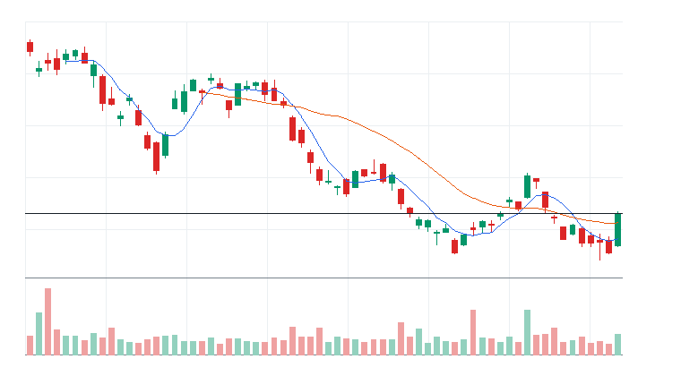
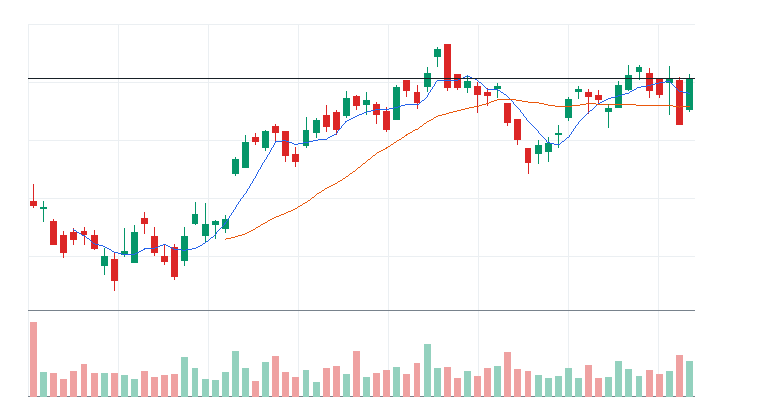
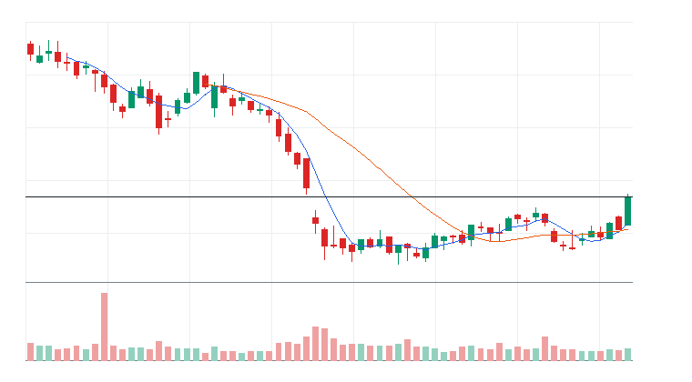
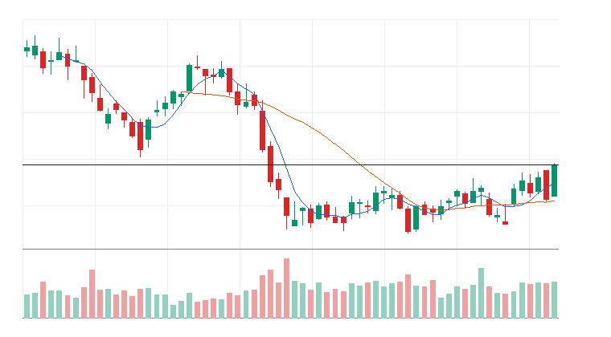

# 오늘의 데일리 트레이딩 요약

**REAL DATA TEST - 가격/거래량은 실제 데이터, 뉴스/ETF 구성종목 확산도/거래대금 유동성 일부 연결**

**목적:** 이 리포트는 최근 오른 자산을 나열하는 것이 아니라, 돈이 몰리는 근거와 다음 매수 주체가 확인할 트레이딩 후보를 찾기 위한 보고서다.

> 핵심 질문: 현재 가격에서 누가 사고 있고, 누가 앞으로 더 비싸게 사줄 수 있는가?

## 모바일 요약

[오늘의 데일리 트레이딩 요약]

생성 성공 / 데이터 모드: REAL_TEST

시장:
- 중립

시장 지배 서사:
1. 반도체 장비 사이클 재평가 - 부상 - SOXQ, SOXX, ASML, AMAT 중심으로 5일 +3.04%, 20일 +16.24% 흐름이 형성됨. 직접 촉매 일부 확인.
2. 방산/안보 프리미엄 - 약화 - ITA, SHLD, LMT, RTX 중심으로 5일 -0.89%, 20일 +5.20% 흐름이 형성됨. 직접 촉매 일부 확인.
3. 반도체 설계/공급망 재가속 - 약화 - SOXQ, SOXX, MRVL, ARM 중심으로 5일 -6.26%, 20일 +15.08% 흐름이 형성됨. 뉴스 직접성 제한.

트렌드 강도:
1. 반도체 장비 사이클 재평가 - TSI 58 - 부상 - 진입품질 관찰
2. 방산/안보 프리미엄 - TSI 39 - 잠복 - 진입품질 낮음
3. 반도체 설계/공급망 재가속 - TSI 31 - 잠복 - 진입품질 낮음

오늘 결론:
- AI 반도체 개별 종목 흐름이 ETF 대비 강한지 확인 필요
- 행동 후보는 linkedNarrative와 함께 확인한다.
- 추격보다 진입 조건 확인 후 접근한다.

오늘 실제 행동 후보:
1. 행동 후보 없음 - 미분류 - 조건 충족 후보 없음

다크호스 후보:
1. ASML - darkHorseScore 77 - 베이스 돌파 확인
2. LRCX - darkHorseScore 73 - 베이스 돌파 확인
3. AMAT - darkHorseScore 71 - 베이스 돌파 확인

ETF 후보 TOP 5:
1. ITA - 방산/안보 프리미엄 - 제외
2. SHLD - 방산/안보 프리미엄 - 제외
3. PAVE - AI 인프라 재가속 - 제외
4. IWM - 위험선호 성장주 재진입 - 제외
5. DRAM - AI 인프라 재가속 - 제외

웹 리포트:
https://yoolcool.github.io/DailyTradingThesisAgent/

## 오늘 결론

- 오늘 결론: 신규 추격 없음 / 관찰
- 신규 진입 후보: 0개
- 조건부 진입 후보: 0개
- 관찰 후보: 81개
- 주요 제한 요인: Entry Quality 부족, 뉴스 직접성 부족, RVOL 미달
- 주문 판단: 시장가 금지 / 지정가 또는 관찰
- 실전 판단: 오늘은 추세 후보는 있으나, 왜 돈이 몰리는가와 누가 더 비싸게 사줄 수 있는가를 주문 실행 신뢰도와 거래량이 충분히 뒷받침하지 못해 신규 추격은 보류한다. 기존 관심 종목은 전일 고점 돌파와 RVOL 1.00x 회복을 확인한 뒤 조건부로 본다.

### 후보 제한 요인 집계

- RVOL < 1.00x: 81개
- 거래대금 유동성 낮음: 11개
- Entry Quality < 60: 157개
- Exhaustion Risk >= 70: 0개
- ETF breadth 샘플 부족: 37개
- 뉴스 직접성 부족: 100개

## 데이터 신뢰도

- 전체 데이터 신뢰도 등급: LOW
- 분석 신뢰도: LOW
- 주문 실행 신뢰도: LOW
- ETF breadth 신뢰도: LOW
- 신뢰도 해석: 테마 확산 판단 제한, 거래대금 유동성 낮음 또는 확인 불가, 프리/애프터마켓 확인 불가
- 리포트 생성 시각: 2026-06-12 08:11 KST
- 가격 기준 거래일: 2026-06-11 US regular close
- 뉴스 수집 시각: 2026-06-12 08:11 KST
- 가장 최근 뉴스 발행 시각: 2026-06-12 08:03 KST
- 뉴스 신선도 상태: FRESH
- 뉴스 소스: Yahoo Finance RSS, MarketWatch RSS, CNBC Markets RSS, SEC EDGAR RSS, Federal Reserve RSS, Finnhub API
- 뉴스 소스 상태: Yahoo Finance RSS CONNECTED, MarketWatch RSS CONNECTED, CNBC Markets RSS PARTIAL, SEC EDGAR RSS PARTIAL, Federal Reserve RSS CONNECTED, Finnhub API DISABLED
- 뉴스 신뢰도: MEDIUM
- 추천 적용 거래일: 2026-06-11 US regular session
- 가격/거래량 데이터 상태: 연결됨
- 뉴스 데이터 상태: 일부 연결
- ETF 구성종목 확산도 상태: 일부 연결
- ETF 구성종목 샘플 수: 1~4
- 거래대금 유동성 데이터 상태: 일부 연결
- 프리마켓/애프터마켓 데이터 상태: UNAVAILABLE
- 데이터 provider: yfinance, Yahoo Finance RSS, MarketWatch RSS, CNBC Markets RSS, SEC EDGAR RSS, Federal Reserve RSS, Finnhub API, config fallback sample, price-volume dollar-volume fallback
- 실전 사용 경고: 이 리포트는 투자판단 보조용이며, REAL_TEST 모드에서는 일부 데이터가 누락되거나 지연될 수 있다. 실제 주문 전 현재가, 뉴스, 프리마켓/정규장 거래량을 별도 확인해야 한다.

## 0. 시장 상태

- 데이터 모드: REAL_TEST
- 가격/거래량: 연결됨
- 뉴스: 일부 연결
- ETF 구성종목 확산도: 일부 연결
- 거래대금 유동성: 일부 연결
- 생성 시각: 2026년 6월 12일 금요일 오전 8:11
- 시장 상태: 중립
- 오늘 돈의 방향: AI 반도체 개별 종목 흐름이 ETF 대비 강한지 확인 필요
- 강한 테마 TOP 3: 반도체 장비/공급망(96), 메모리/HBM ETF(71), 채권 ETF(61)
- 데이터 한계:
  - API 또는 provider 상태에 따라 뉴스/ETF 확산도/거래대금 유동성 반영 범위가 달라질 수 있다.
  - 수집 실패 데이터는 점수 반영에서 제외하거나 confidence를 제한한다.
  - reasonConfidence HIGH는 직접 촉매, 가격/거래량, 확산도/유동성 근거가 함께 있을 때만 사용한다.

## 오늘 시장을 지배하는 서사

### 오늘 시장을 지배하는 서사 TOP 3

#### 1. 반도체 장비 사이클 재평가
- 상태: 부상
- narrativeScore: 70
- reasonConfidence: MEDIUM
- 근거 ETF: SOXQ, SOXX, SMH
- 근거 개별 종목: ASML, AMAT, LRCX, KLAC
- 돈이 몰리는 이유: 반도체 장비 사이클 재평가 관련 SOXQ, SOXX, SMH와 ASML, AMAT, LRCX, KLAC의 5일(+3.04%)·20일(+16.24%) 흐름을 함께 본다. 평균 상대 거래량은 1.32배이고, ETF 확산도는 추가 확인이 필요하다. 직접 뉴스/이벤트가 일부 확인된다.
- 다음 매수 주체: 반도체 장비 사이클 회복을 확인한 섹터 ETF 자금과 장비주 상대강도 추종 자금
- 가장 좋은 트레이딩 수단: ETF 우선: SMH, SOXX, SOXQ / 개별 종목 우선: KLAC, ASML, AMAT
- 서사가 깨지는 조건: SMH/SOXX 20일선 이탈 또는 장비주 절반 이상 5일선 이탈
- 오늘 행동: 장비주가 반도체 ETF보다 강하게 버틸 때만 분리 테마로 관찰

상세 narrativeScore 근거 보기

- rawScore: 70
- ETF 평균 moneyFlowScore: 47
- 개별 종목 평균 moneyFlowScore: 97
- ETF 후보 비율: 0%
- 개별 종목 후보 비율: 75%
- 5일 평균 수익률: +3.00%
- 20일 평균 수익률: +16.00%
- 평균 상대 거래량: 1.00배
- ETF 평균 상대 거래량: 1.00배
- 개별주 평균 상대 거래량: 1.00배
- 52주 고점 근접 후보 비율: 50%
- 뉴스 직접성 점수: 12
- ETF 확산도 점수: -4
- 유동성 점수: 4
- 과열 리스크 차감: 0

#### 2. 방산/안보 프리미엄
- 상태: 약화
- narrativeScore: 31
- reasonConfidence: LOW
- 근거 ETF: ITA, SHLD, XAR
- 근거 개별 종목: LMT, RTX, AVAV, KTOS, PLTR
- 돈이 몰리는 이유: 방산/안보 프리미엄 관련 ITA, SHLD, XAR와 LMT, RTX, AVAV, KTOS의 5일(-0.89%)·20일(+5.20%) 흐름을 함께 본다. 평균 상대 거래량은 0.90배이고, ETF 확산도는 추가 확인이 필요하다. 직접 뉴스/이벤트가 일부 확인된다.
- 다음 매수 주체: 지정학 리스크와 안보 예산 기대를 사는 테마 ETF 자금
- 가장 좋은 트레이딩 수단: ETF 우선: XAR, SHLD, ITA / 개별 종목 우선: AVAV, KTOS, PLTR
- 서사가 깨지는 조건: 방산 ETF 20일선 이탈 또는 안보 이벤트 프리미엄 둔화
- 오늘 행동: 뉴스 촉매가 직접 확인될 때만 추세 추종

상세 narrativeScore 근거 보기

- rawScore: 31
- ETF 평균 moneyFlowScore: 44
- 개별 종목 평균 moneyFlowScore: 28
- ETF 후보 비율: 25%
- 개별 종목 후보 비율: 33%
- 5일 평균 수익률: -1.00%
- 20일 평균 수익률: +5.00%
- 평균 상대 거래량: 1.00배
- ETF 평균 상대 거래량: 1.00배
- 개별주 평균 상대 거래량: 1.00배
- 52주 고점 근접 후보 비율: 10%
- 뉴스 직접성 점수: 7
- ETF 확산도 점수: 0
- 유동성 점수: 0
- 과열 리스크 차감: 0

#### 3. 반도체 설계/공급망 재가속
- 상태: 약화
- narrativeScore: 28
- reasonConfidence: LOW
- 근거 ETF: SOXQ, SOXX, SMH
- 근거 개별 종목: MRVL, ARM, ADI, AVGO
- 돈이 몰리는 이유: 반도체 설계/공급망 재가속 관련 SOXQ, SOXX, SMH와 MRVL, ARM, ADI, AVGO의 5일(-6.26%)·20일(+15.08%) 흐름을 함께 본다. 평균 상대 거래량은 1.14배이고, ETF 확산도는 추가 확인이 필요하다. 뉴스 직접성은 아직 제한적이다.
- 다음 매수 주체: 반도체 설계/공급망 재가속을 확인한 섹터 ETF 자금과 상대강도 추종 스윙 자금
- 가장 좋은 트레이딩 수단: ETF 우선: SMH, SOXX, SOXQ / 개별 종목 우선: MRVL, AVGO, ARM
- 서사가 깨지는 조건: SMH/SOXX 20일선 이탈 또는 관련 설계/공급망 종목 절반 이상 5일선 이탈
- 오늘 행동: AI 인프라 본류와 동조성이 확인될 때만 선별 관찰

상세 narrativeScore 근거 보기

- rawScore: 28
- ETF 평균 moneyFlowScore: 47
- 개별 종목 평균 moneyFlowScore: 28
- ETF 후보 비율: 0%
- 개별 종목 후보 비율: 20%
- 5일 평균 수익률: -6.00%
- 20일 평균 수익률: +15.00%
- 평균 상대 거래량: 1.00배
- ETF 평균 상대 거래량: 1.00배
- 개별주 평균 상대 거래량: 1.00배
- 52주 고점 근접 후보 비율: 0%
- 뉴스 직접성 점수: 7
- ETF 확산도 점수: -4
- 유동성 점수: 2
- 과열 리스크 차감: 0

### 전체 narrative 요약

| 서사명 | 상태 | narrativeScore | reasonConfidence | 대표 ETF | 대표 종목 | 오늘 행동 |
| --- | --- | ---: | --- | --- | --- | --- |
| 반도체 장비 사이클 재평가 | 부상 | 70 | MEDIUM | SOXQ, SOXX, SMH | ASML, AMAT, LRCX, KLAC | 장비주가 반도체 ETF보다 강하게 버틸 때만 분리 테마로 관찰 |
| 방산/안보 프리미엄 | 약화 | 31 | LOW | ITA, SHLD, XAR | LMT, RTX, AVAV, KTOS | 뉴스 촉매가 직접 확인될 때만 추세 추종 |
| 반도체 설계/공급망 재가속 | 약화 | 28 | LOW | SOXQ, SOXX, SMH | MRVL, ARM, ADI, AVGO | AI 인프라 본류와 동조성이 확인될 때만 선별 관찰 |
| AI 인프라 재가속 | 약화 | 23 | LOW | DRAM, PAVE, SOXQ | MU, NVDA, VRT, ETN | 추격보다 5일선 지지 후 재상승 확인 |
| 위험선호 성장주 재진입 | 약화 | 21 | LOW | IWM, IPO, QQQ | ARM, COIN, TSLA | 지수 위험선호가 유지될 때만 선별 진입 |
| 사이버보안 지출 재가속 | 약화 | 19 | LOW | CIBR, HACK, IHAK | FTNT, PANW, CRWD | 보안 ETF와 대표 종목 동조성이 살아날 때만 관찰 편입 |
| 매크로 방어/헤지 | 약화 | 10 | LOW | TLT, GLD, XLE | XOM, CVX | 위험회피가 확인될 때만 헤지성 접근 |
| 소프트웨어 실적/AI 수익화 | 약화 | 6 | LOW | QQQ, AIQ, IGV | DDOG, CDNS, TEAM, PLTR | 실적/가이던스 촉매와 가격 반응이 같이 확인될 때만 분리 테마로 관찰 |
| 전력망/원전/인프라 병목 | 소멸 | 3 | LOW | PAVE, GRID, URA | VRT, ETN, PWR, CEG | ETF 확산도와 거래량이 같이 살아날 때만 진입 |
| AI 소프트웨어/사이버보안 확산 | 약화 | 2 | LOW | QQQ, AIQ, IGV | DDOG, TEAM, PLTR, MSFT | 추격보다 눌림 후 재상승 확인 |
| 비트코인/디지털 자산 위험선호 | 소멸 | 0 | LOW | BLOK, IBIT | MSTR, COIN, IREN | 비트코인 베타가 살아날 때만 단기 매매 |

## 트렌드 강도 판단

### 1. 반도체 장비 사이클 재평가
- Trend Strength Index: 58
- 트렌드 상태 라벨: 부상
- 테마 확산도: 보통
- ETF 동조성: 약함
- 거래량 강도: 보통
- 과열 위험: 보통 (31)
- 오늘 진입 품질: 관찰 (43)
- 한 줄 판단: 반도체 장비 사이클 재평가는 Trend Strength는 중간이지만 진입 품질이 살아나는 초기 진입 후보 성격이다.
- 오늘 접근법: SOXQ/SOXX/SMH 거래량 증가와 ASML/AMAT/LRCX 확산을 확인하며 작은 사이즈의 초기 진입 후보로만 본다.

트렌드 강도 상세 근거 보기

- 가격 모멘텀: 가격 모멘텀 15/25. 평균 5D +3.04%, 20D +16.24%.
- 거래량 강도: 거래량 강도 13/20. 평균 RVOL 1.32배.
- ETF 동조성: ETF 동조성 6/15. 관련 ETF SMH, SOXX, SOXQ, AIQ 흐름을 기준으로 판단.
- 테마 확산도: 테마 확산도 13/20. 상위 1~2개 쏠림 감점 0점 반영.
- 뉴스 촉매: 뉴스/촉매 신선도 7/10. HIGH 직접 촉매 1개.
- 과열 리스크: 과열 리스크 31/100. 단기 급등, 고점 근접, ETF-개별주 괴리, 쏠림을 함께 반영.
- 시장 환경: 시장 환경 4/10. QQQ/SPY/IWM 가격 흐름 기반 위험선호 점수.

### 2. 방산/안보 프리미엄
- Trend Strength Index: 39
- 트렌드 상태 라벨: 잠복
- 테마 확산도: 보통
- ETF 동조성: 강함
- 거래량 강도: 부족
- 과열 위험: 낮음 (1)
- 오늘 진입 품질: 낮음 (34)
- 한 줄 판단: 방산/안보 프리미엄는 관찰 가능한 흐름은 있으나 가격, 거래량, 확산도 중 일부 확인이 더 필요하다.
- 오늘 접근법: ITA/SHLD/XAR와 LMT/RTX/AVAV의 거래량 확산이 확인되기 전까지 관찰한다.

트렌드 강도 상세 근거 보기

- 가격 모멘텀: 가격 모멘텀 3/25. 평균 5D -0.89%, 20D +5.20%.
- 거래량 강도: 거래량 강도 4/20. 평균 RVOL 0.90배.
- ETF 동조성: ETF 동조성 13/15. 관련 ETF XAR, SHLD, ITA, PPA 흐름을 기준으로 판단.
- 테마 확산도: 테마 확산도 10/20. 상위 1~2개 쏠림 감점 0점 반영.
- 뉴스 촉매: 뉴스/촉매 신선도 5/10. HIGH 직접 촉매 1개.
- 과열 리스크: 과열 리스크 1/100. 단기 급등, 고점 근접, ETF-개별주 괴리, 쏠림을 함께 반영.
- 시장 환경: 시장 환경 4/10. QQQ/SPY/IWM 가격 흐름 기반 위험선호 점수.

### 3. 반도체 설계/공급망 재가속
- Trend Strength Index: 31
- 트렌드 상태 라벨: 잠복
- 테마 확산도: 약함
- ETF 동조성: 약함
- 거래량 강도: 보통
- 과열 위험: 낮음 (4)
- 오늘 진입 품질: 낮음 (28)
- 한 줄 판단: 반도체 설계/공급망 재가속는 관찰 가능한 흐름은 있으나 가격, 거래량, 확산도 중 일부 확인이 더 필요하다.
- 오늘 접근법: SOXQ/SOXX/SMH와 MRVL/ARM/ADI의 거래량 확산이 확인되기 전까지 관찰한다.

트렌드 강도 상세 근거 보기

- 가격 모멘텀: 가격 모멘텀 2/25. 평균 5D -6.26%, 20D +15.08%.
- 거래량 강도: 거래량 강도 10/20. 평균 RVOL 1.14배.
- ETF 동조성: ETF 동조성 6/15. 관련 ETF SMH, SOXX, SOXQ, AIQ 흐름을 기준으로 판단.
- 테마 확산도: 테마 확산도 6/20. 상위 1~2개 쏠림 감점 0점 반영.
- 뉴스 촉매: 뉴스/촉매 신선도 3/10. HIGH 직접 촉매 0개.
- 과열 리스크: 과열 리스크 4/100. 단기 급등, 고점 근접, ETF-개별주 괴리, 쏠림을 함께 반영.
- 시장 환경: 시장 환경 4/10. QQQ/SPY/IWM 가격 흐름 기반 위험선호 점수.

## 최근 추천 결과 트래킹

개별주는 데이트레이딩 관점으로 추천 이후 첫 정규장의 장중 최고가와 종가를 추적한다. ETF는 테마/스윙 관점으로 추천 이후 1주일 동안의 최고가와 현재 종가를 추적한다.

### 개별주 Top 3 추천 성과 요약
- 최근 5개 리포트 표본: 7개 (초기 검증 단계)
- 장중 최고가 기준 성공률: +14.29%
- 종가 기준 성공률: +28.57%
- 평균 장중 최고 수익률: +0.98%
- 평균 종가 수익률: -1.19%

### ETF 추천 성과 요약
- 최근 5개 리포트 표본: 7개 (초기 검증 단계)
- 1주 최고가 기준 성공률: 0.00%
- 현재 종가 기준 성공률: 0.00%
- 평균 1주 최고 수익률: -3.33%
- 평균 현재 수익률: -8.02%

최근 추천 결과 상세 테이블 펼치기

| 추천일 | 유형 | 순위 | 티커 | 기준가 | 추적 기간 | 상태 | High 수익률 | Close 수익률 | 결과 | 코멘트 |
| --- | --- | ---: | --- | ---: | --- | --- | ---: | ---: | --- | --- |
| 2026-06-04 | STOCK | 3 | PANW | $280.43 | 2026-06-04 | complete | +0.10% | -0.42% | 실패 | 추천 이후 의미 있는 장중 기회가 부족하고 종가도 약함 (일봉 기준) |
| 2026-06-04 | STOCK | 2 | FTNT | $146.48 | 2026-06-04 | complete | +2.45% | +2.18% | 제한적 유효 | 제한적인 장중 기회만 발생 (일봉 기준) |
| 2026-06-04 | STOCK | 1 | CRWD | $747.61 | 2026-06-04 | complete | -3.56% | -3.81% | 실패 | 추천 이후 의미 있는 장중 기회가 부족하고 종가도 약함 (일봉 기준) |
| 2026-06-04 | ETF | 3 | HACK | $102.21 | 2026-06-04~2026-06-11 | complete | -1.66% | -5.47% | 실패 | 추천 이후 ETF 흐름이 약화됨 |
| 2026-06-04 | ETF | 2 | SOXQ | $109.58 | 2026-06-04~2026-06-11 | complete | -4.68% | -5.37% | 실패 | 추천 이후 ETF 흐름이 약화됨 |
| 2026-06-04 | ETF | 1 | AIQ | $69.16 | 2026-06-04~2026-06-11 | complete | -4.29% | -7.53% | 실패 | 추천 이후 ETF 흐름이 약화됨 |
| 2026-06-03 | STOCK | 3 | FTNT | $148.86 | 2026-06-03 | complete | -0.26% | -1.60% | 실패 | 추천 이후 의미 있는 장중 기회가 부족하고 종가도 약함 (일봉 기준) |
| 2026-06-03 | STOCK | 3 | CRWD | $768.95 | 2026-06-03 | complete | -0.25% | -2.78% | 실패 | 추천 이후 의미 있는 장중 기회가 부족하고 종가도 약함 (일봉 기준) |
| 2026-06-03 | STOCK | 2 | MRVL | $290.79 | 2026-06-03 | complete | +11.49% | +3.73% | 성공 | 장중 기회와 종가 유지가 모두 확인됨 (일봉 기준) |
| 2026-06-03 | STOCK | 1 | PANW | $297.18 | 2026-06-03 | complete | -3.09% | -5.64% | 실패 | 추천 이후 의미 있는 장중 기회가 부족하고 종가도 약함 (일봉 기준) |
| 2026-06-03 | ETF | 3 | DRAM | $69.57 | 2026-06-03~2026-06-10 | complete | -3.52% | -6.40% | 실패 | 추천 이후 ETF 흐름이 약화됨 |
| 2026-06-03 | ETF | 3 | IGV | $104.73 | 2026-06-03~2026-06-10 | complete | -3.31% | -13.19% | 실패 | 추천 이후 ETF 흐름이 약화됨 |
| 2026-06-03 | ETF | 2 | AIQ | $70.14 | 2026-06-03~2026-06-10 | complete | -2.32% | -8.83% | 실패 | 추천 이후 ETF 흐름이 약화됨 |
| 2026-06-03 | ETF | 1 | CIBR | $94.32 | 2026-06-03~2026-06-10 | complete | -3.56% | -9.38% | 실패 | 추천 이후 ETF 흐름이 약화됨 |

## 오늘 실제 행동 후보

오늘은 추세 후보는 있으나, 왜 돈이 몰리는가와 누가 더 비싸게 사줄 수 있는가를 주문 실행 신뢰도와 거래량이 충분히 뒷받침하지 못해 신규 추격은 보류한다. 기존 관심 종목은 전일 고점 돌파와 RVOL 1.00x 회복을 확인한 뒤 조건부로 본다.

## 다크호스 후보

> 메인 행동 후보를 대체하지 않는 보조 관찰 섹션이다. 상위 서사 안에서 아직 과열되지 않았지만 초기 추세 전환, 베이스 돌파, 거래량 회복이 시작되는 개별주만 표시한다.

### 1. [ASML] ASML Holding N.V.
- 소속 서사: 반도체 장비 사이클 재평가
- darkHorseScore: 77 (다크호스 후보)
- 단계: 베이스 돌파 확인
- Confidence: MEDIUM
- 5D / 20D / RVOL: +8.08% / +20.10% / 1.62x
- MA 구조: 종가 $1,899.48 / MA5 $1,760.44 / MA20 $1,643.08
- 선정 이유: ASML는 반도체 장비 사이클 재평가 서사에 속하고 종가가 MA20 위에 있으며 MA5/MA20 정렬이 개선되고 있다. 최근 15거래일 베이스는 상단 돌파 상태이고, RVOL 1.62x로 거래량 확인은 충분하다. Exhaustion Risk 31로 아직 메인 후보 대비 과열 상한 안에 있다.
- 확인 조건: 돌파 후 고점 위 안착 유지, MA5 위 종가 유지, 관련 ETF 동반 강세
- 무효화 조건: MA20 $1,643.08 종가 이탈, 최근 스윙 저점 $1,585.61 이탈, RVOL 0.80x 이하 둔화
- 왜 아직 메인이 아닌가: Entry Quality 22 < 60

darkHorseScore 상세 근거 보기

- 서사 정렬: 13/20
- 초기 추세 구조: 24/30
- 베이스 돌파/정돈: 13/20
- 거래량 확인: 14/15
- 낮은 과열: 8/10
- 유동성 리스크 보정: 5/5
- 리스크 차감: -0
- rawScore: 77

- 차트: 

### 2. [LRCX] Lam Research Corporation
- 소속 서사: 반도체 장비 사이클 재평가
- darkHorseScore: 73 (다크호스 후보)
- 단계: 베이스 돌파 확인
- Confidence: LOW
- 5D / 20D / RVOL: +7.76% / +22.71% / 1.47x
- MA 구조: 종가 $362.52 / MA5 $327.84 / MA20 $314.18
- 선정 이유: LRCX는 반도체 장비 사이클 재평가 서사에 속하고 종가가 MA20 위에 있으며 MA5/MA20 정렬이 개선되고 있다. 최근 15거래일 베이스는 상단 돌파 상태이고, RVOL 1.47x로 거래량 확인은 충분하다. Exhaustion Risk 31로 아직 메인 후보 대비 과열 상한 안에 있다.
- 확인 조건: 돌파 후 고점 위 안착 유지, MA5 위 종가 유지, 관련 ETF 동반 강세
- 무효화 조건: MA20 $314.18 종가 이탈, 최근 스윙 저점 $302.74 이탈, RVOL 0.80x 이하 둔화
- 왜 아직 메인이 아닌가: Entry Quality 9 < 60

darkHorseScore 상세 근거 보기

- 서사 정렬: 13/20
- 초기 추세 구조: 22/30
- 베이스 돌파/정돈: 11/20
- 거래량 확인: 14/15
- 낮은 과열: 8/10
- 유동성 리스크 보정: 5/5
- 리스크 차감: -0
- rawScore: 73

- 차트: 

### 3. [AMAT] Applied Materials Inc.
- 소속 서사: 반도체 장비 사이클 재평가
- darkHorseScore: 71 (다크호스 후보)
- 단계: 베이스 돌파 확인
- Confidence: LOW
- 5D / 20D / RVOL: +10.15% / +26.58% / 1.38x
- MA 구조: 종가 $552.64 / MA5 $498.81 / MA20 $461.58
- 선정 이유: AMAT는 반도체 장비 사이클 재평가 서사에 속하고 종가가 MA20 위에 있으며 MA5/MA20 정렬이 개선되고 있다. 최근 15거래일 베이스는 상단 돌파 상태이고, RVOL 1.38x로 거래량 확인은 충분하다. Exhaustion Risk 31로 아직 메인 후보 대비 과열 상한 안에 있다.
- 확인 조건: 돌파 후 고점 위 안착 유지, MA5 위 종가 유지, 관련 ETF 동반 강세
- 무효화 조건: MA20 $461.58 종가 이탈, 최근 스윙 저점 $438.22 이탈, RVOL 0.80x 이하 둔화
- 왜 아직 메인이 아닌가: Entry Quality 15 < 60

darkHorseScore 상세 근거 보기

- 서사 정렬: 13/20
- 초기 추세 구조: 24/30
- 베이스 돌파/정돈: 11/20
- 거래량 확인: 14/15
- 낮은 과열: 8/10
- 유동성 리스크 보정: 5/5
- 리스크 차감: -4
- rawScore: 71

- 차트: 

## 참고용 행동 후보

> 실제 행동 후보가 없는 날에만 표시한다. 아래 후보는 매수 추천이 아니라 다음 정규장에서 전일 고점 돌파, RVOL 1.00x 이상, 거래대금 유동성 확인을 기다리는 관찰 리스트다.

### ETF 참고 후보 TOP 3

#### 1. [ITA] iShares U.S. Aerospace & Defense ETF
- 상태: 참고용 관찰 후보
- todayActionLabel: 제외
- 제한 사유: Entry Quality 31 < 45; 진입 품질 부족
- 주문 실행: 지정가 권장
- moneyFlowScore: 69
- Entry Quality: 31 (낮음)
- RVOL: 1.20x
- 진입 전 확인: 20일선 위 눌림 후 재상승 확인
- 무효화: 20일선 이탈 또는 상대 거래량 0.8배 이하 둔화

#### 2. [SHLD] Global X Defense Tech ETF
- 상태: 참고용 관찰 후보
- todayActionLabel: 제외
- 제한 사유: Entry Quality 27 < 45; 진입 품질 부족
- 주문 실행: 지정가 권장
- moneyFlowScore: 49
- Entry Quality: 27 (낮음)
- RVOL: 1.10x
- 진입 전 확인: 20일선 위 눌림 후 재상승 확인
- 무효화: 20일선 이탈 또는 상대 거래량 0.8배 이하 둔화

#### 3. [PAVE] Global X U.S. Infrastructure Development ETF
- 상태: 참고용 관찰 후보
- todayActionLabel: 제외
- 제한 사유: Entry Quality 28 < 45; 진입 품질 부족
- 주문 실행: 지정가 권장
- moneyFlowScore: 58
- Entry Quality: 28 (낮음)
- RVOL: 1.31x
- 진입 전 확인: 전일 고점 돌파와 5일선 유지 확인
- 무효화: 20일선 이탈 또는 상대 거래량 0.8배 이하 둔화

### 개별주 참고 후보 TOP 3

#### 1. [ASML] ASML Holding N.V.
- 상태: 참고용 관찰 후보
- todayActionLabel: 제외
- 제한 사유: Entry Quality 22 < 45; 진입 품질 부족
- 주문 실행: 시장가 가능
- moneyFlowScore: 100
- Entry Quality: 22 (낮음)
- RVOL: 1.62x
- 진입 전 확인: 전일 고점 돌파와 5일선 유지 확인
- 무효화: 20일선 이탈 또는 상대 거래량 0.8배 이하 둔화

#### 2. [AMAT] Applied Materials Inc.
- 상태: 참고용 관찰 후보
- todayActionLabel: 제외
- 제한 사유: Entry Quality 15 < 45; 진입 품질 부족
- 주문 실행: 시장가 가능
- moneyFlowScore: 100
- Entry Quality: 15 (낮음)
- RVOL: 1.38x
- 진입 전 확인: 전일 고점 돌파와 5일선 유지 확인
- 무효화: 20일선 이탈 또는 상대 거래량 0.8배 이하 둔화

#### 3. [LRCX] Lam Research Corporation
- 상태: 참고용 관찰 후보
- todayActionLabel: 제외
- 제한 사유: Entry Quality 9 < 45; 진입 품질 부족
- 주문 실행: 시장가 가능
- moneyFlowScore: 100
- Entry Quality: 9 (낮음)
- RVOL: 1.47x
- 진입 전 확인: 전일 고점 돌파와 5일선 유지 확인
- 무효화: 20일선 이탈 또는 상대 거래량 0.8배 이하 둔화

## 오늘 돈이 몰리는 테마

- 반도체 장비/공급망: LRCX, AMAT, KLAC | 평균 moneyFlowScore 96 | 단일 종목 이벤트보다 테마 단위 자금 흐름이 선명한 구간으로 본다.
- 메모리/HBM ETF: DRAM | 평균 moneyFlowScore 71 | 추세는 확인되지만 선별 진입이 필요한 중간 강도의 테마로 본다.
- 채권 ETF: TLT | 평균 moneyFlowScore 61 | 추세는 확인되지만 선별 진입이 필요한 중간 강도의 테마로 본다.
- Consumer Cyclical: SBUX, MAR, ROST, ORLY | 평균 moneyFlowScore 53 | 관심은 유지하되 우선순위는 낮추고 추가 거래량 확인을 기다린다.
- AI 반도체 ETF: SMH, SOXX, SOXQ | 평균 moneyFlowScore 53 | 관심은 유지하되 우선순위는 낮추고 추가 거래량 확인을 기다린다.
- 인프라 ETF: PAVE, IFRA | 평균 moneyFlowScore 51 | 관심은 유지하되 우선순위는 낮추고 추가 거래량 확인을 기다린다.

## 1. ETF 트레이딩 보고서
### 1-1. ETF 결론
- ETF 우선 후보: 없음
- ETF 관찰 후보: IGV, ROBO, CIBR, HACK, IHAK
- ETF 매매 금지: IGV, BOTZ, ROBO, IHAK, URA
- 오늘 ETF 최우선 1개: 없음
- ETF 섹션 해석: 이 섹션은 개별 종목 선택이 아니라 테마/섹터 단위 자금 흐름을 ETF로 매매할지 판단하기 위한 영역이다.

### 1-2. ETF 후보 TOP 5

선정 기준: ETF 후보는 가격/거래량 1차 점수에 뉴스, ETF 구성종목 확산도, 유동성, 리스크 패널티를 반영한 finalRawScore 기준으로 정렬한다. 표시 점수 100점 후보가 겹치면 tieBreakerReason으로 우선순위를 설명한다.

### [ETF ITA] iShares U.S. Aerospace & Defense ETF
- 자산 유형: ETF
- ETF 세부 카테고리: 방산 ETF
- ETF 역할: 방어 섹터 확인
- 상태: 매매 금지
- linkedNarrative: 방산/안보 프리미엄
- narrativeStatus: 약화
- narrativeScore: 31
- moneyFlowScore: 69
- finalRawScore: 69
- tieBreakerReason: 최종 원점수 69, 리스크 패널티 0, 5일 수익률 +1.93%, 상대 거래량 1.20배 순으로 정렬
- 과열 리스크: 낮음
- reasonConfidence: MEDIUM
- reasonConfidenceExplanation: ETF 확산도 제한 때문에 HIGH가 아니라 MEDIUM으로 제한했다.

- todayActionLabel: 제외
- 주문 실행: 지정가 권장
- 기준일: 2026-06-11
- 종가: $236.04
- 1일 수익률: +4.97%
- 5일 수익률: +1.93%
- 20일 수익률: +4.58%
- 상대 거래량: 1.20배
- 52주 고점 대비 위치: -5.83%
- whyMoneyIsFlowing: 20일 +4.58%, 5일 +1.93%, 상대 거래량 1.20배로 가격과 거래량이 함께 개선. 뉴스: CNBC Markets RSS general_market/under_6h / 유동성: ACCEPTABLE
- likelyNextBuyer: 섹터 베타를 노리는 단기 모멘텀 자금과 리밸런싱 자금
- whyThisCouldTradeHigher: 단기 추세가 유지되고 거래량이 1.0배 이상이면 눌림 이후 재상승을 시도할 수 있음
- 진입 조건: 20일선 위 눌림 후 재상승 확인
- 무효화 조건: 20일선 이탈 또는 상대 거래량 0.8배 이하 둔화
- 차트: 

#### 상세 근거

ITA 상세 근거 펼치기

- moneyFlowScore(최종) 산정 근거:
  - moneyFlowScore(1차): 55
  - 최종 원점수: 69
  - 최종 표시 점수: 69
  - cap 적용: cap 미적용
  - 계산식: +55 + +12 + 0 + +2 + 0 + 0 + 0 = 69
  - 점수 해석: 관심 후보. 눌림 또는 돌파 확인 후 진입 검토.
  - 가격/거래량 1차 점수: +55
    - 추세: +10
    - 단기 모멘텀: +8
    - 중기 모멘텀: +3
    - 거래량: +14
    - 신고가 근접: +6
    - 이동평균: +14
  - 하위 점수 cap:
    - 가격 모멘텀: 원점수 +10, 상한 적용 +10 / 최대 25
    - 단기 모멘텀: 원점수 +8, 상한 적용 +8 / 최대 20
    - 중기 모멘텀: 원점수 +3, 상한 적용 +3 / 최대 16
    - 거래량: 원점수 +14, 상한 적용 +14 / 최대 20
    - 신고가 근접: 원점수 +6, 상한 적용 +6 / 최대 12
    - 이동평균: 원점수 +14, 상한 적용 +14 / 최대 14
  - 추가 데이터 가감점:
    - 뉴스: +12
    - 유동성: +2
  - ETF 확산도: 0
  - 리스크 패널티: 0
  - 주요 근거: 1차 55, 최종 원점수 69, 표시 69. 1일 단기 모멘텀 확인, 상대 거래량 증가, 이동평균 위 추세 유지. 주의: ETF 구성종목 확산도 데이터 미연결.
  - 리스크 패널티 산정 근거:
    - 총 리스크 패널티: 0
    - 리스크 등급: LOW
    - 감점된 리스크: 없음
    - 관찰 리스크: ETF breadth data not connected
    - 한 줄 해석: 직접 감점된 주요 리스크는 없지만 관찰 리스크는 계속 확인해야 한다.
- 데이터 사용 현황:
  - 가격/거래량: 사용
  - 뉴스: 사용
  - ETF 확산도: 미연결
  - 거래대금 유동성: 사용
  - 관련 ETF 상대강도: 사용
- 뉴스 확인:
  - 최근 뉴스 상태: 일부 연결
  - 뉴스 소스: CNBC Markets RSS, MarketWatch RSS
  - 소스별 상태: Yahoo Finance RSS CONNECTED; MarketWatch RSS CONNECTED; CNBC Markets RSS CONNECTED; SEC EDGAR RSS PARTIAL; Federal Reserve RSS CONNECTED; Finnhub API DISABLED
  - 긍정/중립/부정: 11/3/2
  - 직접성/방향성/신선도: 2/1/4
  - 강한 촉매 수: 4
  - 직접 촉매: 없음
  - 보조 뉴스: CNBC Markets RSS sector_theme / general_market / under_6h
  - 뉴스 수집 시각: 2026-06-12 08:11 KST
  - 가장 최근 뉴스 발행 시각: 2026-06-12 07:53 KST
  - 뉴스 신선도 상태: FRESH
  - 뉴스 이후 가격 반응: 긍정
  - 가격 반응 점수 제한: 뉴스 이후 가격 반응과 점수 제한 특이사항 없음
  - 핵심 뉴스 요약: From startup to $1.8 trillion: The investors who took a chance on SpaceX now reap the rewards
  - 원점수/상한 점수: +26 / +12
  - 점수 반영: +12
  - 주의: SEC EDGAR RSS: no matching RSS items; Finnhub API: FINNHUB_API_KEY not configured
- ETF 구성종목 확산도:
  - 구성종목 데이터 상태: 미연결
  - 샘플 수: 0/0
  - 샘플 신뢰도: UNKNOWN
  - 상승 종목 비율: 데이터 없음
  - 20일선 위 비율: 데이터 없음
  - 50일선 위 비율: 데이터 없음
  - 상위 기여 종목: 데이터 없음
  - 확산도 판단: UNKNOWN
  - 원점수/샘플 상한/반영 점수: 0 / N/A / 0
  - 점수 반영: 0
- 거래대금 유동성:
  - 데이터 상태: 일부 연결
  - 거래대금 기준 유동성: ACCEPTABLE
  - 거래대금: $254,463,866
  - 평균 거래대금: $212,438,832
  - 주문 영향: 지정가 권장
  - 매매 영향: 거래대금은 허용 가능하나 지정가를 우선한다
- reasonConfidence 근거: 가격/거래량, 뉴스, 거래대금 유동성, 관련 ETF 상대강도은 확인됐지만 일부 보조 데이터가 미연결 또는 fallback이라 중간으로 제한한다.
- 차트 요약: 최근 20거래일 기준 5일선이 20일선 위에 있음
- 기준일 2026-06-11 | 종가 $236.04 | 1일 +4.97% | 5일 +1.93% | 20일 +4.58% | 상대 거래량 1.20배 | 52주 고점 대비 -5.83% | 데이터 소스: yfinance

### [ETF SHLD] Global X Defense Tech ETF
- 자산 유형: ETF
- ETF 세부 카테고리: 방산 ETF
- ETF 역할: 방어 섹터 확인
- 상태: 매매 금지
- linkedNarrative: 방산/안보 프리미엄
- narrativeStatus: 약화
- narrativeScore: 31
- moneyFlowScore: 49
- finalRawScore: 49
- tieBreakerReason: 최종 원점수 49, 리스크 패널티 0, 5일 수익률 +1.31%, 상대 거래량 1.10배 순으로 정렬
- 과열 리스크: 낮음
- reasonConfidence: MEDIUM
- reasonConfidenceExplanation: ETF 확산도 제한 때문에 HIGH가 아니라 MEDIUM으로 제한했다.

- todayActionLabel: 제외
- 주문 실행: 지정가 권장
- 기준일: 2026-06-11
- 종가: $65.15
- 1일 수익률: +4.47%
- 5일 수익률: +1.31%
- 20일 수익률: +2.13%
- 상대 거래량: 1.10배
- 52주 고점 대비 위치: -17.00%
- whyMoneyIsFlowing: 20일 +2.13%, 5일 +1.31%, 상대 거래량 1.10배로 가격과 거래량이 함께 개선. 뉴스: CNBC Markets RSS general_market/under_6h / 유동성: ACCEPTABLE
- likelyNextBuyer: 섹터 베타를 노리는 단기 모멘텀 자금과 리밸런싱 자금
- whyThisCouldTradeHigher: 단기 추세가 유지되고 거래량이 1.0배 이상이면 눌림 이후 재상승을 시도할 수 있음
- 진입 조건: 20일선 위 눌림 후 재상승 확인
- 무효화 조건: 20일선 이탈 또는 상대 거래량 0.8배 이하 둔화
- 차트: 

#### 상세 근거

SHLD 상세 근거 펼치기

- moneyFlowScore(최종) 산정 근거:
  - moneyFlowScore(1차): 35
  - 최종 원점수: 49
  - 최종 표시 점수: 49
  - cap 적용: cap 미적용
  - 계산식: +35 + +12 + 0 + +2 + 0 + 0 + 0 = 49
  - 점수 해석: 매매 금지 또는 우선순위 낮은 후보.
  - 가격/거래량 1차 점수: +35
    - 추세: +8
    - 단기 모멘텀: +6
    - 중기 모멘텀: +1
    - 거래량: +10
    - 신고가 근접: 0
    - 이동평균: +10
  - 하위 점수 cap:
    - 가격 모멘텀: 원점수 +8, 상한 적용 +8 / 최대 25
    - 단기 모멘텀: 원점수 +6, 상한 적용 +6 / 최대 20
    - 중기 모멘텀: 원점수 +1, 상한 적용 +1 / 최대 16
    - 거래량: 원점수 +10, 상한 적용 +10 / 최대 20
    - 신고가 근접: 원점수 0, 상한 적용 0 / 최대 12
    - 이동평균: 원점수 +10, 상한 적용 +10 / 최대 14
  - 추가 데이터 가감점:
    - 뉴스: +12
    - 유동성: +2
  - ETF 확산도: 0
  - 리스크 패널티: 0
  - 주요 근거: 1차 35, 최종 원점수 49, 표시 49. 1일 단기 모멘텀 확인, 이동평균 위 추세 유지, 뉴스 흐름이 가격/거래량 근거 보강. 주의: ETF 구성종목 확산도 데이터 미연결.
  - 리스크 패널티 산정 근거:
    - 총 리스크 패널티: 0
    - 리스크 등급: LOW
    - 감점된 리스크: 없음
    - 관찰 리스크: ETF breadth data not connected
    - 한 줄 해석: 직접 감점된 주요 리스크는 없지만 관찰 리스크는 계속 확인해야 한다.
- 데이터 사용 현황:
  - 가격/거래량: 사용
  - 뉴스: 사용
  - ETF 확산도: 미연결
  - 거래대금 유동성: 사용
  - 관련 ETF 상대강도: 사용
- 뉴스 확인:
  - 최근 뉴스 상태: 일부 연결
  - 뉴스 소스: CNBC Markets RSS, MarketWatch RSS
  - 소스별 상태: Yahoo Finance RSS CONNECTED; MarketWatch RSS CONNECTED; CNBC Markets RSS CONNECTED; SEC EDGAR RSS PARTIAL; Federal Reserve RSS CONNECTED; Finnhub API DISABLED
  - 긍정/중립/부정: 11/3/2
  - 직접성/방향성/신선도: 2/1/4
  - 강한 촉매 수: 4
  - 직접 촉매: 없음
  - 보조 뉴스: CNBC Markets RSS sector_theme / general_market / under_6h
  - 뉴스 수집 시각: 2026-06-12 08:11 KST
  - 가장 최근 뉴스 발행 시각: 2026-06-12 07:53 KST
  - 뉴스 신선도 상태: FRESH
  - 뉴스 이후 가격 반응: 긍정
  - 가격 반응 점수 제한: 뉴스 이후 가격 반응과 점수 제한 특이사항 없음
  - 핵심 뉴스 요약: From startup to $1.8 trillion: The investors who took a chance on SpaceX now reap the rewards
  - 원점수/상한 점수: +26 / +12
  - 점수 반영: +12
  - 주의: SEC EDGAR RSS: no matching RSS items; Finnhub API: FINNHUB_API_KEY not configured
- ETF 구성종목 확산도:
  - 구성종목 데이터 상태: 미연결
  - 샘플 수: 0/0
  - 샘플 신뢰도: UNKNOWN
  - 상승 종목 비율: 데이터 없음
  - 20일선 위 비율: 데이터 없음
  - 50일선 위 비율: 데이터 없음
  - 상위 기여 종목: 데이터 없음
  - 확산도 판단: UNKNOWN
  - 원점수/샘플 상한/반영 점수: 0 / N/A / 0
  - 점수 반영: 0
- 거래대금 유동성:
  - 데이터 상태: 일부 연결
  - 거래대금 기준 유동성: ACCEPTABLE
  - 거래대금: $145,647,842
  - 평균 거래대금: $132,466,107
  - 주문 영향: 지정가 권장
  - 매매 영향: 거래대금은 허용 가능하나 지정가를 우선한다
- reasonConfidence 근거: 가격/거래량, 뉴스, 거래대금 유동성, 관련 ETF 상대강도은 확인됐지만 일부 보조 데이터가 미연결 또는 fallback이라 중간으로 제한한다.
- 차트 요약: 단기 추세 중립
- 기준일 2026-06-11 | 종가 $65.15 | 1일 +4.47% | 5일 +1.31% | 20일 +2.13% | 상대 거래량 1.10배 | 52주 고점 대비 -17.00% | 데이터 소스: yfinance

### [ETF PAVE] Global X U.S. Infrastructure Development ETF
- 자산 유형: ETF
- ETF 세부 카테고리: 인프라 ETF
- ETF 역할: 테마 베타 매수
- 상태: 매매 금지
- linkedNarrative: AI 인프라 재가속
- narrativeStatus: 약화
- narrativeScore: 23
- moneyFlowScore: 58
- finalRawScore: 58
- tieBreakerReason: 최종 원점수 58, 리스크 패널티 0, 5일 수익률 -0.75%, 상대 거래량 1.31배 순으로 정렬
- 과열 리스크: 낮음~중간
- reasonConfidence: MEDIUM
- reasonConfidenceExplanation: ETF 확산도 제한 때문에 HIGH가 아니라 MEDIUM으로 제한했다.

- todayActionLabel: 제외
- 주문 실행: 지정가 권장
- 기준일: 2026-06-11
- 종가: $57.18
- 1일 수익률: +3.40%
- 5일 수익률: -0.75%
- 20일 수익률: +1.26%
- 상대 거래량: 1.31배
- 52주 고점 대비 위치: -2.34%
- whyMoneyIsFlowing: 20일 +1.26%, 5일 -0.75%, 상대 거래량 1.31배로 가격과 거래량이 함께 개선. 뉴스: Yahoo Finance RSS general_market/stale / 유동성: ACCEPTABLE
- likelyNextBuyer: 섹터 베타를 노리는 단기 모멘텀 자금과 리밸런싱 자금
- whyThisCouldTradeHigher: 52주 고점 부근이라 돌파가 확인되면 신고가 추종 매수가 붙을 수 있음
- 진입 조건: 전일 고점 돌파와 5일선 유지 확인
- 무효화 조건: 20일선 이탈 또는 상대 거래량 0.8배 이하 둔화
- 차트: 

#### 상세 근거

PAVE 상세 근거 펼치기

- moneyFlowScore(최종) 산정 근거:
  - moneyFlowScore(1차): 44
  - 최종 원점수: 58
  - 최종 표시 점수: 58
  - cap 적용: cap 미적용
  - 계산식: +44 + +12 + 0 + +2 + 0 + 0 + 0 = 58
  - 점수 해석: 관찰 후보. 흐름은 있으나 우선순위는 낮음.
  - 가격/거래량 1차 점수: +44
    - 추세: 0
    - 단기 모멘텀: +3
    - 중기 모멘텀: +1
    - 거래량: +14
    - 신고가 근접: +12
    - 이동평균: +14
  - 하위 점수 cap:
    - 가격 모멘텀: 원점수 0, 상한 적용 0 / 최대 25
    - 단기 모멘텀: 원점수 +3, 상한 적용 +3 / 최대 20
    - 중기 모멘텀: 원점수 +1, 상한 적용 +1 / 최대 16
    - 거래량: 원점수 +14, 상한 적용 +14 / 최대 20
    - 신고가 근접: 원점수 +12, 상한 적용 +12 / 최대 12
    - 이동평균: 원점수 +14, 상한 적용 +14 / 최대 14
  - 추가 데이터 가감점:
    - 뉴스: +12
    - 유동성: +2
  - ETF 확산도: 0
  - 리스크 패널티: 0
  - 주요 근거: 1차 44, 최종 원점수 58, 표시 58. 1일 단기 모멘텀 확인, 상대 거래량 증가, 52주 고점 근처. 주의: ETF 구성종목 확산도 데이터 미연결.
  - 리스크 패널티 산정 근거:
    - 총 리스크 패널티: 0
    - 리스크 등급: LOW
    - 감점된 리스크: 없음
    - 관찰 리스크: ETF breadth data not connected
    - 한 줄 해석: 직접 감점된 주요 리스크는 없지만 관찰 리스크는 계속 확인해야 한다.
- 데이터 사용 현황:
  - 가격/거래량: 사용
  - 뉴스: 사용
  - ETF 확산도: 미연결
  - 거래대금 유동성: 사용
  - 관련 ETF 상대강도: 사용
- 뉴스 확인:
  - 최근 뉴스 상태: 일부 연결
  - 뉴스 소스: MarketWatch RSS, Federal Reserve RSS, Yahoo Finance RSS
  - 소스별 상태: Yahoo Finance RSS CONNECTED; MarketWatch RSS CONNECTED; CNBC Markets RSS FAILED; SEC EDGAR RSS PARTIAL; Federal Reserve RSS CONNECTED; Finnhub API DISABLED
  - 긍정/중립/부정: 7/9/0
  - 직접성/방향성/신선도: 4/1/4
  - 강한 촉매 수: 0
  - 직접 촉매: Yahoo Finance RSS / general_market / stale / neutral - Should You Invest in the Global X U.S. Infrastructure Development ETF (PAVE)?
  - 보조 뉴스: MarketWatch RSS sector_theme / general_market / under_6h
  - 뉴스 수집 시각: 2026-06-12 08:11 KST
  - 가장 최근 뉴스 발행 시각: 2026-06-12 06:37 KST
  - 뉴스 신선도 상태: FRESH
  - 뉴스 이후 가격 반응: 긍정
  - 가격 반응 점수 제한: 뉴스 이후 가격 반응과 점수 제한 특이사항 없음
  - 핵심 뉴스 요약: We asked AI to predict the 2026 World Cup winner. It picked a team that&#x2019;s never won.
  - 원점수/상한 점수: +18 / +12
  - 점수 반영: +12
  - 주의: CNBC Markets RSS: HTTP 403 from https://www.cnbc.com/id/100003114/device/rss/rss.html; SEC EDGAR RSS: no matching RSS items; Finnhub API: FINNHUB_API_KEY not configured
- ETF 구성종목 확산도:
  - 구성종목 데이터 상태: 미연결
  - 샘플 수: 0/0
  - 샘플 신뢰도: UNKNOWN
  - 상승 종목 비율: 데이터 없음
  - 20일선 위 비율: 데이터 없음
  - 50일선 위 비율: 데이터 없음
  - 상위 기여 종목: 데이터 없음
  - 확산도 판단: UNKNOWN
  - 원점수/샘플 상한/반영 점수: 0 / N/A / 0
  - 점수 반영: 0
- 거래대금 유동성:
  - 데이터 상태: 일부 연결
  - 거래대금 기준 유동성: ACCEPTABLE
  - 거래대금: $120,586,445
  - 평균 거래대금: $91,807,007
  - 주문 영향: 지정가 권장
  - 매매 영향: 거래대금은 허용 가능하나 지정가를 우선한다
- reasonConfidence 근거: 가격/거래량, 뉴스, 거래대금 유동성, 관련 ETF 상대강도은 확인됐지만 일부 보조 데이터가 미연결 또는 fallback이라 중간으로 제한한다.
- 차트 요약: 최근 20거래일 기준 5일선이 20일선 위에 있음
- 기준일 2026-06-11 | 종가 $57.18 | 1일 +3.40% | 5일 -0.75% | 20일 +1.26% | 상대 거래량 1.31배 | 52주 고점 대비 -2.34% | 데이터 소스: yfinance

### [ETF IWM] iShares Russell 2000 ETF
- 자산 유형: ETF
- ETF 세부 카테고리: 시장 기준 ETF
- ETF 역할: 시장 기준 확인
- 상태: 매매 금지
- linkedNarrative: 위험선호 성장주 재진입
- narrativeStatus: 약화
- narrativeScore: 21
- moneyFlowScore: 63
- finalRawScore: 63
- tieBreakerReason: 최종 원점수 63, 리스크 패널티 0, 5일 수익률 -0.55%, 상대 거래량 1.42배 순으로 정렬
- 과열 리스크: 낮음~중간
- reasonConfidence: MEDIUM
- reasonConfidenceExplanation: ETF 확산도 제한 때문에 HIGH가 아니라 MEDIUM으로 제한했다.

- todayActionLabel: 제외
- 주문 실행: 시장가 가능
- 기준일: 2026-06-11
- 종가: $290.41
- 1일 수익률: +2.96%
- 5일 수익률: -0.55%
- 20일 수익률: +2.74%
- 상대 거래량: 1.42배
- 52주 고점 대비 위치: -0.84%
- whyMoneyIsFlowing: 20일 +2.74%, 5일 -0.55%, 상대 거래량 1.42배로 가격과 거래량이 함께 개선. 뉴스: Yahoo Finance RSS general_market/stale / 유동성: LIQUID
- likelyNextBuyer: 섹터 베타를 노리는 단기 모멘텀 자금과 리밸런싱 자금
- whyThisCouldTradeHigher: 52주 고점 부근이라 돌파가 확인되면 신고가 추종 매수가 붙을 수 있음
- 진입 조건: 전일 고점 돌파와 5일선 유지 확인
- 무효화 조건: 20일선 이탈 또는 상대 거래량 0.8배 이하 둔화
- 차트: 

#### 상세 근거

IWM 상세 근거 펼치기

- moneyFlowScore(최종) 산정 근거:
  - moneyFlowScore(1차): 46
  - 최종 원점수: 63
  - 최종 표시 점수: 63
  - cap 적용: cap 미적용
  - 계산식: +46 + +12 + 0 + +5 + 0 + 0 + 0 = 63
  - 점수 해석: 관찰 후보. 흐름은 있으나 우선순위는 낮음.
  - 가격/거래량 1차 점수: +46
    - 추세: +1
    - 단기 모멘텀: +3
    - 중기 모멘텀: +2
    - 거래량: +14
    - 신고가 근접: +12
    - 이동평균: +14
  - 하위 점수 cap:
    - 가격 모멘텀: 원점수 +1, 상한 적용 +1 / 최대 25
    - 단기 모멘텀: 원점수 +3, 상한 적용 +3 / 최대 20
    - 중기 모멘텀: 원점수 +2, 상한 적용 +2 / 최대 16
    - 거래량: 원점수 +14, 상한 적용 +14 / 최대 20
    - 신고가 근접: 원점수 +12, 상한 적용 +12 / 최대 12
    - 이동평균: 원점수 +14, 상한 적용 +14 / 최대 14
  - 추가 데이터 가감점:
    - 뉴스: +12
    - 유동성: +5
  - ETF 확산도: 0
  - 리스크 패널티: 0
  - 주요 근거: 1차 46, 최종 원점수 63, 표시 63. 1일 단기 모멘텀 확인, 상대 거래량 증가, 52주 고점 근처. 주의: ETF 구성종목 확산도 데이터 미연결.
  - 리스크 패널티 산정 근거:
    - 총 리스크 패널티: 0
    - 리스크 등급: LOW
    - 감점된 리스크: 없음
    - 관찰 리스크: ETF breadth data not connected
    - 한 줄 해석: 직접 감점된 주요 리스크는 없지만 관찰 리스크는 계속 확인해야 한다.
- 데이터 사용 현황:
  - 가격/거래량: 사용
  - 뉴스: 사용
  - ETF 확산도: 미연결
  - 거래대금 유동성: 사용
  - 관련 ETF 상대강도: 사용
- 뉴스 확인:
  - 최근 뉴스 상태: 일부 연결
  - 뉴스 소스: MarketWatch RSS, Federal Reserve RSS, Yahoo Finance RSS
  - 소스별 상태: Yahoo Finance RSS CONNECTED; MarketWatch RSS CONNECTED; CNBC Markets RSS FAILED; SEC EDGAR RSS PARTIAL; Federal Reserve RSS CONNECTED; Finnhub API DISABLED
  - 긍정/중립/부정: 7/9/0
  - 직접성/방향성/신선도: 4/1/4
  - 강한 촉매 수: 0
  - 직접 촉매: Yahoo Finance RSS / general_market / stale / neutral - The Spill: Why Financial Pros Are Piling Into IWM Right Now
  - 보조 뉴스: MarketWatch RSS sector_theme / general_market / under_6h
  - 뉴스 수집 시각: 2026-06-12 08:11 KST
  - 가장 최근 뉴스 발행 시각: 2026-06-12 06:37 KST
  - 뉴스 신선도 상태: FRESH
  - 뉴스 이후 가격 반응: 긍정
  - 가격 반응 점수 제한: 뉴스 이후 가격 반응과 점수 제한 특이사항 없음
  - 핵심 뉴스 요약: We asked AI to predict the 2026 World Cup winner. It picked a team that&#x2019;s never won.
  - 원점수/상한 점수: +18 / +12
  - 점수 반영: +12
  - 주의: CNBC Markets RSS: HTTP 403 from https://www.cnbc.com/id/100003114/device/rss/rss.html; SEC EDGAR RSS: no matching RSS items; Finnhub API: FINNHUB_API_KEY not configured
- ETF 구성종목 확산도:
  - 구성종목 데이터 상태: 미연결
  - 샘플 수: 0/0
  - 샘플 신뢰도: UNKNOWN
  - 상승 종목 비율: 데이터 없음
  - 20일선 위 비율: 데이터 없음
  - 50일선 위 비율: 데이터 없음
  - 상위 기여 종목: 데이터 없음
  - 확산도 판단: UNKNOWN
  - 원점수/샘플 상한/반영 점수: 0 / N/A / 0
  - 점수 반영: 0
- 거래대금 유동성:
  - 데이터 상태: 일부 연결
  - 거래대금 기준 유동성: LIQUID
  - 거래대금: $11,960,806,512
  - 평균 거래대금: $8,394,895,229
  - 주문 영향: 시장가 가능
  - 매매 영향: 거래대금이 충분해 시장가 가능 범위로 본다
- reasonConfidence 근거: 가격/거래량, 뉴스, 거래대금 유동성, 관련 ETF 상대강도은 확인됐지만 일부 보조 데이터가 미연결 또는 fallback이라 중간으로 제한한다.
- 차트 요약: 단기 추세 중립
- 기준일 2026-06-11 | 종가 $290.41 | 1일 +2.96% | 5일 -0.55% | 20일 +2.74% | 상대 거래량 1.42배 | 52주 고점 대비 -0.84% | 데이터 소스: yfinance

### [ETF DRAM] Roundhill Memory ETF
- 자산 유형: ETF
- ETF 세부 카테고리: 메모리/HBM ETF
- ETF 역할: 테마 베타 매수
- 상태: 매매 금지
- linkedNarrative: AI 인프라 재가속
- narrativeStatus: 약화
- narrativeScore: 23
- moneyFlowScore: 71
- finalRawScore: 71
- tieBreakerReason: 최종 원점수 71, 리스크 패널티 -4, 5일 수익률 -0.88%, 상대 거래량 1.15배 순으로 정렬
- 과열 리스크: 낮음
- reasonConfidence: MEDIUM
- reasonConfidenceExplanation: ETF 확산도 제한 때문에 HIGH가 아니라 MEDIUM으로 제한했다.

- todayActionLabel: 제외
- 주문 실행: 시장가 가능
- 기준일: 2026-06-11
- 종가: $65.12
- 1일 수익률: +13.51%
- 5일 수익률: -0.88%
- 20일 수익률: +19.40%
- 상대 거래량: 1.15배
- 52주 고점 대비 위치: -7.17%
- whyMoneyIsFlowing: 20일 +19.40%, 5일 -0.88%, 상대 거래량 1.15배로 가격과 거래량이 함께 개선. 뉴스: CNBC Markets RSS general_market/under_6h / 유동성: LIQUID
- likelyNextBuyer: 섹터 베타를 노리는 단기 모멘텀 자금과 리밸런싱 자금
- whyThisCouldTradeHigher: 단기 추세가 유지되고 거래량이 1.0배 이상이면 눌림 이후 재상승을 시도할 수 있음
- 진입 조건: 20일선 위 눌림 후 재상승 확인
- 무효화 조건: 20일선 이탈 또는 상대 거래량 0.8배 이하 둔화
- 차트: 

#### 상세 근거

DRAM 상세 근거 펼치기

- moneyFlowScore(최종) 산정 근거:
  - moneyFlowScore(1차): 58
  - 최종 원점수: 71
  - 최종 표시 점수: 71
  - cap 적용: cap 미적용
  - 계산식: +58 + +12 + 0 + +5 + 0 - 4 + 0 = 71
  - 점수 해석: 관심 후보. 눌림 또는 돌파 확인 후 진입 검토.
  - 가격/거래량 1차 점수: +58
    - 추세: +8
    - 단기 모멘텀: +7
    - 중기 모멘텀: +13
    - 거래량: +10
    - 신고가 근접: +6
    - 이동평균: +14
  - 하위 점수 cap:
    - 가격 모멘텀: 원점수 +8, 상한 적용 +8 / 최대 25
    - 단기 모멘텀: 원점수 +7, 상한 적용 +7 / 최대 20
    - 중기 모멘텀: 원점수 +13, 상한 적용 +13 / 최대 16
    - 거래량: 원점수 +10, 상한 적용 +10 / 최대 20
    - 신고가 근접: 원점수 +6, 상한 적용 +6 / 최대 12
    - 이동평균: 원점수 +14, 상한 적용 +14 / 최대 14
  - 추가 데이터 가감점:
    - 뉴스: +12
    - 유동성: +5
  - ETF 확산도: 0
  - 리스크 패널티: -4
  - 주요 근거: 1차 58, 최종 원점수 71, 표시 71. 20일 수익률 강함, 1일 단기 모멘텀 확인, 이동평균 위 추세 유지. 주의: 단기 과열/추격 위험 존재, ETF 구성종목 확산도 데이터 미연결.
  - 리스크 패널티 산정 근거:
    - 총 리스크 패널티: -4
    - 리스크 등급: LOW
    - 감점된 리스크:
      - extreme 1d move: -4 | 근거: 1d return +13.51% is unusually strong. | 대응: Confirm next-session volume retention.
    - 관찰 리스크: ETF breadth data not connected
    - 한 줄 해석: 1개 감점 리스크로 총 -4점 반영.
- 데이터 사용 현황:
  - 가격/거래량: 사용
  - 뉴스: 사용
  - ETF 확산도: 미연결
  - 거래대금 유동성: 사용
  - 관련 ETF 상대강도: 사용
- 뉴스 확인:
  - 최근 뉴스 상태: 일부 연결
  - 뉴스 소스: CNBC Markets RSS, MarketWatch RSS
  - 소스별 상태: Yahoo Finance RSS CONNECTED; MarketWatch RSS CONNECTED; CNBC Markets RSS CONNECTED; SEC EDGAR RSS PARTIAL; Federal Reserve RSS CONNECTED; Finnhub API DISABLED
  - 긍정/중립/부정: 11/3/2
  - 직접성/방향성/신선도: 2/1/4
  - 강한 촉매 수: 4
  - 직접 촉매: 없음
  - 보조 뉴스: CNBC Markets RSS sector_theme / general_market / under_6h
  - 뉴스 수집 시각: 2026-06-12 08:11 KST
  - 가장 최근 뉴스 발행 시각: 2026-06-12 07:53 KST
  - 뉴스 신선도 상태: FRESH
  - 뉴스 이후 가격 반응: 긍정
  - 가격 반응 점수 제한: 뉴스 이후 가격 반응과 점수 제한 특이사항 없음
  - 핵심 뉴스 요약: From startup to $1.8 trillion: The investors who took a chance on SpaceX now reap the rewards
  - 원점수/상한 점수: +26 / +12
  - 점수 반영: +12
  - 주의: SEC EDGAR RSS: no matching RSS items; Finnhub API: FINNHUB_API_KEY not configured
- ETF 구성종목 확산도:
  - 구성종목 데이터 상태: 미연결
  - 샘플 수: 0/0
  - 샘플 신뢰도: UNKNOWN
  - 상승 종목 비율: 데이터 없음
  - 20일선 위 비율: 데이터 없음
  - 50일선 위 비율: 데이터 없음
  - 상위 기여 종목: 데이터 없음
  - 확산도 판단: UNKNOWN
  - 원점수/샘플 상한/반영 점수: 0 / N/A / 0
  - 점수 반영: 0
- 거래대금 유동성:
  - 데이터 상태: 일부 연결
  - 거래대금 기준 유동성: LIQUID
  - 거래대금: $2,992,607,508
  - 평균 거래대금: $2,612,880,611
  - 주문 영향: 시장가 가능
  - 매매 영향: 거래대금이 충분해 시장가 가능 범위로 본다
- reasonConfidence 근거: 가격/거래량, 뉴스, 거래대금 유동성, 관련 ETF 상대강도은 확인됐지만 일부 보조 데이터가 미연결 또는 fallback이라 중간으로 제한한다.
- 차트 요약: 최근 20거래일 기준 5일선이 20일선 위에 있음
- 기준일 2026-06-11 | 종가 $65.12 | 1일 +13.51% | 5일 -0.88% | 20일 +19.40% | 상대 거래량 1.15배 | 52주 고점 대비 -7.17% | 데이터 소스: yfinance

### 1-3. ETF 과열/주의 후보

#### [IWM] iShares Russell 2000 ETF
- moneyFlowScore(최종): 63
- moneyFlowScore 산정 근거 요약: 1차 46, 최종 원점수 63, 표시 63. 1일 단기 모멘텀 확인, 상대 거래량 증가, 52주 고점 근처. 주의: ETF 구성종목 확산도 데이터 미연결.
- 과열 리스크: 낮음~중간
- 과열 근거: 시장 기준 ETF는 단기 과열 기준을 완만하게 적용한다.
- 대응: 돌파 확인 후 진입

#### [PAVE] Global X U.S. Infrastructure Development ETF
- moneyFlowScore(최종): 58
- moneyFlowScore 산정 근거 요약: 1차 44, 최종 원점수 58, 표시 58. 1일 단기 모멘텀 확인, 상대 거래량 증가, 52주 고점 근처. 주의: ETF 구성종목 확산도 데이터 미연결.
- 과열 리스크: 낮음~중간
- 과열 근거: 인프라 ETF 기준 단기 급등과 고점 근접 조합 확인
- 대응: 돌파 확인 후 진입

#### [IFRA] iShares U.S. Infrastructure ETF
- moneyFlowScore(최종): 43
- moneyFlowScore 산정 근거 요약: 1차 41, 최종 원점수 43, 표시 43. 1일 단기 모멘텀 확인, 상대 거래량 증가, 52주 고점 근처. 주의: 단기 과열/추격 위험 존재, ETF 구성종목 확산도 데이터 미연결.
- 과열 리스크: 낮음~중간
- 과열 근거: 인프라 ETF 기준 단기 급등과 고점 근접 조합 확인
- 대응: 돌파 확인 후 진입

#### [QQQ] Invesco QQQ Trust
- moneyFlowScore(최종): 34
- moneyFlowScore 산정 근거 요약: 1차 27, 최종 원점수 34, 표시 34. 1일 단기 모멘텀 확인, 상대 거래량 증가, 52주 고점 근처. 주의: 단기 과열/추격 위험 존재.
- 과열 리스크: 낮음~중간
- 과열 근거: 시장 기준 ETF는 단기 과열 기준을 완만하게 적용한다.
- 대응: 돌파 확인 후 진입

#### [XAR] SPDR S&P Aerospace & Defense ETF
- moneyFlowScore(최종): 28
- moneyFlowScore 산정 근거 요약: 1차 34, 최종 원점수 28, 표시 28. 1일 단기 모멘텀 확인, 52주 고점 근처, 이동평균 위 추세 유지. 주의: 단기 과열/추격 위험 존재, ETF 구성종목 확산도 데이터 미연결.
- 과열 리스크: 중간
- 과열 근거: 방산 ETF 기준 단기 급등과 고점 근접 조합 확인
- 대응: 눌림 대기

### 1-4. ETF 제외/매매 금지 후보

#### [IGV] iShares Expanded Tech-Software Sector ETF
- moneyFlowScore(최종): 0
- moneyFlowScore 산정 근거 요약: 1차 0, 최종 원점수 -23, 표시 0. 뉴스 흐름이 가격/거래량 근거 보강, 거래대금 기준 유동성 양호. 주의: 단기 과열/추격 위험 존재.
- 제외 사유: 테마 자금 흐름 약함
- 해제 조건: 상대 거래량 1.0배 회복 후 관찰

#### [BOTZ] Global X Robotics & Artificial Intelligence ETF
- moneyFlowScore(최종): 0
- moneyFlowScore 산정 근거 요약: 1차 0, 최종 원점수 -13, 표시 0. 1일 단기 모멘텀 확인, 뉴스 흐름이 가격/거래량 근거 보강, 거래대금 유동성 주의. 주의: 단기 과열/추격 위험 존재, ETF 구성종목 확산도 데이터 미연결.
- 제외 사유: 테마 자금 흐름 약함
- 해제 조건: 20일선 위 눌림 후 재상승 확인

#### [ROBO] ROBO Global Robotics and Automation Index ETF
- moneyFlowScore(최종): 0
- moneyFlowScore 산정 근거 요약: 1차 0, 최종 원점수 -21, 표시 0. 1일 단기 모멘텀 확인, 뉴스 흐름이 가격/거래량 근거 보강, 거래대금 유동성 주의. 주의: 단기 과열/추격 위험 존재, ETF 구성종목 확산도 데이터 미연결.
- 제외 사유: 테마 자금 흐름 약함
- 해제 조건: 상대 거래량 1.0배 회복 후 관찰

#### [IHAK] iShares Cybersecurity and Tech ETF
- moneyFlowScore(최종): 0
- moneyFlowScore 산정 근거 요약: 1차 3, 최종 원점수 -1, 표시 0. 20일 수익률 강함, 뉴스 흐름이 가격/거래량 근거 보강, 거래대금 유동성 주의. 주의: 단기 과열/추격 위험 존재, ETF 구성종목 확산도 데이터 미연결.
- 제외 사유: 테마 자금 흐름 약함
- 해제 조건: 상대 거래량 1.0배 회복 후 관찰

#### [URA] Global X Uranium ETF
- moneyFlowScore(최종): 0
- moneyFlowScore 산정 근거 요약: 1차 0, 최종 원점수 -1, 표시 0. 1일 단기 모멘텀 확인, 뉴스 흐름이 가격/거래량 근거 보강, 거래대금 기준 유동성 양호. 주의: 단기 과열/추격 위험 존재, ETF 구성종목 확산도 데이터 미연결.
- 제외 사유: 테마 자금 흐름 약함
- 해제 조건: 20일선 위 눌림 후 재상승 확인

## 2. 개별 종목 트레이딩 보고서
### 2-1. 오늘 Nasdaq-100 신규 발굴 요약
- 신규 발굴 풀: Nasdaq-100 구성종목 전체
- universe source: fallback from StockAnalysis Nasdaq-100 list checked 2026-06-02
- universe fetchStatus: FALLBACK
- 총 스캔 종목 수: 101
- 데이터 수집 성공: 120
- 데이터 수집 실패: -19
- 상세 데이터 수집 대상: 가격/거래량 1차 스캔 상위 20개
- 오늘 진입 후보: 0
- 오늘 눌림 대기: 0
- 오늘 관찰: 67
- 오늘 매매 금지: 53
- 개별 종목 진입 후보: 없음
- 개별 종목 눌림 대기: 없음
- 개별 종목 매매 금지: ASML, LRCX, AMAT, MU
- 오늘 개별 종목 최우선 1개: 없음
- 개별 종목 섹션 해석: 이 섹션은 ETF로 확인된 테마 자금 흐름 안에서 ETF보다 더 강한 돌파 가능성이 있는 개별 종목만 선별하는 영역이다.

### 2-2. 오늘 개별 종목 신규 후보 TOP 5

선정 기준:
1. Nasdaq-100 전체를 moneyFlowScore(1차)로 먼저 스캔
2. moneyFlowScore(1차) 상위 20개를 상세 분석
3. 뉴스/유동성/관련 ETF 대비 상대강도/리스크 패널티를 반영
4. moneyFlowScore(최종), 최종 원점수, 리스크 패널티, 5일 수익률, 상대 거래량 순으로 재정렬

### [ASML] ASML Holding N.V.
- 자산 유형: STOCK
- 상태: 매매 금지
- primaryTheme: AI 반도체
- primarySector: Technology
- relatedEtfs: SMH, SOXX, SOXQ, AIQ
- linkedNarrative: 반도체 장비 사이클 재평가
- narrativeStatus: 부상
- narrativeScore: 70
- moneyFlowScore: 100
- finalRawScore: 112
- tieBreakerReason: 최종 원점수 112, 리스크 패널티 -4, 5일 수익률 +8.08%, 상대 거래량 1.62배 순으로 정렬
- 과열 리스크: 낮음~중간
- reasonConfidence: MEDIUM
- reasonConfidenceExplanation: 직접 촉매 부재 때문에 HIGH가 아니라 MEDIUM으로 제한했다.

- todayActionLabel: 제외
- 주문 실행: 시장가 가능
- 기준일: 2026-06-11
- 종가: $1,899.48
- 1일 수익률: +9.53%
- 5일 수익률: +8.08%
- 20일 수익률: +20.10%
- 상대 거래량: 1.62배
- 52주 고점 대비 위치: -0.21%
- 관련 ETF 대비 상대강도: 관련 ETF보다 강함 | 주식 5일 +8.08% vs ETF 평균 -3.71%, 주식 20일 +20.10% vs ETF 평균 +7.54%, 상대 거래량 1.62배 vs ETF 평균 1.38배
- whyMoneyIsFlowing: 20일 +20.10%, 5일 +8.08%, 상대 거래량 1.62배로 가격과 거래량이 함께 개선. 뉴스: CNBC Markets RSS general_market/under_6h / 유동성: LIQUID
- likelyNextBuyer: 개별 주도주를 따라붙는 단기 모멘텀 자금과 관련 ETF 강세를 확인한 트레이더
- whyThisCouldTradeHigher: 52주 고점 부근이라 돌파가 확인되면 신고가 추종 매수가 붙을 수 있음
- 왜 ETF가 아니라 이 종목인가: ASML가 관련 ETF 평균보다 5일/20일 흐름 또는 거래량에서 강해 개별 종목 우선 후보로 본다.
- ETF가 더 나은 경우: ASML가 관련 ETF 평균보다 약하거나 거래량이 둔화되면 개별 종목보다 관련 ETF를 우선한다.
- 진입 조건: 전일 고점 돌파와 5일선 유지 확인
- 무효화 조건: 20일선 이탈 또는 상대 거래량 0.8배 이하 둔화
- 차트: 

#### 상세 근거

ASML 상세 근거 펼치기

- moneyFlowScore(최종) 산정 근거:
  - moneyFlowScore(1차): 94
  - 최종 원점수: 112
  - 최종 표시 점수: 100
  - cap 적용: raw score 112 capped to displayed score 100
  - 계산식: +94 + +12 + 0 + +5 + +5 - 4 + 0 = 112 -> 100
  - 점수 해석: 강한 자금 유입 후보. 단, 과열 여부 확인 필수.
  - 가격/거래량 1차 점수: +94
    - 추세: +23
    - 단기 모멘텀: +14
    - 중기 모멘텀: +13
    - 거래량: +18
    - 신고가 근접: +12
    - 이동평균: +14
  - 하위 점수 cap:
    - 가격 모멘텀: 원점수 +23, 상한 적용 +23 / 최대 25
    - 단기 모멘텀: 원점수 +14, 상한 적용 +14 / 최대 20
    - 중기 모멘텀: 원점수 +13, 상한 적용 +13 / 최대 16
    - 거래량: 원점수 +18, 상한 적용 +18 / 최대 20
    - 신고가 근접: 원점수 +12, 상한 적용 +12 / 최대 12
    - 이동평균: 원점수 +14, 상한 적용 +14 / 최대 14
    - 관련 ETF 상대강도: 원점수 +5, 상한 적용 +5 / 최대 8
  - 추가 데이터 가감점:
    - 뉴스: +12
    - 유동성: +5
  - ETF 대비 상대강도: +5
  - 리스크 패널티: -4
  - 주요 근거: 1차 94, 최종 원점수 112, 표시 100. 20일 수익률 강함, 5일 수익률 강함, 1일 단기 모멘텀 확인. 주의: 단기 과열/추격 위험 존재.
  - 리스크 패널티 산정 근거:
    - 총 리스크 패널티: -4
    - 리스크 등급: LOW
    - 감점된 리스크:
      - extreme 1d move: -4 | 근거: 1d return +9.53% is unusually strong. | 대응: Confirm next-session volume retention.
    - 관찰 리스크: 주요 관찰 리스크 없음
    - 한 줄 해석: 1개 감점 리스크로 총 -4점 반영.
- 데이터 사용 현황:
  - 가격/거래량: 사용
  - 뉴스: 사용
  - ETF 확산도: 관련 ETF에서 확인
  - 거래대금 유동성: 사용
  - 관련 ETF 상대강도: 사용
- 뉴스 확인:
  - 최근 뉴스 상태: 일부 연결
  - 뉴스 소스: CNBC Markets RSS, MarketWatch RSS
  - 소스별 상태: Yahoo Finance RSS CONNECTED; MarketWatch RSS CONNECTED; CNBC Markets RSS CONNECTED; SEC EDGAR RSS PARTIAL; Federal Reserve RSS CONNECTED; Finnhub API DISABLED
  - 긍정/중립/부정: 11/3/2
  - 직접성/방향성/신선도: 2/1/4
  - 강한 촉매 수: 4
  - 직접 촉매: 없음
  - 보조 뉴스: CNBC Markets RSS sector_theme / general_market / under_6h
  - 뉴스 수집 시각: 2026-06-12 08:11 KST
  - 가장 최근 뉴스 발행 시각: 2026-06-12 07:53 KST
  - 뉴스 신선도 상태: FRESH
  - 뉴스 이후 가격 반응: 긍정
  - 가격 반응 점수 제한: 뉴스 이후 가격 반응과 점수 제한 특이사항 없음
  - 핵심 뉴스 요약: From startup to $1.8 trillion: The investors who took a chance on SpaceX now reap the rewards
  - 원점수/상한 점수: +26 / +12
  - 점수 반영: +12
  - 주의: SEC EDGAR RSS: no matching RSS items; Finnhub API: FINNHUB_API_KEY not configured
- ETF 구성종목 확산도: 관련 ETF에서 확인
- 거래대금 유동성:
  - 데이터 상태: 일부 연결
  - 거래대금 기준 유동성: LIQUID
  - 거래대금: $5,565,516,289
  - 평균 거래대금: $3,437,633,316
  - 주문 영향: 시장가 가능
  - 매매 영향: 거래대금이 충분해 시장가 가능 범위로 본다
- reasonConfidence 근거: 가격/거래량, 뉴스, 거래대금 유동성, 관련 ETF 상대강도은 확인됐지만 일부 보조 데이터가 미연결 또는 fallback이라 중간으로 제한한다.
- 차트 요약: 최근 20거래일 기준 5일선이 20일선 위에 있음
- 기준일 2026-06-11 | 종가 $1,899.48 | 1일 +9.53% | 5일 +8.08% | 20일 +20.10% | 상대 거래량 1.62배 | 52주 고점 대비 -0.21% | 데이터 소스: yfinance

### [AMAT] Applied Materials Inc.
- 자산 유형: STOCK
- 상태: 매매 금지
- primaryTheme: 반도체 장비/공급망
- primarySector: Technology
- relatedEtfs: SMH, SOXX, SOXQ, AIQ
- linkedNarrative: 반도체 장비 사이클 재평가
- narrativeStatus: 부상
- narrativeScore: 70
- moneyFlowScore: 100
- finalRawScore: 115
- tieBreakerReason: 최종 원점수 115, 리스크 패널티 -4, 5일 수익률 +10.15%, 상대 거래량 1.38배 순으로 정렬
- 과열 리스크: 낮음~중간
- reasonConfidence: MEDIUM
- reasonConfidenceExplanation: 직접 촉매 부재 때문에 HIGH가 아니라 MEDIUM으로 제한했다.

- todayActionLabel: 제외
- 주문 실행: 시장가 가능
- 기준일: 2026-06-11
- 종가: $552.64
- 1일 수익률: +11.19%
- 5일 수익률: +10.15%
- 20일 수익률: +26.58%
- 상대 거래량: 1.38배
- 52주 고점 대비 위치: -0.89%
- 관련 ETF 대비 상대강도: 관련 ETF보다 강함 | 주식 5일 +10.15% vs ETF 평균 -3.71%, 주식 20일 +26.58% vs ETF 평균 +7.54%, 상대 거래량 1.38배 vs ETF 평균 1.38배
- whyMoneyIsFlowing: 20일 +26.58%, 5일 +10.15%, 상대 거래량 1.38배로 가격과 거래량이 함께 개선. 뉴스: CNBC Markets RSS general_market/under_6h / 유동성: LIQUID
- likelyNextBuyer: 개별 주도주를 따라붙는 단기 모멘텀 자금과 관련 ETF 강세를 확인한 트레이더
- whyThisCouldTradeHigher: 52주 고점 부근이라 돌파가 확인되면 신고가 추종 매수가 붙을 수 있음
- 왜 ETF가 아니라 이 종목인가: AMAT가 관련 ETF 평균보다 5일/20일 흐름 또는 거래량에서 강해 개별 종목 우선 후보로 본다.
- ETF가 더 나은 경우: AMAT가 관련 ETF 평균보다 약하거나 거래량이 둔화되면 개별 종목보다 관련 ETF를 우선한다.
- 진입 조건: 전일 고점 돌파와 5일선 유지 확인
- 무효화 조건: 20일선 이탈 또는 상대 거래량 0.8배 이하 둔화
- 차트: 

#### 상세 근거

AMAT 상세 근거 펼치기

- moneyFlowScore(최종) 산정 근거:
  - moneyFlowScore(1차): 97
  - 최종 원점수: 115
  - 최종 표시 점수: 100
  - cap 적용: raw score 115 capped to displayed score 100
  - 계산식: +97 + +12 + 0 + +5 + +5 - 4 + 0 = 115 -> 100
  - 점수 해석: 강한 자금 유입 후보. 단, 과열 여부 확인 필수.
  - 가격/거래량 1차 점수: +97
    - 추세: +25
    - 단기 모멘텀: +16
    - 중기 모멘텀: +16
    - 거래량: +14
    - 신고가 근접: +12
    - 이동평균: +14
  - 하위 점수 cap:
    - 가격 모멘텀: 원점수 +28, 상한 적용 +25 / 최대 25 (cap 적용)
    - 단기 모멘텀: 원점수 +16, 상한 적용 +16 / 최대 20
    - 중기 모멘텀: 원점수 +17, 상한 적용 +16 / 최대 16 (cap 적용)
    - 거래량: 원점수 +14, 상한 적용 +14 / 최대 20
    - 신고가 근접: 원점수 +12, 상한 적용 +12 / 최대 12
    - 이동평균: 원점수 +14, 상한 적용 +14 / 최대 14
    - 관련 ETF 상대강도: 원점수 +5, 상한 적용 +5 / 최대 8
  - 추가 데이터 가감점:
    - 뉴스: +12
    - 유동성: +5
  - ETF 대비 상대강도: +5
  - 리스크 패널티: -4
  - 주요 근거: 1차 97, 최종 원점수 115, 표시 100. 20일 수익률 강함, 5일 수익률 강함, 1일 단기 모멘텀 확인. 주의: 단기 과열/추격 위험 존재.
  - 리스크 패널티 산정 근거:
    - 총 리스크 패널티: -4
    - 리스크 등급: LOW
    - 감점된 리스크:
      - extreme 1d move: -4 | 근거: 1d return +11.19% is unusually strong. | 대응: Confirm next-session volume retention.
    - 관찰 리스크: 주요 관찰 리스크 없음
    - 한 줄 해석: 1개 감점 리스크로 총 -4점 반영.
- 데이터 사용 현황:
  - 가격/거래량: 사용
  - 뉴스: 사용
  - ETF 확산도: 관련 ETF에서 확인
  - 거래대금 유동성: 사용
  - 관련 ETF 상대강도: 사용
- 뉴스 확인:
  - 최근 뉴스 상태: 일부 연결
  - 뉴스 소스: CNBC Markets RSS, MarketWatch RSS, Yahoo Finance RSS
  - 소스별 상태: Yahoo Finance RSS CONNECTED; MarketWatch RSS CONNECTED; CNBC Markets RSS CONNECTED; SEC EDGAR RSS PARTIAL; Federal Reserve RSS CONNECTED; Finnhub API DISABLED
  - 긍정/중립/부정: 12/3/1
  - 직접성/방향성/신선도: 2/1/4
  - 강한 촉매 수: 3
  - 직접 촉매: 없음
  - 보조 뉴스: CNBC Markets RSS sector_theme / general_market / under_6h
  - 뉴스 수집 시각: 2026-06-12 08:11 KST
  - 가장 최근 뉴스 발행 시각: 2026-06-12 07:53 KST
  - 뉴스 신선도 상태: FRESH
  - 뉴스 이후 가격 반응: 긍정
  - 가격 반응 점수 제한: 뉴스 이후 가격 반응과 점수 제한 특이사항 없음
  - 핵심 뉴스 요약: From startup to $1.8 trillion: The investors who took a chance on SpaceX now reap the rewards
  - 원점수/상한 점수: +25 / +12
  - 점수 반영: +12
  - 주의: SEC EDGAR RSS: no matching RSS items; Finnhub API: FINNHUB_API_KEY not configured
- ETF 구성종목 확산도: 관련 ETF에서 확인
- 거래대금 유동성:
  - 데이터 상태: 일부 연결
  - 거래대금 기준 유동성: LIQUID
  - 거래대금: $6,846,457,457
  - 평균 거래대금: $4,947,850,026
  - 주문 영향: 시장가 가능
  - 매매 영향: 거래대금이 충분해 시장가 가능 범위로 본다
- reasonConfidence 근거: 가격/거래량, 뉴스, 거래대금 유동성, 관련 ETF 상대강도은 확인됐지만 일부 보조 데이터가 미연결 또는 fallback이라 중간으로 제한한다.
- 차트 요약: 최근 20거래일 기준 5일선이 20일선 위에 있음
- 기준일 2026-06-11 | 종가 $552.64 | 1일 +11.19% | 5일 +10.15% | 20일 +26.58% | 상대 거래량 1.38배 | 52주 고점 대비 -0.89% | 데이터 소스: yfinance

### [LRCX] Lam Research Corporation
- 자산 유형: STOCK
- 상태: 매매 금지
- primaryTheme: 반도체 장비/공급망
- primarySector: Technology
- relatedEtfs: SMH, SOXX, SOXQ, AIQ
- linkedNarrative: 반도체 장비 사이클 재평가
- narrativeStatus: 부상
- narrativeScore: 70
- moneyFlowScore: 100
- finalRawScore: 111
- tieBreakerReason: 최종 원점수 111, 리스크 패널티 -4, 5일 수익률 +7.76%, 상대 거래량 1.47배 순으로 정렬
- 과열 리스크: 낮음~중간
- reasonConfidence: HIGH
- reasonConfidenceExplanation: 직접 촉매: Yahoo Finance RSS / earnings / under_6h - A Look At Lam Research (LRCX) Valuation After AI Upswing And Capacity Expansion Plans 가격/거래량, 관련 ETF 동반 강세, 유동성 근거가 함께 확인되어 HIGH로 분류했다.
- 직접 촉매: Yahoo Finance RSS / earnings / under_6h - A Look At Lam Research (LRCX) Valuation After AI Upswing And Capacity Expansion Plans
- todayActionLabel: 제외
- 주문 실행: 시장가 가능
- 기준일: 2026-06-11
- 종가: $362.52
- 1일 수익률: +12.65%
- 5일 수익률: +7.76%
- 20일 수익률: +22.71%
- 상대 거래량: 1.47배
- 52주 고점 대비 위치: -0.63%
- 관련 ETF 대비 상대강도: 관련 ETF보다 강함 | 주식 5일 +7.76% vs ETF 평균 -3.71%, 주식 20일 +22.71% vs ETF 평균 +7.54%, 상대 거래량 1.47배 vs ETF 평균 1.38배
- whyMoneyIsFlowing: 20일 +22.71%, 5일 +7.76%, 상대 거래량 1.47배로 가격과 거래량이 함께 개선. 뉴스: Yahoo Finance RSS earnings/under_6h / 유동성: LIQUID
- likelyNextBuyer: 개별 주도주를 따라붙는 단기 모멘텀 자금과 관련 ETF 강세를 확인한 트레이더
- whyThisCouldTradeHigher: 52주 고점 부근이라 돌파가 확인되면 신고가 추종 매수가 붙을 수 있음
- 왜 ETF가 아니라 이 종목인가: LRCX가 관련 ETF 평균보다 5일/20일 흐름 또는 거래량에서 강해 개별 종목 우선 후보로 본다.
- ETF가 더 나은 경우: LRCX가 관련 ETF 평균보다 약하거나 거래량이 둔화되면 개별 종목보다 관련 ETF를 우선한다.
- 진입 조건: 전일 고점 돌파와 5일선 유지 확인
- 무효화 조건: 20일선 이탈 또는 상대 거래량 0.8배 이하 둔화
- 차트: 

#### 상세 근거

LRCX 상세 근거 펼치기

- moneyFlowScore(최종) 산정 근거:
  - moneyFlowScore(1차): 93
  - 최종 원점수: 111
  - 최종 표시 점수: 100
  - cap 적용: raw score 111 capped to displayed score 100
  - 계산식: +93 + +12 + 0 + +5 + +5 - 4 + 0 = 111 -> 100
  - 점수 해석: 강한 자금 유입 후보. 단, 과열 여부 확인 필수.
  - 가격/거래량 1차 점수: +93
    - 추세: +24
    - 단기 모멘텀: +14
    - 중기 모멘텀: +15
    - 거래량: +14
    - 신고가 근접: +12
    - 이동평균: +14
  - 하위 점수 cap:
    - 가격 모멘텀: 원점수 +24, 상한 적용 +24 / 최대 25
    - 단기 모멘텀: 원점수 +14, 상한 적용 +14 / 최대 20
    - 중기 모멘텀: 원점수 +15, 상한 적용 +15 / 최대 16
    - 거래량: 원점수 +14, 상한 적용 +14 / 최대 20
    - 신고가 근접: 원점수 +12, 상한 적용 +12 / 최대 12
    - 이동평균: 원점수 +14, 상한 적용 +14 / 최대 14
    - 관련 ETF 상대강도: 원점수 +5, 상한 적용 +5 / 최대 8
  - 추가 데이터 가감점:
    - 뉴스: +12
    - 유동성: +5
  - ETF 대비 상대강도: +5
  - 리스크 패널티: -4
  - 주요 근거: 1차 93, 최종 원점수 111, 표시 100. 20일 수익률 강함, 5일 수익률 강함, 1일 단기 모멘텀 확인. 주의: 단기 과열/추격 위험 존재.
  - 리스크 패널티 산정 근거:
    - 총 리스크 패널티: -4
    - 리스크 등급: LOW
    - 감점된 리스크:
      - extreme 1d move: -4 | 근거: 1d return +12.65% is unusually strong. | 대응: Confirm next-session volume retention.
    - 관찰 리스크: 주요 관찰 리스크 없음
    - 한 줄 해석: 1개 감점 리스크로 총 -4점 반영.
- 데이터 사용 현황:
  - 가격/거래량: 사용
  - 뉴스: 사용
  - ETF 확산도: 관련 ETF에서 확인
  - 거래대금 유동성: 사용
  - 관련 ETF 상대강도: 사용
- 뉴스 확인:
  - 최근 뉴스 상태: 일부 연결
  - 뉴스 소스: CNBC Markets RSS, MarketWatch RSS, Yahoo Finance RSS
  - 소스별 상태: Yahoo Finance RSS CONNECTED; MarketWatch RSS CONNECTED; CNBC Markets RSS CONNECTED; SEC EDGAR RSS PARTIAL; Federal Reserve RSS CONNECTED; Finnhub API DISABLED
  - 긍정/중립/부정: 13/2/1
  - 직접성/방향성/신선도: 4/1/4
  - 강한 촉매 수: 4
  - 직접 촉매: Yahoo Finance RSS / earnings / under_6h / positive - A Look At Lam Research (LRCX) Valuation After AI Upswing And Capacity Expansion Plans
  - 보조 뉴스: CNBC Markets RSS sector_theme / general_market / under_6h
  - 뉴스 수집 시각: 2026-06-12 08:11 KST
  - 가장 최근 뉴스 발행 시각: 2026-06-12 07:53 KST
  - 뉴스 신선도 상태: FRESH
  - 뉴스 이후 가격 반응: 긍정
  - 가격 반응 점수 제한: 뉴스 이후 가격 반응과 점수 제한 특이사항 없음
  - 핵심 뉴스 요약: From startup to $1.8 trillion: The investors who took a chance on SpaceX now reap the rewards
  - 원점수/상한 점수: +30 / +12
  - 점수 반영: +12
  - 주의: SEC EDGAR RSS: no matching RSS items; Finnhub API: FINNHUB_API_KEY not configured
- ETF 구성종목 확산도: 관련 ETF에서 확인
- 거래대금 유동성:
  - 데이터 상태: 일부 연결
  - 거래대금 기준 유동성: LIQUID
  - 거래대금: $5,256,053,861
  - 평균 거래대금: $3,585,127,764
  - 주문 영향: 시장가 가능
  - 매매 영향: 거래대금이 충분해 시장가 가능 범위로 본다
- reasonConfidence 근거: 가격/거래량, 뉴스, 거래대금 유동성, 관련 ETF 상대강도 데이터가 확인되어 신뢰도를 높게 본다.
- 차트 요약: 최근 20거래일 기준 5일선이 20일선 위에 있음
- 기준일 2026-06-11 | 종가 $362.52 | 1일 +12.65% | 5일 +7.76% | 20일 +22.71% | 상대 거래량 1.47배 | 52주 고점 대비 -0.63% | 데이터 소스: yfinance

### [LMT] Lockheed Martin
- 자산 유형: STOCK
- 상태: 매매 금지
- primaryTheme: Industrials
- primarySector: Industrials
- relatedEtfs: QQQ
- linkedNarrative: 방산/안보 프리미엄
- narrativeStatus: 약화
- narrativeScore: 31
- moneyFlowScore: 69
- finalRawScore: 69
- tieBreakerReason: 최종 원점수 69, 리스크 패널티 0, 5일 수익률 +5.71%, 상대 거래량 1.01배 순으로 정렬
- 과열 리스크: 낮음
- reasonConfidence: MEDIUM
- reasonConfidenceExplanation: 직접 촉매 부재 때문에 HIGH가 아니라 MEDIUM으로 제한했다.

- todayActionLabel: 제외
- 주문 실행: 지정가 권장
- 기준일: 2026-06-11
- 종가: $548.68
- 1일 수익률: +4.51%
- 5일 수익률: +5.71%
- 20일 수익률: +5.53%
- 상대 거래량: 1.01배
- 52주 고점 대비 위치: -20.71%
- 관련 ETF 대비 상대강도: 관련 ETF보다 강함 | 주식 5일 +5.71% vs ETF 평균 -3.17%, 주식 20일 +5.53% vs ETF 평균 +0.34%, 상대 거래량 1.01배 vs ETF 평균 1.43배
- whyMoneyIsFlowing: 20일 +5.53%, 5일 +5.71%, 상대 거래량 1.01배로 가격과 거래량이 함께 개선. 뉴스: Yahoo Finance RSS product/under_6h / 유동성: ACCEPTABLE
- likelyNextBuyer: 개별 주도주를 따라붙는 단기 모멘텀 자금과 관련 ETF 강세를 확인한 트레이더
- whyThisCouldTradeHigher: 단기 추세가 유지되고 거래량이 1.0배 이상이면 눌림 이후 재상승을 시도할 수 있음
- 왜 ETF가 아니라 이 종목인가: LMT가 관련 ETF 평균보다 5일/20일 흐름 또는 거래량에서 강해 개별 종목 우선 후보로 본다.
- ETF가 더 나은 경우: LMT가 관련 ETF 평균보다 약하거나 거래량이 둔화되면 개별 종목보다 관련 ETF를 우선한다.
- 진입 조건: 20일선 위 눌림 후 재상승 확인
- 무효화 조건: 20일선 이탈 또는 상대 거래량 0.8배 이하 둔화
- 차트: 

#### 상세 근거

LMT 상세 근거 펼치기

- moneyFlowScore(최종) 산정 근거:
  - moneyFlowScore(1차): 52
  - 최종 원점수: 69
  - 최종 표시 점수: 69
  - cap 적용: cap 미적용
  - 계산식: +52 + +12 + 0 + +2 + +3 + 0 + 0 = 69
  - 점수 해석: 관심 후보. 눌림 또는 돌파 확인 후 진입 검토.
  - 가격/거래량 1차 점수: +52
    - 추세: +14
    - 단기 모멘텀: +10
    - 중기 모멘텀: +4
    - 거래량: +10
    - 신고가 근접: 0
    - 이동평균: +14
  - 하위 점수 cap:
    - 가격 모멘텀: 원점수 +14, 상한 적용 +14 / 최대 25
    - 단기 모멘텀: 원점수 +10, 상한 적용 +10 / 최대 20
    - 중기 모멘텀: 원점수 +4, 상한 적용 +4 / 최대 16
    - 거래량: 원점수 +10, 상한 적용 +10 / 최대 20
    - 신고가 근접: 원점수 0, 상한 적용 0 / 최대 12
    - 이동평균: 원점수 +14, 상한 적용 +14 / 최대 14
    - 관련 ETF 상대강도: 원점수 +3, 상한 적용 +3 / 최대 8
  - 추가 데이터 가감점:
    - 뉴스: +12
    - 유동성: +2
  - ETF 대비 상대강도: +3
  - 리스크 패널티: 0
  - 주요 근거: 1차 52, 최종 원점수 69, 표시 69. 5일 수익률 강함, 1일 단기 모멘텀 확인, 이동평균 위 추세 유지. 주의: 큰 감점 제한적.
  - 리스크 패널티 산정 근거:
    - 총 리스크 패널티: 0
    - 리스크 등급: LOW
    - 감점된 리스크: 없음
    - 관찰 리스크: 주요 관찰 리스크 없음
    - 한 줄 해석: 직접 감점된 주요 리스크는 없지만 관찰 리스크는 계속 확인해야 한다.
- 데이터 사용 현황:
  - 가격/거래량: 사용
  - 뉴스: 사용
  - ETF 확산도: 관련 ETF에서 확인
  - 거래대금 유동성: 사용
  - 관련 ETF 상대강도: 사용
- 뉴스 확인:
  - 최근 뉴스 상태: 일부 연결
  - 뉴스 소스: Yahoo Finance RSS, CNBC Markets RSS, MarketWatch RSS
  - 소스별 상태: Yahoo Finance RSS CONNECTED; MarketWatch RSS CONNECTED; CNBC Markets RSS CONNECTED; SEC EDGAR RSS PARTIAL; Federal Reserve RSS CONNECTED; Finnhub API DISABLED
  - 긍정/중립/부정: 11/2/3
  - 직접성/방향성/신선도: 2/1/4
  - 강한 촉매 수: 3
  - 직접 촉매: 없음
  - 보조 뉴스: Yahoo Finance RSS sector_theme / product / under_6h
  - 뉴스 수집 시각: 2026-06-12 08:11 KST
  - 가장 최근 뉴스 발행 시각: 2026-06-12 08:03 KST
  - 뉴스 신선도 상태: FRESH
  - 뉴스 이후 가격 반응: 긍정
  - 가격 반응 점수 제한: 뉴스 이후 가격 반응과 점수 제한 특이사항 없음
  - 핵심 뉴스 요약: AeroVironment Touts Counter-Drone Edge, 500% Production Ramp at Wells Fargo Conference
  - 원점수/상한 점수: +24 / +12
  - 점수 반영: +12
  - 주의: SEC EDGAR RSS: no matching RSS items; Finnhub API: FINNHUB_API_KEY not configured
- ETF 구성종목 확산도: 관련 ETF에서 확인
- 거래대금 유동성:
  - 데이터 상태: 일부 연결
  - 거래대금 기준 유동성: ACCEPTABLE
  - 거래대금: $648,901,889
  - 평균 거래대금: $641,101,305
  - 주문 영향: 지정가 권장
  - 매매 영향: 거래대금은 허용 가능하나 지정가를 우선한다
- reasonConfidence 근거: 가격/거래량, 뉴스, 거래대금 유동성, 관련 ETF 상대강도은 확인됐지만 일부 보조 데이터가 미연결 또는 fallback이라 중간으로 제한한다.
- 차트 요약: 최근 20거래일 기준 5일선이 20일선 위에 있음
- 기준일 2026-06-11 | 종가 $548.68 | 1일 +4.51% | 5일 +5.71% | 20일 +5.53% | 상대 거래량 1.01배 | 52주 고점 대비 -20.71% | 데이터 소스: yfinance

### [RTX] RTX
- 자산 유형: STOCK
- 상태: 매매 금지
- primaryTheme: Industrials
- primarySector: Industrials
- relatedEtfs: QQQ
- linkedNarrative: 방산/안보 프리미엄
- narrativeStatus: 약화
- narrativeScore: 31
- moneyFlowScore: 63
- finalRawScore: 63
- tieBreakerReason: 최종 원점수 63, 리스크 패널티 0, 5일 수익률 +2.68%, 상대 거래량 1.12배 순으로 정렬
- 과열 리스크: 낮음
- reasonConfidence: HIGH
- reasonConfidenceExplanation: 직접 촉매: Yahoo Finance RSS / offering / under_6h - SpaceX IPO Valuation Is Worth More Than Boeing, RTX, GE Aerospace And Every Other S&P 500 Aerospace Firm Combined: Report 가격/거래량, 관련 ETF 동반 강세, 유동성 근거가 함께 확인되어 HIGH로 분류했다.
- 직접 촉매: Yahoo Finance RSS / offering / under_6h - SpaceX IPO Valuation Is Worth More Than Boeing, RTX, GE Aerospace And Every Other S&P 500 Aerospace Firm Combined: Report
- todayActionLabel: 제외
- 주문 실행: 시장가 가능
- 기준일: 2026-06-11
- 종가: $184.21
- 1일 수익률: +3.83%
- 5일 수익률: +2.68%
- 20일 수익률: +3.42%
- 상대 거래량: 1.12배
- 52주 고점 대비 위치: -14.12%
- 관련 ETF 대비 상대강도: 관련 ETF보다 강함 | 주식 5일 +2.68% vs ETF 평균 -3.17%, 주식 20일 +3.42% vs ETF 평균 +0.34%, 상대 거래량 1.12배 vs ETF 평균 1.43배
- whyMoneyIsFlowing: 20일 +3.42%, 5일 +2.68%, 상대 거래량 1.12배로 가격과 거래량이 함께 개선. 뉴스: Yahoo Finance RSS offering/under_6h / 유동성: LIQUID
- likelyNextBuyer: 개별 주도주를 따라붙는 단기 모멘텀 자금과 관련 ETF 강세를 확인한 트레이더
- whyThisCouldTradeHigher: 단기 추세가 유지되고 거래량이 1.0배 이상이면 눌림 이후 재상승을 시도할 수 있음
- 왜 ETF가 아니라 이 종목인가: RTX가 관련 ETF 평균보다 5일/20일 흐름 또는 거래량에서 강해 개별 종목 우선 후보로 본다.
- ETF가 더 나은 경우: RTX가 관련 ETF 평균보다 약하거나 거래량이 둔화되면 개별 종목보다 관련 ETF를 우선한다.
- 진입 조건: 20일선 위 눌림 후 재상승 확인
- 무효화 조건: 20일선 이탈 또는 상대 거래량 0.8배 이하 둔화
- 차트: 

#### 상세 근거

RTX 상세 근거 펼치기

- moneyFlowScore(최종) 산정 근거:
  - moneyFlowScore(1차): 43
  - 최종 원점수: 63
  - 최종 표시 점수: 63
  - cap 적용: cap 미적용
  - 계산식: +43 + +12 + 0 + +5 + +3 + 0 + 0 = 63
  - 점수 해석: 관찰 후보. 흐름은 있으나 우선순위는 낮음.
  - 가격/거래량 1차 점수: +43
    - 추세: +10
    - 단기 모멘텀: +7
    - 중기 모멘텀: +2
    - 거래량: +10
    - 신고가 근접: 0
    - 이동평균: +14
  - 하위 점수 cap:
    - 가격 모멘텀: 원점수 +10, 상한 적용 +10 / 최대 25
    - 단기 모멘텀: 원점수 +7, 상한 적용 +7 / 최대 20
    - 중기 모멘텀: 원점수 +2, 상한 적용 +2 / 최대 16
    - 거래량: 원점수 +10, 상한 적용 +10 / 최대 20
    - 신고가 근접: 원점수 0, 상한 적용 0 / 최대 12
    - 이동평균: 원점수 +14, 상한 적용 +14 / 최대 14
    - 관련 ETF 상대강도: 원점수 +3, 상한 적용 +3 / 최대 8
  - 추가 데이터 가감점:
    - 뉴스: +12
    - 유동성: +5
  - ETF 대비 상대강도: +3
  - 리스크 패널티: 0
  - 주요 근거: 1차 43, 최종 원점수 63, 표시 63. 1일 단기 모멘텀 확인, 이동평균 위 추세 유지, 관련 ETF 강세 테마 안의 개별 종목. 주의: 큰 감점 제한적.
  - 리스크 패널티 산정 근거:
    - 총 리스크 패널티: 0
    - 리스크 등급: LOW
    - 감점된 리스크: 없음
    - 관찰 리스크: 주요 관찰 리스크 없음
    - 한 줄 해석: 직접 감점된 주요 리스크는 없지만 관찰 리스크는 계속 확인해야 한다.
- 데이터 사용 현황:
  - 가격/거래량: 사용
  - 뉴스: 사용
  - ETF 확산도: 관련 ETF에서 확인
  - 거래대금 유동성: 사용
  - 관련 ETF 상대강도: 사용
- 뉴스 확인:
  - 최근 뉴스 상태: 일부 연결
  - 뉴스 소스: MarketWatch RSS, Yahoo Finance RSS, Federal Reserve RSS
  - 소스별 상태: Yahoo Finance RSS CONNECTED; MarketWatch RSS CONNECTED; CNBC Markets RSS FAILED; SEC EDGAR RSS PARTIAL; Federal Reserve RSS CONNECTED; Finnhub API DISABLED
  - 긍정/중립/부정: 9/6/1
  - 직접성/방향성/신선도: 4/1/4
  - 강한 촉매 수: 4
  - 직접 촉매: Yahoo Finance RSS / offering / under_6h / negative - SpaceX IPO Valuation Is Worth More Than Boeing, RTX, GE Aerospace And Every Other S&P 500 Aerospace Firm Combined: Report
  - 보조 뉴스: MarketWatch RSS sector_theme / general_market / under_6h
  - 뉴스 수집 시각: 2026-06-12 08:11 KST
  - 가장 최근 뉴스 발행 시각: 2026-06-12 06:37 KST
  - 뉴스 신선도 상태: FRESH
  - 뉴스 이후 가격 반응: 긍정
  - 가격 반응 점수 제한: 뉴스 이후 가격 반응과 점수 제한 특이사항 없음
  - 핵심 뉴스 요약: We asked AI to predict the 2026 World Cup winner. It picked a team that&#x2019;s never won.
  - 원점수/상한 점수: +28 / +12
  - 점수 반영: +12
  - 주의: CNBC Markets RSS: HTTP 403 from https://www.cnbc.com/id/100003114/device/rss/rss.html; SEC EDGAR RSS: no matching RSS items; Finnhub API: FINNHUB_API_KEY not configured
- ETF 구성종목 확산도: 관련 ETF에서 확인
- 거래대금 유동성:
  - 데이터 상태: 일부 연결
  - 거래대금 기준 유동성: LIQUID
  - 거래대금: $1,187,237,503
  - 평균 거래대금: $1,058,399,923
  - 주문 영향: 시장가 가능
  - 매매 영향: 거래대금이 충분해 시장가 가능 범위로 본다
- reasonConfidence 근거: 가격/거래량, 뉴스, 거래대금 유동성, 관련 ETF 상대강도 데이터가 확인되어 신뢰도를 높게 본다.
- 차트 요약: 최근 20거래일 기준 5일선이 20일선 위에 있음
- 기준일 2026-06-11 | 종가 $184.21 | 1일 +3.83% | 5일 +2.68% | 20일 +3.42% | 상대 거래량 1.12배 | 52주 고점 대비 -14.12% | 데이터 소스: yfinance

### 2-3. 전일 추천 종목 점검
이 섹션은 실제 계좌 보유 종목이 아니라 전일 리포트에서 제시된 개별 종목 후보의 사후 점검이다.
실제 보유 수량/평단이 입력되지 않았으므로 계좌 수익률이 아니라 추천 기준일 이후 가격 변화를 추적한다.

전일 추천 종목 데이터 없음

### 2-4. ETF 대비 개별 종목 판단 로직

- 관련 ETF의 5일/20일 수익률과 개별 종목의 5일/20일 수익률을 비교한다.
- 관련 ETF의 상대 거래량과 개별 종목의 상대 거래량을 비교한다.
- 개별 종목이 관련 ETF보다 강하면 개별 종목 우선 가능성으로 본다.
- 개별 종목이 관련 ETF와 비슷하거나 약하면 ETF 우선 / 개별 종목 관찰로 낮춘다.
- 관련 ETF가 더 강하면 개별 종목 대신 ETF를 우선한다.

### 2-5. 개별 종목 제외/주의 후보

#### [ASML] ASML Holding N.V.
- moneyFlowScore(최종): 100
- moneyFlowScore 산정 근거 요약: 1차 94, 최종 원점수 112, 표시 100. 20일 수익률 강함, 5일 수익률 강함, 1일 단기 모멘텀 확인. 주의: 단기 과열/추격 위험 존재.
- 제외/주의 사유: 매매 조건 미충족
- 해제 조건: 전일 고점 돌파와 5일선 유지 확인

#### [LRCX] Lam Research Corporation
- moneyFlowScore(최종): 100
- moneyFlowScore 산정 근거 요약: 1차 93, 최종 원점수 111, 표시 100. 20일 수익률 강함, 5일 수익률 강함, 1일 단기 모멘텀 확인. 주의: 단기 과열/추격 위험 존재.
- 제외/주의 사유: 매매 조건 미충족
- 해제 조건: 전일 고점 돌파와 5일선 유지 확인

#### [AMAT] Applied Materials Inc.
- moneyFlowScore(최종): 100
- moneyFlowScore 산정 근거 요약: 1차 97, 최종 원점수 115, 표시 100. 20일 수익률 강함, 5일 수익률 강함, 1일 단기 모멘텀 확인. 주의: 단기 과열/추격 위험 존재.
- 제외/주의 사유: 매매 조건 미충족
- 해제 조건: 전일 고점 돌파와 5일선 유지 확인

#### [KLAC] KLA Corporation
- moneyFlowScore(최종): 87
- moneyFlowScore 산정 근거 요약: 1차 77, 최종 원점수 87, 표시 87. 20일 수익률 강함, 5일 수익률 강함, 1일 단기 모멘텀 확인. 주의: 단기 과열/추격 위험 존재.
- 제외/주의 사유: 개별 종목 우선 근거 부족
- 해제 조건: 상대 거래량 1.0배 회복 후 관찰

#### [MU] Micron Technology Inc.
- moneyFlowScore(최종): 84
- moneyFlowScore 산정 근거 요약: 1차 65, 최종 원점수 84, 표시 84. 20일 수익률 강함, 1일 단기 모멘텀 확인, 이동평균 위 추세 유지. 주의: 단기 과열/추격 위험 존재.
- 제외/주의 사유: 매매 조건 미충족
- 해제 조건: 20일선 위 눌림 후 재상승 확인

### Nasdaq-100 전체 moneyFlowScore(1차) 표
이 표는 Nasdaq-100 전체 구성종목을 가격/거래량/추세 중심으로 빠르게 스캔한 moneyFlowScore(1차) 결과다. 뉴스, 유동성, 관련 ETF 대비 상대강도, 리스크 패널티를 반영한 최종 추천 점수는 Top5 카드의 moneyFlowScore(최종)에서 확인한다.

주의: Top5 카드의 moneyFlowScore(최종)는 1차 점수에 상세 데이터 가감점과 리스크 패널티를 더한 값이다. 따라서 아래 전체 표의 1차 순위와 Top5 최종 순위는 다를 수 있다.

- 총 스캔 종목 수: 101
- 점수 계산 성공: 120
- 점수 계산 실패: 0
- moneyFlowScore(1차) 80점 이상: 3
- moneyFlowScore(1차) 65~79점: 2
- moneyFlowScore(1차) 50~64점: 8
- moneyFlowScore(1차) 50점 미만: 107

상위 20개 요약:

| 순위 | 티커 | 이름 | moneyFlowScore(1차) | 최종 표시 점수 | 최종 원점수 | 점수 구간 | 오늘 판단 | 신뢰도 | 1일 | 5일 | 20일 | 상대 거래량 | 관련 ETF |
|---:|---|---|---:|---:|---:|---|---|---|---:|---:|---:|---:|---|
| 1 | AMAT | Applied Materials Inc. | 97 | 100 | 115 | 강한 자금 유입 후보 | 제외 | MEDIUM | +11.19% | +10.15% | +26.58% | 1.38 | SMH, SOXX, SOXQ, AIQ |
| 2 | ASML | ASML Holding N.V. | 94 | 100 | 112 | 강한 자금 유입 후보 | 제외 | MEDIUM | +9.53% | +8.08% | +20.10% | 1.62 | SMH, SOXX, SOXQ, AIQ |
| 3 | LRCX | Lam Research Corporation | 93 | 100 | 111 | 강한 자금 유입 후보 | 제외 | HIGH | +12.65% | +7.76% | +22.71% | 1.47 | SMH, SOXX, SOXQ, AIQ |
| 4 | KLAC | KLA Corporation | 77 | 87 | 87 | 관심 후보 | 거래량 확인 전 관찰 | LOW | +1029.24% | +13.16% | +30.38% | 0.56 | SMH, SOXX, SOXQ, AIQ |
| 5 | MU | Micron Technology Inc. | 65 | 84 | 84 | 관심 후보 | 제외 | MEDIUM | +11.66% | -0.01% | +23.92% | 1.02 | DRAM, SMH, SOXX, SOXQ |
| 6 | FTNT | Fortinet Inc. | 61 | 76 | 76 | 관찰 후보 | 제외 | MEDIUM | +4.45% | -3.08% | +23.26% | 1.08 | HACK, CIBR, IHAK, IGV |
| 7 | MAR | Marriott International Inc. | 60 | 77 | 77 | 관찰 후보 | 제외 | MEDIUM | +2.76% | +3.01% | +13.34% | 1.04 | QQQ |
| 8 | AMGN | Amgen Inc. | 60 | 80 | 80 | 관찰 후보 | 제외 | HIGH | +4.84% | +2.45% | +5.23% | 1.75 | QQQ |
| 9 | CCEP | Coca-Cola Europacific Partners PLC | 54 | 71 | 71 | 관찰 후보 | 제외 | MEDIUM | +0.18% | +6.16% | +6.86% | 1.03 | QQQ |
| 10 | ODFL | Old Dominion Freight Line Inc. | 54 | 67 | 67 | 관찰 후보 | 거래량 확인 전 관찰 | LOW | +5.01% | +0.91% | +30.97% | 0.95 | QQQ |
| 11 | LMT | Lockheed Martin | 52 | 69 | 69 | 관찰 후보 | 제외 | MEDIUM | +4.51% | +5.71% | +5.53% | 1.01 | QQQ |
| 12 | SBUX | Starbucks Corporation | 50 | 70 | 70 | 관찰 후보 | 제외 | HIGH | +3.56% | +8.65% | -3.46% | 1.27 | QQQ |
| 13 | KDP | Keurig Dr Pepper Inc. | 50 | 57 | 57 | 관찰 후보 | 제외 | HIGH | -1.48% | +3.89% | +6.55% | 2.39 | QQQ |
| 14 | MRVL | Marvell Technology Inc. | 48 | 66 | 66 | 우선순위 낮음/매매 금지 | 제외 | MEDIUM | +11.13% | -11.29% | +57.75% | 1.03 | SMH, SOXX, SOXQ, AIQ |
| 15 | INTC | Intel Corporation | 47 | 65 | 65 | 우선순위 낮음/매매 금지 | 제외 | HIGH | +9.27% | +4.63% | -2.77% | 1.44 | SMH, SOXX, SOXQ, AIQ |
| 16 | MDLZ | Mondelez International Inc. | 45 | 52 | 52 | 우선순위 낮음/매매 금지 | 제외 | HIGH | -1.28% | +3.89% | +2.99% | 1.05 | QQQ |
| 17 | PANW | Palo Alto Networks Inc. | 45 | 60 | 60 | 우선순위 낮음/매매 금지 | 거래량 확인 전 관찰 | LOW | +6.20% | +0.10% | +22.71% | 0.97 | HACK, CIBR, IHAK, IGV |
| 18 | RTX | RTX | 43 | 63 | 63 | 우선순위 낮음/매매 금지 | 제외 | HIGH | +3.83% | +2.68% | +3.42% | 1.12 | QQQ |
| 19 | ROST | Ross Stores Inc. | 40 | 57 | 57 | 우선순위 낮음/매매 금지 | 거래량 확인 전 관찰 | LOW | +3.10% | +2.60% | +12.92% | 0.89 | QQQ |
| 20 | VRSK | Verisk Analytics Inc. | 39 | 46 | 46 | 우선순위 낮음/매매 금지 | 제외 | MEDIUM | -0.62% | +1.11% | +12.71% | 1.02 | QQQ |

Nasdaq-100 전체 moneyFlowScore(1차) 표 펼치기

| 순위 | 티커 | 이름 | moneyFlowScore(1차) | 최종 표시 점수 | 최종 원점수 | 점수 구간 | 오늘 판단 | 신뢰도 | 1일 | 5일 | 20일 | 상대 거래량 | 관련 ETF |
|---:|---|---|---:|---:|---:|---|---|---|---:|---:|---:|---:|---|
| 1 | AMAT | Applied Materials Inc. | 97 | 100 | 115 | 강한 자금 유입 후보 | 제외 | MEDIUM | +11.19% | +10.15% | +26.58% | 1.38 | SMH, SOXX, SOXQ, AIQ |
| 2 | ASML | ASML Holding N.V. | 94 | 100 | 112 | 강한 자금 유입 후보 | 제외 | MEDIUM | +9.53% | +8.08% | +20.10% | 1.62 | SMH, SOXX, SOXQ, AIQ |
| 3 | LRCX | Lam Research Corporation | 93 | 100 | 111 | 강한 자금 유입 후보 | 제외 | HIGH | +12.65% | +7.76% | +22.71% | 1.47 | SMH, SOXX, SOXQ, AIQ |
| 4 | KLAC | KLA Corporation | 77 | 87 | 87 | 관심 후보 | 거래량 확인 전 관찰 | LOW | +1029.24% | +13.16% | +30.38% | 0.56 | SMH, SOXX, SOXQ, AIQ |
| 5 | MU | Micron Technology Inc. | 65 | 84 | 84 | 관심 후보 | 제외 | MEDIUM | +11.66% | -0.01% | +23.92% | 1.02 | DRAM, SMH, SOXX, SOXQ |
| 6 | FTNT | Fortinet Inc. | 61 | 76 | 76 | 관찰 후보 | 제외 | MEDIUM | +4.45% | -3.08% | +23.26% | 1.08 | HACK, CIBR, IHAK, IGV |
| 7 | MAR | Marriott International Inc. | 60 | 77 | 77 | 관찰 후보 | 제외 | MEDIUM | +2.76% | +3.01% | +13.34% | 1.04 | QQQ |
| 8 | AMGN | Amgen Inc. | 60 | 80 | 80 | 관찰 후보 | 제외 | HIGH | +4.84% | +2.45% | +5.23% | 1.75 | QQQ |
| 9 | CCEP | Coca-Cola Europacific Partners PLC | 54 | 71 | 71 | 관찰 후보 | 제외 | MEDIUM | +0.18% | +6.16% | +6.86% | 1.03 | QQQ |
| 10 | ODFL | Old Dominion Freight Line Inc. | 54 | 67 | 67 | 관찰 후보 | 거래량 확인 전 관찰 | LOW | +5.01% | +0.91% | +30.97% | 0.95 | QQQ |
| 11 | LMT | Lockheed Martin | 52 | 69 | 69 | 관찰 후보 | 제외 | MEDIUM | +4.51% | +5.71% | +5.53% | 1.01 | QQQ |
| 12 | SBUX | Starbucks Corporation | 50 | 70 | 70 | 관찰 후보 | 제외 | HIGH | +3.56% | +8.65% | -3.46% | 1.27 | QQQ |
| 13 | KDP | Keurig Dr Pepper Inc. | 50 | 57 | 57 | 관찰 후보 | 제외 | HIGH | -1.48% | +3.89% | +6.55% | 2.39 | QQQ |
| 14 | MRVL | Marvell Technology Inc. | 48 | 66 | 66 | 우선순위 낮음/매매 금지 | 제외 | MEDIUM | +11.13% | -11.29% | +57.75% | 1.03 | SMH, SOXX, SOXQ, AIQ |
| 15 | INTC | Intel Corporation | 47 | 65 | 65 | 우선순위 낮음/매매 금지 | 제외 | HIGH | +9.27% | +4.63% | -2.77% | 1.44 | SMH, SOXX, SOXQ, AIQ |
| 16 | MDLZ | Mondelez International Inc. | 45 | 52 | 52 | 우선순위 낮음/매매 금지 | 제외 | HIGH | -1.28% | +3.89% | +2.99% | 1.05 | QQQ |
| 17 | PANW | Palo Alto Networks Inc. | 45 | 60 | 60 | 우선순위 낮음/매매 금지 | 거래량 확인 전 관찰 | LOW | +6.20% | +0.10% | +22.71% | 0.97 | HACK, CIBR, IHAK, IGV |
| 18 | RTX | RTX | 43 | 63 | 63 | 우선순위 낮음/매매 금지 | 제외 | HIGH | +3.83% | +2.68% | +3.42% | 1.12 | QQQ |
| 19 | ROST | Ross Stores Inc. | 40 | 57 | 57 | 우선순위 낮음/매매 금지 | 거래량 확인 전 관찰 | LOW | +3.10% | +2.60% | +12.92% | 0.89 | QQQ |
| 20 | VRSK | Verisk Analytics Inc. | 39 | 46 | 46 | 우선순위 낮음/매매 금지 | 제외 | MEDIUM | -0.62% | +1.11% | +12.71% | 1.02 | QQQ |
| 21 | CTAS | Cintas Corporation | 39 | 42 | 42 | 우선순위 낮음/매매 금지 | 제외 | MEDIUM | +0.82% | +1.07% | +11.21% | 1.09 | QQQ |
| 22 | DXCM | DexCom Inc. | 38 | 41 | 41 | 우선순위 낮음/매매 금지 | 거래량 확인 전 관찰 | LOW | +0.64% | +3.66% | +28.48% | 0.83 | QQQ |
| 23 | CRWD | CrowdStrike Holdings Inc. | 38 | 36 | 36 | 우선순위 낮음/매매 금지 | 거래량 확인 전 관찰 | LOW | +6.76% | -3.83% | +22.92% | 0.89 | HACK, CIBR, IHAK, IGV |
| 24 | FER | Ferrovial N.V. | 37 | 40 | 40 | 우선순위 낮음/매매 금지 | 제외 | MEDIUM | +4.74% | +1.34% | -0.81% | 1.43 | QQQ |
| 25 | MNST | Monster Beverage Corporation | 34 | 37 | 37 | 우선순위 낮음/매매 금지 | 거래량 확인 전 관찰 | LOW | +0.90% | +3.94% | +7.10% | 0.86 | QQQ |
| 26 | PCAR | PACCAR Inc. | 34 | 37 | 37 | 우선순위 낮음/매매 금지 | 제외 | MEDIUM | +3.15% | -0.42% | +5.19% | 1.06 | QQQ |
| 27 | HON | Honeywell International Inc. | 33 | 26 | 26 | 우선순위 낮음/매매 금지 | 제외 | LOW | +6.43% | +0.68% | +0.53% | 1.29 | QQQ |
| 28 | MPWR | Monolithic Power Systems Inc. | 32 | 33 | 33 | 우선순위 낮음/매매 금지 | 제외 | LOW | +7.91% | -3.82% | -3.68% | 1.21 | SMH, SOXX, SOXQ, AIQ |
| 29 | CSX | CSX Corporation | 31 | 34 | 34 | 우선순위 낮음/매매 금지 | 거래량 확인 전 관찰 | LOW | +2.06% | +2.46% | +6.68% | 0.90 | QQQ |
| 30 | ARM | Arm Holdings plc | 30 | 31 | 31 | 우선순위 낮음/매매 금지 | 거래량 확인 전 관찰 | LOW | +11.32% | -13.02% | +54.71% | 0.69 | SMH, SOXX, SOXQ, AIQ |
| 31 | PAYX | Paychex Inc. | 29 | 32 | 32 | 우선순위 낮음/매매 금지 | 제외 | LOW | -1.81% | -0.21% | +10.40% | 1.03 | QQQ |
| 32 | TSM | Taiwan Semiconductor | 29 | 34 | 34 | 우선순위 낮음/매매 금지 | 제외 | LOW | +3.01% | -5.36% | +5.32% | 1.07 | SMH, SOXX, SOXQ |
| 33 | FCX | Freeport-McMoRan | 28 | 27 | 27 | 우선순위 낮음/매매 금지 | 제외 | LOW | +6.86% | -4.81% | -1.22% | 1.14 | QQQ |
| 34 | KHC | The Kraft Heinz Company | 26 | 25 | 25 | 우선순위 낮음/매매 금지 | 거래량 확인 전 관찰 | LOW | +0.71% | +7.79% | +4.49% | 0.71 | QQQ |
| 35 | ROP | Roper Technologies Inc. | 26 | 29 | 29 | 우선순위 낮음/매매 금지 | 제외 | LOW | -0.42% | +0.27% | +5.20% | 1.26 | IGV, AIQ, QQQ |
| 36 | CSCO | Cisco Systems Inc. | 26 | 29 | 29 | 우선순위 낮음/매매 금지 | 거래량 확인 전 관찰 | LOW | +2.55% | -6.28% | +19.59% | 0.84 | QQQ |
| 37 | BKNG | Booking Holdings Inc. | 24 | 27 | 27 | 우선순위 낮음/매매 금지 | 제외 | LOW | +1.84% | -2.33% | +5.52% | 1.08 | QQQ |
| 38 | LIN | Linde plc | 23 | 26 | 26 | 우선순위 낮음/매매 금지 | 거래량 확인 전 관찰 | LOW | +1.23% | +1.57% | +0.42% | 0.80 | QQQ |
| 39 | ADP | Automatic Data Processing Inc. | 21 | 24 | 24 | 우선순위 낮음/매매 금지 | 제외 | LOW | -2.31% | -2.40% | +8.22% | 1.02 | QQQ |
| 40 | NXPI | NXP Semiconductors N.V. | 20 | 19 | 19 | 우선순위 낮음/매매 금지 | 제외 | LOW | +5.95% | -6.10% | +1.39% | 1.21 | SMH, SOXX, SOXQ, AIQ |
| 41 | EA | Electronic Arts Inc. | 19 | 22 | 22 | 우선순위 낮음/매매 금지 | 거래량 확인 전 관찰 | LOW | -0.07% | -0.17% | +1.43% | 0.83 | QQQ |
| 42 | AMD | Advanced Micro Devices Inc. | 19 | 20 | 20 | 우선순위 낮음/매매 금지 | 거래량 확인 전 관찰 | LOW | +7.97% | -6.64% | +9.64% | 0.92 | SMH, SOXX, SOXQ, AIQ |
| 43 | TMUS | T-Mobile US Inc. | 18 | 15 | 15 | 우선순위 낮음/매매 금지 | 제외 | LOW | +0.15% | +4.97% | -2.34% | 1.41 | QQQ |
| 44 | DDOG | Datadog Inc. | 18 | 21 | 21 | 우선순위 낮음/매매 금지 | 거래량 확인 전 관찰 | LOW | +2.90% | -3.84% | +14.09% | 0.79 | IGV, AIQ, QQQ |
| 45 | FAST | Fastenal Company | 17 | 20 | 20 | 우선순위 낮음/매매 금지 | 거래량 확인 전 관찰 | LOW | +0.78% | -1.63% | +5.99% | 0.87 | QQQ |
| 46 | MARA | MARA Holdings | 17 | 13 | 13 | 우선순위 낮음/매매 금지 | 거래량 확인 전 관찰 | LOW | +7.84% | -1.95% | +6.75% | 0.86 | IBIT, BLOK |
| 47 | TXN | Texas Instruments Incorporated | 16 | 15 | 15 | 우선순위 낮음/매매 금지 | 제외 | LOW | +5.35% | -2.71% | -3.02% | 1.16 | SMH, SOXX, SOXQ, AIQ |
| 48 | RIOT | Riot Platforms | 16 | 12 | 12 | 우선순위 낮음/매매 금지 | 거래량 확인 전 관찰 | LOW | +8.55% | -4.84% | +4.90% | 0.97 | IBIT, BLOK |
| 49 | STX | Seagate Technology Holdings plc | 16 | 15 | 15 | 우선순위 낮음/매매 금지 | 거래량 확인 전 관찰 | LOW | +6.38% | -6.25% | +6.21% | 0.83 | QQQ |
| 50 | EXC | Exelon Corporation | 14 | 17 | 17 | 우선순위 낮음/매매 금지 | 거래량 확인 전 관찰 | LOW | -0.22% | +1.97% | +2.80% | 0.90 | QQQ |
| 51 | XEL | Xcel Energy Inc. | 14 | 11 | 11 | 우선순위 낮음/매매 금지 | 제외 | LOW | +0.22% | +0.64% | -2.05% | 1.18 | QQQ |
| 52 | SHOP | Shopify Inc. | 13 | 16 | 16 | 우선순위 낮음/매매 금지 | 거래량 확인 전 관찰 | LOW | +2.10% | -4.80% | +15.80% | 0.82 | IGV, AIQ, QQQ |
| 53 | MCHP | Microchip Technology Incorporated | 12 | 11 | 11 | 우선순위 낮음/매매 금지 | 제외 | LOW | +5.72% | -3.49% | -3.90% | 1.31 | SMH, SOXX, SOXQ, AIQ |
| 54 | AVAV | AeroVironment | 12 | 14 | 14 | 우선순위 낮음/매매 금지 | 거래량 확인 전 관찰 | LOW | +6.22% | -10.13% | +14.10% | 0.52 | XAR, SHLD, ITA, PPA |
| 55 | KTOS | Kratos Defense & Security Solutions | 11 | 10 | 10 | 우선순위 낮음/매매 금지 | 거래량 확인 전 관찰 | LOW | +7.22% | -7.29% | +11.98% | 0.86 | QQQ |
| 56 | MELI | MercadoLibre Inc. | 10 | 7 | 7 | 우선순위 낮음/매매 금지 | 제외 | LOW | +1.37% | -1.52% | +3.07% | 1.20 | QQQ |
| 57 | WDC | Western Digital Corporation | 10 | 9 | 9 | 우선순위 낮음/매매 금지 | 거래량 확인 전 관찰 | LOW | +8.00% | -8.03% | +7.12% | 0.96 | QQQ |
| 58 | AXON | Axon Enterprise Inc. | 10 | 13 | 13 | 우선순위 낮음/매매 금지 | 거래량 확인 전 관찰 | LOW | -0.31% | -13.06% | +18.41% | 0.76 | QQQ |
| 59 | AEP | American Electric Power Company Inc. | 9 | 12 | 12 | 우선순위 낮음/매매 금지 | 거래량 확인 전 관찰 | LOW | -0.04% | +0.54% | +0.41% | 0.90 | QQQ |
| 60 | VRTX | Vertex Pharmaceuticals Incorporated | 8 | 11 | 11 | 우선순위 낮음/매매 금지 | 거래량 확인 전 관찰 | LOW | +2.14% | +0.75% | -1.77% | 0.93 | QQQ |
| 61 | DASH | DoorDash Inc. | 8 | 5 | 5 | 우선순위 낮음/매매 금지 | 제외 | LOW | +2.38% | -3.42% | +3.70% | 1.01 | QQQ |
| 62 | NOC | Northrop Grumman | 6 | 9 | 9 | 우선순위 낮음/매매 금지 | 거래량 확인 전 관찰 | LOW | +1.91% | +1.35% | +0.13% | 0.76 | QQQ |
| 63 | GEHC | GE HealthCare Technologies Inc. | 6 | 9 | 9 | 우선순위 낮음/매매 금지 | 거래량 확인 전 관찰 | LOW | +1.18% | +1.10% | +4.23% | 0.62 | QQQ |
| 64 | ADI | Analog Devices Inc. | 6 | 11 | 11 | 우선순위 낮음/매매 금지 | 거래량 확인 전 관찰 | LOW | +4.96% | -3.88% | -4.69% | 0.87 | SMH, SOXX, SOXQ, AIQ |
| 65 | ORLY | O'Reilly Automotive Inc. | 5 | 8 | 8 | 우선순위 낮음/매매 금지 | 거래량 확인 전 관찰 | LOW | -0.40% | +1.92% | +0.45% | 0.94 | QQQ |
| 66 | CDNS | Cadence Design Systems Inc. | 5 | 8 | 8 | 우선순위 낮음/매매 금지 | 거래량 확인 전 관찰 | LOW | -0.36% | -6.79% | +8.23% | 0.86 | IGV, AIQ, QQQ |
| 67 | WDAY | Workday Inc. | 5 | 2 | 2 | 우선순위 낮음/매매 금지 | 제외 | LOW | -5.05% | -11.75% | +12.04% | 1.03 | IGV, AIQ, QQQ |
| 68 | TEAM | Atlassian Corporation | 5 | 2 | 2 | 우선순위 낮음/매매 금지 | 제외 | LOW | -2.56% | -12.12% | +10.64% | 1.16 | IGV, AIQ, QQQ |
| 69 | CHTR | Charter Communications Inc. | 2 | 0 | -5 | 우선순위 낮음/매매 금지 | 거래량 확인 전 관찰 | LOW | +0.98% | +7.82% | -2.74% | 0.66 | QQQ |
| 70 | IDXX | IDEXX Laboratories Inc. | 2 | 5 | 5 | 우선순위 낮음/매매 금지 | 거래량 확인 전 관찰 | LOW | +0.17% | -1.21% | +5.53% | 0.95 | QQQ |
| 71 | ETN | Eaton | 2 | 0 | -1 | 우선순위 낮음/매매 금지 | 제외 | LOW | +4.84% | -5.96% | -3.27% | 1.03 | QQQ |
| 72 | CMCSA | Comcast Corporation | 0 | 0 | -13 | 우선순위 낮음/매매 금지 | 거래량 확인 전 관찰 | LOW | 0.00% | +2.74% | -3.89% | 0.80 | QQQ |
| 73 | WMT | Walmart Inc. | 0 | 0 | -11 | 우선순위 낮음/매매 금지 | 거래량 확인 전 관찰 | LOW | -0.07% | +2.34% | -8.34% | 0.76 | QQQ |
| 74 | PEP | PepsiCo Inc. | 0 | 0 | -16 | 우선순위 낮음/매매 금지 | 거래량 확인 전 관찰 | LOW | -0.41% | +1.11% | -3.71% | 0.99 | QQQ |
| 75 | CPRT | Copart Inc. | 0 | 0 | -23 | 우선순위 낮음/매매 금지 | 거래량 확인 전 관찰 | LOW | -0.96% | +0.94% | -5.71% | 0.84 | QQQ |
| 76 | COST | Costco Wholesale Corporation | 0 | 0 | -14 | 우선순위 낮음/매매 금지 | 거래량 확인 전 관찰 | LOW | -0.78% | +0.34% | -5.56% | 0.70 | QQQ |
| 77 | NFLX | Netflix Inc. | 0 | 0 | -9 | 우선순위 낮음/매매 금지 | 제외 | LOW | -0.89% | -0.36% | -7.18% | 1.00 | QQQ |
| 78 | WBD | Warner Bros. Discovery Inc. | 0 | 0 | -7 | 우선순위 낮음/매매 금지 | 거래량 확인 전 관찰 | LOW | +2.40% | -0.52% | -1.43% | 0.91 | QQQ |
| 79 | CVX | Chevron | 0 | 0 | -22 | 우선순위 낮음/매매 금지 | 거래량 확인 전 관찰 | LOW | -2.10% | -1.34% | -0.10% | 0.62 | QQQ |
| 80 | ISRG | Intuitive Surgical Inc. | 0 | 0 | -24 | 우선순위 낮음/매매 금지 | 거래량 확인 전 관찰 | LOW | +0.21% | -1.41% | -4.48% | 0.81 | QQQ |
| 81 | TTWO | Take-Two Interactive Software Inc. | 0 | 0 | -27 | 우선순위 낮음/매매 금지 | 거래량 확인 전 관찰 | LOW | +0.77% | -2.11% | -6.57% | 0.63 | QQQ |
| 82 | ABNB | Airbnb Inc. | 0 | 0 | -15 | 우선순위 낮음/매매 금지 | 거래량 확인 전 관찰 | LOW | +1.37% | -2.13% | -1.58% | 0.95 | QQQ |
| 83 | COIN | Coinbase | 0 | 0 | -24 | 우선순위 낮음/매매 금지 | 거래량 확인 전 관찰 | LOW | +4.20% | -2.25% | -20.50% | 0.73 | QQQ |
| 84 | GILD | Gilead Sciences Inc. | 0 | 0 | -6 | 우선순위 낮음/매매 금지 | 제외 | LOW | +3.61% | -2.56% | -5.40% | 1.07 | QQQ |
| 85 | REGN | Regeneron Pharmaceuticals Inc. | 0 | 0 | -32 | 우선순위 낮음/매매 금지 | 거래량 확인 전 관찰 | LOW | +1.63% | -2.74% | -15.06% | 0.71 | QQQ |
| 86 | CSGP | CoStar Group Inc. | 0 | 0 | -26 | 우선순위 낮음/매매 금지 | 거래량 확인 전 관찰 | LOW | -4.62% | -3.00% | +2.13% | 0.90 | QQQ |
| 87 | GOOG | Alphabet Inc. Class C | 0 | 0 | -5 | 우선순위 낮음/매매 금지 | 제외 | LOW | +0.92% | -3.44% | -10.65% | 1.22 | QQQ |
| 88 | PYPL | PayPal Holdings Inc. | 0 | 0 | -27 | 우선순위 낮음/매매 금지 | 거래량 확인 전 관찰 | LOW | +1.33% | -3.53% | -8.82% | 0.97 | QQQ |
| 89 | XOM | Exxon Mobil | 0 | 0 | -33 | 우선순위 낮음/매매 금지 | 거래량 확인 전 관찰 | LOW | -2.67% | -3.58% | -3.28% | 0.75 | XLE, OIH |
| 90 | GOOGL | Alphabet Inc. Class A | 0 | 0 | -17 | 우선순위 낮음/매매 금지 | 제외 | LOW | +0.39% | -3.87% | -11.14% | 1.09 | QQQ |
| 91 | BKR | Baker Hughes Company | 0 | 0 | -20 | 우선순위 낮음/매매 금지 | 거래량 확인 전 관찰 | LOW | +0.73% | -3.98% | -2.95% | 0.86 | QQQ |
| 92 | CTSH | Cognizant Technology Solutions Corporation | 0 | 0 | -14 | 우선순위 낮음/매매 금지 | 거래량 확인 전 관찰 | LOW | -1.22% | -4.16% | +11.33% | 0.83 | QQQ |
| 93 | TSLA | Tesla Inc. | 0 | 0 | -23 | 우선순위 낮음/매매 금지 | 거래량 확인 전 관찰 | LOW | +4.60% | -4.61% | -10.36% | 0.95 | QQQ |
| 94 | ALNY | Alnylam Pharmaceuticals Inc. | 0 | 0 | -9 | 우선순위 낮음/매매 금지 | 제외 | LOW | -0.63% | -4.69% | -0.72% | 1.02 | QQQ |
| 95 | AMZN | Amazon.com Inc. | 0 | 0 | -35 | 우선순위 낮음/매매 금지 | 거래량 확인 전 관찰 | LOW | +1.47% | -4.84% | -10.59% | 0.99 | QQQ |
| 96 | PWR | Quanta Services | 0 | 0 | -24 | 우선순위 낮음/매매 금지 | 거래량 확인 전 관찰 | LOW | +4.97% | -4.99% | -11.69% | 0.68 | QQQ |
| 97 | AAPL | Apple Inc. | 0 | 0 | -15 | 우선순위 낮음/매매 금지 | 거래량 확인 전 관찰 | LOW | +1.39% | -5.01% | -1.08% | 0.84 | QQQ, MAGS, SPY |
| 98 | PDD | PDD Holdings Inc. | 0 | 0 | -39 | 우선순위 낮음/매매 금지 | 거래량 확인 전 관찰 | LOW | -0.64% | -5.33% | -18.37% | 0.82 | QQQ |
| 99 | FANG | Diamondback Energy Inc. | 0 | 0 | -11 | 우선순위 낮음/매매 금지 | 제외 | LOW | -2.52% | -5.59% | -4.73% | 1.15 | QQQ |
| 100 | GEV | GE Vernova | 0 | 0 | -12 | 우선순위 낮음/매매 금지 | 제외 | LOW | +4.58% | -5.87% | -14.66% | 1.42 | QQQ |
| 101 | NVDA | NVIDIA Corporation | 0 | 0 | -33 | 우선순위 낮음/매매 금지 | 거래량 확인 전 관찰 | LOW | +2.22% | -6.31% | -9.28% | 0.86 | SMH, SOXX, SOXQ, AIQ, QQQ |
| 102 | TRI | Thomson Reuters Corporation | 0 | 0 | -15 | 우선순위 낮음/매매 금지 | 제외 | LOW | -2.09% | -6.40% | -2.17% | 1.02 | QQQ |
| 103 | CEG | Constellation Energy Corporation | 0 | 0 | -19 | 우선순위 낮음/매매 금지 | 제외 | LOW | +1.82% | -6.76% | -10.25% | 1.19 | QQQ |
| 104 | ZS | Zscaler Inc. | 0 | 0 | -40 | 우선순위 낮음/매매 금지 | 거래량 확인 전 관찰 | LOW | +1.11% | -6.76% | -17.27% | 0.50 | HACK, CIBR, IHAK, IGV |
| 105 | MSTR | Strategy Inc. | 0 | 0 | -32 | 우선순위 낮음/매매 금지 | 거래량 확인 전 관찰 | LOW | +4.16% | -7.13% | -32.51% | 0.94 | IGV, AIQ, QQQ |
| 106 | PLTR | Palantir Technologies Inc. | 0 | 0 | -27 | 우선순위 낮음/매매 금지 | 거래량 확인 전 관찰 | LOW | +0.67% | -7.49% | +0.79% | 0.69 | IGV, AIQ, CIBR, QQQ |
| 107 | SNPS | Synopsys Inc. | 0 | 0 | -41 | 우선순위 낮음/매매 금지 | 거래량 확인 전 관찰 | LOW | -0.92% | -7.72% | -10.40% | 0.81 | IGV, AIQ, QQQ |
| 108 | INSM | Insmed Incorporated | 0 | 0 | -9 | 우선순위 낮음/매매 금지 | 제외 | LOW | +5.27% | -7.82% | -18.03% | 1.39 | QQQ |
| 109 | AVGO | Broadcom Inc. | 0 | 0 | -13 | 우선순위 낮음/매매 금지 | 제외 | LOW | +3.62% | -7.96% | -7.49% | 1.09 | SMH, SOXX, SOXQ, AIQ |
| 110 | VRT | Vertiv | 0 | 0 | -34 | 우선순위 낮음/매매 금지 | 거래량 확인 전 관찰 | LOW | +6.01% | -8.04% | -19.49% | 0.82 | QQQ |
| 111 | INTU | Intuit Inc. | 0 | 0 | -44 | 우선순위 낮음/매매 금지 | 거래량 확인 전 관찰 | LOW | -2.57% | -8.30% | -25.50% | 0.85 | IGV, AIQ, QQQ |
| 112 | IREN | IREN | 0 | 0 | -17 | 우선순위 낮음/매매 금지 | 거래량 확인 전 관찰 | LOW | +10.07% | -8.33% | +2.79% | 0.92 | IBIT, BLOK |
| 113 | MSFT | Microsoft Corporation | 0 | 0 | -13 | 우선순위 낮음/매매 금지 | 제외 | LOW | -1.77% | -8.81% | -3.67% | 1.23 | QQQ, MAGS, IGV, AIQ |
| 114 | META | Meta Platforms Inc. | 0 | 0 | -39 | 우선순위 낮음/매매 금지 | 거래량 확인 전 관찰 | LOW | -0.45% | -9.42% | -7.82% | 0.94 | QQQ |
| 115 | CIFR | Cipher Mining | 0 | 0 | -17 | 우선순위 낮음/매매 금지 | 거래량 확인 전 관찰 | LOW | +7.66% | -11.43% | +6.54% | 0.91 | IBIT, BLOK |
| 116 | ADSK | Autodesk Inc. | 0 | 0 | -18 | 우선순위 낮음/매매 금지 | 제외 | LOW | -7.10% | -12.01% | -11.02% | 1.64 | IGV, AIQ, QQQ |
| 117 | CCJ | Cameco | 0 | 0 | -14 | 우선순위 낮음/매매 금지 | 제외 | LOW | +4.15% | -13.20% | -14.23% | 1.23 | QQQ |
| 118 | APP | AppLovin Corporation | 0 | 0 | -5 | 우선순위 낮음/매매 금지 | 제외 | LOW | -2.92% | -14.37% | +5.52% | 1.23 | IGV, AIQ, QQQ |
| 119 | ADBE | Adobe Inc. | 0 | 0 | -15 | 우선순위 낮음/매매 금지 | 제외 | LOW | -6.25% | -15.33% | -7.32% | 2.56 | IGV, AIQ, QQQ |
| 120 | QCOM | QUALCOMM Incorporated | 0 | 0 | -25 | 우선순위 낮음/매매 금지 | 거래량 확인 전 관찰 | LOW | +6.15% | -16.33% | -4.79% | 0.82 | SMH, SOXX, SOXQ, AIQ |

#### 데이터 수집 실패 종목
데이터 수집 실패 종목 없음

## 감시 ETF 목록

| 티커 | 카테고리 | moneyFlowScore | 상태 | reasonConfidence | 주요 이유 |
| --- | --- | ---: | --- | --- | --- |
| DRAM | 메모리/HBM ETF | 71 | 매매 금지 | MEDIUM | 20일 +19.40%, 5일 -0.88%, 상대 거래량 1.15배로 가격과 거래량이 함께 개선. 뉴스: CNBC Markets RSS general_market/under_6h / 유동성: LIQUID |
| SMH | AI 반도체 ETF | 49 | 매매 금지 | MEDIUM | 20일 +6.46%, 5일 -2.88%, 상대 거래량 1.08배로 가격과 거래량이 함께 개선. 뉴스: CNBC Markets RSS general_market/under_6h / 유동성: LIQUID |
| SOXX | AI 반도체 ETF | 54 | 매매 금지 | MEDIUM | 20일 +11.10%, 5일 -2.62%, 상대 거래량 1.09배로 가격과 거래량이 함께 개선. 뉴스: Yahoo Finance RSS general_market/under_72h / 유동성: LIQUID |
| SOXQ | AI 반도체 ETF | 56 | 매매 금지 | MEDIUM | 20일 +9.63%, 5일 -3.28%, 상대 거래량 1.83배로 가격과 거래량이 함께 개선. 뉴스: CNBC Markets RSS general_market/under_6h / 유동성: ACCEPTABLE |
| IGV | 클라우드/엔터프라이즈 소프트웨어 ETF | 0 | 관찰 | LOW | 최근 수익률은 확인되지만 상대 거래량 0.95배라 신규 자금 유입 강도는 약함. 뉴스: CNBC Markets RSS general_market/under_6h / 유동성: LIQUID |
| AIQ | AI 소프트웨어 ETF | 27 | 매매 금지 | LOW | 20일 +2.96%, 5일 -6.05%, 상대 거래량 1.50배로 가격과 거래량이 함께 개선. 뉴스: CNBC Markets RSS general_market/under_6h / 유동성: ACCEPTABLE |
| BOTZ | 로봇/자동화 ETF | 0 | 매매 금지 | LOW | 20일 -10.50%, 5일 -7.04%, 상대 거래량 1.10배로 가격과 거래량이 함께 개선. 뉴스: CNBC Markets RSS general_market/under_6h |
| ROBO | 로봇/자동화 ETF | 0 | 관찰 | LOW | 최근 수익률은 확인되지만 상대 거래량 0.51배라 신규 자금 유입 강도는 약함. 뉴스: Yahoo Finance RSS general_market/stale |
| CIBR | 사이버보안 ETF | 29 | 관찰 | LOW | 최근 수익률은 확인되지만 상대 거래량 0.82배라 신규 자금 유입 강도는 약함. 뉴스: CNBC Markets RSS general_market/under_6h / 유동성: ACCEPTABLE |
| HACK | 사이버보안 ETF | 21 | 관찰 | LOW | 최근 수익률은 확인되지만 상대 거래량 0.87배라 신규 자금 유입 강도는 약함. 뉴스: CNBC Markets RSS general_market/under_6h |
| IHAK | 사이버보안 ETF | 0 | 관찰 | LOW | 최근 수익률은 확인되지만 상대 거래량 0.77배라 신규 자금 유입 강도는 약함. 뉴스: CNBC Markets RSS general_market/under_6h |
| ITA | 방산 ETF | 69 | 매매 금지 | MEDIUM | 20일 +4.58%, 5일 +1.93%, 상대 거래량 1.20배로 가격과 거래량이 함께 개선. 뉴스: CNBC Markets RSS general_market/under_6h / 유동성: ACCEPTABLE |
| XAR | 방산 ETF | 28 | 관찰 | LOW | 최근 수익률은 확인되지만 상대 거래량 0.96배라 신규 자금 유입 강도는 약함. 뉴스: CNBC Markets RSS general_market/under_6h |
| SHLD | 방산 ETF | 49 | 매매 금지 | MEDIUM | 20일 +2.13%, 5일 +1.31%, 상대 거래량 1.10배로 가격과 거래량이 함께 개선. 뉴스: CNBC Markets RSS general_market/under_6h / 유동성: ACCEPTABLE |
| PPA | 방산 ETF | 28 | 관찰 | LOW | 최근 수익률은 확인되지만 상대 거래량 0.82배라 신규 자금 유입 강도는 약함. 뉴스: CNBC Markets RSS general_market/under_6h |
| PAVE | 인프라 ETF | 58 | 매매 금지 | MEDIUM | 20일 +1.26%, 5일 -0.75%, 상대 거래량 1.31배로 가격과 거래량이 함께 개선. 뉴스: Yahoo Finance RSS general_market/stale / 유동성: ACCEPTABLE |
| GRID | 전력망 인프라 ETF | 19 | 매매 금지 | LOW | 20일 -4.00%, 5일 -3.88%, 상대 거래량 1.07배로 가격과 거래량이 함께 개선. 뉴스: Yahoo Finance RSS general_market/stale / 유동성: ACCEPTABLE |
| IFRA | 인프라 ETF | 43 | 매매 금지 | MEDIUM | 20일 -0.13%, 5일 -0.68%, 상대 거래량 1.21배로 가격과 거래량이 함께 개선. 뉴스: Yahoo Finance RSS general_market/stale |
| XLU | 전력/유틸리티 ETF | 3 | 관찰 | LOW | 최근 수익률은 확인되지만 상대 거래량 0.88배라 신규 자금 유입 강도는 약함. 뉴스: Yahoo Finance RSS macro/stale / 유동성: ACCEPTABLE |
| URA | 원전/우라늄 ETF | 0 | 매매 금지 | LOW | 20일 -15.91%, 5일 -10.84%, 상대 거래량 1.12배로 가격과 거래량이 함께 개선. 뉴스: MarketWatch RSS general_market/under_6h / 유동성: ACCEPTABLE |
| NLR | 원전/우라늄 ETF | 0 | 매매 금지 | LOW | 20일 -11.33%, 5일 -8.08%, 상대 거래량 1.21배로 가격과 거래량이 함께 개선. 뉴스: MarketWatch RSS general_market/under_6h |
| LIT | 배터리/리튬 ETF | 0 | 관찰 | LOW | 최근 수익률은 확인되지만 상대 거래량 0.72배라 신규 자금 유입 강도는 약함. 뉴스: Yahoo Finance RSS general_market/stale |
| COPX | 구리/금속 ETF | 0 | 관찰 | LOW | 최근 수익률은 확인되지만 상대 거래량 0.72배라 신규 자금 유입 강도는 약함. 뉴스: Yahoo Finance RSS guidance/stale / 유동성: ACCEPTABLE |
| XME | 금속/광산 ETF | 0 | 관찰 | LOW | 최근 수익률은 확인되지만 상대 거래량 0.82배라 신규 자금 유입 강도는 약함. 뉴스: MarketWatch RSS general_market/under_6h / 유동성: ACCEPTABLE |
| XLE | 전통 에너지 ETF | 0 | 매매 금지 | LOW | 20일 -0.88%, 5일 -2.77%, 상대 거래량 1.04배로 가격과 거래량이 함께 개선. 뉴스: MarketWatch RSS general_market/under_6h / 유동성: LIQUID |
| OIH | 전통 에너지 ETF | 0 | 관찰 | LOW | 최근 수익률은 확인되지만 상대 거래량 0.80배라 신규 자금 유입 강도는 약함. 뉴스: Yahoo Finance RSS general_market/stale / 유동성: ACCEPTABLE |
| ARKK | 혁신 성장 ETF | 10 | 매매 금지 | LOW | 20일 -3.32%, 5일 -5.76%, 상대 거래량 1.42배로 가격과 거래량이 함께 개선. 뉴스: MarketWatch RSS general_market/under_6h / 유동성: ACCEPTABLE |
| IPO | IPO/신규상장 ETF | 48 | 매매 금지 | MEDIUM | 20일 +10.65%, 5일 -2.86%, 상대 거래량 1.25배로 가격과 거래량이 함께 개선. 뉴스: MarketWatch RSS general_market/under_6h |
| KWEB | 중국 인터넷 ETF | 0 | 관찰 | LOW | 최근 수익률은 확인되지만 상대 거래량 0.59배라 신규 자금 유입 강도는 약함. 뉴스: MarketWatch RSS general_market/under_6h / 유동성: ACCEPTABLE |
| MAGS | 메가캡 플랫폼 ETF | 7 | 매매 금지 | LOW | 20일 -7.97%, 5일 -6.09%, 상대 거래량 1.60배로 가격과 거래량이 함께 개선. 뉴스: Yahoo Finance RSS general_market/under_72h / 유동성: ACCEPTABLE |
| QQQ | 시장 기준 ETF | 34 | 매매 금지 | LOW | 20일 +0.34%, 5일 -3.17%, 상대 거래량 1.43배로 가격과 거래량이 함께 개선. 뉴스: Yahoo Finance RSS product/under_24h / 유동성: LIQUID |
| SPY | 시장 기준 ETF | 32 | 매매 금지 | LOW | 20일 -0.61%, 5일 -2.55%, 상대 거래량 1.38배로 가격과 거래량이 함께 개선. 뉴스: Yahoo Finance RSS general_market/under_24h / 유동성: LIQUID |
| IWM | 시장 기준 ETF | 63 | 매매 금지 | MEDIUM | 20일 +2.74%, 5일 -0.55%, 상대 거래량 1.42배로 가격과 거래량이 함께 개선. 뉴스: Yahoo Finance RSS general_market/stale / 유동성: LIQUID |
| TLT | 채권 ETF | 61 | 매매 금지 | MEDIUM | 20일 +1.39%, 5일 +0.56%, 상대 거래량 1.27배로 가격과 거래량이 함께 개선. 뉴스: Yahoo Finance RSS macro/stale / 유동성: LIQUID |
| GLD | 금 ETF | 5 | 매매 금지 | LOW | 20일 -10.26%, 5일 -6.07%, 상대 거래량 1.76배로 가격과 거래량이 함께 개선. 뉴스: Yahoo Finance RSS analyst_upgrade/under_24h / 유동성: LIQUID |
| IBIT | 비트코인 ETF | 0 | 관찰 | LOW | 최근 수익률은 확인되지만 상대 거래량 0.85배라 신규 자금 유입 강도는 약함. 뉴스: Yahoo Finance RSS general_market/under_24h / 유동성: LIQUID |
| BLOK | 비트코인 ETF | 1 | 매매 금지 | LOW | 20일 -1.59%, 5일 -4.05%, 상대 거래량 1.18배로 가격과 거래량이 함께 개선. 뉴스: MarketWatch RSS general_market/under_6h |

## 3. 최종 실행 판단

### 3-1. 오늘 실제로 할 일
1. ETF에서 할 일: ETF 후보는 관찰한다.
2. 개별 종목에서 할 일: 개별 종목은 관련 ETF 대비 상대강도 확인 전까지 관찰한다.
3. 하지 말아야 할 일: ETF와 개별 종목을 같은 테마 안에서 중복 매수하지 않는다.

### 3-2. 내일 확인할 조건
- ETF 확인 조건: ETF 후보 TOP 5가 20일선 위에서 유지되는지 확인
- 개별 종목 확인 조건: 관련 ETF 대비 5일/20일 상대강도와 상대 거래량 유지 확인
- 시장 상태 확인 조건: QQQ/SPY의 5일/20일 추세와 위험선호 유지 여부 확인
- 데이터 보강 필요 항목: 뉴스, ETF 구성종목 확산도, 프리마켓/정규장 거래량, 실제 보유 진입가

## 데이터 수집 상태

- 가격/거래량:
  - 상태: 연결됨
  - 소스: yfinance
  - 비고: REAL_TEST 가격/거래량 및 차트 생성 사용

- 뉴스:
  - 상태: 일부 연결
  - 소스: Yahoo Finance RSS, MarketWatch RSS, CNBC Markets RSS, SEC EDGAR RSS, Federal Reserve RSS, Finnhub API
  - 소스별 상태: Yahoo Finance RSS CONNECTED; MarketWatch RSS CONNECTED; CNBC Markets RSS PARTIAL; SEC EDGAR RSS PARTIAL; Federal Reserve RSS CONNECTED; Finnhub API DISABLED
  - 수집 뉴스 수: 912
  - 실패/제한 사유: SEC EDGAR RSS: no matching RSS items; Finnhub API: FINNHUB_API_KEY not configured; CNBC Markets RSS: HTTP 403 from https://www.cnbc.com/id/100003114/device/rss/rss.html

- ETF 구성종목 확산도:
  - 상태: 일부 연결
  - 소스: config/etfHoldingsFallback.json 샘플
  - 수집 가능 ETF 수: 13
  - fallback 사용 여부: 사용

- Nasdaq-100 구성종목:
  - 상태: FALLBACK
  - 소스: fallback from StockAnalysis Nasdaq-100 list checked 2026-06-02
  - 총 구성종목 수: 101
  - 비고: remote source returned too few members: 0

- 전일 추천 snapshot:
  - 상태: 연결됨
  - 점검 대상: 0
  - 저장 위치: data/latest-report.json, data/previous-report.json, data/dailyReports/

- 거래대금 유동성:
  - 상태: 일부 연결
  - 소스: 가격/거래량 기반 거래대금 fallback
  - 거래대금 fallback 사용 여부: 사용

- 전체 비고:
- ETF 구성종목 확산도 fallback sample 13개 사용
- 거래대금 기반 유동성 fallback 57개 사용

## 참고: moneyFlowScore 산정 방식과 트렌드 강도

moneyFlowScore는 매수 추천 점수가 아니라 현재 ETF 또는 종목으로 돈이 몰리는 정도를 추적하는 트레이딩 후보 점수다.
Trend Strength Index는 테마 전체의 돈 몰림 강도이고, Entry Quality Score는 오늘 실제 진입 품질이다.
강한 트렌드와 매수 가능성은 분리해서 판단한다.

### 기본 산정 요소
- 20일 수익률: 최근 1개월 수준의 중기 추세를 반영한다.
- 5일 수익률: 최근 1주일 수준의 단기 자금 유입을 반영한다.
- 1일 수익률: 직전 거래일의 단기 추격 매수세를 반영한다.
- 상대 거래량: 가격 상승과 함께 거래량이 늘면 실제 자금 유입 가능성을 높게 본다.
- 52주 고점 대비 위치: 고점 근처 자산은 추세 추종 자금 유입 가능성이 있다.
- ETF 대비 상대강도: 개별 종목에만 적용하며, 관련 ETF보다 강할 때 개별 종목 우선 가능성이 올라간다.

### 계산 구조
- moneyFlowScore(1차) = 추세 + 단기 모멘텀 + 중기 모멘텀 + 거래량 + 신고가 근접 + 이동평균
- moneyFlowScore(최종 원점수) = moneyFlowScore(1차) + 뉴스 + ETF 확산도 + 유동성 + 관련 ETF 대비 상대강도 + 리스크 패널티
- moneyFlowScore(최종 표시 점수) = min(100, max(0, 최종 원점수))
- 하위 점수는 각 최대치를 넘지 않도록 cap 처리하고, 상세 근거에 원점수와 상한 적용 점수를 함께 표시한다.
- 리스크 패널티는 음수로 저장하고 계산식에 그대로 더한다.
- 행동 라벨은 Entry Quality, Exhaustion Risk, RVOL, 거래대금 유동성 게이트를 통과해야 진입 가능으로 표시한다.

주의: 점수가 높아도 진입 조건, 무효화 조건, 리스크 패널티 근거를 함께 확인해야 한다.
