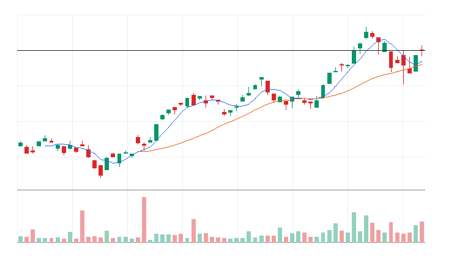
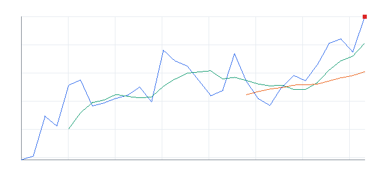
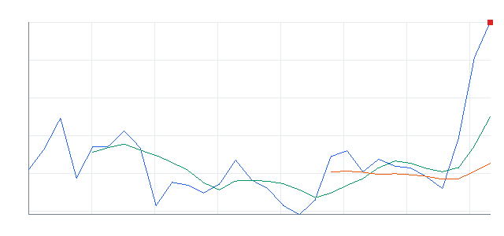
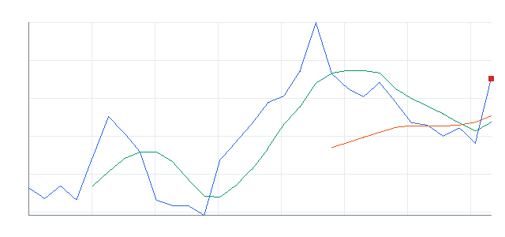
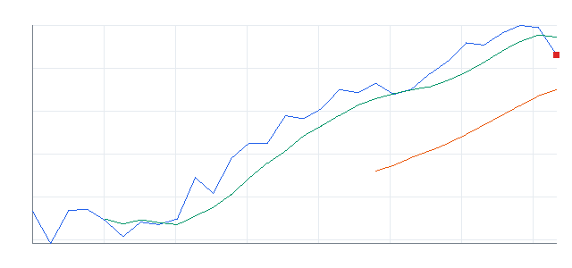

# 오늘의 데일리 트레이딩 요약

**REAL DATA TEST - 가격/거래량은 실제 데이터, 뉴스/옵션/ETF 구성종목 확산도 등은 아직 미연결**

**목적:** 이 리포트는 최근 오른 자산을 나열하는 것이 아니라, 돈이 몰리는 근거와 다음 매수 주체가 확인되는 트레이딩 후보를 찾기 위한 보고서다.

> 핵심 질문: 현재 가격에서 살까, 누가 왜 더 비싸게 사줄 수 있는가?

## 0. 시장 상태

- 데이터 모드: REAL_TEST
- 생성 시각: 2026년 6월 2일 화요일 오전 11:50
- 시장 상태: 위험선호
- 오늘 돈의 방향: 성장/테마 ETF 쪽 ETF 자금 흐름이 가장 선명함
- 강한 테마 TOP 3: AI 소프트웨어(82), 반도체 공급망(80), AI 플랫폼(75)
- 오늘의 원칙: ETF는 테마 자금 흐름, 개별 종목은 ETF보다 강할 때만 알파 후보로 본다.
- 데이터 한계:
  - 가격/거래량은 실제 데이터
  - 뉴스/옵션/ETF 구성종목 확산도/스프레드 데이터는 아직 미연결
  - reasonConfidence는 HIGH를 사용하지 않음

## 오늘의 분리 결론

- ETF 행동 후보: IGV, CIBR, HACK, AIQ, IPO
- 개별 종목 행동 후보: PLTR, TSM, NVDA
- ETF 우선 테마: 성장/테마 ETF
- 개별 종목 우선 테마: 관련 ETF 대비 추가 확인 필요
- 오늘 최우선 실행 후보: IGV - IGV는 ETF라 테마 단위 자금 흐름을 직접 먹는 후보이고, 현재 점수가 개별 종목 후보보다 우선한다.
- 하지 말아야 할 것: 추격 매수 금지 / ETF와 개별 종목 중복 베팅 금지 / 데이터 미연결 상태에서 과신 금지

## moneyFlowScore 산정 방식

### score의 의미
moneyFlowScore는 “현재 해당 ETF 또는 종목으로 돈이 몰리고 있는 정도”를 가격, 거래량, 추세, 신고가 근접도, ETF 대비 상대강도 등을 바탕으로 수치화한 점수다.

이 점수는 장기 가치평가 점수가 아니다.
이 점수는 “지금 시장 참여자들이 더 비싸게 사줄 가능성이 있는 트레이딩 후보인가?”를 판단하기 위한 단기/중기 모멘텀 점수다.

### 기본 산정 요소
- 20일 수익률: 최근 1개월 수준의 중기 추세를 반영한다.
- 5일 수익률: 최근 1주일 수준의 단기 자금 유입을 반영한다.
- 1일 수익률: 직전 거래일의 단기 추격 매수세를 반영한다.
- 상대 거래량: 가격 상승과 함께 거래량이 늘면 실제 자금 유입 가능성을 높게 본다.
- 52주 고점 대비 위치: 고점 근처 자산은 추세 추종 자금 유입 가능성이 있다.
- 추세 상태: 5일선/20일선/50일선 위에 있는지 확인한다.
- ETF 대비 상대강도: 개별 종목에만 적용하며, 관련 ETF보다 강할 때 개별 종목 우선 가능성이 올라간다.
- 데이터 신뢰도 패널티: 뉴스/옵션/스프레드/ETF 구성종목 확산도 데이터가 미연결이면 HIGH confidence를 사용하지 않는다.

### 점수 구간 해석
- 80점 이상: 강한 자금 유입 후보. 단, 과열 여부 확인 필수.
- 65점 이상 80점 미만: 관심 후보. 눌림 또는 돌파 확인 후 진입 검토.
- 50점 이상 65점 미만: 관찰 후보. 흐름은 있으나 우선순위는 낮음.
- 50점 미만: 매매 금지 또는 후순위 후보.

### 주의 문구
moneyFlowScore는 매수 추천 점수가 아니다.
가격/거래량 기반의 자금 흐름 후보 점수이며, 진입 여부는 반드시 진입 조건과 무효화 조건을 함께 확인해야 한다.

## 오늘 돈이 몰리는 테마

- **AI 소프트웨어**: PLTR | 평균 moneyFlowScore 82
- **반도체 공급망**: TSM | 평균 moneyFlowScore 80
- **AI 플랫폼**: MSFT | 평균 moneyFlowScore 75
- **AI 반도체**: NVDA | 평균 moneyFlowScore 69
- **반도체/기술 ETF**: DRAM, SMH, SOXX, SOXQ | 평균 moneyFlowScore 55
- **성장/테마 ETF**: IGV, AIQ, BOTZ, ROBO, CIBR, HACK | 평균 moneyFlowScore 39

## 1. ETF 트레이딩 보고서

### 1-1. ETF 결론
- ETF 우선 후보: IGV, CIBR, HACK, AIQ, IPO
- ETF 관찰 후보: DRAM, SMH, SOXX, SOXQ, BOTZ
- ETF 매매 금지: IFRA, XLU, URA, NLR, OIH
- 오늘 ETF 최우선 1개: IGV - 20일선 위에서 눌림 후 재상승 확인
- ETF 섹션 해석: 이 섹션은 개별 종목 선택이 아니라 테마/섹터 단위의 자금 흐름을 ETF로 매매할지 판단하기 위한 영역이다.

### 1-2. ETF 후보 TOP 5

### [ETF IGV] iShares Expanded Tech-Software Sector ETF
- 자산 유형: ETF
- ETF 세부 카테고리: 성장/테마 ETF
- ETF 역할: 테마 베타 매수
- 상태: 진입 가능
- moneyFlowScore: 100
- moneyFlowScore 산정 근거:
  - 총점: 100
  - 점수 해석: 강한 자금 유입 후보. 단, 과열 여부 확인 필수.
  - 추세 점수: +29
  - 단기 모멘텀: +19
  - 중기 모멘텀: +16
  - 거래량 점수: +18
  - 신고가 근접 점수: +6
  - 이동평균 점수: +14
  - 리스크 패널티: 0
  - 주요 근거: 20일 수익률 강함, 5일 수익률 강함, 1일 단기 모멘텀 확인. 주의: 뉴스/옵션/스프레드/ETF 구성종목 확산도 데이터 미연결.
- 과열 리스크: 낮음
- reasonConfidence: MEDIUM
- todayActionLabel: ETF 우선
- 기준일: 2026-06-01
- 종가: $107.7
- 1일 수익률: +5.94%
- 5일 수익률: +14.56%
- 20일 수익률: +24.32%
- 상대 거래량: 1.82배
- 52주 고점 대비 위치: -8.72%
- whyMoneyIsFlowing: 20일 +24.32%, 5일 +14.56%, 상대 거래량 1.82배로 가격과 거래량이 함께 개선
- likelyNextBuyer: 섹터 베타를 사려는 단기 모멘텀 자금과 리밸런싱 자금
- whyThisCouldTradeHigher: 단기 추세가 유지되고 거래량이 1.0배 이상이면 되돌림 이후 재상승을 시도할 수 있음
- 진입 조건: 20일선 위에서 눌림 후 재상승 확인
- 무효화 조건: 20일선 이탈 또는 상대 거래량 0.8배 이하 둔화
- 차트 요약: 최근 20거래일 우상향, 5일선이 20일선 위에 있음
- 차트: 
- 기준일 2026-06-01 | 종가 $107.7 | 1일 +5.94% | 5일 +14.56% | 20일 +24.32% | 상대 거래량 1.82배 | 52주 고점 대비 -8.72% | 데이터 소스: yfinance

### [ETF CIBR] First Trust NASDAQ Cybersecurity ETF
- 자산 유형: ETF
- ETF 세부 카테고리: 성장/테마 ETF
- ETF 역할: 테마 베타 매수
- 상태: 진입 가능
- moneyFlowScore: 100
- moneyFlowScore 산정 근거:
  - 총점: 100
  - 점수 해석: 강한 자금 유입 후보. 단, 과열 여부 확인 필수.
  - 추세 점수: +30
  - 단기 모멘텀: +16
  - 중기 모멘텀: +16
  - 거래량 점수: +14
  - 신고가 근접 점수: +12
  - 이동평균 점수: +14
  - 리스크 패널티: 0
  - 주요 근거: 20일 수익률 강함, 5일 수익률 강함, 1일 단기 모멘텀 확인. 주의: 뉴스/옵션/스프레드/ETF 구성종목 확산도 데이터 미연결.
- 과열 리스크: 낮음~중간
- reasonConfidence: MEDIUM
- todayActionLabel: ETF 우선
- 기준일: 2026-06-01
- 종가: $94.15
- 1일 수익률: +5.74%
- 5일 수익률: +11.71%
- 20일 수익률: +36.93%
- 상대 거래량: 1.45배
- 52주 고점 대비 위치: -0.17%
- whyMoneyIsFlowing: 20일 +36.93%, 5일 +11.71%, 상대 거래량 1.45배로 가격과 거래량이 함께 개선
- likelyNextBuyer: 섹터 베타를 사려는 단기 모멘텀 자금과 리밸런싱 자금
- whyThisCouldTradeHigher: 52주 고점 부근이라 돌파가 확인되면 신고가 추종 매수가 붙을 수 있음
- 진입 조건: 전일 고점 돌파 후 5일선 위 유지
- 무효화 조건: 20일선 이탈 또는 상대 거래량 0.8배 이하 둔화
- 차트 요약: 최근 20거래일 우상향, 5일선이 20일선 위에 있음
- 차트: 
- 기준일 2026-06-01 | 종가 $94.15 | 1일 +5.74% | 5일 +11.71% | 20일 +36.93% | 상대 거래량 1.45배 | 52주 고점 대비 -0.17% | 데이터 소스: yfinance

### [ETF HACK] Amplify Cybersecurity ETF
- 자산 유형: ETF
- ETF 세부 카테고리: 성장/테마 ETF
- ETF 역할: 테마 베타 매수
- 상태: 진입 가능
- moneyFlowScore: 100
- moneyFlowScore 산정 근거:
  - 총점: 100
  - 점수 해석: 강한 자금 유입 후보. 단, 과열 여부 확인 필수.
  - 추세 점수: +29
  - 단기 모멘텀: +15
  - 중기 모멘텀: +16
  - 거래량 점수: +18
  - 신고가 근접 점수: +12
  - 이동평균 점수: +14
  - 리스크 패널티: 0
  - 주요 근거: 20일 수익률 강함, 5일 수익률 강함, 1일 단기 모멘텀 확인. 주의: 뉴스/옵션/스프레드/ETF 구성종목 확산도 데이터 미연결.
- 과열 리스크: 낮음~중간
- reasonConfidence: MEDIUM
- todayActionLabel: ETF 우선
- 기준일: 2026-06-01
- 종가: $105
- 1일 수익률: +5.69%
- 5일 수익률: +10.70%
- 20일 수익률: +29.98%
- 상대 거래량: 1.56배
- 52주 고점 대비 위치: -0.38%
- whyMoneyIsFlowing: 20일 +29.98%, 5일 +10.70%, 상대 거래량 1.56배로 가격과 거래량이 함께 개선
- likelyNextBuyer: 섹터 베타를 사려는 단기 모멘텀 자금과 리밸런싱 자금
- whyThisCouldTradeHigher: 52주 고점 부근이라 돌파가 확인되면 신고가 추종 매수가 붙을 수 있음
- 진입 조건: 전일 고점 돌파 후 5일선 위 유지
- 무효화 조건: 20일선 이탈 또는 상대 거래량 0.8배 이하 둔화
- 차트 요약: 최근 20거래일 우상향, 5일선이 20일선 위에 있음
- 차트: 
- 기준일 2026-06-01 | 종가 $105 | 1일 +5.69% | 5일 +10.70% | 20일 +29.98% | 상대 거래량 1.56배 | 52주 고점 대비 -0.38% | 데이터 소스: yfinance

### [ETF AIQ] Global X Artificial Intelligence & Technology ETF
- 자산 유형: ETF
- ETF 세부 카테고리: 성장/테마 ETF
- ETF 역할: 테마 베타 매수
- 상태: 진입 가능
- moneyFlowScore: 97
- moneyFlowScore 산정 근거:
  - 총점: 97
  - 점수 해석: 강한 자금 유입 후보. 단, 과열 여부 확인 필수.
  - 추세 점수: +27
  - 단기 모멘텀: +12
  - 중기 모멘텀: +14
  - 거래량 점수: +18
  - 신고가 근접 점수: +12
  - 이동평균 점수: +14
  - 리스크 패널티: 0
  - 주요 근거: 20일 수익률 강함, 5일 수익률 강함, 1일 단기 모멘텀 확인. 주의: 뉴스/옵션/스프레드/ETF 구성종목 확산도 데이터 미연결.
- 과열 리스크: 낮음~중간
- reasonConfidence: MEDIUM
- todayActionLabel: ETF 우선
- 기준일: 2026-06-01
- 종가: $69.44
- 1일 수익률: +3.15%
- 5일 수익률: +10.56%
- 20일 수익률: +22.21%
- 상대 거래량: 1.59배
- 52주 고점 대비 위치: -0.56%
- whyMoneyIsFlowing: 20일 +22.21%, 5일 +10.56%, 상대 거래량 1.59배로 가격과 거래량이 함께 개선
- likelyNextBuyer: 섹터 베타를 사려는 단기 모멘텀 자금과 리밸런싱 자금
- whyThisCouldTradeHigher: 52주 고점 부근이라 돌파가 확인되면 신고가 추종 매수가 붙을 수 있음
- 진입 조건: 전일 고점 돌파 후 5일선 위 유지
- 무효화 조건: 20일선 이탈 또는 상대 거래량 0.8배 이하 둔화
- 차트 요약: 최근 20거래일 우상향, 5일선이 20일선 위에 있음
- 차트: 
- 기준일 2026-06-01 | 종가 $69.44 | 1일 +3.15% | 5일 +10.56% | 20일 +22.21% | 상대 거래량 1.59배 | 52주 고점 대비 -0.56% | 데이터 소스: yfinance

### [ETF IPO] Renaissance IPO ETF
- 자산 유형: ETF
- ETF 세부 카테고리: 성장/테마 ETF
- ETF 역할: 테마 베타 매수
- 상태: 진입 가능
- moneyFlowScore: 89
- moneyFlowScore 산정 근거:
  - 총점: 89
  - 점수 해석: 강한 자금 유입 후보. 단, 과열 여부 확인 필수.
  - 추세 점수: +23
  - 단기 모멘텀: +11
  - 중기 모멘텀: +11
  - 거래량 점수: +18
  - 신고가 근접 점수: +12
  - 이동평균 점수: +14
  - 리스크 패널티: 0
  - 주요 근거: 20일 수익률 강함, 5일 수익률 강함, 1일 단기 모멘텀 확인. 주의: 뉴스/옵션/스프레드/ETF 구성종목 확산도 데이터 미연결.
- 과열 리스크: 낮음~중간
- reasonConfidence: MEDIUM
- todayActionLabel: ETF 우선
- 기준일: 2026-06-01
- 종가: $58.12
- 1일 수익률: +2.69%
- 5일 수익률: +9.54%
- 20일 수익률: +17.01%
- 상대 거래량: 2.35배
- 52주 고점 대비 위치: -1.06%
- whyMoneyIsFlowing: 20일 +17.01%, 5일 +9.54%, 상대 거래량 2.35배로 가격과 거래량이 함께 개선
- likelyNextBuyer: 섹터 베타를 사려는 단기 모멘텀 자금과 리밸런싱 자금
- whyThisCouldTradeHigher: 52주 고점 부근이라 돌파가 확인되면 신고가 추종 매수가 붙을 수 있음
- 진입 조건: 전일 고점 돌파 후 5일선 위 유지
- 무효화 조건: 20일선 이탈 또는 상대 거래량 0.8배 이하 둔화
- 차트 요약: 최근 20거래일 우상향, 5일선이 20일선 위에 있음
- 차트: 
- 기준일 2026-06-01 | 종가 $58.12 | 1일 +2.69% | 5일 +9.54% | 20일 +17.01% | 상대 거래량 2.35배 | 52주 고점 대비 -1.06% | 데이터 소스: yfinance

### 1-3. ETF 과열/주의 후보

#### [CIBR] First Trust NASDAQ Cybersecurity ETF
- moneyFlowScore: 100
- moneyFlowScore 산정 근거 요약: 20일 수익률 강함, 5일 수익률 강함, 1일 단기 모멘텀 확인. 주의: 뉴스/옵션/스프레드/ETF 구성종목 확산도 데이터 미연결.
- 과열 리스크: 낮음~중간
- 과열 근거: 성장/테마 ETF 기준 단기 급등과 고점 근접 조합 확인
- 대응: 돌파 확인 후 진입

#### [HACK] Amplify Cybersecurity ETF
- moneyFlowScore: 100
- moneyFlowScore 산정 근거 요약: 20일 수익률 강함, 5일 수익률 강함, 1일 단기 모멘텀 확인. 주의: 뉴스/옵션/스프레드/ETF 구성종목 확산도 데이터 미연결.
- 과열 리스크: 낮음~중간
- 과열 근거: 성장/테마 ETF 기준 단기 급등과 고점 근접 조합 확인
- 대응: 돌파 확인 후 진입

#### [AIQ] Global X Artificial Intelligence & Technology ETF
- moneyFlowScore: 97
- moneyFlowScore 산정 근거 요약: 20일 수익률 강함, 5일 수익률 강함, 1일 단기 모멘텀 확인. 주의: 뉴스/옵션/스프레드/ETF 구성종목 확산도 데이터 미연결.
- 과열 리스크: 낮음~중간
- 과열 근거: 성장/테마 ETF 기준 단기 급등과 고점 근접 조합 확인
- 대응: 돌파 확인 후 진입

#### [IPO] Renaissance IPO ETF
- moneyFlowScore: 89
- moneyFlowScore 산정 근거 요약: 20일 수익률 강함, 5일 수익률 강함, 1일 단기 모멘텀 확인. 주의: 뉴스/옵션/스프레드/ETF 구성종목 확산도 데이터 미연결.
- 과열 리스크: 낮음~중간
- 과열 근거: 성장/테마 ETF 기준 단기 급등과 고점 근접 조합 확인
- 대응: 돌파 확인 후 진입

#### [IHAK] iShares Cybersecurity and Tech ETF
- moneyFlowScore: 83
- moneyFlowScore 산정 근거 요약: 20일 수익률 강함, 5일 수익률 강함, 1일 단기 모멘텀 확인. 주의: 단기 과열/추격 위험 존재, 뉴스/옵션/스프레드/ETF 구성종목 확산도 데이터 미연결.
- 과열 리스크: 중간
- 과열 근거: 성장/테마 ETF 기준 단기 급등과 고점 근접 조합 확인
- 대응: 눌림 대기

### 1-4. ETF 제외/매매 금지 후보

#### [IFRA] iShares U.S. Infrastructure ETF
- moneyFlowScore: 0
- moneyFlowScore 산정 근거 요약: 가점 제한적. 주의: 뉴스/옵션/스프레드/ETF 구성종목 확산도 데이터 미연결.
- 제외 사유: 테마 자금 흐름 약함
- 재검토 조건: 상대 거래량 1.0배 회복 후 관찰

#### [XLU] Utilities Select Sector SPDR Fund
- moneyFlowScore: 0
- moneyFlowScore 산정 근거 요약: 상대 거래량 증가. 주의: 뉴스/옵션/스프레드/ETF 구성종목 확산도 데이터 미연결.
- 제외 사유: 테마 자금 흐름 약함
- 재검토 조건: 20일선 위에서 눌림 후 재상승 확인

#### [URA] Global X Uranium ETF
- moneyFlowScore: 0
- moneyFlowScore 산정 근거 요약: 가점 제한적. 주의: 뉴스/옵션/스프레드/ETF 구성종목 확산도 데이터 미연결.
- 제외 사유: 테마 자금 흐름 약함
- 재검토 조건: 상대 거래량 1.0배 회복 후 관찰

#### [NLR] VanEck Uranium and Nuclear ETF
- moneyFlowScore: 0
- moneyFlowScore 산정 근거 요약: 가점 제한적. 주의: 뉴스/옵션/스프레드/ETF 구성종목 확산도 데이터 미연결.
- 제외 사유: 테마 자금 흐름 약함
- 재검토 조건: 상대 거래량 1.0배 회복 후 관찰

#### [OIH] VanEck Oil Services ETF
- moneyFlowScore: 0
- moneyFlowScore 산정 근거 요약: 가점 제한적. 주의: 뉴스/옵션/스프레드/ETF 구성종목 확산도 데이터 미연결.
- 제외 사유: 테마 자금 흐름 약함
- 재검토 조건: 상대 거래량 1.0배 회복 후 관찰

## 2. 개별 종목 트레이딩 보고서

### 2-1. 개별 종목 결론
- 개별 종목 진입 후보: 없음
- 개별 종목 눌림 대기: PLTR, TSM, NVDA
- 개별 종목 보유 점검: MSFT, AAPL
- 개별 종목 매매 금지: XOM
- 오늘 개별 종목 최우선 1개: PLTR - 관련 ETF와 비슷함 | 주식 5일 +17.37% vs ETF 평균 +10.08%, 주식 20일 +11.51% vs ETF 평균 +23.41%, 상대 거래량 1.22배 vs ETF 평균 1.42배
- 개별 종목 섹션 해석: 이 섹션은 ETF로 확인된 테마 자금 흐름 안에서 ETF보다 더 나은 알파를 줄 수 있는 개별 종목만 선별하는 영역이다.

### 2-2. 개별 종목 후보 TOP 5

### [PLTR] Palantir
- 자산 유형: STOCK
- 상태: 진입 가능
- primaryTheme: AI 소프트웨어
- primarySector: 소프트웨어
- relatedEtfs: IGV, AIQ, CIBR, QQQ
- moneyFlowScore: 82
- moneyFlowScore 산정 근거:
  - 총점: 82
  - 점수 해석: 강한 자금 유입 후보. 단, 과열 여부 확인 필수.
  - 추세 점수: +23
  - 단기 모멘텀: +15
  - 중기 모멘텀: +7
  - 거래량 점수: +14
  - 신고가 근접 점수: 0
  - 이동평균 점수: +14
  - ETF 대비 상대강도 점수: +8
  - 리스크 패널티: 0
  - 주요 근거: 20일 수익률 강함, 5일 수익률 강함, 1일 단기 모멘텀 확인. 주의: 뉴스/옵션/스프레드/ETF 구성종목 확산도 데이터 미연결.
- 과열 리스크: 낮음
- reasonConfidence: MEDIUM
- todayActionLabel: 개별 종목 우선
- 기준일: 2026-06-01
- 종가: $160.65
- 1일 수익률: +2.63%
- 5일 수익률: +17.37%
- 20일 수익률: +11.51%
- 상대 거래량: 1.22배
- 52주 고점 대비 위치: -22.59%
- 관련 ETF 대비 상대강도: 관련 ETF와 비슷함 | 주식 5일 +17.37% vs ETF 평균 +10.08%, 주식 20일 +11.51% vs ETF 평균 +23.41%, 상대 거래량 1.22배 vs ETF 평균 1.42배
- whyMoneyIsFlowing: 20일 +11.51%, 5일 +17.37%, 상대 거래량 1.22배로 가격과 거래량이 함께 개선
- likelyNextBuyer: 개별 주도주를 따라붙는 단기 모멘텀 자금과 관련 ETF 강세를 확인한 스윙 트레이더
- whyThisCouldTradeHigher: 단기 추세가 유지되고 거래량이 1.0배 이상이면 되돌림 이후 재상승을 시도할 수 있음
- 왜 ETF가 아니라 이 종목인가?: 관련 ETF와 비슷함 | 주식 5일 +17.37% vs ETF 평균 +10.08%, 주식 20일 +11.51% vs ETF 평균 +23.41%, 상대 거래량 1.22배 vs ETF 평균 1.42배. 개별 종목 우선으로 격상하려면 관련 ETF 대비 상대강도 유지가 더 필요하다.
- ETF가 더 나은 경우: PLTR가 관련 ETF 평균보다 약하거나 거래량이 둔화되면 개별 종목 대신 관련 ETF를 우선한다.
- 진입 조건: 20일선 위에서 눌림 후 재상승 확인
- 무효화 조건: 20일선 이탈 또는 상대 거래량 0.8배 이하 둔화
- 차트 요약: 최근 20거래일 우상향, 5일선이 20일선 위에 있음
- 차트: 
- 기준일 2026-06-01 | 종가 $160.65 | 1일 +2.63% | 5일 +17.37% | 20일 +11.51% | 상대 거래량 1.22배 | 52주 고점 대비 -22.59% | 데이터 소스: yfinance

### [TSM] Taiwan Semiconductor
- 자산 유형: STOCK
- 상태: 진입 가능
- primaryTheme: 반도체 공급망
- primarySector: 반도체
- relatedEtfs: SMH, SOXX, SOXQ
- moneyFlowScore: 80
- moneyFlowScore 산정 근거:
  - 총점: 80
  - 점수 해석: 강한 자금 유입 후보. 단, 과열 여부 확인 필수.
  - 추세 점수: +18
  - 단기 모멘텀: +11
  - 중기 모멘텀: +6
  - 거래량 점수: +14
  - 신고가 근접 점수: +12
  - 이동평균 점수: +14
  - ETF 대비 상대강도 점수: +5
  - 리스크 패널티: 0
  - 주요 근거: 20일 수익률 강함, 5일 수익률 강함, 1일 단기 모멘텀 확인. 주의: 뉴스/옵션/스프레드/ETF 구성종목 확산도 데이터 미연결.
- 과열 리스크: 낮음~중간
- reasonConfidence: MEDIUM
- todayActionLabel: 개별 종목 우선
- 기준일: 2026-06-01
- 종가: $435.63
- 1일 수익률: +4.11%
- 5일 수익률: +7.69%
- 20일 수익률: +9.55%
- 상대 거래량: 1.35배
- 52주 고점 대비 위치: -3.06%
- 관련 ETF 대비 상대강도: 관련 ETF와 비슷함 | 주식 5일 +7.69% vs ETF 평균 +6.04%, 주식 20일 +9.55% vs ETF 평균 +21.48%, 상대 거래량 1.35배 vs ETF 평균 0.84배
- whyMoneyIsFlowing: 20일 +9.55%, 5일 +7.69%, 상대 거래량 1.35배로 가격과 거래량이 함께 개선
- likelyNextBuyer: 개별 주도주를 따라붙는 단기 모멘텀 자금과 관련 ETF 강세를 확인한 스윙 트레이더
- whyThisCouldTradeHigher: 52주 고점 부근이라 돌파가 확인되면 신고가 추종 매수가 붙을 수 있음
- 왜 ETF가 아니라 이 종목인가?: 관련 ETF와 비슷함 | 주식 5일 +7.69% vs ETF 평균 +6.04%, 주식 20일 +9.55% vs ETF 평균 +21.48%, 상대 거래량 1.35배 vs ETF 평균 0.84배. 개별 종목 우선으로 격상하려면 관련 ETF 대비 상대강도 유지가 더 필요하다.
- ETF가 더 나은 경우: TSM가 관련 ETF 평균보다 약하거나 거래량이 둔화되면 개별 종목 대신 관련 ETF를 우선한다.
- 진입 조건: 전일 고점 돌파 후 5일선 위 유지
- 무효화 조건: 20일선 이탈 또는 상대 거래량 0.8배 이하 둔화
- 차트 요약: 최근 20거래일 우상향, 5일선이 20일선 위에 있음
- 차트: 
- 기준일 2026-06-01 | 종가 $435.63 | 1일 +4.11% | 5일 +7.69% | 20일 +9.55% | 상대 거래량 1.35배 | 52주 고점 대비 -3.06% | 데이터 소스: yfinance

### [MSFT] Microsoft
- 자산 유형: STOCK
- 상태: 보유 유지
- primaryTheme: AI 플랫폼
- primarySector: 메가캡 기술
- relatedEtfs: QQQ, MAGS, IGV, AIQ
- moneyFlowScore: 75
- moneyFlowScore 산정 근거:
  - 총점: 75
  - 점수 해석: 관심 후보. 눌림 또는 돌파 확인 후 진입 검토.
  - 추세 점수: +21
  - 단기 모멘텀: +11
  - 중기 모멘텀: +7
  - 거래량 점수: +14
  - 신고가 근접 점수: 0
  - 이동평균 점수: +14
  - ETF 대비 상대강도 점수: +8
  - 리스크 패널티: 0
  - 주요 근거: 20일 수익률 강함, 5일 수익률 강함, 1일 단기 모멘텀 확인. 주의: 뉴스/옵션/스프레드/ETF 구성종목 확산도 데이터 미연결.
- 과열 리스크: 낮음
- reasonConfidence: MEDIUM
- todayActionLabel: 보유 정보 확인
- 기준일: 2026-06-01
- 종가: $460.52
- 1일 수익률: +2.28%
- 5일 수익률: +10.02%
- 20일 수익률: +11.12%
- 상대 거래량: 1.45배
- 52주 고점 대비 위치: -17.09%
- 관련 ETF 대비 상대강도: 관련 ETF와 비슷함 | 주식 5일 +10.02% vs ETF 평균 +7.34%, 주식 20일 +11.12% vs ETF 평균 +15.29%, 상대 거래량 1.45배 vs ETF 평균 1.46배
- whyMoneyIsFlowing: 20일 +11.12%, 5일 +10.02%, 상대 거래량 1.45배로 가격과 거래량이 함께 개선
- likelyNextBuyer: 개별 주도주를 따라붙는 단기 모멘텀 자금과 관련 ETF 강세를 확인한 스윙 트레이더
- whyThisCouldTradeHigher: 단기 추세가 유지되고 거래량이 1.0배 이상이면 되돌림 이후 재상승을 시도할 수 있음
- 왜 ETF가 아니라 이 종목인가?: 관련 ETF와 비슷함 | 주식 5일 +10.02% vs ETF 평균 +7.34%, 주식 20일 +11.12% vs ETF 평균 +15.29%, 상대 거래량 1.45배 vs ETF 평균 1.46배. 개별 종목 우선으로 격상하려면 관련 ETF 대비 상대강도 유지가 더 필요하다.
- ETF가 더 나은 경우: MSFT가 관련 ETF 평균보다 약하거나 거래량이 둔화되면 개별 종목 대신 관련 ETF를 우선한다.
- 진입 조건: 20일선 위에서 눌림 후 재상승 확인
- 무효화 조건: 20일선 이탈 또는 상대 거래량 0.8배 이하 둔화
- 보유 정보: 보유 정보 미입력 - 기존 mock 진입가/수익률은 실전 판단에 사용하지 않음
- 차트 요약: 최근 20거래일 우상향, 5일선이 20일선 위에 있음
- 차트: 
- 기준일 2026-06-01 | 종가 $460.52 | 1일 +2.28% | 5일 +10.02% | 20일 +11.12% | 상대 거래량 1.45배 | 52주 고점 대비 -17.09% | 데이터 소스: yfinance

### [NVDA] NVIDIA
- 자산 유형: STOCK
- 상태: 진입 후보
- primaryTheme: AI 반도체
- primarySector: 반도체
- relatedEtfs: SMH, SOXX, SOXQ, AIQ, QQQ
- moneyFlowScore: 69
- moneyFlowScore 산정 근거:
  - 총점: 69
  - 점수 해석: 관심 후보. 눌림 또는 돌파 확인 후 진입 검토.
  - 추세 점수: +16
  - 단기 모멘텀: +11
  - 중기 모멘텀: +8
  - 거래량 점수: +10
  - 신고가 근접 점수: +6
  - 이동평균 점수: +14
  - ETF 대비 상대강도 점수: +8
  - 리스크 패널티: -4
  - 주요 근거: 20일 수익률 강함, 1일 단기 모멘텀 확인, 이동평균 위 추세 유지. 주의: 단기 과열/추격 위험 존재, 뉴스/옵션/스프레드/ETF 구성종목 확산도 데이터 미연결.
- 과열 리스크: 낮음
- reasonConfidence: MEDIUM
- todayActionLabel: 눌림 매수 대기
- 기준일: 2026-06-01
- 종가: $224.36
- 1일 수익률: +6.26%
- 5일 수익률: +4.19%
- 20일 수익률: +13.06%
- 상대 거래량: 1.16배
- 52주 고점 대비 위치: -5.15%
- 관련 ETF 대비 상대강도: 관련 ETF보다 약함 | 주식 5일 +4.19% vs ETF 평균 +6.44%, 주식 20일 +13.06% vs ETF 평균 +19.36%, 상대 거래량 1.16배 vs ETF 평균 0.98배
- whyMoneyIsFlowing: 20일 +13.06%, 5일 +4.19%, 상대 거래량 1.16배로 가격과 거래량이 함께 개선
- likelyNextBuyer: 개별 주도주를 따라붙는 단기 모멘텀 자금과 관련 ETF 강세를 확인한 스윙 트레이더
- whyThisCouldTradeHigher: 단기 추세가 유지되고 거래량이 1.0배 이상이면 되돌림 이후 재상승을 시도할 수 있음
- 왜 ETF가 아니라 이 종목인가?: NVDA보다 관련 ETF 쪽 흐름이 더 선명해 오늘은 ETF 우선으로 본다.
- ETF가 더 나은 경우: NVDA가 관련 ETF 평균보다 약하거나 거래량이 둔화되면 개별 종목 대신 관련 ETF를 우선한다.
- 진입 조건: 20일선 위에서 눌림 후 재상승 확인
- 무효화 조건: 20일선 이탈 또는 상대 거래량 0.8배 이하 둔화
- 차트 요약: 단기 추세는 중립
- 차트: 
- 기준일 2026-06-01 | 종가 $224.36 | 1일 +6.26% | 5일 +4.19% | 20일 +13.06% | 상대 거래량 1.16배 | 52주 고점 대비 -5.15% | 데이터 소스: yfinance

### [AAPL] Apple
- 자산 유형: STOCK
- 상태: 매매 금지
- primaryTheme: 메가캡 기술
- primarySector: 소비자 기술
- relatedEtfs: QQQ, MAGS, SPY
- moneyFlowScore: 24
- moneyFlowScore 산정 근거:
  - 총점: 24
  - 점수 해석: 매매 금지 또는 후순위 후보.
  - 추세 점수: +3
  - 단기 모멘텀: -3
  - 중기 모멘텀: +6
  - 거래량 점수: -8
  - 신고가 근접 점수: +12
  - 이동평균 점수: +10
  - ETF 대비 상대강도 점수: +4
  - 리스크 패널티: 0
  - 주요 근거: 20일 수익률 강함, 52주 고점 근처, 관련 ETF 강세 테마 안의 개별 종목. 주의: 뉴스/옵션/스프레드/ETF 구성종목 확산도 데이터 미연결.
- 과열 리스크: 낮음
- reasonConfidence: LOW
- todayActionLabel: 돌파 확인 후 관찰
- 기준일: 2026-06-01
- 종가: $306.31
- 1일 수익률: -1.84%
- 5일 수익률: -0.81%
- 20일 수익률: +9.34%
- 상대 거래량: 0.93배
- 52주 고점 대비 위치: -2.76%
- 관련 ETF 대비 상대강도: 관련 ETF와 비슷함 | 주식 5일 -0.81% vs ETF 평균 +1.99%, 주식 20일 +9.34% vs ETF 평균 +6.63%, 상대 거래량 0.93배 vs ETF 평균 1.08배
- whyMoneyIsFlowing: 최근 수익률은 확인되지만 상대 거래량 0.93배라 신규 자금 유입 강도는 약함
- likelyNextBuyer: 개별 주도주를 따라붙는 단기 모멘텀 자금과 관련 ETF 강세를 확인한 스윙 트레이더
- whyThisCouldTradeHigher: 52주 고점 부근이라 돌파가 확인되면 신고가 추종 매수가 붙을 수 있음
- 왜 ETF가 아니라 이 종목인가?: AAPL의 가격/거래량 흐름이 약해 개별 종목 우선 근거가 부족하다.
- ETF가 더 나은 경우: AAPL가 관련 ETF 평균보다 약하거나 거래량이 둔화되면 개별 종목 대신 관련 ETF를 우선한다.
- 진입 조건: 상대 거래량 1.0배 회복 후 관찰
- 무효화 조건: 거래량 회복 실패
- 보유 정보: 보유 정보 미입력 - 기존 mock 진입가/수익률은 실전 판단에 사용하지 않음
- 차트 요약: 20일선 위에서 단기 눌림 확인 구간
- 차트: 
- 기준일 2026-06-01 | 종가 $306.31 | 1일 -1.84% | 5일 -0.81% | 20일 +9.34% | 상대 거래량 0.93배 | 52주 고점 대비 -2.76% | 데이터 소스: yfinance

### 2-3. ETF 대비 개별 종목 판단 로직

- 관련 ETF의 5일/20일 수익률과 개별 종목의 5일/20일 수익률을 비교한다.
- 관련 ETF의 상대 거래량과 개별 종목의 상대 거래량을 비교한다.
- 개별 종목이 관련 ETF보다 강하면 “개별 종목 우선” 가능으로 본다.
- 개별 종목이 관련 ETF와 비슷하거나 약하면 “ETF 우선 / 개별 종목 관찰”로 낮춘다.
- 관련 ETF가 더 강하면 개별 종목 대신 ETF를 우선한다.

### 2-4. 개별 종목 제외/주의 후보

#### [PLTR] Palantir
- moneyFlowScore: 82
- moneyFlowScore 산정 근거 요약: 20일 수익률 강함, 5일 수익률 강함, 1일 단기 모멘텀 확인. 주의: 뉴스/옵션/스프레드/ETF 구성종목 확산도 데이터 미연결.
- 제외/주의 사유: 개별 종목 우선 근거 부족
- 재검토 조건: 20일선 위에서 눌림 후 재상승 확인

#### [TSM] Taiwan Semiconductor
- moneyFlowScore: 80
- moneyFlowScore 산정 근거 요약: 20일 수익률 강함, 5일 수익률 강함, 1일 단기 모멘텀 확인. 주의: 뉴스/옵션/스프레드/ETF 구성종목 확산도 데이터 미연결.
- 제외/주의 사유: 개별 종목 우선 근거 부족
- 재검토 조건: 전일 고점 돌파 후 5일선 위 유지

#### [NVDA] NVIDIA
- moneyFlowScore: 69
- moneyFlowScore 산정 근거 요약: 20일 수익률 강함, 1일 단기 모멘텀 확인, 이동평균 위 추세 유지. 주의: 단기 과열/추격 위험 존재, 뉴스/옵션/스프레드/ETF 구성종목 확산도 데이터 미연결.
- 제외/주의 사유: ETF 대비 약세
- 재검토 조건: 20일선 위에서 눌림 후 재상승 확인

#### [XOM] Exxon Mobil
- moneyFlowScore: 0
- moneyFlowScore 산정 근거 요약: 1일 단기 모멘텀 확인, 관련 ETF 강세 테마 안의 개별 종목. 주의: 뉴스/옵션/스프레드/ETF 구성종목 확산도 데이터 미연결.
- 제외/주의 사유: 매매 조건 미충족
- 재검토 조건: 상대 거래량 1.0배 회복 후 관찰

## 감시 ETF 목록

| 티커 | 카테고리 | moneyFlowScore | 상태 | reasonConfidence | 한 줄 이유 |
| --- | --- | ---: | --- | --- | --- |
| DRAM | 반도체/기술 ETF | 60 | 관찰 | LOW | 최근 수익률은 확인되지만 상대 거래량 0.96배라 신규 자금 유입 강도는 약함 |
| SMH | 반도체/기술 ETF | 51 | 관찰 | LOW | 최근 수익률은 확인되지만 상대 거래량 0.83배라 신규 자금 유입 강도는 약함 |
| SOXX | 반도체/기술 ETF | 55 | 관찰 | LOW | 최근 수익률은 확인되지만 상대 거래량 0.80배라 신규 자금 유입 강도는 약함 |
| SOXQ | 반도체/기술 ETF | 55 | 관찰 | LOW | 최근 수익률은 확인되지만 상대 거래량 0.89배라 신규 자금 유입 강도는 약함 |
| IGV | 성장/테마 ETF | 100 | 진입 가능 | MEDIUM | 20일 +24.32%, 5일 +14.56%, 상대 거래량 1.82배로 가격과 거래량이 함께 개선 |
| AIQ | 성장/테마 ETF | 97 | 진입 가능 | MEDIUM | 20일 +22.21%, 5일 +10.56%, 상대 거래량 1.59배로 가격과 거래량이 함께 개선 |
| BOTZ | 성장/테마 ETF | 44 | 관찰 | LOW | 20일 +5.18%, 5일 +0.77%, 상대 거래량 1.13배로 가격과 거래량이 함께 개선 |
| ROBO | 성장/테마 ETF | 58 | 진입 후보 | MEDIUM | 20일 +9.31%, 5일 +2.60%, 상대 거래량 1.03배로 가격과 거래량이 함께 개선 |
| CIBR | 성장/테마 ETF | 100 | 진입 가능 | MEDIUM | 20일 +36.93%, 5일 +11.71%, 상대 거래량 1.45배로 가격과 거래량이 함께 개선 |
| HACK | 성장/테마 ETF | 100 | 진입 가능 | MEDIUM | 20일 +29.98%, 5일 +10.70%, 상대 거래량 1.56배로 가격과 거래량이 함께 개선 |
| IHAK | 성장/테마 ETF | 83 | 관찰 | MEDIUM | 20일 +27.66%, 5일 +8.91%, 상대 거래량 1.11배로 가격과 거래량이 함께 개선 |
| ITA | 방산 ETF | 40 | 관찰 | LOW | 20일 +6.31%, 5일 +2.01%, 상대 거래량 1.14배로 가격과 거래량이 함께 개선 |
| XAR | 방산 ETF | 53 | 관찰 | MEDIUM | 20일 +9.19%, 5일 +3.25%, 상대 거래량 1.70배로 가격과 거래량이 함께 개선 |
| SHLD | 방산 ETF | 10 | 매매 금지 | LOW | 20일 -3.39%, 5일 +0.72%, 상대 거래량 1.03배로 가격과 거래량이 함께 개선 |
| PPA | 방산 ETF | 42 | 관찰 | LOW | 20일 +4.84%, 5일 +1.97%, 상대 거래량 1.35배로 가격과 거래량이 함께 개선 |
| PAVE | 성장/테마 ETF | 3 | 매매 금지 | LOW | 최근 수익률은 확인되지만 상대 거래량 0.69배라 신규 자금 유입 강도는 약함 |
| GRID | 성장/테마 ETF | 4 | 매매 금지 | LOW | 최근 수익률은 확인되지만 상대 거래량 0.91배라 신규 자금 유입 강도는 약함 |
| IFRA | 성장/테마 ETF | 0 | 매매 금지 | LOW | 최근 수익률은 확인되지만 상대 거래량 0.83배라 신규 자금 유입 강도는 약함 |
| XLU | 성장/테마 ETF | 0 | 매매 금지 | LOW | 20일 -7.41%, 5일 -4.96%, 상대 거래량 1.44배로 가격과 거래량이 함께 개선 |
| URA | 성장/테마 ETF | 0 | 매매 금지 | LOW | 최근 수익률은 확인되지만 상대 거래량 0.78배라 신규 자금 유입 강도는 약함 |
| NLR | 성장/테마 ETF | 0 | 매매 금지 | LOW | 최근 수익률은 확인되지만 상대 거래량 0.77배라 신규 자금 유입 강도는 약함 |
| LIT | 성장/테마 ETF | 19 | 매매 금지 | LOW | 20일 -2.96%, 5일 +0.95%, 상대 거래량 2.08배로 가격과 거래량이 함께 개선 |
| COPX | 성장/테마 ETF | 44 | 관찰 | LOW | 최근 수익률은 확인되지만 상대 거래량 0.87배라 신규 자금 유입 강도는 약함 |
| XME | 성장/테마 ETF | 38 | 관찰 | LOW | 최근 수익률은 확인되지만 상대 거래량 0.88배라 신규 자금 유입 강도는 약함 |
| XLE | 성장/테마 ETF | 11 | 매매 금지 | LOW | 20일 -2.63%, 5일 -3.68%, 상대 거래량 1.32배로 가격과 거래량이 함께 개선 |
| OIH | 성장/테마 ETF | 0 | 매매 금지 | LOW | 최근 수익률은 확인되지만 상대 거래량 0.87배라 신규 자금 유입 강도는 약함 |
| ARKK | 성장/테마 ETF | 23 | 매매 금지 | LOW | 최근 수익률은 확인되지만 상대 거래량 0.87배라 신규 자금 유입 강도는 약함 |
| IPO | 성장/테마 ETF | 89 | 진입 가능 | MEDIUM | 20일 +17.01%, 5일 +9.54%, 상대 거래량 2.35배로 가격과 거래량이 함께 개선 |
| KWEB | 성장/테마 ETF | 0 | 매매 금지 | LOW | 최근 수익률은 확인되지만 상대 거래량 0.62배라 신규 자금 유입 강도는 약함 |
| MAGS | 성장/테마 ETF | 45 | 관찰 | MEDIUM | 20일 +4.47%, 5일 +0.72%, 상대 거래량 1.60배로 가격과 거래량이 함께 개선 |
| QQQ | 시장 기준 ETF | 36 | 관찰 | LOW | 최근 수익률은 확인되지만 상대 거래량 0.81배라 신규 자금 유입 강도는 약함 |
| SPY | 시장 기준 ETF | 27 | 매매 금지 | LOW | 최근 수익률은 확인되지만 상대 거래량 0.82배라 신규 자금 유입 강도는 약함 |
| IWM | 시장 기준 ETF | 20 | 매매 금지 | LOW | 최근 수익률은 확인되지만 상대 거래량 0.87배라 신규 자금 유입 강도는 약함 |
| TLT | 채권 ETF | 5 | 매매 금지 | LOW | 최근 수익률은 확인되지만 상대 거래량 0.94배라 신규 자금 유입 강도는 약함 |
| GLD | 금 ETF | 0 | 매매 금지 | LOW | 최근 수익률은 확인되지만 상대 거래량 0.99배라 신규 자금 유입 강도는 약함 |
| IBIT | 비트코인 ETF | 0 | 매매 금지 | LOW | 20일 -8.95%, 5일 -5.75%, 상대 거래량 1.36배로 가격과 거래량이 함께 개선 |
| BLOK | 비트코인 ETF | 71 | 진입 후보 | MEDIUM | 20일 +14.36%, 5일 +7.53%, 상대 거래량 1.38배로 가격과 거래량이 함께 개선 |

## 3. 최종 실행 판단

### 3-1. 오늘 실제로 할 일
1. ETF에서 할 일: IGV 포함 ETF 후보의 전일 고점 돌파와 5일선 유지를 확인한다.
2. 개별 종목에서 할 일: PLTR 등은 관련 ETF 대비 상대강도가 유지되는지 확인한 뒤 눌림 또는 돌파 조건에서만 검토한다.
3. 하지 말아야 할 일: ETF와 개별 종목을 같은 테마 안에서 중복 매수하지 않는다.

### 3-2. 내일 확인할 조건
- ETF 확인 조건: ETF 후보 TOP 5가 20일선 위에서 유지되는지 확인
- 개별 종목 확인 조건: 관련 ETF 대비 5일/20일 상대강도와 상대 거래량 유지 확인
- 시장 상태 확인 조건: QQQ/SPY의 5일/20일 추세와 위험선호 유지 여부 확인
- 데이터 보강 필요 항목: 뉴스, 옵션, 스프레드, ETF 구성종목 확산도, 실제 보유 진입가
