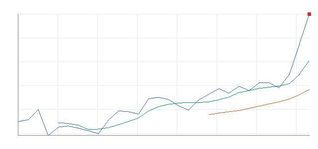
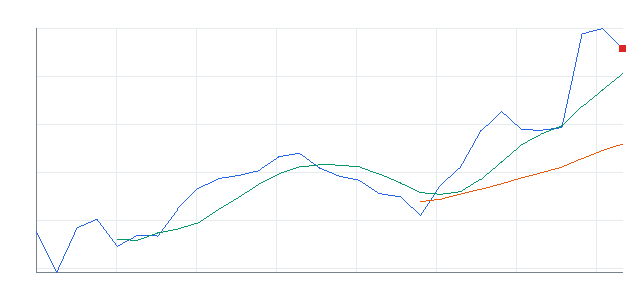

# 오늘의 데일리 트레이딩 요약

**REAL DATA TEST - 가격/거래량은 실제 데이터, 뉴스 연결, ETF 구성종목 확산도/스프레드/유동성 일부 연결**

**목적:** 이 리포트는 최근 오른 자산을 나열하는 것이 아니라, 돈이 몰리는 근거와 다음 매수 주체가 확인할 트레이딩 후보를 찾기 위한 보고서다.

> 핵심 질문: 현재 가격에서 누가 사고 있고, 누가 앞으로 더 비싸게 사줄 수 있는가?

## 모바일 요약

[오늘의 데일리 트레이딩 요약]

생성 성공 / 데이터 모드: REAL_TEST

시장:
- 위험선호

시장 지배 서사:
1. AI 소프트웨어/사이버보안 확산 - 부상 - AIQ, HACK, CRWD, PANW 중심으로 5일 +9.77%, 20일 +24.78% 흐름이 형성됨. 직접 촉매 일부 확인.
2. AI 인프라 재가속 - 지배 - SOXQ, SOXX, AVGO, ARM 중심으로 5일 +10.87%, 20일 +33.52% 흐름이 형성됨. 직접 촉매 일부 확인.
3. 위험선호 성장주 재진입 - 관찰 - QQQ, IPO, ARM, TSLA 중심으로 5일 +5.22%, 20일 +18.86% 흐름이 형성됨. 뉴스 직접성 제한.

트렌드 강도:
1. AI 소프트웨어/사이버보안 확산 - TSI 74 - 부상 - 진입품질 관찰
2. AI 인프라 재가속 - TSI 74 - 과열 - 진입품질 관찰
3. 위험선호 성장주 재진입 - TSI 50 - 부상 - 진입품질 낮음

오늘 결론:
- 사이버보안 개별 종목 흐름이 ETF 대비 강한지 확인 필요
- 행동 후보는 linkedNarrative와 함께 확인한다.
- 추격보다 진입 조건 확인 후 접근한다.

오늘 실제 행동 후보:
1. CRWD(STOCK) - AI 소프트웨어/사이버보안 확산 - 52주 고점 부근이라 돌파가 확인되면 신고가 추종 매수가 붙을 수 있음
2. FTNT(STOCK) - AI 소프트웨어/사이버보안 확산 - 52주 고점 부근이라 돌파가 확인되면 신고가 추종 매수가 붙을 수 있음
3. AIQ(ETF) - AI 소프트웨어/사이버보안 확산 - 52주 고점 부근이라 돌파가 확인되면 신고가 추종 매수가 붙을 수 있음

ETF 후보 TOP 5:
1. AIQ - AI 소프트웨어/사이버보안 확산 - ETF 우선
2. SOXQ - AI 인프라 재가속 - ETF 우선
3. HACK - AI 소프트웨어/사이버보안 확산 - ETF 우선
4. CIBR - AI 소프트웨어/사이버보안 확산 - ETF 우선
5. IGV - AI 소프트웨어/사이버보안 확산 - ETF 우선

웹 리포트:
https://yoolcool.github.io/DailyTradingThesisAgent/

## 0. 시장 상태

- 데이터 모드: REAL_TEST
- 가격/거래량: 연결됨
- 뉴스: 연결됨
- ETF 구성종목 확산도: 일부 연결
- 스프레드/유동성: 일부 연결
- 생성 시각: 2026년 6월 4일 목요일 오후 12:26
- 시장 상태: 위험선호
- 오늘 돈의 방향: 사이버보안 개별 종목 흐름이 ETF 대비 강한지 확인 필요
- 강한 테마 TOP 3: AI 소프트웨어 ETF(97), 반도체 장비/공급망(88), AI 반도체 ETF(86)
- 데이터 한계:
  - API 또는 provider 상태에 따라 뉴스/ETF 확산도/스프레드 반영 범위가 달라질 수 있다.
  - 수집 실패 데이터는 점수 반영에서 제외하거나 confidence를 제한한다.
  - reasonConfidence HIGH는 직접 촉매, 가격/거래량, 확산도/유동성 근거가 함께 있을 때만 사용한다.

## 오늘 시장을 지배하는 서사

### 오늘 시장을 지배하는 서사 TOP 3

#### 1. AI 소프트웨어/사이버보안 확산
- 상태: 부상
- narrativeScore: 83
- reasonConfidence: MEDIUM
- 근거 ETF: AIQ, HACK, CIBR, IGV
- 근거 개별 종목: CRWD, PANW, DDOG, TEAM
- 돈이 몰리는 이유: AI 소프트웨어/사이버보안 확산 관련 AIQ, HACK, CIBR와 CRWD, PANW, DDOG, TEAM의 5일(+9.77%)·20일(+24.78%) 흐름을 함께 본다. 평균 상대 거래량은 1.06배이고, ETF 확산도도 이를 보조한다. 직접 뉴스/이벤트가 일부 확인된다.
- 다음 매수 주체: 섹터 베타를 사는 ETF 자금, AI/보안 실적 기대를 사는 스윙 트레이더, 신고가 추종 자금
- 가장 좋은 트레이딩 수단: ETF 우선: IGV, CIBR, AIQ / 개별 종목 우선: PANW, CRWD, DDOG
- 서사가 깨지는 조건: IGV/CIBR 20일선 이탈, 관련 개별 종목 절반 이상 5일선 이탈, 상대 거래량 둔화
- 오늘 행동: 추격보다 눌림 후 재상승 확인

상세 narrativeScore 근거 보기

- rawScore: 83
- ETF 평균 moneyFlowScore: 78
- 개별 종목 평균 moneyFlowScore: 52
- ETF 후보 비율: 60%
- 개별 종목 후보 비율: 43%
- 5일 평균 수익률: +10.00%
- 20일 평균 수익률: +25.00%
- 평균 상대 거래량: 1.00배
- 52주 고점 근접 후보 비율: 42%
- 뉴스 직접성 점수: 7
- ETF 확산도 점수: 6
- 유동성 점수: 1
- 과열 리스크 차감: 0

#### 2. AI 인프라 재가속
- 상태: 지배
- narrativeScore: 82
- reasonConfidence: MEDIUM
- 근거 ETF: SOXQ, SOXX, DRAM, SMH
- 근거 개별 종목: AVGO, ARM, MU, AMD, NVDA
- 돈이 몰리는 이유: AI 인프라 재가속 관련 SOXQ, SOXX, DRAM와 AVGO, ARM, MU, AMD의 5일(+10.87%)·20일(+33.52%) 흐름을 함께 본다. 평균 상대 거래량은 0.95배이고, ETF 확산도도 이를 보조한다. 직접 뉴스/이벤트가 일부 확인된다.
- 다음 매수 주체: AI 인프라 CAPEX를 사는 반도체/전력망 ETF 자금과 신고가 모멘텀 추종 자금
- 가장 좋은 트레이딩 수단: ETF 우선: SMH, SOXX, DRAM / 개별 종목 우선: NVDA, AVGO, MU
- 서사가 깨지는 조건: SMH/SOXX 20일선 이탈, 관련 반도체와 전력 인프라 종목 절반 이상 5일선 이탈
- 오늘 행동: 추격보다 5일선 지지 후 재상승 확인

상세 narrativeScore 근거 보기

- rawScore: 82
- ETF 평균 moneyFlowScore: 69
- 개별 종목 평균 moneyFlowScore: 72
- ETF 후보 비율: 17%
- 개별 종목 후보 비율: 20%
- 5일 평균 수익률: +11.00%
- 20일 평균 수익률: +34.00%
- 평균 상대 거래량: 1.00배
- 52주 고점 근접 후보 비율: 91%
- 뉴스 직접성 점수: 8
- ETF 확산도 점수: 4
- 유동성 점수: 3
- 과열 리스크 차감: 0

#### 3. 위험선호 성장주 재진입
- 상태: 관찰
- narrativeScore: 54
- reasonConfidence: LOW
- 근거 ETF: QQQ, IPO, ARKK
- 근거 개별 종목: ARM, TSLA
- 돈이 몰리는 이유: 위험선호 성장주 재진입 관련 QQQ, IPO, ARKK와 ARM, TSLA의 5일(+5.22%)·20일(+18.86%) 흐름을 함께 본다. 평균 상대 거래량은 1.32배이고, ETF 확산도도 이를 보조한다. 뉴스 직접성은 아직 제한적이다.
- 다음 매수 주체: 위험선호 회복을 사는 성장주 ETF 자금과 고베타 단기 모멘텀 자금
- 가장 좋은 트레이딩 수단: ETF 우선: QQQ, IPO, ARKK / 개별 종목 우선: ARM, TSLA
- 서사가 깨지는 조건: QQQ/IWM 동반 약화, 고베타 성장주 상대 거래량 둔화
- 오늘 행동: 지수 위험선호가 유지될 때만 선별 진입

상세 narrativeScore 근거 보기

- rawScore: 54
- ETF 평균 moneyFlowScore: 35
- 개별 종목 평균 moneyFlowScore: 43
- ETF 후보 비율: 0%
- 개별 종목 후보 비율: 0%
- 5일 평균 수익률: +5.00%
- 20일 평균 수익률: +19.00%
- 평균 상대 거래량: 1.00배
- 52주 고점 근접 후보 비율: 71%
- 뉴스 직접성 점수: 8
- ETF 확산도 점수: 2
- 유동성 점수: 2
- 과열 리스크 차감: 0

### 전체 narrative 요약

| 서사명 | 상태 | narrativeScore | reasonConfidence | 대표 ETF | 대표 종목 | 오늘 행동 |
| --- | --- | ---: | --- | --- | --- | --- |
| AI 소프트웨어/사이버보안 확산 | 부상 | 83 | MEDIUM | AIQ, HACK, CIBR | CRWD, PANW, DDOG, TEAM | 추격보다 눌림 후 재상승 확인 |
| AI 인프라 재가속 | 지배 | 82 | MEDIUM | SOXQ, SOXX, DRAM | AVGO, ARM, MU, AMD | 추격보다 5일선 지지 후 재상승 확인 |
| 위험선호 성장주 재진입 | 관찰 | 54 | LOW | QQQ, IPO, ARKK | ARM, TSLA | 지수 위험선호가 유지될 때만 선별 진입 |
| 매크로 방어/헤지 | 약화 | 11 | LOW | XLE, TLT, GLD | - | 위험회피가 확인될 때만 헤지성 접근 |
| 전력망/원전/인프라 병목 | 약화 | 10 | LOW | PAVE, GRID, URA | CEG | ETF 확산도와 거래량이 같이 살아날 때만 진입 |
| 방산/안보 프리미엄 | 약화 | 6 | LOW | XAR, ITA, SHLD | PLTR | 뉴스 촉매가 직접 확인될 때만 추세 추종 |
| 비트코인/디지털 자산 위험선호 | 소멸 | 0 | LOW | BLOK, IBIT | MSTR | 비트코인 베타가 살아날 때만 단기 매매 |

## 트렌드 강도 판단

### 1. AI 소프트웨어/사이버보안 확산
- Trend Strength Index: 74
- 트렌드 상태 라벨: 부상
- 테마 확산도: 보통
- ETF 동조성: 강함
- 거래량 강도: 부족
- 과열 위험: 보통 (32)
- 오늘 진입 품질: 관찰 (53)
- 한 줄 판단: AI 소프트웨어/사이버보안 확산는 돈이 강하게 몰리지만 오늘 진입 품질은 아직 제한적이라 추격보다 조건 확인이 필요하다.
- 오늘 접근법: AIQ/HACK/CIBR 거래량 증가와 CRWD/PANW/DDOG 확산을 확인하며 작은 사이즈의 초기 진입 후보로만 본다.

트렌드 강도 상세 근거 보기

- 가격 모멘텀: 가격 모멘텀 24/25. 평균 5D +9.77%, 20D +24.78%.
- 거래량 강도: 거래량 강도 5/20. 평균 RVOL 1.06배.
- ETF 동조성: ETF 동조성 15/15. 관련 ETF IGV, AIQ, CIBR, HACK, IHAK 흐름을 기준으로 판단.
- 테마 확산도: 테마 확산도 13/20. 상위 1~2개 쏠림 감점 0점 반영.
- 뉴스 촉매: 뉴스/촉매 신선도 10/10. HIGH 직접 촉매 4개.
- 과열 리스크: 과열 리스크 32/100. 단기 급등, 고점 근접, ETF-개별주 괴리, 쏠림을 함께 반영.
- 시장 환경: 시장 환경 7/10. QQQ/SPY/IWM 가격 흐름 기반 위험선호 점수.

### 2. AI 인프라 재가속
- Trend Strength Index: 74
- 트렌드 상태 라벨: 과열
- 테마 확산도: 보통
- ETF 동조성: 강함
- 거래량 강도: 부족
- 과열 위험: 주의 (54)
- 오늘 진입 품질: 관찰 (43)
- 한 줄 판단: AI 인프라 재가속는 돈이 강하게 몰리지만 오늘 진입 품질은 아직 제한적이라 추격보다 조건 확인이 필요하다.
- 오늘 접근법: SOXQ/SOXX/DRAM가 5일선 위에서 눌림 후 재상승하고 AVGO/ARM/MU의 종가 유지가 확인될 때만 진입 품질이 좋아진다.

트렌드 강도 상세 근거 보기

- 가격 모멘텀: 가격 모멘텀 26/25. 평균 5D +10.87%, 20D +33.52%.
- 거래량 강도: 거래량 강도 5/20. 평균 RVOL 0.95배.
- ETF 동조성: ETF 동조성 14/15. 관련 ETF SMH, SOXX, SOXQ, DRAM, GRID, PAVE 흐름을 기준으로 판단.
- 테마 확산도: 테마 확산도 14/20. 상위 1~2개 쏠림 감점 0점 반영.
- 뉴스 촉매: 뉴스/촉매 신선도 8/10. HIGH 직접 촉매 2개.
- 과열 리스크: 과열 리스크 54/100. 단기 급등, 고점 근접, ETF-개별주 괴리, 쏠림을 함께 반영.
- 시장 환경: 시장 환경 7/10. QQQ/SPY/IWM 가격 흐름 기반 위험선호 점수.

### 3. 위험선호 성장주 재진입
- Trend Strength Index: 50
- 트렌드 상태 라벨: 부상
- 테마 확산도: 약함
- ETF 동조성: 보통
- 거래량 강도: 약함
- 과열 위험: 낮음 (20)
- 오늘 진입 품질: 낮음 (30)
- 한 줄 판단: 위험선호 성장주 재진입는 관찰 가능한 흐름은 있으나 가격, 거래량, 확산도 중 일부 확인이 더 필요하다.
- 오늘 접근법: QQQ/IPO/ARKK 거래량 증가와 ARM/TSLA 확산을 확인하며 작은 사이즈의 초기 진입 후보로만 본다.

트렌드 강도 상세 근거 보기

- 가격 모멘텀: 가격 모멘텀 19/25. 평균 5D +5.22%, 20D +18.86%.
- 거래량 강도: 거래량 강도 7/20. 평균 RVOL 1.32배.
- ETF 동조성: ETF 동조성 8/15. 관련 ETF QQQ, IPO, ARKK, IWM, MAGS 흐름을 기준으로 판단.
- 테마 확산도: 테마 확산도 8/20. 상위 1~2개 쏠림 감점 0점 반영.
- 뉴스 촉매: 뉴스/촉매 신선도 1/10. HIGH 직접 촉매 0개.
- 과열 리스크: 과열 리스크 20/100. 단기 급등, 고점 근접, ETF-개별주 괴리, 쏠림을 함께 반영.
- 시장 환경: 시장 환경 7/10. QQQ/SPY/IWM 가격 흐름 기반 위험선호 점수.

## 최근 추천 결과 트래킹

개별주는 데이트레이딩 관점으로 추천 이후 첫 정규장의 장중 최고가와 종가를 추적한다. ETF는 테마/스윙 관점으로 추천 이후 1주일 동안의 최고가와 현재 종가를 추적한다.

### 개별주 Top 3 추천 성과 요약
- 최근 5개 리포트 표본: 7개
- 장중 최고가 기준 성공률: +25.00%
- 종가 기준 성공률: +25.00%
- 평균 장중 최고 수익률: +1.96%
- 평균 종가 수익률: -1.57%

### ETF 추천 성과 요약
- 최근 5개 리포트 표본: 7개
- 1주 최고가 기준 성공률: 데이터 없음
- 현재 종가 기준 성공률: 0.00%
- 평균 1주 최고 수익률: 데이터 없음
- 평균 현재 수익률: -1.19%

최근 추천 결과 상세 테이블 펼치기

| 추천일 | 유형 | 순위 | 티커 | 기준가 | 추적 기간 | 상태 | High 수익률 | Close 수익률 | 결과 | 코멘트 |
| --- | --- | ---: | --- | ---: | --- | --- | ---: | ---: | --- | --- |
| 2026-06-04 | STOCK | 3 | PANW | $280.43 | 2026-06-04 | pending | 데이터 없음 | 데이터 없음 | 추적 대기 | 아직 추적 거래일 데이터가 완성되지 않음 |
| 2026-06-04 | STOCK | 2 | FTNT | $146.48 | 2026-06-04 | pending | 데이터 없음 | 데이터 없음 | 추적 대기 | 아직 추적 거래일 데이터가 완성되지 않음 |
| 2026-06-04 | STOCK | 1 | CRWD | $747.61 | 2026-06-04 | pending | 데이터 없음 | 데이터 없음 | 추적 대기 | 아직 추적 거래일 데이터가 완성되지 않음 |
| 2026-06-04 | ETF | 3 | HACK | $102.21 | 2026-06-04~2026-06-11 | in_progress | 데이터 없음 | 0.00% | 진행 중 | 아직 1주 추적 기간이 끝나지 않음 (일봉 high 미확보 시 close 기준 보조) |
| 2026-06-04 | ETF | 2 | SOXQ | $109.58 | 2026-06-04~2026-06-11 | in_progress | 데이터 없음 | 0.00% | 진행 중 | 아직 1주 추적 기간이 끝나지 않음 (일봉 high 미확보 시 close 기준 보조) |
| 2026-06-04 | ETF | 1 | AIQ | $69.16 | 2026-06-04~2026-06-11 | in_progress | 데이터 없음 | 0.00% | 진행 중 | 아직 1주 추적 기간이 끝나지 않음 (일봉 high 미확보 시 close 기준 보조) |
| 2026-06-03 | STOCK | 3 | FTNT | $148.86 | 2026-06-03 | complete | -0.30% | -1.60% | 실패 | 추천 이후 의미 있는 장중 기회가 부족하고 종가도 약함 (일봉 기준) |
| 2026-06-03 | STOCK | 3 | CRWD | $768.95 | 2026-06-03 | complete | -0.25% | -2.78% | 실패 | 추천 이후 의미 있는 장중 기회가 부족하고 종가도 약함 (일봉 기준) |
| 2026-06-03 | STOCK | 2 | MRVL | $290.79 | 2026-06-03 | complete | +11.47% | +3.73% | 성공 | 장중 기회와 종가 유지가 모두 확인됨 (일봉 기준) |
| 2026-06-03 | STOCK | 1 | PANW | $297.18 | 2026-06-03 | complete | -3.09% | -5.64% | 실패 | 추천 이후 의미 있는 장중 기회가 부족하고 종가도 약함 (일봉 기준) |
| 2026-06-03 | ETF | 3 | DRAM | $69.57 | 2026-06-03~2026-06-10 | in_progress | 데이터 없음 | +0.20% | 진행 중 | 아직 1주 추적 기간이 끝나지 않음 (일봉 high 미확보 시 close 기준 보조) |
| 2026-06-03 | ETF | 3 | IGV | $104.73 | 2026-06-03~2026-06-10 | in_progress | 데이터 없음 | -4.33% | 진행 중 | 아직 1주 추적 기간이 끝나지 않음 (일봉 high 미확보 시 close 기준 보조) |
| 2026-06-03 | ETF | 2 | AIQ | $70.14 | 2026-06-03~2026-06-10 | in_progress | 데이터 없음 | -1.40% | 진행 중 | 아직 1주 추적 기간이 끝나지 않음 (일봉 high 미확보 시 close 기준 보조) |
| 2026-06-03 | ETF | 1 | CIBR | $94.32 | 2026-06-03~2026-06-10 | in_progress | 데이터 없음 | -2.81% | 진행 중 | 아직 1주 추적 기간이 끝나지 않음 (일봉 high 미확보 시 close 기준 보조) |

## 오늘 실제 행동 후보

### 1. [CRWD] CrowdStrike Holdings Inc.
- 자산 유형: STOCK
- linkedNarrative: AI 소프트웨어/사이버보안 확산
- narrativeStatus: 부상
- narrativeScore: 83
- Trend Strength Index: 74
- Exhaustion Risk: 32 (보통)
- Entry Quality Score: 53 (관찰)
- 트렌드 판단: 시장 위험선호가 약해 시장 환경 비우호 구간이다.
- moneyFlowScore: 100
- finalRawScore: 118
- reasonConfidence: HIGH
- reasonConfidenceExplanation: 직접 촉매: CrowdStrike (CRWD) Q1 2027 Earnings Transcript 가격/거래량, 관련 ETF 동반 강세, 유동성 근거가 함께 확인되어 HIGH로 분류했다.
- tieBreakerReason: 최종 원점수 118, 리스크 패널티 0, 5일 수익률 +15.84%, 상대 거래량 1.35배 순으로 정렬
- 직접 촉매: CrowdStrike (CRWD) Q1 2027 Earnings Transcript
- 왜 돈이 몰리는가: 20일 +56.89%, 5일 +15.84%, 상대 거래량 1.35배로 가격과 거래량이 함께 개선. 뉴스: Dow Jones Futures: Broadcom, CrowdStrike Dive On Earnings; SpaceX IPO Price Target Set / 유동성: LIQUID
- 누가 더 비싸게 사줄 수 있는지: 개별 주도주를 따라붙는 단기 모멘텀 자금과 관련 ETF 강세를 확인한 트레이더
- 진입 조건: 전일 고점 돌파와 5일선 유지 확인
- 무효화 조건: 20일선 이탈 또는 상대 거래량 0.8배 이하 둔화
- todayActionLabel: 개별 종목 우선
- 차트: 

### 2. [FTNT] Fortinet Inc.
- 자산 유형: STOCK
- linkedNarrative: AI 소프트웨어/사이버보안 확산
- narrativeStatus: 부상
- narrativeScore: 83
- Trend Strength Index: 74
- Exhaustion Risk: 32 (보통)
- Entry Quality Score: 53 (관찰)
- 트렌드 판단: 시장 위험선호가 약해 시장 환경 비우호 구간이다.
- moneyFlowScore: 100
- finalRawScore: 109
- reasonConfidence: HIGH
- reasonConfidenceExplanation: 직접 촉매: FTNT Jumps 87.5% YTD on AI Security Push: Buy, Sell or Hold the Stock? 가격/거래량, 관련 ETF 동반 강세, 유동성 근거가 함께 확인되어 HIGH로 분류했다.
- tieBreakerReason: 최종 원점수 109, 리스크 패널티 0, 5일 수익률 +14.50%, 상대 거래량 1.07배 순으로 정렬
- 직접 촉매: FTNT Jumps 87.5% YTD on AI Security Push: Buy, Sell or Hold the Stock?
- 왜 돈이 몰리는가: 20일 +62.90%, 5일 +14.50%, 상대 거래량 1.07배로 가격과 거래량이 함께 개선. 뉴스: FTNT Jumps 87.5% YTD on AI Security Push: Buy, Sell or Hold the Stock? / 유동성: LIQUID
- 누가 더 비싸게 사줄 수 있는지: 개별 주도주를 따라붙는 단기 모멘텀 자금과 관련 ETF 강세를 확인한 트레이더
- 진입 조건: 전일 고점 돌파와 5일선 유지 확인
- 무효화 조건: 20일선 이탈 또는 상대 거래량 0.8배 이하 둔화
- todayActionLabel: 개별 종목 우선
- 차트: 

### 3. [AIQ] Global X Artificial Intelligence & Technology ETF
- 자산 유형: ETF
- linkedNarrative: AI 소프트웨어/사이버보안 확산
- narrativeStatus: 부상
- narrativeScore: 83
- Trend Strength Index: 74
- Exhaustion Risk: 32 (보통)
- Entry Quality Score: 52 (관찰)
- 트렌드 판단: 시장 위험선호가 약해 시장 환경 비우호 구간이다.
- moneyFlowScore: 97
- finalRawScore: 97
- reasonConfidence: HIGH
- reasonConfidenceExplanation: 직접 촉매: ETFs in Focus as Anthropic Eyes a Blockbuster IPO 가격/거래량, ETF 확산도, 유동성 근거가 함께 확인되어 HIGH로 분류했다.
- tieBreakerReason: 최종 원점수 97, 리스크 패널티 0, 5일 수익률 +6.24%, 상대 거래량 1.49배 순으로 정렬
- 직접 촉매: ETFs in Focus as Anthropic Eyes a Blockbuster IPO
- 왜 돈이 몰리는가: 20일 +18.36%, 5일 +6.24%, 상대 거래량 1.49배로 가격과 거래량이 함께 개선. 뉴스: These 2 AI Software Stocks Are Through the Roof. Dan Ives Says There’s Still Time to Buy. / ETF 확산도: BROAD_ADVANCE / 유동성: ACCEPTABLE
- 누가 더 비싸게 사줄 수 있는지: 섹터 베타를 노리는 단기 모멘텀 자금과 리밸런싱 자금
- 진입 조건: 전일 고점 돌파와 5일선 유지 확인
- 무효화 조건: 20일선 이탈 또는 상대 거래량 0.8배 이하 둔화
- todayActionLabel: ETF 우선
- 차트: 

## 오늘 돈이 몰리는 테마

- AI 소프트웨어 ETF: AIQ | 평균 moneyFlowScore 97 | 단일 종목 이벤트보다 테마 단위 자금 흐름이 선명한 구간으로 본다.
- 반도체 장비/공급망: LRCX, AMAT, KLAC | 평균 moneyFlowScore 88 | 단일 종목 이벤트보다 테마 단위 자금 흐름이 선명한 구간으로 본다.
- AI 반도체 ETF: SMH, SOXX, SOXQ | 평균 moneyFlowScore 86 | 단일 종목 이벤트보다 테마 단위 자금 흐름이 선명한 구간으로 본다.
- 메모리/HBM: MU, STX, WDC | 평균 moneyFlowScore 86 | 단일 종목 이벤트보다 테마 단위 자금 흐름이 선명한 구간으로 본다.
- 메모리/HBM ETF: DRAM | 평균 moneyFlowScore 81 | 단일 종목 이벤트보다 테마 단위 자금 흐름이 선명한 구간으로 본다.
- AI 반도체: NVDA, AVGO, AMD, ASML, ARM, MRVL | 평균 moneyFlowScore 79 | 단일 종목 이벤트보다 테마 단위 자금 흐름이 선명한 구간으로 본다.

## 1. ETF 트레이딩 보고서
### 1-1. ETF 결론
- ETF 우선 후보: AIQ, SOXQ, HACK, CIBR, IGV
- ETF 관찰 후보: IHAK, PAVE, COPX, XLE, QQQ
- ETF 매매 금지: BOTZ, SHLD, PPA, XLU, URA
- 오늘 ETF 최우선 1개: AIQ - 전일 고점 돌파와 5일선 유지 확인
- ETF 섹션 해석: 이 섹션은 개별 종목 선택이 아니라 테마/섹터 단위 자금 흐름을 ETF로 매매할지 판단하기 위한 영역이다.

### 1-2. ETF 후보 TOP 5

선정 기준: ETF 후보는 가격/거래량 1차 점수에 뉴스, ETF 구성종목 확산도, 유동성, 리스크 패널티를 반영한 finalRawScore 기준으로 정렬한다. 표시 점수 100점 후보가 겹치면 tieBreakerReason으로 우선순위를 설명한다.

### [ETF AIQ] Global X Artificial Intelligence & Technology ETF
- 자산 유형: ETF
- ETF 세부 카테고리: AI 소프트웨어 ETF
- ETF 역할: 테마 베타 매수
- 상태: 진입 가능
- linkedNarrative: AI 소프트웨어/사이버보안 확산
- narrativeStatus: 부상
- narrativeScore: 83
- moneyFlowScore: 97
- finalRawScore: 97
- tieBreakerReason: 최종 원점수 97, 리스크 패널티 0, 5일 수익률 +6.24%, 상대 거래량 1.49배 순으로 정렬
- 과열 리스크: 낮음
- reasonConfidence: HIGH
- reasonConfidenceExplanation: 직접 촉매: ETFs in Focus as Anthropic Eyes a Blockbuster IPO 가격/거래량, ETF 확산도, 유동성 근거가 함께 확인되어 HIGH로 분류했다.
- 직접 촉매: ETFs in Focus as Anthropic Eyes a Blockbuster IPO
- todayActionLabel: ETF 우선
- 기준일: 2026-06-03
- 종가: $69.16
- 1일 수익률: -1.40%
- 5일 수익률: +6.24%
- 20일 수익률: +18.36%
- 상대 거래량: 1.49배
- 52주 고점 대비 위치: -1.57%
- whyMoneyIsFlowing: 20일 +18.36%, 5일 +6.24%, 상대 거래량 1.49배로 가격과 거래량이 함께 개선. 뉴스: These 2 AI Software Stocks Are Through the Roof. Dan Ives Says There’s Still Time to Buy. / ETF 확산도: BROAD_ADVANCE / 유동성: ACCEPTABLE
- likelyNextBuyer: 섹터 베타를 노리는 단기 모멘텀 자금과 리밸런싱 자금
- whyThisCouldTradeHigher: 52주 고점 부근이라 돌파가 확인되면 신고가 추종 매수가 붙을 수 있음
- 진입 조건: 전일 고점 돌파와 5일선 유지 확인
- 무효화 조건: 20일선 이탈 또는 상대 거래량 0.8배 이하 둔화
- 차트: 

#### 상세 근거

AIQ 상세 근거 펼치기

- moneyFlowScore(최종) 산정 근거:
  - moneyFlowScore(1차): 76
  - 최종 원점수: 97
  - 최종 표시 점수: 97
  - cap 적용: cap 미적용
  - 계산식: +76 + +10 + +8 + +3 + 0 + 0 + 0 = 97
  - 점수 해석: 강한 자금 유입 후보. 단, 과열 여부 확인 필수.
  - 가격/거래량 1차 점수: +76
    - 추세: +21
    - 단기 모멘텀: +3
    - 중기 모멘텀: +12
    - 거래량: +14
    - 신고가 근접: +12
    - 이동평균: +14
  - 추가 데이터 가감점:
    - 뉴스: +10
    - 유동성: +3
  - ETF 확산도: +8
  - 리스크 패널티: 0
  - 주요 근거: 1차 76, 최종 원점수 97, 표시 97. 20일 수익률 강함, 5일 수익률 강함, 상대 거래량 증가. 주의: 큰 감점 제한적.
  - 리스크 패널티 산정 근거:
    - 총 리스크 패널티: 0
    - 리스크 등급: LOW
    - 감점된 리스크: 없음
    - 관찰 리스크: 주요 관찰 리스크 없음
    - 한 줄 해석: 직접 감점된 주요 리스크는 없지만 관찰 리스크는 계속 확인해야 한다.
- 데이터 사용 현황:
  - 가격/거래량: 사용
  - 뉴스: 사용
  - ETF 확산도: 사용
  - 유동성/스프레드: 사용
  - 관련 ETF 상대강도: 사용
- 뉴스 확인:
  - 최근 뉴스 상태: 연결됨
  - 긍정/중립/부정: 5/3/0
  - 핵심 뉴스 요약: These 2 AI Software Stocks Are Through the Roof. Dan Ives Says There’s Still Time to Buy.
  - 점수 반영: +10
  - 주의: 특이사항 없음
- ETF 구성종목 확산도:
  - 구성종목 데이터 상태: 일부 연결
  - 샘플 수: 4/4
  - 상승 종목 비율: 75%
  - 20일선 위 비율: 75%
  - 50일선 위 비율: 100%
  - 상위 기여 종목: PLTR, MSFT, NVDA, AAPL
  - 확산도 판단: BROAD_ADVANCE
  - 점수 반영: +8
- 유동성/스프레드:
  - 데이터 상태: 일부 연결
  - 스프레드: bid/ask 데이터 없음
  - 거래대금: $244,456,463
  - 평균 거래대금: $164,095,725
  - 유동성 판단: ACCEPTABLE
  - 매매 영향: 거래대금은 허용 가능하나 bid/ask 확인 필요
- reasonConfidence 근거: 가격/거래량, 뉴스, ETF 확산도, 유동성, 관련 ETF 상대강도 데이터가 확인되어 신뢰도를 높게 본다.
- 차트 요약: 최근 20거래일 기준 5일선이 20일선 위에 있음
- 기준일 2026-06-03 | 종가 $69.16 | 1일 -1.40% | 5일 +6.24% | 20일 +18.36% | 상대 거래량 1.49배 | 52주 고점 대비 -1.57% | 데이터 소스: yfinance

### [ETF SOXQ] Invesco PHLX Semiconductor ETF
- 자산 유형: ETF
- ETF 세부 카테고리: AI 반도체 ETF
- ETF 역할: 테마 베타 매수
- 상태: 진입 가능
- linkedNarrative: AI 인프라 재가속
- narrativeStatus: 지배
- narrativeScore: 82
- moneyFlowScore: 100
- finalRawScore: 114
- tieBreakerReason: 최종 원점수 114, 리스크 패널티 0, 5일 수익률 +9.57%, 상대 거래량 1.38배 순으로 정렬
- 과열 리스크: 낮음
- reasonConfidence: HIGH
- reasonConfidenceExplanation: 직접 촉매: Your Portfolio Isn’t Invested in the Right Kind of AI Unless You Hold This ETF 가격/거래량, ETF 확산도, 유동성 근거가 함께 확인되어 HIGH로 분류했다.
- 직접 촉매: Your Portfolio Isn’t Invested in the Right Kind of AI Unless You Hold This ETF
- todayActionLabel: ETF 우선
- 기준일: 2026-06-03
- 종가: $109.58
- 1일 수익률: +1.42%
- 5일 수익률: +9.57%
- 20일 수익률: +26.81%
- 상대 거래량: 1.38배
- 52주 고점 대비 위치: -0.87%
- whyMoneyIsFlowing: 20일 +26.81%, 5일 +9.57%, 상대 거래량 1.38배로 가격과 거래량이 함께 개선. 뉴스: Your Portfolio Isn’t Invested in the Right Kind of AI Unless You Hold This ETF / ETF 확산도: BROAD_ADVANCE / 유동성: ACCEPTABLE
- likelyNextBuyer: 섹터 베타를 노리는 단기 모멘텀 자금과 리밸런싱 자금
- whyThisCouldTradeHigher: 52주 고점 부근이라 돌파가 확인되면 신고가 추종 매수가 붙을 수 있음
- 진입 조건: 전일 고점 돌파와 5일선 유지 확인
- 무효화 조건: 20일선 이탈 또는 상대 거래량 0.8배 이하 둔화
- 차트: 

#### 상세 근거

SOXQ 상세 근거 펼치기

- moneyFlowScore(최종) 산정 근거:
  - moneyFlowScore(1차): 93
  - 최종 원점수: 114
  - 최종 표시 점수: 100
  - cap 적용: raw score 114 capped to displayed score 100
  - 계산식: +93 + +10 + +8 + +3 + 0 + 0 + 0 = 114 -> 100
  - 점수 해석: 강한 자금 유입 후보. 단, 과열 여부 확인 필수.
  - 가격/거래량 1차 점수: +93
    - 추세: +28
    - 단기 모멘텀: +9
    - 중기 모멘텀: +16
    - 거래량: +14
    - 신고가 근접: +12
    - 이동평균: +14
  - 추가 데이터 가감점:
    - 뉴스: +10
    - 유동성: +3
  - ETF 확산도: +8
  - 리스크 패널티: 0
  - 주요 근거: 1차 93, 최종 원점수 114, 표시 100. 20일 수익률 강함, 5일 수익률 강함, 상대 거래량 증가. 주의: 큰 감점 제한적.
  - 리스크 패널티 산정 근거:
    - 총 리스크 패널티: 0
    - 리스크 등급: LOW
    - 감점된 리스크: 없음
    - 관찰 리스크: 주요 관찰 리스크 없음
    - 한 줄 해석: 직접 감점된 주요 리스크는 없지만 관찰 리스크는 계속 확인해야 한다.
- 데이터 사용 현황:
  - 가격/거래량: 사용
  - 뉴스: 사용
  - ETF 확산도: 사용
  - 유동성/스프레드: 사용
  - 관련 ETF 상대강도: 사용
- 뉴스 확인:
  - 최근 뉴스 상태: 연결됨
  - 긍정/중립/부정: 3/5/0
  - 핵심 뉴스 요약: Your Portfolio Isn’t Invested in the Right Kind of AI Unless You Hold This ETF
  - 점수 반영: +10
  - 주의: 특이사항 없음
- ETF 구성종목 확산도:
  - 구성종목 데이터 상태: 일부 연결
  - 샘플 수: 3/3
  - 상승 종목 비율: 100%
  - 20일선 위 비율: 67%
  - 50일선 위 비율: 100%
  - 상위 기여 종목: MU, TSM, NVDA
  - 확산도 판단: BROAD_ADVANCE
  - 점수 반영: +8
- 유동성/스프레드:
  - 데이터 상태: 일부 연결
  - 스프레드: bid/ask 데이터 없음
  - 거래대금: $346,185,246
  - 평균 거래대금: $250,905,874
  - 유동성 판단: ACCEPTABLE
  - 매매 영향: 거래대금은 허용 가능하나 bid/ask 확인 필요
- reasonConfidence 근거: 가격/거래량, 뉴스, ETF 확산도, 유동성, 관련 ETF 상대강도 데이터가 확인되어 신뢰도를 높게 본다.
- 차트 요약: 최근 20거래일 기준 5일선이 20일선 위에 있음
- 기준일 2026-06-03 | 종가 $109.58 | 1일 +1.42% | 5일 +9.57% | 20일 +26.81% | 상대 거래량 1.38배 | 52주 고점 대비 -0.87% | 데이터 소스: yfinance

### [ETF HACK] Amplify Cybersecurity ETF
- 자산 유형: ETF
- ETF 세부 카테고리: 사이버보안 ETF
- ETF 역할: 테마 베타 매수
- 상태: 진입 가능
- linkedNarrative: AI 소프트웨어/사이버보안 확산
- narrativeStatus: 부상
- narrativeScore: 83
- moneyFlowScore: 91
- finalRawScore: 91
- tieBreakerReason: 최종 원점수 91, 리스크 패널티 -5, 5일 수익률 +11.35%, 상대 거래량 1.05배 순으로 정렬
- 과열 리스크: 낮음
- reasonConfidence: MEDIUM
- reasonConfidenceExplanation: 보조 근거 일부 제한 때문에 HIGH가 아니라 MEDIUM으로 제한했다.

- todayActionLabel: ETF 우선
- 기준일: 2026-06-03
- 종가: $102.21
- 1일 수익률: -3.00%
- 5일 수익률: +11.35%
- 20일 수익률: +22.01%
- 상대 거래량: 1.05배
- 52주 고점 대비 위치: -3.17%
- whyMoneyIsFlowing: 20일 +22.01%, 5일 +11.35%, 상대 거래량 1.05배로 가격과 거래량이 함께 개선. 뉴스: The Asymmetric AI Winner: Cybersecurity ETFs Gaining From Cloud Buildout / ETF 확산도: BROAD_ADVANCE
- likelyNextBuyer: 섹터 베타를 노리는 단기 모멘텀 자금과 리밸런싱 자금
- whyThisCouldTradeHigher: 52주 고점 부근이라 돌파가 확인되면 신고가 추종 매수가 붙을 수 있음
- 진입 조건: 전일 고점 돌파와 5일선 유지 확인
- 무효화 조건: 20일선 이탈 또는 상대 거래량 0.8배 이하 둔화
- 차트: 

#### 상세 근거

HACK 상세 근거 펼치기

- moneyFlowScore(최종) 산정 근거:
  - moneyFlowScore(1차): 83
  - 최종 원점수: 91
  - 최종 표시 점수: 91
  - cap 적용: cap 미적용
  - 계산식: +83 + +10 + +8 - 5 + 0 - 5 + 0 = 91
  - 점수 해석: 강한 자금 유입 후보. 단, 과열 여부 확인 필수.
  - 가격/거래량 1차 점수: +83
    - 추세: +27
    - 단기 모멘텀: +5
    - 중기 모멘텀: +14
    - 거래량: +10
    - 신고가 근접: +12
    - 이동평균: +14
  - 추가 데이터 가감점:
    - 뉴스: +10
    - 유동성: -5
  - ETF 확산도: +8
  - 리스크 패널티: -5
  - 주요 근거: 1차 83, 최종 원점수 91, 표시 91. 20일 수익률 강함, 5일 수익률 강함, 52주 고점 근처. 주의: 단기 과열/추격 위험 존재.
  - 리스크 패널티 산정 근거:
    - 총 리스크 패널티: -5
    - 리스크 등급: LOW
    - 감점된 리스크:
      - low liquidity: -5 | 근거: Liquidity signal: LOW_LIQUIDITY. | 대응: Avoid market-order chasing.
    - 관찰 리스크: 주요 관찰 리스크 없음
    - 한 줄 해석: 1개 감점 리스크로 총 -5점 반영.
- 데이터 사용 현황:
  - 가격/거래량: 사용
  - 뉴스: 사용
  - ETF 확산도: 사용
  - 유동성/스프레드: 사용
  - 관련 ETF 상대강도: 사용
- 뉴스 확인:
  - 최근 뉴스 상태: 연결됨
  - 긍정/중립/부정: 4/4/0
  - 핵심 뉴스 요약: The Asymmetric AI Winner: Cybersecurity ETFs Gaining From Cloud Buildout
  - 점수 반영: +10
  - 주의: 특이사항 없음
- ETF 구성종목 확산도:
  - 구성종목 데이터 상태: 일부 연결
  - 샘플 수: 2/2
  - 상승 종목 비율: 100%
  - 20일선 위 비율: 100%
  - 50일선 위 비율: 100%
  - 상위 기여 종목: PLTR, MSFT
  - 확산도 판단: BROAD_ADVANCE
  - 점수 반영: +8
- 유동성/스프레드:
  - 데이터 상태: 일부 연결
  - 스프레드: bid/ask 데이터 없음
  - 거래대금: $16,152,246
  - 평균 거래대금: $15,363,798
  - 유동성 판단: LOW_LIQUIDITY
  - 매매 영향: 유동성 부족으로 추격 금지 또는 우선순위 하향
- reasonConfidence 근거: 가격/거래량, 뉴스, ETF 확산도, 유동성, 관련 ETF 상대강도은 확인됐지만 일부 보조 데이터가 미연결 또는 fallback이라 중간으로 제한한다.
- 차트 요약: 최근 20거래일 기준 5일선이 20일선 위에 있음
- 기준일 2026-06-03 | 종가 $102.21 | 1일 -3.00% | 5일 +11.35% | 20일 +22.01% | 상대 거래량 1.05배 | 52주 고점 대비 -3.17% | 데이터 소스: yfinance

### [ETF CIBR] First Trust NASDAQ Cybersecurity ETF
- 자산 유형: ETF
- ETF 세부 카테고리: 사이버보안 ETF
- ETF 역할: 테마 베타 매수
- 상태: 진입 가능
- linkedNarrative: AI 소프트웨어/사이버보안 확산
- narrativeStatus: 부상
- narrativeScore: 83
- moneyFlowScore: 81
- finalRawScore: 81
- tieBreakerReason: 최종 원점수 81, 리스크 패널티 -4, 5일 수익률 +11.74%, 상대 거래량 0.84배 순으로 정렬
- 과열 리스크: 낮음
- reasonConfidence: LOW
- reasonConfidenceExplanation: 가격/거래량이 약하거나 핵심 보조 근거가 부족해 LOW로 분류했다.

- todayActionLabel: ETF 우선
- 기준일: 2026-06-03
- 종가: $91.67
- 1일 수익률: -2.81%
- 5일 수익률: +11.74%
- 20일 수익률: +29.35%
- 상대 거래량: 0.84배
- 52주 고점 대비 위치: -2.89%
- whyMoneyIsFlowing: 최근 수익률은 확인되지만 상대 거래량 0.84배라 신규 자금 유입 강도는 약함. 뉴스: The Asymmetric AI Winner: Cybersecurity ETFs Gaining From Cloud Buildout / ETF 확산도: BROAD_ADVANCE / 유동성: ACCEPTABLE
- likelyNextBuyer: 섹터 베타를 노리는 단기 모멘텀 자금과 리밸런싱 자금
- whyThisCouldTradeHigher: 52주 고점 부근이라 돌파가 확인되면 신고가 추종 매수가 붙을 수 있음
- 진입 조건: 상대 거래량 1.0배 회복 후 관찰
- 무효화 조건: 거래량 회복 실패
- 차트: 

#### 상세 근거

CIBR 상세 근거 펼치기

- moneyFlowScore(최종) 산정 근거:
  - moneyFlowScore(1차): 64
  - 최종 원점수: 81
  - 최종 표시 점수: 81
  - cap 적용: cap 미적용
  - 계산식: +64 + +10 + +8 + +3 + 0 - 4 + 0 = 81
  - 점수 해석: 강한 자금 유입 후보. 단, 과열 여부 확인 필수.
  - 가격/거래량 1차 점수: +64
    - 추세: +24
    - 단기 모멘텀: +6
    - 중기 모멘텀: +16
    - 거래량: -8
    - 신고가 근접: +12
    - 이동평균: +14
  - 추가 데이터 가감점:
    - 뉴스: +10
    - 유동성: +3
  - ETF 확산도: +8
  - 리스크 패널티: -4
  - 주요 근거: 1차 64, 최종 원점수 81, 표시 81. 20일 수익률 강함, 5일 수익률 강함, 52주 고점 근처. 주의: 단기 과열/추격 위험 존재.
  - 리스크 패널티 산정 근거:
    - 총 리스크 패널티: -4
    - 리스크 등급: LOW
    - 감점된 리스크:
      - volume divergence: -4 | 근거: 5d price strength is not confirmed by relative volume 0.84x. | 대응: Require relative volume recovery above 1.0x.
    - 관찰 리스크: 주요 관찰 리스크 없음
    - 한 줄 해석: 1개 감점 리스크로 총 -4점 반영.
- 데이터 사용 현황:
  - 가격/거래량: 사용
  - 뉴스: 사용
  - ETF 확산도: 사용
  - 유동성/스프레드: 사용
  - 관련 ETF 상대강도: 사용
- 뉴스 확인:
  - 최근 뉴스 상태: 연결됨
  - 긍정/중립/부정: 4/4/0
  - 핵심 뉴스 요약: The Asymmetric AI Winner: Cybersecurity ETFs Gaining From Cloud Buildout
  - 점수 반영: +10
  - 주의: 특이사항 없음
- ETF 구성종목 확산도:
  - 구성종목 데이터 상태: 일부 연결
  - 샘플 수: 2/2
  - 상승 종목 비율: 100%
  - 20일선 위 비율: 100%
  - 50일선 위 비율: 100%
  - 상위 기여 종목: PLTR, MSFT
  - 확산도 판단: BROAD_ADVANCE
  - 점수 반영: +8
- 유동성/스프레드:
  - 데이터 상태: 일부 연결
  - 스프레드: bid/ask 데이터 없음
  - 거래대금: $138,445,718
  - 평균 거래대금: $165,534,294
  - 유동성 판단: ACCEPTABLE
  - 매매 영향: 거래대금은 허용 가능하나 bid/ask 확인 필요
- reasonConfidence 근거: 가격/거래량이 약하거나 주요 데이터가 부족해 낮음.
- 차트 요약: 최근 20거래일 기준 5일선이 20일선 위에 있음
- 기준일 2026-06-03 | 종가 $91.67 | 1일 -2.81% | 5일 +11.74% | 20일 +29.35% | 상대 거래량 0.84배 | 52주 고점 대비 -2.89% | 데이터 소스: yfinance

### [ETF IGV] iShares Expanded Tech-Software Sector ETF
- 자산 유형: ETF
- ETF 세부 카테고리: 클라우드/엔터프라이즈 소프트웨어 ETF
- ETF 역할: 테마 베타 매수
- 상태: 진입 가능
- linkedNarrative: AI 소프트웨어/사이버보안 확산
- narrativeStatus: 부상
- narrativeScore: 83
- moneyFlowScore: 73
- finalRawScore: 73
- tieBreakerReason: 최종 원점수 73, 리스크 패널티 0, 5일 수익률 +7.68%, 상대 거래량 1.07배 순으로 정렬
- 과열 리스크: 낮음
- reasonConfidence: HIGH
- reasonConfidenceExplanation: 직접 촉매: Software Rallies 40% From April Lows as CrowdStrike Earnings Loom 가격/거래량, ETF 확산도, 유동성 근거가 함께 확인되어 HIGH로 분류했다.
- 직접 촉매: Software Rallies 40% From April Lows as CrowdStrike Earnings Loom
- todayActionLabel: ETF 우선
- 기준일: 2026-06-03
- 종가: $100.2
- 1일 수익률: -4.33%
- 5일 수익률: +7.68%
- 20일 수익률: +13.52%
- 상대 거래량: 1.07배
- 52주 고점 대비 위치: -15.08%
- whyMoneyIsFlowing: 20일 +13.52%, 5일 +7.68%, 상대 거래량 1.07배로 가격과 거래량이 함께 개선. 뉴스: Software Rallies 40% From April Lows as CrowdStrike Earnings Loom / ETF 확산도: BROAD_ADVANCE / 유동성: LIQUID
- likelyNextBuyer: 섹터 베타를 노리는 단기 모멘텀 자금과 리밸런싱 자금
- whyThisCouldTradeHigher: 단기 추세가 유지되고 거래량이 1.0배 이상이면 눌림 이후 재상승을 시도할 수 있음
- 진입 조건: 20일선 위 눌림 후 재상승 확인
- 무효화 조건: 20일선 이탈 또는 상대 거래량 0.8배 이하 둔화
- 차트: 

#### 상세 근거

IGV 상세 근거 펼치기

- moneyFlowScore(최종) 산정 근거:
  - moneyFlowScore(1차): 50
  - 최종 원점수: 73
  - 최종 표시 점수: 73
  - cap 적용: cap 미적용
  - 계산식: +50 + +10 + +8 + +5 + 0 + 0 + 0 = 73
  - 점수 해석: 관심 후보. 눌림 또는 돌파 확인 후 진입 검토.
  - 가격/거래량 1차 점수: +50
    - 추세: +20
    - 단기 모멘텀: +1
    - 중기 모멘텀: +9
    - 거래량: +10
    - 신고가 근접: 0
    - 이동평균: +10
  - 추가 데이터 가감점:
    - 뉴스: +10
    - 유동성: +5
  - ETF 확산도: +8
  - 리스크 패널티: 0
  - 주요 근거: 1차 50, 최종 원점수 73, 표시 73. 20일 수익률 강함, 5일 수익률 강함, 뉴스 흐름이 가격/거래량 근거 보강. 주의: 큰 감점 제한적.
  - 리스크 패널티 산정 근거:
    - 총 리스크 패널티: 0
    - 리스크 등급: LOW
    - 감점된 리스크: 없음
    - 관찰 리스크: 주요 관찰 리스크 없음
    - 한 줄 해석: 직접 감점된 주요 리스크는 없지만 관찰 리스크는 계속 확인해야 한다.
- 데이터 사용 현황:
  - 가격/거래량: 사용
  - 뉴스: 사용
  - ETF 확산도: 사용
  - 유동성/스프레드: 사용
  - 관련 ETF 상대강도: 사용
- 뉴스 확인:
  - 최근 뉴스 상태: 연결됨
  - 긍정/중립/부정: 5/3/0
  - 핵심 뉴스 요약: Software Rallies 40% From April Lows as CrowdStrike Earnings Loom
  - 점수 반영: +10
  - 주의: 특이사항 없음
- ETF 구성종목 확산도:
  - 구성종목 데이터 상태: 일부 연결
  - 샘플 수: 3/3
  - 상승 종목 비율: 67%
  - 20일선 위 비율: 100%
  - 50일선 위 비율: 100%
  - 상위 기여 종목: PLTR, MSFT, AAPL
  - 확산도 판단: BROAD_ADVANCE
  - 점수 반영: +8
- 유동성/스프레드:
  - 데이터 상태: 일부 연결
  - 스프레드: bid/ask 데이터 없음
  - 거래대금: $2,401,708,529
  - 평균 거래대금: $2,245,896,026
  - 유동성 판단: LIQUID
  - 매매 영향: 거래대금 기준 실제 매매 가능성에 큰 문제 없음
- reasonConfidence 근거: 가격/거래량, 뉴스, ETF 확산도, 유동성, 관련 ETF 상대강도 데이터가 확인되어 신뢰도를 높게 본다.
- 차트 요약: 20일선 위에서 단기 눌림 확인 구간
- 기준일 2026-06-03 | 종가 $100.2 | 1일 -4.33% | 5일 +7.68% | 20일 +13.52% | 상대 거래량 1.07배 | 52주 고점 대비 -15.08% | 데이터 소스: yfinance

### 1-3. ETF 과열/주의 후보

해당 없음

### 1-4. ETF 제외/매매 금지 후보

#### [BOTZ] Global X Robotics & Artificial Intelligence ETF
- moneyFlowScore(최종): 0
- moneyFlowScore 산정 근거 요약: 1차 6, 최종 원점수 0, 표시 0. 52주 고점 근처, 뉴스 흐름이 가격/거래량 근거 보강, 유동성/스프레드 주의. 주의: 단기 과열/추격 위험 존재, ETF 구성종목 확산도 데이터 미연결.
- 제외 사유: 테마 자금 흐름 약함
- 해제 조건: 상대 거래량 1.0배 회복 후 관찰

#### [SHLD] Global X Defense Tech ETF
- moneyFlowScore(최종): 0
- moneyFlowScore 산정 근거 요약: 1차 0, 최종 원점수 -42, 표시 0. 뉴스 흐름이 가격/거래량 근거 보강, 유동성/스프레드 주의. 주의: 단기 과열/추격 위험 존재, ETF 구성종목 확산도 데이터 미연결.
- 제외 사유: 테마 자금 흐름 약함
- 해제 조건: 상대 거래량 1.0배 회복 후 관찰

#### [PPA] Invesco Aerospace & Defense ETF
- moneyFlowScore(최종): 0
- moneyFlowScore 산정 근거 요약: 1차 0, 최종 원점수 -27, 표시 0. 유동성/스프레드 주의. 주의: 단기 과열/추격 위험 존재, ETF 구성종목 확산도 데이터 미연결.
- 제외 사유: 테마 자금 흐름 약함
- 해제 조건: 상대 거래량 1.0배 회복 후 관찰

#### [XLU] Utilities Select Sector SPDR Fund
- moneyFlowScore(최종): 0
- moneyFlowScore 산정 근거 요약: 1차 0, 최종 원점수 -16, 표시 0. 뉴스 흐름이 가격/거래량 근거 보강, 거래대금 기준 유동성 양호. 주의: 단기 과열/추격 위험 존재, ETF 구성종목 확산도 데이터 미연결.
- 제외 사유: 테마 자금 흐름 약함
- 해제 조건: 상대 거래량 1.0배 회복 후 관찰

#### [URA] Global X Uranium ETF
- moneyFlowScore(최종): 0
- moneyFlowScore 산정 근거 요약: 1차 0, 최종 원점수 -2, 표시 0. 뉴스 흐름이 가격/거래량 근거 보강, 거래대금 기준 유동성 양호. 주의: 단기 과열/추격 위험 존재, ETF 구성종목 확산도 데이터 미연결.
- 제외 사유: 테마 자금 흐름 약함
- 해제 조건: 20일선 위 눌림 후 재상승 확인

## 2. 개별 종목 트레이딩 보고서
### 2-1. 오늘 Nasdaq-100 신규 발굴 요약
- 신규 발굴 풀: Nasdaq-100 구성종목 전체
- universe source: fallback from StockAnalysis Nasdaq-100 list checked 2026-06-02
- universe fetchStatus: FALLBACK
- 총 스캔 종목 수: 101
- 데이터 수집 성공: 101
- 데이터 수집 실패: 0
- 상세 데이터 수집 대상: 가격/거래량 1차 스캔 상위 20개
- 오늘 진입 후보: 9
- 오늘 눌림 대기: 1
- 오늘 관찰: 14
- 오늘 매매 금지: 69
- 개별 종목 진입 후보: CRWD, FTNT, PANW, DDOG
- 개별 종목 눌림 대기: CDNS
- 개별 종목 매매 금지: 없음
- 오늘 개별 종목 최우선 1개: CRWD - 관련 ETF보다 강함 | 주식 5일 +15.84% vs ETF 평균 +9.59%, 주식 20일 +56.89% vs ETF 평균 +21.11%, 상대 거래량 1.35배 vs ETF 평균 0.93배
- 개별 종목 섹션 해석: 이 섹션은 ETF로 확인된 테마 자금 흐름 안에서 ETF보다 더 강한 돌파 가능성이 있는 개별 종목만 선별하는 영역이다.

### 2-2. 오늘 개별 종목 신규 후보 TOP 5

선정 기준:
1. Nasdaq-100 전체를 moneyFlowScore(1차)로 먼저 스캔
2. moneyFlowScore(1차) 상위 20개를 상세 분석
3. 뉴스/유동성/관련 ETF 대비 상대강도/리스크 패널티를 반영
4. moneyFlowScore(최종), 최종 원점수, 리스크 패널티, 5일 수익률, 상대 거래량 순으로 재정렬

### [CRWD] CrowdStrike Holdings Inc.
- 자산 유형: STOCK
- 상태: 진입 가능
- primaryTheme: 사이버보안
- primarySector: Technology
- relatedEtfs: HACK, CIBR, IHAK, IGV
- linkedNarrative: AI 소프트웨어/사이버보안 확산
- narrativeStatus: 부상
- narrativeScore: 83
- moneyFlowScore: 100
- finalRawScore: 118
- tieBreakerReason: 최종 원점수 118, 리스크 패널티 0, 5일 수익률 +15.84%, 상대 거래량 1.35배 순으로 정렬
- 과열 리스크: 낮음
- reasonConfidence: HIGH
- reasonConfidenceExplanation: 직접 촉매: CrowdStrike (CRWD) Q1 2027 Earnings Transcript 가격/거래량, 관련 ETF 동반 강세, 유동성 근거가 함께 확인되어 HIGH로 분류했다.
- 직접 촉매: CrowdStrike (CRWD) Q1 2027 Earnings Transcript
- todayActionLabel: 개별 종목 우선
- 기준일: 2026-06-03
- 종가: $747.61
- 1일 수익률: -2.78%
- 5일 수익률: +15.84%
- 20일 수익률: +56.89%
- 상대 거래량: 1.35배
- 52주 고점 대비 위치: -4.84%
- 관련 ETF 대비 상대강도: 관련 ETF보다 강함 | 주식 5일 +15.84% vs ETF 평균 +9.59%, 주식 20일 +56.89% vs ETF 평균 +21.11%, 상대 거래량 1.35배 vs ETF 평균 0.93배
- whyMoneyIsFlowing: 20일 +56.89%, 5일 +15.84%, 상대 거래량 1.35배로 가격과 거래량이 함께 개선. 뉴스: Dow Jones Futures: Broadcom, CrowdStrike Dive On Earnings; SpaceX IPO Price Target Set / 유동성: LIQUID
- likelyNextBuyer: 개별 주도주를 따라붙는 단기 모멘텀 자금과 관련 ETF 강세를 확인한 트레이더
- whyThisCouldTradeHigher: 52주 고점 부근이라 돌파가 확인되면 신고가 추종 매수가 붙을 수 있음
- 왜 ETF가 아니라 이 종목인가: CRWD가 관련 ETF 평균보다 5일/20일 흐름 또는 거래량에서 강해 개별 종목 우선 후보로 본다.
- ETF가 더 나은 경우: CRWD가 관련 ETF 평균보다 약하거나 거래량이 둔화되면 개별 종목보다 관련 ETF를 우선한다.
- 진입 조건: 전일 고점 돌파와 5일선 유지 확인
- 무효화 조건: 20일선 이탈 또는 상대 거래량 0.8배 이하 둔화
- 차트: 

#### 상세 근거

CRWD 상세 근거 펼치기

- moneyFlowScore(최종) 산정 근거:
  - moneyFlowScore(1차): 95
  - 최종 원점수: 118
  - 최종 표시 점수: 100
  - cap 적용: raw score 118 capped to displayed score 100
  - 계산식: +95 + +10 + 0 + +5 + +7.583333333333333 + 0 + 0 = 118 -> 100
  - 점수 해석: 강한 자금 유입 후보. 단, 과열 여부 확인 필수.
  - 가격/거래량 1차 점수: +95
    - 추세: +30
    - 단기 모멘텀: +9
    - 중기 모멘텀: +16
    - 거래량: +14
    - 신고가 근접: +12
    - 이동평균: +14
  - 추가 데이터 가감점:
    - 뉴스: +10
    - 유동성: +5
  - ETF 대비 상대강도: +8
  - 리스크 패널티: 0
  - 주요 근거: 1차 95, 최종 원점수 118, 표시 100. 20일 수익률 강함, 5일 수익률 강함, 상대 거래량 증가. 주의: 큰 감점 제한적.
  - 리스크 패널티 산정 근거:
    - 총 리스크 패널티: 0
    - 리스크 등급: LOW
    - 감점된 리스크: 없음
    - 관찰 리스크: 주요 관찰 리스크 없음
    - 한 줄 해석: 직접 감점된 주요 리스크는 없지만 관찰 리스크는 계속 확인해야 한다.
- 데이터 사용 현황:
  - 가격/거래량: 사용
  - 뉴스: 사용
  - ETF 확산도: 관련 ETF에서 확인
  - 유동성/스프레드: 사용
  - 관련 ETF 상대강도: 사용
- 뉴스 확인:
  - 최근 뉴스 상태: 연결됨
  - 긍정/중립/부정: 7/1/0
  - 핵심 뉴스 요약: Dow Jones Futures: Broadcom, CrowdStrike Dive On Earnings; SpaceX IPO Price Target Set
  - 점수 반영: +10
  - 주의: 특이사항 없음
- ETF 구성종목 확산도: 관련 ETF에서 확인
- 유동성/스프레드:
  - 데이터 상태: 일부 연결
  - 스프레드: bid/ask 데이터 없음
  - 거래대금: $3,637,497,950
  - 평균 거래대금: $2,703,443,735
  - 유동성 판단: LIQUID
  - 매매 영향: 거래대금 기준 실제 매매 가능성에 큰 문제 없음
- reasonConfidence 근거: 가격/거래량, 뉴스, 유동성, 관련 ETF 상대강도 데이터가 확인되어 신뢰도를 높게 본다.
- 차트 요약: 최근 20거래일 기준 5일선이 20일선 위에 있음
- 기준일 2026-06-03 | 종가 $747.61 | 1일 -2.78% | 5일 +15.84% | 20일 +56.89% | 상대 거래량 1.35배 | 52주 고점 대비 -4.84% | 데이터 소스: yfinance

### [FTNT] Fortinet Inc.
- 자산 유형: STOCK
- 상태: 진입 가능
- primaryTheme: 사이버보안
- primarySector: Technology
- relatedEtfs: HACK, CIBR, IHAK, IGV
- linkedNarrative: AI 소프트웨어/사이버보안 확산
- narrativeStatus: 부상
- narrativeScore: 83
- moneyFlowScore: 100
- finalRawScore: 109
- tieBreakerReason: 최종 원점수 109, 리스크 패널티 0, 5일 수익률 +14.50%, 상대 거래량 1.07배 순으로 정렬
- 과열 리스크: 낮음
- reasonConfidence: HIGH
- reasonConfidenceExplanation: 직접 촉매: FTNT Jumps 87.5% YTD on AI Security Push: Buy, Sell or Hold the Stock? 가격/거래량, 관련 ETF 동반 강세, 유동성 근거가 함께 확인되어 HIGH로 분류했다.
- 직접 촉매: FTNT Jumps 87.5% YTD on AI Security Push: Buy, Sell or Hold the Stock?
- todayActionLabel: 개별 종목 우선
- 기준일: 2026-06-03
- 종가: $146.48
- 1일 수익률: -1.60%
- 5일 수익률: +14.50%
- 20일 수익률: +62.90%
- 상대 거래량: 1.07배
- 52주 고점 대비 위치: -1.71%
- 관련 ETF 대비 상대강도: 관련 ETF보다 강함 | 주식 5일 +14.50% vs ETF 평균 +9.59%, 주식 20일 +62.90% vs ETF 평균 +21.11%, 상대 거래량 1.07배 vs ETF 평균 0.93배
- whyMoneyIsFlowing: 20일 +62.90%, 5일 +14.50%, 상대 거래량 1.07배로 가격과 거래량이 함께 개선. 뉴스: FTNT Jumps 87.5% YTD on AI Security Push: Buy, Sell or Hold the Stock? / 유동성: LIQUID
- likelyNextBuyer: 개별 주도주를 따라붙는 단기 모멘텀 자금과 관련 ETF 강세를 확인한 트레이더
- whyThisCouldTradeHigher: 52주 고점 부근이라 돌파가 확인되면 신고가 추종 매수가 붙을 수 있음
- 왜 ETF가 아니라 이 종목인가: FTNT가 관련 ETF 평균보다 5일/20일 흐름 또는 거래량에서 강해 개별 종목 우선 후보로 본다.
- ETF가 더 나은 경우: FTNT가 관련 ETF 평균보다 약하거나 거래량이 둔화되면 개별 종목보다 관련 ETF를 우선한다.
- 진입 조건: 전일 고점 돌파와 5일선 유지 확인
- 무효화 조건: 20일선 이탈 또는 상대 거래량 0.8배 이하 둔화
- 차트: 

#### 상세 근거

FTNT 상세 근거 펼치기

- moneyFlowScore(최종) 산정 근거:
  - moneyFlowScore(1차): 86
  - 최종 원점수: 109
  - 최종 표시 점수: 100
  - cap 적용: raw score 109 capped to displayed score 100
  - 계산식: +86 + +10 + 0 + +5 + +7.583333333333333 + 0 + 0 = 109 -> 100
  - 점수 해석: 강한 자금 유입 후보. 단, 과열 여부 확인 필수.
  - 가격/거래량 1차 점수: +86
    - 추세: +24
    - 단기 모멘텀: +10
    - 중기 모멘텀: +16
    - 거래량: +10
    - 신고가 근접: +12
    - 이동평균: +14
  - 추가 데이터 가감점:
    - 뉴스: +10
    - 유동성: +5
  - ETF 대비 상대강도: +8
  - 리스크 패널티: 0
  - 주요 근거: 1차 86, 최종 원점수 109, 표시 100. 20일 수익률 강함, 5일 수익률 강함, 52주 고점 근처. 주의: 큰 감점 제한적.
  - 리스크 패널티 산정 근거:
    - 총 리스크 패널티: 0
    - 리스크 등급: LOW
    - 감점된 리스크: 없음
    - 관찰 리스크: 주요 관찰 리스크 없음
    - 한 줄 해석: 직접 감점된 주요 리스크는 없지만 관찰 리스크는 계속 확인해야 한다.
- 데이터 사용 현황:
  - 가격/거래량: 사용
  - 뉴스: 사용
  - ETF 확산도: 관련 ETF에서 확인
  - 유동성/스프레드: 사용
  - 관련 ETF 상대강도: 사용
- 뉴스 확인:
  - 최근 뉴스 상태: 연결됨
  - 긍정/중립/부정: 4/4/0
  - 핵심 뉴스 요약: FTNT Jumps 87.5% YTD on AI Security Push: Buy, Sell or Hold the Stock?
  - 점수 반영: +10
  - 주의: 특이사항 없음
- ETF 구성종목 확산도: 관련 ETF에서 확인
- 유동성/스프레드:
  - 데이터 상태: 일부 연결
  - 스프레드: bid/ask 데이터 없음
  - 거래대금: $1,120,682,153
  - 평균 거래대금: $1,043,851,928
  - 유동성 판단: LIQUID
  - 매매 영향: 거래대금 기준 실제 매매 가능성에 큰 문제 없음
- reasonConfidence 근거: 가격/거래량, 뉴스, 유동성, 관련 ETF 상대강도 데이터가 확인되어 신뢰도를 높게 본다.
- 차트 요약: 최근 20거래일 기준 5일선이 20일선 위에 있음
- 기준일 2026-06-03 | 종가 $146.48 | 1일 -1.60% | 5일 +14.50% | 20일 +62.90% | 상대 거래량 1.07배 | 52주 고점 대비 -1.71% | 데이터 소스: yfinance

### [PANW] Palo Alto Networks Inc.
- 자산 유형: STOCK
- 상태: 진입 가능
- primaryTheme: 사이버보안
- primarySector: Technology
- relatedEtfs: HACK, CIBR, IHAK, IGV
- linkedNarrative: AI 소프트웨어/사이버보안 확산
- narrativeStatus: 부상
- narrativeScore: 83
- moneyFlowScore: 97
- finalRawScore: 97
- tieBreakerReason: 최종 원점수 97, 리스크 패널티 0, 5일 수익률 +12.86%, 상대 거래량 1.43배 순으로 정렬
- 과열 리스크: 낮음
- reasonConfidence: HIGH
- reasonConfidenceExplanation: 직접 촉매: PANW Price Targets Raised By Citi, Goldman Sachs On AI-Driven Security Demand 가격/거래량, 관련 ETF 동반 강세, 유동성 근거가 함께 확인되어 HIGH로 분류했다.
- 직접 촉매: PANW Price Targets Raised By Citi, Goldman Sachs On AI-Driven Security Demand
- todayActionLabel: 개별 종목 우선
- 기준일: 2026-06-03
- 종가: $280.43
- 1일 수익률: -5.64%
- 5일 수익률: +12.86%
- 20일 수익률: +52.42%
- 상대 거래량: 1.43배
- 52주 고점 대비 위치: -7.43%
- 관련 ETF 대비 상대강도: 관련 ETF보다 강함 | 주식 5일 +12.86% vs ETF 평균 +9.59%, 주식 20일 +52.42% vs ETF 평균 +21.11%, 상대 거래량 1.43배 vs ETF 평균 0.93배
- whyMoneyIsFlowing: 20일 +52.42%, 5일 +12.86%, 상대 거래량 1.43배로 가격과 거래량이 함께 개선. 뉴스: PANW Price Targets Raised By Citi, Goldman Sachs On AI-Driven Security Demand / 유동성: LIQUID
- likelyNextBuyer: 개별 주도주를 따라붙는 단기 모멘텀 자금과 관련 ETF 강세를 확인한 트레이더
- whyThisCouldTradeHigher: 단기 추세가 유지되고 거래량이 1.0배 이상이면 눌림 이후 재상승을 시도할 수 있음
- 왜 ETF가 아니라 이 종목인가: PANW가 관련 ETF 평균보다 5일/20일 흐름 또는 거래량에서 강해 개별 종목 우선 후보로 본다.
- ETF가 더 나은 경우: PANW가 관련 ETF 평균보다 약하거나 거래량이 둔화되면 개별 종목보다 관련 ETF를 우선한다.
- 진입 조건: 20일선 위 눌림 후 재상승 확인
- 무효화 조건: 20일선 이탈 또는 상대 거래량 0.8배 이하 둔화
- 차트: 

#### 상세 근거

PANW 상세 근거 펼치기

- moneyFlowScore(최종) 산정 근거:
  - moneyFlowScore(1차): 74
  - 최종 원점수: 97
  - 최종 표시 점수: 97
  - cap 적용: cap 미적용
  - 계산식: +74 + +10 + 0 + +5 + +7.583333333333333 + 0 + 0 = 97
  - 점수 해석: 강한 자금 유입 후보. 단, 과열 여부 확인 필수.
  - 가격/거래량 1차 점수: +74
    - 추세: +24
    - 단기 모멘텀: +4
    - 중기 모멘텀: +16
    - 거래량: +14
    - 신고가 근접: +6
    - 이동평균: +10
  - 추가 데이터 가감점:
    - 뉴스: +10
    - 유동성: +5
  - ETF 대비 상대강도: +8
  - 리스크 패널티: 0
  - 주요 근거: 1차 74, 최종 원점수 97, 표시 97. 20일 수익률 강함, 5일 수익률 강함, 상대 거래량 증가. 주의: 큰 감점 제한적.
  - 리스크 패널티 산정 근거:
    - 총 리스크 패널티: 0
    - 리스크 등급: LOW
    - 감점된 리스크: 없음
    - 관찰 리스크: 주요 관찰 리스크 없음
    - 한 줄 해석: 직접 감점된 주요 리스크는 없지만 관찰 리스크는 계속 확인해야 한다.
- 데이터 사용 현황:
  - 가격/거래량: 사용
  - 뉴스: 사용
  - ETF 확산도: 관련 ETF에서 확인
  - 유동성/스프레드: 사용
  - 관련 ETF 상대강도: 사용
- 뉴스 확인:
  - 최근 뉴스 상태: 연결됨
  - 긍정/중립/부정: 4/4/0
  - 핵심 뉴스 요약: PANW Price Targets Raised By Citi, Goldman Sachs On AI-Driven Security Demand
  - 점수 반영: +10
  - 주의: 특이사항 없음
- ETF 구성종목 확산도: 관련 ETF에서 확인
- 유동성/스프레드:
  - 데이터 상태: 일부 연결
  - 스프레드: bid/ask 데이터 없음
  - 거래대금: $4,074,054,230
  - 평균 거래대금: $2,850,751,547
  - 유동성 판단: LIQUID
  - 매매 영향: 거래대금 기준 실제 매매 가능성에 큰 문제 없음
- reasonConfidence 근거: 가격/거래량, 뉴스, 유동성, 관련 ETF 상대강도 데이터가 확인되어 신뢰도를 높게 본다.
- 차트 요약: 20일선 위에서 단기 눌림 확인 구간
- 기준일 2026-06-03 | 종가 $280.43 | 1일 -5.64% | 5일 +12.86% | 20일 +52.42% | 상대 거래량 1.43배 | 52주 고점 대비 -7.43% | 데이터 소스: yfinance

### [DDOG] Datadog Inc.
- 자산 유형: STOCK
- 상태: 진입 가능
- primaryTheme: 클라우드/엔터프라이즈 소프트웨어
- primarySector: Technology
- relatedEtfs: IGV, AIQ, QQQ
- linkedNarrative: AI 소프트웨어/사이버보안 확산
- narrativeStatus: 부상
- narrativeScore: 83
- moneyFlowScore: 93
- finalRawScore: 93
- tieBreakerReason: 최종 원점수 93, 리스크 패널티 0, 5일 수익률 +12.86%, 상대 거래량 1.08배 순으로 정렬
- 과열 리스크: 낮음
- reasonConfidence: MEDIUM
- reasonConfidenceExplanation: 직접 촉매 부재 때문에 HIGH가 아니라 MEDIUM으로 제한했다.

- todayActionLabel: 개별 종목 우선
- 기준일: 2026-06-03
- 종가: $250.33
- 1일 수익률: -6.99%
- 5일 수익률: +12.86%
- 20일 수익률: +71.78%
- 상대 거래량: 1.08배
- 52주 고점 대비 위치: -10.18%
- 관련 ETF 대비 상대강도: 관련 ETF보다 강함 | 주식 5일 +12.86% vs ETF 평균 +5.31%, 주식 20일 +71.78% vs ETF 평균 +13.69%, 상대 거래량 1.08배 vs ETF 평균 1.18배
- whyMoneyIsFlowing: 20일 +71.78%, 5일 +12.86%, 상대 거래량 1.08배로 가격과 거래량이 함께 개선. 뉴스: These 2 AI Software Stocks Are Through the Roof. Dan Ives Says There’s Still Time to Buy. / 유동성: LIQUID
- likelyNextBuyer: 개별 주도주를 따라붙는 단기 모멘텀 자금과 관련 ETF 강세를 확인한 트레이더
- whyThisCouldTradeHigher: 단기 추세가 유지되고 거래량이 1.0배 이상이면 눌림 이후 재상승을 시도할 수 있음
- 왜 ETF가 아니라 이 종목인가: DDOG가 관련 ETF 평균보다 5일/20일 흐름 또는 거래량에서 강해 개별 종목 우선 후보로 본다.
- ETF가 더 나은 경우: DDOG가 관련 ETF 평균보다 약하거나 거래량이 둔화되면 개별 종목보다 관련 ETF를 우선한다.
- 진입 조건: 20일선 위 눌림 후 재상승 확인
- 무효화 조건: 20일선 이탈 또는 상대 거래량 0.8배 이하 둔화
- 차트: 

#### 상세 근거

DDOG 상세 근거 펼치기

- moneyFlowScore(최종) 산정 근거:
  - moneyFlowScore(1차): 70
  - 최종 원점수: 93
  - 최종 표시 점수: 93
  - cap 적용: cap 미적용
  - 계산식: +70 + +10 + 0 + +5 + +8 + 0 + 0 = 93
  - 점수 해석: 강한 자금 유입 후보. 단, 과열 여부 확인 필수.
  - 가격/거래량 1차 점수: +70
    - 추세: +24
    - 단기 모멘텀: +4
    - 중기 모멘텀: +16
    - 거래량: +10
    - 신고가 근접: +6
    - 이동평균: +10
  - 추가 데이터 가감점:
    - 뉴스: +10
    - 유동성: +5
  - ETF 대비 상대강도: +8
  - 리스크 패널티: 0
  - 주요 근거: 1차 70, 최종 원점수 93, 표시 93. 20일 수익률 강함, 5일 수익률 강함, 관련 ETF 강세 테마 안의 개별 종목. 주의: 큰 감점 제한적.
  - 리스크 패널티 산정 근거:
    - 총 리스크 패널티: 0
    - 리스크 등급: LOW
    - 감점된 리스크: 없음
    - 관찰 리스크: 주요 관찰 리스크 없음
    - 한 줄 해석: 직접 감점된 주요 리스크는 없지만 관찰 리스크는 계속 확인해야 한다.
- 데이터 사용 현황:
  - 가격/거래량: 사용
  - 뉴스: 사용
  - ETF 확산도: 관련 ETF에서 확인
  - 유동성/스프레드: 사용
  - 관련 ETF 상대강도: 사용
- 뉴스 확인:
  - 최근 뉴스 상태: 연결됨
  - 긍정/중립/부정: 4/4/0
  - 핵심 뉴스 요약: These 2 AI Software Stocks Are Through the Roof. Dan Ives Says There’s Still Time to Buy.
  - 점수 반영: +10
  - 주의: 특이사항 없음
- ETF 구성종목 확산도: 관련 ETF에서 확인
- 유동성/스프레드:
  - 데이터 상태: 일부 연결
  - 스프레드: bid/ask 데이터 없음
  - 거래대금: $2,062,341,202
  - 평균 거래대금: $1,913,191,834
  - 유동성 판단: LIQUID
  - 매매 영향: 거래대금 기준 실제 매매 가능성에 큰 문제 없음
- reasonConfidence 근거: 가격/거래량, 뉴스, 유동성, 관련 ETF 상대강도은 확인됐지만 일부 보조 데이터가 미연결 또는 fallback이라 중간으로 제한한다.
- 차트 요약: 20일선 위에서 단기 눌림 확인 구간
- 기준일 2026-06-03 | 종가 $250.33 | 1일 -6.99% | 5일 +12.86% | 20일 +71.78% | 상대 거래량 1.08배 | 52주 고점 대비 -10.18% | 데이터 소스: yfinance

### [CDNS] Cadence Design Systems Inc.
- 자산 유형: STOCK
- 상태: 진입 가능
- primaryTheme: 클라우드/엔터프라이즈 소프트웨어
- primarySector: Technology
- relatedEtfs: IGV, AIQ, QQQ
- linkedNarrative: AI 소프트웨어/사이버보안 확산
- narrativeStatus: 부상
- narrativeScore: 83
- moneyFlowScore: 100
- finalRawScore: 100
- tieBreakerReason: 최종 원점수 100, 리스크 패널티 0, 5일 수익률 +9.08%, 상대 거래량 1.23배 순으로 정렬
- 과열 리스크: 낮음
- reasonConfidence: HIGH
- reasonConfidenceExplanation: 직접 촉매: Cadence Design Is Cementing Its Place in the 2nm AI Chip Race By Solving the Die Size Limit in Partnership With a Major Chipmaker 가격/거래량, 관련 ETF 동반 강세, 유동성 근거가 함께 확인되어 HIGH로 분류했다.
- 직접 촉매: Cadence Design Is Cementing Its Place in the 2nm AI Chip Race By Solving the Die Size Limit in Partnership With a Major Chipmaker
- todayActionLabel: 개별 종목 우선
- 기준일: 2026-06-03
- 종가: $408
- 1일 수익률: -2.01%
- 5일 수익률: +9.08%
- 20일 수익률: +15.37%
- 상대 거래량: 1.23배
- 52주 고점 대비 위치: -2.09%
- 관련 ETF 대비 상대강도: 관련 ETF와 비슷함 | 주식 5일 +9.08% vs ETF 평균 +5.31%, 주식 20일 +15.37% vs ETF 평균 +13.69%, 상대 거래량 1.23배 vs ETF 평균 1.18배
- whyMoneyIsFlowing: 20일 +15.37%, 5일 +9.08%, 상대 거래량 1.23배로 가격과 거래량이 함께 개선. 뉴스: Cadence Design Is Cementing Its Place in the 2nm AI Chip Race By Solving the Die Size Limit in Partnership With a Major Chipmaker / 유동성: LIQUID
- likelyNextBuyer: 개별 주도주를 따라붙는 단기 모멘텀 자금과 관련 ETF 강세를 확인한 트레이더
- whyThisCouldTradeHigher: 52주 고점 부근이라 돌파가 확인되면 신고가 추종 매수가 붙을 수 있음
- 왜 ETF가 아니라 이 종목인가: 관련 ETF와 비슷함 | 주식 5일 +9.08% vs ETF 평균 +5.31%, 주식 20일 +15.37% vs ETF 평균 +13.69%, 상대 거래량 1.23배 vs ETF 평균 1.18배. 개별 종목 우선으로 격상하려면 관련 ETF 대비 상대강도 유지가 더 필요하다.
- ETF가 더 나은 경우: CDNS가 관련 ETF 평균보다 약하거나 거래량이 둔화되면 개별 종목보다 관련 ETF를 우선한다.
- 진입 조건: 전일 고점 돌파와 5일선 유지 확인
- 무효화 조건: 20일선 이탈 또는 상대 거래량 0.8배 이하 둔화
- 차트: 

#### 상세 근거

CDNS 상세 근거 펼치기

- moneyFlowScore(최종) 산정 근거:
  - moneyFlowScore(1차): 77
  - 최종 원점수: 100
  - 최종 표시 점수: 100
  - cap 적용: cap 미적용
  - 계산식: +77 + +10 + 0 + +5 + +8 + 0 + 0 = 100
  - 점수 해석: 강한 자금 유입 후보. 단, 과열 여부 확인 필수.
  - 가격/거래량 1차 점수: +77
    - 추세: +22
    - 단기 모멘텀: +5
    - 중기 모멘텀: +10
    - 거래량: +14
    - 신고가 근접: +12
    - 이동평균: +14
  - 추가 데이터 가감점:
    - 뉴스: +10
    - 유동성: +5
  - ETF 대비 상대강도: +8
  - 리스크 패널티: 0
  - 주요 근거: 1차 77, 최종 원점수 100, 표시 100. 20일 수익률 강함, 5일 수익률 강함, 상대 거래량 증가. 주의: 큰 감점 제한적.
  - 리스크 패널티 산정 근거:
    - 총 리스크 패널티: 0
    - 리스크 등급: LOW
    - 감점된 리스크: 없음
    - 관찰 리스크: 주요 관찰 리스크 없음
    - 한 줄 해석: 직접 감점된 주요 리스크는 없지만 관찰 리스크는 계속 확인해야 한다.
- 데이터 사용 현황:
  - 가격/거래량: 사용
  - 뉴스: 사용
  - ETF 확산도: 관련 ETF에서 확인
  - 유동성/스프레드: 사용
  - 관련 ETF 상대강도: 사용
- 뉴스 확인:
  - 최근 뉴스 상태: 연결됨
  - 긍정/중립/부정: 4/4/0
  - 핵심 뉴스 요약: Cadence Design Is Cementing Its Place in the 2nm AI Chip Race By Solving the Die Size Limit in Partnership With a Major Chipmaker
  - 점수 반영: +10
  - 주의: 특이사항 없음
- ETF 구성종목 확산도: 관련 ETF에서 확인
- 유동성/스프레드:
  - 데이터 상태: 일부 연결
  - 스프레드: bid/ask 데이터 없음
  - 거래대금: $1,159,625,760
  - 평균 거래대금: $945,546,528
  - 유동성 판단: LIQUID
  - 매매 영향: 거래대금 기준 실제 매매 가능성에 큰 문제 없음
- reasonConfidence 근거: 가격/거래량, 뉴스, 유동성, 관련 ETF 상대강도 데이터가 확인되어 신뢰도를 높게 본다.
- 차트 요약: 최근 20거래일 기준 5일선이 20일선 위에 있음
- 기준일 2026-06-03 | 종가 $408 | 1일 -2.01% | 5일 +9.08% | 20일 +15.37% | 상대 거래량 1.23배 | 52주 고점 대비 -2.09% | 데이터 소스: yfinance

### 2-3. 전일 추천 종목 점검
이 섹션은 실제 계좌 보유 종목이 아니라 전일 리포트에서 제시된 개별 종목 후보의 사후 점검이다.
실제 보유 수량/평단이 입력되지 않았으므로 계좌 수익률이 아니라 추천 기준일 이후 가격 변화를 추적한다.

#### [CRWD] CrowdStrike Holdings Inc.
- 전일 추천일: 2026-06-03
- 전일 actionLabel: 개별 종목 우선
- 전일 moneyFlowScore: 100
- 전일 종가 또는 추천 기준가: $747.61
- 오늘 종가: $747.61
- 추천 이후 수익률: 0.00%
- 진입 조건 충족 여부: 충족 또는 유지
- 무효화 조건 발생 여부: 미발생
- 관련 ETF 대비 상대강도 유지 여부: 유지
- 오늘 상태: 유지
- 오늘 판단 근거: CRWD는 전일 추천 이후 0.00% 변화. 관련 ETF보다 강함 | 주식 5일 +15.84% vs ETF 평균 +9.59%, 주식 20일 +56.89% vs ETF 평균 +21.11%, 상대 거래량 1.35배 vs ETF 평균 0.93배
- 다음 확인 조건: 20일선 이탈 또는 상대 거래량 0.8배 이하 둔화

#### [FTNT] Fortinet Inc.
- 전일 추천일: 2026-06-03
- 전일 actionLabel: 개별 종목 우선
- 전일 moneyFlowScore: 100
- 전일 종가 또는 추천 기준가: $146.48
- 오늘 종가: $146.48
- 추천 이후 수익률: 0.00%
- 진입 조건 충족 여부: 충족 또는 유지
- 무효화 조건 발생 여부: 미발생
- 관련 ETF 대비 상대강도 유지 여부: 유지
- 오늘 상태: 유지
- 오늘 판단 근거: FTNT는 전일 추천 이후 0.00% 변화. 관련 ETF보다 강함 | 주식 5일 +14.50% vs ETF 평균 +9.59%, 주식 20일 +62.90% vs ETF 평균 +21.11%, 상대 거래량 1.07배 vs ETF 평균 0.93배
- 다음 확인 조건: 20일선 이탈 또는 상대 거래량 0.8배 이하 둔화

#### [PANW] Palo Alto Networks Inc.
- 전일 추천일: 2026-06-03
- 전일 actionLabel: 개별 종목 우선
- 전일 moneyFlowScore: 97
- 전일 종가 또는 추천 기준가: $280.43
- 오늘 종가: $280.43
- 추천 이후 수익률: 0.00%
- 진입 조건 충족 여부: 충족 또는 유지
- 무효화 조건 발생 여부: 미발생
- 관련 ETF 대비 상대강도 유지 여부: 유지
- 오늘 상태: 유지
- 오늘 판단 근거: PANW는 전일 추천 이후 0.00% 변화. 관련 ETF보다 강함 | 주식 5일 +12.86% vs ETF 평균 +9.59%, 주식 20일 +52.42% vs ETF 평균 +21.11%, 상대 거래량 1.43배 vs ETF 평균 0.93배
- 다음 확인 조건: 20일선 이탈 또는 상대 거래량 0.8배 이하 둔화

#### [DDOG] Datadog Inc.
- 전일 추천일: 2026-06-03
- 전일 actionLabel: 개별 종목 우선
- 전일 moneyFlowScore: 93
- 전일 종가 또는 추천 기준가: $250.33
- 오늘 종가: $250.33
- 추천 이후 수익률: 0.00%
- 진입 조건 충족 여부: 충족 또는 유지
- 무효화 조건 발생 여부: 미발생
- 관련 ETF 대비 상대강도 유지 여부: 유지
- 오늘 상태: 유지
- 오늘 판단 근거: DDOG는 전일 추천 이후 0.00% 변화. 관련 ETF보다 강함 | 주식 5일 +12.86% vs ETF 평균 +5.31%, 주식 20일 +71.78% vs ETF 평균 +13.69%, 상대 거래량 1.08배 vs ETF 평균 1.18배
- 다음 확인 조건: 20일선 이탈 또는 상대 거래량 0.8배 이하 둔화

#### [CDNS] Cadence Design Systems Inc.
- 전일 추천일: 2026-06-03
- 전일 actionLabel: 개별 종목 우선
- 전일 moneyFlowScore: 100
- 전일 종가 또는 추천 기준가: $408
- 오늘 종가: $408
- 추천 이후 수익률: 0.00%
- 진입 조건 충족 여부: 충족 또는 유지
- 무효화 조건 발생 여부: 미발생
- 관련 ETF 대비 상대강도 유지 여부: 유지
- 오늘 상태: 유지
- 오늘 판단 근거: CDNS는 전일 추천 이후 0.00% 변화. 관련 ETF와 비슷함 | 주식 5일 +9.08% vs ETF 평균 +5.31%, 주식 20일 +15.37% vs ETF 평균 +13.69%, 상대 거래량 1.23배 vs ETF 평균 1.18배
- 다음 확인 조건: 20일선 이탈 또는 상대 거래량 0.8배 이하 둔화

### 2-4. ETF 대비 개별 종목 판단 로직

- 관련 ETF의 5일/20일 수익률과 개별 종목의 5일/20일 수익률을 비교한다.
- 관련 ETF의 상대 거래량과 개별 종목의 상대 거래량을 비교한다.
- 개별 종목이 관련 ETF보다 강하면 개별 종목 우선 가능성으로 본다.
- 개별 종목이 관련 ETF와 비슷하거나 약하면 ETF 우선 / 개별 종목 관찰로 낮춘다.
- 관련 ETF가 더 강하면 개별 종목 대신 ETF를 우선한다.

### 2-5. 개별 종목 제외/주의 후보

#### [AVGO] Broadcom Inc.
- moneyFlowScore(최종): 100
- moneyFlowScore 산정 근거 요약: 1차 86, 최종 원점수 109, 표시 100. 20일 수익률 강함, 5일 수익률 강함, 상대 거래량 증가. 주의: 큰 감점 제한적.
- 제외/주의 사유: 개별 종목 우선 근거 부족
- 해제 조건: 전일 고점 돌파와 5일선 유지 확인

#### [ASML] ASML Holding N.V.
- moneyFlowScore(최종): 100
- moneyFlowScore 산정 근거 요약: 1차 80, 최종 원점수 103, 표시 100. 20일 수익률 강함, 5일 수익률 강함, 52주 고점 근처. 주의: 큰 감점 제한적.
- 제외/주의 사유: 개별 종목 우선 근거 부족
- 해제 조건: 전일 고점 돌파와 5일선 유지 확인

#### [AMAT] Applied Materials Inc.
- moneyFlowScore(최종): 100
- moneyFlowScore 산정 근거 요약: 1차 90, 최종 원점수 113, 표시 100. 20일 수익률 강함, 5일 수익률 강함, 1일 단기 모멘텀 확인. 주의: 큰 감점 제한적.
- 제외/주의 사유: 개별 종목 우선 근거 부족
- 해제 조건: 전일 고점 돌파와 5일선 유지 확인

#### [WDC] Western Digital Corporation
- moneyFlowScore(최종): 100
- moneyFlowScore 산정 근거 요약: 1차 98, 최종 원점수 113, 표시 100. 20일 수익률 강함, 5일 수익률 강함, 1일 단기 모멘텀 확인. 주의: 단기 과열/추격 위험 존재.
- 제외/주의 사유: 개별 종목 우선 근거 부족
- 해제 조건: 전일 고점 돌파와 5일선 유지 확인

#### [CDNS] Cadence Design Systems Inc.
- moneyFlowScore(최종): 100
- moneyFlowScore 산정 근거 요약: 1차 77, 최종 원점수 100, 표시 100. 20일 수익률 강함, 5일 수익률 강함, 상대 거래량 증가. 주의: 큰 감점 제한적.
- 제외/주의 사유: 개별 종목 우선 근거 부족
- 해제 조건: 전일 고점 돌파와 5일선 유지 확인

### Nasdaq-100 전체 moneyFlowScore(1차) 표
이 표는 Nasdaq-100 전체 구성종목을 가격/거래량/추세 중심으로 빠르게 스캔한 moneyFlowScore(1차) 결과다. 뉴스, 유동성, 관련 ETF 대비 상대강도, 리스크 패널티를 반영한 최종 추천 점수는 Top5 카드의 moneyFlowScore(최종)에서 확인한다.

주의: Top5 카드의 moneyFlowScore(최종)는 1차 점수에 상세 데이터 가감점과 리스크 패널티를 더한 값이다. 따라서 아래 전체 표의 1차 순위와 Top5 최종 순위는 다를 수 있다.

- 총 스캔 종목 수: 101
- 점수 계산 성공: 101
- 점수 계산 실패: 0
- moneyFlowScore(1차) 80점 이상: 8
- moneyFlowScore(1차) 65~79점: 7
- moneyFlowScore(1차) 50~64점: 8
- moneyFlowScore(1차) 50점 미만: 78

상위 20개 요약:

| 순위 | 티커 | 이름 | moneyFlowScore(1차) | 최종 표시 점수 | 최종 원점수 | 점수 구간 | 오늘 판단 | 신뢰도 | 1일 | 5일 | 20일 | 상대 거래량 | 관련 ETF |
|---:|---|---|---:|---:|---:|---|---|---|---:|---:|---:|---:|---|
| 1 | MRVL | Marvell Technology Inc. | 100 | 100 | 117 | 강한 자금 유입 후보 | 개별 종목 우선 | HIGH | +3.73% | +51.81% | +78.76% | 2.86 | SMH, SOXX, SOXQ, AIQ |
| 2 | WDC | Western Digital Corporation | 98 | 100 | 113 | 강한 자금 유입 후보 | 돌파 확인 후 관찰 | HIGH | +5.51% | +11.97% | +27.69% | 1.06 | QQQ |
| 3 | CRWD | CrowdStrike Holdings Inc. | 95 | 100 | 118 | 강한 자금 유입 후보 | 개별 종목 우선 | HIGH | -2.78% | +15.84% | +56.89% | 1.35 | HACK, CIBR, IHAK, IGV |
| 4 | AMAT | Applied Materials Inc. | 90 | 100 | 113 | 강한 자금 유입 후보 | 개별 종목 우선 | HIGH | +2.19% | +11.72% | +21.90% | 1.01 | SMH, SOXX, SOXQ, AIQ |
| 5 | FTNT | Fortinet Inc. | 86 | 100 | 109 | 강한 자금 유입 후보 | 개별 종목 우선 | HIGH | -1.60% | +14.50% | +62.90% | 1.07 | HACK, CIBR, IHAK, IGV |
| 6 | AVGO | Broadcom Inc. | 86 | 100 | 109 | 강한 자금 유입 후보 | 개별 종목 우선 | HIGH | -0.49% | +13.60% | +12.14% | 1.61 | SMH, SOXX, SOXQ, AIQ |
| 7 | ODFL | Old Dominion Freight Line Inc. | 86 | 97 | 97 | 강한 자금 유입 후보 | 개별 종목 우선 | HIGH | +3.05% | +7.57% | +20.39% | 1.24 | QQQ |
| 8 | ASML | ASML Holding N.V. | 80 | 100 | 103 | 강한 자금 유입 후보 | 개별 종목 우선 | HIGH | +1.23% | +8.04% | +19.64% | 1.11 | SMH, SOXX, SOXQ, AIQ |
| 9 | CDNS | Cadence Design Systems Inc. | 77 | 100 | 100 | 관심 후보 | 개별 종목 우선 | HIGH | -2.01% | +9.08% | +15.37% | 1.23 | IGV, AIQ, QQQ |
| 10 | PANW | Palo Alto Networks Inc. | 74 | 97 | 97 | 관심 후보 | 개별 종목 우선 | HIGH | -5.64% | +12.86% | +52.42% | 1.43 | HACK, CIBR, IHAK, IGV |
| 11 | ARM | Arm Holdings plc | 73 | 86 | 86 | 관심 후보 | 개별 종목 우선 | LOW | +2.26% | +36.05% | +97.20% | 0.84 | SMH, SOXX, SOXQ, AIQ |
| 12 | MU | Micron Technology Inc. | 72 | 85 | 85 | 관심 후보 | 개별 종목 우선 | LOW | +1.45% | +16.28% | +68.63% | 0.71 | DRAM, SMH, SOXX, SOXQ |
| 13 | DDOG | Datadog Inc. | 70 | 93 | 93 | 관심 후보 | 개별 종목 우선 | MEDIUM | -6.99% | +12.86% | +71.78% | 1.08 | IGV, AIQ, QQQ |
| 14 | FANG | Diamondback Energy Inc. | 70 | 85 | 85 | 관심 후보 | 개별 종목 우선 | HIGH | +4.05% | +9.20% | +2.14% | 1.40 | QQQ |
| 15 | AMD | Advanced Micro Devices Inc. | 68 | 83 | 83 | 관심 후보 | 돌파 확인 후 관찰 | LOW | +4.02% | +9.48% | +52.71% | 0.77 | SMH, SOXX, SOXQ, AIQ |
| 16 | ADI | Analog Devices Inc. | 64 | 87 | 87 | 관찰 후보 | 눌림 매수 대기 | MEDIUM | +3.42% | +4.99% | +8.13% | 1.15 | SMH, SOXX, SOXQ, AIQ |
| 17 | KLAC | KLA Corporation | 63 | 82 | 82 | 관찰 후보 | 개별 종목 우선 | LOW | +3.91% | +8.58% | +22.63% | 0.99 | SMH, SOXX, SOXQ, AIQ |
| 18 | QCOM | QUALCOMM Incorporated | 63 | 80 | 80 | 관찰 후보 | 개별 종목 우선 | LOW | +3.81% | +7.12% | +34.02% | 0.68 | SMH, SOXX, SOXQ, AIQ |
| 19 | LRCX | Lam Research Corporation | 62 | 81 | 81 | 관찰 후보 | 개별 종목 우선 | LOW | +2.78% | +7.77% | +24.62% | 0.93 | SMH, SOXX, SOXQ, AIQ |
| 20 | STX | Seagate Technology Holdings plc | 59 | 73 | 73 | 관찰 후보 | 개별 종목 우선 | LOW | +1.52% | +8.04% | +22.01% | 0.79 | QQQ |

Nasdaq-100 전체 moneyFlowScore(1차) 표 펼치기

| 순위 | 티커 | 이름 | moneyFlowScore(1차) | 최종 표시 점수 | 최종 원점수 | 점수 구간 | 오늘 판단 | 신뢰도 | 1일 | 5일 | 20일 | 상대 거래량 | 관련 ETF |
|---:|---|---|---:|---:|---:|---|---|---|---:|---:|---:|---:|---|
| 1 | MRVL | Marvell Technology Inc. | 100 | 100 | 117 | 강한 자금 유입 후보 | 개별 종목 우선 | HIGH | +3.73% | +51.81% | +78.76% | 2.86 | SMH, SOXX, SOXQ, AIQ |
| 2 | WDC | Western Digital Corporation | 98 | 100 | 113 | 강한 자금 유입 후보 | 돌파 확인 후 관찰 | HIGH | +5.51% | +11.97% | +27.69% | 1.06 | QQQ |
| 3 | CRWD | CrowdStrike Holdings Inc. | 95 | 100 | 118 | 강한 자금 유입 후보 | 개별 종목 우선 | HIGH | -2.78% | +15.84% | +56.89% | 1.35 | HACK, CIBR, IHAK, IGV |
| 4 | AMAT | Applied Materials Inc. | 90 | 100 | 113 | 강한 자금 유입 후보 | 개별 종목 우선 | HIGH | +2.19% | +11.72% | +21.90% | 1.01 | SMH, SOXX, SOXQ, AIQ |
| 5 | FTNT | Fortinet Inc. | 86 | 100 | 109 | 강한 자금 유입 후보 | 개별 종목 우선 | HIGH | -1.60% | +14.50% | +62.90% | 1.07 | HACK, CIBR, IHAK, IGV |
| 6 | AVGO | Broadcom Inc. | 86 | 100 | 109 | 강한 자금 유입 후보 | 개별 종목 우선 | HIGH | -0.49% | +13.60% | +12.14% | 1.61 | SMH, SOXX, SOXQ, AIQ |
| 7 | ODFL | Old Dominion Freight Line Inc. | 86 | 97 | 97 | 강한 자금 유입 후보 | 개별 종목 우선 | HIGH | +3.05% | +7.57% | +20.39% | 1.24 | QQQ |
| 8 | ASML | ASML Holding N.V. | 80 | 100 | 103 | 강한 자금 유입 후보 | 개별 종목 우선 | HIGH | +1.23% | +8.04% | +19.64% | 1.11 | SMH, SOXX, SOXQ, AIQ |
| 9 | CDNS | Cadence Design Systems Inc. | 77 | 100 | 100 | 관심 후보 | 개별 종목 우선 | HIGH | -2.01% | +9.08% | +15.37% | 1.23 | IGV, AIQ, QQQ |
| 10 | PANW | Palo Alto Networks Inc. | 74 | 97 | 97 | 관심 후보 | 개별 종목 우선 | HIGH | -5.64% | +12.86% | +52.42% | 1.43 | HACK, CIBR, IHAK, IGV |
| 11 | ARM | Arm Holdings plc | 73 | 86 | 86 | 관심 후보 | 개별 종목 우선 | LOW | +2.26% | +36.05% | +97.20% | 0.84 | SMH, SOXX, SOXQ, AIQ |
| 12 | MU | Micron Technology Inc. | 72 | 85 | 85 | 관심 후보 | 개별 종목 우선 | LOW | +1.45% | +16.28% | +68.63% | 0.71 | DRAM, SMH, SOXX, SOXQ |
| 13 | DDOG | Datadog Inc. | 70 | 93 | 93 | 관심 후보 | 개별 종목 우선 | MEDIUM | -6.99% | +12.86% | +71.78% | 1.08 | IGV, AIQ, QQQ |
| 14 | FANG | Diamondback Energy Inc. | 70 | 85 | 85 | 관심 후보 | 개별 종목 우선 | HIGH | +4.05% | +9.20% | +2.14% | 1.40 | QQQ |
| 15 | AMD | Advanced Micro Devices Inc. | 68 | 83 | 83 | 관심 후보 | 돌파 확인 후 관찰 | LOW | +4.02% | +9.48% | +52.71% | 0.77 | SMH, SOXX, SOXQ, AIQ |
| 16 | ADI | Analog Devices Inc. | 64 | 87 | 87 | 관찰 후보 | 눌림 매수 대기 | MEDIUM | +3.42% | +4.99% | +8.13% | 1.15 | SMH, SOXX, SOXQ, AIQ |
| 17 | KLAC | KLA Corporation | 63 | 82 | 82 | 관찰 후보 | 개별 종목 우선 | LOW | +3.91% | +8.58% | +22.63% | 0.99 | SMH, SOXX, SOXQ, AIQ |
| 18 | QCOM | QUALCOMM Incorporated | 63 | 80 | 80 | 관찰 후보 | 개별 종목 우선 | LOW | +3.81% | +7.12% | +34.02% | 0.68 | SMH, SOXX, SOXQ, AIQ |
| 19 | LRCX | Lam Research Corporation | 62 | 81 | 81 | 관찰 후보 | 개별 종목 우선 | LOW | +2.78% | +7.77% | +24.62% | 0.93 | SMH, SOXX, SOXQ, AIQ |
| 20 | STX | Seagate Technology Holdings plc | 59 | 73 | 73 | 관찰 후보 | 개별 종목 우선 | LOW | +1.52% | +8.04% | +22.01% | 0.79 | QQQ |
| 21 | AXON | Axon Enterprise Inc. | 56 | 50 | 50 | 관찰 후보 | 돌파 확인 후 관찰 | LOW | -1.76% | +23.04% | +26.51% | 0.93 | QQQ |
| 22 | CSCO | Cisco Systems Inc. | 55 | 55 | 55 | 관찰 후보 | 돌파 확인 후 관찰 | LOW | -1.17% | +5.71% | +34.15% | 0.97 | QQQ |
| 23 | FAST | Fastenal Company | 53 | 57 | 57 | 관찰 후보 | 돌파 확인 후 관찰 | MEDIUM | +3.87% | +3.66% | +4.80% | 1.18 | QQQ |
| 24 | WDAY | Workday Inc. | 44 | 48 | 48 | 우선순위 낮음/매매 금지 | 돌파 확인 후 관찰 | LOW | -1.33% | +17.99% | +13.98% | 0.77 | IGV, AIQ, QQQ |
| 25 | KDP | Keurig Dr Pepper Inc. | 40 | 44 | 44 | 우선순위 낮음/매매 금지 | 돌파 확인 후 관찰 | MEDIUM | +0.63% | +1.50% | +5.64% | 1.16 | QQQ |
| 26 | LIN | Linde plc | 40 | 44 | 44 | 우선순위 낮음/매매 금지 | 돌파 확인 후 관찰 | MEDIUM | +2.35% | -0.06% | +1.46% | 1.05 | QQQ |
| 27 | AAPL | Apple Inc. | 40 | 44 | 44 | 우선순위 낮음/매매 금지 | 돌파 확인 후 관찰 | MEDIUM | -1.57% | -0.19% | +9.18% | 1.06 | QQQ, MAGS, SPY |
| 28 | MPWR | Monolithic Power Systems Inc. | 38 | 46 | 46 | 우선순위 낮음/매매 금지 | 돌파 확인 후 관찰 | LOW | +3.99% | +4.30% | +6.41% | 0.64 | SMH, SOXX, SOXQ, AIQ |
| 29 | MNST | Monster Beverage Corporation | 38 | 42 | 42 | 우선순위 낮음/매매 금지 | 돌파 확인 후 관찰 | LOW | +0.91% | -0.22% | +17.47% | 0.72 | QQQ |
| 30 | META | Meta Platforms Inc. | 33 | 37 | 37 | 우선순위 낮음/매매 금지 | 돌파 확인 후 관찰 | MEDIUM | +4.24% | -1.93% | +2.98% | 1.30 | QQQ |
| 31 | DXCM | DexCom Inc. | 32 | 36 | 36 | 우선순위 낮음/매매 금지 | 돌파 확인 후 관찰 | LOW | -0.93% | +3.57% | +22.34% | 0.57 | QQQ |
| 32 | PCAR | PACCAR Inc. | 32 | 36 | 36 | 우선순위 낮음/매매 금지 | 돌파 확인 후 관찰 | MEDIUM | +1.32% | +1.89% | +0.85% | 1.13 | QQQ |
| 33 | TEAM | Atlassian Corporation | 30 | 34 | 34 | 우선순위 낮음/매매 금지 | 돌파 확인 후 관찰 | LOW | -6.94% | +13.99% | +9.94% | 0.69 | IGV, AIQ, QQQ |
| 34 | IDXX | IDEXX Laboratories Inc. | 25 | 29 | 29 | 우선순위 낮음/매매 금지 | 돌파 확인 후 관찰 | LOW | +1.80% | +1.77% | -0.40% | 1.31 | QQQ |
| 35 | ROST | Ross Stores Inc. | 25 | 29 | 29 | 우선순위 낮음/매매 금지 | 돌파 확인 후 관찰 | LOW | +3.93% | -0.36% | +2.29% | 0.73 | QQQ |
| 36 | ADP | Automatic Data Processing Inc. | 22 | 26 | 26 | 우선순위 낮음/매매 금지 | 돌파 확인 후 관찰 | LOW | -1.48% | +4.64% | +8.14% | 0.89 | QQQ |
| 37 | EA | Electronic Arts Inc. | 21 | 25 | 25 | 우선순위 낮음/매매 금지 | 돌파 확인 후 관찰 | LOW | +0.31% | +0.97% | +0.53% | 0.77 | QQQ |
| 38 | CSGP | CoStar Group Inc. | 20 | 24 | 24 | 우선순위 낮음/매매 금지 | 돌파 확인 후 관찰 | LOW | -0.77% | +3.34% | -4.30% | 1.07 | QQQ |
| 39 | CSX | CSX Corporation | 20 | 24 | 24 | 우선순위 낮음/매매 금지 | 돌파 확인 후 관찰 | LOW | +0.65% | -1.48% | +3.13% | 0.86 | QQQ |
| 40 | EXC | Exelon Corporation | 19 | 23 | 23 | 우선순위 낮음/매매 금지 | 돌파 확인 후 관찰 | LOW | +0.18% | -2.40% | -2.38% | 1.35 | QQQ |
| 41 | APP | AppLovin Corporation | 18 | 26 | 26 | 우선순위 낮음/매매 금지 | 돌파 확인 후 관찰 | LOW | -5.75% | +0.53% | +19.39% | 0.62 | IGV, AIQ, QQQ |
| 42 | NXPI | NXP Semiconductors N.V. | 18 | 26 | 26 | 우선순위 낮음/매매 금지 | 돌파 확인 후 관찰 | LOW | -0.54% | -2.24% | +10.10% | 0.73 | SMH, SOXX, SOXQ, AIQ |
| 43 | MAR | Marriott International Inc. | 18 | 22 | 22 | 우선순위 낮음/매매 금지 | 돌파 확인 후 관찰 | LOW | +0.80% | -2.36% | +6.27% | 0.70 | QQQ |
| 44 | TXN | Texas Instruments Incorporated | 18 | 26 | 26 | 우선순위 낮음/매매 금지 | 돌파 확인 후 관찰 | LOW | +0.15% | -2.79% | +9.82% | 0.83 | SMH, SOXX, SOXQ, AIQ |
| 45 | CTAS | Cintas Corporation | 16 | 20 | 20 | 우선순위 낮음/매매 금지 | 돌파 확인 후 관찰 | LOW | +0.81% | +2.86% | +3.23% | 0.89 | QQQ |
| 46 | PLTR | Palantir Technologies Inc. | 14 | 18 | 18 | 우선순위 낮음/매매 금지 | 돌파 확인 후 관찰 | LOW | -6.55% | +7.31% | +4.63% | 0.96 | IGV, AIQ, CIBR, QQQ |
| 47 | PAYX | Paychex Inc. | 14 | 18 | 18 | 우선순위 낮음/매매 금지 | 돌파 확인 후 관찰 | LOW | -2.32% | +4.26% | +6.03% | 0.68 | QQQ |
| 48 | ADBE | Adobe Inc. | 13 | 17 | 17 | 우선순위 낮음/매매 금지 | 돌파 확인 후 관찰 | LOW | -2.24% | +7.56% | +0.24% | 0.98 | IGV, AIQ, QQQ |
| 49 | VRSK | Verisk Analytics Inc. | 11 | 15 | 15 | 우선순위 낮음/매매 금지 | 돌파 확인 후 관찰 | LOW | -0.43% | +3.98% | -1.17% | 0.86 | QQQ |
| 50 | SHOP | Shopify Inc. | 10 | 14 | 14 | 우선순위 낮음/매매 금지 | 돌파 확인 후 관찰 | LOW | -3.48% | +5.95% | +4.93% | 0.56 | IGV, AIQ, QQQ |
| 51 | AMGN | Amgen Inc. | 10 | 14 | 14 | 우선순위 낮음/매매 금지 | 돌파 확인 후 관찰 | LOW | +3.03% | +0.64% | +2.62% | 0.93 | QQQ |
| 52 | MSFT | Microsoft Corporation | 9 | 17 | 17 | 우선순위 낮음/매매 금지 | 돌파 확인 후 관찰 | LOW | -3.17% | +3.55% | +3.88% | 0.97 | QQQ, MAGS, IGV, AIQ |
| 53 | MCHP | Microchip Technology Incorporated | 9 | 17 | 17 | 우선순위 낮음/매매 금지 | 돌파 확인 후 관찰 | LOW | -0.42% | -0.31% | -1.96% | 0.87 | SMH, SOXX, SOXQ, AIQ |
| 54 | HON | Honeywell International Inc. | 9 | 7 | 7 | 우선순위 낮음/매매 금지 | 돌파 확인 후 관찰 | LOW | -5.09% | -3.58% | +6.79% | 1.33 | QQQ |
| 55 | CCEP | Coca-Cola Europacific Partners PLC | 8 | 6 | 6 | 우선순위 낮음/매매 금지 | 돌파 확인 후 관찰 | LOW | +1.55% | -2.42% | -1.21% | 1.25 | QQQ |
| 56 | ZS | Zscaler Inc. | 4 | 6 | 6 | 우선순위 낮음/매매 금지 | 돌파 확인 후 관찰 | LOW | -6.78% | +6.30% | -4.94% | 1.06 | HACK, CIBR, IHAK, IGV |
| 57 | NVDA | NVIDIA Corporation | 4 | 6 | 6 | 우선순위 낮음/매매 금지 | 돌파 확인 후 관찰 | LOW | -3.62% | +1.01% | +9.29% | 0.85 | SMH, SOXX, SOXQ, AIQ, QQQ |
| 58 | WMT | Walmart Inc. | 3 | 1 | 1 | 우선순위 낮음/매매 금지 | 돌파 확인 후 관찰 | LOW | +3.39% | -1.39% | -10.63% | 1.24 | QQQ |
| 59 | ALNY | Alnylam Pharmaceuticals Inc. | 2 | 0 | 0 | 우선순위 낮음/매매 금지 | 돌파 확인 후 관찰 | LOW | +2.26% | -1.03% | -2.83% | 1.00 | QQQ |
| 60 | VRTX | Vertex Pharmaceuticals Incorporated | 2 | 0 | 0 | 우선순위 낮음/매매 금지 | 돌파 확인 후 관찰 | LOW | +0.76% | -2.03% | +0.94% | 1.02 | QQQ |
| 61 | ROP | Roper Technologies Inc. | 1 | 9 | 9 | 우선순위 낮음/매매 금지 | 돌파 확인 후 관찰 | LOW | -1.43% | +4.76% | -6.97% | 0.67 | IGV, AIQ, QQQ |
| 62 | BKR | Baker Hughes Company | 0 | 0 | -5 | 우선순위 낮음/매매 금지 | 돌파 확인 후 관찰 | LOW | -0.42% | +1.69% | -5.18% | 0.77 | QQQ |
| 63 | TRI | Thomson Reuters Corporation | 0 | 0 | -29 | 우선순위 낮음/매매 금지 | 돌파 확인 후 관찰 | LOW | -3.36% | +1.53% | -12.60% | 0.52 | QQQ |
| 64 | INTU | Intuit Inc. | 0 | 0 | -26 | 우선순위 낮음/매매 금지 | 돌파 확인 후 관찰 | LOW | -3.32% | +1.21% | -21.81% | 0.93 | IGV, AIQ, QQQ |
| 65 | ABNB | Airbnb Inc. | 0 | 0 | -13 | 우선순위 낮음/매매 금지 | 돌파 확인 후 관찰 | LOW | -0.57% | +1.13% | -4.39% | 0.84 | QQQ |
| 66 | CTSH | Cognizant Technology Solutions Corporation | 0 | 3 | 3 | 우선순위 낮음/매매 금지 | 돌파 확인 후 관찰 | LOW | -2.96% | +0.66% | +3.16% | 0.76 | QQQ |
| 67 | WBD | Warner Bros. Discovery Inc. | 0 | 0 | -13 | 우선순위 낮음/매매 금지 | 돌파 확인 후 관찰 | LOW | -0.66% | -0.52% | -0.81% | 0.88 | QQQ |
| 68 | TTWO | Take-Two Interactive Software Inc. | 0 | 0 | -21 | 우선순위 낮음/매매 금지 | 돌파 확인 후 관찰 | LOW | -2.96% | -1.22% | -3.28% | 0.76 | QQQ |
| 69 | PDD | PDD Holdings Inc. | 0 | 0 | -34 | 우선순위 낮음/매매 금지 | 돌파 확인 후 관찰 | LOW | -3.15% | -1.40% | -11.73% | 0.88 | QQQ |
| 70 | REGN | Regeneron Pharmaceuticals Inc. | 0 | 0 | -23 | 우선순위 낮음/매매 금지 | 돌파 확인 후 관찰 | LOW | +2.66% | -1.40% | -11.86% | 0.81 | QQQ |
| 71 | MDLZ | Mondelez International Inc. | 0 | 0 | -14 | 우선순위 낮음/매매 금지 | 돌파 확인 후 관찰 | LOW | +0.39% | -1.51% | -0.08% | 0.89 | QQQ |
| 72 | ORLY | O'Reilly Automotive Inc. | 0 | 0 | -5 | 우선순위 낮음/매매 금지 | 돌파 확인 후 관찰 | LOW | +1.33% | -1.84% | -8.02% | 1.12 | QQQ |
| 73 | DASH | DoorDash Inc. | 0 | 0 | -29 | 우선순위 낮음/매매 금지 | 돌파 확인 후 관찰 | LOW | -1.51% | -1.90% | -6.96% | 0.72 | QQQ |
| 74 | BKNG | Booking Holdings Inc. | 0 | 0 | -5 | 우선순위 낮음/매매 금지 | 돌파 확인 후 관찰 | LOW | -1.45% | -2.13% | -1.70% | 0.87 | QQQ |
| 75 | INSM | Insmed Incorporated | 0 | 0 | -32 | 우선순위 낮음/매매 금지 | 돌파 확인 후 관찰 | LOW | +0.13% | -2.39% | -25.52% | 0.57 | QQQ |
| 76 | AEP | American Electric Power Company Inc. | 0 | 0 | -24 | 우선순위 낮음/매매 금지 | 돌파 확인 후 관찰 | LOW | -0.63% | -2.52% | -7.83% | 0.96 | QQQ |
| 77 | PYPL | PayPal Holdings Inc. | 0 | 0 | -13 | 우선순위 낮음/매매 금지 | 돌파 확인 후 관찰 | LOW | -4.31% | -2.63% | -8.35% | 1.28 | QQQ |
| 78 | ISRG | Intuitive Surgical Inc. | 0 | 0 | -12 | 우선순위 낮음/매매 금지 | 돌파 확인 후 관찰 | LOW | +1.24% | -2.69% | -9.77% | 1.06 | QQQ |
| 79 | GEHC | GE HealthCare Technologies Inc. | 0 | 0 | -19 | 우선순위 낮음/매매 금지 | 돌파 확인 후 관찰 | LOW | +0.06% | -2.90% | +1.62% | 0.83 | QQQ |
| 80 | ADSK | Autodesk Inc. | 0 | 0 | -30 | 우선순위 낮음/매매 금지 | 돌파 확인 후 관찰 | LOW | -2.98% | -3.12% | -7.95% | 0.98 | IGV, AIQ, QQQ |
| 81 | MELI | MercadoLibre Inc. | 0 | 0 | -35 | 우선순위 낮음/매매 금지 | 돌파 확인 후 관찰 | LOW | -2.05% | -3.40% | -9.84% | 0.67 | QQQ |
| 82 | GILD | Gilead Sciences Inc. | 0 | 0 | -25 | 우선순위 낮음/매매 금지 | 돌파 확인 후 관찰 | LOW | +1.11% | -3.52% | -3.36% | 0.91 | QQQ |
| 83 | PEP | PepsiCo Inc. | 0 | 0 | -31 | 우선순위 낮음/매매 금지 | 돌파 확인 후 관찰 | LOW | +0.38% | -3.52% | -8.06% | 0.79 | QQQ |
| 84 | TSLA | Tesla Inc. | 0 | 0 | -9 | 우선순위 낮음/매매 금지 | 돌파 확인 후 관찰 | LOW | -0.01% | -3.78% | +8.82% | 0.86 | QQQ |
| 85 | COST | Costco Wholesale Corporation | 0 | 0 | -28 | 우선순위 낮음/매매 금지 | 돌파 확인 후 관찰 | LOW | +0.79% | -4.17% | -5.37% | 0.79 | QQQ |
| 86 | XEL | Xcel Energy Inc. | 0 | 0 | -2 | 우선순위 낮음/매매 금지 | 돌파 확인 후 관찰 | LOW | -0.62% | -4.46% | -4.98% | 1.26 | QQQ |
| 87 | FER | Ferrovial N.V. | 0 | 0 | -5 | 우선순위 낮음/매매 금지 | 돌파 확인 후 관찰 | LOW | +0.08% | -4.50% | -4.61% | 1.17 | QQQ |
| 88 | TMUS | T-Mobile US Inc. | 0 | 0 | -15 | 우선순위 낮음/매매 금지 | 돌파 확인 후 관찰 | LOW | -3.91% | -4.91% | -6.62% | 1.44 | QQQ |
| 89 | SNPS | Synopsys Inc. | 0 | 0 | -17 | 우선순위 낮음/매매 금지 | 돌파 확인 후 관찰 | LOW | -2.03% | -5.30% | -0.89% | 0.76 | IGV, AIQ, QQQ |
| 90 | SBUX | Starbucks Corporation | 0 | 0 | -12 | 우선순위 낮음/매매 금지 | 돌파 확인 후 관찰 | LOW | +0.40% | -6.08% | -8.62% | 1.10 | QQQ |
| 91 | KHC | The Kraft Heinz Company | 0 | 0 | -11 | 우선순위 낮음/매매 금지 | 돌파 확인 후 관찰 | LOW | -2.44% | -6.64% | +0.98% | 1.17 | QQQ |
| 92 | NFLX | Netflix Inc. | 0 | 0 | -20 | 우선순위 낮음/매매 금지 | 돌파 확인 후 관찰 | LOW | -2.17% | -6.67% | -7.25% | 1.07 | QQQ |
| 93 | CMCSA | Comcast Corporation | 0 | 0 | -23 | 우선순위 낮음/매매 금지 | 돌파 확인 후 관찰 | LOW | -5.35% | -6.74% | -11.11% | 1.35 | QQQ |
| 94 | CEG | Constellation Energy Corporation | 0 | 0 | -24 | 우선순위 낮음/매매 금지 | 돌파 확인 후 관찰 | LOW | -1.98% | -7.43% | -16.60% | 1.01 | QQQ |
| 95 | INTC | Intel Corporation | 0 | 0 | -10 | 우선순위 낮음/매매 금지 | 돌파 확인 후 관찰 | LOW | +4.43% | -7.44% | +4.22% | 0.86 | SMH, SOXX, SOXQ, AIQ |
| 96 | GOOG | Alphabet Inc. Class C | 0 | 0 | -7 | 우선순위 낮음/매매 금지 | 돌파 확인 후 관찰 | LOW | -0.76% | -7.57% | -7.44% | 1.95 | QQQ |
| 97 | CPRT | Copart Inc. | 0 | 0 | -39 | 우선순위 낮음/매매 금지 | 돌파 확인 후 관찰 | LOW | -1.65% | -7.61% | -8.45% | 0.93 | QQQ |
| 98 | GOOGL | Alphabet Inc. Class A | 0 | 0 | -7 | 우선순위 낮음/매매 금지 | 돌파 확인 후 관찰 | LOW | -0.79% | -7.67% | -7.58% | 1.76 | QQQ |
| 99 | AMZN | Amazon.com Inc. | 0 | 0 | -8 | 우선순위 낮음/매매 금지 | 돌파 확인 후 관찰 | LOW | -2.53% | -8.03% | -8.60% | 1.28 | QQQ |
| 100 | CHTR | Charter Communications Inc. | 0 | 0 | -24 | 우선순위 낮음/매매 금지 | 돌파 확인 후 관찰 | LOW | -8.03% | -12.35% | -18.47% | 1.38 | QQQ |
| 101 | MSTR | Strategy Inc. | 0 | 0 | -20 | 우선순위 낮음/매매 금지 | 돌파 확인 후 관찰 | LOW | -7.01% | -17.93% | -32.29% | 1.27 | IGV, AIQ, QQQ |

#### 데이터 수집 실패 종목
데이터 수집 실패 종목 없음

## 감시 ETF 목록

| 티커 | 카테고리 | moneyFlowScore | 상태 | reasonConfidence | 주요 이유 |
| --- | --- | ---: | --- | --- | --- |
| DRAM | 메모리/HBM ETF | 81 | 진입 가능 | LOW | 최근 수익률은 확인되지만 상대 거래량 0.68배라 신규 자금 유입 강도는 약함. 뉴스: Why 1 Little-Known ETF Is Riding the AI Chip Shortage / 유동성: LIQUID |
| SMH | AI 반도체 ETF | 75 | 진입 가능 | LOW | 최근 수익률은 확인되지만 상대 거래량 0.94배라 신규 자금 유입 강도는 약함. 뉴스: Tech ETFs to Buy as NVIDIA Sets Foot Into PC Market via New AI Chip / ETF 확산도: BROAD_ADVANCE / 유동성: LIQUID |
| SOXX | AI 반도체 ETF | 84 | 진입 가능 | LOW | 최근 수익률은 확인되지만 상대 거래량 0.95배라 신규 자금 유입 강도는 약함. 뉴스: Cadence Design Is Cementing Its Place in the 2nm AI Chip Race By Solving the Die Size Limit in Partnership With a Major Chipmaker / ETF 확산도: BROAD_ADVANCE / 유동성: LIQUID |
| SOXQ | AI 반도체 ETF | 100 | 진입 가능 | HIGH | 20일 +26.81%, 5일 +9.57%, 상대 거래량 1.38배로 가격과 거래량이 함께 개선. 뉴스: Your Portfolio Isn’t Invested in the Right Kind of AI Unless You Hold This ETF / ETF 확산도: BROAD_ADVANCE / 유동성: ACCEPTABLE |
| IGV | 클라우드/엔터프라이즈 소프트웨어 ETF | 73 | 진입 가능 | HIGH | 20일 +13.52%, 5일 +7.68%, 상대 거래량 1.07배로 가격과 거래량이 함께 개선. 뉴스: Software Rallies 40% From April Lows as CrowdStrike Earnings Loom / ETF 확산도: BROAD_ADVANCE / 유동성: LIQUID |
| AIQ | AI 소프트웨어 ETF | 97 | 진입 가능 | HIGH | 20일 +18.36%, 5일 +6.24%, 상대 거래량 1.49배로 가격과 거래량이 함께 개선. 뉴스: These 2 AI Software Stocks Are Through the Roof. Dan Ives Says There’s Still Time to Buy. / ETF 확산도: BROAD_ADVANCE / 유동성: ACCEPTABLE |
| BOTZ | 로봇/자동화 ETF | 0 | 매매 금지 | LOW | 최근 수익률은 확인되지만 상대 거래량 0.64배라 신규 자금 유입 강도는 약함. 뉴스: Three Humanoid Robotics ETFs Built for the Tesla Optimus and Figure AI Era Most Investors Have Never Heard Of |
| ROBO | 로봇/자동화 ETF | 29 | 매매 금지 | LOW | 최근 수익률은 확인되지만 상대 거래량 0.78배라 신규 자금 유입 강도는 약함. 뉴스: Three Humanoid Robotics ETFs Built for the Tesla Optimus and Figure AI Era Most Investors Have Never Heard Of |
| CIBR | 사이버보안 ETF | 81 | 진입 가능 | LOW | 최근 수익률은 확인되지만 상대 거래량 0.84배라 신규 자금 유입 강도는 약함. 뉴스: The Asymmetric AI Winner: Cybersecurity ETFs Gaining From Cloud Buildout / ETF 확산도: BROAD_ADVANCE / 유동성: ACCEPTABLE |
| HACK | 사이버보안 ETF | 91 | 진입 가능 | MEDIUM | 20일 +22.01%, 5일 +11.35%, 상대 거래량 1.05배로 가격과 거래량이 함께 개선. 뉴스: The Asymmetric AI Winner: Cybersecurity ETFs Gaining From Cloud Buildout / ETF 확산도: BROAD_ADVANCE |
| IHAK | 사이버보안 ETF | 46 | 관찰 | LOW | 최근 수익률은 확인되지만 상대 거래량 0.77배라 신규 자금 유입 강도는 약함. 뉴스: The Asymmetric AI Winner: Cybersecurity ETFs Gaining From Cloud Buildout |
| ITA | 방산 ETF | 14 | 매매 금지 | LOW | 20일 +4.42%, 5일 -2.43%, 상대 거래량 1.07배로 가격과 거래량이 함께 개선. 뉴스: Ondas Holdings Adds High-Margin AI Software to Its Autonomous Defense Portfolio. Here’s What That Means for ONDS Stock. / 유동성: ACCEPTABLE |
| XAR | 방산 ETF | 22 | 매매 금지 | LOW | 20일 +7.15%, 5일 -1.95%, 상대 거래량 1.10배로 가격과 거래량이 함께 개선. 뉴스: This 1 ETF Can Deliver Massive Gains After This Fragile Ceasefire |
| SHLD | 방산 ETF | 0 | 매매 금지 | LOW | 최근 수익률은 확인되지만 상대 거래량 0.61배라 신규 자금 유입 강도는 약함. 뉴스: GLOBAL X ANNOUNCES CHANGES TO RISK RATINGS FOR CERTAIN ETFs |
| PPA | 방산 ETF | 0 | 매매 금지 | LOW | 최근 수익률은 확인되지만 상대 거래량 0.84배라 신규 자금 유입 강도는 약함 |
| PAVE | 인프라 ETF | 38 | 관찰 | MEDIUM | 20일 -0.14%, 5일 +1.00%, 상대 거래량 1.05배로 가격과 거래량이 함께 개선. 뉴스: Thematic ETFs 101: How to Invest in AI, Clean Energy Other Megatrends |
| GRID | 전력망 인프라 ETF | 34 | 매매 금지 | LOW | 최근 수익률은 확인되지만 상대 거래량 0.71배라 신규 자금 유입 강도는 약함. 뉴스: Peter Thiel Bets $140M on Ocean-Powered Energy for AI / 유동성: ACCEPTABLE |
| IFRA | 인프라 ETF | 3 | 매매 금지 | LOW | 최근 수익률은 확인되지만 상대 거래량 0.75배라 신규 자금 유입 강도는 약함 |
| XLU | 전력/유틸리티 ETF | 0 | 매매 금지 | LOW | 최근 수익률은 확인되지만 상대 거래량 0.94배라 신규 자금 유입 강도는 약함. 뉴스: XLU Investors: Watch PJM’s March 2027 Data Center Framework Decision / 유동성: ACCEPTABLE |
| URA | 원전/우라늄 ETF | 0 | 매매 금지 | LOW | 20일 -7.03%, 5일 +0.46%, 상대 거래량 1.16배로 가격과 거래량이 함께 개선. 뉴스: Load Up on Nuclear Before the Data Center Energy Race Accelerates: These 3 ETFs Cover Reactors, Uranium, and Smart Grid / 유동성: ACCEPTABLE |
| NLR | 원전/우라늄 ETF | 0 | 매매 금지 | LOW | 최근 수익률은 확인되지만 상대 거래량 0.97배라 신규 자금 유입 강도는 약함. 뉴스: VanEck Launches Data Center Supply Chain ETF (RACK) to Capture AI Infrastructure Buildout |
| LIT | 배터리/리튬 ETF | 0 | 매매 금지 | LOW | 최근 수익률은 확인되지만 상대 거래량 0.53배라 신규 자금 유입 강도는 약함. 뉴스: 3 Market Themes Driving Stocks Right Now: AI, Alt Energy and Commodities |
| COPX | 구리/금속 ETF | 46 | 관찰 | LOW | 최근 수익률은 확인되지만 상대 거래량 0.92배라 신규 자금 유입 강도는 약함. 뉴스: Copper vs. Gold &amp; Silver: Which Metal Wins the AI Boom? ETFs at Play / 유동성: ACCEPTABLE |
| XME | 금속/광산 ETF | 62 | 진입 후보 | MEDIUM | 20일 +8.12%, 5일 +4.57%, 상대 거래량 1.02배로 가격과 거래량이 함께 개선. 뉴스: 3 Market Themes Driving Stocks Right Now: AI, Alt Energy and Commodities / 유동성: ACCEPTABLE |
| XLE | 전통 에너지 ETF | 49 | 관찰 | MEDIUM | 20일 -1.24%, 5일 +3.02%, 상대 거래량 1.15배로 가격과 거래량이 함께 개선. 뉴스: Sector Update: Energy Stocks Gain Late Afternoon / 유동성: LIQUID |
| OIH | 전통 에너지 ETF | 5 | 매매 금지 | LOW | 최근 수익률은 확인되지만 상대 거래량 0.90배라 신규 자금 유입 강도는 약함. 뉴스: Oil &amp; Gas Following the AI Capex Boom as Crude Hovers at $100 / 유동성: ACCEPTABLE |
| ARKK | 혁신 성장 ETF | 15 | 매매 금지 | LOW | 최근 수익률은 확인되지만 상대 거래량 0.70배라 신규 자금 유입 강도는 약함. 뉴스: Cathie Wood Is Buying Nvidia and Dumping This AI Chip Giant / 유동성: ACCEPTABLE |
| IPO | IPO/신규상장 ETF | 31 | 매매 금지 | LOW | 최근 수익률은 확인되지만 상대 거래량 0.99배라 신규 자금 유입 강도는 약함. 뉴스: Bill Ackman’s Pershing Square to Raise $5 Billion from IPO |
| KWEB | 중국 인터넷 ETF | 0 | 매매 금지 | LOW | 최근 수익률은 확인되지만 상대 거래량 0.79배라 신규 자금 유입 강도는 약함. 유동성: ACCEPTABLE |
| MAGS | 메가캡 플랫폼 ETF | 31 | 매매 금지 | LOW | 20일 +1.95%, 5일 -2.72%, 상대 거래량 3.79배로 가격과 거래량이 함께 개선. 뉴스: Magnificent Seven Post Best Earnings In Nearly 5 Years. Sign Of A Bubble? / 유동성: ACCEPTABLE |
| QQQ | 시장 기준 ETF | 52 | 관찰 | LOW | 최근 수익률은 확인되지만 상대 거래량 0.97배라 신규 자금 유입 강도는 약함. 뉴스: Dot-Com Bubble Deja Vu? 'Big Short' Michael Burry's Chart Shows AI Chip Rally Is Within 7% Of 2000 Peak / ETF 확산도: BROAD_ADVANCE / 유동성: LIQUID |
| SPY | 시장 기준 ETF | 36 | 관찰 | LOW | 최근 수익률은 확인되지만 상대 거래량 0.94배라 신규 자금 유입 강도는 약함. 뉴스: S&amp;P 500, Nasdaq Futures Slip Amid Renewed US-Iran Tensions, Chipmaker Losses: AVGO, KEEL, CRWD, MSTR Stocks In Focus / ETF 확산도: BROAD_ADVANCE / 유동성: LIQUID |
| IWM | 시장 기준 ETF | 44 | 관찰 | MEDIUM | 20일 +1.81%, 5일 -0.93%, 상대 거래량 1.12배로 가격과 거래량이 함께 개선. 뉴스: Exchange-Traded Funds, Equity Futures Lower Pre-Bell Tuesday as Traders Assess AI Momentum / 유동성: LIQUID |
| TLT | 채권 ETF | 8 | 매매 금지 | LOW | 최근 수익률은 확인되지만 상대 거래량 0.55배라 신규 자금 유입 강도는 약함. 유동성: LIQUID |
| GLD | 금 ETF | 0 | 매매 금지 | LOW | 최근 수익률은 확인되지만 상대 거래량 0.80배라 신규 자금 유입 강도는 약함. 뉴스: Exchange-Traded Funds, Equity Futures Lower Pre-Bell Tuesday as Traders Assess AI Momentum / 유동성: LIQUID |
| IBIT | 비트코인 ETF | 0 | 매매 금지 | LOW | 20일 -20.05%, 5일 -12.84%, 상대 거래량 1.27배로 가격과 거래량이 함께 개선. 뉴스: Tech ETF inflows surge and defy AI concentration risks / 유동성: LIQUID |
| BLOK | 비트코인 ETF | 28 | 매매 금지 | LOW | 20일 +5.17%, 5일 -0.29%, 상대 거래량 1.93배로 가격과 거래량이 함께 개선. 뉴스: Despite Bitcoin Falling 7%, Amplify Blockchain Technology’s ETF has Soared 32% | BLOK |

## 3. 최종 실행 판단

### 3-1. 오늘 실제로 할 일
1. ETF에서 할 일: AIQ 포함 ETF 후보의 전일 고점 돌파와 5일선 유지를 확인한다.
2. 개별 종목에서 할 일: CRWD 등은 관련 ETF 대비 상대강도가 유지되는지 확인하고 눌림 또는 돌파 조건에서만 검토한다.
3. 하지 말아야 할 일: ETF와 개별 종목을 같은 테마 안에서 중복 매수하지 않는다.

### 3-2. 내일 확인할 조건
- ETF 확인 조건: ETF 후보 TOP 5가 20일선 위에서 유지되는지 확인
- 개별 종목 확인 조건: 관련 ETF 대비 5일/20일 상대강도와 상대 거래량 유지 확인
- 시장 상태 확인 조건: QQQ/SPY의 5일/20일 추세와 위험선호 유지 여부 확인
- 데이터 보강 필요 항목: 뉴스, 스프레드, ETF 구성종목 확산도, 실제 보유 진입가

## 데이터 수집 상태

- 가격/거래량:
  - 상태: 연결됨
  - 소스: yfinance
  - 비고: REAL_TEST 가격/거래량 및 차트 생성 사용

- 뉴스:
  - 상태: 연결됨
  - 소스: Yahoo Finance RSS fallback
  - 수집 뉴스 수: 444
  - 실패/제한 사유: 특이사항 없음

- ETF 구성종목 확산도:
  - 상태: 일부 연결
  - 소스: config/etfHoldingsFallback.json 샘플
  - 수집 가능 ETF 수: 9
  - fallback 사용 여부: 사용

- Nasdaq-100 구성종목:
  - 상태: FALLBACK
  - 소스: fallback from StockAnalysis Nasdaq-100 list checked 2026-06-02
  - 총 구성종목 수: 101
  - 비고: remote source returned too few members: 0

- 전일 추천 snapshot:
  - 상태: 연결됨
  - 점검 대상: 5
  - 저장 위치: data/latest-report.json, data/previous-report.json, data/dailyReports/

- 유동성/스프레드:
  - 상태: 일부 연결
  - 소스: 가격/거래량 기반 거래대금 fallback
  - bid/ask 사용 여부: 미사용
  - 거래대금 fallback 사용 여부: 사용

- 전체 비고:
- ETF 구성종목 확산도 fallback sample 13개 사용
- 스프레드/유동성 bid/ask 대신 거래대금 fallback 57개 사용

## 참고: moneyFlowScore 산정 방식과 트렌드 강도

moneyFlowScore는 매수 추천 점수가 아니라 현재 ETF 또는 종목으로 돈이 몰리는 정도를 추적하는 트레이딩 후보 점수다.
Trend Strength Index는 테마 전체의 돈 몰림 강도이고, Entry Quality Score는 오늘 실제 진입 품질이다.
강한 트렌드와 매수 가능성은 분리해서 판단한다.

### 기본 산정 요소
- 20일 수익률: 최근 1개월 수준의 중기 추세를 반영한다.
- 5일 수익률: 최근 1주일 수준의 단기 자금 유입을 반영한다.
- 1일 수익률: 직전 거래일의 단기 추격 매수세를 반영한다.
- 상대 거래량: 가격 상승과 함께 거래량이 늘면 실제 자금 유입 가능성을 높게 본다.
- 52주 고점 대비 위치: 고점 근처 자산은 추세 추종 자금 유입 가능성이 있다.
- ETF 대비 상대강도: 개별 종목에만 적용하며, 관련 ETF보다 강할 때 개별 종목 우선 가능성이 올라간다.

### 계산 구조
- moneyFlowScore(1차) = 추세 + 단기 모멘텀 + 중기 모멘텀 + 거래량 + 신고가 근접 + 이동평균
- moneyFlowScore(최종 원점수) = moneyFlowScore(1차) + 뉴스 + ETF 확산도 + 유동성 + 관련 ETF 대비 상대강도 + 리스크 패널티
- moneyFlowScore(최종 표시 점수) = min(100, max(0, 최종 원점수))
- 리스크 패널티는 음수로 저장하고 계산식에 그대로 더한다.

주의: 점수가 높아도 진입 조건, 무효화 조건, 리스크 패널티 근거를 함께 확인해야 한다.
