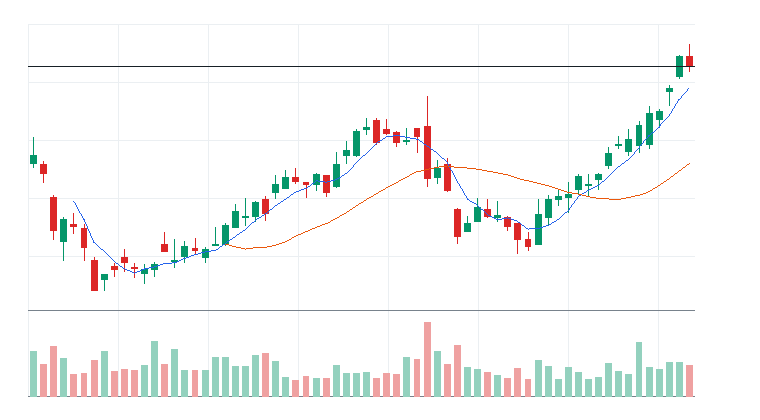
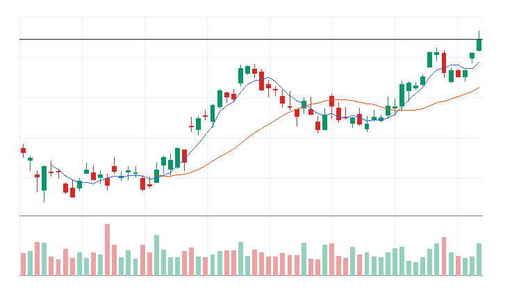
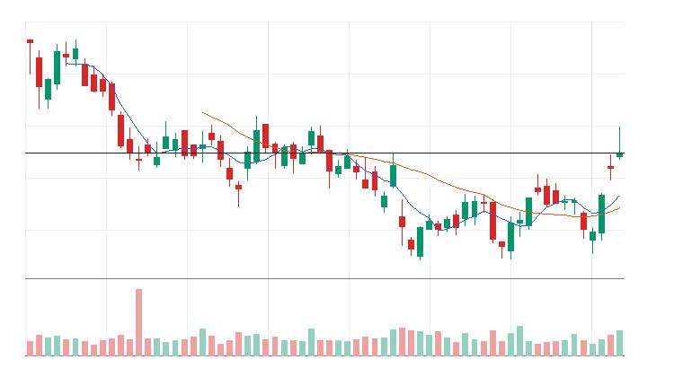

# 오늘의 데일리 트레이딩 요약

**REAL DATA TEST - 가격/거래량은 실제 데이터, 뉴스/ETF 구성종목 확산도/거래대금 유동성 일부 연결**

**목적:** 이 리포트는 최근 오른 자산을 나열하는 것이 아니라, 돈이 몰리는 근거와 다음 매수 주체가 확인할 트레이딩 후보를 찾기 위한 보고서다.

> 핵심 질문: 현재 가격에서 누가 사고 있고, 누가 앞으로 더 비싸게 사줄 수 있는가?

## 모바일 요약

[오늘의 데일리 트레이딩 요약]

생성 성공 / 데이터 모드: REAL_TEST

시장:
- 중립

시장 지배 서사:
1. AI 인프라 재가속 - 약화 - DRAM, SMH, MU, ARM 중심으로 5일 -6.25%, 20일 +12.78% 흐름이 형성됨. 뉴스 직접성 제한.
2. 위험선호 성장주 재진입 - 약화 - IPO, QQQ, ARM, TSLA 중심으로 5일 -5.88%, 20일 +7.91% 흐름이 형성됨. 뉴스 직접성 제한.
3. AI 소프트웨어/사이버보안 확산 - 약화 - CIBR, AIQ, CRWD, DDOG 중심으로 5일 -5.89%, 20일 +11.84% 흐름이 형성됨. 뉴스 직접성 제한.

트렌드 강도:
1. AI 인프라 재가속 - TSI 27 - 잠복 - 진입품질 낮음
2. 위험선호 성장주 재진입 - TSI 14 - 잠복 - 진입품질 낮음
3. AI 소프트웨어/사이버보안 확산 - TSI 25 - 잠복 - 진입품질 낮음

오늘 결론:
- 사이버보안 개별 종목 흐름이 ETF 대비 강한지 확인 필요
- 행동 후보는 linkedNarrative와 함께 확인한다.
- 추격보다 진입 조건 확인 후 접근한다.

오늘 실제 행동 후보:
1. 행동 후보 없음 - 미분류 - 조건 충족 후보 없음

다크호스 후보:
1. 다크호스 후보 없음 - 조건 충족 후보 없음

ETF 후보 TOP 5:
1. CIBR - AI 소프트웨어/사이버보안 확산 - 제외
2. IHAK - AI 소프트웨어/사이버보안 확산 - 제외
3. DRAM - AI 인프라 재가속 - 제외
4. HACK - AI 소프트웨어/사이버보안 확산 - 제외
5. SMH - AI 인프라 재가속 - 제외

웹 리포트:
https://yoolcool.github.io/DailyTradingThesisAgent/

## 오늘 결론

- 오늘 결론: 매매 보류
- 신규 진입 후보: 0개
- 조건부 진입 후보: 0개
- 관찰 후보: 41개
- 주요 제한 요인: Entry Quality 부족, 뉴스 직접성 부족, RVOL 미달
- 주문 판단: 시장가 금지 / 지정가 또는 관찰
- 실전 판단: 오늘은 추세 후보는 있으나, 왜 돈이 몰리는가와 누가 더 비싸게 사줄 수 있는가를 주문 실행 신뢰도와 거래량이 충분히 뒷받침하지 못해 신규 추격은 보류한다. 기존 관심 종목은 전일 고점 돌파와 RVOL 1.00x 회복을 확인한 뒤 조건부로 본다.

### 후보 제한 요인 집계

- RVOL < 1.00x: 41개
- 거래대금 유동성 낮음: 12개
- Entry Quality < 60: 138개
- Exhaustion Risk >= 70: 0개
- ETF breadth 샘플 부족: 37개
- 뉴스 직접성 부족: 81개

## 데이터 신뢰도

- 전체 데이터 신뢰도 등급: LOW
- 분석 신뢰도: LOW
- 주문 실행 신뢰도: LOW
- ETF breadth 신뢰도: LOW
- 신뢰도 해석: 테마 확산 판단 제한, 거래대금 유동성 낮음 또는 확인 불가, 프리/애프터마켓 확인 불가
- 리포트 생성 시각: 2026-06-06 09:32 KST
- 가격 기준 거래일: 2026-06-05 US regular close
- 뉴스 수집 시각: 2026-06-06 09:32 KST
- 가장 최근 뉴스 발행 시각: 2026-06-06 09:08 KST
- 뉴스 신선도 상태: FRESH
- 뉴스 소스: Yahoo Finance RSS, MarketWatch RSS, CNBC Markets RSS, SEC EDGAR RSS, Federal Reserve RSS, Finnhub API
- 뉴스 소스 상태: Yahoo Finance RSS CONNECTED, MarketWatch RSS CONNECTED, CNBC Markets RSS PARTIAL, SEC EDGAR RSS PARTIAL, Federal Reserve RSS CONNECTED, Finnhub API DISABLED
- 뉴스 신뢰도: MEDIUM
- 추천 적용 거래일: 2026-06-05 US regular session
- 가격/거래량 데이터 상태: 연결됨
- 뉴스 데이터 상태: 일부 연결
- ETF 구성종목 확산도 상태: 일부 연결
- ETF 구성종목 샘플 수: 2~4
- 거래대금 유동성 데이터 상태: 일부 연결
- 프리마켓/애프터마켓 데이터 상태: UNAVAILABLE
- 데이터 provider: yfinance, Yahoo Finance RSS, MarketWatch RSS, CNBC Markets RSS, SEC EDGAR RSS, Federal Reserve RSS, Finnhub API, config fallback sample, price-volume dollar-volume fallback
- 실전 사용 경고: 이 리포트는 투자판단 보조용이며, REAL_TEST 모드에서는 일부 데이터가 누락되거나 지연될 수 있다. 실제 주문 전 현재가, 뉴스, 프리마켓/정규장 거래량을 별도 확인해야 한다.

## 0. 시장 상태

- 데이터 모드: REAL_TEST
- 가격/거래량: 연결됨
- 뉴스: 일부 연결
- ETF 구성종목 확산도: 일부 연결
- 거래대금 유동성: 일부 연결
- 생성 시각: 2026년 6월 6일 토요일 오전 9:32
- 시장 상태: 중립
- 오늘 돈의 방향: 사이버보안 개별 종목 흐름이 ETF 대비 강한지 확인 필요
- 강한 테마 TOP 3: Basic Materials(71), Consumer Cyclical(39), Industrials(38)
- 데이터 한계:
  - API 또는 provider 상태에 따라 뉴스/ETF 확산도/거래대금 유동성 반영 범위가 달라질 수 있다.
  - 수집 실패 데이터는 점수 반영에서 제외하거나 confidence를 제한한다.
  - reasonConfidence HIGH는 직접 촉매, 가격/거래량, 확산도/유동성 근거가 함께 있을 때만 사용한다.

## 오늘 시장을 지배하는 서사

### 오늘 시장을 지배하는 서사 TOP 3

#### 1. AI 인프라 재가속
- 상태: 약화
- narrativeScore: 16
- reasonConfidence: LOW
- 근거 ETF: DRAM, SMH, SOXX
- 근거 개별 종목: MU, ARM, NVDA, AVGO
- 돈이 몰리는 이유: AI 인프라 재가속 관련 DRAM, SMH, SOXX와 MU, ARM, NVDA, AVGO의 5일(-6.25%)·20일(+12.78%) 흐름을 함께 본다. 평균 상대 거래량은 1.60배이고, ETF 확산도는 추가 확인이 필요하다. 뉴스 직접성은 아직 제한적이다.
- 다음 매수 주체: AI 인프라 CAPEX를 사는 반도체/전력망 ETF 자금과 신고가 모멘텀 추종 자금
- 가장 좋은 트레이딩 수단: ETF 우선: SMH, SOXX, DRAM / 개별 종목 우선: NVDA, AVGO, MU
- 서사가 깨지는 조건: SMH/SOXX 20일선 이탈, 관련 반도체와 전력 인프라 종목 절반 이상 5일선 이탈
- 오늘 행동: 추격보다 5일선 지지 후 재상승 확인

상세 narrativeScore 근거 보기

- rawScore: 16
- ETF 평균 moneyFlowScore: 12
- 개별 종목 평균 moneyFlowScore: 16
- ETF 후보 비율: 0%
- 개별 종목 후보 비율: 0%
- 5일 평균 수익률: -6.00%
- 20일 평균 수익률: +13.00%
- 평균 상대 거래량: 2.00배
- ETF 평균 상대 거래량: 2.00배
- 개별주 평균 상대 거래량: 1.00배
- 52주 고점 근접 후보 비율: 9%
- 뉴스 직접성 점수: 1
- ETF 확산도 점수: -2
- 유동성 점수: 1
- 과열 리스크 차감: 0

#### 2. 위험선호 성장주 재진입
- 상태: 약화
- narrativeScore: 14
- reasonConfidence: LOW
- 근거 ETF: IPO, QQQ, ARKK
- 근거 개별 종목: ARM, TSLA
- 돈이 몰리는 이유: 위험선호 성장주 재진입 관련 IPO, QQQ, ARKK와 ARM, TSLA의 5일(-5.88%)·20일(+7.91%) 흐름을 함께 본다. 평균 상대 거래량은 1.52배이고, ETF 확산도는 추가 확인이 필요하다. 뉴스 직접성은 아직 제한적이다.
- 다음 매수 주체: 위험선호 회복을 사는 성장주 ETF 자금과 고베타 단기 모멘텀 자금
- 가장 좋은 트레이딩 수단: ETF 우선: QQQ, IPO, ARKK / 개별 종목 우선: ARM, TSLA
- 서사가 깨지는 조건: QQQ/IWM 동반 약화, 고베타 성장주 상대 거래량 둔화
- 오늘 행동: 지수 위험선호가 유지될 때만 선별 진입

상세 narrativeScore 근거 보기

- rawScore: 14
- ETF 평균 moneyFlowScore: 8
- 개별 종목 평균 moneyFlowScore: 19
- ETF 후보 비율: 0%
- 개별 종목 후보 비율: 0%
- 5일 평균 수익률: -6.00%
- 20일 평균 수익률: +8.00%
- 평균 상대 거래량: 2.00배
- ETF 평균 상대 거래량: 2.00배
- 개별주 평균 상대 거래량: 1.00배
- 52주 고점 근접 후보 비율: 14%
- 뉴스 직접성 점수: 1
- ETF 확산도 점수: -1
- 유동성 점수: 2
- 과열 리스크 차감: 0

#### 3. AI 소프트웨어/사이버보안 확산
- 상태: 약화
- narrativeScore: 9
- reasonConfidence: LOW
- 근거 ETF: CIBR, AIQ, IGV
- 근거 개별 종목: CRWD, DDOG, PANW, TEAM
- 돈이 몰리는 이유: AI 소프트웨어/사이버보안 확산 관련 CIBR, AIQ, IGV와 CRWD, DDOG, PANW, TEAM의 5일(-5.89%)·20일(+11.84%) 흐름을 함께 본다. 평균 상대 거래량은 1.15배이고, ETF 확산도는 추가 확인이 필요하다. 뉴스 직접성은 아직 제한적이다.
- 다음 매수 주체: 섹터 베타를 사는 ETF 자금, AI/보안 실적 기대를 사는 스윙 트레이더, 신고가 추종 자금
- 가장 좋은 트레이딩 수단: ETF 우선: IGV, CIBR, AIQ / 개별 종목 우선: PANW, CRWD, DDOG
- 서사가 깨지는 조건: IGV/CIBR 20일선 이탈, 관련 개별 종목 절반 이상 5일선 이탈, 상대 거래량 둔화
- 오늘 행동: 추격보다 눌림 후 재상승 확인

상세 narrativeScore 근거 보기

- rawScore: 9
- ETF 평균 moneyFlowScore: 21
- 개별 종목 평균 moneyFlowScore: 15
- ETF 후보 비율: 0%
- 개별 종목 후보 비율: 0%
- 5일 평균 수익률: -6.00%
- 20일 평균 수익률: +12.00%
- 평균 상대 거래량: 1.00배
- ETF 평균 상대 거래량: 2.00배
- 개별주 평균 상대 거래량: 1.00배
- 52주 고점 근접 후보 비율: 0%
- 뉴스 직접성 점수: 1
- ETF 확산도 점수: -3
- 유동성 점수: 0
- 과열 리스크 차감: 0

### 전체 narrative 요약

| 서사명 | 상태 | narrativeScore | reasonConfidence | 대표 ETF | 대표 종목 | 오늘 행동 |
| --- | --- | ---: | --- | --- | --- | --- |
| AI 인프라 재가속 | 약화 | 16 | LOW | DRAM, SMH, SOXX | MU, ARM, NVDA, AVGO | 추격보다 5일선 지지 후 재상승 확인 |
| 위험선호 성장주 재진입 | 약화 | 14 | LOW | IPO, QQQ, ARKK | ARM, TSLA | 지수 위험선호가 유지될 때만 선별 진입 |
| AI 소프트웨어/사이버보안 확산 | 약화 | 9 | LOW | CIBR, AIQ, IGV | CRWD, DDOG, PANW, TEAM | 추격보다 눌림 후 재상승 확인 |
| 매크로 방어/헤지 | 약화 | 7 | LOW | TLT, GLD, XLE | - | 위험회피가 확인될 때만 헤지성 접근 |
| 방산/안보 프리미엄 | 약화 | 0 | LOW | ITA, XAR, SHLD | PLTR | 뉴스 촉매가 직접 확인될 때만 추세 추종 |
| 전력망/원전/인프라 병목 | 소멸 | 0 | LOW | PAVE, GRID, URA | CEG | ETF 확산도와 거래량이 같이 살아날 때만 진입 |
| 비트코인/디지털 자산 위험선호 | 소멸 | 0 | LOW | IBIT, BLOK | MSTR | 비트코인 베타가 살아날 때만 단기 매매 |

## 트렌드 강도 판단

### 1. AI 인프라 재가속
- Trend Strength Index: 27
- 트렌드 상태 라벨: 잠복
- 테마 확산도: 부족
- ETF 동조성: 약함
- 거래량 강도: 보통
- 과열 위험: 낮음 (7)
- 오늘 진입 품질: 낮음 (19)
- 한 줄 판단: AI 인프라 재가속는 테마 확산도가 낮아 아직 개별 종목 이벤트성 흐름에 가깝다.
- 오늘 접근법: DRAM/SMH/SOXX와 MU/ARM/NVDA의 거래량 확산이 확인되기 전까지 관찰한다.

트렌드 강도 상세 근거 보기

- 가격 모멘텀: 가격 모멘텀 -2/25. 평균 5D -6.25%, 20D +12.78%.
- 거래량 강도: 거래량 강도 12/20. 평균 RVOL 1.60배.
- ETF 동조성: ETF 동조성 5/15. 관련 ETF SMH, SOXX, SOXQ, DRAM, GRID, PAVE 흐름을 기준으로 판단.
- 테마 확산도: 테마 확산도 5/20. 상위 1~2개 쏠림 감점 0점 반영.
- 뉴스 촉매: 뉴스/촉매 신선도 2/10. HIGH 직접 촉매 0개.
- 과열 리스크: 과열 리스크 7/100. 단기 급등, 고점 근접, ETF-개별주 괴리, 쏠림을 함께 반영.
- 시장 환경: 시장 환경 5/10. QQQ/SPY/IWM 가격 흐름 기반 위험선호 점수.

### 2. 위험선호 성장주 재진입
- Trend Strength Index: 14
- 트렌드 상태 라벨: 잠복
- 테마 확산도: 부족
- ETF 동조성: 부족
- 거래량 강도: 보통
- 과열 위험: 낮음 (23)
- 오늘 진입 품질: 낮음 (4)
- 한 줄 판단: 위험선호 성장주 재진입는 테마 확산도가 낮아 아직 개별 종목 이벤트성 흐름에 가깝다.
- 오늘 접근법: IPO/QQQ/ARKK와 ARM/TSLA의 거래량 확산이 확인되기 전까지 관찰한다.

트렌드 강도 상세 근거 보기

- 가격 모멘텀: 가격 모멘텀 -4/25. 평균 5D -5.88%, 20D +7.91%.
- 거래량 강도: 거래량 강도 12/20. 평균 RVOL 1.52배.
- ETF 동조성: ETF 동조성 0/15. 관련 ETF QQQ, IPO, ARKK, IWM, MAGS 흐름을 기준으로 판단.
- 테마 확산도: 테마 확산도 0/20. 상위 1~2개 쏠림 감점 6점 반영.
- 뉴스 촉매: 뉴스/촉매 신선도 1/10. HIGH 직접 촉매 0개.
- 과열 리스크: 과열 리스크 23/100. 단기 급등, 고점 근접, ETF-개별주 괴리, 쏠림을 함께 반영.
- 시장 환경: 시장 환경 5/10. QQQ/SPY/IWM 가격 흐름 기반 위험선호 점수.

### 3. AI 소프트웨어/사이버보안 확산
- Trend Strength Index: 25
- 트렌드 상태 라벨: 잠복
- 테마 확산도: 약함
- ETF 동조성: 보통
- 거래량 강도: 약함
- 과열 위험: 낮음 (2)
- 오늘 진입 품질: 낮음 (21)
- 한 줄 판단: AI 소프트웨어/사이버보안 확산는 관찰 가능한 흐름은 있으나 가격, 거래량, 확산도 중 일부 확인이 더 필요하다.
- 오늘 접근법: CIBR/AIQ/IGV와 CRWD/DDOG/PANW의 거래량 확산이 확인되기 전까지 관찰한다.

트렌드 강도 상세 근거 보기

- 가격 모멘텀: 가격 모멘텀 -3/25. 평균 5D -5.89%, 20D +11.84%.
- 거래량 강도: 거래량 강도 7/20. 평균 RVOL 1.15배.
- ETF 동조성: ETF 동조성 8/15. 관련 ETF IGV, AIQ, CIBR, HACK, IHAK 흐름을 기준으로 판단.
- 테마 확산도: 테마 확산도 6/20. 상위 1~2개 쏠림 감점 0점 반영.
- 뉴스 촉매: 뉴스/촉매 신선도 2/10. HIGH 직접 촉매 0개.
- 과열 리스크: 과열 리스크 2/100. 단기 급등, 고점 근접, ETF-개별주 괴리, 쏠림을 함께 반영.
- 시장 환경: 시장 환경 5/10. QQQ/SPY/IWM 가격 흐름 기반 위험선호 점수.

## 최근 추천 결과 트래킹

개별주는 데이트레이딩 관점으로 추천 이후 첫 정규장의 장중 최고가와 종가를 추적한다. ETF는 테마/스윙 관점으로 추천 이후 1주일 동안의 최고가와 현재 종가를 추적한다.

### 개별주 Top 3 추천 성과 요약
- 최근 5개 리포트 표본: 7개 (초기 검증 단계)
- 장중 최고가 기준 성공률: +14.29%
- 종가 기준 성공률: +28.57%
- 평균 장중 최고 수익률: +0.98%
- 평균 종가 수익률: -1.19%

### ETF 추천 성과 요약
- 최근 5개 리포트 표본: 7개 (초기 검증 단계)
- 1주 최고가 기준 성공률: 0.00%
- 현재 종가 기준 성공률: 0.00%
- 평균 1주 최고 수익률: -3.49%
- 평균 현재 수익률: -10.54%

최근 추천 결과 상세 테이블 펼치기

| 추천일 | 유형 | 순위 | 티커 | 기준가 | 추적 기간 | 상태 | High 수익률 | Close 수익률 | 결과 | 코멘트 |
| --- | --- | ---: | --- | ---: | --- | --- | ---: | ---: | --- | --- |
| 2026-06-04 | STOCK | 3 | PANW | $280.43 | 2026-06-04 | complete | +0.10% | -0.42% | 실패 | 추천 이후 의미 있는 장중 기회가 부족하고 종가도 약함 (일봉 기준) |
| 2026-06-04 | STOCK | 2 | FTNT | $146.48 | 2026-06-04 | complete | +2.45% | +2.18% | 제한적 유효 | 제한적인 장중 기회만 발생 (일봉 기준) |
| 2026-06-04 | STOCK | 1 | CRWD | $747.61 | 2026-06-04 | complete | -3.56% | -3.81% | 실패 | 추천 이후 의미 있는 장중 기회가 부족하고 종가도 약함 (일봉 기준) |
| 2026-06-04 | ETF | 3 | HACK | $102.21 | 2026-06-04~2026-06-11 | in_progress | -1.72% | -4.80% | 진행 중 | 아직 1주 추적 기간이 끝나지 않음 |
| 2026-06-04 | ETF | 2 | SOXQ | $109.58 | 2026-06-04~2026-06-11 | in_progress | -5.73% | -12.13% | 진행 중 | 아직 1주 추적 기간이 끝나지 않음 |
| 2026-06-04 | ETF | 1 | AIQ | $69.16 | 2026-06-04~2026-06-11 | in_progress | -4.29% | -9.60% | 진행 중 | 아직 1주 추적 기간이 끝나지 않음 |
| 2026-06-03 | STOCK | 3 | FTNT | $148.86 | 2026-06-03 | complete | -0.26% | -1.60% | 실패 | 추천 이후 의미 있는 장중 기회가 부족하고 종가도 약함 (일봉 기준) |
| 2026-06-03 | STOCK | 3 | CRWD | $768.95 | 2026-06-03 | complete | -0.25% | -2.78% | 실패 | 추천 이후 의미 있는 장중 기회가 부족하고 종가도 약함 (일봉 기준) |
| 2026-06-03 | STOCK | 2 | MRVL | $290.79 | 2026-06-03 | complete | +11.49% | +3.73% | 성공 | 장중 기회와 종가 유지가 모두 확인됨 (일봉 기준) |
| 2026-06-03 | STOCK | 1 | PANW | $297.18 | 2026-06-03 | complete | -3.09% | -5.64% | 실패 | 추천 이후 의미 있는 장중 기회가 부족하고 종가도 약함 (일봉 기준) |
| 2026-06-03 | ETF | 3 | DRAM | $69.57 | 2026-06-03~2026-06-10 | in_progress | -3.52% | -19.81% | 진행 중 | 아직 1주 추적 기간이 끝나지 않음 |
| 2026-06-03 | ETF | 3 | IGV | $104.73 | 2026-06-03~2026-06-10 | in_progress | -3.31% | -8.48% | 진행 중 | 아직 1주 추적 기간이 끝나지 않음 |
| 2026-06-03 | ETF | 2 | AIQ | $70.14 | 2026-06-03~2026-06-10 | in_progress | -2.32% | -10.86% | 진행 중 | 아직 1주 추적 기간이 끝나지 않음 |
| 2026-06-03 | ETF | 1 | CIBR | $94.32 | 2026-06-03~2026-06-10 | in_progress | -3.56% | -8.08% | 진행 중 | 아직 1주 추적 기간이 끝나지 않음 |

## 오늘 실제 행동 후보

오늘은 추세 후보는 있으나, 왜 돈이 몰리는가와 누가 더 비싸게 사줄 수 있는가를 주문 실행 신뢰도와 거래량이 충분히 뒷받침하지 못해 신규 추격은 보류한다. 기존 관심 종목은 전일 고점 돌파와 RVOL 1.00x 회복을 확인한 뒤 조건부로 본다.

## 다크호스 후보

다크호스 후보 없음. 상위 서사 정렬, MA20 위 안착, MA5/MA20 구조 개선, RVOL 0.90x 이상 조건을 동시에 충족한 개별주가 없다.

- darkHorseScore: 조건 충족 후보 없음
- 왜 아직 메인이 아닌가: 확인 조건을 통과한 보조 관찰 후보가 없다.

darkHorseScore 상세 근거 보기

- 서사 정렬: 조건 미충족
- 초기 추세 구조: 조건 미충족
- 베이스 돌파/정돈: 조건 미충족
- 거래량 확인: 조건 미충족
- rawScore: 데이터 없음

## 참고용 행동 후보

> 실제 행동 후보가 없는 날에만 표시한다. 아래 후보는 매수 추천이 아니라 다음 정규장에서 전일 고점 돌파, RVOL 1.00x 이상, 거래대금 유동성 확인을 기다리는 관찰 리스트다.

### ETF 참고 후보 TOP 3

#### 1. [CIBR] First Trust NASDAQ Cybersecurity ETF
- 상태: 참고용 관찰 후보
- todayActionLabel: 제외
- 제한 사유: Entry Quality 24 < 45; 진입 품질 부족
- 주문 실행: 지정가 권장
- moneyFlowScore: 41
- Entry Quality: 24 (낮음)
- RVOL: 1.33x
- 진입 전 확인: 20일선 위 눌림 후 재상승 확인
- 무효화: 20일선 이탈 또는 상대 거래량 0.8배 이하 둔화

#### 2. [IHAK] iShares Cybersecurity and Tech ETF
- 상태: 참고용 관찰 후보
- todayActionLabel: 제외
- 제한 사유: Entry Quality 11 < 45; 거래대금 유동성 LOW/UNKNOWN; 진입 품질 부족
- 주문 실행: 추격 금지
- moneyFlowScore: 33
- Entry Quality: 11 (낮음)
- RVOL: 2.55x
- 진입 전 확인: 20일선 위 눌림 후 재상승 확인
- 무효화: 20일선 이탈 또는 상대 거래량 0.8배 이하 둔화

#### 3. [DRAM] Roundhill Memory ETF
- 상태: 참고용 관찰 후보
- todayActionLabel: 제외
- 제한 사유: Entry Quality 18 < 45; 진입 품질 부족
- 주문 실행: 시장가 가능
- moneyFlowScore: 23
- Entry Quality: 18 (낮음)
- RVOL: 1.82x
- 진입 전 확인: 20일선 위 눌림 후 재상승 확인
- 무효화: 20일선 이탈 또는 상대 거래량 0.8배 이하 둔화

### 개별주 참고 후보 TOP 3

#### 1. [FTNT] Fortinet Inc.
- 상태: 참고용 관찰 후보
- todayActionLabel: 제외
- 제한 사유: Entry Quality 37 < 45; 진입 품질 부족
- 주문 실행: 시장가 가능
- moneyFlowScore: 75
- Entry Quality: 37 (낮음)
- RVOL: 1.10x
- 진입 전 확인: 전일 고점 돌파와 5일선 유지 확인
- 무효화: 20일선 이탈 또는 상대 거래량 0.8배 이하 둔화

#### 2. [MRVL] Marvell Technology Inc.
- 상태: 참고용 관찰 후보
- todayActionLabel: 제외
- 제한 사유: Entry Quality 36 < 45; 진입 품질 부족
- 주문 실행: 시장가 가능
- moneyFlowScore: 77
- Entry Quality: 36 (낮음)
- RVOL: 1.98x
- 진입 전 확인: 20일선 위 눌림 후 재상승 확인
- 무효화: 20일선 이탈 또는 상대 거래량 0.8배 이하 둔화

#### 3. [ODFL] Old Dominion Freight Line Inc.
- 상태: 참고용 관찰 후보
- todayActionLabel: 제외
- 제한 사유: Entry Quality 29 < 45; 진입 품질 부족
- 주문 실행: 지정가 권장
- moneyFlowScore: 85
- Entry Quality: 29 (낮음)
- RVOL: 1.14x
- 진입 전 확인: 전일 고점 돌파와 5일선 유지 확인
- 무효화: 20일선 이탈 또는 상대 거래량 0.8배 이하 둔화

## 오늘 돈이 몰리는 테마

- Basic Materials: LIN | 평균 moneyFlowScore 71 | 추세는 확인되지만 선별 진입이 필요한 중간 강도의 테마로 본다.
- Consumer Cyclical: SBUX, MAR, ROST, ORLY | 평균 moneyFlowScore 39 | 관심은 유지하되 우선순위는 낮추고 추가 거래량 확인을 기다린다.
- Industrials: HON, ADP, CSX, CTAS, PCAR, FAST, FER, ODFL | 평균 moneyFlowScore 38 | 관심은 유지하되 우선순위는 낮추고 추가 거래량 확인을 기다린다.
- 사이버보안: PANW, CRWD, FTNT, ZS | 평균 moneyFlowScore 36 | 관심은 유지하되 우선순위는 낮추고 추가 거래량 확인을 기다린다.
- 사이버보안 ETF: CIBR, HACK, IHAK | 평균 moneyFlowScore 34 | 관심은 유지하되 우선순위는 낮추고 추가 거래량 확인을 기다린다.
- 반도체 장비/공급망: LRCX, AMAT, KLAC | 평균 moneyFlowScore 31 | 관심은 유지하되 우선순위는 낮추고 추가 거래량 확인을 기다린다.

## 1. ETF 트레이딩 보고서
### 1-1. ETF 결론
- ETF 우선 후보: 없음
- ETF 관찰 후보: IGV, SHLD, PPA, GRID, IFRA
- ETF 매매 금지: IGV, BOTZ, ROBO, SHLD, PPA
- 오늘 ETF 최우선 1개: 없음
- ETF 섹션 해석: 이 섹션은 개별 종목 선택이 아니라 테마/섹터 단위 자금 흐름을 ETF로 매매할지 판단하기 위한 영역이다.

### 1-2. ETF 후보 TOP 5

선정 기준: ETF 후보는 가격/거래량 1차 점수에 뉴스, ETF 구성종목 확산도, 유동성, 리스크 패널티를 반영한 finalRawScore 기준으로 정렬한다. 표시 점수 100점 후보가 겹치면 tieBreakerReason으로 우선순위를 설명한다.

### [ETF CIBR] First Trust NASDAQ Cybersecurity ETF
- 자산 유형: ETF
- ETF 세부 카테고리: 사이버보안 ETF
- ETF 역할: 테마 베타 매수
- 상태: 매매 금지
- linkedNarrative: AI 소프트웨어/사이버보안 확산
- narrativeStatus: 약화
- narrativeScore: 9
- moneyFlowScore: 41
- finalRawScore: 41
- tieBreakerReason: 최종 원점수 41, 리스크 패널티 0, 5일 수익률 -2.63%, 상대 거래량 1.33배 순으로 정렬
- 과열 리스크: 낮음
- reasonConfidence: MEDIUM
- reasonConfidenceExplanation: ETF 확산도 제한 때문에 HIGH가 아니라 MEDIUM으로 제한했다.

- todayActionLabel: 제외
- 주문 실행: 지정가 권장
- 기준일: 2026-06-05
- 종가: $86.7
- 1일 수익률: -4.41%
- 5일 수익률: -2.63%
- 20일 수익률: +18.54%
- 상대 거래량: 1.33배
- 52주 고점 대비 위치: -8.15%
- whyMoneyIsFlowing: 20일 +18.54%, 5일 -2.63%, 상대 거래량 1.33배로 가격과 거래량이 함께 개선. 뉴스: CNBC Markets RSS general_market/under_6h / 유동성: ACCEPTABLE
- likelyNextBuyer: 섹터 베타를 노리는 단기 모멘텀 자금과 리밸런싱 자금
- whyThisCouldTradeHigher: 단기 추세가 유지되고 거래량이 1.0배 이상이면 눌림 이후 재상승을 시도할 수 있음
- 진입 조건: 20일선 위 눌림 후 재상승 확인
- 무효화 조건: 20일선 이탈 또는 상대 거래량 0.8배 이하 둔화
- 차트: 

#### 상세 근거

CIBR 상세 근거 펼치기

- moneyFlowScore(최종) 산정 근거:
  - moneyFlowScore(1차): 41
  - 최종 원점수: 41
  - 최종 표시 점수: 41
  - cap 적용: cap 미적용
  - 계산식: +41 + +2 - 4 + +2 + 0 + 0 + 0 = 41
  - 점수 해석: 매매 금지 또는 우선순위 낮은 후보.
  - 가격/거래량 1차 점수: +41
    - 추세: +6
    - 단기 모멘텀: -7
    - 중기 모멘텀: +12
    - 거래량: +14
    - 신고가 근접: +6
    - 이동평균: +10
  - 하위 점수 cap:
    - 가격 모멘텀: 원점수 +6, 상한 적용 +6 / 최대 25
    - 단기 모멘텀: 원점수 -7, 상한 적용 -7 / 최대 20
    - 중기 모멘텀: 원점수 +12, 상한 적용 +12 / 최대 16
    - 거래량: 원점수 +14, 상한 적용 +14 / 최대 20
    - 신고가 근접: 원점수 +6, 상한 적용 +6 / 최대 12
    - 이동평균: 원점수 +10, 상한 적용 +10 / 최대 14
  - 추가 데이터 가감점:
    - 뉴스: +2
    - 유동성: +2
  - ETF 확산도: -4
  - 리스크 패널티: 0
  - 주요 근거: 1차 41, 최종 원점수 41, 표시 41. 20일 수익률 강함, 상대 거래량 증가, 뉴스 흐름이 가격/거래량 근거 보강. 주의: 큰 감점 제한적.
  - 리스크 패널티 산정 근거:
    - 총 리스크 패널티: 0
    - 리스크 등급: LOW
    - 감점된 리스크: 없음
    - 관찰 리스크: 주요 관찰 리스크 없음
    - 한 줄 해석: 직접 감점된 주요 리스크는 없지만 관찰 리스크는 계속 확인해야 한다.
- 데이터 사용 현황:
  - 가격/거래량: 사용
  - 뉴스: 사용
  - ETF 확산도: 일부 연결
  - 거래대금 유동성: 사용
  - 관련 ETF 상대강도: 사용
- 뉴스 확인:
  - 최근 뉴스 상태: 일부 연결
  - 뉴스 소스: CNBC Markets RSS, MarketWatch RSS, Yahoo Finance RSS
  - 소스별 상태: Yahoo Finance RSS CONNECTED; MarketWatch RSS CONNECTED; CNBC Markets RSS CONNECTED; SEC EDGAR RSS PARTIAL; Federal Reserve RSS CONNECTED; Finnhub API DISABLED
  - 긍정/중립/부정: 12/4/0
  - 직접성/방향성/신선도: 2/1/4
  - 강한 촉매 수: 4
  - 직접 촉매: 없음
  - 보조 뉴스: CNBC Markets RSS sector_theme / general_market / under_6h
  - 뉴스 수집 시각: 2026-06-06 09:32 KST
  - 가장 최근 뉴스 발행 시각: 2026-06-06 07:53 KST
  - 뉴스 신선도 상태: FRESH
  - 뉴스 이후 가격 반응: 부정
  - 가격 반응 점수 제한: 뉴스 이후 가격 반응 부정 -> 긍정 점수 제한
  - 핵심 뉴스 요약: Amazon unveils latest warehouse robot as tech giants continue AI layoffs
  - 원점수/상한 점수: +27 / +12
  - 점수 반영: +12
  - 주의: SEC EDGAR RSS: no matching RSS items; Finnhub API: FINNHUB_API_KEY not configured
- ETF 구성종목 확산도:
  - 구성종목 데이터 상태: 일부 연결
  - 샘플 수: 2/2
  - 샘플 신뢰도: INSUFFICIENT
  - 상승 종목 비율: 0%
  - 20일선 위 비율: 0%
  - 50일선 위 비율: 50%
  - 상위 기여 종목: MSFT, PLTR
  - 확산도 판단: WEAK_BREADTH
  - 원점수/샘플 상한/반영 점수: -4 / 0 / -4
  - 점수 반영: -4
- 거래대금 유동성:
  - 데이터 상태: 일부 연결
  - 거래대금 기준 유동성: ACCEPTABLE
  - 거래대금: $217,745,316
  - 평균 거래대금: $163,233,038
  - 주문 영향: 지정가 권장
  - 매매 영향: 거래대금은 허용 가능하나 지정가를 우선한다
- reasonConfidence 근거: 가격/거래량, 뉴스, 거래대금 유동성, 관련 ETF 상대강도은 확인됐지만 일부 보조 데이터가 미연결 또는 fallback이라 중간으로 제한한다.
- 차트 요약: 20일선 위에서 단기 눌림 확인 구간
- 기준일 2026-06-05 | 종가 $86.7 | 1일 -4.41% | 5일 -2.63% | 20일 +18.54% | 상대 거래량 1.33배 | 52주 고점 대비 -8.15% | 데이터 소스: yfinance

### [ETF IHAK] iShares Cybersecurity and Tech ETF
- 자산 유형: ETF
- ETF 세부 카테고리: 사이버보안 ETF
- ETF 역할: 테마 베타 매수
- 상태: 매매 금지
- linkedNarrative: AI 소프트웨어/사이버보안 확산
- narrativeStatus: 약화
- narrativeScore: 9
- moneyFlowScore: 33
- finalRawScore: 33
- tieBreakerReason: 최종 원점수 33, 리스크 패널티 -5, 5일 수익률 -1.30%, 상대 거래량 2.55배 순으로 정렬
- 과열 리스크: 낮음
- reasonConfidence: LOW
- reasonConfidenceExplanation: 가격/거래량이 약하거나 핵심 보조 근거가 부족해 LOW로 분류했다.

- todayActionLabel: 제외
- 주문 실행: 추격 금지
- 기준일: 2026-06-05
- 종가: $57.03
- 1일 수익률: -3.62%
- 5일 수익률: -1.30%
- 20일 수익률: +12.66%
- 상대 거래량: 2.55배
- 52주 고점 대비 위치: -6.90%
- whyMoneyIsFlowing: 20일 +12.66%, 5일 -1.30%, 상대 거래량 2.55배로 가격과 거래량이 함께 개선. 뉴스: MarketWatch RSS general_market/under_6h
- likelyNextBuyer: 섹터 베타를 노리는 단기 모멘텀 자금과 리밸런싱 자금
- whyThisCouldTradeHigher: 단기 추세가 유지되고 거래량이 1.0배 이상이면 눌림 이후 재상승을 시도할 수 있음
- 진입 조건: 20일선 위 눌림 후 재상승 확인
- 무효화 조건: 20일선 이탈 또는 상대 거래량 0.8배 이하 둔화
- 차트: 

#### 상세 근거

IHAK 상세 근거 펼치기

- moneyFlowScore(최종) 산정 근거:
  - moneyFlowScore(1차): 41
  - 최종 원점수: 33
  - 최종 표시 점수: 33
  - cap 적용: cap 미적용
  - 계산식: +41 + +2 + 0 - 5 + 0 - 5 + 0 = 33
  - 점수 해석: 매매 금지 또는 우선순위 낮은 후보.
  - 가격/거래량 1차 점수: +41
    - 추세: +4
    - 단기 모멘텀: -5
    - 중기 모멘텀: +8
    - 거래량: +18
    - 신고가 근접: +6
    - 이동평균: +10
  - 하위 점수 cap:
    - 가격 모멘텀: 원점수 +4, 상한 적용 +4 / 최대 25
    - 단기 모멘텀: 원점수 -5, 상한 적용 -5 / 최대 20
    - 중기 모멘텀: 원점수 +8, 상한 적용 +8 / 최대 16
    - 거래량: 원점수 +18, 상한 적용 +18 / 최대 20
    - 신고가 근접: 원점수 +6, 상한 적용 +6 / 최대 12
    - 이동평균: 원점수 +10, 상한 적용 +10 / 최대 14
  - 추가 데이터 가감점:
    - 뉴스: +2
    - 유동성: -5
  - ETF 확산도: 0
  - 리스크 패널티: -5
  - 주요 근거: 1차 41, 최종 원점수 33, 표시 33. 20일 수익률 강함, 상대 거래량 증가, 뉴스 흐름이 가격/거래량 근거 보강. 주의: 단기 과열/추격 위험 존재, ETF 구성종목 확산도 데이터 미연결.
  - 리스크 패널티 산정 근거:
    - 총 리스크 패널티: -5
    - 리스크 등급: LOW
    - 감점된 리스크:
      - low liquidity: -5 | 근거: Liquidity signal: LOW. | 대응: Avoid market-order chasing.
    - 관찰 리스크: ETF breadth data not connected
    - 한 줄 해석: 1개 감점 리스크로 총 -5점 반영.
- 데이터 사용 현황:
  - 가격/거래량: 사용
  - 뉴스: 사용
  - ETF 확산도: 미연결
  - 거래대금 유동성: 사용
  - 관련 ETF 상대강도: 사용
- 뉴스 확인:
  - 최근 뉴스 상태: 일부 연결
  - 뉴스 소스: MarketWatch RSS, Federal Reserve RSS, Yahoo Finance RSS
  - 소스별 상태: Yahoo Finance RSS CONNECTED; MarketWatch RSS CONNECTED; CNBC Markets RSS FAILED; SEC EDGAR RSS PARTIAL; Federal Reserve RSS CONNECTED; Finnhub API DISABLED
  - 긍정/중립/부정: 10/6/0
  - 직접성/방향성/신선도: 2/1/4
  - 강한 촉매 수: 0
  - 직접 촉매: 없음
  - 보조 뉴스: MarketWatch RSS sector_theme / general_market / under_6h
  - 뉴스 수집 시각: 2026-06-06 09:32 KST
  - 가장 최근 뉴스 발행 시각: 2026-06-06 06:58 KST
  - 뉴스 신선도 상태: FRESH
  - 뉴스 이후 가격 반응: 부정
  - 가격 반응 점수 제한: 뉴스 이후 가격 반응 부정 -> 긍정 점수 제한
  - 핵심 뉴스 요약: Bitcoin is suffering from an &#x2018;attention&#x2019; deficit, as momentum traders have moved on
  - 원점수/상한 점수: +19 / +12
  - 점수 반영: +12
  - 주의: CNBC Markets RSS: HTTP 403 from https://www.cnbc.com/id/100003114/device/rss/rss.html; SEC EDGAR RSS: no matching RSS items; Finnhub API: FINNHUB_API_KEY not configured
- ETF 구성종목 확산도:
  - 구성종목 데이터 상태: 미연결
  - 샘플 수: 0/0
  - 샘플 신뢰도: UNKNOWN
  - 상승 종목 비율: 데이터 없음
  - 20일선 위 비율: 데이터 없음
  - 50일선 위 비율: 데이터 없음
  - 상위 기여 종목: 데이터 없음
  - 확산도 판단: UNKNOWN
  - 원점수/샘플 상한/반영 점수: 0 / N/A / 0
  - 점수 반영: 0
- 거래대금 유동성:
  - 데이터 상태: 일부 연결
  - 거래대금 기준 유동성: LOW
  - 거래대금: $23,724,879
  - 평균 거래대금: $9,304,730
  - 주문 영향: 추격 금지
  - 매매 영향: 유동성 부족으로 추격 금지 또는 우선순위 하향
- reasonConfidence 근거: 가격/거래량이 약하거나 주요 데이터가 부족해 낮음.
- 차트 요약: 20일선 위에서 단기 눌림 확인 구간
- 기준일 2026-06-05 | 종가 $57.03 | 1일 -3.62% | 5일 -1.30% | 20일 +12.66% | 상대 거래량 2.55배 | 52주 고점 대비 -6.90% | 데이터 소스: yfinance

### [ETF DRAM] Roundhill Memory ETF
- 자산 유형: ETF
- ETF 세부 카테고리: 메모리/HBM ETF
- ETF 역할: 테마 베타 매수
- 상태: 매매 금지
- linkedNarrative: AI 인프라 재가속
- narrativeStatus: 약화
- narrativeScore: 16
- moneyFlowScore: 23
- finalRawScore: 23
- tieBreakerReason: 최종 원점수 23, 리스크 패널티 -6, 5일 수익률 -11.72%, 상대 거래량 1.82배 순으로 정렬
- 과열 리스크: 낮음
- reasonConfidence: LOW
- reasonConfidenceExplanation: 가격/거래량이 약하거나 핵심 보조 근거가 부족해 LOW로 분류했다.

- todayActionLabel: 제외
- 주문 실행: 시장가 가능
- 기준일: 2026-06-05
- 종가: $55.79
- 1일 수익률: -15.08%
- 5일 수익률: -11.72%
- 20일 수익률: +19.85%
- 상대 거래량: 1.82배
- 52주 고점 대비 위치: -20.47%
- whyMoneyIsFlowing: 20일 +19.85%, 5일 -11.72%, 상대 거래량 1.82배로 가격과 거래량이 함께 개선. 뉴스: CNBC Markets RSS general_market/under_6h / 유동성: LIQUID
- likelyNextBuyer: 섹터 베타를 노리는 단기 모멘텀 자금과 리밸런싱 자금
- whyThisCouldTradeHigher: 단기 추세가 유지되고 거래량이 1.0배 이상이면 눌림 이후 재상승을 시도할 수 있음
- 진입 조건: 20일선 위 눌림 후 재상승 확인
- 무효화 조건: 20일선 이탈 또는 상대 거래량 0.8배 이하 둔화
- 차트: 

#### 상세 근거

DRAM 상세 근거 펼치기

- moneyFlowScore(최종) 산정 근거:
  - moneyFlowScore(1차): 22
  - 최종 원점수: 23
  - 최종 표시 점수: 23
  - cap 적용: cap 미적용
  - 계산식: +22 + +2 + 0 + +5 + 0 - 6 + 0 = 23
  - 점수 해석: 매매 금지 또는 우선순위 낮은 후보.
  - 가격/거래량 1차 점수: +22
    - 추세: +3
    - 단기 모멘텀: -10
    - 중기 모멘텀: +13
    - 거래량: +18
    - 신고가 근접: 0
    - 이동평균: -2
  - 하위 점수 cap:
    - 가격 모멘텀: 원점수 +3, 상한 적용 +3 / 최대 25
    - 단기 모멘텀: 원점수 -12, 상한 적용 -10 / 최대 20 (cap 적용)
    - 중기 모멘텀: 원점수 +13, 상한 적용 +13 / 최대 16
    - 거래량: 원점수 +18, 상한 적용 +18 / 최대 20
    - 신고가 근접: 원점수 0, 상한 적용 0 / 최대 12
    - 이동평균: 원점수 -2, 상한 적용 -2 / 최대 14
  - 추가 데이터 가감점:
    - 뉴스: +2
    - 유동성: +5
  - ETF 확산도: 0
  - 리스크 패널티: -6
  - 주요 근거: 1차 22, 최종 원점수 23, 표시 23. 20일 수익률 강함, 상대 거래량 증가, 뉴스 흐름이 가격/거래량 근거 보강. 주의: 단기 과열/추격 위험 존재, ETF 구성종목 확산도 데이터 미연결.
  - 리스크 패널티 산정 근거:
    - 총 리스크 패널티: -6
    - 리스크 등급: LOW
    - 감점된 리스크:
      - 20d moving average break risk: -6 | 근거: Close is below the 20-day moving average. | 대응: Hold off until 20-day moving average is recovered.
    - 관찰 리스크: ETF breadth data not connected
    - 한 줄 해석: 1개 감점 리스크로 총 -6점 반영.
- 데이터 사용 현황:
  - 가격/거래량: 사용
  - 뉴스: 사용
  - ETF 확산도: 미연결
  - 거래대금 유동성: 사용
  - 관련 ETF 상대강도: 사용
- 뉴스 확인:
  - 최근 뉴스 상태: 일부 연결
  - 뉴스 소스: CNBC Markets RSS, MarketWatch RSS
  - 소스별 상태: Yahoo Finance RSS CONNECTED; MarketWatch RSS CONNECTED; CNBC Markets RSS CONNECTED; SEC EDGAR RSS PARTIAL; Federal Reserve RSS CONNECTED; Finnhub API DISABLED
  - 긍정/중립/부정: 12/4/0
  - 직접성/방향성/신선도: 2/1/4
  - 강한 촉매 수: 4
  - 직접 촉매: 없음
  - 보조 뉴스: CNBC Markets RSS sector_theme / general_market / under_6h
  - 뉴스 수집 시각: 2026-06-06 09:32 KST
  - 가장 최근 뉴스 발행 시각: 2026-06-06 07:53 KST
  - 뉴스 신선도 상태: FRESH
  - 뉴스 이후 가격 반응: 부정
  - 가격 반응 점수 제한: 뉴스 이후 가격 반응 부정 -> 긍정 점수 제한
  - 핵심 뉴스 요약: Amazon unveils latest warehouse robot as tech giants continue AI layoffs
  - 원점수/상한 점수: +27 / +12
  - 점수 반영: +12
  - 주의: SEC EDGAR RSS: no matching RSS items; Finnhub API: FINNHUB_API_KEY not configured
- ETF 구성종목 확산도:
  - 구성종목 데이터 상태: 미연결
  - 샘플 수: 0/0
  - 샘플 신뢰도: UNKNOWN
  - 상승 종목 비율: 데이터 없음
  - 20일선 위 비율: 데이터 없음
  - 50일선 위 비율: 데이터 없음
  - 상위 기여 종목: 데이터 없음
  - 확산도 판단: UNKNOWN
  - 원점수/샘플 상한/반영 점수: 0 / N/A / 0
  - 점수 반영: 0
- 거래대금 유동성:
  - 데이터 상태: 일부 연결
  - 거래대금 기준 유동성: LIQUID
  - 거래대금: $4,222,401,657
  - 평균 거래대금: $2,322,286,199
  - 주문 영향: 시장가 가능
  - 매매 영향: 거래대금이 충분해 시장가 가능 범위로 본다
- reasonConfidence 근거: 가격/거래량이 약하거나 주요 데이터가 부족해 낮음.
- 차트 요약: 20일선 아래라 추세 확인 전까지 보수적 접근
- 기준일 2026-06-05 | 종가 $55.79 | 1일 -15.08% | 5일 -11.72% | 20일 +19.85% | 상대 거래량 1.82배 | 52주 고점 대비 -20.47% | 데이터 소스: yfinance

### [ETF HACK] Amplify Cybersecurity ETF
- 자산 유형: ETF
- ETF 세부 카테고리: 사이버보안 ETF
- ETF 역할: 테마 베타 매수
- 상태: 매매 금지
- linkedNarrative: AI 소프트웨어/사이버보안 확산
- narrativeStatus: 약화
- narrativeScore: 9
- moneyFlowScore: 27
- finalRawScore: 27
- tieBreakerReason: 최종 원점수 27, 리스크 패널티 -5, 5일 수익률 -2.06%, 상대 거래량 1.36배 순으로 정렬
- 과열 리스크: 낮음
- reasonConfidence: LOW
- reasonConfidenceExplanation: 가격/거래량이 약하거나 핵심 보조 근거가 부족해 LOW로 분류했다.

- todayActionLabel: 제외
- 주문 실행: 추격 금지
- 기준일: 2026-06-05
- 종가: $97.3
- 1일 수익률: -3.80%
- 5일 수익률: -2.06%
- 20일 수익률: +14.86%
- 상대 거래량: 1.36배
- 52주 고점 대비 위치: -7.82%
- whyMoneyIsFlowing: 20일 +14.86%, 5일 -2.06%, 상대 거래량 1.36배로 가격과 거래량이 함께 개선. 뉴스: Yahoo Finance RSS general_market/stale
- likelyNextBuyer: 섹터 베타를 노리는 단기 모멘텀 자금과 리밸런싱 자금
- whyThisCouldTradeHigher: 단기 추세가 유지되고 거래량이 1.0배 이상이면 눌림 이후 재상승을 시도할 수 있음
- 진입 조건: 20일선 위 눌림 후 재상승 확인
- 무효화 조건: 20일선 이탈 또는 상대 거래량 0.8배 이하 둔화
- 차트: 

#### 상세 근거

HACK 상세 근거 펼치기

- moneyFlowScore(최종) 산정 근거:
  - moneyFlowScore(1차): 39
  - 최종 원점수: 27
  - 최종 표시 점수: 27
  - cap 적용: cap 미적용
  - 계산식: +39 + +2 - 4 - 5 + 0 - 5 + 0 = 27
  - 점수 해석: 매매 금지 또는 우선순위 낮은 후보.
  - 가격/거래량 1차 점수: +39
    - 추세: +5
    - 단기 모멘텀: -6
    - 중기 모멘텀: +10
    - 거래량: +14
    - 신고가 근접: +6
    - 이동평균: +10
  - 하위 점수 cap:
    - 가격 모멘텀: 원점수 +5, 상한 적용 +5 / 최대 25
    - 단기 모멘텀: 원점수 -6, 상한 적용 -6 / 최대 20
    - 중기 모멘텀: 원점수 +10, 상한 적용 +10 / 최대 16
    - 거래량: 원점수 +14, 상한 적용 +14 / 최대 20
    - 신고가 근접: 원점수 +6, 상한 적용 +6 / 최대 12
    - 이동평균: 원점수 +10, 상한 적용 +10 / 최대 14
  - 추가 데이터 가감점:
    - 뉴스: +2
    - 유동성: -5
  - ETF 확산도: -4
  - 리스크 패널티: -5
  - 주요 근거: 1차 39, 최종 원점수 27, 표시 27. 20일 수익률 강함, 상대 거래량 증가, 뉴스 흐름이 가격/거래량 근거 보강. 주의: 단기 과열/추격 위험 존재.
  - 리스크 패널티 산정 근거:
    - 총 리스크 패널티: -5
    - 리스크 등급: LOW
    - 감점된 리스크:
      - low liquidity: -5 | 근거: Liquidity signal: LOW. | 대응: Avoid market-order chasing.
    - 관찰 리스크: 주요 관찰 리스크 없음
    - 한 줄 해석: 1개 감점 리스크로 총 -5점 반영.
- 데이터 사용 현황:
  - 가격/거래량: 사용
  - 뉴스: 사용
  - ETF 확산도: 일부 연결
  - 거래대금 유동성: 사용
  - 관련 ETF 상대강도: 사용
- 뉴스 확인:
  - 최근 뉴스 상태: 일부 연결
  - 뉴스 소스: MarketWatch RSS, Yahoo Finance RSS, Federal Reserve RSS
  - 소스별 상태: Yahoo Finance RSS CONNECTED; MarketWatch RSS CONNECTED; CNBC Markets RSS FAILED; SEC EDGAR RSS PARTIAL; Federal Reserve RSS CONNECTED; Finnhub API DISABLED
  - 긍정/중립/부정: 10/6/0
  - 직접성/방향성/신선도: 4/1/4
  - 강한 촉매 수: 0
  - 직접 촉매: Yahoo Finance RSS / general_market / stale / positive - Cybersecurity ETF (HACK) Hits New 52-Week High
  - 보조 뉴스: MarketWatch RSS sector_theme / general_market / under_6h
  - 뉴스 수집 시각: 2026-06-06 09:32 KST
  - 가장 최근 뉴스 발행 시각: 2026-06-06 06:58 KST
  - 뉴스 신선도 상태: FRESH
  - 뉴스 이후 가격 반응: 부정
  - 가격 반응 점수 제한: 뉴스 이후 가격 반응 부정 -> 긍정 점수 제한
  - 핵심 뉴스 요약: Bitcoin is suffering from an &#x2018;attention&#x2019; deficit, as momentum traders have moved on
  - 원점수/상한 점수: +21 / +12
  - 점수 반영: +12
  - 주의: CNBC Markets RSS: HTTP 403 from https://www.cnbc.com/id/100003114/device/rss/rss.html; SEC EDGAR RSS: no matching RSS items; Finnhub API: FINNHUB_API_KEY not configured
- ETF 구성종목 확산도:
  - 구성종목 데이터 상태: 일부 연결
  - 샘플 수: 2/2
  - 샘플 신뢰도: INSUFFICIENT
  - 상승 종목 비율: 0%
  - 20일선 위 비율: 0%
  - 50일선 위 비율: 50%
  - 상위 기여 종목: MSFT, PLTR
  - 확산도 판단: WEAK_BREADTH
  - 원점수/샘플 상한/반영 점수: -4 / 0 / -4
  - 점수 반영: -4
- 거래대금 유동성:
  - 데이터 상태: 일부 연결
  - 거래대금 기준 유동성: LOW
  - 거래대금: $20,173,696
  - 평균 거래대금: $14,864,618
  - 주문 영향: 추격 금지
  - 매매 영향: 유동성 부족으로 추격 금지 또는 우선순위 하향
- reasonConfidence 근거: 가격/거래량이 약하거나 주요 데이터가 부족해 낮음.
- 차트 요약: 20일선 위에서 단기 눌림 확인 구간
- 기준일 2026-06-05 | 종가 $97.3 | 1일 -3.80% | 5일 -2.06% | 20일 +14.86% | 상대 거래량 1.36배 | 52주 고점 대비 -7.82% | 데이터 소스: yfinance

### [ETF SMH] VanEck Semiconductor ETF
- 자산 유형: ETF
- ETF 세부 카테고리: AI 반도체 ETF
- ETF 역할: 테마 베타 매수
- 상태: 매매 금지
- linkedNarrative: AI 인프라 재가속
- narrativeStatus: 약화
- narrativeScore: 16
- moneyFlowScore: 11
- finalRawScore: 11
- tieBreakerReason: 최종 원점수 11, 리스크 패널티 -6, 5일 수익률 -4.88%, 상대 거래량 2.01배 순으로 정렬
- 과열 리스크: 낮음
- reasonConfidence: LOW
- reasonConfidenceExplanation: 가격/거래량이 약하거나 핵심 보조 근거가 부족해 LOW로 분류했다.

- todayActionLabel: 제외
- 주문 실행: 시장가 가능
- 기준일: 2026-06-05
- 종가: $569.69
- 1일 수익률: -9.22%
- 5일 수익률: -4.88%
- 20일 수익률: +5.48%
- 상대 거래량: 2.01배
- 52주 고점 대비 위치: -11.37%
- whyMoneyIsFlowing: 20일 +5.48%, 5일 -4.88%, 상대 거래량 2.01배로 가격과 거래량이 함께 개선. 뉴스: CNBC Markets RSS general_market/under_6h / 유동성: LIQUID
- likelyNextBuyer: 섹터 베타를 노리는 단기 모멘텀 자금과 리밸런싱 자금
- whyThisCouldTradeHigher: 단기 추세가 유지되고 거래량이 1.0배 이상이면 눌림 이후 재상승을 시도할 수 있음
- 진입 조건: 20일선 위 눌림 후 재상승 확인
- 무효화 조건: 20일선 이탈 또는 상대 거래량 0.8배 이하 둔화
- 차트: 

#### 상세 근거

SMH 상세 근거 펼치기

- moneyFlowScore(최종) 산정 근거:
  - moneyFlowScore(1차): 14
  - 최종 원점수: 11
  - 최종 표시 점수: 11
  - cap 적용: cap 미적용
  - 계산식: +14 + +2 - 4 + +5 + 0 - 6 + 0 = 11
  - 점수 해석: 매매 금지 또는 우선순위 낮은 후보.
  - 가격/거래량 1차 점수: +14
    - 추세: -2
    - 단기 모멘텀: -10
    - 중기 모멘텀: +4
    - 거래량: +18
    - 신고가 근접: +6
    - 이동평균: -2
  - 하위 점수 cap:
    - 가격 모멘텀: 원점수 -2, 상한 적용 -2 / 최대 25
    - 단기 모멘텀: 원점수 -10, 상한 적용 -10 / 최대 20
    - 중기 모멘텀: 원점수 +4, 상한 적용 +4 / 최대 16
    - 거래량: 원점수 +18, 상한 적용 +18 / 최대 20
    - 신고가 근접: 원점수 +6, 상한 적용 +6 / 최대 12
    - 이동평균: 원점수 -2, 상한 적용 -2 / 최대 14
  - 추가 데이터 가감점:
    - 뉴스: +2
    - 유동성: +5
  - ETF 확산도: -4
  - 리스크 패널티: -6
  - 주요 근거: 1차 14, 최종 원점수 11, 표시 11. 상대 거래량 증가, 뉴스 흐름이 가격/거래량 근거 보강, 거래대금 기준 유동성 양호. 주의: 단기 과열/추격 위험 존재.
  - 리스크 패널티 산정 근거:
    - 총 리스크 패널티: -6
    - 리스크 등급: LOW
    - 감점된 리스크:
      - 20d moving average break risk: -6 | 근거: Close is below the 20-day moving average. | 대응: Hold off until 20-day moving average is recovered.
    - 관찰 리스크: 주요 관찰 리스크 없음
    - 한 줄 해석: 1개 감점 리스크로 총 -6점 반영.
- 데이터 사용 현황:
  - 가격/거래량: 사용
  - 뉴스: 사용
  - ETF 확산도: 일부 연결
  - 거래대금 유동성: 사용
  - 관련 ETF 상대강도: 사용
- 뉴스 확인:
  - 최근 뉴스 상태: 일부 연결
  - 뉴스 소스: CNBC Markets RSS, MarketWatch RSS, Yahoo Finance RSS
  - 소스별 상태: Yahoo Finance RSS CONNECTED; MarketWatch RSS CONNECTED; CNBC Markets RSS CONNECTED; SEC EDGAR RSS PARTIAL; Federal Reserve RSS CONNECTED; Finnhub API DISABLED
  - 긍정/중립/부정: 12/4/0
  - 직접성/방향성/신선도: 2/1/4
  - 강한 촉매 수: 4
  - 직접 촉매: 없음
  - 보조 뉴스: CNBC Markets RSS sector_theme / general_market / under_6h
  - 뉴스 수집 시각: 2026-06-06 09:32 KST
  - 가장 최근 뉴스 발행 시각: 2026-06-06 07:53 KST
  - 뉴스 신선도 상태: FRESH
  - 뉴스 이후 가격 반응: 부정
  - 가격 반응 점수 제한: 뉴스 이후 가격 반응 부정 -> 긍정 점수 제한
  - 핵심 뉴스 요약: Amazon unveils latest warehouse robot as tech giants continue AI layoffs
  - 원점수/상한 점수: +27 / +12
  - 점수 반영: +12
  - 주의: SEC EDGAR RSS: no matching RSS items; Finnhub API: FINNHUB_API_KEY not configured
- ETF 구성종목 확산도:
  - 구성종목 데이터 상태: 일부 연결
  - 샘플 수: 3/3
  - 샘플 신뢰도: INSUFFICIENT
  - 상승 종목 비율: 0%
  - 20일선 위 비율: 67%
  - 50일선 위 비율: 100%
  - 상위 기여 종목: TSM, NVDA, MU
  - 확산도 판단: WEAK_BREADTH
  - 원점수/샘플 상한/반영 점수: -4 / 0 / -4
  - 점수 반영: -4
- 거래대금 유동성:
  - 데이터 상태: 일부 연결
  - 거래대금 기준 유동성: LIQUID
  - 거래대금: $12,242,334,455
  - 평균 거래대금: $6,103,033,710
  - 주문 영향: 시장가 가능
  - 매매 영향: 거래대금이 충분해 시장가 가능 범위로 본다
- reasonConfidence 근거: 가격/거래량이 약하거나 주요 데이터가 부족해 낮음.
- 차트 요약: 20일선 아래라 추세 확인 전까지 보수적 접근
- 기준일 2026-06-05 | 종가 $569.69 | 1일 -9.22% | 5일 -4.88% | 20일 +5.48% | 상대 거래량 2.01배 | 52주 고점 대비 -11.37% | 데이터 소스: yfinance

### 1-3. ETF 과열/주의 후보

해당 없음

### 1-4. ETF 제외/매매 금지 후보

#### [IGV] iShares Expanded Tech-Software Sector ETF
- moneyFlowScore(최종): 0
- moneyFlowScore 산정 근거 요약: 1차 0, 최종 원점수 -4, 표시 0. 뉴스 흐름이 가격/거래량 근거 보강, 거래대금 기준 유동성 양호. 주의: 큰 감점 제한적.
- 제외 사유: 테마 자금 흐름 약함
- 해제 조건: 상대 거래량 1.0배 회복 후 관찰

#### [BOTZ] Global X Robotics & Artificial Intelligence ETF
- moneyFlowScore(최종): 0
- moneyFlowScore 산정 근거 요약: 1차 0, 최종 원점수 -16, 표시 0. 상대 거래량 증가, 뉴스 흐름이 가격/거래량 근거 보강, 거래대금 유동성 주의. 주의: 단기 과열/추격 위험 존재, ETF 구성종목 확산도 데이터 미연결.
- 제외 사유: 테마 자금 흐름 약함
- 해제 조건: 20일선 위 눌림 후 재상승 확인

#### [ROBO] ROBO Global Robotics and Automation Index ETF
- moneyFlowScore(최종): 0
- moneyFlowScore 산정 근거 요약: 1차 6, 최종 원점수 -8, 표시 0. 상대 거래량 증가, 뉴스 흐름이 가격/거래량 근거 보강, 거래대금 유동성 주의. 주의: 단기 과열/추격 위험 존재, ETF 구성종목 확산도 데이터 미연결.
- 제외 사유: 테마 자금 흐름 약함
- 해제 조건: 20일선 위 눌림 후 재상승 확인

#### [SHLD] Global X Defense Tech ETF
- moneyFlowScore(최종): 0
- moneyFlowScore 산정 근거 요약: 1차 0, 최종 원점수 -35, 표시 0. 뉴스 흐름이 가격/거래량 근거 보강, 거래대금 기준 유동성 양호. 주의: 단기 과열/추격 위험 존재, ETF 구성종목 확산도 데이터 미연결.
- 제외 사유: 테마 자금 흐름 약함
- 해제 조건: 상대 거래량 1.0배 회복 후 관찰

#### [PPA] Invesco Aerospace & Defense ETF
- moneyFlowScore(최종): 0
- moneyFlowScore 산정 근거 요약: 1차 0, 최종 원점수 -25, 표시 0. 뉴스 흐름이 가격/거래량 근거 보강, 거래대금 유동성 주의. 주의: 단기 과열/추격 위험 존재, ETF 구성종목 확산도 데이터 미연결.
- 제외 사유: 테마 자금 흐름 약함
- 해제 조건: 상대 거래량 1.0배 회복 후 관찰

## 2. 개별 종목 트레이딩 보고서
### 2-1. 오늘 Nasdaq-100 신규 발굴 요약
- 신규 발굴 풀: Nasdaq-100 구성종목 전체
- universe source: fallback from StockAnalysis Nasdaq-100 list checked 2026-06-02
- universe fetchStatus: FALLBACK
- 총 스캔 종목 수: 101
- 데이터 수집 성공: 101
- 데이터 수집 실패: 0
- 상세 데이터 수집 대상: 가격/거래량 1차 스캔 상위 20개
- 오늘 진입 후보: 0
- 오늘 눌림 대기: 0
- 오늘 관찰: 31
- 오늘 매매 금지: 70
- 개별 종목 진입 후보: 없음
- 개별 종목 눌림 대기: 없음
- 개별 종목 매매 금지: ODFL, MAR, MRVL, FTNT, AMGN
- 오늘 개별 종목 최우선 1개: 없음
- 개별 종목 섹션 해석: 이 섹션은 ETF로 확인된 테마 자금 흐름 안에서 ETF보다 더 강한 돌파 가능성이 있는 개별 종목만 선별하는 영역이다.

### 2-2. 오늘 개별 종목 신규 후보 TOP 5

선정 기준:
1. Nasdaq-100 전체를 moneyFlowScore(1차)로 먼저 스캔
2. moneyFlowScore(1차) 상위 20개를 상세 분석
3. 뉴스/유동성/관련 ETF 대비 상대강도/리스크 패널티를 반영
4. moneyFlowScore(최종), 최종 원점수, 리스크 패널티, 5일 수익률, 상대 거래량 순으로 재정렬

### [FTNT] Fortinet Inc.
- 자산 유형: STOCK
- 상태: 매매 금지
- primaryTheme: 사이버보안
- primarySector: Technology
- relatedEtfs: HACK, CIBR, IHAK, IGV
- linkedNarrative: AI 소프트웨어/사이버보안 확산
- narrativeStatus: 약화
- narrativeScore: 9
- moneyFlowScore: 75
- finalRawScore: 75
- tieBreakerReason: 최종 원점수 75, 리스크 패널티 0, 5일 수익률 +4.86%, 상대 거래량 1.10배 순으로 정렬
- 과열 리스크: 낮음
- reasonConfidence: MEDIUM
- reasonConfidenceExplanation: 직접 촉매 부재 때문에 HIGH가 아니라 MEDIUM으로 제한했다.

- todayActionLabel: 제외
- 주문 실행: 시장가 가능
- 기준일: 2026-06-05
- 종가: $144.68
- 1일 수익률: -3.33%
- 5일 수익률: +4.86%
- 20일 수익률: +34.00%
- 상대 거래량: 1.10배
- 52주 고점 대비 위치: -3.59%
- 관련 ETF 대비 상대강도: 관련 ETF보다 강함 | 주식 5일 +4.86% vs ETF 평균 -2.93%, 주식 20일 +34.00% vs ETF 평균 +12.89%, 상대 거래량 1.10배 vs ETF 평균 1.53배
- whyMoneyIsFlowing: 20일 +34.00%, 5일 +4.86%, 상대 거래량 1.10배로 가격과 거래량이 함께 개선. 뉴스: Yahoo Finance RSS mna/under_6h / 유동성: LIQUID
- likelyNextBuyer: 개별 주도주를 따라붙는 단기 모멘텀 자금과 관련 ETF 강세를 확인한 트레이더
- whyThisCouldTradeHigher: 52주 고점 부근이라 돌파가 확인되면 신고가 추종 매수가 붙을 수 있음
- 왜 ETF가 아니라 이 종목인가: FTNT가 관련 ETF 평균보다 5일/20일 흐름 또는 거래량에서 강해 개별 종목 우선 후보로 본다.
- ETF가 더 나은 경우: FTNT가 관련 ETF 평균보다 약하거나 거래량이 둔화되면 개별 종목보다 관련 ETF를 우선한다.
- 진입 조건: 전일 고점 돌파와 5일선 유지 확인
- 무효화 조건: 20일선 이탈 또는 상대 거래량 0.8배 이하 둔화
- 차트: 

#### 상세 근거

FTNT 상세 근거 펼치기

- moneyFlowScore(최종) 산정 근거:
  - moneyFlowScore(1차): 65
  - 최종 원점수: 75
  - 최종 표시 점수: 75
  - cap 적용: cap 미적용
  - 계산식: +65 + +2 + 0 + +5 + +3 + 0 + 0 = 75
  - 점수 해석: 관심 후보. 눌림 또는 돌파 확인 후 진입 검토.
  - 가격/거래량 1차 점수: +65
    - 추세: +17
    - 단기 모멘텀: 0
    - 중기 모멘텀: +16
    - 거래량: +10
    - 신고가 근접: +12
    - 이동평균: +10
  - 하위 점수 cap:
    - 가격 모멘텀: 원점수 +17, 상한 적용 +17 / 최대 25
    - 단기 모멘텀: 원점수 0, 상한 적용 0 / 최대 20
    - 중기 모멘텀: 원점수 +22, 상한 적용 +16 / 최대 16 (cap 적용)
    - 거래량: 원점수 +10, 상한 적용 +10 / 최대 20
    - 신고가 근접: 원점수 +12, 상한 적용 +12 / 최대 12
    - 이동평균: 원점수 +10, 상한 적용 +10 / 최대 14
    - 관련 ETF 상대강도: 원점수 +3, 상한 적용 +3 / 최대 8
  - 추가 데이터 가감점:
    - 뉴스: +2
    - 유동성: +5
  - ETF 대비 상대강도: +3
  - 리스크 패널티: 0
  - 주요 근거: 1차 65, 최종 원점수 75, 표시 75. 20일 수익률 강함, 52주 고점 근처, 관련 ETF 강세 테마 안의 개별 종목. 주의: 큰 감점 제한적.
  - 리스크 패널티 산정 근거:
    - 총 리스크 패널티: 0
    - 리스크 등급: LOW
    - 감점된 리스크: 없음
    - 관찰 리스크: 주요 관찰 리스크 없음
    - 한 줄 해석: 직접 감점된 주요 리스크는 없지만 관찰 리스크는 계속 확인해야 한다.
- 데이터 사용 현황:
  - 가격/거래량: 사용
  - 뉴스: 사용
  - ETF 확산도: 관련 ETF에서 확인
  - 거래대금 유동성: 사용
  - 관련 ETF 상대강도: 사용
- 뉴스 확인:
  - 최근 뉴스 상태: 일부 연결
  - 뉴스 소스: Yahoo Finance RSS, CNBC Markets RSS, MarketWatch RSS
  - 소스별 상태: Yahoo Finance RSS CONNECTED; MarketWatch RSS CONNECTED; CNBC Markets RSS CONNECTED; SEC EDGAR RSS PARTIAL; Federal Reserve RSS CONNECTED; Finnhub API DISABLED
  - 긍정/중립/부정: 12/4/0
  - 직접성/방향성/신선도: 2/1/4
  - 강한 촉매 수: 5
  - 직접 촉매: 없음
  - 보조 뉴스: Yahoo Finance RSS sector_theme / mna / under_6h
  - 뉴스 수집 시각: 2026-06-06 09:32 KST
  - 가장 최근 뉴스 발행 시각: 2026-06-06 08:21 KST
  - 뉴스 신선도 상태: FRESH
  - 뉴스 이후 가격 반응: 부정
  - 가격 반응 점수 제한: 뉴스 이후 가격 반응 부정 -> 긍정 점수 제한
  - 핵심 뉴스 요약: After Its AI-Powered Surge, What Next For Akamai Stock?
  - 원점수/상한 점수: +29 / +12
  - 점수 반영: +12
  - 주의: SEC EDGAR RSS: no matching RSS items; Finnhub API: FINNHUB_API_KEY not configured
- ETF 구성종목 확산도: 관련 ETF에서 확인
- 거래대금 유동성:
  - 데이터 상태: 일부 연결
  - 거래대금 기준 유동성: LIQUID
  - 거래대금: $1,029,705,356
  - 평균 거래대금: $934,681,412
  - 주문 영향: 시장가 가능
  - 매매 영향: 거래대금이 충분해 시장가 가능 범위로 본다
- reasonConfidence 근거: 가격/거래량, 뉴스, 거래대금 유동성, 관련 ETF 상대강도은 확인됐지만 일부 보조 데이터가 미연결 또는 fallback이라 중간으로 제한한다.
- 차트 요약: 20일선 위에서 단기 눌림 확인 구간
- 기준일 2026-06-05 | 종가 $144.68 | 1일 -3.33% | 5일 +4.86% | 20일 +34.00% | 상대 거래량 1.10배 | 52주 고점 대비 -3.59% | 데이터 소스: yfinance

### [MRVL] Marvell Technology Inc.
- 자산 유형: STOCK
- 상태: 매매 금지
- primaryTheme: AI 반도체
- primarySector: Technology
- relatedEtfs: SMH, SOXX, SOXQ, AIQ
- linkedNarrative: AI 인프라 재가속
- narrativeStatus: 약화
- narrativeScore: 16
- moneyFlowScore: 77
- finalRawScore: 77
- tieBreakerReason: 최종 원점수 77, 리스크 패널티 -6, 5일 수익률 +28.52%, 상대 거래량 1.98배 순으로 정렬
- 과열 리스크: 낮음
- reasonConfidence: HIGH
- reasonConfidenceExplanation: 직접 촉매: Yahoo Finance RSS / general_market / under_6h - MRVL Stock Jumps After-Hours On S&P 500 Inclusion 가격/거래량, 관련 ETF 동반 강세, 유동성 근거가 함께 확인되어 HIGH로 분류했다.
- 직접 촉매: Yahoo Finance RSS / general_market / under_6h - MRVL Stock Jumps After-Hours On S&P 500 Inclusion
- todayActionLabel: 제외
- 주문 실행: 시장가 가능
- 기준일: 2026-06-05
- 종가: $263.47
- 1일 수익률: -16.74%
- 5일 수익률: +28.52%
- 20일 수익률: +64.66%
- 상대 거래량: 1.98배
- 52주 고점 대비 위치: -18.73%
- 관련 ETF 대비 상대강도: 관련 ETF보다 강함 | 주식 5일 +28.52% vs ETF 평균 -5.46%, 주식 20일 +64.66% vs ETF 평균 +7.22%, 상대 거래량 1.98배 vs ETF 평균 2.14배
- whyMoneyIsFlowing: 20일 +64.66%, 5일 +28.52%, 상대 거래량 1.98배로 가격과 거래량이 함께 개선. 뉴스: Yahoo Finance RSS general_market/under_6h / 유동성: LIQUID
- likelyNextBuyer: 개별 주도주를 따라붙는 단기 모멘텀 자금과 관련 ETF 강세를 확인한 트레이더
- whyThisCouldTradeHigher: 단기 추세가 유지되고 거래량이 1.0배 이상이면 눌림 이후 재상승을 시도할 수 있음
- 왜 ETF가 아니라 이 종목인가: MRVL가 관련 ETF 평균보다 5일/20일 흐름 또는 거래량에서 강해 개별 종목 우선 후보로 본다.
- ETF가 더 나은 경우: MRVL가 관련 ETF 평균보다 약하거나 거래량이 둔화되면 개별 종목보다 관련 ETF를 우선한다.
- 진입 조건: 20일선 위 눌림 후 재상승 확인
- 무효화 조건: 20일선 이탈 또는 상대 거래량 0.8배 이하 둔화
- 차트: 

#### 상세 근거

MRVL 상세 근거 펼치기

- moneyFlowScore(최종) 산정 근거:
  - moneyFlowScore(1차): 75
  - 최종 원점수: 77
  - 최종 표시 점수: 77
  - cap 적용: cap 미적용
  - 계산식: +75 + +2 + 0 + +5 + +1 - 6 + 0 = 77
  - 점수 해석: 관심 후보. 눌림 또는 돌파 확인 후 진입 검토.
  - 가격/거래량 1차 점수: +75
    - 추세: +25
    - 단기 모멘텀: +6
    - 중기 모멘텀: +16
    - 거래량: +18
    - 신고가 근접: 0
    - 이동평균: +10
  - 하위 점수 cap:
    - 가격 모멘텀: 원점수 +30, 상한 적용 +25 / 최대 25 (cap 적용)
    - 단기 모멘텀: 원점수 +6, 상한 적용 +6 / 최대 20
    - 중기 모멘텀: 원점수 +42, 상한 적용 +16 / 최대 16 (cap 적용)
    - 거래량: 원점수 +18, 상한 적용 +18 / 최대 20
    - 신고가 근접: 원점수 0, 상한 적용 0 / 최대 12
    - 이동평균: 원점수 +10, 상한 적용 +10 / 최대 14
    - 관련 ETF 상대강도: 원점수 +1, 상한 적용 +1 / 최대 8
  - 추가 데이터 가감점:
    - 뉴스: +2
    - 유동성: +5
  - ETF 대비 상대강도: +1
  - 리스크 패널티: -6
  - 주요 근거: 1차 75, 최종 원점수 77, 표시 77. 20일 수익률 강함, 5일 수익률 강함, 상대 거래량 증가. 주의: 단기 과열/추격 위험 존재.
  - 리스크 패널티 산정 근거:
    - 총 리스크 패널티: -6
    - 리스크 등급: LOW
    - 감점된 리스크:
      - short-term overheat: -6 | 근거: 5d return +28.52% is extended. | 대응: Prefer pullback or prior high reclaim over chasing.
    - 관찰 리스크: 주요 관찰 리스크 없음
    - 한 줄 해석: 1개 감점 리스크로 총 -6점 반영.
- 데이터 사용 현황:
  - 가격/거래량: 사용
  - 뉴스: 사용
  - ETF 확산도: 관련 ETF에서 확인
  - 거래대금 유동성: 사용
  - 관련 ETF 상대강도: 사용
- 뉴스 확인:
  - 최근 뉴스 상태: 일부 연결
  - 뉴스 소스: Yahoo Finance RSS, CNBC Markets RSS, MarketWatch RSS
  - 소스별 상태: Yahoo Finance RSS CONNECTED; MarketWatch RSS CONNECTED; CNBC Markets RSS CONNECTED; SEC EDGAR RSS PARTIAL; Federal Reserve RSS CONNECTED; Finnhub API DISABLED
  - 긍정/중립/부정: 12/4/0
  - 직접성/방향성/신선도: 4/1/4
  - 강한 촉매 수: 2
  - 직접 촉매: Yahoo Finance RSS / general_market / under_6h / neutral - MRVL Stock Jumps After-Hours On S&P 500 Inclusion
  - 보조 뉴스: Yahoo Finance RSS sector_theme / macro / under_6h
  - 뉴스 수집 시각: 2026-06-06 09:32 KST
  - 가장 최근 뉴스 발행 시각: 2026-06-06 08:44 KST
  - 뉴스 신선도 상태: FRESH
  - 뉴스 이후 가격 반응: 부정
  - 가격 반응 점수 제한: 뉴스 이후 가격 반응 부정 -> 긍정 점수 제한
  - 핵심 뉴스 요약: Marvell Technology and IPG Photonics Shares Are Falling, What You Need To Know
  - 원점수/상한 점수: +25 / +12
  - 점수 반영: +12
  - 주의: SEC EDGAR RSS: no matching RSS items; Finnhub API: FINNHUB_API_KEY not configured
- ETF 구성종목 확산도: 관련 ETF에서 확인
- 거래대금 유동성:
  - 데이터 상태: 일부 연결
  - 거래대금 기준 유동성: LIQUID
  - 거래대금: $23,383,802,442
  - 평균 거래대금: $11,789,544,521
  - 주문 영향: 시장가 가능
  - 매매 영향: 거래대금이 충분해 시장가 가능 범위로 본다
- reasonConfidence 근거: 가격/거래량, 뉴스, 거래대금 유동성, 관련 ETF 상대강도 데이터가 확인되어 신뢰도를 높게 본다.
- 차트 요약: 20일선 위에서 단기 눌림 확인 구간
- 기준일 2026-06-05 | 종가 $263.47 | 1일 -16.74% | 5일 +28.52% | 20일 +64.66% | 상대 거래량 1.98배 | 52주 고점 대비 -18.73% | 데이터 소스: yfinance

### [ODFL] Old Dominion Freight Line Inc.
- 자산 유형: STOCK
- 상태: 매매 금지
- primaryTheme: Industrials
- primarySector: Industrials
- relatedEtfs: QQQ
- linkedNarrative: 위험선호 성장주 재진입
- narrativeStatus: 약화
- narrativeScore: 14
- moneyFlowScore: 85
- finalRawScore: 85
- tieBreakerReason: 최종 원점수 85, 리스크 패널티 0, 5일 수익률 +7.74%, 상대 거래량 1.14배 순으로 정렬
- 과열 리스크: 낮음
- reasonConfidence: MEDIUM
- reasonConfidenceExplanation: 직접 촉매 부재 때문에 HIGH가 아니라 MEDIUM으로 제한했다.

- todayActionLabel: 제외
- 주문 실행: 지정가 권장
- 기준일: 2026-06-05
- 종가: $242.57
- 1일 수익률: -1.20%
- 5일 수익률: +7.74%
- 20일 수익률: +22.47%
- 상대 거래량: 1.14배
- 52주 고점 대비 위치: -2.64%
- 관련 ETF 대비 상대강도: 관련 ETF보다 강함 | 주식 5일 +7.74% vs ETF 평균 -4.50%, 주식 20일 +22.47% vs ETF 평균 +1.46%, 상대 거래량 1.14배 vs ETF 평균 2.19배
- whyMoneyIsFlowing: 20일 +22.47%, 5일 +7.74%, 상대 거래량 1.14배로 가격과 거래량이 함께 개선. 뉴스: CNBC Markets RSS general_market/under_6h / 유동성: ACCEPTABLE
- likelyNextBuyer: 개별 주도주를 따라붙는 단기 모멘텀 자금과 관련 ETF 강세를 확인한 트레이더
- whyThisCouldTradeHigher: 52주 고점 부근이라 돌파가 확인되면 신고가 추종 매수가 붙을 수 있음
- 왜 ETF가 아니라 이 종목인가: ODFL가 관련 ETF 평균보다 5일/20일 흐름 또는 거래량에서 강해 개별 종목 우선 후보로 본다.
- ETF가 더 나은 경우: ODFL가 관련 ETF 평균보다 약하거나 거래량이 둔화되면 개별 종목보다 관련 ETF를 우선한다.
- 진입 조건: 전일 고점 돌파와 5일선 유지 확인
- 무효화 조건: 20일선 이탈 또는 상대 거래량 0.8배 이하 둔화
- 차트: 

#### 상세 근거

ODFL 상세 근거 펼치기

- moneyFlowScore(최종) 산정 근거:
  - moneyFlowScore(1차): 80
  - 최종 원점수: 85
  - 최종 표시 점수: 85
  - cap 적용: cap 미적용
  - 계산식: +80 + +2 + 0 + +2 + +1 + 0 + 0 = 85
  - 점수 해석: 강한 자금 유입 후보. 단, 과열 여부 확인 필수.
  - 가격/거래량 1차 점수: +80
    - 추세: +24
    - 단기 모멘텀: +5
    - 중기 모멘텀: +15
    - 거래량: +10
    - 신고가 근접: +12
    - 이동평균: +14
  - 하위 점수 cap:
    - 가격 모멘텀: 원점수 +24, 상한 적용 +24 / 최대 25
    - 단기 모멘텀: 원점수 +5, 상한 적용 +5 / 최대 20
    - 중기 모멘텀: 원점수 +15, 상한 적용 +15 / 최대 16
    - 거래량: 원점수 +10, 상한 적용 +10 / 최대 20
    - 신고가 근접: 원점수 +12, 상한 적용 +12 / 최대 12
    - 이동평균: 원점수 +14, 상한 적용 +14 / 최대 14
    - 관련 ETF 상대강도: 원점수 +1, 상한 적용 +1 / 최대 8
  - 추가 데이터 가감점:
    - 뉴스: +2
    - 유동성: +2
  - ETF 대비 상대강도: +1
  - 리스크 패널티: 0
  - 주요 근거: 1차 80, 최종 원점수 85, 표시 85. 20일 수익률 강함, 5일 수익률 강함, 52주 고점 근처. 주의: 큰 감점 제한적.
  - 리스크 패널티 산정 근거:
    - 총 리스크 패널티: 0
    - 리스크 등급: LOW
    - 감점된 리스크: 없음
    - 관찰 리스크: 주요 관찰 리스크 없음
    - 한 줄 해석: 직접 감점된 주요 리스크는 없지만 관찰 리스크는 계속 확인해야 한다.
- 데이터 사용 현황:
  - 가격/거래량: 사용
  - 뉴스: 사용
  - ETF 확산도: 관련 ETF에서 확인
  - 거래대금 유동성: 사용
  - 관련 ETF 상대강도: 사용
- 뉴스 확인:
  - 최근 뉴스 상태: 일부 연결
  - 뉴스 소스: CNBC Markets RSS, MarketWatch RSS, Yahoo Finance RSS
  - 소스별 상태: Yahoo Finance RSS CONNECTED; MarketWatch RSS CONNECTED; CNBC Markets RSS CONNECTED; SEC EDGAR RSS PARTIAL; Federal Reserve RSS CONNECTED; Finnhub API DISABLED
  - 긍정/중립/부정: 12/4/0
  - 직접성/방향성/신선도: 2/1/4
  - 강한 촉매 수: 4
  - 직접 촉매: 없음
  - 보조 뉴스: CNBC Markets RSS sector_theme / general_market / under_6h
  - 뉴스 수집 시각: 2026-06-06 09:32 KST
  - 가장 최근 뉴스 발행 시각: 2026-06-06 07:53 KST
  - 뉴스 신선도 상태: FRESH
  - 뉴스 이후 가격 반응: 부정
  - 가격 반응 점수 제한: 뉴스 이후 가격 반응 부정 -> 긍정 점수 제한
  - 핵심 뉴스 요약: Amazon unveils latest warehouse robot as tech giants continue AI layoffs
  - 원점수/상한 점수: +27 / +12
  - 점수 반영: +12
  - 주의: SEC EDGAR RSS: no matching RSS items; Finnhub API: FINNHUB_API_KEY not configured
- ETF 구성종목 확산도: 관련 ETF에서 확인
- 거래대금 유동성:
  - 데이터 상태: 일부 연결
  - 거래대금 기준 유동성: ACCEPTABLE
  - 거래대금: $511,859,813
  - 평균 거래대금: $450,750,123
  - 주문 영향: 지정가 권장
  - 매매 영향: 거래대금은 허용 가능하나 지정가를 우선한다
- reasonConfidence 근거: 가격/거래량, 뉴스, 거래대금 유동성, 관련 ETF 상대강도은 확인됐지만 일부 보조 데이터가 미연결 또는 fallback이라 중간으로 제한한다.
- 차트 요약: 최근 20거래일 기준 5일선이 20일선 위에 있음
- 기준일 2026-06-05 | 종가 $242.57 | 1일 -1.20% | 5일 +7.74% | 20일 +22.47% | 상대 거래량 1.14배 | 52주 고점 대비 -2.64% | 데이터 소스: yfinance

### [MAR] Marriott International Inc.
- 자산 유형: STOCK
- 상태: 매매 금지
- primaryTheme: Consumer Cyclical
- primarySector: Consumer Cyclical
- relatedEtfs: QQQ
- linkedNarrative: 위험선호 성장주 재진입
- narrativeStatus: 약화
- narrativeScore: 14
- moneyFlowScore: 84
- finalRawScore: 84
- tieBreakerReason: 최종 원점수 84, 리스크 패널티 0, 5일 수익률 +4.50%, 상대 거래량 1.41배 순으로 정렬
- 과열 리스크: 낮음
- reasonConfidence: MEDIUM
- reasonConfidenceExplanation: 직접 촉매 부재 때문에 HIGH가 아니라 MEDIUM으로 제한했다.

- todayActionLabel: 제외
- 주문 실행: 지정가 권장
- 기준일: 2026-06-05
- 종가: $392.51
- 1일 수익률: +1.87%
- 5일 수익률: +4.50%
- 20일 수익률: +11.49%
- 상대 거래량: 1.41배
- 52주 고점 대비 위치: -1.04%
- 관련 ETF 대비 상대강도: 관련 ETF보다 강함 | 주식 5일 +4.50% vs ETF 평균 -4.50%, 주식 20일 +11.49% vs ETF 평균 +1.46%, 상대 거래량 1.41배 vs ETF 평균 2.19배
- whyMoneyIsFlowing: 20일 +11.49%, 5일 +4.50%, 상대 거래량 1.41배로 가격과 거래량이 함께 개선. 뉴스: CNBC Markets RSS general_market/under_6h / 유동성: ACCEPTABLE
- likelyNextBuyer: 개별 주도주를 따라붙는 단기 모멘텀 자금과 관련 ETF 강세를 확인한 트레이더
- whyThisCouldTradeHigher: 52주 고점 부근이라 돌파가 확인되면 신고가 추종 매수가 붙을 수 있음
- 왜 ETF가 아니라 이 종목인가: MAR가 관련 ETF 평균보다 5일/20일 흐름 또는 거래량에서 강해 개별 종목 우선 후보로 본다.
- ETF가 더 나은 경우: MAR가 관련 ETF 평균보다 약하거나 거래량이 둔화되면 개별 종목보다 관련 ETF를 우선한다.
- 진입 조건: 전일 고점 돌파와 5일선 유지 확인
- 무효화 조건: 20일선 이탈 또는 상대 거래량 0.8배 이하 둔화
- 차트: 

#### 상세 근거

MAR 상세 근거 펼치기

- moneyFlowScore(최종) 산정 근거:
  - moneyFlowScore(1차): 69
  - 최종 원점수: 84
  - 최종 표시 점수: 84
  - cap 적용: cap 미적용
  - 계산식: +69 + +12 + 0 + +2 + +1 + 0 + 0 = 84
  - 점수 해석: 강한 자금 유입 후보. 단, 과열 여부 확인 필수.
  - 가격/거래량 1차 점수: +69
    - 추세: +16
    - 단기 모멘텀: +6
    - 중기 모멘텀: +7
    - 거래량: +14
    - 신고가 근접: +12
    - 이동평균: +14
  - 하위 점수 cap:
    - 가격 모멘텀: 원점수 +16, 상한 적용 +16 / 최대 25
    - 단기 모멘텀: 원점수 +6, 상한 적용 +6 / 최대 20
    - 중기 모멘텀: 원점수 +7, 상한 적용 +7 / 최대 16
    - 거래량: 원점수 +14, 상한 적용 +14 / 최대 20
    - 신고가 근접: 원점수 +12, 상한 적용 +12 / 최대 12
    - 이동평균: 원점수 +14, 상한 적용 +14 / 최대 14
    - 관련 ETF 상대강도: 원점수 +1, 상한 적용 +1 / 최대 8
  - 추가 데이터 가감점:
    - 뉴스: +12
    - 유동성: +2
  - ETF 대비 상대강도: +1
  - 리스크 패널티: 0
  - 주요 근거: 1차 69, 최종 원점수 84, 표시 84. 20일 수익률 강함, 상대 거래량 증가, 52주 고점 근처. 주의: 큰 감점 제한적.
  - 리스크 패널티 산정 근거:
    - 총 리스크 패널티: 0
    - 리스크 등급: LOW
    - 감점된 리스크: 없음
    - 관찰 리스크: 주요 관찰 리스크 없음
    - 한 줄 해석: 직접 감점된 주요 리스크는 없지만 관찰 리스크는 계속 확인해야 한다.
- 데이터 사용 현황:
  - 가격/거래량: 사용
  - 뉴스: 사용
  - ETF 확산도: 관련 ETF에서 확인
  - 거래대금 유동성: 사용
  - 관련 ETF 상대강도: 사용
- 뉴스 확인:
  - 최근 뉴스 상태: 일부 연결
  - 뉴스 소스: CNBC Markets RSS, MarketWatch RSS
  - 소스별 상태: Yahoo Finance RSS CONNECTED; MarketWatch RSS CONNECTED; CNBC Markets RSS CONNECTED; SEC EDGAR RSS PARTIAL; Federal Reserve RSS CONNECTED; Finnhub API DISABLED
  - 긍정/중립/부정: 12/4/0
  - 직접성/방향성/신선도: 2/1/4
  - 강한 촉매 수: 4
  - 직접 촉매: 없음
  - 보조 뉴스: CNBC Markets RSS sector_theme / general_market / under_6h
  - 뉴스 수집 시각: 2026-06-06 09:32 KST
  - 가장 최근 뉴스 발행 시각: 2026-06-06 07:53 KST
  - 뉴스 신선도 상태: FRESH
  - 뉴스 이후 가격 반응: 긍정
  - 가격 반응 점수 제한: 뉴스 이후 가격 반응과 점수 제한 특이사항 없음
  - 핵심 뉴스 요약: Amazon unveils latest warehouse robot as tech giants continue AI layoffs
  - 원점수/상한 점수: +27 / +12
  - 점수 반영: +12
  - 주의: SEC EDGAR RSS: no matching RSS items; Finnhub API: FINNHUB_API_KEY not configured
- ETF 구성종목 확산도: 관련 ETF에서 확인
- 거래대금 유동성:
  - 데이터 상태: 일부 연결
  - 거래대금 기준 유동성: ACCEPTABLE
  - 거래대금: $774,962,716
  - 평균 거래대금: $550,749,621
  - 주문 영향: 지정가 권장
  - 매매 영향: 거래대금은 허용 가능하나 지정가를 우선한다
- reasonConfidence 근거: 가격/거래량, 뉴스, 거래대금 유동성, 관련 ETF 상대강도은 확인됐지만 일부 보조 데이터가 미연결 또는 fallback이라 중간으로 제한한다.
- 차트 요약: 최근 20거래일 기준 5일선이 20일선 위에 있음
- 기준일 2026-06-05 | 종가 $392.51 | 1일 +1.87% | 5일 +4.50% | 20일 +11.49% | 상대 거래량 1.41배 | 52주 고점 대비 -1.04% | 데이터 소스: yfinance

### [AMGN] Amgen Inc.
- 자산 유형: STOCK
- 상태: 매매 금지
- primaryTheme: 바이오/헬스케어
- primarySector: Healthcare
- relatedEtfs: QQQ
- linkedNarrative: 위험선호 성장주 재진입
- narrativeStatus: 약화
- narrativeScore: 14
- moneyFlowScore: 73
- finalRawScore: 73
- tieBreakerReason: 최종 원점수 73, 리스크 패널티 0, 5일 수익률 +3.80%, 상대 거래량 1.41배 순으로 정렬
- 과열 리스크: 낮음
- reasonConfidence: HIGH
- reasonConfidenceExplanation: 직접 촉매: Yahoo Finance RSS / general_market / under_6h - Is Amgen An Undervalued Stock Or Value Trap? 가격/거래량, 관련 ETF 동반 강세, 유동성 근거가 함께 확인되어 HIGH로 분류했다.
- 직접 촉매: Yahoo Finance RSS / general_market / under_6h - Is Amgen An Undervalued Stock Or Value Trap?
- todayActionLabel: 제외
- 주문 실행: 시장가 가능
- 기준일: 2026-06-05
- 종가: $349.58
- 1일 수익률: +1.15%
- 5일 수익률: +3.80%
- 20일 수익률: +6.23%
- 상대 거래량: 1.41배
- 52주 고점 대비 위치: -10.66%
- 관련 ETF 대비 상대강도: 관련 ETF보다 강함 | 주식 5일 +3.80% vs ETF 평균 -4.50%, 주식 20일 +6.23% vs ETF 평균 +1.46%, 상대 거래량 1.41배 vs ETF 평균 2.19배
- whyMoneyIsFlowing: 20일 +6.23%, 5일 +3.80%, 상대 거래량 1.41배로 가격과 거래량이 함께 개선. 뉴스: Yahoo Finance RSS general_market/under_6h / 유동성: LIQUID
- likelyNextBuyer: 개별 주도주를 따라붙는 단기 모멘텀 자금과 관련 ETF 강세를 확인한 트레이더
- whyThisCouldTradeHigher: 단기 추세가 유지되고 거래량이 1.0배 이상이면 눌림 이후 재상승을 시도할 수 있음
- 왜 ETF가 아니라 이 종목인가: AMGN가 관련 ETF 평균보다 5일/20일 흐름 또는 거래량에서 강해 개별 종목 우선 후보로 본다.
- ETF가 더 나은 경우: AMGN가 관련 ETF 평균보다 약하거나 거래량이 둔화되면 개별 종목보다 관련 ETF를 우선한다.
- 진입 조건: 20일선 위 눌림 후 재상승 확인
- 무효화 조건: 20일선 이탈 또는 상대 거래량 0.8배 이하 둔화
- 차트: 

#### 상세 근거

AMGN 상세 근거 펼치기

- moneyFlowScore(최종) 산정 근거:
  - moneyFlowScore(1차): 55
  - 최종 원점수: 73
  - 최종 표시 점수: 73
  - cap 적용: cap 미적용
  - 계산식: +55 + +12 + 0 + +5 + +1 + 0 + 0 = 73
  - 점수 해석: 관심 후보. 눌림 또는 돌파 확인 후 진입 검토.
  - 가격/거래량 1차 점수: +55
    - 추세: +13
    - 단기 모멘텀: +4
    - 중기 모멘텀: +4
    - 거래량: +14
    - 신고가 근접: +6
    - 이동평균: +14
  - 하위 점수 cap:
    - 가격 모멘텀: 원점수 +13, 상한 적용 +13 / 최대 25
    - 단기 모멘텀: 원점수 +4, 상한 적용 +4 / 최대 20
    - 중기 모멘텀: 원점수 +4, 상한 적용 +4 / 최대 16
    - 거래량: 원점수 +14, 상한 적용 +14 / 최대 20
    - 신고가 근접: 원점수 +6, 상한 적용 +6 / 최대 12
    - 이동평균: 원점수 +14, 상한 적용 +14 / 최대 14
    - 관련 ETF 상대강도: 원점수 +1, 상한 적용 +1 / 최대 8
  - 추가 데이터 가감점:
    - 뉴스: +12
    - 유동성: +5
  - ETF 대비 상대강도: +1
  - 리스크 패널티: 0
  - 주요 근거: 1차 55, 최종 원점수 73, 표시 73. 상대 거래량 증가, 이동평균 위 추세 유지, 관련 ETF 강세 테마 안의 개별 종목. 주의: 큰 감점 제한적.
  - 리스크 패널티 산정 근거:
    - 총 리스크 패널티: 0
    - 리스크 등급: LOW
    - 감점된 리스크: 없음
    - 관찰 리스크: 주요 관찰 리스크 없음
    - 한 줄 해석: 직접 감점된 주요 리스크는 없지만 관찰 리스크는 계속 확인해야 한다.
- 데이터 사용 현황:
  - 가격/거래량: 사용
  - 뉴스: 사용
  - ETF 확산도: 관련 ETF에서 확인
  - 거래대금 유동성: 사용
  - 관련 ETF 상대강도: 사용
- 뉴스 확인:
  - 최근 뉴스 상태: 일부 연결
  - 뉴스 소스: Yahoo Finance RSS, CNBC Markets RSS, MarketWatch RSS
  - 소스별 상태: Yahoo Finance RSS CONNECTED; MarketWatch RSS CONNECTED; CNBC Markets RSS CONNECTED; SEC EDGAR RSS PARTIAL; Federal Reserve RSS CONNECTED; Finnhub API DISABLED
  - 긍정/중립/부정: 11/4/1
  - 직접성/방향성/신선도: 4/1/4
  - 강한 촉매 수: 4
  - 직접 촉매: Yahoo Finance RSS / general_market / under_6h / positive - Is Amgen An Undervalued Stock Or Value Trap?
  - 보조 뉴스: CNBC Markets RSS sector_theme / general_market / under_6h
  - 뉴스 수집 시각: 2026-06-06 09:32 KST
  - 가장 최근 뉴스 발행 시각: 2026-06-06 07:55 KST
  - 뉴스 신선도 상태: FRESH
  - 뉴스 이후 가격 반응: 긍정
  - 가격 반응 점수 제한: 뉴스 이후 가격 반응과 점수 제한 특이사항 없음
  - 핵심 뉴스 요약: Is Amgen An Undervalued Stock Or Value Trap?
  - 원점수/상한 점수: +28 / +12
  - 점수 반영: +12
  - 주의: SEC EDGAR RSS: no matching RSS items; Finnhub API: FINNHUB_API_KEY not configured
- ETF 구성종목 확산도: 관련 ETF에서 확인
- 거래대금 유동성:
  - 데이터 상태: 일부 연결
  - 거래대금 기준 유동성: LIQUID
  - 거래대금: $1,205,846,146
  - 평균 거래대금: $858,112,278
  - 주문 영향: 시장가 가능
  - 매매 영향: 거래대금이 충분해 시장가 가능 범위로 본다
- reasonConfidence 근거: 가격/거래량, 뉴스, 거래대금 유동성, 관련 ETF 상대강도 데이터가 확인되어 신뢰도를 높게 본다.
- 차트 요약: 최근 20거래일 기준 5일선이 20일선 위에 있음
- 기준일 2026-06-05 | 종가 $349.58 | 1일 +1.15% | 5일 +3.80% | 20일 +6.23% | 상대 거래량 1.41배 | 52주 고점 대비 -10.66% | 데이터 소스: yfinance

### 2-3. 전일 추천 종목 점검
이 섹션은 실제 계좌 보유 종목이 아니라 전일 리포트에서 제시된 개별 종목 후보의 사후 점검이다.
실제 보유 수량/평단이 입력되지 않았으므로 계좌 수익률이 아니라 추천 기준일 이후 가격 변화를 추적한다.

전일 추천 종목 데이터 없음

### 2-4. ETF 대비 개별 종목 판단 로직

- 관련 ETF의 5일/20일 수익률과 개별 종목의 5일/20일 수익률을 비교한다.
- 관련 ETF의 상대 거래량과 개별 종목의 상대 거래량을 비교한다.
- 개별 종목이 관련 ETF보다 강하면 개별 종목 우선 가능성으로 본다.
- 개별 종목이 관련 ETF와 비슷하거나 약하면 ETF 우선 / 개별 종목 관찰로 낮춘다.
- 관련 ETF가 더 강하면 개별 종목 대신 ETF를 우선한다.

### 2-5. 개별 종목 제외/주의 후보

#### [ODFL] Old Dominion Freight Line Inc.
- moneyFlowScore(최종): 85
- moneyFlowScore 산정 근거 요약: 1차 80, 최종 원점수 85, 표시 85. 20일 수익률 강함, 5일 수익률 강함, 52주 고점 근처. 주의: 큰 감점 제한적.
- 제외/주의 사유: 매매 조건 미충족
- 해제 조건: 전일 고점 돌파와 5일선 유지 확인

#### [MAR] Marriott International Inc.
- moneyFlowScore(최종): 84
- moneyFlowScore 산정 근거 요약: 1차 69, 최종 원점수 84, 표시 84. 20일 수익률 강함, 상대 거래량 증가, 52주 고점 근처. 주의: 큰 감점 제한적.
- 제외/주의 사유: 매매 조건 미충족
- 해제 조건: 전일 고점 돌파와 5일선 유지 확인

#### [MRVL] Marvell Technology Inc.
- moneyFlowScore(최종): 77
- moneyFlowScore 산정 근거 요약: 1차 75, 최종 원점수 77, 표시 77. 20일 수익률 강함, 5일 수익률 강함, 상대 거래량 증가. 주의: 단기 과열/추격 위험 존재.
- 제외/주의 사유: 매매 조건 미충족
- 해제 조건: 20일선 위 눌림 후 재상승 확인

#### [FTNT] Fortinet Inc.
- moneyFlowScore(최종): 75
- moneyFlowScore 산정 근거 요약: 1차 65, 최종 원점수 75, 표시 75. 20일 수익률 강함, 52주 고점 근처, 관련 ETF 강세 테마 안의 개별 종목. 주의: 큰 감점 제한적.
- 제외/주의 사유: 매매 조건 미충족
- 해제 조건: 전일 고점 돌파와 5일선 유지 확인

#### [AMGN] Amgen Inc.
- moneyFlowScore(최종): 73
- moneyFlowScore 산정 근거 요약: 1차 55, 최종 원점수 73, 표시 73. 상대 거래량 증가, 이동평균 위 추세 유지, 관련 ETF 강세 테마 안의 개별 종목. 주의: 큰 감점 제한적.
- 제외/주의 사유: 매매 조건 미충족
- 해제 조건: 20일선 위 눌림 후 재상승 확인

### Nasdaq-100 전체 moneyFlowScore(1차) 표
이 표는 Nasdaq-100 전체 구성종목을 가격/거래량/추세 중심으로 빠르게 스캔한 moneyFlowScore(1차) 결과다. 뉴스, 유동성, 관련 ETF 대비 상대강도, 리스크 패널티를 반영한 최종 추천 점수는 Top5 카드의 moneyFlowScore(최종)에서 확인한다.

주의: Top5 카드의 moneyFlowScore(최종)는 1차 점수에 상세 데이터 가감점과 리스크 패널티를 더한 값이다. 따라서 아래 전체 표의 1차 순위와 Top5 최종 순위는 다를 수 있다.

- 총 스캔 종목 수: 101
- 점수 계산 성공: 101
- 점수 계산 실패: 0
- moneyFlowScore(1차) 80점 이상: 1
- moneyFlowScore(1차) 65~79점: 3
- moneyFlowScore(1차) 50~64점: 7
- moneyFlowScore(1차) 50점 미만: 90

상위 20개 요약:

| 순위 | 티커 | 이름 | moneyFlowScore(1차) | 최종 표시 점수 | 최종 원점수 | 점수 구간 | 오늘 판단 | 신뢰도 | 1일 | 5일 | 20일 | 상대 거래량 | 관련 ETF |
|---:|---|---|---:|---:|---:|---|---|---|---:|---:|---:|---:|---|
| 1 | ODFL | Old Dominion Freight Line Inc. | 80 | 85 | 85 | 강한 자금 유입 후보 | 제외 | MEDIUM | -1.20% | +7.74% | +22.47% | 1.14 | QQQ |
| 2 | MRVL | Marvell Technology Inc. | 75 | 77 | 77 | 관심 후보 | 제외 | HIGH | -16.74% | +28.52% | +64.66% | 1.98 | SMH, SOXX, SOXQ, AIQ |
| 3 | MAR | Marriott International Inc. | 69 | 84 | 84 | 관심 후보 | 제외 | MEDIUM | +1.87% | +4.50% | +11.49% | 1.41 | QQQ |
| 4 | FTNT | Fortinet Inc. | 65 | 75 | 75 | 관심 후보 | 제외 | MEDIUM | -3.33% | +4.86% | +34.00% | 1.10 | HACK, CIBR, IHAK, IGV |
| 5 | CSX | CSX Corporation | 57 | 72 | 72 | 관찰 후보 | 제외 | MEDIUM | +1.64% | +3.82% | +5.69% | 1.00 | QQQ |
| 6 | AXON | Axon Enterprise Inc. | 55 | 60 | 60 | 관찰 후보 | 제외 | MEDIUM | -5.28% | +8.33% | +13.87% | 1.31 | QQQ |
| 7 | AMGN | Amgen Inc. | 55 | 73 | 73 | 관찰 후보 | 제외 | HIGH | +1.15% | +3.80% | +6.23% | 1.41 | QQQ |
| 8 | LIN | Linde plc | 53 | 71 | 71 | 관찰 후보 | 제외 | HIGH | +0.09% | +2.05% | +2.84% | 1.29 | QQQ |
| 9 | FAST | Fastenal Company | 52 | 57 | 57 | 관찰 후보 | 제외 | HIGH | -0.78% | +5.86% | +5.48% | 1.08 | QQQ |
| 10 | CCEP | Coca-Cola Europacific Partners PLC | 51 | 66 | 66 | 관찰 후보 | 제외 | MEDIUM | +2.96% | +4.47% | +1.33% | 1.61 | QQQ |
| 11 | CSCO | Cisco Systems Inc. | 50 | 58 | 58 | 관찰 후보 | 제외 | HIGH | -6.43% | +1.01% | +31.99% | 1.06 | QQQ |
| 12 | PCAR | PACCAR Inc. | 48 | 53 | 53 | 우선순위 낮음/매매 금지 | 제외 | MEDIUM | -1.18% | +5.72% | +2.31% | 1.29 | QQQ |
| 13 | ADP | Automatic Data Processing Inc. | 47 | 62 | 62 | 우선순위 낮음/매매 금지 | 제외 | HIGH | +0.28% | +4.56% | +8.34% | 1.04 | QQQ |
| 14 | CTAS | Cintas Corporation | 46 | 51 | 51 | 우선순위 낮음/매매 금지 | 제외 | MEDIUM | -0.06% | +5.02% | +5.77% | 1.16 | QQQ |
| 15 | EA | Electronic Arts Inc. | 44 | 49 | 49 | 우선순위 낮음/매매 금지 | 제외 | HIGH | -0.20% | +0.63% | +1.07% | 1.13 | QQQ |
| 16 | MNST | Monster Beverage Corporation | 43 | 58 | 58 | 우선순위 낮음/매매 금지 | 거래량 확인 전 관찰 | LOW | +1.14% | +1.67% | +17.88% | 0.93 | QQQ |
| 17 | ASML | ASML Holding N.V. | 40 | 48 | 48 | 우선순위 낮음/매매 금지 | 제외 | MEDIUM | -6.59% | +1.80% | +8.25% | 1.60 | SMH, SOXX, SOXQ, AIQ |
| 18 | KLAC | KLA Corporation | 39 | 47 | 47 | 우선순위 낮음/매매 금지 | 제외 | HIGH | -9.47% | +0.39% | +9.41% | 1.82 | SMH, SOXX, SOXQ, AIQ |
| 19 | AAPL | Apple Inc. | 39 | 48 | 48 | 우선순위 낮음/매매 금지 | 제외 | MEDIUM | -1.25% | -1.51% | +6.92% | 1.36 | QQQ, MAGS, SPY |
| 20 | AMAT | Applied Materials Inc. | 37 | 45 | 45 | 우선순위 낮음/매매 금지 | 제외 | MEDIUM | -9.71% | +0.66% | +10.32% | 1.42 | SMH, SOXX, SOXQ, AIQ |

Nasdaq-100 전체 moneyFlowScore(1차) 표 펼치기

| 순위 | 티커 | 이름 | moneyFlowScore(1차) | 최종 표시 점수 | 최종 원점수 | 점수 구간 | 오늘 판단 | 신뢰도 | 1일 | 5일 | 20일 | 상대 거래량 | 관련 ETF |
|---:|---|---|---:|---:|---:|---|---|---|---:|---:|---:|---:|---|
| 1 | ODFL | Old Dominion Freight Line Inc. | 80 | 85 | 85 | 강한 자금 유입 후보 | 제외 | MEDIUM | -1.20% | +7.74% | +22.47% | 1.14 | QQQ |
| 2 | MRVL | Marvell Technology Inc. | 75 | 77 | 77 | 관심 후보 | 제외 | HIGH | -16.74% | +28.52% | +64.66% | 1.98 | SMH, SOXX, SOXQ, AIQ |
| 3 | MAR | Marriott International Inc. | 69 | 84 | 84 | 관심 후보 | 제외 | MEDIUM | +1.87% | +4.50% | +11.49% | 1.41 | QQQ |
| 4 | FTNT | Fortinet Inc. | 65 | 75 | 75 | 관심 후보 | 제외 | MEDIUM | -3.33% | +4.86% | +34.00% | 1.10 | HACK, CIBR, IHAK, IGV |
| 5 | CSX | CSX Corporation | 57 | 72 | 72 | 관찰 후보 | 제외 | MEDIUM | +1.64% | +3.82% | +5.69% | 1.00 | QQQ |
| 6 | AXON | Axon Enterprise Inc. | 55 | 60 | 60 | 관찰 후보 | 제외 | MEDIUM | -5.28% | +8.33% | +13.87% | 1.31 | QQQ |
| 7 | AMGN | Amgen Inc. | 55 | 73 | 73 | 관찰 후보 | 제외 | HIGH | +1.15% | +3.80% | +6.23% | 1.41 | QQQ |
| 8 | LIN | Linde plc | 53 | 71 | 71 | 관찰 후보 | 제외 | HIGH | +0.09% | +2.05% | +2.84% | 1.29 | QQQ |
| 9 | FAST | Fastenal Company | 52 | 57 | 57 | 관찰 후보 | 제외 | HIGH | -0.78% | +5.86% | +5.48% | 1.08 | QQQ |
| 10 | CCEP | Coca-Cola Europacific Partners PLC | 51 | 66 | 66 | 관찰 후보 | 제외 | MEDIUM | +2.96% | +4.47% | +1.33% | 1.61 | QQQ |
| 11 | CSCO | Cisco Systems Inc. | 50 | 58 | 58 | 관찰 후보 | 제외 | HIGH | -6.43% | +1.01% | +31.99% | 1.06 | QQQ |
| 12 | PCAR | PACCAR Inc. | 48 | 53 | 53 | 우선순위 낮음/매매 금지 | 제외 | MEDIUM | -1.18% | +5.72% | +2.31% | 1.29 | QQQ |
| 13 | ADP | Automatic Data Processing Inc. | 47 | 62 | 62 | 우선순위 낮음/매매 금지 | 제외 | HIGH | +0.28% | +4.56% | +8.34% | 1.04 | QQQ |
| 14 | CTAS | Cintas Corporation | 46 | 51 | 51 | 우선순위 낮음/매매 금지 | 제외 | MEDIUM | -0.06% | +5.02% | +5.77% | 1.16 | QQQ |
| 15 | EA | Electronic Arts Inc. | 44 | 49 | 49 | 우선순위 낮음/매매 금지 | 제외 | HIGH | -0.20% | +0.63% | +1.07% | 1.13 | QQQ |
| 16 | MNST | Monster Beverage Corporation | 43 | 58 | 58 | 우선순위 낮음/매매 금지 | 거래량 확인 전 관찰 | LOW | +1.14% | +1.67% | +17.88% | 0.93 | QQQ |
| 17 | ASML | ASML Holding N.V. | 40 | 48 | 48 | 우선순위 낮음/매매 금지 | 제외 | MEDIUM | -6.59% | +1.80% | +8.25% | 1.60 | SMH, SOXX, SOXQ, AIQ |
| 18 | KLAC | KLA Corporation | 39 | 47 | 47 | 우선순위 낮음/매매 금지 | 제외 | HIGH | -9.47% | +0.39% | +9.41% | 1.82 | SMH, SOXX, SOXQ, AIQ |
| 19 | AAPL | Apple Inc. | 39 | 48 | 48 | 우선순위 낮음/매매 금지 | 제외 | MEDIUM | -1.25% | -1.51% | +6.92% | 1.36 | QQQ, MAGS, SPY |
| 20 | AMAT | Applied Materials Inc. | 37 | 45 | 45 | 우선순위 낮음/매매 금지 | 제외 | MEDIUM | -9.71% | +0.66% | +10.32% | 1.42 | SMH, SOXX, SOXQ, AIQ |
| 21 | ROST | Ross Stores Inc. | 37 | 38 | 38 | 우선순위 낮음/매매 금지 | 제외 | MEDIUM | -1.15% | -0.59% | +2.62% | 1.08 | QQQ |
| 22 | ARM | Arm Holdings plc | 37 | 38 | 38 | 우선순위 낮음/매매 금지 | 제외 | MEDIUM | -12.84% | -2.93% | +60.77% | 1.17 | SMH, SOXX, SOXQ, AIQ |
| 23 | MDLZ | Mondelez International Inc. | 36 | 37 | 37 | 우선순위 낮음/매매 금지 | 제외 | MEDIUM | +1.72% | +1.42% | +1.19% | 1.17 | QQQ |
| 24 | CRWD | CrowdStrike Holdings Inc. | 36 | 39 | 39 | 우선순위 낮음/매매 금지 | 제외 | MEDIUM | -6.68% | -8.21% | +32.69% | 1.33 | HACK, CIBR, IHAK, IGV |
| 25 | MU | Micron Technology Inc. | 36 | 38 | 38 | 우선순위 낮음/매매 금지 | 제외 | MEDIUM | -13.25% | -11.02% | +33.62% | 1.34 | DRAM, SMH, SOXX, SOXQ |
| 26 | ORLY | O'Reilly Automotive Inc. | 33 | 34 | 34 | 우선순위 낮음/매매 금지 | 제외 | LOW | +2.18% | +3.97% | -4.49% | 1.64 | QQQ |
| 27 | EXC | Exelon Corporation | 33 | 34 | 34 | 우선순위 낮음/매매 금지 | 제외 | LOW | +2.51% | +0.24% | +3.02% | 1.03 | QQQ |
| 28 | DDOG | Datadog Inc. | 32 | 33 | 33 | 우선순위 낮음/매매 금지 | 제외 | LOW | -3.90% | -5.35% | +24.04% | 1.01 | IGV, AIQ, QQQ |
| 29 | CDNS | Cadence Design Systems Inc. | 31 | 32 | 32 | 우선순위 낮음/매매 금지 | 제외 | LOW | -8.62% | +0.34% | +5.40% | 1.44 | IGV, AIQ, QQQ |
| 30 | VRTX | Vertex Pharmaceuticals Incorporated | 30 | 31 | 31 | 우선순위 낮음/매매 금지 | 제외 | LOW | +1.15% | -0.16% | +5.14% | 1.14 | QQQ |
| 31 | PANW | Palo Alto Networks Inc. | 27 | 30 | 30 | 우선순위 낮음/매매 금지 | 거래량 확인 전 관찰 | LOW | -2.58% | -3.42% | +38.43% | 0.73 | HACK, CIBR, IHAK, IGV |
| 32 | ALNY | Alnylam Pharmaceuticals Inc. | 23 | 24 | 24 | 우선순위 낮음/매매 금지 | 제외 | LOW | -0.19% | +0.35% | +2.41% | 1.02 | QQQ |
| 33 | WDC | Western Digital Corporation | 23 | 24 | 24 | 우선순위 낮음/매매 금지 | 제외 | LOW | -11.08% | -3.67% | +10.31% | 1.31 | QQQ |
| 34 | DXCM | DexCom Inc. | 22 | 23 | 23 | 우선순위 낮음/매매 금지 | 거래량 확인 전 관찰 | LOW | +0.37% | -1.19% | +19.62% | 0.66 | QQQ |
| 35 | PAYX | Paychex Inc. | 21 | 22 | 22 | 우선순위 낮음/매매 금지 | 거래량 확인 전 관찰 | LOW | +1.06% | +3.66% | +6.65% | 0.77 | QQQ |
| 36 | APP | AppLovin Corporation | 21 | 22 | 22 | 우선순위 낮음/매매 금지 | 제외 | LOW | -0.30% | -9.12% | +11.69% | 1.11 | IGV, AIQ, QQQ |
| 37 | FANG | Diamondback Energy Inc. | 20 | 15 | 15 | 우선순위 낮음/매매 금지 | 제외 | LOW | -5.09% | +0.60% | +1.14% | 1.65 | QQQ |
| 38 | VRSK | Verisk Analytics Inc. | 19 | 20 | 20 | 우선순위 낮음/매매 금지 | 거래량 확인 전 관찰 | LOW | +0.96% | +3.85% | +4.03% | 0.96 | QQQ |
| 39 | KDP | Keurig Dr Pepper Inc. | 19 | 20 | 20 | 우선순위 낮음/매매 금지 | 거래량 확인 전 관찰 | LOW | +1.56% | +1.67% | +7.05% | 0.93 | QQQ |
| 40 | STX | Seagate Technology Holdings plc | 19 | 20 | 20 | 우선순위 낮음/매매 금지 | 제외 | LOW | -8.48% | -3.67% | +10.57% | 1.04 | QQQ |
| 41 | GEHC | GE HealthCare Technologies Inc. | 17 | 18 | 18 | 우선순위 낮음/매매 금지 | 거래량 확인 전 관찰 | LOW | +1.35% | +3.74% | +5.43% | 0.96 | QQQ |
| 42 | COST | Costco Wholesale Corporation | 16 | 11 | 11 | 우선순위 낮음/매매 금지 | 제외 | LOW | -0.05% | +1.63% | -3.97% | 1.22 | QQQ |
| 43 | FER | Ferrovial N.V. | 14 | 9 | 9 | 우선순위 낮음/매매 금지 | 제외 | LOW | +0.53% | -1.76% | -4.60% | 1.91 | QQQ |
| 44 | AEP | American Electric Power Company Inc. | 11 | 12 | 12 | 우선순위 낮음/매매 금지 | 거래량 확인 전 관찰 | LOW | +1.06% | +1.95% | -1.99% | 0.67 | QQQ |
| 45 | CTSH | Cognizant Technology Solutions Corporation | 11 | 12 | 12 | 우선순위 낮음/매매 금지 | 제외 | LOW | -0.36% | -4.57% | +2.45% | 1.01 | QQQ |
| 46 | AMD | Advanced Micro Devices Inc. | 11 | 6 | 6 | 우선순위 낮음/매매 금지 | 제외 | LOW | -10.86% | -9.63% | +14.18% | 1.34 | SMH, SOXX, SOXQ, AIQ |
| 47 | BKNG | Booking Holdings Inc. | 10 | 11 | 11 | 우선순위 낮음/매매 금지 | 제외 | LOW | -0.99% | -0.95% | -3.18% | 1.00 | QQQ |
| 48 | CSGP | CoStar Group Inc. | 9 | 6 | 6 | 우선순위 낮음/매매 금지 | 거래량 확인 전 관찰 | LOW | +0.68% | +5.25% | -3.12% | 0.78 | QQQ |
| 49 | WMT | Walmart Inc. | 8 | 3 | 3 | 우선순위 낮음/매매 금지 | 제외 | LOW | +0.97% | +2.70% | -8.69% | 1.43 | QQQ |
| 50 | WDAY | Workday Inc. | 8 | 9 | 9 | 우선순위 낮음/매매 금지 | 거래량 확인 전 관찰 | LOW | -2.45% | -1.31% | +10.24% | 0.80 | IGV, AIQ, QQQ |
| 51 | TRI | Thomson Reuters Corporation | 7 | 8 | 8 | 우선순위 낮음/매매 금지 | 제외 | LOW | +0.35% | -0.54% | -7.85% | 1.00 | QQQ |
| 52 | ADI | Analog Devices Inc. | 5 | 0 | 0 | 우선순위 낮음/매매 금지 | 제외 | LOW | -6.38% | -3.01% | -1.75% | 1.42 | SMH, SOXX, SOXQ, AIQ |
| 53 | GOOG | Alphabet Inc. Class C | 4 | 0 | -1 | 우선순위 낮음/매매 금지 | 제외 | LOW | -0.95% | -2.83% | -7.47% | 1.04 | QQQ |
| 54 | LRCX | Lam Research Corporation | 4 | 0 | -1 | 우선순위 낮음/매매 금지 | 제외 | LOW | -9.85% | -4.68% | +5.85% | 1.48 | SMH, SOXX, SOXQ, AIQ |
| 55 | GOOGL | Alphabet Inc. Class A | 3 | 0 | -2 | 우선순위 낮음/매매 금지 | 제외 | LOW | -0.98% | -3.11% | -7.40% | 1.17 | QQQ |
| 56 | NXPI | NXP Semiconductors N.V. | 2 | 0 | -3 | 우선순위 낮음/매매 금지 | 제외 | LOW | -8.15% | -7.90% | +1.98% | 2.01 | SMH, SOXX, SOXQ, AIQ |
| 57 | GILD | Gilead Sciences Inc. | 1 | 0 | -4 | 우선순위 낮음/매매 금지 | 제외 | LOW | -0.02% | -3.92% | -3.66% | 1.81 | QQQ |
| 58 | REGN | Regeneron Pharmaceuticals Inc. | 0 | 0 | -19 | 우선순위 낮음/매매 금지 | 거래량 확인 전 관찰 | LOW | +1.07% | +3.36% | -10.39% | 0.81 | QQQ |
| 59 | ROP | Roper Technologies Inc. | 0 | 0 | -4 | 우선순위 낮음/매매 금지 | 거래량 확인 전 관찰 | LOW | +0.11% | +2.04% | -5.75% | 0.81 | IGV, AIQ, QQQ |
| 60 | PDD | PDD Holdings Inc. | 0 | 0 | -31 | 우선순위 낮음/매매 금지 | 거래량 확인 전 관찰 | LOW | -0.94% | +0.75% | -16.20% | 0.61 | QQQ |
| 61 | ABNB | Airbnb Inc. | 0 | 0 | -18 | 우선순위 낮음/매매 금지 | 거래량 확인 전 관찰 | LOW | -0.13% | +0.17% | -4.93% | 0.99 | QQQ |
| 62 | IDXX | IDEXX Laboratories Inc. | 0 | 0 | 0 | 우선순위 낮음/매매 금지 | 거래량 확인 전 관찰 | LOW | -0.46% | -0.24% | -1.75% | 0.69 | QQQ |
| 63 | ADSK | Autodesk Inc. | 0 | 0 | -12 | 우선순위 낮음/매매 금지 | 제외 | LOW | -1.58% | -0.58% | -8.40% | 1.10 | IGV, AIQ, QQQ |
| 64 | XEL | Xcel Energy Inc. | 0 | 0 | -10 | 우선순위 낮음/매매 금지 | 거래량 확인 전 관찰 | LOW | +1.63% | -0.58% | -1.73% | 0.93 | QQQ |
| 65 | ISRG | Intuitive Surgical Inc. | 0 | 0 | -6 | 우선순위 낮음/매매 금지 | 제외 | LOW | +0.77% | -0.61% | -6.93% | 1.07 | QQQ |
| 66 | DASH | DoorDash Inc. | 0 | 0 | -12 | 우선순위 낮음/매매 금지 | 제외 | LOW | -2.04% | -1.56% | -8.49% | 1.24 | QQQ |
| 67 | PEP | PepsiCo Inc. | 0 | 0 | -6 | 우선순위 낮음/매매 금지 | 제외 | LOW | -0.16% | -1.57% | -9.19% | 1.56 | QQQ |
| 68 | BKR | Baker Hughes Company | 0 | 0 | -25 | 우선순위 낮음/매매 금지 | 거래량 확인 전 관찰 | LOW | -5.32% | -2.02% | -1.48% | 0.94 | QQQ |
| 69 | SNPS | Synopsys Inc. | 0 | 0 | -38 | 우선순위 낮음/매매 금지 | 거래량 확인 전 관찰 | LOW | -5.99% | -2.26% | -7.99% | 0.88 | IGV, AIQ, QQQ |
| 70 | WBD | Warner Bros. Discovery Inc. | 0 | 0 | -5 | 우선순위 낮음/매매 금지 | 제외 | LOW | -2.81% | -2.85% | -3.24% | 2.51 | QQQ |
| 71 | NVDA | NVIDIA Corporation | 0 | 0 | -7 | 우선순위 낮음/매매 금지 | 제외 | LOW | -6.20% | -2.86% | -3.03% | 1.21 | SMH, SOXX, SOXQ, AIQ, QQQ |
| 72 | ADBE | Adobe Inc. | 0 | 0 | -8 | 우선순위 낮음/매매 금지 | 거래량 확인 전 관찰 | LOW | -2.70% | -3.00% | -1.98% | 0.95 | IGV, AIQ, QQQ |
| 73 | SBUX | Starbucks Corporation | 0 | 0 | -17 | 우선순위 낮음/매매 금지 | 제외 | LOW | +1.22% | -3.90% | -8.60% | 1.00 | QQQ |
| 74 | CMCSA | Comcast Corporation | 0 | 0 | -16 | 우선순위 낮음/매매 금지 | 제외 | LOW | +2.10% | -4.22% | -9.22% | 1.13 | QQQ |
| 75 | TTWO | Take-Two Interactive Software Inc. | 0 | 0 | -33 | 우선순위 낮음/매매 금지 | 거래량 확인 전 관찰 | LOW | -1.04% | -4.36% | -4.08% | 0.68 | QQQ |
| 76 | NFLX | Netflix Inc. | 0 | 0 | -12 | 우선순위 낮음/매매 금지 | 제외 | LOW | +0.76% | -4.46% | -6.88% | 1.28 | QQQ |
| 77 | TMUS | T-Mobile US Inc. | 0 | 0 | -14 | 우선순위 낮음/매매 금지 | 제외 | LOW | +0.61% | -5.03% | -8.29% | 1.32 | QQQ |
| 78 | MELI | MercadoLibre Inc. | 0 | 0 | -42 | 우선순위 낮음/매매 금지 | 거래량 확인 전 관찰 | LOW | -1.65% | -5.18% | -14.02% | 0.56 | QQQ |
| 79 | MPWR | Monolithic Power Systems Inc. | 0 | 0 | -11 | 우선순위 낮음/매매 금지 | 제외 | LOW | -10.38% | -5.44% | -6.02% | 1.97 | SMH, SOXX, SOXQ, AIQ |
| 80 | CPRT | Copart Inc. | 0 | 0 | -20 | 우선순위 낮음/매매 금지 | 제외 | LOW | +0.62% | -5.52% | -8.62% | 1.17 | QQQ |
| 81 | KHC | The Kraft Heinz Company | 0 | 0 | -34 | 우선순위 낮음/매매 금지 | 거래량 확인 전 관찰 | LOW | +0.49% | -5.96% | -4.48% | 0.99 | QQQ |
| 82 | META | Meta Platforms Inc. | 0 | 0 | -14 | 우선순위 낮음/매매 금지 | 제외 | LOW | -5.51% | -6.25% | -3.86% | 1.76 | QQQ |
| 83 | ZS | Zscaler Inc. | 0 | 0 | -44 | 우선순위 낮음/매매 금지 | 거래량 확인 전 관찰 | LOW | -3.31% | -6.41% | -14.41% | 0.60 | HACK, CIBR, IHAK, IGV |
| 84 | MCHP | Microchip Technology Incorporated | 0 | 0 | -17 | 우선순위 낮음/매매 금지 | 제외 | LOW | -8.27% | -6.67% | -13.03% | 1.61 | SMH, SOXX, SOXQ, AIQ |
| 85 | TXN | Texas Instruments Incorporated | 0 | 0 | -9 | 우선순위 낮음/매매 금지 | 제외 | LOW | -6.65% | -6.75% | -0.06% | 1.39 | SMH, SOXX, SOXQ, AIQ |
| 86 | MSFT | Microsoft Corporation | 0 | 0 | -31 | 우선순위 낮음/매매 금지 | 거래량 확인 전 관찰 | LOW | -2.66% | -7.46% | -0.97% | 0.93 | QQQ, MAGS, IGV, AIQ |
| 87 | TEAM | Atlassian Corporation | 0 | 0 | -3 | 우선순위 낮음/매매 금지 | 거래량 확인 전 관찰 | LOW | -2.00% | -7.56% | +7.69% | 0.58 | IGV, AIQ, QQQ |
| 88 | SHOP | Shopify Inc. | 0 | 0 | -19 | 우선순위 낮음/매매 금지 | 거래량 확인 전 관찰 | LOW | -5.60% | -7.72% | -1.97% | 0.68 | IGV, AIQ, QQQ |
| 89 | PYPL | PayPal Holdings Inc. | 0 | 0 | -20 | 우선순위 낮음/매매 금지 | 제외 | LOW | -3.42% | -7.73% | -10.67% | 1.58 | QQQ |
| 90 | CHTR | Charter Communications Inc. | 0 | 0 | -40 | 우선순위 낮음/매매 금지 | 거래량 확인 전 관찰 | LOW | +2.38% | -8.28% | -17.55% | 0.84 | QQQ |
| 91 | AMZN | Amazon.com Inc. | 0 | 0 | -17 | 우선순위 낮음/매매 금지 | 제외 | LOW | -3.06% | -9.09% | -9.27% | 1.35 | QQQ |
| 92 | HON | Honeywell International Inc. | 0 | 0 | -16 | 우선순위 낮음/매매 금지 | 제외 | LOW | -1.69% | -10.04% | -0.97% | 1.02 | QQQ |
| 93 | TSLA | Tesla Inc. | 0 | 0 | -18 | 우선순위 낮음/매매 금지 | 제외 | LOW | -6.56% | -10.28% | -5.05% | 1.22 | QQQ |
| 94 | INTU | Intuit Inc. | 0 | 0 | -45 | 우선순위 낮음/매매 금지 | 거래량 확인 전 관찰 | LOW | -1.73% | -10.49% | -27.05% | 0.95 | IGV, AIQ, QQQ |
| 95 | CEG | Constellation Energy Corporation | 0 | 0 | -47 | 우선순위 낮음/매매 금지 | 거래량 확인 전 관찰 | LOW | -3.69% | -11.44% | -18.13% | 0.93 | QQQ |
| 96 | INSM | Insmed Incorporated | 0 | 0 | -20 | 우선순위 낮음/매매 금지 | 제외 | LOW | -10.20% | -11.87% | -10.27% | 1.87 | QQQ |
| 97 | PLTR | Palantir Technologies Inc. | 0 | 0 | -34 | 우선순위 낮음/매매 금지 | 거래량 확인 전 관찰 | LOW | -4.35% | -13.42% | -1.11% | 0.92 | IGV, AIQ, CIBR, QQQ |
| 98 | INTC | Intel Corporation | 0 | 0 | -23 | 우선순위 낮음/매매 금지 | 제외 | LOW | -11.28% | -13.52% | -9.53% | 1.07 | SMH, SOXX, SOXQ, AIQ |
| 99 | AVGO | Broadcom Inc. | 0 | 0 | -16 | 우선순위 낮음/매매 금지 | 제외 | LOW | -7.92% | -13.66% | -6.50% | 1.81 | SMH, SOXX, SOXQ, AIQ |
| 100 | QCOM | QUALCOMM Incorporated | 0 | 0 | -24 | 우선순위 낮음/매매 금지 | 거래량 확인 전 관찰 | LOW | -10.98% | -13.97% | +6.61% | 0.91 | SMH, SOXX, SOXQ, AIQ |
| 101 | MSTR | Strategy Inc. | 0 | 0 | -21 | 우선순위 낮음/매매 금지 | 제외 | LOW | -6.90% | -24.29% | -33.03% | 2.35 | IGV, AIQ, QQQ |

#### 데이터 수집 실패 종목
데이터 수집 실패 종목 없음

## 감시 ETF 목록

| 티커 | 카테고리 | moneyFlowScore | 상태 | reasonConfidence | 주요 이유 |
| --- | --- | ---: | --- | --- | --- |
| DRAM | 메모리/HBM ETF | 23 | 매매 금지 | LOW | 20일 +19.85%, 5일 -11.72%, 상대 거래량 1.82배로 가격과 거래량이 함께 개선. 뉴스: CNBC Markets RSS general_market/under_6h / 유동성: LIQUID |
| SMH | AI 반도체 ETF | 11 | 매매 금지 | LOW | 20일 +5.48%, 5일 -4.88%, 상대 거래량 2.01배로 가격과 거래량이 함께 개선. 뉴스: CNBC Markets RSS general_market/under_6h / 유동성: LIQUID |
| SOXX | AI 반도체 ETF | 8 | 매매 금지 | LOW | 20일 +9.63%, 5일 -5.15%, 상대 거래량 2.35배로 가격과 거래량이 함께 개선. 뉴스: CNBC Markets RSS general_market/under_6h / 유동성: LIQUID |
| SOXQ | AI 반도체 ETF | 6 | 매매 금지 | LOW | 20일 +9.56%, 5일 -4.69%, 상대 거래량 2.59배로 가격과 거래량이 함께 개선. 뉴스: CNBC Markets RSS general_market/under_6h / 유동성: ACCEPTABLE |
| IGV | 클라우드/엔터프라이즈 소프트웨어 ETF | 0 | 관찰 | LOW | 최근 수익률은 확인되지만 상대 거래량 0.87배라 신규 자금 유입 강도는 약함. 뉴스: CNBC Markets RSS general_market/under_6h / 유동성: LIQUID |
| AIQ | AI 소프트웨어 ETF | 5 | 매매 금지 | LOW | 20일 +4.22%, 5일 -7.13%, 상대 거래량 1.63배로 가격과 거래량이 함께 개선. 뉴스: CNBC Markets RSS general_market/under_6h / 유동성: ACCEPTABLE |
| BOTZ | 로봇/자동화 ETF | 0 | 매매 금지 | LOW | 20일 -4.64%, 5일 -5.40%, 상대 거래량 1.33배로 가격과 거래량이 함께 개선. 뉴스: CNBC Markets RSS general_market/under_6h |
| ROBO | 로봇/자동화 ETF | 0 | 매매 금지 | LOW | 20일 -0.51%, 5일 -5.93%, 상대 거래량 1.74배로 가격과 거래량이 함께 개선. 뉴스: CNBC Markets RSS general_market/under_6h |
| CIBR | 사이버보안 ETF | 41 | 매매 금지 | MEDIUM | 20일 +18.54%, 5일 -2.63%, 상대 거래량 1.33배로 가격과 거래량이 함께 개선. 뉴스: CNBC Markets RSS general_market/under_6h / 유동성: ACCEPTABLE |
| HACK | 사이버보안 ETF | 27 | 매매 금지 | LOW | 20일 +14.86%, 5일 -2.06%, 상대 거래량 1.36배로 가격과 거래량이 함께 개선. 뉴스: Yahoo Finance RSS general_market/stale |
| IHAK | 사이버보안 ETF | 33 | 매매 금지 | LOW | 20일 +12.66%, 5일 -1.30%, 상대 거래량 2.55배로 가격과 거래량이 함께 개선. 뉴스: MarketWatch RSS general_market/under_6h |
| ITA | 방산 ETF | 32 | 매매 금지 | LOW | 20일 +3.12%, 5일 -2.54%, 상대 거래량 1.17배로 가격과 거래량이 함께 개선. 뉴스: CNBC Markets RSS general_market/under_6h / 유동성: ACCEPTABLE |
| XAR | 방산 ETF | 12 | 매매 금지 | LOW | 20일 +3.73%, 5일 -5.36%, 상대 거래량 1.32배로 가격과 거래량이 함께 개선. 뉴스: CNBC Markets RSS general_market/under_6h |
| SHLD | 방산 ETF | 0 | 관찰 | LOW | 최근 수익률은 확인되지만 상대 거래량 0.89배라 신규 자금 유입 강도는 약함. 뉴스: Yahoo Finance RSS general_market/stale / 유동성: ACCEPTABLE |
| PPA | 방산 ETF | 0 | 관찰 | LOW | 최근 수익률은 확인되지만 상대 거래량 0.74배라 신규 자금 유입 강도는 약함. 뉴스: CNBC Markets RSS general_market/under_6h |
| PAVE | 인프라 ETF | 24 | 매매 금지 | LOW | 20일 -0.23%, 5일 +0.66%, 상대 거래량 1.03배로 가격과 거래량이 함께 개선. 뉴스: CNBC Markets RSS general_market/under_6h |
| GRID | 전력망 인프라 ETF | 0 | 관찰 | LOW | 최근 수익률은 확인되지만 상대 거래량 0.90배라 신규 자금 유입 강도는 약함. 뉴스: Yahoo Finance RSS general_market/under_72h / 유동성: ACCEPTABLE |
| IFRA | 인프라 ETF | 10 | 관찰 | LOW | 최근 수익률은 확인되지만 상대 거래량 0.89배라 신규 자금 유입 강도는 약함. 뉴스: MarketWatch RSS general_market/under_6h |
| XLU | 전력/유틸리티 ETF | 3 | 관찰 | LOW | 최근 수익률은 확인되지만 상대 거래량 0.98배라 신규 자금 유입 강도는 약함. 뉴스: Yahoo Finance RSS macro/stale / 유동성: ACCEPTABLE |
| URA | 원전/우라늄 ETF | 0 | 매매 금지 | LOW | 20일 -19.46%, 5일 -10.74%, 상대 거래량 1.78배로 가격과 거래량이 함께 개선. 뉴스: MarketWatch RSS general_market/under_6h / 유동성: ACCEPTABLE |
| NLR | 원전/우라늄 ETF | 0 | 매매 금지 | LOW | 20일 -15.28%, 5일 -8.39%, 상대 거래량 1.22배로 가격과 거래량이 함께 개선. 뉴스: MarketWatch RSS general_market/under_6h |
| LIT | 배터리/리튬 ETF | 0 | 관찰 | LOW | 최근 수익률은 확인되지만 상대 거래량 0.92배라 신규 자금 유입 강도는 약함. 뉴스: MarketWatch RSS general_market/under_6h |
| COPX | 구리/금속 ETF | 0 | 매매 금지 | LOW | 20일 -2.38%, 5일 -8.51%, 상대 거래량 1.46배로 가격과 거래량이 함께 개선. 뉴스: Yahoo Finance RSS guidance/stale / 유동성: ACCEPTABLE |
| XME | 금속/광산 ETF | 0 | 매매 금지 | LOW | 20일 -1.58%, 5일 -5.28%, 상대 거래량 1.47배로 가격과 거래량이 함께 개선. 뉴스: MarketWatch RSS general_market/under_6h / 유동성: ACCEPTABLE |
| XLE | 전통 에너지 ETF | 0 | 관찰 | LOW | 최근 수익률은 확인되지만 상대 거래량 0.75배라 신규 자금 유입 강도는 약함. 뉴스: MarketWatch RSS general_market/under_6h / 유동성: LIQUID |
| OIH | 전통 에너지 ETF | 4 | 매매 금지 | LOW | 20일 -0.72%, 5일 -0.85%, 상대 거래량 1.38배로 가격과 거래량이 함께 개선. 뉴스: Yahoo Finance RSS general_market/under_72h / 유동성: ACCEPTABLE |
| ARKK | 혁신 성장 ETF | 0 | 매매 금지 | LOW | 20일 -4.41%, 5일 -9.10%, 상대 거래량 1.74배로 가격과 거래량이 함께 개선. 뉴스: MarketWatch RSS general_market/under_6h / 유동성: LIQUID |
| IPO | IPO/신규상장 ETF | 17 | 매매 금지 | LOW | 20일 +6.27%, 5일 -5.42%, 상대 거래량 1.54배로 가격과 거래량이 함께 개선. 뉴스: Yahoo Finance RSS general_market/stale |
| KWEB | 중국 인터넷 ETF | 0 | 관찰 | LOW | 최근 수익률은 확인되지만 상대 거래량 0.78배라 신규 자금 유입 강도는 약함. 뉴스: MarketWatch RSS general_market/under_6h / 유동성: ACCEPTABLE |
| MAGS | 메가캡 플랫폼 ETF | 0 | 매매 금지 | LOW | 20일 -3.45%, 5일 -5.94%, 상대 거래량 1.43배로 가격과 거래량이 함께 개선. 뉴스: Yahoo Finance RSS general_market/stale / 유동성: ACCEPTABLE |
| QQQ | 시장 기준 ETF | 7 | 매매 금지 | LOW | 20일 +1.46%, 5일 -4.50%, 상대 거래량 2.19배로 가격과 거래량이 함께 개선. 뉴스: Yahoo Finance RSS macro/under_24h / 유동성: LIQUID |
| SPY | 시장 기준 ETF | 19 | 매매 금지 | LOW | 20일 +0.82%, 5일 -2.50%, 상대 거래량 1.87배로 가격과 거래량이 함께 개선. 뉴스: Yahoo Finance RSS general_market/under_6h / 유동성: LIQUID |
| IWM | 시장 기준 ETF | 15 | 매매 금지 | LOW | 20일 -0.22%, 5일 -3.02%, 상대 거래량 1.36배로 가격과 거래량이 함께 개선. 뉴스: Yahoo Finance RSS earnings/stale / 유동성: LIQUID |
| TLT | 채권 ETF | 9 | 관찰 | LOW | 최근 수익률은 확인되지만 상대 거래량 0.96배라 신규 자금 유입 강도는 약함. 뉴스: Yahoo Finance RSS macro/under_24h / 유동성: LIQUID |
| GLD | 금 ETF | 0 | 매매 금지 | LOW | 20일 -8.21%, 5일 -5.01%, 상대 거래량 1.90배로 가격과 거래량이 함께 개선. 뉴스: Yahoo Finance RSS macro/under_72h / 유동성: LIQUID |
| IBIT | 비트코인 ETF | 0 | 매매 금지 | LOW | 20일 -24.80%, 5일 -17.99%, 상대 거래량 2.36배로 가격과 거래량이 함께 개선. 뉴스: Yahoo Finance RSS product/under_72h / 유동성: LIQUID |
| BLOK | 비트코인 ETF | 0 | 매매 금지 | LOW | 20일 -4.31%, 5일 -10.14%, 상대 거래량 1.34배로 가격과 거래량이 함께 개선. 뉴스: MarketWatch RSS general_market/under_6h |

## 3. 최종 실행 판단

### 3-1. 오늘 실제로 할 일
1. ETF에서 할 일: ETF 후보는 관찰한다.
2. 개별 종목에서 할 일: 개별 종목은 관련 ETF 대비 상대강도 확인 전까지 관찰한다.
3. 하지 말아야 할 일: ETF와 개별 종목을 같은 테마 안에서 중복 매수하지 않는다.

### 3-2. 내일 확인할 조건
- ETF 확인 조건: ETF 후보 TOP 5가 20일선 위에서 유지되는지 확인
- 개별 종목 확인 조건: 관련 ETF 대비 5일/20일 상대강도와 상대 거래량 유지 확인
- 시장 상태 확인 조건: QQQ/SPY의 5일/20일 추세와 위험선호 유지 여부 확인
- 데이터 보강 필요 항목: 뉴스, ETF 구성종목 확산도, 프리마켓/정규장 거래량, 실제 보유 진입가

## 데이터 수집 상태

- 가격/거래량:
  - 상태: 연결됨
  - 소스: yfinance
  - 비고: REAL_TEST 가격/거래량 및 차트 생성 사용

- 뉴스:
  - 상태: 일부 연결
  - 소스: Yahoo Finance RSS, MarketWatch RSS, CNBC Markets RSS, SEC EDGAR RSS, Federal Reserve RSS, Finnhub API
  - 소스별 상태: Yahoo Finance RSS CONNECTED; MarketWatch RSS CONNECTED; CNBC Markets RSS PARTIAL; SEC EDGAR RSS PARTIAL; Federal Reserve RSS CONNECTED; Finnhub API DISABLED
  - 수집 뉴스 수: 912
  - 실패/제한 사유: SEC EDGAR RSS: no matching RSS items; Finnhub API: FINNHUB_API_KEY not configured; CNBC Markets RSS: HTTP 403 from https://www.cnbc.com/id/100003114/device/rss/rss.html

- ETF 구성종목 확산도:
  - 상태: 일부 연결
  - 소스: config/etfHoldingsFallback.json 샘플
  - 수집 가능 ETF 수: 9
  - fallback 사용 여부: 사용

- Nasdaq-100 구성종목:
  - 상태: FALLBACK
  - 소스: fallback from StockAnalysis Nasdaq-100 list checked 2026-06-02
  - 총 구성종목 수: 101
  - 비고: remote source returned too few members: 0

- 전일 추천 snapshot:
  - 상태: 연결됨
  - 점검 대상: 0
  - 저장 위치: data/latest-report.json, data/previous-report.json, data/dailyReports/

- 거래대금 유동성:
  - 상태: 일부 연결
  - 소스: 가격/거래량 기반 거래대금 fallback
  - 거래대금 fallback 사용 여부: 사용

- 전체 비고:
- ETF 구성종목 확산도 fallback sample 13개 사용
- 거래대금 기반 유동성 fallback 57개 사용

## 참고: moneyFlowScore 산정 방식과 트렌드 강도

moneyFlowScore는 매수 추천 점수가 아니라 현재 ETF 또는 종목으로 돈이 몰리는 정도를 추적하는 트레이딩 후보 점수다.
Trend Strength Index는 테마 전체의 돈 몰림 강도이고, Entry Quality Score는 오늘 실제 진입 품질이다.
강한 트렌드와 매수 가능성은 분리해서 판단한다.

### 기본 산정 요소
- 20일 수익률: 최근 1개월 수준의 중기 추세를 반영한다.
- 5일 수익률: 최근 1주일 수준의 단기 자금 유입을 반영한다.
- 1일 수익률: 직전 거래일의 단기 추격 매수세를 반영한다.
- 상대 거래량: 가격 상승과 함께 거래량이 늘면 실제 자금 유입 가능성을 높게 본다.
- 52주 고점 대비 위치: 고점 근처 자산은 추세 추종 자금 유입 가능성이 있다.
- ETF 대비 상대강도: 개별 종목에만 적용하며, 관련 ETF보다 강할 때 개별 종목 우선 가능성이 올라간다.

### 계산 구조
- moneyFlowScore(1차) = 추세 + 단기 모멘텀 + 중기 모멘텀 + 거래량 + 신고가 근접 + 이동평균
- moneyFlowScore(최종 원점수) = moneyFlowScore(1차) + 뉴스 + ETF 확산도 + 유동성 + 관련 ETF 대비 상대강도 + 리스크 패널티
- moneyFlowScore(최종 표시 점수) = min(100, max(0, 최종 원점수))
- 하위 점수는 각 최대치를 넘지 않도록 cap 처리하고, 상세 근거에 원점수와 상한 적용 점수를 함께 표시한다.
- 리스크 패널티는 음수로 저장하고 계산식에 그대로 더한다.
- 행동 라벨은 Entry Quality, Exhaustion Risk, RVOL, 거래대금 유동성 게이트를 통과해야 진입 가능으로 표시한다.

주의: 점수가 높아도 진입 조건, 무효화 조건, 리스크 패널티 근거를 함께 확인해야 한다.
