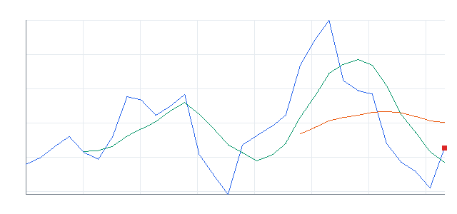

# Daily Trading Thesis Report

**REAL DATA TEST - 가격/거래량은 실제 데이터, 뉴스/옵션/ETF 구성종목 확산도 등은 아직 미연결**

**목적:** 이 리포트는 최근 오른 자산을 나열하는 것이 아니라, 돈이 몰리는 근거와 다음 매수 주체가 확인되는 트레이딩 후보를 찾기 위한 보고서다.

생성 시각: 2026년 6월 2일 화요일 오전 11:14

> 핵심 질문: 현재 가격에서 살까, 누가 왜 더 비싸게 사줄 수 있는가?

뉴스/옵션/ETF 구성종목 확산도/스프레드 데이터는 아직 미연결이다. 따라서 reasonConfidence는 가격/거래량/관련 ETF 강도 기준으로만 산정하며 HIGH를 사용하지 않는다.

## 오늘의 결론

- 데이터 모드: REAL_TEST
- 시장 상태: 위험선호
- 강한 테마 TOP 3: AI 소프트웨어(70), AI 반도체(68), 반도체 공급망(68)
- ETF 후보 TOP 5: HACK, IGV, AIQ, CIBR, IPO
- 개별 종목보다 ETF가 더 나은 테마: 반도체/기술 ETF, 성장/테마 ETF, 비트코인 ETF
- 과열 주의 후보: HACK(낮음~중간), AIQ(낮음~중간), CIBR(낮음~중간), IPO(낮음~중간), IHAK(중간)
- 오늘 꼭 확인할 조건 3개: 상대 거래량 1.0배 유지 / 20일선 이탈 여부 / 추격 매수 금지 구간 확인

## 오늘 실제 행동 후보

### 1. [HACK] Amplify Cybersecurity ETF
- 자산 유형: ETF
- 현재 돈이 몰린다고 보는 이유: 20일 +29.98%, 5일 +10.70%, 상대 거래량 1.56배로 가격과 거래량이 함께 개선
- 누가 더 비싸게 사줄 수 있는지: 섹터 베타를 사려는 단기 모멘텀 자금과 리밸런싱 자금
- 진입 조건: 전일 고점 돌파 후 5일선 위 유지
- 무효화 조건: 20일선 이탈 또는 상대 거래량 0.8배 이하 둔화
- reasonConfidence: MEDIUM
- todayActionLabel: ETF 우선
- moneyFlowScore: 95
- 과열 리스크: 낮음~중간
- 차트: 

### 2. [IGV] iShares Expanded Tech-Software Sector ETF
- 자산 유형: ETF
- 현재 돈이 몰린다고 보는 이유: 20일 +24.32%, 5일 +14.56%, 상대 거래량 1.82배로 가격과 거래량이 함께 개선
- 누가 더 비싸게 사줄 수 있는지: 섹터 베타를 사려는 단기 모멘텀 자금과 리밸런싱 자금
- 진입 조건: 20일선 위에서 눌림 후 재상승 확인
- 무효화 조건: 20일선 이탈 또는 상대 거래량 0.8배 이하 둔화
- reasonConfidence: MEDIUM
- todayActionLabel: ETF 우선
- moneyFlowScore: 94
- 과열 리스크: 낮음
- 차트: 

### 3. [AIQ] Global X Artificial Intelligence & Technology ETF
- 자산 유형: ETF
- 현재 돈이 몰린다고 보는 이유: 20일 +22.21%, 5일 +10.56%, 상대 거래량 1.59배로 가격과 거래량이 함께 개선
- 누가 더 비싸게 사줄 수 있는지: 섹터 베타를 사려는 단기 모멘텀 자금과 리밸런싱 자금
- 진입 조건: 전일 고점 돌파 후 5일선 위 유지
- 무효화 조건: 20일선 이탈 또는 상대 거래량 0.8배 이하 둔화
- reasonConfidence: MEDIUM
- todayActionLabel: ETF 우선
- moneyFlowScore: 89
- 과열 리스크: 낮음~중간
- 차트: 

## 오늘의 시장 상태

**위험선호**

REAL_TEST 가격/거래량은 yfinance에서 수집했다. 뉴스/옵션/ETF 구성종목 확산도/스프레드 데이터는 아직 미연결이다.

## 오늘 돈이 몰리는 테마

- **AI 소프트웨어**: PLTR | 평균 moneyFlowScore 70
- **AI 반도체**: NVDA | 평균 moneyFlowScore 68
- **반도체 공급망**: TSM | 평균 moneyFlowScore 68
- **AI 플랫폼**: MSFT | 평균 moneyFlowScore 63
- **반도체/기술 ETF**: DRAM, SMH, SOXX, SOXQ | 평균 moneyFlowScore 44
- **성장/테마 ETF**: IGV, AIQ, BOTZ, ROBO, CIBR, HACK | 평균 moneyFlowScore 34

## ETF 카드

### [ETF HACK] Amplify Cybersecurity ETF
- 카테고리: 성장/테마 ETF
- 상태: 진입 가능
- moneyFlowScore: 95
- 과열 리스크: 낮음~중간
- reasonConfidence: MEDIUM
- whyMoneyIsFlowing: 20일 +29.98%, 5일 +10.70%, 상대 거래량 1.56배로 가격과 거래량이 함께 개선
- likelyNextBuyer: 섹터 베타를 사려는 단기 모멘텀 자금과 리밸런싱 자금
- whyThisCouldTradeHigher: 52주 고점 부근이라 돌파가 확인되면 신고가 추종 매수가 붙을 수 있음
- 진입 조건: 전일 고점 돌파 후 5일선 위 유지
- 무효화 조건: 20일선 이탈 또는 상대 거래량 0.8배 이하 둔화
- 차트 요약: 최근 20거래일 우상향, 5일선이 20일선 위에 있음
- 차트: 
- 기준일 2026-06-01 | 종가 $105 | 1일 +5.69% | 5일 +10.70% | 20일 +29.98% | 상대 거래량 1.56배 | 52주 고점 대비 -0.38% | 데이터 소스: yfinance

### [ETF IGV] iShares Expanded Tech-Software Sector ETF
- 카테고리: 성장/테마 ETF
- 상태: 진입 가능
- moneyFlowScore: 94
- 과열 리스크: 낮음
- reasonConfidence: MEDIUM
- whyMoneyIsFlowing: 20일 +24.32%, 5일 +14.56%, 상대 거래량 1.82배로 가격과 거래량이 함께 개선
- likelyNextBuyer: 섹터 베타를 사려는 단기 모멘텀 자금과 리밸런싱 자금
- whyThisCouldTradeHigher: 단기 추세가 유지되고 거래량이 1.0배 이상이면 되돌림 이후 재상승을 시도할 수 있음
- 진입 조건: 20일선 위에서 눌림 후 재상승 확인
- 무효화 조건: 20일선 이탈 또는 상대 거래량 0.8배 이하 둔화
- 차트 요약: 최근 20거래일 우상향, 5일선이 20일선 위에 있음
- 차트: 
- 기준일 2026-06-01 | 종가 $107.7 | 1일 +5.94% | 5일 +14.56% | 20일 +24.32% | 상대 거래량 1.82배 | 52주 고점 대비 -8.72% | 데이터 소스: yfinance

### [ETF AIQ] Global X Artificial Intelligence & Technology ETF
- 카테고리: 성장/테마 ETF
- 상태: 진입 가능
- moneyFlowScore: 89
- 과열 리스크: 낮음~중간
- reasonConfidence: MEDIUM
- whyMoneyIsFlowing: 20일 +22.21%, 5일 +10.56%, 상대 거래량 1.59배로 가격과 거래량이 함께 개선
- likelyNextBuyer: 섹터 베타를 사려는 단기 모멘텀 자금과 리밸런싱 자금
- whyThisCouldTradeHigher: 52주 고점 부근이라 돌파가 확인되면 신고가 추종 매수가 붙을 수 있음
- 진입 조건: 전일 고점 돌파 후 5일선 위 유지
- 무효화 조건: 20일선 이탈 또는 상대 거래량 0.8배 이하 둔화
- 차트 요약: 최근 20거래일 우상향, 5일선이 20일선 위에 있음
- 차트: 
- 기준일 2026-06-01 | 종가 $69.44 | 1일 +3.15% | 5일 +10.56% | 20일 +22.21% | 상대 거래량 1.59배 | 52주 고점 대비 -0.56% | 데이터 소스: yfinance

### [ETF CIBR] First Trust NASDAQ Cybersecurity ETF
- 카테고리: 성장/테마 ETF
- 상태: 진입 가능
- moneyFlowScore: 89
- 과열 리스크: 낮음~중간
- reasonConfidence: MEDIUM
- whyMoneyIsFlowing: 20일 +36.93%, 5일 +11.71%, 상대 거래량 1.45배로 가격과 거래량이 함께 개선
- likelyNextBuyer: 섹터 베타를 사려는 단기 모멘텀 자금과 리밸런싱 자금
- whyThisCouldTradeHigher: 52주 고점 부근이라 돌파가 확인되면 신고가 추종 매수가 붙을 수 있음
- 진입 조건: 전일 고점 돌파 후 5일선 위 유지
- 무효화 조건: 20일선 이탈 또는 상대 거래량 0.8배 이하 둔화
- 차트 요약: 최근 20거래일 우상향, 5일선이 20일선 위에 있음
- 차트: 
- 기준일 2026-06-01 | 종가 $94.15 | 1일 +5.74% | 5일 +11.71% | 20일 +36.93% | 상대 거래량 1.45배 | 52주 고점 대비 -0.17% | 데이터 소스: yfinance

### [ETF IPO] Renaissance IPO ETF
- 카테고리: 성장/테마 ETF
- 상태: 진입 가능
- moneyFlowScore: 81
- 과열 리스크: 낮음~중간
- reasonConfidence: MEDIUM
- whyMoneyIsFlowing: 20일 +17.01%, 5일 +9.54%, 상대 거래량 2.35배로 가격과 거래량이 함께 개선
- likelyNextBuyer: 섹터 베타를 사려는 단기 모멘텀 자금과 리밸런싱 자금
- whyThisCouldTradeHigher: 52주 고점 부근이라 돌파가 확인되면 신고가 추종 매수가 붙을 수 있음
- 진입 조건: 전일 고점 돌파 후 5일선 위 유지
- 무효화 조건: 20일선 이탈 또는 상대 거래량 0.8배 이하 둔화
- 차트 요약: 최근 20거래일 우상향, 5일선이 20일선 위에 있음
- 차트: 
- 기준일 2026-06-01 | 종가 $58.12 | 1일 +2.69% | 5일 +9.54% | 20일 +17.01% | 상대 거래량 2.35배 | 52주 고점 대비 -1.06% | 데이터 소스: yfinance

## ETF 과열 주의 후보

### [HACK] Amplify Cybersecurity ETF
- 과열 리스크: 낮음~중간
- 이유: 성장/테마 ETF 기준 단기 급등과 고점 근접 조합 확인
- moneyFlowScore: 95

### [AIQ] Global X Artificial Intelligence & Technology ETF
- 과열 리스크: 낮음~중간
- 이유: 성장/테마 ETF 기준 단기 급등과 고점 근접 조합 확인
- moneyFlowScore: 89

### [CIBR] First Trust NASDAQ Cybersecurity ETF
- 과열 리스크: 낮음~중간
- 이유: 성장/테마 ETF 기준 단기 급등과 고점 근접 조합 확인
- moneyFlowScore: 89

## 진입 후보

- **PLTR Palantir** | 상태: 진입 후보 | moneyFlowScore: 70 | 관련 ETF: IGV, AIQ, CIBR, QQQ
- **NVDA NVIDIA** | 상태: 진입 후보 | moneyFlowScore: 68 | 관련 ETF: SMH, SOXX, SOXQ, AIQ, QQQ
- **TSM Taiwan Semiconductor** | 상태: 진입 후보 | moneyFlowScore: 68 | 관련 ETF: SMH, SOXX, SOXQ

## 보유 유지 후보

- **MSFT Microsoft** | 상태: 보유 유지 | 보유 정보 미입력 - 기존 mock 진입가/수익률은 실전 판단에 사용하지 않음
- **AAPL Apple** | 상태: 매매 금지 | 보유 정보 미입력 - 기존 mock 진입가/수익률은 실전 판단에 사용하지 않음

## 청산/주의 후보

- **XOM Exxon Mobil** | 상태: 매매 금지 | 거래량 회복 실패
- **AAPL Apple** | 상태: 매매 금지 | 거래량 회복 실패

## 종목별 상승 근거

### [NVDA] NVIDIA
- 상태: 진입 후보
- primaryTheme: AI 반도체
- primarySector: 반도체
- 관련 ETF: SMH, SOXX, SOXQ, AIQ, QQQ
- moneyFlowScore: 68
- 과열 리스크: 낮음
- reasonConfidence: MEDIUM
- whyMoneyIsFlowing: 20일 +13.06%, 5일 +4.19%, 상대 거래량 1.16배로 가격과 거래량이 함께 개선
- likelyNextBuyer: 개별 주도주를 따라붙는 단기 모멘텀 자금과 관련 ETF 강세를 확인한 스윙 트레이더
- whyThisCouldTradeHigher: 단기 추세가 유지되고 거래량이 1.0배 이상이면 되돌림 이후 재상승을 시도할 수 있음
- 진입 조건: 20일선 위에서 눌림 후 재상승 확인
- 무효화 조건: 20일선 이탈 또는 상대 거래량 0.8배 이하 둔화
- 차트 요약: 단기 추세는 중립
- 차트: 
- 기준일 2026-06-01 | 종가 $224.36 | 1일 +6.26% | 5일 +4.19% | 20일 +13.06% | 상대 거래량 1.16배 | 52주 고점 대비 -5.15% | 데이터 소스: yfinance

### [TSM] Taiwan Semiconductor
- 상태: 진입 후보
- primaryTheme: 반도체 공급망
- primarySector: 반도체
- 관련 ETF: SMH, SOXX, SOXQ
- moneyFlowScore: 68
- 과열 리스크: 낮음~중간
- reasonConfidence: MEDIUM
- whyMoneyIsFlowing: 20일 +9.55%, 5일 +7.69%, 상대 거래량 1.35배로 가격과 거래량이 함께 개선
- likelyNextBuyer: 개별 주도주를 따라붙는 단기 모멘텀 자금과 관련 ETF 강세를 확인한 스윙 트레이더
- whyThisCouldTradeHigher: 52주 고점 부근이라 돌파가 확인되면 신고가 추종 매수가 붙을 수 있음
- 진입 조건: 전일 고점 돌파 후 5일선 위 유지
- 무효화 조건: 20일선 이탈 또는 상대 거래량 0.8배 이하 둔화
- 차트 요약: 최근 20거래일 우상향, 5일선이 20일선 위에 있음
- 차트: 
- 기준일 2026-06-01 | 종가 $435.63 | 1일 +4.11% | 5일 +7.69% | 20일 +9.55% | 상대 거래량 1.35배 | 52주 고점 대비 -3.06% | 데이터 소스: yfinance

### [PLTR] Palantir
- 상태: 진입 후보
- primaryTheme: AI 소프트웨어
- primarySector: 소프트웨어
- 관련 ETF: IGV, AIQ, CIBR, QQQ
- moneyFlowScore: 70
- 과열 리스크: 낮음
- reasonConfidence: MEDIUM
- whyMoneyIsFlowing: 20일 +11.51%, 5일 +17.37%, 상대 거래량 1.22배로 가격과 거래량이 함께 개선
- likelyNextBuyer: 개별 주도주를 따라붙는 단기 모멘텀 자금과 관련 ETF 강세를 확인한 스윙 트레이더
- whyThisCouldTradeHigher: 단기 추세가 유지되고 거래량이 1.0배 이상이면 되돌림 이후 재상승을 시도할 수 있음
- 진입 조건: 20일선 위에서 눌림 후 재상승 확인
- 무효화 조건: 20일선 이탈 또는 상대 거래량 0.8배 이하 둔화
- 차트 요약: 최근 20거래일 우상향, 5일선이 20일선 위에 있음
- 차트: 
- 기준일 2026-06-01 | 종가 $160.65 | 1일 +2.63% | 5일 +17.37% | 20일 +11.51% | 상대 거래량 1.22배 | 52주 고점 대비 -22.59% | 데이터 소스: yfinance

### [XOM] Exxon Mobil
- 상태: 매매 금지
- primaryTheme: 전통 에너지
- primarySector: 에너지
- 관련 ETF: XLE, OIH
- moneyFlowScore: 0
- 과열 리스크: 낮음
- reasonConfidence: LOW
- whyMoneyIsFlowing: 최근 수익률은 확인되지만 상대 거래량 0.93배라 신규 자금 유입 강도는 약함
- likelyNextBuyer: 개별 주도주를 따라붙는 단기 모멘텀 자금과 관련 ETF 강세를 확인한 스윙 트레이더
- whyThisCouldTradeHigher: 단기 추세가 유지되고 거래량이 1.0배 이상이면 되돌림 이후 재상승을 시도할 수 있음
- 진입 조건: 상대 거래량 1.0배 회복 후 관찰
- 무효화 조건: 거래량 회복 실패
- 차트 요약: 20일선 아래라 추세 확인 전까지 보수적 접근
- 차트: 
- 기준일 2026-06-01 | 종가 $149.38 | 1일 +2.84% | 5일 -3.58% | 20일 -2.21% | 상대 거래량 0.93배 | 52주 고점 대비 -15.32% | 데이터 소스: yfinance

### [MSFT] Microsoft
- 상태: 보유 유지
- primaryTheme: AI 플랫폼
- primarySector: 메가캡 기술
- 관련 ETF: QQQ, MAGS, IGV, AIQ
- moneyFlowScore: 63
- 과열 리스크: 낮음
- reasonConfidence: MEDIUM
- whyMoneyIsFlowing: 20일 +11.12%, 5일 +10.02%, 상대 거래량 1.45배로 가격과 거래량이 함께 개선
- likelyNextBuyer: 개별 주도주를 따라붙는 단기 모멘텀 자금과 관련 ETF 강세를 확인한 스윙 트레이더
- whyThisCouldTradeHigher: 단기 추세가 유지되고 거래량이 1.0배 이상이면 되돌림 이후 재상승을 시도할 수 있음
- 진입 조건: 20일선 위에서 눌림 후 재상승 확인
- 무효화 조건: 20일선 이탈 또는 상대 거래량 0.8배 이하 둔화
- 보유 정보: 보유 정보 미입력 - 기존 mock 진입가/수익률은 실전 판단에 사용하지 않음
- 차트 요약: 최근 20거래일 우상향, 5일선이 20일선 위에 있음
- 차트: 
- 기준일 2026-06-01 | 종가 $460.52 | 1일 +2.28% | 5일 +10.02% | 20일 +11.12% | 상대 거래량 1.45배 | 52주 고점 대비 -17.09% | 데이터 소스: yfinance

### [AAPL] Apple
- 상태: 매매 금지
- primaryTheme: 메가캡 기술
- primarySector: 소비자 기술
- 관련 ETF: QQQ, MAGS, SPY
- moneyFlowScore: 12
- 과열 리스크: 낮음
- reasonConfidence: LOW
- whyMoneyIsFlowing: 최근 수익률은 확인되지만 상대 거래량 0.93배라 신규 자금 유입 강도는 약함
- likelyNextBuyer: 개별 주도주를 따라붙는 단기 모멘텀 자금과 관련 ETF 강세를 확인한 스윙 트레이더
- whyThisCouldTradeHigher: 52주 고점 부근이라 돌파가 확인되면 신고가 추종 매수가 붙을 수 있음
- 진입 조건: 상대 거래량 1.0배 회복 후 관찰
- 무효화 조건: 거래량 회복 실패
- 보유 정보: 보유 정보 미입력 - 기존 mock 진입가/수익률은 실전 판단에 사용하지 않음
- 차트 요약: 20일선 위에서 단기 눌림 확인 구간
- 차트: 
- 기준일 2026-06-01 | 종가 $306.31 | 1일 -1.84% | 5일 -0.81% | 20일 +9.34% | 상대 거래량 0.93배 | 52주 고점 대비 -2.76% | 데이터 소스: yfinance

## 감시 ETF 목록

| 티커 | 카테고리 | moneyFlowScore | 상태 | reasonConfidence | 한 줄 이유 |
| --- | --- | ---: | --- | --- | --- |
| DRAM | 반도체/기술 ETF | 57 | 관찰 | LOW | 최근 수익률은 확인되지만 상대 거래량 0.96배라 신규 자금 유입 강도는 약함 |
| SMH | 반도체/기술 ETF | 38 | 관찰 | LOW | 최근 수익률은 확인되지만 상대 거래량 0.83배라 신규 자금 유입 강도는 약함 |
| SOXX | 반도체/기술 ETF | 41 | 관찰 | LOW | 최근 수익률은 확인되지만 상대 거래량 0.80배라 신규 자금 유입 강도는 약함 |
| SOXQ | 반도체/기술 ETF | 41 | 관찰 | LOW | 최근 수익률은 확인되지만 상대 거래량 0.89배라 신규 자금 유입 강도는 약함 |
| IGV | 성장/테마 ETF | 94 | 진입 가능 | MEDIUM | 20일 +24.32%, 5일 +14.56%, 상대 거래량 1.82배로 가격과 거래량이 함께 개선 |
| AIQ | 성장/테마 ETF | 89 | 진입 가능 | MEDIUM | 20일 +22.21%, 5일 +10.56%, 상대 거래량 1.59배로 가격과 거래량이 함께 개선 |
| BOTZ | 성장/테마 ETF | 31 | 매매 금지 | LOW | 20일 +5.18%, 5일 +0.77%, 상대 거래량 1.13배로 가격과 거래량이 함께 개선 |
| ROBO | 성장/테마 ETF | 49 | 관찰 | MEDIUM | 20일 +9.31%, 5일 +2.60%, 상대 거래량 1.03배로 가격과 거래량이 함께 개선 |
| CIBR | 성장/테마 ETF | 89 | 진입 가능 | MEDIUM | 20일 +36.93%, 5일 +11.71%, 상대 거래량 1.45배로 가격과 거래량이 함께 개선 |
| HACK | 성장/테마 ETF | 95 | 진입 가능 | MEDIUM | 20일 +29.98%, 5일 +10.70%, 상대 거래량 1.56배로 가격과 거래량이 함께 개선 |
| IHAK | 성장/테마 ETF | 73 | 관찰 | MEDIUM | 20일 +27.66%, 5일 +8.91%, 상대 거래량 1.11배로 가격과 거래량이 함께 개선 |
| ITA | 방산 ETF | 32 | 매매 금지 | LOW | 20일 +6.31%, 5일 +2.01%, 상대 거래량 1.14배로 가격과 거래량이 함께 개선 |
| XAR | 방산 ETF | 44 | 관찰 | LOW | 20일 +9.19%, 5일 +3.25%, 상대 거래량 1.70배로 가격과 거래량이 함께 개선 |
| SHLD | 방산 ETF | 2 | 매매 금지 | LOW | 20일 -3.39%, 5일 +0.72%, 상대 거래량 1.03배로 가격과 거래량이 함께 개선 |
| PPA | 방산 ETF | 30 | 매매 금지 | LOW | 20일 +4.84%, 5일 +1.97%, 상대 거래량 1.35배로 가격과 거래량이 함께 개선 |
| PAVE | 성장/테마 ETF | 5 | 매매 금지 | LOW | 최근 수익률은 확인되지만 상대 거래량 0.69배라 신규 자금 유입 강도는 약함 |
| GRID | 성장/테마 ETF | 6 | 매매 금지 | LOW | 최근 수익률은 확인되지만 상대 거래량 0.91배라 신규 자금 유입 강도는 약함 |
| IFRA | 성장/테마 ETF | 0 | 매매 금지 | LOW | 최근 수익률은 확인되지만 상대 거래량 0.83배라 신규 자금 유입 강도는 약함 |
| XLU | 성장/테마 ETF | 0 | 매매 금지 | LOW | 20일 -7.41%, 5일 -4.96%, 상대 거래량 1.44배로 가격과 거래량이 함께 개선 |
| URA | 성장/테마 ETF | 0 | 매매 금지 | LOW | 최근 수익률은 확인되지만 상대 거래량 0.78배라 신규 자금 유입 강도는 약함 |
| NLR | 성장/테마 ETF | 0 | 매매 금지 | LOW | 최근 수익률은 확인되지만 상대 거래량 0.77배라 신규 자금 유입 강도는 약함 |
| LIT | 성장/테마 ETF | 20 | 매매 금지 | LOW | 20일 -2.96%, 5일 +0.95%, 상대 거래량 2.08배로 가격과 거래량이 함께 개선 |
| COPX | 성장/테마 ETF | 32 | 매매 금지 | LOW | 최근 수익률은 확인되지만 상대 거래량 0.87배라 신규 자금 유입 강도는 약함 |
| XME | 성장/테마 ETF | 26 | 매매 금지 | LOW | 최근 수익률은 확인되지만 상대 거래량 0.88배라 신규 자금 유입 강도는 약함 |
| XLE | 성장/테마 ETF | 10 | 매매 금지 | LOW | 20일 -2.63%, 5일 -3.68%, 상대 거래량 1.32배로 가격과 거래량이 함께 개선 |
| OIH | 성장/테마 ETF | 0 | 매매 금지 | LOW | 최근 수익률은 확인되지만 상대 거래량 0.87배라 신규 자금 유입 강도는 약함 |
| ARKK | 성장/테마 ETF | 8 | 매매 금지 | LOW | 최근 수익률은 확인되지만 상대 거래량 0.87배라 신규 자금 유입 강도는 약함 |
| IPO | 성장/테마 ETF | 81 | 진입 가능 | MEDIUM | 20일 +17.01%, 5일 +9.54%, 상대 거래량 2.35배로 가격과 거래량이 함께 개선 |
| KWEB | 성장/테마 ETF | 0 | 매매 금지 | LOW | 최근 수익률은 확인되지만 상대 거래량 0.62배라 신규 자금 유입 강도는 약함 |
| MAGS | 성장/테마 ETF | 34 | 매매 금지 | LOW | 20일 +4.47%, 5일 +0.72%, 상대 거래량 1.60배로 가격과 거래량이 함께 개선 |
| QQQ | 시장 기준 ETF | 23 | 매매 금지 | LOW | 최근 수익률은 확인되지만 상대 거래량 0.81배라 신규 자금 유입 강도는 약함 |
| SPY | 시장 기준 ETF | 13 | 매매 금지 | LOW | 최근 수익률은 확인되지만 상대 거래량 0.82배라 신규 자금 유입 강도는 약함 |
| IWM | 시장 기준 ETF | 9 | 매매 금지 | LOW | 최근 수익률은 확인되지만 상대 거래량 0.87배라 신규 자금 유입 강도는 약함 |
| TLT | 채권 ETF | 0 | 매매 금지 | LOW | 최근 수익률은 확인되지만 상대 거래량 0.94배라 신규 자금 유입 강도는 약함 |
| GLD | 금 ETF | 0 | 매매 금지 | LOW | 최근 수익률은 확인되지만 상대 거래량 0.99배라 신규 자금 유입 강도는 약함 |
| IBIT | 비트코인 ETF | 0 | 매매 금지 | LOW | 20일 -8.95%, 5일 -5.75%, 상대 거래량 1.36배로 가격과 거래량이 함께 개선 |
| BLOK | 비트코인 ETF | 58 | 진입 후보 | MEDIUM | 20일 +14.36%, 5일 +7.53%, 상대 거래량 1.38배로 가격과 거래량이 함께 개선 |

## 진입 조건

- **HACK**: 전일 고점 돌파 후 5일선 위 유지
- **IGV**: 20일선 위에서 눌림 후 재상승 확인
- **AIQ**: 전일 고점 돌파 후 5일선 위 유지

## 무효화 조건

- **HACK**: 20일선 이탈 또는 상대 거래량 0.8배 이하 둔화
- **IGV**: 20일선 이탈 또는 상대 거래량 0.8배 이하 둔화
- **AIQ**: 20일선 이탈 또는 상대 거래량 0.8배 이하 둔화

## 내일 확인할 것
- 오늘 실제 행동 후보의 상대 거래량이 1.0배 이상 유지되는지 확인
- ETF 후보 TOP 5가 20일선 위에서 유지되는지 확인
- 뉴스/옵션/ETF 구성종목 확산도 데이터가 연결되기 전까지 HIGH confidence를 사용하지 않기
