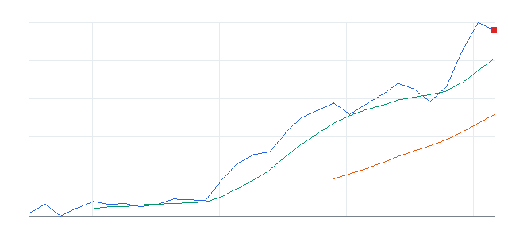
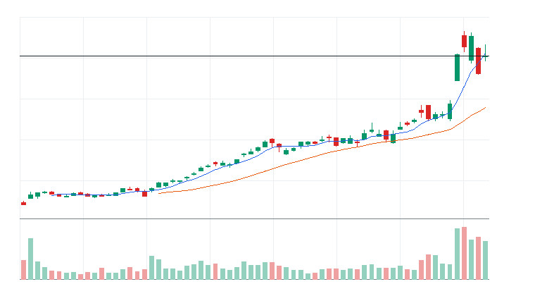
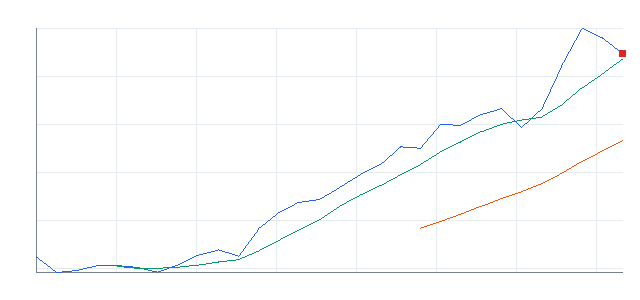
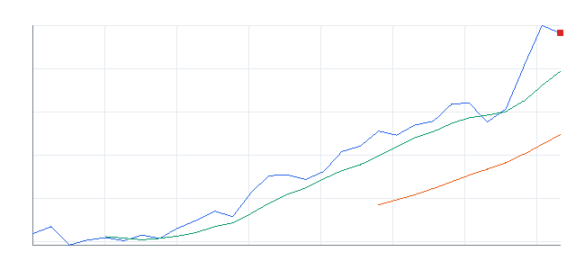
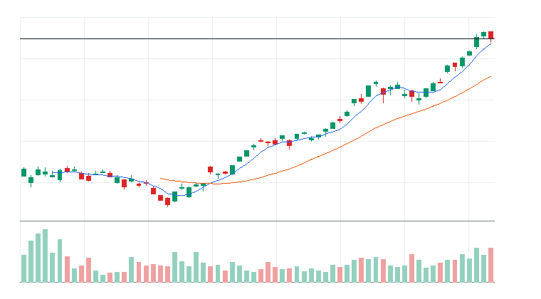
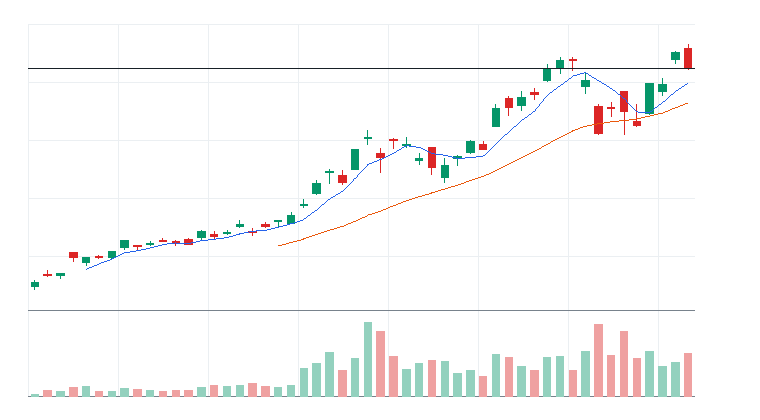
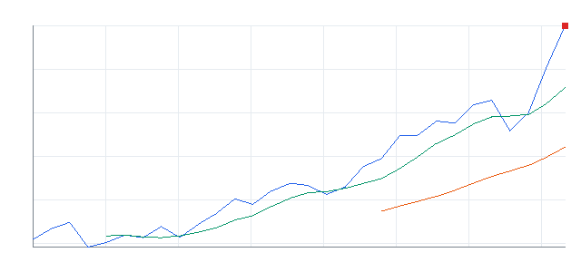
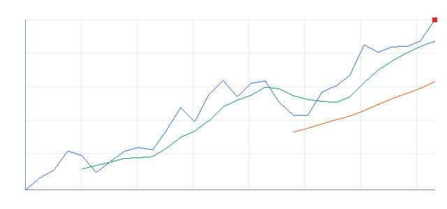
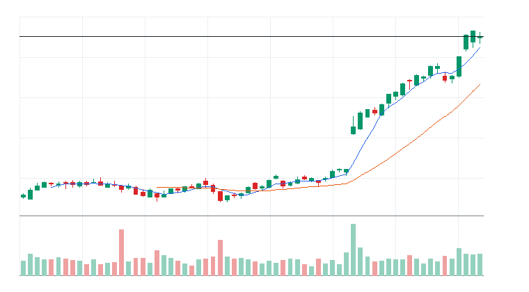

# 오늘의 데일리 트레이딩 요약

**REAL DATA TEST - 가격/거래량은 실제 데이터, 뉴스 연결, ETF 구성종목 확산도/스프레드/유동성 일부 연결**

**목적:** 이 리포트는 최근 오른 자산을 나열하는 것이 아니라, 돈이 몰리는 근거와 다음 매수 주체가 확인할 트레이딩 후보를 찾기 위한 보고서다.

> 핵심 질문: 현재 가격에서 누가 사고 있고, 누가 앞으로 더 비싸게 사줄 수 있는가?

## 모바일 요약

[오늘의 데일리 트레이딩 요약]

생성 성공 / 데이터 모드: REAL_TEST

시장:
- 위험선호

시장 지배 서사:
1. AI 소프트웨어/사이버보안 확산 - 부상 - AIQ, CIBR, PANW, CRWD 중심으로 5일 +10.18%, 20일 +30.56% 흐름이 형성됨. 직접 촉매 일부 확인.
2. AI 인프라 재가속 - 지배 - DRAM, SOXQ, AVGO, ARM 중심으로 5일 +9.04%, 20일 +38.03% 흐름이 형성됨. 직접 촉매 일부 확인.
3. 위험선호 성장주 재진입 - 관찰 - IPO, QQQ, ARM, TSLA 중심으로 5일 +5.07%, 20일 +20.29% 흐름이 형성됨. 직접 촉매 일부 확인.

오늘 결론:
- 사이버보안 개별 종목 흐름이 ETF 대비 강한지 확인 필요
- 행동 후보는 linkedNarrative와 함께 확인한다.
- 추격보다 진입 조건 확인 후 접근한다.

오늘 실제 행동 후보:
1. PANW(STOCK) - AI 소프트웨어/사이버보안 확산 - 52주 고점 부근이라 돌파가 확인되면 신고가 추종 매수가 붙을 수 있음
2. MRVL(STOCK) - AI 인프라 재가속 - 52주 고점 부근이라 돌파가 확인되면 신고가 추종 매수가 붙을 수 있음
3. CRWD(STOCK) - AI 소프트웨어/사이버보안 확산 - 52주 고점 부근이라 돌파가 확인되면 신고가 추종 매수가 붙을 수 있음

ETF 후보 TOP 5:
1. CIBR - AI 소프트웨어/사이버보안 확산 - ETF 우선
2. AIQ - AI 소프트웨어/사이버보안 확산 - ETF 우선
3. DRAM - AI 인프라 재가속 - ETF 우선
4. HACK - AI 소프트웨어/사이버보안 확산 - ETF 우선
5. SOXQ - AI 인프라 재가속 - 돌파 확인 후 관찰

웹 리포트:
https://yoolcool.github.io/DailyTradingThesisAgent/

## 0. 시장 상태

- 데이터 모드: REAL_TEST
- 가격/거래량: 연결됨
- 뉴스: 연결됨
- ETF 구성종목 확산도: 일부 연결
- 스프레드/유동성: 일부 연결
- 생성 시각: 2026년 6월 3일 수요일 오후 4:20
- 시장 상태: 위험선호
- 오늘 돈의 방향: 사이버보안 개별 종목 흐름이 ETF 대비 강한지 확인 필요
- 강한 테마 TOP 3: 메모리/HBM ETF(100), AI 소프트웨어 ETF(100), 클라우드/엔터프라이즈 소프트웨어 ETF(96)
- 데이터 한계:
  - API 또는 provider 상태에 따라 뉴스/ETF 확산도/스프레드 반영 범위가 달라질 수 있다.
  - 수집 실패 데이터는 점수 반영에서 제외하거나 confidence를 제한한다.
  - reasonConfidence HIGH는 직접 촉매, 가격/거래량, 확산도/유동성 근거가 함께 있을 때만 사용한다.

## 오늘 시장을 지배하는 서사

### 오늘 시장을 지배하는 서사 TOP 3

#### 1. AI 소프트웨어/사이버보안 확산
- 상태: 부상
- narrativeScore: 97
- reasonConfidence: MEDIUM
- 근거 ETF: AIQ, CIBR, HACK, IGV, IHAK
- 근거 개별 종목: PANW, CRWD, DDOG, MSFT, TEAM
- 돈이 몰리는 이유: AI 소프트웨어/사이버보안 확산 관련 AIQ, CIBR, HACK와 PANW, CRWD, DDOG, MSFT의 5일(+10.18%)·20일(+30.56%) 흐름을 함께 본다. 평균 상대 거래량은 1.26배이고, ETF 확산도도 이를 보조한다. 직접 뉴스/이벤트가 일부 확인된다.
- 다음 매수 주체: 섹터 베타를 사는 ETF 자금, AI/보안 실적 기대를 사는 스윙 트레이더, 신고가 추종 자금
- 가장 좋은 트레이딩 수단: ETF 우선: IGV, CIBR, AIQ / 개별 종목 우선: PANW, CRWD, DDOG
- 서사가 깨지는 조건: IGV/CIBR 20일선 이탈, 관련 개별 종목 절반 이상 5일선 이탈, 상대 거래량 둔화
- 오늘 행동: 추격보다 눌림 후 재상승 확인

상세 narrativeScore 근거 보기

- rawScore: 97
- ETF 평균 moneyFlowScore: 96
- 개별 종목 평균 moneyFlowScore: 60
- ETF 후보 비율: 100%
- 개별 종목 후보 비율: 43%
- 5일 평균 수익률: +10.00%
- 20일 평균 수익률: +31.00%
- 평균 상대 거래량: 1.00배
- 52주 고점 근접 후보 비율: 58%
- 뉴스 직접성 점수: 7
- ETF 확산도 점수: 6
- 유동성 점수: 1
- 과열 리스크 차감: 0

#### 2. AI 인프라 재가속
- 상태: 지배
- narrativeScore: 90
- reasonConfidence: HIGH
- 근거 ETF: DRAM, SOXQ, SOXX, SMH, PAVE
- 근거 개별 종목: AVGO, ARM, MU, NVDA, AMD
- 돈이 몰리는 이유: AI 인프라 재가속 관련 DRAM, SOXQ, SOXX와 AVGO, ARM, MU, NVDA의 5일(+9.04%)·20일(+38.03%) 흐름을 함께 본다. 평균 상대 거래량은 1.02배이고, ETF 확산도도 이를 보조한다. 직접 뉴스/이벤트가 일부 확인된다.
- 다음 매수 주체: AI 인프라 CAPEX를 사는 반도체/전력망 ETF 자금과 신고가 모멘텀 추종 자금
- 가장 좋은 트레이딩 수단: ETF 우선: SMH, SOXX, DRAM / 개별 종목 우선: NVDA, AVGO, MU
- 서사가 깨지는 조건: SMH/SOXX 20일선 이탈, 관련 반도체와 전력 인프라 종목 절반 이상 5일선 이탈
- 오늘 행동: 추격보다 5일선 지지 후 재상승 확인

상세 narrativeScore 근거 보기

- rawScore: 90
- ETF 평균 moneyFlowScore: 76
- 개별 종목 평균 moneyFlowScore: 82
- ETF 후보 비율: 33%
- 개별 종목 후보 비율: 60%
- 5일 평균 수익률: +9.00%
- 20일 평균 수익률: +38.00%
- 평균 상대 거래량: 1.00배
- 52주 고점 근접 후보 비율: 82%
- 뉴스 직접성 점수: 8
- ETF 확산도 점수: 4
- 유동성 점수: 4
- 과열 리스크 차감: -1

#### 3. 위험선호 성장주 재진입
- 상태: 관찰
- narrativeScore: 63
- reasonConfidence: MEDIUM
- 근거 ETF: IPO, QQQ, ARKK
- 근거 개별 종목: ARM, TSLA
- 돈이 몰리는 이유: 위험선호 성장주 재진입 관련 IPO, QQQ, ARKK와 ARM, TSLA의 5일(+5.07%)·20일(+20.29%) 흐름을 함께 본다. 평균 상대 거래량은 0.98배이고, ETF 확산도도 이를 보조한다. 직접 뉴스/이벤트가 일부 확인된다.
- 다음 매수 주체: 위험선호 회복을 사는 성장주 ETF 자금과 고베타 단기 모멘텀 자금
- 가장 좋은 트레이딩 수단: ETF 우선: QQQ, IPO, ARKK / 개별 종목 우선: ARM, TSLA
- 서사가 깨지는 조건: QQQ/IWM 동반 약화, 고베타 성장주 상대 거래량 둔화
- 오늘 행동: 지수 위험선호가 유지될 때만 선별 진입

상세 narrativeScore 근거 보기

- rawScore: 63
- ETF 평균 moneyFlowScore: 45
- 개별 종목 평균 moneyFlowScore: 50
- ETF 후보 비율: 20%
- 개별 종목 후보 비율: 50%
- 5일 평균 수익률: +5.00%
- 20일 평균 수익률: +20.00%
- 평균 상대 거래량: 1.00배
- 52주 고점 근접 후보 비율: 57%
- 뉴스 직접성 점수: 8
- ETF 확산도 점수: 2
- 유동성 점수: 2
- 과열 리스크 차감: 0

### 전체 narrative 요약

| 서사명 | 상태 | narrativeScore | reasonConfidence | 대표 ETF | 대표 종목 | 오늘 행동 |
| --- | --- | ---: | --- | --- | --- | --- |
| AI 소프트웨어/사이버보안 확산 | 부상 | 97 | MEDIUM | AIQ, CIBR, HACK | PANW, CRWD, DDOG, MSFT | 추격보다 눌림 후 재상승 확인 |
| AI 인프라 재가속 | 지배 | 90 | HIGH | DRAM, SOXQ, SOXX | AVGO, ARM, MU, NVDA | 추격보다 5일선 지지 후 재상승 확인 |
| 위험선호 성장주 재진입 | 관찰 | 63 | MEDIUM | IPO, QQQ, ARKK | ARM, TSLA | 지수 위험선호가 유지될 때만 선별 진입 |
| 전력망/원전/인프라 병목 | 약화 | 24 | LOW | PAVE, COPX, URA | CEG | ETF 확산도와 거래량이 같이 살아날 때만 진입 |
| 방산/안보 프리미엄 | 약화 | 18 | LOW | ITA, XAR, SHLD | PLTR | 뉴스 촉매가 직접 확인될 때만 추세 추종 |
| 매크로 방어/헤지 | 약화 | 6 | LOW | TLT, GLD, XLE | - | 위험회피가 확인될 때만 헤지성 접근 |
| 비트코인/디지털 자산 위험선호 | 소멸 | 0 | LOW | BLOK, IBIT | MSTR | 비트코인 베타가 살아날 때만 단기 매매 |

## 오늘 실제 행동 후보

### 1. [PANW] Palo Alto Networks Inc.
- 자산 유형: STOCK
- linkedNarrative: AI 소프트웨어/사이버보안 확산
- narrativeStatus: 부상
- narrativeScore: 97
- moneyFlowScore: 100
- finalRawScore: 124
- reasonConfidence: HIGH
- reasonConfidenceExplanation: 직접 촉매: Palo Alto Networks Inc (PANW) Q3 2026 Earnings Call Highlights: Record Growth in Next ... 가격/거래량, 관련 ETF 동반 강세, 유동성 근거가 함께 확인되어 HIGH로 분류했다.
- tieBreakerReason: 최종 원점수 124, 리스크 패널티 0, 5일 수익률 +15.75%, 상대 거래량 2.09배 순으로 정렬
- 직접 촉매: Palo Alto Networks Inc (PANW) Q3 2026 Earnings Call Highlights: Record Growth in Next ...
- 왜 돈이 몰리는가: 20일 +61.02%, 5일 +15.75%, 상대 거래량 2.09배로 가격과 거래량이 함께 개선. 뉴스: Palo Alto Networks Inc (PANW) Q3 2026 Earnings Call Highlights: Record Growth in Next ... / 유동성: LIQUID
- 누가 더 비싸게 사줄 수 있는지: 개별 주도주를 따라붙는 단기 모멘텀 자금과 관련 ETF 강세를 확인한 트레이더
- 진입 조건: 전일 고점 돌파와 5일선 유지 확인
- 무효화 조건: 20일선 이탈 또는 상대 거래량 0.8배 이하 둔화
- todayActionLabel: 개별 종목 우선
- 차트: 

### 2. [MRVL] Marvell Technology Inc.
- 자산 유형: STOCK
- linkedNarrative: AI 인프라 재가속
- narrativeStatus: 지배
- narrativeScore: 90
- moneyFlowScore: 100
- finalRawScore: 115
- reasonConfidence: HIGH
- reasonConfidenceExplanation: 직접 촉매: Gary Black Says Broadcom, Marvell Are 'Big Winners' As Focus Shifts To Custom AI Chips As Nvidia CEO Jensen Huang Touts 'Next Trillion-Dollar Company' 가격/거래량, 관련 ETF 동반 강세, 유동성 근거가 함께 확인되어 HIGH로 분류했다.
- tieBreakerReason: 최종 원점수 115, 리스크 패널티 -16, 5일 수익률 +39.63%, 상대 거래량 3.22배 순으로 정렬
- 직접 촉매: Gary Black Says Broadcom, Marvell Are 'Big Winners' As Focus Shifts To Custom AI Chips As Nvidia CEO Jensen Huang Touts 'Next Trillion-Dollar Company'
- 왜 돈이 몰리는가: 20일 +77.68%, 5일 +39.63%, 상대 거래량 3.22배로 가격과 거래량이 함께 개선. 뉴스: Gary Black Says Broadcom, Marvell Are 'Big Winners' As Focus Shifts To Custom AI Chips As Nvidia CEO Jensen Huang Touts 'Next Trillion-Dollar Company' / 유동성: LIQUID
- 누가 더 비싸게 사줄 수 있는지: 개별 주도주를 따라붙는 단기 모멘텀 자금과 관련 ETF 강세를 확인한 트레이더
- 진입 조건: 전일 고점 돌파와 5일선 유지 확인
- 무효화 조건: 20일선 이탈 또는 상대 거래량 0.8배 이하 둔화
- todayActionLabel: 개별 종목 우선
- 차트: 

### 3. [CRWD] CrowdStrike Holdings Inc.
- 자산 유형: STOCK
- linkedNarrative: AI 소프트웨어/사이버보안 확산
- narrativeStatus: 부상
- narrativeScore: 97
- moneyFlowScore: 100
- finalRawScore: 109
- reasonConfidence: HIGH
- reasonConfidenceExplanation: 직접 촉매: Software Rallies 40% From April Lows as CrowdStrike Earnings Loom 가격/거래량, 관련 ETF 동반 강세, 유동성 근거가 함께 확인되어 HIGH로 분류했다.
- tieBreakerReason: 최종 원점수 109, 리스크 패널티 0, 5일 수익률 +14.50%, 상대 거래량 1.19배 순으로 정렬
- 직접 촉매: Software Rallies 40% From April Lows as CrowdStrike Earnings Loom
- 왜 돈이 몰리는가: 20일 +63.87%, 5일 +14.50%, 상대 거래량 1.19배로 가격과 거래량이 함께 개선. 뉴스: Palo Alto Networks (PANW) Beats Q3 Earnings and Revenue Estimates / 유동성: LIQUID
- 누가 더 비싸게 사줄 수 있는지: 개별 주도주를 따라붙는 단기 모멘텀 자금과 관련 ETF 강세를 확인한 트레이더
- 진입 조건: 전일 고점 돌파와 5일선 유지 확인
- 무효화 조건: 20일선 이탈 또는 상대 거래량 0.8배 이하 둔화
- todayActionLabel: 개별 종목 우선
- 차트: 

## 오늘 돈이 몰리는 테마

- 메모리/HBM ETF: DRAM | 평균 moneyFlowScore 100 | 단일 종목 이벤트보다 테마 단위 자금 흐름이 선명한 구간으로 본다.
- AI 소프트웨어 ETF: AIQ | 평균 moneyFlowScore 100 | 단일 종목 이벤트보다 테마 단위 자금 흐름이 선명한 구간으로 본다.
- 클라우드/엔터프라이즈 소프트웨어 ETF: IGV | 평균 moneyFlowScore 96 | 단일 종목 이벤트보다 테마 단위 자금 흐름이 선명한 구간으로 본다.
- 사이버보안 ETF: CIBR, HACK, IHAK | 평균 moneyFlowScore 95 | 단일 종목 이벤트보다 테마 단위 자금 흐름이 선명한 구간으로 본다.
- 반도체 장비/공급망: LRCX, AMAT, KLAC | 평균 moneyFlowScore 88 | 단일 종목 이벤트보다 테마 단위 자금 흐름이 선명한 구간으로 본다.
- 금속/광산 ETF: XME | 평균 moneyFlowScore 86 | 단일 종목 이벤트보다 테마 단위 자금 흐름이 선명한 구간으로 본다.

## 1. ETF 트레이딩 보고서
### 1-1. ETF 결론
- ETF 우선 후보: CIBR, AIQ, DRAM, HACK, IGV
- ETF 관찰 후보: SMH, SOXX, SOXQ, ROBO, ITA
- ETF 매매 금지: SHLD, IFRA, XLE, OIH, GLD
- 오늘 ETF 최우선 1개: CIBR - 전일 고점 돌파와 5일선 유지 확인
- ETF 섹션 해석: 이 섹션은 개별 종목 선택이 아니라 테마/섹터 단위 자금 흐름을 ETF로 매매할지 판단하기 위한 영역이다.

### 1-2. ETF 후보 TOP 5

선정 기준: ETF 후보는 가격/거래량 1차 점수에 뉴스, ETF 구성종목 확산도, 유동성, 리스크 패널티를 반영한 finalRawScore 기준으로 정렬한다. 표시 점수 100점 후보가 겹치면 tieBreakerReason으로 우선순위를 설명한다.

### [ETF CIBR] First Trust NASDAQ Cybersecurity ETF
- 자산 유형: ETF
- ETF 세부 카테고리: 사이버보안 ETF
- ETF 역할: 테마 베타 매수
- 상태: 진입 가능
- linkedNarrative: AI 소프트웨어/사이버보안 확산
- narrativeStatus: 부상
- narrativeScore: 97
- moneyFlowScore: 100
- finalRawScore: 116
- tieBreakerReason: 최종 원점수 116, 리스크 패널티 0, 5일 수익률 +11.65%, 상대 거래량 1.25배 순으로 정렬
- 과열 리스크: 낮음
- reasonConfidence: HIGH
- reasonConfidenceExplanation: 직접 촉매: The Asymmetric AI Winner: Cybersecurity ETFs Gaining From Cloud Buildout 가격/거래량, ETF 확산도, 유동성 근거가 함께 확인되어 HIGH로 분류했다.
- 직접 촉매: The Asymmetric AI Winner: Cybersecurity ETFs Gaining From Cloud Buildout
- todayActionLabel: ETF 우선
- 기준일: 2026-06-02
- 종가: $94.32
- 1일 수익률: +0.18%
- 5일 수익률: +11.65%
- 20일 수익률: +35.23%
- 상대 거래량: 1.25배
- 52주 고점 대비 위치: -0.08%
- whyMoneyIsFlowing: 20일 +35.23%, 5일 +11.65%, 상대 거래량 1.25배로 가격과 거래량이 함께 개선. 뉴스: The Asymmetric AI Winner: Cybersecurity ETFs Gaining From Cloud Buildout / ETF 확산도: BROAD_ADVANCE / 유동성: ACCEPTABLE
- likelyNextBuyer: 섹터 베타를 노리는 단기 모멘텀 자금과 리밸런싱 자금
- whyThisCouldTradeHigher: 52주 고점 부근이라 돌파가 확인되면 신고가 추종 매수가 붙을 수 있음
- 진입 조건: 전일 고점 돌파와 5일선 유지 확인
- 무효화 조건: 20일선 이탈 또는 상대 거래량 0.8배 이하 둔화
- 차트: 

#### 상세 근거

CIBR 상세 근거 펼치기

- moneyFlowScore(최종) 산정 근거:
  - moneyFlowScore(1차): 95
  - 최종 원점수: 116
  - 최종 표시 점수: 100
  - cap 적용: raw score 116 capped to displayed score 100
  - 계산식: +95 + +10 + +8 + +3 + 0 + 0 + 0 = 116 -> 100
  - 점수 해석: 강한 자금 유입 후보. 단, 과열 여부 확인 필수.
  - 가격/거래량 1차 점수: +95
    - 추세: +30
    - 단기 모멘텀: +10
    - 중기 모멘텀: +16
    - 거래량: +14
    - 신고가 근접: +12
    - 이동평균: +14
  - 추가 데이터 가감점:
    - 뉴스: +10
    - 유동성: +3
  - ETF 확산도: +8
  - 리스크 패널티: 0
  - 주요 근거: 1차 95, 최종 원점수 116, 표시 100. 20일 수익률 강함, 5일 수익률 강함, 상대 거래량 증가. 주의: 큰 감점 제한적.
  - 리스크 패널티 산정 근거:
    - 총 리스크 패널티: 0
    - 리스크 등급: LOW
    - 감점된 리스크: 없음
    - 관찰 리스크: 주요 관찰 리스크 없음
    - 한 줄 해석: 직접 감점된 주요 리스크는 없지만 관찰 리스크는 계속 확인해야 한다.
- 데이터 사용 현황:
  - 가격/거래량: 사용
  - 뉴스: 사용
  - ETF 확산도: 사용
  - 유동성/스프레드: 사용
  - 관련 ETF 상대강도: 사용
- 뉴스 확인:
  - 최근 뉴스 상태: 연결됨
  - 긍정/중립/부정: 4/4/0
  - 핵심 뉴스 요약: The Asymmetric AI Winner: Cybersecurity ETFs Gaining From Cloud Buildout
  - 점수 반영: +10
  - 주의: 특이사항 없음
- ETF 구성종목 확산도:
  - 구성종목 데이터 상태: 일부 연결
  - 샘플 수: 2/2
  - 상승 종목 비율: 100%
  - 20일선 위 비율: 100%
  - 50일선 위 비율: 100%
  - 상위 기여 종목: PLTR, MSFT
  - 확산도 판단: BROAD_ADVANCE
  - 점수 반영: +8
- 유동성/스프레드:
  - 데이터 상태: 일부 연결
  - 스프레드: bid/ask 데이터 없음
  - 거래대금: $208,183,104
  - 평균 거래대금: $166,546,483
  - 유동성 판단: ACCEPTABLE
  - 매매 영향: 거래대금은 허용 가능하나 bid/ask 확인 필요
- reasonConfidence 근거: 가격/거래량, 뉴스, ETF 확산도, 유동성, 관련 ETF 상대강도 데이터가 확인되어 신뢰도를 높게 본다.
- 차트 요약: 최근 20거래일 기준 5일선이 20일선 위에 있음
- 기준일 2026-06-02 | 종가 $94.32 | 1일 +0.18% | 5일 +11.65% | 20일 +35.23% | 상대 거래량 1.25배 | 52주 고점 대비 -0.08% | 데이터 소스: yfinance

### [ETF AIQ] Global X Artificial Intelligence & Technology ETF
- 자산 유형: ETF
- ETF 세부 카테고리: AI 소프트웨어 ETF
- ETF 역할: 테마 베타 매수
- 상태: 진입 가능
- linkedNarrative: AI 소프트웨어/사이버보안 확산
- narrativeStatus: 부상
- narrativeScore: 97
- moneyFlowScore: 100
- finalRawScore: 107
- tieBreakerReason: 최종 원점수 107, 리스크 패널티 0, 5일 수익률 +7.58%, 상대 거래량 1.24배 순으로 정렬
- 과열 리스크: 낮음
- reasonConfidence: HIGH
- reasonConfidenceExplanation: 직접 촉매: ETFs in Focus as Anthropic Eyes a Blockbuster IPO 가격/거래량, ETF 확산도, 유동성 근거가 함께 확인되어 HIGH로 분류했다.
- 직접 촉매: ETFs in Focus as Anthropic Eyes a Blockbuster IPO
- todayActionLabel: ETF 우선
- 기준일: 2026-06-02
- 종가: $70.14
- 1일 수익률: +1.01%
- 5일 수익률: +7.58%
- 20일 수익률: +22.82%
- 상대 거래량: 1.24배
- 52주 고점 대비 위치: -0.06%
- whyMoneyIsFlowing: 20일 +22.82%, 5일 +7.58%, 상대 거래량 1.24배로 가격과 거래량이 함께 개선. 뉴스: OpenAI Reportedly Set to File for IPO as Early as Friday / ETF 확산도: BROAD_ADVANCE / 유동성: ACCEPTABLE
- likelyNextBuyer: 섹터 베타를 노리는 단기 모멘텀 자금과 리밸런싱 자금
- whyThisCouldTradeHigher: 52주 고점 부근이라 돌파가 확인되면 신고가 추종 매수가 붙을 수 있음
- 진입 조건: 전일 고점 돌파와 5일선 유지 확인
- 무효화 조건: 20일선 이탈 또는 상대 거래량 0.8배 이하 둔화
- 차트: 

#### 상세 근거

AIQ 상세 근거 펼치기

- moneyFlowScore(최종) 산정 근거:
  - moneyFlowScore(1차): 86
  - 최종 원점수: 107
  - 최종 표시 점수: 100
  - cap 적용: raw score 107 capped to displayed score 100
  - 계산식: +86 + +10 + +8 + +3 + 0 + 0 + 0 = 107 -> 100
  - 점수 해석: 강한 자금 유입 후보. 단, 과열 여부 확인 필수.
  - 가격/거래량 1차 점수: +86
    - 추세: +24
    - 단기 모멘텀: +7
    - 중기 모멘텀: +15
    - 거래량: +14
    - 신고가 근접: +12
    - 이동평균: +14
  - 추가 데이터 가감점:
    - 뉴스: +10
    - 유동성: +3
  - ETF 확산도: +8
  - 리스크 패널티: 0
  - 주요 근거: 1차 86, 최종 원점수 107, 표시 100. 20일 수익률 강함, 5일 수익률 강함, 상대 거래량 증가. 주의: 큰 감점 제한적.
  - 리스크 패널티 산정 근거:
    - 총 리스크 패널티: 0
    - 리스크 등급: LOW
    - 감점된 리스크: 없음
    - 관찰 리스크: 주요 관찰 리스크 없음
    - 한 줄 해석: 직접 감점된 주요 리스크는 없지만 관찰 리스크는 계속 확인해야 한다.
- 데이터 사용 현황:
  - 가격/거래량: 사용
  - 뉴스: 사용
  - ETF 확산도: 사용
  - 유동성/스프레드: 사용
  - 관련 ETF 상대강도: 사용
- 뉴스 확인:
  - 최근 뉴스 상태: 연결됨
  - 긍정/중립/부정: 4/4/0
  - 핵심 뉴스 요약: OpenAI Reportedly Set to File for IPO as Early as Friday
  - 점수 반영: +10
  - 주의: 특이사항 없음
- ETF 구성종목 확산도:
  - 구성종목 데이터 상태: 일부 연결
  - 샘플 수: 4/4
  - 상승 종목 비율: 100%
  - 20일선 위 비율: 100%
  - 50일선 위 비율: 100%
  - 상위 기여 종목: PLTR, MSFT, NVDA, AAPL
  - 확산도 판단: BROAD_ADVANCE
  - 점수 반영: +8
- 유동성/스프레드:
  - 데이터 상태: 일부 연결
  - 스프레드: bid/ask 데이터 없음
  - 거래대금: $197,885,982
  - 평균 거래대금: $160,116,293
  - 유동성 판단: ACCEPTABLE
  - 매매 영향: 거래대금은 허용 가능하나 bid/ask 확인 필요
- reasonConfidence 근거: 가격/거래량, 뉴스, ETF 확산도, 유동성, 관련 ETF 상대강도 데이터가 확인되어 신뢰도를 높게 본다.
- 차트 요약: 최근 20거래일 기준 5일선이 20일선 위에 있음
- 기준일 2026-06-02 | 종가 $70.14 | 1일 +1.01% | 5일 +7.58% | 20일 +22.82% | 상대 거래량 1.24배 | 52주 고점 대비 -0.06% | 데이터 소스: yfinance

### [ETF DRAM] Roundhill Memory ETF
- 자산 유형: ETF
- ETF 세부 카테고리: 메모리/HBM ETF
- ETF 역할: 테마 베타 매수
- 상태: 진입 가능
- linkedNarrative: AI 인프라 재가속
- narrativeStatus: 지배
- narrativeScore: 90
- moneyFlowScore: 100
- finalRawScore: 106
- tieBreakerReason: 최종 원점수 106, 리스크 패널티 0, 5일 수익률 +14.97%, 상대 거래량 1.07배 순으로 정렬
- 과열 리스크: 낮음~중간
- reasonConfidence: MEDIUM
- reasonConfidenceExplanation: ETF 확산도 제한 때문에 HIGH가 아니라 MEDIUM으로 제한했다.

- todayActionLabel: ETF 우선
- 기준일: 2026-06-02
- 종가: $69.57
- 1일 수익률: +2.31%
- 5일 수익률: +14.97%
- 20일 수익률: +63.81%
- 상대 거래량: 1.07배
- 52주 고점 대비 위치: -0.83%
- whyMoneyIsFlowing: 20일 +63.81%, 5일 +14.97%, 상대 거래량 1.07배로 가격과 거래량이 함께 개선. 뉴스: Daily ETF Flows: DRAM Back In The Top 10 / 유동성: LIQUID
- likelyNextBuyer: 섹터 베타를 노리는 단기 모멘텀 자금과 리밸런싱 자금
- whyThisCouldTradeHigher: 52주 고점 부근이라 돌파가 확인되면 신고가 추종 매수가 붙을 수 있음
- 진입 조건: 전일 고점 돌파와 5일선 유지 확인
- 무효화 조건: 20일선 이탈 또는 상대 거래량 0.8배 이하 둔화
- 차트: 

#### 상세 근거

DRAM 상세 근거 펼치기

- moneyFlowScore(최종) 산정 근거:
  - moneyFlowScore(1차): 91
  - 최종 원점수: 106
  - 최종 표시 점수: 100
  - cap 적용: raw score 106 capped to displayed score 100
  - 계산식: +91 + +10 + 0 + +5 + 0 + 0 + 0 = 106 -> 100
  - 점수 해석: 강한 자금 유입 후보. 단, 과열 여부 확인 필수.
  - 가격/거래량 1차 점수: +91
    - 추세: +24
    - 단기 모멘텀: +15
    - 중기 모멘텀: +16
    - 거래량: +10
    - 신고가 근접: +12
    - 이동평균: +14
  - 추가 데이터 가감점:
    - 뉴스: +10
    - 유동성: +5
  - ETF 확산도: 0
  - 리스크 패널티: 0
  - 주요 근거: 1차 91, 최종 원점수 106, 표시 100. 20일 수익률 강함, 5일 수익률 강함, 1일 단기 모멘텀 확인. 주의: ETF 구성종목 확산도 데이터 미연결.
  - 리스크 패널티 산정 근거:
    - 총 리스크 패널티: 0
    - 리스크 등급: LOW
    - 감점된 리스크: 없음
    - 관찰 리스크: ETF breadth data not connected
    - 한 줄 해석: 직접 감점된 주요 리스크는 없지만 관찰 리스크는 계속 확인해야 한다.
- 데이터 사용 현황:
  - 가격/거래량: 사용
  - 뉴스: 사용
  - ETF 확산도: 미연결
  - 유동성/스프레드: 사용
  - 관련 ETF 상대강도: 사용
- 뉴스 확인:
  - 최근 뉴스 상태: 연결됨
  - 긍정/중립/부정: 3/5/0
  - 핵심 뉴스 요약: Daily ETF Flows: DRAM Back In The Top 10
  - 점수 반영: +10
  - 주의: 특이사항 없음
- ETF 구성종목 확산도:
  - 구성종목 데이터 상태: 미연결
  - 샘플 수: 0/0
  - 상승 종목 비율: 데이터 없음
  - 20일선 위 비율: 데이터 없음
  - 50일선 위 비율: 데이터 없음
  - 상위 기여 종목: 데이터 없음
  - 확산도 판단: UNKNOWN
  - 점수 반영: 0
- 유동성/스프레드:
  - 데이터 상태: 일부 연결
  - 스프레드: bid/ask 데이터 없음
  - 거래대금: $2,941,030,008
  - 평균 거래대금: $2,748,373,981
  - 유동성 판단: LIQUID
  - 매매 영향: 거래대금 기준 실제 매매 가능성에 큰 문제 없음
- reasonConfidence 근거: 가격/거래량, 뉴스, 유동성, 관련 ETF 상대강도은 확인됐지만 일부 보조 데이터가 미연결 또는 fallback이라 중간으로 제한한다.
- 차트 요약: 최근 20거래일 기준 5일선이 20일선 위에 있음
- 기준일 2026-06-02 | 종가 $69.57 | 1일 +2.31% | 5일 +14.97% | 20일 +63.81% | 상대 거래량 1.07배 | 52주 고점 대비 -0.83% | 데이터 소스: yfinance

### [ETF HACK] Amplify Cybersecurity ETF
- 자산 유형: ETF
- ETF 세부 카테고리: 사이버보안 ETF
- ETF 역할: 테마 베타 매수
- 상태: 진입 가능
- linkedNarrative: AI 소프트웨어/사이버보안 확산
- narrativeStatus: 부상
- narrativeScore: 97
- moneyFlowScore: 100
- finalRawScore: 101
- tieBreakerReason: 최종 원점수 101, 리스크 패널티 -5, 5일 수익률 +10.43%, 상대 거래량 1.40배 순으로 정렬
- 과열 리스크: 낮음
- reasonConfidence: MEDIUM
- reasonConfidenceExplanation: 보조 근거 일부 제한 때문에 HIGH가 아니라 MEDIUM으로 제한했다.

- todayActionLabel: ETF 우선
- 기준일: 2026-06-02
- 종가: $105.37
- 1일 수익률: +0.35%
- 5일 수익률: +10.43%
- 20일 수익률: +28.39%
- 상대 거래량: 1.40배
- 52주 고점 대비 위치: -0.18%
- whyMoneyIsFlowing: 20일 +28.39%, 5일 +10.43%, 상대 거래량 1.40배로 가격과 거래량이 함께 개선. 뉴스: The Asymmetric AI Winner: Cybersecurity ETFs Gaining From Cloud Buildout / ETF 확산도: BROAD_ADVANCE
- likelyNextBuyer: 섹터 베타를 노리는 단기 모멘텀 자금과 리밸런싱 자금
- whyThisCouldTradeHigher: 52주 고점 부근이라 돌파가 확인되면 신고가 추종 매수가 붙을 수 있음
- 진입 조건: 전일 고점 돌파와 5일선 유지 확인
- 무효화 조건: 20일선 이탈 또는 상대 거래량 0.8배 이하 둔화
- 차트: 

#### 상세 근거

HACK 상세 근거 펼치기

- moneyFlowScore(최종) 산정 근거:
  - moneyFlowScore(1차): 93
  - 최종 원점수: 101
  - 최종 표시 점수: 100
  - cap 적용: raw score 101 capped to displayed score 100
  - 계산식: +93 + +10 + +8 - 5 + 0 - 5 + 0 = 101 -> 100
  - 점수 해석: 강한 자금 유입 후보. 단, 과열 여부 확인 필수.
  - 가격/거래량 1차 점수: +93
    - 추세: +28
    - 단기 모멘텀: +9
    - 중기 모멘텀: +16
    - 거래량: +14
    - 신고가 근접: +12
    - 이동평균: +14
  - 추가 데이터 가감점:
    - 뉴스: +10
    - 유동성: -5
  - ETF 확산도: +8
  - 리스크 패널티: -5
  - 주요 근거: 1차 93, 최종 원점수 101, 표시 100. 20일 수익률 강함, 5일 수익률 강함, 상대 거래량 증가. 주의: 단기 과열/추격 위험 존재.
  - 리스크 패널티 산정 근거:
    - 총 리스크 패널티: -5
    - 리스크 등급: LOW
    - 감점된 리스크:
      - low liquidity: -5 | 근거: Liquidity signal: LOW_LIQUIDITY. | 대응: Avoid market-order chasing.
    - 관찰 리스크: 주요 관찰 리스크 없음
    - 한 줄 해석: 1개 감점 리스크로 총 -5점 반영.
- 데이터 사용 현황:
  - 가격/거래량: 사용
  - 뉴스: 사용
  - ETF 확산도: 사용
  - 유동성/스프레드: 사용
  - 관련 ETF 상대강도: 사용
- 뉴스 확인:
  - 최근 뉴스 상태: 연결됨
  - 긍정/중립/부정: 4/4/0
  - 핵심 뉴스 요약: The Asymmetric AI Winner: Cybersecurity ETFs Gaining From Cloud Buildout
  - 점수 반영: +10
  - 주의: 특이사항 없음
- ETF 구성종목 확산도:
  - 구성종목 데이터 상태: 일부 연결
  - 샘플 수: 2/2
  - 상승 종목 비율: 100%
  - 20일선 위 비율: 100%
  - 50일선 위 비율: 100%
  - 상위 기여 종목: PLTR, MSFT
  - 확산도 판단: BROAD_ADVANCE
  - 점수 반영: +8
- 유동성/스프레드:
  - 데이터 상태: 일부 연결
  - 스프레드: bid/ask 데이터 없음
  - 거래대금: $21,642,998
  - 평균 거래대금: $15,473,058
  - 유동성 판단: LOW_LIQUIDITY
  - 매매 영향: 유동성 부족으로 추격 금지 또는 우선순위 하향
- reasonConfidence 근거: 가격/거래량, 뉴스, ETF 확산도, 유동성, 관련 ETF 상대강도은 확인됐지만 일부 보조 데이터가 미연결 또는 fallback이라 중간으로 제한한다.
- 차트 요약: 최근 20거래일 기준 5일선이 20일선 위에 있음
- 기준일 2026-06-02 | 종가 $105.37 | 1일 +0.35% | 5일 +10.43% | 20일 +28.39% | 상대 거래량 1.40배 | 52주 고점 대비 -0.18% | 데이터 소스: yfinance

### [ETF SOXQ] Invesco PHLX Semiconductor ETF
- 자산 유형: ETF
- ETF 세부 카테고리: AI 반도체 ETF
- ETF 역할: 테마 베타 매수
- 상태: 관찰
- linkedNarrative: AI 인프라 재가속
- narrativeStatus: 지배
- narrativeScore: 90
- moneyFlowScore: 100
- finalRawScore: 100
- tieBreakerReason: 최종 원점수 100, 리스크 패널티 -4, 5일 수익률 +6.63%, 상대 거래량 1.08배 순으로 정렬
- 과열 리스크: 중간
- reasonConfidence: HIGH
- reasonConfidenceExplanation: 직접 촉매: Your Portfolio Isn’t Invested in the Right Kind of AI Unless You Hold This ETF 가격/거래량, ETF 확산도, 유동성 근거가 함께 확인되어 HIGH로 분류했다.
- 직접 촉매: Your Portfolio Isn’t Invested in the Right Kind of AI Unless You Hold This ETF
- todayActionLabel: 돌파 확인 후 관찰
- 기준일: 2026-06-02
- 종가: $108.05
- 1일 수익률: +5.90%
- 5일 수익률: +6.63%
- 20일 수익률: +30.27%
- 상대 거래량: 1.08배
- 52주 고점 대비 위치: -0.06%
- whyMoneyIsFlowing: 20일 +30.27%, 5일 +6.63%, 상대 거래량 1.08배로 가격과 거래량이 함께 개선. 뉴스: Your Portfolio Isn’t Invested in the Right Kind of AI Unless You Hold This ETF / ETF 확산도: BROAD_ADVANCE / 유동성: ACCEPTABLE
- likelyNextBuyer: 섹터 베타를 노리는 단기 모멘텀 자금과 리밸런싱 자금
- whyThisCouldTradeHigher: 52주 고점 부근이라 돌파가 확인되면 신고가 추종 매수가 붙을 수 있음
- 진입 조건: 전일 고점 돌파와 5일선 유지 확인
- 무효화 조건: 20일선 이탈 또는 상대 거래량 0.8배 이하 둔화
- 차트: 

#### 상세 근거

SOXQ 상세 근거 펼치기

- moneyFlowScore(최종) 산정 근거:
  - moneyFlowScore(1차): 83
  - 최종 원점수: 100
  - 최종 표시 점수: 100
  - cap 적용: cap 미적용
  - 계산식: +83 + +10 + +8 + +3 + 0 - 4 + 0 = 100
  - 점수 해석: 강한 자금 유입 후보. 단, 과열 여부 확인 필수.
  - 가격/거래량 1차 점수: +83
    - 추세: +19
    - 단기 모멘텀: +12
    - 중기 모멘텀: +16
    - 거래량: +10
    - 신고가 근접: +12
    - 이동평균: +14
  - 추가 데이터 가감점:
    - 뉴스: +10
    - 유동성: +3
  - ETF 확산도: +8
  - 리스크 패널티: -4
  - 주요 근거: 1차 83, 최종 원점수 100, 표시 100. 20일 수익률 강함, 5일 수익률 강함, 1일 단기 모멘텀 확인. 주의: 단기 과열/추격 위험 존재.
  - 리스크 패널티 산정 근거:
    - 총 리스크 패널티: -4
    - 리스크 등급: LOW
    - 감점된 리스크:
      - near 52w high chase: -4 | 근거: Price is close to the 52-week high with fast short-term momentum. | 대응: Downgrade if breakout fails.
    - 관찰 리스크: 주요 관찰 리스크 없음
    - 한 줄 해석: 1개 감점 리스크로 총 -4점 반영.
- 데이터 사용 현황:
  - 가격/거래량: 사용
  - 뉴스: 사용
  - ETF 확산도: 사용
  - 유동성/스프레드: 사용
  - 관련 ETF 상대강도: 사용
- 뉴스 확인:
  - 최근 뉴스 상태: 연결됨
  - 긍정/중립/부정: 3/5/0
  - 핵심 뉴스 요약: Your Portfolio Isn’t Invested in the Right Kind of AI Unless You Hold This ETF
  - 점수 반영: +10
  - 주의: 특이사항 없음
- ETF 구성종목 확산도:
  - 구성종목 데이터 상태: 일부 연결
  - 샘플 수: 3/3
  - 상승 종목 비율: 100%
  - 20일선 위 비율: 100%
  - 50일선 위 비율: 100%
  - 상위 기여 종목: MU, TSM, NVDA
  - 확산도 판단: BROAD_ADVANCE
  - 점수 반영: +8
- 유동성/스프레드:
  - 데이터 상태: 일부 연결
  - 스프레드: bid/ask 데이터 없음
  - 거래대금: $254,220,040
  - 평균 거래대금: $236,118,424
  - 유동성 판단: ACCEPTABLE
  - 매매 영향: 거래대금은 허용 가능하나 bid/ask 확인 필요
- reasonConfidence 근거: 가격/거래량, 뉴스, ETF 확산도, 유동성, 관련 ETF 상대강도 데이터가 확인되어 신뢰도를 높게 본다.
- 차트 요약: 최근 20거래일 기준 5일선이 20일선 위에 있음
- 기준일 2026-06-02 | 종가 $108.05 | 1일 +5.90% | 5일 +6.63% | 20일 +30.27% | 상대 거래량 1.08배 | 52주 고점 대비 -0.06% | 데이터 소스: yfinance

### 1-3. ETF 과열/주의 후보

#### [DRAM] Roundhill Memory ETF
- moneyFlowScore(최종): 100
- moneyFlowScore 산정 근거 요약: 1차 91, 최종 원점수 106, 표시 100. 20일 수익률 강함, 5일 수익률 강함, 1일 단기 모멘텀 확인. 주의: ETF 구성종목 확산도 데이터 미연결.
- 과열 리스크: 낮음~중간
- 과열 근거: 메모리/HBM ETF 기준 단기 급등과 고점 근접 조합 확인
- 대응: 돌파 확인 후 진입

#### [SOXQ] Invesco PHLX Semiconductor ETF
- moneyFlowScore(최종): 100
- moneyFlowScore 산정 근거 요약: 1차 83, 최종 원점수 100, 표시 100. 20일 수익률 강함, 5일 수익률 강함, 1일 단기 모멘텀 확인. 주의: 단기 과열/추격 위험 존재.
- 과열 리스크: 중간
- 과열 근거: AI 반도체 ETF 기준 단기 급등과 고점 근접 조합 확인
- 대응: 눌림 대기

#### [XME] SPDR S&P Metals & Mining ETF
- moneyFlowScore(최종): 86
- moneyFlowScore 산정 근거 요약: 1차 77, 최종 원점수 86, 표시 86. 20일 수익률 강함, 5일 수익률 강함, 1일 단기 모멘텀 확인. 주의: 단기 과열/추격 위험 존재, ETF 구성종목 확산도 데이터 미연결.
- 과열 리스크: 중간
- 과열 근거: 금속/광산 ETF 기준 단기 급등과 고점 근접 조합 확인
- 대응: 눌림 대기

#### [SOXX] iShares Semiconductor ETF
- moneyFlowScore(최종): 79
- moneyFlowScore 산정 근거 요약: 1차 64, 최종 원점수 79, 표시 79. 20일 수익률 강함, 5일 수익률 강함, 1일 단기 모멘텀 확인. 주의: 단기 과열/추격 위험 존재.
- 과열 리스크: 중간
- 과열 근거: AI 반도체 ETF 기준 단기 급등과 고점 근접 조합 확인
- 대응: 눌림 대기

#### [SMH] VanEck Semiconductor ETF
- moneyFlowScore(최종): 78
- moneyFlowScore 산정 근거 요약: 1차 59, 최종 원점수 78, 표시 78. 20일 수익률 강함, 1일 단기 모멘텀 확인, 52주 고점 근처. 주의: 단기 과열/추격 위험 존재.
- 과열 리스크: 중간
- 과열 근거: AI 반도체 ETF 기준 단기 급등과 고점 근접 조합 확인
- 대응: 눌림 대기

### 1-4. ETF 제외/매매 금지 후보

#### [SHLD] Global X Defense Tech ETF
- moneyFlowScore(최종): 0
- moneyFlowScore 산정 근거 요약: 1차 0, 최종 원점수 -1, 표시 0. 상대 거래량 증가, 뉴스 흐름이 가격/거래량 근거 보강, 거래대금 기준 유동성 양호. 주의: 단기 과열/추격 위험 존재, ETF 구성종목 확산도 데이터 미연결.
- 제외 사유: 테마 자금 흐름 약함
- 해제 조건: 20일선 위 눌림 후 재상승 확인

#### [IFRA] iShares U.S. Infrastructure ETF
- moneyFlowScore(최종): 0
- moneyFlowScore 산정 근거 요약: 1차 5, 최종 원점수 -11, 표시 0. 52주 고점 근처, 유동성/스프레드 주의. 주의: 단기 과열/추격 위험 존재, ETF 구성종목 확산도 데이터 미연결.
- 제외 사유: 테마 자금 흐름 약함
- 해제 조건: 상대 거래량 1.0배 회복 후 관찰

#### [XLE] Energy Select Sector SPDR Fund
- moneyFlowScore(최종): 0
- moneyFlowScore 산정 근거 요약: 1차 0, 최종 원점수 -2, 표시 0. 뉴스 흐름이 가격/거래량 근거 보강, 거래대금 기준 유동성 양호. 주의: 단기 과열/추격 위험 존재.
- 제외 사유: 테마 자금 흐름 약함
- 해제 조건: 상대 거래량 1.0배 회복 후 관찰

#### [OIH] VanEck Oil Services ETF
- moneyFlowScore(최종): 0
- moneyFlowScore 산정 근거 요약: 1차 0, 최종 원점수 -1, 표시 0. 1일 단기 모멘텀 확인, 뉴스 흐름이 가격/거래량 근거 보강, 거래대금 기준 유동성 양호. 주의: 단기 과열/추격 위험 존재.
- 제외 사유: 테마 자금 흐름 약함
- 해제 조건: 상대 거래량 1.0배 회복 후 관찰

#### [GLD] SPDR Gold Shares
- moneyFlowScore(최종): 0
- moneyFlowScore 산정 근거 요약: 1차 0, 최종 원점수 -8, 표시 0. 뉴스 흐름이 가격/거래량 근거 보강, 거래대금 기준 유동성 양호. 주의: 단기 과열/추격 위험 존재, ETF 구성종목 확산도 데이터 미연결.
- 제외 사유: 테마 자금 흐름 약함
- 해제 조건: 상대 거래량 1.0배 회복 후 관찰

## 2. 개별 종목 트레이딩 보고서
### 2-1. 오늘 Nasdaq-100 신규 발굴 요약
- 신규 발굴 풀: Nasdaq-100 구성종목 전체
- universe source: fallback from StockAnalysis Nasdaq-100 list checked 2026-06-02
- universe fetchStatus: FALLBACK
- 총 스캔 종목 수: 101
- 데이터 수집 성공: 101
- 데이터 수집 실패: 0
- 상세 데이터 수집 대상: 가격/거래량 1차 스캔 상위 20개
- 오늘 진입 후보: 13
- 오늘 눌림 대기: 3
- 오늘 관찰: 21
- 오늘 매매 금지: 61
- 개별 종목 진입 후보: PANW, MRVL, CRWD, FTNT, DDOG
- 개별 종목 눌림 대기: 없음
- 개별 종목 매매 금지: 없음
- 오늘 개별 종목 최우선 1개: PANW - 관련 ETF보다 강함 | 주식 5일 +15.75% vs ETF 평균 +9.98%, 주식 20일 +61.02% vs ETF 평균 +26.53%, 상대 거래량 2.09배 vs ETF 평균 1.30배
- 개별 종목 섹션 해석: 이 섹션은 ETF로 확인된 테마 자금 흐름 안에서 ETF보다 더 강한 돌파 가능성이 있는 개별 종목만 선별하는 영역이다.

### 2-2. 오늘 개별 종목 신규 후보 TOP 5

선정 기준:
1. Nasdaq-100 전체를 moneyFlowScore(1차)로 먼저 스캔
2. moneyFlowScore(1차) 상위 20개를 상세 분석
3. 뉴스/유동성/관련 ETF 대비 상대강도/리스크 패널티를 반영
4. moneyFlowScore(최종), 최종 원점수, 리스크 패널티, 5일 수익률, 상대 거래량 순으로 재정렬

### [PANW] Palo Alto Networks Inc.
- 자산 유형: STOCK
- 상태: 진입 가능
- primaryTheme: 사이버보안
- primarySector: Technology
- relatedEtfs: HACK, CIBR, IHAK, IGV
- linkedNarrative: AI 소프트웨어/사이버보안 확산
- narrativeStatus: 부상
- narrativeScore: 97
- moneyFlowScore: 100
- finalRawScore: 124
- tieBreakerReason: 최종 원점수 124, 리스크 패널티 0, 5일 수익률 +15.75%, 상대 거래량 2.09배 순으로 정렬
- 과열 리스크: 낮음
- reasonConfidence: HIGH
- reasonConfidenceExplanation: 직접 촉매: Palo Alto Networks Inc (PANW) Q3 2026 Earnings Call Highlights: Record Growth in Next ... 가격/거래량, 관련 ETF 동반 강세, 유동성 근거가 함께 확인되어 HIGH로 분류했다.
- 직접 촉매: Palo Alto Networks Inc (PANW) Q3 2026 Earnings Call Highlights: Record Growth in Next ...
- todayActionLabel: 개별 종목 우선
- 기준일: 2026-06-02
- 종가: $297.18
- 1일 수익률: -1.10%
- 5일 수익률: +15.75%
- 20일 수익률: +61.02%
- 상대 거래량: 2.09배
- 52주 고점 대비 위치: -1.90%
- 관련 ETF 대비 상대강도: 관련 ETF보다 강함 | 주식 5일 +15.75% vs ETF 평균 +9.98%, 주식 20일 +61.02% vs ETF 평균 +26.53%, 상대 거래량 2.09배 vs ETF 평균 1.30배
- whyMoneyIsFlowing: 20일 +61.02%, 5일 +15.75%, 상대 거래량 2.09배로 가격과 거래량이 함께 개선. 뉴스: Palo Alto Networks Inc (PANW) Q3 2026 Earnings Call Highlights: Record Growth in Next ... / 유동성: LIQUID
- likelyNextBuyer: 개별 주도주를 따라붙는 단기 모멘텀 자금과 관련 ETF 강세를 확인한 트레이더
- whyThisCouldTradeHigher: 52주 고점 부근이라 돌파가 확인되면 신고가 추종 매수가 붙을 수 있음
- 왜 ETF가 아니라 이 종목인가: PANW가 관련 ETF 평균보다 5일/20일 흐름 또는 거래량에서 강해 개별 종목 우선 후보로 본다.
- ETF가 더 나은 경우: PANW가 관련 ETF 평균보다 약하거나 거래량이 둔화되면 개별 종목보다 관련 ETF를 우선한다.
- 진입 조건: 전일 고점 돌파와 5일선 유지 확인
- 무효화 조건: 20일선 이탈 또는 상대 거래량 0.8배 이하 둔화
- 차트: 

#### 상세 근거

PANW 상세 근거 펼치기

- moneyFlowScore(최종) 산정 근거:
  - moneyFlowScore(1차): 100
  - 최종 원점수: 124
  - 최종 표시 점수: 100
  - cap 적용: raw score 124 capped to displayed score 100
  - 계산식: +101 + +10 + 0 + +5 + +8 + 0 + 0 = 124 -> 100
  - 점수 해석: 강한 자금 유입 후보. 단, 과열 여부 확인 필수.
  - 가격/거래량 1차 점수: +101
    - 추세: +30
    - 단기 모멘텀: +11
    - 중기 모멘텀: +16
    - 거래량: +18
    - 신고가 근접: +12
    - 이동평균: +14
  - 추가 데이터 가감점:
    - 뉴스: +10
    - 유동성: +5
  - ETF 대비 상대강도: +8
  - 리스크 패널티: 0
  - 주요 근거: 1차 100, 최종 원점수 124, 표시 100. 20일 수익률 강함, 5일 수익률 강함, 상대 거래량 증가. 주의: 큰 감점 제한적.
  - 리스크 패널티 산정 근거:
    - 총 리스크 패널티: 0
    - 리스크 등급: LOW
    - 감점된 리스크: 없음
    - 관찰 리스크: 주요 관찰 리스크 없음
    - 한 줄 해석: 직접 감점된 주요 리스크는 없지만 관찰 리스크는 계속 확인해야 한다.
- 데이터 사용 현황:
  - 가격/거래량: 사용
  - 뉴스: 사용
  - ETF 확산도: 관련 ETF에서 확인
  - 유동성/스프레드: 사용
  - 관련 ETF 상대강도: 사용
- 뉴스 확인:
  - 최근 뉴스 상태: 연결됨
  - 긍정/중립/부정: 8/0/0
  - 핵심 뉴스 요약: Palo Alto Networks Inc (PANW) Q3 2026 Earnings Call Highlights: Record Growth in Next ...
  - 점수 반영: +10
  - 주의: 특이사항 없음
- ETF 구성종목 확산도: 관련 ETF에서 확인
- 유동성/스프레드:
  - 데이터 상태: 일부 연결
  - 스프레드: bid/ask 데이터 없음
  - 거래대금: $6,000,242,508
  - 평균 거래대금: $2,872,877,693
  - 유동성 판단: LIQUID
  - 매매 영향: 거래대금 기준 실제 매매 가능성에 큰 문제 없음
- reasonConfidence 근거: 가격/거래량, 뉴스, 유동성, 관련 ETF 상대강도 데이터가 확인되어 신뢰도를 높게 본다.
- 차트 요약: 최근 20거래일 기준 5일선이 20일선 위에 있음
- 기준일 2026-06-02 | 종가 $297.18 | 1일 -1.10% | 5일 +15.75% | 20일 +61.02% | 상대 거래량 2.09배 | 52주 고점 대비 -1.90% | 데이터 소스: yfinance

### [MRVL] Marvell Technology Inc.
- 자산 유형: STOCK
- 상태: 진입 가능
- primaryTheme: AI 반도체
- primarySector: Technology
- relatedEtfs: SMH, SOXX, SOXQ, AIQ
- linkedNarrative: AI 인프라 재가속
- narrativeStatus: 지배
- narrativeScore: 90
- moneyFlowScore: 100
- finalRawScore: 115
- tieBreakerReason: 최종 원점수 115, 리스크 패널티 -16, 5일 수익률 +39.63%, 상대 거래량 3.22배 순으로 정렬
- 과열 리스크: 높음
- reasonConfidence: HIGH
- reasonConfidenceExplanation: 직접 촉매: Gary Black Says Broadcom, Marvell Are 'Big Winners' As Focus Shifts To Custom AI Chips As Nvidia CEO Jensen Huang Touts 'Next Trillion-Dollar Company' 가격/거래량, 관련 ETF 동반 강세, 유동성 근거가 함께 확인되어 HIGH로 분류했다.
- 직접 촉매: Gary Black Says Broadcom, Marvell Are 'Big Winners' As Focus Shifts To Custom AI Chips As Nvidia CEO Jensen Huang Touts 'Next Trillion-Dollar Company'
- todayActionLabel: 개별 종목 우선
- 기준일: 2026-06-02
- 종가: $290.79
- 1일 수익률: +32.52%
- 5일 수익률: +39.63%
- 20일 수익률: +77.68%
- 상대 거래량: 3.22배
- 52주 고점 대비 위치: -0.18%
- 관련 ETF 대비 상대강도: 관련 ETF보다 강함 | 주식 5일 +39.63% vs ETF 평균 +6.33%, 주식 20일 +77.68% vs ETF 평균 +27.20%, 상대 거래량 3.22배 vs ETF 평균 0.99배
- whyMoneyIsFlowing: 20일 +77.68%, 5일 +39.63%, 상대 거래량 3.22배로 가격과 거래량이 함께 개선. 뉴스: Gary Black Says Broadcom, Marvell Are 'Big Winners' As Focus Shifts To Custom AI Chips As Nvidia CEO Jensen Huang Touts 'Next Trillion-Dollar Company' / 유동성: LIQUID
- likelyNextBuyer: 개별 주도주를 따라붙는 단기 모멘텀 자금과 관련 ETF 강세를 확인한 트레이더
- whyThisCouldTradeHigher: 52주 고점 부근이라 돌파가 확인되면 신고가 추종 매수가 붙을 수 있음
- 왜 ETF가 아니라 이 종목인가: MRVL가 관련 ETF 평균보다 5일/20일 흐름 또는 거래량에서 강해 개별 종목 우선 후보로 본다.
- ETF가 더 나은 경우: MRVL가 관련 ETF 평균보다 약하거나 거래량이 둔화되면 개별 종목보다 관련 ETF를 우선한다.
- 진입 조건: 전일 고점 돌파와 5일선 유지 확인
- 무효화 조건: 20일선 이탈 또는 상대 거래량 0.8배 이하 둔화
- 차트: 

#### 상세 근거

MRVL 상세 근거 펼치기

- moneyFlowScore(최종) 산정 근거:
  - moneyFlowScore(1차): 100
  - 최종 원점수: 115
  - 최종 표시 점수: 100
  - cap 적용: raw score 115 capped to displayed score 100
  - 계산식: +110 + +8 + 0 + +5 + +8 - 16 + 0 = 115 -> 100
  - 점수 해석: 강한 자금 유입 후보. 단, 과열 여부 확인 필수.
  - 가격/거래량 1차 점수: +110
    - 추세: +30
    - 단기 모멘텀: +20
    - 중기 모멘텀: +16
    - 거래량: +18
    - 신고가 근접: +12
    - 이동평균: +14
  - 추가 데이터 가감점:
    - 뉴스: +8
    - 유동성: +5
  - ETF 대비 상대강도: +8
  - 리스크 패널티: -16
  - 주요 근거: 1차 100, 최종 원점수 115, 표시 100. 20일 수익률 강함, 5일 수익률 강함, 1일 단기 모멘텀 확인. 주의: 단기 과열/추격 위험 존재.
  - 리스크 패널티 산정 근거:
    - 총 리스크 패널티: -16
    - 리스크 등급: HIGH
    - 감점된 리스크:
      - short-term overheat: -6 | 근거: 5d return +39.63% is extended. | 대응: Prefer pullback or prior high reclaim over chasing.
      - extreme 1d move: -4 | 근거: 1d return +32.52% is unusually strong. | 대응: Confirm next-session volume retention.
      - near 52w high chase: -6 | 근거: Price is close to the 52-week high with fast short-term momentum. | 대응: Downgrade if breakout fails.
    - 관찰 리스크: 주요 관찰 리스크 없음
    - 한 줄 해석: 3개 감점 리스크로 총 -16점 반영.
- 데이터 사용 현황:
  - 가격/거래량: 사용
  - 뉴스: 사용
  - ETF 확산도: 관련 ETF에서 확인
  - 유동성/스프레드: 사용
  - 관련 ETF 상대강도: 사용
- 뉴스 확인:
  - 최근 뉴스 상태: 연결됨
  - 긍정/중립/부정: 2/6/0
  - 핵심 뉴스 요약: Gary Black Says Broadcom, Marvell Are 'Big Winners' As Focus Shifts To Custom AI Chips As Nvidia CEO Jensen Huang Touts 'Next Trillion-Dollar Company'
  - 점수 반영: +8
  - 주의: 특이사항 없음
- ETF 구성종목 확산도: 관련 ETF에서 확인
- 유동성/스프레드:
  - 데이터 상태: 일부 연결
  - 스프레드: bid/ask 데이터 없음
  - 거래대금: $31,280,716,485
  - 평균 거래대금: $9,710,104,752
  - 유동성 판단: LIQUID
  - 매매 영향: 거래대금 기준 실제 매매 가능성에 큰 문제 없음
- reasonConfidence 근거: 가격/거래량, 뉴스, 유동성, 관련 ETF 상대강도 데이터가 확인되어 신뢰도를 높게 본다.
- 차트 요약: 최근 20거래일 기준 5일선이 20일선 위에 있음
- 기준일 2026-06-02 | 종가 $290.79 | 1일 +32.52% | 5일 +39.63% | 20일 +77.68% | 상대 거래량 3.22배 | 52주 고점 대비 -0.18% | 데이터 소스: yfinance

### [CRWD] CrowdStrike Holdings Inc.
- 자산 유형: STOCK
- 상태: 진입 가능
- primaryTheme: 사이버보안
- primarySector: Technology
- relatedEtfs: HACK, CIBR, IHAK, IGV
- linkedNarrative: AI 소프트웨어/사이버보안 확산
- narrativeStatus: 부상
- narrativeScore: 97
- moneyFlowScore: 100
- finalRawScore: 109
- tieBreakerReason: 최종 원점수 109, 리스크 패널티 0, 5일 수익률 +14.50%, 상대 거래량 1.19배 순으로 정렬
- 과열 리스크: 낮음
- reasonConfidence: HIGH
- reasonConfidenceExplanation: 직접 촉매: Software Rallies 40% From April Lows as CrowdStrike Earnings Loom 가격/거래량, 관련 ETF 동반 강세, 유동성 근거가 함께 확인되어 HIGH로 분류했다.
- 직접 촉매: Software Rallies 40% From April Lows as CrowdStrike Earnings Loom
- todayActionLabel: 개별 종목 우선
- 기준일: 2026-06-02
- 종가: $768.95
- 1일 수익률: -1.69%
- 5일 수익률: +14.50%
- 20일 수익률: +63.87%
- 상대 거래량: 1.19배
- 52주 고점 대비 위치: -2.13%
- 관련 ETF 대비 상대강도: 관련 ETF보다 강함 | 주식 5일 +14.50% vs ETF 평균 +9.98%, 주식 20일 +63.87% vs ETF 평균 +26.53%, 상대 거래량 1.19배 vs ETF 평균 1.30배
- whyMoneyIsFlowing: 20일 +63.87%, 5일 +14.50%, 상대 거래량 1.19배로 가격과 거래량이 함께 개선. 뉴스: Palo Alto Networks (PANW) Beats Q3 Earnings and Revenue Estimates / 유동성: LIQUID
- likelyNextBuyer: 개별 주도주를 따라붙는 단기 모멘텀 자금과 관련 ETF 강세를 확인한 트레이더
- whyThisCouldTradeHigher: 52주 고점 부근이라 돌파가 확인되면 신고가 추종 매수가 붙을 수 있음
- 왜 ETF가 아니라 이 종목인가: CRWD가 관련 ETF 평균보다 5일/20일 흐름 또는 거래량에서 강해 개별 종목 우선 후보로 본다.
- ETF가 더 나은 경우: CRWD가 관련 ETF 평균보다 약하거나 거래량이 둔화되면 개별 종목보다 관련 ETF를 우선한다.
- 진입 조건: 전일 고점 돌파와 5일선 유지 확인
- 무효화 조건: 20일선 이탈 또는 상대 거래량 0.8배 이하 둔화
- 차트: 

#### 상세 근거

CRWD 상세 근거 펼치기

- moneyFlowScore(최종) 산정 근거:
  - moneyFlowScore(1차): 86
  - 최종 원점수: 109
  - 최종 표시 점수: 100
  - cap 적용: raw score 109 capped to displayed score 100
  - 계산식: +86 + +10 + 0 + +5 + +8 + 0 + 0 = 109 -> 100
  - 점수 해석: 강한 자금 유입 후보. 단, 과열 여부 확인 필수.
  - 가격/거래량 1차 점수: +86
    - 추세: +24
    - 단기 모멘텀: +10
    - 중기 모멘텀: +16
    - 거래량: +10
    - 신고가 근접: +12
    - 이동평균: +14
  - 추가 데이터 가감점:
    - 뉴스: +10
    - 유동성: +5
  - ETF 대비 상대강도: +8
  - 리스크 패널티: 0
  - 주요 근거: 1차 86, 최종 원점수 109, 표시 100. 20일 수익률 강함, 5일 수익률 강함, 52주 고점 근처. 주의: 큰 감점 제한적.
  - 리스크 패널티 산정 근거:
    - 총 리스크 패널티: 0
    - 리스크 등급: LOW
    - 감점된 리스크: 없음
    - 관찰 리스크: 주요 관찰 리스크 없음
    - 한 줄 해석: 직접 감점된 주요 리스크는 없지만 관찰 리스크는 계속 확인해야 한다.
- 데이터 사용 현황:
  - 가격/거래량: 사용
  - 뉴스: 사용
  - ETF 확산도: 관련 ETF에서 확인
  - 유동성/스프레드: 사용
  - 관련 ETF 상대강도: 사용
- 뉴스 확인:
  - 최근 뉴스 상태: 연결됨
  - 긍정/중립/부정: 6/2/0
  - 핵심 뉴스 요약: Palo Alto Networks (PANW) Beats Q3 Earnings and Revenue Estimates
  - 점수 반영: +10
  - 주의: 특이사항 없음
- ETF 구성종목 확산도: 관련 ETF에서 확인
- 유동성/스프레드:
  - 데이터 상태: 일부 연결
  - 스프레드: bid/ask 데이터 없음
  - 거래대금: $3,188,143,595
  - 평균 거래대금: $2,677,583,864
  - 유동성 판단: LIQUID
  - 매매 영향: 거래대금 기준 실제 매매 가능성에 큰 문제 없음
- reasonConfidence 근거: 가격/거래량, 뉴스, 유동성, 관련 ETF 상대강도 데이터가 확인되어 신뢰도를 높게 본다.
- 차트 요약: 최근 20거래일 기준 5일선이 20일선 위에 있음
- 기준일 2026-06-02 | 종가 $768.95 | 1일 -1.69% | 5일 +14.50% | 20일 +63.87% | 상대 거래량 1.19배 | 52주 고점 대비 -2.13% | 데이터 소스: yfinance

### [FTNT] Fortinet Inc.
- 자산 유형: STOCK
- 상태: 진입 가능
- primaryTheme: 사이버보안
- primarySector: Technology
- relatedEtfs: HACK, CIBR, IHAK, IGV
- linkedNarrative: AI 소프트웨어/사이버보안 확산
- narrativeStatus: 부상
- narrativeScore: 97
- moneyFlowScore: 100
- finalRawScore: 108
- tieBreakerReason: 최종 원점수 108, 리스크 패널티 0, 5일 수익률 +11.12%, 상대 거래량 1.05배 순으로 정렬
- 과열 리스크: 낮음
- reasonConfidence: HIGH
- reasonConfidenceExplanation: 직접 촉매: Fortinet vs. CrowdStrike: What Comparing Revenue Trends Tells Investors 가격/거래량, 관련 ETF 동반 강세, 유동성 근거가 함께 확인되어 HIGH로 분류했다.
- 직접 촉매: Fortinet vs. CrowdStrike: What Comparing Revenue Trends Tells Investors
- todayActionLabel: 개별 종목 우선
- 기준일: 2026-06-02
- 종가: $148.86
- 1일 수익률: +1.17%
- 5일 수익률: +11.12%
- 20일 수익률: +66.81%
- 상대 거래량: 1.05배
- 52주 고점 대비 위치: -0.11%
- 관련 ETF 대비 상대강도: 관련 ETF보다 강함 | 주식 5일 +11.12% vs ETF 평균 +9.98%, 주식 20일 +66.81% vs ETF 평균 +26.53%, 상대 거래량 1.05배 vs ETF 평균 1.30배
- whyMoneyIsFlowing: 20일 +66.81%, 5일 +11.12%, 상대 거래량 1.05배로 가격과 거래량이 함께 개선. 뉴스: Stocks Push Higher on US Labor Market Strength and AI Spending / 유동성: LIQUID
- likelyNextBuyer: 개별 주도주를 따라붙는 단기 모멘텀 자금과 관련 ETF 강세를 확인한 트레이더
- whyThisCouldTradeHigher: 52주 고점 부근이라 돌파가 확인되면 신고가 추종 매수가 붙을 수 있음
- 왜 ETF가 아니라 이 종목인가: FTNT가 관련 ETF 평균보다 5일/20일 흐름 또는 거래량에서 강해 개별 종목 우선 후보로 본다.
- ETF가 더 나은 경우: FTNT가 관련 ETF 평균보다 약하거나 거래량이 둔화되면 개별 종목보다 관련 ETF를 우선한다.
- 진입 조건: 전일 고점 돌파와 5일선 유지 확인
- 무효화 조건: 20일선 이탈 또는 상대 거래량 0.8배 이하 둔화
- 차트: 

#### 상세 근거

FTNT 상세 근거 펼치기

- moneyFlowScore(최종) 산정 근거:
  - moneyFlowScore(1차): 85
  - 최종 원점수: 108
  - 최종 표시 점수: 100
  - cap 적용: raw score 108 capped to displayed score 100
  - 계산식: +85 + +10 + 0 + +5 + +8 + 0 + 0 = 108 -> 100
  - 점수 해석: 강한 자금 유입 후보. 단, 과열 여부 확인 필수.
  - 가격/거래량 1차 점수: +85
    - 추세: +23
    - 단기 모멘텀: +10
    - 중기 모멘텀: +16
    - 거래량: +10
    - 신고가 근접: +12
    - 이동평균: +14
  - 추가 데이터 가감점:
    - 뉴스: +10
    - 유동성: +5
  - ETF 대비 상대강도: +8
  - 리스크 패널티: 0
  - 주요 근거: 1차 85, 최종 원점수 108, 표시 100. 20일 수익률 강함, 5일 수익률 강함, 52주 고점 근처. 주의: 큰 감점 제한적.
  - 리스크 패널티 산정 근거:
    - 총 리스크 패널티: 0
    - 리스크 등급: LOW
    - 감점된 리스크: 없음
    - 관찰 리스크: 주요 관찰 리스크 없음
    - 한 줄 해석: 직접 감점된 주요 리스크는 없지만 관찰 리스크는 계속 확인해야 한다.
- 데이터 사용 현황:
  - 가격/거래량: 사용
  - 뉴스: 사용
  - ETF 확산도: 관련 ETF에서 확인
  - 유동성/스프레드: 사용
  - 관련 ETF 상대강도: 사용
- 뉴스 확인:
  - 최근 뉴스 상태: 연결됨
  - 긍정/중립/부정: 4/4/0
  - 핵심 뉴스 요약: Stocks Push Higher on US Labor Market Strength and AI Spending
  - 점수 반영: +10
  - 주의: 특이사항 없음
- ETF 구성종목 확산도: 관련 ETF에서 확인
- 유동성/스프레드:
  - 데이터 상태: 일부 연결
  - 스프레드: bid/ask 데이터 없음
  - 거래대금: $1,082,241,972
  - 평균 거래대금: $1,033,341,462
  - 유동성 판단: LIQUID
  - 매매 영향: 거래대금 기준 실제 매매 가능성에 큰 문제 없음
- reasonConfidence 근거: 가격/거래량, 뉴스, 유동성, 관련 ETF 상대강도 데이터가 확인되어 신뢰도를 높게 본다.
- 차트 요약: 최근 20거래일 기준 5일선이 20일선 위에 있음
- 기준일 2026-06-02 | 종가 $148.86 | 1일 +1.17% | 5일 +11.12% | 20일 +66.81% | 상대 거래량 1.05배 | 52주 고점 대비 -0.11% | 데이터 소스: yfinance

### [DDOG] Datadog Inc.
- 자산 유형: STOCK
- 상태: 진입 가능
- primaryTheme: 클라우드/엔터프라이즈 소프트웨어
- primarySector: Technology
- relatedEtfs: IGV, AIQ, QQQ
- linkedNarrative: AI 소프트웨어/사이버보안 확산
- narrativeStatus: 부상
- narrativeScore: 97
- moneyFlowScore: 100
- finalRawScore: 105
- tieBreakerReason: 최종 원점수 105, 리스크 패널티 -6, 5일 수익률 +20.34%, 상대 거래량 1.20배 순으로 정렬
- 과열 리스크: 낮음
- reasonConfidence: MEDIUM
- reasonConfidenceExplanation: 직접 촉매 부재 때문에 HIGH가 아니라 MEDIUM으로 제한했다.

- todayActionLabel: 개별 종목 우선
- 기준일: 2026-06-02
- 종가: $269.13
- 1일 수익률: -3.01%
- 5일 수익률: +20.34%
- 20일 수익률: +83.47%
- 상대 거래량: 1.20배
- 52주 고점 대비 위치: -3.44%
- 관련 ETF 대비 상대강도: 관련 ETF보다 강함 | 주식 5일 +20.34% vs ETF 평균 +7.04%, 주식 20일 +83.47% vs ETF 평균 +17.38%, 상대 거래량 1.20배 vs ETF 평균 1.04배
- whyMoneyIsFlowing: 20일 +83.47%, 5일 +20.34%, 상대 거래량 1.20배로 가격과 거래량이 함께 개선. 뉴스: Stock Indexes Post New Record Highs Amid AI Enthusiasm / 유동성: LIQUID
- likelyNextBuyer: 개별 주도주를 따라붙는 단기 모멘텀 자금과 관련 ETF 강세를 확인한 트레이더
- whyThisCouldTradeHigher: 52주 고점 부근이라 돌파가 확인되면 신고가 추종 매수가 붙을 수 있음
- 왜 ETF가 아니라 이 종목인가: DDOG가 관련 ETF 평균보다 5일/20일 흐름 또는 거래량에서 강해 개별 종목 우선 후보로 본다.
- ETF가 더 나은 경우: DDOG가 관련 ETF 평균보다 약하거나 거래량이 둔화되면 개별 종목보다 관련 ETF를 우선한다.
- 진입 조건: 전일 고점 돌파와 5일선 유지 확인
- 무효화 조건: 20일선 이탈 또는 상대 거래량 0.8배 이하 둔화
- 차트: 

#### 상세 근거

DDOG 상세 근거 펼치기

- moneyFlowScore(최종) 산정 근거:
  - moneyFlowScore(1차): 88
  - 최종 원점수: 105
  - 최종 표시 점수: 100
  - cap 적용: raw score 105 capped to displayed score 100
  - 계산식: +88 + +10 + 0 + +5 + +8 - 6 + 0 = 105 -> 100
  - 점수 해석: 강한 자금 유입 후보. 단, 과열 여부 확인 필수.
  - 가격/거래량 1차 점수: +88
    - 추세: +24
    - 단기 모멘텀: +8
    - 중기 모멘텀: +16
    - 거래량: +14
    - 신고가 근접: +12
    - 이동평균: +14
  - 추가 데이터 가감점:
    - 뉴스: +10
    - 유동성: +5
  - ETF 대비 상대강도: +8
  - 리스크 패널티: -6
  - 주요 근거: 1차 88, 최종 원점수 105, 표시 100. 20일 수익률 강함, 5일 수익률 강함, 상대 거래량 증가. 주의: 단기 과열/추격 위험 존재.
  - 리스크 패널티 산정 근거:
    - 총 리스크 패널티: -6
    - 리스크 등급: LOW
    - 감점된 리스크:
      - short-term overheat: -6 | 근거: 5d return +20.34% is extended. | 대응: Prefer pullback or prior high reclaim over chasing.
    - 관찰 리스크: 주요 관찰 리스크 없음
    - 한 줄 해석: 1개 감점 리스크로 총 -6점 반영.
- 데이터 사용 현황:
  - 가격/거래량: 사용
  - 뉴스: 사용
  - ETF 확산도: 관련 ETF에서 확인
  - 유동성/스프레드: 사용
  - 관련 ETF 상대강도: 사용
- 뉴스 확인:
  - 최근 뉴스 상태: 연결됨
  - 긍정/중립/부정: 4/4/0
  - 핵심 뉴스 요약: Stock Indexes Post New Record Highs Amid AI Enthusiasm
  - 점수 반영: +10
  - 주의: 특이사항 없음
- ETF 구성종목 확산도: 관련 ETF에서 확인
- 유동성/스프레드:
  - 데이터 상태: 일부 연결
  - 스프레드: bid/ask 데이터 없음
  - 거래대금: $2,422,089,261
  - 평균 거래대금: $2,018,944,632
  - 유동성 판단: LIQUID
  - 매매 영향: 거래대금 기준 실제 매매 가능성에 큰 문제 없음
- reasonConfidence 근거: 가격/거래량, 뉴스, 유동성, 관련 ETF 상대강도은 확인됐지만 일부 보조 데이터가 미연결 또는 fallback이라 중간으로 제한한다.
- 차트 요약: 최근 20거래일 기준 5일선이 20일선 위에 있음
- 기준일 2026-06-02 | 종가 $269.13 | 1일 -3.01% | 5일 +20.34% | 20일 +83.47% | 상대 거래량 1.20배 | 52주 고점 대비 -3.44% | 데이터 소스: yfinance

### 2-3. 전일 추천 종목 점검
이 섹션은 실제 계좌 보유 종목이 아니라 전일 리포트에서 제시된 개별 종목 후보의 사후 점검이다.
실제 보유 수량/평단이 입력되지 않았으므로 계좌 수익률이 아니라 추천 기준일 이후 가격 변화를 추적한다.

#### [PANW] Palo Alto Networks Inc.
- 전일 추천일: 2026-06-02
- 전일 actionLabel: 개별 종목 우선
- 전일 moneyFlowScore: 100
- 전일 종가 또는 추천 기준가: $297.18
- 오늘 종가: $297.18
- 추천 이후 수익률: 0.00%
- 진입 조건 충족 여부: 충족 또는 유지
- 무효화 조건 발생 여부: 미발생
- 관련 ETF 대비 상대강도 유지 여부: 유지
- 오늘 상태: 유지
- 오늘 판단 근거: PANW는 전일 추천 이후 0.00% 변화. 관련 ETF보다 강함 | 주식 5일 +15.75% vs ETF 평균 +9.98%, 주식 20일 +61.02% vs ETF 평균 +26.53%, 상대 거래량 2.09배 vs ETF 평균 1.30배
- 다음 확인 조건: 20일선 이탈 또는 상대 거래량 0.8배 이하 둔화

#### [MRVL] Marvell Technology Inc.
- 전일 추천일: 2026-06-02
- 전일 actionLabel: 개별 종목 우선
- 전일 moneyFlowScore: 100
- 전일 종가 또는 추천 기준가: $290.79
- 오늘 종가: $290.79
- 추천 이후 수익률: 0.00%
- 진입 조건 충족 여부: 충족 또는 유지
- 무효화 조건 발생 여부: 미발생
- 관련 ETF 대비 상대강도 유지 여부: 유지
- 오늘 상태: 유지
- 오늘 판단 근거: MRVL는 전일 추천 이후 0.00% 변화. 관련 ETF보다 강함 | 주식 5일 +39.63% vs ETF 평균 +6.33%, 주식 20일 +77.68% vs ETF 평균 +27.20%, 상대 거래량 3.22배 vs ETF 평균 0.99배
- 다음 확인 조건: 20일선 이탈 또는 상대 거래량 0.8배 이하 둔화

#### [CRWD] CrowdStrike Holdings Inc.
- 전일 추천일: 2026-06-02
- 전일 actionLabel: 개별 종목 우선
- 전일 moneyFlowScore: 100
- 전일 종가 또는 추천 기준가: $768.95
- 오늘 종가: $768.95
- 추천 이후 수익률: 0.00%
- 진입 조건 충족 여부: 충족 또는 유지
- 무효화 조건 발생 여부: 미발생
- 관련 ETF 대비 상대강도 유지 여부: 유지
- 오늘 상태: 유지
- 오늘 판단 근거: CRWD는 전일 추천 이후 0.00% 변화. 관련 ETF보다 강함 | 주식 5일 +14.50% vs ETF 평균 +9.98%, 주식 20일 +63.87% vs ETF 평균 +26.53%, 상대 거래량 1.19배 vs ETF 평균 1.30배
- 다음 확인 조건: 20일선 이탈 또는 상대 거래량 0.8배 이하 둔화

#### [FTNT] Fortinet Inc.
- 전일 추천일: 2026-06-02
- 전일 actionLabel: 개별 종목 우선
- 전일 moneyFlowScore: 100
- 전일 종가 또는 추천 기준가: $148.86
- 오늘 종가: $148.86
- 추천 이후 수익률: 0.00%
- 진입 조건 충족 여부: 충족 또는 유지
- 무효화 조건 발생 여부: 미발생
- 관련 ETF 대비 상대강도 유지 여부: 유지
- 오늘 상태: 유지
- 오늘 판단 근거: FTNT는 전일 추천 이후 0.00% 변화. 관련 ETF보다 강함 | 주식 5일 +11.12% vs ETF 평균 +9.98%, 주식 20일 +66.81% vs ETF 평균 +26.53%, 상대 거래량 1.05배 vs ETF 평균 1.30배
- 다음 확인 조건: 20일선 이탈 또는 상대 거래량 0.8배 이하 둔화

#### [DDOG] Datadog Inc.
- 전일 추천일: 2026-06-02
- 전일 actionLabel: 개별 종목 우선
- 전일 moneyFlowScore: 100
- 전일 종가 또는 추천 기준가: $269.13
- 오늘 종가: $269.13
- 추천 이후 수익률: 0.00%
- 진입 조건 충족 여부: 충족 또는 유지
- 무효화 조건 발생 여부: 미발생
- 관련 ETF 대비 상대강도 유지 여부: 유지
- 오늘 상태: 유지
- 오늘 판단 근거: DDOG는 전일 추천 이후 0.00% 변화. 관련 ETF보다 강함 | 주식 5일 +20.34% vs ETF 평균 +7.04%, 주식 20일 +83.47% vs ETF 평균 +17.38%, 상대 거래량 1.20배 vs ETF 평균 1.04배
- 다음 확인 조건: 20일선 이탈 또는 상대 거래량 0.8배 이하 둔화

### 2-4. ETF 대비 개별 종목 판단 로직

- 관련 ETF의 5일/20일 수익률과 개별 종목의 5일/20일 수익률을 비교한다.
- 관련 ETF의 상대 거래량과 개별 종목의 상대 거래량을 비교한다.
- 개별 종목이 관련 ETF보다 강하면 개별 종목 우선 가능성으로 본다.
- 개별 종목이 관련 ETF와 비슷하거나 약하면 ETF 우선 / 개별 종목 관찰로 낮춘다.
- 관련 ETF가 더 강하면 개별 종목 대신 ETF를 우선한다.

### 2-5. 개별 종목 제외/주의 후보

#### [AVGO] Broadcom Inc.
- moneyFlowScore(최종): 100
- moneyFlowScore 산정 근거 요약: 1차 96, 최종 원점수 119, 표시 100. 20일 수익률 강함, 5일 수익률 강함, 1일 단기 모멘텀 확인. 주의: 큰 감점 제한적.
- 제외/주의 사유: 개별 종목 우선 근거 부족
- 해제 조건: 전일 고점 돌파와 5일선 유지 확인

#### [AMAT] Applied Materials Inc.
- moneyFlowScore(최종): 100
- moneyFlowScore 산정 근거 요약: 1차 95, 최종 원점수 114, 표시 100. 20일 수익률 강함, 5일 수익률 강함, 1일 단기 모멘텀 확인. 주의: 단기 과열/추격 위험 존재.
- 제외/주의 사유: 개별 종목 우선 근거 부족
- 해제 조건: 전일 고점 돌파와 5일선 유지 확인

#### [CDNS] Cadence Design Systems Inc.
- moneyFlowScore(최종): 100
- moneyFlowScore 산정 근거 요약: 1차 84, 최종 원점수 107, 표시 100. 20일 수익률 강함, 5일 수익률 강함, 상대 거래량 증가. 주의: 큰 감점 제한적.
- 제외/주의 사유: 개별 종목 우선 근거 부족
- 해제 조건: 전일 고점 돌파와 5일선 유지 확인

#### [KLAC] KLA Corporation
- moneyFlowScore(최종): 86
- moneyFlowScore 산정 근거 요약: 1차 67, 최종 원점수 86, 표시 86. 20일 수익률 강함, 1일 단기 모멘텀 확인, 52주 고점 근처. 주의: 단기 과열/추격 위험 존재.
- 제외/주의 사유: ETF 대비 약세
- 해제 조건: 전일 고점 돌파와 5일선 유지 확인

#### [CSCO] Cisco Systems Inc.
- moneyFlowScore(최종): 79
- moneyFlowScore 산정 근거 요약: 1차 67, 최종 원점수 79, 표시 79. 20일 수익률 강함, 5일 수익률 강함, 1일 단기 모멘텀 확인. 주의: 단기 과열/추격 위험 존재.
- 제외/주의 사유: 개별 종목 우선 근거 부족
- 해제 조건: 상대 거래량 1.0배 회복 후 관찰

### Nasdaq-100 전체 moneyFlowScore(1차) 표
이 표는 Nasdaq-100 전체 구성종목을 가격/거래량/추세 중심으로 빠르게 스캔한 moneyFlowScore(1차) 결과다. 뉴스, 유동성, 관련 ETF 대비 상대강도, 리스크 패널티를 반영한 최종 추천 점수는 Top5 카드의 moneyFlowScore(최종)에서 확인한다.

주의: Top5 카드의 moneyFlowScore(최종)는 1차 점수에 상세 데이터 가감점과 리스크 패널티를 더한 값이다. 따라서 아래 전체 표의 1차 순위와 Top5 최종 순위는 다를 수 있다.

- 총 스캔 종목 수: 101
- 점수 계산 성공: 101
- 점수 계산 실패: 0
- moneyFlowScore(1차) 80점 이상: 9
- moneyFlowScore(1차) 65~79점: 4
- moneyFlowScore(1차) 50~64점: 11
- moneyFlowScore(1차) 50점 미만: 77

상위 20개 요약:

| 순위 | 티커 | 이름 | moneyFlowScore(1차) | 최종 표시 점수 | 최종 원점수 | 점수 구간 | 오늘 판단 | 신뢰도 | 1일 | 5일 | 20일 | 상대 거래량 | 관련 ETF |
|---:|---|---|---:|---:|---:|---|---|---|---:|---:|---:|---:|---|
| 1 | MRVL | Marvell Technology Inc. | 100 | 100 | 115 | 강한 자금 유입 후보 | 개별 종목 우선 | HIGH | +32.52% | +39.63% | +77.68% | 3.22 | SMH, SOXX, SOXQ, AIQ |
| 2 | PANW | Palo Alto Networks Inc. | 100 | 100 | 124 | 강한 자금 유입 후보 | 개별 종목 우선 | HIGH | -1.10% | +15.75% | +61.02% | 2.09 | HACK, CIBR, IHAK, IGV |
| 3 | AVGO | Broadcom Inc. | 96 | 100 | 119 | 강한 자금 유입 후보 | 개별 종목 우선 | HIGH | +4.70% | +14.11% | +15.62% | 1.74 | SMH, SOXX, SOXQ, AIQ |
| 4 | AMAT | Applied Materials Inc. | 95 | 100 | 114 | 강한 자금 유입 후보 | 개별 종목 우선 | HIGH | +6.96% | +7.73% | +25.21% | 1.29 | SMH, SOXX, SOXQ, AIQ |
| 5 | DDOG | Datadog Inc. | 88 | 100 | 105 | 강한 자금 유입 후보 | 개별 종목 우선 | MEDIUM | -3.01% | +20.34% | +83.47% | 1.20 | IGV, AIQ, QQQ |
| 6 | ARM | Arm Holdings plc | 86 | 100 | 103 | 강한 자금 유입 후보 | 개별 종목 우선 | HIGH | -1.50% | +25.37% | +98.13% | 1.14 | SMH, SOXX, SOXQ, AIQ |
| 7 | CRWD | CrowdStrike Holdings Inc. | 86 | 100 | 109 | 강한 자금 유입 후보 | 개별 종목 우선 | HIGH | -1.69% | +14.50% | +63.87% | 1.19 | HACK, CIBR, IHAK, IGV |
| 8 | FTNT | Fortinet Inc. | 85 | 100 | 108 | 강한 자금 유입 후보 | 개별 종목 우선 | HIGH | +1.17% | +11.12% | +66.81% | 1.05 | HACK, CIBR, IHAK, IGV |
| 9 | CDNS | Cadence Design Systems Inc. | 84 | 100 | 107 | 강한 자금 유입 후보 | 개별 종목 우선 | HIGH | +0.54% | +9.07% | +19.14% | 1.39 | IGV, AIQ, QQQ |
| 10 | ODFL | Old Dominion Freight Line Inc. | 74 | 86 | 86 | 관심 후보 | 개별 종목 우선 | HIGH | +0.24% | +5.76% | +19.20% | 1.03 | QQQ |
| 11 | MU | Micron Technology Inc. | 73 | 86 | 86 | 관심 후보 | 개별 종목 우선 | LOW | +2.76% | +18.78% | +84.60% | 0.84 | DRAM, SMH, SOXX, SOXQ |
| 12 | CSCO | Cisco Systems Inc. | 67 | 79 | 79 | 관심 후보 | 돌파 확인 후 관찰 | LOW | +5.50% | +8.17% | +38.18% | 0.90 | QQQ |
| 13 | KLAC | KLA Corporation | 67 | 86 | 86 | 관심 후보 | 돌파 확인 후 관찰 | HIGH | +5.42% | +1.68% | +19.37% | 1.04 | SMH, SOXX, SOXQ, AIQ |
| 14 | STX | Seagate Technology Holdings plc | 63 | 79 | 79 | 관찰 후보 | 개별 종목 우선 | LOW | +0.58% | +9.56% | +25.47% | 0.66 | QQQ |
| 15 | WDC | Western Digital Corporation | 63 | 79 | 79 | 관찰 후보 | 개별 종목 우선 | LOW | +3.09% | +7.33% | +27.29% | 0.72 | QQQ |
| 16 | AXON | Axon Enterprise Inc. | 60 | 68 | 68 | 관찰 후보 | 눌림 매수 대기 | LOW | +2.78% | +27.20% | +24.47% | 0.93 | QQQ |
| 17 | LRCX | Lam Research Corporation | 59 | 78 | 78 | 관찰 후보 | 돌파 확인 후 관찰 | LOW | +5.45% | +3.64% | +29.33% | 0.93 | SMH, SOXX, SOXQ, AIQ |
| 18 | ASML | ASML Holding N.V. | 57 | 76 | 76 | 관찰 후보 | 돌파 확인 후 관찰 | LOW | +4.72% | +4.49% | +23.02% | 0.92 | SMH, SOXX, SOXQ, AIQ |
| 19 | APP | AppLovin Corporation | 56 | 75 | 75 | 관찰 후보 | 개별 종목 우선 | LOW | -1.31% | +17.77% | +27.50% | 0.49 | IGV, AIQ, QQQ |
| 20 | MNST | Monster Beverage Corporation | 56 | 68 | 68 | 관찰 후보 | 눌림 매수 대기 | HIGH | -0.97% | +0.94% | +17.34% | 1.23 | QQQ |

Nasdaq-100 전체 moneyFlowScore(1차) 표 펼치기

| 순위 | 티커 | 이름 | moneyFlowScore(1차) | 최종 표시 점수 | 최종 원점수 | 점수 구간 | 오늘 판단 | 신뢰도 | 1일 | 5일 | 20일 | 상대 거래량 | 관련 ETF |
|---:|---|---|---:|---:|---:|---|---|---|---:|---:|---:|---:|---|
| 1 | MRVL | Marvell Technology Inc. | 100 | 100 | 115 | 강한 자금 유입 후보 | 개별 종목 우선 | HIGH | +32.52% | +39.63% | +77.68% | 3.22 | SMH, SOXX, SOXQ, AIQ |
| 2 | PANW | Palo Alto Networks Inc. | 100 | 100 | 124 | 강한 자금 유입 후보 | 개별 종목 우선 | HIGH | -1.10% | +15.75% | +61.02% | 2.09 | HACK, CIBR, IHAK, IGV |
| 3 | AVGO | Broadcom Inc. | 96 | 100 | 119 | 강한 자금 유입 후보 | 개별 종목 우선 | HIGH | +4.70% | +14.11% | +15.62% | 1.74 | SMH, SOXX, SOXQ, AIQ |
| 4 | AMAT | Applied Materials Inc. | 95 | 100 | 114 | 강한 자금 유입 후보 | 개별 종목 우선 | HIGH | +6.96% | +7.73% | +25.21% | 1.29 | SMH, SOXX, SOXQ, AIQ |
| 5 | DDOG | Datadog Inc. | 88 | 100 | 105 | 강한 자금 유입 후보 | 개별 종목 우선 | MEDIUM | -3.01% | +20.34% | +83.47% | 1.20 | IGV, AIQ, QQQ |
| 6 | ARM | Arm Holdings plc | 86 | 100 | 103 | 강한 자금 유입 후보 | 개별 종목 우선 | HIGH | -1.50% | +25.37% | +98.13% | 1.14 | SMH, SOXX, SOXQ, AIQ |
| 7 | CRWD | CrowdStrike Holdings Inc. | 86 | 100 | 109 | 강한 자금 유입 후보 | 개별 종목 우선 | HIGH | -1.69% | +14.50% | +63.87% | 1.19 | HACK, CIBR, IHAK, IGV |
| 8 | FTNT | Fortinet Inc. | 85 | 100 | 108 | 강한 자금 유입 후보 | 개별 종목 우선 | HIGH | +1.17% | +11.12% | +66.81% | 1.05 | HACK, CIBR, IHAK, IGV |
| 9 | CDNS | Cadence Design Systems Inc. | 84 | 100 | 107 | 강한 자금 유입 후보 | 개별 종목 우선 | HIGH | +0.54% | +9.07% | +19.14% | 1.39 | IGV, AIQ, QQQ |
| 10 | ODFL | Old Dominion Freight Line Inc. | 74 | 86 | 86 | 관심 후보 | 개별 종목 우선 | HIGH | +0.24% | +5.76% | +19.20% | 1.03 | QQQ |
| 11 | MU | Micron Technology Inc. | 73 | 86 | 86 | 관심 후보 | 개별 종목 우선 | LOW | +2.76% | +18.78% | +84.60% | 0.84 | DRAM, SMH, SOXX, SOXQ |
| 12 | CSCO | Cisco Systems Inc. | 67 | 79 | 79 | 관심 후보 | 돌파 확인 후 관찰 | LOW | +5.50% | +8.17% | +38.18% | 0.90 | QQQ |
| 13 | KLAC | KLA Corporation | 67 | 86 | 86 | 관심 후보 | 돌파 확인 후 관찰 | HIGH | +5.42% | +1.68% | +19.37% | 1.04 | SMH, SOXX, SOXQ, AIQ |
| 14 | STX | Seagate Technology Holdings plc | 63 | 79 | 79 | 관찰 후보 | 개별 종목 우선 | LOW | +0.58% | +9.56% | +25.47% | 0.66 | QQQ |
| 15 | WDC | Western Digital Corporation | 63 | 79 | 79 | 관찰 후보 | 개별 종목 우선 | LOW | +3.09% | +7.33% | +27.29% | 0.72 | QQQ |
| 16 | AXON | Axon Enterprise Inc. | 60 | 68 | 68 | 관찰 후보 | 눌림 매수 대기 | LOW | +2.78% | +27.20% | +24.47% | 0.93 | QQQ |
| 17 | LRCX | Lam Research Corporation | 59 | 78 | 78 | 관찰 후보 | 돌파 확인 후 관찰 | LOW | +5.45% | +3.64% | +29.33% | 0.93 | SMH, SOXX, SOXQ, AIQ |
| 18 | ASML | ASML Holding N.V. | 57 | 76 | 76 | 관찰 후보 | 돌파 확인 후 관찰 | LOW | +4.72% | +4.49% | +23.02% | 0.92 | SMH, SOXX, SOXQ, AIQ |
| 19 | APP | AppLovin Corporation | 56 | 75 | 75 | 관찰 후보 | 개별 종목 우선 | LOW | -1.31% | +17.77% | +27.50% | 0.49 | IGV, AIQ, QQQ |
| 20 | MNST | Monster Beverage Corporation | 56 | 68 | 68 | 관찰 후보 | 눌림 매수 대기 | HIGH | -0.97% | +0.94% | +17.34% | 1.23 | QQQ |
| 21 | NVDA | NVIDIA Corporation | 55 | 63 | 63 | 관찰 후보 | 눌림 매수 대기 | MEDIUM | -0.69% | +3.70% | +12.26% | 1.11 | SMH, SOXX, SOXQ, AIQ, QQQ |
| 22 | AMD | Advanced Micro Devices Inc. | 55 | 63 | 63 | 관찰 후보 | 눌림 매수 대기 | LOW | +2.24% | +3.50% | +52.70% | 0.62 | SMH, SOXX, SOXQ, AIQ |
| 23 | ADP | Automatic Data Processing Inc. | 54 | 59 | 59 | 관찰 후보 | 눌림 매수 대기 | MEDIUM | -1.10% | +5.88% | +9.40% | 1.24 | QQQ |
| 24 | ADI | Analog Devices Inc. | 51 | 55 | 55 | 관찰 후보 | 돌파 확인 후 관찰 | MEDIUM | +5.09% | +0.78% | +6.59% | 1.03 | SMH, SOXX, SOXQ, AIQ |
| 25 | HON | Honeywell International Inc. | 46 | 51 | 51 | 우선순위 낮음/매매 금지 | 돌파 확인 후 관찰 | MEDIUM | -0.55% | +1.51% | +12.23% | 1.05 | QQQ |
| 26 | ADBE | Adobe Inc. | 44 | 52 | 52 | 우선순위 낮음/매매 금지 | 돌파 확인 후 관찰 | MEDIUM | -4.35% | +8.99% | +3.21% | 1.19 | IGV, AIQ, QQQ |
| 27 | TEAM | Atlassian Corporation | 43 | 41 | 41 | 우선순위 낮음/매매 금지 | 돌파 확인 후 관찰 | LOW | -5.91% | +28.47% | +17.11% | 0.95 | IGV, AIQ, QQQ |
| 28 | MSFT | Microsoft Corporation | 43 | 51 | 51 | 우선순위 낮음/매매 금지 | 돌파 확인 후 관찰 | MEDIUM | -4.17% | +6.08% | +6.69% | 1.01 | QQQ, MAGS, IGV, AIQ |
| 29 | WDAY | Workday Inc. | 42 | 40 | 40 | 우선순위 낮음/매매 금지 | 돌파 확인 후 관찰 | LOW | -5.31% | +20.05% | +16.41% | 0.95 | IGV, AIQ, QQQ |
| 30 | AAPL | Apple Inc. | 41 | 46 | 46 | 우선순위 낮음/매매 금지 | 돌파 확인 후 관찰 | LOW | +2.90% | +2.23% | +13.86% | 0.94 | QQQ, MAGS, SPY |
| 31 | CTAS | Cintas Corporation | 41 | 46 | 46 | 우선순위 낮음/매매 금지 | 돌파 확인 후 관찰 | MEDIUM | +0.24% | +1.30% | +3.85% | 1.29 | QQQ |
| 32 | TXN | Texas Instruments Incorporated | 41 | 49 | 49 | 우선순위 낮음/매매 금지 | 돌파 확인 후 관찰 | MEDIUM | +5.09% | -5.16% | +9.69% | 1.37 | SMH, SOXX, SOXQ, AIQ |
| 33 | CTSH | Cognizant Technology Solutions Corporation | 40 | 45 | 45 | 우선순위 낮음/매매 금지 | 돌파 확인 후 관찰 | MEDIUM | -3.53% | +6.43% | +6.32% | 1.02 | QQQ |
| 34 | QCOM | QUALCOMM Incorporated | 40 | 48 | 48 | 우선순위 낮음/매매 금지 | 돌파 확인 후 관찰 | LOW | +5.17% | -3.21% | +43.03% | 0.64 | SMH, SOXX, SOXQ, AIQ |
| 35 | VRSK | Verisk Analytics Inc. | 39 | 44 | 44 | 우선순위 낮음/매매 금지 | 돌파 확인 후 관찰 | MEDIUM | -2.65% | +4.38% | +0.24% | 1.20 | QQQ |
| 36 | MCHP | Microchip Technology Incorporated | 37 | 45 | 45 | 우선순위 낮음/매매 금지 | 돌파 확인 후 관찰 | MEDIUM | +5.94% | -1.11% | +1.74% | 1.13 | SMH, SOXX, SOXQ, AIQ |
| 37 | MPWR | Monolithic Power Systems Inc. | 36 | 44 | 44 | 우선순위 낮음/매매 금지 | 돌파 확인 후 관찰 | MEDIUM | +5.36% | -2.28% | +3.29% | 1.02 | SMH, SOXX, SOXQ, AIQ |
| 38 | WBD | Warner Bros. Discovery Inc. | 34 | 39 | 39 | 우선순위 낮음/매매 금지 | 돌파 확인 후 관찰 | MEDIUM | -0.26% | +0.67% | +0.82% | 1.03 | QQQ |
| 39 | DXCM | DexCom Inc. | 32 | 37 | 37 | 우선순위 낮음/매매 금지 | 돌파 확인 후 관찰 | LOW | -1.90% | +2.00% | +22.34% | 0.53 | QQQ |
| 40 | NXPI | NXP Semiconductors N.V. | 30 | 38 | 38 | 우선순위 낮음/매매 금지 | 돌파 확인 후 관찰 | LOW | +3.93% | -2.72% | +11.30% | 0.98 | SMH, SOXX, SOXQ, AIQ |
| 41 | PLTR | Palantir Technologies Inc. | 25 | 29 | 29 | 우선순위 낮음/매매 금지 | 돌파 확인 후 관찰 | LOW | -5.28% | +11.40% | +4.20% | 0.95 | IGV, AIQ, CIBR, QQQ |
| 42 | PAYX | Paychex Inc. | 25 | 26 | 26 | 우선순위 낮음/매매 금지 | 돌파 확인 후 관찰 | LOW | -1.61% | +6.32% | +8.99% | 0.77 | QQQ |
| 43 | MAR | Marriott International Inc. | 21 | 26 | 26 | 우선순위 낮음/매매 금지 | 돌파 확인 후 관찰 | LOW | -0.85% | -0.01% | +7.64% | 0.82 | QQQ |
| 44 | SNPS | Synopsys Inc. | 21 | 29 | 29 | 우선순위 낮음/매매 금지 | 돌파 확인 후 관찰 | LOW | +3.26% | -4.90% | +2.18% | 1.18 | IGV, AIQ, QQQ |
| 45 | CSGP | CoStar Group Inc. | 20 | 25 | 25 | 우선순위 낮음/매매 금지 | 돌파 확인 후 관찰 | LOW | -0.59% | +3.51% | -4.86% | 1.07 | QQQ |
| 46 | CSX | CSX Corporation | 20 | 25 | 25 | 우선순위 낮음/매매 금지 | 돌파 확인 후 관찰 | LOW | +0.61% | -1.01% | +3.18% | 0.82 | QQQ |
| 47 | KDP | Keurig Dr Pepper Inc. | 17 | 22 | 22 | 우선순위 낮음/매매 금지 | 돌파 확인 후 관찰 | LOW | +0.53% | +2.74% | +5.16% | 0.99 | QQQ |
| 48 | FANG | Diamondback Energy Inc. | 15 | 20 | 20 | 우선순위 낮음/매매 금지 | 돌파 확인 후 관찰 | LOW | +1.69% | +3.73% | -5.28% | 0.81 | QQQ |
| 49 | EA | Electronic Arts Inc. | 15 | 20 | 20 | 우선순위 낮음/매매 금지 | 돌파 확인 후 관찰 | LOW | 0.00% | +0.44% | +0.09% | 0.84 | QQQ |
| 50 | LIN | Linde plc | 14 | 13 | 13 | 우선순위 낮음/매매 금지 | 돌파 확인 후 관찰 | LOW | -0.30% | -3.70% | +0.48% | 1.41 | QQQ |
| 51 | SHOP | Shopify Inc. | 12 | 16 | 16 | 우선순위 낮음/매매 금지 | 돌파 확인 후 관찰 | LOW | -5.73% | +11.54% | -8.26% | 0.62 | IGV, AIQ, QQQ |
| 52 | FAST | Fastenal Company | 11 | 16 | 16 | 우선순위 낮음/매매 금지 | 돌파 확인 후 관찰 | LOW | +1.68% | +0.63% | -0.33% | 0.66 | QQQ |
| 53 | MDLZ | Mondelez International Inc. | 7 | 6 | 6 | 우선순위 낮음/매매 금지 | 돌파 확인 후 관찰 | LOW | +0.03% | -0.28% | -0.51% | 1.00 | QQQ |
| 54 | PCAR | PACCAR Inc. | 6 | 11 | 11 | 우선순위 낮음/매매 금지 | 돌파 확인 후 관찰 | LOW | +3.12% | +0.79% | -1.29% | 0.98 | QQQ |
| 55 | TMUS | T-Mobile US Inc. | 4 | 3 | 3 | 우선순위 낮음/매매 금지 | 돌파 확인 후 관찰 | LOW | +1.12% | -1.19% | -2.88% | 1.01 | QQQ |
| 56 | ROP | Roper Technologies Inc. | 3 | 7 | 7 | 우선순위 낮음/매매 금지 | 돌파 확인 후 관찰 | LOW | -2.25% | +5.06% | -5.27% | 0.88 | IGV, AIQ, QQQ |
| 57 | BKNG | Booking Holdings Inc. | 2 | 7 | 7 | 우선순위 낮음/매매 금지 | 돌파 확인 후 관찰 | LOW | -1.21% | +2.39% | +0.98% | 0.91 | QQQ |
| 58 | INTU | Intuit Inc. | 1 | 3 | 3 | 우선순위 낮음/매매 금지 | 돌파 확인 후 관찰 | LOW | -8.94% | +5.85% | -20.85% | 1.25 | IGV, AIQ, QQQ |
| 59 | XEL | Xcel Energy Inc. | 1 | 0 | 0 | 우선순위 낮음/매매 금지 | 돌파 확인 후 관찰 | LOW | +1.91% | -3.60% | -4.07% | 1.05 | QQQ |
| 60 | TRI | Thomson Reuters Corporation | 0 | 0 | -26 | 우선순위 낮음/매매 금지 | 돌파 확인 후 관찰 | LOW | -8.12% | +3.12% | -9.84% | 0.79 | QQQ |
| 61 | DASH | DoorDash Inc. | 0 | 0 | -27 | 우선순위 낮음/매매 금지 | 돌파 확인 후 관찰 | LOW | -4.75% | +1.92% | -9.05% | 0.68 | QQQ |
| 62 | MELI | MercadoLibre Inc. | 0 | 0 | -7 | 우선순위 낮음/매매 금지 | 돌파 확인 후 관찰 | LOW | -3.36% | +1.50% | -7.76% | 0.65 | QQQ |
| 63 | ABNB | Airbnb Inc. | 0 | 0 | -13 | 우선순위 낮음/매매 금지 | 돌파 확인 후 관찰 | LOW | -2.55% | +1.26% | -3.25% | 0.82 | QQQ |
| 64 | PYPL | PayPal Holdings Inc. | 0 | 0 | -27 | 우선순위 낮음/매매 금지 | 돌파 확인 후 관찰 | LOW | -1.46% | +0.84% | -11.63% | 0.71 | QQQ |
| 65 | TTWO | Take-Two Interactive Software Inc. | 0 | 0 | -9 | 우선순위 낮음/매매 금지 | 돌파 확인 후 관찰 | LOW | -2.03% | +0.77% | -1.24% | 0.96 | QQQ |
| 66 | ADSK | Autodesk Inc. | 0 | 0 | -24 | 우선순위 낮음/매매 금지 | 돌파 확인 후 관찰 | LOW | -4.63% | -0.66% | -4.40% | 0.98 | IGV, AIQ, QQQ |
| 67 | IDXX | IDEXX Laboratories Inc. | 0 | 0 | -5 | 우선순위 낮음/매매 금지 | 돌파 확인 후 관찰 | LOW | -2.82% | -1.15% | -2.18% | 1.00 | QQQ |
| 68 | CMCSA | Comcast Corporation | 0 | 0 | -27 | 우선순위 낮음/매매 금지 | 돌파 확인 후 관찰 | LOW | -0.80% | -1.19% | -8.20% | 0.70 | QQQ |
| 69 | KHC | The Kraft Heinz Company | 0 | 0 | -12 | 우선순위 낮음/매매 금지 | 돌파 확인 후 관찰 | LOW | -1.27% | -2.18% | +4.06% | 0.91 | QQQ |
| 70 | EXC | Exelon Corporation | 0 | 2 | 2 | 우선순위 낮음/매매 금지 | 돌파 확인 후 관찰 | LOW | +0.65% | -2.24% | -3.45% | 0.77 | QQQ |
| 71 | TSLA | Tesla Inc. | 0 | 0 | -4 | 우선순위 낮음/매매 금지 | 돌파 확인 후 관찰 | LOW | +1.89% | -2.27% | +7.96% | 0.73 | QQQ |
| 72 | AMGN | Amgen Inc. | 0 | 0 | -18 | 우선순위 낮음/매매 금지 | 돌파 확인 후 관찰 | LOW | -0.26% | -2.29% | +1.36% | 0.62 | QQQ |
| 73 | META | Meta Platforms Inc. | 0 | 0 | -4 | 우선순위 낮음/매매 금지 | 돌파 확인 후 관찰 | LOW | -0.47% | -2.40% | -2.09% | 1.17 | QQQ |
| 74 | VRTX | Vertex Pharmaceuticals Incorporated | 0 | 0 | -24 | 우선순위 낮음/매매 금지 | 돌파 확인 후 관찰 | LOW | -3.04% | -2.49% | -1.11% | 0.86 | QQQ |
| 75 | PEP | PepsiCo Inc. | 0 | 0 | -10 | 우선순위 낮음/매매 금지 | 돌파 확인 후 관찰 | LOW | +0.34% | -2.53% | -8.14% | 1.08 | QQQ |
| 76 | CCEP | Coca-Cola Europacific Partners PLC | 0 | 0 | -19 | 우선순위 낮음/매매 금지 | 돌파 확인 후 관찰 | LOW | +1.46% | -2.58% | -1.40% | 0.80 | QQQ |
| 77 | CHTR | Charter Communications Inc. | 0 | 0 | -34 | 우선순위 낮음/매매 금지 | 돌파 확인 후 관찰 | LOW | -1.63% | -2.59% | -15.16% | 0.82 | QQQ |
| 78 | AEP | American Electric Power Company Inc. | 0 | 0 | -13 | 우선순위 낮음/매매 금지 | 돌파 확인 후 관찰 | LOW | +2.68% | -2.90% | -5.61% | 0.85 | QQQ |
| 79 | ALNY | Alnylam Pharmaceuticals Inc. | 0 | 0 | -11 | 우선순위 낮음/매매 금지 | 돌파 확인 후 관찰 | LOW | -3.22% | -3.17% | -3.96% | 1.06 | QQQ |
| 80 | BKR | Baker Hughes Company | 0 | 0 | -11 | 우선순위 낮음/매매 금지 | 돌파 확인 후 관찰 | LOW | +2.49% | -3.28% | -6.48% | 0.68 | QQQ |
| 81 | AMZN | Amazon.com Inc. | 0 | 0 | -1 | 우선순위 낮음/매매 금지 | 돌파 확인 후 관찰 | LOW | -1.81% | -3.31% | -5.71% | 1.06 | QQQ |
| 82 | GEHC | GE HealthCare Technologies Inc. | 0 | 0 | -21 | 우선순위 낮음/매매 금지 | 돌파 확인 후 관찰 | LOW | -1.12% | -3.41% | +1.62% | 0.61 | QQQ |
| 83 | ORLY | O'Reilly Automotive Inc. | 0 | 0 | -14 | 우선순위 낮음/매매 금지 | 돌파 확인 후 관찰 | LOW | -0.47% | -4.05% | -8.25% | 1.08 | QQQ |
| 84 | FER | Ferrovial N.V. | 0 | 0 | -20 | 우선순위 낮음/매매 금지 | 돌파 확인 후 관찰 | LOW | -0.38% | -4.41% | -2.23% | 0.63 | QQQ |
| 85 | GILD | Gilead Sciences Inc. | 0 | 0 | -13 | 우선순위 낮음/매매 금지 | 돌파 확인 후 관찰 | LOW | -2.69% | -4.61% | -3.86% | 1.18 | QQQ |
| 86 | ROST | Ross Stores Inc. | 0 | 3 | 3 | 우선순위 낮음/매매 금지 | 돌파 확인 후 관찰 | LOW | -0.11% | -4.63% | -0.97% | 0.71 | QQQ |
| 87 | WMT | Walmart Inc. | 0 | 0 | -19 | 우선순위 낮음/매매 금지 | 돌파 확인 후 관찰 | LOW | -1.34% | -4.65% | -13.25% | 1.19 | QQQ |
| 88 | INSM | Insmed Incorporated | 0 | 0 | -38 | 우선순위 낮음/매매 금지 | 돌파 확인 후 관찰 | LOW | -2.17% | -4.72% | -25.91% | 0.54 | QQQ |
| 89 | COST | Costco Wholesale Corporation | 0 | 0 | -29 | 우선순위 낮음/매매 금지 | 돌파 확인 후 관찰 | LOW | +0.86% | -4.85% | -5.78% | 0.91 | QQQ |
| 90 | NFLX | Netflix Inc. | 0 | 0 | -15 | 우선순위 낮음/매매 금지 | 돌파 확인 후 관찰 | LOW | -2.94% | -4.96% | -8.45% | 1.25 | QQQ |
| 91 | REGN | Regeneron Pharmaceuticals Inc. | 0 | 0 | -36 | 우선순위 낮음/매매 금지 | 돌파 확인 후 관찰 | LOW | +0.38% | -5.00% | -14.99% | 0.91 | QQQ |
| 92 | SBUX | Starbucks Corporation | 0 | 0 | -15 | 우선순위 낮음/매매 금지 | 돌파 확인 후 관찰 | LOW | -1.04% | -5.83% | -9.01% | 1.25 | QQQ |
| 93 | GOOG | Alphabet Inc. Class C | 0 | 0 | -1 | 우선순위 낮음/매매 금지 | 돌파 확인 후 관찰 | LOW | -3.81% | -6.87% | -5.60% | 1.75 | QQQ |
| 94 | GOOGL | Alphabet Inc. Class A | 0 | 0 | -1 | 우선순위 낮음/매매 금지 | 돌파 확인 후 관찰 | LOW | -3.86% | -6.95% | -5.58% | 1.76 | QQQ |
| 95 | CPRT | Copart Inc. | 0 | 0 | -22 | 우선순위 낮음/매매 금지 | 돌파 확인 후 관찰 | LOW | -4.52% | -7.16% | -7.30% | 1.10 | QQQ |
| 96 | ISRG | Intuitive Surgical Inc. | 0 | 0 | -15 | 우선순위 낮음/매매 금지 | 돌파 확인 후 관찰 | LOW | -2.42% | -7.86% | -11.06% | 1.59 | QQQ |
| 97 | PDD | PDD Holdings Inc. | 0 | 0 | -32 | 우선순위 낮음/매매 금지 | 돌파 확인 후 관찰 | LOW | +1.08% | -8.75% | -9.83% | 0.75 | QQQ |
| 98 | CEG | Constellation Energy Corporation | 0 | 0 | -10 | 우선순위 낮음/매매 금지 | 돌파 확인 후 관찰 | LOW | +2.62% | -9.59% | -15.08% | 1.88 | QQQ |
| 99 | INTC | Intel Corporation | 0 | 0 | -8 | 우선순위 낮음/매매 금지 | 돌파 확인 후 관찰 | LOW | -1.28% | -12.62% | +12.69% | 0.75 | SMH, SOXX, SOXQ, AIQ |
| 100 | MSTR | Strategy Inc. | 0 | 0 | -16 | 우선순위 낮음/매매 금지 | 돌파 확인 후 관찰 | LOW | -9.15% | -14.91% | -25.96% | 1.99 | IGV, AIQ, QQQ |
| 101 | ZS | Zscaler Inc. | 0 | 2 | 2 | 우선순위 낮음/매매 금지 | 돌파 확인 후 관찰 | LOW | -7.42% | -21.91% | +1.37% | 1.24 | HACK, CIBR, IHAK, IGV |

#### 데이터 수집 실패 종목
데이터 수집 실패 종목 없음

## 감시 ETF 목록

| 티커 | 카테고리 | moneyFlowScore | 상태 | reasonConfidence | 주요 이유 |
| --- | --- | ---: | --- | --- | --- |
| DRAM | 메모리/HBM ETF | 100 | 진입 가능 | MEDIUM | 20일 +63.81%, 5일 +14.97%, 상대 거래량 1.07배로 가격과 거래량이 함께 개선. 뉴스: Daily ETF Flows: DRAM Back In The Top 10 / 유동성: LIQUID |
| SMH | AI 반도체 ETF | 78 | 관찰 | LOW | 최근 수익률은 확인되지만 상대 거래량 0.78배라 신규 자금 유입 강도는 약함. 뉴스: Beyond the AI Boom: 3 Forgotten Sectors to Buy Amid Historic Market Disconnect / ETF 확산도: BROAD_ADVANCE / 유동성: LIQUID |
| SOXX | AI 반도체 ETF | 79 | 관찰 | LOW | 최근 수익률은 확인되지만 상대 거래량 0.85배라 신규 자금 유입 강도는 약함. 뉴스: NVDA Stock Alert: What to Know as Nvidia Debuts New Chips for PCs / ETF 확산도: BROAD_ADVANCE / 유동성: LIQUID |
| SOXQ | AI 반도체 ETF | 100 | 관찰 | HIGH | 20일 +30.27%, 5일 +6.63%, 상대 거래량 1.08배로 가격과 거래량이 함께 개선. 뉴스: Your Portfolio Isn’t Invested in the Right Kind of AI Unless You Hold This ETF / ETF 확산도: BROAD_ADVANCE / 유동성: ACCEPTABLE |
| IGV | 클라우드/엔터프라이즈 소프트웨어 ETF | 96 | 진입 가능 | HIGH | 20일 +18.42%, 5일 +11.36%, 상대 거래량 1.11배로 가격과 거래량이 함께 개선. 뉴스: Software Rallies 40% From April Lows as CrowdStrike Earnings Loom / ETF 확산도: BROAD_ADVANCE / 유동성: LIQUID |
| AIQ | AI 소프트웨어 ETF | 100 | 진입 가능 | HIGH | 20일 +22.82%, 5일 +7.58%, 상대 거래량 1.24배로 가격과 거래량이 함께 개선. 뉴스: OpenAI Reportedly Set to File for IPO as Early as Friday / ETF 확산도: BROAD_ADVANCE / 유동성: ACCEPTABLE |
| BOTZ | 로봇/자동화 ETF | 23 | 매매 금지 | LOW | 최근 수익률은 확인되지만 상대 거래량 0.74배라 신규 자금 유입 강도는 약함. 뉴스: Three Humanoid Robotics ETFs Built for the Tesla Optimus and Figure AI Era Most Investors Have Never Heard Of |
| ROBO | 로봇/자동화 ETF | 50 | 관찰 | MEDIUM | 20일 +11.42%, 5일 +0.39%, 상대 거래량 1.05배로 가격과 거래량이 함께 개선. 뉴스: Three Humanoid Robotics ETFs Built for the Tesla Optimus and Figure AI Era Most Investors Have Never Heard Of |
| CIBR | 사이버보안 ETF | 100 | 진입 가능 | HIGH | 20일 +35.23%, 5일 +11.65%, 상대 거래량 1.25배로 가격과 거래량이 함께 개선. 뉴스: The Asymmetric AI Winner: Cybersecurity ETFs Gaining From Cloud Buildout / ETF 확산도: BROAD_ADVANCE / 유동성: ACCEPTABLE |
| HACK | 사이버보안 ETF | 100 | 진입 가능 | MEDIUM | 20일 +28.39%, 5일 +10.43%, 상대 거래량 1.40배로 가격과 거래량이 함께 개선. 뉴스: The Asymmetric AI Winner: Cybersecurity ETFs Gaining From Cloud Buildout / ETF 확산도: BROAD_ADVANCE |
| IHAK | 사이버보안 ETF | 84 | 진입 가능 | MEDIUM | 20일 +24.09%, 5일 +6.49%, 상대 거래량 1.44배로 가격과 거래량이 함께 개선. 뉴스: The Asymmetric AI Winner: Cybersecurity ETFs Gaining From Cloud Buildout |
| ITA | 방산 ETF | 38 | 관찰 | MEDIUM | 20일 +6.53%, 5일 -0.51%, 상대 거래량 1.14배로 가격과 거래량이 함께 개선. 뉴스: Ondas Holdings Adds High-Margin AI Software to Its Autonomous Defense Portfolio. Here’s What That Means for ONDS Stock. / 유동성: ACCEPTABLE |
| XAR | 방산 ETF | 32 | 매매 금지 | LOW | 20일 +9.63%, 5일 +0.98%, 상대 거래량 1.09배로 가격과 거래량이 함께 개선. 뉴스: This 1 ETF Can Deliver Massive Gains After This Fragile Ceasefire |
| SHLD | 방산 ETF | 0 | 매매 금지 | LOW | 20일 -4.73%, 5일 -1.92%, 상대 거래량 1.30배로 가격과 거래량이 함께 개선. 뉴스: GLOBAL X ANNOUNCES CHANGES TO RISK RATINGS FOR CERTAIN ETFs / 유동성: ACCEPTABLE |
| PPA | 방산 ETF | 24 | 매매 금지 | LOW | 20일 +5.02%, 5일 -0.61%, 상대 거래량 1.20배로 가격과 거래량이 함께 개선 |
| PAVE | 인프라 ETF | 64 | 진입 후보 | MEDIUM | 20일 +1.25%, 5일 +1.03%, 상대 거래량 1.31배로 가격과 거래량이 함께 개선. 뉴스: Thematic ETFs 101: How to Invest in AI, Clean Energy Other Megatrends / 유동성: ACCEPTABLE |
| GRID | 전력망 인프라 ETF | 36 | 관찰 | LOW | 최근 수익률은 확인되지만 상대 거래량 0.72배라 신규 자금 유입 강도는 약함. 뉴스: Peter Thiel Bets $140M on Ocean-Powered Energy for AI / 유동성: ACCEPTABLE |
| IFRA | 인프라 ETF | 0 | 매매 금지 | LOW | 최근 수익률은 확인되지만 상대 거래량 0.78배라 신규 자금 유입 강도는 약함 |
| XLU | 전력/유틸리티 ETF | 12 | 매매 금지 | LOW | 20일 -5.33%, 5일 -3.15%, 상대 거래량 1.24배로 가격과 거래량이 함께 개선. 뉴스: XLU Investors: Watch PJM’s March 2027 Data Center Framework Decision / 유동성: LIQUID |
| URA | 원전/우라늄 ETF | 58 | 진입 후보 | MEDIUM | 20일 -2.46%, 5일 +5.03%, 상대 거래량 1.70배로 가격과 거래량이 함께 개선. 뉴스: Load Up on Nuclear Before the Data Center Energy Race Accelerates: These 3 ETFs Cover Reactors, Uranium, and Smart Grid / 유동성: ACCEPTABLE |
| NLR | 원전/우라늄 ETF | 34 | 매매 금지 | LOW | 20일 -3.69%, 5일 +2.64%, 상대 거래량 1.26배로 가격과 거래량이 함께 개선. 뉴스: VanEck Launches Data Center Supply Chain ETF (RACK) to Capture AI Infrastructure Buildout |
| LIT | 배터리/리튬 ETF | 6 | 매매 금지 | LOW | 20일 -0.83%, 5일 +0.06%, 상대 거래량 1.30배로 가격과 거래량이 함께 개선. 뉴스: 3 Market Themes Driving Stocks Right Now: AI, Alt Energy and Commodities |
| COPX | 구리/금속 ETF | 63 | 진입 후보 | LOW | 최근 수익률은 확인되지만 상대 거래량 0.88배라 신규 자금 유입 강도는 약함. 뉴스: Copper vs. Gold &amp; Silver: Which Metal Wins the AI Boom? ETFs at Play / 유동성: ACCEPTABLE |
| XME | 금속/광산 ETF | 86 | 관찰 | MEDIUM | 20일 +13.57%, 5일 +8.30%, 상대 거래량 1.10배로 가격과 거래량이 함께 개선. 뉴스: 3 Market Themes Driving Stocks Right Now: AI, Alt Energy and Commodities / 유동성: ACCEPTABLE |
| XLE | 전통 에너지 ETF | 0 | 매매 금지 | LOW | 최근 수익률은 확인되지만 상대 거래량 0.61배라 신규 자금 유입 강도는 약함. 뉴스: Exchange-Traded Funds, Equity Futures Lower Pre-Bell Tuesday as Traders Assess AI Momentum / 유동성: LIQUID |
| OIH | 전통 에너지 ETF | 0 | 매매 금지 | LOW | 최근 수익률은 확인되지만 상대 거래량 0.72배라 신규 자금 유입 강도는 약함. 뉴스: Oil &amp; Gas Following the AI Capex Boom as Crude Hovers at $100 / 유동성: ACCEPTABLE |
| ARKK | 혁신 성장 ETF | 22 | 매매 금지 | LOW | 최근 수익률은 확인되지만 상대 거래량 0.78배라 신규 자금 유입 강도는 약함. 뉴스: Cathie Wood Is Buying Nvidia and Dumping This AI Chip Giant / 유동성: ACCEPTABLE |
| IPO | IPO/신규상장 ETF | 78 | 진입 가능 | MEDIUM | 20일 +14.68%, 5일 +7.01%, 상대 거래량 1.65배로 가격과 거래량이 함께 개선. 뉴스: Bill Ackman’s Pershing Square to Raise $5 Billion from IPO |
| KWEB | 중국 인터넷 ETF | 35 | 관찰 | MEDIUM | 20일 -0.91%, 5일 +3.93%, 상대 거래량 1.05배로 가격과 거래량이 함께 개선. 유동성: LIQUID |
| MAGS | 메가캡 플랫폼 ETF | 28 | 매매 금지 | LOW | 20일 +3.29%, 5일 -0.66%, 상대 거래량 1.06배로 가격과 거래량이 함께 개선. 뉴스: Magnificent Seven Post Best Earnings In Nearly 5 Years. Sign Of A Bubble? / 유동성: ACCEPTABLE |
| QQQ | 시장 기준 ETF | 57 | 관찰 | LOW | 최근 수익률은 확인되지만 상대 거래량 0.76배라 신규 자금 유입 강도는 약함. 뉴스: S&amp;P 500, Nasdaq, Dow Rise To Record Highs As Strong Tech Gains Outpower US-Iran War Uncertainty — MSFT, UBER, MRVL, HPE, MSTR Stocks In Focus / ETF 확산도: BROAD_ADVANCE / 유동성: LIQUID |
| SPY | 시장 기준 ETF | 50 | 관찰 | LOW | 최근 수익률은 확인되지만 상대 거래량 0.68배라 신규 자금 유입 강도는 약함. 뉴스: S&amp;P 500, Nasdaq, Dow Futures Ease After Another Record Close As AI Momentum Cushions Iran's Expanding Strikes: MRVL, AVGO, MSFT, PANW In Focus / ETF 확산도: BROAD_ADVANCE / 유동성: LIQUID |
| IWM | 시장 기준 ETF | 38 | 관찰 | LOW | 최근 수익률은 확인되지만 상대 거래량 0.72배라 신규 자금 유입 강도는 약함. 뉴스: Exchange-Traded Funds, Equity Futures Lower Pre-Bell Tuesday as Traders Assess AI Momentum / 유동성: LIQUID |
| TLT | 채권 ETF | 15 | 매매 금지 | LOW | 최근 수익률은 확인되지만 상대 거래량 0.74배라 신규 자금 유입 강도는 약함. 유동성: LIQUID |
| GLD | 금 ETF | 0 | 매매 금지 | LOW | 최근 수익률은 확인되지만 상대 거래량 0.65배라 신규 자금 유입 강도는 약함. 뉴스: Exchange-Traded Funds, Equity Futures Lower Pre-Bell Tuesday as Traders Assess AI Momentum / 유동성: LIQUID |
| IBIT | 비트코인 ETF | 0 | 매매 금지 | LOW | 20일 -16.19%, 5일 -11.49%, 상대 거래량 1.88배로 가격과 거래량이 함께 개선. 뉴스: Bitcoin Can't Compete With the AI Trade / 유동성: LIQUID |
| BLOK | 비트코인 ETF | 28 | 매매 금지 | LOW | 최근 수익률은 확인되지만 상대 거래량 0.64배라 신규 자금 유입 강도는 약함. 뉴스: Despite Bitcoin Falling 7%, Amplify Blockchain Technology’s ETF has Soared 32% | BLOK |

## 3. 최종 실행 판단

### 3-1. 오늘 실제로 할 일
1. ETF에서 할 일: CIBR 포함 ETF 후보의 전일 고점 돌파와 5일선 유지를 확인한다.
2. 개별 종목에서 할 일: PANW 등은 관련 ETF 대비 상대강도가 유지되는지 확인하고 눌림 또는 돌파 조건에서만 검토한다.
3. 하지 말아야 할 일: ETF와 개별 종목을 같은 테마 안에서 중복 매수하지 않는다.

### 3-2. 내일 확인할 조건
- ETF 확인 조건: ETF 후보 TOP 5가 20일선 위에서 유지되는지 확인
- 개별 종목 확인 조건: 관련 ETF 대비 5일/20일 상대강도와 상대 거래량 유지 확인
- 시장 상태 확인 조건: QQQ/SPY의 5일/20일 추세와 위험선호 유지 여부 확인
- 데이터 보강 필요 항목: 뉴스, 스프레드, ETF 구성종목 확산도, 실제 보유 진입가

## 데이터 수집 상태

- 가격/거래량:
  - 상태: 연결됨
  - 소스: yfinance
  - 비고: REAL_TEST 가격/거래량 및 차트 생성 사용

- 뉴스:
  - 상태: 연결됨
  - 소스: Yahoo Finance RSS fallback
  - 수집 뉴스 수: 445
  - 실패/제한 사유: 특이사항 없음

- ETF 구성종목 확산도:
  - 상태: 일부 연결
  - 소스: config/etfHoldingsFallback.json 샘플
  - 수집 가능 ETF 수: 9
  - fallback 사용 여부: 사용

- Nasdaq-100 구성종목:
  - 상태: FALLBACK
  - 소스: fallback from StockAnalysis Nasdaq-100 list checked 2026-06-02
  - 총 구성종목 수: 101
  - 비고: remote source returned too few members: 0

- 전일 추천 snapshot:
  - 상태: 연결됨
  - 점검 대상: 5
  - 저장 위치: data/latest-report.json, data/previous-report.json, data/dailyReports/

- 유동성/스프레드:
  - 상태: 일부 연결
  - 소스: 가격/거래량 기반 거래대금 fallback
  - bid/ask 사용 여부: 미사용
  - 거래대금 fallback 사용 여부: 사용

- 전체 비고:
- ETF 구성종목 확산도 fallback sample 13개 사용
- 스프레드/유동성 bid/ask 대신 거래대금 fallback 57개 사용

## 참고: moneyFlowScore 산정 방식

moneyFlowScore는 매수 추천 점수가 아니라 현재 ETF 또는 종목으로 돈이 몰리는 정도를 추적하는 트레이딩 후보 점수다.

### 기본 산정 요소
- 20일 수익률: 최근 1개월 수준의 중기 추세를 반영한다.
- 5일 수익률: 최근 1주일 수준의 단기 자금 유입을 반영한다.
- 1일 수익률: 직전 거래일의 단기 추격 매수세를 반영한다.
- 상대 거래량: 가격 상승과 함께 거래량이 늘면 실제 자금 유입 가능성을 높게 본다.
- 52주 고점 대비 위치: 고점 근처 자산은 추세 추종 자금 유입 가능성이 있다.
- ETF 대비 상대강도: 개별 종목에만 적용하며, 관련 ETF보다 강할 때 개별 종목 우선 가능성이 올라간다.

### 계산 구조
- moneyFlowScore(1차) = 추세 + 단기 모멘텀 + 중기 모멘텀 + 거래량 + 신고가 근접 + 이동평균
- moneyFlowScore(최종 원점수) = moneyFlowScore(1차) + 뉴스 + ETF 확산도 + 유동성 + 관련 ETF 대비 상대강도 + 리스크 패널티
- moneyFlowScore(최종 표시 점수) = min(100, max(0, 최종 원점수))
- 리스크 패널티는 음수로 저장하고 계산식에 그대로 더한다.

주의: 점수가 높아도 진입 조건, 무효화 조건, 리스크 패널티 근거를 함께 확인해야 한다.
