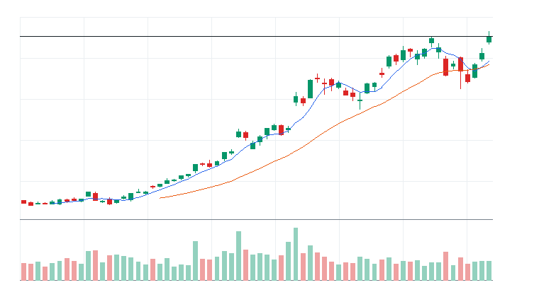
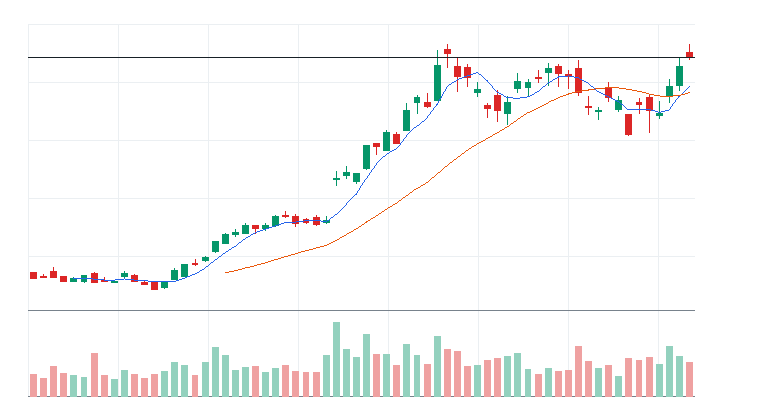

# 오늘의 데일리 트레이딩 요약

**REAL DATA TEST - 가격/거래량은 실제 데이터, 뉴스/ETF 구성종목 확산도/거래대금 유동성 일부 연결**

**목적:** 이 리포트는 최근 오른 자산을 나열하는 것이 아니라, 돈이 몰리는 근거와 다음 매수 주체가 확인할 트레이딩 후보를 찾기 위한 보고서다.

> 핵심 질문: 현재 가격에서 누가 사고 있고, 누가 앞으로 더 비싸게 사줄 수 있는가?

## 모바일 요약

[오늘의 데일리 트레이딩 요약]

생성 성공 / 데이터 모드: REAL_TEST

시장:
- 위험선호

시장 지배 서사:
1. 반도체 장비 사이클 재평가 - 부상 - SOXX, SOXQ, KLAC, ASML 중심으로 5일 +12.42%, 20일 +26.19% 흐름이 형성됨. 직접 촉매 일부 확인.
2. Data Storage 자금 유입 - 부상 - QQQ, STX, WDC 중심으로 5일 +14.71%, 20일 +22.87% 흐름이 형성됨. 직접 촉매 일부 확인.
3. 반도체 설계/공급망 재가속 - 약화 - SOXX, SOXQ, ARM, AMD 중심으로 5일 +8.94%, 20일 +28.41% 흐름이 형성됨. 직접 촉매 일부 확인.

트렌드 강도:
1. 반도체 장비 사이클 재평가 - TSI 84 - 과열 - 진입품질 관찰
2. Data Storage 자금 유입 - TSI 76 - 과열 - 진입품질 낮음
3. 반도체 설계/공급망 재가속 - TSI 68 - 과열 - 진입품질 낮음

오늘 결론:
- Materials 개별 종목 흐름이 ETF 대비 강한지 확인 필요
- 행동 후보는 linkedNarrative와 함께 확인한다.
- 추격보다 진입 조건 확인 후 접근한다.

오늘 실제 행동 후보:
1. 행동 후보 없음 - 미분류 - 조건 충족 후보 없음

다크호스 후보:
1. ASML - darkHorseScore 76 - 베이스 돌파 직전
2. AMD - darkHorseScore 69 - 초기 반전
3. INTC - darkHorseScore 62 - 초기 반전

ETF 후보 TOP 5:
1. IPO - 위험선호 성장주 재진입 - 제외
2. PAVE - AI 인프라 재가속 - 제외
3. DRAM - AI 인프라 재가속 - 거래량 확인 전 관찰
4. SOXX - 반도체 장비 사이클 재평가 - 거래량 확인 전 관찰
5. ARKK - 위험선호 성장주 재진입 - 제외

웹 리포트:
https://yoolcool.github.io/DailyTradingThesisAgent/

## 오늘 결론

- 오늘 결론: 신규 추격 없음 / 관찰
- 신규 진입 후보: 0개
- 조건부 진입 후보: 0개
- 관찰 후보: 132개
- 주요 제한 요인: Entry Quality 부족, RVOL 미달, 뉴스 직접성 부족
- 주문 판단: 시장가 금지 / 지정가 또는 관찰
- 실전 판단: 오늘은 추세 후보는 있으나, 왜 돈이 몰리는가와 누가 더 비싸게 사줄 수 있는가를 주문 실행 신뢰도와 거래량이 충분히 뒷받침하지 못해 신규 추격은 보류한다. 기존 관심 종목은 전일 고점 돌파와 RVOL 1.00x 회복을 확인한 뒤 조건부로 본다.

### 후보 제한 요인 집계

- RVOL < 1.00x: 102개
- 거래대금 유동성 낮음: 10개
- Entry Quality < 60: 157개
- Exhaustion Risk >= 70: 64개
- ETF breadth 샘플 부족: 37개
- 뉴스 직접성 부족: 100개

## 데이터 신뢰도

- 전체 데이터 신뢰도 등급: LOW
- 분석 신뢰도: LOW
- 주문 실행 신뢰도: LOW
- ETF breadth 신뢰도: LOW
- 신뢰도 해석: 테마 확산 판단 제한, 거래대금 유동성 낮음 또는 확인 불가, 프리/애프터마켓 확인 불가
- 리포트 생성 시각: 2026-06-16 10:42 KST
- 가격 기준 거래일: 2026-06-15 US regular close
- 뉴스 수집 시각: 2026-06-16 10:42 KST
- 가장 최근 뉴스 발행 시각: 2026-06-16 10:24 KST
- 뉴스 신선도 상태: FRESH
- 뉴스 소스: Yahoo Finance RSS, MarketWatch RSS, CNBC Markets RSS, SEC EDGAR RSS, Federal Reserve RSS, Finnhub API
- 뉴스 소스 상태: Yahoo Finance RSS CONNECTED, MarketWatch RSS CONNECTED, CNBC Markets RSS PARTIAL, SEC EDGAR RSS PARTIAL, Federal Reserve RSS CONNECTED, Finnhub API DISABLED
- 뉴스 신뢰도: MEDIUM
- 추천 적용 거래일: 2026-06-15 US regular session
- 가격/거래량 데이터 상태: 연결됨
- 뉴스 데이터 상태: 일부 연결
- ETF 구성종목 확산도 상태: 일부 연결
- ETF 구성종목 샘플 수: 1~4
- 거래대금 유동성 데이터 상태: 일부 연결
- 프리마켓/애프터마켓 데이터 상태: UNAVAILABLE
- 데이터 provider: yfinance, Yahoo Finance RSS, MarketWatch RSS, CNBC Markets RSS, SEC EDGAR RSS, Federal Reserve RSS, Finnhub API, config fallback sample, price-volume dollar-volume fallback
- 실전 사용 경고: 이 리포트는 투자판단 보조용이며, REAL_TEST 모드에서는 일부 데이터가 누락되거나 지연될 수 있다. 실제 주문 전 현재가, 뉴스, 프리마켓/정규장 거래량을 별도 확인해야 한다.

## 0. 시장 상태

- 데이터 모드: REAL_TEST
- 가격/거래량: 연결됨
- 뉴스: 일부 연결
- ETF 구성종목 확산도: 일부 연결
- 거래대금 유동성: 일부 연결
- 생성 시각: 2026년 6월 16일 화요일 AM 10:42
- 시장 상태: 위험선호
- 오늘 돈의 방향: Materials 개별 종목 흐름이 ETF 대비 강한지 확인 필요
- 강한 테마 TOP 3: 반도체 장비/공급망(100), 메모리/HBM(97), Materials(93)
- 데이터 한계:
  - API 또는 provider 상태에 따라 뉴스/ETF 확산도/거래대금 유동성 반영 범위가 달라질 수 있다.
  - 수집 실패 데이터는 점수 반영에서 제외하거나 confidence를 제한한다.
  - reasonConfidence HIGH는 직접 촉매, 가격/거래량, 확산도/유동성 근거가 함께 있을 때만 사용한다.

## 오늘 시장을 지배하는 서사

### 오늘 시장을 지배하는 서사 TOP 3

#### 1. 반도체 장비 사이클 재평가
- 상태: 부상
- narrativeScore: 94
- reasonConfidence: MEDIUM
- 근거 ETF: SOXX, SOXQ, SMH
- 근거 개별 종목: KLAC, ASML, AMAT, LRCX
- 돈이 몰리는 이유: 반도체 장비 사이클 재평가 관련 SOXX, SOXQ, SMH와 KLAC, ASML, AMAT, LRCX의 5일(+12.42%)·20일(+26.19%) 흐름을 함께 본다. 평균 상대 거래량은 1.07배이고, ETF 확산도는 추가 확인이 필요하다. 직접 뉴스/이벤트가 일부 확인된다.
- 다음 매수 주체: 반도체 장비 사이클 재평가을 확인한 섹터 ETF 자금과 상대강도 추종 스윙 자금
- 가장 좋은 트레이딩 수단: ETF 우선: SMH, SOXX, SOXQ / 개별 종목 우선: KLAC, ASML, AMAT
- 서사가 깨지는 조건: SMH 20일선 이탈 또는 관련 종목 절반 이상 5일선 이탈
- 오늘 행동: 기존 네러티브와 중복을 확인한 뒤 ETF/대표 종목 동조성이 살아날 때만 관찰 편입

상세 narrativeScore 근거 보기

- rawScore: 94
- ETF 평균 moneyFlowScore: 64
- 개별 종목 평균 moneyFlowScore: 100
- ETF 후보 비율: 0%
- 개별 종목 후보 비율: 100%
- 5일 평균 수익률: +12.00%
- 20일 평균 수익률: +26.00%
- 평균 상대 거래량: 1.00배
- ETF 평균 상대 거래량: 1.00배
- 개별주 평균 상대 거래량: 1.00배
- 52주 고점 근접 후보 비율: 88%
- 뉴스 직접성 점수: 12
- ETF 확산도 점수: -1
- 유동성 점수: 4
- 과열 리스크 차감: -1

#### 2. Data Storage 자금 유입
- 상태: 부상
- narrativeScore: 93
- reasonConfidence: MEDIUM
- 근거 ETF: QQQ
- 근거 개별 종목: STX, WDC
- 돈이 몰리는 이유: Data Storage 자금 유입 관련 QQQ와 STX, WDC의 5일(+14.71%)·20일(+22.87%) 흐름을 함께 본다. 평균 상대 거래량은 1.24배이고, ETF 확산도는 추가 확인이 필요하다. 직접 뉴스/이벤트가 일부 확인된다.
- 다음 매수 주체: Data Storage 자금 유입을 확인한 섹터 ETF 자금과 상대강도 추종 스윙 자금
- 가장 좋은 트레이딩 수단: ETF 우선: QQQ / 개별 종목 우선: STX, WDC
- 서사가 깨지는 조건: QQQ 20일선 이탈 또는 관련 종목 절반 이상 5일선 이탈
- 오늘 행동: 기존 네러티브와 중복을 확인한 뒤 ETF/대표 종목 동조성이 살아날 때만 관찰 편입

상세 narrativeScore 근거 보기

- rawScore: 93
- ETF 평균 moneyFlowScore: 47
- 개별 종목 평균 moneyFlowScore: 100
- ETF 후보 비율: 0%
- 개별 종목 후보 비율: 100%
- 5일 평균 수익률: +15.00%
- 20일 평균 수익률: +23.00%
- 평균 상대 거래량: 1.00배
- ETF 평균 상대 거래량: 1.00배
- 개별주 평균 상대 거래량: 1.00배
- 52주 고점 근접 후보 비율: 100%
- 뉴스 직접성 점수: 11
- ETF 확산도 점수: -4
- 유동성 점수: 5
- 과열 리스크 차감: 0

#### 3. 반도체 설계/공급망 재가속
- 상태: 약화
- narrativeScore: 66
- reasonConfidence: LOW
- 근거 ETF: SOXX, SOXQ, SMH
- 근거 개별 종목: ARM, AMD, INTC, MRVL, ADI
- 돈이 몰리는 이유: 반도체 설계/공급망 재가속 관련 SOXX, SOXQ, SMH와 ARM, AMD, INTC, MRVL의 5일(+8.94%)·20일(+28.41%) 흐름을 함께 본다. 평균 상대 거래량은 0.88배이고, ETF 확산도는 추가 확인이 필요하다. 직접 뉴스/이벤트가 일부 확인된다.
- 다음 매수 주체: 반도체 설계/공급망 재가속을 확인한 섹터 ETF 자금과 상대강도 추종 스윙 자금
- 가장 좋은 트레이딩 수단: ETF 우선: SMH, SOXX, SOXQ / 개별 종목 우선: MRVL, ARM, ADI
- 서사가 깨지는 조건: SMH 20일선 이탈 또는 관련 종목 절반 이상 5일선 이탈
- 오늘 행동: 기존 네러티브와 중복을 확인한 뒤 ETF/대표 종목 동조성이 살아날 때만 관찰 편입

상세 narrativeScore 근거 보기

- rawScore: 66
- ETF 평균 moneyFlowScore: 64
- 개별 종목 평균 moneyFlowScore: 66
- ETF 후보 비율: 0%
- 개별 종목 후보 비율: 0%
- 5일 평균 수익률: +9.00%
- 20일 평균 수익률: +28.00%
- 평균 상대 거래량: 1.00배
- ETF 평균 상대 거래량: 1.00배
- 개별주 평균 상대 거래량: 1.00배
- 52주 고점 근접 후보 비율: 80%
- 뉴스 직접성 점수: 9
- ETF 확산도 점수: -1
- 유동성 점수: 3
- 과열 리스크 차감: -2

### 전체 narrative 요약

| 서사명 | 상태 | narrativeScore | reasonConfidence | 대표 ETF | 대표 종목 | 오늘 행동 |
| --- | --- | ---: | --- | --- | --- | --- |
| 반도체 장비 사이클 재평가 | 부상 | 94 | MEDIUM | SOXX, SOXQ, SMH | KLAC, ASML, AMAT, LRCX | 기존 네러티브와 중복을 확인한 뒤 ETF/대표 종목 동조성이 살아날 때만 관찰 편입 |
| Data Storage 자금 유입 | 부상 | 93 | MEDIUM | QQQ | STX, WDC | 기존 네러티브와 중복을 확인한 뒤 ETF/대표 종목 동조성이 살아날 때만 관찰 편입 |
| 반도체 설계/공급망 재가속 | 약화 | 66 | LOW | SOXX, SOXQ, SMH | ARM, AMD, INTC, MRVL | 기존 네러티브와 중복을 확인한 뒤 ETF/대표 종목 동조성이 살아날 때만 관찰 편입 |
| 위험선호 성장주 재진입 | 관찰 | 53 | LOW | IPO, ARKK, QQQ | ARM, COIN, TSLA | 지수 위험선호가 유지될 때만 선별 진입 |
| AI 인프라 재가속 | 관찰 | 50 | LOW | DRAM, SOXX, SOXQ | AMD, MU, ETN, NVDA | 추격보다 5일선 지지 후 재상승 확인 |
| 전력망/원전/인프라 병목 | 약화 | 31 | LOW | PAVE, GRID, COPX | FCX, ETN, PWR, VRT | ETF 확산도와 거래량이 같이 살아날 때만 진입 |
| 사이버보안 지출 재가속 | 약화 | 24 | LOW | CIBR, HACK, IHAK | FTNT, PANW, CRWD | 기존 네러티브와 중복을 확인한 뒤 ETF/대표 종목 동조성이 살아날 때만 관찰 편입 |
| 소프트웨어 실적/AI 수익화 | 약화 | 24 | LOW | QQQ, AIQ, IGV | CDNS, DDOG | 기존 네러티브와 중복을 확인한 뒤 ETF/대표 종목 동조성이 살아날 때만 관찰 편입 |
| 방산/안보 프리미엄 | 약화 | 21 | LOW | XAR, ITA, SHLD | AVAV, KTOS, PLTR | 뉴스 촉매가 직접 확인될 때만 추세 추종 |
| 비트코인/디지털 자산 위험선호 | 약화 | 21 | LOW | BLOK, IBIT | CIFR, IREN, COIN, MSTR | 비트코인 베타가 살아날 때만 단기 매매 |
| AI 소프트웨어/사이버보안 확산 | 약화 | 8 | LOW | QQQ, AIQ, IGV | DDOG, PLTR, TEAM, MSFT | 추격보다 눌림 후 재상승 확인 |
| 매크로 방어/헤지 | 소멸 | 0 | LOW | TLT, GLD, XLE | XOM, CVX | 위험회피가 확인될 때만 헤지성 접근 |

## 트렌드 강도 판단

### 1. 반도체 장비 사이클 재평가
- Trend Strength Index: 84
- 트렌드 상태 라벨: 과열
- 테마 확산도: 강함
- ETF 동조성: 강함
- 거래량 강도: 약함
- 과열 위험: 주의 (55)
- 오늘 진입 품질: 관찰 (49)
- 한 줄 판단: 반도체 장비 사이클 재평가는 가격, 거래량, ETF, 확산도가 함께 확인되어 테마 단위 자금 유입이 선명하다.
- 오늘 접근법: SOXX/SOXQ/SMH가 5일선 위에서 눌림 후 재상승하고 KLAC/ASML/AMAT의 종가 유지가 확인될 때만 진입 품질이 좋아진다.

트렌드 강도 상세 근거 보기

- 가격 모멘텀: 가격 모멘텀 29/25. 평균 5D +12.42%, 20D +26.19%.
- 거래량 강도: 거래량 강도 9/20. 평균 RVOL 1.07배.
- ETF 동조성: ETF 동조성 15/15. 관련 ETF SMH, SOXX, SOXQ, AIQ 흐름을 기준으로 판단.
- 테마 확산도: 테마 확산도 17/20. 상위 1~2개 쏠림 감점 0점 반영.
- 뉴스 촉매: 뉴스/촉매 신선도 7/10. HIGH 직접 촉매 2개.
- 과열 리스크: 과열 리스크 55/100. 단기 급등, 고점 근접, ETF-개별주 괴리, 쏠림을 함께 반영.
- 시장 환경: 시장 환경 7/10. QQQ/SPY/IWM 가격 흐름 기반 위험선호 점수.

### 2. Data Storage 자금 유입
- Trend Strength Index: 76
- 트렌드 상태 라벨: 과열
- 테마 확산도: 보통
- ETF 동조성: 강함
- 거래량 강도: 보통
- 과열 위험: 높음 (83)
- 오늘 진입 품질: 낮음 (26)
- 한 줄 판단: Data Storage 자금 유입는 돈이 강하게 몰리지만 단기 급등과 쏠림이 커서 강하지만 추격 위험 구간이다.
- 오늘 접근법: QQQ가 5일선 위에서 눌림 후 재상승하고 STX/WDC의 종가 유지가 확인될 때만 진입 품질이 좋아진다.

트렌드 강도 상세 근거 보기

- 가격 모멘텀: 가격 모멘텀 29/25. 평균 5D +14.71%, 20D +22.87%.
- 거래량 강도: 거래량 강도 13/20. 평균 RVOL 1.24배.
- ETF 동조성: ETF 동조성 13/15. 관련 ETF QQQ 흐름을 기준으로 판단.
- 테마 확산도: 테마 확산도 13/20. 상위 1~2개 쏠림 감점 6점 반영.
- 뉴스 촉매: 뉴스/촉매 신선도 1/10. HIGH 직접 촉매 1개.
- 과열 리스크: 과열 리스크 83/100. 단기 급등, 고점 근접, ETF-개별주 괴리, 쏠림을 함께 반영.
- 시장 환경: 시장 환경 7/10. QQQ/SPY/IWM 가격 흐름 기반 위험선호 점수.

### 3. 반도체 설계/공급망 재가속
- Trend Strength Index: 68
- 트렌드 상태 라벨: 과열
- 테마 확산도: 보통
- ETF 동조성: 강함
- 거래량 강도: 부족
- 과열 위험: 주의 (47)
- 오늘 진입 품질: 낮음 (39)
- 한 줄 판단: 반도체 설계/공급망 재가속는 관찰 가능한 흐름은 있으나 가격, 거래량, 확산도 중 일부 확인이 더 필요하다.
- 오늘 접근법: SOXX/SOXQ/SMH가 5일선 위에서 눌림 후 재상승하고 ARM/AMD/INTC의 종가 유지가 확인될 때만 진입 품질이 좋아진다.

트렌드 강도 상세 근거 보기

- 가격 모멘텀: 가격 모멘텀 25/25. 평균 5D +8.94%, 20D +28.41%.
- 거래량 강도: 거래량 강도 4/20. 평균 RVOL 0.88배.
- ETF 동조성: ETF 동조성 15/15. 관련 ETF SMH, SOXX, SOXQ, AIQ 흐름을 기준으로 판단.
- 테마 확산도: 테마 확산도 12/20. 상위 1~2개 쏠림 감점 0점 반영.
- 뉴스 촉매: 뉴스/촉매 신선도 5/10. HIGH 직접 촉매 2개.
- 과열 리스크: 과열 리스크 47/100. 단기 급등, 고점 근접, ETF-개별주 괴리, 쏠림을 함께 반영.
- 시장 환경: 시장 환경 7/10. QQQ/SPY/IWM 가격 흐름 기반 위험선호 점수.

## 최근 추천 결과 트래킹

개별주는 데이트레이딩 관점으로 추천 이후 첫 정규장의 장중 최고가와 종가를 추적한다. ETF는 테마/스윙 관점으로 추천 이후 1주일 동안의 최고가와 현재 종가를 추적한다.

### 개별주 Top 3 추천 성과 요약
- 최근 5개 리포트 표본: 7개 (초기 검증 단계)
- 장중 최고가 기준 성공률: +14.29%
- 종가 기준 성공률: +28.57%
- 평균 장중 최고 수익률: +0.98%
- 평균 종가 수익률: -1.19%

### ETF 추천 성과 요약
- 최근 5개 리포트 표본: 7개 (초기 검증 단계)
- 1주 최고가 기준 성공률: 0.00%
- 현재 종가 기준 성공률: +28.57%
- 평균 1주 최고 수익률: -3.33%
- 평균 현재 수익률: -4.32%

최근 추천 결과 상세 테이블 펼치기

| 추천일 | 유형 | 순위 | 티커 | 기준가 | 추적 기간 | 상태 | High 수익률 | Close 수익률 | 결과 | 코멘트 |
| --- | --- | ---: | --- | ---: | --- | --- | ---: | ---: | --- | --- |
| 2026-06-04 | STOCK | 3 | PANW | $280.43 | 2026-06-04 | complete | +0.10% | -0.42% | 실패 | 추천 이후 의미 있는 장중 기회가 부족하고 종가도 약함 (일봉 기준) |
| 2026-06-04 | STOCK | 2 | FTNT | $146.48 | 2026-06-04 | complete | +2.45% | +2.18% | 제한적 유효 | 제한적인 장중 기회만 발생 (일봉 기준) |
| 2026-06-04 | STOCK | 1 | CRWD | $747.61 | 2026-06-04 | complete | -3.56% | -3.81% | 실패 | 추천 이후 의미 있는 장중 기회가 부족하고 종가도 약함 (일봉 기준) |
| 2026-06-04 | ETF | 3 | HACK | $102.21 | 2026-06-04~2026-06-11 | complete | -1.66% | -4.73% | 실패 | 추천 이후 ETF 흐름이 약화됨 |
| 2026-06-04 | ETF | 2 | SOXQ | $109.58 | 2026-06-04~2026-06-11 | complete | -4.68% | +1.25% | 진행 중 | 아직 1주 추적 기간이 끝나지 않음 |
| 2026-06-04 | ETF | 1 | AIQ | $69.16 | 2026-06-04~2026-06-11 | complete | -4.29% | -3.77% | 실패 | 추천 이후 ETF 흐름이 약화됨 |
| 2026-06-03 | STOCK | 3 | FTNT | $148.86 | 2026-06-03 | complete | -0.26% | -1.60% | 실패 | 추천 이후 의미 있는 장중 기회가 부족하고 종가도 약함 (일봉 기준) |
| 2026-06-03 | STOCK | 3 | CRWD | $768.95 | 2026-06-03 | complete | -0.25% | -2.78% | 실패 | 추천 이후 의미 있는 장중 기회가 부족하고 종가도 약함 (일봉 기준) |
| 2026-06-03 | STOCK | 2 | MRVL | $290.79 | 2026-06-03 | complete | +11.49% | +3.73% | 성공 | 장중 기회와 종가 유지가 모두 확인됨 (일봉 기준) |
| 2026-06-03 | STOCK | 1 | PANW | $297.18 | 2026-06-03 | complete | -3.09% | -5.64% | 실패 | 추천 이후 의미 있는 장중 기회가 부족하고 종가도 약함 (일봉 기준) |
| 2026-06-03 | ETF | 3 | DRAM | $69.57 | 2026-06-03~2026-06-10 | complete | -3.52% | +2.16% | 진행 중 | 아직 1주 추적 기간이 끝나지 않음 |
| 2026-06-03 | ETF | 3 | IGV | $104.73 | 2026-06-03~2026-06-10 | complete | -3.31% | -11.51% | 실패 | 추천 이후 ETF 흐름이 약화됨 |
| 2026-06-03 | ETF | 2 | AIQ | $70.14 | 2026-06-03~2026-06-10 | complete | -2.32% | -5.12% | 실패 | 추천 이후 ETF 흐름이 약화됨 |
| 2026-06-03 | ETF | 1 | CIBR | $94.32 | 2026-06-03~2026-06-10 | complete | -3.56% | -8.53% | 실패 | 추천 이후 ETF 흐름이 약화됨 |

## 오늘 실제 행동 후보

오늘은 추세 후보는 있으나, 왜 돈이 몰리는가와 누가 더 비싸게 사줄 수 있는가를 주문 실행 신뢰도와 거래량이 충분히 뒷받침하지 못해 신규 추격은 보류한다. 기존 관심 종목은 전일 고점 돌파와 RVOL 1.00x 회복을 확인한 뒤 조건부로 본다.

## 다크호스 후보

> 메인 행동 후보를 대체하지 않는 보조 관찰 섹션이다. 상위 서사 안에서 아직 과열되지 않았지만 초기 추세 전환, 베이스 돌파, 거래량 회복이 시작되는 개별주만 표시한다.

### 1. [ASML] ASML Holding N.V.
- 소속 서사: 반도체 장비 사이클 재평가
- darkHorseScore: 76 (다크호스 후보)
- 단계: 베이스 돌파 직전
- Confidence: LOW
- 5D / 20D / RVOL: +8.21% / +26.03% / 1.22x
- MA 구조: 종가 $1,892.66 / MA5 $1,833.53 / MA20 $1,676.57
- 선정 이유: ASML는 반도체 장비 사이클 재평가 서사에 속하고 종가가 MA20 위에 있으며 MA5/MA20 정렬이 개선되고 있다. 최근 15거래일 베이스는 상단 돌파 직전 상태이고, RVOL 1.22x로 거래량 확인은 충분하다. Exhaustion Risk 55로 아직 메인 후보 대비 과열 상한 안에 있다.
- 확인 조건: 최근 15거래일 고점 $1,903.50 돌파, MA5 위 종가 유지, 관련 ETF 동반 강세
- 무효화 조건: MA20 $1,676.57 종가 이탈, 최근 스윙 저점 $1,638.38 이탈, RVOL 0.80x 이하 둔화
- 왜 아직 메인이 아닌가: Entry Quality 49 < 60, 최근 고점 돌파 확인 전

darkHorseScore 상세 근거 보기

- 서사 정렬: 20/20
- 초기 추세 구조: 24/30
- 베이스 돌파/정돈: 10/20
- 거래량 확인: 14/15
- 낮은 과열: 3/10
- 유동성 리스크 보정: 5/5
- 리스크 차감: -0
- rawScore: 76

- 차트: 

### 2. [AMD] Advanced Micro Devices Inc.
- 소속 서사: 반도체 설계/공급망 재가속
- darkHorseScore: 69 (관찰 후보)
- 단계: 초기 반전
- Confidence: LOW
- 5D / 20D / RVOL: +11.61% / +29.04% / 1.00x
- MA 구조: 종가 $547.26 / MA5 $495.04 / MA20 $488.13
- 선정 이유: AMD는 반도체 설계/공급망 재가속 서사에 속하고 종가가 MA20 위에 있으며 MA5/MA20 정렬이 개선되고 있다. 최근 15거래일 베이스는 상단 돌파 상태이고, RVOL 1.00x로 거래량 확인은 보통 수준이다. Exhaustion Risk 47로 아직 메인 후보 대비 과열 상한 안에 있다.
- 확인 조건: 돌파 후 고점 위 안착 유지, RVOL 1.20x 이상 재증가, MA5 위 종가 유지, 관련 ETF 동반 강세
- 무효화 조건: MA20 $488.13 종가 이탈, 최근 스윙 저점 $437.23 이탈, RVOL 0.80x 이하 둔화
- 왜 아직 메인이 아닌가: Entry Quality 30 < 60, RVOL 1.00x < 1.20x

darkHorseScore 상세 근거 보기

- 서사 정렬: 13/20
- 초기 추세 구조: 28/30
- 베이스 돌파/정돈: 13/20
- 거래량 확인: 7/15
- 낮은 과열: 3/10
- 유동성 리스크 보정: 5/5
- 리스크 차감: -0
- rawScore: 69

- 차트: 

### 3. [INTC] Intel Corporation
- 소속 서사: 반도체 설계/공급망 재가속
- darkHorseScore: 62 (관찰 후보)
- 단계: 초기 반전
- Confidence: LOW
- 5D / 20D / RVOL: +15.95% / +17.55% / 0.99x
- MA 구조: 종가 $127.86 / MA5 $116.87 / MA20 $114.63
- 선정 이유: INTC는 반도체 설계/공급망 재가속 서사에 속하고 종가가 MA20 위에 있으며 MA5/MA20 정렬이 개선되고 있다. 최근 15거래일 베이스는 상단 돌파 상태이고, RVOL 0.99x로 거래량 확인은 아직 약하다. Exhaustion Risk 47로 아직 메인 후보 대비 과열 상한 안에 있다.
- 확인 조건: 돌파 후 고점 위 안착 유지, RVOL 1.20x 이상 재증가, MA5 위 종가 유지, 관련 ETF 동반 강세
- 무효화 조건: MA20 $114.63 종가 이탈, 최근 스윙 저점 $98.33 이탈, RVOL 0.80x 이하 둔화
- 왜 아직 메인이 아닌가: Entry Quality 40 < 60, RVOL 0.99x < 1.20x

darkHorseScore 상세 근거 보기

- 서사 정렬: 13/20
- 초기 추세 구조: 26/30
- 베이스 돌파/정돈: 11/20
- 거래량 확인: 7/15
- 낮은 과열: 0/10
- 유동성 리스크 보정: 5/5
- 리스크 차감: -0
- rawScore: 62

- 차트: 

## 참고용 행동 후보

> 실제 행동 후보가 없는 날에만 표시한다. 아래 후보는 매수 추천이 아니라 다음 정규장에서 전일 고점 돌파, RVOL 1.00x 이상, 거래대금 유동성 확인을 기다리는 관찰 리스트다.

### ETF 참고 후보 TOP 3

#### 1. [IPO] Renaissance IPO ETF
- 상태: 참고용 관찰 후보
- todayActionLabel: 제외
- 제한 사유: Entry Quality 36 < 45; 거래대금 유동성 LOW/UNKNOWN; 진입 품질 부족
- 주문 실행: 추격 금지
- moneyFlowScore: 90
- Entry Quality: 36 (낮음)
- RVOL: 3.46x
- 진입 전 확인: 전일 고점 돌파와 5일선 유지 확인
- 무효화: 20일선 이탈 또는 상대 거래량 0.8배 이하 둔화

#### 2. [PAVE] Global X U.S. Infrastructure Development ETF
- 상태: 참고용 관찰 후보
- todayActionLabel: 제외
- 제한 사유: Entry Quality 43 < 45; 진입 품질 부족
- 주문 실행: 지정가 권장
- moneyFlowScore: 67
- Entry Quality: 43 (관찰)
- RVOL: 1.18x
- 진입 전 확인: 전일 고점 돌파와 5일선 유지 확인
- 무효화: 20일선 이탈 또는 상대 거래량 0.8배 이하 둔화

#### 3. [DRAM] Roundhill Memory ETF
- 상태: 참고용 관찰 후보
- todayActionLabel: 거래량 확인 전 관찰
- 제한 사유: Entry Quality 24 < 45; RVOL 0.90x < 1.00x
- 주문 실행: 시장가 가능
- moneyFlowScore: 83
- Entry Quality: 24 (낮음)
- RVOL: 0.90x
- 진입 전 확인: 상대 거래량 1.0배 회복 후 관찰
- 무효화: 거래량 회복 실패

### 개별주 참고 후보 TOP 3

#### 1. [FCX] Freeport-McMoRan
- 상태: 참고용 관찰 후보
- todayActionLabel: 관찰
- 제한 사유: 실제 행동 후보 게이트 미충족
- 주문 실행: 지정가 권장
- moneyFlowScore: 93
- Entry Quality: 51 (관찰)
- RVOL: 1.01x
- 진입 전 확인: 전일 고점 돌파와 5일선 유지 확인
- 무효화: 20일선 이탈 또는 상대 거래량 0.8배 이하 둔화

#### 2. [AMAT] Applied Materials Inc.
- 상태: 참고용 관찰 후보
- todayActionLabel: 관찰
- 제한 사유: 실제 행동 후보 게이트 미충족
- 주문 실행: 시장가 가능
- moneyFlowScore: 100
- Entry Quality: 48 (관찰)
- RVOL: 1.36x
- 진입 전 확인: 전일 고점 돌파와 5일선 유지 확인
- 무효화: 20일선 이탈 또는 상대 거래량 0.8배 이하 둔화

#### 3. [ASML] ASML Holding N.V.
- 상태: 참고용 관찰 후보
- todayActionLabel: 관찰
- 제한 사유: 실제 행동 후보 게이트 미충족
- 주문 실행: 시장가 가능
- moneyFlowScore: 100
- Entry Quality: 49 (관찰)
- RVOL: 1.22x
- 진입 전 확인: 전일 고점 돌파와 5일선 유지 확인
- 무효화: 20일선 이탈 또는 상대 거래량 0.8배 이하 둔화

## 오늘 돈이 몰리는 테마

- 반도체 장비/공급망: LRCX, AMAT, KLAC | 평균 moneyFlowScore 100 | 단일 종목 이벤트보다 테마 단위 자금 흐름이 선명한 구간으로 본다.
- 메모리/HBM: MU, STX, WDC | 평균 moneyFlowScore 97 | 단일 종목 이벤트보다 테마 단위 자금 흐름이 선명한 구간으로 본다.
- Materials: FCX | 평균 moneyFlowScore 93 | 단일 종목 이벤트보다 테마 단위 자금 흐름이 선명한 구간으로 본다.
- IPO/신규상장 ETF: IPO | 평균 moneyFlowScore 90 | 단일 종목 이벤트보다 테마 단위 자금 흐름이 선명한 구간으로 본다.
- 메모리/HBM ETF: DRAM | 평균 moneyFlowScore 83 | 단일 종목 이벤트보다 테마 단위 자금 흐름이 선명한 구간으로 본다.
- AI 반도체 ETF: SMH, SOXX, SOXQ | 평균 moneyFlowScore 71 | 추세는 확인되지만 선별 진입이 필요한 중간 강도의 테마로 본다.

## 1. ETF 트레이딩 보고서
### 1-1. ETF 결론
- ETF 우선 후보: 없음
- ETF 관찰 후보: DRAM, SMH, SOXX, SOXQ, IGV
- ETF 매매 금지: IGV, BOTZ, XLE, OIH, KWEB
- 오늘 ETF 최우선 1개: 없음
- ETF 섹션 해석: 이 섹션은 개별 종목 선택이 아니라 테마/섹터 단위 자금 흐름을 ETF로 매매할지 판단하기 위한 영역이다.

### 1-2. ETF 후보 TOP 5

선정 기준: ETF 후보는 가격/거래량 1차 점수에 뉴스, ETF 구성종목 확산도, 유동성, 리스크 패널티를 반영한 finalRawScore 기준으로 정렬한다. 표시 점수 100점 후보가 겹치면 tieBreakerReason으로 우선순위를 설명한다.

### [ETF IPO] Renaissance IPO ETF
- 자산 유형: ETF
- ETF 세부 카테고리: IPO/신규상장 ETF
- ETF 역할: 테마 베타 매수
- 상태: 매매 금지
- linkedNarrative: 위험선호 성장주 재진입
- narrativeStatus: 관찰
- narrativeScore: 53
- moneyFlowScore: 90
- finalRawScore: 90
- tieBreakerReason: 최종 원점수 90, 리스크 패널티 -5, 5일 수익률 +7.18%, 상대 거래량 3.46배 순으로 정렬
- 과열 리스크: 낮음~중간
- reasonConfidence: MEDIUM
- reasonConfidenceExplanation: ETF 확산도 제한 때문에 HIGH가 아니라 MEDIUM으로 제한했다.

- todayActionLabel: 제외
- 주문 실행: 추격 금지
- 기준일: 2026-06-15
- 종가: $58.05
- 1일 수익률: +4.18%
- 5일 수익률: +7.18%
- 20일 수익률: +18.37%
- 상대 거래량: 3.46배
- 52주 고점 대비 위치: -1.17%
- whyMoneyIsFlowing: 20일 +18.37%, 5일 +7.18%, 상대 거래량 3.46배로 가격과 거래량이 함께 개선. 뉴스: Yahoo Finance RSS general_market/stale
- likelyNextBuyer: 섹터 베타를 노리는 단기 모멘텀 자금과 리밸런싱 자금
- whyThisCouldTradeHigher: 52주 고점 부근이라 돌파가 확인되면 신고가 추종 매수가 붙을 수 있음
- 진입 조건: 전일 고점 돌파와 5일선 유지 확인
- 무효화 조건: 20일선 이탈 또는 상대 거래량 0.8배 이하 둔화
- 차트: 

#### 상세 근거

IPO 상세 근거 펼치기

- moneyFlowScore(최종) 산정 근거:
  - moneyFlowScore(1차): 88
  - 최종 원점수: 90
  - 최종 표시 점수: 90
  - cap 적용: cap 미적용
  - 계산식: +88 + +12 + 0 - 5 + 0 - 5 + 0 = 90
  - 점수 해석: 강한 자금 유입 후보. 단, 과열 여부 확인 필수.
  - 가격/거래량 1차 점수: +88
    - 추세: +21
    - 단기 모멘텀: +11
    - 중기 모멘텀: +12
    - 거래량: +18
    - 신고가 근접: +12
    - 이동평균: +14
  - 하위 점수 cap:
    - 가격 모멘텀: 원점수 +21, 상한 적용 +21 / 최대 25
    - 단기 모멘텀: 원점수 +11, 상한 적용 +11 / 최대 20
    - 중기 모멘텀: 원점수 +12, 상한 적용 +12 / 최대 16
    - 거래량: 원점수 +18, 상한 적용 +18 / 최대 20
    - 신고가 근접: 원점수 +12, 상한 적용 +12 / 최대 12
    - 이동평균: 원점수 +14, 상한 적용 +14 / 최대 14
  - 추가 데이터 가감점:
    - 뉴스: +12
    - 유동성: -5
  - ETF 확산도: 0
  - 리스크 패널티: -5
  - 주요 근거: 1차 88, 최종 원점수 90, 표시 90. 20일 수익률 강함, 5일 수익률 강함, 1일 단기 모멘텀 확인. 주의: 단기 과열/추격 위험 존재, ETF 구성종목 확산도 데이터 미연결.
  - 리스크 패널티 산정 근거:
    - 총 리스크 패널티: -5
    - 리스크 등급: LOW
    - 감점된 리스크:
      - low liquidity: -5 | 근거: Liquidity signal: LOW. | 대응: Avoid market-order chasing.
    - 관찰 리스크: ETF breadth data not connected
    - 한 줄 해석: 1개 감점 리스크로 총 -5점 반영.
- 데이터 사용 현황:
  - 가격/거래량: 사용
  - 뉴스: 사용
  - ETF 확산도: 미연결
  - 거래대금 유동성: 사용
  - 관련 ETF 상대강도: 사용
- 뉴스 확인:
  - 최근 뉴스 상태: 일부 연결
  - 뉴스 소스: MarketWatch RSS, Federal Reserve RSS, Yahoo Finance RSS
  - 소스별 상태: Yahoo Finance RSS CONNECTED; MarketWatch RSS CONNECTED; CNBC Markets RSS FAILED; SEC EDGAR RSS PARTIAL; Federal Reserve RSS CONNECTED; Finnhub API DISABLED
  - 긍정/중립/부정: 12/4/0
  - 직접성/방향성/신선도: 4/1/4
  - 강한 촉매 수: 2
  - 직접 촉매: Yahoo Finance RSS / general_market / stale / positive - Market Minute 6-09-26- OpenAI Joins Heated IPO Race
  - 보조 뉴스: MarketWatch RSS sector_theme / general_market / under_6h
  - 뉴스 수집 시각: 2026-06-16 10:42 KST
  - 가장 최근 뉴스 발행 시각: 2026-06-16 09:11 KST
  - 뉴스 신선도 상태: FRESH
  - 뉴스 이후 가격 반응: 긍정
  - 가격 반응 점수 제한: 뉴스 이후 가격 반응과 점수 제한 특이사항 없음
  - 핵심 뉴스 요약: How to work in retirement without seeing your Social Security checks slashed
  - 원점수/상한 점수: +27 / +12
  - 점수 반영: +12
  - 주의: CNBC Markets RSS: HTTP 403 from https://www.cnbc.com/id/100003114/device/rss/rss.html; SEC EDGAR RSS: no matching RSS items; Finnhub API: FINNHUB_API_KEY not configured
- ETF 구성종목 확산도:
  - 구성종목 데이터 상태: 미연결
  - 샘플 수: 0/0
  - 샘플 신뢰도: UNKNOWN
  - 상승 종목 비율: 데이터 없음
  - 20일선 위 비율: 데이터 없음
  - 50일선 위 비율: 데이터 없음
  - 상위 기여 종목: 데이터 없음
  - 확산도 판단: UNKNOWN
  - 원점수/샘플 상한/반영 점수: 0 / N/A / 0
  - 점수 반영: 0
- 거래대금 유동성:
  - 데이터 상태: 일부 연결
  - 거래대금 기준 유동성: LOW
  - 거래대금: $9,836,921
  - 평균 거래대금: $2,841,373
  - 주문 영향: 추격 금지
  - 매매 영향: 유동성 부족으로 추격 금지 또는 우선순위 하향
- reasonConfidence 근거: 가격/거래량, 뉴스, 거래대금 유동성, 관련 ETF 상대강도은 확인됐지만 일부 보조 데이터가 미연결 또는 fallback이라 중간으로 제한한다.
- 차트 요약: 최근 20거래일 기준 5일선이 20일선 위에 있음
- 기준일 2026-06-15 | 종가 $58.05 | 1일 +4.18% | 5일 +7.18% | 20일 +18.37% | 상대 거래량 3.46배 | 52주 고점 대비 -1.17% | 데이터 소스: yfinance

### [ETF PAVE] Global X U.S. Infrastructure Development ETF
- 자산 유형: ETF
- ETF 세부 카테고리: 인프라 ETF
- ETF 역할: 테마 베타 매수
- 상태: 매매 금지
- linkedNarrative: AI 인프라 재가속
- narrativeStatus: 관찰
- narrativeScore: 50
- moneyFlowScore: 67
- finalRawScore: 67
- tieBreakerReason: 최종 원점수 67, 리스크 패널티 0, 5일 수익률 +2.94%, 상대 거래량 1.18배 순으로 정렬
- 과열 리스크: 낮음
- reasonConfidence: MEDIUM
- reasonConfidenceExplanation: ETF 확산도 제한 때문에 HIGH가 아니라 MEDIUM으로 제한했다.

- todayActionLabel: 제외
- 주문 실행: 지정가 권장
- 기준일: 2026-06-15
- 종가: $58.17
- 1일 수익률: +0.71%
- 5일 수익률: +2.94%
- 20일 수익률: +4.98%
- 상대 거래량: 1.18배
- 52주 고점 대비 위치: -1.42%
- whyMoneyIsFlowing: 20일 +4.98%, 5일 +2.94%, 상대 거래량 1.18배로 가격과 거래량이 함께 개선. 뉴스: Yahoo Finance RSS general_market/stale / 유동성: ACCEPTABLE
- likelyNextBuyer: 섹터 베타를 노리는 단기 모멘텀 자금과 리밸런싱 자금
- whyThisCouldTradeHigher: 52주 고점 부근이라 돌파가 확인되면 신고가 추종 매수가 붙을 수 있음
- 진입 조건: 전일 고점 돌파와 5일선 유지 확인
- 무효화 조건: 20일선 이탈 또는 상대 거래량 0.8배 이하 둔화
- 차트: 

#### 상세 근거

PAVE 상세 근거 펼치기

- moneyFlowScore(최종) 산정 근거:
  - moneyFlowScore(1차): 53
  - 최종 원점수: 67
  - 최종 표시 점수: 67
  - cap 적용: cap 미적용
  - 계산식: +53 + +12 + 0 + +2 + 0 + 0 + 0 = 67
  - 점수 해석: 관심 후보. 눌림 또는 돌파 확인 후 진입 검토.
  - 가격/거래량 1차 점수: +53
    - 추세: +11
    - 단기 모멘텀: +3
    - 중기 모멘텀: +3
    - 거래량: +10
    - 신고가 근접: +12
    - 이동평균: +14
  - 하위 점수 cap:
    - 가격 모멘텀: 원점수 +11, 상한 적용 +11 / 최대 25
    - 단기 모멘텀: 원점수 +3, 상한 적용 +3 / 최대 20
    - 중기 모멘텀: 원점수 +3, 상한 적용 +3 / 최대 16
    - 거래량: 원점수 +10, 상한 적용 +10 / 최대 20
    - 신고가 근접: 원점수 +12, 상한 적용 +12 / 최대 12
    - 이동평균: 원점수 +14, 상한 적용 +14 / 최대 14
  - 추가 데이터 가감점:
    - 뉴스: +12
    - 유동성: +2
  - ETF 확산도: 0
  - 리스크 패널티: 0
  - 주요 근거: 1차 53, 최종 원점수 67, 표시 67. 52주 고점 근처, 이동평균 위 추세 유지, 뉴스 흐름이 가격/거래량 근거 보강. 주의: ETF 구성종목 확산도 데이터 미연결.
  - 리스크 패널티 산정 근거:
    - 총 리스크 패널티: 0
    - 리스크 등급: LOW
    - 감점된 리스크: 없음
    - 관찰 리스크: ETF breadth data not connected
    - 한 줄 해석: 직접 감점된 주요 리스크는 없지만 관찰 리스크는 계속 확인해야 한다.
- 데이터 사용 현황:
  - 가격/거래량: 사용
  - 뉴스: 사용
  - ETF 확산도: 미연결
  - 거래대금 유동성: 사용
  - 관련 ETF 상대강도: 사용
- 뉴스 확인:
  - 최근 뉴스 상태: 일부 연결
  - 뉴스 소스: MarketWatch RSS, Yahoo Finance RSS, Federal Reserve RSS
  - 소스별 상태: Yahoo Finance RSS CONNECTED; MarketWatch RSS CONNECTED; CNBC Markets RSS FAILED; SEC EDGAR RSS PARTIAL; Federal Reserve RSS CONNECTED; Finnhub API DISABLED
  - 긍정/중립/부정: 10/6/0
  - 직접성/방향성/신선도: 4/1/4
  - 강한 촉매 수: 2
  - 직접 촉매: Yahoo Finance RSS / general_market / stale / neutral - Should You Invest in the Global X U.S. Infrastructure Development ETF (PAVE)?
  - 보조 뉴스: MarketWatch RSS sector_theme / general_market / under_6h
  - 뉴스 수집 시각: 2026-06-16 10:42 KST
  - 가장 최근 뉴스 발행 시각: 2026-06-16 09:11 KST
  - 뉴스 신선도 상태: FRESH
  - 뉴스 이후 가격 반응: 긍정
  - 가격 반응 점수 제한: 뉴스 이후 가격 반응과 점수 제한 특이사항 없음
  - 핵심 뉴스 요약: How to work in retirement without seeing your Social Security checks slashed
  - 원점수/상한 점수: +25 / +12
  - 점수 반영: +12
  - 주의: CNBC Markets RSS: HTTP 403 from https://www.cnbc.com/id/100003114/device/rss/rss.html; SEC EDGAR RSS: no matching RSS items; Finnhub API: FINNHUB_API_KEY not configured
- ETF 구성종목 확산도:
  - 구성종목 데이터 상태: 미연결
  - 샘플 수: 0/0
  - 샘플 신뢰도: UNKNOWN
  - 상승 종목 비율: 데이터 없음
  - 20일선 위 비율: 데이터 없음
  - 50일선 위 비율: 데이터 없음
  - 상위 기여 종목: 데이터 없음
  - 확산도 판단: UNKNOWN
  - 원점수/샘플 상한/반영 점수: 0 / N/A / 0
  - 점수 반영: 0
- 거래대금 유동성:
  - 데이터 상태: 일부 연결
  - 거래대금 기준 유동성: ACCEPTABLE
  - 거래대금: $106,053,275
  - 평균 거래대금: $90,010,397
  - 주문 영향: 지정가 권장
  - 매매 영향: 거래대금은 허용 가능하나 지정가를 우선한다
- reasonConfidence 근거: 가격/거래량, 뉴스, 거래대금 유동성, 관련 ETF 상대강도은 확인됐지만 일부 보조 데이터가 미연결 또는 fallback이라 중간으로 제한한다.
- 차트 요약: 최근 20거래일 기준 5일선이 20일선 위에 있음
- 기준일 2026-06-15 | 종가 $58.17 | 1일 +0.71% | 5일 +2.94% | 20일 +4.98% | 상대 거래량 1.18배 | 52주 고점 대비 -1.42% | 데이터 소스: yfinance

### [ETF DRAM] Roundhill Memory ETF
- 자산 유형: ETF
- ETF 세부 카테고리: 메모리/HBM ETF
- ETF 역할: 테마 베타 매수
- 상태: 관찰
- linkedNarrative: AI 인프라 재가속
- narrativeStatus: 관찰
- narrativeScore: 50
- moneyFlowScore: 83
- finalRawScore: 83
- tieBreakerReason: 최종 원점수 83, 리스크 패널티 -12, 5일 수익률 +17.43%, 상대 거래량 0.90배 순으로 정렬
- 과열 리스크: 중간
- reasonConfidence: LOW
- reasonConfidenceExplanation: 가격/거래량이 약하거나 핵심 보조 근거가 부족해 LOW로 분류했다.

- todayActionLabel: 거래량 확인 전 관찰
- 주문 실행: 시장가 가능
- 기준일: 2026-06-15
- 종가: $71.07
- 1일 수익률: +9.32%
- 5일 수익률: +17.43%
- 20일 수익률: +39.08%
- 상대 거래량: 0.90배
- 52주 고점 대비 위치: -0.14%
- whyMoneyIsFlowing: 최근 수익률은 확인되지만 상대 거래량 0.90배라 신규 자금 유입 강도는 약함. 뉴스: MarketWatch RSS general_market/under_6h / 유동성: LIQUID
- likelyNextBuyer: 섹터 베타를 노리는 단기 모멘텀 자금과 리밸런싱 자금
- whyThisCouldTradeHigher: 52주 고점 부근이라 돌파가 확인되면 신고가 추종 매수가 붙을 수 있음
- 진입 조건: 상대 거래량 1.0배 회복 후 관찰
- 무효화 조건: 거래량 회복 실패
- 차트: 

#### 상세 근거

DRAM 상세 근거 펼치기

- moneyFlowScore(최종) 산정 근거:
  - moneyFlowScore(1차): 78
  - 최종 원점수: 83
  - 최종 표시 점수: 83
  - cap 적용: cap 미적용
  - 계산식: +78 + +12 + 0 + +5 + 0 - 12 + 0 = 83
  - 점수 해석: 강한 자금 유입 후보. 단, 과열 여부 확인 필수.
  - 가격/거래량 1차 점수: +78
    - 추세: +24
    - 단기 모멘텀: +20
    - 중기 모멘텀: +16
    - 거래량: -8
    - 신고가 근접: +12
    - 이동평균: +14
  - 하위 점수 cap:
    - 가격 모멘텀: 원점수 +24, 상한 적용 +24 / 최대 25
    - 단기 모멘텀: 원점수 +20, 상한 적용 +20 / 최대 20
    - 중기 모멘텀: 원점수 +25, 상한 적용 +16 / 최대 16 (cap 적용)
    - 거래량: 원점수 -8, 상한 적용 -8 / 최대 20
    - 신고가 근접: 원점수 +12, 상한 적용 +12 / 최대 12
    - 이동평균: 원점수 +14, 상한 적용 +14 / 최대 14
  - 추가 데이터 가감점:
    - 뉴스: +12
    - 유동성: +5
  - ETF 확산도: 0
  - 리스크 패널티: -12
  - 주요 근거: 1차 78, 최종 원점수 83, 표시 83. 20일 수익률 강함, 5일 수익률 강함, 1일 단기 모멘텀 확인. 주의: 단기 과열/추격 위험 존재, ETF 구성종목 확산도 데이터 미연결.
  - 리스크 패널티 산정 근거:
    - 총 리스크 패널티: -12
    - 리스크 등급: MEDIUM
    - 감점된 리스크:
      - extreme 1d move: -4 | 근거: 1d return +9.32% is unusually strong. | 대응: Confirm next-session volume retention.
      - near 52w high chase: -4 | 근거: Price is close to the 52-week high with fast short-term momentum. | 대응: Downgrade if breakout fails.
      - volume divergence: -4 | 근거: 5d price strength is not confirmed by relative volume 0.90x. | 대응: Require relative volume recovery above 1.0x.
    - 관찰 리스크: ETF breadth data not connected
    - 한 줄 해석: 3개 감점 리스크로 총 -12점 반영.
- 데이터 사용 현황:
  - 가격/거래량: 사용
  - 뉴스: 사용
  - ETF 확산도: 미연결
  - 거래대금 유동성: 사용
  - 관련 ETF 상대강도: 사용
- 뉴스 확인:
  - 최근 뉴스 상태: 일부 연결
  - 뉴스 소스: MarketWatch RSS, CNBC Markets RSS
  - 소스별 상태: Yahoo Finance RSS CONNECTED; MarketWatch RSS CONNECTED; CNBC Markets RSS CONNECTED; SEC EDGAR RSS PARTIAL; Federal Reserve RSS CONNECTED; Finnhub API DISABLED
  - 긍정/중립/부정: 15/1/0
  - 직접성/방향성/신선도: 2/1/4
  - 강한 촉매 수: 6
  - 직접 촉매: 없음
  - 보조 뉴스: MarketWatch RSS sector_theme / general_market / under_6h
  - 뉴스 수집 시각: 2026-06-16 10:42 KST
  - 가장 최근 뉴스 발행 시각: 2026-06-16 09:11 KST
  - 뉴스 신선도 상태: FRESH
  - 뉴스 이후 가격 반응: 긍정
  - 가격 반응 점수 제한: 뉴스 이후 가격 반응과 점수 제한 특이사항 없음
  - 핵심 뉴스 요약: How to work in retirement without seeing your Social Security checks slashed
  - 원점수/상한 점수: +34 / +12
  - 점수 반영: +12
  - 주의: SEC EDGAR RSS: no matching RSS items; Finnhub API: FINNHUB_API_KEY not configured
- ETF 구성종목 확산도:
  - 구성종목 데이터 상태: 미연결
  - 샘플 수: 0/0
  - 샘플 신뢰도: UNKNOWN
  - 상승 종목 비율: 데이터 없음
  - 20일선 위 비율: 데이터 없음
  - 50일선 위 비율: 데이터 없음
  - 상위 기여 종목: 데이터 없음
  - 확산도 판단: UNKNOWN
  - 원점수/샘플 상한/반영 점수: 0 / N/A / 0
  - 점수 반영: 0
- 거래대금 유동성:
  - 데이터 상태: 일부 연결
  - 거래대금 기준 유동성: LIQUID
  - 거래대금: $2,578,452,719
  - 평균 거래대금: $2,876,052,800
  - 주문 영향: 시장가 가능
  - 매매 영향: 거래대금이 충분해 시장가 가능 범위로 본다
- reasonConfidence 근거: 가격/거래량이 약하거나 주요 데이터가 부족해 낮음.
- 차트 요약: 최근 20거래일 기준 5일선이 20일선 위에 있음
- 기준일 2026-06-15 | 종가 $71.07 | 1일 +9.32% | 5일 +17.43% | 20일 +39.08% | 상대 거래량 0.90배 | 52주 고점 대비 -0.14% | 데이터 소스: yfinance

### [ETF SOXX] iShares Semiconductor ETF
- 자산 유형: ETF
- ETF 세부 카테고리: AI 반도체 ETF
- ETF 역할: 테마 베타 매수
- 상태: 관찰
- linkedNarrative: 반도체 장비 사이클 재평가
- narrativeStatus: 부상
- narrativeScore: 94
- moneyFlowScore: 77
- finalRawScore: 77
- tieBreakerReason: 최종 원점수 77, 리스크 패널티 -8, 5일 수익률 +9.97%, 상대 거래량 0.72배 순으로 정렬
- 과열 리스크: 중간
- reasonConfidence: LOW
- reasonConfidenceExplanation: 가격/거래량이 약하거나 핵심 보조 근거가 부족해 LOW로 분류했다.

- todayActionLabel: 거래량 확인 전 관찰
- 주문 실행: 시장가 가능
- 기준일: 2026-06-15
- 종가: $628.45
- 1일 수익률: +5.40%
- 5일 수익률: +9.97%
- 20일 수익률: +23.58%
- 상대 거래량: 0.72배
- 52주 고점 대비 위치: -0.20%
- whyMoneyIsFlowing: 최근 수익률은 확인되지만 상대 거래량 0.72배라 신규 자금 유입 강도는 약함. 뉴스: MarketWatch RSS general_market/under_6h / 유동성: LIQUID
- likelyNextBuyer: 섹터 베타를 노리는 단기 모멘텀 자금과 리밸런싱 자금
- whyThisCouldTradeHigher: 52주 고점 부근이라 돌파가 확인되면 신고가 추종 매수가 붙을 수 있음
- 진입 조건: 상대 거래량 1.0배 회복 후 관찰
- 무효화 조건: 거래량 회복 실패
- 차트: 

#### 상세 근거

SOXX 상세 근거 펼치기

- moneyFlowScore(최종) 산정 근거:
  - moneyFlowScore(1차): 68
  - 최종 원점수: 77
  - 최종 표시 점수: 77
  - cap 적용: cap 미적용
  - 계산식: +68 + +12 + 0 + +5 + 0 - 8 + 0 = 77
  - 점수 해석: 관심 후보. 눌림 또는 돌파 확인 후 진입 검토.
  - 가격/거래량 1차 점수: +68
    - 추세: +21
    - 단기 모멘텀: +14
    - 중기 모멘텀: +15
    - 거래량: -8
    - 신고가 근접: +12
    - 이동평균: +14
  - 하위 점수 cap:
    - 가격 모멘텀: 원점수 +21, 상한 적용 +21 / 최대 25
    - 단기 모멘텀: 원점수 +14, 상한 적용 +14 / 최대 20
    - 중기 모멘텀: 원점수 +15, 상한 적용 +15 / 최대 16
    - 거래량: 원점수 -8, 상한 적용 -8 / 최대 20
    - 신고가 근접: 원점수 +12, 상한 적용 +12 / 최대 12
    - 이동평균: 원점수 +14, 상한 적용 +14 / 최대 14
  - 추가 데이터 가감점:
    - 뉴스: +12
    - 유동성: +5
  - ETF 확산도: 0
  - 리스크 패널티: -8
  - 주요 근거: 1차 68, 최종 원점수 77, 표시 77. 20일 수익률 강함, 5일 수익률 강함, 1일 단기 모멘텀 확인. 주의: 단기 과열/추격 위험 존재.
  - 리스크 패널티 산정 근거:
    - 총 리스크 패널티: -8
    - 리스크 등급: MEDIUM
    - 감점된 리스크:
      - near 52w high chase: -4 | 근거: Price is close to the 52-week high with fast short-term momentum. | 대응: Downgrade if breakout fails.
      - volume divergence: -4 | 근거: 5d price strength is not confirmed by relative volume 0.72x. | 대응: Require relative volume recovery above 1.0x.
    - 관찰 리스크: 주요 관찰 리스크 없음
    - 한 줄 해석: 2개 감점 리스크로 총 -8점 반영.
- 데이터 사용 현황:
  - 가격/거래량: 사용
  - 뉴스: 사용
  - ETF 확산도: 일부 연결
  - 거래대금 유동성: 사용
  - 관련 ETF 상대강도: 사용
- 뉴스 확인:
  - 최근 뉴스 상태: 일부 연결
  - 뉴스 소스: MarketWatch RSS, CNBC Markets RSS, Yahoo Finance RSS
  - 소스별 상태: Yahoo Finance RSS CONNECTED; MarketWatch RSS CONNECTED; CNBC Markets RSS CONNECTED; SEC EDGAR RSS PARTIAL; Federal Reserve RSS CONNECTED; Finnhub API DISABLED
  - 긍정/중립/부정: 15/1/0
  - 직접성/방향성/신선도: 2/1/4
  - 강한 촉매 수: 6
  - 직접 촉매: 없음
  - 보조 뉴스: MarketWatch RSS sector_theme / general_market / under_6h
  - 뉴스 수집 시각: 2026-06-16 10:42 KST
  - 가장 최근 뉴스 발행 시각: 2026-06-16 09:11 KST
  - 뉴스 신선도 상태: FRESH
  - 뉴스 이후 가격 반응: 긍정
  - 가격 반응 점수 제한: 뉴스 이후 가격 반응과 점수 제한 특이사항 없음
  - 핵심 뉴스 요약: How to work in retirement without seeing your Social Security checks slashed
  - 원점수/상한 점수: +34 / +12
  - 점수 반영: +12
  - 주의: SEC EDGAR RSS: no matching RSS items; Finnhub API: FINNHUB_API_KEY not configured
- ETF 구성종목 확산도:
  - 구성종목 데이터 상태: 일부 연결
  - 샘플 수: 3/3
  - 샘플 신뢰도: INSUFFICIENT
  - 상승 종목 비율: 100%
  - 20일선 위 비율: 67%
  - 50일선 위 비율: 100%
  - 상위 기여 종목: MU, TSM, NVDA
  - 확산도 판단: SAMPLE_TOO_SMALL
  - 원점수/샘플 상한/반영 점수: 0 / 0 / 0
  - 점수 반영: 0
- 거래대금 유동성:
  - 데이터 상태: 일부 연결
  - 거래대금 기준 유동성: LIQUID
  - 거래대금: $4,992,760,617
  - 평균 거래대금: $6,963,686,654
  - 주문 영향: 시장가 가능
  - 매매 영향: 거래대금이 충분해 시장가 가능 범위로 본다
- reasonConfidence 근거: 가격/거래량이 약하거나 주요 데이터가 부족해 낮음.
- 차트 요약: 최근 20거래일 기준 5일선이 20일선 위에 있음
- 기준일 2026-06-15 | 종가 $628.45 | 1일 +5.40% | 5일 +9.97% | 20일 +23.58% | 상대 거래량 0.72배 | 52주 고점 대비 -0.20% | 데이터 소스: yfinance

### [ETF ARKK] ARK Innovation ETF
- 자산 유형: ETF
- ETF 세부 카테고리: 혁신 성장 ETF
- ETF 역할: 테마 베타 매수
- 상태: 매매 금지
- linkedNarrative: 위험선호 성장주 재진입
- narrativeStatus: 관찰
- narrativeScore: 53
- moneyFlowScore: 66
- finalRawScore: 66
- tieBreakerReason: 최종 원점수 66, 리스크 패널티 0, 5일 수익률 +4.94%, 상대 거래량 1.11배 순으로 정렬
- 과열 리스크: 낮음
- reasonConfidence: MEDIUM
- reasonConfidenceExplanation: ETF 확산도 제한 때문에 HIGH가 아니라 MEDIUM으로 제한했다.

- todayActionLabel: 제외
- 주문 실행: 지정가 권장
- 기준일: 2026-06-15
- 종가: $79.63
- 1일 수익률: +5.26%
- 5일 수익률: +4.94%
- 20일 수익률: +6.32%
- 상대 거래량: 1.11배
- 52주 고점 대비 위치: -14.05%
- whyMoneyIsFlowing: 20일 +6.32%, 5일 +4.94%, 상대 거래량 1.11배로 가격과 거래량이 함께 개선. 뉴스: Yahoo Finance RSS general_market/under_6h / 유동성: ACCEPTABLE
- likelyNextBuyer: 섹터 베타를 노리는 단기 모멘텀 자금과 리밸런싱 자금
- whyThisCouldTradeHigher: 단기 추세가 유지되고 거래량이 1.0배 이상이면 눌림 이후 재상승을 시도할 수 있음
- 진입 조건: 20일선 위 눌림 후 재상승 확인
- 무효화 조건: 20일선 이탈 또는 상대 거래량 0.8배 이하 둔화
- 차트: 

#### 상세 근거

ARKK 상세 근거 펼치기

- moneyFlowScore(최종) 산정 근거:
  - moneyFlowScore(1차): 52
  - 최종 원점수: 66
  - 최종 표시 점수: 66
  - cap 적용: cap 미적용
  - 계산식: +52 + +12 + 0 + +2 + 0 + 0 + 0 = 66
  - 점수 해석: 관심 후보. 눌림 또는 돌파 확인 후 진입 검토.
  - 가격/거래량 1차 점수: +52
    - 추세: +14
    - 단기 모멘텀: +10
    - 중기 모멘텀: +4
    - 거래량: +10
    - 신고가 근접: 0
    - 이동평균: +14
  - 하위 점수 cap:
    - 가격 모멘텀: 원점수 +14, 상한 적용 +14 / 최대 25
    - 단기 모멘텀: 원점수 +10, 상한 적용 +10 / 최대 20
    - 중기 모멘텀: 원점수 +4, 상한 적용 +4 / 최대 16
    - 거래량: 원점수 +10, 상한 적용 +10 / 최대 20
    - 신고가 근접: 원점수 0, 상한 적용 0 / 최대 12
    - 이동평균: 원점수 +14, 상한 적용 +14 / 최대 14
  - 추가 데이터 가감점:
    - 뉴스: +12
    - 유동성: +2
  - ETF 확산도: 0
  - 리스크 패널티: 0
  - 주요 근거: 1차 52, 최종 원점수 66, 표시 66. 1일 단기 모멘텀 확인, 이동평균 위 추세 유지, 뉴스 흐름이 가격/거래량 근거 보강. 주의: ETF 구성종목 확산도 데이터 미연결.
  - 리스크 패널티 산정 근거:
    - 총 리스크 패널티: 0
    - 리스크 등급: LOW
    - 감점된 리스크: 없음
    - 관찰 리스크: ETF breadth data not connected
    - 한 줄 해석: 직접 감점된 주요 리스크는 없지만 관찰 리스크는 계속 확인해야 한다.
- 데이터 사용 현황:
  - 가격/거래량: 사용
  - 뉴스: 사용
  - ETF 확산도: 미연결
  - 거래대금 유동성: 사용
  - 관련 ETF 상대강도: 사용
- 뉴스 확인:
  - 최근 뉴스 상태: 일부 연결
  - 뉴스 소스: MarketWatch RSS, Yahoo Finance RSS, Federal Reserve RSS
  - 소스별 상태: Yahoo Finance RSS CONNECTED; MarketWatch RSS CONNECTED; CNBC Markets RSS FAILED; SEC EDGAR RSS PARTIAL; Federal Reserve RSS CONNECTED; Finnhub API DISABLED
  - 긍정/중립/부정: 12/4/0
  - 직접성/방향성/신선도: 4/1/4
  - 강한 촉매 수: 2
  - 직접 촉매: Yahoo Finance RSS / general_market / under_6h / positive - Daily ETF Flows: NASA, ARKK, ARKQ Benefit From SPCX IPO
  - 보조 뉴스: MarketWatch RSS sector_theme / general_market / under_6h
  - 뉴스 수집 시각: 2026-06-16 10:42 KST
  - 가장 최근 뉴스 발행 시각: 2026-06-16 09:11 KST
  - 뉴스 신선도 상태: FRESH
  - 뉴스 이후 가격 반응: 긍정
  - 가격 반응 점수 제한: 뉴스 이후 가격 반응과 점수 제한 특이사항 없음
  - 핵심 뉴스 요약: How to work in retirement without seeing your Social Security checks slashed
  - 원점수/상한 점수: +27 / +12
  - 점수 반영: +12
  - 주의: CNBC Markets RSS: HTTP 403 from https://www.cnbc.com/id/100003114/device/rss/rss.html; SEC EDGAR RSS: no matching RSS items; Finnhub API: FINNHUB_API_KEY not configured
- ETF 구성종목 확산도:
  - 구성종목 데이터 상태: 미연결
  - 샘플 수: 0/0
  - 샘플 신뢰도: UNKNOWN
  - 상승 종목 비율: 데이터 없음
  - 20일선 위 비율: 데이터 없음
  - 50일선 위 비율: 데이터 없음
  - 상위 기여 종목: 데이터 없음
  - 확산도 판단: UNKNOWN
  - 원점수/샘플 상한/반영 점수: 0 / N/A / 0
  - 점수 반영: 0
- 거래대금 유동성:
  - 데이터 상태: 일부 연결
  - 거래대금 기준 유동성: ACCEPTABLE
  - 거래대금: $706,844,614
  - 평균 거래대금: $636,836,147
  - 주문 영향: 지정가 권장
  - 매매 영향: 거래대금은 허용 가능하나 지정가를 우선한다
- reasonConfidence 근거: 가격/거래량, 뉴스, 거래대금 유동성, 관련 ETF 상대강도은 확인됐지만 일부 보조 데이터가 미연결 또는 fallback이라 중간으로 제한한다.
- 차트 요약: 단기 추세 중립
- 기준일 2026-06-15 | 종가 $79.63 | 1일 +5.26% | 5일 +4.94% | 20일 +6.32% | 상대 거래량 1.11배 | 52주 고점 대비 -14.05% | 데이터 소스: yfinance

### 1-3. ETF 과열/주의 후보

#### [IPO] Renaissance IPO ETF
- moneyFlowScore(최종): 90
- moneyFlowScore 산정 근거 요약: 1차 88, 최종 원점수 90, 표시 90. 20일 수익률 강함, 5일 수익률 강함, 1일 단기 모멘텀 확인. 주의: 단기 과열/추격 위험 존재, ETF 구성종목 확산도 데이터 미연결.
- 과열 리스크: 낮음~중간
- 과열 근거: IPO/신규상장 ETF 기준 단기 급등과 고점 근접 조합 확인
- 대응: 돌파 확인 후 진입

#### [DRAM] Roundhill Memory ETF
- moneyFlowScore(최종): 83
- moneyFlowScore 산정 근거 요약: 1차 78, 최종 원점수 83, 표시 83. 20일 수익률 강함, 5일 수익률 강함, 1일 단기 모멘텀 확인. 주의: 단기 과열/추격 위험 존재, ETF 구성종목 확산도 데이터 미연결.
- 과열 리스크: 중간
- 과열 근거: 메모리/HBM ETF 기준 단기 급등과 고점 근접 조합 확인
- 대응: 눌림 대기

#### [SOXX] iShares Semiconductor ETF
- moneyFlowScore(최종): 77
- moneyFlowScore 산정 근거 요약: 1차 68, 최종 원점수 77, 표시 77. 20일 수익률 강함, 5일 수익률 강함, 1일 단기 모멘텀 확인. 주의: 단기 과열/추격 위험 존재.
- 과열 리스크: 중간
- 과열 근거: AI 반도체 ETF 기준 단기 급등과 고점 근접 조합 확인
- 대응: 눌림 대기

#### [SOXQ] Invesco PHLX Semiconductor ETF
- moneyFlowScore(최종): 71
- moneyFlowScore 산정 근거 요약: 1차 65, 최종 원점수 71, 표시 71. 20일 수익률 강함, 5일 수익률 강함, 1일 단기 모멘텀 확인. 주의: 단기 과열/추격 위험 존재.
- 과열 리스크: 중간
- 과열 근거: AI 반도체 ETF 기준 단기 급등과 고점 근접 조합 확인
- 대응: 눌림 대기

#### [SMH] VanEck Semiconductor ETF
- moneyFlowScore(최종): 66
- moneyFlowScore 산정 근거 요약: 1차 57, 최종 원점수 66, 표시 66. 20일 수익률 강함, 5일 수익률 강함, 1일 단기 모멘텀 확인. 주의: 단기 과열/추격 위험 존재.
- 과열 리스크: 중간
- 과열 근거: AI 반도체 ETF 기준 단기 급등과 고점 근접 조합 확인
- 대응: 눌림 대기

### 1-4. ETF 제외/매매 금지 후보

#### [IGV] iShares Expanded Tech-Software Sector ETF
- moneyFlowScore(최종): 0
- moneyFlowScore 산정 근거 요약: 1차 0, 최종 원점수 -1, 표시 0. 1일 단기 모멘텀 확인, 뉴스 흐름이 가격/거래량 근거 보강, 거래대금 기준 유동성 양호. 주의: 단기 과열/추격 위험 존재.
- 제외 사유: 테마 자금 흐름 약함
- 해제 조건: 상대 거래량 1.0배 회복 후 관찰

#### [BOTZ] Global X Robotics & Artificial Intelligence ETF
- moneyFlowScore(최종): 0
- moneyFlowScore 산정 근거 요약: 1차 0, 최종 원점수 -9, 표시 0. 1일 단기 모멘텀 확인, 뉴스 흐름이 가격/거래량 근거 보강, 거래대금 유동성 주의. 주의: 단기 과열/추격 위험 존재, ETF 구성종목 확산도 데이터 미연결.
- 제외 사유: 테마 자금 흐름 약함
- 해제 조건: 상대 거래량 1.0배 회복 후 관찰

#### [XLE] Energy Select Sector SPDR Fund
- moneyFlowScore(최종): 0
- moneyFlowScore 산정 근거 요약: 1차 0, 최종 원점수 -19, 표시 0. 뉴스 흐름이 가격/거래량 근거 보강, 거래대금 기준 유동성 양호. 주의: 단기 과열/추격 위험 존재.
- 제외 사유: 테마 자금 흐름 약함
- 해제 조건: 20일선 위 눌림 후 재상승 확인

#### [OIH] VanEck Oil Services ETF
- moneyFlowScore(최종): 0
- moneyFlowScore 산정 근거 요약: 1차 0, 최종 원점수 -30, 표시 0. 뉴스 흐름이 가격/거래량 근거 보강, 거래대금 기준 유동성 양호. 주의: 단기 과열/추격 위험 존재.
- 제외 사유: 테마 자금 흐름 약함
- 해제 조건: 상대 거래량 1.0배 회복 후 관찰

#### [KWEB] KraneShares CSI China Internet ETF
- moneyFlowScore(최종): 0
- moneyFlowScore 산정 근거 요약: 1차 0, 최종 원점수 -5, 표시 0. 뉴스 흐름이 가격/거래량 근거 보강, 거래대금 기준 유동성 양호. 주의: 단기 과열/추격 위험 존재, ETF 구성종목 확산도 데이터 미연결.
- 제외 사유: 테마 자금 흐름 약함
- 해제 조건: 상대 거래량 1.0배 회복 후 관찰

## 2. 개별 종목 트레이딩 보고서
### 2-1. 오늘 Nasdaq-100 신규 발굴 요약
- 신규 발굴 풀: Nasdaq-100 구성종목 전체
- universe source: fallback from StockAnalysis Nasdaq-100 list checked 2026-06-02
- universe fetchStatus: FALLBACK
- 총 스캔 종목 수: 101
- 데이터 수집 성공: 120
- 데이터 수집 실패: -19
- 상세 데이터 수집 대상: 가격/거래량 1차 스캔 상위 20개
- 오늘 진입 후보: 0
- 오늘 눌림 대기: 0
- 오늘 관찰: 107
- 오늘 매매 금지: 13
- 개별 종목 진입 후보: 없음
- 개별 종목 눌림 대기: 없음
- 개별 종목 매매 금지: AMD, LRCX, ARM
- 오늘 개별 종목 최우선 1개: 없음
- 개별 종목 섹션 해석: 이 섹션은 ETF로 확인된 테마 자금 흐름 안에서 ETF보다 더 강한 돌파 가능성이 있는 개별 종목만 선별하는 영역이다.

### 2-2. 오늘 개별 종목 신규 후보 TOP 5

선정 기준:
1. Nasdaq-100 전체를 moneyFlowScore(1차)로 먼저 스캔
2. moneyFlowScore(1차) 상위 20개를 상세 분석
3. 뉴스/유동성/관련 ETF 대비 상대강도/리스크 패널티를 반영
4. moneyFlowScore(최종), 최종 원점수, 리스크 패널티, 5일 수익률, 상대 거래량 순으로 재정렬

### [FCX] Freeport-McMoRan
- 자산 유형: STOCK
- 상태: 관찰
- primaryTheme: Materials
- primarySector: Materials
- relatedEtfs: QQQ
- linkedNarrative: 전력망/원전/인프라 병목
- narrativeStatus: 약화
- narrativeScore: 31
- moneyFlowScore: 93
- finalRawScore: 93
- tieBreakerReason: 최종 원점수 93, 리스크 패널티 0, 5일 수익률 +9.73%, 상대 거래량 1.01배 순으로 정렬
- 과열 리스크: 낮음~중간
- reasonConfidence: HIGH
- reasonConfidenceExplanation: 직접 촉매: Yahoo Finance RSS / regulation / stale - Is Copper Leverage And Policy Support Altering The Investment Case For Freeport-McMoRan (FCX)? 가격/거래량, 관련 ETF 동반 강세, 유동성 근거가 함께 확인되어 HIGH로 분류했다.
- 직접 촉매: Yahoo Finance RSS / regulation / stale - Is Copper Leverage And Policy Support Altering The Investment Case For Freeport-McMoRan (FCX)?
- todayActionLabel: 관찰
- 주문 실행: 지정가 권장
- 기준일: 2026-06-15
- 종가: $70.13
- 1일 수익률: +2.51%
- 5일 수익률: +9.73%
- 20일 수익률: +11.30%
- 상대 거래량: 1.01배
- 52주 고점 대비 위치: -2.72%
- 관련 ETF 대비 상대강도: 관련 ETF보다 강함 | 주식 5일 +9.73% vs ETF 평균 +3.90%, 주식 20일 +11.30% vs ETF 평균 +4.95%, 상대 거래량 1.01배 vs ETF 평균 0.96배
- whyMoneyIsFlowing: 20일 +11.30%, 5일 +9.73%, 상대 거래량 1.01배로 가격과 거래량이 함께 개선. 뉴스: Yahoo Finance RSS regulation/stale / 유동성: ACCEPTABLE
- likelyNextBuyer: 개별 주도주를 따라붙는 단기 모멘텀 자금과 관련 ETF 강세를 확인한 트레이더
- whyThisCouldTradeHigher: 52주 고점 부근이라 돌파가 확인되면 신고가 추종 매수가 붙을 수 있음
- 왜 ETF가 아니라 이 종목인가: FCX가 관련 ETF 평균보다 5일/20일 흐름 또는 거래량에서 강해 개별 종목 우선 후보로 본다.
- ETF가 더 나은 경우: FCX가 관련 ETF 평균보다 약하거나 거래량이 둔화되면 개별 종목보다 관련 ETF를 우선한다.
- 진입 조건: 전일 고점 돌파와 5일선 유지 확인
- 무효화 조건: 20일선 이탈 또는 상대 거래량 0.8배 이하 둔화
- 차트: 

#### 상세 근거

FCX 상세 근거 펼치기

- moneyFlowScore(최종) 산정 근거:
  - moneyFlowScore(1차): 75
  - 최종 원점수: 93
  - 최종 표시 점수: 93
  - cap 적용: cap 미적용
  - 계산식: +75 + +12 + 0 + +2 + +4 + 0 + 0 = 93
  - 점수 해석: 강한 자금 유입 후보. 단, 과열 여부 확인 필수.
  - 가격/거래량 1차 점수: +75
    - 추세: +21
    - 단기 모멘텀: +11
    - 중기 모멘텀: +7
    - 거래량: +10
    - 신고가 근접: +12
    - 이동평균: +14
  - 하위 점수 cap:
    - 가격 모멘텀: 원점수 +21, 상한 적용 +21 / 최대 25
    - 단기 모멘텀: 원점수 +11, 상한 적용 +11 / 최대 20
    - 중기 모멘텀: 원점수 +7, 상한 적용 +7 / 최대 16
    - 거래량: 원점수 +10, 상한 적용 +10 / 최대 20
    - 신고가 근접: 원점수 +12, 상한 적용 +12 / 최대 12
    - 이동평균: 원점수 +14, 상한 적용 +14 / 최대 14
    - 관련 ETF 상대강도: 원점수 +4, 상한 적용 +4 / 최대 8
  - 추가 데이터 가감점:
    - 뉴스: +12
    - 유동성: +2
  - ETF 대비 상대강도: +4
  - 리스크 패널티: 0
  - 주요 근거: 1차 75, 최종 원점수 93, 표시 93. 20일 수익률 강함, 5일 수익률 강함, 1일 단기 모멘텀 확인. 주의: 큰 감점 제한적.
  - 리스크 패널티 산정 근거:
    - 총 리스크 패널티: 0
    - 리스크 등급: LOW
    - 감점된 리스크: 없음
    - 관찰 리스크: 주요 관찰 리스크 없음
    - 한 줄 해석: 직접 감점된 주요 리스크는 없지만 관찰 리스크는 계속 확인해야 한다.
- 데이터 사용 현황:
  - 가격/거래량: 사용
  - 뉴스: 사용
  - ETF 확산도: 관련 ETF에서 확인
  - 거래대금 유동성: 사용
  - 관련 ETF 상대강도: 사용
- 뉴스 확인:
  - 최근 뉴스 상태: 일부 연결
  - 뉴스 소스: MarketWatch RSS, Yahoo Finance RSS, Federal Reserve RSS
  - 소스별 상태: Yahoo Finance RSS CONNECTED; MarketWatch RSS CONNECTED; CNBC Markets RSS FAILED; SEC EDGAR RSS PARTIAL; Federal Reserve RSS CONNECTED; Finnhub API DISABLED
  - 긍정/중립/부정: 8/7/1
  - 직접성/방향성/신선도: 4/1/4
  - 강한 촉매 수: 3
  - 직접 촉매: Yahoo Finance RSS / regulation / stale / neutral - Is Copper Leverage And Policy Support Altering The Investment Case For Freeport-McMoRan (FCX)?
  - 보조 뉴스: MarketWatch RSS sector_theme / general_market / under_6h
  - 뉴스 수집 시각: 2026-06-16 10:42 KST
  - 가장 최근 뉴스 발행 시각: 2026-06-16 09:11 KST
  - 뉴스 신선도 상태: FRESH
  - 뉴스 이후 가격 반응: 긍정
  - 가격 반응 점수 제한: 뉴스 이후 가격 반응과 점수 제한 특이사항 없음
  - 핵심 뉴스 요약: How to work in retirement without seeing your Social Security checks slashed
  - 원점수/상한 점수: +25 / +12
  - 점수 반영: +12
  - 주의: CNBC Markets RSS: HTTP 403 from https://www.cnbc.com/id/100003114/device/rss/rss.html; SEC EDGAR RSS: no matching RSS items; Finnhub API: FINNHUB_API_KEY not configured
- ETF 구성종목 확산도: 관련 ETF에서 확인
- 거래대금 유동성:
  - 데이터 상태: 일부 연결
  - 거래대금 기준 유동성: ACCEPTABLE
  - 거래대금: $901,038,024
  - 평균 거래대금: $892,270,302
  - 주문 영향: 지정가 권장
  - 매매 영향: 거래대금은 허용 가능하나 지정가를 우선한다
- reasonConfidence 근거: 가격/거래량, 뉴스, 거래대금 유동성, 관련 ETF 상대강도 데이터가 확인되어 신뢰도를 높게 본다.
- 차트 요약: 최근 20거래일 기준 5일선이 20일선 위에 있음
- 기준일 2026-06-15 | 종가 $70.13 | 1일 +2.51% | 5일 +9.73% | 20일 +11.30% | 상대 거래량 1.01배 | 52주 고점 대비 -2.72% | 데이터 소스: yfinance

### [AMAT] Applied Materials Inc.
- 자산 유형: STOCK
- 상태: 관찰
- primaryTheme: 반도체 장비/공급망
- primarySector: Technology
- relatedEtfs: SMH, SOXX, SOXQ, AIQ
- linkedNarrative: 반도체 장비 사이클 재평가
- narrativeStatus: 부상
- narrativeScore: 94
- moneyFlowScore: 100
- finalRawScore: 114
- tieBreakerReason: 최종 원점수 114, 리스크 패널티 -6, 5일 수익률 +19.02%, 상대 거래량 1.36배 순으로 정렬
- 과열 리스크: 낮음~중간
- reasonConfidence: HIGH
- reasonConfidenceExplanation: 직접 촉매: Yahoo Finance RSS / general_market / under_6h - Applied Materials Unveils Deposition and Selective Etch Systems to Advance 3D Chip Scaling 가격/거래량, 관련 ETF 동반 강세, 유동성 근거가 함께 확인되어 HIGH로 분류했다.
- 직접 촉매: Yahoo Finance RSS / general_market / under_6h - Applied Materials Unveils Deposition and Selective Etch Systems to Advance 3D Chip Scaling
- todayActionLabel: 관찰
- 주문 실행: 시장가 가능
- 기준일: 2026-06-15
- 종가: $585.78
- 1일 수익률: +3.27%
- 5일 수익률: +19.02%
- 20일 수익률: +34.16%
- 상대 거래량: 1.36배
- 52주 고점 대비 위치: -2.29%
- 관련 ETF 대비 상대강도: 관련 ETF보다 강함 | 주식 5일 +19.02% vs ETF 평균 +7.65%, 주식 20일 +34.16% vs ETF 평균 +17.65%, 상대 거래량 1.36배 vs ETF 평균 0.81배
- whyMoneyIsFlowing: 20일 +34.16%, 5일 +19.02%, 상대 거래량 1.36배로 가격과 거래량이 함께 개선. 뉴스: MarketWatch RSS general_market/under_6h / 유동성: LIQUID
- likelyNextBuyer: 개별 주도주를 따라붙는 단기 모멘텀 자금과 관련 ETF 강세를 확인한 트레이더
- whyThisCouldTradeHigher: 52주 고점 부근이라 돌파가 확인되면 신고가 추종 매수가 붙을 수 있음
- 왜 ETF가 아니라 이 종목인가: AMAT가 관련 ETF 평균보다 5일/20일 흐름 또는 거래량에서 강해 개별 종목 우선 후보로 본다.
- ETF가 더 나은 경우: AMAT가 관련 ETF 평균보다 약하거나 거래량이 둔화되면 개별 종목보다 관련 ETF를 우선한다.
- 진입 조건: 전일 고점 돌파와 5일선 유지 확인
- 무효화 조건: 20일선 이탈 또는 상대 거래량 0.8배 이하 둔화
- 차트: 

#### 상세 근거

AMAT 상세 근거 펼치기

- moneyFlowScore(최종) 산정 근거:
  - moneyFlowScore(1차): 97
  - 최종 원점수: 114
  - 최종 표시 점수: 100
  - cap 적용: raw score 114 capped to displayed score 100
  - 계산식: +97 + +12 + 0 + +5 + +6 - 6 + 0 = 114 -> 100
  - 점수 해석: 강한 자금 유입 후보. 단, 과열 여부 확인 필수.
  - 가격/거래량 1차 점수: +97
    - 추세: +25
    - 단기 모멘텀: +16
    - 중기 모멘텀: +16
    - 거래량: +14
    - 신고가 근접: +12
    - 이동평균: +14
  - 하위 점수 cap:
    - 가격 모멘텀: 원점수 +30, 상한 적용 +25 / 최대 25 (cap 적용)
    - 단기 모멘텀: 원점수 +16, 상한 적용 +16 / 최대 20
    - 중기 모멘텀: 원점수 +22, 상한 적용 +16 / 최대 16 (cap 적용)
    - 거래량: 원점수 +14, 상한 적용 +14 / 최대 20
    - 신고가 근접: 원점수 +12, 상한 적용 +12 / 최대 12
    - 이동평균: 원점수 +14, 상한 적용 +14 / 최대 14
    - 관련 ETF 상대강도: 원점수 +6, 상한 적용 +6 / 최대 8
  - 추가 데이터 가감점:
    - 뉴스: +12
    - 유동성: +5
  - ETF 대비 상대강도: +6
  - 리스크 패널티: -6
  - 주요 근거: 1차 97, 최종 원점수 114, 표시 100. 20일 수익률 강함, 5일 수익률 강함, 1일 단기 모멘텀 확인. 주의: 단기 과열/추격 위험 존재.
  - 리스크 패널티 산정 근거:
    - 총 리스크 패널티: -6
    - 리스크 등급: LOW
    - 감점된 리스크:
      - short-term overheat: -6 | 근거: 5d return +19.02% is extended. | 대응: Prefer pullback or prior high reclaim over chasing.
    - 관찰 리스크: 주요 관찰 리스크 없음
    - 한 줄 해석: 1개 감점 리스크로 총 -6점 반영.
- 데이터 사용 현황:
  - 가격/거래량: 사용
  - 뉴스: 사용
  - ETF 확산도: 관련 ETF에서 확인
  - 거래대금 유동성: 사용
  - 관련 ETF 상대강도: 사용
- 뉴스 확인:
  - 최근 뉴스 상태: 일부 연결
  - 뉴스 소스: MarketWatch RSS, CNBC Markets RSS, Yahoo Finance RSS
  - 소스별 상태: Yahoo Finance RSS CONNECTED; MarketWatch RSS CONNECTED; CNBC Markets RSS CONNECTED; SEC EDGAR RSS PARTIAL; Federal Reserve RSS CONNECTED; Finnhub API DISABLED
  - 긍정/중립/부정: 14/2/0
  - 직접성/방향성/신선도: 2/1/4
  - 강한 촉매 수: 4
  - 직접 촉매: 없음
  - 보조 뉴스: MarketWatch RSS sector_theme / general_market / under_6h
  - 뉴스 수집 시각: 2026-06-16 10:42 KST
  - 가장 최근 뉴스 발행 시각: 2026-06-16 09:11 KST
  - 뉴스 신선도 상태: FRESH
  - 뉴스 이후 가격 반응: 긍정
  - 가격 반응 점수 제한: 뉴스 이후 가격 반응과 점수 제한 특이사항 없음
  - 핵심 뉴스 요약: How to work in retirement without seeing your Social Security checks slashed
  - 원점수/상한 점수: +29 / +12
  - 점수 반영: +12
  - 주의: SEC EDGAR RSS: no matching RSS items; Finnhub API: FINNHUB_API_KEY not configured
- ETF 구성종목 확산도: 관련 ETF에서 확인
- 거래대금 유동성:
  - 데이터 상태: 일부 연결
  - 거래대금 기준 유동성: LIQUID
  - 거래대금: $6,818,550,665
  - 평균 거래대금: $5,011,125,889
  - 주문 영향: 시장가 가능
  - 매매 영향: 거래대금이 충분해 시장가 가능 범위로 본다
- reasonConfidence 근거: 가격/거래량, 뉴스, 거래대금 유동성, 관련 ETF 상대강도 데이터가 확인되어 신뢰도를 높게 본다.
- 차트 요약: 최근 20거래일 기준 5일선이 20일선 위에 있음
- 기준일 2026-06-15 | 종가 $585.78 | 1일 +3.27% | 5일 +19.02% | 20일 +34.16% | 상대 거래량 1.36배 | 52주 고점 대비 -2.29% | 데이터 소스: yfinance

### [ASML] ASML Holding N.V.
- 자산 유형: STOCK
- 상태: 관찰
- primaryTheme: AI 반도체
- primarySector: Technology
- relatedEtfs: SMH, SOXX, SOXQ, AIQ
- linkedNarrative: 반도체 장비 사이클 재평가
- narrativeStatus: 부상
- narrativeScore: 94
- moneyFlowScore: 100
- finalRawScore: 112
- tieBreakerReason: 최종 원점수 112, 리스크 패널티 0, 5일 수익률 +8.21%, 상대 거래량 1.22배 순으로 정렬
- 과열 리스크: 낮음
- reasonConfidence: HIGH
- reasonConfidenceExplanation: 직접 촉매: Yahoo Finance RSS / general_market / under_24h - Elon Musk Needs ASML for Terafab. You Don’t Need ASML Stock in Your Portfolio. 가격/거래량, 관련 ETF 동반 강세, 유동성 근거가 함께 확인되어 HIGH로 분류했다.
- 직접 촉매: Yahoo Finance RSS / general_market / under_24h - Elon Musk Needs ASML for Terafab. You Don’t Need ASML Stock in Your Portfolio.
- todayActionLabel: 관찰
- 주문 실행: 시장가 가능
- 기준일: 2026-06-15
- 종가: $1,892.66
- 1일 수익률: +1.56%
- 5일 수익률: +8.21%
- 20일 수익률: +26.03%
- 상대 거래량: 1.22배
- 52주 고점 대비 위치: -1.10%
- 관련 ETF 대비 상대강도: 관련 ETF보다 강함 | 주식 5일 +8.21% vs ETF 평균 +7.65%, 주식 20일 +26.03% vs ETF 평균 +17.65%, 상대 거래량 1.22배 vs ETF 평균 0.81배
- whyMoneyIsFlowing: 20일 +26.03%, 5일 +8.21%, 상대 거래량 1.22배로 가격과 거래량이 함께 개선. 뉴스: Yahoo Finance RSS general_market/under_24h / 유동성: LIQUID
- likelyNextBuyer: 개별 주도주를 따라붙는 단기 모멘텀 자금과 관련 ETF 강세를 확인한 트레이더
- whyThisCouldTradeHigher: 52주 고점 부근이라 돌파가 확인되면 신고가 추종 매수가 붙을 수 있음
- 왜 ETF가 아니라 이 종목인가: ASML가 관련 ETF 평균보다 5일/20일 흐름 또는 거래량에서 강해 개별 종목 우선 후보로 본다.
- ETF가 더 나은 경우: ASML가 관련 ETF 평균보다 약하거나 거래량이 둔화되면 개별 종목보다 관련 ETF를 우선한다.
- 진입 조건: 전일 고점 돌파와 5일선 유지 확인
- 무효화 조건: 20일선 이탈 또는 상대 거래량 0.8배 이하 둔화
- 차트: 

#### 상세 근거

ASML 상세 근거 펼치기

- moneyFlowScore(최종) 산정 근거:
  - moneyFlowScore(1차): 89
  - 최종 원점수: 112
  - 최종 표시 점수: 100
  - cap 적용: raw score 112 capped to displayed score 100
  - 계산식: +89 + +12 + 0 + +5 + +6 + 0 + 0 = 112 -> 100
  - 점수 해석: 강한 자금 유입 후보. 단, 과열 여부 확인 필수.
  - 가격/거래량 1차 점수: +89
    - 추세: +25
    - 단기 모멘텀: +8
    - 중기 모멘텀: +16
    - 거래량: +14
    - 신고가 근접: +12
    - 이동평균: +14
  - 하위 점수 cap:
    - 가격 모멘텀: 원점수 +26, 상한 적용 +25 / 최대 25 (cap 적용)
    - 단기 모멘텀: 원점수 +8, 상한 적용 +8 / 최대 20
    - 중기 모멘텀: 원점수 +17, 상한 적용 +16 / 최대 16 (cap 적용)
    - 거래량: 원점수 +14, 상한 적용 +14 / 최대 20
    - 신고가 근접: 원점수 +12, 상한 적용 +12 / 최대 12
    - 이동평균: 원점수 +14, 상한 적용 +14 / 최대 14
    - 관련 ETF 상대강도: 원점수 +6, 상한 적용 +6 / 최대 8
  - 추가 데이터 가감점:
    - 뉴스: +12
    - 유동성: +5
  - ETF 대비 상대강도: +6
  - 리스크 패널티: 0
  - 주요 근거: 1차 89, 최종 원점수 112, 표시 100. 20일 수익률 강함, 5일 수익률 강함, 상대 거래량 증가. 주의: 큰 감점 제한적.
  - 리스크 패널티 산정 근거:
    - 총 리스크 패널티: 0
    - 리스크 등급: LOW
    - 감점된 리스크: 없음
    - 관찰 리스크: 주요 관찰 리스크 없음
    - 한 줄 해석: 직접 감점된 주요 리스크는 없지만 관찰 리스크는 계속 확인해야 한다.
- 데이터 사용 현황:
  - 가격/거래량: 사용
  - 뉴스: 사용
  - ETF 확산도: 관련 ETF에서 확인
  - 거래대금 유동성: 사용
  - 관련 ETF 상대강도: 사용
- 뉴스 확인:
  - 최근 뉴스 상태: 일부 연결
  - 뉴스 소스: MarketWatch RSS, CNBC Markets RSS, Yahoo Finance RSS
  - 소스별 상태: Yahoo Finance RSS CONNECTED; MarketWatch RSS CONNECTED; CNBC Markets RSS CONNECTED; SEC EDGAR RSS PARTIAL; Federal Reserve RSS CONNECTED; Finnhub API DISABLED
  - 긍정/중립/부정: 15/1/0
  - 직접성/방향성/신선도: 4/1/4
  - 강한 촉매 수: 5
  - 직접 촉매: Yahoo Finance RSS / general_market / under_24h / positive - Elon Musk Needs ASML for Terafab. You Don’t Need ASML Stock in Your Portfolio.
  - 보조 뉴스: MarketWatch RSS sector_theme / general_market / under_6h
  - 뉴스 수집 시각: 2026-06-16 10:42 KST
  - 가장 최근 뉴스 발행 시각: 2026-06-16 09:11 KST
  - 뉴스 신선도 상태: FRESH
  - 뉴스 이후 가격 반응: 긍정
  - 가격 반응 점수 제한: 뉴스 이후 가격 반응과 점수 제한 특이사항 없음
  - 핵심 뉴스 요약: How to work in retirement without seeing your Social Security checks slashed
  - 원점수/상한 점수: +34 / +12
  - 점수 반영: +12
  - 주의: SEC EDGAR RSS: no matching RSS items; Finnhub API: FINNHUB_API_KEY not configured
- ETF 구성종목 확산도: 관련 ETF에서 확인
- 거래대금 유동성:
  - 데이터 상태: 일부 연결
  - 거래대금 기준 유동성: LIQUID
  - 거래대금: $4,373,874,802
  - 평균 거래대금: $3,582,016,141
  - 주문 영향: 시장가 가능
  - 매매 영향: 거래대금이 충분해 시장가 가능 범위로 본다
- reasonConfidence 근거: 가격/거래량, 뉴스, 거래대금 유동성, 관련 ETF 상대강도 데이터가 확인되어 신뢰도를 높게 본다.
- 차트 요약: 최근 20거래일 기준 5일선이 20일선 위에 있음
- 기준일 2026-06-15 | 종가 $1,892.66 | 1일 +1.56% | 5일 +8.21% | 20일 +26.03% | 상대 거래량 1.22배 | 52주 고점 대비 -1.10% | 데이터 소스: yfinance

### [KLAC] KLA Corporation
- 자산 유형: STOCK
- 상태: 관찰
- primaryTheme: 반도체 장비/공급망
- primarySector: Technology
- relatedEtfs: SMH, SOXX, SOXQ, AIQ
- linkedNarrative: 반도체 장비 사이클 재평가
- narrativeStatus: 부상
- narrativeScore: 94
- moneyFlowScore: 100
- finalRawScore: 111
- tieBreakerReason: 최종 원점수 111, 리스크 패널티 -6, 5일 수익률 +21.64%, 상대 거래량 1.44배 순으로 정렬
- 과열 리스크: 낮음
- reasonConfidence: MEDIUM
- reasonConfidenceExplanation: 직접 촉매 부재 때문에 HIGH가 아니라 MEDIUM으로 제한했다.

- todayActionLabel: 관찰
- 주문 실행: 시장가 가능
- 기준일: 2026-06-15
- 종가: $256.42
- 1일 수익률: +0.74%
- 5일 수익률: +21.64%
- 20일 수익률: +42.11%
- 상대 거래량: 1.44배
- 52주 고점 대비 위치: -4.02%
- 관련 ETF 대비 상대강도: 관련 ETF보다 강함 | 주식 5일 +21.64% vs ETF 평균 +7.65%, 주식 20일 +42.11% vs ETF 평균 +17.65%, 상대 거래량 1.44배 vs ETF 평균 0.81배
- whyMoneyIsFlowing: 20일 +42.11%, 5일 +21.64%, 상대 거래량 1.44배로 가격과 거래량이 함께 개선. 뉴스: MarketWatch RSS general_market/under_6h / 유동성: LIQUID
- likelyNextBuyer: 개별 주도주를 따라붙는 단기 모멘텀 자금과 관련 ETF 강세를 확인한 트레이더
- whyThisCouldTradeHigher: 52주 고점 부근이라 돌파가 확인되면 신고가 추종 매수가 붙을 수 있음
- 왜 ETF가 아니라 이 종목인가: KLAC가 관련 ETF 평균보다 5일/20일 흐름 또는 거래량에서 강해 개별 종목 우선 후보로 본다.
- ETF가 더 나은 경우: KLAC가 관련 ETF 평균보다 약하거나 거래량이 둔화되면 개별 종목보다 관련 ETF를 우선한다.
- 진입 조건: 전일 고점 돌파와 5일선 유지 확인
- 무효화 조건: 20일선 이탈 또는 상대 거래량 0.8배 이하 둔화
- 차트: 

#### 상세 근거

KLAC 상세 근거 펼치기

- moneyFlowScore(최종) 산정 근거:
  - moneyFlowScore(1차): 94
  - 최종 원점수: 111
  - 최종 표시 점수: 100
  - cap 적용: raw score 111 capped to displayed score 100
  - 계산식: +94 + +12 + 0 + +5 + +6 - 6 + 0 = 111 -> 100
  - 점수 해석: 강한 자금 유입 후보. 단, 과열 여부 확인 필수.
  - 가격/거래량 1차 점수: +94
    - 추세: +25
    - 단기 모멘텀: +13
    - 중기 모멘텀: +16
    - 거래량: +14
    - 신고가 근접: +12
    - 이동평균: +14
  - 하위 점수 cap:
    - 가격 모멘텀: 원점수 +30, 상한 적용 +25 / 최대 25 (cap 적용)
    - 단기 모멘텀: 원점수 +13, 상한 적용 +13 / 최대 20
    - 중기 모멘텀: 원점수 +27, 상한 적용 +16 / 최대 16 (cap 적용)
    - 거래량: 원점수 +14, 상한 적용 +14 / 최대 20
    - 신고가 근접: 원점수 +12, 상한 적용 +12 / 최대 12
    - 이동평균: 원점수 +14, 상한 적용 +14 / 최대 14
    - 관련 ETF 상대강도: 원점수 +6, 상한 적용 +6 / 최대 8
  - 추가 데이터 가감점:
    - 뉴스: +12
    - 유동성: +5
  - ETF 대비 상대강도: +6
  - 리스크 패널티: -6
  - 주요 근거: 1차 94, 최종 원점수 111, 표시 100. 20일 수익률 강함, 5일 수익률 강함, 상대 거래량 증가. 주의: 단기 과열/추격 위험 존재.
  - 리스크 패널티 산정 근거:
    - 총 리스크 패널티: -6
    - 리스크 등급: LOW
    - 감점된 리스크:
      - short-term overheat: -6 | 근거: 5d return +21.64% is extended. | 대응: Prefer pullback or prior high reclaim over chasing.
    - 관찰 리스크: 주요 관찰 리스크 없음
    - 한 줄 해석: 1개 감점 리스크로 총 -6점 반영.
- 데이터 사용 현황:
  - 가격/거래량: 사용
  - 뉴스: 사용
  - ETF 확산도: 관련 ETF에서 확인
  - 거래대금 유동성: 사용
  - 관련 ETF 상대강도: 사용
- 뉴스 확인:
  - 최근 뉴스 상태: 일부 연결
  - 뉴스 소스: MarketWatch RSS, CNBC Markets RSS, Yahoo Finance RSS
  - 소스별 상태: Yahoo Finance RSS CONNECTED; MarketWatch RSS CONNECTED; CNBC Markets RSS CONNECTED; SEC EDGAR RSS PARTIAL; Federal Reserve RSS CONNECTED; Finnhub API DISABLED
  - 긍정/중립/부정: 14/2/0
  - 직접성/방향성/신선도: 2/1/4
  - 강한 촉매 수: 5
  - 직접 촉매: 없음
  - 보조 뉴스: MarketWatch RSS sector_theme / general_market / under_6h
  - 뉴스 수집 시각: 2026-06-16 10:42 KST
  - 가장 최근 뉴스 발행 시각: 2026-06-16 09:11 KST
  - 뉴스 신선도 상태: FRESH
  - 뉴스 이후 가격 반응: 긍정
  - 가격 반응 점수 제한: 뉴스 이후 가격 반응과 점수 제한 특이사항 없음
  - 핵심 뉴스 요약: How to work in retirement without seeing your Social Security checks slashed
  - 원점수/상한 점수: +31 / +12
  - 점수 반영: +12
  - 주의: SEC EDGAR RSS: no matching RSS items; Finnhub API: FINNHUB_API_KEY not configured
- ETF 구성종목 확산도: 관련 ETF에서 확인
- 거래대금 유동성:
  - 데이터 상태: 일부 연결
  - 거래대금 기준 유동성: LIQUID
  - 거래대금: $4,248,034,496
  - 평균 거래대금: $2,945,923,479
  - 주문 영향: 시장가 가능
  - 매매 영향: 거래대금이 충분해 시장가 가능 범위로 본다
- reasonConfidence 근거: 가격/거래량, 뉴스, 거래대금 유동성, 관련 ETF 상대강도은 확인됐지만 일부 보조 데이터가 미연결 또는 fallback이라 중간으로 제한한다.
- 차트 요약: 최근 20거래일 기준 5일선이 20일선 위에 있음
- 기준일 2026-06-15 | 종가 $256.42 | 1일 +0.74% | 5일 +21.64% | 20일 +42.11% | 상대 거래량 1.44배 | 52주 고점 대비 -4.02% | 데이터 소스: yfinance

### [LRCX] Lam Research Corporation
- 자산 유형: STOCK
- 상태: 매매 금지
- primaryTheme: 반도체 장비/공급망
- primarySector: Technology
- relatedEtfs: SMH, SOXX, SOXQ, AIQ
- linkedNarrative: 반도체 장비 사이클 재평가
- narrativeStatus: 부상
- narrativeScore: 94
- moneyFlowScore: 100
- finalRawScore: 113
- tieBreakerReason: 최종 원점수 113, 리스크 패널티 -10, 5일 수익률 +19.87%, 상대 거래량 1.31배 순으로 정렬
- 과열 리스크: 낮음~중간
- reasonConfidence: MEDIUM
- reasonConfidenceExplanation: 직접 촉매 부재 때문에 HIGH가 아니라 MEDIUM으로 제한했다.

- todayActionLabel: 제외
- 주문 실행: 시장가 가능
- 기준일: 2026-06-15
- 종가: $388.92
- 1일 수익률: +6.03%
- 5일 수익률: +19.87%
- 20일 수익률: +36.60%
- 상대 거래량: 1.31배
- 52주 고점 대비 위치: -1.06%
- 관련 ETF 대비 상대강도: 관련 ETF보다 강함 | 주식 5일 +19.87% vs ETF 평균 +7.65%, 주식 20일 +36.60% vs ETF 평균 +17.65%, 상대 거래량 1.31배 vs ETF 평균 0.81배
- whyMoneyIsFlowing: 20일 +36.60%, 5일 +19.87%, 상대 거래량 1.31배로 가격과 거래량이 함께 개선. 뉴스: MarketWatch RSS general_market/under_6h / 유동성: LIQUID
- likelyNextBuyer: 개별 주도주를 따라붙는 단기 모멘텀 자금과 관련 ETF 강세를 확인한 트레이더
- whyThisCouldTradeHigher: 52주 고점 부근이라 돌파가 확인되면 신고가 추종 매수가 붙을 수 있음
- 왜 ETF가 아니라 이 종목인가: LRCX가 관련 ETF 평균보다 5일/20일 흐름 또는 거래량에서 강해 개별 종목 우선 후보로 본다.
- ETF가 더 나은 경우: LRCX가 관련 ETF 평균보다 약하거나 거래량이 둔화되면 개별 종목보다 관련 ETF를 우선한다.
- 진입 조건: 전일 고점 돌파와 5일선 유지 확인
- 무효화 조건: 20일선 이탈 또는 상대 거래량 0.8배 이하 둔화
- 차트: 

#### 상세 근거

LRCX 상세 근거 펼치기

- moneyFlowScore(최종) 산정 근거:
  - moneyFlowScore(1차): 100
  - 최종 원점수: 113
  - 최종 표시 점수: 100
  - cap 적용: raw score 113 capped to displayed score 100
  - 계산식: +100 + +12 + 0 + +5 + +6 - 10 + 0 = 113 -> 100
  - 점수 해석: 강한 자금 유입 후보. 단, 과열 여부 확인 필수.
  - 가격/거래량 1차 점수: +100
    - 추세: +25
    - 단기 모멘텀: +19
    - 중기 모멘텀: +16
    - 거래량: +14
    - 신고가 근접: +12
    - 이동평균: +14
  - 하위 점수 cap:
    - 가격 모멘텀: 원점수 +30, 상한 적용 +25 / 최대 25 (cap 적용)
    - 단기 모멘텀: 원점수 +19, 상한 적용 +19 / 최대 20
    - 중기 모멘텀: 원점수 +24, 상한 적용 +16 / 최대 16 (cap 적용)
    - 거래량: 원점수 +14, 상한 적용 +14 / 최대 20
    - 신고가 근접: 원점수 +12, 상한 적용 +12 / 최대 12
    - 이동평균: 원점수 +14, 상한 적용 +14 / 최대 14
    - 관련 ETF 상대강도: 원점수 +6, 상한 적용 +6 / 최대 8
  - 추가 데이터 가감점:
    - 뉴스: +12
    - 유동성: +5
  - ETF 대비 상대강도: +6
  - 리스크 패널티: -10
  - 주요 근거: 1차 100, 최종 원점수 113, 표시 100. 20일 수익률 강함, 5일 수익률 강함, 1일 단기 모멘텀 확인. 주의: 단기 과열/추격 위험 존재.
  - 리스크 패널티 산정 근거:
    - 총 리스크 패널티: -10
    - 리스크 등급: MEDIUM
    - 감점된 리스크:
      - short-term overheat: -6 | 근거: 5d return +19.87% is extended. | 대응: Prefer pullback or prior high reclaim over chasing.
      - extreme 1d move: -4 | 근거: 1d return +6.03% is unusually strong. | 대응: Confirm next-session volume retention.
    - 관찰 리스크: 주요 관찰 리스크 없음
    - 한 줄 해석: 2개 감점 리스크로 총 -10점 반영.
- 데이터 사용 현황:
  - 가격/거래량: 사용
  - 뉴스: 사용
  - ETF 확산도: 관련 ETF에서 확인
  - 거래대금 유동성: 사용
  - 관련 ETF 상대강도: 사용
- 뉴스 확인:
  - 최근 뉴스 상태: 일부 연결
  - 뉴스 소스: MarketWatch RSS, CNBC Markets RSS, Yahoo Finance RSS
  - 소스별 상태: Yahoo Finance RSS CONNECTED; MarketWatch RSS CONNECTED; CNBC Markets RSS CONNECTED; SEC EDGAR RSS PARTIAL; Federal Reserve RSS CONNECTED; Finnhub API DISABLED
  - 긍정/중립/부정: 14/2/0
  - 직접성/방향성/신선도: 2/1/4
  - 강한 촉매 수: 5
  - 직접 촉매: 없음
  - 보조 뉴스: MarketWatch RSS sector_theme / general_market / under_6h
  - 뉴스 수집 시각: 2026-06-16 10:42 KST
  - 가장 최근 뉴스 발행 시각: 2026-06-16 09:11 KST
  - 뉴스 신선도 상태: FRESH
  - 뉴스 이후 가격 반응: 긍정
  - 가격 반응 점수 제한: 뉴스 이후 가격 반응과 점수 제한 특이사항 없음
  - 핵심 뉴스 요약: How to work in retirement without seeing your Social Security checks slashed
  - 원점수/상한 점수: +31 / +12
  - 점수 반영: +12
  - 주의: SEC EDGAR RSS: no matching RSS items; Finnhub API: FINNHUB_API_KEY not configured
- ETF 구성종목 확산도: 관련 ETF에서 확인
- 거래대금 유동성:
  - 데이터 상태: 일부 연결
  - 거래대금 기준 유동성: LIQUID
  - 거래대금: $5,215,225,074
  - 평균 거래대금: $3,984,277,328
  - 주문 영향: 시장가 가능
  - 매매 영향: 거래대금이 충분해 시장가 가능 범위로 본다
- reasonConfidence 근거: 가격/거래량, 뉴스, 거래대금 유동성, 관련 ETF 상대강도은 확인됐지만 일부 보조 데이터가 미연결 또는 fallback이라 중간으로 제한한다.
- 차트 요약: 최근 20거래일 기준 5일선이 20일선 위에 있음
- 기준일 2026-06-15 | 종가 $388.92 | 1일 +6.03% | 5일 +19.87% | 20일 +36.60% | 상대 거래량 1.31배 | 52주 고점 대비 -1.06% | 데이터 소스: yfinance

### 2-3. 전일 추천 종목 점검
이 섹션은 실제 계좌 보유 종목이 아니라 전일 리포트에서 제시된 개별 종목 후보의 사후 점검이다.
실제 보유 수량/평단이 입력되지 않았으므로 계좌 수익률이 아니라 추천 기준일 이후 가격 변화를 추적한다.

전일 추천 종목 데이터 없음

### 2-4. ETF 대비 개별 종목 판단 로직

- 관련 ETF의 5일/20일 수익률과 개별 종목의 5일/20일 수익률을 비교한다.
- 관련 ETF의 상대 거래량과 개별 종목의 상대 거래량을 비교한다.
- 개별 종목이 관련 ETF보다 강하면 개별 종목 우선 가능성으로 본다.
- 개별 종목이 관련 ETF와 비슷하거나 약하면 ETF 우선 / 개별 종목 관찰로 낮춘다.
- 관련 ETF가 더 강하면 개별 종목 대신 ETF를 우선한다.

### 2-5. 개별 종목 제외/주의 후보

#### [AMD] Advanced Micro Devices Inc.
- moneyFlowScore(최종): 100
- moneyFlowScore 산정 근거 요약: 1차 94, 최종 원점수 109, 표시 100. 20일 수익률 강함, 5일 수익률 강함, 1일 단기 모멘텀 확인. 주의: 단기 과열/추격 위험 존재.
- 제외/주의 사유: 매매 조건 미충족
- 해제 조건: 전일 고점 돌파와 5일선 유지 확인

#### [ASML] ASML Holding N.V.
- moneyFlowScore(최종): 100
- moneyFlowScore 산정 근거 요약: 1차 89, 최종 원점수 112, 표시 100. 20일 수익률 강함, 5일 수익률 강함, 상대 거래량 증가. 주의: 큰 감점 제한적.
- 제외/주의 사유: 개별 종목 우선 근거 부족
- 해제 조건: 전일 고점 돌파와 5일선 유지 확인

#### [LRCX] Lam Research Corporation
- moneyFlowScore(최종): 100
- moneyFlowScore 산정 근거 요약: 1차 100, 최종 원점수 113, 표시 100. 20일 수익률 강함, 5일 수익률 강함, 1일 단기 모멘텀 확인. 주의: 단기 과열/추격 위험 존재.
- 제외/주의 사유: 매매 조건 미충족
- 해제 조건: 전일 고점 돌파와 5일선 유지 확인

#### [ARM] Arm Holdings plc
- moneyFlowScore(최종): 100
- moneyFlowScore 산정 근거 요약: 1차 96, 최종 원점수 105, 표시 100. 20일 수익률 강함, 5일 수익률 강함, 1일 단기 모멘텀 확인. 주의: 단기 과열/추격 위험 존재.
- 제외/주의 사유: 매매 조건 미충족
- 해제 조건: 전일 고점 돌파와 5일선 유지 확인

#### [AMAT] Applied Materials Inc.
- moneyFlowScore(최종): 100
- moneyFlowScore 산정 근거 요약: 1차 97, 최종 원점수 114, 표시 100. 20일 수익률 강함, 5일 수익률 강함, 1일 단기 모멘텀 확인. 주의: 단기 과열/추격 위험 존재.
- 제외/주의 사유: 개별 종목 우선 근거 부족
- 해제 조건: 전일 고점 돌파와 5일선 유지 확인

### Nasdaq-100 전체 moneyFlowScore(1차) 표
이 표는 Nasdaq-100 전체 구성종목을 가격/거래량/추세 중심으로 빠르게 스캔한 moneyFlowScore(1차) 결과다. 뉴스, 유동성, 관련 ETF 대비 상대강도, 리스크 패널티를 반영한 최종 추천 점수는 Top5 카드의 moneyFlowScore(최종)에서 확인한다.

주의: Top5 카드의 moneyFlowScore(최종)는 1차 점수에 상세 데이터 가감점과 리스크 패널티를 더한 값이다. 따라서 아래 전체 표의 1차 순위와 Top5 최종 순위는 다를 수 있다.

- 총 스캔 종목 수: 101
- 점수 계산 성공: 120
- 점수 계산 실패: 0
- moneyFlowScore(1차) 80점 이상: 8
- moneyFlowScore(1차) 65~79점: 7
- moneyFlowScore(1차) 50~64점: 7
- moneyFlowScore(1차) 50점 미만: 98

상위 20개 요약:

| 순위 | 티커 | 이름 | moneyFlowScore(1차) | 최종 표시 점수 | 최종 원점수 | 점수 구간 | 오늘 판단 | 신뢰도 | 1일 | 5일 | 20일 | 상대 거래량 | 관련 ETF |
|---:|---|---|---:|---:|---:|---|---|---|---:|---:|---:|---:|---|
| 1 | WDC | Western Digital Corporation | 100 | 100 | 112 | 강한 자금 유입 후보 | 추격 금지 | MEDIUM | +16.09% | +24.03% | +35.58% | 1.40 | QQQ |
| 2 | LRCX | Lam Research Corporation | 100 | 100 | 113 | 강한 자금 유입 후보 | 제외 | MEDIUM | +6.03% | +19.87% | +36.60% | 1.31 | SMH, SOXX, SOXQ, AIQ |
| 3 | STX | Seagate Technology Holdings plc | 100 | 100 | 118 | 강한 자금 유입 후보 | 추격 금지 | HIGH | +9.43% | +16.20% | +28.08% | 1.36 | QQQ |
| 4 | AMAT | Applied Materials Inc. | 97 | 100 | 114 | 강한 자금 유입 후보 | 관찰 | HIGH | +3.27% | +19.02% | +34.16% | 1.36 | SMH, SOXX, SOXQ, AIQ |
| 5 | ARM | Arm Holdings plc | 96 | 100 | 105 | 강한 자금 유입 후보 | 제외 | HIGH | +8.33% | +19.10% | +97.24% | 1.05 | SMH, SOXX, SOXQ, AIQ |
| 6 | KLAC | KLA Corporation | 94 | 100 | 111 | 강한 자금 유입 후보 | 관찰 | MEDIUM | +0.74% | +21.64% | +42.11% | 1.44 | SMH, SOXX, SOXQ, AIQ |
| 7 | AMD | Advanced Micro Devices Inc. | 94 | 100 | 109 | 강한 자금 유입 후보 | 제외 | HIGH | +6.98% | +11.61% | +29.04% | 1.00 | SMH, SOXX, SOXQ, AIQ |
| 8 | ASML | ASML Holding N.V. | 89 | 100 | 112 | 강한 자금 유입 후보 | 관찰 | HIGH | +1.56% | +8.21% | +26.03% | 1.22 | SMH, SOXX, SOXQ, AIQ |
| 9 | MU | Micron Technology Inc. | 78 | 90 | 90 | 관심 후보 | 거래량 확인 전 관찰 | LOW | +10.84% | +14.61% | +50.14% | 0.80 | DRAM, SMH, SOXX, SOXQ |
| 10 | FCX | Freeport-McMoRan | 75 | 93 | 93 | 관심 후보 | 관찰 | HIGH | +2.51% | +9.73% | +11.30% | 1.01 | QQQ |
| 11 | BKNG | Booking Holdings Inc. | 70 | 91 | 91 | 관심 후보 | 추격 금지 | HIGH | +5.88% | +7.60% | +13.31% | 1.25 | QQQ |
| 12 | HON | Honeywell International Inc. | 68 | 89 | 89 | 관심 후보 | 추격 금지 | MEDIUM | +3.22% | +7.37% | +6.65% | 1.51 | QQQ |
| 13 | DASH | DoorDash Inc. | 67 | 84 | 84 | 관심 후보 | 추격 금지 | MEDIUM | +11.63% | +10.23% | +5.58% | 1.32 | QQQ |
| 14 | MCHP | Microchip Technology Incorporated | 67 | 90 | 90 | 관심 후보 | 제외 | MEDIUM | +5.33% | +9.80% | +6.89% | 1.01 | SMH, SOXX, SOXQ, AIQ |
| 15 | MRVL | Marvell Technology Inc. | 67 | 78 | 78 | 관심 후보 | 거래량 확인 전 관찰 | LOW | +10.43% | +6.93% | +74.62% | 0.89 | SMH, SOXX, SOXQ, AIQ |
| 16 | INTC | Intel Corporation | 64 | 83 | 83 | 관찰 후보 | 거래량 확인 전 관찰 | LOW | +2.64% | +15.95% | +17.55% | 0.99 | SMH, SOXX, SOXQ, AIQ |
| 17 | CIFR | Cipher Mining | 60 | 68 | 68 | 관찰 후보 | 거래량 확인 전 관찰 | LOW | +6.24% | +7.16% | +28.04% | 0.97 | IBIT, BLOK |
| 18 | KDP | Keurig Dr Pepper Inc. | 57 | 75 | 75 | 관찰 후보 | 추격 금지 | HIGH | +0.19% | +3.32% | +9.82% | 1.25 | QQQ |
| 19 | MAR | Marriott International Inc. | 54 | 62 | 62 | 관찰 후보 | 추격 금지 | HIGH | -0.47% | +2.35% | +13.44% | 1.00 | QQQ |
| 20 | ABNB | Airbnb Inc. | 53 | 71 | 71 | 관찰 후보 | 추격 금지 | HIGH | +5.05% | +3.37% | +4.60% | 1.17 | QQQ |

Nasdaq-100 전체 moneyFlowScore(1차) 표 펼치기

| 순위 | 티커 | 이름 | moneyFlowScore(1차) | 최종 표시 점수 | 최종 원점수 | 점수 구간 | 오늘 판단 | 신뢰도 | 1일 | 5일 | 20일 | 상대 거래량 | 관련 ETF |
|---:|---|---|---:|---:|---:|---|---|---|---:|---:|---:|---:|---|
| 1 | WDC | Western Digital Corporation | 100 | 100 | 112 | 강한 자금 유입 후보 | 추격 금지 | MEDIUM | +16.09% | +24.03% | +35.58% | 1.40 | QQQ |
| 2 | LRCX | Lam Research Corporation | 100 | 100 | 113 | 강한 자금 유입 후보 | 제외 | MEDIUM | +6.03% | +19.87% | +36.60% | 1.31 | SMH, SOXX, SOXQ, AIQ |
| 3 | STX | Seagate Technology Holdings plc | 100 | 100 | 118 | 강한 자금 유입 후보 | 추격 금지 | HIGH | +9.43% | +16.20% | +28.08% | 1.36 | QQQ |
| 4 | AMAT | Applied Materials Inc. | 97 | 100 | 114 | 강한 자금 유입 후보 | 관찰 | HIGH | +3.27% | +19.02% | +34.16% | 1.36 | SMH, SOXX, SOXQ, AIQ |
| 5 | ARM | Arm Holdings plc | 96 | 100 | 105 | 강한 자금 유입 후보 | 제외 | HIGH | +8.33% | +19.10% | +97.24% | 1.05 | SMH, SOXX, SOXQ, AIQ |
| 6 | KLAC | KLA Corporation | 94 | 100 | 111 | 강한 자금 유입 후보 | 관찰 | MEDIUM | +0.74% | +21.64% | +42.11% | 1.44 | SMH, SOXX, SOXQ, AIQ |
| 7 | AMD | Advanced Micro Devices Inc. | 94 | 100 | 109 | 강한 자금 유입 후보 | 제외 | HIGH | +6.98% | +11.61% | +29.04% | 1.00 | SMH, SOXX, SOXQ, AIQ |
| 8 | ASML | ASML Holding N.V. | 89 | 100 | 112 | 강한 자금 유입 후보 | 관찰 | HIGH | +1.56% | +8.21% | +26.03% | 1.22 | SMH, SOXX, SOXQ, AIQ |
| 9 | MU | Micron Technology Inc. | 78 | 90 | 90 | 관심 후보 | 거래량 확인 전 관찰 | LOW | +10.84% | +14.61% | +50.14% | 0.80 | DRAM, SMH, SOXX, SOXQ |
| 10 | FCX | Freeport-McMoRan | 75 | 93 | 93 | 관심 후보 | 관찰 | HIGH | +2.51% | +9.73% | +11.30% | 1.01 | QQQ |
| 11 | BKNG | Booking Holdings Inc. | 70 | 91 | 91 | 관심 후보 | 추격 금지 | HIGH | +5.88% | +7.60% | +13.31% | 1.25 | QQQ |
| 12 | HON | Honeywell International Inc. | 68 | 89 | 89 | 관심 후보 | 추격 금지 | MEDIUM | +3.22% | +7.37% | +6.65% | 1.51 | QQQ |
| 13 | DASH | DoorDash Inc. | 67 | 84 | 84 | 관심 후보 | 추격 금지 | MEDIUM | +11.63% | +10.23% | +5.58% | 1.32 | QQQ |
| 14 | MCHP | Microchip Technology Incorporated | 67 | 90 | 90 | 관심 후보 | 제외 | MEDIUM | +5.33% | +9.80% | +6.89% | 1.01 | SMH, SOXX, SOXQ, AIQ |
| 15 | MRVL | Marvell Technology Inc. | 67 | 78 | 78 | 관심 후보 | 거래량 확인 전 관찰 | LOW | +10.43% | +6.93% | +74.62% | 0.89 | SMH, SOXX, SOXQ, AIQ |
| 16 | INTC | Intel Corporation | 64 | 83 | 83 | 관찰 후보 | 거래량 확인 전 관찰 | LOW | +2.64% | +15.95% | +17.55% | 0.99 | SMH, SOXX, SOXQ, AIQ |
| 17 | CIFR | Cipher Mining | 60 | 68 | 68 | 관찰 후보 | 거래량 확인 전 관찰 | LOW | +6.24% | +7.16% | +28.04% | 0.97 | IBIT, BLOK |
| 18 | KDP | Keurig Dr Pepper Inc. | 57 | 75 | 75 | 관찰 후보 | 추격 금지 | HIGH | +0.19% | +3.32% | +9.82% | 1.25 | QQQ |
| 19 | MAR | Marriott International Inc. | 54 | 62 | 62 | 관찰 후보 | 추격 금지 | HIGH | -0.47% | +2.35% | +13.44% | 1.00 | QQQ |
| 20 | ABNB | Airbnb Inc. | 53 | 71 | 71 | 관찰 후보 | 추격 금지 | HIGH | +5.05% | +3.37% | +4.60% | 1.17 | QQQ |
| 21 | FTNT | Fortinet Inc. | 52 | 55 | 55 | 관찰 후보 | 거래량 확인 전 관찰 | LOW | +2.18% | +4.51% | +21.75% | 0.79 | HACK, CIBR, IHAK, IGV |
| 22 | LIN | Linde plc | 52 | 56 | 56 | 관찰 후보 | 추격 금지 | MEDIUM | -0.40% | +3.90% | +3.04% | 1.19 | QQQ |
| 23 | PANW | Palo Alto Networks Inc. | 46 | 45 | 45 | 우선순위 낮음/매매 금지 | 거래량 확인 전 관찰 | LOW | +1.76% | +6.84% | +17.18% | 0.77 | HACK, CIBR, IHAK, IGV |
| 24 | RIOT | Riot Platforms | 46 | 44 | 44 | 우선순위 낮음/매매 금지 | 거래량 확인 전 관찰 | LOW | +2.89% | +6.58% | +16.56% | 0.68 | IBIT, BLOK |
| 25 | VRTX | Vertex Pharmaceuticals Incorporated | 44 | 48 | 48 | 우선순위 낮음/매매 금지 | 추격 금지 | MEDIUM | +1.24% | +1.69% | +3.09% | 1.12 | QQQ |
| 26 | AMGN | Amgen Inc. | 44 | 48 | 48 | 우선순위 낮음/매매 금지 | 추격 금지 | MEDIUM | -1.31% | +1.39% | +7.42% | 1.37 | QQQ |
| 27 | CRWD | CrowdStrike Holdings Inc. | 42 | 41 | 41 | 우선순위 낮음/매매 금지 | 거래량 확인 전 관찰 | LOW | +1.48% | +5.18% | +16.64% | 0.67 | HACK, CIBR, IHAK, IGV |
| 28 | MARA | MARA Holdings | 41 | 39 | 39 | 우선순위 낮음/매매 금지 | 거래량 확인 전 관찰 | LOW | +3.98% | +6.24% | +17.68% | 0.86 | IBIT, BLOK |
| 29 | MPWR | Monolithic Power Systems Inc. | 41 | 39 | 39 | 우선순위 낮음/매매 금지 | 거래량 확인 전 관찰 | LOW | +4.75% | +5.97% | +6.60% | 0.98 | SMH, SOXX, SOXQ, AIQ |
| 30 | TSM | Taiwan Semiconductor | 40 | 42 | 42 | 우선순위 낮음/매매 금지 | 거래량 확인 전 관찰 | LOW | +4.12% | +3.42% | +9.16% | 0.90 | SMH, SOXX, SOXQ |
| 31 | PAYX | Paychex Inc. | 40 | 44 | 44 | 우선순위 낮음/매매 금지 | 추격 금지 | MEDIUM | +0.27% | +2.00% | +10.23% | 1.12 | QQQ |
| 32 | CSX | CSX Corporation | 40 | 44 | 44 | 우선순위 낮음/매매 금지 | 추격 금지 | MEDIUM | -0.38% | +0.59% | +3.79% | 1.12 | QQQ |
| 33 | TMUS | T-Mobile US Inc. | 39 | 43 | 43 | 우선순위 낮음/매매 금지 | 추격 금지 | MEDIUM | -0.13% | +5.85% | +1.97% | 1.05 | QQQ |
| 34 | XEL | Xcel Energy Inc. | 38 | 42 | 42 | 우선순위 낮음/매매 금지 | 추격 금지 | MEDIUM | +0.16% | +2.23% | +1.84% | 1.07 | QQQ |
| 35 | MNST | Monster Beverage Corporation | 37 | 37 | 37 | 우선순위 낮음/매매 금지 | 거래량 확인 전 관찰 | LOW | +0.43% | +5.38% | +7.05% | 0.83 | QQQ |
| 36 | ROST | Ross Stores Inc. | 36 | 40 | 40 | 우선순위 낮음/매매 금지 | 거래량 확인 전 관찰 | LOW | -1.40% | +4.11% | +11.29% | 0.61 | QQQ |
| 37 | ADI | Analog Devices Inc. | 35 | 37 | 37 | 우선순위 낮음/매매 금지 | 거래량 확인 전 관찰 | LOW | +2.34% | +5.87% | +2.42% | 0.79 | SMH, SOXX, SOXQ, AIQ |
| 38 | VRSK | Verisk Analytics Inc. | 35 | 39 | 39 | 우선순위 낮음/매매 금지 | 추격 금지 | MEDIUM | -1.82% | +0.83% | +11.02% | 1.20 | QQQ |
| 39 | TXN | Texas Instruments Incorporated | 34 | 36 | 36 | 우선순위 낮음/매매 금지 | 거래량 확인 전 관찰 | LOW | +4.06% | +7.71% | +3.50% | 0.88 | SMH, SOXX, SOXQ, AIQ |
| 40 | NXPI | NXP Semiconductors N.V. | 34 | 40 | 40 | 우선순위 낮음/매매 금지 | 거래량 확인 전 관찰 | LOW | +3.61% | +4.89% | +8.36% | 0.88 | SMH, SOXX, SOXQ, AIQ |
| 41 | CCEP | Coca-Cola Europacific Partners PLC | 32 | 36 | 36 | 우선순위 낮음/매매 금지 | 거래량 확인 전 관찰 | LOW | +0.07% | +4.37% | +11.25% | 0.75 | QQQ |
| 42 | IREN | IREN | 30 | 32 | 32 | 우선순위 낮음/매매 금지 | 거래량 확인 전 관찰 | LOW | +1.81% | +2.80% | +14.94% | 0.67 | IBIT, BLOK |
| 43 | CDNS | Cadence Design Systems Inc. | 30 | 34 | 34 | 우선순위 낮음/매매 금지 | 거래량 확인 전 관찰 | LOW | +2.48% | +0.07% | +13.61% | 0.76 | IGV, AIQ, QQQ |
| 44 | PCAR | PACCAR Inc. | 28 | 32 | 32 | 우선순위 낮음/매매 금지 | 거래량 확인 전 관찰 | LOW | +1.83% | +1.90% | +9.40% | 0.89 | QQQ |
| 45 | GEV | GE Vernova | 27 | 31 | 31 | 우선순위 낮음/매매 금지 | 제외 | LOW | +4.08% | +4.84% | -6.69% | 1.02 | QQQ |
| 46 | PEP | PepsiCo Inc. | 27 | 31 | 31 | 우선순위 낮음/매매 금지 | 추격 금지 | LOW | +1.37% | +3.96% | -1.92% | 1.02 | QQQ |
| 47 | LMT | Lockheed Martin | 26 | 30 | 30 | 우선순위 낮음/매매 금지 | 제외 | LOW | -1.85% | +1.98% | +2.78% | 1.01 | QQQ |
| 48 | EXC | Exelon Corporation | 24 | 28 | 28 | 우선순위 낮음/매매 금지 | 거래량 확인 전 관찰 | LOW | -0.06% | +3.08% | +6.45% | 0.84 | QQQ |
| 49 | SHOP | Shopify Inc. | 23 | 27 | 27 | 우선순위 낮음/매매 금지 | 거래량 확인 전 관찰 | LOW | +3.93% | +1.54% | +12.18% | 0.74 | IGV, AIQ, QQQ |
| 50 | DDOG | Datadog Inc. | 22 | 26 | 26 | 우선순위 낮음/매매 금지 | 거래량 확인 전 관찰 | LOW | +1.39% | +0.61% | +12.07% | 0.91 | IGV, AIQ, QQQ |
| 51 | ETN | Eaton | 21 | 25 | 25 | 우선순위 낮음/매매 금지 | 거래량 확인 전 관찰 | LOW | +4.00% | +0.97% | +1.91% | 0.89 | QQQ |
| 52 | EA | Electronic Arts Inc. | 20 | 24 | 24 | 우선순위 낮음/매매 금지 | 거래량 확인 전 관찰 | LOW | -0.07% | -0.04% | +1.24% | 0.51 | QQQ |
| 53 | CHTR | Charter Communications Inc. | 19 | 19 | 19 | 우선순위 낮음/매매 금지 | 거래량 확인 전 관찰 | LOW | -1.45% | +8.71% | +2.41% | 0.88 | QQQ |
| 54 | FER | Ferrovial N.V. | 19 | 23 | 23 | 우선순위 낮음/매매 금지 | 거래량 확인 전 관찰 | LOW | +0.84% | +3.77% | +2.42% | 0.93 | QQQ |
| 55 | PYPL | PayPal Holdings Inc. | 19 | 17 | 17 | 우선순위 낮음/매매 금지 | 추격 금지 | LOW | +2.31% | +2.98% | -4.32% | 1.50 | QQQ |
| 56 | RTX | RTX | 19 | 23 | 23 | 우선순위 낮음/매매 금지 | 거래량 확인 전 관찰 | LOW | +0.06% | +2.79% | +7.28% | 0.76 | QQQ |
| 57 | IDXX | IDEXX Laboratories Inc. | 19 | 23 | 23 | 우선순위 낮음/매매 금지 | 거래량 확인 전 관찰 | LOW | +1.63% | +1.57% | +7.79% | 0.90 | QQQ |
| 58 | WBD | Warner Bros. Discovery Inc. | 19 | 17 | 17 | 우선순위 낮음/매매 금지 | 추격 금지 | LOW | -0.56% | +1.36% | -0.56% | 1.32 | QQQ |
| 59 | APP | AppLovin Corporation | 19 | 17 | 17 | 우선순위 낮음/매매 금지 | 제외 | LOW | +4.85% | -7.60% | +3.96% | 1.55 | IGV, AIQ, QQQ |
| 60 | SBUX | Starbucks Corporation | 18 | 18 | 18 | 우선순위 낮음/매매 금지 | 거래량 확인 전 관찰 | LOW | -1.41% | +7.14% | -4.90% | 0.84 | QQQ |
| 61 | ROP | Roper Technologies Inc. | 18 | 22 | 22 | 우선순위 낮음/매매 금지 | 제외 | LOW | -0.75% | -0.39% | +3.60% | 1.13 | IGV, AIQ, QQQ |
| 62 | MELI | MercadoLibre Inc. | 17 | 21 | 21 | 우선순위 낮음/매매 금지 | 거래량 확인 전 관찰 | LOW | +3.57% | +2.13% | +6.44% | 0.96 | QQQ |
| 63 | DXCM | DexCom Inc. | 17 | 21 | 21 | 우선순위 낮음/매매 금지 | 거래량 확인 전 관찰 | LOW | -1.53% | -3.13% | +20.43% | 0.68 | QQQ |
| 64 | PWR | Quanta Services | 16 | 20 | 20 | 우선순위 낮음/매매 금지 | 거래량 확인 전 관찰 | LOW | +2.35% | +4.40% | -5.93% | 0.96 | QQQ |
| 65 | ODFL | Old Dominion Freight Line Inc. | 16 | 20 | 20 | 우선순위 낮음/매매 금지 | 거래량 확인 전 관찰 | LOW | -3.39% | -3.88% | +16.89% | 0.99 | QQQ |
| 66 | AEP | American Electric Power Company Inc. | 15 | 19 | 19 | 우선순위 낮음/매매 금지 | 거래량 확인 전 관찰 | LOW | +0.06% | +2.00% | +3.32% | 0.67 | QQQ |
| 67 | FAST | Fastenal Company | 14 | 18 | 18 | 우선순위 낮음/매매 금지 | 거래량 확인 전 관찰 | LOW | -1.01% | +0.22% | +6.56% | 0.82 | QQQ |
| 68 | COIN | Coinbase | 12 | 6 | 6 | 우선순위 낮음/매매 금지 | 제외 | LOW | +6.16% | +4.63% | -13.21% | 1.03 | QQQ |
| 69 | QCOM | QUALCOMM Incorporated | 12 | 12 | 12 | 우선순위 낮음/매매 금지 | 거래량 확인 전 관찰 | LOW | +4.29% | +1.40% | +9.59% | 0.64 | SMH, SOXX, SOXQ, AIQ |
| 70 | CCJ | Cameco | 11 | 11 | 11 | 우선순위 낮음/매매 금지 | 거래량 확인 전 관찰 | LOW | +6.00% | +1.50% | -0.46% | 0.99 | QQQ |
| 71 | MDLZ | Mondelez International Inc. | 11 | 9 | 9 | 우선순위 낮음/매매 금지 | 추격 금지 | LOW | -2.37% | -0.16% | +1.75% | 1.27 | QQQ |
| 72 | KHC | The Kraft Heinz Company | 10 | 14 | 14 | 우선순위 낮음/매매 금지 | 거래량 확인 전 관찰 | LOW | -1.64% | +2.74% | +4.67% | 0.74 | QQQ |
| 73 | ISRG | Intuitive Surgical Inc. | 7 | 5 | 5 | 우선순위 낮음/매매 금지 | 추격 금지 | LOW | +1.34% | -0.49% | -1.09% | 1.01 | QQQ |
| 74 | AXON | Axon Enterprise Inc. | 7 | 11 | 11 | 우선순위 낮음/매매 금지 | 거래량 확인 전 관찰 | LOW | +0.34% | -5.91% | +13.10% | 0.81 | QQQ |
| 75 | CTSH | Cognizant Technology Solutions Corporation | 6 | 4 | 4 | 우선순위 낮음/매매 금지 | 추격 금지 | LOW | -2.59% | -4.10% | +7.83% | 1.24 | QQQ |
| 76 | GEHC | GE HealthCare Technologies Inc. | 4 | 8 | 8 | 우선순위 낮음/매매 금지 | 거래량 확인 전 관찰 | LOW | -0.64% | +0.14% | +6.58% | 0.71 | QQQ |
| 77 | ALNY | Alnylam Pharmaceuticals Inc. | 4 | 2 | 2 | 우선순위 낮음/매매 금지 | 추격 금지 | LOW | +1.75% | -1.49% | +0.29% | 1.03 | QQQ |
| 78 | INSM | Insmed Incorporated | 2 | 0 | 0 | 우선순위 낮음/매매 금지 | 추격 금지 | LOW | -0.40% | +3.49% | -10.70% | 1.00 | QQQ |
| 79 | CEG | Constellation Energy Corporation | 1 | 0 | -1 | 우선순위 낮음/매매 금지 | 거래량 확인 전 관찰 | LOW | +3.39% | +4.66% | -1.82% | 0.88 | QQQ |
| 80 | NVDA | NVIDIA Corporation | 1 | 1 | 1 | 우선순위 낮음/매매 금지 | 거래량 확인 전 관찰 | LOW | +3.54% | +1.83% | -5.71% | 0.75 | SMH, SOXX, SOXQ, AIQ, QQQ |
| 81 | ORLY | O'Reilly Automotive Inc. | 1 | 5 | 5 | 우선순위 낮음/매매 금지 | 거래량 확인 전 관찰 | LOW | -0.83% | +1.39% | +2.00% | 0.84 | QQQ |
| 82 | VRT | Vertiv | 0 | 0 | -13 | 우선순위 낮음/매매 금지 | 거래량 확인 전 관찰 | LOW | +2.99% | +3.78% | -15.91% | 0.85 | QQQ |
| 83 | MSTR | Strategy Inc. | 0 | 0 | -12 | 우선순위 낮음/매매 금지 | 거래량 확인 전 관찰 | LOW | +5.78% | +3.10% | -26.08% | 0.99 | IGV, AIQ, QQQ |
| 84 | TTWO | Take-Two Interactive Software Inc. | 0 | 0 | -17 | 우선순위 낮음/매매 금지 | 거래량 확인 전 관찰 | LOW | +2.12% | +1.73% | -10.81% | 0.56 | QQQ |
| 85 | GOOGL | Alphabet Inc. Class A | 0 | 0 | -2 | 우선순위 낮음/매매 금지 | 거래량 확인 전 관찰 | LOW | +2.69% | +1.66% | -6.91% | 0.84 | QQQ |
| 86 | GOOG | Alphabet Inc. Class C | 0 | 0 | -3 | 우선순위 낮음/매매 금지 | 거래량 확인 전 관찰 | LOW | +2.50% | +1.64% | -6.66% | 0.72 | QQQ |
| 87 | META | Meta Platforms Inc. | 0 | 0 | -7 | 우선순위 낮음/매매 금지 | 거래량 확인 전 관찰 | LOW | +4.67% | +1.38% | -3.38% | 0.92 | QQQ |
| 88 | PDD | PDD Holdings Inc. | 0 | 0 | -19 | 우선순위 낮음/매매 금지 | 거래량 확인 전 관찰 | LOW | +2.44% | +1.13% | -12.81% | 0.62 | QQQ |
| 89 | ZS | Zscaler Inc. | 0 | 0 | -22 | 우선순위 낮음/매매 금지 | 거래량 확인 전 관찰 | LOW | +0.69% | +0.91% | -19.02% | 0.47 | HACK, CIBR, IHAK, IGV |
| 90 | CMCSA | Comcast Corporation | 0 | 0 | -21 | 우선순위 낮음/매매 금지 | 거래량 확인 전 관찰 | LOW | -2.16% | +0.88% | -3.19% | 0.71 | QQQ |
| 91 | WMT | Walmart Inc. | 0 | 4 | 4 | 우선순위 낮음/매매 금지 | 거래량 확인 전 관찰 | LOW | -0.18% | +0.83% | -8.09% | 0.78 | QQQ |
| 92 | NOC | Northrop Grumman | 0 | 0 | -16 | 우선순위 낮음/매매 금지 | 거래량 확인 전 관찰 | LOW | -1.02% | +0.72% | +0.75% | 0.74 | QQQ |
| 93 | CTAS | Cintas Corporation | 0 | 0 | -9 | 우선순위 낮음/매매 금지 | 거래량 확인 전 관찰 | LOW | -0.87% | +0.63% | +3.82% | 0.82 | QQQ |
| 94 | REGN | Regeneron Pharmaceuticals Inc. | 0 | 0 | -22 | 우선순위 낮음/매매 금지 | 거래량 확인 전 관찰 | LOW | +0.46% | +0.60% | -11.93% | 0.62 | QQQ |
| 95 | TSLA | Tesla Inc. | 0 | 0 | -9 | 우선순위 낮음/매매 금지 | 거래량 확인 전 관찰 | LOW | +1.16% | +0.54% | -2.63% | 0.92 | QQQ |
| 96 | COST | Costco Wholesale Corporation | 0 | 0 | -13 | 우선순위 낮음/매매 금지 | 거래량 확인 전 관찰 | LOW | -0.30% | +0.48% | -6.63% | 0.73 | QQQ |
| 97 | AMZN | Amazon.com Inc. | 0 | 0 | -9 | 우선순위 낮음/매매 금지 | 거래량 확인 전 관찰 | LOW | +3.13% | +0.33% | -6.86% | 0.98 | QQQ |
| 98 | AVGO | Broadcom Inc. | 0 | 0 | -16 | 우선순위 낮음/매매 금지 | 거래량 확인 전 관찰 | LOW | +3.11% | -0.67% | -7.35% | 0.80 | SMH, SOXX, SOXQ, AIQ |
| 99 | NFLX | Netflix Inc. | 0 | 0 | -19 | 우선순위 낮음/매매 금지 | 거래량 확인 전 관찰 | LOW | +1.66% | -1.17% | -6.15% | 0.98 | QQQ |
| 100 | KTOS | Kratos Defense & Security Solutions | 0 | 0 | -5 | 우선순위 낮음/매매 금지 | 거래량 확인 전 관찰 | LOW | -1.26% | -1.23% | +9.46% | 0.88 | QQQ |
| 101 | PLTR | Palantir Technologies Inc. | 0 | 0 | -8 | 우선순위 낮음/매매 금지 | 거래량 확인 전 관찰 | LOW | +5.25% | -1.29% | +0.54% | 0.97 | IGV, AIQ, CIBR, QQQ |
| 102 | AAPL | Apple Inc. | 0 | 0 | -4 | 우선순위 낮음/매매 금지 | 거래량 확인 전 관찰 | LOW | +1.82% | -1.70% | -1.27% | 0.91 | QQQ, MAGS, SPY |
| 103 | CPRT | Copart Inc. | 0 | 0 | -10 | 우선순위 낮음/매매 금지 | 추격 금지 | LOW | -1.46% | -1.81% | -6.19% | 1.10 | QQQ |
| 104 | ADP | Automatic Data Processing Inc. | 0 | 0 | -14 | 우선순위 낮음/매매 금지 | 거래량 확인 전 관찰 | LOW | -1.32% | -2.56% | +4.07% | 0.84 | QQQ |
| 105 | MSFT | Microsoft Corporation | 0 | 0 | -20 | 우선순위 낮음/매매 금지 | 거래량 확인 전 관찰 | LOW | +2.31% | -2.91% | -5.25% | 0.86 | QQQ, MAGS, IGV, AIQ |
| 106 | GILD | Gilead Sciences Inc. | 0 | 0 | -28 | 우선순위 낮음/매매 금지 | 거래량 확인 전 관찰 | LOW | -1.03% | -2.97% | -4.07% | 0.81 | QQQ |
| 107 | CSCO | Cisco Systems Inc. | 0 | 0 | -10 | 우선순위 낮음/매매 금지 | 거래량 확인 전 관찰 | LOW | -0.77% | -3.21% | +1.66% | 0.89 | QQQ |
| 108 | TRI | Thomson Reuters Corporation | 0 | 0 | -26 | 우선순위 낮음/매매 금지 | 거래량 확인 전 관찰 | LOW | -1.15% | -3.26% | -2.73% | 0.75 | QQQ |
| 109 | BKR | Baker Hughes Company | 0 | 0 | -21 | 우선순위 낮음/매매 금지 | 거래량 확인 전 관찰 | LOW | -1.08% | -3.67% | -2.59% | 0.98 | QQQ |
| 110 | SNPS | Synopsys Inc. | 0 | 0 | -15 | 우선순위 낮음/매매 금지 | 제외 | LOW | +0.11% | -4.03% | -9.56% | 1.08 | IGV, AIQ, QQQ |
| 111 | CSGP | CoStar Group Inc. | 0 | 0 | -28 | 우선순위 낮음/매매 금지 | 거래량 확인 전 관찰 | LOW | -2.44% | -4.04% | -1.96% | 0.83 | QQQ |
| 112 | FANG | Diamondback Energy Inc. | 0 | 0 | -4 | 우선순위 낮음/매매 금지 | 추격 금지 | LOW | -1.13% | -4.16% | -6.68% | 1.36 | QQQ |
| 113 | CVX | Chevron | 0 | 0 | -35 | 우선순위 낮음/매매 금지 | 거래량 확인 전 관찰 | LOW | -3.64% | -4.67% | -5.60% | 0.88 | QQQ |
| 114 | TEAM | Atlassian Corporation | 0 | 0 | -10 | 우선순위 낮음/매매 금지 | 거래량 확인 전 관찰 | LOW | +3.42% | -6.48% | +4.68% | 0.57 | IGV, AIQ, QQQ |
| 115 | AVAV | AeroVironment | 0 | 0 | -14 | 우선순위 낮음/매매 금지 | 거래량 확인 전 관찰 | LOW | +0.80% | -6.89% | +8.83% | 0.76 | XAR, SHLD, ITA, PPA |
| 116 | XOM | Exxon Mobil | 0 | 0 | -25 | 우선순위 낮음/매매 금지 | 제외 | LOW | -4.14% | -7.14% | -10.76% | 1.39 | XLE, OIH |
| 117 | INTU | Intuit Inc. | 0 | 0 | -38 | 우선순위 낮음/매매 금지 | 거래량 확인 전 관찰 | LOW | +1.82% | -7.77% | -28.30% | 0.58 | IGV, AIQ, QQQ |
| 118 | WDAY | Workday Inc. | 0 | 0 | -21 | 우선순위 낮음/매매 금지 | 거래량 확인 전 관찰 | LOW | -0.92% | -9.85% | +3.67% | 0.58 | IGV, AIQ, QQQ |
| 119 | ADSK | Autodesk Inc. | 0 | 0 | -22 | 우선순위 낮음/매매 금지 | 제외 | LOW | +0.09% | -11.75% | -16.07% | 1.11 | IGV, AIQ, QQQ |
| 120 | ADBE | Adobe Inc. | 0 | 0 | -17 | 우선순위 낮음/매매 금지 | 제외 | LOW | +1.15% | -15.77% | -16.66% | 1.33 | IGV, AIQ, QQQ |

#### 데이터 수집 실패 종목
데이터 수집 실패 종목 없음

## 감시 ETF 목록

| 티커 | 카테고리 | moneyFlowScore | 상태 | reasonConfidence | 주요 이유 |
| --- | --- | ---: | --- | --- | --- |
| DRAM | 메모리/HBM ETF | 83 | 관찰 | LOW | 최근 수익률은 확인되지만 상대 거래량 0.90배라 신규 자금 유입 강도는 약함. 뉴스: MarketWatch RSS general_market/under_6h / 유동성: LIQUID |
| SMH | AI 반도체 ETF | 66 | 관찰 | LOW | 최근 수익률은 확인되지만 상대 거래량 0.85배라 신규 자금 유입 강도는 약함. 뉴스: MarketWatch RSS general_market/under_6h / 유동성: LIQUID |
| SOXX | AI 반도체 ETF | 77 | 관찰 | LOW | 최근 수익률은 확인되지만 상대 거래량 0.72배라 신규 자금 유입 강도는 약함. 뉴스: MarketWatch RSS general_market/under_6h / 유동성: LIQUID |
| SOXQ | AI 반도체 ETF | 71 | 관찰 | LOW | 최근 수익률은 확인되지만 상대 거래량 0.89배라 신규 자금 유입 강도는 약함. 뉴스: MarketWatch RSS general_market/under_6h / 유동성: ACCEPTABLE |
| IGV | 클라우드/엔터프라이즈 소프트웨어 ETF | 0 | 관찰 | LOW | 최근 수익률은 확인되지만 상대 거래량 0.62배라 신규 자금 유입 강도는 약함. 뉴스: MarketWatch RSS general_market/under_6h / 유동성: LIQUID |
| AIQ | AI 소프트웨어 ETF | 42 | 관찰 | LOW | 최근 수익률은 확인되지만 상대 거래량 0.79배라 신규 자금 유입 강도는 약함. 뉴스: MarketWatch RSS general_market/under_6h / 유동성: ACCEPTABLE |
| BOTZ | 로봇/자동화 ETF | 0 | 관찰 | LOW | 최근 수익률은 확인되지만 상대 거래량 0.56배라 신규 자금 유입 강도는 약함. 뉴스: MarketWatch RSS general_market/under_6h |
| ROBO | 로봇/자동화 ETF | 1 | 관찰 | LOW | 최근 수익률은 확인되지만 상대 거래량 0.58배라 신규 자금 유입 강도는 약함. 뉴스: MarketWatch RSS general_market/under_6h |
| CIBR | 사이버보안 ETF | 33 | 관찰 | LOW | 최근 수익률은 확인되지만 상대 거래량 0.67배라 신규 자금 유입 강도는 약함. 뉴스: MarketWatch RSS general_market/under_6h / 유동성: ACCEPTABLE |
| HACK | 사이버보안 ETF | 23 | 관찰 | LOW | 최근 수익률은 확인되지만 상대 거래량 0.45배라 신규 자금 유입 강도는 약함. 뉴스: MarketWatch RSS general_market/under_6h |
| IHAK | 사이버보안 ETF | 4 | 관찰 | LOW | 최근 수익률은 확인되지만 상대 거래량 0.63배라 신규 자금 유입 강도는 약함. 뉴스: MarketWatch RSS general_market/under_6h |
| ITA | 방산 ETF | 46 | 관찰 | LOW | 최근 수익률은 확인되지만 상대 거래량 0.77배라 신규 자금 유입 강도는 약함. 뉴스: MarketWatch RSS general_market/under_6h / 유동성: ACCEPTABLE |
| XAR | 방산 ETF | 78 | 매매 금지 | MEDIUM | 20일 +8.46%, 5일 +4.31%, 상대 거래량 1.48배로 가격과 거래량이 함께 개선. 뉴스: Yahoo Finance RSS general_market/stale / 유동성: ACCEPTABLE |
| SHLD | 방산 ETF | 3 | 매매 금지 | LOW | 20일 +1.51%, 5일 +0.33%, 상대 거래량 1.01배로 가격과 거래량이 함께 개선. 뉴스: MarketWatch RSS general_market/under_6h / 유동성: ACCEPTABLE |
| PPA | 방산 ETF | 29 | 관찰 | LOW | 최근 수익률은 확인되지만 상대 거래량 0.78배라 신규 자금 유입 강도는 약함. 뉴스: MarketWatch RSS general_market/under_6h |
| PAVE | 인프라 ETF | 67 | 매매 금지 | MEDIUM | 20일 +4.98%, 5일 +2.94%, 상대 거래량 1.18배로 가격과 거래량이 함께 개선. 뉴스: Yahoo Finance RSS general_market/stale / 유동성: ACCEPTABLE |
| GRID | 전력망 인프라 ETF | 62 | 매매 금지 | MEDIUM | 20일 +0.35%, 5일 +1.65%, 상대 거래량 1.14배로 가격과 거래량이 함께 개선. 뉴스: Yahoo Finance RSS general_market/stale / 유동성: ACCEPTABLE |
| IFRA | 인프라 ETF | 28 | 관찰 | LOW | 최근 수익률은 확인되지만 상대 거래량 0.95배라 신규 자금 유입 강도는 약함. 뉴스: Yahoo Finance RSS general_market/under_24h |
| XLU | 전력/유틸리티 ETF | 30 | 관찰 | LOW | 최근 수익률은 확인되지만 상대 거래량 0.89배라 신규 자금 유입 강도는 약함. 뉴스: MarketWatch RSS general_market/under_6h / 유동성: ACCEPTABLE |
| URA | 원전/우라늄 ETF | 31 | 매매 금지 | LOW | 20일 -3.75%, 5일 +4.66%, 상대 거래량 1.21배로 가격과 거래량이 함께 개선. 뉴스: MarketWatch RSS general_market/under_6h / 유동성: ACCEPTABLE |
| NLR | 원전/우라늄 ETF | 9 | 매매 금지 | LOW | 20일 -2.83%, 5일 +2.26%, 상대 거래량 1.02배로 가격과 거래량이 함께 개선. 뉴스: Yahoo Finance RSS general_market/under_24h |
| LIT | 배터리/리튬 ETF | 29 | 관찰 | LOW | 최근 수익률은 확인되지만 상대 거래량 0.52배라 신규 자금 유입 강도는 약함. 뉴스: Yahoo Finance RSS general_market/stale |
| COPX | 구리/금속 ETF | 55 | 관찰 | LOW | 최근 수익률은 확인되지만 상대 거래량 0.92배라 신규 자금 유입 강도는 약함. 뉴스: Yahoo Finance RSS guidance/stale / 유동성: ACCEPTABLE |
| XME | 금속/광산 ETF | 59 | 매매 금지 | MEDIUM | 20일 +4.36%, 5일 +1.72%, 상대 거래량 1.11배로 가격과 거래량이 함께 개선. 뉴스: MarketWatch RSS general_market/under_6h / 유동성: ACCEPTABLE |
| XLE | 전통 에너지 ETF | 0 | 매매 금지 | LOW | 20일 -6.54%, 5일 -4.77%, 상대 거래량 1.10배로 가격과 거래량이 함께 개선. 뉴스: MarketWatch RSS general_market/under_6h / 유동성: LIQUID |
| OIH | 전통 에너지 ETF | 0 | 관찰 | LOW | 최근 수익률은 확인되지만 상대 거래량 0.95배라 신규 자금 유입 강도는 약함. 뉴스: Yahoo Finance RSS general_market/stale / 유동성: ACCEPTABLE |
| ARKK | 혁신 성장 ETF | 66 | 매매 금지 | MEDIUM | 20일 +6.32%, 5일 +4.94%, 상대 거래량 1.11배로 가격과 거래량이 함께 개선. 뉴스: Yahoo Finance RSS general_market/under_6h / 유동성: ACCEPTABLE |
| IPO | IPO/신규상장 ETF | 90 | 매매 금지 | MEDIUM | 20일 +18.37%, 5일 +7.18%, 상대 거래량 3.46배로 가격과 거래량이 함께 개선. 뉴스: Yahoo Finance RSS general_market/stale |
| KWEB | 중국 인터넷 ETF | 0 | 관찰 | LOW | 최근 수익률은 확인되지만 상대 거래량 0.66배라 신규 자금 유입 강도는 약함. 뉴스: MarketWatch RSS general_market/under_6h / 유동성: ACCEPTABLE |
| MAGS | 메가캡 플랫폼 ETF | 2 | 관찰 | LOW | 최근 수익률은 확인되지만 상대 거래량 0.92배라 신규 자금 유입 강도는 약함. 뉴스: Yahoo Finance RSS general_market/stale / 유동성: ACCEPTABLE |
| QQQ | 시장 기준 ETF | 47 | 관찰 | LOW | 최근 수익률은 확인되지만 상대 거래량 0.96배라 신규 자금 유입 강도는 약함. 뉴스: Yahoo Finance RSS mna/under_24h / 유동성: LIQUID |
| SPY | 시장 기준 ETF | 39 | 관찰 | LOW | 최근 수익률은 확인되지만 상대 거래량 0.84배라 신규 자금 유입 강도는 약함. 뉴스: Yahoo Finance RSS mna/under_24h / 유동성: LIQUID |
| IWM | 시장 기준 ETF | 49 | 관찰 | LOW | 최근 수익률은 확인되지만 상대 거래량 0.81배라 신규 자금 유입 강도는 약함. 뉴스: MarketWatch RSS general_market/under_6h / 유동성: LIQUID |
| TLT | 채권 ETF | 24 | 관찰 | LOW | 최근 수익률은 확인되지만 상대 거래량 0.69배라 신규 자금 유입 강도는 약함. 뉴스: Yahoo Finance RSS macro/under_72h / 유동성: LIQUID |
| GLD | 금 ETF | 21 | 매매 금지 | LOW | 20일 -4.97%, 5일 -0.18%, 상대 거래량 1.42배로 가격과 거래량이 함께 개선. 뉴스: MarketWatch RSS general_market/under_6h / 유동성: LIQUID |
| IBIT | 비트코인 ETF | 22 | 매매 금지 | LOW | 20일 -15.80%, 5일 +5.15%, 상대 거래량 1.04배로 가격과 거래량이 함께 개선. 뉴스: Yahoo Finance RSS product/under_24h / 유동성: LIQUID |
| BLOK | 비트코인 ETF | 25 | 관찰 | LOW | 최근 수익률은 확인되지만 상대 거래량 0.45배라 신규 자금 유입 강도는 약함. 뉴스: MarketWatch RSS general_market/under_6h |

## 3. 최종 실행 판단

### 3-1. 오늘 실제로 할 일
1. ETF에서 할 일: ETF 후보는 관찰한다.
2. 개별 종목에서 할 일: 개별 종목은 관련 ETF 대비 상대강도 확인 전까지 관찰한다.
3. 하지 말아야 할 일: ETF와 개별 종목을 같은 테마 안에서 중복 매수하지 않는다.

### 3-2. 내일 확인할 조건
- ETF 확인 조건: ETF 후보 TOP 5가 20일선 위에서 유지되는지 확인
- 개별 종목 확인 조건: 관련 ETF 대비 5일/20일 상대강도와 상대 거래량 유지 확인
- 시장 상태 확인 조건: QQQ/SPY의 5일/20일 추세와 위험선호 유지 여부 확인
- 데이터 보강 필요 항목: 뉴스, ETF 구성종목 확산도, 프리마켓/정규장 거래량, 실제 보유 진입가

## 데이터 수집 상태

- 가격/거래량:
  - 상태: 연결됨
  - 소스: yfinance
  - 비고: REAL_TEST 가격/거래량 및 차트 생성 사용

- 뉴스:
  - 상태: 일부 연결
  - 소스: Yahoo Finance RSS, MarketWatch RSS, CNBC Markets RSS, SEC EDGAR RSS, Federal Reserve RSS, Finnhub API
  - 소스별 상태: Yahoo Finance RSS CONNECTED; MarketWatch RSS CONNECTED; CNBC Markets RSS PARTIAL; SEC EDGAR RSS PARTIAL; Federal Reserve RSS CONNECTED; Finnhub API DISABLED
  - 수집 뉴스 수: 912
  - 실패/제한 사유: SEC EDGAR RSS: no matching RSS items; Finnhub API: FINNHUB_API_KEY not configured; CNBC Markets RSS: HTTP 403 from https://www.cnbc.com/id/100003114/device/rss/rss.html

- ETF 구성종목 확산도:
  - 상태: 일부 연결
  - 소스: config/etfHoldingsFallback.json 샘플
  - 수집 가능 ETF 수: 13
  - fallback 사용 여부: 사용

- Nasdaq-100 구성종목:
  - 상태: FALLBACK
  - 소스: fallback from StockAnalysis Nasdaq-100 list checked 2026-06-02
  - 총 구성종목 수: 101
  - 비고: remote source returned too few members: 0

- 전일 추천 snapshot:
  - 상태: 연결됨
  - 점검 대상: 0
  - 저장 위치: data/latest-report.json, data/previous-report.json, data/dailyReports/

- 거래대금 유동성:
  - 상태: 일부 연결
  - 소스: 가격/거래량 기반 거래대금 fallback
  - 거래대금 fallback 사용 여부: 사용

- 전체 비고:
- ETF 구성종목 확산도 fallback sample 13개 사용
- 거래대금 기반 유동성 fallback 57개 사용

## 참고: moneyFlowScore 산정 방식과 트렌드 강도

moneyFlowScore는 매수 추천 점수가 아니라 현재 ETF 또는 종목으로 돈이 몰리는 정도를 추적하는 트레이딩 후보 점수다.
Trend Strength Index는 테마 전체의 돈 몰림 강도이고, Entry Quality Score는 오늘 실제 진입 품질이다.
강한 트렌드와 매수 가능성은 분리해서 판단한다.

### 기본 산정 요소
- 20일 수익률: 최근 1개월 수준의 중기 추세를 반영한다.
- 5일 수익률: 최근 1주일 수준의 단기 자금 유입을 반영한다.
- 1일 수익률: 직전 거래일의 단기 추격 매수세를 반영한다.
- 상대 거래량: 가격 상승과 함께 거래량이 늘면 실제 자금 유입 가능성을 높게 본다.
- 52주 고점 대비 위치: 고점 근처 자산은 추세 추종 자금 유입 가능성이 있다.
- ETF 대비 상대강도: 개별 종목에만 적용하며, 관련 ETF보다 강할 때 개별 종목 우선 가능성이 올라간다.

### 계산 구조
- moneyFlowScore(1차) = 추세 + 단기 모멘텀 + 중기 모멘텀 + 거래량 + 신고가 근접 + 이동평균
- moneyFlowScore(최종 원점수) = moneyFlowScore(1차) + 뉴스 + ETF 확산도 + 유동성 + 관련 ETF 대비 상대강도 + 리스크 패널티
- moneyFlowScore(최종 표시 점수) = min(100, max(0, 최종 원점수))
- 하위 점수는 각 최대치를 넘지 않도록 cap 처리하고, 상세 근거에 원점수와 상한 적용 점수를 함께 표시한다.
- 리스크 패널티는 음수로 저장하고 계산식에 그대로 더한다.
- 행동 라벨은 Entry Quality, Exhaustion Risk, RVOL, 거래대금 유동성 게이트를 통과해야 진입 가능으로 표시한다.

주의: 점수가 높아도 진입 조건, 무효화 조건, 리스크 패널티 근거를 함께 확인해야 한다.
