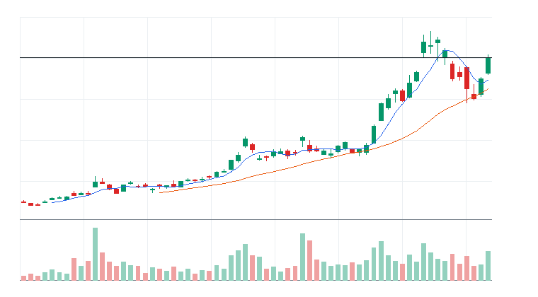

# ?ㅻ뒛???곗씪由??몃젅?대뵫 ?붿빟

**REAL DATA TEST - 가격/거래량은 실제 데이터, 뉴스 연결, ETF 구성종목 확산도/스프레드/유동성 일부 연결, 옵션 수집 실패로 점수 반영 제한**

**紐⑹쟻:** ??由ы룷?몃뒗 理쒓렐 ?ㅻⅨ ?먯궛???섏뿴?섎뒗 寃껋씠 ?꾨땲?? ?덉씠 紐곕━??洹쇨굅?€ ?ㅼ쓬 留ㅼ닔 二쇱껜媛€ ?뺤씤?섎뒗 ?몃젅?대뵫 ?꾨낫瑜?李얘린 ?꾪븳 蹂닿퀬?쒕떎.

> ?듭떖 吏덈Ц: ?꾩옱 媛€寃⑹뿉???닿퉴, ?꾧? ????鍮꾩떥寃??ъ쨪 ???덈뒗媛€?

## 0. ?쒖옣 ?곹깭

- ?곗씠??紐⑤뱶: REAL_TEST
- 媛€寃?嫄곕옒?? 연결됨
- ?댁뒪: 연결됨
- ?듭뀡: 실패
- ETF 援ъ꽦醫낅ぉ ?뺤궛?? 일부 연결
- ?ㅽ봽?덈뱶/?좊룞?? 일부 연결
- ?앹꽦 ?쒓컖: 2026년 6월 2일 화요일 오후 4:06
- ?쒖옣 ?곹깭: ?꾪뿕?좏샇
- ?ㅻ뒛 ?덉쓽 諛⑺뼢: Technology 개별 종목 흐름이 ETF 대비 강한지 확인 필요
- 媛뺥븳 ?뚮쭏 TOP 3: 諛섎룄泥?湲곗닠 ETF(79), Technology(59), ?쒖옣 湲곗? ETF(43)
- ?ㅻ뒛???먯튃: ETF???뚮쭏 ?먭툑 ?먮쫫, 媛쒕퀎 醫낅ぉ?€ ETF蹂대떎 媛뺥븷 ?뚮쭔 ?뚰뙆 ?꾨낫濡?蹂몃떎.
- ?곗씠???쒓퀎:
  - API ???먮뒗 provider ?곹깭???곕씪 ?댁뒪/?듭뀡/?뺤궛???ㅽ봽?덈뱶 諛섏쁺 踰붿쐞媛€ ?щ씪吏?  - ?섏쭛 ?ㅽ뙣 ?곗씠?곕뒗 ?먯닔 諛섏쁺?먯꽌 ?쒖쇅?섍굅??confidence瑜??쒗븳
  - reasonConfidence HIGH??異붽? ?곗씠?곌? 異⑸텇???곌껐???꾨낫?먮쭔 ?ъ슜

## ?ㅻ뒛??遺꾨━ 寃곕줎

- ETF ?됰룞 ?꾨낫: IGV, CIBR, AIQ, HACK, IPO
- 媛쒕퀎 醫낅ぉ ?됰룞 ?꾨낫: PANW, ARM, DDOG, CRWD, TEAM
- Nasdaq-100 ?좉퇋 ?ㅼ틪 寃곌낵:
  - 珥??ㅼ틪: 101
  - 理쒖쥌 ?꾨낫: 5
  - ?쒖쇅: 60
- ?꾩씪 異붿쿇 醫낅ぉ ?먭?:
  - ?먭? ?€?? 5
  - 유지: 5
  - 하향: 0
  - 무효화: 0
- ETF ?곗꽑 ?뚮쭏: ?깆옣/?뚮쭏 ETF
- 媛쒕퀎 醫낅ぉ ?곗꽑 ?뚮쭏: Technology, Technology, Technology, Technology, Technology
- ?ㅻ뒛 理쒖슦???ㅽ뻾 ?꾨낫: PANW - PANW??愿€??ETF ?€鍮??곷?媛뺣룄 ?뺤씤???꾩슂??媛쒕퀎 醫낅ぉ ?꾨낫??議곌굔 異⑹” ??ETF蹂대떎 ?뚰뙆瑜?湲곕??????덈떎.
- ?섏? 留먯븘????寃? 異붽꺽 留ㅼ닔 湲덉? / ETF?€ 媛쒕퀎 醫낅ぉ 以묐났 踰좏똿 湲덉? / ?ㅻ뒛 ???꾨낫?€ ?꾩씪 異붿쿇 ?먭? 醫낅ぉ??媛숈? ?섎?濡??욎뼱 ?댁꽍?섏? ?딄린

## moneyFlowScore ?곗젙 諛⑹떇

### score???섎?
moneyFlowScore???쒗쁽???대떦 ETF ?먮뒗 醫낅ぉ?쇰줈 ?덉씠 紐곕━怨??덈뒗 ?뺣룄?앸? 媛€寃? 嫄곕옒?? 異붿꽭, ?좉퀬媛€ 洹쇱젒?? ETF ?€鍮??곷?媛뺣룄 ?깆쓣 諛뷀깢?쇰줈 ?섏튂?뷀븳 ?먯닔??

???먯닔???κ린 媛€移섑룊媛€ ?먯닔媛€ ?꾨땲??
???먯닔???쒖?湲??쒖옣 李몄뿬?먮뱾????鍮꾩떥寃??ъ쨪 媛€?μ꽦???덈뒗 ?몃젅?대뵫 ?꾨낫?멸???앸? ?먮떒?섍린 ?꾪븳 ?④린/以묎린 紐⑤찘?€ ?먯닔??

### 湲곕낯 ?곗젙 ?붿냼
- 20???섏씡瑜? 理쒓렐 1媛쒖썡 ?섏???以묎린 異붿꽭瑜?諛섏쁺?쒕떎.
- 5???섏씡瑜? 理쒓렐 1二쇱씪 ?섏????④린 ?먭툑 ?좎엯??諛섏쁺?쒕떎.
- 1???섏씡瑜? 吏곸쟾 嫄곕옒?쇱쓽 ?④린 異붽꺽 留ㅼ닔?몃? 諛섏쁺?쒕떎.
- ?곷? 嫄곕옒?? 媛€寃??곸듅怨??④퍡 嫄곕옒?됱씠 ?섎㈃ ?ㅼ젣 ?먭툑 ?좎엯 媛€?μ꽦???믨쾶 蹂몃떎.
- 52二?怨좎젏 ?€鍮??꾩튂: 怨좎젏 洹쇱쿂 ?먯궛?€ 異붿꽭 異붿쥌 ?먭툑 ?좎엯 媛€?μ꽦???덈떎.
- 異붿꽭 ?곹깭: 5?쇱꽑/20?쇱꽑/50?쇱꽑 ?꾩뿉 ?덈뒗吏€ ?뺤씤?쒕떎.
- ETF ?€鍮??곷?媛뺣룄: 媛쒕퀎 醫낅ぉ?먮쭔 ?곸슜?섎ʼn, 愿€??ETF蹂대떎 媛뺥븷 ??媛쒕퀎 醫낅ぉ ?곗꽑 媛€?μ꽦???щ씪媛꾨떎.
- ?곗씠???좊ː???⑤꼸?? ?댁뒪/?듭뀡/?ㅽ봽?덈뱶/ETF 援ъ꽦醫낅ぉ ?뺤궛???곗씠?곌? 誘몄뿰寃곗씠硫?HIGH confidence瑜??ъ슜?섏? ?딅뒗??

### ?먯닔 援ш컙 ?댁꽍
- 80???댁긽: 媛뺥븳 ?먭툑 ?좎엯 ?꾨낫. ?? 怨쇱뿴 ?щ? ?뺤씤 ?꾩닔.
- 65???댁긽 80??誘몃쭔: 愿€???꾨낫. ?뚮┝ ?먮뒗 ?뚰뙆 ?뺤씤 ??吏꾩엯 寃€??
- 50???댁긽 65??誘몃쭔: 愿€李??꾨낫. ?먮쫫?€ ?덉쑝???곗꽑?쒖쐞????쓬.
- 50??誘몃쭔: 留ㅻℓ 湲덉? ?먮뒗 ?꾩닚???꾨낫.

### 二쇱쓽 臾멸뎄
moneyFlowScore??留ㅼ닔 異붿쿇 ?먯닔媛€ ?꾨땲??
媛€寃?嫄곕옒??湲곕컲???먭툑 ?먮쫫 ?꾨낫 ?먯닔?대ʼn, 吏꾩엯 ?щ???諛섎뱶??吏꾩엯 議곌굔怨?臾댄슚??議곌굔???④퍡 ?뺤씤?댁빞 ?쒕떎.

### moneyFlowScore(1차/최종) 계산 구조
- moneyFlowScore(1차) = 추세 + 단기 모멘텀 + 중기 모멘텀 + 거래량 + 신고가 근접 + 이동평균
- moneyFlowScore(최종 원점수) = moneyFlowScore(1차) + 뉴스 + 옵션 + ETF 확산도 + 유동성 + 관련 ETF 대비 상대강도 + 리스크 패널티
- moneyFlowScore(최종 표시 점수) = min(100, max(0, 최종 원점수))
- 리스크 패널티는 -6, -4처럼 음수로 저장하고 계산식에 그대로 더한다.
- 최종 표시 점수가 100점으로 같아도 정렬에는 최종 원점수를 tie-breaker로 사용한다.

## ?ㅻ뒛 ?덉씠 紐곕━???뚮쭏

- **諛섎룄泥?湲곗닠 ETF**: DRAM, SMH, SOXX, SOXQ | ?됯퇏 moneyFlowScore 79
- **Technology**: NVDA, AAPL, MSFT, AVGO, MU, AMD | ?됯퇏 moneyFlowScore 59
- **?쒖옣 湲곗? ETF**: QQQ, SPY, IWM | ?됯퇏 moneyFlowScore 43
- **?깆옣/?뚮쭏 ETF**: IGV, AIQ, BOTZ, ROBO, CIBR, HACK | ?됯퇏 moneyFlowScore 41
- **Industrials**: HON, ADP, CSX, CTAS, PCAR, FAST | ?됯퇏 moneyFlowScore 40
- **諛⑹궛 ETF**: ITA, XAR, SHLD, PPA | ?됯퇏 moneyFlowScore 39

## 1. ETF ?몃젅?대뵫 蹂닿퀬??
### 1-1. ETF 寃곕줎
- ETF ?곗꽑 ?꾨낫: IGV, CIBR, AIQ, HACK, IPO
- ETF 愿€李??꾨낫: DRAM, BOTZ, IHAK, ITA, COPX
- ETF 留ㅻℓ 湲덉?: PAVE, IFRA, XLU, URA, NLR
- ?ㅻ뒛 ETF 理쒖슦??1媛? IGV - 20일선 위 눌림 후 재상승 확인
- ETF ?뱀뀡 ?댁꽍: ???뱀뀡?€ 媛쒕퀎 醫낅ぉ ?좏깮???꾨땲???뚮쭏/?뱁꽣 ?⑥쐞???먭툑 ?먮쫫??ETF濡?留ㅻℓ?좎? ?먮떒?섍린 ?꾪븳 ?곸뿭?대떎.

### 1-2. ETF ?꾨낫 TOP 5

선정 기준: ETF 후보는 가격/거래량 1차 점수에 뉴스, 옵션, ETF 구성종목 확산도, 유동성, 리스크 패널티를 반영한 moneyFlowScore(최종) 기준으로 정렬한다. 최종 표시 점수가 같으면 최종 원점수를 tie-breaker로 사용한다.

### [ETF IGV] iShares Expanded Tech-Software Sector ETF
- ?먯궛 ?좏삎: ETF
- ETF ?몃? 移댄뀒怨좊━: ?깆옣/?뚮쭏 ETF
- ETF ??븷: 테마 베타 매수
- ?곹깭: 진입 가능
- moneyFlowScore: 100
- moneyFlowScore(최종) 산정 근거:
  - moneyFlowScore(1차): 100
  - 최종 원점수: 125
  - 최종 표시 점수: 100
  - cap 적용: raw score 125 capped to displayed score 100
  - 계산식: +102 + +10 + 0 + +8 + +5 + 0 + 0 + 0 = 125 -> 100
  - 점수 해석: 강한 자금 유입 후보. 단, 과열 여부 확인 필수.
  - 가격/거래량 1차 점수: +102
    - 추세: +29
    - 단기 모멘텀: +19
    - 중기 모멘텀: +16
    - 거래량: +18
    - 신고가 근접: +6
    - 이동평균: +14
  - 추가 데이터 가감점:
    - 뉴스: +10
    - 옵션: 0
    - 유동성: +5
  - ETF 확산도: +8
  - 리스크 패널티: 0
  - 주요 근거: 1차 100, 최종 원점수 125, 표시 100. 20???섏씡瑜?媛뺥븿, 5???섏씡瑜?媛뺥븿, 1???④린 紐⑤찘?€ ?뺤씤. 주의: 큰 감점 제한적.
  - 리스크 패널티 산정 근거:
    - 총 리스크 패널티: 0
    - 리스크 등급: LOW
    - 감점된 리스크: 없음
    - 관찰 리스크: options data not connected or unavailable
    - 한 줄 해석: 吏곸젒 媛먯젏??二쇱슂 由ъ뒪?щ뒗 ?놁?留?愿€李?由ъ뒪?щ뒗 怨꾩냽 ?뺤씤?댁빞 ?쒕떎.
- 怨쇱뿴 由ъ뒪?? ??쓬
- reasonConfidence: HIGH
- todayActionLabel: ETF 우선
- 湲곗??? 2026-06-01
- 醫낃?: $107.7
- 1???섏씡瑜? +5.94%
- 5???섏씡瑜? +14.56%
- 20???섏씡瑜? +24.32%
- ?곷? 嫄곕옒?? 1.83諛?- 52二?怨좎젏 ?€鍮??꾩튂: -8.72%
- whyMoneyIsFlowing: 20??+24.32%, 5??+14.56%, ?곷? 嫄곕옒??1.83諛곕줈 媛€寃⑷낵 嫄곕옒?됱씠 ?④퍡 媛쒖꽑. ?댁뒪: Exchange-Traded Funds, Equity Futures Higher Pre-Bell Monday as AI Optimism Overshadows Middle East Risks / ETF ?뺤궛?? BROAD_ADVANCE / ?좊룞?? LIQUID
- likelyNextBuyer: ?뱁꽣 踰좏?瑜??щ젮???④린 紐⑤찘?€ ?먭툑怨?由щ갭?곗떛 ?먭툑
- whyThisCouldTradeHigher: ?④린 異붿꽭媛€ ?좎??섍퀬 嫄곕옒?됱씠 1.0諛??댁긽?대㈃ ?섎룎由??댄썑 ?ъ긽?뱀쓣 ?쒕룄?????덉쓬
- ?곗씠???ъ슜 ?꾪솴:
  - 가격/거래량: 사용
  - 뉴스: 사용
  - 옵션: 실패
  - ETF 확산도: 사용
  - 유동성/스프레드: 사용
  - 관련 ETF 상대강도: 사용
- ?댁뒪 ?뺤씤:
  - 理쒓렐 ?댁뒪 ?곹깭: 연결됨
  - 湲띿젙/以묐┰/遺€?? 4/4/0
  - ?듭떖 ?댁뒪 ?붿빟: Exchange-Traded Funds, Equity Futures Higher Pre-Bell Monday as AI Optimism Overshadows Middle East Risks
  - ?먯닔 諛섏쁺: +10
  - 二쇱쓽: ?뱀씠?ы빆 ?놁쓬
- ?듭뀡 ?섍툒:
  - ?듭뀡 ?곗씠???곹깭: 실패
  - Put/Call 嫄곕옒??鍮꾩쑉: ?곗씠???놁쓬
  - 肄?嫄곕옒?? ?곗씠???놁쓬
  - ??嫄곕옒?? ?곗씠???놁쓬
  - IV ?곹깭: ?곗씠???놁쓬
  - ?댁꽍: ?쒕졆???듭뀡 諛⑺뼢???놁쓬
  - ?먯닔 諛섏쁺: 0
- ETF 援ъ꽦醫낅ぉ ?뺤궛??
  - 援ъ꽦醫낅ぉ ?곗씠???곹깭: 일부 연결
  - ?섑뵆 ?? 3/3
  - ?곸듅 醫낅ぉ 鍮꾩쑉: 67%
  - 20?쇱꽑 ??鍮꾩쑉: 100%
  - 50?쇱꽑 ??鍮꾩쑉: 100%
  - ?곸쐞 湲곗뿬 醫낅ぉ: PLTR, MSFT, AAPL
  - ?뺤궛???먮떒: BROAD_ADVANCE
  - ?먯닔 諛섏쁺: +8
- ?좊룞???ㅽ봽?덈뱶:
  - ?곗씠???곹깭: 일부 연결
  - ?ㅽ봽?덈뱶: bid/ask ?곗씠???놁쓬
  - 嫄곕옒?€湲? $4,300,902,570
  - ?됯퇏 嫄곕옒?€湲? $2,349,370,493
  - ?좊룞???먮떒: LIQUID
  - 留ㅻℓ ?곹뼢: 嫄곕옒?€湲?湲곗? ?ㅼ젣 留ㅻℓ 媛€?μ꽦????臾몄젣????쓬
- reasonConfidence 洹쇨굅: 가격/거래량, 뉴스, ETF 확산도, 유동성, 관련 ETF 상대강도 데이터가 확인되어 신뢰도를 높게 본다.
- 吏꾩엯 議곌굔: 20일선 위 눌림 후 재상승 확인
- 臾댄슚??議곌굔: 20일선 이탈 또는 상대 거래량 0.8배 이하 둔화
- 李⑦듃 ?붿빟: 理쒓렐 20嫄곕옒???곗긽?? 5?쇱꽑??20?쇱꽑 ?꾩뿉 ?덉쓬
- 李⑦듃: 
- 湲곗???2026-06-01 | 醫낃? $107.7 | 1??+5.94% | 5??+14.56% | 20??+24.32% | ?곷? 嫄곕옒??1.83諛?| 52二?怨좎젏 ?€鍮?-8.72% | ?곗씠???뚯뒪: yfinance

### [ETF CIBR] First Trust NASDAQ Cybersecurity ETF
- ?먯궛 ?좏삎: ETF
- ETF ?몃? 移댄뀒怨좊━: ?깆옣/?뚮쭏 ETF
- ETF ??븷: 테마 베타 매수
- ?곹깭: 진입 가능
- moneyFlowScore: 100
- moneyFlowScore(최종) 산정 근거:
  - moneyFlowScore(1차): 100
  - 최종 원점수: 123
  - 최종 표시 점수: 100
  - cap 적용: raw score 123 capped to displayed score 100
  - 계산식: +102 + +10 + 0 + +8 + +3 + 0 + 0 + 0 = 123 -> 100
  - 점수 해석: 강한 자금 유입 후보. 단, 과열 여부 확인 필수.
  - 가격/거래량 1차 점수: +102
    - 추세: +30
    - 단기 모멘텀: +16
    - 중기 모멘텀: +16
    - 거래량: +14
    - 신고가 근접: +12
    - 이동평균: +14
  - 추가 데이터 가감점:
    - 뉴스: +10
    - 옵션: 0
    - 유동성: +3
  - ETF 확산도: +8
  - 리스크 패널티: 0
  - 주요 근거: 1차 100, 최종 원점수 123, 표시 100. 20???섏씡瑜?媛뺥븿, 5???섏씡瑜?媛뺥븿, 1???④린 紐⑤찘?€ ?뺤씤. 주의: 큰 감점 제한적.
  - 리스크 패널티 산정 근거:
    - 총 리스크 패널티: 0
    - 리스크 등급: LOW
    - 감점된 리스크: 없음
    - 관찰 리스크: options data not connected or unavailable
    - 한 줄 해석: 吏곸젒 媛먯젏??二쇱슂 由ъ뒪?щ뒗 ?놁?留?愿€李?由ъ뒪?щ뒗 怨꾩냽 ?뺤씤?댁빞 ?쒕떎.
- 怨쇱뿴 由ъ뒪?? ??쓬~以묎컙
- reasonConfidence: HIGH
- todayActionLabel: ETF 우선
- 湲곗??? 2026-06-01
- 醫낃?: $94.15
- 1???섏씡瑜? +5.74%
- 5???섏씡瑜? +11.71%
- 20???섏씡瑜? +36.93%
- ?곷? 嫄곕옒?? 1.46諛?- 52二?怨좎젏 ?€鍮??꾩튂: -0.17%
- whyMoneyIsFlowing: 20??+36.93%, 5??+11.71%, ?곷? 嫄곕옒??1.46諛곕줈 媛€寃⑷낵 嫄곕옒?됱씠 ?④퍡 媛쒖꽑. ?댁뒪: The Asymmetric AI Winner: Cybersecurity ETFs Gaining From Cloud Buildout / ETF ?뺤궛?? BROAD_ADVANCE / ?좊룞?? ACCEPTABLE
- likelyNextBuyer: ?뱁꽣 踰좏?瑜??щ젮???④린 紐⑤찘?€ ?먭툑怨?由щ갭?곗떛 ?먭툑
- whyThisCouldTradeHigher: 52二?怨좎젏 遺€洹쇱씠???뚰뙆媛€ ?뺤씤?섎㈃ ?좉퀬媛€ 異붿쥌 留ㅼ닔媛€ 遺숈쓣 ???덉쓬
- ?곗씠???ъ슜 ?꾪솴:
  - 가격/거래량: 사용
  - 뉴스: 사용
  - 옵션: 실패
  - ETF 확산도: 사용
  - 유동성/스프레드: 사용
  - 관련 ETF 상대강도: 사용
- ?댁뒪 ?뺤씤:
  - 理쒓렐 ?댁뒪 ?곹깭: 연결됨
  - 湲띿젙/以묐┰/遺€?? 4/4/0
  - ?듭떖 ?댁뒪 ?붿빟: The Asymmetric AI Winner: Cybersecurity ETFs Gaining From Cloud Buildout
  - ?먯닔 諛섏쁺: +10
  - 二쇱쓽: ?뱀씠?ы빆 ?놁쓬
- ?듭뀡 ?섍툒:
  - ?듭뀡 ?곗씠???곹깭: 실패
  - Put/Call 嫄곕옒??鍮꾩쑉: ?곗씠???놁쓬
  - 肄?嫄곕옒?? ?곗씠???놁쓬
  - ??嫄곕옒?? ?곗씠???놁쓬
  - IV ?곹깭: ?곗씠???놁쓬
  - ?댁꽍: ?쒕졆???듭뀡 諛⑺뼢???놁쓬
  - ?먯닔 諛섏쁺: 0
- ETF 援ъ꽦醫낅ぉ ?뺤궛??
  - 援ъ꽦醫낅ぉ ?곗씠???곹깭: 일부 연결
  - ?섑뵆 ?? 2/2
  - ?곸듅 醫낅ぉ 鍮꾩쑉: 100%
  - 20?쇱꽑 ??鍮꾩쑉: 100%
  - 50?쇱꽑 ??鍮꾩쑉: 100%
  - ?곸쐞 湲곗뿬 醫낅ぉ: PLTR, MSFT
  - ?뺤궛???먮떒: BROAD_ADVANCE
  - ?먯닔 諛섏쁺: +8
- ?좊룞???ㅽ봽?덈뱶:
  - ?곗씠???곹깭: 일부 연결
  - ?ㅽ봽?덈뱶: bid/ask ?곗씠???놁쓬
  - 嫄곕옒?€湲? $236,335,330
  - ?됯퇏 嫄곕옒?€湲? $162,239,751
  - ?좊룞???먮떒: ACCEPTABLE
  - 留ㅻℓ ?곹뼢: 嫄곕옒?€湲덉? ?섏슜 媛€?ν븯??bid/ask ?뺤씤 ?꾩슂
- reasonConfidence 洹쇨굅: 가격/거래량, 뉴스, ETF 확산도, 유동성, 관련 ETF 상대강도 데이터가 확인되어 신뢰도를 높게 본다.
- 吏꾩엯 議곌굔: 전일 고점 돌파와 5일선 유지 확인
- 臾댄슚??議곌굔: 20일선 이탈 또는 상대 거래량 0.8배 이하 둔화
- 李⑦듃 ?붿빟: 理쒓렐 20嫄곕옒???곗긽?? 5?쇱꽑??20?쇱꽑 ?꾩뿉 ?덉쓬
- 李⑦듃: 
- 湲곗???2026-06-01 | 醫낃? $94.15 | 1??+5.74% | 5??+11.71% | 20??+36.93% | ?곷? 嫄곕옒??1.46諛?| 52二?怨좎젏 ?€鍮?-0.17% | ?곗씠???뚯뒪: yfinance

### [ETF AIQ] Global X Artificial Intelligence & Technology ETF
- ?먯궛 ?좏삎: ETF
- ETF ?몃? 移댄뀒怨좊━: ?깆옣/?뚮쭏 ETF
- ETF ??븷: 테마 베타 매수
- ?곹깭: 진입 가능
- moneyFlowScore: 100
- moneyFlowScore(최종) 산정 근거:
  - moneyFlowScore(1차): 97
  - 최종 원점수: 118
  - 최종 표시 점수: 100
  - cap 적용: raw score 118 capped to displayed score 100
  - 계산식: +97 + +10 + 0 + +8 + +3 + 0 + 0 + 0 = 118 -> 100
  - 점수 해석: 강한 자금 유입 후보. 단, 과열 여부 확인 필수.
  - 가격/거래량 1차 점수: +97
    - 추세: +27
    - 단기 모멘텀: +12
    - 중기 모멘텀: +14
    - 거래량: +18
    - 신고가 근접: +12
    - 이동평균: +14
  - 추가 데이터 가감점:
    - 뉴스: +10
    - 옵션: 0
    - 유동성: +3
  - ETF 확산도: +8
  - 리스크 패널티: 0
  - 주요 근거: 1차 97, 최종 원점수 118, 표시 100. 20???섏씡瑜?媛뺥븿, 5???섏씡瑜?媛뺥븿, 1???④린 紐⑤찘?€ ?뺤씤. 주의: 큰 감점 제한적.
  - 리스크 패널티 산정 근거:
    - 총 리스크 패널티: 0
    - 리스크 등급: LOW
    - 감점된 리스크: 없음
    - 관찰 리스크: options data not connected or unavailable
    - 한 줄 해석: 吏곸젒 媛먯젏??二쇱슂 由ъ뒪?щ뒗 ?놁?留?愿€李?由ъ뒪?щ뒗 怨꾩냽 ?뺤씤?댁빞 ?쒕떎.
- 怨쇱뿴 由ъ뒪?? ??쓬~以묎컙
- reasonConfidence: HIGH
- todayActionLabel: ETF 우선
- 湲곗??? 2026-06-01
- 醫낃?: $69.44
- 1???섏씡瑜? +3.15%
- 5???섏씡瑜? +10.56%
- 20???섏씡瑜? +22.21%
- ?곷? 嫄곕옒?? 1.59諛?- 52二?怨좎젏 ?€鍮??꾩튂: -0.56%
- whyMoneyIsFlowing: 20??+22.21%, 5??+10.56%, ?곷? 嫄곕옒??1.59諛곕줈 媛€寃⑷낵 嫄곕옒?됱씠 ?④퍡 媛쒖꽑. ?댁뒪: OpenAI Reportedly Set to File for IPO as Early as Friday / ETF ?뺤궛?? BROAD_ADVANCE / ?좊룞?? ACCEPTABLE
- likelyNextBuyer: ?뱁꽣 踰좏?瑜??щ젮???④린 紐⑤찘?€ ?먭툑怨?由щ갭?곗떛 ?먭툑
- whyThisCouldTradeHigher: 52二?怨좎젏 遺€洹쇱씠???뚰뙆媛€ ?뺤씤?섎㈃ ?좉퀬媛€ 異붿쥌 留ㅼ닔媛€ 遺숈쓣 ???덉쓬
- ?곗씠???ъ슜 ?꾪솴:
  - 가격/거래량: 사용
  - 뉴스: 사용
  - 옵션: 실패
  - ETF 확산도: 사용
  - 유동성/스프레드: 사용
  - 관련 ETF 상대강도: 사용
- ?댁뒪 ?뺤씤:
  - 理쒓렐 ?댁뒪 ?곹깭: 연결됨
  - 湲띿젙/以묐┰/遺€?? 4/4/0
  - ?듭떖 ?댁뒪 ?붿빟: OpenAI Reportedly Set to File for IPO as Early as Friday
  - ?먯닔 諛섏쁺: +10
  - 二쇱쓽: ?뱀씠?ы빆 ?놁쓬
- ?듭뀡 ?섍툒:
  - ?듭뀡 ?곗씠???곹깭: 실패
  - Put/Call 嫄곕옒??鍮꾩쑉: ?곗씠???놁쓬
  - 肄?嫄곕옒?? ?곗씠???놁쓬
  - ??嫄곕옒?? ?곗씠???놁쓬
  - IV ?곹깭: ?곗씠???놁쓬
  - ?댁꽍: ?쒕졆???듭뀡 諛⑺뼢???놁쓬
  - ?먯닔 諛섏쁺: 0
- ETF 援ъ꽦醫낅ぉ ?뺤궛??
  - 援ъ꽦醫낅ぉ ?곗씠???곹깭: 일부 연결
  - ?섑뵆 ?? 4/4
  - ?곸듅 醫낅ぉ 鍮꾩쑉: 75%
  - 20?쇱꽑 ??鍮꾩쑉: 100%
  - 50?쇱꽑 ??鍮꾩쑉: 100%
  - ?곸쐞 湲곗뿬 醫낅ぉ: PLTR, MSFT, NVDA, AAPL
  - ?뺤궛???먮떒: BROAD_ADVANCE
  - ?먯닔 諛섏쁺: +8
- ?좊룞???ㅽ봽?덈뱶:
  - ?곗씠???곹깭: 일부 연결
  - ?ㅽ봽?덈뱶: bid/ask ?곗씠???놁쓬
  - 嫄곕옒?€湲? $245,970,368
  - ?됯퇏 嫄곕옒?€湲? $154,223,810
  - ?좊룞???먮떒: ACCEPTABLE
  - 留ㅻℓ ?곹뼢: 嫄곕옒?€湲덉? ?섏슜 媛€?ν븯??bid/ask ?뺤씤 ?꾩슂
- reasonConfidence 洹쇨굅: 가격/거래량, 뉴스, ETF 확산도, 유동성, 관련 ETF 상대강도 데이터가 확인되어 신뢰도를 높게 본다.
- 吏꾩엯 議곌굔: 전일 고점 돌파와 5일선 유지 확인
- 臾댄슚??議곌굔: 20일선 이탈 또는 상대 거래량 0.8배 이하 둔화
- 李⑦듃 ?붿빟: 理쒓렐 20嫄곕옒???곗긽?? 5?쇱꽑??20?쇱꽑 ?꾩뿉 ?덉쓬
- 李⑦듃: 
- 湲곗???2026-06-01 | 醫낃? $69.44 | 1??+3.15% | 5??+10.56% | 20??+22.21% | ?곷? 嫄곕옒??1.59諛?| 52二?怨좎젏 ?€鍮?-0.56% | ?곗씠???뚯뒪: yfinance

### [ETF HACK] Amplify Cybersecurity ETF
- ?먯궛 ?좏삎: ETF
- ETF ?몃? 移댄뀒怨좊━: ?깆옣/?뚮쭏 ETF
- ETF ??븷: 테마 베타 매수
- ?곹깭: 진입 가능
- moneyFlowScore: 100
- moneyFlowScore(최종) 산정 근거:
  - moneyFlowScore(1차): 100
  - 최종 원점수: 112
  - 최종 표시 점수: 100
  - cap 적용: raw score 112 capped to displayed score 100
  - 계산식: +104 + +10 + 0 + +8 - 5 + 0 - 5 + 0 = 112 -> 100
  - 점수 해석: 강한 자금 유입 후보. 단, 과열 여부 확인 필수.
  - 가격/거래량 1차 점수: +104
    - 추세: +29
    - 단기 모멘텀: +15
    - 중기 모멘텀: +16
    - 거래량: +18
    - 신고가 근접: +12
    - 이동평균: +14
  - 추가 데이터 가감점:
    - 뉴스: +10
    - 옵션: 0
    - 유동성: -5
  - ETF 확산도: +8
  - 리스크 패널티: -5
  - 주요 근거: 1차 100, 최종 원점수 112, 표시 100. 20???섏씡瑜?媛뺥븿, 5???섏씡瑜?媛뺥븿, 1???④린 紐⑤찘?€ ?뺤씤. 주의: 큰 감점 제한적.
  - 리스크 패널티 산정 근거:
    - 총 리스크 패널티: -5
    - 리스크 등급: LOW
    - 감점된 리스크:
      - low liquidity: -5 | 근거: Liquidity signal: LOW_LIQUIDITY. | 대응: Avoid market-order chasing.
    - 관찰 리스크: options data not connected or unavailable
    - 한 줄 해석: 1媛?媛먯젏 由ъ뒪?щ줈 珥?-5??諛섏쁺.
- 怨쇱뿴 由ъ뒪?? ??쓬~以묎컙
- reasonConfidence: MEDIUM
- todayActionLabel: ETF 우선
- 湲곗??? 2026-06-01
- 醫낃?: $105
- 1???섏씡瑜? +5.69%
- 5???섏씡瑜? +10.70%
- 20???섏씡瑜? +29.98%
- ?곷? 嫄곕옒?? 1.57諛?- 52二?怨좎젏 ?€鍮??꾩튂: -0.38%
- whyMoneyIsFlowing: 20??+29.98%, 5??+10.70%, ?곷? 嫄곕옒??1.57諛곕줈 媛€寃⑷낵 嫄곕옒?됱씠 ?④퍡 媛쒖꽑. ?댁뒪: The Asymmetric AI Winner: Cybersecurity ETFs Gaining From Cloud Buildout / ETF ?뺤궛?? BROAD_ADVANCE
- likelyNextBuyer: ?뱁꽣 踰좏?瑜??щ젮???④린 紐⑤찘?€ ?먭툑怨?由щ갭?곗떛 ?먭툑
- whyThisCouldTradeHigher: 52二?怨좎젏 遺€洹쇱씠???뚰뙆媛€ ?뺤씤?섎㈃ ?좉퀬媛€ 異붿쥌 留ㅼ닔媛€ 遺숈쓣 ???덉쓬
- ?곗씠???ъ슜 ?꾪솴:
  - 가격/거래량: 사용
  - 뉴스: 사용
  - 옵션: 실패
  - ETF 확산도: 사용
  - 유동성/스프레드: 사용
  - 관련 ETF 상대강도: 사용
- ?댁뒪 ?뺤씤:
  - 理쒓렐 ?댁뒪 ?곹깭: 연결됨
  - 湲띿젙/以묐┰/遺€?? 4/4/0
  - ?듭떖 ?댁뒪 ?붿빟: The Asymmetric AI Winner: Cybersecurity ETFs Gaining From Cloud Buildout
  - ?먯닔 諛섏쁺: +10
  - 二쇱쓽: ?뱀씠?ы빆 ?놁쓬
- ?듭뀡 ?섍툒:
  - ?듭뀡 ?곗씠???곹깭: 실패
  - Put/Call 嫄곕옒??鍮꾩쑉: ?곗씠???놁쓬
  - 肄?嫄곕옒?? ?곗씠???놁쓬
  - ??嫄곕옒?? ?곗씠???놁쓬
  - IV ?곹깭: ?곗씠???놁쓬
  - ?댁꽍: ?쒕졆???듭뀡 諛⑺뼢???놁쓬
  - ?먯닔 諛섏쁺: 0
- ETF 援ъ꽦醫낅ぉ ?뺤궛??
  - 援ъ꽦醫낅ぉ ?곗씠???곹깭: 일부 연결
  - ?섑뵆 ?? 2/2
  - ?곸듅 醫낅ぉ 鍮꾩쑉: 100%
  - 20?쇱꽑 ??鍮꾩쑉: 100%
  - 50?쇱꽑 ??鍮꾩쑉: 100%
  - ?곸쐞 湲곗뿬 醫낅ぉ: PLTR, MSFT
  - ?뺤궛???먮떒: BROAD_ADVANCE
  - ?먯닔 諛섏쁺: +8
- ?좊룞???ㅽ봽?덈뱶:
  - ?곗씠???곹깭: 일부 연결
  - ?ㅽ봽?덈뱶: bid/ask ?곗씠???놁쓬
  - 嫄곕옒?€湲? $23,467,500
  - ?됯퇏 嫄곕옒?€湲? $14,924,175
  - ?좊룞???먮떒: LOW_LIQUIDITY
  - 留ㅻℓ ?곹뼢: ?좊룞??遺€議깆쑝濡?異붽꺽 湲덉? ?먮뒗 ?곗꽑?쒖쐞 ?섑뼢
- reasonConfidence 洹쇨굅: 가격/거래량, 뉴스, ETF 확산도, 유동성, 관련 ETF 상대강도은 확인됐지만 일부 보조 데이터가 미연결 또는 fallback이라 중간으로 제한한다.
- 吏꾩엯 議곌굔: 전일 고점 돌파와 5일선 유지 확인
- 臾댄슚??議곌굔: 20일선 이탈 또는 상대 거래량 0.8배 이하 둔화
- 李⑦듃 ?붿빟: 理쒓렐 20嫄곕옒???곗긽?? 5?쇱꽑??20?쇱꽑 ?꾩뿉 ?덉쓬
- 李⑦듃: 
- 湲곗???2026-06-01 | 醫낃? $105 | 1??+5.69% | 5??+10.70% | 20??+29.98% | ?곷? 嫄곕옒??1.57諛?| 52二?怨좎젏 ?€鍮?-0.38% | ?곗씠???뚯뒪: yfinance

### [ETF DRAM] Roundhill Memory ETF
- ?먯궛 ?좏삎: ETF
- ETF ?몃? 移댄뀒怨좊━: 諛섎룄泥?湲곗닠 ETF
- ETF ??븷: 테마 베타 매수
- ?곹깭: 관찰
- moneyFlowScore: 100
- moneyFlowScore(최종) 산정 근거:
  - moneyFlowScore(1차): 100
  - 최종 원점수: 103
  - 최종 표시 점수: 100
  - cap 적용: raw score 103 capped to displayed score 100
  - 계산식: +102 + +10 + 0 + 0 + +5 + 0 - 14 + 0 = 103 -> 100
  - 점수 해석: 강한 자금 유입 후보. 단, 과열 여부 확인 필수.
  - 가격/거래량 1차 점수: +102
    - 추세: +30
    - 단기 모멘텀: +20
    - 중기 모멘텀: +16
    - 거래량: +10
    - 신고가 근접: +12
    - 이동평균: +14
  - 추가 데이터 가감점:
    - 뉴스: +10
    - 옵션: 0
    - 유동성: +5
  - ETF 확산도: 0
  - 리스크 패널티: -14
  - 주요 근거: 1차 100, 최종 원점수 103, 표시 100. 20???섏씡瑜?媛뺥븿, 5???섏씡瑜?媛뺥븿, 1???④린 紐⑤찘?€ ?뺤씤. 주의: ETF 구성종목 확산도 데이터 미연결.
  - 리스크 패널티 산정 근거:
    - 총 리스크 패널티: -14
    - 리스크 등급: MEDIUM
    - 감점된 리스크:
      - short-term overheat: -6 | 근거: 5d return +28.74% is extended. | 대응: Prefer pullback or prior high reclaim over chasing.
      - extreme 1d move: -4 | 근거: 1d return +7.59% is unusually strong. | 대응: Confirm next-session volume retention.
      - near 52w high chase: -4 | 근거: Price is close to the 52-week high with fast short-term momentum. | 대응: Downgrade if breakout fails.
    - 관찰 리스크: options data not connected or unavailable; ETF breadth data not connected
    - 한 줄 해석: 3媛?媛먯젏 由ъ뒪?щ줈 珥?-14??諛섏쁺.
- 怨쇱뿴 由ъ뒪?? 以묎컙
- reasonConfidence: MEDIUM
- todayActionLabel: 돌파 확인 후 관찰
- 湲곗??? 2026-06-01
- 醫낃?: $68
- 1???섏씡瑜? +7.59%
- 5???섏씡瑜? +28.74%
- 20???섏씡瑜? +68.28%
- ?곷? 嫄곕옒?? 1.06諛?- 52二?怨좎젏 ?€鍮??꾩튂: -1.11%
- whyMoneyIsFlowing: 20??+68.28%, 5??+28.74%, ?곷? 嫄곕옒??1.06諛곕줈 媛€寃⑷낵 嫄곕옒?됱씠 ?④퍡 媛쒖꽑. ?댁뒪: Daily ETF Flows: DRAM Back In The Top 10 / ?좊룞?? LIQUID
- likelyNextBuyer: ?뱁꽣 踰좏?瑜??щ젮???④린 紐⑤찘?€ ?먭툑怨?由щ갭?곗떛 ?먭툑
- whyThisCouldTradeHigher: 52二?怨좎젏 遺€洹쇱씠???뚰뙆媛€ ?뺤씤?섎㈃ ?좉퀬媛€ 異붿쥌 留ㅼ닔媛€ 遺숈쓣 ???덉쓬
- ?곗씠???ъ슜 ?꾪솴:
  - 가격/거래량: 사용
  - 뉴스: 사용
  - 옵션: 실패
  - ETF 확산도: 미연결
  - 유동성/스프레드: 사용
  - 관련 ETF 상대강도: 사용
- ?댁뒪 ?뺤씤:
  - 理쒓렐 ?댁뒪 ?곹깭: 연결됨
  - 湲띿젙/以묐┰/遺€?? 3/5/0
  - ?듭떖 ?댁뒪 ?붿빟: Daily ETF Flows: DRAM Back In The Top 10
  - ?먯닔 諛섏쁺: +10
  - 二쇱쓽: ?뱀씠?ы빆 ?놁쓬
- ?듭뀡 ?섍툒:
  - ?듭뀡 ?곗씠???곹깭: 실패
  - Put/Call 嫄곕옒??鍮꾩쑉: ?곗씠???놁쓬
  - 肄?嫄곕옒?? ?곗씠???놁쓬
  - ??嫄곕옒?? ?곗씠???놁쓬
  - IV ?곹깭: ?곗씠???놁쓬
  - ?댁꽍: ?쒕졆???듭뀡 諛⑺뼢???놁쓬
  - ?먯닔 諛섏쁺: 0
- ETF 援ъ꽦醫낅ぉ ?뺤궛??
  - 援ъ꽦醫낅ぉ ?곗씠???곹깭: 미연결
  - ?섑뵆 ?? 0/0
  - ?곸듅 醫낅ぉ 鍮꾩쑉: ?곗씠???놁쓬
  - 20?쇱꽑 ??鍮꾩쑉: ?곗씠???놁쓬
  - 50?쇱꽑 ??鍮꾩쑉: ?곗씠???놁쓬
  - ?곸쐞 湲곗뿬 醫낅ぉ: ?곗씠???놁쓬
  - ?뺤궛???먮떒: UNKNOWN
  - ?먯닔 諛섏쁺: 0
- ?좊룞???ㅽ봽?덈뱶:
  - ?곗씠???곹깭: 일부 연결
  - ?ㅽ봽?덈뱶: bid/ask ?곗씠???놁쓬
  - 嫄곕옒?€湲? $2,796,846,800
  - ?됯퇏 嫄곕옒?€湲? $2,641,736,760
  - ?좊룞???먮떒: LIQUID
  - 留ㅻℓ ?곹뼢: 嫄곕옒?€湲?湲곗? ?ㅼ젣 留ㅻℓ 媛€?μ꽦????臾몄젣????쓬
- reasonConfidence 洹쇨굅: 가격/거래량, 뉴스, 유동성, 관련 ETF 상대강도은 확인됐지만 일부 보조 데이터가 미연결 또는 fallback이라 중간으로 제한한다.
- 吏꾩엯 議곌굔: 전일 고점 돌파와 5일선 유지 확인
- 臾댄슚??議곌굔: 20일선 이탈 또는 상대 거래량 0.8배 이하 둔화
- 李⑦듃 ?붿빟: 理쒓렐 20嫄곕옒???곗긽?? 5?쇱꽑??20?쇱꽑 ?꾩뿉 ?덉쓬
- 李⑦듃: 
- 湲곗???2026-06-01 | 醫낃? $68 | 1??+7.59% | 5??+28.74% | 20??+68.28% | ?곷? 嫄곕옒??1.06諛?| 52二?怨좎젏 ?€鍮?-1.11% | ?곗씠???뚯뒪: yfinance

### 1-3. ETF 怨쇱뿴/二쇱쓽 ?꾨낫

#### [DRAM] Roundhill Memory ETF
- moneyFlowScore(최종): 100
- moneyFlowScore ?곗젙 洹쇨굅 ?붿빟: 1차 100, 최종 원점수 103, 표시 100. 20???섏씡瑜?媛뺥븿, 5???섏씡瑜?媛뺥븿, 1???④린 紐⑤찘?€ ?뺤씤. 주의: ETF 구성종목 확산도 데이터 미연결.
- 怨쇱뿴 由ъ뒪?? 以묎컙
- 怨쇱뿴 洹쇨굅: 諛섎룄泥?湲곗닠 ETF 기준 단기 급등과 고점 근접 조합 확인
- 대응: 돌파 확인 후 진입

#### [AIQ] Global X Artificial Intelligence & Technology ETF
- moneyFlowScore(최종): 100
- moneyFlowScore ?곗젙 洹쇨굅 ?붿빟: 1차 97, 최종 원점수 118, 표시 100. 20???섏씡瑜?媛뺥븿, 5???섏씡瑜?媛뺥븿, 1???④린 紐⑤찘?€ ?뺤씤. 주의: 큰 감점 제한적.
- 怨쇱뿴 由ъ뒪?? ??쓬~以묎컙
- 怨쇱뿴 洹쇨굅: ?깆옣/?뚮쭏 ETF 기준 단기 급등과 고점 근접 조합 확인
- 대응: 돌파 확인 후 진입

#### [CIBR] First Trust NASDAQ Cybersecurity ETF
- moneyFlowScore(최종): 100
- moneyFlowScore ?곗젙 洹쇨굅 ?붿빟: 1차 100, 최종 원점수 123, 표시 100. 20???섏씡瑜?媛뺥븿, 5???섏씡瑜?媛뺥븿, 1???④린 紐⑤찘?€ ?뺤씤. 주의: 큰 감점 제한적.
- 怨쇱뿴 由ъ뒪?? ??쓬~以묎컙
- 怨쇱뿴 洹쇨굅: ?깆옣/?뚮쭏 ETF 기준 단기 급등과 고점 근접 조합 확인
- 대응: 돌파 확인 후 진입

#### [HACK] Amplify Cybersecurity ETF
- moneyFlowScore(최종): 100
- moneyFlowScore ?곗젙 洹쇨굅 ?붿빟: 1차 100, 최종 원점수 112, 표시 100. 20???섏씡瑜?媛뺥븿, 5???섏씡瑜?媛뺥븿, 1???④린 紐⑤찘?€ ?뺤씤. 주의: 큰 감점 제한적.
- 怨쇱뿴 由ъ뒪?? ??쓬~以묎컙
- 怨쇱뿴 洹쇨굅: ?깆옣/?뚮쭏 ETF 기준 단기 급등과 고점 근접 조합 확인
- 대응: 돌파 확인 후 진입

#### [IHAK] iShares Cybersecurity and Tech ETF
- moneyFlowScore(최종): 89
- moneyFlowScore ?곗젙 洹쇨굅 ?붿빟: 1차 93, 최종 원점수 89, 표시 89. 20???섏씡瑜?媛뺥븿, 5???섏씡瑜?媛뺥븿, 1???④린 紐⑤찘?€ ?뺤씤. 주의: ETF 구성종목 확산도 데이터 미연결.
- 怨쇱뿴 由ъ뒪?? 以묎컙
- 怨쇱뿴 洹쇨굅: ?깆옣/?뚮쭏 ETF 기준 단기 급등과 고점 근접 조합 확인
- 대응: 돌파 확인 후 진입

### 1-4. ETF ?쒖쇅/留ㅻℓ 湲덉? ?꾨낫

#### [PAVE] Global X U.S. Infrastructure Development ETF
- moneyFlowScore(최종): 0
- moneyFlowScore ?곗젙 洹쇨굅 ?붿빟: 1차 3, 최종 원점수 -3, 표시 0. 52二?怨좎젏 洹쇱쿂, ?댁뒪 ?먮쫫??媛€寃?嫄곕옒??洹쇨굅瑜?蹂닿컯, ?좊룞???ㅽ봽?덈뱶 二쇱쓽. 주의: ETF 구성종목 확산도 데이터 미연결.
- 제외 사유: 테마 자금 흐름 약함
- ?ш???議곌굔: 상대 거래량 1.0배 회복 후 관찰

#### [IFRA] iShares U.S. Infrastructure ETF
- moneyFlowScore(최종): 0
- moneyFlowScore ?곗젙 洹쇨굅 ?붿빟: 1차 0, 최종 원점수 -29, 표시 0. ?좊룞???ㅽ봽?덈뱶 二쇱쓽, ?④린 怨쇱뿴/異붽꺽 ?꾪뿕 議댁옱, ?듭뀡 ?곗씠??誘몄뿰寃??먮뒗 ?섏쭛 ?ㅽ뙣. 주의: ETF 구성종목 확산도 데이터 미연결.
- 제외 사유: 테마 자금 흐름 약함
- ?ш???議곌굔: 상대 거래량 1.0배 회복 후 관찰

#### [XLU] Utilities Select Sector SPDR Fund
- moneyFlowScore(최종): 0
- moneyFlowScore ?곗젙 洹쇨굅 ?붿빟: 1차 0, 최종 원점수 0, 표시 0. ?곷? 嫄곕옒??利앷?, ?댁뒪 ?먮쫫??媛€寃?嫄곕옒??洹쇨굅瑜?蹂닿컯, 嫄곕옒?€湲?湲곗? ?좊룞???묓샇. 주의: ETF 구성종목 확산도 데이터 미연결.
- 제외 사유: 테마 자금 흐름 약함
- ?ш???議곌굔: 20일선 위 눌림 후 재상승 확인

#### [URA] Global X Uranium ETF
- moneyFlowScore(최종): 0
- moneyFlowScore ?곗젙 洹쇨굅 ?붿빟: 1차 0, 최종 원점수 -12, 표시 0. ?댁뒪 ?먮쫫??媛€寃?嫄곕옒??洹쇨굅瑜?蹂닿컯, 嫄곕옒?€湲?湲곗? ?좊룞???묓샇, ?④린 怨쇱뿴/異붽꺽 ?꾪뿕 議댁옱. 주의: ETF 구성종목 확산도 데이터 미연결.
- 제외 사유: 테마 자금 흐름 약함
- ?ш???議곌굔: 상대 거래량 1.0배 회복 후 관찰

#### [NLR] VanEck Uranium and Nuclear ETF
- moneyFlowScore(최종): 0
- moneyFlowScore ?곗젙 洹쇨굅 ?붿빟: 1차 0, 최종 원점수 -29, 표시 0. ?댁뒪 ?먮쫫??媛€寃?嫄곕옒??洹쇨굅瑜?蹂닿컯, ?좊룞???ㅽ봽?덈뱶 二쇱쓽, ?④린 怨쇱뿴/異붽꺽 ?꾪뿕 議댁옱. 주의: ETF 구성종목 확산도 데이터 미연결.
- 제외 사유: 테마 자금 흐름 약함
- ?ш???議곌굔: 상대 거래량 1.0배 회복 후 관찰

## 2. 媛쒕퀎 醫낅ぉ ?몃젅?대뵫 蹂닿퀬??
### 2-1. ?ㅻ뒛 Nasdaq-100 ?좉퇋 諛쒓뎬 ?붿빟
- ?좉퇋 諛쒓뎬 ?€: Nasdaq-100 援ъ꽦醫낅ぉ ?꾩껜
- universe source: fallback from StockAnalysis Nasdaq-100 list checked 2026-06-02
- universe fetchStatus: FALLBACK
- 珥??ㅼ틪 醫낅ぉ ?? 101
- ?곗씠???섏쭛 ?깃났: 101
- ?곗씠???섏쭛 ?ㅽ뙣: 0
- ?곸꽭 ?곗씠???섏쭛 ?€?? 媛€寃?嫄곕옒??1李??ㅼ틪 ?곸쐞 20媛?- ?ㅻ뒛 吏꾩엯 ?꾨낫: 10
- ?ㅻ뒛 ?뚮┝ ?€湲? 4
- ?ㅻ뒛 愿€李? 21
- ?ㅻ뒛 留ㅻℓ 湲덉?: 60
- 媛쒕퀎 醫낅ぉ 吏꾩엯 ?꾨낫: PANW, ARM, DDOG, CRWD, TEAM
- 媛쒕퀎 醫낅ぉ ?뚮┝ ?€湲? ?놁쓬
- 媛쒕퀎 醫낅ぉ 留ㅻℓ 湲덉?: ?놁쓬
- ?ㅻ뒛 媛쒕퀎 醫낅ぉ 理쒖슦??1媛? PANW - 관련 ETF보다 강함 | 주식 5일 +15.31% vs ETF 평균 +11.47%, 주식 20일 +65.94% vs ETF 평균 +29.72%, 상대 거래량 1.54배 vs ETF 평균 1.49배
- 媛쒕퀎 醫낅ぉ ?뱀뀡 ?댁꽍: ???뱀뀡?€ ETF濡??뺤씤???뚮쭏 ?먭툑 ?먮쫫 ?덉뿉??ETF蹂대떎 ???섏? ?뚰뙆瑜?以????덈뒗 媛쒕퀎 醫낅ぉ留??좊퀎?섎뒗 ?곸뿭?대떎.

### 2-2. ?ㅻ뒛 媛쒕퀎 醫낅ぉ ?좉퇋 ?꾨낫 TOP 5

선정 기준:
1. Nasdaq-100 전체를 moneyFlowScore(1차)로 먼저 스캔
2. moneyFlowScore(1차) 상위 20개를 상세 분석
3. 뉴스/옵션/유동성/관련 ETF 대비 상대강도/리스크 패널티를 반영
4. moneyFlowScore(최종), 최종 원점수, 리스크 패널티, 5일 수익률, 상대 거래량 순으로 재정렬

### [PANW] Palo Alto Networks Inc.
- ?먯궛 ?좏삎: STOCK
- ?곹깭: 진입 가능
- primaryTheme: Technology
- primarySector: Technology
- relatedEtfs: HACK, CIBR, IHAK, IGV
- moneyFlowScore: 100
- moneyFlowScore(최종) 산정 근거:
  - moneyFlowScore(1차): 100
  - 최종 원점수: 123
  - 최종 표시 점수: 100
  - cap 적용: raw score 123 capped to displayed score 100
  - 계산식: +104 + +10 + 0 + 0 + +5 + +8 - 4 + 0 = 123 -> 100
  - 점수 해석: 강한 자금 유입 후보. 단, 과열 여부 확인 필수.
  - 가격/거래량 1차 점수: +104
    - 추세: +24
    - 단기 모멘텀: +20
    - 중기 모멘텀: +16
    - 거래량: +18
    - 신고가 근접: +12
    - 이동평균: +14
  - 추가 데이터 가감점:
    - 뉴스: +10
    - 옵션: 0
    - 유동성: +5
  - ETF 대비 상대강도: +8
  - 리스크 패널티: -4
  - 주요 근거: 1차 100, 최종 원점수 123, 표시 100. 20???섏씡瑜?媛뺥븿, 5???섏씡瑜?媛뺥븿, 1???④린 紐⑤찘?€ ?뺤씤. 주의: 큰 감점 제한적.
  - 리스크 패널티 산정 근거:
    - 총 리스크 패널티: -4
    - 리스크 등급: LOW
    - 감점된 리스크:
      - extreme 1d move: -4 | 근거: 1d return +6.67% is unusually strong. | 대응: Confirm next-session volume retention.
    - 관찰 리스크: options data not connected or unavailable
    - 한 줄 해석: 1媛?媛먯젏 由ъ뒪?щ줈 珥?-4??諛섏쁺.
- 怨쇱뿴 由ъ뒪?? ??쓬~以묎컙
- reasonConfidence: HIGH
- todayActionLabel: 개별 종목 우선
- 湲곗??? 2026-06-01
- 醫낃?: $300.48
- 1???섏씡瑜? +6.67%
- 5???섏씡瑜? +15.31%
- 20???섏씡瑜? +65.94%
- ?곷? 嫄곕옒?? 1.54諛?- 52二?怨좎젏 ?€鍮??꾩튂: -0.82%
- 愿€??ETF ?€鍮??곷?媛뺣룄: 관련 ETF보다 강함 | 주식 5일 +15.31% vs ETF 평균 +11.47%, 주식 20일 +65.94% vs ETF 평균 +29.72%, 상대 거래량 1.54배 vs ETF 평균 1.49배
- whyMoneyIsFlowing: 20??+65.94%, 5??+15.31%, ?곷? 嫄곕옒??1.54諛곕줈 媛€寃⑷낵 嫄곕옒?됱씠 ?④퍡 媛쒖꽑. ?댁뒪: Palo Alto Reports Earnings as It Prepares for AI Security / ?좊룞?? LIQUID
- likelyNextBuyer: 媛쒕퀎 二쇰룄二쇰? ?곕씪遺숇뒗 ?④린 紐⑤찘?€ ?먭툑怨?愿€??ETF 媛뺤꽭瑜??뺤씤???ㅼ쐷 ?몃젅?대뜑
- whyThisCouldTradeHigher: 52二?怨좎젏 遺€洹쇱씠???뚰뙆媛€ ?뺤씤?섎㈃ ?좉퀬媛€ 異붿쥌 留ㅼ닔媛€ 遺숈쓣 ???덉쓬
- ??ETF媛€ ?꾨땲????醫낅ぉ?멸??: PANW가 관련 ETF 평균보다 5일/20일 흐름 또는 거래량에서 강해 개별 종목 우선 후보로 본다.
- ETF媛€ ???섏? 寃쎌슦: PANW가 관련 ETF 평균보다 약하거나 거래량이 둔화되면 개별 종목보다 관련 ETF를 우선한다.
- ?곗씠???ъ슜 ?꾪솴:
  - 가격/거래량: 사용
  - 뉴스: 사용
  - 옵션: 실패
  - ETF 확산도: 관련 ETF에서 확인
  - 유동성/스프레드: 사용
  - 관련 ETF 상대강도: 사용
- ?댁뒪 ?뺤씤:
  - 理쒓렐 ?댁뒪 ?곹깭: 연결됨
  - 湲띿젙/以묐┰/遺€?? 5/3/0
  - ?듭떖 ?댁뒪 ?붿빟: Palo Alto Reports Earnings as It Prepares for AI Security
  - ?먯닔 諛섏쁺: +10
  - 二쇱쓽: ?뱀씠?ы빆 ?놁쓬
- ?듭뀡 ?섍툒:
  - ?듭뀡 ?곗씠???곹깭: 실패
  - Put/Call 嫄곕옒??鍮꾩쑉: ?곗씠???놁쓬
  - 肄?嫄곕옒?? ?곗씠???놁쓬
  - ??嫄곕옒?? ?곗씠???놁쓬
  - IV ?곹깭: ?곗씠???놁쓬
  - ?댁꽍: ?쒕졆???듭뀡 諛⑺뼢???놁쓬
  - ?먯닔 諛섏쁺: 0
- ETF 援ъ꽦醫낅ぉ ?뺤궛?? 愿€??ETF?먯꽌 ?뺤씤
- ?좊룞???ㅽ봽?덈뱶:
  - ?곗씠???곹깭: 일부 연결
  - ?ㅽ봽?덈뱶: bid/ask ?곗씠???놁쓬
  - 嫄곕옒?€湲? $4,111,047,168
  - ?됯퇏 嫄곕옒?€湲? $2,674,425,245
  - ?좊룞???먮떒: LIQUID
  - 留ㅻℓ ?곹뼢: 嫄곕옒?€湲?湲곗? ?ㅼ젣 留ㅻℓ 媛€?μ꽦????臾몄젣????쓬
- reasonConfidence 洹쇨굅: 가격/거래량, 뉴스, 유동성, 관련 ETF 상대강도 데이터가 확인되어 신뢰도를 높게 본다.
- 吏꾩엯 議곌굔: 전일 고점 돌파와 5일선 유지 확인
- 臾댄슚??議곌굔: 20일선 이탈 또는 상대 거래량 0.8배 이하 둔화
- 李⑦듃 ?붿빟: 理쒓렐 20嫄곕옒???곗긽?? 5?쇱꽑??20?쇱꽑 ?꾩뿉 ?덉쓬
- 李⑦듃: 
- 湲곗???2026-06-01 | 醫낃? $300.48 | 1??+6.67% | 5??+15.31% | 20??+65.94% | ?곷? 嫄곕옒??1.54諛?| 52二?怨좎젏 ?€鍮?-0.82% | ?곗씠???뚯뒪: yfinance

### [ARM] Arm Holdings plc
- ?먯궛 ?좏삎: STOCK
- ?곹깭: 진입 가능
- primaryTheme: Technology
- primarySector: Technology
- relatedEtfs: SMH, SOXX, SOXQ, AIQ
- moneyFlowScore: 100
- moneyFlowScore(최종) 산정 근거:
  - moneyFlowScore(1차): 100
  - 최종 원점수: 123
  - 최종 표시 점수: 100
  - cap 적용: raw score 123 capped to displayed score 100
  - 계산식: +110 + +10 + 0 + 0 + +5 + +8 - 10 + 0 = 123 -> 100
  - 점수 해석: 강한 자금 유입 후보. 단, 과열 여부 확인 필수.
  - 가격/거래량 1차 점수: +110
    - 추세: +30
    - 단기 모멘텀: +20
    - 중기 모멘텀: +16
    - 거래량: +18
    - 신고가 근접: +12
    - 이동평균: +14
  - 추가 데이터 가감점:
    - 뉴스: +10
    - 옵션: 0
    - 유동성: +5
  - ETF 대비 상대강도: +8
  - 리스크 패널티: -10
  - 주요 근거: 1차 100, 최종 원점수 123, 표시 100. 20???섏씡瑜?媛뺥븿, 5???섏씡瑜?媛뺥븿, 1???④린 紐⑤찘?€ ?뺤씤. 주의: 큰 감점 제한적.
  - 리스크 패널티 산정 근거:
    - 총 리스크 패널티: -10
    - 리스크 등급: MEDIUM
    - 감점된 리스크:
      - short-term overheat: -6 | 근거: 5d return +33.39% is extended. | 대응: Prefer pullback or prior high reclaim over chasing.
      - extreme 1d move: -4 | 근거: 1d return +15.73% is unusually strong. | 대응: Confirm next-session volume retention.
    - 관찰 리스크: options data not connected or unavailable
    - 한 줄 해석: 2媛?媛먯젏 由ъ뒪?щ줈 珥?-10??諛섏쁺.
- 怨쇱뿴 由ъ뒪?? ??쓬~以묎컙
- reasonConfidence: HIGH
- todayActionLabel: 개별 종목 우선
- 湲곗??? 2026-06-01
- 醫낃?: $408.85
- 1???섏씡瑜? +15.73%
- 5???섏씡瑜? +33.39%
- 20???섏씡瑜? +93.60%
- ?곷? 嫄곕옒?? 1.58諛?- 52二?怨좎젏 ?€鍮??꾩튂: -3.04%
- 愿€??ETF ?€鍮??곷?媛뺣룄: 관련 ETF보다 강함 | 주식 5일 +33.39% vs ETF 평균 +7.17%, 주식 20일 +93.60% vs ETF 평균 +21.66%, 상대 거래량 1.58배 vs ETF 평균 1.03배
- whyMoneyIsFlowing: 20??+93.60%, 5??+33.39%, ?곷? 嫄곕옒??1.58諛곕줈 媛€寃⑷낵 嫄곕옒?됱씠 ?④퍡 媛쒖꽑. ?댁뒪: Arm’s Role Widens In AI PCs And Data Centers With Nvidia / ?좊룞?? LIQUID
- likelyNextBuyer: 媛쒕퀎 二쇰룄二쇰? ?곕씪遺숇뒗 ?④린 紐⑤찘?€ ?먭툑怨?愿€??ETF 媛뺤꽭瑜??뺤씤???ㅼ쐷 ?몃젅?대뜑
- whyThisCouldTradeHigher: 52二?怨좎젏 遺€洹쇱씠???뚰뙆媛€ ?뺤씤?섎㈃ ?좉퀬媛€ 異붿쥌 留ㅼ닔媛€ 遺숈쓣 ???덉쓬
- ??ETF媛€ ?꾨땲????醫낅ぉ?멸??: ARM가 관련 ETF 평균보다 5일/20일 흐름 또는 거래량에서 강해 개별 종목 우선 후보로 본다.
- ETF媛€ ???섏? 寃쎌슦: ARM가 관련 ETF 평균보다 약하거나 거래량이 둔화되면 개별 종목보다 관련 ETF를 우선한다.
- ?곗씠???ъ슜 ?꾪솴:
  - 가격/거래량: 사용
  - 뉴스: 사용
  - 옵션: 실패
  - ETF 확산도: 관련 ETF에서 확인
  - 유동성/스프레드: 사용
  - 관련 ETF 상대강도: 사용
- ?댁뒪 ?뺤씤:
  - 理쒓렐 ?댁뒪 ?곹깭: 연결됨
  - 湲띿젙/以묐┰/遺€?? 5/3/0
  - ?듭떖 ?댁뒪 ?붿빟: Arm’s Role Widens In AI PCs And Data Centers With Nvidia
  - ?먯닔 諛섏쁺: +10
  - 二쇱쓽: ?뱀씠?ы빆 ?놁쓬
- ?듭뀡 ?섍툒:
  - ?듭뀡 ?곗씠???곹깭: 실패
  - Put/Call 嫄곕옒??鍮꾩쑉: ?곗씠???놁쓬
  - 肄?嫄곕옒?? ?곗씠???놁쓬
  - ??嫄곕옒?? ?곗씠???놁쓬
  - IV ?곹깭: ?곗씠???놁쓬
  - ?댁꽍: ?쒕졆???듭뀡 諛⑺뼢???놁쓬
  - ?먯닔 諛섏쁺: 0
- ETF 援ъ꽦醫낅ぉ ?뺤궛?? 愿€??ETF?먯꽌 ?뺤씤
- ?좊룞???ㅽ봽?덈뱶:
  - ?곗씠???곹깭: 일부 연결
  - ?ㅽ봽?덈뱶: bid/ask ?곗씠???놁쓬
  - 嫄곕옒?€湲? $8,431,754,435
  - ?됯퇏 嫄곕옒?€湲? $5,321,342,202
  - ?좊룞???먮떒: LIQUID
  - 留ㅻℓ ?곹뼢: 嫄곕옒?€湲?湲곗? ?ㅼ젣 留ㅻℓ 媛€?μ꽦????臾몄젣????쓬
- reasonConfidence 洹쇨굅: 가격/거래량, 뉴스, 유동성, 관련 ETF 상대강도 데이터가 확인되어 신뢰도를 높게 본다.
- 吏꾩엯 議곌굔: 전일 고점 돌파와 5일선 유지 확인
- 臾댄슚??議곌굔: 20일선 이탈 또는 상대 거래량 0.8배 이하 둔화
- 李⑦듃 ?붿빟: 理쒓렐 20嫄곕옒???곗긽?? 5?쇱꽑??20?쇱꽑 ?꾩뿉 ?덉쓬
- 李⑦듃: 
- 湲곗???2026-06-01 | 醫낃? $408.85 | 1??+15.73% | 5??+33.39% | 20??+93.60% | ?곷? 嫄곕옒??1.58諛?| 52二?怨좎젏 ?€鍮?-3.04% | ?곗씠???뚯뒪: yfinance

### [DDOG] Datadog Inc.
- ?먯궛 ?좏삎: STOCK
- ?곹깭: 진입 가능
- primaryTheme: Technology
- primarySector: Technology
- relatedEtfs: IGV, AIQ, QQQ
- moneyFlowScore: 100
- moneyFlowScore(최종) 산정 근거:
  - moneyFlowScore(1차): 100
  - 최종 원점수: 123
  - 최종 표시 점수: 100
  - cap 적용: raw score 123 capped to displayed score 100
  - 계산식: +110 + +10 + 0 + 0 + +5 + +8 - 10 + 0 = 123 -> 100
  - 점수 해석: 강한 자금 유입 후보. 단, 과열 여부 확인 필수.
  - 가격/거래량 1차 점수: +110
    - 추세: +30
    - 단기 모멘텀: +20
    - 중기 모멘텀: +16
    - 거래량: +18
    - 신고가 근접: +12
    - 이동평균: +14
  - 추가 데이터 가감점:
    - 뉴스: +10
    - 옵션: 0
    - 유동성: +5
  - ETF 대비 상대강도: +8
  - 리스크 패널티: -10
  - 주요 근거: 1차 100, 최종 원점수 123, 표시 100. 20???섏씡瑜?媛뺥븿, 5???섏씡瑜?媛뺥븿, 1???④린 紐⑤찘?€ ?뺤씤. 주의: 큰 감점 제한적.
  - 리스크 패널티 산정 근거:
    - 총 리스크 패널티: -10
    - 리스크 등급: MEDIUM
    - 감점된 리스크:
      - short-term overheat: -6 | 근거: 5d return +24.82% is extended. | 대응: Prefer pullback or prior high reclaim over chasing.
      - extreme 1d move: -4 | 근거: 1d return +12.19% is unusually strong. | 대응: Confirm next-session volume retention.
    - 관찰 리스크: options data not connected or unavailable
    - 한 줄 해석: 2媛?媛먯젏 由ъ뒪?щ줈 珥?-10??諛섏쁺.
- 怨쇱뿴 由ъ뒪?? ??쓬~以묎컙
- reasonConfidence: HIGH
- todayActionLabel: 개별 종목 우선
- 湲곗??? 2026-06-01
- 醫낃?: $277.49
- 1???섏씡瑜? +12.19%
- 5???섏씡瑜? +24.82%
- 20???섏씡瑜? +97.46%
- ?곷? 嫄곕옒?? 1.51諛?- 52二?怨좎젏 ?€鍮??꾩튂: -0.44%
- 愿€??ETF ?€鍮??곷?媛뺣룄: 관련 ETF보다 강함 | 주식 5일 +24.82% vs ETF 평균 +9.54%, 주식 20일 +97.46% vs ETF 평균 +18.90%, 상대 거래량 1.51배 vs ETF 평균 1.43배
- whyMoneyIsFlowing: 20??+97.46%, 5??+24.82%, ?곷? 嫄곕옒??1.51諛곕줈 媛€寃⑷낵 嫄곕옒?됱씠 ?④퍡 媛쒖꽑. ?댁뒪: Stocks Rally on Easing Geopolitical Tensions and AI Enthusiasm / ?좊룞?? LIQUID
- likelyNextBuyer: 媛쒕퀎 二쇰룄二쇰? ?곕씪遺숇뒗 ?④린 紐⑤찘?€ ?먭툑怨?愿€??ETF 媛뺤꽭瑜??뺤씤???ㅼ쐷 ?몃젅?대뜑
- whyThisCouldTradeHigher: 52二?怨좎젏 遺€洹쇱씠???뚰뙆媛€ ?뺤씤?섎㈃ ?좉퀬媛€ 異붿쥌 留ㅼ닔媛€ 遺숈쓣 ???덉쓬
- ??ETF媛€ ?꾨땲????醫낅ぉ?멸??: DDOG가 관련 ETF 평균보다 5일/20일 흐름 또는 거래량에서 강해 개별 종목 우선 후보로 본다.
- ETF媛€ ???섏? 寃쎌슦: DDOG가 관련 ETF 평균보다 약하거나 거래량이 둔화되면 개별 종목보다 관련 ETF를 우선한다.
- ?곗씠???ъ슜 ?꾪솴:
  - 가격/거래량: 사용
  - 뉴스: 사용
  - 옵션: 실패
  - ETF 확산도: 관련 ETF에서 확인
  - 유동성/스프레드: 사용
  - 관련 ETF 상대강도: 사용
- ?댁뒪 ?뺤씤:
  - 理쒓렐 ?댁뒪 ?곹깭: 연결됨
  - 湲띿젙/以묐┰/遺€?? 3/5/0
  - ?듭떖 ?댁뒪 ?붿빟: Stocks Rally on Easing Geopolitical Tensions and AI Enthusiasm
  - ?먯닔 諛섏쁺: +10
  - 二쇱쓽: ?뱀씠?ы빆 ?놁쓬
- ?듭뀡 ?섍툒:
  - ?듭뀡 ?곗씠???곹깭: 실패
  - Put/Call 嫄곕옒??鍮꾩쑉: ?곗씠???놁쓬
  - 肄?嫄곕옒?? ?곗씠???놁쓬
  - ??嫄곕옒?? ?곗씠???놁쓬
  - IV ?곹깭: ?곗씠???놁쓬
  - ?댁꽍: ?쒕졆???듭뀡 諛⑺뼢???놁쓬
  - ?먯닔 諛섏쁺: 0
- ETF 援ъ꽦醫낅ぉ ?뺤궛?? 愿€??ETF?먯꽌 ?뺤씤
- ?좊룞???ㅽ봽?덈뱶:
  - ?곗씠???곹깭: 일부 연결
  - ?ㅽ봽?덈뱶: bid/ask ?곗씠???놁쓬
  - 嫄곕옒?€湲? $3,101,339,236
  - ?됯퇏 嫄곕옒?€湲? $2,049,879,678
  - ?좊룞???먮떒: LIQUID
  - 留ㅻℓ ?곹뼢: 嫄곕옒?€湲?湲곗? ?ㅼ젣 留ㅻℓ 媛€?μ꽦????臾몄젣????쓬
- reasonConfidence 洹쇨굅: 가격/거래량, 뉴스, 유동성, 관련 ETF 상대강도 데이터가 확인되어 신뢰도를 높게 본다.
- 吏꾩엯 議곌굔: 전일 고점 돌파와 5일선 유지 확인
- 臾댄슚??議곌굔: 20일선 이탈 또는 상대 거래량 0.8배 이하 둔화
- 李⑦듃 ?붿빟: 理쒓렐 20嫄곕옒???곗긽?? 5?쇱꽑??20?쇱꽑 ?꾩뿉 ?덉쓬
- 李⑦듃: 
- 湲곗???2026-06-01 | 醫낃? $277.49 | 1??+12.19% | 5??+24.82% | 20??+97.46% | ?곷? 嫄곕옒??1.51諛?| 52二?怨좎젏 ?€鍮?-0.44% | ?곗씠???뚯뒪: yfinance

### [CRWD] CrowdStrike Holdings Inc.
- ?먯궛 ?좏삎: STOCK
- ?곹깭: 진입 가능
- primaryTheme: Technology
- primarySector: Technology
- relatedEtfs: HACK, CIBR, IHAK, IGV
- moneyFlowScore: 100
- moneyFlowScore(최종) 산정 근거:
  - moneyFlowScore(1차): 100
  - 최종 원점수: 119
  - 최종 표시 점수: 100
  - cap 적용: raw score 119 capped to displayed score 100
  - 계산식: +100 + +10 + 0 + 0 + +5 + +8 - 4 + 0 = 119 -> 100
  - 점수 해석: 강한 자금 유입 후보. 단, 과열 여부 확인 필수.
  - 가격/거래량 1차 점수: +100
    - 추세: +24
    - 단기 모멘텀: +20
    - 중기 모멘텀: +16
    - 거래량: +14
    - 신고가 근접: +12
    - 이동평균: +14
  - 추가 데이터 가감점:
    - 뉴스: +10
    - 옵션: 0
    - 유동성: +5
  - ETF 대비 상대강도: +8
  - 리스크 패널티: -4
  - 주요 근거: 1차 100, 최종 원점수 119, 표시 100. 20???섏씡瑜?媛뺥븿, 5???섏씡瑜?媛뺥븿, 1???④린 紐⑤찘?€ ?뺤씤. 주의: 큰 감점 제한적.
  - 리스크 패널티 산정 근거:
    - 총 리스크 패널티: -4
    - 리스크 등급: LOW
    - 감점된 리스크:
      - extreme 1d move: -4 | 근거: 1d return +7.00% is unusually strong. | 대응: Confirm next-session volume retention.
    - 관찰 리스크: options data not connected or unavailable
    - 한 줄 해석: 1媛?媛먯젏 由ъ뒪?щ줈 珥?-4??諛섏쁺.
- 怨쇱뿴 由ъ뒪?? ??쓬~以묎컙
- reasonConfidence: HIGH
- todayActionLabel: 개별 종목 우선
- 湲곗??? 2026-06-01
- 醫낃?: $782.17
- 1???섏씡瑜? +7.00%
- 5???섏씡瑜? +17.89%
- 20???섏씡瑜? +71.66%
- ?곷? 嫄곕옒?? 1.35諛?- 52二?怨좎젏 ?€鍮??꾩튂: -0.44%
- 愿€??ETF ?€鍮??곷?媛뺣룄: 관련 ETF보다 강함 | 주식 5일 +17.89% vs ETF 평균 +11.47%, 주식 20일 +71.66% vs ETF 평균 +29.72%, 상대 거래량 1.35배 vs ETF 평균 1.49배
- whyMoneyIsFlowing: 20??+71.66%, 5??+17.89%, ?곷? 嫄곕옒??1.35諛곕줈 媛€寃⑷낵 嫄곕옒?됱씠 ?④퍡 媛쒖꽑. ?댁뒪: CrowdStrike Earnings: What To Look For From CRWD / ?좊룞?? LIQUID
- likelyNextBuyer: 媛쒕퀎 二쇰룄二쇰? ?곕씪遺숇뒗 ?④린 紐⑤찘?€ ?먭툑怨?愿€??ETF 媛뺤꽭瑜??뺤씤???ㅼ쐷 ?몃젅?대뜑
- whyThisCouldTradeHigher: 52二?怨좎젏 遺€洹쇱씠???뚰뙆媛€ ?뺤씤?섎㈃ ?좉퀬媛€ 異붿쥌 留ㅼ닔媛€ 遺숈쓣 ???덉쓬
- ??ETF媛€ ?꾨땲????醫낅ぉ?멸??: CRWD가 관련 ETF 평균보다 5일/20일 흐름 또는 거래량에서 강해 개별 종목 우선 후보로 본다.
- ETF媛€ ???섏? 寃쎌슦: CRWD가 관련 ETF 평균보다 약하거나 거래량이 둔화되면 개별 종목보다 관련 ETF를 우선한다.
- ?곗씠???ъ슜 ?꾪솴:
  - 가격/거래량: 사용
  - 뉴스: 사용
  - 옵션: 실패
  - ETF 확산도: 관련 ETF에서 확인
  - 유동성/스프레드: 사용
  - 관련 ETF 상대강도: 사용
- ?댁뒪 ?뺤씤:
  - 理쒓렐 ?댁뒪 ?곹깭: 연결됨
  - 湲띿젙/以묐┰/遺€?? 6/2/0
  - ?듭떖 ?댁뒪 ?붿빟: CrowdStrike Earnings: What To Look For From CRWD
  - ?먯닔 諛섏쁺: +10
  - 二쇱쓽: ?뱀씠?ы빆 ?놁쓬
- ?듭뀡 ?섍툒:
  - ?듭뀡 ?곗씠???곹깭: 실패
  - Put/Call 嫄곕옒??鍮꾩쑉: ?곗씠???놁쓬
  - 肄?嫄곕옒?? ?곗씠???놁쓬
  - ??嫄곕옒?? ?곗씠???놁쓬
  - IV ?곹깭: ?곗씠???놁쓬
  - ?댁꽍: ?쒕졆???듭뀡 諛⑺뼢???놁쓬
  - ?먯닔 諛섏쁺: 0
- ETF 援ъ꽦醫낅ぉ ?뺤궛?? 愿€??ETF?먯꽌 ?뺤씤
- ?좊룞???ㅽ봽?덈뱶:
  - ?곗씠???곹깭: 일부 연결
  - ?ㅽ봽?덈뱶: bid/ask ?곗씠???놁쓬
  - 嫄곕옒?€湲? $3,578,662,401
  - ?됯퇏 嫄곕옒?€湲? $2,646,280,563
  - ?좊룞???먮떒: LIQUID
  - 留ㅻℓ ?곹뼢: 嫄곕옒?€湲?湲곗? ?ㅼ젣 留ㅻℓ 媛€?μ꽦????臾몄젣????쓬
- reasonConfidence 洹쇨굅: 가격/거래량, 뉴스, 유동성, 관련 ETF 상대강도 데이터가 확인되어 신뢰도를 높게 본다.
- 吏꾩엯 議곌굔: 전일 고점 돌파와 5일선 유지 확인
- 臾댄슚??議곌굔: 20일선 이탈 또는 상대 거래량 0.8배 이하 둔화
- 李⑦듃 ?붿빟: 理쒓렐 20嫄곕옒???곗긽?? 5?쇱꽑??20?쇱꽑 ?꾩뿉 ?덉쓬
- 李⑦듃: 
- 湲곗???2026-06-01 | 醫낃? $782.17 | 1??+7.00% | 5??+17.89% | 20??+71.66% | ?곷? 嫄곕옒??1.35諛?| 52二?怨좎젏 ?€鍮?-0.44% | ?곗씠???뚯뒪: yfinance

### [MRVL] Marvell Technology Inc.
- ?먯궛 ?좏삎: STOCK
- ?곹깭: 관찰
- primaryTheme: Technology
- primarySector: Technology
- relatedEtfs: SMH, SOXX, SOXQ, AIQ
- moneyFlowScore: 100
- moneyFlowScore(최종) 산정 근거:
  - moneyFlowScore(1차): 99
  - 최종 원점수: 112
  - 최종 표시 점수: 100
  - cap 적용: raw score 112 capped to displayed score 100
  - 계산식: +99 + +8 + 0 + 0 + +5 + +8 - 8 + 0 = 112 -> 100
  - 점수 해석: 강한 자금 유입 후보. 단, 과열 여부 확인 필수.
  - 가격/거래량 1차 점수: +99
    - 추세: +30
    - 단기 모멘텀: +17
    - 중기 모멘텀: +16
    - 거래량: +10
    - 신고가 근접: +12
    - 이동평균: +14
  - 추가 데이터 가감점:
    - 뉴스: +8
    - 옵션: 0
    - 유동성: +5
  - ETF 대비 상대강도: +8
  - 리스크 패널티: -8
  - 주요 근거: 1차 99, 최종 원점수 112, 표시 100. 20???섏씡瑜?媛뺥븿, 5???섏씡瑜?媛뺥븿, 1???④린 紐⑤찘?€ ?뺤씤. 주의: 큰 감점 제한적.
  - 리스크 패널티 산정 근거:
    - 총 리스크 패널티: -8
    - 리스크 등급: MEDIUM
    - 감점된 리스크:
      - extreme 1d move: -4 | 근거: 1d return +7.04% is unusually strong. | 대응: Confirm next-session volume retention.
      - near 52w high chase: -4 | 근거: Price is close to the 52-week high with fast short-term momentum. | 대응: Downgrade if breakout fails.
    - 관찰 리스크: options data not connected or unavailable
    - 한 줄 해석: 2媛?媛먯젏 由ъ뒪?щ줈 珥?-8??諛섏쁺.
- 怨쇱뿴 由ъ뒪?? 以묎컙
- reasonConfidence: HIGH
- todayActionLabel: 돌파 확인 후 관찰
- 湲곗??? 2026-06-01
- 醫낃?: $219.43
- 1???섏씡瑜? +7.04%
- 5???섏씡瑜? +11.77%
- 20???섏씡瑜? +33.03%
- ?곷? 嫄곕옒?? 1.14諛?- 52二?怨좎젏 ?€鍮??꾩튂: -2.54%
- 愿€??ETF ?€鍮??곷?媛뺣룄: 관련 ETF보다 강함 | 주식 5일 +11.77% vs ETF 평균 +7.17%, 주식 20일 +33.03% vs ETF 평균 +21.66%, 상대 거래량 1.14배 vs ETF 평균 1.03배
- whyMoneyIsFlowing: 20??+33.03%, 5??+11.77%, ?곷? 嫄곕옒??1.14諛곕줈 媛€寃⑷낵 嫄곕옒?됱씠 ?④퍡 媛쒖꽑. ?댁뒪: Marvell Announces Availability of Industry’s First 102.4 Tbps Switch Purpose-Built for AI and Cloud Data Center Infrastructure / ?좊룞?? LIQUID
- likelyNextBuyer: 媛쒕퀎 二쇰룄二쇰? ?곕씪遺숇뒗 ?④린 紐⑤찘?€ ?먭툑怨?愿€??ETF 媛뺤꽭瑜??뺤씤???ㅼ쐷 ?몃젅?대뜑
- whyThisCouldTradeHigher: 52二?怨좎젏 遺€洹쇱씠???뚰뙆媛€ ?뺤씤?섎㈃ ?좉퀬媛€ 異붿쥌 留ㅼ닔媛€ 遺숈쓣 ???덉쓬
- ??ETF媛€ ?꾨땲????醫낅ぉ?멸??: MRVL가 관련 ETF 평균보다 5일/20일 흐름 또는 거래량에서 강해 개별 종목 우선 후보로 본다.
- ETF媛€ ???섏? 寃쎌슦: MRVL가 관련 ETF 평균보다 약하거나 거래량이 둔화되면 개별 종목보다 관련 ETF를 우선한다.
- ?곗씠???ъ슜 ?꾪솴:
  - 가격/거래량: 사용
  - 뉴스: 사용
  - 옵션: 실패
  - ETF 확산도: 관련 ETF에서 확인
  - 유동성/스프레드: 사용
  - 관련 ETF 상대강도: 사용
- ?댁뒪 ?뺤씤:
  - 理쒓렐 ?댁뒪 ?곹깭: 연결됨
  - 湲띿젙/以묐┰/遺€?? 2/6/0
  - ?듭떖 ?댁뒪 ?붿빟: Marvell Announces Availability of Industry’s First 102.4 Tbps Switch Purpose-Built for AI and Cloud Data Center Infrastructure
  - ?먯닔 諛섏쁺: +8
  - 二쇱쓽: ?뱀씠?ы빆 ?놁쓬
- ?듭뀡 ?섍툒:
  - ?듭뀡 ?곗씠???곹깭: 실패
  - Put/Call 嫄곕옒??鍮꾩쑉: ?곗씠???놁쓬
  - 肄?嫄곕옒?? ?곗씠???놁쓬
  - ??嫄곕옒?? ?곗씠???놁쓬
  - IV ?곹깭: ?곗씠???놁쓬
  - ?댁꽍: ?쒕졆???듭뀡 諛⑺뼢???놁쓬
  - ?먯닔 諛섏쁺: 0
- ETF 援ъ꽦醫낅ぉ ?뺤궛?? 愿€??ETF?먯꽌 ?뺤씤
- ?좊룞???ㅽ봽?덈뱶:
  - ?곗씠???곹깭: 일부 연결
  - ?ㅽ봽?덈뱶: bid/ask ?곗씠???놁쓬
  - 嫄곕옒?€湲? $7,203,206,667
  - ?됯퇏 嫄곕옒?€湲? $6,305,525,120
  - ?좊룞???먮떒: LIQUID
  - 留ㅻℓ ?곹뼢: 嫄곕옒?€湲?湲곗? ?ㅼ젣 留ㅻℓ 媛€?μ꽦????臾몄젣????쓬
- reasonConfidence 洹쇨굅: 가격/거래량, 뉴스, 유동성, 관련 ETF 상대강도 데이터가 확인되어 신뢰도를 높게 본다.
- 吏꾩엯 議곌굔: 전일 고점 돌파와 5일선 유지 확인
- 臾댄슚??議곌굔: 20일선 이탈 또는 상대 거래량 0.8배 이하 둔화
- 李⑦듃 ?붿빟: 理쒓렐 20嫄곕옒???곗긽?? 5?쇱꽑??20?쇱꽑 ?꾩뿉 ?덉쓬
- 李⑦듃: 
- 湲곗???2026-06-01 | 醫낃? $219.43 | 1??+7.04% | 5??+11.77% | 20??+33.03% | ?곷? 嫄곕옒??1.14諛?| 52二?怨좎젏 ?€鍮?-2.54% | ?곗씠???뚯뒪: yfinance

### 2-3. ?꾩씪 異붿쿇 醫낅ぉ ?먭?
???뱀뀡?€ ?ㅼ젣 怨꾩쥖 蹂댁쑀 醫낅ぉ???꾨땲???꾩씪 由ы룷?몄뿉???쒖떆??媛쒕퀎 醫낅ぉ ?꾨낫???ы썑 ?먭??대떎.
?ㅼ젣 蹂댁쑀 ?섎웾/?됰떒???낅젰?섏? ?딆븯?쇰?濡?怨꾩쥖 ?섏씡瑜좎씠 ?꾨땲??異붿쿇 湲곗????댄썑 媛€寃?蹂€?붾? 異붿쟻?쒕떎.

#### [PANW] Palo Alto Networks Inc.
- ?꾩씪 異붿쿇?? 2026-06-01
- ?꾩씪 actionLabel: 개별 종목 우선
- ?꾩씪 moneyFlowScore: 100
- ?꾩씪 醫낃? ?먮뒗 異붿쿇 湲곗?媛€: $300.48
- ?ㅻ뒛 醫낃?: $300.48
- 異붿쿇 ?댄썑 ?섏씡瑜? 0.00%
- 진입 조건 충족 여부: 충족 또는 유지
- 무효화 조건 발생 여부: 미발생
- 관련 ETF 대비 상대강도 유지 여부: 유지
- ?ㅻ뒛 ?곹깭: 유지
- ?ㅻ뒛 ?먮떒 洹쇨굅: PANW는 전일 추천 이후 0.00% 변화. 관련 ETF보다 강함 | 주식 5일 +15.31% vs ETF 평균 +11.47%, 주식 20일 +65.94% vs ETF 평균 +29.72%, 상대 거래량 1.54배 vs ETF 평균 1.49배
- ?ㅼ쓬 ?뺤씤 議곌굔: 20일선 이탈 또는 상대 거래량 0.8배 이하 둔화

#### [ARM] Arm Holdings plc
- ?꾩씪 異붿쿇?? 2026-06-01
- ?꾩씪 actionLabel: 개별 종목 우선
- ?꾩씪 moneyFlowScore: 100
- ?꾩씪 醫낃? ?먮뒗 異붿쿇 湲곗?媛€: $408.85
- ?ㅻ뒛 醫낃?: $408.85
- 異붿쿇 ?댄썑 ?섏씡瑜? 0.00%
- 진입 조건 충족 여부: 충족 또는 유지
- 무효화 조건 발생 여부: 미발생
- 관련 ETF 대비 상대강도 유지 여부: 유지
- ?ㅻ뒛 ?곹깭: 유지
- ?ㅻ뒛 ?먮떒 洹쇨굅: ARM는 전일 추천 이후 0.00% 변화. 관련 ETF보다 강함 | 주식 5일 +33.39% vs ETF 평균 +7.17%, 주식 20일 +93.60% vs ETF 평균 +21.66%, 상대 거래량 1.58배 vs ETF 평균 1.03배
- ?ㅼ쓬 ?뺤씤 議곌굔: 20일선 이탈 또는 상대 거래량 0.8배 이하 둔화

#### [DDOG] Datadog Inc.
- ?꾩씪 異붿쿇?? 2026-06-01
- ?꾩씪 actionLabel: 개별 종목 우선
- ?꾩씪 moneyFlowScore: 100
- ?꾩씪 醫낃? ?먮뒗 異붿쿇 湲곗?媛€: $277.49
- ?ㅻ뒛 醫낃?: $277.49
- 異붿쿇 ?댄썑 ?섏씡瑜? 0.00%
- 진입 조건 충족 여부: 충족 또는 유지
- 무효화 조건 발생 여부: 미발생
- 관련 ETF 대비 상대강도 유지 여부: 유지
- ?ㅻ뒛 ?곹깭: 유지
- ?ㅻ뒛 ?먮떒 洹쇨굅: DDOG는 전일 추천 이후 0.00% 변화. 관련 ETF보다 강함 | 주식 5일 +24.82% vs ETF 평균 +9.54%, 주식 20일 +97.46% vs ETF 평균 +18.90%, 상대 거래량 1.51배 vs ETF 평균 1.43배
- ?ㅼ쓬 ?뺤씤 議곌굔: 20일선 이탈 또는 상대 거래량 0.8배 이하 둔화

#### [CRWD] CrowdStrike Holdings Inc.
- ?꾩씪 異붿쿇?? 2026-06-01
- ?꾩씪 actionLabel: 개별 종목 우선
- ?꾩씪 moneyFlowScore: 100
- ?꾩씪 醫낃? ?먮뒗 異붿쿇 湲곗?媛€: $782.17
- ?ㅻ뒛 醫낃?: $782.17
- 異붿쿇 ?댄썑 ?섏씡瑜? 0.00%
- 진입 조건 충족 여부: 충족 또는 유지
- 무효화 조건 발생 여부: 미발생
- 관련 ETF 대비 상대강도 유지 여부: 유지
- ?ㅻ뒛 ?곹깭: 유지
- ?ㅻ뒛 ?먮떒 洹쇨굅: CRWD는 전일 추천 이후 0.00% 변화. 관련 ETF보다 강함 | 주식 5일 +17.89% vs ETF 평균 +11.47%, 주식 20일 +71.66% vs ETF 평균 +29.72%, 상대 거래량 1.35배 vs ETF 평균 1.49배
- ?ㅼ쓬 ?뺤씤 議곌굔: 20일선 이탈 또는 상대 거래량 0.8배 이하 둔화

#### [TEAM] Atlassian Corporation
- ?꾩씪 異붿쿇?? 2026-06-01
- ?꾩씪 actionLabel: 개별 종목 우선
- ?꾩씪 moneyFlowScore: 100
- ?꾩씪 醫낃? ?먮뒗 異붿쿇 湲곗?媛€: $115.95
- ?ㅻ뒛 醫낃?: $115.95
- 異붿쿇 ?댄썑 ?섏씡瑜? 0.00%
- 진입 조건 충족 여부: 충족 또는 유지
- 무효화 조건 발생 여부: 미발생
- 관련 ETF 대비 상대강도 유지 여부: 유지
- ?ㅻ뒛 ?곹깭: 유지
- ?ㅻ뒛 ?먮떒 洹쇨굅: TEAM는 전일 추천 이후 0.00% 변화. 관련 ETF보다 강함 | 주식 5일 +35.74% vs ETF 평균 +9.54%, 주식 20일 +30.46% vs ETF 평균 +18.90%, 상대 거래량 1.61배 vs ETF 평균 1.43배
- ?ㅼ쓬 ?뺤씤 議곌굔: 20일선 이탈 또는 상대 거래량 0.8배 이하 둔화

### 2-4. ETF ?€鍮?媛쒕퀎 醫낅ぉ ?먮떒 濡쒖쭅

- 愿€??ETF??5??20???섏씡瑜좉낵 媛쒕퀎 醫낅ぉ??5??20???섏씡瑜좎쓣 鍮꾧탳?쒕떎.
- 愿€??ETF???곷? 嫄곕옒?됯낵 媛쒕퀎 醫낅ぉ???곷? 嫄곕옒?됱쓣 鍮꾧탳?쒕떎.
- 媛쒕퀎 醫낅ぉ??愿€??ETF蹂대떎 媛뺥븯硫??쒓컻蹂?醫낅ぉ ?곗꽑??媛€?μ쑝濡?蹂몃떎.
- 媛쒕퀎 醫낅ぉ??愿€??ETF?€ 鍮꾩듂?섍굅???쏀븯硫??쏣TF ?곗꽑 / 媛쒕퀎 醫낅ぉ 愿€李겸€앸줈 ??텣??
- 愿€??ETF媛€ ??媛뺥븯硫?媛쒕퀎 醫낅ぉ ?€??ETF瑜??곗꽑?쒕떎.

### 2-5. 媛쒕퀎 醫낅ぉ ?쒖쇅/二쇱쓽 ?꾨낫

#### [AVGO] Broadcom Inc.
- moneyFlowScore(최종): 100
- moneyFlowScore ?곗젙 洹쇨굅 ?붿빟: 1차 80, 최종 원점수 103, 표시 100. 20???섏씡瑜?媛뺥븿, 5???섏씡瑜?媛뺥븿, 1???④린 紐⑤찘?€ ?뺤씤. 주의: 큰 감점 제한적.
- 제외/주의 사유: 개별 종목 우선 근거 부족
- ?ш???議곌굔: 전일 고점 돌파와 5일선 유지 확인

#### [MRVL] Marvell Technology Inc.
- moneyFlowScore(최종): 100
- moneyFlowScore ?곗젙 洹쇨굅 ?붿빟: 1차 99, 최종 원점수 112, 표시 100. 20???섏씡瑜?媛뺥븿, 5???섏씡瑜?媛뺥븿, 1???④린 紐⑤찘?€ ?뺤씤. 주의: 큰 감점 제한적.
- 제외/주의 사유: 개별 종목 우선 근거 부족
- ?ш???議곌굔: 전일 고점 돌파와 5일선 유지 확인

#### [ADBE] Adobe Inc.
- moneyFlowScore(최종): 100
- moneyFlowScore ?곗젙 洹쇨굅 ?붿빟: 1차 77, 최종 원점수 100, 표시 100. 20???섏씡瑜?媛뺥븿, 5???섏씡瑜?媛뺥븿, 1???④린 紐⑤찘?€ ?뺤씤. 주의: 큰 감점 제한적.
- 제외/주의 사유: 개별 종목 우선 근거 부족
- ?ш???議곌굔: 20일선 위 눌림 후 재상승 확인

#### [CDNS] Cadence Design Systems Inc.
- moneyFlowScore(최종): 100
- moneyFlowScore ?곗젙 洹쇨굅 ?붿빟: 1차 100, 최종 원점수 114, 표시 100. 20???섏씡瑜?媛뺥븿, 5???섏씡瑜?媛뺥븿, 1???④린 紐⑤찘?€ ?뺤씤. 주의: 큰 감점 제한적.
- 제외/주의 사유: 개별 종목 우선 근거 부족
- ?ш???議곌굔: 전일 고점 돌파와 5일선 유지 확인

#### [FTNT] Fortinet Inc.
- moneyFlowScore(최종): 100
- moneyFlowScore ?곗젙 洹쇨굅 ?붿빟: 1차 90, 최종 원점수 105, 표시 100. 20???섏씡瑜?媛뺥븿, 5???섏씡瑜?媛뺥븿, 1???④린 紐⑤찘?€ ?뺤씤. 주의: 큰 감점 제한적.
- 제외/주의 사유: 개별 종목 우선 근거 부족
- ?ш???議곌굔: 전일 고점 돌파와 5일선 유지 확인

### Nasdaq-100 전체 moneyFlowScore(1차) 표
이 표는 Nasdaq-100 전체 구성종목을 가격/거래량/추세 중심으로 빠르게 스캔한 moneyFlowScore(1차) 결과다. 뉴스, 옵션, 유동성, 관련 ETF 대비 상대강도, 리스크 패널티를 모두 반영한 최종 추천 점수는 Top5 카드의 moneyFlowScore(최종)에서 확인한다.

주의: Top5 카드의 moneyFlowScore(최종)는 1차 점수에 상세 데이터 가감점과 리스크 패널티를 더한 값이다. 따라서 아래 전체 표의 1차 순위와 Top5 최종 순위는 다를 수 있다.

- 珥??ㅼ틪 醫낅ぉ ?? 101
- ?먯닔 怨꾩궛 ?깃났: 101
- ?먯닔 怨꾩궛 ?ㅽ뙣: 0
- moneyFlowScore(1차) 80점 이상: 11
- moneyFlowScore(1차) 65~79점: 8
- moneyFlowScore(1차) 50~64점: 9
- moneyFlowScore(1차) 50점 미만: 73

?곸쐞 20媛??붿빟:

| 순위 | 티커 | 이름 | moneyFlowScore(1차) | 최종 표시 점수 | 최종 원점수 | 점수 구간 | 오늘 판단 | 신뢰도 | 1일 | 5일 | 20일 | 상대 거래량 | 관련 ETF |
|---:|---|---|---:|---:|---:|---|---|---|---:|---:|---:|---:|---|
| 1 | ARM | Arm Holdings plc | 100 | 100 | 123 | 媛뺥븳 ?먭툑 ?좎엯 ?꾨낫 | 개별 종목 우선 | HIGH | +15.73% | +33.39% | +93.60% | 1.58 | SMH, SOXX, SOXQ, AIQ |
| 2 | DDOG | Datadog Inc. | 100 | 100 | 123 | 媛뺥븳 ?먭툑 ?좎엯 ?꾨낫 | 개별 종목 우선 | HIGH | +12.19% | +24.82% | +97.46% | 1.51 | IGV, AIQ, QQQ |
| 3 | CRWD | CrowdStrike Holdings Inc. | 100 | 100 | 119 | 媛뺥븳 ?먭툑 ?좎엯 ?꾨낫 | 개별 종목 우선 | HIGH | +7.00% | +17.89% | +71.66% | 1.35 | HACK, CIBR, IHAK, IGV |
| 4 | PANW | Palo Alto Networks Inc. | 100 | 100 | 123 | 媛뺥븳 ?먭툑 ?좎엯 ?꾨낫 | 개별 종목 우선 | HIGH | +6.67% | +15.31% | +65.94% | 1.54 | HACK, CIBR, IHAK, IGV |
| 5 | CDNS | Cadence Design Systems Inc. | 100 | 100 | 114 | 媛뺥븳 ?먭툑 ?좎엯 ?꾨낫 | 개별 종목 우선 | HIGH | +10.46% | +10.86% | +21.48% | 1.99 | IGV, AIQ, QQQ |
| 6 | MRVL | Marvell Technology Inc. | 99 | 100 | 112 | 媛뺥븳 ?먭툑 ?좎엯 ?꾨낫 | 돌파 확인 후 관찰 | HIGH | +7.04% | +11.77% | +33.03% | 1.14 | SMH, SOXX, SOXQ, AIQ |
| 7 | TEAM | Atlassian Corporation | 98 | 100 | 111 | 媛뺥븳 ?먭툑 ?좎엯 ?꾨낫 | 개별 종목 우선 | HIGH | +7.75% | +35.74% | +30.46% | 1.61 | IGV, AIQ, QQQ |
| 8 | WDAY | Workday Inc. | 96 | 100 | 109 | 媛뺥븳 ?먭툑 ?좎엯 ?꾨낫 | 개별 종목 우선 | HIGH | +7.55% | +22.70% | +23.84% | 1.66 | IGV, AIQ, QQQ |
| 9 | FTNT | Fortinet Inc. | 90 | 100 | 105 | 媛뺥븳 ?먭툑 ?좎엯 ?꾨낫 | 돌파 확인 후 관찰 | HIGH | +6.65% | +9.86% | +70.52% | 1.10 | HACK, CIBR, IHAK, IGV |
| 10 | AXON | Axon Enterprise Inc. | 82 | 90 | 90 | 媛뺥븳 ?먭툑 ?좎엯 ?꾨낫 | 개별 종목 우선 | HIGH | +6.28% | +23.54% | +18.54% | 1.09 | QQQ |
| 11 | AVGO | Broadcom Inc. | 80 | 100 | 103 | 媛뺥븳 ?먭툑 ?좎엯 ?꾨낫 | 개별 종목 우선 | HIGH | +2.95% | +11.07% | +9.18% | 1.48 | SMH, SOXX, SOXQ, AIQ |
| 12 | MU | Micron Technology Inc. | 78 | 83 | 83 | 愿€???꾨낫 | 돌파 확인 후 관찰 | LOW | +6.64% | +37.88% | +90.98% | 0.82 | DRAM, SMH, SOXX, SOXQ |
| 13 | ADBE | Adobe Inc. | 77 | 100 | 100 | 愿€???꾨낫 | 개별 종목 우선 | HIGH | +5.72% | +11.96% | +9.30% | 1.75 | IGV, AIQ, QQQ |
| 14 | PLTR | Palantir Technologies Inc. | 74 | 97 | 97 | 愿€???꾨낫 | 개별 종목 우선 | HIGH | +2.63% | +17.37% | +11.51% | 1.24 | IGV, AIQ, CIBR, QQQ |
| 15 | STX | Seagate Technology Holdings plc | 74 | 85 | 85 | 愿€???꾨낫 | 돌파 확인 후 관찰 | LOW | +4.71% | +13.35% | +26.73% | 0.83 | QQQ |
| 16 | WDC | Western Digital Corporation | 72 | 88 | 88 | 愿€???꾨낫 | 개별 종목 우선 | LOW | +2.82% | +12.79% | +26.58% | 0.87 | QQQ |
| 17 | ODFL | Old Dominion Freight Line Inc. | 71 | 83 | 83 | 愿€???꾨낫 | 개별 종목 우선 | HIGH | +1.50% | +8.58% | +11.04% | 1.07 | QQQ |
| 18 | NVDA | NVIDIA Corporation | 69 | 88 | 88 | 愿€???꾨낫 | 눌림 매수 대기 | HIGH | +6.26% | +4.19% | +13.06% | 1.24 | SMH, SOXX, SOXQ, AIQ, QQQ |
| 19 | MSFT | Microsoft Corporation | 67 | 90 | 90 | 愿€???꾨낫 | 개별 종목 우선 | HIGH | +2.28% | +10.02% | +11.12% | 1.48 | QQQ, MAGS, IGV, AIQ |
| 20 | PAYX | Paychex Inc. | 62 | 80 | 80 | 愿€李??꾨낫 | 개별 종목 우선 | HIGH | +5.63% | +5.61% | +10.13% | 1.27 | QQQ |

Nasdaq-100 전체 moneyFlowScore(1차) 표 펼치기

| 순위 | 티커 | 이름 | moneyFlowScore(1차) | 최종 표시 점수 | 최종 원점수 | 점수 구간 | 오늘 판단 | 신뢰도 | 1일 | 5일 | 20일 | 상대 거래량 | 관련 ETF |
|---:|---|---|---:|---:|---:|---|---|---|---:|---:|---:|---:|---|
| 1 | ARM | Arm Holdings plc | 100 | 100 | 123 | 媛뺥븳 ?먭툑 ?좎엯 ?꾨낫 | 개별 종목 우선 | HIGH | +15.73% | +33.39% | +93.60% | 1.58 | SMH, SOXX, SOXQ, AIQ |
| 2 | DDOG | Datadog Inc. | 100 | 100 | 123 | 媛뺥븳 ?먭툑 ?좎엯 ?꾨낫 | 개별 종목 우선 | HIGH | +12.19% | +24.82% | +97.46% | 1.51 | IGV, AIQ, QQQ |
| 3 | CRWD | CrowdStrike Holdings Inc. | 100 | 100 | 119 | 媛뺥븳 ?먭툑 ?좎엯 ?꾨낫 | 개별 종목 우선 | HIGH | +7.00% | +17.89% | +71.66% | 1.35 | HACK, CIBR, IHAK, IGV |
| 4 | PANW | Palo Alto Networks Inc. | 100 | 100 | 123 | 媛뺥븳 ?먭툑 ?좎엯 ?꾨낫 | 개별 종목 우선 | HIGH | +6.67% | +15.31% | +65.94% | 1.54 | HACK, CIBR, IHAK, IGV |
| 5 | CDNS | Cadence Design Systems Inc. | 100 | 100 | 114 | 媛뺥븳 ?먭툑 ?좎엯 ?꾨낫 | 개별 종목 우선 | HIGH | +10.46% | +10.86% | +21.48% | 1.99 | IGV, AIQ, QQQ |
| 6 | MRVL | Marvell Technology Inc. | 99 | 100 | 112 | 媛뺥븳 ?먭툑 ?좎엯 ?꾨낫 | 돌파 확인 후 관찰 | HIGH | +7.04% | +11.77% | +33.03% | 1.14 | SMH, SOXX, SOXQ, AIQ |
| 7 | TEAM | Atlassian Corporation | 98 | 100 | 111 | 媛뺥븳 ?먭툑 ?좎엯 ?꾨낫 | 개별 종목 우선 | HIGH | +7.75% | +35.74% | +30.46% | 1.61 | IGV, AIQ, QQQ |
| 8 | WDAY | Workday Inc. | 96 | 100 | 109 | 媛뺥븳 ?먭툑 ?좎엯 ?꾨낫 | 개별 종목 우선 | HIGH | +7.55% | +22.70% | +23.84% | 1.66 | IGV, AIQ, QQQ |
| 9 | FTNT | Fortinet Inc. | 90 | 100 | 105 | 媛뺥븳 ?먭툑 ?좎엯 ?꾨낫 | 돌파 확인 후 관찰 | HIGH | +6.65% | +9.86% | +70.52% | 1.10 | HACK, CIBR, IHAK, IGV |
| 10 | AXON | Axon Enterprise Inc. | 82 | 90 | 90 | 媛뺥븳 ?먭툑 ?좎엯 ?꾨낫 | 개별 종목 우선 | HIGH | +6.28% | +23.54% | +18.54% | 1.09 | QQQ |
| 11 | AVGO | Broadcom Inc. | 80 | 100 | 103 | 媛뺥븳 ?먭툑 ?좎엯 ?꾨낫 | 개별 종목 우선 | HIGH | +2.95% | +11.07% | +9.18% | 1.48 | SMH, SOXX, SOXQ, AIQ |
| 12 | MU | Micron Technology Inc. | 78 | 83 | 83 | 愿€???꾨낫 | 돌파 확인 후 관찰 | LOW | +6.64% | +37.88% | +90.98% | 0.82 | DRAM, SMH, SOXX, SOXQ |
| 13 | ADBE | Adobe Inc. | 77 | 100 | 100 | 愿€???꾨낫 | 개별 종목 우선 | HIGH | +5.72% | +11.96% | +9.30% | 1.75 | IGV, AIQ, QQQ |
| 14 | PLTR | Palantir Technologies Inc. | 74 | 97 | 97 | 愿€???꾨낫 | 개별 종목 우선 | HIGH | +2.63% | +17.37% | +11.51% | 1.24 | IGV, AIQ, CIBR, QQQ |
| 15 | STX | Seagate Technology Holdings plc | 74 | 85 | 85 | 愿€???꾨낫 | 돌파 확인 후 관찰 | LOW | +4.71% | +13.35% | +26.73% | 0.83 | QQQ |
| 16 | WDC | Western Digital Corporation | 72 | 88 | 88 | 愿€???꾨낫 | 개별 종목 우선 | LOW | +2.82% | +12.79% | +26.58% | 0.87 | QQQ |
| 17 | ODFL | Old Dominion Freight Line Inc. | 71 | 83 | 83 | 愿€???꾨낫 | 개별 종목 우선 | HIGH | +1.50% | +8.58% | +11.04% | 1.07 | QQQ |
| 18 | NVDA | NVIDIA Corporation | 69 | 88 | 88 | 愿€???꾨낫 | 눌림 매수 대기 | HIGH | +6.26% | +4.19% | +13.06% | 1.24 | SMH, SOXX, SOXQ, AIQ, QQQ |
| 19 | MSFT | Microsoft Corporation | 67 | 90 | 90 | 愿€???꾨낫 | 개별 종목 우선 | HIGH | +2.28% | +10.02% | +11.12% | 1.48 | QQQ, MAGS, IGV, AIQ |
| 20 | PAYX | Paychex Inc. | 62 | 80 | 80 | 愿€李??꾨낫 | 개별 종목 우선 | HIGH | +5.63% | +5.61% | +10.13% | 1.27 | QQQ |
| 21 | AMD | Advanced Micro Devices Inc. | 61 | 65 | 65 | 愿€李??꾨낫 | 눌림 매수 대기 | LOW | -1.16% | +9.12% | +41.49% | 0.84 | SMH, SOXX, SOXQ, AIQ |
| 22 | HON | Honeywell International Inc. | 61 | 66 | 66 | 愿€李??꾨낫 | 눌림 매수 대기 | MEDIUM | -0.55% | +3.78% | +11.31% | 1.15 | QQQ |
| 23 | APP | AppLovin Corporation | 58 | 56 | 56 | 愿€李??꾨낫 | 돌파 확인 후 관찰 | LOW | +0.10% | +27.41% | +33.41% | 0.78 | IGV, AIQ, QQQ |
| 24 | CTSH | Cognizant Technology Solutions Corporation | 58 | 63 | 63 | 愿€李??꾨낫 | 눌림 매수 대기 | MEDIUM | +2.51% | +8.36% | +9.02% | 1.06 | QQQ |
| 25 | ADP | Automatic Data Processing Inc. | 57 | 62 | 62 | 愿€李??꾨낫 | 눌림 매수 대기 | MEDIUM | +5.36% | +3.74% | +9.12% | 1.40 | QQQ |
| 26 | ADSK | Autodesk Inc. | 53 | 57 | 57 | 愿€李??꾨낫 | 돌파 확인 후 관찰 | MEDIUM | +7.28% | +2.98% | +1.56% | 1.52 | IGV, AIQ, QQQ |
| 27 | VRSK | Verisk Analytics Inc. | 51 | 56 | 56 | 愿€李??꾨낫 | 돌파 확인 후 관찰 | MEDIUM | +5.13% | +7.52% | +1.58% | 1.03 | QQQ |
| 28 | AMAT | Applied Materials Inc. | 51 | 55 | 55 | 愿€李??꾨낫 | 돌파 확인 후 관찰 | LOW | +1.80% | +6.02% | +17.76% | 0.85 | SMH, SOXX, SOXQ, AIQ |
| 29 | CSCO | Cisco Systems Inc. | 48 | 53 | 53 | ?꾩닚??留ㅻℓ 湲덉? | 돌파 확인 후 관찰 | LOW | +0.76% | +0.76% | +32.10% | 0.83 | QQQ |
| 30 | LRCX | Lam Research Corporation | 46 | 54 | 54 | ?꾩닚??留ㅻℓ 湲덉? | 돌파 확인 후 관찰 | LOW | -0.33% | +3.85% | +23.53% | 0.88 | SMH, SOXX, SOXQ, AIQ |
| 31 | WBD | Warner Bros. Discovery Inc. | 44 | 49 | 49 | ?꾩닚??留ㅻℓ 湲덉? | 돌파 확인 후 관찰 | MEDIUM | +0.89% | +0.81% | +1.04% | 1.20 | QQQ |
| 32 | CSX | CSX Corporation | 43 | 48 | 48 | ?꾩닚??留ㅻℓ 湲덉? | 돌파 확인 후 관찰 | MEDIUM | +1.33% | +0.75% | +1.71% | 1.16 | QQQ |
| 33 | KDP | Keurig Dr Pepper Inc. | 42 | 47 | 47 | ?꾩닚??留ㅻℓ 湲덉? | 돌파 확인 후 관찰 | MEDIUM | +0.57% | +3.71% | +3.82% | 1.02 | QQQ |
| 34 | MNST | Monster Beverage Corporation | 41 | 46 | 46 | ?꾩닚??留ㅻℓ 湲덉? | 돌파 확인 후 관찰 | LOW | +1.16% | +2.66% | +15.53% | 0.98 | QQQ |
| 35 | ZS | Zscaler Inc. | 41 | 45 | 45 | ?꾩닚??留ㅻℓ 湲덉? | 돌파 확인 후 관찰 | MEDIUM | +11.44% | -14.62% | +11.37% | 1.57 | HACK, CIBR, IHAK, IGV |
| 36 | ABNB | Airbnb Inc. | 39 | 44 | 44 | ?꾩닚??留ㅻℓ 湲덉? | 돌파 확인 후 관찰 | MEDIUM | +3.42% | +4.17% | -2.68% | 1.03 | QQQ |
| 37 | DXCM | DexCom Inc. | 39 | 44 | 44 | ?꾩닚??留ㅻℓ 湲덉? | 돌파 확인 후 관찰 | LOW | +1.53% | +3.84% | +22.04% | 0.85 | QQQ |
| 38 | AAPL | Apple Inc. | 39 | 44 | 44 | ?꾩닚??留ㅻℓ 湲덉? | 돌파 확인 후 관찰 | MEDIUM | -1.84% | -0.81% | +9.34% | 1.03 | QQQ, MAGS, SPY |
| 39 | ASML | ASML Holding N.V. | 34 | 42 | 42 | ?꾩닚??留ㅻℓ 湲덉? | 돌파 확인 후 관찰 | LOW | +0.98% | -0.27% | +14.12% | 0.65 | SMH, SOXX, SOXQ, AIQ |
| 40 | SHOP | Shopify Inc. | 32 | 30 | 30 | ?꾩닚??留ㅻℓ 湲덉? | 돌파 확인 후 관찰 | LOW | +4.56% | +20.50% | -2.78% | 0.71 | IGV, AIQ, QQQ |
| 41 | ROP | Roper Technologies Inc. | 32 | 40 | 40 | ?꾩닚??留ㅻℓ 湲덉? | 돌파 확인 후 관찰 | MEDIUM | +5.75% | +5.29% | -3.90% | 1.07 | IGV, AIQ, QQQ |
| 42 | TRI | Thomson Reuters Corporation | 30 | 27 | 27 | ?꾩닚??留ㅻℓ 湲덉? | 돌파 확인 후 관찰 | LOW | +8.61% | +9.43% | -0.48% | 0.88 | QQQ |
| 43 | KLAC | KLA Corporation | 28 | 36 | 36 | ?꾩닚??留ㅻℓ 湲덉? | 돌파 확인 후 관찰 | LOW | +0.95% | +2.74% | +12.38% | 0.73 | SMH, SOXX, SOXQ, AIQ |
| 44 | MAR | Marriott International Inc. | 25 | 30 | 30 | ?꾩닚??留ㅻℓ 湲덉? | 돌파 확인 후 관찰 | LOW | +0.36% | +2.12% | +6.19% | 0.97 | QQQ |
| 45 | INTU | Intuit Inc. | 24 | 22 | 22 | ?꾩닚??留ㅻℓ 湲덉? | 돌파 확인 후 관찰 | LOW | +6.71% | +10.57% | -11.35% | 1.16 | IGV, AIQ, QQQ |
| 46 | GEHC | GE HealthCare Technologies Inc. | 23 | 28 | 28 | ?꾩닚??留ㅻℓ 湲덉? | 돌파 확인 후 관찰 | LOW | +0.56% | -2.40% | +2.72% | 1.55 | QQQ |
| 47 | QCOM | QUALCOMM Incorporated | 23 | 31 | 31 | ?꾩닚??留ㅻℓ 湲덉? | 돌파 확인 후 관찰 | LOW | -8.78% | -3.85% | +29.37% | 0.72 | SMH, SOXX, SOXQ, AIQ |
| 48 | EA | Electronic Arts Inc. | 15 | 20 | 20 | ?꾩닚??留ㅻℓ 湲덉? | 돌파 확인 후 관찰 | LOW | +0.14% | +0.51% | -0.04% | 0.74 | QQQ |
| 49 | PYPL | PayPal Holdings Inc. | 14 | 19 | 19 | ?꾩닚??留ㅻℓ 湲덉? | 돌파 확인 후 관찰 | LOW | +0.98% | +2.17% | -10.41% | 1.00 | QQQ |
| 50 | BKNG | Booking Holdings Inc. | 12 | 13 | 13 | ?꾩닚??留ㅻℓ 湲덉? | 돌파 확인 후 관찰 | LOW | +1.09% | +5.09% | -0.22% | 0.87 | QQQ |
| 51 | ALNY | Alnylam Pharmaceuticals Inc. | 12 | 17 | 17 | ?꾩닚??留ㅻℓ 湲덉? | 돌파 확인 후 관찰 | LOW | -2.10% | -0.61% | -0.16% | 1.18 | QQQ |
| 52 | MELI | MercadoLibre Inc. | 9 | 14 | 14 | ?꾩닚??留ㅻℓ 湲덉? | 돌파 확인 후 관찰 | LOW | +2.08% | +4.00% | -6.44% | 0.79 | QQQ |
| 53 | IDXX | IDEXX Laboratories Inc. | 9 | 14 | 14 | ?꾩닚??留ㅻℓ 湲덉? | 돌파 확인 후 관찰 | LOW | +0.58% | +1.33% | -0.12% | 0.90 | QQQ |
| 54 | CTAS | Cintas Corporation | 9 | 14 | 14 | ?꾩닚??留ㅻℓ 湲덉? | 돌파 확인 후 관찰 | LOW | +0.96% | -0.02% | +1.94% | 0.91 | QQQ |
| 55 | MDLZ | Mondelez International Inc. | 9 | 8 | 8 | ?꾩닚??留ㅻℓ 湲덉? | 돌파 확인 후 관찰 | LOW | -0.20% | -1.15% | -0.52% | 1.21 | QQQ |
| 56 | TXN | Texas Instruments Incorporated | 9 | 11 | 11 | ?꾩닚??留ㅻℓ 湲덉? | 돌파 확인 후 관찰 | LOW | -4.08% | -5.18% | +4.33% | 1.23 | SMH, SOXX, SOXQ, AIQ |
| 57 | DASH | DoorDash Inc. | 8 | 13 | 13 | ?꾩닚??留ㅻℓ 湲덉? | 돌파 확인 후 관찰 | LOW | +3.45% | +2.83% | -6.29% | 0.81 | QQQ |
| 58 | AMZN | Amazon.com Inc. | 8 | 7 | 7 | ?꾩닚??留ㅻℓ 湲덉? | 돌파 확인 후 관찰 | LOW | -3.47% | -1.90% | -2.61% | 1.35 | QQQ |
| 59 | NXPI | NXP Semiconductors N.V. | 7 | 15 | 15 | ?꾩닚??留ㅻℓ 湲덉? | 돌파 확인 후 관찰 | LOW | -3.10% | -1.61% | +5.47% | 0.74 | SMH, SOXX, SOXQ, AIQ |
| 60 | GOOGL | Alphabet Inc. Class A | 7 | 6 | 6 | ?꾩닚??留ㅻℓ 湲덉? | 돌파 확인 후 관찰 | LOW | -1.04% | -1.72% | -2.42% | 1.04 | QQQ |
| 61 | LIN | Linde plc | 7 | 6 | 6 | ?꾩닚??留ㅻℓ 湲덉? | 돌파 확인 후 관찰 | LOW | -0.06% | -3.90% | -2.07% | 1.19 | QQQ |
| 62 | GOOG | Alphabet Inc. Class C | 6 | 5 | 5 | ?꾩닚??留ㅻℓ 湲덉? | 돌파 확인 후 관찰 | LOW | -1.02% | -1.79% | -2.78% | 1.00 | QQQ |
| 63 | SNPS | Synopsys Inc. | 6 | 8 | 8 | ?꾩닚??留ㅻℓ 湲덉? | 돌파 확인 후 관찰 | LOW | +3.50% | -6.18% | +0.67% | 1.33 | IGV, AIQ, QQQ |
| 64 | VRTX | Vertex Pharmaceuticals Incorporated | 5 | 10 | 10 | ?꾩닚??留ㅻℓ 湲덉? | 돌파 확인 후 관찰 | LOW | -2.04% | +0.89% | +3.42% | 0.83 | QQQ |
| 65 | CSGP | CoStar Group Inc. | 5 | 10 | 10 | ?꾩닚??留ㅻℓ 湲덉? | 돌파 확인 후 관찰 | LOW | +5.16% | -0.27% | -2.48% | 0.95 | QQQ |
| 66 | KHC | The Kraft Heinz Company | 4 | 9 | 9 | ?꾩닚??留ㅻℓ 湲덉? | 돌파 확인 후 관찰 | LOW | -1.58% | -0.67% | +5.07% | 0.88 | QQQ |
| 67 | META | Meta Platforms Inc. | 2 | 1 | 1 | ?꾩닚??留ㅻℓ 湲덉? | 돌파 확인 후 관찰 | LOW | -5.07% | -1.60% | -1.36% | 1.88 | QQQ |
| 68 | PCAR | PACCAR Inc. | 1 | 0 | 0 | ?꾩닚??留ㅻℓ 湲덉? | 돌파 확인 후 관찰 | LOW | -0.82% | +0.11% | -5.69% | 1.27 | QQQ |
| 69 | FAST | Fastenal Company | 1 | 0 | 0 | ?꾩닚??留ㅻℓ 湲덉? | 돌파 확인 후 관찰 | LOW | -0.48% | +0.11% | -2.05% | 1.11 | QQQ |
| 70 | TTWO | Take-Two Interactive Software Inc. | 1 | 0 | 0 | ?꾩닚??留ㅻℓ 湲덉? | 돌파 확인 후 관찰 | LOW | +1.26% | -0.25% | +5.07% | 0.95 | QQQ |
| 71 | FER | Ferrovial N.V. | 1 | 0 | 0 | ?꾩닚??留ㅻℓ 湲덉? | 돌파 확인 후 관찰 | LOW | -2.09% | -1.32% | -3.46% | 1.12 | QQQ |
| 72 | ADI | Analog Devices Inc. | 0 | 0 | -1 | ?꾩닚??留ㅻℓ 湲덉? | 돌파 확인 후 관찰 | LOW | -2.70% | +1.42% | +1.26% | 0.93 | SMH, SOXX, SOXQ, AIQ |
| 73 | INSM | Insmed Incorporated | 0 | 0 | -28 | ?꾩닚??留ㅻℓ 湲덉? | 돌파 확인 후 관찰 | LOW | -0.82% | -0.20% | -20.43% | 0.75 | QQQ |
| 74 | CMCSA | Comcast Corporation | 0 | 0 | -24 | ?꾩닚??留ㅻℓ 湲덉? | 돌파 확인 후 관찰 | LOW | +0.72% | -0.63% | -7.87% | 0.76 | QQQ |
| 75 | FANG | Diamondback Energy Inc. | 0 | 0 | -2 | ?꾩닚??留ㅻℓ 湲덉? | 돌파 확인 후 관찰 | LOW | +3.94% | -0.84% | -4.15% | 0.79 | QQQ |
| 76 | CHTR | Charter Communications Inc. | 0 | 0 | -13 | ?꾩닚??留ㅻℓ 湲덉? | 돌파 확인 후 관찰 | LOW | -1.01% | -1.76% | -16.97% | 1.00 | QQQ |
| 77 | MCHP | Microchip Technology Incorporated | 0 | 0 | -18 | ?꾩닚??留ㅻℓ 湲덉? | 돌파 확인 후 관찰 | LOW | -3.31% | -2.04% | -2.59% | 0.98 | SMH, SOXX, SOXQ, AIQ |
| 78 | TSLA | Tesla Inc. | 0 | 0 | -14 | ?꾩닚??留ㅻℓ 湲덉? | 돌파 확인 후 관찰 | LOW | -4.57% | -2.38% | +6.41% | 0.86 | QQQ |
| 79 | GILD | Gilead Sciences Inc. | 0 | 0 | -23 | ?꾩닚??留ㅻℓ 湲덉? | 돌파 확인 후 관찰 | LOW | -2.48% | -2.43% | -0.42% | 0.93 | QQQ |
| 80 | TMUS | T-Mobile US Inc. | 0 | 0 | -25 | ?꾩닚??留ㅻℓ 湲덉? | 돌파 확인 후 관찰 | LOW | -0.42% | -2.47% | -4.75% | 0.77 | QQQ |
| 81 | MPWR | Monolithic Power Systems Inc. | 0 | 0 | -12 | ?꾩닚??留ㅻℓ 湲덉? | 돌파 확인 후 관찰 | LOW | -1.52% | -2.98% | -2.59% | 0.89 | SMH, SOXX, SOXQ, AIQ |
| 82 | AMGN | Amgen Inc. | 0 | 0 | -23 | ?꾩닚??留ㅻℓ 湲덉? | 돌파 확인 후 관찰 | LOW | -2.27% | -3.00% | -0.21% | 0.82 | QQQ |
| 83 | NFLX | Netflix Inc. | 0 | 0 | -28 | ?꾩닚??留ㅻℓ 湲덉? | 돌파 확인 후 관찰 | LOW | -0.20% | -3.10% | -6.75% | 0.98 | QQQ |
| 84 | EXC | Exelon Corporation | 0 | 0 | -22 | ?꾩닚??留ㅻℓ 湲덉? | 돌파 확인 후 관찰 | LOW | -2.04% | -3.29% | -3.85% | 0.97 | QQQ |
| 85 | CPRT | Copart Inc. | 0 | 0 | -28 | ?꾩닚??留ㅻℓ 湲덉? | 돌파 확인 후 관찰 | LOW | -1.37% | -4.35% | -2.86% | 0.97 | QQQ |
| 86 | ROST | Ross Stores Inc. | 0 | 0 | -1 | ?꾩닚??留ㅻℓ 湲덉? | 돌파 확인 후 관찰 | LOW | -3.31% | -4.57% | -2.08% | 0.80 | QQQ |
| 87 | BKR | Baker Hughes Company | 0 | 0 | -29 | ?꾩닚??留ㅻℓ 湲덉? | 돌파 확인 후 관찰 | LOW | -1.42% | -4.68% | -8.90% | 0.73 | QQQ |
| 88 | WMT | Walmart Inc. | 0 | 0 | -19 | ?꾩닚??留ㅻℓ 湲덉? | 돌파 확인 후 관찰 | LOW | -0.99% | -4.71% | -12.92% | 1.18 | QQQ |
| 89 | CCEP | Coca-Cola Europacific Partners PLC | 0 | 0 | -12 | ?꾩닚??留ㅻℓ 湲덉? | 돌파 확인 후 관찰 | LOW | -1.10% | -4.71% | -4.77% | 1.05 | QQQ |
| 90 | ORLY | O'Reilly Automotive Inc. | 0 | 0 | -36 | ?꾩닚??留ㅻℓ 湲덉? | 돌파 확인 후 관찰 | LOW | -0.28% | -5.56% | -10.38% | 0.92 | QQQ |
| 91 | XEL | Xcel Energy Inc. | 0 | 0 | -32 | ?꾩닚??留ㅻℓ 湲덉? | 돌파 확인 후 관찰 | LOW | -3.89% | -5.76% | -7.47% | 0.89 | QQQ |
| 92 | ISRG | Intuitive Surgical Inc. | 0 | 0 | -18 | ?꾩닚??留ㅻℓ 湲덉? | 돌파 확인 후 관찰 | LOW | -2.92% | -5.90% | -9.94% | 1.27 | QQQ |
| 93 | AEP | American Electric Power Company Inc. | 0 | 0 | -33 | ?꾩닚??留ㅻℓ 湲덉? | 돌파 확인 후 관찰 | LOW | -2.27% | -5.93% | -9.58% | 0.64 | QQQ |
| 94 | REGN | Regeneron Pharmaceuticals Inc. | 0 | 0 | -41 | ?꾩닚??留ㅻℓ 湲덉? | 돌파 확인 후 관찰 | LOW | -2.30% | -5.98% | -14.37% | 0.95 | QQQ |
| 95 | PEP | PepsiCo Inc. | 0 | 0 | -21 | ?꾩닚??留ㅻℓ 湲덉? | 돌파 확인 후 관찰 | LOW | -1.85% | -6.01% | -10.09% | 1.13 | QQQ |
| 96 | MSTR | Strategy Inc. | 0 | 0 | -23 | ?꾩닚??留ㅻℓ 湲덉? | 돌파 확인 후 관찰 | LOW | -5.85% | -6.32% | -15.46% | 1.19 | IGV, AIQ, QQQ |
| 97 | SBUX | Starbucks Corporation | 0 | 0 | -15 | ?꾩닚??留ㅻℓ 湲덉? | 돌파 확인 후 관찰 | LOW | -2.67% | -6.40% | -8.87% | 1.10 | QQQ |
| 98 | PDD | PDD Holdings Inc. | 0 | 0 | -13 | ?꾩닚??留ㅻℓ 湲덉? | 돌파 확인 후 관찰 | LOW | +3.32% | -7.70% | -12.52% | 1.20 | QQQ |
| 99 | COST | Costco Wholesale Corporation | 0 | 0 | -17 | ?꾩닚??留ㅻℓ 湲덉? | 돌파 확인 후 관찰 | LOW | -1.07% | -7.99% | -6.48% | 1.17 | QQQ |
| 100 | INTC | Intel Corporation | 0 | 0 | -15 | ?꾩닚??留ㅻℓ 湲덉? | 돌파 확인 후 관찰 | LOW | -4.67% | -8.77% | +9.75% | 0.96 | SMH, SOXX, SOXQ, AIQ |
| 101 | CEG | Constellation Energy Corporation | 0 | 0 | -19 | ?꾩닚??留ㅻℓ 湲덉? | 돌파 확인 후 관찰 | LOW | -7.66% | -9.65% | -13.68% | 2.95 | QQQ |

#### ?곗씠???섏쭛 ?ㅽ뙣 醫낅ぉ
?곗씠???섏쭛 ?ㅽ뙣 醫낅ぉ ?놁쓬

## 媛먯떆 ETF 紐⑸줉

| ?곗빱 | 移댄뀒怨좊━ | moneyFlowScore | ?곹깭 | reasonConfidence | ??以??댁쑀 |
| --- | --- | ---: | --- | --- | --- |
| DRAM | 諛섎룄泥?湲곗닠 ETF | 100 | 관찰 | MEDIUM | 20??+68.28%, 5??+28.74%, ?곷? 嫄곕옒??1.06諛곕줈 媛€寃⑷낵 嫄곕옒?됱씠 ?④퍡 媛쒖꽑. ?댁뒪: Daily ETF Flows: DRAM Back In The Top 10 / ?좊룞?? LIQUID |
| SMH | 諛섎룄泥?湲곗닠 ETF | 70 | 진입 후보 | LOW | 理쒓렐 ?섏씡瑜좎? ?뺤씤?섏?留??곷? 嫄곕옒??0.84諛곕씪 ?좉퇋 ?먭툑 ?좎엯 媛뺣룄???쏀븿. ?댁뒪: Top ETF Stories of May 2026: Iran Deal Hopes, AI Rally / ETF ?뺤궛?? BROAD_ADVANCE / ?좊룞?? LIQUID |
| SOXX | 諛섎룄泥?湲곗닠 ETF | 74 | 진입 가능 | LOW | 理쒓렐 ?섏씡瑜좎? ?뺤씤?섏?留??곷? 嫄곕옒??0.82諛곕씪 ?좉퇋 ?먭툑 ?좎엯 媛뺣룄???쏀븿. ?댁뒪: Exchange-Traded Funds, Equity Futures Higher Pre-Bell Monday as AI Optimism Overshadows Middle East Risks / ETF ?뺤궛?? BROAD_ADVANCE / ?좊룞?? LIQUID |
| SOXQ | 諛섎룄泥?湲곗닠 ETF | 72 | 진입 가능 | LOW | 理쒓렐 ?섏씡瑜좎? ?뺤씤?섏?留??곷? 嫄곕옒??0.89諛곕씪 ?좉퇋 ?먭툑 ?좎엯 媛뺣룄???쏀븿. ?댁뒪: Your Portfolio Isn’t Invested in the Right Kind of AI Unless You Hold This ETF / ETF ?뺤궛?? BROAD_ADVANCE / ?좊룞?? ACCEPTABLE |
| IGV | ?깆옣/?뚮쭏 ETF | 100 | 진입 가능 | HIGH | 20??+24.32%, 5??+14.56%, ?곷? 嫄곕옒??1.83諛곕줈 媛€寃⑷낵 嫄곕옒?됱씠 ?④퍡 媛쒖꽑. ?댁뒪: Exchange-Traded Funds, Equity Futures Higher Pre-Bell Monday as AI Optimism Overshadows Middle East Risks / ETF ?뺤궛?? BROAD_ADVANCE / ?좊룞?? LIQUID |
| AIQ | ?깆옣/?뚮쭏 ETF | 100 | 진입 가능 | HIGH | 20??+22.21%, 5??+10.56%, ?곷? 嫄곕옒??1.59諛곕줈 媛€寃⑷낵 嫄곕옒?됱씠 ?④퍡 媛쒖꽑. ?댁뒪: OpenAI Reportedly Set to File for IPO as Early as Friday / ETF ?뺤궛?? BROAD_ADVANCE / ?좊룞?? ACCEPTABLE |
| BOTZ | ?깆옣/?뚮쭏 ETF | 44 | 관찰 | MEDIUM | 20??+5.18%, 5??+0.77%, ?곷? 嫄곕옒??1.14諛곕줈 媛€寃⑷낵 嫄곕옒?됱씠 ?④퍡 媛쒖꽑. ?댁뒪: Three Humanoid Robotics ETFs Built for the Tesla Optimus and Figure AI Era Most Investors Have Never Heard Of |
| ROBO | ?깆옣/?뚮쭏 ETF | 58 | 진입 후보 | MEDIUM | 20??+9.31%, 5??+2.60%, ?곷? 嫄곕옒??1.03諛곕줈 媛€寃⑷낵 嫄곕옒?됱씠 ?④퍡 媛쒖꽑. ?댁뒪: Three Humanoid Robotics ETFs Built for the Tesla Optimus and Figure AI Era Most Investors Have Never Heard Of |
| CIBR | ?깆옣/?뚮쭏 ETF | 100 | 진입 가능 | HIGH | 20??+36.93%, 5??+11.71%, ?곷? 嫄곕옒??1.46諛곕줈 媛€寃⑷낵 嫄곕옒?됱씠 ?④퍡 媛쒖꽑. ?댁뒪: The Asymmetric AI Winner: Cybersecurity ETFs Gaining From Cloud Buildout / ETF ?뺤궛?? BROAD_ADVANCE / ?좊룞?? ACCEPTABLE |
| HACK | ?깆옣/?뚮쭏 ETF | 100 | 진입 가능 | MEDIUM | 20??+29.98%, 5??+10.70%, ?곷? 嫄곕옒??1.57諛곕줈 媛€寃⑷낵 嫄곕옒?됱씠 ?④퍡 媛쒖꽑. ?댁뒪: The Asymmetric AI Winner: Cybersecurity ETFs Gaining From Cloud Buildout / ETF ?뺤궛?? BROAD_ADVANCE |
| IHAK | ?깆옣/?뚮쭏 ETF | 89 | 관찰 | MEDIUM | 20??+27.66%, 5??+8.91%, ?곷? 嫄곕옒??1.11諛곕줈 媛€寃⑷낵 嫄곕옒?됱씠 ?④퍡 媛쒖꽑. ?댁뒪: The Asymmetric AI Winner: Cybersecurity ETFs Gaining From Cloud Buildout |
| ITA | 諛⑹궛 ETF | 47 | 관찰 | MEDIUM | 20??+6.31%, 5??+2.01%, ?곷? 嫄곕옒??1.15諛곕줈 媛€寃⑷낵 嫄곕옒?됱씠 ?④퍡 媛쒖꽑. ?댁뒪: Ondas Holdings Adds High-Margin AI Software to Its Autonomous Defense Portfolio. Here’s What That Means for ONDS Stock. / ?좊룞?? ACCEPTABLE |
| XAR | 諛⑹궛 ETF | 60 | 진입 후보 | MEDIUM | 20??+9.19%, 5??+3.25%, ?곷? 嫄곕옒??1.71諛곕줈 媛€寃⑷낵 嫄곕옒?됱씠 ?④퍡 媛쒖꽑. ?댁뒪: This 1 ETF Can Deliver Massive Gains After This Fragile Ceasefire / ?좊룞?? ACCEPTABLE |
| SHLD | 諛⑹궛 ETF | 17 | 매매 금지 | LOW | 20??-3.39%, 5??+0.72%, ?곷? 嫄곕옒??1.03諛곕줈 媛€寃⑷낵 嫄곕옒?됱씠 ?④퍡 媛쒖꽑. ?댁뒪: GLOBAL X ANNOUNCES CHANGES TO RISK RATINGS FOR CERTAIN ETFs / ?좊룞?? ACCEPTABLE |
| PPA | 諛⑹궛 ETF | 32 | 매매 금지 | LOW | 20??+4.84%, 5??+1.97%, ?곷? 嫄곕옒??1.35諛곕줈 媛€寃⑷낵 嫄곕옒?됱씠 ?④퍡 媛쒖꽑 |
| PAVE | ?깆옣/?뚮쭏 ETF | 0 | 매매 금지 | LOW | 理쒓렐 ?섏씡瑜좎? ?뺤씤?섏?留??곷? 嫄곕옒??0.71諛곕씪 ?좉퇋 ?먭툑 ?좎엯 媛뺣룄???쏀븿. ?댁뒪: Thematic ETFs 101: How to Invest in AI, Clean Energy Other Megatrends |
| GRID | ?깆옣/?뚮쭏 ETF | 9 | 매매 금지 | LOW | 理쒓렐 ?섏씡瑜좎? ?뺤씤?섏?留??곷? 嫄곕옒??0.91諛곕씪 ?좉퇋 ?먭툑 ?좎엯 媛뺣룄???쏀븿. ?댁뒪: Peter Thiel Bets $140M on Ocean-Powered Energy for AI / ?좊룞?? ACCEPTABLE |
| IFRA | ?깆옣/?뚮쭏 ETF | 0 | 매매 금지 | LOW | 理쒓렐 ?섏씡瑜좎? ?뺤씤?섏?留??곷? 嫄곕옒??0.84諛곕씪 ?좉퇋 ?먭툑 ?좎엯 媛뺣룄???쏀븿 |
| XLU | ?깆옣/?뚮쭏 ETF | 0 | 매매 금지 | LOW | 20??-7.41%, 5??-4.96%, ?곷? 嫄곕옒??1.45諛곕줈 媛€寃⑷낵 嫄곕옒?됱씠 ?④퍡 媛쒖꽑. ?댁뒪: XLU Investors: Watch PJM’s March 2027 Data Center Framework Decision / ?좊룞?? LIQUID |
| URA | ?깆옣/?뚮쭏 ETF | 0 | 매매 금지 | LOW | 理쒓렐 ?섏씡瑜좎? ?뺤씤?섏?留??곷? 嫄곕옒??0.82諛곕씪 ?좉퇋 ?먭툑 ?좎엯 媛뺣룄???쏀븿. ?댁뒪: Nuclear Power Is the Only Real Answer to AI Electricity Demand and These 3 ETFs Own the Trade / ?좊룞?? ACCEPTABLE |
| NLR | ?깆옣/?뚮쭏 ETF | 0 | 매매 금지 | LOW | 理쒓렐 ?섏씡瑜좎? ?뺤씤?섏?留??곷? 嫄곕옒??0.77諛곕씪 ?좉퇋 ?먭툑 ?좎엯 媛뺣룄???쏀븿. ?댁뒪: Nuclear ETFs to Gain as the Globe Rides the Atomic Wave |
| LIT | ?깆옣/?뚮쭏 ETF | 7 | 매매 금지 | LOW | 20??-2.96%, 5??+0.95%, ?곷? 嫄곕옒??2.08諛곕줈 媛€寃⑷낵 嫄곕옒?됱씠 ?④퍡 媛쒖꽑. ?댁뒪: 3 Market Themes Driving Stocks Right Now: AI, Alt Energy and Commodities |
| COPX | ?깆옣/?뚮쭏 ETF | 53 | 관찰 | LOW | 理쒓렐 ?섏씡瑜좎? ?뺤씤?섏?留??곷? 嫄곕옒??0.88諛곕씪 ?좉퇋 ?먭툑 ?좎엯 媛뺣룄???쏀븿. ?댁뒪: This Copper ETF Returned 156% in a Year and Pays 9.7% While You Wait for the 4x Case to Play Out. / ?좊룞?? ACCEPTABLE |
| XME | ?깆옣/?뚮쭏 ETF | 47 | 관찰 | LOW | 理쒓렐 ?섏씡瑜좎? ?뺤씤?섏?留??곷? 嫄곕옒??0.92諛곕씪 ?좉퇋 ?먭툑 ?좎엯 媛뺣룄???쏀븿. ?댁뒪: 3 Market Themes Driving Stocks Right Now: AI, Alt Energy and Commodities / ?좊룞?? ACCEPTABLE |
| XLE | ?깆옣/?뚮쭏 ETF | 14 | 매매 금지 | LOW | 20??-2.63%, 5??-3.68%, ?곷? 嫄곕옒??1.40諛곕줈 媛€寃⑷낵 嫄곕옒?됱씠 ?④퍡 媛쒖꽑. ?댁뒪: Sector Update: Energy Stocks Gain Monday Afternoon / ?좊룞?? LIQUID |
| OIH | ?깆옣/?뚮쭏 ETF | 0 | 매매 금지 | LOW | 理쒓렐 ?섏씡瑜좎? ?뺤씤?섏?留??곷? 嫄곕옒??0.88諛곕씪 ?좉퇋 ?먭툑 ?좎엯 媛뺣룄???쏀븿. ?댁뒪: Oil &amp; Gas Following the AI Capex Boom as Crude Hovers at $100 / ?좊룞?? ACCEPTABLE |
| ARKK | ?깆옣/?뚮쭏 ETF | 26 | 매매 금지 | LOW | 理쒓렐 ?섏씡瑜좎? ?뺤씤?섏?留??곷? 嫄곕옒??0.94諛곕씪 ?좉퇋 ?먭툑 ?좎엯 媛뺣룄???쏀븿. ?댁뒪: Cathie Wood Just Loaded Up on This Sizzling Artificial Intelligence (AI) Semiconductor IPO Stock / ?좊룞?? ACCEPTABLE |
| IPO | ?깆옣/?뚮쭏 ETF | 89 | 진입 가능 | MEDIUM | 20??+17.01%, 5??+9.54%, ?곷? 嫄곕옒??2.36諛곕줈 媛€寃⑷낵 嫄곕옒?됱씠 ?④퍡 媛쒖꽑. ?댁뒪: Bill Ackman’s Pershing Square to Raise $5 Billion from IPO |
| KWEB | ?깆옣/?뚮쭏 ETF | 0 | 매매 금지 | LOW | 理쒓렐 ?섏씡瑜좎? ?뺤씤?섏?留??곷? 嫄곕옒??0.64諛곕씪 ?좉퇋 ?먭툑 ?좎엯 媛뺣룄???쏀븿. ?좊룞?? ACCEPTABLE |
| MAGS | ?깆옣/?뚮쭏 ETF | 58 | 진입 후보 | MEDIUM | 20??+4.47%, 5??+0.72%, ?곷? 嫄곕옒??1.61諛곕줈 媛€寃⑷낵 嫄곕옒?됱씠 ?④퍡 媛쒖꽑. ?댁뒪: Magnificent Seven Post Best Earnings In Nearly 5 Years. Sign Of A Bubble? / ?좊룞?? ACCEPTABLE |
| QQQ | ?쒖옣 湲곗? ETF | 57 | 관찰 | LOW | 理쒓렐 ?섏씡瑜좎? ?뺤씤?섏?留??곷? 嫄곕옒??0.86諛곕씪 ?좉퇋 ?먭툑 ?좎엯 媛뺣룄???쏀븿. ?댁뒪: Dow, S&amp;P 500, Nasdaq Futures Slip After Record Rally As US-Iran War Confusion Eclipses AI Gains: TSLA, BB, META, HPE, NVDA Stocks In Focus / ETF ?뺤궛?? BROAD_ADVANCE / ?좊룞?? LIQUID |
| SPY | ?쒖옣 湲곗? ETF | 42 | 관찰 | LOW | 理쒓렐 ?섏씡瑜좎? ?뺤씤?섏?留??곷? 嫄곕옒??0.92諛곕씪 ?좉퇋 ?먭툑 ?좎엯 媛뺣룄???쏀븿. ?댁뒪: Dow, S&amp;P 500, Nasdaq Futures Slip After Record Rally As US-Iran War Confusion Eclipses AI Gains: TSLA, BB, META, HPE, NVDA Stocks In Focus / ETF ?뺤궛?? NARROW_LEADERSHIP / ?좊룞?? LIQUID |
| IWM | ?쒖옣 湲곗? ETF | 29 | 매매 금지 | LOW | 理쒓렐 ?섏씡瑜좎? ?뺤씤?섏?留??곷? 嫄곕옒??0.92諛곕씪 ?좉퇋 ?먭툑 ?좎엯 媛뺣룄???쏀븿. ?댁뒪: Exchange-Traded Funds, Equity Futures Higher Pre-Bell Monday as AI Optimism Overshadows Middle East Risks / ?좊룞?? LIQUID |
| TLT | 梨꾧텒 ETF | 10 | 매매 금지 | LOW | 理쒓렐 ?섏씡瑜좎? ?뺤씤?섏?留??곷? 嫄곕옒??0.94諛곕씪 ?좉퇋 ?먭툑 ?좎엯 媛뺣룄???쏀븿. ?좊룞?? LIQUID |
| GLD | 湲?ETF | 5 | 매매 금지 | LOW | 20??-2.82%, 5??-0.62%, ?곷? 嫄곕옒??1.01諛곕줈 媛€寃⑷낵 嫄곕옒?됱씠 ?④퍡 媛쒖꽑. ?댁뒪: Exchange-Traded Funds, Equity Futures Higher Pre-Bell Monday as AI Optimism Overshadows Middle East Risks / ?좊룞?? LIQUID |
| IBIT | 鍮꾪듃肄붿씤 ETF | 0 | 매매 금지 | LOW | 20??-8.95%, 5??-5.75%, ?곷? 嫄곕옒??1.38諛곕줈 媛€寃⑷낵 嫄곕옒?됱씠 ?④퍡 媛쒖꽑. ?좊룞?? LIQUID |
| BLOK | 鍮꾪듃肄붿씤 ETF | 69 | 진입 후보 | MEDIUM | 20??+14.36%, 5??+7.53%, ?곷? 嫄곕옒??1.38諛곕줈 媛€寃⑷낵 嫄곕옒?됱씠 ?④퍡 媛쒖꽑. ?댁뒪: Despite Bitcoin Falling 7%, Amplify Blockchain Technology’s ETF has Soared 32% | BLOK |

## 3. 理쒖쥌 ?ㅽ뻾 ?먮떒

### 3-1. ?ㅻ뒛 ?ㅼ젣濡?????1. ETF?먯꽌 ???? IGV ?ы븿 ETF ?꾨낫???꾩씪 怨좎젏 ?뚰뙆?€ 5?쇱꽑 ?좎?瑜??뺤씤?쒕떎.
2. 媛쒕퀎 醫낅ぉ?먯꽌 ???? PANW ?깆? 愿€??ETF ?€鍮??곷?媛뺣룄媛€ ?좎??섎뒗吏€ ?뺤씤?????뚮┝ ?먮뒗 ?뚰뙆 議곌굔?먯꽌留?寃€?좏븳??
3. ?섏? 留먯븘?????? ETF?€ 媛쒕퀎 醫낅ぉ??媛숈? ?뚮쭏 ?덉뿉??以묐났 留ㅼ닔?섏? ?딅뒗??

### 3-2. ?댁씪 ?뺤씤??議곌굔
- ETF ?뺤씤 議곌굔: ETF ?꾨낫 TOP 5媛€ 20?쇱꽑 ?꾩뿉???좎??섎뒗吏€ ?뺤씤
- 媛쒕퀎 醫낅ぉ ?뺤씤 議곌굔: 愿€??ETF ?€鍮?5??20???곷?媛뺣룄?€ ?곷? 嫄곕옒???좎? ?뺤씤
- ?쒖옣 ?곹깭 ?뺤씤 議곌굔: QQQ/SPY??5??20??異붿꽭?€ ?꾪뿕?좏샇 ?좎? ?щ? ?뺤씤
- ?곗씠??蹂닿컯 ?꾩슂 ??ぉ: ?댁뒪, ?듭뀡, ?ㅽ봽?덈뱶, ETF 援ъ꽦醫낅ぉ ?뺤궛?? ?ㅼ젣 蹂댁쑀 吏꾩엯媛€

## ?곗씠???섏쭛 ?곹깭

- 媛€寃?嫄곕옒??
  - ?곹깭: 연결됨
  - ?뚯뒪: yfinance
  - 鍮꾧퀬: 湲곗〈 REAL_TEST 媛€寃?嫄곕옒??諛?李⑦듃 ?앹꽦 ?좎?

- ?댁뒪:
  - ?곹깭: 연결됨
  - ?뚯뒪: Yahoo Finance RSS fallback
  - ?섏쭛???댁뒪 ?? 445
  - ?ㅽ뙣/?쒗븳 ?ъ쑀: ?뱀씠?ы빆 ?놁쓬

- ?듭뀡:
  - ?곹깭: 실패
  - ?뚯뒪: Yahoo Finance options endpoint
  - ?섏쭛 媛€???곗빱 ?? 0
  - ?ㅽ뙣/?쒗븳 ?ъ쑀: HTTP 401 from https://query2.finance.yahoo.com/v7/finance/options/NVDA; HTTP 401 from https://query2.finance.yahoo.com/v7/finance/options/MSFT; HTTP 401 from https://query2.finance.yahoo.com/v7/finance/options/AVGO

- ETF 援ъ꽦醫낅ぉ ?뺤궛??
  - ?곹깭: 일부 연결
  - ?뚯뒪: config/etfHoldingsFallback.json ?섑뵆
  - ?섏쭛 媛€??ETF ?? 11
  - fallback ?ъ슜 ?щ?: ?ъ슜

- Nasdaq-100 援ъ꽦醫낅ぉ:
  - ?곹깭: FALLBACK
  - ?뚯뒪: fallback from StockAnalysis Nasdaq-100 list checked 2026-06-02
  - 珥?援ъ꽦醫낅ぉ ?? 101
  - 鍮꾧퀬: remote source returned too few members: 0

- ?꾩씪 異붿쿇 snapshot:
  - 상태: 연결됨
  - ?먭? ?€?? 5
  - ?€???꾩튂: data/latest-report.json, data/previous-report.json, data/dailyReports/

- ?좊룞???ㅽ봽?덈뱶:
  - ?곹깭: 일부 연결
  - ?뚯뒪: 媛€寃?嫄곕옒??湲곕컲 嫄곕옒?€湲?fallback
  - bid/ask 사용 여부: 미사용
  - 거래대금 fallback 사용 여부: 사용

- ?꾩껜 鍮꾧퀬:
- 옵션 수집 실패 티커 57개
- ETF 구성종목 확산도 fallback sample 13개 사용
- 스프레드/유동성 bid/ask 대신 거래대금 fallback 57개 사용
