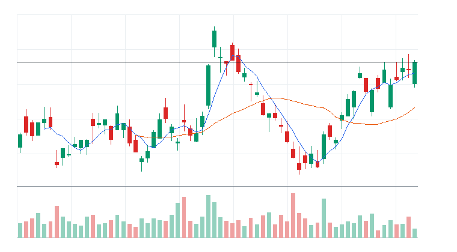

# 오늘의 데일리 트레이딩 요약

**REAL DATA TEST - 가격/거래량은 실제 데이터, 뉴스/ETF 구성종목 확산도/거래대금 유동성 일부 연결**

**목적:** 이 리포트는 최근 오른 자산을 나열하는 것이 아니라, 돈이 몰리는 근거와 다음 매수 주체가 확인할 트레이딩 후보를 찾기 위한 보고서다.

> 핵심 질문: 현재 가격에서 누가 사고 있고, 누가 앞으로 더 비싸게 사줄 수 있는가?

## 시장 국면 판단

- 최종 판정: 중립-상승 (59점)
- 전일 대비: 기간 조정에서 중립-상승으로 악화됐다(-12점).
- 판정 신뢰도: 높음 (100점) - 핵심 지수와 매크로 데이터가 대부분 직접 수집되어 판정 신뢰도가 높다.
- 행동 바이어스: 눌림 매수와 돌파 확인 병행
- 한 줄 결론: S&P 500, Nasdaq 100 중심으로 상승 우위지만, 매크로 점수 46라 추격보다 확인 매수가 낫다.
- 기술적 지표: 상승 추세 유지 (66점, 가중치 65%)
- S&P 500: 71점 | 50일선 아래, 200일선 위, 20일 -0.76%, 60일 +4.00%, 52주 고점 대비 -2.33% -> 기술 점수 71
- Nasdaq 100: 60점 | 50일선 아래, 200일선 위, 20일 -5.93%, 60일 +6.00%, 52주 고점 대비 -7.01% -> 기술 점수 60
- 매크로 시황: 매크로 중립 (46점, 가중치 35%)
- 매크로 요약: 신용/유동성 부담으로 매크로 환경은 방어적이다.
- 금리: 중립 46점 / 금리 중립 / confidence HIGH
  - 주요 근거: US 10Y yield 20일 +3.30%, 5일 -0.24%; US 3M yield 20일 +1.28%, 단기금리 방향 확인; US long-duration bonds 20일 -3.30%, 장기채 가격 기준 할인율 부담 확인
  - 확인 사항: 장기금리 상승과 장기채 약세가 겹쳐 성장주 할인율 부담이 커질 수 있다.
- 물가: 중립 45점 / 물가 중립 / confidence HIGH
  - 주요 근거: Oil ETF 20일 +9.26%, 유가 기반 물가 압력 확인; TIPS ETF 20일 -1.22%, 물가연동채 흐름은 보조 근거; Gold 20일 -5.04%, 금 강세는 방어 수요 여부 확인
  - 확인 사항: 추가 확인 이벤트 없음
- 정책: 중립 50점 / 정책 이벤트 확인 전 중립 / confidence LOW
  - 주요 근거: 정책 톤은 1차 버전에서 일정/이벤트 리스크 기반 중립값으로 반영한다.
  - 확인 사항: FOMC, CPI, PCE, 고용지표 발표 전후에는 매크로 confidence를 보수적으로 해석한다.
- 신용/유동성: 부담 42점 / 신용/유동성 부담 / confidence HIGH
  - 주요 근거: High yield credit 20일 -0.41%, 하이일드 위험선호 확인; HYG-LQD 20일 상대강도 +1.35%, 신용위험 선호/회피 확인; VIX 20일 +13.72%, 변동성 부담 확인
  - 확인 사항: VIX 상승은 유동성/리스크 프리미엄 부담으로 해석한다.
- 환율/글로벌: 중립 50점 / 환율/글로벌 중립 / confidence MEDIUM
  - 주요 근거: US dollar 20일 +0.32%, 달러 강세/약세 확인
  - 확인 사항: 추가 확인 이벤트 없음
- US 10Y yield: 45점 | 하락 시 주식 우호; 5일 -0.24%, 20일 +3.30% -> 매크로 점수 45
- US 3M yield: 48점 | 하락 시 주식 우호; 5일 -0.62%, 20일 +1.28% -> 매크로 점수 48
- US long-duration bonds: 45점 | 상승 시 주식 우호; 5일 -0.10%, 20일 -3.30% -> 매크로 점수 45
- TIPS ETF: 50점 | 상승 시 주식 우호; 5일 +0.13%, 20일 -1.22% -> 매크로 점수 50
- Oil ETF: 30점 | 하락 시 주식 우호; 5일 +6.55%, 20일 +9.26% -> 매크로 점수 30
- Gold: 50점 | 상승 시 주식 우호; 5일 +0.13%, 20일 -5.04% -> 매크로 점수 50
- US dollar: 50점 | 하락 시 주식 우호; 5일 -0.39%, 20일 +0.32% -> 매크로 점수 50
- High yield credit: 50점 | 상승 시 주식 우호; 5일 +0.20%, 20일 -0.41% -> 매크로 점수 50
- Investment grade credit: 50점 | 상승 시 주식 우호; 5일 +0.18%, 20일 -1.76% -> 매크로 점수 50
- VIX: 21점 | 하락 시 주식 우호; 5일 +8.68%, 20일 +13.72% -> 매크로 점수 21
- 데이터 커버리지: 기술 2/2, 매크로 10/10
- 데이터 신뢰도 근거:
  - 직접 지수 데이터: S&P 500, Nasdaq 100
  - 대체 지수 데이터 없음
  - 매크로 데이터: 10/10
  - 누락 데이터 없음
  - stale 데이터 없음

## 모바일 요약

[오늘의 데일리 트레이딩 요약]

생성 성공 / 데이터 모드: REAL_TEST

시장:
- 위험회피

시장 지배 서사:
1. 사이버보안 지출 재가속 - 약화 - First Trust NASDAQ Cybersecurity ETF(CIBR), Amplify Cybersecurity ETF(HACK), Palo Alto Networks Inc.(PANW), CrowdStrike Holdings Inc.(CRWD) 중심으로 5일 +1.74%, 20일 +12.95% 흐름이 형성됨. 뉴스 직접성 제한.
2. 소프트웨어 실적/AI 수익화 - 약화 - iShares Expanded Tech-Software Sector ETF(IGV), Global X Artificial Intelligence & Technology ETF(AIQ), Workday Inc.(WDAY), Datadog Inc.(DDOG) 중심으로 5일 -0.14%, 20일 +8.20% 흐름이 형성됨. 뉴스 직접성 제한.
3. AI 소프트웨어/사이버보안 확산 - 약화 - iShares Expanded Tech-Software Sector ETF(IGV), Global X Artificial Intelligence & Technology ETF(AIQ), Datadog Inc.(DDOG), Atlassian Corporation(TEAM) 중심으로 5일 +1.03%, 20일 +6.56% 흐름이 형성됨. 뉴스 직접성 제한.

트렌드 강도:
1. 사이버보안 지출 재가속 - TSI 33 - 잠복 - 진입품질 낮음
2. 소프트웨어 실적/AI 수익화 - TSI 16 - 잠복 - 진입품질 낮음
3. AI 소프트웨어/사이버보안 확산 - TSI 19 - 잠복 - 진입품질 낮음

오늘 결론:
- Financial Services 개별 종목 흐름이 ETF 대비 강한지 확인 필요
- 행동 후보는 linkedNarrative와 함께 확인한다.
- 추격보다 진입 조건 확인 후 접근한다.

오늘 실제 행동 후보:
1. PayPal Holdings Inc.(PYPL)(STOCK) - Aerospace & Defense 자금 유입 - 단기 추세가 유지되고 거래량이 1.0배 이상이면 눌림 이후 재상승을 시도할 수 있음

다크호스 후보:
1. 다크호스 후보 없음 - 조건 충족 후보 없음

ETF 후보 TOP 5:
1. First Trust NASDAQ Cybersecurity ETF(CIBR) - 사이버보안 지출 재가속 - 거래량 확인 전 관찰
2. Energy Select Sector SPDR Fund(XLE) - 매크로 방어/헤지 - 거래량 확인 전 관찰
3. iShares Expanded Tech-Software Sector ETF(IGV) - 소프트웨어 실적/AI 수익화 - 거래량 확인 전 관찰
4. Amplify Cybersecurity ETF(HACK) - 사이버보안 지출 재가속 - 거래량 확인 전 관찰
5. iShares Bitcoin Trust ETF(IBIT) - 비트코인/디지털 자산 위험선호 - 거래량 확인 전 관찰

웹 리포트:
https://yoolcool.github.io/DailyTradingThesisAgent/

## 오늘 결론

- 오늘 결론: 조건부 진입
- 신규 진입 후보: 0개
- 조건부 진입 후보: 1개
- 관찰 후보: 140개
- 주요 제한 요인: Entry Quality < 40, RVOL 미달, 뉴스 직접성 부족
- 주문 판단: 시장가 금지 / 지정가 또는 관찰
- 실전 판단: 진입 후보는 있으나, 전일 고점 돌파와 거래량 확인 후 선별적으로 접근한다.

### 후보 제한 요인 집계

- RVOL < 1.00x: 140개
- 거래대금 유동성 낮음: 16개
- Entry Quality 50~54 near miss: 0개
- Entry Quality 40~49 관찰: 0개
- Entry Quality < 40: 157개
- Exhaustion Risk >= 70: 0개
- ETF breadth 샘플 부족: 37개
- 뉴스 직접성 부족: 100개

## 데이터 신뢰도

- 전체 데이터 신뢰도 등급: LOW
- 분석 신뢰도: LOW
- 주문 실행 신뢰도: LOW
- ETF breadth 신뢰도: LOW
- 신뢰도 해석: 테마 확산 판단 제한, 거래대금 유동성 낮음 또는 확인 불가, 프리/애프터마켓 확인 불가
- 리포트 생성 시각: 2026-07-21 08:58 KST
- 가격 기준 거래일: 2026-07-20 US regular close
- 뉴스 수집 시각: 2026-07-21 08:58 KST
- 가장 최근 뉴스 발행 시각: 2026-07-21 08:01 KST
- 뉴스 신선도 상태: FRESH
- 뉴스 소스: Yahoo Finance RSS, MarketWatch RSS, CNBC Markets RSS, SEC EDGAR RSS, Federal Reserve RSS, Finnhub API
- 뉴스 소스 상태: Yahoo Finance RSS CONNECTED, MarketWatch RSS CONNECTED, CNBC Markets RSS PARTIAL, SEC EDGAR RSS PARTIAL, Federal Reserve RSS CONNECTED, Finnhub API DISABLED
- 뉴스 신뢰도: MEDIUM
- 추천 적용 거래일: 2026-07-20 US regular session
- 가격/거래량 데이터 상태: 연결됨
- 뉴스 데이터 상태: 일부 연결
- ETF 구성종목 확산도 상태: 일부 연결
- ETF 구성종목 샘플 수: 1~4
- 거래대금 유동성 데이터 상태: 일부 연결
- 프리/애프터마켓 데이터 상태: UNAVAILABLE
- 데이터 provider: yfinance, Yahoo Finance RSS, MarketWatch RSS, CNBC Markets RSS, SEC EDGAR RSS, Federal Reserve RSS, Finnhub API, config fallback sample, price-volume dollar-volume fallback
- 실전 사용 경고: 이 리포트는 투자판단 보조용이며, REAL_TEST 모드에서는 일부 데이터가 누락되거나 지연될 수 있다. 실제 주문 전 현재가, 뉴스, 프리마켓/정규장 거래량을 별도 확인해야 한다.

## 0. 시장 상태

- 데이터 모드: REAL_TEST
- 가격/거래량: 연결됨
- 뉴스: 일부 연결
- ETF 구성종목 확산도: 일부 연결
- 거래대금 유동성: 일부 연결
- 생성 시각: 2026년 7월 21일 화요일 AM 8:58
- 시장 상태: 위험회피
- 오늘 돈의 방향: Financial Services 개별 종목 흐름이 ETF 대비 강한지 확인 필요
- 강한 테마 TOP 3: Financial Services(89), 중국 인터넷 ETF(42), 사이버보안(36)
- 데이터 한계:
  - API 또는 provider 상태에 따라 뉴스/ETF 확산도/거래대금 유동성 반영 범위가 달라질 수 있다.
  - 수집 실패 데이터는 점수 반영에서 제외하거나 confidence를 제한한다.
  - reasonConfidence HIGH는 직접 촉매, 가격/거래량, 확산도/유동성 근거가 함께 있을 때만 사용한다.

## 오늘 시장을 지배하는 서사

### 오늘 시장을 지배하는 서사 TOP 3

#### 1. 사이버보안 지출 재가속
- 상태: 약화
- narrativeScore: 26
- reasonConfidence: LOW
- 근거 ETF: CIBR, HACK, IHAK
- 근거 개별 종목: PANW, CRWD, FTNT
- 돈이 몰리는 이유: 사이버보안 지출 재가속 관련 First Trust NASDAQ Cybersecurity ETF(CIBR), Amplify Cybersecurity ETF(HACK), iShares Cybersecurity and Tech ETF(IHAK)와 Palo Alto Networks Inc.(PANW), CrowdStrike Holdings Inc.(CRWD), Fortinet Inc.(FTNT)의 5일(+1.74%)·20일(+12.95%) 흐름을 함께 본다. 평균 상대 거래량은 0.73배이고, ETF 확산도는 추가 확인이 필요하다. 뉴스 직접성은 아직 제한적이다.
- 다음 매수 주체: 사이버보안 지출 재가속을 확인한 섹터 ETF 자금과 상대강도 추종 스윙 자금
- 가장 좋은 트레이딩 수단: ETF 우선: HACK, CIBR, IHAK / 개별 종목 우선: PANW, CRWD, FTNT
- 서사가 깨지는 조건: HACK 20일선 이탈 또는 관련 종목 절반 이상 5일선 이탈
- 오늘 행동: 기존 네러티브와 중복을 확인한 뒤 ETF/대표 종목 동조성이 살아날 때만 관찰 편입

상세 narrativeScore 근거 보기

- rawScore: 26
- ETF 평균 moneyFlowScore: 22
- 개별 종목 평균 moneyFlowScore: 34
- ETF 후보 비율: 0%
- 개별 종목 후보 비율: 0%
- 5일 평균 수익률: +2.00%
- 20일 평균 수익률: +13.00%
- 평균 상대 거래량: 1.00배
- ETF 평균 상대 거래량: 1.00배
- 개별주 평균 상대 거래량: 1.00배
- 52주 고점 근접 후보 비율: 29%
- 뉴스 직접성 점수: 3
- ETF 확산도 점수: 0
- 유동성 점수: 1
- 과열 리스크 차감: 0

#### 2. 소프트웨어 실적/AI 수익화
- 상태: 약화
- narrativeScore: 25
- reasonConfidence: LOW
- 근거 ETF: IGV, AIQ, QQQ
- 근거 개별 종목: WDAY, DDOG, TEAM, INTU
- 돈이 몰리는 이유: 소프트웨어 실적/AI 수익화 관련 iShares Expanded Tech-Software Sector ETF(IGV), Global X Artificial Intelligence & Technology ETF(AIQ), Invesco QQQ Trust(QQQ)와 Workday Inc.(WDAY), Datadog Inc.(DDOG), Atlassian Corporation(TEAM), Intuit Inc.(INTU)의 5일(-0.14%)·20일(+8.20%) 흐름을 함께 본다. 평균 상대 거래량은 0.70배이고, ETF 확산도는 추가 확인이 필요하다. 뉴스 직접성은 아직 제한적이다.
- 다음 매수 주체: 소프트웨어 실적/AI 수익화을 확인한 섹터 ETF 자금과 상대강도 추종 스윙 자금
- 가장 좋은 트레이딩 수단: ETF 우선: IGV, AIQ, QQQ / 개별 종목 우선: DDOG, TEAM, INTU
- 서사가 깨지는 조건: IGV 20일선 이탈 또는 관련 종목 절반 이상 5일선 이탈
- 오늘 행동: 기존 네러티브와 중복을 확인한 뒤 ETF/대표 종목 동조성이 살아날 때만 관찰 편입

상세 narrativeScore 근거 보기

- rawScore: 25
- ETF 평균 moneyFlowScore: 8
- 개별 종목 평균 moneyFlowScore: 42
- ETF 후보 비율: 0%
- 개별 종목 후보 비율: 0%
- 5일 평균 수익률: 0.00%
- 20일 평균 수익률: +8.00%
- 평균 상대 거래량: 1.00배
- ETF 평균 상대 거래량: 1.00배
- 개별주 평균 상대 거래량: 1.00배
- 52주 고점 근접 후보 비율: 0%
- 뉴스 직접성 점수: 10
- ETF 확산도 점수: 0
- 유동성 점수: 3
- 과열 리스크 차감: 0

#### 3. AI 소프트웨어/사이버보안 확산
- 상태: 약화
- narrativeScore: 21
- reasonConfidence: LOW
- 근거 ETF: IGV, AIQ, QQQ
- 근거 개별 종목: DDOG, TEAM, MSFT, PLTR
- 돈이 몰리는 이유: AI 소프트웨어/사이버보안 확산 관련 iShares Expanded Tech-Software Sector ETF(IGV), Global X Artificial Intelligence & Technology ETF(AIQ), Invesco QQQ Trust(QQQ)와 Datadog Inc.(DDOG), Atlassian Corporation(TEAM), Microsoft Corporation(MSFT), Palantir Technologies Inc.(PLTR)의 5일(+1.03%)·20일(+6.56%) 흐름을 함께 본다. 평균 상대 거래량은 0.67배이고, ETF 확산도는 추가 확인이 필요하다. 뉴스 직접성은 아직 제한적이다.
- 다음 매수 주체: AI 소프트웨어 실적 기대를 사는 ETF 자금, 엔터프라이즈 소프트웨어 스윙 트레이더, 신고가 추종 자금
- 가장 좋은 트레이딩 수단: ETF 우선: IGV, AIQ, QQQ / 개별 종목 우선: PLTR, DDOG, TEAM
- 서사가 깨지는 조건: IGV/AIQ 20일선 이탈, 관련 소프트웨어 종목 절반 이상 5일선 이탈, 상대 거래량 둔화
- 오늘 행동: 추격보다 눌림 후 재상승 확인

상세 narrativeScore 근거 보기

- rawScore: 21
- ETF 평균 moneyFlowScore: 8
- 개별 종목 평균 moneyFlowScore: 36
- ETF 후보 비율: 0%
- 개별 종목 후보 비율: 0%
- 5일 평균 수익률: +1.00%
- 20일 평균 수익률: +7.00%
- 평균 상대 거래량: 1.00배
- ETF 평균 상대 거래량: 1.00배
- 개별주 평균 상대 거래량: 1.00배
- 52주 고점 근접 후보 비율: 0%
- 뉴스 직접성 점수: 8
- ETF 확산도 점수: 0
- 유동성 점수: 2
- 과열 리스크 차감: 0

### 전체 narrative 요약

| 서사명 | 상태 | narrativeScore | reasonConfidence | 대표 ETF | 대표 종목 | 오늘 행동 |
| --- | --- | ---: | --- | --- | --- | --- |
| 사이버보안 지출 재가속 | 약화 | 26 | LOW | CIBR, HACK, IHAK | PANW, CRWD, FTNT | 기존 네러티브와 중복을 확인한 뒤 ETF/대표 종목 동조성이 살아날 때만 관찰 편입 |
| 소프트웨어 실적/AI 수익화 | 약화 | 25 | LOW | IGV, AIQ, QQQ | WDAY, DDOG, TEAM, INTU | 기존 네러티브와 중복을 확인한 뒤 ETF/대표 종목 동조성이 살아날 때만 관찰 편입 |
| AI 소프트웨어/사이버보안 확산 | 약화 | 21 | LOW | IGV, AIQ, QQQ | DDOG, TEAM, MSFT, PLTR | 추격보다 눌림 후 재상승 확인 |
| 필수소비재 음료 방어 성장 | 약화 | 18 | LOW | QQQ | CCEP, MNST | 기존 네러티브와 중복을 확인한 뒤 ETF/대표 종목 동조성이 살아날 때만 관찰 편입 |
| 매크로 방어/헤지 | 약화 | 17 | LOW | XLE, TLT, GLD | CVX, XOM | 위험회피가 확인될 때만 헤지성 접근 |
| Aerospace & Defense 자금 유입 | 약화 | 12 | LOW | QQQ, SPY, IWM | RTX, AXON | 기존 네러티브와 중복을 확인한 뒤 ETF/대표 종목 동조성이 살아날 때만 관찰 편입 |
| Internet Content 자금 유입 | 약화 | 7 | LOW | QQQ | DASH, META | 기존 네러티브와 중복을 확인한 뒤 ETF/대표 종목 동조성이 살아날 때만 관찰 편입 |
| 바이오/헬스케어 촉매 | 약화 | 3 | LOW | QQQ | REGN, VRTX, INSM, ALNY | 기존 네러티브와 중복을 확인한 뒤 ETF/대표 종목 동조성이 살아날 때만 관찰 편입 |
| 전력 유틸리티 수요 재평가 | 소멸 | 1 | LOW | QQQ, SPY, IWM | ETN, GEV, VRT | 기존 네러티브와 중복을 확인한 뒤 ETF/대표 종목 동조성이 살아날 때만 관찰 편입 |
| 위험선호 성장주 재진입 | 소멸 | 0 | LOW | QQQ, IPO, ARKK | COIN, ARM, TSLA | 지수 위험선호가 유지될 때만 선별 진입 |
| 방산/안보 프리미엄 | 소멸 | 0 | LOW | XAR, SHLD, ITA | PLTR, AVAV, KTOS | 뉴스 촉매가 직접 확인될 때만 추세 추종 |
| 비트코인/디지털 자산 위험선호 | 소멸 | 0 | LOW | IBIT, BLOK | IREN, MSTR, COIN | 비트코인 베타가 살아날 때만 단기 매매 |
| Data Storage 자금 유입 | 소멸 | 0 | LOW | QQQ, SPY, IWM | STX, WDC | 기존 네러티브와 중복을 확인한 뒤 ETF/대표 종목 동조성이 살아날 때만 관찰 편입 |
| AI 인프라 재가속 | 소멸 | 0 | LOW | SMH, SOXX, DRAM | NVDA, MU, VRT, ETN | 추격보다 5일선 지지 후 재상승 확인 |
| 전력망/원전/인프라 병목 | 소멸 | 0 | LOW | GRID, PAVE, URA | VRT, ETN, PWR, CEG | ETF 확산도와 거래량이 같이 살아날 때만 진입 |
| 반도체 장비 사이클 재평가 | 소멸 | 0 | LOW | SMH, SOXX, SOXQ | AMAT, LRCX, ASML | 기존 네러티브와 중복을 확인한 뒤 ETF/대표 종목 동조성이 살아날 때만 관찰 편입 |
| 반도체 설계/공급망 재가속 | 소멸 | 0 | LOW | SMH, SOXX, SOXQ | ARM, AMD, TXN, ADI | 기존 네러티브와 중복을 확인한 뒤 ETF/대표 종목 동조성이 살아날 때만 관찰 편입 |

## 트렌드 강도 판단

### 1. 사이버보안 지출 재가속
- Trend Strength Index: 33
- 트렌드 상태 라벨: 잠복
- 테마 확산도: 보통
- ETF 동조성: 강함
- 거래량 강도: 부족
- 과열 위험: 낮음 (1)
- 오늘 진입 품질: 낮음 (21)
- 한 줄 판단: 사이버보안 지출 재가속는 Trend Strength는 높아도 시장 위험선호가 약해 시장 환경 비우호 구간이다.
- 오늘 접근법: First Trust NASDAQ Cybersecurity ETF(CIBR)/Amplify Cybersecurity ETF(HACK)/iShares Cybersecurity and Tech ETF(IHAK)와 Palo Alto Networks Inc.(PANW)/CrowdStrike Holdings Inc.(CRWD)/Fortinet Inc.(FTNT)의 거래량 확산이 확인되기 전까지 관찰한다.

트렌드 강도 상세 근거 보기

- 가격 모멘텀: 가격 모멘텀 7/25. 평균 5D +1.74%, 20D +12.95%.
- 거래량 강도: 거래량 강도 2/20. 평균 RVOL 0.73배.
- ETF 동조성: ETF 동조성 12/15. 관련 ETF Amplify Cybersecurity ETF(HACK), First Trust NASDAQ Cybersecurity ETF(CIBR), iShares Cybersecurity and Tech ETF(IHAK), iShares Expanded Tech-Software Sector ETF(IGV) 흐름을 기준으로 판단.
- 테마 확산도: 테마 확산도 10/20. 상위 1~2개 쏠림 감점 0점 반영.
- 뉴스 촉매: 뉴스/촉매 신선도 0/10. HIGH 직접 촉매 0개.
- 과열 리스크: 과열 리스크 1/100. 단기 급등, 고점 근접, ETF-개별주 괴리, 쏠림을 함께 반영.
- 시장 환경: 시장 환경 2/10. QQQ/SPY/IWM 가격 흐름 기반 위험선호 점수.

### 2. 소프트웨어 실적/AI 수익화
- Trend Strength Index: 16
- 트렌드 상태 라벨: 잠복
- 테마 확산도: 약함
- ETF 동조성: 부족
- 거래량 강도: 부족
- 과열 위험: 낮음 (0)
- 오늘 진입 품질: 낮음 (15)
- 한 줄 판단: 소프트웨어 실적/AI 수익화는 Trend Strength는 높아도 시장 위험선호가 약해 시장 환경 비우호 구간이다.
- 오늘 접근법: iShares Expanded Tech-Software Sector ETF(IGV)/Global X Artificial Intelligence & Technology ETF(AIQ)/Invesco QQQ Trust(QQQ)와 Workday Inc.(WDAY)/Datadog Inc.(DDOG)/Atlassian Corporation(TEAM)의 거래량 확산이 확인되기 전까지 관찰한다.

트렌드 강도 상세 근거 보기

- 가격 모멘텀: 가격 모멘텀 3/25. 평균 5D -0.14%, 20D +8.20%.
- 거래량 강도: 거래량 강도 2/20. 평균 RVOL 0.70배.
- ETF 동조성: ETF 동조성 0/15. 관련 ETF iShares Expanded Tech-Software Sector ETF(IGV), Global X Artificial Intelligence & Technology ETF(AIQ), Invesco QQQ Trust(QQQ) 흐름을 기준으로 판단.
- 테마 확산도: 테마 확산도 9/20. 상위 1~2개 쏠림 감점 0점 반영.
- 뉴스 촉매: 뉴스/촉매 신선도 0/10. HIGH 직접 촉매 0개.
- 과열 리스크: 과열 리스크 0/100. 단기 급등, 고점 근접, ETF-개별주 괴리, 쏠림을 함께 반영.
- 시장 환경: 시장 환경 2/10. QQQ/SPY/IWM 가격 흐름 기반 위험선호 점수.

### 3. AI 소프트웨어/사이버보안 확산
- Trend Strength Index: 19
- 트렌드 상태 라벨: 잠복
- 테마 확산도: 약함
- ETF 동조성: 부족
- 거래량 강도: 부족
- 과열 위험: 낮음 (0)
- 오늘 진입 품질: 낮음 (16)
- 한 줄 판단: AI 소프트웨어/사이버보안 확산는 Trend Strength는 높아도 시장 위험선호가 약해 시장 환경 비우호 구간이다.
- 오늘 접근법: iShares Expanded Tech-Software Sector ETF(IGV)/Global X Artificial Intelligence & Technology ETF(AIQ)/Invesco QQQ Trust(QQQ)와 Datadog Inc.(DDOG)/Atlassian Corporation(TEAM)/Microsoft Corporation(MSFT)의 거래량 확산이 확인되기 전까지 관찰한다.

트렌드 강도 상세 근거 보기

- 가격 모멘텀: 가격 모멘텀 6/25. 평균 5D +1.03%, 20D +6.56%.
- 거래량 강도: 거래량 강도 2/20. 평균 RVOL 0.67배.
- ETF 동조성: ETF 동조성 0/15. 관련 ETF iShares Expanded Tech-Software Sector ETF(IGV), Global X Artificial Intelligence & Technology ETF(AIQ), Invesco QQQ Trust(QQQ) 흐름을 기준으로 판단.
- 테마 확산도: 테마 확산도 9/20. 상위 1~2개 쏠림 감점 0점 반영.
- 뉴스 촉매: 뉴스/촉매 신선도 0/10. HIGH 직접 촉매 0개.
- 과열 리스크: 과열 리스크 0/100. 단기 급등, 고점 근접, ETF-개별주 괴리, 쏠림을 함께 반영.
- 시장 환경: 시장 환경 2/10. QQQ/SPY/IWM 가격 흐름 기반 위험선호 점수.

## 최근 추천 결과 트래킹

개별주는 데이트레이딩 관점으로 추천 이후 첫 정규장의 장중 최고가와 종가를 추적한다. ETF는 테마/스윙 관점으로 추천 이후 1주일 동안의 최고가와 현재 종가를 추적한다.

### 개별주 Top 3 추천 성과 요약
- 최근 5개 리포트 표본: 10개 (초기 검증 단계)
- 장중 최고가 기준 성공률: +44.44%
- 종가 기준 성공률: +22.22%
- 평균 장중 최고 수익률: +2.53%
- 평균 종가 수익률: -0.67%

### ETF 추천 성과 요약
- 최근 5개 리포트 표본: 0개 (초기 검증 단계)
- 1주 최고가 기준 성공률: 데이터 없음
- 현재 종가 기준 성공률: 데이터 없음
- 평균 1주 최고 수익률: 데이터 없음
- 평균 현재 수익률: 데이터 없음

최근 추천 결과 상세 테이블 펼치기

| 추천일 | 유형 | 순위 | 티커 | 기준가 | 추적 기간 | 상태 | High 수익률 | Close 수익률 | 결과 | 코멘트 |
| --- | --- | ---: | --- | ---: | --- | --- | ---: | ---: | --- | --- |
| 2026-07-21 | STOCK | 1 | PYPL | $56.82 | 2026-07-21 | pending | 데이터 없음 | 데이터 없음 | 추적 대기 | 아직 추적 거래일 데이터가 완성되지 않음 |
| 2026-07-20 | STOCK | 2 | CTAS | $204.45 | 2026-07-20 | complete | -0.03% | -1.30% | 실패 | 추천 이후 의미 있는 장중 기회가 부족하고 종가도 약함 (일봉 기준) |
| 2026-07-20 | STOCK | 1 | PANW | $358.68 | 2026-07-20 | complete | +2.13% | -2.79% | 제한적 유효 | 제한적인 장중 기회만 발생 (일봉 기준) |
| 2026-07-17 | STOCK | 3 | CTAS | $206.25 | 2026-07-17 | complete | +1.68% | -0.87% | 제한적 유효 | 제한적인 장중 기회만 발생 (일봉 기준) |
| 2026-07-17 | STOCK | 2 | TRI | $98.82 | 2026-07-17 | complete | +2.05% | -2.65% | 제한적 유효 | 제한적인 장중 기회만 발생 (일봉 기준) |
| 2026-07-17 | STOCK | 1 | PYPL | $56.73 | 2026-07-17 | complete | +0.78% | -0.30% | 실패 | 추천 이후 의미 있는 장중 기회가 부족하고 종가도 약함 (일봉 기준) |
| 2026-07-16 | STOCK | 3 | PYPL | $55.52 | 2026-07-16 | complete | +3.87% | +2.18% | 성공 | 장중 기회와 종가 유지가 모두 확인됨 (일봉 기준) |
| 2026-07-16 | STOCK | 2 | TRI | $95.51 | 2026-07-16 | complete | +5.85% | +3.47% | 성공 | 장중 기회와 종가 유지가 모두 확인됨 (일봉 기준) |
| 2026-07-16 | STOCK | 1 | CRWD | $210.73 | 2026-07-15 | complete | +3.21% | -1.88% | 단타 유효 | 장중 기회는 있었지만 종가 유지력은 약함 (일봉 기준) |
| 2026-07-15 | STOCK | 1 | CRWD | $210.73 | 2026-07-15 | complete | +3.21% | -1.88% | 단타 유효 | 장중 기회는 있었지만 종가 유지력은 약함 (일봉 기준) |
| 2026-07-14 | STOCK | 1 | TRI | $94.29 | 2026-07-14 | complete | -0.66% | -2.70% | 실패 | 추천 이후 의미 있는 장중 기회가 부족하고 종가도 약함 (일봉 기준) |
| 2026-07-13 | STOCK | 1 | AXON | $640.46 | 2026-07-13 | complete | -9.75% | -14.59% | 실패 | 추천 이후 의미 있는 장중 기회가 부족하고 종가도 약함 (일봉 기준) |
| 2026-07-13 | STOCK | 1 | META | $669.21 | 2026-07-13 | complete | +1.11% | -1.86% | 제한적 유효 | 제한적인 장중 기회만 발생 (일봉 기준) |
| 2026-07-08 | STOCK | 1 | AXON | $640.46 | 2026-07-08 | complete | -1.48% | -6.35% | 실패 | 추천 이후 의미 있는 장중 기회가 부족하고 종가도 약함 (일봉 기준) |
| 2026-07-07 | STOCK | 2 | AXON | $622.35 | 2026-07-07 | complete | +6.86% | +2.91% | 성공 | 장중 기회와 종가 유지가 모두 확인됨 (일봉 기준) |
| 2026-07-07 | STOCK | 1 | PANW | $357.53 | 2026-07-07 | complete | +1.53% | -5.73% | 제한적 유효 | 제한적인 장중 기회만 발생 (일봉 기준) |
| 2026-07-06 | STOCK | 2 | CCEP | $106.61 | 2026-07-06 | complete | +0.58% | +0.34% | 추적 대기 | 아직 추적 거래일 데이터가 완성되지 않음 (일봉 기준) |
| 2026-07-06 | STOCK | 1 | PANW | $348.06 | 2026-07-06 | complete | +5.78% | +2.72% | 성공 | 장중 기회와 종가 유지가 모두 확인됨 (일봉 기준) |
| 2026-07-03 | STOCK | 1 | CCEP | $106.61 | 2026-07-03 | pending | 데이터 없음 | 데이터 없음 | 추적 대기 | 아직 추적 거래일 데이터가 완성되지 않음 |
| 2026-07-02 | STOCK | 2 | AXON | $593.96 | 2026-07-02 | complete | +1.52% | +0.52% | 제한적 유효 | 제한적인 장중 기회만 발생 (일봉 기준) |
| 2026-07-02 | STOCK | 1 | CCEP | $106.1 | 2026-07-02 | complete | +1.86% | +0.48% | 제한적 유효 | 제한적인 장중 기회만 발생 (일봉 기준) |
| 2026-07-01 | STOCK | 3 | LRCX | $433.33 | 2026-07-01 | complete | -4.12% | -9.71% | 실패 | 추천 이후 의미 있는 장중 기회가 부족하고 종가도 약함 (일봉 기준) |
| 2026-07-01 | STOCK | 2 | PANW | $341.02 | 2026-07-01 | complete | +5.01% | +3.23% | 성공 | 장중 기회와 종가 유지가 모두 확인됨 (일봉 기준) |
| 2026-07-01 | STOCK | 1 | AMAT | $723 | 2026-07-01 | complete | -4.04% | -9.97% | 실패 | 추천 이후 의미 있는 장중 기회가 부족하고 종가도 약함 (일봉 기준) |
| 2026-06-30 | STOCK | 3 | AMAT | $694.64 | 2026-06-30 | complete | +6.48% | +4.08% | 성공 | 장중 기회와 종가 유지가 모두 확인됨 (일봉 기준) |
| 2026-06-30 | STOCK | 2 | CRWD | $742.91 | 2026-06-30 | complete | -74.25% | -74.32% | 실패 | 추천 이후 의미 있는 장중 기회가 부족하고 종가도 약함 (일봉 기준) |
| 2026-06-30 | STOCK | 1 | PANW | $332 | 2026-06-30 | complete | +3.16% | +2.72% | 성공 | 장중 기회와 종가 유지가 모두 확인됨 (일봉 기준) |
| 2026-06-29 | STOCK | 3 | KDP | $33.4 | 2026-06-29 | complete | +1.26% | +0.30% | 제한적 유효 | 제한적인 장중 기회만 발생 (일봉 기준) |
| 2026-06-29 | STOCK | 2 | VRTX | $491.34 | 2026-06-29 | complete | +1.74% | +1.69% | 제한적 유효 | 제한적인 장중 기회만 발생 (일봉 기준) |
| 2026-06-29 | STOCK | 1 | FTNT | $151.35 | 2026-06-29 | complete | +5.10% | +2.69% | 성공 | 장중 기회와 종가 유지가 모두 확인됨 (일봉 기준) |
| 2026-06-26 | STOCK | 3 | MU | $1,213.56 | 2026-06-26 | complete | -1.22% | -6.69% | 실패 | 추천 이후 의미 있는 장중 기회가 부족하고 종가도 약함 (일봉 기준) |
| 2026-06-26 | STOCK | 2 | AMAT | $668 | 2026-06-26 | complete | -1.17% | -6.16% | 실패 | 추천 이후 의미 있는 장중 기회가 부족하고 종가도 약함 (일봉 기준) |
| 2026-06-26 | STOCK | 1 | LRCX | $401.82 | 2026-06-26 | complete | -2.97% | -5.66% | 실패 | 추천 이후 의미 있는 장중 기회가 부족하고 종가도 약함 (일봉 기준) |
| 2026-06-26 | ETF | 1 | DRAM | $76.89 | 2026-06-26~2026-07-03 | complete | -3.55% | -30.99% | 실패 | 추천 이후 ETF 흐름이 약화됨 |
| 2026-06-23 | STOCK | 3 | TSM | $467.67 | 2026-06-23 | complete | -4.35% | -6.69% | 실패 | 추천 이후 의미 있는 장중 기회가 부족하고 종가도 약함 (일봉 기준) |
| 2026-06-23 | STOCK | 2 | GEV | $1,127.59 | 2026-06-23 | complete | -4.84% | -8.21% | 실패 | 추천 이후 의미 있는 장중 기회가 부족하고 종가도 약함 (일봉 기준) |
| 2026-06-23 | STOCK | 1 | ETN | $435.78 | 2026-06-23 | complete | -3.27% | -7.00% | 실패 | 추천 이후 의미 있는 장중 기회가 부족하고 종가도 약함 (일봉 기준) |
| 2026-06-23 | ETF | 1 | DRAM | $80.72 | 2026-06-23~2026-06-30 | complete | -1.39% | -34.27% | 실패 | 추천 이후 ETF 흐름이 약화됨 |
| 2026-06-22 | STOCK | 3 | ARM | $439.46 | 2026-06-22 | complete | +1.25% | -7.22% | 제한적 유효 | 제한적인 장중 기회만 발생 (일봉 기준) |
| 2026-06-22 | STOCK | 2 | GEV | $1,109.73 | 2026-06-22 | complete | +2.91% | +1.61% | 제한적 유효 | 제한적인 장중 기회만 발생 (일봉 기준) |
| 2026-06-22 | STOCK | 1 | ETN | $421.77 | 2026-06-22 | complete | +3.55% | +3.32% | 성공 | 장중 기회와 종가 유지가 모두 확인됨 (일봉 기준) |
| 2026-06-22 | ETF | 3 | IFRA | $61.99 | 2026-06-22~2026-06-29 | complete | +3.65% | -1.77% | 단기 고점 후 반납 | 1주 내 상승 기회는 있었지만 현재가는 반납 |
| 2026-06-22 | ETF | 2 | SMH | $659.88 | 2026-06-22~2026-06-29 | complete | -1.49% | -15.31% | 실패 | 추천 이후 ETF 흐름이 약화됨 |
| 2026-06-22 | ETF | 1 | DRAM | $76.71 | 2026-06-22~2026-06-29 | complete | +3.77% | -30.83% | 단기 고점 후 반납 | 1주 내 상승 기회는 있었지만 현재가는 반납 |
| 2026-06-19 | STOCK | 3 | AMD | $537.37 | 2026-06-19 | pending | 데이터 없음 | 데이터 없음 | 추적 대기 | 아직 추적 거래일 데이터가 완성되지 않음 |
| 2026-06-19 | STOCK | 2 | ARM | $439.46 | 2026-06-19 | pending | 데이터 없음 | 데이터 없음 | 추적 대기 | 아직 추적 거래일 데이터가 완성되지 않음 |
| 2026-06-19 | STOCK | 1 | GEV | $1,109.73 | 2026-06-19 | pending | 데이터 없음 | 데이터 없음 | 추적 대기 | 아직 추적 거래일 데이터가 완성되지 않음 |
| 2026-06-19 | ETF | 1 | DRAM | $76.71 | 2026-06-19~2026-06-26 | complete | +6.04% | -30.83% | 단기 고점 후 반납 | 1주 내 상승 기회는 있었지만 현재가는 반납 |
| 2026-06-18 | STOCK | 3 | ASML | $1,867.83 | 2026-06-18 | complete | +4.02% | +3.31% | 성공 | 장중 기회와 종가 유지가 모두 확인됨 (일봉 기준) |
| 2026-06-18 | STOCK | 3 | FCX | $69.06 | 2026-06-18 | complete | +2.26% | -0.55% | 제한적 유효 | 제한적인 장중 기회만 발생 (일봉 기준) |
| 2026-06-18 | STOCK | 2 | KLAC | $238.73 | 2026-06-18 | complete | +10.56% | +8.73% | 성공 | 장중 기회와 종가 유지가 모두 확인됨 (일봉 기준) |
| 2026-06-18 | STOCK | 1 | LRCX | $374.18 | 2026-06-18 | complete | +7.17% | +3.97% | 성공 | 장중 기회와 종가 유지가 모두 확인됨 (일봉 기준) |
| 2026-06-18 | ETF | 1 | SOXQ | $106.13 | 2026-06-18~2026-06-25 | complete | +8.67% | -12.92% | 단기 고점 후 반납 | 1주 내 상승 기회는 있었지만 현재가는 반납 |
| 2026-06-04 | STOCK | 3 | PANW | $280.43 | 2026-06-04 | complete | +0.10% | -0.42% | 실패 | 추천 이후 의미 있는 장중 기회가 부족하고 종가도 약함 (일봉 기준) |
| 2026-06-04 | STOCK | 2 | FTNT | $146.48 | 2026-06-04 | complete | +2.45% | +2.18% | 제한적 유효 | 제한적인 장중 기회만 발생 (일봉 기준) |
| 2026-06-04 | STOCK | 1 | CRWD | $747.61 | 2026-06-04 | complete | -75.89% | -75.95% | 실패 | 추천 이후 의미 있는 장중 기회가 부족하고 종가도 약함 (일봉 기준) |
| 2026-06-04 | ETF | 3 | HACK | $102.21 | 2026-06-04~2026-06-11 | complete | -1.66% | +7.70% | 진행 중 | 아직 1주 추적 기간이 끝나지 않음 |
| 2026-06-04 | ETF | 2 | SOXQ | $109.58 | 2026-06-04~2026-06-11 | complete | -4.68% | -15.66% | 실패 | 추천 이후 ETF 흐름이 약화됨 |
| 2026-06-04 | ETF | 1 | AIQ | $69.16 | 2026-06-04~2026-06-11 | complete | -4.29% | -14.49% | 실패 | 추천 이후 ETF 흐름이 약화됨 |
| 2026-06-03 | STOCK | 3 | FTNT | $148.86 | 2026-06-03 | complete | -0.26% | -1.60% | 실패 | 추천 이후 의미 있는 장중 기회가 부족하고 종가도 약함 (일봉 기준) |

## 오늘 실제 행동 후보

### 1. PayPal Holdings Inc.(PYPL)
- 자산 유형: STOCK
- linkedNarrative: Aerospace & Defense 자금 유입
- narrativeStatus: 약화
- narrativeScore: 12
- Trend Strength Index: 5
- Exhaustion Risk: 18 (낮음)
- Entry Quality Score: 29 (낮음)
- 트렌드 판단: 테마 확산도가 낮아 개별 종목 이벤트성 흐름일 수 있다.
- moneyFlowScore: 89
- finalRawScore: 89
- reasonConfidence: MEDIUM
- reasonConfidenceExplanation: 직접 촉매 부재 때문에 HIGH가 아니라 MEDIUM으로 제한했다.
- tieBreakerReason: 최종 원점수 89, 리스크 패널티 -6, 5일 수익률 +19.24%, 상대 거래량 1.15배 순으로 정렬
- 후보별 시장 해석: 위험회피 / 제한적 - 전체 시장은 위험회피 / Entry Quality 29 < 50이나 moneyFlow 89, confidence MEDIUM, RVOL 1.15x로 강한 자금흐름 예외 조건 충족
- 게이트 사유: Entry Quality 29 < 50이나 moneyFlow 89, confidence MEDIUM, RVOL 1.15x로 강한 자금흐름 예외 조건 충족
- 주문 실행: 시장가 가능

- 왜 돈이 몰리는가: 20일 +33.66%, 5일 +19.24%, 상대 거래량 1.15배로 가격과 거래량이 함께 개선. 뉴스: CNBC Markets RSS macro/under_6h / 유동성: LIQUID
- 누가 더 비싸게 사줄 수 있는지: 개별 주도주를 따라붙는 단기 모멘텀 자금과 관련 ETF 강세를 확인한 트레이더
- 진입 조건: 20일선 위 눌림 후 재상승 확인
- 무효화 조건: 20일선 이탈 또는 상대 거래량 0.8배 이하 둔화
- todayActionLabel: 자금흐름 예외 조건부
#### 최근 뉴스/동향 한국어 요약

- 요약: 종목 직접 뉴스 확인 상태이며 뉴스 흐름은 긍정 우위입니다. 후보 선정 후 재확인한 핵심 이슈는 "PayPal Holdings, Inc. (PYPL) Is a Trending Stock: Facts to Know Before Betting on It"입니다.
- 직접 촉매 판단: PayPal Holdings Inc.에 대해 직접 촉매로 분류된 뉴스가 확인됐습니다. 핵심은 "PayPal Holdings, Inc. (PYPL) Is a Trending Stock: Facts to Know Before Betting on It"이며, 시장 일반 재료로 봅니다.
- 뉴스 1: PayPal Holdings, Inc. (PYPL) Is a Trending Stock: Facts to Know Before Betting on It
  - 내용: PayPal Holdings Inc. 관련 시장 일반 뉴스입니다. 기사 스니펫상 핵심 내용은 Paypal (PYPL) has been one of the stocks most watched by Zacks.com users lately.입니다.
  - 투자 의미: 단기 중립 뉴스 흐름으로 볼 수 있지만, 단독 매수 근거보다는 가격·거래량 조건을 확인하는 보조 근거로 사용합니다.
  - 확인할 점: 원문 수치, 후속 보도, 가격이 진입 조건을 지키는지
- 뉴스 2: Why Retail Traders Couldn’t Take Their Eyes Off These Stocks Last Week: IBM, PYPL, TSM, NOK, SPCX
  - 내용: PayPal Holdings Inc. 관련 시장 일반 뉴스입니다. 기사 스니펫상 핵심 내용은 AI spending narrative dominated markets as investors favored chipmakers and infrastructure firms while software stocks faced pressure.입니다.
  - 투자 의미: 단기 긍정 뉴스 흐름으로 볼 수 있지만, 단독 매수 근거보다는 가격·거래량 조건을 확인하는 보조 근거로 사용합니다.
  - 확인할 점: 원문 수치, 후속 보도, 가격이 진입 조건을 지키는지
- 뉴스 3: What to Expect From PayPal’s Next Quarterly Earnings Report
  - 내용: PayPal Holdings Inc. 관련 실적 뉴스입니다. 기사 스니펫상 핵심 내용은 Wall Street expects PayPal to post a single-digit year-over-year decline in EPS when it reports its second-quarter results next month.입니다.
  - 투자 의미: 실적/가이던스 재료는 다음 분기 기대치 변화로 이어질 수 있어 컨센서스 변화와 주가 반응 지속성을 함께 봅니다.
  - 확인할 점: 매출/마진/가이던스 수치, 컨센서스 대비 차이
- 매매 해석: 매매 관점에서는 뉴스 자체보다 가격이 진입 조건을 지키는지, 거래량이 동반되는지, 그리고 뉴스가 이미 주가에 반영됐는지를 우선 확인해야 합니다.
- 차트: 

## 다크호스 후보

다크호스 후보 없음. 상위 서사 정렬, MA20 위 안착, MA5/MA20 구조 개선, RVOL 0.90x 이상 조건을 동시에 충족한 개별주가 없다.

- darkHorseScore: 조건 충족 후보 없음
- 왜 아직 메인이 아닌가: 확인 조건을 통과한 보조 관찰 후보가 없다.

darkHorseScore 상세 근거 보기

- 서사 정렬: 조건 미충족
- 초기 추세 구조: 조건 미충족
- 베이스 돌파/정돈: 조건 미충족
- 거래량 확인: 조건 미충족
- rawScore: 데이터 없음

## 오늘 돈이 몰리는 테마

- Financial Services: PYPL | 평균 moneyFlowScore 89 | 단일 종목 이벤트보다 테마 단위 자금 흐름이 선명한 구간으로 본다.
- 중국 인터넷 ETF: KWEB | 평균 moneyFlowScore 42 | 관심은 유지하되 우선순위는 낮추고 추가 거래량 확인을 기다린다.
- 사이버보안: PANW, CRWD, FTNT, ZS | 평균 moneyFlowScore 36 | 관심은 유지하되 우선순위는 낮추고 추가 거래량 확인을 기다린다.
- 클라우드/엔터프라이즈 소프트웨어 ETF: IGV | 평균 moneyFlowScore 24 | 관심은 유지하되 우선순위는 낮추고 추가 거래량 확인을 기다린다.
- 클라우드/엔터프라이즈 소프트웨어: MSFT, PLTR, APP, SHOP, ADBE, CDNS, SNPS, INTU | 평균 moneyFlowScore 23 | 관심은 유지하되 우선순위는 낮추고 추가 거래량 확인을 기다린다.
- 사이버보안 ETF: CIBR, HACK, IHAK | 평균 moneyFlowScore 22 | 관심은 유지하되 우선순위는 낮추고 추가 거래량 확인을 기다린다.

## 1. ETF 트레이딩 보고서
### 1-1. ETF 결론
- ETF 우선 후보: 없음
- ETF 관찰 후보: Roundhill Memory ETF(DRAM), VanEck Semiconductor ETF(SMH), iShares Semiconductor ETF(SOXX), iShares Expanded Tech-Software Sector ETF(IGV), Global X Artificial Intelligence & Technology ETF(AIQ)
- ETF 매매 금지: Roundhill Memory ETF(DRAM), VanEck Semiconductor ETF(SMH), iShares Semiconductor ETF(SOXX), Invesco PHLX Semiconductor ETF(SOXQ), Global X Artificial Intelligence & Technology ETF(AIQ)
- 오늘 ETF 최우선 1개: 없음
- ETF 섹션 해석: 이 섹션은 개별 종목 선택이 아니라 테마/섹터 단위 자금 흐름을 ETF로 매매할지 판단하기 위한 영역이다.

### 1-2. ETF 후보 TOP 5

선정 기준: ETF 후보는 가격/거래량 1차 점수에 뉴스, ETF 구성종목 확산도, 유동성, 리스크 패널티를 반영한 finalRawScore 기준으로 정렬한다. 표시 점수 100점 후보가 겹치면 tieBreakerReason으로 우선순위를 설명한다.

### [ETF] First Trust NASDAQ Cybersecurity ETF(CIBR)
- 자산 유형: ETF
- ETF 세부 카테고리: 사이버보안 ETF
- ETF 역할: 테마 베타 매수
- 상태: 관찰
- linkedNarrative: 사이버보안 지출 재가속
- narrativeStatus: 약화
- narrativeScore: 26
- moneyFlowScore: 27
- finalRawScore: 27
- tieBreakerReason: 최종 원점수 27, 리스크 패널티 0, 5일 수익률 -0.05%, 상대 거래량 0.77배 순으로 정렬
- 과열 리스크: 낮음
- reasonConfidence: LOW
- reasonConfidenceExplanation: 가격/거래량이 약하거나 핵심 보조 근거가 부족해 LOW로 분류했다.

- todayActionLabel: 거래량 확인 전 관찰
- 주문 실행: 지정가 권장
- 기준일: 2026-07-20
- 종가: $91.79
- 1일 수익률: -0.62%
- 5일 수익률: -0.05%
- 20일 수익률: +8.58%
- 상대 거래량: 0.77배
- 52주 고점 대비 위치: -4.35%
- whyMoneyIsFlowing: 최근 수익률은 확인되지만 상대 거래량 0.77배라 신규 자금 유입 강도는 약함. 뉴스: CNBC Markets RSS macro/under_6h / 유동성: ACCEPTABLE
- likelyNextBuyer: 섹터 베타를 노리는 단기 모멘텀 자금과 리밸런싱 자금
- whyThisCouldTradeHigher: 52주 고점 부근이라 돌파가 확인되면 신고가 추종 매수가 붙을 수 있음
#### 최근 뉴스/동향 한국어 요약

- 요약: 후보 선정 후 재확인 뉴스 데이터 없음
- 진입 조건: 상대 거래량 1.0배 회복 후 관찰
- 무효화 조건: 거래량 회복 실패
- 차트: 

#### 상세 근거

First Trust NASDAQ Cybersecurity ETF(CIBR) 상세 근거 펼치기

- moneyFlowScore(최종) 산정 근거:
  - moneyFlowScore(1차): 23
  - 최종 원점수: 27
  - 최종 표시 점수: 27
  - cap 적용: cap 미적용
  - 계산식: +23 + +2 + 0 + +2 + 0 + 0 + 0 = 27
  - 점수 해석: 매매 금지 또는 우선순위 낮은 후보.
  - 가격/거래량 1차 점수: +23
    - 추세: +4
    - 단기 모멘텀: -1
    - 중기 모멘텀: +6
    - 거래량: -8
    - 신고가 근접: +12
    - 이동평균: +10
  - 하위 점수 cap:
    - 가격 모멘텀: 원점수 +4, 상한 적용 +4 / 최대 25
    - 단기 모멘텀: 원점수 -1, 상한 적용 -1 / 최대 20
    - 중기 모멘텀: 원점수 +6, 상한 적용 +6 / 최대 16
    - 거래량: 원점수 -8, 상한 적용 -8 / 최대 20
    - 신고가 근접: 원점수 +12, 상한 적용 +12 / 최대 12
    - 이동평균: 원점수 +10, 상한 적용 +10 / 최대 14
  - 추가 데이터 가감점:
    - 뉴스: +2
    - 유동성: +2
  - ETF 확산도: 0
  - 리스크 패널티: 0
  - 주요 근거: 1차 23, 최종 원점수 27, 표시 27. 20일 수익률 강함, 52주 고점 근처, 뉴스 흐름이 가격/거래량 근거 보강. 주의: 큰 감점 제한적.
  - 리스크 패널티 산정 근거:
    - 총 리스크 패널티: 0
    - 리스크 등급: LOW
    - 감점된 리스크: 없음
    - 관찰 리스크: 주요 관찰 리스크 없음
    - 한 줄 해석: 직접 감점된 주요 리스크는 없지만 관찰 리스크는 계속 확인해야 한다.
- 데이터 사용 현황:
  - 가격/거래량: 사용
  - 뉴스: 사용
  - ETF 확산도: 일부 연결
  - 거래대금 유동성: 사용
  - 관련 ETF 상대강도: 사용
- 뉴스 확인:
  - 최근 뉴스 상태: 일부 연결
  - 뉴스 소스: CNBC Markets RSS, MarketWatch RSS
  - 소스별 상태: Yahoo Finance RSS CONNECTED; MarketWatch RSS CONNECTED; CNBC Markets RSS CONNECTED; SEC EDGAR RSS PARTIAL; Federal Reserve RSS CONNECTED; Finnhub API DISABLED
  - 긍정/중립/부정: 13/3/0
  - 직접성/방향성/신선도: 2/1/4
  - 강한 촉매 수: 1
  - 중요 공시 수: 0
  - 직접 촉매: 없음
  - 보조 뉴스: CNBC Markets RSS sector_theme / macro / under_6h
  - 뉴스 수집 시각: 2026-07-21 08:58 KST
  - 가장 최근 뉴스 발행 시각: 2026-07-21 08:01 KST
  - 뉴스 신선도 상태: FRESH
  - 뉴스 이후 가격 반응: 부정
  - 가격 반응 점수 제한: 뉴스 이후 가격 반응 부정 -> 긍정 점수 제한
  - 핵심 뉴스 요약: Jamie Dimon says markets underestimate risks and he wouldn&apos;t buy stocks or Treasurys at current prices
  - 원점수/상한 점수: +22 / +12
  - 점수 반영: +12
  - 주의: SEC EDGAR RSS: no matching RSS items; Finnhub API: FINNHUB_API_KEY not configured
- ETF 구성종목 확산도:
  - 구성종목 데이터 상태: 일부 연결
  - 샘플 수: 2/2
  - 샘플 신뢰도: INSUFFICIENT
  - 상승 종목 비율: 100%
  - 20일선 위 비율: 100%
  - 50일선 위 비율: 100%
  - 상위 기여 종목: PLTR, MSFT
  - 확산도 판단: SAMPLE_TOO_SMALL
  - 원점수/샘플 상한/반영 점수: 0 / 0 / 0
  - 점수 반영: 0
- 거래대금 유동성:
  - 데이터 상태: 일부 연결
  - 거래대금 기준 유동성: ACCEPTABLE
  - 거래대금: $111,845,105
  - 평균 거래대금: $144,880,326
  - 주문 영향: 지정가 권장
  - 매매 영향: 거래대금은 허용 가능하나 지정가를 우선한다
- reasonConfidence 근거: 가격/거래량이 약하거나 주요 데이터가 부족해 낮음.
- 후보 선정 후 뉴스/동향 재확인:
  - 재확인 상태: 데이터 없음
- 차트 요약: 20일선 위에서 단기 눌림 확인 구간
- 기준일 2026-07-20 | 종가 $91.79 | 1일 -0.62% | 5일 -0.05% | 20일 +8.58% | 상대 거래량 0.77배 | 52주 고점 대비 -4.35% | 데이터 소스: yfinance

### [ETF] Energy Select Sector SPDR Fund(XLE)
- 자산 유형: ETF
- ETF 세부 카테고리: 전통 에너지 ETF
- ETF 역할: 테마 베타 매수
- 상태: 관찰
- linkedNarrative: 매크로 방어/헤지
- narrativeStatus: 약화
- narrativeScore: 17
- moneyFlowScore: 42
- finalRawScore: 42
- tieBreakerReason: 최종 원점수 42, 리스크 패널티 0, 5일 수익률 +2.11%, 상대 거래량 0.88배 순으로 정렬
- 과열 리스크: 낮음
- reasonConfidence: LOW
- reasonConfidenceExplanation: 가격/거래량이 약하거나 핵심 보조 근거가 부족해 LOW로 분류했다.

- todayActionLabel: 거래량 확인 전 관찰
- 주문 실행: 시장가 가능
- 기준일: 2026-07-20
- 종가: $57.94
- 1일 수익률: +0.45%
- 5일 수익률: +2.11%
- 20일 수익률: +7.76%
- 상대 거래량: 0.88배
- 52주 고점 대비 위치: -8.70%
- whyMoneyIsFlowing: 최근 수익률은 확인되지만 상대 거래량 0.88배라 신규 자금 유입 강도는 약함. 뉴스: Yahoo Finance RSS general_market/under_6h / 유동성: LIQUID
- likelyNextBuyer: 섹터 베타를 노리는 단기 모멘텀 자금과 리밸런싱 자금
- whyThisCouldTradeHigher: 단기 추세가 유지되고 거래량이 1.0배 이상이면 눌림 이후 재상승을 시도할 수 있음
#### 최근 뉴스/동향 한국어 요약

- 요약: 후보 선정 후 재확인 뉴스 데이터 없음
- 진입 조건: 상대 거래량 1.0배 회복 후 관찰
- 무효화 조건: 거래량 회복 실패
- 차트: 

#### 상세 근거

Energy Select Sector SPDR Fund(XLE) 상세 근거 펼치기

- moneyFlowScore(최종) 산정 근거:
  - moneyFlowScore(1차): 25
  - 최종 원점수: 42
  - 최종 표시 점수: 42
  - cap 적용: cap 미적용
  - 계산식: +25 + +12 + 0 + +5 + 0 + 0 + 0 = 42
  - 점수 해석: 매매 금지 또는 우선순위 낮은 후보.
  - 가격/거래량 1차 점수: +25
    - 추세: +6
    - 단기 모멘텀: +2
    - 중기 모멘텀: +5
    - 거래량: -8
    - 신고가 근접: +6
    - 이동평균: +14
  - 하위 점수 cap:
    - 가격 모멘텀: 원점수 +6, 상한 적용 +6 / 최대 25
    - 단기 모멘텀: 원점수 +2, 상한 적용 +2 / 최대 20
    - 중기 모멘텀: 원점수 +5, 상한 적용 +5 / 최대 16
    - 거래량: 원점수 -8, 상한 적용 -8 / 최대 20
    - 신고가 근접: 원점수 +6, 상한 적용 +6 / 최대 12
    - 이동평균: 원점수 +14, 상한 적용 +14 / 최대 14
  - 추가 데이터 가감점:
    - 뉴스: +12
    - 유동성: +5
  - ETF 확산도: 0
  - 리스크 패널티: 0
  - 주요 근거: 1차 25, 최종 원점수 42, 표시 42. 이동평균 위 추세 유지, 뉴스 흐름이 가격/거래량 근거 보강, 거래대금 기준 유동성 양호. 주의: 큰 감점 제한적.
  - 리스크 패널티 산정 근거:
    - 총 리스크 패널티: 0
    - 리스크 등급: LOW
    - 감점된 리스크: 없음
    - 관찰 리스크: 주요 관찰 리스크 없음
    - 한 줄 해석: 직접 감점된 주요 리스크는 없지만 관찰 리스크는 계속 확인해야 한다.
- 데이터 사용 현황:
  - 가격/거래량: 사용
  - 뉴스: 사용
  - ETF 확산도: 일부 연결
  - 거래대금 유동성: 사용
  - 관련 ETF 상대강도: 사용
- 뉴스 확인:
  - 최근 뉴스 상태: 일부 연결
  - 뉴스 소스: MarketWatch RSS, Yahoo Finance RSS, Federal Reserve RSS
  - 소스별 상태: Yahoo Finance RSS CONNECTED; MarketWatch RSS CONNECTED; CNBC Markets RSS FAILED; SEC EDGAR RSS PARTIAL; Federal Reserve RSS CONNECTED; Finnhub API DISABLED
  - 긍정/중립/부정: 8/8/0
  - 직접성/방향성/신선도: 4/1/4
  - 강한 촉매 수: 1
  - 중요 공시 수: 0
  - 직접 촉매: Yahoo Finance RSS / general_market / under_6h / positive - Which Is the Better Energy ETF, State Street's XLE or Global X's MLPX?
  - 보조 뉴스: MarketWatch RSS sector_theme / general_market / under_6h
  - 뉴스 수집 시각: 2026-07-21 08:58 KST
  - 가장 최근 뉴스 발행 시각: 2026-07-21 07:30 KST
  - 뉴스 신선도 상태: FRESH
  - 뉴스 이후 가격 반응: 긍정
  - 가격 반응 점수 제한: 뉴스 이후 가격 반응과 점수 제한 특이사항 없음
  - 핵심 뉴스 요약: I will claim Social Security early. Why do so few people talk about the elephant in the room?
  - 원점수/상한 점수: +21 / +12
  - 점수 반영: +12
  - 주의: CNBC Markets RSS: HTTP 403 from https://www.cnbc.com/id/100003114/device/rss/rss.html; SEC EDGAR RSS: no matching RSS items; Finnhub API: FINNHUB_API_KEY not configured
- ETF 구성종목 확산도:
  - 구성종목 데이터 상태: 일부 연결
  - 샘플 수: 1/1
  - 샘플 신뢰도: INSUFFICIENT
  - 상승 종목 비율: 100%
  - 20일선 위 비율: 100%
  - 50일선 위 비율: 100%
  - 상위 기여 종목: XOM
  - 확산도 판단: SAMPLE_TOO_SMALL
  - 원점수/샘플 상한/반영 점수: 0 / 0 / 0
  - 점수 반영: 0
- 거래대금 유동성:
  - 데이터 상태: 일부 연결
  - 거래대금 기준 유동성: LIQUID
  - 거래대금: $1,582,314,458
  - 평균 거래대금: $1,794,801,644
  - 주문 영향: 시장가 가능
  - 매매 영향: 거래대금이 충분해 시장가 가능 범위로 본다
- reasonConfidence 근거: 가격/거래량이 약하거나 주요 데이터가 부족해 낮음.
- 후보 선정 후 뉴스/동향 재확인:
  - 재확인 상태: 데이터 없음
- 차트 요약: 최근 20거래일 기준 5일선이 20일선 위에 있음
- 기준일 2026-07-20 | 종가 $57.94 | 1일 +0.45% | 5일 +2.11% | 20일 +7.76% | 상대 거래량 0.88배 | 52주 고점 대비 -8.70% | 데이터 소스: yfinance

### [ETF] iShares Expanded Tech-Software Sector ETF(IGV)
- 자산 유형: ETF
- ETF 세부 카테고리: 클라우드/엔터프라이즈 소프트웨어 ETF
- ETF 역할: 테마 베타 매수
- 상태: 관찰
- linkedNarrative: 소프트웨어 실적/AI 수익화
- narrativeStatus: 약화
- narrativeScore: 25
- moneyFlowScore: 24
- finalRawScore: 24
- tieBreakerReason: 최종 원점수 24, 리스크 패널티 0, 5일 수익률 +0.30%, 상대 거래량 0.76배 순으로 정렬
- 과열 리스크: 낮음
- reasonConfidence: LOW
- reasonConfidenceExplanation: 가격/거래량이 약하거나 핵심 보조 근거가 부족해 LOW로 분류했다.

- todayActionLabel: 거래량 확인 전 관찰
- 주문 실행: 시장가 가능
- 기준일: 2026-07-20
- 종가: $92.98
- 1일 수익률: +0.19%
- 5일 수익률: +0.30%
- 20일 수익률: +4.37%
- 상대 거래량: 0.76배
- 52주 고점 대비 위치: -21.20%
- whyMoneyIsFlowing: 최근 수익률은 확인되지만 상대 거래량 0.76배라 신규 자금 유입 강도는 약함. 뉴스: CNBC Markets RSS macro/under_6h / 유동성: LIQUID
- likelyNextBuyer: 섹터 베타를 노리는 단기 모멘텀 자금과 리밸런싱 자금
- whyThisCouldTradeHigher: 단기 추세가 유지되고 거래량이 1.0배 이상이면 눌림 이후 재상승을 시도할 수 있음
#### 최근 뉴스/동향 한국어 요약

- 요약: 후보 선정 후 재확인 뉴스 데이터 없음
- 진입 조건: 상대 거래량 1.0배 회복 후 관찰
- 무효화 조건: 거래량 회복 실패
- 차트: 

#### 상세 근거

iShares Expanded Tech-Software Sector ETF(IGV) 상세 근거 펼치기

- moneyFlowScore(최종) 산정 근거:
  - moneyFlowScore(1차): 7
  - 최종 원점수: 24
  - 최종 표시 점수: 24
  - cap 적용: cap 미적용
  - 계산식: +7 + +12 + 0 + +5 + 0 + 0 + 0 = 24
  - 점수 해석: 매매 금지 또는 우선순위 낮은 후보.
  - 가격/거래량 1차 점수: +7
    - 추세: +2
    - 단기 모멘텀: 0
    - 중기 모멘텀: +3
    - 거래량: -8
    - 신고가 근접: 0
    - 이동평균: +10
  - 하위 점수 cap:
    - 가격 모멘텀: 원점수 +2, 상한 적용 +2 / 최대 25
    - 단기 모멘텀: 원점수 0, 상한 적용 0 / 최대 20
    - 중기 모멘텀: 원점수 +3, 상한 적용 +3 / 최대 16
    - 거래량: 원점수 -8, 상한 적용 -8 / 최대 20
    - 신고가 근접: 원점수 0, 상한 적용 0 / 최대 12
    - 이동평균: 원점수 +10, 상한 적용 +10 / 최대 14
  - 추가 데이터 가감점:
    - 뉴스: +12
    - 유동성: +5
  - ETF 확산도: 0
  - 리스크 패널티: 0
  - 주요 근거: 1차 7, 최종 원점수 24, 표시 24. 뉴스 흐름이 가격/거래량 근거 보강, 거래대금 기준 유동성 양호. 주의: 큰 감점 제한적.
  - 리스크 패널티 산정 근거:
    - 총 리스크 패널티: 0
    - 리스크 등급: LOW
    - 감점된 리스크: 없음
    - 관찰 리스크: 주요 관찰 리스크 없음
    - 한 줄 해석: 직접 감점된 주요 리스크는 없지만 관찰 리스크는 계속 확인해야 한다.
- 데이터 사용 현황:
  - 가격/거래량: 사용
  - 뉴스: 사용
  - ETF 확산도: 일부 연결
  - 거래대금 유동성: 사용
  - 관련 ETF 상대강도: 사용
- 뉴스 확인:
  - 최근 뉴스 상태: 일부 연결
  - 뉴스 소스: CNBC Markets RSS, MarketWatch RSS
  - 소스별 상태: Yahoo Finance RSS CONNECTED; MarketWatch RSS CONNECTED; CNBC Markets RSS CONNECTED; SEC EDGAR RSS PARTIAL; Federal Reserve RSS CONNECTED; Finnhub API DISABLED
  - 긍정/중립/부정: 13/3/0
  - 직접성/방향성/신선도: 2/1/4
  - 강한 촉매 수: 1
  - 중요 공시 수: 0
  - 직접 촉매: 없음
  - 보조 뉴스: CNBC Markets RSS sector_theme / macro / under_6h
  - 뉴스 수집 시각: 2026-07-21 08:58 KST
  - 가장 최근 뉴스 발행 시각: 2026-07-21 08:01 KST
  - 뉴스 신선도 상태: FRESH
  - 뉴스 이후 가격 반응: 긍정
  - 가격 반응 점수 제한: 뉴스 이후 가격 반응과 점수 제한 특이사항 없음
  - 핵심 뉴스 요약: Jamie Dimon says markets underestimate risks and he wouldn&apos;t buy stocks or Treasurys at current prices
  - 원점수/상한 점수: +22 / +12
  - 점수 반영: +12
  - 주의: SEC EDGAR RSS: no matching RSS items; Finnhub API: FINNHUB_API_KEY not configured
- ETF 구성종목 확산도:
  - 구성종목 데이터 상태: 일부 연결
  - 샘플 수: 3/3
  - 샘플 신뢰도: INSUFFICIENT
  - 상승 종목 비율: 100%
  - 20일선 위 비율: 100%
  - 50일선 위 비율: 100%
  - 상위 기여 종목: PLTR, AAPL, MSFT
  - 확산도 판단: SAMPLE_TOO_SMALL
  - 원점수/샘플 상한/반영 점수: 0 / 0 / 0
  - 점수 반영: 0
- 거래대금 유동성:
  - 데이터 상태: 일부 연결
  - 거래대금 기준 유동성: LIQUID
  - 거래대금: $1,086,495,568
  - 평균 거래대금: $1,437,295,812
  - 주문 영향: 시장가 가능
  - 매매 영향: 거래대금이 충분해 시장가 가능 범위로 본다
- reasonConfidence 근거: 가격/거래량이 약하거나 주요 데이터가 부족해 낮음.
- 후보 선정 후 뉴스/동향 재확인:
  - 재확인 상태: 데이터 없음
- 차트 요약: 20일선 위에서 단기 눌림 확인 구간
- 기준일 2026-07-20 | 종가 $92.98 | 1일 +0.19% | 5일 +0.30% | 20일 +4.37% | 상대 거래량 0.76배 | 52주 고점 대비 -21.20% | 데이터 소스: yfinance

### [ETF] Amplify Cybersecurity ETF(HACK)
- 자산 유형: ETF
- ETF 세부 카테고리: 사이버보안 ETF
- ETF 역할: 테마 베타 매수
- 상태: 관찰
- linkedNarrative: 사이버보안 지출 재가속
- narrativeStatus: 약화
- narrativeScore: 26
- moneyFlowScore: 23
- finalRawScore: 23
- tieBreakerReason: 최종 원점수 23, 리스크 패널티 -5, 5일 수익률 +0.73%, 상대 거래량 0.67배 순으로 정렬
- 과열 리스크: 낮음
- reasonConfidence: LOW
- reasonConfidenceExplanation: 가격/거래량이 약하거나 핵심 보조 근거가 부족해 LOW로 분류했다.

- todayActionLabel: 거래량 확인 전 관찰
- 주문 실행: 추격 금지
- 기준일: 2026-07-20
- 종가: $110.08
- 1일 수익률: -0.86%
- 5일 수익률: +0.73%
- 20일 수익률: +14.67%
- 상대 거래량: 0.67배
- 52주 고점 대비 위치: -4.69%
- whyMoneyIsFlowing: 최근 수익률은 확인되지만 상대 거래량 0.67배라 신규 자금 유입 강도는 약함. 뉴스: CNBC Markets RSS macro/under_6h
- likelyNextBuyer: 섹터 베타를 노리는 단기 모멘텀 자금과 리밸런싱 자금
- whyThisCouldTradeHigher: 52주 고점 부근이라 돌파가 확인되면 신고가 추종 매수가 붙을 수 있음
#### 최근 뉴스/동향 한국어 요약

- 요약: 후보 선정 후 재확인 뉴스 데이터 없음
- 진입 조건: 상대 거래량 1.0배 회복 후 관찰
- 무효화 조건: 거래량 회복 실패
- 차트: 

#### 상세 근거

Amplify Cybersecurity ETF(HACK) 상세 근거 펼치기

- moneyFlowScore(최종) 산정 근거:
  - moneyFlowScore(1차): 31
  - 최종 원점수: 23
  - 최종 표시 점수: 23
  - cap 적용: cap 미적용
  - 계산식: +31 + +2 + 0 - 5 + 0 - 5 + 0 = 23
  - 점수 해석: 매매 금지 또는 우선순위 낮은 후보.
  - 가격/거래량 1차 점수: +31
    - 추세: +7
    - 단기 모멘텀: 0
    - 중기 모멘텀: +10
    - 거래량: -8
    - 신고가 근접: +12
    - 이동평균: +10
  - 하위 점수 cap:
    - 가격 모멘텀: 원점수 +7, 상한 적용 +7 / 최대 25
    - 단기 모멘텀: 원점수 0, 상한 적용 0 / 최대 20
    - 중기 모멘텀: 원점수 +10, 상한 적용 +10 / 최대 16
    - 거래량: 원점수 -8, 상한 적용 -8 / 최대 20
    - 신고가 근접: 원점수 +12, 상한 적용 +12 / 최대 12
    - 이동평균: 원점수 +10, 상한 적용 +10 / 최대 14
  - 추가 데이터 가감점:
    - 뉴스: +2
    - 유동성: -5
  - ETF 확산도: 0
  - 리스크 패널티: -5
  - 주요 근거: 1차 31, 최종 원점수 23, 표시 23. 20일 수익률 강함, 52주 고점 근처, 뉴스 흐름이 가격/거래량 근거 보강. 주의: 단기 과열/추격 위험 존재.
  - 리스크 패널티 산정 근거:
    - 총 리스크 패널티: -5
    - 리스크 등급: LOW
    - 감점된 리스크:
      - low liquidity: -5 | 근거: Liquidity signal: LOW. | 대응: Avoid market-order chasing.
    - 관찰 리스크: 주요 관찰 리스크 없음
    - 한 줄 해석: 1개 감점 리스크로 총 -5점 반영.
- 데이터 사용 현황:
  - 가격/거래량: 사용
  - 뉴스: 사용
  - ETF 확산도: 일부 연결
  - 거래대금 유동성: 사용
  - 관련 ETF 상대강도: 사용
- 뉴스 확인:
  - 최근 뉴스 상태: 일부 연결
  - 뉴스 소스: CNBC Markets RSS, MarketWatch RSS
  - 소스별 상태: Yahoo Finance RSS CONNECTED; MarketWatch RSS CONNECTED; CNBC Markets RSS CONNECTED; SEC EDGAR RSS PARTIAL; Federal Reserve RSS CONNECTED; Finnhub API DISABLED
  - 긍정/중립/부정: 13/3/0
  - 직접성/방향성/신선도: 2/1/4
  - 강한 촉매 수: 1
  - 중요 공시 수: 0
  - 직접 촉매: 없음
  - 보조 뉴스: CNBC Markets RSS sector_theme / macro / under_6h
  - 뉴스 수집 시각: 2026-07-21 08:58 KST
  - 가장 최근 뉴스 발행 시각: 2026-07-21 08:01 KST
  - 뉴스 신선도 상태: FRESH
  - 뉴스 이후 가격 반응: 부정
  - 가격 반응 점수 제한: 뉴스 이후 가격 반응 부정 -> 긍정 점수 제한
  - 핵심 뉴스 요약: Jamie Dimon says markets underestimate risks and he wouldn&apos;t buy stocks or Treasurys at current prices
  - 원점수/상한 점수: +22 / +12
  - 점수 반영: +12
  - 주의: SEC EDGAR RSS: no matching RSS items; Finnhub API: FINNHUB_API_KEY not configured
- ETF 구성종목 확산도:
  - 구성종목 데이터 상태: 일부 연결
  - 샘플 수: 2/2
  - 샘플 신뢰도: INSUFFICIENT
  - 상승 종목 비율: 100%
  - 20일선 위 비율: 100%
  - 50일선 위 비율: 100%
  - 상위 기여 종목: PLTR, MSFT
  - 확산도 판단: SAMPLE_TOO_SMALL
  - 원점수/샘플 상한/반영 점수: 0 / 0 / 0
  - 점수 반영: 0
- 거래대금 유동성:
  - 데이터 상태: 일부 연결
  - 거래대금 기준 유동성: LOW
  - 거래대금: $15,932,979
  - 평균 거래대금: $23,949,775
  - 주문 영향: 추격 금지
  - 매매 영향: 유동성 부족으로 추격 금지 또는 우선순위 하향
- reasonConfidence 근거: 가격/거래량이 약하거나 주요 데이터가 부족해 낮음.
- 후보 선정 후 뉴스/동향 재확인:
  - 재확인 상태: 데이터 없음
- 차트 요약: 20일선 위에서 단기 눌림 확인 구간
- 기준일 2026-07-20 | 종가 $110.08 | 1일 -0.86% | 5일 +0.73% | 20일 +14.67% | 상대 거래량 0.67배 | 52주 고점 대비 -4.69% | 데이터 소스: yfinance

### [ETF] iShares Bitcoin Trust ETF(IBIT)
- 자산 유형: ETF
- ETF 세부 카테고리: 비트코인 ETF
- ETF 역할: 위험선호 지표
- 상태: 관찰
- linkedNarrative: 비트코인/디지털 자산 위험선호
- narrativeStatus: 소멸
- narrativeScore: 0
- moneyFlowScore: 29
- finalRawScore: 29
- tieBreakerReason: 최종 원점수 29, 리스크 패널티 0, 5일 수익률 +4.74%, 상대 거래량 0.73배 순으로 정렬
- 과열 리스크: 낮음
- reasonConfidence: LOW
- reasonConfidenceExplanation: 가격/거래량이 약하거나 핵심 보조 근거가 부족해 LOW로 분류했다.

- todayActionLabel: 거래량 확인 전 관찰
- 주문 실행: 시장가 가능
- 기준일: 2026-07-20
- 종가: $36.89
- 1일 수익률: +1.49%
- 5일 수익률: +4.74%
- 20일 수익률: +3.57%
- 상대 거래량: 0.73배
- 52주 고점 대비 위치: -48.64%
- whyMoneyIsFlowing: 최근 수익률은 확인되지만 상대 거래량 0.73배라 신규 자금 유입 강도는 약함. 뉴스: Yahoo Finance RSS general_market/under_24h / 유동성: LIQUID
- likelyNextBuyer: 섹터 베타를 노리는 단기 모멘텀 자금과 리밸런싱 자금
- whyThisCouldTradeHigher: 단기 추세가 유지되고 거래량이 1.0배 이상이면 눌림 이후 재상승을 시도할 수 있음
#### 최근 뉴스/동향 한국어 요약

- 요약: 후보 선정 후 재확인 뉴스 데이터 없음
- 진입 조건: 상대 거래량 1.0배 회복 후 관찰
- 무효화 조건: 거래량 회복 실패
- 차트: 

#### 상세 근거

iShares Bitcoin Trust ETF(IBIT) 상세 근거 펼치기

- moneyFlowScore(최종) 산정 근거:
  - moneyFlowScore(1차): 16
  - 최종 원점수: 29
  - 최종 표시 점수: 29
  - cap 적용: cap 미적용
  - 계산식: +16 + +12 - 4 + +5 + 0 + 0 + 0 = 29
  - 점수 해석: 매매 금지 또는 우선순위 낮은 후보.
  - 가격/거래량 1차 점수: +16
    - 추세: +6
    - 단기 모멘텀: +6
    - 중기 모멘텀: +2
    - 거래량: -8
    - 신고가 근접: 0
    - 이동평균: +10
  - 하위 점수 cap:
    - 가격 모멘텀: 원점수 +6, 상한 적용 +6 / 최대 25
    - 단기 모멘텀: 원점수 +6, 상한 적용 +6 / 최대 20
    - 중기 모멘텀: 원점수 +2, 상한 적용 +2 / 최대 16
    - 거래량: 원점수 -8, 상한 적용 -8 / 최대 20
    - 신고가 근접: 원점수 0, 상한 적용 0 / 최대 12
    - 이동평균: 원점수 +10, 상한 적용 +10 / 최대 14
  - 추가 데이터 가감점:
    - 뉴스: +12
    - 유동성: +5
  - ETF 확산도: -4
  - 리스크 패널티: 0
  - 주요 근거: 1차 16, 최종 원점수 29, 표시 29. 이동평균 위 추세 유지, 뉴스 흐름이 가격/거래량 근거 보강, 거래대금 기준 유동성 양호. 주의: 큰 감점 제한적.
  - 리스크 패널티 산정 근거:
    - 총 리스크 패널티: 0
    - 리스크 등급: LOW
    - 감점된 리스크: 없음
    - 관찰 리스크: 주요 관찰 리스크 없음
    - 한 줄 해석: 직접 감점된 주요 리스크는 없지만 관찰 리스크는 계속 확인해야 한다.
- 데이터 사용 현황:
  - 가격/거래량: 사용
  - 뉴스: 사용
  - ETF 확산도: 일부 연결
  - 거래대금 유동성: 사용
  - 관련 ETF 상대강도: 사용
- 뉴스 확인:
  - 최근 뉴스 상태: 일부 연결
  - 뉴스 소스: MarketWatch RSS, Yahoo Finance RSS, Federal Reserve RSS
  - 소스별 상태: Yahoo Finance RSS CONNECTED; MarketWatch RSS CONNECTED; CNBC Markets RSS FAILED; SEC EDGAR RSS PARTIAL; Federal Reserve RSS CONNECTED; Finnhub API DISABLED
  - 긍정/중립/부정: 9/5/2
  - 직접성/방향성/신선도: 4/1/4
  - 강한 촉매 수: 1
  - 중요 공시 수: 0
  - 직접 촉매: Yahoo Finance RSS / general_market / under_24h / negative - Gold ETF’s 8-Year Stagnation Holds a Warning for IBIT Investors
  - 보조 뉴스: MarketWatch RSS sector_theme / general_market / under_6h
  - 뉴스 수집 시각: 2026-07-21 08:58 KST
  - 가장 최근 뉴스 발행 시각: 2026-07-21 07:30 KST
  - 뉴스 신선도 상태: FRESH
  - 뉴스 이후 가격 반응: 긍정
  - 가격 반응 점수 제한: 뉴스 이후 가격 반응과 점수 제한 특이사항 없음
  - 핵심 뉴스 요약: I will claim Social Security early. Why do so few people talk about the elephant in the room?
  - 원점수/상한 점수: +22 / +12
  - 점수 반영: +12
  - 주의: CNBC Markets RSS: HTTP 403 from https://www.cnbc.com/id/100003114/device/rss/rss.html; SEC EDGAR RSS: no matching RSS items; Finnhub API: FINNHUB_API_KEY not configured
- ETF 구성종목 확산도:
  - 구성종목 데이터 상태: 일부 연결
  - 샘플 수: 4/4
  - 샘플 신뢰도: INSUFFICIENT
  - 상승 종목 비율: 50%
  - 20일선 위 비율: 0%
  - 50일선 위 비율: 0%
  - 상위 기여 종목: IREN, CIFR, RIOT, MARA
  - 확산도 판단: WEAK_BREADTH
  - 원점수/샘플 상한/반영 점수: -4 / 0 / -4
  - 점수 반영: -4
- 거래대금 유동성:
  - 데이터 상태: 일부 연결
  - 거래대금 기준 유동성: LIQUID
  - 거래대금: $1,221,162,108
  - 평균 거래대금: $1,668,937,871
  - 주문 영향: 시장가 가능
  - 매매 영향: 거래대금이 충분해 시장가 가능 범위로 본다
- reasonConfidence 근거: 가격/거래량이 약하거나 주요 데이터가 부족해 낮음.
- 후보 선정 후 뉴스/동향 재확인:
  - 재확인 상태: 데이터 없음
- 차트 요약: 최근 20거래일 기준 5일선이 20일선 위에 있음
- 기준일 2026-07-20 | 종가 $36.89 | 1일 +1.49% | 5일 +4.74% | 20일 +3.57% | 상대 거래량 0.73배 | 52주 고점 대비 -48.64% | 데이터 소스: yfinance

### 1-3. ETF 과열/주의 후보

해당 없음

### 1-4. ETF 제외/매매 금지 후보

#### Roundhill Memory ETF(DRAM)
- moneyFlowScore(최종): 0
- moneyFlowScore 산정 근거 요약: 1차 0, 최종 원점수 -26, 표시 0. 뉴스 흐름이 가격/거래량 근거 보강, 거래대금 기준 유동성 양호. 주의: 단기 과열/추격 위험 존재, ETF 구성종목 확산도 데이터 미연결.
- 제외 사유: 테마 자금 흐름 약함
- 해제 조건: 상대 거래량 1.0배 회복 후 관찰

#### VanEck Semiconductor ETF(SMH)
- moneyFlowScore(최종): 0
- moneyFlowScore 산정 근거 요약: 1차 0, 최종 원점수 -27, 표시 0. 뉴스 흐름이 가격/거래량 근거 보강, 거래대금 기준 유동성 양호. 주의: 단기 과열/추격 위험 존재.
- 제외 사유: 테마 자금 흐름 약함
- 해제 조건: 상대 거래량 1.0배 회복 후 관찰

#### iShares Semiconductor ETF(SOXX)
- moneyFlowScore(최종): 0
- moneyFlowScore 산정 근거 요약: 1차 0, 최종 원점수 -28, 표시 0. 뉴스 흐름이 가격/거래량 근거 보강, 거래대금 기준 유동성 양호. 주의: 단기 과열/추격 위험 존재.
- 제외 사유: 테마 자금 흐름 약함
- 해제 조건: 상대 거래량 1.0배 회복 후 관찰

#### Invesco PHLX Semiconductor ETF(SOXQ)
- moneyFlowScore(최종): 0
- moneyFlowScore 산정 근거 요약: 1차 0, 최종 원점수 -12, 표시 0. 뉴스 흐름이 가격/거래량 근거 보강, 거래대금 기준 유동성 양호. 주의: 단기 과열/추격 위험 존재.
- 제외 사유: 테마 자금 흐름 약함
- 해제 조건: 20일선 위 눌림 후 재상승 확인

#### Global X Artificial Intelligence & Technology ETF(AIQ)
- moneyFlowScore(최종): 0
- moneyFlowScore 산정 근거 요약: 1차 0, 최종 원점수 -23, 표시 0. 뉴스 흐름이 가격/거래량 근거 보강, 거래대금 기준 유동성 양호. 주의: 단기 과열/추격 위험 존재.
- 제외 사유: 테마 자금 흐름 약함
- 해제 조건: 상대 거래량 1.0배 회복 후 관찰

## 2. 개별 종목 트레이딩 보고서
### 2-1. 오늘 Nasdaq-100 신규 발굴 요약
- 신규 발굴 풀: Nasdaq-100 구성종목 전체
- universe source: fallback from StockAnalysis Nasdaq-100 list checked 2026-06-02
- universe fetchStatus: FALLBACK
- 총 스캔 종목 수: 101
- 데이터 수집 성공: 120
- 데이터 수집 실패: -19
- 상세 데이터 수집 대상: 가격/거래량 1차 스캔 상위 20개
- 오늘 진입 후보: 1
- 오늘 눌림 대기: 0
- 오늘 관찰: 108
- 오늘 매매 금지: 11
- 개별 종목 진입 후보: PayPal Holdings Inc.(PYPL)
- 개별 종목 눌림 대기: 없음
- 개별 종목 매매 금지: Automatic Data Processing Inc.(ADP)
- 오늘 개별 종목 최우선 1개: PayPal Holdings Inc.(PYPL) - 관련 ETF보다 강함 | 주식 5일 +19.24% vs ETF 평균 -1.18%, 주식 20일 +33.66% vs ETF 평균 -2.58%, 상대 거래량 1.15배 vs ETF 평균 0.86배
- 개별 종목 섹션 해석: 이 섹션은 ETF로 확인된 테마 자금 흐름 안에서 ETF보다 더 강한 돌파 가능성이 있는 개별 종목만 선별하는 영역이다.

### 2-2. 오늘 개별 종목 신규 후보 TOP 5

선정 기준:
1. Nasdaq-100 전체를 moneyFlowScore(1차)로 먼저 스캔
2. moneyFlowScore(1차) 상위 20개를 상세 분석
3. 뉴스/유동성/관련 ETF 대비 상대강도/리스크 패널티를 반영
4. moneyFlowScore(최종), 최종 원점수, 리스크 패널티, 5일 수익률, 상대 거래량 순으로 재정렬

### PayPal Holdings Inc.(PYPL)
- 자산 유형: STOCK
- 상태: 진입 후보
- primaryTheme: Financial Services
- primarySector: Financial Services
- industry: Credit Services
- relatedEtfs: QQQ, SPY, IWM
- linkedNarrative: Aerospace & Defense 자금 유입
- narrativeStatus: 약화
- narrativeScore: 12
- moneyFlowScore: 89
- finalRawScore: 89
- tieBreakerReason: 최종 원점수 89, 리스크 패널티 -6, 5일 수익률 +19.24%, 상대 거래량 1.15배 순으로 정렬
- 과열 리스크: 낮음
- reasonConfidence: MEDIUM
- reasonConfidenceExplanation: 직접 촉매 부재 때문에 HIGH가 아니라 MEDIUM으로 제한했다.

- todayActionLabel: 자금흐름 예외 조건부
- 주문 실행: 시장가 가능
- 기준일: 2026-07-20
- 종가: $56.82
- 1일 수익률: +0.46%
- 5일 수익률: +19.24%
- 20일 수익률: +33.66%
- 상대 거래량: 1.15배
- 52주 고점 대비 위치: -28.53%
- 관련 ETF 대비 상대강도: 관련 ETF보다 강함 | 주식 5일 +19.24% vs ETF 평균 -1.18%, 주식 20일 +33.66% vs ETF 평균 -2.58%, 상대 거래량 1.15배 vs ETF 평균 0.86배
- whyMoneyIsFlowing: 20일 +33.66%, 5일 +19.24%, 상대 거래량 1.15배로 가격과 거래량이 함께 개선. 뉴스: CNBC Markets RSS macro/under_6h / 유동성: LIQUID
- likelyNextBuyer: 개별 주도주를 따라붙는 단기 모멘텀 자금과 관련 ETF 강세를 확인한 트레이더
- whyThisCouldTradeHigher: 단기 추세가 유지되고 거래량이 1.0배 이상이면 눌림 이후 재상승을 시도할 수 있음
- 왜 ETF가 아니라 이 종목인가: PYPL가 관련 ETF 평균보다 5일/20일 흐름 또는 거래량에서 강해 개별 종목 우선 후보로 본다.
- ETF가 더 나은 경우: PYPL가 관련 ETF 평균보다 약하거나 거래량이 둔화되면 개별 종목보다 관련 ETF를 우선한다.
#### 최근 뉴스/동향 한국어 요약

- 요약: 종목 직접 뉴스 확인 상태이며 뉴스 흐름은 긍정 우위입니다. 후보 선정 후 재확인한 핵심 이슈는 "PayPal Holdings, Inc. (PYPL) Is a Trending Stock: Facts to Know Before Betting on It"입니다.
- 직접 촉매 판단: PayPal Holdings Inc.에 대해 직접 촉매로 분류된 뉴스가 확인됐습니다. 핵심은 "PayPal Holdings, Inc. (PYPL) Is a Trending Stock: Facts to Know Before Betting on It"이며, 시장 일반 재료로 봅니다.
- 뉴스 1: PayPal Holdings, Inc. (PYPL) Is a Trending Stock: Facts to Know Before Betting on It
  - 내용: PayPal Holdings Inc. 관련 시장 일반 뉴스입니다. 기사 스니펫상 핵심 내용은 Paypal (PYPL) has been one of the stocks most watched by Zacks.com users lately.입니다.
  - 투자 의미: 단기 중립 뉴스 흐름으로 볼 수 있지만, 단독 매수 근거보다는 가격·거래량 조건을 확인하는 보조 근거로 사용합니다.
  - 확인할 점: 원문 수치, 후속 보도, 가격이 진입 조건을 지키는지
- 뉴스 2: Why Retail Traders Couldn’t Take Their Eyes Off These Stocks Last Week: IBM, PYPL, TSM, NOK, SPCX
  - 내용: PayPal Holdings Inc. 관련 시장 일반 뉴스입니다. 기사 스니펫상 핵심 내용은 AI spending narrative dominated markets as investors favored chipmakers and infrastructure firms while software stocks faced pressure.입니다.
  - 투자 의미: 단기 긍정 뉴스 흐름으로 볼 수 있지만, 단독 매수 근거보다는 가격·거래량 조건을 확인하는 보조 근거로 사용합니다.
  - 확인할 점: 원문 수치, 후속 보도, 가격이 진입 조건을 지키는지
- 뉴스 3: What to Expect From PayPal’s Next Quarterly Earnings Report
  - 내용: PayPal Holdings Inc. 관련 실적 뉴스입니다. 기사 스니펫상 핵심 내용은 Wall Street expects PayPal to post a single-digit year-over-year decline in EPS when it reports its second-quarter results next month.입니다.
  - 투자 의미: 실적/가이던스 재료는 다음 분기 기대치 변화로 이어질 수 있어 컨센서스 변화와 주가 반응 지속성을 함께 봅니다.
  - 확인할 점: 매출/마진/가이던스 수치, 컨센서스 대비 차이
- 매매 해석: 매매 관점에서는 뉴스 자체보다 가격이 진입 조건을 지키는지, 거래량이 동반되는지, 그리고 뉴스가 이미 주가에 반영됐는지를 우선 확인해야 합니다.
- 진입 조건: 20일선 위 눌림 후 재상승 확인
- 무효화 조건: 20일선 이탈 또는 상대 거래량 0.8배 이하 둔화
- 차트: 

#### 상세 근거

PayPal Holdings Inc.(PYPL) 상세 근거 펼치기

- moneyFlowScore(최종) 산정 근거:
  - moneyFlowScore(1차): 78
  - 최종 원점수: 89
  - 최종 표시 점수: 89
  - cap 적용: cap 미적용
  - 계산식: +78 + +12 + 0 + +5 + 0 - 6 + 0 = 89
  - 점수 해석: 강한 자금 유입 후보. 단, 과열 여부 확인 필수.
  - 가격/거래량 1차 점수: +78
    - 추세: +25
    - 단기 모멘텀: +13
    - 중기 모멘텀: +16
    - 거래량: +10
    - 신고가 근접: 0
    - 이동평균: +14
  - 하위 점수 cap:
    - 가격 모멘텀: 원점수 +30, 상한 적용 +25 / 최대 25 (cap 적용)
    - 단기 모멘텀: 원점수 +13, 상한 적용 +13 / 최대 20
    - 중기 모멘텀: 원점수 +22, 상한 적용 +16 / 최대 16 (cap 적용)
    - 거래량: 원점수 +10, 상한 적용 +10 / 최대 20
    - 신고가 근접: 원점수 0, 상한 적용 0 / 최대 12
    - 이동평균: 원점수 +14, 상한 적용 +14 / 최대 14
    - 관련 ETF 상대강도: 원점수 0, 상한 적용 0 / 최대 8
  - 추가 데이터 가감점:
    - 뉴스: +12
    - 유동성: +5
  - ETF 대비 상대강도: 0
  - 리스크 패널티: -6
  - 주요 근거: 1차 78, 최종 원점수 89, 표시 89. 20일 수익률 강함, 5일 수익률 강함, 이동평균 위 추세 유지. 주의: 단기 과열/추격 위험 존재.
  - 리스크 패널티 산정 근거:
    - 총 리스크 패널티: -6
    - 리스크 등급: LOW
    - 감점된 리스크:
      - short-term overheat: -6 | 근거: 5d return +19.24% is extended. | 대응: Prefer pullback or prior high reclaim over chasing.
    - 관찰 리스크: related ETF relative strength mapping needs confirmation
    - 한 줄 해석: 1개 감점 리스크로 총 -6점 반영.
- 데이터 사용 현황:
  - 가격/거래량: 사용
  - 뉴스: 사용
  - ETF 확산도: 관련 ETF에서 확인
  - 거래대금 유동성: 사용
  - 관련 ETF 상대강도: 사용
- 뉴스 확인:
  - 최근 뉴스 상태: 일부 연결
  - 뉴스 소스: CNBC Markets RSS, MarketWatch RSS
  - 소스별 상태: Yahoo Finance RSS CONNECTED; MarketWatch RSS CONNECTED; CNBC Markets RSS CONNECTED; SEC EDGAR RSS PARTIAL; Federal Reserve RSS CONNECTED; Finnhub API DISABLED
  - 긍정/중립/부정: 13/3/0
  - 직접성/방향성/신선도: 2/1/4
  - 강한 촉매 수: 1
  - 중요 공시 수: 0
  - 직접 촉매: 없음
  - 보조 뉴스: CNBC Markets RSS sector_theme / macro / under_6h
  - 뉴스 수집 시각: 2026-07-21 08:58 KST
  - 가장 최근 뉴스 발행 시각: 2026-07-21 08:01 KST
  - 뉴스 신선도 상태: FRESH
  - 뉴스 이후 가격 반응: 긍정
  - 가격 반응 점수 제한: 뉴스 이후 가격 반응과 점수 제한 특이사항 없음
  - 핵심 뉴스 요약: Jamie Dimon says markets underestimate risks and he wouldn&apos;t buy stocks or Treasurys at current prices
  - 원점수/상한 점수: +22 / +12
  - 점수 반영: +12
  - 주의: SEC EDGAR RSS: no matching RSS items; Finnhub API: FINNHUB_API_KEY not configured
- ETF 구성종목 확산도: 관련 ETF에서 확인
- 거래대금 유동성:
  - 데이터 상태: 일부 연결
  - 거래대금 기준 유동성: LIQUID
  - 거래대금: $1,323,877,079
  - 평균 거래대금: $1,146,592,883
  - 주문 영향: 시장가 가능
  - 매매 영향: 거래대금이 충분해 시장가 가능 범위로 본다
- reasonConfidence 근거: 가격/거래량, 뉴스, 거래대금 유동성, 관련 ETF 상대강도은 확인됐지만 일부 보조 데이터가 미연결 또는 fallback이라 중간으로 제한한다.
- 후보 선정 후 뉴스/동향 재확인:
  - 재확인 상태: 일부 연결
  - 재확인 시각: 2026-07-21 08:58 KST
  - 최근 발행 시각: 2026-07-21 07:30 KST
  - 신선도: FRESH
  - 출처: MarketWatch RSS, Yahoo Finance RSS, Federal Reserve RSS
  - 소스별 상태: Yahoo Finance RSS CONNECTED; MarketWatch RSS CONNECTED; CNBC Markets RSS FAILED; SEC EDGAR RSS PARTIAL; Federal Reserve RSS CONNECTED; Finnhub API DISABLED
  - 한국어 요약: 종목 직접 뉴스 확인 상태이며 뉴스 흐름은 긍정 우위입니다. 후보 선정 후 재확인한 핵심 이슈는 "PayPal Holdings, Inc. (PYPL) Is a Trending Stock: Facts to Know Before Betting on It"입니다.
  - 직접 촉매: Yahoo Finance RSS / general_market / under_24h - PayPal Holdings, Inc. (PYPL) Is a Trending Stock: Facts to Know Before Betting on It
  - 한국어 뉴스 요약 1: PayPal Holdings, Inc. (PYPL) Is a Trending Stock: Facts to Know Before Betting on It
    - 내용: PayPal Holdings Inc. 관련 시장 일반 뉴스입니다. 기사 스니펫상 핵심 내용은 Paypal (PYPL) has been one of the stocks most watched by Zacks.com users lately.입니다.
    - 투자 의미: 단기 중립 뉴스 흐름으로 볼 수 있지만, 단독 매수 근거보다는 가격·거래량 조건을 확인하는 보조 근거로 사용합니다.
    - 확인할 점: 원문 수치, 후속 보도, 가격이 진입 조건을 지키는지
  - 한국어 뉴스 요약 2: Why Retail Traders Couldn’t Take Their Eyes Off These Stocks Last Week: IBM, PYPL, TSM, NOK, SPCX
    - 내용: PayPal Holdings Inc. 관련 시장 일반 뉴스입니다. 기사 스니펫상 핵심 내용은 AI spending narrative dominated markets as investors favored chipmakers and infrastructure firms while software stocks faced pressure.입니다.
    - 투자 의미: 단기 긍정 뉴스 흐름으로 볼 수 있지만, 단독 매수 근거보다는 가격·거래량 조건을 확인하는 보조 근거로 사용합니다.
    - 확인할 점: 원문 수치, 후속 보도, 가격이 진입 조건을 지키는지
  - 한국어 뉴스 요약 3: What to Expect From PayPal’s Next Quarterly Earnings Report
    - 내용: PayPal Holdings Inc. 관련 실적 뉴스입니다. 기사 스니펫상 핵심 내용은 Wall Street expects PayPal to post a single-digit year-over-year decline in EPS when it reports its second-quarter results next month.입니다.
    - 투자 의미: 실적/가이던스 재료는 다음 분기 기대치 변화로 이어질 수 있어 컨센서스 변화와 주가 반응 지속성을 함께 봅니다.
    - 확인할 점: 매출/마진/가이던스 수치, 컨센서스 대비 차이
  - 원문 헤드라인 1: Yahoo Finance RSS / general_market / under_24h / neutral - PayPal Holdings, Inc. (PYPL) Is a Trending Stock: Facts to Know Before Betting on It
  - 원문 헤드라인 2: Yahoo Finance RSS / general_market / under_24h / positive - Why Retail Traders Couldn’t Take Their Eyes Off These Stocks Last Week: IBM, PYPL, TSM, NOK, SPCX
  - 원문 헤드라인 3: Yahoo Finance RSS / earnings / under_24h / neutral - What to Expect From PayPal’s Next Quarterly Earnings Report
  - 주의: CNBC Markets RSS: HTTP 403 from https://www.cnbc.com/id/100003114/device/rss/rss.html; SEC EDGAR RSS: no matching RSS items; Finnhub API: FINNHUB_API_KEY not configured
- 차트 요약: 최근 20거래일 기준 5일선이 20일선 위에 있음
- 기준일 2026-07-20 | 종가 $56.82 | 1일 +0.46% | 5일 +19.24% | 20일 +33.66% | 상대 거래량 1.15배 | 52주 고점 대비 -28.53% | 데이터 소스: yfinance

### Palo Alto Networks Inc.(PANW)
- 자산 유형: STOCK
- 상태: 관찰
- primaryTheme: 사이버보안
- primarySector: Technology
- industry: Cybersecurity
- relatedEtfs: HACK, CIBR, IHAK, IGV
- linkedNarrative: 사이버보안 지출 재가속
- narrativeStatus: 약화
- narrativeScore: 26
- moneyFlowScore: 43
- finalRawScore: 43
- tieBreakerReason: 최종 원점수 43, 리스크 패널티 -4, 5일 수익률 +5.56%, 상대 거래량 0.73배 순으로 정렬
- 과열 리스크: 낮음
- reasonConfidence: LOW
- reasonConfidenceExplanation: 가격/거래량이 약하거나 핵심 보조 근거가 부족해 LOW로 분류했다.

- todayActionLabel: 거래량 확인 전 관찰
- 주문 실행: 시장가 가능
- 기준일: 2026-07-20
- 종가: $348.66
- 1일 수익률: -2.79%
- 5일 수익률: +5.56%
- 20일 수익률: +21.16%
- 상대 거래량: 0.73배
- 52주 고점 대비 위치: -5.46%
- 관련 ETF 대비 상대강도: 관련 ETF보다 강함 | 주식 5일 +5.56% vs ETF 평균 +0.29%, 주식 20일 +21.16% vs ETF 평균 +10.70%, 상대 거래량 0.73배 vs ETF 평균 0.75배
- whyMoneyIsFlowing: 최근 수익률은 확인되지만 상대 거래량 0.73배라 신규 자금 유입 강도는 약함. 뉴스: Yahoo Finance RSS general_market/under_6h / 유동성: LIQUID
- likelyNextBuyer: 개별 주도주를 따라붙는 단기 모멘텀 자금과 관련 ETF 강세를 확인한 트레이더
- whyThisCouldTradeHigher: 단기 추세가 유지되고 거래량이 1.0배 이상이면 눌림 이후 재상승을 시도할 수 있음
- 왜 ETF가 아니라 이 종목인가: 관련 ETF보다 강함 | 주식 5일 +5.56% vs ETF 평균 +0.29%, 주식 20일 +21.16% vs ETF 평균 +10.70%, 상대 거래량 0.73배 vs ETF 평균 0.75배. 개별 종목 우선으로 격상하려면 관련 ETF 대비 상대강도 유지가 더 필요하다.
- ETF가 더 나은 경우: PANW가 관련 ETF 평균보다 약하거나 거래량이 둔화되면 개별 종목보다 관련 ETF를 우선한다.
#### 최근 뉴스/동향 한국어 요약

- 요약: 후보 선정 후 재확인 뉴스 데이터 없음
- 진입 조건: 상대 거래량 1.0배 회복 후 관찰
- 무효화 조건: 거래량 회복 실패
- 차트: 

#### 상세 근거

Palo Alto Networks Inc.(PANW) 상세 근거 펼치기

- moneyFlowScore(최종) 산정 근거:
  - moneyFlowScore(1차): 38
  - 최종 원점수: 43
  - 최종 표시 점수: 43
  - cap 적용: cap 미적용
  - 계산식: +38 + +2 + 0 + +5 + +2 - 4 + 0 = 43
  - 점수 해석: 매매 금지 또는 우선순위 낮은 후보.
  - 가격/거래량 1차 점수: +38
    - 추세: +15
    - 단기 모멘텀: +1
    - 중기 모멘텀: +14
    - 거래량: -8
    - 신고가 근접: +6
    - 이동평균: +10
  - 하위 점수 cap:
    - 가격 모멘텀: 원점수 +15, 상한 적용 +15 / 최대 25
    - 단기 모멘텀: 원점수 +1, 상한 적용 +1 / 최대 20
    - 중기 모멘텀: 원점수 +14, 상한 적용 +14 / 최대 16
    - 거래량: 원점수 -8, 상한 적용 -8 / 최대 20
    - 신고가 근접: 원점수 +6, 상한 적용 +6 / 최대 12
    - 이동평균: 원점수 +10, 상한 적용 +10 / 최대 14
    - 관련 ETF 상대강도: 원점수 +2, 상한 적용 +2 / 최대 8
  - 추가 데이터 가감점:
    - 뉴스: +2
    - 유동성: +5
  - ETF 대비 상대강도: +2
  - 리스크 패널티: -4
  - 주요 근거: 1차 38, 최종 원점수 43, 표시 43. 20일 수익률 강함, 5일 수익률 강함, 관련 ETF 강세 테마 안의 개별 종목. 주의: 단기 과열/추격 위험 존재.
  - 리스크 패널티 산정 근거:
    - 총 리스크 패널티: -4
    - 리스크 등급: LOW
    - 감점된 리스크:
      - volume divergence: -4 | 근거: 5d price strength is not confirmed by relative volume 0.73x. | 대응: Require relative volume recovery above 1.0x.
    - 관찰 리스크: 주요 관찰 리스크 없음
    - 한 줄 해석: 1개 감점 리스크로 총 -4점 반영.
- 데이터 사용 현황:
  - 가격/거래량: 사용
  - 뉴스: 사용
  - ETF 확산도: 관련 ETF에서 확인
  - 거래대금 유동성: 사용
  - 관련 ETF 상대강도: 사용
- 뉴스 확인:
  - 최근 뉴스 상태: 일부 연결
  - 뉴스 소스: CNBC Markets RSS, MarketWatch RSS, Yahoo Finance RSS
  - 소스별 상태: Yahoo Finance RSS CONNECTED; MarketWatch RSS CONNECTED; CNBC Markets RSS CONNECTED; SEC EDGAR RSS PARTIAL; Federal Reserve RSS CONNECTED; Finnhub API DISABLED
  - 긍정/중립/부정: 13/3/0
  - 직접성/방향성/신선도: 4/1/4
  - 강한 촉매 수: 0
  - 중요 공시 수: 0
  - 직접 촉매: Yahoo Finance RSS / general_market / under_6h / neutral - Palo Alto Networks (PANW) Sees a More Significant Dip Than Broader Market: Some Facts to Know
  - 보조 뉴스: CNBC Markets RSS sector_theme / macro / under_6h
  - 뉴스 수집 시각: 2026-07-21 08:58 KST
  - 가장 최근 뉴스 발행 시각: 2026-07-21 08:01 KST
  - 뉴스 신선도 상태: FRESH
  - 뉴스 이후 가격 반응: 부정
  - 가격 반응 점수 제한: 뉴스 이후 가격 반응 부정 -> 긍정 점수 제한
  - 핵심 뉴스 요약: Jamie Dimon says markets underestimate risks and he wouldn&apos;t buy stocks or Treasurys at current prices
  - 원점수/상한 점수: +22 / +12
  - 점수 반영: +12
  - 주의: SEC EDGAR RSS: no matching RSS items; Finnhub API: FINNHUB_API_KEY not configured
- ETF 구성종목 확산도: 관련 ETF에서 확인
- 거래대금 유동성:
  - 데이터 상태: 일부 연결
  - 거래대금 기준 유동성: LIQUID
  - 거래대금: $1,852,033,456
  - 평균 거래대금: $2,538,578,816
  - 주문 영향: 시장가 가능
  - 매매 영향: 거래대금이 충분해 시장가 가능 범위로 본다
- reasonConfidence 근거: 가격/거래량이 약하거나 주요 데이터가 부족해 낮음.
- 후보 선정 후 뉴스/동향 재확인:
  - 재확인 상태: 데이터 없음
- 차트 요약: 20일선 위에서 단기 눌림 확인 구간
- 기준일 2026-07-20 | 종가 $348.66 | 1일 -2.79% | 5일 +5.56% | 20일 +21.16% | 상대 거래량 0.73배 | 52주 고점 대비 -5.46% | 데이터 소스: yfinance

### Workday Inc.(WDAY)
- 자산 유형: STOCK
- 상태: 관찰
- primaryTheme: 클라우드/엔터프라이즈 소프트웨어
- primarySector: Technology
- industry: Software Application
- relatedEtfs: IGV, AIQ, QQQ
- linkedNarrative: 소프트웨어 실적/AI 수익화
- narrativeStatus: 약화
- narrativeScore: 25
- moneyFlowScore: 54
- finalRawScore: 54
- tieBreakerReason: 최종 원점수 54, 리스크 패널티 0, 5일 수익률 +1.62%, 상대 거래량 0.54배 순으로 정렬
- 과열 리스크: 낮음
- reasonConfidence: LOW
- reasonConfidenceExplanation: 가격/거래량이 약하거나 핵심 보조 근거가 부족해 LOW로 분류했다.

- todayActionLabel: 거래량 확인 전 관찰
- 주문 실행: 지정가 권장
- 기준일: 2026-07-20
- 종가: $147.22
- 1일 수익률: +1.69%
- 5일 수익률: +1.62%
- 20일 수익률: +25.90%
- 상대 거래량: 0.54배
- 52주 고점 대비 위치: -41.08%
- 관련 ETF 대비 상대강도: 관련 ETF보다 강함 | 주식 5일 +1.62% vs ETF 평균 -1.81%, 주식 20일 +25.90% vs ETF 평균 -4.37%, 상대 거래량 0.54배 vs ETF 평균 0.69배
- whyMoneyIsFlowing: 최근 수익률은 확인되지만 상대 거래량 0.54배라 신규 자금 유입 강도는 약함. 뉴스: Yahoo Finance RSS general_market/under_6h / 유동성: ACCEPTABLE
- likelyNextBuyer: 개별 주도주를 따라붙는 단기 모멘텀 자금과 관련 ETF 강세를 확인한 트레이더
- whyThisCouldTradeHigher: 단기 추세가 유지되고 거래량이 1.0배 이상이면 눌림 이후 재상승을 시도할 수 있음
- 왜 ETF가 아니라 이 종목인가: 관련 ETF보다 강함 | 주식 5일 +1.62% vs ETF 평균 -1.81%, 주식 20일 +25.90% vs ETF 평균 -4.37%, 상대 거래량 0.54배 vs ETF 평균 0.69배. 개별 종목 우선으로 격상하려면 관련 ETF 대비 상대강도 유지가 더 필요하다.
- ETF가 더 나은 경우: WDAY가 관련 ETF 평균보다 약하거나 거래량이 둔화되면 개별 종목보다 관련 ETF를 우선한다.
#### 최근 뉴스/동향 한국어 요약

- 요약: 후보 선정 후 재확인 뉴스 데이터 없음
- 진입 조건: 상대 거래량 1.0배 회복 후 관찰
- 무효화 조건: 거래량 회복 실패
- 차트: 

#### 상세 근거

Workday Inc.(WDAY) 상세 근거 펼치기

- moneyFlowScore(최종) 산정 근거:
  - moneyFlowScore(1차): 38
  - 최종 원점수: 54
  - 최종 표시 점수: 54
  - cap 적용: cap 미적용
  - 계산식: +38 + +12 + 0 + +2 + +2 + 0 + 0 = 54
  - 점수 해석: 관찰 후보. 흐름은 있으나 우선순위는 낮음.
  - 가격/거래량 1차 점수: +38
    - 추세: +13
    - 단기 모멘텀: +3
    - 중기 모멘텀: +16
    - 거래량: -8
    - 신고가 근접: 0
    - 이동평균: +14
  - 하위 점수 cap:
    - 가격 모멘텀: 원점수 +13, 상한 적용 +13 / 최대 25
    - 단기 모멘텀: 원점수 +3, 상한 적용 +3 / 최대 20
    - 중기 모멘텀: 원점수 +17, 상한 적용 +16 / 최대 16 (cap 적용)
    - 거래량: 원점수 -8, 상한 적용 -8 / 최대 20
    - 신고가 근접: 원점수 0, 상한 적용 0 / 최대 12
    - 이동평균: 원점수 +14, 상한 적용 +14 / 최대 14
    - 관련 ETF 상대강도: 원점수 +2, 상한 적용 +2 / 최대 8
  - 추가 데이터 가감점:
    - 뉴스: +12
    - 유동성: +2
  - ETF 대비 상대강도: +2
  - 리스크 패널티: 0
  - 주요 근거: 1차 38, 최종 원점수 54, 표시 54. 20일 수익률 강함, 이동평균 위 추세 유지, 관련 ETF 강세 테마 안의 개별 종목. 주의: 큰 감점 제한적.
  - 리스크 패널티 산정 근거:
    - 총 리스크 패널티: 0
    - 리스크 등급: LOW
    - 감점된 리스크: 없음
    - 관찰 리스크: 주요 관찰 리스크 없음
    - 한 줄 해석: 직접 감점된 주요 리스크는 없지만 관찰 리스크는 계속 확인해야 한다.
- 데이터 사용 현황:
  - 가격/거래량: 사용
  - 뉴스: 사용
  - ETF 확산도: 관련 ETF에서 확인
  - 거래대금 유동성: 사용
  - 관련 ETF 상대강도: 사용
- 뉴스 확인:
  - 최근 뉴스 상태: 일부 연결
  - 뉴스 소스: CNBC Markets RSS, MarketWatch RSS, Yahoo Finance RSS
  - 소스별 상태: Yahoo Finance RSS CONNECTED; MarketWatch RSS CONNECTED; CNBC Markets RSS CONNECTED; SEC EDGAR RSS PARTIAL; Federal Reserve RSS CONNECTED; Finnhub API DISABLED
  - 긍정/중립/부정: 12/4/0
  - 직접성/방향성/신선도: 4/1/4
  - 강한 촉매 수: 1
  - 중요 공시 수: 0
  - 직접 촉매: Yahoo Finance RSS / general_market / under_6h / neutral - Workday (WDAY) Advances While Market Declines: Some Information for Investors
  - 보조 뉴스: CNBC Markets RSS sector_theme / macro / under_6h
  - 뉴스 수집 시각: 2026-07-21 08:58 KST
  - 가장 최근 뉴스 발행 시각: 2026-07-21 08:01 KST
  - 뉴스 신선도 상태: FRESH
  - 뉴스 이후 가격 반응: 긍정
  - 가격 반응 점수 제한: 뉴스 이후 가격 반응과 점수 제한 특이사항 없음
  - 핵심 뉴스 요약: Jamie Dimon says markets underestimate risks and he wouldn&apos;t buy stocks or Treasurys at current prices
  - 원점수/상한 점수: +23 / +12
  - 점수 반영: +12
  - 주의: SEC EDGAR RSS: no matching RSS items; Finnhub API: FINNHUB_API_KEY not configured
- ETF 구성종목 확산도: 관련 ETF에서 확인
- 거래대금 유동성:
  - 데이터 상태: 일부 연결
  - 거래대금 기준 유동성: ACCEPTABLE
  - 거래대금: $353,450,340
  - 평균 거래대금: $659,057,713
  - 주문 영향: 지정가 권장
  - 매매 영향: 거래대금은 허용 가능하나 지정가를 우선한다
- reasonConfidence 근거: 가격/거래량이 약하거나 주요 데이터가 부족해 낮음.
- 후보 선정 후 뉴스/동향 재확인:
  - 재확인 상태: 데이터 없음
- 차트 요약: 최근 20거래일 기준 5일선이 20일선 위에 있음
- 기준일 2026-07-20 | 종가 $147.22 | 1일 +1.69% | 5일 +1.62% | 20일 +25.90% | 상대 거래량 0.54배 | 52주 고점 대비 -41.08% | 데이터 소스: yfinance

### CrowdStrike Holdings Inc.(CRWD)
- 자산 유형: STOCK
- 상태: 관찰
- primaryTheme: 사이버보안
- primarySector: Technology
- industry: Cybersecurity
- relatedEtfs: HACK, CIBR, IHAK, IGV
- linkedNarrative: 사이버보안 지출 재가속
- narrativeStatus: 약화
- narrativeScore: 26
- moneyFlowScore: 38
- finalRawScore: 38
- tieBreakerReason: 최종 원점수 38, 리스크 패널티 -4, 5일 수익률 +5.63%, 상대 거래량 0.66배 순으로 정렬
- 과열 리스크: 낮음
- reasonConfidence: LOW
- reasonConfidenceExplanation: 가격/거래량이 약하거나 핵심 보조 근거가 부족해 LOW로 분류했다.

- todayActionLabel: 거래량 확인 전 관찰
- 주문 실행: 시장가 가능
- 기준일: 2026-07-20
- 종가: $198.49
- 1일 수익률: -2.26%
- 5일 수익률: +5.63%
- 20일 수익률: +15.93%
- 상대 거래량: 0.66배
- 52주 고점 대비 위치: -8.74%
- 관련 ETF 대비 상대강도: 관련 ETF보다 강함 | 주식 5일 +5.63% vs ETF 평균 +0.29%, 주식 20일 +15.93% vs ETF 평균 +10.70%, 상대 거래량 0.66배 vs ETF 평균 0.75배
- whyMoneyIsFlowing: 최근 수익률은 확인되지만 상대 거래량 0.66배라 신규 자금 유입 강도는 약함. 뉴스: CNBC Markets RSS macro/under_6h / 유동성: LIQUID
- likelyNextBuyer: 개별 주도주를 따라붙는 단기 모멘텀 자금과 관련 ETF 강세를 확인한 트레이더
- whyThisCouldTradeHigher: 단기 추세가 유지되고 거래량이 1.0배 이상이면 눌림 이후 재상승을 시도할 수 있음
- 왜 ETF가 아니라 이 종목인가: 관련 ETF보다 강함 | 주식 5일 +5.63% vs ETF 평균 +0.29%, 주식 20일 +15.93% vs ETF 평균 +10.70%, 상대 거래량 0.66배 vs ETF 평균 0.75배. 개별 종목 우선으로 격상하려면 관련 ETF 대비 상대강도 유지가 더 필요하다.
- ETF가 더 나은 경우: CRWD가 관련 ETF 평균보다 약하거나 거래량이 둔화되면 개별 종목보다 관련 ETF를 우선한다.
#### 최근 뉴스/동향 한국어 요약

- 요약: 후보 선정 후 재확인 뉴스 데이터 없음
- 진입 조건: 상대 거래량 1.0배 회복 후 관찰
- 무효화 조건: 거래량 회복 실패
- 차트: 

#### 상세 근거

CrowdStrike Holdings Inc.(CRWD) 상세 근거 펼치기

- moneyFlowScore(최종) 산정 근거:
  - moneyFlowScore(1차): 33
  - 최종 원점수: 38
  - 최종 표시 점수: 38
  - cap 적용: cap 미적용
  - 계산식: +33 + +2 + 0 + +5 + +2 - 4 + 0 = 38
  - 점수 해석: 매매 금지 또는 우선순위 낮은 후보.
  - 가격/거래량 1차 점수: +33
    - 추세: +13
    - 단기 모멘텀: +2
    - 중기 모멘텀: +10
    - 거래량: -8
    - 신고가 근접: +6
    - 이동평균: +10
  - 하위 점수 cap:
    - 가격 모멘텀: 원점수 +13, 상한 적용 +13 / 최대 25
    - 단기 모멘텀: 원점수 +2, 상한 적용 +2 / 최대 20
    - 중기 모멘텀: 원점수 +10, 상한 적용 +10 / 최대 16
    - 거래량: 원점수 -8, 상한 적용 -8 / 최대 20
    - 신고가 근접: 원점수 +6, 상한 적용 +6 / 최대 12
    - 이동평균: 원점수 +10, 상한 적용 +10 / 최대 14
    - 관련 ETF 상대강도: 원점수 +2, 상한 적용 +2 / 최대 8
  - 추가 데이터 가감점:
    - 뉴스: +2
    - 유동성: +5
  - ETF 대비 상대강도: +2
  - 리스크 패널티: -4
  - 주요 근거: 1차 33, 최종 원점수 38, 표시 38. 20일 수익률 강함, 5일 수익률 강함, 관련 ETF 강세 테마 안의 개별 종목. 주의: 단기 과열/추격 위험 존재.
  - 리스크 패널티 산정 근거:
    - 총 리스크 패널티: -4
    - 리스크 등급: LOW
    - 감점된 리스크:
      - volume divergence: -4 | 근거: 5d price strength is not confirmed by relative volume 0.66x. | 대응: Require relative volume recovery above 1.0x.
    - 관찰 리스크: 주요 관찰 리스크 없음
    - 한 줄 해석: 1개 감점 리스크로 총 -4점 반영.
- 데이터 사용 현황:
  - 가격/거래량: 사용
  - 뉴스: 사용
  - ETF 확산도: 관련 ETF에서 확인
  - 거래대금 유동성: 사용
  - 관련 ETF 상대강도: 사용
- 뉴스 확인:
  - 최근 뉴스 상태: 일부 연결
  - 뉴스 소스: CNBC Markets RSS, MarketWatch RSS, Yahoo Finance RSS
  - 소스별 상태: Yahoo Finance RSS CONNECTED; MarketWatch RSS CONNECTED; CNBC Markets RSS CONNECTED; SEC EDGAR RSS PARTIAL; Federal Reserve RSS CONNECTED; Finnhub API DISABLED
  - 긍정/중립/부정: 13/3/0
  - 직접성/방향성/신선도: 2/1/4
  - 강한 촉매 수: 1
  - 중요 공시 수: 0
  - 직접 촉매: 없음
  - 보조 뉴스: CNBC Markets RSS sector_theme / macro / under_6h
  - 뉴스 수집 시각: 2026-07-21 08:58 KST
  - 가장 최근 뉴스 발행 시각: 2026-07-21 08:01 KST
  - 뉴스 신선도 상태: FRESH
  - 뉴스 이후 가격 반응: 부정
  - 가격 반응 점수 제한: 뉴스 이후 가격 반응 부정 -> 긍정 점수 제한
  - 핵심 뉴스 요약: Jamie Dimon says markets underestimate risks and he wouldn&apos;t buy stocks or Treasurys at current prices
  - 원점수/상한 점수: +22 / +12
  - 점수 반영: +12
  - 주의: SEC EDGAR RSS: no matching RSS items; Finnhub API: FINNHUB_API_KEY not configured
- ETF 구성종목 확산도: 관련 ETF에서 확인
- 거래대금 유동성:
  - 데이터 상태: 일부 연결
  - 거래대금 기준 유동성: LIQUID
  - 거래대금: $1,372,456,723
  - 평균 거래대금: $2,076,283,605
  - 주문 영향: 시장가 가능
  - 매매 영향: 거래대금이 충분해 시장가 가능 범위로 본다
- reasonConfidence 근거: 가격/거래량이 약하거나 주요 데이터가 부족해 낮음.
- 후보 선정 후 뉴스/동향 재확인:
  - 재확인 상태: 데이터 없음
- 차트 요약: 20일선 위에서 단기 눌림 확인 구간
- 기준일 2026-07-20 | 종가 $198.49 | 1일 -2.26% | 5일 +5.63% | 20일 +15.93% | 상대 거래량 0.66배 | 52주 고점 대비 -8.74% | 데이터 소스: yfinance

### Datadog Inc.(DDOG)
- 자산 유형: STOCK
- 상태: 관찰
- primaryTheme: 클라우드/엔터프라이즈 소프트웨어
- primarySector: Technology
- industry: Software Application
- relatedEtfs: IGV, AIQ, QQQ
- linkedNarrative: 소프트웨어 실적/AI 수익화
- narrativeStatus: 약화
- narrativeScore: 25
- moneyFlowScore: 48
- finalRawScore: 48
- tieBreakerReason: 최종 원점수 48, 리스크 패널티 0, 5일 수익률 +1.14%, 상대 거래량 0.71배 순으로 정렬
- 과열 리스크: 낮음
- reasonConfidence: LOW
- reasonConfidenceExplanation: 가격/거래량이 약하거나 핵심 보조 근거가 부족해 LOW로 분류했다.

- todayActionLabel: 거래량 확인 전 관찰
- 주문 실행: 지정가 권장
- 기준일: 2026-07-20
- 종가: $263.2
- 1일 수익률: +1.74%
- 5일 수익률: +1.14%
- 20일 수익률: +18.03%
- 상대 거래량: 0.71배
- 52주 고점 대비 위치: -5.56%
- 관련 ETF 대비 상대강도: 관련 ETF보다 강함 | 주식 5일 +1.14% vs ETF 평균 -1.81%, 주식 20일 +18.03% vs ETF 평균 -4.37%, 상대 거래량 0.71배 vs ETF 평균 0.69배
- whyMoneyIsFlowing: 최근 수익률은 확인되지만 상대 거래량 0.71배라 신규 자금 유입 강도는 약함. 뉴스: Yahoo Finance RSS analyst_upgrade/under_6h / 유동성: ACCEPTABLE
- likelyNextBuyer: 개별 주도주를 따라붙는 단기 모멘텀 자금과 관련 ETF 강세를 확인한 트레이더
- whyThisCouldTradeHigher: 단기 추세가 유지되고 거래량이 1.0배 이상이면 눌림 이후 재상승을 시도할 수 있음
- 왜 ETF가 아니라 이 종목인가: 관련 ETF보다 강함 | 주식 5일 +1.14% vs ETF 평균 -1.81%, 주식 20일 +18.03% vs ETF 평균 -4.37%, 상대 거래량 0.71배 vs ETF 평균 0.69배. 개별 종목 우선으로 격상하려면 관련 ETF 대비 상대강도 유지가 더 필요하다.
- ETF가 더 나은 경우: DDOG가 관련 ETF 평균보다 약하거나 거래량이 둔화되면 개별 종목보다 관련 ETF를 우선한다.
#### 최근 뉴스/동향 한국어 요약

- 요약: 후보 선정 후 재확인 뉴스 데이터 없음
- 진입 조건: 상대 거래량 1.0배 회복 후 관찰
- 무효화 조건: 거래량 회복 실패
- 차트: 

#### 상세 근거

Datadog Inc.(DDOG) 상세 근거 펼치기

- moneyFlowScore(최종) 산정 근거:
  - moneyFlowScore(1차): 32
  - 최종 원점수: 48
  - 최종 표시 점수: 48
  - cap 적용: cap 미적용
  - 계산식: +32 + +12 + 0 + +2 + +2 + 0 + 0 = 48
  - 점수 해석: 매매 금지 또는 우선순위 낮은 후보.
  - 가격/거래량 1차 점수: +32
    - 추세: +9
    - 단기 모멘텀: +3
    - 중기 모멘텀: +12
    - 거래량: -8
    - 신고가 근접: +6
    - 이동평균: +10
  - 하위 점수 cap:
    - 가격 모멘텀: 원점수 +9, 상한 적용 +9 / 최대 25
    - 단기 모멘텀: 원점수 +3, 상한 적용 +3 / 최대 20
    - 중기 모멘텀: 원점수 +12, 상한 적용 +12 / 최대 16
    - 거래량: 원점수 -8, 상한 적용 -8 / 최대 20
    - 신고가 근접: 원점수 +6, 상한 적용 +6 / 최대 12
    - 이동평균: 원점수 +10, 상한 적용 +10 / 최대 14
    - 관련 ETF 상대강도: 원점수 +2, 상한 적용 +2 / 최대 8
  - 추가 데이터 가감점:
    - 뉴스: +12
    - 유동성: +2
  - ETF 대비 상대강도: +2
  - 리스크 패널티: 0
  - 주요 근거: 1차 32, 최종 원점수 48, 표시 48. 20일 수익률 강함, 관련 ETF 강세 테마 안의 개별 종목, 뉴스 흐름이 가격/거래량 근거 보강. 주의: 큰 감점 제한적.
  - 리스크 패널티 산정 근거:
    - 총 리스크 패널티: 0
    - 리스크 등급: LOW
    - 감점된 리스크: 없음
    - 관찰 리스크: 주요 관찰 리스크 없음
    - 한 줄 해석: 직접 감점된 주요 리스크는 없지만 관찰 리스크는 계속 확인해야 한다.
- 데이터 사용 현황:
  - 가격/거래량: 사용
  - 뉴스: 사용
  - ETF 확산도: 관련 ETF에서 확인
  - 거래대금 유동성: 사용
  - 관련 ETF 상대강도: 사용
- 뉴스 확인:
  - 최근 뉴스 상태: 일부 연결
  - 뉴스 소스: CNBC Markets RSS, MarketWatch RSS, Yahoo Finance RSS
  - 소스별 상태: Yahoo Finance RSS CONNECTED; MarketWatch RSS CONNECTED; CNBC Markets RSS CONNECTED; SEC EDGAR RSS PARTIAL; Federal Reserve RSS CONNECTED; Finnhub API DISABLED
  - 긍정/중립/부정: 14/2/0
  - 직접성/방향성/신선도: 4/1/4
  - 강한 촉매 수: 0
  - 중요 공시 수: 0
  - 직접 촉매: Yahoo Finance RSS / analyst_upgrade / under_6h / positive - Why Datadog (DDOG) Stock Is Trading Up Today
  - 보조 뉴스: CNBC Markets RSS sector_theme / macro / under_6h
  - 뉴스 수집 시각: 2026-07-21 08:58 KST
  - 가장 최근 뉴스 발행 시각: 2026-07-21 08:01 KST
  - 뉴스 신선도 상태: FRESH
  - 뉴스 이후 가격 반응: 긍정
  - 가격 반응 점수 제한: 뉴스 이후 가격 반응과 점수 제한 특이사항 없음
  - 핵심 뉴스 요약: Jamie Dimon says markets underestimate risks and he wouldn&apos;t buy stocks or Treasurys at current prices
  - 원점수/상한 점수: +23 / +12
  - 점수 반영: +12
  - 주의: SEC EDGAR RSS: no matching RSS items; Finnhub API: FINNHUB_API_KEY not configured
- ETF 구성종목 확산도: 관련 ETF에서 확인
- 거래대금 유동성:
  - 데이터 상태: 일부 연결
  - 거래대금 기준 유동성: ACCEPTABLE
  - 거래대금: $800,905,756
  - 평균 거래대금: $1,130,661,666
  - 주문 영향: 지정가 권장
  - 매매 영향: 거래대금은 허용 가능하나 지정가를 우선한다
- reasonConfidence 근거: 가격/거래량이 약하거나 주요 데이터가 부족해 낮음.
- 후보 선정 후 뉴스/동향 재확인:
  - 재확인 상태: 데이터 없음
- 차트 요약: 20일선 위에서 단기 눌림 확인 구간
- 기준일 2026-07-20 | 종가 $263.2 | 1일 +1.74% | 5일 +1.14% | 20일 +18.03% | 상대 거래량 0.71배 | 52주 고점 대비 -5.56% | 데이터 소스: yfinance

### 2-3. 전일 추천 종목 점검
이 섹션은 실제 계좌 보유 종목이 아니라 전일 리포트에서 제시된 개별 종목 후보의 사후 점검이다.
실제 보유 수량/평단이 입력되지 않았으므로 계좌 수익률이 아니라 추천 기준일 이후 가격 변화를 추적한다.

#### PayPal Holdings Inc.(PYPL)
- 전일 추천일: 2026-07-16
- 전일 actionLabel: 자금흐름 예외 조건부
- 전일 moneyFlowScore: 100
- 전일 종가 또는 추천 기준가: $56.73
- 오늘 종가: $56.82
- 추천 이후 수익률: +0.16%
- 진입 조건 충족 여부: 충족 또는 유지
- 무효화 조건 발생 여부: 미발생
- 관련 ETF 대비 상대강도 유지 여부: 유지
- 오늘 상태: 눌림 대기
- 오늘 판단 근거: PYPL는 전일 추천 이후 +0.16% 변화. 관련 ETF보다 강함 | 주식 5일 +19.24% vs ETF 평균 -1.18%, 주식 20일 +33.66% vs ETF 평균 -2.58%, 상대 거래량 1.15배 vs ETF 평균 0.86배
- 다음 확인 조건: 20일선 이탈 또는 상대 거래량 0.8배 이하 둔화

#### Thomson Reuters Corporation(TRI)
- 전일 추천일: 2026-07-16
- 전일 actionLabel: 자금흐름 예외 조건부
- 전일 moneyFlowScore: 92
- 전일 종가 또는 추천 기준가: $98.82
- 오늘 종가: $95.43
- 추천 이후 수익률: -3.43%
- 진입 조건 충족 여부: 미충족
- 무효화 조건 발생 여부: 발생
- 관련 ETF 대비 상대강도 유지 여부: 유지
- 오늘 상태: 무효화
- 오늘 판단 근거: TRI는 전일 추천 이후 -3.43% 변화. 관련 ETF보다 강함 | 주식 5일 +1.21% vs ETF 평균 -1.18%, 주식 20일 +21.44% vs ETF 평균 -2.58%, 상대 거래량 0.97배 vs ETF 평균 0.86배
- 다음 확인 조건: 거래량 회복 실패

#### Cintas Corporation(CTAS)
- 전일 추천일: 2026-07-16
- 전일 actionLabel: 자금흐름 예외 조건부
- 전일 moneyFlowScore: 100
- 전일 종가 또는 추천 기준가: $206.25
- 오늘 종가: $201.8
- 추천 이후 수익률: -2.16%
- 진입 조건 충족 여부: 미충족
- 무효화 조건 발생 여부: 미발생
- 관련 ETF 대비 상대강도 유지 여부: 유지
- 오늘 상태: 유지
- 오늘 판단 근거: CTAS는 전일 추천 이후 -2.16% 변화. 관련 ETF보다 강함 | 주식 5일 +9.82% vs ETF 평균 -1.18%, 주식 20일 +18.12% vs ETF 평균 -2.58%, 상대 거래량 0.95배 vs ETF 평균 0.86배
- 다음 확인 조건: 거래량 회복 실패

### 2-4. ETF 대비 개별 종목 판단 로직

- 관련 ETF의 5일/20일 수익률과 개별 종목의 5일/20일 수익률을 비교한다.
- 관련 ETF의 상대 거래량과 개별 종목의 상대 거래량을 비교한다.
- 개별 종목이 관련 ETF보다 강하면 개별 종목 우선 가능성으로 본다.
- 개별 종목이 관련 ETF와 비슷하거나 약하면 ETF 우선 / 개별 종목 관찰로 낮춘다.
- 관련 ETF가 더 강하면 개별 종목 대신 ETF를 우선한다.

### 2-5. 개별 종목 제외/주의 후보

#### Workday Inc.(WDAY)
- moneyFlowScore(최종): 54
- moneyFlowScore 산정 근거 요약: 1차 38, 최종 원점수 54, 표시 54. 20일 수익률 강함, 이동평균 위 추세 유지, 관련 ETF 강세 테마 안의 개별 종목. 주의: 큰 감점 제한적.
- 제외/주의 사유: 개별 종목 우선 근거 부족
- 해제 조건: 상대 거래량 1.0배 회복 후 관찰

#### Automatic Data Processing Inc.(ADP)
- moneyFlowScore(최종): 49
- moneyFlowScore 산정 근거 요약: 1차 45, 최종 원점수 49, 표시 49. 20일 수익률 강함, 이동평균 위 추세 유지, 뉴스 흐름이 가격/거래량 근거 보강. 주의: 큰 감점 제한적.
- 제외/주의 사유: 매매 조건 미충족
- 해제 조건: 20일선 위 눌림 후 재상승 확인

#### Datadog Inc.(DDOG)
- moneyFlowScore(최종): 48
- moneyFlowScore 산정 근거 요약: 1차 32, 최종 원점수 48, 표시 48. 20일 수익률 강함, 관련 ETF 강세 테마 안의 개별 종목, 뉴스 흐름이 가격/거래량 근거 보강. 주의: 큰 감점 제한적.
- 제외/주의 사유: 개별 종목 우선 근거 부족
- 해제 조건: 상대 거래량 1.0배 회복 후 관찰

#### Cintas Corporation(CTAS)
- moneyFlowScore(최종): 48
- moneyFlowScore 산정 근거 요약: 1차 48, 최종 원점수 48, 표시 48. 20일 수익률 강함, 5일 수익률 강함, 이동평균 위 추세 유지. 주의: 단기 과열/추격 위험 존재.
- 제외/주의 사유: 개별 종목 우선 근거 부족
- 해제 조건: 상대 거래량 1.0배 회복 후 관찰

#### Chevron(CVX)
- moneyFlowScore(최종): 48
- moneyFlowScore 산정 근거 요약: 1차 31, 최종 원점수 48, 표시 48. 20일 수익률 강함, 이동평균 위 추세 유지, 뉴스 흐름이 가격/거래량 근거 보강. 주의: 큰 감점 제한적.
- 제외/주의 사유: 개별 종목 우선 근거 부족
- 해제 조건: 상대 거래량 1.0배 회복 후 관찰

### Nasdaq-100 전체 moneyFlowScore(1차) 표
이 표는 NASDAQ_100 전체 구성종목을 가격/거래량/추세 중심으로 빠르게 스캔한 moneyFlowScore(1차) 결과다. 뉴스, 유동성, 관련 ETF 대비 상대강도, 리스크 패널티를 반영한 최종 추천 점수는 Top5 카드의 moneyFlowScore(최종)에서 확인한다.

주의: Top5 카드의 moneyFlowScore(최종)는 1차 점수에 상세 데이터 가감점과 리스크 패널티를 더한 값이다. 따라서 아래 전체 표의 1차 순위와 Top5 최종 순위는 다를 수 있다.

- 총 스캔 종목 수: 101
- 점수 계산 성공: 120
- 점수 계산 실패: 0
- moneyFlowScore(1차) 80점 이상: 0
- moneyFlowScore(1차) 65~79점: 1
- moneyFlowScore(1차) 50~64점: 0
- moneyFlowScore(1차) 50점 미만: 119

상위 20개 요약:

| 순위 | 티커 | 이름 | moneyFlowScore(1차) | 최종 표시 점수 | 최종 원점수 | 점수 구간 | 오늘 판단 | 신뢰도 | 1일 | 5일 | 20일 | 상대 거래량 | 관련 ETF |
|---:|---|---|---:|---:|---:|---|---|---|---:|---:|---:|---:|---|
| 1 | PYPL | PayPal Holdings Inc. | 78 | 89 | 89 | 관심 후보 | 자금흐름 예외 조건부 | MEDIUM | +0.46% | +19.24% | +33.66% | 1.15 | QQQ, SPY, IWM |
| 2 | CTAS | Cintas Corporation | 48 | 48 | 48 | 우선순위 낮음/매매 금지 | 거래량 확인 전 관찰 | LOW | -1.30% | +9.82% | +18.12% | 0.95 | QQQ, SPY, IWM |
| 3 | ADP | Automatic Data Processing Inc. | 45 | 49 | 49 | 우선순위 낮음/매매 금지 | 제외 | MEDIUM | -0.01% | +1.67% | +16.86% | 1.02 | QQQ, SPY, IWM |
| 4 | CSX | CSX Corporation | 42 | 46 | 46 | 우선순위 낮음/매매 금지 | 제외 | MEDIUM | -1.26% | +0.95% | +9.82% | 1.09 | QQQ, SPY, IWM |
| 5 | ZS | Zscaler Inc. | 38 | 40 | 40 | 우선순위 낮음/매매 금지 | 거래량 확인 전 관찰 | LOW | -0.08% | +5.64% | +20.00% | 0.58 | HACK, CIBR, IHAK, IGV |
| 6 | PANW | Palo Alto Networks Inc. | 38 | 43 | 43 | 우선순위 낮음/매매 금지 | 거래량 확인 전 관찰 | LOW | -2.79% | +5.56% | +21.16% | 0.73 | HACK, CIBR, IHAK, IGV |
| 7 | WDAY | Workday Inc. | 38 | 54 | 54 | 우선순위 낮음/매매 금지 | 거래량 확인 전 관찰 | LOW | +1.69% | +1.62% | +25.90% | 0.54 | IGV, AIQ, QQQ |
| 8 | ROST | Ross Stores Inc. | 34 | 44 | 44 | 우선순위 낮음/매매 금지 | 거래량 확인 전 관찰 | LOW | +0.99% | +7.44% | +1.28% | 0.64 | QQQ, SPY, IWM |
| 9 | CRWD | CrowdStrike Holdings Inc. | 33 | 38 | 38 | 우선순위 낮음/매매 금지 | 거래량 확인 전 관찰 | LOW | -2.26% | +5.63% | +15.93% | 0.66 | HACK, CIBR, IHAK, IGV |
| 10 | PAYX | Paychex Inc. | 33 | 47 | 47 | 우선순위 낮음/매매 금지 | 거래량 확인 전 관찰 | LOW | +0.71% | +4.02% | +17.26% | 0.82 | QQQ, SPY, IWM |
| 11 | DDOG | Datadog Inc. | 32 | 48 | 48 | 우선순위 낮음/매매 금지 | 거래량 확인 전 관찰 | LOW | +1.74% | +1.14% | +18.03% | 0.71 | IGV, AIQ, QQQ |
| 12 | VRSK | Verisk Analytics Inc. | 31 | 45 | 45 | 우선순위 낮음/매매 금지 | 거래량 확인 전 관찰 | LOW | +0.55% | +4.16% | +16.10% | 0.72 | QQQ, SPY, IWM |
| 13 | CVX | Chevron | 31 | 48 | 48 | 우선순위 낮음/매매 금지 | 거래량 확인 전 관찰 | LOW | +1.24% | +4.12% | +9.26% | 0.86 | QQQ, SPY, IWM |
| 14 | KHC | The Kraft Heinz Company | 31 | 35 | 35 | 우선순위 낮음/매매 금지 | 거래량 확인 전 관찰 | LOW | -0.08% | +2.50% | +13.32% | 0.71 | QQQ |
| 15 | ADBE | Adobe Inc. | 30 | 39 | 39 | 우선순위 낮음/매매 금지 | 거래량 확인 전 관찰 | LOW | -1.06% | +1.79% | +20.28% | 0.78 | IGV, AIQ, QQQ |
| 16 | TEAM | Atlassian Corporation | 29 | 45 | 45 | 우선순위 낮음/매매 금지 | 거래량 확인 전 관찰 | LOW | +3.37% | +0.28% | +16.57% | 0.73 | IGV, AIQ, QQQ |
| 17 | CCEP | Coca-Cola Europacific Partners PLC | 29 | 43 | 43 | 우선순위 낮음/매매 금지 | 거래량 확인 전 관찰 | LOW | +0.91% | +0.13% | +9.50% | 0.82 | QQQ |
| 18 | AAPL | Apple Inc. | 27 | 36 | 36 | 우선순위 낮음/매매 금지 | 거래량 확인 전 관찰 | LOW | -2.14% | +2.92% | +9.59% | 0.78 | QQQ, MAGS, SPY |
| 19 | TRI | Thomson Reuters Corporation | 27 | 31 | 31 | 우선순위 낮음/매매 금지 | 거래량 확인 전 관찰 | LOW | -0.80% | +1.21% | +21.44% | 0.97 | QQQ, SPY, IWM |
| 20 | EA | Electronic Arts Inc. | 24 | 38 | 38 | 우선순위 낮음/매매 금지 | 거래량 확인 전 관찰 | LOW | +0.19% | +1.42% | +3.53% | 0.77 | QQQ |

NASDAQ_100 전체 moneyFlowScore(1차) 표 펼치기

| 순위 | 티커 | 이름 | moneyFlowScore(1차) | 최종 표시 점수 | 최종 원점수 | 점수 구간 | 오늘 판단 | 신뢰도 | 1일 | 5일 | 20일 | 상대 거래량 | 관련 ETF |
|---:|---|---|---:|---:|---:|---|---|---|---:|---:|---:|---:|---|
| 1 | PYPL | PayPal Holdings Inc. | 78 | 89 | 89 | 관심 후보 | 자금흐름 예외 조건부 | MEDIUM | +0.46% | +19.24% | +33.66% | 1.15 | QQQ, SPY, IWM |
| 2 | CTAS | Cintas Corporation | 48 | 48 | 48 | 우선순위 낮음/매매 금지 | 거래량 확인 전 관찰 | LOW | -1.30% | +9.82% | +18.12% | 0.95 | QQQ, SPY, IWM |
| 3 | ADP | Automatic Data Processing Inc. | 45 | 49 | 49 | 우선순위 낮음/매매 금지 | 제외 | MEDIUM | -0.01% | +1.67% | +16.86% | 1.02 | QQQ, SPY, IWM |
| 4 | CSX | CSX Corporation | 42 | 46 | 46 | 우선순위 낮음/매매 금지 | 제외 | MEDIUM | -1.26% | +0.95% | +9.82% | 1.09 | QQQ, SPY, IWM |
| 5 | ZS | Zscaler Inc. | 38 | 40 | 40 | 우선순위 낮음/매매 금지 | 거래량 확인 전 관찰 | LOW | -0.08% | +5.64% | +20.00% | 0.58 | HACK, CIBR, IHAK, IGV |
| 6 | PANW | Palo Alto Networks Inc. | 38 | 43 | 43 | 우선순위 낮음/매매 금지 | 거래량 확인 전 관찰 | LOW | -2.79% | +5.56% | +21.16% | 0.73 | HACK, CIBR, IHAK, IGV |
| 7 | WDAY | Workday Inc. | 38 | 54 | 54 | 우선순위 낮음/매매 금지 | 거래량 확인 전 관찰 | LOW | +1.69% | +1.62% | +25.90% | 0.54 | IGV, AIQ, QQQ |
| 8 | ROST | Ross Stores Inc. | 34 | 44 | 44 | 우선순위 낮음/매매 금지 | 거래량 확인 전 관찰 | LOW | +0.99% | +7.44% | +1.28% | 0.64 | QQQ, SPY, IWM |
| 9 | CRWD | CrowdStrike Holdings Inc. | 33 | 38 | 38 | 우선순위 낮음/매매 금지 | 거래량 확인 전 관찰 | LOW | -2.26% | +5.63% | +15.93% | 0.66 | HACK, CIBR, IHAK, IGV |
| 10 | PAYX | Paychex Inc. | 33 | 47 | 47 | 우선순위 낮음/매매 금지 | 거래량 확인 전 관찰 | LOW | +0.71% | +4.02% | +17.26% | 0.82 | QQQ, SPY, IWM |
| 11 | DDOG | Datadog Inc. | 32 | 48 | 48 | 우선순위 낮음/매매 금지 | 거래량 확인 전 관찰 | LOW | +1.74% | +1.14% | +18.03% | 0.71 | IGV, AIQ, QQQ |
| 12 | VRSK | Verisk Analytics Inc. | 31 | 45 | 45 | 우선순위 낮음/매매 금지 | 거래량 확인 전 관찰 | LOW | +0.55% | +4.16% | +16.10% | 0.72 | QQQ, SPY, IWM |
| 13 | CVX | Chevron | 31 | 48 | 48 | 우선순위 낮음/매매 금지 | 거래량 확인 전 관찰 | LOW | +1.24% | +4.12% | +9.26% | 0.86 | QQQ, SPY, IWM |
| 14 | KHC | The Kraft Heinz Company | 31 | 35 | 35 | 우선순위 낮음/매매 금지 | 거래량 확인 전 관찰 | LOW | -0.08% | +2.50% | +13.32% | 0.71 | QQQ |
| 15 | ADBE | Adobe Inc. | 30 | 39 | 39 | 우선순위 낮음/매매 금지 | 거래량 확인 전 관찰 | LOW | -1.06% | +1.79% | +20.28% | 0.78 | IGV, AIQ, QQQ |
| 16 | TEAM | Atlassian Corporation | 29 | 45 | 45 | 우선순위 낮음/매매 금지 | 거래량 확인 전 관찰 | LOW | +3.37% | +0.28% | +16.57% | 0.73 | IGV, AIQ, QQQ |
| 17 | CCEP | Coca-Cola Europacific Partners PLC | 29 | 43 | 43 | 우선순위 낮음/매매 금지 | 거래량 확인 전 관찰 | LOW | +0.91% | +0.13% | +9.50% | 0.82 | QQQ |
| 18 | AAPL | Apple Inc. | 27 | 36 | 36 | 우선순위 낮음/매매 금지 | 거래량 확인 전 관찰 | LOW | -2.14% | +2.92% | +9.59% | 0.78 | QQQ, MAGS, SPY |
| 19 | TRI | Thomson Reuters Corporation | 27 | 31 | 31 | 우선순위 낮음/매매 금지 | 거래량 확인 전 관찰 | LOW | -0.80% | +1.21% | +21.44% | 0.97 | QQQ, SPY, IWM |
| 20 | EA | Electronic Arts Inc. | 24 | 38 | 38 | 우선순위 낮음/매매 금지 | 거래량 확인 전 관찰 | LOW | +0.19% | +1.42% | +3.53% | 0.77 | QQQ |
| 21 | TMUS | T-Mobile US Inc. | 23 | 23 | 23 | 우선순위 낮음/매매 금지 | 거래량 확인 전 관찰 | LOW | +1.67% | +3.84% | +7.69% | 0.71 | QQQ, SPY, IWM |
| 22 | FANG | Diamondback Energy Inc. | 22 | 22 | 22 | 우선순위 낮음/매매 금지 | 거래량 확인 전 관찰 | LOW | -0.08% | +1.97% | +6.47% | 0.73 | QQQ, SPY, IWM |
| 23 | AMGN | Amgen Inc. | 22 | 22 | 22 | 우선순위 낮음/매매 금지 | 거래량 확인 전 관찰 | LOW | -0.58% | +1.03% | +7.87% | 0.76 | QQQ |
| 24 | SHOP | Shopify Inc. | 22 | 24 | 24 | 우선순위 낮음/매매 금지 | 거래량 확인 전 관찰 | LOW | +0.74% | -0.21% | +14.36% | 0.88 | IGV, AIQ, QQQ |
| 25 | MSFT | Microsoft Corporation | 21 | 23 | 23 | 우선순위 낮음/매매 금지 | 거래량 확인 전 관찰 | LOW | +2.15% | +2.89% | +6.03% | 0.61 | QQQ, MAGS, IGV, AIQ |
| 26 | PLTR | Palantir Technologies Inc. | 20 | 22 | 22 | 우선순위 낮음/매매 금지 | 거래량 확인 전 관찰 | LOW | +1.87% | +3.70% | +4.97% | 0.69 | IGV, AIQ, CIBR, QQQ |
| 27 | XOM | Exxon Mobil | 20 | 24 | 24 | 우선순위 낮음/매매 금지 | 거래량 확인 전 관찰 | LOW | +0.68% | +2.66% | +7.66% | 0.58 | XLE, OIH |
| 28 | ADSK | Autodesk Inc. | 20 | 22 | 22 | 우선순위 낮음/매매 금지 | 거래량 확인 전 관찰 | LOW | -0.25% | +2.63% | +12.37% | 0.71 | IGV, AIQ, QQQ |
| 29 | REGN | Regeneron Pharmaceuticals Inc. | 19 | 19 | 19 | 우선순위 낮음/매매 금지 | 거래량 확인 전 관찰 | LOW | -0.67% | +1.37% | +10.20% | 0.69 | QQQ |
| 30 | FTNT | Fortinet Inc. | 19 | 21 | 21 | 우선순위 낮음/매매 금지 | 거래량 확인 전 관찰 | LOW | -0.77% | -0.16% | +10.80% | 0.70 | HACK, CIBR, IHAK, IGV |
| 31 | DASH | DoorDash Inc. | 19 | 19 | 19 | 우선순위 낮음/매매 금지 | 거래량 확인 전 관찰 | LOW | +2.65% | -0.29% | +8.97% | 0.60 | QQQ |
| 32 | IREN | IREN | 18 | 10 | 10 | 우선순위 낮음/매매 금지 | 제외 | LOW | +19.57% | +3.13% | -32.96% | 2.13 | IBIT, BLOK |
| 33 | INTU | Intuit Inc. | 17 | 19 | 19 | 우선순위 낮음/매매 금지 | 거래량 확인 전 관찰 | LOW | +0.94% | +1.40% | +10.04% | 0.85 | IGV, AIQ, QQQ |
| 34 | ROP | Roper Technologies Inc. | 17 | 19 | 19 | 우선순위 낮음/매매 금지 | 거래량 확인 전 관찰 | LOW | -0.08% | +0.62% | +9.86% | 0.72 | IGV, AIQ, QQQ |
| 35 | CIFR | Cipher Mining | 16 | 8 | 8 | 우선순위 낮음/매매 금지 | 제외 | LOW | +16.97% | +2.27% | -29.61% | 1.68 | IBIT, BLOK |
| 36 | PDD | PDD Holdings Inc. | 16 | 16 | 16 | 우선순위 낮음/매매 금지 | 거래량 확인 전 관찰 | LOW | +2.27% | +1.76% | +8.16% | 0.71 | QQQ |
| 37 | GILD | Gilead Sciences Inc. | 16 | 16 | 16 | 우선순위 낮음/매매 금지 | 거래량 확인 전 관찰 | LOW | -0.80% | +1.38% | +7.64% | 0.53 | QQQ |
| 38 | ODFL | Old Dominion Freight Line Inc. | 16 | 16 | 16 | 우선순위 낮음/매매 금지 | 거래량 확인 전 관찰 | LOW | -0.89% | -0.49% | +4.85% | 0.62 | QQQ, SPY, IWM |
| 39 | RTX | RTX | 16 | 16 | 16 | 우선순위 낮음/매매 금지 | 거래량 확인 전 관찰 | LOW | +0.48% | -0.99% | +4.76% | 0.76 | QQQ, SPY, IWM |
| 40 | MELI | MercadoLibre Inc. | 14 | 14 | 14 | 우선순위 낮음/매매 금지 | 거래량 확인 전 관찰 | LOW | +1.02% | -1.87% | +12.06% | 0.72 | QQQ |
| 41 | AXON | Axon Enterprise Inc. | 14 | 8 | 8 | 우선순위 낮음/매매 금지 | 거래량 확인 전 관찰 | LOW | +3.37% | -3.57% | +24.58% | 0.74 | QQQ, SPY, IWM |
| 42 | AMZN | Amazon.com Inc. | 13 | 13 | 13 | 우선순위 낮음/매매 금지 | 거래량 확인 전 관찰 | LOW | +1.12% | +1.08% | +2.29% | 0.52 | QQQ |
| 43 | META | Meta Platforms Inc. | 13 | 13 | 13 | 우선순위 낮음/매매 금지 | 거래량 확인 전 관찰 | LOW | -0.02% | -1.66% | +11.89% | 0.50 | QQQ |
| 44 | SBUX | Starbucks Corporation | 13 | 13 | 13 | 우선순위 낮음/매매 금지 | 거래량 확인 전 관찰 | LOW | -0.64% | -2.36% | +4.13% | 0.86 | QQQ, SPY, IWM |
| 45 | PCAR | PACCAR Inc. | 11 | 11 | 11 | 우선순위 낮음/매매 금지 | 거래량 확인 전 관찰 | LOW | -1.48% | +0.06% | +4.52% | 0.74 | QQQ, SPY, IWM |
| 46 | BKNG | Booking Holdings Inc. | 9 | 9 | 9 | 우선순위 낮음/매매 금지 | 거래량 확인 전 관찰 | LOW | -1.23% | +2.08% | +4.47% | 0.51 | QQQ |
| 47 | DXCM | DexCom Inc. | 8 | 8 | 8 | 우선순위 낮음/매매 금지 | 거래량 확인 전 관찰 | LOW | -1.25% | -0.86% | +4.44% | 0.66 | QQQ |
| 48 | CMCSA | Comcast Corporation | 7 | 7 | 7 | 우선순위 낮음/매매 금지 | 거래량 확인 전 관찰 | LOW | -0.04% | -0.79% | +6.02% | 0.83 | QQQ, SPY, IWM |
| 49 | CSGP | CoStar Group Inc. | 6 | 6 | 6 | 우선순위 낮음/매매 금지 | 거래량 확인 전 관찰 | LOW | -0.34% | +3.16% | -1.46% | 0.90 | QQQ, SPY, IWM |
| 50 | CTSH | Cognizant Technology Solutions Corporation | 6 | 6 | 6 | 우선순위 낮음/매매 금지 | 거래량 확인 전 관찰 | LOW | -0.29% | +1.09% | +2.15% | 0.62 | QQQ, SPY, IWM |
| 51 | MSTR | Strategy Inc. | 5 | 3 | 3 | 우선순위 낮음/매매 금지 | 거래량 확인 전 관찰 | LOW | +3.13% | +6.21% | -13.07% | 0.63 | IGV, AIQ, QQQ |
| 52 | GEV | GE Vernova | 5 | 0 | -1 | 우선순위 낮음/매매 금지 | 거래량 확인 전 관찰 | LOW | +2.02% | +3.51% | -2.75% | 0.71 | QQQ, SPY, IWM |
| 53 | IDXX | IDEXX Laboratories Inc. | 5 | 5 | 5 | 우선순위 낮음/매매 금지 | 거래량 확인 전 관찰 | LOW | -0.64% | -0.07% | +0.31% | 0.57 | QQQ |
| 54 | COIN | Coinbase | 2 | 2 | 2 | 우선순위 낮음/매매 금지 | 거래량 확인 전 관찰 | LOW | +2.11% | +1.94% | -1.73% | 0.70 | QQQ, SPY, IWM |
| 55 | MDLZ | Mondelez International Inc. | 2 | 2 | 2 | 우선순위 낮음/매매 금지 | 거래량 확인 전 관찰 | LOW | -1.20% | +0.68% | +0.25% | 0.77 | QQQ |
| 56 | VRTX | Vertex Pharmaceuticals Incorporated | 2 | 0 | -4 | 우선순위 낮음/매매 금지 | 거래량 확인 전 관찰 | LOW | -1.06% | +0.05% | +6.39% | 0.56 | QQQ |
| 57 | RIOT | Riot Platforms | 2 | 0 | -6 | 우선순위 낮음/매매 금지 | 제외 | LOW | +8.98% | -1.44% | -29.18% | 1.15 | IBIT, BLOK |
| 58 | ABNB | Airbnb Inc. | 1 | 0 | -5 | 우선순위 낮음/매매 금지 | 거래량 확인 전 관찰 | LOW | -0.71% | -0.95% | +1.78% | 0.80 | QQQ |
| 59 | MNST | Monster Beverage Corporation | 1 | 0 | -5 | 우선순위 낮음/매매 금지 | 거래량 확인 전 관찰 | LOW | -2.10% | -1.67% | +4.50% | 0.78 | QQQ |
| 60 | MARA | MARA Holdings | 1 | 0 | -7 | 우선순위 낮음/매매 금지 | 제외 | LOW | +9.17% | -4.27% | -17.93% | 1.27 | IBIT, BLOK |
| 61 | MPWR | Monolithic Power Systems Inc. | 0 | 0 | -25 | 우선순위 낮음/매매 금지 | 거래량 확인 전 관찰 | LOW | +1.28% | +2.90% | -15.02% | 0.64 | SMH, SOXX, SOXQ, AIQ |
| 62 | HON | Honeywell International Inc. | 0 | 0 | -19 | 우선순위 낮음/매매 금지 | 거래량 확인 전 관찰 | LOW | +0.52% | +1.77% | -5.83% | 0.60 | QQQ, SPY, IWM |
| 63 | MAR | Marriott International Inc. | 0 | 0 | -20 | 우선순위 낮음/매매 금지 | 거래량 확인 전 관찰 | LOW | +0.19% | +1.12% | -7.39% | 0.66 | QQQ, SPY, IWM |
| 64 | COST | Costco Wholesale Corporation | 0 | 0 | -17 | 우선순위 낮음/매매 금지 | 거래량 확인 전 관찰 | LOW | -0.54% | +1.01% | -1.64% | 0.53 | QQQ |
| 65 | ASML | ASML Holding N.V. | 0 | 0 | -25 | 우선순위 낮음/매매 금지 | 거래량 확인 전 관찰 | LOW | -0.49% | +0.75% | -9.88% | 0.74 | SMH, SOXX, SOXQ, AIQ |
| 66 | AVAV | AeroVironment | 0 | 0 | -30 | 우선순위 낮음/매매 금지 | 거래량 확인 전 관찰 | LOW | +0.28% | +0.56% | -15.92% | 0.52 | XAR, SHLD, ITA, PPA |
| 67 | GOOG | Alphabet Inc. Class C | 0 | 0 | -23 | 우선순위 낮음/매매 금지 | 거래량 확인 전 관찰 | LOW | +1.52% | +0.20% | -4.38% | 0.58 | QQQ |
| 68 | CPRT | Copart Inc. | 0 | 0 | -30 | 우선순위 낮음/매매 금지 | 거래량 확인 전 관찰 | LOW | -0.43% | +0.15% | -9.06% | 0.67 | QQQ, SPY, IWM |
| 69 | NVDA | NVIDIA Corporation | 0 | 0 | -6 | 우선순위 낮음/매매 금지 | 거래량 확인 전 관찰 | LOW | +0.23% | -0.12% | -3.52% | 0.64 | SMH, SOXX, SOXQ, AIQ, QQQ |
| 70 | GOOGL | Alphabet Inc. Class A | 0 | 0 | -23 | 우선순위 낮음/매매 금지 | 거래량 확인 전 관찰 | LOW | +1.51% | -0.15% | -4.36% | 0.72 | QQQ |
| 71 | ETN | Eaton | 0 | 0 | -20 | 우선순위 낮음/매매 금지 | 거래량 확인 전 관찰 | LOW | +0.36% | -0.36% | -4.83% | 0.54 | QQQ, SPY, IWM |
| 72 | FER | Ferrovial N.V. | 0 | 0 | -30 | 우선순위 낮음/매매 금지 | 거래량 확인 전 관찰 | LOW | -0.22% | -0.39% | -8.34% | 0.56 | QQQ, SPY, IWM |
| 73 | AVGO | Broadcom Inc. | 0 | 0 | -29 | 우선순위 낮음/매매 금지 | 거래량 확인 전 관찰 | LOW | +1.98% | -1.53% | -8.07% | 0.58 | SMH, SOXX, SOXQ, AIQ |
| 74 | CEG | Constellation Energy Corporation | 0 | 0 | -31 | 우선순위 낮음/매매 금지 | 거래량 확인 전 관찰 | LOW | +0.44% | -1.58% | -7.50% | 0.66 | QQQ, SPY, IWM |
| 75 | CHTR | Charter Communications Inc. | 0 | 0 | -22 | 우선순위 낮음/매매 금지 | 거래량 확인 전 관찰 | LOW | -1.68% | -1.68% | +2.32% | 0.71 | QQQ, SPY, IWM |
| 76 | INSM | Insmed Incorporated | 0 | 0 | -8 | 우선순위 낮음/매매 금지 | 거래량 확인 전 관찰 | LOW | -1.20% | -1.94% | +11.71% | 0.67 | QQQ |
| 77 | FCX | Freeport-McMoRan | 0 | 0 | -35 | 우선순위 낮음/매매 금지 | 거래량 확인 전 관찰 | LOW | +0.70% | -1.97% | -14.40% | 0.64 | QQQ, SPY, IWM |
| 78 | TTWO | Take-Two Interactive Software Inc. | 0 | 0 | -13 | 우선순위 낮음/매매 금지 | 거래량 확인 전 관찰 | LOW | +0.97% | -2.10% | -0.13% | 0.49 | QQQ |
| 79 | LMT | Lockheed Martin | 0 | 0 | -24 | 우선순위 낮음/매매 금지 | 거래량 확인 전 관찰 | LOW | +0.15% | -2.14% | -0.28% | 0.71 | QQQ, SPY, IWM |
| 80 | KTOS | Kratos Defense & Security Solutions | 0 | 0 | -36 | 우선순위 낮음/매매 금지 | 거래량 확인 전 관찰 | LOW | -0.20% | -2.17% | -15.26% | 0.46 | QQQ, SPY, IWM |
| 81 | PEP | PepsiCo Inc. | 0 | 0 | -30 | 우선순위 낮음/매매 금지 | 거래량 확인 전 관찰 | LOW | -1.21% | -2.19% | -4.62% | 0.88 | QQQ |
| 82 | PWR | Quanta Services | 0 | 0 | -33 | 우선순위 낮음/매매 금지 | 거래량 확인 전 관찰 | LOW | +0.64% | -2.19% | -9.92% | 0.47 | QQQ, SPY, IWM |
| 83 | WMT | Walmart Inc. | 0 | 0 | -31 | 우선순위 낮음/매매 금지 | 거래량 확인 전 관찰 | LOW | -1.79% | -2.25% | -4.25% | 0.79 | QQQ |
| 84 | XEL | Xcel Energy Inc. | 0 | 0 | -17 | 우선순위 낮음/매매 금지 | 거래량 확인 전 관찰 | LOW | -0.13% | -2.25% | +1.63% | 0.73 | QQQ, SPY, IWM |
| 85 | LIN | Linde plc | 0 | 0 | -18 | 우선순위 낮음/매매 금지 | 거래량 확인 전 관찰 | LOW | -0.23% | -2.29% | -0.02% | 0.69 | QQQ, SPY, IWM |
| 86 | EXC | Exelon Corporation | 0 | 0 | -15 | 우선순위 낮음/매매 금지 | 거래량 확인 전 관찰 | LOW | -0.65% | -2.40% | +0.33% | 0.55 | QQQ, SPY, IWM |
| 87 | KDP | Keurig Dr Pepper Inc. | 0 | 0 | -28 | 우선순위 낮음/매매 금지 | 거래량 확인 전 관찰 | LOW | -1.52% | -2.59% | -1.04% | 0.41 | QQQ |
| 88 | ORLY | O'Reilly Automotive Inc. | 0 | 0 | -31 | 우선순위 낮음/매매 금지 | 거래량 확인 전 관찰 | LOW | -1.77% | -3.15% | -2.66% | 0.60 | QQQ, SPY, IWM |
| 89 | NOC | Northrop Grumman | 0 | 0 | -3 | 우선순위 낮음/매매 금지 | 거래량 확인 전 관찰 | LOW | +0.46% | -3.30% | +0.47% | 0.86 | QQQ, SPY, IWM |
| 90 | AEP | American Electric Power Company Inc. | 0 | 0 | -18 | 우선순위 낮음/매매 금지 | 거래량 확인 전 관찰 | LOW | -0.82% | -3.38% | +2.63% | 0.52 | QQQ, SPY, IWM |
| 91 | ADI | Analog Devices Inc. | 0 | 0 | -40 | 우선순위 낮음/매매 금지 | 거래량 확인 전 관찰 | LOW | -0.77% | -3.51% | -14.27% | 0.61 | SMH, SOXX, SOXQ, AIQ |
| 92 | GEHC | GE HealthCare Technologies Inc. | 0 | 0 | -25 | 우선순위 낮음/매매 금지 | 거래량 확인 전 관찰 | LOW | -0.38% | -3.80% | +2.01% | 0.88 | QQQ |
| 93 | NXPI | NXP Semiconductors N.V. | 0 | 0 | -39 | 우선순위 낮음/매매 금지 | 거래량 확인 전 관찰 | LOW | +0.24% | -4.03% | -14.71% | 0.51 | SMH, SOXX, SOXQ, AIQ |
| 94 | APP | AppLovin Corporation | 0 | 0 | -35 | 우선순위 낮음/매매 금지 | 거래량 확인 전 관찰 | LOW | +0.01% | -4.12% | -9.60% | 0.91 | IGV, AIQ, QQQ |
| 95 | BKR | Baker Hughes Company | 0 | 0 | -36 | 우선순위 낮음/매매 금지 | 거래량 확인 전 관찰 | LOW | -1.43% | -4.35% | -5.58% | 0.59 | QQQ, SPY, IWM |
| 96 | MCHP | Microchip Technology Incorporated | 0 | 0 | -40 | 우선순위 낮음/매매 금지 | 거래량 확인 전 관찰 | LOW | -0.56% | -4.42% | -19.30% | 0.55 | SMH, SOXX, SOXQ, AIQ |
| 97 | WBD | Warner Bros. Discovery Inc. | 0 | 0 | -8 | 우선순위 낮음/매매 금지 | 제외 | LOW | -3.76% | -4.54% | -1.30% | 2.01 | QQQ |
| 98 | TSM | Taiwan Semiconductor | 0 | 0 | -39 | 우선순위 낮음/매매 금지 | 거래량 확인 전 관찰 | LOW | +0.99% | -4.57% | -12.94% | 0.70 | SMH, SOXX, SOXQ |
| 99 | VRT | Vertiv | 0 | 0 | -40 | 우선순위 낮음/매매 금지 | 거래량 확인 전 관찰 | LOW | +0.73% | -4.64% | -12.42% | 0.59 | QQQ, SPY, IWM |
| 100 | TXN | Texas Instruments Incorporated | 0 | 0 | -41 | 우선순위 낮음/매매 금지 | 거래량 확인 전 관찰 | LOW | +0.02% | -4.86% | -12.01% | 0.53 | SMH, SOXX, SOXQ, AIQ |
| 101 | FAST | Fastenal Company | 0 | 0 | -28 | 우선순위 낮음/매매 금지 | 거래량 확인 전 관찰 | LOW | -1.60% | -4.87% | -2.46% | 0.82 | QQQ, SPY, IWM |
| 102 | ALNY | Alnylam Pharmaceuticals Inc. | 0 | 0 | -29 | 우선순위 낮음/매매 금지 | 거래량 확인 전 관찰 | LOW | +1.94% | -5.34% | -1.95% | 0.84 | QQQ |
| 103 | AMD | Advanced Micro Devices Inc. | 0 | 0 | -32 | 우선순위 낮음/매매 금지 | 거래량 확인 전 관찰 | LOW | +1.58% | -5.77% | -6.29% | 0.82 | SMH, SOXX, SOXQ, AIQ |
| 104 | INTC | Intel Corporation | 0 | 0 | -40 | 우선순위 낮음/매매 금지 | 거래량 확인 전 관찰 | LOW | +2.13% | -5.88% | -27.56% | 0.82 | SMH, SOXX, SOXQ, AIQ |
| 105 | CCJ | Cameco | 0 | 0 | -22 | 우선순위 낮음/매매 금지 | 제외 | LOW | -0.90% | -5.93% | -20.32% | 1.26 | QQQ, SPY, IWM |
| 106 | TSLA | Tesla Inc. | 0 | 0 | -43 | 우선순위 낮음/매매 금지 | 거래량 확인 전 관찰 | LOW | -2.96% | -6.38% | -7.72% | 0.81 | QQQ |
| 107 | KLAC | KLA Corporation | 0 | 0 | -46 | 우선순위 낮음/매매 금지 | 거래량 확인 전 관찰 | LOW | -2.42% | -6.59% | -20.02% | 0.57 | SMH, SOXX, SOXQ, AIQ |
| 108 | STX | Seagate Technology Holdings plc | 0 | 0 | -41 | 우선순위 낮음/매매 금지 | 거래량 확인 전 관찰 | LOW | +1.88% | -6.76% | -25.02% | 0.93 | QQQ, SPY, IWM |
| 109 | LRCX | Lam Research Corporation | 0 | 0 | -46 | 우선순위 낮음/매매 금지 | 거래량 확인 전 관찰 | LOW | -2.09% | -7.02% | -21.15% | 0.61 | SMH, SOXX, SOXQ, AIQ |
| 110 | CSCO | Cisco Systems Inc. | 0 | 0 | -41 | 우선순위 낮음/매매 금지 | 거래량 확인 전 관찰 | LOW | -1.11% | -7.17% | -7.40% | 0.63 | QQQ, SPY, IWM |
| 111 | QCOM | QUALCOMM Incorporated | 0 | 0 | -45 | 우선순위 낮음/매매 금지 | 거래량 확인 전 관찰 | LOW | -0.85% | -7.42% | -24.67% | 0.53 | SMH, SOXX, SOXQ, AIQ |
| 112 | MU | Micron Technology Inc. | 0 | 0 | -42 | 우선순위 낮음/매매 금지 | 거래량 확인 전 관찰 | LOW | +1.94% | -7.64% | -23.68% | 0.72 | DRAM, SMH, SOXX, SOXQ |
| 113 | NFLX | Netflix Inc. | 0 | 0 | -28 | 우선순위 낮음/매매 금지 | 제외 | LOW | -1.96% | -8.44% | -12.64% | 1.12 | QQQ |
| 114 | AMAT | Applied Materials Inc. | 0 | 0 | -45 | 우선순위 낮음/매매 금지 | 거래량 확인 전 관찰 | LOW | -0.75% | -8.64% | -14.81% | 0.55 | SMH, SOXX, SOXQ, AIQ |
| 115 | ARM | Arm Holdings plc | 0 | 0 | -43 | 우선순위 낮음/매매 금지 | 거래량 확인 전 관찰 | LOW | +0.91% | -9.83% | -38.65% | 0.47 | SMH, SOXX, SOXQ, AIQ |
| 116 | MRVL | Marvell Technology Inc. | 0 | 0 | -40 | 우선순위 낮음/매매 금지 | 거래량 확인 전 관찰 | LOW | +3.32% | -10.38% | -37.23% | 0.77 | SMH, SOXX, SOXQ, AIQ |
| 117 | WDC | Western Digital Corporation | 0 | 0 | -41 | 우선순위 낮음/매매 금지 | 거래량 확인 전 관찰 | LOW | +2.14% | -12.26% | -34.68% | 0.55 | QQQ, SPY, IWM |
| 118 | CDNS | Cadence Design Systems Inc. | 0 | 0 | -42 | 우선순위 낮음/매매 금지 | 거래량 확인 전 관찰 | LOW | -0.05% | -12.70% | -14.83% | 0.98 | IGV, AIQ, QQQ |
| 119 | SNPS | Synopsys Inc. | 0 | 0 | -26 | 우선순위 낮음/매매 금지 | 제외 | LOW | -1.51% | -12.76% | -16.92% | 1.16 | IGV, AIQ, QQQ |
| 120 | ISRG | Intuitive Surgical Inc. | 0 | 0 | -15 | 우선순위 낮음/매매 금지 | 제외 | LOW | +2.24% | -13.25% | -13.18% | 1.63 | QQQ |

#### 데이터 수집 실패 종목
데이터 수집 실패 종목 없음

## 감시 ETF 목록

| 티커 | 카테고리 | moneyFlowScore | 상태 | reasonConfidence | 주요 이유 |
| --- | --- | ---: | --- | --- | --- |
| Roundhill Memory ETF(DRAM) | 메모리/HBM ETF | 0 | 관찰 | LOW | 최근 수익률은 확인되지만 상대 거래량 0.64배라 신규 자금 유입 강도는 약함. 뉴스: CNBC Markets RSS macro/under_6h / 유동성: LIQUID |
| VanEck Semiconductor ETF(SMH) | AI 반도체 ETF | 0 | 관찰 | LOW | 최근 수익률은 확인되지만 상대 거래량 0.57배라 신규 자금 유입 강도는 약함. 뉴스: CNBC Markets RSS macro/under_6h / 유동성: LIQUID |
| iShares Semiconductor ETF(SOXX) | AI 반도체 ETF | 0 | 관찰 | LOW | 최근 수익률은 확인되지만 상대 거래량 0.61배라 신규 자금 유입 강도는 약함. 뉴스: CNBC Markets RSS macro/under_6h / 유동성: LIQUID |
| Invesco PHLX Semiconductor ETF(SOXQ) | AI 반도체 ETF | 0 | 매매 금지 | LOW | 20일 -18.05%, 5일 -4.82%, 상대 거래량 1.18배로 가격과 거래량이 함께 개선. 뉴스: CNBC Markets RSS macro/under_6h / 유동성: ACCEPTABLE |
| iShares Expanded Tech-Software Sector ETF(IGV) | 클라우드/엔터프라이즈 소프트웨어 ETF | 24 | 관찰 | LOW | 최근 수익률은 확인되지만 상대 거래량 0.76배라 신규 자금 유입 강도는 약함. 뉴스: CNBC Markets RSS macro/under_6h / 유동성: LIQUID |
| Global X Artificial Intelligence & Technology ETF(AIQ) | AI 소프트웨어 ETF | 0 | 관찰 | LOW | 최근 수익률은 확인되지만 상대 거래량 0.60배라 신규 자금 유입 강도는 약함. 뉴스: CNBC Markets RSS macro/under_6h / 유동성: ACCEPTABLE |
| Global X Robotics & Artificial Intelligence ETF(BOTZ) | 로봇/자동화 ETF | 0 | 관찰 | LOW | 최근 수익률은 확인되지만 상대 거래량 0.75배라 신규 자금 유입 강도는 약함. 뉴스: CNBC Markets RSS macro/under_6h |
| ROBO Global Robotics and Automation Index ETF(ROBO) | 로봇/자동화 ETF | 0 | 관찰 | LOW | 최근 수익률은 확인되지만 상대 거래량 0.69배라 신규 자금 유입 강도는 약함. 뉴스: Yahoo Finance RSS general_market/under_72h |
| First Trust NASDAQ Cybersecurity ETF(CIBR) | 사이버보안 ETF | 27 | 관찰 | LOW | 최근 수익률은 확인되지만 상대 거래량 0.77배라 신규 자금 유입 강도는 약함. 뉴스: CNBC Markets RSS macro/under_6h / 유동성: ACCEPTABLE |
| Amplify Cybersecurity ETF(HACK) | 사이버보안 ETF | 23 | 관찰 | LOW | 최근 수익률은 확인되지만 상대 거래량 0.67배라 신규 자금 유입 강도는 약함. 뉴스: CNBC Markets RSS macro/under_6h |
| iShares Cybersecurity and Tech ETF(IHAK) | 사이버보안 ETF | 15 | 관찰 | LOW | 최근 수익률은 확인되지만 상대 거래량 0.81배라 신규 자금 유입 강도는 약함. 뉴스: CNBC Markets RSS macro/under_6h |
| iShares U.S. Aerospace & Defense ETF(ITA) | 방산 ETF | 0 | 매매 금지 | LOW | 20일 -4.07%, 5일 -2.46%, 상대 거래량 1.14배로 가격과 거래량이 함께 개선. 뉴스: CNBC Markets RSS macro/under_6h / 유동성: ACCEPTABLE |
| SPDR S&P Aerospace & Defense ETF(XAR) | 방산 ETF | 0 | 관찰 | LOW | 최근 수익률은 확인되지만 상대 거래량 0.82배라 신규 자금 유입 강도는 약함. 뉴스: Yahoo Finance RSS general_market/stale |
| Global X Defense Tech ETF(SHLD) | 방산 ETF | 0 | 관찰 | LOW | 최근 수익률은 확인되지만 상대 거래량 0.69배라 신규 자금 유입 강도는 약함. 뉴스: Yahoo Finance RSS general_market/stale |
| Invesco Aerospace & Defense ETF(PPA) | 방산 ETF | 0 | 매매 금지 | LOW | 20일 -4.27%, 5일 -2.08%, 상대 거래량 1.01배로 가격과 거래량이 함께 개선. 뉴스: Yahoo Finance RSS general_market/stale |
| Global X U.S. Infrastructure Development ETF(PAVE) | 인프라 ETF | 0 | 관찰 | LOW | 최근 수익률은 확인되지만 상대 거래량 0.72배라 신규 자금 유입 강도는 약함. 뉴스: MarketWatch RSS general_market/under_6h |
| First Trust NASDAQ Clean Edge Smart Grid Infrastructure ETF(GRID) | 전력망 인프라 ETF | 0 | 관찰 | LOW | 최근 수익률은 확인되지만 상대 거래량 0.76배라 신규 자금 유입 강도는 약함. 뉴스: Yahoo Finance RSS contract/under_72h |
| iShares U.S. Infrastructure ETF(IFRA) | 인프라 ETF | 0 | 관찰 | LOW | 최근 수익률은 확인되지만 상대 거래량 0.42배라 신규 자금 유입 강도는 약함. 뉴스: MarketWatch RSS general_market/under_6h |
| Utilities Select Sector SPDR Fund(XLU) | 전력/유틸리티 ETF | 0 | 관찰 | LOW | 최근 수익률은 확인되지만 상대 거래량 0.93배라 신규 자금 유입 강도는 약함. 뉴스: Yahoo Finance RSS general_market/stale / 유동성: ACCEPTABLE |
| Global X Uranium ETF(URA) | 원전/우라늄 ETF | 0 | 관찰 | LOW | 최근 수익률은 확인되지만 상대 거래량 0.79배라 신규 자금 유입 강도는 약함. 뉴스: Yahoo Finance RSS general_market/under_72h |
| VanEck Uranium and Nuclear ETF(NLR) | 원전/우라늄 ETF | 0 | 관찰 | LOW | 최근 수익률은 확인되지만 상대 거래량 0.84배라 신규 자금 유입 강도는 약함. 뉴스: Yahoo Finance RSS general_market/under_6h |
| Global X Lithium & Battery Tech ETF(LIT) | 배터리/리튬 ETF | 0 | 관찰 | LOW | 최근 수익률은 확인되지만 상대 거래량 0.72배라 신규 자금 유입 강도는 약함. 뉴스: Yahoo Finance RSS general_market/stale |
| Global X Copper Miners ETF(COPX) | 구리/금속 ETF | 0 | 관찰 | LOW | 최근 수익률은 확인되지만 상대 거래량 0.50배라 신규 자금 유입 강도는 약함. 뉴스: Yahoo Finance RSS general_market/stale / 유동성: ACCEPTABLE |
| SPDR S&P Metals & Mining ETF(XME) | 금속/광산 ETF | 0 | 관찰 | LOW | 최근 수익률은 확인되지만 상대 거래량 0.69배라 신규 자금 유입 강도는 약함. 뉴스: Yahoo Finance RSS general_market/stale / 유동성: ACCEPTABLE |
| Energy Select Sector SPDR Fund(XLE) | 전통 에너지 ETF | 42 | 관찰 | LOW | 최근 수익률은 확인되지만 상대 거래량 0.88배라 신규 자금 유입 강도는 약함. 뉴스: Yahoo Finance RSS general_market/under_6h / 유동성: LIQUID |
| VanEck Oil Services ETF(OIH) | 전통 에너지 ETF | 0 | 관찰 | LOW | 최근 수익률은 확인되지만 상대 거래량 0.31배라 신규 자금 유입 강도는 약함. 뉴스: Yahoo Finance RSS general_market/stale |
| ARK Innovation ETF(ARKK) | 혁신 성장 ETF | 0 | 관찰 | LOW | 최근 수익률은 확인되지만 상대 거래량 0.54배라 신규 자금 유입 강도는 약함. 뉴스: MarketWatch RSS general_market/under_6h / 유동성: ACCEPTABLE |
| Renaissance IPO ETF(IPO) | IPO/신규상장 ETF | 0 | 관찰 | LOW | 최근 수익률은 확인되지만 상대 거래량 0.37배라 신규 자금 유입 강도는 약함. 뉴스: Yahoo Finance RSS mna/stale |
| KraneShares CSI China Internet ETF(KWEB) | 중국 인터넷 ETF | 42 | 관찰 | LOW | 최근 수익률은 확인되지만 상대 거래량 0.89배라 신규 자금 유입 강도는 약함. 뉴스: MarketWatch RSS general_market/under_6h / 유동성: ACCEPTABLE |
| Roundhill Magnificent Seven ETF(MAGS) | 메가캡 플랫폼 ETF | 20 | 관찰 | LOW | 최근 수익률은 확인되지만 상대 거래량 0.54배라 신규 자금 유입 강도는 약함. 뉴스: MarketWatch RSS general_market/under_6h / 유동성: ACCEPTABLE |
| Invesco QQQ Trust(QQQ) | 시장 기준 ETF | 0 | 관찰 | LOW | 최근 수익률은 확인되지만 상대 거래량 0.71배라 신규 자금 유입 강도는 약함. 뉴스: MarketWatch RSS general_market/under_6h / 유동성: LIQUID |
| SPDR S&P 500 ETF Trust(SPY) | 시장 기준 ETF | 0 | 관찰 | LOW | 최근 수익률은 확인되지만 상대 거래량 0.98배라 신규 자금 유입 강도는 약함. 뉴스: MarketWatch RSS general_market/under_6h / 유동성: LIQUID |
| iShares Russell 2000 ETF(IWM) | 시장 기준 ETF | 0 | 관찰 | LOW | 최근 수익률은 확인되지만 상대 거래량 0.89배라 신규 자금 유입 강도는 약함. 뉴스: MarketWatch RSS general_market/under_6h / 유동성: LIQUID |
| iShares 20+ Year Treasury Bond ETF(TLT) | 채권 ETF | 6 | 매매 금지 | LOW | 20일 -3.30%, 5일 -0.10%, 상대 거래량 1.03배로 가격과 거래량이 함께 개선. 뉴스: Yahoo Finance RSS general_market/stale / 유동성: LIQUID |
| SPDR Gold Shares(GLD) | 금 ETF | 0 | 관찰 | LOW | 최근 수익률은 확인되지만 상대 거래량 0.57배라 신규 자금 유입 강도는 약함. 뉴스: Yahoo Finance RSS general_market/under_72h / 유동성: LIQUID |
| iShares Bitcoin Trust ETF(IBIT) | 비트코인 ETF | 29 | 관찰 | LOW | 최근 수익률은 확인되지만 상대 거래량 0.73배라 신규 자금 유입 강도는 약함. 뉴스: Yahoo Finance RSS general_market/under_24h / 유동성: LIQUID |
| Amplify Transformational Data Sharing ETF(BLOK) | 비트코인 ETF | 0 | 매매 금지 | LOW | 20일 -9.42%, 5일 -0.53%, 상대 거래량 1.20배로 가격과 거래량이 함께 개선. 뉴스: MarketWatch RSS general_market/under_6h |

## 3. 최종 실행 판단

### 3-1. 오늘 실제로 할 일
1. ETF에서 할 일: ETF 후보는 관찰한다.
2. 개별 종목에서 할 일: PayPal Holdings Inc.(PYPL) 등은 관련 ETF 대비 상대강도가 유지되는지 확인하고 눌림 또는 돌파 조건에서만 검토한다.
3. 하지 말아야 할 일: ETF와 개별 종목을 같은 테마 안에서 중복 매수하지 않는다.

### 3-2. 내일 확인할 조건
- ETF 확인 조건: ETF 후보 TOP 5가 20일선 위에서 유지되는지 확인
- 개별 종목 확인 조건: 관련 ETF 대비 5일/20일 상대강도와 상대 거래량 유지 확인
- 시장 상태 확인 조건: QQQ/SPY/IWM의 5일/20일 추세와 위험선호 유지 여부 확인
- 데이터 보강 필요 항목: 뉴스, ETF 구성종목 확산도, 프리마켓/정규장 거래량, 실제 보유 진입가

## 데이터 수집 상태

- 가격/거래량:
  - 상태: 연결됨
  - 소스: yfinance
  - 비고: REAL_TEST 가격/거래량 및 차트 생성 사용

- 뉴스:
  - 상태: 일부 연결
  - 소스: Yahoo Finance RSS, MarketWatch RSS, CNBC Markets RSS, SEC EDGAR RSS, Federal Reserve RSS, Finnhub API
  - 소스별 상태: Yahoo Finance RSS CONNECTED; MarketWatch RSS CONNECTED; CNBC Markets RSS PARTIAL; SEC EDGAR RSS PARTIAL; Federal Reserve RSS CONNECTED; Finnhub API DISABLED
  - 수집 뉴스 수: 912
  - 실패/제한 사유: SEC EDGAR RSS: no matching RSS items; Finnhub API: FINNHUB_API_KEY not configured; CNBC Markets RSS: HTTP 403 from https://www.cnbc.com/id/100003114/device/rss/rss.html

- ETF 구성종목 확산도:
  - 상태: 일부 연결
  - 소스: config/etfHoldingsFallback.json 샘플
  - 수집 가능 ETF 수: 13
  - fallback 사용 여부: 사용

- Nasdaq-100 구성종목:
  - 상태: FALLBACK
  - 소스: fallback from StockAnalysis Nasdaq-100 list checked 2026-06-02
  - 총 구성종목 수: 101
  - 비고: remote source returned too few members: 0

- 전일 추천 snapshot:
  - 상태: 연결됨
  - 점검 대상: 3
  - 저장 위치: data/latest-report.json, data/previous-report.json, data/dailyReports/

- 거래대금 유동성:
  - 상태: 일부 연결
  - 소스: 가격/거래량 기반 거래대금 fallback
  - 거래대금 fallback 사용 여부: 사용

- 전체 비고:
- ETF 구성종목 확산도 fallback sample 13개 사용
- 거래대금 기반 유동성 fallback 57개 사용

## 참고: moneyFlowScore 산정 방식과 트렌드 강도

moneyFlowScore는 매수 추천 점수가 아니라 현재 ETF 또는 종목으로 돈이 몰리는 정도를 추적하는 트레이딩 후보 점수다.
Trend Strength Index는 테마 전체의 돈 몰림 강도이고, Entry Quality Score는 오늘 실제 진입 품질이다.
강한 트렌드와 매수 가능성은 분리해서 판단한다.

### 기본 산정 요소
- 20일 수익률: 최근 1개월 수준의 중기 추세를 반영한다.
- 5일 수익률: 최근 1주일 수준의 단기 자금 유입을 반영한다.
- 1일 수익률: 직전 거래일의 단기 추격 매수세를 반영한다.
- 상대 거래량: 가격 상승과 함께 거래량이 늘면 실제 자금 유입 가능성을 높게 본다.
- 52주 고점 대비 위치: 고점 근처 자산은 추세 추종 자금 유입 가능성이 있다.
- ETF 대비 상대강도: 개별 종목에만 적용하며, 관련 ETF보다 강할 때 개별 종목 우선 가능성이 올라간다.

### 계산 구조
- moneyFlowScore(1차) = 추세 + 단기 모멘텀 + 중기 모멘텀 + 거래량 + 신고가 근접 + 이동평균
- moneyFlowScore(최종 원점수) = moneyFlowScore(1차) + 뉴스 + ETF 확산도 + 유동성 + 관련 ETF 대비 상대강도 + 리스크 패널티
- moneyFlowScore(최종 표시 점수) = min(100, max(0, 최종 원점수))
- 하위 점수는 각 최대치를 넘지 않도록 cap 처리하고, 상세 근거에 원점수와 상한 적용 점수를 함께 표시한다.
- 리스크 패널티는 음수로 저장하고 계산식에 그대로 더한다.
- 행동 라벨은 Entry Quality, Exhaustion Risk, RVOL, 거래대금 유동성 게이트를 통과해야 진입 가능으로 표시한다.

주의: 점수가 높아도 진입 조건, 무효화 조건, 리스크 패널티 근거를 함께 확인해야 한다.
