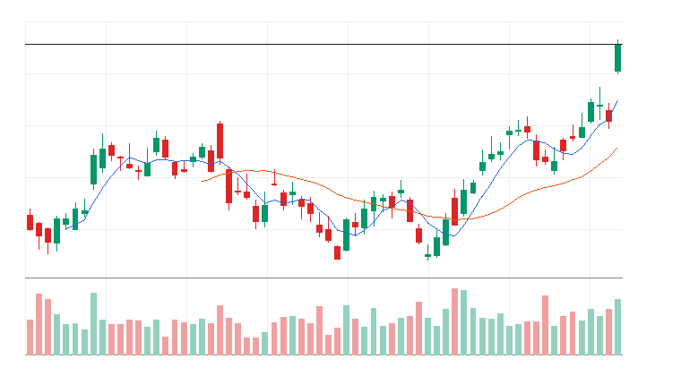
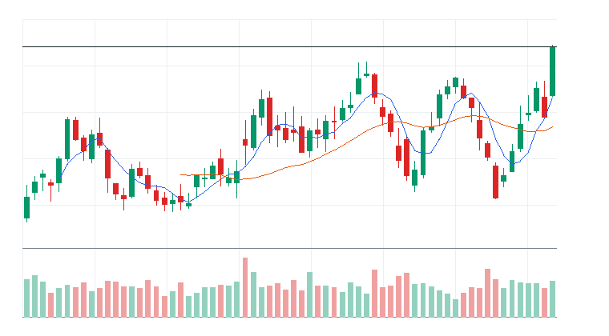

# 오늘의 데일리 트레이딩 요약

**REAL DATA TEST - 가격/거래량은 실제 데이터, 뉴스/ETF 구성종목 확산도/거래대금 유동성 일부 연결**

**목적:** 이 리포트는 최근 오른 자산을 나열하는 것이 아니라, 돈이 몰리는 근거와 다음 매수 주체가 확인할 트레이딩 후보를 찾기 위한 보고서다.

> 핵심 질문: 현재 가격에서 누가 사고 있고, 누가 앞으로 더 비싸게 사줄 수 있는가?

## 모바일 요약

[오늘의 데일리 트레이딩 요약]

생성 성공 / 데이터 모드: REAL_TEST

시장:
- 중립

시장 지배 서사:
1. 사이버보안 지출 재가속 - 관찰 - iShares Cybersecurity and Tech ETF(IHAK), Amplify Cybersecurity ETF(HACK), Palo Alto Networks Inc.(PANW), CrowdStrike Holdings Inc.(CRWD) 중심으로 5일 +12.71%, 20일 +2.90% 흐름이 형성됨. 뉴스 직접성 제한.
2. 반도체 장비 사이클 재평가 - 약화 - VanEck Semiconductor ETF(SMH), iShares Semiconductor ETF(SOXX), KLA Corporation(KLAC), Applied Materials Inc.(AMAT) 중심으로 5일 +3.72%, 20일 +9.16% 흐름이 형성됨. 직접 촉매 일부 확인.
3. 방산/안보 프리미엄 - 소멸 - iShares U.S. Aerospace & Defense ETF(ITA), SPDR S&P Aerospace & Defense ETF(XAR), AeroVironment(AVAV), Palantir Technologies Inc.(PLTR) 중심으로 5일 +7.15%, 20일 -3.47% 흐름이 형성됨. 직접 촉매 일부 확인.

트렌드 강도:
1. 사이버보안 지출 재가속 - TSI 67 - 부상 - 진입품질 낮음
2. 반도체 장비 사이클 재평가 - TSI 33 - 잠복 - 진입품질 낮음
3. 방산/안보 프리미엄 - TSI 54 - 부상 - 진입품질 낮음

오늘 결론:
- 필수소비재 개별 종목 흐름이 ETF 대비 강한지 확인 필요
- 행동 후보는 linkedNarrative와 함께 확인한다.
- 추격보다 진입 조건 확인 후 접근한다.

오늘 실제 행동 후보:
1. Coca-Cola Europacific Partners PLC(CCEP)(STOCK) - 위험선호 성장주 재진입 - 52주 고점 부근이라 돌파가 확인되면 신고가 추종 매수가 붙을 수 있음
2. Axon Enterprise Inc.(AXON)(STOCK) - 전력 유틸리티 수요 재평가 - 단기 추세가 유지되고 거래량이 1.0배 이상이면 눌림 이후 재상승을 시도할 수 있음

다크호스 후보:
1. 다크호스 후보 없음 - 조건 충족 후보 없음

ETF 후보 TOP 5:
1. iShares U.S. Aerospace & Defense ETF(ITA) - 방산/안보 프리미엄 - 관찰
2. iShares Cybersecurity and Tech ETF(IHAK) - 사이버보안 지출 재가속 - 제외
3. Roundhill Magnificent Seven ETF(MAGS) - 위험선호 성장주 재진입 - 제외
4. SPDR S&P Aerospace & Defense ETF(XAR) - 방산/안보 프리미엄 - 제외
5. Amplify Cybersecurity ETF(HACK) - 사이버보안 지출 재가속 - 제외

웹 리포트:
https://yoolcool.github.io/DailyTradingThesisAgent/

## 오늘 결론

- 오늘 결론: 조건부 진입
- 신규 진입 후보: 0개
- 조건부 진입 후보: 2개
- 관찰 후보: 108개
- 주요 제한 요인: Entry Quality < 40, RVOL 미달, 뉴스 직접성 부족
- 주문 판단: 시장가 금지 / 지정가 또는 관찰
- 실전 판단: 진입 후보는 있으나, 전일 고점 돌파와 거래량 확인 후 선별적으로 접근한다.

### 후보 제한 요인 집계

- RVOL < 1.00x: 107개
- 거래대금 유동성 낮음: 11개
- Entry Quality 50~54 near miss: 0개
- Entry Quality 40~49 관찰: 2개
- Entry Quality < 40: 155개
- Exhaustion Risk >= 70: 0개
- ETF breadth 샘플 부족: 37개
- 뉴스 직접성 부족: 100개

## 데이터 신뢰도

- 전체 데이터 신뢰도 등급: LOW
- 분석 신뢰도: LOW
- 주문 실행 신뢰도: LOW
- ETF breadth 신뢰도: LOW
- 신뢰도 해석: 테마 확산 판단 제한, 거래대금 유동성 낮음 또는 확인 불가, 프리/애프터마켓 확인 불가
- 리포트 생성 시각: 2026-07-02 09:08 KST
- 가격 기준 거래일: 2026-07-01 US regular close
- 뉴스 수집 시각: 2026-07-02 09:08 KST
- 가장 최근 뉴스 발행 시각: 2026-07-02 09:01 KST
- 뉴스 신선도 상태: FRESH
- 뉴스 소스: Yahoo Finance RSS, MarketWatch RSS, CNBC Markets RSS, SEC EDGAR RSS, Federal Reserve RSS, Finnhub API
- 뉴스 소스 상태: Yahoo Finance RSS PARTIAL, MarketWatch RSS CONNECTED, CNBC Markets RSS PARTIAL, SEC EDGAR RSS PARTIAL, Federal Reserve RSS CONNECTED, Finnhub API DISABLED
- 뉴스 신뢰도: MEDIUM
- 추천 적용 거래일: 2026-07-01 US regular session
- 가격/거래량 데이터 상태: 연결됨
- 뉴스 데이터 상태: 일부 연결
- ETF 구성종목 확산도 상태: 일부 연결
- ETF 구성종목 샘플 수: 1~4
- 거래대금 유동성 데이터 상태: 일부 연결
- 프리/애프터마켓 데이터 상태: UNAVAILABLE
- 데이터 provider: yfinance, Yahoo Finance RSS, MarketWatch RSS, CNBC Markets RSS, SEC EDGAR RSS, Federal Reserve RSS, Finnhub API, config fallback sample, price-volume dollar-volume fallback
- 실전 사용 경고: 이 리포트는 투자판단 보조용이며, REAL_TEST 모드에서는 일부 데이터가 누락되거나 지연될 수 있다. 실제 주문 전 현재가, 뉴스, 프리마켓/정규장 거래량을 별도 확인해야 한다.

## 0. 시장 상태

- 데이터 모드: REAL_TEST
- 가격/거래량: 연결됨
- 뉴스: 일부 연결
- ETF 구성종목 확산도: 일부 연결
- 거래대금 유동성: 일부 연결
- 생성 시각: 2026년 7월 2일 목요일 AM 9:08
- 시장 상태: 중립
- 오늘 돈의 방향: 필수소비재 개별 종목 흐름이 ETF 대비 강한지 확인 필요
- 강한 테마 TOP 3: Basic Materials(79), 반도체 장비/공급망(71), 사이버보안(66)
- 데이터 한계:
  - API 또는 provider 상태에 따라 뉴스/ETF 확산도/거래대금 유동성 반영 범위가 달라질 수 있다.
  - 수집 실패 데이터는 점수 반영에서 제외하거나 confidence를 제한한다.
  - reasonConfidence HIGH는 직접 촉매, 가격/거래량, 확산도/유동성 근거가 함께 있을 때만 사용한다.

## 오늘 시장을 지배하는 서사

### 오늘 시장을 지배하는 서사 TOP 3

#### 1. 사이버보안 지출 재가속
- 상태: 관찰
- narrativeScore: 62
- reasonConfidence: MEDIUM
- 근거 ETF: IHAK, HACK, CIBR
- 근거 개별 종목: PANW, CRWD, FTNT
- 돈이 몰리는 이유: 사이버보안 지출 재가속 관련 iShares Cybersecurity and Tech ETF(IHAK), Amplify Cybersecurity ETF(HACK), First Trust NASDAQ Cybersecurity ETF(CIBR)와 Palo Alto Networks Inc.(PANW), CrowdStrike Holdings Inc.(CRWD), Fortinet Inc.(FTNT)의 5일(+12.71%)·20일(+2.90%) 흐름을 함께 본다. 평균 상대 거래량은 1.05배이고, ETF 확산도는 추가 확인이 필요하다. 뉴스 직접성은 아직 제한적이다.
- 다음 매수 주체: 사이버보안 지출 재가속을 확인한 섹터 ETF 자금과 상대강도 추종 스윙 자금
- 가장 좋은 트레이딩 수단: ETF 우선: HACK, CIBR, IHAK / 개별 종목 우선: FTNT, PANW, CRWD
- 서사가 깨지는 조건: HACK 20일선 이탈 또는 관련 종목 절반 이상 5일선 이탈
- 오늘 행동: 기존 네러티브와 중복을 확인한 뒤 ETF/대표 종목 동조성이 살아날 때만 관찰 편입

상세 narrativeScore 근거 보기

- rawScore: 62
- ETF 평균 moneyFlowScore: 58
- 개별 종목 평균 moneyFlowScore: 70
- ETF 후보 비율: 50%
- 개별 종목 후보 비율: 0%
- 5일 평균 수익률: +13.00%
- 20일 평균 수익률: +3.00%
- 평균 상대 거래량: 1.00배
- ETF 평균 상대 거래량: 1.00배
- 개별주 평균 상대 거래량: 1.00배
- 52주 고점 근접 후보 비율: 86%
- 뉴스 직접성 점수: 12
- ETF 확산도 점수: -3
- 유동성 점수: 1
- 과열 리스크 차감: -1

#### 2. 반도체 장비 사이클 재평가
- 상태: 약화
- narrativeScore: 37
- reasonConfidence: LOW
- 근거 ETF: SMH, SOXX, SOXQ
- 근거 개별 종목: KLAC, AMAT, LRCX, ASML
- 돈이 몰리는 이유: 반도체 장비 사이클 재평가 관련 VanEck Semiconductor ETF(SMH), iShares Semiconductor ETF(SOXX), Invesco PHLX Semiconductor ETF(SOXQ)와 KLA Corporation(KLAC), Applied Materials Inc.(AMAT), Lam Research Corporation(LRCX), ASML Holding N.V.(ASML)의 5일(+3.72%)·20일(+9.16%) 흐름을 함께 본다. 평균 상대 거래량은 1.02배이고, ETF 확산도는 추가 확인이 필요하다. 직접 뉴스/이벤트가 일부 확인된다.
- 다음 매수 주체: 반도체 장비 사이클 재평가을 확인한 섹터 ETF 자금과 상대강도 추종 스윙 자금
- 가장 좋은 트레이딩 수단: ETF 우선: SMH, SOXX, SOXQ / 개별 종목 우선: AMAT, LRCX, KLAC
- 서사가 깨지는 조건: SMH 20일선 이탈 또는 관련 종목 절반 이상 5일선 이탈
- 오늘 행동: 기존 네러티브와 중복을 확인한 뒤 ETF/대표 종목 동조성이 살아날 때만 관찰 편입

상세 narrativeScore 근거 보기

- rawScore: 37
- ETF 평균 moneyFlowScore: 1
- 개별 종목 평균 moneyFlowScore: 66
- ETF 후보 비율: 0%
- 개별 종목 후보 비율: 75%
- 5일 평균 수익률: +4.00%
- 20일 평균 수익률: +9.00%
- 평균 상대 거래량: 1.00배
- ETF 평균 상대 거래량: 1.00배
- 개별주 평균 상대 거래량: 1.00배
- 52주 고점 근접 후보 비율: 0%
- 뉴스 직접성 점수: 5
- ETF 확산도 점수: -4
- 유동성 점수: 4
- 과열 리스크 차감: 0

#### 3. 방산/안보 프리미엄
- 상태: 소멸
- narrativeScore: 29
- reasonConfidence: LOW
- 근거 ETF: ITA, XAR, SHLD
- 근거 개별 종목: AVAV, PLTR, KTOS
- 돈이 몰리는 이유: 방산/안보 프리미엄 관련 iShares U.S. Aerospace & Defense ETF(ITA), SPDR S&P Aerospace & Defense ETF(XAR), Global X Defense Tech ETF(SHLD)와 AeroVironment(AVAV), Palantir Technologies Inc.(PLTR), Kratos Defense & Security Solutions(KTOS)의 5일(+7.15%)·20일(-3.47%) 흐름을 함께 본다. 평균 상대 거래량은 1.06배이고, ETF 확산도는 추가 확인이 필요하다. 직접 뉴스/이벤트가 일부 확인된다.
- 다음 매수 주체: 지정학 리스크와 안보 예산 기대를 사는 테마 ETF 자금
- 가장 좋은 트레이딩 수단: ETF 우선: XAR, SHLD, ITA / 개별 종목 우선: AVAV, KTOS, PLTR
- 서사가 깨지는 조건: 방산 ETF 20일선 이탈 또는 안보 이벤트 프리미엄 둔화
- 오늘 행동: 뉴스 촉매가 직접 확인될 때만 추세 추종

상세 narrativeScore 근거 보기

- rawScore: 29
- ETF 평균 moneyFlowScore: 44
- 개별 종목 평균 moneyFlowScore: 25
- ETF 후보 비율: 25%
- 개별 종목 후보 비율: 0%
- 5일 평균 수익률: +7.00%
- 20일 평균 수익률: -3.00%
- 평균 상대 거래량: 1.00배
- ETF 평균 상대 거래량: 1.00배
- 개별주 평균 상대 거래량: 1.00배
- 52주 고점 근접 후보 비율: 30%
- 뉴스 직접성 점수: 6
- ETF 확산도 점수: 0
- 유동성 점수: 0
- 과열 리스크 차감: 0

### 전체 narrative 요약

| 서사명 | 상태 | narrativeScore | reasonConfidence | 대표 ETF | 대표 종목 | 오늘 행동 |
| --- | --- | ---: | --- | --- | --- | --- |
| 사이버보안 지출 재가속 | 관찰 | 62 | MEDIUM | IHAK, HACK, CIBR | PANW, CRWD, FTNT | 기존 네러티브와 중복을 확인한 뒤 ETF/대표 종목 동조성이 살아날 때만 관찰 편입 |
| 반도체 장비 사이클 재평가 | 약화 | 37 | LOW | SMH, SOXX, SOXQ | KLAC, AMAT, LRCX, ASML | 기존 네러티브와 중복을 확인한 뒤 ETF/대표 종목 동조성이 살아날 때만 관찰 편입 |
| 방산/안보 프리미엄 | 소멸 | 29 | LOW | ITA, XAR, SHLD | AVAV, PLTR, KTOS | 뉴스 촉매가 직접 확인될 때만 추세 추종 |
| 위험선호 성장주 재진입 | 소멸 | 17 | LOW | MAGS, ARKK, QQQ | COIN, TSLA, ARM | 지수 위험선호가 유지될 때만 선별 진입 |
| 전력 유틸리티 수요 재평가 | 약화 | 15 | LOW | IWM, SPY, QQQ | GEV, ETN, VRT | 기존 네러티브와 중복을 확인한 뒤 ETF/대표 종목 동조성이 살아날 때만 관찰 편입 |
| AI 소프트웨어/사이버보안 확산 | 소멸 | 10 | LOW | IGV, QQQ, AIQ | ZS, DDOG, PLTR, TEAM | 추격보다 눌림 후 재상승 확인 |
| 소프트웨어 실적/AI 수익화 | 소멸 | 9 | LOW | IGV, QQQ, AIQ | DDOG, CDNS | 기존 네러티브와 중복을 확인한 뒤 ETF/대표 종목 동조성이 살아날 때만 관찰 편입 |
| Data Storage 자금 유입 | 약화 | 6 | LOW | IWM, SPY, QQQ | STX, WDC | 기존 네러티브와 중복을 확인한 뒤 ETF/대표 종목 동조성이 살아날 때만 관찰 편입 |
| AI 인프라 재가속 | 약화 | 1 | LOW | SMH, SOXX, DRAM | GEV, ETN, NVDA, MU | 추격보다 5일선 지지 후 재상승 확인 |
| 전력망/원전/인프라 병목 | 소멸 | 0 | LOW | PAVE, GRID, URA | GEV, ETN, VRT, PWR | ETF 확산도와 거래량이 같이 살아날 때만 진입 |
| 매크로 방어/헤지 | 소멸 | 0 | LOW | GLD, TLT, XLE | XOM, CVX | 위험회피가 확인될 때만 헤지성 접근 |
| 반도체 설계/공급망 재가속 | 소멸 | 0 | LOW | SMH, SOXX, SOXQ | AMD, MCHP, MRVL, ARM | 기존 네러티브와 중복을 확인한 뒤 ETF/대표 종목 동조성이 살아날 때만 관찰 편입 |
| 비트코인/디지털 자산 위험선호 | 소멸 | 0 | LOW | IBIT, BLOK | COIN, MSTR, IREN | 비트코인 베타가 살아날 때만 단기 매매 |

## 트렌드 강도 판단

### 1. 사이버보안 지출 재가속
- Trend Strength Index: 67
- 트렌드 상태 라벨: 부상
- 테마 확산도: 강함
- ETF 동조성: 강함
- 거래량 강도: 약함
- 과열 위험: 보통 (37)
- 오늘 진입 품질: 낮음 (34)
- 한 줄 판단: 사이버보안 지출 재가속는 가격, 거래량, ETF, 확산도가 함께 확인되어 테마 단위 자금 유입이 선명하다.
- 오늘 접근법: iShares Cybersecurity and Tech ETF(IHAK)/Amplify Cybersecurity ETF(HACK)/First Trust NASDAQ Cybersecurity ETF(CIBR) 거래량 증가와 Palo Alto Networks Inc.(PANW)/CrowdStrike Holdings Inc.(CRWD)/Fortinet Inc.(FTNT) 확산을 확인하며 작은 사이즈의 초기 진입 후보로만 본다.

트렌드 강도 상세 근거 보기

- 가격 모멘텀: 가격 모멘텀 22/25. 평균 5D +12.71%, 20D +2.90%.
- 거래량 강도: 거래량 강도 8/20. 평균 RVOL 1.05배.
- ETF 동조성: ETF 동조성 14/15. 관련 ETF Amplify Cybersecurity ETF(HACK), First Trust NASDAQ Cybersecurity ETF(CIBR), iShares Cybersecurity and Tech ETF(IHAK), iShares Expanded Tech-Software Sector ETF(IGV) 흐름을 기준으로 판단.
- 테마 확산도: 테마 확산도 17/20. 상위 1~2개 쏠림 감점 0점 반영.
- 뉴스 촉매: 뉴스/촉매 신선도 2/10. HIGH 직접 촉매 0개.
- 과열 리스크: 과열 리스크 37/100. 단기 급등, 고점 근접, ETF-개별주 괴리, 쏠림을 함께 반영.
- 시장 환경: 시장 환경 4/10. QQQ/SPY/IWM 가격 흐름 기반 위험선호 점수.

### 2. 반도체 장비 사이클 재평가
- Trend Strength Index: 33
- 트렌드 상태 라벨: 잠복
- 테마 확산도: 약함
- ETF 동조성: 부족
- 거래량 강도: 약함
- 과열 위험: 낮음 (21)
- 오늘 진입 품질: 낮음 (27)
- 한 줄 판단: 반도체 장비 사이클 재평가는 ETF 동조성이 약해 테마 자금 확인이 부족하다.
- 오늘 접근법: VanEck Semiconductor ETF(SMH)/iShares Semiconductor ETF(SOXX)/Invesco PHLX Semiconductor ETF(SOXQ)와 KLA Corporation(KLAC)/Applied Materials Inc.(AMAT)/Lam Research Corporation(LRCX)의 거래량 확산이 확인되기 전까지 관찰한다.

트렌드 강도 상세 근거 보기

- 가격 모멘텀: 가격 모멘텀 10/25. 평균 5D +3.72%, 20D +9.16%.
- 거래량 강도: 거래량 강도 6/20. 평균 RVOL 1.02배.
- ETF 동조성: ETF 동조성 -1/15. 관련 ETF VanEck Semiconductor ETF(SMH), iShares Semiconductor ETF(SOXX), Invesco PHLX Semiconductor ETF(SOXQ), Global X Artificial Intelligence & Technology ETF(AIQ) 흐름을 기준으로 판단.
- 테마 확산도: 테마 확산도 6/20. 상위 1~2개 쏠림 감점 3점 반영.
- 뉴스 촉매: 뉴스/촉매 신선도 8/10. HIGH 직접 촉매 3개.
- 과열 리스크: 과열 리스크 21/100. 단기 급등, 고점 근접, ETF-개별주 괴리, 쏠림을 함께 반영.
- 시장 환경: 시장 환경 4/10. QQQ/SPY/IWM 가격 흐름 기반 위험선호 점수.

### 3. 방산/안보 프리미엄
- Trend Strength Index: 54
- 트렌드 상태 라벨: 부상
- 테마 확산도: 보통
- ETF 동조성: 강함
- 거래량 강도: 약함
- 과열 위험: 낮음 (7)
- 오늘 진입 품질: 낮음 (36)
- 한 줄 판단: 방산/안보 프리미엄는 관찰 가능한 흐름은 있으나 가격, 거래량, 확산도 중 일부 확인이 더 필요하다.
- 오늘 접근법: iShares U.S. Aerospace & Defense ETF(ITA)/SPDR S&P Aerospace & Defense ETF(XAR)/Global X Defense Tech ETF(SHLD) 거래량 증가와 AeroVironment(AVAV)/Palantir Technologies Inc.(PLTR)/Kratos Defense & Security Solutions(KTOS) 확산을 확인하며 작은 사이즈의 초기 진입 후보로만 본다.

트렌드 강도 상세 근거 보기

- 가격 모멘텀: 가격 모멘텀 15/25. 평균 5D +7.15%, 20D -3.47%.
- 거래량 강도: 거래량 강도 7/20. 평균 RVOL 1.06배.
- ETF 동조성: ETF 동조성 13/15. 관련 ETF SPDR S&P Aerospace & Defense ETF(XAR), Global X Defense Tech ETF(SHLD), iShares U.S. Aerospace & Defense ETF(ITA), Invesco Aerospace & Defense ETF(PPA) 흐름을 기준으로 판단.
- 테마 확산도: 테마 확산도 11/20. 상위 1~2개 쏠림 감점 0점 반영.
- 뉴스 촉매: 뉴스/촉매 신선도 4/10. HIGH 직접 촉매 1개.
- 과열 리스크: 과열 리스크 7/100. 단기 급등, 고점 근접, ETF-개별주 괴리, 쏠림을 함께 반영.
- 시장 환경: 시장 환경 4/10. QQQ/SPY/IWM 가격 흐름 기반 위험선호 점수.

## 최근 추천 결과 트래킹

개별주는 데이트레이딩 관점으로 추천 이후 첫 정규장의 장중 최고가와 종가를 추적한다. ETF는 테마/스윙 관점으로 추천 이후 1주일 동안의 최고가와 현재 종가를 추적한다.

### 개별주 Top 3 추천 성과 요약
- 최근 5개 리포트 표본: 14개 (초기 검증 단계)
- 장중 최고가 기준 성공률: +41.67%
- 종가 기준 성공률: +50.00%
- 평균 장중 최고 수익률: +1.02%
- 평균 종가 수익률: -1.73%

### ETF 추천 성과 요약
- 최근 5개 리포트 표본: 1개 (초기 검증 단계)
- 1주 최고가 기준 성공률: 0.00%
- 현재 종가 기준 성공률: 0.00%
- 평균 1주 최고 수익률: -3.55%
- 평균 현재 수익률: -14.35%

최근 추천 결과 상세 테이블 펼치기

| 추천일 | 유형 | 순위 | 티커 | 기준가 | 추적 기간 | 상태 | High 수익률 | Close 수익률 | 결과 | 코멘트 |
| --- | --- | ---: | --- | ---: | --- | --- | ---: | ---: | --- | --- |
| 2026-07-02 | STOCK | 2 | AXON | $593.96 | 2026-07-02 | pending | 데이터 없음 | 데이터 없음 | 추적 대기 | 아직 추적 거래일 데이터가 완성되지 않음 |
| 2026-07-02 | STOCK | 1 | CCEP | $106.1 | 2026-07-02 | pending | 데이터 없음 | 데이터 없음 | 추적 대기 | 아직 추적 거래일 데이터가 완성되지 않음 |
| 2026-07-01 | STOCK | 3 | LRCX | $433.33 | 2026-07-01 | complete | -4.12% | -9.71% | 실패 | 추천 이후 의미 있는 장중 기회가 부족하고 종가도 약함 (일봉 기준) |
| 2026-07-01 | STOCK | 2 | PANW | $341.02 | 2026-07-01 | complete | +5.01% | +3.23% | 성공 | 장중 기회와 종가 유지가 모두 확인됨 (일봉 기준) |
| 2026-07-01 | STOCK | 1 | AMAT | $723 | 2026-07-01 | complete | -4.05% | -9.97% | 실패 | 추천 이후 의미 있는 장중 기회가 부족하고 종가도 약함 (일봉 기준) |
| 2026-06-30 | STOCK | 3 | AMAT | $694.64 | 2026-06-30 | complete | +6.48% | +4.08% | 성공 | 장중 기회와 종가 유지가 모두 확인됨 (일봉 기준) |
| 2026-06-30 | STOCK | 2 | CRWD | $742.91 | 2026-06-30 | pending | +3.01% | +2.72% | 추적 대기 | 아직 추적 거래일 데이터가 완성되지 않음 |
| 2026-06-30 | STOCK | 1 | PANW | $332 | 2026-06-30 | complete | +3.16% | +2.72% | 성공 | 장중 기회와 종가 유지가 모두 확인됨 (일봉 기준) |
| 2026-06-29 | STOCK | 3 | KDP | $33.4 | 2026-06-29 | complete | +1.26% | +0.30% | 제한적 유효 | 제한적인 장중 기회만 발생 (일봉 기준) |
| 2026-06-29 | STOCK | 2 | VRTX | $491.34 | 2026-06-29 | complete | +1.74% | +1.69% | 제한적 유효 | 제한적인 장중 기회만 발생 (일봉 기준) |
| 2026-06-29 | STOCK | 1 | FTNT | $151.35 | 2026-06-29 | complete | +5.10% | +2.69% | 성공 | 장중 기회와 종가 유지가 모두 확인됨 (일봉 기준) |
| 2026-06-26 | STOCK | 3 | MU | $1,213.56 | 2026-06-26 | complete | -1.22% | -6.69% | 실패 | 추천 이후 의미 있는 장중 기회가 부족하고 종가도 약함 (일봉 기준) |
| 2026-06-26 | STOCK | 2 | AMAT | $668 | 2026-06-26 | complete | -1.17% | -6.16% | 실패 | 추천 이후 의미 있는 장중 기회가 부족하고 종가도 약함 (일봉 기준) |
| 2026-06-26 | STOCK | 1 | LRCX | $401.82 | 2026-06-26 | complete | -2.97% | -5.66% | 실패 | 추천 이후 의미 있는 장중 기회가 부족하고 종가도 약함 (일봉 기준) |
| 2026-06-26 | ETF | 1 | DRAM | $76.89 | 2026-06-26~2026-07-03 | in_progress | -3.55% | -14.35% | 진행 중 | 아직 1주 추적 기간이 끝나지 않음 |
| 2026-06-23 | STOCK | 3 | TSM | $467.67 | 2026-06-23 | complete | -4.35% | -6.69% | 실패 | 추천 이후 의미 있는 장중 기회가 부족하고 종가도 약함 (일봉 기준) |
| 2026-06-23 | STOCK | 2 | GEV | $1,127.59 | 2026-06-23 | complete | -4.84% | -8.21% | 실패 | 추천 이후 의미 있는 장중 기회가 부족하고 종가도 약함 (일봉 기준) |
| 2026-06-23 | STOCK | 1 | ETN | $435.78 | 2026-06-23 | complete | -3.27% | -7.00% | 실패 | 추천 이후 의미 있는 장중 기회가 부족하고 종가도 약함 (일봉 기준) |
| 2026-06-23 | ETF | 1 | DRAM | $80.72 | 2026-06-23~2026-06-30 | complete | -1.39% | -18.41% | 실패 | 추천 이후 ETF 흐름이 약화됨 |
| 2026-06-22 | STOCK | 3 | ARM | $439.46 | 2026-06-22 | complete | +1.25% | -7.22% | 제한적 유효 | 제한적인 장중 기회만 발생 (일봉 기준) |
| 2026-06-22 | STOCK | 2 | GEV | $1,109.73 | 2026-06-22 | complete | +2.91% | +1.61% | 제한적 유효 | 제한적인 장중 기회만 발생 (일봉 기준) |
| 2026-06-22 | STOCK | 1 | ETN | $421.77 | 2026-06-22 | complete | +3.55% | +3.32% | 성공 | 장중 기회와 종가 유지가 모두 확인됨 (일봉 기준) |
| 2026-06-22 | ETF | 3 | IFRA | $61.99 | 2026-06-22~2026-06-29 | complete | +3.65% | -0.16% | 단기 고점 후 반납 | 1주 내 상승 기회는 있었지만 현재가는 반납 |
| 2026-06-22 | ETF | 2 | SMH | $659.88 | 2026-06-22~2026-06-29 | complete | -1.49% | -5.97% | 실패 | 추천 이후 ETF 흐름이 약화됨 |
| 2026-06-22 | ETF | 1 | DRAM | $76.71 | 2026-06-22~2026-06-29 | complete | +3.77% | -14.14% | 단기 고점 후 반납 | 1주 내 상승 기회는 있었지만 현재가는 반납 |
| 2026-06-19 | STOCK | 3 | AMD | $537.37 | 2026-06-19 | pending | 데이터 없음 | 데이터 없음 | 추적 대기 | 아직 추적 거래일 데이터가 완성되지 않음 |
| 2026-06-19 | STOCK | 2 | ARM | $439.46 | 2026-06-19 | pending | 데이터 없음 | 데이터 없음 | 추적 대기 | 아직 추적 거래일 데이터가 완성되지 않음 |
| 2026-06-19 | STOCK | 1 | GEV | $1,109.73 | 2026-06-19 | pending | 데이터 없음 | 데이터 없음 | 추적 대기 | 아직 추적 거래일 데이터가 완성되지 않음 |
| 2026-06-19 | ETF | 1 | DRAM | $76.71 | 2026-06-19~2026-06-26 | complete | +6.04% | -14.14% | 단기 고점 후 반납 | 1주 내 상승 기회는 있었지만 현재가는 반납 |
| 2026-06-18 | STOCK | 3 | ASML | $1,867.83 | 2026-06-18 | complete | +4.02% | +3.31% | 성공 | 장중 기회와 종가 유지가 모두 확인됨 (일봉 기준) |
| 2026-06-18 | STOCK | 3 | FCX | $69.06 | 2026-06-18 | complete | +2.26% | -0.55% | 제한적 유효 | 제한적인 장중 기회만 발생 (일봉 기준) |
| 2026-06-18 | STOCK | 2 | KLAC | $238.73 | 2026-06-18 | complete | +10.56% | +8.73% | 성공 | 장중 기회와 종가 유지가 모두 확인됨 (일봉 기준) |
| 2026-06-18 | STOCK | 1 | LRCX | $374.18 | 2026-06-18 | complete | +7.17% | +3.97% | 성공 | 장중 기회와 종가 유지가 모두 확인됨 (일봉 기준) |
| 2026-06-18 | ETF | 1 | SOXQ | $106.13 | 2026-06-18~2026-06-25 | complete | +8.67% | -0.96% | 단기 고점 후 반납 | 1주 내 상승 기회는 있었지만 현재가는 반납 |
| 2026-06-04 | STOCK | 3 | PANW | $280.43 | 2026-06-04 | complete | +0.10% | -0.42% | 실패 | 추천 이후 의미 있는 장중 기회가 부족하고 종가도 약함 (일봉 기준) |
| 2026-06-04 | STOCK | 2 | FTNT | $146.48 | 2026-06-04 | complete | +2.45% | +2.18% | 제한적 유효 | 제한적인 장중 기회만 발생 (일봉 기준) |
| 2026-06-04 | STOCK | 1 | CRWD | $747.61 | 2026-06-04 | complete | -3.56% | -3.81% | 실패 | 추천 이후 의미 있는 장중 기회가 부족하고 종가도 약함 (일봉 기준) |
| 2026-06-04 | ETF | 3 | HACK | $102.21 | 2026-06-04~2026-06-11 | complete | -1.66% | +4.78% | 진행 중 | 아직 1주 추적 기간이 끝나지 않음 |
| 2026-06-04 | ETF | 2 | SOXQ | $109.58 | 2026-06-04~2026-06-11 | complete | -4.68% | -4.08% | 실패 | 추천 이후 ETF 흐름이 약화됨 |
| 2026-06-04 | ETF | 1 | AIQ | $69.16 | 2026-06-04~2026-06-11 | complete | -4.29% | -8.00% | 실패 | 추천 이후 ETF 흐름이 약화됨 |
| 2026-06-03 | STOCK | 3 | FTNT | $148.86 | 2026-06-03 | complete | -0.26% | -1.60% | 실패 | 추천 이후 의미 있는 장중 기회가 부족하고 종가도 약함 (일봉 기준) |
| 2026-06-03 | STOCK | 3 | CRWD | $768.95 | 2026-06-03 | complete | -0.25% | -2.78% | 실패 | 추천 이후 의미 있는 장중 기회가 부족하고 종가도 약함 (일봉 기준) |
| 2026-06-03 | STOCK | 2 | MRVL | $290.79 | 2026-06-03 | complete | +11.49% | +3.73% | 성공 | 장중 기회와 종가 유지가 모두 확인됨 (일봉 기준) |
| 2026-06-03 | STOCK | 1 | PANW | $297.18 | 2026-06-03 | complete | -3.09% | -5.64% | 실패 | 추천 이후 의미 있는 장중 기회가 부족하고 종가도 약함 (일봉 기준) |
| 2026-06-03 | ETF | 3 | DRAM | $69.57 | 2026-06-03~2026-06-10 | complete | -3.52% | -5.33% | 실패 | 추천 이후 ETF 흐름이 약화됨 |
| 2026-06-03 | ETF | 3 | IGV | $104.73 | 2026-06-03~2026-06-10 | complete | -3.31% | -10.88% | 실패 | 추천 이후 ETF 흐름이 약화됨 |
| 2026-06-03 | ETF | 2 | AIQ | $70.14 | 2026-06-03~2026-06-10 | complete | -2.32% | -9.28% | 실패 | 추천 이후 ETF 흐름이 약화됨 |
| 2026-06-03 | ETF | 1 | CIBR | $94.32 | 2026-06-03~2026-06-10 | complete | -3.56% | -3.40% | 실패 | 추천 이후 ETF 흐름이 약화됨 |

## 오늘 실제 행동 후보

### 1. Coca-Cola Europacific Partners PLC(CCEP)
- 자산 유형: STOCK
- linkedNarrative: 위험선호 성장주 재진입
- narrativeStatus: 소멸
- narrativeScore: 17
- Trend Strength Index: 44
- Exhaustion Risk: 2 (낮음)
- Entry Quality Score: 38 (낮음)
- 트렌드 판단: 시장 위험선호가 약해 시장 환경 비우호 구간이다.
- moneyFlowScore: 97
- finalRawScore: 97
- reasonConfidence: MEDIUM
- reasonConfidenceExplanation: 직접 촉매 부재 때문에 HIGH가 아니라 MEDIUM으로 제한했다.
- tieBreakerReason: 최종 원점수 97, 리스크 패널티 -4, 5일 수익률 +7.39%, 상대 거래량 1.30배 순으로 정렬
- 후보별 시장 해석: 중립 / 제한적 - 고점 근처 추격 리스크 / Entry Quality 38 < 50이나 moneyFlow 97, confidence MEDIUM, RVOL 1.30x로 강한 자금흐름 예외 조건 충족
- 게이트 사유: Entry Quality 38 < 50이나 moneyFlow 97, confidence MEDIUM, RVOL 1.30x로 강한 자금흐름 예외 조건 충족
- 주문 실행: 지정가 권장

- 왜 돈이 몰리는가: 20일 +16.59%, 5일 +7.39%, 상대 거래량 1.30배로 가격과 거래량이 함께 개선. 뉴스: CNBC Markets RSS general_market/under_6h / 유동성: ACCEPTABLE
- 누가 더 비싸게 사줄 수 있는지: 개별 주도주를 따라붙는 단기 모멘텀 자금과 관련 ETF 강세를 확인한 트레이더
- 진입 조건: 전일 고점 돌파와 5일선 유지 확인
- 무효화 조건: 20일선 이탈 또는 상대 거래량 0.8배 이하 둔화
- todayActionLabel: 자금흐름 예외 조건부
- 차트: 

### 2. Axon Enterprise Inc.(AXON)
- 자산 유형: STOCK
- linkedNarrative: 전력 유틸리티 수요 재평가
- narrativeStatus: 약화
- narrativeScore: 15
- Trend Strength Index: 29
- Exhaustion Risk: 15 (낮음)
- Entry Quality Score: 30 (낮음)
- 트렌드 판단: 시장 위험선호가 약해 시장 환경 비우호 구간이다.
- moneyFlowScore: 99
- finalRawScore: 99
- reasonConfidence: MEDIUM
- reasonConfidenceExplanation: 직접 촉매 부재 때문에 HIGH가 아니라 MEDIUM으로 제한했다.
- tieBreakerReason: 최종 원점수 99, 리스크 패널티 -6, 5일 수익률 +30.05%, 상대 거래량 1.43배 순으로 정렬
- 후보별 시장 해석: 중립 / 제한적 - Entry Quality 30 < 50이나 moneyFlow 99, confidence MEDIUM, RVOL 1.43x로 강한 자금흐름 예외 조건 충족
- 게이트 사유: Entry Quality 30 < 50이나 moneyFlow 99, confidence MEDIUM, RVOL 1.43x로 강한 자금흐름 예외 조건 충족
- 주문 실행: 시장가 가능

- 왜 돈이 몰리는가: 20일 +21.19%, 5일 +30.05%, 상대 거래량 1.43배로 가격과 거래량이 함께 개선. 뉴스: CNBC Markets RSS general_market/under_6h / 유동성: LIQUID
- 누가 더 비싸게 사줄 수 있는지: 개별 주도주를 따라붙는 단기 모멘텀 자금과 관련 ETF 강세를 확인한 트레이더
- 진입 조건: 20일선 위 눌림 후 재상승 확인
- 무효화 조건: 20일선 이탈 또는 상대 거래량 0.8배 이하 둔화
- todayActionLabel: 자금흐름 예외 조건부
- 차트: 

## 다크호스 후보

다크호스 후보 없음. 상위 서사 정렬, MA20 위 안착, MA5/MA20 구조 개선, RVOL 0.90x 이상 조건을 동시에 충족한 개별주가 없다.

- darkHorseScore: 조건 충족 후보 없음
- 왜 아직 메인이 아닌가: 확인 조건을 통과한 보조 관찰 후보가 없다.

darkHorseScore 상세 근거 보기

- 서사 정렬: 조건 미충족
- 초기 추세 구조: 조건 미충족
- 베이스 돌파/정돈: 조건 미충족
- 거래량 확인: 조건 미충족
- rawScore: 데이터 없음

## 오늘 돈이 몰리는 테마

- Basic Materials: LIN | 평균 moneyFlowScore 79 | 단일 종목 이벤트보다 테마 단위 자금 흐름이 선명한 구간으로 본다.
- 반도체 장비/공급망: LRCX, AMAT, KLAC | 평균 moneyFlowScore 71 | 추세는 확인되지만 선별 진입이 필요한 중간 강도의 테마로 본다.
- 사이버보안: PANW, CRWD, FTNT, ZS | 평균 moneyFlowScore 66 | 추세는 확인되지만 선별 진입이 필요한 중간 강도의 테마로 본다.
- 사이버보안 ETF: CIBR, HACK, IHAK | 평균 moneyFlowScore 61 | 추세는 확인되지만 선별 진입이 필요한 중간 강도의 테마로 본다.
- 메가캡 플랫폼 ETF: MAGS | 평균 moneyFlowScore 51 | 관심은 유지하되 우선순위는 낮추고 추가 거래량 확인을 기다린다.
- 클라우드/엔터프라이즈 소프트웨어 ETF: IGV | 평균 moneyFlowScore 48 | 관심은 유지하되 우선순위는 낮추고 추가 거래량 확인을 기다린다.

## 1. ETF 트레이딩 보고서
### 1-1. ETF 결론
- ETF 우선 후보: 없음
- ETF 관찰 후보: iShares Semiconductor ETF(SOXX), Invesco PHLX Semiconductor ETF(SOXQ), Global X Artificial Intelligence & Technology ETF(AIQ), Global X Robotics & Artificial Intelligence ETF(BOTZ), ROBO Global Robotics and Automation Index ETF(ROBO)
- ETF 매매 금지: Roundhill Memory ETF(DRAM), iShares Semiconductor ETF(SOXX), Invesco PHLX Semiconductor ETF(SOXQ), Global X Artificial Intelligence & Technology ETF(AIQ), First Trust NASDAQ Clean Edge Smart Grid Infrastructure ETF(GRID)
- 오늘 ETF 최우선 1개: 없음
- ETF 섹션 해석: 이 섹션은 개별 종목 선택이 아니라 테마/섹터 단위 자금 흐름을 ETF로 매매할지 판단하기 위한 영역이다.

### 1-2. ETF 후보 TOP 5

선정 기준: ETF 후보는 가격/거래량 1차 점수에 뉴스, ETF 구성종목 확산도, 유동성, 리스크 패널티를 반영한 finalRawScore 기준으로 정렬한다. 표시 점수 100점 후보가 겹치면 tieBreakerReason으로 우선순위를 설명한다.

### [ETF] iShares U.S. Aerospace & Defense ETF(ITA)
- 자산 유형: ETF
- ETF 세부 카테고리: 방산 ETF
- ETF 역할: 방어 섹터 확인
- 상태: 관찰
- linkedNarrative: 방산/안보 프리미엄
- narrativeStatus: 소멸
- narrativeScore: 29
- moneyFlowScore: 69
- finalRawScore: 69
- tieBreakerReason: 최종 원점수 69, 리스크 패널티 0, 5일 수익률 +3.25%, 상대 거래량 1.08배 순으로 정렬
- 과열 리스크: 낮음
- reasonConfidence: MEDIUM
- reasonConfidenceExplanation: ETF 확산도 제한 때문에 HIGH가 아니라 MEDIUM으로 제한했다.

- todayActionLabel: 관찰
- 주문 실행: 지정가 권장
- 기준일: 2026-07-01
- 종가: $243.86
- 1일 수익률: +0.59%
- 5일 수익률: +3.25%
- 20일 수익률: +6.80%
- 상대 거래량: 1.08배
- 52주 고점 대비 위치: -2.71%
- whyMoneyIsFlowing: 20일 +6.80%, 5일 +3.25%, 상대 거래량 1.08배로 가격과 거래량이 함께 개선. 뉴스: MarketWatch RSS general_market/under_6h / 유동성: ACCEPTABLE
- likelyNextBuyer: 섹터 베타를 노리는 단기 모멘텀 자금과 리밸런싱 자금
- whyThisCouldTradeHigher: 52주 고점 부근이라 돌파가 확인되면 신고가 추종 매수가 붙을 수 있음
- 진입 조건: 전일 고점 돌파와 5일선 유지 확인
- 무효화 조건: 20일선 이탈 또는 상대 거래량 0.8배 이하 둔화
- 차트: 

#### 상세 근거

iShares U.S. Aerospace & Defense ETF(ITA) 상세 근거 펼치기

- moneyFlowScore(최종) 산정 근거:
  - moneyFlowScore(1차): 55
  - 최종 원점수: 69
  - 최종 표시 점수: 69
  - cap 적용: cap 미적용
  - 계산식: +55 + +12 + 0 + +2 + 0 + 0 + 0 = 69
  - 점수 해석: 관심 후보. 눌림 또는 돌파 확인 후 진입 검토.
  - 가격/거래량 1차 점수: +55
    - 추세: +12
    - 단기 모멘텀: +3
    - 중기 모멘텀: +4
    - 거래량: +10
    - 신고가 근접: +12
    - 이동평균: +14
  - 하위 점수 cap:
    - 가격 모멘텀: 원점수 +12, 상한 적용 +12 / 최대 25
    - 단기 모멘텀: 원점수 +3, 상한 적용 +3 / 최대 20
    - 중기 모멘텀: 원점수 +4, 상한 적용 +4 / 최대 16
    - 거래량: 원점수 +10, 상한 적용 +10 / 최대 20
    - 신고가 근접: 원점수 +12, 상한 적용 +12 / 최대 12
    - 이동평균: 원점수 +14, 상한 적용 +14 / 최대 14
  - 추가 데이터 가감점:
    - 뉴스: +12
    - 유동성: +2
  - ETF 확산도: 0
  - 리스크 패널티: 0
  - 주요 근거: 1차 55, 최종 원점수 69, 표시 69. 52주 고점 근처, 이동평균 위 추세 유지, 뉴스 흐름이 가격/거래량 근거 보강. 주의: ETF 구성종목 확산도 데이터 미연결.
  - 리스크 패널티 산정 근거:
    - 총 리스크 패널티: 0
    - 리스크 등급: LOW
    - 감점된 리스크: 없음
    - 관찰 리스크: ETF breadth data not connected
    - 한 줄 해석: 직접 감점된 주요 리스크는 없지만 관찰 리스크는 계속 확인해야 한다.
- 데이터 사용 현황:
  - 가격/거래량: 사용
  - 뉴스: 사용
  - ETF 확산도: 미연결
  - 거래대금 유동성: 사용
  - 관련 ETF 상대강도: 사용
- 뉴스 확인:
  - 최근 뉴스 상태: 일부 연결
  - 뉴스 소스: MarketWatch RSS, Federal Reserve RSS
  - 소스별 상태: Yahoo Finance RSS CONNECTED; MarketWatch RSS CONNECTED; CNBC Markets RSS FAILED; SEC EDGAR RSS PARTIAL; Federal Reserve RSS CONNECTED; Finnhub API DISABLED
  - 긍정/중립/부정: 5/11/0
  - 직접성/방향성/신선도: 2/1/4
  - 강한 촉매 수: 1
  - 중요 공시 수: 0
  - 직접 촉매: 없음
  - 보조 뉴스: MarketWatch RSS sector_theme / general_market / under_6h
  - 뉴스 수집 시각: 2026-07-02 09:08 KST
  - 가장 최근 뉴스 발행 시각: 2026-07-02 08:01 KST
  - 뉴스 신선도 상태: FRESH
  - 뉴스 이후 가격 반응: 긍정
  - 가격 반응 점수 제한: 뉴스 이후 가격 반응과 점수 제한 특이사항 없음
  - 핵심 뉴스 요약: &#x2018;We were stunned&#x2019;: My daughter, 39, said her mother-in-law gives her more money than we do. Do I call her out?
  - 원점수/상한 점수: +16 / +12
  - 점수 반영: +12
  - 주의: CNBC Markets RSS: HTTP 403 from https://www.cnbc.com/id/100003114/device/rss/rss.html; SEC EDGAR RSS: no matching RSS items; Finnhub API: FINNHUB_API_KEY not configured
- ETF 구성종목 확산도:
  - 구성종목 데이터 상태: 미연결
  - 샘플 수: 0/0
  - 샘플 신뢰도: UNKNOWN
  - 상승 종목 비율: 데이터 없음
  - 20일선 위 비율: 데이터 없음
  - 50일선 위 비율: 데이터 없음
  - 상위 기여 종목: 데이터 없음
  - 확산도 판단: UNKNOWN
  - 원점수/샘플 상한/반영 점수: 0 / N/A / 0
  - 점수 반영: 0
- 거래대금 유동성:
  - 데이터 상태: 일부 연결
  - 거래대금 기준 유동성: ACCEPTABLE
  - 거래대금: $206,846,929
  - 평균 거래대금: $191,740,046
  - 주문 영향: 지정가 권장
  - 매매 영향: 거래대금은 허용 가능하나 지정가를 우선한다
- reasonConfidence 근거: 가격/거래량, 뉴스, 거래대금 유동성, 관련 ETF 상대강도은 확인됐지만 일부 보조 데이터가 미연결 또는 fallback이라 중간으로 제한한다.
- 차트 요약: 최근 20거래일 기준 5일선이 20일선 위에 있음
- 기준일 2026-07-01 | 종가 $243.86 | 1일 +0.59% | 5일 +3.25% | 20일 +6.80% | 상대 거래량 1.08배 | 52주 고점 대비 -2.71% | 데이터 소스: yfinance

### [ETF] iShares Cybersecurity and Tech ETF(IHAK)
- 자산 유형: ETF
- ETF 세부 카테고리: 사이버보안 ETF
- ETF 역할: 테마 베타 매수
- 상태: 매매 금지
- linkedNarrative: 사이버보안 지출 재가속
- narrativeStatus: 관찰
- narrativeScore: 62
- moneyFlowScore: 75
- finalRawScore: 75
- tieBreakerReason: 최종 원점수 75, 리스크 패널티 -5, 5일 수익률 +13.12%, 상대 거래량 1.32배 순으로 정렬
- 과열 리스크: 낮음
- reasonConfidence: MEDIUM
- reasonConfidenceExplanation: ETF 확산도 제한 때문에 HIGH가 아니라 MEDIUM으로 제한했다.

- todayActionLabel: 제외
- 주문 실행: 추격 금지
- 기준일: 2026-07-01
- 종가: $61.92
- 1일 수익률: +1.99%
- 5일 수익률: +13.12%
- 20일 수익률: +1.96%
- 상대 거래량: 1.32배
- 52주 고점 대비 위치: -1.46%
- whyMoneyIsFlowing: 20일 +1.96%, 5일 +13.12%, 상대 거래량 1.32배로 가격과 거래량이 함께 개선. 뉴스: MarketWatch RSS general_market/under_6h
- likelyNextBuyer: 섹터 베타를 노리는 단기 모멘텀 자금과 리밸런싱 자금
- whyThisCouldTradeHigher: 52주 고점 부근이라 돌파가 확인되면 신고가 추종 매수가 붙을 수 있음
- 진입 조건: 전일 고점 돌파와 5일선 유지 확인
- 무효화 조건: 20일선 이탈 또는 상대 거래량 0.8배 이하 둔화
- 차트: 

#### 상세 근거

iShares Cybersecurity and Tech ETF(IHAK) 상세 근거 펼치기

- moneyFlowScore(최종) 산정 근거:
  - moneyFlowScore(1차): 73
  - 최종 원점수: 75
  - 최종 표시 점수: 75
  - cap 적용: cap 미적용
  - 계산식: +73 + +12 + 0 - 5 + 0 - 5 + 0 = 75
  - 점수 해석: 관심 후보. 눌림 또는 돌파 확인 후 진입 검토.
  - 가격/거래량 1차 점수: +73
    - 추세: +19
    - 단기 모멘텀: +13
    - 중기 모멘텀: +1
    - 거래량: +14
    - 신고가 근접: +12
    - 이동평균: +14
  - 하위 점수 cap:
    - 가격 모멘텀: 원점수 +19, 상한 적용 +19 / 최대 25
    - 단기 모멘텀: 원점수 +13, 상한 적용 +13 / 최대 20
    - 중기 모멘텀: 원점수 +1, 상한 적용 +1 / 최대 16
    - 거래량: 원점수 +14, 상한 적용 +14 / 최대 20
    - 신고가 근접: 원점수 +12, 상한 적용 +12 / 최대 12
    - 이동평균: 원점수 +14, 상한 적용 +14 / 최대 14
  - 추가 데이터 가감점:
    - 뉴스: +12
    - 유동성: -5
  - ETF 확산도: 0
  - 리스크 패널티: -5
  - 주요 근거: 1차 73, 최종 원점수 75, 표시 75. 5일 수익률 강함, 상대 거래량 증가, 52주 고점 근처. 주의: 단기 과열/추격 위험 존재, ETF 구성종목 확산도 데이터 미연결.
  - 리스크 패널티 산정 근거:
    - 총 리스크 패널티: -5
    - 리스크 등급: LOW
    - 감점된 리스크:
      - low liquidity: -5 | 근거: Liquidity signal: LOW. | 대응: Avoid market-order chasing.
    - 관찰 리스크: ETF breadth data not connected
    - 한 줄 해석: 1개 감점 리스크로 총 -5점 반영.
- 데이터 사용 현황:
  - 가격/거래량: 사용
  - 뉴스: 사용
  - ETF 확산도: 미연결
  - 거래대금 유동성: 사용
  - 관련 ETF 상대강도: 사용
- 뉴스 확인:
  - 최근 뉴스 상태: 일부 연결
  - 뉴스 소스: MarketWatch RSS, Federal Reserve RSS
  - 소스별 상태: Yahoo Finance RSS CONNECTED; MarketWatch RSS CONNECTED; CNBC Markets RSS FAILED; SEC EDGAR RSS PARTIAL; Federal Reserve RSS CONNECTED; Finnhub API DISABLED
  - 긍정/중립/부정: 5/11/0
  - 직접성/방향성/신선도: 2/1/4
  - 강한 촉매 수: 1
  - 중요 공시 수: 0
  - 직접 촉매: 없음
  - 보조 뉴스: MarketWatch RSS sector_theme / general_market / under_6h
  - 뉴스 수집 시각: 2026-07-02 09:08 KST
  - 가장 최근 뉴스 발행 시각: 2026-07-02 08:01 KST
  - 뉴스 신선도 상태: FRESH
  - 뉴스 이후 가격 반응: 긍정
  - 가격 반응 점수 제한: 뉴스 이후 가격 반응과 점수 제한 특이사항 없음
  - 핵심 뉴스 요약: &#x2018;We were stunned&#x2019;: My daughter, 39, said her mother-in-law gives her more money than we do. Do I call her out?
  - 원점수/상한 점수: +16 / +12
  - 점수 반영: +12
  - 주의: CNBC Markets RSS: HTTP 403 from https://www.cnbc.com/id/100003114/device/rss/rss.html; SEC EDGAR RSS: no matching RSS items; Finnhub API: FINNHUB_API_KEY not configured
- ETF 구성종목 확산도:
  - 구성종목 데이터 상태: 미연결
  - 샘플 수: 0/0
  - 샘플 신뢰도: UNKNOWN
  - 상승 종목 비율: 데이터 없음
  - 20일선 위 비율: 데이터 없음
  - 50일선 위 비율: 데이터 없음
  - 상위 기여 종목: 데이터 없음
  - 확산도 판단: UNKNOWN
  - 원점수/샘플 상한/반영 점수: 0 / N/A / 0
  - 점수 반영: 0
- 거래대금 유동성:
  - 데이터 상태: 일부 연결
  - 거래대금 기준 유동성: LOW
  - 거래대금: $13,276,453
  - 평균 거래대금: $10,048,378
  - 주문 영향: 추격 금지
  - 매매 영향: 유동성 부족으로 추격 금지 또는 우선순위 하향
- reasonConfidence 근거: 가격/거래량, 뉴스, 거래대금 유동성, 관련 ETF 상대강도은 확인됐지만 일부 보조 데이터가 미연결 또는 fallback이라 중간으로 제한한다.
- 차트 요약: 최근 20거래일 기준 5일선이 20일선 위에 있음
- 기준일 2026-07-01 | 종가 $61.92 | 1일 +1.99% | 5일 +13.12% | 20일 +1.96% | 상대 거래량 1.32배 | 52주 고점 대비 -1.46% | 데이터 소스: yfinance

### [ETF] Roundhill Magnificent Seven ETF(MAGS)
- 자산 유형: ETF
- ETF 세부 카테고리: 메가캡 플랫폼 ETF
- ETF 역할: 테마 베타 매수
- 상태: 매매 금지
- linkedNarrative: 위험선호 성장주 재진입
- narrativeStatus: 소멸
- narrativeScore: 17
- moneyFlowScore: 51
- finalRawScore: 51
- tieBreakerReason: 최종 원점수 51, 리스크 패널티 0, 5일 수익률 +5.04%, 상대 거래량 1.39배 순으로 정렬
- 과열 리스크: 낮음
- reasonConfidence: MEDIUM
- reasonConfidenceExplanation: ETF 확산도 제한 때문에 HIGH가 아니라 MEDIUM으로 제한했다.

- todayActionLabel: 제외
- 주문 실행: 지정가 권장
- 기준일: 2026-07-01
- 종가: $65.84
- 1일 수익률: +2.40%
- 5일 수익률: +5.04%
- 20일 수익률: -4.81%
- 상대 거래량: 1.39배
- 52주 고점 대비 위치: -7.48%
- whyMoneyIsFlowing: 20일 -4.81%, 5일 +5.04%, 상대 거래량 1.39배로 가격과 거래량이 함께 개선. 뉴스: MarketWatch RSS general_market/under_6h / 유동성: ACCEPTABLE
- likelyNextBuyer: 섹터 베타를 노리는 단기 모멘텀 자금과 리밸런싱 자금
- whyThisCouldTradeHigher: 단기 추세가 유지되고 거래량이 1.0배 이상이면 눌림 이후 재상승을 시도할 수 있음
- 진입 조건: 20일선 위 눌림 후 재상승 확인
- 무효화 조건: 20일선 이탈 또는 상대 거래량 0.8배 이하 둔화
- 차트: 

#### 상세 근거

Roundhill Magnificent Seven ETF(MAGS) 상세 근거 펼치기

- moneyFlowScore(최종) 산정 근거:
  - moneyFlowScore(1차): 37
  - 최종 원점수: 51
  - 최종 표시 점수: 51
  - cap 적용: cap 미적용
  - 계산식: +37 + +12 + 0 + +2 + 0 + 0 + 0 = 51
  - 점수 해석: 관찰 후보. 흐름은 있으나 우선순위는 낮음.
  - 가격/거래량 1차 점수: +37
    - 추세: +3
    - 단기 모멘텀: +7
    - 중기 모멘텀: -3
    - 거래량: +14
    - 신고가 근접: +6
    - 이동평균: +10
  - 하위 점수 cap:
    - 가격 모멘텀: 원점수 +3, 상한 적용 +3 / 최대 25
    - 단기 모멘텀: 원점수 +7, 상한 적용 +7 / 최대 20
    - 중기 모멘텀: 원점수 -3, 상한 적용 -3 / 최대 16
    - 거래량: 원점수 +14, 상한 적용 +14 / 최대 20
    - 신고가 근접: 원점수 +6, 상한 적용 +6 / 최대 12
    - 이동평균: 원점수 +10, 상한 적용 +10 / 최대 14
  - 추가 데이터 가감점:
    - 뉴스: +12
    - 유동성: +2
  - ETF 확산도: 0
  - 리스크 패널티: 0
  - 주요 근거: 1차 37, 최종 원점수 51, 표시 51. 5일 수익률 강함, 1일 단기 모멘텀 확인, 상대 거래량 증가. 주의: ETF 구성종목 확산도 데이터 미연결.
  - 리스크 패널티 산정 근거:
    - 총 리스크 패널티: 0
    - 리스크 등급: LOW
    - 감점된 리스크: 없음
    - 관찰 리스크: ETF breadth data not connected
    - 한 줄 해석: 직접 감점된 주요 리스크는 없지만 관찰 리스크는 계속 확인해야 한다.
- 데이터 사용 현황:
  - 가격/거래량: 사용
  - 뉴스: 사용
  - ETF 확산도: 미연결
  - 거래대금 유동성: 사용
  - 관련 ETF 상대강도: 사용
- 뉴스 확인:
  - 최근 뉴스 상태: 일부 연결
  - 뉴스 소스: MarketWatch RSS, Federal Reserve RSS, Yahoo Finance RSS
  - 소스별 상태: Yahoo Finance RSS CONNECTED; MarketWatch RSS CONNECTED; CNBC Markets RSS FAILED; SEC EDGAR RSS PARTIAL; Federal Reserve RSS CONNECTED; Finnhub API DISABLED
  - 긍정/중립/부정: 9/6/1
  - 직접성/방향성/신선도: 2/1/4
  - 강한 촉매 수: 1
  - 중요 공시 수: 0
  - 직접 촉매: 없음
  - 보조 뉴스: MarketWatch RSS sector_theme / general_market / under_6h
  - 뉴스 수집 시각: 2026-07-02 09:08 KST
  - 가장 최근 뉴스 발행 시각: 2026-07-02 08:01 KST
  - 뉴스 신선도 상태: FRESH
  - 뉴스 이후 가격 반응: 긍정
  - 가격 반응 점수 제한: 뉴스 이후 가격 반응과 점수 제한 특이사항 없음
  - 핵심 뉴스 요약: &#x2018;We were stunned&#x2019;: My daughter, 39, said her mother-in-law gives her more money than we do. Do I call her out?
  - 원점수/상한 점수: +20 / +12
  - 점수 반영: +12
  - 주의: CNBC Markets RSS: HTTP 403 from https://www.cnbc.com/id/100003114/device/rss/rss.html; SEC EDGAR RSS: no matching RSS items; Finnhub API: FINNHUB_API_KEY not configured
- ETF 구성종목 확산도:
  - 구성종목 데이터 상태: 미연결
  - 샘플 수: 0/0
  - 샘플 신뢰도: UNKNOWN
  - 상승 종목 비율: 데이터 없음
  - 20일선 위 비율: 데이터 없음
  - 50일선 위 비율: 데이터 없음
  - 상위 기여 종목: 데이터 없음
  - 확산도 판단: UNKNOWN
  - 원점수/샘플 상한/반영 점수: 0 / N/A / 0
  - 점수 반영: 0
- 거래대금 유동성:
  - 데이터 상태: 일부 연결
  - 거래대금 기준 유동성: ACCEPTABLE
  - 거래대금: $487,573,840
  - 평균 거래대금: $349,812,265
  - 주문 영향: 지정가 권장
  - 매매 영향: 거래대금은 허용 가능하나 지정가를 우선한다
- reasonConfidence 근거: 가격/거래량, 뉴스, 거래대금 유동성, 관련 ETF 상대강도은 확인됐지만 일부 보조 데이터가 미연결 또는 fallback이라 중간으로 제한한다.
- 차트 요약: 단기 추세 중립
- 기준일 2026-07-01 | 종가 $65.84 | 1일 +2.40% | 5일 +5.04% | 20일 -4.81% | 상대 거래량 1.39배 | 52주 고점 대비 -7.48% | 데이터 소스: yfinance

### [ETF] SPDR S&P Aerospace & Defense ETF(XAR)
- 자산 유형: ETF
- ETF 세부 카테고리: 방산 ETF
- ETF 역할: 방어 섹터 확인
- 상태: 매매 금지
- linkedNarrative: 방산/안보 프리미엄
- narrativeStatus: 소멸
- narrativeScore: 29
- moneyFlowScore: 55
- finalRawScore: 55
- tieBreakerReason: 최종 원점수 55, 리스크 패널티 -5, 5일 수익률 +4.66%, 상대 거래량 1.18배 순으로 정렬
- 과열 리스크: 낮음
- reasonConfidence: MEDIUM
- reasonConfidenceExplanation: ETF 확산도 제한 때문에 HIGH가 아니라 MEDIUM으로 제한했다.

- todayActionLabel: 제외
- 주문 실행: 추격 금지
- 기준일: 2026-07-01
- 종가: $285.11
- 1일 수익률: +0.47%
- 5일 수익률: +4.66%
- 20일 수익률: +2.09%
- 상대 거래량: 1.18배
- 52주 고점 대비 위치: -3.48%
- whyMoneyIsFlowing: 20일 +2.09%, 5일 +4.66%, 상대 거래량 1.18배로 가격과 거래량이 함께 개선. 뉴스: CNBC Markets RSS general_market/under_6h
- likelyNextBuyer: 섹터 베타를 노리는 단기 모멘텀 자금과 리밸런싱 자금
- whyThisCouldTradeHigher: 52주 고점 부근이라 돌파가 확인되면 신고가 추종 매수가 붙을 수 있음
- 진입 조건: 전일 고점 돌파와 5일선 유지 확인
- 무효화 조건: 20일선 이탈 또는 상대 거래량 0.8배 이하 둔화
- 차트: 

#### 상세 근거

SPDR S&P Aerospace & Defense ETF(XAR) 상세 근거 펼치기

- moneyFlowScore(최종) 산정 근거:
  - moneyFlowScore(1차): 53
  - 최종 원점수: 55
  - 최종 표시 점수: 55
  - cap 적용: cap 미적용
  - 계산식: +53 + +12 + 0 - 5 + 0 - 5 + 0 = 55
  - 점수 해석: 관찰 후보. 흐름은 있으나 우선순위는 낮음.
  - 가격/거래량 1차 점수: +53
    - 추세: +12
    - 단기 모멘텀: +4
    - 중기 모멘텀: +1
    - 거래량: +10
    - 신고가 근접: +12
    - 이동평균: +14
  - 하위 점수 cap:
    - 가격 모멘텀: 원점수 +12, 상한 적용 +12 / 최대 25
    - 단기 모멘텀: 원점수 +4, 상한 적용 +4 / 최대 20
    - 중기 모멘텀: 원점수 +1, 상한 적용 +1 / 최대 16
    - 거래량: 원점수 +10, 상한 적용 +10 / 최대 20
    - 신고가 근접: 원점수 +12, 상한 적용 +12 / 최대 12
    - 이동평균: 원점수 +14, 상한 적용 +14 / 최대 14
  - 추가 데이터 가감점:
    - 뉴스: +12
    - 유동성: -5
  - ETF 확산도: 0
  - 리스크 패널티: -5
  - 주요 근거: 1차 53, 최종 원점수 55, 표시 55. 52주 고점 근처, 이동평균 위 추세 유지, 뉴스 흐름이 가격/거래량 근거 보강. 주의: 단기 과열/추격 위험 존재, ETF 구성종목 확산도 데이터 미연결.
  - 리스크 패널티 산정 근거:
    - 총 리스크 패널티: -5
    - 리스크 등급: LOW
    - 감점된 리스크:
      - low liquidity: -5 | 근거: Liquidity signal: LOW. | 대응: Avoid market-order chasing.
    - 관찰 리스크: ETF breadth data not connected
    - 한 줄 해석: 1개 감점 리스크로 총 -5점 반영.
- 데이터 사용 현황:
  - 가격/거래량: 사용
  - 뉴스: 사용
  - ETF 확산도: 미연결
  - 거래대금 유동성: 사용
  - 관련 ETF 상대강도: 사용
- 뉴스 확인:
  - 최근 뉴스 상태: 일부 연결
  - 뉴스 소스: CNBC Markets RSS, MarketWatch RSS
  - 소스별 상태: Yahoo Finance RSS CONNECTED; MarketWatch RSS CONNECTED; CNBC Markets RSS CONNECTED; SEC EDGAR RSS PARTIAL; Federal Reserve RSS CONNECTED; Finnhub API DISABLED
  - 긍정/중립/부정: 14/2/0
  - 직접성/방향성/신선도: 2/1/4
  - 강한 촉매 수: 1
  - 중요 공시 수: 0
  - 직접 촉매: 없음
  - 보조 뉴스: CNBC Markets RSS sector_theme / general_market / under_6h
  - 뉴스 수집 시각: 2026-07-02 09:08 KST
  - 가장 최근 뉴스 발행 시각: 2026-07-02 09:01 KST
  - 뉴스 신선도 상태: FRESH
  - 뉴스 이후 가격 반응: 긍정
  - 가격 반응 점수 제한: 뉴스 이후 가격 반응과 점수 제한 특이사항 없음
  - 핵심 뉴스 요약: South Korean government discriminated against Coupang, U.S. companies, House report finds
  - 원점수/상한 점수: +23 / +12
  - 점수 반영: +12
  - 주의: SEC EDGAR RSS: no matching RSS items; Finnhub API: FINNHUB_API_KEY not configured
- ETF 구성종목 확산도:
  - 구성종목 데이터 상태: 미연결
  - 샘플 수: 0/0
  - 샘플 신뢰도: UNKNOWN
  - 상승 종목 비율: 데이터 없음
  - 20일선 위 비율: 데이터 없음
  - 50일선 위 비율: 데이터 없음
  - 상위 기여 종목: 데이터 없음
  - 확산도 판단: UNKNOWN
  - 원점수/샘플 상한/반영 점수: 0 / N/A / 0
  - 점수 반영: 0
- 거래대금 유동성:
  - 데이터 상태: 일부 연결
  - 거래대금 기준 유동성: LOW
  - 거래대금: $75,765,417
  - 평균 거래대금: $64,167,427
  - 주문 영향: 추격 금지
  - 매매 영향: 유동성 부족으로 추격 금지 또는 우선순위 하향
- reasonConfidence 근거: 가격/거래량, 뉴스, 거래대금 유동성, 관련 ETF 상대강도은 확인됐지만 일부 보조 데이터가 미연결 또는 fallback이라 중간으로 제한한다.
- 차트 요약: 최근 20거래일 기준 5일선이 20일선 위에 있음
- 기준일 2026-07-01 | 종가 $285.11 | 1일 +0.47% | 5일 +4.66% | 20일 +2.09% | 상대 거래량 1.18배 | 52주 고점 대비 -3.48% | 데이터 소스: yfinance

### [ETF] Amplify Cybersecurity ETF(HACK)
- 자산 유형: ETF
- ETF 세부 카테고리: 사이버보안 ETF
- ETF 역할: 테마 베타 매수
- 상태: 매매 금지
- linkedNarrative: 사이버보안 지출 재가속
- narrativeStatus: 관찰
- narrativeScore: 62
- moneyFlowScore: 69
- finalRawScore: 69
- tieBreakerReason: 최종 원점수 69, 리스크 패널티 -5, 5일 수익률 +11.54%, 상대 거래량 1.47배 순으로 정렬
- 과열 리스크: 낮음~중간
- reasonConfidence: MEDIUM
- reasonConfidenceExplanation: ETF 확산도 제한 때문에 HIGH가 아니라 MEDIUM으로 제한했다.

- todayActionLabel: 제외
- 주문 실행: 추격 금지
- 기준일: 2026-07-01
- 종가: $107.1
- 1일 수익률: +2.07%
- 5일 수익률: +11.54%
- 20일 수익률: +1.64%
- 상대 거래량: 1.47배
- 52주 고점 대비 위치: -1.17%
- whyMoneyIsFlowing: 20일 +1.64%, 5일 +11.54%, 상대 거래량 1.47배로 가격과 거래량이 함께 개선. 뉴스: CNBC Markets RSS general_market/under_6h
- likelyNextBuyer: 섹터 베타를 노리는 단기 모멘텀 자금과 리밸런싱 자금
- whyThisCouldTradeHigher: 52주 고점 부근이라 돌파가 확인되면 신고가 추종 매수가 붙을 수 있음
- 진입 조건: 전일 고점 돌파와 5일선 유지 확인
- 무효화 조건: 20일선 이탈 또는 상대 거래량 0.8배 이하 둔화
- 차트: 

#### 상세 근거

Amplify Cybersecurity ETF(HACK) 상세 근거 펼치기

- moneyFlowScore(최종) 산정 근거:
  - moneyFlowScore(1차): 71
  - 최종 원점수: 69
  - 최종 표시 점수: 69
  - cap 적용: cap 미적용
  - 계산식: +71 + +12 - 4 - 5 + 0 - 5 + 0 = 69
  - 점수 해석: 관심 후보. 눌림 또는 돌파 확인 후 진입 검토.
  - 가격/거래량 1차 점수: +71
    - 추세: +18
    - 단기 모멘텀: +12
    - 중기 모멘텀: +1
    - 거래량: +14
    - 신고가 근접: +12
    - 이동평균: +14
  - 하위 점수 cap:
    - 가격 모멘텀: 원점수 +18, 상한 적용 +18 / 최대 25
    - 단기 모멘텀: 원점수 +12, 상한 적용 +12 / 최대 20
    - 중기 모멘텀: 원점수 +1, 상한 적용 +1 / 최대 16
    - 거래량: 원점수 +14, 상한 적용 +14 / 최대 20
    - 신고가 근접: 원점수 +12, 상한 적용 +12 / 최대 12
    - 이동평균: 원점수 +14, 상한 적용 +14 / 최대 14
  - 추가 데이터 가감점:
    - 뉴스: +12
    - 유동성: -5
  - ETF 확산도: -4
  - 리스크 패널티: -5
  - 주요 근거: 1차 71, 최종 원점수 69, 표시 69. 5일 수익률 강함, 1일 단기 모멘텀 확인, 상대 거래량 증가. 주의: 단기 과열/추격 위험 존재.
  - 리스크 패널티 산정 근거:
    - 총 리스크 패널티: -5
    - 리스크 등급: LOW
    - 감점된 리스크:
      - low liquidity: -5 | 근거: Liquidity signal: LOW. | 대응: Avoid market-order chasing.
    - 관찰 리스크: 주요 관찰 리스크 없음
    - 한 줄 해석: 1개 감점 리스크로 총 -5점 반영.
- 데이터 사용 현황:
  - 가격/거래량: 사용
  - 뉴스: 사용
  - ETF 확산도: 일부 연결
  - 거래대금 유동성: 사용
  - 관련 ETF 상대강도: 사용
- 뉴스 확인:
  - 최근 뉴스 상태: 일부 연결
  - 뉴스 소스: CNBC Markets RSS, MarketWatch RSS
  - 소스별 상태: Yahoo Finance RSS CONNECTED; MarketWatch RSS CONNECTED; CNBC Markets RSS CONNECTED; SEC EDGAR RSS PARTIAL; Federal Reserve RSS CONNECTED; Finnhub API DISABLED
  - 긍정/중립/부정: 14/2/0
  - 직접성/방향성/신선도: 2/1/4
  - 강한 촉매 수: 1
  - 중요 공시 수: 0
  - 직접 촉매: 없음
  - 보조 뉴스: CNBC Markets RSS sector_theme / general_market / under_6h
  - 뉴스 수집 시각: 2026-07-02 09:08 KST
  - 가장 최근 뉴스 발행 시각: 2026-07-02 09:01 KST
  - 뉴스 신선도 상태: FRESH
  - 뉴스 이후 가격 반응: 긍정
  - 가격 반응 점수 제한: 뉴스 이후 가격 반응과 점수 제한 특이사항 없음
  - 핵심 뉴스 요약: South Korean government discriminated against Coupang, U.S. companies, House report finds
  - 원점수/상한 점수: +23 / +12
  - 점수 반영: +12
  - 주의: SEC EDGAR RSS: no matching RSS items; Finnhub API: FINNHUB_API_KEY not configured
- ETF 구성종목 확산도:
  - 구성종목 데이터 상태: 일부 연결
  - 샘플 수: 2/2
  - 샘플 신뢰도: INSUFFICIENT
  - 상승 종목 비율: 100%
  - 20일선 위 비율: 0%
  - 50일선 위 비율: 0%
  - 상위 기여 종목: PLTR, MSFT
  - 확산도 판단: WEAK_BREADTH
  - 원점수/샘플 상한/반영 점수: -4 / 0 / -4
  - 점수 반영: -4
- 거래대금 유동성:
  - 데이터 상태: 일부 연결
  - 거래대금 기준 유동성: LOW
  - 거래대금: $24,572,810
  - 평균 거래대금: $16,668,616
  - 주문 영향: 추격 금지
  - 매매 영향: 유동성 부족으로 추격 금지 또는 우선순위 하향
- reasonConfidence 근거: 가격/거래량, 뉴스, 거래대금 유동성, 관련 ETF 상대강도은 확인됐지만 일부 보조 데이터가 미연결 또는 fallback이라 중간으로 제한한다.
- 차트 요약: 최근 20거래일 기준 5일선이 20일선 위에 있음
- 기준일 2026-07-01 | 종가 $107.1 | 1일 +2.07% | 5일 +11.54% | 20일 +1.64% | 상대 거래량 1.47배 | 52주 고점 대비 -1.17% | 데이터 소스: yfinance

### 1-3. ETF 과열/주의 후보

#### Amplify Cybersecurity ETF(HACK)
- moneyFlowScore(최종): 69
- moneyFlowScore 산정 근거 요약: 1차 71, 최종 원점수 69, 표시 69. 5일 수익률 강함, 1일 단기 모멘텀 확인, 상대 거래량 증가. 주의: 단기 과열/추격 위험 존재.
- 과열 리스크: 낮음~중간
- 과열 근거: 사이버보안 ETF 기준 단기 급등과 고점 근접 조합 확인
- 대응: 돌파 확인 후 진입

### 1-4. ETF 제외/매매 금지 후보

#### Roundhill Memory ETF(DRAM)
- moneyFlowScore(최종): 0
- moneyFlowScore 산정 근거 요약: 1차 0, 최종 원점수 -8, 표시 0. 상대 거래량 증가, 뉴스 흐름이 가격/거래량 근거 보강, 거래대금 기준 유동성 양호. 주의: 단기 과열/추격 위험 존재, ETF 구성종목 확산도 데이터 미연결.
- 제외 사유: 테마 자금 흐름 약함
- 해제 조건: 20일선 위 눌림 후 재상승 확인

#### iShares Semiconductor ETF(SOXX)
- moneyFlowScore(최종): 0
- moneyFlowScore 산정 근거 요약: 1차 0, 최종 원점수 -15, 표시 0. 뉴스 흐름이 가격/거래량 근거 보강, 거래대금 기준 유동성 양호. 주의: 단기 과열/추격 위험 존재.
- 제외 사유: 테마 자금 흐름 약함
- 해제 조건: 상대 거래량 1.0배 회복 후 관찰

#### Invesco PHLX Semiconductor ETF(SOXQ)
- moneyFlowScore(최종): 0
- moneyFlowScore 산정 근거 요약: 1차 0, 최종 원점수 -21, 표시 0. 뉴스 흐름이 가격/거래량 근거 보강, 거래대금 기준 유동성 양호. 주의: 단기 과열/추격 위험 존재.
- 제외 사유: 테마 자금 흐름 약함
- 해제 조건: 상대 거래량 1.0배 회복 후 관찰

#### Global X Artificial Intelligence & Technology ETF(AIQ)
- moneyFlowScore(최종): 0
- moneyFlowScore 산정 근거 요약: 1차 0, 최종 원점수 -23, 표시 0. 뉴스 흐름이 가격/거래량 근거 보강, 거래대금 기준 유동성 양호. 주의: 단기 과열/추격 위험 존재.
- 제외 사유: 테마 자금 흐름 약함
- 해제 조건: 상대 거래량 1.0배 회복 후 관찰

#### First Trust NASDAQ Clean Edge Smart Grid Infrastructure ETF(GRID)
- moneyFlowScore(최종): 0
- moneyFlowScore 산정 근거 요약: 1차 0, 최종 원점수 -19, 표시 0. 뉴스 흐름이 가격/거래량 근거 보강, 거래대금 기준 유동성 양호. 주의: 단기 과열/추격 위험 존재, ETF 구성종목 확산도 데이터 미연결.
- 제외 사유: 테마 자금 흐름 약함
- 해제 조건: 상대 거래량 1.0배 회복 후 관찰

## 2. 개별 종목 트레이딩 보고서
### 2-1. 오늘 Nasdaq-100 신규 발굴 요약
- 신규 발굴 풀: Nasdaq-100 구성종목 전체
- universe source: fallback from StockAnalysis Nasdaq-100 list checked 2026-06-02
- universe fetchStatus: FALLBACK
- 총 스캔 종목 수: 101
- 데이터 수집 성공: 120
- 데이터 수집 실패: -19
- 상세 데이터 수집 대상: 가격/거래량 1차 스캔 상위 20개
- 오늘 진입 후보: 2
- 오늘 눌림 대기: 0
- 오늘 관찰: 87
- 오늘 매매 금지: 31
- 개별 종목 진입 후보: Coca-Cola Europacific Partners PLC(CCEP), Axon Enterprise Inc.(AXON)
- 개별 종목 눌림 대기: 없음
- 개별 종목 매매 금지: Meta Platforms Inc.(META), Linde plc(LIN), The Kraft Heinz Company(KHC), KLA Corporation(KLAC)
- 오늘 개별 종목 최우선 1개: Coca-Cola Europacific Partners PLC(CCEP) - 관련 ETF보다 강함 | 주식 5일 +7.39% vs ETF 평균 +2.05%, 주식 20일 +16.59% vs ETF 평균 -2.81%, 상대 거래량 1.30배 vs ETF 평균 0.72배
- 개별 종목 섹션 해석: 이 섹션은 ETF로 확인된 테마 자금 흐름 안에서 ETF보다 더 강한 돌파 가능성이 있는 개별 종목만 선별하는 영역이다.

### 2-2. 오늘 개별 종목 신규 후보 TOP 5

선정 기준:
1. Nasdaq-100 전체를 moneyFlowScore(1차)로 먼저 스캔
2. moneyFlowScore(1차) 상위 20개를 상세 분석
3. 뉴스/유동성/관련 ETF 대비 상대강도/리스크 패널티를 반영
4. moneyFlowScore(최종), 최종 원점수, 리스크 패널티, 5일 수익률, 상대 거래량 순으로 재정렬

### Coca-Cola Europacific Partners PLC(CCEP)
- 자산 유형: STOCK
- 상태: 진입 후보
- primaryTheme: 필수소비재
- primarySector: Consumer Defensive
- industry: Beverages
- relatedEtfs: QQQ
- linkedNarrative: 위험선호 성장주 재진입
- narrativeStatus: 소멸
- narrativeScore: 17
- moneyFlowScore: 97
- finalRawScore: 97
- tieBreakerReason: 최종 원점수 97, 리스크 패널티 -4, 5일 수익률 +7.39%, 상대 거래량 1.30배 순으로 정렬
- 과열 리스크: 낮음~중간
- reasonConfidence: MEDIUM
- reasonConfidenceExplanation: 직접 촉매 부재 때문에 HIGH가 아니라 MEDIUM으로 제한했다.

- todayActionLabel: 자금흐름 예외 조건부
- 주문 실행: 지정가 권장
- 기준일: 2026-07-01
- 종가: $106.1
- 1일 수익률: +6.03%
- 5일 수익률: +7.39%
- 20일 수익률: +16.59%
- 상대 거래량: 1.30배
- 52주 고점 대비 위치: -4.33%
- 관련 ETF 대비 상대강도: 관련 ETF보다 강함 | 주식 5일 +7.39% vs ETF 평균 +2.05%, 주식 20일 +16.59% vs ETF 평균 -2.81%, 상대 거래량 1.30배 vs ETF 평균 0.72배
- whyMoneyIsFlowing: 20일 +16.59%, 5일 +7.39%, 상대 거래량 1.30배로 가격과 거래량이 함께 개선. 뉴스: CNBC Markets RSS general_market/under_6h / 유동성: ACCEPTABLE
- likelyNextBuyer: 개별 주도주를 따라붙는 단기 모멘텀 자금과 관련 ETF 강세를 확인한 트레이더
- whyThisCouldTradeHigher: 52주 고점 부근이라 돌파가 확인되면 신고가 추종 매수가 붙을 수 있음
- 왜 ETF가 아니라 이 종목인가: CCEP가 관련 ETF 평균보다 5일/20일 흐름 또는 거래량에서 강해 개별 종목 우선 후보로 본다.
- ETF가 더 나은 경우: CCEP가 관련 ETF 평균보다 약하거나 거래량이 둔화되면 개별 종목보다 관련 ETF를 우선한다.
- 진입 조건: 전일 고점 돌파와 5일선 유지 확인
- 무효화 조건: 20일선 이탈 또는 상대 거래량 0.8배 이하 둔화
- 차트: 

#### 상세 근거

Coca-Cola Europacific Partners PLC(CCEP) 상세 근거 펼치기

- moneyFlowScore(최종) 산정 근거:
  - moneyFlowScore(1차): 85
  - 최종 원점수: 97
  - 최종 표시 점수: 97
  - cap 적용: cap 미적용
  - 계산식: +85 + +12 + 0 + +2 + +2 - 4 + 0 = 97
  - 점수 해석: 강한 자금 유입 후보. 단, 과열 여부 확인 필수.
  - 가격/거래량 1차 점수: +85
    - 추세: +21
    - 단기 모멘텀: +13
    - 중기 모멘텀: +11
    - 거래량: +14
    - 신고가 근접: +12
    - 이동평균: +14
  - 하위 점수 cap:
    - 가격 모멘텀: 원점수 +21, 상한 적용 +21 / 최대 25
    - 단기 모멘텀: 원점수 +13, 상한 적용 +13 / 최대 20
    - 중기 모멘텀: 원점수 +11, 상한 적용 +11 / 최대 16
    - 거래량: 원점수 +14, 상한 적용 +14 / 최대 20
    - 신고가 근접: 원점수 +12, 상한 적용 +12 / 최대 12
    - 이동평균: 원점수 +14, 상한 적용 +14 / 최대 14
    - 관련 ETF 상대강도: 원점수 +2, 상한 적용 +2 / 최대 8
  - 추가 데이터 가감점:
    - 뉴스: +12
    - 유동성: +2
  - ETF 대비 상대강도: +2
  - 리스크 패널티: -4
  - 주요 근거: 1차 85, 최종 원점수 97, 표시 97. 20일 수익률 강함, 5일 수익률 강함, 1일 단기 모멘텀 확인. 주의: 단기 과열/추격 위험 존재.
  - 리스크 패널티 산정 근거:
    - 총 리스크 패널티: -4
    - 리스크 등급: LOW
    - 감점된 리스크:
      - extreme 1d move: -4 | 근거: 1d return +6.03% is unusually strong. | 대응: Confirm next-session volume retention.
    - 관찰 리스크: 주요 관찰 리스크 없음
    - 한 줄 해석: 1개 감점 리스크로 총 -4점 반영.
- 데이터 사용 현황:
  - 가격/거래량: 사용
  - 뉴스: 사용
  - ETF 확산도: 관련 ETF에서 확인
  - 거래대금 유동성: 사용
  - 관련 ETF 상대강도: 사용
- 뉴스 확인:
  - 최근 뉴스 상태: 일부 연결
  - 뉴스 소스: CNBC Markets RSS, MarketWatch RSS
  - 소스별 상태: Yahoo Finance RSS CONNECTED; MarketWatch RSS CONNECTED; CNBC Markets RSS CONNECTED; SEC EDGAR RSS PARTIAL; Federal Reserve RSS CONNECTED; Finnhub API DISABLED
  - 긍정/중립/부정: 14/2/0
  - 직접성/방향성/신선도: 2/1/4
  - 강한 촉매 수: 1
  - 중요 공시 수: 0
  - 직접 촉매: 없음
  - 보조 뉴스: CNBC Markets RSS sector_theme / general_market / under_6h
  - 뉴스 수집 시각: 2026-07-02 09:08 KST
  - 가장 최근 뉴스 발행 시각: 2026-07-02 09:01 KST
  - 뉴스 신선도 상태: FRESH
  - 뉴스 이후 가격 반응: 긍정
  - 가격 반응 점수 제한: 뉴스 이후 가격 반응과 점수 제한 특이사항 없음
  - 핵심 뉴스 요약: South Korean government discriminated against Coupang, U.S. companies, House report finds
  - 원점수/상한 점수: +23 / +12
  - 점수 반영: +12
  - 주의: SEC EDGAR RSS: no matching RSS items; Finnhub API: FINNHUB_API_KEY not configured
- ETF 구성종목 확산도: 관련 ETF에서 확인
- 거래대금 유동성:
  - 데이터 상태: 일부 연결
  - 거래대금 기준 유동성: ACCEPTABLE
  - 거래대금: $299,004,336
  - 평균 거래대금: $229,550,109
  - 주문 영향: 지정가 권장
  - 매매 영향: 거래대금은 허용 가능하나 지정가를 우선한다
- reasonConfidence 근거: 가격/거래량, 뉴스, 거래대금 유동성, 관련 ETF 상대강도은 확인됐지만 일부 보조 데이터가 미연결 또는 fallback이라 중간으로 제한한다.
- 차트 요약: 최근 20거래일 기준 5일선이 20일선 위에 있음
- 기준일 2026-07-01 | 종가 $106.1 | 1일 +6.03% | 5일 +7.39% | 20일 +16.59% | 상대 거래량 1.30배 | 52주 고점 대비 -4.33% | 데이터 소스: yfinance

### Palo Alto Networks Inc.(PANW)
- 자산 유형: STOCK
- 상태: 관찰
- primaryTheme: 사이버보안
- primarySector: Technology
- industry: Cybersecurity
- relatedEtfs: HACK, CIBR, IHAK, IGV
- linkedNarrative: 사이버보안 지출 재가속
- narrativeStatus: 관찰
- narrativeScore: 62
- moneyFlowScore: 79
- finalRawScore: 79
- tieBreakerReason: 최종 원점수 79, 리스크 패널티 -10, 5일 수익률 +23.41%, 상대 거래량 0.90배 순으로 정렬
- 과열 리스크: 낮음~중간
- reasonConfidence: LOW
- reasonConfidenceExplanation: 가격/거래량이 약하거나 핵심 보조 근거가 부족해 LOW로 분류했다.

- todayActionLabel: 거래량 확인 전 관찰
- 주문 실행: 시장가 가능
- 기준일: 2026-07-01
- 종가: $352.04
- 1일 수익률: +3.23%
- 5일 수익률: +23.41%
- 20일 수익률: +18.46%
- 상대 거래량: 0.90배
- 52주 고점 대비 위치: -1.69%
- 관련 ETF 대비 상대강도: 관련 ETF보다 강함 | 주식 5일 +23.41% vs ETF 평균 +10.42%, 주식 20일 +18.46% vs ETF 평균 -2.67%, 상대 거래량 0.90배 vs ETF 평균 1.26배
- whyMoneyIsFlowing: 최근 수익률은 확인되지만 상대 거래량 0.90배라 신규 자금 유입 강도는 약함. 뉴스: CNBC Markets RSS general_market/under_6h / 유동성: LIQUID
- likelyNextBuyer: 개별 주도주를 따라붙는 단기 모멘텀 자금과 관련 ETF 강세를 확인한 트레이더
- whyThisCouldTradeHigher: 52주 고점 부근이라 돌파가 확인되면 신고가 추종 매수가 붙을 수 있음
- 왜 ETF가 아니라 이 종목인가: PANW가 관련 ETF 평균보다 5일/20일 흐름 또는 거래량에서 강해 개별 종목 우선 후보로 본다.
- ETF가 더 나은 경우: PANW가 관련 ETF 평균보다 약하거나 거래량이 둔화되면 개별 종목보다 관련 ETF를 우선한다.
- 진입 조건: 상대 거래량 1.0배 회복 후 관찰
- 무효화 조건: 거래량 회복 실패
- 차트: 

#### 상세 근거

Palo Alto Networks Inc.(PANW) 상세 근거 펼치기

- moneyFlowScore(최종) 산정 근거:
  - moneyFlowScore(1차): 66
  - 최종 원점수: 79
  - 최종 표시 점수: 79
  - cap 적용: cap 미적용
  - 계산식: +66 + +12 + 0 + +5 + +6 - 10 + 0 = 79
  - 점수 해석: 관심 후보. 눌림 또는 돌파 확인 후 진입 검토.
  - 가격/거래량 1차 점수: +66
    - 추세: +20
    - 단기 모멘텀: +16
    - 중기 모멘텀: +12
    - 거래량: -8
    - 신고가 근접: +12
    - 이동평균: +14
  - 하위 점수 cap:
    - 가격 모멘텀: 원점수 +20, 상한 적용 +20 / 최대 25
    - 단기 모멘텀: 원점수 +16, 상한 적용 +16 / 최대 20
    - 중기 모멘텀: 원점수 +12, 상한 적용 +12 / 최대 16
    - 거래량: 원점수 -8, 상한 적용 -8 / 최대 20
    - 신고가 근접: 원점수 +12, 상한 적용 +12 / 최대 12
    - 이동평균: 원점수 +14, 상한 적용 +14 / 최대 14
    - 관련 ETF 상대강도: 원점수 +6, 상한 적용 +6 / 최대 8
  - 추가 데이터 가감점:
    - 뉴스: +12
    - 유동성: +5
  - ETF 대비 상대강도: +6
  - 리스크 패널티: -10
  - 주요 근거: 1차 66, 최종 원점수 79, 표시 79. 20일 수익률 강함, 5일 수익률 강함, 1일 단기 모멘텀 확인. 주의: 단기 과열/추격 위험 존재.
  - 리스크 패널티 산정 근거:
    - 총 리스크 패널티: -10
    - 리스크 등급: MEDIUM
    - 감점된 리스크:
      - short-term overheat: -6 | 근거: 5d return +23.41% is extended. | 대응: Prefer pullback or prior high reclaim over chasing.
      - volume divergence: -4 | 근거: 5d price strength is not confirmed by relative volume 0.90x. | 대응: Require relative volume recovery above 1.0x.
    - 관찰 리스크: 주요 관찰 리스크 없음
    - 한 줄 해석: 2개 감점 리스크로 총 -10점 반영.
- 데이터 사용 현황:
  - 가격/거래량: 사용
  - 뉴스: 사용
  - ETF 확산도: 관련 ETF에서 확인
  - 거래대금 유동성: 사용
  - 관련 ETF 상대강도: 사용
- 뉴스 확인:
  - 최근 뉴스 상태: 일부 연결
  - 뉴스 소스: CNBC Markets RSS, Yahoo Finance RSS, MarketWatch RSS
  - 소스별 상태: Yahoo Finance RSS CONNECTED; MarketWatch RSS CONNECTED; CNBC Markets RSS CONNECTED; SEC EDGAR RSS PARTIAL; Federal Reserve RSS CONNECTED; Finnhub API DISABLED
  - 긍정/중립/부정: 14/2/0
  - 직접성/방향성/신선도: 2/1/4
  - 강한 촉매 수: 1
  - 중요 공시 수: 0
  - 직접 촉매: 없음
  - 보조 뉴스: CNBC Markets RSS sector_theme / general_market / under_6h
  - 뉴스 수집 시각: 2026-07-02 09:08 KST
  - 가장 최근 뉴스 발행 시각: 2026-07-02 09:01 KST
  - 뉴스 신선도 상태: FRESH
  - 뉴스 이후 가격 반응: 긍정
  - 가격 반응 점수 제한: 뉴스 이후 가격 반응과 점수 제한 특이사항 없음
  - 핵심 뉴스 요약: South Korean government discriminated against Coupang, U.S. companies, House report finds
  - 원점수/상한 점수: +23 / +12
  - 점수 반영: +12
  - 주의: SEC EDGAR RSS: no matching RSS items; Finnhub API: FINNHUB_API_KEY not configured
- ETF 구성종목 확산도: 관련 ETF에서 확인
- 거래대금 유동성:
  - 데이터 상태: 일부 연결
  - 거래대금 기준 유동성: LIQUID
  - 거래대금: $2,544,983,410
  - 평균 거래대금: $2,831,965,362
  - 주문 영향: 시장가 가능
  - 매매 영향: 거래대금이 충분해 시장가 가능 범위로 본다
- reasonConfidence 근거: 가격/거래량이 약하거나 주요 데이터가 부족해 낮음.
- 차트 요약: 최근 20거래일 기준 5일선이 20일선 위에 있음
- 기준일 2026-07-01 | 종가 $352.04 | 1일 +3.23% | 5일 +23.41% | 20일 +18.46% | 상대 거래량 0.90배 | 52주 고점 대비 -1.69% | 데이터 소스: yfinance

### The Kraft Heinz Company(KHC)
- 자산 유형: STOCK
- 상태: 매매 금지
- primaryTheme: 필수소비재
- primarySector: Consumer Defensive
- industry: Packaged Foods
- relatedEtfs: QQQ
- linkedNarrative: 위험선호 성장주 재진입
- narrativeStatus: 소멸
- narrativeScore: 17
- moneyFlowScore: 77
- finalRawScore: 77
- tieBreakerReason: 최종 원점수 77, 리스크 패널티 0, 5일 수익률 +9.02%, 상대 거래량 1.12배 순으로 정렬
- 과열 리스크: 낮음
- reasonConfidence: HIGH
- reasonConfidenceExplanation: 직접 촉매: CNBC Markets RSS / general_market / under_6h - Meta pops 9% as company makes cloud push to sell excess AI compute power capacity 가격/거래량, 관련 ETF 동반 강세, 유동성 근거가 함께 확인되어 HIGH로 분류했다.
- 직접 촉매: CNBC Markets RSS / general_market / under_6h - Meta pops 9% as company makes cloud push to sell excess AI compute power capacity
- todayActionLabel: 제외
- 주문 실행: 지정가 권장
- 기준일: 2026-07-01
- 종가: $25.01
- 1일 수익률: +5.88%
- 5일 수익률: +9.02%
- 20일 수익률: +7.20%
- 상대 거래량: 1.12배
- 52주 고점 대비 위치: -14.32%
- 관련 ETF 대비 상대강도: 관련 ETF보다 강함 | 주식 5일 +9.02% vs ETF 평균 +2.05%, 주식 20일 +7.20% vs ETF 평균 -2.81%, 상대 거래량 1.12배 vs ETF 평균 0.72배
- whyMoneyIsFlowing: 20일 +7.20%, 5일 +9.02%, 상대 거래량 1.12배로 가격과 거래량이 함께 개선. 뉴스: CNBC Markets RSS general_market/under_6h / 유동성: ACCEPTABLE
- likelyNextBuyer: 개별 주도주를 따라붙는 단기 모멘텀 자금과 관련 ETF 강세를 확인한 트레이더
- whyThisCouldTradeHigher: 단기 추세가 유지되고 거래량이 1.0배 이상이면 눌림 이후 재상승을 시도할 수 있음
- 왜 ETF가 아니라 이 종목인가: KHC가 관련 ETF 평균보다 5일/20일 흐름 또는 거래량에서 강해 개별 종목 우선 후보로 본다.
- ETF가 더 나은 경우: KHC가 관련 ETF 평균보다 약하거나 거래량이 둔화되면 개별 종목보다 관련 ETF를 우선한다.
- 진입 조건: 20일선 위 눌림 후 재상승 확인
- 무효화 조건: 20일선 이탈 또는 상대 거래량 0.8배 이하 둔화
- 차트: 

#### 상세 근거

The Kraft Heinz Company(KHC) 상세 근거 펼치기

- moneyFlowScore(최종) 산정 근거:
  - moneyFlowScore(1차): 61
  - 최종 원점수: 77
  - 최종 표시 점수: 77
  - cap 적용: cap 미적용
  - 계산식: +61 + +12 + 0 + +2 + +2 + 0 + 0 = 77
  - 점수 해석: 관심 후보. 눌림 또는 돌파 확인 후 진입 검토.
  - 가격/거래량 1차 점수: +61
    - 추세: +18
    - 단기 모멘텀: +14
    - 중기 모멘텀: +5
    - 거래량: +10
    - 신고가 근접: 0
    - 이동평균: +14
  - 하위 점수 cap:
    - 가격 모멘텀: 원점수 +18, 상한 적용 +18 / 최대 25
    - 단기 모멘텀: 원점수 +14, 상한 적용 +14 / 최대 20
    - 중기 모멘텀: 원점수 +5, 상한 적용 +5 / 최대 16
    - 거래량: 원점수 +10, 상한 적용 +10 / 최대 20
    - 신고가 근접: 원점수 0, 상한 적용 0 / 최대 12
    - 이동평균: 원점수 +14, 상한 적용 +14 / 최대 14
    - 관련 ETF 상대강도: 원점수 +2, 상한 적용 +2 / 최대 8
  - 추가 데이터 가감점:
    - 뉴스: +12
    - 유동성: +2
  - ETF 대비 상대강도: +2
  - 리스크 패널티: 0
  - 주요 근거: 1차 61, 최종 원점수 77, 표시 77. 5일 수익률 강함, 1일 단기 모멘텀 확인, 이동평균 위 추세 유지. 주의: 큰 감점 제한적.
  - 리스크 패널티 산정 근거:
    - 총 리스크 패널티: 0
    - 리스크 등급: LOW
    - 감점된 리스크: 없음
    - 관찰 리스크: 주요 관찰 리스크 없음
    - 한 줄 해석: 직접 감점된 주요 리스크는 없지만 관찰 리스크는 계속 확인해야 한다.
- 데이터 사용 현황:
  - 가격/거래량: 사용
  - 뉴스: 사용
  - ETF 확산도: 관련 ETF에서 확인
  - 거래대금 유동성: 사용
  - 관련 ETF 상대강도: 사용
- 뉴스 확인:
  - 최근 뉴스 상태: 일부 연결
  - 뉴스 소스: CNBC Markets RSS, MarketWatch RSS
  - 소스별 상태: Yahoo Finance RSS CONNECTED; MarketWatch RSS CONNECTED; CNBC Markets RSS CONNECTED; SEC EDGAR RSS PARTIAL; Federal Reserve RSS CONNECTED; Finnhub API DISABLED
  - 긍정/중립/부정: 14/2/0
  - 직접성/방향성/신선도: 2/1/4
  - 강한 촉매 수: 1
  - 중요 공시 수: 0
  - 직접 촉매: 없음
  - 보조 뉴스: CNBC Markets RSS sector_theme / general_market / under_6h
  - 뉴스 수집 시각: 2026-07-02 09:08 KST
  - 가장 최근 뉴스 발행 시각: 2026-07-02 09:01 KST
  - 뉴스 신선도 상태: FRESH
  - 뉴스 이후 가격 반응: 긍정
  - 가격 반응 점수 제한: 뉴스 이후 가격 반응과 점수 제한 특이사항 없음
  - 핵심 뉴스 요약: South Korean government discriminated against Coupang, U.S. companies, House report finds
  - 원점수/상한 점수: +23 / +12
  - 점수 반영: +12
  - 주의: SEC EDGAR RSS: no matching RSS items; Finnhub API: FINNHUB_API_KEY not configured
- ETF 구성종목 확산도: 관련 ETF에서 확인
- 거래대금 유동성:
  - 데이터 상태: 일부 연결
  - 거래대금 기준 유동성: ACCEPTABLE
  - 거래대금: $405,555,507
  - 평균 거래대금: $361,621,616
  - 주문 영향: 지정가 권장
  - 매매 영향: 거래대금은 허용 가능하나 지정가를 우선한다
- reasonConfidence 근거: 가격/거래량, 뉴스, 거래대금 유동성, 관련 ETF 상대강도 데이터가 확인되어 신뢰도를 높게 본다.
- 차트 요약: 최근 20거래일 기준 5일선이 20일선 위에 있음
- 기준일 2026-07-01 | 종가 $25.01 | 1일 +5.88% | 5일 +9.02% | 20일 +7.20% | 상대 거래량 1.12배 | 52주 고점 대비 -14.32% | 데이터 소스: yfinance

### Axon Enterprise Inc.(AXON)
- 자산 유형: STOCK
- 상태: 진입 후보
- primaryTheme: Industrials
- primarySector: Industrials
- industry: Aerospace & Defense
- relatedEtfs: QQQ, SPY, IWM
- linkedNarrative: 전력 유틸리티 수요 재평가
- narrativeStatus: 약화
- narrativeScore: 15
- moneyFlowScore: 99
- finalRawScore: 99
- tieBreakerReason: 최종 원점수 99, 리스크 패널티 -6, 5일 수익률 +30.05%, 상대 거래량 1.43배 순으로 정렬
- 과열 리스크: 낮음
- reasonConfidence: MEDIUM
- reasonConfidenceExplanation: 직접 촉매 부재 때문에 HIGH가 아니라 MEDIUM으로 제한했다.

- todayActionLabel: 자금흐름 예외 조건부
- 주문 실행: 시장가 가능
- 기준일: 2026-07-01
- 종가: $593.96
- 1일 수익률: +5.95%
- 5일 수익률: +30.05%
- 20일 수익률: +21.19%
- 상대 거래량: 1.43배
- 52주 고점 대비 위치: -32.96%
- 관련 ETF 대비 상대강도: 관련 ETF보다 강함 | 주식 5일 +30.05% vs ETF 평균 +1.55%, 주식 20일 +21.19% vs ETF 평균 -0.67%, 상대 거래량 1.43배 vs ETF 평균 0.67배
- whyMoneyIsFlowing: 20일 +21.19%, 5일 +30.05%, 상대 거래량 1.43배로 가격과 거래량이 함께 개선. 뉴스: CNBC Markets RSS general_market/under_6h / 유동성: LIQUID
- likelyNextBuyer: 개별 주도주를 따라붙는 단기 모멘텀 자금과 관련 ETF 강세를 확인한 트레이더
- whyThisCouldTradeHigher: 단기 추세가 유지되고 거래량이 1.0배 이상이면 눌림 이후 재상승을 시도할 수 있음
- 왜 ETF가 아니라 이 종목인가: AXON가 관련 ETF 평균보다 5일/20일 흐름 또는 거래량에서 강해 개별 종목 우선 후보로 본다.
- ETF가 더 나은 경우: AXON가 관련 ETF 평균보다 약하거나 거래량이 둔화되면 개별 종목보다 관련 ETF를 우선한다.
- 진입 조건: 20일선 위 눌림 후 재상승 확인
- 무효화 조건: 20일선 이탈 또는 상대 거래량 0.8배 이하 둔화
- 차트: 

#### 상세 근거

Axon Enterprise Inc.(AXON) 상세 근거 펼치기

- moneyFlowScore(최종) 산정 근거:
  - moneyFlowScore(1차): 86
  - 최종 원점수: 99
  - 최종 표시 점수: 99
  - cap 적용: cap 미적용
  - 계산식: +86 + +12 + 0 + +5 + +2 - 6 + 0 = 99
  - 점수 해석: 강한 자금 유입 후보. 단, 과열 여부 확인 필수.
  - 가격/거래량 1차 점수: +86
    - 추세: +25
    - 단기 모멘텀: +19
    - 중기 모멘텀: +14
    - 거래량: +14
    - 신고가 근접: 0
    - 이동평균: +14
  - 하위 점수 cap:
    - 가격 모멘텀: 원점수 +28, 상한 적용 +25 / 최대 25 (cap 적용)
    - 단기 모멘텀: 원점수 +19, 상한 적용 +19 / 최대 20
    - 중기 모멘텀: 원점수 +14, 상한 적용 +14 / 최대 16
    - 거래량: 원점수 +14, 상한 적용 +14 / 최대 20
    - 신고가 근접: 원점수 0, 상한 적용 0 / 최대 12
    - 이동평균: 원점수 +14, 상한 적용 +14 / 최대 14
    - 관련 ETF 상대강도: 원점수 +2, 상한 적용 +2 / 최대 8
  - 추가 데이터 가감점:
    - 뉴스: +12
    - 유동성: +5
  - ETF 대비 상대강도: +2
  - 리스크 패널티: -6
  - 주요 근거: 1차 86, 최종 원점수 99, 표시 99. 20일 수익률 강함, 5일 수익률 강함, 1일 단기 모멘텀 확인. 주의: 단기 과열/추격 위험 존재.
  - 리스크 패널티 산정 근거:
    - 총 리스크 패널티: -6
    - 리스크 등급: LOW
    - 감점된 리스크:
      - short-term overheat: -6 | 근거: 5d return +30.05% is extended. | 대응: Prefer pullback or prior high reclaim over chasing.
    - 관찰 리스크: 주요 관찰 리스크 없음
    - 한 줄 해석: 1개 감점 리스크로 총 -6점 반영.
- 데이터 사용 현황:
  - 가격/거래량: 사용
  - 뉴스: 사용
  - ETF 확산도: 관련 ETF에서 확인
  - 거래대금 유동성: 사용
  - 관련 ETF 상대강도: 사용
- 뉴스 확인:
  - 최근 뉴스 상태: 일부 연결
  - 뉴스 소스: CNBC Markets RSS, MarketWatch RSS
  - 소스별 상태: Yahoo Finance RSS CONNECTED; MarketWatch RSS CONNECTED; CNBC Markets RSS CONNECTED; SEC EDGAR RSS PARTIAL; Federal Reserve RSS CONNECTED; Finnhub API DISABLED
  - 긍정/중립/부정: 14/2/0
  - 직접성/방향성/신선도: 2/1/4
  - 강한 촉매 수: 1
  - 중요 공시 수: 0
  - 직접 촉매: 없음
  - 보조 뉴스: CNBC Markets RSS sector_theme / general_market / under_6h
  - 뉴스 수집 시각: 2026-07-02 09:08 KST
  - 가장 최근 뉴스 발행 시각: 2026-07-02 09:01 KST
  - 뉴스 신선도 상태: FRESH
  - 뉴스 이후 가격 반응: 긍정
  - 가격 반응 점수 제한: 뉴스 이후 가격 반응과 점수 제한 특이사항 없음
  - 핵심 뉴스 요약: South Korean government discriminated against Coupang, U.S. companies, House report finds
  - 원점수/상한 점수: +23 / +12
  - 점수 반영: +12
  - 주의: SEC EDGAR RSS: no matching RSS items; Finnhub API: FINNHUB_API_KEY not configured
- ETF 구성종목 확산도: 관련 ETF에서 확인
- 거래대금 유동성:
  - 데이터 상태: 일부 연결
  - 거래대금 기준 유동성: LIQUID
  - 거래대금: $1,019,562,632
  - 평균 거래대금: $711,633,573
  - 주문 영향: 시장가 가능
  - 매매 영향: 거래대금이 충분해 시장가 가능 범위로 본다
- reasonConfidence 근거: 가격/거래량, 뉴스, 거래대금 유동성, 관련 ETF 상대강도은 확인됐지만 일부 보조 데이터가 미연결 또는 fallback이라 중간으로 제한한다.
- 차트 요약: 최근 20거래일 기준 5일선이 20일선 위에 있음
- 기준일 2026-07-01 | 종가 $593.96 | 1일 +5.95% | 5일 +30.05% | 20일 +21.19% | 상대 거래량 1.43배 | 52주 고점 대비 -32.96% | 데이터 소스: yfinance

### Meta Platforms Inc.(META)
- 자산 유형: STOCK
- 상태: 매매 금지
- primaryTheme: 메가캡 플랫폼
- primarySector: Communication Services
- industry: Internet Content
- relatedEtfs: QQQ
- linkedNarrative: 위험선호 성장주 재진입
- narrativeStatus: 소멸
- narrativeScore: 17
- moneyFlowScore: 82
- finalRawScore: 82
- tieBreakerReason: 최종 원점수 82, 리스크 패널티 -4, 5일 수익률 +9.91%, 상대 거래량 2.28배 순으로 정렬
- 과열 리스크: 낮음
- reasonConfidence: HIGH
- reasonConfidenceExplanation: 직접 촉매: Yahoo Finance RSS / macro / under_6h / positive - Dow Jones Futures: Meta Jumps But Hits SpaceX, Micron; Tesla, Jobs Report Ahead 가격/거래량, 관련 ETF 동반 강세, 유동성 근거가 함께 확인되어 HIGH로 분류했다.
- 직접 촉매: Yahoo Finance RSS / macro / under_6h / positive - Dow Jones Futures: Meta Jumps But Hits SpaceX, Micron; Tesla, Jobs Report Ahead
- todayActionLabel: 제외
- 주문 실행: 시장가 가능
- 기준일: 2026-07-01
- 종가: $612.91
- 1일 수익률: +8.81%
- 5일 수익률: +9.91%
- 20일 수익률: +2.56%
- 상대 거래량: 2.28배
- 52주 고점 대비 위치: -23.03%
- 관련 ETF 대비 상대강도: 관련 ETF보다 강함 | 주식 5일 +9.91% vs ETF 평균 +2.05%, 주식 20일 +2.56% vs ETF 평균 -2.81%, 상대 거래량 2.28배 vs ETF 평균 0.72배
- whyMoneyIsFlowing: 20일 +2.56%, 5일 +9.91%, 상대 거래량 2.28배로 가격과 거래량이 함께 개선. 뉴스: Yahoo Finance RSS macro/under_6h / 유동성: LIQUID
- likelyNextBuyer: 개별 주도주를 따라붙는 단기 모멘텀 자금과 관련 ETF 강세를 확인한 트레이더
- whyThisCouldTradeHigher: 단기 추세가 유지되고 거래량이 1.0배 이상이면 눌림 이후 재상승을 시도할 수 있음
- 왜 ETF가 아니라 이 종목인가: META가 관련 ETF 평균보다 5일/20일 흐름 또는 거래량에서 강해 개별 종목 우선 후보로 본다.
- ETF가 더 나은 경우: META가 관련 ETF 평균보다 약하거나 거래량이 둔화되면 개별 종목보다 관련 ETF를 우선한다.
- 진입 조건: 20일선 위 눌림 후 재상승 확인
- 무효화 조건: 20일선 이탈 또는 상대 거래량 0.8배 이하 둔화
- 차트: 

#### 상세 근거

Meta Platforms Inc.(META) 상세 근거 펼치기

- moneyFlowScore(최종) 산정 근거:
  - moneyFlowScore(1차): 67
  - 최종 원점수: 82
  - 최종 표시 점수: 82
  - cap 적용: cap 미적용
  - 계산식: +67 + +12 + 0 + +5 + +2 - 4 + 0 = 82
  - 점수 해석: 강한 자금 유입 후보. 단, 과열 여부 확인 필수.
  - 가격/거래량 1차 점수: +67
    - 추세: +17
    - 단기 모멘텀: +16
    - 중기 모멘텀: +2
    - 거래량: +18
    - 신고가 근접: 0
    - 이동평균: +14
  - 하위 점수 cap:
    - 가격 모멘텀: 원점수 +17, 상한 적용 +17 / 최대 25
    - 단기 모멘텀: 원점수 +16, 상한 적용 +16 / 최대 20
    - 중기 모멘텀: 원점수 +2, 상한 적용 +2 / 최대 16
    - 거래량: 원점수 +18, 상한 적용 +18 / 최대 20
    - 신고가 근접: 원점수 0, 상한 적용 0 / 최대 12
    - 이동평균: 원점수 +14, 상한 적용 +14 / 최대 14
    - 관련 ETF 상대강도: 원점수 +2, 상한 적용 +2 / 최대 8
  - 추가 데이터 가감점:
    - 뉴스: +12
    - 유동성: +5
  - ETF 대비 상대강도: +2
  - 리스크 패널티: -4
  - 주요 근거: 1차 67, 최종 원점수 82, 표시 82. 5일 수익률 강함, 1일 단기 모멘텀 확인, 상대 거래량 증가. 주의: 단기 과열/추격 위험 존재.
  - 리스크 패널티 산정 근거:
    - 총 리스크 패널티: -4
    - 리스크 등급: LOW
    - 감점된 리스크:
      - extreme 1d move: -4 | 근거: 1d return +8.81% is unusually strong. | 대응: Confirm next-session volume retention.
    - 관찰 리스크: 주요 관찰 리스크 없음
    - 한 줄 해석: 1개 감점 리스크로 총 -4점 반영.
- 데이터 사용 현황:
  - 가격/거래량: 사용
  - 뉴스: 사용
  - ETF 확산도: 관련 ETF에서 확인
  - 거래대금 유동성: 사용
  - 관련 ETF 상대강도: 사용
- 뉴스 확인:
  - 최근 뉴스 상태: 일부 연결
  - 뉴스 소스: CNBC Markets RSS, Yahoo Finance RSS, MarketWatch RSS
  - 소스별 상태: Yahoo Finance RSS CONNECTED; MarketWatch RSS CONNECTED; CNBC Markets RSS CONNECTED; SEC EDGAR RSS PARTIAL; Federal Reserve RSS CONNECTED; Finnhub API DISABLED
  - 긍정/중립/부정: 12/4/0
  - 직접성/방향성/신선도: 4/1/4
  - 강한 촉매 수: 1
  - 중요 공시 수: 0
  - 직접 촉매: Yahoo Finance RSS / macro / under_6h / positive - Dow Jones Futures: Meta Jumps But Hits SpaceX, Micron; Tesla, Jobs Report Ahead
  - 보조 뉴스: CNBC Markets RSS sector_theme / general_market / under_6h
  - 뉴스 수집 시각: 2026-07-02 09:08 KST
  - 가장 최근 뉴스 발행 시각: 2026-07-02 09:01 KST
  - 뉴스 신선도 상태: FRESH
  - 뉴스 이후 가격 반응: 긍정
  - 가격 반응 점수 제한: 뉴스 이후 가격 반응과 점수 제한 특이사항 없음
  - 핵심 뉴스 요약: South Korean government discriminated against Coupang, U.S. companies, House report finds
  - 원점수/상한 점수: +23 / +12
  - 점수 반영: +12
  - 주의: SEC EDGAR RSS: no matching RSS items; Finnhub API: FINNHUB_API_KEY not configured
- ETF 구성종목 확산도: 관련 ETF에서 확인
- 거래대금 유동성:
  - 데이터 상태: 일부 연결
  - 거래대금 기준 유동성: LIQUID
  - 거래대금: $27,615,996,807
  - 평균 거래대금: $12,101,236,201
  - 주문 영향: 시장가 가능
  - 매매 영향: 거래대금이 충분해 시장가 가능 범위로 본다
- reasonConfidence 근거: 가격/거래량, 뉴스, 거래대금 유동성, 관련 ETF 상대강도 데이터가 확인되어 신뢰도를 높게 본다.
- 차트 요약: 단기 추세 중립
- 기준일 2026-07-01 | 종가 $612.91 | 1일 +8.81% | 5일 +9.91% | 20일 +2.56% | 상대 거래량 2.28배 | 52주 고점 대비 -23.03% | 데이터 소스: yfinance

### 2-3. 전일 추천 종목 점검
이 섹션은 실제 계좌 보유 종목이 아니라 전일 리포트에서 제시된 개별 종목 후보의 사후 점검이다.
실제 보유 수량/평단이 입력되지 않았으므로 계좌 수익률이 아니라 추천 기준일 이후 가격 변화를 추적한다.

#### Palo Alto Networks Inc.(PANW)
- 전일 추천일: 2026-06-29
- 전일 actionLabel: 자금흐름 예외 조건부
- 전일 moneyFlowScore: 100
- 전일 종가 또는 추천 기준가: $332
- 오늘 종가: $352.04
- 추천 이후 수익률: +6.04%
- 진입 조건 충족 여부: 미충족
- 무효화 조건 발생 여부: 미발생
- 관련 ETF 대비 상대강도 유지 여부: 유지
- 오늘 상태: 유지
- 오늘 판단 근거: PANW는 전일 추천 이후 +6.04% 변화. 관련 ETF보다 강함 | 주식 5일 +23.41% vs ETF 평균 +10.42%, 주식 20일 +18.46% vs ETF 평균 -2.67%, 상대 거래량 0.90배 vs ETF 평균 1.26배
- 다음 확인 조건: 거래량 회복 실패

#### CrowdStrike Holdings Inc.(CRWD)
- 전일 추천일: 2026-06-29
- 전일 actionLabel: 자금흐름 예외 조건부
- 전일 moneyFlowScore: 90
- 전일 종가 또는 추천 기준가: $742.91
- 오늘 종가: $772.74
- 추천 이후 수익률: +4.02%
- 진입 조건 충족 여부: 미충족
- 무효화 조건 발생 여부: 미발생
- 관련 ETF 대비 상대강도 유지 여부: 유지
- 오늘 상태: 이익 보호
- 오늘 판단 근거: CRWD는 전일 추천 이후 +4.02% 변화. 관련 ETF보다 강함 | 주식 5일 +14.41% vs ETF 평균 +10.42%, 주식 20일 +5.71% vs ETF 평균 -2.67%, 상대 거래량 0.70배 vs ETF 평균 1.26배
- 다음 확인 조건: 거래량 회복 실패

#### Applied Materials Inc.(AMAT)
- 전일 추천일: 2026-06-29
- 전일 actionLabel: 자금흐름 예외 조건부
- 전일 moneyFlowScore: 99
- 전일 종가 또는 추천 기준가: $694.64
- 오늘 종가: $650.91
- 추천 이후 수익률: -6.30%
- 진입 조건 충족 여부: 미충족
- 무효화 조건 발생 여부: 발생
- 관련 ETF 대비 상대강도 유지 여부: 유지
- 오늘 상태: 무효화
- 오늘 판단 근거: AMAT는 전일 추천 이후 -6.30% 변화. 관련 ETF보다 강함 | 주식 5일 +10.52% vs ETF 평균 -0.09%, 주식 20일 +32.83% vs ETF 평균 -3.69%, 상대 거래량 1.23배 vs ETF 평균 0.77배
- 다음 확인 조건: 20일선 이탈 또는 상대 거래량 0.8배 이하 둔화

#### Axon Enterprise Inc.(AXON)
- 전일 추천일: 2026-06-29
- 전일 actionLabel: 자금흐름 예외 조건부
- 전일 moneyFlowScore: 91
- 전일 종가 또는 추천 기준가: $510.6
- 오늘 종가: $593.96
- 추천 이후 수익률: +16.33%
- 진입 조건 충족 여부: 충족 또는 유지
- 무효화 조건 발생 여부: 미발생
- 관련 ETF 대비 상대강도 유지 여부: 유지
- 오늘 상태: 눌림 대기
- 오늘 판단 근거: AXON는 전일 추천 이후 +16.33% 변화. 관련 ETF보다 강함 | 주식 5일 +30.05% vs ETF 평균 +1.55%, 주식 20일 +21.19% vs ETF 평균 -0.67%, 상대 거래량 1.43배 vs ETF 평균 0.67배
- 다음 확인 조건: 20일선 이탈 또는 상대 거래량 0.8배 이하 둔화

#### Vertex Pharmaceuticals Incorporated(VRTX)
- 전일 추천일: 2026-06-29
- 전일 actionLabel: 자금흐름 예외 조건부
- 전일 moneyFlowScore: 86
- 전일 종가 또는 추천 기준가: $499.65
- 오늘 종가: $498.01
- 추천 이후 수익률: -0.33%
- 진입 조건 충족 여부: 미충족
- 무효화 조건 발생 여부: 미발생
- 관련 ETF 대비 상대강도 유지 여부: 유지
- 오늘 상태: 유지
- 오늘 판단 근거: VRTX는 전일 추천 이후 -0.33% 변화. 관련 ETF보다 강함 | 주식 5일 +4.80% vs ETF 평균 +2.05%, 주식 20일 +17.15% vs ETF 평균 -2.81%, 상대 거래량 0.65배 vs ETF 평균 0.72배
- 다음 확인 조건: 거래량 회복 실패

### 2-4. ETF 대비 개별 종목 판단 로직

- 관련 ETF의 5일/20일 수익률과 개별 종목의 5일/20일 수익률을 비교한다.
- 관련 ETF의 상대 거래량과 개별 종목의 상대 거래량을 비교한다.
- 개별 종목이 관련 ETF보다 강하면 개별 종목 우선 가능성으로 본다.
- 개별 종목이 관련 ETF와 비슷하거나 약하면 ETF 우선 / 개별 종목 관찰로 낮춘다.
- 관련 ETF가 더 강하면 개별 종목 대신 ETF를 우선한다.

### 2-5. 개별 종목 제외/주의 후보

#### Meta Platforms Inc.(META)
- moneyFlowScore(최종): 82
- moneyFlowScore 산정 근거 요약: 1차 67, 최종 원점수 82, 표시 82. 5일 수익률 강함, 1일 단기 모멘텀 확인, 상대 거래량 증가. 주의: 단기 과열/추격 위험 존재.
- 제외/주의 사유: 매매 조건 미충족
- 해제 조건: 20일선 위 눌림 후 재상승 확인

#### Linde plc(LIN)
- moneyFlowScore(최종): 79
- moneyFlowScore 산정 근거 요약: 1차 60, 최종 원점수 79, 표시 79. 1일 단기 모멘텀 확인, 52주 고점 근처, 이동평균 위 추세 유지. 주의: 큰 감점 제한적.
- 제외/주의 사유: 매매 조건 미충족
- 해제 조건: 전일 고점 돌파와 5일선 유지 확인

#### Palo Alto Networks Inc.(PANW)
- moneyFlowScore(최종): 79
- moneyFlowScore 산정 근거 요약: 1차 66, 최종 원점수 79, 표시 79. 20일 수익률 강함, 5일 수익률 강함, 1일 단기 모멘텀 확인. 주의: 단기 과열/추격 위험 존재.
- 제외/주의 사유: 개별 종목 우선 근거 부족
- 해제 조건: 상대 거래량 1.0배 회복 후 관찰

#### The Kraft Heinz Company(KHC)
- moneyFlowScore(최종): 77
- moneyFlowScore 산정 근거 요약: 1차 61, 최종 원점수 77, 표시 77. 5일 수익률 강함, 1일 단기 모멘텀 확인, 이동평균 위 추세 유지. 주의: 큰 감점 제한적.
- 제외/주의 사유: 매매 조건 미충족
- 해제 조건: 20일선 위 눌림 후 재상승 확인

#### KLA Corporation(KLAC)
- moneyFlowScore(최종): 75
- moneyFlowScore 산정 근거 요약: 1차 68, 최종 원점수 75, 표시 75. 20일 수익률 강함, 5일 수익률 강함, 상대 거래량 증가. 주의: 큰 감점 제한적.
- 제외/주의 사유: 매매 조건 미충족
- 해제 조건: 20일선 위 눌림 후 재상승 확인

### Nasdaq-100 전체 moneyFlowScore(1차) 표
이 표는 NASDAQ_100 전체 구성종목을 가격/거래량/추세 중심으로 빠르게 스캔한 moneyFlowScore(1차) 결과다. 뉴스, 유동성, 관련 ETF 대비 상대강도, 리스크 패널티를 반영한 최종 추천 점수는 Top5 카드의 moneyFlowScore(최종)에서 확인한다.

주의: Top5 카드의 moneyFlowScore(최종)는 1차 점수에 상세 데이터 가감점과 리스크 패널티를 더한 값이다. 따라서 아래 전체 표의 1차 순위와 Top5 최종 순위는 다를 수 있다.

- 총 스캔 종목 수: 101
- 점수 계산 성공: 120
- 점수 계산 실패: 0
- moneyFlowScore(1차) 80점 이상: 2
- moneyFlowScore(1차) 65~79점: 4
- moneyFlowScore(1차) 50~64점: 6
- moneyFlowScore(1차) 50점 미만: 108

상위 20개 요약:

| 순위 | 티커 | 이름 | moneyFlowScore(1차) | 최종 표시 점수 | 최종 원점수 | 점수 구간 | 오늘 판단 | 신뢰도 | 1일 | 5일 | 20일 | 상대 거래량 | 관련 ETF |
|---:|---|---|---:|---:|---:|---|---|---|---:|---:|---:|---:|---|
| 1 | AXON | Axon Enterprise Inc. | 86 | 99 | 99 | 강한 자금 유입 후보 | 자금흐름 예외 조건부 | MEDIUM | +5.95% | +30.05% | +21.19% | 1.43 | QQQ, SPY, IWM |
| 2 | CCEP | Coca-Cola Europacific Partners PLC | 85 | 97 | 97 | 강한 자금 유입 후보 | 자금흐름 예외 조건부 | MEDIUM | +6.03% | +7.39% | +16.59% | 1.30 | QQQ |
| 3 | KLAC | KLA Corporation | 68 | 75 | 75 | 관심 후보 | 제외 | HIGH | -11.77% | +10.69% | +30.15% | 1.45 | SMH, SOXX, SOXQ, AIQ |
| 4 | AMAT | Applied Materials Inc. | 67 | 74 | 74 | 관심 후보 | 제외 | HIGH | -9.97% | +10.52% | +32.83% | 1.23 | SMH, SOXX, SOXQ, AIQ |
| 5 | META | Meta Platforms Inc. | 67 | 82 | 82 | 관심 후보 | 제외 | HIGH | +8.81% | +9.91% | +2.56% | 2.28 | QQQ |
| 6 | PANW | Palo Alto Networks Inc. | 66 | 79 | 79 | 관심 후보 | 거래량 확인 전 관찰 | LOW | +3.23% | +23.41% | +18.46% | 0.90 | HACK, CIBR, IHAK, IGV |
| 7 | KHC | The Kraft Heinz Company | 61 | 77 | 77 | 관찰 후보 | 제외 | HIGH | +5.88% | +9.02% | +7.20% | 1.12 | QQQ |
| 8 | LIN | Linde plc | 60 | 79 | 79 | 관찰 후보 | 제외 | HIGH | +2.82% | +3.46% | +7.59% | 1.12 | QQQ, SPY, IWM |
| 9 | CSX | CSX Corporation | 58 | 74 | 74 | 관찰 후보 | 제외 | MEDIUM | +1.68% | +4.93% | +4.75% | 1.02 | QQQ, SPY, IWM |
| 10 | CRWD | CrowdStrike Holdings Inc. | 57 | 68 | 68 | 관찰 후보 | 거래량 확인 전 관찰 | LOW | +10.22% | +14.41% | +5.71% | 0.70 | HACK, CIBR, IHAK, IGV |
| 11 | LRCX | Lam Research Corporation | 57 | 64 | 64 | 관찰 후보 | 제외 | HIGH | -9.71% | +4.39% | +17.00% | 1.30 | SMH, SOXX, SOXQ, AIQ |
| 12 | PAYX | Paychex Inc. | 50 | 66 | 66 | 관찰 후보 | 제외 | MEDIUM | +4.45% | +6.66% | +1.90% | 1.12 | QQQ, SPY, IWM |
| 13 | APP | AppLovin Corporation | 49 | 60 | 60 | 우선순위 낮음/매매 금지 | 제외 | HIGH | +9.58% | +21.43% | -6.77% | 1.07 | IGV, AIQ, QQQ |
| 14 | FTNT | Fortinet Inc. | 46 | 62 | 62 | 우선순위 낮음/매매 금지 | 거래량 확인 전 관찰 | LOW | +3.49% | +9.43% | +6.80% | 0.68 | HACK, CIBR, IHAK, IGV |
| 15 | GEV | GE Vernova | 46 | 51 | 51 | 우선순위 낮음/매매 금지 | 거래량 확인 전 관찰 | LOW | -3.45% | +7.25% | +16.98% | 0.65 | QQQ, SPY, IWM |
| 16 | VRTX | Vertex Pharmaceuticals Incorporated | 46 | 62 | 62 | 우선순위 낮음/매매 금지 | 거래량 확인 전 관찰 | LOW | +0.26% | +4.80% | +17.15% | 0.65 | QQQ |
| 17 | ASML | ASML Holding N.V. | 43 | 50 | 50 | 우선순위 낮음/매매 금지 | 제외 | MEDIUM | -7.36% | +4.55% | +8.07% | 1.09 | SMH, SOXX, SOXQ, AIQ |
| 18 | DASH | DoorDash Inc. | 42 | 54 | 54 | 우선순위 낮음/매매 금지 | 거래량 확인 전 관찰 | LOW | +2.35% | +6.15% | +20.34% | 0.77 | QQQ |
| 19 | AVAV | AeroVironment | 41 | 55 | 55 | 우선순위 낮음/매매 금지 | 제외 | HIGH | +4.46% | +21.28% | -15.62% | 1.47 | XAR, SHLD, ITA, PPA |
| 20 | ZS | Zscaler Inc. | 37 | 53 | 53 | 우선순위 낮음/매매 금지 | 거래량 확인 전 관찰 | LOW | +3.75% | +15.07% | +1.60% | 0.84 | HACK, CIBR, IHAK, IGV |

NASDAQ_100 전체 moneyFlowScore(1차) 표 펼치기

| 순위 | 티커 | 이름 | moneyFlowScore(1차) | 최종 표시 점수 | 최종 원점수 | 점수 구간 | 오늘 판단 | 신뢰도 | 1일 | 5일 | 20일 | 상대 거래량 | 관련 ETF |
|---:|---|---|---:|---:|---:|---|---|---|---:|---:|---:|---:|---|
| 1 | AXON | Axon Enterprise Inc. | 86 | 99 | 99 | 강한 자금 유입 후보 | 자금흐름 예외 조건부 | MEDIUM | +5.95% | +30.05% | +21.19% | 1.43 | QQQ, SPY, IWM |
| 2 | CCEP | Coca-Cola Europacific Partners PLC | 85 | 97 | 97 | 강한 자금 유입 후보 | 자금흐름 예외 조건부 | MEDIUM | +6.03% | +7.39% | +16.59% | 1.30 | QQQ |
| 3 | KLAC | KLA Corporation | 68 | 75 | 75 | 관심 후보 | 제외 | HIGH | -11.77% | +10.69% | +30.15% | 1.45 | SMH, SOXX, SOXQ, AIQ |
| 4 | AMAT | Applied Materials Inc. | 67 | 74 | 74 | 관심 후보 | 제외 | HIGH | -9.97% | +10.52% | +32.83% | 1.23 | SMH, SOXX, SOXQ, AIQ |
| 5 | META | Meta Platforms Inc. | 67 | 82 | 82 | 관심 후보 | 제외 | HIGH | +8.81% | +9.91% | +2.56% | 2.28 | QQQ |
| 6 | PANW | Palo Alto Networks Inc. | 66 | 79 | 79 | 관심 후보 | 거래량 확인 전 관찰 | LOW | +3.23% | +23.41% | +18.46% | 0.90 | HACK, CIBR, IHAK, IGV |
| 7 | KHC | The Kraft Heinz Company | 61 | 77 | 77 | 관찰 후보 | 제외 | HIGH | +5.88% | +9.02% | +7.20% | 1.12 | QQQ |
| 8 | LIN | Linde plc | 60 | 79 | 79 | 관찰 후보 | 제외 | HIGH | +2.82% | +3.46% | +7.59% | 1.12 | QQQ, SPY, IWM |
| 9 | CSX | CSX Corporation | 58 | 74 | 74 | 관찰 후보 | 제외 | MEDIUM | +1.68% | +4.93% | +4.75% | 1.02 | QQQ, SPY, IWM |
| 10 | CRWD | CrowdStrike Holdings Inc. | 57 | 68 | 68 | 관찰 후보 | 거래량 확인 전 관찰 | LOW | +10.22% | +14.41% | +5.71% | 0.70 | HACK, CIBR, IHAK, IGV |
| 11 | LRCX | Lam Research Corporation | 57 | 64 | 64 | 관찰 후보 | 제외 | HIGH | -9.71% | +4.39% | +17.00% | 1.30 | SMH, SOXX, SOXQ, AIQ |
| 12 | PAYX | Paychex Inc. | 50 | 66 | 66 | 관찰 후보 | 제외 | MEDIUM | +4.45% | +6.66% | +1.90% | 1.12 | QQQ, SPY, IWM |
| 13 | APP | AppLovin Corporation | 49 | 60 | 60 | 우선순위 낮음/매매 금지 | 제외 | HIGH | +9.58% | +21.43% | -6.77% | 1.07 | IGV, AIQ, QQQ |
| 14 | FTNT | Fortinet Inc. | 46 | 62 | 62 | 우선순위 낮음/매매 금지 | 거래량 확인 전 관찰 | LOW | +3.49% | +9.43% | +6.80% | 0.68 | HACK, CIBR, IHAK, IGV |
| 15 | GEV | GE Vernova | 46 | 51 | 51 | 우선순위 낮음/매매 금지 | 거래량 확인 전 관찰 | LOW | -3.45% | +7.25% | +16.98% | 0.65 | QQQ, SPY, IWM |
| 16 | VRTX | Vertex Pharmaceuticals Incorporated | 46 | 62 | 62 | 우선순위 낮음/매매 금지 | 거래량 확인 전 관찰 | LOW | +0.26% | +4.80% | +17.15% | 0.65 | QQQ |
| 17 | ASML | ASML Holding N.V. | 43 | 50 | 50 | 우선순위 낮음/매매 금지 | 제외 | MEDIUM | -7.36% | +4.55% | +8.07% | 1.09 | SMH, SOXX, SOXQ, AIQ |
| 18 | DASH | DoorDash Inc. | 42 | 54 | 54 | 우선순위 낮음/매매 금지 | 거래량 확인 전 관찰 | LOW | +2.35% | +6.15% | +20.34% | 0.77 | QQQ |
| 19 | AVAV | AeroVironment | 41 | 55 | 55 | 우선순위 낮음/매매 금지 | 제외 | HIGH | +4.46% | +21.28% | -15.62% | 1.47 | XAR, SHLD, ITA, PPA |
| 20 | ZS | Zscaler Inc. | 37 | 53 | 53 | 우선순위 낮음/매매 금지 | 거래량 확인 전 관찰 | LOW | +3.75% | +15.07% | +1.60% | 0.84 | HACK, CIBR, IHAK, IGV |
| 21 | PDD | PDD Holdings Inc. | 37 | 35 | 35 | 우선순위 낮음/매매 금지 | 제외 | MEDIUM | +8.18% | +8.95% | -6.42% | 1.17 | QQQ |
| 22 | TTWO | Take-Two Interactive Software Inc. | 37 | 35 | 35 | 우선순위 낮음/매매 금지 | 거래량 확인 전 관찰 | LOW | +0.14% | +6.17% | +12.56% | 0.74 | QQQ |
| 23 | DDOG | Datadog Inc. | 36 | 30 | 30 | 우선순위 낮음/매매 금지 | 거래량 확인 전 관찰 | LOW | +1.58% | +18.79% | -1.73% | 0.67 | IGV, AIQ, QQQ |
| 24 | KDP | Keurig Dr Pepper Inc. | 36 | 34 | 34 | 우선순위 낮음/매매 금지 | 거래량 확인 전 관찰 | LOW | +1.96% | +6.27% | +9.91% | 0.99 | QQQ |
| 25 | MNST | Monster Beverage Corporation | 36 | 38 | 38 | 우선순위 낮음/매매 금지 | 거래량 확인 전 관찰 | LOW | +1.28% | +2.80% | +10.32% | 0.69 | QQQ |
| 26 | ABNB | Airbnb Inc. | 35 | 37 | 37 | 우선순위 낮음/매매 금지 | 거래량 확인 전 관찰 | LOW | +2.94% | +2.02% | +9.65% | 0.81 | QQQ |
| 27 | COIN | Coinbase | 33 | 31 | 31 | 우선순위 낮음/매매 금지 | 제외 | LOW | +8.93% | +6.08% | -8.48% | 1.32 | QQQ, SPY, IWM |
| 28 | RTX | RTX | 31 | 33 | 33 | 우선순위 낮음/매매 금지 | 거래량 확인 전 관찰 | LOW | +1.08% | +3.63% | +10.05% | 0.69 | QQQ, SPY, IWM |
| 29 | TSLA | Tesla Inc. | 30 | 28 | 28 | 우선순위 낮음/매매 금지 | 거래량 확인 전 관찰 | LOW | +1.12% | +13.25% | +0.37% | 0.83 | QQQ |
| 30 | ROP | Roper Technologies Inc. | 30 | 30 | 30 | 우선순위 낮음/매매 금지 | 거래량 확인 전 관찰 | LOW | +4.81% | +6.96% | +5.40% | 0.67 | IGV, AIQ, QQQ |
| 31 | SHOP | Shopify Inc. | 30 | 26 | 26 | 우선순위 낮음/매매 금지 | 거래량 확인 전 관찰 | LOW | +6.52% | +6.53% | +3.95% | 0.94 | IGV, AIQ, QQQ |
| 32 | PLTR | Palantir Technologies Inc. | 28 | 22 | 22 | 우선순위 낮음/매매 금지 | 제외 | LOW | +7.77% | +10.78% | -17.38% | 1.35 | IGV, AIQ, CIBR, QQQ |
| 33 | PCAR | PACCAR Inc. | 28 | 30 | 30 | 우선순위 낮음/매매 금지 | 거래량 확인 전 관찰 | LOW | +0.93% | +3.60% | +7.40% | 0.73 | QQQ, SPY, IWM |
| 34 | AMGN | Amgen Inc. | 28 | 30 | 30 | 우선순위 낮음/매매 금지 | 거래량 확인 전 관찰 | LOW | -0.22% | +2.82% | +10.07% | 0.61 | QQQ |
| 35 | KTOS | Kratos Defense & Security Solutions | 27 | 19 | 19 | 우선순위 낮음/매매 금지 | 제외 | LOW | +6.38% | +10.62% | -16.17% | 1.33 | QQQ, SPY, IWM |
| 36 | ADP | Automatic Data Processing Inc. | 27 | 25 | 25 | 우선순위 낮음/매매 금지 | 거래량 확인 전 관찰 | LOW | +5.26% | +7.22% | +1.97% | 0.90 | QQQ, SPY, IWM |
| 37 | PYPL | PayPal Holdings Inc. | 27 | 29 | 29 | 우선순위 낮음/매매 금지 | 제외 | LOW | +2.06% | +3.74% | -1.03% | 1.07 | QQQ, SPY, IWM |
| 38 | TSM | Taiwan Semiconductor | 26 | 26 | 26 | 우선순위 낮음/매매 금지 | 제외 | LOW | -6.98% | +0.77% | -0.55% | 1.25 | SMH, SOXX, SOXQ |
| 39 | EXC | Exelon Corporation | 26 | 28 | 28 | 우선순위 낮음/매매 금지 | 제외 | LOW | -0.77% | -1.36% | +2.80% | 1.00 | QQQ, SPY, IWM |
| 40 | ORLY | O'Reilly Automotive Inc. | 25 | 23 | 23 | 우선순위 낮음/매매 금지 | 거래량 확인 전 관찰 | LOW | +0.65% | +5.55% | +7.49% | 0.95 | QQQ, SPY, IWM |
| 41 | FAST | Fastenal Company | 24 | 26 | 26 | 우선순위 낮음/매매 금지 | 거래량 확인 전 관찰 | LOW | -0.58% | +3.22% | +6.75% | 0.78 | QQQ, SPY, IWM |
| 42 | MELI | MercadoLibre Inc. | 23 | 25 | 25 | 우선순위 낮음/매매 금지 | 거래량 확인 전 관찰 | LOW | +2.64% | +4.98% | +4.15% | 0.99 | QQQ |
| 43 | LMT | Lockheed Martin | 22 | 20 | 20 | 우선순위 낮음/매매 금지 | 거래량 확인 전 관찰 | LOW | +2.43% | +6.14% | +1.63% | 0.74 | QQQ, SPY, IWM |
| 44 | BKNG | Booking Holdings Inc. | 21 | 23 | 23 | 우선순위 낮음/매매 금지 | 거래량 확인 전 관찰 | LOW | +2.47% | +0.77% | +9.23% | 0.74 | QQQ |
| 45 | EA | Electronic Arts Inc. | 21 | 23 | 23 | 우선순위 낮음/매매 금지 | 거래량 확인 전 관찰 | LOW | +0.20% | +0.45% | +1.70% | 0.77 | QQQ |
| 46 | WDAY | Workday Inc. | 20 | 16 | 16 | 우선순위 낮음/매매 금지 | 거래량 확인 전 관찰 | LOW | +6.41% | +10.31% | -12.50% | 0.68 | IGV, AIQ, QQQ |
| 47 | CMCSA | Comcast Corporation | 20 | 22 | 22 | 우선순위 낮음/매매 금지 | 제외 | LOW | -3.34% | +4.81% | -4.51% | 1.05 | QQQ, SPY, IWM |
| 48 | AEP | American Electric Power Company Inc. | 20 | 22 | 22 | 우선순위 낮음/매매 금지 | 거래량 확인 전 관찰 | LOW | -1.29% | +0.07% | +6.25% | 0.81 | QQQ, SPY, IWM |
| 49 | GOOGL | Alphabet Inc. Class A | 18 | 20 | 20 | 우선순위 낮음/매매 금지 | 거래량 확인 전 관찰 | LOW | +1.07% | +4.61% | -0.18% | 0.67 | QQQ |
| 50 | SBUX | Starbucks Corporation | 18 | 20 | 20 | 우선순위 낮음/매매 금지 | 거래량 확인 전 관찰 | LOW | +1.17% | -0.14% | +8.25% | 0.90 | QQQ, SPY, IWM |
| 51 | GOOG | Alphabet Inc. Class C | 17 | 19 | 19 | 우선순위 낮음/매매 금지 | 거래량 확인 전 관찰 | LOW | +1.29% | +3.72% | -0.14% | 0.71 | QQQ |
| 52 | ALNY | Alnylam Pharmaceuticals Inc. | 17 | 19 | 19 | 우선순위 낮음/매매 금지 | 거래량 확인 전 관찰 | LOW | +0.21% | +2.59% | +5.43% | 0.82 | QQQ |
| 53 | VRSK | Verisk Analytics Inc. | 15 | 17 | 17 | 우선순위 낮음/매매 금지 | 거래량 확인 전 관찰 | LOW | +2.33% | +2.03% | +2.58% | 0.96 | QQQ, SPY, IWM |
| 54 | TRI | Thomson Reuters Corporation | 14 | 16 | 16 | 우선순위 낮음/매매 금지 | 거래량 확인 전 관찰 | LOW | +3.97% | +4.85% | -1.64% | 0.58 | QQQ, SPY, IWM |
| 55 | INTC | Intel Corporation | 14 | 14 | 14 | 우선순위 낮음/매매 금지 | 거래량 확인 전 관찰 | LOW | -9.03% | -3.52% | +17.69% | 0.84 | SMH, SOXX, SOXQ, AIQ |
| 56 | AMD | Advanced Micro Devices Inc. | 13 | 13 | 13 | 우선순위 낮음/매매 금지 | 거래량 확인 전 관찰 | LOW | -6.89% | +4.07% | +3.71% | 0.86 | SMH, SOXX, SOXQ, AIQ |
| 57 | INSM | Insmed Incorporated | 12 | 14 | 14 | 우선순위 낮음/매매 금지 | 거래량 확인 전 관찰 | LOW | +0.36% | +3.42% | +3.15% | 0.46 | QQQ |
| 58 | CTAS | Cintas Corporation | 12 | 14 | 14 | 우선순위 낮음/매매 금지 | 거래량 확인 전 관찰 | LOW | +2.44% | +1.93% | +0.53% | 0.74 | QQQ, SPY, IWM |
| 59 | CHTR | Charter Communications Inc. | 11 | 9 | 9 | 우선순위 낮음/매매 금지 | 거래량 확인 전 관찰 | LOW | -1.67% | +6.41% | -0.31% | 0.53 | QQQ, SPY, IWM |
| 60 | GEHC | GE HealthCare Technologies Inc. | 9 | 11 | 11 | 우선순위 낮음/매매 금지 | 거래량 확인 전 관찰 | LOW | +1.33% | -0.03% | +4.63% | 0.72 | QQQ |
| 61 | ETN | Eaton | 6 | 8 | 8 | 우선순위 낮음/매매 금지 | 거래량 확인 전 관찰 | LOW | -3.24% | +1.91% | -1.27% | 0.93 | QQQ, SPY, IWM |
| 62 | XEL | Xcel Energy Inc. | 6 | 8 | 8 | 우선순위 낮음/매매 금지 | 거래량 확인 전 관찰 | LOW | -0.75% | -2.17% | +2.35% | 0.90 | QQQ, SPY, IWM |
| 63 | CSCO | Cisco Systems Inc. | 4 | 0 | 0 | 우선순위 낮음/매매 금지 | 제외 | LOW | -0.38% | -2.27% | -8.59% | 1.10 | QQQ, SPY, IWM |
| 64 | AMZN | Amazon.com Inc. | 3 | 5 | 5 | 우선순위 낮음/매매 금지 | 거래량 확인 전 관찰 | LOW | +1.41% | +3.17% | -5.78% | 0.83 | QQQ |
| 65 | REGN | Regeneron Pharmaceuticals Inc. | 2 | 4 | 4 | 우선순위 낮음/매매 금지 | 거래량 확인 전 관찰 | LOW | +0.19% | +0.21% | +3.62% | 0.91 | QQQ |
| 66 | MSTR | Strategy Inc. | 2 | 0 | -4 | 우선순위 낮음/매매 금지 | 제외 | LOW | +7.43% | -0.79% | -31.37% | 1.18 | IGV, AIQ, QQQ |
| 67 | WBD | Warner Bros. Discovery Inc. | 1 | 3 | 3 | 우선순위 낮음/매매 금지 | 거래량 확인 전 관찰 | LOW | +0.56% | -1.43% | -1.36% | 0.63 | QQQ |
| 68 | ADBE | Adobe Inc. | 0 | 0 | -12 | 우선순위 낮음/매매 금지 | 거래량 확인 전 관찰 | LOW | +2.91% | +7.33% | -19.51% | 0.67 | IGV, AIQ, QQQ |
| 69 | MSFT | Microsoft Corporation | 0 | 0 | -15 | 우선순위 낮음/매매 금지 | 거래량 확인 전 관찰 | LOW | +3.02% | +5.15% | -12.92% | 0.90 | QQQ, MAGS, IGV, AIQ |
| 70 | ADSK | Autodesk Inc. | 0 | 0 | -14 | 우선순위 낮음/매매 금지 | 거래량 확인 전 관찰 | LOW | +2.75% | +3.71% | -15.59% | 0.67 | IGV, AIQ, QQQ |
| 71 | NOC | Northrop Grumman | 0 | 0 | -9 | 우선순위 낮음/매매 금지 | 거래량 확인 전 관찰 | LOW | +2.09% | +3.37% | -3.10% | 0.84 | QQQ, SPY, IWM |
| 72 | NFLX | Netflix Inc. | 0 | 0 | -15 | 우선순위 낮음/매매 금지 | 거래량 확인 전 관찰 | LOW | +3.91% | +3.27% | -10.97% | 0.89 | QQQ |
| 73 | TEAM | Atlassian Corporation | 0 | 0 | -16 | 우선순위 낮음/매매 금지 | 거래량 확인 전 관찰 | LOW | +6.92% | +1.99% | -23.77% | 0.76 | IGV, AIQ, QQQ |
| 74 | INTU | Intuit Inc. | 0 | 0 | -18 | 우선순위 낮음/매매 금지 | 거래량 확인 전 관찰 | LOW | +2.33% | +1.85% | -17.09% | 0.78 | IGV, AIQ, QQQ |
| 75 | CDNS | Cadence Design Systems Inc. | 0 | 0 | -9 | 우선순위 낮음/매매 금지 | 거래량 확인 전 관찰 | LOW | +0.64% | +1.43% | -9.28% | 0.62 | IGV, AIQ, QQQ |
| 76 | GILD | Gilead Sciences Inc. | 0 | 0 | -19 | 우선순위 낮음/매매 금지 | 거래량 확인 전 관찰 | LOW | -0.29% | +0.65% | -1.25% | 0.66 | QQQ |
| 77 | AAPL | Apple Inc. | 0 | 0 | -7 | 우선순위 낮음/매매 금지 | 거래량 확인 전 관찰 | LOW | +1.73% | +0.44% | -6.61% | 0.74 | QQQ, MAGS, SPY |
| 78 | ISRG | Intuitive Surgical Inc. | 0 | 0 | -12 | 우선순위 낮음/매매 금지 | 거래량 확인 전 관찰 | LOW | +1.18% | +0.14% | +0.02% | 0.70 | QQQ |
| 79 | XOM | Exxon Mobil | 0 | 0 | -31 | 우선순위 낮음/매매 금지 | 거래량 확인 전 관찰 | LOW | -0.32% | -0.45% | -8.88% | 0.47 | XLE, OIH |
| 80 | ODFL | Old Dominion Freight Line Inc. | 0 | 0 | -24 | 우선순위 낮음/매매 금지 | 거래량 확인 전 관찰 | LOW | +0.63% | -0.49% | -4.85% | 0.71 | QQQ, SPY, IWM |
| 81 | NVDA | NVIDIA Corporation | 0 | 0 | -28 | 우선순위 낮음/매매 금지 | 거래량 확인 전 관찰 | LOW | -1.25% | -0.71% | -11.33% | 0.85 | SMH, SOXX, SOXQ, AIQ, QQQ |
| 82 | PEP | PepsiCo Inc. | 0 | 0 | -11 | 우선순위 낮음/매매 금지 | 거래량 확인 전 관찰 | LOW | +4.25% | -0.78% | -0.59% | 0.94 | QQQ |
| 83 | CTSH | Cognizant Technology Solutions Corporation | 0 | 0 | -24 | 우선순위 낮음/매매 금지 | 거래량 확인 전 관찰 | LOW | +6.04% | -0.89% | -25.52% | 0.83 | QQQ, SPY, IWM |
| 84 | DXCM | DexCom Inc. | 0 | 0 | -20 | 우선순위 낮음/매매 금지 | 거래량 확인 전 관찰 | LOW | +2.24% | -1.28% | -6.25% | 0.90 | QQQ |
| 85 | PWR | Quanta Services | 0 | 0 | -27 | 우선순위 낮음/매매 금지 | 거래량 확인 전 관찰 | LOW | -3.98% | -1.49% | -2.08% | 0.71 | QQQ, SPY, IWM |
| 86 | CSGP | CoStar Group Inc. | 0 | 0 | -25 | 우선순위 낮음/매매 금지 | 거래량 확인 전 관찰 | LOW | +3.67% | -1.51% | -12.77% | 0.83 | QQQ, SPY, IWM |
| 87 | MU | Micron Technology Inc. | 0 | 0 | -28 | 우선순위 낮음/매매 금지 | 거래량 확인 전 관찰 | LOW | -10.57% | -1.55% | -2.99% | 0.87 | DRAM, SMH, SOXX, SOXQ |
| 88 | TXN | Texas Instruments Incorporated | 0 | 0 | -12 | 우선순위 낮음/매매 금지 | 거래량 확인 전 관찰 | LOW | +0.11% | -1.55% | -3.15% | 0.81 | SMH, SOXX, SOXQ, AIQ |
| 89 | VRT | Vertiv | 0 | 0 | -34 | 우선순위 낮음/매매 금지 | 거래량 확인 전 관찰 | LOW | -6.99% | -1.58% | -6.90% | 0.63 | QQQ, SPY, IWM |
| 90 | MRVL | Marvell Technology Inc. | 0 | 0 | -32 | 우선순위 낮음/매매 금지 | 거래량 확인 전 관찰 | LOW | -8.67% | -1.68% | -6.44% | 0.49 | SMH, SOXX, SOXQ, AIQ |
| 91 | SNPS | Synopsys Inc. | 0 | 0 | -24 | 우선순위 낮음/매매 금지 | 거래량 확인 전 관찰 | LOW | +1.90% | -2.03% | -10.59% | 0.70 | IGV, AIQ, QQQ |
| 92 | IDXX | IDEXX Laboratories Inc. | 0 | 0 | -22 | 우선순위 낮음/매매 금지 | 거래량 확인 전 관찰 | LOW | +2.12% | -2.11% | -2.40% | 0.96 | QQQ |
| 93 | FCX | Freeport-McMoRan | 0 | 0 | -38 | 우선순위 낮음/매매 금지 | 거래량 확인 전 관찰 | LOW | -3.75% | -2.12% | -15.60% | 0.78 | QQQ, SPY, IWM |
| 94 | HON | Honeywell International Inc. | 0 | 0 | -26 | 우선순위 낮음/매매 금지 | 거래량 확인 전 관찰 | LOW | -0.96% | -2.49% | -5.73% | 0.98 | QQQ, SPY, IWM |
| 95 | FER | Ferrovial N.V. | 0 | 0 | -19 | 우선순위 낮음/매매 금지 | 거래량 확인 전 관찰 | LOW | -1.97% | -3.26% | +1.39% | 0.91 | QQQ, SPY, IWM |
| 96 | AVGO | Broadcom Inc. | 0 | 0 | -40 | 우선순위 낮음/매매 금지 | 거래량 확인 전 관찰 | LOW | -2.23% | -3.33% | -23.31% | 0.65 | SMH, SOXX, SOXQ, AIQ |
| 97 | CVX | Chevron | 0 | 0 | -36 | 우선순위 낮음/매매 금지 | 거래량 확인 전 관찰 | LOW | -0.04% | -3.36% | -11.66% | 0.95 | QQQ, SPY, IWM |
| 98 | COST | Costco Wholesale Corporation | 0 | 0 | -11 | 우선순위 낮음/매매 금지 | 제외 | LOW | -1.15% | -3.79% | -3.10% | 1.12 | QQQ |
| 99 | MDLZ | Mondelez International Inc. | 0 | 0 | -25 | 우선순위 낮음/매매 금지 | 거래량 확인 전 관찰 | LOW | +2.61% | -3.87% | -2.82% | 0.97 | QQQ |
| 100 | MAR | Marriott International Inc. | 0 | 0 | -22 | 우선순위 낮음/매매 금지 | 거래량 확인 전 관찰 | LOW | -0.61% | -3.97% | -1.46% | 0.92 | QQQ, SPY, IWM |
| 101 | MCHP | Microchip Technology Incorporated | 0 | 0 | -23 | 우선순위 낮음/매매 금지 | 제외 | LOW | -2.75% | -4.10% | -8.53% | 1.02 | SMH, SOXX, SOXQ, AIQ |
| 102 | TMUS | T-Mobile US Inc. | 0 | 0 | -31 | 우선순위 낮음/매매 금지 | 거래량 확인 전 관찰 | LOW | +3.18% | -4.28% | -8.35% | 0.90 | QQQ, SPY, IWM |
| 103 | MARA | MARA Holdings | 0 | 0 | -35 | 우선순위 낮음/매매 금지 | 거래량 확인 전 관찰 | LOW | -3.74% | -4.50% | -6.37% | 0.97 | IBIT, BLOK |
| 104 | BKR | Baker Hughes Company | 0 | 0 | -24 | 우선순위 낮음/매매 금지 | 제외 | LOW | -3.03% | -4.54% | -16.61% | 1.07 | QQQ, SPY, IWM |
| 105 | NXPI | NXP Semiconductors N.V. | 0 | 0 | -42 | 우선순위 낮음/매매 금지 | 거래량 확인 전 관찰 | LOW | -0.66% | -5.06% | -13.73% | 0.96 | SMH, SOXX, SOXQ, AIQ |
| 106 | CPRT | Copart Inc. | 0 | 0 | -14 | 우선순위 낮음/매매 금지 | 제외 | LOW | +2.13% | -5.30% | -6.71% | 1.11 | QQQ, SPY, IWM |
| 107 | ADI | Analog Devices Inc. | 0 | 0 | -41 | 우선순위 낮음/매매 금지 | 거래량 확인 전 관찰 | LOW | -2.06% | -5.85% | -8.09% | 0.98 | SMH, SOXX, SOXQ, AIQ |
| 108 | ARM | Arm Holdings plc | 0 | 0 | -44 | 우선순위 낮음/매매 금지 | 거래량 확인 전 관찰 | LOW | -4.82% | -6.02% | -16.20% | 0.42 | SMH, SOXX, SOXQ, AIQ |
| 109 | FANG | Diamondback Energy Inc. | 0 | 0 | -44 | 우선순위 낮음/매매 금지 | 거래량 확인 전 관찰 | LOW | -2.17% | -6.28% | -15.04% | 0.80 | QQQ, SPY, IWM |
| 110 | WDC | Western Digital Corporation | 0 | 0 | -23 | 우선순위 낮음/매매 금지 | 거래량 확인 전 관찰 | LOW | -6.32% | -7.06% | +6.26% | 0.73 | QQQ, SPY, IWM |
| 111 | MPWR | Monolithic Power Systems Inc. | 0 | 0 | -30 | 우선순위 낮음/매매 금지 | 제외 | LOW | -3.66% | -7.19% | -18.05% | 1.03 | SMH, SOXX, SOXQ, AIQ |
| 112 | ROST | Ross Stores Inc. | 0 | 0 | -35 | 우선순위 낮음/매매 금지 | 거래량 확인 전 관찰 | LOW | -0.45% | -7.30% | -5.33% | 0.61 | QQQ, SPY, IWM |
| 113 | QCOM | QUALCOMM Incorporated | 0 | 0 | -46 | 우선순위 낮음/매매 금지 | 거래량 확인 전 관찰 | LOW | -1.55% | -7.85% | -24.46% | 0.94 | SMH, SOXX, SOXQ, AIQ |
| 114 | STX | Seagate Technology Holdings plc | 0 | 0 | -32 | 우선순위 낮음/매매 금지 | 거래량 확인 전 관찰 | LOW | -5.16% | -7.86% | -1.23% | 0.77 | QQQ, SPY, IWM |
| 115 | WMT | Walmart Inc. | 0 | 0 | -12 | 우선순위 낮음/매매 금지 | 제외 | LOW | -3.92% | -8.55% | -3.75% | 1.61 | QQQ |
| 116 | CCJ | Cameco | 0 | 0 | -24 | 우선순위 낮음/매매 금지 | 제외 | LOW | -4.39% | -8.67% | -19.19% | 1.20 | QQQ, SPY, IWM |
| 117 | CEG | Constellation Energy Corporation | 0 | 0 | -20 | 우선순위 낮음/매매 금지 | 제외 | LOW | -4.78% | -11.74% | -13.26% | 2.07 | QQQ, SPY, IWM |
| 118 | RIOT | Riot Platforms | 0 | 0 | -26 | 우선순위 낮음/매매 금지 | 제외 | LOW | -12.49% | -12.62% | -12.30% | 1.36 | IBIT, BLOK |
| 119 | CIFR | Cipher Mining | 0 | 0 | -26 | 우선순위 낮음/매매 금지 | 제외 | LOW | -6.78% | -12.89% | -13.12% | 1.06 | IBIT, BLOK |
| 120 | IREN | IREN | 0 | 0 | -48 | 우선순위 낮음/매매 금지 | 거래량 확인 전 관찰 | LOW | -5.27% | -13.88% | -34.95% | 0.98 | IBIT, BLOK |

#### 데이터 수집 실패 종목
데이터 수집 실패 종목 없음

## 감시 ETF 목록

| 티커 | 카테고리 | moneyFlowScore | 상태 | reasonConfidence | 주요 이유 |
| --- | --- | ---: | --- | --- | --- |
| Roundhill Memory ETF(DRAM) | 메모리/HBM ETF | 0 | 매매 금지 | LOW | 20일 -5.33%, 5일 -5.82%, 상대 거래량 1.26배로 가격과 거래량이 함께 개선. 뉴스: CNBC Markets RSS general_market/under_6h / 유동성: LIQUID |
| VanEck Semiconductor ETF(SMH) | AI 반도체 ETF | 3 | 매매 금지 | LOW | 20일 -1.86%, 5일 +0.25%, 상대 거래량 1.03배로 가격과 거래량이 함께 개선. 뉴스: Yahoo Finance RSS general_market/under_6h / 유동성: LIQUID |
| iShares Semiconductor ETF(SOXX) | AI 반도체 ETF | 0 | 관찰 | LOW | 최근 수익률은 확인되지만 상대 거래량 0.79배라 신규 자금 유입 강도는 약함. 뉴스: CNBC Markets RSS general_market/under_6h / 유동성: LIQUID |
| Invesco PHLX Semiconductor ETF(SOXQ) | AI 반도체 ETF | 0 | 관찰 | LOW | 최근 수익률은 확인되지만 상대 거래량 0.80배라 신규 자금 유입 강도는 약함. 뉴스: CNBC Markets RSS general_market/under_6h / 유동성: ACCEPTABLE |
| iShares Expanded Tech-Software Sector ETF(IGV) | 클라우드/엔터프라이즈 소프트웨어 ETF | 48 | 매매 금지 | MEDIUM | 20일 -10.88%, 5일 +8.32%, 상대 거래량 1.44배로 가격과 거래량이 함께 개선. 뉴스: CNBC Markets RSS general_market/under_6h / 유동성: LIQUID |
| Global X Artificial Intelligence & Technology ETF(AIQ) | AI 소프트웨어 ETF | 0 | 관찰 | LOW | 최근 수익률은 확인되지만 상대 거래량 0.45배라 신규 자금 유입 강도는 약함. 뉴스: CNBC Markets RSS general_market/under_6h / 유동성: ACCEPTABLE |
| Global X Robotics & Artificial Intelligence ETF(BOTZ) | 로봇/자동화 ETF | 11 | 관찰 | LOW | 최근 수익률은 확인되지만 상대 거래량 0.65배라 신규 자금 유입 강도는 약함. 뉴스: CNBC Markets RSS general_market/under_6h |
| ROBO Global Robotics and Automation Index ETF(ROBO) | 로봇/자동화 ETF | 4 | 관찰 | LOW | 최근 수익률은 확인되지만 상대 거래량 0.85배라 신규 자금 유입 강도는 약함. 뉴스: Yahoo Finance RSS general_market/stale |
| First Trust NASDAQ Cybersecurity ETF(CIBR) | 사이버보안 ETF | 38 | 관찰 | LOW | 최근 수익률은 확인되지만 상대 거래량 0.81배라 신규 자금 유입 강도는 약함. 뉴스: CNBC Markets RSS general_market/under_6h / 유동성: ACCEPTABLE |
| Amplify Cybersecurity ETF(HACK) | 사이버보안 ETF | 69 | 매매 금지 | MEDIUM | 20일 +1.64%, 5일 +11.54%, 상대 거래량 1.47배로 가격과 거래량이 함께 개선. 뉴스: CNBC Markets RSS general_market/under_6h |
| iShares Cybersecurity and Tech ETF(IHAK) | 사이버보안 ETF | 75 | 매매 금지 | MEDIUM | 20일 +1.96%, 5일 +13.12%, 상대 거래량 1.32배로 가격과 거래량이 함께 개선. 뉴스: MarketWatch RSS general_market/under_6h |
| iShares U.S. Aerospace & Defense ETF(ITA) | 방산 ETF | 69 | 관찰 | MEDIUM | 20일 +6.80%, 5일 +3.25%, 상대 거래량 1.08배로 가격과 거래량이 함께 개선. 뉴스: MarketWatch RSS general_market/under_6h / 유동성: ACCEPTABLE |
| SPDR S&P Aerospace & Defense ETF(XAR) | 방산 ETF | 55 | 매매 금지 | MEDIUM | 20일 +2.09%, 5일 +4.66%, 상대 거래량 1.18배로 가격과 거래량이 함께 개선. 뉴스: CNBC Markets RSS general_market/under_6h |
| Global X Defense Tech ETF(SHLD) | 방산 ETF | 19 | 매매 금지 | LOW | 20일 -5.64%, 5일 +3.94%, 상대 거래량 1.02배로 가격과 거래량이 함께 개선. 뉴스: MarketWatch RSS general_market/under_6h / 유동성: ACCEPTABLE |
| Invesco Aerospace & Defense ETF(PPA) | 방산 ETF | 31 | 관찰 | LOW | 최근 수익률은 확인되지만 상대 거래량 0.91배라 신규 자금 유입 강도는 약함. 뉴스: CNBC Markets RSS general_market/under_6h |
| Global X U.S. Infrastructure Development ETF(PAVE) | 인프라 ETF | 14 | 매매 금지 | LOW | 20일 +1.39%, 5일 -1.25%, 상대 거래량 1.04배로 가격과 거래량이 함께 개선. 뉴스: MarketWatch RSS general_market/under_6h / 유동성: ACCEPTABLE |
| First Trust NASDAQ Clean Edge Smart Grid Infrastructure ETF(GRID) | 전력망 인프라 ETF | 0 | 관찰 | LOW | 최근 수익률은 확인되지만 상대 거래량 0.75배라 신규 자금 유입 강도는 약함. 뉴스: Yahoo Finance RSS general_market/stale / 유동성: ACCEPTABLE |
| iShares U.S. Infrastructure ETF(IFRA) | 인프라 ETF | 7 | 매매 금지 | LOW | 20일 +1.33%, 5일 -1.61%, 상대 거래량 1.20배로 가격과 거래량이 함께 개선. 뉴스: MarketWatch RSS general_market/under_6h |
| Utilities Select Sector SPDR Fund(XLU) | 전력/유틸리티 ETF | 30 | 매매 금지 | LOW | 20일 +1.98%, 5일 -1.69%, 상대 거래량 1.26배로 가격과 거래량이 함께 개선. 뉴스: Yahoo Finance RSS general_market/stale / 유동성: LIQUID |
| Global X Uranium ETF(URA) | 원전/우라늄 ETF | 0 | 관찰 | LOW | 최근 수익률은 확인되지만 상대 거래량 0.84배라 신규 자금 유입 강도는 약함. 뉴스: MarketWatch RSS general_market/under_6h / 유동성: ACCEPTABLE |
| VanEck Uranium and Nuclear ETF(NLR) | 원전/우라늄 ETF | 0 | 관찰 | LOW | 최근 수익률은 확인되지만 상대 거래량 0.76배라 신규 자금 유입 강도는 약함. 뉴스: Yahoo Finance RSS regulation/stale |
| Global X Lithium & Battery Tech ETF(LIT) | 배터리/리튬 ETF | 0 | 관찰 | LOW | 최근 수익률은 확인되지만 상대 거래량 0.65배라 신규 자금 유입 강도는 약함. 뉴스: MarketWatch RSS general_market/under_6h |
| Global X Copper Miners ETF(COPX) | 구리/금속 ETF | 0 | 관찰 | LOW | 최근 수익률은 확인되지만 상대 거래량 0.72배라 신규 자금 유입 강도는 약함. 뉴스: MarketWatch RSS general_market/under_6h / 유동성: ACCEPTABLE |
| SPDR S&P Metals & Mining ETF(XME) | 금속/광산 ETF | 0 | 매매 금지 | LOW | 20일 -21.43%, 5일 -2.67%, 상대 거래량 2.30배로 가격과 거래량이 함께 개선. 뉴스: MarketWatch RSS general_market/under_6h / 유동성: ACCEPTABLE |
| Energy Select Sector SPDR Fund(XLE) | 전통 에너지 ETF | 0 | 관찰 | LOW | 최근 수익률은 확인되지만 상대 거래량 0.97배라 신규 자금 유입 강도는 약함. 뉴스: MarketWatch RSS general_market/under_6h / 유동성: LIQUID |
| VanEck Oil Services ETF(OIH) | 전통 에너지 ETF | 0 | 매매 금지 | LOW | 20일 -16.35%, 5일 -3.02%, 상대 거래량 1.54배로 가격과 거래량이 함께 개선. 뉴스: MarketWatch RSS general_market/under_6h / 유동성: ACCEPTABLE |
| ARK Innovation ETF(ARKK) | 혁신 성장 ETF | 39 | 관찰 | LOW | 최근 수익률은 확인되지만 상대 거래량 0.63배라 신규 자금 유입 강도는 약함. 뉴스: Yahoo Finance RSS general_market/under_24h / 유동성: ACCEPTABLE |
| Renaissance IPO ETF(IPO) | IPO/신규상장 ETF | 16 | 관찰 | LOW | 최근 수익률은 확인되지만 상대 거래량 0.65배라 신규 자금 유입 강도는 약함. 뉴스: MarketWatch RSS general_market/under_6h |
| KraneShares CSI China Internet ETF(KWEB) | 중국 인터넷 ETF | 25 | 매매 금지 | LOW | 20일 -11.33%, 5일 +3.37%, 상대 거래량 1.98배로 가격과 거래량이 함께 개선. 뉴스: Yahoo Finance RSS general_market/stale / 유동성: LIQUID |
| Roundhill Magnificent Seven ETF(MAGS) | 메가캡 플랫폼 ETF | 51 | 매매 금지 | MEDIUM | 20일 -4.81%, 5일 +5.04%, 상대 거래량 1.39배로 가격과 거래량이 함께 개선. 뉴스: MarketWatch RSS general_market/under_6h / 유동성: ACCEPTABLE |
| Invesco QQQ Trust(QQQ) | 시장 기준 ETF | 20 | 관찰 | LOW | 최근 수익률은 확인되지만 상대 거래량 0.72배라 신규 자금 유입 강도는 약함. 뉴스: Yahoo Finance RSS general_market/under_6h / 유동성: LIQUID |
| SPDR S&P 500 ETF Trust(SPY) | 시장 기준 ETF | 22 | 관찰 | LOW | 최근 수익률은 확인되지만 상대 거래량 0.61배라 신규 자금 유입 강도는 약함. 뉴스: Yahoo Finance RSS macro/under_24h / 유동성: LIQUID |
| iShares Russell 2000 ETF(IWM) | 시장 기준 ETF | 25 | 관찰 | LOW | 최근 수익률은 확인되지만 상대 거래량 0.67배라 신규 자금 유입 강도는 약함. 뉴스: Yahoo Finance RSS macro/under_6h / 유동성: LIQUID |
| iShares 20+ Year Treasury Bond ETF(TLT) | 채권 ETF | 6 | 매매 금지 | LOW | 20일 -0.15%, 5일 -2.13%, 상대 거래량 1.10배로 가격과 거래량이 함께 개선. 뉴스: Yahoo Finance RSS general_market/under_72h / 유동성: LIQUID |
| SPDR Gold Shares(GLD) | 금 ETF | 11 | 매매 금지 | LOW | 20일 -10.04%, 5일 +1.28%, 상대 거래량 1.05배로 가격과 거래량이 함께 개선. 뉴스: Yahoo Finance RSS general_market/under_6h / 유동성: LIQUID |
| iShares Bitcoin Trust ETF(IBIT) | 비트코인 ETF | 0 | 관찰 | LOW | 최근 수익률은 확인되지만 상대 거래량 0.94배라 신규 자금 유입 강도는 약함. 뉴스: Yahoo Finance RSS general_market/under_24h / 유동성: LIQUID |
| Amplify Transformational Data Sharing ETF(BLOK) | 비트코인 ETF | 0 | 관찰 | LOW | 최근 수익률은 확인되지만 상대 거래량 0.54배라 신규 자금 유입 강도는 약함. 뉴스: MarketWatch RSS general_market/under_6h |

## 3. 최종 실행 판단

### 3-1. 오늘 실제로 할 일
1. ETF에서 할 일: ETF 후보는 관찰한다.
2. 개별 종목에서 할 일: Coca-Cola Europacific Partners PLC(CCEP) 등은 관련 ETF 대비 상대강도가 유지되는지 확인하고 눌림 또는 돌파 조건에서만 검토한다.
3. 하지 말아야 할 일: ETF와 개별 종목을 같은 테마 안에서 중복 매수하지 않는다.

### 3-2. 내일 확인할 조건
- ETF 확인 조건: ETF 후보 TOP 5가 20일선 위에서 유지되는지 확인
- 개별 종목 확인 조건: 관련 ETF 대비 5일/20일 상대강도와 상대 거래량 유지 확인
- 시장 상태 확인 조건: QQQ/SPY/IWM의 5일/20일 추세와 위험선호 유지 여부 확인
- 데이터 보강 필요 항목: 뉴스, ETF 구성종목 확산도, 프리마켓/정규장 거래량, 실제 보유 진입가

## 데이터 수집 상태

- 가격/거래량:
  - 상태: 연결됨
  - 소스: yfinance
  - 비고: REAL_TEST 가격/거래량 및 차트 생성 사용

- 뉴스:
  - 상태: 일부 연결
  - 소스: Yahoo Finance RSS, MarketWatch RSS, CNBC Markets RSS, SEC EDGAR RSS, Federal Reserve RSS, Finnhub API
  - 소스별 상태: Yahoo Finance RSS PARTIAL; MarketWatch RSS CONNECTED; CNBC Markets RSS PARTIAL; SEC EDGAR RSS PARTIAL; Federal Reserve RSS CONNECTED; Finnhub API DISABLED
  - 수집 뉴스 수: 912
  - 실패/제한 사유: SEC EDGAR RSS: no matching RSS items; Finnhub API: FINNHUB_API_KEY not configured; CNBC Markets RSS: HTTP 403 from https://www.cnbc.com/id/100003114/device/rss/rss.html

- ETF 구성종목 확산도:
  - 상태: 일부 연결
  - 소스: config/etfHoldingsFallback.json 샘플
  - 수집 가능 ETF 수: 13
  - fallback 사용 여부: 사용

- Nasdaq-100 구성종목:
  - 상태: FALLBACK
  - 소스: fallback from StockAnalysis Nasdaq-100 list checked 2026-06-02
  - 총 구성종목 수: 101
  - 비고: remote source returned too few members: 0

- 전일 추천 snapshot:
  - 상태: 연결됨
  - 점검 대상: 5
  - 저장 위치: data/latest-report.json, data/previous-report.json, data/dailyReports/

- 거래대금 유동성:
  - 상태: 일부 연결
  - 소스: 가격/거래량 기반 거래대금 fallback
  - 거래대금 fallback 사용 여부: 사용

- 전체 비고:
- ETF 구성종목 확산도 fallback sample 13개 사용
- 거래대금 기반 유동성 fallback 57개 사용

## 참고: moneyFlowScore 산정 방식과 트렌드 강도

moneyFlowScore는 매수 추천 점수가 아니라 현재 ETF 또는 종목으로 돈이 몰리는 정도를 추적하는 트레이딩 후보 점수다.
Trend Strength Index는 테마 전체의 돈 몰림 강도이고, Entry Quality Score는 오늘 실제 진입 품질이다.
강한 트렌드와 매수 가능성은 분리해서 판단한다.

### 기본 산정 요소
- 20일 수익률: 최근 1개월 수준의 중기 추세를 반영한다.
- 5일 수익률: 최근 1주일 수준의 단기 자금 유입을 반영한다.
- 1일 수익률: 직전 거래일의 단기 추격 매수세를 반영한다.
- 상대 거래량: 가격 상승과 함께 거래량이 늘면 실제 자금 유입 가능성을 높게 본다.
- 52주 고점 대비 위치: 고점 근처 자산은 추세 추종 자금 유입 가능성이 있다.
- ETF 대비 상대강도: 개별 종목에만 적용하며, 관련 ETF보다 강할 때 개별 종목 우선 가능성이 올라간다.

### 계산 구조
- moneyFlowScore(1차) = 추세 + 단기 모멘텀 + 중기 모멘텀 + 거래량 + 신고가 근접 + 이동평균
- moneyFlowScore(최종 원점수) = moneyFlowScore(1차) + 뉴스 + ETF 확산도 + 유동성 + 관련 ETF 대비 상대강도 + 리스크 패널티
- moneyFlowScore(최종 표시 점수) = min(100, max(0, 최종 원점수))
- 하위 점수는 각 최대치를 넘지 않도록 cap 처리하고, 상세 근거에 원점수와 상한 적용 점수를 함께 표시한다.
- 리스크 패널티는 음수로 저장하고 계산식에 그대로 더한다.
- 행동 라벨은 Entry Quality, Exhaustion Risk, RVOL, 거래대금 유동성 게이트를 통과해야 진입 가능으로 표시한다.

주의: 점수가 높아도 진입 조건, 무효화 조건, 리스크 패널티 근거를 함께 확인해야 한다.
