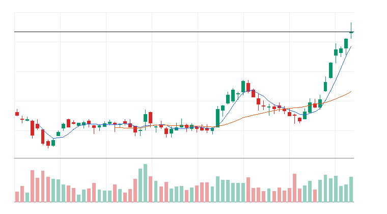
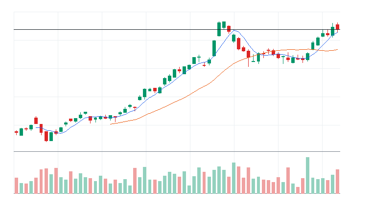
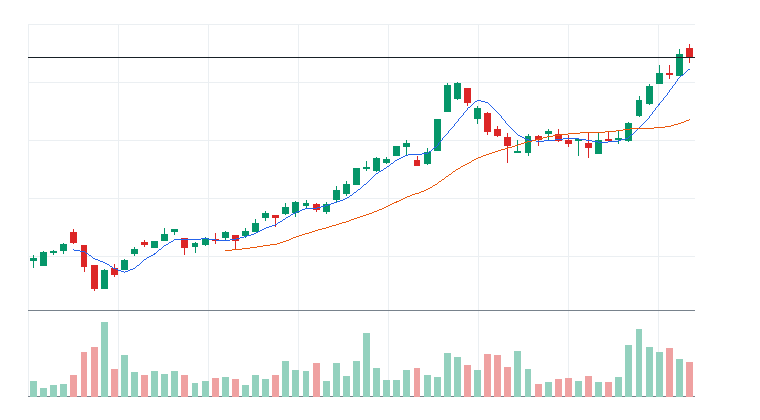
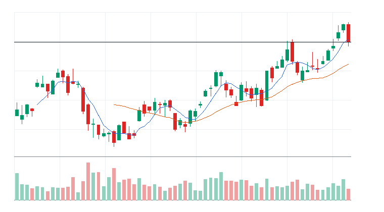
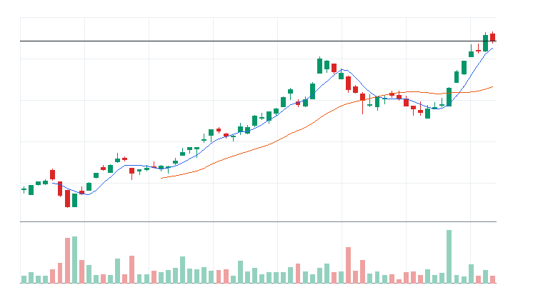
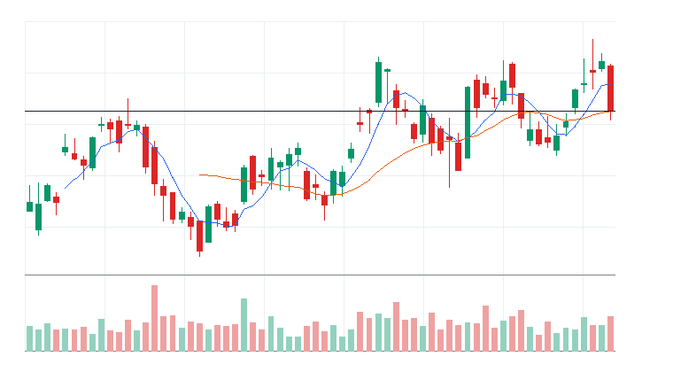
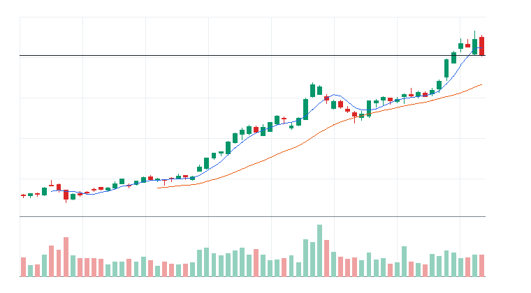
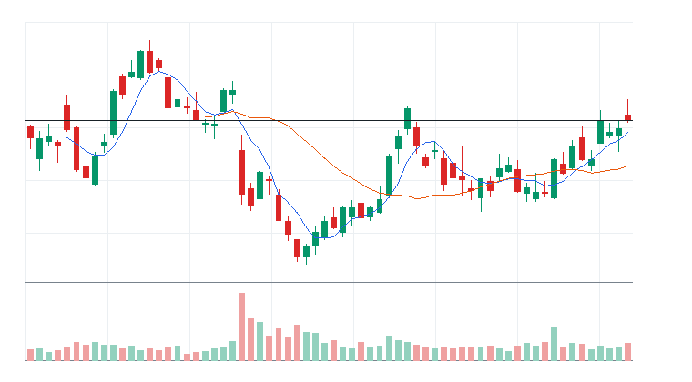
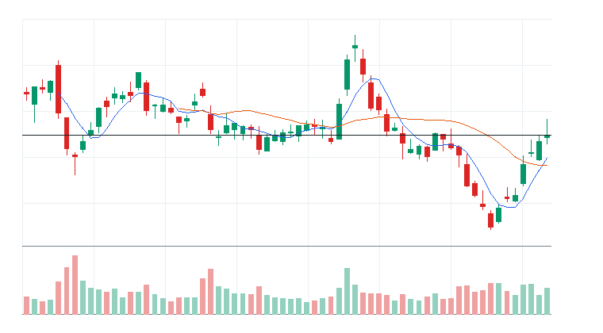
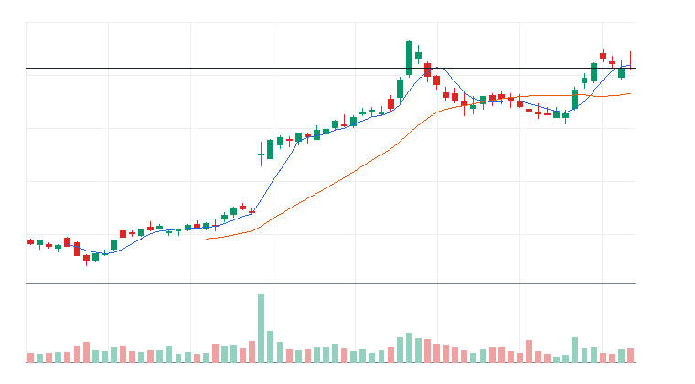

# 오늘의 데일리 트레이딩 요약

**REAL DATA TEST - 가격/거래량은 실제 데이터, 뉴스/ETF 구성종목 확산도/거래대금 유동성 일부 연결**

**목적:** 이 리포트는 최근 오른 자산을 나열하는 것이 아니라, 돈이 몰리는 근거와 다음 매수 주체가 확인할 트레이딩 후보를 찾기 위한 보고서다.

> 핵심 질문: 현재 가격에서 누가 사고 있고, 누가 앞으로 더 비싸게 사줄 수 있는가?

## 모바일 요약

[오늘의 데일리 트레이딩 요약]

생성 성공 / 데이터 모드: REAL_TEST

시장:
- 중립

시장 지배 서사:
1. 사이버보안 지출 재가속 - 약화 - First Trust NASDAQ Cybersecurity ETF(CIBR), Amplify Cybersecurity ETF(HACK), Palo Alto Networks Inc.(PANW), Zscaler Inc.(ZS) 중심으로 5일 +4.94%, 20일 +11.52% 흐름이 형성됨. 직접 촉매 일부 확인.
2. 바이오/헬스케어 촉매 - 약화 - Invesco QQQ Trust(QQQ), Vertex Pharmaceuticals Incorporated(VRTX), Gilead Sciences Inc.(GILD) 중심으로 5일 +4.54%, 20일 +10.71% 흐름이 형성됨. 뉴스 직접성 제한.
3. Aerospace & Defense 자금 유입 - 약화 - SPDR S&P 500 ETF Trust(SPY), iShares Russell 2000 ETF(IWM), Axon Enterprise Inc.(AXON), RTX 중심으로 5일 +7.92%, 20일 +6.22% 흐름이 형성됨. 직접 촉매 일부 확인.

트렌드 강도:
1. 사이버보안 지출 재가속 - TSI 57 - 약화 - 진입품질 관찰
2. 바이오/헬스케어 촉매 - TSI 30 - 잠복 - 진입품질 낮음
3. Aerospace & Defense 자금 유입 - TSI 39 - 잠복 - 진입품질 낮음

오늘 결론:
- 사이버보안 개별 종목 흐름이 ETF 대비 강한지 확인 필요
- 행동 후보는 linkedNarrative와 함께 확인한다.
- 추격보다 진입 조건 확인 후 접근한다.

오늘 실제 행동 후보:
1. Axon Enterprise Inc.(AXON)(STOCK) - Aerospace & Defense 자금 유입 - 단기 추세가 유지되고 거래량이 1.0배 이상이면 눌림 이후 재상승을 시도할 수 있음

다크호스 후보:
1. 다크호스 후보 없음 - 조건 충족 후보 없음

ETF 후보 TOP 5:
1. First Trust NASDAQ Cybersecurity ETF(CIBR) - 사이버보안 지출 재가속 - 관찰
2. Amplify Cybersecurity ETF(HACK) - 사이버보안 지출 재가속 - 제외
3. iShares U.S. Aerospace & Defense ETF(ITA) - 방산/안보 프리미엄 - 거래량 확인 전 관찰
4. iShares Cybersecurity and Tech ETF(IHAK) - 사이버보안 지출 재가속 - 거래량 확인 전 관찰
5. SPDR S&P Aerospace & Defense ETF(XAR) - 방산/안보 프리미엄 - 제외

웹 리포트:
https://yoolcool.github.io/DailyTradingThesisAgent/

## 오늘 결론

- 오늘 결론: 조건부 진입
- 신규 진입 후보: 0개
- 조건부 진입 후보: 1개
- 관찰 후보: 127개
- 주요 제한 요인: Entry Quality < 40, RVOL 미달, 뉴스 직접성 부족
- 주문 판단: 시장가 금지 / 지정가 또는 관찰
- 실전 판단: 진입 후보는 있으나, 전일 고점 돌파와 거래량 확인 후 선별적으로 접근한다.

### 후보 제한 요인 집계

- RVOL < 1.00x: 125개
- 거래대금 유동성 낮음: 13개
- Entry Quality 50~54 near miss: 0개
- Entry Quality 40~49 관찰: 2개
- Entry Quality < 40: 155개
- Exhaustion Risk >= 70: 0개
- ETF breadth 샘플 부족: 37개
- 뉴스 직접성 부족: 100개

## 데이터 신뢰도

- 전체 데이터 신뢰도 등급: LOW
- 분석 신뢰도: LOW
- 주문 실행 신뢰도: LOW
- ETF breadth 신뢰도: LOW
- 신뢰도 해석: 테마 확산 판단 제한, 거래대금 유동성 낮음 또는 확인 불가, 프리/애프터마켓 확인 불가
- 리포트 생성 시각: 2026-07-08 08:59 KST
- 가격 기준 거래일: 2026-07-07 US regular close
- 뉴스 수집 시각: 2026-07-08 08:59 KST
- 가장 최근 뉴스 발행 시각: 2026-07-08 08:45 KST
- 뉴스 신선도 상태: FRESH
- 뉴스 소스: Yahoo Finance RSS, MarketWatch RSS, CNBC Markets RSS, SEC EDGAR RSS, Federal Reserve RSS, Finnhub API
- 뉴스 소스 상태: Yahoo Finance RSS CONNECTED, MarketWatch RSS CONNECTED, CNBC Markets RSS PARTIAL, SEC EDGAR RSS PARTIAL, Federal Reserve RSS CONNECTED, Finnhub API DISABLED
- 뉴스 신뢰도: MEDIUM
- 추천 적용 거래일: 2026-07-07 US regular session
- 가격/거래량 데이터 상태: 연결됨
- 뉴스 데이터 상태: 일부 연결
- ETF 구성종목 확산도 상태: 일부 연결
- ETF 구성종목 샘플 수: 1~4
- 거래대금 유동성 데이터 상태: 일부 연결
- 프리/애프터마켓 데이터 상태: UNAVAILABLE
- 데이터 provider: yfinance, Yahoo Finance RSS, MarketWatch RSS, CNBC Markets RSS, SEC EDGAR RSS, Federal Reserve RSS, Finnhub API, config fallback sample, price-volume dollar-volume fallback
- 실전 사용 경고: 이 리포트는 투자판단 보조용이며, REAL_TEST 모드에서는 일부 데이터가 누락되거나 지연될 수 있다. 실제 주문 전 현재가, 뉴스, 프리마켓/정규장 거래량을 별도 확인해야 한다.

## 0. 시장 상태

- 데이터 모드: REAL_TEST
- 가격/거래량: 연결됨
- 뉴스: 일부 연결
- ETF 구성종목 확산도: 일부 연결
- 거래대금 유동성: 일부 연결
- 생성 시각: 2026년 7월 8일 수요일 AM 8:59
- 시장 상태: 중립
- 오늘 돈의 방향: 사이버보안 개별 종목 흐름이 ETF 대비 강한지 확인 필요
- 강한 테마 TOP 3: 사이버보안 ETF(51), 사이버보안(44), 바이오/헬스케어(37)
- 데이터 한계:
  - API 또는 provider 상태에 따라 뉴스/ETF 확산도/거래대금 유동성 반영 범위가 달라질 수 있다.
  - 수집 실패 데이터는 점수 반영에서 제외하거나 confidence를 제한한다.
  - reasonConfidence HIGH는 직접 촉매, 가격/거래량, 확산도/유동성 근거가 함께 있을 때만 사용한다.

## 오늘 시장을 지배하는 서사

### 오늘 시장을 지배하는 서사 TOP 3

#### 1. 사이버보안 지출 재가속
- 상태: 약화
- narrativeScore: 45
- reasonConfidence: LOW
- 근거 ETF: CIBR, HACK, IHAK
- 근거 개별 종목: PANW, ZS, CRWD, FTNT
- 돈이 몰리는 이유: 사이버보안 지출 재가속 관련 First Trust NASDAQ Cybersecurity ETF(CIBR), Amplify Cybersecurity ETF(HACK), iShares Cybersecurity and Tech ETF(IHAK)와 Palo Alto Networks Inc.(PANW), Zscaler Inc.(ZS), CrowdStrike Holdings Inc.(CRWD), Fortinet Inc.(FTNT)의 5일(+4.94%)·20일(+11.52%) 흐름을 함께 본다. 평균 상대 거래량은 0.90배이고, ETF 확산도는 추가 확인이 필요하다. 직접 뉴스/이벤트가 일부 확인된다.
- 다음 매수 주체: 사이버보안 지출 재가속을 확인한 섹터 ETF 자금과 상대강도 추종 스윙 자금
- 가장 좋은 트레이딩 수단: ETF 우선: HACK, CIBR, IHAK / 개별 종목 우선: FTNT, PANW, CRWD
- 서사가 깨지는 조건: HACK 20일선 이탈 또는 관련 종목 절반 이상 5일선 이탈
- 오늘 행동: 기존 네러티브와 중복을 확인한 뒤 ETF/대표 종목 동조성이 살아날 때만 관찰 편입

상세 narrativeScore 근거 보기

- rawScore: 45
- ETF 평균 moneyFlowScore: 43
- 개별 종목 평균 moneyFlowScore: 44
- ETF 후보 비율: 50%
- 개별 종목 후보 비율: 25%
- 5일 평균 수익률: +5.00%
- 20일 평균 수익률: +12.00%
- 평균 상대 거래량: 1.00배
- ETF 평균 상대 거래량: 1.00배
- 개별주 평균 상대 거래량: 1.00배
- 52주 고점 근접 후보 비율: 50%
- 뉴스 직접성 점수: 3
- ETF 확산도 점수: 0
- 유동성 점수: 1
- 과열 리스크 차감: 0

#### 2. 바이오/헬스케어 촉매
- 상태: 약화
- narrativeScore: 45
- reasonConfidence: LOW
- 근거 ETF: QQQ
- 근거 개별 종목: VRTX, GILD, INSM
- 돈이 몰리는 이유: 바이오/헬스케어 촉매 관련 Invesco QQQ Trust(QQQ)와 Vertex Pharmaceuticals Incorporated(VRTX), Gilead Sciences Inc.(GILD), Insmed Incorporated(INSM)의 5일(+4.54%)·20일(+10.71%) 흐름을 함께 본다. 평균 상대 거래량은 0.84배이고, ETF 확산도는 추가 확인이 필요하다. 뉴스 직접성은 아직 제한적이다.
- 다음 매수 주체: 바이오/헬스케어 촉매을 확인한 섹터 ETF 자금과 상대강도 추종 스윙 자금
- 가장 좋은 트레이딩 수단: ETF 우선: QQQ / 개별 종목 우선: VRTX, GILD, INSM
- 서사가 깨지는 조건: QQQ 20일선 이탈 또는 관련 종목 절반 이상 5일선 이탈
- 오늘 행동: 기존 네러티브와 중복을 확인한 뒤 ETF/대표 종목 동조성이 살아날 때만 관찰 편입

상세 narrativeScore 근거 보기

- rawScore: 45
- ETF 평균 moneyFlowScore: 0
- 개별 종목 평균 moneyFlowScore: 67
- ETF 후보 비율: 0%
- 개별 종목 후보 비율: 67%
- 5일 평균 수익률: +5.00%
- 20일 평균 수익률: +11.00%
- 평균 상대 거래량: 1.00배
- ETF 평균 상대 거래량: 1.00배
- 개별주 평균 상대 거래량: 1.00배
- 52주 고점 근접 후보 비율: 25%
- 뉴스 직접성 점수: 7
- ETF 확산도 점수: 0
- 유동성 점수: 4
- 과열 리스크 차감: 0

#### 3. Aerospace & Defense 자금 유입
- 상태: 약화
- narrativeScore: 37
- reasonConfidence: LOW
- 근거 ETF: SPY, IWM, QQQ
- 근거 개별 종목: AXON, RTX, AVAV
- 돈이 몰리는 이유: Aerospace & Defense 자금 유입 관련 SPDR S&P 500 ETF Trust(SPY), iShares Russell 2000 ETF(IWM), Invesco QQQ Trust(QQQ)와 Axon Enterprise Inc.(AXON), RTX, AeroVironment(AVAV)의 5일(+7.92%)·20일(+6.22%) 흐름을 함께 본다. 평균 상대 거래량은 0.89배이고, ETF 확산도는 추가 확인이 필요하다. 직접 뉴스/이벤트가 일부 확인된다.
- 다음 매수 주체: Aerospace & Defense 자금 유입을 확인한 섹터 ETF 자금과 상대강도 추종 스윙 자금
- 가장 좋은 트레이딩 수단: ETF 우선: QQQ, SPY, IWM / 개별 종목 우선: AXON, RTX, AVAV
- 서사가 깨지는 조건: QQQ 20일선 이탈 또는 관련 종목 절반 이상 5일선 이탈
- 오늘 행동: 기존 네러티브와 중복을 확인한 뒤 ETF/대표 종목 동조성이 살아날 때만 관찰 편입

상세 narrativeScore 근거 보기

- rawScore: 37
- ETF 평균 moneyFlowScore: 17
- 개별 종목 평균 moneyFlowScore: 47
- ETF 후보 비율: 0%
- 개별 종목 후보 비율: 33%
- 5일 평균 수익률: +8.00%
- 20일 평균 수익률: +6.00%
- 평균 상대 거래량: 1.00배
- ETF 평균 상대 거래량: 1.00배
- 개별주 평균 상대 거래량: 1.00배
- 52주 고점 근접 후보 비율: 33%
- 뉴스 직접성 점수: 3
- ETF 확산도 점수: 0
- 유동성 점수: 4
- 과열 리스크 차감: 0

### 전체 narrative 요약

| 서사명 | 상태 | narrativeScore | reasonConfidence | 대표 ETF | 대표 종목 | 오늘 행동 |
| --- | --- | ---: | --- | --- | --- | --- |
| 사이버보안 지출 재가속 | 약화 | 45 | LOW | CIBR, HACK, IHAK | PANW, ZS, CRWD, FTNT | 기존 네러티브와 중복을 확인한 뒤 ETF/대표 종목 동조성이 살아날 때만 관찰 편입 |
| 바이오/헬스케어 촉매 | 약화 | 45 | LOW | QQQ | VRTX, GILD, INSM | 기존 네러티브와 중복을 확인한 뒤 ETF/대표 종목 동조성이 살아날 때만 관찰 편입 |
| Aerospace & Defense 자금 유입 | 약화 | 37 | LOW | SPY, IWM, QQQ | AXON, RTX, AVAV | 기존 네러티브와 중복을 확인한 뒤 ETF/대표 종목 동조성이 살아날 때만 관찰 편입 |
| AI 소프트웨어/사이버보안 확산 | 약화 | 24 | LOW | IGV, AIQ, QQQ | PLTR, DDOG, TEAM, MSFT | 추격보다 눌림 후 재상승 확인 |
| 소프트웨어 실적/AI 수익화 | 약화 | 20 | LOW | IGV, AIQ, QQQ | DDOG, CDNS | 기존 네러티브와 중복을 확인한 뒤 ETF/대표 종목 동조성이 살아날 때만 관찰 편입 |
| 방산/안보 프리미엄 | 약화 | 20 | LOW | XAR, ITA, SHLD | PLTR, AVAV, KTOS | 뉴스 촉매가 직접 확인될 때만 추세 추종 |
| 필수소비재 음료 방어 성장 | 약화 | 16 | LOW | QQQ | MNST, CCEP, KDP | 기존 네러티브와 중복을 확인한 뒤 ETF/대표 종목 동조성이 살아날 때만 관찰 편입 |
| 전력 유틸리티 수요 재평가 | 약화 | 14 | LOW | SPY, IWM, QQQ | GEV, ETN, VRT | 기존 네러티브와 중복을 확인한 뒤 ETF/대표 종목 동조성이 살아날 때만 관찰 편입 |
| 매크로 방어/헤지 | 소멸 | 5 | LOW | XLE, GLD, TLT | XOM, CVX | 위험회피가 확인될 때만 헤지성 접근 |
| 위험선호 성장주 재진입 | 약화 | 4 | LOW | ARKK, QQQ, IPO | COIN, ARM, TSLA | 지수 위험선호가 유지될 때만 선별 진입 |
| Data Storage 자금 유입 | 약화 | 3 | LOW | SPY, IWM, QQQ | STX, WDC | 기존 네러티브와 중복을 확인한 뒤 ETF/대표 종목 동조성이 살아날 때만 관찰 편입 |
| 전력망/원전/인프라 병목 | 약화 | 0 | LOW | GRID, PAVE, URA | VRT, ETN, PWR, CEG | ETF 확산도와 거래량이 같이 살아날 때만 진입 |
| AI 인프라 재가속 | 약화 | 0 | LOW | DRAM, SMH, SOXX | NVDA, MU, VRT, ETN | 추격보다 5일선 지지 후 재상승 확인 |
| 반도체 장비 사이클 재평가 | 약화 | 0 | LOW | SMH, SOXX, SOXQ | AMAT, KLAC, LRCX, ASML | 기존 네러티브와 중복을 확인한 뒤 ETF/대표 종목 동조성이 살아날 때만 관찰 편입 |
| 반도체 설계/공급망 재가속 | 약화 | 0 | LOW | SMH, SOXX, SOXQ | ARM, AMD, TXN, ADI | 기존 네러티브와 중복을 확인한 뒤 ETF/대표 종목 동조성이 살아날 때만 관찰 편입 |
| 비트코인/디지털 자산 위험선호 | 소멸 | 0 | LOW | IBIT, BLOK | COIN, MSTR, IREN | 비트코인 베타가 살아날 때만 단기 매매 |

## 트렌드 강도 판단

### 1. 사이버보안 지출 재가속
- Trend Strength Index: 57
- 트렌드 상태 라벨: 약화
- 테마 확산도: 보통
- ETF 동조성: 강함
- 거래량 강도: 부족
- 과열 위험: 낮음 (7)
- 오늘 진입 품질: 관찰 (41)
- 한 줄 판단: 사이버보안 지출 재가속는 Trend Strength는 중간이지만 진입 품질이 살아나는 초기 진입 후보 성격이다.
- 오늘 접근법: 상승률이 남아 있어도 First Trust NASDAQ Cybersecurity ETF(CIBR)/Amplify Cybersecurity ETF(HACK)/iShares Cybersecurity and Tech ETF(IHAK)와 구성 종목 확산도가 회복될 때까지 신규 진입은 낮춘다.

트렌드 강도 상세 근거 보기

- 가격 모멘텀: 가격 모멘텀 19/25. 평균 5D +4.94%, 20D +11.52%.
- 거래량 강도: 거래량 강도 3/20. 평균 RVOL 0.90배.
- ETF 동조성: ETF 동조성 14/15. 관련 ETF Amplify Cybersecurity ETF(HACK), First Trust NASDAQ Cybersecurity ETF(CIBR), iShares Cybersecurity and Tech ETF(IHAK), iShares Expanded Tech-Software Sector ETF(IGV) 흐름을 기준으로 판단.
- 테마 확산도: 테마 확산도 13/20. 상위 1~2개 쏠림 감점 0점 반영.
- 뉴스 촉매: 뉴스/촉매 신선도 4/10. HIGH 직접 촉매 1개.
- 과열 리스크: 과열 리스크 7/100. 단기 급등, 고점 근접, ETF-개별주 괴리, 쏠림을 함께 반영.
- 시장 환경: 시장 환경 4/10. QQQ/SPY/IWM 가격 흐름 기반 위험선호 점수.

### 2. 바이오/헬스케어 촉매
- Trend Strength Index: 30
- 트렌드 상태 라벨: 잠복
- 테마 확산도: 부족
- ETF 동조성: 부족
- 거래량 강도: 부족
- 과열 위험: 보통 (36)
- 오늘 진입 품질: 낮음 (17)
- 한 줄 판단: 바이오/헬스케어 촉매는 테마 확산도가 낮아 아직 개별 종목 이벤트성 흐름에 가깝다.
- 오늘 접근법: Invesco QQQ Trust(QQQ)와 Vertex Pharmaceuticals Incorporated(VRTX)/Gilead Sciences Inc.(GILD)/Insmed Incorporated(INSM)의 거래량 확산이 확인되기 전까지 관찰한다.

트렌드 강도 상세 근거 보기

- 가격 모멘텀: 가격 모멘텀 17/25. 평균 5D +4.54%, 20D +10.71%.
- 거래량 강도: 거래량 강도 4/20. 평균 RVOL 0.84배.
- ETF 동조성: ETF 동조성 0/15. 관련 ETF Invesco QQQ Trust(QQQ) 흐름을 기준으로 판단.
- 테마 확산도: 테마 확산도 3/20. 상위 1~2개 쏠림 감점 6점 반영.
- 뉴스 촉매: 뉴스/촉매 신선도 2/10. HIGH 직접 촉매 0개.
- 과열 리스크: 과열 리스크 36/100. 단기 급등, 고점 근접, ETF-개별주 괴리, 쏠림을 함께 반영.
- 시장 환경: 시장 환경 4/10. QQQ/SPY/IWM 가격 흐름 기반 위험선호 점수.

### 3. Aerospace & Defense 자금 유입
- Trend Strength Index: 39
- 트렌드 상태 라벨: 잠복
- 테마 확산도: 부족
- ETF 동조성: 약함
- 거래량 강도: 부족
- 과열 위험: 보통 (42)
- 오늘 진입 품질: 낮음 (14)
- 한 줄 판단: Aerospace & Defense 자금 유입는 테마 확산도가 낮아 아직 개별 종목 이벤트성 흐름에 가깝다.
- 오늘 접근법: SPDR S&P 500 ETF Trust(SPY)/iShares Russell 2000 ETF(IWM)/Invesco QQQ Trust(QQQ)와 Axon Enterprise Inc.(AXON)/RTX/AeroVironment(AVAV)의 거래량 확산이 확인되기 전까지 관찰한다.

트렌드 강도 상세 근거 보기

- 가격 모멘텀: 가격 모멘텀 19/25. 평균 5D +7.92%, 20D +6.22%.
- 거래량 강도: 거래량 강도 5/20. 평균 RVOL 0.89배.
- ETF 동조성: ETF 동조성 5/15. 관련 ETF Invesco QQQ Trust(QQQ), SPDR S&P 500 ETF Trust(SPY), iShares Russell 2000 ETF(IWM) 흐름을 기준으로 판단.
- 테마 확산도: 테마 확산도 3/20. 상위 1~2개 쏠림 감점 6점 반영.
- 뉴스 촉매: 뉴스/촉매 신선도 3/10. HIGH 직접 촉매 1개.
- 과열 리스크: 과열 리스크 42/100. 단기 급등, 고점 근접, ETF-개별주 괴리, 쏠림을 함께 반영.
- 시장 환경: 시장 환경 4/10. QQQ/SPY/IWM 가격 흐름 기반 위험선호 점수.

## 최근 추천 결과 트래킹

개별주는 데이트레이딩 관점으로 추천 이후 첫 정규장의 장중 최고가와 종가를 추적한다. ETF는 테마/스윙 관점으로 추천 이후 1주일 동안의 최고가와 현재 종가를 추적한다.

### 개별주 Top 3 추천 성과 요약
- 최근 5개 리포트 표본: 8개 (초기 검증 단계)
- 장중 최고가 기준 성공률: +33.33%
- 종가 기준 성공률: +33.33%
- 평균 장중 최고 수익률: +3.01%
- 평균 종가 수익률: +0.21%

### ETF 추천 성과 요약
- 최근 5개 리포트 표본: 0개 (초기 검증 단계)
- 1주 최고가 기준 성공률: 데이터 없음
- 현재 종가 기준 성공률: 데이터 없음
- 평균 1주 최고 수익률: 데이터 없음
- 평균 현재 수익률: 데이터 없음

최근 추천 결과 상세 테이블 펼치기

| 추천일 | 유형 | 순위 | 티커 | 기준가 | 추적 기간 | 상태 | High 수익률 | Close 수익률 | 결과 | 코멘트 |
| --- | --- | ---: | --- | ---: | --- | --- | ---: | ---: | --- | --- |
| 2026-07-08 | STOCK | 1 | AXON | $640.46 | 2026-07-08 | pending | 데이터 없음 | 데이터 없음 | 추적 대기 | 아직 추적 거래일 데이터가 완성되지 않음 |
| 2026-07-07 | STOCK | 2 | AXON | $622.35 | 2026-07-07 | complete | +6.86% | +2.91% | 성공 | 장중 기회와 종가 유지가 모두 확인됨 (일봉 기준) |
| 2026-07-07 | STOCK | 1 | PANW | $357.53 | 2026-07-07 | complete | +1.48% | -5.73% | 제한적 유효 | 제한적인 장중 기회만 발생 (일봉 기준) |
| 2026-07-06 | STOCK | 2 | CCEP | $106.61 | 2026-07-06 | complete | +0.58% | +0.34% | 추적 대기 | 아직 추적 거래일 데이터가 완성되지 않음 (일봉 기준) |
| 2026-07-06 | STOCK | 1 | PANW | $348.06 | 2026-07-06 | complete | +5.78% | +2.72% | 성공 | 장중 기회와 종가 유지가 모두 확인됨 (일봉 기준) |
| 2026-07-03 | STOCK | 1 | CCEP | $106.61 | 2026-07-03 | pending | 데이터 없음 | 데이터 없음 | 추적 대기 | 아직 추적 거래일 데이터가 완성되지 않음 |
| 2026-07-02 | STOCK | 2 | AXON | $593.96 | 2026-07-02 | complete | +1.52% | +0.52% | 제한적 유효 | 제한적인 장중 기회만 발생 (일봉 기준) |
| 2026-07-02 | STOCK | 1 | CCEP | $106.1 | 2026-07-02 | complete | +1.86% | +0.48% | 제한적 유효 | 제한적인 장중 기회만 발생 (일봉 기준) |
| 2026-07-01 | STOCK | 3 | LRCX | $433.33 | 2026-07-01 | complete | -4.12% | -9.71% | 실패 | 추천 이후 의미 있는 장중 기회가 부족하고 종가도 약함 (일봉 기준) |
| 2026-07-01 | STOCK | 2 | PANW | $341.02 | 2026-07-01 | complete | +5.01% | +3.23% | 성공 | 장중 기회와 종가 유지가 모두 확인됨 (일봉 기준) |
| 2026-07-01 | STOCK | 1 | AMAT | $723 | 2026-07-01 | complete | -4.04% | -9.97% | 실패 | 추천 이후 의미 있는 장중 기회가 부족하고 종가도 약함 (일봉 기준) |
| 2026-06-30 | STOCK | 3 | AMAT | $694.64 | 2026-06-30 | complete | +6.48% | +4.08% | 성공 | 장중 기회와 종가 유지가 모두 확인됨 (일봉 기준) |
| 2026-06-30 | STOCK | 2 | CRWD | $742.91 | 2026-06-30 | complete | -74.25% | -74.32% | 실패 | 추천 이후 의미 있는 장중 기회가 부족하고 종가도 약함 (일봉 기준) |
| 2026-06-30 | STOCK | 1 | PANW | $332 | 2026-06-30 | complete | +3.16% | +2.72% | 성공 | 장중 기회와 종가 유지가 모두 확인됨 (일봉 기준) |
| 2026-06-29 | STOCK | 3 | KDP | $33.4 | 2026-06-29 | complete | +1.26% | +0.30% | 제한적 유효 | 제한적인 장중 기회만 발생 (일봉 기준) |
| 2026-06-29 | STOCK | 2 | VRTX | $491.34 | 2026-06-29 | complete | +1.74% | +1.69% | 제한적 유효 | 제한적인 장중 기회만 발생 (일봉 기준) |
| 2026-06-29 | STOCK | 1 | FTNT | $151.35 | 2026-06-29 | complete | +5.10% | +2.69% | 성공 | 장중 기회와 종가 유지가 모두 확인됨 (일봉 기준) |
| 2026-06-26 | STOCK | 3 | MU | $1,213.56 | 2026-06-26 | complete | -1.22% | -6.69% | 실패 | 추천 이후 의미 있는 장중 기회가 부족하고 종가도 약함 (일봉 기준) |
| 2026-06-26 | STOCK | 2 | AMAT | $668 | 2026-06-26 | complete | -1.17% | -6.16% | 실패 | 추천 이후 의미 있는 장중 기회가 부족하고 종가도 약함 (일봉 기준) |
| 2026-06-26 | STOCK | 1 | LRCX | $401.82 | 2026-06-26 | complete | -2.97% | -5.66% | 실패 | 추천 이후 의미 있는 장중 기회가 부족하고 종가도 약함 (일봉 기준) |
| 2026-06-26 | ETF | 1 | DRAM | $76.89 | 2026-06-26~2026-07-03 | complete | -3.55% | -21.20% | 실패 | 추천 이후 ETF 흐름이 약화됨 |
| 2026-06-23 | STOCK | 3 | TSM | $467.67 | 2026-06-23 | complete | -4.35% | -6.69% | 실패 | 추천 이후 의미 있는 장중 기회가 부족하고 종가도 약함 (일봉 기준) |
| 2026-06-23 | STOCK | 2 | GEV | $1,127.59 | 2026-06-23 | complete | -4.84% | -8.21% | 실패 | 추천 이후 의미 있는 장중 기회가 부족하고 종가도 약함 (일봉 기준) |
| 2026-06-23 | STOCK | 1 | ETN | $435.78 | 2026-06-23 | complete | -3.27% | -7.00% | 실패 | 추천 이후 의미 있는 장중 기회가 부족하고 종가도 약함 (일봉 기준) |
| 2026-06-23 | ETF | 1 | DRAM | $80.72 | 2026-06-23~2026-06-30 | complete | -1.39% | -24.94% | 실패 | 추천 이후 ETF 흐름이 약화됨 |
| 2026-06-22 | STOCK | 3 | ARM | $439.46 | 2026-06-22 | complete | +1.25% | -7.22% | 제한적 유효 | 제한적인 장중 기회만 발생 (일봉 기준) |
| 2026-06-22 | STOCK | 2 | GEV | $1,109.73 | 2026-06-22 | complete | +2.91% | +1.61% | 제한적 유효 | 제한적인 장중 기회만 발생 (일봉 기준) |
| 2026-06-22 | STOCK | 1 | ETN | $421.77 | 2026-06-22 | complete | +3.55% | +3.32% | 성공 | 장중 기회와 종가 유지가 모두 확인됨 (일봉 기준) |
| 2026-06-22 | ETF | 3 | IFRA | $61.99 | 2026-06-22~2026-06-29 | complete | +3.65% | -0.31% | 단기 고점 후 반납 | 1주 내 상승 기회는 있었지만 현재가는 반납 |
| 2026-06-22 | ETF | 2 | SMH | $659.88 | 2026-06-22~2026-06-29 | complete | -1.49% | -11.89% | 실패 | 추천 이후 ETF 흐름이 약화됨 |
| 2026-06-22 | ETF | 1 | DRAM | $76.71 | 2026-06-22~2026-06-29 | complete | +3.77% | -21.01% | 단기 고점 후 반납 | 1주 내 상승 기회는 있었지만 현재가는 반납 |
| 2026-06-19 | STOCK | 3 | AMD | $537.37 | 2026-06-19 | pending | 데이터 없음 | 데이터 없음 | 추적 대기 | 아직 추적 거래일 데이터가 완성되지 않음 |
| 2026-06-19 | STOCK | 2 | ARM | $439.46 | 2026-06-19 | pending | 데이터 없음 | 데이터 없음 | 추적 대기 | 아직 추적 거래일 데이터가 완성되지 않음 |
| 2026-06-19 | STOCK | 1 | GEV | $1,109.73 | 2026-06-19 | pending | 데이터 없음 | 데이터 없음 | 추적 대기 | 아직 추적 거래일 데이터가 완성되지 않음 |
| 2026-06-19 | ETF | 1 | DRAM | $76.71 | 2026-06-19~2026-06-26 | complete | +6.04% | -21.01% | 단기 고점 후 반납 | 1주 내 상승 기회는 있었지만 현재가는 반납 |
| 2026-06-18 | STOCK | 3 | ASML | $1,867.83 | 2026-06-18 | complete | +4.02% | +3.31% | 성공 | 장중 기회와 종가 유지가 모두 확인됨 (일봉 기준) |
| 2026-06-18 | STOCK | 3 | FCX | $69.06 | 2026-06-18 | complete | +2.26% | -0.55% | 제한적 유효 | 제한적인 장중 기회만 발생 (일봉 기준) |
| 2026-06-18 | STOCK | 2 | KLAC | $238.73 | 2026-06-18 | complete | +10.56% | +8.73% | 성공 | 장중 기회와 종가 유지가 모두 확인됨 (일봉 기준) |
| 2026-06-18 | STOCK | 1 | LRCX | $374.18 | 2026-06-18 | complete | +7.17% | +3.97% | 성공 | 장중 기회와 종가 유지가 모두 확인됨 (일봉 기준) |
| 2026-06-18 | ETF | 1 | SOXQ | $106.13 | 2026-06-18~2026-06-25 | complete | +8.67% | -8.81% | 단기 고점 후 반납 | 1주 내 상승 기회는 있었지만 현재가는 반납 |
| 2026-06-04 | STOCK | 3 | PANW | $280.43 | 2026-06-04 | complete | +0.10% | -0.42% | 실패 | 추천 이후 의미 있는 장중 기회가 부족하고 종가도 약함 (일봉 기준) |
| 2026-06-04 | STOCK | 2 | FTNT | $146.48 | 2026-06-04 | complete | +2.45% | +2.18% | 제한적 유효 | 제한적인 장중 기회만 발생 (일봉 기준) |
| 2026-06-04 | STOCK | 1 | CRWD | $747.61 | 2026-06-04 | complete | -75.89% | -75.95% | 실패 | 추천 이후 의미 있는 장중 기회가 부족하고 종가도 약함 (일봉 기준) |
| 2026-06-04 | ETF | 3 | HACK | $102.21 | 2026-06-04~2026-06-11 | complete | -1.66% | +7.35% | 진행 중 | 아직 1주 추적 기간이 끝나지 않음 |
| 2026-06-04 | ETF | 2 | SOXQ | $109.58 | 2026-06-04~2026-06-11 | complete | -4.68% | -11.68% | 실패 | 추천 이후 ETF 흐름이 약화됨 |
| 2026-06-04 | ETF | 1 | AIQ | $69.16 | 2026-06-04~2026-06-11 | complete | -4.29% | -10.24% | 실패 | 추천 이후 ETF 흐름이 약화됨 |
| 2026-06-03 | STOCK | 3 | FTNT | $148.86 | 2026-06-03 | complete | -0.26% | -1.60% | 실패 | 추천 이후 의미 있는 장중 기회가 부족하고 종가도 약함 (일봉 기준) |
| 2026-06-03 | STOCK | 3 | CRWD | $768.95 | 2026-06-03 | complete | -75.06% | -75.69% | 실패 | 추천 이후 의미 있는 장중 기회가 부족하고 종가도 약함 (일봉 기준) |
| 2026-06-03 | STOCK | 2 | MRVL | $290.79 | 2026-06-03 | complete | +11.49% | +3.73% | 성공 | 장중 기회와 종가 유지가 모두 확인됨 (일봉 기준) |
| 2026-06-03 | STOCK | 1 | PANW | $297.18 | 2026-06-03 | complete | -3.09% | -5.64% | 실패 | 추천 이후 의미 있는 장중 기회가 부족하고 종가도 약함 (일봉 기준) |
| 2026-06-03 | ETF | 3 | DRAM | $69.57 | 2026-06-03~2026-06-10 | complete | -3.52% | -12.91% | 실패 | 추천 이후 ETF 흐름이 약화됨 |
| 2026-06-03 | ETF | 3 | IGV | $104.73 | 2026-06-03~2026-06-10 | complete | -3.31% | -10.12% | 실패 | 추천 이후 ETF 흐름이 약화됨 |
| 2026-06-03 | ETF | 2 | AIQ | $70.14 | 2026-06-03~2026-06-10 | complete | -2.32% | -11.49% | 실패 | 추천 이후 ETF 흐름이 약화됨 |
| 2026-06-03 | ETF | 1 | CIBR | $94.32 | 2026-06-03~2026-06-10 | complete | -3.56% | -2.24% | 실패 | 추천 이후 ETF 흐름이 약화됨 |

## 오늘 실제 행동 후보

### 1. Axon Enterprise Inc.(AXON)
- 자산 유형: STOCK
- linkedNarrative: Aerospace & Defense 자금 유입
- narrativeStatus: 약화
- narrativeScore: 37
- Trend Strength Index: 39
- Exhaustion Risk: 42 (보통)
- Entry Quality Score: 36 (낮음)
- 트렌드 판단: 테마 확산도가 낮아 개별 종목 이벤트성 흐름일 수 있다.
- moneyFlowScore: 97
- finalRawScore: 97
- reasonConfidence: HIGH
- reasonConfidenceExplanation: 직접 촉매: Yahoo Finance RSS / general_market / under_6h / neutral - Axon Enterprise (AXON) Advances While Market Declines: Some Information for Investors 가격/거래량, 관련 ETF 동반 강세, 유동성 근거가 함께 확인되어 HIGH로 분류했다.
- tieBreakerReason: 최종 원점수 97, 리스크 패널티 -6, 5일 수익률 +25.43%, 상대 거래량 1.42배 순으로 정렬
- 후보별 시장 해석: 중립 / 제한적 - Entry Quality 36 < 50이나 moneyFlow 97, confidence HIGH, RVOL 1.42x로 강한 자금흐름 예외 조건 충족
- 게이트 사유: Entry Quality 36 < 50이나 moneyFlow 97, confidence HIGH, RVOL 1.42x로 강한 자금흐름 예외 조건 충족
- 주문 실행: 시장가 가능
- 직접 촉매: Yahoo Finance RSS / general_market / under_6h / neutral - Axon Enterprise (AXON) Advances While Market Declines: Some Information for Investors
- 왜 돈이 몰리는가: 20일 +31.75%, 5일 +25.43%, 상대 거래량 1.42배로 가격과 거래량이 함께 개선. 뉴스: Yahoo Finance RSS general_market/under_6h / 유동성: LIQUID
- 누가 더 비싸게 사줄 수 있는지: 개별 주도주를 따라붙는 단기 모멘텀 자금과 관련 ETF 강세를 확인한 트레이더
- 진입 조건: 20일선 위 눌림 후 재상승 확인
- 무효화 조건: 20일선 이탈 또는 상대 거래량 0.8배 이하 둔화
- todayActionLabel: 자금흐름 예외 조건부
#### 최근 뉴스/동향 한국어 요약

- 요약: 종목 직접 뉴스 확인 상태이며 뉴스 흐름은 긍정 우위입니다. 후보 선정 후 재확인한 핵심 이슈는 "Axon Enterprise (AXON) Advances While Market Declines: Some Information for Investors"입니다.
- 직접 촉매 판단: Axon Enterprise Inc.에 대해 직접 촉매로 분류된 뉴스가 확인됐습니다. 핵심은 "Axon Enterprise (AXON) Advances While Market Declines: Some Information for Investors"이며, 시장 일반 재료로 봅니다.
- 뉴스 1: Axon Enterprise (AXON) Advances While Market Declines: Some Information for Investors
  - 내용: Axon Enterprise Inc. 관련 기사는 Axon Enterprise (AXON) Advances While Market Declines: Some Information for Investors 이슈를 다루며, 주가 변동률 +2.91%를 핵심 내용으로 봅니다.
  - 투자 의미: Axon Enterprise Inc.의 당일 상대강도 확인에는 도움이 되지만, 실적/가이던스 같은 새 펀더멘털 변화로 보기는 어렵습니다.
  - 확인할 점: 거래량 동반 여부, 장중 고점 유지, 관련 ETF 동반 강세
- 뉴스 2: Needham Bets Axon's Premium Is Sustainable at $750
  - 내용: Axon Enterprise Inc. 관련 시장 일반 뉴스입니다. 기사 스니펫상 핵심 내용은 A target hike driven by multiple expansion due to the durability of Axon's bookings trajectory입니다.
  - 투자 의미: 단기 긍정 뉴스 흐름으로 볼 수 있지만, 단독 매수 근거보다는 가격·거래량 조건을 확인하는 보조 근거로 사용합니다.
  - 확인할 점: 원문 수치, 후속 보도, 가격이 진입 조건을 지키는지
- 뉴스 3: Axon Crosses Its 200-Day SMA: Should You Buy the Stock Now?
  - 내용: Axon Enterprise Inc. 관련 시장 일반 뉴스입니다. 기사 스니펫상 핵심 내용은 AXON crosses its 200-day SMA as strong TASER, software and counter-drone demand support growth, despite an elevated valuation.입니다.
  - 투자 의미: 단기 긍정 뉴스 흐름으로 볼 수 있지만, 단독 매수 근거보다는 가격·거래량 조건을 확인하는 보조 근거로 사용합니다.
  - 확인할 점: 원문 수치, 후속 보도, 가격이 진입 조건을 지키는지
- 매매 해석: 매매 관점에서는 뉴스 자체보다 가격이 진입 조건을 지키는지, 거래량이 동반되는지, 그리고 뉴스가 이미 주가에 반영됐는지를 우선 확인해야 합니다.
- 차트: 

## 다크호스 후보

다크호스 후보 없음. 상위 서사 정렬, MA20 위 안착, MA5/MA20 구조 개선, RVOL 0.90x 이상 조건을 동시에 충족한 개별주가 없다.

- darkHorseScore: 조건 충족 후보 없음
- 왜 아직 메인이 아닌가: 확인 조건을 통과한 보조 관찰 후보가 없다.

darkHorseScore 상세 근거 보기

- 서사 정렬: 조건 미충족
- 초기 추세 구조: 조건 미충족
- 베이스 돌파/정돈: 조건 미충족
- 거래량 확인: 조건 미충족
- rawScore: 데이터 없음

## 오늘 돈이 몰리는 테마

- 사이버보안 ETF: CIBR, HACK, IHAK | 평균 moneyFlowScore 51 | 관심은 유지하되 우선순위는 낮추고 추가 거래량 확인을 기다린다.
- 사이버보안: PANW, CRWD, FTNT, ZS | 평균 moneyFlowScore 44 | 관심은 유지하되 우선순위는 낮추고 추가 거래량 확인을 기다린다.
- 바이오/헬스케어: AMGN, GILD, ISRG, VRTX, REGN, IDXX, ALNY, DXCM | 평균 moneyFlowScore 37 | 관심은 유지하되 우선순위는 낮추고 추가 거래량 확인을 기다린다.
- 전력/유틸리티 ETF: XLU | 평균 moneyFlowScore 35 | 관심은 유지하되 우선순위는 낮추고 추가 거래량 확인을 기다린다.
- Basic Materials: LIN | 평균 moneyFlowScore 32 | 관심은 유지하되 우선순위는 낮추고 추가 거래량 확인을 기다린다.
- 이커머스/여행 플랫폼: BKNG, PDD, MELI, ABNB, DASH | 평균 moneyFlowScore 29 | 관심은 유지하되 우선순위는 낮추고 추가 거래량 확인을 기다린다.

## 1. ETF 트레이딩 보고서
### 1-1. ETF 결론
- ETF 우선 후보: 없음
- ETF 관찰 후보: Invesco PHLX Semiconductor ETF(SOXQ), iShares Expanded Tech-Software Sector ETF(IGV), Global X Artificial Intelligence & Technology ETF(AIQ), First Trust NASDAQ Cybersecurity ETF(CIBR), iShares Cybersecurity and Tech ETF(IHAK)
- ETF 매매 금지: VanEck Semiconductor ETF(SMH), iShares Semiconductor ETF(SOXX), Invesco PHLX Semiconductor ETF(SOXQ), Global X Artificial Intelligence & Technology ETF(AIQ), Global X Robotics & Artificial Intelligence ETF(BOTZ)
- 오늘 ETF 최우선 1개: 없음
- ETF 섹션 해석: 이 섹션은 개별 종목 선택이 아니라 테마/섹터 단위 자금 흐름을 ETF로 매매할지 판단하기 위한 영역이다.

### 1-2. ETF 후보 TOP 5

선정 기준: ETF 후보는 가격/거래량 1차 점수에 뉴스, ETF 구성종목 확산도, 유동성, 리스크 패널티를 반영한 finalRawScore 기준으로 정렬한다. 표시 점수 100점 후보가 겹치면 tieBreakerReason으로 우선순위를 설명한다.

### [ETF] First Trust NASDAQ Cybersecurity ETF(CIBR)
- 자산 유형: ETF
- ETF 세부 카테고리: 사이버보안 ETF
- ETF 역할: 테마 베타 매수
- 상태: 관찰
- linkedNarrative: 사이버보안 지출 재가속
- narrativeStatus: 약화
- narrativeScore: 45
- moneyFlowScore: 63
- finalRawScore: 63
- tieBreakerReason: 최종 원점수 63, 리스크 패널티 0, 5일 수익률 +4.19%, 상대 거래량 1.44배 순으로 정렬
- 과열 리스크: 낮음
- reasonConfidence: MEDIUM
- reasonConfidenceExplanation: ETF 확산도 제한 때문에 HIGH가 아니라 MEDIUM으로 제한했다.

- todayActionLabel: 관찰
- 주문 실행: 지정가 권장
- 기준일: 2026-07-07
- 종가: $92.21
- 1일 수익률: -0.75%
- 5일 수익률: +4.19%
- 20일 수익률: +6.36%
- 상대 거래량: 1.44배
- 52주 고점 대비 위치: -2.31%
- whyMoneyIsFlowing: 20일 +6.36%, 5일 +4.19%, 상대 거래량 1.44배로 가격과 거래량이 함께 개선. 뉴스: MarketWatch RSS general_market/under_6h / 유동성: ACCEPTABLE
- likelyNextBuyer: 섹터 베타를 노리는 단기 모멘텀 자금과 리밸런싱 자금
- whyThisCouldTradeHigher: 52주 고점 부근이라 돌파가 확인되면 신고가 추종 매수가 붙을 수 있음
#### 최근 뉴스/동향 한국어 요약

- 요약: 후보 선정 후 재확인 뉴스 데이터 없음
- 진입 조건: 전일 고점 돌파와 5일선 유지 확인
- 무효화 조건: 20일선 이탈 또는 상대 거래량 0.8배 이하 둔화
- 차트: 

#### 상세 근거

First Trust NASDAQ Cybersecurity ETF(CIBR) 상세 근거 펼치기

- moneyFlowScore(최종) 산정 근거:
  - moneyFlowScore(1차): 59
  - 최종 원점수: 63
  - 최종 표시 점수: 63
  - cap 적용: cap 미적용
  - 계산식: +59 + +2 + 0 + +2 + 0 + 0 + 0 = 63
  - 점수 해석: 관찰 후보. 흐름은 있으나 우선순위는 낮음.
  - 가격/거래량 1차 점수: +59
    - 추세: +13
    - 단기 모멘텀: +2
    - 중기 모멘텀: +4
    - 거래량: +14
    - 신고가 근접: +12
    - 이동평균: +14
  - 하위 점수 cap:
    - 가격 모멘텀: 원점수 +13, 상한 적용 +13 / 최대 25
    - 단기 모멘텀: 원점수 +2, 상한 적용 +2 / 최대 20
    - 중기 모멘텀: 원점수 +4, 상한 적용 +4 / 최대 16
    - 거래량: 원점수 +14, 상한 적용 +14 / 최대 20
    - 신고가 근접: 원점수 +12, 상한 적용 +12 / 최대 12
    - 이동평균: 원점수 +14, 상한 적용 +14 / 최대 14
  - 추가 데이터 가감점:
    - 뉴스: +2
    - 유동성: +2
  - ETF 확산도: 0
  - 리스크 패널티: 0
  - 주요 근거: 1차 59, 최종 원점수 63, 표시 63. 상대 거래량 증가, 52주 고점 근처, 이동평균 위 추세 유지. 주의: 큰 감점 제한적.
  - 리스크 패널티 산정 근거:
    - 총 리스크 패널티: 0
    - 리스크 등급: LOW
    - 감점된 리스크: 없음
    - 관찰 리스크: 주요 관찰 리스크 없음
    - 한 줄 해석: 직접 감점된 주요 리스크는 없지만 관찰 리스크는 계속 확인해야 한다.
- 데이터 사용 현황:
  - 가격/거래량: 사용
  - 뉴스: 사용
  - ETF 확산도: 일부 연결
  - 거래대금 유동성: 사용
  - 관련 ETF 상대강도: 사용
- 뉴스 확인:
  - 최근 뉴스 상태: 일부 연결
  - 뉴스 소스: MarketWatch RSS, CNBC Markets RSS
  - 소스별 상태: Yahoo Finance RSS CONNECTED; MarketWatch RSS CONNECTED; CNBC Markets RSS CONNECTED; SEC EDGAR RSS PARTIAL; Federal Reserve RSS CONNECTED; Finnhub API DISABLED
  - 긍정/중립/부정: 14/2/0
  - 직접성/방향성/신선도: 2/1/4
  - 강한 촉매 수: 2
  - 중요 공시 수: 0
  - 직접 촉매: 없음
  - 보조 뉴스: MarketWatch RSS sector_theme / general_market / under_6h
  - 뉴스 수집 시각: 2026-07-08 08:59 KST
  - 가장 최근 뉴스 발행 시각: 2026-07-08 08:00 KST
  - 뉴스 신선도 상태: FRESH
  - 뉴스 이후 가격 반응: 부정
  - 가격 반응 점수 제한: 뉴스 이후 가격 반응 부정 -> 긍정 점수 제한
  - 핵심 뉴스 요약: &#x2018;Our family is broken beyond repair&#x2019;: My brother took over my parents&#x2019; finances. What can I do?
  - 원점수/상한 점수: +25 / +12
  - 점수 반영: +12
  - 주의: SEC EDGAR RSS: no matching RSS items; Finnhub API: FINNHUB_API_KEY not configured
- ETF 구성종목 확산도:
  - 구성종목 데이터 상태: 일부 연결
  - 샘플 수: 2/2
  - 샘플 신뢰도: INSUFFICIENT
  - 상승 종목 비율: 100%
  - 20일선 위 비율: 100%
  - 50일선 위 비율: 50%
  - 상위 기여 종목: PLTR, MSFT
  - 확산도 판단: SAMPLE_TOO_SMALL
  - 원점수/샘플 상한/반영 점수: 0 / 0 / 0
  - 점수 반영: 0
- 거래대금 유동성:
  - 데이터 상태: 일부 연결
  - 거래대금 기준 유동성: ACCEPTABLE
  - 거래대금: $207,860,520
  - 평균 거래대금: $144,103,483
  - 주문 영향: 지정가 권장
  - 매매 영향: 거래대금은 허용 가능하나 지정가를 우선한다
- reasonConfidence 근거: 가격/거래량, 뉴스, 거래대금 유동성, 관련 ETF 상대강도은 확인됐지만 일부 보조 데이터가 미연결 또는 fallback이라 중간으로 제한한다.
- 후보 선정 후 뉴스/동향 재확인:
  - 재확인 상태: 데이터 없음
- 차트 요약: 최근 20거래일 기준 5일선이 20일선 위에 있음
- 기준일 2026-07-07 | 종가 $92.21 | 1일 -0.75% | 5일 +4.19% | 20일 +6.36% | 상대 거래량 1.44배 | 52주 고점 대비 -2.31% | 데이터 소스: yfinance

### [ETF] Amplify Cybersecurity ETF(HACK)
- 자산 유형: ETF
- ETF 세부 카테고리: 사이버보안 ETF
- ETF 역할: 테마 베타 매수
- 상태: 매매 금지
- linkedNarrative: 사이버보안 지출 재가속
- narrativeStatus: 약화
- narrativeScore: 45
- moneyFlowScore: 60
- finalRawScore: 60
- tieBreakerReason: 최종 원점수 60, 리스크 패널티 -5, 5일 수익률 +7.01%, 상대 거래량 1.09배 순으로 정렬
- 과열 리스크: 낮음
- reasonConfidence: MEDIUM
- reasonConfidenceExplanation: ETF 확산도 제한 때문에 HIGH가 아니라 MEDIUM으로 제한했다.

- todayActionLabel: 제외
- 주문 실행: 추격 금지
- 기준일: 2026-07-07
- 종가: $109.72
- 1일 수익률: -0.50%
- 5일 수익률: +7.01%
- 20일 수익률: +12.76%
- 상대 거래량: 1.09배
- 52주 고점 대비 위치: -1.97%
- whyMoneyIsFlowing: 20일 +12.76%, 5일 +7.01%, 상대 거래량 1.09배로 가격과 거래량이 함께 개선. 뉴스: Yahoo Finance RSS analyst_upgrade/under_72h
- likelyNextBuyer: 섹터 베타를 노리는 단기 모멘텀 자금과 리밸런싱 자금
- whyThisCouldTradeHigher: 52주 고점 부근이라 돌파가 확인되면 신고가 추종 매수가 붙을 수 있음
#### 최근 뉴스/동향 한국어 요약

- 요약: 후보 선정 후 재확인 뉴스 데이터 없음
- 진입 조건: 전일 고점 돌파와 5일선 유지 확인
- 무효화 조건: 20일선 이탈 또는 상대 거래량 0.8배 이하 둔화
- 차트: 

#### 상세 근거

Amplify Cybersecurity ETF(HACK) 상세 근거 펼치기

- moneyFlowScore(최종) 산정 근거:
  - moneyFlowScore(1차): 68
  - 최종 원점수: 60
  - 최종 표시 점수: 60
  - cap 적용: cap 미적용
  - 계산식: +68 + +2 + 0 - 5 + 0 - 5 + 0 = 60
  - 점수 해석: 관찰 후보. 흐름은 있으나 우선순위는 낮음.
  - 가격/거래량 1차 점수: +68
    - 추세: +19
    - 단기 모멘텀: +5
    - 중기 모멘텀: +8
    - 거래량: +10
    - 신고가 근접: +12
    - 이동평균: +14
  - 하위 점수 cap:
    - 가격 모멘텀: 원점수 +19, 상한 적용 +19 / 최대 25
    - 단기 모멘텀: 원점수 +5, 상한 적용 +5 / 최대 20
    - 중기 모멘텀: 원점수 +8, 상한 적용 +8 / 최대 16
    - 거래량: 원점수 +10, 상한 적용 +10 / 최대 20
    - 신고가 근접: 원점수 +12, 상한 적용 +12 / 최대 12
    - 이동평균: 원점수 +14, 상한 적용 +14 / 최대 14
  - 추가 데이터 가감점:
    - 뉴스: +2
    - 유동성: -5
  - ETF 확산도: 0
  - 리스크 패널티: -5
  - 주요 근거: 1차 68, 최종 원점수 60, 표시 60. 20일 수익률 강함, 5일 수익률 강함, 52주 고점 근처. 주의: 단기 과열/추격 위험 존재.
  - 리스크 패널티 산정 근거:
    - 총 리스크 패널티: -5
    - 리스크 등급: LOW
    - 감점된 리스크:
      - low liquidity: -5 | 근거: Liquidity signal: LOW. | 대응: Avoid market-order chasing.
    - 관찰 리스크: 주요 관찰 리스크 없음
    - 한 줄 해석: 1개 감점 리스크로 총 -5점 반영.
- 데이터 사용 현황:
  - 가격/거래량: 사용
  - 뉴스: 사용
  - ETF 확산도: 일부 연결
  - 거래대금 유동성: 사용
  - 관련 ETF 상대강도: 사용
- 뉴스 확인:
  - 최근 뉴스 상태: 일부 연결
  - 뉴스 소스: MarketWatch RSS, Federal Reserve RSS, Yahoo Finance RSS
  - 소스별 상태: Yahoo Finance RSS CONNECTED; MarketWatch RSS CONNECTED; CNBC Markets RSS FAILED; SEC EDGAR RSS PARTIAL; Federal Reserve RSS CONNECTED; Finnhub API DISABLED
  - 긍정/중립/부정: 8/8/0
  - 직접성/방향성/신선도: 4/1/4
  - 강한 촉매 수: 0
  - 중요 공시 수: 0
  - 직접 촉매: Yahoo Finance RSS / analyst_upgrade / under_72h / positive - CrowdStrike Surges 5%, Palo Alto and Okta Gain 4% as Cybersecurity Stocks Rally on Analyst Upgrades
  - 보조 뉴스: MarketWatch RSS sector_theme / general_market / under_6h
  - 뉴스 수집 시각: 2026-07-08 08:59 KST
  - 가장 최근 뉴스 발행 시각: 2026-07-08 08:00 KST
  - 뉴스 신선도 상태: FRESH
  - 뉴스 이후 가격 반응: 부정
  - 가격 반응 점수 제한: 뉴스 이후 가격 반응 부정 -> 긍정 점수 제한
  - 핵심 뉴스 요약: &#x2018;Our family is broken beyond repair&#x2019;: My brother took over my parents&#x2019; finances. What can I do?
  - 원점수/상한 점수: +19 / +12
  - 점수 반영: +12
  - 주의: CNBC Markets RSS: HTTP 403 from https://www.cnbc.com/id/100003114/device/rss/rss.html; SEC EDGAR RSS: no matching RSS items; Finnhub API: FINNHUB_API_KEY not configured
- ETF 구성종목 확산도:
  - 구성종목 데이터 상태: 일부 연결
  - 샘플 수: 2/2
  - 샘플 신뢰도: INSUFFICIENT
  - 상승 종목 비율: 100%
  - 20일선 위 비율: 100%
  - 50일선 위 비율: 50%
  - 상위 기여 종목: PLTR, MSFT
  - 확산도 판단: SAMPLE_TOO_SMALL
  - 원점수/샘플 상한/반영 점수: 0 / 0 / 0
  - 점수 반영: 0
- 거래대금 유동성:
  - 데이터 상태: 일부 연결
  - 거래대금 기준 유동성: LOW
  - 거래대금: $19,291,409
  - 평균 거래대금: $17,667,773
  - 주문 영향: 추격 금지
  - 매매 영향: 유동성 부족으로 추격 금지 또는 우선순위 하향
- reasonConfidence 근거: 가격/거래량, 뉴스, 거래대금 유동성, 관련 ETF 상대강도은 확인됐지만 일부 보조 데이터가 미연결 또는 fallback이라 중간으로 제한한다.
- 후보 선정 후 뉴스/동향 재확인:
  - 재확인 상태: 데이터 없음
- 차트 요약: 최근 20거래일 기준 5일선이 20일선 위에 있음
- 기준일 2026-07-07 | 종가 $109.72 | 1일 -0.50% | 5일 +7.01% | 20일 +12.76% | 상대 거래량 1.09배 | 52주 고점 대비 -1.97% | 데이터 소스: yfinance

### [ETF] iShares U.S. Aerospace & Defense ETF(ITA)
- 자산 유형: ETF
- ETF 세부 카테고리: 방산 ETF
- ETF 역할: 방어 섹터 확인
- 상태: 관찰
- linkedNarrative: 방산/안보 프리미엄
- narrativeStatus: 약화
- narrativeScore: 20
- moneyFlowScore: 27
- finalRawScore: 27
- tieBreakerReason: 최종 원점수 27, 리스크 패널티 0, 5일 수익률 +2.50%, 상대 거래량 0.76배 순으로 정렬
- 과열 리스크: 낮음
- reasonConfidence: LOW
- reasonConfidenceExplanation: 가격/거래량이 약하거나 핵심 보조 근거가 부족해 LOW로 분류했다.

- todayActionLabel: 거래량 확인 전 관찰
- 주문 실행: 지정가 권장
- 기준일: 2026-07-07
- 종가: $245.11
- 1일 수익률: -2.26%
- 5일 수익률: +2.50%
- 20일 수익률: +6.83%
- 상대 거래량: 0.76배
- 52주 고점 대비 위치: -2.54%
- whyMoneyIsFlowing: 최근 수익률은 확인되지만 상대 거래량 0.76배라 신규 자금 유입 강도는 약함. 뉴스: Yahoo Finance RSS general_market/under_72h / 유동성: ACCEPTABLE
- likelyNextBuyer: 섹터 베타를 노리는 단기 모멘텀 자금과 리밸런싱 자금
- whyThisCouldTradeHigher: 52주 고점 부근이라 돌파가 확인되면 신고가 추종 매수가 붙을 수 있음
#### 최근 뉴스/동향 한국어 요약

- 요약: 후보 선정 후 재확인 뉴스 데이터 없음
- 진입 조건: 상대 거래량 1.0배 회복 후 관찰
- 무효화 조건: 거래량 회복 실패
- 차트: 

#### 상세 근거

iShares U.S. Aerospace & Defense ETF(ITA) 상세 근거 펼치기

- moneyFlowScore(최종) 산정 근거:
  - moneyFlowScore(1차): 23
  - 최종 원점수: 27
  - 최종 표시 점수: 27
  - cap 적용: cap 미적용
  - 계산식: +23 + +2 + 0 + +2 + 0 + 0 + 0 = 27
  - 점수 해석: 매매 금지 또는 우선순위 낮은 후보.
  - 가격/거래량 1차 점수: +23
    - 추세: +6
    - 단기 모멘텀: -1
    - 중기 모멘텀: +4
    - 거래량: -8
    - 신고가 근접: +12
    - 이동평균: +10
  - 하위 점수 cap:
    - 가격 모멘텀: 원점수 +6, 상한 적용 +6 / 최대 25
    - 단기 모멘텀: 원점수 -1, 상한 적용 -1 / 최대 20
    - 중기 모멘텀: 원점수 +4, 상한 적용 +4 / 최대 16
    - 거래량: 원점수 -8, 상한 적용 -8 / 최대 20
    - 신고가 근접: 원점수 +12, 상한 적용 +12 / 최대 12
    - 이동평균: 원점수 +10, 상한 적용 +10 / 최대 14
  - 추가 데이터 가감점:
    - 뉴스: +2
    - 유동성: +2
  - ETF 확산도: 0
  - 리스크 패널티: 0
  - 주요 근거: 1차 23, 최종 원점수 27, 표시 27. 52주 고점 근처, 뉴스 흐름이 가격/거래량 근거 보강, 거래대금 기준 유동성 양호. 주의: ETF 구성종목 확산도 데이터 미연결.
  - 리스크 패널티 산정 근거:
    - 총 리스크 패널티: 0
    - 리스크 등급: LOW
    - 감점된 리스크: 없음
    - 관찰 리스크: ETF breadth data not connected
    - 한 줄 해석: 직접 감점된 주요 리스크는 없지만 관찰 리스크는 계속 확인해야 한다.
- 데이터 사용 현황:
  - 가격/거래량: 사용
  - 뉴스: 사용
  - ETF 확산도: 미연결
  - 거래대금 유동성: 사용
  - 관련 ETF 상대강도: 사용
- 뉴스 확인:
  - 최근 뉴스 상태: 일부 연결
  - 뉴스 소스: MarketWatch RSS, Federal Reserve RSS, Yahoo Finance RSS
  - 소스별 상태: Yahoo Finance RSS CONNECTED; MarketWatch RSS CONNECTED; CNBC Markets RSS FAILED; SEC EDGAR RSS PARTIAL; Federal Reserve RSS CONNECTED; Finnhub API DISABLED
  - 긍정/중립/부정: 11/5/0
  - 직접성/방향성/신선도: 4/1/4
  - 강한 촉매 수: 0
  - 중요 공시 수: 0
  - 직접 촉매: Yahoo Finance RSS / general_market / under_72h / positive - ITA Just Ripped Higher, but America’s Rearmament Cycle May Still Be in the First Inning
  - 보조 뉴스: MarketWatch RSS sector_theme / general_market / under_6h
  - 뉴스 수집 시각: 2026-07-08 08:59 KST
  - 가장 최근 뉴스 발행 시각: 2026-07-08 08:00 KST
  - 뉴스 신선도 상태: FRESH
  - 뉴스 이후 가격 반응: 부정
  - 가격 반응 점수 제한: 뉴스 이후 가격 반응 부정 -> 긍정 점수 제한
  - 핵심 뉴스 요약: &#x2018;Our family is broken beyond repair&#x2019;: My brother took over my parents&#x2019; finances. What can I do?
  - 원점수/상한 점수: +22 / +12
  - 점수 반영: +12
  - 주의: CNBC Markets RSS: HTTP 403 from https://www.cnbc.com/id/100003114/device/rss/rss.html; SEC EDGAR RSS: no matching RSS items; Finnhub API: FINNHUB_API_KEY not configured
- ETF 구성종목 확산도:
  - 구성종목 데이터 상태: 미연결
  - 샘플 수: 0/0
  - 샘플 신뢰도: UNKNOWN
  - 상승 종목 비율: 데이터 없음
  - 20일선 위 비율: 데이터 없음
  - 50일선 위 비율: 데이터 없음
  - 상위 기여 종목: 데이터 없음
  - 확산도 판단: UNKNOWN
  - 원점수/샘플 상한/반영 점수: 0 / N/A / 0
  - 점수 반영: 0
- 거래대금 유동성:
  - 데이터 상태: 일부 연결
  - 거래대금 기준 유동성: ACCEPTABLE
  - 거래대금: $141,815,499
  - 평균 거래대금: $185,386,007
  - 주문 영향: 지정가 권장
  - 매매 영향: 거래대금은 허용 가능하나 지정가를 우선한다
- reasonConfidence 근거: 가격/거래량이 약하거나 주요 데이터가 부족해 낮음.
- 후보 선정 후 뉴스/동향 재확인:
  - 재확인 상태: 데이터 없음
- 차트 요약: 20일선 위에서 단기 눌림 확인 구간
- 기준일 2026-07-07 | 종가 $245.11 | 1일 -2.26% | 5일 +2.50% | 20일 +6.83% | 상대 거래량 0.76배 | 52주 고점 대비 -2.54% | 데이터 소스: yfinance

### [ETF] iShares Cybersecurity and Tech ETF(IHAK)
- 자산 유형: ETF
- ETF 세부 카테고리: 사이버보안 ETF
- ETF 역할: 테마 베타 매수
- 상태: 관찰
- linkedNarrative: 사이버보안 지출 재가속
- narrativeStatus: 약화
- narrativeScore: 45
- moneyFlowScore: 29
- finalRawScore: 29
- tieBreakerReason: 최종 원점수 29, 리스크 패널티 -9, 5일 수익률 +6.59%, 상대 거래량 0.58배 순으로 정렬
- 과열 리스크: 낮음
- reasonConfidence: LOW
- reasonConfidenceExplanation: 가격/거래량이 약하거나 핵심 보조 근거가 부족해 LOW로 분류했다.

- todayActionLabel: 거래량 확인 전 관찰
- 주문 실행: 추격 금지
- 기준일: 2026-07-07
- 종가: $63.26
- 1일 수익률: -1.11%
- 5일 수익률: +6.59%
- 20일 수익률: +10.92%
- 상대 거래량: 0.58배
- 52주 고점 대비 위치: -1.92%
- whyMoneyIsFlowing: 최근 수익률은 확인되지만 상대 거래량 0.58배라 신규 자금 유입 강도는 약함. 뉴스: MarketWatch RSS general_market/under_6h
- likelyNextBuyer: 섹터 베타를 노리는 단기 모멘텀 자금과 리밸런싱 자금
- whyThisCouldTradeHigher: 52주 고점 부근이라 돌파가 확인되면 신고가 추종 매수가 붙을 수 있음
#### 최근 뉴스/동향 한국어 요약

- 요약: 후보 선정 후 재확인 뉴스 데이터 없음
- 진입 조건: 상대 거래량 1.0배 회복 후 관찰
- 무효화 조건: 거래량 회복 실패
- 차트: 

#### 상세 근거

iShares Cybersecurity and Tech ETF(IHAK) 상세 근거 펼치기

- moneyFlowScore(최종) 산정 근거:
  - moneyFlowScore(1차): 41
  - 최종 원점수: 29
  - 최종 표시 점수: 29
  - cap 적용: cap 미적용
  - 계산식: +41 + +2 + 0 - 5 + 0 - 9 + 0 = 29
  - 점수 해석: 매매 금지 또는 우선순위 낮은 후보.
  - 가격/거래량 1차 점수: +41
    - 추세: +12
    - 단기 모멘텀: +4
    - 중기 모멘텀: +7
    - 거래량: -8
    - 신고가 근접: +12
    - 이동평균: +14
  - 하위 점수 cap:
    - 가격 모멘텀: 원점수 +12, 상한 적용 +12 / 최대 25
    - 단기 모멘텀: 원점수 +4, 상한 적용 +4 / 최대 20
    - 중기 모멘텀: 원점수 +7, 상한 적용 +7 / 최대 16
    - 거래량: 원점수 -8, 상한 적용 -8 / 최대 20
    - 신고가 근접: 원점수 +12, 상한 적용 +12 / 최대 12
    - 이동평균: 원점수 +14, 상한 적용 +14 / 최대 14
  - 추가 데이터 가감점:
    - 뉴스: +2
    - 유동성: -5
  - ETF 확산도: 0
  - 리스크 패널티: -9
  - 주요 근거: 1차 41, 최종 원점수 29, 표시 29. 20일 수익률 강함, 5일 수익률 강함, 52주 고점 근처. 주의: 단기 과열/추격 위험 존재, ETF 구성종목 확산도 데이터 미연결.
  - 리스크 패널티 산정 근거:
    - 총 리스크 패널티: -9
    - 리스크 등급: MEDIUM
    - 감점된 리스크:
      - volume divergence: -4 | 근거: 5d price strength is not confirmed by relative volume 0.58x. | 대응: Require relative volume recovery above 1.0x.
      - low liquidity: -5 | 근거: Liquidity signal: LOW. | 대응: Avoid market-order chasing.
    - 관찰 리스크: ETF breadth data not connected
    - 한 줄 해석: 2개 감점 리스크로 총 -9점 반영.
- 데이터 사용 현황:
  - 가격/거래량: 사용
  - 뉴스: 사용
  - ETF 확산도: 미연결
  - 거래대금 유동성: 사용
  - 관련 ETF 상대강도: 사용
- 뉴스 확인:
  - 최근 뉴스 상태: 일부 연결
  - 뉴스 소스: MarketWatch RSS, CNBC Markets RSS
  - 소스별 상태: Yahoo Finance RSS CONNECTED; MarketWatch RSS CONNECTED; CNBC Markets RSS CONNECTED; SEC EDGAR RSS PARTIAL; Federal Reserve RSS CONNECTED; Finnhub API DISABLED
  - 긍정/중립/부정: 14/2/0
  - 직접성/방향성/신선도: 2/1/4
  - 강한 촉매 수: 2
  - 중요 공시 수: 0
  - 직접 촉매: 없음
  - 보조 뉴스: MarketWatch RSS sector_theme / general_market / under_6h
  - 뉴스 수집 시각: 2026-07-08 08:59 KST
  - 가장 최근 뉴스 발행 시각: 2026-07-08 08:00 KST
  - 뉴스 신선도 상태: FRESH
  - 뉴스 이후 가격 반응: 부정
  - 가격 반응 점수 제한: 뉴스 이후 가격 반응 부정 -> 긍정 점수 제한
  - 핵심 뉴스 요약: &#x2018;Our family is broken beyond repair&#x2019;: My brother took over my parents&#x2019; finances. What can I do?
  - 원점수/상한 점수: +25 / +12
  - 점수 반영: +12
  - 주의: SEC EDGAR RSS: no matching RSS items; Finnhub API: FINNHUB_API_KEY not configured
- ETF 구성종목 확산도:
  - 구성종목 데이터 상태: 미연결
  - 샘플 수: 0/0
  - 샘플 신뢰도: UNKNOWN
  - 상승 종목 비율: 데이터 없음
  - 20일선 위 비율: 데이터 없음
  - 50일선 위 비율: 데이터 없음
  - 상위 기여 종목: 데이터 없음
  - 확산도 판단: UNKNOWN
  - 원점수/샘플 상한/반영 점수: 0 / N/A / 0
  - 점수 반영: 0
- 거래대금 유동성:
  - 데이터 상태: 일부 연결
  - 거래대금 기준 유동성: LOW
  - 거래대금: $5,347,684
  - 평균 거래대금: $9,146,194
  - 주문 영향: 추격 금지
  - 매매 영향: 유동성 부족으로 추격 금지 또는 우선순위 하향
- reasonConfidence 근거: 가격/거래량이 약하거나 주요 데이터가 부족해 낮음.
- 후보 선정 후 뉴스/동향 재확인:
  - 재확인 상태: 데이터 없음
- 차트 요약: 최근 20거래일 기준 5일선이 20일선 위에 있음
- 기준일 2026-07-07 | 종가 $63.26 | 1일 -1.11% | 5일 +6.59% | 20일 +10.92% | 상대 거래량 0.58배 | 52주 고점 대비 -1.92% | 데이터 소스: yfinance

### [ETF] SPDR S&P Aerospace & Defense ETF(XAR)
- 자산 유형: ETF
- ETF 세부 카테고리: 방산 ETF
- ETF 역할: 방어 섹터 확인
- 상태: 매매 금지
- linkedNarrative: 방산/안보 프리미엄
- narrativeStatus: 약화
- narrativeScore: 20
- moneyFlowScore: 28
- finalRawScore: 28
- tieBreakerReason: 최종 원점수 28, 리스크 패널티 -5, 5일 수익률 +0.85%, 상대 거래량 1.24배 순으로 정렬
- 과열 리스크: 낮음
- reasonConfidence: LOW
- reasonConfidenceExplanation: 가격/거래량이 약하거나 핵심 보조 근거가 부족해 LOW로 분류했다.

- todayActionLabel: 제외
- 주문 실행: 추격 금지
- 기준일: 2026-07-07
- 종가: $279.33
- 1일 수익률: -3.59%
- 5일 수익률: +0.85%
- 20일 수익률: +2.48%
- 상대 거래량: 1.24배
- 52주 고점 대비 위치: -5.44%
- whyMoneyIsFlowing: 20일 +2.48%, 5일 +0.85%, 상대 거래량 1.24배로 가격과 거래량이 함께 개선. 뉴스: Yahoo Finance RSS general_market/under_24h
- likelyNextBuyer: 섹터 베타를 노리는 단기 모멘텀 자금과 리밸런싱 자금
- whyThisCouldTradeHigher: 단기 추세가 유지되고 거래량이 1.0배 이상이면 눌림 이후 재상승을 시도할 수 있음
#### 최근 뉴스/동향 한국어 요약

- 요약: 후보 선정 후 재확인 뉴스 데이터 없음
- 진입 조건: 20일선 위 눌림 후 재상승 확인
- 무효화 조건: 20일선 이탈 또는 상대 거래량 0.8배 이하 둔화
- 차트: 

#### 상세 근거

SPDR S&P Aerospace & Defense ETF(XAR) 상세 근거 펼치기

- moneyFlowScore(최종) 산정 근거:
  - moneyFlowScore(1차): 36
  - 최종 원점수: 28
  - 최종 표시 점수: 28
  - cap 적용: cap 미적용
  - 계산식: +36 + +2 + 0 - 5 + 0 - 5 + 0 = 28
  - 점수 해석: 매매 금지 또는 우선순위 낮은 후보.
  - 가격/거래량 1차 점수: +36
    - 추세: +8
    - 단기 모멘텀: -4
    - 중기 모멘텀: +2
    - 거래량: +14
    - 신고가 근접: +6
    - 이동평균: +10
  - 하위 점수 cap:
    - 가격 모멘텀: 원점수 +8, 상한 적용 +8 / 최대 25
    - 단기 모멘텀: 원점수 -4, 상한 적용 -4 / 최대 20
    - 중기 모멘텀: 원점수 +2, 상한 적용 +2 / 최대 16
    - 거래량: 원점수 +14, 상한 적용 +14 / 최대 20
    - 신고가 근접: 원점수 +6, 상한 적용 +6 / 최대 12
    - 이동평균: 원점수 +10, 상한 적용 +10 / 최대 14
  - 추가 데이터 가감점:
    - 뉴스: +2
    - 유동성: -5
  - ETF 확산도: 0
  - 리스크 패널티: -5
  - 주요 근거: 1차 36, 최종 원점수 28, 표시 28. 상대 거래량 증가, 뉴스 흐름이 가격/거래량 근거 보강, 거래대금 유동성 주의. 주의: 단기 과열/추격 위험 존재, ETF 구성종목 확산도 데이터 미연결.
  - 리스크 패널티 산정 근거:
    - 총 리스크 패널티: -5
    - 리스크 등급: LOW
    - 감점된 리스크:
      - low liquidity: -5 | 근거: Liquidity signal: LOW. | 대응: Avoid market-order chasing.
    - 관찰 리스크: ETF breadth data not connected
    - 한 줄 해석: 1개 감점 리스크로 총 -5점 반영.
- 데이터 사용 현황:
  - 가격/거래량: 사용
  - 뉴스: 사용
  - ETF 확산도: 미연결
  - 거래대금 유동성: 사용
  - 관련 ETF 상대강도: 사용
- 뉴스 확인:
  - 최근 뉴스 상태: 일부 연결
  - 뉴스 소스: MarketWatch RSS, Federal Reserve RSS, Yahoo Finance RSS
  - 소스별 상태: Yahoo Finance RSS CONNECTED; MarketWatch RSS CONNECTED; CNBC Markets RSS FAILED; SEC EDGAR RSS PARTIAL; Federal Reserve RSS CONNECTED; Finnhub API DISABLED
  - 긍정/중립/부정: 10/6/0
  - 직접성/방향성/신선도: 4/1/4
  - 강한 촉매 수: 0
  - 중요 공시 수: 0
  - 직접 촉매: Yahoo Finance RSS / general_market / under_24h / neutral - SHLD vs. XAR: Should You Play the Rearmament Boom With Defense Tech or Classic Aerospace?
  - 보조 뉴스: MarketWatch RSS sector_theme / general_market / under_6h
  - 뉴스 수집 시각: 2026-07-08 08:59 KST
  - 가장 최근 뉴스 발행 시각: 2026-07-08 08:00 KST
  - 뉴스 신선도 상태: FRESH
  - 뉴스 이후 가격 반응: 부정
  - 가격 반응 점수 제한: 뉴스 이후 가격 반응 부정 -> 긍정 점수 제한
  - 핵심 뉴스 요약: &#x2018;Our family is broken beyond repair&#x2019;: My brother took over my parents&#x2019; finances. What can I do?
  - 원점수/상한 점수: +21 / +12
  - 점수 반영: +12
  - 주의: CNBC Markets RSS: HTTP 403 from https://www.cnbc.com/id/100003114/device/rss/rss.html; SEC EDGAR RSS: no matching RSS items; Finnhub API: FINNHUB_API_KEY not configured
- ETF 구성종목 확산도:
  - 구성종목 데이터 상태: 미연결
  - 샘플 수: 0/0
  - 샘플 신뢰도: UNKNOWN
  - 상승 종목 비율: 데이터 없음
  - 20일선 위 비율: 데이터 없음
  - 50일선 위 비율: 데이터 없음
  - 상위 기여 종목: 데이터 없음
  - 확산도 판단: UNKNOWN
  - 원점수/샘플 상한/반영 점수: 0 / N/A / 0
  - 점수 반영: 0
- 거래대금 유동성:
  - 데이터 상태: 일부 연결
  - 거래대금 기준 유동성: LOW
  - 거래대금: $76,800,387
  - 평균 거래대금: $61,814,891
  - 주문 영향: 추격 금지
  - 매매 영향: 유동성 부족으로 추격 금지 또는 우선순위 하향
- reasonConfidence 근거: 가격/거래량이 약하거나 주요 데이터가 부족해 낮음.
- 후보 선정 후 뉴스/동향 재확인:
  - 재확인 상태: 데이터 없음
- 차트 요약: 20일선 위에서 단기 눌림 확인 구간
- 기준일 2026-07-07 | 종가 $279.33 | 1일 -3.59% | 5일 +0.85% | 20일 +2.48% | 상대 거래량 1.24배 | 52주 고점 대비 -5.44% | 데이터 소스: yfinance

### 1-3. ETF 과열/주의 후보

해당 없음

### 1-4. ETF 제외/매매 금지 후보

#### VanEck Semiconductor ETF(SMH)
- moneyFlowScore(최종): 0
- moneyFlowScore 산정 근거 요약: 1차 0, 최종 원점수 -13, 표시 0. 뉴스 흐름이 가격/거래량 근거 보강, 거래대금 기준 유동성 양호. 주의: 단기 과열/추격 위험 존재.
- 제외 사유: 테마 자금 흐름 약함
- 해제 조건: 20일선 위 눌림 후 재상승 확인

#### iShares Semiconductor ETF(SOXX)
- moneyFlowScore(최종): 0
- moneyFlowScore 산정 근거 요약: 1차 0, 최종 원점수 -9, 표시 0. 뉴스 흐름이 가격/거래량 근거 보강, 거래대금 기준 유동성 양호. 주의: 단기 과열/추격 위험 존재.
- 제외 사유: 테마 자금 흐름 약함
- 해제 조건: 20일선 위 눌림 후 재상승 확인

#### Invesco PHLX Semiconductor ETF(SOXQ)
- moneyFlowScore(최종): 0
- moneyFlowScore 산정 근거 요약: 1차 0, 최종 원점수 -36, 표시 0. 뉴스 흐름이 가격/거래량 근거 보강, 거래대금 기준 유동성 양호. 주의: 단기 과열/추격 위험 존재.
- 제외 사유: 테마 자금 흐름 약함
- 해제 조건: 상대 거래량 1.0배 회복 후 관찰

#### Global X Artificial Intelligence & Technology ETF(AIQ)
- moneyFlowScore(최종): 0
- moneyFlowScore 산정 근거 요약: 1차 0, 최종 원점수 -20, 표시 0. 뉴스 흐름이 가격/거래량 근거 보강, 거래대금 기준 유동성 양호. 주의: 단기 과열/추격 위험 존재.
- 제외 사유: 테마 자금 흐름 약함
- 해제 조건: 상대 거래량 1.0배 회복 후 관찰

#### Global X Robotics & Artificial Intelligence ETF(BOTZ)
- moneyFlowScore(최종): 0
- moneyFlowScore 산정 근거 요약: 1차 0, 최종 원점수 -16, 표시 0. 상대 거래량 증가, 뉴스 흐름이 가격/거래량 근거 보강, 거래대금 유동성 주의. 주의: 단기 과열/추격 위험 존재, ETF 구성종목 확산도 데이터 미연결.
- 제외 사유: 테마 자금 흐름 약함
- 해제 조건: 20일선 위 눌림 후 재상승 확인

## 2. 개별 종목 트레이딩 보고서
### 2-1. 오늘 Nasdaq-100 신규 발굴 요약
- 신규 발굴 풀: Nasdaq-100 구성종목 전체
- universe source: fallback from StockAnalysis Nasdaq-100 list checked 2026-06-02
- universe fetchStatus: FALLBACK
- 총 스캔 종목 수: 101
- 데이터 수집 성공: 120
- 데이터 수집 실패: -19
- 상세 데이터 수집 대상: 가격/거래량 1차 스캔 상위 20개
- 오늘 진입 후보: 1
- 오늘 눌림 대기: 0
- 오늘 관찰: 101
- 오늘 매매 금지: 18
- 개별 종목 진입 후보: Axon Enterprise Inc.(AXON)
- 개별 종목 눌림 대기: 없음
- 개별 종목 매매 금지: Shopify Inc.(SHOP), Gilead Sciences Inc.(GILD), Vertex Pharmaceuticals Incorporated(VRTX), Thomson Reuters Corporation(TRI), Palantir Technologies Inc.(PLTR)
- 오늘 개별 종목 최우선 1개: Axon Enterprise Inc.(AXON) - 관련 ETF보다 강함 | 주식 5일 +25.43% vs ETF 평균 -0.68%, 주식 20일 +31.75% vs ETF 평균 +2.39%, 상대 거래량 1.42배 vs ETF 평균 0.71배
- 개별 종목 섹션 해석: 이 섹션은 ETF로 확인된 테마 자금 흐름 안에서 ETF보다 더 강한 돌파 가능성이 있는 개별 종목만 선별하는 영역이다.

### 2-2. 오늘 개별 종목 신규 후보 TOP 5

선정 기준:
1. Nasdaq-100 전체를 moneyFlowScore(1차)로 먼저 스캔
2. moneyFlowScore(1차) 상위 20개를 상세 분석
3. 뉴스/유동성/관련 ETF 대비 상대강도/리스크 패널티를 반영
4. moneyFlowScore(최종), 최종 원점수, 리스크 패널티, 5일 수익률, 상대 거래량 순으로 재정렬

### Palo Alto Networks Inc.(PANW)
- 자산 유형: STOCK
- 상태: 관찰
- primaryTheme: 사이버보안
- primarySector: Technology
- industry: Cybersecurity
- relatedEtfs: HACK, CIBR, IHAK, IGV
- linkedNarrative: 사이버보안 지출 재가속
- narrativeStatus: 약화
- narrativeScore: 45
- moneyFlowScore: 61
- finalRawScore: 61
- tieBreakerReason: 최종 원점수 61, 리스크 패널티 0, 5일 수익률 +1.52%, 상대 거래량 1.14배 순으로 정렬
- 과열 리스크: 낮음
- reasonConfidence: HIGH
- reasonConfidenceExplanation: 직접 촉매: Yahoo Finance RSS / earnings / under_6h / positive - Palo Alto (PANW) Up More than 96% Over The Past 6 Months, Is it The Best Performing Agentic AI Stock? 가격/거래량, 관련 ETF 동반 강세, 유동성 근거가 함께 확인되어 HIGH로 분류했다.
- 직접 촉매: Yahoo Finance RSS / earnings / under_6h / positive - Palo Alto (PANW) Up More than 96% Over The Past 6 Months, Is it The Best Performing Agentic AI Stock?
- todayActionLabel: 관찰
- 주문 실행: 시장가 가능
- 기준일: 2026-07-07
- 종가: $337.04
- 1일 수익률: -5.73%
- 5일 수익률: +1.52%
- 20일 수익률: +23.89%
- 상대 거래량: 1.14배
- 52주 고점 대비 위치: -8.46%
- 관련 ETF 대비 상대강도: 관련 ETF보다 강함 | 주식 5일 +1.52% vs ETF 평균 +5.63%, 주식 20일 +23.89% vs ETF 평균 +7.06%, 상대 거래량 1.14배 vs ETF 평균 0.92배
- whyMoneyIsFlowing: 20일 +23.89%, 5일 +1.52%, 상대 거래량 1.14배로 가격과 거래량이 함께 개선. 뉴스: Yahoo Finance RSS earnings/under_6h / 유동성: LIQUID
- likelyNextBuyer: 개별 주도주를 따라붙는 단기 모멘텀 자금과 관련 ETF 강세를 확인한 트레이더
- whyThisCouldTradeHigher: 단기 추세가 유지되고 거래량이 1.0배 이상이면 눌림 이후 재상승을 시도할 수 있음
- 왜 ETF가 아니라 이 종목인가: PANW가 관련 ETF 평균보다 5일/20일 흐름 또는 거래량에서 강해 개별 종목 우선 후보로 본다.
- ETF가 더 나은 경우: PANW가 관련 ETF 평균보다 약하거나 거래량이 둔화되면 개별 종목보다 관련 ETF를 우선한다.
#### 최근 뉴스/동향 한국어 요약

- 요약: 후보 선정 후 재확인 뉴스 데이터 없음
- 진입 조건: 20일선 위 눌림 후 재상승 확인
- 무효화 조건: 20일선 이탈 또는 상대 거래량 0.8배 이하 둔화
- 차트: 

#### 상세 근거

Palo Alto Networks Inc.(PANW) 상세 근거 펼치기

- moneyFlowScore(최종) 산정 근거:
  - moneyFlowScore(1차): 49
  - 최종 원점수: 61
  - 최종 표시 점수: 61
  - cap 적용: cap 미적용
  - 계산식: +49 + +2 + 0 + +5 + +5 + 0 + 0 = 61
  - 점수 해석: 관찰 후보. 흐름은 있으나 우선순위는 낮음.
  - 가격/거래량 1차 점수: +49
    - 추세: +12
    - 단기 모멘텀: -5
    - 중기 모멘텀: +16
    - 거래량: +10
    - 신고가 근접: +6
    - 이동평균: +10
  - 하위 점수 cap:
    - 가격 모멘텀: 원점수 +12, 상한 적용 +12 / 최대 25
    - 단기 모멘텀: 원점수 -5, 상한 적용 -5 / 최대 20
    - 중기 모멘텀: 원점수 +16, 상한 적용 +16 / 최대 16
    - 거래량: 원점수 +10, 상한 적용 +10 / 최대 20
    - 신고가 근접: 원점수 +6, 상한 적용 +6 / 최대 12
    - 이동평균: 원점수 +10, 상한 적용 +10 / 최대 14
    - 관련 ETF 상대강도: 원점수 +5, 상한 적용 +5 / 최대 8
  - 추가 데이터 가감점:
    - 뉴스: +2
    - 유동성: +5
  - ETF 대비 상대강도: +5
  - 리스크 패널티: 0
  - 주요 근거: 1차 49, 최종 원점수 61, 표시 61. 20일 수익률 강함, 관련 ETF 강세 테마 안의 개별 종목, 뉴스 흐름이 가격/거래량 근거 보강. 주의: 큰 감점 제한적.
  - 리스크 패널티 산정 근거:
    - 총 리스크 패널티: 0
    - 리스크 등급: LOW
    - 감점된 리스크: 없음
    - 관찰 리스크: 주요 관찰 리스크 없음
    - 한 줄 해석: 직접 감점된 주요 리스크는 없지만 관찰 리스크는 계속 확인해야 한다.
- 데이터 사용 현황:
  - 가격/거래량: 사용
  - 뉴스: 사용
  - ETF 확산도: 관련 ETF에서 확인
  - 거래대금 유동성: 사용
  - 관련 ETF 상대강도: 사용
- 뉴스 확인:
  - 최근 뉴스 상태: 일부 연결
  - 뉴스 소스: MarketWatch RSS, CNBC Markets RSS, Yahoo Finance RSS
  - 소스별 상태: Yahoo Finance RSS CONNECTED; MarketWatch RSS CONNECTED; CNBC Markets RSS CONNECTED; SEC EDGAR RSS PARTIAL; Federal Reserve RSS CONNECTED; Finnhub API DISABLED
  - 긍정/중립/부정: 14/2/0
  - 직접성/방향성/신선도: 4/1/4
  - 강한 촉매 수: 2
  - 중요 공시 수: 0
  - 직접 촉매: Yahoo Finance RSS / earnings / under_6h / positive - Palo Alto (PANW) Up More than 96% Over The Past 6 Months, Is it The Best Performing Agentic AI Stock?
  - 보조 뉴스: MarketWatch RSS sector_theme / general_market / under_6h
  - 뉴스 수집 시각: 2026-07-08 08:59 KST
  - 가장 최근 뉴스 발행 시각: 2026-07-08 08:00 KST
  - 뉴스 신선도 상태: FRESH
  - 뉴스 이후 가격 반응: 부정
  - 가격 반응 점수 제한: 뉴스 이후 가격 반응 부정 -> 긍정 점수 제한
  - 핵심 뉴스 요약: &#x2018;Our family is broken beyond repair&#x2019;: My brother took over my parents&#x2019; finances. What can I do?
  - 원점수/상한 점수: +27 / +12
  - 점수 반영: +12
  - 주의: SEC EDGAR RSS: no matching RSS items; Finnhub API: FINNHUB_API_KEY not configured
- ETF 구성종목 확산도: 관련 ETF에서 확인
- 거래대금 유동성:
  - 데이터 상태: 일부 연결
  - 거래대금 기준 유동성: LIQUID
  - 거래대금: $2,951,452,876
  - 평균 거래대금: $2,591,631,669
  - 주문 영향: 시장가 가능
  - 매매 영향: 거래대금이 충분해 시장가 가능 범위로 본다
- reasonConfidence 근거: 가격/거래량, 뉴스, 거래대금 유동성, 관련 ETF 상대강도 데이터가 확인되어 신뢰도를 높게 본다.
- 후보 선정 후 뉴스/동향 재확인:
  - 재확인 상태: 데이터 없음
- 차트 요약: 20일선 위에서 단기 눌림 확인 구간
- 기준일 2026-07-07 | 종가 $337.04 | 1일 -5.73% | 5일 +1.52% | 20일 +23.89% | 상대 거래량 1.14배 | 52주 고점 대비 -8.46% | 데이터 소스: yfinance

### Axon Enterprise Inc.(AXON)
- 자산 유형: STOCK
- 상태: 진입 후보
- primaryTheme: Industrials
- primarySector: Industrials
- industry: Aerospace & Defense
- relatedEtfs: QQQ, SPY, IWM
- linkedNarrative: Aerospace & Defense 자금 유입
- narrativeStatus: 약화
- narrativeScore: 37
- moneyFlowScore: 97
- finalRawScore: 97
- tieBreakerReason: 최종 원점수 97, 리스크 패널티 -6, 5일 수익률 +25.43%, 상대 거래량 1.42배 순으로 정렬
- 과열 리스크: 낮음
- reasonConfidence: HIGH
- reasonConfidenceExplanation: 직접 촉매: Yahoo Finance RSS / general_market / under_6h / neutral - Axon Enterprise (AXON) Advances While Market Declines: Some Information for Investors 가격/거래량, 관련 ETF 동반 강세, 유동성 근거가 함께 확인되어 HIGH로 분류했다.
- 직접 촉매: Yahoo Finance RSS / general_market / under_6h / neutral - Axon Enterprise (AXON) Advances While Market Declines: Some Information for Investors
- todayActionLabel: 자금흐름 예외 조건부
- 주문 실행: 시장가 가능
- 기준일: 2026-07-07
- 종가: $640.46
- 1일 수익률: +2.91%
- 5일 수익률: +25.43%
- 20일 수익률: +31.75%
- 상대 거래량: 1.42배
- 52주 고점 대비 위치: -27.71%
- 관련 ETF 대비 상대강도: 관련 ETF보다 강함 | 주식 5일 +25.43% vs ETF 평균 -0.68%, 주식 20일 +31.75% vs ETF 평균 +2.39%, 상대 거래량 1.42배 vs ETF 평균 0.71배
- whyMoneyIsFlowing: 20일 +31.75%, 5일 +25.43%, 상대 거래량 1.42배로 가격과 거래량이 함께 개선. 뉴스: Yahoo Finance RSS general_market/under_6h / 유동성: LIQUID
- likelyNextBuyer: 개별 주도주를 따라붙는 단기 모멘텀 자금과 관련 ETF 강세를 확인한 트레이더
- whyThisCouldTradeHigher: 단기 추세가 유지되고 거래량이 1.0배 이상이면 눌림 이후 재상승을 시도할 수 있음
- 왜 ETF가 아니라 이 종목인가: AXON가 관련 ETF 평균보다 5일/20일 흐름 또는 거래량에서 강해 개별 종목 우선 후보로 본다.
- ETF가 더 나은 경우: AXON가 관련 ETF 평균보다 약하거나 거래량이 둔화되면 개별 종목보다 관련 ETF를 우선한다.
#### 최근 뉴스/동향 한국어 요약

- 요약: 종목 직접 뉴스 확인 상태이며 뉴스 흐름은 긍정 우위입니다. 후보 선정 후 재확인한 핵심 이슈는 "Axon Enterprise (AXON) Advances While Market Declines: Some Information for Investors"입니다.
- 직접 촉매 판단: Axon Enterprise Inc.에 대해 직접 촉매로 분류된 뉴스가 확인됐습니다. 핵심은 "Axon Enterprise (AXON) Advances While Market Declines: Some Information for Investors"이며, 시장 일반 재료로 봅니다.
- 뉴스 1: Axon Enterprise (AXON) Advances While Market Declines: Some Information for Investors
  - 내용: Axon Enterprise Inc. 관련 기사는 Axon Enterprise (AXON) Advances While Market Declines: Some Information for Investors 이슈를 다루며, 주가 변동률 +2.91%를 핵심 내용으로 봅니다.
  - 투자 의미: Axon Enterprise Inc.의 당일 상대강도 확인에는 도움이 되지만, 실적/가이던스 같은 새 펀더멘털 변화로 보기는 어렵습니다.
  - 확인할 점: 거래량 동반 여부, 장중 고점 유지, 관련 ETF 동반 강세
- 뉴스 2: Needham Bets Axon's Premium Is Sustainable at $750
  - 내용: Axon Enterprise Inc. 관련 시장 일반 뉴스입니다. 기사 스니펫상 핵심 내용은 A target hike driven by multiple expansion due to the durability of Axon's bookings trajectory입니다.
  - 투자 의미: 단기 긍정 뉴스 흐름으로 볼 수 있지만, 단독 매수 근거보다는 가격·거래량 조건을 확인하는 보조 근거로 사용합니다.
  - 확인할 점: 원문 수치, 후속 보도, 가격이 진입 조건을 지키는지
- 뉴스 3: Axon Crosses Its 200-Day SMA: Should You Buy the Stock Now?
  - 내용: Axon Enterprise Inc. 관련 시장 일반 뉴스입니다. 기사 스니펫상 핵심 내용은 AXON crosses its 200-day SMA as strong TASER, software and counter-drone demand support growth, despite an elevated valuation.입니다.
  - 투자 의미: 단기 긍정 뉴스 흐름으로 볼 수 있지만, 단독 매수 근거보다는 가격·거래량 조건을 확인하는 보조 근거로 사용합니다.
  - 확인할 점: 원문 수치, 후속 보도, 가격이 진입 조건을 지키는지
- 매매 해석: 매매 관점에서는 뉴스 자체보다 가격이 진입 조건을 지키는지, 거래량이 동반되는지, 그리고 뉴스가 이미 주가에 반영됐는지를 우선 확인해야 합니다.
- 진입 조건: 20일선 위 눌림 후 재상승 확인
- 무효화 조건: 20일선 이탈 또는 상대 거래량 0.8배 이하 둔화
- 차트: 

#### 상세 근거

Axon Enterprise Inc.(AXON) 상세 근거 펼치기

- moneyFlowScore(최종) 산정 근거:
  - moneyFlowScore(1차): 84
  - 최종 원점수: 97
  - 최종 표시 점수: 97
  - cap 적용: cap 미적용
  - 계산식: +84 + +12 + 0 + +5 + +2 - 6 + 0 = 97
  - 점수 해석: 강한 자금 유입 후보. 단, 과열 여부 확인 필수.
  - 가격/거래량 1차 점수: +84
    - 추세: +25
    - 단기 모멘텀: +15
    - 중기 모멘텀: +16
    - 거래량: +14
    - 신고가 근접: 0
    - 이동평균: +14
  - 하위 점수 cap:
    - 가격 모멘텀: 원점수 +30, 상한 적용 +25 / 최대 25 (cap 적용)
    - 단기 모멘텀: 원점수 +15, 상한 적용 +15 / 최대 20
    - 중기 모멘텀: 원점수 +21, 상한 적용 +16 / 최대 16 (cap 적용)
    - 거래량: 원점수 +14, 상한 적용 +14 / 최대 20
    - 신고가 근접: 원점수 0, 상한 적용 0 / 최대 12
    - 이동평균: 원점수 +14, 상한 적용 +14 / 최대 14
    - 관련 ETF 상대강도: 원점수 +2, 상한 적용 +2 / 최대 8
  - 추가 데이터 가감점:
    - 뉴스: +12
    - 유동성: +5
  - ETF 대비 상대강도: +2
  - 리스크 패널티: -6
  - 주요 근거: 1차 84, 최종 원점수 97, 표시 97. 20일 수익률 강함, 5일 수익률 강함, 1일 단기 모멘텀 확인. 주의: 단기 과열/추격 위험 존재.
  - 리스크 패널티 산정 근거:
    - 총 리스크 패널티: -6
    - 리스크 등급: LOW
    - 감점된 리스크:
      - short-term overheat: -6 | 근거: 5d return +25.43% is extended. | 대응: Prefer pullback or prior high reclaim over chasing.
    - 관찰 리스크: 주요 관찰 리스크 없음
    - 한 줄 해석: 1개 감점 리스크로 총 -6점 반영.
- 데이터 사용 현황:
  - 가격/거래량: 사용
  - 뉴스: 사용
  - ETF 확산도: 관련 ETF에서 확인
  - 거래대금 유동성: 사용
  - 관련 ETF 상대강도: 사용
- 뉴스 확인:
  - 최근 뉴스 상태: 일부 연결
  - 뉴스 소스: MarketWatch RSS, CNBC Markets RSS, Yahoo Finance RSS
  - 소스별 상태: Yahoo Finance RSS CONNECTED; MarketWatch RSS CONNECTED; CNBC Markets RSS CONNECTED; SEC EDGAR RSS PARTIAL; Federal Reserve RSS CONNECTED; Finnhub API DISABLED
  - 긍정/중립/부정: 13/3/0
  - 직접성/방향성/신선도: 4/1/4
  - 강한 촉매 수: 1
  - 중요 공시 수: 0
  - 직접 촉매: Yahoo Finance RSS / general_market / under_6h / neutral - Axon Enterprise (AXON) Advances While Market Declines: Some Information for Investors
  - 보조 뉴스: MarketWatch RSS sector_theme / general_market / under_6h
  - 뉴스 수집 시각: 2026-07-08 08:59 KST
  - 가장 최근 뉴스 발행 시각: 2026-07-08 08:00 KST
  - 뉴스 신선도 상태: FRESH
  - 뉴스 이후 가격 반응: 긍정
  - 가격 반응 점수 제한: 뉴스 이후 가격 반응과 점수 제한 특이사항 없음
  - 핵심 뉴스 요약: &#x2018;Our family is broken beyond repair&#x2019;: My brother took over my parents&#x2019; finances. What can I do?
  - 원점수/상한 점수: +24 / +12
  - 점수 반영: +12
  - 주의: SEC EDGAR RSS: no matching RSS items; Finnhub API: FINNHUB_API_KEY not configured
- ETF 구성종목 확산도: 관련 ETF에서 확인
- 거래대금 유동성:
  - 데이터 상태: 일부 연결
  - 거래대금 기준 유동성: LIQUID
  - 거래대금: $1,079,278,855
  - 평균 거래대금: $759,331,297
  - 주문 영향: 시장가 가능
  - 매매 영향: 거래대금이 충분해 시장가 가능 범위로 본다
- reasonConfidence 근거: 가격/거래량, 뉴스, 거래대금 유동성, 관련 ETF 상대강도 데이터가 확인되어 신뢰도를 높게 본다.
- 후보 선정 후 뉴스/동향 재확인:
  - 재확인 상태: 일부 연결
  - 재확인 시각: 2026-07-08 08:59 KST
  - 최근 발행 시각: 2026-07-08 08:00 KST
  - 신선도: FRESH
  - 출처: MarketWatch RSS, Yahoo Finance RSS, Federal Reserve RSS
  - 소스별 상태: Yahoo Finance RSS CONNECTED; MarketWatch RSS CONNECTED; CNBC Markets RSS FAILED; SEC EDGAR RSS PARTIAL; Federal Reserve RSS CONNECTED; Finnhub API DISABLED
  - 한국어 요약: 종목 직접 뉴스 확인 상태이며 뉴스 흐름은 긍정 우위입니다. 후보 선정 후 재확인한 핵심 이슈는 "Axon Enterprise (AXON) Advances While Market Declines: Some Information for Investors"입니다.
  - 직접 촉매: Yahoo Finance RSS / general_market / under_6h - Axon Enterprise (AXON) Advances While Market Declines: Some Information for Investors
  - 한국어 뉴스 요약 1: Axon Enterprise (AXON) Advances While Market Declines: Some Information for Investors
    - 내용: Axon Enterprise Inc. 관련 기사는 Axon Enterprise (AXON) Advances While Market Declines: Some Information for Investors 이슈를 다루며, 주가 변동률 +2.91%를 핵심 내용으로 봅니다.
    - 투자 의미: Axon Enterprise Inc.의 당일 상대강도 확인에는 도움이 되지만, 실적/가이던스 같은 새 펀더멘털 변화로 보기는 어렵습니다.
    - 확인할 점: 거래량 동반 여부, 장중 고점 유지, 관련 ETF 동반 강세
  - 한국어 뉴스 요약 2: Needham Bets Axon's Premium Is Sustainable at $750
    - 내용: Axon Enterprise Inc. 관련 시장 일반 뉴스입니다. 기사 스니펫상 핵심 내용은 A target hike driven by multiple expansion due to the durability of Axon's bookings trajectory입니다.
    - 투자 의미: 단기 긍정 뉴스 흐름으로 볼 수 있지만, 단독 매수 근거보다는 가격·거래량 조건을 확인하는 보조 근거로 사용합니다.
    - 확인할 점: 원문 수치, 후속 보도, 가격이 진입 조건을 지키는지
  - 한국어 뉴스 요약 3: Axon Crosses Its 200-Day SMA: Should You Buy the Stock Now?
    - 내용: Axon Enterprise Inc. 관련 시장 일반 뉴스입니다. 기사 스니펫상 핵심 내용은 AXON crosses its 200-day SMA as strong TASER, software and counter-drone demand support growth, despite an elevated valuation.입니다.
    - 투자 의미: 단기 긍정 뉴스 흐름으로 볼 수 있지만, 단독 매수 근거보다는 가격·거래량 조건을 확인하는 보조 근거로 사용합니다.
    - 확인할 점: 원문 수치, 후속 보도, 가격이 진입 조건을 지키는지
  - 원문 헤드라인 1: Yahoo Finance RSS / general_market / under_6h / neutral - Axon Enterprise (AXON) Advances While Market Declines: Some Information for Investors
  - 원문 헤드라인 2: Yahoo Finance RSS / general_market / under_6h / positive - Needham Bets Axon's Premium Is Sustainable at $750
  - 원문 헤드라인 3: Yahoo Finance RSS / general_market / under_72h / positive - Axon Crosses Its 200-Day SMA: Should You Buy the Stock Now?
  - 주의: CNBC Markets RSS: HTTP 403 from https://www.cnbc.com/id/100003114/device/rss/rss.html; SEC EDGAR RSS: no matching RSS items; Finnhub API: FINNHUB_API_KEY not configured
- 차트 요약: 최근 20거래일 기준 5일선이 20일선 위에 있음
- 기준일 2026-07-07 | 종가 $640.46 | 1일 +2.91% | 5일 +25.43% | 20일 +31.75% | 상대 거래량 1.42배 | 52주 고점 대비 -27.71% | 데이터 소스: yfinance

### Shopify Inc.(SHOP)
- 자산 유형: STOCK
- 상태: 매매 금지
- primaryTheme: 클라우드/엔터프라이즈 소프트웨어
- primarySector: Technology
- industry: Software
- relatedEtfs: IGV, AIQ, QQQ
- linkedNarrative: AI 소프트웨어/사이버보안 확산
- narrativeStatus: 약화
- narrativeScore: 24
- moneyFlowScore: 75
- finalRawScore: 75
- tieBreakerReason: 최종 원점수 75, 리스크 패널티 0, 5일 수익률 +6.72%, 상대 거래량 1.16배 순으로 정렬
- 과열 리스크: 낮음
- reasonConfidence: HIGH
- reasonConfidenceExplanation: 직접 촉매: Yahoo Finance RSS / general_market / under_6h / positive - Shopify (SHOP) Among the Best Software Stocks to Buy in 2026 가격/거래량, 관련 ETF 동반 강세, 유동성 근거가 함께 확인되어 HIGH로 분류했다.
- 직접 촉매: Yahoo Finance RSS / general_market / under_6h / positive - Shopify (SHOP) Among the Best Software Stocks to Buy in 2026
- todayActionLabel: 제외
- 주문 실행: 시장가 가능
- 기준일: 2026-07-07
- 종가: $121.88
- 1일 수익률: +1.45%
- 5일 수익률: +6.72%
- 20일 수익률: +11.27%
- 상대 거래량: 1.16배
- 52주 고점 대비 위치: -33.10%
- 관련 ETF 대비 상대강도: 관련 ETF보다 강함 | 주식 5일 +6.72% vs ETF 평균 -0.21%, 주식 20일 +11.27% vs ETF 평균 -0.62%, 상대 거래량 1.16배 vs ETF 평균 0.71배
- whyMoneyIsFlowing: 20일 +11.27%, 5일 +6.72%, 상대 거래량 1.16배로 가격과 거래량이 함께 개선. 뉴스: Yahoo Finance RSS general_market/under_6h / 유동성: LIQUID
- likelyNextBuyer: 개별 주도주를 따라붙는 단기 모멘텀 자금과 관련 ETF 강세를 확인한 트레이더
- whyThisCouldTradeHigher: 단기 추세가 유지되고 거래량이 1.0배 이상이면 눌림 이후 재상승을 시도할 수 있음
- 왜 ETF가 아니라 이 종목인가: SHOP가 관련 ETF 평균보다 5일/20일 흐름 또는 거래량에서 강해 개별 종목 우선 후보로 본다.
- ETF가 더 나은 경우: SHOP가 관련 ETF 평균보다 약하거나 거래량이 둔화되면 개별 종목보다 관련 ETF를 우선한다.
#### 최근 뉴스/동향 한국어 요약

- 요약: 후보 선정 후 재확인 뉴스 데이터 없음
- 진입 조건: 20일선 위 눌림 후 재상승 확인
- 무효화 조건: 20일선 이탈 또는 상대 거래량 0.8배 이하 둔화
- 차트: 

#### 상세 근거

Shopify Inc.(SHOP) 상세 근거 펼치기

- moneyFlowScore(최종) 산정 근거:
  - moneyFlowScore(1차): 56
  - 최종 원점수: 75
  - 최종 표시 점수: 75
  - cap 적용: cap 미적용
  - 계산식: +56 + +12 + 0 + +5 + +2 + 0 + 0 = 75
  - 점수 해석: 관심 후보. 눌림 또는 돌파 확인 후 진입 검토.
  - 가격/거래량 1차 점수: +56
    - 추세: +18
    - 단기 모멘텀: +7
    - 중기 모멘텀: +7
    - 거래량: +10
    - 신고가 근접: 0
    - 이동평균: +14
  - 하위 점수 cap:
    - 가격 모멘텀: 원점수 +18, 상한 적용 +18 / 최대 25
    - 단기 모멘텀: 원점수 +7, 상한 적용 +7 / 최대 20
    - 중기 모멘텀: 원점수 +7, 상한 적용 +7 / 최대 16
    - 거래량: 원점수 +10, 상한 적용 +10 / 최대 20
    - 신고가 근접: 원점수 0, 상한 적용 0 / 최대 12
    - 이동평균: 원점수 +14, 상한 적용 +14 / 최대 14
    - 관련 ETF 상대강도: 원점수 +2, 상한 적용 +2 / 최대 8
  - 추가 데이터 가감점:
    - 뉴스: +12
    - 유동성: +5
  - ETF 대비 상대강도: +2
  - 리스크 패널티: 0
  - 주요 근거: 1차 56, 최종 원점수 75, 표시 75. 20일 수익률 강함, 5일 수익률 강함, 이동평균 위 추세 유지. 주의: 큰 감점 제한적.
  - 리스크 패널티 산정 근거:
    - 총 리스크 패널티: 0
    - 리스크 등급: LOW
    - 감점된 리스크: 없음
    - 관찰 리스크: 주요 관찰 리스크 없음
    - 한 줄 해석: 직접 감점된 주요 리스크는 없지만 관찰 리스크는 계속 확인해야 한다.
- 데이터 사용 현황:
  - 가격/거래량: 사용
  - 뉴스: 사용
  - ETF 확산도: 관련 ETF에서 확인
  - 거래대금 유동성: 사용
  - 관련 ETF 상대강도: 사용
- 뉴스 확인:
  - 최근 뉴스 상태: 일부 연결
  - 뉴스 소스: MarketWatch RSS, CNBC Markets RSS, Yahoo Finance RSS
  - 소스별 상태: Yahoo Finance RSS CONNECTED; MarketWatch RSS CONNECTED; CNBC Markets RSS CONNECTED; SEC EDGAR RSS PARTIAL; Federal Reserve RSS CONNECTED; Finnhub API DISABLED
  - 긍정/중립/부정: 14/2/0
  - 직접성/방향성/신선도: 4/1/4
  - 강한 촉매 수: 1
  - 중요 공시 수: 0
  - 직접 촉매: Yahoo Finance RSS / general_market / under_6h / positive - Shopify (SHOP) Among the Best Software Stocks to Buy in 2026
  - 보조 뉴스: MarketWatch RSS sector_theme / general_market / under_6h
  - 뉴스 수집 시각: 2026-07-08 08:59 KST
  - 가장 최근 뉴스 발행 시각: 2026-07-08 08:00 KST
  - 뉴스 신선도 상태: FRESH
  - 뉴스 이후 가격 반응: 긍정
  - 가격 반응 점수 제한: 뉴스 이후 가격 반응과 점수 제한 특이사항 없음
  - 핵심 뉴스 요약: &#x2018;Our family is broken beyond repair&#x2019;: My brother took over my parents&#x2019; finances. What can I do?
  - 원점수/상한 점수: +25 / +12
  - 점수 반영: +12
  - 주의: SEC EDGAR RSS: no matching RSS items; Finnhub API: FINNHUB_API_KEY not configured
- ETF 구성종목 확산도: 관련 ETF에서 확인
- 거래대금 유동성:
  - 데이터 상태: 일부 연결
  - 거래대금 기준 유동성: LIQUID
  - 거래대금: $1,253,825,143
  - 평균 거래대금: $1,078,291,008
  - 주문 영향: 시장가 가능
  - 매매 영향: 거래대금이 충분해 시장가 가능 범위로 본다
- reasonConfidence 근거: 가격/거래량, 뉴스, 거래대금 유동성, 관련 ETF 상대강도 데이터가 확인되어 신뢰도를 높게 본다.
- 후보 선정 후 뉴스/동향 재확인:
  - 재확인 상태: 데이터 없음
- 차트 요약: 최근 20거래일 기준 5일선이 20일선 위에 있음
- 기준일 2026-07-07 | 종가 $121.88 | 1일 +1.45% | 5일 +6.72% | 20일 +11.27% | 상대 거래량 1.16배 | 52주 고점 대비 -33.10% | 데이터 소스: yfinance

### Palantir Technologies Inc.(PLTR)
- 자산 유형: STOCK
- 상태: 매매 금지
- primaryTheme: 클라우드/엔터프라이즈 소프트웨어
- primarySector: Technology
- industry: Software Infrastructure
- relatedEtfs: IGV, AIQ, CIBR, QQQ
- linkedNarrative: AI 소프트웨어/사이버보안 확산
- narrativeStatus: 약화
- narrativeScore: 24
- moneyFlowScore: 71
- finalRawScore: 71
- tieBreakerReason: 최종 원점수 71, 리스크 패널티 0, 5일 수익률 +16.14%, 상대 거래량 1.19배 순으로 정렬
- 과열 리스크: 낮음
- reasonConfidence: HIGH
- reasonConfidenceExplanation: 직접 촉매: Yahoo Finance RSS / analyst_upgrade / under_6h / positive - DA Davidson Upgrades Palantir (PLTR) To Buy 가격/거래량, 관련 ETF 동반 강세, 유동성 근거가 함께 확인되어 HIGH로 분류했다.
- 직접 촉매: Yahoo Finance RSS / analyst_upgrade / under_6h / positive - DA Davidson Upgrades Palantir (PLTR) To Buy
- todayActionLabel: 제외
- 주문 실행: 시장가 가능
- 기준일: 2026-07-07
- 종가: $134.37
- 1일 수익률: +1.38%
- 5일 수익률: +16.14%
- 20일 수익률: -0.86%
- 상대 거래량: 1.19배
- 52주 고점 대비 위치: -35.25%
- 관련 ETF 대비 상대강도: 관련 ETF보다 강함 | 주식 5일 +16.14% vs ETF 평균 +0.89%, 주식 20일 -0.86% vs ETF 평균 +1.12%, 상대 거래량 1.19배 vs ETF 평균 0.89배
- whyMoneyIsFlowing: 20일 -0.86%, 5일 +16.14%, 상대 거래량 1.19배로 가격과 거래량이 함께 개선. 뉴스: Yahoo Finance RSS analyst_upgrade/under_6h / 유동성: LIQUID
- likelyNextBuyer: 개별 주도주를 따라붙는 단기 모멘텀 자금과 관련 ETF 강세를 확인한 트레이더
- whyThisCouldTradeHigher: 단기 추세가 유지되고 거래량이 1.0배 이상이면 눌림 이후 재상승을 시도할 수 있음
- 왜 ETF가 아니라 이 종목인가: PLTR가 관련 ETF 평균보다 5일/20일 흐름 또는 거래량에서 강해 개별 종목 우선 후보로 본다.
- ETF가 더 나은 경우: PLTR가 관련 ETF 평균보다 약하거나 거래량이 둔화되면 개별 종목보다 관련 ETF를 우선한다.
#### 최근 뉴스/동향 한국어 요약

- 요약: 후보 선정 후 재확인 뉴스 데이터 없음
- 진입 조건: 20일선 위 눌림 후 재상승 확인
- 무효화 조건: 20일선 이탈 또는 상대 거래량 0.8배 이하 둔화
- 차트: 

#### 상세 근거

Palantir Technologies Inc.(PLTR) 상세 근거 펼치기

- moneyFlowScore(최종) 산정 근거:
  - moneyFlowScore(1차): 49
  - 최종 원점수: 71
  - 최종 표시 점수: 71
  - cap 적용: cap 미적용
  - 계산식: +49 + +12 + 0 + +5 + +5 + 0 + 0 = 71
  - 점수 해석: 관심 후보. 눌림 또는 돌파 확인 후 진입 검토.
  - 가격/거래량 1차 점수: +49
    - 추세: +12
    - 단기 모멘텀: +14
    - 중기 모멘텀: -1
    - 거래량: +10
    - 신고가 근접: 0
    - 이동평균: +14
  - 하위 점수 cap:
    - 가격 모멘텀: 원점수 +12, 상한 적용 +12 / 최대 25
    - 단기 모멘텀: 원점수 +14, 상한 적용 +14 / 최대 20
    - 중기 모멘텀: 원점수 -1, 상한 적용 -1 / 최대 16
    - 거래량: 원점수 +10, 상한 적용 +10 / 최대 20
    - 신고가 근접: 원점수 0, 상한 적용 0 / 최대 12
    - 이동평균: 원점수 +14, 상한 적용 +14 / 최대 14
    - 관련 ETF 상대강도: 원점수 +5, 상한 적용 +5 / 최대 8
  - 추가 데이터 가감점:
    - 뉴스: +12
    - 유동성: +5
  - ETF 대비 상대강도: +5
  - 리스크 패널티: 0
  - 주요 근거: 1차 49, 최종 원점수 71, 표시 71. 5일 수익률 강함, 이동평균 위 추세 유지, 관련 ETF 강세 테마 안의 개별 종목. 주의: 큰 감점 제한적.
  - 리스크 패널티 산정 근거:
    - 총 리스크 패널티: 0
    - 리스크 등급: LOW
    - 감점된 리스크: 없음
    - 관찰 리스크: 주요 관찰 리스크 없음
    - 한 줄 해석: 직접 감점된 주요 리스크는 없지만 관찰 리스크는 계속 확인해야 한다.
- 데이터 사용 현황:
  - 가격/거래량: 사용
  - 뉴스: 사용
  - ETF 확산도: 관련 ETF에서 확인
  - 거래대금 유동성: 사용
  - 관련 ETF 상대강도: 사용
- 뉴스 확인:
  - 최근 뉴스 상태: 일부 연결
  - 뉴스 소스: Yahoo Finance RSS, MarketWatch RSS, CNBC Markets RSS
  - 소스별 상태: Yahoo Finance RSS CONNECTED; MarketWatch RSS CONNECTED; CNBC Markets RSS CONNECTED; SEC EDGAR RSS PARTIAL; Federal Reserve RSS CONNECTED; Finnhub API DISABLED
  - 긍정/중립/부정: 13/3/0
  - 직접성/방향성/신선도: 4/1/4
  - 강한 촉매 수: 2
  - 중요 공시 수: 0
  - 직접 촉매: Yahoo Finance RSS / analyst_upgrade / under_6h / positive - DA Davidson Upgrades Palantir (PLTR) To Buy
  - 보조 뉴스: Yahoo Finance RSS sector_theme / contract / under_6h
  - 뉴스 수집 시각: 2026-07-08 08:59 KST
  - 가장 최근 뉴스 발행 시각: 2026-07-08 08:07 KST
  - 뉴스 신선도 상태: FRESH
  - 뉴스 이후 가격 반응: 긍정
  - 가격 반응 점수 제한: 뉴스 이후 가격 반응과 점수 제한 특이사항 없음
  - 핵심 뉴스 요약: Why Palantir Stock Ticked Higher on Tuesday
  - 원점수/상한 점수: +26 / +12
  - 점수 반영: +12
  - 주의: SEC EDGAR RSS: no matching RSS items; Finnhub API: FINNHUB_API_KEY not configured
- ETF 구성종목 확산도: 관련 ETF에서 확인
- 거래대금 유동성:
  - 데이터 상태: 일부 연결
  - 거래대금 기준 유동성: LIQUID
  - 거래대금: $7,032,138,392
  - 평균 거래대금: $5,927,613,229
  - 주문 영향: 시장가 가능
  - 매매 영향: 거래대금이 충분해 시장가 가능 범위로 본다
- reasonConfidence 근거: 가격/거래량, 뉴스, 거래대금 유동성, 관련 ETF 상대강도 데이터가 확인되어 신뢰도를 높게 본다.
- 후보 선정 후 뉴스/동향 재확인:
  - 재확인 상태: 데이터 없음
- 차트 요약: 최근 20거래일 기준 5일선이 20일선 위에 있음
- 기준일 2026-07-07 | 종가 $134.37 | 1일 +1.38% | 5일 +16.14% | 20일 -0.86% | 상대 거래량 1.19배 | 52주 고점 대비 -35.25% | 데이터 소스: yfinance

### Datadog Inc.(DDOG)
- 자산 유형: STOCK
- 상태: 매매 금지
- primaryTheme: 클라우드/엔터프라이즈 소프트웨어
- primarySector: Technology
- industry: Software Application
- relatedEtfs: IGV, AIQ, QQQ
- linkedNarrative: AI 소프트웨어/사이버보안 확산
- narrativeStatus: 약화
- narrativeScore: 24
- moneyFlowScore: 68
- finalRawScore: 68
- tieBreakerReason: 최종 원점수 68, 리스크 패널티 0, 5일 수익률 +3.31%, 상대 거래량 1.11배 순으로 정렬
- 과열 리스크: 낮음
- reasonConfidence: MEDIUM
- reasonConfidenceExplanation: 직접 촉매 부재 때문에 HIGH가 아니라 MEDIUM으로 제한했다.

- todayActionLabel: 제외
- 주문 실행: 시장가 가능
- 기준일: 2026-07-07
- 종가: $256.81
- 1일 수익률: +0.56%
- 5일 수익률: +3.31%
- 20일 수익률: +9.70%
- 상대 거래량: 1.11배
- 52주 고점 대비 위치: -7.86%
- 관련 ETF 대비 상대강도: 관련 ETF보다 강함 | 주식 5일 +3.31% vs ETF 평균 -0.21%, 주식 20일 +9.70% vs ETF 평균 -0.62%, 상대 거래량 1.11배 vs ETF 평균 0.71배
- whyMoneyIsFlowing: 20일 +9.70%, 5일 +3.31%, 상대 거래량 1.11배로 가격과 거래량이 함께 개선. 뉴스: MarketWatch RSS general_market/under_6h / 유동성: LIQUID
- likelyNextBuyer: 개별 주도주를 따라붙는 단기 모멘텀 자금과 관련 ETF 강세를 확인한 트레이더
- whyThisCouldTradeHigher: 단기 추세가 유지되고 거래량이 1.0배 이상이면 눌림 이후 재상승을 시도할 수 있음
- 왜 ETF가 아니라 이 종목인가: DDOG가 관련 ETF 평균보다 5일/20일 흐름 또는 거래량에서 강해 개별 종목 우선 후보로 본다.
- ETF가 더 나은 경우: DDOG가 관련 ETF 평균보다 약하거나 거래량이 둔화되면 개별 종목보다 관련 ETF를 우선한다.
#### 최근 뉴스/동향 한국어 요약

- 요약: 후보 선정 후 재확인 뉴스 데이터 없음
- 진입 조건: 20일선 위 눌림 후 재상승 확인
- 무효화 조건: 20일선 이탈 또는 상대 거래량 0.8배 이하 둔화
- 차트: 

#### 상세 근거

Datadog Inc.(DDOG) 상세 근거 펼치기

- moneyFlowScore(최종) 산정 근거:
  - moneyFlowScore(1차): 49
  - 최종 원점수: 68
  - 최종 표시 점수: 68
  - cap 적용: cap 미적용
  - 계산식: +49 + +12 + 0 + +5 + +2 + 0 + 0 = 68
  - 점수 해석: 관심 후보. 눌림 또는 돌파 확인 후 진입 검토.
  - 가격/거래량 1차 점수: +49
    - 추세: +14
    - 단기 모멘텀: +3
    - 중기 모멘텀: +6
    - 거래량: +10
    - 신고가 근접: +6
    - 이동평균: +10
  - 하위 점수 cap:
    - 가격 모멘텀: 원점수 +14, 상한 적용 +14 / 최대 25
    - 단기 모멘텀: 원점수 +3, 상한 적용 +3 / 최대 20
    - 중기 모멘텀: 원점수 +6, 상한 적용 +6 / 최대 16
    - 거래량: 원점수 +10, 상한 적용 +10 / 최대 20
    - 신고가 근접: 원점수 +6, 상한 적용 +6 / 최대 12
    - 이동평균: 원점수 +10, 상한 적용 +10 / 최대 14
    - 관련 ETF 상대강도: 원점수 +2, 상한 적용 +2 / 최대 8
  - 추가 데이터 가감점:
    - 뉴스: +12
    - 유동성: +5
  - ETF 대비 상대강도: +2
  - 리스크 패널티: 0
  - 주요 근거: 1차 49, 최종 원점수 68, 표시 68. 20일 수익률 강함, 관련 ETF 강세 테마 안의 개별 종목, 뉴스 흐름이 가격/거래량 근거 보강. 주의: 큰 감점 제한적.
  - 리스크 패널티 산정 근거:
    - 총 리스크 패널티: 0
    - 리스크 등급: LOW
    - 감점된 리스크: 없음
    - 관찰 리스크: 주요 관찰 리스크 없음
    - 한 줄 해석: 직접 감점된 주요 리스크는 없지만 관찰 리스크는 계속 확인해야 한다.
- 데이터 사용 현황:
  - 가격/거래량: 사용
  - 뉴스: 사용
  - ETF 확산도: 관련 ETF에서 확인
  - 거래대금 유동성: 사용
  - 관련 ETF 상대강도: 사용
- 뉴스 확인:
  - 최근 뉴스 상태: 일부 연결
  - 뉴스 소스: MarketWatch RSS, CNBC Markets RSS
  - 소스별 상태: Yahoo Finance RSS CONNECTED; MarketWatch RSS CONNECTED; CNBC Markets RSS CONNECTED; SEC EDGAR RSS PARTIAL; Federal Reserve RSS CONNECTED; Finnhub API DISABLED
  - 긍정/중립/부정: 14/2/0
  - 직접성/방향성/신선도: 2/1/4
  - 강한 촉매 수: 2
  - 중요 공시 수: 0
  - 직접 촉매: 없음
  - 보조 뉴스: MarketWatch RSS sector_theme / general_market / under_6h
  - 뉴스 수집 시각: 2026-07-08 08:59 KST
  - 가장 최근 뉴스 발행 시각: 2026-07-08 08:00 KST
  - 뉴스 신선도 상태: FRESH
  - 뉴스 이후 가격 반응: 긍정
  - 가격 반응 점수 제한: 뉴스 이후 가격 반응과 점수 제한 특이사항 없음
  - 핵심 뉴스 요약: &#x2018;Our family is broken beyond repair&#x2019;: My brother took over my parents&#x2019; finances. What can I do?
  - 원점수/상한 점수: +25 / +12
  - 점수 반영: +12
  - 주의: SEC EDGAR RSS: no matching RSS items; Finnhub API: FINNHUB_API_KEY not configured
- ETF 구성종목 확산도: 관련 ETF에서 확인
- 거래대금 유동성:
  - 데이터 상태: 일부 연결
  - 거래대금 기준 유동성: LIQUID
  - 거래대금: $1,377,929,720
  - 평균 거래대금: $1,236,661,621
  - 주문 영향: 시장가 가능
  - 매매 영향: 거래대금이 충분해 시장가 가능 범위로 본다
- reasonConfidence 근거: 가격/거래량, 뉴스, 거래대금 유동성, 관련 ETF 상대강도은 확인됐지만 일부 보조 데이터가 미연결 또는 fallback이라 중간으로 제한한다.
- 후보 선정 후 뉴스/동향 재확인:
  - 재확인 상태: 데이터 없음
- 차트 요약: 20일선 위에서 단기 눌림 확인 구간
- 기준일 2026-07-07 | 종가 $256.81 | 1일 +0.56% | 5일 +3.31% | 20일 +9.70% | 상대 거래량 1.11배 | 52주 고점 대비 -7.86% | 데이터 소스: yfinance

### 2-3. 전일 추천 종목 점검
이 섹션은 실제 계좌 보유 종목이 아니라 전일 리포트에서 제시된 개별 종목 후보의 사후 점검이다.
실제 보유 수량/평단이 입력되지 않았으므로 계좌 수익률이 아니라 추천 기준일 이후 가격 변화를 추적한다.

#### Palo Alto Networks Inc.(PANW)
- 전일 추천일: 2026-07-06
- 전일 actionLabel: 조건부 진입
- 전일 moneyFlowScore: 100
- 전일 종가 또는 추천 기준가: $357.53
- 오늘 종가: $337.04
- 추천 이후 수익률: -5.73%
- 진입 조건 충족 여부: 미충족
- 무효화 조건 발생 여부: 미발생
- 관련 ETF 대비 상대강도 유지 여부: 유지
- 오늘 상태: 유지
- 오늘 판단 근거: PANW는 전일 추천 이후 -5.73% 변화. 관련 ETF보다 강함 | 주식 5일 +1.52% vs ETF 평균 +5.63%, 주식 20일 +23.89% vs ETF 평균 +7.06%, 상대 거래량 1.14배 vs ETF 평균 0.92배
- 다음 확인 조건: 20일선 이탈 또는 상대 거래량 0.8배 이하 둔화

#### Axon Enterprise Inc.(AXON)
- 전일 추천일: 2026-07-06
- 전일 actionLabel: 자금흐름 예외 조건부
- 전일 moneyFlowScore: 91
- 전일 종가 또는 추천 기준가: $622.35
- 오늘 종가: $640.46
- 추천 이후 수익률: +2.91%
- 진입 조건 충족 여부: 충족 또는 유지
- 무효화 조건 발생 여부: 미발생
- 관련 ETF 대비 상대강도 유지 여부: 유지
- 오늘 상태: 눌림 대기
- 오늘 판단 근거: AXON는 전일 추천 이후 +2.91% 변화. 관련 ETF보다 강함 | 주식 5일 +25.43% vs ETF 평균 -0.68%, 주식 20일 +31.75% vs ETF 평균 +2.39%, 상대 거래량 1.42배 vs ETF 평균 0.71배
- 다음 확인 조건: 20일선 이탈 또는 상대 거래량 0.8배 이하 둔화

### 2-4. ETF 대비 개별 종목 판단 로직

- 관련 ETF의 5일/20일 수익률과 개별 종목의 5일/20일 수익률을 비교한다.
- 관련 ETF의 상대 거래량과 개별 종목의 상대 거래량을 비교한다.
- 개별 종목이 관련 ETF보다 강하면 개별 종목 우선 가능성으로 본다.
- 개별 종목이 관련 ETF와 비슷하거나 약하면 ETF 우선 / 개별 종목 관찰로 낮춘다.
- 관련 ETF가 더 강하면 개별 종목 대신 ETF를 우선한다.

### 2-5. 개별 종목 제외/주의 후보

#### Shopify Inc.(SHOP)
- moneyFlowScore(최종): 75
- moneyFlowScore 산정 근거 요약: 1차 56, 최종 원점수 75, 표시 75. 20일 수익률 강함, 5일 수익률 강함, 이동평균 위 추세 유지. 주의: 큰 감점 제한적.
- 제외/주의 사유: 매매 조건 미충족
- 해제 조건: 20일선 위 눌림 후 재상승 확인

#### Gilead Sciences Inc.(GILD)
- moneyFlowScore(최종): 74
- moneyFlowScore 산정 근거 요약: 1차 57, 최종 원점수 74, 표시 74. 5일 수익률 강함, 1일 단기 모멘텀 확인, 이동평균 위 추세 유지. 주의: 큰 감점 제한적.
- 제외/주의 사유: 매매 조건 미충족
- 해제 조건: 20일선 위 눌림 후 재상승 확인

#### Vertex Pharmaceuticals Incorporated(VRTX)
- moneyFlowScore(최종): 74
- moneyFlowScore 산정 근거 요약: 1차 67, 최종 원점수 74, 표시 74. 20일 수익률 강함, 52주 고점 근처, 이동평균 위 추세 유지. 주의: 큰 감점 제한적.
- 제외/주의 사유: 매매 조건 미충족
- 해제 조건: 전일 고점 돌파와 5일선 유지 확인

#### Thomson Reuters Corporation(TRI)
- moneyFlowScore(최종): 74
- moneyFlowScore 산정 근거 요약: 1차 58, 최종 원점수 74, 표시 74. 5일 수익률 강함, 1일 단기 모멘텀 확인, 이동평균 위 추세 유지. 주의: 큰 감점 제한적.
- 제외/주의 사유: 매매 조건 미충족
- 해제 조건: 20일선 위 눌림 후 재상승 확인

#### Palantir Technologies Inc.(PLTR)
- moneyFlowScore(최종): 71
- moneyFlowScore 산정 근거 요약: 1차 49, 최종 원점수 71, 표시 71. 5일 수익률 강함, 이동평균 위 추세 유지, 관련 ETF 강세 테마 안의 개별 종목. 주의: 큰 감점 제한적.
- 제외/주의 사유: 매매 조건 미충족
- 해제 조건: 20일선 위 눌림 후 재상승 확인

### Nasdaq-100 전체 moneyFlowScore(1차) 표
이 표는 NASDAQ_100 전체 구성종목을 가격/거래량/추세 중심으로 빠르게 스캔한 moneyFlowScore(1차) 결과다. 뉴스, 유동성, 관련 ETF 대비 상대강도, 리스크 패널티를 반영한 최종 추천 점수는 Top5 카드의 moneyFlowScore(최종)에서 확인한다.

주의: Top5 카드의 moneyFlowScore(최종)는 1차 점수에 상세 데이터 가감점과 리스크 패널티를 더한 값이다. 따라서 아래 전체 표의 1차 순위와 Top5 최종 순위는 다를 수 있다.

- 총 스캔 종목 수: 101
- 점수 계산 성공: 120
- 점수 계산 실패: 0
- moneyFlowScore(1차) 80점 이상: 1
- moneyFlowScore(1차) 65~79점: 1
- moneyFlowScore(1차) 50~64점: 4
- moneyFlowScore(1차) 50점 미만: 114

상위 20개 요약:

| 순위 | 티커 | 이름 | moneyFlowScore(1차) | 최종 표시 점수 | 최종 원점수 | 점수 구간 | 오늘 판단 | 신뢰도 | 1일 | 5일 | 20일 | 상대 거래량 | 관련 ETF |
|---:|---|---|---:|---:|---:|---|---|---|---:|---:|---:|---:|---|
| 1 | AXON | Axon Enterprise Inc. | 84 | 97 | 97 | 강한 자금 유입 후보 | 자금흐름 예외 조건부 | HIGH | +2.91% | +25.43% | +31.75% | 1.42 | QQQ, SPY, IWM |
| 2 | VRTX | Vertex Pharmaceuticals Incorporated | 67 | 74 | 74 | 관심 후보 | 제외 | MEDIUM | -1.39% | +4.52% | +16.88% | 1.19 | QQQ |
| 3 | TRI | Thomson Reuters Corporation | 58 | 74 | 74 | 관찰 후보 | 제외 | HIGH | +3.30% | +9.80% | +5.49% | 1.01 | QQQ, SPY, IWM |
| 4 | GILD | Gilead Sciences Inc. | 57 | 74 | 74 | 관찰 후보 | 제외 | MEDIUM | +5.21% | +7.94% | +5.57% | 1.02 | QQQ |
| 5 | SHOP | Shopify Inc. | 56 | 75 | 75 | 관찰 후보 | 제외 | HIGH | +1.45% | +6.72% | +11.27% | 1.16 | IGV, AIQ, QQQ |
| 6 | WDAY | Workday Inc. | 53 | 69 | 69 | 관찰 후보 | 제외 | MEDIUM | +4.10% | +16.24% | -0.44% | 1.14 | IGV, AIQ, QQQ |
| 7 | PLTR | Palantir Technologies Inc. | 49 | 71 | 71 | 우선순위 낮음/매매 금지 | 제외 | HIGH | +1.38% | +16.14% | -0.86% | 1.19 | IGV, AIQ, CIBR, QQQ |
| 8 | DDOG | Datadog Inc. | 49 | 68 | 68 | 우선순위 낮음/매매 금지 | 제외 | MEDIUM | +0.56% | +3.31% | +9.70% | 1.11 | IGV, AIQ, QQQ |
| 9 | PANW | Palo Alto Networks Inc. | 49 | 61 | 61 | 우선순위 낮음/매매 금지 | 관찰 | HIGH | -5.73% | +1.52% | +23.89% | 1.14 | HACK, CIBR, IHAK, IGV |
| 10 | DASH | DoorDash Inc. | 48 | 58 | 58 | 우선순위 낮음/매매 금지 | 거래량 확인 전 관찰 | LOW | +3.85% | +5.90% | +24.82% | 0.88 | QQQ |
| 11 | TTWO | Take-Two Interactive Software Inc. | 47 | 51 | 51 | 우선순위 낮음/매매 금지 | 거래량 확인 전 관찰 | LOW | -0.24% | +4.31% | +20.24% | 0.67 | QQQ |
| 12 | INSM | Insmed Incorporated | 44 | 54 | 54 | 우선순위 낮음/매매 금지 | 거래량 확인 전 관찰 | LOW | +1.17% | +7.73% | +19.76% | 0.35 | QQQ |
| 13 | DXCM | DexCom Inc. | 43 | 57 | 57 | 우선순위 낮음/매매 금지 | 제외 | MEDIUM | +1.64% | +5.13% | +0.97% | 1.07 | QQQ |
| 14 | MNST | Monster Beverage Corporation | 43 | 47 | 47 | 우선순위 낮음/매매 금지 | 제외 | MEDIUM | -0.46% | -0.74% | +8.23% | 1.37 | QQQ |
| 15 | CCEP | Coca-Cola Europacific Partners PLC | 41 | 41 | 41 | 우선순위 낮음/매매 금지 | 거래량 확인 전 관찰 | LOW | -0.44% | +5.05% | +12.41% | 0.81 | QQQ |
| 16 | EXC | Exelon Corporation | 38 | 54 | 54 | 우선순위 낮음/매매 금지 | 제외 | MEDIUM | +1.11% | +0.89% | +3.98% | 1.09 | QQQ, SPY, IWM |
| 17 | AAPL | Apple Inc. | 37 | 42 | 42 | 우선순위 낮음/매매 금지 | 거래량 확인 전 관찰 | LOW | -0.64% | +10.26% | +1.08% | 0.62 | QQQ, MAGS, SPY |
| 18 | GEV | GE Vernova | 37 | 46 | 46 | 우선순위 낮음/매매 금지 | 제외 | MEDIUM | -6.51% | -2.31% | +15.37% | 1.24 | QQQ, SPY, IWM |
| 19 | ZS | Zscaler Inc. | 36 | 41 | 41 | 우선순위 낮음/매매 금지 | 거래량 확인 전 관찰 | LOW | -0.61% | +8.65% | +14.31% | 0.71 | HACK, CIBR, IHAK, IGV |
| 20 | RTX | RTX | 36 | 38 | 38 | 우선순위 낮음/매매 금지 | 거래량 확인 전 관찰 | LOW | -0.26% | +7.22% | +10.97% | 0.80 | QQQ, SPY, IWM |

NASDAQ_100 전체 moneyFlowScore(1차) 표 펼치기

| 순위 | 티커 | 이름 | moneyFlowScore(1차) | 최종 표시 점수 | 최종 원점수 | 점수 구간 | 오늘 판단 | 신뢰도 | 1일 | 5일 | 20일 | 상대 거래량 | 관련 ETF |
|---:|---|---|---:|---:|---:|---|---|---|---:|---:|---:|---:|---|
| 1 | AXON | Axon Enterprise Inc. | 84 | 97 | 97 | 강한 자금 유입 후보 | 자금흐름 예외 조건부 | HIGH | +2.91% | +25.43% | +31.75% | 1.42 | QQQ, SPY, IWM |
| 2 | VRTX | Vertex Pharmaceuticals Incorporated | 67 | 74 | 74 | 관심 후보 | 제외 | MEDIUM | -1.39% | +4.52% | +16.88% | 1.19 | QQQ |
| 3 | TRI | Thomson Reuters Corporation | 58 | 74 | 74 | 관찰 후보 | 제외 | HIGH | +3.30% | +9.80% | +5.49% | 1.01 | QQQ, SPY, IWM |
| 4 | GILD | Gilead Sciences Inc. | 57 | 74 | 74 | 관찰 후보 | 제외 | MEDIUM | +5.21% | +7.94% | +5.57% | 1.02 | QQQ |
| 5 | SHOP | Shopify Inc. | 56 | 75 | 75 | 관찰 후보 | 제외 | HIGH | +1.45% | +6.72% | +11.27% | 1.16 | IGV, AIQ, QQQ |
| 6 | WDAY | Workday Inc. | 53 | 69 | 69 | 관찰 후보 | 제외 | MEDIUM | +4.10% | +16.24% | -0.44% | 1.14 | IGV, AIQ, QQQ |
| 7 | PLTR | Palantir Technologies Inc. | 49 | 71 | 71 | 우선순위 낮음/매매 금지 | 제외 | HIGH | +1.38% | +16.14% | -0.86% | 1.19 | IGV, AIQ, CIBR, QQQ |
| 8 | DDOG | Datadog Inc. | 49 | 68 | 68 | 우선순위 낮음/매매 금지 | 제외 | MEDIUM | +0.56% | +3.31% | +9.70% | 1.11 | IGV, AIQ, QQQ |
| 9 | PANW | Palo Alto Networks Inc. | 49 | 61 | 61 | 우선순위 낮음/매매 금지 | 관찰 | HIGH | -5.73% | +1.52% | +23.89% | 1.14 | HACK, CIBR, IHAK, IGV |
| 10 | DASH | DoorDash Inc. | 48 | 58 | 58 | 우선순위 낮음/매매 금지 | 거래량 확인 전 관찰 | LOW | +3.85% | +5.90% | +24.82% | 0.88 | QQQ |
| 11 | TTWO | Take-Two Interactive Software Inc. | 47 | 51 | 51 | 우선순위 낮음/매매 금지 | 거래량 확인 전 관찰 | LOW | -0.24% | +4.31% | +20.24% | 0.67 | QQQ |
| 12 | INSM | Insmed Incorporated | 44 | 54 | 54 | 우선순위 낮음/매매 금지 | 거래량 확인 전 관찰 | LOW | +1.17% | +7.73% | +19.76% | 0.35 | QQQ |
| 13 | DXCM | DexCom Inc. | 43 | 57 | 57 | 우선순위 낮음/매매 금지 | 제외 | MEDIUM | +1.64% | +5.13% | +0.97% | 1.07 | QQQ |
| 14 | MNST | Monster Beverage Corporation | 43 | 47 | 47 | 우선순위 낮음/매매 금지 | 제외 | MEDIUM | -0.46% | -0.74% | +8.23% | 1.37 | QQQ |
| 15 | CCEP | Coca-Cola Europacific Partners PLC | 41 | 41 | 41 | 우선순위 낮음/매매 금지 | 거래량 확인 전 관찰 | LOW | -0.44% | +5.05% | +12.41% | 0.81 | QQQ |
| 16 | EXC | Exelon Corporation | 38 | 54 | 54 | 우선순위 낮음/매매 금지 | 제외 | MEDIUM | +1.11% | +0.89% | +3.98% | 1.09 | QQQ, SPY, IWM |
| 17 | AAPL | Apple Inc. | 37 | 42 | 42 | 우선순위 낮음/매매 금지 | 거래량 확인 전 관찰 | LOW | -0.64% | +10.26% | +1.08% | 0.62 | QQQ, MAGS, SPY |
| 18 | GEV | GE Vernova | 37 | 46 | 46 | 우선순위 낮음/매매 금지 | 제외 | MEDIUM | -6.51% | -2.31% | +15.37% | 1.24 | QQQ, SPY, IWM |
| 19 | ZS | Zscaler Inc. | 36 | 41 | 41 | 우선순위 낮음/매매 금지 | 거래량 확인 전 관찰 | LOW | -0.61% | +8.65% | +14.31% | 0.71 | HACK, CIBR, IHAK, IGV |
| 20 | RTX | RTX | 36 | 38 | 38 | 우선순위 낮음/매매 금지 | 거래량 확인 전 관찰 | LOW | -0.26% | +7.22% | +10.97% | 0.80 | QQQ, SPY, IWM |
| 21 | MELI | MercadoLibre Inc. | 35 | 31 | 31 | 우선순위 낮음/매매 금지 | 거래량 확인 전 관찰 | LOW | +0.44% | +7.75% | +12.80% | 0.61 | QQQ |
| 22 | CRWD | CrowdStrike Holdings Inc. | 35 | 40 | 40 | 우선순위 낮음/매매 금지 | 거래량 확인 전 관찰 | LOW | -2.39% | +4.79% | +16.01% | 0.77 | HACK, CIBR, IHAK, IGV |
| 23 | LIN | Linde plc | 34 | 32 | 32 | 우선순위 낮음/매매 금지 | 거래량 확인 전 관찰 | LOW | -0.42% | +5.32% | +5.97% | 0.77 | QQQ, SPY, IWM |
| 24 | ALNY | Alnylam Pharmaceuticals Inc. | 33 | 29 | 29 | 우선순위 낮음/매매 금지 | 거래량 확인 전 관찰 | LOW | +2.73% | +9.56% | +6.12% | 0.77 | QQQ |
| 25 | PAYX | Paychex Inc. | 33 | 31 | 31 | 우선순위 낮음/매매 금지 | 거래량 확인 전 관찰 | LOW | +2.59% | +8.33% | +7.55% | 0.72 | QQQ, SPY, IWM |
| 26 | ABNB | Airbnb Inc. | 33 | 33 | 33 | 우선순위 낮음/매매 금지 | 거래량 확인 전 관찰 | LOW | +0.78% | +1.11% | +11.43% | 0.59 | QQQ |
| 27 | ADP | Automatic Data Processing Inc. | 32 | 30 | 30 | 우선순위 낮음/매매 금지 | 거래량 확인 전 관찰 | LOW | +2.55% | +9.17% | +5.88% | 0.58 | QQQ, SPY, IWM |
| 28 | ROP | Roper Technologies Inc. | 32 | 30 | 30 | 우선순위 낮음/매매 금지 | 거래량 확인 전 관찰 | LOW | -0.13% | +8.65% | +9.51% | 0.67 | IGV, AIQ, QQQ |
| 29 | REGN | Regeneron Pharmaceuticals Inc. | 31 | 27 | 27 | 우선순위 낮음/매매 금지 | 거래량 확인 전 관찰 | LOW | +4.07% | +7.03% | +6.42% | 0.85 | QQQ |
| 30 | META | Meta Platforms Inc. | 30 | 26 | 26 | 우선순위 낮음/매매 금지 | 거래량 확인 전 관찰 | LOW | +2.55% | +9.42% | +3.81% | 0.96 | QQQ |
| 31 | KHC | The Kraft Heinz Company | 30 | 30 | 30 | 우선순위 낮음/매매 금지 | 거래량 확인 전 관찰 | LOW | +1.93% | +4.59% | +12.05% | 0.82 | QQQ |
| 32 | VRSK | Verisk Analytics Inc. | 29 | 27 | 27 | 우선순위 낮음/매매 금지 | 거래량 확인 전 관찰 | LOW | +2.37% | +7.28% | +5.79% | 0.54 | QQQ, SPY, IWM |
| 33 | FTNT | Fortinet Inc. | 29 | 34 | 34 | 우선순위 낮음/매매 금지 | 거래량 확인 전 관찰 | LOW | -2.27% | +2.09% | +9.67% | 0.87 | HACK, CIBR, IHAK, IGV |
| 34 | SBUX | Starbucks Corporation | 28 | 30 | 30 | 우선순위 낮음/매매 금지 | 거래량 확인 전 관찰 | LOW | +1.47% | -0.43% | +8.73% | 0.69 | QQQ, SPY, IWM |
| 35 | NOC | Northrop Grumman | 27 | 25 | 25 | 우선순위 낮음/매매 금지 | 거래량 확인 전 관찰 | LOW | +0.24% | +10.69% | +0.85% | 0.65 | QQQ, SPY, IWM |
| 36 | AEP | American Electric Power Company Inc. | 26 | 28 | 28 | 우선순위 낮음/매매 금지 | 거래량 확인 전 관찰 | LOW | +1.14% | -0.32% | +6.50% | 0.58 | QQQ, SPY, IWM |
| 37 | PCAR | PACCAR Inc. | 25 | 27 | 27 | 우선순위 낮음/매매 금지 | 거래량 확인 전 관찰 | LOW | -1.15% | +4.06% | +6.67% | 0.90 | QQQ, SPY, IWM |
| 38 | PYPL | PayPal Holdings Inc. | 25 | 27 | 27 | 우선순위 낮음/매매 금지 | 거래량 확인 전 관찰 | LOW | +1.24% | +2.86% | +10.56% | 0.60 | QQQ, SPY, IWM |
| 39 | CTAS | Cintas Corporation | 23 | 21 | 21 | 우선순위 낮음/매매 금지 | 거래량 확인 전 관찰 | LOW | +2.01% | +7.54% | +1.10% | 0.90 | QQQ, SPY, IWM |
| 40 | CSX | CSX Corporation | 22 | 24 | 24 | 우선순위 낮음/매매 금지 | 거래량 확인 전 관찰 | LOW | -0.61% | +1.04% | +3.23% | 0.93 | QQQ, SPY, IWM |
| 41 | AMGN | Amgen Inc. | 21 | 21 | 21 | 우선순위 낮음/매매 금지 | 거래량 확인 전 관찰 | LOW | +0.45% | +2.09% | +5.30% | 0.61 | QQQ |
| 42 | TEAM | Atlassian Corporation | 20 | 18 | 18 | 우선순위 낮음/매매 금지 | 거래량 확인 전 관찰 | LOW | +3.38% | +11.52% | -11.14% | 0.84 | IGV, AIQ, QQQ |
| 43 | COIN | Coinbase | 20 | 18 | 18 | 우선순위 낮음/매매 금지 | 거래량 확인 전 관찰 | LOW | -3.17% | +7.82% | +7.29% | 0.59 | QQQ, SPY, IWM |
| 44 | LMT | Lockheed Martin | 20 | 18 | 18 | 우선순위 낮음/매매 금지 | 거래량 확인 전 관찰 | LOW | -0.49% | +6.63% | +2.22% | 0.60 | QQQ, SPY, IWM |
| 45 | IDXX | IDEXX Laboratories Inc. | 20 | 16 | 16 | 우선순위 낮음/매매 금지 | 거래량 확인 전 관찰 | LOW | +0.93% | +6.40% | +1.44% | 0.89 | QQQ |
| 46 | EA | Electronic Arts Inc. | 20 | 20 | 20 | 우선순위 낮음/매매 금지 | 거래량 확인 전 관찰 | LOW | +0.11% | +0.19% | +1.20% | 0.69 | QQQ |
| 47 | TMUS | T-Mobile US Inc. | 19 | 17 | 17 | 우선순위 낮음/매매 금지 | 거래량 확인 전 관찰 | LOW | +1.62% | +6.18% | +3.72% | 0.78 | QQQ, SPY, IWM |
| 48 | XEL | Xcel Energy Inc. | 17 | 19 | 19 | 우선순위 낮음/매매 금지 | 거래량 확인 전 관찰 | LOW | +0.37% | -1.60% | +2.06% | 0.70 | QQQ, SPY, IWM |
| 49 | BKNG | Booking Holdings Inc. | 16 | 16 | 16 | 우선순위 낮음/매매 금지 | 거래량 확인 전 관찰 | LOW | +0.51% | -0.25% | +9.71% | 0.59 | QQQ |
| 50 | GOOGL | Alphabet Inc. Class A | 15 | 15 | 15 | 우선순위 낮음/매매 금지 | 거래량 확인 전 관찰 | LOW | +0.16% | +3.78% | -0.41% | 0.65 | QQQ |
| 51 | PEP | PepsiCo Inc. | 14 | 14 | 14 | 우선순위 낮음/매매 금지 | 거래량 확인 전 관찰 | LOW | +1.18% | +4.54% | +2.16% | 0.91 | QQQ |
| 52 | GOOG | Alphabet Inc. Class C | 13 | 13 | 13 | 우선순위 낮음/매매 금지 | 거래량 확인 전 관찰 | LOW | -0.35% | +3.51% | -0.59% | 0.66 | QQQ |
| 53 | AMZN | Amazon.com Inc. | 13 | 13 | 13 | 우선순위 낮음/매매 금지 | 거래량 확인 전 관찰 | LOW | +0.75% | +2.43% | -0.02% | 0.64 | QQQ |
| 54 | ADSK | Autodesk Inc. | 12 | 10 | 10 | 우선순위 낮음/매매 금지 | 거래량 확인 전 관찰 | LOW | +2.33% | +8.78% | -7.64% | 0.68 | IGV, AIQ, QQQ |
| 55 | ISRG | Intuitive Surgical Inc. | 12 | 8 | 8 | 우선순위 낮음/매매 금지 | 거래량 확인 전 관찰 | LOW | -1.28% | +5.25% | +1.24% | 0.97 | QQQ |
| 56 | PDD | PDD Holdings Inc. | 11 | 7 | 7 | 우선순위 낮음/매매 금지 | 거래량 확인 전 관찰 | LOW | -1.44% | +7.83% | -2.99% | 0.69 | QQQ |
| 57 | AVAV | AeroVironment | 10 | 6 | 6 | 우선순위 낮음/매매 금지 | 제외 | LOW | -8.09% | +16.93% | -12.58% | 1.02 | XAR, SHLD, ITA, PPA |
| 58 | INTU | Intuit Inc. | 10 | 8 | 8 | 우선순위 낮음/매매 금지 | 거래량 확인 전 관찰 | LOW | +3.32% | +5.54% | -5.25% | 0.81 | IGV, AIQ, QQQ |
| 59 | CTSH | Cognizant Technology Solutions Corporation | 8 | 0 | -4 | 우선순위 낮음/매매 금지 | 거래량 확인 전 관찰 | LOW | +6.21% | +13.42% | -17.42% | 0.73 | QQQ, SPY, IWM |
| 60 | XOM | Exxon Mobil | 8 | 10 | 10 | 우선순위 낮음/매매 금지 | 거래량 확인 전 관찰 | LOW | +3.85% | +4.14% | -5.49% | 0.80 | XLE, OIH |
| 61 | GEHC | GE HealthCare Technologies Inc. | 6 | 6 | 6 | 우선순위 낮음/매매 금지 | 거래량 확인 전 관찰 | LOW | +0.08% | -0.25% | +0.34% | 0.74 | QQQ |
| 62 | ADBE | Adobe Inc. | 5 | 3 | 3 | 우선순위 낮음/매매 금지 | 거래량 확인 전 관찰 | LOW | +1.59% | +7.32% | -11.89% | 0.95 | IGV, AIQ, QQQ |
| 63 | MSFT | Microsoft Corporation | 5 | 3 | 3 | 우선순위 낮음/매매 금지 | 거래량 확인 전 관찰 | LOW | +0.54% | +5.50% | -6.68% | 0.59 | QQQ, MAGS, IGV, AIQ |
| 64 | FAST | Fastenal Company | 5 | 7 | 7 | 우선순위 낮음/매매 금지 | 거래량 확인 전 관찰 | LOW | -2.48% | -0.61% | +0.68% | 0.84 | QQQ, SPY, IWM |
| 65 | KLAC | KLA Corporation | 5 | 0 | -1 | 우선순위 낮음/매매 금지 | 제외 | LOW | -7.22% | -22.24% | +12.21% | 1.07 | SMH, SOXX, SOXQ, AIQ |
| 66 | APP | AppLovin Corporation | 4 | 2 | 2 | 우선순위 낮음/매매 금지 | 거래량 확인 전 관찰 | LOW | -2.91% | +5.86% | -5.24% | 0.88 | IGV, AIQ, QQQ |
| 67 | KTOS | Kratos Defense & Security Solutions | 0 | 0 | -27 | 우선순위 낮음/매매 금지 | 거래량 확인 전 관찰 | LOW | -5.98% | +7.22% | -13.98% | 0.63 | QQQ, SPY, IWM |
| 68 | MSTR | Strategy Inc. | 0 | 0 | -25 | 우선순위 낮음/매매 금지 | 거래량 확인 전 관찰 | LOW | -3.38% | +5.05% | -19.16% | 0.64 | IGV, AIQ, QQQ |
| 69 | CPRT | Copart Inc. | 0 | 0 | -13 | 우선순위 낮음/매매 금지 | 거래량 확인 전 관찰 | LOW | +0.10% | +4.16% | -5.46% | 0.70 | QQQ, SPY, IWM |
| 70 | CVX | Chevron | 0 | 0 | -12 | 우선순위 낮음/매매 금지 | 거래량 확인 전 관찰 | LOW | +3.52% | +3.29% | -7.10% | 0.88 | QQQ, SPY, IWM |
| 71 | NFLX | Netflix Inc. | 0 | 0 | -18 | 우선순위 낮음/매매 금지 | 거래량 확인 전 관찰 | LOW | +0.21% | +3.25% | -7.30% | 0.67 | QQQ |
| 72 | ROST | Ross Stores Inc. | 0 | 0 | -8 | 우선순위 낮음/매매 금지 | 거래량 확인 전 관찰 | LOW | +1.57% | +2.80% | -6.82% | 0.81 | QQQ, SPY, IWM |
| 73 | TXN | Texas Instruments Incorporated | 0 | 0 | -16 | 우선순위 낮음/매매 금지 | 거래량 확인 전 관찰 | LOW | -3.36% | +2.74% | +2.89% | 0.80 | SMH, SOXX, SOXQ, AIQ |
| 74 | CSGP | CoStar Group Inc. | 0 | 0 | -18 | 우선순위 낮음/매매 금지 | 거래량 확인 전 관찰 | LOW | +4.08% | +1.88% | -11.86% | 0.83 | QQQ, SPY, IWM |
| 75 | MAR | Marriott International Inc. | 0 | 0 | -4 | 우선순위 낮음/매매 금지 | 거래량 확인 전 관찰 | LOW | +0.26% | +1.57% | -3.00% | 0.87 | QQQ, SPY, IWM |
| 76 | NVDA | NVIDIA Corporation | 0 | 0 | -22 | 우선순위 낮음/매매 금지 | 거래량 확인 전 관찰 | LOW | +0.71% | +1.01% | -3.98% | 0.82 | SMH, SOXX, SOXQ, AIQ, QQQ |
| 77 | MDLZ | Mondelez International Inc. | 0 | 0 | -17 | 우선순위 낮음/매매 금지 | 거래량 확인 전 관찰 | LOW | +1.77% | +0.12% | -2.93% | 0.78 | QQQ |
| 78 | COST | Costco Wholesale Corporation | 0 | 0 | -19 | 우선순위 낮음/매매 금지 | 거래량 확인 전 관찰 | LOW | -0.29% | +0.09% | -2.51% | 0.76 | QQQ |
| 79 | FANG | Diamondback Energy Inc. | 0 | 0 | -16 | 우선순위 낮음/매매 금지 | 거래량 확인 전 관찰 | LOW | +3.93% | +0.01% | -6.26% | 0.76 | QQQ, SPY, IWM |
| 80 | VRT | Vertiv | 0 | 0 | -22 | 우선순위 낮음/매매 금지 | 거래량 확인 전 관찰 | LOW | -4.05% | -0.45% | +1.69% | 0.81 | QQQ, SPY, IWM |
| 81 | AVGO | Broadcom Inc. | 0 | 0 | -22 | 우선순위 낮음/매매 금지 | 거래량 확인 전 관찰 | LOW | -0.83% | -0.45% | -3.88% | 0.73 | SMH, SOXX, SOXQ, AIQ |
| 82 | CDNS | Cadence Design Systems Inc. | 0 | 0 | -12 | 우선순위 낮음/매매 금지 | 거래량 확인 전 관찰 | LOW | -1.25% | -0.45% | -1.36% | 0.64 | IGV, AIQ, QQQ |
| 83 | HON | Honeywell International Inc. | 0 | 0 | -23 | 우선순위 낮음/매매 금지 | 거래량 확인 전 관찰 | LOW | -2.65% | -1.21% | +0.29% | 0.73 | QQQ, SPY, IWM |
| 84 | NXPI | NXP Semiconductors N.V. | 0 | 0 | -35 | 우선순위 낮음/매매 금지 | 거래량 확인 전 관찰 | LOW | -2.62% | -1.88% | -7.71% | 0.98 | SMH, SOXX, SOXQ, AIQ |
| 85 | ODFL | Old Dominion Freight Line Inc. | 0 | 0 | -33 | 우선순위 낮음/매매 금지 | 거래량 확인 전 관찰 | LOW | -0.43% | -1.90% | -11.16% | 0.54 | QQQ, SPY, IWM |
| 86 | TSLA | Tesla Inc. | 0 | 0 | -8 | 우선순위 낮음/매매 금지 | 거래량 확인 전 관찰 | LOW | -4.02% | -2.17% | +3.04% | 0.77 | QQQ |
| 87 | SNPS | Synopsys Inc. | 0 | 0 | -30 | 우선순위 낮음/매매 금지 | 거래량 확인 전 관찰 | LOW | -1.28% | -2.38% | -6.07% | 0.70 | IGV, AIQ, QQQ |
| 88 | WMT | Walmart Inc. | 0 | 0 | -26 | 우선순위 낮음/매매 금지 | 거래량 확인 전 관찰 | LOW | +0.80% | -2.67% | -6.17% | 0.80 | QQQ |
| 89 | MPWR | Monolithic Power Systems Inc. | 0 | 0 | -43 | 우선순위 낮음/매매 금지 | 거래량 확인 전 관찰 | LOW | -5.45% | -3.04% | -14.06% | 0.98 | SMH, SOXX, SOXQ, AIQ |
| 90 | QCOM | QUALCOMM Incorporated | 0 | 0 | -36 | 우선순위 낮음/매매 금지 | 거래량 확인 전 관찰 | LOW | -1.88% | -3.05% | -15.27% | 0.70 | SMH, SOXX, SOXQ, AIQ |
| 91 | ETN | Eaton | 0 | 0 | -23 | 우선순위 낮음/매매 금지 | 거래량 확인 전 관찰 | LOW | -4.29% | -3.08% | -0.07% | 0.91 | QQQ, SPY, IWM |
| 92 | ADI | Analog Devices Inc. | 0 | 0 | -36 | 우선순위 낮음/매매 금지 | 거래량 확인 전 관찰 | LOW | -2.52% | -3.25% | -5.57% | 0.84 | SMH, SOXX, SOXQ, AIQ |
| 93 | BKR | Baker Hughes Company | 0 | 0 | -29 | 우선순위 낮음/매매 금지 | 거래량 확인 전 관찰 | LOW | +2.29% | -3.27% | -12.97% | 0.85 | QQQ, SPY, IWM |
| 94 | CMCSA | Comcast Corporation | 0 | 0 | -26 | 우선순위 낮음/매매 금지 | 거래량 확인 전 관찰 | LOW | +0.13% | -3.34% | -1.72% | 0.71 | QQQ, SPY, IWM |
| 95 | FER | Ferrovial N.V. | 0 | 0 | -24 | 우선순위 낮음/매매 금지 | 거래량 확인 전 관찰 | LOW | -3.47% | -3.71% | -1.44% | 0.96 | QQQ, SPY, IWM |
| 96 | FCX | Freeport-McMoRan | 0 | 0 | -35 | 우선순위 낮음/매매 금지 | 거래량 확인 전 관찰 | LOW | -2.74% | -3.72% | -6.38% | 0.95 | QQQ, SPY, IWM |
| 97 | WBD | Warner Bros. Discovery Inc. | 0 | 0 | -27 | 우선순위 낮음/매매 금지 | 거래량 확인 전 관찰 | LOW | 0.00% | -3.72% | -0.46% | 0.46 | QQQ |
| 98 | ORLY | O'Reilly Automotive Inc. | 0 | 0 | -27 | 우선순위 낮음/매매 금지 | 거래량 확인 전 관찰 | LOW | +2.86% | -3.89% | -4.07% | 0.84 | QQQ, SPY, IWM |
| 99 | AMD | Advanced Micro Devices Inc. | 0 | 0 | -12 | 우선순위 낮음/매매 금지 | 거래량 확인 전 관찰 | LOW | -6.51% | -4.33% | +10.66% | 0.93 | SMH, SOXX, SOXQ, AIQ |
| 100 | TSM | Taiwan Semiconductor | 0 | 0 | -19 | 우선순위 낮음/매매 금지 | 거래량 확인 전 관찰 | LOW | -4.25% | -4.95% | +4.19% | 0.99 | SMH, SOXX, SOXQ |
| 101 | CSCO | Cisco Systems Inc. | 0 | 0 | -38 | 우선순위 낮음/매매 금지 | 거래량 확인 전 관찰 | LOW | -1.92% | -5.02% | -8.10% | 0.62 | QQQ, SPY, IWM |
| 102 | MCHP | Microchip Technology Incorporated | 0 | 0 | -40 | 우선순위 낮음/매매 금지 | 거래량 확인 전 관찰 | LOW | -3.93% | -5.51% | -4.74% | 0.95 | SMH, SOXX, SOXQ, AIQ |
| 103 | CHTR | Charter Communications Inc. | 0 | 0 | -3 | 우선순위 낮음/매매 금지 | 거래량 확인 전 관찰 | LOW | +1.90% | -5.58% | +4.47% | 0.42 | QQQ, SPY, IWM |
| 104 | KDP | Keurig Dr Pepper Inc. | 0 | 0 | -25 | 우선순위 낮음/매매 금지 | 거래량 확인 전 관찰 | LOW | -0.82% | -6.00% | +3.14% | 0.76 | QQQ |
| 105 | ASML | ASML Holding N.V. | 0 | 0 | -25 | 우선순위 낮음/매매 금지 | 거래량 확인 전 관찰 | LOW | -4.26% | -7.21% | +6.43% | 0.79 | SMH, SOXX, SOXQ, AIQ |
| 106 | CEG | Constellation Energy Corporation | 0 | 0 | -40 | 우선순위 낮음/매매 금지 | 거래량 확인 전 관찰 | LOW | -2.51% | -7.56% | -5.93% | 0.85 | QQQ, SPY, IWM |
| 107 | PWR | Quanta Services | 0 | 0 | -39 | 우선순위 낮음/매매 금지 | 거래량 확인 전 관찰 | LOW | -2.56% | -8.07% | -5.51% | 0.79 | QQQ, SPY, IWM |
| 108 | CCJ | Cameco | 0 | 0 | -25 | 우선순위 낮음/매매 금지 | 제외 | LOW | -2.90% | -8.50% | -8.48% | 1.02 | QQQ, SPY, IWM |
| 109 | ARM | Arm Holdings plc | 0 | 0 | -48 | 우선순위 낮음/매매 금지 | 거래량 확인 전 관찰 | LOW | -6.77% | -12.56% | -12.39% | 0.68 | SMH, SOXX, SOXQ, AIQ |
| 110 | IREN | IREN | 0 | 0 | -28 | 우선순위 낮음/매매 금지 | 제외 | LOW | -9.33% | -13.28% | -26.74% | 1.02 | IBIT, BLOK |
| 111 | MARA | MARA Holdings | 0 | 0 | -36 | 우선순위 낮음/매매 금지 | 거래량 확인 전 관찰 | LOW | -6.95% | -14.11% | -2.19% | 0.72 | IBIT, BLOK |
| 112 | STX | Seagate Technology Holdings plc | 0 | 0 | -37 | 우선순위 낮음/매매 금지 | 거래량 확인 전 관찰 | LOW | -4.68% | -14.55% | -2.34% | 0.84 | QQQ, SPY, IWM |
| 113 | INTC | Intel Corporation | 0 | 0 | -6 | 우선순위 낮음/매매 금지 | 제외 | LOW | -9.66% | -16.19% | +11.31% | 1.06 | SMH, SOXX, SOXQ, AIQ |
| 114 | MRVL | Marvell Technology Inc. | 0 | 0 | -44 | 우선순위 낮음/매매 금지 | 거래량 확인 전 관찰 | LOW | -7.45% | -16.94% | -12.44% | 0.60 | SMH, SOXX, SOXQ, AIQ |
| 115 | CIFR | Cipher Mining | 0 | 0 | -26 | 우선순위 낮음/매매 금지 | 제외 | LOW | -5.80% | -17.56% | -8.82% | 1.01 | IBIT, BLOK |
| 116 | MU | Micron Technology Inc. | 0 | 0 | -21 | 우선순위 낮음/매매 금지 | 거래량 확인 전 관찰 | LOW | -4.71% | -18.07% | +8.61% | 0.91 | DRAM, SMH, SOXX, SOXQ |
| 117 | WDC | Western Digital Corporation | 0 | 0 | -29 | 우선순위 낮음/매매 금지 | 거래량 확인 전 관찰 | LOW | -7.86% | -18.37% | +3.98% | 0.74 | QQQ, SPY, IWM |
| 118 | AMAT | Applied Materials Inc. | 0 | 0 | -7 | 우선순위 낮음/매매 금지 | 거래량 확인 전 관찰 | LOW | -6.46% | -20.17% | +22.40% | 0.95 | SMH, SOXX, SOXQ, AIQ |
| 119 | LRCX | Lam Research Corporation | 0 | 0 | -6 | 우선순위 낮음/매매 금지 | 제외 | LOW | -6.87% | -20.63% | +7.53% | 1.03 | SMH, SOXX, SOXQ, AIQ |
| 120 | RIOT | Riot Platforms | 0 | 0 | -46 | 우선순위 낮음/매매 금지 | 거래량 확인 전 관찰 | LOW | -7.43% | -23.71% | -14.15% | 0.80 | IBIT, BLOK |

#### 데이터 수집 실패 종목
데이터 수집 실패 종목 없음

## 감시 ETF 목록

| 티커 | 카테고리 | moneyFlowScore | 상태 | reasonConfidence | 주요 이유 |
| --- | --- | ---: | --- | --- | --- |
| Roundhill Memory ETF(DRAM) | 메모리/HBM ETF | 7 | 매매 금지 | LOW | 20일 +8.60%, 5일 -15.78%, 상대 거래량 1.28배로 가격과 거래량이 함께 개선. 뉴스: MarketWatch RSS general_market/under_6h / 유동성: LIQUID |
| VanEck Semiconductor ETF(SMH) | AI 반도체 ETF | 0 | 매매 금지 | LOW | 20일 +2.06%, 5일 -8.00%, 상대 거래량 1.12배로 가격과 거래량이 함께 개선. 뉴스: Yahoo Finance RSS general_market/under_6h / 유동성: LIQUID |
| iShares Semiconductor ETF(SOXX) | AI 반도체 ETF | 0 | 매매 금지 | LOW | 20일 +2.21%, 5일 -10.20%, 상대 거래량 1.01배로 가격과 거래량이 함께 개선. 뉴스: MarketWatch RSS general_market/under_6h / 유동성: LIQUID |
| Invesco PHLX Semiconductor ETF(SOXQ) | AI 반도체 ETF | 0 | 관찰 | LOW | 최근 수익률은 확인되지만 상대 거래량 0.88배라 신규 자금 유입 강도는 약함. 뉴스: MarketWatch RSS general_market/under_6h / 유동성: ACCEPTABLE |
| iShares Expanded Tech-Software Sector ETF(IGV) | 클라우드/엔터프라이즈 소프트웨어 ETF | 19 | 관찰 | LOW | 최근 수익률은 확인되지만 상대 거래량 0.58배라 신규 자금 유입 강도는 약함. 뉴스: MarketWatch RSS general_market/under_6h / 유동성: LIQUID |
| Global X Artificial Intelligence & Technology ETF(AIQ) | AI 소프트웨어 ETF | 0 | 관찰 | LOW | 최근 수익률은 확인되지만 상대 거래량 0.74배라 신규 자금 유입 강도는 약함. 뉴스: MarketWatch RSS general_market/under_6h / 유동성: ACCEPTABLE |
| Global X Robotics & Artificial Intelligence ETF(BOTZ) | 로봇/자동화 ETF | 0 | 매매 금지 | LOW | 20일 -3.66%, 5일 -0.73%, 상대 거래량 1.31배로 가격과 거래량이 함께 개선. 뉴스: MarketWatch RSS general_market/under_6h |
| ROBO Global Robotics and Automation Index ETF(ROBO) | 로봇/자동화 ETF | 0 | 매매 금지 | LOW | 20일 -1.75%, 5일 -1.77%, 상대 거래량 1.05배로 가격과 거래량이 함께 개선. 뉴스: MarketWatch RSS general_market/under_6h |
| First Trust NASDAQ Cybersecurity ETF(CIBR) | 사이버보안 ETF | 63 | 관찰 | MEDIUM | 20일 +6.36%, 5일 +4.19%, 상대 거래량 1.44배로 가격과 거래량이 함께 개선. 뉴스: MarketWatch RSS general_market/under_6h / 유동성: ACCEPTABLE |
| Amplify Cybersecurity ETF(HACK) | 사이버보안 ETF | 60 | 매매 금지 | MEDIUM | 20일 +12.76%, 5일 +7.01%, 상대 거래량 1.09배로 가격과 거래량이 함께 개선. 뉴스: Yahoo Finance RSS analyst_upgrade/under_72h |
| iShares Cybersecurity and Tech ETF(IHAK) | 사이버보안 ETF | 29 | 관찰 | LOW | 최근 수익률은 확인되지만 상대 거래량 0.58배라 신규 자금 유입 강도는 약함. 뉴스: MarketWatch RSS general_market/under_6h |
| iShares U.S. Aerospace & Defense ETF(ITA) | 방산 ETF | 27 | 관찰 | LOW | 최근 수익률은 확인되지만 상대 거래량 0.76배라 신규 자금 유입 강도는 약함. 뉴스: Yahoo Finance RSS general_market/under_72h / 유동성: ACCEPTABLE |
| SPDR S&P Aerospace & Defense ETF(XAR) | 방산 ETF | 28 | 매매 금지 | LOW | 20일 +2.48%, 5일 +0.85%, 상대 거래량 1.24배로 가격과 거래량이 함께 개선. 뉴스: Yahoo Finance RSS general_market/under_24h |
| Global X Defense Tech ETF(SHLD) | 방산 ETF | 5 | 관찰 | LOW | 최근 수익률은 확인되지만 상대 거래량 0.71배라 신규 자금 유입 강도는 약함. 뉴스: Yahoo Finance RSS general_market/under_24h |
| Invesco Aerospace & Defense ETF(PPA) | 방산 ETF | 14 | 관찰 | LOW | 최근 수익률은 확인되지만 상대 거래량 0.65배라 신규 자금 유입 강도는 약함. 뉴스: MarketWatch RSS general_market/under_6h |
| Global X U.S. Infrastructure Development ETF(PAVE) | 인프라 ETF | 0 | 관찰 | LOW | 최근 수익률은 확인되지만 상대 거래량 0.73배라 신규 자금 유입 강도는 약함. 뉴스: MarketWatch RSS general_market/under_6h |
| First Trust NASDAQ Clean Edge Smart Grid Infrastructure ETF(GRID) | 전력망 인프라 ETF | 0 | 관찰 | LOW | 최근 수익률은 확인되지만 상대 거래량 0.86배라 신규 자금 유입 강도는 약함. 뉴스: Yahoo Finance RSS general_market/stale / 유동성: ACCEPTABLE |
| iShares U.S. Infrastructure ETF(IFRA) | 인프라 ETF | 0 | 관찰 | LOW | 최근 수익률은 확인되지만 상대 거래량 0.73배라 신규 자금 유입 강도는 약함. 뉴스: MarketWatch RSS general_market/under_6h |
| Utilities Select Sector SPDR Fund(XLU) | 전력/유틸리티 ETF | 35 | 관찰 | LOW | 최근 수익률은 확인되지만 상대 거래량 0.90배라 신규 자금 유입 강도는 약함. 뉴스: Yahoo Finance RSS general_market/stale / 유동성: ACCEPTABLE |
| Global X Uranium ETF(URA) | 원전/우라늄 ETF | 0 | 매매 금지 | LOW | 20일 -7.86%, 5일 -4.96%, 상대 거래량 1.04배로 가격과 거래량이 함께 개선. 뉴스: Yahoo Finance RSS general_market/under_72h / 유동성: ACCEPTABLE |
| VanEck Uranium and Nuclear ETF(NLR) | 원전/우라늄 ETF | 0 | 매매 금지 | LOW | 20일 -9.29%, 5일 -5.28%, 상대 거래량 1.28배로 가격과 거래량이 함께 개선. 뉴스: Yahoo Finance RSS regulation/stale |
| Global X Lithium & Battery Tech ETF(LIT) | 배터리/리튬 ETF | 0 | 관찰 | LOW | 최근 수익률은 확인되지만 상대 거래량 0.57배라 신규 자금 유입 강도는 약함. 뉴스: MarketWatch RSS general_market/under_6h |
| Global X Copper Miners ETF(COPX) | 구리/금속 ETF | 0 | 관찰 | LOW | 최근 수익률은 확인되지만 상대 거래량 0.61배라 신규 자금 유입 강도는 약함. 뉴스: Yahoo Finance RSS general_market/under_72h / 유동성: ACCEPTABLE |
| SPDR S&P Metals & Mining ETF(XME) | 금속/광산 ETF | 0 | 매매 금지 | LOW | 20일 -13.60%, 5일 -3.80%, 상대 거래량 1.14배로 가격과 거래량이 함께 개선. 뉴스: MarketWatch RSS general_market/under_6h / 유동성: ACCEPTABLE |
| Energy Select Sector SPDR Fund(XLE) | 전통 에너지 ETF | 25 | 매매 금지 | LOW | 20일 -5.25%, 5일 +1.98%, 상대 거래량 1.21배로 가격과 거래량이 함께 개선. 뉴스: MarketWatch RSS general_market/under_6h / 유동성: LIQUID |
| VanEck Oil Services ETF(OIH) | 전통 에너지 ETF | 0 | 관찰 | LOW | 최근 수익률은 확인되지만 상대 거래량 0.87배라 신규 자금 유입 강도는 약함. 뉴스: Yahoo Finance RSS general_market/under_72h / 유동성: ACCEPTABLE |
| ARK Innovation ETF(ARKK) | 혁신 성장 ETF | 14 | 관찰 | LOW | 최근 수익률은 확인되지만 상대 거래량 0.80배라 신규 자금 유입 강도는 약함. 뉴스: Yahoo Finance RSS general_market/under_6h / 유동성: ACCEPTABLE |
| Renaissance IPO ETF(IPO) | IPO/신규상장 ETF | 0 | 관찰 | LOW | 최근 수익률은 확인되지만 상대 거래량 0.31배라 신규 자금 유입 강도는 약함. 뉴스: Yahoo Finance RSS general_market/under_24h |
| KraneShares CSI China Internet ETF(KWEB) | 중국 인터넷 ETF | 11 | 관찰 | LOW | 최근 수익률은 확인되지만 상대 거래량 0.62배라 신규 자금 유입 강도는 약함. 뉴스: MarketWatch RSS general_market/under_6h / 유동성: ACCEPTABLE |
| Roundhill Magnificent Seven ETF(MAGS) | 메가캡 플랫폼 ETF | 19 | 관찰 | LOW | 최근 수익률은 확인되지만 상대 거래량 0.69배라 신규 자금 유입 강도는 약함. 뉴스: MarketWatch RSS general_market/under_6h / 유동성: ACCEPTABLE |
| Invesco QQQ Trust(QQQ) | 시장 기준 ETF | 0 | 관찰 | LOW | 최근 수익률은 확인되지만 상대 거래량 0.82배라 신규 자금 유입 강도는 약함. 뉴스: Yahoo Finance RSS general_market/under_6h / 유동성: LIQUID |
| SPDR S&P 500 ETF Trust(SPY) | 시장 기준 ETF | 28 | 관찰 | LOW | 최근 수익률은 확인되지만 상대 거래량 0.69배라 신규 자금 유입 강도는 약함. 뉴스: Yahoo Finance RSS guidance/under_24h / 유동성: LIQUID |
| iShares Russell 2000 ETF(IWM) | 시장 기준 ETF | 23 | 관찰 | LOW | 최근 수익률은 확인되지만 상대 거래량 0.62배라 신규 자금 유입 강도는 약함. 뉴스: Yahoo Finance RSS general_market/under_72h / 유동성: LIQUID |
| iShares 20+ Year Treasury Bond ETF(TLT) | 채권 ETF | 0 | 관찰 | LOW | 최근 수익률은 확인되지만 상대 거래량 0.95배라 신규 자금 유입 강도는 약함. 뉴스: Yahoo Finance RSS macro/stale / 유동성: LIQUID |
| SPDR Gold Shares(GLD) | 금 ETF | 0 | 관찰 | LOW | 최근 수익률은 확인되지만 상대 거래량 0.57배라 신규 자금 유입 강도는 약함. 뉴스: Yahoo Finance RSS general_market/under_6h / 유동성: LIQUID |
| iShares Bitcoin Trust ETF(IBIT) | 비트코인 ETF | 28 | 관찰 | LOW | 최근 수익률은 확인되지만 상대 거래량 0.66배라 신규 자금 유입 강도는 약함. 뉴스: Yahoo Finance RSS general_market/under_24h / 유동성: LIQUID |
| Amplify Transformational Data Sharing ETF(BLOK) | 비트코인 ETF | 0 | 관찰 | LOW | 최근 수익률은 확인되지만 상대 거래량 0.39배라 신규 자금 유입 강도는 약함. 뉴스: MarketWatch RSS general_market/under_6h |

## 3. 최종 실행 판단

### 3-1. 오늘 실제로 할 일
1. ETF에서 할 일: ETF 후보는 관찰한다.
2. 개별 종목에서 할 일: Axon Enterprise Inc.(AXON) 등은 관련 ETF 대비 상대강도가 유지되는지 확인하고 눌림 또는 돌파 조건에서만 검토한다.
3. 하지 말아야 할 일: ETF와 개별 종목을 같은 테마 안에서 중복 매수하지 않는다.

### 3-2. 내일 확인할 조건
- ETF 확인 조건: ETF 후보 TOP 5가 20일선 위에서 유지되는지 확인
- 개별 종목 확인 조건: 관련 ETF 대비 5일/20일 상대강도와 상대 거래량 유지 확인
- 시장 상태 확인 조건: QQQ/SPY/IWM의 5일/20일 추세와 위험선호 유지 여부 확인
- 데이터 보강 필요 항목: 뉴스, ETF 구성종목 확산도, 프리마켓/정규장 거래량, 실제 보유 진입가

## 데이터 수집 상태

- 가격/거래량:
  - 상태: 연결됨
  - 소스: yfinance
  - 비고: REAL_TEST 가격/거래량 및 차트 생성 사용

- 뉴스:
  - 상태: 일부 연결
  - 소스: Yahoo Finance RSS, MarketWatch RSS, CNBC Markets RSS, SEC EDGAR RSS, Federal Reserve RSS, Finnhub API
  - 소스별 상태: Yahoo Finance RSS CONNECTED; MarketWatch RSS CONNECTED; CNBC Markets RSS PARTIAL; SEC EDGAR RSS PARTIAL; Federal Reserve RSS CONNECTED; Finnhub API DISABLED
  - 수집 뉴스 수: 912
  - 실패/제한 사유: SEC EDGAR RSS: no matching RSS items; Finnhub API: FINNHUB_API_KEY not configured; CNBC Markets RSS: HTTP 403 from https://www.cnbc.com/id/100003114/device/rss/rss.html

- ETF 구성종목 확산도:
  - 상태: 일부 연결
  - 소스: config/etfHoldingsFallback.json 샘플
  - 수집 가능 ETF 수: 13
  - fallback 사용 여부: 사용

- Nasdaq-100 구성종목:
  - 상태: FALLBACK
  - 소스: fallback from StockAnalysis Nasdaq-100 list checked 2026-06-02
  - 총 구성종목 수: 101
  - 비고: remote source returned too few members: 0

- 전일 추천 snapshot:
  - 상태: 연결됨
  - 점검 대상: 2
  - 저장 위치: data/latest-report.json, data/previous-report.json, data/dailyReports/

- 거래대금 유동성:
  - 상태: 일부 연결
  - 소스: 가격/거래량 기반 거래대금 fallback
  - 거래대금 fallback 사용 여부: 사용

- 전체 비고:
- ETF 구성종목 확산도 fallback sample 13개 사용
- 거래대금 기반 유동성 fallback 57개 사용

## 참고: moneyFlowScore 산정 방식과 트렌드 강도

moneyFlowScore는 매수 추천 점수가 아니라 현재 ETF 또는 종목으로 돈이 몰리는 정도를 추적하는 트레이딩 후보 점수다.
Trend Strength Index는 테마 전체의 돈 몰림 강도이고, Entry Quality Score는 오늘 실제 진입 품질이다.
강한 트렌드와 매수 가능성은 분리해서 판단한다.

### 기본 산정 요소
- 20일 수익률: 최근 1개월 수준의 중기 추세를 반영한다.
- 5일 수익률: 최근 1주일 수준의 단기 자금 유입을 반영한다.
- 1일 수익률: 직전 거래일의 단기 추격 매수세를 반영한다.
- 상대 거래량: 가격 상승과 함께 거래량이 늘면 실제 자금 유입 가능성을 높게 본다.
- 52주 고점 대비 위치: 고점 근처 자산은 추세 추종 자금 유입 가능성이 있다.
- ETF 대비 상대강도: 개별 종목에만 적용하며, 관련 ETF보다 강할 때 개별 종목 우선 가능성이 올라간다.

### 계산 구조
- moneyFlowScore(1차) = 추세 + 단기 모멘텀 + 중기 모멘텀 + 거래량 + 신고가 근접 + 이동평균
- moneyFlowScore(최종 원점수) = moneyFlowScore(1차) + 뉴스 + ETF 확산도 + 유동성 + 관련 ETF 대비 상대강도 + 리스크 패널티
- moneyFlowScore(최종 표시 점수) = min(100, max(0, 최종 원점수))
- 하위 점수는 각 최대치를 넘지 않도록 cap 처리하고, 상세 근거에 원점수와 상한 적용 점수를 함께 표시한다.
- 리스크 패널티는 음수로 저장하고 계산식에 그대로 더한다.
- 행동 라벨은 Entry Quality, Exhaustion Risk, RVOL, 거래대금 유동성 게이트를 통과해야 진입 가능으로 표시한다.

주의: 점수가 높아도 진입 조건, 무효화 조건, 리스크 패널티 근거를 함께 확인해야 한다.
