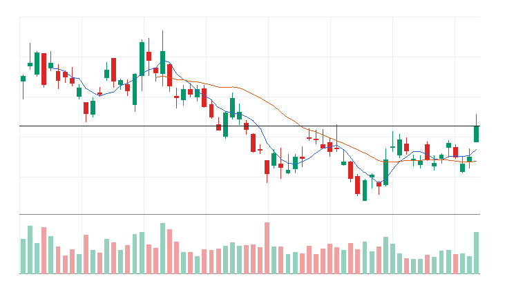
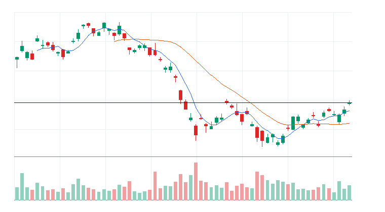
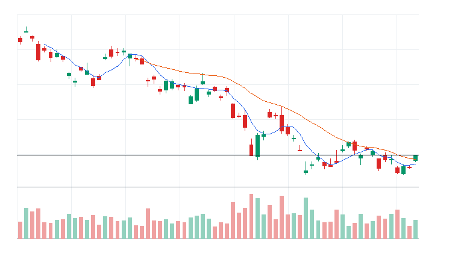
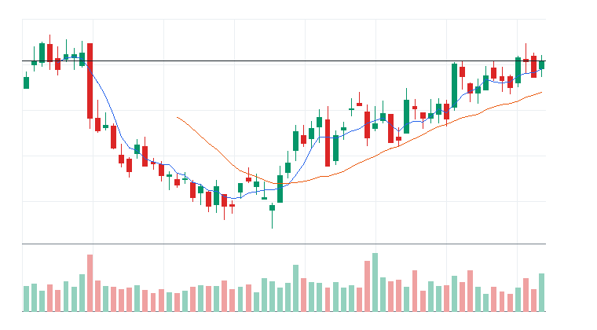
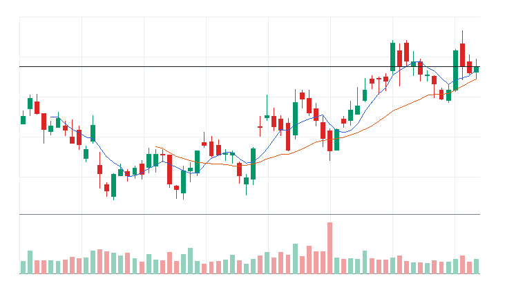

# 오늘의 데일리 트레이딩 요약

**REAL DATA TEST - 가격/거래량은 실제 데이터, 뉴스/ETF 구성종목 확산도/거래대금 유동성 일부 연결**

**목적:** 이 리포트는 최근 오른 자산을 나열하는 것이 아니라, 돈이 몰리는 근거와 다음 매수 주체가 확인할 트레이딩 후보를 찾기 위한 보고서다.

> 핵심 질문: 현재 가격에서 누가 사고 있고, 누가 앞으로 더 비싸게 사줄 수 있는가?

## 시장 국면 판단

- 최종 판정: 기간 조정 (71점)
- 전일 대비: 기간 조정은 유지됐지만 점수는 전일보다 강화됐다(+10점).
- 판정 신뢰도: 높음 (100점) - 핵심 지수와 매크로 데이터가 대부분 직접 수집되어 판정 신뢰도가 높다.
- 행동 바이어스: 추격 보류, 돌파 확인
- 한 줄 결론: 장기 추세는 유지되지만 단기 추세가 둔화되어 기간 조정으로 본다. 기술 84점, 매크로 47점.
- 기술적 지표: 상승 추세 우위 (84점, 가중치 65%)
- S&P 500: 100점 | 50일선 위, 200일선 위, 20일 +0.49%, 60일 +6.00%, 52주 고점 대비 -1.47% -> 기술 점수 100
- Nasdaq 100: 67점 | 50일선 아래, 200일선 위, 20일 -3.93%, 60일 +9.00%, 52주 고점 대비 -5.22% -> 기술 점수 67
- 매크로 시황: 매크로 중립 (47점, 가중치 35%)
- 매크로 요약: 물가 부담으로 매크로 환경은 방어적이다.
- 금리: 중립 46점 / 금리 중립 / confidence HIGH
  - 주요 근거: US 10Y yield 20일 +2.64%, 5일 +0.94%; US 3M yield 20일 +1.36%, 단기금리 방향 확인; US long-duration bonds 20일 -2.82%, 장기채 가격 기준 할인율 부담 확인
  - 확인 사항: 추가 확인 이벤트 없음
- 물가: 부담 42점 / 물가 부담 / confidence HIGH
  - 주요 근거: Oil ETF 20일 +14.34%, 유가 기반 물가 압력 확인; TIPS ETF 20일 -0.97%, 물가연동채 흐름은 보조 근거; Gold 20일 -2.54%, 금 강세는 방어 수요 여부 확인
  - 확인 사항: 추가 확인 이벤트 없음
- 정책: 중립 50점 / 정책 이벤트 확인 전 중립 / confidence LOW
  - 주요 근거: 정책 톤은 1차 버전에서 일정/이벤트 리스크 기반 중립값으로 반영한다.
  - 확인 사항: FOMC, CPI, PCE, 고용지표 발표 전후에는 매크로 confidence를 보수적으로 해석한다.
- 신용/유동성: 중립 51점 / 신용/유동성 중립 / confidence HIGH
  - 주요 근거: High yield credit 20일 -0.36%, 하이일드 위험선호 확인; HYG-LQD 20일 상대강도 +1.41%, 신용위험 선호/회피 확인; VIX 20일 -1.33%, 변동성 부담 확인
  - 확인 사항: 추가 확인 이벤트 없음
- 환율/글로벌: 중립 49점 / 환율/글로벌 중립 / confidence MEDIUM
  - 주요 근거: US dollar 20일 +0.42%, 달러 강세/약세 확인
  - 확인 사항: 추가 확인 이벤트 없음
- US 10Y yield: 45점 | 하락 시 주식 우호; 5일 +0.94%, 20일 +2.64% -> 매크로 점수 45
- US 3M yield: 47점 | 하락 시 주식 우호; 5일 +0.81%, 20일 +1.36% -> 매크로 점수 47
- US long-duration bonds: 45점 | 상승 시 주식 우호; 5일 -0.50%, 20일 -2.82% -> 매크로 점수 45
- TIPS ETF: 50점 | 상승 시 주식 우호; 5일 -0.12%, 20일 -0.97% -> 매크로 점수 50
- Oil ETF: 21점 | 하락 시 주식 우호; 5일 +7.22%, 20일 +14.34% -> 매크로 점수 21
- Gold: 50점 | 상승 시 주식 우호; 5일 +0.71%, 20일 -2.54% -> 매크로 점수 50
- US dollar: 49점 | 하락 시 주식 우호; 5일 +0.32%, 20일 +0.42% -> 매크로 점수 49
- High yield credit: 49점 | 상승 시 주식 우호; 5일 -0.04%, 20일 -0.36% -> 매크로 점수 49
- Investment grade credit: 50점 | 상승 시 주식 우호; 5일 -0.34%, 20일 -1.77% -> 매크로 점수 50
- VIX: 49점 | 하락 시 주식 우호; 5일 +3.33%, 20일 -1.33% -> 매크로 점수 49
- 데이터 커버리지: 기술 2/2, 매크로 10/10
- 데이터 신뢰도 근거:
  - 직접 지수 데이터: S&P 500, Nasdaq 100
  - 대체 지수 데이터 없음
  - 매크로 데이터: 10/10
  - 누락 데이터 없음
  - stale 데이터 없음

## 모바일 요약

[오늘의 데일리 트레이딩 요약]

생성 성공 / 데이터 모드: REAL_TEST

시장:
- 중립

시장 지배 서사:
1. 매크로 방어/헤지 - 약화 - Energy Select Sector SPDR Fund(XLE), SPDR Gold Shares(GLD), Exxon Mobil(XOM), Chevron(CVX) 중심으로 5일 +2.02%, 20일 +3.36% 흐름이 형성됨. 뉴스 직접성 제한.
2. 위험선호 성장주 재진입 - 소멸 - Invesco QQQ Trust(QQQ), Renaissance IPO ETF(IPO), Coinbase(COIN), Arm Holdings plc(ARM) 중심으로 5일 +0.22%, 20일 -4.67% 흐름이 형성됨. 직접 촉매 일부 확인.
3. Aerospace & Defense 자금 유입 - 약화 - SPDR S&P 500 ETF Trust(SPY), iShares Russell 2000 ETF(IWM), RTX, Axon Enterprise Inc.(AXON) 중심으로 5일 -1.54%, 20일 +5.44% 흐름이 형성됨. 뉴스 직접성 제한.

트렌드 강도:
1. 매크로 방어/헤지 - TSI 27 - 잠복 - 진입품질 낮음
2. 위험선호 성장주 재진입 - TSI 11 - 잠복 - 진입품질 낮음
3. Aerospace & Defense 자금 유입 - TSI 7 - 잠복 - 진입품질 낮음

오늘 결론:
- Financials 개별 종목 흐름이 ETF 대비 강한지 확인 필요
- 행동 후보는 linkedNarrative와 함께 확인한다.
- 추격보다 진입 조건 확인 후 접근한다.

오늘 실제 행동 후보:
1. Coinbase(COIN)(STOCK) - 위험선호 성장주 재진입 - 단기 추세가 유지되고 거래량이 1.0배 이상이면 눌림 이후 재상승을 시도할 수 있음

다크호스 후보:
1. 다크호스 후보 없음 - 조건 충족 후보 없음

ETF 후보 TOP 5:
1. Energy Select Sector SPDR Fund(XLE) - 매크로 방어/헤지 - 거래량 확인 전 관찰
2. First Trust NASDAQ Cybersecurity ETF(CIBR) - 사이버보안 지출 재가속 - 제외
3. iShares Bitcoin Trust ETF(IBIT) - 비트코인/디지털 자산 위험선호 - 거래량 확인 전 관찰
4. SPDR Gold Shares(GLD) - 매크로 방어/헤지 - 거래량 확인 전 관찰
5. Amplify Cybersecurity ETF(HACK) - 사이버보안 지출 재가속 - 제외

웹 리포트:
https://yoolcool.github.io/DailyTradingThesisAgent/

## 오늘 결론

- 오늘 결론: 조건부 진입
- 신규 진입 후보: 0개
- 조건부 진입 후보: 1개
- 관찰 후보: 122개
- 주요 제한 요인: Entry Quality < 40, RVOL 미달, 뉴스 직접성 부족
- 주문 판단: 시장가 금지 / 지정가 또는 관찰
- 실전 판단: 진입 후보는 있으나, 전일 고점 돌파와 거래량 확인 후 선별적으로 접근한다.

### 후보 제한 요인 집계

- RVOL < 1.00x: 122개
- 거래대금 유동성 낮음: 14개
- Entry Quality 50~54 near miss: 0개
- Entry Quality 40~49 관찰: 0개
- Entry Quality < 40: 157개
- Exhaustion Risk >= 70: 0개
- ETF breadth 샘플 부족: 37개
- 뉴스 직접성 부족: 100개

## 데이터 신뢰도

- 전체 데이터 신뢰도 등급: LOW
- 분석 신뢰도: LOW
- 주문 실행 신뢰도: LOW
- ETF breadth 신뢰도: LOW
- 신뢰도 해석: 테마 확산 판단 제한, 거래대금 유동성 낮음 또는 확인 불가, 프리/애프터마켓 확인 불가
- 리포트 생성 시각: 2026-07-22 08:57 KST
- 가격 기준 거래일: 2026-07-21 US regular close
- 뉴스 수집 시각: 2026-07-22 08:57 KST
- 가장 최근 뉴스 발행 시각: 2026-07-22 07:46 KST
- 뉴스 신선도 상태: FRESH
- 뉴스 소스: Yahoo Finance RSS, MarketWatch RSS, CNBC Markets RSS, SEC EDGAR RSS, Federal Reserve RSS, Finnhub API
- 뉴스 소스 상태: Yahoo Finance RSS CONNECTED, MarketWatch RSS CONNECTED, CNBC Markets RSS PARTIAL, SEC EDGAR RSS PARTIAL, Federal Reserve RSS CONNECTED, Finnhub API DISABLED
- 뉴스 신뢰도: MEDIUM
- 추천 적용 거래일: 2026-07-21 US regular session
- 가격/거래량 데이터 상태: 연결됨
- 뉴스 데이터 상태: 일부 연결
- ETF 구성종목 확산도 상태: 일부 연결
- ETF 구성종목 샘플 수: 1~4
- 거래대금 유동성 데이터 상태: 일부 연결
- 프리/애프터마켓 데이터 상태: UNAVAILABLE
- 데이터 provider: yfinance, Yahoo Finance RSS, MarketWatch RSS, CNBC Markets RSS, SEC EDGAR RSS, Federal Reserve RSS, Finnhub API, config fallback sample, price-volume dollar-volume fallback
- 실전 사용 경고: 이 리포트는 투자판단 보조용이며, REAL_TEST 모드에서는 일부 데이터가 누락되거나 지연될 수 있다. 실제 주문 전 현재가, 뉴스, 프리마켓/정규장 거래량을 별도 확인해야 한다.

## 0. 시장 상태

- 데이터 모드: REAL_TEST
- 가격/거래량: 연결됨
- 뉴스: 일부 연결
- ETF 구성종목 확산도: 일부 연결
- 거래대금 유동성: 일부 연결
- 생성 시각: 2026년 7월 22일 수요일 AM 8:57
- 시장 상태: 중립
- 오늘 돈의 방향: Financials 개별 종목 흐름이 ETF 대비 강한지 확인 필요
- 강한 테마 TOP 3: Financials(85), Financial Services(55), Energy(32)
- 데이터 한계:
  - API 또는 provider 상태에 따라 뉴스/ETF 확산도/거래대금 유동성 반영 범위가 달라질 수 있다.
  - 수집 실패 데이터는 점수 반영에서 제외하거나 confidence를 제한한다.
  - reasonConfidence HIGH는 직접 촉매, 가격/거래량, 확산도/유동성 근거가 함께 있을 때만 사용한다.

## 오늘 시장을 지배하는 서사

### 오늘 시장을 지배하는 서사 TOP 3

#### 1. 매크로 방어/헤지
- 상태: 약화
- narrativeScore: 28
- reasonConfidence: LOW
- 근거 ETF: XLE, GLD, TLT
- 근거 개별 종목: XOM, CVX
- 돈이 몰리는 이유: 매크로 방어/헤지 관련 Energy Select Sector SPDR Fund(XLE), SPDR Gold Shares(GLD), iShares 20+ Year Treasury Bond ETF(TLT)와 Exxon Mobil(XOM), Chevron(CVX)의 5일(+2.02%)·20일(+3.36%) 흐름을 함께 본다. 평균 상대 거래량은 0.75배이고, ETF 확산도는 추가 확인이 필요하다. 뉴스 직접성은 아직 제한적이다.
- 다음 매수 주체: 금리/에너지/방어 헤지를 찾는 매크로 자금
- 가장 좋은 트레이딩 수단: ETF 우선: GLD, TLT, XLE / 개별 종목 우선: XOM, CVX
- 서사가 깨지는 조건: 방어 ETF 상대강도 둔화와 위험선호 성장주 재강세
- 오늘 행동: 위험회피가 확인될 때만 헤지성 접근

상세 narrativeScore 근거 보기

- rawScore: 28
- ETF 평균 moneyFlowScore: 17
- 개별 종목 평균 moneyFlowScore: 48
- ETF 후보 비율: 0%
- 개별 종목 후보 비율: 0%
- 5일 평균 수익률: +2.00%
- 20일 평균 수익률: +3.00%
- 평균 상대 거래량: 1.00배
- ETF 평균 상대 거래량: 1.00배
- 개별주 평균 상대 거래량: 1.00배
- 52주 고점 근접 후보 비율: 0%
- 뉴스 직접성 점수: 10
- ETF 확산도 점수: 0
- 유동성 점수: 3
- 과열 리스크 차감: 0

#### 2. 위험선호 성장주 재진입
- 상태: 소멸
- narrativeScore: 18
- reasonConfidence: LOW
- 근거 ETF: QQQ, IPO, ARKK
- 근거 개별 종목: COIN, ARM, TSLA
- 돈이 몰리는 이유: 위험선호 성장주 재진입 관련 Invesco QQQ Trust(QQQ), Renaissance IPO ETF(IPO), ARK Innovation ETF(ARKK)와 Coinbase(COIN), Arm Holdings plc(ARM), Tesla Inc.(TSLA)의 5일(+0.22%)·20일(-4.67%) 흐름을 함께 본다. 평균 상대 거래량은 0.77배이고, ETF 확산도는 추가 확인이 필요하다. 직접 뉴스/이벤트가 일부 확인된다.
- 다음 매수 주체: 위험선호 회복을 사는 성장주 ETF 자금과 고베타 단기 모멘텀 자금
- 가장 좋은 트레이딩 수단: ETF 우선: QQQ, IPO, ARKK / 개별 종목 우선: ARM, COIN, TSLA
- 서사가 깨지는 조건: QQQ/IWM 동반 약화, 고베타 성장주 상대 거래량 둔화
- 오늘 행동: 지수 위험선호가 유지될 때만 선별 진입

상세 narrativeScore 근거 보기

- rawScore: 18
- ETF 평균 moneyFlowScore: 8
- 개별 종목 평균 moneyFlowScore: 28
- ETF 후보 비율: 0%
- 개별 종목 후보 비율: 33%
- 5일 평균 수익률: 0.00%
- 20일 평균 수익률: -5.00%
- 평균 상대 거래량: 1.00배
- ETF 평균 상대 거래량: 1.00배
- 개별주 평균 상대 거래량: 1.00배
- 52주 고점 근접 후보 비율: 13%
- 뉴스 직접성 점수: 9
- ETF 확산도 점수: 0
- 유동성 점수: 2
- 과열 리스크 차감: 0

#### 3. Aerospace & Defense 자금 유입
- 상태: 약화
- narrativeScore: 18
- reasonConfidence: LOW
- 근거 ETF: SPY, IWM, QQQ
- 근거 개별 종목: RTX, AXON
- 돈이 몰리는 이유: Aerospace & Defense 자금 유입 관련 SPDR S&P 500 ETF Trust(SPY), iShares Russell 2000 ETF(IWM), Invesco QQQ Trust(QQQ)와 RTX, Axon Enterprise Inc.(AXON)의 5일(-1.54%)·20일(+5.44%) 흐름을 함께 본다. 평균 상대 거래량은 0.69배이고, ETF 확산도는 추가 확인이 필요하다. 뉴스 직접성은 아직 제한적이다.
- 다음 매수 주체: Aerospace & Defense 자금 유입을 확인한 섹터 ETF 자금과 상대강도 추종 스윙 자금
- 가장 좋은 트레이딩 수단: ETF 우선: QQQ, SPY, IWM / 개별 종목 우선: AXON, RTX
- 서사가 깨지는 조건: QQQ 20일선 이탈 또는 관련 종목 절반 이상 5일선 이탈
- 오늘 행동: 기존 네러티브와 중복을 확인한 뒤 ETF/대표 종목 동조성이 살아날 때만 관찰 편입

상세 narrativeScore 근거 보기

- rawScore: 18
- ETF 평균 moneyFlowScore: 19
- 개별 종목 평균 moneyFlowScore: 9
- ETF 후보 비율: 0%
- 개별 종목 후보 비율: 0%
- 5일 평균 수익률: -2.00%
- 20일 평균 수익률: +5.00%
- 평균 상대 거래량: 1.00배
- ETF 평균 상대 거래량: 1.00배
- 개별주 평균 상대 거래량: 1.00배
- 52주 고점 근접 후보 비율: 40%
- 뉴스 직접성 점수: 7
- ETF 확산도 점수: 0
- 유동성 점수: 3
- 과열 리스크 차감: 0

### 전체 narrative 요약

| 서사명 | 상태 | narrativeScore | reasonConfidence | 대표 ETF | 대표 종목 | 오늘 행동 |
| --- | --- | ---: | --- | --- | --- | --- |
| 매크로 방어/헤지 | 약화 | 28 | LOW | XLE, GLD, TLT | XOM, CVX | 위험회피가 확인될 때만 헤지성 접근 |
| 위험선호 성장주 재진입 | 소멸 | 18 | LOW | QQQ, IPO, ARKK | COIN, ARM, TSLA | 지수 위험선호가 유지될 때만 선별 진입 |
| Aerospace & Defense 자금 유입 | 약화 | 18 | LOW | SPY, IWM, QQQ | RTX, AXON | 기존 네러티브와 중복을 확인한 뒤 ETF/대표 종목 동조성이 살아날 때만 관찰 편입 |
| 비트코인/디지털 자산 위험선호 | 소멸 | 16 | LOW | IBIT, BLOK | COIN, CIFR, MSTR, IREN | 비트코인 베타가 살아날 때만 단기 매매 |
| 사이버보안 지출 재가속 | 약화 | 14 | LOW | CIBR, HACK, IHAK | FTNT, PANW, CRWD | 기존 네러티브와 중복을 확인한 뒤 ETF/대표 종목 동조성이 살아날 때만 관찰 편입 |
| 소프트웨어 실적/AI 수익화 | 약화 | 11 | LOW | IGV, QQQ, AIQ | WDAY, INTU, TEAM, DDOG | 기존 네러티브와 중복을 확인한 뒤 ETF/대표 종목 동조성이 살아날 때만 관찰 편입 |
| Data Storage 자금 유입 | 소멸 | 10 | LOW | SPY, IWM, QQQ | STX, WDC | 기존 네러티브와 중복을 확인한 뒤 ETF/대표 종목 동조성이 살아날 때만 관찰 편입 |
| Internet Content 자금 유입 | 약화 | 9 | LOW | QQQ | DASH, META | 기존 네러티브와 중복을 확인한 뒤 ETF/대표 종목 동조성이 살아날 때만 관찰 편입 |
| AI 소프트웨어/사이버보안 확산 | 약화 | 8 | LOW | IGV, QQQ, AIQ | TEAM, PLTR, MSFT, DDOG | 추격보다 눌림 후 재상승 확인 |
| 전력 유틸리티 수요 재평가 | 소멸 | 8 | LOW | SPY, IWM, QQQ | ETN, GEV, VRT | 기존 네러티브와 중복을 확인한 뒤 ETF/대표 종목 동조성이 살아날 때만 관찰 편입 |
| 바이오/헬스케어 촉매 | 약화 | 7 | LOW | QQQ | REGN, VRTX, INSM, ALNY | 기존 네러티브와 중복을 확인한 뒤 ETF/대표 종목 동조성이 살아날 때만 관찰 편입 |
| 필수소비재 음료 방어 성장 | 약화 | 5 | LOW | QQQ | CCEP, MNST | 기존 네러티브와 중복을 확인한 뒤 ETF/대표 종목 동조성이 살아날 때만 관찰 편입 |
| 방산/안보 프리미엄 | 약화 | 3 | LOW | XAR, SHLD, ITA | PLTR, AVAV, KTOS | 뉴스 촉매가 직접 확인될 때만 추세 추종 |
| 전력망/원전/인프라 병목 | 소멸 | 0 | LOW | URA, GRID, PAVE | CEG, VRT, ETN, PWR | ETF 확산도와 거래량이 같이 살아날 때만 진입 |
| AI 인프라 재가속 | 소멸 | 0 | LOW | SMH, SOXX, DRAM | NVDA, MU, VRT, ETN | 추격보다 5일선 지지 후 재상승 확인 |
| 반도체 장비 사이클 재평가 | 소멸 | 0 | LOW | SMH, SOXX, SOXQ | ASML, AMAT, LRCX | 기존 네러티브와 중복을 확인한 뒤 ETF/대표 종목 동조성이 살아날 때만 관찰 편입 |
| 반도체 설계/공급망 재가속 | 소멸 | 0 | LOW | SMH, SOXX, SOXQ | AMD, ARM, TXN, ADI | 기존 네러티브와 중복을 확인한 뒤 ETF/대표 종목 동조성이 살아날 때만 관찰 편입 |

## 트렌드 강도 판단

### 1. 매크로 방어/헤지
- Trend Strength Index: 27
- 트렌드 상태 라벨: 잠복
- 테마 확산도: 약함
- ETF 동조성: 약함
- 거래량 강도: 부족
- 과열 위험: 낮음 (9)
- 오늘 진입 품질: 낮음 (17)
- 한 줄 판단: 매크로 방어/헤지는 Trend Strength는 높아도 시장 위험선호가 약해 시장 환경 비우호 구간이다.
- 오늘 접근법: Energy Select Sector SPDR Fund(XLE)/SPDR Gold Shares(GLD)/iShares 20+ Year Treasury Bond ETF(TLT)와 Exxon Mobil(XOM)/Chevron(CVX)의 거래량 확산이 확인되기 전까지 관찰한다.

트렌드 강도 상세 근거 보기

- 가격 모멘텀: 가격 모멘텀 9/25. 평균 5D +2.02%, 20D +3.36%.
- 거래량 강도: 거래량 강도 3/20. 평균 RVOL 0.75배.
- ETF 동조성: ETF 동조성 6/15. 관련 ETF SPDR Gold Shares(GLD), iShares 20+ Year Treasury Bond ETF(TLT), Energy Select Sector SPDR Fund(XLE), VanEck Oil Services ETF(OIH) 흐름을 기준으로 판단.
- 테마 확산도: 테마 확산도 6/20. 상위 1~2개 쏠림 감점 3점 반영.
- 뉴스 촉매: 뉴스/촉매 신선도 0/10. HIGH 직접 촉매 0개.
- 과열 리스크: 과열 리스크 9/100. 단기 급등, 고점 근접, ETF-개별주 괴리, 쏠림을 함께 반영.
- 시장 환경: 시장 환경 3/10. QQQ/SPY/IWM 가격 흐름 기반 위험선호 점수.

### 2. 위험선호 성장주 재진입
- Trend Strength Index: 11
- 트렌드 상태 라벨: 잠복
- 테마 확산도: 부족
- ETF 동조성: 부족
- 거래량 강도: 부족
- 과열 위험: 낮음 (18)
- 오늘 진입 품질: 낮음 (7)
- 한 줄 판단: 위험선호 성장주 재진입는 Trend Strength는 높아도 시장 위험선호가 약해 시장 환경 비우호 구간이다.
- 오늘 접근법: Invesco QQQ Trust(QQQ)/Renaissance IPO ETF(IPO)/ARK Innovation ETF(ARKK)와 Coinbase(COIN)/Arm Holdings plc(ARM)/Tesla Inc.(TSLA)의 거래량 확산이 확인되기 전까지 관찰한다.

트렌드 강도 상세 근거 보기

- 가격 모멘텀: 가격 모멘텀 1/25. 평균 5D +0.22%, 20D -4.67%.
- 거래량 강도: 거래량 강도 3/20. 평균 RVOL 0.77배.
- ETF 동조성: ETF 동조성 1/15. 관련 ETF Invesco QQQ Trust(QQQ), Renaissance IPO ETF(IPO), ARK Innovation ETF(ARKK), iShares Russell 2000 ETF(IWM), Roundhill Magnificent Seven ETF(MAGS) 흐름을 기준으로 판단.
- 테마 확산도: 테마 확산도 0/20. 상위 1~2개 쏠림 감점 6점 반영.
- 뉴스 촉매: 뉴스/촉매 신선도 3/10. HIGH 직접 촉매 1개.
- 과열 리스크: 과열 리스크 18/100. 단기 급등, 고점 근접, ETF-개별주 괴리, 쏠림을 함께 반영.
- 시장 환경: 시장 환경 3/10. QQQ/SPY/IWM 가격 흐름 기반 위험선호 점수.

### 3. Aerospace & Defense 자금 유입
- Trend Strength Index: 7
- 트렌드 상태 라벨: 잠복
- 테마 확산도: 부족
- ETF 동조성: 부족
- 거래량 강도: 부족
- 과열 위험: 낮음 (22)
- 오늘 진입 품질: 낮음 (0)
- 한 줄 판단: Aerospace & Defense 자금 유입는 Trend Strength는 높아도 시장 위험선호가 약해 시장 환경 비우호 구간이다.
- 오늘 접근법: SPDR S&P 500 ETF Trust(SPY)/iShares Russell 2000 ETF(IWM)/Invesco QQQ Trust(QQQ)와 RTX/Axon Enterprise Inc.(AXON)의 거래량 확산이 확인되기 전까지 관찰한다.

트렌드 강도 상세 근거 보기

- 가격 모멘텀: 가격 모멘텀 0/25. 평균 5D -1.54%, 20D +5.44%.
- 거래량 강도: 거래량 강도 2/20. 평균 RVOL 0.69배.
- ETF 동조성: ETF 동조성 2/15. 관련 ETF Invesco QQQ Trust(QQQ), SPDR S&P 500 ETF Trust(SPY), iShares Russell 2000 ETF(IWM) 흐름을 기준으로 판단.
- 테마 확산도: 테마 확산도 0/20. 상위 1~2개 쏠림 감점 6점 반영.
- 뉴스 촉매: 뉴스/촉매 신선도 0/10. HIGH 직접 촉매 0개.
- 과열 리스크: 과열 리스크 22/100. 단기 급등, 고점 근접, ETF-개별주 괴리, 쏠림을 함께 반영.
- 시장 환경: 시장 환경 3/10. QQQ/SPY/IWM 가격 흐름 기반 위험선호 점수.

## 최근 추천 결과 트래킹

개별주는 데이트레이딩 관점으로 추천 이후 첫 정규장의 장중 최고가와 종가를 추적한다. ETF는 테마/스윙 관점으로 추천 이후 1주일 동안의 최고가와 현재 종가를 추적한다.

### 개별주 Top 3 추천 성과 요약
- 최근 5개 리포트 표본: 10개 (초기 검증 단계)
- 장중 최고가 기준 성공률: +33.33%
- 종가 기준 성공률: +22.22%
- 평균 장중 최고 수익률: +2.19%
- 평균 종가 수익률: -0.65%

### ETF 추천 성과 요약
- 최근 5개 리포트 표본: 0개 (초기 검증 단계)
- 1주 최고가 기준 성공률: 데이터 없음
- 현재 종가 기준 성공률: 데이터 없음
- 평균 1주 최고 수익률: 데이터 없음
- 평균 현재 수익률: 데이터 없음

최근 추천 결과 상세 테이블 펼치기

| 추천일 | 유형 | 순위 | 티커 | 기준가 | 추적 기간 | 상태 | High 수익률 | Close 수익률 | 결과 | 코멘트 |
| --- | --- | ---: | --- | ---: | --- | --- | ---: | ---: | --- | --- |
| 2026-07-22 | STOCK | 1 | COIN | $175.85 | 2026-07-22 | pending | 데이터 없음 | 데이터 없음 | 추적 대기 | 아직 추적 거래일 데이터가 완성되지 않음 |
| 2026-07-21 | STOCK | 1 | PYPL | $56.82 | 2026-07-21 | complete | +0.16% | -1.71% | 실패 | 추천 이후 의미 있는 장중 기회가 부족하고 종가도 약함 (일봉 기준) |
| 2026-07-20 | STOCK | 2 | CTAS | $204.45 | 2026-07-20 | complete | -0.03% | -1.30% | 실패 | 추천 이후 의미 있는 장중 기회가 부족하고 종가도 약함 (일봉 기준) |
| 2026-07-20 | STOCK | 1 | PANW | $358.68 | 2026-07-20 | complete | +2.13% | -2.79% | 제한적 유효 | 제한적인 장중 기회만 발생 (일봉 기준) |
| 2026-07-17 | STOCK | 3 | CTAS | $206.25 | 2026-07-17 | complete | +1.68% | -0.87% | 제한적 유효 | 제한적인 장중 기회만 발생 (일봉 기준) |
| 2026-07-17 | STOCK | 2 | TRI | $98.82 | 2026-07-17 | complete | +2.05% | -2.65% | 제한적 유효 | 제한적인 장중 기회만 발생 (일봉 기준) |
| 2026-07-17 | STOCK | 1 | PYPL | $56.73 | 2026-07-17 | complete | +0.78% | -0.30% | 실패 | 추천 이후 의미 있는 장중 기회가 부족하고 종가도 약함 (일봉 기준) |
| 2026-07-16 | STOCK | 3 | PYPL | $55.52 | 2026-07-16 | complete | +3.87% | +2.18% | 성공 | 장중 기회와 종가 유지가 모두 확인됨 (일봉 기준) |
| 2026-07-16 | STOCK | 2 | TRI | $95.51 | 2026-07-16 | complete | +5.85% | +3.47% | 성공 | 장중 기회와 종가 유지가 모두 확인됨 (일봉 기준) |
| 2026-07-16 | STOCK | 1 | CRWD | $210.73 | 2026-07-15 | complete | +3.21% | -1.88% | 단타 유효 | 장중 기회는 있었지만 종가 유지력은 약함 (일봉 기준) |
| 2026-07-15 | STOCK | 1 | CRWD | $210.73 | 2026-07-15 | complete | +3.21% | -1.88% | 단타 유효 | 장중 기회는 있었지만 종가 유지력은 약함 (일봉 기준) |
| 2026-07-14 | STOCK | 1 | TRI | $94.29 | 2026-07-14 | complete | -0.66% | -2.70% | 실패 | 추천 이후 의미 있는 장중 기회가 부족하고 종가도 약함 (일봉 기준) |
| 2026-07-13 | STOCK | 1 | AXON | $640.46 | 2026-07-13 | complete | -9.75% | -14.59% | 실패 | 추천 이후 의미 있는 장중 기회가 부족하고 종가도 약함 (일봉 기준) |
| 2026-07-13 | STOCK | 1 | META | $669.21 | 2026-07-13 | complete | +1.11% | -1.86% | 제한적 유효 | 제한적인 장중 기회만 발생 (일봉 기준) |
| 2026-07-08 | STOCK | 1 | AXON | $640.46 | 2026-07-08 | complete | -1.48% | -6.35% | 실패 | 추천 이후 의미 있는 장중 기회가 부족하고 종가도 약함 (일봉 기준) |
| 2026-07-07 | STOCK | 2 | AXON | $622.35 | 2026-07-07 | complete | +6.86% | +2.91% | 성공 | 장중 기회와 종가 유지가 모두 확인됨 (일봉 기준) |
| 2026-07-07 | STOCK | 1 | PANW | $357.53 | 2026-07-07 | complete | +1.53% | -5.73% | 제한적 유효 | 제한적인 장중 기회만 발생 (일봉 기준) |
| 2026-07-06 | STOCK | 2 | CCEP | $106.61 | 2026-07-06 | complete | +0.58% | +0.34% | 추적 대기 | 아직 추적 거래일 데이터가 완성되지 않음 (일봉 기준) |
| 2026-07-06 | STOCK | 1 | PANW | $348.06 | 2026-07-06 | complete | +5.78% | +2.72% | 성공 | 장중 기회와 종가 유지가 모두 확인됨 (일봉 기준) |
| 2026-07-03 | STOCK | 1 | CCEP | $106.61 | 2026-07-03 | pending | 데이터 없음 | 데이터 없음 | 추적 대기 | 아직 추적 거래일 데이터가 완성되지 않음 |
| 2026-07-02 | STOCK | 2 | AXON | $593.96 | 2026-07-02 | complete | +1.52% | +0.52% | 제한적 유효 | 제한적인 장중 기회만 발생 (일봉 기준) |
| 2026-07-02 | STOCK | 1 | CCEP | $106.1 | 2026-07-02 | complete | +1.86% | +0.48% | 제한적 유효 | 제한적인 장중 기회만 발생 (일봉 기준) |
| 2026-07-01 | STOCK | 3 | LRCX | $433.33 | 2026-07-01 | complete | -4.12% | -9.71% | 실패 | 추천 이후 의미 있는 장중 기회가 부족하고 종가도 약함 (일봉 기준) |
| 2026-07-01 | STOCK | 2 | PANW | $341.02 | 2026-07-01 | complete | +5.01% | +3.23% | 성공 | 장중 기회와 종가 유지가 모두 확인됨 (일봉 기준) |
| 2026-07-01 | STOCK | 1 | AMAT | $723 | 2026-07-01 | complete | -4.04% | -9.97% | 실패 | 추천 이후 의미 있는 장중 기회가 부족하고 종가도 약함 (일봉 기준) |
| 2026-06-30 | STOCK | 3 | AMAT | $694.64 | 2026-06-30 | complete | +6.48% | +4.08% | 성공 | 장중 기회와 종가 유지가 모두 확인됨 (일봉 기준) |
| 2026-06-30 | STOCK | 2 | CRWD | $742.91 | 2026-06-30 | complete | -74.25% | -74.32% | 실패 | 추천 이후 의미 있는 장중 기회가 부족하고 종가도 약함 (일봉 기준) |
| 2026-06-30 | STOCK | 1 | PANW | $332 | 2026-06-30 | complete | +3.16% | +2.72% | 성공 | 장중 기회와 종가 유지가 모두 확인됨 (일봉 기준) |
| 2026-06-29 | STOCK | 3 | KDP | $33.4 | 2026-06-29 | complete | +1.26% | +0.30% | 제한적 유효 | 제한적인 장중 기회만 발생 (일봉 기준) |
| 2026-06-29 | STOCK | 2 | VRTX | $491.34 | 2026-06-29 | complete | +1.74% | +1.69% | 제한적 유효 | 제한적인 장중 기회만 발생 (일봉 기준) |
| 2026-06-29 | STOCK | 1 | FTNT | $151.35 | 2026-06-29 | complete | +5.10% | +2.69% | 성공 | 장중 기회와 종가 유지가 모두 확인됨 (일봉 기준) |
| 2026-06-26 | STOCK | 3 | MU | $1,213.56 | 2026-06-26 | complete | -1.22% | -6.69% | 실패 | 추천 이후 의미 있는 장중 기회가 부족하고 종가도 약함 (일봉 기준) |
| 2026-06-26 | STOCK | 2 | AMAT | $668 | 2026-06-26 | complete | -1.17% | -6.16% | 실패 | 추천 이후 의미 있는 장중 기회가 부족하고 종가도 약함 (일봉 기준) |
| 2026-06-26 | STOCK | 1 | LRCX | $401.82 | 2026-06-26 | complete | -2.97% | -5.66% | 실패 | 추천 이후 의미 있는 장중 기회가 부족하고 종가도 약함 (일봉 기준) |
| 2026-06-26 | ETF | 1 | DRAM | $76.89 | 2026-06-26~2026-07-03 | complete | -3.55% | -23.46% | 실패 | 추천 이후 ETF 흐름이 약화됨 |
| 2026-06-23 | STOCK | 3 | TSM | $467.67 | 2026-06-23 | complete | -4.35% | -6.69% | 실패 | 추천 이후 의미 있는 장중 기회가 부족하고 종가도 약함 (일봉 기준) |
| 2026-06-23 | STOCK | 2 | GEV | $1,127.59 | 2026-06-23 | complete | -4.84% | -8.21% | 실패 | 추천 이후 의미 있는 장중 기회가 부족하고 종가도 약함 (일봉 기준) |
| 2026-06-23 | STOCK | 1 | ETN | $435.78 | 2026-06-23 | complete | -3.27% | -7.00% | 실패 | 추천 이후 의미 있는 장중 기회가 부족하고 종가도 약함 (일봉 기준) |
| 2026-06-23 | ETF | 1 | DRAM | $80.72 | 2026-06-23~2026-06-30 | complete | -1.39% | -27.09% | 실패 | 추천 이후 ETF 흐름이 약화됨 |
| 2026-06-22 | STOCK | 3 | ARM | $439.46 | 2026-06-22 | complete | +1.25% | -7.22% | 제한적 유효 | 제한적인 장중 기회만 발생 (일봉 기준) |
| 2026-06-22 | STOCK | 2 | GEV | $1,109.73 | 2026-06-22 | complete | +2.91% | +1.61% | 제한적 유효 | 제한적인 장중 기회만 발생 (일봉 기준) |
| 2026-06-22 | STOCK | 1 | ETN | $421.77 | 2026-06-22 | complete | +3.55% | +3.32% | 성공 | 장중 기회와 종가 유지가 모두 확인됨 (일봉 기준) |
| 2026-06-22 | ETF | 3 | IFRA | $61.99 | 2026-06-22~2026-06-29 | complete | +3.65% | -1.42% | 단기 고점 후 반납 | 1주 내 상승 기회는 있었지만 현재가는 반납 |
| 2026-06-22 | ETF | 2 | SMH | $659.88 | 2026-06-22~2026-06-29 | complete | -1.49% | -11.49% | 실패 | 추천 이후 ETF 흐름이 약화됨 |
| 2026-06-22 | ETF | 1 | DRAM | $76.71 | 2026-06-22~2026-06-29 | complete | +3.77% | -23.28% | 단기 고점 후 반납 | 1주 내 상승 기회는 있었지만 현재가는 반납 |
| 2026-06-19 | STOCK | 3 | AMD | $537.37 | 2026-06-19 | pending | 데이터 없음 | 데이터 없음 | 추적 대기 | 아직 추적 거래일 데이터가 완성되지 않음 |
| 2026-06-19 | STOCK | 2 | ARM | $439.46 | 2026-06-19 | pending | 데이터 없음 | 데이터 없음 | 추적 대기 | 아직 추적 거래일 데이터가 완성되지 않음 |
| 2026-06-19 | STOCK | 1 | GEV | $1,109.73 | 2026-06-19 | pending | 데이터 없음 | 데이터 없음 | 추적 대기 | 아직 추적 거래일 데이터가 완성되지 않음 |
| 2026-06-19 | ETF | 1 | DRAM | $76.71 | 2026-06-19~2026-06-26 | complete | +6.04% | -23.28% | 단기 고점 후 반납 | 1주 내 상승 기회는 있었지만 현재가는 반납 |
| 2026-06-18 | STOCK | 3 | ASML | $1,867.83 | 2026-06-18 | complete | +4.02% | +3.31% | 성공 | 장중 기회와 종가 유지가 모두 확인됨 (일봉 기준) |
| 2026-06-18 | STOCK | 3 | FCX | $69.06 | 2026-06-18 | complete | +2.26% | -0.55% | 제한적 유효 | 제한적인 장중 기회만 발생 (일봉 기준) |
| 2026-06-18 | STOCK | 2 | KLAC | $238.73 | 2026-06-18 | complete | +10.56% | +8.73% | 성공 | 장중 기회와 종가 유지가 모두 확인됨 (일봉 기준) |
| 2026-06-18 | STOCK | 1 | LRCX | $374.18 | 2026-06-18 | complete | +7.17% | +3.97% | 성공 | 장중 기회와 종가 유지가 모두 확인됨 (일봉 기준) |
| 2026-06-18 | ETF | 1 | SOXQ | $106.13 | 2026-06-18~2026-06-25 | complete | +8.67% | -8.39% | 단기 고점 후 반납 | 1주 내 상승 기회는 있었지만 현재가는 반납 |
| 2026-06-04 | STOCK | 3 | PANW | $280.43 | 2026-06-04 | complete | +0.10% | -0.42% | 실패 | 추천 이후 의미 있는 장중 기회가 부족하고 종가도 약함 (일봉 기준) |
| 2026-06-04 | STOCK | 2 | FTNT | $146.48 | 2026-06-04 | complete | +2.45% | +2.18% | 제한적 유효 | 제한적인 장중 기회만 발생 (일봉 기준) |
| 2026-06-04 | STOCK | 1 | CRWD | $747.61 | 2026-06-04 | complete | -75.89% | -75.95% | 실패 | 추천 이후 의미 있는 장중 기회가 부족하고 종가도 약함 (일봉 기준) |
| 2026-06-04 | ETF | 3 | HACK | $102.21 | 2026-06-04~2026-06-11 | complete | -1.66% | +5.57% | 진행 중 | 아직 1주 추적 기간이 끝나지 않음 |
| 2026-06-04 | ETF | 2 | SOXQ | $109.58 | 2026-06-04~2026-06-11 | complete | -4.68% | -11.27% | 실패 | 추천 이후 ETF 흐름이 약화됨 |
| 2026-06-04 | ETF | 1 | AIQ | $69.16 | 2026-06-04~2026-06-11 | complete | -4.29% | -11.80% | 실패 | 추천 이후 ETF 흐름이 약화됨 |

## 오늘 실제 행동 후보

### 1. Coinbase(COIN)
- 자산 유형: STOCK
- linkedNarrative: 위험선호 성장주 재진입
- narrativeStatus: 소멸
- narrativeScore: 18
- Trend Strength Index: 11
- Exhaustion Risk: 18 (낮음)
- Entry Quality Score: 3 (낮음)
- 트렌드 판단: 테마 확산도가 낮아 개별 종목 이벤트성 흐름일 수 있다.
- moneyFlowScore: 85
- finalRawScore: 85
- reasonConfidence: HIGH
- reasonConfidenceExplanation: 직접 촉매: Yahoo Finance RSS / regulation / under_6h / mixed - Coinbase (COIN) Shares Skyrocket, What You Need To Know 가격/거래량, 관련 ETF 동반 강세, 유동성 근거가 함께 확인되어 HIGH로 분류했다.
- tieBreakerReason: 최종 원점수 85, 리스크 패널티 -4, 5일 수익률 +8.89%, 상대 거래량 1.77배 순으로 정렬
- 후보별 시장 해석: 중립 / 제한적 - Entry Quality 3 < 50이나 moneyFlow 85, confidence HIGH, RVOL 1.77x로 강한 자금흐름 예외 조건 충족
- 게이트 사유: Entry Quality 3 < 50이나 moneyFlow 85, confidence HIGH, RVOL 1.77x로 강한 자금흐름 예외 조건 충족
- 주문 실행: 시장가 가능
- 직접 촉매: Yahoo Finance RSS / regulation / under_6h / mixed - Coinbase (COIN) Shares Skyrocket, What You Need To Know
- 왜 돈이 몰리는가: 20일 +6.68%, 5일 +8.89%, 상대 거래량 1.77배로 가격과 거래량이 함께 개선. 뉴스: Yahoo Finance RSS regulation/under_6h / 유동성: LIQUID
- 누가 더 비싸게 사줄 수 있는지: 개별 주도주를 따라붙는 단기 모멘텀 자금과 관련 ETF 강세를 확인한 트레이더
- 진입 조건: 20일선 위 눌림 후 재상승 확인
- 무효화 조건: 20일선 이탈 또는 상대 거래량 0.8배 이하 둔화
- todayActionLabel: 자금흐름 예외 조건부
#### 최근 뉴스/동향 한국어 요약

- 요약: 종목 직접 뉴스 확인 상태이며 뉴스 흐름은 긍정 우위입니다. 후보 선정 후 재확인한 핵심 이슈는 "Coinbase (COIN) Shares Skyrocket, What You Need To Know"입니다.
- 직접 촉매 판단: Coinbase에 대해 직접 촉매로 분류된 뉴스가 확인됐습니다. 핵심은 "Coinbase (COIN) Shares Skyrocket, What You Need To Know"이며, 정책/규제 재료로 봅니다.
- 뉴스 1: Coinbase (COIN) Shares Skyrocket, What You Need To Know
  - 내용: Coinbase 관련 기사는 Coinbase (COIN) Shares Skyrocket, What You Need To Know 이슈를 다루며, 주가 변동률 +11.00%를 핵심 내용으로 봅니다.
  - 투자 의미: Coinbase의 당일 상대강도 확인에는 도움이 되지만, 실적/가이던스 같은 새 펀더멘털 변화로 보기는 어렵습니다.
  - 확인할 점: 거래량 동반 여부, 장중 고점 유지, 관련 ETF 동반 강세
- 뉴스 2: Coinbase Global Has Big Plans For The Canadian Market
  - 내용: Coinbase 관련 시장 일반 뉴스입니다. 기사 스니펫상 핵심 내용은 Cryptocurrency exchange Coinbase Global (NASDAQ: $COIN) has big plans for the Canadian marketplace.입니다.
  - 투자 의미: 단기 중립 뉴스 흐름으로 볼 수 있지만, 단독 매수 근거보다는 가격·거래량 조건을 확인하는 보조 근거로 사용합니다.
  - 확인할 점: 원문 수치, 후속 보도, 가격이 진입 조건을 지키는지
- 뉴스 3: Coinbase Stock Is Rallying. Can Donald Trump’s Ethics Compromise Save the Clarity Act?
  - 내용: Coinbase 관련 M&A 뉴스입니다. 기사 스니펫상 핵심 내용은 Until lawmakers unveil the text—and Democrats signal they’re on board—it’s too soon for investors to celebrate.입니다.
  - 투자 의미: M&A 재료는 실적 가시성이나 밸류에이션 기대에 영향을 줄 수 있어 규모와 일정 확인이 중요합니다.
  - 확인할 점: M&A의 금액, 기간, 실적 반영 시점
- 매매 해석: 매매 관점에서는 뉴스 자체보다 가격이 진입 조건을 지키는지, 거래량이 동반되는지, 그리고 뉴스가 이미 주가에 반영됐는지를 우선 확인해야 합니다.
- 차트: 

## 다크호스 후보

다크호스 후보 없음. 상위 서사 정렬, MA20 위 안착, MA5/MA20 구조 개선, RVOL 0.90x 이상 조건을 동시에 충족한 개별주가 없다.

- darkHorseScore: 조건 충족 후보 없음
- 왜 아직 메인이 아닌가: 확인 조건을 통과한 보조 관찰 후보가 없다.

darkHorseScore 상세 근거 보기

- 서사 정렬: 조건 미충족
- 초기 추세 구조: 조건 미충족
- 베이스 돌파/정돈: 조건 미충족
- 거래량 확인: 조건 미충족
- rawScore: 데이터 없음

## 오늘 돈이 몰리는 테마

- Financials: COIN | 평균 moneyFlowScore 85 | 단일 종목 이벤트보다 테마 단위 자금 흐름이 선명한 구간으로 본다.
- Financial Services: PYPL | 평균 moneyFlowScore 55 | 관심은 유지하되 우선순위는 낮추고 추가 거래량 확인을 기다린다.
- Energy: BKR, FANG, CCJ, XOM, CVX | 평균 moneyFlowScore 32 | 관심은 유지하되 우선순위는 낮추고 추가 거래량 확인을 기다린다.
- 구리/금속 ETF: COPX | 평균 moneyFlowScore 32 | 관심은 유지하되 우선순위는 낮추고 추가 거래량 확인을 기다린다.
- 사이버보안 ETF: CIBR, HACK, IHAK | 평균 moneyFlowScore 28 | 관심은 유지하되 우선순위는 낮추고 추가 거래량 확인을 기다린다.
- Consumer Cyclical: SBUX, MAR, ROST, ORLY | 평균 moneyFlowScore 25 | 관심은 유지하되 우선순위는 낮추고 추가 거래량 확인을 기다린다.

## 1. ETF 트레이딩 보고서
### 1-1. ETF 결론
- ETF 우선 후보: 없음
- ETF 관찰 후보: Roundhill Memory ETF(DRAM), VanEck Semiconductor ETF(SMH), iShares Semiconductor ETF(SOXX), Invesco PHLX Semiconductor ETF(SOXQ), iShares Expanded Tech-Software Sector ETF(IGV)
- ETF 매매 금지: Roundhill Memory ETF(DRAM), VanEck Semiconductor ETF(SMH), iShares Semiconductor ETF(SOXX), Invesco PHLX Semiconductor ETF(SOXQ), Global X Artificial Intelligence & Technology ETF(AIQ)
- 오늘 ETF 최우선 1개: 없음
- ETF 섹션 해석: 이 섹션은 개별 종목 선택이 아니라 테마/섹터 단위 자금 흐름을 ETF로 매매할지 판단하기 위한 영역이다.

### 1-2. ETF 후보 TOP 5

선정 기준: ETF 후보는 가격/거래량 1차 점수에 뉴스, ETF 구성종목 확산도, 유동성, 리스크 패널티를 반영한 finalRawScore 기준으로 정렬한다. 표시 점수 100점 후보가 겹치면 tieBreakerReason으로 우선순위를 설명한다.

### [ETF] Energy Select Sector SPDR Fund(XLE)
- 자산 유형: ETF
- ETF 세부 카테고리: 전통 에너지 ETF
- ETF 역할: 테마 베타 매수
- 상태: 관찰
- linkedNarrative: 매크로 방어/헤지
- narrativeStatus: 약화
- narrativeScore: 28
- moneyFlowScore: 43
- finalRawScore: 43
- tieBreakerReason: 최종 원점수 43, 리스크 패널티 0, 5일 수익률 +2.72%, 상대 거래량 0.66배 순으로 정렬
- 과열 리스크: 낮음
- reasonConfidence: LOW
- reasonConfidenceExplanation: 가격/거래량이 약하거나 핵심 보조 근거가 부족해 LOW로 분류했다.

- todayActionLabel: 거래량 확인 전 관찰
- 주문 실행: 시장가 가능
- 기준일: 2026-07-21
- 종가: $58.5
- 1일 수익률: +0.97%
- 5일 수익률: +2.72%
- 20일 수익률: +8.21%
- 상대 거래량: 0.66배
- 52주 고점 대비 위치: -7.82%
- whyMoneyIsFlowing: 최근 수익률은 확인되지만 상대 거래량 0.66배라 신규 자금 유입 강도는 약함. 뉴스: Yahoo Finance RSS general_market/under_6h / 유동성: LIQUID
- likelyNextBuyer: 섹터 베타를 노리는 단기 모멘텀 자금과 리밸런싱 자금
- whyThisCouldTradeHigher: 단기 추세가 유지되고 거래량이 1.0배 이상이면 눌림 이후 재상승을 시도할 수 있음
#### 최근 뉴스/동향 한국어 요약

- 요약: 후보 선정 후 재확인 뉴스 데이터 없음
- 진입 조건: 상대 거래량 1.0배 회복 후 관찰
- 무효화 조건: 거래량 회복 실패
- 차트: 

#### 상세 근거

Energy Select Sector SPDR Fund(XLE) 상세 근거 펼치기

- moneyFlowScore(최종) 산정 근거:
  - moneyFlowScore(1차): 26
  - 최종 원점수: 43
  - 최종 표시 점수: 43
  - cap 적용: cap 미적용
  - 계산식: +26 + +12 + 0 + +5 + 0 + 0 + 0 = 43
  - 점수 해석: 매매 금지 또는 우선순위 낮은 후보.
  - 가격/거래량 1차 점수: +26
    - 추세: +6
    - 단기 모멘텀: +3
    - 중기 모멘텀: +5
    - 거래량: -8
    - 신고가 근접: +6
    - 이동평균: +14
  - 하위 점수 cap:
    - 가격 모멘텀: 원점수 +6, 상한 적용 +6 / 최대 25
    - 단기 모멘텀: 원점수 +3, 상한 적용 +3 / 최대 20
    - 중기 모멘텀: 원점수 +5, 상한 적용 +5 / 최대 16
    - 거래량: 원점수 -8, 상한 적용 -8 / 최대 20
    - 신고가 근접: 원점수 +6, 상한 적용 +6 / 최대 12
    - 이동평균: 원점수 +14, 상한 적용 +14 / 최대 14
  - 추가 데이터 가감점:
    - 뉴스: +12
    - 유동성: +5
  - ETF 확산도: 0
  - 리스크 패널티: 0
  - 주요 근거: 1차 26, 최종 원점수 43, 표시 43. 20일 수익률 강함, 이동평균 위 추세 유지, 뉴스 흐름이 가격/거래량 근거 보강. 주의: 큰 감점 제한적.
  - 리스크 패널티 산정 근거:
    - 총 리스크 패널티: 0
    - 리스크 등급: LOW
    - 감점된 리스크: 없음
    - 관찰 리스크: 주요 관찰 리스크 없음
    - 한 줄 해석: 직접 감점된 주요 리스크는 없지만 관찰 리스크는 계속 확인해야 한다.
- 데이터 사용 현황:
  - 가격/거래량: 사용
  - 뉴스: 사용
  - ETF 확산도: 일부 연결
  - 거래대금 유동성: 사용
  - 관련 ETF 상대강도: 사용
- 뉴스 확인:
  - 최근 뉴스 상태: 일부 연결
  - 뉴스 소스: CNBC Markets RSS, MarketWatch RSS, Yahoo Finance RSS
  - 소스별 상태: Yahoo Finance RSS CONNECTED; MarketWatch RSS CONNECTED; CNBC Markets RSS CONNECTED; SEC EDGAR RSS PARTIAL; Federal Reserve RSS CONNECTED; Finnhub API DISABLED
  - 긍정/중립/부정: 13/3/0
  - 직접성/방향성/신선도: 4/1/4
  - 강한 촉매 수: 1
  - 중요 공시 수: 0
  - 직접 촉매: Yahoo Finance RSS / general_market / under_6h / neutral - Is MLPX or XLE the Superior Energy ETF For Investors in 2026?
  - 보조 뉴스: CNBC Markets RSS sector_theme / macro / under_6h
  - 뉴스 수집 시각: 2026-07-22 08:57 KST
  - 가장 최근 뉴스 발행 시각: 2026-07-22 07:46 KST
  - 뉴스 신선도 상태: FRESH
  - 뉴스 이후 가격 반응: 긍정
  - 가격 반응 점수 제한: 뉴스 이후 가격 반응과 점수 제한 특이사항 없음
  - 핵심 뉴스 요약: JPMorgan&apos;s Jamie Dimon made bearish call on treasury bond market. Many investors already acted on it
  - 원점수/상한 점수: +24 / +12
  - 점수 반영: +12
  - 주의: SEC EDGAR RSS: no matching RSS items; Finnhub API: FINNHUB_API_KEY not configured
- ETF 구성종목 확산도:
  - 구성종목 데이터 상태: 일부 연결
  - 샘플 수: 1/1
  - 샘플 신뢰도: INSUFFICIENT
  - 상승 종목 비율: 100%
  - 20일선 위 비율: 100%
  - 50일선 위 비율: 100%
  - 상위 기여 종목: XOM
  - 확산도 판단: SAMPLE_TOO_SMALL
  - 원점수/샘플 상한/반영 점수: 0 / 0 / 0
  - 점수 반영: 0
- 거래대금 유동성:
  - 데이터 상태: 일부 연결
  - 거래대금 기준 유동성: LIQUID
  - 거래대금: $1,177,924,176
  - 평균 거래대금: $1,781,166,582
  - 주문 영향: 시장가 가능
  - 매매 영향: 거래대금이 충분해 시장가 가능 범위로 본다
- reasonConfidence 근거: 가격/거래량이 약하거나 주요 데이터가 부족해 낮음.
- 후보 선정 후 뉴스/동향 재확인:
  - 재확인 상태: 데이터 없음
- 차트 요약: 최근 20거래일 기준 5일선이 20일선 위에 있음
- 기준일 2026-07-21 | 종가 $58.5 | 1일 +0.97% | 5일 +2.72% | 20일 +8.21% | 상대 거래량 0.66배 | 52주 고점 대비 -7.82% | 데이터 소스: yfinance

### [ETF] First Trust NASDAQ Cybersecurity ETF(CIBR)
- 자산 유형: ETF
- ETF 세부 카테고리: 사이버보안 ETF
- ETF 역할: 테마 베타 매수
- 상태: 매매 금지
- linkedNarrative: 사이버보안 지출 재가속
- narrativeStatus: 약화
- narrativeScore: 14
- moneyFlowScore: 33
- finalRawScore: 33
- tieBreakerReason: 최종 원점수 33, 리스크 패널티 0, 5일 수익률 -4.38%, 상대 거래량 1.40배 순으로 정렬
- 과열 리스크: 낮음
- reasonConfidence: LOW
- reasonConfidenceExplanation: 가격/거래량이 약하거나 핵심 보조 근거가 부족해 LOW로 분류했다.

- todayActionLabel: 제외
- 주문 실행: 지정가 권장
- 기준일: 2026-07-21
- 종가: $90.58
- 1일 수익률: -1.32%
- 5일 수익률: -4.38%
- 20일 수익률: +8.38%
- 상대 거래량: 1.40배
- 52주 고점 대비 위치: -5.61%
- whyMoneyIsFlowing: 20일 +8.38%, 5일 -4.38%, 상대 거래량 1.40배로 가격과 거래량이 함께 개선. 뉴스: CNBC Markets RSS macro/under_6h / 유동성: ACCEPTABLE
- likelyNextBuyer: 섹터 베타를 노리는 단기 모멘텀 자금과 리밸런싱 자금
- whyThisCouldTradeHigher: 단기 추세가 유지되고 거래량이 1.0배 이상이면 눌림 이후 재상승을 시도할 수 있음
#### 최근 뉴스/동향 한국어 요약

- 요약: 후보 선정 후 재확인 뉴스 데이터 없음
- 진입 조건: 20일선 위 눌림 후 재상승 확인
- 무효화 조건: 20일선 이탈 또는 상대 거래량 0.8배 이하 둔화
- 차트: 

#### 상세 근거

First Trust NASDAQ Cybersecurity ETF(CIBR) 상세 근거 펼치기

- moneyFlowScore(최종) 산정 근거:
  - moneyFlowScore(1차): 29
  - 최종 원점수: 33
  - 최종 표시 점수: 33
  - cap 적용: cap 미적용
  - 계산식: +29 + +2 + 0 + +2 + 0 + 0 + 0 = 33
  - 점수 해석: 매매 금지 또는 우선순위 낮은 후보.
  - 가격/거래량 1차 점수: +29
    - 추세: -1
    - 단기 모멘텀: -5
    - 중기 모멘텀: +5
    - 거래량: +14
    - 신고가 근접: +6
    - 이동평균: +10
  - 하위 점수 cap:
    - 가격 모멘텀: 원점수 -1, 상한 적용 -1 / 최대 25
    - 단기 모멘텀: 원점수 -5, 상한 적용 -5 / 최대 20
    - 중기 모멘텀: 원점수 +5, 상한 적용 +5 / 최대 16
    - 거래량: 원점수 +14, 상한 적용 +14 / 최대 20
    - 신고가 근접: 원점수 +6, 상한 적용 +6 / 최대 12
    - 이동평균: 원점수 +10, 상한 적용 +10 / 최대 14
  - 추가 데이터 가감점:
    - 뉴스: +2
    - 유동성: +2
  - ETF 확산도: 0
  - 리스크 패널티: 0
  - 주요 근거: 1차 29, 최종 원점수 33, 표시 33. 20일 수익률 강함, 상대 거래량 증가, 뉴스 흐름이 가격/거래량 근거 보강. 주의: 큰 감점 제한적.
  - 리스크 패널티 산정 근거:
    - 총 리스크 패널티: 0
    - 리스크 등급: LOW
    - 감점된 리스크: 없음
    - 관찰 리스크: 주요 관찰 리스크 없음
    - 한 줄 해석: 직접 감점된 주요 리스크는 없지만 관찰 리스크는 계속 확인해야 한다.
- 데이터 사용 현황:
  - 가격/거래량: 사용
  - 뉴스: 사용
  - ETF 확산도: 일부 연결
  - 거래대금 유동성: 사용
  - 관련 ETF 상대강도: 사용
- 뉴스 확인:
  - 최근 뉴스 상태: 일부 연결
  - 뉴스 소스: CNBC Markets RSS, MarketWatch RSS
  - 소스별 상태: Yahoo Finance RSS CONNECTED; MarketWatch RSS CONNECTED; CNBC Markets RSS CONNECTED; SEC EDGAR RSS PARTIAL; Federal Reserve RSS CONNECTED; Finnhub API DISABLED
  - 긍정/중립/부정: 14/2/0
  - 직접성/방향성/신선도: 2/1/4
  - 강한 촉매 수: 1
  - 중요 공시 수: 0
  - 직접 촉매: 없음
  - 보조 뉴스: CNBC Markets RSS sector_theme / macro / under_6h
  - 뉴스 수집 시각: 2026-07-22 08:57 KST
  - 가장 최근 뉴스 발행 시각: 2026-07-22 07:46 KST
  - 뉴스 신선도 상태: FRESH
  - 뉴스 이후 가격 반응: 부정
  - 가격 반응 점수 제한: 뉴스 이후 가격 반응 부정 -> 긍정 점수 제한
  - 핵심 뉴스 요약: JPMorgan&apos;s Jamie Dimon made bearish call on treasury bond market. Many investors already acted on it
  - 원점수/상한 점수: +23 / +12
  - 점수 반영: +12
  - 주의: SEC EDGAR RSS: no matching RSS items; Finnhub API: FINNHUB_API_KEY not configured
- ETF 구성종목 확산도:
  - 구성종목 데이터 상태: 일부 연결
  - 샘플 수: 2/2
  - 샘플 신뢰도: INSUFFICIENT
  - 상승 종목 비율: 50%
  - 20일선 위 비율: 100%
  - 50일선 위 비율: 50%
  - 상위 기여 종목: MSFT, PLTR
  - 확산도 판단: NARROW_LEADERSHIP
  - 원점수/샘플 상한/반영 점수: +2 / 0 / 0
  - 점수 반영: 0
- 거래대금 유동성:
  - 데이터 상태: 일부 연결
  - 거래대금 기준 유동성: ACCEPTABLE
  - 거래대금: $198,458,334
  - 평균 거래대금: $141,857,610
  - 주문 영향: 지정가 권장
  - 매매 영향: 거래대금은 허용 가능하나 지정가를 우선한다
- reasonConfidence 근거: 가격/거래량이 약하거나 주요 데이터가 부족해 낮음.
- 후보 선정 후 뉴스/동향 재확인:
  - 재확인 상태: 데이터 없음
- 차트 요약: 20일선 위에서 단기 눌림 확인 구간
- 기준일 2026-07-21 | 종가 $90.58 | 1일 -1.32% | 5일 -4.38% | 20일 +8.38% | 상대 거래량 1.40배 | 52주 고점 대비 -5.61% | 데이터 소스: yfinance

### [ETF] iShares Bitcoin Trust ETF(IBIT)
- 자산 유형: ETF
- ETF 세부 카테고리: 비트코인 ETF
- ETF 역할: 위험선호 지표
- 상태: 관찰
- linkedNarrative: 비트코인/디지털 자산 위험선호
- narrativeStatus: 소멸
- narrativeScore: 16
- moneyFlowScore: 26
- finalRawScore: 26
- tieBreakerReason: 최종 원점수 26, 리스크 패널티 0, 5일 수익률 +2.98%, 상대 거래량 0.96배 순으로 정렬
- 과열 리스크: 낮음
- reasonConfidence: LOW
- reasonConfidenceExplanation: 가격/거래량이 약하거나 핵심 보조 근거가 부족해 LOW로 분류했다.

- todayActionLabel: 거래량 확인 전 관찰
- 주문 실행: 시장가 가능
- 기준일: 2026-07-21
- 종가: $37.67
- 1일 수익률: +2.11%
- 5일 수익률: +2.98%
- 20일 수익률: +3.21%
- 상대 거래량: 0.96배
- 52주 고점 대비 위치: -47.55%
- whyMoneyIsFlowing: 최근 수익률은 확인되지만 상대 거래량 0.96배라 신규 자금 유입 강도는 약함. 뉴스: CNBC Markets RSS macro/under_6h / 유동성: LIQUID
- likelyNextBuyer: 섹터 베타를 노리는 단기 모멘텀 자금과 리밸런싱 자금
- whyThisCouldTradeHigher: 단기 추세가 유지되고 거래량이 1.0배 이상이면 눌림 이후 재상승을 시도할 수 있음
#### 최근 뉴스/동향 한국어 요약

- 요약: 후보 선정 후 재확인 뉴스 데이터 없음
- 진입 조건: 상대 거래량 1.0배 회복 후 관찰
- 무효화 조건: 거래량 회복 실패
- 차트: 

#### 상세 근거

iShares Bitcoin Trust ETF(IBIT) 상세 근거 펼치기

- moneyFlowScore(최종) 산정 근거:
  - moneyFlowScore(1차): 13
  - 최종 원점수: 26
  - 최종 표시 점수: 26
  - cap 적용: cap 미적용
  - 계산식: +13 + +12 - 4 + +5 + 0 + 0 + 0 = 26
  - 점수 해석: 매매 금지 또는 우선순위 낮은 후보.
  - 가격/거래량 1차 점수: +13
    - 추세: +4
    - 단기 모멘텀: +5
    - 중기 모멘텀: +2
    - 거래량: -8
    - 신고가 근접: 0
    - 이동평균: +10
  - 하위 점수 cap:
    - 가격 모멘텀: 원점수 +4, 상한 적용 +4 / 최대 25
    - 단기 모멘텀: 원점수 +5, 상한 적용 +5 / 최대 20
    - 중기 모멘텀: 원점수 +2, 상한 적용 +2 / 최대 16
    - 거래량: 원점수 -8, 상한 적용 -8 / 최대 20
    - 신고가 근접: 원점수 0, 상한 적용 0 / 최대 12
    - 이동평균: 원점수 +10, 상한 적용 +10 / 최대 14
  - 추가 데이터 가감점:
    - 뉴스: +12
    - 유동성: +5
  - ETF 확산도: -4
  - 리스크 패널티: 0
  - 주요 근거: 1차 13, 최종 원점수 26, 표시 26. 1일 단기 모멘텀 확인, 이동평균 위 추세 유지, 뉴스 흐름이 가격/거래량 근거 보강. 주의: 큰 감점 제한적.
  - 리스크 패널티 산정 근거:
    - 총 리스크 패널티: 0
    - 리스크 등급: LOW
    - 감점된 리스크: 없음
    - 관찰 리스크: 주요 관찰 리스크 없음
    - 한 줄 해석: 직접 감점된 주요 리스크는 없지만 관찰 리스크는 계속 확인해야 한다.
- 데이터 사용 현황:
  - 가격/거래량: 사용
  - 뉴스: 사용
  - ETF 확산도: 일부 연결
  - 거래대금 유동성: 사용
  - 관련 ETF 상대강도: 사용
- 뉴스 확인:
  - 최근 뉴스 상태: 일부 연결
  - 뉴스 소스: CNBC Markets RSS, MarketWatch RSS
  - 소스별 상태: Yahoo Finance RSS CONNECTED; MarketWatch RSS CONNECTED; CNBC Markets RSS CONNECTED; SEC EDGAR RSS PARTIAL; Federal Reserve RSS CONNECTED; Finnhub API DISABLED
  - 긍정/중립/부정: 14/2/0
  - 직접성/방향성/신선도: 2/1/4
  - 강한 촉매 수: 1
  - 중요 공시 수: 0
  - 직접 촉매: 없음
  - 보조 뉴스: CNBC Markets RSS sector_theme / macro / under_6h
  - 뉴스 수집 시각: 2026-07-22 08:57 KST
  - 가장 최근 뉴스 발행 시각: 2026-07-22 07:46 KST
  - 뉴스 신선도 상태: FRESH
  - 뉴스 이후 가격 반응: 긍정
  - 가격 반응 점수 제한: 뉴스 이후 가격 반응과 점수 제한 특이사항 없음
  - 핵심 뉴스 요약: JPMorgan&apos;s Jamie Dimon made bearish call on treasury bond market. Many investors already acted on it
  - 원점수/상한 점수: +23 / +12
  - 점수 반영: +12
  - 주의: SEC EDGAR RSS: no matching RSS items; Finnhub API: FINNHUB_API_KEY not configured
- ETF 구성종목 확산도:
  - 구성종목 데이터 상태: 일부 연결
  - 샘플 수: 4/4
  - 샘플 신뢰도: INSUFFICIENT
  - 상승 종목 비율: 100%
  - 20일선 위 비율: 25%
  - 50일선 위 비율: 25%
  - 상위 기여 종목: CIFR, IREN, RIOT, MARA
  - 확산도 판단: WEAK_BREADTH
  - 원점수/샘플 상한/반영 점수: -4 / 0 / -4
  - 점수 반영: -4
- 거래대금 유동성:
  - 데이터 상태: 일부 연결
  - 거래대금 기준 유동성: LIQUID
  - 거래대금: $1,646,687,696
  - 평균 거래대금: $1,716,509,455
  - 주문 영향: 시장가 가능
  - 매매 영향: 거래대금이 충분해 시장가 가능 범위로 본다
- reasonConfidence 근거: 가격/거래량이 약하거나 주요 데이터가 부족해 낮음.
- 후보 선정 후 뉴스/동향 재확인:
  - 재확인 상태: 데이터 없음
- 차트 요약: 최근 20거래일 기준 5일선이 20일선 위에 있음
- 기준일 2026-07-21 | 종가 $37.67 | 1일 +2.11% | 5일 +2.98% | 20일 +3.21% | 상대 거래량 0.96배 | 52주 고점 대비 -47.55% | 데이터 소스: yfinance

### [ETF] SPDR Gold Shares(GLD)
- 자산 유형: ETF
- ETF 세부 카테고리: 금 ETF
- ETF 역할: 리스크 오프 확인
- 상태: 관찰
- linkedNarrative: 매크로 방어/헤지
- narrativeStatus: 약화
- narrativeScore: 28
- moneyFlowScore: 20
- finalRawScore: 20
- tieBreakerReason: 최종 원점수 20, 리스크 패널티 0, 5일 수익률 +0.71%, 상대 거래량 0.86배 순으로 정렬
- 과열 리스크: 낮음
- reasonConfidence: LOW
- reasonConfidenceExplanation: 가격/거래량이 약하거나 핵심 보조 근거가 부족해 LOW로 분류했다.

- todayActionLabel: 거래량 확인 전 관찰
- 주문 실행: 시장가 가능
- 기준일: 2026-07-21
- 종가: $374.81
- 1일 수익률: +1.96%
- 5일 수익률: +0.71%
- 20일 수익률: -2.54%
- 상대 거래량: 0.86배
- 52주 고점 대비 위치: -26.46%
- whyMoneyIsFlowing: 최근 수익률은 확인되지만 상대 거래량 0.86배라 신규 자금 유입 강도는 약함. 뉴스: Yahoo Finance RSS general_market/under_6h / 유동성: LIQUID
- likelyNextBuyer: 섹터 베타를 노리는 단기 모멘텀 자금과 리밸런싱 자금
- whyThisCouldTradeHigher: 단기 추세가 유지되고 거래량이 1.0배 이상이면 눌림 이후 재상승을 시도할 수 있음
#### 최근 뉴스/동향 한국어 요약

- 요약: 후보 선정 후 재확인 뉴스 데이터 없음
- 진입 조건: 상대 거래량 1.0배 회복 후 관찰
- 무효화 조건: 거래량 회복 실패
- 차트: 

#### 상세 근거

SPDR Gold Shares(GLD) 상세 근거 펼치기

- moneyFlowScore(최종) 산정 근거:
  - moneyFlowScore(1차): 3
  - 최종 원점수: 20
  - 최종 표시 점수: 20
  - cap 적용: cap 미적용
  - 계산식: +3 + +12 + 0 + +5 + 0 + 0 + 0 = 20
  - 점수 해석: 매매 금지 또는 우선순위 낮은 후보.
  - 가격/거래량 1차 점수: +3
    - 추세: 0
    - 단기 모멘텀: +3
    - 중기 모멘텀: -2
    - 거래량: -8
    - 신고가 근접: 0
    - 이동평균: +10
  - 하위 점수 cap:
    - 가격 모멘텀: 원점수 0, 상한 적용 0 / 최대 25
    - 단기 모멘텀: 원점수 +3, 상한 적용 +3 / 최대 20
    - 중기 모멘텀: 원점수 -2, 상한 적용 -2 / 최대 16
    - 거래량: 원점수 -8, 상한 적용 -8 / 최대 20
    - 신고가 근접: 원점수 0, 상한 적용 0 / 최대 12
    - 이동평균: 원점수 +10, 상한 적용 +10 / 최대 14
  - 추가 데이터 가감점:
    - 뉴스: +12
    - 유동성: +5
  - ETF 확산도: 0
  - 리스크 패널티: 0
  - 주요 근거: 1차 3, 최종 원점수 20, 표시 20. 이동평균 위 추세 유지, 뉴스 흐름이 가격/거래량 근거 보강, 거래대금 기준 유동성 양호. 주의: ETF 구성종목 확산도 데이터 미연결.
  - 리스크 패널티 산정 근거:
    - 총 리스크 패널티: 0
    - 리스크 등급: LOW
    - 감점된 리스크: 없음
    - 관찰 리스크: ETF breadth data not connected
    - 한 줄 해석: 직접 감점된 주요 리스크는 없지만 관찰 리스크는 계속 확인해야 한다.
- 데이터 사용 현황:
  - 가격/거래량: 사용
  - 뉴스: 사용
  - ETF 확산도: 미연결
  - 거래대금 유동성: 사용
  - 관련 ETF 상대강도: 사용
- 뉴스 확인:
  - 최근 뉴스 상태: 일부 연결
  - 뉴스 소스: CNBC Markets RSS, MarketWatch RSS, Yahoo Finance RSS
  - 소스별 상태: Yahoo Finance RSS CONNECTED; MarketWatch RSS CONNECTED; CNBC Markets RSS CONNECTED; SEC EDGAR RSS PARTIAL; Federal Reserve RSS CONNECTED; Finnhub API DISABLED
  - 긍정/중립/부정: 13/3/0
  - 직접성/방향성/신선도: 4/1/4
  - 강한 촉매 수: 1
  - 중요 공시 수: 0
  - 직접 촉매: Yahoo Finance RSS / general_market / under_6h / neutral - Gold Has Doubled in Less Than Two Years. Which ETF is Better to Play the Historic Rally, GLD or SGDM?
  - 보조 뉴스: CNBC Markets RSS sector_theme / macro / under_6h
  - 뉴스 수집 시각: 2026-07-22 08:57 KST
  - 가장 최근 뉴스 발행 시각: 2026-07-22 07:46 KST
  - 뉴스 신선도 상태: FRESH
  - 뉴스 이후 가격 반응: 긍정
  - 가격 반응 점수 제한: 뉴스 이후 가격 반응과 점수 제한 특이사항 없음
  - 핵심 뉴스 요약: JPMorgan&apos;s Jamie Dimon made bearish call on treasury bond market. Many investors already acted on it
  - 원점수/상한 점수: +24 / +12
  - 점수 반영: +12
  - 주의: SEC EDGAR RSS: no matching RSS items; Finnhub API: FINNHUB_API_KEY not configured
- ETF 구성종목 확산도:
  - 구성종목 데이터 상태: 미연결
  - 샘플 수: 0/0
  - 샘플 신뢰도: UNKNOWN
  - 상승 종목 비율: 데이터 없음
  - 20일선 위 비율: 데이터 없음
  - 50일선 위 비율: 데이터 없음
  - 상위 기여 종목: 데이터 없음
  - 확산도 판단: UNKNOWN
  - 원점수/샘플 상한/반영 점수: 0 / N/A / 0
  - 점수 반영: 0
- 거래대금 유동성:
  - 데이터 상태: 일부 연결
  - 거래대금 기준 유동성: LIQUID
  - 거래대금: $2,174,273,934
  - 평균 거래대금: $2,527,504,998
  - 주문 영향: 시장가 가능
  - 매매 영향: 거래대금이 충분해 시장가 가능 범위로 본다
- reasonConfidence 근거: 가격/거래량이 약하거나 주요 데이터가 부족해 낮음.
- 후보 선정 후 뉴스/동향 재확인:
  - 재확인 상태: 데이터 없음
- 차트 요약: 단기 추세 중립
- 기준일 2026-07-21 | 종가 $374.81 | 1일 +1.96% | 5일 +0.71% | 20일 -2.54% | 상대 거래량 0.86배 | 52주 고점 대비 -26.46% | 데이터 소스: yfinance

### [ETF] Amplify Cybersecurity ETF(HACK)
- 자산 유형: ETF
- ETF 세부 카테고리: 사이버보안 ETF
- ETF 역할: 테마 베타 매수
- 상태: 매매 금지
- linkedNarrative: 사이버보안 지출 재가속
- narrativeStatus: 약화
- narrativeScore: 14
- moneyFlowScore: 29
- finalRawScore: 29
- tieBreakerReason: 최종 원점수 29, 리스크 패널티 -5, 5일 수익률 -5.59%, 상대 거래량 1.88배 순으로 정렬
- 과열 리스크: 낮음
- reasonConfidence: LOW
- reasonConfidenceExplanation: 가격/거래량이 약하거나 핵심 보조 근거가 부족해 LOW로 분류했다.

- todayActionLabel: 제외
- 주문 실행: 추격 금지
- 기준일: 2026-07-21
- 종가: $107.9
- 1일 수익률: -1.98%
- 5일 수익률: -5.59%
- 20일 수익률: +13.84%
- 상대 거래량: 1.88배
- 52주 고점 대비 위치: -6.58%
- whyMoneyIsFlowing: 20일 +13.84%, 5일 -5.59%, 상대 거래량 1.88배로 가격과 거래량이 함께 개선. 뉴스: CNBC Markets RSS macro/under_6h
- likelyNextBuyer: 섹터 베타를 노리는 단기 모멘텀 자금과 리밸런싱 자금
- whyThisCouldTradeHigher: 단기 추세가 유지되고 거래량이 1.0배 이상이면 눌림 이후 재상승을 시도할 수 있음
#### 최근 뉴스/동향 한국어 요약

- 요약: 후보 선정 후 재확인 뉴스 데이터 없음
- 진입 조건: 20일선 위 눌림 후 재상승 확인
- 무효화 조건: 20일선 이탈 또는 상대 거래량 0.8배 이하 둔화
- 차트: 

#### 상세 근거

Amplify Cybersecurity ETF(HACK) 상세 근거 펼치기

- moneyFlowScore(최종) 산정 근거:
  - moneyFlowScore(1차): 37
  - 최종 원점수: 29
  - 최종 표시 점수: 29
  - cap 적용: cap 미적용
  - 계산식: +37 + +2 + 0 - 5 + 0 - 5 + 0 = 29
  - 점수 해석: 매매 금지 또는 우선순위 낮은 후보.
  - 가격/거래량 1차 점수: +37
    - 추세: +1
    - 단기 모멘텀: -7
    - 중기 모멘텀: +9
    - 거래량: +18
    - 신고가 근접: +6
    - 이동평균: +10
  - 하위 점수 cap:
    - 가격 모멘텀: 원점수 +1, 상한 적용 +1 / 최대 25
    - 단기 모멘텀: 원점수 -7, 상한 적용 -7 / 최대 20
    - 중기 모멘텀: 원점수 +9, 상한 적용 +9 / 최대 16
    - 거래량: 원점수 +18, 상한 적용 +18 / 최대 20
    - 신고가 근접: 원점수 +6, 상한 적용 +6 / 최대 12
    - 이동평균: 원점수 +10, 상한 적용 +10 / 최대 14
  - 추가 데이터 가감점:
    - 뉴스: +2
    - 유동성: -5
  - ETF 확산도: 0
  - 리스크 패널티: -5
  - 주요 근거: 1차 37, 최종 원점수 29, 표시 29. 20일 수익률 강함, 상대 거래량 증가, 뉴스 흐름이 가격/거래량 근거 보강. 주의: 단기 과열/추격 위험 존재.
  - 리스크 패널티 산정 근거:
    - 총 리스크 패널티: -5
    - 리스크 등급: LOW
    - 감점된 리스크:
      - low liquidity: -5 | 근거: Liquidity signal: LOW. | 대응: Avoid market-order chasing.
    - 관찰 리스크: 주요 관찰 리스크 없음
    - 한 줄 해석: 1개 감점 리스크로 총 -5점 반영.
- 데이터 사용 현황:
  - 가격/거래량: 사용
  - 뉴스: 사용
  - ETF 확산도: 일부 연결
  - 거래대금 유동성: 사용
  - 관련 ETF 상대강도: 사용
- 뉴스 확인:
  - 최근 뉴스 상태: 일부 연결
  - 뉴스 소스: CNBC Markets RSS, MarketWatch RSS
  - 소스별 상태: Yahoo Finance RSS CONNECTED; MarketWatch RSS CONNECTED; CNBC Markets RSS CONNECTED; SEC EDGAR RSS PARTIAL; Federal Reserve RSS CONNECTED; Finnhub API DISABLED
  - 긍정/중립/부정: 14/2/0
  - 직접성/방향성/신선도: 2/1/4
  - 강한 촉매 수: 1
  - 중요 공시 수: 0
  - 직접 촉매: 없음
  - 보조 뉴스: CNBC Markets RSS sector_theme / macro / under_6h
  - 뉴스 수집 시각: 2026-07-22 08:57 KST
  - 가장 최근 뉴스 발행 시각: 2026-07-22 07:46 KST
  - 뉴스 신선도 상태: FRESH
  - 뉴스 이후 가격 반응: 부정
  - 가격 반응 점수 제한: 뉴스 이후 가격 반응 부정 -> 긍정 점수 제한
  - 핵심 뉴스 요약: JPMorgan&apos;s Jamie Dimon made bearish call on treasury bond market. Many investors already acted on it
  - 원점수/상한 점수: +23 / +12
  - 점수 반영: +12
  - 주의: SEC EDGAR RSS: no matching RSS items; Finnhub API: FINNHUB_API_KEY not configured
- ETF 구성종목 확산도:
  - 구성종목 데이터 상태: 일부 연결
  - 샘플 수: 2/2
  - 샘플 신뢰도: INSUFFICIENT
  - 상승 종목 비율: 50%
  - 20일선 위 비율: 100%
  - 50일선 위 비율: 50%
  - 상위 기여 종목: MSFT, PLTR
  - 확산도 판단: NARROW_LEADERSHIP
  - 원점수/샘플 상한/반영 점수: +2 / 0 / 0
  - 점수 반영: 0
- 거래대금 유동성:
  - 데이터 상태: 일부 연결
  - 거래대금 기준 유동성: LOW
  - 거래대금: $47,416,547
  - 평균 거래대금: $25,279,567
  - 주문 영향: 추격 금지
  - 매매 영향: 유동성 부족으로 추격 금지 또는 우선순위 하향
- reasonConfidence 근거: 가격/거래량이 약하거나 주요 데이터가 부족해 낮음.
- 후보 선정 후 뉴스/동향 재확인:
  - 재확인 상태: 데이터 없음
- 차트 요약: 20일선 위에서 단기 눌림 확인 구간
- 기준일 2026-07-21 | 종가 $107.9 | 1일 -1.98% | 5일 -5.59% | 20일 +13.84% | 상대 거래량 1.88배 | 52주 고점 대비 -6.58% | 데이터 소스: yfinance

### 1-3. ETF 과열/주의 후보

해당 없음

### 1-4. ETF 제외/매매 금지 후보

#### Roundhill Memory ETF(DRAM)
- moneyFlowScore(최종): 0
- moneyFlowScore 산정 근거 요약: 1차 0, 최종 원점수 -14, 표시 0. 1일 단기 모멘텀 확인, 뉴스 흐름이 가격/거래량 근거 보강, 거래대금 기준 유동성 양호. 주의: 단기 과열/추격 위험 존재, ETF 구성종목 확산도 데이터 미연결.
- 제외 사유: 테마 자금 흐름 약함
- 해제 조건: 상대 거래량 1.0배 회복 후 관찰

#### VanEck Semiconductor ETF(SMH)
- moneyFlowScore(최종): 0
- moneyFlowScore 산정 근거 요약: 1차 0, 최종 원점수 -15, 표시 0. 1일 단기 모멘텀 확인, 뉴스 흐름이 가격/거래량 근거 보강, 거래대금 기준 유동성 양호. 주의: 단기 과열/추격 위험 존재.
- 제외 사유: 테마 자금 흐름 약함
- 해제 조건: 상대 거래량 1.0배 회복 후 관찰

#### iShares Semiconductor ETF(SOXX)
- moneyFlowScore(최종): 0
- moneyFlowScore 산정 근거 요약: 1차 0, 최종 원점수 -14, 표시 0. 1일 단기 모멘텀 확인, 뉴스 흐름이 가격/거래량 근거 보강, 거래대금 기준 유동성 양호. 주의: 단기 과열/추격 위험 존재.
- 제외 사유: 테마 자금 흐름 약함
- 해제 조건: 상대 거래량 1.0배 회복 후 관찰

#### Invesco PHLX Semiconductor ETF(SOXQ)
- moneyFlowScore(최종): 0
- moneyFlowScore 산정 근거 요약: 1차 0, 최종 원점수 -16, 표시 0. 1일 단기 모멘텀 확인, 뉴스 흐름이 가격/거래량 근거 보강, 거래대금 기준 유동성 양호. 주의: 단기 과열/추격 위험 존재.
- 제외 사유: 테마 자금 흐름 약함
- 해제 조건: 상대 거래량 1.0배 회복 후 관찰

#### Global X Artificial Intelligence & Technology ETF(AIQ)
- moneyFlowScore(최종): 0
- moneyFlowScore 산정 근거 요약: 1차 0, 최종 원점수 -23, 표시 0. 1일 단기 모멘텀 확인, 뉴스 흐름이 가격/거래량 근거 보강, 거래대금 유동성 주의. 주의: 단기 과열/추격 위험 존재.
- 제외 사유: 테마 자금 흐름 약함
- 해제 조건: 상대 거래량 1.0배 회복 후 관찰

## 2. 개별 종목 트레이딩 보고서
### 2-1. 오늘 Nasdaq-100 신규 발굴 요약
- 신규 발굴 풀: Nasdaq-100 구성종목 전체
- universe source: fallback from StockAnalysis Nasdaq-100 list checked 2026-06-02
- universe fetchStatus: FALLBACK
- 총 스캔 종목 수: 101
- 데이터 수집 성공: 120
- 데이터 수집 실패: -19
- 상세 데이터 수집 대상: 가격/거래량 1차 스캔 상위 20개
- 오늘 진입 후보: 1
- 오늘 눌림 대기: 0
- 오늘 관찰: 94
- 오늘 매매 금지: 25
- 개별 종목 진입 후보: Coinbase(COIN)
- 개별 종목 눌림 대기: 없음
- 개별 종목 매매 금지: Cintas Corporation(CTAS), PACCAR Inc.(PCAR), Old Dominion Freight Line Inc.(ODFL), Cipher Mining(CIFR), Amgen Inc.(AMGN)
- 오늘 개별 종목 최우선 1개: Coinbase(COIN) - 관련 ETF보다 강함 | 주식 5일 +8.89% vs ETF 평균 -0.42%, 주식 20일 +6.68% vs ETF 평균 -1.32%, 상대 거래량 1.77배 vs ETF 평균 0.69배
- 개별 종목 섹션 해석: 이 섹션은 ETF로 확인된 테마 자금 흐름 안에서 ETF보다 더 강한 돌파 가능성이 있는 개별 종목만 선별하는 영역이다.

### 2-2. 오늘 개별 종목 신규 후보 TOP 5

선정 기준:
1. Nasdaq-100 전체를 moneyFlowScore(1차)로 먼저 스캔
2. moneyFlowScore(1차) 상위 20개를 상세 분석
3. 뉴스/유동성/관련 ETF 대비 상대강도/리스크 패널티를 반영
4. moneyFlowScore(최종), 최종 원점수, 리스크 패널티, 5일 수익률, 상대 거래량 순으로 재정렬

### Coinbase(COIN)
- 자산 유형: STOCK
- 상태: 진입 후보
- primaryTheme: Financials
- primarySector: Financials
- industry: Capital Markets
- relatedEtfs: QQQ, SPY, IWM
- linkedNarrative: 위험선호 성장주 재진입
- narrativeStatus: 소멸
- narrativeScore: 18
- moneyFlowScore: 85
- finalRawScore: 85
- tieBreakerReason: 최종 원점수 85, 리스크 패널티 -4, 5일 수익률 +8.89%, 상대 거래량 1.77배 순으로 정렬
- 과열 리스크: 낮음
- reasonConfidence: HIGH
- reasonConfidenceExplanation: 직접 촉매: Yahoo Finance RSS / regulation / under_6h / mixed - Coinbase (COIN) Shares Skyrocket, What You Need To Know 가격/거래량, 관련 ETF 동반 강세, 유동성 근거가 함께 확인되어 HIGH로 분류했다.
- 직접 촉매: Yahoo Finance RSS / regulation / under_6h / mixed - Coinbase (COIN) Shares Skyrocket, What You Need To Know
- todayActionLabel: 자금흐름 예외 조건부
- 주문 실행: 시장가 가능
- 기준일: 2026-07-21
- 종가: $175.85
- 1일 수익률: +9.61%
- 5일 수익률: +8.89%
- 20일 수익률: +6.68%
- 상대 거래량: 1.77배
- 52주 고점 대비 위치: -58.23%
- 관련 ETF 대비 상대강도: 관련 ETF보다 강함 | 주식 5일 +8.89% vs ETF 평균 -0.42%, 주식 20일 +6.68% vs ETF 평균 -1.32%, 상대 거래량 1.77배 vs ETF 평균 0.69배
- whyMoneyIsFlowing: 20일 +6.68%, 5일 +8.89%, 상대 거래량 1.77배로 가격과 거래량이 함께 개선. 뉴스: Yahoo Finance RSS regulation/under_6h / 유동성: LIQUID
- likelyNextBuyer: 개별 주도주를 따라붙는 단기 모멘텀 자금과 관련 ETF 강세를 확인한 트레이더
- whyThisCouldTradeHigher: 단기 추세가 유지되고 거래량이 1.0배 이상이면 눌림 이후 재상승을 시도할 수 있음
- 왜 ETF가 아니라 이 종목인가: COIN가 관련 ETF 평균보다 5일/20일 흐름 또는 거래량에서 강해 개별 종목 우선 후보로 본다.
- ETF가 더 나은 경우: COIN가 관련 ETF 평균보다 약하거나 거래량이 둔화되면 개별 종목보다 관련 ETF를 우선한다.
#### 최근 뉴스/동향 한국어 요약

- 요약: 종목 직접 뉴스 확인 상태이며 뉴스 흐름은 긍정 우위입니다. 후보 선정 후 재확인한 핵심 이슈는 "Coinbase (COIN) Shares Skyrocket, What You Need To Know"입니다.
- 직접 촉매 판단: Coinbase에 대해 직접 촉매로 분류된 뉴스가 확인됐습니다. 핵심은 "Coinbase (COIN) Shares Skyrocket, What You Need To Know"이며, 정책/규제 재료로 봅니다.
- 뉴스 1: Coinbase (COIN) Shares Skyrocket, What You Need To Know
  - 내용: Coinbase 관련 기사는 Coinbase (COIN) Shares Skyrocket, What You Need To Know 이슈를 다루며, 주가 변동률 +11.00%를 핵심 내용으로 봅니다.
  - 투자 의미: Coinbase의 당일 상대강도 확인에는 도움이 되지만, 실적/가이던스 같은 새 펀더멘털 변화로 보기는 어렵습니다.
  - 확인할 점: 거래량 동반 여부, 장중 고점 유지, 관련 ETF 동반 강세
- 뉴스 2: Coinbase Global Has Big Plans For The Canadian Market
  - 내용: Coinbase 관련 시장 일반 뉴스입니다. 기사 스니펫상 핵심 내용은 Cryptocurrency exchange Coinbase Global (NASDAQ: $COIN) has big plans for the Canadian marketplace.입니다.
  - 투자 의미: 단기 중립 뉴스 흐름으로 볼 수 있지만, 단독 매수 근거보다는 가격·거래량 조건을 확인하는 보조 근거로 사용합니다.
  - 확인할 점: 원문 수치, 후속 보도, 가격이 진입 조건을 지키는지
- 뉴스 3: Coinbase Stock Is Rallying. Can Donald Trump’s Ethics Compromise Save the Clarity Act?
  - 내용: Coinbase 관련 M&A 뉴스입니다. 기사 스니펫상 핵심 내용은 Until lawmakers unveil the text—and Democrats signal they’re on board—it’s too soon for investors to celebrate.입니다.
  - 투자 의미: M&A 재료는 실적 가시성이나 밸류에이션 기대에 영향을 줄 수 있어 규모와 일정 확인이 중요합니다.
  - 확인할 점: M&A의 금액, 기간, 실적 반영 시점
- 매매 해석: 매매 관점에서는 뉴스 자체보다 가격이 진입 조건을 지키는지, 거래량이 동반되는지, 그리고 뉴스가 이미 주가에 반영됐는지를 우선 확인해야 합니다.
- 진입 조건: 20일선 위 눌림 후 재상승 확인
- 무효화 조건: 20일선 이탈 또는 상대 거래량 0.8배 이하 둔화
- 차트: 

#### 상세 근거

Coinbase(COIN) 상세 근거 펼치기

- moneyFlowScore(최종) 산정 근거:
  - moneyFlowScore(1차): 69
  - 최종 원점수: 85
  - 최종 표시 점수: 85
  - cap 적용: cap 미적용
  - 계산식: +69 + +12 + 0 + +5 + +3 - 4 + 0 = 85
  - 점수 해석: 강한 자금 유입 후보. 단, 과열 여부 확인 필수.
  - 가격/거래량 1차 점수: +69
    - 추세: +18
    - 단기 모멘텀: +15
    - 중기 모멘텀: +4
    - 거래량: +18
    - 신고가 근접: 0
    - 이동평균: +14
  - 하위 점수 cap:
    - 가격 모멘텀: 원점수 +18, 상한 적용 +18 / 최대 25
    - 단기 모멘텀: 원점수 +15, 상한 적용 +15 / 최대 20
    - 중기 모멘텀: 원점수 +4, 상한 적용 +4 / 최대 16
    - 거래량: 원점수 +18, 상한 적용 +18 / 최대 20
    - 신고가 근접: 원점수 0, 상한 적용 0 / 최대 12
    - 이동평균: 원점수 +14, 상한 적용 +14 / 최대 14
    - 관련 ETF 상대강도: 원점수 +3, 상한 적용 +3 / 최대 8
  - 추가 데이터 가감점:
    - 뉴스: +12
    - 유동성: +5
  - ETF 대비 상대강도: +3
  - 리스크 패널티: -4
  - 주요 근거: 1차 69, 최종 원점수 85, 표시 85. 5일 수익률 강함, 1일 단기 모멘텀 확인, 상대 거래량 증가. 주의: 단기 과열/추격 위험 존재.
  - 리스크 패널티 산정 근거:
    - 총 리스크 패널티: -4
    - 리스크 등급: LOW
    - 감점된 리스크:
      - extreme 1d move: -4 | 근거: 1d return +9.61% is unusually strong. | 대응: Confirm next-session volume retention.
    - 관찰 리스크: 주요 관찰 리스크 없음
    - 한 줄 해석: 1개 감점 리스크로 총 -4점 반영.
- 데이터 사용 현황:
  - 가격/거래량: 사용
  - 뉴스: 사용
  - ETF 확산도: 관련 ETF에서 확인
  - 거래대금 유동성: 사용
  - 관련 ETF 상대강도: 사용
- 뉴스 확인:
  - 최근 뉴스 상태: 일부 연결
  - 뉴스 소스: CNBC Markets RSS, MarketWatch RSS, Yahoo Finance RSS
  - 소스별 상태: Yahoo Finance RSS CONNECTED; MarketWatch RSS CONNECTED; CNBC Markets RSS CONNECTED; SEC EDGAR RSS PARTIAL; Federal Reserve RSS CONNECTED; Finnhub API DISABLED
  - 긍정/중립/부정: 12/4/0
  - 직접성/방향성/신선도: 4/1/4
  - 강한 촉매 수: 2
  - 중요 공시 수: 0
  - 직접 촉매: Yahoo Finance RSS / regulation / under_6h / mixed - Coinbase (COIN) Shares Skyrocket, What You Need To Know
  - 보조 뉴스: CNBC Markets RSS sector_theme / macro / under_6h
  - 뉴스 수집 시각: 2026-07-22 08:57 KST
  - 가장 최근 뉴스 발행 시각: 2026-07-22 07:46 KST
  - 뉴스 신선도 상태: FRESH
  - 뉴스 이후 가격 반응: 긍정
  - 가격 반응 점수 제한: 뉴스 이후 가격 반응과 점수 제한 특이사항 없음
  - 핵심 뉴스 요약: JPMorgan&apos;s Jamie Dimon made bearish call on treasury bond market. Many investors already acted on it
  - 원점수/상한 점수: +25 / +12
  - 점수 반영: +12
  - 주의: SEC EDGAR RSS: no matching RSS items; Finnhub API: FINNHUB_API_KEY not configured
- ETF 구성종목 확산도: 관련 ETF에서 확인
- 거래대금 유동성:
  - 데이터 상태: 일부 연결
  - 거래대금 기준 유동성: LIQUID
  - 거래대금: $2,382,654,780
  - 평균 거래대금: $1,344,847,517
  - 주문 영향: 시장가 가능
  - 매매 영향: 거래대금이 충분해 시장가 가능 범위로 본다
- reasonConfidence 근거: 가격/거래량, 뉴스, 거래대금 유동성, 관련 ETF 상대강도 데이터가 확인되어 신뢰도를 높게 본다.
- 후보 선정 후 뉴스/동향 재확인:
  - 재확인 상태: 일부 연결
  - 재확인 시각: 2026-07-22 08:57 KST
  - 최근 발행 시각: 2026-07-22 07:11 KST
  - 신선도: FRESH
  - 출처: MarketWatch RSS, Yahoo Finance RSS, Federal Reserve RSS
  - 소스별 상태: Yahoo Finance RSS CONNECTED; MarketWatch RSS CONNECTED; CNBC Markets RSS FAILED; SEC EDGAR RSS PARTIAL; Federal Reserve RSS CONNECTED; Finnhub API DISABLED
  - 한국어 요약: 종목 직접 뉴스 확인 상태이며 뉴스 흐름은 긍정 우위입니다. 후보 선정 후 재확인한 핵심 이슈는 "Coinbase (COIN) Shares Skyrocket, What You Need To Know"입니다.
  - 직접 촉매: Yahoo Finance RSS / regulation / under_6h - Coinbase (COIN) Shares Skyrocket, What You Need To Know
  - 한국어 뉴스 요약 1: Coinbase (COIN) Shares Skyrocket, What You Need To Know
    - 내용: Coinbase 관련 기사는 Coinbase (COIN) Shares Skyrocket, What You Need To Know 이슈를 다루며, 주가 변동률 +11.00%를 핵심 내용으로 봅니다.
    - 투자 의미: Coinbase의 당일 상대강도 확인에는 도움이 되지만, 실적/가이던스 같은 새 펀더멘털 변화로 보기는 어렵습니다.
    - 확인할 점: 거래량 동반 여부, 장중 고점 유지, 관련 ETF 동반 강세
  - 한국어 뉴스 요약 2: Coinbase Global Has Big Plans For The Canadian Market
    - 내용: Coinbase 관련 시장 일반 뉴스입니다. 기사 스니펫상 핵심 내용은 Cryptocurrency exchange Coinbase Global (NASDAQ: $COIN) has big plans for the Canadian marketplace.입니다.
    - 투자 의미: 단기 중립 뉴스 흐름으로 볼 수 있지만, 단독 매수 근거보다는 가격·거래량 조건을 확인하는 보조 근거로 사용합니다.
    - 확인할 점: 원문 수치, 후속 보도, 가격이 진입 조건을 지키는지
  - 한국어 뉴스 요약 3: Coinbase Stock Is Rallying. Can Donald Trump’s Ethics Compromise Save the Clarity Act?
    - 내용: Coinbase 관련 M&A 뉴스입니다. 기사 스니펫상 핵심 내용은 Until lawmakers unveil the text—and Democrats signal they’re on board—it’s too soon for investors to celebrate.입니다.
    - 투자 의미: M&A 재료는 실적 가시성이나 밸류에이션 기대에 영향을 줄 수 있어 규모와 일정 확인이 중요합니다.
    - 확인할 점: M&A의 금액, 기간, 실적 반영 시점
  - 원문 헤드라인 1: Yahoo Finance RSS / regulation / under_6h / mixed - Coinbase (COIN) Shares Skyrocket, What You Need To Know
  - 원문 헤드라인 2: Yahoo Finance RSS / general_market / under_6h / neutral - Coinbase Global Has Big Plans For The Canadian Market
  - 원문 헤드라인 3: Yahoo Finance RSS / mna / under_6h / mixed - Coinbase Stock Is Rallying. Can Donald Trump’s Ethics Compromise Save the Clarity Act?
  - 주의: CNBC Markets RSS: HTTP 403 from https://www.cnbc.com/id/100003114/device/rss/rss.html; SEC EDGAR RSS: no matching RSS items; Finnhub API: FINNHUB_API_KEY not configured
- 차트 요약: 최근 20거래일 기준 5일선이 20일선 위에 있음
- 기준일 2026-07-21 | 종가 $175.85 | 1일 +9.61% | 5일 +8.89% | 20일 +6.68% | 상대 거래량 1.77배 | 52주 고점 대비 -58.23% | 데이터 소스: yfinance

### Cintas Corporation(CTAS)
- 자산 유형: STOCK
- 상태: 매매 금지
- primaryTheme: Industrials
- primarySector: Industrials
- industry: Specialty Business Services
- relatedEtfs: QQQ, SPY, IWM
- linkedNarrative: Aerospace & Defense 자금 유입
- narrativeStatus: 약화
- narrativeScore: 18
- moneyFlowScore: 74
- finalRawScore: 74
- tieBreakerReason: 최종 원점수 74, 리스크 패널티 0, 5일 수익률 +8.72%, 상대 거래량 1.03배 순으로 정렬
- 과열 리스크: 낮음
- reasonConfidence: MEDIUM
- reasonConfidenceExplanation: 직접 촉매 부재 때문에 HIGH가 아니라 MEDIUM으로 제한했다.

- todayActionLabel: 제외
- 주문 실행: 지정가 권장
- 기준일: 2026-07-21
- 종가: $200.41
- 1일 수익률: -0.69%
- 5일 수익률: +8.72%
- 20일 수익률: +18.27%
- 상대 거래량: 1.03배
- 52주 고점 대비 위치: -11.62%
- 관련 ETF 대비 상대강도: 관련 ETF보다 강함 | 주식 5일 +8.72% vs ETF 평균 -0.42%, 주식 20일 +18.27% vs ETF 평균 -1.32%, 상대 거래량 1.03배 vs ETF 평균 0.69배
- whyMoneyIsFlowing: 20일 +18.27%, 5일 +8.72%, 상대 거래량 1.03배로 가격과 거래량이 함께 개선. 뉴스: CNBC Markets RSS macro/under_6h / 유동성: ACCEPTABLE
- likelyNextBuyer: 개별 주도주를 따라붙는 단기 모멘텀 자금과 관련 ETF 강세를 확인한 트레이더
- whyThisCouldTradeHigher: 단기 추세가 유지되고 거래량이 1.0배 이상이면 눌림 이후 재상승을 시도할 수 있음
- 왜 ETF가 아니라 이 종목인가: CTAS가 관련 ETF 평균보다 5일/20일 흐름 또는 거래량에서 강해 개별 종목 우선 후보로 본다.
- ETF가 더 나은 경우: CTAS가 관련 ETF 평균보다 약하거나 거래량이 둔화되면 개별 종목보다 관련 ETF를 우선한다.
#### 최근 뉴스/동향 한국어 요약

- 요약: 후보 선정 후 재확인 뉴스 데이터 없음
- 진입 조건: 20일선 위 눌림 후 재상승 확인
- 무효화 조건: 20일선 이탈 또는 상대 거래량 0.8배 이하 둔화
- 차트: 

#### 상세 근거

Cintas Corporation(CTAS) 상세 근거 펼치기

- moneyFlowScore(최종) 산정 근거:
  - moneyFlowScore(1차): 67
  - 최종 원점수: 74
  - 최종 표시 점수: 74
  - cap 적용: cap 미적용
  - 계산식: +67 + +2 + 0 + +2 + +3 + 0 + 0 = 74
  - 점수 해석: 관심 후보. 눌림 또는 돌파 확인 후 진입 검토.
  - 가격/거래량 1차 점수: +67
    - 추세: +23
    - 단기 모멘텀: +6
    - 중기 모멘텀: +12
    - 거래량: +10
    - 신고가 근접: +6
    - 이동평균: +10
  - 하위 점수 cap:
    - 가격 모멘텀: 원점수 +23, 상한 적용 +23 / 최대 25
    - 단기 모멘텀: 원점수 +6, 상한 적용 +6 / 최대 20
    - 중기 모멘텀: 원점수 +12, 상한 적용 +12 / 최대 16
    - 거래량: 원점수 +10, 상한 적용 +10 / 최대 20
    - 신고가 근접: 원점수 +6, 상한 적용 +6 / 최대 12
    - 이동평균: 원점수 +10, 상한 적용 +10 / 최대 14
    - 관련 ETF 상대강도: 원점수 +3, 상한 적용 +3 / 최대 8
  - 추가 데이터 가감점:
    - 뉴스: +2
    - 유동성: +2
  - ETF 대비 상대강도: +3
  - 리스크 패널티: 0
  - 주요 근거: 1차 67, 최종 원점수 74, 표시 74. 20일 수익률 강함, 5일 수익률 강함, 관련 ETF 강세 테마 안의 개별 종목. 주의: 큰 감점 제한적.
  - 리스크 패널티 산정 근거:
    - 총 리스크 패널티: 0
    - 리스크 등급: LOW
    - 감점된 리스크: 없음
    - 관찰 리스크: 주요 관찰 리스크 없음
    - 한 줄 해석: 직접 감점된 주요 리스크는 없지만 관찰 리스크는 계속 확인해야 한다.
- 데이터 사용 현황:
  - 가격/거래량: 사용
  - 뉴스: 사용
  - ETF 확산도: 관련 ETF에서 확인
  - 거래대금 유동성: 사용
  - 관련 ETF 상대강도: 사용
- 뉴스 확인:
  - 최근 뉴스 상태: 일부 연결
  - 뉴스 소스: CNBC Markets RSS, MarketWatch RSS
  - 소스별 상태: Yahoo Finance RSS CONNECTED; MarketWatch RSS CONNECTED; CNBC Markets RSS CONNECTED; SEC EDGAR RSS PARTIAL; Federal Reserve RSS CONNECTED; Finnhub API DISABLED
  - 긍정/중립/부정: 14/2/0
  - 직접성/방향성/신선도: 2/1/4
  - 강한 촉매 수: 1
  - 중요 공시 수: 0
  - 직접 촉매: 없음
  - 보조 뉴스: CNBC Markets RSS sector_theme / macro / under_6h
  - 뉴스 수집 시각: 2026-07-22 08:57 KST
  - 가장 최근 뉴스 발행 시각: 2026-07-22 07:46 KST
  - 뉴스 신선도 상태: FRESH
  - 뉴스 이후 가격 반응: 부정
  - 가격 반응 점수 제한: 뉴스 이후 가격 반응 부정 -> 긍정 점수 제한
  - 핵심 뉴스 요약: JPMorgan&apos;s Jamie Dimon made bearish call on treasury bond market. Many investors already acted on it
  - 원점수/상한 점수: +23 / +12
  - 점수 반영: +12
  - 주의: SEC EDGAR RSS: no matching RSS items; Finnhub API: FINNHUB_API_KEY not configured
- ETF 구성종목 확산도: 관련 ETF에서 확인
- 거래대금 유동성:
  - 데이터 상태: 일부 연결
  - 거래대금 기준 유동성: ACCEPTABLE
  - 거래대금: $487,920,591
  - 평균 거래대금: $471,863,341
  - 주문 영향: 지정가 권장
  - 매매 영향: 거래대금은 허용 가능하나 지정가를 우선한다
- reasonConfidence 근거: 가격/거래량, 뉴스, 거래대금 유동성, 관련 ETF 상대강도은 확인됐지만 일부 보조 데이터가 미연결 또는 fallback이라 중간으로 제한한다.
- 후보 선정 후 뉴스/동향 재확인:
  - 재확인 상태: 데이터 없음
- 차트 요약: 20일선 위에서 단기 눌림 확인 구간
- 기준일 2026-07-21 | 종가 $200.41 | 1일 -0.69% | 5일 +8.72% | 20일 +18.27% | 상대 거래량 1.03배 | 52주 고점 대비 -11.62% | 데이터 소스: yfinance

### PACCAR Inc.(PCAR)
- 자산 유형: STOCK
- 상태: 매매 금지
- primaryTheme: Industrials
- primarySector: Industrials
- industry: Farm & Heavy Construction Machinery
- relatedEtfs: QQQ, SPY, IWM
- linkedNarrative: Aerospace & Defense 자금 유입
- narrativeStatus: 약화
- narrativeScore: 18
- moneyFlowScore: 73
- finalRawScore: 73
- tieBreakerReason: 최종 원점수 73, 리스크 패널티 0, 5일 수익률 +1.86%, 상대 거래량 1.37배 순으로 정렬
- 과열 리스크: 낮음
- reasonConfidence: MEDIUM
- reasonConfidenceExplanation: 직접 촉매 부재 때문에 HIGH가 아니라 MEDIUM으로 제한했다.

- todayActionLabel: 제외
- 주문 실행: 지정가 권장
- 기준일: 2026-07-21
- 종가: $126.25
- 1일 수익률: +1.54%
- 5일 수익률: +1.86%
- 20일 수익률: +5.10%
- 상대 거래량: 1.37배
- 52주 고점 대비 위치: -4.27%
- 관련 ETF 대비 상대강도: 관련 ETF보다 강함 | 주식 5일 +1.86% vs ETF 평균 -0.42%, 주식 20일 +5.10% vs ETF 평균 -1.32%, 상대 거래량 1.37배 vs ETF 평균 0.69배
- whyMoneyIsFlowing: 20일 +5.10%, 5일 +1.86%, 상대 거래량 1.37배로 가격과 거래량이 함께 개선. 뉴스: CNBC Markets RSS macro/under_6h / 유동성: ACCEPTABLE
- likelyNextBuyer: 개별 주도주를 따라붙는 단기 모멘텀 자금과 관련 ETF 강세를 확인한 트레이더
- whyThisCouldTradeHigher: 52주 고점 부근이라 돌파가 확인되면 신고가 추종 매수가 붙을 수 있음
- 왜 ETF가 아니라 이 종목인가: PCAR가 관련 ETF 평균보다 5일/20일 흐름 또는 거래량에서 강해 개별 종목 우선 후보로 본다.
- ETF가 더 나은 경우: PCAR가 관련 ETF 평균보다 약하거나 거래량이 둔화되면 개별 종목보다 관련 ETF를 우선한다.
#### 최근 뉴스/동향 한국어 요약

- 요약: 후보 선정 후 재확인 뉴스 데이터 없음
- 진입 조건: 전일 고점 돌파와 5일선 유지 확인
- 무효화 조건: 20일선 이탈 또는 상대 거래량 0.8배 이하 둔화
- 차트: 

#### 상세 근거

PACCAR Inc.(PCAR) 상세 근거 펼치기

- moneyFlowScore(최종) 산정 근거:
  - moneyFlowScore(1차): 56
  - 최종 원점수: 73
  - 최종 표시 점수: 73
  - cap 적용: cap 미적용
  - 계산식: +56 + +12 + 0 + +2 + +3 + 0 + 0 = 73
  - 점수 해석: 관심 후보. 눌림 또는 돌파 확인 후 진입 검토.
  - 가격/거래량 1차 점수: +56
    - 추세: +10
    - 단기 모멘텀: +3
    - 중기 모멘텀: +3
    - 거래량: +14
    - 신고가 근접: +12
    - 이동평균: +14
  - 하위 점수 cap:
    - 가격 모멘텀: 원점수 +10, 상한 적용 +10 / 최대 25
    - 단기 모멘텀: 원점수 +3, 상한 적용 +3 / 최대 20
    - 중기 모멘텀: 원점수 +3, 상한 적용 +3 / 최대 16
    - 거래량: 원점수 +14, 상한 적용 +14 / 최대 20
    - 신고가 근접: 원점수 +12, 상한 적용 +12 / 최대 12
    - 이동평균: 원점수 +14, 상한 적용 +14 / 최대 14
    - 관련 ETF 상대강도: 원점수 +3, 상한 적용 +3 / 최대 8
  - 추가 데이터 가감점:
    - 뉴스: +12
    - 유동성: +2
  - ETF 대비 상대강도: +3
  - 리스크 패널티: 0
  - 주요 근거: 1차 56, 최종 원점수 73, 표시 73. 상대 거래량 증가, 52주 고점 근처, 이동평균 위 추세 유지. 주의: 큰 감점 제한적.
  - 리스크 패널티 산정 근거:
    - 총 리스크 패널티: 0
    - 리스크 등급: LOW
    - 감점된 리스크: 없음
    - 관찰 리스크: 주요 관찰 리스크 없음
    - 한 줄 해석: 직접 감점된 주요 리스크는 없지만 관찰 리스크는 계속 확인해야 한다.
- 데이터 사용 현황:
  - 가격/거래량: 사용
  - 뉴스: 사용
  - ETF 확산도: 관련 ETF에서 확인
  - 거래대금 유동성: 사용
  - 관련 ETF 상대강도: 사용
- 뉴스 확인:
  - 최근 뉴스 상태: 일부 연결
  - 뉴스 소스: CNBC Markets RSS, MarketWatch RSS
  - 소스별 상태: Yahoo Finance RSS CONNECTED; MarketWatch RSS CONNECTED; CNBC Markets RSS CONNECTED; SEC EDGAR RSS PARTIAL; Federal Reserve RSS CONNECTED; Finnhub API DISABLED
  - 긍정/중립/부정: 14/2/0
  - 직접성/방향성/신선도: 2/1/4
  - 강한 촉매 수: 1
  - 중요 공시 수: 0
  - 직접 촉매: 없음
  - 보조 뉴스: CNBC Markets RSS sector_theme / macro / under_6h
  - 뉴스 수집 시각: 2026-07-22 08:57 KST
  - 가장 최근 뉴스 발행 시각: 2026-07-22 07:46 KST
  - 뉴스 신선도 상태: FRESH
  - 뉴스 이후 가격 반응: 긍정
  - 가격 반응 점수 제한: 뉴스 이후 가격 반응과 점수 제한 특이사항 없음
  - 핵심 뉴스 요약: JPMorgan&apos;s Jamie Dimon made bearish call on treasury bond market. Many investors already acted on it
  - 원점수/상한 점수: +23 / +12
  - 점수 반영: +12
  - 주의: SEC EDGAR RSS: no matching RSS items; Finnhub API: FINNHUB_API_KEY not configured
- ETF 구성종목 확산도: 관련 ETF에서 확인
- 거래대금 유동성:
  - 데이터 상태: 일부 연결
  - 거래대금 기준 유동성: ACCEPTABLE
  - 거래대금: $527,818,046
  - 평균 거래대금: $385,642,745
  - 주문 영향: 지정가 권장
  - 매매 영향: 거래대금은 허용 가능하나 지정가를 우선한다
- reasonConfidence 근거: 가격/거래량, 뉴스, 거래대금 유동성, 관련 ETF 상대강도은 확인됐지만 일부 보조 데이터가 미연결 또는 fallback이라 중간으로 제한한다.
- 후보 선정 후 뉴스/동향 재확인:
  - 재확인 상태: 데이터 없음
- 차트 요약: 최근 20거래일 기준 5일선이 20일선 위에 있음
- 기준일 2026-07-21 | 종가 $126.25 | 1일 +1.54% | 5일 +1.86% | 20일 +5.10% | 상대 거래량 1.37배 | 52주 고점 대비 -4.27% | 데이터 소스: yfinance

### Amgen Inc.(AMGN)
- 자산 유형: STOCK
- 상태: 매매 금지
- primaryTheme: 바이오/헬스케어
- primarySector: Healthcare
- industry: Biotechnology
- relatedEtfs: QQQ
- linkedNarrative: 위험선호 성장주 재진입
- narrativeStatus: 소멸
- narrativeScore: 18
- moneyFlowScore: 63
- finalRawScore: 63
- tieBreakerReason: 최종 원점수 63, 리스크 패널티 0, 5일 수익률 +3.09%, 상대 거래량 1.00배 순으로 정렬
- 과열 리스크: 낮음
- reasonConfidence: MEDIUM
- reasonConfidenceExplanation: 직접 촉매 부재 때문에 HIGH가 아니라 MEDIUM으로 제한했다.

- todayActionLabel: 제외
- 주문 실행: 지정가 권장
- 기준일: 2026-07-21
- 종가: $366.24
- 1일 수익률: +0.57%
- 5일 수익률: +3.09%
- 20일 수익률: +6.24%
- 상대 거래량: 1.00배
- 52주 고점 대비 위치: -6.40%
- 관련 ETF 대비 상대강도: 관련 ETF보다 강함 | 주식 5일 +3.09% vs ETF 평균 -1.49%, 주식 20일 +6.24% vs ETF 평균 -3.93%, 상대 거래량 1.00배 vs ETF 평균 0.82배
- whyMoneyIsFlowing: 20일 +6.24%, 5일 +3.09%, 상대 거래량 1.00배로 가격과 거래량이 함께 개선. 뉴스: CNBC Markets RSS macro/under_6h / 유동성: ACCEPTABLE
- likelyNextBuyer: 개별 주도주를 따라붙는 단기 모멘텀 자금과 관련 ETF 강세를 확인한 트레이더
- whyThisCouldTradeHigher: 단기 추세가 유지되고 거래량이 1.0배 이상이면 눌림 이후 재상승을 시도할 수 있음
- 왜 ETF가 아니라 이 종목인가: AMGN가 관련 ETF 평균보다 5일/20일 흐름 또는 거래량에서 강해 개별 종목 우선 후보로 본다.
- ETF가 더 나은 경우: AMGN가 관련 ETF 평균보다 약하거나 거래량이 둔화되면 개별 종목보다 관련 ETF를 우선한다.
#### 최근 뉴스/동향 한국어 요약

- 요약: 후보 선정 후 재확인 뉴스 데이터 없음
- 진입 조건: 20일선 위 눌림 후 재상승 확인
- 무효화 조건: 20일선 이탈 또는 상대 거래량 0.8배 이하 둔화
- 차트: 

#### 상세 근거

Amgen Inc.(AMGN) 상세 근거 펼치기

- moneyFlowScore(최종) 산정 근거:
  - moneyFlowScore(1차): 49
  - 최종 원점수: 63
  - 최종 표시 점수: 63
  - cap 적용: cap 미적용
  - 계산식: +49 + +12 + 0 + +2 + 0 + 0 + 0 = 63
  - 점수 해석: 관찰 후보. 흐름은 있으나 우선순위는 낮음.
  - 가격/거래량 1차 점수: +49
    - 추세: +12
    - 단기 모멘텀: +3
    - 중기 모멘텀: +4
    - 거래량: +10
    - 신고가 근접: +6
    - 이동평균: +14
  - 하위 점수 cap:
    - 가격 모멘텀: 원점수 +12, 상한 적용 +12 / 최대 25
    - 단기 모멘텀: 원점수 +3, 상한 적용 +3 / 최대 20
    - 중기 모멘텀: 원점수 +4, 상한 적용 +4 / 최대 16
    - 거래량: 원점수 +10, 상한 적용 +10 / 최대 20
    - 신고가 근접: 원점수 +6, 상한 적용 +6 / 최대 12
    - 이동평균: 원점수 +14, 상한 적용 +14 / 최대 14
    - 관련 ETF 상대강도: 원점수 0, 상한 적용 0 / 최대 8
  - 추가 데이터 가감점:
    - 뉴스: +12
    - 유동성: +2
  - ETF 대비 상대강도: 0
  - 리스크 패널티: 0
  - 주요 근거: 1차 49, 최종 원점수 63, 표시 63. 이동평균 위 추세 유지, 관련 ETF 강세 테마 안의 개별 종목, 뉴스 흐름이 가격/거래량 근거 보강. 주의: 큰 감점 제한적.
  - 리스크 패널티 산정 근거:
    - 총 리스크 패널티: 0
    - 리스크 등급: LOW
    - 감점된 리스크: 없음
    - 관찰 리스크: 주요 관찰 리스크 없음
    - 한 줄 해석: 직접 감점된 주요 리스크는 없지만 관찰 리스크는 계속 확인해야 한다.
- 데이터 사용 현황:
  - 가격/거래량: 사용
  - 뉴스: 사용
  - ETF 확산도: 관련 ETF에서 확인
  - 거래대금 유동성: 사용
  - 관련 ETF 상대강도: 사용
- 뉴스 확인:
  - 최근 뉴스 상태: 일부 연결
  - 뉴스 소스: CNBC Markets RSS, MarketWatch RSS
  - 소스별 상태: Yahoo Finance RSS CONNECTED; MarketWatch RSS CONNECTED; CNBC Markets RSS CONNECTED; SEC EDGAR RSS PARTIAL; Federal Reserve RSS CONNECTED; Finnhub API DISABLED
  - 긍정/중립/부정: 14/2/0
  - 직접성/방향성/신선도: 2/1/4
  - 강한 촉매 수: 1
  - 중요 공시 수: 0
  - 직접 촉매: 없음
  - 보조 뉴스: CNBC Markets RSS sector_theme / macro / under_6h
  - 뉴스 수집 시각: 2026-07-22 08:57 KST
  - 가장 최근 뉴스 발행 시각: 2026-07-22 07:46 KST
  - 뉴스 신선도 상태: FRESH
  - 뉴스 이후 가격 반응: 긍정
  - 가격 반응 점수 제한: 뉴스 이후 가격 반응과 점수 제한 특이사항 없음
  - 핵심 뉴스 요약: JPMorgan&apos;s Jamie Dimon made bearish call on treasury bond market. Many investors already acted on it
  - 원점수/상한 점수: +23 / +12
  - 점수 반영: +12
  - 주의: SEC EDGAR RSS: no matching RSS items; Finnhub API: FINNHUB_API_KEY not configured
- ETF 구성종목 확산도: 관련 ETF에서 확인
- 거래대금 유동성:
  - 데이터 상태: 일부 연결
  - 거래대금 기준 유동성: ACCEPTABLE
  - 거래대금: $828,842,505
  - 평균 거래대금: $827,660,282
  - 주문 영향: 지정가 권장
  - 매매 영향: 거래대금은 허용 가능하나 지정가를 우선한다
- reasonConfidence 근거: 가격/거래량, 뉴스, 거래대금 유동성, 관련 ETF 상대강도은 확인됐지만 일부 보조 데이터가 미연결 또는 fallback이라 중간으로 제한한다.
- 후보 선정 후 뉴스/동향 재확인:
  - 재확인 상태: 데이터 없음
- 차트 요약: 최근 20거래일 기준 5일선이 20일선 위에 있음
- 기준일 2026-07-21 | 종가 $366.24 | 1일 +0.57% | 5일 +3.09% | 20일 +6.24% | 상대 거래량 1.00배 | 52주 고점 대비 -6.40% | 데이터 소스: yfinance

### Old Dominion Freight Line Inc.(ODFL)
- 자산 유형: STOCK
- 상태: 매매 금지
- primaryTheme: Industrials
- primarySector: Industrials
- industry: Trucking
- relatedEtfs: QQQ, SPY, IWM
- linkedNarrative: Aerospace & Defense 자금 유입
- narrativeStatus: 약화
- narrativeScore: 18
- moneyFlowScore: 68
- finalRawScore: 68
- tieBreakerReason: 최종 원점수 68, 리스크 패널티 0, 5일 수익률 +2.70%, 상대 거래량 1.15배 순으로 정렬
- 과열 리스크: 낮음
- reasonConfidence: MEDIUM
- reasonConfidenceExplanation: 직접 촉매 부재 때문에 HIGH가 아니라 MEDIUM으로 제한했다.

- todayActionLabel: 제외
- 주문 실행: 지정가 권장
- 기준일: 2026-07-21
- 종가: $234.79
- 1일 수익률: +1.31%
- 5일 수익률: +2.70%
- 20일 수익률: +6.96%
- 상대 거래량: 1.15배
- 52주 고점 대비 위치: -6.84%
- 관련 ETF 대비 상대강도: 관련 ETF보다 강함 | 주식 5일 +2.70% vs ETF 평균 -0.42%, 주식 20일 +6.96% vs ETF 평균 -1.32%, 상대 거래량 1.15배 vs ETF 평균 0.69배
- whyMoneyIsFlowing: 20일 +6.96%, 5일 +2.70%, 상대 거래량 1.15배로 가격과 거래량이 함께 개선. 뉴스: CNBC Markets RSS macro/under_6h / 유동성: ACCEPTABLE
- likelyNextBuyer: 개별 주도주를 따라붙는 단기 모멘텀 자금과 관련 ETF 강세를 확인한 트레이더
- whyThisCouldTradeHigher: 단기 추세가 유지되고 거래량이 1.0배 이상이면 눌림 이후 재상승을 시도할 수 있음
- 왜 ETF가 아니라 이 종목인가: ODFL가 관련 ETF 평균보다 5일/20일 흐름 또는 거래량에서 강해 개별 종목 우선 후보로 본다.
- ETF가 더 나은 경우: ODFL가 관련 ETF 평균보다 약하거나 거래량이 둔화되면 개별 종목보다 관련 ETF를 우선한다.
#### 최근 뉴스/동향 한국어 요약

- 요약: 후보 선정 후 재확인 뉴스 데이터 없음
- 진입 조건: 20일선 위 눌림 후 재상승 확인
- 무효화 조건: 20일선 이탈 또는 상대 거래량 0.8배 이하 둔화
- 차트: 

#### 상세 근거

Old Dominion Freight Line Inc.(ODFL) 상세 근거 펼치기

- moneyFlowScore(최종) 산정 근거:
  - moneyFlowScore(1차): 51
  - 최종 원점수: 68
  - 최종 표시 점수: 68
  - cap 적용: cap 미적용
  - 계산식: +51 + +12 + 0 + +2 + +3 + 0 + 0 = 68
  - 점수 해석: 관심 후보. 눌림 또는 돌파 확인 후 진입 검토.
  - 가격/거래량 1차 점수: +51
    - 추세: +12
    - 단기 모멘텀: +4
    - 중기 모멘텀: +5
    - 거래량: +10
    - 신고가 근접: +6
    - 이동평균: +14
  - 하위 점수 cap:
    - 가격 모멘텀: 원점수 +12, 상한 적용 +12 / 최대 25
    - 단기 모멘텀: 원점수 +4, 상한 적용 +4 / 최대 20
    - 중기 모멘텀: 원점수 +5, 상한 적용 +5 / 최대 16
    - 거래량: 원점수 +10, 상한 적용 +10 / 최대 20
    - 신고가 근접: 원점수 +6, 상한 적용 +6 / 최대 12
    - 이동평균: 원점수 +14, 상한 적용 +14 / 최대 14
    - 관련 ETF 상대강도: 원점수 +3, 상한 적용 +3 / 최대 8
  - 추가 데이터 가감점:
    - 뉴스: +12
    - 유동성: +2
  - ETF 대비 상대강도: +3
  - 리스크 패널티: 0
  - 주요 근거: 1차 51, 최종 원점수 68, 표시 68. 이동평균 위 추세 유지, 관련 ETF 강세 테마 안의 개별 종목, 뉴스 흐름이 가격/거래량 근거 보강. 주의: 큰 감점 제한적.
  - 리스크 패널티 산정 근거:
    - 총 리스크 패널티: 0
    - 리스크 등급: LOW
    - 감점된 리스크: 없음
    - 관찰 리스크: 주요 관찰 리스크 없음
    - 한 줄 해석: 직접 감점된 주요 리스크는 없지만 관찰 리스크는 계속 확인해야 한다.
- 데이터 사용 현황:
  - 가격/거래량: 사용
  - 뉴스: 사용
  - ETF 확산도: 관련 ETF에서 확인
  - 거래대금 유동성: 사용
  - 관련 ETF 상대강도: 사용
- 뉴스 확인:
  - 최근 뉴스 상태: 일부 연결
  - 뉴스 소스: CNBC Markets RSS, MarketWatch RSS
  - 소스별 상태: Yahoo Finance RSS CONNECTED; MarketWatch RSS CONNECTED; CNBC Markets RSS CONNECTED; SEC EDGAR RSS PARTIAL; Federal Reserve RSS CONNECTED; Finnhub API DISABLED
  - 긍정/중립/부정: 14/2/0
  - 직접성/방향성/신선도: 2/1/4
  - 강한 촉매 수: 1
  - 중요 공시 수: 0
  - 직접 촉매: 없음
  - 보조 뉴스: CNBC Markets RSS sector_theme / macro / under_6h
  - 뉴스 수집 시각: 2026-07-22 08:57 KST
  - 가장 최근 뉴스 발행 시각: 2026-07-22 07:46 KST
  - 뉴스 신선도 상태: FRESH
  - 뉴스 이후 가격 반응: 긍정
  - 가격 반응 점수 제한: 뉴스 이후 가격 반응과 점수 제한 특이사항 없음
  - 핵심 뉴스 요약: JPMorgan&apos;s Jamie Dimon made bearish call on treasury bond market. Many investors already acted on it
  - 원점수/상한 점수: +23 / +12
  - 점수 반영: +12
  - 주의: SEC EDGAR RSS: no matching RSS items; Finnhub API: FINNHUB_API_KEY not configured
- ETF 구성종목 확산도: 관련 ETF에서 확인
- 거래대금 유동성:
  - 데이터 상태: 일부 연결
  - 거래대금 기준 유동성: ACCEPTABLE
  - 거래대금: $425,662,765
  - 평균 거래대금: $370,839,535
  - 주문 영향: 지정가 권장
  - 매매 영향: 거래대금은 허용 가능하나 지정가를 우선한다
- reasonConfidence 근거: 가격/거래량, 뉴스, 거래대금 유동성, 관련 ETF 상대강도은 확인됐지만 일부 보조 데이터가 미연결 또는 fallback이라 중간으로 제한한다.
- 후보 선정 후 뉴스/동향 재확인:
  - 재확인 상태: 데이터 없음
- 차트 요약: 최근 20거래일 기준 5일선이 20일선 위에 있음
- 기준일 2026-07-21 | 종가 $234.79 | 1일 +1.31% | 5일 +2.70% | 20일 +6.96% | 상대 거래량 1.15배 | 52주 고점 대비 -6.84% | 데이터 소스: yfinance

### 2-3. 전일 추천 종목 점검
이 섹션은 실제 계좌 보유 종목이 아니라 전일 리포트에서 제시된 개별 종목 후보의 사후 점검이다.
실제 보유 수량/평단이 입력되지 않았으므로 계좌 수익률이 아니라 추천 기준일 이후 가격 변화를 추적한다.

#### Palo Alto Networks Inc.(PANW)
- 전일 추천일: 2026-07-17
- 전일 actionLabel: 조건부 진입
- 전일 moneyFlowScore: 100
- 전일 종가 또는 추천 기준가: $358.68
- 오늘 종가: $342.15
- 추천 이후 수익률: -4.61%
- 진입 조건 충족 여부: 미충족
- 무효화 조건 발생 여부: 발생
- 관련 ETF 대비 상대강도 유지 여부: 유지
- 오늘 상태: 무효화
- 오늘 판단 근거: PANW는 전일 추천 이후 -4.61% 변화. 관련 ETF와 비슷함 | 주식 5일 -3.04% vs ETF 평균 -4.40%, 주식 20일 +19.47% vs ETF 평균 +10.31%, 상대 거래량 0.92배 vs ETF 평균 1.26배
- 다음 확인 조건: 거래량 회복 실패

#### Cintas Corporation(CTAS)
- 전일 추천일: 2026-07-17
- 전일 actionLabel: 자금흐름 예외 조건부
- 전일 moneyFlowScore: 88
- 전일 종가 또는 추천 기준가: $204.45
- 오늘 종가: $200.41
- 추천 이후 수익률: -1.98%
- 진입 조건 충족 여부: 미충족
- 무효화 조건 발생 여부: 발생
- 관련 ETF 대비 상대강도 유지 여부: 유지
- 오늘 상태: 무효화
- 오늘 판단 근거: CTAS는 전일 추천 이후 -1.98% 변화. 관련 ETF보다 강함 | 주식 5일 +8.72% vs ETF 평균 -0.42%, 주식 20일 +18.27% vs ETF 평균 -1.32%, 상대 거래량 1.03배 vs ETF 평균 0.69배
- 다음 확인 조건: 20일선 이탈 또는 상대 거래량 0.8배 이하 둔화

### 2-4. ETF 대비 개별 종목 판단 로직

- 관련 ETF의 5일/20일 수익률과 개별 종목의 5일/20일 수익률을 비교한다.
- 관련 ETF의 상대 거래량과 개별 종목의 상대 거래량을 비교한다.
- 개별 종목이 관련 ETF보다 강하면 개별 종목 우선 가능성으로 본다.
- 개별 종목이 관련 ETF와 비슷하거나 약하면 ETF 우선 / 개별 종목 관찰로 낮춘다.
- 관련 ETF가 더 강하면 개별 종목 대신 ETF를 우선한다.

### 2-5. 개별 종목 제외/주의 후보

#### Cintas Corporation(CTAS)
- moneyFlowScore(최종): 74
- moneyFlowScore 산정 근거 요약: 1차 67, 최종 원점수 74, 표시 74. 20일 수익률 강함, 5일 수익률 강함, 관련 ETF 강세 테마 안의 개별 종목. 주의: 큰 감점 제한적.
- 제외/주의 사유: 매매 조건 미충족
- 해제 조건: 20일선 위 눌림 후 재상승 확인

#### PACCAR Inc.(PCAR)
- moneyFlowScore(최종): 73
- moneyFlowScore 산정 근거 요약: 1차 56, 최종 원점수 73, 표시 73. 상대 거래량 증가, 52주 고점 근처, 이동평균 위 추세 유지. 주의: 큰 감점 제한적.
- 제외/주의 사유: 매매 조건 미충족
- 해제 조건: 전일 고점 돌파와 5일선 유지 확인

#### Old Dominion Freight Line Inc.(ODFL)
- moneyFlowScore(최종): 68
- moneyFlowScore 산정 근거 요약: 1차 51, 최종 원점수 68, 표시 68. 이동평균 위 추세 유지, 관련 ETF 강세 테마 안의 개별 종목, 뉴스 흐름이 가격/거래량 근거 보강. 주의: 큰 감점 제한적.
- 제외/주의 사유: 매매 조건 미충족
- 해제 조건: 20일선 위 눌림 후 재상승 확인

#### Cipher Mining(CIFR)
- moneyFlowScore(최종): 67
- moneyFlowScore 산정 근거 요약: 1차 52, 최종 원점수 67, 표시 67. 5일 수익률 강함, 1일 단기 모멘텀 확인, 상대 거래량 증가. 주의: 단기 과열/추격 위험 존재.
- 제외/주의 사유: 매매 조건 미충족
- 해제 조건: 20일선 위 눌림 후 재상승 확인

#### Amgen Inc.(AMGN)
- moneyFlowScore(최종): 63
- moneyFlowScore 산정 근거 요약: 1차 49, 최종 원점수 63, 표시 63. 이동평균 위 추세 유지, 관련 ETF 강세 테마 안의 개별 종목, 뉴스 흐름이 가격/거래량 근거 보강. 주의: 큰 감점 제한적.
- 제외/주의 사유: 매매 조건 미충족
- 해제 조건: 20일선 위 눌림 후 재상승 확인

### Nasdaq-100 전체 moneyFlowScore(1차) 표
이 표는 NASDAQ_100 전체 구성종목을 가격/거래량/추세 중심으로 빠르게 스캔한 moneyFlowScore(1차) 결과다. 뉴스, 유동성, 관련 ETF 대비 상대강도, 리스크 패널티를 반영한 최종 추천 점수는 Top5 카드의 moneyFlowScore(최종)에서 확인한다.

주의: Top5 카드의 moneyFlowScore(최종)는 1차 점수에 상세 데이터 가감점과 리스크 패널티를 더한 값이다. 따라서 아래 전체 표의 1차 순위와 Top5 최종 순위는 다를 수 있다.

- 총 스캔 종목 수: 101
- 점수 계산 성공: 120
- 점수 계산 실패: 0
- moneyFlowScore(1차) 80점 이상: 0
- moneyFlowScore(1차) 65~79점: 2
- moneyFlowScore(1차) 50~64점: 4
- moneyFlowScore(1차) 50점 미만: 114

상위 20개 요약:

| 순위 | 티커 | 이름 | moneyFlowScore(1차) | 최종 표시 점수 | 최종 원점수 | 점수 구간 | 오늘 판단 | 신뢰도 | 1일 | 5일 | 20일 | 상대 거래량 | 관련 ETF |
|---:|---|---|---:|---:|---:|---|---|---|---:|---:|---:|---:|---|
| 1 | COIN | Coinbase | 69 | 85 | 85 | 관심 후보 | 자금흐름 예외 조건부 | HIGH | +9.61% | +8.89% | +6.68% | 1.77 | QQQ, SPY, IWM |
| 2 | CTAS | Cintas Corporation | 67 | 74 | 74 | 관심 후보 | 제외 | MEDIUM | -0.69% | +8.72% | +18.27% | 1.03 | QQQ, SPY, IWM |
| 3 | PCAR | PACCAR Inc. | 56 | 73 | 73 | 관찰 후보 | 제외 | MEDIUM | +1.54% | +1.86% | +5.10% | 1.37 | QQQ, SPY, IWM |
| 4 | PYPL | PayPal Holdings Inc. | 52 | 55 | 55 | 관찰 후보 | 거래량 확인 전 관찰 | LOW | -1.71% | +17.90% | +31.91% | 0.58 | QQQ, SPY, IWM |
| 5 | CIFR | Cipher Mining | 52 | 67 | 67 | 관찰 후보 | 제외 | HIGH | +11.44% | +15.20% | -18.66% | 1.82 | IBIT, BLOK |
| 6 | ODFL | Old Dominion Freight Line Inc. | 51 | 68 | 68 | 관찰 후보 | 제외 | MEDIUM | +1.31% | +2.70% | +6.96% | 1.15 | QQQ, SPY, IWM |
| 7 | AMGN | Amgen Inc. | 49 | 63 | 63 | 우선순위 낮음/매매 금지 | 제외 | MEDIUM | +0.57% | +3.09% | +6.24% | 1.00 | QQQ |
| 8 | CSX | CSX Corporation | 40 | 47 | 47 | 우선순위 낮음/매매 금지 | 제외 | MEDIUM | -0.44% | -0.06% | +7.99% | 1.03 | QQQ, SPY, IWM |
| 9 | ORLY | O'Reilly Automotive Inc. | 39 | 56 | 56 | 우선순위 낮음/매매 금지 | 제외 | MEDIUM | +4.07% | +2.59% | +2.73% | 1.15 | QQQ, SPY, IWM |
| 10 | AAPL | Apple Inc. | 34 | 54 | 54 | 우선순위 낮음/매매 금지 | 거래량 확인 전 관찰 | LOW | +0.35% | +4.09% | +10.35% | 0.62 | QQQ, MAGS, SPY |
| 11 | ADP | Automatic Data Processing Inc. | 33 | 40 | 40 | 우선순위 낮음/매매 금지 | 제외 | MEDIUM | -3.53% | -0.09% | +14.73% | 1.06 | QQQ, SPY, IWM |
| 12 | CVX | Chevron | 32 | 48 | 48 | 우선순위 낮음/매매 금지 | 거래량 확인 전 관찰 | LOW | +0.72% | +5.12% | +9.15% | 0.78 | QQQ, SPY, IWM |
| 13 | KHC | The Kraft Heinz Company | 32 | 36 | 36 | 우선순위 낮음/매매 금지 | 거래량 확인 전 관찰 | LOW | -0.27% | +2.83% | +17.07% | 0.72 | QQQ |
| 14 | FANG | Diamondback Energy Inc. | 31 | 48 | 48 | 우선순위 낮음/매매 금지 | 거래량 확인 전 관찰 | LOW | +2.26% | +4.78% | +6.39% | 0.72 | QQQ, SPY, IWM |
| 15 | ROST | Ross Stores Inc. | 30 | 43 | 43 | 우선순위 낮음/매매 금지 | 거래량 확인 전 관찰 | LOW | +0.01% | +6.74% | -0.49% | 0.69 | QQQ, SPY, IWM |
| 16 | XOM | Exxon Mobil | 27 | 48 | 48 | 우선순위 낮음/매매 금지 | 거래량 확인 전 관찰 | LOW | +2.26% | +4.56% | +9.56% | 0.84 | XLE, OIH |
| 17 | WDAY | Workday Inc. | 26 | 30 | 30 | 우선순위 낮음/매매 금지 | 거래량 확인 전 관찰 | LOW | -4.11% | +0.97% | +24.88% | 0.92 | IGV, AIQ, QQQ |
| 18 | FTNT | Fortinet Inc. | 25 | 32 | 32 | 우선순위 낮음/매매 금지 | 제외 | LOW | -1.41% | -5.23% | +8.74% | 1.05 | HACK, CIBR, IHAK, IGV |
| 19 | REGN | Regeneron Pharmaceuticals Inc. | 24 | 38 | 38 | 우선순위 낮음/매매 금지 | 거래량 확인 전 관찰 | LOW | +0.45% | +2.91% | +10.24% | 0.61 | QQQ |
| 20 | EA | Electronic Arts Inc. | 24 | 28 | 28 | 우선순위 낮음/매매 금지 | 거래량 확인 전 관찰 | LOW | -0.12% | +1.16% | +2.99% | 0.95 | QQQ |

NASDAQ_100 전체 moneyFlowScore(1차) 표 펼치기

| 순위 | 티커 | 이름 | moneyFlowScore(1차) | 최종 표시 점수 | 최종 원점수 | 점수 구간 | 오늘 판단 | 신뢰도 | 1일 | 5일 | 20일 | 상대 거래량 | 관련 ETF |
|---:|---|---|---:|---:|---:|---|---|---|---:|---:|---:|---:|---|
| 1 | COIN | Coinbase | 69 | 85 | 85 | 관심 후보 | 자금흐름 예외 조건부 | HIGH | +9.61% | +8.89% | +6.68% | 1.77 | QQQ, SPY, IWM |
| 2 | CTAS | Cintas Corporation | 67 | 74 | 74 | 관심 후보 | 제외 | MEDIUM | -0.69% | +8.72% | +18.27% | 1.03 | QQQ, SPY, IWM |
| 3 | PCAR | PACCAR Inc. | 56 | 73 | 73 | 관찰 후보 | 제외 | MEDIUM | +1.54% | +1.86% | +5.10% | 1.37 | QQQ, SPY, IWM |
| 4 | PYPL | PayPal Holdings Inc. | 52 | 55 | 55 | 관찰 후보 | 거래량 확인 전 관찰 | LOW | -1.71% | +17.90% | +31.91% | 0.58 | QQQ, SPY, IWM |
| 5 | CIFR | Cipher Mining | 52 | 67 | 67 | 관찰 후보 | 제외 | HIGH | +11.44% | +15.20% | -18.66% | 1.82 | IBIT, BLOK |
| 6 | ODFL | Old Dominion Freight Line Inc. | 51 | 68 | 68 | 관찰 후보 | 제외 | MEDIUM | +1.31% | +2.70% | +6.96% | 1.15 | QQQ, SPY, IWM |
| 7 | AMGN | Amgen Inc. | 49 | 63 | 63 | 우선순위 낮음/매매 금지 | 제외 | MEDIUM | +0.57% | +3.09% | +6.24% | 1.00 | QQQ |
| 8 | CSX | CSX Corporation | 40 | 47 | 47 | 우선순위 낮음/매매 금지 | 제외 | MEDIUM | -0.44% | -0.06% | +7.99% | 1.03 | QQQ, SPY, IWM |
| 9 | ORLY | O'Reilly Automotive Inc. | 39 | 56 | 56 | 우선순위 낮음/매매 금지 | 제외 | MEDIUM | +4.07% | +2.59% | +2.73% | 1.15 | QQQ, SPY, IWM |
| 10 | AAPL | Apple Inc. | 34 | 54 | 54 | 우선순위 낮음/매매 금지 | 거래량 확인 전 관찰 | LOW | +0.35% | +4.09% | +10.35% | 0.62 | QQQ, MAGS, SPY |
| 11 | ADP | Automatic Data Processing Inc. | 33 | 40 | 40 | 우선순위 낮음/매매 금지 | 제외 | MEDIUM | -3.53% | -0.09% | +14.73% | 1.06 | QQQ, SPY, IWM |
| 12 | CVX | Chevron | 32 | 48 | 48 | 우선순위 낮음/매매 금지 | 거래량 확인 전 관찰 | LOW | +0.72% | +5.12% | +9.15% | 0.78 | QQQ, SPY, IWM |
| 13 | KHC | The Kraft Heinz Company | 32 | 36 | 36 | 우선순위 낮음/매매 금지 | 거래량 확인 전 관찰 | LOW | -0.27% | +2.83% | +17.07% | 0.72 | QQQ |
| 14 | FANG | Diamondback Energy Inc. | 31 | 48 | 48 | 우선순위 낮음/매매 금지 | 거래량 확인 전 관찰 | LOW | +2.26% | +4.78% | +6.39% | 0.72 | QQQ, SPY, IWM |
| 15 | ROST | Ross Stores Inc. | 30 | 43 | 43 | 우선순위 낮음/매매 금지 | 거래량 확인 전 관찰 | LOW | +0.01% | +6.74% | -0.49% | 0.69 | QQQ, SPY, IWM |
| 16 | XOM | Exxon Mobil | 27 | 48 | 48 | 우선순위 낮음/매매 금지 | 거래량 확인 전 관찰 | LOW | +2.26% | +4.56% | +9.56% | 0.84 | XLE, OIH |
| 17 | WDAY | Workday Inc. | 26 | 30 | 30 | 우선순위 낮음/매매 금지 | 거래량 확인 전 관찰 | LOW | -4.11% | +0.97% | +24.88% | 0.92 | IGV, AIQ, QQQ |
| 18 | FTNT | Fortinet Inc. | 25 | 32 | 32 | 우선순위 낮음/매매 금지 | 제외 | LOW | -1.41% | -5.23% | +8.74% | 1.05 | HACK, CIBR, IHAK, IGV |
| 19 | REGN | Regeneron Pharmaceuticals Inc. | 24 | 38 | 38 | 우선순위 낮음/매매 금지 | 거래량 확인 전 관찰 | LOW | +0.45% | +2.91% | +10.24% | 0.61 | QQQ |
| 20 | EA | Electronic Arts Inc. | 24 | 28 | 28 | 우선순위 낮음/매매 금지 | 거래량 확인 전 관찰 | LOW | -0.12% | +1.16% | +2.99% | 0.95 | QQQ |
| 21 | STX | Seagate Technology Holdings plc | 23 | 22 | 22 | 우선순위 낮음/매매 금지 | 제외 | LOW | +11.14% | +1.54% | -18.48% | 1.19 | QQQ, SPY, IWM |
| 22 | GILD | Gilead Sciences Inc. | 23 | 23 | 23 | 우선순위 낮음/매매 금지 | 제외 | LOW | -2.20% | +0.18% | +4.33% | 1.08 | QQQ |
| 23 | ZS | Zscaler Inc. | 23 | 26 | 26 | 우선순위 낮음/매매 금지 | 거래량 확인 전 관찰 | LOW | -0.73% | -2.22% | +19.88% | 0.69 | HACK, CIBR, IHAK, IGV |
| 24 | PANW | Palo Alto Networks Inc. | 22 | 25 | 25 | 우선순위 낮음/매매 금지 | 거래량 확인 전 관찰 | LOW | -1.87% | -3.04% | +19.47% | 0.92 | HACK, CIBR, IHAK, IGV |
| 25 | PAYX | Paychex Inc. | 21 | 24 | 24 | 우선순위 낮음/매매 금지 | 거래량 확인 전 관찰 | LOW | -2.81% | +2.23% | +16.71% | 0.85 | QQQ, SPY, IWM |
| 26 | INTU | Intuit Inc. | 19 | 19 | 19 | 우선순위 낮음/매매 금지 | 거래량 확인 전 관찰 | LOW | -1.33% | +2.65% | +12.47% | 0.64 | IGV, AIQ, QQQ |
| 27 | VRSK | Verisk Analytics Inc. | 19 | 22 | 22 | 우선순위 낮음/매매 금지 | 거래량 확인 전 관찰 | LOW | -3.24% | +2.47% | +15.54% | 0.62 | QQQ, SPY, IWM |
| 28 | FCX | Freeport-McMoRan | 19 | 18 | 18 | 우선순위 낮음/매매 금지 | 제외 | LOW | +6.41% | +0.98% | -9.61% | 1.01 | QQQ, SPY, IWM |
| 29 | ADBE | Adobe Inc. | 17 | 17 | 17 | 우선순위 낮음/매매 금지 | 거래량 확인 전 관찰 | LOW | -3.23% | +2.89% | +16.55% | 0.83 | IGV, AIQ, QQQ |
| 30 | CCEP | Coca-Cola Europacific Partners PLC | 17 | 17 | 17 | 우선순위 낮음/매매 금지 | 거래량 확인 전 관찰 | LOW | -0.90% | -0.29% | +8.47% | 0.85 | QQQ |
| 31 | AMD | Advanced Micro Devices Inc. | 17 | 13 | 13 | 우선순위 낮음/매매 금지 | 거래량 확인 전 관찰 | LOW | +8.11% | -0.68% | -1.31% | 0.96 | SMH, SOXX, SOXQ, AIQ |
| 32 | RIOT | Riot Platforms | 15 | 7 | 7 | 우선순위 낮음/매매 금지 | 제외 | LOW | +7.99% | +6.44% | -24.94% | 1.05 | IBIT, BLOK |
| 33 | BKNG | Booking Holdings Inc. | 15 | 15 | 15 | 우선순위 낮음/매매 금지 | 거래량 확인 전 관찰 | LOW | -0.03% | +2.60% | +6.93% | 0.55 | QQQ |
| 34 | RTX | RTX | 15 | 18 | 18 | 우선순위 낮음/매매 금지 | 거래량 확인 전 관찰 | LOW | -0.40% | +0.14% | +6.51% | 0.82 | QQQ, SPY, IWM |
| 35 | DASH | DoorDash Inc. | 15 | 15 | 15 | 우선순위 낮음/매매 금지 | 거래량 확인 전 관찰 | LOW | -0.52% | +0.13% | +9.27% | 0.66 | QQQ |
| 36 | CMCSA | Comcast Corporation | 14 | 17 | 17 | 우선순위 낮음/매매 금지 | 거래량 확인 전 관찰 | LOW | +0.13% | +2.67% | +6.68% | 0.66 | QQQ, SPY, IWM |
| 37 | TEAM | Atlassian Corporation | 14 | 14 | 14 | 우선순위 낮음/매매 금지 | 거래량 확인 전 관찰 | LOW | -6.05% | +1.71% | +13.31% | 0.87 | IGV, AIQ, QQQ |
| 38 | TRI | Thomson Reuters Corporation | 14 | 17 | 17 | 우선순위 낮음/매매 금지 | 거래량 확인 전 관찰 | LOW | -4.96% | -1.13% | +18.48% | 0.86 | QQQ, SPY, IWM |
| 39 | EXC | Exelon Corporation | 14 | 11 | 11 | 우선순위 낮음/매매 금지 | 제외 | LOW | -0.15% | -2.20% | -0.11% | 1.30 | QQQ, SPY, IWM |
| 40 | BKR | Baker Hughes Company | 13 | 16 | 16 | 우선순위 낮음/매매 금지 | 제외 | LOW | +2.23% | -2.42% | -4.68% | 1.18 | QQQ, SPY, IWM |
| 41 | META | Meta Platforms Inc. | 13 | 13 | 13 | 우선순위 낮음/매매 금지 | 거래량 확인 전 관찰 | LOW | -0.32% | -2.61% | +14.18% | 0.43 | QQQ |
| 42 | MELI | MercadoLibre Inc. | 13 | 13 | 13 | 우선순위 낮음/매매 금지 | 거래량 확인 전 관찰 | LOW | -0.53% | -2.73% | +14.67% | 0.65 | QQQ |
| 43 | IREN | IREN | 12 | 8 | 8 | 우선순위 낮음/매매 금지 | 제외 | LOW | +2.71% | +7.00% | -27.40% | 1.16 | IBIT, BLOK |
| 44 | ADSK | Autodesk Inc. | 12 | 12 | 12 | 우선순위 낮음/매매 금지 | 거래량 확인 전 관찰 | LOW | -3.05% | +2.54% | +12.48% | 0.78 | IGV, AIQ, QQQ |
| 45 | TSM | Taiwan Semiconductor | 12 | 6 | 6 | 우선순위 낮음/매매 금지 | 제외 | LOW | +5.55% | +1.00% | -9.21% | 1.16 | SMH, SOXX, SOXQ |
| 46 | MARA | MARA Holdings | 12 | 8 | 8 | 우선순위 낮음/매매 금지 | 제외 | LOW | +4.97% | +0.74% | -17.51% | 1.98 | IBIT, BLOK |
| 47 | SHOP | Shopify Inc. | 12 | 12 | 12 | 우선순위 낮음/매매 금지 | 거래량 확인 전 관찰 | LOW | -1.16% | -2.11% | +13.94% | 0.80 | IGV, AIQ, QQQ |
| 48 | MSFT | Microsoft Corporation | 11 | 13 | 13 | 우선순위 낮음/매매 금지 | 거래량 확인 전 관찰 | LOW | -1.13% | +3.33% | +8.28% | 0.54 | QQQ, MAGS, IGV, AIQ |
| 49 | HON | Honeywell International Inc. | 11 | 14 | 14 | 우선순위 낮음/매매 금지 | 거래량 확인 전 관찰 | LOW | +1.63% | +3.22% | -3.92% | 0.48 | QQQ, SPY, IWM |
| 50 | ASML | ASML Holding N.V. | 11 | 11 | 11 | 우선순위 낮음/매매 금지 | 거래량 확인 전 관찰 | LOW | +3.59% | +1.46% | -6.62% | 0.76 | SMH, SOXX, SOXQ, AIQ |
| 51 | DXCM | DexCom Inc. | 11 | 11 | 11 | 우선순위 낮음/매매 금지 | 거래량 확인 전 관찰 | LOW | -1.24% | +0.85% | +8.22% | 0.75 | QQQ |
| 52 | TMUS | T-Mobile US Inc. | 10 | 13 | 13 | 우선순위 낮음/매매 금지 | 거래량 확인 전 관찰 | LOW | -2.49% | +1.95% | +5.95% | 0.67 | QQQ, SPY, IWM |
| 53 | AMZN | Amazon.com Inc. | 10 | 10 | 10 | 우선순위 낮음/매매 금지 | 거래량 확인 전 관찰 | LOW | -0.98% | +0.02% | +6.34% | 0.45 | QQQ |
| 54 | PLTR | Palantir Technologies Inc. | 10 | 13 | 13 | 우선순위 낮음/매매 금지 | 거래량 확인 전 관찰 | LOW | -1.62% | -0.79% | +11.01% | 0.52 | IGV, AIQ, CIBR, QQQ |
| 55 | DDOG | Datadog Inc. | 10 | 10 | 10 | 우선순위 낮음/매매 금지 | 거래량 확인 전 관찰 | LOW | -3.20% | -5.89% | +15.10% | 0.98 | IGV, AIQ, QQQ |
| 56 | MSTR | Strategy Inc. | 8 | 8 | 8 | 우선순위 낮음/매매 금지 | 거래량 확인 전 관찰 | LOW | +4.22% | +4.48% | -6.86% | 0.79 | IGV, AIQ, QQQ |
| 57 | PDD | PDD Holdings Inc. | 8 | 8 | 8 | 우선순위 낮음/매매 금지 | 거래량 확인 전 관찰 | LOW | -1.42% | +1.10% | +8.60% | 0.59 | QQQ |
| 58 | CEG | Constellation Energy Corporation | 5 | 8 | 8 | 우선순위 낮음/매매 금지 | 거래량 확인 전 관찰 | LOW | +3.44% | +2.26% | -4.83% | 0.74 | QQQ, SPY, IWM |
| 59 | INSM | Insmed Incorporated | 5 | 0 | -1 | 우선순위 낮음/매매 금지 | 거래량 확인 전 관찰 | LOW | +1.50% | -1.35% | +10.15% | 0.84 | QQQ |
| 60 | NOC | Northrop Grumman | 5 | 2 | 2 | 우선순위 낮음/매매 금지 | 제외 | LOW | -2.23% | -3.10% | +0.98% | 2.10 | QQQ, SPY, IWM |
| 61 | SBUX | Starbucks Corporation | 3 | 0 | 0 | 우선순위 낮음/매매 금지 | 거래량 확인 전 관찰 | LOW | -0.34% | -1.62% | +4.29% | 0.85 | QQQ, SPY, IWM |
| 62 | CTSH | Cognizant Technology Solutions Corporation | 2 | 5 | 5 | 우선순위 낮음/매매 금지 | 거래량 확인 전 관찰 | LOW | -2.26% | +1.39% | +4.30% | 0.57 | QQQ, SPY, IWM |
| 63 | VRTX | Vertex Pharmaceuticals Incorporated | 2 | 0 | -4 | 우선순위 낮음/매매 금지 | 거래량 확인 전 관찰 | LOW | +0.31% | +1.19% | +3.26% | 0.58 | QQQ |
| 64 | AVGO | Broadcom Inc. | 2 | 2 | 2 | 우선순위 낮음/매매 금지 | 거래량 확인 전 관찰 | LOW | +2.21% | -0.67% | -1.44% | 0.68 | SMH, SOXX, SOXQ, AIQ |
| 65 | ABNB | Airbnb Inc. | 2 | 0 | -4 | 우선순위 낮음/매매 금지 | 거래량 확인 전 관찰 | LOW | -0.58% | -1.67% | +3.53% | 0.66 | QQQ |
| 66 | AXON | Axon Enterprise Inc. | 2 | 0 | -1 | 우선순위 낮음/매매 금지 | 거래량 확인 전 관찰 | LOW | -3.09% | -6.59% | +24.67% | 0.56 | QQQ, SPY, IWM |
| 67 | NVDA | NVIDIA Corporation | 1 | 1 | 1 | 우선순위 낮음/매매 금지 | 거래량 확인 전 관찰 | LOW | +1.97% | -2.13% | -0.65% | 0.79 | SMH, SOXX, SOXQ, AIQ, QQQ |
| 68 | CRWD | CrowdStrike Holdings Inc. | 1 | 4 | 4 | 우선순위 낮음/매매 금지 | 거래량 확인 전 관찰 | LOW | -3.70% | -9.29% | +13.20% | 0.92 | HACK, CIBR, IHAK, IGV |
| 69 | AVAV | AeroVironment | 0 | 0 | -6 | 우선순위 낮음/매매 금지 | 거래량 확인 전 관찰 | LOW | +4.38% | +3.74% | -1.65% | 0.65 | XAR, SHLD, ITA, PPA |
| 70 | ARM | Arm Holdings plc | 0 | 0 | -19 | 우선순위 낮음/매매 금지 | 거래량 확인 전 관찰 | LOW | +7.46% | +3.04% | -28.94% | 0.74 | SMH, SOXX, SOXQ, AIQ |
| 71 | CSGP | CoStar Group Inc. | 0 | 0 | -19 | 우선순위 낮음/매매 금지 | 거래량 확인 전 관찰 | LOW | -3.98% | +2.96% | -2.46% | 0.78 | QQQ, SPY, IWM |
| 72 | IDXX | IDEXX Laboratories Inc. | 0 | 0 | -17 | 우선순위 낮음/매매 금지 | 거래량 확인 전 관찰 | LOW | -2.01% | +2.18% | +1.23% | 0.54 | QQQ |
| 73 | MDLZ | Mondelez International Inc. | 0 | 0 | -17 | 우선순위 낮음/매매 금지 | 거래량 확인 전 관찰 | LOW | -0.68% | +1.80% | +0.59% | 0.81 | QQQ |
| 74 | MAR | Marriott International Inc. | 0 | 0 | -14 | 우선순위 낮음/매매 금지 | 거래량 확인 전 관찰 | LOW | +0.24% | +1.27% | -4.26% | 0.66 | QQQ, SPY, IWM |
| 75 | GEV | GE Vernova | 0 | 0 | -6 | 우선순위 낮음/매매 금지 | 거래량 확인 전 관찰 | LOW | -0.03% | +1.20% | -4.33% | 0.99 | QQQ, SPY, IWM |
| 76 | ROP | Roper Technologies Inc. | 0 | 0 | -9 | 우선순위 낮음/매매 금지 | 거래량 확인 전 관찰 | LOW | -3.35% | +1.17% | +7.87% | 0.61 | IGV, AIQ, QQQ |
| 77 | COST | Costco Wholesale Corporation | 0 | 0 | -22 | 우선순위 낮음/매매 금지 | 거래량 확인 전 관찰 | LOW | -0.70% | +0.81% | -2.33% | 0.62 | QQQ |
| 78 | GEHC | GE HealthCare Technologies Inc. | 0 | 0 | -17 | 우선순위 낮음/매매 금지 | 거래량 확인 전 관찰 | LOW | -1.26% | +0.62% | +2.31% | 0.56 | QQQ |
| 79 | MPWR | Monolithic Power Systems Inc. | 0 | 0 | -3 | 우선순위 낮음/매매 금지 | 거래량 확인 전 관찰 | LOW | +4.10% | +0.50% | -10.05% | 0.83 | SMH, SOXX, SOXQ, AIQ |
| 80 | VRT | Vertiv | 0 | 0 | -19 | 우선순위 낮음/매매 금지 | 거래량 확인 전 관찰 | LOW | +4.40% | +0.30% | -14.93% | 0.44 | QQQ, SPY, IWM |
| 81 | CHTR | Charter Communications Inc. | 0 | 0 | -16 | 우선순위 낮음/매매 금지 | 거래량 확인 전 관찰 | LOW | -1.06% | -0.09% | +1.79% | 0.58 | QQQ, SPY, IWM |
| 82 | KDP | Keurig Dr Pepper Inc. | 0 | 0 | -23 | 우선순위 낮음/매매 금지 | 거래량 확인 전 관찰 | LOW | -0.76% | -0.17% | -2.14% | 0.61 | QQQ |
| 83 | FER | Ferrovial N.V. | 0 | 0 | -28 | 우선순위 낮음/매매 금지 | 거래량 확인 전 관찰 | LOW | +0.16% | -0.27% | -10.19% | 0.92 | QQQ, SPY, IWM |
| 84 | PEP | PepsiCo Inc. | 0 | 0 | -26 | 우선순위 낮음/매매 금지 | 거래량 확인 전 관찰 | LOW | -0.34% | -0.33% | -4.06% | 0.83 | QQQ |
| 85 | TTWO | Take-Two Interactive Software Inc. | 0 | 0 | -14 | 우선순위 낮음/매매 금지 | 거래량 확인 전 관찰 | LOW | -1.28% | -0.47% | -1.52% | 0.49 | QQQ |
| 86 | MU | Micron Technology Inc. | 0 | 0 | -22 | 우선순위 낮음/매매 금지 | 거래량 확인 전 관찰 | LOW | +12.17% | -1.25% | -19.86% | 0.92 | DRAM, SMH, SOXX, SOXQ |
| 87 | CPRT | Copart Inc. | 0 | 0 | -29 | 우선순위 낮음/매매 금지 | 거래량 확인 전 관찰 | LOW | -1.16% | -1.27% | -7.84% | 0.84 | QQQ, SPY, IWM |
| 88 | LMT | Lockheed Martin | 0 | 0 | -17 | 우선순위 낮음/매매 금지 | 거래량 확인 전 관찰 | LOW | -0.48% | -1.53% | +2.73% | 0.90 | QQQ, SPY, IWM |
| 89 | FAST | Fastenal Company | 0 | 0 | -17 | 우선순위 낮음/매매 금지 | 거래량 확인 전 관찰 | LOW | +0.56% | -1.60% | -2.41% | 0.68 | QQQ, SPY, IWM |
| 90 | XEL | Xcel Energy Inc. | 0 | 0 | -14 | 우선순위 낮음/매매 금지 | 거래량 확인 전 관찰 | LOW | +0.06% | -1.81% | -0.11% | 0.65 | QQQ, SPY, IWM |
| 91 | INTC | Intel Corporation | 0 | 0 | -28 | 우선순위 낮음/매매 금지 | 거래량 확인 전 관찰 | LOW | +8.64% | -2.14% | -25.18% | 0.94 | SMH, SOXX, SOXQ, AIQ |
| 92 | ADI | Analog Devices Inc. | 0 | 0 | -30 | 우선순위 낮음/매매 금지 | 거래량 확인 전 관찰 | LOW | +2.78% | -2.53% | -14.07% | 0.81 | SMH, SOXX, SOXQ, AIQ |
| 93 | QCOM | QUALCOMM Incorporated | 0 | 0 | -31 | 우선순위 낮음/매매 금지 | 거래량 확인 전 관찰 | LOW | +1.87% | -2.58% | -21.81% | 0.73 | SMH, SOXX, SOXQ, AIQ |
| 94 | WDC | Western Digital Corporation | 0 | 0 | -26 | 우선순위 낮음/매매 금지 | 거래량 확인 전 관찰 | LOW | +12.51% | -2.65% | -25.15% | 0.78 | QQQ, SPY, IWM |
| 95 | WMT | Walmart Inc. | 0 | 0 | -34 | 우선순위 낮음/매매 금지 | 거래량 확인 전 관찰 | LOW | -1.61% | -2.91% | -5.79% | 0.98 | QQQ |
| 96 | ETN | Eaton | 0 | 0 | -20 | 우선순위 낮음/매매 금지 | 거래량 확인 전 관찰 | LOW | +0.38% | -3.03% | -7.53% | 0.66 | QQQ, SPY, IWM |
| 97 | GOOG | Alphabet Inc. Class C | 0 | 0 | -27 | 우선순위 낮음/매매 금지 | 거래량 확인 전 관찰 | LOW | -1.47% | -3.12% | -0.74% | 0.79 | QQQ |
| 98 | CCJ | Cameco | 0 | 0 | -3 | 우선순위 낮음/매매 금지 | 제외 | LOW | +4.51% | -3.16% | -17.18% | 1.35 | QQQ, SPY, IWM |
| 99 | PWR | Quanta Services | 0 | 0 | -29 | 우선순위 낮음/매매 금지 | 거래량 확인 전 관찰 | LOW | +1.05% | -3.29% | -13.64% | 0.42 | QQQ, SPY, IWM |
| 100 | AEP | American Electric Power Company Inc. | 0 | 0 | -17 | 우선순위 낮음/매매 금지 | 거래량 확인 전 관찰 | LOW | -0.43% | -3.31% | +0.14% | 0.73 | QQQ, SPY, IWM |
| 101 | LIN | Linde plc | 0 | 0 | -20 | 우선순위 낮음/매매 금지 | 거래량 확인 전 관찰 | LOW | -1.37% | -3.35% | -2.26% | 0.78 | QQQ, SPY, IWM |
| 102 | GOOGL | Alphabet Inc. Class A | 0 | 0 | -28 | 우선순위 낮음/매매 금지 | 거래량 확인 전 관찰 | LOW | -1.38% | -3.44% | -0.72% | 0.68 | QQQ |
| 103 | ALNY | Alnylam Pharmaceuticals Inc. | 0 | 0 | -32 | 우선순위 낮음/매매 금지 | 거래량 확인 전 관찰 | LOW | -0.48% | -3.52% | -5.25% | 0.61 | QQQ |
| 104 | MNST | Monster Beverage Corporation | 0 | 0 | -16 | 우선순위 낮음/매매 금지 | 거래량 확인 전 관찰 | LOW | -1.04% | -3.62% | +1.55% | 0.69 | QQQ |
| 105 | NXPI | NXP Semiconductors N.V. | 0 | 0 | -14 | 우선순위 낮음/매매 금지 | 제외 | LOW | +2.23% | -3.78% | -15.50% | 1.13 | SMH, SOXX, SOXQ, AIQ |
| 106 | CSCO | Cisco Systems Inc. | 0 | 0 | -28 | 우선순위 낮음/매매 금지 | 거래량 확인 전 관찰 | LOW | +1.34% | -4.19% | -7.69% | 0.62 | QQQ, SPY, IWM |
| 107 | KTOS | Kratos Defense & Security Solutions | 0 | 0 | -21 | 우선순위 낮음/매매 금지 | 거래량 확인 전 관찰 | LOW | +4.94% | -4.27% | -5.64% | 0.59 | QQQ, SPY, IWM |
| 108 | MCHP | Microchip Technology Incorporated | 0 | 0 | -31 | 우선순위 낮음/매매 금지 | 거래량 확인 전 관찰 | LOW | +3.56% | -4.28% | -18.82% | 0.90 | SMH, SOXX, SOXQ, AIQ |
| 109 | TSLA | Tesla Inc. | 0 | 0 | -31 | 우선순위 낮음/매매 금지 | 거래량 확인 전 관찰 | LOW | +2.53% | -4.35% | -6.45% | 0.78 | QQQ |
| 110 | APP | AppLovin Corporation | 0 | 0 | -36 | 우선순위 낮음/매매 금지 | 거래량 확인 전 관찰 | LOW | +0.96% | -4.52% | -8.67% | 0.90 | IGV, AIQ, QQQ |
| 111 | TXN | Texas Instruments Incorporated | 0 | 0 | -34 | 우선순위 낮음/매매 금지 | 거래량 확인 전 관찰 | LOW | +2.55% | -4.66% | -12.33% | 0.74 | SMH, SOXX, SOXQ, AIQ |
| 112 | AMAT | Applied Materials Inc. | 0 | 0 | -29 | 우선순위 낮음/매매 금지 | 거래량 확인 전 관찰 | LOW | +7.39% | -5.23% | -11.81% | 0.65 | SMH, SOXX, SOXQ, AIQ |
| 113 | KLAC | KLA Corporation | 0 | 0 | -33 | 우선순위 낮음/매매 금지 | 거래량 확인 전 관찰 | LOW | +4.80% | -5.56% | -19.17% | 0.69 | SMH, SOXX, SOXQ, AIQ |
| 114 | WBD | Warner Bros. Discovery Inc. | 0 | 0 | -14 | 우선순위 낮음/매매 금지 | 제외 | LOW | -0.12% | -6.00% | -4.16% | 1.26 | QQQ |
| 115 | MRVL | Marvell Technology Inc. | 0 | 0 | -35 | 우선순위 낮음/매매 금지 | 거래량 확인 전 관찰 | LOW | +6.68% | -6.51% | -32.45% | 0.71 | SMH, SOXX, SOXQ, AIQ |
| 116 | NFLX | Netflix Inc. | 0 | 0 | -18 | 우선순위 낮음/매매 금지 | 제외 | LOW | +1.58% | -6.61% | -5.78% | 1.08 | QQQ |
| 117 | LRCX | Lam Research Corporation | 0 | 0 | -34 | 우선순위 낮음/매매 금지 | 거래량 확인 전 관찰 | LOW | +4.97% | -6.96% | -21.38% | 0.89 | SMH, SOXX, SOXQ, AIQ |
| 118 | ISRG | Intuitive Surgical Inc. | 0 | 0 | -23 | 우선순위 낮음/매매 금지 | 제외 | LOW | -0.88% | -7.76% | -13.13% | 1.36 | QQQ |
| 119 | CDNS | Cadence Design Systems Inc. | 0 | 0 | -16 | 우선순위 낮음/매매 금지 | 제외 | LOW | +4.46% | -8.54% | -11.41% | 1.25 | IGV, AIQ, QQQ |
| 120 | SNPS | Synopsys Inc. | 0 | 0 | -41 | 우선순위 낮음/매매 금지 | 거래량 확인 전 관찰 | LOW | +2.80% | -8.65% | -16.25% | 0.95 | IGV, AIQ, QQQ |

#### 데이터 수집 실패 종목
데이터 수집 실패 종목 없음

## 감시 ETF 목록

| 티커 | 카테고리 | moneyFlowScore | 상태 | reasonConfidence | 주요 이유 |
| --- | --- | ---: | --- | --- | --- |
| Roundhill Memory ETF(DRAM) | 메모리/HBM ETF | 0 | 관찰 | LOW | 최근 수익률은 확인되지만 상대 거래량 0.91배라 신규 자금 유입 강도는 약함. 뉴스: CNBC Markets RSS macro/under_6h / 유동성: LIQUID |
| VanEck Semiconductor ETF(SMH) | AI 반도체 ETF | 0 | 관찰 | LOW | 최근 수익률은 확인되지만 상대 거래량 0.59배라 신규 자금 유입 강도는 약함. 뉴스: CNBC Markets RSS macro/under_6h / 유동성: LIQUID |
| iShares Semiconductor ETF(SOXX) | AI 반도체 ETF | 0 | 관찰 | LOW | 최근 수익률은 확인되지만 상대 거래량 0.96배라 신규 자금 유입 강도는 약함. 뉴스: CNBC Markets RSS macro/under_6h / 유동성: LIQUID |
| Invesco PHLX Semiconductor ETF(SOXQ) | AI 반도체 ETF | 0 | 관찰 | LOW | 최근 수익률은 확인되지만 상대 거래량 0.54배라 신규 자금 유입 강도는 약함. 뉴스: CNBC Markets RSS macro/under_6h / 유동성: ACCEPTABLE |
| iShares Expanded Tech-Software Sector ETF(IGV) | 클라우드/엔터프라이즈 소프트웨어 ETF | 2 | 관찰 | LOW | 최근 수익률은 확인되지만 상대 거래량 0.64배라 신규 자금 유입 강도는 약함. 뉴스: MarketWatch RSS product/under_6h / 유동성: ACCEPTABLE |
| Global X Artificial Intelligence & Technology ETF(AIQ) | AI 소프트웨어 ETF | 0 | 관찰 | LOW | 최근 수익률은 확인되지만 상대 거래량 0.32배라 신규 자금 유입 강도는 약함. 뉴스: CNBC Markets RSS macro/under_6h |
| Global X Robotics & Artificial Intelligence ETF(BOTZ) | 로봇/자동화 ETF | 0 | 관찰 | LOW | 최근 수익률은 확인되지만 상대 거래량 0.82배라 신규 자금 유입 강도는 약함. 뉴스: CNBC Markets RSS macro/under_6h |
| ROBO Global Robotics and Automation Index ETF(ROBO) | 로봇/자동화 ETF | 0 | 매매 금지 | LOW | 20일 -8.39%, 5일 -1.73%, 상대 거래량 1.36배로 가격과 거래량이 함께 개선. 뉴스: CNBC Markets RSS macro/under_6h |
| First Trust NASDAQ Cybersecurity ETF(CIBR) | 사이버보안 ETF | 33 | 매매 금지 | LOW | 20일 +8.38%, 5일 -4.38%, 상대 거래량 1.40배로 가격과 거래량이 함께 개선. 뉴스: CNBC Markets RSS macro/under_6h / 유동성: ACCEPTABLE |
| Amplify Cybersecurity ETF(HACK) | 사이버보안 ETF | 29 | 매매 금지 | LOW | 20일 +13.84%, 5일 -5.59%, 상대 거래량 1.88배로 가격과 거래량이 함께 개선. 뉴스: CNBC Markets RSS macro/under_6h |
| iShares Cybersecurity and Tech ETF(IHAK) | 사이버보안 ETF | 21 | 매매 금지 | LOW | 20일 +13.85%, 5일 -5.71%, 상대 거래량 1.12배로 가격과 거래량이 함께 개선. 뉴스: CNBC Markets RSS macro/under_6h |
| iShares U.S. Aerospace & Defense ETF(ITA) | 방산 ETF | 0 | 관찰 | LOW | 최근 수익률은 확인되지만 상대 거래량 0.73배라 신규 자금 유입 강도는 약함. 뉴스: CNBC Markets RSS macro/under_6h / 유동성: ACCEPTABLE |
| SPDR S&P Aerospace & Defense ETF(XAR) | 방산 ETF | 0 | 관찰 | LOW | 최근 수익률은 확인되지만 상대 거래량 0.88배라 신규 자금 유입 강도는 약함. 뉴스: CNBC Markets RSS macro/under_6h |
| Global X Defense Tech ETF(SHLD) | 방산 ETF | 0 | 관찰 | LOW | 최근 수익률은 확인되지만 상대 거래량 0.57배라 신규 자금 유입 강도는 약함. 뉴스: Yahoo Finance RSS general_market/stale |
| Invesco Aerospace & Defense ETF(PPA) | 방산 ETF | 1 | 매매 금지 | LOW | 20일 -2.18%, 5일 -1.64%, 상대 거래량 1.13배로 가격과 거래량이 함께 개선. 뉴스: CNBC Markets RSS macro/under_6h |
| Global X U.S. Infrastructure Development ETF(PAVE) | 인프라 ETF | 0 | 관찰 | LOW | 최근 수익률은 확인되지만 상대 거래량 0.81배라 신규 자금 유입 강도는 약함. 뉴스: CNBC Markets RSS macro/under_6h / 유동성: ACCEPTABLE |
| First Trust NASDAQ Clean Edge Smart Grid Infrastructure ETF(GRID) | 전력망 인프라 ETF | 0 | 관찰 | LOW | 최근 수익률은 확인되지만 상대 거래량 0.98배라 신규 자금 유입 강도는 약함. 뉴스: CNBC Markets RSS macro/under_6h / 유동성: ACCEPTABLE |
| iShares U.S. Infrastructure ETF(IFRA) | 인프라 ETF | 0 | 관찰 | LOW | 최근 수익률은 확인되지만 상대 거래량 0.55배라 신규 자금 유입 강도는 약함. 뉴스: CNBC Markets RSS macro/under_6h |
| Utilities Select Sector SPDR Fund(XLU) | 전력/유틸리티 ETF | 0 | 관찰 | LOW | 최근 수익률은 확인되지만 상대 거래량 0.80배라 신규 자금 유입 강도는 약함. 뉴스: CNBC Markets RSS macro/under_6h / 유동성: ACCEPTABLE |
| Global X Uranium ETF(URA) | 원전/우라늄 ETF | 7 | 매매 금지 | LOW | 20일 -14.00%, 5일 -3.13%, 상대 거래량 1.47배로 가격과 거래량이 함께 개선. 뉴스: CNBC Markets RSS macro/under_6h / 유동성: ACCEPTABLE |
| VanEck Uranium and Nuclear ETF(NLR) | 원전/우라늄 ETF | 0 | 매매 금지 | LOW | 20일 -12.42%, 5일 -2.06%, 상대 거래량 1.26배로 가격과 거래량이 함께 개선. 뉴스: CNBC Markets RSS macro/under_6h |
| Global X Lithium & Battery Tech ETF(LIT) | 배터리/리튬 ETF | 0 | 매매 금지 | LOW | 20일 -16.34%, 5일 -3.49%, 상대 거래량 1.35배로 가격과 거래량이 함께 개선. 뉴스: CNBC Markets RSS macro/under_6h |
| Global X Copper Miners ETF(COPX) | 구리/금속 ETF | 32 | 매매 금지 | LOW | 20일 -7.83%, 5일 -0.61%, 상대 거래량 1.14배로 가격과 거래량이 함께 개선. 뉴스: CNBC Markets RSS macro/under_6h / 유동성: ACCEPTABLE |
| SPDR S&P Metals & Mining ETF(XME) | 금속/광산 ETF | 0 | 관찰 | LOW | 최근 수익률은 확인되지만 상대 거래량 0.74배라 신규 자금 유입 강도는 약함. 뉴스: CNBC Markets RSS macro/under_6h / 유동성: ACCEPTABLE |
| Energy Select Sector SPDR Fund(XLE) | 전통 에너지 ETF | 43 | 관찰 | LOW | 최근 수익률은 확인되지만 상대 거래량 0.66배라 신규 자금 유입 강도는 약함. 뉴스: Yahoo Finance RSS general_market/under_6h / 유동성: LIQUID |
| VanEck Oil Services ETF(OIH) | 전통 에너지 ETF | 4 | 관찰 | LOW | 최근 수익률은 확인되지만 상대 거래량 0.76배라 신규 자금 유입 강도는 약함. 뉴스: CNBC Markets RSS macro/under_6h |
| ARK Innovation ETF(ARKK) | 혁신 성장 ETF | 0 | 관찰 | LOW | 최근 수익률은 확인되지만 상대 거래량 0.65배라 신규 자금 유입 강도는 약함. 뉴스: CNBC Markets RSS macro/under_6h / 유동성: ACCEPTABLE |
| Renaissance IPO ETF(IPO) | IPO/신규상장 ETF | 0 | 관찰 | LOW | 최근 수익률은 확인되지만 상대 거래량 0.31배라 신규 자금 유입 강도는 약함. 뉴스: CNBC Markets RSS macro/under_6h |
| KraneShares CSI China Internet ETF(KWEB) | 중국 인터넷 ETF | 19 | 관찰 | LOW | 최근 수익률은 확인되지만 상대 거래량 0.56배라 신규 자금 유입 강도는 약함. 뉴스: CNBC Markets RSS macro/under_6h / 유동성: ACCEPTABLE |
| Roundhill Magnificent Seven ETF(MAGS) | 메가캡 플랫폼 ETF | 21 | 관찰 | LOW | 최근 수익률은 확인되지만 상대 거래량 0.41배라 신규 자금 유입 강도는 약함. 뉴스: Yahoo Finance RSS product/under_6h / 유동성: ACCEPTABLE |
| Invesco QQQ Trust(QQQ) | 시장 기준 ETF | 2 | 관찰 | LOW | 최근 수익률은 확인되지만 상대 거래량 0.82배라 신규 자금 유입 강도는 약함. 뉴스: CNBC Markets RSS macro/under_6h / 유동성: LIQUID |
| SPDR S&P 500 ETF Trust(SPY) | 시장 기준 ETF | 36 | 관찰 | LOW | 최근 수익률은 확인되지만 상대 거래량 0.55배라 신규 자금 유입 강도는 약함. 뉴스: CNBC Markets RSS macro/under_6h / 유동성: LIQUID |
| iShares Russell 2000 ETF(IWM) | 시장 기준 ETF | 19 | 관찰 | LOW | 최근 수익률은 확인되지만 상대 거래량 0.71배라 신규 자금 유입 강도는 약함. 뉴스: CNBC Markets RSS macro/under_6h / 유동성: LIQUID |
| iShares 20+ Year Treasury Bond ETF(TLT) | 채권 ETF | 0 | 관찰 | LOW | 최근 수익률은 확인되지만 상대 거래량 0.62배라 신규 자금 유입 강도는 약함. 뉴스: CNBC Markets RSS macro/under_6h / 유동성: LIQUID |
| SPDR Gold Shares(GLD) | 금 ETF | 20 | 관찰 | LOW | 최근 수익률은 확인되지만 상대 거래량 0.86배라 신규 자금 유입 강도는 약함. 뉴스: Yahoo Finance RSS general_market/under_6h / 유동성: LIQUID |
| iShares Bitcoin Trust ETF(IBIT) | 비트코인 ETF | 26 | 관찰 | LOW | 최근 수익률은 확인되지만 상대 거래량 0.96배라 신규 자금 유입 강도는 약함. 뉴스: CNBC Markets RSS macro/under_6h / 유동성: LIQUID |
| Amplify Transformational Data Sharing ETF(BLOK) | 비트코인 ETF | 4 | 관찰 | LOW | 최근 수익률은 확인되지만 상대 거래량 0.96배라 신규 자금 유입 강도는 약함. 뉴스: MarketWatch RSS product/under_6h |

## 3. 최종 실행 판단

### 3-1. 오늘 실제로 할 일
1. ETF에서 할 일: ETF 후보는 관찰한다.
2. 개별 종목에서 할 일: Coinbase(COIN) 등은 관련 ETF 대비 상대강도가 유지되는지 확인하고 눌림 또는 돌파 조건에서만 검토한다.
3. 하지 말아야 할 일: ETF와 개별 종목을 같은 테마 안에서 중복 매수하지 않는다.

### 3-2. 내일 확인할 조건
- ETF 확인 조건: ETF 후보 TOP 5가 20일선 위에서 유지되는지 확인
- 개별 종목 확인 조건: 관련 ETF 대비 5일/20일 상대강도와 상대 거래량 유지 확인
- 시장 상태 확인 조건: QQQ/SPY/IWM의 5일/20일 추세와 위험선호 유지 여부 확인
- 데이터 보강 필요 항목: 뉴스, ETF 구성종목 확산도, 프리마켓/정규장 거래량, 실제 보유 진입가

## 데이터 수집 상태

- 가격/거래량:
  - 상태: 연결됨
  - 소스: yfinance
  - 비고: REAL_TEST 가격/거래량 및 차트 생성 사용

- 뉴스:
  - 상태: 일부 연결
  - 소스: Yahoo Finance RSS, MarketWatch RSS, CNBC Markets RSS, SEC EDGAR RSS, Federal Reserve RSS, Finnhub API
  - 소스별 상태: Yahoo Finance RSS CONNECTED; MarketWatch RSS CONNECTED; CNBC Markets RSS PARTIAL; SEC EDGAR RSS PARTIAL; Federal Reserve RSS CONNECTED; Finnhub API DISABLED
  - 수집 뉴스 수: 912
  - 실패/제한 사유: SEC EDGAR RSS: no matching RSS items; Finnhub API: FINNHUB_API_KEY not configured; CNBC Markets RSS: HTTP 403 from https://www.cnbc.com/id/100003114/device/rss/rss.html

- ETF 구성종목 확산도:
  - 상태: 일부 연결
  - 소스: config/etfHoldingsFallback.json 샘플
  - 수집 가능 ETF 수: 13
  - fallback 사용 여부: 사용

- Nasdaq-100 구성종목:
  - 상태: FALLBACK
  - 소스: fallback from StockAnalysis Nasdaq-100 list checked 2026-06-02
  - 총 구성종목 수: 101
  - 비고: remote source returned too few members: 0

- 전일 추천 snapshot:
  - 상태: 연결됨
  - 점검 대상: 2
  - 저장 위치: data/latest-report.json, data/previous-report.json, data/dailyReports/

- 거래대금 유동성:
  - 상태: 일부 연결
  - 소스: 가격/거래량 기반 거래대금 fallback
  - 거래대금 fallback 사용 여부: 사용

- 전체 비고:
- ETF 구성종목 확산도 fallback sample 13개 사용
- 거래대금 기반 유동성 fallback 57개 사용

## 참고: moneyFlowScore 산정 방식과 트렌드 강도

moneyFlowScore는 매수 추천 점수가 아니라 현재 ETF 또는 종목으로 돈이 몰리는 정도를 추적하는 트레이딩 후보 점수다.
Trend Strength Index는 테마 전체의 돈 몰림 강도이고, Entry Quality Score는 오늘 실제 진입 품질이다.
강한 트렌드와 매수 가능성은 분리해서 판단한다.

### 기본 산정 요소
- 20일 수익률: 최근 1개월 수준의 중기 추세를 반영한다.
- 5일 수익률: 최근 1주일 수준의 단기 자금 유입을 반영한다.
- 1일 수익률: 직전 거래일의 단기 추격 매수세를 반영한다.
- 상대 거래량: 가격 상승과 함께 거래량이 늘면 실제 자금 유입 가능성을 높게 본다.
- 52주 고점 대비 위치: 고점 근처 자산은 추세 추종 자금 유입 가능성이 있다.
- ETF 대비 상대강도: 개별 종목에만 적용하며, 관련 ETF보다 강할 때 개별 종목 우선 가능성이 올라간다.

### 계산 구조
- moneyFlowScore(1차) = 추세 + 단기 모멘텀 + 중기 모멘텀 + 거래량 + 신고가 근접 + 이동평균
- moneyFlowScore(최종 원점수) = moneyFlowScore(1차) + 뉴스 + ETF 확산도 + 유동성 + 관련 ETF 대비 상대강도 + 리스크 패널티
- moneyFlowScore(최종 표시 점수) = min(100, max(0, 최종 원점수))
- 하위 점수는 각 최대치를 넘지 않도록 cap 처리하고, 상세 근거에 원점수와 상한 적용 점수를 함께 표시한다.
- 리스크 패널티는 음수로 저장하고 계산식에 그대로 더한다.
- 행동 라벨은 Entry Quality, Exhaustion Risk, RVOL, 거래대금 유동성 게이트를 통과해야 진입 가능으로 표시한다.

주의: 점수가 높아도 진입 조건, 무효화 조건, 리스크 패널티 근거를 함께 확인해야 한다.
