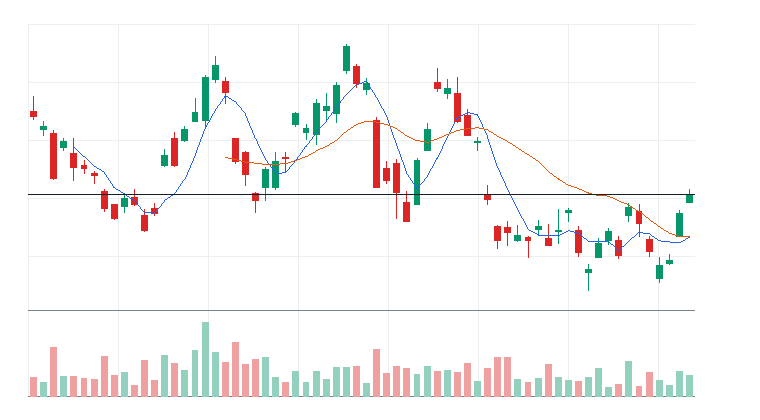
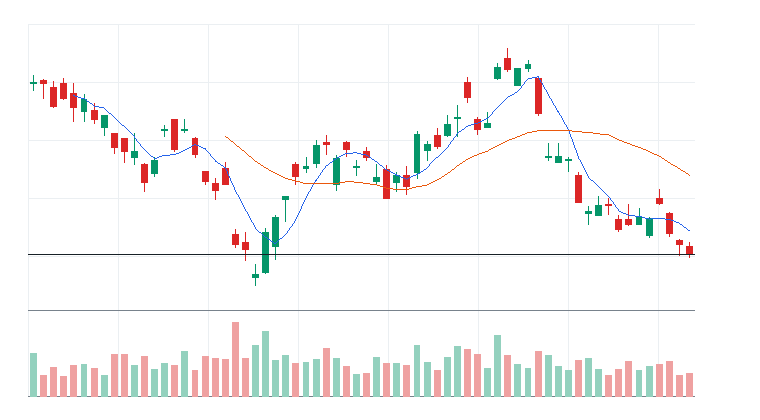
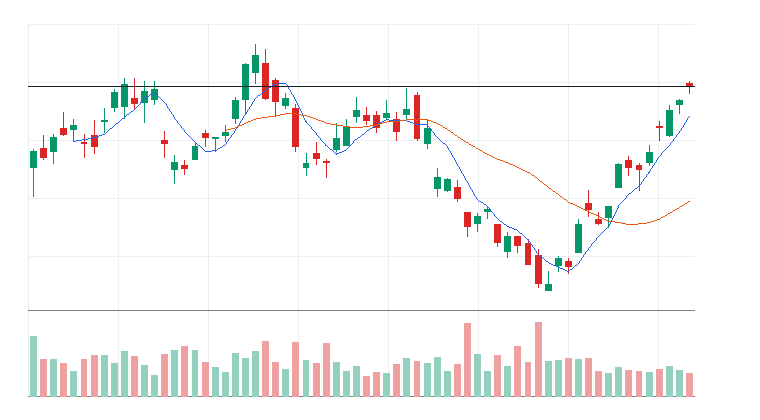
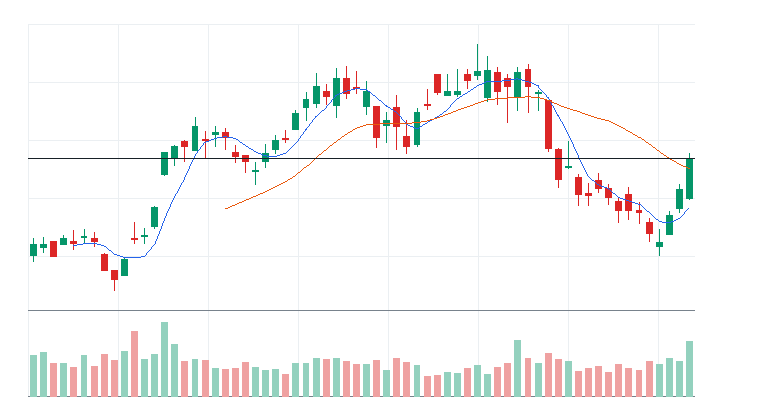

# 오늘의 데일리 트레이딩 요약

**REAL DATA TEST - 가격/거래량은 실제 데이터, 뉴스/ETF 구성종목 확산도/거래대금 유동성 일부 연결**

**목적:** 이 리포트는 최근 오른 자산을 나열하는 것이 아니라, 돈이 몰리는 근거와 다음 매수 주체가 확인할 트레이딩 후보를 찾기 위한 보고서다.

> 핵심 질문: 현재 가격에서 누가 사고 있고, 누가 앞으로 더 비싸게 사줄 수 있는가?

## 시장 국면 판단

- 최종 판정: 기간 조정 (71점)
- 전일 대비: 중립-상승에서 기간 조정으로 개선됐다(+12점).
- 판정 신뢰도: 높음 (100점) - 핵심 지수와 매크로 데이터가 대부분 직접 수집되어 판정 신뢰도가 높다.
- 행동 바이어스: 추격 보류, 돌파 확인
- 한 줄 결론: 장기 추세는 유지되지만 단기 추세가 둔화되어 기간 조정으로 본다. 기술 84점, 매크로 48점.
- 기술적 지표: 상승 추세 우위 (84점, 가중치 65%)
- S&P 500: 100점 | 50일선 위, 200일선 위, 20일 +1.81%, 60일 +5.00%, 52주 고점 대비 -1.60% -> 기술 점수 100
- Nasdaq 100: 67점 | 50일선 아래, 200일선 위, 20일 -1.19%, 60일 +6.00%, 52주 고점 대비 -5.73% -> 기술 점수 67
- 매크로 시황: 매크로 중립 (48점, 가중치 35%)
- 매크로 요약: 신용/유동성은 우호적이나 물가 부담이 남아 있다.
- 금리: 중립 45점 / 금리 중립 / confidence HIGH
  - 주요 근거: US 10Y yield 20일 +3.65%, 5일 +2.46%; US 3M yield 20일 +1.49%, 단기금리 방향 확인; US long-duration bonds 20일 -3.20%, 장기채 가격 기준 할인율 부담 확인
  - 확인 사항: 장기금리 상승과 장기채 약세가 겹쳐 성장주 할인율 부담이 커질 수 있다.
- 물가: 부담 39점 / 물가 부담 / confidence HIGH
  - 주요 근거: Oil ETF 20일 +18.35%, 유가 기반 물가 압력 확인; TIPS ETF 20일 -1.04%, 물가연동채 흐름은 보조 근거; Gold 20일 +0.48%, 금 강세는 방어 수요 여부 확인
  - 확인 사항: 추가 확인 이벤트 없음
- 정책: 중립 50점 / 정책 이벤트 확인 전 중립 / confidence LOW
  - 주요 근거: 정책 톤은 1차 버전에서 일정/이벤트 리스크 기반 중립값으로 반영한다.
  - 확인 사항: FOMC, CPI, PCE, 고용지표 발표 전후에는 매크로 confidence를 보수적으로 해석한다.
- 신용/유동성: 중립-우호 57점 / 신용/유동성 중립 / confidence HIGH
  - 주요 근거: High yield credit 20일 -0.44%, 하이일드 위험선호 확인; HYG-LQD 20일 상대강도 +1.62%, 신용위험 선호/회피 확인; VIX 20일 -14.62%, 변동성 부담 확인
  - 확인 사항: 추가 확인 이벤트 없음
- 환율/글로벌: 중립 50점 / 환율/글로벌 중립 / confidence MEDIUM
  - 주요 근거: US dollar 20일 0.00%, 달러 강세/약세 확인
  - 확인 사항: 추가 확인 이벤트 없음
- US 10Y yield: 42점 | 하락 시 주식 우호; 5일 +2.46%, 20일 +3.65% -> 매크로 점수 42
- US 3M yield: 46점 | 하락 시 주식 우호; 5일 +1.55%, 20일 +1.49% -> 매크로 점수 46
- US long-duration bonds: 44점 | 상승 시 주식 우호; 5일 -0.95%, 20일 -3.20% -> 매크로 점수 44
- TIPS ETF: 50점 | 상승 시 주식 우호; 5일 -0.28%, 20일 -1.04% -> 매크로 점수 50
- Oil ETF: 14점 | 하락 시 주식 우호; 5일 +8.49%, 20일 +18.35% -> 매크로 점수 14
- Gold: 50점 | 상승 시 주식 우호; 5일 +1.82%, 20일 +0.48% -> 매크로 점수 50
- US dollar: 49점 | 하락 시 주식 우호; 5일 +0.71%, 20일 0.00% -> 매크로 점수 49
- High yield credit: 49점 | 상승 시 주식 우호; 5일 -0.36%, 20일 -0.44% -> 매크로 점수 49
- Investment grade credit: 50점 | 상승 시 주식 우호; 5일 -0.85%, 20일 -2.06% -> 매크로 점수 50
- VIX: 68점 | 하락 시 주식 우호; 5일 +6.19%, 20일 -14.62% -> 매크로 점수 68
- 데이터 커버리지: 기술 2/2, 매크로 10/10
- 데이터 신뢰도 근거:
  - 직접 지수 데이터: S&P 500, Nasdaq 100
  - 대체 지수 데이터 없음
  - 매크로 데이터: 10/10
  - 누락 데이터 없음
  - stale 데이터 없음

## 모바일 요약

[오늘의 데일리 트레이딩 요약]

생성 성공 / 데이터 모드: REAL_TEST

시장:
- 중립

시장 지배 서사:
1. 매크로 방어/헤지 - 약화 - Energy Select Sector SPDR Fund(XLE), SPDR Gold Shares(GLD), Exxon Mobil(XOM), Chevron(CVX) 중심으로 5일 +3.41%, 20일 +4.53% 흐름이 형성됨. 뉴스 직접성 제한.
2. Aerospace & Defense 자금 유입 - 약화 - SPDR S&P 500 ETF Trust(SPY), Invesco QQQ Trust(QQQ), RTX, Axon Enterprise Inc.(AXON) 중심으로 5일 -2.61%, 20일 +3.65% 흐름이 형성됨. 뉴스 직접성 제한.
3. 필수소비재 음료 방어 성장 - 약화 - Invesco QQQ Trust(QQQ), Coca-Cola Europacific Partners PLC(CCEP), Monster Beverage Corporation(MNST) 중심으로 5일 -0.78%, 20일 +3.08% 흐름이 형성됨. 뉴스 직접성 제한.

트렌드 강도:
1. 매크로 방어/헤지 - TSI 40 - 잠복 - 진입품질 낮음
2. Aerospace & Defense 자금 유입 - TSI 8 - 잠복 - 진입품질 낮음
3. 필수소비재 음료 방어 성장 - TSI 7 - 잠복 - 진입품질 낮음

오늘 결론:
- Industrials 개별 종목 흐름이 ETF 대비 강한지 확인 필요
- 행동 후보는 linkedNarrative와 함께 확인한다.
- 추격보다 진입 조건 확인 후 접근한다.

오늘 실제 행동 후보:
1. PACCAR Inc.(PCAR)(STOCK) - Aerospace & Defense 자금 유입 - 52주 고점 부근이라 돌파가 확인되면 신고가 추종 매수가 붙을 수 있음

다크호스 후보:
1. 다크호스 후보 없음 - 조건 충족 후보 없음

ETF 후보 TOP 5:
1. Energy Select Sector SPDR Fund(XLE) - 매크로 방어/헤지 - 거래량 확인 전 관찰
2. SPDR Gold Shares(GLD) - 매크로 방어/헤지 - 제외
3. Utilities Select Sector SPDR Fund(XLU) - 전력망/원전/인프라 병목 - 거래량 확인 전 관찰
4. Global X Copper Miners ETF(COPX) - 전력망/원전/인프라 병목 - 거래량 확인 전 관찰
5. iShares 20+ Year Treasury Bond ETF(TLT) - 매크로 방어/헤지 - 거래량 확인 전 관찰

웹 리포트:
https://yoolcool.github.io/DailyTradingThesisAgent/

## 오늘 결론

- 오늘 결론: 조건부 진입
- 신규 진입 후보: 0개
- 조건부 진입 후보: 1개
- 관찰 후보: 128개
- 주요 제한 요인: Entry Quality < 40, RVOL 미달, 뉴스 직접성 부족
- 주문 판단: 시장가 금지 / 지정가 또는 관찰
- 실전 판단: 진입 후보는 있으나, 전일 고점 돌파와 거래량 확인 후 선별적으로 접근한다.

### 후보 제한 요인 집계

- RVOL < 1.00x: 128개
- 거래대금 유동성 낮음: 17개
- Entry Quality 50~54 near miss: 0개
- Entry Quality 40~49 관찰: 0개
- Entry Quality < 40: 157개
- Exhaustion Risk >= 70: 0개
- ETF breadth 샘플 부족: 37개
- 뉴스 직접성 부족: 100개

## 데이터 신뢰도

- 전체 데이터 신뢰도 등급: LOW
- 분석 신뢰도: LOW
- 주문 실행 신뢰도: LOW
- ETF breadth 신뢰도: LOW
- 신뢰도 해석: 테마 확산 판단 제한, 거래대금 유동성 낮음 또는 확인 불가, 프리/애프터마켓 확인 불가
- 리포트 생성 시각: 2026-07-23 09:02 KST
- 가격 기준 거래일: 2026-07-22 US regular close
- 뉴스 수집 시각: 2026-07-23 09:02 KST
- 가장 최근 뉴스 발행 시각: 2026-07-23 08:53 KST
- 뉴스 신선도 상태: FRESH
- 뉴스 소스: Yahoo Finance RSS, MarketWatch RSS, CNBC Markets RSS, SEC EDGAR RSS, Federal Reserve RSS, Finnhub API
- 뉴스 소스 상태: Yahoo Finance RSS CONNECTED, MarketWatch RSS CONNECTED, CNBC Markets RSS PARTIAL, SEC EDGAR RSS PARTIAL, Federal Reserve RSS CONNECTED, Finnhub API DISABLED
- 뉴스 신뢰도: MEDIUM
- 추천 적용 거래일: 2026-07-22 US regular session
- 가격/거래량 데이터 상태: 연결됨
- 뉴스 데이터 상태: 일부 연결
- ETF 구성종목 확산도 상태: 일부 연결
- ETF 구성종목 샘플 수: 1~4
- 거래대금 유동성 데이터 상태: 일부 연결
- 프리/애프터마켓 데이터 상태: UNAVAILABLE
- 데이터 provider: yfinance, Yahoo Finance RSS, MarketWatch RSS, CNBC Markets RSS, SEC EDGAR RSS, Federal Reserve RSS, Finnhub API, config fallback sample, price-volume dollar-volume fallback
- 실전 사용 경고: 이 리포트는 투자판단 보조용이며, REAL_TEST 모드에서는 일부 데이터가 누락되거나 지연될 수 있다. 실제 주문 전 현재가, 뉴스, 프리마켓/정규장 거래량을 별도 확인해야 한다.

## 0. 시장 상태

- 데이터 모드: REAL_TEST
- 가격/거래량: 연결됨
- 뉴스: 일부 연결
- ETF 구성종목 확산도: 일부 연결
- 거래대금 유동성: 일부 연결
- 생성 시각: 2026년 7월 23일 목요일 AM 9:02
- 시장 상태: 중립
- 오늘 돈의 방향: Industrials 개별 종목 흐름이 ETF 대비 강한지 확인 필요
- 강한 테마 TOP 3: 금 ETF(48), Materials(42), 전력/유틸리티 ETF(39)
- 데이터 한계:
  - API 또는 provider 상태에 따라 뉴스/ETF 확산도/거래대금 유동성 반영 범위가 달라질 수 있다.
  - 수집 실패 데이터는 점수 반영에서 제외하거나 confidence를 제한한다.
  - reasonConfidence HIGH는 직접 촉매, 가격/거래량, 확산도/유동성 근거가 함께 있을 때만 사용한다.

## 오늘 시장을 지배하는 서사

### 오늘 시장을 지배하는 서사 TOP 3

#### 1. 매크로 방어/헤지
- 상태: 약화
- narrativeScore: 33
- reasonConfidence: LOW
- 근거 ETF: XLE, GLD, TLT
- 근거 개별 종목: XOM, CVX
- 돈이 몰리는 이유: 매크로 방어/헤지 관련 Energy Select Sector SPDR Fund(XLE), SPDR Gold Shares(GLD), iShares 20+ Year Treasury Bond ETF(TLT)와 Exxon Mobil(XOM), Chevron(CVX)의 5일(+3.41%)·20일(+4.53%) 흐름을 함께 본다. 평균 상대 거래량은 0.82배이고, ETF 확산도는 추가 확인이 필요하다. 뉴스 직접성은 아직 제한적이다.
- 다음 매수 주체: 금리/에너지/방어 헤지를 찾는 매크로 자금
- 가장 좋은 트레이딩 수단: ETF 우선: GLD, TLT, XLE / 개별 종목 우선: XOM, CVX
- 서사가 깨지는 조건: 방어 ETF 상대강도 둔화와 위험선호 성장주 재강세
- 오늘 행동: 위험회피가 확인될 때만 헤지성 접근

상세 narrativeScore 근거 보기

- rawScore: 33
- ETF 평균 moneyFlowScore: 27
- 개별 종목 평균 moneyFlowScore: 50
- ETF 후보 비율: 0%
- 개별 종목 후보 비율: 0%
- 5일 평균 수익률: +3.00%
- 20일 평균 수익률: +5.00%
- 평균 상대 거래량: 1.00배
- ETF 평균 상대 거래량: 1.00배
- 개별주 평균 상대 거래량: 1.00배
- 52주 고점 근접 후보 비율: 0%
- 뉴스 직접성 점수: 10
- ETF 확산도 점수: 0
- 유동성 점수: 3
- 과열 리스크 차감: 0

#### 2. Aerospace & Defense 자금 유입
- 상태: 약화
- narrativeScore: 13
- reasonConfidence: LOW
- 근거 ETF: SPY, QQQ, IWM
- 근거 개별 종목: RTX, AXON
- 돈이 몰리는 이유: Aerospace & Defense 자금 유입 관련 SPDR S&P 500 ETF Trust(SPY), Invesco QQQ Trust(QQQ), iShares Russell 2000 ETF(IWM)와 RTX, Axon Enterprise Inc.(AXON)의 5일(-2.61%)·20일(+3.65%) 흐름을 함께 본다. 평균 상대 거래량은 0.76배이고, ETF 확산도는 추가 확인이 필요하다. 뉴스 직접성은 아직 제한적이다.
- 다음 매수 주체: Aerospace & Defense 자금 유입을 확인한 섹터 ETF 자금과 상대강도 추종 스윙 자금
- 가장 좋은 트레이딩 수단: ETF 우선: QQQ, SPY, IWM / 개별 종목 우선: AXON, RTX
- 서사가 깨지는 조건: QQQ 20일선 이탈 또는 관련 종목 절반 이상 5일선 이탈
- 오늘 행동: 기존 네러티브와 중복을 확인한 뒤 ETF/대표 종목 동조성이 살아날 때만 관찰 편입

상세 narrativeScore 근거 보기

- rawScore: 13
- ETF 평균 moneyFlowScore: 7
- 개별 종목 평균 moneyFlowScore: 27
- ETF 후보 비율: 0%
- 개별 종목 후보 비율: 0%
- 5일 평균 수익률: -3.00%
- 20일 평균 수익률: +4.00%
- 평균 상대 거래량: 1.00배
- ETF 평균 상대 거래량: 1.00배
- 개별주 평균 상대 거래량: 1.00배
- 52주 고점 근접 후보 비율: 40%
- 뉴스 직접성 점수: 4
- ETF 확산도 점수: -3
- 유동성 점수: 4
- 과열 리스크 차감: 0

#### 3. 필수소비재 음료 방어 성장
- 상태: 약화
- narrativeScore: 12
- reasonConfidence: LOW
- 근거 ETF: QQQ
- 근거 개별 종목: CCEP, MNST
- 돈이 몰리는 이유: 필수소비재 음료 방어 성장 관련 Invesco QQQ Trust(QQQ)와 Coca-Cola Europacific Partners PLC(CCEP), Monster Beverage Corporation(MNST)의 5일(-0.78%)·20일(+3.08%) 흐름을 함께 본다. 평균 상대 거래량은 0.78배이고, ETF 확산도는 추가 확인이 필요하다. 뉴스 직접성은 아직 제한적이다.
- 다음 매수 주체: 필수소비재 음료 방어 성장을 확인한 섹터 ETF 자금과 상대강도 추종 스윙 자금
- 가장 좋은 트레이딩 수단: ETF 우선: QQQ / 개별 종목 우선: CCEP, MNST
- 서사가 깨지는 조건: QQQ 20일선 이탈 또는 관련 종목 절반 이상 5일선 이탈
- 오늘 행동: 기존 네러티브와 중복을 확인한 뒤 ETF/대표 종목 동조성이 살아날 때만 관찰 편입

상세 narrativeScore 근거 보기

- rawScore: 12
- ETF 평균 moneyFlowScore: 0
- 개별 종목 평균 moneyFlowScore: 22
- ETF 후보 비율: 0%
- 개별 종목 후보 비율: 0%
- 5일 평균 수익률: -1.00%
- 20일 평균 수익률: +3.00%
- 평균 상대 거래량: 1.00배
- ETF 평균 상대 거래량: 1.00배
- 개별주 평균 상대 거래량: 1.00배
- 52주 고점 근접 후보 비율: 67%
- 뉴스 직접성 점수: 5
- ETF 확산도 점수: -4
- 유동성 점수: 2
- 과열 리스크 차감: 0

### 전체 narrative 요약

| 서사명 | 상태 | narrativeScore | reasonConfidence | 대표 ETF | 대표 종목 | 오늘 행동 |
| --- | --- | ---: | --- | --- | --- | --- |
| 매크로 방어/헤지 | 약화 | 33 | LOW | XLE, GLD, TLT | XOM, CVX | 위험회피가 확인될 때만 헤지성 접근 |
| Aerospace & Defense 자금 유입 | 약화 | 13 | LOW | SPY, QQQ, IWM | RTX, AXON | 기존 네러티브와 중복을 확인한 뒤 ETF/대표 종목 동조성이 살아날 때만 관찰 편입 |
| 필수소비재 음료 방어 성장 | 약화 | 12 | LOW | QQQ | CCEP, MNST | 기존 네러티브와 중복을 확인한 뒤 ETF/대표 종목 동조성이 살아날 때만 관찰 편입 |
| 비트코인/디지털 자산 위험선호 | 소멸 | 11 | LOW | IBIT, BLOK | RIOT, COIN, MSTR, IREN | 비트코인 베타가 살아날 때만 단기 매매 |
| Data Storage 자금 유입 | 소멸 | 11 | LOW | SPY, QQQ, IWM | STX, WDC | 기존 네러티브와 중복을 확인한 뒤 ETF/대표 종목 동조성이 살아날 때만 관찰 편입 |
| 전력망/원전/인프라 병목 | 소멸 | 9 | LOW | URA, GRID, PAVE | CEG, ETN, VRT, PWR | ETF 확산도와 거래량이 같이 살아날 때만 진입 |
| 방산/안보 프리미엄 | 약화 | 3 | LOW | XAR, SHLD, ITA | RTX, AVAV, KTOS, PLTR | 뉴스 촉매가 직접 확인될 때만 추세 추종 |
| 전력 유틸리티 수요 재평가 | 약화 | 1 | LOW | SPY, QQQ, IWM | ETN, GEV, VRT | 기존 네러티브와 중복을 확인한 뒤 ETF/대표 종목 동조성이 살아날 때만 관찰 편입 |
| AI 인프라 재가속 | 소멸 | 0 | LOW | SMH, SOXX, DRAM | NVDA, ETN, MU, VRT | 추격보다 5일선 지지 후 재상승 확인 |
| 사이버보안 지출 재가속 | 약화 | 0 | LOW | CIBR, HACK, IHAK | PANW, CRWD, FTNT | 기존 네러티브와 중복을 확인한 뒤 ETF/대표 종목 동조성이 살아날 때만 관찰 편입 |
| 소프트웨어 실적/AI 수익화 | 약화 | 0 | LOW | IGV, AIQ, QQQ | INTU, DDOG, TEAM, WDAY | 기존 네러티브와 중복을 확인한 뒤 ETF/대표 종목 동조성이 살아날 때만 관찰 편입 |
| 위험선호 성장주 재진입 | 약화 | 0 | LOW | QQQ, IPO, ARKK | COIN, ARM, TSLA | 지수 위험선호가 유지될 때만 선별 진입 |
| AI 소프트웨어/사이버보안 확산 | 약화 | 0 | LOW | IGV, AIQ, QQQ | PLTR, DDOG, TEAM, MSFT | 추격보다 눌림 후 재상승 확인 |
| Internet Content 자금 유입 | 약화 | 0 | LOW | QQQ | META, DASH | 기존 네러티브와 중복을 확인한 뒤 ETF/대표 종목 동조성이 살아날 때만 관찰 편입 |
| 반도체 설계/공급망 재가속 | 소멸 | 0 | LOW | SMH, SOXX, SOXQ | AMD, TXN, ARM, ADI | 기존 네러티브와 중복을 확인한 뒤 ETF/대표 종목 동조성이 살아날 때만 관찰 편입 |
| 바이오/헬스케어 촉매 | 약화 | 0 | LOW | QQQ | VRTX, INSM, ALNY, REGN | 기존 네러티브와 중복을 확인한 뒤 ETF/대표 종목 동조성이 살아날 때만 관찰 편입 |
| 반도체 장비 사이클 재평가 | 소멸 | 0 | LOW | SMH, SOXX, SOXQ | ASML, AMAT, LRCX | 기존 네러티브와 중복을 확인한 뒤 ETF/대표 종목 동조성이 살아날 때만 관찰 편입 |

## 트렌드 강도 판단

### 1. 매크로 방어/헤지
- Trend Strength Index: 40
- 트렌드 상태 라벨: 잠복
- 테마 확산도: 보통
- ETF 동조성: 보통
- 거래량 강도: 부족
- 과열 위험: 낮음 (0)
- 오늘 진입 품질: 낮음 (30)
- 한 줄 판단: 매크로 방어/헤지는 Trend Strength는 높아도 시장 위험선호가 약해 시장 환경 비우호 구간이다.
- 오늘 접근법: Energy Select Sector SPDR Fund(XLE)/SPDR Gold Shares(GLD)/iShares 20+ Year Treasury Bond ETF(TLT)와 Exxon Mobil(XOM)/Chevron(CVX)의 거래량 확산이 확인되기 전까지 관찰한다.

트렌드 강도 상세 근거 보기

- 가격 모멘텀: 가격 모멘텀 12/25. 평균 5D +3.41%, 20D +4.53%.
- 거래량 강도: 거래량 강도 3/20. 평균 RVOL 0.82배.
- ETF 동조성: ETF 동조성 11/15. 관련 ETF SPDR Gold Shares(GLD), iShares 20+ Year Treasury Bond ETF(TLT), Energy Select Sector SPDR Fund(XLE), VanEck Oil Services ETF(OIH) 흐름을 기준으로 판단.
- 테마 확산도: 테마 확산도 10/20. 상위 1~2개 쏠림 감점 0점 반영.
- 뉴스 촉매: 뉴스/촉매 신선도 1/10. HIGH 직접 촉매 0개.
- 과열 리스크: 과열 리스크 0/100. 단기 급등, 고점 근접, ETF-개별주 괴리, 쏠림을 함께 반영.
- 시장 환경: 시장 환경 3/10. QQQ/SPY/IWM 가격 흐름 기반 위험선호 점수.

### 2. Aerospace & Defense 자금 유입
- Trend Strength Index: 8
- 트렌드 상태 라벨: 잠복
- 테마 확산도: 부족
- ETF 동조성: 부족
- 거래량 강도: 부족
- 과열 위험: 낮음 (22)
- 오늘 진입 품질: 낮음 (1)
- 한 줄 판단: Aerospace & Defense 자금 유입는 Trend Strength는 높아도 시장 위험선호가 약해 시장 환경 비우호 구간이다.
- 오늘 접근법: SPDR S&P 500 ETF Trust(SPY)/Invesco QQQ Trust(QQQ)/iShares Russell 2000 ETF(IWM)와 RTX/Axon Enterprise Inc.(AXON)의 거래량 확산이 확인되기 전까지 관찰한다.

트렌드 강도 상세 근거 보기

- 가격 모멘텀: 가격 모멘텀 -1/25. 평균 5D -2.61%, 20D +3.65%.
- 거래량 강도: 거래량 강도 3/20. 평균 RVOL 0.76배.
- ETF 동조성: ETF 동조성 2/15. 관련 ETF Invesco QQQ Trust(QQQ), SPDR S&P 500 ETF Trust(SPY), iShares Russell 2000 ETF(IWM) 흐름을 기준으로 판단.
- 테마 확산도: 테마 확산도 0/20. 상위 1~2개 쏠림 감점 6점 반영.
- 뉴스 촉매: 뉴스/촉매 신선도 1/10. HIGH 직접 촉매 0개.
- 과열 리스크: 과열 리스크 22/100. 단기 급등, 고점 근접, ETF-개별주 괴리, 쏠림을 함께 반영.
- 시장 환경: 시장 환경 3/10. QQQ/SPY/IWM 가격 흐름 기반 위험선호 점수.

### 3. 필수소비재 음료 방어 성장
- Trend Strength Index: 7
- 트렌드 상태 라벨: 잠복
- 테마 확산도: 부족
- ETF 동조성: 부족
- 거래량 강도: 부족
- 과열 위험: 낮음 (18)
- 오늘 진입 품질: 낮음 (1)
- 한 줄 판단: 필수소비재 음료 방어 성장는 Trend Strength는 높아도 시장 위험선호가 약해 시장 환경 비우호 구간이다.
- 오늘 접근법: Invesco QQQ Trust(QQQ)와 Coca-Cola Europacific Partners PLC(CCEP)/Monster Beverage Corporation(MNST)의 거래량 확산이 확인되기 전까지 관찰한다.

트렌드 강도 상세 근거 보기

- 가격 모멘텀: 가격 모멘텀 3/25. 평균 5D -0.78%, 20D +3.08%.
- 거래량 강도: 거래량 강도 1/20. 평균 RVOL 0.78배.
- ETF 동조성: ETF 동조성 0/15. 관련 ETF Invesco QQQ Trust(QQQ) 흐름을 기준으로 판단.
- 테마 확산도: 테마 확산도 0/20. 상위 1~2개 쏠림 감점 6점 반영.
- 뉴스 촉매: 뉴스/촉매 신선도 0/10. HIGH 직접 촉매 0개.
- 과열 리스크: 과열 리스크 18/100. 단기 급등, 고점 근접, ETF-개별주 괴리, 쏠림을 함께 반영.
- 시장 환경: 시장 환경 3/10. QQQ/SPY/IWM 가격 흐름 기반 위험선호 점수.

## 최근 추천 결과 트래킹

개별주는 데이트레이딩 관점으로 추천 이후 첫 정규장의 장중 최고가와 종가를 추적한다. ETF는 테마/스윙 관점으로 추천 이후 1주일 동안의 최고가와 현재 종가를 추적한다.

### 개별주 Top 3 추천 성과 요약
- 최근 5개 리포트 표본: 8개 (초기 검증 단계)
- 장중 최고가 기준 성공률: 0.00%
- 종가 기준 성공률: 0.00%
- 평균 장중 최고 수익률: +0.89%
- 평균 종가 수익률: -2.16%

### ETF 추천 성과 요약
- 최근 5개 리포트 표본: 0개 (초기 검증 단계)
- 1주 최고가 기준 성공률: 데이터 없음
- 현재 종가 기준 성공률: 데이터 없음
- 평균 1주 최고 수익률: 데이터 없음
- 평균 현재 수익률: 데이터 없음

최근 추천 결과 상세 테이블 펼치기

| 추천일 | 유형 | 순위 | 티커 | 기준가 | 추적 기간 | 상태 | High 수익률 | Close 수익률 | 결과 | 코멘트 |
| --- | --- | ---: | --- | ---: | --- | --- | ---: | ---: | --- | --- |
| 2026-07-23 | STOCK | 1 | PCAR | $131.11 | 2026-07-23 | pending | 데이터 없음 | 데이터 없음 | 추적 대기 | 아직 추적 거래일 데이터가 완성되지 않음 |
| 2026-07-22 | STOCK | 1 | COIN | $175.85 | 2026-07-22 | complete | -0.51% | -5.53% | 실패 | 추천 이후 의미 있는 장중 기회가 부족하고 종가도 약함 (일봉 기준) |
| 2026-07-21 | STOCK | 1 | PYPL | $56.82 | 2026-07-21 | complete | +0.16% | -1.71% | 실패 | 추천 이후 의미 있는 장중 기회가 부족하고 종가도 약함 (일봉 기준) |
| 2026-07-20 | STOCK | 2 | CTAS | $204.45 | 2026-07-20 | complete | -0.03% | -1.30% | 실패 | 추천 이후 의미 있는 장중 기회가 부족하고 종가도 약함 (일봉 기준) |
| 2026-07-20 | STOCK | 1 | PANW | $358.68 | 2026-07-20 | complete | +2.13% | -2.79% | 제한적 유효 | 제한적인 장중 기회만 발생 (일봉 기준) |
| 2026-07-17 | STOCK | 3 | CTAS | $206.25 | 2026-07-17 | complete | +1.68% | -0.87% | 제한적 유효 | 제한적인 장중 기회만 발생 (일봉 기준) |
| 2026-07-17 | STOCK | 2 | TRI | $98.82 | 2026-07-17 | complete | +2.05% | -2.65% | 제한적 유효 | 제한적인 장중 기회만 발생 (일봉 기준) |
| 2026-07-17 | STOCK | 1 | PYPL | $56.73 | 2026-07-17 | complete | +0.78% | -0.30% | 실패 | 추천 이후 의미 있는 장중 기회가 부족하고 종가도 약함 (일봉 기준) |
| 2026-07-16 | STOCK | 3 | PYPL | $55.52 | 2026-07-16 | complete | +3.87% | +2.18% | 성공 | 장중 기회와 종가 유지가 모두 확인됨 (일봉 기준) |
| 2026-07-16 | STOCK | 2 | TRI | $95.51 | 2026-07-16 | complete | +5.85% | +3.47% | 성공 | 장중 기회와 종가 유지가 모두 확인됨 (일봉 기준) |
| 2026-07-16 | STOCK | 1 | CRWD | $210.73 | 2026-07-15 | complete | +3.21% | -1.88% | 단타 유효 | 장중 기회는 있었지만 종가 유지력은 약함 (일봉 기준) |
| 2026-07-15 | STOCK | 1 | CRWD | $210.73 | 2026-07-15 | complete | +3.21% | -1.88% | 단타 유효 | 장중 기회는 있었지만 종가 유지력은 약함 (일봉 기준) |
| 2026-07-14 | STOCK | 1 | TRI | $94.29 | 2026-07-14 | complete | -0.66% | -2.70% | 실패 | 추천 이후 의미 있는 장중 기회가 부족하고 종가도 약함 (일봉 기준) |
| 2026-07-13 | STOCK | 1 | AXON | $640.46 | 2026-07-13 | complete | -9.75% | -14.59% | 실패 | 추천 이후 의미 있는 장중 기회가 부족하고 종가도 약함 (일봉 기준) |
| 2026-07-13 | STOCK | 1 | META | $669.21 | 2026-07-13 | complete | +1.11% | -1.86% | 제한적 유효 | 제한적인 장중 기회만 발생 (일봉 기준) |
| 2026-07-08 | STOCK | 1 | AXON | $640.46 | 2026-07-08 | complete | -1.48% | -6.35% | 실패 | 추천 이후 의미 있는 장중 기회가 부족하고 종가도 약함 (일봉 기준) |
| 2026-07-07 | STOCK | 2 | AXON | $622.35 | 2026-07-07 | complete | +6.86% | +2.91% | 성공 | 장중 기회와 종가 유지가 모두 확인됨 (일봉 기준) |
| 2026-07-07 | STOCK | 1 | PANW | $357.53 | 2026-07-07 | complete | +1.53% | -5.73% | 제한적 유효 | 제한적인 장중 기회만 발생 (일봉 기준) |
| 2026-07-06 | STOCK | 2 | CCEP | $106.61 | 2026-07-06 | complete | +0.58% | +0.34% | 추적 대기 | 아직 추적 거래일 데이터가 완성되지 않음 (일봉 기준) |
| 2026-07-06 | STOCK | 1 | PANW | $348.06 | 2026-07-06 | complete | +5.78% | +2.72% | 성공 | 장중 기회와 종가 유지가 모두 확인됨 (일봉 기준) |
| 2026-07-03 | STOCK | 1 | CCEP | $106.61 | 2026-07-03 | pending | 데이터 없음 | 데이터 없음 | 추적 대기 | 아직 추적 거래일 데이터가 완성되지 않음 |
| 2026-07-02 | STOCK | 2 | AXON | $593.96 | 2026-07-02 | complete | +1.52% | +0.52% | 제한적 유효 | 제한적인 장중 기회만 발생 (일봉 기준) |
| 2026-07-02 | STOCK | 1 | CCEP | $106.1 | 2026-07-02 | complete | +1.86% | +0.48% | 제한적 유효 | 제한적인 장중 기회만 발생 (일봉 기준) |
| 2026-07-01 | STOCK | 3 | LRCX | $433.33 | 2026-07-01 | complete | -4.12% | -9.71% | 실패 | 추천 이후 의미 있는 장중 기회가 부족하고 종가도 약함 (일봉 기준) |
| 2026-07-01 | STOCK | 2 | PANW | $341.02 | 2026-07-01 | complete | +5.01% | +3.23% | 성공 | 장중 기회와 종가 유지가 모두 확인됨 (일봉 기준) |
| 2026-07-01 | STOCK | 1 | AMAT | $723 | 2026-07-01 | complete | -4.04% | -9.97% | 실패 | 추천 이후 의미 있는 장중 기회가 부족하고 종가도 약함 (일봉 기준) |
| 2026-06-30 | STOCK | 3 | AMAT | $694.64 | 2026-06-30 | complete | +6.48% | +4.08% | 성공 | 장중 기회와 종가 유지가 모두 확인됨 (일봉 기준) |
| 2026-06-30 | STOCK | 2 | CRWD | $742.91 | 2026-06-30 | complete | -74.25% | -74.32% | 실패 | 추천 이후 의미 있는 장중 기회가 부족하고 종가도 약함 (일봉 기준) |
| 2026-06-30 | STOCK | 1 | PANW | $332 | 2026-06-30 | complete | +3.16% | +2.72% | 성공 | 장중 기회와 종가 유지가 모두 확인됨 (일봉 기준) |
| 2026-06-29 | STOCK | 3 | KDP | $33.4 | 2026-06-29 | complete | +1.26% | +0.30% | 제한적 유효 | 제한적인 장중 기회만 발생 (일봉 기준) |
| 2026-06-29 | STOCK | 2 | VRTX | $491.34 | 2026-06-29 | complete | +1.74% | +1.69% | 제한적 유효 | 제한적인 장중 기회만 발생 (일봉 기준) |
| 2026-06-29 | STOCK | 1 | FTNT | $151.35 | 2026-06-29 | complete | +5.10% | +2.69% | 성공 | 장중 기회와 종가 유지가 모두 확인됨 (일봉 기준) |
| 2026-06-26 | STOCK | 3 | MU | $1,213.56 | 2026-06-26 | complete | -1.22% | -6.69% | 실패 | 추천 이후 의미 있는 장중 기회가 부족하고 종가도 약함 (일봉 기준) |
| 2026-06-26 | STOCK | 2 | AMAT | $668 | 2026-06-26 | complete | -1.17% | -6.16% | 실패 | 추천 이후 의미 있는 장중 기회가 부족하고 종가도 약함 (일봉 기준) |
| 2026-06-26 | STOCK | 1 | LRCX | $401.82 | 2026-06-26 | complete | -2.97% | -5.66% | 실패 | 추천 이후 의미 있는 장중 기회가 부족하고 종가도 약함 (일봉 기준) |
| 2026-06-26 | ETF | 1 | DRAM | $76.89 | 2026-06-26~2026-07-03 | complete | -3.55% | -24.87% | 실패 | 추천 이후 ETF 흐름이 약화됨 |
| 2026-06-23 | STOCK | 3 | TSM | $467.67 | 2026-06-23 | complete | -4.35% | -6.69% | 실패 | 추천 이후 의미 있는 장중 기회가 부족하고 종가도 약함 (일봉 기준) |
| 2026-06-23 | STOCK | 2 | GEV | $1,127.59 | 2026-06-23 | complete | -4.84% | -8.21% | 실패 | 추천 이후 의미 있는 장중 기회가 부족하고 종가도 약함 (일봉 기준) |
| 2026-06-23 | STOCK | 1 | ETN | $435.78 | 2026-06-23 | complete | -3.27% | -7.00% | 실패 | 추천 이후 의미 있는 장중 기회가 부족하고 종가도 약함 (일봉 기준) |
| 2026-06-23 | ETF | 1 | DRAM | $80.72 | 2026-06-23~2026-06-30 | complete | -1.39% | -28.43% | 실패 | 추천 이후 ETF 흐름이 약화됨 |
| 2026-06-22 | STOCK | 3 | ARM | $439.46 | 2026-06-22 | complete | +1.25% | -7.22% | 제한적 유효 | 제한적인 장중 기회만 발생 (일봉 기준) |
| 2026-06-22 | STOCK | 2 | GEV | $1,109.73 | 2026-06-22 | complete | +2.91% | +1.61% | 제한적 유효 | 제한적인 장중 기회만 발생 (일봉 기준) |
| 2026-06-22 | STOCK | 1 | ETN | $421.77 | 2026-06-22 | complete | +3.55% | +3.32% | 성공 | 장중 기회와 종가 유지가 모두 확인됨 (일봉 기준) |
| 2026-06-22 | ETF | 3 | IFRA | $61.99 | 2026-06-22~2026-06-29 | complete | +3.65% | -0.05% | 단기 고점 후 반납 | 1주 내 상승 기회는 있었지만 현재가는 반납 |
| 2026-06-22 | ETF | 2 | SMH | $659.88 | 2026-06-22~2026-06-29 | complete | -1.49% | -11.06% | 실패 | 추천 이후 ETF 흐름이 약화됨 |
| 2026-06-22 | ETF | 1 | DRAM | $76.71 | 2026-06-22~2026-06-29 | complete | +3.77% | -24.69% | 단기 고점 후 반납 | 1주 내 상승 기회는 있었지만 현재가는 반납 |
| 2026-06-19 | STOCK | 3 | AMD | $537.37 | 2026-06-19 | pending | 데이터 없음 | 데이터 없음 | 추적 대기 | 아직 추적 거래일 데이터가 완성되지 않음 |
| 2026-06-19 | STOCK | 2 | ARM | $439.46 | 2026-06-19 | pending | 데이터 없음 | 데이터 없음 | 추적 대기 | 아직 추적 거래일 데이터가 완성되지 않음 |
| 2026-06-19 | STOCK | 1 | GEV | $1,109.73 | 2026-06-19 | pending | 데이터 없음 | 데이터 없음 | 추적 대기 | 아직 추적 거래일 데이터가 완성되지 않음 |
| 2026-06-19 | ETF | 1 | DRAM | $76.71 | 2026-06-19~2026-06-26 | complete | +6.04% | -24.69% | 단기 고점 후 반납 | 1주 내 상승 기회는 있었지만 현재가는 반납 |
| 2026-06-18 | STOCK | 3 | ASML | $1,867.83 | 2026-06-18 | complete | +4.02% | +3.31% | 성공 | 장중 기회와 종가 유지가 모두 확인됨 (일봉 기준) |
| 2026-06-18 | STOCK | 3 | FCX | $69.06 | 2026-06-18 | complete | +2.26% | -0.55% | 제한적 유효 | 제한적인 장중 기회만 발생 (일봉 기준) |
| 2026-06-18 | STOCK | 2 | KLAC | $238.73 | 2026-06-18 | complete | +10.56% | +8.73% | 성공 | 장중 기회와 종가 유지가 모두 확인됨 (일봉 기준) |
| 2026-06-18 | STOCK | 1 | LRCX | $374.18 | 2026-06-18 | complete | +7.17% | +3.97% | 성공 | 장중 기회와 종가 유지가 모두 확인됨 (일봉 기준) |
| 2026-06-18 | ETF | 1 | SOXQ | $106.13 | 2026-06-18~2026-06-25 | complete | +8.67% | -7.98% | 단기 고점 후 반납 | 1주 내 상승 기회는 있었지만 현재가는 반납 |
| 2026-06-04 | STOCK | 3 | PANW | $280.43 | 2026-06-04 | complete | +0.10% | -0.42% | 실패 | 추천 이후 의미 있는 장중 기회가 부족하고 종가도 약함 (일봉 기준) |
| 2026-06-04 | STOCK | 2 | FTNT | $146.48 | 2026-06-04 | complete | +2.45% | +2.18% | 제한적 유효 | 제한적인 장중 기회만 발생 (일봉 기준) |
| 2026-06-04 | STOCK | 1 | CRWD | $747.61 | 2026-06-04 | complete | -75.89% | -75.95% | 실패 | 추천 이후 의미 있는 장중 기회가 부족하고 종가도 약함 (일봉 기준) |
| 2026-06-04 | ETF | 3 | HACK | $102.21 | 2026-06-04~2026-06-11 | complete | -1.66% | +3.75% | 진행 중 | 아직 1주 추적 기간이 끝나지 않음 |
| 2026-06-04 | ETF | 2 | SOXQ | $109.58 | 2026-06-04~2026-06-11 | complete | -4.68% | -10.88% | 실패 | 추천 이후 ETF 흐름이 약화됨 |

## 오늘 실제 행동 후보

### 1. PACCAR Inc.(PCAR)
- 자산 유형: STOCK
- linkedNarrative: Aerospace & Defense 자금 유입
- narrativeStatus: 약화
- narrativeScore: 13
- Trend Strength Index: 8
- Exhaustion Risk: 22 (낮음)
- Entry Quality Score: 27 (낮음)
- 트렌드 판단: 테마 확산도가 낮아 개별 종목 이벤트성 흐름일 수 있다.
- moneyFlowScore: 96
- finalRawScore: 96
- reasonConfidence: MEDIUM
- reasonConfidenceExplanation: 직접 촉매 부재 때문에 HIGH가 아니라 MEDIUM으로 제한했다.
- tieBreakerReason: 최종 원점수 96, 리스크 패널티 0, 5일 수익률 +6.46%, 상대 거래량 1.51배 순으로 정렬
- 후보별 시장 해석: 중립 / 제한적 - 고점 근처 추격 리스크 / Entry Quality 27 < 50이나 moneyFlow 96, confidence MEDIUM, RVOL 1.51x로 강한 자금흐름 예외 조건 충족
- 게이트 사유: Entry Quality 27 < 50이나 moneyFlow 96, confidence MEDIUM, RVOL 1.51x로 강한 자금흐름 예외 조건 충족
- 주문 실행: 지정가 권장

- 왜 돈이 몰리는가: 20일 +12.27%, 5일 +6.46%, 상대 거래량 1.51배로 가격과 거래량이 함께 개선. 뉴스: CNBC Markets RSS general_market/under_6h / 유동성: ACCEPTABLE
- 누가 더 비싸게 사줄 수 있는지: 개별 주도주를 따라붙는 단기 모멘텀 자금과 관련 ETF 강세를 확인한 트레이더
- 진입 조건: 전일 고점 돌파와 5일선 유지 확인
- 무효화 조건: 20일선 이탈 또는 상대 거래량 0.8배 이하 둔화
- todayActionLabel: 자금흐름 예외 조건부
#### 최근 뉴스/동향 한국어 요약

- 요약: 종목 직접 뉴스 확인 상태이며 뉴스 흐름은 긍정 우위입니다. 후보 선정 후 재확인한 핵심 이슈는 "Analysts Estimate Paccar (PCAR) to Report a Decline in Earnings: What to Look Out for"입니다.
- 직접 촉매 판단: PACCAR Inc.에 대해 직접 촉매로 분류된 뉴스가 확인됐습니다. 핵심은 "Analysts Estimate Paccar (PCAR) to Report a Decline in Earnings: What to Look Out for"이며, 실적 재료로 봅니다.
- 뉴스 1: Analysts Estimate Paccar (PCAR) to Report a Decline in Earnings: What to Look Out for
  - 내용: PACCAR Inc. 관련 실적 뉴스입니다. 기사 스니펫상 핵심 내용은 Paccar (PCAR) doesn't possess the right combination of the two key ingredients for a likely earnings beat in its upcoming report.입니다.
  - 투자 의미: 실적/가이던스 재료는 다음 분기 기대치 변화로 이어질 수 있어 컨센서스 변화와 주가 반응 지속성을 함께 봅니다.
  - 확인할 점: 매출/마진/가이던스 수치, 컨센서스 대비 차이
- 뉴스 2: Is PACCAR (PCAR) Fully Valued As Earnings Optimism And Its Dividend Lift Sentiment?
  - 내용: PACCAR Inc. 관련 실적 뉴스입니다. 기사 스니펫상 핵심 내용은 What PACCAR’s Recent Dividend Decision Means for Investors PACCAR (PCAR) recently declared a regular quarterly cash dividend of $0.35 per share, with a record date of August 12,...입니다.
  - 투자 의미: 실적/가이던스 재료는 다음 분기 기대치 변화로 이어질 수 있어 컨센서스 변화와 주가 반응 지속성을 함께 봅니다.
  - 확인할 점: 매출/마진/가이던스 수치, 컨센서스 대비 차이
- 뉴스 3: Paccar (PCAR) Registers a Bigger Fall Than the Market: Important Facts to Note
  - 내용: PACCAR Inc. 관련 기사는 Paccar (PCAR) Registers a Bigger Fall Than the Market: Important Facts to Note 이슈를 다루며, 주가 변동률 +1.48%를 핵심 내용으로 봅니다.
  - 투자 의미: PACCAR Inc.의 당일 상대강도 확인에는 도움이 되지만, 실적/가이던스 같은 새 펀더멘털 변화로 보기는 어렵습니다.
  - 확인할 점: 거래량 동반 여부, 장중 고점 유지, 관련 ETF 동반 강세
- 매매 해석: 매매 관점에서는 뉴스 자체보다 가격이 진입 조건을 지키는지, 거래량이 동반되는지, 그리고 뉴스가 이미 주가에 반영됐는지를 우선 확인해야 합니다.
- 차트: 

## 다크호스 후보

다크호스 후보 없음. 상위 서사 정렬, MA20 위 안착, MA5/MA20 구조 개선, RVOL 0.90x 이상 조건을 동시에 충족한 개별주가 없다.

- darkHorseScore: 조건 충족 후보 없음
- 왜 아직 메인이 아닌가: 확인 조건을 통과한 보조 관찰 후보가 없다.

darkHorseScore 상세 근거 보기

- 서사 정렬: 조건 미충족
- 초기 추세 구조: 조건 미충족
- 베이스 돌파/정돈: 조건 미충족
- 거래량 확인: 조건 미충족
- rawScore: 데이터 없음

## 오늘 돈이 몰리는 테마

- 금 ETF: GLD | 평균 moneyFlowScore 48 | 관심은 유지하되 우선순위는 낮추고 추가 거래량 확인을 기다린다.
- Materials: FCX | 평균 moneyFlowScore 42 | 관심은 유지하되 우선순위는 낮추고 추가 거래량 확인을 기다린다.
- 전력/유틸리티 ETF: XLU | 평균 moneyFlowScore 39 | 관심은 유지하되 우선순위는 낮추고 추가 거래량 확인을 기다린다.
- Financial Services: PYPL | 평균 moneyFlowScore 35 | 관심은 유지하되 우선순위는 낮추고 추가 거래량 확인을 기다린다.
- Energy: BKR, FANG, CCJ, XOM, CVX | 평균 moneyFlowScore 30 | 관심은 유지하되 우선순위는 낮추고 추가 거래량 확인을 기다린다.
- 전통 에너지 ETF: XLE, OIH | 평균 moneyFlowScore 30 | 관심은 유지하되 우선순위는 낮추고 추가 거래량 확인을 기다린다.

## 1. ETF 트레이딩 보고서
### 1-1. ETF 결론
- ETF 우선 후보: 없음
- ETF 관찰 후보: Roundhill Memory ETF(DRAM), VanEck Semiconductor ETF(SMH), iShares Semiconductor ETF(SOXX), Invesco PHLX Semiconductor ETF(SOXQ), Global X Artificial Intelligence & Technology ETF(AIQ)
- ETF 매매 금지: Roundhill Memory ETF(DRAM), VanEck Semiconductor ETF(SMH), iShares Semiconductor ETF(SOXX), Invesco PHLX Semiconductor ETF(SOXQ), iShares Expanded Tech-Software Sector ETF(IGV)
- 오늘 ETF 최우선 1개: 없음
- ETF 섹션 해석: 이 섹션은 개별 종목 선택이 아니라 테마/섹터 단위 자금 흐름을 ETF로 매매할지 판단하기 위한 영역이다.

### 1-2. ETF 후보 TOP 5

선정 기준: ETF 후보는 가격/거래량 1차 점수에 뉴스, ETF 구성종목 확산도, 유동성, 리스크 패널티를 반영한 finalRawScore 기준으로 정렬한다. 표시 점수 100점 후보가 겹치면 tieBreakerReason으로 우선순위를 설명한다.

### [ETF] Energy Select Sector SPDR Fund(XLE)
- 자산 유형: ETF
- ETF 세부 카테고리: 전통 에너지 ETF
- ETF 역할: 테마 베타 매수
- 상태: 관찰
- linkedNarrative: 매크로 방어/헤지
- narrativeStatus: 약화
- narrativeScore: 33
- moneyFlowScore: 49
- finalRawScore: 49
- tieBreakerReason: 최종 원점수 49, 리스크 패널티 0, 5일 수익률 +4.78%, 상대 거래량 0.92배 순으로 정렬
- 과열 리스크: 낮음
- reasonConfidence: LOW
- reasonConfidenceExplanation: 가격/거래량이 약하거나 핵심 보조 근거가 부족해 LOW로 분류했다.

- todayActionLabel: 거래량 확인 전 관찰
- 주문 실행: 시장가 가능
- 기준일: 2026-07-22
- 종가: $59.2
- 1일 수익률: +1.20%
- 5일 수익률: +4.78%
- 20일 수익률: +8.70%
- 상대 거래량: 0.92배
- 52주 고점 대비 위치: -6.71%
- whyMoneyIsFlowing: 최근 수익률은 확인되지만 상대 거래량 0.92배라 신규 자금 유입 강도는 약함. 뉴스: MarketWatch RSS general_market/under_6h / 유동성: LIQUID
- likelyNextBuyer: 섹터 베타를 노리는 단기 모멘텀 자금과 리밸런싱 자금
- whyThisCouldTradeHigher: 단기 추세가 유지되고 거래량이 1.0배 이상이면 눌림 이후 재상승을 시도할 수 있음
#### 최근 뉴스/동향 한국어 요약

- 요약: 후보 선정 후 재확인 뉴스 데이터 없음
- 진입 조건: 상대 거래량 1.0배 회복 후 관찰
- 무효화 조건: 거래량 회복 실패
- 차트: 

#### 상세 근거

Energy Select Sector SPDR Fund(XLE) 상세 근거 펼치기

- moneyFlowScore(최종) 산정 근거:
  - moneyFlowScore(1차): 32
  - 최종 원점수: 49
  - 최종 표시 점수: 49
  - cap 적용: cap 미적용
  - 계산식: +32 + +12 + 0 + +5 + 0 + 0 + 0 = 49
  - 점수 해석: 매매 금지 또는 우선순위 낮은 후보.
  - 가격/거래량 1차 점수: +32
    - 추세: +9
    - 단기 모멘텀: +5
    - 중기 모멘텀: +6
    - 거래량: -8
    - 신고가 근접: +6
    - 이동평균: +14
  - 하위 점수 cap:
    - 가격 모멘텀: 원점수 +9, 상한 적용 +9 / 최대 25
    - 단기 모멘텀: 원점수 +5, 상한 적용 +5 / 최대 20
    - 중기 모멘텀: 원점수 +6, 상한 적용 +6 / 최대 16
    - 거래량: 원점수 -8, 상한 적용 -8 / 최대 20
    - 신고가 근접: 원점수 +6, 상한 적용 +6 / 최대 12
    - 이동평균: 원점수 +14, 상한 적용 +14 / 최대 14
  - 추가 데이터 가감점:
    - 뉴스: +12
    - 유동성: +5
  - ETF 확산도: 0
  - 리스크 패널티: 0
  - 주요 근거: 1차 32, 최종 원점수 49, 표시 49. 20일 수익률 강함, 이동평균 위 추세 유지, 뉴스 흐름이 가격/거래량 근거 보강. 주의: 큰 감점 제한적.
  - 리스크 패널티 산정 근거:
    - 총 리스크 패널티: 0
    - 리스크 등급: LOW
    - 감점된 리스크: 없음
    - 관찰 리스크: 주요 관찰 리스크 없음
    - 한 줄 해석: 직접 감점된 주요 리스크는 없지만 관찰 리스크는 계속 확인해야 한다.
- 데이터 사용 현황:
  - 가격/거래량: 사용
  - 뉴스: 사용
  - ETF 확산도: 일부 연결
  - 거래대금 유동성: 사용
  - 관련 ETF 상대강도: 사용
- 뉴스 확인:
  - 최근 뉴스 상태: 일부 연결
  - 뉴스 소스: MarketWatch RSS, Yahoo Finance RSS, Federal Reserve RSS
  - 소스별 상태: Yahoo Finance RSS CONNECTED; MarketWatch RSS CONNECTED; CNBC Markets RSS FAILED; SEC EDGAR RSS PARTIAL; Federal Reserve RSS CONNECTED; Finnhub API DISABLED
  - 긍정/중립/부정: 7/9/0
  - 직접성/방향성/신선도: 2/1/4
  - 강한 촉매 수: 2
  - 중요 공시 수: 0
  - 직접 촉매: 없음
  - 보조 뉴스: MarketWatch RSS sector_theme / general_market / under_6h
  - 뉴스 수집 시각: 2026-07-23 09:02 KST
  - 가장 최근 뉴스 발행 시각: 2026-07-23 06:01 KST
  - 뉴스 신선도 상태: FRESH
  - 뉴스 이후 가격 반응: 긍정
  - 가격 반응 점수 제한: 뉴스 이후 가격 반응과 점수 제한 특이사항 없음
  - 핵심 뉴스 요약: Yes, the AI stock selloff looks terrifying. But it might actually save the bull market.
  - 원점수/상한 점수: +20 / +12
  - 점수 반영: +12
  - 주의: CNBC Markets RSS: HTTP 403 from https://www.cnbc.com/id/100003114/device/rss/rss.html; SEC EDGAR RSS: no matching RSS items; Finnhub API: FINNHUB_API_KEY not configured
- ETF 구성종목 확산도:
  - 구성종목 데이터 상태: 일부 연결
  - 샘플 수: 1/1
  - 샘플 신뢰도: INSUFFICIENT
  - 상승 종목 비율: 100%
  - 20일선 위 비율: 100%
  - 50일선 위 비율: 100%
  - 상위 기여 종목: XOM
  - 확산도 판단: SAMPLE_TOO_SMALL
  - 원점수/샘플 상한/반영 점수: 0 / 0 / 0
  - 점수 반영: 0
- 거래대금 유동성:
  - 데이터 상태: 일부 연결
  - 거래대금 기준 유동성: LIQUID
  - 거래대금: $1,631,249,310
  - 평균 거래대금: $1,770,052,117
  - 주문 영향: 시장가 가능
  - 매매 영향: 거래대금이 충분해 시장가 가능 범위로 본다
- reasonConfidence 근거: 가격/거래량이 약하거나 주요 데이터가 부족해 낮음.
- 후보 선정 후 뉴스/동향 재확인:
  - 재확인 상태: 데이터 없음
- 차트 요약: 최근 20거래일 기준 5일선이 20일선 위에 있음
- 기준일 2026-07-22 | 종가 $59.2 | 1일 +1.20% | 5일 +4.78% | 20일 +8.70% | 상대 거래량 0.92배 | 52주 고점 대비 -6.71% | 데이터 소스: yfinance

### [ETF] SPDR Gold Shares(GLD)
- 자산 유형: ETF
- ETF 세부 카테고리: 금 ETF
- ETF 역할: 리스크 오프 확인
- 상태: 매매 금지
- linkedNarrative: 매크로 방어/헤지
- narrativeStatus: 약화
- narrativeScore: 33
- moneyFlowScore: 48
- finalRawScore: 48
- tieBreakerReason: 최종 원점수 48, 리스크 패널티 0, 5일 수익률 +1.82%, 상대 거래량 1.02배 순으로 정렬
- 과열 리스크: 낮음
- reasonConfidence: MEDIUM
- reasonConfidenceExplanation: ETF 확산도 제한 때문에 HIGH가 아니라 MEDIUM으로 제한했다.

- todayActionLabel: 제외
- 주문 실행: 시장가 가능
- 기준일: 2026-07-22
- 종가: $379.12
- 1일 수익률: +1.15%
- 5일 수익률: +1.82%
- 20일 수익률: +0.48%
- 상대 거래량: 1.02배
- 52주 고점 대비 위치: -25.62%
- whyMoneyIsFlowing: 20일 +0.48%, 5일 +1.82%, 상대 거래량 1.02배로 가격과 거래량이 함께 개선. 뉴스: Yahoo Finance RSS general_market/under_72h / 유동성: LIQUID
- likelyNextBuyer: 섹터 베타를 노리는 단기 모멘텀 자금과 리밸런싱 자금
- whyThisCouldTradeHigher: 단기 추세가 유지되고 거래량이 1.0배 이상이면 눌림 이후 재상승을 시도할 수 있음
#### 최근 뉴스/동향 한국어 요약

- 요약: 후보 선정 후 재확인 뉴스 데이터 없음
- 진입 조건: 20일선 위 눌림 후 재상승 확인
- 무효화 조건: 20일선 이탈 또는 상대 거래량 0.8배 이하 둔화
- 차트: 

#### 상세 근거

SPDR Gold Shares(GLD) 상세 근거 펼치기

- moneyFlowScore(최종) 산정 근거:
  - moneyFlowScore(1차): 31
  - 최종 원점수: 48
  - 최종 표시 점수: 48
  - cap 적용: cap 미적용
  - 계산식: +31 + +12 + 0 + +5 + 0 + 0 + 0 = 48
  - 점수 해석: 매매 금지 또는 우선순위 낮은 후보.
  - 가격/거래량 1차 점수: +31
    - 추세: +8
    - 단기 모멘텀: +3
    - 중기 모멘텀: 0
    - 거래량: +10
    - 신고가 근접: 0
    - 이동평균: +10
  - 하위 점수 cap:
    - 가격 모멘텀: 원점수 +8, 상한 적용 +8 / 최대 25
    - 단기 모멘텀: 원점수 +3, 상한 적용 +3 / 최대 20
    - 중기 모멘텀: 원점수 0, 상한 적용 0 / 최대 16
    - 거래량: 원점수 +10, 상한 적용 +10 / 최대 20
    - 신고가 근접: 원점수 0, 상한 적용 0 / 최대 12
    - 이동평균: 원점수 +10, 상한 적용 +10 / 최대 14
  - 추가 데이터 가감점:
    - 뉴스: +12
    - 유동성: +5
  - ETF 확산도: 0
  - 리스크 패널티: 0
  - 주요 근거: 1차 31, 최종 원점수 48, 표시 48. 이동평균 위 추세 유지, 뉴스 흐름이 가격/거래량 근거 보강, 거래대금 기준 유동성 양호. 주의: ETF 구성종목 확산도 데이터 미연결.
  - 리스크 패널티 산정 근거:
    - 총 리스크 패널티: 0
    - 리스크 등급: LOW
    - 감점된 리스크: 없음
    - 관찰 리스크: ETF breadth data not connected
    - 한 줄 해석: 직접 감점된 주요 리스크는 없지만 관찰 리스크는 계속 확인해야 한다.
- 데이터 사용 현황:
  - 가격/거래량: 사용
  - 뉴스: 사용
  - ETF 확산도: 미연결
  - 거래대금 유동성: 사용
  - 관련 ETF 상대강도: 사용
- 뉴스 확인:
  - 최근 뉴스 상태: 일부 연결
  - 뉴스 소스: MarketWatch RSS, Yahoo Finance RSS, Federal Reserve RSS
  - 소스별 상태: Yahoo Finance RSS CONNECTED; MarketWatch RSS CONNECTED; CNBC Markets RSS FAILED; SEC EDGAR RSS PARTIAL; Federal Reserve RSS CONNECTED; Finnhub API DISABLED
  - 긍정/중립/부정: 6/10/0
  - 직접성/방향성/신선도: 4/1/4
  - 강한 촉매 수: 2
  - 중요 공시 수: 0
  - 직접 촉매: Yahoo Finance RSS / general_market / under_72h / neutral - Gold Has Doubled in Less Than Two Years. Which ETF is Better to Play the Historic Rally, GLD or SGDM?
  - 보조 뉴스: MarketWatch RSS sector_theme / general_market / under_6h
  - 뉴스 수집 시각: 2026-07-23 09:02 KST
  - 가장 최근 뉴스 발행 시각: 2026-07-23 06:01 KST
  - 뉴스 신선도 상태: FRESH
  - 뉴스 이후 가격 반응: 긍정
  - 가격 반응 점수 제한: 뉴스 이후 가격 반응과 점수 제한 특이사항 없음
  - 핵심 뉴스 요약: Yes, the AI stock selloff looks terrifying. But it might actually save the bull market.
  - 원점수/상한 점수: +21 / +12
  - 점수 반영: +12
  - 주의: CNBC Markets RSS: HTTP 403 from https://www.cnbc.com/id/100003114/device/rss/rss.html; SEC EDGAR RSS: no matching RSS items; Finnhub API: FINNHUB_API_KEY not configured
- ETF 구성종목 확산도:
  - 구성종목 데이터 상태: 미연결
  - 샘플 수: 0/0
  - 샘플 신뢰도: UNKNOWN
  - 상승 종목 비율: 데이터 없음
  - 20일선 위 비율: 데이터 없음
  - 50일선 위 비율: 데이터 없음
  - 상위 기여 종목: 데이터 없음
  - 확산도 판단: UNKNOWN
  - 원점수/샘플 상한/반영 점수: 0 / N/A / 0
  - 점수 반영: 0
- 거래대금 유동성:
  - 데이터 상태: 일부 연결
  - 거래대금 기준 유동성: LIQUID
  - 거래대금: $2,599,089,764
  - 평균 거래대금: $2,551,556,836
  - 주문 영향: 시장가 가능
  - 매매 영향: 거래대금이 충분해 시장가 가능 범위로 본다
- reasonConfidence 근거: 가격/거래량, 뉴스, 거래대금 유동성, 관련 ETF 상대강도은 확인됐지만 일부 보조 데이터가 미연결 또는 fallback이라 중간으로 제한한다.
- 후보 선정 후 뉴스/동향 재확인:
  - 재확인 상태: 데이터 없음
- 차트 요약: 단기 추세 중립
- 기준일 2026-07-22 | 종가 $379.12 | 1일 +1.15% | 5일 +1.82% | 20일 +0.48% | 상대 거래량 1.02배 | 52주 고점 대비 -25.62% | 데이터 소스: yfinance

### [ETF] Utilities Select Sector SPDR Fund(XLU)
- 자산 유형: ETF
- ETF 세부 카테고리: 전력/유틸리티 ETF
- ETF 역할: 테마 베타 매수
- 상태: 관찰
- linkedNarrative: 전력망/원전/인프라 병목
- narrativeStatus: 소멸
- narrativeScore: 9
- moneyFlowScore: 39
- finalRawScore: 39
- tieBreakerReason: 최종 원점수 39, 리스크 패널티 0, 5일 수익률 +1.57%, 상대 거래량 0.98배 순으로 정렬
- 과열 리스크: 낮음~중간
- reasonConfidence: LOW
- reasonConfidenceExplanation: 가격/거래량이 약하거나 핵심 보조 근거가 부족해 LOW로 분류했다.

- todayActionLabel: 거래량 확인 전 관찰
- 주문 실행: 지정가 권장
- 기준일: 2026-07-22
- 종가: $45.93
- 1일 수익률: +2.25%
- 5일 수익률: +1.57%
- 20일 수익률: +1.91%
- 상대 거래량: 0.98배
- 52주 고점 대비 위치: -3.91%
- whyMoneyIsFlowing: 최근 수익률은 확인되지만 상대 거래량 0.98배라 신규 자금 유입 강도는 약함. 뉴스: Yahoo Finance RSS general_market/stale / 유동성: ACCEPTABLE
- likelyNextBuyer: 섹터 베타를 노리는 단기 모멘텀 자금과 리밸런싱 자금
- whyThisCouldTradeHigher: 52주 고점 부근이라 돌파가 확인되면 신고가 추종 매수가 붙을 수 있음
#### 최근 뉴스/동향 한국어 요약

- 요약: 후보 선정 후 재확인 뉴스 데이터 없음
- 진입 조건: 상대 거래량 1.0배 회복 후 관찰
- 무효화 조건: 거래량 회복 실패
- 차트: 

#### 상세 근거

Utilities Select Sector SPDR Fund(XLU) 상세 근거 펼치기

- moneyFlowScore(최종) 산정 근거:
  - moneyFlowScore(1차): 25
  - 최종 원점수: 39
  - 최종 표시 점수: 39
  - cap 적용: cap 미적용
  - 계산식: +25 + +12 + 0 + +2 + 0 + 0 + 0 = 39
  - 점수 해석: 매매 금지 또는 우선순위 낮은 후보.
  - 가격/거래량 1차 점수: +25
    - 추세: +2
    - 단기 모멘텀: +4
    - 중기 모멘텀: +1
    - 거래량: -8
    - 신고가 근접: +12
    - 이동평균: +14
  - 하위 점수 cap:
    - 가격 모멘텀: 원점수 +2, 상한 적용 +2 / 최대 25
    - 단기 모멘텀: 원점수 +4, 상한 적용 +4 / 최대 20
    - 중기 모멘텀: 원점수 +1, 상한 적용 +1 / 최대 16
    - 거래량: 원점수 -8, 상한 적용 -8 / 최대 20
    - 신고가 근접: 원점수 +12, 상한 적용 +12 / 최대 12
    - 이동평균: 원점수 +14, 상한 적용 +14 / 최대 14
  - 추가 데이터 가감점:
    - 뉴스: +12
    - 유동성: +2
  - ETF 확산도: 0
  - 리스크 패널티: 0
  - 주요 근거: 1차 25, 최종 원점수 39, 표시 39. 1일 단기 모멘텀 확인, 52주 고점 근처, 이동평균 위 추세 유지. 주의: ETF 구성종목 확산도 데이터 미연결.
  - 리스크 패널티 산정 근거:
    - 총 리스크 패널티: 0
    - 리스크 등급: LOW
    - 감점된 리스크: 없음
    - 관찰 리스크: ETF breadth data not connected
    - 한 줄 해석: 직접 감점된 주요 리스크는 없지만 관찰 리스크는 계속 확인해야 한다.
- 데이터 사용 현황:
  - 가격/거래량: 사용
  - 뉴스: 사용
  - ETF 확산도: 미연결
  - 거래대금 유동성: 사용
  - 관련 ETF 상대강도: 사용
- 뉴스 확인:
  - 최근 뉴스 상태: 일부 연결
  - 뉴스 소스: MarketWatch RSS, Yahoo Finance RSS, Federal Reserve RSS
  - 소스별 상태: Yahoo Finance RSS CONNECTED; MarketWatch RSS CONNECTED; CNBC Markets RSS FAILED; SEC EDGAR RSS PARTIAL; Federal Reserve RSS CONNECTED; Finnhub API DISABLED
  - 긍정/중립/부정: 9/7/0
  - 직접성/방향성/신선도: 4/1/4
  - 강한 촉매 수: 2
  - 중요 공시 수: 0
  - 직접 촉매: Yahoo Finance RSS / general_market / stale / neutral - When The Market Dropped, XLU ETF Held Its Ground
  - 보조 뉴스: MarketWatch RSS sector_theme / general_market / under_6h
  - 뉴스 수집 시각: 2026-07-23 09:02 KST
  - 가장 최근 뉴스 발행 시각: 2026-07-23 06:01 KST
  - 뉴스 신선도 상태: FRESH
  - 뉴스 이후 가격 반응: 긍정
  - 가격 반응 점수 제한: 뉴스 이후 가격 반응과 점수 제한 특이사항 없음
  - 핵심 뉴스 요약: Yes, the AI stock selloff looks terrifying. But it might actually save the bull market.
  - 원점수/상한 점수: +24 / +12
  - 점수 반영: +12
  - 주의: CNBC Markets RSS: HTTP 403 from https://www.cnbc.com/id/100003114/device/rss/rss.html; SEC EDGAR RSS: no matching RSS items; Finnhub API: FINNHUB_API_KEY not configured
- ETF 구성종목 확산도:
  - 구성종목 데이터 상태: 미연결
  - 샘플 수: 0/0
  - 샘플 신뢰도: UNKNOWN
  - 상승 종목 비율: 데이터 없음
  - 20일선 위 비율: 데이터 없음
  - 50일선 위 비율: 데이터 없음
  - 상위 기여 종목: 데이터 없음
  - 확산도 판단: UNKNOWN
  - 원점수/샘플 상한/반영 점수: 0 / N/A / 0
  - 점수 반영: 0
- 거래대금 유동성:
  - 데이터 상태: 일부 연결
  - 거래대금 기준 유동성: ACCEPTABLE
  - 거래대금: $840,944,128
  - 평균 거래대금: $855,660,835
  - 주문 영향: 지정가 권장
  - 매매 영향: 거래대금은 허용 가능하나 지정가를 우선한다
- reasonConfidence 근거: 가격/거래량이 약하거나 주요 데이터가 부족해 낮음.
- 후보 선정 후 뉴스/동향 재확인:
  - 재확인 상태: 데이터 없음
- 차트 요약: 단기 추세 중립
- 기준일 2026-07-22 | 종가 $45.93 | 1일 +2.25% | 5일 +1.57% | 20일 +1.91% | 상대 거래량 0.98배 | 52주 고점 대비 -3.91% | 데이터 소스: yfinance

### [ETF] Global X Copper Miners ETF(COPX)
- 자산 유형: ETF
- ETF 세부 카테고리: 구리/금속 ETF
- ETF 역할: 리스크 오프 확인
- 상태: 관찰
- linkedNarrative: 전력망/원전/인프라 병목
- narrativeStatus: 소멸
- narrativeScore: 9
- moneyFlowScore: 26
- finalRawScore: 26
- tieBreakerReason: 최종 원점수 26, 리스크 패널티 0, 5일 수익률 +3.53%, 상대 거래량 0.99배 순으로 정렬
- 과열 리스크: 낮음
- reasonConfidence: LOW
- reasonConfidenceExplanation: 가격/거래량이 약하거나 핵심 보조 근거가 부족해 LOW로 분류했다.

- todayActionLabel: 거래량 확인 전 관찰
- 주문 실행: 지정가 권장
- 기준일: 2026-07-22
- 종가: $79.99
- 1일 수익률: +2.24%
- 5일 수익률: +3.53%
- 20일 수익률: +0.64%
- 상대 거래량: 0.99배
- 52주 고점 대비 위치: -20.00%
- whyMoneyIsFlowing: 최근 수익률은 확인되지만 상대 거래량 0.99배라 신규 자금 유입 강도는 약함. 뉴스: Yahoo Finance RSS general_market/stale / 유동성: ACCEPTABLE
- likelyNextBuyer: 섹터 베타를 노리는 단기 모멘텀 자금과 리밸런싱 자금
- whyThisCouldTradeHigher: 단기 추세가 유지되고 거래량이 1.0배 이상이면 눌림 이후 재상승을 시도할 수 있음
#### 최근 뉴스/동향 한국어 요약

- 요약: 후보 선정 후 재확인 뉴스 데이터 없음
- 진입 조건: 상대 거래량 1.0배 회복 후 관찰
- 무효화 조건: 거래량 회복 실패
- 차트: 

#### 상세 근거

Global X Copper Miners ETF(COPX) 상세 근거 펼치기

- moneyFlowScore(최종) 산정 근거:
  - moneyFlowScore(1차): 12
  - 최종 원점수: 26
  - 최종 표시 점수: 26
  - cap 적용: cap 미적용
  - 계산식: +12 + +12 + 0 + +2 + 0 + 0 + 0 = 26
  - 점수 해석: 매매 금지 또는 우선순위 낮은 후보.
  - 가격/거래량 1차 점수: +12
    - 추세: +4
    - 단기 모멘텀: +6
    - 중기 모멘텀: 0
    - 거래량: -8
    - 신고가 근접: 0
    - 이동평균: +10
  - 하위 점수 cap:
    - 가격 모멘텀: 원점수 +4, 상한 적용 +4 / 최대 25
    - 단기 모멘텀: 원점수 +6, 상한 적용 +6 / 최대 20
    - 중기 모멘텀: 원점수 0, 상한 적용 0 / 최대 16
    - 거래량: 원점수 -8, 상한 적용 -8 / 최대 20
    - 신고가 근접: 원점수 0, 상한 적용 0 / 최대 12
    - 이동평균: 원점수 +10, 상한 적용 +10 / 최대 14
  - 추가 데이터 가감점:
    - 뉴스: +12
    - 유동성: +2
  - ETF 확산도: 0
  - 리스크 패널티: 0
  - 주요 근거: 1차 12, 최종 원점수 26, 표시 26. 1일 단기 모멘텀 확인, 이동평균 위 추세 유지, 뉴스 흐름이 가격/거래량 근거 보강. 주의: ETF 구성종목 확산도 데이터 미연결.
  - 리스크 패널티 산정 근거:
    - 총 리스크 패널티: 0
    - 리스크 등급: LOW
    - 감점된 리스크: 없음
    - 관찰 리스크: ETF breadth data not connected
    - 한 줄 해석: 직접 감점된 주요 리스크는 없지만 관찰 리스크는 계속 확인해야 한다.
- 데이터 사용 현황:
  - 가격/거래량: 사용
  - 뉴스: 사용
  - ETF 확산도: 미연결
  - 거래대금 유동성: 사용
  - 관련 ETF 상대강도: 사용
- 뉴스 확인:
  - 최근 뉴스 상태: 일부 연결
  - 뉴스 소스: MarketWatch RSS, Federal Reserve RSS, Yahoo Finance RSS
  - 소스별 상태: Yahoo Finance RSS CONNECTED; MarketWatch RSS CONNECTED; CNBC Markets RSS FAILED; SEC EDGAR RSS PARTIAL; Federal Reserve RSS CONNECTED; Finnhub API DISABLED
  - 긍정/중립/부정: 7/9/0
  - 직접성/방향성/신선도: 4/1/4
  - 강한 촉매 수: 1
  - 중요 공시 수: 0
  - 직접 촉매: Yahoo Finance RSS / general_market / stale / positive - COPX vs. CPER: Do Copper Miners or Copper Futures Best Play the Electrification Squeeze?
  - 보조 뉴스: MarketWatch RSS sector_theme / general_market / under_6h
  - 뉴스 수집 시각: 2026-07-23 09:02 KST
  - 가장 최근 뉴스 발행 시각: 2026-07-23 06:01 KST
  - 뉴스 신선도 상태: FRESH
  - 뉴스 이후 가격 반응: 긍정
  - 가격 반응 점수 제한: 뉴스 이후 가격 반응과 점수 제한 특이사항 없음
  - 핵심 뉴스 요약: Yes, the AI stock selloff looks terrifying. But it might actually save the bull market.
  - 원점수/상한 점수: +20 / +12
  - 점수 반영: +12
  - 주의: CNBC Markets RSS: HTTP 403 from https://www.cnbc.com/id/100003114/device/rss/rss.html; SEC EDGAR RSS: no matching RSS items; Finnhub API: FINNHUB_API_KEY not configured
- ETF 구성종목 확산도:
  - 구성종목 데이터 상태: 미연결
  - 샘플 수: 0/0
  - 샘플 신뢰도: UNKNOWN
  - 상승 종목 비율: 데이터 없음
  - 20일선 위 비율: 데이터 없음
  - 50일선 위 비율: 데이터 없음
  - 상위 기여 종목: 데이터 없음
  - 확산도 판단: UNKNOWN
  - 원점수/샘플 상한/반영 점수: 0 / N/A / 0
  - 점수 반영: 0
- 거래대금 유동성:
  - 데이터 상태: 일부 연결
  - 거래대금 기준 유동성: ACCEPTABLE
  - 거래대금: $236,639,296
  - 평균 거래대금: $238,865,578
  - 주문 영향: 지정가 권장
  - 매매 영향: 거래대금은 허용 가능하나 지정가를 우선한다
- reasonConfidence 근거: 가격/거래량이 약하거나 주요 데이터가 부족해 낮음.
- 후보 선정 후 뉴스/동향 재확인:
  - 재확인 상태: 데이터 없음
- 차트 요약: 단기 추세 중립
- 기준일 2026-07-22 | 종가 $79.99 | 1일 +2.24% | 5일 +3.53% | 20일 +0.64% | 상대 거래량 0.99배 | 52주 고점 대비 -20.00% | 데이터 소스: yfinance

### [ETF] iShares 20+ Year Treasury Bond ETF(TLT)
- 자산 유형: ETF
- ETF 세부 카테고리: 채권 ETF
- ETF 역할: 리스크 오프 확인
- 상태: 관찰
- linkedNarrative: 매크로 방어/헤지
- narrativeStatus: 약화
- narrativeScore: 33
- moneyFlowScore: 0
- finalRawScore: -12
- tieBreakerReason: 최종 원점수 -12, 리스크 패널티 -6, 5일 수익률 -0.95%, 상대 거래량 0.70배 순으로 정렬
- 과열 리스크: 낮음
- reasonConfidence: LOW
- reasonConfidenceExplanation: 가격/거래량이 약하거나 핵심 보조 근거가 부족해 LOW로 분류했다.

- todayActionLabel: 거래량 확인 전 관찰
- 주문 실행: 시장가 가능
- 기준일: 2026-07-22
- 종가: $83.44
- 1일 수익률: -0.26%
- 5일 수익률: -0.95%
- 20일 수익률: -3.20%
- 상대 거래량: 0.70배
- 52주 고점 대비 위치: -9.49%
- whyMoneyIsFlowing: 최근 수익률은 확인되지만 상대 거래량 0.70배라 신규 자금 유입 강도는 약함. 뉴스: Yahoo Finance RSS general_market/stale / 유동성: LIQUID
- likelyNextBuyer: 섹터 베타를 노리는 단기 모멘텀 자금과 리밸런싱 자금
- whyThisCouldTradeHigher: 단기 추세가 유지되고 거래량이 1.0배 이상이면 눌림 이후 재상승을 시도할 수 있음
#### 최근 뉴스/동향 한국어 요약

- 요약: 후보 선정 후 재확인 뉴스 데이터 없음
- 진입 조건: 상대 거래량 1.0배 회복 후 관찰
- 무효화 조건: 거래량 회복 실패
- 차트: 

#### 상세 근거

iShares 20+ Year Treasury Bond ETF(TLT) 상세 근거 펼치기

- moneyFlowScore(최종) 산정 근거:
  - moneyFlowScore(1차): 0
  - 최종 원점수: -12
  - 최종 표시 점수: 0
  - cap 적용: raw score -12 capped to displayed score 0
  - 계산식: -13 + +2 + 0 + +5 + 0 - 6 + 0 = -12 -> 0
  - 점수 해석: 매매 금지 또는 우선순위 낮은 후보.
  - 가격/거래량 1차 점수: -13
    - 추세: -2
    - 단기 모멘텀: -1
    - 중기 모멘텀: -2
    - 거래량: -8
    - 신고가 근접: +6
    - 이동평균: -6
  - 하위 점수 cap:
    - 가격 모멘텀: 원점수 -2, 상한 적용 -2 / 최대 25
    - 단기 모멘텀: 원점수 -1, 상한 적용 -1 / 최대 20
    - 중기 모멘텀: 원점수 -2, 상한 적용 -2 / 최대 16
    - 거래량: 원점수 -8, 상한 적용 -8 / 최대 20
    - 신고가 근접: 원점수 +6, 상한 적용 +6 / 최대 12
    - 이동평균: 원점수 -6, 상한 적용 -6 / 최대 14
  - 추가 데이터 가감점:
    - 뉴스: +2
    - 유동성: +5
  - ETF 확산도: 0
  - 리스크 패널티: -6
  - 주요 근거: 1차 0, 최종 원점수 -12, 표시 0. 뉴스 흐름이 가격/거래량 근거 보강, 거래대금 기준 유동성 양호. 주의: 단기 과열/추격 위험 존재, ETF 구성종목 확산도 데이터 미연결.
  - 리스크 패널티 산정 근거:
    - 총 리스크 패널티: -6
    - 리스크 등급: LOW
    - 감점된 리스크:
      - 20d moving average break risk: -6 | 근거: Close is below the 20-day moving average. | 대응: Hold off until 20-day moving average is recovered.
    - 관찰 리스크: ETF breadth data not connected
    - 한 줄 해석: 1개 감점 리스크로 총 -6점 반영.
- 데이터 사용 현황:
  - 가격/거래량: 사용
  - 뉴스: 사용
  - ETF 확산도: 미연결
  - 거래대금 유동성: 사용
  - 관련 ETF 상대강도: 사용
- 뉴스 확인:
  - 최근 뉴스 상태: 일부 연결
  - 뉴스 소스: Yahoo Finance RSS, MarketWatch RSS, Federal Reserve RSS
  - 소스별 상태: Yahoo Finance RSS CONNECTED; MarketWatch RSS CONNECTED; CNBC Markets RSS FAILED; SEC EDGAR RSS PARTIAL; Federal Reserve RSS CONNECTED; Finnhub API DISABLED
  - 긍정/중립/부정: 6/9/1
  - 직접성/방향성/신선도: 4/1/4
  - 강한 촉매 수: 1
  - 중요 공시 수: 0
  - 직접 촉매: Yahoo Finance RSS / general_market / stale / neutral - BND Is About to Erase the 2022 Bond Crash. TLT Isn’t Close.
  - 보조 뉴스: Yahoo Finance RSS sector_theme / general_market / under_6h
  - 뉴스 수집 시각: 2026-07-23 09:02 KST
  - 가장 최근 뉴스 발행 시각: 2026-07-23 08:53 KST
  - 뉴스 신선도 상태: FRESH
  - 뉴스 이후 가격 반응: 부정
  - 가격 반응 점수 제한: 뉴스 이후 가격 반응 부정 -> 긍정 점수 제한
  - 핵심 뉴스 요약: Brent Sullivan: Why 351 Exchange ETFs Are Now Everywhere
  - 원점수/상한 점수: +19 / +12
  - 점수 반영: +12
  - 주의: CNBC Markets RSS: HTTP 403 from https://www.cnbc.com/id/100003114/device/rss/rss.html; SEC EDGAR RSS: no matching RSS items; Finnhub API: FINNHUB_API_KEY not configured
- ETF 구성종목 확산도:
  - 구성종목 데이터 상태: 미연결
  - 샘플 수: 0/0
  - 샘플 신뢰도: UNKNOWN
  - 상승 종목 비율: 데이터 없음
  - 20일선 위 비율: 데이터 없음
  - 50일선 위 비율: 데이터 없음
  - 상위 기여 종목: 데이터 없음
  - 확산도 판단: UNKNOWN
  - 원점수/샘플 상한/반영 점수: 0 / N/A / 0
  - 점수 반영: 0
- 거래대금 유동성:
  - 데이터 상태: 일부 연결
  - 거래대금 기준 유동성: LIQUID
  - 거래대금: $1,308,469,700
  - 평균 거래대금: $1,879,440,776
  - 주문 영향: 시장가 가능
  - 매매 영향: 거래대금이 충분해 시장가 가능 범위로 본다
- reasonConfidence 근거: 가격/거래량이 약하거나 주요 데이터가 부족해 낮음.
- 후보 선정 후 뉴스/동향 재확인:
  - 재확인 상태: 데이터 없음
- 차트 요약: 20일선 아래라 추세 확인 전까지 보수적 접근
- 기준일 2026-07-22 | 종가 $83.44 | 1일 -0.26% | 5일 -0.95% | 20일 -3.20% | 상대 거래량 0.70배 | 52주 고점 대비 -9.49% | 데이터 소스: yfinance

### 1-3. ETF 과열/주의 후보

#### Utilities Select Sector SPDR Fund(XLU)
- moneyFlowScore(최종): 39
- moneyFlowScore 산정 근거 요약: 1차 25, 최종 원점수 39, 표시 39. 1일 단기 모멘텀 확인, 52주 고점 근처, 이동평균 위 추세 유지. 주의: ETF 구성종목 확산도 데이터 미연결.
- 과열 리스크: 낮음~중간
- 과열 근거: 전력/유틸리티 ETF 기준 단기 급등과 고점 근접 조합 확인
- 대응: 돌파 확인 후 진입

### 1-4. ETF 제외/매매 금지 후보

#### Roundhill Memory ETF(DRAM)
- moneyFlowScore(최종): 0
- moneyFlowScore 산정 근거 요약: 1차 0, 최종 원점수 -22, 표시 0. 뉴스 흐름이 가격/거래량 근거 보강, 거래대금 기준 유동성 양호. 주의: 단기 과열/추격 위험 존재, ETF 구성종목 확산도 데이터 미연결.
- 제외 사유: 테마 자금 흐름 약함
- 해제 조건: 상대 거래량 1.0배 회복 후 관찰

#### VanEck Semiconductor ETF(SMH)
- moneyFlowScore(최종): 0
- moneyFlowScore 산정 근거 요약: 1차 0, 최종 원점수 -10, 표시 0. 뉴스 흐름이 가격/거래량 근거 보강, 거래대금 기준 유동성 양호. 주의: 단기 과열/추격 위험 존재.
- 제외 사유: 테마 자금 흐름 약함
- 해제 조건: 상대 거래량 1.0배 회복 후 관찰

#### iShares Semiconductor ETF(SOXX)
- moneyFlowScore(최종): 0
- moneyFlowScore 산정 근거 요약: 1차 0, 최종 원점수 -11, 표시 0. 뉴스 흐름이 가격/거래량 근거 보강, 거래대금 기준 유동성 양호. 주의: 단기 과열/추격 위험 존재.
- 제외 사유: 테마 자금 흐름 약함
- 해제 조건: 상대 거래량 1.0배 회복 후 관찰

#### Invesco PHLX Semiconductor ETF(SOXQ)
- moneyFlowScore(최종): 0
- moneyFlowScore 산정 근거 요약: 1차 0, 최종 원점수 -13, 표시 0. 뉴스 흐름이 가격/거래량 근거 보강, 거래대금 기준 유동성 양호. 주의: 단기 과열/추격 위험 존재.
- 제외 사유: 테마 자금 흐름 약함
- 해제 조건: 상대 거래량 1.0배 회복 후 관찰

#### iShares Expanded Tech-Software Sector ETF(IGV)
- moneyFlowScore(최종): 0
- moneyFlowScore 산정 근거 요약: 1차 0, 최종 원점수 -10, 표시 0. 뉴스 흐름이 가격/거래량 근거 보강, 거래대금 기준 유동성 양호. 주의: 단기 과열/추격 위험 존재.
- 제외 사유: 테마 자금 흐름 약함
- 해제 조건: 20일선 위 눌림 후 재상승 확인

## 2. 개별 종목 트레이딩 보고서
### 2-1. 오늘 Nasdaq-100 신규 발굴 요약
- 신규 발굴 풀: Nasdaq-100 구성종목 전체
- universe source: fallback from StockAnalysis Nasdaq-100 list checked 2026-06-02
- universe fetchStatus: FALLBACK
- 총 스캔 종목 수: 101
- 데이터 수집 성공: 120
- 데이터 수집 실패: -19
- 상세 데이터 수집 대상: 가격/거래량 1차 스캔 상위 20개
- 오늘 진입 후보: 1
- 오늘 눌림 대기: 0
- 오늘 관찰: 102
- 오늘 매매 금지: 17
- 개별 종목 진입 후보: PACCAR Inc.(PCAR)
- 개별 종목 눌림 대기: 없음
- 개별 종목 매매 금지: Cintas Corporation(CTAS), CSX Corporation(CSX), Riot Platforms(RIOT), Electronic Arts Inc.(EA), RTX
- 오늘 개별 종목 최우선 1개: PACCAR Inc.(PCAR) - 관련 ETF보다 강함 | 주식 5일 +6.46% vs ETF 평균 -1.13%, 주식 20일 +12.27% vs ETF 평균 +0.07%, 상대 거래량 1.51배 vs ETF 평균 0.70배
- 개별 종목 섹션 해석: 이 섹션은 ETF로 확인된 테마 자금 흐름 안에서 ETF보다 더 강한 돌파 가능성이 있는 개별 종목만 선별하는 영역이다.

### 2-2. 오늘 개별 종목 신규 후보 TOP 5

선정 기준:
1. Nasdaq-100 전체를 moneyFlowScore(1차)로 먼저 스캔
2. moneyFlowScore(1차) 상위 20개를 상세 분석
3. 뉴스/유동성/관련 ETF 대비 상대강도/리스크 패널티를 반영
4. moneyFlowScore(최종), 최종 원점수, 리스크 패널티, 5일 수익률, 상대 거래량 순으로 재정렬

### PACCAR Inc.(PCAR)
- 자산 유형: STOCK
- 상태: 진입 후보
- primaryTheme: Industrials
- primarySector: Industrials
- industry: Farm & Heavy Construction Machinery
- relatedEtfs: QQQ, SPY, IWM
- linkedNarrative: Aerospace & Defense 자금 유입
- narrativeStatus: 약화
- narrativeScore: 13
- moneyFlowScore: 96
- finalRawScore: 96
- tieBreakerReason: 최종 원점수 96, 리스크 패널티 0, 5일 수익률 +6.46%, 상대 거래량 1.51배 순으로 정렬
- 과열 리스크: 낮음~중간
- reasonConfidence: MEDIUM
- reasonConfidenceExplanation: 직접 촉매 부재 때문에 HIGH가 아니라 MEDIUM으로 제한했다.

- todayActionLabel: 자금흐름 예외 조건부
- 주문 실행: 지정가 권장
- 기준일: 2026-07-22
- 종가: $131.11
- 1일 수익률: +3.85%
- 5일 수익률: +6.46%
- 20일 수익률: +12.27%
- 상대 거래량: 1.51배
- 52주 고점 대비 위치: -0.58%
- 관련 ETF 대비 상대강도: 관련 ETF보다 강함 | 주식 5일 +6.46% vs ETF 평균 -1.13%, 주식 20일 +12.27% vs ETF 평균 +0.07%, 상대 거래량 1.51배 vs ETF 평균 0.70배
- whyMoneyIsFlowing: 20일 +12.27%, 5일 +6.46%, 상대 거래량 1.51배로 가격과 거래량이 함께 개선. 뉴스: CNBC Markets RSS general_market/under_6h / 유동성: ACCEPTABLE
- likelyNextBuyer: 개별 주도주를 따라붙는 단기 모멘텀 자금과 관련 ETF 강세를 확인한 트레이더
- whyThisCouldTradeHigher: 52주 고점 부근이라 돌파가 확인되면 신고가 추종 매수가 붙을 수 있음
- 왜 ETF가 아니라 이 종목인가: PCAR가 관련 ETF 평균보다 5일/20일 흐름 또는 거래량에서 강해 개별 종목 우선 후보로 본다.
- ETF가 더 나은 경우: PCAR가 관련 ETF 평균보다 약하거나 거래량이 둔화되면 개별 종목보다 관련 ETF를 우선한다.
#### 최근 뉴스/동향 한국어 요약

- 요약: 종목 직접 뉴스 확인 상태이며 뉴스 흐름은 긍정 우위입니다. 후보 선정 후 재확인한 핵심 이슈는 "Analysts Estimate Paccar (PCAR) to Report a Decline in Earnings: What to Look Out for"입니다.
- 직접 촉매 판단: PACCAR Inc.에 대해 직접 촉매로 분류된 뉴스가 확인됐습니다. 핵심은 "Analysts Estimate Paccar (PCAR) to Report a Decline in Earnings: What to Look Out for"이며, 실적 재료로 봅니다.
- 뉴스 1: Analysts Estimate Paccar (PCAR) to Report a Decline in Earnings: What to Look Out for
  - 내용: PACCAR Inc. 관련 실적 뉴스입니다. 기사 스니펫상 핵심 내용은 Paccar (PCAR) doesn't possess the right combination of the two key ingredients for a likely earnings beat in its upcoming report.입니다.
  - 투자 의미: 실적/가이던스 재료는 다음 분기 기대치 변화로 이어질 수 있어 컨센서스 변화와 주가 반응 지속성을 함께 봅니다.
  - 확인할 점: 매출/마진/가이던스 수치, 컨센서스 대비 차이
- 뉴스 2: Is PACCAR (PCAR) Fully Valued As Earnings Optimism And Its Dividend Lift Sentiment?
  - 내용: PACCAR Inc. 관련 실적 뉴스입니다. 기사 스니펫상 핵심 내용은 What PACCAR’s Recent Dividend Decision Means for Investors PACCAR (PCAR) recently declared a regular quarterly cash dividend of $0.35 per share, with a record date of August 12,...입니다.
  - 투자 의미: 실적/가이던스 재료는 다음 분기 기대치 변화로 이어질 수 있어 컨센서스 변화와 주가 반응 지속성을 함께 봅니다.
  - 확인할 점: 매출/마진/가이던스 수치, 컨센서스 대비 차이
- 뉴스 3: Paccar (PCAR) Registers a Bigger Fall Than the Market: Important Facts to Note
  - 내용: PACCAR Inc. 관련 기사는 Paccar (PCAR) Registers a Bigger Fall Than the Market: Important Facts to Note 이슈를 다루며, 주가 변동률 +1.48%를 핵심 내용으로 봅니다.
  - 투자 의미: PACCAR Inc.의 당일 상대강도 확인에는 도움이 되지만, 실적/가이던스 같은 새 펀더멘털 변화로 보기는 어렵습니다.
  - 확인할 점: 거래량 동반 여부, 장중 고점 유지, 관련 ETF 동반 강세
- 매매 해석: 매매 관점에서는 뉴스 자체보다 가격이 진입 조건을 지키는지, 거래량이 동반되는지, 그리고 뉴스가 이미 주가에 반영됐는지를 우선 확인해야 합니다.
- 진입 조건: 전일 고점 돌파와 5일선 유지 확인
- 무효화 조건: 20일선 이탈 또는 상대 거래량 0.8배 이하 둔화
- 차트: 

#### 상세 근거

PACCAR Inc.(PCAR) 상세 근거 펼치기

- moneyFlowScore(최종) 산정 근거:
  - moneyFlowScore(1차): 80
  - 최종 원점수: 96
  - 최종 표시 점수: 96
  - cap 적용: cap 미적용
  - 계산식: +80 + +12 + 0 + +2 + +2 + 0 + 0 = 96
  - 점수 해석: 강한 자금 유입 후보. 단, 과열 여부 확인 필수.
  - 가격/거래량 1차 점수: +80
    - 추세: +18
    - 단기 모멘텀: +10
    - 중기 모멘텀: +8
    - 거래량: +18
    - 신고가 근접: +12
    - 이동평균: +14
  - 하위 점수 cap:
    - 가격 모멘텀: 원점수 +18, 상한 적용 +18 / 최대 25
    - 단기 모멘텀: 원점수 +10, 상한 적용 +10 / 최대 20
    - 중기 모멘텀: 원점수 +8, 상한 적용 +8 / 최대 16
    - 거래량: 원점수 +18, 상한 적용 +18 / 최대 20
    - 신고가 근접: 원점수 +12, 상한 적용 +12 / 최대 12
    - 이동평균: 원점수 +14, 상한 적용 +14 / 최대 14
    - 관련 ETF 상대강도: 원점수 +2, 상한 적용 +2 / 최대 8
  - 추가 데이터 가감점:
    - 뉴스: +12
    - 유동성: +2
  - ETF 대비 상대강도: +2
  - 리스크 패널티: 0
  - 주요 근거: 1차 80, 최종 원점수 96, 표시 96. 20일 수익률 강함, 5일 수익률 강함, 1일 단기 모멘텀 확인. 주의: 큰 감점 제한적.
  - 리스크 패널티 산정 근거:
    - 총 리스크 패널티: 0
    - 리스크 등급: LOW
    - 감점된 리스크: 없음
    - 관찰 리스크: 주요 관찰 리스크 없음
    - 한 줄 해석: 직접 감점된 주요 리스크는 없지만 관찰 리스크는 계속 확인해야 한다.
- 데이터 사용 현황:
  - 가격/거래량: 사용
  - 뉴스: 사용
  - ETF 확산도: 관련 ETF에서 확인
  - 거래대금 유동성: 사용
  - 관련 ETF 상대강도: 사용
- 뉴스 확인:
  - 최근 뉴스 상태: 일부 연결
  - 뉴스 소스: CNBC Markets RSS, MarketWatch RSS
  - 소스별 상태: Yahoo Finance RSS CONNECTED; MarketWatch RSS CONNECTED; CNBC Markets RSS CONNECTED; SEC EDGAR RSS PARTIAL; Federal Reserve RSS CONNECTED; Finnhub API DISABLED
  - 긍정/중립/부정: 10/5/1
  - 직접성/방향성/신선도: 2/1/4
  - 강한 촉매 수: 3
  - 중요 공시 수: 0
  - 직접 촉매: 없음
  - 보조 뉴스: CNBC Markets RSS sector_theme / general_market / under_6h
  - 뉴스 수집 시각: 2026-07-23 09:02 KST
  - 가장 최근 뉴스 발행 시각: 2026-07-23 08:25 KST
  - 뉴스 신선도 상태: FRESH
  - 뉴스 이후 가격 반응: 긍정
  - 가격 반응 점수 제한: 뉴스 이후 가격 반응과 점수 제한 특이사항 없음
  - 핵심 뉴스 요약: Southwest Airlines&apos; third-quarter forecast falls short as fuel bill climbs
  - 원점수/상한 점수: +23 / +12
  - 점수 반영: +12
  - 주의: SEC EDGAR RSS: no matching RSS items; Finnhub API: FINNHUB_API_KEY not configured
- ETF 구성종목 확산도: 관련 ETF에서 확인
- 거래대금 유동성:
  - 데이터 상태: 일부 연결
  - 거래대금 기준 유동성: ACCEPTABLE
  - 거래대금: $620,222,935
  - 평균 거래대금: $411,519,808
  - 주문 영향: 지정가 권장
  - 매매 영향: 거래대금은 허용 가능하나 지정가를 우선한다
- reasonConfidence 근거: 가격/거래량, 뉴스, 거래대금 유동성, 관련 ETF 상대강도은 확인됐지만 일부 보조 데이터가 미연결 또는 fallback이라 중간으로 제한한다.
- 후보 선정 후 뉴스/동향 재확인:
  - 재확인 상태: 일부 연결
  - 재확인 시각: 2026-07-23 09:02 KST
  - 최근 발행 시각: 2026-07-23 06:01 KST
  - 신선도: FRESH
  - 출처: MarketWatch RSS, Yahoo Finance RSS, Federal Reserve RSS
  - 소스별 상태: Yahoo Finance RSS CONNECTED; MarketWatch RSS CONNECTED; CNBC Markets RSS FAILED; SEC EDGAR RSS PARTIAL; Federal Reserve RSS CONNECTED; Finnhub API DISABLED
  - 한국어 요약: 종목 직접 뉴스 확인 상태이며 뉴스 흐름은 긍정 우위입니다. 후보 선정 후 재확인한 핵심 이슈는 "Analysts Estimate Paccar (PCAR) to Report a Decline in Earnings: What to Look Out for"입니다.
  - 직접 촉매: Yahoo Finance RSS / earnings / under_72h - Analysts Estimate Paccar (PCAR) to Report a Decline in Earnings: What to Look Out for
  - 한국어 뉴스 요약 1: Analysts Estimate Paccar (PCAR) to Report a Decline in Earnings: What to Look Out for
    - 내용: PACCAR Inc. 관련 실적 뉴스입니다. 기사 스니펫상 핵심 내용은 Paccar (PCAR) doesn't possess the right combination of the two key ingredients for a likely earnings beat in its upcoming report.입니다.
    - 투자 의미: 실적/가이던스 재료는 다음 분기 기대치 변화로 이어질 수 있어 컨센서스 변화와 주가 반응 지속성을 함께 봅니다.
    - 확인할 점: 매출/마진/가이던스 수치, 컨센서스 대비 차이
  - 한국어 뉴스 요약 2: Is PACCAR (PCAR) Fully Valued As Earnings Optimism And Its Dividend Lift Sentiment?
    - 내용: PACCAR Inc. 관련 실적 뉴스입니다. 기사 스니펫상 핵심 내용은 What PACCAR’s Recent Dividend Decision Means for Investors PACCAR (PCAR) recently declared a regular quarterly cash dividend of $0.35 per share, with a record date of August 12,...입니다.
    - 투자 의미: 실적/가이던스 재료는 다음 분기 기대치 변화로 이어질 수 있어 컨센서스 변화와 주가 반응 지속성을 함께 봅니다.
    - 확인할 점: 매출/마진/가이던스 수치, 컨센서스 대비 차이
  - 한국어 뉴스 요약 3: Paccar (PCAR) Registers a Bigger Fall Than the Market: Important Facts to Note
    - 내용: PACCAR Inc. 관련 기사는 Paccar (PCAR) Registers a Bigger Fall Than the Market: Important Facts to Note 이슈를 다루며, 주가 변동률 +1.48%를 핵심 내용으로 봅니다.
    - 투자 의미: PACCAR Inc.의 당일 상대강도 확인에는 도움이 되지만, 실적/가이던스 같은 새 펀더멘털 변화로 보기는 어렵습니다.
    - 확인할 점: 거래량 동반 여부, 장중 고점 유지, 관련 ETF 동반 강세
  - 원문 헤드라인 1: Yahoo Finance RSS / earnings / under_72h / positive - Analysts Estimate Paccar (PCAR) to Report a Decline in Earnings: What to Look Out for
  - 원문 헤드라인 2: Yahoo Finance RSS / earnings / stale / negative - Is PACCAR (PCAR) Fully Valued As Earnings Optimism And Its Dividend Lift Sentiment?
  - 원문 헤드라인 3: Yahoo Finance RSS / general_market / under_72h / neutral - Paccar (PCAR) Registers a Bigger Fall Than the Market: Important Facts to Note
  - 주의: CNBC Markets RSS: HTTP 403 from https://www.cnbc.com/id/100003114/device/rss/rss.html; SEC EDGAR RSS: no matching RSS items; Finnhub API: FINNHUB_API_KEY not configured
- 차트 요약: 최근 20거래일 기준 5일선이 20일선 위에 있음
- 기준일 2026-07-22 | 종가 $131.11 | 1일 +3.85% | 5일 +6.46% | 20일 +12.27% | 상대 거래량 1.51배 | 52주 고점 대비 -0.58% | 데이터 소스: yfinance

### Exxon Mobil(XOM)
- 자산 유형: STOCK
- 상태: 관찰
- primaryTheme: Energy
- primarySector: Energy
- industry: Integrated Oil & Gas
- relatedEtfs: XLE, OIH
- linkedNarrative: 매크로 방어/헤지
- narrativeStatus: 약화
- narrativeScore: 33
- moneyFlowScore: 50
- finalRawScore: 50
- tieBreakerReason: 최종 원점수 50, 리스크 패널티 -4, 5일 수익률 +6.88%, 상대 거래량 0.88배 순으로 정렬
- 과열 리스크: 낮음
- reasonConfidence: LOW
- reasonConfidenceExplanation: 가격/거래량이 약하거나 핵심 보조 근거가 부족해 LOW로 분류했다.

- todayActionLabel: 거래량 확인 전 관찰
- 주문 실행: 시장가 가능
- 기준일: 2026-07-22
- 종가: $154.45
- 1일 수익률: +1.81%
- 5일 수익률: +6.88%
- 20일 수익률: +10.53%
- 상대 거래량: 0.88배
- 52주 고점 대비 위치: -12.45%
- 관련 ETF 대비 상대강도: 관련 ETF보다 강함 | 주식 5일 +6.88% vs ETF 평균 +3.23%, 주식 20일 +10.53% vs ETF 평균 +4.86%, 상대 거래량 0.88배 vs ETF 평균 0.80배
- whyMoneyIsFlowing: 최근 수익률은 확인되지만 상대 거래량 0.88배라 신규 자금 유입 강도는 약함. 뉴스: CNBC Markets RSS general_market/under_6h / 유동성: LIQUID
- likelyNextBuyer: 개별 주도주를 따라붙는 단기 모멘텀 자금과 관련 ETF 강세를 확인한 트레이더
- whyThisCouldTradeHigher: 단기 추세가 유지되고 거래량이 1.0배 이상이면 눌림 이후 재상승을 시도할 수 있음
- 왜 ETF가 아니라 이 종목인가: 관련 ETF보다 강함 | 주식 5일 +6.88% vs ETF 평균 +3.23%, 주식 20일 +10.53% vs ETF 평균 +4.86%, 상대 거래량 0.88배 vs ETF 평균 0.80배. 개별 종목 우선으로 격상하려면 관련 ETF 대비 상대강도 유지가 더 필요하다.
- ETF가 더 나은 경우: XOM가 관련 ETF 평균보다 약하거나 거래량이 둔화되면 개별 종목보다 관련 ETF를 우선한다.
#### 최근 뉴스/동향 한국어 요약

- 요약: 후보 선정 후 재확인 뉴스 데이터 없음
- 진입 조건: 상대 거래량 1.0배 회복 후 관찰
- 무효화 조건: 거래량 회복 실패
- 차트: 

#### 상세 근거

Exxon Mobil(XOM) 상세 근거 펼치기

- moneyFlowScore(최종) 산정 근거:
  - moneyFlowScore(1차): 33
  - 최종 원점수: 50
  - 최종 표시 점수: 50
  - cap 적용: cap 미적용
  - 계산식: +33 + +12 + 0 + +5 + +4 - 4 + 0 = 50
  - 점수 해석: 관찰 후보. 흐름은 있으나 우선순위는 낮음.
  - 가격/거래량 1차 점수: +33
    - 추세: +12
    - 단기 모멘텀: +8
    - 중기 모멘텀: +7
    - 거래량: -8
    - 신고가 근접: 0
    - 이동평균: +14
  - 하위 점수 cap:
    - 가격 모멘텀: 원점수 +12, 상한 적용 +12 / 최대 25
    - 단기 모멘텀: 원점수 +8, 상한 적용 +8 / 최대 20
    - 중기 모멘텀: 원점수 +7, 상한 적용 +7 / 최대 16
    - 거래량: 원점수 -8, 상한 적용 -8 / 최대 20
    - 신고가 근접: 원점수 0, 상한 적용 0 / 최대 12
    - 이동평균: 원점수 +14, 상한 적용 +14 / 최대 14
    - 관련 ETF 상대강도: 원점수 +4, 상한 적용 +4 / 최대 8
  - 추가 데이터 가감점:
    - 뉴스: +12
    - 유동성: +5
  - ETF 대비 상대강도: +4
  - 리스크 패널티: -4
  - 주요 근거: 1차 33, 최종 원점수 50, 표시 50. 20일 수익률 강함, 5일 수익률 강함, 이동평균 위 추세 유지. 주의: 단기 과열/추격 위험 존재.
  - 리스크 패널티 산정 근거:
    - 총 리스크 패널티: -4
    - 리스크 등급: LOW
    - 감점된 리스크:
      - volume divergence: -4 | 근거: 5d price strength is not confirmed by relative volume 0.88x. | 대응: Require relative volume recovery above 1.0x.
    - 관찰 리스크: 주요 관찰 리스크 없음
    - 한 줄 해석: 1개 감점 리스크로 총 -4점 반영.
- 데이터 사용 현황:
  - 가격/거래량: 사용
  - 뉴스: 사용
  - ETF 확산도: 관련 ETF에서 확인
  - 거래대금 유동성: 사용
  - 관련 ETF 상대강도: 사용
- 뉴스 확인:
  - 최근 뉴스 상태: 일부 연결
  - 뉴스 소스: CNBC Markets RSS, MarketWatch RSS
  - 소스별 상태: Yahoo Finance RSS CONNECTED; MarketWatch RSS CONNECTED; CNBC Markets RSS CONNECTED; SEC EDGAR RSS PARTIAL; Federal Reserve RSS CONNECTED; Finnhub API DISABLED
  - 긍정/중립/부정: 10/5/1
  - 직접성/방향성/신선도: 2/1/4
  - 강한 촉매 수: 3
  - 중요 공시 수: 0
  - 직접 촉매: 없음
  - 보조 뉴스: CNBC Markets RSS sector_theme / general_market / under_6h
  - 뉴스 수집 시각: 2026-07-23 09:02 KST
  - 가장 최근 뉴스 발행 시각: 2026-07-23 08:25 KST
  - 뉴스 신선도 상태: FRESH
  - 뉴스 이후 가격 반응: 긍정
  - 가격 반응 점수 제한: 뉴스 이후 가격 반응과 점수 제한 특이사항 없음
  - 핵심 뉴스 요약: Southwest Airlines&apos; third-quarter forecast falls short as fuel bill climbs
  - 원점수/상한 점수: +23 / +12
  - 점수 반영: +12
  - 주의: SEC EDGAR RSS: no matching RSS items; Finnhub API: FINNHUB_API_KEY not configured
- ETF 구성종목 확산도: 관련 ETF에서 확인
- 거래대금 유동성:
  - 데이터 상태: 일부 연결
  - 거래대금 기준 유동성: LIQUID
  - 거래대금: $2,108,526,997
  - 평균 거래대금: $2,390,717,958
  - 주문 영향: 시장가 가능
  - 매매 영향: 거래대금이 충분해 시장가 가능 범위로 본다
- reasonConfidence 근거: 가격/거래량이 약하거나 주요 데이터가 부족해 낮음.
- 후보 선정 후 뉴스/동향 재확인:
  - 재확인 상태: 데이터 없음
- 차트 요약: 최근 20거래일 기준 5일선이 20일선 위에 있음
- 기준일 2026-07-22 | 종가 $154.45 | 1일 +1.81% | 5일 +6.88% | 20일 +10.53% | 상대 거래량 0.88배 | 52주 고점 대비 -12.45% | 데이터 소스: yfinance

### Chevron(CVX)
- 자산 유형: STOCK
- 상태: 관찰
- primaryTheme: Energy
- primarySector: Energy
- industry: Integrated Oil & Gas
- relatedEtfs: QQQ, SPY, IWM
- linkedNarrative: 매크로 방어/헤지
- narrativeStatus: 약화
- narrativeScore: 33
- moneyFlowScore: 50
- finalRawScore: 50
- tieBreakerReason: 최종 원점수 50, 리스크 패널티 -4, 5일 수익률 +6.27%, 상대 거래량 0.70배 순으로 정렬
- 과열 리스크: 낮음
- reasonConfidence: LOW
- reasonConfidenceExplanation: 가격/거래량이 약하거나 핵심 보조 근거가 부족해 LOW로 분류했다.

- todayActionLabel: 거래량 확인 전 관찰
- 주문 실행: 시장가 가능
- 기준일: 2026-07-22
- 종가: $192.98
- 1일 수익률: +1.00%
- 5일 수익률: +6.27%
- 20일 수익률: +9.66%
- 상대 거래량: 0.70배
- 52주 고점 대비 위치: -10.12%
- 관련 ETF 대비 상대강도: 관련 ETF보다 강함 | 주식 5일 +6.27% vs ETF 평균 -1.13%, 주식 20일 +9.66% vs ETF 평균 +0.07%, 상대 거래량 0.70배 vs ETF 평균 0.70배
- whyMoneyIsFlowing: 최근 수익률은 확인되지만 상대 거래량 0.70배라 신규 자금 유입 강도는 약함. 뉴스: CNBC Markets RSS general_market/under_6h / 유동성: LIQUID
- likelyNextBuyer: 개별 주도주를 따라붙는 단기 모멘텀 자금과 관련 ETF 강세를 확인한 트레이더
- whyThisCouldTradeHigher: 단기 추세가 유지되고 거래량이 1.0배 이상이면 눌림 이후 재상승을 시도할 수 있음
- 왜 ETF가 아니라 이 종목인가: 관련 ETF보다 강함 | 주식 5일 +6.27% vs ETF 평균 -1.13%, 주식 20일 +9.66% vs ETF 평균 +0.07%, 상대 거래량 0.70배 vs ETF 평균 0.70배. 개별 종목 우선으로 격상하려면 관련 ETF 대비 상대강도 유지가 더 필요하다.
- ETF가 더 나은 경우: CVX가 관련 ETF 평균보다 약하거나 거래량이 둔화되면 개별 종목보다 관련 ETF를 우선한다.
#### 최근 뉴스/동향 한국어 요약

- 요약: 후보 선정 후 재확인 뉴스 데이터 없음
- 진입 조건: 상대 거래량 1.0배 회복 후 관찰
- 무효화 조건: 거래량 회복 실패
- 차트: 

#### 상세 근거

Chevron(CVX) 상세 근거 펼치기

- moneyFlowScore(최종) 산정 근거:
  - moneyFlowScore(1차): 35
  - 최종 원점수: 50
  - 최종 표시 점수: 50
  - cap 적용: cap 미적용
  - 계산식: +35 + +12 + 0 + +5 + +2 - 4 + 0 = 50
  - 점수 해석: 관찰 후보. 흐름은 있으나 우선순위는 낮음.
  - 가격/거래량 1차 점수: +35
    - 추세: +11
    - 단기 모멘텀: +6
    - 중기 모멘텀: +6
    - 거래량: -8
    - 신고가 근접: +6
    - 이동평균: +14
  - 하위 점수 cap:
    - 가격 모멘텀: 원점수 +11, 상한 적용 +11 / 최대 25
    - 단기 모멘텀: 원점수 +6, 상한 적용 +6 / 최대 20
    - 중기 모멘텀: 원점수 +6, 상한 적용 +6 / 최대 16
    - 거래량: 원점수 -8, 상한 적용 -8 / 최대 20
    - 신고가 근접: 원점수 +6, 상한 적용 +6 / 최대 12
    - 이동평균: 원점수 +14, 상한 적용 +14 / 최대 14
    - 관련 ETF 상대강도: 원점수 +2, 상한 적용 +2 / 최대 8
  - 추가 데이터 가감점:
    - 뉴스: +12
    - 유동성: +5
  - ETF 대비 상대강도: +2
  - 리스크 패널티: -4
  - 주요 근거: 1차 35, 최종 원점수 50, 표시 50. 20일 수익률 강함, 5일 수익률 강함, 이동평균 위 추세 유지. 주의: 단기 과열/추격 위험 존재.
  - 리스크 패널티 산정 근거:
    - 총 리스크 패널티: -4
    - 리스크 등급: LOW
    - 감점된 리스크:
      - volume divergence: -4 | 근거: 5d price strength is not confirmed by relative volume 0.70x. | 대응: Require relative volume recovery above 1.0x.
    - 관찰 리스크: 주요 관찰 리스크 없음
    - 한 줄 해석: 1개 감점 리스크로 총 -4점 반영.
- 데이터 사용 현황:
  - 가격/거래량: 사용
  - 뉴스: 사용
  - ETF 확산도: 관련 ETF에서 확인
  - 거래대금 유동성: 사용
  - 관련 ETF 상대강도: 사용
- 뉴스 확인:
  - 최근 뉴스 상태: 일부 연결
  - 뉴스 소스: CNBC Markets RSS, MarketWatch RSS
  - 소스별 상태: Yahoo Finance RSS CONNECTED; MarketWatch RSS CONNECTED; CNBC Markets RSS CONNECTED; SEC EDGAR RSS PARTIAL; Federal Reserve RSS CONNECTED; Finnhub API DISABLED
  - 긍정/중립/부정: 10/5/1
  - 직접성/방향성/신선도: 2/1/4
  - 강한 촉매 수: 3
  - 중요 공시 수: 0
  - 직접 촉매: 없음
  - 보조 뉴스: CNBC Markets RSS sector_theme / general_market / under_6h
  - 뉴스 수집 시각: 2026-07-23 09:02 KST
  - 가장 최근 뉴스 발행 시각: 2026-07-23 08:25 KST
  - 뉴스 신선도 상태: FRESH
  - 뉴스 이후 가격 반응: 긍정
  - 가격 반응 점수 제한: 뉴스 이후 가격 반응과 점수 제한 특이사항 없음
  - 핵심 뉴스 요약: Southwest Airlines&apos; third-quarter forecast falls short as fuel bill climbs
  - 원점수/상한 점수: +23 / +12
  - 점수 반영: +12
  - 주의: SEC EDGAR RSS: no matching RSS items; Finnhub API: FINNHUB_API_KEY not configured
- ETF 구성종목 확산도: 관련 ETF에서 확인
- 거래대금 유동성:
  - 데이터 상태: 일부 연결
  - 거래대금 기준 유동성: LIQUID
  - 거래대금: $1,182,368,390
  - 평균 거래대금: $1,699,874,751
  - 주문 영향: 시장가 가능
  - 매매 영향: 거래대금이 충분해 시장가 가능 범위로 본다
- reasonConfidence 근거: 가격/거래량이 약하거나 주요 데이터가 부족해 낮음.
- 후보 선정 후 뉴스/동향 재확인:
  - 재확인 상태: 데이터 없음
- 차트 요약: 최근 20거래일 기준 5일선이 20일선 위에 있음
- 기준일 2026-07-22 | 종가 $192.98 | 1일 +1.00% | 5일 +6.27% | 20일 +9.66% | 상대 거래량 0.70배 | 52주 고점 대비 -10.12% | 데이터 소스: yfinance

### Cintas Corporation(CTAS)
- 자산 유형: STOCK
- 상태: 매매 금지
- primaryTheme: Industrials
- primarySector: Industrials
- industry: Specialty Business Services
- relatedEtfs: QQQ, SPY, IWM
- linkedNarrative: Aerospace & Defense 자금 유입
- narrativeStatus: 약화
- narrativeScore: 13
- moneyFlowScore: 72
- finalRawScore: 72
- tieBreakerReason: 최종 원점수 72, 리스크 패널티 0, 5일 수익률 +4.67%, 상대 거래량 1.06배 순으로 정렬
- 과열 리스크: 낮음
- reasonConfidence: MEDIUM
- reasonConfidenceExplanation: 직접 촉매 부재 때문에 HIGH가 아니라 MEDIUM으로 제한했다.

- todayActionLabel: 제외
- 주문 실행: 지정가 권장
- 기준일: 2026-07-22
- 종가: $201.36
- 1일 수익률: +0.47%
- 5일 수익률: +4.67%
- 20일 수익률: +19.29%
- 상대 거래량: 1.06배
- 52주 고점 대비 위치: -11.20%
- 관련 ETF 대비 상대강도: 관련 ETF보다 강함 | 주식 5일 +4.67% vs ETF 평균 -1.13%, 주식 20일 +19.29% vs ETF 평균 +0.07%, 상대 거래량 1.06배 vs ETF 평균 0.70배
- whyMoneyIsFlowing: 20일 +19.29%, 5일 +4.67%, 상대 거래량 1.06배로 가격과 거래량이 함께 개선. 뉴스: CNBC Markets RSS general_market/under_6h / 유동성: ACCEPTABLE
- likelyNextBuyer: 개별 주도주를 따라붙는 단기 모멘텀 자금과 관련 ETF 강세를 확인한 트레이더
- whyThisCouldTradeHigher: 단기 추세가 유지되고 거래량이 1.0배 이상이면 눌림 이후 재상승을 시도할 수 있음
- 왜 ETF가 아니라 이 종목인가: CTAS가 관련 ETF 평균보다 5일/20일 흐름 또는 거래량에서 강해 개별 종목 우선 후보로 본다.
- ETF가 더 나은 경우: CTAS가 관련 ETF 평균보다 약하거나 거래량이 둔화되면 개별 종목보다 관련 ETF를 우선한다.
#### 최근 뉴스/동향 한국어 요약

- 요약: 후보 선정 후 재확인 뉴스 데이터 없음
- 진입 조건: 20일선 위 눌림 후 재상승 확인
- 무효화 조건: 20일선 이탈 또는 상대 거래량 0.8배 이하 둔화
- 차트: 

#### 상세 근거

Cintas Corporation(CTAS) 상세 근거 펼치기

- moneyFlowScore(최종) 산정 근거:
  - moneyFlowScore(1차): 56
  - 최종 원점수: 72
  - 최종 표시 점수: 72
  - cap 적용: cap 미적용
  - 계산식: +56 + +12 + 0 + +2 + +2 + 0 + 0 = 72
  - 점수 해석: 관심 후보. 눌림 또는 돌파 확인 후 진입 검토.
  - 가격/거래량 1차 점수: +56
    - 추세: +13
    - 단기 모멘텀: +4
    - 중기 모멘텀: +13
    - 거래량: +10
    - 신고가 근접: +6
    - 이동평균: +10
  - 하위 점수 cap:
    - 가격 모멘텀: 원점수 +13, 상한 적용 +13 / 최대 25
    - 단기 모멘텀: 원점수 +4, 상한 적용 +4 / 최대 20
    - 중기 모멘텀: 원점수 +13, 상한 적용 +13 / 최대 16
    - 거래량: 원점수 +10, 상한 적용 +10 / 최대 20
    - 신고가 근접: 원점수 +6, 상한 적용 +6 / 최대 12
    - 이동평균: 원점수 +10, 상한 적용 +10 / 최대 14
    - 관련 ETF 상대강도: 원점수 +2, 상한 적용 +2 / 최대 8
  - 추가 데이터 가감점:
    - 뉴스: +12
    - 유동성: +2
  - ETF 대비 상대강도: +2
  - 리스크 패널티: 0
  - 주요 근거: 1차 56, 최종 원점수 72, 표시 72. 20일 수익률 강함, 관련 ETF 강세 테마 안의 개별 종목, 뉴스 흐름이 가격/거래량 근거 보강. 주의: 큰 감점 제한적.
  - 리스크 패널티 산정 근거:
    - 총 리스크 패널티: 0
    - 리스크 등급: LOW
    - 감점된 리스크: 없음
    - 관찰 리스크: 주요 관찰 리스크 없음
    - 한 줄 해석: 직접 감점된 주요 리스크는 없지만 관찰 리스크는 계속 확인해야 한다.
- 데이터 사용 현황:
  - 가격/거래량: 사용
  - 뉴스: 사용
  - ETF 확산도: 관련 ETF에서 확인
  - 거래대금 유동성: 사용
  - 관련 ETF 상대강도: 사용
- 뉴스 확인:
  - 최근 뉴스 상태: 일부 연결
  - 뉴스 소스: CNBC Markets RSS, MarketWatch RSS
  - 소스별 상태: Yahoo Finance RSS CONNECTED; MarketWatch RSS CONNECTED; CNBC Markets RSS CONNECTED; SEC EDGAR RSS PARTIAL; Federal Reserve RSS CONNECTED; Finnhub API DISABLED
  - 긍정/중립/부정: 10/5/1
  - 직접성/방향성/신선도: 2/1/4
  - 강한 촉매 수: 3
  - 중요 공시 수: 0
  - 직접 촉매: 없음
  - 보조 뉴스: CNBC Markets RSS sector_theme / general_market / under_6h
  - 뉴스 수집 시각: 2026-07-23 09:02 KST
  - 가장 최근 뉴스 발행 시각: 2026-07-23 08:25 KST
  - 뉴스 신선도 상태: FRESH
  - 뉴스 이후 가격 반응: 긍정
  - 가격 반응 점수 제한: 뉴스 이후 가격 반응과 점수 제한 특이사항 없음
  - 핵심 뉴스 요약: Southwest Airlines&apos; third-quarter forecast falls short as fuel bill climbs
  - 원점수/상한 점수: +23 / +12
  - 점수 반영: +12
  - 주의: SEC EDGAR RSS: no matching RSS items; Finnhub API: FINNHUB_API_KEY not configured
- ETF 구성종목 확산도: 관련 ETF에서 확인
- 거래대금 유동성:
  - 데이터 상태: 일부 연결
  - 거래대금 기준 유동성: ACCEPTABLE
  - 거래대금: $513,672,179
  - 평균 거래대금: $483,089,824
  - 주문 영향: 지정가 권장
  - 매매 영향: 거래대금은 허용 가능하나 지정가를 우선한다
- reasonConfidence 근거: 가격/거래량, 뉴스, 거래대금 유동성, 관련 ETF 상대강도은 확인됐지만 일부 보조 데이터가 미연결 또는 fallback이라 중간으로 제한한다.
- 후보 선정 후 뉴스/동향 재확인:
  - 재확인 상태: 데이터 없음
- 차트 요약: 20일선 위에서 단기 눌림 확인 구간
- 기준일 2026-07-22 | 종가 $201.36 | 1일 +0.47% | 5일 +4.67% | 20일 +19.29% | 상대 거래량 1.06배 | 52주 고점 대비 -11.20% | 데이터 소스: yfinance

### Riot Platforms(RIOT)
- 자산 유형: STOCK
- 상태: 매매 금지
- primaryTheme: 기술 기타
- primarySector: Technology
- industry: Bitcoin Mining
- relatedEtfs: IBIT, BLOK
- linkedNarrative: 비트코인/디지털 자산 위험선호
- narrativeStatus: 소멸
- narrativeScore: 11
- moneyFlowScore: 59
- finalRawScore: 59
- tieBreakerReason: 최종 원점수 59, 리스크 패널티 -4, 5일 수익률 +16.32%, 상대 거래량 1.59배 순으로 정렬
- 과열 리스크: 낮음
- reasonConfidence: MEDIUM
- reasonConfidenceExplanation: 직접 촉매 부재 때문에 HIGH가 아니라 MEDIUM으로 제한했다.

- todayActionLabel: 제외
- 주문 실행: 지정가 권장
- 기준일: 2026-07-22
- 종가: $23.38
- 1일 수익률: +8.79%
- 5일 수익률: +16.32%
- 20일 수익률: -18.51%
- 상대 거래량: 1.59배
- 52주 고점 대비 위치: -22.89%
- 관련 ETF 대비 상대강도: 관련 ETF보다 강함 | 주식 5일 +16.32% vs ETF 평균 +1.19%, 주식 20일 -18.51% vs ETF 평균 +0.77%, 상대 거래량 1.59배 vs ETF 평균 0.96배
- whyMoneyIsFlowing: 20일 -18.51%, 5일 +16.32%, 상대 거래량 1.59배로 가격과 거래량이 함께 개선. 뉴스: CNBC Markets RSS general_market/under_6h / 유동성: ACCEPTABLE
- likelyNextBuyer: 개별 주도주를 따라붙는 단기 모멘텀 자금과 관련 ETF 강세를 확인한 트레이더
- whyThisCouldTradeHigher: 단기 추세가 유지되고 거래량이 1.0배 이상이면 눌림 이후 재상승을 시도할 수 있음
- 왜 ETF가 아니라 이 종목인가: RIOT가 관련 ETF 평균보다 5일/20일 흐름 또는 거래량에서 강해 개별 종목 우선 후보로 본다.
- ETF가 더 나은 경우: RIOT가 관련 ETF 평균보다 약하거나 거래량이 둔화되면 개별 종목보다 관련 ETF를 우선한다.
#### 최근 뉴스/동향 한국어 요약

- 요약: 후보 선정 후 재확인 뉴스 데이터 없음
- 진입 조건: 20일선 위 눌림 후 재상승 확인
- 무효화 조건: 20일선 이탈 또는 상대 거래량 0.8배 이하 둔화
- 차트: 

#### 상세 근거

Riot Platforms(RIOT) 상세 근거 펼치기

- moneyFlowScore(최종) 산정 근거:
  - moneyFlowScore(1차): 48
  - 최종 원점수: 59
  - 최종 표시 점수: 59
  - cap 적용: cap 미적용
  - 계산식: +48 + +12 + 0 + +2 + +1 - 4 + 0 = 59
  - 점수 해석: 관찰 후보. 흐름은 있으나 우선순위는 낮음.
  - 가격/거래량 1차 점수: +48
    - 추세: +8
    - 단기 모멘텀: +20
    - 중기 모멘텀: -8
    - 거래량: +18
    - 신고가 근접: 0
    - 이동평균: +10
  - 하위 점수 cap:
    - 가격 모멘텀: 원점수 +8, 상한 적용 +8 / 최대 25
    - 단기 모멘텀: 원점수 +20, 상한 적용 +20 / 최대 20
    - 중기 모멘텀: 원점수 -12, 상한 적용 -8 / 최대 16 (cap 적용)
    - 거래량: 원점수 +18, 상한 적용 +18 / 최대 20
    - 신고가 근접: 원점수 0, 상한 적용 0 / 최대 12
    - 이동평균: 원점수 +10, 상한 적용 +10 / 최대 14
    - 관련 ETF 상대강도: 원점수 +1, 상한 적용 +1 / 최대 8
  - 추가 데이터 가감점:
    - 뉴스: +12
    - 유동성: +2
  - ETF 대비 상대강도: +1
  - 리스크 패널티: -4
  - 주요 근거: 1차 48, 최종 원점수 59, 표시 59. 5일 수익률 강함, 1일 단기 모멘텀 확인, 상대 거래량 증가. 주의: 단기 과열/추격 위험 존재.
  - 리스크 패널티 산정 근거:
    - 총 리스크 패널티: -4
    - 리스크 등급: LOW
    - 감점된 리스크:
      - extreme 1d move: -4 | 근거: 1d return +8.79% is unusually strong. | 대응: Confirm next-session volume retention.
    - 관찰 리스크: 주요 관찰 리스크 없음
    - 한 줄 해석: 1개 감점 리스크로 총 -4점 반영.
- 데이터 사용 현황:
  - 가격/거래량: 사용
  - 뉴스: 사용
  - ETF 확산도: 관련 ETF에서 확인
  - 거래대금 유동성: 사용
  - 관련 ETF 상대강도: 사용
- 뉴스 확인:
  - 최근 뉴스 상태: 일부 연결
  - 뉴스 소스: CNBC Markets RSS, MarketWatch RSS
  - 소스별 상태: Yahoo Finance RSS CONNECTED; MarketWatch RSS CONNECTED; CNBC Markets RSS CONNECTED; SEC EDGAR RSS PARTIAL; Federal Reserve RSS CONNECTED; Finnhub API DISABLED
  - 긍정/중립/부정: 10/5/1
  - 직접성/방향성/신선도: 2/1/4
  - 강한 촉매 수: 3
  - 중요 공시 수: 0
  - 직접 촉매: 없음
  - 보조 뉴스: CNBC Markets RSS sector_theme / general_market / under_6h
  - 뉴스 수집 시각: 2026-07-23 09:02 KST
  - 가장 최근 뉴스 발행 시각: 2026-07-23 08:25 KST
  - 뉴스 신선도 상태: FRESH
  - 뉴스 이후 가격 반응: 긍정
  - 가격 반응 점수 제한: 뉴스 이후 가격 반응과 점수 제한 특이사항 없음
  - 핵심 뉴스 요약: Southwest Airlines&apos; third-quarter forecast falls short as fuel bill climbs
  - 원점수/상한 점수: +23 / +12
  - 점수 반영: +12
  - 주의: SEC EDGAR RSS: no matching RSS items; Finnhub API: FINNHUB_API_KEY not configured
- ETF 구성종목 확산도: 관련 ETF에서 확인
- 거래대금 유동성:
  - 데이터 상태: 일부 연결
  - 거래대금 기준 유동성: ACCEPTABLE
  - 거래대금: $650,439,596
  - 평균 거래대금: $408,328,474
  - 주문 영향: 지정가 권장
  - 매매 영향: 거래대금은 허용 가능하나 지정가를 우선한다
- reasonConfidence 근거: 가격/거래량, 뉴스, 거래대금 유동성, 관련 ETF 상대강도은 확인됐지만 일부 보조 데이터가 미연결 또는 fallback이라 중간으로 제한한다.
- 후보 선정 후 뉴스/동향 재확인:
  - 재확인 상태: 데이터 없음
- 차트 요약: 단기 추세 중립
- 기준일 2026-07-22 | 종가 $23.38 | 1일 +8.79% | 5일 +16.32% | 20일 -18.51% | 상대 거래량 1.59배 | 52주 고점 대비 -22.89% | 데이터 소스: yfinance

### 2-3. 전일 추천 종목 점검
이 섹션은 실제 계좌 보유 종목이 아니라 전일 리포트에서 제시된 개별 종목 후보의 사후 점검이다.
실제 보유 수량/평단이 입력되지 않았으므로 계좌 수익률이 아니라 추천 기준일 이후 가격 변화를 추적한다.

#### PayPal Holdings Inc.(PYPL)
- 전일 추천일: 2026-07-20
- 전일 actionLabel: 자금흐름 예외 조건부
- 전일 moneyFlowScore: 89
- 전일 종가 또는 추천 기준가: $56.82
- 오늘 종가: $55.51
- 추천 이후 수익률: -2.31%
- 진입 조건 충족 여부: 미충족
- 무효화 조건 발생 여부: 미발생
- 관련 ETF 대비 상대강도 유지 여부: 유지
- 오늘 상태: 유지
- 오늘 판단 근거: PYPL는 전일 추천 이후 -2.31% 변화. 관련 ETF보다 강함 | 주식 5일 -0.02% vs ETF 평균 -1.13%, 주식 20일 +33.12% vs ETF 평균 +0.07%, 상대 거래량 0.55배 vs ETF 평균 0.70배
- 다음 확인 조건: 거래량 회복 실패

### 2-4. ETF 대비 개별 종목 판단 로직

- 관련 ETF의 5일/20일 수익률과 개별 종목의 5일/20일 수익률을 비교한다.
- 관련 ETF의 상대 거래량과 개별 종목의 상대 거래량을 비교한다.
- 개별 종목이 관련 ETF보다 강하면 개별 종목 우선 가능성으로 본다.
- 개별 종목이 관련 ETF와 비슷하거나 약하면 ETF 우선 / 개별 종목 관찰로 낮춘다.
- 관련 ETF가 더 강하면 개별 종목 대신 ETF를 우선한다.

### 2-5. 개별 종목 제외/주의 후보

#### Cintas Corporation(CTAS)
- moneyFlowScore(최종): 72
- moneyFlowScore 산정 근거 요약: 1차 56, 최종 원점수 72, 표시 72. 20일 수익률 강함, 관련 ETF 강세 테마 안의 개별 종목, 뉴스 흐름이 가격/거래량 근거 보강. 주의: 큰 감점 제한적.
- 제외/주의 사유: 매매 조건 미충족
- 해제 조건: 20일선 위 눌림 후 재상승 확인

#### CSX Corporation(CSX)
- moneyFlowScore(최종): 63
- moneyFlowScore 산정 근거 요약: 1차 47, 최종 원점수 63, 표시 63. 20일 수익률 강함, 상대 거래량 증가, 52주 고점 근처. 주의: 큰 감점 제한적.
- 제외/주의 사유: 매매 조건 미충족
- 해제 조건: 전일 고점 돌파와 5일선 유지 확인

#### Riot Platforms(RIOT)
- moneyFlowScore(최종): 59
- moneyFlowScore 산정 근거 요약: 1차 48, 최종 원점수 59, 표시 59. 5일 수익률 강함, 1일 단기 모멘텀 확인, 상대 거래량 증가. 주의: 단기 과열/추격 위험 존재.
- 제외/주의 사유: 매매 조건 미충족
- 해제 조건: 20일선 위 눌림 후 재상승 확인

#### Electronic Arts Inc.(EA)
- moneyFlowScore(최종): 55
- moneyFlowScore 산정 근거 요약: 1차 51, 최종 원점수 55, 표시 55. 상대 거래량 증가, 52주 고점 근처, 이동평균 위 추세 유지. 주의: 큰 감점 제한적.
- 제외/주의 사유: 매매 조건 미충족
- 해제 조건: 전일 고점 돌파와 5일선 유지 확인

#### RTX
- moneyFlowScore(최종): 54
- moneyFlowScore 산정 근거 요약: 1차 35, 최종 원점수 54, 표시 54. 이동평균 위 추세 유지, 관련 ETF 강세 테마 안의 개별 종목, 뉴스 흐름이 가격/거래량 근거 보강. 주의: 큰 감점 제한적.
- 제외/주의 사유: 매매 조건 미충족
- 해제 조건: 20일선 위 눌림 후 재상승 확인

### Nasdaq-100 전체 moneyFlowScore(1차) 표
이 표는 NASDAQ_100 전체 구성종목을 가격/거래량/추세 중심으로 빠르게 스캔한 moneyFlowScore(1차) 결과다. 뉴스, 유동성, 관련 ETF 대비 상대강도, 리스크 패널티를 반영한 최종 추천 점수는 Top5 카드의 moneyFlowScore(최종)에서 확인한다.

주의: Top5 카드의 moneyFlowScore(최종)는 1차 점수에 상세 데이터 가감점과 리스크 패널티를 더한 값이다. 따라서 아래 전체 표의 1차 순위와 Top5 최종 순위는 다를 수 있다.

- 총 스캔 종목 수: 101
- 점수 계산 성공: 120
- 점수 계산 실패: 0
- moneyFlowScore(1차) 80점 이상: 1
- moneyFlowScore(1차) 65~79점: 0
- moneyFlowScore(1차) 50~64점: 2
- moneyFlowScore(1차) 50점 미만: 117

상위 20개 요약:

| 순위 | 티커 | 이름 | moneyFlowScore(1차) | 최종 표시 점수 | 최종 원점수 | 점수 구간 | 오늘 판단 | 신뢰도 | 1일 | 5일 | 20일 | 상대 거래량 | 관련 ETF |
|---:|---|---|---:|---:|---:|---|---|---|---:|---:|---:|---:|---|
| 1 | PCAR | PACCAR Inc. | 80 | 96 | 96 | 강한 자금 유입 후보 | 자금흐름 예외 조건부 | MEDIUM | +3.85% | +6.46% | +12.27% | 1.51 | QQQ, SPY, IWM |
| 2 | CTAS | Cintas Corporation | 56 | 72 | 72 | 관찰 후보 | 제외 | MEDIUM | +0.47% | +4.67% | +19.29% | 1.06 | QQQ, SPY, IWM |
| 3 | EA | Electronic Arts Inc. | 51 | 55 | 55 | 관찰 후보 | 제외 | MEDIUM | -0.04% | +0.81% | +2.67% | 1.28 | QQQ |
| 4 | RIOT | Riot Platforms | 48 | 59 | 59 | 우선순위 낮음/매매 금지 | 제외 | MEDIUM | +8.79% | +16.32% | -18.51% | 1.59 | IBIT, BLOK |
| 5 | CSX | CSX Corporation | 47 | 63 | 63 | 우선순위 낮음/매매 금지 | 제외 | HIGH | +0.08% | +1.01% | +8.17% | 1.39 | QQQ, SPY, IWM |
| 6 | FANG | Diamondback Energy Inc. | 36 | 48 | 48 | 우선순위 낮음/매매 금지 | 거래량 확인 전 관찰 | LOW | +1.61% | +6.99% | +8.04% | 0.74 | QQQ, SPY, IWM |
| 7 | CVX | Chevron | 35 | 50 | 50 | 우선순위 낮음/매매 금지 | 거래량 확인 전 관찰 | LOW | +1.00% | +6.27% | +9.66% | 0.70 | QQQ, SPY, IWM |
| 8 | RTX | RTX | 35 | 54 | 54 | 우선순위 낮음/매매 금지 | 제외 | MEDIUM | +0.62% | -0.52% | +4.55% | 1.18 | QQQ, SPY, IWM |
| 9 | ROST | Ross Stores Inc. | 34 | 46 | 46 | 우선순위 낮음/매매 금지 | 거래량 확인 전 관찰 | LOW | +1.02% | +5.49% | +4.00% | 0.57 | QQQ, SPY, IWM |
| 10 | XOM | Exxon Mobil | 33 | 50 | 50 | 우선순위 낮음/매매 금지 | 거래량 확인 전 관찰 | LOW | +1.81% | +6.88% | +10.53% | 0.88 | XLE, OIH |
| 11 | KHC | The Kraft Heinz Company | 33 | 47 | 47 | 우선순위 낮음/매매 금지 | 거래량 확인 전 관찰 | LOW | +0.66% | +2.00% | +15.53% | 0.74 | QQQ |
| 12 | STX | Seagate Technology Holdings plc | 32 | 51 | 51 | 우선순위 낮음/매매 금지 | 제외 | MEDIUM | +1.82% | +9.63% | -12.56% | 1.03 | QQQ, SPY, IWM |
| 13 | FCX | Freeport-McMoRan | 30 | 42 | 42 | 우선순위 낮음/매매 금지 | 거래량 확인 전 관찰 | LOW | +3.90% | +6.61% | +0.93% | 0.98 | QQQ, SPY, IWM |
| 14 | EXC | Exelon Corporation | 30 | 40 | 40 | 우선순위 낮음/매매 금지 | 제외 | MEDIUM | +1.77% | +2.10% | +0.17% | 1.19 | QQQ, SPY, IWM |
| 15 | CCEP | Coca-Cola Europacific Partners PLC | 30 | 44 | 44 | 우선순위 낮음/매매 금지 | 거래량 확인 전 관찰 | LOW | +0.66% | +1.33% | +8.29% | 0.96 | QQQ |
| 16 | PYPL | PayPal Holdings Inc. | 29 | 35 | 35 | 우선순위 낮음/매매 금지 | 거래량 확인 전 관찰 | LOW | -0.61% | -0.02% | +33.12% | 0.55 | QQQ, SPY, IWM |
| 17 | AMD | Advanced Micro Devices Inc. | 28 | 45 | 45 | 우선순위 낮음/매매 금지 | 거래량 확인 전 관찰 | LOW | +1.45% | +4.38% | +6.25% | 0.87 | SMH, SOXX, SOXQ, AIQ |
| 18 | CIFR | Cipher Mining | 27 | 28 | 28 | 우선순위 낮음/매매 금지 | 거래량 확인 전 관찰 | LOW | +6.86% | +23.10% | -11.51% | 0.94 | IBIT, BLOK |
| 19 | CEG | Constellation Energy Corporation | 25 | 37 | 37 | 우선순위 낮음/매매 금지 | 거래량 확인 전 관찰 | LOW | +4.84% | +6.50% | +1.72% | 0.98 | QQQ, SPY, IWM |
| 20 | AAPL | Apple Inc. | 24 | 33 | 33 | 우선순위 낮음/매매 금지 | 거래량 확인 전 관찰 | LOW | -0.56% | -0.49% | +10.73% | 0.59 | QQQ, MAGS, SPY |

NASDAQ_100 전체 moneyFlowScore(1차) 표 펼치기

| 순위 | 티커 | 이름 | moneyFlowScore(1차) | 최종 표시 점수 | 최종 원점수 | 점수 구간 | 오늘 판단 | 신뢰도 | 1일 | 5일 | 20일 | 상대 거래량 | 관련 ETF |
|---:|---|---|---:|---:|---:|---|---|---|---:|---:|---:|---:|---|
| 1 | PCAR | PACCAR Inc. | 80 | 96 | 96 | 강한 자금 유입 후보 | 자금흐름 예외 조건부 | MEDIUM | +3.85% | +6.46% | +12.27% | 1.51 | QQQ, SPY, IWM |
| 2 | CTAS | Cintas Corporation | 56 | 72 | 72 | 관찰 후보 | 제외 | MEDIUM | +0.47% | +4.67% | +19.29% | 1.06 | QQQ, SPY, IWM |
| 3 | EA | Electronic Arts Inc. | 51 | 55 | 55 | 관찰 후보 | 제외 | MEDIUM | -0.04% | +0.81% | +2.67% | 1.28 | QQQ |
| 4 | RIOT | Riot Platforms | 48 | 59 | 59 | 우선순위 낮음/매매 금지 | 제외 | MEDIUM | +8.79% | +16.32% | -18.51% | 1.59 | IBIT, BLOK |
| 5 | CSX | CSX Corporation | 47 | 63 | 63 | 우선순위 낮음/매매 금지 | 제외 | HIGH | +0.08% | +1.01% | +8.17% | 1.39 | QQQ, SPY, IWM |
| 6 | FANG | Diamondback Energy Inc. | 36 | 48 | 48 | 우선순위 낮음/매매 금지 | 거래량 확인 전 관찰 | LOW | +1.61% | +6.99% | +8.04% | 0.74 | QQQ, SPY, IWM |
| 7 | CVX | Chevron | 35 | 50 | 50 | 우선순위 낮음/매매 금지 | 거래량 확인 전 관찰 | LOW | +1.00% | +6.27% | +9.66% | 0.70 | QQQ, SPY, IWM |
| 8 | RTX | RTX | 35 | 54 | 54 | 우선순위 낮음/매매 금지 | 제외 | MEDIUM | +0.62% | -0.52% | +4.55% | 1.18 | QQQ, SPY, IWM |
| 9 | ROST | Ross Stores Inc. | 34 | 46 | 46 | 우선순위 낮음/매매 금지 | 거래량 확인 전 관찰 | LOW | +1.02% | +5.49% | +4.00% | 0.57 | QQQ, SPY, IWM |
| 10 | XOM | Exxon Mobil | 33 | 50 | 50 | 우선순위 낮음/매매 금지 | 거래량 확인 전 관찰 | LOW | +1.81% | +6.88% | +10.53% | 0.88 | XLE, OIH |
| 11 | KHC | The Kraft Heinz Company | 33 | 47 | 47 | 우선순위 낮음/매매 금지 | 거래량 확인 전 관찰 | LOW | +0.66% | +2.00% | +15.53% | 0.74 | QQQ |
| 12 | STX | Seagate Technology Holdings plc | 32 | 51 | 51 | 우선순위 낮음/매매 금지 | 제외 | MEDIUM | +1.82% | +9.63% | -12.56% | 1.03 | QQQ, SPY, IWM |
| 13 | FCX | Freeport-McMoRan | 30 | 42 | 42 | 우선순위 낮음/매매 금지 | 거래량 확인 전 관찰 | LOW | +3.90% | +6.61% | +0.93% | 0.98 | QQQ, SPY, IWM |
| 14 | EXC | Exelon Corporation | 30 | 40 | 40 | 우선순위 낮음/매매 금지 | 제외 | MEDIUM | +1.77% | +2.10% | +0.17% | 1.19 | QQQ, SPY, IWM |
| 15 | CCEP | Coca-Cola Europacific Partners PLC | 30 | 44 | 44 | 우선순위 낮음/매매 금지 | 거래량 확인 전 관찰 | LOW | +0.66% | +1.33% | +8.29% | 0.96 | QQQ |
| 16 | PYPL | PayPal Holdings Inc. | 29 | 35 | 35 | 우선순위 낮음/매매 금지 | 거래량 확인 전 관찰 | LOW | -0.61% | -0.02% | +33.12% | 0.55 | QQQ, SPY, IWM |
| 17 | AMD | Advanced Micro Devices Inc. | 28 | 45 | 45 | 우선순위 낮음/매매 금지 | 거래량 확인 전 관찰 | LOW | +1.45% | +4.38% | +6.25% | 0.87 | SMH, SOXX, SOXQ, AIQ |
| 18 | CIFR | Cipher Mining | 27 | 28 | 28 | 우선순위 낮음/매매 금지 | 거래량 확인 전 관찰 | LOW | +6.86% | +23.10% | -11.51% | 0.94 | IBIT, BLOK |
| 19 | CEG | Constellation Energy Corporation | 25 | 37 | 37 | 우선순위 낮음/매매 금지 | 거래량 확인 전 관찰 | LOW | +4.84% | +6.50% | +1.72% | 0.98 | QQQ, SPY, IWM |
| 20 | AAPL | Apple Inc. | 24 | 33 | 33 | 우선순위 낮음/매매 금지 | 거래량 확인 전 관찰 | LOW | -0.56% | -0.49% | +10.73% | 0.59 | QQQ, MAGS, SPY |
| 21 | HON | Honeywell International Inc. | 22 | 24 | 24 | 우선순위 낮음/매매 금지 | 거래량 확인 전 관찰 | LOW | +1.36% | +4.55% | -0.10% | 0.78 | QQQ, SPY, IWM |
| 22 | ODFL | Old Dominion Freight Line Inc. | 22 | 24 | 24 | 우선순위 낮음/매매 금지 | 거래량 확인 전 관찰 | LOW | -0.85% | +3.36% | +7.00% | 0.89 | QQQ, SPY, IWM |
| 23 | NVDA | NVIDIA Corporation | 21 | 21 | 21 | 우선순위 낮음/매매 금지 | 거래량 확인 전 관찰 | LOW | +2.30% | -0.21% | +6.01% | 0.95 | SMH, SOXX, SOXQ, AIQ, QQQ |
| 24 | AMGN | Amgen Inc. | 19 | 19 | 19 | 우선순위 낮음/매매 금지 | 거래량 확인 전 관찰 | LOW | -0.05% | +2.16% | +5.49% | 0.68 | QQQ |
| 25 | PAYX | Paychex Inc. | 16 | 18 | 18 | 우선순위 낮음/매매 금지 | 거래량 확인 전 관찰 | LOW | -1.09% | +0.67% | +13.01% | 0.95 | QQQ, SPY, IWM |
| 26 | AVGO | Broadcom Inc. | 12 | 12 | 12 | 우선순위 낮음/매매 금지 | 거래량 확인 전 관찰 | LOW | +2.67% | +0.64% | +4.38% | 0.65 | SMH, SOXX, SOXQ, AIQ |
| 27 | VRSK | Verisk Analytics Inc. | 12 | 14 | 14 | 우선순위 낮음/매매 금지 | 거래량 확인 전 관찰 | LOW | -1.52% | +0.18% | +10.03% | 0.73 | QQQ, SPY, IWM |
| 28 | ASML | ASML Holding N.V. | 12 | 12 | 12 | 우선순위 낮음/매매 금지 | 거래량 확인 전 관찰 | LOW | +0.02% | -0.74% | +1.32% | 0.47 | SMH, SOXX, SOXQ, AIQ |
| 29 | MELI | MercadoLibre Inc. | 12 | 12 | 12 | 우선순위 낮음/매매 금지 | 거래량 확인 전 관찰 | LOW | -1.29% | -2.39% | +13.61% | 0.63 | QQQ |
| 30 | ETN | Eaton | 11 | 13 | 13 | 우선순위 낮음/매매 금지 | 거래량 확인 전 관찰 | LOW | +0.98% | -1.44% | +0.40% | 0.76 | QQQ, SPY, IWM |
| 31 | MDLZ | Mondelez International Inc. | 10 | 10 | 10 | 우선순위 낮음/매매 금지 | 거래량 확인 전 관찰 | LOW | +1.67% | +3.64% | -0.33% | 0.66 | QQQ |
| 32 | INTU | Intuit Inc. | 10 | 10 | 10 | 우선순위 낮음/매매 금지 | 거래량 확인 전 관찰 | LOW | -1.88% | +1.71% | +10.24% | 0.62 | IGV, AIQ, QQQ |
| 33 | XEL | Xcel Energy Inc. | 10 | 6 | 6 | 우선순위 낮음/매매 금지 | 거래량 확인 전 관찰 | LOW | +1.87% | +1.19% | -0.17% | 0.72 | QQQ, SPY, IWM |
| 34 | TMUS | T-Mobile US Inc. | 9 | 11 | 11 | 우선순위 낮음/매매 금지 | 거래량 확인 전 관찰 | LOW | +0.09% | +1.77% | +3.45% | 0.79 | QQQ, SPY, IWM |
| 35 | ADP | Automatic Data Processing Inc. | 9 | 11 | 11 | 우선순위 낮음/매매 금지 | 거래량 확인 전 관찰 | LOW | -1.26% | -1.76% | +10.26% | 0.75 | QQQ, SPY, IWM |
| 36 | MPWR | Monolithic Power Systems Inc. | 8 | 8 | 8 | 우선순위 낮음/매매 금지 | 거래량 확인 전 관찰 | LOW | +1.10% | +3.39% | -1.78% | 0.50 | SMH, SOXX, SOXQ, AIQ |
| 37 | NOC | Northrop Grumman | 8 | 10 | 10 | 우선순위 낮음/매매 금지 | 거래량 확인 전 관찰 | LOW | +2.54% | +0.01% | +2.35% | 0.81 | QQQ, SPY, IWM |
| 38 | TXN | Texas Instruments Incorporated | 7 | 1 | 1 | 우선순위 낮음/매매 금지 | 제외 | LOW | +0.99% | -2.32% | -3.34% | 1.13 | SMH, SOXX, SOXQ, AIQ |
| 39 | REGN | Regeneron Pharmaceuticals Inc. | 5 | 0 | -1 | 우선순위 낮음/매매 금지 | 제외 | LOW | -3.56% | -2.00% | +5.36% | 1.15 | QQQ |
| 40 | AVAV | AeroVironment | 4 | 0 | -6 | 우선순위 낮음/매매 금지 | 거래량 확인 전 관찰 | LOW | +1.01% | +6.47% | +0.85% | 0.74 | XAR, SHLD, ITA, PPA |
| 41 | AEP | American Electric Power Company Inc. | 3 | 0 | -1 | 우선순위 낮음/매매 금지 | 거래량 확인 전 관찰 | LOW | +1.98% | +0.43% | -0.50% | 0.58 | QQQ, SPY, IWM |
| 42 | CTSH | Cognizant Technology Solutions Corporation | 3 | 5 | 5 | 우선순위 낮음/매매 금지 | 거래량 확인 전 관찰 | LOW | -1.03% | 0.00% | +5.45% | 0.50 | QQQ, SPY, IWM |
| 43 | SBUX | Starbucks Corporation | 3 | 0 | -1 | 우선순위 낮음/매매 금지 | 거래량 확인 전 관찰 | LOW | -0.45% | -1.08% | +2.90% | 0.80 | QQQ, SPY, IWM |
| 44 | MNST | Monster Beverage Corporation | 2 | 0 | -4 | 우선순위 낮음/매매 금지 | 거래량 확인 전 관찰 | LOW | +1.28% | -1.95% | +2.11% | 0.79 | QQQ |
| 45 | PDD | PDD Holdings Inc. | 2 | 2 | 2 | 우선순위 낮음/매매 금지 | 거래량 확인 전 관찰 | LOW | -1.46% | -2.51% | +9.18% | 0.56 | QQQ |
| 46 | MSTR | Strategy Inc. | 1 | 1 | 1 | 우선순위 낮음/매매 금지 | 거래량 확인 전 관찰 | LOW | -1.90% | +2.61% | -3.69% | 0.53 | IGV, AIQ, QQQ |
| 47 | CHTR | Charter Communications Inc. | 1 | 0 | -3 | 우선순위 낮음/매매 금지 | 제외 | LOW | +1.12% | -1.54% | -1.92% | 1.04 | QQQ, SPY, IWM |
| 48 | PANW | Palo Alto Networks Inc. | 1 | 0 | -4 | 우선순위 낮음/매매 금지 | 거래량 확인 전 관찰 | LOW | -2.01% | -5.29% | +15.25% | 0.81 | HACK, CIBR, IHAK, IGV |
| 49 | WDC | Western Digital Corporation | 0 | 0 | -14 | 우선순위 낮음/매매 금지 | 거래량 확인 전 관찰 | LOW | +1.51% | +8.34% | -17.01% | 0.61 | QQQ, SPY, IWM |
| 50 | IREN | IREN | 0 | 0 | -17 | 우선순위 낮음/매매 금지 | 거래량 확인 전 관찰 | LOW | -0.02% | +7.84% | -24.56% | 0.94 | IBIT, BLOK |
| 51 | MU | Micron Technology Inc. | 0 | 0 | -17 | 우선순위 낮음/매매 금지 | 거래량 확인 전 관찰 | LOW | -1.17% | +6.10% | -8.77% | 0.60 | DRAM, SMH, SOXX, SOXQ |
| 52 | ORLY | O'Reilly Automotive Inc. | 0 | 0 | -9 | 우선순위 낮음/매매 금지 | 거래량 확인 전 관찰 | LOW | -1.64% | +4.59% | -1.15% | 0.68 | QQQ, SPY, IWM |
| 53 | ARM | Arm Holdings plc | 0 | 0 | -27 | 우선순위 낮음/매매 금지 | 거래량 확인 전 관찰 | LOW | -2.18% | +2.31% | -22.65% | 0.40 | SMH, SOXX, SOXQ, AIQ |
| 54 | MRVL | Marvell Technology Inc. | 0 | 0 | -22 | 우선순위 낮음/매매 금지 | 거래량 확인 전 관찰 | LOW | +1.46% | +2.29% | -24.39% | 0.56 | SMH, SOXX, SOXQ, AIQ |
| 55 | COST | Costco Wholesale Corporation | 0 | 0 | -21 | 우선순위 낮음/매매 금지 | 거래량 확인 전 관찰 | LOW | -0.21% | +1.18% | -3.17% | 0.65 | QQQ |
| 56 | MARA | MARA Holdings | 0 | 0 | -24 | 우선순위 낮음/매매 금지 | 거래량 확인 전 관찰 | LOW | +1.31% | +0.98% | -15.58% | 0.86 | IBIT, BLOK |
| 57 | TSM | Taiwan Semiconductor | 0 | 0 | -20 | 우선순위 낮음/매매 금지 | 거래량 확인 전 관찰 | LOW | -0.80% | +0.41% | -3.48% | 0.60 | SMH, SOXX, SOXQ |
| 58 | CSCO | Cisco Systems Inc. | 0 | 0 | -22 | 우선순위 낮음/매매 금지 | 거래량 확인 전 관찰 | LOW | +0.03% | +0.39% | -7.38% | 0.51 | QQQ, SPY, IWM |
| 59 | MAR | Marriott International Inc. | 0 | 0 | -12 | 우선순위 낮음/매매 금지 | 거래량 확인 전 관찰 | LOW | +0.54% | +0.20% | -4.40% | 0.62 | QQQ, SPY, IWM |
| 60 | PEP | PepsiCo Inc. | 0 | 0 | -24 | 우선순위 낮음/매매 금지 | 거래량 확인 전 관찰 | LOW | +0.48% | +0.18% | -4.51% | 0.65 | QQQ |
| 61 | CMCSA | Comcast Corporation | 0 | 0 | -15 | 우선순위 낮음/매매 금지 | 거래량 확인 전 관찰 | LOW | -1.22% | +0.13% | +3.16% | 0.90 | QQQ, SPY, IWM |
| 62 | LMT | Lockheed Martin | 0 | 0 | -10 | 우선순위 낮음/매매 금지 | 거래량 확인 전 관찰 | LOW | +1.43% | -0.02% | +2.12% | 0.76 | QQQ, SPY, IWM |
| 63 | FER | Ferrovial N.V. | 0 | 0 | -22 | 우선순위 낮음/매매 금지 | 거래량 확인 전 관찰 | LOW | +0.90% | -0.05% | -8.41% | 0.86 | QQQ, SPY, IWM |
| 64 | FAST | Fastenal Company | 0 | 0 | -11 | 우선순위 낮음/매매 금지 | 거래량 확인 전 관찰 | LOW | +0.71% | -0.07% | -0.59% | 0.66 | QQQ, SPY, IWM |
| 65 | NXPI | NXP Semiconductors N.V. | 0 | 0 | -22 | 우선순위 낮음/매매 금지 | 거래량 확인 전 관찰 | LOW | +2.07% | -0.08% | -7.05% | 0.55 | SMH, SOXX, SOXQ, AIQ |
| 66 | KDP | Keurig Dr Pepper Inc. | 0 | 0 | -22 | 우선순위 낮음/매매 금지 | 거래량 확인 전 관찰 | LOW | -0.03% | -0.26% | -2.17% | 0.42 | QQQ |
| 67 | INTC | Intel Corporation | 0 | 0 | -32 | 우선순위 낮음/매매 금지 | 거래량 확인 전 관찰 | LOW | -2.68% | -0.36% | -22.42% | 0.73 | SMH, SOXX, SOXQ, AIQ |
| 68 | CPRT | Copart Inc. | 0 | 0 | -27 | 우선순위 낮음/매매 금지 | 거래량 확인 전 관찰 | LOW | 0.00% | -0.40% | -8.21% | 0.59 | QQQ, SPY, IWM |
| 69 | COIN | Coinbase | 0 | 2 | 2 | 우선순위 낮음/매매 금지 | 거래량 확인 전 관찰 | LOW | -5.53% | -0.65% | +5.02% | 0.91 | QQQ, SPY, IWM |
| 70 | CCJ | Cameco | 0 | 0 | -7 | 우선순위 낮음/매매 금지 | 제외 | LOW | +1.91% | -0.67% | -17.01% | 1.01 | QQQ, SPY, IWM |
| 71 | PWR | Quanta Services | 0 | 0 | -24 | 우선순위 낮음/매매 금지 | 거래량 확인 전 관찰 | LOW | +0.62% | -0.88% | -8.42% | 0.35 | QQQ, SPY, IWM |
| 72 | VRTX | Vertex Pharmaceuticals Incorporated | 0 | 0 | -13 | 우선순위 낮음/매매 금지 | 거래량 확인 전 관찰 | LOW | -1.96% | -0.95% | +0.89% | 0.67 | QQQ |
| 73 | GILD | Gilead Sciences Inc. | 0 | 0 | -13 | 우선순위 낮음/매매 금지 | 거래량 확인 전 관찰 | LOW | +0.05% | -1.03% | +4.23% | 0.63 | QQQ |
| 74 | LIN | Linde plc | 0 | 0 | -13 | 우선순위 낮음/매매 금지 | 거래량 확인 전 관찰 | LOW | +0.72% | -1.07% | -0.70% | 0.67 | QQQ, SPY, IWM |
| 75 | ADI | Analog Devices Inc. | 0 | 0 | -22 | 우선순위 낮음/매매 금지 | 거래량 확인 전 관찰 | LOW | +1.02% | -1.08% | -5.04% | 0.68 | SMH, SOXX, SOXQ, AIQ |
| 76 | VRT | Vertiv | 0 | 0 | -24 | 우선순위 낮음/매매 금지 | 거래량 확인 전 관찰 | LOW | -1.10% | -1.12% | -5.39% | 0.50 | QQQ, SPY, IWM |
| 77 | BKR | Baker Hughes Company | 0 | 0 | -1 | 우선순위 낮음/매매 금지 | 거래량 확인 전 관찰 | LOW | +0.39% | -1.14% | -3.54% | 0.92 | QQQ, SPY, IWM |
| 78 | QCOM | QUALCOMM Incorporated | 0 | 0 | -29 | 우선순위 낮음/매매 금지 | 거래량 확인 전 관찰 | LOW | +1.23% | -1.32% | -13.96% | 0.45 | SMH, SOXX, SOXQ, AIQ |
| 79 | MSFT | Microsoft Corporation | 0 | 0 | -1 | 우선순위 낮음/매매 금지 | 거래량 확인 전 관찰 | LOW | -1.86% | -1.34% | +4.39% | 0.64 | QQQ, MAGS, IGV, AIQ |
| 80 | MCHP | Microchip Technology Incorporated | 0 | 0 | -26 | 우선순위 낮음/매매 금지 | 거래량 확인 전 관찰 | LOW | +1.97% | -1.44% | -8.84% | 0.52 | SMH, SOXX, SOXQ, AIQ |
| 81 | DXCM | DexCom Inc. | 0 | 0 | -21 | 우선순위 낮음/매매 금지 | 거래량 확인 전 관찰 | LOW | -4.44% | -1.79% | +3.64% | 0.83 | QQQ |
| 82 | IDXX | IDEXX Laboratories Inc. | 0 | 0 | -25 | 우선순위 낮음/매매 금지 | 거래량 확인 전 관찰 | LOW | -1.35% | -2.16% | +0.68% | 0.62 | QQQ |
| 83 | ADSK | Autodesk Inc. | 0 | 0 | -20 | 우선순위 낮음/매매 금지 | 거래량 확인 전 관찰 | LOW | -3.62% | -2.62% | +7.80% | 0.72 | IGV, AIQ, QQQ |
| 84 | BKNG | Booking Holdings Inc. | 0 | 0 | -16 | 우선순위 낮음/매매 금지 | 거래량 확인 전 관찰 | LOW | -0.86% | -2.70% | +5.28% | 0.68 | QQQ |
| 85 | ADBE | Adobe Inc. | 0 | 0 | -18 | 우선순위 낮음/매매 금지 | 거래량 확인 전 관찰 | LOW | -3.87% | -2.76% | +10.60% | 0.73 | IGV, AIQ, QQQ |
| 86 | CSGP | CoStar Group Inc. | 0 | 0 | -37 | 우선순위 낮음/매매 금지 | 거래량 확인 전 관찰 | LOW | -2.84% | -2.81% | -8.49% | 0.84 | QQQ, SPY, IWM |
| 87 | GEHC | GE HealthCare Technologies Inc. | 0 | 0 | -29 | 우선순위 낮음/매매 금지 | 거래량 확인 전 관찰 | LOW | -1.02% | -2.83% | -3.63% | 0.61 | QQQ |
| 88 | WMT | Walmart Inc. | 0 | 0 | -17 | 우선순위 낮음/매매 금지 | 제외 | LOW | -0.96% | -2.84% | -8.45% | 1.03 | QQQ |
| 89 | INSM | Insmed Incorporated | 0 | 0 | -18 | 우선순위 낮음/매매 금지 | 거래량 확인 전 관찰 | LOW | -1.82% | -2.89% | +4.40% | 0.64 | QQQ |
| 90 | ROP | Roper Technologies Inc. | 0 | 0 | -28 | 우선순위 낮음/매매 금지 | 거래량 확인 전 관찰 | LOW | -3.99% | -3.39% | +2.18% | 0.99 | IGV, AIQ, QQQ |
| 91 | KTOS | Kratos Defense & Security Solutions | 0 | 0 | -28 | 우선순위 낮음/매매 금지 | 거래량 확인 전 관찰 | LOW | -0.66% | -3.60% | -5.73% | 0.36 | QQQ, SPY, IWM |
| 92 | AMZN | Amazon.com Inc. | 0 | 0 | -5 | 우선순위 낮음/매매 금지 | 거래량 확인 전 관찰 | LOW | -1.09% | -3.97% | +4.59% | 0.60 | QQQ |
| 93 | ZS | Zscaler Inc. | 0 | 0 | -17 | 우선순위 낮음/매매 금지 | 거래량 확인 전 관찰 | LOW | -4.34% | -4.00% | +12.75% | 0.71 | HACK, CIBR, IHAK, IGV |
| 94 | SHOP | Shopify Inc. | 0 | 0 | -18 | 우선순위 낮음/매매 금지 | 거래량 확인 전 관찰 | LOW | -3.75% | -4.15% | +9.97% | 0.95 | IGV, AIQ, QQQ |
| 95 | TTWO | Take-Two Interactive Software Inc. | 0 | 0 | -29 | 우선순위 낮음/매매 금지 | 거래량 확인 전 관찰 | LOW | -1.00% | -4.19% | -3.73% | 0.51 | QQQ |
| 96 | ALNY | Alnylam Pharmaceuticals Inc. | 0 | 0 | -38 | 우선순위 낮음/매매 금지 | 거래량 확인 전 관찰 | LOW | -1.61% | -4.35% | -7.35% | 0.67 | QQQ |
| 97 | KLAC | KLA Corporation | 0 | 0 | -37 | 우선순위 낮음/매매 금지 | 거래량 확인 전 관찰 | LOW | -1.32% | -4.37% | -12.19% | 0.65 | SMH, SOXX, SOXQ, AIQ |
| 98 | AMAT | Applied Materials Inc. | 0 | 0 | -29 | 우선순위 낮음/매매 금지 | 거래량 확인 전 관찰 | LOW | -1.88% | -4.40% | -5.46% | 0.44 | SMH, SOXX, SOXQ, AIQ |
| 99 | LRCX | Lam Research Corporation | 0 | 0 | -38 | 우선순위 낮음/매매 금지 | 거래량 확인 전 관찰 | LOW | -0.84% | -4.81% | -14.01% | 0.50 | SMH, SOXX, SOXQ, AIQ |
| 100 | TSLA | Tesla Inc. | 0 | 0 | -33 | 우선순위 낮음/매매 금지 | 거래량 확인 전 관찰 | LOW | -1.30% | -5.18% | -1.99% | 0.71 | QQQ |
| 101 | WBD | Warner Bros. Discovery Inc. | 0 | 0 | -33 | 우선순위 낮음/매매 금지 | 거래량 확인 전 관찰 | LOW | +0.08% | -5.21% | -3.83% | 0.89 | QQQ |
| 102 | ABNB | Airbnb Inc. | 0 | 0 | -22 | 우선순위 낮음/매매 금지 | 거래량 확인 전 관찰 | LOW | -2.81% | -5.61% | +0.86% | 0.75 | QQQ |
| 103 | FTNT | Fortinet Inc. | 0 | 0 | -17 | 우선순위 낮음/매매 금지 | 거래량 확인 전 관찰 | LOW | -1.93% | -5.75% | +4.76% | 0.87 | HACK, CIBR, IHAK, IGV |
| 104 | DASH | DoorDash Inc. | 0 | 0 | -28 | 우선순위 낮음/매매 금지 | 거래량 확인 전 관찰 | LOW | -5.48% | -6.54% | +3.62% | 0.91 | QQQ |
| 105 | WDAY | Workday Inc. | 0 | 0 | -15 | 우선순위 낮음/매매 금지 | 거래량 확인 전 관찰 | LOW | -6.20% | -6.63% | +15.02% | 0.97 | IGV, AIQ, QQQ |
| 106 | GEV | GE Vernova | 0 | 0 | -13 | 우선순위 낮음/매매 금지 | 제외 | LOW | -8.69% | -6.66% | -4.83% | 1.56 | QQQ, SPY, IWM |
| 107 | PLTR | Palantir Technologies Inc. | 0 | 0 | -28 | 우선순위 낮음/매매 금지 | 거래량 확인 전 관찰 | LOW | -6.10% | -6.87% | +6.74% | 0.91 | IGV, AIQ, CIBR, QQQ |
| 108 | TEAM | Atlassian Corporation | 0 | 0 | -31 | 우선순위 낮음/매매 금지 | 거래량 확인 전 관찰 | LOW | -5.74% | -6.94% | +4.98% | 0.81 | IGV, AIQ, QQQ |
| 109 | NFLX | Netflix Inc. | 0 | 0 | -39 | 우선순위 낮음/매매 금지 | 거래량 확인 전 관찰 | LOW | -0.20% | -6.99% | -5.89% | 0.86 | QQQ |
| 110 | DDOG | Datadog Inc. | 0 | 0 | -14 | 우선순위 낮음/매매 금지 | 거래량 확인 전 관찰 | LOW | -3.54% | -7.07% | +11.42% | 0.85 | IGV, AIQ, QQQ |
| 111 | GOOG | Alphabet Inc. Class C | 0 | 0 | -35 | 우선순위 낮음/매매 금지 | 거래량 확인 전 관찰 | LOW | -1.24% | -7.64% | -1.20% | 0.90 | QQQ |
| 112 | GOOGL | Alphabet Inc. Class A | 0 | 0 | -36 | 우선순위 낮음/매매 금지 | 거래량 확인 전 관찰 | LOW | -1.46% | -7.77% | -1.17% | 0.95 | QQQ |
| 113 | META | Meta Platforms Inc. | 0 | 0 | 0 | 우선순위 낮음/매매 금지 | 거래량 확인 전 관찰 | LOW | -2.58% | -7.95% | +11.56% | 0.54 | QQQ |
| 114 | TRI | Thomson Reuters Corporation | 0 | 0 | -21 | 우선순위 낮음/매매 금지 | 거래량 확인 전 관찰 | LOW | -3.72% | -8.56% | +8.20% | 0.74 | QQQ, SPY, IWM |
| 115 | CRWD | CrowdStrike Holdings Inc. | 0 | 0 | -17 | 우선순위 낮음/매매 금지 | 거래량 확인 전 관찰 | LOW | -1.43% | -8.87% | +10.69% | 0.85 | HACK, CIBR, IHAK, IGV |
| 116 | APP | AppLovin Corporation | 0 | 0 | -26 | 우선순위 낮음/매매 금지 | 제외 | LOW | -3.78% | -8.89% | -11.68% | 1.42 | IGV, AIQ, QQQ |
| 117 | AXON | Axon Enterprise Inc. | 0 | 0 | -15 | 우선순위 낮음/매매 금지 | 거래량 확인 전 관찰 | LOW | -3.85% | -9.17% | +13.50% | 0.55 | QQQ, SPY, IWM |
| 118 | CDNS | Cadence Design Systems Inc. | 0 | 0 | -28 | 우선순위 낮음/매매 금지 | 제외 | LOW | -2.21% | -9.28% | -11.09% | 1.09 | IGV, AIQ, QQQ |
| 119 | SNPS | Synopsys Inc. | 0 | 0 | -26 | 우선순위 낮음/매매 금지 | 제외 | LOW | -2.95% | -11.21% | -18.18% | 1.29 | IGV, AIQ, QQQ |
| 120 | ISRG | Intuitive Surgical Inc. | 0 | 0 | -25 | 우선순위 낮음/매매 금지 | 제외 | LOW | -2.68% | -12.41% | -15.50% | 1.22 | QQQ |

#### 데이터 수집 실패 종목
데이터 수집 실패 종목 없음

## 감시 ETF 목록

| 티커 | 카테고리 | moneyFlowScore | 상태 | reasonConfidence | 주요 이유 |
| --- | --- | ---: | --- | --- | --- |
| Roundhill Memory ETF(DRAM) | 메모리/HBM ETF | 0 | 관찰 | LOW | 최근 수익률은 확인되지만 상대 거래량 0.50배라 신규 자금 유입 강도는 약함. 뉴스: CNBC Markets RSS general_market/under_6h / 유동성: LIQUID |
| VanEck Semiconductor ETF(SMH) | AI 반도체 ETF | 0 | 관찰 | LOW | 최근 수익률은 확인되지만 상대 거래량 0.45배라 신규 자금 유입 강도는 약함. 뉴스: CNBC Markets RSS general_market/under_6h / 유동성: LIQUID |
| iShares Semiconductor ETF(SOXX) | AI 반도체 ETF | 0 | 관찰 | LOW | 최근 수익률은 확인되지만 상대 거래량 0.60배라 신규 자금 유입 강도는 약함. 뉴스: CNBC Markets RSS general_market/under_6h / 유동성: LIQUID |
| Invesco PHLX Semiconductor ETF(SOXQ) | AI 반도체 ETF | 0 | 관찰 | LOW | 최근 수익률은 확인되지만 상대 거래량 0.48배라 신규 자금 유입 강도는 약함. 뉴스: CNBC Markets RSS general_market/under_6h / 유동성: ACCEPTABLE |
| iShares Expanded Tech-Software Sector ETF(IGV) | 클라우드/엔터프라이즈 소프트웨어 ETF | 0 | 매매 금지 | LOW | 20일 +1.95%, 5일 -5.24%, 상대 거래량 1.04배로 가격과 거래량이 함께 개선. 뉴스: CNBC Markets RSS general_market/under_6h / 유동성: LIQUID |
| Global X Artificial Intelligence & Technology ETF(AIQ) | AI 소프트웨어 ETF | 0 | 관찰 | LOW | 최근 수익률은 확인되지만 상대 거래량 0.35배라 신규 자금 유입 강도는 약함. 뉴스: CNBC Markets RSS general_market/under_6h |
| Global X Robotics & Artificial Intelligence ETF(BOTZ) | 로봇/자동화 ETF | 0 | 관찰 | LOW | 최근 수익률은 확인되지만 상대 거래량 0.71배라 신규 자금 유입 강도는 약함. 뉴스: CNBC Markets RSS general_market/under_6h |
| ROBO Global Robotics and Automation Index ETF(ROBO) | 로봇/자동화 ETF | 0 | 관찰 | LOW | 최근 수익률은 확인되지만 상대 거래량 0.49배라 신규 자금 유입 강도는 약함. 뉴스: Yahoo Finance RSS general_market/stale |
| First Trust NASDAQ Cybersecurity ETF(CIBR) | 사이버보안 ETF | 10 | 매매 금지 | LOW | 20일 +6.08%, 5일 -4.04%, 상대 거래량 1.33배로 가격과 거래량이 함께 개선. 뉴스: CNBC Markets RSS general_market/under_6h / 유동성: ACCEPTABLE |
| Amplify Cybersecurity ETF(HACK) | 사이버보안 ETF | 0 | 매매 금지 | LOW | 20일 +10.50%, 5일 -4.67%, 상대 거래량 1.03배로 가격과 거래량이 함께 개선. 뉴스: CNBC Markets RSS general_market/under_6h |
| iShares Cybersecurity and Tech ETF(IHAK) | 사이버보안 ETF | 0 | 관찰 | LOW | 최근 수익률은 확인되지만 상대 거래량 0.89배라 신규 자금 유입 강도는 약함. 뉴스: MarketWatch RSS general_market/under_6h |
| iShares U.S. Aerospace & Defense ETF(ITA) | 방산 ETF | 0 | 관찰 | LOW | 최근 수익률은 확인되지만 상대 거래량 0.60배라 신규 자금 유입 강도는 약함. 뉴스: CNBC Markets RSS general_market/under_6h |
| SPDR S&P Aerospace & Defense ETF(XAR) | 방산 ETF | 0 | 매매 금지 | LOW | 20일 -4.00%, 5일 -0.76%, 상대 거래량 1.28배로 가격과 거래량이 함께 개선. 뉴스: Yahoo Finance RSS general_market/stale |
| Global X Defense Tech ETF(SHLD) | 방산 ETF | 0 | 관찰 | LOW | 최근 수익률은 확인되지만 상대 거래량 0.48배라 신규 자금 유입 강도는 약함. 뉴스: Yahoo Finance RSS general_market/stale |
| Invesco Aerospace & Defense ETF(PPA) | 방산 ETF | 0 | 관찰 | LOW | 최근 수익률은 확인되지만 상대 거래량 0.95배라 신규 자금 유입 강도는 약함. 뉴스: Yahoo Finance RSS general_market/stale |
| Global X U.S. Infrastructure Development ETF(PAVE) | 인프라 ETF | 0 | 관찰 | LOW | 최근 수익률은 확인되지만 상대 거래량 0.39배라 신규 자금 유입 강도는 약함. 뉴스: MarketWatch RSS general_market/under_6h |
| First Trust NASDAQ Clean Edge Smart Grid Infrastructure ETF(GRID) | 전력망 인프라 ETF | 0 | 관찰 | LOW | 최근 수익률은 확인되지만 상대 거래량 0.51배라 신규 자금 유입 강도는 약함. 뉴스: Yahoo Finance RSS contract/stale |
| iShares U.S. Infrastructure ETF(IFRA) | 인프라 ETF | 4 | 관찰 | LOW | 최근 수익률은 확인되지만 상대 거래량 0.80배라 신규 자금 유입 강도는 약함. 뉴스: MarketWatch RSS general_market/under_6h |
| Utilities Select Sector SPDR Fund(XLU) | 전력/유틸리티 ETF | 39 | 관찰 | LOW | 최근 수익률은 확인되지만 상대 거래량 0.98배라 신규 자금 유입 강도는 약함. 뉴스: Yahoo Finance RSS general_market/stale / 유동성: ACCEPTABLE |
| Global X Uranium ETF(URA) | 원전/우라늄 ETF | 7 | 매매 금지 | LOW | 20일 -10.11%, 5일 +0.17%, 상대 거래량 1.04배로 가격과 거래량이 함께 개선. 뉴스: Yahoo Finance RSS general_market/under_24h / 유동성: ACCEPTABLE |
| VanEck Uranium and Nuclear ETF(NLR) | 원전/우라늄 ETF | 0 | 매매 금지 | LOW | 20일 -9.00%, 5일 +1.84%, 상대 거래량 1.14배로 가격과 거래량이 함께 개선. 뉴스: Yahoo Finance RSS general_market/under_72h |
| Global X Lithium & Battery Tech ETF(LIT) | 배터리/리튬 ETF | 0 | 매매 금지 | LOW | 20일 -12.02%, 5일 -2.90%, 상대 거래량 1.02배로 가격과 거래량이 함께 개선. 뉴스: Yahoo Finance RSS general_market/stale |
| Global X Copper Miners ETF(COPX) | 구리/금속 ETF | 26 | 관찰 | LOW | 최근 수익률은 확인되지만 상대 거래량 0.99배라 신규 자금 유입 강도는 약함. 뉴스: Yahoo Finance RSS general_market/stale / 유동성: ACCEPTABLE |
| SPDR S&P Metals & Mining ETF(XME) | 금속/광산 ETF | 15 | 매매 금지 | LOW | 20일 -6.67%, 5일 +0.29%, 상대 거래량 1.26배로 가격과 거래량이 함께 개선. 뉴스: Yahoo Finance RSS general_market/stale / 유동성: ACCEPTABLE |
| Energy Select Sector SPDR Fund(XLE) | 전통 에너지 ETF | 49 | 관찰 | LOW | 최근 수익률은 확인되지만 상대 거래량 0.92배라 신규 자금 유입 강도는 약함. 뉴스: MarketWatch RSS general_market/under_6h / 유동성: LIQUID |
| VanEck Oil Services ETF(OIH) | 전통 에너지 ETF | 10 | 관찰 | LOW | 최근 수익률은 확인되지만 상대 거래량 0.67배라 신규 자금 유입 강도는 약함. 뉴스: Yahoo Finance RSS general_market/stale |
| ARK Innovation ETF(ARKK) | 혁신 성장 ETF | 0 | 관찰 | LOW | 최근 수익률은 확인되지만 상대 거래량 0.75배라 신규 자금 유입 강도는 약함. 뉴스: MarketWatch RSS general_market/under_6h / 유동성: ACCEPTABLE |
| Renaissance IPO ETF(IPO) | IPO/신규상장 ETF | 0 | 관찰 | LOW | 최근 수익률은 확인되지만 상대 거래량 0.28배라 신규 자금 유입 강도는 약함. 뉴스: Yahoo Finance RSS mna/stale |
| KraneShares CSI China Internet ETF(KWEB) | 중국 인터넷 ETF | 23 | 매매 금지 | LOW | 20일 +7.96%, 5일 -2.07%, 상대 거래량 1.05배로 가격과 거래량이 함께 개선. 뉴스: MarketWatch RSS general_market/under_6h / 유동성: ACCEPTABLE |
| Roundhill Magnificent Seven ETF(MAGS) | 메가캡 플랫폼 ETF | 5 | 관찰 | LOW | 최근 수익률은 확인되지만 상대 거래량 0.42배라 신규 자금 유입 강도는 약함. 뉴스: Yahoo Finance RSS product/under_72h / 유동성: ACCEPTABLE |
| Invesco QQQ Trust(QQQ) | 시장 기준 ETF | 0 | 관찰 | LOW | 최근 수익률은 확인되지만 상대 거래량 0.59배라 신규 자금 유입 강도는 약함. 뉴스: Yahoo Finance RSS general_market/under_6h / 유동성: LIQUID |
| SPDR S&P 500 ETF Trust(SPY) | 시장 기준 ETF | 21 | 관찰 | LOW | 최근 수익률은 확인되지만 상대 거래량 0.66배라 신규 자금 유입 강도는 약함. 뉴스: Yahoo Finance RSS general_market/under_6h / 유동성: LIQUID |
| iShares Russell 2000 ETF(IWM) | 시장 기준 ETF | 0 | 관찰 | LOW | 최근 수익률은 확인되지만 상대 거래량 0.84배라 신규 자금 유입 강도는 약함. 뉴스: Yahoo Finance RSS macro/under_6h / 유동성: LIQUID |
| iShares 20+ Year Treasury Bond ETF(TLT) | 채권 ETF | 0 | 관찰 | LOW | 최근 수익률은 확인되지만 상대 거래량 0.70배라 신규 자금 유입 강도는 약함. 뉴스: Yahoo Finance RSS general_market/stale / 유동성: LIQUID |
| SPDR Gold Shares(GLD) | 금 ETF | 48 | 매매 금지 | MEDIUM | 20일 +0.48%, 5일 +1.82%, 상대 거래량 1.02배로 가격과 거래량이 함께 개선. 뉴스: Yahoo Finance RSS general_market/under_72h / 유동성: LIQUID |
| iShares Bitcoin Trust ETF(IBIT) | 비트코인 ETF | 14 | 관찰 | LOW | 최근 수익률은 확인되지만 상대 거래량 0.51배라 신규 자금 유입 강도는 약함. 뉴스: Yahoo Finance RSS general_market/under_72h / 유동성: ACCEPTABLE |
| Amplify Transformational Data Sharing ETF(BLOK) | 비트코인 ETF | 12 | 매매 금지 | LOW | 20일 -4.21%, 5일 +0.94%, 상대 거래량 1.41배로 가격과 거래량이 함께 개선. 뉴스: MarketWatch RSS general_market/under_6h |

## 3. 최종 실행 판단

### 3-1. 오늘 실제로 할 일
1. ETF에서 할 일: ETF 후보는 관찰한다.
2. 개별 종목에서 할 일: PACCAR Inc.(PCAR) 등은 관련 ETF 대비 상대강도가 유지되는지 확인하고 눌림 또는 돌파 조건에서만 검토한다.
3. 하지 말아야 할 일: ETF와 개별 종목을 같은 테마 안에서 중복 매수하지 않는다.

### 3-2. 내일 확인할 조건
- ETF 확인 조건: ETF 후보 TOP 5가 20일선 위에서 유지되는지 확인
- 개별 종목 확인 조건: 관련 ETF 대비 5일/20일 상대강도와 상대 거래량 유지 확인
- 시장 상태 확인 조건: QQQ/SPY/IWM의 5일/20일 추세와 위험선호 유지 여부 확인
- 데이터 보강 필요 항목: 뉴스, ETF 구성종목 확산도, 프리마켓/정규장 거래량, 실제 보유 진입가

## 데이터 수집 상태

- 가격/거래량:
  - 상태: 연결됨
  - 소스: yfinance
  - 비고: REAL_TEST 가격/거래량 및 차트 생성 사용

- 뉴스:
  - 상태: 일부 연결
  - 소스: Yahoo Finance RSS, MarketWatch RSS, CNBC Markets RSS, SEC EDGAR RSS, Federal Reserve RSS, Finnhub API
  - 소스별 상태: Yahoo Finance RSS CONNECTED; MarketWatch RSS CONNECTED; CNBC Markets RSS PARTIAL; SEC EDGAR RSS PARTIAL; Federal Reserve RSS CONNECTED; Finnhub API DISABLED
  - 수집 뉴스 수: 912
  - 실패/제한 사유: SEC EDGAR RSS: no matching RSS items; Finnhub API: FINNHUB_API_KEY not configured; CNBC Markets RSS: HTTP 403 from https://www.cnbc.com/id/100003114/device/rss/rss.html

- ETF 구성종목 확산도:
  - 상태: 일부 연결
  - 소스: config/etfHoldingsFallback.json 샘플
  - 수집 가능 ETF 수: 13
  - fallback 사용 여부: 사용

- Nasdaq-100 구성종목:
  - 상태: FALLBACK
  - 소스: fallback from StockAnalysis Nasdaq-100 list checked 2026-06-02
  - 총 구성종목 수: 101
  - 비고: remote source returned too few members: 0

- 전일 추천 snapshot:
  - 상태: 연결됨
  - 점검 대상: 1
  - 저장 위치: data/latest-report.json, data/previous-report.json, data/dailyReports/

- 거래대금 유동성:
  - 상태: 일부 연결
  - 소스: 가격/거래량 기반 거래대금 fallback
  - 거래대금 fallback 사용 여부: 사용

- 전체 비고:
- ETF 구성종목 확산도 fallback sample 13개 사용
- 거래대금 기반 유동성 fallback 57개 사용

## 참고: moneyFlowScore 산정 방식과 트렌드 강도

moneyFlowScore는 매수 추천 점수가 아니라 현재 ETF 또는 종목으로 돈이 몰리는 정도를 추적하는 트레이딩 후보 점수다.
Trend Strength Index는 테마 전체의 돈 몰림 강도이고, Entry Quality Score는 오늘 실제 진입 품질이다.
강한 트렌드와 매수 가능성은 분리해서 판단한다.

### 기본 산정 요소
- 20일 수익률: 최근 1개월 수준의 중기 추세를 반영한다.
- 5일 수익률: 최근 1주일 수준의 단기 자금 유입을 반영한다.
- 1일 수익률: 직전 거래일의 단기 추격 매수세를 반영한다.
- 상대 거래량: 가격 상승과 함께 거래량이 늘면 실제 자금 유입 가능성을 높게 본다.
- 52주 고점 대비 위치: 고점 근처 자산은 추세 추종 자금 유입 가능성이 있다.
- ETF 대비 상대강도: 개별 종목에만 적용하며, 관련 ETF보다 강할 때 개별 종목 우선 가능성이 올라간다.

### 계산 구조
- moneyFlowScore(1차) = 추세 + 단기 모멘텀 + 중기 모멘텀 + 거래량 + 신고가 근접 + 이동평균
- moneyFlowScore(최종 원점수) = moneyFlowScore(1차) + 뉴스 + ETF 확산도 + 유동성 + 관련 ETF 대비 상대강도 + 리스크 패널티
- moneyFlowScore(최종 표시 점수) = min(100, max(0, 최종 원점수))
- 하위 점수는 각 최대치를 넘지 않도록 cap 처리하고, 상세 근거에 원점수와 상한 적용 점수를 함께 표시한다.
- 리스크 패널티는 음수로 저장하고 계산식에 그대로 더한다.
- 행동 라벨은 Entry Quality, Exhaustion Risk, RVOL, 거래대금 유동성 게이트를 통과해야 진입 가능으로 표시한다.

주의: 점수가 높아도 진입 조건, 무효화 조건, 리스크 패널티 근거를 함께 확인해야 한다.
