# 오늘의 데일리 트레이딩 요약

**REAL DATA TEST - 가격/거래량은 실제 데이터, 뉴스/ETF 구성종목 확산도/거래대금 유동성 일부 연결**

**목적:** 이 리포트는 최근 오른 자산을 나열하는 것이 아니라, 돈이 몰리는 근거와 다음 매수 주체가 확인할 트레이딩 후보를 찾기 위한 보고서다.

> 핵심 질문: 현재 가격에서 누가 사고 있고, 누가 앞으로 더 비싸게 사줄 수 있는가?

## 모바일 요약

[오늘의 데일리 트레이딩 요약]

생성 성공 / 데이터 모드: REAL_TEST

시장:
- 위험선호

시장 지배 서사:
1. Data Storage 자금 유입 - 지배 - Invesco QQQ Trust(QQQ), Seagate Technology Holdings plc(STX), Western Digital Corporation(WDC) 중심으로 5일 +22.52%, 20일 +36.23% 흐름이 형성됨. 직접 촉매 일부 확인.
2. 반도체 장비 사이클 재평가 - 지배 - VanEck Semiconductor ETF(SMH), iShares Semiconductor ETF(SOXX), KLA Corporation(KLAC), Applied Materials Inc.(AMAT) 중심으로 5일 +7.33%, 20일 +26.64% 흐름이 형성됨. 직접 촉매 일부 확인.
3. 반도체 설계/공급망 재가속 - 지배 - VanEck Semiconductor ETF(SMH), iShares Semiconductor ETF(SOXX), Marvell Technology Inc.(MRVL), Arm Holdings plc(ARM) 중심으로 5일 +10.62%, 20일 +24.67% 흐름이 형성됨. 직접 촉매 일부 확인.

트렌드 강도:
1. Data Storage 자금 유입 - TSI 76 - 과열 - 진입품질 낮음
2. 반도체 장비 사이클 재평가 - TSI 84 - 확인 - 진입품질 보통
3. 반도체 설계/공급망 재가속 - TSI 90 - 확인 - 진입품질 보통

오늘 결론:
- Industrials 개별 종목 흐름이 ETF 대비 강한지 확인 필요
- 행동 후보는 linkedNarrative와 함께 확인한다.
- 추격보다 진입 조건 확인 후 접근한다.

오늘 실제 행동 후보:
1. Eaton(ETN)(STOCK) - AI 인프라 재가속 - 52주 고점 부근이라 돌파가 확인되면 신고가 추종 매수가 붙을 수 있음
2. GE Vernova(GEV)(STOCK) - AI 인프라 재가속 - 단기 추세가 유지되고 거래량이 1.0배 이상이면 눌림 이후 재상승을 시도할 수 있음
3. Arm Holdings plc(ARM)(STOCK) - 반도체 설계/공급망 재가속 - 52주 고점 부근이라 돌파가 확인되면 신고가 추종 매수가 붙을 수 있음

다크호스 후보:
1. Texas Instruments Incorporated(TXN) - darkHorseScore 87 - 베이스 돌파 확인
2. Analog Devices Inc.(ADI) - darkHorseScore 84 - 베이스 돌파 직전
3. Intel Corporation(INTC) - darkHorseScore 83 - 베이스 돌파 확인

ETF 후보 TOP 5:
1. Roundhill Memory ETF(DRAM) - AI 인프라 재가속 - 자금흐름 예외 조건부
2. VanEck Semiconductor ETF(SMH) - 반도체 장비 사이클 재평가 - 자금흐름 예외 조건부
3. First Trust NASDAQ Clean Edge Smart Grid Infrastructure ETF(GRID) - AI 인프라 재가속 - 관찰
4. Global X U.S. Infrastructure Development ETF(PAVE) - AI 인프라 재가속 - 관찰
5. iShares U.S. Infrastructure ETF(IFRA) - 전력망/원전/인프라 병목 - 조건부 진입

웹 리포트:
https://yoolcool.github.io/DailyTradingThesisAgent/

## 오늘 결론

- 오늘 결론: 조건부 진입
- 신규 진입 후보: 0개
- 조건부 진입 후보: 8개
- 관찰 후보: 66개
- 주요 제한 요인: Entry Quality < 40, 뉴스 직접성 부족, ETF breadth 샘플 부족
- 주문 판단: 시장가 금지 / 지정가 또는 관찰
- 실전 판단: 진입 후보는 있으나, 전일 고점 돌파와 거래량 확인 후 선별적으로 접근한다.

### 후보 제한 요인 집계

- RVOL < 1.00x: 21개
- 거래대금 유동성 낮음: 11개
- Entry Quality 50~54 near miss: 2개
- Entry Quality 40~49 관찰: 20개
- Entry Quality < 40: 134개
- Exhaustion Risk >= 70: 34개
- ETF breadth 샘플 부족: 37개
- 뉴스 직접성 부족: 100개

## 데이터 신뢰도

- 전체 데이터 신뢰도 등급: LOW
- 분석 신뢰도: LOW
- 주문 실행 신뢰도: LOW
- ETF breadth 신뢰도: LOW
- 신뢰도 해석: 테마 확산 판단 제한, 거래대금 유동성 낮음 또는 확인 불가, 프리/애프터마켓 확인 불가
- 리포트 생성 시각: 2026-06-22 09:13 KST
- 가격 기준 거래일: 2026-06-18 US regular close
- 뉴스 수집 시각: 2026-06-22 09:13 KST
- 가장 최근 뉴스 발행 시각: 2026-06-22 09:05 KST
- 뉴스 신선도 상태: FRESH
- 뉴스 소스: Yahoo Finance RSS, MarketWatch RSS, CNBC Markets RSS, SEC EDGAR RSS, Federal Reserve RSS, Finnhub API
- 뉴스 소스 상태: Yahoo Finance RSS CONNECTED, MarketWatch RSS CONNECTED, CNBC Markets RSS PARTIAL, SEC EDGAR RSS PARTIAL, Federal Reserve RSS CONNECTED, Finnhub API DISABLED
- 뉴스 신뢰도: MEDIUM
- 추천 적용 거래일: 2026-06-21 US regular session
- 가격/거래량 데이터 상태: 연결됨
- 뉴스 데이터 상태: 일부 연결
- ETF 구성종목 확산도 상태: 일부 연결
- ETF 구성종목 샘플 수: 1~4
- 거래대금 유동성 데이터 상태: 일부 연결
- 프리/애프터마켓 데이터 상태: UNAVAILABLE
- 데이터 provider: yfinance, Yahoo Finance RSS, MarketWatch RSS, CNBC Markets RSS, SEC EDGAR RSS, Federal Reserve RSS, Finnhub API, config fallback sample, price-volume dollar-volume fallback
- 실전 사용 경고: 이 리포트는 투자판단 보조용이며, REAL_TEST 모드에서는 일부 데이터가 누락되거나 지연될 수 있다. 실제 주문 전 현재가, 뉴스, 프리마켓/정규장 거래량을 별도 확인해야 한다.

## 0. 시장 상태

- 데이터 모드: REAL_TEST
- 가격/거래량: 연결됨
- 뉴스: 일부 연결
- ETF 구성종목 확산도: 일부 연결
- 거래대금 유동성: 일부 연결
- 생성 시각: 2026년 6월 22일 월요일 AM 9:13
- 시장 상태: 위험선호
- 오늘 돈의 방향: Industrials 개별 종목 흐름이 ETF 대비 강한지 확인 필요
- 강한 테마 TOP 3: 메모리/HBM(100), 반도체 장비/공급망(100), 메모리/HBM ETF(100)
- 데이터 한계:
  - API 또는 provider 상태에 따라 뉴스/ETF 확산도/거래대금 유동성 반영 범위가 달라질 수 있다.
  - 수집 실패 데이터는 점수 반영에서 제외하거나 confidence를 제한한다.
  - reasonConfidence HIGH는 직접 촉매, 가격/거래량, 확산도/유동성 근거가 함께 있을 때만 사용한다.

## 오늘 시장을 지배하는 서사

### 오늘 시장을 지배하는 서사 TOP 3

#### 1. Data Storage 자금 유입
- 상태: 지배
- narrativeScore: 100
- reasonConfidence: MEDIUM
- 근거 ETF: QQQ
- 근거 개별 종목: STX, WDC
- 돈이 몰리는 이유: Data Storage 자금 유입 관련 Invesco QQQ Trust(QQQ)와 Seagate Technology Holdings plc(STX), Western Digital Corporation(WDC)의 5일(+22.52%)·20일(+36.23%) 흐름을 함께 본다. 평균 상대 거래량은 1.78배이고, ETF 확산도는 추가 확인이 필요하다. 직접 뉴스/이벤트가 일부 확인된다.
- 다음 매수 주체: Data Storage 자금 유입을 확인한 섹터 ETF 자금과 상대강도 추종 스윙 자금
- 가장 좋은 트레이딩 수단: ETF 우선: QQQ / 개별 종목 우선: STX, WDC
- 서사가 깨지는 조건: QQQ 20일선 이탈 또는 관련 종목 절반 이상 5일선 이탈
- 오늘 행동: 기존 네러티브와 중복을 확인한 뒤 ETF/대표 종목 동조성이 살아날 때만 관찰 편입

상세 narrativeScore 근거 보기

- rawScore: 112
- ETF 평균 moneyFlowScore: 69
- 개별 종목 평균 moneyFlowScore: 100
- ETF 후보 비율: 100%
- 개별 종목 후보 비율: 100%
- 5일 평균 수익률: +23.00%
- 20일 평균 수익률: +36.00%
- 평균 상대 거래량: 2.00배
- ETF 평균 상대 거래량: 1.00배
- 개별주 평균 상대 거래량: 2.00배
- 52주 고점 근접 후보 비율: 33%
- 뉴스 직접성 점수: 11
- ETF 확산도 점수: -4
- 유동성 점수: 5
- 과열 리스크 차감: 0

#### 2. 반도체 장비 사이클 재평가
- 상태: 지배
- narrativeScore: 93
- reasonConfidence: MEDIUM
- 근거 ETF: SMH, SOXX, SOXQ
- 근거 개별 종목: KLAC, AMAT, LRCX, ASML
- 돈이 몰리는 이유: 반도체 장비 사이클 재평가 관련 VanEck Semiconductor ETF(SMH), iShares Semiconductor ETF(SOXX), Invesco PHLX Semiconductor ETF(SOXQ)와 KLA Corporation(KLAC), Applied Materials Inc.(AMAT), Lam Research Corporation(LRCX), ASML Holding N.V.(ASML)의 5일(+7.33%)·20일(+26.64%) 흐름을 함께 본다. 평균 상대 거래량은 1.28배이고, ETF 확산도는 추가 확인이 필요하다. 직접 뉴스/이벤트가 일부 확인된다.
- 다음 매수 주체: 반도체 장비 사이클 재평가을 확인한 섹터 ETF 자금과 상대강도 추종 스윙 자금
- 가장 좋은 트레이딩 수단: ETF 우선: SMH, SOXX, SOXQ / 개별 종목 우선: KLAC, ASML, AMAT
- 서사가 깨지는 조건: SMH 20일선 이탈 또는 관련 종목 절반 이상 5일선 이탈
- 오늘 행동: 기존 네러티브와 중복을 확인한 뒤 ETF/대표 종목 동조성이 살아날 때만 관찰 편입

상세 narrativeScore 근거 보기

- rawScore: 93
- ETF 평균 moneyFlowScore: 71
- 개별 종목 평균 moneyFlowScore: 100
- ETF 후보 비율: 0%
- 개별 종목 후보 비율: 100%
- 5일 평균 수익률: +7.00%
- 20일 평균 수익률: +27.00%
- 평균 상대 거래량: 1.00배
- ETF 평균 상대 거래량: 1.00배
- 개별주 평균 상대 거래량: 2.00배
- 52주 고점 근접 후보 비율: 100%
- 뉴스 직접성 점수: 11
- ETF 확산도 점수: -1
- 유동성 점수: 4
- 과열 리스크 차감: -2

#### 3. 반도체 설계/공급망 재가속
- 상태: 지배
- narrativeScore: 92
- reasonConfidence: MEDIUM
- 근거 ETF: SMH, SOXX, SOXQ
- 근거 개별 종목: MRVL, ARM, ADI, INTC, AMD
- 돈이 몰리는 이유: 반도체 설계/공급망 재가속 관련 VanEck Semiconductor ETF(SMH), iShares Semiconductor ETF(SOXX), Invesco PHLX Semiconductor ETF(SOXQ)와 Marvell Technology Inc.(MRVL), Arm Holdings plc(ARM), Analog Devices Inc.(ADI), Intel Corporation(INTC)의 5일(+10.62%)·20일(+24.67%) 흐름을 함께 본다. 평균 상대 거래량은 1.58배이고, ETF 확산도는 추가 확인이 필요하다. 직접 뉴스/이벤트가 일부 확인된다.
- 다음 매수 주체: 반도체 설계/공급망 재가속을 확인한 섹터 ETF 자금과 상대강도 추종 스윙 자금
- 가장 좋은 트레이딩 수단: ETF 우선: SMH, SOXX, SOXQ / 개별 종목 우선: MRVL, ARM, ADI
- 서사가 깨지는 조건: SMH 20일선 이탈 또는 관련 종목 절반 이상 5일선 이탈
- 오늘 행동: 기존 네러티브와 중복을 확인한 뒤 ETF/대표 종목 동조성이 살아날 때만 관찰 편입

상세 narrativeScore 근거 보기

- rawScore: 92
- ETF 평균 moneyFlowScore: 71
- 개별 종목 평균 moneyFlowScore: 88
- ETF 후보 비율: 0%
- 개별 종목 후보 비율: 83%
- 5일 평균 수익률: +11.00%
- 20일 평균 수익률: +25.00%
- 평균 상대 거래량: 2.00배
- ETF 평균 상대 거래량: 1.00배
- 개별주 평균 상대 거래량: 2.00배
- 52주 고점 근접 후보 비율: 80%
- 뉴스 직접성 점수: 10
- ETF 확산도 점수: -1
- 유동성 점수: 4
- 과열 리스크 차감: -1

### 전체 narrative 요약

| 서사명 | 상태 | narrativeScore | reasonConfidence | 대표 ETF | 대표 종목 | 오늘 행동 |
| --- | --- | ---: | --- | --- | --- | --- |
| Data Storage 자금 유입 | 지배 | 100 | MEDIUM | QQQ | STX, WDC | 기존 네러티브와 중복을 확인한 뒤 ETF/대표 종목 동조성이 살아날 때만 관찰 편입 |
| 반도체 장비 사이클 재평가 | 지배 | 93 | MEDIUM | SMH, SOXX, SOXQ | KLAC, AMAT, LRCX, ASML | 기존 네러티브와 중복을 확인한 뒤 ETF/대표 종목 동조성이 살아날 때만 관찰 편입 |
| 반도체 설계/공급망 재가속 | 지배 | 92 | MEDIUM | SMH, SOXX, SOXQ | MRVL, ARM, ADI, INTC | 기존 네러티브와 중복을 확인한 뒤 ETF/대표 종목 동조성이 살아날 때만 관찰 편입 |
| AI 인프라 재가속 | 지배 | 80 | MEDIUM | DRAM, SMH, GRID | MU, ETN, AMD, GEV | 추격보다 5일선 지지 후 재상승 확인 |
| 위험선호 성장주 재진입 | 관찰 | 62 | MEDIUM | IPO, IWM, QQQ | ARM, TSLA, COIN | 지수 위험선호가 유지될 때만 선별 진입 |
| 전력망/원전/인프라 병목 | 관찰 | 62 | MEDIUM | GRID, PAVE, IFRA | ETN, GEV, VRT, FCX | ETF 확산도와 거래량이 같이 살아날 때만 진입 |
| 소프트웨어 실적/AI 수익화 | 약화 | 30 | LOW | QQQ, AIQ, IGV | CDNS, DDOG | 기존 네러티브와 중복을 확인한 뒤 ETF/대표 종목 동조성이 살아날 때만 관찰 편입 |
| 비트코인/디지털 자산 위험선호 | 약화 | 25 | LOW | BLOK, IBIT | CIFR, RIOT, IREN, MSTR | 비트코인 베타가 살아날 때만 단기 매매 |
| 사이버보안 지출 재가속 | 약화 | 19 | LOW | HACK, CIBR, IHAK | PANW, FTNT, CRWD | 기존 네러티브와 중복을 확인한 뒤 ETF/대표 종목 동조성이 살아날 때만 관찰 편입 |
| AI 소프트웨어/사이버보안 확산 | 소멸 | 14 | LOW | QQQ, AIQ, IGV | DDOG, PLTR, TEAM, MSFT | 추격보다 눌림 후 재상승 확인 |
| 방산/안보 프리미엄 | 약화 | 10 | LOW | ITA, XAR, SHLD | AVAV, KTOS, PLTR | 뉴스 촉매가 직접 확인될 때만 추세 추종 |
| 매크로 방어/헤지 | 소멸 | 7 | LOW | TLT, GLD, XLE | XOM, CVX | 위험회피가 확인될 때만 헤지성 접근 |

## 트렌드 강도 판단

### 1. Data Storage 자금 유입
- Trend Strength Index: 76
- 트렌드 상태 라벨: 과열
- 테마 확산도: 보통
- ETF 동조성: 강함
- 거래량 강도: 강함
- 과열 위험: 높음 (78)
- 오늘 진입 품질: 낮음 (31)
- 한 줄 판단: Data Storage 자금 유입는 돈이 강하게 몰리지만 단기 급등과 쏠림이 커서 강하지만 추격 위험 구간이다.
- 오늘 접근법: Invesco QQQ Trust(QQQ)가 5일선 위에서 눌림 후 재상승하고 Seagate Technology Holdings plc(STX)/Western Digital Corporation(WDC)의 종가 유지가 확인될 때만 진입 품질이 좋아진다.

트렌드 강도 상세 근거 보기

- 가격 모멘텀: 가격 모멘텀 26/25. 평균 5D +22.52%, 20D +36.23%.
- 거래량 강도: 거래량 강도 18/20. 평균 RVOL 1.78배.
- ETF 동조성: ETF 동조성 13/15. 관련 ETF Invesco QQQ Trust(QQQ) 흐름을 기준으로 판단.
- 테마 확산도: 테마 확산도 10/20. 상위 1~2개 쏠림 감점 6점 반영.
- 뉴스 촉매: 뉴스/촉매 신선도 2/10. HIGH 직접 촉매 1개.
- 과열 리스크: 과열 리스크 78/100. 단기 급등, 고점 근접, ETF-개별주 괴리, 쏠림을 함께 반영.
- 시장 환경: 시장 환경 7/10. QQQ/SPY/IWM 가격 흐름 기반 위험선호 점수.

### 2. 반도체 장비 사이클 재평가
- Trend Strength Index: 84
- 트렌드 상태 라벨: 확인
- 테마 확산도: 강함
- ETF 동조성: 강함
- 거래량 강도: 보통
- 과열 위험: 주의 (46)
- 오늘 진입 품질: 보통 (58)
- 한 줄 판단: 반도체 장비 사이클 재평가는 가격, 거래량, ETF, 확산도가 함께 확인되어 테마 단위 자금 유입이 선명하다.
- 오늘 접근법: VanEck Semiconductor ETF(SMH)/iShares Semiconductor ETF(SOXX)/Invesco PHLX Semiconductor ETF(SOXQ) 동반 강세가 유지되는 동안 돌파 추격보다 전일 고점 재돌파 또는 5일선 눌림 회복을 기다린다.

트렌드 강도 상세 근거 보기

- 가격 모멘텀: 가격 모멘텀 25/25. 평균 5D +7.33%, 20D +26.64%.
- 거래량 강도: 거래량 강도 11/20. 평균 RVOL 1.28배.
- ETF 동조성: ETF 동조성 15/15. 관련 ETF VanEck Semiconductor ETF(SMH), iShares Semiconductor ETF(SOXX), Invesco PHLX Semiconductor ETF(SOXQ), Global X Artificial Intelligence & Technology ETF(AIQ) 흐름을 기준으로 판단.
- 테마 확산도: 테마 확산도 16/20. 상위 1~2개 쏠림 감점 0점 반영.
- 뉴스 촉매: 뉴스/촉매 신선도 10/10. HIGH 직접 촉매 4개.
- 과열 리스크: 과열 리스크 46/100. 단기 급등, 고점 근접, ETF-개별주 괴리, 쏠림을 함께 반영.
- 시장 환경: 시장 환경 7/10. QQQ/SPY/IWM 가격 흐름 기반 위험선호 점수.

### 3. 반도체 설계/공급망 재가속
- Trend Strength Index: 90
- 트렌드 상태 라벨: 확인
- 테마 확산도: 강함
- ETF 동조성: 강함
- 거래량 강도: 보통
- 과열 위험: 주의 (48)
- 오늘 진입 품질: 보통 (59)
- 한 줄 판단: 반도체 설계/공급망 재가속는 가격, 거래량, ETF, 확산도가 함께 확인되어 테마 단위 자금 유입이 선명하다.
- 오늘 접근법: VanEck Semiconductor ETF(SMH)/iShares Semiconductor ETF(SOXX)/Invesco PHLX Semiconductor ETF(SOXQ) 동반 강세가 유지되는 동안 돌파 추격보다 전일 고점 재돌파 또는 5일선 눌림 회복을 기다린다.

트렌드 강도 상세 근거 보기

- 가격 모멘텀: 가격 모멘텀 28/25. 평균 5D +10.62%, 20D +24.67%.
- 거래량 강도: 거래량 강도 14/20. 평균 RVOL 1.58배.
- ETF 동조성: ETF 동조성 15/15. 관련 ETF VanEck Semiconductor ETF(SMH), iShares Semiconductor ETF(SOXX), Invesco PHLX Semiconductor ETF(SOXQ), Global X Artificial Intelligence & Technology ETF(AIQ) 흐름을 기준으로 판단.
- 테마 확산도: 테마 확산도 16/20. 상위 1~2개 쏠림 감점 0점 반영.
- 뉴스 촉매: 뉴스/촉매 신선도 10/10. HIGH 직접 촉매 5개.
- 과열 리스크: 과열 리스크 48/100. 단기 급등, 고점 근접, ETF-개별주 괴리, 쏠림을 함께 반영.
- 시장 환경: 시장 환경 7/10. QQQ/SPY/IWM 가격 흐름 기반 위험선호 점수.

## 최근 추천 결과 트래킹

개별주는 데이트레이딩 관점으로 추천 이후 첫 정규장의 장중 최고가와 종가를 추적한다. ETF는 테마/스윙 관점으로 추천 이후 1주일 동안의 최고가와 현재 종가를 추적한다.

### 개별주 Top 3 추천 성과 요약
- 최근 5개 리포트 표본: 17개 (초기 검증 단계)
- 장중 최고가 기준 성공률: +36.36%
- 종가 기준 성공률: +45.45%
- 평균 장중 최고 수익률: +2.81%
- 평균 종가 수익률: +0.65%

### ETF 추천 성과 요약
- 최근 5개 리포트 표본: 12개 (초기 검증 단계)
- 1주 최고가 기준 성공률: 0.00%
- 현재 종가 기준 성공률: +25.00%
- 평균 1주 최고 수익률: -3.33%
- 평균 현재 수익률: -1.68%

최근 추천 결과 상세 테이블 펼치기

| 추천일 | 유형 | 순위 | 티커 | 기준가 | 추적 기간 | 상태 | High 수익률 | Close 수익률 | 결과 | 코멘트 |
| --- | --- | ---: | --- | ---: | --- | --- | ---: | ---: | --- | --- |
| 2026-06-22 | STOCK | 3 | ARM | $439.46 | 2026-06-22 | pending | 데이터 없음 | 데이터 없음 | 추적 대기 | 아직 추적 거래일 데이터가 완성되지 않음 |
| 2026-06-22 | STOCK | 2 | GEV | $1,109.73 | 2026-06-22 | pending | 데이터 없음 | 데이터 없음 | 추적 대기 | 아직 추적 거래일 데이터가 완성되지 않음 |
| 2026-06-22 | STOCK | 1 | ETN | $421.77 | 2026-06-22 | pending | 데이터 없음 | 데이터 없음 | 추적 대기 | 아직 추적 거래일 데이터가 완성되지 않음 |
| 2026-06-22 | ETF | 3 | IFRA | $61.99 | 2026-06-22~2026-06-29 | in_progress | 데이터 없음 | 0.00% | 진행 중 | 아직 1주 추적 기간이 끝나지 않음 (일봉 high 미확보 시 close 기준 보조) |
| 2026-06-22 | ETF | 2 | SMH | $659.88 | 2026-06-22~2026-06-29 | in_progress | 데이터 없음 | 0.00% | 진행 중 | 아직 1주 추적 기간이 끝나지 않음 (일봉 high 미확보 시 close 기준 보조) |
| 2026-06-22 | ETF | 1 | DRAM | $76.71 | 2026-06-22~2026-06-29 | in_progress | 데이터 없음 | 0.00% | 진행 중 | 아직 1주 추적 기간이 끝나지 않음 (일봉 high 미확보 시 close 기준 보조) |
| 2026-06-19 | STOCK | 3 | AMD | $537.37 | 2026-06-19 | pending | 데이터 없음 | 데이터 없음 | 추적 대기 | 아직 추적 거래일 데이터가 완성되지 않음 |
| 2026-06-19 | STOCK | 2 | ARM | $439.46 | 2026-06-19 | pending | 데이터 없음 | 데이터 없음 | 추적 대기 | 아직 추적 거래일 데이터가 완성되지 않음 |
| 2026-06-19 | STOCK | 1 | GEV | $1,109.73 | 2026-06-19 | pending | 데이터 없음 | 데이터 없음 | 추적 대기 | 아직 추적 거래일 데이터가 완성되지 않음 |
| 2026-06-19 | ETF | 1 | DRAM | $76.71 | 2026-06-19~2026-06-26 | in_progress | 데이터 없음 | 0.00% | 진행 중 | 아직 1주 추적 기간이 끝나지 않음 (일봉 high 미확보 시 close 기준 보조) |
| 2026-06-18 | STOCK | 3 | ASML | $1,867.83 | 2026-06-18 | complete | +4.02% | +3.31% | 성공 | 장중 기회와 종가 유지가 모두 확인됨 (일봉 기준) |
| 2026-06-18 | STOCK | 3 | FCX | $69.06 | 2026-06-18 | complete | +2.26% | -0.55% | 제한적 유효 | 제한적인 장중 기회만 발생 (일봉 기준) |
| 2026-06-18 | STOCK | 2 | KLAC | $238.73 | 2026-06-18 | complete | +10.56% | +8.73% | 성공 | 장중 기회와 종가 유지가 모두 확인됨 (일봉 기준) |
| 2026-06-18 | STOCK | 1 | LRCX | $374.18 | 2026-06-18 | complete | +7.17% | +3.97% | 성공 | 장중 기회와 종가 유지가 모두 확인됨 (일봉 기준) |
| 2026-06-18 | ETF | 1 | SOXQ | $106.13 | 2026-06-18~2026-06-25 | in_progress | 데이터 없음 | +6.27% | 진행 중 | 아직 1주 추적 기간이 끝나지 않음 (일봉 high 미확보 시 close 기준 보조) |
| 2026-06-04 | STOCK | 3 | PANW | $280.43 | 2026-06-04 | complete | +0.10% | -0.42% | 실패 | 추천 이후 의미 있는 장중 기회가 부족하고 종가도 약함 (일봉 기준) |
| 2026-06-04 | STOCK | 2 | FTNT | $146.48 | 2026-06-04 | complete | +2.45% | +2.18% | 제한적 유효 | 제한적인 장중 기회만 발생 (일봉 기준) |
| 2026-06-04 | STOCK | 1 | CRWD | $747.61 | 2026-06-04 | complete | -3.56% | -3.81% | 실패 | 추천 이후 의미 있는 장중 기회가 부족하고 종가도 약함 (일봉 기준) |
| 2026-06-04 | ETF | 3 | HACK | $102.21 | 2026-06-04~2026-06-11 | complete | -1.66% | -6.08% | 실패 | 추천 이후 ETF 흐름이 약화됨 |
| 2026-06-04 | ETF | 2 | SOXQ | $109.58 | 2026-06-04~2026-06-11 | complete | -4.68% | +2.92% | 진행 중 | 아직 1주 추적 기간이 끝나지 않음 |
| 2026-06-04 | ETF | 1 | AIQ | $69.16 | 2026-06-04~2026-06-11 | complete | -4.29% | -3.41% | 실패 | 추천 이후 ETF 흐름이 약화됨 |
| 2026-06-03 | STOCK | 3 | FTNT | $148.86 | 2026-06-03 | complete | -0.26% | -1.60% | 실패 | 추천 이후 의미 있는 장중 기회가 부족하고 종가도 약함 (일봉 기준) |
| 2026-06-03 | STOCK | 3 | CRWD | $768.95 | 2026-06-03 | complete | -0.25% | -2.78% | 실패 | 추천 이후 의미 있는 장중 기회가 부족하고 종가도 약함 (일봉 기준) |
| 2026-06-03 | STOCK | 2 | MRVL | $290.79 | 2026-06-03 | complete | +11.49% | +3.73% | 성공 | 장중 기회와 종가 유지가 모두 확인됨 (일봉 기준) |
| 2026-06-03 | STOCK | 1 | PANW | $297.18 | 2026-06-03 | complete | -3.09% | -5.64% | 실패 | 추천 이후 의미 있는 장중 기회가 부족하고 종가도 약함 (일봉 기준) |
| 2026-06-03 | ETF | 3 | DRAM | $69.57 | 2026-06-03~2026-06-10 | complete | -3.52% | +10.26% | 진행 중 | 아직 1주 추적 기간이 끝나지 않음 |
| 2026-06-03 | ETF | 3 | IGV | $104.73 | 2026-06-03~2026-06-10 | complete | -3.31% | -14.93% | 실패 | 추천 이후 ETF 흐름이 약화됨 |
| 2026-06-03 | ETF | 2 | AIQ | $70.14 | 2026-06-03~2026-06-10 | complete | -2.32% | -4.76% | 실패 | 추천 이후 ETF 흐름이 약화됨 |
| 2026-06-03 | ETF | 1 | CIBR | $94.32 | 2026-06-03~2026-06-10 | complete | -3.56% | -10.37% | 실패 | 추천 이후 ETF 흐름이 약화됨 |

## 오늘 실제 행동 후보

### 1. Eaton(ETN)
- 자산 유형: STOCK
- linkedNarrative: AI 인프라 재가속
- narrativeStatus: 지배
- narrativeScore: 80
- Trend Strength Index: 86
- Exhaustion Risk: 29 (보통)
- Entry Quality Score: 58 (보통)
- 트렌드 판단: 시장 위험선호가 약해 시장 환경 비우호 구간이다.
- moneyFlowScore: 100
- finalRawScore: 101
- reasonConfidence: HIGH
- reasonConfidenceExplanation: 직접 촉매: Yahoo Finance RSS / general_market / under_72h / positive - Eaton (ETN) Stock Could Be 6.6% Undervalued as Data Center Demand Lifts the Narrative 가격/거래량, 관련 ETF 동반 강세, 유동성 근거가 함께 확인되어 HIGH로 분류했다.
- tieBreakerReason: 최종 원점수 101, 리스크 패널티 0, 5일 수익률 +7.15%, 상대 거래량 1.50배 순으로 정렬
- 후보별 시장 해석: 위험선호 / 제한적 - 전체 시장은 위험선호 / 고점 근처 추격 리스크
- 게이트 사유: 통과
- 주문 실행: 시장가 가능
- 직접 촉매: Yahoo Finance RSS / general_market / under_72h / positive - Eaton (ETN) Stock Could Be 6.6% Undervalued as Data Center Demand Lifts the Narrative
- 왜 돈이 몰리는가: 20일 +11.08%, 5일 +7.15%, 상대 거래량 1.50배로 가격과 거래량이 함께 개선. 뉴스: Yahoo Finance RSS general_market/under_72h / 유동성: LIQUID
- 누가 더 비싸게 사줄 수 있는지: 개별 주도주를 따라붙는 단기 모멘텀 자금과 관련 ETF 강세를 확인한 트레이더
- 진입 조건: 전일 고점 돌파와 5일선 유지 확인
- 무효화 조건: 20일선 이탈 또는 상대 거래량 0.8배 이하 둔화
- todayActionLabel: 조건부 진입
- 차트: 

### 2. GE Vernova(GEV)
- 자산 유형: STOCK
- linkedNarrative: AI 인프라 재가속
- narrativeStatus: 지배
- narrativeScore: 80
- Trend Strength Index: 86
- Exhaustion Risk: 29 (보통)
- Entry Quality Score: 46 (관찰)
- 트렌드 판단: 시장 위험선호가 약해 시장 환경 비우호 구간이다.
- moneyFlowScore: 97
- finalRawScore: 97
- reasonConfidence: HIGH
- reasonConfidenceExplanation: 직접 촉매: Yahoo Finance RSS / general_market / under_72h / neutral - I'm Calling It: GE Vernova (GEV) Is a Buy Before This Catalyst Drops 가격/거래량, 관련 ETF 동반 강세, 유동성 근거가 함께 확인되어 HIGH로 분류했다.
- tieBreakerReason: 최종 원점수 97, 리스크 패널티 -6, 5일 수익률 +22.38%, 상대 거래량 1.44배 순으로 정렬
- 후보별 시장 해석: 위험선호 / 제한적 - 전체 시장은 위험선호 / Entry Quality 46 < 50이나 moneyFlow 97, confidence HIGH, RVOL 1.44x로 강한 자금흐름 예외 조건 충족
- 게이트 사유: Entry Quality 46 < 50이나 moneyFlow 97, confidence HIGH, RVOL 1.44x로 강한 자금흐름 예외 조건 충족
- 주문 실행: 시장가 가능
- 직접 촉매: Yahoo Finance RSS / general_market / under_72h / neutral - I'm Calling It: GE Vernova (GEV) Is a Buy Before This Catalyst Drops
- 왜 돈이 몰리는가: 20일 +8.32%, 5일 +22.38%, 상대 거래량 1.44배로 가격과 거래량이 함께 개선. 뉴스: Yahoo Finance RSS general_market/under_72h / 유동성: LIQUID
- 누가 더 비싸게 사줄 수 있는지: 개별 주도주를 따라붙는 단기 모멘텀 자금과 관련 ETF 강세를 확인한 트레이더
- 진입 조건: 20일선 위 눌림 후 재상승 확인
- 무효화 조건: 20일선 이탈 또는 상대 거래량 0.8배 이하 둔화
- todayActionLabel: 자금흐름 예외 조건부
- 차트: 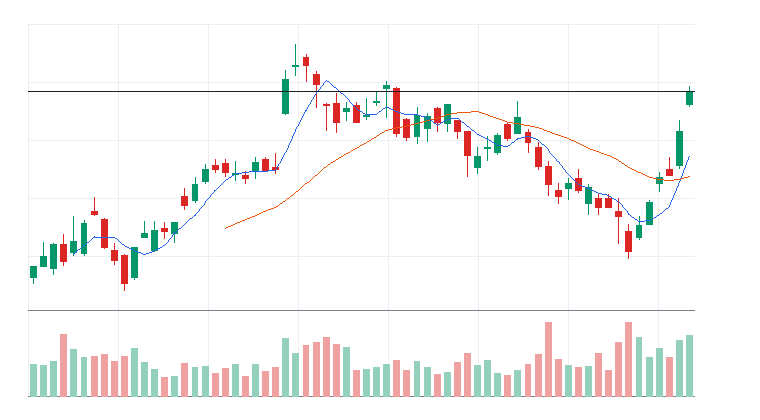

### 3. Arm Holdings plc(ARM)
- 자산 유형: STOCK
- linkedNarrative: 반도체 설계/공급망 재가속
- narrativeStatus: 지배
- narrativeScore: 92
- Trend Strength Index: 90
- Exhaustion Risk: 48 (주의)
- Entry Quality Score: 46 (관찰)
- 트렌드 판단: 시장 위험선호가 약해 시장 환경 비우호 구간이다.
- moneyFlowScore: 100
- finalRawScore: 122
- reasonConfidence: HIGH
- reasonConfidenceExplanation: 직접 촉매: Yahoo Finance RSS / analyst_upgrade / under_72h / positive - Why Bernstein Just Raised Its Price Target on Arm Stock by Nearly 70% 가격/거래량, 관련 ETF 동반 강세, 유동성 근거가 함께 확인되어 HIGH로 분류했다.
- tieBreakerReason: 최종 원점수 122, 리스크 패널티 -6, 5일 수익률 +28.41%, 상대 거래량 2.42배 순으로 정렬
- 후보별 시장 해석: 위험선호 / 제한적 - 전체 시장은 위험선호 / 고점 근처 추격 리스크 / Entry Quality 46 < 50이나 moneyFlow 100, confidence HIGH, RVOL 2.42x로 강한 자금흐름 예외 조건 충족
- 게이트 사유: Entry Quality 46 < 50이나 moneyFlow 100, confidence HIGH, RVOL 2.42x로 강한 자금흐름 예외 조건 충족
- 주문 실행: 시장가 가능
- 직접 촉매: Yahoo Finance RSS / analyst_upgrade / under_72h / positive - Why Bernstein Just Raised Its Price Target on Arm Stock by Nearly 70%
- 왜 돈이 몰리는가: 20일 +71.18%, 5일 +28.41%, 상대 거래량 2.42배로 가격과 거래량이 함께 개선. 뉴스: Yahoo Finance RSS analyst_upgrade/under_72h / 유동성: LIQUID
- 누가 더 비싸게 사줄 수 있는지: 개별 주도주를 따라붙는 단기 모멘텀 자금과 관련 ETF 강세를 확인한 트레이더
- 진입 조건: 전일 고점 돌파와 5일선 유지 확인
- 무효화 조건: 20일선 이탈 또는 상대 거래량 0.8배 이하 둔화
- todayActionLabel: 자금흐름 예외 조건부
- 차트: 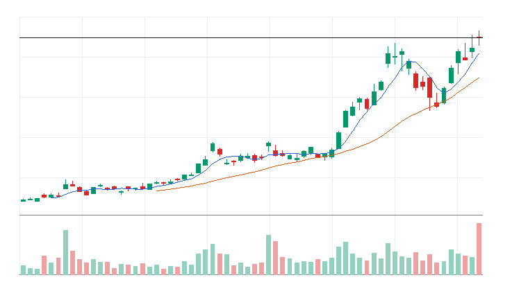

## 다크호스 후보

> 메인 행동 후보를 대체하지 않는 보조 관찰 섹션이다. 상위 서사 안에서 아직 과열되지 않았지만 초기 추세 전환, 베이스 돌파, 거래량 회복이 시작되는 개별주만 표시한다.

### 1. Texas Instruments Incorporated(TXN)
- 소속 서사: 반도체 장비 사이클 재평가
- darkHorseScore: 87 (강한 다크호스)
- 단계: 베이스 돌파 확인
- Confidence: LOW
- 5D / 20D / RVOL: +8.67% / +5.90% / 2.42x
- MA 구조: 종가 $322.86 / MA5 $308.98 / MA20 $303.77
- 선정 이유: TXN는 반도체 장비 사이클 재평가 서사에 속하고 종가가 MA20 위에 있으며 MA5/MA20 정렬이 개선되고 있다. 최근 15거래일 베이스는 상단 돌파 상태이고, RVOL 2.42x로 거래량 확인은 충분하다. Exhaustion Risk 46로 아직 메인 후보 대비 과열 상한 안에 있다.
- 확인 조건: 돌파 후 고점 위 안착 유지, MA5 위 종가 유지, 관련 ETF 동반 강세
- 무효화 조건: MA20 $303.77 종가 이탈, 최근 스윙 저점 $273.88 이탈, RVOL 0.80x 이하 둔화
- 왜 아직 메인이 아닌가: Entry Quality 35 < 50

darkHorseScore 상세 근거 보기

- 서사 정렬: 20/20
- 초기 추세 구조: 30/30
- 베이스 돌파/정돈: 15/20
- 거래량 확인: 14/15
- 낮은 과열: 3/10
- 유동성 리스크 보정: 5/5
- 리스크 차감: -0
- rawScore: 87

- 차트: 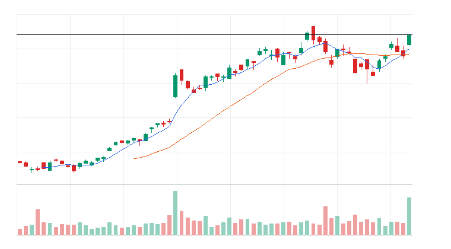

### 2. Analog Devices Inc.(ADI)
- 소속 서사: 반도체 설계/공급망 재가속
- darkHorseScore: 84 (강한 다크호스)
- 단계: 베이스 돌파 직전
- Confidence: LOW
- 5D / 20D / RVOL: +5.42% / +9.15% / 2.26x
- MA 구조: 종가 $434.46 / MA5 $422.06 / MA20 $413.41
- 선정 이유: ADI는 반도체 설계/공급망 재가속 서사에 속하고 종가가 MA20 위에 있으며 MA5/MA20 정렬이 개선되고 있다. 최근 15거래일 베이스는 상단 돌파 직전 상태이고, RVOL 2.26x로 거래량 확인은 충분하다. Exhaustion Risk 48로 아직 메인 후보 대비 과열 상한 안에 있다.
- 확인 조건: 최근 15거래일 고점 $439.70 돌파, MA5 위 종가 유지, 관련 ETF 동반 강세
- 무효화 조건: MA20 $413.41 종가 이탈, 최근 스윙 저점 $383.32 이탈, RVOL 0.80x 이하 둔화
- 왜 아직 메인이 아닌가: Entry Quality 46 < 50, 최근 고점 돌파 확인 전

darkHorseScore 상세 근거 보기

- 서사 정렬: 20/20
- 초기 추세 구조: 30/30
- 베이스 돌파/정돈: 12/20
- 거래량 확인: 14/15
- 낮은 과열: 3/10
- 유동성 리스크 보정: 5/5
- 리스크 차감: -0
- rawScore: 84

- 차트: 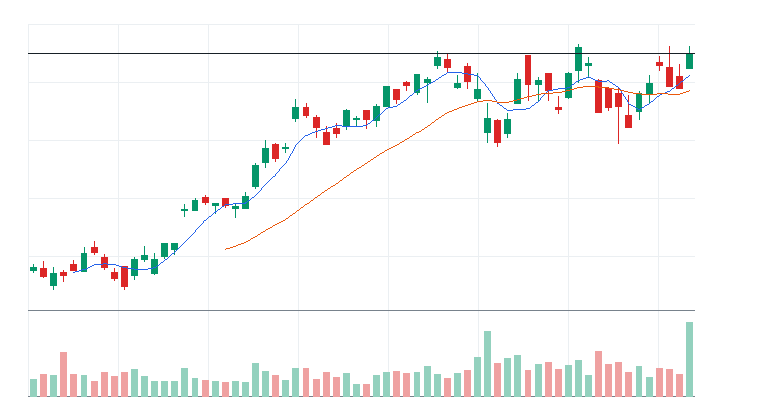

### 3. Intel Corporation(INTC)
- 소속 서사: 반도체 설계/공급망 재가속
- darkHorseScore: 83 (강한 다크호스)
- 단계: 베이스 돌파 확인
- Confidence: LOW
- 5D / 20D / RVOL: +14.56% / +12.63% / 1.78x
- MA 구조: 종가 $133.99 / MA5 $124.91 / MA20 $116.34
- 선정 이유: INTC는 반도체 설계/공급망 재가속 서사에 속하고 종가가 MA20 위에 있으며 MA5/MA20 정렬이 개선되고 있다. 최근 15거래일 베이스는 상단 돌파 상태이고, RVOL 1.78x로 거래량 확인은 충분하다. Exhaustion Risk 48로 아직 메인 후보 대비 과열 상한 안에 있다.
- 확인 조건: 돌파 후 고점 위 안착 유지, MA5 위 종가 유지, 관련 ETF 동반 강세
- 무효화 조건: MA20 $116.34 종가 이탈, 최근 스윙 저점 $98.33 이탈, RVOL 0.80x 이하 둔화
- 왜 아직 메인이 아닌가: Entry Quality 23 < 50

darkHorseScore 상세 근거 보기

- 서사 정렬: 20/20
- 초기 추세 구조: 30/30
- 베이스 돌파/정돈: 11/20
- 거래량 확인: 14/15
- 낮은 과열: 3/10
- 유동성 리스크 보정: 5/5
- 리스크 차감: -0
- rawScore: 83

- 차트: 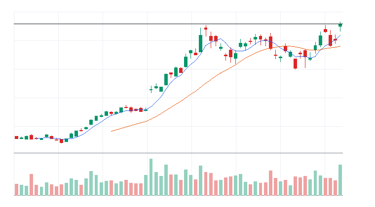

## 오늘 돈이 몰리는 테마

- 메모리/HBM: MU, STX, WDC | 평균 moneyFlowScore 100 | 단일 종목 이벤트보다 테마 단위 자금 흐름이 선명한 구간으로 본다.
- 반도체 장비/공급망: LRCX, AMAT, KLAC | 평균 moneyFlowScore 100 | 단일 종목 이벤트보다 테마 단위 자금 흐름이 선명한 구간으로 본다.
- 메모리/HBM ETF: DRAM | 평균 moneyFlowScore 100 | 단일 종목 이벤트보다 테마 단위 자금 흐름이 선명한 구간으로 본다.
- IPO/신규상장 ETF: IPO | 평균 moneyFlowScore 80 | 단일 종목 이벤트보다 테마 단위 자금 흐름이 선명한 구간으로 본다.
- AI 반도체: NVDA, AVGO, AMD, ASML, ARM, MRVL, TSM | 평균 moneyFlowScore 79 | 단일 종목 이벤트보다 테마 단위 자금 흐름이 선명한 구간으로 본다.
- AI 반도체 ETF: SMH, SOXX, SOXQ | 평균 moneyFlowScore 78 | 단일 종목 이벤트보다 테마 단위 자금 흐름이 선명한 구간으로 본다.

## 1. ETF 트레이딩 보고서
### 1-1. ETF 결론
- ETF 우선 후보: 없음
- ETF 관찰 후보: iShares Semiconductor ETF(SOXX), Invesco PHLX Semiconductor ETF(SOXQ), Global X Artificial Intelligence & Technology ETF(AIQ), ROBO Global Robotics and Automation Index ETF(ROBO), First Trust NASDAQ Cybersecurity ETF(CIBR)
- ETF 매매 금지: iShares Expanded Tech-Software Sector ETF(IGV), First Trust NASDAQ Cybersecurity ETF(CIBR), Amplify Cybersecurity ETF(HACK), iShares Cybersecurity and Tech ETF(IHAK), Global X Defense Tech ETF(SHLD)
- 오늘 ETF 최우선 1개: Roundhill Memory ETF(DRAM) - 전일 고점 돌파와 5일선 유지 확인
- ETF 섹션 해석: 이 섹션은 개별 종목 선택이 아니라 테마/섹터 단위 자금 흐름을 ETF로 매매할지 판단하기 위한 영역이다.

### 1-2. ETF 후보 TOP 5

선정 기준: ETF 후보는 가격/거래량 1차 점수에 뉴스, ETF 구성종목 확산도, 유동성, 리스크 패널티를 반영한 finalRawScore 기준으로 정렬한다. 표시 점수 100점 후보가 겹치면 tieBreakerReason으로 우선순위를 설명한다.

### [ETF] Roundhill Memory ETF(DRAM)
- 자산 유형: ETF
- ETF 세부 카테고리: 메모리/HBM ETF
- ETF 역할: 테마 베타 매수
- 상태: 진입 후보
- linkedNarrative: AI 인프라 재가속
- narrativeStatus: 지배
- narrativeScore: 80
- moneyFlowScore: 100
- finalRawScore: 114
- tieBreakerReason: 최종 원점수 114, 리스크 패널티 -4, 5일 수익률 +17.80%, 상대 거래량 1.24배 순으로 정렬
- 과열 리스크: 낮음~중간
- reasonConfidence: MEDIUM
- reasonConfidenceExplanation: ETF 확산도 제한 때문에 HIGH가 아니라 MEDIUM으로 제한했다.

- todayActionLabel: 자금흐름 예외 조건부
- 주문 실행: 시장가 가능
- 기준일: 2026-06-18
- 종가: $76.71
- 1일 수익률: +9.66%
- 5일 수익률: +17.80%
- 20일 수익률: +48.92%
- 상대 거래량: 1.24배
- 52주 고점 대비 위치: -1.27%
- whyMoneyIsFlowing: 20일 +48.92%, 5일 +17.80%, 상대 거래량 1.24배로 가격과 거래량이 함께 개선. 뉴스: CNBC Markets RSS general_market/under_6h / 유동성: LIQUID
- likelyNextBuyer: 섹터 베타를 노리는 단기 모멘텀 자금과 리밸런싱 자금
- whyThisCouldTradeHigher: 52주 고점 부근이라 돌파가 확인되면 신고가 추종 매수가 붙을 수 있음
- 진입 조건: 전일 고점 돌파와 5일선 유지 확인
- 무효화 조건: 20일선 이탈 또는 상대 거래량 0.8배 이하 둔화
- 차트: 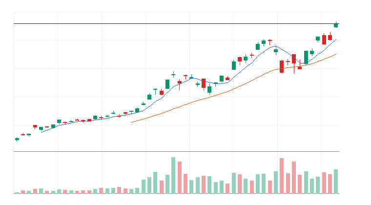

#### 상세 근거

Roundhill Memory ETF(DRAM) 상세 근거 펼치기

- moneyFlowScore(최종) 산정 근거:
  - moneyFlowScore(1차): 100
  - 최종 원점수: 114
  - 최종 표시 점수: 100
  - cap 적용: raw score 114 capped to displayed score 100
  - 계산식: +101 + +12 + 0 + +5 + 0 - 4 + 0 = 114 -> 100
  - 점수 해석: 강한 자금 유입 후보. 단, 과열 여부 확인 필수.
  - 가격/거래량 1차 점수: +101
    - 추세: +25
    - 단기 모멘텀: +20
    - 중기 모멘텀: +16
    - 거래량: +14
    - 신고가 근접: +12
    - 이동평균: +14
  - 하위 점수 cap:
    - 가격 모멘텀: 원점수 +30, 상한 적용 +25 / 최대 25 (cap 적용)
    - 단기 모멘텀: 원점수 +20, 상한 적용 +20 / 최대 20
    - 중기 모멘텀: 원점수 +32, 상한 적용 +16 / 최대 16 (cap 적용)
    - 거래량: 원점수 +14, 상한 적용 +14 / 최대 20
    - 신고가 근접: 원점수 +12, 상한 적용 +12 / 최대 12
    - 이동평균: 원점수 +14, 상한 적용 +14 / 최대 14
  - 추가 데이터 가감점:
    - 뉴스: +12
    - 유동성: +5
  - ETF 확산도: 0
  - 리스크 패널티: -4
  - 주요 근거: 1차 100, 최종 원점수 114, 표시 100. 20일 수익률 강함, 5일 수익률 강함, 1일 단기 모멘텀 확인. 주의: 단기 과열/추격 위험 존재, ETF 구성종목 확산도 데이터 미연결.
  - 리스크 패널티 산정 근거:
    - 총 리스크 패널티: -4
    - 리스크 등급: LOW
    - 감점된 리스크:
      - extreme 1d move: -4 | 근거: 1d return +9.66% is unusually strong. | 대응: Confirm next-session volume retention.
    - 관찰 리스크: ETF breadth data not connected
    - 한 줄 해석: 1개 감점 리스크로 총 -4점 반영.
- 데이터 사용 현황:
  - 가격/거래량: 사용
  - 뉴스: 사용
  - ETF 확산도: 미연결
  - 거래대금 유동성: 사용
  - 관련 ETF 상대강도: 사용
- 뉴스 확인:
  - 최근 뉴스 상태: 일부 연결
  - 뉴스 소스: CNBC Markets RSS, MarketWatch RSS, Yahoo Finance RSS
  - 소스별 상태: Yahoo Finance RSS CONNECTED; MarketWatch RSS CONNECTED; CNBC Markets RSS CONNECTED; SEC EDGAR RSS PARTIAL; Federal Reserve RSS CONNECTED; Finnhub API DISABLED
  - 긍정/중립/부정: 14/2/0
  - 직접성/방향성/신선도: 2/1/4
  - 강한 촉매 수: 2
  - 중요 공시 수: 0
  - 직접 촉매: 없음
  - 보조 뉴스: CNBC Markets RSS sector_theme / general_market / under_6h
  - 뉴스 수집 시각: 2026-06-22 09:13 KST
  - 가장 최근 뉴스 발행 시각: 2026-06-22 09:05 KST
  - 뉴스 신선도 상태: FRESH
  - 뉴스 이후 가격 반응: 긍정
  - 가격 반응 점수 제한: 뉴스 이후 가격 반응과 점수 제한 특이사항 없음
  - 핵심 뉴스 요약: Oil rises after Trump threatens fresh strikes on Iran, overshadowing peace talks
  - 원점수/상한 점수: +25 / +12
  - 점수 반영: +12
  - 주의: SEC EDGAR RSS: no matching RSS items; Finnhub API: FINNHUB_API_KEY not configured
- ETF 구성종목 확산도:
  - 구성종목 데이터 상태: 미연결
  - 샘플 수: 0/0
  - 샘플 신뢰도: UNKNOWN
  - 상승 종목 비율: 데이터 없음
  - 20일선 위 비율: 데이터 없음
  - 50일선 위 비율: 데이터 없음
  - 상위 기여 종목: 데이터 없음
  - 확산도 판단: UNKNOWN
  - 원점수/샘플 상한/반영 점수: 0 / N/A / 0
  - 점수 반영: 0
- 거래대금 유동성:
  - 데이터 상태: 일부 연결
  - 거래대금 기준 유동성: LIQUID
  - 거래대금: $4,034,616,147
  - 평균 거래대금: $3,259,107,964
  - 주문 영향: 시장가 가능
  - 매매 영향: 거래대금이 충분해 시장가 가능 범위로 본다
- reasonConfidence 근거: 가격/거래량, 뉴스, 거래대금 유동성, 관련 ETF 상대강도은 확인됐지만 일부 보조 데이터가 미연결 또는 fallback이라 중간으로 제한한다.
- 차트 요약: 최근 20거래일 기준 5일선이 20일선 위에 있음
- 기준일 2026-06-18 | 종가 $76.71 | 1일 +9.66% | 5일 +17.80% | 20일 +48.92% | 상대 거래량 1.24배 | 52주 고점 대비 -1.27% | 데이터 소스: yfinance

### [ETF] VanEck Semiconductor ETF(SMH)
- 자산 유형: ETF
- ETF 세부 카테고리: AI 반도체 ETF
- ETF 역할: 테마 베타 매수
- 상태: 진입 후보
- linkedNarrative: 반도체 장비 사이클 재평가
- narrativeStatus: 지배
- narrativeScore: 93
- moneyFlowScore: 96
- finalRawScore: 96
- tieBreakerReason: 최종 원점수 96, 리스크 패널티 -4, 5일 수익률 +8.27%, 상대 거래량 1.01배 순으로 정렬
- 과열 리스크: 중간
- reasonConfidence: MEDIUM
- reasonConfidenceExplanation: ETF 확산도 제한 때문에 HIGH가 아니라 MEDIUM으로 제한했다.

- todayActionLabel: 자금흐름 예외 조건부
- 주문 실행: 시장가 가능
- 기준일: 2026-06-18
- 종가: $659.88
- 1일 수익률: +5.76%
- 5일 수익률: +8.27%
- 20일 수익률: +16.86%
- 상대 거래량: 1.01배
- 52주 고점 대비 위치: -0.59%
- whyMoneyIsFlowing: 20일 +16.86%, 5일 +8.27%, 상대 거래량 1.01배로 가격과 거래량이 함께 개선. 뉴스: CNBC Markets RSS general_market/under_6h / 유동성: LIQUID
- likelyNextBuyer: 섹터 베타를 노리는 단기 모멘텀 자금과 리밸런싱 자금
- whyThisCouldTradeHigher: 52주 고점 부근이라 돌파가 확인되면 신고가 추종 매수가 붙을 수 있음
- 진입 조건: 전일 고점 돌파와 5일선 유지 확인
- 무효화 조건: 20일선 이탈 또는 상대 거래량 0.8배 이하 둔화
- 차트: 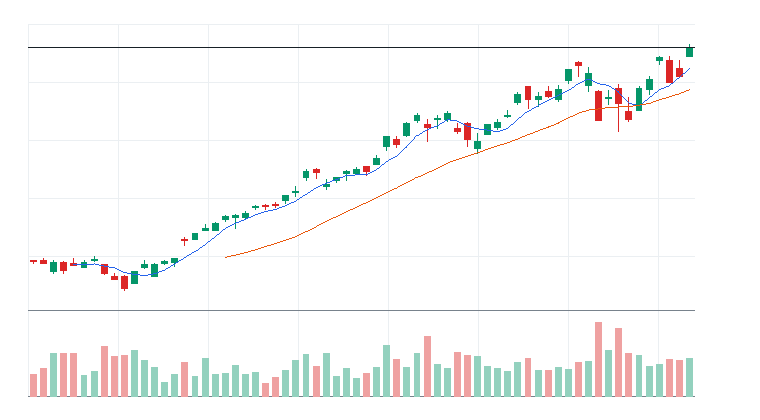

#### 상세 근거

VanEck Semiconductor ETF(SMH) 상세 근거 펼치기

- moneyFlowScore(최종) 산정 근거:
  - moneyFlowScore(1차): 83
  - 최종 원점수: 96
  - 최종 표시 점수: 96
  - cap 적용: cap 미적용
  - 계산식: +83 + +12 + 0 + +5 + 0 - 4 + 0 = 96
  - 점수 해석: 강한 자금 유입 후보. 단, 과열 여부 확인 필수.
  - 가격/거래량 1차 점수: +83
    - 추세: +22
    - 단기 모멘텀: +14
    - 중기 모멘텀: +11
    - 거래량: +10
    - 신고가 근접: +12
    - 이동평균: +14
  - 하위 점수 cap:
    - 가격 모멘텀: 원점수 +22, 상한 적용 +22 / 최대 25
    - 단기 모멘텀: 원점수 +14, 상한 적용 +14 / 최대 20
    - 중기 모멘텀: 원점수 +11, 상한 적용 +11 / 최대 16
    - 거래량: 원점수 +10, 상한 적용 +10 / 최대 20
    - 신고가 근접: 원점수 +12, 상한 적용 +12 / 최대 12
    - 이동평균: 원점수 +14, 상한 적용 +14 / 최대 14
  - 추가 데이터 가감점:
    - 뉴스: +12
    - 유동성: +5
  - ETF 확산도: 0
  - 리스크 패널티: -4
  - 주요 근거: 1차 83, 최종 원점수 96, 표시 96. 20일 수익률 강함, 5일 수익률 강함, 1일 단기 모멘텀 확인. 주의: 단기 과열/추격 위험 존재.
  - 리스크 패널티 산정 근거:
    - 총 리스크 패널티: -4
    - 리스크 등급: LOW
    - 감점된 리스크:
      - near 52w high chase: -4 | 근거: Price is close to the 52-week high with fast short-term momentum. | 대응: Downgrade if breakout fails.
    - 관찰 리스크: 주요 관찰 리스크 없음
    - 한 줄 해석: 1개 감점 리스크로 총 -4점 반영.
- 데이터 사용 현황:
  - 가격/거래량: 사용
  - 뉴스: 사용
  - ETF 확산도: 일부 연결
  - 거래대금 유동성: 사용
  - 관련 ETF 상대강도: 사용
- 뉴스 확인:
  - 최근 뉴스 상태: 일부 연결
  - 뉴스 소스: CNBC Markets RSS, MarketWatch RSS, Yahoo Finance RSS
  - 소스별 상태: Yahoo Finance RSS CONNECTED; MarketWatch RSS CONNECTED; CNBC Markets RSS CONNECTED; SEC EDGAR RSS PARTIAL; Federal Reserve RSS CONNECTED; Finnhub API DISABLED
  - 긍정/중립/부정: 14/2/0
  - 직접성/방향성/신선도: 2/1/4
  - 강한 촉매 수: 2
  - 중요 공시 수: 0
  - 직접 촉매: 없음
  - 보조 뉴스: CNBC Markets RSS sector_theme / general_market / under_6h
  - 뉴스 수집 시각: 2026-06-22 09:13 KST
  - 가장 최근 뉴스 발행 시각: 2026-06-22 09:05 KST
  - 뉴스 신선도 상태: FRESH
  - 뉴스 이후 가격 반응: 긍정
  - 가격 반응 점수 제한: 뉴스 이후 가격 반응과 점수 제한 특이사항 없음
  - 핵심 뉴스 요약: Oil rises after Trump threatens fresh strikes on Iran, overshadowing peace talks
  - 원점수/상한 점수: +25 / +12
  - 점수 반영: +12
  - 주의: SEC EDGAR RSS: no matching RSS items; Finnhub API: FINNHUB_API_KEY not configured
- ETF 구성종목 확산도:
  - 구성종목 데이터 상태: 일부 연결
  - 샘플 수: 3/3
  - 샘플 신뢰도: INSUFFICIENT
  - 상승 종목 비율: 100%
  - 20일선 위 비율: 67%
  - 50일선 위 비율: 100%
  - 상위 기여 종목: MU, TSM, NVDA
  - 확산도 판단: SAMPLE_TOO_SMALL
  - 원점수/샘플 상한/반영 점수: 0 / 0 / 0
  - 점수 반영: 0
- 거래대금 유동성:
  - 데이터 상태: 일부 연결
  - 거래대금 기준 유동성: LIQUID
  - 거래대금: $7,410,254,436
  - 평균 거래대금: $7,329,874,453
  - 주문 영향: 시장가 가능
  - 매매 영향: 거래대금이 충분해 시장가 가능 범위로 본다
- reasonConfidence 근거: 가격/거래량, 뉴스, 거래대금 유동성, 관련 ETF 상대강도은 확인됐지만 일부 보조 데이터가 미연결 또는 fallback이라 중간으로 제한한다.
- 차트 요약: 최근 20거래일 기준 5일선이 20일선 위에 있음
- 기준일 2026-06-18 | 종가 $659.88 | 1일 +5.76% | 5일 +8.27% | 20일 +16.86% | 상대 거래량 1.01배 | 52주 고점 대비 -0.59% | 데이터 소스: yfinance

### [ETF] First Trust NASDAQ Clean Edge Smart Grid Infrastructure ETF(GRID)
- 자산 유형: ETF
- ETF 세부 카테고리: 전력망 인프라 ETF
- ETF 역할: 테마 베타 매수
- 상태: 관찰
- linkedNarrative: AI 인프라 재가속
- narrativeStatus: 지배
- narrativeScore: 80
- moneyFlowScore: 75
- finalRawScore: 75
- tieBreakerReason: 최종 원점수 75, 리스크 패널티 0, 5일 수익률 +2.81%, 상대 거래량 2.57배 순으로 정렬
- 과열 리스크: 낮음
- reasonConfidence: MEDIUM
- reasonConfidenceExplanation: ETF 확산도 제한 때문에 HIGH가 아니라 MEDIUM으로 제한했다.

- todayActionLabel: 관찰
- 주문 실행: 지정가 권장
- 기준일: 2026-06-18
- 종가: $194.68
- 1일 수익률: +1.90%
- 5일 수익률: +2.81%
- 20일 수익률: +3.28%
- 상대 거래량: 2.57배
- 52주 고점 대비 위치: -2.66%
- whyMoneyIsFlowing: 20일 +3.28%, 5일 +2.81%, 상대 거래량 2.57배로 가격과 거래량이 함께 개선. 뉴스: Yahoo Finance RSS general_market/stale / 유동성: ACCEPTABLE
- likelyNextBuyer: 섹터 베타를 노리는 단기 모멘텀 자금과 리밸런싱 자금
- whyThisCouldTradeHigher: 52주 고점 부근이라 돌파가 확인되면 신고가 추종 매수가 붙을 수 있음
- 진입 조건: 전일 고점 돌파와 5일선 유지 확인
- 무효화 조건: 20일선 이탈 또는 상대 거래량 0.8배 이하 둔화
- 차트: 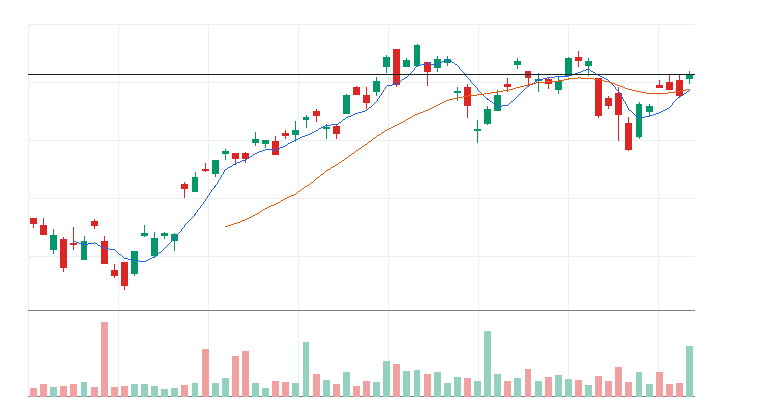

#### 상세 근거

First Trust NASDAQ Clean Edge Smart Grid Infrastructure ETF(GRID) 상세 근거 펼치기

- moneyFlowScore(최종) 산정 근거:
  - moneyFlowScore(1차): 61
  - 최종 원점수: 75
  - 최종 표시 점수: 75
  - cap 적용: cap 미적용
  - 계산식: +61 + +12 + 0 + +2 + 0 + 0 + 0 = 75
  - 점수 해석: 관심 후보. 눌림 또는 돌파 확인 후 진입 검토.
  - 가격/거래량 1차 점수: +61
    - 추세: +10
    - 단기 모멘텀: +5
    - 중기 모멘텀: +2
    - 거래량: +18
    - 신고가 근접: +12
    - 이동평균: +14
  - 하위 점수 cap:
    - 가격 모멘텀: 원점수 +10, 상한 적용 +10 / 최대 25
    - 단기 모멘텀: 원점수 +5, 상한 적용 +5 / 최대 20
    - 중기 모멘텀: 원점수 +2, 상한 적용 +2 / 최대 16
    - 거래량: 원점수 +18, 상한 적용 +18 / 최대 20
    - 신고가 근접: 원점수 +12, 상한 적용 +12 / 최대 12
    - 이동평균: 원점수 +14, 상한 적용 +14 / 최대 14
  - 추가 데이터 가감점:
    - 뉴스: +12
    - 유동성: +2
  - ETF 확산도: 0
  - 리스크 패널티: 0
  - 주요 근거: 1차 61, 최종 원점수 75, 표시 75. 상대 거래량 증가, 52주 고점 근처, 이동평균 위 추세 유지. 주의: ETF 구성종목 확산도 데이터 미연결.
  - 리스크 패널티 산정 근거:
    - 총 리스크 패널티: 0
    - 리스크 등급: LOW
    - 감점된 리스크: 없음
    - 관찰 리스크: ETF breadth data not connected
    - 한 줄 해석: 직접 감점된 주요 리스크는 없지만 관찰 리스크는 계속 확인해야 한다.
- 데이터 사용 현황:
  - 가격/거래량: 사용
  - 뉴스: 사용
  - ETF 확산도: 미연결
  - 거래대금 유동성: 사용
  - 관련 ETF 상대강도: 사용
- 뉴스 확인:
  - 최근 뉴스 상태: 일부 연결
  - 뉴스 소스: MarketWatch RSS, Federal Reserve RSS, Yahoo Finance RSS
  - 소스별 상태: Yahoo Finance RSS CONNECTED; MarketWatch RSS CONNECTED; CNBC Markets RSS FAILED; SEC EDGAR RSS PARTIAL; Federal Reserve RSS CONNECTED; Finnhub API DISABLED
  - 긍정/중립/부정: 7/9/0
  - 직접성/방향성/신선도: 4/1/4
  - 강한 촉매 수: 0
  - 중요 공시 수: 0
  - 직접 촉매: Yahoo Finance RSS / general_market / stale / neutral - Should You Invest in the First Trust NASDAQ Clean Edge Smart Grid Infrastructure ETF (GRID)?
  - 보조 뉴스: MarketWatch RSS sector_theme / macro / under_6h
  - 뉴스 수집 시각: 2026-06-22 09:13 KST
  - 가장 최근 뉴스 발행 시각: 2026-06-22 07:41 KST
  - 뉴스 신선도 상태: FRESH
  - 뉴스 이후 가격 반응: 긍정
  - 가격 반응 점수 제한: 뉴스 이후 가격 반응과 점수 제한 특이사항 없음
  - 핵심 뉴스 요약: This bull market isn&#x2019;t going to end because of Fed rate hikes under Warsh
  - 원점수/상한 점수: +18 / +12
  - 점수 반영: +12
  - 주의: CNBC Markets RSS: HTTP 403 from https://www.cnbc.com/id/100003114/device/rss/rss.html; SEC EDGAR RSS: no matching RSS items; Finnhub API: FINNHUB_API_KEY not configured
- ETF 구성종목 확산도:
  - 구성종목 데이터 상태: 미연결
  - 샘플 수: 0/0
  - 샘플 신뢰도: UNKNOWN
  - 상승 종목 비율: 데이터 없음
  - 20일선 위 비율: 데이터 없음
  - 50일선 위 비율: 데이터 없음
  - 상위 기여 종목: 데이터 없음
  - 확산도 판단: UNKNOWN
  - 원점수/샘플 상한/반영 점수: 0 / N/A / 0
  - 점수 반영: 0
- 거래대금 유동성:
  - 데이터 상태: 일부 연결
  - 거래대금 기준 유동성: ACCEPTABLE
  - 거래대금: $385,524,804
  - 평균 거래대금: $149,776,085
  - 주문 영향: 지정가 권장
  - 매매 영향: 거래대금은 허용 가능하나 지정가를 우선한다
- reasonConfidence 근거: 가격/거래량, 뉴스, 거래대금 유동성, 관련 ETF 상대강도은 확인됐지만 일부 보조 데이터가 미연결 또는 fallback이라 중간으로 제한한다.
- 차트 요약: 단기 추세 중립
- 기준일 2026-06-18 | 종가 $194.68 | 1일 +1.90% | 5일 +2.81% | 20일 +3.28% | 상대 거래량 2.57배 | 52주 고점 대비 -2.66% | 데이터 소스: yfinance

### [ETF] Global X U.S. Infrastructure Development ETF(PAVE)
- 자산 유형: ETF
- ETF 세부 카테고리: 인프라 ETF
- ETF 역할: 테마 베타 매수
- 상태: 관찰
- linkedNarrative: AI 인프라 재가속
- narrativeStatus: 지배
- narrativeScore: 80
- moneyFlowScore: 74
- finalRawScore: 74
- tieBreakerReason: 최종 원점수 74, 리스크 패널티 0, 5일 수익률 +2.41%, 상대 거래량 1.33배 순으로 정렬
- 과열 리스크: 낮음
- reasonConfidence: MEDIUM
- reasonConfidenceExplanation: ETF 확산도 제한 때문에 HIGH가 아니라 MEDIUM으로 제한했다.

- todayActionLabel: 관찰
- 주문 실행: 지정가 권장
- 기준일: 2026-06-18
- 종가: $58.56
- 1일 수익률: +1.00%
- 5일 수익률: +2.41%
- 20일 수익률: +7.47%
- 상대 거래량: 1.33배
- 52주 고점 대비 위치: -1.10%
- whyMoneyIsFlowing: 20일 +7.47%, 5일 +2.41%, 상대 거래량 1.33배로 가격과 거래량이 함께 개선. 뉴스: Yahoo Finance RSS general_market/stale / 유동성: ACCEPTABLE
- likelyNextBuyer: 섹터 베타를 노리는 단기 모멘텀 자금과 리밸런싱 자금
- whyThisCouldTradeHigher: 52주 고점 부근이라 돌파가 확인되면 신고가 추종 매수가 붙을 수 있음
- 진입 조건: 전일 고점 돌파와 5일선 유지 확인
- 무효화 조건: 20일선 이탈 또는 상대 거래량 0.8배 이하 둔화
- 차트: 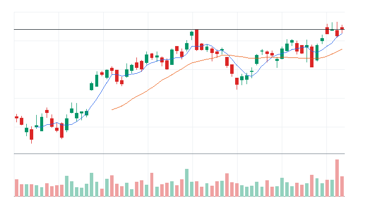

#### 상세 근거

Global X U.S. Infrastructure Development ETF(PAVE) 상세 근거 펼치기

- moneyFlowScore(최종) 산정 근거:
  - moneyFlowScore(1차): 60
  - 최종 원점수: 74
  - 최종 표시 점수: 74
  - cap 적용: cap 미적용
  - 계산식: +60 + +12 + 0 + +2 + 0 + 0 + 0 = 74
  - 점수 해석: 관심 후보. 눌림 또는 돌파 확인 후 진입 검토.
  - 가격/거래량 1차 점수: +60
    - 추세: +12
    - 단기 모멘텀: +3
    - 중기 모멘텀: +5
    - 거래량: +14
    - 신고가 근접: +12
    - 이동평균: +14
  - 하위 점수 cap:
    - 가격 모멘텀: 원점수 +12, 상한 적용 +12 / 최대 25
    - 단기 모멘텀: 원점수 +3, 상한 적용 +3 / 최대 20
    - 중기 모멘텀: 원점수 +5, 상한 적용 +5 / 최대 16
    - 거래량: 원점수 +14, 상한 적용 +14 / 최대 20
    - 신고가 근접: 원점수 +12, 상한 적용 +12 / 최대 12
    - 이동평균: 원점수 +14, 상한 적용 +14 / 최대 14
  - 추가 데이터 가감점:
    - 뉴스: +12
    - 유동성: +2
  - ETF 확산도: 0
  - 리스크 패널티: 0
  - 주요 근거: 1차 60, 최종 원점수 74, 표시 74. 상대 거래량 증가, 52주 고점 근처, 이동평균 위 추세 유지. 주의: ETF 구성종목 확산도 데이터 미연결.
  - 리스크 패널티 산정 근거:
    - 총 리스크 패널티: 0
    - 리스크 등급: LOW
    - 감점된 리스크: 없음
    - 관찰 리스크: ETF breadth data not connected
    - 한 줄 해석: 직접 감점된 주요 리스크는 없지만 관찰 리스크는 계속 확인해야 한다.
- 데이터 사용 현황:
  - 가격/거래량: 사용
  - 뉴스: 사용
  - ETF 확산도: 미연결
  - 거래대금 유동성: 사용
  - 관련 ETF 상대강도: 사용
- 뉴스 확인:
  - 최근 뉴스 상태: 일부 연결
  - 뉴스 소스: MarketWatch RSS, Federal Reserve RSS, Yahoo Finance RSS
  - 소스별 상태: Yahoo Finance RSS CONNECTED; MarketWatch RSS CONNECTED; CNBC Markets RSS FAILED; SEC EDGAR RSS PARTIAL; Federal Reserve RSS CONNECTED; Finnhub API DISABLED
  - 긍정/중립/부정: 6/10/0
  - 직접성/방향성/신선도: 4/1/4
  - 강한 촉매 수: 0
  - 중요 공시 수: 0
  - 직접 촉매: Yahoo Finance RSS / general_market / stale / neutral - Should You Invest in the Global X U.S. Infrastructure Development ETF (PAVE)?
  - 보조 뉴스: MarketWatch RSS sector_theme / macro / under_6h
  - 뉴스 수집 시각: 2026-06-22 09:13 KST
  - 가장 최근 뉴스 발행 시각: 2026-06-22 07:41 KST
  - 뉴스 신선도 상태: FRESH
  - 뉴스 이후 가격 반응: 긍정
  - 가격 반응 점수 제한: 뉴스 이후 가격 반응과 점수 제한 특이사항 없음
  - 핵심 뉴스 요약: This bull market isn&#x2019;t going to end because of Fed rate hikes under Warsh
  - 원점수/상한 점수: +17 / +12
  - 점수 반영: +12
  - 주의: CNBC Markets RSS: HTTP 403 from https://www.cnbc.com/id/100003114/device/rss/rss.html; SEC EDGAR RSS: no matching RSS items; Finnhub API: FINNHUB_API_KEY not configured
- ETF 구성종목 확산도:
  - 구성종목 데이터 상태: 미연결
  - 샘플 수: 0/0
  - 샘플 신뢰도: UNKNOWN
  - 상승 종목 비율: 데이터 없음
  - 20일선 위 비율: 데이터 없음
  - 50일선 위 비율: 데이터 없음
  - 상위 기여 종목: 데이터 없음
  - 확산도 판단: UNKNOWN
  - 원점수/샘플 상한/반영 점수: 0 / N/A / 0
  - 점수 반영: 0
- 거래대금 유동성:
  - 데이터 상태: 일부 연결
  - 거래대금 기준 유동성: ACCEPTABLE
  - 거래대금: $136,374,528
  - 평균 거래대금: $102,808,229
  - 주문 영향: 지정가 권장
  - 매매 영향: 거래대금은 허용 가능하나 지정가를 우선한다
- reasonConfidence 근거: 가격/거래량, 뉴스, 거래대금 유동성, 관련 ETF 상대강도은 확인됐지만 일부 보조 데이터가 미연결 또는 fallback이라 중간으로 제한한다.
- 차트 요약: 최근 20거래일 기준 5일선이 20일선 위에 있음
- 기준일 2026-06-18 | 종가 $58.56 | 1일 +1.00% | 5일 +2.41% | 20일 +7.47% | 상대 거래량 1.33배 | 52주 고점 대비 -1.10% | 데이터 소스: yfinance

### [ETF] iShares U.S. Infrastructure ETF(IFRA)
- 자산 유형: ETF
- ETF 세부 카테고리: 인프라 ETF
- ETF 역할: 테마 베타 매수
- 상태: 진입 후보
- linkedNarrative: 전력망/원전/인프라 병목
- narrativeStatus: 관찰
- narrativeScore: 62
- moneyFlowScore: 66
- finalRawScore: 66
- tieBreakerReason: 최종 원점수 66, 리스크 패널티 0, 5일 수익률 +1.19%, 상대 거래량 6.79배 순으로 정렬
- 과열 리스크: 낮음
- reasonConfidence: MEDIUM
- reasonConfidenceExplanation: ETF 확산도 제한 때문에 HIGH가 아니라 MEDIUM으로 제한했다.

- todayActionLabel: 조건부 진입
- 주문 실행: 지정가 권장
- 기준일: 2026-06-18
- 종가: $61.99
- 1일 수익률: +0.68%
- 5일 수익률: +1.19%
- 20일 수익률: +2.89%
- 상대 거래량: 6.79배
- 52주 고점 대비 위치: -1.98%
- whyMoneyIsFlowing: 20일 +2.89%, 5일 +1.19%, 상대 거래량 6.79배로 가격과 거래량이 함께 개선. 뉴스: Yahoo Finance RSS general_market/stale / 유동성: ACCEPTABLE
- likelyNextBuyer: 섹터 베타를 노리는 단기 모멘텀 자금과 리밸런싱 자금
- whyThisCouldTradeHigher: 52주 고점 부근이라 돌파가 확인되면 신고가 추종 매수가 붙을 수 있음
- 진입 조건: 전일 고점 돌파와 5일선 유지 확인
- 무효화 조건: 20일선 이탈 또는 상대 거래량 0.8배 이하 둔화
- 차트: 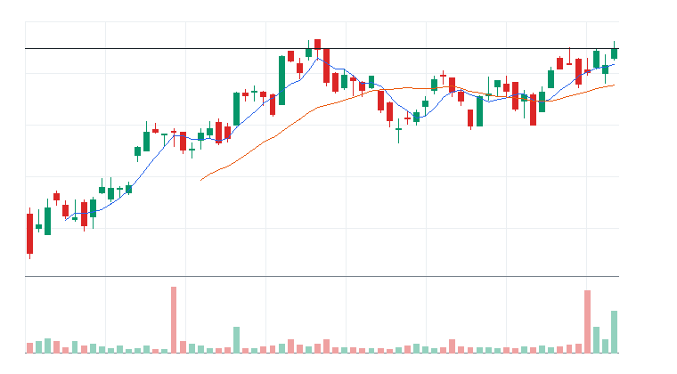

#### 상세 근거

iShares U.S. Infrastructure ETF(IFRA) 상세 근거 펼치기

- moneyFlowScore(최종) 산정 근거:
  - moneyFlowScore(1차): 52
  - 최종 원점수: 66
  - 최종 표시 점수: 66
  - cap 적용: cap 미적용
  - 계산식: +52 + +12 + 0 + +2 + 0 + 0 + 0 = 66
  - 점수 해석: 관심 후보. 눌림 또는 돌파 확인 후 진입 검토.
  - 가격/거래량 1차 점수: +52
    - 추세: +8
    - 단기 모멘텀: +2
    - 중기 모멘텀: +2
    - 거래량: +18
    - 신고가 근접: +12
    - 이동평균: +10
  - 하위 점수 cap:
    - 가격 모멘텀: 원점수 +8, 상한 적용 +8 / 최대 25
    - 단기 모멘텀: 원점수 +2, 상한 적용 +2 / 최대 20
    - 중기 모멘텀: 원점수 +2, 상한 적용 +2 / 최대 16
    - 거래량: 원점수 +18, 상한 적용 +18 / 최대 20
    - 신고가 근접: 원점수 +12, 상한 적용 +12 / 최대 12
    - 이동평균: 원점수 +10, 상한 적용 +10 / 최대 14
  - 추가 데이터 가감점:
    - 뉴스: +12
    - 유동성: +2
  - ETF 확산도: 0
  - 리스크 패널티: 0
  - 주요 근거: 1차 52, 최종 원점수 66, 표시 66. 상대 거래량 증가, 52주 고점 근처, 뉴스 흐름이 가격/거래량 근거 보강. 주의: ETF 구성종목 확산도 데이터 미연결.
  - 리스크 패널티 산정 근거:
    - 총 리스크 패널티: 0
    - 리스크 등급: LOW
    - 감점된 리스크: 없음
    - 관찰 리스크: ETF breadth data not connected
    - 한 줄 해석: 직접 감점된 주요 리스크는 없지만 관찰 리스크는 계속 확인해야 한다.
- 데이터 사용 현황:
  - 가격/거래량: 사용
  - 뉴스: 사용
  - ETF 확산도: 미연결
  - 거래대금 유동성: 사용
  - 관련 ETF 상대강도: 사용
- 뉴스 확인:
  - 최근 뉴스 상태: 일부 연결
  - 뉴스 소스: MarketWatch RSS, Federal Reserve RSS, Yahoo Finance RSS
  - 소스별 상태: Yahoo Finance RSS CONNECTED; MarketWatch RSS CONNECTED; CNBC Markets RSS FAILED; SEC EDGAR RSS PARTIAL; Federal Reserve RSS CONNECTED; Finnhub API DISABLED
  - 긍정/중립/부정: 6/10/0
  - 직접성/방향성/신선도: 4/1/4
  - 강한 촉매 수: 0
  - 중요 공시 수: 0
  - 직접 촉매: Yahoo Finance RSS / general_market / stale / neutral - Is iShares U.S. Infrastructure ETF (IFRA) a Strong ETF Right Now?
  - 보조 뉴스: MarketWatch RSS sector_theme / macro / under_6h
  - 뉴스 수집 시각: 2026-06-22 09:13 KST
  - 가장 최근 뉴스 발행 시각: 2026-06-22 07:41 KST
  - 뉴스 신선도 상태: FRESH
  - 뉴스 이후 가격 반응: 긍정
  - 가격 반응 점수 제한: 뉴스 이후 가격 반응과 점수 제한 특이사항 없음
  - 핵심 뉴스 요약: This bull market isn&#x2019;t going to end because of Fed rate hikes under Warsh
  - 원점수/상한 점수: +17 / +12
  - 점수 반영: +12
  - 주의: CNBC Markets RSS: HTTP 403 from https://www.cnbc.com/id/100003114/device/rss/rss.html; SEC EDGAR RSS: no matching RSS items; Finnhub API: FINNHUB_API_KEY not configured
- ETF 구성종목 확산도:
  - 구성종목 데이터 상태: 미연결
  - 샘플 수: 0/0
  - 샘플 신뢰도: UNKNOWN
  - 상승 종목 비율: 데이터 없음
  - 20일선 위 비율: 데이터 없음
  - 50일선 위 비율: 데이터 없음
  - 상위 기여 종목: 데이터 없음
  - 확산도 판단: UNKNOWN
  - 원점수/샘플 상한/반영 점수: 0 / N/A / 0
  - 점수 반영: 0
- 거래대금 유동성:
  - 데이터 상태: 일부 연결
  - 거래대금 기준 유동성: ACCEPTABLE
  - 거래대금: $157,714,958
  - 평균 거래대금: $23,232,612
  - 주문 영향: 지정가 권장
  - 매매 영향: 거래대금은 허용 가능하나 지정가를 우선한다
- reasonConfidence 근거: 가격/거래량, 뉴스, 거래대금 유동성, 관련 ETF 상대강도은 확인됐지만 일부 보조 데이터가 미연결 또는 fallback이라 중간으로 제한한다.
- 차트 요약: 20일선 위에서 단기 눌림 확인 구간
- 기준일 2026-06-18 | 종가 $61.99 | 1일 +0.68% | 5일 +1.19% | 20일 +2.89% | 상대 거래량 6.79배 | 52주 고점 대비 -1.98% | 데이터 소스: yfinance

### 1-3. ETF 과열/주의 후보

#### Roundhill Memory ETF(DRAM)
- moneyFlowScore(최종): 100
- moneyFlowScore 산정 근거 요약: 1차 100, 최종 원점수 114, 표시 100. 20일 수익률 강함, 5일 수익률 강함, 1일 단기 모멘텀 확인. 주의: 단기 과열/추격 위험 존재, ETF 구성종목 확산도 데이터 미연결.
- 과열 리스크: 낮음~중간
- 과열 근거: 메모리/HBM ETF 기준 단기 급등과 고점 근접 조합 확인
- 대응: 돌파 확인 후 진입

#### VanEck Semiconductor ETF(SMH)
- moneyFlowScore(최종): 96
- moneyFlowScore 산정 근거 요약: 1차 83, 최종 원점수 96, 표시 96. 20일 수익률 강함, 5일 수익률 강함, 1일 단기 모멘텀 확인. 주의: 단기 과열/추격 위험 존재.
- 과열 리스크: 중간
- 과열 근거: AI 반도체 ETF 기준 단기 급등과 고점 근접 조합 확인
- 대응: 눌림 대기

#### Renaissance IPO ETF(IPO)
- moneyFlowScore(최종): 80
- moneyFlowScore 산정 근거 요약: 1차 78, 최종 원점수 80, 표시 80. 20일 수익률 강함, 5일 수익률 강함, 1일 단기 모멘텀 확인. 주의: 단기 과열/추격 위험 존재, ETF 구성종목 확산도 데이터 미연결.
- 과열 리스크: 낮음~중간
- 과열 근거: IPO/신규상장 ETF 기준 단기 급등과 고점 근접 조합 확인
- 대응: 돌파 확인 후 진입

#### iShares Semiconductor ETF(SOXX)
- moneyFlowScore(최종): 72
- moneyFlowScore 산정 근거 요약: 1차 67, 최종 원점수 72, 표시 72. 20일 수익률 강함, 5일 수익률 강함, 1일 단기 모멘텀 확인. 주의: 단기 과열/추격 위험 존재.
- 과열 리스크: 중간
- 과열 근거: AI 반도체 ETF 기준 단기 급등과 고점 근접 조합 확인
- 대응: 눌림 대기

#### Invesco QQQ Trust(QQQ)
- moneyFlowScore(최종): 69
- moneyFlowScore 산정 근거 요약: 1차 56, 최종 원점수 69, 표시 69. 1일 단기 모멘텀 확인, 52주 고점 근처, 이동평균 위 추세 유지. 주의: 큰 감점 제한적.
- 과열 리스크: 낮음~중간
- 과열 근거: 시장 기준 ETF는 단기 과열 기준을 완만하게 적용한다.
- 대응: 돌파 확인 후 진입

### 1-4. ETF 제외/매매 금지 후보

#### iShares Expanded Tech-Software Sector ETF(IGV)
- moneyFlowScore(최종): 0
- moneyFlowScore 산정 근거 요약: 1차 0, 최종 원점수 -4, 표시 0. 상대 거래량 증가, 뉴스 흐름이 가격/거래량 근거 보강, 거래대금 기준 유동성 양호. 주의: 단기 과열/추격 위험 존재.
- 제외 사유: 테마 자금 흐름 약함
- 해제 조건: 20일선 위 눌림 후 재상승 확인

#### First Trust NASDAQ Cybersecurity ETF(CIBR)
- moneyFlowScore(최종): 0
- moneyFlowScore 산정 근거 요약: 1차 0, 최종 원점수 -10, 표시 0. 뉴스 흐름이 가격/거래량 근거 보강, 거래대금 유동성 주의. 주의: 단기 과열/추격 위험 존재.
- 제외 사유: 테마 자금 흐름 약함
- 해제 조건: 상대 거래량 1.0배 회복 후 관찰

#### Amplify Cybersecurity ETF(HACK)
- moneyFlowScore(최종): 0
- moneyFlowScore 산정 근거 요약: 1차 0, 최종 원점수 -9, 표시 0. 뉴스 흐름이 가격/거래량 근거 보강, 거래대금 유동성 주의. 주의: 단기 과열/추격 위험 존재.
- 제외 사유: 테마 자금 흐름 약함
- 해제 조건: 상대 거래량 1.0배 회복 후 관찰

#### iShares Cybersecurity and Tech ETF(IHAK)
- moneyFlowScore(최종): 0
- moneyFlowScore 산정 근거 요약: 1차 0, 최종 원점수 -24, 표시 0. 뉴스 흐름이 가격/거래량 근거 보강, 거래대금 유동성 주의. 주의: 단기 과열/추격 위험 존재, ETF 구성종목 확산도 데이터 미연결.
- 제외 사유: 테마 자금 흐름 약함
- 해제 조건: 상대 거래량 1.0배 회복 후 관찰

#### Global X Defense Tech ETF(SHLD)
- moneyFlowScore(최종): 0
- moneyFlowScore 산정 근거 요약: 1차 0, 최종 원점수 -30, 표시 0. 뉴스 흐름이 가격/거래량 근거 보강, 거래대금 기준 유동성 양호. 주의: 단기 과열/추격 위험 존재, ETF 구성종목 확산도 데이터 미연결.
- 제외 사유: 테마 자금 흐름 약함
- 해제 조건: 상대 거래량 1.0배 회복 후 관찰

## 2. 개별 종목 트레이딩 보고서
### 2-1. 오늘 Nasdaq-100 신규 발굴 요약
- 신규 발굴 풀: Nasdaq-100 구성종목 전체
- universe source: fallback from StockAnalysis Nasdaq-100 list checked 2026-06-02
- universe fetchStatus: FALLBACK
- 총 스캔 종목 수: 101
- 데이터 수집 성공: 120
- 데이터 수집 실패: -19
- 상세 데이터 수집 대상: 가격/거래량 1차 스캔 상위 20개
- 오늘 진입 후보: 11
- 오늘 눌림 대기: 5
- 오늘 관찰: 44
- 오늘 매매 금지: 60
- 개별 종목 진입 후보: Eaton(ETN), GE Vernova(GEV), Arm Holdings plc(ARM), Advanced Micro Devices Inc.(AMD), Applied Materials Inc.(AMAT)
- 개별 종목 눌림 대기: 없음
- 개별 종목 매매 금지: 없음
- 오늘 개별 종목 최우선 1개: Eaton(ETN) - 관련 ETF보다 강함 | 주식 5일 +7.15% vs ETF 평균 +2.09%, 주식 20일 +11.08% vs ETF 평균 +3.40%, 상대 거래량 1.50배 vs ETF 평균 1.17배
- 개별 종목 섹션 해석: 이 섹션은 ETF로 확인된 테마 자금 흐름 안에서 ETF보다 더 강한 돌파 가능성이 있는 개별 종목만 선별하는 영역이다.

### 2-2. 오늘 개별 종목 신규 후보 TOP 5

선정 기준:
1. Nasdaq-100 전체를 moneyFlowScore(1차)로 먼저 스캔
2. moneyFlowScore(1차) 상위 20개를 상세 분석
3. 뉴스/유동성/관련 ETF 대비 상대강도/리스크 패널티를 반영
4. moneyFlowScore(최종), 최종 원점수, 리스크 패널티, 5일 수익률, 상대 거래량 순으로 재정렬

### Eaton(ETN)
- 자산 유형: STOCK
- 상태: 진입 후보
- primaryTheme: Industrials
- primarySector: Industrials
- industry: Electrical Equipment
- relatedEtfs: QQQ, SPY, IWM
- linkedNarrative: AI 인프라 재가속
- narrativeStatus: 지배
- narrativeScore: 80
- moneyFlowScore: 100
- finalRawScore: 101
- tieBreakerReason: 최종 원점수 101, 리스크 패널티 0, 5일 수익률 +7.15%, 상대 거래량 1.50배 순으로 정렬
- 과열 리스크: 낮음~중간
- reasonConfidence: HIGH
- reasonConfidenceExplanation: 직접 촉매: Yahoo Finance RSS / general_market / under_72h / positive - Eaton (ETN) Stock Could Be 6.6% Undervalued as Data Center Demand Lifts the Narrative 가격/거래량, 관련 ETF 동반 강세, 유동성 근거가 함께 확인되어 HIGH로 분류했다.
- 직접 촉매: Yahoo Finance RSS / general_market / under_72h / positive - Eaton (ETN) Stock Could Be 6.6% Undervalued as Data Center Demand Lifts the Narrative
- todayActionLabel: 조건부 진입
- 주문 실행: 시장가 가능
- 기준일: 2026-06-18
- 종가: $421.77
- 1일 수익률: +2.96%
- 5일 수익률: +7.15%
- 20일 수익률: +11.08%
- 상대 거래량: 1.50배
- 52주 고점 대비 위치: -3.14%
- 관련 ETF 대비 상대강도: 관련 ETF보다 강함 | 주식 5일 +7.15% vs ETF 평균 +2.09%, 주식 20일 +11.08% vs ETF 평균 +3.40%, 상대 거래량 1.50배 vs ETF 평균 1.17배
- whyMoneyIsFlowing: 20일 +11.08%, 5일 +7.15%, 상대 거래량 1.50배로 가격과 거래량이 함께 개선. 뉴스: Yahoo Finance RSS general_market/under_72h / 유동성: LIQUID
- likelyNextBuyer: 개별 주도주를 따라붙는 단기 모멘텀 자금과 관련 ETF 강세를 확인한 트레이더
- whyThisCouldTradeHigher: 52주 고점 부근이라 돌파가 확인되면 신고가 추종 매수가 붙을 수 있음
- 왜 ETF가 아니라 이 종목인가: ETN가 관련 ETF 평균보다 5일/20일 흐름 또는 거래량에서 강해 개별 종목 우선 후보로 본다.
- ETF가 더 나은 경우: ETN가 관련 ETF 평균보다 약하거나 거래량이 둔화되면 개별 종목보다 관련 ETF를 우선한다.
- 진입 조건: 전일 고점 돌파와 5일선 유지 확인
- 무효화 조건: 20일선 이탈 또는 상대 거래량 0.8배 이하 둔화
- 차트: 

#### 상세 근거

Eaton(ETN) 상세 근거 펼치기

- moneyFlowScore(최종) 산정 근거:
  - moneyFlowScore(1차): 78
  - 최종 원점수: 101
  - 최종 표시 점수: 100
  - cap 적용: raw score 101 capped to displayed score 100
  - 계산식: +78 + +12 + 0 + +5 + +6 + 0 + 0 = 101 -> 100
  - 점수 해석: 강한 자금 유입 후보. 단, 과열 여부 확인 필수.
  - 가격/거래량 1차 점수: +78
    - 추세: +18
    - 단기 모멘텀: +9
    - 중기 모멘텀: +7
    - 거래량: +18
    - 신고가 근접: +12
    - 이동평균: +14
  - 하위 점수 cap:
    - 가격 모멘텀: 원점수 +18, 상한 적용 +18 / 최대 25
    - 단기 모멘텀: 원점수 +9, 상한 적용 +9 / 최대 20
    - 중기 모멘텀: 원점수 +7, 상한 적용 +7 / 최대 16
    - 거래량: 원점수 +18, 상한 적용 +18 / 최대 20
    - 신고가 근접: 원점수 +12, 상한 적용 +12 / 최대 12
    - 이동평균: 원점수 +14, 상한 적용 +14 / 최대 14
    - 관련 ETF 상대강도: 원점수 +6, 상한 적용 +6 / 최대 8
  - 추가 데이터 가감점:
    - 뉴스: +12
    - 유동성: +5
  - ETF 대비 상대강도: +6
  - 리스크 패널티: 0
  - 주요 근거: 1차 78, 최종 원점수 101, 표시 100. 20일 수익률 강함, 5일 수익률 강함, 1일 단기 모멘텀 확인. 주의: 큰 감점 제한적.
  - 리스크 패널티 산정 근거:
    - 총 리스크 패널티: 0
    - 리스크 등급: LOW
    - 감점된 리스크: 없음
    - 관찰 리스크: 주요 관찰 리스크 없음
    - 한 줄 해석: 직접 감점된 주요 리스크는 없지만 관찰 리스크는 계속 확인해야 한다.
- 데이터 사용 현황:
  - 가격/거래량: 사용
  - 뉴스: 사용
  - ETF 확산도: 관련 ETF에서 확인
  - 거래대금 유동성: 사용
  - 관련 ETF 상대강도: 사용
- 뉴스 확인:
  - 최근 뉴스 상태: 일부 연결
  - 뉴스 소스: CNBC Markets RSS, MarketWatch RSS, Yahoo Finance RSS
  - 소스별 상태: Yahoo Finance RSS CONNECTED; MarketWatch RSS CONNECTED; CNBC Markets RSS CONNECTED; SEC EDGAR RSS PARTIAL; Federal Reserve RSS CONNECTED; Finnhub API DISABLED
  - 긍정/중립/부정: 14/2/0
  - 직접성/방향성/신선도: 4/1/4
  - 강한 촉매 수: 1
  - 중요 공시 수: 0
  - 직접 촉매: Yahoo Finance RSS / general_market / under_72h / positive - Eaton (ETN) Stock Could Be 6.6% Undervalued as Data Center Demand Lifts the Narrative
  - 보조 뉴스: CNBC Markets RSS sector_theme / general_market / under_6h
  - 뉴스 수집 시각: 2026-06-22 09:13 KST
  - 가장 최근 뉴스 발행 시각: 2026-06-22 09:05 KST
  - 뉴스 신선도 상태: FRESH
  - 뉴스 이후 가격 반응: 긍정
  - 가격 반응 점수 제한: 뉴스 이후 가격 반응과 점수 제한 특이사항 없음
  - 핵심 뉴스 요약: Oil rises after Trump threatens fresh strikes on Iran, overshadowing peace talks
  - 원점수/상한 점수: +25 / +12
  - 점수 반영: +12
  - 주의: SEC EDGAR RSS: no matching RSS items; Finnhub API: FINNHUB_API_KEY not configured
- ETF 구성종목 확산도: 관련 ETF에서 확인
- 거래대금 유동성:
  - 데이터 상태: 일부 연결
  - 거래대금 기준 유동성: LIQUID
  - 거래대금: $1,567,128,612
  - 평균 거래대금: $1,044,127,485
  - 주문 영향: 시장가 가능
  - 매매 영향: 거래대금이 충분해 시장가 가능 범위로 본다
- reasonConfidence 근거: 가격/거래량, 뉴스, 거래대금 유동성, 관련 ETF 상대강도 데이터가 확인되어 신뢰도를 높게 본다.
- 차트 요약: 최근 20거래일 기준 5일선이 20일선 위에 있음
- 기준일 2026-06-18 | 종가 $421.77 | 1일 +2.96% | 5일 +7.15% | 20일 +11.08% | 상대 거래량 1.50배 | 52주 고점 대비 -3.14% | 데이터 소스: yfinance

### GE Vernova(GEV)
- 자산 유형: STOCK
- 상태: 진입 후보
- primaryTheme: Industrials
- primarySector: Industrials
- industry: Electrical Equipment
- relatedEtfs: QQQ, SPY, IWM
- linkedNarrative: AI 인프라 재가속
- narrativeStatus: 지배
- narrativeScore: 80
- moneyFlowScore: 97
- finalRawScore: 97
- tieBreakerReason: 최종 원점수 97, 리스크 패널티 -6, 5일 수익률 +22.38%, 상대 거래량 1.44배 순으로 정렬
- 과열 리스크: 낮음
- reasonConfidence: HIGH
- reasonConfidenceExplanation: 직접 촉매: Yahoo Finance RSS / general_market / under_72h / neutral - I'm Calling It: GE Vernova (GEV) Is a Buy Before This Catalyst Drops 가격/거래량, 관련 ETF 동반 강세, 유동성 근거가 함께 확인되어 HIGH로 분류했다.
- 직접 촉매: Yahoo Finance RSS / general_market / under_72h / neutral - I'm Calling It: GE Vernova (GEV) Is a Buy Before This Catalyst Drops
- todayActionLabel: 자금흐름 예외 조건부
- 주문 실행: 시장가 가능
- 기준일: 2026-06-18
- 종가: $1,109.73
- 1일 수익률: +5.80%
- 5일 수익률: +22.38%
- 20일 수익률: +8.32%
- 상대 거래량: 1.44배
- 52주 고점 대비 위치: -6.11%
- 관련 ETF 대비 상대강도: 관련 ETF보다 강함 | 주식 5일 +22.38% vs ETF 평균 +2.09%, 주식 20일 +8.32% vs ETF 평균 +3.40%, 상대 거래량 1.44배 vs ETF 평균 1.17배
- whyMoneyIsFlowing: 20일 +8.32%, 5일 +22.38%, 상대 거래량 1.44배로 가격과 거래량이 함께 개선. 뉴스: Yahoo Finance RSS general_market/under_72h / 유동성: LIQUID
- likelyNextBuyer: 개별 주도주를 따라붙는 단기 모멘텀 자금과 관련 ETF 강세를 확인한 트레이더
- whyThisCouldTradeHigher: 단기 추세가 유지되고 거래량이 1.0배 이상이면 눌림 이후 재상승을 시도할 수 있음
- 왜 ETF가 아니라 이 종목인가: GEV가 관련 ETF 평균보다 5일/20일 흐름 또는 거래량에서 강해 개별 종목 우선 후보로 본다.
- ETF가 더 나은 경우: GEV가 관련 ETF 평균보다 약하거나 거래량이 둔화되면 개별 종목보다 관련 ETF를 우선한다.
- 진입 조건: 20일선 위 눌림 후 재상승 확인
- 무효화 조건: 20일선 이탈 또는 상대 거래량 0.8배 이하 둔화
- 차트: 

#### 상세 근거

GE Vernova(GEV) 상세 근거 펼치기

- moneyFlowScore(최종) 산정 근거:
  - moneyFlowScore(1차): 80
  - 최종 원점수: 97
  - 최종 표시 점수: 97
  - cap 적용: cap 미적용
  - 계산식: +80 + +12 + 0 + +5 + +6 - 6 + 0 = 97
  - 점수 해석: 강한 자금 유입 후보. 단, 과열 여부 확인 필수.
  - 가격/거래량 1차 점수: +80
    - 추세: +22
    - 단기 모멘텀: +19
    - 중기 모멘텀: +5
    - 거래량: +14
    - 신고가 근접: +6
    - 이동평균: +14
  - 하위 점수 cap:
    - 가격 모멘텀: 원점수 +22, 상한 적용 +22 / 최대 25
    - 단기 모멘텀: 원점수 +19, 상한 적용 +19 / 최대 20
    - 중기 모멘텀: 원점수 +5, 상한 적용 +5 / 최대 16
    - 거래량: 원점수 +14, 상한 적용 +14 / 최대 20
    - 신고가 근접: 원점수 +6, 상한 적용 +6 / 최대 12
    - 이동평균: 원점수 +14, 상한 적용 +14 / 최대 14
    - 관련 ETF 상대강도: 원점수 +6, 상한 적용 +6 / 최대 8
  - 추가 데이터 가감점:
    - 뉴스: +12
    - 유동성: +5
  - ETF 대비 상대강도: +6
  - 리스크 패널티: -6
  - 주요 근거: 1차 80, 최종 원점수 97, 표시 97. 20일 수익률 강함, 5일 수익률 강함, 1일 단기 모멘텀 확인. 주의: 단기 과열/추격 위험 존재.
  - 리스크 패널티 산정 근거:
    - 총 리스크 패널티: -6
    - 리스크 등급: LOW
    - 감점된 리스크:
      - short-term overheat: -6 | 근거: 5d return +22.38% is extended. | 대응: Prefer pullback or prior high reclaim over chasing.
    - 관찰 리스크: 주요 관찰 리스크 없음
    - 한 줄 해석: 1개 감점 리스크로 총 -6점 반영.
- 데이터 사용 현황:
  - 가격/거래량: 사용
  - 뉴스: 사용
  - ETF 확산도: 관련 ETF에서 확인
  - 거래대금 유동성: 사용
  - 관련 ETF 상대강도: 사용
- 뉴스 확인:
  - 최근 뉴스 상태: 일부 연결
  - 뉴스 소스: CNBC Markets RSS, MarketWatch RSS, Yahoo Finance RSS
  - 소스별 상태: Yahoo Finance RSS CONNECTED; MarketWatch RSS CONNECTED; CNBC Markets RSS CONNECTED; SEC EDGAR RSS PARTIAL; Federal Reserve RSS CONNECTED; Finnhub API DISABLED
  - 긍정/중립/부정: 12/3/1
  - 직접성/방향성/신선도: 4/1/4
  - 강한 촉매 수: 2
  - 중요 공시 수: 0
  - 직접 촉매: Yahoo Finance RSS / general_market / under_72h / neutral - I'm Calling It: GE Vernova (GEV) Is a Buy Before This Catalyst Drops
  - 보조 뉴스: CNBC Markets RSS sector_theme / general_market / under_6h
  - 뉴스 수집 시각: 2026-06-22 09:13 KST
  - 가장 최근 뉴스 발행 시각: 2026-06-22 09:05 KST
  - 뉴스 신선도 상태: FRESH
  - 뉴스 이후 가격 반응: 긍정
  - 가격 반응 점수 제한: 뉴스 이후 가격 반응과 점수 제한 특이사항 없음
  - 핵심 뉴스 요약: Oil rises after Trump threatens fresh strikes on Iran, overshadowing peace talks
  - 원점수/상한 점수: +25 / +12
  - 점수 반영: +12
  - 주의: SEC EDGAR RSS: no matching RSS items; Finnhub API: FINNHUB_API_KEY not configured
- ETF 구성종목 확산도: 관련 ETF에서 확인
- 거래대금 유동성:
  - 데이터 상태: 일부 연결
  - 거래대금 기준 유동성: LIQUID
  - 거래대금: $4,821,443,931
  - 평균 거래대금: $3,348,022,118
  - 주문 영향: 시장가 가능
  - 매매 영향: 거래대금이 충분해 시장가 가능 범위로 본다
- reasonConfidence 근거: 가격/거래량, 뉴스, 거래대금 유동성, 관련 ETF 상대강도 데이터가 확인되어 신뢰도를 높게 본다.
- 차트 요약: 최근 20거래일 기준 5일선이 20일선 위에 있음
- 기준일 2026-06-18 | 종가 $1,109.73 | 1일 +5.80% | 5일 +22.38% | 20일 +8.32% | 상대 거래량 1.44배 | 52주 고점 대비 -6.11% | 데이터 소스: yfinance

### Arm Holdings plc(ARM)
- 자산 유형: STOCK
- 상태: 진입 후보
- primaryTheme: AI 반도체
- primarySector: Technology
- industry: Semiconductors
- relatedEtfs: SMH, SOXX, SOXQ, AIQ
- linkedNarrative: 반도체 설계/공급망 재가속
- narrativeStatus: 지배
- narrativeScore: 92
- moneyFlowScore: 100
- finalRawScore: 122
- tieBreakerReason: 최종 원점수 122, 리스크 패널티 -6, 5일 수익률 +28.41%, 상대 거래량 2.42배 순으로 정렬
- 과열 리스크: 낮음~중간
- reasonConfidence: HIGH
- reasonConfidenceExplanation: 직접 촉매: Yahoo Finance RSS / analyst_upgrade / under_72h / positive - Why Bernstein Just Raised Its Price Target on Arm Stock by Nearly 70% 가격/거래량, 관련 ETF 동반 강세, 유동성 근거가 함께 확인되어 HIGH로 분류했다.
- 직접 촉매: Yahoo Finance RSS / analyst_upgrade / under_72h / positive - Why Bernstein Just Raised Its Price Target on Arm Stock by Nearly 70%
- todayActionLabel: 자금흐름 예외 조건부
- 주문 실행: 시장가 가능
- 기준일: 2026-06-18
- 종가: $439.46
- 1일 수익률: +4.91%
- 5일 수익률: +28.41%
- 20일 수익률: +71.18%
- 상대 거래량: 2.42배
- 52주 고점 대비 위치: -2.92%
- 관련 ETF 대비 상대강도: 관련 ETF보다 강함 | 주식 5일 +28.41% vs ETF 평균 +7.61%, 주식 20일 +71.18% vs ETF 평균 +17.24%, 상대 거래량 2.42배 vs ETF 평균 0.78배
- whyMoneyIsFlowing: 20일 +71.18%, 5일 +28.41%, 상대 거래량 2.42배로 가격과 거래량이 함께 개선. 뉴스: Yahoo Finance RSS analyst_upgrade/under_72h / 유동성: LIQUID
- likelyNextBuyer: 개별 주도주를 따라붙는 단기 모멘텀 자금과 관련 ETF 강세를 확인한 트레이더
- whyThisCouldTradeHigher: 52주 고점 부근이라 돌파가 확인되면 신고가 추종 매수가 붙을 수 있음
- 왜 ETF가 아니라 이 종목인가: ARM가 관련 ETF 평균보다 5일/20일 흐름 또는 거래량에서 강해 개별 종목 우선 후보로 본다.
- ETF가 더 나은 경우: ARM가 관련 ETF 평균보다 약하거나 거래량이 둔화되면 개별 종목보다 관련 ETF를 우선한다.
- 진입 조건: 전일 고점 돌파와 5일선 유지 확인
- 무효화 조건: 20일선 이탈 또는 상대 거래량 0.8배 이하 둔화
- 차트: 

#### 상세 근거

Arm Holdings plc(ARM) 상세 근거 펼치기

- moneyFlowScore(최종) 산정 근거:
  - moneyFlowScore(1차): 100
  - 최종 원점수: 122
  - 최종 표시 점수: 100
  - cap 적용: raw score 122 capped to displayed score 100
  - 계산식: +103 + +12 + 0 + +5 + +8 - 6 + 0 = 122 -> 100
  - 점수 해석: 강한 자금 유입 후보. 단, 과열 여부 확인 필수.
  - 가격/거래량 1차 점수: +103
    - 추세: +25
    - 단기 모멘텀: +18
    - 중기 모멘텀: +16
    - 거래량: +18
    - 신고가 근접: +12
    - 이동평균: +14
  - 하위 점수 cap:
    - 가격 모멘텀: 원점수 +30, 상한 적용 +25 / 최대 25 (cap 적용)
    - 단기 모멘텀: 원점수 +18, 상한 적용 +18 / 최대 20
    - 중기 모멘텀: 원점수 +46, 상한 적용 +16 / 최대 16 (cap 적용)
    - 거래량: 원점수 +18, 상한 적용 +18 / 최대 20
    - 신고가 근접: 원점수 +12, 상한 적용 +12 / 최대 12
    - 이동평균: 원점수 +14, 상한 적용 +14 / 최대 14
    - 관련 ETF 상대강도: 원점수 +8, 상한 적용 +8 / 최대 8
  - 추가 데이터 가감점:
    - 뉴스: +12
    - 유동성: +5
  - ETF 대비 상대강도: +8
  - 리스크 패널티: -6
  - 주요 근거: 1차 100, 최종 원점수 122, 표시 100. 20일 수익률 강함, 5일 수익률 강함, 1일 단기 모멘텀 확인. 주의: 단기 과열/추격 위험 존재.
  - 리스크 패널티 산정 근거:
    - 총 리스크 패널티: -6
    - 리스크 등급: LOW
    - 감점된 리스크:
      - short-term overheat: -6 | 근거: 5d return +28.41% is extended. | 대응: Prefer pullback or prior high reclaim over chasing.
    - 관찰 리스크: 주요 관찰 리스크 없음
    - 한 줄 해석: 1개 감점 리스크로 총 -6점 반영.
- 데이터 사용 현황:
  - 가격/거래량: 사용
  - 뉴스: 사용
  - ETF 확산도: 관련 ETF에서 확인
  - 거래대금 유동성: 사용
  - 관련 ETF 상대강도: 사용
- 뉴스 확인:
  - 최근 뉴스 상태: 일부 연결
  - 뉴스 소스: CNBC Markets RSS, MarketWatch RSS, Yahoo Finance RSS
  - 소스별 상태: Yahoo Finance RSS CONNECTED; MarketWatch RSS CONNECTED; CNBC Markets RSS CONNECTED; SEC EDGAR RSS PARTIAL; Federal Reserve RSS CONNECTED; Finnhub API DISABLED
  - 긍정/중립/부정: 14/2/0
  - 직접성/방향성/신선도: 4/1/4
  - 강한 촉매 수: 2
  - 중요 공시 수: 0
  - 직접 촉매: Yahoo Finance RSS / analyst_upgrade / under_72h / positive - Why Bernstein Just Raised Its Price Target on Arm Stock by Nearly 70%
  - 보조 뉴스: CNBC Markets RSS sector_theme / general_market / under_6h
  - 뉴스 수집 시각: 2026-06-22 09:13 KST
  - 가장 최근 뉴스 발행 시각: 2026-06-22 09:05 KST
  - 뉴스 신선도 상태: FRESH
  - 뉴스 이후 가격 반응: 긍정
  - 가격 반응 점수 제한: 뉴스 이후 가격 반응과 점수 제한 특이사항 없음
  - 핵심 뉴스 요약: Oil rises after Trump threatens fresh strikes on Iran, overshadowing peace talks
  - 원점수/상한 점수: +27 / +12
  - 점수 반영: +12
  - 주의: SEC EDGAR RSS: no matching RSS items; Finnhub API: FINNHUB_API_KEY not configured
- ETF 구성종목 확산도: 관련 ETF에서 확인
- 거래대금 유동성:
  - 데이터 상태: 일부 연결
  - 거래대금 기준 유동성: LIQUID
  - 거래대금: $15,039,156,174
  - 평균 거래대금: $6,217,750,348
  - 주문 영향: 시장가 가능
  - 매매 영향: 거래대금이 충분해 시장가 가능 범위로 본다
- reasonConfidence 근거: 가격/거래량, 뉴스, 거래대금 유동성, 관련 ETF 상대강도 데이터가 확인되어 신뢰도를 높게 본다.
- 차트 요약: 최근 20거래일 기준 5일선이 20일선 위에 있음
- 기준일 2026-06-18 | 종가 $439.46 | 1일 +4.91% | 5일 +28.41% | 20일 +71.18% | 상대 거래량 2.42배 | 52주 고점 대비 -2.92% | 데이터 소스: yfinance

### Advanced Micro Devices Inc.(AMD)
- 자산 유형: STOCK
- 상태: 진입 후보
- primaryTheme: AI 반도체
- primarySector: Technology
- industry: Semiconductors
- relatedEtfs: SMH, SOXX, SOXQ, AIQ
- linkedNarrative: 반도체 설계/공급망 재가속
- narrativeStatus: 지배
- narrativeScore: 92
- moneyFlowScore: 100
- finalRawScore: 117
- tieBreakerReason: 최종 원점수 117, 리스크 패널티 0, 5일 수익률 +10.02%, 상대 거래량 1.37배 순으로 정렬
- 과열 리스크: 낮음~중간
- reasonConfidence: HIGH
- reasonConfidenceExplanation: 직접 촉매: Yahoo Finance RSS / general_market / under_72h / positive - Better Buy: AMD vs. Intel After Intel's Monster Run 가격/거래량, 관련 ETF 동반 강세, 유동성 근거가 함께 확인되어 HIGH로 분류했다.
- 직접 촉매: Yahoo Finance RSS / general_market / under_72h / positive - Better Buy: AMD vs. Intel After Intel's Monster Run
- todayActionLabel: 자금흐름 예외 조건부
- 주문 실행: 시장가 가능
- 기준일: 2026-06-18
- 종가: $537.37
- 1일 수익률: +4.86%
- 5일 수익률: +10.02%
- 20일 수익률: +20.06%
- 상대 거래량: 1.37배
- 52주 고점 대비 위치: -3.76%
- 관련 ETF 대비 상대강도: 관련 ETF보다 강함 | 주식 5일 +10.02% vs ETF 평균 +7.61%, 주식 20일 +20.06% vs ETF 평균 +17.24%, 상대 거래량 1.37배 vs ETF 평균 0.78배
- whyMoneyIsFlowing: 20일 +20.06%, 5일 +10.02%, 상대 거래량 1.37배로 가격과 거래량이 함께 개선. 뉴스: Yahoo Finance RSS general_market/under_72h / 유동성: LIQUID
- likelyNextBuyer: 개별 주도주를 따라붙는 단기 모멘텀 자금과 관련 ETF 강세를 확인한 트레이더
- whyThisCouldTradeHigher: 52주 고점 부근이라 돌파가 확인되면 신고가 추종 매수가 붙을 수 있음
- 왜 ETF가 아니라 이 종목인가: AMD가 관련 ETF 평균보다 5일/20일 흐름 또는 거래량에서 강해 개별 종목 우선 후보로 본다.
- ETF가 더 나은 경우: AMD가 관련 ETF 평균보다 약하거나 거래량이 둔화되면 개별 종목보다 관련 ETF를 우선한다.
- 진입 조건: 전일 고점 돌파와 5일선 유지 확인
- 무효화 조건: 20일선 이탈 또는 상대 거래량 0.8배 이하 둔화
- 차트: 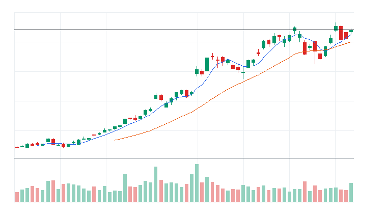

#### 상세 근거

Advanced Micro Devices Inc.(AMD) 상세 근거 펼치기

- moneyFlowScore(최종) 산정 근거:
  - moneyFlowScore(1차): 92
  - 최종 원점수: 117
  - 최종 표시 점수: 100
  - cap 적용: raw score 117 capped to displayed score 100
  - 계산식: +92 + +12 + 0 + +5 + +8 + 0 + 0 = 117 -> 100
  - 점수 해석: 강한 자금 유입 후보. 단, 과열 여부 확인 필수.
  - 가격/거래량 1차 점수: +92
    - 추세: +25
    - 단기 모멘텀: +14
    - 중기 모멘텀: +13
    - 거래량: +14
    - 신고가 근접: +12
    - 이동평균: +14
  - 하위 점수 cap:
    - 가격 모멘텀: 원점수 +25, 상한 적용 +25 / 최대 25
    - 단기 모멘텀: 원점수 +14, 상한 적용 +14 / 최대 20
    - 중기 모멘텀: 원점수 +13, 상한 적용 +13 / 최대 16
    - 거래량: 원점수 +14, 상한 적용 +14 / 최대 20
    - 신고가 근접: 원점수 +12, 상한 적용 +12 / 최대 12
    - 이동평균: 원점수 +14, 상한 적용 +14 / 최대 14
    - 관련 ETF 상대강도: 원점수 +8, 상한 적용 +8 / 최대 8
  - 추가 데이터 가감점:
    - 뉴스: +12
    - 유동성: +5
  - ETF 대비 상대강도: +8
  - 리스크 패널티: 0
  - 주요 근거: 1차 92, 최종 원점수 117, 표시 100. 20일 수익률 강함, 5일 수익률 강함, 1일 단기 모멘텀 확인. 주의: 큰 감점 제한적.
  - 리스크 패널티 산정 근거:
    - 총 리스크 패널티: 0
    - 리스크 등급: LOW
    - 감점된 리스크: 없음
    - 관찰 리스크: 주요 관찰 리스크 없음
    - 한 줄 해석: 직접 감점된 주요 리스크는 없지만 관찰 리스크는 계속 확인해야 한다.
- 데이터 사용 현황:
  - 가격/거래량: 사용
  - 뉴스: 사용
  - ETF 확산도: 관련 ETF에서 확인
  - 거래대금 유동성: 사용
  - 관련 ETF 상대강도: 사용
- 뉴스 확인:
  - 최근 뉴스 상태: 일부 연결
  - 뉴스 소스: CNBC Markets RSS, MarketWatch RSS, Yahoo Finance RSS
  - 소스별 상태: Yahoo Finance RSS CONNECTED; MarketWatch RSS CONNECTED; CNBC Markets RSS CONNECTED; SEC EDGAR RSS PARTIAL; Federal Reserve RSS CONNECTED; Finnhub API DISABLED
  - 긍정/중립/부정: 14/2/0
  - 직접성/방향성/신선도: 4/1/4
  - 강한 촉매 수: 1
  - 중요 공시 수: 0
  - 직접 촉매: Yahoo Finance RSS / general_market / under_72h / positive - Better Buy: AMD vs. Intel After Intel's Monster Run
  - 보조 뉴스: CNBC Markets RSS sector_theme / general_market / under_6h
  - 뉴스 수집 시각: 2026-06-22 09:13 KST
  - 가장 최근 뉴스 발행 시각: 2026-06-22 09:05 KST
  - 뉴스 신선도 상태: FRESH
  - 뉴스 이후 가격 반응: 긍정
  - 가격 반응 점수 제한: 뉴스 이후 가격 반응과 점수 제한 특이사항 없음
  - 핵심 뉴스 요약: Oil rises after Trump threatens fresh strikes on Iran, overshadowing peace talks
  - 원점수/상한 점수: +25 / +12
  - 점수 반영: +12
  - 주의: SEC EDGAR RSS: no matching RSS items; Finnhub API: FINNHUB_API_KEY not configured
- ETF 구성종목 확산도: 관련 ETF에서 확인
- 거래대금 유동성:
  - 데이터 상태: 일부 연결
  - 거래대금 기준 유동성: LIQUID
  - 거래대금: $23,539,815,272
  - 평균 거래대금: $17,165,658,614
  - 주문 영향: 시장가 가능
  - 매매 영향: 거래대금이 충분해 시장가 가능 범위로 본다
- reasonConfidence 근거: 가격/거래량, 뉴스, 거래대금 유동성, 관련 ETF 상대강도 데이터가 확인되어 신뢰도를 높게 본다.
- 차트 요약: 최근 20거래일 기준 5일선이 20일선 위에 있음
- 기준일 2026-06-18 | 종가 $537.37 | 1일 +4.86% | 5일 +10.02% | 20일 +20.06% | 상대 거래량 1.37배 | 52주 고점 대비 -3.76% | 데이터 소스: yfinance

### Applied Materials Inc.(AMAT)
- 자산 유형: STOCK
- 상태: 진입 후보
- primaryTheme: 반도체 장비/공급망
- primarySector: Technology
- industry: Semiconductor Equipment
- relatedEtfs: SMH, SOXX, SOXQ, AIQ
- linkedNarrative: 반도체 장비 사이클 재평가
- narrativeStatus: 지배
- narrativeScore: 93
- moneyFlowScore: 100
- finalRawScore: 124
- tieBreakerReason: 최종 원점수 124, 리스크 패널티 0, 5일 수익률 +11.67%, 상대 거래량 1.80배 순으로 정렬
- 과열 리스크: 낮음~중간
- reasonConfidence: HIGH
- reasonConfidenceExplanation: 직접 촉매: Yahoo Finance RSS / general_market / under_72h / positive - Applied Materials Is Now More Expensive Than Its Dot-Com Era Peak. AI Demand Justifies the AMAT Stock Valuation. 가격/거래량, 관련 ETF 동반 강세, 유동성 근거가 함께 확인되어 HIGH로 분류했다.
- 직접 촉매: Yahoo Finance RSS / general_market / under_72h / positive - Applied Materials Is Now More Expensive Than Its Dot-Com Era Peak. AI Demand Justifies the AMAT Stock Valuation.
- todayActionLabel: 자금흐름 예외 조건부
- 주문 실행: 시장가 가능
- 기준일: 2026-06-18
- 종가: $617.11
- 1일 수익률: +4.08%
- 5일 수익률: +11.67%
- 20일 수익률: +44.57%
- 상대 거래량: 1.80배
- 52주 고점 대비 위치: -3.41%
- 관련 ETF 대비 상대강도: 관련 ETF보다 강함 | 주식 5일 +11.67% vs ETF 평균 +7.61%, 주식 20일 +44.57% vs ETF 평균 +17.24%, 상대 거래량 1.80배 vs ETF 평균 0.78배
- whyMoneyIsFlowing: 20일 +44.57%, 5일 +11.67%, 상대 거래량 1.80배로 가격과 거래량이 함께 개선. 뉴스: Yahoo Finance RSS general_market/under_72h / 유동성: LIQUID
- likelyNextBuyer: 개별 주도주를 따라붙는 단기 모멘텀 자금과 관련 ETF 강세를 확인한 트레이더
- whyThisCouldTradeHigher: 52주 고점 부근이라 돌파가 확인되면 신고가 추종 매수가 붙을 수 있음
- 왜 ETF가 아니라 이 종목인가: AMAT가 관련 ETF 평균보다 5일/20일 흐름 또는 거래량에서 강해 개별 종목 우선 후보로 본다.
- ETF가 더 나은 경우: AMAT가 관련 ETF 평균보다 약하거나 거래량이 둔화되면 개별 종목보다 관련 ETF를 우선한다.
- 진입 조건: 전일 고점 돌파와 5일선 유지 확인
- 무효화 조건: 20일선 이탈 또는 상대 거래량 0.8배 이하 둔화
- 차트: 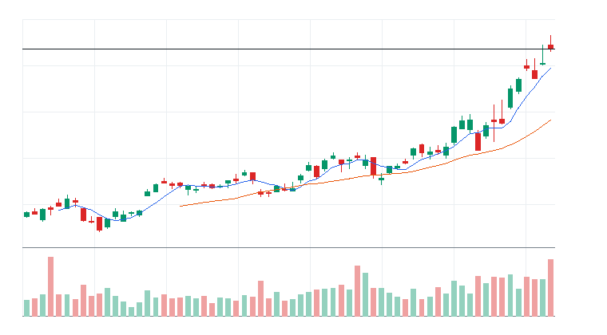

#### 상세 근거

Applied Materials Inc.(AMAT) 상세 근거 펼치기

- moneyFlowScore(최종) 산정 근거:
  - moneyFlowScore(1차): 99
  - 최종 원점수: 124
  - 최종 표시 점수: 100
  - cap 적용: raw score 124 capped to displayed score 100
  - 계산식: +99 + +12 + 0 + +5 + +8 + 0 + 0 = 124 -> 100
  - 점수 해석: 강한 자금 유입 후보. 단, 과열 여부 확인 필수.
  - 가격/거래량 1차 점수: +99
    - 추세: +25
    - 단기 모멘텀: +14
    - 중기 모멘텀: +16
    - 거래량: +18
    - 신고가 근접: +12
    - 이동평균: +14
  - 하위 점수 cap:
    - 가격 모멘텀: 원점수 +30, 상한 적용 +25 / 최대 25 (cap 적용)
    - 단기 모멘텀: 원점수 +14, 상한 적용 +14 / 최대 20
    - 중기 모멘텀: 원점수 +29, 상한 적용 +16 / 최대 16 (cap 적용)
    - 거래량: 원점수 +18, 상한 적용 +18 / 최대 20
    - 신고가 근접: 원점수 +12, 상한 적용 +12 / 최대 12
    - 이동평균: 원점수 +14, 상한 적용 +14 / 최대 14
    - 관련 ETF 상대강도: 원점수 +8, 상한 적용 +8 / 최대 8
  - 추가 데이터 가감점:
    - 뉴스: +12
    - 유동성: +5
  - ETF 대비 상대강도: +8
  - 리스크 패널티: 0
  - 주요 근거: 1차 99, 최종 원점수 124, 표시 100. 20일 수익률 강함, 5일 수익률 강함, 1일 단기 모멘텀 확인. 주의: 큰 감점 제한적.
  - 리스크 패널티 산정 근거:
    - 총 리스크 패널티: 0
    - 리스크 등급: LOW
    - 감점된 리스크: 없음
    - 관찰 리스크: 주요 관찰 리스크 없음
    - 한 줄 해석: 직접 감점된 주요 리스크는 없지만 관찰 리스크는 계속 확인해야 한다.
- 데이터 사용 현황:
  - 가격/거래량: 사용
  - 뉴스: 사용
  - ETF 확산도: 관련 ETF에서 확인
  - 거래대금 유동성: 사용
  - 관련 ETF 상대강도: 사용
- 뉴스 확인:
  - 최근 뉴스 상태: 일부 연결
  - 뉴스 소스: CNBC Markets RSS, MarketWatch RSS, Yahoo Finance RSS
  - 소스별 상태: Yahoo Finance RSS CONNECTED; MarketWatch RSS CONNECTED; CNBC Markets RSS CONNECTED; SEC EDGAR RSS PARTIAL; Federal Reserve RSS CONNECTED; Finnhub API DISABLED
  - 긍정/중립/부정: 14/2/0
  - 직접성/방향성/신선도: 4/1/4
  - 강한 촉매 수: 1
  - 중요 공시 수: 0
  - 직접 촉매: Yahoo Finance RSS / general_market / under_72h / positive - Applied Materials Is Now More Expensive Than Its Dot-Com Era Peak. AI Demand Justifies the AMAT Stock Valuation.
  - 보조 뉴스: CNBC Markets RSS sector_theme / general_market / under_6h
  - 뉴스 수집 시각: 2026-06-22 09:13 KST
  - 가장 최근 뉴스 발행 시각: 2026-06-22 09:05 KST
  - 뉴스 신선도 상태: FRESH
  - 뉴스 이후 가격 반응: 긍정
  - 가격 반응 점수 제한: 뉴스 이후 가격 반응과 점수 제한 특이사항 없음
  - 핵심 뉴스 요약: Oil rises after Trump threatens fresh strikes on Iran, overshadowing peace talks
  - 원점수/상한 점수: +25 / +12
  - 점수 반영: +12
  - 주의: SEC EDGAR RSS: no matching RSS items; Finnhub API: FINNHUB_API_KEY not configured
- ETF 구성종목 확산도: 관련 ETF에서 확인
- 거래대금 유동성:
  - 데이터 상태: 일부 연결
  - 거래대금 기준 유동성: LIQUID
  - 거래대금: $10,355,846,332
  - 평균 거래대금: $5,747,682,316
  - 주문 영향: 시장가 가능
  - 매매 영향: 거래대금이 충분해 시장가 가능 범위로 본다
- reasonConfidence 근거: 가격/거래량, 뉴스, 거래대금 유동성, 관련 ETF 상대강도 데이터가 확인되어 신뢰도를 높게 본다.
- 차트 요약: 최근 20거래일 기준 5일선이 20일선 위에 있음
- 기준일 2026-06-18 | 종가 $617.11 | 1일 +4.08% | 5일 +11.67% | 20일 +44.57% | 상대 거래량 1.80배 | 52주 고점 대비 -3.41% | 데이터 소스: yfinance

### 2-3. 전일 추천 종목 점검
이 섹션은 실제 계좌 보유 종목이 아니라 전일 리포트에서 제시된 개별 종목 후보의 사후 점검이다.
실제 보유 수량/평단이 입력되지 않았으므로 계좌 수익률이 아니라 추천 기준일 이후 가격 변화를 추적한다.

#### Lam Research Corporation(LRCX)
- 전일 추천일: 2026-06-17
- 전일 actionLabel: 조건부 진입
- 전일 moneyFlowScore: 100
- 전일 종가 또는 추천 기준가: $374.18
- 오늘 종가: $389.04
- 추천 이후 수익률: +3.97%
- 진입 조건 충족 여부: 충족 또는 유지
- 무효화 조건 발생 여부: 미발생
- 관련 ETF 대비 상대강도 유지 여부: 유지
- 오늘 상태: 눌림 대기
- 오늘 판단 근거: LRCX는 전일 추천 이후 +3.97% 변화. 관련 ETF보다 강함 | 주식 5일 +7.32% vs ETF 평균 +7.61%, 주식 20일 +33.19% vs ETF 평균 +17.24%, 상대 거래량 2.02배 vs ETF 평균 0.78배
- 다음 확인 조건: 20일선 이탈 또는 상대 거래량 0.8배 이하 둔화

#### KLA Corporation(KLAC)
- 전일 추천일: 2026-06-17
- 전일 actionLabel: 조건부 진입
- 전일 moneyFlowScore: 100
- 전일 종가 또는 추천 기준가: $238.73
- 오늘 종가: $259.56
- 추천 이후 수익률: +8.73%
- 진입 조건 충족 여부: 충족 또는 유지
- 무효화 조건 발생 여부: 미발생
- 관련 ETF 대비 상대강도 유지 여부: 유지
- 오늘 상태: 이익 보호
- 오늘 판단 근거: KLAC는 전일 추천 이후 +8.73% 변화. 관련 ETF보다 강함 | 주식 5일 +7.63% vs ETF 평균 +7.61%, 주식 20일 +41.88% vs ETF 평균 +17.24%, 상대 거래량 2.05배 vs ETF 평균 0.78배
- 다음 확인 조건: 20일선 이탈 또는 상대 거래량 0.8배 이하 둔화

#### Freeport-McMoRan(FCX)
- 전일 추천일: 2026-06-17
- 전일 actionLabel: 조건부 진입
- 전일 moneyFlowScore: 91
- 전일 종가 또는 추천 기준가: $69.06
- 오늘 종가: $68.68
- 추천 이후 수익률: -0.55%
- 진입 조건 충족 여부: 미충족
- 무효화 조건 발생 여부: 미발생
- 관련 ETF 대비 상대강도 유지 여부: 유지
- 오늘 상태: 유지
- 오늘 판단 근거: FCX는 전일 추천 이후 -0.55% 변화. 관련 ETF보다 강함 | 주식 5일 +3.53% vs ETF 평균 +2.09%, 주식 20일 +12.83% vs ETF 평균 +3.40%, 상대 거래량 1.37배 vs ETF 평균 1.17배
- 다음 확인 조건: 20일선 이탈 또는 상대 거래량 0.8배 이하 둔화

#### ASML Holding N.V.(ASML)
- 전일 추천일: 2026-06-17
- 전일 actionLabel: 조건부 진입
- 전일 moneyFlowScore: 100
- 전일 종가 또는 추천 기준가: $1,867.83
- 오늘 종가: $1,929.68
- 추천 이후 수익률: +3.31%
- 진입 조건 충족 여부: 충족 또는 유지
- 무효화 조건 발생 여부: 미발생
- 관련 ETF 대비 상대강도 유지 여부: 유지
- 오늘 상태: 눌림 대기
- 오늘 판단 근거: ASML는 전일 추천 이후 +3.31% 변화. 관련 ETF와 비슷함 | 주식 5일 +1.59% vs ETF 평균 +7.61%, 주식 20일 +24.49% vs ETF 평균 +17.24%, 상대 거래량 1.22배 vs ETF 평균 0.78배
- 다음 확인 조건: 20일선 이탈 또는 상대 거래량 0.8배 이하 둔화

#### Applied Materials Inc.(AMAT)
- 전일 추천일: 2026-06-17
- 전일 actionLabel: 강한 자금흐름 조건부
- 전일 moneyFlowScore: 100
- 전일 종가 또는 추천 기준가: $592.92
- 오늘 종가: $617.11
- 추천 이후 수익률: +4.08%
- 진입 조건 충족 여부: 충족 또는 유지
- 무효화 조건 발생 여부: 미발생
- 관련 ETF 대비 상대강도 유지 여부: 유지
- 오늘 상태: 눌림 대기
- 오늘 판단 근거: AMAT는 전일 추천 이후 +4.08% 변화. 관련 ETF보다 강함 | 주식 5일 +11.67% vs ETF 평균 +7.61%, 주식 20일 +44.57% vs ETF 평균 +17.24%, 상대 거래량 1.80배 vs ETF 평균 0.78배
- 다음 확인 조건: 20일선 이탈 또는 상대 거래량 0.8배 이하 둔화

### 2-4. ETF 대비 개별 종목 판단 로직

- 관련 ETF의 5일/20일 수익률과 개별 종목의 5일/20일 수익률을 비교한다.
- 관련 ETF의 상대 거래량과 개별 종목의 상대 거래량을 비교한다.
- 개별 종목이 관련 ETF보다 강하면 개별 종목 우선 가능성으로 본다.
- 개별 종목이 관련 ETF와 비슷하거나 약하면 ETF 우선 / 개별 종목 관찰로 낮춘다.
- 관련 ETF가 더 강하면 개별 종목 대신 ETF를 우선한다.

### 2-5. 개별 종목 제외/주의 후보

#### QUALCOMM Incorporated(QCOM)
- moneyFlowScore(최종): 100
- moneyFlowScore 산정 근거 요약: 1차 80, 최종 원점수 101, 표시 100. 20일 수익률 강함, 5일 수익률 강함, 1일 단기 모멘텀 확인. 주의: 단기 과열/추격 위험 존재.
- 제외/주의 사유: 개별 종목 우선 근거 부족
- 해제 조건: 20일선 위 눌림 후 재상승 확인

#### Analog Devices Inc.(ADI)
- moneyFlowScore(최종): 100
- moneyFlowScore 산정 근거 요약: 1차 76, 최종 원점수 101, 표시 100. 20일 수익률 강함, 5일 수익률 강함, 1일 단기 모멘텀 확인. 주의: 큰 감점 제한적.
- 제외/주의 사유: 개별 종목 우선 근거 부족
- 해제 조건: 전일 고점 돌파와 5일선 유지 확인

#### Seagate Technology Holdings plc(STX)
- moneyFlowScore(최종): 100
- moneyFlowScore 산정 근거 요약: 1차 91, 최종 원점수 108, 표시 100. 20일 수익률 강함, 5일 수익률 강함, 상대 거래량 증가. 주의: 단기 과열/추격 위험 존재.
- 제외/주의 사유: 개별 종목 우선 근거 부족
- 해제 조건: 20일선 위 눌림 후 재상승 확인

#### Western Digital Corporation(WDC)
- moneyFlowScore(최종): 100
- moneyFlowScore 산정 근거 요약: 1차 97, 최종 원점수 114, 표시 100. 20일 수익률 강함, 5일 수익률 강함, 1일 단기 모멘텀 확인. 주의: 단기 과열/추격 위험 존재.
- 제외/주의 사유: 개별 종목 우선 근거 부족
- 해제 조건: 20일선 위 눌림 후 재상승 확인

#### Taiwan Semiconductor(TSM)
- moneyFlowScore(최종): 100
- moneyFlowScore 산정 근거 요약: 1차 93, 최종 원점수 108, 표시 100. 20일 수익률 강함, 5일 수익률 강함, 1일 단기 모멘텀 확인. 주의: 단기 과열/추격 위험 존재.
- 제외/주의 사유: 개별 종목 우선 근거 부족
- 해제 조건: 전일 고점 돌파와 5일선 유지 확인

### Nasdaq-100 전체 moneyFlowScore(1차) 표
이 표는 NASDAQ_100 전체 구성종목을 가격/거래량/추세 중심으로 빠르게 스캔한 moneyFlowScore(1차) 결과다. 뉴스, 유동성, 관련 ETF 대비 상대강도, 리스크 패널티를 반영한 최종 추천 점수는 Top5 카드의 moneyFlowScore(최종)에서 확인한다.

주의: Top5 카드의 moneyFlowScore(최종)는 1차 점수에 상세 데이터 가감점과 리스크 패널티를 더한 값이다. 따라서 아래 전체 표의 1차 순위와 Top5 최종 순위는 다를 수 있다.

- 총 스캔 종목 수: 101
- 점수 계산 성공: 120
- 점수 계산 실패: 0
- moneyFlowScore(1차) 80점 이상: 15
- moneyFlowScore(1차) 65~79점: 8
- moneyFlowScore(1차) 50~64점: 7
- moneyFlowScore(1차) 50점 미만: 90

상위 20개 요약:

| 순위 | 티커 | 이름 | moneyFlowScore(1차) | 최종 표시 점수 | 최종 원점수 | 점수 구간 | 오늘 판단 | 신뢰도 | 1일 | 5일 | 20일 | 상대 거래량 | 관련 ETF |
|---:|---|---|---:|---:|---:|---|---|---|---:|---:|---:|---:|---|
| 1 | CIFR | Cipher Mining | 100 | 100 | 114 | 강한 자금 유입 후보 | 자금흐름 예외 조건부 | HIGH | +10.74% | +28.94% | +49.79% | 1.57 | IBIT, BLOK |
| 2 | ARM | Arm Holdings plc | 100 | 100 | 122 | 강한 자금 유입 후보 | 자금흐름 예외 조건부 | HIGH | +4.91% | +28.41% | +71.18% | 2.42 | SMH, SOXX, SOXQ, AIQ |
| 3 | AMAT | Applied Materials Inc. | 99 | 100 | 124 | 강한 자금 유입 후보 | 자금흐름 예외 조건부 | HIGH | +4.08% | +11.67% | +44.57% | 1.80 | SMH, SOXX, SOXQ, AIQ |
| 4 | WDC | Western Digital Corporation | 97 | 100 | 114 | 강한 자금 유입 후보 | 추격 금지 | MEDIUM | +4.79% | +40.99% | +62.36% | 2.08 | QQQ, SPY, IWM |
| 5 | INTC | Intel Corporation | 96 | 100 | 117 | 강한 자금 유입 후보 | 자금흐름 예외 조건부 | HIGH | +10.64% | +14.56% | +12.63% | 1.78 | SMH, SOXX, SOXQ, AIQ |
| 6 | MU | Micron Technology Inc. | 96 | 100 | 113 | 강한 자금 유입 후보 | 자금흐름 예외 조건부 | HIGH | +8.70% | +13.87% | +54.92% | 1.19 | DRAM, SMH, SOXX, SOXQ |
| 7 | MRVL | Marvell Technology Inc. | 94 | 100 | 115 | 강한 자금 유입 후보 | 자금흐름 예외 조건부 | HIGH | +7.27% | +10.64% | +66.26% | 3.55 | SMH, SOXX, SOXQ, AIQ |
| 8 | KLAC | KLA Corporation | 94 | 100 | 109 | 강한 자금 유입 후보 | 자금흐름 예외 조건부 | HIGH | +8.73% | +7.63% | +41.88% | 2.05 | SMH, SOXX, SOXQ, AIQ |
| 9 | TSM | Taiwan Semiconductor | 93 | 100 | 108 | 강한 자금 유입 후보 | 자금흐름 예외 조건부 | HIGH | +6.94% | +9.75% | +15.06% | 2.00 | SMH, SOXX, SOXQ |
| 10 | AMD | Advanced Micro Devices Inc. | 92 | 100 | 117 | 강한 자금 유입 후보 | 자금흐름 예외 조건부 | HIGH | +4.86% | +10.02% | +20.06% | 1.37 | SMH, SOXX, SOXQ, AIQ |
| 11 | STX | Seagate Technology Holdings plc | 91 | 100 | 108 | 강한 자금 유입 후보 | 추격 금지 | HIGH | +0.39% | +23.29% | +42.49% | 2.24 | QQQ, SPY, IWM |
| 12 | LRCX | Lam Research Corporation | 90 | 100 | 115 | 강한 자금 유입 후보 | 자금흐름 예외 조건부 | HIGH | +3.97% | +7.32% | +33.19% | 2.02 | SMH, SOXX, SOXQ, AIQ |
| 13 | GEV | GE Vernova | 80 | 97 | 97 | 강한 자금 유입 후보 | 자금흐름 예외 조건부 | HIGH | +5.80% | +22.38% | +8.32% | 1.44 | QQQ, SPY, IWM |
| 14 | QCOM | QUALCOMM Incorporated | 80 | 100 | 101 | 강한 자금 유입 후보 | 자금흐름 예외 조건부 | HIGH | +6.17% | +11.41% | +11.65% | 2.08 | SMH, SOXX, SOXQ, AIQ |
| 15 | TXN | Texas Instruments Incorporated | 80 | 95 | 95 | 강한 자금 유입 후보 | 자금흐름 예외 조건부 | HIGH | +6.95% | +8.67% | +5.90% | 2.42 | SMH, SOXX, SOXQ, AIQ |
| 16 | ETN | Eaton | 78 | 100 | 101 | 관심 후보 | 조건부 진입 | HIGH | +2.96% | +7.15% | +11.08% | 1.50 | QQQ, SPY, IWM |
| 17 | ADI | Analog Devices Inc. | 76 | 100 | 101 | 관심 후보 | 자금흐름 예외 조건부 | HIGH | +4.83% | +5.42% | +9.15% | 2.26 | SMH, SOXX, SOXQ, AIQ |
| 18 | TTWO | Take-Two Interactive Software Inc. | 74 | 97 | 97 | 관심 후보 | 추격 금지 | HIGH | +4.93% | +12.83% | +1.12% | 2.31 | QQQ |
| 19 | DASH | DoorDash Inc. | 74 | 97 | 97 | 관심 후보 | 추격 금지 | HIGH | +4.71% | +12.21% | +7.92% | 1.61 | QQQ |
| 20 | ASML | ASML Holding N.V. | 74 | 99 | 99 | 관심 후보 | 조건부 진입 | HIGH | +3.31% | +1.59% | +24.49% | 1.22 | SMH, SOXX, SOXQ, AIQ |

NASDAQ_100 전체 moneyFlowScore(1차) 표 펼치기

| 순위 | 티커 | 이름 | moneyFlowScore(1차) | 최종 표시 점수 | 최종 원점수 | 점수 구간 | 오늘 판단 | 신뢰도 | 1일 | 5일 | 20일 | 상대 거래량 | 관련 ETF |
|---:|---|---|---:|---:|---:|---|---|---|---:|---:|---:|---:|---|
| 1 | CIFR | Cipher Mining | 100 | 100 | 114 | 강한 자금 유입 후보 | 자금흐름 예외 조건부 | HIGH | +10.74% | +28.94% | +49.79% | 1.57 | IBIT, BLOK |
| 2 | ARM | Arm Holdings plc | 100 | 100 | 122 | 강한 자금 유입 후보 | 자금흐름 예외 조건부 | HIGH | +4.91% | +28.41% | +71.18% | 2.42 | SMH, SOXX, SOXQ, AIQ |
| 3 | AMAT | Applied Materials Inc. | 99 | 100 | 124 | 강한 자금 유입 후보 | 자금흐름 예외 조건부 | HIGH | +4.08% | +11.67% | +44.57% | 1.80 | SMH, SOXX, SOXQ, AIQ |
| 4 | WDC | Western Digital Corporation | 97 | 100 | 114 | 강한 자금 유입 후보 | 추격 금지 | MEDIUM | +4.79% | +40.99% | +62.36% | 2.08 | QQQ, SPY, IWM |
| 5 | INTC | Intel Corporation | 96 | 100 | 117 | 강한 자금 유입 후보 | 자금흐름 예외 조건부 | HIGH | +10.64% | +14.56% | +12.63% | 1.78 | SMH, SOXX, SOXQ, AIQ |
| 6 | MU | Micron Technology Inc. | 96 | 100 | 113 | 강한 자금 유입 후보 | 자금흐름 예외 조건부 | HIGH | +8.70% | +13.87% | +54.92% | 1.19 | DRAM, SMH, SOXX, SOXQ |
| 7 | MRVL | Marvell Technology Inc. | 94 | 100 | 115 | 강한 자금 유입 후보 | 자금흐름 예외 조건부 | HIGH | +7.27% | +10.64% | +66.26% | 3.55 | SMH, SOXX, SOXQ, AIQ |
| 8 | KLAC | KLA Corporation | 94 | 100 | 109 | 강한 자금 유입 후보 | 자금흐름 예외 조건부 | HIGH | +8.73% | +7.63% | +41.88% | 2.05 | SMH, SOXX, SOXQ, AIQ |
| 9 | TSM | Taiwan Semiconductor | 93 | 100 | 108 | 강한 자금 유입 후보 | 자금흐름 예외 조건부 | HIGH | +6.94% | +9.75% | +15.06% | 2.00 | SMH, SOXX, SOXQ |
| 10 | AMD | Advanced Micro Devices Inc. | 92 | 100 | 117 | 강한 자금 유입 후보 | 자금흐름 예외 조건부 | HIGH | +4.86% | +10.02% | +20.06% | 1.37 | SMH, SOXX, SOXQ, AIQ |
| 11 | STX | Seagate Technology Holdings plc | 91 | 100 | 108 | 강한 자금 유입 후보 | 추격 금지 | HIGH | +0.39% | +23.29% | +42.49% | 2.24 | QQQ, SPY, IWM |
| 12 | LRCX | Lam Research Corporation | 90 | 100 | 115 | 강한 자금 유입 후보 | 자금흐름 예외 조건부 | HIGH | +3.97% | +7.32% | +33.19% | 2.02 | SMH, SOXX, SOXQ, AIQ |
| 13 | GEV | GE Vernova | 80 | 97 | 97 | 강한 자금 유입 후보 | 자금흐름 예외 조건부 | HIGH | +5.80% | +22.38% | +8.32% | 1.44 | QQQ, SPY, IWM |
| 14 | QCOM | QUALCOMM Incorporated | 80 | 100 | 101 | 강한 자금 유입 후보 | 자금흐름 예외 조건부 | HIGH | +6.17% | +11.41% | +11.65% | 2.08 | SMH, SOXX, SOXQ, AIQ |
| 15 | TXN | Texas Instruments Incorporated | 80 | 95 | 95 | 강한 자금 유입 후보 | 자금흐름 예외 조건부 | HIGH | +6.95% | +8.67% | +5.90% | 2.42 | SMH, SOXX, SOXQ, AIQ |
| 16 | ETN | Eaton | 78 | 100 | 101 | 관심 후보 | 조건부 진입 | HIGH | +2.96% | +7.15% | +11.08% | 1.50 | QQQ, SPY, IWM |
| 17 | ADI | Analog Devices Inc. | 76 | 100 | 101 | 관심 후보 | 자금흐름 예외 조건부 | HIGH | +4.83% | +5.42% | +9.15% | 2.26 | SMH, SOXX, SOXQ, AIQ |
| 18 | TTWO | Take-Two Interactive Software Inc. | 74 | 97 | 97 | 관심 후보 | 추격 금지 | HIGH | +4.93% | +12.83% | +1.12% | 2.31 | QQQ |
| 19 | DASH | DoorDash Inc. | 74 | 97 | 97 | 관심 후보 | 추격 금지 | HIGH | +4.71% | +12.21% | +7.92% | 1.61 | QQQ |
| 20 | ASML | ASML Holding N.V. | 74 | 99 | 99 | 관심 후보 | 조건부 진입 | HIGH | +3.31% | +1.59% | +24.49% | 1.22 | SMH, SOXX, SOXQ, AIQ |
| 21 | ABNB | Airbnb Inc. | 73 | 79 | 79 | 관심 후보 | 추격 금지 | MEDIUM | +1.33% | +8.82% | +5.06% | 1.92 | QQQ |
| 22 | VRT | Vertiv | 67 | 73 | 73 | 관심 후보 | 관찰 | MEDIUM | +4.87% | +11.81% | +5.51% | 1.21 | QQQ, SPY, IWM |
| 23 | MCHP | Microchip Technology Incorporated | 67 | 71 | 71 | 관심 후보 | 제외 | MEDIUM | +6.01% | +7.35% | +6.12% | 1.36 | SMH, SOXX, SOXQ, AIQ |
| 24 | FCX | Freeport-McMoRan | 61 | 67 | 67 | 관찰 후보 | 관찰 | MEDIUM | -0.55% | +3.53% | +12.83% | 1.37 | QQQ, SPY, IWM |
| 25 | PANW | Palo Alto Networks Inc. | 60 | 60 | 60 | 관찰 후보 | 제외 | MEDIUM | +2.00% | +2.95% | +16.67% | 1.33 | HACK, CIBR, IHAK, IGV |
| 26 | NXPI | NXP Semiconductors N.V. | 58 | 66 | 66 | 관찰 후보 | 제외 | MEDIUM | +5.05% | +3.54% | +1.01% | 1.89 | SMH, SOXX, SOXQ, AIQ |
| 27 | BKNG | Booking Holdings Inc. | 57 | 63 | 63 | 관찰 후보 | 추격 금지 | MEDIUM | +0.09% | +5.01% | +9.45% | 2.30 | QQQ |
| 28 | RIOT | Riot Platforms | 55 | 53 | 53 | 관찰 후보 | 거래량 확인 전 관찰 | LOW | +2.44% | +7.50% | +18.72% | 0.91 | IBIT, BLOK |
| 29 | HON | Honeywell International Inc. | 54 | 60 | 60 | 관찰 후보 | 관찰 | MEDIUM | +0.17% | +4.51% | +5.35% | 1.24 | QQQ, SPY, IWM |
| 30 | FTNT | Fortinet Inc. | 52 | 52 | 52 | 관찰 후보 | 제외 | MEDIUM | +0.41% | -0.23% | +11.33% | 2.62 | HACK, CIBR, IHAK, IGV |
| 31 | FER | Ferrovial N.V. | 49 | 55 | 55 | 우선순위 낮음/매매 금지 | 관찰 | MEDIUM | +0.71% | +2.78% | +2.69% | 1.41 | QQQ, SPY, IWM |
| 32 | CEG | Constellation Energy Corporation | 48 | 54 | 54 | 우선순위 낮음/매매 금지 | 관찰 | MEDIUM | +2.58% | +11.09% | -2.56% | 1.62 | QQQ, SPY, IWM |
| 33 | MAR | Marriott International Inc. | 48 | 54 | 54 | 우선순위 낮음/매매 금지 | 관찰 | MEDIUM | +0.40% | -0.17% | +7.15% | 1.87 | QQQ, SPY, IWM |
| 34 | VRTX | Vertex Pharmaceuticals Incorporated | 46 | 52 | 52 | 우선순위 낮음/매매 금지 | 추격 금지 | MEDIUM | -1.60% | +1.48% | +4.92% | 2.14 | QQQ |
| 35 | PCAR | PACCAR Inc. | 45 | 51 | 51 | 우선순위 낮음/매매 금지 | 관찰 | MEDIUM | +1.37% | +1.17% | +6.55% | 1.91 | QQQ, SPY, IWM |
| 36 | MNST | Monster Beverage Corporation | 44 | 50 | 50 | 우선순위 낮음/매매 금지 | 추격 금지 | MEDIUM | -0.35% | -0.75% | +5.13% | 2.17 | QQQ |
| 37 | IDXX | IDEXX Laboratories Inc. | 40 | 46 | 46 | 우선순위 낮음/매매 금지 | 추격 금지 | MEDIUM | +2.93% | +0.75% | +1.54% | 1.96 | QQQ |
| 38 | EXC | Exelon Corporation | 40 | 46 | 46 | 우선순위 낮음/매매 금지 | 제외 | MEDIUM | +0.55% | +0.66% | +2.09% | 1.58 | QQQ, SPY, IWM |
| 39 | LIN | Linde plc | 40 | 46 | 46 | 우선순위 낮음/매매 금지 | 제외 | MEDIUM | -0.72% | -0.64% | +1.09% | 2.01 | QQQ, SPY, IWM |
| 40 | FAST | Fastenal Company | 40 | 46 | 46 | 우선순위 낮음/매매 금지 | 제외 | MEDIUM | +2.25% | -1.08% | +5.06% | 1.57 | QQQ, SPY, IWM |
| 41 | CDNS | Cadence Design Systems Inc. | 35 | 35 | 35 | 우선순위 낮음/매매 금지 | 제외 | MEDIUM | -0.57% | +0.95% | +10.40% | 2.63 | IGV, AIQ, QQQ |
| 42 | ROST | Ross Stores Inc. | 34 | 40 | 40 | 우선순위 낮음/매매 금지 | 제외 | MEDIUM | -0.19% | -2.64% | +6.89% | 1.18 | QQQ, SPY, IWM |
| 43 | KDP | Keurig Dr Pepper Inc. | 33 | 39 | 39 | 우선순위 낮음/매매 금지 | 추격 금지 | MEDIUM | -0.42% | -1.50% | +7.22% | 1.64 | QQQ |
| 44 | RTX | RTX | 32 | 38 | 38 | 우선순위 낮음/매매 금지 | 제외 | MEDIUM | -3.62% | +0.75% | +6.15% | 1.56 | QQQ, SPY, IWM |
| 45 | MPWR | Monolithic Power Systems Inc. | 32 | 30 | 30 | 우선순위 낮음/매매 금지 | 제외 | LOW | +7.97% | -1.63% | +0.67% | 2.28 | SMH, SOXX, SOXQ, AIQ |
| 46 | AVGO | Broadcom Inc. | 28 | 30 | 30 | 우선순위 낮음/매매 금지 | 제외 | LOW | +4.70% | +6.69% | -1.53% | 1.28 | SMH, SOXX, SOXQ, AIQ |
| 47 | EA | Electronic Arts Inc. | 27 | 27 | 27 | 우선순위 낮음/매매 금지 | 추격 금지 | LOW | -0.43% | -0.44% | +0.28% | 2.79 | QQQ |
| 48 | CCEP | Coca-Cola Europacific Partners PLC | 27 | 33 | 33 | 우선순위 낮음/매매 금지 | 추격 금지 | LOW | -0.20% | -0.78% | +3.91% | 1.45 | QQQ |
| 49 | AAPL | Apple Inc. | 26 | 26 | 26 | 우선순위 낮음/매매 금지 | 제외 | LOW | +0.70% | +0.81% | -1.40% | 1.63 | QQQ, MAGS, SPY |
| 50 | CSCO | Cisco Systems Inc. | 26 | 26 | 26 | 우선순위 낮음/매매 금지 | 제외 | LOW | +1.88% | -1.88% | +4.54% | 2.04 | QQQ, SPY, IWM |
| 51 | GOOG | Alphabet Inc. Class C | 24 | 24 | 24 | 우선순위 낮음/매매 금지 | 추격 금지 | LOW | +1.48% | +3.06% | -4.53% | 1.24 | QQQ |
| 52 | NVDA | NVIDIA Corporation | 24 | 26 | 26 | 우선순위 낮음/매매 금지 | 제외 | LOW | +2.95% | +2.84% | -5.72% | 1.37 | SMH, SOXX, SOXQ, AIQ, QQQ |
| 53 | IREN | IREN | 23 | 15 | 15 | 우선순위 낮음/매매 금지 | 거래량 확인 전 관찰 | LOW | +3.18% | +5.73% | +13.75% | 0.82 | IBIT, BLOK |
| 54 | GOOGL | Alphabet Inc. Class A | 23 | 23 | 23 | 우선순위 낮음/매매 금지 | 추격 금지 | LOW | +1.17% | +2.87% | -5.37% | 1.36 | QQQ |
| 55 | PWR | Quanta Services | 23 | 23 | 23 | 우선순위 낮음/매매 금지 | 제외 | LOW | -1.76% | +2.77% | -1.08% | 2.31 | QQQ, SPY, IWM |
| 56 | MARA | MARA Holdings | 21 | 23 | 23 | 우선순위 낮음/매매 금지 | 거래량 확인 전 관찰 | LOW | +2.16% | +4.48% | +8.14% | 0.86 | IBIT, BLOK |
| 57 | CSX | CSX Corporation | 21 | 21 | 21 | 우선순위 낮음/매매 금지 | 제외 | LOW | +0.13% | -3.67% | -0.67% | 1.72 | QQQ, SPY, IWM |
| 58 | CRWD | CrowdStrike Holdings Inc. | 20 | 14 | 14 | 우선순위 낮음/매매 금지 | 제외 | LOW | +0.28% | -0.96% | +5.35% | 1.49 | HACK, CIBR, IHAK, IGV |
| 59 | PAYX | Paychex Inc. | 19 | 19 | 19 | 우선순위 낮음/매매 금지 | 제외 | LOW | +0.68% | -1.04% | +3.50% | 2.18 | QQQ, SPY, IWM |
| 60 | PYPL | PayPal Holdings Inc. | 18 | 18 | 18 | 우선순위 낮음/매매 금지 | 제외 | LOW | +1.02% | +3.08% | -4.20% | 1.64 | QQQ, SPY, IWM |
| 61 | SBUX | Starbucks Corporation | 18 | 24 | 24 | 우선순위 낮음/매매 금지 | 제외 | LOW | +0.83% | -1.59% | -5.49% | 1.29 | QQQ, SPY, IWM |
| 62 | AEP | American Electric Power Company Inc. | 15 | 15 | 15 | 우선순위 낮음/매매 금지 | 제외 | LOW | -0.45% | -0.61% | -0.92% | 2.01 | QQQ, SPY, IWM |
| 63 | AXON | Axon Enterprise Inc. | 14 | 14 | 14 | 우선순위 낮음/매매 금지 | 제외 | LOW | +0.09% | -5.11% | +6.26% | 1.61 | QQQ, SPY, IWM |
| 64 | AMZN | Amazon.com Inc. | 13 | 13 | 13 | 우선순위 낮음/매매 금지 | 추격 금지 | LOW | +2.90% | +1.19% | -7.78% | 1.71 | QQQ |
| 65 | ROP | Roper Technologies Inc. | 13 | 13 | 13 | 우선순위 낮음/매매 금지 | 제외 | LOW | +0.09% | -0.74% | +2.21% | 3.06 | IGV, AIQ, QQQ |
| 66 | XEL | Xcel Energy Inc. | 13 | 13 | 13 | 우선순위 낮음/매매 금지 | 제외 | LOW | -0.06% | -1.10% | -3.07% | 2.22 | QQQ, SPY, IWM |
| 67 | META | Meta Platforms Inc. | 11 | 11 | 11 | 우선순위 낮음/매매 금지 | 추격 금지 | LOW | +1.70% | +1.55% | -4.60% | 1.51 | QQQ |
| 68 | ODFL | Old Dominion Freight Line Inc. | 10 | 10 | 10 | 우선순위 낮음/매매 금지 | 제외 | LOW | +1.23% | -10.78% | +5.34% | 1.83 | QQQ, SPY, IWM |
| 69 | MELI | MercadoLibre Inc. | 9 | 9 | 9 | 우선순위 낮음/매매 금지 | 추격 금지 | LOW | +0.20% | +1.56% | -0.97% | 1.25 | QQQ |
| 70 | DXCM | DexCom Inc. | 9 | 9 | 9 | 우선순위 낮음/매매 금지 | 추격 금지 | LOW | +1.74% | -3.69% | +1.44% | 1.45 | QQQ |
| 71 | CCJ | Cameco | 8 | 4 | 4 | 우선순위 낮음/매매 금지 | 거래량 확인 전 관찰 | LOW | +0.78% | +7.60% | +2.37% | 0.93 | QQQ, SPY, IWM |
| 72 | ADP | Automatic Data Processing Inc. | 8 | 8 | 8 | 우선순위 낮음/매매 금지 | 제외 | LOW | -0.16% | -3.26% | -1.03% | 2.38 | QQQ, SPY, IWM |
| 73 | TSLA | Tesla Inc. | 6 | 6 | 6 | 우선순위 낮음/매매 금지 | 제외 | LOW | +1.04% | +0.34% | -4.02% | 1.24 | QQQ |
| 74 | SHOP | Shopify Inc. | 6 | 6 | 6 | 우선순위 낮음/매매 금지 | 제외 | LOW | +0.70% | -1.47% | +3.66% | 1.16 | IGV, AIQ, QQQ |
| 75 | DDOG | Datadog Inc. | 6 | 6 | 6 | 우선순위 낮음/매매 금지 | 제외 | LOW | -1.60% | -4.80% | +5.07% | 1.39 | IGV, AIQ, QQQ |
| 76 | REGN | Regeneron Pharmaceuticals Inc. | 5 | 5 | 5 | 우선순위 낮음/매매 금지 | 추격 금지 | LOW | +0.33% | -0.25% | -6.13% | 2.16 | QQQ |
| 77 | PEP | PepsiCo Inc. | 5 | 5 | 5 | 우선순위 낮음/매매 금지 | 추격 금지 | LOW | +0.30% | -1.19% | -4.87% | 2.04 | QQQ |
| 78 | VRSK | Verisk Analytics Inc. | 4 | 4 | 4 | 우선순위 낮음/매매 금지 | 제외 | LOW | -0.88% | -4.51% | +1.84% | 6.07 | QQQ, SPY, IWM |
| 79 | AMGN | Amgen Inc. | 4 | 4 | 4 | 우선순위 낮음/매매 금지 | 추격 금지 | LOW | -1.19% | -4.65% | +1.82% | 2.69 | QQQ |
| 80 | APP | AppLovin Corporation | 3 | 3 | 3 | 우선순위 낮음/매매 금지 | 제외 | LOW | -2.04% | -1.85% | -2.61% | 1.77 | IGV, AIQ, QQQ |
| 81 | TMUS | T-Mobile US Inc. | 3 | 3 | 3 | 우선순위 낮음/매매 금지 | 제외 | LOW | +0.20% | -2.23% | -4.46% | 2.28 | QQQ, SPY, IWM |
| 82 | WBD | Warner Bros. Discovery Inc. | 3 | 3 | 3 | 우선순위 낮음/매매 금지 | 추격 금지 | LOW | -0.15% | -2.46% | -4.45% | 1.84 | QQQ |
| 83 | GILD | Gilead Sciences Inc. | 2 | 2 | 2 | 우선순위 낮음/매매 금지 | 추격 금지 | LOW | -1.35% | -1.68% | -5.30% | 1.63 | QQQ |
| 84 | CTAS | Cintas Corporation | 2 | 2 | 2 | 우선순위 낮음/매매 금지 | 제외 | LOW | +0.71% | -6.06% | -0.30% | 1.72 | QQQ, SPY, IWM |
| 85 | AVAV | AeroVironment | 2 | 0 | 0 | 우선순위 낮음/매매 금지 | 제외 | LOW | +1.50% | -7.67% | +3.50% | 1.19 | XAR, SHLD, ITA, PPA |
| 86 | ISRG | Intuitive Surgical Inc. | 1 | 1 | 1 | 우선순위 낮음/매매 금지 | 추격 금지 | LOW | +1.14% | -1.48% | -9.41% | 1.74 | QQQ |
| 87 | CPRT | Copart Inc. | 1 | 1 | 1 | 우선순위 낮음/매매 금지 | 제외 | LOW | +2.41% | -2.67% | -8.50% | 2.46 | QQQ, SPY, IWM |
| 88 | COIN | Coinbase | 0 | 0 | -6 | 우선순위 낮음/매매 금지 | 제외 | LOW | -1.01% | +1.76% | -14.65% | 1.14 | QQQ, SPY, IWM |
| 89 | SNPS | Synopsys Inc. | 0 | 0 | 0 | 우선순위 낮음/매매 금지 | 제외 | LOW | -1.35% | -0.17% | -8.70% | 1.47 | IGV, AIQ, QQQ |
| 90 | INSM | Insmed Incorporated | 0 | 0 | -4 | 우선순위 낮음/매매 금지 | 추격 금지 | LOW | -2.69% | -0.95% | -11.22% | 4.91 | QQQ |
| 91 | ZS | Zscaler Inc. | 0 | 0 | -7 | 우선순위 낮음/매매 금지 | 제외 | LOW | +0.38% | -1.00% | -28.43% | 2.07 | HACK, CIBR, IHAK, IGV |
| 92 | PLTR | Palantir Technologies Inc. | 0 | 0 | -5 | 우선순위 낮음/매매 금지 | 제외 | LOW | -1.65% | -1.99% | -6.33% | 1.38 | IGV, AIQ, CIBR, QQQ |
| 93 | TRI | Thomson Reuters Corporation | 0 | 0 | -2 | 우선순위 낮음/매매 금지 | 제외 | LOW | -0.85% | -2.08% | -7.94% | 4.07 | QQQ, SPY, IWM |
| 94 | PDD | PDD Holdings Inc. | 0 | 0 | -30 | 우선순위 낮음/매매 금지 | 거래량 확인 전 관찰 | LOW | -0.38% | -2.14% | -18.94% | 0.88 | QQQ |
| 95 | COST | Costco Wholesale Corporation | 0 | 0 | -9 | 우선순위 낮음/매매 금지 | 추격 금지 | LOW | -1.46% | -2.48% | -11.41% | 1.49 | QQQ |
| 96 | WMT | Walmart Inc. | 0 | 0 | -9 | 우선순위 낮음/매매 금지 | 추격 금지 | LOW | -0.80% | -2.76% | -10.45% | 1.33 | QQQ |
| 97 | MSFT | Microsoft Corporation | 0 | 0 | -3 | 우선순위 낮음/매매 금지 | 제외 | LOW | +0.13% | -2.80% | -9.89% | 1.53 | QQQ, MAGS, IGV, AIQ |
| 98 | INTU | Intuit Inc. | 0 | 0 | -12 | 우선순위 낮음/매매 금지 | 제외 | LOW | -0.77% | -3.58% | -30.46% | 1.30 | IGV, AIQ, QQQ |
| 99 | ORLY | O'Reilly Automotive Inc. | 0 | 0 | -3 | 우선순위 낮음/매매 금지 | 제외 | LOW | -1.76% | -3.62% | -5.83% | 2.03 | QQQ, SPY, IWM |
| 100 | ALNY | Alnylam Pharmaceuticals Inc. | 0 | 0 | -4 | 우선순위 낮음/매매 금지 | 추격 금지 | LOW | -1.64% | -3.90% | -6.83% | 1.88 | QQQ |
| 101 | FANG | Diamondback Energy Inc. | 0 | 0 | -8 | 우선순위 낮음/매매 금지 | 제외 | LOW | -1.07% | -4.22% | -10.19% | 1.76 | QQQ, SPY, IWM |
| 102 | GEHC | GE HealthCare Technologies Inc. | 0 | 0 | 0 | 우선순위 낮음/매매 금지 | 추격 금지 | LOW | +0.72% | -4.53% | -4.15% | 1.79 | QQQ |
| 103 | NFLX | Netflix Inc. | 0 | 0 | -8 | 우선순위 낮음/매매 금지 | 추격 금지 | LOW | +0.55% | -4.79% | -12.16% | 2.33 | QQQ |
| 104 | MDLZ | Mondelez International Inc. | 0 | 0 | -2 | 우선순위 낮음/매매 금지 | 추격 금지 | LOW | -1.22% | -5.11% | -2.78% | 2.92 | QQQ |
| 105 | NOC | Northrop Grumman | 0 | 0 | -10 | 우선순위 낮음/매매 금지 | 제외 | LOW | -5.21% | -5.61% | -5.55% | 2.29 | QQQ, SPY, IWM |
| 106 | ADSK | Autodesk Inc. | 0 | 0 | -10 | 우선순위 낮음/매매 금지 | 제외 | LOW | +0.39% | -5.72% | -20.44% | 2.74 | IGV, AIQ, QQQ |
| 107 | KHC | The Kraft Heinz Company | 0 | 0 | -4 | 우선순위 낮음/매매 금지 | 추격 금지 | LOW | -1.64% | -5.78% | -3.02% | 1.52 | QQQ |
| 108 | XOM | Exxon Mobil | 0 | 0 | -19 | 우선순위 낮음/매매 금지 | 제외 | LOW | -2.08% | -6.00% | -11.82% | 2.67 | XLE, OIH |
| 109 | MSTR | Strategy Inc. | 0 | 0 | -15 | 우선순위 낮음/매매 금지 | 제외 | LOW | -3.46% | -6.34% | -32.13% | 1.76 | IGV, AIQ, QQQ |
| 110 | CMCSA | Comcast Corporation | 0 | 0 | -11 | 우선순위 낮음/매매 금지 | 제외 | LOW | -1.15% | -6.42% | -9.85% | 2.29 | QQQ, SPY, IWM |
| 111 | CVX | Chevron | 0 | 0 | -12 | 우선순위 낮음/매매 금지 | 제외 | LOW | -2.22% | -6.56% | -9.25% | 2.08 | QQQ, SPY, IWM |
| 112 | LMT | Lockheed Martin | 0 | 0 | -6 | 우선순위 낮음/매매 금지 | 제외 | LOW | -4.01% | -6.88% | -2.23% | 3.05 | QQQ, SPY, IWM |
| 113 | TEAM | Atlassian Corporation | 0 | 0 | -11 | 우선순위 낮음/매매 금지 | 제외 | LOW | -1.98% | -7.26% | -4.07% | 1.34 | IGV, AIQ, QQQ |
| 114 | CSGP | CoStar Group Inc. | 0 | 0 | -12 | 우선순위 낮음/매매 금지 | 제외 | LOW | -1.12% | -7.75% | -11.44% | 2.19 | QQQ, SPY, IWM |
| 115 | KTOS | Kratos Defense & Security Solutions | 0 | 0 | -11 | 우선순위 낮음/매매 금지 | 제외 | LOW | -3.47% | -7.77% | -2.88% | 1.49 | QQQ, SPY, IWM |
| 116 | BKR | Baker Hughes Company | 0 | 0 | -15 | 우선순위 낮음/매매 금지 | 제외 | LOW | -2.76% | -7.99% | -12.55% | 2.26 | QQQ, SPY, IWM |
| 117 | CHTR | Charter Communications Inc. | 0 | 0 | -16 | 우선순위 낮음/매매 금지 | 제외 | LOW | -4.37% | -9.28% | -12.71% | 5.02 | QQQ, SPY, IWM |
| 118 | WDAY | Workday Inc. | 0 | 0 | -12 | 우선순위 낮음/매매 금지 | 제외 | LOW | -4.02% | -10.42% | -7.65% | 1.92 | IGV, AIQ, QQQ |
| 119 | ADBE | Adobe Inc. | 0 | 0 | -13 | 우선순위 낮음/매매 금지 | 제외 | LOW | -0.57% | -10.80% | -22.97% | 1.97 | IGV, AIQ, QQQ |
| 120 | CTSH | Cognizant Technology Solutions Corporation | 0 | 0 | -16 | 우선순위 낮음/매매 금지 | 제외 | LOW | -10.49% | -14.62% | -14.81% | 5.14 | QQQ, SPY, IWM |

#### 데이터 수집 실패 종목
데이터 수집 실패 종목 없음

## 감시 ETF 목록

| 티커 | 카테고리 | moneyFlowScore | 상태 | reasonConfidence | 주요 이유 |
| --- | --- | ---: | --- | --- | --- |
| Roundhill Memory ETF(DRAM) | 메모리/HBM ETF | 100 | 진입 후보 | MEDIUM | 20일 +48.92%, 5일 +17.80%, 상대 거래량 1.24배로 가격과 거래량이 함께 개선. 뉴스: CNBC Markets RSS general_market/under_6h / 유동성: LIQUID |
| VanEck Semiconductor ETF(SMH) | AI 반도체 ETF | 96 | 진입 후보 | MEDIUM | 20일 +16.86%, 5일 +8.27%, 상대 거래량 1.01배로 가격과 거래량이 함께 개선. 뉴스: CNBC Markets RSS general_market/under_6h / 유동성: LIQUID |
| iShares Semiconductor ETF(SOXX) | AI 반도체 ETF | 72 | 관찰 | LOW | 최근 수익률은 확인되지만 상대 거래량 0.88배라 신규 자금 유입 강도는 약함. 뉴스: CNBC Markets RSS general_market/under_6h / 유동성: LIQUID |
| Invesco PHLX Semiconductor ETF(SOXQ) | AI 반도체 ETF | 67 | 관찰 | LOW | 최근 수익률은 확인되지만 상대 거래량 0.63배라 신규 자금 유입 강도는 약함. 뉴스: CNBC Markets RSS general_market/under_6h / 유동성: ACCEPTABLE |
| iShares Expanded Tech-Software Sector ETF(IGV) | 클라우드/엔터프라이즈 소프트웨어 ETF | 0 | 매매 금지 | LOW | 20일 -4.53%, 5일 -2.01%, 상대 거래량 1.24배로 가격과 거래량이 함께 개선. 뉴스: MarketWatch RSS macro/under_6h / 유동성: LIQUID |
| Global X Artificial Intelligence & Technology ETF(AIQ) | AI 소프트웨어 ETF | 49 | 관찰 | LOW | 최근 수익률은 확인되지만 상대 거래량 0.60배라 신규 자금 유입 강도는 약함. 뉴스: CNBC Markets RSS general_market/under_6h / 유동성: ACCEPTABLE |
| Global X Robotics & Artificial Intelligence ETF(BOTZ) | 로봇/자동화 ETF | 24 | 매매 금지 | LOW | 20일 -2.24%, 5일 +2.98%, 상대 거래량 1.58배로 가격과 거래량이 함께 개선. 뉴스: Yahoo Finance RSS product/under_72h |
| ROBO Global Robotics and Automation Index ETF(ROBO) | 로봇/자동화 ETF | 15 | 관찰 | LOW | 최근 수익률은 확인되지만 상대 거래량 0.47배라 신규 자금 유입 강도는 약함. 뉴스: Yahoo Finance RSS general_market/stale |
| First Trust NASDAQ Cybersecurity ETF(CIBR) | 사이버보안 ETF | 0 | 관찰 | LOW | 최근 수익률은 확인되지만 상대 거래량 0.60배라 신규 자금 유입 강도는 약함. 뉴스: CNBC Markets RSS general_market/under_6h |
| Amplify Cybersecurity ETF(HACK) | 사이버보안 ETF | 0 | 관찰 | LOW | 최근 수익률은 확인되지만 상대 거래량 0.58배라 신규 자금 유입 강도는 약함. 뉴스: CNBC Markets RSS general_market/under_6h |
| iShares Cybersecurity and Tech ETF(IHAK) | 사이버보안 ETF | 0 | 관찰 | LOW | 최근 수익률은 확인되지만 상대 거래량 0.84배라 신규 자금 유입 강도는 약함. 뉴스: CNBC Markets RSS general_market/under_6h |
| iShares U.S. Aerospace & Defense ETF(ITA) | 방산 ETF | 48 | 매매 금지 | MEDIUM | 20일 +7.04%, 5일 +1.25%, 상대 거래량 1.05배로 가격과 거래량이 함께 개선. 뉴스: CNBC Markets RSS general_market/under_6h / 유동성: ACCEPTABLE |
| SPDR S&P Aerospace & Defense ETF(XAR) | 방산 ETF | 34 | 매매 금지 | LOW | 20일 +6.68%, 5일 -0.04%, 상대 거래량 1.13배로 가격과 거래량이 함께 개선. 뉴스: Yahoo Finance RSS general_market/stale |
| Global X Defense Tech ETF(SHLD) | 방산 ETF | 0 | 관찰 | LOW | 최근 수익률은 확인되지만 상대 거래량 0.94배라 신규 자금 유입 강도는 약함. 뉴스: Yahoo Finance RSS product/stale / 유동성: ACCEPTABLE |
| Invesco Aerospace & Defense ETF(PPA) | 방산 ETF | 2 | 관찰 | LOW | 최근 수익률은 확인되지만 상대 거래량 0.73배라 신규 자금 유입 강도는 약함. 뉴스: Yahoo Finance RSS product/stale |
| Global X U.S. Infrastructure Development ETF(PAVE) | 인프라 ETF | 74 | 관찰 | MEDIUM | 20일 +7.47%, 5일 +2.41%, 상대 거래량 1.33배로 가격과 거래량이 함께 개선. 뉴스: Yahoo Finance RSS general_market/stale / 유동성: ACCEPTABLE |
| First Trust NASDAQ Clean Edge Smart Grid Infrastructure ETF(GRID) | 전력망 인프라 ETF | 75 | 관찰 | MEDIUM | 20일 +3.28%, 5일 +2.81%, 상대 거래량 2.57배로 가격과 거래량이 함께 개선. 뉴스: Yahoo Finance RSS general_market/stale / 유동성: ACCEPTABLE |
| iShares U.S. Infrastructure ETF(IFRA) | 인프라 ETF | 66 | 진입 후보 | MEDIUM | 20일 +2.89%, 5일 +1.19%, 상대 거래량 6.79배로 가격과 거래량이 함께 개선. 뉴스: Yahoo Finance RSS general_market/stale / 유동성: ACCEPTABLE |
| Utilities Select Sector SPDR Fund(XLU) | 전력/유틸리티 ETF | 61 | 관찰 | MEDIUM | 20일 +0.56%, 5일 +1.61%, 상대 거래량 1.77배로 가격과 거래량이 함께 개선. 뉴스: MarketWatch RSS macro/under_6h / 유동성: LIQUID |
| Global X Uranium ETF(URA) | 원전/우라늄 ETF | 7 | 관찰 | LOW | 최근 수익률은 확인되지만 상대 거래량 0.93배라 신규 자금 유입 강도는 약함. 뉴스: Yahoo Finance RSS mna/stale / 유동성: ACCEPTABLE |
| VanEck Uranium and Nuclear ETF(NLR) | 원전/우라늄 ETF | 0 | 관찰 | LOW | 최근 수익률은 확인되지만 상대 거래량 0.89배라 신규 자금 유입 강도는 약함. 뉴스: Yahoo Finance RSS general_market/stale |
| Global X Lithium & Battery Tech ETF(LIT) | 배터리/리튬 ETF | 0 | 관찰 | LOW | 최근 수익률은 확인되지만 상대 거래량 0.49배라 신규 자금 유입 강도는 약함. 뉴스: Yahoo Finance RSS general_market/stale |
| Global X Copper Miners ETF(COPX) | 구리/금속 ETF | 24 | 매매 금지 | LOW | 20일 +3.85%, 5일 +2.79%, 상대 거래량 1.30배로 가격과 거래량이 함께 개선. 뉴스: Yahoo Finance RSS guidance/stale / 유동성: ACCEPTABLE |
| SPDR S&P Metals & Mining ETF(XME) | 금속/광산 ETF | 2 | 매매 금지 | LOW | 20일 +3.38%, 5일 -1.12%, 상대 거래량 1.11배로 가격과 거래량이 함께 개선. 뉴스: MarketWatch RSS macro/under_6h / 유동성: ACCEPTABLE |
| Energy Select Sector SPDR Fund(XLE) | 전통 에너지 ETF | 0 | 매매 금지 | LOW | 20일 -10.08%, 5일 -5.86%, 상대 거래량 1.02배로 가격과 거래량이 함께 개선. 뉴스: MarketWatch RSS macro/under_6h / 유동성: LIQUID |
| VanEck Oil Services ETF(OIH) | 전통 에너지 ETF | 0 | 매매 금지 | LOW | 20일 -14.53%, 5일 -9.48%, 상대 거래량 2.14배로 가격과 거래량이 함께 개선. 뉴스: Yahoo Finance RSS general_market/stale / 유동성: ACCEPTABLE |
| ARK Innovation ETF(ARKK) | 혁신 성장 ETF | 65 | 관찰 | MEDIUM | 20일 +5.74%, 5일 +6.27%, 상대 거래량 1.01배로 가격과 거래량이 함께 개선. 뉴스: Yahoo Finance RSS general_market/under_72h / 유동성: ACCEPTABLE |
| Renaissance IPO ETF(IPO) | IPO/신규상장 ETF | 80 | 매매 금지 | MEDIUM | 20일 +16.15%, 5일 +8.12%, 상대 거래량 1.13배로 가격과 거래량이 함께 개선. 뉴스: Yahoo Finance RSS general_market/stale |
| KraneShares CSI China Internet ETF(KWEB) | 중국 인터넷 ETF | 0 | 관찰 | LOW | 최근 수익률은 확인되지만 상대 거래량 0.75배라 신규 자금 유입 강도는 약함. 뉴스: MarketWatch RSS macro/under_6h / 유동성: ACCEPTABLE |
| Roundhill Magnificent Seven ETF(MAGS) | 메가캡 플랫폼 ETF | 18 | 매매 금지 | LOW | 20일 -5.83%, 5일 +0.82%, 상대 거래량 1.42배로 가격과 거래량이 함께 개선. 뉴스: Yahoo Finance RSS general_market/stale / 유동성: ACCEPTABLE |
| Invesco QQQ Trust(QQQ) | 시장 기준 ETF | 69 | 관찰 | MEDIUM | 20일 +3.85%, 5일 +3.28%, 상대 거래량 1.03배로 가격과 거래량이 함께 개선. 뉴스: Yahoo Finance RSS general_market/under_24h / 유동성: LIQUID |
| SPDR S&P 500 ETF Trust(SPY) | 시장 기준 ETF | 41 | 매매 금지 | MEDIUM | 20일 +0.74%, 5일 +1.22%, 상대 거래량 1.38배로 가격과 거래량이 함께 개선. 뉴스: Yahoo Finance RSS general_market/under_24h / 유동성: LIQUID |
| iShares Russell 2000 ETF(IWM) | 시장 기준 ETF | 71 | 관찰 | MEDIUM | 20일 +5.62%, 5일 +1.78%, 상대 거래량 1.10배로 가격과 거래량이 함께 개선. 뉴스: MarketWatch RSS macro/under_6h / 유동성: LIQUID |
| iShares 20+ Year Treasury Bond ETF(TLT) | 채권 ETF | 62 | 매매 금지 | MEDIUM | 20일 +3.38%, 5일 +0.90%, 상대 거래량 1.30배로 가격과 거래량이 함께 개선. 뉴스: Yahoo Finance RSS macro/stale / 유동성: LIQUID |
| SPDR Gold Shares(GLD) | 금 ETF | 0 | 관찰 | LOW | 최근 수익률은 확인되지만 상대 거래량 0.97배라 신규 자금 유입 강도는 약함. 뉴스: MarketWatch RSS macro/under_6h / 유동성: LIQUID |
| iShares Bitcoin Trust ETF(IBIT) | 비트코인 ETF | 0 | 관찰 | LOW | 최근 수익률은 확인되지만 상대 거래량 0.94배라 신규 자금 유입 강도는 약함. 뉴스: Yahoo Finance RSS contract/under_24h / 유동성: LIQUID |
| Amplify Transformational Data Sharing ETF(BLOK) | 비트코인 ETF | 24 | 관찰 | LOW | 최근 수익률은 확인되지만 상대 거래량 0.31배라 신규 자금 유입 강도는 약함. 뉴스: MarketWatch RSS macro/under_6h |

## 3. 최종 실행 판단

### 3-1. 오늘 실제로 할 일
1. ETF에서 할 일: Roundhill Memory ETF(DRAM) 포함 ETF 후보의 전일 고점 돌파와 5일선 유지를 확인한다.
2. 개별 종목에서 할 일: Eaton(ETN) 등은 관련 ETF 대비 상대강도가 유지되는지 확인하고 눌림 또는 돌파 조건에서만 검토한다.
3. 하지 말아야 할 일: ETF와 개별 종목을 같은 테마 안에서 중복 매수하지 않는다.

### 3-2. 내일 확인할 조건
- ETF 확인 조건: ETF 후보 TOP 5가 20일선 위에서 유지되는지 확인
- 개별 종목 확인 조건: 관련 ETF 대비 5일/20일 상대강도와 상대 거래량 유지 확인
- 시장 상태 확인 조건: QQQ/SPY/IWM의 5일/20일 추세와 위험선호 유지 여부 확인
- 데이터 보강 필요 항목: 뉴스, ETF 구성종목 확산도, 프리마켓/정규장 거래량, 실제 보유 진입가

## 데이터 수집 상태

- 가격/거래량:
  - 상태: 연결됨
  - 소스: yfinance
  - 비고: REAL_TEST 가격/거래량 및 차트 생성 사용

- 뉴스:
  - 상태: 일부 연결
  - 소스: Yahoo Finance RSS, MarketWatch RSS, CNBC Markets RSS, SEC EDGAR RSS, Federal Reserve RSS, Finnhub API
  - 소스별 상태: Yahoo Finance RSS CONNECTED; MarketWatch RSS CONNECTED; CNBC Markets RSS PARTIAL; SEC EDGAR RSS PARTIAL; Federal Reserve RSS CONNECTED; Finnhub API DISABLED
  - 수집 뉴스 수: 912
  - 실패/제한 사유: SEC EDGAR RSS: no matching RSS items; Finnhub API: FINNHUB_API_KEY not configured; CNBC Markets RSS: HTTP 403 from https://www.cnbc.com/id/100003114/device/rss/rss.html

- ETF 구성종목 확산도:
  - 상태: 일부 연결
  - 소스: config/etfHoldingsFallback.json 샘플
  - 수집 가능 ETF 수: 13
  - fallback 사용 여부: 사용

- Nasdaq-100 구성종목:
  - 상태: FALLBACK
  - 소스: fallback from StockAnalysis Nasdaq-100 list checked 2026-06-02
  - 총 구성종목 수: 101
  - 비고: remote source returned too few members: 0

- 전일 추천 snapshot:
  - 상태: 연결됨
  - 점검 대상: 5
  - 저장 위치: data/latest-report.json, data/previous-report.json, data/dailyReports/

- 거래대금 유동성:
  - 상태: 일부 연결
  - 소스: 가격/거래량 기반 거래대금 fallback
  - 거래대금 fallback 사용 여부: 사용

- 전체 비고:
- ETF 구성종목 확산도 fallback sample 13개 사용
- 거래대금 기반 유동성 fallback 57개 사용

## 참고: moneyFlowScore 산정 방식과 트렌드 강도

moneyFlowScore는 매수 추천 점수가 아니라 현재 ETF 또는 종목으로 돈이 몰리는 정도를 추적하는 트레이딩 후보 점수다.
Trend Strength Index는 테마 전체의 돈 몰림 강도이고, Entry Quality Score는 오늘 실제 진입 품질이다.
강한 트렌드와 매수 가능성은 분리해서 판단한다.

### 기본 산정 요소
- 20일 수익률: 최근 1개월 수준의 중기 추세를 반영한다.
- 5일 수익률: 최근 1주일 수준의 단기 자금 유입을 반영한다.
- 1일 수익률: 직전 거래일의 단기 추격 매수세를 반영한다.
- 상대 거래량: 가격 상승과 함께 거래량이 늘면 실제 자금 유입 가능성을 높게 본다.
- 52주 고점 대비 위치: 고점 근처 자산은 추세 추종 자금 유입 가능성이 있다.
- ETF 대비 상대강도: 개별 종목에만 적용하며, 관련 ETF보다 강할 때 개별 종목 우선 가능성이 올라간다.

### 계산 구조
- moneyFlowScore(1차) = 추세 + 단기 모멘텀 + 중기 모멘텀 + 거래량 + 신고가 근접 + 이동평균
- moneyFlowScore(최종 원점수) = moneyFlowScore(1차) + 뉴스 + ETF 확산도 + 유동성 + 관련 ETF 대비 상대강도 + 리스크 패널티
- moneyFlowScore(최종 표시 점수) = min(100, max(0, 최종 원점수))
- 하위 점수는 각 최대치를 넘지 않도록 cap 처리하고, 상세 근거에 원점수와 상한 적용 점수를 함께 표시한다.
- 리스크 패널티는 음수로 저장하고 계산식에 그대로 더한다.
- 행동 라벨은 Entry Quality, Exhaustion Risk, RVOL, 거래대금 유동성 게이트를 통과해야 진입 가능으로 표시한다.

주의: 점수가 높아도 진입 조건, 무효화 조건, 리스크 패널티 근거를 함께 확인해야 한다.
