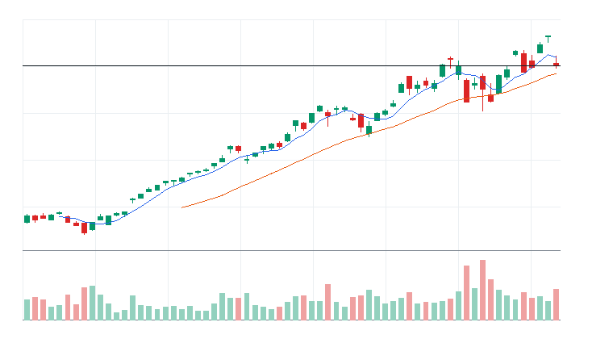
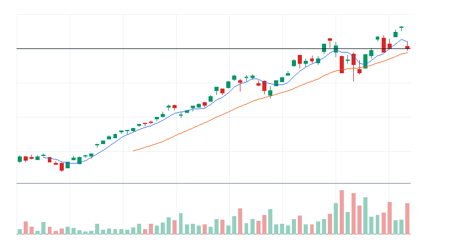
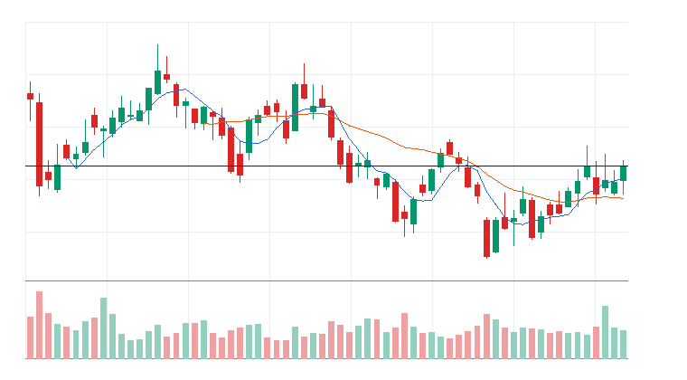
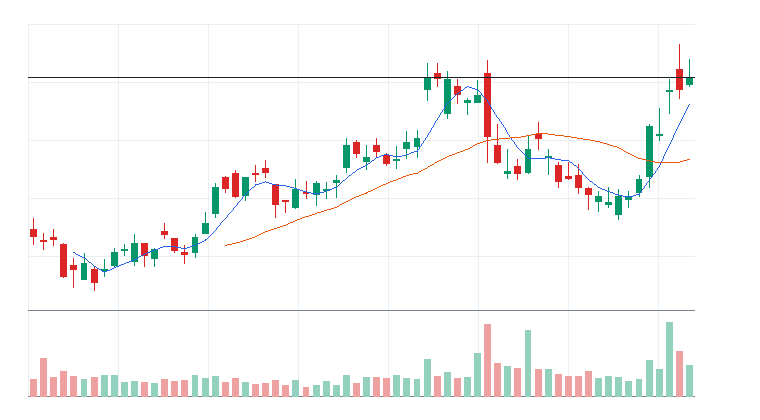
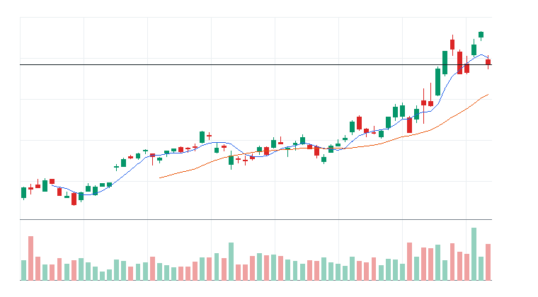
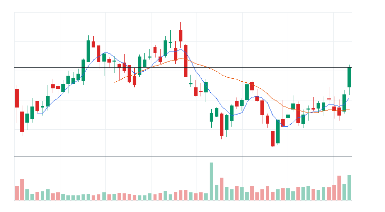
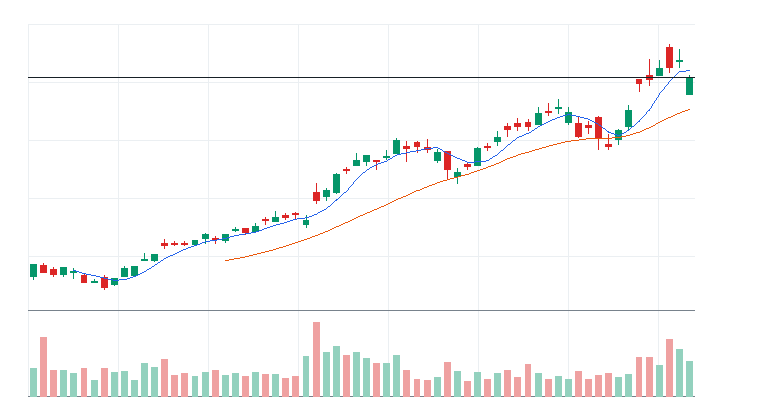

# 오늘의 데일리 트레이딩 요약

**REAL DATA TEST - 가격/거래량은 실제 데이터, 뉴스/ETF 구성종목 확산도/거래대금 유동성 일부 연결**

**목적:** 이 리포트는 최근 오른 자산을 나열하는 것이 아니라, 돈이 몰리는 근거와 다음 매수 주체가 확인할 트레이딩 후보를 찾기 위한 보고서다.

> 핵심 질문: 현재 가격에서 누가 사고 있고, 누가 앞으로 더 비싸게 사줄 수 있는가?

## 모바일 요약

[오늘의 데일리 트레이딩 요약]

생성 성공 / 데이터 모드: REAL_TEST

시장:
- 중립

시장 지배 서사:
1. Data Storage 자금 유입 - 관찰 - Invesco QQQ Trust(QQQ), Seagate Technology Holdings plc(STX), Western Digital Corporation(WDC) 중심으로 5일 +0.16%, 20일 +21.92% 흐름이 형성됨. 직접 촉매 일부 확인.
2. 반도체 장비 사이클 재평가 - 약화 - VanEck Semiconductor ETF(SMH), iShares Semiconductor ETF(SOXX), Applied Materials Inc.(AMAT), KLA Corporation(KLAC) 중심으로 5일 -4.03%, 20일 +15.89% 흐름이 형성됨. 직접 촉매 일부 확인.
3. AI 인프라 재가속 - 약화 - Roundhill Memory ETF(DRAM), VanEck Semiconductor ETF(SMH), Micron Technology Inc.(MU), Vertiv(VRT) 중심으로 5일 -2.29%, 20일 +7.68% 흐름이 형성됨. 뉴스 직접성 제한.

트렌드 강도:
1. Data Storage 자금 유입 - TSI 24 - 잠복 - 진입품질 낮음
2. 반도체 장비 사이클 재평가 - TSI 34 - 잠복 - 진입품질 낮음
3. AI 인프라 재가속 - TSI 26 - 잠복 - 진입품질 낮음

오늘 결론:
- 반도체 장비/공급망 개별 종목 흐름이 ETF 대비 강한지 확인 필요
- 행동 후보는 linkedNarrative와 함께 확인한다.
- 추격보다 진입 조건 확인 후 접근한다.

오늘 실제 행동 후보:
1. 행동 후보 없음 - 미분류 - 조건 충족 후보 없음

다크호스 후보:
1. 다크호스 후보 없음 - 조건 충족 후보 없음

ETF 후보 TOP 5:
1. Roundhill Memory ETF(DRAM) - AI 인프라 재가속 - 제외
2. VanEck Semiconductor ETF(SMH) - 반도체 장비 사이클 재평가 - 제외
3. iShares Semiconductor ETF(SOXX) - 반도체 장비 사이클 재평가 - 제외
4. Invesco PHLX Semiconductor ETF(SOXQ) - 반도체 장비 사이클 재평가 - 제외
5. Utilities Select Sector SPDR Fund(XLU) - 전력망/원전/인프라 병목 - 거래량 확인 전 관찰

웹 리포트:
https://yoolcool.github.io/DailyTradingThesisAgent/

## 오늘 결론

- 오늘 결론: 신규 추격 없음 / 관찰
- 신규 진입 후보: 0개
- 조건부 진입 후보: 0개
- 관찰 후보: 97개
- 주요 제한 요인: Entry Quality < 40, 뉴스 직접성 부족, RVOL 미달
- 주문 판단: 시장가 금지 / 지정가 또는 관찰
- 실전 판단: 오늘은 추세 후보는 있으나, 왜 돈이 몰리는가와 누가 더 비싸게 사줄 수 있는가를 주문 실행 신뢰도와 거래량이 충분히 뒷받침하지 못해 신규 추격은 보류한다. 기존 관심 종목은 전일 고점 돌파와 RVOL 1.00x 회복을 확인한 뒤 조건부로 본다.

### 후보 제한 요인 집계

- RVOL < 1.00x: 97개
- 거래대금 유동성 낮음: 14개
- Entry Quality 50~54 near miss: 0개
- Entry Quality 40~49 관찰: 0개
- Entry Quality < 40: 157개
- Exhaustion Risk >= 70: 0개
- ETF breadth 샘플 부족: 37개
- 뉴스 직접성 부족: 100개

## 데이터 신뢰도

- 전체 데이터 신뢰도 등급: LOW
- 분석 신뢰도: LOW
- 주문 실행 신뢰도: LOW
- ETF breadth 신뢰도: LOW
- 신뢰도 해석: 테마 확산 판단 제한, 거래대금 유동성 낮음 또는 확인 불가, 프리/애프터마켓 확인 불가
- 리포트 생성 시각: 2026-06-24 08:59 KST
- 가격 기준 거래일: 2026-06-23 US regular close
- 뉴스 수집 시각: 2026-06-24 08:58 KST
- 가장 최근 뉴스 발행 시각: 2026-06-24 08:42 KST
- 뉴스 신선도 상태: FRESH
- 뉴스 소스: Yahoo Finance RSS, MarketWatch RSS, CNBC Markets RSS, SEC EDGAR RSS, Federal Reserve RSS, Finnhub API
- 뉴스 소스 상태: Yahoo Finance RSS CONNECTED, MarketWatch RSS CONNECTED, CNBC Markets RSS PARTIAL, SEC EDGAR RSS PARTIAL, Federal Reserve RSS CONNECTED, Finnhub API DISABLED
- 뉴스 신뢰도: MEDIUM
- 추천 적용 거래일: 2026-06-23 US regular session
- 가격/거래량 데이터 상태: 연결됨
- 뉴스 데이터 상태: 일부 연결
- ETF 구성종목 확산도 상태: 일부 연결
- ETF 구성종목 샘플 수: 1~4
- 거래대금 유동성 데이터 상태: 일부 연결
- 프리/애프터마켓 데이터 상태: UNAVAILABLE
- 데이터 provider: yfinance, Yahoo Finance RSS, MarketWatch RSS, CNBC Markets RSS, SEC EDGAR RSS, Federal Reserve RSS, Finnhub API, config fallback sample, price-volume dollar-volume fallback
- 실전 사용 경고: 이 리포트는 투자판단 보조용이며, REAL_TEST 모드에서는 일부 데이터가 누락되거나 지연될 수 있다. 실제 주문 전 현재가, 뉴스, 프리마켓/정규장 거래량을 별도 확인해야 한다.

## 0. 시장 상태

- 데이터 모드: REAL_TEST
- 가격/거래량: 연결됨
- 뉴스: 일부 연결
- ETF 구성종목 확산도: 일부 연결
- 거래대금 유동성: 일부 연결
- 생성 시각: 2026년 6월 24일 수요일 AM 8:59
- 시장 상태: 중립
- 오늘 돈의 방향: 반도체 장비/공급망 개별 종목 흐름이 ETF 대비 강한지 확인 필요
- 강한 테마 TOP 3: 메모리/HBM(57), 반도체 장비/공급망(55), 메모리/HBM ETF(52)
- 데이터 한계:
  - API 또는 provider 상태에 따라 뉴스/ETF 확산도/거래대금 유동성 반영 범위가 달라질 수 있다.
  - 수집 실패 데이터는 점수 반영에서 제외하거나 confidence를 제한한다.
  - reasonConfidence HIGH는 직접 촉매, 가격/거래량, 확산도/유동성 근거가 함께 있을 때만 사용한다.

## 오늘 시장을 지배하는 서사

### 오늘 시장을 지배하는 서사 TOP 3

#### 1. Data Storage 자금 유입
- 상태: 관찰
- narrativeScore: 52
- reasonConfidence: LOW
- 근거 ETF: QQQ
- 근거 개별 종목: STX, WDC
- 돈이 몰리는 이유: Data Storage 자금 유입 관련 Invesco QQQ Trust(QQQ)와 Seagate Technology Holdings plc(STX), Western Digital Corporation(WDC)의 5일(+0.16%)·20일(+21.92%) 흐름을 함께 본다. 평균 상대 거래량은 1.24배이고, ETF 확산도는 추가 확인이 필요하다. 직접 뉴스/이벤트가 일부 확인된다.
- 다음 매수 주체: Data Storage 자금 유입을 확인한 섹터 ETF 자금과 상대강도 추종 스윙 자금
- 가장 좋은 트레이딩 수단: ETF 우선: QQQ / 개별 종목 우선: STX, WDC
- 서사가 깨지는 조건: QQQ 20일선 이탈 또는 관련 종목 절반 이상 5일선 이탈
- 오늘 행동: 기존 네러티브와 중복을 확인한 뒤 ETF/대표 종목 동조성이 살아날 때만 관찰 편입

상세 narrativeScore 근거 보기

- rawScore: 52
- ETF 평균 moneyFlowScore: 6
- 개별 종목 평균 moneyFlowScore: 63
- ETF 후보 비율: 0%
- 개별 종목 후보 비율: 100%
- 5일 평균 수익률: 0.00%
- 20일 평균 수익률: +22.00%
- 평균 상대 거래량: 1.00배
- ETF 평균 상대 거래량: 1.00배
- 개별주 평균 상대 거래량: 1.00배
- 52주 고점 근접 후보 비율: 33%
- 뉴스 직접성 점수: 5
- ETF 확산도 점수: -4
- 유동성 점수: 5
- 과열 리스크 차감: 0

#### 2. 반도체 장비 사이클 재평가
- 상태: 약화
- narrativeScore: 33
- reasonConfidence: LOW
- 근거 ETF: SMH, SOXX, SOXQ
- 근거 개별 종목: AMAT, KLAC, LRCX, ASML
- 돈이 몰리는 이유: 반도체 장비 사이클 재평가 관련 VanEck Semiconductor ETF(SMH), iShares Semiconductor ETF(SOXX), Invesco PHLX Semiconductor ETF(SOXQ)와 Applied Materials Inc.(AMAT), KLA Corporation(KLAC), Lam Research Corporation(LRCX), ASML Holding N.V.(ASML)의 5일(-4.03%)·20일(+15.89%) 흐름을 함께 본다. 평균 상대 거래량은 1.59배이고, ETF 확산도는 추가 확인이 필요하다. 직접 뉴스/이벤트가 일부 확인된다.
- 다음 매수 주체: 반도체 장비 사이클 재평가을 확인한 섹터 ETF 자금과 상대강도 추종 스윙 자금
- 가장 좋은 트레이딩 수단: ETF 우선: SMH, SOXX, SOXQ / 개별 종목 우선: KLAC, ASML, AMAT
- 서사가 깨지는 조건: SMH 20일선 이탈 또는 관련 종목 절반 이상 5일선 이탈
- 오늘 행동: 기존 네러티브와 중복을 확인한 뒤 ETF/대표 종목 동조성이 살아날 때만 관찰 편입

상세 narrativeScore 근거 보기

- rawScore: 33
- ETF 평균 moneyFlowScore: 24
- 개별 종목 평균 moneyFlowScore: 47
- ETF 후보 비율: 0%
- 개별 종목 후보 비율: 25%
- 5일 평균 수익률: -4.00%
- 20일 평균 수익률: +16.00%
- 평균 상대 거래량: 2.00배
- ETF 평균 상대 거래량: 2.00배
- 개별주 평균 상대 거래량: 1.00배
- 52주 고점 근접 후보 비율: 0%
- 뉴스 직접성 점수: 3
- ETF 확산도 점수: -4
- 유동성 점수: 4
- 과열 리스크 차감: 0

#### 3. AI 인프라 재가속
- 상태: 약화
- narrativeScore: 15
- reasonConfidence: LOW
- 근거 ETF: DRAM, SMH, SOXX
- 근거 개별 종목: MU, VRT, NVDA, ETN
- 돈이 몰리는 이유: AI 인프라 재가속 관련 Roundhill Memory ETF(DRAM), VanEck Semiconductor ETF(SMH), iShares Semiconductor ETF(SOXX)와 Micron Technology Inc.(MU), Vertiv(VRT), NVIDIA Corporation(NVDA), Eaton(ETN)의 5일(-2.29%)·20일(+7.68%) 흐름을 함께 본다. 평균 상대 거래량은 1.35배이고, ETF 확산도는 추가 확인이 필요하다. 뉴스 직접성은 아직 제한적이다.
- 다음 매수 주체: AI 인프라 CAPEX와 데이터센터 병목을 사는 반도체/전력망 ETF 자금과 신고가 모멘텀 추종 자금
- 가장 좋은 트레이딩 수단: ETF 우선: SMH, SOXX, DRAM / 개별 종목 우선: NVDA, MU, VRT
- 서사가 깨지는 조건: SMH/SOXX/DRAM 20일선 이탈, 관련 반도체와 전력 인프라 종목 절반 이상 5일선 이탈
- 오늘 행동: 추격보다 5일선 지지 후 재상승 확인

상세 narrativeScore 근거 보기

- rawScore: 15
- ETF 평균 moneyFlowScore: 22
- 개별 종목 평균 moneyFlowScore: 15
- ETF 후보 비율: 0%
- 개별 종목 후보 비율: 0%
- 5일 평균 수익률: -2.00%
- 20일 평균 수익률: +8.00%
- 평균 상대 거래량: 1.00배
- ETF 평균 상대 거래량: 2.00배
- 개별주 평균 상대 거래량: 1.00배
- 52주 고점 근접 후보 비율: 7%
- 뉴스 직접성 점수: 1
- ETF 확산도 점수: -2
- 유동성 점수: 2
- 과열 리스크 차감: 0

### 전체 narrative 요약

| 서사명 | 상태 | narrativeScore | reasonConfidence | 대표 ETF | 대표 종목 | 오늘 행동 |
| --- | --- | ---: | --- | --- | --- | --- |
| Data Storage 자금 유입 | 관찰 | 52 | LOW | QQQ | STX, WDC | 기존 네러티브와 중복을 확인한 뒤 ETF/대표 종목 동조성이 살아날 때만 관찰 편입 |
| 반도체 장비 사이클 재평가 | 약화 | 33 | LOW | SMH, SOXX, SOXQ | AMAT, KLAC, LRCX, ASML | 기존 네러티브와 중복을 확인한 뒤 ETF/대표 종목 동조성이 살아날 때만 관찰 편입 |
| AI 인프라 재가속 | 약화 | 15 | LOW | DRAM, SMH, SOXX | MU, VRT, NVDA, ETN | 추격보다 5일선 지지 후 재상승 확인 |
| 사이버보안 지출 재가속 | 약화 | 13 | LOW | IHAK, HACK, CIBR | PANW, FTNT, CRWD | 기존 네러티브와 중복을 확인한 뒤 ETF/대표 종목 동조성이 살아날 때만 관찰 편입 |
| 반도체 설계/공급망 재가속 | 약화 | 11 | LOW | SMH, SOXX, SOXQ | MRVL, ADI, AVGO, ARM | 기존 네러티브와 중복을 확인한 뒤 ETF/대표 종목 동조성이 살아날 때만 관찰 편입 |
| 전력망/원전/인프라 병목 | 약화 | 6 | LOW | PAVE, GRID, URA | CCJ, VRT, ETN, PWR | ETF 확산도와 거래량이 같이 살아날 때만 진입 |
| 소프트웨어 실적/AI 수익화 | 약화 | 2 | LOW | QQQ, AIQ, IGV | DDOG, CDNS | 기존 네러티브와 중복을 확인한 뒤 ETF/대표 종목 동조성이 살아날 때만 관찰 편입 |
| 위험선호 성장주 재진입 | 약화 | 0 | LOW | QQQ, IPO, ARKK | ARM, COIN, TSLA | 지수 위험선호가 유지될 때만 선별 진입 |
| 비트코인/디지털 자산 위험선호 | 약화 | 0 | LOW | IBIT, BLOK | RIOT, MSTR, COIN, IREN | 비트코인 베타가 살아날 때만 단기 매매 |
| 매크로 방어/헤지 | 소멸 | 0 | LOW | TLT, GLD, XLE | XOM, CVX | 위험회피가 확인될 때만 헤지성 접근 |
| 방산/안보 프리미엄 | 소멸 | 0 | LOW | ITA, XAR, SHLD | AVAV, KTOS, PLTR | 뉴스 촉매가 직접 확인될 때만 추세 추종 |
| AI 소프트웨어/사이버보안 확산 | 소멸 | 0 | LOW | QQQ, AIQ, IGV | PLTR, DDOG, TEAM, MSFT | 추격보다 눌림 후 재상승 확인 |

## 트렌드 강도 판단

### 1. Data Storage 자금 유입
- Trend Strength Index: 24
- 트렌드 상태 라벨: 잠복
- 테마 확산도: 부족
- ETF 동조성: 부족
- 거래량 강도: 보통
- 과열 위험: 보통 (32)
- 오늘 진입 품질: 낮음 (12)
- 한 줄 판단: Data Storage 자금 유입는 Trend Strength는 높아도 시장 위험선호가 약해 시장 환경 비우호 구간이다.
- 오늘 접근법: Invesco QQQ Trust(QQQ)와 Seagate Technology Holdings plc(STX)/Western Digital Corporation(WDC)의 거래량 확산이 확인되기 전까지 관찰한다.

트렌드 강도 상세 근거 보기

- 가격 모멘텀: 가격 모멘텀 7/25. 평균 5D +0.16%, 20D +21.92%.
- 거래량 강도: 거래량 강도 10/20. 평균 RVOL 1.24배.
- ETF 동조성: ETF 동조성 -2/15. 관련 ETF Invesco QQQ Trust(QQQ) 흐름을 기준으로 판단.
- 테마 확산도: 테마 확산도 5/20. 상위 1~2개 쏠림 감점 6점 반영.
- 뉴스 촉매: 뉴스/촉매 신선도 1/10. HIGH 직접 촉매 1개.
- 과열 리스크: 과열 리스크 32/100. 단기 급등, 고점 근접, ETF-개별주 괴리, 쏠림을 함께 반영.
- 시장 환경: 시장 환경 3/10. QQQ/SPY/IWM 가격 흐름 기반 위험선호 점수.

### 2. 반도체 장비 사이클 재평가
- Trend Strength Index: 34
- 트렌드 상태 라벨: 잠복
- 테마 확산도: 약함
- ETF 동조성: 약함
- 거래량 강도: 보통
- 과열 위험: 낮음 (8)
- 오늘 진입 품질: 낮음 (28)
- 한 줄 판단: 반도체 장비 사이클 재평가는 Trend Strength는 높아도 시장 위험선호가 약해 시장 환경 비우호 구간이다.
- 오늘 접근법: VanEck Semiconductor ETF(SMH)/iShares Semiconductor ETF(SOXX)/Invesco PHLX Semiconductor ETF(SOXQ)와 Applied Materials Inc.(AMAT)/KLA Corporation(KLAC)/Lam Research Corporation(LRCX)의 거래량 확산이 확인되기 전까지 관찰한다.

트렌드 강도 상세 근거 보기

- 가격 모멘텀: 가격 모멘텀 -1/25. 평균 5D -4.03%, 20D +15.89%.
- 거래량 강도: 거래량 강도 13/20. 평균 RVOL 1.59배.
- ETF 동조성: ETF 동조성 6/15. 관련 ETF VanEck Semiconductor ETF(SMH), iShares Semiconductor ETF(SOXX), Invesco PHLX Semiconductor ETF(SOXQ), Global X Artificial Intelligence & Technology ETF(AIQ) 흐름을 기준으로 판단.
- 테마 확산도: 테마 확산도 9/20. 상위 1~2개 쏠림 감점 0점 반영.
- 뉴스 촉매: 뉴스/촉매 신선도 4/10. HIGH 직접 촉매 1개.
- 과열 리스크: 과열 리스크 8/100. 단기 급등, 고점 근접, ETF-개별주 괴리, 쏠림을 함께 반영.
- 시장 환경: 시장 환경 3/10. QQQ/SPY/IWM 가격 흐름 기반 위험선호 점수.

### 3. AI 인프라 재가속
- Trend Strength Index: 26
- 트렌드 상태 라벨: 잠복
- 테마 확산도: 약함
- ETF 동조성: 보통
- 거래량 강도: 약함
- 과열 위험: 낮음 (3)
- 오늘 진입 품질: 낮음 (19)
- 한 줄 판단: AI 인프라 재가속는 Trend Strength는 높아도 시장 위험선호가 약해 시장 환경 비우호 구간이다.
- 오늘 접근법: Roundhill Memory ETF(DRAM)/VanEck Semiconductor ETF(SMH)/iShares Semiconductor ETF(SOXX)와 Micron Technology Inc.(MU)/Vertiv(VRT)/NVIDIA Corporation(NVDA)의 거래량 확산이 확인되기 전까지 관찰한다.

트렌드 강도 상세 근거 보기

- 가격 모멘텀: 가격 모멘텀 -2/25. 평균 5D -2.29%, 20D +7.68%.
- 거래량 강도: 거래량 강도 9/20. 평균 RVOL 1.35배.
- ETF 동조성: ETF 동조성 8/15. 관련 ETF VanEck Semiconductor ETF(SMH), iShares Semiconductor ETF(SOXX), Invesco PHLX Semiconductor ETF(SOXQ), Roundhill Memory ETF(DRAM), First Trust NASDAQ Clean Edge Smart Grid Infrastructure ETF(GRID), Global X U.S. Infrastructure Development ETF(PAVE), Global X Artificial Intelligence & Technology ETF(AIQ) 흐름을 기준으로 판단.
- 테마 확산도: 테마 확산도 6/20. 상위 1~2개 쏠림 감점 0점 반영.
- 뉴스 촉매: 뉴스/촉매 신선도 2/10. HIGH 직접 촉매 0개.
- 과열 리스크: 과열 리스크 3/100. 단기 급등, 고점 근접, ETF-개별주 괴리, 쏠림을 함께 반영.
- 시장 환경: 시장 환경 3/10. QQQ/SPY/IWM 가격 흐름 기반 위험선호 점수.

## 최근 추천 결과 트래킹

개별주는 데이트레이딩 관점으로 추천 이후 첫 정규장의 장중 최고가와 종가를 추적한다. ETF는 테마/스윙 관점으로 추천 이후 1주일 동안의 최고가와 현재 종가를 추적한다.

### 개별주 Top 3 추천 성과 요약
- 최근 5개 리포트 표본: 16개 (초기 검증 단계)
- 장중 최고가 기준 성공률: +30.77%
- 종가 기준 성공률: +46.15%
- 평균 장중 최고 수익률: +1.40%
- 평균 종가 수익률: -0.83%

### ETF 추천 성과 요약
- 최근 5개 리포트 표본: 9개 (초기 검증 단계)
- 1주 최고가 기준 성공률: +25.00%
- 현재 종가 기준 성공률: 0.00%
- 평균 1주 최고 수익률: -0.38%
- 평균 현재 수익률: -6.31%

최근 추천 결과 상세 테이블 펼치기

| 추천일 | 유형 | 순위 | 티커 | 기준가 | 추적 기간 | 상태 | High 수익률 | Close 수익률 | 결과 | 코멘트 |
| --- | --- | ---: | --- | ---: | --- | --- | ---: | ---: | --- | --- |
| 2026-06-23 | STOCK | 3 | TSM | $467.67 | 2026-06-23 | complete | -4.35% | -6.69% | 실패 | 추천 이후 의미 있는 장중 기회가 부족하고 종가도 약함 (일봉 기준) |
| 2026-06-23 | STOCK | 2 | GEV | $1,127.59 | 2026-06-23 | complete | -4.84% | -8.21% | 실패 | 추천 이후 의미 있는 장중 기회가 부족하고 종가도 약함 (일봉 기준) |
| 2026-06-23 | STOCK | 1 | ETN | $435.78 | 2026-06-23 | complete | -3.27% | -7.00% | 실패 | 추천 이후 의미 있는 장중 기회가 부족하고 종가도 약함 (일봉 기준) |
| 2026-06-23 | ETF | 1 | DRAM | $80.72 | 2026-06-23~2026-06-30 | in_progress | 데이터 없음 | -14.25% | 진행 중 | 아직 1주 추적 기간이 끝나지 않음 (일봉 high 미확보 시 close 기준 보조) |
| 2026-06-22 | STOCK | 3 | ARM | $439.46 | 2026-06-22 | complete | +1.25% | -7.22% | 제한적 유효 | 제한적인 장중 기회만 발생 (일봉 기준) |
| 2026-06-22 | STOCK | 2 | GEV | $1,109.73 | 2026-06-22 | complete | +2.91% | +1.61% | 제한적 유효 | 제한적인 장중 기회만 발생 (일봉 기준) |
| 2026-06-22 | STOCK | 1 | ETN | $421.77 | 2026-06-22 | complete | +3.55% | +3.32% | 성공 | 장중 기회와 종가 유지가 모두 확인됨 (일봉 기준) |
| 2026-06-22 | ETF | 3 | IFRA | $61.99 | 2026-06-22~2026-06-29 | in_progress | +1.10% | +0.45% | 진행 중 | 아직 1주 추적 기간이 끝나지 않음 |
| 2026-06-22 | ETF | 2 | SMH | $659.88 | 2026-06-22~2026-06-29 | in_progress | -3.50% | -5.73% | 진행 중 | 아직 1주 추적 기간이 끝나지 않음 |
| 2026-06-22 | ETF | 1 | DRAM | $76.71 | 2026-06-22~2026-06-29 | in_progress | -4.75% | -9.76% | 진행 중 | 아직 1주 추적 기간이 끝나지 않음 |
| 2026-06-19 | STOCK | 3 | AMD | $537.37 | 2026-06-19 | pending | 데이터 없음 | 데이터 없음 | 추적 대기 | 아직 추적 거래일 데이터가 완성되지 않음 |
| 2026-06-19 | STOCK | 2 | ARM | $439.46 | 2026-06-19 | pending | 데이터 없음 | 데이터 없음 | 추적 대기 | 아직 추적 거래일 데이터가 완성되지 않음 |
| 2026-06-19 | STOCK | 1 | GEV | $1,109.73 | 2026-06-19 | pending | 데이터 없음 | 데이터 없음 | 추적 대기 | 아직 추적 거래일 데이터가 완성되지 않음 |
| 2026-06-19 | ETF | 1 | DRAM | $76.71 | 2026-06-19~2026-06-26 | in_progress | +6.04% | -9.76% | 진행 중 | 아직 1주 추적 기간이 끝나지 않음 |
| 2026-06-18 | STOCK | 3 | ASML | $1,867.83 | 2026-06-18 | complete | +4.02% | +3.31% | 성공 | 장중 기회와 종가 유지가 모두 확인됨 (일봉 기준) |
| 2026-06-18 | STOCK | 3 | FCX | $69.06 | 2026-06-18 | complete | +2.26% | -0.55% | 제한적 유효 | 제한적인 장중 기회만 발생 (일봉 기준) |
| 2026-06-18 | STOCK | 2 | KLAC | $238.73 | 2026-06-18 | complete | +10.56% | +8.73% | 성공 | 장중 기회와 종가 유지가 모두 확인됨 (일봉 기준) |
| 2026-06-18 | STOCK | 1 | LRCX | $374.18 | 2026-06-18 | complete | +7.17% | +3.97% | 성공 | 장중 기회와 종가 유지가 모두 확인됨 (일봉 기준) |
| 2026-06-18 | ETF | 1 | SOXQ | $106.13 | 2026-06-18~2026-06-25 | in_progress | +8.67% | -0.02% | 진행 중 | 아직 1주 추적 기간이 끝나지 않음 |
| 2026-06-04 | STOCK | 3 | PANW | $280.43 | 2026-06-04 | complete | +0.10% | -0.42% | 실패 | 추천 이후 의미 있는 장중 기회가 부족하고 종가도 약함 (일봉 기준) |
| 2026-06-04 | STOCK | 2 | FTNT | $146.48 | 2026-06-04 | complete | +2.45% | +2.18% | 제한적 유효 | 제한적인 장중 기회만 발생 (일봉 기준) |
| 2026-06-04 | STOCK | 1 | CRWD | $747.61 | 2026-06-04 | complete | -3.56% | -3.81% | 실패 | 추천 이후 의미 있는 장중 기회가 부족하고 종가도 약함 (일봉 기준) |
| 2026-06-04 | ETF | 3 | HACK | $102.21 | 2026-06-04~2026-06-11 | complete | -1.66% | -6.11% | 실패 | 추천 이후 ETF 흐름이 약화됨 |
| 2026-06-04 | ETF | 2 | SOXQ | $109.58 | 2026-06-04~2026-06-11 | complete | -4.68% | -3.17% | 실패 | 추천 이후 ETF 흐름이 약화됨 |
| 2026-06-04 | ETF | 1 | AIQ | $69.16 | 2026-06-04~2026-06-11 | complete | -4.29% | -8.40% | 실패 | 추천 이후 ETF 흐름이 약화됨 |
| 2026-06-03 | STOCK | 3 | FTNT | $148.86 | 2026-06-03 | complete | -0.26% | -1.60% | 실패 | 추천 이후 의미 있는 장중 기회가 부족하고 종가도 약함 (일봉 기준) |
| 2026-06-03 | STOCK | 3 | CRWD | $768.95 | 2026-06-03 | complete | -0.25% | -2.78% | 실패 | 추천 이후 의미 있는 장중 기회가 부족하고 종가도 약함 (일봉 기준) |
| 2026-06-03 | STOCK | 2 | MRVL | $290.79 | 2026-06-03 | complete | +11.49% | +3.73% | 성공 | 장중 기회와 종가 유지가 모두 확인됨 (일봉 기준) |
| 2026-06-03 | STOCK | 1 | PANW | $297.18 | 2026-06-03 | complete | -3.09% | -5.64% | 실패 | 추천 이후 의미 있는 장중 기회가 부족하고 종가도 약함 (일봉 기준) |
| 2026-06-03 | ETF | 3 | DRAM | $69.57 | 2026-06-03~2026-06-10 | complete | -3.52% | -0.50% | 진행 중 | 아직 1주 추적 기간이 끝나지 않음 |
| 2026-06-03 | ETF | 3 | IGV | $104.73 | 2026-06-03~2026-06-10 | complete | -3.31% | -16.62% | 실패 | 추천 이후 ETF 흐름이 약화됨 |
| 2026-06-03 | ETF | 2 | AIQ | $70.14 | 2026-06-03~2026-06-10 | complete | -2.32% | -9.68% | 실패 | 추천 이후 ETF 흐름이 약화됨 |
| 2026-06-03 | ETF | 1 | CIBR | $94.32 | 2026-06-03~2026-06-10 | complete | -3.56% | -10.72% | 실패 | 추천 이후 ETF 흐름이 약화됨 |

## 오늘 실제 행동 후보

오늘은 추세 후보는 있으나, 왜 돈이 몰리는가와 누가 더 비싸게 사줄 수 있는가를 주문 실행 신뢰도와 거래량이 충분히 뒷받침하지 못해 신규 추격은 보류한다. 기존 관심 종목은 전일 고점 돌파와 RVOL 1.00x 회복을 확인한 뒤 조건부로 본다.

## 다크호스 후보

다크호스 후보 없음. 상위 서사 정렬, MA20 위 안착, MA5/MA20 구조 개선, RVOL 0.90x 이상 조건을 동시에 충족한 개별주가 없다.

- darkHorseScore: 조건 충족 후보 없음
- 왜 아직 메인이 아닌가: 확인 조건을 통과한 보조 관찰 후보가 없다.

darkHorseScore 상세 근거 보기

- 서사 정렬: 조건 미충족
- 초기 추세 구조: 조건 미충족
- 베이스 돌파/정돈: 조건 미충족
- 거래량 확인: 조건 미충족
- rawScore: 데이터 없음

## 참고용 행동 후보

> 실제 행동 후보가 없는 날에만 표시한다. 아래 후보는 매수 추천이 아니라 다음 정규장에서 전일 고점 돌파, RVOL 1.00x 이상, 거래대금 유동성 확인을 기다리는 관찰 리스트다.

### ETF 참고 후보 TOP 3

#### 1. Roundhill Memory ETF(DRAM)
- 상태: 참고용 관찰 후보
- todayActionLabel: 제외
- 제한 사유: Entry Quality 29 < 40; 진입 품질 부족
- 주문 실행: 시장가 가능
- moneyFlowScore: 52
- Entry Quality: 29 (낮음)
- RVOL: 1.72x
- 진입 전 확인: 20일선 위 눌림 후 재상승 확인
- 무효화: 20일선 이탈 또는 상대 거래량 0.8배 이하 둔화

#### 2. VanEck Semiconductor ETF(SMH)
- 상태: 참고용 관찰 후보
- todayActionLabel: 제외
- 제한 사유: Entry Quality 24 < 40; 진입 품질 부족
- 주문 실행: 시장가 가능
- moneyFlowScore: 33
- Entry Quality: 24 (낮음)
- RVOL: 1.62x
- 진입 전 확인: 20일선 위 눌림 후 재상승 확인
- 무효화: 20일선 이탈 또는 상대 거래량 0.8배 이하 둔화

#### 3. iShares Semiconductor ETF(SOXX)
- 상태: 참고용 관찰 후보
- todayActionLabel: 제외
- 제한 사유: Entry Quality 23 < 40; 진입 품질 부족
- 주문 실행: 시장가 가능
- moneyFlowScore: 30
- Entry Quality: 23 (낮음)
- RVOL: 1.10x
- 진입 전 확인: 20일선 위 눌림 후 재상승 확인
- 무효화: 20일선 이탈 또는 상대 거래량 0.8배 이하 둔화

### 개별주 참고 후보 TOP 3

#### 1. Applied Materials Inc.(AMAT)
- 상태: 참고용 관찰 후보
- todayActionLabel: 제외
- 제한 사유: Entry Quality 34 < 40; 진입 품질 부족
- 주문 실행: 시장가 가능
- moneyFlowScore: 62
- Entry Quality: 34 (낮음)
- RVOL: 1.21x
- 진입 전 확인: 20일선 위 눌림 후 재상승 확인
- 무효화: 20일선 이탈 또는 상대 거래량 0.8배 이하 둔화

#### 2. Take-Two Interactive Software Inc.(TTWO)
- 상태: 참고용 관찰 후보
- todayActionLabel: 제외
- 제한 사유: Entry Quality 28 < 40; 진입 품질 부족
- 주문 실행: 지정가 권장
- moneyFlowScore: 81
- Entry Quality: 28 (낮음)
- RVOL: 1.03x
- 진입 전 확인: 20일선 위 눌림 후 재상승 확인
- 무효화: 20일선 이탈 또는 상대 거래량 0.8배 이하 둔화

#### 3. KLA Corporation(KLAC)
- 상태: 참고용 관찰 후보
- todayActionLabel: 제외
- 제한 사유: Entry Quality 30 < 40; 진입 품질 부족
- 주문 실행: 시장가 가능
- moneyFlowScore: 53
- Entry Quality: 30 (낮음)
- RVOL: 1.34x
- 진입 전 확인: 20일선 위 눌림 후 재상승 확인
- 무효화: 20일선 이탈 또는 상대 거래량 0.8배 이하 둔화

## 오늘 돈이 몰리는 테마

- 메모리/HBM: MU, STX, WDC | 평균 moneyFlowScore 57 | 관심은 유지하되 우선순위는 낮추고 추가 거래량 확인을 기다린다.
- 반도체 장비/공급망: LRCX, AMAT, KLAC | 평균 moneyFlowScore 55 | 관심은 유지하되 우선순위는 낮추고 추가 거래량 확인을 기다린다.
- 메모리/HBM ETF: DRAM | 평균 moneyFlowScore 52 | 관심은 유지하되 우선순위는 낮추고 추가 거래량 확인을 기다린다.
- Utilities: CEG, AEP, XEL, EXC | 평균 moneyFlowScore 31 | 관심은 유지하되 우선순위는 낮추고 추가 거래량 확인을 기다린다.
- AI 반도체 ETF: SMH, SOXX, SOXQ | 평균 moneyFlowScore 30 | 관심은 유지하되 우선순위는 낮추고 추가 거래량 확인을 기다린다.
- 전력/유틸리티 ETF: XLU | 평균 moneyFlowScore 28 | 관심은 유지하되 우선순위는 낮추고 추가 거래량 확인을 기다린다.

## 1. ETF 트레이딩 보고서
### 1-1. ETF 결론
- ETF 우선 후보: 없음
- ETF 관찰 후보: iShares Expanded Tech-Software Sector ETF(IGV), First Trust NASDAQ Cybersecurity ETF(CIBR), Amplify Cybersecurity ETF(HACK), iShares U.S. Aerospace & Defense ETF(ITA), SPDR S&P Aerospace & Defense ETF(XAR)
- ETF 매매 금지: iShares Expanded Tech-Software Sector ETF(IGV), Global X Robotics & Artificial Intelligence ETF(BOTZ), ROBO Global Robotics and Automation Index ETF(ROBO), First Trust NASDAQ Cybersecurity ETF(CIBR), Amplify Cybersecurity ETF(HACK)
- 오늘 ETF 최우선 1개: 없음
- ETF 섹션 해석: 이 섹션은 개별 종목 선택이 아니라 테마/섹터 단위 자금 흐름을 ETF로 매매할지 판단하기 위한 영역이다.

### 1-2. ETF 후보 TOP 5

선정 기준: ETF 후보는 가격/거래량 1차 점수에 뉴스, ETF 구성종목 확산도, 유동성, 리스크 패널티를 반영한 finalRawScore 기준으로 정렬한다. 표시 점수 100점 후보가 겹치면 tieBreakerReason으로 우선순위를 설명한다.

### [ETF] Roundhill Memory ETF(DRAM)
- 자산 유형: ETF
- ETF 세부 카테고리: 메모리/HBM ETF
- ETF 역할: 테마 베타 매수
- 상태: 매매 금지
- linkedNarrative: AI 인프라 재가속
- narrativeStatus: 약화
- narrativeScore: 15
- moneyFlowScore: 52
- finalRawScore: 52
- tieBreakerReason: 최종 원점수 52, 리스크 패널티 0, 5일 수익률 -2.60%, 상대 거래량 1.72배 순으로 정렬
- 과열 리스크: 낮음
- reasonConfidence: MEDIUM
- reasonConfidenceExplanation: ETF 확산도 제한 때문에 HIGH가 아니라 MEDIUM으로 제한했다.

- todayActionLabel: 제외
- 주문 실행: 시장가 가능
- 기준일: 2026-06-23
- 종가: $69.22
- 1일 수익률: -14.25%
- 5일 수익률: -2.60%
- 20일 수익률: +31.05%
- 상대 거래량: 1.72배
- 52주 고점 대비 위치: -14.90%
- whyMoneyIsFlowing: 20일 +31.05%, 5일 -2.60%, 상대 거래량 1.72배로 가격과 거래량이 함께 개선. 뉴스: CNBC Markets RSS general_market/under_6h / 유동성: LIQUID
- likelyNextBuyer: 섹터 베타를 노리는 단기 모멘텀 자금과 리밸런싱 자금
- whyThisCouldTradeHigher: 단기 추세가 유지되고 거래량이 1.0배 이상이면 눌림 이후 재상승을 시도할 수 있음
- 진입 조건: 20일선 위 눌림 후 재상승 확인
- 무효화 조건: 20일선 이탈 또는 상대 거래량 0.8배 이하 둔화
- 차트: 

#### 상세 근거

Roundhill Memory ETF(DRAM) 상세 근거 펼치기

- moneyFlowScore(최종) 산정 근거:
  - moneyFlowScore(1차): 45
  - 최종 원점수: 52
  - 최종 표시 점수: 52
  - cap 적용: cap 미적용
  - 계산식: +45 + +2 + 0 + +5 + 0 + 0 + 0 = 52
  - 점수 해석: 관찰 후보. 흐름은 있으나 우선순위는 낮음.
  - 가격/거래량 1차 점수: +45
    - 추세: +9
    - 단기 모멘텀: -8
    - 중기 모멘텀: +16
    - 거래량: +18
    - 신고가 근접: 0
    - 이동평균: +10
  - 하위 점수 cap:
    - 가격 모멘텀: 원점수 +9, 상한 적용 +9 / 최대 25
    - 단기 모멘텀: 원점수 -8, 상한 적용 -8 / 최대 20
    - 중기 모멘텀: 원점수 +20, 상한 적용 +16 / 최대 16 (cap 적용)
    - 거래량: 원점수 +18, 상한 적용 +18 / 최대 20
    - 신고가 근접: 원점수 0, 상한 적용 0 / 최대 12
    - 이동평균: 원점수 +10, 상한 적용 +10 / 최대 14
  - 추가 데이터 가감점:
    - 뉴스: +2
    - 유동성: +5
  - ETF 확산도: 0
  - 리스크 패널티: 0
  - 주요 근거: 1차 45, 최종 원점수 52, 표시 52. 20일 수익률 강함, 상대 거래량 증가, 뉴스 흐름이 가격/거래량 근거 보강. 주의: ETF 구성종목 확산도 데이터 미연결.
  - 리스크 패널티 산정 근거:
    - 총 리스크 패널티: 0
    - 리스크 등급: LOW
    - 감점된 리스크: 없음
    - 관찰 리스크: ETF breadth data not connected
    - 한 줄 해석: 직접 감점된 주요 리스크는 없지만 관찰 리스크는 계속 확인해야 한다.
- 데이터 사용 현황:
  - 가격/거래량: 사용
  - 뉴스: 사용
  - ETF 확산도: 미연결
  - 거래대금 유동성: 사용
  - 관련 ETF 상대강도: 사용
- 뉴스 확인:
  - 최근 뉴스 상태: 일부 연결
  - 뉴스 소스: CNBC Markets RSS, MarketWatch RSS
  - 소스별 상태: Yahoo Finance RSS CONNECTED; MarketWatch RSS CONNECTED; CNBC Markets RSS CONNECTED; SEC EDGAR RSS PARTIAL; Federal Reserve RSS CONNECTED; Finnhub API DISABLED
  - 긍정/중립/부정: 12/4/0
  - 직접성/방향성/신선도: 2/1/4
  - 강한 촉매 수: 4
  - 중요 공시 수: 0
  - 직접 촉매: 없음
  - 보조 뉴스: CNBC Markets RSS sector_theme / general_market / under_6h
  - 뉴스 수집 시각: 2026-06-24 08:58 KST
  - 가장 최근 뉴스 발행 시각: 2026-06-24 08:42 KST
  - 뉴스 신선도 상태: FRESH
  - 뉴스 이후 가격 반응: 부정
  - 가격 반응 점수 제한: 뉴스 이후 가격 반응 부정 -> 긍정 점수 제한
  - 핵심 뉴스 요약: House passes affordable housing bill, sends it to Trump&apos;s desk
  - 원점수/상한 점수: +27 / +12
  - 점수 반영: +12
  - 주의: SEC EDGAR RSS: no matching RSS items; Finnhub API: FINNHUB_API_KEY not configured
- ETF 구성종목 확산도:
  - 구성종목 데이터 상태: 미연결
  - 샘플 수: 0/0
  - 샘플 신뢰도: UNKNOWN
  - 상승 종목 비율: 데이터 없음
  - 20일선 위 비율: 데이터 없음
  - 50일선 위 비율: 데이터 없음
  - 상위 기여 종목: 데이터 없음
  - 확산도 판단: UNKNOWN
  - 원점수/샘플 상한/반영 점수: 0 / N/A / 0
  - 점수 반영: 0
- 거래대금 유동성:
  - 데이터 상태: 일부 연결
  - 거래대금 기준 유동성: LIQUID
  - 거래대금: $5,569,188,270
  - 평균 거래대금: $3,243,299,777
  - 주문 영향: 시장가 가능
  - 매매 영향: 거래대금이 충분해 시장가 가능 범위로 본다
- reasonConfidence 근거: 가격/거래량, 뉴스, 거래대금 유동성, 관련 ETF 상대강도은 확인됐지만 일부 보조 데이터가 미연결 또는 fallback이라 중간으로 제한한다.
- 차트 요약: 20일선 위에서 단기 눌림 확인 구간
- 기준일 2026-06-23 | 종가 $69.22 | 1일 -14.25% | 5일 -2.60% | 20일 +31.05% | 상대 거래량 1.72배 | 52주 고점 대비 -14.90% | 데이터 소스: yfinance

### [ETF] VanEck Semiconductor ETF(SMH)
- 자산 유형: ETF
- ETF 세부 카테고리: AI 반도체 ETF
- ETF 역할: 테마 베타 매수
- 상태: 매매 금지
- linkedNarrative: 반도체 장비 사이클 재평가
- narrativeStatus: 약화
- narrativeScore: 33
- moneyFlowScore: 33
- finalRawScore: 33
- tieBreakerReason: 최종 원점수 33, 리스크 패널티 0, 5일 수익률 -3.87%, 상대 거래량 1.62배 순으로 정렬
- 과열 리스크: 낮음
- reasonConfidence: LOW
- reasonConfidenceExplanation: 가격/거래량이 약하거나 핵심 보조 근거가 부족해 LOW로 분류했다.

- todayActionLabel: 제외
- 주문 실행: 시장가 가능
- 기준일: 2026-06-23
- 종가: $622.05
- 1일 수익률: -7.01%
- 5일 수익률: -3.87%
- 20일 수익률: +7.93%
- 상대 거래량: 1.62배
- 52주 고점 대비 위치: -7.41%
- whyMoneyIsFlowing: 20일 +7.93%, 5일 -3.87%, 상대 거래량 1.62배로 가격과 거래량이 함께 개선. 뉴스: Yahoo Finance RSS product/under_6h / 유동성: LIQUID
- likelyNextBuyer: 섹터 베타를 노리는 단기 모멘텀 자금과 리밸런싱 자금
- whyThisCouldTradeHigher: 단기 추세가 유지되고 거래량이 1.0배 이상이면 눌림 이후 재상승을 시도할 수 있음
- 진입 조건: 20일선 위 눌림 후 재상승 확인
- 무효화 조건: 20일선 이탈 또는 상대 거래량 0.8배 이하 둔화
- 차트: 

#### 상세 근거

VanEck Semiconductor ETF(SMH) 상세 근거 펼치기

- moneyFlowScore(최종) 산정 근거:
  - moneyFlowScore(1차): 30
  - 최종 원점수: 33
  - 최종 표시 점수: 33
  - cap 적용: cap 미적용
  - 계산식: +30 + +2 - 4 + +5 + 0 + 0 + 0 = 33
  - 점수 해석: 매매 금지 또는 우선순위 낮은 후보.
  - 가격/거래량 1차 점수: +30
    - 추세: 0
    - 단기 모멘텀: -9
    - 중기 모멘텀: +5
    - 거래량: +18
    - 신고가 근접: +6
    - 이동평균: +10
  - 하위 점수 cap:
    - 가격 모멘텀: 원점수 0, 상한 적용 0 / 최대 25
    - 단기 모멘텀: 원점수 -9, 상한 적용 -9 / 최대 20
    - 중기 모멘텀: 원점수 +5, 상한 적용 +5 / 최대 16
    - 거래량: 원점수 +18, 상한 적용 +18 / 최대 20
    - 신고가 근접: 원점수 +6, 상한 적용 +6 / 최대 12
    - 이동평균: 원점수 +10, 상한 적용 +10 / 최대 14
  - 추가 데이터 가감점:
    - 뉴스: +2
    - 유동성: +5
  - ETF 확산도: -4
  - 리스크 패널티: 0
  - 주요 근거: 1차 30, 최종 원점수 33, 표시 33. 상대 거래량 증가, 뉴스 흐름이 가격/거래량 근거 보강, 거래대금 기준 유동성 양호. 주의: 큰 감점 제한적.
  - 리스크 패널티 산정 근거:
    - 총 리스크 패널티: 0
    - 리스크 등급: LOW
    - 감점된 리스크: 없음
    - 관찰 리스크: 주요 관찰 리스크 없음
    - 한 줄 해석: 직접 감점된 주요 리스크는 없지만 관찰 리스크는 계속 확인해야 한다.
- 데이터 사용 현황:
  - 가격/거래량: 사용
  - 뉴스: 사용
  - ETF 확산도: 일부 연결
  - 거래대금 유동성: 사용
  - 관련 ETF 상대강도: 사용
- 뉴스 확인:
  - 최근 뉴스 상태: 일부 연결
  - 뉴스 소스: CNBC Markets RSS, MarketWatch RSS, Yahoo Finance RSS
  - 소스별 상태: Yahoo Finance RSS CONNECTED; MarketWatch RSS CONNECTED; CNBC Markets RSS CONNECTED; SEC EDGAR RSS PARTIAL; Federal Reserve RSS CONNECTED; Finnhub API DISABLED
  - 긍정/중립/부정: 12/4/0
  - 직접성/방향성/신선도: 4/1/4
  - 강한 촉매 수: 4
  - 중요 공시 수: 0
  - 직접 촉매: Yahoo Finance RSS / product / under_6h / positive - SOXL’s 23% Single-Day Collapse Exposes the Real Price of 3X Leverage
  - 보조 뉴스: CNBC Markets RSS sector_theme / general_market / under_6h
  - 뉴스 수집 시각: 2026-06-24 08:58 KST
  - 가장 최근 뉴스 발행 시각: 2026-06-24 08:42 KST
  - 뉴스 신선도 상태: FRESH
  - 뉴스 이후 가격 반응: 부정
  - 가격 반응 점수 제한: 뉴스 이후 가격 반응 부정 -> 긍정 점수 제한
  - 핵심 뉴스 요약: House passes affordable housing bill, sends it to Trump&apos;s desk
  - 원점수/상한 점수: +29 / +12
  - 점수 반영: +12
  - 주의: SEC EDGAR RSS: no matching RSS items; Finnhub API: FINNHUB_API_KEY not configured
- ETF 구성종목 확산도:
  - 구성종목 데이터 상태: 일부 연결
  - 샘플 수: 3/3
  - 샘플 신뢰도: INSUFFICIENT
  - 상승 종목 비율: 0%
  - 20일선 위 비율: 67%
  - 50일선 위 비율: 67%
  - 상위 기여 종목: TSM, MU, NVDA
  - 확산도 판단: WEAK_BREADTH
  - 원점수/샘플 상한/반영 점수: -4 / 0 / -4
  - 점수 반영: -4
- 거래대금 유동성:
  - 데이터 상태: 일부 연결
  - 거래대금 기준 유동성: LIQUID
  - 거래대금: $11,752,208,389
  - 평균 거래대금: $7,255,115,332
  - 주문 영향: 시장가 가능
  - 매매 영향: 거래대금이 충분해 시장가 가능 범위로 본다
- reasonConfidence 근거: 가격/거래량이 약하거나 주요 데이터가 부족해 낮음.
- 차트 요약: 20일선 위에서 단기 눌림 확인 구간
- 기준일 2026-06-23 | 종가 $622.05 | 1일 -7.01% | 5일 -3.87% | 20일 +7.93% | 상대 거래량 1.62배 | 52주 고점 대비 -7.41% | 데이터 소스: yfinance

### [ETF] iShares Semiconductor ETF(SOXX)
- 자산 유형: ETF
- ETF 세부 카테고리: AI 반도체 ETF
- ETF 역할: 테마 베타 매수
- 상태: 매매 금지
- linkedNarrative: 반도체 장비 사이클 재평가
- narrativeStatus: 약화
- narrativeScore: 33
- moneyFlowScore: 30
- finalRawScore: 30
- tieBreakerReason: 최종 원점수 30, 리스크 패널티 0, 5일 수익률 -3.99%, 상대 거래량 1.10배 순으로 정렬
- 과열 리스크: 낮음
- reasonConfidence: LOW
- reasonConfidenceExplanation: 가격/거래량이 약하거나 핵심 보조 근거가 부족해 LOW로 분류했다.

- todayActionLabel: 제외
- 주문 실행: 시장가 가능
- 기준일: 2026-06-23
- 종가: $603.39
- 1일 수익률: -7.88%
- 5일 수익률: -3.99%
- 20일 수익률: +12.29%
- 상대 거래량: 1.10배
- 52주 고점 대비 위치: -8.01%
- whyMoneyIsFlowing: 20일 +12.29%, 5일 -3.99%, 상대 거래량 1.10배로 가격과 거래량이 함께 개선. 뉴스: Yahoo Finance RSS product/under_6h / 유동성: LIQUID
- likelyNextBuyer: 섹터 베타를 노리는 단기 모멘텀 자금과 리밸런싱 자금
- whyThisCouldTradeHigher: 단기 추세가 유지되고 거래량이 1.0배 이상이면 눌림 이후 재상승을 시도할 수 있음
- 진입 조건: 20일선 위 눌림 후 재상승 확인
- 무효화 조건: 20일선 이탈 또는 상대 거래량 0.8배 이하 둔화
- 차트: 

#### 상세 근거

iShares Semiconductor ETF(SOXX) 상세 근거 펼치기

- moneyFlowScore(최종) 산정 근거:
  - moneyFlowScore(1차): 27
  - 최종 원점수: 30
  - 최종 표시 점수: 30
  - cap 적용: cap 미적용
  - 계산식: +27 + +2 - 4 + +5 + 0 + 0 + 0 = 30
  - 점수 해석: 매매 금지 또는 우선순위 낮은 후보.
  - 가격/거래량 1차 점수: +27
    - 추세: +2
    - 단기 모멘텀: -9
    - 중기 모멘텀: +8
    - 거래량: +10
    - 신고가 근접: +6
    - 이동평균: +10
  - 하위 점수 cap:
    - 가격 모멘텀: 원점수 +2, 상한 적용 +2 / 최대 25
    - 단기 모멘텀: 원점수 -9, 상한 적용 -9 / 최대 20
    - 중기 모멘텀: 원점수 +8, 상한 적용 +8 / 최대 16
    - 거래량: 원점수 +10, 상한 적용 +10 / 최대 20
    - 신고가 근접: 원점수 +6, 상한 적용 +6 / 최대 12
    - 이동평균: 원점수 +10, 상한 적용 +10 / 최대 14
  - 추가 데이터 가감점:
    - 뉴스: +2
    - 유동성: +5
  - ETF 확산도: -4
  - 리스크 패널티: 0
  - 주요 근거: 1차 27, 최종 원점수 30, 표시 30. 20일 수익률 강함, 뉴스 흐름이 가격/거래량 근거 보강, 거래대금 기준 유동성 양호. 주의: 큰 감점 제한적.
  - 리스크 패널티 산정 근거:
    - 총 리스크 패널티: 0
    - 리스크 등급: LOW
    - 감점된 리스크: 없음
    - 관찰 리스크: 주요 관찰 리스크 없음
    - 한 줄 해석: 직접 감점된 주요 리스크는 없지만 관찰 리스크는 계속 확인해야 한다.
- 데이터 사용 현황:
  - 가격/거래량: 사용
  - 뉴스: 사용
  - ETF 확산도: 일부 연결
  - 거래대금 유동성: 사용
  - 관련 ETF 상대강도: 사용
- 뉴스 확인:
  - 최근 뉴스 상태: 일부 연결
  - 뉴스 소스: MarketWatch RSS, Yahoo Finance RSS, Federal Reserve RSS
  - 소스별 상태: Yahoo Finance RSS CONNECTED; MarketWatch RSS CONNECTED; CNBC Markets RSS FAILED; SEC EDGAR RSS PARTIAL; Federal Reserve RSS CONNECTED; Finnhub API DISABLED
  - 긍정/중립/부정: 11/5/0
  - 직접성/방향성/신선도: 4/1/4
  - 강한 촉매 수: 1
  - 중요 공시 수: 0
  - 직접 촉매: Yahoo Finance RSS / product / under_6h / positive - SOXL’s 23% Single-Day Collapse Exposes the Real Price of 3X Leverage
  - 보조 뉴스: MarketWatch RSS sector_theme / mna / under_6h
  - 뉴스 수집 시각: 2026-06-24 08:58 KST
  - 가장 최근 뉴스 발행 시각: 2026-06-24 08:14 KST
  - 뉴스 신선도 상태: FRESH
  - 뉴스 이후 가격 반응: 부정
  - 가격 반응 점수 제한: 뉴스 이후 가격 반응 부정 -> 긍정 점수 제한
  - 핵심 뉴스 요약: SpaceX pulls off one of the biggest AI debt deals yet
  - 원점수/상한 점수: +24 / +12
  - 점수 반영: +12
  - 주의: CNBC Markets RSS: HTTP 403 from https://www.cnbc.com/id/100003114/device/rss/rss.html; SEC EDGAR RSS: no matching RSS items; Finnhub API: FINNHUB_API_KEY not configured
- ETF 구성종목 확산도:
  - 구성종목 데이터 상태: 일부 연결
  - 샘플 수: 3/3
  - 샘플 신뢰도: INSUFFICIENT
  - 상승 종목 비율: 0%
  - 20일선 위 비율: 67%
  - 50일선 위 비율: 67%
  - 상위 기여 종목: TSM, MU, NVDA
  - 확산도 판단: WEAK_BREADTH
  - 원점수/샘플 상한/반영 점수: -4 / 0 / -4
  - 점수 반영: -4
- 거래대금 유동성:
  - 데이터 상태: 일부 연결
  - 거래대금 기준 유동성: LIQUID
  - 거래대금: $7,513,785,778
  - 평균 거래대금: $6,812,300,253
  - 주문 영향: 시장가 가능
  - 매매 영향: 거래대금이 충분해 시장가 가능 범위로 본다
- reasonConfidence 근거: 가격/거래량이 약하거나 주요 데이터가 부족해 낮음.
- 차트 요약: 20일선 위에서 단기 눌림 확인 구간
- 기준일 2026-06-23 | 종가 $603.39 | 1일 -7.88% | 5일 -3.99% | 20일 +12.29% | 상대 거래량 1.10배 | 52주 고점 대비 -8.01% | 데이터 소스: yfinance

### [ETF] Invesco PHLX Semiconductor ETF(SOXQ)
- 자산 유형: ETF
- ETF 세부 카테고리: AI 반도체 ETF
- ETF 역할: 테마 베타 매수
- 상태: 매매 금지
- linkedNarrative: 반도체 장비 사이클 재평가
- narrativeStatus: 약화
- narrativeScore: 33
- moneyFlowScore: 28
- finalRawScore: 28
- tieBreakerReason: 최종 원점수 28, 리스크 패널티 0, 5일 수익률 -4.36%, 상대 거래량 1.36배 순으로 정렬
- 과열 리스크: 낮음
- reasonConfidence: LOW
- reasonConfidenceExplanation: 가격/거래량이 약하거나 핵심 보조 근거가 부족해 LOW로 분류했다.

- todayActionLabel: 제외
- 주문 실행: 지정가 권장
- 기준일: 2026-06-23
- 종가: $106.11
- 1일 수익률: -7.82%
- 5일 수익률: -4.36%
- 20일 수익률: +10.47%
- 상대 거래량: 1.36배
- 52주 고점 대비 위치: -8.00%
- whyMoneyIsFlowing: 20일 +10.47%, 5일 -4.36%, 상대 거래량 1.36배로 가격과 거래량이 함께 개선. 뉴스: CNBC Markets RSS general_market/under_6h / 유동성: ACCEPTABLE
- likelyNextBuyer: 섹터 베타를 노리는 단기 모멘텀 자금과 리밸런싱 자금
- whyThisCouldTradeHigher: 단기 추세가 유지되고 거래량이 1.0배 이상이면 눌림 이후 재상승을 시도할 수 있음
- 진입 조건: 20일선 위 눌림 후 재상승 확인
- 무효화 조건: 20일선 이탈 또는 상대 거래량 0.8배 이하 둔화
- 차트: 

#### 상세 근거

Invesco PHLX Semiconductor ETF(SOXQ) 상세 근거 펼치기

- moneyFlowScore(최종) 산정 근거:
  - moneyFlowScore(1차): 28
  - 최종 원점수: 28
  - 최종 표시 점수: 28
  - cap 적용: cap 미적용
  - 계산식: +28 + +2 - 4 + +2 + 0 + 0 + 0 = 28
  - 점수 해석: 매매 금지 또는 우선순위 낮은 후보.
  - 가격/거래량 1차 점수: +28
    - 추세: 0
    - 단기 모멘텀: -9
    - 중기 모멘텀: +7
    - 거래량: +14
    - 신고가 근접: +6
    - 이동평균: +10
  - 하위 점수 cap:
    - 가격 모멘텀: 원점수 0, 상한 적용 0 / 최대 25
    - 단기 모멘텀: 원점수 -9, 상한 적용 -9 / 최대 20
    - 중기 모멘텀: 원점수 +7, 상한 적용 +7 / 최대 16
    - 거래량: 원점수 +14, 상한 적용 +14 / 최대 20
    - 신고가 근접: 원점수 +6, 상한 적용 +6 / 최대 12
    - 이동평균: 원점수 +10, 상한 적용 +10 / 최대 14
  - 추가 데이터 가감점:
    - 뉴스: +2
    - 유동성: +2
  - ETF 확산도: -4
  - 리스크 패널티: 0
  - 주요 근거: 1차 28, 최종 원점수 28, 표시 28. 20일 수익률 강함, 상대 거래량 증가, 뉴스 흐름이 가격/거래량 근거 보강. 주의: 큰 감점 제한적.
  - 리스크 패널티 산정 근거:
    - 총 리스크 패널티: 0
    - 리스크 등급: LOW
    - 감점된 리스크: 없음
    - 관찰 리스크: 주요 관찰 리스크 없음
    - 한 줄 해석: 직접 감점된 주요 리스크는 없지만 관찰 리스크는 계속 확인해야 한다.
- 데이터 사용 현황:
  - 가격/거래량: 사용
  - 뉴스: 사용
  - ETF 확산도: 일부 연결
  - 거래대금 유동성: 사용
  - 관련 ETF 상대강도: 사용
- 뉴스 확인:
  - 최근 뉴스 상태: 일부 연결
  - 뉴스 소스: CNBC Markets RSS, MarketWatch RSS
  - 소스별 상태: Yahoo Finance RSS CONNECTED; MarketWatch RSS CONNECTED; CNBC Markets RSS CONNECTED; SEC EDGAR RSS PARTIAL; Federal Reserve RSS CONNECTED; Finnhub API DISABLED
  - 긍정/중립/부정: 12/4/0
  - 직접성/방향성/신선도: 2/1/4
  - 강한 촉매 수: 4
  - 중요 공시 수: 0
  - 직접 촉매: 없음
  - 보조 뉴스: CNBC Markets RSS sector_theme / general_market / under_6h
  - 뉴스 수집 시각: 2026-06-24 08:58 KST
  - 가장 최근 뉴스 발행 시각: 2026-06-24 08:42 KST
  - 뉴스 신선도 상태: FRESH
  - 뉴스 이후 가격 반응: 부정
  - 가격 반응 점수 제한: 뉴스 이후 가격 반응 부정 -> 긍정 점수 제한
  - 핵심 뉴스 요약: House passes affordable housing bill, sends it to Trump&apos;s desk
  - 원점수/상한 점수: +27 / +12
  - 점수 반영: +12
  - 주의: SEC EDGAR RSS: no matching RSS items; Finnhub API: FINNHUB_API_KEY not configured
- ETF 구성종목 확산도:
  - 구성종목 데이터 상태: 일부 연결
  - 샘플 수: 3/3
  - 샘플 신뢰도: INSUFFICIENT
  - 상승 종목 비율: 0%
  - 20일선 위 비율: 67%
  - 50일선 위 비율: 67%
  - 상위 기여 종목: TSM, MU, NVDA
  - 확산도 판단: WEAK_BREADTH
  - 원점수/샘플 상한/반영 점수: -4 / 0 / -4
  - 점수 반영: -4
- 거래대금 유동성:
  - 데이터 상태: 일부 연결
  - 거래대금 기준 유동성: ACCEPTABLE
  - 거래대금: $508,350,621
  - 평균 거래대금: $375,017,039
  - 주문 영향: 지정가 권장
  - 매매 영향: 거래대금은 허용 가능하나 지정가를 우선한다
- reasonConfidence 근거: 가격/거래량이 약하거나 주요 데이터가 부족해 낮음.
- 차트 요약: 20일선 위에서 단기 눌림 확인 구간
- 기준일 2026-06-23 | 종가 $106.11 | 1일 -7.82% | 5일 -4.36% | 20일 +10.47% | 상대 거래량 1.36배 | 52주 고점 대비 -8.00% | 데이터 소스: yfinance

### [ETF] Utilities Select Sector SPDR Fund(XLU)
- 자산 유형: ETF
- ETF 세부 카테고리: 전력/유틸리티 ETF
- ETF 역할: 테마 베타 매수
- 상태: 관찰
- linkedNarrative: 전력망/원전/인프라 병목
- narrativeStatus: 약화
- narrativeScore: 6
- moneyFlowScore: 28
- finalRawScore: 28
- tieBreakerReason: 최종 원점수 28, 리스크 패널티 0, 5일 수익률 +0.74%, 상대 거래량 0.92배 순으로 정렬
- 과열 리스크: 낮음
- reasonConfidence: LOW
- reasonConfidenceExplanation: 가격/거래량이 약하거나 핵심 보조 근거가 부족해 LOW로 분류했다.

- todayActionLabel: 거래량 확인 전 관찰
- 주문 실행: 지정가 권장
- 기준일: 2026-06-23
- 종가: $45.07
- 1일 수익률: +0.78%
- 5일 수익률: +0.74%
- 20일 수익률: -0.62%
- 상대 거래량: 0.92배
- 52주 고점 대비 위치: -5.71%
- whyMoneyIsFlowing: 최근 수익률은 확인되지만 상대 거래량 0.92배라 신규 자금 유입 강도는 약함. 뉴스: MarketWatch RSS mna/under_6h / 유동성: ACCEPTABLE
- likelyNextBuyer: 섹터 베타를 노리는 단기 모멘텀 자금과 리밸런싱 자금
- whyThisCouldTradeHigher: 단기 추세가 유지되고 거래량이 1.0배 이상이면 눌림 이후 재상승을 시도할 수 있음
- 진입 조건: 상대 거래량 1.0배 회복 후 관찰
- 무효화 조건: 거래량 회복 실패
- 차트: 

#### 상세 근거

Utilities Select Sector SPDR Fund(XLU) 상세 근거 펼치기

- moneyFlowScore(최종) 산정 근거:
  - moneyFlowScore(1차): 14
  - 최종 원점수: 28
  - 최종 표시 점수: 28
  - cap 적용: cap 미적용
  - 계산식: +14 + +12 + 0 + +2 + 0 + 0 + 0 = 28
  - 점수 해석: 매매 금지 또는 우선순위 낮은 후보.
  - 가격/거래량 1차 점수: +14
    - 추세: 0
    - 단기 모멘텀: +2
    - 중기 모멘텀: 0
    - 거래량: -8
    - 신고가 근접: +6
    - 이동평균: +14
  - 하위 점수 cap:
    - 가격 모멘텀: 원점수 0, 상한 적용 0 / 최대 25
    - 단기 모멘텀: 원점수 +2, 상한 적용 +2 / 최대 20
    - 중기 모멘텀: 원점수 0, 상한 적용 0 / 최대 16
    - 거래량: 원점수 -8, 상한 적용 -8 / 최대 20
    - 신고가 근접: 원점수 +6, 상한 적용 +6 / 최대 12
    - 이동평균: 원점수 +14, 상한 적용 +14 / 최대 14
  - 추가 데이터 가감점:
    - 뉴스: +12
    - 유동성: +2
  - ETF 확산도: 0
  - 리스크 패널티: 0
  - 주요 근거: 1차 14, 최종 원점수 28, 표시 28. 이동평균 위 추세 유지, 뉴스 흐름이 가격/거래량 근거 보강, 거래대금 기준 유동성 양호. 주의: ETF 구성종목 확산도 데이터 미연결.
  - 리스크 패널티 산정 근거:
    - 총 리스크 패널티: 0
    - 리스크 등급: LOW
    - 감점된 리스크: 없음
    - 관찰 리스크: ETF breadth data not connected
    - 한 줄 해석: 직접 감점된 주요 리스크는 없지만 관찰 리스크는 계속 확인해야 한다.
- 데이터 사용 현황:
  - 가격/거래량: 사용
  - 뉴스: 사용
  - ETF 확산도: 미연결
  - 거래대금 유동성: 사용
  - 관련 ETF 상대강도: 사용
- 뉴스 확인:
  - 최근 뉴스 상태: 일부 연결
  - 뉴스 소스: MarketWatch RSS, Federal Reserve RSS, Yahoo Finance RSS
  - 소스별 상태: Yahoo Finance RSS CONNECTED; MarketWatch RSS CONNECTED; CNBC Markets RSS FAILED; SEC EDGAR RSS PARTIAL; Federal Reserve RSS CONNECTED; Finnhub API DISABLED
  - 긍정/중립/부정: 10/6/0
  - 직접성/방향성/신선도: 2/1/4
  - 강한 촉매 수: 1
  - 중요 공시 수: 0
  - 직접 촉매: 없음
  - 보조 뉴스: MarketWatch RSS sector_theme / mna / under_6h
  - 뉴스 수집 시각: 2026-06-24 08:58 KST
  - 가장 최근 뉴스 발행 시각: 2026-06-24 08:14 KST
  - 뉴스 신선도 상태: FRESH
  - 뉴스 이후 가격 반응: 긍정
  - 가격 반응 점수 제한: 뉴스 이후 가격 반응과 점수 제한 특이사항 없음
  - 핵심 뉴스 요약: SpaceX pulls off one of the biggest AI debt deals yet
  - 원점수/상한 점수: +21 / +12
  - 점수 반영: +12
  - 주의: CNBC Markets RSS: HTTP 403 from https://www.cnbc.com/id/100003114/device/rss/rss.html; SEC EDGAR RSS: no matching RSS items; Finnhub API: FINNHUB_API_KEY not configured
- ETF 구성종목 확산도:
  - 구성종목 데이터 상태: 미연결
  - 샘플 수: 0/0
  - 샘플 신뢰도: UNKNOWN
  - 상승 종목 비율: 데이터 없음
  - 20일선 위 비율: 데이터 없음
  - 50일선 위 비율: 데이터 없음
  - 상위 기여 종목: 데이터 없음
  - 확산도 판단: UNKNOWN
  - 원점수/샘플 상한/반영 점수: 0 / N/A / 0
  - 점수 반영: 0
- 거래대금 유동성:
  - 데이터 상태: 일부 연결
  - 거래대금 기준 유동성: ACCEPTABLE
  - 거래대금: $881,735,013
  - 평균 거래대금: $956,765,701
  - 주문 영향: 지정가 권장
  - 매매 영향: 거래대금은 허용 가능하나 지정가를 우선한다
- reasonConfidence 근거: 가격/거래량이 약하거나 주요 데이터가 부족해 낮음.
- 차트 요약: 최근 20거래일 기준 5일선이 20일선 위에 있음
- 기준일 2026-06-23 | 종가 $45.07 | 1일 +0.78% | 5일 +0.74% | 20일 -0.62% | 상대 거래량 0.92배 | 52주 고점 대비 -5.71% | 데이터 소스: yfinance

### 1-3. ETF 과열/주의 후보

해당 없음

### 1-4. ETF 제외/매매 금지 후보

#### iShares Expanded Tech-Software Sector ETF(IGV)
- moneyFlowScore(최종): 0
- moneyFlowScore 산정 근거 요약: 1차 0, 최종 원점수 -26, 표시 0. 뉴스 흐름이 가격/거래량 근거 보강, 거래대금 기준 유동성 양호. 주의: 단기 과열/추격 위험 존재.
- 제외 사유: 테마 자금 흐름 약함
- 해제 조건: 상대 거래량 1.0배 회복 후 관찰

#### Global X Robotics & Artificial Intelligence ETF(BOTZ)
- moneyFlowScore(최종): 0
- moneyFlowScore 산정 근거 요약: 1차 0, 최종 원점수 -33, 표시 0. 뉴스 흐름이 가격/거래량 근거 보강, 거래대금 유동성 주의. 주의: 단기 과열/추격 위험 존재, ETF 구성종목 확산도 데이터 미연결.
- 제외 사유: 테마 자금 흐름 약함
- 해제 조건: 20일선 위 눌림 후 재상승 확인

#### ROBO Global Robotics and Automation Index ETF(ROBO)
- moneyFlowScore(최종): 0
- moneyFlowScore 산정 근거 요약: 1차 0, 최종 원점수 -20, 표시 0. 뉴스 흐름이 가격/거래량 근거 보강, 거래대금 유동성 주의. 주의: 단기 과열/추격 위험 존재, ETF 구성종목 확산도 데이터 미연결.
- 제외 사유: 테마 자금 흐름 약함
- 해제 조건: 20일선 위 눌림 후 재상승 확인

#### First Trust NASDAQ Cybersecurity ETF(CIBR)
- moneyFlowScore(최종): 0
- moneyFlowScore 산정 근거 요약: 1차 0, 최종 원점수 -15, 표시 0. 뉴스 흐름이 가격/거래량 근거 보강, 거래대금 유동성 주의. 주의: 단기 과열/추격 위험 존재.
- 제외 사유: 테마 자금 흐름 약함
- 해제 조건: 상대 거래량 1.0배 회복 후 관찰

#### Amplify Cybersecurity ETF(HACK)
- moneyFlowScore(최종): 0
- moneyFlowScore 산정 근거 요약: 1차 0, 최종 원점수 -8, 표시 0. 뉴스 흐름이 가격/거래량 근거 보강, 거래대금 유동성 주의. 주의: 단기 과열/추격 위험 존재.
- 제외 사유: 테마 자금 흐름 약함
- 해제 조건: 상대 거래량 1.0배 회복 후 관찰

## 2. 개별 종목 트레이딩 보고서
### 2-1. 오늘 Nasdaq-100 신규 발굴 요약
- 신규 발굴 풀: Nasdaq-100 구성종목 전체
- universe source: fallback from StockAnalysis Nasdaq-100 list checked 2026-06-02
- universe fetchStatus: FALLBACK
- 총 스캔 종목 수: 101
- 데이터 수집 성공: 120
- 데이터 수집 실패: -19
- 상세 데이터 수집 대상: 가격/거래량 1차 스캔 상위 20개
- 오늘 진입 후보: 0
- 오늘 눌림 대기: 0
- 오늘 관찰: 77
- 오늘 매매 금지: 43
- 개별 종목 진입 후보: 없음
- 개별 종목 눌림 대기: 없음
- 개별 종목 매매 금지: Take-Two Interactive Software Inc.(TTWO), American Electric Power Company Inc.(AEP), Seagate Technology Holdings plc(STX), Applied Materials Inc.(AMAT), Western Digital Corporation(WDC)
- 오늘 개별 종목 최우선 1개: 없음
- 개별 종목 섹션 해석: 이 섹션은 ETF로 확인된 테마 자금 흐름 안에서 ETF보다 더 강한 돌파 가능성이 있는 개별 종목만 선별하는 영역이다.

### 2-2. 오늘 개별 종목 신규 후보 TOP 5

선정 기준:
1. Nasdaq-100 전체를 moneyFlowScore(1차)로 먼저 스캔
2. moneyFlowScore(1차) 상위 20개를 상세 분석
3. 뉴스/유동성/관련 ETF 대비 상대강도/리스크 패널티를 반영
4. moneyFlowScore(최종), 최종 원점수, 리스크 패널티, 5일 수익률, 상대 거래량 순으로 재정렬

### Applied Materials Inc.(AMAT)
- 자산 유형: STOCK
- 상태: 매매 금지
- primaryTheme: 반도체 장비/공급망
- primarySector: Technology
- industry: Semiconductor Equipment
- relatedEtfs: SMH, SOXX, SOXQ, AIQ
- linkedNarrative: 반도체 장비 사이클 재평가
- narrativeStatus: 약화
- narrativeScore: 33
- moneyFlowScore: 62
- finalRawScore: 62
- tieBreakerReason: 최종 원점수 62, 리스크 패널티 0, 5일 수익률 +0.02%, 상대 거래량 1.21배 순으로 정렬
- 과열 리스크: 낮음
- reasonConfidence: HIGH
- reasonConfidenceExplanation: 직접 촉매: Yahoo Finance RSS / general_market / under_6h / neutral - Applied Materials (AMAT) Registers a Bigger Fall Than the Market: Important Facts to Note 가격/거래량, 관련 ETF 동반 강세, 유동성 근거가 함께 확인되어 HIGH로 분류했다.
- 직접 촉매: Yahoo Finance RSS / general_market / under_6h / neutral - Applied Materials (AMAT) Registers a Bigger Fall Than the Market: Important Facts to Note
- todayActionLabel: 제외
- 주문 실행: 시장가 가능
- 기준일: 2026-06-23
- 종가: $585.88
- 1일 수익률: -8.48%
- 5일 수익률: +0.02%
- 20일 수익률: +35.57%
- 상대 거래량: 1.21배
- 52주 고점 대비 위치: -8.62%
- 관련 ETF 대비 상대강도: 관련 ETF보다 강함 | 주식 5일 +0.02% vs ETF 평균 -4.26%, 주식 20일 +35.57% vs ETF 평균 +7.89%, 상대 거래량 1.21배 vs ETF 평균 1.91배
- whyMoneyIsFlowing: 20일 +35.57%, 5일 +0.02%, 상대 거래량 1.21배로 가격과 거래량이 함께 개선. 뉴스: Yahoo Finance RSS general_market/under_6h / 유동성: LIQUID
- likelyNextBuyer: 개별 주도주를 따라붙는 단기 모멘텀 자금과 관련 ETF 강세를 확인한 트레이더
- whyThisCouldTradeHigher: 단기 추세가 유지되고 거래량이 1.0배 이상이면 눌림 이후 재상승을 시도할 수 있음
- 왜 ETF가 아니라 이 종목인가: AMAT가 관련 ETF 평균보다 5일/20일 흐름 또는 거래량에서 강해 개별 종목 우선 후보로 본다.
- ETF가 더 나은 경우: AMAT가 관련 ETF 평균보다 약하거나 거래량이 둔화되면 개별 종목보다 관련 ETF를 우선한다.
- 진입 조건: 20일선 위 눌림 후 재상승 확인
- 무효화 조건: 20일선 이탈 또는 상대 거래량 0.8배 이하 둔화
- 차트: 

#### 상세 근거

Applied Materials Inc.(AMAT) 상세 근거 펼치기

- moneyFlowScore(최종) 산정 근거:
  - moneyFlowScore(1차): 52
  - 최종 원점수: 62
  - 최종 표시 점수: 62
  - cap 적용: cap 미적용
  - 계산식: +52 + +2 + 0 + +5 + +3 + 0 + 0 = 62
  - 점수 해석: 관찰 후보. 흐름은 있으나 우선순위는 낮음.
  - 가격/거래량 1차 점수: +52
    - 추세: +12
    - 단기 모멘텀: -6
    - 중기 모멘텀: +16
    - 거래량: +14
    - 신고가 근접: +6
    - 이동평균: +10
  - 하위 점수 cap:
    - 가격 모멘텀: 원점수 +12, 상한 적용 +12 / 최대 25
    - 단기 모멘텀: 원점수 -6, 상한 적용 -6 / 최대 20
    - 중기 모멘텀: 원점수 +23, 상한 적용 +16 / 최대 16 (cap 적용)
    - 거래량: 원점수 +14, 상한 적용 +14 / 최대 20
    - 신고가 근접: 원점수 +6, 상한 적용 +6 / 최대 12
    - 이동평균: 원점수 +10, 상한 적용 +10 / 최대 14
    - 관련 ETF 상대강도: 원점수 +3, 상한 적용 +3 / 최대 8
  - 추가 데이터 가감점:
    - 뉴스: +2
    - 유동성: +5
  - ETF 대비 상대강도: +3
  - 리스크 패널티: 0
  - 주요 근거: 1차 52, 최종 원점수 62, 표시 62. 20일 수익률 강함, 상대 거래량 증가, 관련 ETF 강세 테마 안의 개별 종목. 주의: 큰 감점 제한적.
  - 리스크 패널티 산정 근거:
    - 총 리스크 패널티: 0
    - 리스크 등급: LOW
    - 감점된 리스크: 없음
    - 관찰 리스크: 주요 관찰 리스크 없음
    - 한 줄 해석: 직접 감점된 주요 리스크는 없지만 관찰 리스크는 계속 확인해야 한다.
- 데이터 사용 현황:
  - 가격/거래량: 사용
  - 뉴스: 사용
  - ETF 확산도: 관련 ETF에서 확인
  - 거래대금 유동성: 사용
  - 관련 ETF 상대강도: 사용
- 뉴스 확인:
  - 최근 뉴스 상태: 일부 연결
  - 뉴스 소스: CNBC Markets RSS, MarketWatch RSS, Yahoo Finance RSS
  - 소스별 상태: Yahoo Finance RSS CONNECTED; MarketWatch RSS CONNECTED; CNBC Markets RSS CONNECTED; SEC EDGAR RSS PARTIAL; Federal Reserve RSS CONNECTED; Finnhub API DISABLED
  - 긍정/중립/부정: 11/5/0
  - 직접성/방향성/신선도: 4/1/4
  - 강한 촉매 수: 4
  - 중요 공시 수: 0
  - 직접 촉매: Yahoo Finance RSS / general_market / under_6h / neutral - Applied Materials (AMAT) Registers a Bigger Fall Than the Market: Important Facts to Note
  - 보조 뉴스: CNBC Markets RSS sector_theme / general_market / under_6h
  - 뉴스 수집 시각: 2026-06-24 08:58 KST
  - 가장 최근 뉴스 발행 시각: 2026-06-24 08:42 KST
  - 뉴스 신선도 상태: FRESH
  - 뉴스 이후 가격 반응: 부정
  - 가격 반응 점수 제한: 뉴스 이후 가격 반응 부정 -> 긍정 점수 제한
  - 핵심 뉴스 요약: House passes affordable housing bill, sends it to Trump&apos;s desk
  - 원점수/상한 점수: +28 / +12
  - 점수 반영: +12
  - 주의: SEC EDGAR RSS: no matching RSS items; Finnhub API: FINNHUB_API_KEY not configured
- ETF 구성종목 확산도: 관련 ETF에서 확인
- 거래대금 유동성:
  - 데이터 상태: 일부 연결
  - 거래대금 기준 유동성: LIQUID
  - 거래대금: $7,035,534,121
  - 평균 거래대금: $5,813,423,008
  - 주문 영향: 시장가 가능
  - 매매 영향: 거래대금이 충분해 시장가 가능 범위로 본다
- reasonConfidence 근거: 가격/거래량, 뉴스, 거래대금 유동성, 관련 ETF 상대강도 데이터가 확인되어 신뢰도를 높게 본다.
- 차트 요약: 20일선 위에서 단기 눌림 확인 구간
- 기준일 2026-06-23 | 종가 $585.88 | 1일 -8.48% | 5일 +0.02% | 20일 +35.57% | 상대 거래량 1.21배 | 52주 고점 대비 -8.62% | 데이터 소스: yfinance

### Take-Two Interactive Software Inc.(TTWO)
- 자산 유형: STOCK
- 상태: 매매 금지
- primaryTheme: Communication Services
- primarySector: Communication Services
- industry: Electronic Gaming
- relatedEtfs: QQQ
- linkedNarrative: Data Storage 자금 유입
- narrativeStatus: 관찰
- narrativeScore: 52
- moneyFlowScore: 81
- finalRawScore: 81
- tieBreakerReason: 최종 원점수 81, 리스크 패널티 0, 5일 수익률 +12.21%, 상대 거래량 1.03배 순으로 정렬
- 과열 리스크: 낮음
- reasonConfidence: HIGH
- reasonConfidenceExplanation: 직접 촉매: Yahoo Finance RSS / general_market / under_6h / negative - Take-Two Interactive (TTWO) Ascends While Market Falls: Some Facts to Note 가격/거래량, 관련 ETF 동반 강세, 유동성 근거가 함께 확인되어 HIGH로 분류했다.
- 직접 촉매: Yahoo Finance RSS / general_market / under_6h / negative - Take-Two Interactive (TTWO) Ascends While Market Falls: Some Facts to Note
- todayActionLabel: 제외
- 주문 실행: 지정가 권장
- 기준일: 2026-06-23
- 종가: $242.64
- 1일 수익률: +1.28%
- 5일 수익률: +12.21%
- 20일 수익률: +6.63%
- 상대 거래량: 1.03배
- 52주 고점 대비 위치: -8.37%
- 관련 ETF 대비 상대강도: 관련 ETF보다 강함 | 주식 5일 +12.21% vs ETF 평균 -4.08%, 주식 20일 +6.63% vs ETF 평균 -0.54%, 상대 거래량 1.03배 vs ETF 평균 1.04배
- whyMoneyIsFlowing: 20일 +6.63%, 5일 +12.21%, 상대 거래량 1.03배로 가격과 거래량이 함께 개선. 뉴스: Yahoo Finance RSS general_market/under_6h / 유동성: ACCEPTABLE
- likelyNextBuyer: 개별 주도주를 따라붙는 단기 모멘텀 자금과 관련 ETF 강세를 확인한 트레이더
- whyThisCouldTradeHigher: 단기 추세가 유지되고 거래량이 1.0배 이상이면 눌림 이후 재상승을 시도할 수 있음
- 왜 ETF가 아니라 이 종목인가: TTWO가 관련 ETF 평균보다 5일/20일 흐름 또는 거래량에서 강해 개별 종목 우선 후보로 본다.
- ETF가 더 나은 경우: TTWO가 관련 ETF 평균보다 약하거나 거래량이 둔화되면 개별 종목보다 관련 ETF를 우선한다.
- 진입 조건: 20일선 위 눌림 후 재상승 확인
- 무효화 조건: 20일선 이탈 또는 상대 거래량 0.8배 이하 둔화
- 차트: 

#### 상세 근거

Take-Two Interactive Software Inc.(TTWO) 상세 근거 펼치기

- moneyFlowScore(최종) 산정 근거:
  - moneyFlowScore(1차): 66
  - 최종 원점수: 81
  - 최종 표시 점수: 81
  - cap 적용: cap 미적용
  - 계산식: +66 + +12 + 0 + +2 + +1 + 0 + 0 = 81
  - 점수 해석: 강한 자금 유입 후보. 단, 과열 여부 확인 필수.
  - 가격/거래량 1차 점수: +66
    - 추세: +21
    - 단기 모멘텀: +11
    - 중기 모멘텀: +4
    - 거래량: +10
    - 신고가 근접: +6
    - 이동평균: +14
  - 하위 점수 cap:
    - 가격 모멘텀: 원점수 +21, 상한 적용 +21 / 최대 25
    - 단기 모멘텀: 원점수 +11, 상한 적용 +11 / 최대 20
    - 중기 모멘텀: 원점수 +4, 상한 적용 +4 / 최대 16
    - 거래량: 원점수 +10, 상한 적용 +10 / 최대 20
    - 신고가 근접: 원점수 +6, 상한 적용 +6 / 최대 12
    - 이동평균: 원점수 +14, 상한 적용 +14 / 최대 14
    - 관련 ETF 상대강도: 원점수 +1, 상한 적용 +1 / 최대 8
  - 추가 데이터 가감점:
    - 뉴스: +12
    - 유동성: +2
  - ETF 대비 상대강도: +1
  - 리스크 패널티: 0
  - 주요 근거: 1차 66, 최종 원점수 81, 표시 81. 5일 수익률 강함, 이동평균 위 추세 유지, 관련 ETF 강세 테마 안의 개별 종목. 주의: 큰 감점 제한적.
  - 리스크 패널티 산정 근거:
    - 총 리스크 패널티: 0
    - 리스크 등급: LOW
    - 감점된 리스크: 없음
    - 관찰 리스크: 주요 관찰 리스크 없음
    - 한 줄 해석: 직접 감점된 주요 리스크는 없지만 관찰 리스크는 계속 확인해야 한다.
- 데이터 사용 현황:
  - 가격/거래량: 사용
  - 뉴스: 사용
  - ETF 확산도: 관련 ETF에서 확인
  - 거래대금 유동성: 사용
  - 관련 ETF 상대강도: 사용
- 뉴스 확인:
  - 최근 뉴스 상태: 일부 연결
  - 뉴스 소스: CNBC Markets RSS, MarketWatch RSS, Yahoo Finance RSS
  - 소스별 상태: Yahoo Finance RSS CONNECTED; MarketWatch RSS CONNECTED; CNBC Markets RSS CONNECTED; SEC EDGAR RSS PARTIAL; Federal Reserve RSS CONNECTED; Finnhub API DISABLED
  - 긍정/중립/부정: 11/4/1
  - 직접성/방향성/신선도: 4/1/4
  - 강한 촉매 수: 4
  - 중요 공시 수: 0
  - 직접 촉매: Yahoo Finance RSS / general_market / under_6h / negative - Take-Two Interactive (TTWO) Ascends While Market Falls: Some Facts to Note
  - 보조 뉴스: CNBC Markets RSS sector_theme / general_market / under_6h
  - 뉴스 수집 시각: 2026-06-24 08:58 KST
  - 가장 최근 뉴스 발행 시각: 2026-06-24 08:42 KST
  - 뉴스 신선도 상태: FRESH
  - 뉴스 이후 가격 반응: 긍정
  - 가격 반응 점수 제한: 뉴스 이후 가격 반응과 점수 제한 특이사항 없음
  - 핵심 뉴스 요약: House passes affordable housing bill, sends it to Trump&apos;s desk
  - 원점수/상한 점수: +28 / +12
  - 점수 반영: +12
  - 주의: SEC EDGAR RSS: no matching RSS items; Finnhub API: FINNHUB_API_KEY not configured
- ETF 구성종목 확산도: 관련 ETF에서 확인
- 거래대금 유동성:
  - 데이터 상태: 일부 연결
  - 거래대금 기준 유동성: ACCEPTABLE
  - 거래대금: $738,131,019
  - 평균 거래대금: $714,916,680
  - 주문 영향: 지정가 권장
  - 매매 영향: 거래대금은 허용 가능하나 지정가를 우선한다
- reasonConfidence 근거: 가격/거래량, 뉴스, 거래대금 유동성, 관련 ETF 상대강도 데이터가 확인되어 신뢰도를 높게 본다.
- 차트 요약: 최근 20거래일 기준 5일선이 20일선 위에 있음
- 기준일 2026-06-23 | 종가 $242.64 | 1일 +1.28% | 5일 +12.21% | 20일 +6.63% | 상대 거래량 1.03배 | 52주 고점 대비 -8.37% | 데이터 소스: yfinance

### KLA Corporation(KLAC)
- 자산 유형: STOCK
- 상태: 매매 금지
- primaryTheme: 반도체 장비/공급망
- primarySector: Technology
- industry: Semiconductor Equipment
- relatedEtfs: SMH, SOXX, SOXQ, AIQ
- linkedNarrative: 반도체 장비 사이클 재평가
- narrativeStatus: 약화
- narrativeScore: 33
- moneyFlowScore: 53
- finalRawScore: 53
- tieBreakerReason: 최종 원점수 53, 리스크 패널티 0, 5일 수익률 -4.65%, 상대 거래량 1.34배 순으로 정렬
- 과열 리스크: 낮음
- reasonConfidence: MEDIUM
- reasonConfidenceExplanation: 보조 근거 일부 제한 때문에 HIGH가 아니라 MEDIUM으로 제한했다.

- todayActionLabel: 제외
- 주문 실행: 시장가 가능
- 기준일: 2026-06-23
- 종가: $244.49
- 1일 수익률: -9.17%
- 5일 수익률: -4.65%
- 20일 수익률: +29.47%
- 상대 거래량: 1.34배
- 52주 고점 대비 위치: -9.41%
- 관련 ETF 대비 상대강도: 관련 ETF보다 강함 | 주식 5일 -4.65% vs ETF 평균 -4.26%, 주식 20일 +29.47% vs ETF 평균 +7.89%, 상대 거래량 1.34배 vs ETF 평균 1.91배
- whyMoneyIsFlowing: 20일 +29.47%, 5일 -4.65%, 상대 거래량 1.34배로 가격과 거래량이 함께 개선. 뉴스: Yahoo Finance RSS general_market/under_6h / 유동성: LIQUID
- likelyNextBuyer: 개별 주도주를 따라붙는 단기 모멘텀 자금과 관련 ETF 강세를 확인한 트레이더
- whyThisCouldTradeHigher: 단기 추세가 유지되고 거래량이 1.0배 이상이면 눌림 이후 재상승을 시도할 수 있음
- 왜 ETF가 아니라 이 종목인가: 관련 ETF보다 강함 | 주식 5일 -4.65% vs ETF 평균 -4.26%, 주식 20일 +29.47% vs ETF 평균 +7.89%, 상대 거래량 1.34배 vs ETF 평균 1.91배. 개별 종목 우선으로 격상하려면 관련 ETF 대비 상대강도 유지가 더 필요하다.
- ETF가 더 나은 경우: KLAC가 관련 ETF 평균보다 약하거나 거래량이 둔화되면 개별 종목보다 관련 ETF를 우선한다.
- 진입 조건: 20일선 위 눌림 후 재상승 확인
- 무효화 조건: 20일선 이탈 또는 상대 거래량 0.8배 이하 둔화
- 차트: 

#### 상세 근거

KLA Corporation(KLAC) 상세 근거 펼치기

- moneyFlowScore(최종) 산정 근거:
  - moneyFlowScore(1차): 43
  - 최종 원점수: 53
  - 최종 표시 점수: 53
  - cap 적용: cap 미적용
  - 계산식: +43 + +2 + 0 + +5 + +3 + 0 + 0 = 53
  - 점수 해석: 관찰 후보. 흐름은 있으나 우선순위는 낮음.
  - 가격/거래량 1차 점수: +43
    - 추세: +7
    - 단기 모멘텀: -10
    - 중기 모멘텀: +16
    - 거래량: +14
    - 신고가 근접: +6
    - 이동평균: +10
  - 하위 점수 cap:
    - 가격 모멘텀: 원점수 +7, 상한 적용 +7 / 최대 25
    - 단기 모멘텀: 원점수 -10, 상한 적용 -10 / 최대 20
    - 중기 모멘텀: 원점수 +19, 상한 적용 +16 / 최대 16 (cap 적용)
    - 거래량: 원점수 +14, 상한 적용 +14 / 최대 20
    - 신고가 근접: 원점수 +6, 상한 적용 +6 / 최대 12
    - 이동평균: 원점수 +10, 상한 적용 +10 / 최대 14
    - 관련 ETF 상대강도: 원점수 +3, 상한 적용 +3 / 최대 8
  - 추가 데이터 가감점:
    - 뉴스: +2
    - 유동성: +5
  - ETF 대비 상대강도: +3
  - 리스크 패널티: 0
  - 주요 근거: 1차 43, 최종 원점수 53, 표시 53. 20일 수익률 강함, 상대 거래량 증가, 관련 ETF 강세 테마 안의 개별 종목. 주의: 큰 감점 제한적.
  - 리스크 패널티 산정 근거:
    - 총 리스크 패널티: 0
    - 리스크 등급: LOW
    - 감점된 리스크: 없음
    - 관찰 리스크: 주요 관찰 리스크 없음
    - 한 줄 해석: 직접 감점된 주요 리스크는 없지만 관찰 리스크는 계속 확인해야 한다.
- 데이터 사용 현황:
  - 가격/거래량: 사용
  - 뉴스: 사용
  - ETF 확산도: 관련 ETF에서 확인
  - 거래대금 유동성: 사용
  - 관련 ETF 상대강도: 사용
- 뉴스 확인:
  - 최근 뉴스 상태: 일부 연결
  - 뉴스 소스: CNBC Markets RSS, MarketWatch RSS, Yahoo Finance RSS
  - 소스별 상태: Yahoo Finance RSS CONNECTED; MarketWatch RSS CONNECTED; CNBC Markets RSS CONNECTED; SEC EDGAR RSS PARTIAL; Federal Reserve RSS CONNECTED; Finnhub API DISABLED
  - 긍정/중립/부정: 11/5/0
  - 직접성/방향성/신선도: 4/1/4
  - 강한 촉매 수: 4
  - 중요 공시 수: 0
  - 직접 촉매: Yahoo Finance RSS / general_market / under_6h / neutral - Why KLA (KLAC) Dipped More Than Broader Market Today
  - 보조 뉴스: CNBC Markets RSS sector_theme / general_market / under_6h
  - 뉴스 수집 시각: 2026-06-24 08:58 KST
  - 가장 최근 뉴스 발행 시각: 2026-06-24 08:42 KST
  - 뉴스 신선도 상태: FRESH
  - 뉴스 이후 가격 반응: 부정
  - 가격 반응 점수 제한: 뉴스 이후 가격 반응 부정 -> 긍정 점수 제한
  - 핵심 뉴스 요약: House passes affordable housing bill, sends it to Trump&apos;s desk
  - 원점수/상한 점수: +28 / +12
  - 점수 반영: +12
  - 주의: SEC EDGAR RSS: no matching RSS items; Finnhub API: FINNHUB_API_KEY not configured
- ETF 구성종목 확산도: 관련 ETF에서 확인
- 거래대금 유동성:
  - 데이터 상태: 일부 연결
  - 거래대금 기준 유동성: LIQUID
  - 거래대금: $4,410,071,991
  - 평균 거래대금: $3,296,786,776
  - 주문 영향: 시장가 가능
  - 매매 영향: 거래대금이 충분해 시장가 가능 범위로 본다
- reasonConfidence 근거: 가격/거래량, 뉴스, 거래대금 유동성, 관련 ETF 상대강도은 확인됐지만 일부 보조 데이터가 미연결 또는 fallback이라 중간으로 제한한다.
- 차트 요약: 20일선 위에서 단기 눌림 확인 구간
- 기준일 2026-06-23 | 종가 $244.49 | 1일 -9.17% | 5일 -4.65% | 20일 +29.47% | 상대 거래량 1.34배 | 52주 고점 대비 -9.41% | 데이터 소스: yfinance

### American Electric Power Company Inc.(AEP)
- 자산 유형: STOCK
- 상태: 매매 금지
- primaryTheme: Utilities
- primarySector: Utilities
- industry: Utilities Regulated Electric
- relatedEtfs: QQQ, SPY, IWM
- linkedNarrative: 위험선호 성장주 재진입
- narrativeStatus: 약화
- narrativeScore: 0
- moneyFlowScore: 80
- finalRawScore: 80
- tieBreakerReason: 최종 원점수 80, 리스크 패널티 0, 5일 수익률 +3.43%, 상대 거래량 1.90배 순으로 정렬
- 과열 리스크: 낮음~중간
- reasonConfidence: HIGH
- reasonConfidenceExplanation: 직접 촉매: Yahoo Finance RSS / analyst_upgrade / stale / positive - AEP Fuels Growth With Infrastructure Upgrades and Renewables 가격/거래량, 관련 ETF 동반 강세, 유동성 근거가 함께 확인되어 HIGH로 분류했다.
- 직접 촉매: Yahoo Finance RSS / analyst_upgrade / stale / positive - AEP Fuels Growth With Infrastructure Upgrades and Renewables
- todayActionLabel: 제외
- 주문 실행: 시장가 가능
- 기준일: 2026-06-23
- 종가: $133.74
- 1일 수익률: +2.64%
- 5일 수익률: +3.43%
- 20일 수익률: +1.63%
- 상대 거래량: 1.90배
- 52주 고점 대비 위치: -4.09%
- 관련 ETF 대비 상대강도: 관련 ETF보다 강함 | 주식 5일 +3.43% vs ETF 평균 -2.22%, 주식 20일 +1.63% vs ETF 평균 +0.47%, 상대 거래량 1.90배 vs ETF 평균 1.01배
- whyMoneyIsFlowing: 20일 +1.63%, 5일 +3.43%, 상대 거래량 1.90배로 가격과 거래량이 함께 개선. 뉴스: Yahoo Finance RSS analyst_upgrade/stale / 유동성: LIQUID
- likelyNextBuyer: 개별 주도주를 따라붙는 단기 모멘텀 자금과 관련 ETF 강세를 확인한 트레이더
- whyThisCouldTradeHigher: 52주 고점 부근이라 돌파가 확인되면 신고가 추종 매수가 붙을 수 있음
- 왜 ETF가 아니라 이 종목인가: AEP가 관련 ETF 평균보다 5일/20일 흐름 또는 거래량에서 강해 개별 종목 우선 후보로 본다.
- ETF가 더 나은 경우: AEP가 관련 ETF 평균보다 약하거나 거래량이 둔화되면 개별 종목보다 관련 ETF를 우선한다.
- 진입 조건: 전일 고점 돌파와 5일선 유지 확인
- 무효화 조건: 20일선 이탈 또는 상대 거래량 0.8배 이하 둔화
- 차트: 

#### 상세 근거

American Electric Power Company Inc.(AEP) 상세 근거 펼치기

- moneyFlowScore(최종) 산정 근거:
  - moneyFlowScore(1차): 61
  - 최종 원점수: 80
  - 최종 표시 점수: 80
  - cap 적용: cap 미적용
  - 계산식: +61 + +12 + 0 + +5 + +2 + 0 + 0 = 80
  - 점수 해석: 강한 자금 유입 후보. 단, 과열 여부 확인 필수.
  - 가격/거래량 1차 점수: +61
    - 추세: +10
    - 단기 모멘텀: +6
    - 중기 모멘텀: +1
    - 거래량: +18
    - 신고가 근접: +12
    - 이동평균: +14
  - 하위 점수 cap:
    - 가격 모멘텀: 원점수 +10, 상한 적용 +10 / 최대 25
    - 단기 모멘텀: 원점수 +6, 상한 적용 +6 / 최대 20
    - 중기 모멘텀: 원점수 +1, 상한 적용 +1 / 최대 16
    - 거래량: 원점수 +18, 상한 적용 +18 / 최대 20
    - 신고가 근접: 원점수 +12, 상한 적용 +12 / 최대 12
    - 이동평균: 원점수 +14, 상한 적용 +14 / 최대 14
    - 관련 ETF 상대강도: 원점수 +2, 상한 적용 +2 / 최대 8
  - 추가 데이터 가감점:
    - 뉴스: +12
    - 유동성: +5
  - ETF 대비 상대강도: +2
  - 리스크 패널티: 0
  - 주요 근거: 1차 61, 최종 원점수 80, 표시 80. 1일 단기 모멘텀 확인, 상대 거래량 증가, 52주 고점 근처. 주의: 큰 감점 제한적.
  - 리스크 패널티 산정 근거:
    - 총 리스크 패널티: 0
    - 리스크 등급: LOW
    - 감점된 리스크: 없음
    - 관찰 리스크: 주요 관찰 리스크 없음
    - 한 줄 해석: 직접 감점된 주요 리스크는 없지만 관찰 리스크는 계속 확인해야 한다.
- 데이터 사용 현황:
  - 가격/거래량: 사용
  - 뉴스: 사용
  - ETF 확산도: 관련 ETF에서 확인
  - 거래대금 유동성: 사용
  - 관련 ETF 상대강도: 사용
- 뉴스 확인:
  - 최근 뉴스 상태: 일부 연결
  - 뉴스 소스: MarketWatch RSS, Federal Reserve RSS, Yahoo Finance RSS
  - 소스별 상태: Yahoo Finance RSS CONNECTED; MarketWatch RSS CONNECTED; CNBC Markets RSS FAILED; SEC EDGAR RSS PARTIAL; Federal Reserve RSS CONNECTED; Finnhub API DISABLED
  - 긍정/중립/부정: 10/6/0
  - 직접성/방향성/신선도: 4/1/4
  - 강한 촉매 수: 2
  - 중요 공시 수: 0
  - 직접 촉매: Yahoo Finance RSS / analyst_upgrade / stale / positive - AEP Fuels Growth With Infrastructure Upgrades and Renewables
  - 보조 뉴스: MarketWatch RSS sector_theme / mna / under_6h
  - 뉴스 수집 시각: 2026-06-24 08:58 KST
  - 가장 최근 뉴스 발행 시각: 2026-06-24 08:14 KST
  - 뉴스 신선도 상태: FRESH
  - 뉴스 이후 가격 반응: 긍정
  - 가격 반응 점수 제한: 뉴스 이후 가격 반응과 점수 제한 특이사항 없음
  - 핵심 뉴스 요약: SpaceX pulls off one of the biggest AI debt deals yet
  - 원점수/상한 점수: +25 / +12
  - 점수 반영: +12
  - 주의: CNBC Markets RSS: HTTP 403 from https://www.cnbc.com/id/100003114/device/rss/rss.html; SEC EDGAR RSS: no matching RSS items; Finnhub API: FINNHUB_API_KEY not configured
- ETF 구성종목 확산도: 관련 ETF에서 확인
- 거래대금 유동성:
  - 데이터 상태: 일부 연결
  - 거래대금 기준 유동성: LIQUID
  - 거래대금: $1,390,382,438
  - 평균 거래대금: $733,176,455
  - 주문 영향: 시장가 가능
  - 매매 영향: 거래대금이 충분해 시장가 가능 범위로 본다
- reasonConfidence 근거: 가격/거래량, 뉴스, 거래대금 유동성, 관련 ETF 상대강도 데이터가 확인되어 신뢰도를 높게 본다.
- 차트 요약: 최근 20거래일 기준 5일선이 20일선 위에 있음
- 기준일 2026-06-23 | 종가 $133.74 | 1일 +2.64% | 5일 +3.43% | 20일 +1.63% | 상대 거래량 1.90배 | 52주 고점 대비 -4.09% | 데이터 소스: yfinance

### Seagate Technology Holdings plc(STX)
- 자산 유형: STOCK
- 상태: 매매 금지
- primaryTheme: 메모리/HBM
- primarySector: Technology
- industry: Data Storage
- relatedEtfs: QQQ, SPY, IWM
- linkedNarrative: Data Storage 자금 유입
- narrativeStatus: 관찰
- narrativeScore: 52
- moneyFlowScore: 65
- finalRawScore: 65
- tieBreakerReason: 최종 원점수 65, 리스크 패널티 0, 5일 수익률 +1.94%, 상대 거래량 1.27배 순으로 정렬
- 과열 리스크: 낮음
- reasonConfidence: HIGH
- reasonConfidenceExplanation: 직접 촉매: Yahoo Finance RSS / general_market / under_6h / positive - Up 290% YTD, How High Can Seagate Rally? 가격/거래량, 관련 ETF 동반 강세, 유동성 근거가 함께 확인되어 HIGH로 분류했다.
- 직접 촉매: Yahoo Finance RSS / general_market / under_6h / positive - Up 290% YTD, How High Can Seagate Rally?
- todayActionLabel: 제외
- 주문 실행: 시장가 가능
- 기준일: 2026-06-23
- 종가: $1,038.59
- 1일 수익률: -5.07%
- 5일 수익률: +1.94%
- 20일 수익률: +27.79%
- 상대 거래량: 1.27배
- 52주 고점 대비 위치: -9.29%
- 관련 ETF 대비 상대강도: 관련 ETF보다 강함 | 주식 5일 +1.94% vs ETF 평균 -2.22%, 주식 20일 +27.79% vs ETF 평균 +0.47%, 상대 거래량 1.27배 vs ETF 평균 1.01배
- whyMoneyIsFlowing: 20일 +27.79%, 5일 +1.94%, 상대 거래량 1.27배로 가격과 거래량이 함께 개선. 뉴스: Yahoo Finance RSS general_market/under_6h / 유동성: LIQUID
- likelyNextBuyer: 개별 주도주를 따라붙는 단기 모멘텀 자금과 관련 ETF 강세를 확인한 트레이더
- whyThisCouldTradeHigher: 단기 추세가 유지되고 거래량이 1.0배 이상이면 눌림 이후 재상승을 시도할 수 있음
- 왜 ETF가 아니라 이 종목인가: STX가 관련 ETF 평균보다 5일/20일 흐름 또는 거래량에서 강해 개별 종목 우선 후보로 본다.
- ETF가 더 나은 경우: STX가 관련 ETF 평균보다 약하거나 거래량이 둔화되면 개별 종목보다 관련 ETF를 우선한다.
- 진입 조건: 20일선 위 눌림 후 재상승 확인
- 무효화 조건: 20일선 이탈 또는 상대 거래량 0.8배 이하 둔화
- 차트: 

#### 상세 근거

Seagate Technology Holdings plc(STX) 상세 근거 펼치기

- moneyFlowScore(최종) 산정 근거:
  - moneyFlowScore(1차): 56
  - 최종 원점수: 65
  - 최종 표시 점수: 65
  - cap 적용: cap 미적용
  - 계산식: +56 + +2 + 0 + +5 + +2 + 0 + 0 = 65
  - 점수 해석: 관심 후보. 눌림 또는 돌파 확인 후 진입 검토.
  - 가격/거래량 1차 점수: +56
    - 추세: +14
    - 단기 모멘텀: -4
    - 중기 모멘텀: +16
    - 거래량: +14
    - 신고가 근접: +6
    - 이동평균: +10
  - 하위 점수 cap:
    - 가격 모멘텀: 원점수 +14, 상한 적용 +14 / 최대 25
    - 단기 모멘텀: 원점수 -4, 상한 적용 -4 / 최대 20
    - 중기 모멘텀: 원점수 +18, 상한 적용 +16 / 최대 16 (cap 적용)
    - 거래량: 원점수 +14, 상한 적용 +14 / 최대 20
    - 신고가 근접: 원점수 +6, 상한 적용 +6 / 최대 12
    - 이동평균: 원점수 +10, 상한 적용 +10 / 최대 14
    - 관련 ETF 상대강도: 원점수 +2, 상한 적용 +2 / 최대 8
  - 추가 데이터 가감점:
    - 뉴스: +2
    - 유동성: +5
  - ETF 대비 상대강도: +2
  - 리스크 패널티: 0
  - 주요 근거: 1차 56, 최종 원점수 65, 표시 65. 20일 수익률 강함, 상대 거래량 증가, 관련 ETF 강세 테마 안의 개별 종목. 주의: 큰 감점 제한적.
  - 리스크 패널티 산정 근거:
    - 총 리스크 패널티: 0
    - 리스크 등급: LOW
    - 감점된 리스크: 없음
    - 관찰 리스크: 주요 관찰 리스크 없음
    - 한 줄 해석: 직접 감점된 주요 리스크는 없지만 관찰 리스크는 계속 확인해야 한다.
- 데이터 사용 현황:
  - 가격/거래량: 사용
  - 뉴스: 사용
  - ETF 확산도: 관련 ETF에서 확인
  - 거래대금 유동성: 사용
  - 관련 ETF 상대강도: 사용
- 뉴스 확인:
  - 최근 뉴스 상태: 일부 연결
  - 뉴스 소스: CNBC Markets RSS, MarketWatch RSS, Yahoo Finance RSS
  - 소스별 상태: Yahoo Finance RSS CONNECTED; MarketWatch RSS CONNECTED; CNBC Markets RSS CONNECTED; SEC EDGAR RSS PARTIAL; Federal Reserve RSS CONNECTED; Finnhub API DISABLED
  - 긍정/중립/부정: 12/4/0
  - 직접성/방향성/신선도: 4/1/4
  - 강한 촉매 수: 4
  - 중요 공시 수: 0
  - 직접 촉매: Yahoo Finance RSS / general_market / under_6h / positive - Up 290% YTD, How High Can Seagate Rally?
  - 보조 뉴스: CNBC Markets RSS sector_theme / general_market / under_6h
  - 뉴스 수집 시각: 2026-06-24 08:58 KST
  - 가장 최근 뉴스 발행 시각: 2026-06-24 08:42 KST
  - 뉴스 신선도 상태: FRESH
  - 뉴스 이후 가격 반응: 부정
  - 가격 반응 점수 제한: 뉴스 이후 가격 반응 부정 -> 긍정 점수 제한
  - 핵심 뉴스 요약: House passes affordable housing bill, sends it to Trump&apos;s desk
  - 원점수/상한 점수: +29 / +12
  - 점수 반영: +12
  - 주의: SEC EDGAR RSS: no matching RSS items; Finnhub API: FINNHUB_API_KEY not configured
- ETF 구성종목 확산도: 관련 ETF에서 확인
- 거래대금 유동성:
  - 데이터 상태: 일부 연결
  - 거래대금 기준 유동성: LIQUID
  - 거래대금: $5,382,034,657
  - 평균 거래대금: $4,226,393,487
  - 주문 영향: 시장가 가능
  - 매매 영향: 거래대금이 충분해 시장가 가능 범위로 본다
- reasonConfidence 근거: 가격/거래량, 뉴스, 거래대금 유동성, 관련 ETF 상대강도 데이터가 확인되어 신뢰도를 높게 본다.
- 차트 요약: 20일선 위에서 단기 눌림 확인 구간
- 기준일 2026-06-23 | 종가 $1,038.59 | 1일 -5.07% | 5일 +1.94% | 20일 +27.79% | 상대 거래량 1.27배 | 52주 고점 대비 -9.29% | 데이터 소스: yfinance

### 2-3. 전일 추천 종목 점검
이 섹션은 실제 계좌 보유 종목이 아니라 전일 리포트에서 제시된 개별 종목 후보의 사후 점검이다.
실제 보유 수량/평단이 입력되지 않았으므로 계좌 수익률이 아니라 추천 기준일 이후 가격 변화를 추적한다.

#### Eaton(ETN)
- 전일 추천일: 2026-06-18
- 전일 actionLabel: 조건부 진입
- 전일 moneyFlowScore: 100
- 전일 종가 또는 추천 기준가: $421.77
- 오늘 종가: $405.28
- 추천 이후 수익률: -3.91%
- 진입 조건 충족 여부: 미충족
- 무효화 조건 발생 여부: 발생
- 관련 ETF 대비 상대강도 유지 여부: 유지
- 오늘 상태: 무효화
- 오늘 판단 근거: ETN는 전일 추천 이후 -3.91% 변화. 관련 ETF와 비슷함 | 주식 5일 -0.44% vs ETF 평균 -2.22%, 주식 20일 +3.56% vs ETF 평균 +0.47%, 상대 거래량 0.97배 vs ETF 평균 1.01배
- 다음 확인 조건: 거래량 회복 실패

#### GE Vernova(GEV)
- 전일 추천일: 2026-06-18
- 전일 actionLabel: 자금흐름 예외 조건부
- 전일 moneyFlowScore: 97
- 전일 종가 또는 추천 기준가: $1,109.73
- 오늘 종가: $1,034.98
- 추천 이후 수익률: -6.74%
- 진입 조건 충족 여부: 미충족
- 무효화 조건 발생 여부: 발생
- 관련 ETF 대비 상대강도 유지 여부: 유지
- 오늘 상태: 무효화
- 오늘 판단 근거: GEV는 전일 추천 이후 -6.74% 변화. 관련 ETF보다 강함 | 주식 5일 +5.71% vs ETF 평균 -2.22%, 주식 20일 -0.36% vs ETF 평균 +0.47%, 상대 거래량 1.04배 vs ETF 평균 1.01배
- 다음 확인 조건: 20일선 이탈 또는 상대 거래량 0.8배 이하 둔화

#### Arm Holdings plc(ARM)
- 전일 추천일: 2026-06-18
- 전일 actionLabel: 자금흐름 예외 조건부
- 전일 moneyFlowScore: 100
- 전일 종가 또는 추천 기준가: $439.46
- 오늘 종가: $366.39
- 추천 이후 수익률: -16.63%
- 진입 조건 충족 여부: 미충족
- 무효화 조건 발생 여부: 발생
- 관련 ETF 대비 상대강도 유지 여부: 유지
- 오늘 상태: 무효화
- 오늘 판단 근거: ARM는 전일 추천 이후 -16.63% 변화. 관련 ETF보다 약함 | 주식 5일 -11.19% vs ETF 평균 -4.26%, 주식 20일 +19.54% vs ETF 평균 +7.89%, 상대 거래량 0.81배 vs ETF 평균 1.91배
- 다음 확인 조건: 거래량 회복 실패

#### Advanced Micro Devices Inc.(AMD)
- 전일 추천일: 2026-06-18
- 전일 actionLabel: 자금흐름 예외 조건부
- 전일 moneyFlowScore: 100
- 전일 종가 또는 추천 기준가: $537.37
- 오늘 종가: $519.85
- 추천 이후 수익률: -3.26%
- 진입 조건 충족 여부: 미충족
- 무효화 조건 발생 여부: 발생
- 관련 ETF 대비 상대강도 유지 여부: 유지
- 오늘 상태: 무효화
- 오늘 판단 근거: AMD는 전일 추천 이후 -3.26% 변화. 관련 ETF와 비슷함 | 주식 5일 -5.01% vs ETF 평균 -4.26%, 주식 20일 +11.20% vs ETF 평균 +7.89%, 상대 거래량 0.86배 vs ETF 평균 1.91배
- 다음 확인 조건: 거래량 회복 실패

#### Applied Materials Inc.(AMAT)
- 전일 추천일: 2026-06-18
- 전일 actionLabel: 자금흐름 예외 조건부
- 전일 moneyFlowScore: 100
- 전일 종가 또는 추천 기준가: $617.11
- 오늘 종가: $585.88
- 추천 이후 수익률: -5.06%
- 진입 조건 충족 여부: 미충족
- 무효화 조건 발생 여부: 발생
- 관련 ETF 대비 상대강도 유지 여부: 유지
- 오늘 상태: 무효화
- 오늘 판단 근거: AMAT는 전일 추천 이후 -5.06% 변화. 관련 ETF보다 강함 | 주식 5일 +0.02% vs ETF 평균 -4.26%, 주식 20일 +35.57% vs ETF 평균 +7.89%, 상대 거래량 1.21배 vs ETF 평균 1.91배
- 다음 확인 조건: 20일선 이탈 또는 상대 거래량 0.8배 이하 둔화

### 2-4. ETF 대비 개별 종목 판단 로직

- 관련 ETF의 5일/20일 수익률과 개별 종목의 5일/20일 수익률을 비교한다.
- 관련 ETF의 상대 거래량과 개별 종목의 상대 거래량을 비교한다.
- 개별 종목이 관련 ETF보다 강하면 개별 종목 우선 가능성으로 본다.
- 개별 종목이 관련 ETF와 비슷하거나 약하면 ETF 우선 / 개별 종목 관찰로 낮춘다.
- 관련 ETF가 더 강하면 개별 종목 대신 ETF를 우선한다.

### 2-5. 개별 종목 제외/주의 후보

#### Take-Two Interactive Software Inc.(TTWO)
- moneyFlowScore(최종): 81
- moneyFlowScore 산정 근거 요약: 1차 66, 최종 원점수 81, 표시 81. 5일 수익률 강함, 이동평균 위 추세 유지, 관련 ETF 강세 테마 안의 개별 종목. 주의: 큰 감점 제한적.
- 제외/주의 사유: 매매 조건 미충족
- 해제 조건: 20일선 위 눌림 후 재상승 확인

#### American Electric Power Company Inc.(AEP)
- moneyFlowScore(최종): 80
- moneyFlowScore 산정 근거 요약: 1차 61, 최종 원점수 80, 표시 80. 1일 단기 모멘텀 확인, 상대 거래량 증가, 52주 고점 근처. 주의: 큰 감점 제한적.
- 제외/주의 사유: 매매 조건 미충족
- 해제 조건: 전일 고점 돌파와 5일선 유지 확인

#### Seagate Technology Holdings plc(STX)
- moneyFlowScore(최종): 65
- moneyFlowScore 산정 근거 요약: 1차 56, 최종 원점수 65, 표시 65. 20일 수익률 강함, 상대 거래량 증가, 관련 ETF 강세 테마 안의 개별 종목. 주의: 큰 감점 제한적.
- 제외/주의 사유: 매매 조건 미충족
- 해제 조건: 20일선 위 눌림 후 재상승 확인

#### Applied Materials Inc.(AMAT)
- moneyFlowScore(최종): 62
- moneyFlowScore 산정 근거 요약: 1차 52, 최종 원점수 62, 표시 62. 20일 수익률 강함, 상대 거래량 증가, 관련 ETF 강세 테마 안의 개별 종목. 주의: 큰 감점 제한적.
- 제외/주의 사유: 매매 조건 미충족
- 해제 조건: 20일선 위 눌림 후 재상승 확인

#### Western Digital Corporation(WDC)
- moneyFlowScore(최종): 60
- moneyFlowScore 산정 근거 요약: 1차 51, 최종 원점수 60, 표시 60. 20일 수익률 강함, 상대 거래량 증가, 관련 ETF 강세 테마 안의 개별 종목. 주의: 큰 감점 제한적.
- 제외/주의 사유: 매매 조건 미충족
- 해제 조건: 20일선 위 눌림 후 재상승 확인

### Nasdaq-100 전체 moneyFlowScore(1차) 표
이 표는 NASDAQ_100 전체 구성종목을 가격/거래량/추세 중심으로 빠르게 스캔한 moneyFlowScore(1차) 결과다. 뉴스, 유동성, 관련 ETF 대비 상대강도, 리스크 패널티를 반영한 최종 추천 점수는 Top5 카드의 moneyFlowScore(최종)에서 확인한다.

주의: Top5 카드의 moneyFlowScore(최종)는 1차 점수에 상세 데이터 가감점과 리스크 패널티를 더한 값이다. 따라서 아래 전체 표의 1차 순위와 Top5 최종 순위는 다를 수 있다.

- 총 스캔 종목 수: 101
- 점수 계산 성공: 120
- 점수 계산 실패: 0
- moneyFlowScore(1차) 80점 이상: 0
- moneyFlowScore(1차) 65~79점: 1
- moneyFlowScore(1차) 50~64점: 4
- moneyFlowScore(1차) 50점 미만: 115

상위 20개 요약:

| 순위 | 티커 | 이름 | moneyFlowScore(1차) | 최종 표시 점수 | 최종 원점수 | 점수 구간 | 오늘 판단 | 신뢰도 | 1일 | 5일 | 20일 | 상대 거래량 | 관련 ETF |
|---:|---|---|---:|---:|---:|---|---|---|---:|---:|---:|---:|---|
| 1 | TTWO | Take-Two Interactive Software Inc. | 66 | 81 | 81 | 관심 후보 | 제외 | HIGH | +1.28% | +12.21% | +6.63% | 1.03 | QQQ |
| 2 | AEP | American Electric Power Company Inc. | 61 | 80 | 80 | 관찰 후보 | 제외 | HIGH | +2.64% | +3.43% | +1.63% | 1.90 | QQQ, SPY, IWM |
| 3 | STX | Seagate Technology Holdings plc | 56 | 65 | 65 | 관찰 후보 | 제외 | HIGH | -5.07% | +1.94% | +27.79% | 1.27 | QQQ, SPY, IWM |
| 4 | AMAT | Applied Materials Inc. | 52 | 62 | 62 | 관찰 후보 | 제외 | HIGH | -8.48% | +0.02% | +35.57% | 1.21 | SMH, SOXX, SOXQ, AIQ |
| 5 | WDC | Western Digital Corporation | 51 | 60 | 60 | 관찰 후보 | 제외 | MEDIUM | -8.45% | +2.63% | +38.50% | 1.42 | QQQ, SPY, IWM |
| 6 | CIFR | Cipher Mining | 49 | 49 | 49 | 우선순위 낮음/매매 금지 | 거래량 확인 전 관찰 | LOW | -1.78% | +6.19% | +25.81% | 0.73 | IBIT, BLOK |
| 7 | DASH | DoorDash Inc. | 45 | 53 | 53 | 우선순위 낮음/매매 금지 | 제외 | HIGH | -0.33% | +2.04% | +7.03% | 1.20 | QQQ |
| 8 | KLAC | KLA Corporation | 43 | 53 | 53 | 우선순위 낮음/매매 금지 | 제외 | MEDIUM | -9.17% | -4.65% | +29.47% | 1.34 | SMH, SOXX, SOXQ, AIQ |
| 9 | RIOT | Riot Platforms | 39 | 53 | 53 | 우선순위 낮음/매매 금지 | 거래량 확인 전 관찰 | LOW | +0.21% | +4.78% | +17.15% | 0.67 | IBIT, BLOK |
| 10 | LRCX | Lam Research Corporation | 39 | 49 | 49 | 우선순위 낮음/매매 금지 | 제외 | MEDIUM | -9.33% | -4.52% | +21.61% | 1.32 | SMH, SOXX, SOXQ, AIQ |
| 11 | PANW | Palo Alto Networks Inc. | 37 | 54 | 54 | 우선순위 낮음/매매 금지 | 거래량 확인 전 관찰 | LOW | +1.58% | +2.24% | +11.64% | 0.60 | HACK, CIBR, IHAK, IGV |
| 12 | CCJ | Cameco | 36 | 52 | 52 | 우선순위 낮음/매매 금지 | 제외 | HIGH | +1.70% | +1.75% | +3.95% | 1.10 | QQQ, SPY, IWM |
| 13 | MU | Micron Technology Inc. | 36 | 47 | 47 | 우선순위 낮음/매매 금지 | 제외 | MEDIUM | -13.18% | -3.33% | +40.05% | 1.04 | DRAM, SMH, SOXX, SOXQ |
| 14 | MARA | MARA Holdings | 30 | 34 | 34 | 우선순위 낮음/매매 금지 | 제외 | LOW | -1.01% | +0.41% | +6.44% | 1.05 | IBIT, BLOK |
| 15 | FTNT | Fortinet Inc. | 30 | 44 | 44 | 우선순위 낮음/매매 금지 | 거래량 확인 전 관찰 | LOW | +1.80% | -1.00% | +10.51% | 0.79 | HACK, CIBR, IHAK, IGV |
| 16 | TSM | Taiwan Semiconductor | 30 | 40 | 40 | 우선순위 낮음/매매 금지 | 제외 | MEDIUM | -6.69% | -1.14% | +7.88% | 1.27 | SMH, SOXX, SOXQ |
| 17 | GEHC | GE HealthCare Technologies Inc. | 30 | 45 | 45 | 우선순위 낮음/매매 금지 | 제외 | MEDIUM | +5.08% | -1.61% | -0.79% | 1.52 | QQQ |
| 18 | VRTX | Vertex Pharmaceuticals Incorporated | 29 | 44 | 44 | 우선순위 낮음/매매 금지 | 거래량 확인 전 관찰 | LOW | +0.35% | +3.99% | +7.80% | 0.84 | QQQ |
| 19 | MNST | Monster Beverage Corporation | 28 | 43 | 43 | 우선순위 낮음/매매 금지 | 거래량 확인 전 관찰 | LOW | +0.72% | +0.49% | +7.95% | 0.88 | QQQ |
| 20 | KDP | Keurig Dr Pepper Inc. | 26 | 41 | 41 | 우선순위 낮음/매매 금지 | 제외 | MEDIUM | 0.00% | -2.83% | +6.01% | 1.28 | QQQ |

NASDAQ_100 전체 moneyFlowScore(1차) 표 펼치기

| 순위 | 티커 | 이름 | moneyFlowScore(1차) | 최종 표시 점수 | 최종 원점수 | 점수 구간 | 오늘 판단 | 신뢰도 | 1일 | 5일 | 20일 | 상대 거래량 | 관련 ETF |
|---:|---|---|---:|---:|---:|---|---|---|---:|---:|---:|---:|---|
| 1 | TTWO | Take-Two Interactive Software Inc. | 66 | 81 | 81 | 관심 후보 | 제외 | HIGH | +1.28% | +12.21% | +6.63% | 1.03 | QQQ |
| 2 | AEP | American Electric Power Company Inc. | 61 | 80 | 80 | 관찰 후보 | 제외 | HIGH | +2.64% | +3.43% | +1.63% | 1.90 | QQQ, SPY, IWM |
| 3 | STX | Seagate Technology Holdings plc | 56 | 65 | 65 | 관찰 후보 | 제외 | HIGH | -5.07% | +1.94% | +27.79% | 1.27 | QQQ, SPY, IWM |
| 4 | AMAT | Applied Materials Inc. | 52 | 62 | 62 | 관찰 후보 | 제외 | HIGH | -8.48% | +0.02% | +35.57% | 1.21 | SMH, SOXX, SOXQ, AIQ |
| 5 | WDC | Western Digital Corporation | 51 | 60 | 60 | 관찰 후보 | 제외 | MEDIUM | -8.45% | +2.63% | +38.50% | 1.42 | QQQ, SPY, IWM |
| 6 | CIFR | Cipher Mining | 49 | 49 | 49 | 우선순위 낮음/매매 금지 | 거래량 확인 전 관찰 | LOW | -1.78% | +6.19% | +25.81% | 0.73 | IBIT, BLOK |
| 7 | DASH | DoorDash Inc. | 45 | 53 | 53 | 우선순위 낮음/매매 금지 | 제외 | HIGH | -0.33% | +2.04% | +7.03% | 1.20 | QQQ |
| 8 | KLAC | KLA Corporation | 43 | 53 | 53 | 우선순위 낮음/매매 금지 | 제외 | MEDIUM | -9.17% | -4.65% | +29.47% | 1.34 | SMH, SOXX, SOXQ, AIQ |
| 9 | RIOT | Riot Platforms | 39 | 53 | 53 | 우선순위 낮음/매매 금지 | 거래량 확인 전 관찰 | LOW | +0.21% | +4.78% | +17.15% | 0.67 | IBIT, BLOK |
| 10 | LRCX | Lam Research Corporation | 39 | 49 | 49 | 우선순위 낮음/매매 금지 | 제외 | MEDIUM | -9.33% | -4.52% | +21.61% | 1.32 | SMH, SOXX, SOXQ, AIQ |
| 11 | PANW | Palo Alto Networks Inc. | 37 | 54 | 54 | 우선순위 낮음/매매 금지 | 거래량 확인 전 관찰 | LOW | +1.58% | +2.24% | +11.64% | 0.60 | HACK, CIBR, IHAK, IGV |
| 12 | CCJ | Cameco | 36 | 52 | 52 | 우선순위 낮음/매매 금지 | 제외 | HIGH | +1.70% | +1.75% | +3.95% | 1.10 | QQQ, SPY, IWM |
| 13 | MU | Micron Technology Inc. | 36 | 47 | 47 | 우선순위 낮음/매매 금지 | 제외 | MEDIUM | -13.18% | -3.33% | +40.05% | 1.04 | DRAM, SMH, SOXX, SOXQ |
| 14 | MARA | MARA Holdings | 30 | 34 | 34 | 우선순위 낮음/매매 금지 | 제외 | LOW | -1.01% | +0.41% | +6.44% | 1.05 | IBIT, BLOK |
| 15 | FTNT | Fortinet Inc. | 30 | 44 | 44 | 우선순위 낮음/매매 금지 | 거래량 확인 전 관찰 | LOW | +1.80% | -1.00% | +10.51% | 0.79 | HACK, CIBR, IHAK, IGV |
| 16 | TSM | Taiwan Semiconductor | 30 | 40 | 40 | 우선순위 낮음/매매 금지 | 제외 | MEDIUM | -6.69% | -1.14% | +7.88% | 1.27 | SMH, SOXX, SOXQ |
| 17 | GEHC | GE HealthCare Technologies Inc. | 30 | 45 | 45 | 우선순위 낮음/매매 금지 | 제외 | MEDIUM | +5.08% | -1.61% | -0.79% | 1.52 | QQQ |
| 18 | VRTX | Vertex Pharmaceuticals Incorporated | 29 | 44 | 44 | 우선순위 낮음/매매 금지 | 거래량 확인 전 관찰 | LOW | +0.35% | +3.99% | +7.80% | 0.84 | QQQ |
| 19 | MNST | Monster Beverage Corporation | 28 | 43 | 43 | 우선순위 낮음/매매 금지 | 거래량 확인 전 관찰 | LOW | +0.72% | +0.49% | +7.95% | 0.88 | QQQ |
| 20 | KDP | Keurig Dr Pepper Inc. | 26 | 41 | 41 | 우선순위 낮음/매매 금지 | 제외 | MEDIUM | 0.00% | -2.83% | +6.01% | 1.28 | QQQ |
| 21 | GEV | GE Vernova | 25 | 27 | 27 | 우선순위 낮음/매매 금지 | 제외 | LOW | -8.21% | +5.71% | -0.36% | 1.04 | QQQ, SPY, IWM |
| 22 | INTC | Intel Corporation | 24 | 27 | 27 | 우선순위 낮음/매매 금지 | 거래량 확인 전 관찰 | LOW | -6.14% | +3.46% | +10.38% | 0.97 | SMH, SOXX, SOXQ, AIQ |
| 23 | XEL | Xcel Energy Inc. | 21 | 23 | 23 | 우선순위 낮음/매매 금지 | 거래량 확인 전 관찰 | LOW | +1.93% | +1.24% | -0.93% | 0.62 | QQQ, SPY, IWM |
| 24 | EA | Electronic Arts Inc. | 20 | 21 | 21 | 우선순위 낮음/매매 금지 | 거래량 확인 전 관찰 | LOW | +0.27% | +0.20% | +1.27% | 0.87 | QQQ |
| 25 | ASML | ASML Holding N.V. | 20 | 23 | 23 | 우선순위 낮음/매매 금지 | 제외 | LOW | -7.82% | -6.03% | +8.91% | 1.18 | SMH, SOXX, SOXQ, AIQ |
| 26 | VRT | Vertiv | 19 | 21 | 21 | 우선순위 낮음/매매 금지 | 제외 | LOW | -11.07% | +2.05% | -2.79% | 1.61 | QQQ, SPY, IWM |
| 27 | TMUS | T-Mobile US Inc. | 19 | 21 | 21 | 우선순위 낮음/매매 금지 | 제외 | LOW | +2.50% | -2.27% | -3.60% | 1.28 | QQQ, SPY, IWM |
| 28 | FER | Ferrovial N.V. | 18 | 20 | 20 | 우선순위 낮음/매매 금지 | 거래량 확인 전 관찰 | LOW | -1.06% | +2.19% | +3.75% | 0.94 | QQQ, SPY, IWM |
| 29 | REGN | Regeneron Pharmaceuticals Inc. | 18 | 19 | 19 | 우선순위 낮음/매매 금지 | 제외 | LOW | +0.90% | +0.50% | -3.26% | 1.02 | QQQ |
| 30 | EXC | Exelon Corporation | 17 | 19 | 19 | 우선순위 낮음/매매 금지 | 거래량 확인 전 관찰 | LOW | +1.48% | +0.95% | +0.84% | 0.93 | QQQ, SPY, IWM |
| 31 | BKNG | Booking Holdings Inc. | 16 | 17 | 17 | 우선순위 낮음/매매 금지 | 제외 | LOW | +0.70% | -3.26% | +4.89% | 1.13 | QQQ |
| 32 | CCEP | Coca-Cola Europacific Partners PLC | 15 | 16 | 16 | 우선순위 낮음/매매 금지 | 거래량 확인 전 관찰 | LOW | +0.81% | -1.65% | +3.88% | 0.93 | QQQ |
| 33 | MAR | Marriott International Inc. | 14 | 10 | 10 | 우선순위 낮음/매매 금지 | 제외 | LOW | +0.69% | -3.44% | +4.79% | 1.15 | QQQ, SPY, IWM |
| 34 | MRVL | Marvell Technology Inc. | 14 | 17 | 17 | 우선순위 낮음/매매 금지 | 거래량 확인 전 관찰 | LOW | -9.36% | -9.66% | +42.13% | 0.61 | SMH, SOXX, SOXQ, AIQ |
| 35 | RTX | RTX | 13 | 15 | 15 | 우선순위 낮음/매매 금지 | 거래량 확인 전 관찰 | LOW | +2.51% | +1.50% | +5.30% | 0.49 | QQQ, SPY, IWM |
| 36 | ABNB | Airbnb Inc. | 13 | 14 | 14 | 우선순위 낮음/매매 금지 | 거래량 확인 전 관찰 | LOW | -0.24% | -0.08% | +4.91% | 0.83 | QQQ |
| 37 | MDLZ | Mondelez International Inc. | 13 | 8 | 8 | 우선순위 낮음/매매 금지 | 제외 | LOW | +2.60% | -0.72% | -1.13% | 1.05 | QQQ |
| 38 | AMGN | Amgen Inc. | 13 | 14 | 14 | 우선순위 낮음/매매 금지 | 거래량 확인 전 관찰 | LOW | +0.66% | -1.00% | +2.27% | 0.64 | QQQ |
| 39 | PAYX | Paychex Inc. | 11 | 7 | 7 | 우선순위 낮음/매매 금지 | 제외 | LOW | +2.15% | -2.88% | +1.02% | 1.31 | QQQ, SPY, IWM |
| 40 | INSM | Insmed Incorporated | 10 | 11 | 11 | 우선순위 낮음/매매 금지 | 거래량 확인 전 관찰 | LOW | +3.59% | +4.81% | -3.85% | 0.86 | QQQ |
| 41 | AXON | Axon Enterprise Inc. | 10 | 6 | 6 | 우선순위 낮음/매매 금지 | 거래량 확인 전 관찰 | LOW | +5.61% | -2.29% | +12.19% | 0.93 | QQQ, SPY, IWM |
| 42 | TRI | Thomson Reuters Corporation | 9 | 5 | 5 | 우선순위 낮음/매매 금지 | 제외 | LOW | +5.43% | +0.30% | -6.00% | 1.00 | QQQ, SPY, IWM |
| 43 | LIN | Linde plc | 9 | 11 | 11 | 우선순위 낮음/매매 금지 | 거래량 확인 전 관찰 | LOW | -0.86% | -1.77% | -1.03% | 0.82 | QQQ, SPY, IWM |
| 44 | WBD | Warner Bros. Discovery Inc. | 8 | 9 | 9 | 우선순위 낮음/매매 금지 | 거래량 확인 전 관찰 | LOW | -0.26% | +0.19% | -0.55% | 0.89 | QQQ |
| 45 | WMT | Walmart Inc. | 8 | 9 | 9 | 우선순위 낮음/매매 금지 | 거래량 확인 전 관찰 | LOW | +1.91% | -1.16% | -0.71% | 0.89 | QQQ |
| 46 | SBUX | Starbucks Corporation | 7 | 9 | 9 | 우선순위 낮음/매매 금지 | 거래량 확인 전 관찰 | LOW | +0.90% | -0.53% | -2.00% | 0.66 | QQQ, SPY, IWM |
| 47 | ADI | Analog Devices Inc. | 6 | 3 | 3 | 우선순위 낮음/매매 금지 | 제외 | LOW | -8.58% | -4.75% | +2.57% | 1.38 | SMH, SOXX, SOXQ, AIQ |
| 48 | AMD | Advanced Micro Devices Inc. | 5 | 8 | 8 | 우선순위 낮음/매매 금지 | 거래량 확인 전 관찰 | LOW | -5.76% | -5.01% | +11.20% | 0.86 | SMH, SOXX, SOXQ, AIQ |
| 49 | PWR | Quanta Services | 4 | 0 | 0 | 우선순위 낮음/매매 금지 | 제외 | LOW | -5.11% | -3.05% | -2.92% | 1.38 | QQQ, SPY, IWM |
| 50 | CSX | CSX Corporation | 3 | 0 | -1 | 우선순위 낮음/매매 금지 | 거래량 확인 전 관찰 | LOW | -0.09% | -2.60% | +1.41% | 0.78 | QQQ, SPY, IWM |
| 51 | FCX | Freeport-McMoRan | 3 | 0 | -1 | 우선순위 낮음/매매 금지 | 제외 | LOW | -6.95% | -8.17% | +3.89% | 1.21 | QQQ, SPY, IWM |
| 52 | PCAR | PACCAR Inc. | 2 | 4 | 4 | 우선순위 낮음/매매 금지 | 거래량 확인 전 관찰 | LOW | -2.78% | -3.24% | +6.79% | 0.90 | QQQ, SPY, IWM |
| 53 | MCHP | Microchip Technology Incorporated | 2 | 0 | -1 | 우선순위 낮음/매매 금지 | 제외 | LOW | -9.20% | -7.04% | -0.18% | 1.32 | SMH, SOXX, SOXQ, AIQ |
| 54 | CSCO | Cisco Systems Inc. | 1 | 0 | -3 | 우선순위 낮음/매매 금지 | 거래량 확인 전 관찰 | LOW | -0.31% | +0.82% | +0.61% | 0.83 | QQQ, SPY, IWM |
| 55 | TXN | Texas Instruments Incorporated | 1 | 0 | -2 | 우선순위 낮음/매매 금지 | 제외 | LOW | -8.40% | -2.87% | -1.57% | 1.12 | SMH, SOXX, SOXQ, AIQ |
| 56 | ROST | Ross Stores Inc. | 1 | 0 | -3 | 우선순위 낮음/매매 금지 | 제외 | LOW | -3.34% | -3.26% | -2.45% | 1.03 | QQQ, SPY, IWM |
| 57 | SHOP | Shopify Inc. | 1 | 0 | -4 | 우선순위 낮음/매매 금지 | 제외 | LOW | -0.28% | -4.28% | +4.54% | 1.19 | IGV, AIQ, QQQ |
| 58 | CEG | Constellation Energy Corporation | 0 | 0 | -6 | 우선순위 낮음/매매 금지 | 거래량 확인 전 관찰 | LOW | -1.91% | +3.02% | -8.10% | 0.77 | QQQ, SPY, IWM |
| 59 | SNPS | Synopsys Inc. | 0 | 0 | -25 | 우선순위 낮음/매매 금지 | 거래량 확인 전 관찰 | LOW | -0.66% | +1.57% | -12.05% | 0.94 | IGV, AIQ, QQQ |
| 60 | GILD | Gilead Sciences Inc. | 0 | 0 | -26 | 우선순위 낮음/매매 금지 | 거래량 확인 전 관찰 | LOW | +0.14% | +0.60% | -6.93% | 0.89 | QQQ |
| 61 | ALNY | Alnylam Pharmaceuticals Inc. | 0 | 0 | -17 | 우선순위 낮음/매매 금지 | 거래량 확인 전 관찰 | LOW | +0.62% | +0.13% | -3.12% | 0.84 | QQQ |
| 62 | ETN | Eaton | 0 | 0 | -15 | 우선순위 낮음/매매 금지 | 거래량 확인 전 관찰 | LOW | -7.00% | -0.44% | +3.56% | 0.97 | QQQ, SPY, IWM |
| 63 | AAPL | Apple Inc. | 0 | 0 | -17 | 우선순위 낮음/매매 금지 | 거래량 확인 전 관찰 | LOW | -0.91% | -0.72% | -4.70% | 0.97 | QQQ, MAGS, SPY |
| 64 | XOM | Exxon Mobil | 0 | 0 | -27 | 우선순위 낮음/매매 금지 | 거래량 확인 전 관찰 | LOW | +0.91% | -0.84% | -9.81% | 0.76 | XLE, OIH |
| 65 | ROP | Roper Technologies Inc. | 0 | 0 | -18 | 우선순위 낮음/매매 금지 | 거래량 확인 전 관찰 | LOW | +1.37% | -0.88% | +0.80% | 0.96 | IGV, AIQ, QQQ |
| 66 | FAST | Fastenal Company | 0 | 0 | -7 | 우선순위 낮음/매매 금지 | 거래량 확인 전 관찰 | LOW | -1.13% | -1.08% | +3.78% | 0.83 | QQQ, SPY, IWM |
| 67 | FANG | Diamondback Energy Inc. | 0 | 0 | -23 | 우선순위 낮음/매매 금지 | 거래량 확인 전 관찰 | LOW | +0.06% | -1.08% | -6.38% | 0.58 | QQQ, SPY, IWM |
| 68 | ADP | Automatic Data Processing Inc. | 0 | 0 | -11 | 우선순위 낮음/매매 금지 | 거래량 확인 전 관찰 | LOW | +2.75% | -1.22% | -2.13% | 0.83 | QQQ, SPY, IWM |
| 69 | CRWD | CrowdStrike Holdings Inc. | 0 | 0 | -11 | 우선순위 낮음/매매 금지 | 거래량 확인 전 관찰 | LOW | +0.81% | -1.73% | +2.63% | 0.64 | HACK, CIBR, IHAK, IGV |
| 70 | PYPL | PayPal Holdings Inc. | 0 | 0 | -29 | 우선순위 낮음/매매 금지 | 거래량 확인 전 관찰 | LOW | -1.51% | -1.86% | -5.72% | 0.80 | QQQ, SPY, IWM |
| 71 | HON | Honeywell International Inc. | 0 | 0 | -18 | 우선순위 낮음/매매 금지 | 거래량 확인 전 관찰 | LOW | -2.52% | -2.22% | -2.44% | 0.96 | QQQ, SPY, IWM |
| 72 | COST | Costco Wholesale Corporation | 0 | 0 | -29 | 우선순위 낮음/매매 금지 | 거래량 확인 전 관찰 | LOW | +0.67% | -2.22% | -6.86% | 0.94 | QQQ |
| 73 | CPRT | Copart Inc. | 0 | 0 | -33 | 우선순위 낮음/매매 금지 | 거래량 확인 전 관찰 | LOW | +0.41% | -2.31% | -12.40% | 0.82 | QQQ, SPY, IWM |
| 74 | CVX | Chevron | 0 | 0 | -30 | 우선순위 낮음/매매 금지 | 거래량 확인 전 관찰 | LOW | +0.53% | -2.45% | -8.07% | 0.70 | QQQ, SPY, IWM |
| 75 | PEP | PepsiCo Inc. | 0 | 0 | -29 | 우선순위 낮음/매매 금지 | 거래량 확인 전 관찰 | LOW | +0.95% | -2.87% | -5.66% | 0.76 | QQQ |
| 76 | ORLY | O'Reilly Automotive Inc. | 0 | 0 | -26 | 우선순위 낮음/매매 금지 | 거래량 확인 전 관찰 | LOW | +2.23% | -3.01% | -4.58% | 0.91 | QQQ, SPY, IWM |
| 77 | VRSK | Verisk Analytics Inc. | 0 | 0 | -13 | 우선순위 낮음/매매 금지 | 거래량 확인 전 관찰 | LOW | +3.41% | -3.16% | +2.13% | 0.85 | QQQ, SPY, IWM |
| 78 | ISRG | Intuitive Surgical Inc. | 0 | 0 | -15 | 우선순위 낮음/매매 금지 | 제외 | LOW | +0.06% | -3.21% | -7.97% | 1.03 | QQQ |
| 79 | ZS | Zscaler Inc. | 0 | 0 | -32 | 우선순위 낮음/매매 금지 | 거래량 확인 전 관찰 | LOW | +1.70% | -3.26% | -30.82% | 0.29 | HACK, CIBR, IHAK, IGV |
| 80 | CTAS | Cintas Corporation | 0 | 0 | -27 | 우선순위 낮음/매매 금지 | 거래량 확인 전 관찰 | LOW | -0.38% | -3.40% | -2.39% | 0.67 | QQQ, SPY, IWM |
| 81 | AVGO | Broadcom Inc. | 0 | 0 | -35 | 우선순위 낮음/매매 금지 | 거래량 확인 전 관찰 | LOW | -3.06% | -3.50% | -8.21% | 0.79 | SMH, SOXX, SOXQ, AIQ |
| 82 | MELI | MercadoLibre Inc. | 0 | 0 | -31 | 우선순위 낮음/매매 금지 | 거래량 확인 전 관찰 | LOW | -0.36% | -3.81% | -4.85% | 0.78 | QQQ |
| 83 | CDNS | Cadence Design Systems Inc. | 0 | 0 | -17 | 우선순위 낮음/매매 금지 | 거래량 확인 전 관찰 | LOW | -2.57% | -3.91% | +1.46% | 0.69 | IGV, AIQ, QQQ |
| 84 | ADBE | Adobe Inc. | 0 | 0 | -37 | 우선순위 낮음/매매 금지 | 거래량 확인 전 관찰 | LOW | +1.30% | -4.33% | -19.34% | 0.81 | IGV, AIQ, QQQ |
| 85 | AMZN | Amazon.com Inc. | 0 | 0 | -17 | 우선순위 낮음/매매 금지 | 제외 | LOW | +0.57% | -4.84% | -12.09% | 1.21 | QQQ |
| 86 | CMCSA | Comcast Corporation | 0 | 0 | -12 | 우선순위 낮음/매매 금지 | 제외 | LOW | +2.15% | -4.88% | -9.56% | 1.14 | QQQ, SPY, IWM |
| 87 | ADSK | Autodesk Inc. | 0 | 0 | -39 | 우선순위 낮음/매매 금지 | 거래량 확인 전 관찰 | LOW | +0.56% | -4.94% | -21.66% | 0.94 | IGV, AIQ, QQQ |
| 88 | IDXX | IDEXX Laboratories Inc. | 0 | 0 | -32 | 우선순위 낮음/매매 금지 | 거래량 확인 전 관찰 | LOW | -0.81% | -5.03% | -3.23% | 0.99 | QQQ |
| 89 | LMT | Lockheed Martin | 0 | 0 | -32 | 우선순위 낮음/매매 금지 | 거래량 확인 전 관찰 | LOW | +2.04% | -5.03% | -5.55% | 0.64 | QQQ, SPY, IWM |
| 90 | NXPI | NXP Semiconductors N.V. | 0 | 0 | -5 | 우선순위 낮음/매매 금지 | 제외 | LOW | -7.21% | -5.05% | -5.22% | 1.40 | SMH, SOXX, SOXQ, AIQ |
| 91 | META | Meta Platforms Inc. | 0 | 0 | -38 | 우선순위 낮음/매매 금지 | 거래량 확인 전 관찰 | LOW | -0.29% | -5.27% | -7.88% | 0.64 | QQQ |
| 92 | DDOG | Datadog Inc. | 0 | 0 | -27 | 우선순위 낮음/매매 금지 | 거래량 확인 전 관찰 | LOW | -0.36% | -5.37% | -0.79% | 0.48 | IGV, AIQ, QQQ |
| 93 | CSGP | CoStar Group Inc. | 0 | 0 | -17 | 우선순위 낮음/매매 금지 | 제외 | LOW | +3.56% | -5.56% | -10.87% | 1.05 | QQQ, SPY, IWM |
| 94 | GOOG | Alphabet Inc. Class C | 0 | 0 | -41 | 우선순위 낮음/매매 금지 | 거래량 확인 전 관찰 | LOW | -0.77% | -5.73% | -8.78% | 0.86 | QQQ |
| 95 | NOC | Northrop Grumman | 0 | 0 | -35 | 우선순위 낮음/매매 금지 | 거래량 확인 전 관찰 | LOW | +1.16% | -5.78% | -7.62% | 0.57 | QQQ, SPY, IWM |
| 96 | NVDA | NVIDIA Corporation | 0 | 0 | -41 | 우선순위 낮음/매매 금지 | 거래량 확인 전 관찰 | LOW | -4.13% | -5.84% | -7.10% | 0.89 | SMH, SOXX, SOXQ, AIQ, QQQ |
| 97 | BKR | Baker Hughes Company | 0 | 0 | -41 | 우선순위 낮음/매매 금지 | 거래량 확인 전 관찰 | LOW | -0.79% | -6.05% | -11.17% | 0.80 | QQQ, SPY, IWM |
| 98 | GOOGL | Alphabet Inc. Class A | 0 | 0 | -41 | 우선순위 낮음/매매 금지 | 거래량 확인 전 관찰 | LOW | -1.02% | -6.29% | -9.62% | 0.88 | QQQ |
| 99 | KHC | The Kraft Heinz Company | 0 | 0 | -34 | 우선순위 낮음/매매 금지 | 거래량 확인 전 관찰 | LOW | +2.00% | -6.34% | -5.55% | 0.87 | QQQ |
| 100 | MSFT | Microsoft Corporation | 0 | 0 | -39 | 우선순위 낮음/매매 금지 | 거래량 확인 전 관찰 | LOW | +1.80% | -6.46% | -10.66% | 0.97 | QQQ, MAGS, IGV, AIQ |
| 101 | COIN | Coinbase | 0 | 0 | -46 | 우선순위 낮음/매매 금지 | 거래량 확인 전 관찰 | LOW | -4.04% | -6.74% | -14.49% | 0.80 | QQQ, SPY, IWM |
| 102 | DXCM | DexCom Inc. | 0 | 0 | -14 | 우선순위 낮음/매매 금지 | 제외 | LOW | -0.22% | -7.14% | -4.41% | 1.08 | QQQ |
| 103 | TSLA | Tesla Inc. | 0 | 0 | -28 | 우선순위 낮음/매매 금지 | 제외 | LOW | -5.79% | -7.18% | -10.42% | 1.05 | QQQ |
| 104 | QCOM | QUALCOMM Incorporated | 0 | 0 | -23 | 우선순위 낮음/매매 금지 | 제외 | LOW | -8.01% | -7.55% | -14.29% | 1.07 | SMH, SOXX, SOXQ, AIQ |
| 105 | CHTR | Charter Communications Inc. | 0 | 0 | -30 | 우선순위 낮음/매매 금지 | 거래량 확인 전 관찰 | LOW | +4.95% | -8.32% | -9.23% | 0.81 | QQQ, SPY, IWM |
| 106 | ODFL | Old Dominion Freight Line Inc. | 0 | 0 | -23 | 우선순위 낮음/매매 금지 | 거래량 확인 전 관찰 | LOW | -0.88% | -8.36% | +3.38% | 0.65 | QQQ, SPY, IWM |
| 107 | PDD | PDD Holdings Inc. | 0 | 0 | -45 | 우선순위 낮음/매매 금지 | 거래량 확인 전 관찰 | LOW | -1.98% | -8.37% | -19.00% | 0.71 | QQQ |
| 108 | INTU | Intuit Inc. | 0 | 0 | -43 | 우선순위 낮음/매매 금지 | 거래량 확인 전 관찰 | LOW | +0.11% | -8.42% | -19.34% | 0.88 | IGV, AIQ, QQQ |
| 109 | IREN | IREN | 0 | 0 | -36 | 우선순위 낮음/매매 금지 | 거래량 확인 전 관찰 | LOW | -3.78% | -10.07% | -3.71% | 0.68 | IBIT, BLOK |
| 110 | APP | AppLovin Corporation | 0 | 0 | -35 | 우선순위 낮음/매매 금지 | 거래량 확인 전 관찰 | LOW | -0.50% | -10.34% | -3.04% | 0.88 | IGV, AIQ, QQQ |
| 111 | NFLX | Netflix Inc. | 0 | 0 | -25 | 우선순위 낮음/매매 금지 | 제외 | LOW | -0.08% | -10.84% | -17.81% | 1.16 | QQQ |
| 112 | KTOS | Kratos Defense & Security Solutions | 0 | 0 | -41 | 우선순위 낮음/매매 금지 | 거래량 확인 전 관찰 | LOW | -0.57% | -10.91% | -9.58% | 0.73 | QQQ, SPY, IWM |
| 113 | TEAM | Atlassian Corporation | 0 | 0 | -34 | 우선순위 낮음/매매 금지 | 거래량 확인 전 관찰 | LOW | +1.74% | -11.14% | -4.76% | 0.78 | IGV, AIQ, QQQ |
| 114 | WDAY | Workday Inc. | 0 | 0 | -40 | 우선순위 낮음/매매 금지 | 거래량 확인 전 관찰 | LOW | +1.85% | -11.17% | -10.15% | 0.85 | IGV, AIQ, QQQ |
| 115 | ARM | Arm Holdings plc | 0 | 0 | -7 | 우선순위 낮음/매매 금지 | 거래량 확인 전 관찰 | LOW | -10.14% | -11.19% | +19.54% | 0.81 | SMH, SOXX, SOXQ, AIQ |
| 116 | AVAV | AeroVironment | 0 | 0 | -44 | 우선순위 낮음/매매 금지 | 거래량 확인 전 관찰 | LOW | -1.49% | -13.30% | -14.43% | 0.74 | XAR, SHLD, ITA, PPA |
| 117 | PLTR | Palantir Technologies Inc. | 0 | 0 | -46 | 우선순위 낮음/매매 금지 | 거래량 확인 전 관찰 | LOW | -2.34% | -13.37% | -14.74% | 0.98 | IGV, AIQ, CIBR, QQQ |
| 118 | MPWR | Monolithic Power Systems Inc. | 0 | 0 | -18 | 우선순위 낮음/매매 금지 | 제외 | LOW | -7.42% | -13.83% | -10.44% | 1.57 | SMH, SOXX, SOXQ, AIQ |
| 119 | CTSH | Cognizant Technology Solutions Corporation | 0 | 0 | -19 | 우선순위 낮음/매매 금지 | 제외 | LOW | -2.10% | -19.42% | -22.37% | 1.68 | QQQ, SPY, IWM |
| 120 | MSTR | Strategy Inc. | 0 | 0 | -29 | 우선순위 낮음/매매 금지 | 제외 | LOW | -5.13% | -20.82% | -35.06% | 1.03 | IGV, AIQ, QQQ |

#### 데이터 수집 실패 종목
데이터 수집 실패 종목 없음

## 감시 ETF 목록

| 티커 | 카테고리 | moneyFlowScore | 상태 | reasonConfidence | 주요 이유 |
| --- | --- | ---: | --- | --- | --- |
| Roundhill Memory ETF(DRAM) | 메모리/HBM ETF | 52 | 매매 금지 | MEDIUM | 20일 +31.05%, 5일 -2.60%, 상대 거래량 1.72배로 가격과 거래량이 함께 개선. 뉴스: CNBC Markets RSS general_market/under_6h / 유동성: LIQUID |
| VanEck Semiconductor ETF(SMH) | AI 반도체 ETF | 33 | 매매 금지 | LOW | 20일 +7.93%, 5일 -3.87%, 상대 거래량 1.62배로 가격과 거래량이 함께 개선. 뉴스: Yahoo Finance RSS product/under_6h / 유동성: LIQUID |
| iShares Semiconductor ETF(SOXX) | AI 반도체 ETF | 30 | 매매 금지 | LOW | 20일 +12.29%, 5일 -3.99%, 상대 거래량 1.10배로 가격과 거래량이 함께 개선. 뉴스: Yahoo Finance RSS product/under_6h / 유동성: LIQUID |
| Invesco PHLX Semiconductor ETF(SOXQ) | AI 반도체 ETF | 28 | 매매 금지 | LOW | 20일 +10.47%, 5일 -4.36%, 상대 거래량 1.36배로 가격과 거래량이 함께 개선. 뉴스: CNBC Markets RSS general_market/under_6h / 유동성: ACCEPTABLE |
| iShares Expanded Tech-Software Sector ETF(IGV) | 클라우드/엔터프라이즈 소프트웨어 ETF | 0 | 관찰 | LOW | 최근 수익률은 확인되지만 상대 거래량 0.77배라 신규 자금 유입 강도는 약함. 뉴스: CNBC Markets RSS general_market/under_6h / 유동성: LIQUID |
| Global X Artificial Intelligence & Technology ETF(AIQ) | AI 소프트웨어 ETF | 3 | 매매 금지 | LOW | 20일 +0.86%, 5일 -4.81%, 상대 거래량 3.56배로 가격과 거래량이 함께 개선. 뉴스: CNBC Markets RSS general_market/under_6h / 유동성: ACCEPTABLE |
| Global X Robotics & Artificial Intelligence ETF(BOTZ) | 로봇/자동화 ETF | 0 | 매매 금지 | LOW | 20일 -9.06%, 5일 -4.21%, 상대 거래량 1.09배로 가격과 거래량이 함께 개선. 뉴스: Yahoo Finance RSS product/stale |
| ROBO Global Robotics and Automation Index ETF(ROBO) | 로봇/자동화 ETF | 0 | 매매 금지 | LOW | 20일 -5.15%, 5일 -2.83%, 상대 거래량 1.03배로 가격과 거래량이 함께 개선. 뉴스: CNBC Markets RSS general_market/under_6h |
| First Trust NASDAQ Cybersecurity ETF(CIBR) | 사이버보안 ETF | 0 | 관찰 | LOW | 최근 수익률은 확인되지만 상대 거래량 0.50배라 신규 자금 유입 강도는 약함. 뉴스: CNBC Markets RSS general_market/under_6h |
| Amplify Cybersecurity ETF(HACK) | 사이버보안 ETF | 0 | 관찰 | LOW | 최근 수익률은 확인되지만 상대 거래량 0.52배라 신규 자금 유입 강도는 약함. 뉴스: CNBC Markets RSS general_market/under_6h |
| iShares Cybersecurity and Tech ETF(IHAK) | 사이버보안 ETF | 3 | 매매 금지 | LOW | 20일 -2.64%, 5일 -3.16%, 상대 거래량 1.04배로 가격과 거래량이 함께 개선. 뉴스: CNBC Markets RSS general_market/under_6h |
| iShares U.S. Aerospace & Defense ETF(ITA) | 방산 ETF | 26 | 관찰 | LOW | 최근 수익률은 확인되지만 상대 거래량 0.60배라 신규 자금 유입 강도는 약함. 뉴스: Yahoo Finance RSS general_market/stale / 유동성: ACCEPTABLE |
| SPDR S&P Aerospace & Defense ETF(XAR) | 방산 ETF | 0 | 관찰 | LOW | 최근 수익률은 확인되지만 상대 거래량 0.69배라 신규 자금 유입 강도는 약함. 뉴스: CNBC Markets RSS general_market/under_6h |
| Global X Defense Tech ETF(SHLD) | 방산 ETF | 0 | 관찰 | LOW | 최근 수익률은 확인되지만 상대 거래량 0.70배라 신규 자금 유입 강도는 약함. 뉴스: CNBC Markets RSS general_market/under_6h |
| Invesco Aerospace & Defense ETF(PPA) | 방산 ETF | 0 | 관찰 | LOW | 최근 수익률은 확인되지만 상대 거래량 0.98배라 신규 자금 유입 강도는 약함. 뉴스: CNBC Markets RSS general_market/under_6h |
| Global X U.S. Infrastructure Development ETF(PAVE) | 인프라 ETF | 8 | 관찰 | LOW | 최근 수익률은 확인되지만 상대 거래량 0.81배라 신규 자금 유입 강도는 약함. 뉴스: Yahoo Finance RSS general_market/stale |
| First Trust NASDAQ Clean Edge Smart Grid Infrastructure ETF(GRID) | 전력망 인프라 ETF | 0 | 관찰 | LOW | 최근 수익률은 확인되지만 상대 거래량 0.99배라 신규 자금 유입 강도는 약함. 뉴스: Yahoo Finance RSS general_market/stale / 유동성: ACCEPTABLE |
| iShares U.S. Infrastructure ETF(IFRA) | 인프라 ETF | 33 | 매매 금지 | LOW | 20일 +2.18%, 5일 +0.21%, 상대 거래량 1.30배로 가격과 거래량이 함께 개선. 뉴스: Yahoo Finance RSS general_market/stale |
| Utilities Select Sector SPDR Fund(XLU) | 전력/유틸리티 ETF | 28 | 관찰 | LOW | 최근 수익률은 확인되지만 상대 거래량 0.92배라 신규 자금 유입 강도는 약함. 뉴스: MarketWatch RSS mna/under_6h / 유동성: ACCEPTABLE |
| Global X Uranium ETF(URA) | 원전/우라늄 ETF | 0 | 관찰 | LOW | 최근 수익률은 확인되지만 상대 거래량 0.81배라 신규 자금 유입 강도는 약함. 뉴스: Yahoo Finance RSS mna/stale / 유동성: ACCEPTABLE |
| VanEck Uranium and Nuclear ETF(NLR) | 원전/우라늄 ETF | 0 | 관찰 | LOW | 최근 수익률은 확인되지만 상대 거래량 0.69배라 신규 자금 유입 강도는 약함. 뉴스: Yahoo Finance RSS general_market/stale |
| Global X Lithium & Battery Tech ETF(LIT) | 배터리/리튬 ETF | 0 | 관찰 | LOW | 최근 수익률은 확인되지만 상대 거래량 0.37배라 신규 자금 유입 강도는 약함. 뉴스: Yahoo Finance RSS general_market/stale |
| Global X Copper Miners ETF(COPX) | 구리/금속 ETF | 0 | 매매 금지 | LOW | 20일 -4.64%, 5일 -11.50%, 상대 거래량 1.10배로 가격과 거래량이 함께 개선. 뉴스: MarketWatch RSS mna/under_6h / 유동성: ACCEPTABLE |
| SPDR S&P Metals & Mining ETF(XME) | 금속/광산 ETF | 0 | 매매 금지 | LOW | 20일 -5.27%, 5일 -8.07%, 상대 거래량 1.05배로 가격과 거래량이 함께 개선. 뉴스: MarketWatch RSS mna/under_6h / 유동성: ACCEPTABLE |
| Energy Select Sector SPDR Fund(XLE) | 전통 에너지 ETF | 0 | 관찰 | LOW | 최근 수익률은 확인되지만 상대 거래량 0.91배라 신규 자금 유입 강도는 약함. 뉴스: MarketWatch RSS mna/under_6h / 유동성: LIQUID |
| VanEck Oil Services ETF(OIH) | 전통 에너지 ETF | 0 | 매매 금지 | LOW | 20일 -13.39%, 5일 -7.42%, 상대 거래량 1.20배로 가격과 거래량이 함께 개선. 뉴스: Yahoo Finance RSS general_market/stale / 유동성: ACCEPTABLE |
| ARK Innovation ETF(ARKK) | 혁신 성장 ETF | 0 | 매매 금지 | LOW | 20일 +0.37%, 5일 -3.70%, 상대 거래량 1.12배로 가격과 거래량이 함께 개선. 뉴스: Yahoo Finance RSS general_market/under_6h / 유동성: ACCEPTABLE |
| Renaissance IPO ETF(IPO) | IPO/신규상장 ETF | 2 | 관찰 | LOW | 최근 수익률은 확인되지만 상대 거래량 0.91배라 신규 자금 유입 강도는 약함. 뉴스: Yahoo Finance RSS general_market/stale |
| KraneShares CSI China Internet ETF(KWEB) | 중국 인터넷 ETF | 0 | 매매 금지 | LOW | 20일 -8.99%, 5일 -8.00%, 상대 거래량 1.22배로 가격과 거래량이 함께 개선. 뉴스: Yahoo Finance RSS general_market/under_6h / 유동성: ACCEPTABLE |
| Roundhill Magnificent Seven ETF(MAGS) | 메가캡 플랫폼 ETF | 0 | 매매 금지 | LOW | 20일 -8.97%, 5일 -5.22%, 상대 거래량 1.17배로 가격과 거래량이 함께 개선. 뉴스: MarketWatch RSS mna/under_6h / 유동성: ACCEPTABLE |
| Invesco QQQ Trust(QQQ) | 시장 기준 ETF | 6 | 매매 금지 | LOW | 20일 -0.54%, 5일 -4.08%, 상대 거래량 1.04배로 가격과 거래량이 함께 개선. 뉴스: Yahoo Finance RSS general_market/under_6h / 유동성: LIQUID |
| SPDR S&P 500 ETF Trust(SPY) | 시장 기준 ETF | 8 | 매매 금지 | LOW | 20일 -1.62%, 5일 -2.82%, 상대 거래량 1.09배로 가격과 거래량이 함께 개선. 뉴스: Yahoo Finance RSS general_market/under_6h / 유동성: LIQUID |
| iShares Russell 2000 ETF(IWM) | 시장 기준 ETF | 28 | 관찰 | LOW | 최근 수익률은 확인되지만 상대 거래량 0.90배라 신규 자금 유입 강도는 약함. 뉴스: Yahoo Finance RSS macro/under_24h / 유동성: LIQUID |
| iShares 20+ Year Treasury Bond ETF(TLT) | 채권 ETF | 28 | 관찰 | LOW | 최근 수익률은 확인되지만 상대 거래량 0.76배라 신규 자금 유입 강도는 약함. 뉴스: Yahoo Finance RSS macro/under_6h / 유동성: LIQUID |
| SPDR Gold Shares(GLD) | 금 ETF | 0 | 관찰 | LOW | 최근 수익률은 확인되지만 상대 거래량 0.87배라 신규 자금 유입 강도는 약함. 뉴스: Yahoo Finance RSS general_market/under_6h / 유동성: LIQUID |
| iShares Bitcoin Trust ETF(IBIT) | 비트코인 ETF | 0 | 관찰 | LOW | 최근 수익률은 확인되지만 상대 거래량 0.65배라 신규 자금 유입 강도는 약함. 뉴스: Yahoo Finance RSS product/under_72h / 유동성: LIQUID |
| Amplify Transformational Data Sharing ETF(BLOK) | 비트코인 ETF | 0 | 관찰 | LOW | 최근 수익률은 확인되지만 상대 거래량 0.60배라 신규 자금 유입 강도는 약함. 뉴스: MarketWatch RSS mna/under_6h |

## 3. 최종 실행 판단

### 3-1. 오늘 실제로 할 일
1. ETF에서 할 일: ETF 후보는 관찰한다.
2. 개별 종목에서 할 일: 개별 종목은 관련 ETF 대비 상대강도 확인 전까지 관찰한다.
3. 하지 말아야 할 일: ETF와 개별 종목을 같은 테마 안에서 중복 매수하지 않는다.

### 3-2. 내일 확인할 조건
- ETF 확인 조건: ETF 후보 TOP 5가 20일선 위에서 유지되는지 확인
- 개별 종목 확인 조건: 관련 ETF 대비 5일/20일 상대강도와 상대 거래량 유지 확인
- 시장 상태 확인 조건: QQQ/SPY/IWM의 5일/20일 추세와 위험선호 유지 여부 확인
- 데이터 보강 필요 항목: 뉴스, ETF 구성종목 확산도, 프리마켓/정규장 거래량, 실제 보유 진입가

## 데이터 수집 상태

- 가격/거래량:
  - 상태: 연결됨
  - 소스: yfinance
  - 비고: REAL_TEST 가격/거래량 및 차트 생성 사용

- 뉴스:
  - 상태: 일부 연결
  - 소스: Yahoo Finance RSS, MarketWatch RSS, CNBC Markets RSS, SEC EDGAR RSS, Federal Reserve RSS, Finnhub API
  - 소스별 상태: Yahoo Finance RSS CONNECTED; MarketWatch RSS CONNECTED; CNBC Markets RSS PARTIAL; SEC EDGAR RSS PARTIAL; Federal Reserve RSS CONNECTED; Finnhub API DISABLED
  - 수집 뉴스 수: 912
  - 실패/제한 사유: SEC EDGAR RSS: no matching RSS items; Finnhub API: FINNHUB_API_KEY not configured; CNBC Markets RSS: HTTP 403 from https://www.cnbc.com/id/100003114/device/rss/rss.html

- ETF 구성종목 확산도:
  - 상태: 일부 연결
  - 소스: config/etfHoldingsFallback.json 샘플
  - 수집 가능 ETF 수: 13
  - fallback 사용 여부: 사용

- Nasdaq-100 구성종목:
  - 상태: FALLBACK
  - 소스: fallback from StockAnalysis Nasdaq-100 list checked 2026-06-02
  - 총 구성종목 수: 101
  - 비고: remote source returned too few members: 0

- 전일 추천 snapshot:
  - 상태: 연결됨
  - 점검 대상: 5
  - 저장 위치: data/latest-report.json, data/previous-report.json, data/dailyReports/

- 거래대금 유동성:
  - 상태: 일부 연결
  - 소스: 가격/거래량 기반 거래대금 fallback
  - 거래대금 fallback 사용 여부: 사용

- 전체 비고:
- ETF 구성종목 확산도 fallback sample 13개 사용
- 거래대금 기반 유동성 fallback 57개 사용

## 참고: moneyFlowScore 산정 방식과 트렌드 강도

moneyFlowScore는 매수 추천 점수가 아니라 현재 ETF 또는 종목으로 돈이 몰리는 정도를 추적하는 트레이딩 후보 점수다.
Trend Strength Index는 테마 전체의 돈 몰림 강도이고, Entry Quality Score는 오늘 실제 진입 품질이다.
강한 트렌드와 매수 가능성은 분리해서 판단한다.

### 기본 산정 요소
- 20일 수익률: 최근 1개월 수준의 중기 추세를 반영한다.
- 5일 수익률: 최근 1주일 수준의 단기 자금 유입을 반영한다.
- 1일 수익률: 직전 거래일의 단기 추격 매수세를 반영한다.
- 상대 거래량: 가격 상승과 함께 거래량이 늘면 실제 자금 유입 가능성을 높게 본다.
- 52주 고점 대비 위치: 고점 근처 자산은 추세 추종 자금 유입 가능성이 있다.
- ETF 대비 상대강도: 개별 종목에만 적용하며, 관련 ETF보다 강할 때 개별 종목 우선 가능성이 올라간다.

### 계산 구조
- moneyFlowScore(1차) = 추세 + 단기 모멘텀 + 중기 모멘텀 + 거래량 + 신고가 근접 + 이동평균
- moneyFlowScore(최종 원점수) = moneyFlowScore(1차) + 뉴스 + ETF 확산도 + 유동성 + 관련 ETF 대비 상대강도 + 리스크 패널티
- moneyFlowScore(최종 표시 점수) = min(100, max(0, 최종 원점수))
- 하위 점수는 각 최대치를 넘지 않도록 cap 처리하고, 상세 근거에 원점수와 상한 적용 점수를 함께 표시한다.
- 리스크 패널티는 음수로 저장하고 계산식에 그대로 더한다.
- 행동 라벨은 Entry Quality, Exhaustion Risk, RVOL, 거래대금 유동성 게이트를 통과해야 진입 가능으로 표시한다.

주의: 점수가 높아도 진입 조건, 무효화 조건, 리스크 패널티 근거를 함께 확인해야 한다.
