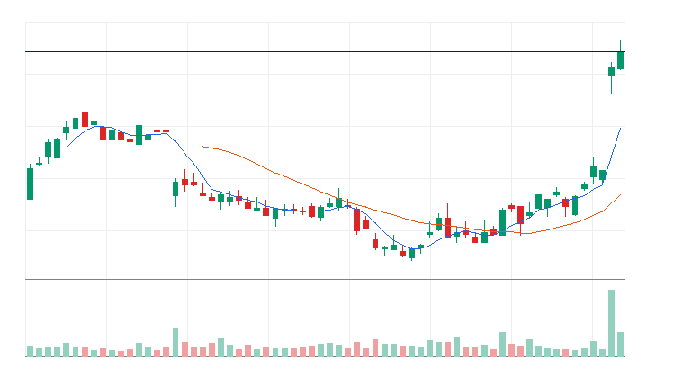
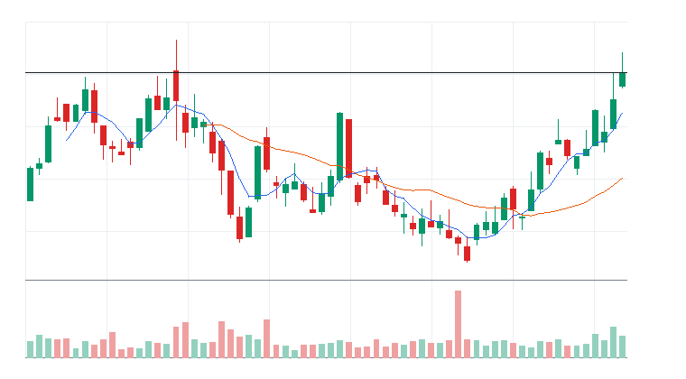
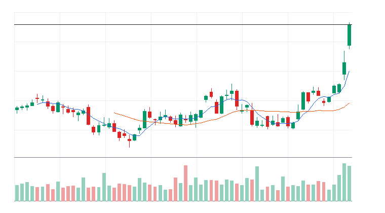
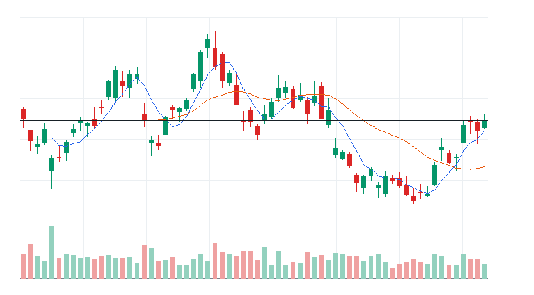
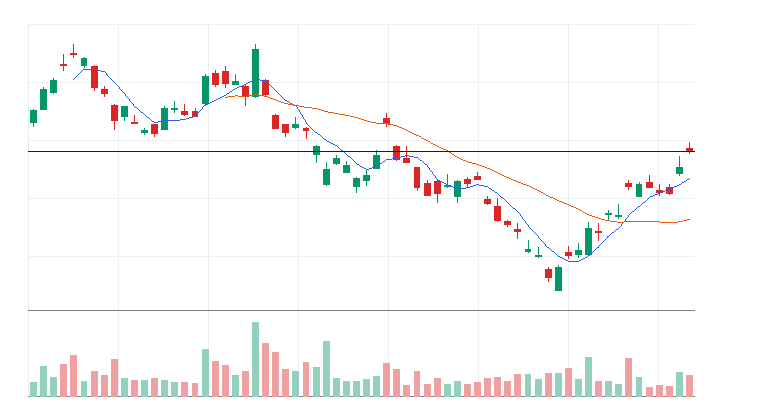
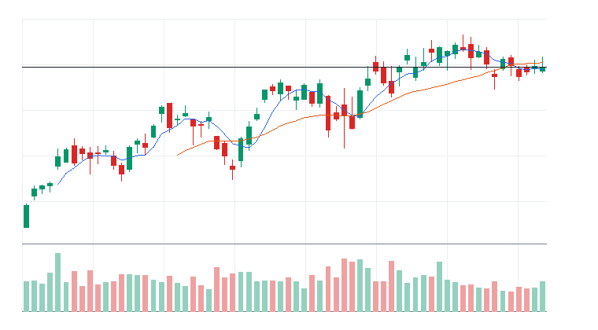
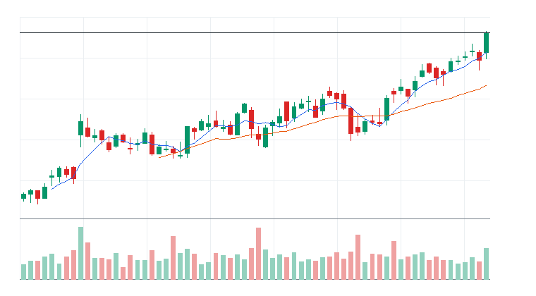

# 오늘의 데일리 트레이딩 요약

**REAL DATA TEST - 가격/거래량은 실제 데이터, 뉴스/ETF 구성종목 확산도/거래대금 유동성 일부 연결**

**목적:** 이 리포트는 최근 오른 자산을 나열하는 것이 아니라, 돈이 몰리는 근거와 다음 매수 주체가 확인할 트레이딩 후보를 찾기 위한 보고서다.

> 핵심 질문: 현재 가격에서 누가 사고 있고, 누가 앞으로 더 비싸게 사줄 수 있는가?

## 시장 국면 판단

- 최종 판정: 기간 조정 (71점)
- 전일 대비: 기간 조정은 유지됐지만 점수는 전일보다 약화됐다(-12점).
- 판정 신뢰도: 높음 (100점) - 핵심 지수와 매크로 데이터가 대부분 직접 수집되어 판정 신뢰도가 높다.
- 행동 바이어스: 추격 보류, 돌파 확인
- 한 줄 결론: 장기 추세는 유지되지만 단기 추세가 둔화되어 기간 조정으로 본다. 기술 84점, 매크로 48점.
- 기술적 지표: 상승 추세 우위 (84점, 가중치 65%)
- S&P 500: 100점 | 50일선 위, 200일선 위, 20일 +0.30%, 60일 +6.00%, 52주 고점 대비 -1.14% -> 기술 점수 100
- Nasdaq 100: 67점 | 50일선 아래, 200일선 위, 20일 -3.14%, 60일 +9.00%, 52주 고점 대비 -5.64% -> 기술 점수 67
- 매크로 시황: 매크로 중립 (48점, 가중치 35%)
- 매크로 요약: 매크로 점수 48로 뚜렷한 방향성보다 확인 대기 성격이 강하다.
- 금리: 중립 46점 / 금리 중립 / confidence HIGH
  - 주요 근거: US 10Y yield 20일 +3.18%, 5일 +0.66%; US 3M yield 20일 +1.85%, 단기금리 방향 확인; US long-duration bonds 20일 -2.30%, 장기채 가격 기준 할인율 부담 확인
  - 확인 사항: 추가 확인 이벤트 없음
- 물가: 중립 48점 / 물가 중립 / confidence HIGH
  - 주요 근거: Oil ETF 20일 +3.32%, 유가 기반 물가 압력 확인; TIPS ETF 20일 -1.63%, 물가연동채 흐름은 보조 근거; Gold 20일 -8.22%, 금 강세는 방어 수요 여부 확인
  - 확인 사항: 추가 확인 이벤트 없음
- 정책: 중립 50점 / 정책 이벤트 확인 전 중립 / confidence LOW
  - 주요 근거: 정책 톤은 1차 버전에서 일정/이벤트 리스크 기반 중립값으로 반영한다.
  - 확인 사항: FOMC, CPI, PCE, 고용지표 발표 전후에는 매크로 confidence를 보수적으로 해석한다.
- 신용/유동성: 중립 48점 / 신용/유동성 중립 / confidence HIGH
  - 주요 근거: High yield credit 20일 -0.29%, 하이일드 위험선호 확인; HYG-LQD 20일 상대강도 +1.19%, 신용위험 선호/회피 확인; VIX 20일 +1.95%, 변동성 부담 확인
  - 확인 사항: 추가 확인 이벤트 없음
- 환율/글로벌: 중립 48점 / 환율/글로벌 중립 / confidence MEDIUM
  - 주요 근거: US dollar 20일 +1.47%, 달러 강세/약세 확인
  - 확인 사항: 추가 확인 이벤트 없음
- US 10Y yield: 44점 | 하락 시 주식 우호; 5일 +0.66%, 20일 +3.18% -> 매크로 점수 44
- US 3M yield: 47점 | 하락 시 주식 우호; 5일 +0.41%, 20일 +1.85% -> 매크로 점수 47
- US long-duration bonds: 46점 | 상승 시 주식 우호; 5일 -0.33%, 20일 -2.30% -> 매크로 점수 46
- TIPS ETF: 50점 | 상승 시 주식 우호; 5일 -0.14%, 20일 -1.63% -> 매크로 점수 50
- Oil ETF: 37점 | 하락 시 주식 우호; 5일 +9.44%, 20일 +3.32% -> 매크로 점수 37
- Gold: 50점 | 상승 시 주식 우호; 5일 -3.50%, 20일 -8.22% -> 매크로 점수 50
- US dollar: 48점 | 하락 시 주식 우호; 5일 -0.07%, 20일 +1.47% -> 매크로 점수 48
- High yield credit: 50점 | 상승 시 주식 우호; 5일 +0.06%, 20일 -0.29% -> 매크로 점수 50
- Investment grade credit: 50점 | 상승 시 주식 우호; 5일 -0.19%, 20일 -1.48% -> 매크로 점수 50
- VIX: 42점 | 하락 시 주식 우호; 5일 +5.62%, 20일 +1.95% -> 매크로 점수 42
- 데이터 커버리지: 기술 2/2, 매크로 10/10
- 데이터 신뢰도 근거:
  - 직접 지수 데이터: S&P 500, Nasdaq 100
  - 대체 지수 데이터 없음
  - 매크로 데이터: 10/10
  - 누락 데이터 없음
  - stale 데이터 없음

## 모바일 요약

[오늘의 데일리 트레이딩 요약]

생성 성공 / 데이터 모드: REAL_TEST

시장:
- 중립

시장 지배 서사:
1. 필수소비재 음료 방어 성장 - 약화 - Invesco QQQ Trust(QQQ), Monster Beverage Corporation(MNST), Coca-Cola Europacific Partners PLC(CCEP) 중심으로 5일 +0.67%, 20일 +3.70% 흐름이 형성됨. 뉴스 직접성 제한.
2. 사이버보안 지출 재가속 - 약화 - iShares Cybersecurity and Tech ETF(IHAK), Amplify Cybersecurity ETF(HACK), Palo Alto Networks Inc.(PANW), CrowdStrike Holdings Inc.(CRWD) 중심으로 5일 +0.00%, 20일 +13.54% 흐름이 형성됨. 뉴스 직접성 제한.
3. Aerospace & Defense 자금 유입 - 약화 - iShares Russell 2000 ETF(IWM), SPDR S&P 500 ETF Trust(SPY), Axon Enterprise Inc.(AXON), RTX 중심으로 5일 -2.09%, 20일 +5.29% 흐름이 형성됨. 뉴스 직접성 제한.

트렌드 강도:
1. 필수소비재 음료 방어 성장 - TSI 25 - 잠복 - 진입품질 낮음
2. 사이버보안 지출 재가속 - TSI 26 - 잠복 - 진입품질 낮음
3. Aerospace & Defense 자금 유입 - TSI 6 - 잠복 - 진입품질 낮음

오늘 결론:
- Financial Services 개별 종목 흐름이 ETF 대비 강한지 확인 필요
- 행동 후보는 linkedNarrative와 함께 확인한다.
- 추격보다 진입 조건 확인 후 접근한다.

오늘 실제 행동 후보:
1. PayPal Holdings Inc.(PYPL)(STOCK) - Aerospace & Defense 자금 유입 - 단기 추세가 유지되고 거래량이 1.0배 이상이면 눌림 이후 재상승을 시도할 수 있음
2. Thomson Reuters Corporation(TRI)(STOCK) - Aerospace & Defense 자금 유입 - 단기 추세가 유지되고 거래량이 1.0배 이상이면 눌림 이후 재상승을 시도할 수 있음
3. Cintas Corporation(CTAS)(STOCK) - Aerospace & Defense 자금 유입 - 단기 추세가 유지되고 거래량이 1.0배 이상이면 눌림 이후 재상승을 시도할 수 있음

다크호스 후보:
1. 다크호스 후보 없음 - 조건 충족 후보 없음

ETF 후보 TOP 5:
1. Energy Select Sector SPDR Fund(XLE) - 매크로 방어/헤지 - 거래량 확인 전 관찰
2. KraneShares CSI China Internet ETF(KWEB) - 미분류 - 제외
3. iShares Cybersecurity and Tech ETF(IHAK) - 사이버보안 지출 재가속 - 제외
4. iShares Russell 2000 ETF(IWM) - Aerospace & Defense 자금 유입 - 제외
5. Amplify Cybersecurity ETF(HACK) - 사이버보안 지출 재가속 - 거래량 확인 전 관찰

웹 리포트:
https://yoolcool.github.io/DailyTradingThesisAgent/

## 오늘 결론

- 오늘 결론: 조건부 진입
- 신규 진입 후보: 0개
- 조건부 진입 후보: 3개
- 관찰 후보: 120개
- 주요 제한 요인: Entry Quality < 40, RVOL 미달, 뉴스 직접성 부족
- 주문 판단: 시장가 금지 / 지정가 또는 관찰
- 실전 판단: 진입 후보는 있으나, 전일 고점 돌파와 거래량 확인 후 선별적으로 접근한다.

### 후보 제한 요인 집계

- RVOL < 1.00x: 120개
- 거래대금 유동성 낮음: 15개
- Entry Quality 50~54 near miss: 0개
- Entry Quality 40~49 관찰: 0개
- Entry Quality < 40: 157개
- Exhaustion Risk >= 70: 0개
- ETF breadth 샘플 부족: 37개
- 뉴스 직접성 부족: 100개

## 데이터 신뢰도

- 전체 데이터 신뢰도 등급: LOW
- 분석 신뢰도: LOW
- 주문 실행 신뢰도: LOW
- ETF breadth 신뢰도: LOW
- 신뢰도 해석: 테마 확산 판단 제한, 거래대금 유동성 낮음 또는 확인 불가, 프리/애프터마켓 확인 불가
- 리포트 생성 시각: 2026-07-17 09:01 KST
- 가격 기준 거래일: 2026-07-16 US regular close
- 뉴스 수집 시각: 2026-07-17 09:00 KST
- 가장 최근 뉴스 발행 시각: 2026-07-17 08:38 KST
- 뉴스 신선도 상태: FRESH
- 뉴스 소스: Yahoo Finance RSS, MarketWatch RSS, CNBC Markets RSS, SEC EDGAR RSS, Federal Reserve RSS, Finnhub API
- 뉴스 소스 상태: Yahoo Finance RSS CONNECTED, MarketWatch RSS CONNECTED, CNBC Markets RSS PARTIAL, SEC EDGAR RSS PARTIAL, Federal Reserve RSS CONNECTED, Finnhub API DISABLED
- 뉴스 신뢰도: MEDIUM
- 추천 적용 거래일: 2026-07-16 US regular session
- 가격/거래량 데이터 상태: 연결됨
- 뉴스 데이터 상태: 일부 연결
- ETF 구성종목 확산도 상태: 일부 연결
- ETF 구성종목 샘플 수: 1~4
- 거래대금 유동성 데이터 상태: 일부 연결
- 프리/애프터마켓 데이터 상태: UNAVAILABLE
- 데이터 provider: yfinance, Yahoo Finance RSS, MarketWatch RSS, CNBC Markets RSS, SEC EDGAR RSS, Federal Reserve RSS, Finnhub API, config fallback sample, price-volume dollar-volume fallback
- 실전 사용 경고: 이 리포트는 투자판단 보조용이며, REAL_TEST 모드에서는 일부 데이터가 누락되거나 지연될 수 있다. 실제 주문 전 현재가, 뉴스, 프리마켓/정규장 거래량을 별도 확인해야 한다.

## 0. 시장 상태

- 데이터 모드: REAL_TEST
- 가격/거래량: 연결됨
- 뉴스: 일부 연결
- ETF 구성종목 확산도: 일부 연결
- 거래대금 유동성: 일부 연결
- 생성 시각: 2026년 7월 17일 금요일 AM 9:01
- 시장 상태: 중립
- 오늘 돈의 방향: Financial Services 개별 종목 흐름이 ETF 대비 강한지 확인 필요
- 강한 테마 TOP 3: Financial Services(100), 중국 인터넷 ETF(60), 사이버보안(38)
- 데이터 한계:
  - API 또는 provider 상태에 따라 뉴스/ETF 확산도/거래대금 유동성 반영 범위가 달라질 수 있다.
  - 수집 실패 데이터는 점수 반영에서 제외하거나 confidence를 제한한다.
  - reasonConfidence HIGH는 직접 촉매, 가격/거래량, 확산도/유동성 근거가 함께 있을 때만 사용한다.

## 오늘 시장을 지배하는 서사

### 오늘 시장을 지배하는 서사 TOP 3

#### 1. 필수소비재 음료 방어 성장
- 상태: 약화
- narrativeScore: 47
- reasonConfidence: LOW
- 근거 ETF: QQQ
- 근거 개별 종목: MNST, CCEP
- 돈이 몰리는 이유: 필수소비재 음료 방어 성장 관련 Invesco QQQ Trust(QQQ)와 Monster Beverage Corporation(MNST), Coca-Cola Europacific Partners PLC(CCEP)의 5일(+0.67%)·20일(+3.70%) 흐름을 함께 본다. 평균 상대 거래량은 1.14배이고, ETF 확산도는 추가 확인이 필요하다. 뉴스 직접성은 아직 제한적이다.
- 다음 매수 주체: 필수소비재 음료 방어 성장을 확인한 섹터 ETF 자금과 상대강도 추종 스윙 자금
- 가장 좋은 트레이딩 수단: ETF 우선: QQQ / 개별 종목 우선: CCEP, MNST
- 서사가 깨지는 조건: QQQ 20일선 이탈 또는 관련 종목 절반 이상 5일선 이탈
- 오늘 행동: 기존 네러티브와 중복을 확인한 뒤 ETF/대표 종목 동조성이 살아날 때만 관찰 편입

상세 narrativeScore 근거 보기

- rawScore: 47
- ETF 평균 moneyFlowScore: 0
- 개별 종목 평균 moneyFlowScore: 70
- ETF 후보 비율: 0%
- 개별 종목 후보 비율: 100%
- 5일 평균 수익률: +1.00%
- 20일 평균 수익률: +4.00%
- 평균 상대 거래량: 1.00배
- ETF 평균 상대 거래량: 1.00배
- 개별주 평균 상대 거래량: 1.00배
- 52주 고점 근접 후보 비율: 67%
- 뉴스 직접성 점수: 9
- ETF 확산도 점수: 0
- 유동성 점수: 3
- 과열 리스크 차감: 0

#### 2. 사이버보안 지출 재가속
- 상태: 약화
- narrativeScore: 25
- reasonConfidence: LOW
- 근거 ETF: IHAK, HACK, CIBR
- 근거 개별 종목: PANW, CRWD, FTNT
- 돈이 몰리는 이유: 사이버보안 지출 재가속 관련 iShares Cybersecurity and Tech ETF(IHAK), Amplify Cybersecurity ETF(HACK), First Trust NASDAQ Cybersecurity ETF(CIBR)와 Palo Alto Networks Inc.(PANW), CrowdStrike Holdings Inc.(CRWD), Fortinet Inc.(FTNT)의 5일(+0.00%)·20일(+13.54%) 흐름을 함께 본다. 평균 상대 거래량은 0.70배이고, ETF 확산도는 추가 확인이 필요하다. 뉴스 직접성은 아직 제한적이다.
- 다음 매수 주체: 사이버보안 지출 재가속을 확인한 섹터 ETF 자금과 상대강도 추종 스윙 자금
- 가장 좋은 트레이딩 수단: ETF 우선: HACK, CIBR, IHAK / 개별 종목 우선: PANW, CRWD, FTNT
- 서사가 깨지는 조건: HACK 20일선 이탈 또는 관련 종목 절반 이상 5일선 이탈
- 오늘 행동: 기존 네러티브와 중복을 확인한 뒤 ETF/대표 종목 동조성이 살아날 때만 관찰 편입

상세 narrativeScore 근거 보기

- rawScore: 25
- ETF 평균 moneyFlowScore: 19
- 개별 종목 평균 moneyFlowScore: 42
- ETF 후보 비율: 0%
- 개별 종목 후보 비율: 0%
- 5일 평균 수익률: 0.00%
- 20일 평균 수익률: +14.00%
- 평균 상대 거래량: 1.00배
- ETF 평균 상대 거래량: 1.00배
- 개별주 평균 상대 거래량: 1.00배
- 52주 고점 근접 후보 비율: 57%
- 뉴스 직접성 점수: 2
- ETF 확산도 점수: 0
- 유동성 점수: 0
- 과열 리스크 차감: 0

#### 3. Aerospace & Defense 자금 유입
- 상태: 약화
- narrativeScore: 13
- reasonConfidence: LOW
- 근거 ETF: IWM, SPY, QQQ
- 근거 개별 종목: AXON, RTX
- 돈이 몰리는 이유: Aerospace & Defense 자금 유입 관련 iShares Russell 2000 ETF(IWM), SPDR S&P 500 ETF Trust(SPY), Invesco QQQ Trust(QQQ)와 Axon Enterprise Inc.(AXON), RTX의 5일(-2.09%)·20일(+5.29%) 흐름을 함께 본다. 평균 상대 거래량은 0.76배이고, ETF 확산도는 추가 확인이 필요하다. 뉴스 직접성은 아직 제한적이다.
- 다음 매수 주체: Aerospace & Defense 자금 유입을 확인한 섹터 ETF 자금과 상대강도 추종 스윙 자금
- 가장 좋은 트레이딩 수단: ETF 우선: QQQ, SPY, IWM / 개별 종목 우선: AXON, RTX
- 서사가 깨지는 조건: QQQ 20일선 이탈 또는 관련 종목 절반 이상 5일선 이탈
- 오늘 행동: 기존 네러티브와 중복을 확인한 뒤 ETF/대표 종목 동조성이 살아날 때만 관찰 편입

상세 narrativeScore 근거 보기

- rawScore: 13
- ETF 평균 moneyFlowScore: 15
- 개별 종목 평균 moneyFlowScore: 17
- ETF 후보 비율: 0%
- 개별 종목 후보 비율: 0%
- 5일 평균 수익률: -2.00%
- 20일 평균 수익률: +5.00%
- 평균 상대 거래량: 1.00배
- ETF 평균 상대 거래량: 1.00배
- 개별주 평균 상대 거래량: 1.00배
- 52주 고점 근접 후보 비율: 40%
- 뉴스 직접성 점수: 1
- ETF 확산도 점수: 0
- 유동성 점수: 3
- 과열 리스크 차감: 0

### 전체 narrative 요약

| 서사명 | 상태 | narrativeScore | reasonConfidence | 대표 ETF | 대표 종목 | 오늘 행동 |
| --- | --- | ---: | --- | --- | --- | --- |
| 필수소비재 음료 방어 성장 | 약화 | 47 | LOW | QQQ | MNST, CCEP | 기존 네러티브와 중복을 확인한 뒤 ETF/대표 종목 동조성이 살아날 때만 관찰 편입 |
| 사이버보안 지출 재가속 | 약화 | 25 | LOW | IHAK, HACK, CIBR | PANW, CRWD, FTNT | 기존 네러티브와 중복을 확인한 뒤 ETF/대표 종목 동조성이 살아날 때만 관찰 편입 |
| Aerospace & Defense 자금 유입 | 약화 | 13 | LOW | IWM, SPY, QQQ | AXON, RTX | 기존 네러티브와 중복을 확인한 뒤 ETF/대표 종목 동조성이 살아날 때만 관찰 편입 |
| 소프트웨어 실적/AI 수익화 | 약화 | 11 | LOW | IGV, AIQ, QQQ | WDAY, INTU, DDOG, TEAM | 기존 네러티브와 중복을 확인한 뒤 ETF/대표 종목 동조성이 살아날 때만 관찰 편입 |
| 매크로 방어/헤지 | 약화 | 10 | LOW | XLE, GLD, TLT | CVX, XOM | 위험회피가 확인될 때만 헤지성 접근 |
| 전력 유틸리티 수요 재평가 | 약화 | 6 | LOW | IWM, SPY, QQQ | ETN, GEV, VRT | 기존 네러티브와 중복을 확인한 뒤 ETF/대표 종목 동조성이 살아날 때만 관찰 편입 |
| Internet Content 자금 유입 | 약화 | 6 | LOW | QQQ | META, DASH | 기존 네러티브와 중복을 확인한 뒤 ETF/대표 종목 동조성이 살아날 때만 관찰 편입 |
| AI 소프트웨어/사이버보안 확산 | 약화 | 5 | LOW | IGV, AIQ, QQQ | DDOG, PLTR, TEAM, MSFT | 추격보다 눌림 후 재상승 확인 |
| 바이오/헬스케어 촉매 | 약화 | 2 | LOW | QQQ | REGN, VRTX, INSM, ALNY | 기존 네러티브와 중복을 확인한 뒤 ETF/대표 종목 동조성이 살아날 때만 관찰 편입 |
| 위험선호 성장주 재진입 | 소멸 | 0 | LOW | QQQ, IPO, ARKK | ARM, COIN, TSLA | 지수 위험선호가 유지될 때만 선별 진입 |
| Data Storage 자금 유입 | 소멸 | 0 | LOW | IWM, SPY, QQQ | STX, WDC | 기존 네러티브와 중복을 확인한 뒤 ETF/대표 종목 동조성이 살아날 때만 관찰 편입 |
| 전력망/원전/인프라 병목 | 소멸 | 0 | LOW | GRID, PAVE, URA | VRT, ETN, PWR, CEG | ETF 확산도와 거래량이 같이 살아날 때만 진입 |
| 방산/안보 프리미엄 | 소멸 | 0 | LOW | XAR, SHLD, ITA | PLTR, AVAV, KTOS | 뉴스 촉매가 직접 확인될 때만 추세 추종 |
| AI 인프라 재가속 | 소멸 | 0 | LOW | SMH, SOXX, DRAM | NVDA, MU, VRT, ETN | 추격보다 5일선 지지 후 재상승 확인 |
| 반도체 장비 사이클 재평가 | 소멸 | 0 | LOW | SMH, SOXX, SOXQ | ASML, AMAT, LRCX | 기존 네러티브와 중복을 확인한 뒤 ETF/대표 종목 동조성이 살아날 때만 관찰 편입 |
| 반도체 설계/공급망 재가속 | 소멸 | 0 | LOW | SMH, SOXX, SOXQ | ARM, AMD, TXN, ADI | 기존 네러티브와 중복을 확인한 뒤 ETF/대표 종목 동조성이 살아날 때만 관찰 편입 |
| 비트코인/디지털 자산 위험선호 | 소멸 | 0 | LOW | IBIT, BLOK | MSTR, COIN, IREN | 비트코인 베타가 살아날 때만 단기 매매 |

## 트렌드 강도 판단

### 1. 필수소비재 음료 방어 성장
- Trend Strength Index: 25
- 트렌드 상태 라벨: 잠복
- 테마 확산도: 부족
- ETF 동조성: 부족
- 거래량 강도: 약함
- 과열 위험: 보통 (27)
- 오늘 진입 품질: 낮음 (16)
- 한 줄 판단: 필수소비재 음료 방어 성장는 Trend Strength는 높아도 시장 위험선호가 약해 시장 환경 비우호 구간이다.
- 오늘 접근법: Invesco QQQ Trust(QQQ)와 Monster Beverage Corporation(MNST)/Coca-Cola Europacific Partners PLC(CCEP)의 거래량 확산이 확인되기 전까지 관찰한다.

트렌드 강도 상세 근거 보기

- 가격 모멘텀: 가격 모멘텀 8/25. 평균 5D +0.67%, 20D +3.70%.
- 거래량 강도: 거래량 강도 9/20. 평균 RVOL 1.14배.
- ETF 동조성: ETF 동조성 -2/15. 관련 ETF Invesco QQQ Trust(QQQ) 흐름을 기준으로 판단.
- 테마 확산도: 테마 확산도 5/20. 상위 1~2개 쏠림 감점 6점 반영.
- 뉴스 촉매: 뉴스/촉매 신선도 2/10. HIGH 직접 촉매 0개.
- 과열 리스크: 과열 리스크 27/100. 단기 급등, 고점 근접, ETF-개별주 괴리, 쏠림을 함께 반영.
- 시장 환경: 시장 환경 3/10. QQQ/SPY/IWM 가격 흐름 기반 위험선호 점수.

### 2. 사이버보안 지출 재가속
- Trend Strength Index: 26
- 트렌드 상태 라벨: 잠복
- 테마 확산도: 부족
- ETF 동조성: 보통
- 거래량 강도: 부족
- 과열 위험: 낮음 (11)
- 오늘 진입 품질: 낮음 (16)
- 한 줄 판단: 사이버보안 지출 재가속는 Trend Strength는 높아도 시장 위험선호가 약해 시장 환경 비우호 구간이다.
- 오늘 접근법: iShares Cybersecurity and Tech ETF(IHAK)/Amplify Cybersecurity ETF(HACK)/First Trust NASDAQ Cybersecurity ETF(CIBR)와 Palo Alto Networks Inc.(PANW)/CrowdStrike Holdings Inc.(CRWD)/Fortinet Inc.(FTNT)의 거래량 확산이 확인되기 전까지 관찰한다.

트렌드 강도 상세 근거 보기

- 가격 모멘텀: 가격 모멘텀 7/25. 평균 5D +0.00%, 20D +13.54%.
- 거래량 강도: 거래량 강도 2/20. 평균 RVOL 0.70배.
- ETF 동조성: ETF 동조성 8/15. 관련 ETF Amplify Cybersecurity ETF(HACK), First Trust NASDAQ Cybersecurity ETF(CIBR), iShares Cybersecurity and Tech ETF(IHAK), iShares Expanded Tech-Software Sector ETF(IGV) 흐름을 기준으로 판단.
- 테마 확산도: 테마 확산도 5/20. 상위 1~2개 쏠림 감점 3점 반영.
- 뉴스 촉매: 뉴스/촉매 신선도 1/10. HIGH 직접 촉매 0개.
- 과열 리스크: 과열 리스크 11/100. 단기 급등, 고점 근접, ETF-개별주 괴리, 쏠림을 함께 반영.
- 시장 환경: 시장 환경 3/10. QQQ/SPY/IWM 가격 흐름 기반 위험선호 점수.

### 3. Aerospace & Defense 자금 유입
- Trend Strength Index: 6
- 트렌드 상태 라벨: 잠복
- 테마 확산도: 부족
- ETF 동조성: 부족
- 거래량 강도: 부족
- 과열 위험: 낮음 (13)
- 오늘 진입 품질: 낮음 (3)
- 한 줄 판단: Aerospace & Defense 자금 유입는 Trend Strength는 높아도 시장 위험선호가 약해 시장 환경 비우호 구간이다.
- 오늘 접근법: iShares Russell 2000 ETF(IWM)/SPDR S&P 500 ETF Trust(SPY)/Invesco QQQ Trust(QQQ)와 Axon Enterprise Inc.(AXON)/RTX의 거래량 확산이 확인되기 전까지 관찰한다.

트렌드 강도 상세 근거 보기

- 가격 모멘텀: 가격 모멘텀 -2/25. 평균 5D -2.09%, 20D +5.29%.
- 거래량 강도: 거래량 강도 2/20. 평균 RVOL 0.76배.
- ETF 동조성: ETF 동조성 2/15. 관련 ETF Invesco QQQ Trust(QQQ), SPDR S&P 500 ETF Trust(SPY), iShares Russell 2000 ETF(IWM) 흐름을 기준으로 판단.
- 테마 확산도: 테마 확산도 1/20. 상위 1~2개 쏠림 감점 3점 반영.
- 뉴스 촉매: 뉴스/촉매 신선도 0/10. HIGH 직접 촉매 0개.
- 과열 리스크: 과열 리스크 13/100. 단기 급등, 고점 근접, ETF-개별주 괴리, 쏠림을 함께 반영.
- 시장 환경: 시장 환경 3/10. QQQ/SPY/IWM 가격 흐름 기반 위험선호 점수.

## 최근 추천 결과 트래킹

개별주는 데이트레이딩 관점으로 추천 이후 첫 정규장의 장중 최고가와 종가를 추적한다. ETF는 테마/스윙 관점으로 추천 이후 1주일 동안의 최고가와 현재 종가를 추적한다.

### 개별주 Top 3 추천 성과 요약
- 최근 5개 리포트 표본: 10개 (초기 검증 단계)
- 장중 최고가 기준 성공률: +57.14%
- 종가 기준 성공률: +28.57%
- 평균 장중 최고 수익률: +0.98%
- 평균 종가 수익률: -2.47%

### ETF 추천 성과 요약
- 최근 5개 리포트 표본: 0개 (초기 검증 단계)
- 1주 최고가 기준 성공률: 데이터 없음
- 현재 종가 기준 성공률: 데이터 없음
- 평균 1주 최고 수익률: 데이터 없음
- 평균 현재 수익률: 데이터 없음

최근 추천 결과 상세 테이블 펼치기

| 추천일 | 유형 | 순위 | 티커 | 기준가 | 추적 기간 | 상태 | High 수익률 | Close 수익률 | 결과 | 코멘트 |
| --- | --- | ---: | --- | ---: | --- | --- | ---: | ---: | --- | --- |
| 2026-07-17 | STOCK | 3 | CTAS | $206.25 | 2026-07-17 | pending | 데이터 없음 | 데이터 없음 | 추적 대기 | 아직 추적 거래일 데이터가 완성되지 않음 |
| 2026-07-17 | STOCK | 2 | TRI | $98.82 | 2026-07-17 | pending | 데이터 없음 | 데이터 없음 | 추적 대기 | 아직 추적 거래일 데이터가 완성되지 않음 |
| 2026-07-17 | STOCK | 1 | PYPL | $56.73 | 2026-07-17 | pending | 데이터 없음 | 데이터 없음 | 추적 대기 | 아직 추적 거래일 데이터가 완성되지 않음 |
| 2026-07-16 | STOCK | 3 | PYPL | $55.52 | 2026-07-16 | complete | +3.87% | +2.18% | 성공 | 장중 기회와 종가 유지가 모두 확인됨 (일봉 기준) |
| 2026-07-16 | STOCK | 2 | TRI | $95.51 | 2026-07-16 | complete | +5.85% | +3.47% | 성공 | 장중 기회와 종가 유지가 모두 확인됨 (일봉 기준) |
| 2026-07-16 | STOCK | 1 | CRWD | $210.73 | 2026-07-15 | complete | +3.21% | -1.88% | 단타 유효 | 장중 기회는 있었지만 종가 유지력은 약함 (일봉 기준) |
| 2026-07-15 | STOCK | 1 | CRWD | $210.73 | 2026-07-15 | complete | +3.21% | -1.88% | 단타 유효 | 장중 기회는 있었지만 종가 유지력은 약함 (일봉 기준) |
| 2026-07-14 | STOCK | 1 | TRI | $94.29 | 2026-07-14 | complete | -0.66% | -2.70% | 실패 | 추천 이후 의미 있는 장중 기회가 부족하고 종가도 약함 (일봉 기준) |
| 2026-07-13 | STOCK | 1 | AXON | $640.46 | 2026-07-13 | complete | -9.75% | -14.59% | 실패 | 추천 이후 의미 있는 장중 기회가 부족하고 종가도 약함 (일봉 기준) |
| 2026-07-13 | STOCK | 1 | META | $669.21 | 2026-07-13 | complete | +1.11% | -1.86% | 제한적 유효 | 제한적인 장중 기회만 발생 (일봉 기준) |
| 2026-07-08 | STOCK | 1 | AXON | $640.46 | 2026-07-08 | complete | -1.48% | -6.35% | 실패 | 추천 이후 의미 있는 장중 기회가 부족하고 종가도 약함 (일봉 기준) |
| 2026-07-07 | STOCK | 2 | AXON | $622.35 | 2026-07-07 | complete | +6.86% | +2.91% | 성공 | 장중 기회와 종가 유지가 모두 확인됨 (일봉 기준) |
| 2026-07-07 | STOCK | 1 | PANW | $357.53 | 2026-07-07 | complete | +1.53% | -5.73% | 제한적 유효 | 제한적인 장중 기회만 발생 (일봉 기준) |
| 2026-07-06 | STOCK | 2 | CCEP | $106.61 | 2026-07-06 | complete | +0.58% | +0.34% | 추적 대기 | 아직 추적 거래일 데이터가 완성되지 않음 (일봉 기준) |
| 2026-07-06 | STOCK | 1 | PANW | $348.06 | 2026-07-06 | complete | +5.78% | +2.72% | 성공 | 장중 기회와 종가 유지가 모두 확인됨 (일봉 기준) |
| 2026-07-03 | STOCK | 1 | CCEP | $106.61 | 2026-07-03 | pending | 데이터 없음 | 데이터 없음 | 추적 대기 | 아직 추적 거래일 데이터가 완성되지 않음 |
| 2026-07-02 | STOCK | 2 | AXON | $593.96 | 2026-07-02 | complete | +1.52% | +0.52% | 제한적 유효 | 제한적인 장중 기회만 발생 (일봉 기준) |
| 2026-07-02 | STOCK | 1 | CCEP | $106.1 | 2026-07-02 | complete | +1.86% | +0.48% | 제한적 유효 | 제한적인 장중 기회만 발생 (일봉 기준) |
| 2026-07-01 | STOCK | 3 | LRCX | $433.33 | 2026-07-01 | complete | -4.12% | -9.71% | 실패 | 추천 이후 의미 있는 장중 기회가 부족하고 종가도 약함 (일봉 기준) |
| 2026-07-01 | STOCK | 2 | PANW | $341.02 | 2026-07-01 | complete | +5.01% | +3.23% | 성공 | 장중 기회와 종가 유지가 모두 확인됨 (일봉 기준) |
| 2026-07-01 | STOCK | 1 | AMAT | $723 | 2026-07-01 | complete | -4.04% | -9.97% | 실패 | 추천 이후 의미 있는 장중 기회가 부족하고 종가도 약함 (일봉 기준) |
| 2026-06-30 | STOCK | 3 | AMAT | $694.64 | 2026-06-30 | complete | +6.48% | +4.08% | 성공 | 장중 기회와 종가 유지가 모두 확인됨 (일봉 기준) |
| 2026-06-30 | STOCK | 2 | CRWD | $742.91 | 2026-06-30 | complete | -74.25% | -74.32% | 실패 | 추천 이후 의미 있는 장중 기회가 부족하고 종가도 약함 (일봉 기준) |
| 2026-06-30 | STOCK | 1 | PANW | $332 | 2026-06-30 | complete | +3.16% | +2.72% | 성공 | 장중 기회와 종가 유지가 모두 확인됨 (일봉 기준) |
| 2026-06-29 | STOCK | 3 | KDP | $33.4 | 2026-06-29 | complete | +1.26% | +0.30% | 제한적 유효 | 제한적인 장중 기회만 발생 (일봉 기준) |
| 2026-06-29 | STOCK | 2 | VRTX | $491.34 | 2026-06-29 | complete | +1.74% | +1.69% | 제한적 유효 | 제한적인 장중 기회만 발생 (일봉 기준) |
| 2026-06-29 | STOCK | 1 | FTNT | $151.35 | 2026-06-29 | complete | +5.10% | +2.69% | 성공 | 장중 기회와 종가 유지가 모두 확인됨 (일봉 기준) |
| 2026-06-26 | STOCK | 3 | MU | $1,213.56 | 2026-06-26 | complete | -1.22% | -6.69% | 실패 | 추천 이후 의미 있는 장중 기회가 부족하고 종가도 약함 (일봉 기준) |
| 2026-06-26 | STOCK | 2 | AMAT | $668 | 2026-06-26 | complete | -1.17% | -6.16% | 실패 | 추천 이후 의미 있는 장중 기회가 부족하고 종가도 약함 (일봉 기준) |
| 2026-06-26 | STOCK | 1 | LRCX | $401.82 | 2026-06-26 | complete | -2.97% | -5.66% | 실패 | 추천 이후 의미 있는 장중 기회가 부족하고 종가도 약함 (일봉 기준) |
| 2026-06-26 | ETF | 1 | DRAM | $76.89 | 2026-06-26~2026-07-03 | complete | -3.55% | -31.93% | 실패 | 추천 이후 ETF 흐름이 약화됨 |
| 2026-06-23 | STOCK | 3 | TSM | $467.67 | 2026-06-23 | complete | -4.35% | -6.69% | 실패 | 추천 이후 의미 있는 장중 기회가 부족하고 종가도 약함 (일봉 기준) |
| 2026-06-23 | STOCK | 2 | GEV | $1,127.59 | 2026-06-23 | complete | -4.84% | -8.21% | 실패 | 추천 이후 의미 있는 장중 기회가 부족하고 종가도 약함 (일봉 기준) |
| 2026-06-23 | STOCK | 1 | ETN | $435.78 | 2026-06-23 | complete | -3.27% | -7.00% | 실패 | 추천 이후 의미 있는 장중 기회가 부족하고 종가도 약함 (일봉 기준) |
| 2026-06-23 | ETF | 1 | DRAM | $80.72 | 2026-06-23~2026-06-30 | complete | -1.39% | -35.16% | 실패 | 추천 이후 ETF 흐름이 약화됨 |
| 2026-06-22 | STOCK | 3 | ARM | $439.46 | 2026-06-22 | complete | +1.25% | -7.22% | 제한적 유효 | 제한적인 장중 기회만 발생 (일봉 기준) |
| 2026-06-22 | STOCK | 2 | GEV | $1,109.73 | 2026-06-22 | complete | +2.91% | +1.61% | 제한적 유효 | 제한적인 장중 기회만 발생 (일봉 기준) |
| 2026-06-22 | STOCK | 1 | ETN | $421.77 | 2026-06-22 | complete | +3.55% | +3.32% | 성공 | 장중 기회와 종가 유지가 모두 확인됨 (일봉 기준) |
| 2026-06-22 | ETF | 3 | IFRA | $61.99 | 2026-06-22~2026-06-29 | complete | +3.65% | -0.23% | 단기 고점 후 반납 | 1주 내 상승 기회는 있었지만 현재가는 반납 |
| 2026-06-22 | ETF | 2 | SMH | $659.88 | 2026-06-22~2026-06-29 | complete | -1.49% | -13.78% | 실패 | 추천 이후 ETF 흐름이 약화됨 |
| 2026-06-22 | ETF | 1 | DRAM | $76.71 | 2026-06-22~2026-06-29 | complete | +3.77% | -31.77% | 단기 고점 후 반납 | 1주 내 상승 기회는 있었지만 현재가는 반납 |
| 2026-06-19 | STOCK | 3 | AMD | $537.37 | 2026-06-19 | pending | 데이터 없음 | 데이터 없음 | 추적 대기 | 아직 추적 거래일 데이터가 완성되지 않음 |
| 2026-06-19 | STOCK | 2 | ARM | $439.46 | 2026-06-19 | pending | 데이터 없음 | 데이터 없음 | 추적 대기 | 아직 추적 거래일 데이터가 완성되지 않음 |
| 2026-06-19 | STOCK | 1 | GEV | $1,109.73 | 2026-06-19 | pending | 데이터 없음 | 데이터 없음 | 추적 대기 | 아직 추적 거래일 데이터가 완성되지 않음 |
| 2026-06-19 | ETF | 1 | DRAM | $76.71 | 2026-06-19~2026-06-26 | complete | +6.04% | -31.77% | 단기 고점 후 반납 | 1주 내 상승 기회는 있었지만 현재가는 반납 |
| 2026-06-18 | STOCK | 3 | ASML | $1,867.83 | 2026-06-18 | complete | +4.02% | +3.31% | 성공 | 장중 기회와 종가 유지가 모두 확인됨 (일봉 기준) |
| 2026-06-18 | STOCK | 3 | FCX | $69.06 | 2026-06-18 | complete | +2.26% | -0.55% | 제한적 유효 | 제한적인 장중 기회만 발생 (일봉 기준) |
| 2026-06-18 | STOCK | 2 | KLAC | $238.73 | 2026-06-18 | complete | +10.56% | +8.73% | 성공 | 장중 기회와 종가 유지가 모두 확인됨 (일봉 기준) |
| 2026-06-18 | STOCK | 1 | LRCX | $374.18 | 2026-06-18 | complete | +7.17% | +3.97% | 성공 | 장중 기회와 종가 유지가 모두 확인됨 (일봉 기준) |
| 2026-06-18 | ETF | 1 | SOXQ | $106.13 | 2026-06-18~2026-06-25 | complete | +8.67% | -11.99% | 단기 고점 후 반납 | 1주 내 상승 기회는 있었지만 현재가는 반납 |
| 2026-06-04 | STOCK | 3 | PANW | $280.43 | 2026-06-04 | complete | +0.10% | -0.42% | 실패 | 추천 이후 의미 있는 장중 기회가 부족하고 종가도 약함 (일봉 기준) |
| 2026-06-04 | STOCK | 2 | FTNT | $146.48 | 2026-06-04 | complete | +2.45% | +2.18% | 제한적 유효 | 제한적인 장중 기회만 발생 (일봉 기준) |
| 2026-06-04 | STOCK | 1 | CRWD | $747.61 | 2026-06-04 | complete | -75.89% | -75.95% | 실패 | 추천 이후 의미 있는 장중 기회가 부족하고 종가도 약함 (일봉 기준) |
| 2026-06-04 | ETF | 3 | HACK | $102.21 | 2026-06-04~2026-06-11 | complete | -1.66% | +7.72% | 진행 중 | 아직 1주 추적 기간이 끝나지 않음 |
| 2026-06-04 | ETF | 2 | SOXQ | $109.58 | 2026-06-04~2026-06-11 | complete | -4.68% | -14.77% | 실패 | 추천 이후 ETF 흐름이 약화됨 |
| 2026-06-04 | ETF | 1 | AIQ | $69.16 | 2026-06-04~2026-06-11 | complete | -4.29% | -14.24% | 실패 | 추천 이후 ETF 흐름이 약화됨 |
| 2026-06-03 | STOCK | 3 | FTNT | $148.86 | 2026-06-03 | complete | -0.26% | -1.60% | 실패 | 추천 이후 의미 있는 장중 기회가 부족하고 종가도 약함 (일봉 기준) |
| 2026-06-03 | STOCK | 3 | CRWD | $768.95 | 2026-06-03 | complete | -75.06% | -75.69% | 실패 | 추천 이후 의미 있는 장중 기회가 부족하고 종가도 약함 (일봉 기준) |
| 2026-06-03 | STOCK | 2 | MRVL | $290.79 | 2026-06-03 | complete | +11.49% | +3.73% | 성공 | 장중 기회와 종가 유지가 모두 확인됨 (일봉 기준) |
| 2026-06-03 | STOCK | 1 | PANW | $297.18 | 2026-06-03 | complete | -3.09% | -5.64% | 실패 | 추천 이후 의미 있는 장중 기회가 부족하고 종가도 약함 (일봉 기준) |

## 오늘 실제 행동 후보

### 1. PayPal Holdings Inc.(PYPL)
- 자산 유형: STOCK
- linkedNarrative: Aerospace & Defense 자금 유입
- narrativeStatus: 약화
- narrativeScore: 13
- Trend Strength Index: 6
- Exhaustion Risk: 13 (낮음)
- Entry Quality Score: 35 (낮음)
- 트렌드 판단: 테마 확산도가 낮아 개별 종목 이벤트성 흐름일 수 있다.
- moneyFlowScore: 100
- finalRawScore: 101
- reasonConfidence: HIGH
- reasonConfidenceExplanation: 직접 촉매: Yahoo Finance RSS / general_market / under_6h / positive - Paypal (PYPL) Gains As Market Dips: What You Should Know 가격/거래량, 관련 ETF 동반 강세, 유동성 근거가 함께 확인되어 HIGH로 분류했다.
- tieBreakerReason: 최종 원점수 101, 리스크 패널티 -6, 5일 수익률 +25.18%, 상대 거래량 1.63배 순으로 정렬
- 후보별 시장 해석: 중립 / 제한적 - Entry Quality 35 < 50이나 moneyFlow 100, confidence HIGH, RVOL 1.63x로 강한 자금흐름 예외 조건 충족
- 게이트 사유: Entry Quality 35 < 50이나 moneyFlow 100, confidence HIGH, RVOL 1.63x로 강한 자금흐름 예외 조건 충족
- 주문 실행: 시장가 가능
- 직접 촉매: Yahoo Finance RSS / general_market / under_6h / positive - Paypal (PYPL) Gains As Market Dips: What You Should Know
- 왜 돈이 몰리는가: 20일 +29.97%, 5일 +25.18%, 상대 거래량 1.63배로 가격과 거래량이 함께 개선. 뉴스: Yahoo Finance RSS general_market/under_6h / 유동성: LIQUID
- 누가 더 비싸게 사줄 수 있는지: 개별 주도주를 따라붙는 단기 모멘텀 자금과 관련 ETF 강세를 확인한 트레이더
- 진입 조건: 20일선 위 눌림 후 재상승 확인
- 무효화 조건: 20일선 이탈 또는 상대 거래량 0.8배 이하 둔화
- todayActionLabel: 자금흐름 예외 조건부
#### 최근 뉴스/동향 한국어 요약

- 요약: 종목 직접 뉴스 확인 상태이며 뉴스 흐름은 긍정 우위입니다. 후보 선정 후 재확인한 핵심 이슈는 "PayPal Deal Buzz: Can New Owners Fix Profitability Pressure?"입니다.
- 직접 촉매 판단: PayPal Holdings Inc.에 대해 직접 촉매로 분류된 뉴스가 확인됐습니다. 핵심은 "PayPal Deal Buzz: Can New Owners Fix Profitability Pressure?"이며, M&A 재료로 봅니다.
- 뉴스 1: PayPal Deal Buzz: Can New Owners Fix Profitability Pressure?
  - 내용: PayPal Holdings Inc. 관련 M&A 뉴스입니다. 기사 스니펫상 핵심 내용은 PYPL faces a $53B+ takeover bid from Stripe and Advent as slowing profitability raises the stakes for a potential deal.입니다.
  - 투자 의미: M&A 재료는 실적 가시성이나 밸류에이션 기대에 영향을 줄 수 있어 규모와 일정 확인이 중요합니다.
  - 확인할 점: M&A의 금액, 기간, 실적 반영 시점
- 뉴스 2: Paypal (PYPL) Gains As Market Dips: What You Should Know
  - 내용: PayPal Holdings Inc. 관련 기사는 Paypal (PYPL) Gains As Market Dips: What You Should Know 이슈를 다루며, 주가 변동률 +2.18%를 핵심 내용으로 봅니다.
  - 투자 의미: PayPal Holdings Inc.의 당일 상대강도 확인에는 도움이 되지만, 실적/가이던스 같은 새 펀더멘털 변화로 보기는 어렵습니다.
  - 확인할 점: 거래량 동반 여부, 장중 고점 유지, 관련 ETF 동반 강세
- 뉴스 3: PYPL Stock Jumps 4% — PayPal’s $60.50 Buyout Offer Has Wall Street And Retail On The Same Side
  - 내용: PayPal Holdings Inc. 관련 기사는 PYPL Stock Jumps 4% — PayPal’s $60.50 Buyout Offer Has Wall Street And Retail On The Same Side 이슈를 다루며, 주가 변동률 +4.00%를 핵심 내용으로 봅니다.
  - 투자 의미: PayPal Holdings Inc.의 당일 상대강도 확인에는 도움이 되지만, 실적/가이던스 같은 새 펀더멘털 변화로 보기는 어렵습니다.
  - 확인할 점: 거래량 동반 여부, 장중 고점 유지, 관련 ETF 동반 강세
- 매매 해석: 매매 관점에서는 뉴스 자체보다 가격이 진입 조건을 지키는지, 거래량이 동반되는지, 그리고 뉴스가 이미 주가에 반영됐는지를 우선 확인해야 합니다.
- 차트: 

### 2. Thomson Reuters Corporation(TRI)
- 자산 유형: STOCK
- linkedNarrative: Aerospace & Defense 자금 유입
- narrativeStatus: 약화
- narrativeScore: 13
- Trend Strength Index: 6
- Exhaustion Risk: 13 (낮음)
- Entry Quality Score: 29 (낮음)
- 트렌드 판단: 테마 확산도가 낮아 개별 종목 이벤트성 흐름일 수 있다.
- moneyFlowScore: 92
- finalRawScore: 92
- reasonConfidence: MEDIUM
- reasonConfidenceExplanation: 직접 촉매 부재 때문에 HIGH가 아니라 MEDIUM으로 제한했다.
- tieBreakerReason: 최종 원점수 92, 리스크 패널티 0, 5일 수익률 +11.27%, 상대 거래량 1.13배 순으로 정렬
- 후보별 시장 해석: 중립 / 제한적 - Entry Quality 29 < 50이나 moneyFlow 92, confidence MEDIUM, RVOL 1.13x로 강한 자금흐름 예외 조건 충족
- 게이트 사유: Entry Quality 29 < 50이나 moneyFlow 92, confidence MEDIUM, RVOL 1.13x로 강한 자금흐름 예외 조건 충족
- 주문 실행: 지정가 권장

- 왜 돈이 몰리는가: 20일 +21.77%, 5일 +11.27%, 상대 거래량 1.13배로 가격과 거래량이 함께 개선. 뉴스: MarketWatch RSS product/under_6h / 유동성: ACCEPTABLE
- 누가 더 비싸게 사줄 수 있는지: 개별 주도주를 따라붙는 단기 모멘텀 자금과 관련 ETF 강세를 확인한 트레이더
- 진입 조건: 20일선 위 눌림 후 재상승 확인
- 무효화 조건: 20일선 이탈 또는 상대 거래량 0.8배 이하 둔화
- todayActionLabel: 자금흐름 예외 조건부
#### 최근 뉴스/동향 한국어 요약

- 요약: 종목 직접 뉴스 확인 상태이며 뉴스 흐름은 긍정 우위입니다. 후보 선정 후 재확인한 핵심 이슈는 "Wall Street Analysts Predict a 29.84% Upside in Thomson Reuters (TRI): Here's What You Should Know"입니다.
- 직접 촉매 판단: Thomson Reuters Corporation에 대해 직접 촉매로 분류된 뉴스가 확인됐습니다. 핵심은 "Wall Street Analysts Predict a 29.84% Upside in Thomson Reuters (TRI): Here's What You Should Know"이며, 실적 재료로 봅니다.
- 뉴스 1: Wall Street Analysts Predict a 29.84% Upside in Thomson Reuters (TRI): Here's What You Should Know
  - 내용: Thomson Reuters Corporation 관련 기사는 Wall Street Analysts Predict a 29.84% Upside in Thomson Reuters (TRI): Here's What You Should Know 이슈를 다루며, 주가 변동률 +29.80%, 동반 비교 수치 +29.84%를 핵심 내용으로 봅니다.
  - 투자 의미: Thomson Reuters Corporation의 당일 상대강도 확인에는 도움이 되지만, 실적/가이던스 같은 새 펀더멘털 변화로 보기는 어렵습니다.
  - 확인할 점: 거래량 동반 여부, 장중 고점 유지, 관련 ETF 동반 강세
- 뉴스 2: Thomson Reuters Second Quarter 2026 Earnings Announcement and Webcast Scheduled for August 5, 2026
  - 내용: Thomson Reuters Corporation 관련 실적 뉴스입니다. 기사 스니펫상 핵심 내용은 Thomson Reuters (TSX/Nasdaq: TRI) announced today its second-quarter 2026 earnings will be issued via news release on Wednesday, August 5, 2026.입니다.
  - 투자 의미: 실적/가이던스 재료는 다음 분기 기대치 변화로 이어질 수 있어 컨센서스 변화와 주가 반응 지속성을 함께 봅니다.
  - 확인할 점: 매출/마진/가이던스 수치, 컨센서스 대비 차이
- 뉴스 3: Thomson Reuters and KKR Announce Joint Venture for Thomson Reuters Global Print Business
  - 내용: Thomson Reuters Corporation 관련 기사는 Thomson Reuters and KKR Announce Joint Venture for Thomson Reuters Global Print Business 이슈를 다루며, 주가 변동률 +51.00%, 동반 비교 수치 +49.00%를 핵심 내용으로 봅니다.
  - 투자 의미: Thomson Reuters Corporation의 당일 상대강도 확인에는 도움이 되지만, 실적/가이던스 같은 새 펀더멘털 변화로 보기는 어렵습니다.
  - 확인할 점: 거래량 동반 여부, 장중 고점 유지, 관련 ETF 동반 강세
- 매매 해석: 매매 관점에서는 뉴스 자체보다 가격이 진입 조건을 지키는지, 거래량이 동반되는지, 그리고 뉴스가 이미 주가에 반영됐는지를 우선 확인해야 합니다.
- 차트: 

### 3. Cintas Corporation(CTAS)
- 자산 유형: STOCK
- linkedNarrative: Aerospace & Defense 자금 유입
- narrativeStatus: 약화
- narrativeScore: 13
- Trend Strength Index: 6
- Exhaustion Risk: 13 (낮음)
- Entry Quality Score: 17 (낮음)
- 트렌드 판단: 테마 확산도가 낮아 개별 종목 이벤트성 흐름일 수 있다.
- moneyFlowScore: 100
- finalRawScore: 106
- reasonConfidence: HIGH
- reasonConfidenceExplanation: 직접 촉매: Yahoo Finance RSS / earnings / under_6h / positive - Cintas upgraded by Bank of America after earnings beat and stronger outlook 가격/거래량, 관련 ETF 동반 강세, 유동성 근거가 함께 확인되어 HIGH로 분류했다.
- tieBreakerReason: 최종 원점수 106, 리스크 패널티 -4, 5일 수익률 +16.07%, 상대 거래량 1.79배 순으로 정렬
- 후보별 시장 해석: 중립 / 제한적 - Entry Quality 17 < 50이나 moneyFlow 100, confidence HIGH, RVOL 1.79x로 강한 자금흐름 예외 조건 충족
- 게이트 사유: Entry Quality 17 < 50이나 moneyFlow 100, confidence HIGH, RVOL 1.79x로 강한 자금흐름 예외 조건 충족
- 주문 실행: 지정가 권장
- 직접 촉매: Yahoo Finance RSS / earnings / under_6h / positive - Cintas upgraded by Bank of America after earnings beat and stronger outlook
- 왜 돈이 몰리는가: 20일 +16.72%, 5일 +16.07%, 상대 거래량 1.79배로 가격과 거래량이 함께 개선. 뉴스: Yahoo Finance RSS earnings/under_6h / 유동성: ACCEPTABLE
- 누가 더 비싸게 사줄 수 있는지: 개별 주도주를 따라붙는 단기 모멘텀 자금과 관련 ETF 강세를 확인한 트레이더
- 진입 조건: 20일선 위 눌림 후 재상승 확인
- 무효화 조건: 20일선 이탈 또는 상대 거래량 0.8배 이하 둔화
- todayActionLabel: 자금흐름 예외 조건부
#### 최근 뉴스/동향 한국어 요약

- 요약: 종목 직접 뉴스 확인 상태이며 뉴스 흐름은 긍정 우위입니다. 후보 선정 후 재확인한 핵심 이슈는 "Cintas upgraded by Bank of America after earnings beat and stronger outlook"입니다.
- 직접 촉매 판단: Cintas Corporation에 대해 직접 촉매로 분류된 뉴스가 확인됐습니다. 핵심은 "Cintas upgraded by Bank of America after earnings beat and stronger outlook"이며, 실적 재료로 봅니다.
- 뉴스 1: Cintas upgraded by Bank of America after earnings beat and stronger outlook
  - 내용: Cintas Corporation 관련 기사는 투자의견 상향를 다룹니다. 기사 스니펫상 핵심은 Cintas Corporation (NASDAQ:CTAS) was upgraded to ‘Buy’ from Neutral by Bank of America, which also raised its price objective to $230 from $200 after the company's better-than-e...입니다.
  - 투자 의미: 애널리스트 상향은 단기 수급에 우호적일 수 있으나, 목표가 변화가 이미 주가에 반영됐는지 확인해야 합니다.
  - 확인할 점: 매출/마진/가이던스 수치, 컨센서스 대비 차이
- 뉴스 2: Cintas (CTAS) Stock Looks Reasonable After Its 106% Five Year Run
  - 내용: Cintas Corporation 관련 기사는 Cintas (CTAS) Stock Looks Reasonable After Its 106% Five Year Run 이슈를 다루며, 주가 변동률 +106.00%, 동반 비교 수치 +105.60%를 핵심 내용으로 봅니다.
  - 투자 의미: Cintas Corporation의 당일 상대강도 확인에는 도움이 되지만, 실적/가이던스 같은 새 펀더멘털 변화로 보기는 어렵습니다.
  - 확인할 점: 거래량 동반 여부, 장중 고점 유지, 관련 ETF 동반 강세
- 뉴스 3: Is Cintas (CTAS) Fully Valued As Strong Earnings And 2027 Guidance Lift Sentiment?
  - 내용: Cintas Corporation 관련 기사는 Is Cintas (CTAS) Fully Valued As Strong Earnings And 2027 Guidance Lift Sentiment? 이슈를 다루며, 주가 변동률 +4.36%, 동반 비교 수치 +10.09%를 핵심 내용으로 봅니다.
  - 투자 의미: Cintas Corporation의 당일 상대강도 확인에는 도움이 되지만, 실적/가이던스 같은 새 펀더멘털 변화로 보기는 어렵습니다.
  - 확인할 점: 거래량 동반 여부, 장중 고점 유지, 관련 ETF 동반 강세
- 매매 해석: 매매 관점에서는 뉴스 자체보다 가격이 진입 조건을 지키는지, 거래량이 동반되는지, 그리고 뉴스가 이미 주가에 반영됐는지를 우선 확인해야 합니다.
- 차트: 

## 다크호스 후보

다크호스 후보 없음. 상위 서사 정렬, MA20 위 안착, MA5/MA20 구조 개선, RVOL 0.90x 이상 조건을 동시에 충족한 개별주가 없다.

- darkHorseScore: 조건 충족 후보 없음
- 왜 아직 메인이 아닌가: 확인 조건을 통과한 보조 관찰 후보가 없다.

darkHorseScore 상세 근거 보기

- 서사 정렬: 조건 미충족
- 초기 추세 구조: 조건 미충족
- 베이스 돌파/정돈: 조건 미충족
- 거래량 확인: 조건 미충족
- rawScore: 데이터 없음

## 오늘 돈이 몰리는 테마

- Financial Services: PYPL | 평균 moneyFlowScore 100 | 단일 종목 이벤트보다 테마 단위 자금 흐름이 선명한 구간으로 본다.
- 중국 인터넷 ETF: KWEB | 평균 moneyFlowScore 60 | 추세는 확인되지만 선별 진입이 필요한 중간 강도의 테마로 본다.
- 사이버보안: PANW, CRWD, FTNT, ZS | 평균 moneyFlowScore 38 | 관심은 유지하되 우선순위는 낮추고 추가 거래량 확인을 기다린다.
- 전력/유틸리티 ETF: XLU | 평균 moneyFlowScore 31 | 관심은 유지하되 우선순위는 낮추고 추가 거래량 확인을 기다린다.
- 필수소비재: WMT, COST, PEP, MNST, MDLZ, KDP, CCEP, KHC | 평균 moneyFlowScore 31 | 관심은 유지하되 우선순위는 낮추고 추가 거래량 확인을 기다린다.
- Real Estate: CSGP | 평균 moneyFlowScore 28 | 관심은 유지하되 우선순위는 낮추고 추가 거래량 확인을 기다린다.

## 1. ETF 트레이딩 보고서
### 1-1. ETF 결론
- ETF 우선 후보: 없음
- ETF 관찰 후보: Invesco PHLX Semiconductor ETF(SOXQ), iShares Expanded Tech-Software Sector ETF(IGV), Global X Artificial Intelligence & Technology ETF(AIQ), Global X Robotics & Artificial Intelligence ETF(BOTZ), ROBO Global Robotics and Automation Index ETF(ROBO)
- ETF 매매 금지: Roundhill Memory ETF(DRAM), VanEck Semiconductor ETF(SMH), iShares Semiconductor ETF(SOXX), Invesco PHLX Semiconductor ETF(SOXQ), Global X Artificial Intelligence & Technology ETF(AIQ)
- 오늘 ETF 최우선 1개: 없음
- ETF 섹션 해석: 이 섹션은 개별 종목 선택이 아니라 테마/섹터 단위 자금 흐름을 ETF로 매매할지 판단하기 위한 영역이다.

### 1-2. ETF 후보 TOP 5

선정 기준: ETF 후보는 가격/거래량 1차 점수에 뉴스, ETF 구성종목 확산도, 유동성, 리스크 패널티를 반영한 finalRawScore 기준으로 정렬한다. 표시 점수 100점 후보가 겹치면 tieBreakerReason으로 우선순위를 설명한다.

### [ETF] Energy Select Sector SPDR Fund(XLE)
- 자산 유형: ETF
- ETF 세부 카테고리: 전통 에너지 ETF
- ETF 역할: 테마 베타 매수
- 상태: 관찰
- linkedNarrative: 매크로 방어/헤지
- narrativeStatus: 약화
- narrativeScore: 10
- moneyFlowScore: 40
- finalRawScore: 40
- tieBreakerReason: 최종 원점수 40, 리스크 패널티 0, 5일 수익률 +4.01%, 상대 거래량 0.78배 순으로 정렬
- 과열 리스크: 낮음
- reasonConfidence: LOW
- reasonConfidenceExplanation: 가격/거래량이 약하거나 핵심 보조 근거가 부족해 LOW로 분류했다.

- todayActionLabel: 거래량 확인 전 관찰
- 주문 실행: 시장가 가능
- 기준일: 2026-07-16
- 종가: $57.02
- 1일 수익률: +0.92%
- 5일 수익률: +4.01%
- 20일 수익률: +3.00%
- 상대 거래량: 0.78배
- 52주 고점 대비 위치: -10.15%
- whyMoneyIsFlowing: 최근 수익률은 확인되지만 상대 거래량 0.78배라 신규 자금 유입 강도는 약함. 뉴스: MarketWatch RSS product/under_6h / 유동성: LIQUID
- likelyNextBuyer: 섹터 베타를 노리는 단기 모멘텀 자금과 리밸런싱 자금
- whyThisCouldTradeHigher: 단기 추세가 유지되고 거래량이 1.0배 이상이면 눌림 이후 재상승을 시도할 수 있음
#### 최근 뉴스/동향 한국어 요약

- 요약: 후보 선정 후 재확인 뉴스 데이터 없음
- 진입 조건: 상대 거래량 1.0배 회복 후 관찰
- 무효화 조건: 거래량 회복 실패
- 차트: 

#### 상세 근거

Energy Select Sector SPDR Fund(XLE) 상세 근거 펼치기

- moneyFlowScore(최종) 산정 근거:
  - moneyFlowScore(1차): 23
  - 최종 원점수: 40
  - 최종 표시 점수: 40
  - cap 적용: cap 미적용
  - 계산식: +23 + +12 + 0 + +5 + 0 + 0 + 0 = 40
  - 점수 해석: 매매 금지 또는 우선순위 낮은 후보.
  - 가격/거래량 1차 점수: +23
    - 추세: +5
    - 단기 모멘텀: +4
    - 중기 모멘텀: +2
    - 거래량: -8
    - 신고가 근접: +6
    - 이동평균: +14
  - 하위 점수 cap:
    - 가격 모멘텀: 원점수 +5, 상한 적용 +5 / 최대 25
    - 단기 모멘텀: 원점수 +4, 상한 적용 +4 / 최대 20
    - 중기 모멘텀: 원점수 +2, 상한 적용 +2 / 최대 16
    - 거래량: 원점수 -8, 상한 적용 -8 / 최대 20
    - 신고가 근접: 원점수 +6, 상한 적용 +6 / 최대 12
    - 이동평균: 원점수 +14, 상한 적용 +14 / 최대 14
  - 추가 데이터 가감점:
    - 뉴스: +12
    - 유동성: +5
  - ETF 확산도: 0
  - 리스크 패널티: 0
  - 주요 근거: 1차 23, 최종 원점수 40, 표시 40. 이동평균 위 추세 유지, 뉴스 흐름이 가격/거래량 근거 보강, 거래대금 기준 유동성 양호. 주의: 큰 감점 제한적.
  - 리스크 패널티 산정 근거:
    - 총 리스크 패널티: 0
    - 리스크 등급: LOW
    - 감점된 리스크: 없음
    - 관찰 리스크: 주요 관찰 리스크 없음
    - 한 줄 해석: 직접 감점된 주요 리스크는 없지만 관찰 리스크는 계속 확인해야 한다.
- 데이터 사용 현황:
  - 가격/거래량: 사용
  - 뉴스: 사용
  - ETF 확산도: 일부 연결
  - 거래대금 유동성: 사용
  - 관련 ETF 상대강도: 사용
- 뉴스 확인:
  - 최근 뉴스 상태: 일부 연결
  - 뉴스 소스: MarketWatch RSS, Federal Reserve RSS, Yahoo Finance RSS
  - 소스별 상태: Yahoo Finance RSS CONNECTED; MarketWatch RSS CONNECTED; CNBC Markets RSS FAILED; SEC EDGAR RSS PARTIAL; Federal Reserve RSS CONNECTED; Finnhub API DISABLED
  - 긍정/중립/부정: 5/11/0
  - 직접성/방향성/신선도: 2/1/4
  - 강한 촉매 수: 2
  - 중요 공시 수: 0
  - 직접 촉매: 없음
  - 보조 뉴스: MarketWatch RSS sector_theme / product / under_6h
  - 뉴스 수집 시각: 2026-07-17 09:00 KST
  - 가장 최근 뉴스 발행 시각: 2026-07-17 08:38 KST
  - 뉴스 신선도 상태: FRESH
  - 뉴스 이후 가격 반응: 긍정
  - 가격 반응 점수 제한: 뉴스 이후 가격 반응과 점수 제한 특이사항 없음
  - 핵심 뉴스 요약: Palo Alto Networks&#x2019; stock has been on a tear &#x2014; and it could go even higher, according to these bulls
  - 원점수/상한 점수: +18 / +12
  - 점수 반영: +12
  - 주의: CNBC Markets RSS: HTTP 403 from https://www.cnbc.com/id/100003114/device/rss/rss.html; SEC EDGAR RSS: no matching RSS items; Finnhub API: FINNHUB_API_KEY not configured
- ETF 구성종목 확산도:
  - 구성종목 데이터 상태: 일부 연결
  - 샘플 수: 1/1
  - 샘플 신뢰도: INSUFFICIENT
  - 상승 종목 비율: 100%
  - 20일선 위 비율: 100%
  - 50일선 위 비율: 0%
  - 상위 기여 종목: XOM
  - 확산도 판단: SAMPLE_TOO_SMALL
  - 원점수/샘플 상한/반영 점수: 0 / 0 / 0
  - 점수 반영: 0
- 거래대금 유동성:
  - 데이터 상태: 일부 연결
  - 거래대금 기준 유동성: LIQUID
  - 거래대금: $1,415,013,680
  - 평균 거래대금: $1,814,338,425
  - 주문 영향: 시장가 가능
  - 매매 영향: 거래대금이 충분해 시장가 가능 범위로 본다
- reasonConfidence 근거: 가격/거래량이 약하거나 주요 데이터가 부족해 낮음.
- 후보 선정 후 뉴스/동향 재확인:
  - 재확인 상태: 데이터 없음
- 차트 요약: 최근 20거래일 기준 5일선이 20일선 위에 있음
- 기준일 2026-07-16 | 종가 $57.02 | 1일 +0.92% | 5일 +4.01% | 20일 +3.00% | 상대 거래량 0.78배 | 52주 고점 대비 -10.15% | 데이터 소스: yfinance

### [ETF] KraneShares CSI China Internet ETF(KWEB)
- 자산 유형: ETF
- ETF 세부 카테고리: 중국 인터넷 ETF
- ETF 역할: 테마 베타 매수
- 상태: 매매 금지
- linkedNarrative: 미분류
- narrativeStatus: 관찰
- narrativeScore: 0
- moneyFlowScore: 60
- finalRawScore: 60
- tieBreakerReason: 최종 원점수 60, 리스크 패널티 0, 5일 수익률 +3.78%, 상대 거래량 1.03배 순으로 정렬
- 과열 리스크: 낮음
- reasonConfidence: MEDIUM
- reasonConfidenceExplanation: ETF 확산도 제한 때문에 HIGH가 아니라 MEDIUM으로 제한했다.

- todayActionLabel: 제외
- 주문 실행: 지정가 권장
- 기준일: 2026-07-16
- 종가: $27.48
- 1일 수익률: +1.78%
- 5일 수익률: +3.78%
- 20일 수익률: +6.18%
- 상대 거래량: 1.03배
- 52주 고점 대비 위치: -36.63%
- whyMoneyIsFlowing: 20일 +6.18%, 5일 +3.78%, 상대 거래량 1.03배로 가격과 거래량이 함께 개선. 뉴스: MarketWatch RSS product/under_6h / 유동성: ACCEPTABLE
- likelyNextBuyer: 섹터 베타를 노리는 단기 모멘텀 자금과 리밸런싱 자금
- whyThisCouldTradeHigher: 단기 추세가 유지되고 거래량이 1.0배 이상이면 눌림 이후 재상승을 시도할 수 있음
#### 최근 뉴스/동향 한국어 요약

- 요약: 후보 선정 후 재확인 뉴스 데이터 없음
- 진입 조건: 20일선 위 눌림 후 재상승 확인
- 무효화 조건: 20일선 이탈 또는 상대 거래량 0.8배 이하 둔화
- 차트: 

#### 상세 근거

KraneShares CSI China Internet ETF(KWEB) 상세 근거 펼치기

- moneyFlowScore(최종) 산정 근거:
  - moneyFlowScore(1차): 46
  - 최종 원점수: 60
  - 최종 표시 점수: 60
  - cap 적용: cap 미적용
  - 계산식: +46 + +12 + 0 + +2 + 0 + 0 + 0 = 60
  - 점수 해석: 관찰 후보. 흐름은 있으나 우선순위는 낮음.
  - 가격/거래량 1차 점수: +46
    - 추세: +13
    - 단기 모멘텀: +5
    - 중기 모멘텀: +4
    - 거래량: +10
    - 신고가 근접: 0
    - 이동평균: +14
  - 하위 점수 cap:
    - 가격 모멘텀: 원점수 +13, 상한 적용 +13 / 최대 25
    - 단기 모멘텀: 원점수 +5, 상한 적용 +5 / 최대 20
    - 중기 모멘텀: 원점수 +4, 상한 적용 +4 / 최대 16
    - 거래량: 원점수 +10, 상한 적용 +10 / 최대 20
    - 신고가 근접: 원점수 0, 상한 적용 0 / 최대 12
    - 이동평균: 원점수 +14, 상한 적용 +14 / 최대 14
  - 추가 데이터 가감점:
    - 뉴스: +12
    - 유동성: +2
  - ETF 확산도: 0
  - 리스크 패널티: 0
  - 주요 근거: 1차 46, 최종 원점수 60, 표시 60. 이동평균 위 추세 유지, 뉴스 흐름이 가격/거래량 근거 보강, 거래대금 기준 유동성 양호. 주의: ETF 구성종목 확산도 데이터 미연결.
  - 리스크 패널티 산정 근거:
    - 총 리스크 패널티: 0
    - 리스크 등급: LOW
    - 감점된 리스크: 없음
    - 관찰 리스크: ETF breadth data not connected
    - 한 줄 해석: 직접 감점된 주요 리스크는 없지만 관찰 리스크는 계속 확인해야 한다.
- 데이터 사용 현황:
  - 가격/거래량: 사용
  - 뉴스: 사용
  - ETF 확산도: 미연결
  - 거래대금 유동성: 사용
  - 관련 ETF 상대강도: 사용
- 뉴스 확인:
  - 최근 뉴스 상태: 일부 연결
  - 뉴스 소스: MarketWatch RSS, Federal Reserve RSS, Yahoo Finance RSS
  - 소스별 상태: Yahoo Finance RSS CONNECTED; MarketWatch RSS CONNECTED; CNBC Markets RSS FAILED; SEC EDGAR RSS PARTIAL; Federal Reserve RSS CONNECTED; Finnhub API DISABLED
  - 긍정/중립/부정: 5/11/0
  - 직접성/방향성/신선도: 2/1/4
  - 강한 촉매 수: 2
  - 중요 공시 수: 0
  - 직접 촉매: 없음
  - 보조 뉴스: MarketWatch RSS sector_theme / product / under_6h
  - 뉴스 수집 시각: 2026-07-17 09:00 KST
  - 가장 최근 뉴스 발행 시각: 2026-07-17 08:38 KST
  - 뉴스 신선도 상태: FRESH
  - 뉴스 이후 가격 반응: 긍정
  - 가격 반응 점수 제한: 뉴스 이후 가격 반응과 점수 제한 특이사항 없음
  - 핵심 뉴스 요약: Palo Alto Networks&#x2019; stock has been on a tear &#x2014; and it could go even higher, according to these bulls
  - 원점수/상한 점수: +18 / +12
  - 점수 반영: +12
  - 주의: CNBC Markets RSS: HTTP 403 from https://www.cnbc.com/id/100003114/device/rss/rss.html; SEC EDGAR RSS: no matching RSS items; Finnhub API: FINNHUB_API_KEY not configured
- ETF 구성종목 확산도:
  - 구성종목 데이터 상태: 미연결
  - 샘플 수: 0/0
  - 샘플 신뢰도: UNKNOWN
  - 상승 종목 비율: 데이터 없음
  - 20일선 위 비율: 데이터 없음
  - 50일선 위 비율: 데이터 없음
  - 상위 기여 종목: 데이터 없음
  - 확산도 판단: UNKNOWN
  - 원점수/샘플 상한/반영 점수: 0 / N/A / 0
  - 점수 반영: 0
- 거래대금 유동성:
  - 데이터 상태: 일부 연결
  - 거래대금 기준 유동성: ACCEPTABLE
  - 거래대금: $630,552,700
  - 평균 거래대금: $609,435,996
  - 주문 영향: 지정가 권장
  - 매매 영향: 거래대금은 허용 가능하나 지정가를 우선한다
- reasonConfidence 근거: 가격/거래량, 뉴스, 거래대금 유동성, 관련 ETF 상대강도은 확인됐지만 일부 보조 데이터가 미연결 또는 fallback이라 중간으로 제한한다.
- 후보 선정 후 뉴스/동향 재확인:
  - 재확인 상태: 데이터 없음
- 차트 요약: 최근 20거래일 기준 5일선이 20일선 위에 있음
- 기준일 2026-07-16 | 종가 $27.48 | 1일 +1.78% | 5일 +3.78% | 20일 +6.18% | 상대 거래량 1.03배 | 52주 고점 대비 -36.63% | 데이터 소스: yfinance

### [ETF] iShares Cybersecurity and Tech ETF(IHAK)
- 자산 유형: ETF
- ETF 세부 카테고리: 사이버보안 ETF
- ETF 역할: 테마 베타 매수
- 상태: 매매 금지
- linkedNarrative: 사이버보안 지출 재가속
- narrativeStatus: 약화
- narrativeScore: 25
- moneyFlowScore: 36
- finalRawScore: 36
- tieBreakerReason: 최종 원점수 36, 리스크 패널티 -5, 5일 수익률 -1.21%, 상대 거래량 1.03배 순으로 정렬
- 과열 리스크: 낮음
- reasonConfidence: MEDIUM
- reasonConfidenceExplanation: ETF 확산도 제한 때문에 HIGH가 아니라 MEDIUM으로 제한했다.

- todayActionLabel: 제외
- 주문 실행: 추격 금지
- 기준일: 2026-07-16
- 종가: $63.44
- 1일 수익률: -0.85%
- 5일 수익률: -1.21%
- 20일 수익률: +13.66%
- 상대 거래량: 1.03배
- 52주 고점 대비 위치: -4.01%
- whyMoneyIsFlowing: 20일 +13.66%, 5일 -1.21%, 상대 거래량 1.03배로 가격과 거래량이 함께 개선. 뉴스: MarketWatch RSS product/under_6h
- likelyNextBuyer: 섹터 베타를 노리는 단기 모멘텀 자금과 리밸런싱 자금
- whyThisCouldTradeHigher: 52주 고점 부근이라 돌파가 확인되면 신고가 추종 매수가 붙을 수 있음
#### 최근 뉴스/동향 한국어 요약

- 요약: 후보 선정 후 재확인 뉴스 데이터 없음
- 진입 조건: 전일 고점 돌파와 5일선 유지 확인
- 무효화 조건: 20일선 이탈 또는 상대 거래량 0.8배 이하 둔화
- 차트: 

#### 상세 근거

iShares Cybersecurity and Tech ETF(IHAK) 상세 근거 펼치기

- moneyFlowScore(최종) 산정 근거:
  - moneyFlowScore(1차): 44
  - 최종 원점수: 36
  - 최종 표시 점수: 36
  - cap 적용: cap 미적용
  - 계산식: +44 + +2 + 0 - 5 + 0 - 5 + 0 = 36
  - 점수 해석: 매매 금지 또는 우선순위 낮은 후보.
  - 가격/거래량 1차 점수: +44
    - 추세: +5
    - 단기 모멘텀: -2
    - 중기 모멘텀: +9
    - 거래량: +10
    - 신고가 근접: +12
    - 이동평균: +10
  - 하위 점수 cap:
    - 가격 모멘텀: 원점수 +5, 상한 적용 +5 / 최대 25
    - 단기 모멘텀: 원점수 -2, 상한 적용 -2 / 최대 20
    - 중기 모멘텀: 원점수 +9, 상한 적용 +9 / 최대 16
    - 거래량: 원점수 +10, 상한 적용 +10 / 최대 20
    - 신고가 근접: 원점수 +12, 상한 적용 +12 / 최대 12
    - 이동평균: 원점수 +10, 상한 적용 +10 / 최대 14
  - 추가 데이터 가감점:
    - 뉴스: +2
    - 유동성: -5
  - ETF 확산도: 0
  - 리스크 패널티: -5
  - 주요 근거: 1차 44, 최종 원점수 36, 표시 36. 20일 수익률 강함, 52주 고점 근처, 뉴스 흐름이 가격/거래량 근거 보강. 주의: 단기 과열/추격 위험 존재, ETF 구성종목 확산도 데이터 미연결.
  - 리스크 패널티 산정 근거:
    - 총 리스크 패널티: -5
    - 리스크 등급: LOW
    - 감점된 리스크:
      - low liquidity: -5 | 근거: Liquidity signal: LOW. | 대응: Avoid market-order chasing.
    - 관찰 리스크: ETF breadth data not connected
    - 한 줄 해석: 1개 감점 리스크로 총 -5점 반영.
- 데이터 사용 현황:
  - 가격/거래량: 사용
  - 뉴스: 사용
  - ETF 확산도: 미연결
  - 거래대금 유동성: 사용
  - 관련 ETF 상대강도: 사용
- 뉴스 확인:
  - 최근 뉴스 상태: 일부 연결
  - 뉴스 소스: MarketWatch RSS, CNBC Markets RSS
  - 소스별 상태: Yahoo Finance RSS CONNECTED; MarketWatch RSS CONNECTED; CNBC Markets RSS CONNECTED; SEC EDGAR RSS PARTIAL; Federal Reserve RSS CONNECTED; Finnhub API DISABLED
  - 긍정/중립/부정: 10/6/0
  - 직접성/방향성/신선도: 2/1/4
  - 강한 촉매 수: 3
  - 중요 공시 수: 0
  - 직접 촉매: 없음
  - 보조 뉴스: MarketWatch RSS sector_theme / product / under_6h
  - 뉴스 수집 시각: 2026-07-17 09:00 KST
  - 가장 최근 뉴스 발행 시각: 2026-07-17 08:38 KST
  - 뉴스 신선도 상태: FRESH
  - 뉴스 이후 가격 반응: 부정
  - 가격 반응 점수 제한: 뉴스 이후 가격 반응 부정 -> 긍정 점수 제한
  - 핵심 뉴스 요약: Palo Alto Networks&#x2019; stock has been on a tear &#x2014; and it could go even higher, according to these bulls
  - 원점수/상한 점수: +23 / +12
  - 점수 반영: +12
  - 주의: SEC EDGAR RSS: no matching RSS items; Finnhub API: FINNHUB_API_KEY not configured
- ETF 구성종목 확산도:
  - 구성종목 데이터 상태: 미연결
  - 샘플 수: 0/0
  - 샘플 신뢰도: UNKNOWN
  - 상승 종목 비율: 데이터 없음
  - 20일선 위 비율: 데이터 없음
  - 50일선 위 비율: 데이터 없음
  - 상위 기여 종목: 데이터 없음
  - 확산도 판단: UNKNOWN
  - 원점수/샘플 상한/반영 점수: 0 / N/A / 0
  - 점수 반영: 0
- 거래대금 유동성:
  - 데이터 상태: 일부 연결
  - 거래대금 기준 유동성: LOW
  - 거래대금: $11,426,813
  - 평균 거래대금: $11,052,263
  - 주문 영향: 추격 금지
  - 매매 영향: 유동성 부족으로 추격 금지 또는 우선순위 하향
- reasonConfidence 근거: 가격/거래량, 뉴스, 거래대금 유동성, 관련 ETF 상대강도은 확인됐지만 일부 보조 데이터가 미연결 또는 fallback이라 중간으로 제한한다.
- 후보 선정 후 뉴스/동향 재확인:
  - 재확인 상태: 데이터 없음
- 차트 요약: 20일선 위에서 단기 눌림 확인 구간
- 기준일 2026-07-16 | 종가 $63.44 | 1일 -0.85% | 5일 -1.21% | 20일 +13.66% | 상대 거래량 1.03배 | 52주 고점 대비 -4.01% | 데이터 소스: yfinance

### [ETF] iShares Russell 2000 ETF(IWM)
- 자산 유형: ETF
- ETF 세부 카테고리: 시장 기준 ETF
- ETF 역할: 시장 기준 확인
- 상태: 매매 금지
- linkedNarrative: Aerospace & Defense 자금 유입
- narrativeStatus: 약화
- narrativeScore: 13
- moneyFlowScore: 25
- finalRawScore: 25
- tieBreakerReason: 최종 원점수 25, 리스크 패널티 -6, 5일 수익률 -0.56%, 상대 거래량 1.00배 순으로 정렬
- 과열 리스크: 낮음
- reasonConfidence: LOW
- reasonConfidenceExplanation: 가격/거래량이 약하거나 핵심 보조 근거가 부족해 LOW로 분류했다.

- todayActionLabel: 제외
- 주문 실행: 시장가 가능
- 기준일: 2026-07-16
- 종가: $295.59
- 1일 수익률: -0.06%
- 5일 수익률: -0.56%
- 20일 수익률: +1.20%
- 상대 거래량: 1.00배
- 52주 고점 대비 위치: -2.36%
- whyMoneyIsFlowing: 20일 +1.20%, 5일 -0.56%, 상대 거래량 1.00배로 가격과 거래량이 함께 개선. 뉴스: MarketWatch RSS product/under_6h / 유동성: LIQUID
- likelyNextBuyer: 섹터 베타를 노리는 단기 모멘텀 자금과 리밸런싱 자금
- whyThisCouldTradeHigher: 52주 고점 부근이라 돌파가 확인되면 신고가 추종 매수가 붙을 수 있음
#### 최근 뉴스/동향 한국어 요약

- 요약: 후보 선정 후 재확인 뉴스 데이터 없음
- 진입 조건: 전일 고점 돌파와 5일선 유지 확인
- 무효화 조건: 20일선 이탈 또는 상대 거래량 0.8배 이하 둔화
- 차트: 

#### 상세 근거

iShares Russell 2000 ETF(IWM) 상세 근거 펼치기

- moneyFlowScore(최종) 산정 근거:
  - moneyFlowScore(1차): 24
  - 최종 원점수: 25
  - 최종 표시 점수: 25
  - cap 적용: cap 미적용
  - 계산식: +24 + +2 + 0 + +5 + 0 - 6 + 0 = 25
  - 점수 해석: 매매 금지 또는 우선순위 낮은 후보.
  - 가격/거래량 1차 점수: +24
    - 추세: 0
    - 단기 모멘텀: -1
    - 중기 모멘텀: +1
    - 거래량: +10
    - 신고가 근접: +12
    - 이동평균: +2
  - 하위 점수 cap:
    - 가격 모멘텀: 원점수 0, 상한 적용 0 / 최대 25
    - 단기 모멘텀: 원점수 -1, 상한 적용 -1 / 최대 20
    - 중기 모멘텀: 원점수 +1, 상한 적용 +1 / 최대 16
    - 거래량: 원점수 +10, 상한 적용 +10 / 최대 20
    - 신고가 근접: 원점수 +12, 상한 적용 +12 / 최대 12
    - 이동평균: 원점수 +2, 상한 적용 +2 / 최대 14
  - 추가 데이터 가감점:
    - 뉴스: +2
    - 유동성: +5
  - ETF 확산도: 0
  - 리스크 패널티: -6
  - 주요 근거: 1차 24, 최종 원점수 25, 표시 25. 52주 고점 근처, 뉴스 흐름이 가격/거래량 근거 보강, 거래대금 기준 유동성 양호. 주의: 단기 과열/추격 위험 존재, ETF 구성종목 확산도 데이터 미연결.
  - 리스크 패널티 산정 근거:
    - 총 리스크 패널티: -6
    - 리스크 등급: LOW
    - 감점된 리스크:
      - 20d moving average break risk: -6 | 근거: Close is below the 20-day moving average. | 대응: Hold off until 20-day moving average is recovered.
    - 관찰 리스크: ETF breadth data not connected
    - 한 줄 해석: 1개 감점 리스크로 총 -6점 반영.
- 데이터 사용 현황:
  - 가격/거래량: 사용
  - 뉴스: 사용
  - ETF 확산도: 미연결
  - 거래대금 유동성: 사용
  - 관련 ETF 상대강도: 사용
- 뉴스 확인:
  - 최근 뉴스 상태: 일부 연결
  - 뉴스 소스: MarketWatch RSS, Federal Reserve RSS, Yahoo Finance RSS
  - 소스별 상태: Yahoo Finance RSS CONNECTED; MarketWatch RSS CONNECTED; CNBC Markets RSS FAILED; SEC EDGAR RSS PARTIAL; Federal Reserve RSS CONNECTED; Finnhub API DISABLED
  - 긍정/중립/부정: 6/9/1
  - 직접성/방향성/신선도: 2/1/4
  - 강한 촉매 수: 1
  - 중요 공시 수: 0
  - 직접 촉매: 없음
  - 보조 뉴스: MarketWatch RSS sector_theme / product / under_6h
  - 뉴스 수집 시각: 2026-07-17 09:00 KST
  - 가장 최근 뉴스 발행 시각: 2026-07-17 08:38 KST
  - 뉴스 신선도 상태: FRESH
  - 뉴스 이후 가격 반응: 부정
  - 가격 반응 점수 제한: 뉴스 이후 가격 반응 부정 -> 긍정 점수 제한
  - 핵심 뉴스 요약: Palo Alto Networks&#x2019; stock has been on a tear &#x2014; and it could go even higher, according to these bulls
  - 원점수/상한 점수: +17 / +12
  - 점수 반영: +12
  - 주의: CNBC Markets RSS: HTTP 403 from https://www.cnbc.com/id/100003114/device/rss/rss.html; SEC EDGAR RSS: no matching RSS items; Finnhub API: FINNHUB_API_KEY not configured
- ETF 구성종목 확산도:
  - 구성종목 데이터 상태: 미연결
  - 샘플 수: 0/0
  - 샘플 신뢰도: UNKNOWN
  - 상승 종목 비율: 데이터 없음
  - 20일선 위 비율: 데이터 없음
  - 50일선 위 비율: 데이터 없음
  - 상위 기여 종목: 데이터 없음
  - 확산도 판단: UNKNOWN
  - 원점수/샘플 상한/반영 점수: 0 / N/A / 0
  - 점수 반영: 0
- 거래대금 유동성:
  - 데이터 상태: 일부 연결
  - 거래대금 기준 유동성: LIQUID
  - 거래대금: $7,083,409,392
  - 평균 거래대금: $7,116,632,525
  - 주문 영향: 시장가 가능
  - 매매 영향: 거래대금이 충분해 시장가 가능 범위로 본다
- reasonConfidence 근거: 가격/거래량이 약하거나 주요 데이터가 부족해 낮음.
- 후보 선정 후 뉴스/동향 재확인:
  - 재확인 상태: 데이터 없음
- 차트 요약: 20일선 아래라 추세 확인 전까지 보수적 접근
- 기준일 2026-07-16 | 종가 $295.59 | 1일 -0.06% | 5일 -0.56% | 20일 +1.20% | 상대 거래량 1.00배 | 52주 고점 대비 -2.36% | 데이터 소스: yfinance

### [ETF] Amplify Cybersecurity ETF(HACK)
- 자산 유형: ETF
- ETF 세부 카테고리: 사이버보안 ETF
- ETF 역할: 테마 베타 매수
- 상태: 관찰
- linkedNarrative: 사이버보안 지출 재가속
- narrativeStatus: 약화
- narrativeScore: 25
- moneyFlowScore: 19
- finalRawScore: 19
- tieBreakerReason: 최종 원점수 19, 리스크 패널티 -5, 5일 수익률 -1.59%, 상대 거래량 0.75배 순으로 정렬
- 과열 리스크: 낮음
- reasonConfidence: LOW
- reasonConfidenceExplanation: 가격/거래량이 약하거나 핵심 보조 근거가 부족해 LOW로 분류했다.

- todayActionLabel: 거래량 확인 전 관찰
- 주문 실행: 추격 금지
- 기준일: 2026-07-16
- 종가: $110.1
- 1일 수익률: -1.02%
- 5일 수익률: -1.59%
- 20일 수익률: +14.80%
- 상대 거래량: 0.75배
- 52주 고점 대비 위치: -4.68%
- whyMoneyIsFlowing: 최근 수익률은 확인되지만 상대 거래량 0.75배라 신규 자금 유입 강도는 약함. 뉴스: MarketWatch RSS product/under_6h
- likelyNextBuyer: 섹터 베타를 노리는 단기 모멘텀 자금과 리밸런싱 자금
- whyThisCouldTradeHigher: 52주 고점 부근이라 돌파가 확인되면 신고가 추종 매수가 붙을 수 있음
#### 최근 뉴스/동향 한국어 요약

- 요약: 후보 선정 후 재확인 뉴스 데이터 없음
- 진입 조건: 상대 거래량 1.0배 회복 후 관찰
- 무효화 조건: 거래량 회복 실패
- 차트: 

#### 상세 근거

Amplify Cybersecurity ETF(HACK) 상세 근거 펼치기

- moneyFlowScore(최종) 산정 근거:
  - moneyFlowScore(1차): 27
  - 최종 원점수: 19
  - 최종 표시 점수: 19
  - cap 적용: cap 미적용
  - 계산식: +27 + +2 + 0 - 5 + 0 - 5 + 0 = 19
  - 점수 해석: 매매 금지 또는 우선순위 낮은 후보.
  - 가격/거래량 1차 점수: +27
    - 추세: +5
    - 단기 모멘텀: -2
    - 중기 모멘텀: +10
    - 거래량: -8
    - 신고가 근접: +12
    - 이동평균: +10
  - 하위 점수 cap:
    - 가격 모멘텀: 원점수 +5, 상한 적용 +5 / 최대 25
    - 단기 모멘텀: 원점수 -2, 상한 적용 -2 / 최대 20
    - 중기 모멘텀: 원점수 +10, 상한 적용 +10 / 최대 16
    - 거래량: 원점수 -8, 상한 적용 -8 / 최대 20
    - 신고가 근접: 원점수 +12, 상한 적용 +12 / 최대 12
    - 이동평균: 원점수 +10, 상한 적용 +10 / 최대 14
  - 추가 데이터 가감점:
    - 뉴스: +2
    - 유동성: -5
  - ETF 확산도: 0
  - 리스크 패널티: -5
  - 주요 근거: 1차 27, 최종 원점수 19, 표시 19. 20일 수익률 강함, 52주 고점 근처, 뉴스 흐름이 가격/거래량 근거 보강. 주의: 단기 과열/추격 위험 존재.
  - 리스크 패널티 산정 근거:
    - 총 리스크 패널티: -5
    - 리스크 등급: LOW
    - 감점된 리스크:
      - low liquidity: -5 | 근거: Liquidity signal: LOW. | 대응: Avoid market-order chasing.
    - 관찰 리스크: 주요 관찰 리스크 없음
    - 한 줄 해석: 1개 감점 리스크로 총 -5점 반영.
- 데이터 사용 현황:
  - 가격/거래량: 사용
  - 뉴스: 사용
  - ETF 확산도: 일부 연결
  - 거래대금 유동성: 사용
  - 관련 ETF 상대강도: 사용
- 뉴스 확인:
  - 최근 뉴스 상태: 일부 연결
  - 뉴스 소스: MarketWatch RSS, CNBC Markets RSS
  - 소스별 상태: Yahoo Finance RSS CONNECTED; MarketWatch RSS CONNECTED; CNBC Markets RSS CONNECTED; SEC EDGAR RSS PARTIAL; Federal Reserve RSS CONNECTED; Finnhub API DISABLED
  - 긍정/중립/부정: 10/6/0
  - 직접성/방향성/신선도: 2/1/4
  - 강한 촉매 수: 3
  - 중요 공시 수: 0
  - 직접 촉매: 없음
  - 보조 뉴스: MarketWatch RSS sector_theme / product / under_6h
  - 뉴스 수집 시각: 2026-07-17 09:00 KST
  - 가장 최근 뉴스 발행 시각: 2026-07-17 08:38 KST
  - 뉴스 신선도 상태: FRESH
  - 뉴스 이후 가격 반응: 부정
  - 가격 반응 점수 제한: 뉴스 이후 가격 반응 부정 -> 긍정 점수 제한
  - 핵심 뉴스 요약: Palo Alto Networks&#x2019; stock has been on a tear &#x2014; and it could go even higher, according to these bulls
  - 원점수/상한 점수: +23 / +12
  - 점수 반영: +12
  - 주의: SEC EDGAR RSS: no matching RSS items; Finnhub API: FINNHUB_API_KEY not configured
- ETF 구성종목 확산도:
  - 구성종목 데이터 상태: 일부 연결
  - 샘플 수: 2/2
  - 샘플 신뢰도: INSUFFICIENT
  - 상승 종목 비율: 100%
  - 20일선 위 비율: 100%
  - 50일선 위 비율: 50%
  - 상위 기여 종목: MSFT, PLTR
  - 확산도 판단: SAMPLE_TOO_SMALL
  - 원점수/샘플 상한/반영 점수: 0 / 0 / 0
  - 점수 반영: 0
- 거래대금 유동성:
  - 데이터 상태: 일부 연결
  - 거래대금 기준 유동성: LOW
  - 거래대금: $17,253,000
  - 평균 거래대금: $23,134,763
  - 주문 영향: 추격 금지
  - 매매 영향: 유동성 부족으로 추격 금지 또는 우선순위 하향
- reasonConfidence 근거: 가격/거래량이 약하거나 주요 데이터가 부족해 낮음.
- 후보 선정 후 뉴스/동향 재확인:
  - 재확인 상태: 데이터 없음
- 차트 요약: 20일선 위에서 단기 눌림 확인 구간
- 기준일 2026-07-16 | 종가 $110.1 | 1일 -1.02% | 5일 -1.59% | 20일 +14.80% | 상대 거래량 0.75배 | 52주 고점 대비 -4.68% | 데이터 소스: yfinance

### 1-3. ETF 과열/주의 후보

해당 없음

### 1-4. ETF 제외/매매 금지 후보

#### Roundhill Memory ETF(DRAM)
- moneyFlowScore(최종): 0
- moneyFlowScore 산정 근거 요약: 1차 0, 최종 원점수 -19, 표시 0. 상대 거래량 증가, 뉴스 흐름이 가격/거래량 근거 보강, 거래대금 기준 유동성 양호. 주의: 단기 과열/추격 위험 존재, ETF 구성종목 확산도 데이터 미연결.
- 제외 사유: 테마 자금 흐름 약함
- 해제 조건: 20일선 위 눌림 후 재상승 확인

#### VanEck Semiconductor ETF(SMH)
- moneyFlowScore(최종): 0
- moneyFlowScore 산정 근거 요약: 1차 0, 최종 원점수 -23, 표시 0. 뉴스 흐름이 가격/거래량 근거 보강, 거래대금 기준 유동성 양호. 주의: 단기 과열/추격 위험 존재.
- 제외 사유: 테마 자금 흐름 약함
- 해제 조건: 20일선 위 눌림 후 재상승 확인

#### iShares Semiconductor ETF(SOXX)
- moneyFlowScore(최종): 0
- moneyFlowScore 산정 근거 요약: 1차 0, 최종 원점수 -26, 표시 0. 뉴스 흐름이 가격/거래량 근거 보강, 거래대금 기준 유동성 양호. 주의: 단기 과열/추격 위험 존재.
- 제외 사유: 테마 자금 흐름 약함
- 해제 조건: 20일선 위 눌림 후 재상승 확인

#### Invesco PHLX Semiconductor ETF(SOXQ)
- moneyFlowScore(최종): 0
- moneyFlowScore 산정 근거 요약: 1차 0, 최종 원점수 -47, 표시 0. 뉴스 흐름이 가격/거래량 근거 보강, 거래대금 기준 유동성 양호. 주의: 단기 과열/추격 위험 존재.
- 제외 사유: 테마 자금 흐름 약함
- 해제 조건: 상대 거래량 1.0배 회복 후 관찰

#### Global X Artificial Intelligence & Technology ETF(AIQ)
- moneyFlowScore(최종): 0
- moneyFlowScore 산정 근거 요약: 1차 0, 최종 원점수 -40, 표시 0. 뉴스 흐름이 가격/거래량 근거 보강, 거래대금 기준 유동성 양호. 주의: 단기 과열/추격 위험 존재.
- 제외 사유: 테마 자금 흐름 약함
- 해제 조건: 상대 거래량 1.0배 회복 후 관찰

## 2. 개별 종목 트레이딩 보고서
### 2-1. 오늘 Nasdaq-100 신규 발굴 요약
- 신규 발굴 풀: Nasdaq-100 구성종목 전체
- universe source: fallback from StockAnalysis Nasdaq-100 list checked 2026-06-02
- universe fetchStatus: FALLBACK
- 총 스캔 종목 수: 101
- 데이터 수집 성공: 120
- 데이터 수집 실패: -19
- 상세 데이터 수집 대상: 가격/거래량 1차 스캔 상위 20개
- 오늘 진입 후보: 3
- 오늘 눌림 대기: 0
- 오늘 관찰: 93
- 오늘 매매 금지: 24
- 개별 종목 진입 후보: PayPal Holdings Inc.(PYPL), Thomson Reuters Corporation(TRI), Cintas Corporation(CTAS)
- 개별 종목 눌림 대기: 없음
- 개별 종목 매매 금지: CSX Corporation(CSX), The Kraft Heinz Company(KHC), Monster Beverage Corporation(MNST), DexCom Inc.(DXCM)
- 오늘 개별 종목 최우선 1개: PayPal Holdings Inc.(PYPL) - 관련 ETF보다 강함 | 주식 5일 +25.18% vs ETF 평균 -1.03%, 주식 20일 +29.97% vs ETF 평균 -0.68%, 상대 거래량 1.63배 vs ETF 평균 0.88배
- 개별 종목 섹션 해석: 이 섹션은 ETF로 확인된 테마 자금 흐름 안에서 ETF보다 더 강한 돌파 가능성이 있는 개별 종목만 선별하는 영역이다.

### 2-2. 오늘 개별 종목 신규 후보 TOP 5

선정 기준:
1. Nasdaq-100 전체를 moneyFlowScore(1차)로 먼저 스캔
2. moneyFlowScore(1차) 상위 20개를 상세 분석
3. 뉴스/유동성/관련 ETF 대비 상대강도/리스크 패널티를 반영
4. moneyFlowScore(최종), 최종 원점수, 리스크 패널티, 5일 수익률, 상대 거래량 순으로 재정렬

### PayPal Holdings Inc.(PYPL)
- 자산 유형: STOCK
- 상태: 진입 후보
- primaryTheme: Financial Services
- primarySector: Financial Services
- industry: Credit Services
- relatedEtfs: QQQ, SPY, IWM
- linkedNarrative: Aerospace & Defense 자금 유입
- narrativeStatus: 약화
- narrativeScore: 13
- moneyFlowScore: 100
- finalRawScore: 101
- tieBreakerReason: 최종 원점수 101, 리스크 패널티 -6, 5일 수익률 +25.18%, 상대 거래량 1.63배 순으로 정렬
- 과열 리스크: 낮음
- reasonConfidence: HIGH
- reasonConfidenceExplanation: 직접 촉매: Yahoo Finance RSS / general_market / under_6h / positive - Paypal (PYPL) Gains As Market Dips: What You Should Know 가격/거래량, 관련 ETF 동반 강세, 유동성 근거가 함께 확인되어 HIGH로 분류했다.
- 직접 촉매: Yahoo Finance RSS / general_market / under_6h / positive - Paypal (PYPL) Gains As Market Dips: What You Should Know
- todayActionLabel: 자금흐름 예외 조건부
- 주문 실행: 시장가 가능
- 기준일: 2026-07-16
- 종가: $56.73
- 1일 수익률: +2.18%
- 5일 수익률: +25.18%
- 20일 수익률: +29.97%
- 상대 거래량: 1.63배
- 52주 고점 대비 위치: -28.64%
- 관련 ETF 대비 상대강도: 관련 ETF보다 강함 | 주식 5일 +25.18% vs ETF 평균 -1.03%, 주식 20일 +29.97% vs ETF 평균 -0.68%, 상대 거래량 1.63배 vs ETF 평균 0.88배
- whyMoneyIsFlowing: 20일 +29.97%, 5일 +25.18%, 상대 거래량 1.63배로 가격과 거래량이 함께 개선. 뉴스: Yahoo Finance RSS general_market/under_6h / 유동성: LIQUID
- likelyNextBuyer: 개별 주도주를 따라붙는 단기 모멘텀 자금과 관련 ETF 강세를 확인한 트레이더
- whyThisCouldTradeHigher: 단기 추세가 유지되고 거래량이 1.0배 이상이면 눌림 이후 재상승을 시도할 수 있음
- 왜 ETF가 아니라 이 종목인가: PYPL가 관련 ETF 평균보다 5일/20일 흐름 또는 거래량에서 강해 개별 종목 우선 후보로 본다.
- ETF가 더 나은 경우: PYPL가 관련 ETF 평균보다 약하거나 거래량이 둔화되면 개별 종목보다 관련 ETF를 우선한다.
#### 최근 뉴스/동향 한국어 요약

- 요약: 종목 직접 뉴스 확인 상태이며 뉴스 흐름은 긍정 우위입니다. 후보 선정 후 재확인한 핵심 이슈는 "PayPal Deal Buzz: Can New Owners Fix Profitability Pressure?"입니다.
- 직접 촉매 판단: PayPal Holdings Inc.에 대해 직접 촉매로 분류된 뉴스가 확인됐습니다. 핵심은 "PayPal Deal Buzz: Can New Owners Fix Profitability Pressure?"이며, M&A 재료로 봅니다.
- 뉴스 1: PayPal Deal Buzz: Can New Owners Fix Profitability Pressure?
  - 내용: PayPal Holdings Inc. 관련 M&A 뉴스입니다. 기사 스니펫상 핵심 내용은 PYPL faces a $53B+ takeover bid from Stripe and Advent as slowing profitability raises the stakes for a potential deal.입니다.
  - 투자 의미: M&A 재료는 실적 가시성이나 밸류에이션 기대에 영향을 줄 수 있어 규모와 일정 확인이 중요합니다.
  - 확인할 점: M&A의 금액, 기간, 실적 반영 시점
- 뉴스 2: Paypal (PYPL) Gains As Market Dips: What You Should Know
  - 내용: PayPal Holdings Inc. 관련 기사는 Paypal (PYPL) Gains As Market Dips: What You Should Know 이슈를 다루며, 주가 변동률 +2.18%를 핵심 내용으로 봅니다.
  - 투자 의미: PayPal Holdings Inc.의 당일 상대강도 확인에는 도움이 되지만, 실적/가이던스 같은 새 펀더멘털 변화로 보기는 어렵습니다.
  - 확인할 점: 거래량 동반 여부, 장중 고점 유지, 관련 ETF 동반 강세
- 뉴스 3: PYPL Stock Jumps 4% — PayPal’s $60.50 Buyout Offer Has Wall Street And Retail On The Same Side
  - 내용: PayPal Holdings Inc. 관련 기사는 PYPL Stock Jumps 4% — PayPal’s $60.50 Buyout Offer Has Wall Street And Retail On The Same Side 이슈를 다루며, 주가 변동률 +4.00%를 핵심 내용으로 봅니다.
  - 투자 의미: PayPal Holdings Inc.의 당일 상대강도 확인에는 도움이 되지만, 실적/가이던스 같은 새 펀더멘털 변화로 보기는 어렵습니다.
  - 확인할 점: 거래량 동반 여부, 장중 고점 유지, 관련 ETF 동반 강세
- 매매 해석: 매매 관점에서는 뉴스 자체보다 가격이 진입 조건을 지키는지, 거래량이 동반되는지, 그리고 뉴스가 이미 주가에 반영됐는지를 우선 확인해야 합니다.
- 진입 조건: 20일선 위 눌림 후 재상승 확인
- 무효화 조건: 20일선 이탈 또는 상대 거래량 0.8배 이하 둔화
- 차트: 

#### 상세 근거

PayPal Holdings Inc.(PYPL) 상세 근거 펼치기

- moneyFlowScore(최종) 산정 근거:
  - moneyFlowScore(1차): 88
  - 최종 원점수: 101
  - 최종 표시 점수: 100
  - cap 적용: raw score 101 capped to displayed score 100
  - 계산식: +88 + +12 + 0 + +5 + +2 - 6 + 0 = 101 -> 100
  - 점수 해석: 강한 자금 유입 후보. 단, 과열 여부 확인 필수.
  - 가격/거래량 1차 점수: +88
    - 추세: +25
    - 단기 모멘텀: +15
    - 중기 모멘텀: +16
    - 거래량: +18
    - 신고가 근접: 0
    - 이동평균: +14
  - 하위 점수 cap:
    - 가격 모멘텀: 원점수 +30, 상한 적용 +25 / 최대 25 (cap 적용)
    - 단기 모멘텀: 원점수 +15, 상한 적용 +15 / 최대 20
    - 중기 모멘텀: 원점수 +19, 상한 적용 +16 / 최대 16 (cap 적용)
    - 거래량: 원점수 +18, 상한 적용 +18 / 최대 20
    - 신고가 근접: 원점수 0, 상한 적용 0 / 최대 12
    - 이동평균: 원점수 +14, 상한 적용 +14 / 최대 14
    - 관련 ETF 상대강도: 원점수 +2, 상한 적용 +2 / 최대 8
  - 추가 데이터 가감점:
    - 뉴스: +12
    - 유동성: +5
  - ETF 대비 상대강도: +2
  - 리스크 패널티: -6
  - 주요 근거: 1차 88, 최종 원점수 101, 표시 100. 20일 수익률 강함, 5일 수익률 강함, 1일 단기 모멘텀 확인. 주의: 단기 과열/추격 위험 존재.
  - 리스크 패널티 산정 근거:
    - 총 리스크 패널티: -6
    - 리스크 등급: LOW
    - 감점된 리스크:
      - short-term overheat: -6 | 근거: 5d return +25.18% is extended. | 대응: Prefer pullback or prior high reclaim over chasing.
    - 관찰 리스크: 주요 관찰 리스크 없음
    - 한 줄 해석: 1개 감점 리스크로 총 -6점 반영.
- 데이터 사용 현황:
  - 가격/거래량: 사용
  - 뉴스: 사용
  - ETF 확산도: 관련 ETF에서 확인
  - 거래대금 유동성: 사용
  - 관련 ETF 상대강도: 사용
- 뉴스 확인:
  - 최근 뉴스 상태: 일부 연결
  - 뉴스 소스: MarketWatch RSS, CNBC Markets RSS, Yahoo Finance RSS
  - 소스별 상태: Yahoo Finance RSS CONNECTED; MarketWatch RSS CONNECTED; CNBC Markets RSS CONNECTED; SEC EDGAR RSS PARTIAL; Federal Reserve RSS CONNECTED; Finnhub API DISABLED
  - 긍정/중립/부정: 10/6/0
  - 직접성/방향성/신선도: 4/1/4
  - 강한 촉매 수: 2
  - 중요 공시 수: 0
  - 직접 촉매: Yahoo Finance RSS / general_market / under_6h / positive - Paypal (PYPL) Gains As Market Dips: What You Should Know
  - 보조 뉴스: MarketWatch RSS sector_theme / product / under_6h
  - 뉴스 수집 시각: 2026-07-17 09:00 KST
  - 가장 최근 뉴스 발행 시각: 2026-07-17 08:38 KST
  - 뉴스 신선도 상태: FRESH
  - 뉴스 이후 가격 반응: 긍정
  - 가격 반응 점수 제한: 뉴스 이후 가격 반응과 점수 제한 특이사항 없음
  - 핵심 뉴스 요약: Palo Alto Networks&#x2019; stock has been on a tear &#x2014; and it could go even higher, according to these bulls
  - 원점수/상한 점수: +23 / +12
  - 점수 반영: +12
  - 주의: SEC EDGAR RSS: no matching RSS items; Finnhub API: FINNHUB_API_KEY not configured
- ETF 구성종목 확산도: 관련 ETF에서 확인
- 거래대금 유동성:
  - 데이터 상태: 일부 연결
  - 거래대금 기준 유동성: LIQUID
  - 거래대금: $1,882,327,893
  - 평균 거래대금: $1,152,108,466
  - 주문 영향: 시장가 가능
  - 매매 영향: 거래대금이 충분해 시장가 가능 범위로 본다
- reasonConfidence 근거: 가격/거래량, 뉴스, 거래대금 유동성, 관련 ETF 상대강도 데이터가 확인되어 신뢰도를 높게 본다.
- 후보 선정 후 뉴스/동향 재확인:
  - 재확인 상태: 일부 연결
  - 재확인 시각: 2026-07-17 09:01 KST
  - 최근 발행 시각: 2026-07-17 08:38 KST
  - 신선도: FRESH
  - 출처: MarketWatch RSS, Yahoo Finance RSS, Federal Reserve RSS
  - 소스별 상태: Yahoo Finance RSS CONNECTED; MarketWatch RSS CONNECTED; CNBC Markets RSS FAILED; SEC EDGAR RSS PARTIAL; Federal Reserve RSS CONNECTED; Finnhub API DISABLED
  - 한국어 요약: 종목 직접 뉴스 확인 상태이며 뉴스 흐름은 긍정 우위입니다. 후보 선정 후 재확인한 핵심 이슈는 "PayPal Deal Buzz: Can New Owners Fix Profitability Pressure?"입니다.
  - 직접 촉매: Yahoo Finance RSS / mna / under_24h - PayPal Deal Buzz: Can New Owners Fix Profitability Pressure?
  - 한국어 뉴스 요약 1: PayPal Deal Buzz: Can New Owners Fix Profitability Pressure?
    - 내용: PayPal Holdings Inc. 관련 M&A 뉴스입니다. 기사 스니펫상 핵심 내용은 PYPL faces a $53B+ takeover bid from Stripe and Advent as slowing profitability raises the stakes for a potential deal.입니다.
    - 투자 의미: M&A 재료는 실적 가시성이나 밸류에이션 기대에 영향을 줄 수 있어 규모와 일정 확인이 중요합니다.
    - 확인할 점: M&A의 금액, 기간, 실적 반영 시점
  - 한국어 뉴스 요약 2: Paypal (PYPL) Gains As Market Dips: What You Should Know
    - 내용: PayPal Holdings Inc. 관련 기사는 Paypal (PYPL) Gains As Market Dips: What You Should Know 이슈를 다루며, 주가 변동률 +2.18%를 핵심 내용으로 봅니다.
    - 투자 의미: PayPal Holdings Inc.의 당일 상대강도 확인에는 도움이 되지만, 실적/가이던스 같은 새 펀더멘털 변화로 보기는 어렵습니다.
    - 확인할 점: 거래량 동반 여부, 장중 고점 유지, 관련 ETF 동반 강세
  - 한국어 뉴스 요약 3: PYPL Stock Jumps 4% — PayPal’s $60.50 Buyout Offer Has Wall Street And Retail On The Same Side
    - 내용: PayPal Holdings Inc. 관련 기사는 PYPL Stock Jumps 4% — PayPal’s $60.50 Buyout Offer Has Wall Street And Retail On The Same Side 이슈를 다루며, 주가 변동률 +4.00%를 핵심 내용으로 봅니다.
    - 투자 의미: PayPal Holdings Inc.의 당일 상대강도 확인에는 도움이 되지만, 실적/가이던스 같은 새 펀더멘털 변화로 보기는 어렵습니다.
    - 확인할 점: 거래량 동반 여부, 장중 고점 유지, 관련 ETF 동반 강세
  - 원문 헤드라인 1: Yahoo Finance RSS / mna / under_24h / positive - PayPal Deal Buzz: Can New Owners Fix Profitability Pressure?
  - 원문 헤드라인 2: Yahoo Finance RSS / general_market / under_6h / positive - Paypal (PYPL) Gains As Market Dips: What You Should Know
  - 원문 헤드라인 3: Yahoo Finance RSS / general_market / under_6h / positive - PYPL Stock Jumps 4% — PayPal’s $60.50 Buyout Offer Has Wall Street And Retail On The Same Side
  - 주의: CNBC Markets RSS: HTTP 403 from https://www.cnbc.com/id/100003114/device/rss/rss.html; SEC EDGAR RSS: no matching RSS items; Finnhub API: FINNHUB_API_KEY not configured
- 차트 요약: 최근 20거래일 기준 5일선이 20일선 위에 있음
- 기준일 2026-07-16 | 종가 $56.73 | 1일 +2.18% | 5일 +25.18% | 20일 +29.97% | 상대 거래량 1.63배 | 52주 고점 대비 -28.64% | 데이터 소스: yfinance

### Thomson Reuters Corporation(TRI)
- 자산 유형: STOCK
- 상태: 진입 후보
- primaryTheme: Industrials
- primarySector: Industrials
- industry: Specialty Business Services
- relatedEtfs: QQQ, SPY, IWM
- linkedNarrative: Aerospace & Defense 자금 유입
- narrativeStatus: 약화
- narrativeScore: 13
- moneyFlowScore: 92
- finalRawScore: 92
- tieBreakerReason: 최종 원점수 92, 리스크 패널티 0, 5일 수익률 +11.27%, 상대 거래량 1.13배 순으로 정렬
- 과열 리스크: 낮음
- reasonConfidence: MEDIUM
- reasonConfidenceExplanation: 직접 촉매 부재 때문에 HIGH가 아니라 MEDIUM으로 제한했다.

- todayActionLabel: 자금흐름 예외 조건부
- 주문 실행: 지정가 권장
- 기준일: 2026-07-16
- 종가: $98.82
- 1일 수익률: +3.47%
- 5일 수익률: +11.27%
- 20일 수익률: +21.77%
- 상대 거래량: 1.13배
- 52주 고점 대비 위치: -53.35%
- 관련 ETF 대비 상대강도: 관련 ETF보다 강함 | 주식 5일 +11.27% vs ETF 평균 -1.03%, 주식 20일 +21.77% vs ETF 평균 -0.68%, 상대 거래량 1.13배 vs ETF 평균 0.88배
- whyMoneyIsFlowing: 20일 +21.77%, 5일 +11.27%, 상대 거래량 1.13배로 가격과 거래량이 함께 개선. 뉴스: MarketWatch RSS product/under_6h / 유동성: ACCEPTABLE
- likelyNextBuyer: 개별 주도주를 따라붙는 단기 모멘텀 자금과 관련 ETF 강세를 확인한 트레이더
- whyThisCouldTradeHigher: 단기 추세가 유지되고 거래량이 1.0배 이상이면 눌림 이후 재상승을 시도할 수 있음
- 왜 ETF가 아니라 이 종목인가: TRI가 관련 ETF 평균보다 5일/20일 흐름 또는 거래량에서 강해 개별 종목 우선 후보로 본다.
- ETF가 더 나은 경우: TRI가 관련 ETF 평균보다 약하거나 거래량이 둔화되면 개별 종목보다 관련 ETF를 우선한다.
#### 최근 뉴스/동향 한국어 요약

- 요약: 종목 직접 뉴스 확인 상태이며 뉴스 흐름은 긍정 우위입니다. 후보 선정 후 재확인한 핵심 이슈는 "Wall Street Analysts Predict a 29.84% Upside in Thomson Reuters (TRI): Here's What You Should Know"입니다.
- 직접 촉매 판단: Thomson Reuters Corporation에 대해 직접 촉매로 분류된 뉴스가 확인됐습니다. 핵심은 "Wall Street Analysts Predict a 29.84% Upside in Thomson Reuters (TRI): Here's What You Should Know"이며, 실적 재료로 봅니다.
- 뉴스 1: Wall Street Analysts Predict a 29.84% Upside in Thomson Reuters (TRI): Here's What You Should Know
  - 내용: Thomson Reuters Corporation 관련 기사는 Wall Street Analysts Predict a 29.84% Upside in Thomson Reuters (TRI): Here's What You Should Know 이슈를 다루며, 주가 변동률 +29.80%, 동반 비교 수치 +29.84%를 핵심 내용으로 봅니다.
  - 투자 의미: Thomson Reuters Corporation의 당일 상대강도 확인에는 도움이 되지만, 실적/가이던스 같은 새 펀더멘털 변화로 보기는 어렵습니다.
  - 확인할 점: 거래량 동반 여부, 장중 고점 유지, 관련 ETF 동반 강세
- 뉴스 2: Thomson Reuters Second Quarter 2026 Earnings Announcement and Webcast Scheduled for August 5, 2026
  - 내용: Thomson Reuters Corporation 관련 실적 뉴스입니다. 기사 스니펫상 핵심 내용은 Thomson Reuters (TSX/Nasdaq: TRI) announced today its second-quarter 2026 earnings will be issued via news release on Wednesday, August 5, 2026.입니다.
  - 투자 의미: 실적/가이던스 재료는 다음 분기 기대치 변화로 이어질 수 있어 컨센서스 변화와 주가 반응 지속성을 함께 봅니다.
  - 확인할 점: 매출/마진/가이던스 수치, 컨센서스 대비 차이
- 뉴스 3: Thomson Reuters and KKR Announce Joint Venture for Thomson Reuters Global Print Business
  - 내용: Thomson Reuters Corporation 관련 기사는 Thomson Reuters and KKR Announce Joint Venture for Thomson Reuters Global Print Business 이슈를 다루며, 주가 변동률 +51.00%, 동반 비교 수치 +49.00%를 핵심 내용으로 봅니다.
  - 투자 의미: Thomson Reuters Corporation의 당일 상대강도 확인에는 도움이 되지만, 실적/가이던스 같은 새 펀더멘털 변화로 보기는 어렵습니다.
  - 확인할 점: 거래량 동반 여부, 장중 고점 유지, 관련 ETF 동반 강세
- 매매 해석: 매매 관점에서는 뉴스 자체보다 가격이 진입 조건을 지키는지, 거래량이 동반되는지, 그리고 뉴스가 이미 주가에 반영됐는지를 우선 확인해야 합니다.
- 진입 조건: 20일선 위 눌림 후 재상승 확인
- 무효화 조건: 20일선 이탈 또는 상대 거래량 0.8배 이하 둔화
- 차트: 

#### 상세 근거

Thomson Reuters Corporation(TRI) 상세 근거 펼치기

- moneyFlowScore(최종) 산정 근거:
  - moneyFlowScore(1차): 76
  - 최종 원점수: 92
  - 최종 표시 점수: 92
  - cap 적용: cap 미적용
  - 계산식: +76 + +12 + 0 + +2 + +2 + 0 + 0 = 92
  - 점수 해석: 강한 자금 유입 후보. 단, 과열 여부 확인 필수.
  - 가격/거래량 1차 점수: +76
    - 추세: +25
    - 단기 모멘텀: +13
    - 중기 모멘텀: +14
    - 거래량: +10
    - 신고가 근접: 0
    - 이동평균: +14
  - 하위 점수 cap:
    - 가격 모멘텀: 원점수 +27, 상한 적용 +25 / 최대 25 (cap 적용)
    - 단기 모멘텀: 원점수 +13, 상한 적용 +13 / 최대 20
    - 중기 모멘텀: 원점수 +14, 상한 적용 +14 / 최대 16
    - 거래량: 원점수 +10, 상한 적용 +10 / 최대 20
    - 신고가 근접: 원점수 0, 상한 적용 0 / 최대 12
    - 이동평균: 원점수 +14, 상한 적용 +14 / 최대 14
    - 관련 ETF 상대강도: 원점수 +2, 상한 적용 +2 / 최대 8
  - 추가 데이터 가감점:
    - 뉴스: +12
    - 유동성: +2
  - ETF 대비 상대강도: +2
  - 리스크 패널티: 0
  - 주요 근거: 1차 76, 최종 원점수 92, 표시 92. 20일 수익률 강함, 5일 수익률 강함, 1일 단기 모멘텀 확인. 주의: 큰 감점 제한적.
  - 리스크 패널티 산정 근거:
    - 총 리스크 패널티: 0
    - 리스크 등급: LOW
    - 감점된 리스크: 없음
    - 관찰 리스크: 주요 관찰 리스크 없음
    - 한 줄 해석: 직접 감점된 주요 리스크는 없지만 관찰 리스크는 계속 확인해야 한다.
- 데이터 사용 현황:
  - 가격/거래량: 사용
  - 뉴스: 사용
  - ETF 확산도: 관련 ETF에서 확인
  - 거래대금 유동성: 사용
  - 관련 ETF 상대강도: 사용
- 뉴스 확인:
  - 최근 뉴스 상태: 일부 연결
  - 뉴스 소스: MarketWatch RSS, CNBC Markets RSS
  - 소스별 상태: Yahoo Finance RSS CONNECTED; MarketWatch RSS CONNECTED; CNBC Markets RSS CONNECTED; SEC EDGAR RSS PARTIAL; Federal Reserve RSS CONNECTED; Finnhub API DISABLED
  - 긍정/중립/부정: 10/6/0
  - 직접성/방향성/신선도: 2/1/4
  - 강한 촉매 수: 3
  - 중요 공시 수: 0
  - 직접 촉매: 없음
  - 보조 뉴스: MarketWatch RSS sector_theme / product / under_6h
  - 뉴스 수집 시각: 2026-07-17 09:00 KST
  - 가장 최근 뉴스 발행 시각: 2026-07-17 08:38 KST
  - 뉴스 신선도 상태: FRESH
  - 뉴스 이후 가격 반응: 긍정
  - 가격 반응 점수 제한: 뉴스 이후 가격 반응과 점수 제한 특이사항 없음
  - 핵심 뉴스 요약: Palo Alto Networks&#x2019; stock has been on a tear &#x2014; and it could go even higher, according to these bulls
  - 원점수/상한 점수: +23 / +12
  - 점수 반영: +12
  - 주의: SEC EDGAR RSS: no matching RSS items; Finnhub API: FINNHUB_API_KEY not configured
- ETF 구성종목 확산도: 관련 ETF에서 확인
- 거래대금 유동성:
  - 데이터 상태: 일부 연결
  - 거래대금 기준 유동성: ACCEPTABLE
  - 거래대금: $245,352,865
  - 평균 거래대금: $217,369,018
  - 주문 영향: 지정가 권장
  - 매매 영향: 거래대금은 허용 가능하나 지정가를 우선한다
- reasonConfidence 근거: 가격/거래량, 뉴스, 거래대금 유동성, 관련 ETF 상대강도은 확인됐지만 일부 보조 데이터가 미연결 또는 fallback이라 중간으로 제한한다.
- 후보 선정 후 뉴스/동향 재확인:
  - 재확인 상태: 일부 연결
  - 재확인 시각: 2026-07-17 09:01 KST
  - 최근 발행 시각: 2026-07-17 08:38 KST
  - 신선도: FRESH
  - 출처: MarketWatch RSS, Federal Reserve RSS, Yahoo Finance RSS
  - 소스별 상태: Yahoo Finance RSS CONNECTED; MarketWatch RSS CONNECTED; CNBC Markets RSS FAILED; SEC EDGAR RSS PARTIAL; Federal Reserve RSS CONNECTED; Finnhub API DISABLED
  - 한국어 요약: 종목 직접 뉴스 확인 상태이며 뉴스 흐름은 긍정 우위입니다. 후보 선정 후 재확인한 핵심 이슈는 "Wall Street Analysts Predict a 29.84% Upside in Thomson Reuters (TRI): Here's What You Should Know"입니다.
  - 직접 촉매: Yahoo Finance RSS / earnings / under_24h - Wall Street Analysts Predict a 29.84% Upside in Thomson Reuters (TRI): Here's What You Should Know
  - 한국어 뉴스 요약 1: Wall Street Analysts Predict a 29.84% Upside in Thomson Reuters (TRI): Here's What You Should Know
    - 내용: Thomson Reuters Corporation 관련 기사는 Wall Street Analysts Predict a 29.84% Upside in Thomson Reuters (TRI): Here's What You Should Know 이슈를 다루며, 주가 변동률 +29.80%, 동반 비교 수치 +29.84%를 핵심 내용으로 봅니다.
    - 투자 의미: Thomson Reuters Corporation의 당일 상대강도 확인에는 도움이 되지만, 실적/가이던스 같은 새 펀더멘털 변화로 보기는 어렵습니다.
    - 확인할 점: 거래량 동반 여부, 장중 고점 유지, 관련 ETF 동반 강세
  - 한국어 뉴스 요약 2: Thomson Reuters Second Quarter 2026 Earnings Announcement and Webcast Scheduled for August 5, 2026
    - 내용: Thomson Reuters Corporation 관련 실적 뉴스입니다. 기사 스니펫상 핵심 내용은 Thomson Reuters (TSX/Nasdaq: TRI) announced today its second-quarter 2026 earnings will be issued via news release on Wednesday, August 5, 2026.입니다.
    - 투자 의미: 실적/가이던스 재료는 다음 분기 기대치 변화로 이어질 수 있어 컨센서스 변화와 주가 반응 지속성을 함께 봅니다.
    - 확인할 점: 매출/마진/가이던스 수치, 컨센서스 대비 차이
  - 한국어 뉴스 요약 3: Thomson Reuters and KKR Announce Joint Venture for Thomson Reuters Global Print Business
    - 내용: Thomson Reuters Corporation 관련 기사는 Thomson Reuters and KKR Announce Joint Venture for Thomson Reuters Global Print Business 이슈를 다루며, 주가 변동률 +51.00%, 동반 비교 수치 +49.00%를 핵심 내용으로 봅니다.
    - 투자 의미: Thomson Reuters Corporation의 당일 상대강도 확인에는 도움이 되지만, 실적/가이던스 같은 새 펀더멘털 변화로 보기는 어렵습니다.
    - 확인할 점: 거래량 동반 여부, 장중 고점 유지, 관련 ETF 동반 강세
  - 원문 헤드라인 1: Yahoo Finance RSS / earnings / under_24h / neutral - Wall Street Analysts Predict a 29.84% Upside in Thomson Reuters (TRI): Here's What You Should Know
  - 원문 헤드라인 2: Yahoo Finance RSS / earnings / stale / neutral - Thomson Reuters Second Quarter 2026 Earnings Announcement and Webcast Scheduled for August 5, 2026
  - 원문 헤드라인 3: Yahoo Finance RSS / general_market / under_72h / positive - Thomson Reuters and KKR Announce Joint Venture for Thomson Reuters Global Print Business
  - 주의: CNBC Markets RSS: HTTP 403 from https://www.cnbc.com/id/100003114/device/rss/rss.html; SEC EDGAR RSS: no matching RSS items; Finnhub API: FINNHUB_API_KEY not configured
- 차트 요약: 최근 20거래일 기준 5일선이 20일선 위에 있음
- 기준일 2026-07-16 | 종가 $98.82 | 1일 +3.47% | 5일 +11.27% | 20일 +21.77% | 상대 거래량 1.13배 | 52주 고점 대비 -53.35% | 데이터 소스: yfinance

### Cintas Corporation(CTAS)
- 자산 유형: STOCK
- 상태: 진입 후보
- primaryTheme: Industrials
- primarySector: Industrials
- industry: Specialty Business Services
- relatedEtfs: QQQ, SPY, IWM
- linkedNarrative: Aerospace & Defense 자금 유입
- narrativeStatus: 약화
- narrativeScore: 13
- moneyFlowScore: 100
- finalRawScore: 106
- tieBreakerReason: 최종 원점수 106, 리스크 패널티 -4, 5일 수익률 +16.07%, 상대 거래량 1.79배 순으로 정렬
- 과열 리스크: 낮음
- reasonConfidence: HIGH
- reasonConfidenceExplanation: 직접 촉매: Yahoo Finance RSS / earnings / under_6h / positive - Cintas upgraded by Bank of America after earnings beat and stronger outlook 가격/거래량, 관련 ETF 동반 강세, 유동성 근거가 함께 확인되어 HIGH로 분류했다.
- 직접 촉매: Yahoo Finance RSS / earnings / under_6h / positive - Cintas upgraded by Bank of America after earnings beat and stronger outlook
- todayActionLabel: 자금흐름 예외 조건부
- 주문 실행: 지정가 권장
- 기준일: 2026-07-16
- 종가: $206.25
- 1일 수익률: +7.22%
- 5일 수익률: +16.07%
- 20일 수익률: +16.72%
- 상대 거래량: 1.79배
- 52주 고점 대비 위치: -9.04%
- 관련 ETF 대비 상대강도: 관련 ETF보다 강함 | 주식 5일 +16.07% vs ETF 평균 -1.03%, 주식 20일 +16.72% vs ETF 평균 -0.68%, 상대 거래량 1.79배 vs ETF 평균 0.88배
- whyMoneyIsFlowing: 20일 +16.72%, 5일 +16.07%, 상대 거래량 1.79배로 가격과 거래량이 함께 개선. 뉴스: Yahoo Finance RSS earnings/under_6h / 유동성: ACCEPTABLE
- likelyNextBuyer: 개별 주도주를 따라붙는 단기 모멘텀 자금과 관련 ETF 강세를 확인한 트레이더
- whyThisCouldTradeHigher: 단기 추세가 유지되고 거래량이 1.0배 이상이면 눌림 이후 재상승을 시도할 수 있음
- 왜 ETF가 아니라 이 종목인가: CTAS가 관련 ETF 평균보다 5일/20일 흐름 또는 거래량에서 강해 개별 종목 우선 후보로 본다.
- ETF가 더 나은 경우: CTAS가 관련 ETF 평균보다 약하거나 거래량이 둔화되면 개별 종목보다 관련 ETF를 우선한다.
#### 최근 뉴스/동향 한국어 요약

- 요약: 종목 직접 뉴스 확인 상태이며 뉴스 흐름은 긍정 우위입니다. 후보 선정 후 재확인한 핵심 이슈는 "Cintas upgraded by Bank of America after earnings beat and stronger outlook"입니다.
- 직접 촉매 판단: Cintas Corporation에 대해 직접 촉매로 분류된 뉴스가 확인됐습니다. 핵심은 "Cintas upgraded by Bank of America after earnings beat and stronger outlook"이며, 실적 재료로 봅니다.
- 뉴스 1: Cintas upgraded by Bank of America after earnings beat and stronger outlook
  - 내용: Cintas Corporation 관련 기사는 투자의견 상향를 다룹니다. 기사 스니펫상 핵심은 Cintas Corporation (NASDAQ:CTAS) was upgraded to ‘Buy’ from Neutral by Bank of America, which also raised its price objective to $230 from $200 after the company's better-than-e...입니다.
  - 투자 의미: 애널리스트 상향은 단기 수급에 우호적일 수 있으나, 목표가 변화가 이미 주가에 반영됐는지 확인해야 합니다.
  - 확인할 점: 매출/마진/가이던스 수치, 컨센서스 대비 차이
- 뉴스 2: Cintas (CTAS) Stock Looks Reasonable After Its 106% Five Year Run
  - 내용: Cintas Corporation 관련 기사는 Cintas (CTAS) Stock Looks Reasonable After Its 106% Five Year Run 이슈를 다루며, 주가 변동률 +106.00%, 동반 비교 수치 +105.60%를 핵심 내용으로 봅니다.
  - 투자 의미: Cintas Corporation의 당일 상대강도 확인에는 도움이 되지만, 실적/가이던스 같은 새 펀더멘털 변화로 보기는 어렵습니다.
  - 확인할 점: 거래량 동반 여부, 장중 고점 유지, 관련 ETF 동반 강세
- 뉴스 3: Is Cintas (CTAS) Fully Valued As Strong Earnings And 2027 Guidance Lift Sentiment?
  - 내용: Cintas Corporation 관련 기사는 Is Cintas (CTAS) Fully Valued As Strong Earnings And 2027 Guidance Lift Sentiment? 이슈를 다루며, 주가 변동률 +4.36%, 동반 비교 수치 +10.09%를 핵심 내용으로 봅니다.
  - 투자 의미: Cintas Corporation의 당일 상대강도 확인에는 도움이 되지만, 실적/가이던스 같은 새 펀더멘털 변화로 보기는 어렵습니다.
  - 확인할 점: 거래량 동반 여부, 장중 고점 유지, 관련 ETF 동반 강세
- 매매 해석: 매매 관점에서는 뉴스 자체보다 가격이 진입 조건을 지키는지, 거래량이 동반되는지, 그리고 뉴스가 이미 주가에 반영됐는지를 우선 확인해야 합니다.
- 진입 조건: 20일선 위 눌림 후 재상승 확인
- 무효화 조건: 20일선 이탈 또는 상대 거래량 0.8배 이하 둔화
- 차트: 

#### 상세 근거

Cintas Corporation(CTAS) 상세 근거 펼치기

- moneyFlowScore(최종) 산정 근거:
  - moneyFlowScore(1차): 94
  - 최종 원점수: 106
  - 최종 표시 점수: 100
  - cap 적용: raw score 106 capped to displayed score 100
  - 계산식: +94 + +12 + 0 + +2 + +2 - 4 + 0 = 106 -> 100
  - 점수 해석: 강한 자금 유입 후보. 단, 과열 여부 확인 필수.
  - 가격/거래량 1차 점수: +94
    - 추세: +25
    - 단기 모멘텀: +20
    - 중기 모멘텀: +11
    - 거래량: +18
    - 신고가 근접: +6
    - 이동평균: +14
  - 하위 점수 cap:
    - 가격 모멘텀: 원점수 +26, 상한 적용 +25 / 최대 25 (cap 적용)
    - 단기 모멘텀: 원점수 +20, 상한 적용 +20 / 최대 20
    - 중기 모멘텀: 원점수 +11, 상한 적용 +11 / 최대 16
    - 거래량: 원점수 +18, 상한 적용 +18 / 최대 20
    - 신고가 근접: 원점수 +6, 상한 적용 +6 / 최대 12
    - 이동평균: 원점수 +14, 상한 적용 +14 / 최대 14
    - 관련 ETF 상대강도: 원점수 +2, 상한 적용 +2 / 최대 8
  - 추가 데이터 가감점:
    - 뉴스: +12
    - 유동성: +2
  - ETF 대비 상대강도: +2
  - 리스크 패널티: -4
  - 주요 근거: 1차 94, 최종 원점수 106, 표시 100. 20일 수익률 강함, 5일 수익률 강함, 1일 단기 모멘텀 확인. 주의: 단기 과열/추격 위험 존재.
  - 리스크 패널티 산정 근거:
    - 총 리스크 패널티: -4
    - 리스크 등급: LOW
    - 감점된 리스크:
      - extreme 1d move: -4 | 근거: 1d return +7.22% is unusually strong. | 대응: Confirm next-session volume retention.
    - 관찰 리스크: 주요 관찰 리스크 없음
    - 한 줄 해석: 1개 감점 리스크로 총 -4점 반영.
- 데이터 사용 현황:
  - 가격/거래량: 사용
  - 뉴스: 사용
  - ETF 확산도: 관련 ETF에서 확인
  - 거래대금 유동성: 사용
  - 관련 ETF 상대강도: 사용
- 뉴스 확인:
  - 최근 뉴스 상태: 일부 연결
  - 뉴스 소스: MarketWatch RSS, CNBC Markets RSS, Yahoo Finance RSS
  - 소스별 상태: Yahoo Finance RSS CONNECTED; MarketWatch RSS CONNECTED; CNBC Markets RSS CONNECTED; SEC EDGAR RSS PARTIAL; Federal Reserve RSS CONNECTED; Finnhub API DISABLED
  - 긍정/중립/부정: 10/6/0
  - 직접성/방향성/신선도: 4/1/4
  - 강한 촉매 수: 4
  - 중요 공시 수: 0
  - 직접 촉매: Yahoo Finance RSS / earnings / under_6h / positive - Cintas upgraded by Bank of America after earnings beat and stronger outlook
  - 보조 뉴스: MarketWatch RSS sector_theme / product / under_6h
  - 뉴스 수집 시각: 2026-07-17 09:00 KST
  - 가장 최근 뉴스 발행 시각: 2026-07-17 08:38 KST
  - 뉴스 신선도 상태: FRESH
  - 뉴스 이후 가격 반응: 긍정
  - 가격 반응 점수 제한: 뉴스 이후 가격 반응과 점수 제한 특이사항 없음
  - 핵심 뉴스 요약: Palo Alto Networks&#x2019; stock has been on a tear &#x2014; and it could go even higher, according to these bulls
  - 원점수/상한 점수: +27 / +12
  - 점수 반영: +12
  - 주의: SEC EDGAR RSS: no matching RSS items; Finnhub API: FINNHUB_API_KEY not configured
- ETF 구성종목 확산도: 관련 ETF에서 확인
- 거래대금 유동성:
  - 데이터 상태: 일부 연결
  - 거래대금 기준 유동성: ACCEPTABLE
  - 거래대금: $870,801,525
  - 평균 거래대금: $487,245,619
  - 주문 영향: 지정가 권장
  - 매매 영향: 거래대금은 허용 가능하나 지정가를 우선한다
- reasonConfidence 근거: 가격/거래량, 뉴스, 거래대금 유동성, 관련 ETF 상대강도 데이터가 확인되어 신뢰도를 높게 본다.
- 후보 선정 후 뉴스/동향 재확인:
  - 재확인 상태: 일부 연결
  - 재확인 시각: 2026-07-17 09:01 KST
  - 최근 발행 시각: 2026-07-17 08:38 KST
  - 신선도: FRESH
  - 출처: MarketWatch RSS, Yahoo Finance RSS, Federal Reserve RSS
  - 소스별 상태: Yahoo Finance RSS CONNECTED; MarketWatch RSS CONNECTED; CNBC Markets RSS FAILED; SEC EDGAR RSS PARTIAL; Federal Reserve RSS CONNECTED; Finnhub API DISABLED
  - 한국어 요약: 종목 직접 뉴스 확인 상태이며 뉴스 흐름은 긍정 우위입니다. 후보 선정 후 재확인한 핵심 이슈는 "Cintas upgraded by Bank of America after earnings beat and stronger outlook"입니다.
  - 직접 촉매: Yahoo Finance RSS / earnings / under_6h - Cintas upgraded by Bank of America after earnings beat and stronger outlook
  - 한국어 뉴스 요약 1: Cintas upgraded by Bank of America after earnings beat and stronger outlook
    - 내용: Cintas Corporation 관련 기사는 투자의견 상향를 다룹니다. 기사 스니펫상 핵심은 Cintas Corporation (NASDAQ:CTAS) was upgraded to ‘Buy’ from Neutral by Bank of America, which also raised its price objective to $230 from $200 after the company's better-than-e...입니다.
    - 투자 의미: 애널리스트 상향은 단기 수급에 우호적일 수 있으나, 목표가 변화가 이미 주가에 반영됐는지 확인해야 합니다.
    - 확인할 점: 매출/마진/가이던스 수치, 컨센서스 대비 차이
  - 한국어 뉴스 요약 2: Cintas (CTAS) Stock Looks Reasonable After Its 106% Five Year Run
    - 내용: Cintas Corporation 관련 기사는 Cintas (CTAS) Stock Looks Reasonable After Its 106% Five Year Run 이슈를 다루며, 주가 변동률 +106.00%, 동반 비교 수치 +105.60%를 핵심 내용으로 봅니다.
    - 투자 의미: Cintas Corporation의 당일 상대강도 확인에는 도움이 되지만, 실적/가이던스 같은 새 펀더멘털 변화로 보기는 어렵습니다.
    - 확인할 점: 거래량 동반 여부, 장중 고점 유지, 관련 ETF 동반 강세
  - 한국어 뉴스 요약 3: Is Cintas (CTAS) Fully Valued As Strong Earnings And 2027 Guidance Lift Sentiment?
    - 내용: Cintas Corporation 관련 기사는 Is Cintas (CTAS) Fully Valued As Strong Earnings And 2027 Guidance Lift Sentiment? 이슈를 다루며, 주가 변동률 +4.36%, 동반 비교 수치 +10.09%를 핵심 내용으로 봅니다.
    - 투자 의미: Cintas Corporation의 당일 상대강도 확인에는 도움이 되지만, 실적/가이던스 같은 새 펀더멘털 변화로 보기는 어렵습니다.
    - 확인할 점: 거래량 동반 여부, 장중 고점 유지, 관련 ETF 동반 강세
  - 원문 헤드라인 1: Yahoo Finance RSS / earnings / under_6h / positive - Cintas upgraded by Bank of America after earnings beat and stronger outlook
  - 원문 헤드라인 2: Yahoo Finance RSS / earnings / under_24h / positive - Cintas (CTAS) Stock Looks Reasonable After Its 106% Five Year Run
  - 원문 헤드라인 3: Yahoo Finance RSS / earnings / under_24h / positive - Is Cintas (CTAS) Fully Valued As Strong Earnings And 2027 Guidance Lift Sentiment?
  - 주의: CNBC Markets RSS: HTTP 403 from https://www.cnbc.com/id/100003114/device/rss/rss.html; SEC EDGAR RSS: no matching RSS items; Finnhub API: FINNHUB_API_KEY not configured
- 차트 요약: 최근 20거래일 기준 5일선이 20일선 위에 있음
- 기준일 2026-07-16 | 종가 $206.25 | 1일 +7.22% | 5일 +16.07% | 20일 +16.72% | 상대 거래량 1.79배 | 52주 고점 대비 -9.04% | 데이터 소스: yfinance

### Palo Alto Networks Inc.(PANW)
- 자산 유형: STOCK
- 상태: 관찰
- primaryTheme: 사이버보안
- primarySector: Technology
- industry: Cybersecurity
- relatedEtfs: HACK, CIBR, IHAK, IGV
- linkedNarrative: 사이버보안 지출 재가속
- narrativeStatus: 약화
- narrativeScore: 25
- moneyFlowScore: 65
- finalRawScore: 65
- tieBreakerReason: 최종 원점수 65, 리스크 패널티 0, 5일 수익률 +4.63%, 상대 거래량 0.78배 순으로 정렬
- 과열 리스크: 낮음
- reasonConfidence: LOW
- reasonConfidenceExplanation: 가격/거래량이 약하거나 핵심 보조 근거가 부족해 LOW로 분류했다.

- todayActionLabel: 거래량 확인 전 관찰
- 주문 실행: 시장가 가능
- 기준일: 2026-07-16
- 종가: $353.99
- 1일 수익률: -0.01%
- 5일 수익률: +4.63%
- 20일 수익률: +26.47%
- 상대 거래량: 0.78배
- 52주 고점 대비 위치: -3.85%
- 관련 ETF 대비 상대강도: 관련 ETF보다 강함 | 주식 5일 +4.63% vs ETF 평균 -1.38%, 주식 20일 +26.47% vs ETF 평균 +9.75%, 상대 거래량 0.78배 vs ETF 평균 0.71배
- whyMoneyIsFlowing: 최근 수익률은 확인되지만 상대 거래량 0.78배라 신규 자금 유입 강도는 약함. 뉴스: MarketWatch RSS product/under_6h / 유동성: LIQUID
- likelyNextBuyer: 개별 주도주를 따라붙는 단기 모멘텀 자금과 관련 ETF 강세를 확인한 트레이더
- whyThisCouldTradeHigher: 52주 고점 부근이라 돌파가 확인되면 신고가 추종 매수가 붙을 수 있음
- 왜 ETF가 아니라 이 종목인가: PANW가 관련 ETF 평균보다 5일/20일 흐름 또는 거래량에서 강해 개별 종목 우선 후보로 본다.
- ETF가 더 나은 경우: PANW가 관련 ETF 평균보다 약하거나 거래량이 둔화되면 개별 종목보다 관련 ETF를 우선한다.
#### 최근 뉴스/동향 한국어 요약

- 요약: 후보 선정 후 재확인 뉴스 데이터 없음
- 진입 조건: 상대 거래량 1.0배 회복 후 관찰
- 무효화 조건: 거래량 회복 실패
- 차트: 

#### 상세 근거

Palo Alto Networks Inc.(PANW) 상세 근거 펼치기

- moneyFlowScore(최종) 산정 근거:
  - moneyFlowScore(1차): 55
  - 최종 원점수: 65
  - 최종 표시 점수: 65
  - cap 적용: cap 미적용
  - 계산식: +55 + +2 + 0 + +5 + +3 + 0 + 0 = 65
  - 점수 해석: 관심 후보. 눌림 또는 돌파 확인 후 진입 검토.
  - 가격/거래량 1차 점수: +55
    - 추세: +17
    - 단기 모멘텀: +4
    - 중기 모멘텀: +16
    - 거래량: -8
    - 신고가 근접: +12
    - 이동평균: +14
  - 하위 점수 cap:
    - 가격 모멘텀: 원점수 +17, 상한 적용 +17 / 최대 25
    - 단기 모멘텀: 원점수 +4, 상한 적용 +4 / 최대 20
    - 중기 모멘텀: 원점수 +17, 상한 적용 +16 / 최대 16 (cap 적용)
    - 거래량: 원점수 -8, 상한 적용 -8 / 최대 20
    - 신고가 근접: 원점수 +12, 상한 적용 +12 / 최대 12
    - 이동평균: 원점수 +14, 상한 적용 +14 / 최대 14
    - 관련 ETF 상대강도: 원점수 +3, 상한 적용 +3 / 최대 8
  - 추가 데이터 가감점:
    - 뉴스: +2
    - 유동성: +5
  - ETF 대비 상대강도: +3
  - 리스크 패널티: 0
  - 주요 근거: 1차 55, 최종 원점수 65, 표시 65. 20일 수익률 강함, 52주 고점 근처, 이동평균 위 추세 유지. 주의: 큰 감점 제한적.
  - 리스크 패널티 산정 근거:
    - 총 리스크 패널티: 0
    - 리스크 등급: LOW
    - 감점된 리스크: 없음
    - 관찰 리스크: 주요 관찰 리스크 없음
    - 한 줄 해석: 직접 감점된 주요 리스크는 없지만 관찰 리스크는 계속 확인해야 한다.
- 데이터 사용 현황:
  - 가격/거래량: 사용
  - 뉴스: 사용
  - ETF 확산도: 관련 ETF에서 확인
  - 거래대금 유동성: 사용
  - 관련 ETF 상대강도: 사용
- 뉴스 확인:
  - 최근 뉴스 상태: 일부 연결
  - 뉴스 소스: MarketWatch RSS, CNBC Markets RSS
  - 소스별 상태: Yahoo Finance RSS CONNECTED; MarketWatch RSS CONNECTED; CNBC Markets RSS CONNECTED; SEC EDGAR RSS PARTIAL; Federal Reserve RSS CONNECTED; Finnhub API DISABLED
  - 긍정/중립/부정: 10/6/0
  - 직접성/방향성/신선도: 2/1/4
  - 강한 촉매 수: 3
  - 중요 공시 수: 0
  - 직접 촉매: 없음
  - 보조 뉴스: MarketWatch RSS sector_theme / product / under_6h
  - 뉴스 수집 시각: 2026-07-17 09:00 KST
  - 가장 최근 뉴스 발행 시각: 2026-07-17 08:38 KST
  - 뉴스 신선도 상태: FRESH
  - 뉴스 이후 가격 반응: 부정
  - 가격 반응 점수 제한: 뉴스 이후 가격 반응 부정 -> 긍정 점수 제한
  - 핵심 뉴스 요약: Palo Alto Networks&#x2019; stock has been on a tear &#x2014; and it could go even higher, according to these bulls
  - 원점수/상한 점수: +23 / +12
  - 점수 반영: +12
  - 주의: SEC EDGAR RSS: no matching RSS items; Finnhub API: FINNHUB_API_KEY not configured
- ETF 구성종목 확산도: 관련 ETF에서 확인
- 거래대금 유동성:
  - 데이터 상태: 일부 연결
  - 거래대금 기준 유동성: LIQUID
  - 거래대금: $2,077,697,932
  - 평균 거래대금: $2,662,060,730
  - 주문 영향: 시장가 가능
  - 매매 영향: 거래대금이 충분해 시장가 가능 범위로 본다
- reasonConfidence 근거: 가격/거래량이 약하거나 주요 데이터가 부족해 낮음.
- 후보 선정 후 뉴스/동향 재확인:
  - 재확인 상태: 데이터 없음
- 차트 요약: 최근 20거래일 기준 5일선이 20일선 위에 있음
- 기준일 2026-07-16 | 종가 $353.99 | 1일 -0.01% | 5일 +4.63% | 20일 +26.47% | 상대 거래량 0.78배 | 52주 고점 대비 -3.85% | 데이터 소스: yfinance

### CSX Corporation(CSX)
- 자산 유형: STOCK
- 상태: 매매 금지
- primaryTheme: Industrials
- primarySector: Industrials
- industry: Railroads
- relatedEtfs: QQQ, SPY, IWM
- linkedNarrative: Aerospace & Defense 자금 유입
- narrativeStatus: 약화
- narrativeScore: 13
- moneyFlowScore: 81
- finalRawScore: 81
- tieBreakerReason: 최종 원점수 81, 리스크 패널티 0, 5일 수익률 +3.12%, 상대 거래량 1.29배 순으로 정렬
- 과열 리스크: 낮음~중간
- reasonConfidence: MEDIUM
- reasonConfidenceExplanation: 직접 촉매 부재 때문에 HIGH가 아니라 MEDIUM으로 제한했다.

- todayActionLabel: 제외
- 주문 실행: 지정가 권장
- 기준일: 2026-07-16
- 종가: $50.89
- 1일 수익률: +2.95%
- 5일 수익률: +3.12%
- 20일 수익률: +8.51%
- 상대 거래량: 1.29배
- 52주 고점 대비 위치: -0.19%
- 관련 ETF 대비 상대강도: 관련 ETF보다 강함 | 주식 5일 +3.12% vs ETF 평균 -1.03%, 주식 20일 +8.51% vs ETF 평균 -0.68%, 상대 거래량 1.29배 vs ETF 평균 0.88배
- whyMoneyIsFlowing: 20일 +8.51%, 5일 +3.12%, 상대 거래량 1.29배로 가격과 거래량이 함께 개선. 뉴스: MarketWatch RSS product/under_6h / 유동성: ACCEPTABLE
- likelyNextBuyer: 개별 주도주를 따라붙는 단기 모멘텀 자금과 관련 ETF 강세를 확인한 트레이더
- whyThisCouldTradeHigher: 52주 고점 부근이라 돌파가 확인되면 신고가 추종 매수가 붙을 수 있음
- 왜 ETF가 아니라 이 종목인가: CSX가 관련 ETF 평균보다 5일/20일 흐름 또는 거래량에서 강해 개별 종목 우선 후보로 본다.
- ETF가 더 나은 경우: CSX가 관련 ETF 평균보다 약하거나 거래량이 둔화되면 개별 종목보다 관련 ETF를 우선한다.
#### 최근 뉴스/동향 한국어 요약

- 요약: 후보 선정 후 재확인 뉴스 데이터 없음
- 진입 조건: 전일 고점 돌파와 5일선 유지 확인
- 무효화 조건: 20일선 이탈 또는 상대 거래량 0.8배 이하 둔화
- 차트: 

#### 상세 근거

CSX Corporation(CSX) 상세 근거 펼치기

- moneyFlowScore(최종) 산정 근거:
  - moneyFlowScore(1차): 65
  - 최종 원점수: 81
  - 최종 표시 점수: 81
  - cap 적용: cap 미적용
  - 계산식: +65 + +12 + 0 + +2 + +2 + 0 + 0 = 81
  - 점수 해석: 강한 자금 유입 후보. 단, 과열 여부 확인 필수.
  - 가격/거래량 1차 점수: +65
    - 추세: +13
    - 단기 모멘텀: +6
    - 중기 모멘텀: +6
    - 거래량: +14
    - 신고가 근접: +12
    - 이동평균: +14
  - 하위 점수 cap:
    - 가격 모멘텀: 원점수 +13, 상한 적용 +13 / 최대 25
    - 단기 모멘텀: 원점수 +6, 상한 적용 +6 / 최대 20
    - 중기 모멘텀: 원점수 +6, 상한 적용 +6 / 최대 16
    - 거래량: 원점수 +14, 상한 적용 +14 / 최대 20
    - 신고가 근접: 원점수 +12, 상한 적용 +12 / 최대 12
    - 이동평균: 원점수 +14, 상한 적용 +14 / 최대 14
    - 관련 ETF 상대강도: 원점수 +2, 상한 적용 +2 / 최대 8
  - 추가 데이터 가감점:
    - 뉴스: +12
    - 유동성: +2
  - ETF 대비 상대강도: +2
  - 리스크 패널티: 0
  - 주요 근거: 1차 65, 최종 원점수 81, 표시 81. 20일 수익률 강함, 1일 단기 모멘텀 확인, 상대 거래량 증가. 주의: 큰 감점 제한적.
  - 리스크 패널티 산정 근거:
    - 총 리스크 패널티: 0
    - 리스크 등급: LOW
    - 감점된 리스크: 없음
    - 관찰 리스크: 주요 관찰 리스크 없음
    - 한 줄 해석: 직접 감점된 주요 리스크는 없지만 관찰 리스크는 계속 확인해야 한다.
- 데이터 사용 현황:
  - 가격/거래량: 사용
  - 뉴스: 사용
  - ETF 확산도: 관련 ETF에서 확인
  - 거래대금 유동성: 사용
  - 관련 ETF 상대강도: 사용
- 뉴스 확인:
  - 최근 뉴스 상태: 일부 연결
  - 뉴스 소스: MarketWatch RSS, CNBC Markets RSS
  - 소스별 상태: Yahoo Finance RSS CONNECTED; MarketWatch RSS CONNECTED; CNBC Markets RSS CONNECTED; SEC EDGAR RSS PARTIAL; Federal Reserve RSS CONNECTED; Finnhub API DISABLED
  - 긍정/중립/부정: 10/6/0
  - 직접성/방향성/신선도: 2/1/4
  - 강한 촉매 수: 3
  - 중요 공시 수: 0
  - 직접 촉매: 없음
  - 보조 뉴스: MarketWatch RSS sector_theme / product / under_6h
  - 뉴스 수집 시각: 2026-07-17 09:00 KST
  - 가장 최근 뉴스 발행 시각: 2026-07-17 08:38 KST
  - 뉴스 신선도 상태: FRESH
  - 뉴스 이후 가격 반응: 긍정
  - 가격 반응 점수 제한: 뉴스 이후 가격 반응과 점수 제한 특이사항 없음
  - 핵심 뉴스 요약: Palo Alto Networks&#x2019; stock has been on a tear &#x2014; and it could go even higher, according to these bulls
  - 원점수/상한 점수: +23 / +12
  - 점수 반영: +12
  - 주의: SEC EDGAR RSS: no matching RSS items; Finnhub API: FINNHUB_API_KEY not configured
- ETF 구성종목 확산도: 관련 ETF에서 확인
- 거래대금 유동성:
  - 데이터 상태: 일부 연결
  - 거래대금 기준 유동성: ACCEPTABLE
  - 거래대금: $797,654,847
  - 평균 거래대금: $617,187,762
  - 주문 영향: 지정가 권장
  - 매매 영향: 거래대금은 허용 가능하나 지정가를 우선한다
- reasonConfidence 근거: 가격/거래량, 뉴스, 거래대금 유동성, 관련 ETF 상대강도은 확인됐지만 일부 보조 데이터가 미연결 또는 fallback이라 중간으로 제한한다.
- 후보 선정 후 뉴스/동향 재확인:
  - 재확인 상태: 데이터 없음
- 차트 요약: 최근 20거래일 기준 5일선이 20일선 위에 있음
- 기준일 2026-07-16 | 종가 $50.89 | 1일 +2.95% | 5일 +3.12% | 20일 +8.51% | 상대 거래량 1.29배 | 52주 고점 대비 -0.19% | 데이터 소스: yfinance

### 2-3. 전일 추천 종목 점검
이 섹션은 실제 계좌 보유 종목이 아니라 전일 리포트에서 제시된 개별 종목 후보의 사후 점검이다.
실제 보유 수량/평단이 입력되지 않았으므로 계좌 수익률이 아니라 추천 기준일 이후 가격 변화를 추적한다.

#### CrowdStrike Holdings Inc.(CRWD)
- 전일 추천일: 2026-07-14
- 전일 actionLabel: 자금흐름 예외 조건부
- 전일 moneyFlowScore: 100
- 전일 종가 또는 추천 기준가: $210.73
- 오늘 종가: $203.76
- 추천 이후 수익률: -3.31%
- 진입 조건 충족 여부: 미충족
- 무효화 조건 발생 여부: 미발생
- 관련 ETF 대비 상대강도 유지 여부: 유지
- 오늘 상태: 유지
- 오늘 판단 근거: CRWD는 전일 추천 이후 -3.31% 변화. 관련 ETF보다 강함 | 주식 5일 +2.70% vs ETF 평균 -1.38%, 주식 20일 +19.95% vs ETF 평균 +9.75%, 상대 거래량 0.68배 vs ETF 평균 0.71배
- 다음 확인 조건: 거래량 회복 실패

### 2-4. ETF 대비 개별 종목 판단 로직

- 관련 ETF의 5일/20일 수익률과 개별 종목의 5일/20일 수익률을 비교한다.
- 관련 ETF의 상대 거래량과 개별 종목의 상대 거래량을 비교한다.
- 개별 종목이 관련 ETF보다 강하면 개별 종목 우선 가능성으로 본다.
- 개별 종목이 관련 ETF와 비슷하거나 약하면 ETF 우선 / 개별 종목 관찰로 낮춘다.
- 관련 ETF가 더 강하면 개별 종목 대신 ETF를 우선한다.

### 2-5. 개별 종목 제외/주의 후보

#### CSX Corporation(CSX)
- moneyFlowScore(최종): 81
- moneyFlowScore 산정 근거 요약: 1차 65, 최종 원점수 81, 표시 81. 20일 수익률 강함, 1일 단기 모멘텀 확인, 상대 거래량 증가. 주의: 큰 감점 제한적.
- 제외/주의 사유: 매매 조건 미충족
- 해제 조건: 전일 고점 돌파와 5일선 유지 확인

#### The Kraft Heinz Company(KHC)
- moneyFlowScore(최종): 77
- moneyFlowScore 산정 근거 요약: 1차 63, 최종 원점수 77, 표시 77. 20일 수익률 강함, 5일 수익률 강함, 1일 단기 모멘텀 확인. 주의: 큰 감점 제한적.
- 제외/주의 사유: 매매 조건 미충족
- 해제 조건: 20일선 위 눌림 후 재상승 확인

#### Monster Beverage Corporation(MNST)
- moneyFlowScore(최종): 74
- moneyFlowScore 산정 근거 요약: 1차 60, 최종 원점수 74, 표시 74. 1일 단기 모멘텀 확인, 52주 고점 근처, 이동평균 위 추세 유지. 주의: 큰 감점 제한적.
- 제외/주의 사유: 매매 조건 미충족
- 해제 조건: 전일 고점 돌파와 5일선 유지 확인

#### DexCom Inc.(DXCM)
- moneyFlowScore(최종): 71
- moneyFlowScore 산정 근거 요약: 1차 61, 최종 원점수 71, 표시 71. 5일 수익률 강함, 1일 단기 모멘텀 확인, 상대 거래량 증가. 주의: 단기 과열/추격 위험 존재.
- 제외/주의 사유: 매매 조건 미충족
- 해제 조건: 20일선 위 눌림 후 재상승 확인

#### Palo Alto Networks Inc.(PANW)
- moneyFlowScore(최종): 65
- moneyFlowScore 산정 근거 요약: 1차 55, 최종 원점수 65, 표시 65. 20일 수익률 강함, 52주 고점 근처, 이동평균 위 추세 유지. 주의: 큰 감점 제한적.
- 제외/주의 사유: 개별 종목 우선 근거 부족
- 해제 조건: 상대 거래량 1.0배 회복 후 관찰

### Nasdaq-100 전체 moneyFlowScore(1차) 표
이 표는 NASDAQ_100 전체 구성종목을 가격/거래량/추세 중심으로 빠르게 스캔한 moneyFlowScore(1차) 결과다. 뉴스, 유동성, 관련 ETF 대비 상대강도, 리스크 패널티를 반영한 최종 추천 점수는 Top5 카드의 moneyFlowScore(최종)에서 확인한다.

주의: Top5 카드의 moneyFlowScore(최종)는 1차 점수에 상세 데이터 가감점과 리스크 패널티를 더한 값이다. 따라서 아래 전체 표의 1차 순위와 Top5 최종 순위는 다를 수 있다.

- 총 스캔 종목 수: 101
- 점수 계산 성공: 120
- 점수 계산 실패: 0
- moneyFlowScore(1차) 80점 이상: 2
- moneyFlowScore(1차) 65~79점: 2
- moneyFlowScore(1차) 50~64점: 5
- moneyFlowScore(1차) 50점 미만: 111

상위 20개 요약:

| 순위 | 티커 | 이름 | moneyFlowScore(1차) | 최종 표시 점수 | 최종 원점수 | 점수 구간 | 오늘 판단 | 신뢰도 | 1일 | 5일 | 20일 | 상대 거래량 | 관련 ETF |
|---:|---|---|---:|---:|---:|---|---|---|---:|---:|---:|---:|---|
| 1 | CTAS | Cintas Corporation | 94 | 100 | 106 | 강한 자금 유입 후보 | 자금흐름 예외 조건부 | HIGH | +7.22% | +16.07% | +16.72% | 1.79 | QQQ, SPY, IWM |
| 2 | PYPL | PayPal Holdings Inc. | 88 | 100 | 101 | 강한 자금 유입 후보 | 자금흐름 예외 조건부 | HIGH | +2.18% | +25.18% | +29.97% | 1.63 | QQQ, SPY, IWM |
| 3 | TRI | Thomson Reuters Corporation | 76 | 92 | 92 | 관심 후보 | 자금흐름 예외 조건부 | MEDIUM | +3.47% | +11.27% | +21.77% | 1.13 | QQQ, SPY, IWM |
| 4 | CSX | CSX Corporation | 65 | 81 | 81 | 관심 후보 | 제외 | MEDIUM | +2.95% | +3.12% | +8.51% | 1.29 | QQQ, SPY, IWM |
| 5 | KHC | The Kraft Heinz Company | 63 | 77 | 77 | 관찰 후보 | 제외 | MEDIUM | +3.06% | +6.28% | +10.21% | 1.05 | QQQ |
| 6 | DXCM | DexCom Inc. | 61 | 71 | 71 | 관찰 후보 | 제외 | MEDIUM | +7.22% | +6.79% | +6.59% | 1.33 | QQQ |
| 7 | MNST | Monster Beverage Corporation | 60 | 74 | 74 | 관찰 후보 | 제외 | MEDIUM | +2.43% | +3.51% | +7.52% | 1.15 | QQQ |
| 8 | PANW | Palo Alto Networks Inc. | 55 | 65 | 65 | 관찰 후보 | 거래량 확인 전 관찰 | LOW | -0.01% | +4.63% | +26.47% | 0.78 | HACK, CIBR, IHAK, IGV |
| 9 | CCEP | Coca-Cola Europacific Partners PLC | 51 | 65 | 65 | 관찰 후보 | 제외 | MEDIUM | +1.49% | +0.91% | +6.86% | 1.41 | QQQ |
| 10 | EA | Electronic Arts Inc. | 47 | 61 | 61 | 우선순위 낮음/매매 금지 | 제외 | MEDIUM | +0.27% | +0.62% | +2.37% | 1.17 | QQQ |
| 11 | AAPL | Apple Inc. | 42 | 57 | 57 | 우선순위 낮음/매매 금지 | 거래량 확인 전 관찰 | LOW | +1.76% | +5.39% | +11.37% | 0.94 | QQQ, MAGS, SPY |
| 12 | GEHC | GE HealthCare Technologies Inc. | 42 | 56 | 56 | 우선순위 낮음/매매 금지 | 제외 | MEDIUM | +3.96% | +1.55% | +3.91% | 1.12 | QQQ |
| 13 | PAYX | Paychex Inc. | 40 | 52 | 52 | 우선순위 낮음/매매 금지 | 거래량 확인 전 관찰 | LOW | +4.27% | +7.94% | +14.38% | 0.92 | QQQ, SPY, IWM |
| 14 | VRSK | Verisk Analytics Inc. | 39 | 51 | 51 | 우선순위 낮음/매매 금지 | 거래량 확인 전 관찰 | LOW | +4.98% | +7.74% | +12.18% | 0.66 | QQQ, SPY, IWM |
| 15 | ADP | Automatic Data Processing Inc. | 38 | 50 | 50 | 우선순위 낮음/매매 금지 | 거래량 확인 전 관찰 | LOW | +3.67% | +6.33% | +15.57% | 0.92 | QQQ, SPY, IWM |
| 16 | ADBE | Adobe Inc. | 37 | 51 | 51 | 우선순위 낮음/매매 금지 | 거래량 확인 전 관찰 | LOW | +4.79% | +5.69% | +13.50% | 0.83 | IGV, AIQ, QQQ |
| 17 | CRWD | CrowdStrike Holdings Inc. | 37 | 47 | 47 | 우선순위 낮음/매매 금지 | 거래량 확인 전 관찰 | LOW | -1.46% | +2.70% | +19.95% | 0.68 | HACK, CIBR, IHAK, IGV |
| 18 | WDAY | Workday Inc. | 35 | 46 | 46 | 우선순위 낮음/매매 금지 | 거래량 확인 전 관찰 | LOW | +2.55% | +5.13% | +14.72% | 0.74 | IGV, AIQ, QQQ |
| 19 | PCAR | PACCAR Inc. | 32 | 48 | 48 | 우선순위 낮음/매매 금지 | 거래량 확인 전 관찰 | LOW | +2.86% | +2.75% | +4.65% | 0.78 | QQQ, SPY, IWM |
| 20 | SBUX | Starbucks Corporation | 32 | 48 | 48 | 우선순위 낮음/매매 금지 | 거래량 확인 전 관찰 | LOW | +3.10% | +1.84% | +6.58% | 0.86 | QQQ, SPY, IWM |

NASDAQ_100 전체 moneyFlowScore(1차) 표 펼치기

| 순위 | 티커 | 이름 | moneyFlowScore(1차) | 최종 표시 점수 | 최종 원점수 | 점수 구간 | 오늘 판단 | 신뢰도 | 1일 | 5일 | 20일 | 상대 거래량 | 관련 ETF |
|---:|---|---|---:|---:|---:|---|---|---|---:|---:|---:|---:|---|
| 1 | CTAS | Cintas Corporation | 94 | 100 | 106 | 강한 자금 유입 후보 | 자금흐름 예외 조건부 | HIGH | +7.22% | +16.07% | +16.72% | 1.79 | QQQ, SPY, IWM |
| 2 | PYPL | PayPal Holdings Inc. | 88 | 100 | 101 | 강한 자금 유입 후보 | 자금흐름 예외 조건부 | HIGH | +2.18% | +25.18% | +29.97% | 1.63 | QQQ, SPY, IWM |
| 3 | TRI | Thomson Reuters Corporation | 76 | 92 | 92 | 관심 후보 | 자금흐름 예외 조건부 | MEDIUM | +3.47% | +11.27% | +21.77% | 1.13 | QQQ, SPY, IWM |
| 4 | CSX | CSX Corporation | 65 | 81 | 81 | 관심 후보 | 제외 | MEDIUM | +2.95% | +3.12% | +8.51% | 1.29 | QQQ, SPY, IWM |
| 5 | KHC | The Kraft Heinz Company | 63 | 77 | 77 | 관찰 후보 | 제외 | MEDIUM | +3.06% | +6.28% | +10.21% | 1.05 | QQQ |
| 6 | DXCM | DexCom Inc. | 61 | 71 | 71 | 관찰 후보 | 제외 | MEDIUM | +7.22% | +6.79% | +6.59% | 1.33 | QQQ |
| 7 | MNST | Monster Beverage Corporation | 60 | 74 | 74 | 관찰 후보 | 제외 | MEDIUM | +2.43% | +3.51% | +7.52% | 1.15 | QQQ |
| 8 | PANW | Palo Alto Networks Inc. | 55 | 65 | 65 | 관찰 후보 | 거래량 확인 전 관찰 | LOW | -0.01% | +4.63% | +26.47% | 0.78 | HACK, CIBR, IHAK, IGV |
| 9 | CCEP | Coca-Cola Europacific Partners PLC | 51 | 65 | 65 | 관찰 후보 | 제외 | MEDIUM | +1.49% | +0.91% | +6.86% | 1.41 | QQQ |
| 10 | EA | Electronic Arts Inc. | 47 | 61 | 61 | 우선순위 낮음/매매 금지 | 제외 | MEDIUM | +0.27% | +0.62% | +2.37% | 1.17 | QQQ |
| 11 | AAPL | Apple Inc. | 42 | 57 | 57 | 우선순위 낮음/매매 금지 | 거래량 확인 전 관찰 | LOW | +1.76% | +5.39% | +11.37% | 0.94 | QQQ, MAGS, SPY |
| 12 | GEHC | GE HealthCare Technologies Inc. | 42 | 56 | 56 | 우선순위 낮음/매매 금지 | 제외 | MEDIUM | +3.96% | +1.55% | +3.91% | 1.12 | QQQ |
| 13 | PAYX | Paychex Inc. | 40 | 52 | 52 | 우선순위 낮음/매매 금지 | 거래량 확인 전 관찰 | LOW | +4.27% | +7.94% | +14.38% | 0.92 | QQQ, SPY, IWM |
| 14 | VRSK | Verisk Analytics Inc. | 39 | 51 | 51 | 우선순위 낮음/매매 금지 | 거래량 확인 전 관찰 | LOW | +4.98% | +7.74% | +12.18% | 0.66 | QQQ, SPY, IWM |
| 15 | ADP | Automatic Data Processing Inc. | 38 | 50 | 50 | 우선순위 낮음/매매 금지 | 거래량 확인 전 관찰 | LOW | +3.67% | +6.33% | +15.57% | 0.92 | QQQ, SPY, IWM |
| 16 | ADBE | Adobe Inc. | 37 | 51 | 51 | 우선순위 낮음/매매 금지 | 거래량 확인 전 관찰 | LOW | +4.79% | +5.69% | +13.50% | 0.83 | IGV, AIQ, QQQ |
| 17 | CRWD | CrowdStrike Holdings Inc. | 37 | 47 | 47 | 우선순위 낮음/매매 금지 | 거래량 확인 전 관찰 | LOW | -1.46% | +2.70% | +19.95% | 0.68 | HACK, CIBR, IHAK, IGV |
| 18 | WDAY | Workday Inc. | 35 | 46 | 46 | 우선순위 낮음/매매 금지 | 거래량 확인 전 관찰 | LOW | +2.55% | +5.13% | +14.72% | 0.74 | IGV, AIQ, QQQ |
| 19 | PCAR | PACCAR Inc. | 32 | 48 | 48 | 우선순위 낮음/매매 금지 | 거래량 확인 전 관찰 | LOW | +2.86% | +2.75% | +4.65% | 0.78 | QQQ, SPY, IWM |
| 20 | SBUX | Starbucks Corporation | 32 | 48 | 48 | 우선순위 낮음/매매 금지 | 거래량 확인 전 관찰 | LOW | +3.10% | +1.84% | +6.58% | 0.86 | QQQ, SPY, IWM |
| 21 | ROST | Ross Stores Inc. | 31 | 29 | 29 | 우선순위 낮음/매매 금지 | 거래량 확인 전 관찰 | LOW | +3.06% | +5.49% | -0.75% | 0.60 | QQQ, SPY, IWM |
| 22 | ODFL | Old Dominion Freight Line Inc. | 30 | 32 | 32 | 우선순위 낮음/매매 금지 | 거래량 확인 전 관찰 | LOW | +5.29% | +5.00% | +2.39% | 0.76 | QQQ, SPY, IWM |
| 23 | CSGP | CoStar Group Inc. | 30 | 28 | 28 | 우선순위 낮음/매매 금지 | 제외 | LOW | +6.60% | +4.04% | -5.00% | 1.17 | QQQ, SPY, IWM |
| 24 | FAST | Fastenal Company | 30 | 26 | 26 | 우선순위 낮음/매매 금지 | 제외 | LOW | +2.89% | +0.69% | +1.35% | 1.06 | QQQ, SPY, IWM |
| 25 | INTU | Intuit Inc. | 28 | 25 | 25 | 우선순위 낮음/매매 금지 | 거래량 확인 전 관찰 | LOW | +5.40% | +7.83% | +4.91% | 0.92 | IGV, AIQ, QQQ |
| 26 | AMGN | Amgen Inc. | 27 | 27 | 27 | 우선순위 낮음/매매 금지 | 거래량 확인 전 관찰 | LOW | +3.70% | +2.19% | +6.82% | 0.87 | QQQ |
| 27 | TMUS | T-Mobile US Inc. | 25 | 23 | 23 | 우선순위 낮음/매매 금지 | 거래량 확인 전 관찰 | LOW | +2.79% | +6.27% | +4.61% | 0.66 | QQQ, SPY, IWM |
| 28 | XEL | Xcel Energy Inc. | 25 | 21 | 21 | 우선순위 낮음/매매 금지 | 제외 | LOW | +0.92% | +1.21% | +1.27% | 1.08 | QQQ, SPY, IWM |
| 29 | ROP | Roper Technologies Inc. | 24 | 25 | 25 | 우선순위 낮음/매매 금지 | 거래량 확인 전 관찰 | LOW | +4.50% | +2.32% | +7.97% | 0.62 | IGV, AIQ, QQQ |
| 30 | ABNB | Airbnb Inc. | 24 | 24 | 24 | 우선순위 낮음/매매 금지 | 거래량 확인 전 관찰 | LOW | -0.39% | +0.62% | +4.67% | 0.79 | QQQ |
| 31 | ADSK | Autodesk Inc. | 23 | 24 | 24 | 우선순위 낮음/매매 금지 | 거래량 확인 전 관찰 | LOW | +3.87% | +4.07% | +7.79% | 0.83 | IGV, AIQ, QQQ |
| 32 | REGN | Regeneron Pharmaceuticals Inc. | 23 | 23 | 23 | 우선순위 낮음/매매 금지 | 거래량 확인 전 관찰 | LOW | +2.18% | +1.65% | +10.45% | 0.74 | QQQ |
| 33 | SHOP | Shopify Inc. | 22 | 23 | 23 | 우선순위 낮음/매매 금지 | 거래량 확인 전 관찰 | LOW | +1.22% | +1.53% | +10.45% | 0.86 | IGV, AIQ, QQQ |
| 34 | BKNG | Booking Holdings Inc. | 21 | 17 | 17 | 우선순위 낮음/매매 금지 | 거래량 확인 전 관찰 | LOW | +0.99% | +5.18% | +5.06% | 0.71 | QQQ |
| 35 | CVX | Chevron | 20 | 18 | 18 | 우선순위 낮음/매매 금지 | 거래량 확인 전 관찰 | LOW | +1.24% | +5.64% | +2.08% | 0.64 | QQQ, SPY, IWM |
| 36 | MDLZ | Mondelez International Inc. | 20 | 16 | 16 | 우선순위 낮음/매매 금지 | 거래량 확인 전 관찰 | LOW | +4.60% | +5.35% | -1.17% | 0.96 | QQQ |
| 37 | META | Meta Platforms Inc. | 20 | 16 | 16 | 우선순위 낮음/매매 금지 | 거래량 확인 전 관찰 | LOW | -2.46% | +5.24% | +10.72% | 0.76 | QQQ |
| 38 | MELI | MercadoLibre Inc. | 20 | 20 | 20 | 우선순위 낮음/매매 금지 | 거래량 확인 전 관찰 | LOW | +0.77% | +2.74% | +10.95% | 0.73 | QQQ |
| 39 | WBD | Warner Bros. Discovery Inc. | 20 | 20 | 20 | 우선순위 낮음/매매 금지 | 거래량 확인 전 관찰 | LOW | +0.07% | +2.48% | +2.59% | 0.60 | QQQ |
| 40 | GILD | Gilead Sciences Inc. | 20 | 20 | 20 | 우선순위 낮음/매매 금지 | 거래량 확인 전 관찰 | LOW | +3.49% | +1.08% | +7.13% | 0.91 | QQQ |
| 41 | ZS | Zscaler Inc. | 20 | 23 | 23 | 우선순위 낮음/매매 금지 | 거래량 확인 전 관찰 | LOW | -1.19% | -0.47% | +15.09% | 0.57 | HACK, CIBR, IHAK, IGV |
| 42 | FANG | Diamondback Energy Inc. | 18 | 20 | 20 | 우선순위 낮음/매매 금지 | 거래량 확인 전 관찰 | LOW | +0.19% | +4.47% | +1.07% | 0.62 | QQQ, SPY, IWM |
| 43 | DDOG | Datadog Inc. | 18 | 19 | 19 | 우선순위 낮음/매매 금지 | 거래량 확인 전 관찰 | LOW | -0.81% | -2.48% | +13.50% | 0.68 | IGV, AIQ, QQQ |
| 44 | AXON | Axon Enterprise Inc. | 18 | 20 | 20 | 우선순위 낮음/매매 금지 | 거래량 확인 전 관찰 | LOW | +0.12% | -6.92% | +24.43% | 0.46 | QQQ, SPY, IWM |
| 45 | XOM | Exxon Mobil | 17 | 16 | 16 | 우선순위 낮음/매매 금지 | 거래량 확인 전 관찰 | LOW | +1.00% | +6.18% | +2.88% | 0.54 | XLE, OIH |
| 46 | PLTR | Palantir Technologies Inc. | 16 | 17 | 17 | 우선순위 낮음/매매 금지 | 거래량 확인 전 관찰 | LOW | +0.51% | +4.18% | +0.89% | 0.63 | IGV, AIQ, CIBR, QQQ |
| 47 | IDXX | IDEXX Laboratories Inc. | 16 | 16 | 16 | 우선순위 낮음/매매 금지 | 거래량 확인 전 관찰 | LOW | +3.42% | +3.13% | +0.54% | 0.78 | QQQ |
| 48 | EXC | Exelon Corporation | 16 | 18 | 18 | 우선순위 낮음/매매 금지 | 거래량 확인 전 관찰 | LOW | +2.30% | +0.88% | +0.43% | 0.97 | QQQ, SPY, IWM |
| 49 | NFLX | Netflix Inc. | 16 | 16 | 16 | 우선순위 낮음/매매 금지 | 제외 | LOW | +0.91% | -1.48% | -5.55% | 1.30 | QQQ |
| 50 | TEAM | Atlassian Corporation | 15 | 16 | 16 | 우선순위 낮음/매매 금지 | 거래량 확인 전 관찰 | LOW | +0.64% | +1.82% | +5.01% | 0.66 | IGV, AIQ, QQQ |
| 51 | MSFT | Microsoft Corporation | 13 | 15 | 15 | 우선순위 낮음/매매 금지 | 거래량 확인 전 관찰 | LOW | +1.38% | +4.36% | +1.85% | 0.73 | QQQ, MAGS, IGV, AIQ |
| 52 | CMCSA | Comcast Corporation | 13 | 15 | 15 | 우선순위 낮음/매매 금지 | 거래량 확인 전 관찰 | LOW | +2.60% | +3.21% | +1.86% | 0.68 | QQQ, SPY, IWM |
| 53 | PDD | PDD Holdings Inc. | 12 | 12 | 12 | 우선순위 낮음/매매 금지 | 거래량 확인 전 관찰 | LOW | +1.10% | +0.93% | +6.24% | 0.95 | QQQ |
| 54 | ASML | ASML Holding N.V. | 12 | 6 | 6 | 우선순위 낮음/매매 금지 | 제외 | LOW | -1.67% | -1.07% | -1.05% | 1.16 | SMH, SOXX, SOXQ, AIQ |
| 55 | FTNT | Fortinet Inc. | 12 | 15 | 15 | 우선순위 낮음/매매 금지 | 거래량 확인 전 관찰 | LOW | -2.27% | -1.80% | +9.36% | 0.63 | HACK, CIBR, IHAK, IGV |
| 56 | ISRG | Intuitive Surgical Inc. | 12 | 6 | 6 | 우선순위 낮음/매매 금지 | 제외 | LOW | +3.43% | -2.24% | -3.53% | 1.81 | QQQ |
| 57 | RTX | RTX | 11 | 13 | 13 | 우선순위 낮음/매매 금지 | 거래량 확인 전 관찰 | LOW | -0.78% | -0.43% | +4.06% | 0.73 | QQQ, SPY, IWM |
| 58 | ORLY | O'Reilly Automotive Inc. | 10 | 6 | 6 | 우선순위 낮음/매매 금지 | 제외 | LOW | +4.25% | +1.33% | -4.89% | 1.13 | QQQ, SPY, IWM |
| 59 | AMZN | Amazon.com Inc. | 10 | 10 | 10 | 우선순위 낮음/매매 금지 | 거래량 확인 전 관찰 | LOW | -1.99% | +1.15% | +1.58% | 0.73 | QQQ |
| 60 | COST | Costco Wholesale Corporation | 8 | 8 | 8 | 우선순위 낮음/매매 금지 | 거래량 확인 전 관찰 | LOW | +3.17% | +3.57% | -4.17% | 0.80 | QQQ |
| 61 | VRTX | Vertex Pharmaceuticals Incorporated | 7 | 1 | 1 | 우선순위 낮음/매매 금지 | 거래량 확인 전 관찰 | LOW | +1.88% | -2.11% | +7.25% | 0.66 | QQQ |
| 62 | WMT | Walmart Inc. | 4 | 4 | 4 | 우선순위 낮음/매매 금지 | 거래량 확인 전 관찰 | LOW | +2.15% | +2.44% | -5.02% | 0.89 | QQQ |
| 63 | DASH | DoorDash Inc. | 4 | 4 | 4 | 우선순위 낮음/매매 금지 | 거래량 확인 전 관찰 | LOW | -2.00% | -3.11% | +9.60% | 0.63 | QQQ |
| 64 | ETN | Eaton | 1 | 0 | -3 | 우선순위 낮음/매매 금지 | 제외 | LOW | -4.02% | -2.36% | -2.81% | 1.33 | QQQ, SPY, IWM |
| 65 | INSM | Insmed Incorporated | 1 | 1 | 1 | 우선순위 낮음/매매 금지 | 거래량 확인 전 관찰 | LOW | -2.14% | -9.13% | +12.50% | 0.66 | QQQ |
| 66 | CTSH | Cognizant Technology Solutions Corporation | 0 | 1 | 1 | 우선순위 낮음/매매 금지 | 거래량 확인 전 관찰 | LOW | +3.20% | +2.67% | -12.71% | 0.51 | QQQ, SPY, IWM |
| 67 | NVDA | NVIDIA Corporation | 0 | 0 | -1 | 우선순위 낮음/매매 금지 | 거래량 확인 전 관찰 | LOW | -2.40% | +2.28% | 0.00% | 0.81 | SMH, SOXX, SOXQ, AIQ, QQQ |
| 68 | KDP | Keurig Dr Pepper Inc. | 0 | 0 | -6 | 우선순위 낮음/매매 금지 | 거래량 확인 전 관찰 | LOW | +3.63% | +2.15% | -1.94% | 0.64 | QQQ |
| 69 | HON | Honeywell International Inc. | 0 | 0 | -16 | 우선순위 낮음/매매 금지 | 거래량 확인 전 관찰 | LOW | +1.57% | +1.30% | -5.96% | 0.45 | QQQ, SPY, IWM |
| 70 | COIN | Coinbase | 0 | 0 | -8 | 우선순위 낮음/매매 금지 | 거래량 확인 전 관찰 | LOW | -4.02% | +1.29% | -5.19% | 0.79 | QQQ, SPY, IWM |
| 71 | PEP | PepsiCo Inc. | 0 | 0 | -16 | 우선순위 낮음/매매 금지 | 거래량 확인 전 관찰 | LOW | +2.98% | +1.14% | -4.58% | 0.76 | QQQ |
| 72 | AVAV | AeroVironment | 0 | 0 | -19 | 우선순위 낮음/매매 금지 | 거래량 확인 전 관찰 | LOW | +5.71% | +0.60% | -10.45% | 0.89 | XAR, SHLD, ITA, PPA |
| 73 | CEG | Constellation Energy Corporation | 0 | 0 | -27 | 우선순위 낮음/매매 금지 | 거래량 확인 전 관찰 | LOW | -2.46% | +0.41% | -6.06% | 0.76 | QQQ, SPY, IWM |
| 74 | MSTR | Strategy Inc. | 0 | 0 | -35 | 우선순위 낮음/매매 금지 | 거래량 확인 전 관찰 | LOW | -3.53% | +0.15% | -23.43% | 0.41 | IGV, AIQ, QQQ |
| 75 | CPRT | Copart Inc. | 0 | 0 | -19 | 우선순위 낮음/매매 금지 | 거래량 확인 전 관찰 | LOW | +3.70% | -0.14% | -7.97% | 0.98 | QQQ, SPY, IWM |
| 76 | MAR | Marriott International Inc. | 0 | 0 | -17 | 우선순위 낮음/매매 금지 | 거래량 확인 전 관찰 | LOW | +0.57% | -0.36% | -7.01% | 0.75 | QQQ, SPY, IWM |
| 77 | AEP | American Electric Power Company Inc. | 0 | 0 | -5 | 우선순위 낮음/매매 금지 | 거래량 확인 전 관찰 | LOW | +0.48% | -0.54% | +2.61% | 0.64 | QQQ, SPY, IWM |
| 78 | GOOG | Alphabet Inc. Class C | 0 | 0 | -14 | 우선순위 낮음/매매 금지 | 제외 | LOW | -4.43% | -0.68% | -4.66% | 1.01 | QQQ |
| 79 | CHTR | Charter Communications Inc. | 0 | 0 | -20 | 우선순위 낮음/매매 금지 | 거래량 확인 전 관찰 | LOW | +1.59% | -0.76% | -5.96% | 0.57 | QQQ, SPY, IWM |
| 80 | LMT | Lockheed Martin | 0 | 0 | -25 | 우선순위 낮음/매매 금지 | 거래량 확인 전 관찰 | LOW | -0.18% | -0.91% | -4.19% | 0.48 | QQQ, SPY, IWM |
| 81 | LIN | Linde plc | 0 | 0 | -8 | 우선순위 낮음/매매 금지 | 거래량 확인 전 관찰 | LOW | +1.28% | -0.92% | +0.50% | 0.87 | QQQ, SPY, IWM |
| 82 | BKR | Baker Hughes Company | 0 | 0 | -30 | 우선순위 낮음/매매 금지 | 거래량 확인 전 관찰 | LOW | -1.24% | -1.15% | -8.09% | 0.74 | QQQ, SPY, IWM |
| 83 | GOOGL | Alphabet Inc. Class A | 0 | 0 | -14 | 우선순위 낮음/매매 금지 | 제외 | LOW | -4.44% | -1.23% | -5.03% | 1.17 | QQQ |
| 84 | FER | Ferrovial N.V. | 0 | 0 | -31 | 우선순위 낮음/매매 금지 | 거래량 확인 전 관찰 | LOW | -0.76% | -1.39% | -8.52% | 0.75 | QQQ, SPY, IWM |
| 85 | NOC | Northrop Grumman | 0 | 0 | -9 | 우선순위 낮음/매매 금지 | 제외 | LOW | -1.25% | -2.55% | -5.91% | 1.20 | QQQ, SPY, IWM |
| 86 | TTWO | Take-Two Interactive Software Inc. | 0 | 0 | -12 | 우선순위 낮음/매매 금지 | 거래량 확인 전 관찰 | LOW | -1.74% | -2.65% | +4.17% | 0.53 | QQQ |
| 87 | FCX | Freeport-McMoRan | 0 | 0 | -40 | 우선순위 낮음/매매 금지 | 거래량 확인 전 관찰 | LOW | -3.95% | -3.25% | -16.52% | 0.79 | QQQ, SPY, IWM |
| 88 | ADI | Analog Devices Inc. | 0 | 0 | -39 | 우선순위 낮음/매매 금지 | 거래량 확인 전 관찰 | LOW | -2.67% | -3.33% | -8.53% | 0.77 | SMH, SOXX, SOXQ, AIQ |
| 89 | GEV | GE Vernova | 0 | 0 | -20 | 우선순위 낮음/매매 금지 | 거래량 확인 전 관찰 | LOW | -1.81% | -3.63% | +5.48% | 0.94 | QQQ, SPY, IWM |
| 90 | TSLA | Tesla Inc. | 0 | 0 | -31 | 우선순위 낮음/매매 금지 | 거래량 확인 전 관찰 | LOW | -0.86% | -3.81% | -3.36% | 0.68 | QQQ |
| 91 | KTOS | Kratos Defense & Security Solutions | 0 | 0 | -43 | 우선순위 낮음/매매 금지 | 거래량 확인 전 관찰 | LOW | -5.48% | -3.87% | -16.65% | 0.51 | QQQ, SPY, IWM |
| 92 | KLAC | KLA Corporation | 0 | 0 | -35 | 우선순위 낮음/매매 금지 | 거래량 확인 전 관찰 | LOW | -2.29% | -4.42% | -7.57% | 0.97 | SMH, SOXX, SOXQ, AIQ |
| 93 | AMAT | Applied Materials Inc. | 0 | 0 | -30 | 우선순위 낮음/매매 금지 | 거래량 확인 전 관찰 | LOW | -3.19% | -4.71% | -1.28% | 0.67 | SMH, SOXX, SOXQ, AIQ |
| 94 | MPWR | Monolithic Power Systems Inc. | 0 | 0 | -45 | 우선순위 낮음/매매 금지 | 거래량 확인 전 관찰 | LOW | -3.48% | -4.98% | -12.89% | 0.74 | SMH, SOXX, SOXQ, AIQ |
| 95 | CDNS | Cadence Design Systems Inc. | 0 | 0 | -38 | 우선순위 낮음/매매 금지 | 거래량 확인 전 관찰 | LOW | -1.84% | -5.52% | -5.98% | 0.65 | IGV, AIQ, QQQ |
| 96 | PWR | Quanta Services | 0 | 0 | -44 | 우선순위 낮음/매매 금지 | 거래량 확인 전 관찰 | LOW | -2.75% | -5.56% | -12.27% | 0.78 | QQQ, SPY, IWM |
| 97 | TXN | Texas Instruments Incorporated | 0 | 0 | -39 | 우선순위 낮음/매매 금지 | 거래량 확인 전 관찰 | LOW | -3.31% | -5.61% | -4.74% | 0.66 | SMH, SOXX, SOXQ, AIQ |
| 98 | SNPS | Synopsys Inc. | 0 | 0 | -40 | 우선순위 낮음/매매 금지 | 거래량 확인 전 관찰 | LOW | -1.94% | -5.94% | -6.99% | 0.61 | IGV, AIQ, QQQ |
| 99 | TSM | Taiwan Semiconductor | 0 | 0 | -12 | 우선순위 낮음/매매 금지 | 제외 | LOW | -2.32% | -6.23% | -3.78% | 1.59 | SMH, SOXX, SOXQ |
| 100 | AVGO | Broadcom Inc. | 0 | 0 | -36 | 우선순위 낮음/매매 금지 | 거래량 확인 전 관찰 | LOW | -5.03% | -6.65% | -0.60% | 0.82 | SMH, SOXX, SOXQ, AIQ |
| 101 | NXPI | NXP Semiconductors N.V. | 0 | 0 | -46 | 우선순위 낮음/매매 금지 | 거래량 확인 전 관찰 | LOW | -2.99% | -6.84% | -10.64% | 0.82 | SMH, SOXX, SOXQ, AIQ |
| 102 | CSCO | Cisco Systems Inc. | 0 | 0 | -41 | 우선순위 낮음/매매 금지 | 거래량 확인 전 관찰 | LOW | -1.89% | -7.31% | -8.29% | 0.95 | QQQ, SPY, IWM |
| 103 | MCHP | Microchip Technology Incorporated | 0 | 0 | -48 | 우선순위 낮음/매매 금지 | 거래량 확인 전 관찰 | LOW | -5.31% | -7.46% | -14.59% | 0.90 | SMH, SOXX, SOXQ, AIQ |
| 104 | AMD | Advanced Micro Devices Inc. | 0 | 0 | -34 | 우선순위 낮음/매매 금지 | 거래량 확인 전 관찰 | LOW | -5.33% | -8.37% | -1.25% | 0.93 | SMH, SOXX, SOXQ, AIQ |
| 105 | CCJ | Cameco | 0 | 0 | -24 | 우선순위 낮음/매매 금지 | 제외 | LOW | -3.98% | -8.75% | -19.02% | 1.39 | QQQ, SPY, IWM |
| 106 | LRCX | Lam Research Corporation | 0 | 0 | -48 | 우선순위 낮음/매매 금지 | 거래량 확인 전 관찰 | LOW | -4.31% | -9.12% | -13.10% | 0.74 | SMH, SOXX, SOXQ, AIQ |
| 107 | VRT | Vertiv | 0 | 0 | -36 | 우선순위 낮음/매매 금지 | 거래량 확인 전 관찰 | LOW | -3.43% | -9.20% | -1.83% | 0.76 | QQQ, SPY, IWM |
| 108 | ALNY | Alnylam Pharmaceuticals Inc. | 0 | 0 | -30 | 우선순위 낮음/매매 금지 | 거래량 확인 전 관찰 | LOW | +1.44% | -9.48% | +0.44% | 0.88 | QQQ |
| 109 | QCOM | QUALCOMM Incorporated | 0 | 0 | -48 | 우선순위 낮음/매매 금지 | 거래량 확인 전 관찰 | LOW | -4.14% | -10.73% | -20.30% | 0.76 | SMH, SOXX, SOXQ, AIQ |
| 110 | RIOT | Riot Platforms | 0 | 0 | -30 | 우선순위 낮음/매매 금지 | 제외 | LOW | -6.37% | -12.51% | -31.36% | 1.06 | IBIT, BLOK |
| 111 | MARA | MARA Holdings | 0 | 0 | -48 | 우선순위 낮음/매매 금지 | 거래량 확인 전 관찰 | LOW | -7.08% | -13.62% | -20.80% | 0.96 | IBIT, BLOK |
| 112 | INTC | Intel Corporation | 0 | 0 | -48 | 우선순위 낮음/매매 금지 | 거래량 확인 전 관찰 | LOW | -5.84% | -13.83% | -17.15% | 0.91 | SMH, SOXX, SOXQ, AIQ |
| 113 | MU | Micron Technology Inc. | 0 | 0 | -48 | 우선순위 낮음/매매 금지 | 거래량 확인 전 관찰 | LOW | -5.65% | -13.96% | -16.42% | 0.87 | DRAM, SMH, SOXX, SOXQ |
| 114 | STX | Seagate Technology Holdings plc | 0 | 0 | -28 | 우선순위 낮음/매매 금지 | 제외 | LOW | -10.00% | -16.25% | -27.72% | 1.19 | QQQ, SPY, IWM |
| 115 | IREN | IREN | 0 | 0 | -30 | 우선순위 낮음/매매 금지 | 제외 | LOW | -9.01% | -16.51% | -41.15% | 1.04 | IBIT, BLOK |
| 116 | APP | AppLovin Corporation | 0 | 0 | -47 | 우선순위 낮음/매매 금지 | 거래량 확인 전 관찰 | LOW | -4.03% | -16.52% | -15.67% | 0.90 | IGV, AIQ, QQQ |
| 117 | WDC | Western Digital Corporation | 0 | 0 | -28 | 우선순위 낮음/매매 금지 | 제외 | LOW | -9.15% | -19.24% | -31.46% | 1.03 | QQQ, SPY, IWM |
| 118 | ARM | Arm Holdings plc | 0 | 0 | -48 | 우선순위 낮음/매매 금지 | 거래량 확인 전 관찰 | LOW | -5.41% | -20.09% | -33.89% | 0.96 | SMH, SOXX, SOXQ, AIQ |
| 119 | MRVL | Marvell Technology Inc. | 0 | 0 | -48 | 우선순위 낮음/매매 금지 | 거래량 확인 전 관찰 | LOW | -8.71% | -22.60% | -32.43% | 0.78 | SMH, SOXX, SOXQ, AIQ |
| 120 | CIFR | Cipher Mining | 0 | 0 | -48 | 우선순위 낮음/매매 금지 | 거래량 확인 전 관찰 | LOW | -10.82% | -23.82% | -32.39% | 0.78 | IBIT, BLOK |

#### 데이터 수집 실패 종목
데이터 수집 실패 종목 없음

## 감시 ETF 목록

| 티커 | 카테고리 | moneyFlowScore | 상태 | reasonConfidence | 주요 이유 |
| --- | --- | ---: | --- | --- | --- |
| Roundhill Memory ETF(DRAM) | 메모리/HBM ETF | 0 | 매매 금지 | LOW | 20일 -23.17%, 5일 -18.68%, 상대 거래량 1.36배로 가격과 거래량이 함께 개선. 뉴스: MarketWatch RSS product/under_6h / 유동성: LIQUID |
| VanEck Semiconductor ETF(SMH) | AI 반도체 ETF | 0 | 매매 금지 | LOW | 20일 -7.64%, 5일 -6.39%, 상대 거래량 1.00배로 가격과 거래량이 함께 개선. 뉴스: MarketWatch RSS product/under_6h / 유동성: LIQUID |
| iShares Semiconductor ETF(SOXX) | AI 반도체 ETF | 0 | 매매 금지 | LOW | 20일 -10.27%, 5일 -8.80%, 상대 거래량 1.01배로 가격과 거래량이 함께 개선. 뉴스: MarketWatch RSS product/under_6h / 유동성: LIQUID |
| Invesco PHLX Semiconductor ETF(SOXQ) | AI 반도체 ETF | 0 | 관찰 | LOW | 최근 수익률은 확인되지만 상대 거래량 0.72배라 신규 자금 유입 강도는 약함. 뉴스: MarketWatch RSS product/under_6h / 유동성: ACCEPTABLE |
| iShares Expanded Tech-Software Sector ETF(IGV) | 클라우드/엔터프라이즈 소프트웨어 ETF | 13 | 관찰 | LOW | 최근 수익률은 확인되지만 상대 거래량 0.41배라 신규 자금 유입 강도는 약함. 뉴스: MarketWatch RSS product/under_6h / 유동성: ACCEPTABLE |
| Global X Artificial Intelligence & Technology ETF(AIQ) | AI 소프트웨어 ETF | 0 | 관찰 | LOW | 최근 수익률은 확인되지만 상대 거래량 0.91배라 신규 자금 유입 강도는 약함. 뉴스: MarketWatch RSS product/under_6h / 유동성: ACCEPTABLE |
| Global X Robotics & Artificial Intelligence ETF(BOTZ) | 로봇/자동화 ETF | 0 | 관찰 | LOW | 최근 수익률은 확인되지만 상대 거래량 0.74배라 신규 자금 유입 강도는 약함. 뉴스: MarketWatch RSS product/under_6h |
| ROBO Global Robotics and Automation Index ETF(ROBO) | 로봇/자동화 ETF | 0 | 관찰 | LOW | 최근 수익률은 확인되지만 상대 거래량 0.82배라 신규 자금 유입 강도는 약함. 뉴스: MarketWatch RSS product/under_6h |
| First Trust NASDAQ Cybersecurity ETF(CIBR) | 사이버보안 ETF | 8 | 관찰 | LOW | 최근 수익률은 확인되지만 상대 거래량 0.65배라 신규 자금 유입 강도는 약함. 뉴스: MarketWatch RSS product/under_6h |
| Amplify Cybersecurity ETF(HACK) | 사이버보안 ETF | 19 | 관찰 | LOW | 최근 수익률은 확인되지만 상대 거래량 0.75배라 신규 자금 유입 강도는 약함. 뉴스: MarketWatch RSS product/under_6h |
| iShares Cybersecurity and Tech ETF(IHAK) | 사이버보안 ETF | 36 | 매매 금지 | MEDIUM | 20일 +13.66%, 5일 -1.21%, 상대 거래량 1.03배로 가격과 거래량이 함께 개선. 뉴스: MarketWatch RSS product/under_6h |
| iShares U.S. Aerospace & Defense ETF(ITA) | 방산 ETF | 0 | 관찰 | LOW | 최근 수익률은 확인되지만 상대 거래량 0.94배라 신규 자금 유입 강도는 약함. 뉴스: MarketWatch RSS product/under_6h / 유동성: ACCEPTABLE |
| SPDR S&P Aerospace & Defense ETF(XAR) | 방산 ETF | 0 | 관찰 | LOW | 최근 수익률은 확인되지만 상대 거래량 0.83배라 신규 자금 유입 강도는 약함. 뉴스: Yahoo Finance RSS general_market/stale |
| Global X Defense Tech ETF(SHLD) | 방산 ETF | 0 | 관찰 | LOW | 최근 수익률은 확인되지만 상대 거래량 0.53배라 신규 자금 유입 강도는 약함. 뉴스: Yahoo Finance RSS general_market/stale |
| Invesco Aerospace & Defense ETF(PPA) | 방산 ETF | 0 | 관찰 | LOW | 최근 수익률은 확인되지만 상대 거래량 0.78배라 신규 자금 유입 강도는 약함. 뉴스: Yahoo Finance RSS general_market/under_72h |
| Global X U.S. Infrastructure Development ETF(PAVE) | 인프라 ETF | 0 | 관찰 | LOW | 최근 수익률은 확인되지만 상대 거래량 0.49배라 신규 자금 유입 강도는 약함. 뉴스: MarketWatch RSS product/under_6h |
| First Trust NASDAQ Clean Edge Smart Grid Infrastructure ETF(GRID) | 전력망 인프라 ETF | 0 | 관찰 | LOW | 최근 수익률은 확인되지만 상대 거래량 0.81배라 신규 자금 유입 강도는 약함. 뉴스: MarketWatch RSS product/under_6h |
| iShares U.S. Infrastructure ETF(IFRA) | 인프라 ETF | 3 | 관찰 | LOW | 최근 수익률은 확인되지만 상대 거래량 0.31배라 신규 자금 유입 강도는 약함. 뉴스: MarketWatch RSS product/under_6h |
| Utilities Select Sector SPDR Fund(XLU) | 전력/유틸리티 ETF | 31 | 관찰 | LOW | 최근 수익률은 확인되지만 상대 거래량 0.77배라 신규 자금 유입 강도는 약함. 뉴스: Yahoo Finance RSS general_market/stale / 유동성: ACCEPTABLE |
| Global X Uranium ETF(URA) | 원전/우라늄 ETF | 0 | 매매 금지 | LOW | 20일 -18.30%, 5일 -7.65%, 상대 거래량 1.30배로 가격과 거래량이 함께 개선. 뉴스: Yahoo Finance RSS general_market/stale / 유동성: ACCEPTABLE |
| VanEck Uranium and Nuclear ETF(NLR) | 원전/우라늄 ETF | 0 | 매매 금지 | LOW | 20일 -16.00%, 5일 -7.43%, 상대 거래량 1.50배로 가격과 거래량이 함께 개선. 뉴스: MarketWatch RSS product/under_6h |
| Global X Lithium & Battery Tech ETF(LIT) | 배터리/리튬 ETF | 0 | 관찰 | LOW | 최근 수익률은 확인되지만 상대 거래량 0.91배라 신규 자금 유입 강도는 약함. 뉴스: Yahoo Finance RSS general_market/under_24h |
| Global X Copper Miners ETF(COPX) | 구리/금속 ETF | 0 | 관찰 | LOW | 최근 수익률은 확인되지만 상대 거래량 0.91배라 신규 자금 유입 강도는 약함. 뉴스: Yahoo Finance RSS general_market/stale / 유동성: ACCEPTABLE |
| SPDR S&P Metals & Mining ETF(XME) | 금속/광산 ETF | 0 | 관찰 | LOW | 최근 수익률은 확인되지만 상대 거래량 0.86배라 신규 자금 유입 강도는 약함. 뉴스: Yahoo Finance RSS general_market/stale / 유동성: ACCEPTABLE |
| Energy Select Sector SPDR Fund(XLE) | 전통 에너지 ETF | 40 | 관찰 | LOW | 최근 수익률은 확인되지만 상대 거래량 0.78배라 신규 자금 유입 강도는 약함. 뉴스: MarketWatch RSS product/under_6h / 유동성: LIQUID |
| VanEck Oil Services ETF(OIH) | 전통 에너지 ETF | 0 | 관찰 | LOW | 최근 수익률은 확인되지만 상대 거래량 0.76배라 신규 자금 유입 강도는 약함. 뉴스: Yahoo Finance RSS general_market/under_24h / 유동성: ACCEPTABLE |
| ARK Innovation ETF(ARKK) | 혁신 성장 ETF | 0 | 관찰 | LOW | 최근 수익률은 확인되지만 상대 거래량 0.99배라 신규 자금 유입 강도는 약함. 뉴스: Yahoo Finance RSS general_market/under_72h / 유동성: ACCEPTABLE |
| Renaissance IPO ETF(IPO) | IPO/신규상장 ETF | 0 | 관찰 | LOW | 최근 수익률은 확인되지만 상대 거래량 0.53배라 신규 자금 유입 강도는 약함. 뉴스: Yahoo Finance RSS mna/under_72h |
| KraneShares CSI China Internet ETF(KWEB) | 중국 인터넷 ETF | 60 | 매매 금지 | MEDIUM | 20일 +6.18%, 5일 +3.78%, 상대 거래량 1.03배로 가격과 거래량이 함께 개선. 뉴스: MarketWatch RSS product/under_6h / 유동성: ACCEPTABLE |
| Roundhill Magnificent Seven ETF(MAGS) | 메가캡 플랫폼 ETF | 27 | 관찰 | LOW | 최근 수익률은 확인되지만 상대 거래량 0.96배라 신규 자금 유입 강도는 약함. 뉴스: MarketWatch RSS product/under_6h / 유동성: ACCEPTABLE |
| Invesco QQQ Trust(QQQ) | 시장 기준 ETF | 0 | 관찰 | LOW | 최근 수익률은 확인되지만 상대 거래량 0.86배라 신규 자금 유입 강도는 약함. 뉴스: Yahoo Finance RSS general_market/under_24h / 유동성: LIQUID |
| SPDR S&P 500 ETF Trust(SPY) | 시장 기준 ETF | 20 | 관찰 | LOW | 최근 수익률은 확인되지만 상대 거래량 0.77배라 신규 자금 유입 강도는 약함. 뉴스: Yahoo Finance RSS general_market/under_24h / 유동성: LIQUID |
| iShares Russell 2000 ETF(IWM) | 시장 기준 ETF | 25 | 매매 금지 | LOW | 20일 +1.20%, 5일 -0.56%, 상대 거래량 1.00배로 가격과 거래량이 함께 개선. 뉴스: MarketWatch RSS product/under_6h / 유동성: LIQUID |
| iShares 20+ Year Treasury Bond ETF(TLT) | 채권 ETF | 0 | 관찰 | LOW | 최근 수익률은 확인되지만 상대 거래량 0.85배라 신규 자금 유입 강도는 약함. 뉴스: Yahoo Finance RSS general_market/under_72h / 유동성: LIQUID |
| SPDR Gold Shares(GLD) | 금 ETF | 0 | 매매 금지 | LOW | 20일 -8.22%, 5일 -3.50%, 상대 거래량 1.19배로 가격과 거래량이 함께 개선. 뉴스: MarketWatch RSS product/under_6h / 유동성: LIQUID |
| iShares Bitcoin Trust ETF(IBIT) | 비트코인 ETF | 2 | 관찰 | LOW | 최근 수익률은 확인되지만 상대 거래량 0.45배라 신규 자금 유입 강도는 약함. 뉴스: Yahoo Finance RSS general_market/under_24h / 유동성: ACCEPTABLE |
| Amplify Transformational Data Sharing ETF(BLOK) | 비트코인 ETF | 0 | 매매 금지 | LOW | 20일 -9.90%, 5일 -5.96%, 상대 거래량 1.29배로 가격과 거래량이 함께 개선. 뉴스: MarketWatch RSS product/under_6h |

## 3. 최종 실행 판단

### 3-1. 오늘 실제로 할 일
1. ETF에서 할 일: ETF 후보는 관찰한다.
2. 개별 종목에서 할 일: PayPal Holdings Inc.(PYPL) 등은 관련 ETF 대비 상대강도가 유지되는지 확인하고 눌림 또는 돌파 조건에서만 검토한다.
3. 하지 말아야 할 일: ETF와 개별 종목을 같은 테마 안에서 중복 매수하지 않는다.

### 3-2. 내일 확인할 조건
- ETF 확인 조건: ETF 후보 TOP 5가 20일선 위에서 유지되는지 확인
- 개별 종목 확인 조건: 관련 ETF 대비 5일/20일 상대강도와 상대 거래량 유지 확인
- 시장 상태 확인 조건: QQQ/SPY/IWM의 5일/20일 추세와 위험선호 유지 여부 확인
- 데이터 보강 필요 항목: 뉴스, ETF 구성종목 확산도, 프리마켓/정규장 거래량, 실제 보유 진입가

## 데이터 수집 상태

- 가격/거래량:
  - 상태: 연결됨
  - 소스: yfinance
  - 비고: REAL_TEST 가격/거래량 및 차트 생성 사용

- 뉴스:
  - 상태: 일부 연결
  - 소스: Yahoo Finance RSS, MarketWatch RSS, CNBC Markets RSS, SEC EDGAR RSS, Federal Reserve RSS, Finnhub API
  - 소스별 상태: Yahoo Finance RSS CONNECTED; MarketWatch RSS CONNECTED; CNBC Markets RSS PARTIAL; SEC EDGAR RSS PARTIAL; Federal Reserve RSS CONNECTED; Finnhub API DISABLED
  - 수집 뉴스 수: 912
  - 실패/제한 사유: SEC EDGAR RSS: no matching RSS items; Finnhub API: FINNHUB_API_KEY not configured; CNBC Markets RSS: HTTP 403 from https://www.cnbc.com/id/100003114/device/rss/rss.html

- ETF 구성종목 확산도:
  - 상태: 일부 연결
  - 소스: config/etfHoldingsFallback.json 샘플
  - 수집 가능 ETF 수: 13
  - fallback 사용 여부: 사용

- Nasdaq-100 구성종목:
  - 상태: FALLBACK
  - 소스: fallback from StockAnalysis Nasdaq-100 list checked 2026-06-02
  - 총 구성종목 수: 101
  - 비고: remote source returned too few members: 0

- 전일 추천 snapshot:
  - 상태: 연결됨
  - 점검 대상: 1
  - 저장 위치: data/latest-report.json, data/previous-report.json, data/dailyReports/

- 거래대금 유동성:
  - 상태: 일부 연결
  - 소스: 가격/거래량 기반 거래대금 fallback
  - 거래대금 fallback 사용 여부: 사용

- 전체 비고:
- ETF 구성종목 확산도 fallback sample 13개 사용
- 거래대금 기반 유동성 fallback 57개 사용

## 참고: moneyFlowScore 산정 방식과 트렌드 강도

moneyFlowScore는 매수 추천 점수가 아니라 현재 ETF 또는 종목으로 돈이 몰리는 정도를 추적하는 트레이딩 후보 점수다.
Trend Strength Index는 테마 전체의 돈 몰림 강도이고, Entry Quality Score는 오늘 실제 진입 품질이다.
강한 트렌드와 매수 가능성은 분리해서 판단한다.

### 기본 산정 요소
- 20일 수익률: 최근 1개월 수준의 중기 추세를 반영한다.
- 5일 수익률: 최근 1주일 수준의 단기 자금 유입을 반영한다.
- 1일 수익률: 직전 거래일의 단기 추격 매수세를 반영한다.
- 상대 거래량: 가격 상승과 함께 거래량이 늘면 실제 자금 유입 가능성을 높게 본다.
- 52주 고점 대비 위치: 고점 근처 자산은 추세 추종 자금 유입 가능성이 있다.
- ETF 대비 상대강도: 개별 종목에만 적용하며, 관련 ETF보다 강할 때 개별 종목 우선 가능성이 올라간다.

### 계산 구조
- moneyFlowScore(1차) = 추세 + 단기 모멘텀 + 중기 모멘텀 + 거래량 + 신고가 근접 + 이동평균
- moneyFlowScore(최종 원점수) = moneyFlowScore(1차) + 뉴스 + ETF 확산도 + 유동성 + 관련 ETF 대비 상대강도 + 리스크 패널티
- moneyFlowScore(최종 표시 점수) = min(100, max(0, 최종 원점수))
- 하위 점수는 각 최대치를 넘지 않도록 cap 처리하고, 상세 근거에 원점수와 상한 적용 점수를 함께 표시한다.
- 리스크 패널티는 음수로 저장하고 계산식에 그대로 더한다.
- 행동 라벨은 Entry Quality, Exhaustion Risk, RVOL, 거래대금 유동성 게이트를 통과해야 진입 가능으로 표시한다.

주의: 점수가 높아도 진입 조건, 무효화 조건, 리스크 패널티 근거를 함께 확인해야 한다.
