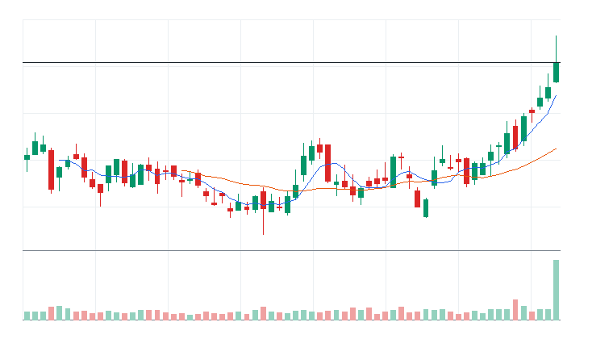
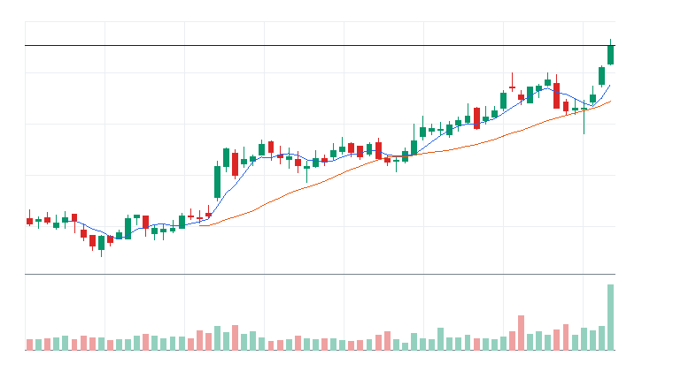
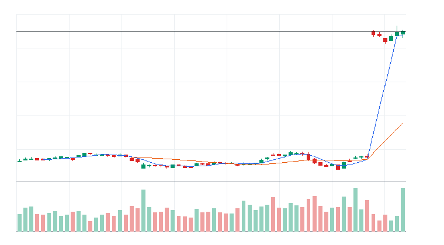

# 오늘의 데일리 트레이딩 요약

**REAL DATA TEST - 가격/거래량은 실제 데이터, 뉴스/ETF 구성종목 확산도/거래대금 유동성 일부 연결**

**목적:** 이 리포트는 최근 오른 자산을 나열하는 것이 아니라, 돈이 몰리는 근거와 다음 매수 주체가 확인할 트레이딩 후보를 찾기 위한 보고서다.

> 핵심 질문: 현재 가격에서 누가 사고 있고, 누가 앞으로 더 비싸게 사줄 수 있는가?

## 모바일 요약

[오늘의 데일리 트레이딩 요약]

생성 성공 / 데이터 모드: REAL_TEST

시장:
- 중립

시장 지배 서사:
1. 사이버보안 지출 재가속 - 약화 - iShares Cybersecurity and Tech ETF(IHAK), Amplify Cybersecurity ETF(HACK), Fortinet Inc.(FTNT), Palo Alto Networks Inc.(PANW) 중심으로 5일 +2.91%, 20일 +5.89% 흐름이 형성됨. 직접 촉매 일부 확인.
2. 반도체 장비 사이클 재평가 - 약화 - VanEck Semiconductor ETF(SMH), iShares Semiconductor ETF(SOXX), Applied Materials Inc.(AMAT), KLA Corporation(KLAC) 중심으로 5일 -5.10%, 20일 +12.84% 흐름이 형성됨. 뉴스 직접성 제한.
3. 소프트웨어 실적/AI 수익화 - 약화 - iShares Expanded Tech-Software Sector ETF(IGV), Global X Artificial Intelligence & Technology ETF(AIQ), Datadog Inc.(DDOG), Cadence Design Systems Inc.(CDNS) 중심으로 5일 -1.23%, 20일 -1.84% 흐름이 형성됨. 뉴스 직접성 제한.

트렌드 강도:
1. 사이버보안 지출 재가속 - TSI 61 - 부상 - 진입품질 관찰
2. 반도체 장비 사이클 재평가 - TSI 12 - 잠복 - 진입품질 낮음
3. 소프트웨어 실적/AI 수익화 - TSI 8 - 잠복 - 진입품질 낮음

오늘 결론:
- 사이버보안 개별 종목 흐름이 ETF 대비 강한지 확인 필요
- 행동 후보는 linkedNarrative와 함께 확인한다.
- 추격보다 진입 조건 확인 후 접근한다.

오늘 실제 행동 후보:
1. Fortinet Inc.(FTNT)(STOCK) - 사이버보안 지출 재가속 - 52주 고점 부근이라 돌파가 확인되면 신고가 추종 매수가 붙을 수 있음
2. Vertex Pharmaceuticals Incorporated(VRTX)(STOCK) - 소프트웨어 실적/AI 수익화 - 52주 고점 부근이라 돌파가 확인되면 신고가 추종 매수가 붙을 수 있음
3. Keurig Dr Pepper Inc.(KDP)(STOCK) - 소프트웨어 실적/AI 수익화 - 단기 추세가 유지되고 거래량이 1.0배 이상이면 눌림 이후 재상승을 시도할 수 있음

다크호스 후보:
1. 다크호스 후보 없음 - 조건 충족 후보 없음

ETF 후보 TOP 5:
1. iShares Cybersecurity and Tech ETF(IHAK) - 사이버보안 지출 재가속 - 제외
2. Amplify Cybersecurity ETF(HACK) - 사이버보안 지출 재가속 - 제외
3. First Trust NASDAQ Cybersecurity ETF(CIBR) - 사이버보안 지출 재가속 - 제외
4. iShares Russell 2000 ETF(IWM) - 위험선호 성장주 재진입 - 제외
5. Roundhill Memory ETF(DRAM) - AI 인프라 재가속 - 제외

웹 리포트:
https://yoolcool.github.io/DailyTradingThesisAgent/

## 오늘 결론

- 오늘 결론: 매매 보류
- 신규 진입 후보: 0개
- 조건부 진입 후보: 5개
- 관찰 후보: 40개
- 주요 제한 요인: Entry Quality < 40, 뉴스 직접성 부족, RVOL 미달
- 주문 판단: 시장가 금지 / 지정가 또는 관찰
- 실전 판단: 진입 후보는 있으나, 전일 고점 돌파와 거래량 확인 후 선별적으로 접근한다.

### 후보 제한 요인 집계

- RVOL < 1.00x: 40개
- 거래대금 유동성 낮음: 12개
- Entry Quality 50~54 near miss: 0개
- Entry Quality 40~49 관찰: 0개
- Entry Quality < 40: 156개
- Exhaustion Risk >= 70: 0개
- ETF breadth 샘플 부족: 37개
- 뉴스 직접성 부족: 100개

## 데이터 신뢰도

- 전체 데이터 신뢰도 등급: LOW
- 분석 신뢰도: LOW
- 주문 실행 신뢰도: LOW
- ETF breadth 신뢰도: LOW
- 신뢰도 해석: 테마 확산 판단 제한, 거래대금 유동성 낮음 또는 확인 불가, 프리/애프터마켓 확인 불가
- 리포트 생성 시각: 2026-06-29 09:11 KST
- 가격 기준 거래일: 2026-06-26 US regular close
- 뉴스 수집 시각: 2026-06-29 09:11 KST
- 가장 최근 뉴스 발행 시각: 2026-06-29 09:05 KST
- 뉴스 신선도 상태: FRESH
- 뉴스 소스: Yahoo Finance RSS, MarketWatch RSS, CNBC Markets RSS, SEC EDGAR RSS, Federal Reserve RSS, Finnhub API
- 뉴스 소스 상태: Yahoo Finance RSS CONNECTED, MarketWatch RSS CONNECTED, CNBC Markets RSS PARTIAL, SEC EDGAR RSS PARTIAL, Federal Reserve RSS CONNECTED, Finnhub API DISABLED
- 뉴스 신뢰도: MEDIUM
- 추천 적용 거래일: 2026-06-28 US regular session
- 가격/거래량 데이터 상태: 연결됨
- 뉴스 데이터 상태: 일부 연결
- ETF 구성종목 확산도 상태: 일부 연결
- ETF 구성종목 샘플 수: 1~4
- 거래대금 유동성 데이터 상태: 일부 연결
- 프리/애프터마켓 데이터 상태: UNAVAILABLE
- 데이터 provider: yfinance, Yahoo Finance RSS, MarketWatch RSS, CNBC Markets RSS, SEC EDGAR RSS, Federal Reserve RSS, Finnhub API, config fallback sample, price-volume dollar-volume fallback
- 실전 사용 경고: 이 리포트는 투자판단 보조용이며, REAL_TEST 모드에서는 일부 데이터가 누락되거나 지연될 수 있다. 실제 주문 전 현재가, 뉴스, 프리마켓/정규장 거래량을 별도 확인해야 한다.

## 0. 시장 상태

- 데이터 모드: REAL_TEST
- 가격/거래량: 연결됨
- 뉴스: 일부 연결
- ETF 구성종목 확산도: 일부 연결
- 거래대금 유동성: 일부 연결
- 생성 시각: 2026년 6월 29일 월요일 AM 9:11
- 시장 상태: 중립
- 오늘 돈의 방향: 사이버보안 개별 종목 흐름이 ETF 대비 강한지 확인 필요
- 강한 테마 TOP 3: Utilities(62), Basic Materials(58), 반도체 장비/공급망(55)
- 데이터 한계:
  - API 또는 provider 상태에 따라 뉴스/ETF 확산도/거래대금 유동성 반영 범위가 달라질 수 있다.
  - 수집 실패 데이터는 점수 반영에서 제외하거나 confidence를 제한한다.
  - reasonConfidence HIGH는 직접 촉매, 가격/거래량, 확산도/유동성 근거가 함께 있을 때만 사용한다.

## 오늘 시장을 지배하는 서사

### 오늘 시장을 지배하는 서사 TOP 3

#### 1. 사이버보안 지출 재가속
- 상태: 약화
- narrativeScore: 48
- reasonConfidence: LOW
- 근거 ETF: IHAK, HACK, CIBR
- 근거 개별 종목: FTNT, PANW, CRWD
- 돈이 몰리는 이유: 사이버보안 지출 재가속 관련 iShares Cybersecurity and Tech ETF(IHAK), Amplify Cybersecurity ETF(HACK), First Trust NASDAQ Cybersecurity ETF(CIBR)와 Fortinet Inc.(FTNT), Palo Alto Networks Inc.(PANW), CrowdStrike Holdings Inc.(CRWD)의 5일(+2.91%)·20일(+5.89%) 흐름을 함께 본다. 평균 상대 거래량은 1.64배이고, ETF 확산도는 추가 확인이 필요하다. 직접 뉴스/이벤트가 일부 확인된다.
- 다음 매수 주체: 사이버보안 지출 재가속을 확인한 섹터 ETF 자금과 상대강도 추종 스윙 자금
- 가장 좋은 트레이딩 수단: ETF 우선: HACK, CIBR, IHAK / 개별 종목 우선: PANW, CRWD, FTNT
- 서사가 깨지는 조건: HACK 20일선 이탈 또는 관련 종목 절반 이상 5일선 이탈
- 오늘 행동: 기존 네러티브와 중복을 확인한 뒤 ETF/대표 종목 동조성이 살아날 때만 관찰 편입

상세 narrativeScore 근거 보기

- rawScore: 48
- ETF 평균 moneyFlowScore: 40
- 개별 종목 평균 moneyFlowScore: 60
- ETF 후보 비율: 25%
- 개별 종목 후보 비율: 33%
- 5일 평균 수익률: +3.00%
- 20일 평균 수익률: +6.00%
- 평균 상대 거래량: 2.00배
- ETF 평균 상대 거래량: 2.00배
- 개별주 평균 상대 거래량: 1.00배
- 52주 고점 근접 후보 비율: 29%
- 뉴스 직접성 점수: 8
- ETF 확산도 점수: -3
- 유동성 점수: 0
- 과열 리스크 차감: 0

#### 2. 반도체 장비 사이클 재평가
- 상태: 약화
- narrativeScore: 20
- reasonConfidence: LOW
- 근거 ETF: SMH, SOXX, SOXQ
- 근거 개별 종목: AMAT, KLAC, LRCX, ASML
- 돈이 몰리는 이유: 반도체 장비 사이클 재평가 관련 VanEck Semiconductor ETF(SMH), iShares Semiconductor ETF(SOXX), Invesco PHLX Semiconductor ETF(SOXQ)와 Applied Materials Inc.(AMAT), KLA Corporation(KLAC), Lam Research Corporation(LRCX), ASML Holding N.V.(ASML)의 5일(-5.10%)·20일(+12.84%) 흐름을 함께 본다. 평균 상대 거래량은 1.34배이고, ETF 확산도는 추가 확인이 필요하다. 뉴스 직접성은 아직 제한적이다.
- 다음 매수 주체: 반도체 장비 사이클 재평가을 확인한 섹터 ETF 자금과 상대강도 추종 스윙 자금
- 가장 좋은 트레이딩 수단: ETF 우선: SMH, SOXX, SOXQ / 개별 종목 우선: KLAC, ASML, AMAT
- 서사가 깨지는 조건: SMH 20일선 이탈 또는 관련 종목 절반 이상 5일선 이탈
- 오늘 행동: 기존 네러티브와 중복을 확인한 뒤 ETF/대표 종목 동조성이 살아날 때만 관찰 편입

상세 narrativeScore 근거 보기

- rawScore: 20
- ETF 평균 moneyFlowScore: 0
- 개별 종목 평균 moneyFlowScore: 48
- ETF 후보 비율: 0%
- 개별 종목 후보 비율: 25%
- 5일 평균 수익률: -5.00%
- 20일 평균 수익률: +13.00%
- 평균 상대 거래량: 1.00배
- ETF 평균 상대 거래량: 1.00배
- 개별주 평균 상대 거래량: 2.00배
- 52주 고점 근접 후보 비율: 0%
- 뉴스 직접성 점수: 1
- ETF 확산도 점수: -4
- 유동성 점수: 2
- 과열 리스크 차감: 0

#### 3. 소프트웨어 실적/AI 수익화
- 상태: 약화
- narrativeScore: 20
- reasonConfidence: LOW
- 근거 ETF: IGV, AIQ, QQQ
- 근거 개별 종목: DDOG, CDNS
- 돈이 몰리는 이유: 소프트웨어 실적/AI 수익화 관련 iShares Expanded Tech-Software Sector ETF(IGV), Global X Artificial Intelligence & Technology ETF(AIQ), Invesco QQQ Trust(QQQ)와 Datadog Inc.(DDOG), Cadence Design Systems Inc.(CDNS)의 5일(-1.23%)·20일(-1.84%) 흐름을 함께 본다. 평균 상대 거래량은 1.16배이고, ETF 확산도는 추가 확인이 필요하다. 뉴스 직접성은 아직 제한적이다.
- 다음 매수 주체: 소프트웨어 실적/AI 수익화을 확인한 섹터 ETF 자금과 상대강도 추종 스윙 자금
- 가장 좋은 트레이딩 수단: ETF 우선: IGV, AIQ, QQQ / 개별 종목 우선: DDOG, CDNS
- 서사가 깨지는 조건: IGV 20일선 이탈 또는 관련 종목 절반 이상 5일선 이탈
- 오늘 행동: 기존 네러티브와 중복을 확인한 뒤 ETF/대표 종목 동조성이 살아날 때만 관찰 편입

상세 narrativeScore 근거 보기

- rawScore: 20
- ETF 평균 moneyFlowScore: 0
- 개별 종목 평균 moneyFlowScore: 48
- ETF 후보 비율: 0%
- 개별 종목 후보 비율: 50%
- 5일 평균 수익률: -1.00%
- 20일 평균 수익률: -2.00%
- 평균 상대 거래량: 1.00배
- ETF 평균 상대 거래량: 1.00배
- 개별주 평균 상대 거래량: 1.00배
- 52주 고점 근접 후보 비율: 0%
- 뉴스 직접성 점수: 6
- ETF 확산도 점수: -4
- 유동성 점수: 3
- 과열 리스크 차감: 0

### 전체 narrative 요약

| 서사명 | 상태 | narrativeScore | reasonConfidence | 대표 ETF | 대표 종목 | 오늘 행동 |
| --- | --- | ---: | --- | --- | --- | --- |
| 사이버보안 지출 재가속 | 약화 | 48 | LOW | IHAK, HACK, CIBR | FTNT, PANW, CRWD | 기존 네러티브와 중복을 확인한 뒤 ETF/대표 종목 동조성이 살아날 때만 관찰 편입 |
| 반도체 장비 사이클 재평가 | 약화 | 20 | LOW | SMH, SOXX, SOXQ | AMAT, KLAC, LRCX, ASML | 기존 네러티브와 중복을 확인한 뒤 ETF/대표 종목 동조성이 살아날 때만 관찰 편입 |
| 소프트웨어 실적/AI 수익화 | 약화 | 20 | LOW | IGV, AIQ, QQQ | DDOG, CDNS | 기존 네러티브와 중복을 확인한 뒤 ETF/대표 종목 동조성이 살아날 때만 관찰 편입 |
| AI 인프라 재가속 | 약화 | 8 | LOW | DRAM, SMH, SOXX | MU, ETN, NVDA, VRT | 추격보다 5일선 지지 후 재상승 확인 |
| AI 소프트웨어/사이버보안 확산 | 소멸 | 6 | LOW | IGV, AIQ, QQQ | DDOG, MSFT, PLTR, TEAM | 추격보다 눌림 후 재상승 확인 |
| 위험선호 성장주 재진입 | 소멸 | 3 | LOW | IWM, ARKK, IPO | ARM, COIN, TSLA | 지수 위험선호가 유지될 때만 선별 진입 |
| 전력망/원전/인프라 병목 | 소멸 | 3 | LOW | PAVE, GRID, URA | ETN, VRT, PWR, CEG | ETF 확산도와 거래량이 같이 살아날 때만 진입 |
| 매크로 방어/헤지 | 소멸 | 1 | LOW | TLT, GLD, XLE | XOM, CVX | 위험회피가 확인될 때만 헤지성 접근 |
| 방산/안보 프리미엄 | 소멸 | 0 | LOW | ITA, XAR, SHLD | AVAV, KTOS, PLTR | 뉴스 촉매가 직접 확인될 때만 추세 추종 |
| Data Storage 자금 유입 | 약화 | 0 | LOW | QQQ | WDC, STX | 기존 네러티브와 중복을 확인한 뒤 ETF/대표 종목 동조성이 살아날 때만 관찰 편입 |
| 비트코인/디지털 자산 위험선호 | 소멸 | 0 | LOW | IBIT, BLOK | RIOT, MSTR, COIN, IREN | 비트코인 베타가 살아날 때만 단기 매매 |
| 반도체 설계/공급망 재가속 | 약화 | 0 | LOW | SMH, SOXX, SOXQ | MRVL, AVGO, ARM, ADI | 기존 네러티브와 중복을 확인한 뒤 ETF/대표 종목 동조성이 살아날 때만 관찰 편입 |

## 트렌드 강도 판단

### 1. 사이버보안 지출 재가속
- Trend Strength Index: 61
- 트렌드 상태 라벨: 부상
- 테마 확산도: 보통
- ETF 동조성: 강함
- 거래량 강도: 보통
- 과열 위험: 낮음 (6)
- 오늘 진입 품질: 관찰 (44)
- 한 줄 판단: 사이버보안 지출 재가속는 Trend Strength는 높아도 시장 위험선호가 약해 시장 환경 비우호 구간이다.
- 오늘 접근법: iShares Cybersecurity and Tech ETF(IHAK)/Amplify Cybersecurity ETF(HACK)/First Trust NASDAQ Cybersecurity ETF(CIBR) 거래량 증가와 Fortinet Inc.(FTNT)/Palo Alto Networks Inc.(PANW)/CrowdStrike Holdings Inc.(CRWD) 확산을 확인하며 작은 사이즈의 초기 진입 후보로만 본다.

트렌드 강도 상세 근거 보기

- 가격 모멘텀: 가격 모멘텀 12/25. 평균 5D +2.91%, 20D +5.89%.
- 거래량 강도: 거래량 강도 14/20. 평균 RVOL 1.64배.
- ETF 동조성: ETF 동조성 14/15. 관련 ETF Amplify Cybersecurity ETF(HACK), First Trust NASDAQ Cybersecurity ETF(CIBR), iShares Cybersecurity and Tech ETF(IHAK), iShares Expanded Tech-Software Sector ETF(IGV) 흐름을 기준으로 판단.
- 테마 확산도: 테마 확산도 13/20. 상위 1~2개 쏠림 감점 0점 반영.
- 뉴스 촉매: 뉴스/촉매 신선도 5/10. HIGH 직접 촉매 1개.
- 과열 리스크: 과열 리스크 6/100. 단기 급등, 고점 근접, ETF-개별주 괴리, 쏠림을 함께 반영.
- 시장 환경: 시장 환경 3/10. QQQ/SPY/IWM 가격 흐름 기반 위험선호 점수.

### 2. 반도체 장비 사이클 재평가
- Trend Strength Index: 12
- 트렌드 상태 라벨: 잠복
- 테마 확산도: 부족
- ETF 동조성: 부족
- 거래량 강도: 약함
- 과열 위험: 낮음 (15)
- 오늘 진입 품질: 낮음 (10)
- 한 줄 판단: 반도체 장비 사이클 재평가는 Trend Strength는 높아도 시장 위험선호가 약해 시장 환경 비우호 구간이다.
- 오늘 접근법: VanEck Semiconductor ETF(SMH)/iShares Semiconductor ETF(SOXX)/Invesco PHLX Semiconductor ETF(SOXQ)와 Applied Materials Inc.(AMAT)/KLA Corporation(KLAC)/Lam Research Corporation(LRCX)의 거래량 확산이 확인되기 전까지 관찰한다.

트렌드 강도 상세 근거 보기

- 가격 모멘텀: 가격 모멘텀 -2/25. 평균 5D -5.10%, 20D +12.84%.
- 거래량 강도: 거래량 강도 9/20. 평균 RVOL 1.34배.
- ETF 동조성: ETF 동조성 -3/15. 관련 ETF VanEck Semiconductor ETF(SMH), iShares Semiconductor ETF(SOXX), Invesco PHLX Semiconductor ETF(SOXQ), Global X Artificial Intelligence & Technology ETF(AIQ) 흐름을 기준으로 판단.
- 테마 확산도: 테마 확산도 3/20. 상위 1~2개 쏠림 감점 3점 반영.
- 뉴스 촉매: 뉴스/촉매 신선도 2/10. HIGH 직접 촉매 0개.
- 과열 리스크: 과열 리스크 15/100. 단기 급등, 고점 근접, ETF-개별주 괴리, 쏠림을 함께 반영.
- 시장 환경: 시장 환경 3/10. QQQ/SPY/IWM 가격 흐름 기반 위험선호 점수.

### 3. 소프트웨어 실적/AI 수익화
- Trend Strength Index: 8
- 트렌드 상태 라벨: 잠복
- 테마 확산도: 부족
- ETF 동조성: 부족
- 거래량 강도: 약함
- 과열 위험: 낮음 (18)
- 오늘 진입 품질: 낮음 (4)
- 한 줄 판단: 소프트웨어 실적/AI 수익화는 Trend Strength는 높아도 시장 위험선호가 약해 시장 환경 비우호 구간이다.
- 오늘 접근법: iShares Expanded Tech-Software Sector ETF(IGV)/Global X Artificial Intelligence & Technology ETF(AIQ)/Invesco QQQ Trust(QQQ)와 Datadog Inc.(DDOG)/Cadence Design Systems Inc.(CDNS)의 거래량 확산이 확인되기 전까지 관찰한다.

트렌드 강도 상세 근거 보기

- 가격 모멘텀: 가격 모멘텀 -2/25. 평균 5D -1.23%, 20D -1.84%.
- 거래량 강도: 거래량 강도 9/20. 평균 RVOL 1.16배.
- ETF 동조성: ETF 동조성 -3/15. 관련 ETF iShares Expanded Tech-Software Sector ETF(IGV), Global X Artificial Intelligence & Technology ETF(AIQ), Invesco QQQ Trust(QQQ) 흐름을 기준으로 판단.
- 테마 확산도: 테마 확산도 0/20. 상위 1~2개 쏠림 감점 6점 반영.
- 뉴스 촉매: 뉴스/촉매 신선도 1/10. HIGH 직접 촉매 0개.
- 과열 리스크: 과열 리스크 18/100. 단기 급등, 고점 근접, ETF-개별주 괴리, 쏠림을 함께 반영.
- 시장 환경: 시장 환경 3/10. QQQ/SPY/IWM 가격 흐름 기반 위험선호 점수.

## 최근 추천 결과 트래킹

개별주는 데이트레이딩 관점으로 추천 이후 첫 정규장의 장중 최고가와 종가를 추적한다. ETF는 테마/스윙 관점으로 추천 이후 1주일 동안의 최고가와 현재 종가를 추적한다.

### 개별주 Top 3 추천 성과 요약
- 최근 5개 리포트 표본: 15개 (초기 검증 단계)
- 장중 최고가 기준 성공률: +11.11%
- 종가 기준 성공률: +22.22%
- 평균 장중 최고 수익률: -1.12%
- 평균 종가 수익률: -4.74%

### ETF 추천 성과 요약
- 최근 5개 리포트 표본: 6개 (초기 검증 단계)
- 1주 최고가 기준 성공률: +60.00%
- 현재 종가 기준 성공률: +16.67%
- 평균 1주 최고 수익률: +2.12%
- 평균 현재 수익률: -5.83%

최근 추천 결과 상세 테이블 펼치기

| 추천일 | 유형 | 순위 | 티커 | 기준가 | 추적 기간 | 상태 | High 수익률 | Close 수익률 | 결과 | 코멘트 |
| --- | --- | ---: | --- | ---: | --- | --- | ---: | ---: | --- | --- |
| 2026-06-29 | STOCK | 3 | KDP | $33.4 | 2026-06-29 | pending | 데이터 없음 | 데이터 없음 | 추적 대기 | 아직 추적 거래일 데이터가 완성되지 않음 |
| 2026-06-29 | STOCK | 2 | VRTX | $491.34 | 2026-06-29 | pending | 데이터 없음 | 데이터 없음 | 추적 대기 | 아직 추적 거래일 데이터가 완성되지 않음 |
| 2026-06-29 | STOCK | 1 | FTNT | $151.35 | 2026-06-29 | pending | 데이터 없음 | 데이터 없음 | 추적 대기 | 아직 추적 거래일 데이터가 완성되지 않음 |
| 2026-06-26 | STOCK | 3 | MU | $1,213.56 | 2026-06-26 | complete | -1.22% | -6.69% | 실패 | 추천 이후 의미 있는 장중 기회가 부족하고 종가도 약함 (일봉 기준) |
| 2026-06-26 | STOCK | 2 | AMAT | $668 | 2026-06-26 | complete | -1.17% | -6.16% | 실패 | 추천 이후 의미 있는 장중 기회가 부족하고 종가도 약함 (일봉 기준) |
| 2026-06-26 | STOCK | 1 | LRCX | $401.82 | 2026-06-26 | complete | -2.97% | -5.66% | 실패 | 추천 이후 의미 있는 장중 기회가 부족하고 종가도 약함 (일봉 기준) |
| 2026-06-26 | ETF | 1 | DRAM | $76.89 | 2026-06-26~2026-07-03 | in_progress | 데이터 없음 | -6.52% | 진행 중 | 아직 1주 추적 기간이 끝나지 않음 (일봉 high 미확보 시 close 기준 보조) |
| 2026-06-23 | STOCK | 3 | TSM | $467.67 | 2026-06-23 | complete | -4.35% | -6.69% | 실패 | 추천 이후 의미 있는 장중 기회가 부족하고 종가도 약함 (일봉 기준) |
| 2026-06-23 | STOCK | 2 | GEV | $1,127.59 | 2026-06-23 | complete | -4.84% | -8.21% | 실패 | 추천 이후 의미 있는 장중 기회가 부족하고 종가도 약함 (일봉 기준) |
| 2026-06-23 | STOCK | 1 | ETN | $435.78 | 2026-06-23 | complete | -3.27% | -7.00% | 실패 | 추천 이후 의미 있는 장중 기회가 부족하고 종가도 약함 (일봉 기준) |
| 2026-06-23 | ETF | 1 | DRAM | $80.72 | 2026-06-23~2026-06-30 | in_progress | -1.39% | -10.95% | 진행 중 | 아직 1주 추적 기간이 끝나지 않음 |
| 2026-06-22 | STOCK | 3 | ARM | $439.46 | 2026-06-22 | complete | +1.25% | -7.22% | 제한적 유효 | 제한적인 장중 기회만 발생 (일봉 기준) |
| 2026-06-22 | STOCK | 2 | GEV | $1,109.73 | 2026-06-22 | complete | +2.91% | +1.61% | 제한적 유효 | 제한적인 장중 기회만 발생 (일봉 기준) |
| 2026-06-22 | STOCK | 1 | ETN | $421.77 | 2026-06-22 | complete | +3.55% | +3.32% | 성공 | 장중 기회와 종가 유지가 모두 확인됨 (일봉 기준) |
| 2026-06-22 | ETF | 3 | IFRA | $61.99 | 2026-06-22~2026-06-29 | in_progress | +3.65% | +2.42% | 진행 중 | 아직 1주 추적 기간이 끝나지 않음 |
| 2026-06-22 | ETF | 2 | SMH | $659.88 | 2026-06-22~2026-06-29 | in_progress | -1.49% | -7.31% | 진행 중 | 아직 1주 추적 기간이 끝나지 않음 |
| 2026-06-22 | ETF | 1 | DRAM | $76.71 | 2026-06-22~2026-06-29 | in_progress | +3.77% | -6.30% | 진행 중 | 아직 1주 추적 기간이 끝나지 않음 |
| 2026-06-19 | STOCK | 3 | AMD | $537.37 | 2026-06-19 | pending | 데이터 없음 | 데이터 없음 | 추적 대기 | 아직 추적 거래일 데이터가 완성되지 않음 |
| 2026-06-19 | STOCK | 2 | ARM | $439.46 | 2026-06-19 | pending | 데이터 없음 | 데이터 없음 | 추적 대기 | 아직 추적 거래일 데이터가 완성되지 않음 |
| 2026-06-19 | STOCK | 1 | GEV | $1,109.73 | 2026-06-19 | pending | 데이터 없음 | 데이터 없음 | 추적 대기 | 아직 추적 거래일 데이터가 완성되지 않음 |
| 2026-06-19 | ETF | 1 | DRAM | $76.71 | 2026-06-19~2026-06-26 | complete | +6.04% | -6.30% | 단기 고점 후 반납 | 1주 내 상승 기회는 있었지만 현재가는 반납 |
| 2026-06-18 | STOCK | 3 | ASML | $1,867.83 | 2026-06-18 | complete | +4.02% | +3.31% | 성공 | 장중 기회와 종가 유지가 모두 확인됨 (일봉 기준) |
| 2026-06-18 | STOCK | 3 | FCX | $69.06 | 2026-06-18 | complete | +2.26% | -0.55% | 제한적 유효 | 제한적인 장중 기회만 발생 (일봉 기준) |
| 2026-06-18 | STOCK | 2 | KLAC | $238.73 | 2026-06-18 | complete | +10.56% | +8.73% | 성공 | 장중 기회와 종가 유지가 모두 확인됨 (일봉 기준) |
| 2026-06-18 | STOCK | 1 | LRCX | $374.18 | 2026-06-18 | complete | +7.17% | +3.97% | 성공 | 장중 기회와 종가 유지가 모두 확인됨 (일봉 기준) |
| 2026-06-18 | ETF | 1 | SOXQ | $106.13 | 2026-06-18~2026-06-25 | complete | +8.67% | -2.30% | 단기 고점 후 반납 | 1주 내 상승 기회는 있었지만 현재가는 반납 |
| 2026-06-04 | STOCK | 3 | PANW | $280.43 | 2026-06-04 | complete | +0.10% | -0.42% | 실패 | 추천 이후 의미 있는 장중 기회가 부족하고 종가도 약함 (일봉 기준) |
| 2026-06-04 | STOCK | 2 | FTNT | $146.48 | 2026-06-04 | complete | +2.45% | +2.18% | 제한적 유효 | 제한적인 장중 기회만 발생 (일봉 기준) |
| 2026-06-04 | STOCK | 1 | CRWD | $747.61 | 2026-06-04 | complete | -3.56% | -3.81% | 실패 | 추천 이후 의미 있는 장중 기회가 부족하고 종가도 약함 (일봉 기준) |
| 2026-06-04 | ETF | 3 | HACK | $102.21 | 2026-06-04~2026-06-11 | complete | -1.66% | -3.48% | 실패 | 추천 이후 ETF 흐름이 약화됨 |
| 2026-06-04 | ETF | 2 | SOXQ | $109.58 | 2026-06-04~2026-06-11 | complete | -4.68% | -5.38% | 실패 | 추천 이후 ETF 흐름이 약화됨 |
| 2026-06-04 | ETF | 1 | AIQ | $69.16 | 2026-06-04~2026-06-11 | complete | -4.29% | -8.69% | 실패 | 추천 이후 ETF 흐름이 약화됨 |
| 2026-06-03 | STOCK | 3 | FTNT | $148.86 | 2026-06-03 | complete | -0.26% | -1.60% | 실패 | 추천 이후 의미 있는 장중 기회가 부족하고 종가도 약함 (일봉 기준) |
| 2026-06-03 | STOCK | 3 | CRWD | $768.95 | 2026-06-03 | complete | -0.25% | -2.78% | 실패 | 추천 이후 의미 있는 장중 기회가 부족하고 종가도 약함 (일봉 기준) |
| 2026-06-03 | STOCK | 2 | MRVL | $290.79 | 2026-06-03 | complete | +11.49% | +3.73% | 성공 | 장중 기회와 종가 유지가 모두 확인됨 (일봉 기준) |
| 2026-06-03 | STOCK | 1 | PANW | $297.18 | 2026-06-03 | complete | -3.09% | -5.64% | 실패 | 추천 이후 의미 있는 장중 기회가 부족하고 종가도 약함 (일봉 기준) |
| 2026-06-03 | ETF | 3 | DRAM | $69.57 | 2026-06-03~2026-06-10 | complete | -3.52% | +3.32% | 진행 중 | 아직 1주 추적 기간이 끝나지 않음 |
| 2026-06-03 | ETF | 3 | IGV | $104.73 | 2026-06-03~2026-06-10 | complete | -3.31% | -15.78% | 실패 | 추천 이후 ETF 흐름이 약화됨 |
| 2026-06-03 | ETF | 2 | AIQ | $70.14 | 2026-06-03~2026-06-10 | complete | -2.32% | -9.97% | 실패 | 추천 이후 ETF 흐름이 약화됨 |
| 2026-06-03 | ETF | 1 | CIBR | $94.32 | 2026-06-03~2026-06-10 | complete | -3.56% | -9.50% | 실패 | 추천 이후 ETF 흐름이 약화됨 |

## 오늘 실제 행동 후보

### 1. Fortinet Inc.(FTNT)
- 자산 유형: STOCK
- linkedNarrative: 사이버보안 지출 재가속
- narrativeStatus: 약화
- narrativeScore: 48
- Trend Strength Index: 61
- Exhaustion Risk: 6 (낮음)
- Entry Quality Score: 55 (보통)
- 트렌드 판단: 시장 위험선호가 약해 시장 환경 비우호 구간이다.
- moneyFlowScore: 96
- finalRawScore: 96
- reasonConfidence: HIGH
- reasonConfidenceExplanation: 직접 촉매: Yahoo Finance RSS / general_market / under_72h / positive - Fortinet (FTNT) Stock After 94% YTD Gain Is The Rally Running Out Of Room 가격/거래량, 관련 ETF 동반 강세, 유동성 근거가 함께 확인되어 HIGH로 분류했다.
- tieBreakerReason: 최종 원점수 96, 리스크 패널티 0, 5일 수익률 +4.57%, 상대 거래량 1.27배 순으로 정렬
- 후보별 시장 해석: 중립 / 제한적 - 특이 충돌 없음
- 게이트 사유: 통과
- 주문 실행: 시장가 가능
- 직접 촉매: Yahoo Finance RSS / general_market / under_72h / positive - Fortinet (FTNT) Stock After 94% YTD Gain Is The Rally Running Out Of Room
- 왜 돈이 몰리는가: 20일 +16.69%, 5일 +4.57%, 상대 거래량 1.27배로 가격과 거래량이 함께 개선. 뉴스: Yahoo Finance RSS general_market/under_72h / 유동성: LIQUID
- 누가 더 비싸게 사줄 수 있는지: 개별 주도주를 따라붙는 단기 모멘텀 자금과 관련 ETF 강세를 확인한 트레이더
- 진입 조건: 전일 고점 돌파와 5일선 유지 확인
- 무효화 조건: 20일선 이탈 또는 상대 거래량 0.8배 이하 둔화
- todayActionLabel: 조건부 진입
- 차트: 

### 2. Vertex Pharmaceuticals Incorporated(VRTX)
- 자산 유형: STOCK
- linkedNarrative: 소프트웨어 실적/AI 수익화
- narrativeStatus: 약화
- narrativeScore: 20
- Trend Strength Index: 8
- Exhaustion Risk: 18 (낮음)
- Entry Quality Score: 33 (낮음)
- 트렌드 판단: 테마 확산도가 낮아 개별 종목 이벤트성 흐름일 수 있다.
- moneyFlowScore: 96
- finalRawScore: 96
- reasonConfidence: MEDIUM
- reasonConfidenceExplanation: 직접 촉매 부재 때문에 HIGH가 아니라 MEDIUM으로 제한했다.
- tieBreakerReason: 최종 원점수 96, 리스크 패널티 0, 5일 수익률 +8.79%, 상대 거래량 4.78배 순으로 정렬
- 후보별 시장 해석: 중립 / 제한적 - 고점 근처 추격 리스크 / Entry Quality 33 < 50이나 moneyFlow 96, confidence MEDIUM, RVOL 4.78x로 강한 자금흐름 예외 조건 충족
- 게이트 사유: Entry Quality 33 < 50이나 moneyFlow 96, confidence MEDIUM, RVOL 4.78x로 강한 자금흐름 예외 조건 충족
- 주문 실행: 시장가 가능

- 왜 돈이 몰리는가: 20일 +9.68%, 5일 +8.79%, 상대 거래량 4.78배로 가격과 거래량이 함께 개선. 뉴스: CNBC Markets RSS general_market/under_6h / 유동성: LIQUID
- 누가 더 비싸게 사줄 수 있는지: 개별 주도주를 따라붙는 단기 모멘텀 자금과 관련 ETF 강세를 확인한 트레이더
- 진입 조건: 전일 고점 돌파와 5일선 유지 확인
- 무효화 조건: 20일선 이탈 또는 상대 거래량 0.8배 이하 둔화
- todayActionLabel: 자금흐름 예외 조건부
- 차트: 

### 3. Keurig Dr Pepper Inc.(KDP)
- 자산 유형: STOCK
- linkedNarrative: 소프트웨어 실적/AI 수익화
- narrativeStatus: 약화
- narrativeScore: 20
- Trend Strength Index: 8
- Exhaustion Risk: 18 (낮음)
- Entry Quality Score: 31 (낮음)
- 트렌드 판단: 테마 확산도가 낮아 개별 종목 이벤트성 흐름일 수 있다.
- moneyFlowScore: 92
- finalRawScore: 92
- reasonConfidence: MEDIUM
- reasonConfidenceExplanation: 직접 촉매 부재 때문에 HIGH가 아니라 MEDIUM으로 제한했다.
- tieBreakerReason: 최종 원점수 92, 리스크 패널티 0, 5일 수익률 +8.58%, 상대 거래량 3.26배 순으로 정렬
- 후보별 시장 해석: 중립 / 제한적 - Entry Quality 31 < 50이나 moneyFlow 92, confidence MEDIUM, RVOL 3.26x로 강한 자금흐름 예외 조건 충족
- 게이트 사유: Entry Quality 31 < 50이나 moneyFlow 92, confidence MEDIUM, RVOL 3.26x로 강한 자금흐름 예외 조건 충족
- 주문 실행: 시장가 가능

- 왜 돈이 몰리는가: 20일 +11.19%, 5일 +8.58%, 상대 거래량 3.26배로 가격과 거래량이 함께 개선. 뉴스: CNBC Markets RSS general_market/under_6h / 유동성: LIQUID
- 누가 더 비싸게 사줄 수 있는지: 개별 주도주를 따라붙는 단기 모멘텀 자금과 관련 ETF 강세를 확인한 트레이더
- 진입 조건: 20일선 위 눌림 후 재상승 확인
- 무효화 조건: 20일선 이탈 또는 상대 거래량 0.8배 이하 둔화
- todayActionLabel: 자금흐름 예외 조건부
- 차트: 

## 다크호스 후보

다크호스 후보 없음. 상위 서사 정렬, MA20 위 안착, MA5/MA20 구조 개선, RVOL 0.90x 이상 조건을 동시에 충족한 개별주가 없다.

- darkHorseScore: 조건 충족 후보 없음
- 왜 아직 메인이 아닌가: 확인 조건을 통과한 보조 관찰 후보가 없다.

darkHorseScore 상세 근거 보기

- 서사 정렬: 조건 미충족
- 초기 추세 구조: 조건 미충족
- 베이스 돌파/정돈: 조건 미충족
- 거래량 확인: 조건 미충족
- rawScore: 데이터 없음

## 오늘 돈이 몰리는 테마

- Utilities: CEG, AEP, XEL, EXC | 평균 moneyFlowScore 62 | 추세는 확인되지만 선별 진입이 필요한 중간 강도의 테마로 본다.
- Basic Materials: LIN | 평균 moneyFlowScore 58 | 관심은 유지하되 우선순위는 낮추고 추가 거래량 확인을 기다린다.
- 반도체 장비/공급망: LRCX, AMAT, KLAC | 평균 moneyFlowScore 55 | 관심은 유지하되 우선순위는 낮추고 추가 거래량 확인을 기다린다.
- 사이버보안 ETF: CIBR, HACK, IHAK | 평균 moneyFlowScore 53 | 관심은 유지하되 우선순위는 낮추고 추가 거래량 확인을 기다린다.
- 사이버보안: PANW, CRWD, FTNT, ZS | 평균 moneyFlowScore 50 | 관심은 유지하되 우선순위는 낮추고 추가 거래량 확인을 기다린다.
- 이커머스/여행 플랫폼: BKNG, PDD, MELI, ABNB, DASH | 평균 moneyFlowScore 49 | 관심은 유지하되 우선순위는 낮추고 추가 거래량 확인을 기다린다.

## 1. ETF 트레이딩 보고서
### 1-1. ETF 결론
- ETF 우선 후보: 없음
- ETF 관찰 후보: iShares Semiconductor ETF(SOXX), iShares Expanded Tech-Software Sector ETF(IGV), Global X Robotics & Artificial Intelligence ETF(BOTZ), ROBO Global Robotics and Automation Index ETF(ROBO), iShares U.S. Aerospace & Defense ETF(ITA)
- ETF 매매 금지: VanEck Semiconductor ETF(SMH), iShares Semiconductor ETF(SOXX), Invesco PHLX Semiconductor ETF(SOXQ), iShares Expanded Tech-Software Sector ETF(IGV), Global X Artificial Intelligence & Technology ETF(AIQ)
- 오늘 ETF 최우선 1개: 없음
- ETF 섹션 해석: 이 섹션은 개별 종목 선택이 아니라 테마/섹터 단위 자금 흐름을 ETF로 매매할지 판단하기 위한 영역이다.

### 1-2. ETF 후보 TOP 5

선정 기준: ETF 후보는 가격/거래량 1차 점수에 뉴스, ETF 구성종목 확산도, 유동성, 리스크 패널티를 반영한 finalRawScore 기준으로 정렬한다. 표시 점수 100점 후보가 겹치면 tieBreakerReason으로 우선순위를 설명한다.

### [ETF] iShares Cybersecurity and Tech ETF(IHAK)
- 자산 유형: ETF
- ETF 세부 카테고리: 사이버보안 ETF
- ETF 역할: 테마 베타 매수
- 상태: 매매 금지
- linkedNarrative: 사이버보안 지출 재가속
- narrativeStatus: 약화
- narrativeScore: 48
- moneyFlowScore: 63
- finalRawScore: 63
- tieBreakerReason: 최종 원점수 63, 리스크 패널티 -5, 5일 수익률 +4.99%, 상대 거래량 3.64배 순으로 정렬
- 과열 리스크: 낮음
- reasonConfidence: MEDIUM
- reasonConfidenceExplanation: ETF 확산도 제한 때문에 HIGH가 아니라 MEDIUM으로 제한했다.

- todayActionLabel: 제외
- 주문 실행: 추격 금지
- 기준일: 2026-06-26
- 종가: $57.23
- 1일 수익률: +3.83%
- 5일 수익률: +4.99%
- 20일 수익률: +2.75%
- 상대 거래량: 3.64배
- 52주 고점 대비 위치: -6.58%
- whyMoneyIsFlowing: 20일 +2.75%, 5일 +4.99%, 상대 거래량 3.64배로 가격과 거래량이 함께 개선. 뉴스: MarketWatch RSS general_market/under_6h
- likelyNextBuyer: 섹터 베타를 노리는 단기 모멘텀 자금과 리밸런싱 자금
- whyThisCouldTradeHigher: 단기 추세가 유지되고 거래량이 1.0배 이상이면 눌림 이후 재상승을 시도할 수 있음
- 진입 조건: 20일선 위 눌림 후 재상승 확인
- 무효화 조건: 20일선 이탈 또는 상대 거래량 0.8배 이하 둔화
- 차트: 

#### 상세 근거

iShares Cybersecurity and Tech ETF(IHAK) 상세 근거 펼치기

- moneyFlowScore(최종) 산정 근거:
  - moneyFlowScore(1차): 61
  - 최종 원점수: 63
  - 최종 표시 점수: 63
  - cap 적용: cap 미적용
  - 계산식: +61 + +12 + 0 - 5 + 0 - 5 + 0 = 63
  - 점수 해석: 관찰 후보. 흐름은 있으나 우선순위는 낮음.
  - 가격/거래량 1차 점수: +61
    - 추세: +12
    - 단기 모멘텀: +9
    - 중기 모멘텀: +2
    - 거래량: +18
    - 신고가 근접: +6
    - 이동평균: +14
  - 하위 점수 cap:
    - 가격 모멘텀: 원점수 +12, 상한 적용 +12 / 최대 25
    - 단기 모멘텀: 원점수 +9, 상한 적용 +9 / 최대 20
    - 중기 모멘텀: 원점수 +2, 상한 적용 +2 / 최대 16
    - 거래량: 원점수 +18, 상한 적용 +18 / 최대 20
    - 신고가 근접: 원점수 +6, 상한 적용 +6 / 최대 12
    - 이동평균: 원점수 +14, 상한 적용 +14 / 최대 14
  - 추가 데이터 가감점:
    - 뉴스: +12
    - 유동성: -5
  - ETF 확산도: 0
  - 리스크 패널티: -5
  - 주요 근거: 1차 61, 최종 원점수 63, 표시 63. 1일 단기 모멘텀 확인, 상대 거래량 증가, 이동평균 위 추세 유지. 주의: 단기 과열/추격 위험 존재, ETF 구성종목 확산도 데이터 미연결.
  - 리스크 패널티 산정 근거:
    - 총 리스크 패널티: -5
    - 리스크 등급: LOW
    - 감점된 리스크:
      - low liquidity: -5 | 근거: Liquidity signal: LOW. | 대응: Avoid market-order chasing.
    - 관찰 리스크: ETF breadth data not connected
    - 한 줄 해석: 1개 감점 리스크로 총 -5점 반영.
- 데이터 사용 현황:
  - 가격/거래량: 사용
  - 뉴스: 사용
  - ETF 확산도: 미연결
  - 거래대금 유동성: 사용
  - 관련 ETF 상대강도: 사용
- 뉴스 확인:
  - 최근 뉴스 상태: 일부 연결
  - 뉴스 소스: MarketWatch RSS, Federal Reserve RSS
  - 소스별 상태: Yahoo Finance RSS CONNECTED; MarketWatch RSS CONNECTED; CNBC Markets RSS FAILED; SEC EDGAR RSS PARTIAL; Federal Reserve RSS CONNECTED; Finnhub API DISABLED
  - 긍정/중립/부정: 8/8/0
  - 직접성/방향성/신선도: 2/1/4
  - 강한 촉매 수: 0
  - 중요 공시 수: 0
  - 직접 촉매: 없음
  - 보조 뉴스: MarketWatch RSS sector_theme / general_market / under_6h
  - 뉴스 수집 시각: 2026-06-29 09:11 KST
  - 가장 최근 뉴스 발행 시각: 2026-06-29 07:18 KST
  - 뉴스 신선도 상태: FRESH
  - 뉴스 이후 가격 반응: 긍정
  - 가격 반응 점수 제한: 뉴스 이후 가격 반응과 점수 제한 특이사항 없음
  - 핵심 뉴스 요약: Oil prices rise, stock futures inch higher as U.S. and Iran trade more airstrikes
  - 원점수/상한 점수: +17 / +12
  - 점수 반영: +12
  - 주의: CNBC Markets RSS: HTTP 403 from https://www.cnbc.com/id/100003114/device/rss/rss.html; SEC EDGAR RSS: no matching RSS items; Finnhub API: FINNHUB_API_KEY not configured
- ETF 구성종목 확산도:
  - 구성종목 데이터 상태: 미연결
  - 샘플 수: 0/0
  - 샘플 신뢰도: UNKNOWN
  - 상승 종목 비율: 데이터 없음
  - 20일선 위 비율: 데이터 없음
  - 50일선 위 비율: 데이터 없음
  - 상위 기여 종목: 데이터 없음
  - 확산도 판단: UNKNOWN
  - 원점수/샘플 상한/반영 점수: 0 / N/A / 0
  - 점수 반영: 0
- 거래대금 유동성:
  - 데이터 상태: 일부 연결
  - 거래대금 기준 유동성: LOW
  - 거래대금: $35,019,037
  - 평균 거래대금: $9,627,231
  - 주문 영향: 추격 금지
  - 매매 영향: 유동성 부족으로 추격 금지 또는 우선순위 하향
- reasonConfidence 근거: 가격/거래량, 뉴스, 거래대금 유동성, 관련 ETF 상대강도은 확인됐지만 일부 보조 데이터가 미연결 또는 fallback이라 중간으로 제한한다.
- 차트 요약: 단기 추세 중립
- 기준일 2026-06-26 | 종가 $57.23 | 1일 +3.83% | 5일 +4.99% | 20일 +2.75% | 상대 거래량 3.64배 | 52주 고점 대비 -6.58% | 데이터 소스: yfinance

### [ETF] Amplify Cybersecurity ETF(HACK)
- 자산 유형: ETF
- ETF 세부 카테고리: 사이버보안 ETF
- ETF 역할: 테마 베타 매수
- 상태: 매매 금지
- linkedNarrative: 사이버보안 지출 재가속
- narrativeStatus: 약화
- narrativeScore: 48
- moneyFlowScore: 55
- finalRawScore: 55
- tieBreakerReason: 최종 원점수 55, 리스크 패널티 -5, 5일 수익률 +2.76%, 상대 거래량 1.90배 순으로 정렬
- 과열 리스크: 낮음
- reasonConfidence: MEDIUM
- reasonConfidenceExplanation: ETF 확산도 제한 때문에 HIGH가 아니라 MEDIUM으로 제한했다.

- todayActionLabel: 제외
- 주문 실행: 추격 금지
- 기준일: 2026-06-26
- 종가: $98.65
- 1일 수익률: +2.47%
- 5일 수익률: +2.76%
- 20일 수익률: +5.08%
- 상대 거래량: 1.90배
- 52주 고점 대비 위치: -6.55%
- whyMoneyIsFlowing: 20일 +5.08%, 5일 +2.76%, 상대 거래량 1.90배로 가격과 거래량이 함께 개선. 뉴스: CNBC Markets RSS general_market/under_6h
- likelyNextBuyer: 섹터 베타를 노리는 단기 모멘텀 자금과 리밸런싱 자금
- whyThisCouldTradeHigher: 단기 추세가 유지되고 거래량이 1.0배 이상이면 눌림 이후 재상승을 시도할 수 있음
- 진입 조건: 20일선 위 눌림 후 재상승 확인
- 무효화 조건: 20일선 이탈 또는 상대 거래량 0.8배 이하 둔화
- 차트: 

#### 상세 근거

Amplify Cybersecurity ETF(HACK) 상세 근거 펼치기

- moneyFlowScore(최종) 산정 근거:
  - moneyFlowScore(1차): 57
  - 최종 원점수: 55
  - 최종 표시 점수: 55
  - cap 적용: cap 미적용
  - 계산식: +57 + +12 - 4 - 5 + 0 - 5 + 0 = 55
  - 점수 해석: 관찰 후보. 흐름은 있으나 우선순위는 낮음.
  - 가격/거래량 1차 점수: +57
    - 추세: +11
    - 단기 모멘텀: +5
    - 중기 모멘텀: +3
    - 거래량: +18
    - 신고가 근접: +6
    - 이동평균: +14
  - 하위 점수 cap:
    - 가격 모멘텀: 원점수 +11, 상한 적용 +11 / 최대 25
    - 단기 모멘텀: 원점수 +5, 상한 적용 +5 / 최대 20
    - 중기 모멘텀: 원점수 +3, 상한 적용 +3 / 최대 16
    - 거래량: 원점수 +18, 상한 적용 +18 / 최대 20
    - 신고가 근접: 원점수 +6, 상한 적용 +6 / 최대 12
    - 이동평균: 원점수 +14, 상한 적용 +14 / 최대 14
  - 추가 데이터 가감점:
    - 뉴스: +12
    - 유동성: -5
  - ETF 확산도: -4
  - 리스크 패널티: -5
  - 주요 근거: 1차 57, 최종 원점수 55, 표시 55. 1일 단기 모멘텀 확인, 상대 거래량 증가, 이동평균 위 추세 유지. 주의: 단기 과열/추격 위험 존재.
  - 리스크 패널티 산정 근거:
    - 총 리스크 패널티: -5
    - 리스크 등급: LOW
    - 감점된 리스크:
      - low liquidity: -5 | 근거: Liquidity signal: LOW. | 대응: Avoid market-order chasing.
    - 관찰 리스크: 주요 관찰 리스크 없음
    - 한 줄 해석: 1개 감점 리스크로 총 -5점 반영.
- 데이터 사용 현황:
  - 가격/거래량: 사용
  - 뉴스: 사용
  - ETF 확산도: 일부 연결
  - 거래대금 유동성: 사용
  - 관련 ETF 상대강도: 사용
- 뉴스 확인:
  - 최근 뉴스 상태: 일부 연결
  - 뉴스 소스: CNBC Markets RSS, MarketWatch RSS
  - 소스별 상태: Yahoo Finance RSS CONNECTED; MarketWatch RSS CONNECTED; CNBC Markets RSS CONNECTED; SEC EDGAR RSS PARTIAL; Federal Reserve RSS CONNECTED; Finnhub API DISABLED
  - 긍정/중립/부정: 16/0/0
  - 직접성/방향성/신선도: 2/1/4
  - 강한 촉매 수: 0
  - 중요 공시 수: 0
  - 직접 촉매: 없음
  - 보조 뉴스: CNBC Markets RSS sector_theme / general_market / under_6h
  - 뉴스 수집 시각: 2026-06-29 09:11 KST
  - 가장 최근 뉴스 발행 시각: 2026-06-29 08:39 KST
  - 뉴스 신선도 상태: FRESH
  - 뉴스 이후 가격 반응: 긍정
  - 가격 반응 점수 제한: 뉴스 이후 가격 반응과 점수 제한 특이사항 없음
  - 핵심 뉴스 요약: Iran talks on hold after fighting breaks out and Trump once again threatens annihilation
  - 원점수/상한 점수: +23 / +12
  - 점수 반영: +12
  - 주의: SEC EDGAR RSS: no matching RSS items; Finnhub API: FINNHUB_API_KEY not configured
- ETF 구성종목 확산도:
  - 구성종목 데이터 상태: 일부 연결
  - 샘플 수: 2/2
  - 샘플 신뢰도: INSUFFICIENT
  - 상승 종목 비율: 0%
  - 20일선 위 비율: 0%
  - 50일선 위 비율: 0%
  - 상위 기여 종목: MSFT, PLTR
  - 확산도 판단: WEAK_BREADTH
  - 원점수/샘플 상한/반영 점수: -4 / 0 / -4
  - 점수 반영: -4
- 거래대금 유동성:
  - 데이터 상태: 일부 연결
  - 거래대금 기준 유동성: LOW
  - 거래대금: $26,359,280
  - 평균 거래대금: $13,853,913
  - 주문 영향: 추격 금지
  - 매매 영향: 유동성 부족으로 추격 금지 또는 우선순위 하향
- reasonConfidence 근거: 가격/거래량, 뉴스, 거래대금 유동성, 관련 ETF 상대강도은 확인됐지만 일부 보조 데이터가 미연결 또는 fallback이라 중간으로 제한한다.
- 차트 요약: 단기 추세 중립
- 기준일 2026-06-26 | 종가 $98.65 | 1일 +2.47% | 5일 +2.76% | 20일 +5.08% | 상대 거래량 1.90배 | 52주 고점 대비 -6.55% | 데이터 소스: yfinance

### [ETF] First Trust NASDAQ Cybersecurity ETF(CIBR)
- 자산 유형: ETF
- ETF 세부 카테고리: 사이버보안 ETF
- ETF 역할: 테마 베타 매수
- 상태: 매매 금지
- linkedNarrative: 사이버보안 지출 재가속
- narrativeStatus: 약화
- narrativeScore: 48
- moneyFlowScore: 42
- finalRawScore: 42
- tieBreakerReason: 최종 원점수 42, 리스크 패널티 -6, 5일 수익률 +0.97%, 상대 거래량 1.91배 순으로 정렬
- 과열 리스크: 낮음
- reasonConfidence: MEDIUM
- reasonConfidenceExplanation: ETF 확산도 제한 때문에 HIGH가 아니라 MEDIUM으로 제한했다.

- todayActionLabel: 제외
- 주문 실행: 지정가 권장
- 기준일: 2026-06-26
- 종가: $85.36
- 1일 수익률: +2.03%
- 5일 수익률: +0.97%
- 20일 수익률: +2.01%
- 상대 거래량: 1.91배
- 52주 고점 대비 위치: -9.57%
- whyMoneyIsFlowing: 20일 +2.01%, 5일 +0.97%, 상대 거래량 1.91배로 가격과 거래량이 함께 개선. 뉴스: Yahoo Finance RSS general_market/stale / 유동성: ACCEPTABLE
- likelyNextBuyer: 섹터 베타를 노리는 단기 모멘텀 자금과 리밸런싱 자금
- whyThisCouldTradeHigher: 단기 추세가 유지되고 거래량이 1.0배 이상이면 눌림 이후 재상승을 시도할 수 있음
- 진입 조건: 20일선 위 눌림 후 재상승 확인
- 무효화 조건: 20일선 이탈 또는 상대 거래량 0.8배 이하 둔화
- 차트: 

#### 상세 근거

First Trust NASDAQ Cybersecurity ETF(CIBR) 상세 근거 펼치기

- moneyFlowScore(최종) 산정 근거:
  - moneyFlowScore(1차): 38
  - 최종 원점수: 42
  - 최종 표시 점수: 42
  - cap 적용: cap 미적용
  - 계산식: +38 + +12 - 4 + +2 + 0 - 6 + 0 = 42
  - 점수 해석: 매매 금지 또는 우선순위 낮은 후보.
  - 가격/거래량 1차 점수: +38
    - 추세: +8
    - 단기 모멘텀: +3
    - 중기 모멘텀: +1
    - 거래량: +18
    - 신고가 근접: +6
    - 이동평균: +2
  - 하위 점수 cap:
    - 가격 모멘텀: 원점수 +8, 상한 적용 +8 / 최대 25
    - 단기 모멘텀: 원점수 +3, 상한 적용 +3 / 최대 20
    - 중기 모멘텀: 원점수 +1, 상한 적용 +1 / 최대 16
    - 거래량: 원점수 +18, 상한 적용 +18 / 최대 20
    - 신고가 근접: 원점수 +6, 상한 적용 +6 / 최대 12
    - 이동평균: 원점수 +2, 상한 적용 +2 / 최대 14
  - 추가 데이터 가감점:
    - 뉴스: +12
    - 유동성: +2
  - ETF 확산도: -4
  - 리스크 패널티: -6
  - 주요 근거: 1차 38, 최종 원점수 42, 표시 42. 1일 단기 모멘텀 확인, 상대 거래량 증가, 뉴스 흐름이 가격/거래량 근거 보강. 주의: 단기 과열/추격 위험 존재.
  - 리스크 패널티 산정 근거:
    - 총 리스크 패널티: -6
    - 리스크 등급: LOW
    - 감점된 리스크:
      - 20d moving average break risk: -6 | 근거: Close is below the 20-day moving average. | 대응: Hold off until 20-day moving average is recovered.
    - 관찰 리스크: 주요 관찰 리스크 없음
    - 한 줄 해석: 1개 감점 리스크로 총 -6점 반영.
- 데이터 사용 현황:
  - 가격/거래량: 사용
  - 뉴스: 사용
  - ETF 확산도: 일부 연결
  - 거래대금 유동성: 사용
  - 관련 ETF 상대강도: 사용
- 뉴스 확인:
  - 최근 뉴스 상태: 일부 연결
  - 뉴스 소스: MarketWatch RSS, Federal Reserve RSS, Yahoo Finance RSS
  - 소스별 상태: Yahoo Finance RSS CONNECTED; MarketWatch RSS CONNECTED; CNBC Markets RSS FAILED; SEC EDGAR RSS PARTIAL; Federal Reserve RSS CONNECTED; Finnhub API DISABLED
  - 긍정/중립/부정: 8/8/0
  - 직접성/방향성/신선도: 4/1/4
  - 강한 촉매 수: 0
  - 중요 공시 수: 0
  - 직접 촉매: Yahoo Finance RSS / general_market / stale / positive - Forget CrowdStrike. For 0.59% This Fund Owns It Plus 30 Cybersecurity Rivals
  - 보조 뉴스: MarketWatch RSS sector_theme / general_market / under_6h
  - 뉴스 수집 시각: 2026-06-29 09:11 KST
  - 가장 최근 뉴스 발행 시각: 2026-06-29 07:18 KST
  - 뉴스 신선도 상태: FRESH
  - 뉴스 이후 가격 반응: 긍정
  - 가격 반응 점수 제한: 뉴스 이후 가격 반응과 점수 제한 특이사항 없음
  - 핵심 뉴스 요약: Oil prices rise, stock futures inch higher as U.S. and Iran trade more airstrikes
  - 원점수/상한 점수: +19 / +12
  - 점수 반영: +12
  - 주의: CNBC Markets RSS: HTTP 403 from https://www.cnbc.com/id/100003114/device/rss/rss.html; SEC EDGAR RSS: no matching RSS items; Finnhub API: FINNHUB_API_KEY not configured
- ETF 구성종목 확산도:
  - 구성종목 데이터 상태: 일부 연결
  - 샘플 수: 2/2
  - 샘플 신뢰도: INSUFFICIENT
  - 상승 종목 비율: 0%
  - 20일선 위 비율: 0%
  - 50일선 위 비율: 0%
  - 상위 기여 종목: MSFT, PLTR
  - 확산도 판단: WEAK_BREADTH
  - 원점수/샘플 상한/반영 점수: -4 / 0 / -4
  - 점수 반영: -4
- 거래대금 유동성:
  - 데이터 상태: 일부 연결
  - 거래대금 기준 유동성: ACCEPTABLE
  - 거래대금: $290,625,192
  - 평균 거래대금: $152,470,459
  - 주문 영향: 지정가 권장
  - 매매 영향: 거래대금은 허용 가능하나 지정가를 우선한다
- reasonConfidence 근거: 가격/거래량, 뉴스, 거래대금 유동성, 관련 ETF 상대강도은 확인됐지만 일부 보조 데이터가 미연결 또는 fallback이라 중간으로 제한한다.
- 차트 요약: 20일선 아래라 추세 확인 전까지 보수적 접근
- 기준일 2026-06-26 | 종가 $85.36 | 1일 +2.03% | 5일 +0.97% | 20일 +2.01% | 상대 거래량 1.91배 | 52주 고점 대비 -9.57% | 데이터 소스: yfinance

### [ETF] iShares Russell 2000 ETF(IWM)
- 자산 유형: ETF
- ETF 세부 카테고리: 시장 기준 ETF
- ETF 역할: 시장 기준 확인
- 상태: 매매 금지
- linkedNarrative: 위험선호 성장주 재진입
- narrativeStatus: 소멸
- narrativeScore: 3
- moneyFlowScore: 70
- finalRawScore: 70
- tieBreakerReason: 최종 원점수 70, 리스크 패널티 0, 5일 수익률 +1.43%, 상대 거래량 1.31배 순으로 정렬
- 과열 리스크: 낮음
- reasonConfidence: MEDIUM
- reasonConfidenceExplanation: ETF 확산도 제한 때문에 HIGH가 아니라 MEDIUM으로 제한했다.

- todayActionLabel: 제외
- 주문 실행: 시장가 가능
- 기준일: 2026-06-26
- 종가: $299.83
- 1일 수익률: +0.31%
- 5일 수익률: +1.43%
- 20일 수익률: +2.67%
- 상대 거래량: 1.31배
- 52주 고점 대비 위치: -0.55%
- whyMoneyIsFlowing: 20일 +2.67%, 5일 +1.43%, 상대 거래량 1.31배로 가격과 거래량이 함께 개선. 뉴스: Yahoo Finance RSS general_market/under_72h / 유동성: LIQUID
- likelyNextBuyer: 섹터 베타를 노리는 단기 모멘텀 자금과 리밸런싱 자금
- whyThisCouldTradeHigher: 52주 고점 부근이라 돌파가 확인되면 신고가 추종 매수가 붙을 수 있음
- 진입 조건: 전일 고점 돌파와 5일선 유지 확인
- 무효화 조건: 20일선 이탈 또는 상대 거래량 0.8배 이하 둔화
- 차트: 

#### 상세 근거

iShares Russell 2000 ETF(IWM) 상세 근거 펼치기

- moneyFlowScore(최종) 산정 근거:
  - moneyFlowScore(1차): 53
  - 최종 원점수: 70
  - 최종 표시 점수: 70
  - cap 적용: cap 미적용
  - 계산식: +53 + +12 + 0 + +5 + 0 + 0 + 0 = 70
  - 점수 해석: 관심 후보. 눌림 또는 돌파 확인 후 진입 검토.
  - 가격/거래량 1차 점수: +53
    - 추세: +9
    - 단기 모멘텀: +2
    - 중기 모멘텀: +2
    - 거래량: +14
    - 신고가 근접: +12
    - 이동평균: +14
  - 하위 점수 cap:
    - 가격 모멘텀: 원점수 +9, 상한 적용 +9 / 최대 25
    - 단기 모멘텀: 원점수 +2, 상한 적용 +2 / 최대 20
    - 중기 모멘텀: 원점수 +2, 상한 적용 +2 / 최대 16
    - 거래량: 원점수 +14, 상한 적용 +14 / 최대 20
    - 신고가 근접: 원점수 +12, 상한 적용 +12 / 최대 12
    - 이동평균: 원점수 +14, 상한 적용 +14 / 최대 14
  - 추가 데이터 가감점:
    - 뉴스: +12
    - 유동성: +5
  - ETF 확산도: 0
  - 리스크 패널티: 0
  - 주요 근거: 1차 53, 최종 원점수 70, 표시 70. 상대 거래량 증가, 52주 고점 근처, 이동평균 위 추세 유지. 주의: ETF 구성종목 확산도 데이터 미연결.
  - 리스크 패널티 산정 근거:
    - 총 리스크 패널티: 0
    - 리스크 등급: LOW
    - 감점된 리스크: 없음
    - 관찰 리스크: ETF breadth data not connected
    - 한 줄 해석: 직접 감점된 주요 리스크는 없지만 관찰 리스크는 계속 확인해야 한다.
- 데이터 사용 현황:
  - 가격/거래량: 사용
  - 뉴스: 사용
  - ETF 확산도: 미연결
  - 거래대금 유동성: 사용
  - 관련 ETF 상대강도: 사용
- 뉴스 확인:
  - 최근 뉴스 상태: 일부 연결
  - 뉴스 소스: MarketWatch RSS, Yahoo Finance RSS, Federal Reserve RSS
  - 소스별 상태: Yahoo Finance RSS CONNECTED; MarketWatch RSS CONNECTED; CNBC Markets RSS FAILED; SEC EDGAR RSS PARTIAL; Federal Reserve RSS CONNECTED; Finnhub API DISABLED
  - 긍정/중립/부정: 9/7/0
  - 직접성/방향성/신선도: 4/1/4
  - 강한 촉매 수: 1
  - 중요 공시 수: 0
  - 직접 촉매: Yahoo Finance RSS / general_market / under_72h / neutral - The Real Drivers Behind IWM's Big Return
  - 보조 뉴스: MarketWatch RSS sector_theme / general_market / under_6h
  - 뉴스 수집 시각: 2026-06-29 09:11 KST
  - 가장 최근 뉴스 발행 시각: 2026-06-29 07:18 KST
  - 뉴스 신선도 상태: FRESH
  - 뉴스 이후 가격 반응: 긍정
  - 가격 반응 점수 제한: 뉴스 이후 가격 반응과 점수 제한 특이사항 없음
  - 핵심 뉴스 요약: Oil prices rise, stock futures inch higher as U.S. and Iran trade more airstrikes
  - 원점수/상한 점수: +22 / +12
  - 점수 반영: +12
  - 주의: CNBC Markets RSS: HTTP 403 from https://www.cnbc.com/id/100003114/device/rss/rss.html; SEC EDGAR RSS: no matching RSS items; Finnhub API: FINNHUB_API_KEY not configured
- ETF 구성종목 확산도:
  - 구성종목 데이터 상태: 미연결
  - 샘플 수: 0/0
  - 샘플 신뢰도: UNKNOWN
  - 상승 종목 비율: 데이터 없음
  - 20일선 위 비율: 데이터 없음
  - 50일선 위 비율: 데이터 없음
  - 상위 기여 종목: 데이터 없음
  - 확산도 판단: UNKNOWN
  - 원점수/샘플 상한/반영 점수: 0 / N/A / 0
  - 점수 반영: 0
- 거래대금 유동성:
  - 데이터 상태: 일부 연결
  - 거래대금 기준 유동성: LIQUID
  - 거래대금: $11,931,494,986
  - 평균 거래대금: $9,120,981,513
  - 주문 영향: 시장가 가능
  - 매매 영향: 거래대금이 충분해 시장가 가능 범위로 본다
- reasonConfidence 근거: 가격/거래량, 뉴스, 거래대금 유동성, 관련 ETF 상대강도은 확인됐지만 일부 보조 데이터가 미연결 또는 fallback이라 중간으로 제한한다.
- 차트 요약: 최근 20거래일 기준 5일선이 20일선 위에 있음
- 기준일 2026-06-26 | 종가 $299.83 | 1일 +0.31% | 5일 +1.43% | 20일 +2.67% | 상대 거래량 1.31배 | 52주 고점 대비 -0.55% | 데이터 소스: yfinance

### [ETF] Roundhill Memory ETF(DRAM)
- 자산 유형: ETF
- ETF 세부 카테고리: 메모리/HBM ETF
- ETF 역할: 테마 베타 매수
- 상태: 매매 금지
- linkedNarrative: AI 인프라 재가속
- narrativeStatus: 약화
- narrativeScore: 8
- moneyFlowScore: 34
- finalRawScore: 34
- tieBreakerReason: 최종 원점수 34, 리스크 패널티 0, 5일 수익률 -6.30%, 상대 거래량 1.11배 순으로 정렬
- 과열 리스크: 낮음
- reasonConfidence: LOW
- reasonConfidenceExplanation: 가격/거래량이 약하거나 핵심 보조 근거가 부족해 LOW로 분류했다.

- todayActionLabel: 제외
- 주문 실행: 시장가 가능
- 기준일: 2026-06-26
- 종가: $71.88
- 1일 수익률: -6.52%
- 5일 수익률: -6.30%
- 20일 수익률: +14.88%
- 상대 거래량: 1.11배
- 52주 고점 대비 위치: -11.63%
- whyMoneyIsFlowing: 20일 +14.88%, 5일 -6.30%, 상대 거래량 1.11배로 가격과 거래량이 함께 개선. 뉴스: CNBC Markets RSS general_market/under_6h / 유동성: LIQUID
- likelyNextBuyer: 섹터 베타를 노리는 단기 모멘텀 자금과 리밸런싱 자금
- whyThisCouldTradeHigher: 단기 추세가 유지되고 거래량이 1.0배 이상이면 눌림 이후 재상승을 시도할 수 있음
- 진입 조건: 20일선 위 눌림 후 재상승 확인
- 무효화 조건: 20일선 이탈 또는 상대 거래량 0.8배 이하 둔화
- 차트: 

#### 상세 근거

Roundhill Memory ETF(DRAM) 상세 근거 펼치기

- moneyFlowScore(최종) 산정 근거:
  - moneyFlowScore(1차): 27
  - 최종 원점수: 34
  - 최종 표시 점수: 34
  - cap 적용: cap 미적용
  - 계산식: +27 + +2 + 0 + +5 + 0 + 0 + 0 = 34
  - 점수 해석: 매매 금지 또는 우선순위 낮은 후보.
  - 가격/거래량 1차 점수: +27
    - 추세: +1
    - 단기 모멘텀: -10
    - 중기 모멘텀: +10
    - 거래량: +10
    - 신고가 근접: +6
    - 이동평균: +10
  - 하위 점수 cap:
    - 가격 모멘텀: 원점수 +1, 상한 적용 +1 / 최대 25
    - 단기 모멘텀: 원점수 -11, 상한 적용 -10 / 최대 20 (cap 적용)
    - 중기 모멘텀: 원점수 +10, 상한 적용 +10 / 최대 16
    - 거래량: 원점수 +10, 상한 적용 +10 / 최대 20
    - 신고가 근접: 원점수 +6, 상한 적용 +6 / 최대 12
    - 이동평균: 원점수 +10, 상한 적용 +10 / 최대 14
  - 추가 데이터 가감점:
    - 뉴스: +2
    - 유동성: +5
  - ETF 확산도: 0
  - 리스크 패널티: 0
  - 주요 근거: 1차 27, 최종 원점수 34, 표시 34. 20일 수익률 강함, 뉴스 흐름이 가격/거래량 근거 보강, 거래대금 기준 유동성 양호. 주의: ETF 구성종목 확산도 데이터 미연결.
  - 리스크 패널티 산정 근거:
    - 총 리스크 패널티: 0
    - 리스크 등급: LOW
    - 감점된 리스크: 없음
    - 관찰 리스크: ETF breadth data not connected
    - 한 줄 해석: 직접 감점된 주요 리스크는 없지만 관찰 리스크는 계속 확인해야 한다.
- 데이터 사용 현황:
  - 가격/거래량: 사용
  - 뉴스: 사용
  - ETF 확산도: 미연결
  - 거래대금 유동성: 사용
  - 관련 ETF 상대강도: 사용
- 뉴스 확인:
  - 최근 뉴스 상태: 일부 연결
  - 뉴스 소스: CNBC Markets RSS, MarketWatch RSS
  - 소스별 상태: Yahoo Finance RSS CONNECTED; MarketWatch RSS CONNECTED; CNBC Markets RSS CONNECTED; SEC EDGAR RSS PARTIAL; Federal Reserve RSS CONNECTED; Finnhub API DISABLED
  - 긍정/중립/부정: 16/0/0
  - 직접성/방향성/신선도: 2/1/4
  - 강한 촉매 수: 0
  - 중요 공시 수: 0
  - 직접 촉매: 없음
  - 보조 뉴스: CNBC Markets RSS sector_theme / general_market / under_6h
  - 뉴스 수집 시각: 2026-06-29 09:11 KST
  - 가장 최근 뉴스 발행 시각: 2026-06-29 08:39 KST
  - 뉴스 신선도 상태: FRESH
  - 뉴스 이후 가격 반응: 부정
  - 가격 반응 점수 제한: 뉴스 이후 가격 반응 부정 -> 긍정 점수 제한
  - 핵심 뉴스 요약: Iran talks on hold after fighting breaks out and Trump once again threatens annihilation
  - 원점수/상한 점수: +23 / +12
  - 점수 반영: +12
  - 주의: SEC EDGAR RSS: no matching RSS items; Finnhub API: FINNHUB_API_KEY not configured
- ETF 구성종목 확산도:
  - 구성종목 데이터 상태: 미연결
  - 샘플 수: 0/0
  - 샘플 신뢰도: UNKNOWN
  - 상승 종목 비율: 데이터 없음
  - 20일선 위 비율: 데이터 없음
  - 50일선 위 비율: 데이터 없음
  - 상위 기여 종목: 데이터 없음
  - 확산도 판단: UNKNOWN
  - 원점수/샘플 상한/반영 점수: 0 / N/A / 0
  - 점수 반영: 0
- 거래대금 유동성:
  - 데이터 상태: 일부 연결
  - 거래대금 기준 유동성: LIQUID
  - 거래대금: $4,238,332,320
  - 평균 거래대금: $3,806,911,435
  - 주문 영향: 시장가 가능
  - 매매 영향: 거래대금이 충분해 시장가 가능 범위로 본다
- reasonConfidence 근거: 가격/거래량이 약하거나 주요 데이터가 부족해 낮음.
- 차트 요약: 20일선 위에서 단기 눌림 확인 구간
- 기준일 2026-06-26 | 종가 $71.88 | 1일 -6.52% | 5일 -6.30% | 20일 +14.88% | 상대 거래량 1.11배 | 52주 고점 대비 -11.63% | 데이터 소스: yfinance

### 1-3. ETF 과열/주의 후보

해당 없음

### 1-4. ETF 제외/매매 금지 후보

#### VanEck Semiconductor ETF(SMH)
- moneyFlowScore(최종): 0
- moneyFlowScore 산정 근거 요약: 1차 0, 최종 원점수 -3, 표시 0. 뉴스 흐름이 가격/거래량 근거 보강, 거래대금 기준 유동성 양호. 주의: 단기 과열/추격 위험 존재.
- 제외 사유: 테마 자금 흐름 약함
- 해제 조건: 20일선 위 눌림 후 재상승 확인

#### iShares Semiconductor ETF(SOXX)
- moneyFlowScore(최종): 0
- moneyFlowScore 산정 근거 요약: 1차 0, 최종 원점수 -19, 표시 0. 뉴스 흐름이 가격/거래량 근거 보강, 거래대금 기준 유동성 양호. 주의: 단기 과열/추격 위험 존재.
- 제외 사유: 테마 자금 흐름 약함
- 해제 조건: 상대 거래량 1.0배 회복 후 관찰

#### Invesco PHLX Semiconductor ETF(SOXQ)
- moneyFlowScore(최종): 0
- moneyFlowScore 산정 근거 요약: 1차 1, 최종 원점수 -5, 표시 0. 뉴스 흐름이 가격/거래량 근거 보강, 거래대금 기준 유동성 양호. 주의: 단기 과열/추격 위험 존재.
- 제외 사유: 테마 자금 흐름 약함
- 해제 조건: 20일선 위 눌림 후 재상승 확인

#### iShares Expanded Tech-Software Sector ETF(IGV)
- moneyFlowScore(최종): 0
- moneyFlowScore 산정 근거 요약: 1차 0, 최종 원점수 -9, 표시 0. 1일 단기 모멘텀 확인, 뉴스 흐름이 가격/거래량 근거 보강, 거래대금 기준 유동성 양호. 주의: 단기 과열/추격 위험 존재.
- 제외 사유: 테마 자금 흐름 약함
- 해제 조건: 상대 거래량 1.0배 회복 후 관찰

#### Global X Artificial Intelligence & Technology ETF(AIQ)
- moneyFlowScore(최종): 0
- moneyFlowScore 산정 근거 요약: 1차 0, 최종 원점수 -9, 표시 0. 뉴스 흐름이 가격/거래량 근거 보강, 거래대금 기준 유동성 양호. 주의: 단기 과열/추격 위험 존재.
- 제외 사유: 테마 자금 흐름 약함
- 해제 조건: 20일선 위 눌림 후 재상승 확인

## 2. 개별 종목 트레이딩 보고서
### 2-1. 오늘 Nasdaq-100 신규 발굴 요약
- 신규 발굴 풀: Nasdaq-100 구성종목 전체
- universe source: fallback from StockAnalysis Nasdaq-100 list checked 2026-06-02
- universe fetchStatus: FALLBACK
- 총 스캔 종목 수: 101
- 데이터 수집 성공: 120
- 데이터 수집 실패: -19
- 상세 데이터 수집 대상: 가격/거래량 1차 스캔 상위 20개
- 오늘 진입 후보: 7
- 오늘 눌림 대기: 0
- 오늘 관찰: 16
- 오늘 매매 금지: 97
- 개별 종목 진입 후보: Fortinet Inc.(FTNT), Vertex Pharmaceuticals Incorporated(VRTX), Keurig Dr Pepper Inc.(KDP), Honeywell International Inc.(HON), American Electric Power Company Inc.(AEP)
- 개별 종목 눌림 대기: 없음
- 개별 종목 매매 금지: DoorDash Inc.(DASH), Axon Enterprise Inc.(AXON), Airbnb Inc.(ABNB), Datadog Inc.(DDOG), CSX Corporation(CSX)
- 오늘 개별 종목 최우선 1개: Fortinet Inc.(FTNT) - 관련 ETF보다 강함 | 주식 5일 +4.57% vs ETF 평균 +1.93%, 주식 20일 +16.69% vs ETF 평균 +0.50%, 상대 거래량 1.27배 vs ETF 평균 2.10배
- 개별 종목 섹션 해석: 이 섹션은 ETF로 확인된 테마 자금 흐름 안에서 ETF보다 더 강한 돌파 가능성이 있는 개별 종목만 선별하는 영역이다.

### 2-2. 오늘 개별 종목 신규 후보 TOP 5

선정 기준:
1. Nasdaq-100 전체를 moneyFlowScore(1차)로 먼저 스캔
2. moneyFlowScore(1차) 상위 20개를 상세 분석
3. 뉴스/유동성/관련 ETF 대비 상대강도/리스크 패널티를 반영
4. moneyFlowScore(최종), 최종 원점수, 리스크 패널티, 5일 수익률, 상대 거래량 순으로 재정렬

### Fortinet Inc.(FTNT)
- 자산 유형: STOCK
- 상태: 진입 후보
- primaryTheme: 사이버보안
- primarySector: Technology
- industry: Cybersecurity
- relatedEtfs: HACK, CIBR, IHAK, IGV
- linkedNarrative: 사이버보안 지출 재가속
- narrativeStatus: 약화
- narrativeScore: 48
- moneyFlowScore: 96
- finalRawScore: 96
- tieBreakerReason: 최종 원점수 96, 리스크 패널티 0, 5일 수익률 +4.57%, 상대 거래량 1.27배 순으로 정렬
- 과열 리스크: 낮음
- reasonConfidence: HIGH
- reasonConfidenceExplanation: 직접 촉매: Yahoo Finance RSS / general_market / under_72h / positive - Fortinet (FTNT) Stock After 94% YTD Gain Is The Rally Running Out Of Room 가격/거래량, 관련 ETF 동반 강세, 유동성 근거가 함께 확인되어 HIGH로 분류했다.
- 직접 촉매: Yahoo Finance RSS / general_market / under_72h / positive - Fortinet (FTNT) Stock After 94% YTD Gain Is The Rally Running Out Of Room
- todayActionLabel: 조건부 진입
- 주문 실행: 시장가 가능
- 기준일: 2026-06-26
- 종가: $151.35
- 1일 수익률: +0.95%
- 5일 수익률: +4.57%
- 20일 수익률: +16.69%
- 상대 거래량: 1.27배
- 52주 고점 대비 위치: -0.93%
- 관련 ETF 대비 상대강도: 관련 ETF보다 강함 | 주식 5일 +4.57% vs ETF 평균 +1.93%, 주식 20일 +16.69% vs ETF 평균 +0.50%, 상대 거래량 1.27배 vs ETF 평균 2.10배
- whyMoneyIsFlowing: 20일 +16.69%, 5일 +4.57%, 상대 거래량 1.27배로 가격과 거래량이 함께 개선. 뉴스: Yahoo Finance RSS general_market/under_72h / 유동성: LIQUID
- likelyNextBuyer: 개별 주도주를 따라붙는 단기 모멘텀 자금과 관련 ETF 강세를 확인한 트레이더
- whyThisCouldTradeHigher: 52주 고점 부근이라 돌파가 확인되면 신고가 추종 매수가 붙을 수 있음
- 왜 ETF가 아니라 이 종목인가: FTNT가 관련 ETF 평균보다 5일/20일 흐름 또는 거래량에서 강해 개별 종목 우선 후보로 본다.
- ETF가 더 나은 경우: FTNT가 관련 ETF 평균보다 약하거나 거래량이 둔화되면 개별 종목보다 관련 ETF를 우선한다.
- 진입 조건: 전일 고점 돌파와 5일선 유지 확인
- 무효화 조건: 20일선 이탈 또는 상대 거래량 0.8배 이하 둔화
- 차트: 

#### 상세 근거

Fortinet Inc.(FTNT) 상세 근거 펼치기

- moneyFlowScore(최종) 산정 근거:
  - moneyFlowScore(1차): 74
  - 최종 원점수: 96
  - 최종 표시 점수: 96
  - cap 적용: cap 미적용
  - 계산식: +74 + +12 + 0 + +5 + +5 + 0 + 0 = 96
  - 점수 해석: 강한 자금 유입 후보. 단, 과열 여부 확인 필수.
  - 가격/거래량 1차 점수: +74
    - 추세: +18
    - 단기 모멘텀: +5
    - 중기 모멘텀: +11
    - 거래량: +14
    - 신고가 근접: +12
    - 이동평균: +14
  - 하위 점수 cap:
    - 가격 모멘텀: 원점수 +18, 상한 적용 +18 / 최대 25
    - 단기 모멘텀: 원점수 +5, 상한 적용 +5 / 최대 20
    - 중기 모멘텀: 원점수 +11, 상한 적용 +11 / 최대 16
    - 거래량: 원점수 +14, 상한 적용 +14 / 최대 20
    - 신고가 근접: 원점수 +12, 상한 적용 +12 / 최대 12
    - 이동평균: 원점수 +14, 상한 적용 +14 / 최대 14
    - 관련 ETF 상대강도: 원점수 +5, 상한 적용 +5 / 최대 8
  - 추가 데이터 가감점:
    - 뉴스: +12
    - 유동성: +5
  - ETF 대비 상대강도: +5
  - 리스크 패널티: 0
  - 주요 근거: 1차 74, 최종 원점수 96, 표시 96. 20일 수익률 강함, 상대 거래량 증가, 52주 고점 근처. 주의: 큰 감점 제한적.
  - 리스크 패널티 산정 근거:
    - 총 리스크 패널티: 0
    - 리스크 등급: LOW
    - 감점된 리스크: 없음
    - 관찰 리스크: 주요 관찰 리스크 없음
    - 한 줄 해석: 직접 감점된 주요 리스크는 없지만 관찰 리스크는 계속 확인해야 한다.
- 데이터 사용 현황:
  - 가격/거래량: 사용
  - 뉴스: 사용
  - ETF 확산도: 관련 ETF에서 확인
  - 거래대금 유동성: 사용
  - 관련 ETF 상대강도: 사용
- 뉴스 확인:
  - 최근 뉴스 상태: 일부 연결
  - 뉴스 소스: Yahoo Finance RSS, CNBC Markets RSS, MarketWatch RSS
  - 소스별 상태: Yahoo Finance RSS CONNECTED; MarketWatch RSS CONNECTED; CNBC Markets RSS CONNECTED; SEC EDGAR RSS PARTIAL; Federal Reserve RSS CONNECTED; Finnhub API DISABLED
  - 긍정/중립/부정: 15/1/0
  - 직접성/방향성/신선도: 4/1/4
  - 강한 촉매 수: 0
  - 중요 공시 수: 0
  - 직접 촉매: Yahoo Finance RSS / general_market / under_72h / positive - Fortinet (FTNT) Stock After 94% YTD Gain Is The Rally Running Out Of Room
  - 보조 뉴스: Yahoo Finance RSS sector_theme / macro / under_6h
  - 뉴스 수집 시각: 2026-06-29 09:11 KST
  - 가장 최근 뉴스 발행 시각: 2026-06-29 09:05 KST
  - 뉴스 신선도 상태: FRESH
  - 뉴스 이후 가격 반응: 긍정
  - 가격 반응 점수 제한: 뉴스 이후 가격 반응과 점수 제한 특이사항 없음
  - 핵심 뉴스 요약: Dow Jones Futures Rise On U.S.-Iran News; Market At Tipping Point
  - 원점수/상한 점수: +24 / +12
  - 점수 반영: +12
  - 주의: SEC EDGAR RSS: no matching RSS items; Finnhub API: FINNHUB_API_KEY not configured
- ETF 구성종목 확산도: 관련 ETF에서 확인
- 거래대금 유동성:
  - 데이터 상태: 일부 연결
  - 거래대금 기준 유동성: LIQUID
  - 거래대금: $1,392,026,490
  - 평균 거래대금: $1,100,001,962
  - 주문 영향: 시장가 가능
  - 매매 영향: 거래대금이 충분해 시장가 가능 범위로 본다
- reasonConfidence 근거: 가격/거래량, 뉴스, 거래대금 유동성, 관련 ETF 상대강도 데이터가 확인되어 신뢰도를 높게 본다.
- 차트 요약: 최근 20거래일 기준 5일선이 20일선 위에 있음
- 기준일 2026-06-26 | 종가 $151.35 | 1일 +0.95% | 5일 +4.57% | 20일 +16.69% | 상대 거래량 1.27배 | 52주 고점 대비 -0.93% | 데이터 소스: yfinance

### Vertex Pharmaceuticals Incorporated(VRTX)
- 자산 유형: STOCK
- 상태: 진입 후보
- primaryTheme: 바이오/헬스케어
- primarySector: Healthcare
- industry: Biotechnology
- relatedEtfs: QQQ
- linkedNarrative: 소프트웨어 실적/AI 수익화
- narrativeStatus: 약화
- narrativeScore: 20
- moneyFlowScore: 96
- finalRawScore: 96
- tieBreakerReason: 최종 원점수 96, 리스크 패널티 0, 5일 수익률 +8.79%, 상대 거래량 4.78배 순으로 정렬
- 과열 리스크: 낮음~중간
- reasonConfidence: MEDIUM
- reasonConfidenceExplanation: 직접 촉매 부재 때문에 HIGH가 아니라 MEDIUM으로 제한했다.

- todayActionLabel: 자금흐름 예외 조건부
- 주문 실행: 시장가 가능
- 기준일: 2026-06-26
- 종가: $491.34
- 1일 수익률: +2.32%
- 5일 수익률: +8.79%
- 20일 수익률: +9.68%
- 상대 거래량: 4.78배
- 52주 고점 대비 위치: -3.26%
- 관련 ETF 대비 상대강도: 관련 ETF보다 강함 | 주식 5일 +8.79% vs ETF 평균 -4.60%, 주식 20일 +9.68% vs ETF 평균 -3.95%, 상대 거래량 4.78배 vs ETF 평균 0.89배
- whyMoneyIsFlowing: 20일 +9.68%, 5일 +8.79%, 상대 거래량 4.78배로 가격과 거래량이 함께 개선. 뉴스: CNBC Markets RSS general_market/under_6h / 유동성: LIQUID
- likelyNextBuyer: 개별 주도주를 따라붙는 단기 모멘텀 자금과 관련 ETF 강세를 확인한 트레이더
- whyThisCouldTradeHigher: 52주 고점 부근이라 돌파가 확인되면 신고가 추종 매수가 붙을 수 있음
- 왜 ETF가 아니라 이 종목인가: VRTX가 관련 ETF 평균보다 5일/20일 흐름 또는 거래량에서 강해 개별 종목 우선 후보로 본다.
- ETF가 더 나은 경우: VRTX가 관련 ETF 평균보다 약하거나 거래량이 둔화되면 개별 종목보다 관련 ETF를 우선한다.
- 진입 조건: 전일 고점 돌파와 5일선 유지 확인
- 무효화 조건: 20일선 이탈 또는 상대 거래량 0.8배 이하 둔화
- 차트: 

#### 상세 근거

Vertex Pharmaceuticals Incorporated(VRTX) 상세 근거 펼치기

- moneyFlowScore(최종) 산정 근거:
  - moneyFlowScore(1차): 79
  - 최종 원점수: 96
  - 최종 표시 점수: 96
  - cap 적용: cap 미적용
  - 계산식: +79 + +12 + 0 + +5 + 0 + 0 + 0 = 96
  - 점수 해석: 강한 자금 유입 후보. 단, 과열 여부 확인 필수.
  - 가격/거래량 1차 점수: +79
    - 추세: +19
    - 단기 모멘텀: +10
    - 중기 모멘텀: +6
    - 거래량: +18
    - 신고가 근접: +12
    - 이동평균: +14
  - 하위 점수 cap:
    - 가격 모멘텀: 원점수 +19, 상한 적용 +19 / 최대 25
    - 단기 모멘텀: 원점수 +10, 상한 적용 +10 / 최대 20
    - 중기 모멘텀: 원점수 +6, 상한 적용 +6 / 최대 16
    - 거래량: 원점수 +18, 상한 적용 +18 / 최대 20
    - 신고가 근접: 원점수 +12, 상한 적용 +12 / 최대 12
    - 이동평균: 원점수 +14, 상한 적용 +14 / 최대 14
    - 관련 ETF 상대강도: 원점수 0, 상한 적용 0 / 최대 8
  - 추가 데이터 가감점:
    - 뉴스: +12
    - 유동성: +5
  - ETF 대비 상대강도: 0
  - 리스크 패널티: 0
  - 주요 근거: 1차 79, 최종 원점수 96, 표시 96. 20일 수익률 강함, 5일 수익률 강함, 1일 단기 모멘텀 확인. 주의: 큰 감점 제한적.
  - 리스크 패널티 산정 근거:
    - 총 리스크 패널티: 0
    - 리스크 등급: LOW
    - 감점된 리스크: 없음
    - 관찰 리스크: related ETF relative strength mapping needs confirmation
    - 한 줄 해석: 직접 감점된 주요 리스크는 없지만 관찰 리스크는 계속 확인해야 한다.
- 데이터 사용 현황:
  - 가격/거래량: 사용
  - 뉴스: 사용
  - ETF 확산도: 관련 ETF에서 확인
  - 거래대금 유동성: 사용
  - 관련 ETF 상대강도: 사용
- 뉴스 확인:
  - 최근 뉴스 상태: 일부 연결
  - 뉴스 소스: CNBC Markets RSS, MarketWatch RSS
  - 소스별 상태: Yahoo Finance RSS CONNECTED; MarketWatch RSS CONNECTED; CNBC Markets RSS CONNECTED; SEC EDGAR RSS PARTIAL; Federal Reserve RSS CONNECTED; Finnhub API DISABLED
  - 긍정/중립/부정: 16/0/0
  - 직접성/방향성/신선도: 2/1/4
  - 강한 촉매 수: 0
  - 중요 공시 수: 0
  - 직접 촉매: 없음
  - 보조 뉴스: CNBC Markets RSS sector_theme / general_market / under_6h
  - 뉴스 수집 시각: 2026-06-29 09:11 KST
  - 가장 최근 뉴스 발행 시각: 2026-06-29 08:39 KST
  - 뉴스 신선도 상태: FRESH
  - 뉴스 이후 가격 반응: 긍정
  - 가격 반응 점수 제한: 뉴스 이후 가격 반응과 점수 제한 특이사항 없음
  - 핵심 뉴스 요약: Iran talks on hold after fighting breaks out and Trump once again threatens annihilation
  - 원점수/상한 점수: +23 / +12
  - 점수 반영: +12
  - 주의: SEC EDGAR RSS: no matching RSS items; Finnhub API: FINNHUB_API_KEY not configured
- ETF 구성종목 확산도: 관련 ETF에서 확인
- 거래대금 유동성:
  - 데이터 상태: 일부 연결
  - 거래대금 기준 유동성: LIQUID
  - 거래대금: $4,271,022,084
  - 평균 거래대금: $893,830,988
  - 주문 영향: 시장가 가능
  - 매매 영향: 거래대금이 충분해 시장가 가능 범위로 본다
- reasonConfidence 근거: 가격/거래량, 뉴스, 거래대금 유동성, 관련 ETF 상대강도은 확인됐지만 일부 보조 데이터가 미연결 또는 fallback이라 중간으로 제한한다.
- 차트 요약: 최근 20거래일 기준 5일선이 20일선 위에 있음
- 기준일 2026-06-26 | 종가 $491.34 | 1일 +2.32% | 5일 +8.79% | 20일 +9.68% | 상대 거래량 4.78배 | 52주 고점 대비 -3.26% | 데이터 소스: yfinance

### Palo Alto Networks Inc.(PANW)
- 자산 유형: STOCK
- 상태: 관찰
- primaryTheme: 사이버보안
- primarySector: Technology
- industry: Cybersecurity
- relatedEtfs: HACK, CIBR, IHAK, IGV
- linkedNarrative: 사이버보안 지출 재가속
- narrativeStatus: 약화
- narrativeScore: 48
- moneyFlowScore: 54
- finalRawScore: 54
- tieBreakerReason: 최종 원점수 54, 리스크 패널티 -4, 5일 수익률 +5.71%, 상대 거래량 0.90배 순으로 정렬
- 과열 리스크: 낮음~중간
- reasonConfidence: LOW
- reasonConfidenceExplanation: 가격/거래량이 약하거나 핵심 보조 근거가 부족해 LOW로 분류했다.

- todayActionLabel: 거래량 확인 전 관찰
- 주문 실행: 지정가 권장
- 기준일: 2026-06-26
- 종가: $304.2
- 1일 수익률: +3.79%
- 5일 수익률: +5.71%
- 20일 수익률: +18.01%
- 상대 거래량: 0.90배
- 52주 고점 대비 위치: -0.67%
- 관련 ETF 대비 상대강도: 관련 ETF보다 강함 | 주식 5일 +5.71% vs ETF 평균 +1.93%, 주식 20일 +18.01% vs ETF 평균 +0.50%, 상대 거래량 0.90배 vs ETF 평균 2.10배
- whyMoneyIsFlowing: 최근 수익률은 확인되지만 상대 거래량 0.90배라 신규 자금 유입 강도는 약함
- likelyNextBuyer: 개별 주도주를 따라붙는 단기 모멘텀 자금과 관련 ETF 강세를 확인한 트레이더
- whyThisCouldTradeHigher: 52주 고점 부근이라 돌파가 확인되면 신고가 추종 매수가 붙을 수 있음
- 왜 ETF가 아니라 이 종목인가: 관련 ETF보다 강함 | 주식 5일 +5.71% vs ETF 평균 +1.93%, 주식 20일 +18.01% vs ETF 평균 +0.50%, 상대 거래량 0.90배 vs ETF 평균 2.10배. 개별 종목 우선으로 격상하려면 관련 ETF 대비 상대강도 유지가 더 필요하다.
- ETF가 더 나은 경우: PANW가 관련 ETF 평균보다 약하거나 거래량이 둔화되면 개별 종목보다 관련 ETF를 우선한다.
- 진입 조건: 상대 거래량 1.0배 회복 후 관찰
- 무효화 조건: 거래량 회복 실패
- 차트: 

#### 상세 근거

Palo Alto Networks Inc.(PANW) 상세 근거 펼치기

- moneyFlowScore(최종) 산정 근거:
  - moneyFlowScore(1차): 53
  - 최종 원점수: 54
  - 최종 표시 점수: 54
  - cap 적용: cap 미적용
  - 계산식: +53 + 0 + 0 + 0 + +5 - 4 + 0 = 54
  - 점수 해석: 관찰 후보. 흐름은 있으나 우선순위는 낮음.
  - 가격/거래량 1차 점수: +53
    - 추세: +14
    - 단기 모멘텀: +9
    - 중기 모멘텀: +12
    - 거래량: -8
    - 신고가 근접: +12
    - 이동평균: +14
  - 하위 점수 cap:
    - 가격 모멘텀: 원점수 +14, 상한 적용 +14 / 최대 25
    - 단기 모멘텀: 원점수 +9, 상한 적용 +9 / 최대 20
    - 중기 모멘텀: 원점수 +12, 상한 적용 +12 / 최대 16
    - 거래량: 원점수 -8, 상한 적용 -8 / 최대 20
    - 신고가 근접: 원점수 +12, 상한 적용 +12 / 최대 12
    - 이동평균: 원점수 +14, 상한 적용 +14 / 최대 14
    - 관련 ETF 상대강도: 원점수 +5, 상한 적용 +5 / 최대 8
  - 추가 데이터 가감점:
    - 뉴스: 0
    - 유동성: 0
  - ETF 대비 상대강도: +5
  - 리스크 패널티: -4
  - 주요 근거: 1차 53, 최종 원점수 54, 표시 54. 20일 수익률 강함, 5일 수익률 강함, 1일 단기 모멘텀 확인. 주의: 단기 과열/추격 위험 존재, 뉴스 데이터 미연결 또는 수집 실패.
  - 리스크 패널티 산정 근거:
    - 총 리스크 패널티: -4
    - 리스크 등급: LOW
    - 감점된 리스크:
      - volume divergence: -4 | 근거: 5d price strength is not confirmed by relative volume 0.90x. | 대응: Require relative volume recovery above 1.0x.
    - 관찰 리스크: news data not connected or unavailable; liquidity/spread data is fallback or unavailable
    - 한 줄 해석: 1개 감점 리스크로 총 -4점 반영.
- 데이터 사용 현황:
  - 가격/거래량: 사용
  - 뉴스: 미연결
  - ETF 확산도: 관련 ETF에서 확인
  - 거래대금 유동성: 미연결
  - 관련 ETF 상대강도: 사용
- 뉴스 확인:
  - 최근 뉴스 상태: 데이터 없음
- ETF 구성종목 확산도: 관련 ETF에서 확인
- 거래대금 유동성:
  - 데이터 상태: 데이터 없음
- reasonConfidence 근거: 가격/거래량이 약하거나 주요 데이터가 부족해 낮음.
- 차트 요약: 최근 20거래일 기준 5일선이 20일선 위에 있음
- 기준일 2026-06-26 | 종가 $304.2 | 1일 +3.79% | 5일 +5.71% | 20일 +18.01% | 상대 거래량 0.90배 | 52주 고점 대비 -0.67% | 데이터 소스: yfinance

### Keurig Dr Pepper Inc.(KDP)
- 자산 유형: STOCK
- 상태: 진입 후보
- primaryTheme: 필수소비재
- primarySector: Consumer Defensive
- industry: Beverages
- relatedEtfs: QQQ
- linkedNarrative: 소프트웨어 실적/AI 수익화
- narrativeStatus: 약화
- narrativeScore: 20
- moneyFlowScore: 92
- finalRawScore: 92
- tieBreakerReason: 최종 원점수 92, 리스크 패널티 0, 5일 수익률 +8.58%, 상대 거래량 3.26배 순으로 정렬
- 과열 리스크: 낮음
- reasonConfidence: MEDIUM
- reasonConfidenceExplanation: 직접 촉매 부재 때문에 HIGH가 아니라 MEDIUM으로 제한했다.

- todayActionLabel: 자금흐름 예외 조건부
- 주문 실행: 시장가 가능
- 기준일: 2026-06-26
- 종가: $33.4
- 1일 수익률: +2.71%
- 5일 수익률: +8.58%
- 20일 수익률: +11.19%
- 상대 거래량: 3.26배
- 52주 고점 대비 위치: -7.07%
- 관련 ETF 대비 상대강도: 관련 ETF보다 강함 | 주식 5일 +8.58% vs ETF 평균 -4.60%, 주식 20일 +11.19% vs ETF 평균 -3.95%, 상대 거래량 3.26배 vs ETF 평균 0.89배
- whyMoneyIsFlowing: 20일 +11.19%, 5일 +8.58%, 상대 거래량 3.26배로 가격과 거래량이 함께 개선. 뉴스: CNBC Markets RSS general_market/under_6h / 유동성: LIQUID
- likelyNextBuyer: 개별 주도주를 따라붙는 단기 모멘텀 자금과 관련 ETF 강세를 확인한 트레이더
- whyThisCouldTradeHigher: 단기 추세가 유지되고 거래량이 1.0배 이상이면 눌림 이후 재상승을 시도할 수 있음
- 왜 ETF가 아니라 이 종목인가: KDP가 관련 ETF 평균보다 5일/20일 흐름 또는 거래량에서 강해 개별 종목 우선 후보로 본다.
- ETF가 더 나은 경우: KDP가 관련 ETF 평균보다 약하거나 거래량이 둔화되면 개별 종목보다 관련 ETF를 우선한다.
- 진입 조건: 20일선 위 눌림 후 재상승 확인
- 무효화 조건: 20일선 이탈 또는 상대 거래량 0.8배 이하 둔화
- 차트: 

#### 상세 근거

Keurig Dr Pepper Inc.(KDP) 상세 근거 펼치기

- moneyFlowScore(최종) 산정 근거:
  - moneyFlowScore(1차): 75
  - 최종 원점수: 92
  - 최종 표시 점수: 92
  - cap 적용: cap 미적용
  - 계산식: +75 + +12 + 0 + +5 + 0 + 0 + 0 = 92
  - 점수 해석: 강한 자금 유입 후보. 단, 과열 여부 확인 필수.
  - 가격/거래량 1차 점수: +75
    - 추세: +20
    - 단기 모멘텀: +10
    - 중기 모멘텀: +7
    - 거래량: +18
    - 신고가 근접: +6
    - 이동평균: +14
  - 하위 점수 cap:
    - 가격 모멘텀: 원점수 +20, 상한 적용 +20 / 최대 25
    - 단기 모멘텀: 원점수 +10, 상한 적용 +10 / 최대 20
    - 중기 모멘텀: 원점수 +7, 상한 적용 +7 / 최대 16
    - 거래량: 원점수 +18, 상한 적용 +18 / 최대 20
    - 신고가 근접: 원점수 +6, 상한 적용 +6 / 최대 12
    - 이동평균: 원점수 +14, 상한 적용 +14 / 최대 14
    - 관련 ETF 상대강도: 원점수 0, 상한 적용 0 / 최대 8
  - 추가 데이터 가감점:
    - 뉴스: +12
    - 유동성: +5
  - ETF 대비 상대강도: 0
  - 리스크 패널티: 0
  - 주요 근거: 1차 75, 최종 원점수 92, 표시 92. 20일 수익률 강함, 5일 수익률 강함, 1일 단기 모멘텀 확인. 주의: 큰 감점 제한적.
  - 리스크 패널티 산정 근거:
    - 총 리스크 패널티: 0
    - 리스크 등급: LOW
    - 감점된 리스크: 없음
    - 관찰 리스크: related ETF relative strength mapping needs confirmation
    - 한 줄 해석: 직접 감점된 주요 리스크는 없지만 관찰 리스크는 계속 확인해야 한다.
- 데이터 사용 현황:
  - 가격/거래량: 사용
  - 뉴스: 사용
  - ETF 확산도: 관련 ETF에서 확인
  - 거래대금 유동성: 사용
  - 관련 ETF 상대강도: 사용
- 뉴스 확인:
  - 최근 뉴스 상태: 일부 연결
  - 뉴스 소스: CNBC Markets RSS, MarketWatch RSS
  - 소스별 상태: Yahoo Finance RSS CONNECTED; MarketWatch RSS CONNECTED; CNBC Markets RSS CONNECTED; SEC EDGAR RSS PARTIAL; Federal Reserve RSS CONNECTED; Finnhub API DISABLED
  - 긍정/중립/부정: 16/0/0
  - 직접성/방향성/신선도: 2/1/4
  - 강한 촉매 수: 0
  - 중요 공시 수: 0
  - 직접 촉매: 없음
  - 보조 뉴스: CNBC Markets RSS sector_theme / general_market / under_6h
  - 뉴스 수집 시각: 2026-06-29 09:11 KST
  - 가장 최근 뉴스 발행 시각: 2026-06-29 08:39 KST
  - 뉴스 신선도 상태: FRESH
  - 뉴스 이후 가격 반응: 긍정
  - 가격 반응 점수 제한: 뉴스 이후 가격 반응과 점수 제한 특이사항 없음
  - 핵심 뉴스 요약: Iran talks on hold after fighting breaks out and Trump once again threatens annihilation
  - 원점수/상한 점수: +23 / +12
  - 점수 반영: +12
  - 주의: SEC EDGAR RSS: no matching RSS items; Finnhub API: FINNHUB_API_KEY not configured
- ETF 구성종목 확산도: 관련 ETF에서 확인
- 거래대금 유동성:
  - 데이터 상태: 일부 연결
  - 거래대금 기준 유동성: LIQUID
  - 거래대금: $1,830,186,400
  - 평균 거래대금: $562,038,333
  - 주문 영향: 시장가 가능
  - 매매 영향: 거래대금이 충분해 시장가 가능 범위로 본다
- reasonConfidence 근거: 가격/거래량, 뉴스, 거래대금 유동성, 관련 ETF 상대강도은 확인됐지만 일부 보조 데이터가 미연결 또는 fallback이라 중간으로 제한한다.
- 차트 요약: 최근 20거래일 기준 5일선이 20일선 위에 있음
- 기준일 2026-06-26 | 종가 $33.4 | 1일 +2.71% | 5일 +8.58% | 20일 +11.19% | 상대 거래량 3.26배 | 52주 고점 대비 -7.07% | 데이터 소스: yfinance

### Honeywell International Inc.(HON)
- 자산 유형: STOCK
- 상태: 진입 후보
- primaryTheme: Industrials
- primarySector: Industrials
- industry: Conglomerates
- relatedEtfs: QQQ, SPY, IWM
- linkedNarrative: 위험선호 성장주 재진입
- narrativeStatus: 소멸
- narrativeScore: 3
- moneyFlowScore: 98
- finalRawScore: 98
- tieBreakerReason: 최종 원점수 98, 리스크 패널티 0, 5일 수익률 +1.40%, 상대 거래량 1.72배 순으로 정렬
- 과열 리스크: 낮음
- reasonConfidence: HIGH
- reasonConfidenceExplanation: 직접 촉매: Yahoo Finance RSS / product / under_24h / mixed - Can Honeywell’s Ecofining Partnership in Brazil Reframe the Low‑Carbon Narrative for Honeywell (HON)? 가격/거래량, 관련 ETF 동반 강세, 유동성 근거가 함께 확인되어 HIGH로 분류했다.
- 직접 촉매: Yahoo Finance RSS / product / under_24h / mixed - Can Honeywell’s Ecofining Partnership in Brazil Reframe the Low‑Carbon Narrative for Honeywell (HON)?
- todayActionLabel: 자금흐름 예외 조건부
- 주문 실행: 시장가 가능
- 기준일: 2026-06-26
- 종가: $464.42
- 1일 수익률: +0.42%
- 5일 수익률: +1.40%
- 20일 수익률: +99.32%
- 상대 거래량: 1.72배
- 52주 고점 대비 위치: -2.17%
- 관련 ETF 대비 상대강도: 관련 ETF보다 강함 | 주식 5일 +1.40% vs ETF 평균 -1.85%, 주식 20일 +99.32% vs ETF 평균 -1.56%, 상대 거래량 1.72배 vs ETF 평균 1.11배
- whyMoneyIsFlowing: 20일 +99.32%, 5일 +1.40%, 상대 거래량 1.72배로 가격과 거래량이 함께 개선. 뉴스: Yahoo Finance RSS product/under_24h / 유동성: LIQUID
- likelyNextBuyer: 개별 주도주를 따라붙는 단기 모멘텀 자금과 관련 ETF 강세를 확인한 트레이더
- whyThisCouldTradeHigher: 52주 고점 부근이라 돌파가 확인되면 신고가 추종 매수가 붙을 수 있음
- 왜 ETF가 아니라 이 종목인가: HON가 관련 ETF 평균보다 5일/20일 흐름 또는 거래량에서 강해 개별 종목 우선 후보로 본다.
- ETF가 더 나은 경우: HON가 관련 ETF 평균보다 약하거나 거래량이 둔화되면 개별 종목보다 관련 ETF를 우선한다.
- 진입 조건: 전일 고점 돌파와 5일선 유지 확인
- 무효화 조건: 20일선 이탈 또는 상대 거래량 0.8배 이하 둔화
- 차트: 

#### 상세 근거

Honeywell International Inc.(HON) 상세 근거 펼치기

- moneyFlowScore(최종) 산정 근거:
  - moneyFlowScore(1차): 75
  - 최종 원점수: 98
  - 최종 표시 점수: 98
  - cap 적용: cap 미적용
  - 계산식: +75 + +12 + 0 + +5 + +6 + 0 + 0 = 98
  - 점수 해석: 강한 자금 유입 후보. 단, 과열 여부 확인 필수.
  - 가격/거래량 1차 점수: +75
    - 추세: +13
    - 단기 모멘텀: +2
    - 중기 모멘텀: +16
    - 거래량: +18
    - 신고가 근접: +12
    - 이동평균: +14
  - 하위 점수 cap:
    - 가격 모멘텀: 원점수 +13, 상한 적용 +13 / 최대 25
    - 단기 모멘텀: 원점수 +2, 상한 적용 +2 / 최대 20
    - 중기 모멘텀: 원점수 +65, 상한 적용 +16 / 최대 16 (cap 적용)
    - 거래량: 원점수 +18, 상한 적용 +18 / 최대 20
    - 신고가 근접: 원점수 +12, 상한 적용 +12 / 최대 12
    - 이동평균: 원점수 +14, 상한 적용 +14 / 최대 14
    - 관련 ETF 상대강도: 원점수 +6, 상한 적용 +6 / 최대 8
  - 추가 데이터 가감점:
    - 뉴스: +12
    - 유동성: +5
  - ETF 대비 상대강도: +6
  - 리스크 패널티: 0
  - 주요 근거: 1차 75, 최종 원점수 98, 표시 98. 20일 수익률 강함, 상대 거래량 증가, 52주 고점 근처. 주의: 큰 감점 제한적.
  - 리스크 패널티 산정 근거:
    - 총 리스크 패널티: 0
    - 리스크 등급: LOW
    - 감점된 리스크: 없음
    - 관찰 리스크: 주요 관찰 리스크 없음
    - 한 줄 해석: 직접 감점된 주요 리스크는 없지만 관찰 리스크는 계속 확인해야 한다.
- 데이터 사용 현황:
  - 가격/거래량: 사용
  - 뉴스: 사용
  - ETF 확산도: 관련 ETF에서 확인
  - 거래대금 유동성: 사용
  - 관련 ETF 상대강도: 사용
- 뉴스 확인:
  - 최근 뉴스 상태: 일부 연결
  - 뉴스 소스: CNBC Markets RSS, MarketWatch RSS, Yahoo Finance RSS
  - 소스별 상태: Yahoo Finance RSS CONNECTED; MarketWatch RSS CONNECTED; CNBC Markets RSS CONNECTED; SEC EDGAR RSS PARTIAL; Federal Reserve RSS CONNECTED; Finnhub API DISABLED
  - 긍정/중립/부정: 15/1/0
  - 직접성/방향성/신선도: 4/1/4
  - 강한 촉매 수: 0
  - 중요 공시 수: 0
  - 직접 촉매: Yahoo Finance RSS / product / under_24h / mixed - Can Honeywell’s Ecofining Partnership in Brazil Reframe the Low‑Carbon Narrative for Honeywell (HON)?
  - 보조 뉴스: CNBC Markets RSS sector_theme / general_market / under_6h
  - 뉴스 수집 시각: 2026-06-29 09:11 KST
  - 가장 최근 뉴스 발행 시각: 2026-06-29 08:39 KST
  - 뉴스 신선도 상태: FRESH
  - 뉴스 이후 가격 반응: 긍정
  - 가격 반응 점수 제한: 뉴스 이후 가격 반응과 점수 제한 특이사항 없음
  - 핵심 뉴스 요약: Iran talks on hold after fighting breaks out and Trump once again threatens annihilation
  - 원점수/상한 점수: +24 / +12
  - 점수 반영: +12
  - 주의: SEC EDGAR RSS: no matching RSS items; Finnhub API: FINNHUB_API_KEY not configured
- ETF 구성종목 확산도: 관련 ETF에서 확인
- 거래대금 유동성:
  - 데이터 상태: 일부 연결
  - 거래대금 기준 유동성: LIQUID
  - 거래대금: $3,895,530,346
  - 평균 거래대금: $2,266,872,567
  - 주문 영향: 시장가 가능
  - 매매 영향: 거래대금이 충분해 시장가 가능 범위로 본다
- reasonConfidence 근거: 가격/거래량, 뉴스, 거래대금 유동성, 관련 ETF 상대강도 데이터가 확인되어 신뢰도를 높게 본다.
- 차트 요약: 최근 20거래일 기준 5일선이 20일선 위에 있음
- 기준일 2026-06-26 | 종가 $464.42 | 1일 +0.42% | 5일 +1.40% | 20일 +99.32% | 상대 거래량 1.72배 | 52주 고점 대비 -2.17% | 데이터 소스: yfinance

### 2-3. 전일 추천 종목 점검
이 섹션은 실제 계좌 보유 종목이 아니라 전일 리포트에서 제시된 개별 종목 후보의 사후 점검이다.
실제 보유 수량/평단이 입력되지 않았으므로 계좌 수익률이 아니라 추천 기준일 이후 가격 변화를 추적한다.

전일 추천 종목 데이터 없음

### 2-4. ETF 대비 개별 종목 판단 로직

- 관련 ETF의 5일/20일 수익률과 개별 종목의 5일/20일 수익률을 비교한다.
- 관련 ETF의 상대 거래량과 개별 종목의 상대 거래량을 비교한다.
- 개별 종목이 관련 ETF보다 강하면 개별 종목 우선 가능성으로 본다.
- 개별 종목이 관련 ETF와 비슷하거나 약하면 ETF 우선 / 개별 종목 관찰로 낮춘다.
- 관련 ETF가 더 강하면 개별 종목 대신 ETF를 우선한다.

### 2-5. 개별 종목 제외/주의 후보

#### DoorDash Inc.(DASH)
- moneyFlowScore(최종): 84
- moneyFlowScore 산정 근거 요약: 1차 67, 최종 원점수 84, 표시 84. 20일 수익률 강함, 5일 수익률 강함, 1일 단기 모멘텀 확인. 주의: 큰 감점 제한적.
- 제외/주의 사유: 매매 조건 미충족
- 해제 조건: 20일선 위 눌림 후 재상승 확인

#### Axon Enterprise Inc.(AXON)
- moneyFlowScore(최종): 83
- moneyFlowScore 산정 근거 요약: 1차 63, 최종 원점수 83, 표시 83. 5일 수익률 강함, 1일 단기 모멘텀 확인, 상대 거래량 증가. 주의: 큰 감점 제한적.
- 제외/주의 사유: 매매 조건 미충족
- 해제 조건: 20일선 위 눌림 후 재상승 확인

#### Airbnb Inc.(ABNB)
- moneyFlowScore(최종): 80
- moneyFlowScore 산정 근거 요약: 1차 66, 최종 원점수 80, 표시 80. 20일 수익률 강함, 1일 단기 모멘텀 확인, 상대 거래량 증가. 주의: 큰 감점 제한적.
- 제외/주의 사유: 매매 조건 미충족
- 해제 조건: 전일 고점 돌파와 5일선 유지 확인

#### Datadog Inc.(DDOG)
- moneyFlowScore(최종): 79
- moneyFlowScore 산정 근거 요약: 1차 66, 최종 원점수 79, 표시 79. 5일 수익률 강함, 1일 단기 모멘텀 확인, 상대 거래량 증가. 주의: 단기 과열/추격 위험 존재.
- 제외/주의 사유: 매매 조건 미충족
- 해제 조건: 20일선 위 눌림 후 재상승 확인

#### CSX Corporation(CSX)
- moneyFlowScore(최종): 79
- moneyFlowScore 산정 근거 요약: 1차 59, 최종 원점수 79, 표시 79. 상대 거래량 증가, 52주 고점 근처, 이동평균 위 추세 유지. 주의: 큰 감점 제한적.
- 제외/주의 사유: 매매 조건 미충족
- 해제 조건: 전일 고점 돌파와 5일선 유지 확인

### Nasdaq-100 전체 moneyFlowScore(1차) 표
이 표는 NASDAQ_100 전체 구성종목을 가격/거래량/추세 중심으로 빠르게 스캔한 moneyFlowScore(1차) 결과다. 뉴스, 유동성, 관련 ETF 대비 상대강도, 리스크 패널티를 반영한 최종 추천 점수는 Top5 카드의 moneyFlowScore(최종)에서 확인한다.

주의: Top5 카드의 moneyFlowScore(최종)는 1차 점수에 상세 데이터 가감점과 리스크 패널티를 더한 값이다. 따라서 아래 전체 표의 1차 순위와 Top5 최종 순위는 다를 수 있다.

- 총 스캔 종목 수: 101
- 점수 계산 성공: 120
- 점수 계산 실패: 0
- moneyFlowScore(1차) 80점 이상: 0
- moneyFlowScore(1차) 65~79점: 9
- moneyFlowScore(1차) 50~64점: 18
- moneyFlowScore(1차) 50점 미만: 93

상위 20개 요약:

| 순위 | 티커 | 이름 | moneyFlowScore(1차) | 최종 표시 점수 | 최종 원점수 | 점수 구간 | 오늘 판단 | 신뢰도 | 1일 | 5일 | 20일 | 상대 거래량 | 관련 ETF |
|---:|---|---|---:|---:|---:|---|---|---|---:|---:|---:|---:|---|
| 1 | VRTX | Vertex Pharmaceuticals Incorporated | 79 | 96 | 96 | 관심 후보 | 자금흐름 예외 조건부 | MEDIUM | +2.32% | +8.79% | +9.68% | 4.78 | QQQ |
| 2 | KDP | Keurig Dr Pepper Inc. | 75 | 92 | 92 | 관심 후보 | 자금흐름 예외 조건부 | MEDIUM | +2.71% | +8.58% | +11.19% | 3.26 | QQQ |
| 3 | HON | Honeywell International Inc. | 75 | 98 | 98 | 관심 후보 | 자금흐름 예외 조건부 | HIGH | +0.42% | +1.40% | +99.32% | 1.72 | QQQ, SPY, IWM |
| 4 | FTNT | Fortinet Inc. | 74 | 96 | 96 | 관심 후보 | 조건부 진입 | HIGH | +0.95% | +4.57% | +16.69% | 1.27 | HACK, CIBR, IHAK, IGV |
| 5 | AEP | American Electric Power Company Inc. | 72 | 95 | 95 | 관심 후보 | 자금흐름 예외 조건부 | HIGH | +1.23% | +8.61% | +8.56% | 1.42 | QQQ, SPY, IWM |
| 6 | MNST | Monster Beverage Corporation | 71 | 88 | 88 | 관심 후보 | 자금흐름 예외 조건부 | MEDIUM | +0.57% | +5.52% | +9.54% | 2.11 | QQQ |
| 7 | DASH | DoorDash Inc. | 67 | 84 | 84 | 관심 후보 | 제외 | MEDIUM | +3.49% | +5.55% | +16.84% | 1.39 | QQQ |
| 8 | DDOG | Datadog Inc. | 66 | 79 | 79 | 관심 후보 | 제외 | MEDIUM | +8.52% | +7.52% | +6.45% | 1.59 | IGV, AIQ, QQQ |
| 9 | ABNB | Airbnb Inc. | 66 | 80 | 80 | 관심 후보 | 제외 | MEDIUM | +2.59% | +2.21% | +8.22% | 1.51 | QQQ |
| 10 | AXON | Axon Enterprise Inc. | 63 | 83 | 83 | 관찰 후보 | 제외 | HIGH | +4.52% | +9.79% | +5.81% | 1.30 | QQQ, SPY, IWM |
| 11 | SBUX | Starbucks Corporation | 63 | 86 | 86 | 관찰 후보 | 자금흐름 예외 조건부 | HIGH | +1.40% | +3.92% | +3.82% | 2.07 | QQQ, SPY, IWM |
| 12 | AMAT | Applied Materials Inc. | 63 | 70 | 70 | 관찰 후보 | 제외 | MEDIUM | -6.16% | +1.58% | +39.40% | 2.39 | SMH, SOXX, SOXQ, AIQ |
| 13 | CSX | CSX Corporation | 59 | 79 | 79 | 관찰 후보 | 제외 | MEDIUM | +0.46% | +4.45% | +4.04% | 1.46 | QQQ, SPY, IWM |
| 14 | XEL | Xcel Energy Inc. | 58 | 78 | 78 | 관찰 후보 | 제외 | HIGH | +0.59% | +6.23% | +3.75% | 1.00 | QQQ, SPY, IWM |
| 15 | CCEP | Coca-Cola Europacific Partners PLC | 58 | 72 | 72 | 관찰 후보 | 제외 | MEDIUM | +2.00% | +4.81% | +10.08% | 1.11 | QQQ |
| 16 | AMGN | Amgen Inc. | 56 | 73 | 73 | 관찰 후보 | 제외 | MEDIUM | +1.56% | +6.14% | +6.49% | 1.12 | QQQ |
| 17 | EXC | Exelon Corporation | 56 | 76 | 76 | 관찰 후보 | 제외 | HIGH | +1.39% | +3.47% | +3.99% | 1.62 | QQQ, SPY, IWM |
| 18 | BKNG | Booking Holdings Inc. | 55 | 72 | 72 | 관찰 후보 | 제외 | MEDIUM | +2.49% | +5.64% | +6.85% | 1.45 | QQQ |
| 19 | FAST | Fastenal Company | 55 | 75 | 75 | 관찰 후보 | 제외 | HIGH | +0.38% | +2.64% | +5.23% | 1.99 | QQQ, SPY, IWM |
| 20 | RIOT | Riot Platforms | 54 | 68 | 68 | 관찰 후보 | 제외 | MEDIUM | +2.92% | +1.67% | +2.99% | 1.78 | IBIT, BLOK |

NASDAQ_100 전체 moneyFlowScore(1차) 표 펼치기

| 순위 | 티커 | 이름 | moneyFlowScore(1차) | 최종 표시 점수 | 최종 원점수 | 점수 구간 | 오늘 판단 | 신뢰도 | 1일 | 5일 | 20일 | 상대 거래량 | 관련 ETF |
|---:|---|---|---:|---:|---:|---|---|---|---:|---:|---:|---:|---|
| 1 | VRTX | Vertex Pharmaceuticals Incorporated | 79 | 96 | 96 | 관심 후보 | 자금흐름 예외 조건부 | MEDIUM | +2.32% | +8.79% | +9.68% | 4.78 | QQQ |
| 2 | KDP | Keurig Dr Pepper Inc. | 75 | 92 | 92 | 관심 후보 | 자금흐름 예외 조건부 | MEDIUM | +2.71% | +8.58% | +11.19% | 3.26 | QQQ |
| 3 | HON | Honeywell International Inc. | 75 | 98 | 98 | 관심 후보 | 자금흐름 예외 조건부 | HIGH | +0.42% | +1.40% | +99.32% | 1.72 | QQQ, SPY, IWM |
| 4 | FTNT | Fortinet Inc. | 74 | 96 | 96 | 관심 후보 | 조건부 진입 | HIGH | +0.95% | +4.57% | +16.69% | 1.27 | HACK, CIBR, IHAK, IGV |
| 5 | AEP | American Electric Power Company Inc. | 72 | 95 | 95 | 관심 후보 | 자금흐름 예외 조건부 | HIGH | +1.23% | +8.61% | +8.56% | 1.42 | QQQ, SPY, IWM |
| 6 | MNST | Monster Beverage Corporation | 71 | 88 | 88 | 관심 후보 | 자금흐름 예외 조건부 | MEDIUM | +0.57% | +5.52% | +9.54% | 2.11 | QQQ |
| 7 | DASH | DoorDash Inc. | 67 | 84 | 84 | 관심 후보 | 제외 | MEDIUM | +3.49% | +5.55% | +16.84% | 1.39 | QQQ |
| 8 | DDOG | Datadog Inc. | 66 | 79 | 79 | 관심 후보 | 제외 | MEDIUM | +8.52% | +7.52% | +6.45% | 1.59 | IGV, AIQ, QQQ |
| 9 | ABNB | Airbnb Inc. | 66 | 80 | 80 | 관심 후보 | 제외 | MEDIUM | +2.59% | +2.21% | +8.22% | 1.51 | QQQ |
| 10 | AXON | Axon Enterprise Inc. | 63 | 83 | 83 | 관찰 후보 | 제외 | HIGH | +4.52% | +9.79% | +5.81% | 1.30 | QQQ, SPY, IWM |
| 11 | SBUX | Starbucks Corporation | 63 | 86 | 86 | 관찰 후보 | 자금흐름 예외 조건부 | HIGH | +1.40% | +3.92% | +3.82% | 2.07 | QQQ, SPY, IWM |
| 12 | AMAT | Applied Materials Inc. | 63 | 70 | 70 | 관찰 후보 | 제외 | MEDIUM | -6.16% | +1.58% | +39.40% | 2.39 | SMH, SOXX, SOXQ, AIQ |
| 13 | CSX | CSX Corporation | 59 | 79 | 79 | 관찰 후보 | 제외 | MEDIUM | +0.46% | +4.45% | +4.04% | 1.46 | QQQ, SPY, IWM |
| 14 | XEL | Xcel Energy Inc. | 58 | 78 | 78 | 관찰 후보 | 제외 | HIGH | +0.59% | +6.23% | +3.75% | 1.00 | QQQ, SPY, IWM |
| 15 | CCEP | Coca-Cola Europacific Partners PLC | 58 | 72 | 72 | 관찰 후보 | 제외 | MEDIUM | +2.00% | +4.81% | +10.08% | 1.11 | QQQ |
| 16 | AMGN | Amgen Inc. | 56 | 73 | 73 | 관찰 후보 | 제외 | MEDIUM | +1.56% | +6.14% | +6.49% | 1.12 | QQQ |
| 17 | EXC | Exelon Corporation | 56 | 76 | 76 | 관찰 후보 | 제외 | HIGH | +1.39% | +3.47% | +3.99% | 1.62 | QQQ, SPY, IWM |
| 18 | BKNG | Booking Holdings Inc. | 55 | 72 | 72 | 관찰 후보 | 제외 | MEDIUM | +2.49% | +5.64% | +6.85% | 1.45 | QQQ |
| 19 | FAST | Fastenal Company | 55 | 75 | 75 | 관찰 후보 | 제외 | HIGH | +0.38% | +2.64% | +5.23% | 1.99 | QQQ, SPY, IWM |
| 20 | RIOT | Riot Platforms | 54 | 68 | 68 | 관찰 후보 | 제외 | MEDIUM | +2.92% | +1.67% | +2.99% | 1.78 | IBIT, BLOK |
| 21 | PANW | Palo Alto Networks Inc. | 53 | 54 | 54 | 관찰 후보 | 거래량 확인 전 관찰 | LOW | +3.79% | +5.71% | +18.01% | 0.90 | HACK, CIBR, IHAK, IGV |
| 22 | MU | Micron Technology Inc. | 53 | 56 | 56 | 관찰 후보 | 제외 | MEDIUM | -6.69% | -0.15% | +22.61% | 1.48 | DRAM, SMH, SOXX, SOXQ |
| 23 | VRSK | Verisk Analytics Inc. | 52 | 58 | 58 | 관찰 후보 | 제외 | MEDIUM | +2.90% | +4.82% | +5.42% | 1.44 | QQQ, SPY, IWM |
| 24 | LIN | Linde plc | 52 | 58 | 58 | 관찰 후보 | 제외 | MEDIUM | -0.51% | +1.46% | +3.51% | 1.21 | QQQ, SPY, IWM |
| 25 | SHOP | Shopify Inc. | 51 | 51 | 51 | 관찰 후보 | 제외 | MEDIUM | +4.69% | +7.36% | +1.59% | 1.09 | IGV, AIQ, QQQ |
| 26 | EA | Electronic Arts Inc. | 51 | 51 | 51 | 관찰 후보 | 제외 | MEDIUM | +0.25% | +1.53% | +2.04% | 1.35 | QQQ |
| 27 | KLAC | KLA Corporation | 50 | 50 | 50 | 관찰 후보 | 제외 | MEDIUM | -3.93% | -4.21% | +28.99% | 1.50 | SMH, SOXX, SOXQ, AIQ |
| 28 | GEHC | GE HealthCare Technologies Inc. | 49 | 49 | 49 | 우선순위 낮음/매매 금지 | 제외 | MEDIUM | +1.26% | +6.77% | +4.61% | 1.03 | QQQ |
| 29 | MARA | MARA Holdings | 48 | 48 | 48 | 우선순위 낮음/매매 금지 | 제외 | MEDIUM | +4.76% | +2.25% | +3.34% | 1.35 | IBIT, BLOK |
| 30 | ROP | Roper Technologies Inc. | 47 | 47 | 47 | 우선순위 낮음/매매 금지 | 제외 | MEDIUM | +1.77% | +2.44% | +5.80% | 2.35 | IGV, AIQ, QQQ |
| 31 | PAYX | Paychex Inc. | 46 | 52 | 52 | 우선순위 낮음/매매 금지 | 제외 | MEDIUM | +3.29% | +1.69% | +4.60% | 1.43 | QQQ, SPY, IWM |
| 32 | PCAR | PACCAR Inc. | 44 | 50 | 50 | 우선순위 낮음/매매 금지 | 제외 | MEDIUM | -0.82% | +1.45% | +7.54% | 1.26 | QQQ, SPY, IWM |
| 33 | TTWO | Take-Two Interactive Software Inc. | 44 | 44 | 44 | 우선순위 낮음/매매 금지 | 제외 | MEDIUM | -0.08% | -0.31% | +9.48% | 2.04 | QQQ |
| 34 | LRCX | Lam Research Corporation | 44 | 44 | 44 | 우선순위 낮음/매매 금지 | 제외 | MEDIUM | -5.66% | -2.56% | +19.21% | 1.52 | SMH, SOXX, SOXQ, AIQ |
| 35 | ORLY | O'Reilly Automotive Inc. | 43 | 49 | 49 | 우선순위 낮음/매매 금지 | 제외 | MEDIUM | +3.05% | +3.12% | +0.36% | 2.40 | QQQ, SPY, IWM |
| 36 | RTX | RTX | 43 | 49 | 49 | 우선순위 낮음/매매 금지 | 제외 | MEDIUM | +0.75% | +1.29% | +5.05% | 1.39 | QQQ, SPY, IWM |
| 37 | PYPL | PayPal Holdings Inc. | 41 | 47 | 47 | 우선순위 낮음/매매 금지 | 제외 | MEDIUM | +4.51% | +4.19% | -0.38% | 1.89 | QQQ, SPY, IWM |
| 38 | REGN | Regeneron Pharmaceuticals Inc. | 37 | 37 | 37 | 우선순위 낮음/매매 금지 | 제외 | MEDIUM | +2.06% | +3.76% | +1.83% | 1.03 | QQQ |
| 39 | ADP | Automatic Data Processing Inc. | 36 | 36 | 36 | 우선순위 낮음/매매 금지 | 제외 | MEDIUM | +3.35% | +2.35% | +1.68% | 2.75 | QQQ, SPY, IWM |
| 40 | INSM | Insmed Incorporated | 32 | 32 | 32 | 우선순위 낮음/매매 금지 | 제외 | LOW | -1.04% | +7.91% | -4.60% | 1.21 | QQQ |
| 41 | GILD | Gilead Sciences Inc. | 32 | 32 | 32 | 우선순위 낮음/매매 금지 | 제외 | LOW | +3.26% | +3.33% | -6.12% | 2.00 | QQQ |
| 42 | WDAY | Workday Inc. | 30 | 20 | 20 | 우선순위 낮음/매매 금지 | 제외 | LOW | +9.18% | +6.23% | -4.46% | 1.76 | IGV, AIQ, QQQ |
| 43 | KHC | The Kraft Heinz Company | 28 | 28 | 28 | 우선순위 낮음/매매 금지 | 제외 | LOW | +0.98% | +3.86% | -3.15% | 1.02 | QQQ |
| 44 | ASML | ASML Holding N.V. | 28 | 28 | 28 | 우선순위 낮음/매매 금지 | 제외 | LOW | -2.53% | -7.00% | +11.76% | 1.29 | SMH, SOXX, SOXQ, AIQ |
| 45 | AMD | Advanced Micro Devices Inc. | 26 | 26 | 26 | 우선순위 낮음/매매 금지 | 제외 | LOW | -2.06% | -2.94% | +0.67% | 1.64 | SMH, SOXX, SOXQ, AIQ |
| 46 | CRWD | CrowdStrike Holdings Inc. | 25 | 30 | 30 | 우선순위 낮음/매매 금지 | 거래량 확인 전 관찰 | LOW | +3.31% | +2.37% | +4.48% | 0.91 | HACK, CIBR, IHAK, IGV |
| 47 | ZS | Zscaler Inc. | 23 | 20 | 20 | 우선순위 낮음/매매 금지 | 거래량 확인 전 관찰 | LOW | +6.83% | +5.94% | +1.71% | 0.68 | HACK, CIBR, IHAK, IGV |
| 48 | ALNY | Alnylam Pharmaceuticals Inc. | 23 | 23 | 23 | 우선순위 낮음/매매 금지 | 제외 | LOW | -0.61% | +4.78% | -4.49% | 1.14 | QQQ |
| 49 | CIFR | Cipher Mining | 23 | 23 | 23 | 우선순위 낮음/매매 금지 | 제외 | LOW | +1.01% | -11.10% | +5.49% | 1.78 | IBIT, BLOK |
| 50 | CDNS | Cadence Design Systems Inc. | 22 | 16 | 16 | 우선순위 낮음/매매 금지 | 제외 | LOW | +2.45% | -2.61% | +0.91% | 1.37 | IGV, AIQ, QQQ |
| 51 | TRI | Thomson Reuters Corporation | 18 | 20 | 20 | 우선순위 낮음/매매 금지 | 거래량 확인 전 관찰 | LOW | +3.53% | +6.73% | -0.73% | 0.96 | QQQ, SPY, IWM |
| 52 | FER | Ferrovial N.V. | 17 | 23 | 23 | 우선순위 낮음/매매 금지 | 제외 | LOW | -2.62% | -1.24% | +0.09% | 1.07 | QQQ, SPY, IWM |
| 53 | GEV | GE Vernova | 16 | 22 | 22 | 우선순위 낮음/매매 금지 | 제외 | LOW | -3.71% | -5.82% | +4.94% | 1.08 | QQQ, SPY, IWM |
| 54 | MDLZ | Mondelez International Inc. | 14 | 8 | 8 | 우선순위 낮음/매매 금지 | 제외 | LOW | -0.67% | +1.11% | -2.56% | 1.57 | QQQ |
| 55 | CTAS | Cintas Corporation | 14 | 14 | 14 | 우선순위 낮음/매매 금지 | 제외 | LOW | +1.66% | +0.61% | -0.67% | 1.23 | QQQ, SPY, IWM |
| 56 | WDC | Western Digital Corporation | 12 | 12 | 12 | 우선순위 낮음/매매 금지 | 제외 | LOW | -13.17% | -21.41% | +10.41% | 2.29 | QQQ, SPY, IWM |
| 57 | CPRT | Copart Inc. | 11 | 11 | 11 | 우선순위 낮음/매매 금지 | 제외 | LOW | +1.66% | +1.06% | -8.20% | 2.39 | QQQ, SPY, IWM |
| 58 | ADSK | Autodesk Inc. | 10 | 4 | 4 | 우선순위 낮음/매매 금지 | 제외 | LOW | +3.44% | +1.26% | -18.55% | 2.05 | IGV, AIQ, QQQ |
| 59 | TMUS | T-Mobile US Inc. | 10 | 10 | 10 | 우선순위 낮음/매매 금지 | 제외 | LOW | +0.61% | +0.56% | -3.35% | 1.27 | QQQ, SPY, IWM |
| 60 | INTU | Intuit Inc. | 10 | 4 | 4 | 우선순위 낮음/매매 금지 | 제외 | LOW | +4.96% | +0.27% | -14.47% | 1.70 | IGV, AIQ, QQQ |
| 61 | ADBE | Adobe Inc. | 9 | 3 | 3 | 우선순위 낮음/매매 금지 | 제외 | LOW | +4.82% | +3.88% | -16.03% | 1.01 | IGV, AIQ, QQQ |
| 62 | MELI | MercadoLibre Inc. | 9 | 9 | 9 | 우선순위 낮음/매매 금지 | 거래량 확인 전 관찰 | LOW | +3.45% | +2.44% | -1.20% | 0.92 | QQQ |
| 63 | CSGP | CoStar Group Inc. | 9 | 9 | 9 | 우선순위 낮음/매매 금지 | 제외 | LOW | +5.62% | +0.43% | -6.35% | 1.12 | QQQ, SPY, IWM |
| 64 | LMT | Lockheed Martin | 9 | 9 | 9 | 우선순위 낮음/매매 금지 | 제외 | LOW | +0.47% | -0.69% | -5.55% | 2.55 | QQQ, SPY, IWM |
| 65 | IDXX | IDEXX Laboratories Inc. | 9 | 3 | 3 | 우선순위 낮음/매매 금지 | 제외 | LOW | -0.62% | -1.88% | -2.91% | 1.88 | QQQ |
| 66 | DXCM | DexCom Inc. | 9 | 3 | 3 | 우선순위 낮음/매매 금지 | 제외 | LOW | +2.17% | -3.22% | -3.04% | 1.23 | QQQ |
| 67 | CMCSA | Comcast Corporation | 8 | 8 | 8 | 우선순위 낮음/매매 금지 | 제외 | LOW | +2.12% | +3.30% | -7.91% | 1.17 | QQQ, SPY, IWM |
| 68 | COST | Costco Wholesale Corporation | 8 | 2 | 2 | 우선순위 낮음/매매 금지 | 제외 | LOW | +1.09% | +0.11% | -4.29% | 2.96 | QQQ |
| 69 | ODFL | Old Dominion Freight Line Inc. | 8 | 8 | 8 | 우선순위 낮음/매매 금지 | 제외 | LOW | -0.60% | -1.02% | -0.94% | 1.36 | QQQ, SPY, IWM |
| 70 | TSM | Taiwan Semiconductor | 8 | 2 | 2 | 우선순위 낮음/매매 금지 | 제외 | LOW | -0.61% | -6.44% | +1.76% | 1.26 | SMH, SOXX, SOXQ |
| 71 | ISRG | Intuitive Surgical Inc. | 7 | 1 | 1 | 우선순위 낮음/매매 금지 | 제외 | LOW | +1.25% | -0.51% | -4.47% | 1.27 | QQQ |
| 72 | MSFT | Microsoft Corporation | 7 | 1 | 1 | 우선순위 낮음/매매 금지 | 제외 | LOW | +5.71% | -1.69% | -12.65% | 3.72 | QQQ, MAGS, IGV, AIQ |
| 73 | MAR | Marriott International Inc. | 7 | 7 | 7 | 우선순위 낮음/매매 금지 | 제외 | LOW | -0.42% | -4.77% | -2.19% | 1.47 | QQQ, SPY, IWM |
| 74 | SNPS | Synopsys Inc. | 5 | 0 | -1 | 우선순위 낮음/매매 금지 | 제외 | LOW | -0.15% | -0.26% | -5.47% | 2.34 | IGV, AIQ, QQQ |
| 75 | PEP | PepsiCo Inc. | 5 | 0 | -1 | 우선순위 낮음/매매 금지 | 제외 | LOW | +1.34% | -0.44% | -3.35% | 1.01 | QQQ |
| 76 | ETN | Eaton | 5 | 5 | 5 | 우선순위 낮음/매매 금지 | 제외 | LOW | -4.09% | -4.53% | +0.18% | 2.04 | QQQ, SPY, IWM |
| 77 | INTC | Intel Corporation | 4 | 4 | 4 | 우선순위 낮음/매매 금지 | 거래량 확인 전 관찰 | LOW | -3.42% | -4.23% | +6.15% | 0.73 | SMH, SOXX, SOXQ, AIQ |
| 78 | WMT | Walmart Inc. | 3 | 0 | -3 | 우선순위 낮음/매매 금지 | 제외 | LOW | -0.08% | -1.27% | -2.70% | 1.43 | QQQ |
| 79 | AAPL | Apple Inc. | 3 | 0 | -3 | 우선순위 낮음/매매 금지 | 제외 | LOW | +3.14% | -4.78% | -9.19% | 3.91 | QQQ, MAGS, SPY |
| 80 | MRVL | Marvell Technology Inc. | 2 | 0 | -4 | 우선순위 낮음/매매 금지 | 거래량 확인 전 관찰 | LOW | -5.15% | -14.11% | +30.24% | 0.58 | SMH, SOXX, SOXQ, AIQ |
| 81 | STX | Seagate Technology Holdings plc | 2 | 2 | 2 | 우선순위 낮음/매매 금지 | 제외 | LOW | -12.24% | -15.92% | +2.18% | 2.06 | QQQ, SPY, IWM |
| 82 | CHTR | Charter Communications Inc. | 0 | 0 | -10 | 우선순위 낮음/매매 금지 | 거래량 확인 전 관찰 | LOW | +3.08% | +5.87% | -9.25% | 0.70 | QQQ, SPY, IWM |
| 83 | WBD | Warner Bros. Discovery Inc. | 0 | 0 | -12 | 우선순위 낮음/매매 금지 | 거래량 확인 전 관찰 | LOW | -0.89% | +2.06% | -1.11% | 0.89 | QQQ |
| 84 | APP | AppLovin Corporation | 0 | 0 | -21 | 우선순위 낮음/매매 금지 | 거래량 확인 전 관찰 | LOW | +6.99% | +1.57% | -20.47% | 0.64 | IGV, AIQ, QQQ |
| 85 | XOM | Exxon Mobil | 0 | 0 | -9 | 우선순위 낮음/매매 금지 | 제외 | LOW | -0.73% | -0.92% | -7.09% | 1.23 | XLE, OIH |
| 86 | CVX | Chevron | 0 | 0 | -2 | 우선순위 낮음/매매 금지 | 제외 | LOW | -0.69% | -1.48% | -6.54% | 1.41 | QQQ, SPY, IWM |
| 87 | CCJ | Cameco | 0 | 0 | -22 | 우선순위 낮음/매매 금지 | 거래량 확인 전 관찰 | LOW | +0.88% | -1.88% | -5.55% | 0.69 | QQQ, SPY, IWM |
| 88 | FANG | Diamondback Energy Inc. | 0 | 0 | -9 | 우선순위 낮음/매매 금지 | 제외 | LOW | -1.45% | -1.96% | -7.33% | 1.18 | QQQ, SPY, IWM |
| 89 | PWR | Quanta Services | 0 | 0 | -4 | 우선순위 낮음/매매 금지 | 제외 | LOW | -4.28% | -2.05% | -5.78% | 4.15 | QQQ, SPY, IWM |
| 90 | BKR | Baker Hughes Company | 0 | 0 | -14 | 우선순위 낮음/매매 금지 | 제외 | LOW | -0.67% | -3.17% | -12.59% | 1.11 | QQQ, SPY, IWM |
| 91 | CEG | Constellation Energy Corporation | 0 | 0 | -13 | 우선순위 낮음/매매 금지 | 거래량 확인 전 관찰 | LOW | -1.74% | -3.66% | -7.79% | 0.89 | QQQ, SPY, IWM |
| 92 | PDD | PDD Holdings Inc. | 0 | 0 | -8 | 우선순위 낮음/매매 금지 | 제외 | LOW | +4.43% | -3.78% | -7.80% | 1.10 | QQQ |
| 93 | NOC | Northrop Grumman | 0 | 0 | -10 | 우선순위 낮음/매매 금지 | 제외 | LOW | +0.14% | -4.12% | -10.60% | 1.39 | QQQ, SPY, IWM |
| 94 | NFLX | Netflix Inc. | 0 | 0 | -6 | 우선순위 낮음/매매 금지 | 제외 | LOW | +4.10% | -4.61% | -14.53% | 1.57 | QQQ |
| 95 | META | Meta Platforms Inc. | 0 | 0 | -39 | 우선순위 낮음/매매 금지 | 거래량 확인 전 관찰 | LOW | +1.36% | -4.67% | -13.39% | 0.98 | QQQ |
| 96 | AMZN | Amazon.com Inc. | 0 | 0 | -8 | 우선순위 낮음/매매 금지 | 제외 | LOW | +2.50% | -4.79% | -15.08% | 4.05 | QQQ |
| 97 | TEAM | Atlassian Corporation | 0 | 0 | -12 | 우선순위 낮음/매매 금지 | 제외 | LOW | +5.44% | -4.81% | -15.60% | 1.36 | IGV, AIQ, QQQ |
| 98 | CSCO | Cisco Systems Inc. | 0 | 0 | -3 | 우선순위 낮음/매매 금지 | 제외 | LOW | -4.37% | -4.83% | -4.10% | 1.90 | QQQ, SPY, IWM |
| 99 | TSLA | Tesla Inc. | 0 | 0 | -22 | 우선순위 낮음/매매 금지 | 제외 | LOW | +1.22% | -5.19% | -14.11% | 1.13 | QQQ |
| 100 | GOOGL | Alphabet Inc. Class A | 0 | 0 | -20 | 우선순위 낮음/매매 금지 | 제외 | LOW | -1.84% | -8.33% | -13.52% | 2.79 | QQQ |
| 101 | ROST | Ross Stores Inc. | 0 | 0 | -8 | 우선순위 낮음/매매 금지 | 제외 | LOW | -0.87% | -8.39% | -6.14% | 3.31 | QQQ, SPY, IWM |
| 102 | CTSH | Cognizant Technology Solutions Corporation | 0 | 0 | -35 | 우선순위 낮음/매매 금지 | 거래량 확인 전 관찰 | LOW | +2.25% | -8.40% | -25.66% | 0.99 | QQQ, SPY, IWM |
| 103 | NVDA | NVIDIA Corporation | 0 | 0 | -27 | 우선순위 낮음/매매 금지 | 제외 | LOW | -1.64% | -8.62% | -10.14% | 1.05 | SMH, SOXX, SOXQ, AIQ, QQQ |
| 104 | COIN | Coinbase | 0 | 0 | -14 | 우선순위 낮음/매매 금지 | 제외 | LOW | +4.59% | -8.70% | -18.21% | 1.17 | QQQ, SPY, IWM |
| 105 | VRT | Vertiv | 0 | 0 | -7 | 우선순위 낮음/매매 금지 | 제외 | LOW | -6.64% | -8.74% | -3.26% | 3.05 | QQQ, SPY, IWM |
| 106 | GOOG | Alphabet Inc. Class C | 0 | 0 | -21 | 우선순위 낮음/매매 금지 | 제외 | LOW | -2.19% | -8.92% | -13.32% | 2.85 | QQQ |
| 107 | FCX | Freeport-McMoRan | 0 | 0 | -6 | 우선순위 낮음/매매 금지 | 제외 | LOW | -0.56% | -9.07% | -5.19% | 1.63 | QQQ, SPY, IWM |
| 108 | ADI | Analog Devices Inc. | 0 | 0 | -18 | 우선순위 낮음/매매 금지 | 제외 | LOW | -7.42% | -10.94% | -7.66% | 2.21 | SMH, SOXX, SOXQ, AIQ |
| 109 | AVGO | Broadcom Inc. | 0 | 0 | -48 | 우선순위 낮음/매매 금지 | 거래량 확인 전 관찰 | LOW | -3.67% | -11.26% | -14.43% | 0.91 | SMH, SOXX, SOXQ, AIQ |
| 110 | NXPI | NXP Semiconductors N.V. | 0 | 0 | -22 | 우선순위 낮음/매매 금지 | 제외 | LOW | -7.24% | -11.57% | -16.13% | 1.58 | SMH, SOXX, SOXQ, AIQ |
| 111 | TXN | Texas Instruments Incorporated | 0 | 0 | -20 | 우선순위 낮음/매매 금지 | 제외 | LOW | -8.46% | -11.59% | -9.66% | 2.78 | SMH, SOXX, SOXQ, AIQ |
| 112 | MCHP | Microchip Technology Incorporated | 0 | 0 | -19 | 우선순위 낮음/매매 금지 | 제외 | LOW | -6.58% | -11.87% | -8.44% | 2.33 | SMH, SOXX, SOXQ, AIQ |
| 113 | PLTR | Palantir Technologies Inc. | 0 | 0 | -12 | 우선순위 낮음/매매 금지 | 제외 | LOW | +5.28% | -12.10% | -21.22% | 1.35 | IGV, AIQ, CIBR, QQQ |
| 114 | KTOS | Kratos Defense & Security Solutions | 0 | 0 | -10 | 우선순위 낮음/매매 금지 | 제외 | LOW | +1.92% | -12.91% | -27.58% | 4.97 | QQQ, SPY, IWM |
| 115 | MPWR | Monolithic Power Systems Inc. | 0 | 0 | -22 | 우선순위 낮음/매매 금지 | 제외 | LOW | -8.69% | -16.01% | -19.58% | 3.17 | SMH, SOXX, SOXQ, AIQ |
| 116 | QCOM | QUALCOMM Incorporated | 0 | 0 | -22 | 우선순위 낮음/매매 금지 | 제외 | LOW | -7.57% | -16.24% | -22.15% | 1.62 | SMH, SOXX, SOXQ, AIQ |
| 117 | AVAV | AeroVironment | 0 | 0 | -16 | 우선순위 낮음/매매 금지 | 제외 | LOW | +0.93% | -18.67% | -35.65% | 3.99 | XAR, SHLD, ITA, PPA |
| 118 | IREN | IREN | 0 | 0 | -27 | 우선순위 낮음/매매 금지 | 제외 | LOW | -1.11% | -21.26% | -26.29% | 1.13 | IBIT, BLOK |
| 119 | ARM | Arm Holdings plc | 0 | 0 | -32 | 우선순위 낮음/매매 금지 | 거래량 확인 전 관찰 | LOW | -3.87% | -23.94% | -0.30% | 0.60 | SMH, SOXX, SOXQ, AIQ |
| 120 | MSTR | Strategy Inc. | 0 | 0 | -22 | 우선순위 낮음/매매 금지 | 제외 | LOW | -3.54% | -26.86% | -45.72% | 1.75 | IGV, AIQ, QQQ |

#### 데이터 수집 실패 종목
데이터 수집 실패 종목 없음

## 감시 ETF 목록

| 티커 | 카테고리 | moneyFlowScore | 상태 | reasonConfidence | 주요 이유 |
| --- | --- | ---: | --- | --- | --- |
| Roundhill Memory ETF(DRAM) | 메모리/HBM ETF | 34 | 매매 금지 | LOW | 20일 +14.88%, 5일 -6.30%, 상대 거래량 1.11배로 가격과 거래량이 함께 개선. 뉴스: CNBC Markets RSS general_market/under_6h / 유동성: LIQUID |
| VanEck Semiconductor ETF(SMH) | AI 반도체 ETF | 0 | 매매 금지 | LOW | 20일 +1.96%, 5일 -7.31%, 상대 거래량 1.04배로 가격과 거래량이 함께 개선. 뉴스: Yahoo Finance RSS general_market/under_72h / 유동성: LIQUID |
| iShares Semiconductor ETF(SOXX) | AI 반도체 ETF | 0 | 관찰 | LOW | 최근 수익률은 확인되지만 상대 거래량 0.94배라 신규 자금 유입 강도는 약함. 뉴스: CNBC Markets RSS general_market/under_6h / 유동성: LIQUID |
| Invesco PHLX Semiconductor ETF(SOXQ) | AI 반도체 ETF | 0 | 매매 금지 | LOW | 20일 +2.66%, 5일 -8.06%, 상대 거래량 1.04배로 가격과 거래량이 함께 개선. 뉴스: CNBC Markets RSS general_market/under_6h / 유동성: ACCEPTABLE |
| iShares Expanded Tech-Software Sector ETF(IGV) | 클라우드/엔터프라이즈 소프트웨어 ETF | 0 | 관찰 | LOW | 최근 수익률은 확인되지만 상대 거래량 0.96배라 신규 자금 유입 강도는 약함. 뉴스: CNBC Markets RSS general_market/under_6h / 유동성: LIQUID |
| Global X Artificial Intelligence & Technology ETF(AIQ) | AI 소프트웨어 ETF | 0 | 매매 금지 | LOW | 20일 -4.81%, 5일 -5.46%, 상대 거래량 1.01배로 가격과 거래량이 함께 개선. 뉴스: CNBC Markets RSS general_market/under_6h / 유동성: ACCEPTABLE |
| Global X Robotics & Artificial Intelligence ETF(BOTZ) | 로봇/자동화 ETF | 0 | 관찰 | LOW | 최근 수익률은 확인되지만 상대 거래량 0.59배라 신규 자금 유입 강도는 약함. 뉴스: CNBC Markets RSS general_market/under_6h |
| ROBO Global Robotics and Automation Index ETF(ROBO) | 로봇/자동화 ETF | 0 | 관찰 | LOW | 최근 수익률은 확인되지만 상대 거래량 0.58배라 신규 자금 유입 강도는 약함. 뉴스: CNBC Markets RSS general_market/under_6h |
| First Trust NASDAQ Cybersecurity ETF(CIBR) | 사이버보안 ETF | 42 | 매매 금지 | MEDIUM | 20일 +2.01%, 5일 +0.97%, 상대 거래량 1.91배로 가격과 거래량이 함께 개선. 뉴스: Yahoo Finance RSS general_market/stale / 유동성: ACCEPTABLE |
| Amplify Cybersecurity ETF(HACK) | 사이버보안 ETF | 55 | 매매 금지 | MEDIUM | 20일 +5.08%, 5일 +2.76%, 상대 거래량 1.90배로 가격과 거래량이 함께 개선. 뉴스: CNBC Markets RSS general_market/under_6h |
| iShares Cybersecurity and Tech ETF(IHAK) | 사이버보안 ETF | 63 | 매매 금지 | MEDIUM | 20일 +2.75%, 5일 +4.99%, 상대 거래량 3.64배로 가격과 거래량이 함께 개선. 뉴스: MarketWatch RSS general_market/under_6h |
| iShares U.S. Aerospace & Defense ETF(ITA) | 방산 ETF | 14 | 관찰 | LOW | 최근 수익률은 확인되지만 상대 거래량 0.61배라 신규 자금 유입 강도는 약함. 뉴스: Yahoo Finance RSS general_market/stale / 유동성: ACCEPTABLE |
| SPDR S&P Aerospace & Defense ETF(XAR) | 방산 ETF | 0 | 관찰 | LOW | 최근 수익률은 확인되지만 상대 거래량 0.59배라 신규 자금 유입 강도는 약함. 뉴스: Yahoo Finance RSS general_market/stale |
| Global X Defense Tech ETF(SHLD) | 방산 ETF | 0 | 관찰 | LOW | 최근 수익률은 확인되지만 상대 거래량 0.97배라 신규 자금 유입 강도는 약함. 뉴스: Yahoo Finance RSS product/stale / 유동성: ACCEPTABLE |
| Invesco Aerospace & Defense ETF(PPA) | 방산 ETF | 0 | 관찰 | LOW | 최근 수익률은 확인되지만 상대 거래량 0.84배라 신규 자금 유입 강도는 약함. 뉴스: CNBC Markets RSS general_market/under_6h |
| Global X U.S. Infrastructure Development ETF(PAVE) | 인프라 ETF | 39 | 매매 금지 | MEDIUM | 20일 +4.23%, 5일 +0.48%, 상대 거래량 1.05배로 가격과 거래량이 함께 개선. 뉴스: CNBC Markets RSS general_market/under_6h / 유동성: ACCEPTABLE |
| First Trust NASDAQ Clean Edge Smart Grid Infrastructure ETF(GRID) | 전력망 인프라 ETF | 0 | 관찰 | LOW | 최근 수익률은 확인되지만 상대 거래량 0.81배라 신규 자금 유입 강도는 약함. 뉴스: CNBC Markets RSS general_market/under_6h / 유동성: ACCEPTABLE |
| iShares U.S. Infrastructure ETF(IFRA) | 인프라 ETF | 17 | 관찰 | LOW | 최근 수익률은 확인되지만 상대 거래량 0.66배라 신규 자금 유입 강도는 약함. 뉴스: Yahoo Finance RSS general_market/stale |
| Utilities Select Sector SPDR Fund(XLU) | 전력/유틸리티 ETF | 42 | 관찰 | LOW | 최근 수익률은 확인되지만 상대 거래량 0.90배라 신규 자금 유입 강도는 약함. 뉴스: Yahoo Finance RSS general_market/stale / 유동성: ACCEPTABLE |
| Global X Uranium ETF(URA) | 원전/우라늄 ETF | 0 | 관찰 | LOW | 최근 수익률은 확인되지만 상대 거래량 0.53배라 신규 자금 유입 강도는 약함. 뉴스: MarketWatch RSS general_market/under_6h |
| VanEck Uranium and Nuclear ETF(NLR) | 원전/우라늄 ETF | 0 | 관찰 | LOW | 최근 수익률은 확인되지만 상대 거래량 0.59배라 신규 자금 유입 강도는 약함. 뉴스: Yahoo Finance RSS regulation/under_72h |
| Global X Lithium & Battery Tech ETF(LIT) | 배터리/리튬 ETF | 0 | 관찰 | LOW | 최근 수익률은 확인되지만 상대 거래량 0.61배라 신규 자금 유입 강도는 약함. 뉴스: MarketWatch RSS general_market/under_6h |
| Global X Copper Miners ETF(COPX) | 구리/금속 ETF | 0 | 관찰 | LOW | 최근 수익률은 확인되지만 상대 거래량 0.64배라 신규 자금 유입 강도는 약함. 뉴스: MarketWatch RSS general_market/under_6h / 유동성: ACCEPTABLE |
| SPDR S&P Metals & Mining ETF(XME) | 금속/광산 ETF | 0 | 관찰 | LOW | 최근 수익률은 확인되지만 상대 거래량 0.55배라 신규 자금 유입 강도는 약함. 뉴스: MarketWatch RSS general_market/under_6h / 유동성: ACCEPTABLE |
| Energy Select Sector SPDR Fund(XLE) | 전통 에너지 ETF | 0 | 관찰 | LOW | 최근 수익률은 확인되지만 상대 거래량 0.53배라 신규 자금 유입 강도는 약함. 뉴스: MarketWatch RSS general_market/under_6h / 유동성: LIQUID |
| VanEck Oil Services ETF(OIH) | 전통 에너지 ETF | 0 | 관찰 | LOW | 최근 수익률은 확인되지만 상대 거래량 0.88배라 신규 자금 유입 강도는 약함. 뉴스: MarketWatch RSS general_market/under_6h / 유동성: ACCEPTABLE |
| ARK Innovation ETF(ARKK) | 혁신 성장 ETF | 14 | 관찰 | LOW | 최근 수익률은 확인되지만 상대 거래량 0.75배라 신규 자금 유입 강도는 약함. 뉴스: Yahoo Finance RSS general_market/stale / 유동성: ACCEPTABLE |
| Renaissance IPO ETF(IPO) | IPO/신규상장 ETF | 6 | 관찰 | LOW | 최근 수익률은 확인되지만 상대 거래량 0.54배라 신규 자금 유입 강도는 약함. 뉴스: MarketWatch RSS general_market/under_6h |
| KraneShares CSI China Internet ETF(KWEB) | 중국 인터넷 ETF | 0 | 매매 금지 | LOW | 20일 -10.20%, 5일 -5.15%, 상대 거래량 1.22배로 가격과 거래량이 함께 개선. 뉴스: Yahoo Finance RSS general_market/stale / 유동성: ACCEPTABLE |
| Roundhill Magnificent Seven ETF(MAGS) | 메가캡 플랫폼 ETF | 0 | 매매 금지 | LOW | 20일 -13.08%, 5일 -5.87%, 상대 거래량 1.35배로 가격과 거래량이 함께 개선. 뉴스: MarketWatch RSS general_market/under_6h / 유동성: ACCEPTABLE |
| Invesco QQQ Trust(QQQ) | 시장 기준 ETF | 0 | 관찰 | LOW | 최근 수익률은 확인되지만 상대 거래량 0.89배라 신규 자금 유입 강도는 약함. 뉴스: MarketWatch RSS general_market/under_6h / 유동성: LIQUID |
| SPDR S&P 500 ETF Trust(SPY) | 시장 기준 ETF | 4 | 매매 금지 | LOW | 20일 -3.39%, 5일 -2.38%, 상대 거래량 1.13배로 가격과 거래량이 함께 개선. 뉴스: Yahoo Finance RSS general_market/under_24h / 유동성: LIQUID |
| iShares Russell 2000 ETF(IWM) | 시장 기준 ETF | 70 | 매매 금지 | MEDIUM | 20일 +2.67%, 5일 +1.43%, 상대 거래량 1.31배로 가격과 거래량이 함께 개선. 뉴스: Yahoo Finance RSS general_market/under_72h / 유동성: LIQUID |
| iShares 20+ Year Treasury Bond ETF(TLT) | 채권 ETF | 33 | 관찰 | LOW | 최근 수익률은 확인되지만 상대 거래량 0.84배라 신규 자금 유입 강도는 약함. 뉴스: Yahoo Finance RSS macro/stale / 유동성: LIQUID |
| SPDR Gold Shares(GLD) | 금 ETF | 0 | 관찰 | LOW | 최근 수익률은 확인되지만 상대 거래량 0.66배라 신규 자금 유입 강도는 약함. 뉴스: MarketWatch RSS general_market/under_6h / 유동성: LIQUID |
| iShares Bitcoin Trust ETF(IBIT) | 비트코인 ETF | 0 | 매매 금지 | LOW | 20일 -18.55%, 5일 -4.97%, 상대 거래량 1.08배로 가격과 거래량이 함께 개선. 뉴스: Yahoo Finance RSS general_market/under_24h / 유동성: LIQUID |
| Amplify Transformational Data Sharing ETF(BLOK) | 비트코인 ETF | 0 | 관찰 | LOW | 최근 수익률은 확인되지만 상대 거래량 0.45배라 신규 자금 유입 강도는 약함. 뉴스: MarketWatch RSS general_market/under_6h |

## 3. 최종 실행 판단

### 3-1. 오늘 실제로 할 일
1. ETF에서 할 일: ETF 후보는 관찰한다.
2. 개별 종목에서 할 일: Fortinet Inc.(FTNT) 등은 관련 ETF 대비 상대강도가 유지되는지 확인하고 눌림 또는 돌파 조건에서만 검토한다.
3. 하지 말아야 할 일: ETF와 개별 종목을 같은 테마 안에서 중복 매수하지 않는다.

### 3-2. 내일 확인할 조건
- ETF 확인 조건: ETF 후보 TOP 5가 20일선 위에서 유지되는지 확인
- 개별 종목 확인 조건: 관련 ETF 대비 5일/20일 상대강도와 상대 거래량 유지 확인
- 시장 상태 확인 조건: QQQ/SPY/IWM의 5일/20일 추세와 위험선호 유지 여부 확인
- 데이터 보강 필요 항목: 뉴스, ETF 구성종목 확산도, 프리마켓/정규장 거래량, 실제 보유 진입가

## 데이터 수집 상태

- 가격/거래량:
  - 상태: 연결됨
  - 소스: yfinance
  - 비고: REAL_TEST 가격/거래량 및 차트 생성 사용

- 뉴스:
  - 상태: 일부 연결
  - 소스: Yahoo Finance RSS, MarketWatch RSS, CNBC Markets RSS, SEC EDGAR RSS, Federal Reserve RSS, Finnhub API
  - 소스별 상태: Yahoo Finance RSS CONNECTED; MarketWatch RSS CONNECTED; CNBC Markets RSS PARTIAL; SEC EDGAR RSS PARTIAL; Federal Reserve RSS CONNECTED; Finnhub API DISABLED
  - 수집 뉴스 수: 912
  - 실패/제한 사유: SEC EDGAR RSS: no matching RSS items; Finnhub API: FINNHUB_API_KEY not configured; CNBC Markets RSS: HTTP 403 from https://www.cnbc.com/id/100003114/device/rss/rss.html

- ETF 구성종목 확산도:
  - 상태: 일부 연결
  - 소스: config/etfHoldingsFallback.json 샘플
  - 수집 가능 ETF 수: 13
  - fallback 사용 여부: 사용

- Nasdaq-100 구성종목:
  - 상태: FALLBACK
  - 소스: fallback from StockAnalysis Nasdaq-100 list checked 2026-06-02
  - 총 구성종목 수: 101
  - 비고: remote source returned too few members: 0

- 전일 추천 snapshot:
  - 상태: 연결됨
  - 점검 대상: 0
  - 저장 위치: data/latest-report.json, data/previous-report.json, data/dailyReports/

- 거래대금 유동성:
  - 상태: 일부 연결
  - 소스: 가격/거래량 기반 거래대금 fallback
  - 거래대금 fallback 사용 여부: 사용

- 전체 비고:
- ETF 구성종목 확산도 fallback sample 13개 사용
- 거래대금 기반 유동성 fallback 57개 사용

## 참고: moneyFlowScore 산정 방식과 트렌드 강도

moneyFlowScore는 매수 추천 점수가 아니라 현재 ETF 또는 종목으로 돈이 몰리는 정도를 추적하는 트레이딩 후보 점수다.
Trend Strength Index는 테마 전체의 돈 몰림 강도이고, Entry Quality Score는 오늘 실제 진입 품질이다.
강한 트렌드와 매수 가능성은 분리해서 판단한다.

### 기본 산정 요소
- 20일 수익률: 최근 1개월 수준의 중기 추세를 반영한다.
- 5일 수익률: 최근 1주일 수준의 단기 자금 유입을 반영한다.
- 1일 수익률: 직전 거래일의 단기 추격 매수세를 반영한다.
- 상대 거래량: 가격 상승과 함께 거래량이 늘면 실제 자금 유입 가능성을 높게 본다.
- 52주 고점 대비 위치: 고점 근처 자산은 추세 추종 자금 유입 가능성이 있다.
- ETF 대비 상대강도: 개별 종목에만 적용하며, 관련 ETF보다 강할 때 개별 종목 우선 가능성이 올라간다.

### 계산 구조
- moneyFlowScore(1차) = 추세 + 단기 모멘텀 + 중기 모멘텀 + 거래량 + 신고가 근접 + 이동평균
- moneyFlowScore(최종 원점수) = moneyFlowScore(1차) + 뉴스 + ETF 확산도 + 유동성 + 관련 ETF 대비 상대강도 + 리스크 패널티
- moneyFlowScore(최종 표시 점수) = min(100, max(0, 최종 원점수))
- 하위 점수는 각 최대치를 넘지 않도록 cap 처리하고, 상세 근거에 원점수와 상한 적용 점수를 함께 표시한다.
- 리스크 패널티는 음수로 저장하고 계산식에 그대로 더한다.
- 행동 라벨은 Entry Quality, Exhaustion Risk, RVOL, 거래대금 유동성 게이트를 통과해야 진입 가능으로 표시한다.

주의: 점수가 높아도 진입 조건, 무효화 조건, 리스크 패널티 근거를 함께 확인해야 한다.
