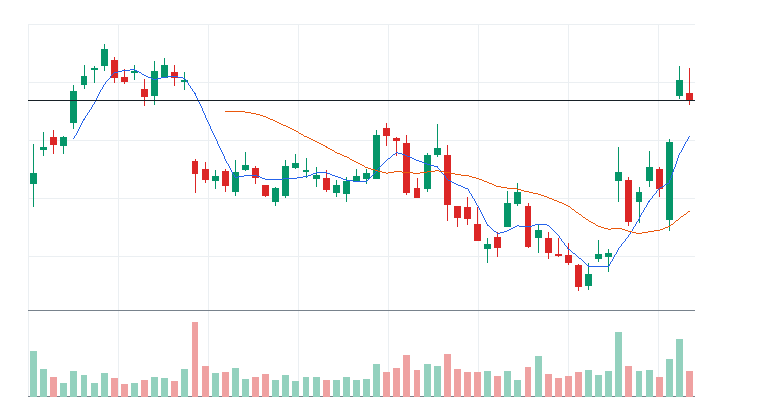
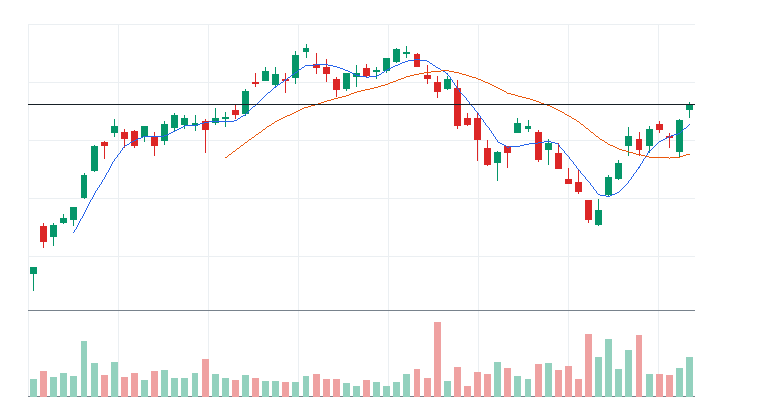
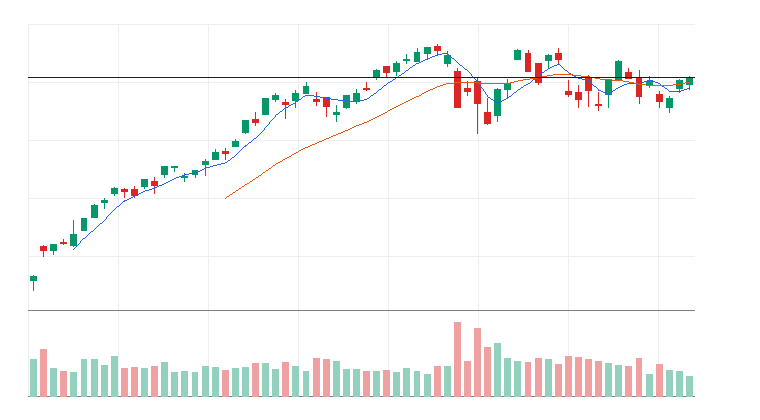
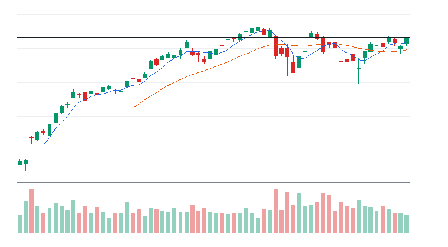
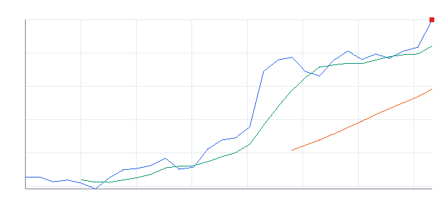

# 오늘의 데일리 트레이딩 요약

**REAL DATA TEST - 가격/거래량은 실제 데이터, 뉴스/ETF 구성종목 확산도/거래대금 유동성 일부 연결**

**목적:** 이 리포트는 최근 오른 자산을 나열하는 것이 아니라, 돈이 몰리는 근거와 다음 매수 주체가 확인할 트레이딩 후보를 찾기 위한 보고서다.

> 핵심 질문: 현재 가격에서 누가 사고 있고, 누가 앞으로 더 비싸게 사줄 수 있는가?

## 시장 국면 판단

- 최종 판정: 강세장 (82점)
- 행동 바이어스: 선별 매수 우위, 과열 추격만 제한
- 한 줄 결론: 기술적 추세가 강세장 조건에 가깝다. 매크로도 큰 부담은 제한적이다.
- 기술적 지표: 상승 추세 우위 (100점, 가중치 65%)
- S&P 500: 100점 | 50일선 위, 200일선 위, 20일 +4.24%, 60일 +9.00%, 52주 고점 대비 -0.60% -> 기술 점수 100
- Nasdaq 100: 100점 | 50일선 위, 200일선 위, 20일 +4.62%, 60일 +15.00%, 52주 고점 대비 -3.05% -> 기술 점수 100
- 매크로 시황: 매크로 중립 (49점, 가중치 35%)
- US long-duration bonds: 48점 | 상승 시 주식 우호; 5일 -1.22%, 20일 -0.48% -> 매크로 점수 48
- US dollar: 48점 | 하락 시 주식 우호; 5일 +0.18%, 20일 +1.21% -> 매크로 점수 48
- High yield credit: 50점 | 상승 시 주식 우호; 5일 0.00%, 20일 +0.30% -> 매크로 점수 50
- 데이터 커버리지: 기술 2/2, 매크로 3/3

## 모바일 요약

[오늘의 데일리 트레이딩 요약]

생성 성공 / 데이터 모드: REAL_TEST

시장:
- 위험선호

시장 지배 서사:
1. Data Storage 자금 유입 - 약화 - Invesco QQQ Trust(QQQ), SPDR S&P 500 ETF Trust(SPY), Seagate Technology Holdings plc(STX), Western Digital Corporation(WDC) 중심으로 5일 +4.35%, 20일 +8.81% 흐름이 형성됨. 뉴스 직접성 제한.
2. 전력 유틸리티 수요 재평가 - 약화 - Invesco QQQ Trust(QQQ), SPDR S&P 500 ETF Trust(SPY), GE Vernova(GEV), Vertiv(VRT) 중심으로 5일 +1.50%, 20일 +10.24% 흐름이 형성됨. 뉴스 직접성 제한.
3. 바이오/헬스케어 촉매 - 약화 - Invesco QQQ Trust(QQQ), Insmed Incorporated(INSM), Vertex Pharmaceuticals Incorporated(VRTX) 중심으로 5일 -0.94%, 20일 +12.17% 흐름이 형성됨. 뉴스 직접성 제한.

트렌드 강도:
1. Data Storage 자금 유입 - TSI 41 - 잠복 - 진입품질 낮음
2. 전력 유틸리티 수요 재평가 - TSI 35 - 잠복 - 진입품질 낮음
3. 바이오/헬스케어 촉매 - TSI 26 - 잠복 - 진입품질 낮음

오늘 결론:
- 메가캡 플랫폼 개별 종목 흐름이 ETF 대비 강한지 확인 필요
- 행동 후보는 linkedNarrative와 함께 확인한다.
- 추격보다 진입 조건 확인 후 접근한다.

오늘 실제 행동 후보:
1. Meta Platforms Inc.(META)(STOCK) - Data Storage 자금 유입 - 단기 추세가 유지되고 거래량이 1.0배 이상이면 눌림 이후 재상승을 시도할 수 있음

다크호스 후보:
1. 다크호스 후보 없음 - 조건 충족 후보 없음

ETF 후보 TOP 5:
1. Roundhill Magnificent Seven ETF(MAGS) - 위험선호 성장주 재진입 - 제외
2. Invesco QQQ Trust(QQQ) - Data Storage 자금 유입 - 거래량 확인 전 관찰
3. SPDR S&P 500 ETF Trust(SPY) - Data Storage 자금 유입 - 거래량 확인 전 관찰
4. Roundhill Memory ETF(DRAM) - AI 인프라 재가속 - 제외
5. First Trust NASDAQ Cybersecurity ETF(CIBR) - 사이버보안 지출 재가속 - 제외

웹 리포트:
https://yoolcool.github.io/DailyTradingThesisAgent/

## 오늘 결론

- 오늘 결론: 조건부 진입
- 신규 진입 후보: 0개
- 조건부 진입 후보: 1개
- 관찰 후보: 146개
- 주요 제한 요인: Entry Quality < 40, RVOL 미달, 뉴스 직접성 부족
- 주문 판단: 시장가 금지 / 지정가 또는 관찰
- 실전 판단: 진입 후보는 있으나, 전일 고점 돌파와 거래량 확인 후 선별적으로 접근한다.

### 후보 제한 요인 집계

- RVOL < 1.00x: 144개
- 거래대금 유동성 낮음: 17개
- Entry Quality 50~54 near miss: 0개
- Entry Quality 40~49 관찰: 3개
- Entry Quality < 40: 154개
- Exhaustion Risk >= 70: 0개
- ETF breadth 샘플 부족: 37개
- 뉴스 직접성 부족: 100개

## 데이터 신뢰도

- 전체 데이터 신뢰도 등급: LOW
- 분석 신뢰도: LOW
- 주문 실행 신뢰도: LOW
- ETF breadth 신뢰도: LOW
- 신뢰도 해석: 테마 확산 판단 제한, 거래대금 유동성 낮음 또는 확인 불가, 프리/애프터마켓 확인 불가
- 리포트 생성 시각: 2026-07-13 12:21 KST
- 가격 기준 거래일: 2026-07-10 US regular close
- 뉴스 수집 시각: 2026-07-13 12:21 KST
- 가장 최근 뉴스 발행 시각: 2026-07-13 12:11 KST
- 뉴스 신선도 상태: FRESH
- 뉴스 소스: Yahoo Finance RSS, MarketWatch RSS, CNBC Markets RSS, SEC EDGAR RSS, Federal Reserve RSS, Finnhub API
- 뉴스 소스 상태: Yahoo Finance RSS CONNECTED, MarketWatch RSS CONNECTED, CNBC Markets RSS PARTIAL, SEC EDGAR RSS PARTIAL, Federal Reserve RSS CONNECTED, Finnhub API DISABLED
- 뉴스 신뢰도: MEDIUM
- 추천 적용 거래일: 2026-07-12 US regular session
- 가격/거래량 데이터 상태: 연결됨
- 뉴스 데이터 상태: 일부 연결
- ETF 구성종목 확산도 상태: 일부 연결
- ETF 구성종목 샘플 수: 1~4
- 거래대금 유동성 데이터 상태: 일부 연결
- 프리/애프터마켓 데이터 상태: UNAVAILABLE
- 데이터 provider: yfinance, Yahoo Finance RSS, MarketWatch RSS, CNBC Markets RSS, SEC EDGAR RSS, Federal Reserve RSS, Finnhub API, config fallback sample, price-volume dollar-volume fallback
- 실전 사용 경고: 이 리포트는 투자판단 보조용이며, REAL_TEST 모드에서는 일부 데이터가 누락되거나 지연될 수 있다. 실제 주문 전 현재가, 뉴스, 프리마켓/정규장 거래량을 별도 확인해야 한다.

## 0. 시장 상태

- 데이터 모드: REAL_TEST
- 가격/거래량: 연결됨
- 뉴스: 일부 연결
- ETF 구성종목 확산도: 일부 연결
- 거래대금 유동성: 일부 연결
- 생성 시각: 2026년 7월 13일 월요일 오후 12:21
- 시장 상태: 위험선호
- 오늘 돈의 방향: 메가캡 플랫폼 개별 종목 흐름이 ETF 대비 강한지 확인 필요
- 강한 테마 TOP 3: 메가캡 플랫폼 ETF(71), Financial Services(45), 이커머스/여행 플랫폼(36)
- 데이터 한계:
  - API 또는 provider 상태에 따라 뉴스/ETF 확산도/거래대금 유동성 반영 범위가 달라질 수 있다.
  - 수집 실패 데이터는 점수 반영에서 제외하거나 confidence를 제한한다.
  - reasonConfidence HIGH는 직접 촉매, 가격/거래량, 확산도/유동성 근거가 함께 있을 때만 사용한다.

## 오늘 시장을 지배하는 서사

### 오늘 시장을 지배하는 서사 TOP 3

#### 1. Data Storage 자금 유입
- 상태: 약화
- narrativeScore: 41
- reasonConfidence: LOW
- 근거 ETF: QQQ, SPY, IWM
- 근거 개별 종목: STX, WDC
- 돈이 몰리는 이유: Data Storage 자금 유입 관련 Invesco QQQ Trust(QQQ), SPDR S&P 500 ETF Trust(SPY), iShares Russell 2000 ETF(IWM)와 Seagate Technology Holdings plc(STX), Western Digital Corporation(WDC)의 5일(+4.35%)·20일(+8.81%) 흐름을 함께 본다. 평균 상대 거래량은 0.63배이고, ETF 확산도는 추가 확인이 필요하다. 뉴스 직접성은 아직 제한적이다.
- 다음 매수 주체: Data Storage 자금 유입을 확인한 섹터 ETF 자금과 상대강도 추종 스윙 자금
- 가장 좋은 트레이딩 수단: ETF 우선: QQQ, SPY, IWM / 개별 종목 우선: STX, WDC
- 서사가 깨지는 조건: QQQ 20일선 이탈 또는 관련 종목 절반 이상 5일선 이탈
- 오늘 행동: 기존 네러티브와 중복을 확인한 뒤 ETF/대표 종목 동조성이 살아날 때만 관찰 편입

상세 narrativeScore 근거 보기

- rawScore: 41
- ETF 평균 moneyFlowScore: 31
- 개별 종목 평균 moneyFlowScore: 41
- ETF 후보 비율: 0%
- 개별 종목 후보 비율: 0%
- 5일 평균 수익률: +4.00%
- 20일 평균 수익률: +9.00%
- 평균 상대 거래량: 1.00배
- ETF 평균 상대 거래량: 1.00배
- 개별주 평균 상대 거래량: 1.00배
- 52주 고점 근접 후보 비율: 60%
- 뉴스 직접성 점수: 10
- ETF 확산도 점수: 0
- 유동성 점수: 5
- 과열 리스크 차감: 0

#### 2. 전력 유틸리티 수요 재평가
- 상태: 약화
- narrativeScore: 30
- reasonConfidence: LOW
- 근거 ETF: QQQ, SPY, IWM
- 근거 개별 종목: GEV, VRT, ETN
- 돈이 몰리는 이유: 전력 유틸리티 수요 재평가 관련 Invesco QQQ Trust(QQQ), SPDR S&P 500 ETF Trust(SPY), iShares Russell 2000 ETF(IWM)와 GE Vernova(GEV), Vertiv(VRT), Eaton(ETN)의 5일(+1.50%)·20일(+10.24%) 흐름을 함께 본다. 평균 상대 거래량은 0.58배이고, ETF 확산도는 추가 확인이 필요하다. 뉴스 직접성은 아직 제한적이다.
- 다음 매수 주체: 전력 유틸리티 수요 재평가을 확인한 섹터 ETF 자금과 상대강도 추종 스윙 자금
- 가장 좋은 트레이딩 수단: ETF 우선: QQQ, SPY, IWM / 개별 종목 우선: ETN, GEV, VRT
- 서사가 깨지는 조건: QQQ 20일선 이탈 또는 관련 종목 절반 이상 5일선 이탈
- 오늘 행동: 기존 네러티브와 중복을 확인한 뒤 ETF/대표 종목 동조성이 살아날 때만 관찰 편입

상세 narrativeScore 근거 보기

- rawScore: 30
- ETF 평균 moneyFlowScore: 31
- 개별 종목 평균 moneyFlowScore: 31
- ETF 후보 비율: 0%
- 개별 종목 후보 비율: 0%
- 5일 평균 수익률: +2.00%
- 20일 평균 수익률: +10.00%
- 평균 상대 거래량: 1.00배
- ETF 평균 상대 거래량: 1.00배
- 개별주 평균 상대 거래량: 1.00배
- 52주 고점 근접 후보 비율: 50%
- 뉴스 직접성 점수: 6
- ETF 확산도 점수: 0
- 유동성 점수: 3
- 과열 리스크 차감: 0

#### 3. 바이오/헬스케어 촉매
- 상태: 약화
- narrativeScore: 24
- reasonConfidence: LOW
- 근거 ETF: QQQ
- 근거 개별 종목: INSM, VRTX, GILD
- 돈이 몰리는 이유: 바이오/헬스케어 촉매 관련 Invesco QQQ Trust(QQQ)와 Insmed Incorporated(INSM), Vertex Pharmaceuticals Incorporated(VRTX), Gilead Sciences Inc.(GILD)의 5일(-0.94%)·20일(+12.17%) 흐름을 함께 본다. 평균 상대 거래량은 0.65배이고, ETF 확산도는 추가 확인이 필요하다. 뉴스 직접성은 아직 제한적이다.
- 다음 매수 주체: 바이오/헬스케어 촉매을 확인한 섹터 ETF 자금과 상대강도 추종 스윙 자금
- 가장 좋은 트레이딩 수단: ETF 우선: QQQ / 개별 종목 우선: VRTX, GILD, INSM
- 서사가 깨지는 조건: QQQ 20일선 이탈 또는 관련 종목 절반 이상 5일선 이탈
- 오늘 행동: 기존 네러티브와 중복을 확인한 뒤 ETF/대표 종목 동조성이 살아날 때만 관찰 편입

상세 narrativeScore 근거 보기

- rawScore: 24
- ETF 평균 moneyFlowScore: 44
- 개별 종목 평균 moneyFlowScore: 19
- ETF 후보 비율: 0%
- 개별 종목 후보 비율: 0%
- 5일 평균 수익률: -1.00%
- 20일 평균 수익률: +12.00%
- 평균 상대 거래량: 1.00배
- ETF 평균 상대 거래량: 1.00배
- 개별주 평균 상대 거래량: 1.00배
- 52주 고점 근접 후보 비율: 25%
- 뉴스 직접성 점수: 4
- ETF 확산도 점수: 0
- 유동성 점수: 2
- 과열 리스크 차감: 0

### 전체 narrative 요약

| 서사명 | 상태 | narrativeScore | reasonConfidence | 대표 ETF | 대표 종목 | 오늘 행동 |
| --- | --- | ---: | --- | --- | --- | --- |
| Data Storage 자금 유입 | 약화 | 41 | LOW | QQQ, SPY, IWM | STX, WDC | 기존 네러티브와 중복을 확인한 뒤 ETF/대표 종목 동조성이 살아날 때만 관찰 편입 |
| 전력 유틸리티 수요 재평가 | 약화 | 30 | LOW | QQQ, SPY, IWM | GEV, VRT, ETN | 기존 네러티브와 중복을 확인한 뒤 ETF/대표 종목 동조성이 살아날 때만 관찰 편입 |
| 바이오/헬스케어 촉매 | 약화 | 24 | LOW | QQQ | INSM, VRTX, GILD | 기존 네러티브와 중복을 확인한 뒤 ETF/대표 종목 동조성이 살아날 때만 관찰 편입 |
| AI 인프라 재가속 | 약화 | 22 | LOW | DRAM, SMH, SOXX | NVDA, AMD, GEV, VRT | 추격보다 5일선 지지 후 재상승 확인 |
| 필수소비재 음료 방어 성장 | 약화 | 21 | LOW | QQQ | MNST, CCEP, KDP | 기존 네러티브와 중복을 확인한 뒤 ETF/대표 종목 동조성이 살아날 때만 관찰 편입 |
| 위험선호 성장주 재진입 | 약화 | 20 | LOW | MAGS, QQQ, IPO | TSLA, ARM, COIN | 지수 위험선호가 유지될 때만 선별 진입 |
| Aerospace & Defense 자금 유입 | 약화 | 16 | LOW | QQQ, SPY, IWM | AXON, RTX, AVAV | 기존 네러티브와 중복을 확인한 뒤 ETF/대표 종목 동조성이 살아날 때만 관찰 편입 |
| 사이버보안 지출 재가속 | 약화 | 15 | LOW | CIBR, HACK, IHAK | FTNT, PANW, CRWD, ZS | 기존 네러티브와 중복을 확인한 뒤 ETF/대표 종목 동조성이 살아날 때만 관찰 편입 |
| 소프트웨어 실적/AI 수익화 | 약화 | 15 | LOW | QQQ, IGV, AIQ | DDOG, CDNS | 기존 네러티브와 중복을 확인한 뒤 ETF/대표 종목 동조성이 살아날 때만 관찰 편입 |
| 반도체 설계/공급망 재가속 | 약화 | 11 | LOW | SMH, SOXQ, SOXX | AMD, TXN, ADI, ARM | 기존 네러티브와 중복을 확인한 뒤 ETF/대표 종목 동조성이 살아날 때만 관찰 편입 |
| 전력망/원전/인프라 병목 | 약화 | 10 | LOW | GRID, PAVE, URA | GEV, VRT, ETN, PWR | ETF 확산도와 거래량이 같이 살아날 때만 진입 |
| AI 소프트웨어/사이버보안 확산 | 약화 | 7 | LOW | QQQ, IGV, AIQ | DDOG, TEAM, PLTR, MSFT | 추격보다 눌림 후 재상승 확인 |
| 반도체 장비 사이클 재평가 | 약화 | 6 | LOW | SMH, SOXQ, SOXX | AMAT, ASML, KLAC, LRCX | 기존 네러티브와 중복을 확인한 뒤 ETF/대표 종목 동조성이 살아날 때만 관찰 편입 |
| 매크로 방어/헤지 | 소멸 | 2 | LOW | XLE, GLD, TLT | CVX, XOM | 위험회피가 확인될 때만 헤지성 접근 |
| 비트코인/디지털 자산 위험선호 | 소멸 | 0 | LOW | IBIT, BLOK | MSTR, COIN, IREN | 비트코인 베타가 살아날 때만 단기 매매 |
| 방산/안보 프리미엄 | 약화 | 0 | LOW | XAR, SHLD, ITA | AVAV, KTOS, PLTR | 뉴스 촉매가 직접 확인될 때만 추세 추종 |

## 트렌드 강도 판단

### 1. Data Storage 자금 유입
- Trend Strength Index: 41
- 트렌드 상태 라벨: 잠복
- 테마 확산도: 약함
- ETF 동조성: 보통
- 거래량 강도: 부족
- 과열 위험: 낮음 (4)
- 오늘 진입 품질: 낮음 (31)
- 한 줄 판단: Data Storage 자금 유입는 관찰 가능한 흐름은 있으나 가격, 거래량, 확산도 중 일부 확인이 더 필요하다.
- 오늘 접근법: Invesco QQQ Trust(QQQ)/SPDR S&P 500 ETF Trust(SPY)/iShares Russell 2000 ETF(IWM)와 Seagate Technology Holdings plc(STX)/Western Digital Corporation(WDC)의 거래량 확산이 확인되기 전까지 관찰한다.

트렌드 강도 상세 근거 보기

- 가격 모멘텀: 가격 모멘텀 16/25. 평균 5D +4.35%, 20D +8.81%.
- 거래량 강도: 거래량 강도 3/20. 평균 RVOL 0.63배.
- ETF 동조성: ETF 동조성 8/15. 관련 ETF Invesco QQQ Trust(QQQ), SPDR S&P 500 ETF Trust(SPY), iShares Russell 2000 ETF(IWM) 흐름을 기준으로 판단.
- 테마 확산도: 테마 확산도 8/20. 상위 1~2개 쏠림 감점 0점 반영.
- 뉴스 촉매: 뉴스/촉매 신선도 0/10. HIGH 직접 촉매 0개.
- 과열 리스크: 과열 리스크 4/100. 단기 급등, 고점 근접, ETF-개별주 괴리, 쏠림을 함께 반영.
- 시장 환경: 시장 환경 6/10. QQQ/SPY/IWM 가격 흐름 기반 위험선호 점수.

### 2. 전력 유틸리티 수요 재평가
- Trend Strength Index: 35
- 트렌드 상태 라벨: 잠복
- 테마 확산도: 약함
- ETF 동조성: 보통
- 거래량 강도: 부족
- 과열 위험: 낮음 (3)
- 오늘 진입 품질: 낮음 (27)
- 한 줄 판단: 전력 유틸리티 수요 재평가는 관찰 가능한 흐름은 있으나 가격, 거래량, 확산도 중 일부 확인이 더 필요하다.
- 오늘 접근법: Invesco QQQ Trust(QQQ)/SPDR S&P 500 ETF Trust(SPY)/iShares Russell 2000 ETF(IWM)와 GE Vernova(GEV)/Vertiv(VRT)/Eaton(ETN)의 거래량 확산이 확인되기 전까지 관찰한다.

트렌드 강도 상세 근거 보기

- 가격 모멘텀: 가격 모멘텀 9/25. 평균 5D +1.50%, 20D +10.24%.
- 거래량 강도: 거래량 강도 3/20. 평균 RVOL 0.58배.
- ETF 동조성: ETF 동조성 8/15. 관련 ETF Invesco QQQ Trust(QQQ), SPDR S&P 500 ETF Trust(SPY), iShares Russell 2000 ETF(IWM) 흐름을 기준으로 판단.
- 테마 확산도: 테마 확산도 9/20. 상위 1~2개 쏠림 감점 0점 반영.
- 뉴스 촉매: 뉴스/촉매 신선도 0/10. HIGH 직접 촉매 0개.
- 과열 리스크: 과열 리스크 3/100. 단기 급등, 고점 근접, ETF-개별주 괴리, 쏠림을 함께 반영.
- 시장 환경: 시장 환경 6/10. QQQ/SPY/IWM 가격 흐름 기반 위험선호 점수.

### 3. 바이오/헬스케어 촉매
- Trend Strength Index: 26
- 트렌드 상태 라벨: 잠복
- 테마 확산도: 부족
- ETF 동조성: 보통
- 거래량 강도: 부족
- 과열 위험: 낮음 (18)
- 오늘 진입 품질: 낮음 (15)
- 한 줄 판단: 바이오/헬스케어 촉매는 테마 확산도가 낮아 아직 개별 종목 이벤트성 흐름에 가깝다.
- 오늘 접근법: Invesco QQQ Trust(QQQ)와 Insmed Incorporated(INSM)/Vertex Pharmaceuticals Incorporated(VRTX)/Gilead Sciences Inc.(GILD)의 거래량 확산이 확인되기 전까지 관찰한다.

트렌드 강도 상세 근거 보기

- 가격 모멘텀: 가격 모멘텀 4/25. 평균 5D -0.94%, 20D +12.17%.
- 거래량 강도: 거래량 강도 2/20. 평균 RVOL 0.65배.
- ETF 동조성: ETF 동조성 11/15. 관련 ETF Invesco QQQ Trust(QQQ) 흐름을 기준으로 판단.
- 테마 확산도: 테마 확산도 3/20. 상위 1~2개 쏠림 감점 6점 반영.
- 뉴스 촉매: 뉴스/촉매 신선도 0/10. HIGH 직접 촉매 0개.
- 과열 리스크: 과열 리스크 18/100. 단기 급등, 고점 근접, ETF-개별주 괴리, 쏠림을 함께 반영.
- 시장 환경: 시장 환경 6/10. QQQ/SPY/IWM 가격 흐름 기반 위험선호 점수.

## 최근 추천 결과 트래킹

개별주는 데이트레이딩 관점으로 추천 이후 첫 정규장의 장중 최고가와 종가를 추적한다. ETF는 테마/스윙 관점으로 추천 이후 1주일 동안의 최고가와 현재 종가를 추적한다.

### 개별주 Top 3 추천 성과 요약
- 최근 5개 리포트 표본: 8개 (초기 검증 단계)
- 장중 최고가 기준 성공률: +40.00%
- 종가 기준 성공률: +40.00%
- 평균 장중 최고 수익률: +2.65%
- 평균 종가 수익률: -1.22%

### ETF 추천 성과 요약
- 최근 5개 리포트 표본: 0개 (초기 검증 단계)
- 1주 최고가 기준 성공률: 데이터 없음
- 현재 종가 기준 성공률: 데이터 없음
- 평균 1주 최고 수익률: 데이터 없음
- 평균 현재 수익률: 데이터 없음

최근 추천 결과 상세 테이블 펼치기

| 추천일 | 유형 | 순위 | 티커 | 기준가 | 추적 기간 | 상태 | High 수익률 | Close 수익률 | 결과 | 코멘트 |
| --- | --- | ---: | --- | ---: | --- | --- | ---: | ---: | --- | --- |
| 2026-07-13 | STOCK | 1 | AXON | $640.46 | 2026-07-13 | pending | 데이터 없음 | 데이터 없음 | 추적 대기 | 아직 추적 거래일 데이터가 완성되지 않음 |
| 2026-07-13 | STOCK | 1 | META | $669.21 | 2026-07-13 | pending | 데이터 없음 | 데이터 없음 | 추적 대기 | 아직 추적 거래일 데이터가 완성되지 않음 |
| 2026-07-08 | STOCK | 1 | AXON | $640.46 | 2026-07-08 | complete | -1.48% | -6.35% | 실패 | 추천 이후 의미 있는 장중 기회가 부족하고 종가도 약함 (일봉 기준) |
| 2026-07-07 | STOCK | 2 | AXON | $622.35 | 2026-07-07 | complete | +6.86% | +2.91% | 성공 | 장중 기회와 종가 유지가 모두 확인됨 (일봉 기준) |
| 2026-07-07 | STOCK | 1 | PANW | $357.53 | 2026-07-07 | complete | +1.53% | -5.73% | 제한적 유효 | 제한적인 장중 기회만 발생 (일봉 기준) |
| 2026-07-06 | STOCK | 2 | CCEP | $106.61 | 2026-07-06 | complete | +0.58% | +0.34% | 추적 대기 | 아직 추적 거래일 데이터가 완성되지 않음 (일봉 기준) |
| 2026-07-06 | STOCK | 1 | PANW | $348.06 | 2026-07-06 | complete | +5.78% | +2.72% | 성공 | 장중 기회와 종가 유지가 모두 확인됨 (일봉 기준) |
| 2026-07-03 | STOCK | 1 | CCEP | $106.61 | 2026-07-03 | pending | 데이터 없음 | 데이터 없음 | 추적 대기 | 아직 추적 거래일 데이터가 완성되지 않음 |
| 2026-07-02 | STOCK | 2 | AXON | $593.96 | 2026-07-02 | complete | +1.52% | +0.52% | 제한적 유효 | 제한적인 장중 기회만 발생 (일봉 기준) |
| 2026-07-02 | STOCK | 1 | CCEP | $106.1 | 2026-07-02 | complete | +1.86% | +0.48% | 제한적 유효 | 제한적인 장중 기회만 발생 (일봉 기준) |
| 2026-07-01 | STOCK | 3 | LRCX | $433.33 | 2026-07-01 | complete | -4.12% | -9.71% | 실패 | 추천 이후 의미 있는 장중 기회가 부족하고 종가도 약함 (일봉 기준) |
| 2026-07-01 | STOCK | 2 | PANW | $341.02 | 2026-07-01 | complete | +5.01% | +3.23% | 성공 | 장중 기회와 종가 유지가 모두 확인됨 (일봉 기준) |
| 2026-07-01 | STOCK | 1 | AMAT | $723 | 2026-07-01 | complete | -4.04% | -9.97% | 실패 | 추천 이후 의미 있는 장중 기회가 부족하고 종가도 약함 (일봉 기준) |
| 2026-06-30 | STOCK | 3 | AMAT | $694.64 | 2026-06-30 | complete | +6.48% | +4.08% | 성공 | 장중 기회와 종가 유지가 모두 확인됨 (일봉 기준) |
| 2026-06-30 | STOCK | 2 | CRWD | $742.91 | 2026-06-30 | complete | -74.25% | -74.32% | 실패 | 추천 이후 의미 있는 장중 기회가 부족하고 종가도 약함 (일봉 기준) |
| 2026-06-30 | STOCK | 1 | PANW | $332 | 2026-06-30 | complete | +3.16% | +2.72% | 성공 | 장중 기회와 종가 유지가 모두 확인됨 (일봉 기준) |
| 2026-06-29 | STOCK | 3 | KDP | $33.4 | 2026-06-29 | complete | +1.26% | +0.30% | 제한적 유효 | 제한적인 장중 기회만 발생 (일봉 기준) |
| 2026-06-29 | STOCK | 2 | VRTX | $491.34 | 2026-06-29 | complete | +1.74% | +1.69% | 제한적 유효 | 제한적인 장중 기회만 발생 (일봉 기준) |
| 2026-06-29 | STOCK | 1 | FTNT | $151.35 | 2026-06-29 | complete | +5.10% | +2.69% | 성공 | 장중 기회와 종가 유지가 모두 확인됨 (일봉 기준) |
| 2026-06-26 | STOCK | 3 | MU | $1,213.56 | 2026-06-26 | complete | -1.22% | -6.69% | 실패 | 추천 이후 의미 있는 장중 기회가 부족하고 종가도 약함 (일봉 기준) |
| 2026-06-26 | STOCK | 2 | AMAT | $668 | 2026-06-26 | complete | -1.17% | -6.16% | 실패 | 추천 이후 의미 있는 장중 기회가 부족하고 종가도 약함 (일봉 기준) |
| 2026-06-26 | STOCK | 1 | LRCX | $401.82 | 2026-06-26 | complete | -2.97% | -5.66% | 실패 | 추천 이후 의미 있는 장중 기회가 부족하고 종가도 약함 (일봉 기준) |
| 2026-06-26 | ETF | 1 | DRAM | $76.89 | 2026-06-26~2026-07-03 | complete | -3.55% | -18.01% | 실패 | 추천 이후 ETF 흐름이 약화됨 |
| 2026-06-23 | STOCK | 3 | TSM | $467.67 | 2026-06-23 | complete | -4.35% | -6.69% | 실패 | 추천 이후 의미 있는 장중 기회가 부족하고 종가도 약함 (일봉 기준) |
| 2026-06-23 | STOCK | 2 | GEV | $1,127.59 | 2026-06-23 | complete | -4.84% | -8.21% | 실패 | 추천 이후 의미 있는 장중 기회가 부족하고 종가도 약함 (일봉 기준) |
| 2026-06-23 | STOCK | 1 | ETN | $435.78 | 2026-06-23 | complete | -3.27% | -7.00% | 실패 | 추천 이후 의미 있는 장중 기회가 부족하고 종가도 약함 (일봉 기준) |
| 2026-06-23 | ETF | 1 | DRAM | $80.72 | 2026-06-23~2026-06-30 | complete | -1.39% | -21.90% | 실패 | 추천 이후 ETF 흐름이 약화됨 |
| 2026-06-22 | STOCK | 3 | ARM | $439.46 | 2026-06-22 | complete | +1.25% | -7.22% | 제한적 유효 | 제한적인 장중 기회만 발생 (일봉 기준) |
| 2026-06-22 | STOCK | 2 | GEV | $1,109.73 | 2026-06-22 | complete | +2.91% | +1.61% | 제한적 유효 | 제한적인 장중 기회만 발생 (일봉 기준) |
| 2026-06-22 | STOCK | 1 | ETN | $421.77 | 2026-06-22 | complete | +3.55% | +3.32% | 성공 | 장중 기회와 종가 유지가 모두 확인됨 (일봉 기준) |
| 2026-06-22 | ETF | 3 | IFRA | $61.99 | 2026-06-22~2026-06-29 | complete | +3.65% | -0.40% | 단기 고점 후 반납 | 1주 내 상승 기회는 있었지만 현재가는 반납 |
| 2026-06-22 | ETF | 2 | SMH | $659.88 | 2026-06-22~2026-06-29 | complete | -1.49% | -7.40% | 실패 | 추천 이후 ETF 흐름이 약화됨 |
| 2026-06-22 | ETF | 1 | DRAM | $76.71 | 2026-06-22~2026-06-29 | complete | +3.77% | -17.82% | 단기 고점 후 반납 | 1주 내 상승 기회는 있었지만 현재가는 반납 |
| 2026-06-19 | STOCK | 3 | AMD | $537.37 | 2026-06-19 | pending | 데이터 없음 | 데이터 없음 | 추적 대기 | 아직 추적 거래일 데이터가 완성되지 않음 |
| 2026-06-19 | STOCK | 2 | ARM | $439.46 | 2026-06-19 | pending | 데이터 없음 | 데이터 없음 | 추적 대기 | 아직 추적 거래일 데이터가 완성되지 않음 |
| 2026-06-19 | STOCK | 1 | GEV | $1,109.73 | 2026-06-19 | pending | 데이터 없음 | 데이터 없음 | 추적 대기 | 아직 추적 거래일 데이터가 완성되지 않음 |
| 2026-06-19 | ETF | 1 | DRAM | $76.71 | 2026-06-19~2026-06-26 | complete | +6.04% | -17.82% | 단기 고점 후 반납 | 1주 내 상승 기회는 있었지만 현재가는 반납 |
| 2026-06-18 | STOCK | 3 | ASML | $1,867.83 | 2026-06-18 | complete | +4.02% | +3.31% | 성공 | 장중 기회와 종가 유지가 모두 확인됨 (일봉 기준) |
| 2026-06-18 | STOCK | 3 | FCX | $69.06 | 2026-06-18 | complete | +2.26% | -0.55% | 제한적 유효 | 제한적인 장중 기회만 발생 (일봉 기준) |
| 2026-06-18 | STOCK | 2 | KLAC | $238.73 | 2026-06-18 | complete | +10.56% | +8.73% | 성공 | 장중 기회와 종가 유지가 모두 확인됨 (일봉 기준) |
| 2026-06-18 | STOCK | 1 | LRCX | $374.18 | 2026-06-18 | complete | +7.17% | +3.97% | 성공 | 장중 기회와 종가 유지가 모두 확인됨 (일봉 기준) |
| 2026-06-18 | ETF | 1 | SOXQ | $106.13 | 2026-06-18~2026-06-25 | complete | +8.67% | -3.83% | 단기 고점 후 반납 | 1주 내 상승 기회는 있었지만 현재가는 반납 |
| 2026-06-04 | STOCK | 3 | PANW | $280.43 | 2026-06-04 | complete | +0.10% | -0.42% | 실패 | 추천 이후 의미 있는 장중 기회가 부족하고 종가도 약함 (일봉 기준) |
| 2026-06-04 | STOCK | 2 | FTNT | $146.48 | 2026-06-04 | complete | +2.45% | +2.18% | 제한적 유효 | 제한적인 장중 기회만 발생 (일봉 기준) |
| 2026-06-04 | STOCK | 1 | CRWD | $747.61 | 2026-06-04 | complete | -75.89% | -75.95% | 실패 | 추천 이후 의미 있는 장중 기회가 부족하고 종가도 약함 (일봉 기준) |
| 2026-06-04 | ETF | 3 | HACK | $102.21 | 2026-06-04~2026-06-11 | complete | -1.66% | +6.62% | 진행 중 | 아직 1주 추적 기간이 끝나지 않음 |
| 2026-06-04 | ETF | 2 | SOXQ | $109.58 | 2026-06-04~2026-06-11 | complete | -4.68% | -6.86% | 실패 | 추천 이후 ETF 흐름이 약화됨 |
| 2026-06-04 | ETF | 1 | AIQ | $69.16 | 2026-06-04~2026-06-11 | complete | -4.29% | -8.27% | 실패 | 추천 이후 ETF 흐름이 약화됨 |
| 2026-06-03 | STOCK | 3 | FTNT | $148.86 | 2026-06-03 | complete | -0.26% | -1.60% | 실패 | 추천 이후 의미 있는 장중 기회가 부족하고 종가도 약함 (일봉 기준) |
| 2026-06-03 | STOCK | 3 | CRWD | $768.95 | 2026-06-03 | complete | -75.06% | -75.69% | 실패 | 추천 이후 의미 있는 장중 기회가 부족하고 종가도 약함 (일봉 기준) |
| 2026-06-03 | STOCK | 2 | MRVL | $290.79 | 2026-06-03 | complete | +11.49% | +3.73% | 성공 | 장중 기회와 종가 유지가 모두 확인됨 (일봉 기준) |
| 2026-06-03 | STOCK | 1 | PANW | $297.18 | 2026-06-03 | complete | -3.09% | -5.64% | 실패 | 추천 이후 의미 있는 장중 기회가 부족하고 종가도 약함 (일봉 기준) |
| 2026-06-03 | ETF | 3 | DRAM | $69.57 | 2026-06-03~2026-06-10 | complete | -3.52% | -9.39% | 실패 | 추천 이후 ETF 흐름이 약화됨 |
| 2026-06-03 | ETF | 3 | IGV | $104.73 | 2026-06-03~2026-06-10 | complete | -3.31% | -11.76% | 실패 | 추천 이후 ETF 흐름이 약화됨 |
| 2026-06-03 | ETF | 2 | AIQ | $70.14 | 2026-06-03~2026-06-10 | complete | -2.32% | -9.55% | 실패 | 추천 이후 ETF 흐름이 약화됨 |
| 2026-06-03 | ETF | 1 | CIBR | $94.32 | 2026-06-03~2026-06-10 | complete | -3.56% | -2.59% | 실패 | 추천 이후 ETF 흐름이 약화됨 |

## 오늘 실제 행동 후보

### 1. Meta Platforms Inc.(META)
- 자산 유형: STOCK
- linkedNarrative: Data Storage 자금 유입
- narrativeStatus: 약화
- narrativeScore: 41
- Trend Strength Index: 41
- Exhaustion Risk: 4 (낮음)
- Entry Quality Score: 38 (낮음)
- 트렌드 판단: 시장 위험선호가 약해 시장 환경 비우호 구간이다.
- moneyFlowScore: 100
- finalRawScore: 108
- reasonConfidence: HIGH
- reasonConfidenceExplanation: 직접 촉매: Yahoo Finance RSS / mna / under_24h / mixed - Meta (META) Faces $2 Billion AI Deal Reversal And EU App Design Probe 가격/거래량, 관련 ETF 동반 강세, 유동성 근거가 함께 확인되어 HIGH로 분류했다.
- tieBreakerReason: 최종 원점수 108, 리스크 패널티 0, 5일 수익률 +14.81%, 상대 거래량 2.00배 순으로 정렬
- 후보별 시장 해석: 위험선호 / 제한적 - 전체 시장은 위험선호 / Entry Quality 38 < 50이나 moneyFlow 100, confidence HIGH, RVOL 2.00x로 강한 자금흐름 예외 조건 충족
- 게이트 사유: Entry Quality 38 < 50이나 moneyFlow 100, confidence HIGH, RVOL 2.00x로 강한 자금흐름 예외 조건 충족
- 주문 실행: 시장가 가능
- 직접 촉매: Yahoo Finance RSS / mna / under_24h / mixed - Meta (META) Faces $2 Billion AI Deal Reversal And EU App Design Probe
- 왜 돈이 몰리는가: 20일 +17.20%, 5일 +14.81%, 상대 거래량 2.00배로 가격과 거래량이 함께 개선. 뉴스: Yahoo Finance RSS mna/under_24h / 유동성: LIQUID
- 누가 더 비싸게 사줄 수 있는지: 개별 주도주를 따라붙는 단기 모멘텀 자금과 관련 ETF 강세를 확인한 트레이더
- 진입 조건: 20일선 위 눌림 후 재상승 확인
- 무효화 조건: 20일선 이탈 또는 상대 거래량 0.8배 이하 둔화
- todayActionLabel: 자금흐름 예외 조건부
#### 최근 뉴스/동향 한국어 요약

- 요약: 종목 직접 뉴스 확인 상태이며 뉴스 흐름은 긍정 우위입니다. 후보 선정 후 재확인한 핵심 이슈는 "Meta (META) Faces $2 Billion AI Deal Reversal And EU App Design Probe"입니다.
- 직접 촉매 판단: Meta Platforms Inc.에 대해 직접 촉매로 분류된 뉴스가 확인됐습니다. 핵심은 "Meta (META) Faces $2 Billion AI Deal Reversal And EU App Design Probe"이며, M&A 재료로 봅니다.
- 뉴스 1: Meta (META) Faces $2 Billion AI Deal Reversal And EU App Design Probe
  - 내용: Meta Platforms Inc. 관련 M&A 뉴스입니다. 기사 스니펫상 핵심 내용은 Chinese regulators have required Meta Platforms to unwind its planned $2b acquisition of AI start up Manus, clearing the way for Tencent to become the largest shareholder.입니다.
  - 투자 의미: M&A 재료는 실적 가시성이나 밸류에이션 기대에 영향을 줄 수 있어 규모와 일정 확인이 중요합니다.
  - 확인할 점: M&A의 금액, 기간, 실적 반영 시점
- 뉴스 2: Meta Has Raised Its AI Game. The Stock Should Continue to Rise In 2026.
  - 내용: Meta Platforms Inc. 관련 기사는 목표가 변화를 다룹니다. 기사 스니펫상 핵심은 Meta Platforms has been announcing a flurry of AI initiatives that would help it monetize its capex.입니다.
  - 투자 의미: 애널리스트 상향은 단기 수급에 우호적일 수 있으나, 목표가 변화가 이미 주가에 반영됐는지 확인해야 합니다.
  - 확인할 점: 원문 수치, 후속 보도, 가격이 진입 조건을 지키는지
- 뉴스 3: Why Meta Platforms Stock Surged This Week
  - 내용: Meta Platforms Inc. 주가 급등 또는 강한 반등을 다룬 뉴스입니다. 시장 일반 성격의 재료가 긍정으로 해석되고 있습니다.
  - 투자 의미: 단기 긍정 뉴스 흐름으로 볼 수 있지만, 단독 매수 근거보다는 가격·거래량 조건을 확인하는 보조 근거로 사용합니다.
  - 확인할 점: 원문 수치, 후속 보도, 가격이 진입 조건을 지키는지
- 매매 해석: 매매 관점에서는 뉴스 자체보다 가격이 진입 조건을 지키는지, 거래량이 동반되는지, 그리고 뉴스가 이미 주가에 반영됐는지를 우선 확인해야 합니다.
- 차트: 

## 다크호스 후보

다크호스 후보 없음. 상위 서사 정렬, MA20 위 안착, MA5/MA20 구조 개선, RVOL 0.90x 이상 조건을 동시에 충족한 개별주가 없다.

- darkHorseScore: 조건 충족 후보 없음
- 왜 아직 메인이 아닌가: 확인 조건을 통과한 보조 관찰 후보가 없다.

darkHorseScore 상세 근거 보기

- 서사 정렬: 조건 미충족
- 초기 추세 구조: 조건 미충족
- 베이스 돌파/정돈: 조건 미충족
- 거래량 확인: 조건 미충족
- rawScore: 데이터 없음

## 오늘 돈이 몰리는 테마

- 메가캡 플랫폼 ETF: MAGS | 평균 moneyFlowScore 71 | 추세는 확인되지만 선별 진입이 필요한 중간 강도의 테마로 본다.
- Financial Services: PYPL | 평균 moneyFlowScore 45 | 관심은 유지하되 우선순위는 낮추고 추가 거래량 확인을 기다린다.
- 이커머스/여행 플랫폼: BKNG, PDD, MELI, ABNB, DASH | 평균 moneyFlowScore 36 | 관심은 유지하되 우선순위는 낮추고 추가 거래량 확인을 기다린다.
- 전력/유틸리티 ETF: XLU | 평균 moneyFlowScore 35 | 관심은 유지하되 우선순위는 낮추고 추가 거래량 확인을 기다린다.
- 메모리/HBM ETF: DRAM | 평균 moneyFlowScore 34 | 관심은 유지하되 우선순위는 낮추고 추가 거래량 확인을 기다린다.
- 사이버보안 ETF: CIBR, HACK, IHAK | 평균 moneyFlowScore 33 | 관심은 유지하되 우선순위는 낮추고 추가 거래량 확인을 기다린다.

## 1. ETF 트레이딩 보고서
### 1-1. ETF 결론
- ETF 우선 후보: 없음
- ETF 관찰 후보: VanEck Semiconductor ETF(SMH), iShares Semiconductor ETF(SOXX), Invesco PHLX Semiconductor ETF(SOXQ), iShares Expanded Tech-Software Sector ETF(IGV), Global X Artificial Intelligence & Technology ETF(AIQ)
- ETF 매매 금지: iShares Expanded Tech-Software Sector ETF(IGV), Global X Artificial Intelligence & Technology ETF(AIQ), Global X Robotics & Artificial Intelligence ETF(BOTZ), ROBO Global Robotics and Automation Index ETF(ROBO), iShares U.S. Aerospace & Defense ETF(ITA)
- 오늘 ETF 최우선 1개: 없음
- ETF 섹션 해석: 이 섹션은 개별 종목 선택이 아니라 테마/섹터 단위 자금 흐름을 ETF로 매매할지 판단하기 위한 영역이다.

### 1-2. ETF 후보 TOP 5

선정 기준: ETF 후보는 가격/거래량 1차 점수에 뉴스, ETF 구성종목 확산도, 유동성, 리스크 패널티를 반영한 finalRawScore 기준으로 정렬한다. 표시 점수 100점 후보가 겹치면 tieBreakerReason으로 우선순위를 설명한다.

### [ETF] Roundhill Magnificent Seven ETF(MAGS)
- 자산 유형: ETF
- ETF 세부 카테고리: 메가캡 플랫폼 ETF
- ETF 역할: 테마 베타 매수
- 상태: 매매 금지
- linkedNarrative: 위험선호 성장주 재진입
- narrativeStatus: 약화
- narrativeScore: 20
- moneyFlowScore: 71
- finalRawScore: 71
- tieBreakerReason: 최종 원점수 71, 리스크 패널티 0, 5일 수익률 +3.96%, 상대 거래량 1.17배 순으로 정렬
- 과열 리스크: 낮음
- reasonConfidence: MEDIUM
- reasonConfidenceExplanation: ETF 확산도 제한 때문에 HIGH가 아니라 MEDIUM으로 제한했다.

- todayActionLabel: 제외
- 주문 실행: 지정가 권장
- 기준일: 2026-07-10
- 종가: $67.68
- 1일 수익률: +1.38%
- 5일 수익률: +3.96%
- 20일 수익률: +5.39%
- 상대 거래량: 1.17배
- 52주 고점 대비 위치: -4.89%
- whyMoneyIsFlowing: 20일 +5.39%, 5일 +3.96%, 상대 거래량 1.17배로 가격과 거래량이 함께 개선. 뉴스: MarketWatch RSS general_market/under_6h / 유동성: ACCEPTABLE
- likelyNextBuyer: 섹터 베타를 노리는 단기 모멘텀 자금과 리밸런싱 자금
- whyThisCouldTradeHigher: 52주 고점 부근이라 돌파가 확인되면 신고가 추종 매수가 붙을 수 있음
#### 최근 뉴스/동향 한국어 요약

- 요약: 후보 선정 후 재확인 뉴스 데이터 없음
- 진입 조건: 전일 고점 돌파와 5일선 유지 확인
- 무효화 조건: 20일선 이탈 또는 상대 거래량 0.8배 이하 둔화
- 차트: 

#### 상세 근거

Roundhill Magnificent Seven ETF(MAGS) 상세 근거 펼치기

- moneyFlowScore(최종) 산정 근거:
  - moneyFlowScore(1차): 57
  - 최종 원점수: 71
  - 최종 표시 점수: 71
  - cap 적용: cap 미적용
  - 계산식: +57 + +12 + 0 + +2 + 0 + 0 + 0 = 71
  - 점수 해석: 관심 후보. 눌림 또는 돌파 확인 후 진입 검토.
  - 가격/거래량 1차 점수: +57
    - 추세: +12
    - 단기 모멘텀: +5
    - 중기 모멘텀: +4
    - 거래량: +10
    - 신고가 근접: +12
    - 이동평균: +14
  - 하위 점수 cap:
    - 가격 모멘텀: 원점수 +12, 상한 적용 +12 / 최대 25
    - 단기 모멘텀: 원점수 +5, 상한 적용 +5 / 최대 20
    - 중기 모멘텀: 원점수 +4, 상한 적용 +4 / 최대 16
    - 거래량: 원점수 +10, 상한 적용 +10 / 최대 20
    - 신고가 근접: 원점수 +12, 상한 적용 +12 / 최대 12
    - 이동평균: 원점수 +14, 상한 적용 +14 / 최대 14
  - 추가 데이터 가감점:
    - 뉴스: +12
    - 유동성: +2
  - ETF 확산도: 0
  - 리스크 패널티: 0
  - 주요 근거: 1차 57, 최종 원점수 71, 표시 71. 52주 고점 근처, 이동평균 위 추세 유지, 뉴스 흐름이 가격/거래량 근거 보강. 주의: ETF 구성종목 확산도 데이터 미연결.
  - 리스크 패널티 산정 근거:
    - 총 리스크 패널티: 0
    - 리스크 등급: LOW
    - 감점된 리스크: 없음
    - 관찰 리스크: ETF breadth data not connected
    - 한 줄 해석: 직접 감점된 주요 리스크는 없지만 관찰 리스크는 계속 확인해야 한다.
- 데이터 사용 현황:
  - 가격/거래량: 사용
  - 뉴스: 사용
  - ETF 확산도: 미연결
  - 거래대금 유동성: 사용
  - 관련 ETF 상대강도: 사용
- 뉴스 확인:
  - 최근 뉴스 상태: 일부 연결
  - 뉴스 소스: MarketWatch RSS, Yahoo Finance RSS, Federal Reserve RSS
  - 소스별 상태: Yahoo Finance RSS CONNECTED; MarketWatch RSS CONNECTED; CNBC Markets RSS FAILED; SEC EDGAR RSS FAILED; Federal Reserve RSS CONNECTED; Finnhub API DISABLED
  - 긍정/중립/부정: 12/4/0
  - 직접성/방향성/신선도: 2/1/4
  - 강한 촉매 수: 1
  - 중요 공시 수: 0
  - 직접 촉매: 없음
  - 보조 뉴스: MarketWatch RSS sector_theme / general_market / under_6h
  - 뉴스 수집 시각: 2026-07-13 12:21 KST
  - 가장 최근 뉴스 발행 시각: 2026-07-13 12:03 KST
  - 뉴스 신선도 상태: FRESH
  - 뉴스 이후 가격 반응: 긍정
  - 가격 반응 점수 제한: 뉴스 이후 가격 반응과 점수 제한 특이사항 없음
  - 핵심 뉴스 요약: Oil prices rise, stock futures dip after latest flare-up of strikes between U.S. and Iran
  - 원점수/상한 점수: +23 / +12
  - 점수 반영: +12
  - 주의: CNBC Markets RSS: HTTP 403 from https://www.cnbc.com/id/100003114/device/rss/rss.html; SEC EDGAR RSS: This operation was aborted; Finnhub API: FINNHUB_API_KEY not configured
- ETF 구성종목 확산도:
  - 구성종목 데이터 상태: 미연결
  - 샘플 수: 0/0
  - 샘플 신뢰도: UNKNOWN
  - 상승 종목 비율: 데이터 없음
  - 20일선 위 비율: 데이터 없음
  - 50일선 위 비율: 데이터 없음
  - 상위 기여 종목: 데이터 없음
  - 확산도 판단: UNKNOWN
  - 원점수/샘플 상한/반영 점수: 0 / N/A / 0
  - 점수 반영: 0
- 거래대금 유동성:
  - 데이터 상태: 일부 연결
  - 거래대금 기준 유동성: ACCEPTABLE
  - 거래대금: $434,180,736
  - 평균 거래대금: $369,876,614
  - 주문 영향: 지정가 권장
  - 매매 영향: 거래대금은 허용 가능하나 지정가를 우선한다
- reasonConfidence 근거: 가격/거래량, 뉴스, 거래대금 유동성, 관련 ETF 상대강도은 확인됐지만 일부 보조 데이터가 미연결 또는 fallback이라 중간으로 제한한다.
- 후보 선정 후 뉴스/동향 재확인:
  - 재확인 상태: 데이터 없음
- 차트 요약: 최근 20거래일 기준 5일선이 20일선 위에 있음
- 기준일 2026-07-10 | 종가 $67.68 | 1일 +1.38% | 5일 +3.96% | 20일 +5.39% | 상대 거래량 1.17배 | 52주 고점 대비 -4.89% | 데이터 소스: yfinance

### [ETF] Invesco QQQ Trust(QQQ)
- 자산 유형: ETF
- ETF 세부 카테고리: 시장 기준 ETF
- ETF 역할: 시장 기준 확인
- 상태: 관찰
- linkedNarrative: Data Storage 자금 유입
- narrativeStatus: 약화
- narrativeScore: 41
- moneyFlowScore: 44
- finalRawScore: 44
- tieBreakerReason: 최종 원점수 44, 리스크 패널티 0, 5일 수익률 +1.81%, 상대 거래량 0.58배 순으로 정렬
- 과열 리스크: 낮음
- reasonConfidence: LOW
- reasonConfidenceExplanation: 가격/거래량이 약하거나 핵심 보조 근거가 부족해 LOW로 분류했다.

- todayActionLabel: 거래량 확인 전 관찰
- 주문 실행: 시장가 가능
- 기준일: 2026-07-10
- 종가: $725.51
- 1일 수익률: +0.31%
- 5일 수익률: +1.81%
- 20일 수익률: +4.59%
- 상대 거래량: 0.58배
- 52주 고점 대비 위치: -3.09%
- whyMoneyIsFlowing: 최근 수익률은 확인되지만 상대 거래량 0.58배라 신규 자금 유입 강도는 약함. 뉴스: Yahoo Finance RSS general_market/under_24h / 유동성: LIQUID
- likelyNextBuyer: 섹터 베타를 노리는 단기 모멘텀 자금과 리밸런싱 자금
- whyThisCouldTradeHigher: 52주 고점 부근이라 돌파가 확인되면 신고가 추종 매수가 붙을 수 있음
#### 최근 뉴스/동향 한국어 요약

- 요약: 후보 선정 후 재확인 뉴스 데이터 없음
- 진입 조건: 상대 거래량 1.0배 회복 후 관찰
- 무효화 조건: 거래량 회복 실패
- 차트: 

#### 상세 근거

Invesco QQQ Trust(QQQ) 상세 근거 펼치기

- moneyFlowScore(최종) 산정 근거:
  - moneyFlowScore(1차): 27
  - 최종 원점수: 44
  - 최종 표시 점수: 44
  - cap 적용: cap 미적용
  - 계산식: +27 + +12 + 0 + +5 + 0 + 0 + 0 = 44
  - 점수 해석: 매매 금지 또는 우선순위 낮은 후보.
  - 가격/거래량 1차 점수: +27
    - 추세: +4
    - 단기 모멘텀: +2
    - 중기 모멘텀: +3
    - 거래량: -8
    - 신고가 근접: +12
    - 이동평균: +14
  - 하위 점수 cap:
    - 가격 모멘텀: 원점수 +4, 상한 적용 +4 / 최대 25
    - 단기 모멘텀: 원점수 +2, 상한 적용 +2 / 최대 20
    - 중기 모멘텀: 원점수 +3, 상한 적용 +3 / 최대 16
    - 거래량: 원점수 -8, 상한 적용 -8 / 최대 20
    - 신고가 근접: 원점수 +12, 상한 적용 +12 / 최대 12
    - 이동평균: 원점수 +14, 상한 적용 +14 / 최대 14
  - 추가 데이터 가감점:
    - 뉴스: +12
    - 유동성: +5
  - ETF 확산도: 0
  - 리스크 패널티: 0
  - 주요 근거: 1차 27, 최종 원점수 44, 표시 44. 52주 고점 근처, 이동평균 위 추세 유지, 뉴스 흐름이 가격/거래량 근거 보강. 주의: 큰 감점 제한적.
  - 리스크 패널티 산정 근거:
    - 총 리스크 패널티: 0
    - 리스크 등급: LOW
    - 감점된 리스크: 없음
    - 관찰 리스크: 주요 관찰 리스크 없음
    - 한 줄 해석: 직접 감점된 주요 리스크는 없지만 관찰 리스크는 계속 확인해야 한다.
- 데이터 사용 현황:
  - 가격/거래량: 사용
  - 뉴스: 사용
  - ETF 확산도: 일부 연결
  - 거래대금 유동성: 사용
  - 관련 ETF 상대강도: 사용
- 뉴스 확인:
  - 최근 뉴스 상태: 일부 연결
  - 뉴스 소스: MarketWatch RSS, Yahoo Finance RSS, Federal Reserve RSS
  - 소스별 상태: Yahoo Finance RSS CONNECTED; MarketWatch RSS CONNECTED; CNBC Markets RSS FAILED; SEC EDGAR RSS FAILED; Federal Reserve RSS CONNECTED; Finnhub API DISABLED
  - 긍정/중립/부정: 10/5/1
  - 직접성/방향성/신선도: 4/1/4
  - 강한 촉매 수: 1
  - 중요 공시 수: 0
  - 직접 촉매: Yahoo Finance RSS / general_market / under_24h / neutral - If I Could Tell Every QQQ Investor 1 Thing About SpaceX's Nasdaq-100 Entry, It's This
  - 보조 뉴스: MarketWatch RSS sector_theme / general_market / under_6h
  - 뉴스 수집 시각: 2026-07-13 12:21 KST
  - 가장 최근 뉴스 발행 시각: 2026-07-13 12:03 KST
  - 뉴스 신선도 상태: FRESH
  - 뉴스 이후 가격 반응: 긍정
  - 가격 반응 점수 제한: 뉴스 이후 가격 반응과 점수 제한 특이사항 없음
  - 핵심 뉴스 요약: Oil prices rise, stock futures dip after latest flare-up of strikes between U.S. and Iran
  - 원점수/상한 점수: +23 / +12
  - 점수 반영: +12
  - 주의: CNBC Markets RSS: HTTP 403 from https://www.cnbc.com/id/100003114/device/rss/rss.html; SEC EDGAR RSS: This operation was aborted; Finnhub API: FINNHUB_API_KEY not configured
- ETF 구성종목 확산도:
  - 구성종목 데이터 상태: 일부 연결
  - 샘플 수: 3/3
  - 샘플 신뢰도: INSUFFICIENT
  - 상승 종목 비율: 67%
  - 20일선 위 비율: 100%
  - 50일선 위 비율: 67%
  - 상위 기여 종목: NVDA, AAPL, MSFT
  - 확산도 판단: SAMPLE_TOO_SMALL
  - 원점수/샘플 상한/반영 점수: 0 / 0 / 0
  - 점수 반영: 0
- 거래대금 유동성:
  - 데이터 상태: 일부 연결
  - 거래대금 기준 유동성: LIQUID
  - 거래대금: $19,135,036,046
  - 평균 거래대금: $33,014,825,897
  - 주문 영향: 시장가 가능
  - 매매 영향: 거래대금이 충분해 시장가 가능 범위로 본다
- reasonConfidence 근거: 가격/거래량이 약하거나 주요 데이터가 부족해 낮음.
- 후보 선정 후 뉴스/동향 재확인:
  - 재확인 상태: 데이터 없음
- 차트 요약: 단기 추세 중립
- 기준일 2026-07-10 | 종가 $725.51 | 1일 +0.31% | 5일 +1.81% | 20일 +4.59% | 상대 거래량 0.58배 | 52주 고점 대비 -3.09% | 데이터 소스: yfinance

### [ETF] SPDR S&P 500 ETF Trust(SPY)
- 자산 유형: ETF
- ETF 세부 카테고리: 시장 기준 ETF
- ETF 역할: 시장 기준 확인
- 상태: 관찰
- linkedNarrative: Data Storage 자금 유입
- narrativeStatus: 약화
- narrativeScore: 41
- moneyFlowScore: 43
- finalRawScore: 43
- tieBreakerReason: 최종 원점수 43, 리스크 패널티 0, 5일 수익률 +1.37%, 상대 거래량 0.72배 순으로 정렬
- 과열 리스크: 낮음
- reasonConfidence: LOW
- reasonConfidenceExplanation: 가격/거래량이 약하거나 핵심 보조 근거가 부족해 LOW로 분류했다.

- todayActionLabel: 거래량 확인 전 관찰
- 주문 실행: 시장가 가능
- 기준일: 2026-07-10
- 종가: $754.95
- 1일 수익률: +0.43%
- 5일 수익률: +1.37%
- 20일 수익률: +4.07%
- 상대 거래량: 0.72배
- 52주 고점 대비 위치: -0.72%
- whyMoneyIsFlowing: 최근 수익률은 확인되지만 상대 거래량 0.72배라 신규 자금 유입 강도는 약함. 뉴스: MarketWatch RSS general_market/under_6h / 유동성: LIQUID
- likelyNextBuyer: 섹터 베타를 노리는 단기 모멘텀 자금과 리밸런싱 자금
- whyThisCouldTradeHigher: 52주 고점 부근이라 돌파가 확인되면 신고가 추종 매수가 붙을 수 있음
#### 최근 뉴스/동향 한국어 요약

- 요약: 후보 선정 후 재확인 뉴스 데이터 없음
- 진입 조건: 상대 거래량 1.0배 회복 후 관찰
- 무효화 조건: 거래량 회복 실패
- 차트: 

#### 상세 근거

SPDR S&P 500 ETF Trust(SPY) 상세 근거 펼치기

- moneyFlowScore(최종) 산정 근거:
  - moneyFlowScore(1차): 26
  - 최종 원점수: 43
  - 최종 표시 점수: 43
  - cap 적용: cap 미적용
  - 계산식: +26 + +12 + 0 + +5 + 0 + 0 + 0 = 43
  - 점수 해석: 매매 금지 또는 우선순위 낮은 후보.
  - 가격/거래량 1차 점수: +26
    - 추세: +3
    - 단기 모멘텀: +2
    - 중기 모멘텀: +3
    - 거래량: -8
    - 신고가 근접: +12
    - 이동평균: +14
  - 하위 점수 cap:
    - 가격 모멘텀: 원점수 +3, 상한 적용 +3 / 최대 25
    - 단기 모멘텀: 원점수 +2, 상한 적용 +2 / 최대 20
    - 중기 모멘텀: 원점수 +3, 상한 적용 +3 / 최대 16
    - 거래량: 원점수 -8, 상한 적용 -8 / 최대 20
    - 신고가 근접: 원점수 +12, 상한 적용 +12 / 최대 12
    - 이동평균: 원점수 +14, 상한 적용 +14 / 최대 14
  - 추가 데이터 가감점:
    - 뉴스: +12
    - 유동성: +5
  - ETF 확산도: 0
  - 리스크 패널티: 0
  - 주요 근거: 1차 26, 최종 원점수 43, 표시 43. 52주 고점 근처, 이동평균 위 추세 유지, 뉴스 흐름이 가격/거래량 근거 보강. 주의: 큰 감점 제한적.
  - 리스크 패널티 산정 근거:
    - 총 리스크 패널티: 0
    - 리스크 등급: LOW
    - 감점된 리스크: 없음
    - 관찰 리스크: 주요 관찰 리스크 없음
    - 한 줄 해석: 직접 감점된 주요 리스크는 없지만 관찰 리스크는 계속 확인해야 한다.
- 데이터 사용 현황:
  - 가격/거래량: 사용
  - 뉴스: 사용
  - ETF 확산도: 일부 연결
  - 거래대금 유동성: 사용
  - 관련 ETF 상대강도: 사용
- 뉴스 확인:
  - 최근 뉴스 상태: 일부 연결
  - 뉴스 소스: MarketWatch RSS, Yahoo Finance RSS, Federal Reserve RSS
  - 소스별 상태: Yahoo Finance RSS CONNECTED; MarketWatch RSS CONNECTED; CNBC Markets RSS FAILED; SEC EDGAR RSS FAILED; Federal Reserve RSS CONNECTED; Finnhub API DISABLED
  - 긍정/중립/부정: 12/4/0
  - 직접성/방향성/신선도: 2/1/4
  - 강한 촉매 수: 1
  - 중요 공시 수: 0
  - 직접 촉매: 없음
  - 보조 뉴스: MarketWatch RSS sector_theme / general_market / under_6h
  - 뉴스 수집 시각: 2026-07-13 12:21 KST
  - 가장 최근 뉴스 발행 시각: 2026-07-13 12:03 KST
  - 뉴스 신선도 상태: FRESH
  - 뉴스 이후 가격 반응: 긍정
  - 가격 반응 점수 제한: 뉴스 이후 가격 반응과 점수 제한 특이사항 없음
  - 핵심 뉴스 요약: Oil prices rise, stock futures dip after latest flare-up of strikes between U.S. and Iran
  - 원점수/상한 점수: +23 / +12
  - 점수 반영: +12
  - 주의: CNBC Markets RSS: HTTP 403 from https://www.cnbc.com/id/100003114/device/rss/rss.html; SEC EDGAR RSS: This operation was aborted; Finnhub API: FINNHUB_API_KEY not configured
- ETF 구성종목 확산도:
  - 구성종목 데이터 상태: 일부 연결
  - 샘플 수: 4/4
  - 샘플 신뢰도: INSUFFICIENT
  - 상승 종목 비율: 75%
  - 20일선 위 비율: 75%
  - 50일선 위 비율: 50%
  - 상위 기여 종목: NVDA, AAPL, XOM, MSFT
  - 확산도 판단: SAMPLE_TOO_SMALL
  - 원점수/샘플 상한/반영 점수: 0 / 0 / 0
  - 점수 반영: 0
- 거래대금 유동성:
  - 데이터 상태: 일부 연결
  - 거래대금 기준 유동성: LIQUID
  - 거래대금: $31,794,190,785
  - 평균 거래대금: $44,289,568,297
  - 주문 영향: 시장가 가능
  - 매매 영향: 거래대금이 충분해 시장가 가능 범위로 본다
- reasonConfidence 근거: 가격/거래량이 약하거나 주요 데이터가 부족해 낮음.
- 후보 선정 후 뉴스/동향 재확인:
  - 재확인 상태: 데이터 없음
- 차트 요약: 최근 20거래일 기준 5일선이 20일선 위에 있음
- 기준일 2026-07-10 | 종가 $754.95 | 1일 +0.43% | 5일 +1.37% | 20일 +4.07% | 상대 거래량 0.72배 | 52주 고점 대비 -0.72% | 데이터 소스: yfinance

### [ETF] Roundhill Memory ETF(DRAM)
- 자산 유형: ETF
- ETF 세부 카테고리: 메모리/HBM ETF
- ETF 역할: 테마 베타 매수
- 상태: 매매 금지
- linkedNarrative: AI 인프라 재가속
- narrativeStatus: 약화
- narrativeScore: 22
- moneyFlowScore: 34
- finalRawScore: 34
- tieBreakerReason: 최종 원점수 34, 리스크 패널티 -6, 5일 수익률 +3.97%, 상대 거래량 1.04배 순으로 정렬
- 과열 리스크: 낮음
- reasonConfidence: LOW
- reasonConfidenceExplanation: 가격/거래량이 약하거나 핵심 보조 근거가 부족해 LOW로 분류했다.

- todayActionLabel: 제외
- 주문 실행: 시장가 가능
- 기준일: 2026-07-10
- 종가: $63.04
- 1일 수익률: -2.05%
- 5일 수익률: +3.97%
- 20일 수익률: +9.88%
- 상대 거래량: 1.04배
- 52주 고점 대비 위치: -22.50%
- whyMoneyIsFlowing: 20일 +9.88%, 5일 +3.97%, 상대 거래량 1.04배로 가격과 거래량이 함께 개선. 뉴스: MarketWatch RSS general_market/under_6h / 유동성: LIQUID
- likelyNextBuyer: 섹터 베타를 노리는 단기 모멘텀 자금과 리밸런싱 자금
- whyThisCouldTradeHigher: 단기 추세가 유지되고 거래량이 1.0배 이상이면 눌림 이후 재상승을 시도할 수 있음
#### 최근 뉴스/동향 한국어 요약

- 요약: 후보 선정 후 재확인 뉴스 데이터 없음
- 진입 조건: 20일선 위 눌림 후 재상승 확인
- 무효화 조건: 20일선 이탈 또는 상대 거래량 0.8배 이하 둔화
- 차트: 

#### 상세 근거

Roundhill Memory ETF(DRAM) 상세 근거 펼치기

- moneyFlowScore(최종) 산정 근거:
  - moneyFlowScore(1차): 33
  - 최종 원점수: 34
  - 최종 표시 점수: 34
  - cap 적용: cap 미적용
  - 계산식: +33 + +2 + 0 + +5 + 0 - 6 + 0 = 34
  - 점수 해석: 매매 금지 또는 우선순위 낮은 후보.
  - 가격/거래량 1차 점수: +33
    - 추세: +14
    - 단기 모멘텀: +1
    - 중기 모멘텀: +6
    - 거래량: +10
    - 신고가 근접: 0
    - 이동평균: +2
  - 하위 점수 cap:
    - 가격 모멘텀: 원점수 +14, 상한 적용 +14 / 최대 25
    - 단기 모멘텀: 원점수 +1, 상한 적용 +1 / 최대 20
    - 중기 모멘텀: 원점수 +6, 상한 적용 +6 / 최대 16
    - 거래량: 원점수 +10, 상한 적용 +10 / 최대 20
    - 신고가 근접: 원점수 0, 상한 적용 0 / 최대 12
    - 이동평균: 원점수 +2, 상한 적용 +2 / 최대 14
  - 추가 데이터 가감점:
    - 뉴스: +2
    - 유동성: +5
  - ETF 확산도: 0
  - 리스크 패널티: -6
  - 주요 근거: 1차 33, 최종 원점수 34, 표시 34. 20일 수익률 강함, 뉴스 흐름이 가격/거래량 근거 보강, 거래대금 기준 유동성 양호. 주의: 단기 과열/추격 위험 존재, ETF 구성종목 확산도 데이터 미연결.
  - 리스크 패널티 산정 근거:
    - 총 리스크 패널티: -6
    - 리스크 등급: LOW
    - 감점된 리스크:
      - 20d moving average break risk: -6 | 근거: Close is below the 20-day moving average. | 대응: Hold off until 20-day moving average is recovered.
    - 관찰 리스크: ETF breadth data not connected
    - 한 줄 해석: 1개 감점 리스크로 총 -6점 반영.
- 데이터 사용 현황:
  - 가격/거래량: 사용
  - 뉴스: 사용
  - ETF 확산도: 미연결
  - 거래대금 유동성: 사용
  - 관련 ETF 상대강도: 사용
- 뉴스 확인:
  - 최근 뉴스 상태: 일부 연결
  - 뉴스 소스: MarketWatch RSS, CNBC Markets RSS
  - 소스별 상태: Yahoo Finance RSS CONNECTED; MarketWatch RSS CONNECTED; CNBC Markets RSS CONNECTED; SEC EDGAR RSS FAILED; Federal Reserve RSS CONNECTED; Finnhub API DISABLED
  - 긍정/중립/부정: 12/3/1
  - 직접성/방향성/신선도: 2/1/4
  - 강한 촉매 수: 1
  - 중요 공시 수: 0
  - 직접 촉매: 없음
  - 보조 뉴스: MarketWatch RSS sector_theme / general_market / under_6h
  - 뉴스 수집 시각: 2026-07-13 12:21 KST
  - 가장 최근 뉴스 발행 시각: 2026-07-13 12:03 KST
  - 뉴스 신선도 상태: FRESH
  - 뉴스 이후 가격 반응: 부정
  - 가격 반응 점수 제한: 뉴스 이후 가격 반응 부정 -> 긍정 점수 제한
  - 핵심 뉴스 요약: Oil prices rise, stock futures dip after latest flare-up of strikes between U.S. and Iran
  - 원점수/상한 점수: +21 / +12
  - 점수 반영: +12
  - 주의: SEC EDGAR RSS: This operation was aborted; Finnhub API: FINNHUB_API_KEY not configured
- ETF 구성종목 확산도:
  - 구성종목 데이터 상태: 미연결
  - 샘플 수: 0/0
  - 샘플 신뢰도: UNKNOWN
  - 상승 종목 비율: 데이터 없음
  - 20일선 위 비율: 데이터 없음
  - 50일선 위 비율: 데이터 없음
  - 상위 기여 종목: 데이터 없음
  - 확산도 판단: UNKNOWN
  - 원점수/샘플 상한/반영 점수: 0 / N/A / 0
  - 점수 반영: 0
- 거래대금 유동성:
  - 데이터 상태: 일부 연결
  - 거래대금 기준 유동성: LIQUID
  - 거래대금: $4,059,359,936
  - 평균 거래대금: $3,905,183,008
  - 주문 영향: 시장가 가능
  - 매매 영향: 거래대금이 충분해 시장가 가능 범위로 본다
- reasonConfidence 근거: 가격/거래량이 약하거나 주요 데이터가 부족해 낮음.
- 후보 선정 후 뉴스/동향 재확인:
  - 재확인 상태: 데이터 없음
- 차트 요약: 20일선 아래라 추세 확인 전까지 보수적 접근
- 기준일 2026-07-10 | 종가 $63.04 | 1일 -2.05% | 5일 +3.97% | 20일 +9.88% | 상대 거래량 1.04배 | 52주 고점 대비 -22.50% | 데이터 소스: yfinance

### [ETF] First Trust NASDAQ Cybersecurity ETF(CIBR)
- 자산 유형: ETF
- ETF 세부 카테고리: 사이버보안 ETF
- ETF 역할: 테마 베타 매수
- 상태: 매매 금지
- linkedNarrative: 사이버보안 지출 재가속
- narrativeStatus: 약화
- narrativeScore: 15
- moneyFlowScore: 43
- finalRawScore: 43
- tieBreakerReason: 최종 원점수 43, 리스크 패널티 0, 5일 수익률 +1.33%, 상대 거래량 1.07배 순으로 정렬
- 과열 리스크: 낮음
- reasonConfidence: MEDIUM
- reasonConfidenceExplanation: ETF 확산도 제한 때문에 HIGH가 아니라 MEDIUM으로 제한했다.

- todayActionLabel: 제외
- 주문 실행: 지정가 권장
- 기준일: 2026-07-10
- 종가: $91.88
- 1일 수익률: -2.52%
- 5일 수익률: +1.33%
- 20일 수익률: +10.37%
- 상대 거래량: 1.07배
- 52주 고점 대비 위치: -2.96%
- whyMoneyIsFlowing: 20일 +10.37%, 5일 +1.33%, 상대 거래량 1.07배로 가격과 거래량이 함께 개선. 뉴스: MarketWatch RSS general_market/under_6h / 유동성: ACCEPTABLE
- likelyNextBuyer: 섹터 베타를 노리는 단기 모멘텀 자금과 리밸런싱 자금
- whyThisCouldTradeHigher: 52주 고점 부근이라 돌파가 확인되면 신고가 추종 매수가 붙을 수 있음
#### 최근 뉴스/동향 한국어 요약

- 요약: 후보 선정 후 재확인 뉴스 데이터 없음
- 진입 조건: 전일 고점 돌파와 5일선 유지 확인
- 무효화 조건: 20일선 이탈 또는 상대 거래량 0.8배 이하 둔화
- 차트: 

#### 상세 근거

First Trust NASDAQ Cybersecurity ETF(CIBR) 상세 근거 펼치기

- moneyFlowScore(최종) 산정 근거:
  - moneyFlowScore(1차): 43
  - 최종 원점수: 43
  - 최종 표시 점수: 43
  - cap 적용: cap 미적용
  - 계산식: +43 + +2 - 4 + +2 + 0 + 0 + 0 = 43
  - 점수 해석: 매매 금지 또는 우선순위 낮은 후보.
  - 가격/거래량 1차 점수: +43
    - 추세: +6
    - 단기 모멘텀: -2
    - 중기 모멘텀: +7
    - 거래량: +10
    - 신고가 근접: +12
    - 이동평균: +10
  - 하위 점수 cap:
    - 가격 모멘텀: 원점수 +6, 상한 적용 +6 / 최대 25
    - 단기 모멘텀: 원점수 -2, 상한 적용 -2 / 최대 20
    - 중기 모멘텀: 원점수 +7, 상한 적용 +7 / 최대 16
    - 거래량: 원점수 +10, 상한 적용 +10 / 최대 20
    - 신고가 근접: 원점수 +12, 상한 적용 +12 / 최대 12
    - 이동평균: 원점수 +10, 상한 적용 +10 / 최대 14
  - 추가 데이터 가감점:
    - 뉴스: +2
    - 유동성: +2
  - ETF 확산도: -4
  - 리스크 패널티: 0
  - 주요 근거: 1차 43, 최종 원점수 43, 표시 43. 20일 수익률 강함, 52주 고점 근처, 뉴스 흐름이 가격/거래량 근거 보강. 주의: 큰 감점 제한적.
  - 리스크 패널티 산정 근거:
    - 총 리스크 패널티: 0
    - 리스크 등급: LOW
    - 감점된 리스크: 없음
    - 관찰 리스크: 주요 관찰 리스크 없음
    - 한 줄 해석: 직접 감점된 주요 리스크는 없지만 관찰 리스크는 계속 확인해야 한다.
- 데이터 사용 현황:
  - 가격/거래량: 사용
  - 뉴스: 사용
  - ETF 확산도: 일부 연결
  - 거래대금 유동성: 사용
  - 관련 ETF 상대강도: 사용
- 뉴스 확인:
  - 최근 뉴스 상태: 일부 연결
  - 뉴스 소스: MarketWatch RSS, CNBC Markets RSS
  - 소스별 상태: Yahoo Finance RSS CONNECTED; MarketWatch RSS CONNECTED; CNBC Markets RSS CONNECTED; SEC EDGAR RSS FAILED; Federal Reserve RSS CONNECTED; Finnhub API DISABLED
  - 긍정/중립/부정: 12/3/1
  - 직접성/방향성/신선도: 2/1/4
  - 강한 촉매 수: 1
  - 중요 공시 수: 0
  - 직접 촉매: 없음
  - 보조 뉴스: MarketWatch RSS sector_theme / general_market / under_6h
  - 뉴스 수집 시각: 2026-07-13 12:21 KST
  - 가장 최근 뉴스 발행 시각: 2026-07-13 12:03 KST
  - 뉴스 신선도 상태: FRESH
  - 뉴스 이후 가격 반응: 부정
  - 가격 반응 점수 제한: 뉴스 이후 가격 반응 부정 -> 긍정 점수 제한
  - 핵심 뉴스 요약: Oil prices rise, stock futures dip after latest flare-up of strikes between U.S. and Iran
  - 원점수/상한 점수: +21 / +12
  - 점수 반영: +12
  - 주의: SEC EDGAR RSS: This operation was aborted; Finnhub API: FINNHUB_API_KEY not configured
- ETF 구성종목 확산도:
  - 구성종목 데이터 상태: 일부 연결
  - 샘플 수: 2/2
  - 샘플 신뢰도: INSUFFICIENT
  - 상승 종목 비율: 0%
  - 20일선 위 비율: 100%
  - 50일선 위 비율: 0%
  - 상위 기여 종목: MSFT, PLTR
  - 확산도 판단: WEAK_BREADTH
  - 원점수/샘플 상한/반영 점수: -4 / 0 / -4
  - 점수 반영: -4
- 거래대금 유동성:
  - 데이터 상태: 일부 연결
  - 거래대금 기준 유동성: ACCEPTABLE
  - 거래대금: $154,661,604
  - 평균 거래대금: $145,094,140
  - 주문 영향: 지정가 권장
  - 매매 영향: 거래대금은 허용 가능하나 지정가를 우선한다
- reasonConfidence 근거: 가격/거래량, 뉴스, 거래대금 유동성, 관련 ETF 상대강도은 확인됐지만 일부 보조 데이터가 미연결 또는 fallback이라 중간으로 제한한다.
- 후보 선정 후 뉴스/동향 재확인:
  - 재확인 상태: 데이터 없음
- 차트 요약: 20일선 위에서 단기 눌림 확인 구간
- 기준일 2026-07-10 | 종가 $91.88 | 1일 -2.52% | 5일 +1.33% | 20일 +10.37% | 상대 거래량 1.07배 | 52주 고점 대비 -2.96% | 데이터 소스: yfinance

### 1-3. ETF 과열/주의 후보

해당 없음

### 1-4. ETF 제외/매매 금지 후보

#### iShares Expanded Tech-Software Sector ETF(IGV)
- moneyFlowScore(최종): 0
- moneyFlowScore 산정 근거 요약: 1차 0, 최종 원점수 -1, 표시 0. 뉴스 흐름이 가격/거래량 근거 보강, 거래대금 기준 유동성 양호. 주의: 큰 감점 제한적.
- 제외 사유: 테마 자금 흐름 약함
- 해제 조건: 상대 거래량 1.0배 회복 후 관찰

#### Global X Artificial Intelligence & Technology ETF(AIQ)
- moneyFlowScore(최종): 0
- moneyFlowScore 산정 근거 요약: 1차 7, 최종 원점수 -7, 표시 0. 뉴스 흐름이 가격/거래량 근거 보강, 거래대금 유동성 주의. 주의: 단기 과열/추격 위험 존재.
- 제외 사유: 테마 자금 흐름 약함
- 해제 조건: 상대 거래량 1.0배 회복 후 관찰

#### Global X Robotics & Artificial Intelligence ETF(BOTZ)
- moneyFlowScore(최종): 0
- moneyFlowScore 산정 근거 요약: 1차 0, 최종 원점수 -7, 표시 0. 뉴스 흐름이 가격/거래량 근거 보강, 거래대금 유동성 주의. 주의: 단기 과열/추격 위험 존재, ETF 구성종목 확산도 데이터 미연결.
- 제외 사유: 테마 자금 흐름 약함
- 해제 조건: 상대 거래량 1.0배 회복 후 관찰

#### ROBO Global Robotics and Automation Index ETF(ROBO)
- moneyFlowScore(최종): 0
- moneyFlowScore 산정 근거 요약: 1차 0, 최종 원점수 -4, 표시 0. 뉴스 흐름이 가격/거래량 근거 보강, 거래대금 유동성 주의. 주의: 단기 과열/추격 위험 존재, ETF 구성종목 확산도 데이터 미연결.
- 제외 사유: 테마 자금 흐름 약함
- 해제 조건: 상대 거래량 1.0배 회복 후 관찰

#### iShares U.S. Aerospace & Defense ETF(ITA)
- moneyFlowScore(최종): 0
- moneyFlowScore 산정 근거 요약: 1차 2, 최종 원점수 0, 표시 0. 52주 고점 근처, 뉴스 흐름이 가격/거래량 근거 보강, 거래대금 기준 유동성 양호. 주의: 단기 과열/추격 위험 존재, ETF 구성종목 확산도 데이터 미연결.
- 제외 사유: 테마 자금 흐름 약함
- 해제 조건: 상대 거래량 1.0배 회복 후 관찰

## 2. 개별 종목 트레이딩 보고서
### 2-1. 오늘 Nasdaq-100 신규 발굴 요약
- 신규 발굴 풀: Nasdaq-100 구성종목 전체
- universe source: fallback from StockAnalysis Nasdaq-100 list checked 2026-06-02
- universe fetchStatus: FALLBACK
- 총 스캔 종목 수: 101
- 데이터 수집 성공: 120
- 데이터 수집 실패: -19
- 상세 데이터 수집 대상: 가격/거래량 1차 스캔 상위 20개
- 오늘 진입 후보: 1
- 오늘 눌림 대기: 0
- 오늘 관찰: 114
- 오늘 매매 금지: 5
- 개별 종목 진입 후보: Meta Platforms Inc.(META)
- 개별 종목 눌림 대기: 없음
- 개별 종목 매매 금지: 없음
- 오늘 개별 종목 최우선 1개: Meta Platforms Inc.(META) - 관련 ETF보다 강함 | 주식 5일 +14.81% vs ETF 평균 +1.81%, 주식 20일 +17.20% vs ETF 평균 +4.59%, 상대 거래량 2.00배 vs ETF 평균 0.58배
- 개별 종목 섹션 해석: 이 섹션은 ETF로 확인된 테마 자금 흐름 안에서 ETF보다 더 강한 돌파 가능성이 있는 개별 종목만 선별하는 영역이다.

### 2-2. 오늘 개별 종목 신규 후보 TOP 5

선정 기준:
1. Nasdaq-100 전체를 moneyFlowScore(1차)로 먼저 스캔
2. moneyFlowScore(1차) 상위 20개를 상세 분석
3. 뉴스/유동성/관련 ETF 대비 상대강도/리스크 패널티를 반영
4. moneyFlowScore(최종), 최종 원점수, 리스크 패널티, 5일 수익률, 상대 거래량 순으로 재정렬

### Meta Platforms Inc.(META)
- 자산 유형: STOCK
- 상태: 진입 후보
- primaryTheme: 메가캡 플랫폼
- primarySector: Communication Services
- industry: Internet Content
- relatedEtfs: QQQ
- linkedNarrative: Data Storage 자금 유입
- narrativeStatus: 약화
- narrativeScore: 41
- moneyFlowScore: 100
- finalRawScore: 108
- tieBreakerReason: 최종 원점수 108, 리스크 패널티 0, 5일 수익률 +14.81%, 상대 거래량 2.00배 순으로 정렬
- 과열 리스크: 낮음
- reasonConfidence: HIGH
- reasonConfidenceExplanation: 직접 촉매: Yahoo Finance RSS / mna / under_24h / mixed - Meta (META) Faces $2 Billion AI Deal Reversal And EU App Design Probe 가격/거래량, 관련 ETF 동반 강세, 유동성 근거가 함께 확인되어 HIGH로 분류했다.
- 직접 촉매: Yahoo Finance RSS / mna / under_24h / mixed - Meta (META) Faces $2 Billion AI Deal Reversal And EU App Design Probe
- todayActionLabel: 자금흐름 예외 조건부
- 주문 실행: 시장가 가능
- 기준일: 2026-07-10
- 종가: $669.21
- 1일 수익률: +5.97%
- 5일 수익률: +14.81%
- 20일 수익률: +17.20%
- 상대 거래량: 2.00배
- 52주 고점 대비 위치: -15.95%
- 관련 ETF 대비 상대강도: 관련 ETF보다 강함 | 주식 5일 +14.81% vs ETF 평균 +1.81%, 주식 20일 +17.20% vs ETF 평균 +4.59%, 상대 거래량 2.00배 vs ETF 평균 0.58배
- whyMoneyIsFlowing: 20일 +17.20%, 5일 +14.81%, 상대 거래량 2.00배로 가격과 거래량이 함께 개선. 뉴스: Yahoo Finance RSS mna/under_24h / 유동성: LIQUID
- likelyNextBuyer: 개별 주도주를 따라붙는 단기 모멘텀 자금과 관련 ETF 강세를 확인한 트레이더
- whyThisCouldTradeHigher: 단기 추세가 유지되고 거래량이 1.0배 이상이면 눌림 이후 재상승을 시도할 수 있음
- 왜 ETF가 아니라 이 종목인가: META가 관련 ETF 평균보다 5일/20일 흐름 또는 거래량에서 강해 개별 종목 우선 후보로 본다.
- ETF가 더 나은 경우: META가 관련 ETF 평균보다 약하거나 거래량이 둔화되면 개별 종목보다 관련 ETF를 우선한다.
#### 최근 뉴스/동향 한국어 요약

- 요약: 종목 직접 뉴스 확인 상태이며 뉴스 흐름은 긍정 우위입니다. 후보 선정 후 재확인한 핵심 이슈는 "Meta (META) Faces $2 Billion AI Deal Reversal And EU App Design Probe"입니다.
- 직접 촉매 판단: Meta Platforms Inc.에 대해 직접 촉매로 분류된 뉴스가 확인됐습니다. 핵심은 "Meta (META) Faces $2 Billion AI Deal Reversal And EU App Design Probe"이며, M&A 재료로 봅니다.
- 뉴스 1: Meta (META) Faces $2 Billion AI Deal Reversal And EU App Design Probe
  - 내용: Meta Platforms Inc. 관련 M&A 뉴스입니다. 기사 스니펫상 핵심 내용은 Chinese regulators have required Meta Platforms to unwind its planned $2b acquisition of AI start up Manus, clearing the way for Tencent to become the largest shareholder.입니다.
  - 투자 의미: M&A 재료는 실적 가시성이나 밸류에이션 기대에 영향을 줄 수 있어 규모와 일정 확인이 중요합니다.
  - 확인할 점: M&A의 금액, 기간, 실적 반영 시점
- 뉴스 2: Meta Has Raised Its AI Game. The Stock Should Continue to Rise In 2026.
  - 내용: Meta Platforms Inc. 관련 기사는 목표가 변화를 다룹니다. 기사 스니펫상 핵심은 Meta Platforms has been announcing a flurry of AI initiatives that would help it monetize its capex.입니다.
  - 투자 의미: 애널리스트 상향은 단기 수급에 우호적일 수 있으나, 목표가 변화가 이미 주가에 반영됐는지 확인해야 합니다.
  - 확인할 점: 원문 수치, 후속 보도, 가격이 진입 조건을 지키는지
- 뉴스 3: Why Meta Platforms Stock Surged This Week
  - 내용: Meta Platforms Inc. 주가 급등 또는 강한 반등을 다룬 뉴스입니다. 시장 일반 성격의 재료가 긍정으로 해석되고 있습니다.
  - 투자 의미: 단기 긍정 뉴스 흐름으로 볼 수 있지만, 단독 매수 근거보다는 가격·거래량 조건을 확인하는 보조 근거로 사용합니다.
  - 확인할 점: 원문 수치, 후속 보도, 가격이 진입 조건을 지키는지
- 매매 해석: 매매 관점에서는 뉴스 자체보다 가격이 진입 조건을 지키는지, 거래량이 동반되는지, 그리고 뉴스가 이미 주가에 반영됐는지를 우선 확인해야 합니다.
- 진입 조건: 20일선 위 눌림 후 재상승 확인
- 무효화 조건: 20일선 이탈 또는 상대 거래량 0.8배 이하 둔화
- 차트: 

#### 상세 근거

Meta Platforms Inc.(META) 상세 근거 펼치기

- moneyFlowScore(최종) 산정 근거:
  - moneyFlowScore(1차): 87
  - 최종 원점수: 108
  - 최종 표시 점수: 100
  - cap 적용: raw score 108 capped to displayed score 100
  - 계산식: +87 + +12 + 0 + +5 + +4 + 0 + 0 = 108 -> 100
  - 점수 해석: 강한 자금 유입 후보. 단, 과열 여부 확인 필수.
  - 가격/거래량 1차 점수: +87
    - 추세: +25
    - 단기 모멘텀: +19
    - 중기 모멘텀: +11
    - 거래량: +18
    - 신고가 근접: 0
    - 이동평균: +14
  - 하위 점수 cap:
    - 가격 모멘텀: 원점수 +26, 상한 적용 +25 / 최대 25 (cap 적용)
    - 단기 모멘텀: 원점수 +19, 상한 적용 +19 / 최대 20
    - 중기 모멘텀: 원점수 +11, 상한 적용 +11 / 최대 16
    - 거래량: 원점수 +18, 상한 적용 +18 / 최대 20
    - 신고가 근접: 원점수 0, 상한 적용 0 / 최대 12
    - 이동평균: 원점수 +14, 상한 적용 +14 / 최대 14
    - 관련 ETF 상대강도: 원점수 +4, 상한 적용 +4 / 최대 8
  - 추가 데이터 가감점:
    - 뉴스: +12
    - 유동성: +5
  - ETF 대비 상대강도: +4
  - 리스크 패널티: 0
  - 주요 근거: 1차 87, 최종 원점수 108, 표시 100. 20일 수익률 강함, 5일 수익률 강함, 1일 단기 모멘텀 확인. 주의: 큰 감점 제한적.
  - 리스크 패널티 산정 근거:
    - 총 리스크 패널티: 0
    - 리스크 등급: LOW
    - 감점된 리스크: 없음
    - 관찰 리스크: 주요 관찰 리스크 없음
    - 한 줄 해석: 직접 감점된 주요 리스크는 없지만 관찰 리스크는 계속 확인해야 한다.
- 데이터 사용 현황:
  - 가격/거래량: 사용
  - 뉴스: 사용
  - ETF 확산도: 관련 ETF에서 확인
  - 거래대금 유동성: 사용
  - 관련 ETF 상대강도: 사용
- 뉴스 확인:
  - 최근 뉴스 상태: 일부 연결
  - 뉴스 소스: MarketWatch RSS, CNBC Markets RSS, Yahoo Finance RSS
  - 소스별 상태: Yahoo Finance RSS CONNECTED; MarketWatch RSS CONNECTED; CNBC Markets RSS CONNECTED; SEC EDGAR RSS FAILED; Federal Reserve RSS CONNECTED; Finnhub API DISABLED
  - 긍정/중립/부정: 13/3/0
  - 직접성/방향성/신선도: 4/1/4
  - 강한 촉매 수: 2
  - 중요 공시 수: 0
  - 직접 촉매: Yahoo Finance RSS / mna / under_24h / mixed - Meta (META) Faces $2 Billion AI Deal Reversal And EU App Design Probe
  - 보조 뉴스: MarketWatch RSS sector_theme / general_market / under_6h
  - 뉴스 수집 시각: 2026-07-13 12:21 KST
  - 가장 최근 뉴스 발행 시각: 2026-07-13 12:03 KST
  - 뉴스 신선도 상태: FRESH
  - 뉴스 이후 가격 반응: 긍정
  - 가격 반응 점수 제한: 뉴스 이후 가격 반응과 점수 제한 특이사항 없음
  - 핵심 뉴스 요약: Oil prices rise, stock futures dip after latest flare-up of strikes between U.S. and Iran
  - 원점수/상한 점수: +26 / +12
  - 점수 반영: +12
  - 주의: SEC EDGAR RSS: This operation was aborted; Finnhub API: FINNHUB_API_KEY not configured
- ETF 구성종목 확산도: 관련 ETF에서 확인
- 거래대금 유동성:
  - 데이터 상태: 일부 연결
  - 거래대금 기준 유동성: LIQUID
  - 거래대금: $27,145,232,151
  - 평균 거래대금: $13,582,038,552
  - 주문 영향: 시장가 가능
  - 매매 영향: 거래대금이 충분해 시장가 가능 범위로 본다
- reasonConfidence 근거: 가격/거래량, 뉴스, 거래대금 유동성, 관련 ETF 상대강도 데이터가 확인되어 신뢰도를 높게 본다.
- 후보 선정 후 뉴스/동향 재확인:
  - 재확인 상태: 일부 연결
  - 재확인 시각: 2026-07-13 12:21 KST
  - 최근 발행 시각: 2026-07-13 12:03 KST
  - 신선도: FRESH
  - 출처: MarketWatch RSS, Yahoo Finance RSS, Federal Reserve RSS
  - 소스별 상태: Yahoo Finance RSS CONNECTED; MarketWatch RSS CONNECTED; CNBC Markets RSS FAILED; SEC EDGAR RSS FAILED; Federal Reserve RSS CONNECTED; Finnhub API DISABLED
  - 한국어 요약: 종목 직접 뉴스 확인 상태이며 뉴스 흐름은 긍정 우위입니다. 후보 선정 후 재확인한 핵심 이슈는 "Meta (META) Faces $2 Billion AI Deal Reversal And EU App Design Probe"입니다.
  - 직접 촉매: Yahoo Finance RSS / mna / under_24h - Meta (META) Faces $2 Billion AI Deal Reversal And EU App Design Probe
  - 한국어 뉴스 요약 1: Meta (META) Faces $2 Billion AI Deal Reversal And EU App Design Probe
    - 내용: Meta Platforms Inc. 관련 M&A 뉴스입니다. 기사 스니펫상 핵심 내용은 Chinese regulators have required Meta Platforms to unwind its planned $2b acquisition of AI start up Manus, clearing the way for Tencent to become the largest shareholder.입니다.
    - 투자 의미: M&A 재료는 실적 가시성이나 밸류에이션 기대에 영향을 줄 수 있어 규모와 일정 확인이 중요합니다.
    - 확인할 점: M&A의 금액, 기간, 실적 반영 시점
  - 한국어 뉴스 요약 2: Meta Has Raised Its AI Game. The Stock Should Continue to Rise In 2026.
    - 내용: Meta Platforms Inc. 관련 기사는 목표가 변화를 다룹니다. 기사 스니펫상 핵심은 Meta Platforms has been announcing a flurry of AI initiatives that would help it monetize its capex.입니다.
    - 투자 의미: 애널리스트 상향은 단기 수급에 우호적일 수 있으나, 목표가 변화가 이미 주가에 반영됐는지 확인해야 합니다.
    - 확인할 점: 원문 수치, 후속 보도, 가격이 진입 조건을 지키는지
  - 한국어 뉴스 요약 3: Why Meta Platforms Stock Surged This Week
    - 내용: Meta Platforms Inc. 주가 급등 또는 강한 반등을 다룬 뉴스입니다. 시장 일반 성격의 재료가 긍정으로 해석되고 있습니다.
    - 투자 의미: 단기 긍정 뉴스 흐름으로 볼 수 있지만, 단독 매수 근거보다는 가격·거래량 조건을 확인하는 보조 근거로 사용합니다.
    - 확인할 점: 원문 수치, 후속 보도, 가격이 진입 조건을 지키는지
  - 원문 헤드라인 1: Yahoo Finance RSS / mna / under_24h / mixed - Meta (META) Faces $2 Billion AI Deal Reversal And EU App Design Probe
  - 원문 헤드라인 2: Yahoo Finance RSS / general_market / under_24h / positive - Meta Has Raised Its AI Game. The Stock Should Continue to Rise In 2026.
  - 원문 헤드라인 3: Yahoo Finance RSS / general_market / under_6h / positive - Why Meta Platforms Stock Surged This Week
  - 주의: CNBC Markets RSS: HTTP 403 from https://www.cnbc.com/id/100003114/device/rss/rss.html; SEC EDGAR RSS: This operation was aborted; Finnhub API: FINNHUB_API_KEY not configured
- 차트 요약: 최근 20거래일 기준 5일선이 20일선 위에 있음
- 기준일 2026-07-10 | 종가 $669.21 | 1일 +5.97% | 5일 +14.81% | 20일 +17.20% | 상대 거래량 2.00배 | 52주 고점 대비 -15.95% | 데이터 소스: yfinance

### NVIDIA Corporation(NVDA)
- 자산 유형: STOCK
- 상태: 관찰
- primaryTheme: AI 반도체
- primarySector: Technology
- industry: Semiconductors
- relatedEtfs: SMH, SOXX, SOXQ, AIQ, QQQ
- linkedNarrative: AI 인프라 재가속
- narrativeStatus: 약화
- narrativeScore: 22
- moneyFlowScore: 82
- finalRawScore: 82
- tieBreakerReason: 최종 원점수 82, 리스크 패널티 0, 5일 수익률 +8.28%, 상대 거래량 1.01배 순으로 정렬
- 과열 리스크: 낮음
- reasonConfidence: HIGH
- reasonConfidenceExplanation: 직접 촉매: Yahoo Finance RSS / product / under_6h / positive - Nasdaq, S&P 500, Dow Futures Fall After Trump Directs Strikes ‘To Hold Iranian Forces Accountable’: NVDA, SLS, MRK, SKHYV, QS Stocks In Focus 가격/거래량, 관련 ETF 동반 강세, 유동성 근거가 함께 확인되어 HIGH로 분류했다.
- 직접 촉매: Yahoo Finance RSS / product / under_6h / positive - Nasdaq, S&P 500, Dow Futures Fall After Trump Directs Strikes ‘To Hold Iranian Forces Accountable’: NVDA, SLS, MRK, SKHYV, QS Stocks In Focus
- todayActionLabel: 관찰
- 주문 실행: 시장가 가능
- 기준일: 2026-07-10
- 종가: $210.96
- 1일 수익률: +4.03%
- 5일 수익률: +8.28%
- 20일 수익률: +5.26%
- 상대 거래량: 1.01배
- 52주 고점 대비 위치: -10.81%
- 관련 ETF 대비 상대강도: 관련 ETF보다 강함 | 주식 5일 +8.28% vs ETF 평균 +2.60%, 주식 20일 +5.26% vs ETF 평균 +5.72%, 상대 거래량 1.01배 vs ETF 평균 0.49배
- whyMoneyIsFlowing: 20일 +5.26%, 5일 +8.28%, 상대 거래량 1.01배로 가격과 거래량이 함께 개선. 뉴스: Yahoo Finance RSS product/under_6h / 유동성: LIQUID
- likelyNextBuyer: 개별 주도주를 따라붙는 단기 모멘텀 자금과 관련 ETF 강세를 확인한 트레이더
- whyThisCouldTradeHigher: 단기 추세가 유지되고 거래량이 1.0배 이상이면 눌림 이후 재상승을 시도할 수 있음
- 왜 ETF가 아니라 이 종목인가: NVDA가 관련 ETF 평균보다 5일/20일 흐름 또는 거래량에서 강해 개별 종목 우선 후보로 본다.
- ETF가 더 나은 경우: NVDA가 관련 ETF 평균보다 약하거나 거래량이 둔화되면 개별 종목보다 관련 ETF를 우선한다.
#### 최근 뉴스/동향 한국어 요약

- 요약: 후보 선정 후 재확인 뉴스 데이터 없음
- 진입 조건: 20일선 위 눌림 후 재상승 확인
- 무효화 조건: 20일선 이탈 또는 상대 거래량 0.8배 이하 둔화
- 차트: 

#### 상세 근거

NVIDIA Corporation(NVDA) 상세 근거 펼치기

- moneyFlowScore(최종) 산정 근거:
  - moneyFlowScore(1차): 61
  - 최종 원점수: 82
  - 최종 표시 점수: 82
  - cap 적용: cap 미적용
  - 계산식: +61 + +12 + 0 + +5 + +4 + 0 + 0 = 82
  - 점수 해석: 강한 자금 유입 후보. 단, 과열 여부 확인 필수.
  - 가격/거래량 1차 점수: +61
    - 추세: +17
    - 단기 모멘텀: +11
    - 중기 모멘텀: +3
    - 거래량: +10
    - 신고가 근접: +6
    - 이동평균: +14
  - 하위 점수 cap:
    - 가격 모멘텀: 원점수 +17, 상한 적용 +17 / 최대 25
    - 단기 모멘텀: 원점수 +11, 상한 적용 +11 / 최대 20
    - 중기 모멘텀: 원점수 +3, 상한 적용 +3 / 최대 16
    - 거래량: 원점수 +10, 상한 적용 +10 / 최대 20
    - 신고가 근접: 원점수 +6, 상한 적용 +6 / 최대 12
    - 이동평균: 원점수 +14, 상한 적용 +14 / 최대 14
    - 관련 ETF 상대강도: 원점수 +4, 상한 적용 +4 / 최대 8
  - 추가 데이터 가감점:
    - 뉴스: +12
    - 유동성: +5
  - ETF 대비 상대강도: +4
  - 리스크 패널티: 0
  - 주요 근거: 1차 61, 최종 원점수 82, 표시 82. 5일 수익률 강함, 1일 단기 모멘텀 확인, 이동평균 위 추세 유지. 주의: 큰 감점 제한적.
  - 리스크 패널티 산정 근거:
    - 총 리스크 패널티: 0
    - 리스크 등급: LOW
    - 감점된 리스크: 없음
    - 관찰 리스크: 주요 관찰 리스크 없음
    - 한 줄 해석: 직접 감점된 주요 리스크는 없지만 관찰 리스크는 계속 확인해야 한다.
- 데이터 사용 현황:
  - 가격/거래량: 사용
  - 뉴스: 사용
  - ETF 확산도: 관련 ETF에서 확인
  - 거래대금 유동성: 사용
  - 관련 ETF 상대강도: 사용
- 뉴스 확인:
  - 최근 뉴스 상태: 일부 연결
  - 뉴스 소스: Yahoo Finance RSS, MarketWatch RSS, CNBC Markets RSS
  - 소스별 상태: Yahoo Finance RSS CONNECTED; MarketWatch RSS CONNECTED; CNBC Markets RSS CONNECTED; SEC EDGAR RSS FAILED; Federal Reserve RSS CONNECTED; Finnhub API DISABLED
  - 긍정/중립/부정: 13/3/0
  - 직접성/방향성/신선도: 4/1/4
  - 강한 촉매 수: 2
  - 중요 공시 수: 0
  - 직접 촉매: Yahoo Finance RSS / product / under_6h / positive - Nasdaq, S&P 500, Dow Futures Fall After Trump Directs Strikes ‘To Hold Iranian Forces Accountable’: NVDA, SLS, MRK, SKHYV, QS Stocks In Focus
  - 보조 뉴스: Yahoo Finance RSS sector_theme / earnings / under_6h
  - 뉴스 수집 시각: 2026-07-13 12:21 KST
  - 가장 최근 뉴스 발행 시각: 2026-07-13 12:11 KST
  - 뉴스 신선도 상태: FRESH
  - 뉴스 이후 가격 반응: 긍정
  - 가격 반응 점수 제한: 뉴스 이후 가격 반응과 점수 제한 특이사항 없음
  - 핵심 뉴스 요약: Dow Jones Futures Fall, Oil Prices Rise Amid New U.S.-Iran Attacks; Nvidia, Micron, Sandisk Near Buy Points
  - 원점수/상한 점수: +26 / +12
  - 점수 반영: +12
  - 주의: SEC EDGAR RSS: This operation was aborted; Finnhub API: FINNHUB_API_KEY not configured
- ETF 구성종목 확산도: 관련 ETF에서 확인
- 거래대금 유동성:
  - 데이터 상태: 일부 연결
  - 거래대금 기준 유동성: LIQUID
  - 거래대금: $31,248,239,040
  - 평균 거래대금: $30,972,899,322
  - 주문 영향: 시장가 가능
  - 매매 영향: 거래대금이 충분해 시장가 가능 범위로 본다
- reasonConfidence 근거: 가격/거래량, 뉴스, 거래대금 유동성, 관련 ETF 상대강도 데이터가 확인되어 신뢰도를 높게 본다.
- 후보 선정 후 뉴스/동향 재확인:
  - 재확인 상태: 데이터 없음
- 차트 요약: 최근 20거래일 기준 5일선이 20일선 위에 있음
- 기준일 2026-07-10 | 종가 $210.96 | 1일 +4.03% | 5일 +8.28% | 20일 +5.26% | 상대 거래량 1.01배 | 52주 고점 대비 -10.81% | 데이터 소스: yfinance

### Cisco Systems Inc.(CSCO)
- 자산 유형: STOCK
- 상태: 관찰
- primaryTheme: 기술 기타
- primarySector: Technology
- industry: Communication Equipment
- relatedEtfs: QQQ, SPY, IWM
- linkedNarrative: Data Storage 자금 유입
- narrativeStatus: 약화
- narrativeScore: 41
- moneyFlowScore: 76
- finalRawScore: 76
- tieBreakerReason: 최종 원점수 76, 리스크 패널티 0, 5일 수익률 +7.65%, 상대 거래량 1.02배 순으로 정렬
- 과열 리스크: 낮음
- reasonConfidence: MEDIUM
- reasonConfidenceExplanation: 직접 촉매 부재 때문에 HIGH가 아니라 MEDIUM으로 제한했다.

- todayActionLabel: 관찰
- 주문 실행: 시장가 가능
- 기준일: 2026-07-10
- 종가: $121.31
- 1일 수익률: +2.54%
- 5일 수익률: +7.65%
- 20일 수익률: +2.11%
- 상대 거래량: 1.02배
- 52주 고점 대비 위치: -6.95%
- 관련 ETF 대비 상대강도: 관련 ETF보다 강함 | 주식 5일 +7.65% vs ETF 평균 +0.88%, 주식 20일 +2.11% vs ETF 평균 +4.53%, 상대 거래량 1.02배 vs ETF 평균 0.64배
- whyMoneyIsFlowing: 20일 +2.11%, 5일 +7.65%, 상대 거래량 1.02배로 가격과 거래량이 함께 개선. 뉴스: Yahoo Finance RSS earnings/under_6h / 유동성: LIQUID
- likelyNextBuyer: 개별 주도주를 따라붙는 단기 모멘텀 자금과 관련 ETF 강세를 확인한 트레이더
- whyThisCouldTradeHigher: 단기 추세가 유지되고 거래량이 1.0배 이상이면 눌림 이후 재상승을 시도할 수 있음
- 왜 ETF가 아니라 이 종목인가: CSCO가 관련 ETF 평균보다 5일/20일 흐름 또는 거래량에서 강해 개별 종목 우선 후보로 본다.
- ETF가 더 나은 경우: CSCO가 관련 ETF 평균보다 약하거나 거래량이 둔화되면 개별 종목보다 관련 ETF를 우선한다.
#### 최근 뉴스/동향 한국어 요약

- 요약: 후보 선정 후 재확인 뉴스 데이터 없음
- 진입 조건: 20일선 위 눌림 후 재상승 확인
- 무효화 조건: 20일선 이탈 또는 상대 거래량 0.8배 이하 둔화
- 차트: 

#### 상세 근거

Cisco Systems Inc.(CSCO) 상세 근거 펼치기

- moneyFlowScore(최종) 산정 근거:
  - moneyFlowScore(1차): 55
  - 최종 원점수: 76
  - 최종 표시 점수: 76
  - cap 적용: cap 미적용
  - 계산식: +55 + +12 + 0 + +5 + +4 + 0 + 0 = 76
  - 점수 해석: 관심 후보. 눌림 또는 돌파 확인 후 진입 검토.
  - 가격/거래량 1차 점수: +55
    - 추세: +15
    - 단기 모멘텀: +9
    - 중기 모멘텀: +1
    - 거래량: +10
    - 신고가 근접: +6
    - 이동평균: +14
  - 하위 점수 cap:
    - 가격 모멘텀: 원점수 +15, 상한 적용 +15 / 최대 25
    - 단기 모멘텀: 원점수 +9, 상한 적용 +9 / 최대 20
    - 중기 모멘텀: 원점수 +1, 상한 적용 +1 / 최대 16
    - 거래량: 원점수 +10, 상한 적용 +10 / 최대 20
    - 신고가 근접: 원점수 +6, 상한 적용 +6 / 최대 12
    - 이동평균: 원점수 +14, 상한 적용 +14 / 최대 14
    - 관련 ETF 상대강도: 원점수 +4, 상한 적용 +4 / 최대 8
  - 추가 데이터 가감점:
    - 뉴스: +12
    - 유동성: +5
  - ETF 대비 상대강도: +4
  - 리스크 패널티: 0
  - 주요 근거: 1차 55, 최종 원점수 76, 표시 76. 5일 수익률 강함, 1일 단기 모멘텀 확인, 이동평균 위 추세 유지. 주의: 큰 감점 제한적.
  - 리스크 패널티 산정 근거:
    - 총 리스크 패널티: 0
    - 리스크 등급: LOW
    - 감점된 리스크: 없음
    - 관찰 리스크: 주요 관찰 리스크 없음
    - 한 줄 해석: 직접 감점된 주요 리스크는 없지만 관찰 리스크는 계속 확인해야 한다.
- 데이터 사용 현황:
  - 가격/거래량: 사용
  - 뉴스: 사용
  - ETF 확산도: 관련 ETF에서 확인
  - 거래대금 유동성: 사용
  - 관련 ETF 상대강도: 사용
- 뉴스 확인:
  - 최근 뉴스 상태: 일부 연결
  - 뉴스 소스: Yahoo Finance RSS, MarketWatch RSS, CNBC Markets RSS
  - 소스별 상태: Yahoo Finance RSS CONNECTED; MarketWatch RSS CONNECTED; CNBC Markets RSS CONNECTED; SEC EDGAR RSS FAILED; Federal Reserve RSS CONNECTED; Finnhub API DISABLED
  - 긍정/중립/부정: 12/3/1
  - 직접성/방향성/신선도: 2/1/4
  - 강한 촉매 수: 2
  - 중요 공시 수: 0
  - 직접 촉매: 없음
  - 보조 뉴스: Yahoo Finance RSS sector_theme / earnings / under_6h
  - 뉴스 수집 시각: 2026-07-13 12:21 KST
  - 가장 최근 뉴스 발행 시각: 2026-07-13 12:11 KST
  - 뉴스 신선도 상태: FRESH
  - 뉴스 이후 가격 반응: 긍정
  - 가격 반응 점수 제한: 뉴스 이후 가격 반응과 점수 제한 특이사항 없음
  - 핵심 뉴스 요약: Dow Jones Futures Fall, Oil Prices Rise Amid New U.S.-Iran Attacks; Nvidia, Micron, Sandisk Near Buy Points
  - 원점수/상한 점수: +23 / +12
  - 점수 반영: +12
  - 주의: SEC EDGAR RSS: This operation was aborted; Finnhub API: FINNHUB_API_KEY not configured
- ETF 구성종목 확산도: 관련 ETF에서 확인
- 거래대금 유동성:
  - 데이터 상태: 일부 연결
  - 거래대금 기준 유동성: LIQUID
  - 거래대금: $3,175,422,691
  - 평균 거래대금: $3,112,042,462
  - 주문 영향: 시장가 가능
  - 매매 영향: 거래대금이 충분해 시장가 가능 범위로 본다
- reasonConfidence 근거: 가격/거래량, 뉴스, 거래대금 유동성, 관련 ETF 상대강도은 확인됐지만 일부 보조 데이터가 미연결 또는 fallback이라 중간으로 제한한다.
- 후보 선정 후 뉴스/동향 재확인:
  - 재확인 상태: 데이터 없음
- 차트 요약: 단기 추세 중립
- 기준일 2026-07-10 | 종가 $121.31 | 1일 +2.54% | 5일 +7.65% | 20일 +2.11% | 상대 거래량 1.02배 | 52주 고점 대비 -6.95% | 데이터 소스: yfinance

### Advanced Micro Devices Inc.(AMD)
- 자산 유형: STOCK
- 상태: 관찰
- primaryTheme: AI 반도체
- primarySector: Technology
- industry: Semiconductors
- relatedEtfs: SMH, SOXX, SOXQ, AIQ
- linkedNarrative: AI 인프라 재가속
- narrativeStatus: 약화
- narrativeScore: 22
- moneyFlowScore: 75
- finalRawScore: 75
- tieBreakerReason: 최종 원점수 75, 리스크 패널티 -4, 5일 수익률 +7.74%, 상대 거래량 0.68배 순으로 정렬
- 과열 리스크: 낮음~중간
- reasonConfidence: LOW
- reasonConfidenceExplanation: 가격/거래량이 약하거나 핵심 보조 근거가 부족해 LOW로 분류했다.

- todayActionLabel: 거래량 확인 전 관찰
- 주문 실행: 시장가 가능
- 기준일: 2026-07-10
- 종가: $557.89
- 1일 수익률: +2.04%
- 5일 수익률: +7.74%
- 20일 수익률: +23.32%
- 상대 거래량: 0.68배
- 52주 고점 대비 위치: -4.59%
- 관련 ETF 대비 상대강도: 관련 ETF보다 강함 | 주식 5일 +7.74% vs ETF 평균 +2.79%, 주식 20일 +23.32% vs ETF 평균 +6.00%, 상대 거래량 0.68배 vs ETF 평균 0.46배
- whyMoneyIsFlowing: 최근 수익률은 확인되지만 상대 거래량 0.68배라 신규 자금 유입 강도는 약함. 뉴스: Yahoo Finance RSS earnings/under_24h / 유동성: LIQUID
- likelyNextBuyer: 개별 주도주를 따라붙는 단기 모멘텀 자금과 관련 ETF 강세를 확인한 트레이더
- whyThisCouldTradeHigher: 52주 고점 부근이라 돌파가 확인되면 신고가 추종 매수가 붙을 수 있음
- 왜 ETF가 아니라 이 종목인가: AMD가 관련 ETF 평균보다 5일/20일 흐름 또는 거래량에서 강해 개별 종목 우선 후보로 본다.
- ETF가 더 나은 경우: AMD가 관련 ETF 평균보다 약하거나 거래량이 둔화되면 개별 종목보다 관련 ETF를 우선한다.
#### 최근 뉴스/동향 한국어 요약

- 요약: 후보 선정 후 재확인 뉴스 데이터 없음
- 진입 조건: 상대 거래량 1.0배 회복 후 관찰
- 무효화 조건: 거래량 회복 실패
- 차트: 

#### 상세 근거

Advanced Micro Devices Inc.(AMD) 상세 근거 펼치기

- moneyFlowScore(최종) 산정 근거:
  - moneyFlowScore(1차): 60
  - 최종 원점수: 75
  - 최종 표시 점수: 75
  - cap 적용: cap 미적용
  - 계산식: +60 + +12 + 0 + +5 + +2 - 4 + 0 = 75
  - 점수 해석: 관심 후보. 눌림 또는 돌파 확인 후 진입 검토.
  - 가격/거래량 1차 점수: +60
    - 추세: +18
    - 단기 모멘텀: +9
    - 중기 모멘텀: +15
    - 거래량: -8
    - 신고가 근접: +12
    - 이동평균: +14
  - 하위 점수 cap:
    - 가격 모멘텀: 원점수 +18, 상한 적용 +18 / 최대 25
    - 단기 모멘텀: 원점수 +9, 상한 적용 +9 / 최대 20
    - 중기 모멘텀: 원점수 +15, 상한 적용 +15 / 최대 16
    - 거래량: 원점수 -8, 상한 적용 -8 / 최대 20
    - 신고가 근접: 원점수 +12, 상한 적용 +12 / 최대 12
    - 이동평균: 원점수 +14, 상한 적용 +14 / 최대 14
    - 관련 ETF 상대강도: 원점수 +2, 상한 적용 +2 / 최대 8
  - 추가 데이터 가감점:
    - 뉴스: +12
    - 유동성: +5
  - ETF 대비 상대강도: +2
  - 리스크 패널티: -4
  - 주요 근거: 1차 60, 최종 원점수 75, 표시 75. 20일 수익률 강함, 5일 수익률 강함, 1일 단기 모멘텀 확인. 주의: 단기 과열/추격 위험 존재.
  - 리스크 패널티 산정 근거:
    - 총 리스크 패널티: -4
    - 리스크 등급: LOW
    - 감점된 리스크:
      - volume divergence: -4 | 근거: 5d price strength is not confirmed by relative volume 0.68x. | 대응: Require relative volume recovery above 1.0x.
    - 관찰 리스크: 주요 관찰 리스크 없음
    - 한 줄 해석: 1개 감점 리스크로 총 -4점 반영.
- 데이터 사용 현황:
  - 가격/거래량: 사용
  - 뉴스: 사용
  - ETF 확산도: 관련 ETF에서 확인
  - 거래대금 유동성: 사용
  - 관련 ETF 상대강도: 사용
- 뉴스 확인:
  - 최근 뉴스 상태: 일부 연결
  - 뉴스 소스: MarketWatch RSS, CNBC Markets RSS, Yahoo Finance RSS
  - 소스별 상태: Yahoo Finance RSS CONNECTED; MarketWatch RSS CONNECTED; CNBC Markets RSS CONNECTED; SEC EDGAR RSS FAILED; Federal Reserve RSS CONNECTED; Finnhub API DISABLED
  - 긍정/중립/부정: 13/3/0
  - 직접성/방향성/신선도: 4/1/4
  - 강한 촉매 수: 3
  - 중요 공시 수: 0
  - 직접 촉매: Yahoo Finance RSS / earnings / under_24h / positive - Nvidia Vs. AMD: Perplexity Choosing Nvidia Over AMD Tells a Deeper Story About Chip Dominance
  - 보조 뉴스: MarketWatch RSS sector_theme / general_market / under_6h
  - 뉴스 수집 시각: 2026-07-13 12:21 KST
  - 가장 최근 뉴스 발행 시각: 2026-07-13 12:03 KST
  - 뉴스 신선도 상태: FRESH
  - 뉴스 이후 가격 반응: 긍정
  - 가격 반응 점수 제한: 뉴스 이후 가격 반응과 점수 제한 특이사항 없음
  - 핵심 뉴스 요약: Oil prices rise, stock futures dip after latest flare-up of strikes between U.S. and Iran
  - 원점수/상한 점수: +28 / +12
  - 점수 반영: +12
  - 주의: SEC EDGAR RSS: This operation was aborted; Finnhub API: FINNHUB_API_KEY not configured
- ETF 구성종목 확산도: 관련 ETF에서 확인
- 거래대금 유동성:
  - 데이터 상태: 일부 연결
  - 거래대금 기준 유동성: LIQUID
  - 거래대금: $11,522,827,427
  - 평균 거래대금: $16,906,000,089
  - 주문 영향: 시장가 가능
  - 매매 영향: 거래대금이 충분해 시장가 가능 범위로 본다
- reasonConfidence 근거: 가격/거래량이 약하거나 주요 데이터가 부족해 낮음.
- 후보 선정 후 뉴스/동향 재확인:
  - 재확인 상태: 데이터 없음
- 차트 요약: 최근 20거래일 기준 5일선이 20일선 위에 있음
- 기준일 2026-07-10 | 종가 $557.89 | 1일 +2.04% | 5일 +7.74% | 20일 +23.32% | 상대 거래량 0.68배 | 52주 고점 대비 -4.59% | 데이터 소스: yfinance

### Old Dominion Freight Line Inc.(ODFL)
- 자산 유형: STOCK
- 상태: 매매 금지
- primaryTheme: Industrials
- primarySector: Industrials
- industry: Trucking
- relatedEtfs: QQQ, SPY, IWM
- linkedNarrative: Data Storage 자금 유입
- narrativeStatus: 약화
- narrativeScore: 41
- moneyFlowScore: 54
- finalRawScore: 54
- tieBreakerReason: 최종 원점수 54, 리스크 패널티 0, 5일 수익률 +4.59%, 상대 거래량 1.18배 순으로 정렬
- 과열 리스크: 낮음
- reasonConfidence: MEDIUM
- reasonConfidenceExplanation: 직접 촉매 부재 때문에 HIGH가 아니라 MEDIUM으로 제한했다.

- todayActionLabel: 제외
- 주문 실행: 지정가 권장
- 기준일: 2026-07-10
- 종가: $227.63
- 1일 수익률: +0.79%
- 5일 수익률: +4.59%
- 20일 수익률: -3.53%
- 상대 거래량: 1.18배
- 52주 고점 대비 위치: -9.68%
- 관련 ETF 대비 상대강도: 관련 ETF와 비슷함 | 주식 5일 +4.59% vs ETF 평균 +0.88%, 주식 20일 -3.53% vs ETF 평균 +4.53%, 상대 거래량 1.18배 vs ETF 평균 0.64배
- whyMoneyIsFlowing: 20일 -3.53%, 5일 +4.59%, 상대 거래량 1.18배로 가격과 거래량이 함께 개선. 뉴스: MarketWatch RSS general_market/under_6h / 유동성: ACCEPTABLE
- likelyNextBuyer: 개별 주도주를 따라붙는 단기 모멘텀 자금과 관련 ETF 강세를 확인한 트레이더
- whyThisCouldTradeHigher: 단기 추세가 유지되고 거래량이 1.0배 이상이면 눌림 이후 재상승을 시도할 수 있음
- 왜 ETF가 아니라 이 종목인가: 관련 ETF와 비슷함 | 주식 5일 +4.59% vs ETF 평균 +0.88%, 주식 20일 -3.53% vs ETF 평균 +4.53%, 상대 거래량 1.18배 vs ETF 평균 0.64배. 개별 종목 우선으로 격상하려면 관련 ETF 대비 상대강도 유지가 더 필요하다.
- ETF가 더 나은 경우: ODFL가 관련 ETF 평균보다 약하거나 거래량이 둔화되면 개별 종목보다 관련 ETF를 우선한다.
#### 최근 뉴스/동향 한국어 요약

- 요약: 후보 선정 후 재확인 뉴스 데이터 없음
- 진입 조건: 20일선 위 눌림 후 재상승 확인
- 무효화 조건: 20일선 이탈 또는 상대 거래량 0.8배 이하 둔화
- 차트: 

#### 상세 근거

Old Dominion Freight Line Inc.(ODFL) 상세 근거 펼치기

- moneyFlowScore(최종) 산정 근거:
  - moneyFlowScore(1차): 36
  - 최종 원점수: 54
  - 최종 표시 점수: 54
  - cap 적용: cap 미적용
  - 계산식: +36 + +12 + 0 + +2 + +4 + 0 + 0 = 54
  - 점수 해석: 관찰 후보. 흐름은 있으나 우선순위는 낮음.
  - 가격/거래량 1차 점수: +36
    - 추세: +3
    - 단기 모멘텀: +5
    - 중기 모멘텀: -2
    - 거래량: +10
    - 신고가 근접: +6
    - 이동평균: +14
  - 하위 점수 cap:
    - 가격 모멘텀: 원점수 +3, 상한 적용 +3 / 최대 25
    - 단기 모멘텀: 원점수 +5, 상한 적용 +5 / 최대 20
    - 중기 모멘텀: 원점수 -2, 상한 적용 -2 / 최대 16
    - 거래량: 원점수 +10, 상한 적용 +10 / 최대 20
    - 신고가 근접: 원점수 +6, 상한 적용 +6 / 최대 12
    - 이동평균: 원점수 +14, 상한 적용 +14 / 최대 14
    - 관련 ETF 상대강도: 원점수 +4, 상한 적용 +4 / 최대 8
  - 추가 데이터 가감점:
    - 뉴스: +12
    - 유동성: +2
  - ETF 대비 상대강도: +4
  - 리스크 패널티: 0
  - 주요 근거: 1차 36, 최종 원점수 54, 표시 54. 이동평균 위 추세 유지, 관련 ETF 강세 테마 안의 개별 종목, 뉴스 흐름이 가격/거래량 근거 보강. 주의: 큰 감점 제한적.
  - 리스크 패널티 산정 근거:
    - 총 리스크 패널티: 0
    - 리스크 등급: LOW
    - 감점된 리스크: 없음
    - 관찰 리스크: 주요 관찰 리스크 없음
    - 한 줄 해석: 직접 감점된 주요 리스크는 없지만 관찰 리스크는 계속 확인해야 한다.
- 데이터 사용 현황:
  - 가격/거래량: 사용
  - 뉴스: 사용
  - ETF 확산도: 관련 ETF에서 확인
  - 거래대금 유동성: 사용
  - 관련 ETF 상대강도: 사용
- 뉴스 확인:
  - 최근 뉴스 상태: 일부 연결
  - 뉴스 소스: MarketWatch RSS, CNBC Markets RSS
  - 소스별 상태: Yahoo Finance RSS CONNECTED; MarketWatch RSS CONNECTED; CNBC Markets RSS CONNECTED; SEC EDGAR RSS FAILED; Federal Reserve RSS CONNECTED; Finnhub API DISABLED
  - 긍정/중립/부정: 12/3/1
  - 직접성/방향성/신선도: 2/1/4
  - 강한 촉매 수: 1
  - 중요 공시 수: 0
  - 직접 촉매: 없음
  - 보조 뉴스: MarketWatch RSS sector_theme / general_market / under_6h
  - 뉴스 수집 시각: 2026-07-13 12:21 KST
  - 가장 최근 뉴스 발행 시각: 2026-07-13 12:03 KST
  - 뉴스 신선도 상태: FRESH
  - 뉴스 이후 가격 반응: 긍정
  - 가격 반응 점수 제한: 뉴스 이후 가격 반응과 점수 제한 특이사항 없음
  - 핵심 뉴스 요약: Oil prices rise, stock futures dip after latest flare-up of strikes between U.S. and Iran
  - 원점수/상한 점수: +21 / +12
  - 점수 반영: +12
  - 주의: SEC EDGAR RSS: This operation was aborted; Finnhub API: FINNHUB_API_KEY not configured
- ETF 구성종목 확산도: 관련 ETF에서 확인
- 거래대금 유동성:
  - 데이터 상태: 일부 연결
  - 거래대금 기준 유동성: ACCEPTABLE
  - 거래대금: $504,359,791
  - 평균 거래대금: $425,732,975
  - 주문 영향: 지정가 권장
  - 매매 영향: 거래대금은 허용 가능하나 지정가를 우선한다
- reasonConfidence 근거: 가격/거래량, 뉴스, 거래대금 유동성, 관련 ETF 상대강도은 확인됐지만 일부 보조 데이터가 미연결 또는 fallback이라 중간으로 제한한다.
- 후보 선정 후 뉴스/동향 재확인:
  - 재확인 상태: 데이터 없음
- 차트 요약: 단기 추세 중립
- 기준일 2026-07-10 | 종가 $227.63 | 1일 +0.79% | 5일 +4.59% | 20일 -3.53% | 상대 거래량 1.18배 | 52주 고점 대비 -9.68% | 데이터 소스: yfinance

### 2-3. 전일 추천 종목 점검
이 섹션은 실제 계좌 보유 종목이 아니라 전일 리포트에서 제시된 개별 종목 후보의 사후 점검이다.
실제 보유 수량/평단이 입력되지 않았으므로 계좌 수익률이 아니라 추천 기준일 이후 가격 변화를 추적한다.

#### Axon Enterprise Inc.(AXON)
- 전일 추천일: 2026-07-07
- 전일 actionLabel: 자금흐름 예외 조건부
- 전일 moneyFlowScore: 97
- 전일 종가 또는 추천 기준가: $640.46
- 오늘 종가: $565.8
- 추천 이후 수익률: -11.66%
- 진입 조건 충족 여부: 미충족
- 무효화 조건 발생 여부: 발생
- 관련 ETF 대비 상대강도 유지 여부: 유지
- 오늘 상태: 무효화
- 오늘 판단 근거: AXON는 전일 추천 이후 -11.66% 변화. 관련 ETF보다 강함 | 주식 5일 -5.23% vs ETF 평균 +0.88%, 주식 20일 +26.41% vs ETF 평균 +4.53%, 상대 거래량 0.63배 vs ETF 평균 0.64배
- 다음 확인 조건: 거래량 회복 실패

### 2-4. ETF 대비 개별 종목 판단 로직

- 관련 ETF의 5일/20일 수익률과 개별 종목의 5일/20일 수익률을 비교한다.
- 관련 ETF의 상대 거래량과 개별 종목의 상대 거래량을 비교한다.
- 개별 종목이 관련 ETF보다 강하면 개별 종목 우선 가능성으로 본다.
- 개별 종목이 관련 ETF와 비슷하거나 약하면 ETF 우선 / 개별 종목 관찰로 낮춘다.
- 관련 ETF가 더 강하면 개별 종목 대신 ETF를 우선한다.

### 2-5. 개별 종목 제외/주의 후보

#### NVIDIA Corporation(NVDA)
- moneyFlowScore(최종): 82
- moneyFlowScore 산정 근거 요약: 1차 61, 최종 원점수 82, 표시 82. 5일 수익률 강함, 1일 단기 모멘텀 확인, 이동평균 위 추세 유지. 주의: 큰 감점 제한적.
- 제외/주의 사유: 개별 종목 우선 근거 부족
- 해제 조건: 20일선 위 눌림 후 재상승 확인

#### Cisco Systems Inc.(CSCO)
- moneyFlowScore(최종): 76
- moneyFlowScore 산정 근거 요약: 1차 55, 최종 원점수 76, 표시 76. 5일 수익률 강함, 1일 단기 모멘텀 확인, 이동평균 위 추세 유지. 주의: 큰 감점 제한적.
- 제외/주의 사유: 개별 종목 우선 근거 부족
- 해제 조건: 20일선 위 눌림 후 재상승 확인

#### Advanced Micro Devices Inc.(AMD)
- moneyFlowScore(최종): 75
- moneyFlowScore 산정 근거 요약: 1차 60, 최종 원점수 75, 표시 75. 20일 수익률 강함, 5일 수익률 강함, 1일 단기 모멘텀 확인. 주의: 단기 과열/추격 위험 존재.
- 제외/주의 사유: 개별 종목 우선 근거 부족
- 해제 조건: 상대 거래량 1.0배 회복 후 관찰

#### GE Vernova(GEV)
- moneyFlowScore(최종): 55
- moneyFlowScore 산정 근거 요약: 1차 34, 최종 원점수 55, 표시 55. 20일 수익률 강함, 관련 ETF 강세 테마 안의 개별 종목, 뉴스 흐름이 가격/거래량 근거 보강. 주의: 큰 감점 제한적.
- 제외/주의 사유: 개별 종목 우선 근거 부족
- 해제 조건: 상대 거래량 1.0배 회복 후 관찰

#### Airbnb Inc.(ABNB)
- moneyFlowScore(최종): 54
- moneyFlowScore 산정 근거 요약: 1차 36, 최종 원점수 54, 표시 54. 20일 수익률 강함, 52주 고점 근처, 이동평균 위 추세 유지. 주의: 큰 감점 제한적.
- 제외/주의 사유: 개별 종목 우선 근거 부족
- 해제 조건: 상대 거래량 1.0배 회복 후 관찰

### Nasdaq-100 전체 moneyFlowScore(1차) 표
이 표는 NASDAQ_100 전체 구성종목을 가격/거래량/추세 중심으로 빠르게 스캔한 moneyFlowScore(1차) 결과다. 뉴스, 유동성, 관련 ETF 대비 상대강도, 리스크 패널티를 반영한 최종 추천 점수는 Top5 카드의 moneyFlowScore(최종)에서 확인한다.

주의: Top5 카드의 moneyFlowScore(최종)는 1차 점수에 상세 데이터 가감점과 리스크 패널티를 더한 값이다. 따라서 아래 전체 표의 1차 순위와 Top5 최종 순위는 다를 수 있다.

- 총 스캔 종목 수: 101
- 점수 계산 성공: 120
- 점수 계산 실패: 0
- moneyFlowScore(1차) 80점 이상: 1
- moneyFlowScore(1차) 65~79점: 0
- moneyFlowScore(1차) 50~64점: 3
- moneyFlowScore(1차) 50점 미만: 116

상위 20개 요약:

| 순위 | 티커 | 이름 | moneyFlowScore(1차) | 최종 표시 점수 | 최종 원점수 | 점수 구간 | 오늘 판단 | 신뢰도 | 1일 | 5일 | 20일 | 상대 거래량 | 관련 ETF |
|---:|---|---|---:|---:|---:|---|---|---|---:|---:|---:|---:|---|
| 1 | META | Meta Platforms Inc. | 87 | 100 | 108 | 강한 자금 유입 후보 | 자금흐름 예외 조건부 | HIGH | +5.97% | +14.81% | +17.20% | 2.00 | QQQ |
| 2 | NVDA | NVIDIA Corporation | 61 | 82 | 82 | 관찰 후보 | 관찰 | HIGH | +4.03% | +8.28% | +5.26% | 1.01 | SMH, SOXX, SOXQ, AIQ, QQQ |
| 3 | AMD | Advanced Micro Devices Inc. | 60 | 75 | 75 | 관찰 후보 | 거래량 확인 전 관찰 | LOW | +2.04% | +7.74% | +23.32% | 0.68 | SMH, SOXX, SOXQ, AIQ |
| 4 | CSCO | Cisco Systems Inc. | 55 | 76 | 76 | 관찰 후보 | 관찰 | MEDIUM | +2.54% | +7.65% | +2.11% | 1.02 | QQQ, SPY, IWM |
| 5 | MELI | MercadoLibre Inc. | 37 | 51 | 51 | 우선순위 낮음/매매 금지 | 거래량 확인 전 관찰 | LOW | +2.46% | +5.04% | +16.62% | 0.89 | QQQ |
| 6 | INSM | Insmed Incorporated | 37 | 45 | 45 | 우선순위 낮음/매매 금지 | 거래량 확인 전 관찰 | LOW | -2.24% | +3.59% | +25.83% | 0.65 | QQQ |
| 7 | TXN | Texas Instruments Incorporated | 36 | 51 | 51 | 우선순위 낮음/매매 금지 | 거래량 확인 전 관찰 | LOW | +0.95% | +6.27% | +10.44% | 0.41 | SMH, SOXX, SOXQ, AIQ |
| 8 | ODFL | Old Dominion Freight Line Inc. | 36 | 54 | 54 | 우선순위 낮음/매매 금지 | 제외 | MEDIUM | +0.79% | +4.59% | -3.53% | 1.18 | QQQ, SPY, IWM |
| 9 | ABNB | Airbnb Inc. | 36 | 54 | 54 | 우선순위 낮음/매매 금지 | 거래량 확인 전 관찰 | LOW | +1.18% | -0.21% | +15.12% | 0.70 | QQQ |
| 10 | DASH | DoorDash Inc. | 34 | 42 | 42 | 우선순위 낮음/매매 금지 | 거래량 확인 전 관찰 | LOW | -0.28% | -0.10% | +27.03% | 0.51 | QQQ |
| 11 | DDOG | Datadog Inc. | 34 | 45 | 45 | 우선순위 낮음/매매 금지 | 제외 | MEDIUM | -4.26% | -1.08% | +13.14% | 1.05 | IGV, AIQ, QQQ |
| 12 | GEV | GE Vernova | 34 | 55 | 55 | 우선순위 낮음/매매 금지 | 거래량 확인 전 관찰 | LOW | +1.52% | -1.94% | +25.89% | 0.55 | QQQ, SPY, IWM |
| 13 | PCAR | PACCAR Inc. | 31 | 49 | 49 | 우선순위 낮음/매매 금지 | 거래량 확인 전 관찰 | LOW | +1.05% | +4.24% | +9.28% | 0.56 | QQQ, SPY, IWM |
| 14 | STX | Seagate Technology Holdings plc | 30 | 41 | 41 | 우선순위 낮음/매매 금지 | 거래량 확인 전 관찰 | LOW | +2.28% | +11.00% | +11.56% | 0.79 | QQQ, SPY, IWM |
| 15 | WDC | Western Digital Corporation | 30 | 41 | 41 | 우선순위 낮음/매매 금지 | 거래량 확인 전 관찰 | LOW | +0.79% | +8.09% | +18.87% | 0.45 | QQQ, SPY, IWM |
| 16 | AAPL | Apple Inc. | 30 | 43 | 43 | 우선순위 낮음/매매 금지 | 거래량 확인 전 관찰 | LOW | -0.28% | +2.17% | +8.14% | 0.53 | QQQ, MAGS, SPY |
| 17 | AVGO | Broadcom Inc. | 29 | 34 | 34 | 우선순위 낮음/매매 금지 | 거래량 확인 전 관찰 | LOW | -0.28% | +10.96% | +7.49% | 0.50 | SMH, SOXX, SOXQ, AIQ |
| 18 | SBUX | Starbucks Corporation | 29 | 37 | 37 | 우선순위 낮음/매매 금지 | 거래량 확인 전 관찰 | LOW | -0.38% | +1.67% | +7.34% | 0.62 | QQQ, SPY, IWM |
| 19 | PYPL | PayPal Holdings Inc. | 27 | 45 | 45 | 우선순위 낮음/매매 금지 | 거래량 확인 전 관찰 | LOW | +2.21% | +1.87% | +13.81% | 0.66 | QQQ, SPY, IWM |
| 20 | CSX | CSX Corporation | 27 | 45 | 45 | 우선순위 낮음/매매 금지 | 거래량 확인 전 관찰 | LOW | +0.12% | +1.06% | +6.46% | 0.63 | QQQ, SPY, IWM |

NASDAQ_100 전체 moneyFlowScore(1차) 표 펼치기

| 순위 | 티커 | 이름 | moneyFlowScore(1차) | 최종 표시 점수 | 최종 원점수 | 점수 구간 | 오늘 판단 | 신뢰도 | 1일 | 5일 | 20일 | 상대 거래량 | 관련 ETF |
|---:|---|---|---:|---:|---:|---|---|---|---:|---:|---:|---:|---|
| 1 | META | Meta Platforms Inc. | 87 | 100 | 108 | 강한 자금 유입 후보 | 자금흐름 예외 조건부 | HIGH | +5.97% | +14.81% | +17.20% | 2.00 | QQQ |
| 2 | NVDA | NVIDIA Corporation | 61 | 82 | 82 | 관찰 후보 | 관찰 | HIGH | +4.03% | +8.28% | +5.26% | 1.01 | SMH, SOXX, SOXQ, AIQ, QQQ |
| 3 | AMD | Advanced Micro Devices Inc. | 60 | 75 | 75 | 관찰 후보 | 거래량 확인 전 관찰 | LOW | +2.04% | +7.74% | +23.32% | 0.68 | SMH, SOXX, SOXQ, AIQ |
| 4 | CSCO | Cisco Systems Inc. | 55 | 76 | 76 | 관찰 후보 | 관찰 | MEDIUM | +2.54% | +7.65% | +2.11% | 1.02 | QQQ, SPY, IWM |
| 5 | MELI | MercadoLibre Inc. | 37 | 51 | 51 | 우선순위 낮음/매매 금지 | 거래량 확인 전 관찰 | LOW | +2.46% | +5.04% | +16.62% | 0.89 | QQQ |
| 6 | INSM | Insmed Incorporated | 37 | 45 | 45 | 우선순위 낮음/매매 금지 | 거래량 확인 전 관찰 | LOW | -2.24% | +3.59% | +25.83% | 0.65 | QQQ |
| 7 | TXN | Texas Instruments Incorporated | 36 | 51 | 51 | 우선순위 낮음/매매 금지 | 거래량 확인 전 관찰 | LOW | +0.95% | +6.27% | +10.44% | 0.41 | SMH, SOXX, SOXQ, AIQ |
| 8 | ODFL | Old Dominion Freight Line Inc. | 36 | 54 | 54 | 우선순위 낮음/매매 금지 | 제외 | MEDIUM | +0.79% | +4.59% | -3.53% | 1.18 | QQQ, SPY, IWM |
| 9 | ABNB | Airbnb Inc. | 36 | 54 | 54 | 우선순위 낮음/매매 금지 | 거래량 확인 전 관찰 | LOW | +1.18% | -0.21% | +15.12% | 0.70 | QQQ |
| 10 | DASH | DoorDash Inc. | 34 | 42 | 42 | 우선순위 낮음/매매 금지 | 거래량 확인 전 관찰 | LOW | -0.28% | -0.10% | +27.03% | 0.51 | QQQ |
| 11 | DDOG | Datadog Inc. | 34 | 45 | 45 | 우선순위 낮음/매매 금지 | 제외 | MEDIUM | -4.26% | -1.08% | +13.14% | 1.05 | IGV, AIQ, QQQ |
| 12 | GEV | GE Vernova | 34 | 55 | 55 | 우선순위 낮음/매매 금지 | 거래량 확인 전 관찰 | LOW | +1.52% | -1.94% | +25.89% | 0.55 | QQQ, SPY, IWM |
| 13 | PCAR | PACCAR Inc. | 31 | 49 | 49 | 우선순위 낮음/매매 금지 | 거래량 확인 전 관찰 | LOW | +1.05% | +4.24% | +9.28% | 0.56 | QQQ, SPY, IWM |
| 14 | STX | Seagate Technology Holdings plc | 30 | 41 | 41 | 우선순위 낮음/매매 금지 | 거래량 확인 전 관찰 | LOW | +2.28% | +11.00% | +11.56% | 0.79 | QQQ, SPY, IWM |
| 15 | WDC | Western Digital Corporation | 30 | 41 | 41 | 우선순위 낮음/매매 금지 | 거래량 확인 전 관찰 | LOW | +0.79% | +8.09% | +18.87% | 0.45 | QQQ, SPY, IWM |
| 16 | AAPL | Apple Inc. | 30 | 43 | 43 | 우선순위 낮음/매매 금지 | 거래량 확인 전 관찰 | LOW | -0.28% | +2.17% | +8.14% | 0.53 | QQQ, MAGS, SPY |
| 17 | AVGO | Broadcom Inc. | 29 | 34 | 34 | 우선순위 낮음/매매 금지 | 거래량 확인 전 관찰 | LOW | -0.28% | +10.96% | +7.49% | 0.50 | SMH, SOXX, SOXQ, AIQ |
| 18 | SBUX | Starbucks Corporation | 29 | 37 | 37 | 우선순위 낮음/매매 금지 | 거래량 확인 전 관찰 | LOW | -0.38% | +1.67% | +7.34% | 0.62 | QQQ, SPY, IWM |
| 19 | PYPL | PayPal Holdings Inc. | 27 | 45 | 45 | 우선순위 낮음/매매 금지 | 거래량 확인 전 관찰 | LOW | +2.21% | +1.87% | +13.81% | 0.66 | QQQ, SPY, IWM |
| 20 | CSX | CSX Corporation | 27 | 45 | 45 | 우선순위 낮음/매매 금지 | 거래량 확인 전 관찰 | LOW | +0.12% | +1.06% | +6.46% | 0.63 | QQQ, SPY, IWM |
| 21 | VRT | Vertiv | 26 | 26 | 26 | 우선순위 낮음/매매 금지 | 거래량 확인 전 관찰 | LOW | -1.56% | +6.10% | +13.48% | 0.44 | QQQ, SPY, IWM |
| 22 | FTNT | Fortinet Inc. | 26 | 30 | 30 | 우선순위 낮음/매매 금지 | 거래량 확인 전 관찰 | LOW | -3.80% | +0.81% | +13.41% | 0.55 | HACK, CIBR, IHAK, IGV |
| 23 | MNST | Monster Beverage Corporation | 26 | 30 | 30 | 우선순위 낮음/매매 금지 | 거래량 확인 전 관찰 | LOW | +0.87% | -0.22% | +6.78% | 0.60 | QQQ |
| 24 | SHOP | Shopify Inc. | 25 | 29 | 29 | 우선순위 낮음/매매 금지 | 거래량 확인 전 관찰 | LOW | -0.51% | +2.58% | +13.25% | 0.64 | IGV, AIQ, QQQ |
| 25 | CCEP | Coca-Cola Europacific Partners PLC | 23 | 27 | 27 | 우선순위 낮음/매매 금지 | 거래량 확인 전 관찰 | LOW | +0.71% | -0.72% | +8.54% | 0.65 | QQQ |
| 26 | TMUS | T-Mobile US Inc. | 22 | 22 | 22 | 우선순위 낮음/매매 금지 | 거래량 확인 전 관찰 | LOW | +3.38% | +5.68% | +1.11% | 0.71 | QQQ, SPY, IWM |
| 27 | REGN | Regeneron Pharmaceuticals Inc. | 20 | 24 | 24 | 우선순위 낮음/매매 금지 | 거래량 확인 전 관찰 | LOW | -0.51% | +1.57% | +10.45% | 0.57 | QQQ |
| 28 | EA | Electronic Arts Inc. | 20 | 24 | 24 | 우선순위 낮음/매매 금지 | 거래량 확인 전 관찰 | LOW | -0.07% | +0.58% | +1.58% | 0.59 | QQQ |
| 29 | AMAT | Applied Materials Inc. | 20 | 16 | 16 | 우선순위 낮음/매매 금지 | 거래량 확인 전 관찰 | LOW | +2.35% | -0.09% | +21.22% | 0.48 | SMH, SOXX, SOXQ, AIQ |
| 30 | TRI | Thomson Reuters Corporation | 19 | 23 | 23 | 우선순위 낮음/매매 금지 | 거래량 확인 전 관찰 | LOW | +0.95% | +0.49% | +9.38% | 0.76 | QQQ, SPY, IWM |
| 31 | XEL | Xcel Energy Inc. | 19 | 23 | 23 | 우선순위 낮음/매매 금지 | 거래량 확인 전 관찰 | LOW | +1.32% | -2.32% | +2.51% | 0.60 | QQQ, SPY, IWM |
| 32 | PANW | Palo Alto Networks Inc. | 19 | 23 | 23 | 우선순위 낮음/매매 금지 | 거래량 확인 전 관찰 | LOW | -3.67% | -6.36% | +23.82% | 0.60 | HACK, CIBR, IHAK, IGV |
| 33 | DXCM | DexCom Inc. | 18 | 18 | 18 | 우선순위 낮음/매매 금지 | 거래량 확인 전 관찰 | LOW | +2.66% | +5.21% | +0.25% | 0.78 | QQQ |
| 34 | ALNY | Alnylam Pharmaceuticals Inc. | 18 | 22 | 22 | 우선순위 낮음/매매 금지 | 제외 | LOW | -4.49% | -4.48% | +2.59% | 1.64 | QQQ |
| 35 | CDNS | Cadence Design Systems Inc. | 17 | 21 | 21 | 우선순위 낮음/매매 금지 | 거래량 확인 전 관찰 | LOW | -0.46% | +2.96% | -0.25% | 0.41 | IGV, AIQ, QQQ |
| 36 | RTX | RTX | 17 | 21 | 21 | 우선순위 낮음/매매 금지 | 거래량 확인 전 관찰 | LOW | +0.37% | -1.67% | +10.44% | 0.55 | QQQ, SPY, IWM |
| 37 | AEP | American Electric Power Company Inc. | 17 | 21 | 21 | 우선순위 낮음/매매 금지 | 거래량 확인 전 관찰 | LOW | +1.18% | -2.22% | +5.37% | 0.53 | QQQ, SPY, IWM |
| 38 | AXON | Axon Enterprise Inc. | 17 | 21 | 21 | 우선순위 낮음/매매 금지 | 거래량 확인 전 관찰 | LOW | -2.78% | -5.23% | +26.41% | 0.63 | QQQ, SPY, IWM |
| 39 | TSLA | Tesla Inc. | 16 | 20 | 20 | 우선순위 낮음/매매 금지 | 거래량 확인 전 관찰 | LOW | +0.30% | +3.64% | +6.86% | 0.72 | QQQ |
| 40 | PAYX | Paychex Inc. | 16 | 20 | 20 | 우선순위 낮음/매매 금지 | 거래량 확인 전 관찰 | LOW | +1.20% | +1.12% | +6.37% | 0.56 | QQQ, SPY, IWM |
| 41 | TTWO | Take-Two Interactive Software Inc. | 15 | 19 | 19 | 우선순위 낮음/매매 금지 | 거래량 확인 전 관찰 | LOW | -1.18% | -4.62% | +15.56% | 0.74 | QQQ |
| 42 | ETN | Eaton | 14 | 12 | 12 | 우선순위 낮음/매매 금지 | 거래량 확인 전 관찰 | LOW | +0.36% | +2.20% | +8.47% | 0.58 | QQQ, SPY, IWM |
| 43 | LIN | Linde plc | 14 | 18 | 18 | 우선순위 낮음/매매 금지 | 거래량 확인 전 관찰 | LOW | +0.80% | -3.08% | +4.05% | 0.75 | QQQ, SPY, IWM |
| 44 | BKNG | Booking Holdings Inc. | 14 | 18 | 18 | 우선순위 낮음/매매 금지 | 거래량 확인 전 관찰 | LOW | +1.64% | -3.34% | +11.05% | 0.46 | QQQ |
| 45 | CRWD | CrowdStrike Holdings Inc. | 13 | 17 | 17 | 우선순위 낮음/매매 금지 | 거래량 확인 전 관찰 | LOW | -5.66% | -3.51% | +15.59% | 0.82 | HACK, CIBR, IHAK, IGV |
| 46 | PDD | PDD Holdings Inc. | 12 | 16 | 16 | 우선순위 낮음/매매 금지 | 거래량 확인 전 관찰 | LOW | -0.87% | +3.33% | +4.05% | 0.53 | QQQ |
| 47 | AMZN | Amazon.com Inc. | 12 | 16 | 16 | 우선순위 낮음/매매 금지 | 거래량 확인 전 관찰 | LOW | -0.69% | +1.10% | +3.08% | 0.51 | QQQ |
| 48 | AMGN | Amgen Inc. | 12 | 16 | 16 | 우선순위 낮음/매매 금지 | 거래량 확인 전 관찰 | LOW | -0.06% | -2.88% | +7.60% | 0.55 | QQQ |
| 49 | TEAM | Atlassian Corporation | 11 | 11 | 11 | 우선순위 낮음/매매 금지 | 거래량 확인 전 관찰 | LOW | -2.04% | +5.99% | -2.93% | 0.57 | IGV, AIQ, QQQ |
| 50 | IDXX | IDEXX Laboratories Inc. | 11 | 15 | 15 | 우선순위 낮음/매매 금지 | 거래량 확인 전 관찰 | LOW | +0.89% | +1.03% | +1.19% | 0.85 | QQQ |
| 51 | WDAY | Workday Inc. | 9 | 13 | 13 | 우선순위 낮음/매매 금지 | 거래량 확인 전 관찰 | LOW | +0.44% | +2.62% | +1.08% | 0.36 | IGV, AIQ, QQQ |
| 52 | CIFR | Cipher Mining | 8 | 0 | 0 | 우선순위 낮음/매매 금지 | 거래량 확인 전 관찰 | LOW | -4.94% | +10.33% | +5.19% | 0.66 | IBIT, BLOK |
| 53 | FANG | Diamondback Energy Inc. | 8 | 8 | 8 | 우선순위 낮음/매매 금지 | 거래량 확인 전 관찰 | LOW | +0.76% | +6.60% | -6.70% | 0.54 | QQQ, SPY, IWM |
| 54 | EXC | Exelon Corporation | 8 | 12 | 12 | 우선순위 낮음/매매 금지 | 거래량 확인 전 관찰 | LOW | +0.91% | -2.26% | +2.61% | 0.82 | QQQ, SPY, IWM |
| 55 | FAST | Fastenal Company | 8 | 6 | 6 | 우선순위 낮음/매매 금지 | 제외 | LOW | +0.30% | -4.34% | +1.00% | 1.00 | QQQ, SPY, IWM |
| 56 | ADP | Automatic Data Processing Inc. | 7 | 11 | 11 | 우선순위 낮음/매매 금지 | 거래량 확인 전 관찰 | LOW | +0.27% | -0.14% | +4.68% | 0.43 | QQQ, SPY, IWM |
| 57 | NXPI | NXP Semiconductors N.V. | 6 | 0 | -2 | 우선순위 낮음/매매 금지 | 거래량 확인 전 관찰 | LOW | +0.59% | +6.91% | +2.35% | 0.41 | SMH, SOXX, SOXQ, AIQ |
| 58 | ADI | Analog Devices Inc. | 6 | 2 | 2 | 우선순위 낮음/매매 금지 | 거래량 확인 전 관찰 | LOW | +0.51% | +4.90% | +0.76% | 0.43 | SMH, SOXX, SOXQ, AIQ |
| 59 | MARA | MARA Holdings | 6 | 2 | 2 | 우선순위 낮음/매매 금지 | 제외 | LOW | -4.69% | +1.61% | -0.16% | 1.04 | IBIT, BLOK |
| 60 | ASML | ASML Holding N.V. | 6 | 2 | 2 | 우선순위 낮음/매매 금지 | 거래량 확인 전 관찰 | LOW | -0.38% | +1.58% | +3.64% | 0.56 | SMH, SOXX, SOXQ, AIQ |
| 61 | CTAS | Cintas Corporation | 6 | 10 | 10 | 우선순위 낮음/매매 금지 | 거래량 확인 전 관찰 | LOW | +1.10% | -0.95% | -0.42% | 0.63 | QQQ, SPY, IWM |
| 62 | ROP | Roper Technologies Inc. | 5 | 9 | 9 | 우선순위 낮음/매매 금지 | 거래량 확인 전 관찰 | LOW | -0.01% | -2.28% | +6.52% | 0.65 | IGV, AIQ, QQQ |
| 63 | VRTX | Vertex Pharmaceuticals Incorporated | 5 | 9 | 9 | 우선순위 낮음/매매 금지 | 거래량 확인 전 관찰 | LOW | -2.24% | -8.08% | +11.40% | 0.69 | QQQ |
| 64 | MU | Micron Technology Inc. | 4 | 1 | 1 | 우선순위 낮음/매매 금지 | 거래량 확인 전 관찰 | LOW | -1.24% | +0.38% | +9.80% | 0.59 | DRAM, SMH, SOXX, SOXQ |
| 65 | CEG | Constellation Energy Corporation | 3 | 0 | -3 | 우선순위 낮음/매매 금지 | 거래량 확인 전 관찰 | LOW | +0.26% | +5.07% | +3.75% | 0.51 | QQQ, SPY, IWM |
| 66 | CVX | Chevron | 3 | 7 | 7 | 우선순위 낮음/매매 금지 | 거래량 확인 전 관찰 | LOW | +1.35% | +4.26% | -7.06% | 0.60 | QQQ, SPY, IWM |
| 67 | LRCX | Lam Research Corporation | 3 | 0 | -1 | 우선순위 낮음/매매 금지 | 거래량 확인 전 관찰 | LOW | -0.80% | -0.31% | +8.87% | 0.48 | SMH, SOXX, SOXQ, AIQ |
| 68 | ARM | Arm Holdings plc | 2 | 0 | -2 | 우선순위 낮음/매매 금지 | 거래량 확인 전 관찰 | LOW | -1.37% | +2.57% | +5.19% | 0.28 | SMH, SOXX, SOXQ, AIQ |
| 69 | TSM | Taiwan Semiconductor | 2 | 0 | -2 | 우선순위 낮음/매매 금지 | 거래량 확인 전 관찰 | LOW | -0.65% | -0.01% | +6.20% | 0.67 | SMH, SOXX, SOXQ |
| 70 | KHC | The Kraft Heinz Company | 2 | 6 | 6 | 우선순위 낮음/매매 금지 | 거래량 확인 전 관찰 | LOW | +0.69% | -2.05% | +3.33% | 0.50 | QQQ |
| 71 | QCOM | QUALCOMM Incorporated | 1 | 0 | -7 | 우선순위 낮음/매매 금지 | 거래량 확인 전 관찰 | LOW | -1.02% | +7.32% | -1.07% | 0.34 | SMH, SOXX, SOXQ, AIQ |
| 72 | ROST | Ross Stores Inc. | 1 | 0 | -1 | 우선순위 낮음/매매 금지 | 거래량 확인 전 관찰 | LOW | +1.03% | +4.43% | -3.90% | 0.67 | QQQ, SPY, IWM |
| 73 | ADBE | Adobe Inc. | 1 | 5 | 5 | 우선순위 낮음/매매 금지 | 거래량 확인 전 관찰 | LOW | +0.44% | +1.78% | -4.17% | 0.36 | IGV, AIQ, QQQ |
| 74 | GEHC | GE HealthCare Technologies Inc. | 1 | 5 | 5 | 우선순위 낮음/매매 금지 | 거래량 확인 전 관찰 | LOW | 0.00% | -1.32% | +1.47% | 0.55 | QQQ |
| 75 | KLAC | KLA Corporation | 1 | 0 | -3 | 우선순위 낮음/매매 금지 | 거래량 확인 전 관찰 | LOW | +0.87% | -1.71% | +8.41% | 0.46 | SMH, SOXX, SOXQ, AIQ |
| 76 | BKR | Baker Hughes Company | 0 | 0 | -9 | 우선순위 낮음/매매 금지 | 거래량 확인 전 관찰 | LOW | +0.63% | +9.06% | -8.66% | 0.55 | QQQ, SPY, IWM |
| 77 | IREN | IREN | 0 | 0 | -25 | 우선순위 낮음/매매 금지 | 거래량 확인 전 관찰 | LOW | -1.39% | +5.98% | -20.15% | 0.76 | IBIT, BLOK |
| 78 | MPWR | Monolithic Power Systems Inc. | 0 | 0 | -20 | 우선순위 낮음/매매 금지 | 거래량 확인 전 관찰 | LOW | -1.56% | +5.01% | -8.17% | 0.48 | SMH, SOXX, SOXQ, AIQ |
| 79 | MCHP | Microchip Technology Incorporated | 0 | 0 | -4 | 우선순위 낮음/매매 금지 | 거래량 확인 전 관찰 | LOW | +0.37% | +4.67% | +0.77% | 0.52 | SMH, SOXX, SOXQ, AIQ |
| 80 | SNPS | Synopsys Inc. | 0 | 0 | -12 | 우선순위 낮음/매매 금지 | 거래량 확인 전 관찰 | LOW | +0.48% | +1.91% | -3.27% | 0.42 | IGV, AIQ, QQQ |
| 81 | WMT | Walmart Inc. | 0 | 0 | -14 | 우선순위 낮음/매매 금지 | 거래량 확인 전 관찰 | LOW | +1.51% | +1.84% | -5.55% | 0.53 | QQQ |
| 82 | CTSH | Cognizant Technology Solutions Corporation | 0 | 0 | -28 | 우선순위 낮음/매매 금지 | 거래량 확인 전 관찰 | LOW | -1.91% | +1.38% | -17.83% | 0.42 | QQQ, SPY, IWM |
| 83 | XOM | Exxon Mobil | 0 | 0 | -24 | 우선순위 낮음/매매 금지 | 거래량 확인 전 관찰 | LOW | +1.03% | +1.31% | -7.79% | 0.54 | XLE, OIH |
| 84 | FCX | Freeport-McMoRan | 0 | 0 | -10 | 우선순위 낮음/매매 금지 | 거래량 확인 전 관찰 | LOW | +1.64% | +0.90% | -0.90% | 0.75 | QQQ, SPY, IWM |
| 85 | MAR | Marriott International Inc. | 0 | 0 | -2 | 우선순위 낮음/매매 금지 | 거래량 확인 전 관찰 | LOW | +0.98% | +0.85% | -2.62% | 0.62 | QQQ, SPY, IWM |
| 86 | ADSK | Autodesk Inc. | 0 | 0 | -4 | 우선순위 낮음/매매 금지 | 거래량 확인 전 관찰 | LOW | -0.06% | +0.47% | -5.80% | 0.36 | IGV, AIQ, QQQ |
| 87 | WBD | Warner Bros. Discovery Inc. | 0 | 0 | -4 | 우선순위 낮음/매매 금지 | 거래량 확인 전 관찰 | LOW | -0.15% | +0.42% | +1.37% | 0.62 | QQQ |
| 88 | INTU | Intuit Inc. | 0 | 3 | 3 | 우선순위 낮음/매매 금지 | 거래량 확인 전 관찰 | LOW | +0.58% | -0.14% | -3.26% | 0.47 | IGV, AIQ, QQQ |
| 89 | GOOG | Alphabet Inc. Class C | 0 | 0 | -17 | 우선순위 낮음/매매 금지 | 거래량 확인 전 관찰 | LOW | -0.34% | -0.32% | +0.48% | 0.49 | QQQ |
| 90 | CCJ | Cameco | 0 | 0 | -11 | 우선순위 낮음/매매 금지 | 거래량 확인 전 관찰 | LOW | +0.26% | -0.57% | +1.01% | 0.77 | QQQ, SPY, IWM |
| 91 | GOOGL | Alphabet Inc. Class A | 0 | 0 | -18 | 우선순위 낮음/매매 금지 | 거래량 확인 전 관찰 | LOW | -0.48% | -0.76% | +0.22% | 0.51 | QQQ |
| 92 | CMCSA | Comcast Corporation | 0 | 3 | 3 | 우선순위 낮음/매매 금지 | 거래량 확인 전 관찰 | LOW | +0.94% | -0.92% | -1.67% | 0.59 | QQQ, SPY, IWM |
| 93 | GILD | Gilead Sciences Inc. | 0 | 3 | 3 | 우선순위 낮음/매매 금지 | 거래량 확인 전 관찰 | LOW | -3.72% | -1.10% | +6.87% | 0.69 | QQQ |
| 94 | MSFT | Microsoft Corporation | 0 | 0 | -2 | 우선순위 낮음/매매 금지 | 거래량 확인 전 관찰 | LOW | +0.19% | -1.38% | -3.09% | 0.51 | QQQ, MAGS, IGV, AIQ |
| 95 | PWR | Quanta Services | 0 | 0 | -19 | 우선순위 낮음/매매 금지 | 거래량 확인 전 관찰 | LOW | -1.44% | -1.46% | +1.17% | 0.58 | QQQ, SPY, IWM |
| 96 | HON | Honeywell International Inc. | 0 | 0 | -8 | 우선순위 낮음/매매 금지 | 거래량 확인 전 관찰 | LOW | +1.34% | -1.50% | +4.86% | 0.44 | QQQ, SPY, IWM |
| 97 | VRSK | Verisk Analytics Inc. | 0 | 4 | 4 | 우선순위 낮음/매매 금지 | 거래량 확인 전 관찰 | LOW | -0.87% | -1.57% | +1.23% | 0.45 | QQQ, SPY, IWM |
| 98 | NOC | Northrop Grumman | 0 | 0 | 0 | 우선순위 낮음/매매 금지 | 거래량 확인 전 관찰 | LOW | +1.39% | -1.71% | -0.46% | 0.43 | QQQ, SPY, IWM |
| 99 | PLTR | Palantir Technologies Inc. | 0 | 0 | -7 | 우선순위 낮음/매매 금지 | 거래량 확인 전 관찰 | LOW | -1.74% | -1.94% | -2.63% | 0.70 | IGV, AIQ, CIBR, QQQ |
| 100 | MDLZ | Mondelez International Inc. | 0 | 0 | -30 | 우선순위 낮음/매매 금지 | 거래량 확인 전 관찰 | LOW | +0.91% | -3.41% | -8.34% | 0.62 | QQQ |
| 101 | COST | Costco Wholesale Corporation | 0 | 0 | -30 | 우선순위 낮음/매매 금지 | 거래량 확인 전 관찰 | LOW | +0.36% | -3.72% | -6.83% | 0.78 | QQQ |
| 102 | APP | AppLovin Corporation | 0 | 0 | -5 | 우선순위 낮음/매매 금지 | 거래량 확인 전 관찰 | LOW | -2.58% | -3.81% | +2.84% | 0.62 | IGV, AIQ, QQQ |
| 103 | MRVL | Marvell Technology Inc. | 0 | 0 | -32 | 우선순위 낮음/매매 금지 | 거래량 확인 전 관찰 | LOW | -3.07% | -3.86% | -6.64% | 0.30 | SMH, SOXX, SOXQ, AIQ |
| 104 | COIN | Coinbase | 0 | 0 | -19 | 우선순위 낮음/매매 금지 | 거래량 확인 전 관찰 | LOW | +0.40% | -3.87% | +3.31% | 0.79 | QQQ, SPY, IWM |
| 105 | LMT | Lockheed Martin | 0 | 0 | 0 | 우선순위 낮음/매매 금지 | 거래량 확인 전 관찰 | LOW | +0.96% | -4.16% | -0.34% | 0.48 | QQQ, SPY, IWM |
| 106 | ORLY | O'Reilly Automotive Inc. | 0 | 0 | -23 | 우선순위 낮음/매매 금지 | 거래량 확인 전 관찰 | LOW | +1.36% | -4.40% | -4.62% | 0.55 | QQQ, SPY, IWM |
| 107 | ISRG | Intuitive Surgical Inc. | 0 | 0 | -27 | 우선순위 낮음/매매 금지 | 거래량 확인 전 관찰 | LOW | -1.16% | -4.51% | -1.27% | 0.74 | QQQ |
| 108 | CHTR | Charter Communications Inc. | 0 | 0 | -33 | 우선순위 낮음/매매 금지 | 거래량 확인 전 관찰 | LOW | -2.69% | -4.72% | -5.12% | 0.58 | QQQ, SPY, IWM |
| 109 | PEP | PepsiCo Inc. | 0 | 0 | -30 | 우선순위 낮음/매매 금지 | 거래량 확인 전 관찰 | LOW | -0.35% | -4.74% | -4.81% | 0.87 | QQQ |
| 110 | KDP | Keurig Dr Pepper Inc. | 0 | 0 | -7 | 우선순위 낮음/매매 금지 | 거래량 확인 전 관찰 | LOW | +3.09% | -4.89% | -0.09% | 0.43 | QQQ |
| 111 | FER | Ferrovial N.V. | 0 | 0 | -26 | 우선순위 낮음/매매 금지 | 거래량 확인 전 관찰 | LOW | -0.43% | -5.08% | -0.03% | 0.59 | QQQ, SPY, IWM |
| 112 | RIOT | Riot Platforms | 0 | 0 | -42 | 우선순위 낮음/매매 금지 | 거래량 확인 전 관찰 | LOW | -2.53% | -5.18% | -12.94% | 0.78 | IBIT, BLOK |
| 113 | CSGP | CoStar Group Inc. | 0 | 0 | -41 | 우선순위 낮음/매매 금지 | 거래량 확인 전 관찰 | LOW | -2.74% | -5.37% | -17.06% | 0.85 | QQQ, SPY, IWM |
| 114 | ZS | Zscaler Inc. | 0 | 0 | 0 | 우선순위 낮음/매매 금지 | 거래량 확인 전 관찰 | LOW | -5.34% | -5.47% | +11.66% | 0.99 | HACK, CIBR, IHAK, IGV |
| 115 | NFLX | Netflix Inc. | 0 | 0 | -41 | 우선순위 낮음/매매 금지 | 거래량 확인 전 관찰 | LOW | -2.78% | -5.51% | -10.52% | 0.93 | QQQ |
| 116 | MSTR | Strategy Inc. | 0 | 0 | -38 | 우선순위 낮음/매매 금지 | 거래량 확인 전 관찰 | LOW | +0.80% | -6.08% | -17.95% | 0.59 | IGV, AIQ, QQQ |
| 117 | CPRT | Copart Inc. | 0 | 0 | -43 | 우선순위 낮음/매매 금지 | 거래량 확인 전 관찰 | LOW | -2.86% | -8.30% | -12.24% | 0.65 | QQQ, SPY, IWM |
| 118 | INTC | Intel Corporation | 0 | 0 | -30 | 우선순위 낮음/매매 금지 | 거래량 확인 전 관찰 | LOW | -2.40% | -8.73% | +2.62% | 0.56 | SMH, SOXX, SOXQ, AIQ |
| 119 | KTOS | Kratos Defense & Security Solutions | 0 | 0 | -42 | 우선순위 낮음/매매 금지 | 거래량 확인 전 관찰 | LOW | -1.35% | -12.94% | -12.09% | 0.42 | QQQ, SPY, IWM |
| 120 | AVAV | AeroVironment | 0 | 0 | -47 | 우선순위 낮음/매매 금지 | 거래량 확인 전 관찰 | LOW | -2.57% | -24.26% | -16.39% | 0.57 | XAR, SHLD, ITA, PPA |

#### 데이터 수집 실패 종목
데이터 수집 실패 종목 없음

## 감시 ETF 목록

| 티커 | 카테고리 | moneyFlowScore | 상태 | reasonConfidence | 주요 이유 |
| --- | --- | ---: | --- | --- | --- |
| Roundhill Memory ETF(DRAM) | 메모리/HBM ETF | 34 | 매매 금지 | LOW | 20일 +9.88%, 5일 +3.97%, 상대 거래량 1.04배로 가격과 거래량이 함께 개선. 뉴스: MarketWatch RSS general_market/under_6h / 유동성: LIQUID |
| VanEck Semiconductor ETF(SMH) | AI 반도체 ETF | 21 | 관찰 | LOW | 최근 수익률은 확인되지만 상대 거래량 0.56배라 신규 자금 유입 강도는 약함. 뉴스: MarketWatch RSS general_market/under_6h / 유동성: LIQUID |
| iShares Semiconductor ETF(SOXX) | AI 반도체 ETF | 10 | 관찰 | LOW | 최근 수익률은 확인되지만 상대 거래량 0.57배라 신규 자금 유입 강도는 약함. 뉴스: MarketWatch RSS general_market/under_6h / 유동성: LIQUID |
| Invesco PHLX Semiconductor ETF(SOXQ) | AI 반도체 ETF | 16 | 관찰 | LOW | 최근 수익률은 확인되지만 상대 거래량 0.33배라 신규 자금 유입 강도는 약함. 뉴스: MarketWatch RSS general_market/under_6h / 유동성: ACCEPTABLE |
| iShares Expanded Tech-Software Sector ETF(IGV) | 클라우드/엔터프라이즈 소프트웨어 ETF | 0 | 관찰 | LOW | 최근 수익률은 확인되지만 상대 거래량 0.59배라 신규 자금 유입 강도는 약함. 뉴스: Yahoo Finance RSS general_market/stale / 유동성: ACCEPTABLE |
| Global X Artificial Intelligence & Technology ETF(AIQ) | AI 소프트웨어 ETF | 0 | 관찰 | LOW | 최근 수익률은 확인되지만 상대 거래량 0.40배라 신규 자금 유입 강도는 약함. 뉴스: MarketWatch RSS general_market/under_6h |
| Global X Robotics & Artificial Intelligence ETF(BOTZ) | 로봇/자동화 ETF | 0 | 관찰 | LOW | 최근 수익률은 확인되지만 상대 거래량 0.72배라 신규 자금 유입 강도는 약함. 뉴스: MarketWatch RSS general_market/under_6h |
| ROBO Global Robotics and Automation Index ETF(ROBO) | 로봇/자동화 ETF | 0 | 관찰 | LOW | 최근 수익률은 확인되지만 상대 거래량 0.87배라 신규 자금 유입 강도는 약함. 뉴스: MarketWatch RSS general_market/under_6h |
| First Trust NASDAQ Cybersecurity ETF(CIBR) | 사이버보안 ETF | 43 | 매매 금지 | MEDIUM | 20일 +10.37%, 5일 +1.33%, 상대 거래량 1.07배로 가격과 거래량이 함께 개선. 뉴스: MarketWatch RSS general_market/under_6h / 유동성: ACCEPTABLE |
| Amplify Cybersecurity ETF(HACK) | 사이버보안 ETF | 37 | 매매 금지 | MEDIUM | 20일 +15.81%, 5일 +1.88%, 상대 거래량 1.08배로 가격과 거래량이 함께 개선. 뉴스: MarketWatch RSS general_market/under_6h |
| iShares Cybersecurity and Tech ETF(IHAK) | 사이버보안 ETF | 19 | 관찰 | LOW | 최근 수익률은 확인되지만 상대 거래량 0.46배라 신규 자금 유입 강도는 약함. 뉴스: MarketWatch RSS general_market/under_6h |
| iShares U.S. Aerospace & Defense ETF(ITA) | 방산 ETF | 0 | 관찰 | LOW | 최근 수익률은 확인되지만 상대 거래량 0.68배라 신규 자금 유입 강도는 약함. 뉴스: Yahoo Finance RSS general_market/stale / 유동성: ACCEPTABLE |
| SPDR S&P Aerospace & Defense ETF(XAR) | 방산 ETF | 0 | 매매 금지 | LOW | 20일 +1.77%, 5일 -5.60%, 상대 거래량 1.36배로 가격과 거래량이 함께 개선. 뉴스: Yahoo Finance RSS general_market/stale |
| Global X Defense Tech ETF(SHLD) | 방산 ETF | 0 | 관찰 | LOW | 최근 수익률은 확인되지만 상대 거래량 0.37배라 신규 자금 유입 강도는 약함. 뉴스: Yahoo Finance RSS general_market/stale |
| Invesco Aerospace & Defense ETF(PPA) | 방산 ETF | 0 | 관찰 | LOW | 최근 수익률은 확인되지만 상대 거래량 0.64배라 신규 자금 유입 강도는 약함. 뉴스: MarketWatch RSS general_market/under_6h |
| Global X U.S. Infrastructure Development ETF(PAVE) | 인프라 ETF | 0 | 관찰 | LOW | 최근 수익률은 확인되지만 상대 거래량 0.53배라 신규 자금 유입 강도는 약함. 뉴스: MarketWatch RSS general_market/under_6h |
| First Trust NASDAQ Clean Edge Smart Grid Infrastructure ETF(GRID) | 전력망 인프라 ETF | 0 | 관찰 | LOW | 최근 수익률은 확인되지만 상대 거래량 0.60배라 신규 자금 유입 강도는 약함. 뉴스: MarketWatch RSS general_market/under_6h |
| iShares U.S. Infrastructure ETF(IFRA) | 인프라 ETF | 5 | 관찰 | LOW | 최근 수익률은 확인되지만 상대 거래량 0.66배라 신규 자금 유입 강도는 약함. 뉴스: MarketWatch RSS general_market/under_6h |
| Utilities Select Sector SPDR Fund(XLU) | 전력/유틸리티 ETF | 35 | 관찰 | LOW | 최근 수익률은 확인되지만 상대 거래량 0.69배라 신규 자금 유입 강도는 약함. 뉴스: MarketWatch RSS general_market/under_6h / 유동성: ACCEPTABLE |
| Global X Uranium ETF(URA) | 원전/우라늄 ETF | 0 | 관찰 | LOW | 최근 수익률은 확인되지만 상대 거래량 0.68배라 신규 자금 유입 강도는 약함. 뉴스: Yahoo Finance RSS general_market/stale |
| VanEck Uranium and Nuclear ETF(NLR) | 원전/우라늄 ETF | 0 | 관찰 | LOW | 최근 수익률은 확인되지만 상대 거래량 0.74배라 신규 자금 유입 강도는 약함. 뉴스: Yahoo Finance RSS regulation/stale |
| Global X Lithium & Battery Tech ETF(LIT) | 배터리/리튬 ETF | 0 | 관찰 | LOW | 최근 수익률은 확인되지만 상대 거래량 0.70배라 신규 자금 유입 강도는 약함. 뉴스: MarketWatch RSS general_market/under_6h |
| Global X Copper Miners ETF(COPX) | 구리/금속 ETF | 0 | 관찰 | LOW | 최근 수익률은 확인되지만 상대 거래량 0.37배라 신규 자금 유입 강도는 약함. 뉴스: Yahoo Finance RSS general_market/under_72h |
| SPDR S&P Metals & Mining ETF(XME) | 금속/광산 ETF | 0 | 관찰 | LOW | 최근 수익률은 확인되지만 상대 거래량 0.81배라 신규 자금 유입 강도는 약함. 뉴스: Yahoo Finance RSS general_market/stale / 유동성: ACCEPTABLE |
| Energy Select Sector SPDR Fund(XLE) | 전통 에너지 ETF | 15 | 관찰 | LOW | 최근 수익률은 확인되지만 상대 거래량 0.69배라 신규 자금 유입 강도는 약함. 뉴스: Yahoo Finance RSS general_market/under_72h / 유동성: LIQUID |
| VanEck Oil Services ETF(OIH) | 전통 에너지 ETF | 0 | 관찰 | LOW | 최근 수익률은 확인되지만 상대 거래량 0.68배라 신규 자금 유입 강도는 약함. 뉴스: Yahoo Finance RSS general_market/stale / 유동성: ACCEPTABLE |
| ARK Innovation ETF(ARKK) | 혁신 성장 ETF | 12 | 관찰 | LOW | 최근 수익률은 확인되지만 상대 거래량 0.76배라 신규 자금 유입 강도는 약함. 뉴스: Yahoo Finance RSS general_market/under_72h / 유동성: ACCEPTABLE |
| Renaissance IPO ETF(IPO) | IPO/신규상장 ETF | 19 | 관찰 | LOW | 최근 수익률은 확인되지만 상대 거래량 0.15배라 신규 자금 유입 강도는 약함. 뉴스: Yahoo Finance RSS general_market/stale |
| KraneShares CSI China Internet ETF(KWEB) | 중국 인터넷 ETF | 11 | 관찰 | LOW | 최근 수익률은 확인되지만 상대 거래량 0.46배라 신규 자금 유입 강도는 약함. 뉴스: MarketWatch RSS general_market/under_6h / 유동성: ACCEPTABLE |
| Roundhill Magnificent Seven ETF(MAGS) | 메가캡 플랫폼 ETF | 71 | 매매 금지 | MEDIUM | 20일 +5.39%, 5일 +3.96%, 상대 거래량 1.17배로 가격과 거래량이 함께 개선. 뉴스: MarketWatch RSS general_market/under_6h / 유동성: ACCEPTABLE |
| Invesco QQQ Trust(QQQ) | 시장 기준 ETF | 44 | 관찰 | LOW | 최근 수익률은 확인되지만 상대 거래량 0.58배라 신규 자금 유입 강도는 약함. 뉴스: Yahoo Finance RSS general_market/under_24h / 유동성: LIQUID |
| SPDR S&P 500 ETF Trust(SPY) | 시장 기준 ETF | 43 | 관찰 | LOW | 최근 수익률은 확인되지만 상대 거래량 0.72배라 신규 자금 유입 강도는 약함. 뉴스: MarketWatch RSS general_market/under_6h / 유동성: LIQUID |
| iShares Russell 2000 ETF(IWM) | 시장 기준 ETF | 7 | 관찰 | LOW | 최근 수익률은 확인되지만 상대 거래량 0.61배라 신규 자금 유입 강도는 약함. 뉴스: MarketWatch RSS general_market/under_6h / 유동성: LIQUID |
| iShares 20+ Year Treasury Bond ETF(TLT) | 채권 ETF | 0 | 관찰 | LOW | 최근 수익률은 확인되지만 상대 거래량 0.57배라 신규 자금 유입 강도는 약함. 뉴스: Yahoo Finance RSS general_market/under_24h / 유동성: LIQUID |
| SPDR Gold Shares(GLD) | 금 ETF | 0 | 관찰 | LOW | 최근 수익률은 확인되지만 상대 거래량 0.71배라 신규 자금 유입 강도는 약함. 뉴스: Yahoo Finance RSS general_market/stale / 유동성: LIQUID |
| iShares Bitcoin Trust ETF(IBIT) | 비트코인 ETF | 27 | 관찰 | LOW | 최근 수익률은 확인되지만 상대 거래량 0.66배라 신규 자금 유입 강도는 약함. 뉴스: Yahoo Finance RSS general_market/stale / 유동성: LIQUID |
| Amplify Transformational Data Sharing ETF(BLOK) | 비트코인 ETF | 0 | 관찰 | LOW | 최근 수익률은 확인되지만 상대 거래량 0.45배라 신규 자금 유입 강도는 약함. 뉴스: MarketWatch RSS general_market/under_6h |

## 3. 최종 실행 판단

### 3-1. 오늘 실제로 할 일
1. ETF에서 할 일: ETF 후보는 관찰한다.
2. 개별 종목에서 할 일: Meta Platforms Inc.(META) 등은 관련 ETF 대비 상대강도가 유지되는지 확인하고 눌림 또는 돌파 조건에서만 검토한다.
3. 하지 말아야 할 일: ETF와 개별 종목을 같은 테마 안에서 중복 매수하지 않는다.

### 3-2. 내일 확인할 조건
- ETF 확인 조건: ETF 후보 TOP 5가 20일선 위에서 유지되는지 확인
- 개별 종목 확인 조건: 관련 ETF 대비 5일/20일 상대강도와 상대 거래량 유지 확인
- 시장 상태 확인 조건: QQQ/SPY/IWM의 5일/20일 추세와 위험선호 유지 여부 확인
- 데이터 보강 필요 항목: 뉴스, ETF 구성종목 확산도, 프리마켓/정규장 거래량, 실제 보유 진입가

## 데이터 수집 상태

- 가격/거래량:
  - 상태: 연결됨
  - 소스: yfinance
  - 비고: REAL_TEST 가격/거래량 및 차트 생성 사용

- 뉴스:
  - 상태: 일부 연결
  - 소스: Yahoo Finance RSS, MarketWatch RSS, CNBC Markets RSS, SEC EDGAR RSS, Federal Reserve RSS, Finnhub API
  - 소스별 상태: Yahoo Finance RSS CONNECTED; MarketWatch RSS CONNECTED; CNBC Markets RSS PARTIAL; SEC EDGAR RSS PARTIAL; Federal Reserve RSS CONNECTED; Finnhub API DISABLED
  - 수집 뉴스 수: 912
  - 실패/제한 사유: SEC EDGAR RSS: This operation was aborted; Finnhub API: FINNHUB_API_KEY not configured; CNBC Markets RSS: HTTP 403 from https://www.cnbc.com/id/100003114/device/rss/rss.html

- ETF 구성종목 확산도:
  - 상태: 일부 연결
  - 소스: config/etfHoldingsFallback.json 샘플
  - 수집 가능 ETF 수: 13
  - fallback 사용 여부: 사용

- Nasdaq-100 구성종목:
  - 상태: FALLBACK
  - 소스: fallback from StockAnalysis Nasdaq-100 list checked 2026-06-02
  - 총 구성종목 수: 101
  - 비고: remote source returned too few members: 0

- 전일 추천 snapshot:
  - 상태: 연결됨
  - 점검 대상: 1
  - 저장 위치: data/latest-report.json, data/previous-report.json, data/dailyReports/

- 거래대금 유동성:
  - 상태: 일부 연결
  - 소스: 가격/거래량 기반 거래대금 fallback
  - 거래대금 fallback 사용 여부: 사용

- 전체 비고:
- ETF 구성종목 확산도 fallback sample 13개 사용
- 거래대금 기반 유동성 fallback 57개 사용

## 참고: moneyFlowScore 산정 방식과 트렌드 강도

moneyFlowScore는 매수 추천 점수가 아니라 현재 ETF 또는 종목으로 돈이 몰리는 정도를 추적하는 트레이딩 후보 점수다.
Trend Strength Index는 테마 전체의 돈 몰림 강도이고, Entry Quality Score는 오늘 실제 진입 품질이다.
강한 트렌드와 매수 가능성은 분리해서 판단한다.

### 기본 산정 요소
- 20일 수익률: 최근 1개월 수준의 중기 추세를 반영한다.
- 5일 수익률: 최근 1주일 수준의 단기 자금 유입을 반영한다.
- 1일 수익률: 직전 거래일의 단기 추격 매수세를 반영한다.
- 상대 거래량: 가격 상승과 함께 거래량이 늘면 실제 자금 유입 가능성을 높게 본다.
- 52주 고점 대비 위치: 고점 근처 자산은 추세 추종 자금 유입 가능성이 있다.
- ETF 대비 상대강도: 개별 종목에만 적용하며, 관련 ETF보다 강할 때 개별 종목 우선 가능성이 올라간다.

### 계산 구조
- moneyFlowScore(1차) = 추세 + 단기 모멘텀 + 중기 모멘텀 + 거래량 + 신고가 근접 + 이동평균
- moneyFlowScore(최종 원점수) = moneyFlowScore(1차) + 뉴스 + ETF 확산도 + 유동성 + 관련 ETF 대비 상대강도 + 리스크 패널티
- moneyFlowScore(최종 표시 점수) = min(100, max(0, 최종 원점수))
- 하위 점수는 각 최대치를 넘지 않도록 cap 처리하고, 상세 근거에 원점수와 상한 적용 점수를 함께 표시한다.
- 리스크 패널티는 음수로 저장하고 계산식에 그대로 더한다.
- 행동 라벨은 Entry Quality, Exhaustion Risk, RVOL, 거래대금 유동성 게이트를 통과해야 진입 가능으로 표시한다.

주의: 점수가 높아도 진입 조건, 무효화 조건, 리스크 패널티 근거를 함께 확인해야 한다.
