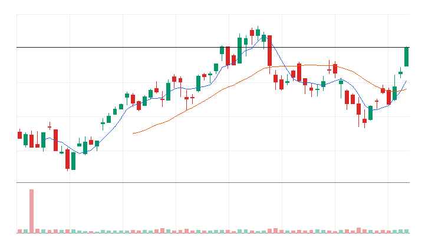

# 오늘의 데일리 트레이딩 요약

**REAL DATA TEST - 가격/거래량은 실제 데이터, 뉴스/ETF 구성종목 확산도/거래대금 유동성 일부 연결**

**목적:** 이 리포트는 최근 오른 자산을 나열하는 것이 아니라, 돈이 몰리는 근거와 다음 매수 주체가 확인할 트레이딩 후보를 찾기 위한 보고서다.

> 핵심 질문: 현재 가격에서 누가 사고 있고, 누가 앞으로 더 비싸게 사줄 수 있는가?

## 모바일 요약

[오늘의 데일리 트레이딩 요약]

생성 성공 / 데이터 모드: REAL_TEST

시장:
- 위험선호

시장 지배 서사:
1. Data Storage 자금 유입 - 부상 - Invesco QQQ Trust(QQQ), Seagate Technology Holdings plc(STX), Western Digital Corporation(WDC) 중심으로 5일 +16.65%, 20일 +29.62% 흐름이 형성됨. 직접 촉매 일부 확인.
2. AI 인프라 재가속 - 지배 - Roundhill Memory ETF(DRAM), iShares Semiconductor ETF(SOXX), Eaton(ETN), GE Vernova(GEV) 중심으로 5일 +10.72%, 20일 +17.54% 흐름이 형성됨. 직접 촉매 일부 확인.
3. 반도체 장비 사이클 재평가 - 지배 - iShares Semiconductor ETF(SOXX), Invesco PHLX Semiconductor ETF(SOXQ), Applied Materials Inc.(AMAT), Lam Research Corporation(LRCX) 중심으로 5일 +8.21%, 20일 +28.08% 흐름이 형성됨. 직접 촉매 일부 확인.

트렌드 강도:
1. Data Storage 자금 유입 - TSI 68 - 과열 - 진입품질 낮음
2. AI 인프라 재가속 - TSI 78 - 부상 - 진입품질 관찰
3. 반도체 장비 사이클 재평가 - TSI 69 - 과열 - 진입품질 낮음

오늘 결론:
- Industrials 개별 종목 흐름이 ETF 대비 강한지 확인 필요
- 행동 후보는 linkedNarrative와 함께 확인한다.
- 추격보다 진입 조건 확인 후 접근한다.

오늘 실제 행동 후보:
1. Eaton(ETN)(STOCK) - AI 인프라 재가속 - 52주 고점 부근이라 돌파가 확인되면 신고가 추종 매수가 붙을 수 있음
2. GE Vernova(GEV)(STOCK) - AI 인프라 재가속 - 52주 고점 부근이라 돌파가 확인되면 신고가 추종 매수가 붙을 수 있음
3. Taiwan Semiconductor(TSM)(STOCK) - AI 인프라 재가속 - 52주 고점 부근이라 돌파가 확인되면 신고가 추종 매수가 붙을 수 있음

다크호스 후보:
1. Texas Instruments Incorporated(TXN) - darkHorseScore 75 - 초기 반전
2. Lam Research Corporation(LRCX) - darkHorseScore 70 - 베이스 돌파 확인

ETF 후보 TOP 5:
1. Roundhill Memory ETF(DRAM) - AI 인프라 재가속 - 자금흐름 예외 조건부
2. iShares Semiconductor ETF(SOXX) - AI 인프라 재가속 - 거래량 확인 전 관찰
3. First Trust NASDAQ Clean Edge Smart Grid Infrastructure ETF(GRID) - AI 인프라 재가속 - 관찰
4. Global X U.S. Infrastructure Development ETF(PAVE) - AI 인프라 재가속 - 관찰
5. Invesco PHLX Semiconductor ETF(SOXQ) - AI 인프라 재가속 - 거래량 확인 전 관찰

웹 리포트:
https://yoolcool.github.io/DailyTradingThesisAgent/

## 오늘 결론

- 오늘 결론: 조건부 진입
- 신규 진입 후보: 0개
- 조건부 진입 후보: 6개
- 관찰 후보: 108개
- 주요 제한 요인: Entry Quality < 40, 뉴스 직접성 부족, RVOL 미달
- 주문 판단: 시장가 금지 / 지정가 또는 관찰
- 실전 판단: 진입 후보는 있으나, 전일 고점 돌파와 거래량 확인 후 선별적으로 접근한다.

### 후보 제한 요인 집계

- RVOL < 1.00x: 89개
- 거래대금 유동성 낮음: 11개
- Entry Quality 50~54 near miss: 3개
- Entry Quality 40~49 관찰: 7개
- Entry Quality < 40: 147개
- Exhaustion Risk >= 70: 34개
- ETF breadth 샘플 부족: 37개
- 뉴스 직접성 부족: 100개

## 데이터 신뢰도

- 전체 데이터 신뢰도 등급: LOW
- 분석 신뢰도: LOW
- 주문 실행 신뢰도: LOW
- ETF breadth 신뢰도: LOW
- 신뢰도 해석: 테마 확산 판단 제한, 거래대금 유동성 낮음 또는 확인 불가, 프리/애프터마켓 확인 불가
- 리포트 생성 시각: 2026-06-23 09:07 KST
- 가격 기준 거래일: 2026-06-22 US regular close
- 뉴스 수집 시각: 2026-06-23 09:07 KST
- 가장 최근 뉴스 발행 시각: 2026-06-23 08:28 KST
- 뉴스 신선도 상태: FRESH
- 뉴스 소스: Yahoo Finance RSS, MarketWatch RSS, CNBC Markets RSS, SEC EDGAR RSS, Federal Reserve RSS, Finnhub API
- 뉴스 소스 상태: Yahoo Finance RSS PARTIAL, MarketWatch RSS CONNECTED, CNBC Markets RSS PARTIAL, SEC EDGAR RSS PARTIAL, Federal Reserve RSS CONNECTED, Finnhub API DISABLED
- 뉴스 신뢰도: MEDIUM
- 추천 적용 거래일: 2026-06-22 US regular session
- 가격/거래량 데이터 상태: 연결됨
- 뉴스 데이터 상태: 일부 연결
- ETF 구성종목 확산도 상태: 일부 연결
- ETF 구성종목 샘플 수: 1~4
- 거래대금 유동성 데이터 상태: 일부 연결
- 프리/애프터마켓 데이터 상태: UNAVAILABLE
- 데이터 provider: yfinance, Yahoo Finance RSS, MarketWatch RSS, CNBC Markets RSS, SEC EDGAR RSS, Federal Reserve RSS, Finnhub API, config fallback sample, price-volume dollar-volume fallback
- 실전 사용 경고: 이 리포트는 투자판단 보조용이며, REAL_TEST 모드에서는 일부 데이터가 누락되거나 지연될 수 있다. 실제 주문 전 현재가, 뉴스, 프리마켓/정규장 거래량을 별도 확인해야 한다.

## 0. 시장 상태

- 데이터 모드: REAL_TEST
- 가격/거래량: 연결됨
- 뉴스: 일부 연결
- ETF 구성종목 확산도: 일부 연결
- 거래대금 유동성: 일부 연결
- 생성 시각: 2026년 6월 23일 화요일 AM 9:07
- 시장 상태: 위험선호
- 오늘 돈의 방향: Industrials 개별 종목 흐름이 ETF 대비 강한지 확인 필요
- 강한 테마 TOP 3: 메모리/HBM ETF(100), 반도체 장비/공급망(94), 메모리/HBM(93)
- 데이터 한계:
  - API 또는 provider 상태에 따라 뉴스/ETF 확산도/거래대금 유동성 반영 범위가 달라질 수 있다.
  - 수집 실패 데이터는 점수 반영에서 제외하거나 confidence를 제한한다.
  - reasonConfidence HIGH는 직접 촉매, 가격/거래량, 확산도/유동성 근거가 함께 있을 때만 사용한다.

## 오늘 시장을 지배하는 서사

### 오늘 시장을 지배하는 서사 TOP 3

#### 1. Data Storage 자금 유입
- 상태: 부상
- narrativeScore: 84
- reasonConfidence: MEDIUM
- 근거 ETF: QQQ
- 근거 개별 종목: STX, WDC
- 돈이 몰리는 이유: Data Storage 자금 유입 관련 Invesco QQQ Trust(QQQ)와 Seagate Technology Holdings plc(STX), Western Digital Corporation(WDC)의 5일(+16.65%)·20일(+29.62%) 흐름을 함께 본다. 평균 상대 거래량은 1.25배이고, ETF 확산도는 추가 확인이 필요하다. 직접 뉴스/이벤트가 일부 확인된다.
- 다음 매수 주체: Data Storage 자금 유입을 확인한 섹터 ETF 자금과 상대강도 추종 스윙 자금
- 가장 좋은 트레이딩 수단: ETF 우선: QQQ / 개별 종목 우선: STX, WDC
- 서사가 깨지는 조건: QQQ 20일선 이탈 또는 관련 종목 절반 이상 5일선 이탈
- 오늘 행동: 기존 네러티브와 중복을 확인한 뒤 ETF/대표 종목 동조성이 살아날 때만 관찰 편입

상세 narrativeScore 근거 보기

- rawScore: 84
- ETF 평균 moneyFlowScore: 28
- 개별 종목 평균 moneyFlowScore: 97
- ETF 후보 비율: 0%
- 개별 종목 후보 비율: 100%
- 5일 평균 수익률: +17.00%
- 20일 평균 수익률: +30.00%
- 평균 상대 거래량: 1.00배
- ETF 평균 상대 거래량: 1.00배
- 개별주 평균 상대 거래량: 1.00배
- 52주 고점 근접 후보 비율: 67%
- 뉴스 직접성 점수: 7
- ETF 확산도 점수: -4
- 유동성 점수: 5
- 과열 리스크 차감: 0

#### 2. AI 인프라 재가속
- 상태: 지배
- narrativeScore: 82
- reasonConfidence: LOW
- 근거 ETF: DRAM, SOXX, GRID, SOXQ, PAVE
- 근거 개별 종목: ETN, GEV, VRT, MU, AMD
- 돈이 몰리는 이유: AI 인프라 재가속 관련 Roundhill Memory ETF(DRAM), iShares Semiconductor ETF(SOXX), First Trust NASDAQ Clean Edge Smart Grid Infrastructure ETF(GRID)와 Eaton(ETN), GE Vernova(GEV), Vertiv(VRT), Micron Technology Inc.(MU)의 5일(+10.72%)·20일(+17.54%) 흐름을 함께 본다. 평균 상대 거래량은 0.92배이고, ETF 확산도는 추가 확인이 필요하다. 직접 뉴스/이벤트가 일부 확인된다.
- 다음 매수 주체: AI 인프라 CAPEX와 데이터센터 병목을 사는 반도체/전력망 ETF 자금과 신고가 모멘텀 추종 자금
- 가장 좋은 트레이딩 수단: ETF 우선: SOXX, DRAM / 개별 종목 우선: MU, VRT, ETN
- 서사가 깨지는 조건: SMH/SOXX/DRAM 20일선 이탈, 관련 반도체와 전력 인프라 종목 절반 이상 5일선 이탈
- 오늘 행동: 추격보다 5일선 지지 후 재상승 확인

상세 narrativeScore 근거 보기

- rawScore: 82
- ETF 평균 moneyFlowScore: 72
- 개별 종목 평균 moneyFlowScore: 74
- ETF 후보 비율: 43%
- 개별 종목 후보 비율: 57%
- 5일 평균 수익률: +11.00%
- 20일 평균 수익률: +18.00%
- 평균 상대 거래량: 1.00배
- ETF 평균 상대 거래량: 1.00배
- 개별주 평균 상대 거래량: 1.00배
- 52주 고점 근접 후보 비율: 79%
- 뉴스 직접성 점수: 11
- ETF 확산도 점수: -1
- 유동성 점수: 4
- 과열 리스크 차감: 0

#### 3. 반도체 장비 사이클 재평가
- 상태: 지배
- narrativeScore: 80
- reasonConfidence: LOW
- 근거 ETF: SOXX, SOXQ, SMH
- 근거 개별 종목: AMAT, LRCX, KLAC, ASML
- 돈이 몰리는 이유: 반도체 장비 사이클 재평가 관련 iShares Semiconductor ETF(SOXX), Invesco PHLX Semiconductor ETF(SOXQ), VanEck Semiconductor ETF(SMH)와 Applied Materials Inc.(AMAT), Lam Research Corporation(LRCX), KLA Corporation(KLAC), ASML Holding N.V.(ASML)의 5일(+8.21%)·20일(+28.08%) 흐름을 함께 본다. 평균 상대 거래량은 0.84배이고, ETF 확산도는 추가 확인이 필요하다. 직접 뉴스/이벤트가 일부 확인된다.
- 다음 매수 주체: 반도체 장비 사이클 재평가을 확인한 섹터 ETF 자금과 상대강도 추종 스윙 자금
- 가장 좋은 트레이딩 수단: ETF 우선: SMH, SOXX, SOXQ / 개별 종목 우선: KLAC, ASML, AMAT
- 서사가 깨지는 조건: SMH 20일선 이탈 또는 관련 종목 절반 이상 5일선 이탈
- 오늘 행동: 기존 네러티브와 중복을 확인한 뒤 ETF/대표 종목 동조성이 살아날 때만 관찰 편입

상세 narrativeScore 근거 보기

- rawScore: 80
- ETF 평균 moneyFlowScore: 66
- 개별 종목 평균 moneyFlowScore: 84
- ETF 후보 비율: 0%
- 개별 종목 후보 비율: 50%
- 5일 평균 수익률: +8.00%
- 20일 평균 수익률: +28.00%
- 평균 상대 거래량: 1.00배
- ETF 평균 상대 거래량: 1.00배
- 개별주 평균 상대 거래량: 1.00배
- 52주 고점 근접 후보 비율: 100%
- 뉴스 직접성 점수: 10
- ETF 확산도 점수: -1
- 유동성 점수: 4
- 과열 리스크 차감: 0

### 전체 narrative 요약

| 서사명 | 상태 | narrativeScore | reasonConfidence | 대표 ETF | 대표 종목 | 오늘 행동 |
| --- | --- | ---: | --- | --- | --- | --- |
| Data Storage 자금 유입 | 부상 | 84 | MEDIUM | QQQ | STX, WDC | 기존 네러티브와 중복을 확인한 뒤 ETF/대표 종목 동조성이 살아날 때만 관찰 편입 |
| AI 인프라 재가속 | 지배 | 82 | LOW | DRAM, SOXX, GRID | ETN, GEV, VRT, MU | 추격보다 5일선 지지 후 재상승 확인 |
| 반도체 장비 사이클 재평가 | 지배 | 80 | LOW | SOXX, SOXQ, SMH | AMAT, LRCX, KLAC, ASML | 기존 네러티브와 중복을 확인한 뒤 ETF/대표 종목 동조성이 살아날 때만 관찰 편입 |
| 반도체 설계/공급망 재가속 | 약화 | 59 | LOW | SOXX, SOXQ, SMH | INTC, AMD, MRVL, ADI | 기존 네러티브와 중복을 확인한 뒤 ETF/대표 종목 동조성이 살아날 때만 관찰 편입 |
| 전력망/원전/인프라 병목 | 약화 | 49 | LOW | GRID, PAVE, IFRA | ETN, GEV, VRT, PWR | ETF 확산도와 거래량이 같이 살아날 때만 진입 |
| 위험선호 성장주 재진입 | 약화 | 23 | LOW | IPO, QQQ, ARKK | ARM, TSLA, COIN | 지수 위험선호가 유지될 때만 선별 진입 |
| 비트코인/디지털 자산 위험선호 | 약화 | 19 | LOW | BLOK, IBIT | RIOT, MARA, CIFR, MSTR | 비트코인 베타가 살아날 때만 단기 매매 |
| 소프트웨어 실적/AI 수익화 | 약화 | 13 | LOW | AIQ, QQQ, IGV | CDNS, DDOG | 기존 네러티브와 중복을 확인한 뒤 ETF/대표 종목 동조성이 살아날 때만 관찰 편입 |
| 사이버보안 지출 재가속 | 약화 | 3 | LOW | CIBR, HACK, IHAK | PANW, FTNT, CRWD | 기존 네러티브와 중복을 확인한 뒤 ETF/대표 종목 동조성이 살아날 때만 관찰 편입 |
| 방산/안보 프리미엄 | 소멸 | 0 | LOW | ITA, XAR, SHLD | AVAV, KTOS, PLTR | 뉴스 촉매가 직접 확인될 때만 추세 추종 |
| AI 소프트웨어/사이버보안 확산 | 소멸 | 0 | LOW | AIQ, QQQ, IGV | PLTR, DDOG, TEAM, MSFT | 추격보다 눌림 후 재상승 확인 |
| 매크로 방어/헤지 | 소멸 | 0 | LOW | TLT, GLD, XLE | XOM, CVX | 위험회피가 확인될 때만 헤지성 접근 |

## 트렌드 강도 판단

### 1. Data Storage 자금 유입
- Trend Strength Index: 68
- 트렌드 상태 라벨: 과열
- 테마 확산도: 약함
- ETF 동조성: 보통
- 거래량 강도: 보통
- 과열 위험: 높음 (82)
- 오늘 진입 품질: 낮음 (22)
- 한 줄 판단: Data Storage 자금 유입는 관찰 가능한 흐름은 있으나 가격, 거래량, 확산도 중 일부 확인이 더 필요하다.
- 오늘 접근법: Invesco QQQ Trust(QQQ)가 5일선 위에서 눌림 후 재상승하고 Seagate Technology Holdings plc(STX)/Western Digital Corporation(WDC)의 종가 유지가 확인될 때만 진입 품질이 좋아진다.

트렌드 강도 상세 근거 보기

- 가격 모멘텀: 가격 모멘텀 28/25. 평균 5D +16.65%, 20D +29.62%.
- 거래량 강도: 거래량 강도 11/20. 평균 RVOL 1.25배.
- ETF 동조성: ETF 동조성 11/15. 관련 ETF Invesco QQQ Trust(QQQ) 흐름을 기준으로 판단.
- 테마 확산도: 테마 확산도 9/20. 상위 1~2개 쏠림 감점 6점 반영.
- 뉴스 촉매: 뉴스/촉매 신선도 3/10. HIGH 직접 촉매 2개.
- 과열 리스크: 과열 리스크 82/100. 단기 급등, 고점 근접, ETF-개별주 괴리, 쏠림을 함께 반영.
- 시장 환경: 시장 환경 6/10. QQQ/SPY/IWM 가격 흐름 기반 위험선호 점수.

### 2. AI 인프라 재가속
- Trend Strength Index: 78
- 트렌드 상태 라벨: 부상
- 테마 확산도: 보통
- ETF 동조성: 강함
- 거래량 강도: 약함
- 과열 위험: 보통 (36)
- 오늘 진입 품질: 관찰 (54)
- 한 줄 판단: AI 인프라 재가속는 돈이 강하게 몰리지만 오늘 진입 품질은 아직 제한적이라 추격보다 조건 확인이 필요하다.
- 오늘 접근법: Roundhill Memory ETF(DRAM)/iShares Semiconductor ETF(SOXX)/First Trust NASDAQ Clean Edge Smart Grid Infrastructure ETF(GRID) 거래량 증가와 Eaton(ETN)/GE Vernova(GEV)/Vertiv(VRT) 확산을 확인하며 작은 사이즈의 초기 진입 후보로만 본다.

트렌드 강도 상세 근거 보기

- 가격 모멘텀: 가격 모멘텀 28/25. 평균 5D +10.72%, 20D +17.54%.
- 거래량 강도: 거래량 강도 6/20. 평균 RVOL 0.92배.
- ETF 동조성: ETF 동조성 15/15. 관련 ETF VanEck Semiconductor ETF(SMH), iShares Semiconductor ETF(SOXX), Invesco PHLX Semiconductor ETF(SOXQ), Roundhill Memory ETF(DRAM), First Trust NASDAQ Clean Edge Smart Grid Infrastructure ETF(GRID), Global X U.S. Infrastructure Development ETF(PAVE), Global X Artificial Intelligence & Technology ETF(AIQ) 흐름을 기준으로 판단.
- 테마 확산도: 테마 확산도 14/20. 상위 1~2개 쏠림 감점 0점 반영.
- 뉴스 촉매: 뉴스/촉매 신선도 9/10. HIGH 직접 촉매 2개.
- 과열 리스크: 과열 리스크 36/100. 단기 급등, 고점 근접, ETF-개별주 괴리, 쏠림을 함께 반영.
- 시장 환경: 시장 환경 6/10. QQQ/SPY/IWM 가격 흐름 기반 위험선호 점수.

### 3. 반도체 장비 사이클 재평가
- Trend Strength Index: 69
- 트렌드 상태 라벨: 과열
- 테마 확산도: 강함
- ETF 동조성: 강함
- 거래량 강도: 부족
- 과열 위험: 주의 (53)
- 오늘 진입 품질: 낮음 (35)
- 한 줄 판단: 반도체 장비 사이클 재평가는 가격, 거래량, ETF, 확산도가 함께 확인되어 테마 단위 자금 유입이 선명하다.
- 오늘 접근법: iShares Semiconductor ETF(SOXX)/Invesco PHLX Semiconductor ETF(SOXQ)/VanEck Semiconductor ETF(SMH)가 5일선 위에서 눌림 후 재상승하고 Applied Materials Inc.(AMAT)/Lam Research Corporation(LRCX)/KLA Corporation(KLAC)의 종가 유지가 확인될 때만 진입 품질이 좋아진다.

트렌드 강도 상세 근거 보기

- 가격 모멘텀: 가격 모멘텀 25/25. 평균 5D +8.21%, 20D +28.08%.
- 거래량 강도: 거래량 강도 4/20. 평균 RVOL 0.84배.
- ETF 동조성: ETF 동조성 15/15. 관련 ETF VanEck Semiconductor ETF(SMH), iShares Semiconductor ETF(SOXX), Invesco PHLX Semiconductor ETF(SOXQ), Global X Artificial Intelligence & Technology ETF(AIQ) 흐름을 기준으로 판단.
- 테마 확산도: 테마 확산도 16/20. 상위 1~2개 쏠림 감점 0점 반영.
- 뉴스 촉매: 뉴스/촉매 신선도 3/10. HIGH 직접 촉매 1개.
- 과열 리스크: 과열 리스크 53/100. 단기 급등, 고점 근접, ETF-개별주 괴리, 쏠림을 함께 반영.
- 시장 환경: 시장 환경 6/10. QQQ/SPY/IWM 가격 흐름 기반 위험선호 점수.

## 최근 추천 결과 트래킹

개별주는 데이트레이딩 관점으로 추천 이후 첫 정규장의 장중 최고가와 종가를 추적한다. ETF는 테마/스윙 관점으로 추천 이후 1주일 동안의 최고가와 현재 종가를 추적한다.

### 개별주 Top 3 추천 성과 요약
- 최근 5개 리포트 표본: 16개 (초기 검증 단계)
- 장중 최고가 기준 성공률: +40.00%
- 종가 기준 성공률: +60.00%
- 평균 장중 최고 수익률: +3.05%
- 평균 종가 수익률: +1.11%

### ETF 추천 성과 요약
- 최근 5개 리포트 표본: 9개 (초기 검증 단계)
- 1주 최고가 기준 성공률: +40.00%
- 현재 종가 기준 성공률: +66.67%
- 평균 1주 최고 수익률: +0.82%
- 평균 현재 수익률: +1.82%

최근 추천 결과 상세 테이블 펼치기

| 추천일 | 유형 | 순위 | 티커 | 기준가 | 추적 기간 | 상태 | High 수익률 | Close 수익률 | 결과 | 코멘트 |
| --- | --- | ---: | --- | ---: | --- | --- | ---: | ---: | --- | --- |
| 2026-06-23 | STOCK | 3 | TSM | $467.67 | 2026-06-23 | pending | 데이터 없음 | 데이터 없음 | 추적 대기 | 아직 추적 거래일 데이터가 완성되지 않음 |
| 2026-06-23 | STOCK | 2 | GEV | $1,127.59 | 2026-06-23 | pending | 데이터 없음 | 데이터 없음 | 추적 대기 | 아직 추적 거래일 데이터가 완성되지 않음 |
| 2026-06-23 | STOCK | 1 | ETN | $435.78 | 2026-06-23 | pending | 데이터 없음 | 데이터 없음 | 추적 대기 | 아직 추적 거래일 데이터가 완성되지 않음 |
| 2026-06-23 | ETF | 1 | DRAM | $80.72 | 2026-06-23~2026-06-30 | in_progress | 데이터 없음 | 0.00% | 진행 중 | 아직 1주 추적 기간이 끝나지 않음 (일봉 high 미확보 시 close 기준 보조) |
| 2026-06-22 | STOCK | 3 | ARM | $439.46 | 2026-06-22 | complete | +1.25% | -7.22% | 제한적 유효 | 제한적인 장중 기회만 발생 (일봉 기준) |
| 2026-06-22 | STOCK | 2 | GEV | $1,109.73 | 2026-06-22 | complete | +2.74% | +1.61% | 제한적 유효 | 제한적인 장중 기회만 발생 (일봉 기준) |
| 2026-06-22 | STOCK | 1 | ETN | $421.77 | 2026-06-22 | complete | +3.55% | +3.32% | 성공 | 장중 기회와 종가 유지가 모두 확인됨 (일봉 기준) |
| 2026-06-22 | ETF | 3 | IFRA | $61.99 | 2026-06-22~2026-06-29 | in_progress | 데이터 없음 | +1.32% | 진행 중 | 아직 1주 추적 기간이 끝나지 않음 (일봉 high 미확보 시 close 기준 보조) |
| 2026-06-22 | ETF | 2 | SMH | $659.88 | 2026-06-22~2026-06-29 | in_progress | 데이터 없음 | +1.37% | 진행 중 | 아직 1주 추적 기간이 끝나지 않음 (일봉 high 미확보 시 close 기준 보조) |
| 2026-06-22 | ETF | 1 | DRAM | $76.71 | 2026-06-22~2026-06-29 | in_progress | 데이터 없음 | +5.23% | 진행 중 | 아직 1주 추적 기간이 끝나지 않음 (일봉 high 미확보 시 close 기준 보조) |
| 2026-06-19 | STOCK | 3 | AMD | $537.37 | 2026-06-19 | pending | 데이터 없음 | 데이터 없음 | 추적 대기 | 아직 추적 거래일 데이터가 완성되지 않음 |
| 2026-06-19 | STOCK | 2 | ARM | $439.46 | 2026-06-19 | pending | 데이터 없음 | 데이터 없음 | 추적 대기 | 아직 추적 거래일 데이터가 완성되지 않음 |
| 2026-06-19 | STOCK | 1 | GEV | $1,109.73 | 2026-06-19 | pending | 데이터 없음 | 데이터 없음 | 추적 대기 | 아직 추적 거래일 데이터가 완성되지 않음 |
| 2026-06-19 | ETF | 1 | DRAM | $76.71 | 2026-06-19~2026-06-26 | in_progress | +6.04% | +5.23% | 진행 중 | 아직 1주 추적 기간이 끝나지 않음 |
| 2026-06-18 | STOCK | 3 | ASML | $1,867.83 | 2026-06-18 | complete | +4.02% | +3.31% | 성공 | 장중 기회와 종가 유지가 모두 확인됨 (일봉 기준) |
| 2026-06-18 | STOCK | 3 | FCX | $69.06 | 2026-06-18 | complete | +2.26% | -0.55% | 제한적 유효 | 제한적인 장중 기회만 발생 (일봉 기준) |
| 2026-06-18 | STOCK | 2 | KLAC | $238.73 | 2026-06-18 | complete | +10.56% | +8.73% | 성공 | 장중 기회와 종가 유지가 모두 확인됨 (일봉 기준) |
| 2026-06-18 | STOCK | 1 | LRCX | $374.18 | 2026-06-18 | complete | +7.17% | +3.97% | 성공 | 장중 기회와 종가 유지가 모두 확인됨 (일봉 기준) |
| 2026-06-18 | ETF | 1 | SOXQ | $106.13 | 2026-06-18~2026-06-25 | in_progress | +8.67% | +8.46% | 진행 중 | 아직 1주 추적 기간이 끝나지 않음 |
| 2026-06-04 | STOCK | 3 | PANW | $280.43 | 2026-06-04 | complete | +0.10% | -0.42% | 실패 | 추천 이후 의미 있는 장중 기회가 부족하고 종가도 약함 (일봉 기준) |
| 2026-06-04 | STOCK | 2 | FTNT | $146.48 | 2026-06-04 | complete | +2.45% | +2.18% | 제한적 유효 | 제한적인 장중 기회만 발생 (일봉 기준) |
| 2026-06-04 | STOCK | 1 | CRWD | $747.61 | 2026-06-04 | complete | -3.56% | -3.81% | 실패 | 추천 이후 의미 있는 장중 기회가 부족하고 종가도 약함 (일봉 기준) |
| 2026-06-04 | ETF | 3 | HACK | $102.21 | 2026-06-04~2026-06-11 | complete | -1.66% | -7.27% | 실패 | 추천 이후 ETF 흐름이 약화됨 |
| 2026-06-04 | ETF | 2 | SOXQ | $109.58 | 2026-06-04~2026-06-11 | complete | -4.68% | +5.05% | 진행 중 | 아직 1주 추적 기간이 끝나지 않음 |
| 2026-06-04 | ETF | 1 | AIQ | $69.16 | 2026-06-04~2026-06-11 | complete | -4.29% | -2.99% | 실패 | 추천 이후 ETF 흐름이 약화됨 |
| 2026-06-03 | STOCK | 3 | FTNT | $148.86 | 2026-06-03 | complete | -0.26% | -1.60% | 실패 | 추천 이후 의미 있는 장중 기회가 부족하고 종가도 약함 (일봉 기준) |
| 2026-06-03 | STOCK | 3 | CRWD | $768.95 | 2026-06-03 | complete | -0.25% | -2.78% | 실패 | 추천 이후 의미 있는 장중 기회가 부족하고 종가도 약함 (일봉 기준) |
| 2026-06-03 | STOCK | 2 | MRVL | $290.79 | 2026-06-03 | complete | +11.49% | +3.73% | 성공 | 장중 기회와 종가 유지가 모두 확인됨 (일봉 기준) |
| 2026-06-03 | STOCK | 1 | PANW | $297.18 | 2026-06-03 | complete | -3.09% | -5.64% | 실패 | 추천 이후 의미 있는 장중 기회가 부족하고 종가도 약함 (일봉 기준) |
| 2026-06-03 | ETF | 3 | DRAM | $69.57 | 2026-06-03~2026-06-10 | complete | -3.52% | +16.03% | 진행 중 | 아직 1주 추적 기간이 끝나지 않음 |
| 2026-06-03 | ETF | 3 | IGV | $104.73 | 2026-06-03~2026-06-10 | complete | -3.31% | -16.63% | 실패 | 추천 이후 ETF 흐름이 약화됨 |
| 2026-06-03 | ETF | 2 | AIQ | $70.14 | 2026-06-03~2026-06-10 | complete | -2.32% | -4.35% | 실패 | 추천 이후 ETF 흐름이 약화됨 |
| 2026-06-03 | ETF | 1 | CIBR | $94.32 | 2026-06-03~2026-06-10 | complete | -3.56% | -11.39% | 실패 | 추천 이후 ETF 흐름이 약화됨 |

## 오늘 실제 행동 후보

### 1. Eaton(ETN)
- 자산 유형: STOCK
- linkedNarrative: AI 인프라 재가속
- narrativeStatus: 지배
- narrativeScore: 82
- Trend Strength Index: 78
- Exhaustion Risk: 36 (보통)
- Entry Quality Score: 52 (관찰)
- 트렌드 판단: 시장 위험선호가 약해 시장 환경 비우호 구간이다.
- moneyFlowScore: 100
- finalRawScore: 103
- reasonConfidence: HIGH
- reasonConfidenceExplanation: 직접 촉매: Yahoo Finance RSS / product / under_6h / positive - Eaton Corporation to Merge Mobility Business with Dana 가격/거래량, 관련 ETF 동반 강세, 유동성 근거가 함께 확인되어 HIGH로 분류했다.
- tieBreakerReason: 최종 원점수 103, 리스크 패널티 0, 5일 수익률 +11.34%, 상대 거래량 1.02배 순으로 정렬
- 후보별 시장 해석: 위험선호 / 제한적 - 전체 시장은 위험선호 / 고점 근처 추격 리스크
- 게이트 사유: 통과
- 주문 실행: 시장가 가능
- 직접 촉매: Yahoo Finance RSS / product / under_6h / positive - Eaton Corporation to Merge Mobility Business with Dana
- 왜 돈이 몰리는가: 20일 +14.23%, 5일 +11.34%, 상대 거래량 1.02배로 가격과 거래량이 함께 개선. 뉴스: Yahoo Finance RSS product/under_6h / 유동성: LIQUID
- 누가 더 비싸게 사줄 수 있는지: 개별 주도주를 따라붙는 단기 모멘텀 자금과 관련 ETF 강세를 확인한 트레이더
- 진입 조건: 전일 고점 돌파와 5일선 유지 확인
- 무효화 조건: 20일선 이탈 또는 상대 거래량 0.8배 이하 둔화
- todayActionLabel: 조건부 진입
- 차트: 

### 2. GE Vernova(GEV)
- 자산 유형: STOCK
- linkedNarrative: AI 인프라 재가속
- narrativeStatus: 지배
- narrativeScore: 82
- Trend Strength Index: 78
- Exhaustion Risk: 36 (보통)
- Entry Quality Score: 51 (관찰)
- 트렌드 판단: 시장 위험선호가 약해 시장 환경 비우호 구간이다.
- moneyFlowScore: 92
- finalRawScore: 92
- reasonConfidence: HIGH
- reasonConfidenceExplanation: 직접 촉매: Yahoo Finance RSS / product / under_6h / positive - GE Vernova (GEV) – Among the 13 Best Electrical Infrastructure Stocks to Buy in 2026 가격/거래량, 관련 ETF 동반 강세, 유동성 근거가 함께 확인되어 HIGH로 분류했다.
- tieBreakerReason: 최종 원점수 92, 리스크 패널티 -6, 5일 수익률 +19.87%, 상대 거래량 1.07배 순으로 정렬
- 후보별 시장 해석: 위험선호 / 제한적 - 전체 시장은 위험선호
- 게이트 사유: 통과
- 주문 실행: 시장가 가능
- 직접 촉매: Yahoo Finance RSS / product / under_6h / positive - GE Vernova (GEV) – Among the 13 Best Electrical Infrastructure Stocks to Buy in 2026
- 왜 돈이 몰리는가: 20일 +8.03%, 5일 +19.87%, 상대 거래량 1.07배로 가격과 거래량이 함께 개선. 뉴스: Yahoo Finance RSS product/under_6h / 유동성: LIQUID
- 누가 더 비싸게 사줄 수 있는지: 개별 주도주를 따라붙는 단기 모멘텀 자금과 관련 ETF 강세를 확인한 트레이더
- 진입 조건: 전일 고점 돌파와 5일선 유지 확인
- 무효화 조건: 20일선 이탈 또는 상대 거래량 0.8배 이하 둔화
- todayActionLabel: 조건부 진입
- 차트: 

### 3. Taiwan Semiconductor(TSM)
- 자산 유형: STOCK
- linkedNarrative: AI 인프라 재가속
- narrativeStatus: 지배
- narrativeScore: 82
- Trend Strength Index: 78
- Exhaustion Risk: 36 (보통)
- Entry Quality Score: 53 (관찰)
- 트렌드 판단: 시장 위험선호가 약해 시장 환경 비우호 구간이다.
- moneyFlowScore: 100
- finalRawScore: 103
- reasonConfidence: HIGH
- reasonConfidenceExplanation: 직접 촉매: Yahoo Finance RSS / general_market / under_6h / neutral - TSMC (TSM) Advances While Market Declines: Some Information for Investors 가격/거래량, 관련 ETF 동반 강세, 유동성 근거가 함께 확인되어 HIGH로 분류했다.
- tieBreakerReason: 최종 원점수 103, 리스크 패널티 0, 5일 수익률 +10.32%, 상대 거래량 1.03배 순으로 정렬
- 후보별 시장 해석: 위험선호 / 제한적 - 전체 시장은 위험선호
- 게이트 사유: 통과
- 주문 실행: 시장가 가능
- 직접 촉매: Yahoo Finance RSS / general_market / under_6h / neutral - TSMC (TSM) Advances While Market Declines: Some Information for Investors
- 왜 돈이 몰리는가: 20일 +14.86%, 5일 +10.32%, 상대 거래량 1.03배로 가격과 거래량이 함께 개선. 뉴스: Yahoo Finance RSS general_market/under_6h / 유동성: LIQUID
- 누가 더 비싸게 사줄 수 있는지: 개별 주도주를 따라붙는 단기 모멘텀 자금과 관련 ETF 강세를 확인한 트레이더
- 진입 조건: 전일 고점 돌파와 5일선 유지 확인
- 무효화 조건: 20일선 이탈 또는 상대 거래량 0.8배 이하 둔화
- todayActionLabel: 조건부 진입
- 차트: 

## 다크호스 후보

> 메인 행동 후보를 대체하지 않는 보조 관찰 섹션이다. 상위 서사 안에서 아직 과열되지 않았지만 초기 추세 전환, 베이스 돌파, 거래량 회복이 시작되는 개별주만 표시한다.

### 1. Texas Instruments Incorporated(TXN)
- 소속 서사: AI 인프라 재가속
- darkHorseScore: 75 (다크호스 후보)
- 단계: 초기 반전
- Confidence: LOW
- 5D / 20D / RVOL: +10.35% / +11.36% / 0.94x
- MA 구조: 종가 $332.28 / MA5 $315.21 / MA20 $305.47
- 선정 이유: TXN는 AI 인프라 재가속 서사에 속하고 종가가 MA20 위에 있으며 MA5/MA20 정렬이 개선되고 있다. 최근 15거래일 베이스는 상단 돌파 상태이고, RVOL 0.94x로 거래량 확인은 아직 약하다. Exhaustion Risk 36로 아직 메인 후보 대비 과열 상한 안에 있다.
- 확인 조건: 돌파 후 고점 위 안착 유지, RVOL 1.20x 이상 재증가, MA5 위 종가 유지, 관련 ETF 동반 강세
- 무효화 조건: MA20 $305.47 종가 이탈, 최근 스윙 저점 $273.88 이탈, RVOL 0.80x 이하 둔화
- 왜 아직 메인이 아닌가: Entry Quality 37 < 50, moneyFlowScore 55 < 75, RVOL 0.94x < 1.20x

darkHorseScore 상세 근거 보기

- 서사 정렬: 17/20
- 초기 추세 구조: 30/30
- 베이스 돌파/정돈: 13/20
- 거래량 확인: 7/15
- 낮은 과열: 6/10
- 유동성 리스크 보정: 2/5
- 리스크 차감: -0
- rawScore: 75

- 차트: 

### 2. Lam Research Corporation(LRCX)
- 소속 서사: 반도체 장비 사이클 재평가
- darkHorseScore: 70 (다크호스 후보)
- 단계: 베이스 돌파 확인
- Confidence: LOW
- 5D / 20D / RVOL: +11.65% / +35.50% / 1.23x
- MA 구조: 종가 $409.54 / MA5 $386.2 / MA20 $342.59
- 선정 이유: LRCX는 반도체 장비 사이클 재평가 서사에 속하고 종가가 MA20 위에 있으며 MA5/MA20 정렬이 개선되고 있다. 최근 15거래일 베이스는 상단 돌파 상태이고, RVOL 1.23x로 거래량 확인은 충분하다. Exhaustion Risk 53로 아직 메인 후보 대비 과열 상한 안에 있다.
- 확인 조건: 돌파 후 고점 위 안착 유지, MA5 위 종가 유지, 관련 ETF 동반 강세
- 무효화 조건: MA20 $342.59 종가 이탈, 최근 스윙 저점 $306.01 이탈, RVOL 0.80x 이하 둔화
- 왜 아직 메인이 아닌가: Entry Quality 36 < 50

darkHorseScore 상세 근거 보기

- 서사 정렬: 17/20
- 초기 추세 구조: 24/30
- 베이스 돌파/정돈: 11/20
- 거래량 확인: 14/15
- 낮은 과열: 3/10
- 유동성 리스크 보정: 5/5
- 리스크 차감: -4
- rawScore: 70

- 차트: 

## 오늘 돈이 몰리는 테마

- 메모리/HBM ETF: DRAM | 평균 moneyFlowScore 100 | 단일 종목 이벤트보다 테마 단위 자금 흐름이 선명한 구간으로 본다.
- 반도체 장비/공급망: LRCX, AMAT, KLAC | 평균 moneyFlowScore 94 | 단일 종목 이벤트보다 테마 단위 자금 흐름이 선명한 구간으로 본다.
- 메모리/HBM: MU, STX, WDC | 평균 moneyFlowScore 93 | 단일 종목 이벤트보다 테마 단위 자금 흐름이 선명한 구간으로 본다.
- 전력망 인프라 ETF: GRID | 평균 moneyFlowScore 73 | 추세는 확인되지만 선별 진입이 필요한 중간 강도의 테마로 본다.
- AI 반도체 ETF: SMH, SOXX, SOXQ | 평균 moneyFlowScore 72 | 추세는 확인되지만 선별 진입이 필요한 중간 강도의 테마로 본다.
- 인프라 ETF: PAVE, IFRA | 평균 moneyFlowScore 66 | 추세는 확인되지만 선별 진입이 필요한 중간 강도의 테마로 본다.

## 1. ETF 트레이딩 보고서
### 1-1. ETF 결론
- ETF 우선 후보: 없음
- ETF 관찰 후보: VanEck Semiconductor ETF(SMH), iShares Semiconductor ETF(SOXX), Invesco PHLX Semiconductor ETF(SOXQ), Global X Artificial Intelligence & Technology ETF(AIQ), Global X Robotics & Artificial Intelligence ETF(BOTZ)
- ETF 매매 금지: iShares Expanded Tech-Software Sector ETF(IGV), Global X Robotics & Artificial Intelligence ETF(BOTZ), Amplify Cybersecurity ETF(HACK), iShares Cybersecurity and Tech ETF(IHAK), Global X Defense Tech ETF(SHLD)
- 오늘 ETF 최우선 1개: Roundhill Memory ETF(DRAM) - 전일 고점 돌파와 5일선 유지 확인
- ETF 섹션 해석: 이 섹션은 개별 종목 선택이 아니라 테마/섹터 단위 자금 흐름을 ETF로 매매할지 판단하기 위한 영역이다.

### 1-2. ETF 후보 TOP 5

선정 기준: ETF 후보는 가격/거래량 1차 점수에 뉴스, ETF 구성종목 확산도, 유동성, 리스크 패널티를 반영한 finalRawScore 기준으로 정렬한다. 표시 점수 100점 후보가 겹치면 tieBreakerReason으로 우선순위를 설명한다.

### [ETF] Roundhill Memory ETF(DRAM)
- 자산 유형: ETF
- ETF 세부 카테고리: 메모리/HBM ETF
- ETF 역할: 테마 베타 매수
- 상태: 진입 후보
- linkedNarrative: AI 인프라 재가속
- narrativeStatus: 지배
- narrativeScore: 82
- moneyFlowScore: 100
- finalRawScore: 110
- tieBreakerReason: 최종 원점수 110, 리스크 패널티 -6, 5일 수익률 +24.17%, 상대 거래량 1.26배 순으로 정렬
- 과열 리스크: 낮음~중간
- reasonConfidence: MEDIUM
- reasonConfidenceExplanation: ETF 확산도 제한 때문에 HIGH가 아니라 MEDIUM으로 제한했다.

- todayActionLabel: 자금흐름 예외 조건부
- 주문 실행: 시장가 가능
- 기준일: 2026-06-22
- 종가: $80.72
- 1일 수익률: +5.23%
- 5일 수익률: +24.17%
- 20일 수익률: +48.55%
- 상대 거래량: 1.26배
- 52주 고점 대비 위치: -0.76%
- whyMoneyIsFlowing: 20일 +48.55%, 5일 +24.17%, 상대 거래량 1.26배로 가격과 거래량이 함께 개선. 뉴스: CNBC Markets RSS general_market/under_6h / 유동성: LIQUID
- likelyNextBuyer: 섹터 베타를 노리는 단기 모멘텀 자금과 리밸런싱 자금
- whyThisCouldTradeHigher: 52주 고점 부근이라 돌파가 확인되면 신고가 추종 매수가 붙을 수 있음
- 진입 조건: 전일 고점 돌파와 5일선 유지 확인
- 무효화 조건: 20일선 이탈 또는 상대 거래량 0.8배 이하 둔화
- 차트: 

#### 상세 근거

Roundhill Memory ETF(DRAM) 상세 근거 펼치기

- moneyFlowScore(최종) 산정 근거:
  - moneyFlowScore(1차): 99
  - 최종 원점수: 110
  - 최종 표시 점수: 100
  - cap 적용: raw score 110 capped to displayed score 100
  - 계산식: +99 + +12 + 0 + +5 + 0 - 6 + 0 = 110 -> 100
  - 점수 해석: 강한 자금 유입 후보. 단, 과열 여부 확인 필수.
  - 가격/거래량 1차 점수: +99
    - 추세: +25
    - 단기 모멘텀: +18
    - 중기 모멘텀: +16
    - 거래량: +14
    - 신고가 근접: +12
    - 이동평균: +14
  - 하위 점수 cap:
    - 가격 모멘텀: 원점수 +30, 상한 적용 +25 / 최대 25 (cap 적용)
    - 단기 모멘텀: 원점수 +18, 상한 적용 +18 / 최대 20
    - 중기 모멘텀: 원점수 +32, 상한 적용 +16 / 최대 16 (cap 적용)
    - 거래량: 원점수 +14, 상한 적용 +14 / 최대 20
    - 신고가 근접: 원점수 +12, 상한 적용 +12 / 최대 12
    - 이동평균: 원점수 +14, 상한 적용 +14 / 최대 14
  - 추가 데이터 가감점:
    - 뉴스: +12
    - 유동성: +5
  - ETF 확산도: 0
  - 리스크 패널티: -6
  - 주요 근거: 1차 99, 최종 원점수 110, 표시 100. 20일 수익률 강함, 5일 수익률 강함, 1일 단기 모멘텀 확인. 주의: 단기 과열/추격 위험 존재, ETF 구성종목 확산도 데이터 미연결.
  - 리스크 패널티 산정 근거:
    - 총 리스크 패널티: -6
    - 리스크 등급: LOW
    - 감점된 리스크:
      - short-term overheat: -6 | 근거: 5d return +24.17% is extended. | 대응: Prefer pullback or prior high reclaim over chasing.
    - 관찰 리스크: ETF breadth data not connected
    - 한 줄 해석: 1개 감점 리스크로 총 -6점 반영.
- 데이터 사용 현황:
  - 가격/거래량: 사용
  - 뉴스: 사용
  - ETF 확산도: 미연결
  - 거래대금 유동성: 사용
  - 관련 ETF 상대강도: 사용
- 뉴스 확인:
  - 최근 뉴스 상태: 일부 연결
  - 뉴스 소스: CNBC Markets RSS, MarketWatch RSS
  - 소스별 상태: Yahoo Finance RSS CONNECTED; MarketWatch RSS CONNECTED; CNBC Markets RSS CONNECTED; SEC EDGAR RSS PARTIAL; Federal Reserve RSS CONNECTED; Finnhub API DISABLED
  - 긍정/중립/부정: 8/8/0
  - 직접성/방향성/신선도: 2/1/4
  - 강한 촉매 수: 2
  - 중요 공시 수: 0
  - 직접 촉매: 없음
  - 보조 뉴스: CNBC Markets RSS sector_theme / general_market / under_6h
  - 뉴스 수집 시각: 2026-06-23 09:07 KST
  - 가장 최근 뉴스 발행 시각: 2026-06-23 08:28 KST
  - 뉴스 신선도 상태: FRESH
  - 뉴스 이후 가격 반응: 긍정
  - 가격 반응 점수 제한: 뉴스 이후 가격 반응과 점수 제한 특이사항 없음
  - 핵심 뉴스 요약: Beijing is summoning executives again, but here&apos;s why that&apos;s causing less worry than in 2021
  - 원점수/상한 점수: +19 / +12
  - 점수 반영: +12
  - 주의: SEC EDGAR RSS: no matching RSS items; Finnhub API: FINNHUB_API_KEY not configured
- ETF 구성종목 확산도:
  - 구성종목 데이터 상태: 미연결
  - 샘플 수: 0/0
  - 샘플 신뢰도: UNKNOWN
  - 상승 종목 비율: 데이터 없음
  - 20일선 위 비율: 데이터 없음
  - 50일선 위 비율: 데이터 없음
  - 상위 기여 종목: 데이터 없음
  - 확산도 판단: UNKNOWN
  - 원점수/샘플 상한/반영 점수: 0 / N/A / 0
  - 점수 반영: 0
- 거래대금 유동성:
  - 데이터 상태: 일부 연결
  - 거래대금 기준 유동성: LIQUID
  - 거래대금: $4,444,867,868
  - 평균 거래대금: $3,538,307,763
  - 주문 영향: 시장가 가능
  - 매매 영향: 거래대금이 충분해 시장가 가능 범위로 본다
- reasonConfidence 근거: 가격/거래량, 뉴스, 거래대금 유동성, 관련 ETF 상대강도은 확인됐지만 일부 보조 데이터가 미연결 또는 fallback이라 중간으로 제한한다.
- 차트 요약: 최근 20거래일 기준 5일선이 20일선 위에 있음
- 기준일 2026-06-22 | 종가 $80.72 | 1일 +5.23% | 5일 +24.17% | 20일 +48.55% | 상대 거래량 1.26배 | 52주 고점 대비 -0.76% | 데이터 소스: yfinance

### [ETF] iShares Semiconductor ETF(SOXX)
- 자산 유형: ETF
- ETF 세부 카테고리: AI 반도체 ETF
- ETF 역할: 테마 베타 매수
- 상태: 관찰
- linkedNarrative: AI 인프라 재가속
- narrativeStatus: 지배
- narrativeScore: 82
- moneyFlowScore: 79
- finalRawScore: 79
- tieBreakerReason: 최종 원점수 79, 리스크 패널티 -4, 5일 수익률 +9.85%, 상대 거래량 0.68배 순으로 정렬
- 과열 리스크: 낮음~중간
- reasonConfidence: LOW
- reasonConfidenceExplanation: 가격/거래량이 약하거나 핵심 보조 근거가 부족해 LOW로 분류했다.

- todayActionLabel: 거래량 확인 전 관찰
- 주문 실행: 시장가 가능
- 기준일: 2026-06-22
- 종가: $655.01
- 1일 수익률: +2.43%
- 5일 수익률: +9.85%
- 20일 수익률: +24.83%
- 상대 거래량: 0.68배
- 52주 고점 대비 위치: -0.14%
- whyMoneyIsFlowing: 최근 수익률은 확인되지만 상대 거래량 0.68배라 신규 자금 유입 강도는 약함. 뉴스: MarketWatch RSS general_market/under_6h / 유동성: LIQUID
- likelyNextBuyer: 섹터 베타를 노리는 단기 모멘텀 자금과 리밸런싱 자금
- whyThisCouldTradeHigher: 52주 고점 부근이라 돌파가 확인되면 신고가 추종 매수가 붙을 수 있음
- 진입 조건: 상대 거래량 1.0배 회복 후 관찰
- 무효화 조건: 거래량 회복 실패
- 차트: 

#### 상세 근거

iShares Semiconductor ETF(SOXX) 상세 근거 펼치기

- moneyFlowScore(최종) 산정 근거:
  - moneyFlowScore(1차): 66
  - 최종 원점수: 79
  - 최종 표시 점수: 79
  - cap 적용: cap 미적용
  - 계산식: +66 + +12 + 0 + +5 + 0 - 4 + 0 = 79
  - 점수 해석: 관심 후보. 눌림 또는 돌파 확인 후 진입 검토.
  - 가격/거래량 1차 점수: +66
    - 추세: +21
    - 단기 모멘텀: +11
    - 중기 모멘텀: +16
    - 거래량: -8
    - 신고가 근접: +12
    - 이동평균: +14
  - 하위 점수 cap:
    - 가격 모멘텀: 원점수 +21, 상한 적용 +21 / 최대 25
    - 단기 모멘텀: 원점수 +11, 상한 적용 +11 / 최대 20
    - 중기 모멘텀: 원점수 +16, 상한 적용 +16 / 최대 16
    - 거래량: 원점수 -8, 상한 적용 -8 / 최대 20
    - 신고가 근접: 원점수 +12, 상한 적용 +12 / 최대 12
    - 이동평균: 원점수 +14, 상한 적용 +14 / 최대 14
  - 추가 데이터 가감점:
    - 뉴스: +12
    - 유동성: +5
  - ETF 확산도: 0
  - 리스크 패널티: -4
  - 주요 근거: 1차 66, 최종 원점수 79, 표시 79. 20일 수익률 강함, 5일 수익률 강함, 1일 단기 모멘텀 확인. 주의: 단기 과열/추격 위험 존재.
  - 리스크 패널티 산정 근거:
    - 총 리스크 패널티: -4
    - 리스크 등급: LOW
    - 감점된 리스크:
      - volume divergence: -4 | 근거: 5d price strength is not confirmed by relative volume 0.68x. | 대응: Require relative volume recovery above 1.0x.
    - 관찰 리스크: 주요 관찰 리스크 없음
    - 한 줄 해석: 1개 감점 리스크로 총 -4점 반영.
- 데이터 사용 현황:
  - 가격/거래량: 사용
  - 뉴스: 사용
  - ETF 확산도: 일부 연결
  - 거래대금 유동성: 사용
  - 관련 ETF 상대강도: 사용
- 뉴스 확인:
  - 최근 뉴스 상태: 일부 연결
  - 뉴스 소스: MarketWatch RSS, Yahoo Finance RSS, Federal Reserve RSS
  - 소스별 상태: Yahoo Finance RSS CONNECTED; MarketWatch RSS CONNECTED; CNBC Markets RSS FAILED; SEC EDGAR RSS PARTIAL; Federal Reserve RSS CONNECTED; Finnhub API DISABLED
  - 긍정/중립/부정: 9/7/0
  - 직접성/방향성/신선도: 2/1/4
  - 강한 촉매 수: 1
  - 중요 공시 수: 0
  - 직접 촉매: 없음
  - 보조 뉴스: MarketWatch RSS sector_theme / general_market / under_6h
  - 뉴스 수집 시각: 2026-06-23 09:07 KST
  - 가장 최근 뉴스 발행 시각: 2026-06-23 07:47 KST
  - 뉴스 신선도 상태: FRESH
  - 뉴스 이후 가격 반응: 긍정
  - 가격 반응 점수 제한: 뉴스 이후 가격 반응과 점수 제한 특이사항 없음
  - 핵심 뉴스 요약: Trump may say he&#x2019;s banning Wall Street from buying homes. Does the bipartisan housing bill actually do that?
  - 원점수/상한 점수: +20 / +12
  - 점수 반영: +12
  - 주의: CNBC Markets RSS: HTTP 403 from https://www.cnbc.com/id/100003114/device/rss/rss.html; SEC EDGAR RSS: no matching RSS items; Finnhub API: FINNHUB_API_KEY not configured
- ETF 구성종목 확산도:
  - 구성종목 데이터 상태: 일부 연결
  - 샘플 수: 3/3
  - 샘플 신뢰도: INSUFFICIENT
  - 상승 종목 비율: 100%
  - 20일선 위 비율: 67%
  - 50일선 위 비율: 67%
  - 상위 기여 종목: MU, TSM, NVDA
  - 확산도 판단: SAMPLE_TOO_SMALL
  - 원점수/샘플 상한/반영 점수: 0 / 0 / 0
  - 점수 반영: 0
- 거래대금 유동성:
  - 데이터 상태: 일부 연결
  - 거래대금 기준 유동성: LIQUID
  - 거래대금: $4,886,453,856
  - 평균 거래대금: $7,227,931,203
  - 주문 영향: 시장가 가능
  - 매매 영향: 거래대금이 충분해 시장가 가능 범위로 본다
- reasonConfidence 근거: 가격/거래량이 약하거나 주요 데이터가 부족해 낮음.
- 차트 요약: 최근 20거래일 기준 5일선이 20일선 위에 있음
- 기준일 2026-06-22 | 종가 $655.01 | 1일 +2.43% | 5일 +9.85% | 20일 +24.83% | 상대 거래량 0.68배 | 52주 고점 대비 -0.14% | 데이터 소스: yfinance

### [ETF] First Trust NASDAQ Clean Edge Smart Grid Infrastructure ETF(GRID)
- 자산 유형: ETF
- ETF 세부 카테고리: 전력망 인프라 ETF
- ETF 역할: 테마 베타 매수
- 상태: 관찰
- linkedNarrative: AI 인프라 재가속
- narrativeStatus: 지배
- narrativeScore: 82
- moneyFlowScore: 73
- finalRawScore: 73
- tieBreakerReason: 최종 원점수 73, 리스크 패널티 0, 5일 수익률 +4.50%, 상대 거래량 1.22배 순으로 정렬
- 과열 리스크: 낮음
- reasonConfidence: MEDIUM
- reasonConfidenceExplanation: ETF 확산도 제한 때문에 HIGH가 아니라 MEDIUM으로 제한했다.

- todayActionLabel: 관찰
- 주문 실행: 지정가 권장
- 기준일: 2026-06-22
- 종가: $197.52
- 1일 수익률: +1.46%
- 5일 수익률: +4.50%
- 20일 수익률: +3.42%
- 상대 거래량: 1.22배
- 52주 고점 대비 위치: -1.24%
- whyMoneyIsFlowing: 20일 +3.42%, 5일 +4.50%, 상대 거래량 1.22배로 가격과 거래량이 함께 개선. 뉴스: Yahoo Finance RSS general_market/stale / 유동성: ACCEPTABLE
- likelyNextBuyer: 섹터 베타를 노리는 단기 모멘텀 자금과 리밸런싱 자금
- whyThisCouldTradeHigher: 52주 고점 부근이라 돌파가 확인되면 신고가 추종 매수가 붙을 수 있음
- 진입 조건: 전일 고점 돌파와 5일선 유지 확인
- 무효화 조건: 20일선 이탈 또는 상대 거래량 0.8배 이하 둔화
- 차트: 

#### 상세 근거

First Trust NASDAQ Clean Edge Smart Grid Infrastructure ETF(GRID) 상세 근거 펼치기

- moneyFlowScore(최종) 산정 근거:
  - moneyFlowScore(1차): 59
  - 최종 원점수: 73
  - 최종 표시 점수: 73
  - cap 적용: cap 미적용
  - 계산식: +59 + +12 + 0 + +2 + 0 + 0 + 0 = 73
  - 점수 해석: 관심 후보. 눌림 또는 돌파 확인 후 진입 검토.
  - 가격/거래량 1차 점수: +59
    - 추세: +12
    - 단기 모멘텀: +5
    - 중기 모멘텀: +2
    - 거래량: +14
    - 신고가 근접: +12
    - 이동평균: +14
  - 하위 점수 cap:
    - 가격 모멘텀: 원점수 +12, 상한 적용 +12 / 최대 25
    - 단기 모멘텀: 원점수 +5, 상한 적용 +5 / 최대 20
    - 중기 모멘텀: 원점수 +2, 상한 적용 +2 / 최대 16
    - 거래량: 원점수 +14, 상한 적용 +14 / 최대 20
    - 신고가 근접: 원점수 +12, 상한 적용 +12 / 최대 12
    - 이동평균: 원점수 +14, 상한 적용 +14 / 최대 14
  - 추가 데이터 가감점:
    - 뉴스: +12
    - 유동성: +2
  - ETF 확산도: 0
  - 리스크 패널티: 0
  - 주요 근거: 1차 59, 최종 원점수 73, 표시 73. 상대 거래량 증가, 52주 고점 근처, 이동평균 위 추세 유지. 주의: ETF 구성종목 확산도 데이터 미연결.
  - 리스크 패널티 산정 근거:
    - 총 리스크 패널티: 0
    - 리스크 등급: LOW
    - 감점된 리스크: 없음
    - 관찰 리스크: ETF breadth data not connected
    - 한 줄 해석: 직접 감점된 주요 리스크는 없지만 관찰 리스크는 계속 확인해야 한다.
- 데이터 사용 현황:
  - 가격/거래량: 사용
  - 뉴스: 사용
  - ETF 확산도: 미연결
  - 거래대금 유동성: 사용
  - 관련 ETF 상대강도: 사용
- 뉴스 확인:
  - 최근 뉴스 상태: 일부 연결
  - 뉴스 소스: MarketWatch RSS, Federal Reserve RSS, Yahoo Finance RSS
  - 소스별 상태: Yahoo Finance RSS CONNECTED; MarketWatch RSS CONNECTED; CNBC Markets RSS FAILED; SEC EDGAR RSS PARTIAL; Federal Reserve RSS CONNECTED; Finnhub API DISABLED
  - 긍정/중립/부정: 8/8/0
  - 직접성/방향성/신선도: 4/1/4
  - 강한 촉매 수: 0
  - 중요 공시 수: 0
  - 직접 촉매: Yahoo Finance RSS / general_market / stale / neutral - Should You Invest in the First Trust NASDAQ Clean Edge Smart Grid Infrastructure ETF (GRID)?
  - 보조 뉴스: MarketWatch RSS sector_theme / general_market / under_6h
  - 뉴스 수집 시각: 2026-06-23 09:07 KST
  - 가장 최근 뉴스 발행 시각: 2026-06-23 07:47 KST
  - 뉴스 신선도 상태: FRESH
  - 뉴스 이후 가격 반응: 긍정
  - 가격 반응 점수 제한: 뉴스 이후 가격 반응과 점수 제한 특이사항 없음
  - 핵심 뉴스 요약: Trump may say he&#x2019;s banning Wall Street from buying homes. Does the bipartisan housing bill actually do that?
  - 원점수/상한 점수: +19 / +12
  - 점수 반영: +12
  - 주의: CNBC Markets RSS: HTTP 403 from https://www.cnbc.com/id/100003114/device/rss/rss.html; SEC EDGAR RSS: no matching RSS items; Finnhub API: FINNHUB_API_KEY not configured
- ETF 구성종목 확산도:
  - 구성종목 데이터 상태: 미연결
  - 샘플 수: 0/0
  - 샘플 신뢰도: UNKNOWN
  - 상승 종목 비율: 데이터 없음
  - 20일선 위 비율: 데이터 없음
  - 50일선 위 비율: 데이터 없음
  - 상위 기여 종목: 데이터 없음
  - 확산도 판단: UNKNOWN
  - 원점수/샘플 상한/반영 점수: 0 / N/A / 0
  - 점수 반영: 0
- 거래대금 유동성:
  - 데이터 상태: 일부 연결
  - 거래대금 기준 유동성: ACCEPTABLE
  - 거래대금: $185,977,524
  - 평균 거래대금: $152,643,061
  - 주문 영향: 지정가 권장
  - 매매 영향: 거래대금은 허용 가능하나 지정가를 우선한다
- reasonConfidence 근거: 가격/거래량, 뉴스, 거래대금 유동성, 관련 ETF 상대강도은 확인됐지만 일부 보조 데이터가 미연결 또는 fallback이라 중간으로 제한한다.
- 차트 요약: 최근 20거래일 기준 5일선이 20일선 위에 있음
- 기준일 2026-06-22 | 종가 $197.52 | 1일 +1.46% | 5일 +4.50% | 20일 +3.42% | 상대 거래량 1.22배 | 52주 고점 대비 -1.24% | 데이터 소스: yfinance

### [ETF] Global X U.S. Infrastructure Development ETF(PAVE)
- 자산 유형: ETF
- ETF 세부 카테고리: 인프라 ETF
- ETF 역할: 테마 베타 매수
- 상태: 관찰
- linkedNarrative: AI 인프라 재가속
- narrativeStatus: 지배
- narrativeScore: 82
- moneyFlowScore: 71
- finalRawScore: 71
- tieBreakerReason: 최종 원점수 71, 리스크 패널티 0, 5일 수익률 +2.56%, 상대 거래량 1.12배 순으로 정렬
- 과열 리스크: 낮음
- reasonConfidence: MEDIUM
- reasonConfidenceExplanation: ETF 확산도 제한 때문에 HIGH가 아니라 MEDIUM으로 제한했다.

- todayActionLabel: 관찰
- 주문 실행: 지정가 권장
- 기준일: 2026-06-22
- 종가: $59.24
- 1일 수익률: +1.16%
- 5일 수익률: +2.56%
- 20일 수익률: +8.62%
- 상대 거래량: 1.12배
- 52주 고점 대비 위치: -0.08%
- whyMoneyIsFlowing: 20일 +8.62%, 5일 +2.56%, 상대 거래량 1.12배로 가격과 거래량이 함께 개선. 뉴스: MarketWatch RSS general_market/under_6h / 유동성: ACCEPTABLE
- likelyNextBuyer: 섹터 베타를 노리는 단기 모멘텀 자금과 리밸런싱 자금
- whyThisCouldTradeHigher: 52주 고점 부근이라 돌파가 확인되면 신고가 추종 매수가 붙을 수 있음
- 진입 조건: 전일 고점 돌파와 5일선 유지 확인
- 무효화 조건: 20일선 이탈 또는 상대 거래량 0.8배 이하 둔화
- 차트: 

#### 상세 근거

Global X U.S. Infrastructure Development ETF(PAVE) 상세 근거 펼치기

- moneyFlowScore(최종) 산정 근거:
  - moneyFlowScore(1차): 57
  - 최종 원점수: 71
  - 최종 표시 점수: 71
  - cap 적용: cap 미적용
  - 계산식: +57 + +12 + 0 + +2 + 0 + 0 + 0 = 71
  - 점수 해석: 관심 후보. 눌림 또는 돌파 확인 후 진입 검토.
  - 가격/거래량 1차 점수: +57
    - 추세: +12
    - 단기 모멘텀: +3
    - 중기 모멘텀: +6
    - 거래량: +10
    - 신고가 근접: +12
    - 이동평균: +14
  - 하위 점수 cap:
    - 가격 모멘텀: 원점수 +12, 상한 적용 +12 / 최대 25
    - 단기 모멘텀: 원점수 +3, 상한 적용 +3 / 최대 20
    - 중기 모멘텀: 원점수 +6, 상한 적용 +6 / 최대 16
    - 거래량: 원점수 +10, 상한 적용 +10 / 최대 20
    - 신고가 근접: 원점수 +12, 상한 적용 +12 / 최대 12
    - 이동평균: 원점수 +14, 상한 적용 +14 / 최대 14
  - 추가 데이터 가감점:
    - 뉴스: +12
    - 유동성: +2
  - ETF 확산도: 0
  - 리스크 패널티: 0
  - 주요 근거: 1차 57, 최종 원점수 71, 표시 71. 20일 수익률 강함, 52주 고점 근처, 이동평균 위 추세 유지. 주의: ETF 구성종목 확산도 데이터 미연결.
  - 리스크 패널티 산정 근거:
    - 총 리스크 패널티: 0
    - 리스크 등급: LOW
    - 감점된 리스크: 없음
    - 관찰 리스크: ETF breadth data not connected
    - 한 줄 해석: 직접 감점된 주요 리스크는 없지만 관찰 리스크는 계속 확인해야 한다.
- 데이터 사용 현황:
  - 가격/거래량: 사용
  - 뉴스: 사용
  - ETF 확산도: 미연결
  - 거래대금 유동성: 사용
  - 관련 ETF 상대강도: 사용
- 뉴스 확인:
  - 최근 뉴스 상태: 일부 연결
  - 뉴스 소스: MarketWatch RSS, Federal Reserve RSS, Yahoo Finance RSS
  - 소스별 상태: Yahoo Finance RSS CONNECTED; MarketWatch RSS CONNECTED; CNBC Markets RSS FAILED; SEC EDGAR RSS PARTIAL; Federal Reserve RSS CONNECTED; Finnhub API DISABLED
  - 긍정/중립/부정: 9/7/0
  - 직접성/방향성/신선도: 2/1/4
  - 강한 촉매 수: 0
  - 중요 공시 수: 0
  - 직접 촉매: 없음
  - 보조 뉴스: MarketWatch RSS sector_theme / general_market / under_6h
  - 뉴스 수집 시각: 2026-06-23 09:07 KST
  - 가장 최근 뉴스 발행 시각: 2026-06-23 07:47 KST
  - 뉴스 신선도 상태: FRESH
  - 뉴스 이후 가격 반응: 긍정
  - 가격 반응 점수 제한: 뉴스 이후 가격 반응과 점수 제한 특이사항 없음
  - 핵심 뉴스 요약: Trump may say he&#x2019;s banning Wall Street from buying homes. Does the bipartisan housing bill actually do that?
  - 원점수/상한 점수: +18 / +12
  - 점수 반영: +12
  - 주의: CNBC Markets RSS: HTTP 403 from https://www.cnbc.com/id/100003114/device/rss/rss.html; SEC EDGAR RSS: no matching RSS items; Finnhub API: FINNHUB_API_KEY not configured
- ETF 구성종목 확산도:
  - 구성종목 데이터 상태: 미연결
  - 샘플 수: 0/0
  - 샘플 신뢰도: UNKNOWN
  - 상승 종목 비율: 데이터 없음
  - 20일선 위 비율: 데이터 없음
  - 50일선 위 비율: 데이터 없음
  - 상위 기여 종목: 데이터 없음
  - 확산도 판단: UNKNOWN
  - 원점수/샘플 상한/반영 점수: 0 / N/A / 0
  - 점수 반영: 0
- 거래대금 유동성:
  - 데이터 상태: 일부 연결
  - 거래대금 기준 유동성: ACCEPTABLE
  - 거래대금: $119,699,218
  - 평균 거래대금: $106,687,034
  - 주문 영향: 지정가 권장
  - 매매 영향: 거래대금은 허용 가능하나 지정가를 우선한다
- reasonConfidence 근거: 가격/거래량, 뉴스, 거래대금 유동성, 관련 ETF 상대강도은 확인됐지만 일부 보조 데이터가 미연결 또는 fallback이라 중간으로 제한한다.
- 차트 요약: 최근 20거래일 기준 5일선이 20일선 위에 있음
- 기준일 2026-06-22 | 종가 $59.24 | 1일 +1.16% | 5일 +2.56% | 20일 +8.62% | 상대 거래량 1.12배 | 52주 고점 대비 -0.08% | 데이터 소스: yfinance

### [ETF] Invesco PHLX Semiconductor ETF(SOXQ)
- 자산 유형: ETF
- ETF 세부 카테고리: AI 반도체 ETF
- ETF 역할: 테마 베타 매수
- 상태: 관찰
- linkedNarrative: AI 인프라 재가속
- narrativeStatus: 지배
- narrativeScore: 82
- moneyFlowScore: 71
- finalRawScore: 71
- tieBreakerReason: 최종 원점수 71, 리스크 패널티 -4, 5일 수익률 +9.33%, 상대 거래량 0.65배 순으로 정렬
- 과열 리스크: 낮음~중간
- reasonConfidence: LOW
- reasonConfidenceExplanation: 가격/거래량이 약하거나 핵심 보조 근거가 부족해 LOW로 분류했다.

- todayActionLabel: 거래량 확인 전 관찰
- 주문 실행: 지정가 권장
- 기준일: 2026-06-22
- 종가: $115.11
- 1일 수익률: +2.07%
- 5일 수익률: +9.33%
- 20일 수익률: +22.24%
- 상대 거래량: 0.65배
- 52주 고점 대비 위치: -0.20%
- whyMoneyIsFlowing: 최근 수익률은 확인되지만 상대 거래량 0.65배라 신규 자금 유입 강도는 약함. 뉴스: CNBC Markets RSS general_market/under_6h / 유동성: ACCEPTABLE
- likelyNextBuyer: 섹터 베타를 노리는 단기 모멘텀 자금과 리밸런싱 자금
- whyThisCouldTradeHigher: 52주 고점 부근이라 돌파가 확인되면 신고가 추종 매수가 붙을 수 있음
- 진입 조건: 상대 거래량 1.0배 회복 후 관찰
- 무효화 조건: 거래량 회복 실패
- 차트: 

#### 상세 근거

Invesco PHLX Semiconductor ETF(SOXQ) 상세 근거 펼치기

- moneyFlowScore(최종) 산정 근거:
  - moneyFlowScore(1차): 61
  - 최종 원점수: 71
  - 최종 표시 점수: 71
  - cap 적용: cap 미적용
  - 계산식: +61 + +12 + 0 + +2 + 0 - 4 + 0 = 71
  - 점수 해석: 관심 후보. 눌림 또는 돌파 확인 후 진입 검토.
  - 가격/거래량 1차 점수: +61
    - 추세: +19
    - 단기 모멘텀: +10
    - 중기 모멘텀: +14
    - 거래량: -8
    - 신고가 근접: +12
    - 이동평균: +14
  - 하위 점수 cap:
    - 가격 모멘텀: 원점수 +19, 상한 적용 +19 / 최대 25
    - 단기 모멘텀: 원점수 +10, 상한 적용 +10 / 최대 20
    - 중기 모멘텀: 원점수 +14, 상한 적용 +14 / 최대 16
    - 거래량: 원점수 -8, 상한 적용 -8 / 최대 20
    - 신고가 근접: 원점수 +12, 상한 적용 +12 / 최대 12
    - 이동평균: 원점수 +14, 상한 적용 +14 / 최대 14
  - 추가 데이터 가감점:
    - 뉴스: +12
    - 유동성: +2
  - ETF 확산도: 0
  - 리스크 패널티: -4
  - 주요 근거: 1차 61, 최종 원점수 71, 표시 71. 20일 수익률 강함, 5일 수익률 강함, 1일 단기 모멘텀 확인. 주의: 단기 과열/추격 위험 존재.
  - 리스크 패널티 산정 근거:
    - 총 리스크 패널티: -4
    - 리스크 등급: LOW
    - 감점된 리스크:
      - volume divergence: -4 | 근거: 5d price strength is not confirmed by relative volume 0.65x. | 대응: Require relative volume recovery above 1.0x.
    - 관찰 리스크: 주요 관찰 리스크 없음
    - 한 줄 해석: 1개 감점 리스크로 총 -4점 반영.
- 데이터 사용 현황:
  - 가격/거래량: 사용
  - 뉴스: 사용
  - ETF 확산도: 일부 연결
  - 거래대금 유동성: 사용
  - 관련 ETF 상대강도: 사용
- 뉴스 확인:
  - 최근 뉴스 상태: 일부 연결
  - 뉴스 소스: CNBC Markets RSS, MarketWatch RSS
  - 소스별 상태: Yahoo Finance RSS CONNECTED; MarketWatch RSS CONNECTED; CNBC Markets RSS CONNECTED; SEC EDGAR RSS PARTIAL; Federal Reserve RSS CONNECTED; Finnhub API DISABLED
  - 긍정/중립/부정: 8/8/0
  - 직접성/방향성/신선도: 2/1/4
  - 강한 촉매 수: 2
  - 중요 공시 수: 0
  - 직접 촉매: 없음
  - 보조 뉴스: CNBC Markets RSS sector_theme / general_market / under_6h
  - 뉴스 수집 시각: 2026-06-23 09:07 KST
  - 가장 최근 뉴스 발행 시각: 2026-06-23 08:28 KST
  - 뉴스 신선도 상태: FRESH
  - 뉴스 이후 가격 반응: 긍정
  - 가격 반응 점수 제한: 뉴스 이후 가격 반응과 점수 제한 특이사항 없음
  - 핵심 뉴스 요약: Beijing is summoning executives again, but here&apos;s why that&apos;s causing less worry than in 2021
  - 원점수/상한 점수: +19 / +12
  - 점수 반영: +12
  - 주의: SEC EDGAR RSS: no matching RSS items; Finnhub API: FINNHUB_API_KEY not configured
- ETF 구성종목 확산도:
  - 구성종목 데이터 상태: 일부 연결
  - 샘플 수: 3/3
  - 샘플 신뢰도: INSUFFICIENT
  - 상승 종목 비율: 100%
  - 20일선 위 비율: 67%
  - 50일선 위 비율: 67%
  - 상위 기여 종목: MU, TSM, NVDA
  - 확산도 판단: SAMPLE_TOO_SMALL
  - 원점수/샘플 상한/반영 점수: 0 / 0 / 0
  - 점수 반영: 0
- 거래대금 유동성:
  - 데이터 상태: 일부 연결
  - 거래대금 기준 유동성: ACCEPTABLE
  - 거래대금: $251,568,070
  - 평균 거래대금: $386,913,718
  - 주문 영향: 지정가 권장
  - 매매 영향: 거래대금은 허용 가능하나 지정가를 우선한다
- reasonConfidence 근거: 가격/거래량이 약하거나 주요 데이터가 부족해 낮음.
- 차트 요약: 최근 20거래일 기준 5일선이 20일선 위에 있음
- 기준일 2026-06-22 | 종가 $115.11 | 1일 +2.07% | 5일 +9.33% | 20일 +22.24% | 상대 거래량 0.65배 | 52주 고점 대비 -0.20% | 데이터 소스: yfinance

### 1-3. ETF 과열/주의 후보

#### Roundhill Memory ETF(DRAM)
- moneyFlowScore(최종): 100
- moneyFlowScore 산정 근거 요약: 1차 99, 최종 원점수 110, 표시 100. 20일 수익률 강함, 5일 수익률 강함, 1일 단기 모멘텀 확인. 주의: 단기 과열/추격 위험 존재, ETF 구성종목 확산도 데이터 미연결.
- 과열 리스크: 낮음~중간
- 과열 근거: 메모리/HBM ETF 기준 단기 급등과 고점 근접 조합 확인
- 대응: 돌파 확인 후 진입

#### iShares Semiconductor ETF(SOXX)
- moneyFlowScore(최종): 79
- moneyFlowScore 산정 근거 요약: 1차 66, 최종 원점수 79, 표시 79. 20일 수익률 강함, 5일 수익률 강함, 1일 단기 모멘텀 확인. 주의: 단기 과열/추격 위험 존재.
- 과열 리스크: 낮음~중간
- 과열 근거: AI 반도체 ETF 기준 단기 급등과 고점 근접 조합 확인
- 대응: 돌파 확인 후 진입

#### Invesco PHLX Semiconductor ETF(SOXQ)
- moneyFlowScore(최종): 71
- moneyFlowScore 산정 근거 요약: 1차 61, 최종 원점수 71, 표시 71. 20일 수익률 강함, 5일 수익률 강함, 1일 단기 모멘텀 확인. 주의: 단기 과열/추격 위험 존재.
- 과열 리스크: 낮음~중간
- 과열 근거: AI 반도체 ETF 기준 단기 급등과 고점 근접 조합 확인
- 대응: 돌파 확인 후 진입

### 1-4. ETF 제외/매매 금지 후보

#### iShares Expanded Tech-Software Sector ETF(IGV)
- moneyFlowScore(최종): 0
- moneyFlowScore 산정 근거 요약: 1차 0, 최종 원점수 -14, 표시 0. 뉴스 흐름이 가격/거래량 근거 보강, 거래대금 기준 유동성 양호. 주의: 단기 과열/추격 위험 존재.
- 제외 사유: 테마 자금 흐름 약함
- 해제 조건: 20일선 위 눌림 후 재상승 확인

#### Global X Robotics & Artificial Intelligence ETF(BOTZ)
- moneyFlowScore(최종): 0
- moneyFlowScore 산정 근거 요약: 1차 0, 최종 원점수 -16, 표시 0. 뉴스 흐름이 가격/거래량 근거 보강, 거래대금 유동성 주의. 주의: 단기 과열/추격 위험 존재, ETF 구성종목 확산도 데이터 미연결.
- 제외 사유: 테마 자금 흐름 약함
- 해제 조건: 상대 거래량 1.0배 회복 후 관찰

#### Amplify Cybersecurity ETF(HACK)
- moneyFlowScore(최종): 0
- moneyFlowScore 산정 근거 요약: 1차 0, 최종 원점수 -24, 표시 0. 뉴스 흐름이 가격/거래량 근거 보강, 거래대금 유동성 주의. 주의: 단기 과열/추격 위험 존재.
- 제외 사유: 테마 자금 흐름 약함
- 해제 조건: 상대 거래량 1.0배 회복 후 관찰

#### iShares Cybersecurity and Tech ETF(IHAK)
- moneyFlowScore(최종): 0
- moneyFlowScore 산정 근거 요약: 1차 0, 최종 원점수 -27, 표시 0. 뉴스 흐름이 가격/거래량 근거 보강, 거래대금 유동성 주의. 주의: 단기 과열/추격 위험 존재, ETF 구성종목 확산도 데이터 미연결.
- 제외 사유: 테마 자금 흐름 약함
- 해제 조건: 상대 거래량 1.0배 회복 후 관찰

#### Global X Defense Tech ETF(SHLD)
- moneyFlowScore(최종): 0
- moneyFlowScore 산정 근거 요약: 1차 0, 최종 원점수 -9, 표시 0. 상대 거래량 증가, 뉴스 흐름이 가격/거래량 근거 보강, 거래대금 기준 유동성 양호. 주의: 단기 과열/추격 위험 존재, ETF 구성종목 확산도 데이터 미연결.
- 제외 사유: 테마 자금 흐름 약함
- 해제 조건: 20일선 위 눌림 후 재상승 확인

## 2. 개별 종목 트레이딩 보고서
### 2-1. 오늘 Nasdaq-100 신규 발굴 요약
- 신규 발굴 풀: Nasdaq-100 구성종목 전체
- universe source: fallback from StockAnalysis Nasdaq-100 list checked 2026-06-02
- universe fetchStatus: FALLBACK
- 총 스캔 종목 수: 101
- 데이터 수집 성공: 120
- 데이터 수집 실패: -19
- 상세 데이터 수집 대상: 가격/거래량 1차 스캔 상위 20개
- 오늘 진입 후보: 6
- 오늘 눌림 대기: 1
- 오늘 관찰: 86
- 오늘 매매 금지: 27
- 개별 종목 진입 후보: Eaton(ETN), GE Vernova(GEV), Vertiv(VRT), Applied Materials Inc.(AMAT)
- 개별 종목 눌림 대기: Taiwan Semiconductor(TSM)
- 개별 종목 매매 금지: 없음
- 오늘 개별 종목 최우선 1개: Eaton(ETN) - 관련 ETF보다 강함 | 주식 5일 +11.34% vs ETF 평균 +1.48%, 주식 20일 +14.23% vs ETF 평균 +3.02%, 상대 거래량 1.02배 vs ETF 평균 0.79배
- 개별 종목 섹션 해석: 이 섹션은 ETF로 확인된 테마 자금 흐름 안에서 ETF보다 더 강한 돌파 가능성이 있는 개별 종목만 선별하는 영역이다.

### 2-2. 오늘 개별 종목 신규 후보 TOP 5

선정 기준:
1. Nasdaq-100 전체를 moneyFlowScore(1차)로 먼저 스캔
2. moneyFlowScore(1차) 상위 20개를 상세 분석
3. 뉴스/유동성/관련 ETF 대비 상대강도/리스크 패널티를 반영
4. moneyFlowScore(최종), 최종 원점수, 리스크 패널티, 5일 수익률, 상대 거래량 순으로 재정렬

### Eaton(ETN)
- 자산 유형: STOCK
- 상태: 진입 후보
- primaryTheme: Industrials
- primarySector: Industrials
- industry: Electrical Equipment
- relatedEtfs: QQQ, SPY, IWM
- linkedNarrative: AI 인프라 재가속
- narrativeStatus: 지배
- narrativeScore: 82
- moneyFlowScore: 100
- finalRawScore: 103
- tieBreakerReason: 최종 원점수 103, 리스크 패널티 0, 5일 수익률 +11.34%, 상대 거래량 1.02배 순으로 정렬
- 과열 리스크: 낮음~중간
- reasonConfidence: HIGH
- reasonConfidenceExplanation: 직접 촉매: Yahoo Finance RSS / product / under_6h / positive - Eaton Corporation to Merge Mobility Business with Dana 가격/거래량, 관련 ETF 동반 강세, 유동성 근거가 함께 확인되어 HIGH로 분류했다.
- 직접 촉매: Yahoo Finance RSS / product / under_6h / positive - Eaton Corporation to Merge Mobility Business with Dana
- todayActionLabel: 조건부 진입
- 주문 실행: 시장가 가능
- 기준일: 2026-06-22
- 종가: $435.78
- 1일 수익률: +3.32%
- 5일 수익률: +11.34%
- 20일 수익률: +14.23%
- 상대 거래량: 1.02배
- 52주 고점 대비 위치: -0.22%
- 관련 ETF 대비 상대강도: 관련 ETF보다 강함 | 주식 5일 +11.34% vs ETF 평균 +1.48%, 주식 20일 +14.23% vs ETF 평균 +3.02%, 상대 거래량 1.02배 vs ETF 평균 0.79배
- whyMoneyIsFlowing: 20일 +14.23%, 5일 +11.34%, 상대 거래량 1.02배로 가격과 거래량이 함께 개선. 뉴스: Yahoo Finance RSS product/under_6h / 유동성: LIQUID
- likelyNextBuyer: 개별 주도주를 따라붙는 단기 모멘텀 자금과 관련 ETF 강세를 확인한 트레이더
- whyThisCouldTradeHigher: 52주 고점 부근이라 돌파가 확인되면 신고가 추종 매수가 붙을 수 있음
- 왜 ETF가 아니라 이 종목인가: ETN가 관련 ETF 평균보다 5일/20일 흐름 또는 거래량에서 강해 개별 종목 우선 후보로 본다.
- ETF가 더 나은 경우: ETN가 관련 ETF 평균보다 약하거나 거래량이 둔화되면 개별 종목보다 관련 ETF를 우선한다.
- 진입 조건: 전일 고점 돌파와 5일선 유지 확인
- 무효화 조건: 20일선 이탈 또는 상대 거래량 0.8배 이하 둔화
- 차트: 

#### 상세 근거

Eaton(ETN) 상세 근거 펼치기

- moneyFlowScore(최종) 산정 근거:
  - moneyFlowScore(1차): 82
  - 최종 원점수: 103
  - 최종 표시 점수: 100
  - cap 적용: raw score 103 capped to displayed score 100
  - 계산식: +82 + +12 + 0 + +5 + +4 + 0 + 0 = 103 -> 100
  - 점수 해석: 강한 자금 유입 후보. 단, 과열 여부 확인 필수.
  - 가격/거래량 1차 점수: +82
    - 추세: +24
    - 단기 모멘텀: +13
    - 중기 모멘텀: +9
    - 거래량: +10
    - 신고가 근접: +12
    - 이동평균: +14
  - 하위 점수 cap:
    - 가격 모멘텀: 원점수 +24, 상한 적용 +24 / 최대 25
    - 단기 모멘텀: 원점수 +13, 상한 적용 +13 / 최대 20
    - 중기 모멘텀: 원점수 +9, 상한 적용 +9 / 최대 16
    - 거래량: 원점수 +10, 상한 적용 +10 / 최대 20
    - 신고가 근접: 원점수 +12, 상한 적용 +12 / 최대 12
    - 이동평균: 원점수 +14, 상한 적용 +14 / 최대 14
    - 관련 ETF 상대강도: 원점수 +4, 상한 적용 +4 / 최대 8
  - 추가 데이터 가감점:
    - 뉴스: +12
    - 유동성: +5
  - ETF 대비 상대강도: +4
  - 리스크 패널티: 0
  - 주요 근거: 1차 82, 최종 원점수 103, 표시 100. 20일 수익률 강함, 5일 수익률 강함, 1일 단기 모멘텀 확인. 주의: 큰 감점 제한적.
  - 리스크 패널티 산정 근거:
    - 총 리스크 패널티: 0
    - 리스크 등급: LOW
    - 감점된 리스크: 없음
    - 관찰 리스크: 주요 관찰 리스크 없음
    - 한 줄 해석: 직접 감점된 주요 리스크는 없지만 관찰 리스크는 계속 확인해야 한다.
- 데이터 사용 현황:
  - 가격/거래량: 사용
  - 뉴스: 사용
  - ETF 확산도: 관련 ETF에서 확인
  - 거래대금 유동성: 사용
  - 관련 ETF 상대강도: 사용
- 뉴스 확인:
  - 최근 뉴스 상태: 일부 연결
  - 뉴스 소스: CNBC Markets RSS, MarketWatch RSS, Yahoo Finance RSS
  - 소스별 상태: Yahoo Finance RSS CONNECTED; MarketWatch RSS CONNECTED; CNBC Markets RSS CONNECTED; SEC EDGAR RSS PARTIAL; Federal Reserve RSS CONNECTED; Finnhub API DISABLED
  - 긍정/중립/부정: 10/6/0
  - 직접성/방향성/신선도: 4/1/4
  - 강한 촉매 수: 1
  - 중요 공시 수: 0
  - 직접 촉매: Yahoo Finance RSS / product / under_6h / positive - Eaton Corporation to Merge Mobility Business with Dana
  - 보조 뉴스: CNBC Markets RSS sector_theme / general_market / under_6h
  - 뉴스 수집 시각: 2026-06-23 09:07 KST
  - 가장 최근 뉴스 발행 시각: 2026-06-23 08:28 KST
  - 뉴스 신선도 상태: FRESH
  - 뉴스 이후 가격 반응: 긍정
  - 가격 반응 점수 제한: 뉴스 이후 가격 반응과 점수 제한 특이사항 없음
  - 핵심 뉴스 요약: Beijing is summoning executives again, but here&apos;s why that&apos;s causing less worry than in 2021
  - 원점수/상한 점수: +21 / +12
  - 점수 반영: +12
  - 주의: SEC EDGAR RSS: no matching RSS items; Finnhub API: FINNHUB_API_KEY not configured
- ETF 구성종목 확산도: 관련 ETF에서 확인
- 거래대금 유동성:
  - 데이터 상태: 일부 연결
  - 거래대금 기준 유동성: LIQUID
  - 거래대금: $1,117,496,801
  - 평균 거래대금: $1,092,551,882
  - 주문 영향: 시장가 가능
  - 매매 영향: 거래대금이 충분해 시장가 가능 범위로 본다
- reasonConfidence 근거: 가격/거래량, 뉴스, 거래대금 유동성, 관련 ETF 상대강도 데이터가 확인되어 신뢰도를 높게 본다.
- 차트 요약: 최근 20거래일 기준 5일선이 20일선 위에 있음
- 기준일 2026-06-22 | 종가 $435.78 | 1일 +3.32% | 5일 +11.34% | 20일 +14.23% | 상대 거래량 1.02배 | 52주 고점 대비 -0.22% | 데이터 소스: yfinance

### GE Vernova(GEV)
- 자산 유형: STOCK
- 상태: 진입 후보
- primaryTheme: Industrials
- primarySector: Industrials
- industry: Electrical Equipment
- relatedEtfs: QQQ, SPY, IWM
- linkedNarrative: AI 인프라 재가속
- narrativeStatus: 지배
- narrativeScore: 82
- moneyFlowScore: 92
- finalRawScore: 92
- tieBreakerReason: 최종 원점수 92, 리스크 패널티 -6, 5일 수익률 +19.87%, 상대 거래량 1.07배 순으로 정렬
- 과열 리스크: 낮음
- reasonConfidence: HIGH
- reasonConfidenceExplanation: 직접 촉매: Yahoo Finance RSS / product / under_6h / positive - GE Vernova (GEV) – Among the 13 Best Electrical Infrastructure Stocks to Buy in 2026 가격/거래량, 관련 ETF 동반 강세, 유동성 근거가 함께 확인되어 HIGH로 분류했다.
- 직접 촉매: Yahoo Finance RSS / product / under_6h / positive - GE Vernova (GEV) – Among the 13 Best Electrical Infrastructure Stocks to Buy in 2026
- todayActionLabel: 조건부 진입
- 주문 실행: 시장가 가능
- 기준일: 2026-06-22
- 종가: $1,127.59
- 1일 수익률: +1.61%
- 5일 수익률: +19.87%
- 20일 수익률: +8.03%
- 상대 거래량: 1.07배
- 52주 고점 대비 위치: -4.60%
- 관련 ETF 대비 상대강도: 관련 ETF보다 강함 | 주식 5일 +19.87% vs ETF 평균 +1.48%, 주식 20일 +8.03% vs ETF 평균 +3.02%, 상대 거래량 1.07배 vs ETF 평균 0.79배
- whyMoneyIsFlowing: 20일 +8.03%, 5일 +19.87%, 상대 거래량 1.07배로 가격과 거래량이 함께 개선. 뉴스: Yahoo Finance RSS product/under_6h / 유동성: LIQUID
- likelyNextBuyer: 개별 주도주를 따라붙는 단기 모멘텀 자금과 관련 ETF 강세를 확인한 트레이더
- whyThisCouldTradeHigher: 52주 고점 부근이라 돌파가 확인되면 신고가 추종 매수가 붙을 수 있음
- 왜 ETF가 아니라 이 종목인가: GEV가 관련 ETF 평균보다 5일/20일 흐름 또는 거래량에서 강해 개별 종목 우선 후보로 본다.
- ETF가 더 나은 경우: GEV가 관련 ETF 평균보다 약하거나 거래량이 둔화되면 개별 종목보다 관련 ETF를 우선한다.
- 진입 조건: 전일 고점 돌파와 5일선 유지 확인
- 무효화 조건: 20일선 이탈 또는 상대 거래량 0.8배 이하 둔화
- 차트: 

#### 상세 근거

GE Vernova(GEV) 상세 근거 펼치기

- moneyFlowScore(최종) 산정 근거:
  - moneyFlowScore(1차): 77
  - 최종 원점수: 92
  - 최종 표시 점수: 92
  - cap 적용: cap 미적용
  - 계산식: +77 + +12 + 0 + +5 + +4 - 6 + 0 = 92
  - 점수 해석: 강한 자금 유입 후보. 단, 과열 여부 확인 필수.
  - 가격/거래량 1차 점수: +77
    - 추세: +22
    - 단기 모멘텀: +14
    - 중기 모멘텀: +5
    - 거래량: +10
    - 신고가 근접: +12
    - 이동평균: +14
  - 하위 점수 cap:
    - 가격 모멘텀: 원점수 +22, 상한 적용 +22 / 최대 25
    - 단기 모멘텀: 원점수 +14, 상한 적용 +14 / 최대 20
    - 중기 모멘텀: 원점수 +5, 상한 적용 +5 / 최대 16
    - 거래량: 원점수 +10, 상한 적용 +10 / 최대 20
    - 신고가 근접: 원점수 +12, 상한 적용 +12 / 최대 12
    - 이동평균: 원점수 +14, 상한 적용 +14 / 최대 14
    - 관련 ETF 상대강도: 원점수 +4, 상한 적용 +4 / 최대 8
  - 추가 데이터 가감점:
    - 뉴스: +12
    - 유동성: +5
  - ETF 대비 상대강도: +4
  - 리스크 패널티: -6
  - 주요 근거: 1차 77, 최종 원점수 92, 표시 92. 20일 수익률 강함, 5일 수익률 강함, 52주 고점 근처. 주의: 단기 과열/추격 위험 존재.
  - 리스크 패널티 산정 근거:
    - 총 리스크 패널티: -6
    - 리스크 등급: LOW
    - 감점된 리스크:
      - short-term overheat: -6 | 근거: 5d return +19.87% is extended. | 대응: Prefer pullback or prior high reclaim over chasing.
    - 관찰 리스크: 주요 관찰 리스크 없음
    - 한 줄 해석: 1개 감점 리스크로 총 -6점 반영.
- 데이터 사용 현황:
  - 가격/거래량: 사용
  - 뉴스: 사용
  - ETF 확산도: 관련 ETF에서 확인
  - 거래대금 유동성: 사용
  - 관련 ETF 상대강도: 사용
- 뉴스 확인:
  - 최근 뉴스 상태: 일부 연결
  - 뉴스 소스: CNBC Markets RSS, MarketWatch RSS, Yahoo Finance RSS
  - 소스별 상태: Yahoo Finance RSS CONNECTED; MarketWatch RSS CONNECTED; CNBC Markets RSS CONNECTED; SEC EDGAR RSS PARTIAL; Federal Reserve RSS CONNECTED; Finnhub API DISABLED
  - 긍정/중립/부정: 10/6/0
  - 직접성/방향성/신선도: 4/1/4
  - 강한 촉매 수: 1
  - 중요 공시 수: 0
  - 직접 촉매: Yahoo Finance RSS / product / under_6h / positive - GE Vernova (GEV) – Among the 13 Best Electrical Infrastructure Stocks to Buy in 2026
  - 보조 뉴스: CNBC Markets RSS sector_theme / general_market / under_6h
  - 뉴스 수집 시각: 2026-06-23 09:07 KST
  - 가장 최근 뉴스 발행 시각: 2026-06-23 08:28 KST
  - 뉴스 신선도 상태: FRESH
  - 뉴스 이후 가격 반응: 긍정
  - 가격 반응 점수 제한: 뉴스 이후 가격 반응과 점수 제한 특이사항 없음
  - 핵심 뉴스 요약: Beijing is summoning executives again, but here&apos;s why that&apos;s causing less worry than in 2021
  - 원점수/상한 점수: +21 / +12
  - 점수 반영: +12
  - 주의: SEC EDGAR RSS: no matching RSS items; Finnhub API: FINNHUB_API_KEY not configured
- ETF 구성종목 확산도: 관련 ETF에서 확인
- 거래대금 유동성:
  - 데이터 상태: 일부 연결
  - 거래대금 기준 유동성: LIQUID
  - 거래대금: $3,754,994,225
  - 평균 거래대금: $3,497,547,386
  - 주문 영향: 시장가 가능
  - 매매 영향: 거래대금이 충분해 시장가 가능 범위로 본다
- reasonConfidence 근거: 가격/거래량, 뉴스, 거래대금 유동성, 관련 ETF 상대강도 데이터가 확인되어 신뢰도를 높게 본다.
- 차트 요약: 최근 20거래일 기준 5일선이 20일선 위에 있음
- 기준일 2026-06-22 | 종가 $1,127.59 | 1일 +1.61% | 5일 +19.87% | 20일 +8.03% | 상대 거래량 1.07배 | 52주 고점 대비 -4.60% | 데이터 소스: yfinance

### Taiwan Semiconductor(TSM)
- 자산 유형: STOCK
- 상태: 진입 후보
- primaryTheme: AI 반도체
- primarySector: Technology
- industry: Semiconductors
- relatedEtfs: SMH, SOXX, SOXQ
- linkedNarrative: AI 인프라 재가속
- narrativeStatus: 지배
- narrativeScore: 82
- moneyFlowScore: 100
- finalRawScore: 103
- tieBreakerReason: 최종 원점수 103, 리스크 패널티 0, 5일 수익률 +10.32%, 상대 거래량 1.03배 순으로 정렬
- 과열 리스크: 낮음
- reasonConfidence: HIGH
- reasonConfidenceExplanation: 직접 촉매: Yahoo Finance RSS / general_market / under_6h / neutral - TSMC (TSM) Advances While Market Declines: Some Information for Investors 가격/거래량, 관련 ETF 동반 강세, 유동성 근거가 함께 확인되어 HIGH로 분류했다.
- 직접 촉매: Yahoo Finance RSS / general_market / under_6h / neutral - TSMC (TSM) Advances While Market Declines: Some Information for Investors
- todayActionLabel: 조건부 진입
- 주문 실행: 시장가 가능
- 기준일: 2026-06-22
- 종가: $467.67
- 1일 수익률: +1.20%
- 5일 수익률: +10.32%
- 20일 수익률: +14.86%
- 상대 거래량: 1.03배
- 52주 고점 대비 위치: -1.81%
- 관련 ETF 대비 상대강도: 관련 ETF와 비슷함 | 주식 5일 +10.32% vs ETF 평균 +9.03%, 주식 20일 +14.86% vs ETF 평균 +21.62%, 상대 거래량 1.03배 vs ETF 평균 0.68배
- whyMoneyIsFlowing: 20일 +14.86%, 5일 +10.32%, 상대 거래량 1.03배로 가격과 거래량이 함께 개선. 뉴스: Yahoo Finance RSS general_market/under_6h / 유동성: LIQUID
- likelyNextBuyer: 개별 주도주를 따라붙는 단기 모멘텀 자금과 관련 ETF 강세를 확인한 트레이더
- whyThisCouldTradeHigher: 52주 고점 부근이라 돌파가 확인되면 신고가 추종 매수가 붙을 수 있음
- 왜 ETF가 아니라 이 종목인가: 관련 ETF와 비슷함 | 주식 5일 +10.32% vs ETF 평균 +9.03%, 주식 20일 +14.86% vs ETF 평균 +21.62%, 상대 거래량 1.03배 vs ETF 평균 0.68배. 개별 종목 우선으로 격상하려면 관련 ETF 대비 상대강도 유지가 더 필요하다.
- ETF가 더 나은 경우: TSM가 관련 ETF 평균보다 약하거나 거래량이 둔화되면 개별 종목보다 관련 ETF를 우선한다.
- 진입 조건: 전일 고점 돌파와 5일선 유지 확인
- 무효화 조건: 20일선 이탈 또는 상대 거래량 0.8배 이하 둔화
- 차트: 

#### 상세 근거

Taiwan Semiconductor(TSM) 상세 근거 펼치기

- moneyFlowScore(최종) 산정 근거:
  - moneyFlowScore(1차): 79
  - 최종 원점수: 103
  - 최종 표시 점수: 100
  - cap 적용: raw score 103 capped to displayed score 100
  - 계산식: +79 + +12 + 0 + +5 + +7 + 0 + 0 = 103 -> 100
  - 점수 해석: 강한 자금 유입 후보. 단, 과열 여부 확인 필수.
  - 가격/거래량 1차 점수: +79
    - 추세: +23
    - 단기 모멘텀: +10
    - 중기 모멘텀: +10
    - 거래량: +10
    - 신고가 근접: +12
    - 이동평균: +14
  - 하위 점수 cap:
    - 가격 모멘텀: 원점수 +23, 상한 적용 +23 / 최대 25
    - 단기 모멘텀: 원점수 +10, 상한 적용 +10 / 최대 20
    - 중기 모멘텀: 원점수 +10, 상한 적용 +10 / 최대 16
    - 거래량: 원점수 +10, 상한 적용 +10 / 최대 20
    - 신고가 근접: 원점수 +12, 상한 적용 +12 / 최대 12
    - 이동평균: 원점수 +14, 상한 적용 +14 / 최대 14
    - 관련 ETF 상대강도: 원점수 +7, 상한 적용 +7 / 최대 8
  - 추가 데이터 가감점:
    - 뉴스: +12
    - 유동성: +5
  - ETF 대비 상대강도: +7
  - 리스크 패널티: 0
  - 주요 근거: 1차 79, 최종 원점수 103, 표시 100. 20일 수익률 강함, 5일 수익률 강함, 52주 고점 근처. 주의: 큰 감점 제한적.
  - 리스크 패널티 산정 근거:
    - 총 리스크 패널티: 0
    - 리스크 등급: LOW
    - 감점된 리스크: 없음
    - 관찰 리스크: 주요 관찰 리스크 없음
    - 한 줄 해석: 직접 감점된 주요 리스크는 없지만 관찰 리스크는 계속 확인해야 한다.
- 데이터 사용 현황:
  - 가격/거래량: 사용
  - 뉴스: 사용
  - ETF 확산도: 관련 ETF에서 확인
  - 거래대금 유동성: 사용
  - 관련 ETF 상대강도: 사용
- 뉴스 확인:
  - 최근 뉴스 상태: 일부 연결
  - 뉴스 소스: CNBC Markets RSS, MarketWatch RSS, Yahoo Finance RSS
  - 소스별 상태: Yahoo Finance RSS CONNECTED; MarketWatch RSS CONNECTED; CNBC Markets RSS CONNECTED; SEC EDGAR RSS PARTIAL; Federal Reserve RSS CONNECTED; Finnhub API DISABLED
  - 긍정/중립/부정: 8/8/0
  - 직접성/방향성/신선도: 4/1/4
  - 강한 촉매 수: 2
  - 중요 공시 수: 0
  - 직접 촉매: Yahoo Finance RSS / general_market / under_6h / neutral - TSMC (TSM) Advances While Market Declines: Some Information for Investors
  - 보조 뉴스: CNBC Markets RSS sector_theme / general_market / under_6h
  - 뉴스 수집 시각: 2026-06-23 09:07 KST
  - 가장 최근 뉴스 발행 시각: 2026-06-23 08:28 KST
  - 뉴스 신선도 상태: FRESH
  - 뉴스 이후 가격 반응: 긍정
  - 가격 반응 점수 제한: 뉴스 이후 가격 반응과 점수 제한 특이사항 없음
  - 핵심 뉴스 요약: Beijing is summoning executives again, but here&apos;s why that&apos;s causing less worry than in 2021
  - 원점수/상한 점수: +21 / +12
  - 점수 반영: +12
  - 주의: SEC EDGAR RSS: no matching RSS items; Finnhub API: FINNHUB_API_KEY not configured
- ETF 구성종목 확산도: 관련 ETF에서 확인
- 거래대금 유동성:
  - 데이터 상태: 일부 연결
  - 거래대금 기준 유동성: LIQUID
  - 거래대금: $6,373,401,616
  - 평균 거래대금: $6,159,461,297
  - 주문 영향: 시장가 가능
  - 매매 영향: 거래대금이 충분해 시장가 가능 범위로 본다
- reasonConfidence 근거: 가격/거래량, 뉴스, 거래대금 유동성, 관련 ETF 상대강도 데이터가 확인되어 신뢰도를 높게 본다.
- 차트 요약: 최근 20거래일 기준 5일선이 20일선 위에 있음
- 기준일 2026-06-22 | 종가 $467.67 | 1일 +1.20% | 5일 +10.32% | 20일 +14.86% | 상대 거래량 1.03배 | 52주 고점 대비 -1.81% | 데이터 소스: yfinance

### Vertiv(VRT)
- 자산 유형: STOCK
- 상태: 진입 후보
- primaryTheme: Industrials
- primarySector: Industrials
- industry: Electrical Equipment
- relatedEtfs: QQQ, SPY, IWM
- linkedNarrative: AI 인프라 재가속
- narrativeStatus: 지배
- narrativeScore: 82
- moneyFlowScore: 91
- finalRawScore: 91
- tieBreakerReason: 최종 원점수 91, 리스크 패널티 -10, 5일 수익률 +18.19%, 상대 거래량 1.19배 순으로 정렬
- 과열 리스크: 낮음
- reasonConfidence: MEDIUM
- reasonConfidenceExplanation: 직접 촉매 부재 때문에 HIGH가 아니라 MEDIUM으로 제한했다.

- todayActionLabel: 자금흐름 예외 조건부
- 주문 실행: 시장가 가능
- 기준일: 2026-06-22
- 종가: $357.96
- 1일 수익률: +7.48%
- 5일 수익률: +18.19%
- 20일 수익률: +10.69%
- 상대 거래량: 1.19배
- 52주 고점 대비 위치: -5.78%
- 관련 ETF 대비 상대강도: 관련 ETF보다 강함 | 주식 5일 +18.19% vs ETF 평균 +1.48%, 주식 20일 +10.69% vs ETF 평균 +3.02%, 상대 거래량 1.19배 vs ETF 평균 0.79배
- whyMoneyIsFlowing: 20일 +10.69%, 5일 +18.19%, 상대 거래량 1.19배로 가격과 거래량이 함께 개선. 뉴스: CNBC Markets RSS general_market/under_6h / 유동성: LIQUID
- likelyNextBuyer: 개별 주도주를 따라붙는 단기 모멘텀 자금과 관련 ETF 강세를 확인한 트레이더
- whyThisCouldTradeHigher: 단기 추세가 유지되고 거래량이 1.0배 이상이면 눌림 이후 재상승을 시도할 수 있음
- 왜 ETF가 아니라 이 종목인가: VRT가 관련 ETF 평균보다 5일/20일 흐름 또는 거래량에서 강해 개별 종목 우선 후보로 본다.
- ETF가 더 나은 경우: VRT가 관련 ETF 평균보다 약하거나 거래량이 둔화되면 개별 종목보다 관련 ETF를 우선한다.
- 진입 조건: 20일선 위 눌림 후 재상승 확인
- 무효화 조건: 20일선 이탈 또는 상대 거래량 0.8배 이하 둔화
- 차트: 

#### 상세 근거

Vertiv(VRT) 상세 근거 펼치기

- moneyFlowScore(최종) 산정 근거:
  - moneyFlowScore(1차): 80
  - 최종 원점수: 91
  - 최종 표시 점수: 91
  - cap 적용: cap 미적용
  - 계산식: +80 + +12 + 0 + +5 + +4 - 10 + 0 = 91
  - 점수 해석: 강한 자금 유입 후보. 단, 과열 여부 확인 필수.
  - 가격/거래량 1차 점수: +80
    - 추세: +23
    - 단기 모멘텀: +20
    - 중기 모멘텀: +7
    - 거래량: +10
    - 신고가 근접: +6
    - 이동평균: +14
  - 하위 점수 cap:
    - 가격 모멘텀: 원점수 +23, 상한 적용 +23 / 최대 25
    - 단기 모멘텀: 원점수 +20, 상한 적용 +20 / 최대 20
    - 중기 모멘텀: 원점수 +7, 상한 적용 +7 / 최대 16
    - 거래량: 원점수 +10, 상한 적용 +10 / 최대 20
    - 신고가 근접: 원점수 +6, 상한 적용 +6 / 최대 12
    - 이동평균: 원점수 +14, 상한 적용 +14 / 최대 14
    - 관련 ETF 상대강도: 원점수 +4, 상한 적용 +4 / 최대 8
  - 추가 데이터 가감점:
    - 뉴스: +12
    - 유동성: +5
  - ETF 대비 상대강도: +4
  - 리스크 패널티: -10
  - 주요 근거: 1차 80, 최종 원점수 91, 표시 91. 20일 수익률 강함, 5일 수익률 강함, 1일 단기 모멘텀 확인. 주의: 단기 과열/추격 위험 존재.
  - 리스크 패널티 산정 근거:
    - 총 리스크 패널티: -10
    - 리스크 등급: MEDIUM
    - 감점된 리스크:
      - short-term overheat: -6 | 근거: 5d return +18.19% is extended. | 대응: Prefer pullback or prior high reclaim over chasing.
      - extreme 1d move: -4 | 근거: 1d return +7.48% is unusually strong. | 대응: Confirm next-session volume retention.
    - 관찰 리스크: 주요 관찰 리스크 없음
    - 한 줄 해석: 2개 감점 리스크로 총 -10점 반영.
- 데이터 사용 현황:
  - 가격/거래량: 사용
  - 뉴스: 사용
  - ETF 확산도: 관련 ETF에서 확인
  - 거래대금 유동성: 사용
  - 관련 ETF 상대강도: 사용
- 뉴스 확인:
  - 최근 뉴스 상태: 일부 연결
  - 뉴스 소스: CNBC Markets RSS, MarketWatch RSS
  - 소스별 상태: Yahoo Finance RSS CONNECTED; MarketWatch RSS CONNECTED; CNBC Markets RSS CONNECTED; SEC EDGAR RSS PARTIAL; Federal Reserve RSS CONNECTED; Finnhub API DISABLED
  - 긍정/중립/부정: 8/8/0
  - 직접성/방향성/신선도: 2/1/4
  - 강한 촉매 수: 2
  - 중요 공시 수: 0
  - 직접 촉매: 없음
  - 보조 뉴스: CNBC Markets RSS sector_theme / general_market / under_6h
  - 뉴스 수집 시각: 2026-06-23 09:07 KST
  - 가장 최근 뉴스 발행 시각: 2026-06-23 08:28 KST
  - 뉴스 신선도 상태: FRESH
  - 뉴스 이후 가격 반응: 긍정
  - 가격 반응 점수 제한: 뉴스 이후 가격 반응과 점수 제한 특이사항 없음
  - 핵심 뉴스 요약: Beijing is summoning executives again, but here&apos;s why that&apos;s causing less worry than in 2021
  - 원점수/상한 점수: +19 / +12
  - 점수 반영: +12
  - 주의: SEC EDGAR RSS: no matching RSS items; Finnhub API: FINNHUB_API_KEY not configured
- ETF 구성종목 확산도: 관련 ETF에서 확인
- 거래대금 유동성:
  - 데이터 상태: 일부 연결
  - 거래대금 기준 유동성: LIQUID
  - 거래대금: $2,591,457,505
  - 평균 거래대금: $2,176,128,330
  - 주문 영향: 시장가 가능
  - 매매 영향: 거래대금이 충분해 시장가 가능 범위로 본다
- reasonConfidence 근거: 가격/거래량, 뉴스, 거래대금 유동성, 관련 ETF 상대강도은 확인됐지만 일부 보조 데이터가 미연결 또는 fallback이라 중간으로 제한한다.
- 차트 요약: 최근 20거래일 기준 5일선이 20일선 위에 있음
- 기준일 2026-06-22 | 종가 $357.96 | 1일 +7.48% | 5일 +18.19% | 20일 +10.69% | 상대 거래량 1.19배 | 52주 고점 대비 -5.78% | 데이터 소스: yfinance

### Applied Materials Inc.(AMAT)
- 자산 유형: STOCK
- 상태: 진입 후보
- primaryTheme: 반도체 장비/공급망
- primarySector: Technology
- industry: Semiconductor Equipment
- relatedEtfs: SMH, SOXX, SOXQ, AIQ
- linkedNarrative: 반도체 장비 사이클 재평가
- narrativeStatus: 지배
- narrativeScore: 80
- moneyFlowScore: 100
- finalRawScore: 116
- tieBreakerReason: 최종 원점수 116, 리스크 패널티 0, 5일 수익률 +12.86%, 상대 거래량 1.09배 순으로 정렬
- 과열 리스크: 낮음~중간
- reasonConfidence: MEDIUM
- reasonConfidenceExplanation: 직접 촉매 부재 때문에 HIGH가 아니라 MEDIUM으로 제한했다.

- todayActionLabel: 자금흐름 예외 조건부
- 주문 실행: 시장가 가능
- 기준일: 2026-06-22
- 종가: $640.18
- 1일 수익률: +3.74%
- 5일 수익률: +12.86%
- 20일 수익률: +49.80%
- 상대 거래량: 1.09배
- 52주 고점 대비 위치: -0.16%
- 관련 ETF 대비 상대강도: 관련 ETF보다 강함 | 주식 5일 +12.86% vs ETF 평균 +7.98%, 주식 20일 +49.80% vs ETF 평균 +18.00%, 상대 거래량 1.09배 vs ETF 평균 0.67배
- whyMoneyIsFlowing: 20일 +49.80%, 5일 +12.86%, 상대 거래량 1.09배로 가격과 거래량이 함께 개선. 뉴스: CNBC Markets RSS general_market/under_6h / 유동성: LIQUID
- likelyNextBuyer: 개별 주도주를 따라붙는 단기 모멘텀 자금과 관련 ETF 강세를 확인한 트레이더
- whyThisCouldTradeHigher: 52주 고점 부근이라 돌파가 확인되면 신고가 추종 매수가 붙을 수 있음
- 왜 ETF가 아니라 이 종목인가: AMAT가 관련 ETF 평균보다 5일/20일 흐름 또는 거래량에서 강해 개별 종목 우선 후보로 본다.
- ETF가 더 나은 경우: AMAT가 관련 ETF 평균보다 약하거나 거래량이 둔화되면 개별 종목보다 관련 ETF를 우선한다.
- 진입 조건: 전일 고점 돌파와 5일선 유지 확인
- 무효화 조건: 20일선 이탈 또는 상대 거래량 0.8배 이하 둔화
- 차트: 

#### 상세 근거

Applied Materials Inc.(AMAT) 상세 근거 펼치기

- moneyFlowScore(최종) 산정 근거:
  - moneyFlowScore(1차): 92
  - 최종 원점수: 116
  - 최종 표시 점수: 100
  - cap 적용: raw score 116 capped to displayed score 100
  - 계산식: +92 + +12 + 0 + +5 + +7 + 0 + 0 = 116 -> 100
  - 점수 해석: 강한 자금 유입 후보. 단, 과열 여부 확인 필수.
  - 가격/거래량 1차 점수: +92
    - 추세: +25
    - 단기 모멘텀: +15
    - 중기 모멘텀: +16
    - 거래량: +10
    - 신고가 근접: +12
    - 이동평균: +14
  - 하위 점수 cap:
    - 가격 모멘텀: 원점수 +30, 상한 적용 +25 / 최대 25 (cap 적용)
    - 단기 모멘텀: 원점수 +15, 상한 적용 +15 / 최대 20
    - 중기 모멘텀: 원점수 +32, 상한 적용 +16 / 최대 16 (cap 적용)
    - 거래량: 원점수 +10, 상한 적용 +10 / 최대 20
    - 신고가 근접: 원점수 +12, 상한 적용 +12 / 최대 12
    - 이동평균: 원점수 +14, 상한 적용 +14 / 최대 14
    - 관련 ETF 상대강도: 원점수 +7, 상한 적용 +7 / 최대 8
  - 추가 데이터 가감점:
    - 뉴스: +12
    - 유동성: +5
  - ETF 대비 상대강도: +7
  - 리스크 패널티: 0
  - 주요 근거: 1차 92, 최종 원점수 116, 표시 100. 20일 수익률 강함, 5일 수익률 강함, 1일 단기 모멘텀 확인. 주의: 큰 감점 제한적.
  - 리스크 패널티 산정 근거:
    - 총 리스크 패널티: 0
    - 리스크 등급: LOW
    - 감점된 리스크: 없음
    - 관찰 리스크: 주요 관찰 리스크 없음
    - 한 줄 해석: 직접 감점된 주요 리스크는 없지만 관찰 리스크는 계속 확인해야 한다.
- 데이터 사용 현황:
  - 가격/거래량: 사용
  - 뉴스: 사용
  - ETF 확산도: 관련 ETF에서 확인
  - 거래대금 유동성: 사용
  - 관련 ETF 상대강도: 사용
- 뉴스 확인:
  - 최근 뉴스 상태: 일부 연결
  - 뉴스 소스: CNBC Markets RSS, MarketWatch RSS
  - 소스별 상태: Yahoo Finance RSS CONNECTED; MarketWatch RSS CONNECTED; CNBC Markets RSS CONNECTED; SEC EDGAR RSS PARTIAL; Federal Reserve RSS CONNECTED; Finnhub API DISABLED
  - 긍정/중립/부정: 8/8/0
  - 직접성/방향성/신선도: 2/1/4
  - 강한 촉매 수: 2
  - 중요 공시 수: 0
  - 직접 촉매: 없음
  - 보조 뉴스: CNBC Markets RSS sector_theme / general_market / under_6h
  - 뉴스 수집 시각: 2026-06-23 09:07 KST
  - 가장 최근 뉴스 발행 시각: 2026-06-23 08:28 KST
  - 뉴스 신선도 상태: FRESH
  - 뉴스 이후 가격 반응: 긍정
  - 가격 반응 점수 제한: 뉴스 이후 가격 반응과 점수 제한 특이사항 없음
  - 핵심 뉴스 요약: Beijing is summoning executives again, but here&apos;s why that&apos;s causing less worry than in 2021
  - 원점수/상한 점수: +19 / +12
  - 점수 반영: +12
  - 주의: SEC EDGAR RSS: no matching RSS items; Finnhub API: FINNHUB_API_KEY not configured
- ETF 구성종목 확산도: 관련 ETF에서 확인
- 거래대금 유동성:
  - 데이터 상태: 일부 연결
  - 거래대금 기준 유동성: LIQUID
  - 거래대금: $6,687,238,977
  - 평균 거래대금: $6,115,010,883
  - 주문 영향: 시장가 가능
  - 매매 영향: 거래대금이 충분해 시장가 가능 범위로 본다
- reasonConfidence 근거: 가격/거래량, 뉴스, 거래대금 유동성, 관련 ETF 상대강도은 확인됐지만 일부 보조 데이터가 미연결 또는 fallback이라 중간으로 제한한다.
- 차트 요약: 최근 20거래일 기준 5일선이 20일선 위에 있음
- 기준일 2026-06-22 | 종가 $640.18 | 1일 +3.74% | 5일 +12.86% | 20일 +49.80% | 상대 거래량 1.09배 | 52주 고점 대비 -0.16% | 데이터 소스: yfinance

### 2-3. 전일 추천 종목 점검
이 섹션은 실제 계좌 보유 종목이 아니라 전일 리포트에서 제시된 개별 종목 후보의 사후 점검이다.
실제 보유 수량/평단이 입력되지 않았으므로 계좌 수익률이 아니라 추천 기준일 이후 가격 변화를 추적한다.

#### GE Vernova(GEV)
- 전일 추천일: 2026-06-18
- 전일 actionLabel: 강한 자금흐름 조건부
- 전일 moneyFlowScore: 97
- 전일 종가 또는 추천 기준가: $1,109.73
- 오늘 종가: $1,127.59
- 추천 이후 수익률: +1.61%
- 진입 조건 충족 여부: 충족 또는 유지
- 무효화 조건 발생 여부: 미발생
- 관련 ETF 대비 상대강도 유지 여부: 유지
- 오늘 상태: 눌림 대기
- 오늘 판단 근거: GEV는 전일 추천 이후 +1.61% 변화. 관련 ETF보다 강함 | 주식 5일 +19.87% vs ETF 평균 +1.48%, 주식 20일 +8.03% vs ETF 평균 +3.02%, 상대 거래량 1.07배 vs ETF 평균 0.79배
- 다음 확인 조건: 20일선 이탈 또는 상대 거래량 0.8배 이하 둔화

#### Arm Holdings plc(ARM)
- 전일 추천일: 2026-06-18
- 전일 actionLabel: 강한 자금흐름 조건부
- 전일 moneyFlowScore: 100
- 전일 종가 또는 추천 기준가: $439.46
- 오늘 종가: $407.72
- 추천 이후 수익률: -7.22%
- 진입 조건 충족 여부: 미충족
- 무효화 조건 발생 여부: 미발생
- 관련 ETF 대비 상대강도 유지 여부: 유지
- 오늘 상태: 유지
- 오늘 판단 근거: ARM는 전일 추천 이후 -7.22% 변화. 관련 ETF보다 강함 | 주식 5일 +7.07% vs ETF 평균 +7.98%, 주식 20일 +36.71% vs ETF 평균 +18.00%, 상대 거래량 0.68배 vs ETF 평균 0.67배
- 다음 확인 조건: 거래량 회복 실패

#### Advanced Micro Devices Inc.(AMD)
- 전일 추천일: 2026-06-18
- 전일 actionLabel: 강한 자금흐름 조건부
- 전일 moneyFlowScore: 100
- 전일 종가 또는 추천 기준가: $537.37
- 오늘 종가: $551.63
- 추천 이후 수익률: +2.65%
- 진입 조건 충족 여부: 미충족
- 무효화 조건 발생 여부: 미발생
- 관련 ETF 대비 상대강도 유지 여부: 유지
- 오늘 상태: 유지
- 오늘 판단 근거: AMD는 전일 추천 이후 +2.65% 변화. 관련 ETF와 비슷함 | 주식 5일 +7.83% vs ETF 평균 +7.98%, 주식 20일 +22.70% vs ETF 평균 +18.00%, 상대 거래량 0.79배 vs ETF 평균 0.67배
- 다음 확인 조건: 거래량 회복 실패

#### Micron Technology Inc.(MU)
- 전일 추천일: 2026-06-18
- 전일 actionLabel: 강한 자금흐름 조건부
- 전일 moneyFlowScore: 100
- 전일 종가 또는 추천 기준가: $1,133.99
- 오늘 종가: $1,211.38
- 추천 이후 수익률: +6.82%
- 진입 조건 충족 여부: 미충족
- 무효화 조건 발생 여부: 미발생
- 관련 ETF 대비 상대강도 유지 여부: 유지
- 오늘 상태: 이익 보호
- 오늘 판단 근거: MU는 전일 추천 이후 +6.82% 변화. 관련 ETF보다 강함 | 주식 5일 +23.41% vs ETF 평균 +12.81%, 주식 20일 +58.95% vs ETF 평균 +28.35%, 상대 거래량 0.88배 vs ETF 평균 0.82배
- 다음 확인 조건: 거래량 회복 실패

#### Applied Materials Inc.(AMAT)
- 전일 추천일: 2026-06-18
- 전일 actionLabel: 강한 자금흐름 조건부
- 전일 moneyFlowScore: 100
- 전일 종가 또는 추천 기준가: $617.11
- 오늘 종가: $640.18
- 추천 이후 수익률: +3.74%
- 진입 조건 충족 여부: 충족 또는 유지
- 무효화 조건 발생 여부: 미발생
- 관련 ETF 대비 상대강도 유지 여부: 유지
- 오늘 상태: 눌림 대기
- 오늘 판단 근거: AMAT는 전일 추천 이후 +3.74% 변화. 관련 ETF보다 강함 | 주식 5일 +12.86% vs ETF 평균 +7.98%, 주식 20일 +49.80% vs ETF 평균 +18.00%, 상대 거래량 1.09배 vs ETF 평균 0.67배
- 다음 확인 조건: 20일선 이탈 또는 상대 거래량 0.8배 이하 둔화

### 2-4. ETF 대비 개별 종목 판단 로직

- 관련 ETF의 5일/20일 수익률과 개별 종목의 5일/20일 수익률을 비교한다.
- 관련 ETF의 상대 거래량과 개별 종목의 상대 거래량을 비교한다.
- 개별 종목이 관련 ETF보다 강하면 개별 종목 우선 가능성으로 본다.
- 개별 종목이 관련 ETF와 비슷하거나 약하면 ETF 우선 / 개별 종목 관찰로 낮춘다.
- 관련 ETF가 더 강하면 개별 종목 대신 ETF를 우선한다.

### 2-5. 개별 종목 제외/주의 후보

#### Seagate Technology Holdings plc(STX)
- moneyFlowScore(최종): 100
- moneyFlowScore 산정 근거 요약: 1차 96, 최종 원점수 117, 표시 100. 20일 수익률 강함, 5일 수익률 강함, 1일 단기 모멘텀 확인. 주의: 큰 감점 제한적.
- 제외/주의 사유: 개별 종목 우선 근거 부족
- 해제 조건: 전일 고점 돌파와 5일선 유지 확인

#### Taiwan Semiconductor(TSM)
- moneyFlowScore(최종): 100
- moneyFlowScore 산정 근거 요약: 1차 79, 최종 원점수 103, 표시 100. 20일 수익률 강함, 5일 수익률 강함, 52주 고점 근처. 주의: 큰 감점 제한적.
- 제외/주의 사유: 개별 종목 우선 근거 부족
- 해제 조건: 전일 고점 돌파와 5일선 유지 확인

#### Western Digital Corporation(WDC)
- moneyFlowScore(최종): 94
- moneyFlowScore 산정 근거 요약: 1차 89, 최종 원점수 94, 표시 94. 20일 수익률 강함, 5일 수익률 강함, 상대 거래량 증가. 주의: 단기 과열/추격 위험 존재.
- 제외/주의 사유: 개별 종목 우선 근거 부족
- 해제 조건: 20일선 위 눌림 후 재상승 확인

#### Micron Technology Inc.(MU)
- moneyFlowScore(최종): 85
- moneyFlowScore 산정 근거 요약: 1차 78, 최종 원점수 85, 표시 85. 20일 수익률 강함, 5일 수익률 강함, 1일 단기 모멘텀 확인. 주의: 단기 과열/추격 위험 존재.
- 제외/주의 사유: 개별 종목 우선 근거 부족
- 해제 조건: 상대 거래량 1.0배 회복 후 관찰

#### Intel Corporation(INTC)
- moneyFlowScore(최종): 84
- moneyFlowScore 산정 근거 요약: 1차 68, 최종 원점수 84, 표시 84. 20일 수익률 강함, 5일 수익률 강함, 1일 단기 모멘텀 확인. 주의: 단기 과열/추격 위험 존재.
- 제외/주의 사유: 개별 종목 우선 근거 부족
- 해제 조건: 상대 거래량 1.0배 회복 후 관찰

### Nasdaq-100 전체 moneyFlowScore(1차) 표
이 표는 NASDAQ_100 전체 구성종목을 가격/거래량/추세 중심으로 빠르게 스캔한 moneyFlowScore(1차) 결과다. 뉴스, 유동성, 관련 ETF 대비 상대강도, 리스크 패널티를 반영한 최종 추천 점수는 Top5 카드의 moneyFlowScore(최종)에서 확인한다.

주의: Top5 카드의 moneyFlowScore(최종)는 1차 점수에 상세 데이터 가감점과 리스크 패널티를 더한 값이다. 따라서 아래 전체 표의 1차 순위와 Top5 최종 순위는 다를 수 있다.

- 총 스캔 종목 수: 101
- 점수 계산 성공: 120
- 점수 계산 실패: 0
- moneyFlowScore(1차) 80점 이상: 6
- moneyFlowScore(1차) 65~79점: 6
- moneyFlowScore(1차) 50~64점: 11
- moneyFlowScore(1차) 50점 미만: 97

상위 20개 요약:

| 순위 | 티커 | 이름 | moneyFlowScore(1차) | 최종 표시 점수 | 최종 원점수 | 점수 구간 | 오늘 판단 | 신뢰도 | 1일 | 5일 | 20일 | 상대 거래량 | 관련 ETF |
|---:|---|---|---:|---:|---:|---|---|---|---:|---:|---:|---:|---|
| 1 | LRCX | Lam Research Corporation | 97 | 100 | 121 | 강한 자금 유입 후보 | 자금흐름 예외 조건부 | HIGH | +5.27% | +11.65% | +35.50% | 1.23 | SMH, SOXX, SOXQ, AIQ |
| 2 | STX | Seagate Technology Holdings plc | 96 | 100 | 117 | 강한 자금 유입 후보 | 추격 금지 | HIGH | +2.22% | +17.51% | +34.99% | 1.38 | QQQ, SPY, IWM |
| 3 | AMAT | Applied Materials Inc. | 92 | 100 | 116 | 강한 자금 유입 후보 | 자금흐름 예외 조건부 | MEDIUM | +3.74% | +12.86% | +49.80% | 1.09 | SMH, SOXX, SOXQ, AIQ |
| 4 | WDC | Western Digital Corporation | 89 | 94 | 94 | 강한 자금 유입 후보 | 추격 금지 | HIGH | -1.82% | +30.14% | +50.60% | 1.54 | QQQ, SPY, IWM |
| 5 | ETN | Eaton | 82 | 100 | 103 | 강한 자금 유입 후보 | 조건부 진입 | HIGH | +3.32% | +11.34% | +14.23% | 1.02 | QQQ, SPY, IWM |
| 6 | VRT | Vertiv | 80 | 91 | 91 | 강한 자금 유입 후보 | 자금흐름 예외 조건부 | MEDIUM | +7.48% | +18.19% | +10.69% | 1.19 | QQQ, SPY, IWM |
| 7 | TSM | Taiwan Semiconductor | 79 | 100 | 103 | 관심 후보 | 조건부 진입 | HIGH | +1.20% | +10.32% | +14.86% | 1.03 | SMH, SOXX, SOXQ |
| 8 | MU | Micron Technology Inc. | 78 | 85 | 85 | 관심 후보 | 거래량 확인 전 관찰 | LOW | +6.82% | +23.41% | +58.95% | 0.88 | DRAM, SMH, SOXX, SOXQ |
| 9 | GEV | GE Vernova | 77 | 92 | 92 | 관심 후보 | 조건부 진입 | HIGH | +1.61% | +19.87% | +8.03% | 1.07 | QQQ, SPY, IWM |
| 10 | RIOT | Riot Platforms | 70 | 85 | 85 | 관심 후보 | 자금흐름 예외 조건부 | HIGH | +1.89% | +7.59% | +17.00% | 1.01 | IBIT, BLOK |
| 11 | INTC | Intel Corporation | 68 | 84 | 84 | 관심 후보 | 거래량 확인 전 관찰 | LOW | +5.19% | +13.14% | +18.94% | 0.93 | SMH, SOXX, SOXQ, AIQ |
| 12 | DASH | DoorDash Inc. | 65 | 74 | 74 | 관심 후보 | 추격 금지 | MEDIUM | -0.80% | +14.28% | +8.04% | 1.37 | QQQ |
| 13 | MARA | MARA Holdings | 64 | 79 | 79 | 관찰 후보 | 제외 | MEDIUM | +4.43% | +5.47% | +9.59% | 1.67 | IBIT, BLOK |
| 14 | TTWO | Take-Two Interactive Software Inc. | 63 | 82 | 82 | 관찰 후보 | 추격 금지 | MEDIUM | +0.12% | +13.14% | +0.63% | 1.38 | QQQ |
| 15 | KLAC | KLA Corporation | 61 | 81 | 81 | 관찰 후보 | 거래량 확인 전 관찰 | LOW | +3.70% | +5.74% | +46.11% | 0.84 | SMH, SOXX, SOXQ, AIQ |
| 16 | VRTX | Vertex Pharmaceuticals Incorporated | 61 | 77 | 77 | 관찰 후보 | 추격 금지 | MEDIUM | +3.36% | +4.91% | +7.67% | 1.28 | QQQ |
| 17 | CIFR | Cipher Mining | 60 | 61 | 61 | 관찰 후보 | 거래량 확인 전 관찰 | LOW | -3.56% | +14.86% | +30.76% | 0.76 | IBIT, BLOK |
| 18 | AMD | Advanced Micro Devices Inc. | 60 | 80 | 80 | 관찰 후보 | 거래량 확인 전 관찰 | LOW | +2.65% | +7.83% | +22.70% | 0.79 | SMH, SOXX, SOXQ, AIQ |
| 19 | MRVL | Marvell Technology Inc. | 57 | 67 | 67 | 관찰 후보 | 거래량 확인 전 관찰 | LOW | -0.88% | +10.07% | +61.45% | 0.65 | SMH, SOXX, SOXQ, AIQ |
| 20 | PWR | Quanta Services | 54 | 72 | 72 | 관찰 후보 | 제외 | MEDIUM | +5.40% | +4.58% | +3.24% | 1.07 | QQQ, SPY, IWM |

NASDAQ_100 전체 moneyFlowScore(1차) 표 펼치기

| 순위 | 티커 | 이름 | moneyFlowScore(1차) | 최종 표시 점수 | 최종 원점수 | 점수 구간 | 오늘 판단 | 신뢰도 | 1일 | 5일 | 20일 | 상대 거래량 | 관련 ETF |
|---:|---|---|---:|---:|---:|---|---|---|---:|---:|---:|---:|---|
| 1 | LRCX | Lam Research Corporation | 97 | 100 | 121 | 강한 자금 유입 후보 | 자금흐름 예외 조건부 | HIGH | +5.27% | +11.65% | +35.50% | 1.23 | SMH, SOXX, SOXQ, AIQ |
| 2 | STX | Seagate Technology Holdings plc | 96 | 100 | 117 | 강한 자금 유입 후보 | 추격 금지 | HIGH | +2.22% | +17.51% | +34.99% | 1.38 | QQQ, SPY, IWM |
| 3 | AMAT | Applied Materials Inc. | 92 | 100 | 116 | 강한 자금 유입 후보 | 자금흐름 예외 조건부 | MEDIUM | +3.74% | +12.86% | +49.80% | 1.09 | SMH, SOXX, SOXQ, AIQ |
| 4 | WDC | Western Digital Corporation | 89 | 94 | 94 | 강한 자금 유입 후보 | 추격 금지 | HIGH | -1.82% | +30.14% | +50.60% | 1.54 | QQQ, SPY, IWM |
| 5 | ETN | Eaton | 82 | 100 | 103 | 강한 자금 유입 후보 | 조건부 진입 | HIGH | +3.32% | +11.34% | +14.23% | 1.02 | QQQ, SPY, IWM |
| 6 | VRT | Vertiv | 80 | 91 | 91 | 강한 자금 유입 후보 | 자금흐름 예외 조건부 | MEDIUM | +7.48% | +18.19% | +10.69% | 1.19 | QQQ, SPY, IWM |
| 7 | TSM | Taiwan Semiconductor | 79 | 100 | 103 | 관심 후보 | 조건부 진입 | HIGH | +1.20% | +10.32% | +14.86% | 1.03 | SMH, SOXX, SOXQ |
| 8 | MU | Micron Technology Inc. | 78 | 85 | 85 | 관심 후보 | 거래량 확인 전 관찰 | LOW | +6.82% | +23.41% | +58.95% | 0.88 | DRAM, SMH, SOXX, SOXQ |
| 9 | GEV | GE Vernova | 77 | 92 | 92 | 관심 후보 | 조건부 진입 | HIGH | +1.61% | +19.87% | +8.03% | 1.07 | QQQ, SPY, IWM |
| 10 | RIOT | Riot Platforms | 70 | 85 | 85 | 관심 후보 | 자금흐름 예외 조건부 | HIGH | +1.89% | +7.59% | +17.00% | 1.01 | IBIT, BLOK |
| 11 | INTC | Intel Corporation | 68 | 84 | 84 | 관심 후보 | 거래량 확인 전 관찰 | LOW | +5.19% | +13.14% | +18.94% | 0.93 | SMH, SOXX, SOXQ, AIQ |
| 12 | DASH | DoorDash Inc. | 65 | 74 | 74 | 관심 후보 | 추격 금지 | MEDIUM | -0.80% | +14.28% | +8.04% | 1.37 | QQQ |
| 13 | MARA | MARA Holdings | 64 | 79 | 79 | 관찰 후보 | 제외 | MEDIUM | +4.43% | +5.47% | +9.59% | 1.67 | IBIT, BLOK |
| 14 | TTWO | Take-Two Interactive Software Inc. | 63 | 82 | 82 | 관찰 후보 | 추격 금지 | MEDIUM | +0.12% | +13.14% | +0.63% | 1.38 | QQQ |
| 15 | KLAC | KLA Corporation | 61 | 81 | 81 | 관찰 후보 | 거래량 확인 전 관찰 | LOW | +3.70% | +5.74% | +46.11% | 0.84 | SMH, SOXX, SOXQ, AIQ |
| 16 | VRTX | Vertex Pharmaceuticals Incorporated | 61 | 77 | 77 | 관찰 후보 | 추격 금지 | MEDIUM | +3.36% | +4.91% | +7.67% | 1.28 | QQQ |
| 17 | CIFR | Cipher Mining | 60 | 61 | 61 | 관찰 후보 | 거래량 확인 전 관찰 | LOW | -3.56% | +14.86% | +30.76% | 0.76 | IBIT, BLOK |
| 18 | AMD | Advanced Micro Devices Inc. | 60 | 80 | 80 | 관찰 후보 | 거래량 확인 전 관찰 | LOW | +2.65% | +7.83% | +22.70% | 0.79 | SMH, SOXX, SOXQ, AIQ |
| 19 | MRVL | Marvell Technology Inc. | 57 | 67 | 67 | 관찰 후보 | 거래량 확인 전 관찰 | LOW | -0.88% | +10.07% | +61.45% | 0.65 | SMH, SOXX, SOXQ, AIQ |
| 20 | PWR | Quanta Services | 54 | 72 | 72 | 관찰 후보 | 제외 | MEDIUM | +5.40% | +4.58% | +3.24% | 1.07 | QQQ, SPY, IWM |
| 21 | TXN | Texas Instruments Incorporated | 52 | 55 | 55 | 관찰 후보 | 거래량 확인 전 관찰 | LOW | +2.92% | +10.35% | +11.36% | 0.94 | SMH, SOXX, SOXQ, AIQ |
| 22 | MCHP | Microchip Technology Incorporated | 50 | 53 | 53 | 관찰 후보 | 거래량 확인 전 관찰 | LOW | +2.95% | +7.84% | +12.73% | 0.84 | SMH, SOXX, SOXQ, AIQ |
| 23 | ADI | Analog Devices Inc. | 50 | 53 | 53 | 관찰 후보 | 거래량 확인 전 관찰 | LOW | +2.54% | +6.63% | +15.95% | 0.82 | SMH, SOXX, SOXQ, AIQ |
| 24 | ASML | ASML Holding N.V. | 48 | 55 | 55 | 우선순위 낮음/매매 금지 | 거래량 확인 전 관찰 | LOW | -0.02% | +3.53% | +21.18% | 0.89 | SMH, SOXX, SOXQ, AIQ |
| 25 | ARM | Arm Holdings plc | 43 | 46 | 46 | 우선순위 낮음/매매 금지 | 거래량 확인 전 관찰 | LOW | -7.22% | +7.07% | +36.71% | 0.68 | SMH, SOXX, SOXQ, AIQ |
| 26 | NXPI | NXP Semiconductors N.V. | 42 | 45 | 45 | 우선순위 낮음/매매 금지 | 거래량 확인 전 관찰 | LOW | +3.18% | +6.03% | +7.97% | 0.96 | SMH, SOXX, SOXQ, AIQ |
| 27 | AEP | American Electric Power Company Inc. | 40 | 44 | 44 | 우선순위 낮음/매매 금지 | 제외 | MEDIUM | +2.04% | +0.83% | +0.53% | 1.27 | QQQ, SPY, IWM |
| 28 | FAST | Fastenal Company | 40 | 44 | 44 | 우선순위 낮음/매매 금지 | 제외 | MEDIUM | +0.50% | -0.97% | +5.95% | 1.23 | QQQ, SPY, IWM |
| 29 | PANW | Palo Alto Networks Inc. | 30 | 31 | 31 | 우선순위 낮음/매매 금지 | 거래량 확인 전 관찰 | LOW | -0.48% | +2.42% | +13.24% | 0.64 | HACK, CIBR, IHAK, IGV |
| 30 | FCX | Freeport-McMoRan | 29 | 33 | 33 | 우선순위 낮음/매매 금지 | 거래량 확인 전 관찰 | LOW | +0.77% | +1.17% | +11.07% | 0.72 | QQQ, SPY, IWM |
| 31 | MNST | Monster Beverage Corporation | 29 | 31 | 31 | 우선순위 낮음/매매 금지 | 거래량 확인 전 관찰 | LOW | +1.84% | +0.20% | +7.76% | 0.74 | QQQ |
| 32 | WBD | Warner Bros. Discovery Inc. | 29 | 31 | 31 | 우선순위 낮음/매매 금지 | 추격 금지 | LOW | +2.86% | -0.11% | -0.55% | 1.02 | QQQ |
| 33 | BKNG | Booking Holdings Inc. | 28 | 30 | 30 | 우선순위 낮음/매매 금지 | 추격 금지 | LOW | -2.33% | +1.72% | +5.07% | 1.01 | QQQ |
| 34 | ROST | Ross Stores Inc. | 28 | 32 | 32 | 우선순위 낮음/매매 금지 | 거래량 확인 전 관찰 | LOW | +1.79% | -1.32% | +9.11% | 0.88 | QQQ, SPY, IWM |
| 35 | FTNT | Fortinet Inc. | 27 | 28 | 28 | 우선순위 낮음/매매 금지 | 거래량 확인 전 관찰 | LOW | +0.46% | -0.62% | +12.30% | 0.79 | HACK, CIBR, IHAK, IGV |
| 36 | FER | Ferrovial N.V. | 26 | 30 | 30 | 우선순위 낮음/매매 금지 | 거래량 확인 전 관찰 | LOW | +2.22% | +4.15% | +3.50% | 0.86 | QQQ, SPY, IWM |
| 37 | PCAR | PACCAR Inc. | 26 | 30 | 30 | 우선순위 낮음/매매 금지 | 거래량 확인 전 관찰 | LOW | +0.98% | +1.35% | +9.86% | 0.99 | QQQ, SPY, IWM |
| 38 | CDNS | Cadence Design Systems Inc. | 26 | 24 | 24 | 우선순위 낮음/매매 금지 | 제외 | LOW | +0.43% | +1.06% | +8.53% | 1.07 | IGV, AIQ, QQQ |
| 39 | RTX | RTX | 20 | 24 | 24 | 우선순위 낮음/매매 금지 | 제외 | LOW | -2.03% | -0.93% | +3.32% | 1.09 | QQQ, SPY, IWM |
| 40 | ABNB | Airbnb Inc. | 18 | 16 | 16 | 우선순위 낮음/매매 금지 | 거래량 확인 전 관찰 | LOW | -2.26% | +5.22% | +3.68% | 0.93 | QQQ |
| 41 | CSCO | Cisco Systems Inc. | 18 | 22 | 22 | 우선순위 낮음/매매 금지 | 거래량 확인 전 관찰 | LOW | +1.66% | +0.36% | +2.82% | 0.78 | QQQ, SPY, IWM |
| 42 | EA | Electronic Arts Inc. | 18 | 20 | 20 | 우선순위 낮음/매매 금지 | 거래량 확인 전 관찰 | LOW | +0.41% | -0.15% | +0.54% | 0.98 | QQQ |
| 43 | CEG | Constellation Energy Corporation | 15 | 15 | 15 | 우선순위 낮음/매매 금지 | 거래량 확인 전 관찰 | LOW | +0.54% | +8.58% | -3.60% | 0.63 | QQQ, SPY, IWM |
| 44 | HON | Honeywell International Inc. | 15 | 19 | 19 | 우선순위 낮음/매매 금지 | 거래량 확인 전 관찰 | LOW | -0.39% | +3.54% | +1.93% | 0.57 | QQQ, SPY, IWM |
| 45 | LIN | Linde plc | 13 | 17 | 17 | 우선순위 낮음/매매 금지 | 거래량 확인 전 관찰 | LOW | +0.89% | -1.31% | +0.43% | 0.74 | QQQ, SPY, IWM |
| 46 | AMGN | Amgen Inc. | 11 | 13 | 13 | 우선순위 낮음/매매 금지 | 거래량 확인 전 관찰 | LOW | +2.11% | -2.95% | +2.16% | 0.82 | QQQ |
| 47 | ALNY | Alnylam Pharmaceuticals Inc. | 9 | 5 | 5 | 우선순위 낮음/매매 금지 | 추격 금지 | LOW | +2.99% | +1.26% | -4.69% | 1.18 | QQQ |
| 48 | TSLA | Tesla Inc. | 9 | 5 | 5 | 우선순위 낮음/매매 금지 | 제외 | LOW | +1.14% | -0.34% | -3.06% | 1.01 | QQQ |
| 49 | EXC | Exelon Corporation | 9 | 13 | 13 | 우선순위 낮음/매매 금지 | 거래량 확인 전 관찰 | LOW | +0.28% | -0.58% | +1.30% | 0.86 | QQQ, SPY, IWM |
| 50 | REGN | Regeneron Pharmaceuticals Inc. | 8 | 4 | 4 | 우선순위 낮음/매매 금지 | 추격 금지 | LOW | +0.42% | +0.06% | -4.68% | 1.28 | QQQ |
| 51 | XEL | Xcel Energy Inc. | 8 | 12 | 12 | 우선순위 낮음/매매 금지 | 거래량 확인 전 관찰 | LOW | +1.81% | -0.52% | -1.73% | 0.70 | QQQ, SPY, IWM |
| 52 | QCOM | QUALCOMM Incorporated | 6 | 7 | 7 | 우선순위 낮음/매매 금지 | 거래량 확인 전 관찰 | LOW | -1.86% | +4.81% | +3.98% | 0.81 | SMH, SOXX, SOXQ, AIQ |
| 53 | SNPS | Synopsys Inc. | 6 | 4 | 4 | 우선순위 낮음/매매 금지 | 제외 | LOW | +1.99% | +2.36% | -7.82% | 1.11 | IGV, AIQ, QQQ |
| 54 | MPWR | Monolithic Power Systems Inc. | 6 | 7 | 7 | 우선순위 낮음/매매 금지 | 제외 | LOW | -1.65% | -2.50% | -1.50% | 1.23 | SMH, SOXX, SOXQ, AIQ |
| 55 | KDP | Keurig Dr Pepper Inc. | 6 | 8 | 8 | 우선순위 낮음/매매 금지 | 거래량 확인 전 관찰 | LOW | +0.36% | -2.65% | +7.26% | 0.93 | QQQ |
| 56 | MAR | Marriott International Inc. | 6 | 4 | 4 | 우선순위 낮음/매매 금지 | 제외 | LOW | -3.03% | -4.56% | +3.68% | 1.02 | QQQ, SPY, IWM |
| 57 | CCJ | Cameco | 3 | 0 | -3 | 우선순위 낮음/매매 금지 | 거래량 확인 전 관찰 | LOW | +0.54% | +6.05% | +1.65% | 0.70 | QQQ, SPY, IWM |
| 58 | PAYX | Paychex Inc. | 2 | 0 | 0 | 우선순위 낮음/매매 금지 | 제외 | LOW | -2.35% | -4.67% | +1.78% | 1.32 | QQQ, SPY, IWM |
| 59 | CCEP | Coca-Cola Europacific Partners PLC | 1 | 3 | 3 | 우선순위 낮음/매매 금지 | 거래량 확인 전 관찰 | LOW | +0.05% | -2.38% | +3.01% | 0.66 | QQQ |
| 60 | ROP | Roper Technologies Inc. | 1 | 0 | -1 | 우선순위 낮음/매매 금지 | 제외 | LOW | -1.57% | -2.95% | +0.31% | 1.39 | IGV, AIQ, QQQ |
| 61 | COIN | Coinbase | 0 | 0 | -21 | 우선순위 낮음/매매 금지 | 거래량 확인 전 관찰 | LOW | +0.97% | +3.17% | -14.84% | 0.96 | QQQ, SPY, IWM |
| 62 | AVGO | Broadcom Inc. | 0 | 0 | -20 | 우선순위 낮음/매매 금지 | 거래량 확인 전 관찰 | LOW | -4.67% | +2.63% | -5.41% | 0.68 | SMH, SOXX, SOXQ, AIQ |
| 63 | AAPL | Apple Inc. | 0 | 0 | -8 | 우선순위 낮음/매매 금지 | 거래량 확인 전 관찰 | LOW | -0.34% | +2.02% | -2.62% | 0.76 | QQQ, MAGS, SPY |
| 64 | PYPL | PayPal Holdings Inc. | 0 | 0 | -18 | 우선순위 낮음/매매 금지 | 거래량 확인 전 관찰 | LOW | -0.40% | +1.95% | -4.42% | 0.78 | QQQ, SPY, IWM |
| 65 | NVDA | NVIDIA Corporation | 0 | 0 | -11 | 우선순위 낮음/매매 금지 | 거래량 확인 전 관찰 | LOW | -0.97% | +1.69% | -4.95% | 0.67 | SMH, SOXX, SOXQ, AIQ, QQQ |
| 66 | INSM | Insmed Incorporated | 0 | 0 | -19 | 우선순위 낮음/매매 금지 | 거래량 확인 전 관찰 | LOW | +2.93% | +0.77% | -9.97% | 0.88 | QQQ |
| 67 | MELI | MercadoLibre Inc. | 0 | 0 | -26 | 우선순위 낮음/매매 금지 | 거래량 확인 전 관찰 | LOW | -2.79% | -0.01% | -5.27% | 0.77 | QQQ |
| 68 | SHOP | Shopify Inc. | 0 | 0 | -14 | 우선순위 낮음/매매 금지 | 거래량 확인 전 관찰 | LOW | -0.80% | -0.24% | +2.98% | 0.95 | IGV, AIQ, QQQ |
| 69 | META | Meta Platforms Inc. | 0 | 0 | -30 | 우선순위 낮음/매매 금지 | 거래량 확인 전 관찰 | LOW | -2.32% | -0.55% | -7.17% | 0.79 | QQQ |
| 70 | GILD | Gilead Sciences Inc. | 0 | 0 | -23 | 우선순위 낮음/매매 금지 | 거래량 확인 전 관찰 | LOW | +0.90% | -0.57% | -4.31% | 0.88 | QQQ |
| 71 | CRWD | CrowdStrike Holdings Inc. | 0 | 0 | -14 | 우선순위 낮음/매매 금지 | 거래량 확인 전 관찰 | LOW | -1.38% | -1.08% | +4.20% | 0.93 | HACK, CIBR, IHAK, IGV |
| 72 | ISRG | Intuitive Surgical Inc. | 0 | 0 | -14 | 우선순위 낮음/매매 금지 | 추격 금지 | LOW | -0.94% | -1.97% | -8.38% | 1.04 | QQQ |
| 73 | FANG | Diamondback Energy Inc. | 0 | 0 | -20 | 우선순위 낮음/매매 금지 | 거래량 확인 전 관찰 | LOW | +2.34% | -2.25% | -6.55% | 0.64 | QQQ, SPY, IWM |
| 74 | AMZN | Amazon.com Inc. | 0 | 0 | -18 | 우선순위 낮음/매매 금지 | 추격 금지 | LOW | -4.75% | -2.41% | -13.29% | 1.37 | QQQ |
| 75 | PEP | PepsiCo Inc. | 0 | 0 | -12 | 우선순위 낮음/매매 금지 | 추격 금지 | LOW | -0.92% | -2.47% | -5.47% | 1.07 | QQQ |
| 76 | GOOG | Alphabet Inc. Class C | 0 | 0 | -17 | 우선순위 낮음/매매 금지 | 추격 금지 | LOW | -5.08% | -2.62% | -9.05% | 1.30 | QQQ |
| 77 | IDXX | IDEXX Laboratories Inc. | 0 | 0 | -28 | 우선순위 낮음/매매 금지 | 거래량 확인 전 관찰 | LOW | -2.91% | -2.70% | -1.33% | 0.89 | QQQ |
| 78 | GOOGL | Alphabet Inc. Class A | 0 | 0 | -13 | 우선순위 낮음/매매 금지 | 추격 금지 | LOW | -4.99% | -2.78% | -9.80% | 1.53 | QQQ |
| 79 | SBUX | Starbucks Corporation | 0 | 0 | -2 | 우선순위 낮음/매매 금지 | 거래량 확인 전 관찰 | LOW | -0.50% | -2.80% | -3.82% | 0.70 | QQQ, SPY, IWM |
| 80 | CSX | CSX Corporation | 0 | 0 | -4 | 우선순위 낮음/매매 금지 | 거래량 확인 전 관찰 | LOW | +1.25% | -2.88% | +0.65% | 0.62 | QQQ, SPY, IWM |
| 81 | COST | Costco Wholesale Corporation | 0 | 0 | -34 | 우선순위 낮음/매매 금지 | 거래량 확인 전 관찰 | LOW | -0.01% | -3.16% | -9.43% | 0.82 | QQQ |
| 82 | WMT | Walmart Inc. | 0 | 0 | -28 | 우선순위 낮음/매매 금지 | 거래량 확인 전 관찰 | LOW | 0.00% | -3.19% | -3.43% | 0.66 | QQQ |
| 83 | DDOG | Datadog Inc. | 0 | 0 | -18 | 우선순위 낮음/매매 금지 | 거래량 확인 전 관찰 | LOW | -0.73% | -3.71% | +1.53% | 0.70 | IGV, AIQ, QQQ |
| 84 | CTAS | Cintas Corporation | 0 | 0 | -26 | 우선순위 낮음/매매 금지 | 거래량 확인 전 관찰 | LOW | -0.82% | -3.87% | -1.69% | 0.52 | QQQ, SPY, IWM |
| 85 | CPRT | Copart Inc. | 0 | 0 | -38 | 우선순위 낮음/매매 금지 | 거래량 확인 전 관찰 | LOW | -2.48% | -4.13% | -14.30% | 0.98 | QQQ, SPY, IWM |
| 86 | ZS | Zscaler Inc. | 0 | 0 | -39 | 우선순위 낮음/매매 금지 | 거래량 확인 전 관찰 | LOW | -0.63% | -4.22% | -27.45% | 0.38 | HACK, CIBR, IHAK, IGV |
| 87 | PDD | PDD Holdings Inc. | 0 | 0 | -40 | 우선순위 낮음/매매 금지 | 거래량 확인 전 관찰 | LOW | -1.82% | -4.23% | -20.12% | 0.65 | QQQ |
| 88 | ADBE | Adobe Inc. | 0 | 0 | -36 | 우선순위 낮음/매매 금지 | 거래량 확인 전 관찰 | LOW | -0.13% | -4.47% | -20.16% | 0.96 | IGV, AIQ, QQQ |
| 89 | TMUS | T-Mobile US Inc. | 0 | 0 | -32 | 우선순위 낮음/매매 금지 | 거래량 확인 전 관찰 | LOW | -0.89% | -4.78% | -5.68% | 0.97 | QQQ, SPY, IWM |
| 90 | IREN | IREN | 0 | 0 | -32 | 우선순위 낮음/매매 금지 | 거래량 확인 전 관찰 | LOW | -5.15% | -4.85% | -2.05% | 0.73 | IBIT, BLOK |
| 91 | ADP | Automatic Data Processing Inc. | 0 | 0 | -26 | 우선순위 낮음/매매 금지 | 거래량 확인 전 관찰 | LOW | -1.74% | -5.13% | -2.49% | 0.85 | QQQ, SPY, IWM |
| 92 | ADSK | Autodesk Inc. | 0 | 0 | -19 | 우선순위 낮음/매매 금지 | 제외 | LOW | -3.15% | -5.40% | -21.85% | 1.32 | IGV, AIQ, QQQ |
| 93 | APP | AppLovin Corporation | 0 | 0 | -7 | 우선순위 낮음/매매 금지 | 제외 | LOW | -0.07% | -5.51% | -3.40% | 1.41 | IGV, AIQ, QQQ |
| 94 | MDLZ | Mondelez International Inc. | 0 | 0 | -33 | 우선순위 낮음/매매 금지 | 거래량 확인 전 관찰 | LOW | -1.01% | -5.52% | -3.24% | 0.83 | QQQ |
| 95 | XOM | Exxon Mobil | 0 | 0 | -41 | 우선순위 낮음/매매 금지 | 거래량 확인 전 관찰 | LOW | +0.48% | -5.81% | -10.83% | 0.62 | XLE, OIH |
| 96 | ORLY | O'Reilly Automotive Inc. | 0 | 0 | -14 | 우선순위 낮음/매매 금지 | 제외 | LOW | -1.39% | -5.92% | -7.27% | 1.33 | QQQ, SPY, IWM |
| 97 | TRI | Thomson Reuters Corporation | 0 | 0 | -23 | 우선순위 낮음/매매 금지 | 제외 | LOW | -2.58% | -5.97% | -10.53% | 1.02 | QQQ, SPY, IWM |
| 98 | MSFT | Microsoft Corporation | 0 | 0 | -25 | 우선순위 낮음/매매 금지 | 제외 | LOW | -3.18% | -5.99% | -12.35% | 1.11 | QQQ, MAGS, IGV, AIQ |
| 99 | BKR | Baker Hughes Company | 0 | 0 | -19 | 우선순위 낮음/매매 금지 | 제외 | LOW | +1.27% | -6.32% | -10.11% | 1.02 | QQQ, SPY, IWM |
| 100 | CVX | Chevron | 0 | 0 | -17 | 우선순위 낮음/매매 금지 | 제외 | LOW | +0.82% | -6.50% | -8.35% | 1.13 | QQQ, SPY, IWM |
| 101 | PLTR | Palantir Technologies Inc. | 0 | 0 | -22 | 우선순위 낮음/매매 금지 | 제외 | LOW | -6.98% | -6.63% | -13.04% | 1.34 | IGV, AIQ, CIBR, QQQ |
| 102 | INTU | Intuit Inc. | 0 | 0 | -44 | 우선순위 낮음/매매 금지 | 거래량 확인 전 관찰 | LOW | -3.46% | -6.85% | -16.05% | 0.91 | IGV, AIQ, QQQ |
| 103 | GEHC | GE HealthCare Technologies Inc. | 0 | 0 | -20 | 우선순위 낮음/매매 금지 | 추격 금지 | LOW | -1.54% | -6.97% | -5.74% | 1.03 | QQQ |
| 104 | AXON | Axon Enterprise Inc. | 0 | 0 | -27 | 우선순위 낮음/매매 금지 | 거래량 확인 전 관찰 | LOW | -3.16% | -7.18% | +5.18% | 0.74 | QQQ, SPY, IWM |
| 105 | NOC | Northrop Grumman | 0 | 0 | -40 | 우선순위 낮음/매매 금지 | 거래량 확인 전 관찰 | LOW | -2.72% | -7.81% | -8.02% | 0.87 | QQQ, SPY, IWM |
| 106 | VRSK | Verisk Analytics Inc. | 0 | 0 | -33 | 우선순위 낮음/매매 금지 | 거래량 확인 전 관찰 | LOW | -2.77% | -8.06% | -1.52% | 0.92 | QQQ, SPY, IWM |
| 107 | DXCM | DexCom Inc. | 0 | 0 | -35 | 우선순위 낮음/매매 금지 | 거래량 확인 전 관찰 | LOW | -4.69% | -8.36% | -3.94% | 0.80 | QQQ |
| 108 | LMT | Lockheed Martin | 0 | 0 | -39 | 우선순위 낮음/매매 금지 | 거래량 확인 전 관찰 | LOW | -3.40% | -8.65% | -5.58% | 0.88 | QQQ, SPY, IWM |
| 109 | CMCSA | Comcast Corporation | 0 | 0 | -18 | 우선순위 낮음/매매 금지 | 제외 | LOW | -0.49% | -8.90% | -11.00% | 1.37 | QQQ, SPY, IWM |
| 110 | NFLX | Netflix Inc. | 0 | 0 | -20 | 우선순위 낮음/매매 금지 | 추격 금지 | LOW | -5.82% | -9.29% | -18.39% | 1.86 | QQQ |
| 111 | TEAM | Atlassian Corporation | 0 | 0 | -17 | 우선순위 낮음/매매 금지 | 제외 | LOW | -3.34% | -9.67% | -2.70% | 1.01 | IGV, AIQ, QQQ |
| 112 | KHC | The Kraft Heinz Company | 0 | 0 | -23 | 우선순위 낮음/매매 금지 | 추격 금지 | LOW | -3.46% | -9.68% | -6.41% | 1.15 | QQQ |
| 113 | ODFL | Old Dominion Freight Line Inc. | 0 | 0 | -18 | 우선순위 낮음/매매 금지 | 거래량 확인 전 관찰 | LOW | -0.69% | -10.67% | +5.70% | 0.84 | QQQ, SPY, IWM |
| 114 | CSGP | CoStar Group Inc. | 0 | 0 | -44 | 우선순위 낮음/매매 금지 | 거래량 확인 전 관찰 | LOW | -2.99% | -11.02% | -13.88% | 0.94 | QQQ, SPY, IWM |
| 115 | AVAV | AeroVironment | 0 | 0 | -15 | 우선순위 낮음/매매 금지 | 제외 | LOW | -10.78% | -11.29% | -7.21% | 1.65 | XAR, SHLD, ITA, PPA |
| 116 | KTOS | Kratos Defense & Security Solutions | 0 | 0 | -39 | 우선순위 낮음/매매 금지 | 거래량 확인 전 관찰 | LOW | -5.76% | -11.53% | -6.55% | 0.96 | QQQ, SPY, IWM |
| 117 | MSTR | Strategy Inc. | 0 | 0 | -25 | 우선순위 낮음/매매 금지 | 제외 | LOW | -2.73% | -11.70% | -33.60% | 1.13 | IGV, AIQ, QQQ |
| 118 | WDAY | Workday Inc. | 0 | 0 | -22 | 우선순위 낮음/매매 금지 | 제외 | LOW | -3.33% | -13.58% | -7.23% | 1.08 | IGV, AIQ, QQQ |
| 119 | CHTR | Charter Communications Inc. | 0 | 0 | -23 | 우선순위 낮음/매매 금지 | 제외 | LOW | -0.55% | -13.91% | -15.69% | 1.01 | QQQ, SPY, IWM |
| 120 | CTSH | Cognizant Technology Solutions Corporation | 0 | 0 | -18 | 우선순위 낮음/매매 금지 | 제외 | LOW | -4.28% | -19.82% | -20.05% | 1.74 | QQQ, SPY, IWM |

#### 데이터 수집 실패 종목
데이터 수집 실패 종목 없음

## 감시 ETF 목록

| 티커 | 카테고리 | moneyFlowScore | 상태 | reasonConfidence | 주요 이유 |
| --- | --- | ---: | --- | --- | --- |
| Roundhill Memory ETF(DRAM) | 메모리/HBM ETF | 100 | 진입 후보 | MEDIUM | 20일 +48.55%, 5일 +24.17%, 상대 거래량 1.26배로 가격과 거래량이 함께 개선. 뉴스: CNBC Markets RSS general_market/under_6h / 유동성: LIQUID |
| VanEck Semiconductor ETF(SMH) | AI 반도체 ETF | 67 | 관찰 | LOW | 최근 수익률은 확인되지만 상대 거래량 0.71배라 신규 자금 유입 강도는 약함. 뉴스: CNBC Markets RSS general_market/under_6h / 유동성: LIQUID |
| iShares Semiconductor ETF(SOXX) | AI 반도체 ETF | 79 | 관찰 | LOW | 최근 수익률은 확인되지만 상대 거래량 0.68배라 신규 자금 유입 강도는 약함. 뉴스: MarketWatch RSS general_market/under_6h / 유동성: LIQUID |
| Invesco PHLX Semiconductor ETF(SOXQ) | AI 반도체 ETF | 71 | 관찰 | LOW | 최근 수익률은 확인되지만 상대 거래량 0.65배라 신규 자금 유입 강도는 약함. 뉴스: CNBC Markets RSS general_market/under_6h / 유동성: ACCEPTABLE |
| iShares Expanded Tech-Software Sector ETF(IGV) | 클라우드/엔터프라이즈 소프트웨어 ETF | 0 | 매매 금지 | LOW | 20일 -5.59%, 5일 -3.74%, 상대 거래량 1.12배로 가격과 거래량이 함께 개선. 뉴스: Yahoo Finance RSS general_market/under_6h / 유동성: LIQUID |
| Global X Artificial Intelligence & Technology ETF(AIQ) | AI 소프트웨어 ETF | 45 | 관찰 | LOW | 최근 수익률은 확인되지만 상대 거래량 0.62배라 신규 자금 유입 강도는 약함. 뉴스: CNBC Markets RSS general_market/under_6h / 유동성: ACCEPTABLE |
| Global X Robotics & Artificial Intelligence ETF(BOTZ) | 로봇/자동화 ETF | 0 | 관찰 | LOW | 최근 수익률은 확인되지만 상대 거래량 0.89배라 신규 자금 유입 강도는 약함. 뉴스: CNBC Markets RSS general_market/under_6h |
| ROBO Global Robotics and Automation Index ETF(ROBO) | 로봇/자동화 ETF | 62 | 매매 금지 | MEDIUM | 20일 +1.65%, 5일 +4.40%, 상대 거래량 1.53배로 가격과 거래량이 함께 개선. 뉴스: CNBC Markets RSS general_market/under_6h |
| First Trust NASDAQ Cybersecurity ETF(CIBR) | 사이버보안 ETF | 9 | 매매 금지 | LOW | 20일 +1.74%, 5일 -2.05%, 상대 거래량 1.32배로 가격과 거래량이 함께 개선. 뉴스: CNBC Markets RSS general_market/under_6h / 유동성: ACCEPTABLE |
| Amplify Cybersecurity ETF(HACK) | 사이버보안 ETF | 0 | 관찰 | LOW | 최근 수익률은 확인되지만 상대 거래량 0.66배라 신규 자금 유입 강도는 약함. 뉴스: CNBC Markets RSS general_market/under_6h |
| iShares Cybersecurity and Tech ETF(IHAK) | 사이버보안 ETF | 0 | 관찰 | LOW | 최근 수익률은 확인되지만 상대 거래량 0.59배라 신규 자금 유입 강도는 약함. 뉴스: CNBC Markets RSS general_market/under_6h |
| iShares U.S. Aerospace & Defense ETF(ITA) | 방산 ETF | 36 | 매매 금지 | MEDIUM | 20일 +5.54%, 5일 +0.74%, 상대 거래량 1.13배로 가격과 거래량이 함께 개선. 뉴스: CNBC Markets RSS general_market/under_6h / 유동성: ACCEPTABLE |
| SPDR S&P Aerospace & Defense ETF(XAR) | 방산 ETF | 1 | 매매 금지 | LOW | 20일 +4.32%, 5일 -0.75%, 상대 거래량 1.17배로 가격과 거래량이 함께 개선. 뉴스: MarketWatch RSS general_market/under_6h |
| Global X Defense Tech ETF(SHLD) | 방산 ETF | 0 | 매매 금지 | LOW | 20일 -5.87%, 5일 -5.06%, 상대 거래량 2.45배로 가격과 거래량이 함께 개선. 뉴스: Yahoo Finance RSS product/stale / 유동성: ACCEPTABLE |
| Invesco Aerospace & Defense ETF(PPA) | 방산 ETF | 3 | 매매 금지 | LOW | 20일 +2.81%, 5일 -0.85%, 상대 거래량 1.30배로 가격과 거래량이 함께 개선. 뉴스: Yahoo Finance RSS product/stale |
| Global X U.S. Infrastructure Development ETF(PAVE) | 인프라 ETF | 71 | 관찰 | MEDIUM | 20일 +8.62%, 5일 +2.56%, 상대 거래량 1.12배로 가격과 거래량이 함께 개선. 뉴스: MarketWatch RSS general_market/under_6h / 유동성: ACCEPTABLE |
| First Trust NASDAQ Clean Edge Smart Grid Infrastructure ETF(GRID) | 전력망 인프라 ETF | 73 | 관찰 | MEDIUM | 20일 +3.42%, 5일 +4.50%, 상대 거래량 1.22배로 가격과 거래량이 함께 개선. 뉴스: Yahoo Finance RSS general_market/stale / 유동성: ACCEPTABLE |
| iShares U.S. Infrastructure ETF(IFRA) | 인프라 ETF | 60 | 매매 금지 | MEDIUM | 20일 +3.82%, 5일 +1.22%, 상대 거래량 2.60배로 가격과 거래량이 함께 개선. 뉴스: Yahoo Finance RSS general_market/stale |
| Utilities Select Sector SPDR Fund(XLU) | 전력/유틸리티 ETF | 26 | 매매 금지 | LOW | 20일 -0.62%, 5일 +0.43%, 상대 거래량 1.00배로 가격과 거래량이 함께 개선. 뉴스: MarketWatch RSS general_market/under_6h / 유동성: ACCEPTABLE |
| Global X Uranium ETF(URA) | 원전/우라늄 ETF | 0 | 관찰 | LOW | 최근 수익률은 확인되지만 상대 거래량 0.65배라 신규 자금 유입 강도는 약함. 뉴스: Yahoo Finance RSS mna/stale / 유동성: ACCEPTABLE |
| VanEck Uranium and Nuclear ETF(NLR) | 원전/우라늄 ETF | 0 | 관찰 | LOW | 최근 수익률은 확인되지만 상대 거래량 0.83배라 신규 자금 유입 강도는 약함. 뉴스: Yahoo Finance RSS general_market/stale |
| Global X Lithium & Battery Tech ETF(LIT) | 배터리/리튬 ETF | 0 | 관찰 | LOW | 최근 수익률은 확인되지만 상대 거래량 0.45배라 신규 자금 유입 강도는 약함. 뉴스: Yahoo Finance RSS general_market/stale |
| Global X Copper Miners ETF(COPX) | 구리/금속 ETF | 0 | 관찰 | LOW | 최근 수익률은 확인되지만 상대 거래량 0.60배라 신규 자금 유입 강도는 약함. 뉴스: MarketWatch RSS general_market/under_6h / 유동성: ACCEPTABLE |
| SPDR S&P Metals & Mining ETF(XME) | 금속/광산 ETF | 0 | 관찰 | LOW | 최근 수익률은 확인되지만 상대 거래량 0.88배라 신규 자금 유입 강도는 약함. 뉴스: MarketWatch RSS general_market/under_6h / 유동성: ACCEPTABLE |
| Energy Select Sector SPDR Fund(XLE) | 전통 에너지 ETF | 0 | 관찰 | LOW | 최근 수익률은 확인되지만 상대 거래량 0.68배라 신규 자금 유입 강도는 약함. 뉴스: Yahoo Finance RSS general_market/under_24h / 유동성: LIQUID |
| VanEck Oil Services ETF(OIH) | 전통 에너지 ETF | 0 | 매매 금지 | LOW | 20일 -12.63%, 5일 -9.17%, 상대 거래량 1.00배로 가격과 거래량이 함께 개선. 뉴스: MarketWatch RSS general_market/under_6h / 유동성: ACCEPTABLE |
| ARK Innovation ETF(ARKK) | 혁신 성장 ETF | 13 | 관찰 | LOW | 최근 수익률은 확인되지만 상대 거래량 0.73배라 신규 자금 유입 강도는 약함. 뉴스: Yahoo Finance RSS general_market/stale / 유동성: ACCEPTABLE |
| Renaissance IPO ETF(IPO) | IPO/신규상장 ETF | 64 | 매매 금지 | MEDIUM | 20일 +11.54%, 5일 +5.78%, 상대 거래량 1.56배로 가격과 거래량이 함께 개선. 뉴스: MarketWatch RSS general_market/under_6h |
| KraneShares CSI China Internet ETF(KWEB) | 중국 인터넷 ETF | 0 | 매매 금지 | LOW | 20일 -9.34%, 5일 -5.44%, 상대 거래량 1.12배로 가격과 거래량이 함께 개선. 뉴스: MarketWatch RSS general_market/under_6h / 유동성: ACCEPTABLE |
| Roundhill Magnificent Seven ETF(MAGS) | 메가캡 플랫폼 ETF | 0 | 매매 금지 | LOW | 20일 -7.88%, 5일 -1.37%, 상대 거래량 1.04배로 가격과 거래량이 함께 개선. 뉴스: MarketWatch RSS general_market/under_6h / 유동성: ACCEPTABLE |
| Invesco QQQ Trust(QQQ) | 시장 기준 ETF | 28 | 관찰 | LOW | 최근 수익률은 확인되지만 상대 거래량 0.84배라 신규 자금 유입 강도는 약함. 뉴스: Yahoo Finance RSS general_market/under_6h / 유동성: LIQUID |
| SPDR S&P 500 ETF Trust(SPY) | 시장 기준 ETF | 0 | 관찰 | LOW | 최근 수익률은 확인되지만 상대 거래량 0.77배라 신규 자금 유입 강도는 약함. 뉴스: Yahoo Finance RSS general_market/under_6h / 유동성: LIQUID |
| iShares Russell 2000 ETF(IWM) | 시장 기준 ETF | 45 | 관찰 | LOW | 최근 수익률은 확인되지만 상대 거래량 0.77배라 신규 자금 유입 강도는 약함. 뉴스: MarketWatch RSS general_market/under_6h / 유동성: LIQUID |
| iShares 20+ Year Treasury Bond ETF(TLT) | 채권 ETF | 34 | 매매 금지 | LOW | 20일 +2.22%, 5일 +0.37%, 상대 거래량 1.11배로 가격과 거래량이 함께 개선. 뉴스: MarketWatch RSS general_market/under_6h / 유동성: LIQUID |
| SPDR Gold Shares(GLD) | 금 ETF | 0 | 관찰 | LOW | 최근 수익률은 확인되지만 상대 거래량 0.84배라 신규 자금 유입 강도는 약함. 뉴스: MarketWatch RSS general_market/under_6h / 유동성: LIQUID |
| iShares Bitcoin Trust ETF(IBIT) | 비트코인 ETF | 0 | 관찰 | LOW | 최근 수익률은 확인되지만 상대 거래량 0.71배라 신규 자금 유입 강도는 약함. 뉴스: Yahoo Finance RSS product/under_72h / 유동성: LIQUID |
| Amplify Transformational Data Sharing ETF(BLOK) | 비트코인 ETF | 8 | 관찰 | LOW | 최근 수익률은 확인되지만 상대 거래량 0.45배라 신규 자금 유입 강도는 약함. 뉴스: MarketWatch RSS general_market/under_6h |

## 3. 최종 실행 판단

### 3-1. 오늘 실제로 할 일
1. ETF에서 할 일: Roundhill Memory ETF(DRAM) 포함 ETF 후보의 전일 고점 돌파와 5일선 유지를 확인한다.
2. 개별 종목에서 할 일: Eaton(ETN) 등은 관련 ETF 대비 상대강도가 유지되는지 확인하고 눌림 또는 돌파 조건에서만 검토한다.
3. 하지 말아야 할 일: ETF와 개별 종목을 같은 테마 안에서 중복 매수하지 않는다.

### 3-2. 내일 확인할 조건
- ETF 확인 조건: ETF 후보 TOP 5가 20일선 위에서 유지되는지 확인
- 개별 종목 확인 조건: 관련 ETF 대비 5일/20일 상대강도와 상대 거래량 유지 확인
- 시장 상태 확인 조건: QQQ/SPY/IWM의 5일/20일 추세와 위험선호 유지 여부 확인
- 데이터 보강 필요 항목: 뉴스, ETF 구성종목 확산도, 프리마켓/정규장 거래량, 실제 보유 진입가

## 데이터 수집 상태

- 가격/거래량:
  - 상태: 연결됨
  - 소스: yfinance
  - 비고: REAL_TEST 가격/거래량 및 차트 생성 사용

- 뉴스:
  - 상태: 일부 연결
  - 소스: Yahoo Finance RSS, MarketWatch RSS, CNBC Markets RSS, SEC EDGAR RSS, Federal Reserve RSS, Finnhub API
  - 소스별 상태: Yahoo Finance RSS PARTIAL; MarketWatch RSS CONNECTED; CNBC Markets RSS PARTIAL; SEC EDGAR RSS PARTIAL; Federal Reserve RSS CONNECTED; Finnhub API DISABLED
  - 수집 뉴스 수: 912
  - 실패/제한 사유: SEC EDGAR RSS: no matching RSS items; Finnhub API: FINNHUB_API_KEY not configured; CNBC Markets RSS: HTTP 403 from https://www.cnbc.com/id/100003114/device/rss/rss.html

- ETF 구성종목 확산도:
  - 상태: 일부 연결
  - 소스: config/etfHoldingsFallback.json 샘플
  - 수집 가능 ETF 수: 13
  - fallback 사용 여부: 사용

- Nasdaq-100 구성종목:
  - 상태: FALLBACK
  - 소스: fallback from StockAnalysis Nasdaq-100 list checked 2026-06-02
  - 총 구성종목 수: 101
  - 비고: remote source returned too few members: 0

- 전일 추천 snapshot:
  - 상태: 연결됨
  - 점검 대상: 5
  - 저장 위치: data/latest-report.json, data/previous-report.json, data/dailyReports/

- 거래대금 유동성:
  - 상태: 일부 연결
  - 소스: 가격/거래량 기반 거래대금 fallback
  - 거래대금 fallback 사용 여부: 사용

- 전체 비고:
- ETF 구성종목 확산도 fallback sample 13개 사용
- 거래대금 기반 유동성 fallback 57개 사용

## 참고: moneyFlowScore 산정 방식과 트렌드 강도

moneyFlowScore는 매수 추천 점수가 아니라 현재 ETF 또는 종목으로 돈이 몰리는 정도를 추적하는 트레이딩 후보 점수다.
Trend Strength Index는 테마 전체의 돈 몰림 강도이고, Entry Quality Score는 오늘 실제 진입 품질이다.
강한 트렌드와 매수 가능성은 분리해서 판단한다.

### 기본 산정 요소
- 20일 수익률: 최근 1개월 수준의 중기 추세를 반영한다.
- 5일 수익률: 최근 1주일 수준의 단기 자금 유입을 반영한다.
- 1일 수익률: 직전 거래일의 단기 추격 매수세를 반영한다.
- 상대 거래량: 가격 상승과 함께 거래량이 늘면 실제 자금 유입 가능성을 높게 본다.
- 52주 고점 대비 위치: 고점 근처 자산은 추세 추종 자금 유입 가능성이 있다.
- ETF 대비 상대강도: 개별 종목에만 적용하며, 관련 ETF보다 강할 때 개별 종목 우선 가능성이 올라간다.

### 계산 구조
- moneyFlowScore(1차) = 추세 + 단기 모멘텀 + 중기 모멘텀 + 거래량 + 신고가 근접 + 이동평균
- moneyFlowScore(최종 원점수) = moneyFlowScore(1차) + 뉴스 + ETF 확산도 + 유동성 + 관련 ETF 대비 상대강도 + 리스크 패널티
- moneyFlowScore(최종 표시 점수) = min(100, max(0, 최종 원점수))
- 하위 점수는 각 최대치를 넘지 않도록 cap 처리하고, 상세 근거에 원점수와 상한 적용 점수를 함께 표시한다.
- 리스크 패널티는 음수로 저장하고 계산식에 그대로 더한다.
- 행동 라벨은 Entry Quality, Exhaustion Risk, RVOL, 거래대금 유동성 게이트를 통과해야 진입 가능으로 표시한다.

주의: 점수가 높아도 진입 조건, 무효화 조건, 리스크 패널티 근거를 함께 확인해야 한다.
