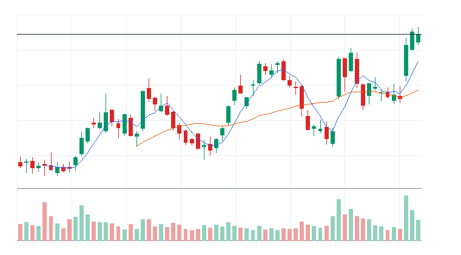
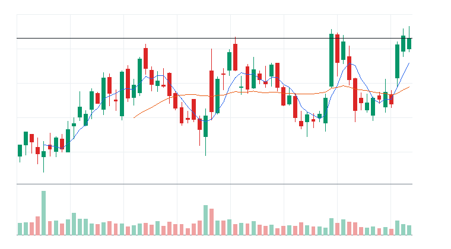
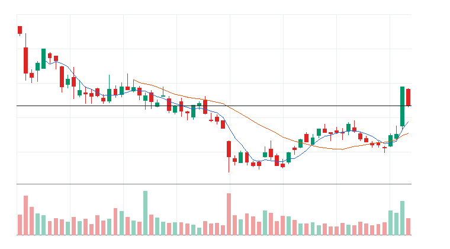

# 오늘의 데일리 트레이딩 요약

**REAL DATA TEST - 가격/거래량은 실제 데이터, 뉴스/ETF 구성종목 확산도/거래대금 유동성 일부 연결**

**목적:** 이 리포트는 최근 오른 자산을 나열하는 것이 아니라, 돈이 몰리는 근거와 다음 매수 주체가 확인할 트레이딩 후보를 찾기 위한 보고서다.

> 핵심 질문: 현재 가격에서 누가 사고 있고, 누가 앞으로 더 비싸게 사줄 수 있는가?

## 시장 국면 판단

- 최종 판정: 기간 조정 (83점)
- 전일 대비: 기간 조정은 유지됐지만 점수는 전일보다 강화됐다(+11점).
- 판정 신뢰도: 높음 (100점) - 핵심 지수와 매크로 데이터가 대부분 직접 수집되어 판정 신뢰도가 높다.
- 행동 바이어스: 추격 보류, 돌파 확인
- 한 줄 결론: 장기 추세는 유지되지만 단기 추세가 둔화되어 기간 조정으로 본다. 기술 100점, 매크로 51점.
- 기술적 지표: 상승 추세 우위 (100점, 가중치 65%)
- S&P 500: 100점 | 50일선 위, 200일선 위, 20일 +2.96%, 60일 +2.00%, 52주 고점 대비 -1.34% -> 기술 점수 100
- Nasdaq 100: 100점 | 50일선 위, 200일선 위, 20일 +4.10%, 60일 -4.00%, 52주 고점 대비 -4.32% -> 기술 점수 100
- 매크로 시황: 매크로 중립 (51점, 가중치 35%)
- 매크로 요약: 신용/유동성 중심으로 매크로가 위험자산에 우호적이다.
- 금리: 중립 50점 / 금리 중립 / confidence HIGH
  - 주요 근거: US 10Y yield 20일 -0.53%, 5일 -0.38%; US 3M yield 20일 +1.30%, 단기금리 방향 확인; US long-duration bonds 20일 +0.77%, 장기채 가격 기준 할인율 부담 확인
  - 확인 사항: 추가 확인 이벤트 없음
- 물가: 중립 49점 / 물가 중립 / confidence HIGH
  - 주요 근거: Oil ETF 20일 +0.41%, 유가 기반 물가 압력 확인; TIPS ETF 20일 -0.64%, 물가연동채 흐름은 보조 근거; Gold 20일 +10.05%, 금 강세는 방어 수요 여부 확인
  - 확인 사항: 금 강세가 인플레 헤지 또는 방어 수요일 수 있어 위험자산 해석을 제한한다.
- 정책: 중립 50점 / 정책 이벤트 확인 전 중립 / confidence LOW
  - 주요 근거: 정책 톤은 1차 버전에서 일정/이벤트 리스크 기반 중립값으로 반영한다.
  - 확인 사항: FOMC, CPI, PCE, 고용지표 발표 전후에는 매크로 confidence를 보수적으로 해석한다.
- 신용/유동성: 중립-우호 56점 / 신용/유동성 중립 / confidence HIGH
  - 주요 근거: High yield credit 20일 +0.33%, 하이일드 위험선호 확인; HYG-LQD 20일 상대강도 +0.24%, 신용위험 선호/회피 확인; VIX 20일 -9.76%, 변동성 부담 확인
  - 확인 사항: 추가 확인 이벤트 없음
- 환율/글로벌: 중립 49점 / 환율/글로벌 중립 / confidence MEDIUM
  - 주요 근거: US dollar 20일 +0.04%, 달러 강세/약세 확인
  - 확인 사항: 추가 확인 이벤트 없음
- US 10Y yield: 51점 | 하락 시 주식 우호; 5일 -0.38%, 20일 -0.53% -> 매크로 점수 51
- US 3M yield: 47점 | 하락 시 주식 우호; 5일 +0.54%, 20일 +1.30% -> 매크로 점수 47
- US long-duration bonds: 52점 | 상승 시 주식 우호; 5일 +1.01%, 20일 +0.77% -> 매크로 점수 52
- TIPS ETF: 50점 | 상승 시 주식 우호; 5일 -0.18%, 20일 -0.64% -> 매크로 점수 50
- Oil ETF: 52점 | 하락 시 주식 우호; 5일 -3.67%, 20일 +0.41% -> 매크로 점수 52
- Gold: 50점 | 상승 시 주식 우호; 5일 -3.42%, 20일 +10.05% -> 매크로 점수 50
- US dollar: 49점 | 하락 시 주식 우호; 5일 +1.00%, 20일 +0.04% -> 매크로 점수 49
- High yield credit: 51점 | 상승 시 주식 우호; 5일 +0.16%, 20일 +0.33% -> 매크로 점수 51
- Investment grade credit: 50점 | 상승 시 주식 우호; 5일 +0.41%, 20일 +0.09% -> 매크로 점수 50
- VIX: 69점 | 하락 시 주식 우호; 5일 -4.63%, 20일 -9.76% -> 매크로 점수 69
- 데이터 커버리지: 기술 2/2, 매크로 10/10
- 데이터 신뢰도 근거:
  - 직접 지수 데이터: S&P 500, Nasdaq 100
  - 대체 지수 데이터 없음
  - 매크로 데이터: 10/10
  - 누락 데이터 없음
  - stale 데이터 없음

## 모바일 요약

[오늘의 데일리 트레이딩 요약]

생성 성공 / 데이터 모드: REAL_TEST

시장:
- 중립

시장 지배 서사:
1. 사이버보안 지출 재가속 - 관찰 - iShares Expanded Tech-Software Sector ETF(IGV), Amplify Cybersecurity ETF(HACK), CrowdStrike Holdings Inc.(CRWD), Palo Alto Networks Inc.(PANW) 중심으로 5일 +5.44%, 20일 +11.27% 흐름이 형성됨. 직접 촉매 일부 확인.
2. 소프트웨어 실적/AI 수익화 - 관찰 - iShares Expanded Tech-Software Sector ETF(IGV), Invesco QQQ Trust(QQQ), Microsoft Corporation(MSFT), Strategy Inc.(MSTR) 중심으로 5일 +4.14%, 20일 +17.55% 흐름이 형성됨. 직접 촉매 일부 확인.
3. AI 소프트웨어/사이버보안 확산 - 약화 - iShares Expanded Tech-Software Sector ETF(IGV), Invesco QQQ Trust(QQQ), Atlassian Corporation(TEAM), Microsoft Corporation(MSFT) 중심으로 5일 +3.77%, 20일 +23.70% 흐름이 형성됨. 뉴스 직접성 제한.

트렌드 강도:
1. 사이버보안 지출 재가속 - TSI 70 - 부상 - 진입품질 보통
2. 소프트웨어 실적/AI 수익화 - TSI 58 - 잠복 - 진입품질 관찰
3. AI 소프트웨어/사이버보안 확산 - TSI 51 - 약화 - 진입품질 낮음

오늘 결론:
- 사이버보안 개별 종목 흐름이 ETF 대비 강한지 확인 필요
- 행동 후보는 linkedNarrative와 함께 확인한다.
- 추격보다 진입 조건 확인 후 접근한다.

오늘 실제 행동 후보:
1. CrowdStrike Holdings Inc.(CRWD)(STOCK) - 사이버보안 지출 재가속 - 52주 고점 부근이라 돌파가 확인되면 신고가 추종 매수가 붙을 수 있음
2. Workday Inc.(WDAY)(STOCK) - 소프트웨어 실적/AI 수익화 - 단기 추세가 유지되고 거래량이 1.0배 이상이면 눌림 이후 재상승을 시도할 수 있음
3. iShares Expanded Tech-Software Sector ETF(IGV)(ETF) - 사이버보안 지출 재가속 - 단기 추세가 유지되고 거래량이 1.0배 이상이면 눌림 이후 재상승을 시도할 수 있음

다크호스 후보:
1. Fortinet Inc.(FTNT) - darkHorseScore 74 - 초기 반전

ETF 후보 TOP 5:
1. iShares Expanded Tech-Software Sector ETF(IGV) - 사이버보안 지출 재가속 - 조건부 진입
2. First Trust NASDAQ Cybersecurity ETF(CIBR) - 사이버보안 지출 재가속 - 거래량 확인 전 관찰
3. Amplify Cybersecurity ETF(HACK) - 사이버보안 지출 재가속 - 제외
4. Roundhill Magnificent Seven ETF(MAGS) - 위험선호 성장주 재진입 - 제외
5. Invesco QQQ Trust(QQQ) - 소프트웨어 실적/AI 수익화 - 제외

웹 리포트:
https://yoolcool.github.io/DailyTradingThesisAgent/

## 오늘 결론

- 오늘 결론: 조건부 진입
- 신규 진입 후보: 0개
- 조건부 진입 후보: 4개
- 관찰 후보: 113개
- 주요 제한 요인: Entry Quality < 40, RVOL 미달, 뉴스 직접성 부족
- 주문 판단: 시장가 금지 / 지정가 또는 관찰
- 실전 판단: 진입 후보는 있으나, 전일 고점 돌파와 거래량 확인 후 선별적으로 접근한다.

### 후보 제한 요인 집계

- RVOL < 1.00x: 107개
- 거래대금 유동성 낮음: 15개
- Entry Quality 50~54 near miss: 2개
- Entry Quality 40~49 관찰: 9개
- Entry Quality < 40: 145개
- Exhaustion Risk >= 70: 0개
- ETF breadth 샘플 부족: 37개
- 뉴스 직접성 부족: 100개

## 데이터 신뢰도

- 전체 데이터 신뢰도 등급: LOW
- 분석 신뢰도: LOW
- 주문 실행 신뢰도: LOW
- ETF breadth 신뢰도: LOW
- 신뢰도 해석: 테마 확산 판단 제한, 거래대금 유동성 낮음 또는 확인 불가, 프리/애프터마켓 확인 불가
- 리포트 생성 시각: 2026-08-31 10:07 KST
- 가격 기준 거래일: 2026-08-28 US regular close
- 뉴스 수집 시각: 2026-08-31 10:07 KST
- 가장 최근 뉴스 발행 시각: 2026-08-31 09:19 KST
- 뉴스 신선도 상태: FRESH
- 뉴스 소스: Yahoo Finance RSS, MarketWatch RSS, CNBC Markets RSS, SEC EDGAR RSS, Federal Reserve RSS, Finnhub API
- 뉴스 소스 상태: Yahoo Finance RSS CONNECTED, MarketWatch RSS CONNECTED, CNBC Markets RSS PARTIAL, SEC EDGAR RSS PARTIAL, Federal Reserve RSS CONNECTED, Finnhub API DISABLED
- 뉴스 신뢰도: MEDIUM
- 추천 적용 거래일: 2026-08-30 US regular session
- 가격/거래량 데이터 상태: 연결됨
- 뉴스 데이터 상태: 일부 연결
- ETF 구성종목 확산도 상태: 일부 연결
- ETF 구성종목 샘플 수: 1~4
- 거래대금 유동성 데이터 상태: 일부 연결
- 프리/애프터마켓 데이터 상태: UNAVAILABLE
- 데이터 provider: yfinance, Yahoo Finance RSS, MarketWatch RSS, CNBC Markets RSS, SEC EDGAR RSS, Federal Reserve RSS, Finnhub API, config fallback sample, price-volume dollar-volume fallback
- 실전 사용 경고: 이 리포트는 투자판단 보조용이며, REAL_TEST 모드에서는 일부 데이터가 누락되거나 지연될 수 있다. 실제 주문 전 현재가, 뉴스, 프리마켓/정규장 거래량을 별도 확인해야 한다.

## 0. 시장 상태

- 데이터 모드: REAL_TEST
- 가격/거래량: 연결됨
- 뉴스: 일부 연결
- ETF 구성종목 확산도: 일부 연결
- 거래대금 유동성: 일부 연결
- 생성 시각: 2026년 8월 31일 월요일 AM 10:07
- 시장 상태: 중립
- 오늘 돈의 방향: 사이버보안 개별 종목 흐름이 ETF 대비 강한지 확인 필요
- 강한 테마 TOP 3: 클라우드/엔터프라이즈 소프트웨어 ETF(74), 메가캡 플랫폼 ETF(71), Materials(67)
- 데이터 한계:
  - API 또는 provider 상태에 따라 뉴스/ETF 확산도/거래대금 유동성 반영 범위가 달라질 수 있다.
  - 수집 실패 데이터는 점수 반영에서 제외하거나 confidence를 제한한다.
  - reasonConfidence HIGH는 직접 촉매, 가격/거래량, 확산도/유동성 근거가 함께 있을 때만 사용한다.

## 오늘 시장을 지배하는 서사

### 오늘 시장을 지배하는 서사 TOP 3

#### 1. 사이버보안 지출 재가속
- 상태: 관찰
- narrativeScore: 58
- reasonConfidence: LOW
- 근거 ETF: IGV, HACK, CIBR, IHAK
- 근거 개별 종목: CRWD, PANW, FTNT, ZS
- 돈이 몰리는 이유: 사이버보안 지출 재가속 관련 iShares Expanded Tech-Software Sector ETF(IGV), Amplify Cybersecurity ETF(HACK), First Trust NASDAQ Cybersecurity ETF(CIBR)와 CrowdStrike Holdings Inc.(CRWD), Palo Alto Networks Inc.(PANW), Fortinet Inc.(FTNT), Zscaler Inc.(ZS)의 5일(+5.44%)·20일(+11.27%) 흐름을 함께 본다. 평균 상대 거래량은 1.10배이고, ETF 확산도는 추가 확인이 필요하다. 직접 뉴스/이벤트가 일부 확인된다.
- 다음 매수 주체: 사이버보안 지출 재가속을 확인한 섹터 ETF 자금과 상대강도 추종 스윙 자금
- 가장 좋은 트레이딩 수단: ETF 우선: HACK, CIBR, IHAK / 개별 종목 우선: ZS, CRWD, PANW
- 서사가 깨지는 조건: HACK 20일선 이탈 또는 관련 종목 절반 이상 5일선 이탈
- 오늘 행동: 기존 네러티브와 중복을 확인한 뒤 ETF/대표 종목 동조성이 살아날 때만 관찰 편입

상세 narrativeScore 근거 보기

- rawScore: 58
- ETF 평균 moneyFlowScore: 44
- 개별 종목 평균 moneyFlowScore: 66
- ETF 후보 비율: 25%
- 개별 종목 후보 비율: 75%
- 5일 평균 수익률: +5.00%
- 20일 평균 수익률: +11.00%
- 평균 상대 거래량: 1.00배
- ETF 평균 상대 거래량: 1.00배
- 개별주 평균 상대 거래량: 1.00배
- 52주 고점 근접 후보 비율: 50%
- 뉴스 직접성 점수: 5
- ETF 확산도 점수: 0
- 유동성 점수: 1
- 과열 리스크 차감: 0

#### 2. 소프트웨어 실적/AI 수익화
- 상태: 관찰
- narrativeScore: 56
- reasonConfidence: LOW
- 근거 ETF: IGV, QQQ, AIQ
- 근거 개별 종목: MSFT, MSTR, ADBE, SHOP
- 돈이 몰리는 이유: 소프트웨어 실적/AI 수익화 관련 iShares Expanded Tech-Software Sector ETF(IGV), Invesco QQQ Trust(QQQ), Global X Artificial Intelligence & Technology ETF(AIQ)와 Microsoft Corporation(MSFT), Strategy Inc.(MSTR), Adobe Inc.(ADBE), Shopify Inc.(SHOP)의 5일(+4.14%)·20일(+17.55%) 흐름을 함께 본다. 평균 상대 거래량은 0.94배이고, ETF 확산도는 추가 확인이 필요하다. 직접 뉴스/이벤트가 일부 확인된다.
- 다음 매수 주체: 소프트웨어 실적/AI 수익화을 확인한 섹터 ETF 자금과 상대강도 추종 스윙 자금
- 가장 좋은 트레이딩 수단: ETF 우선: IGV, AIQ, QQQ / 개별 종목 우선: SHOP, ADBE, MSTR
- 서사가 깨지는 조건: IGV 20일선 이탈 또는 관련 종목 절반 이상 5일선 이탈
- 오늘 행동: 기존 네러티브와 중복을 확인한 뒤 ETF/대표 종목 동조성이 살아날 때만 관찰 편입

상세 narrativeScore 근거 보기

- rawScore: 56
- ETF 평균 moneyFlowScore: 40
- 개별 종목 평균 moneyFlowScore: 64
- ETF 후보 비율: 33%
- 개별 종목 후보 비율: 50%
- 5일 평균 수익률: +4.00%
- 20일 평균 수익률: +18.00%
- 평균 상대 거래량: 1.00배
- ETF 평균 상대 거래량: 1.00배
- 개별주 평균 상대 거래량: 1.00배
- 52주 고점 근접 후보 비율: 14%
- 뉴스 직접성 점수: 6
- ETF 확산도 점수: 0
- 유동성 점수: 3
- 과열 리스크 차감: 0

#### 3. AI 소프트웨어/사이버보안 확산
- 상태: 약화
- narrativeScore: 53
- reasonConfidence: LOW
- 근거 ETF: IGV, QQQ, AIQ
- 근거 개별 종목: TEAM, MSFT, PLTR, DDOG
- 돈이 몰리는 이유: AI 소프트웨어/사이버보안 확산 관련 iShares Expanded Tech-Software Sector ETF(IGV), Invesco QQQ Trust(QQQ), Global X Artificial Intelligence & Technology ETF(AIQ)와 Atlassian Corporation(TEAM), Microsoft Corporation(MSFT), Palantir Technologies Inc.(PLTR), Datadog Inc.(DDOG)의 5일(+3.77%)·20일(+23.70%) 흐름을 함께 본다. 평균 상대 거래량은 0.85배이고, ETF 확산도는 추가 확인이 필요하다. 뉴스 직접성은 아직 제한적이다.
- 다음 매수 주체: AI 소프트웨어 실적 기대를 사는 ETF 자금, 엔터프라이즈 소프트웨어 스윙 트레이더, 신고가 추종 자금
- 가장 좋은 트레이딩 수단: ETF 우선: IGV, AIQ, QQQ / 개별 종목 우선: PLTR, DDOG, TEAM
- 서사가 깨지는 조건: IGV/AIQ 20일선 이탈, 관련 소프트웨어 종목 절반 이상 5일선 이탈, 상대 거래량 둔화
- 오늘 행동: 추격보다 눌림 후 재상승 확인

상세 narrativeScore 근거 보기

- rawScore: 53
- ETF 평균 moneyFlowScore: 40
- 개별 종목 평균 moneyFlowScore: 55
- ETF 후보 비율: 33%
- 개별 종목 후보 비율: 20%
- 5일 평균 수익률: +4.00%
- 20일 평균 수익률: +24.00%
- 평균 상대 거래량: 1.00배
- ETF 평균 상대 거래량: 1.00배
- 개별주 평균 상대 거래량: 1.00배
- 52주 고점 근접 후보 비율: 25%
- 뉴스 직접성 점수: 5
- ETF 확산도 점수: 0
- 유동성 점수: 2
- 과열 리스크 차감: 0

### 전체 narrative 요약

| 서사명 | 상태 | narrativeScore | reasonConfidence | 대표 ETF | 대표 종목 | 오늘 행동 |
| --- | --- | ---: | --- | --- | --- | --- |
| 사이버보안 지출 재가속 | 관찰 | 58 | LOW | IGV, HACK, CIBR | CRWD, PANW, FTNT, ZS | 기존 네러티브와 중복을 확인한 뒤 ETF/대표 종목 동조성이 살아날 때만 관찰 편입 |
| 소프트웨어 실적/AI 수익화 | 관찰 | 56 | LOW | IGV, QQQ, AIQ | MSFT, MSTR, ADBE, SHOP | 기존 네러티브와 중복을 확인한 뒤 ETF/대표 종목 동조성이 살아날 때만 관찰 편입 |
| AI 소프트웨어/사이버보안 확산 | 약화 | 53 | LOW | IGV, QQQ, AIQ | TEAM, MSFT, PLTR, DDOG | 추격보다 눌림 후 재상승 확인 |
| Internet Content 자금 유입 | 약화 | 47 | LOW | QQQ | META, DASH | 기존 네러티브와 중복을 확인한 뒤 ETF/대표 종목 동조성이 살아날 때만 관찰 편입 |
| Travel Services 자금 유입 | 약화 | 32 | LOW | QQQ | ABNB, BKNG | 기존 네러티브와 중복을 확인한 뒤 ETF/대표 종목 동조성이 살아날 때만 관찰 편입 |
| 위험선호 성장주 재진입 | 약화 | 23 | LOW | MAGS, ARKK, QQQ | COIN, TSLA, ARM | 지수 위험선호가 유지될 때만 선별 진입 |
| 매크로 방어/헤지 | 약화 | 19 | LOW | OIH, TLT, GLD | CVX, XOM | 위험회피가 확인될 때만 헤지성 접근 |
| Integrated Oil & Gas 자금 유입 | 약화 | 19 | LOW | OIH, QQQ, SPY | CVX, XOM | 기존 네러티브와 중복을 확인한 뒤 ETF/대표 종목 동조성이 살아날 때만 관찰 편입 |
| 바이오/헬스케어 촉매 | 약화 | 18 | LOW | QQQ | VRTX, AMGN, REGN, INSM | 기존 네러티브와 중복을 확인한 뒤 ETF/대표 종목 동조성이 살아날 때만 관찰 편입 |
| Specialty Business Services 자금 유입 | 약화 | 17 | LOW | QQQ, SPY, IWM | TRI, CPRT, CTAS | 기존 네러티브와 중복을 확인한 뒤 ETF/대표 종목 동조성이 살아날 때만 관찰 편입 |
| 소비 회복/방어주 선별 | 약화 | 15 | LOW | QQQ | AMZN, PDD | 기존 네러티브와 중복을 확인한 뒤 ETF/대표 종목 동조성이 살아날 때만 관찰 편입 |
| 비트코인/디지털 자산 위험선호 | 약화 | 13 | LOW | IBIT, BLOK | MSTR, COIN, IREN | 비트코인 베타가 살아날 때만 단기 매매 |
| 전력망/원전/인프라 병목 | 약화 | 11 | LOW | URA, GRID, PAVE | FCX, CEG, VRT, ETN | ETF 확산도와 거래량이 같이 살아날 때만 진입 |
| Data Storage 자금 유입 | 약화 | 11 | LOW | QQQ, SPY, IWM | STX, WDC | 기존 네러티브와 중복을 확인한 뒤 ETF/대표 종목 동조성이 살아날 때만 관찰 편입 |
| 전력 유틸리티 수요 재평가 | 약화 | 11 | LOW | QQQ, SPY, IWM | ETN, GEV, VRT | 기존 네러티브와 중복을 확인한 뒤 ETF/대표 종목 동조성이 살아날 때만 관찰 편입 |
| Aerospace & Defense 자금 유입 | 약화 | 6 | LOW | QQQ, SPY, IWM | KTOS, AVAV, AXON | 기존 네러티브와 중복을 확인한 뒤 ETF/대표 종목 동조성이 살아날 때만 관찰 편입 |
| 방산/안보 프리미엄 | 약화 | 3 | LOW | ITA, XAR, SHLD | PLTR, AVAV, KTOS | 뉴스 촉매가 직접 확인될 때만 추세 추종 |
| 필수소비재 음료 방어 성장 | 소멸 | 3 | LOW | QQQ | CCEP, MNST | 기존 네러티브와 중복을 확인한 뒤 ETF/대표 종목 동조성이 살아날 때만 관찰 편입 |
| AI 인프라 재가속 | 약화 | 1 | LOW | DRAM, SMH, SOXX | NVDA, MU, VRT, ETN | 추격보다 5일선 지지 후 재상승 확인 |
| 반도체 설계/공급망 재가속 | 약화 | 0 | LOW | SMH, SOXX, SOXQ | ARM, AMD, TXN, ADI | 기존 네러티브와 중복을 확인한 뒤 ETF/대표 종목 동조성이 살아날 때만 관찰 편입 |
| 반도체 장비 사이클 재평가 | 약화 | 0 | LOW | SMH, SOXX, SOXQ | AMAT, LRCX, ASML | 기존 네러티브와 중복을 확인한 뒤 ETF/대표 종목 동조성이 살아날 때만 관찰 편입 |

## 트렌드 강도 판단

### 1. 사이버보안 지출 재가속
- Trend Strength Index: 70
- 트렌드 상태 라벨: 부상
- 테마 확산도: 보통
- ETF 동조성: 강함
- 거래량 강도: 약함
- 과열 위험: 낮음 (5)
- 오늘 진입 품질: 보통 (58)
- 한 줄 판단: 사이버보안 지출 재가속는 돈이 강하게 몰리지만 오늘 진입 품질은 아직 제한적이라 추격보다 조건 확인이 필요하다.
- 오늘 접근법: iShares Expanded Tech-Software Sector ETF(IGV)/Amplify Cybersecurity ETF(HACK)/First Trust NASDAQ Cybersecurity ETF(CIBR) 거래량 증가와 CrowdStrike Holdings Inc.(CRWD)/Palo Alto Networks Inc.(PANW)/Fortinet Inc.(FTNT) 확산을 확인하며 작은 사이즈의 초기 진입 후보로만 본다.

트렌드 강도 상세 근거 보기

- 가격 모멘텀: 가격 모멘텀 21/25. 평균 5D +5.44%, 20D +11.27%.
- 거래량 강도: 거래량 강도 6/20. 평균 RVOL 1.10배.
- ETF 동조성: ETF 동조성 15/15. 관련 ETF Amplify Cybersecurity ETF(HACK), First Trust NASDAQ Cybersecurity ETF(CIBR), iShares Cybersecurity and Tech ETF(IHAK), iShares Expanded Tech-Software Sector ETF(IGV) 흐름을 기준으로 판단.
- 테마 확산도: 테마 확산도 14/20. 상위 1~2개 쏠림 감점 0점 반영.
- 뉴스 촉매: 뉴스/촉매 신선도 9/10. HIGH 직접 촉매 3개.
- 과열 리스크: 과열 리스크 5/100. 단기 급등, 고점 근접, ETF-개별주 괴리, 쏠림을 함께 반영.
- 시장 환경: 시장 환경 5/10. QQQ/SPY/IWM 가격 흐름 기반 위험선호 점수.

### 2. 소프트웨어 실적/AI 수익화
- Trend Strength Index: 58
- 트렌드 상태 라벨: 잠복
- 테마 확산도: 보통
- ETF 동조성: 강함
- 거래량 강도: 약함
- 과열 위험: 낮음 (8)
- 오늘 진입 품질: 관찰 (45)
- 한 줄 판단: 소프트웨어 실적/AI 수익화는 Trend Strength는 중간이지만 진입 품질이 살아나는 초기 진입 후보 성격이다.
- 오늘 접근법: iShares Expanded Tech-Software Sector ETF(IGV)/Invesco QQQ Trust(QQQ)/Global X Artificial Intelligence & Technology ETF(AIQ)와 Microsoft Corporation(MSFT)/Strategy Inc.(MSTR)/Adobe Inc.(ADBE)의 거래량 확산이 확인되기 전까지 관찰한다.

트렌드 강도 상세 근거 보기

- 가격 모멘텀: 가격 모멘텀 16/25. 평균 5D +4.14%, 20D +17.55%.
- 거래량 강도: 거래량 강도 6/20. 평균 RVOL 0.94배.
- ETF 동조성: ETF 동조성 15/15. 관련 ETF iShares Expanded Tech-Software Sector ETF(IGV), Global X Artificial Intelligence & Technology ETF(AIQ), Invesco QQQ Trust(QQQ) 흐름을 기준으로 판단.
- 테마 확산도: 테마 확산도 12/20. 상위 1~2개 쏠림 감점 0점 반영.
- 뉴스 촉매: 뉴스/촉매 신선도 4/10. HIGH 직접 촉매 1개.
- 과열 리스크: 과열 리스크 8/100. 단기 급등, 고점 근접, ETF-개별주 괴리, 쏠림을 함께 반영.
- 시장 환경: 시장 환경 5/10. QQQ/SPY/IWM 가격 흐름 기반 위험선호 점수.

### 3. AI 소프트웨어/사이버보안 확산
- Trend Strength Index: 51
- 트렌드 상태 라벨: 약화
- 테마 확산도: 보통
- ETF 동조성: 강함
- 거래량 강도: 부족
- 과열 위험: 낮음 (17)
- 오늘 진입 품질: 낮음 (34)
- 한 줄 판단: AI 소프트웨어/사이버보안 확산는 관찰 가능한 흐름은 있으나 가격, 거래량, 확산도 중 일부 확인이 더 필요하다.
- 오늘 접근법: 상승률이 남아 있어도 iShares Expanded Tech-Software Sector ETF(IGV)/Invesco QQQ Trust(QQQ)/Global X Artificial Intelligence & Technology ETF(AIQ)와 구성 종목 확산도가 회복될 때까지 신규 진입은 낮춘다.

트렌드 강도 상세 근거 보기

- 가격 모멘텀: 가격 모멘텀 14/25. 평균 5D +3.77%, 20D +23.70%.
- 거래량 강도: 거래량 강도 4/20. 평균 RVOL 0.85배.
- ETF 동조성: ETF 동조성 15/15. 관련 ETF iShares Expanded Tech-Software Sector ETF(IGV), Global X Artificial Intelligence & Technology ETF(AIQ), Invesco QQQ Trust(QQQ) 흐름을 기준으로 판단.
- 테마 확산도: 테마 확산도 11/20. 상위 1~2개 쏠림 감점 0점 반영.
- 뉴스 촉매: 뉴스/촉매 신선도 2/10. HIGH 직접 촉매 0개.
- 과열 리스크: 과열 리스크 17/100. 단기 급등, 고점 근접, ETF-개별주 괴리, 쏠림을 함께 반영.
- 시장 환경: 시장 환경 5/10. QQQ/SPY/IWM 가격 흐름 기반 위험선호 점수.

## 최근 추천 결과 트래킹

개별주는 데이트레이딩 관점으로 추천 이후 첫 정규장의 장중 최고가와 종가를 추적한다. ETF는 테마/스윙 관점으로 추천 이후 1주일 동안의 최고가와 현재 종가를 추적한다.

### 개별주 Top 3 추천 성과 요약
- 최근 5개 리포트 표본: 14개 (초기 검증 단계)
- 장중 최고가 기준 성공률: +36.36%
- 종가 기준 성공률: +27.27%
- 평균 장중 최고 수익률: +3.39%
- 평균 종가 수익률: +1.21%

### ETF 추천 성과 요약
- 최근 5개 리포트 표본: 5개 (초기 검증 단계)
- 1주 최고가 기준 성공률: +100.00%
- 현재 종가 기준 성공률: +20.00%
- 평균 1주 최고 수익률: +11.19%
- 평균 현재 수익률: +0.11%

최근 추천 결과 상세 테이블 펼치기

| 추천일 | 유형 | 순위 | 티커 | 기준가 | 추적 기간 | 상태 | High 수익률 | Close 수익률 | 결과 | 코멘트 |
| --- | --- | ---: | --- | ---: | --- | --- | ---: | ---: | --- | --- |
| 2026-08-31 | STOCK | 3 | MSFT | $513.53 | 2026-08-31 | pending | 데이터 없음 | 데이터 없음 | 추적 대기 | 아직 추적 거래일 데이터가 완성되지 않음 |
| 2026-08-31 | STOCK | 2 | WDAY | $204.72 | 2026-08-31 | pending | 데이터 없음 | 데이터 없음 | 추적 대기 | 아직 추적 거래일 데이터가 완성되지 않음 |
| 2026-08-31 | STOCK | 1 | CRWD | $218.4 | 2026-08-31 | pending | 데이터 없음 | 데이터 없음 | 추적 대기 | 아직 추적 거래일 데이터가 완성되지 않음 |
| 2026-08-31 | ETF | 1 | IGV | $109.5 | 2026-08-31~2026-09-07 | in_progress | 데이터 없음 | 0.00% | 진행 중 | 아직 1주 추적 기간이 끝나지 않음 (일봉 high 미확보 시 close 기준 보조) |
| 2026-08-28 | STOCK | 3 | ZS | $187.3 | 2026-08-28 | complete | +0.47% | -1.64% | 실패 | 추천 이후 의미 있는 장중 기회가 부족하고 종가도 약함 (일봉 기준) |
| 2026-08-28 | STOCK | 2 | ADSK | $270.58 | 2026-08-28 | complete | -1.32% | -3.67% | 실패 | 추천 이후 의미 있는 장중 기회가 부족하고 종가도 약함 (일봉 기준) |
| 2026-08-28 | STOCK | 1 | ADBE | $289.15 | 2026-08-28 | complete | +1.71% | +0.82% | 제한적 유효 | 제한적인 장중 기회만 발생 (일봉 기준) |
| 2026-08-28 | ETF | 3 | IBIT | $45.29 | 2026-08-28~2026-09-04 | in_progress | 데이터 없음 | -3.07% | 진행 중 | 아직 1주 추적 기간이 끝나지 않음 (일봉 high 미확보 시 close 기준 보조) |
| 2026-08-28 | ETF | 2 | CIBR | $100.79 | 2026-08-28~2026-09-04 | in_progress | 데이터 없음 | -2.21% | 진행 중 | 아직 1주 추적 기간이 끝나지 않음 (일봉 high 미확보 시 close 기준 보조) |
| 2026-08-28 | ETF | 1 | IGV | $110.32 | 2026-08-28~2026-09-04 | in_progress | 데이터 없음 | -0.74% | 진행 중 | 아직 1주 추적 기간이 끝나지 않음 (일봉 high 미확보 시 close 기준 보조) |
| 2026-08-21 | STOCK | 3 | FCX | $71.22 | 2026-08-21 | complete | +8.58% | +7.64% | 성공 | 장중 기회와 종가 유지가 모두 확인됨 (일봉 기준) |
| 2026-08-21 | STOCK | 2 | COIN | $172.35 | 2026-08-21 | complete | +11.03% | +8.20% | 성공 | 장중 기회와 종가 유지가 모두 확인됨 (일봉 기준) |
| 2026-08-21 | STOCK | 1 | MSTR | $112.39 | 2026-08-21 | complete | +8.47% | +6.10% | 성공 | 장중 기회와 종가 유지가 모두 확인됨 (일봉 기준) |
| 2026-08-21 | ETF | 1 | IBIT | $41.2 | 2026-08-21~2026-08-28 | complete | +11.19% | +6.55% | 성공 | 추천 이후 테마 추세가 유지됨 |
| 2026-08-20 | STOCK | 3 | ADBE | $272.47 | 2026-08-20 | complete | +0.65% | -0.09% | 실패 | 추천 이후 의미 있는 장중 기회가 부족하고 종가도 약함 (일봉 기준) |
| 2026-08-20 | STOCK | 2 | TEAM | $174.23 | 2026-08-20 | complete | +2.09% | +0.39% | 제한적 유효 | 제한적인 장중 기회만 발생 (일봉 기준) |
| 2026-08-20 | STOCK | 1 | INTU | $362.47 | 2026-08-20 | complete | +1.15% | -0.17% | 제한적 유효 | 제한적인 장중 기회만 발생 (일봉 기준) |
| 2026-08-18 | STOCK | 2 | CPRT | $31.7 | 2026-08-18 | complete | +5.84% | -0.60% | 단타 유효 | 장중 기회는 있었지만 종가 유지력은 약함 (일봉 기준) |
| 2026-08-18 | STOCK | 1 | PWR | $722.31 | 2026-08-18 | complete | -1.43% | -3.62% | 실패 | 추천 이후 의미 있는 장중 기회가 부족하고 종가도 약함 (일봉 기준) |
| 2026-08-17 | STOCK | 3 | WDAY | $198.68 | 2026-08-17 | complete | -1.69% | -3.77% | 실패 | 추천 이후 의미 있는 장중 기회가 부족하고 종가도 약함 (일봉 기준) |
| 2026-08-17 | STOCK | 2 | AVAV | $192.81 | 2026-08-17 | complete | -0.43% | -6.06% | 실패 | 추천 이후 의미 있는 장중 기회가 부족하고 종가도 약함 (일봉 기준) |
| 2026-08-17 | STOCK | 1 | KTOS | $64.58 | 2026-08-17 | complete | +0.79% | -2.00% | 실패 | 추천 이후 의미 있는 장중 기회가 부족하고 종가도 약함 (일봉 기준) |
| 2026-08-14 | STOCK | 3 | ADSK | $257.96 | 2026-08-14 | complete | +1.08% | -2.44% | 제한적 유효 | 제한적인 장중 기회만 발생 (일봉 기준) |
| 2026-08-14 | STOCK | 2 | TEAM | $165.98 | 2026-08-14 | complete | +1.07% | -2.27% | 제한적 유효 | 제한적인 장중 기회만 발생 (일봉 기준) |
| 2026-08-14 | STOCK | 1 | INTU | $358.29 | 2026-08-14 | complete | +1.04% | -3.53% | 제한적 유효 | 제한적인 장중 기회만 발생 (일봉 기준) |
| 2026-08-14 | ETF | 2 | IGV | $106.28 | 2026-08-14~2026-08-21 | complete | -2.05% | +3.03% | 진행 중 | 아직 1주 추적 기간이 끝나지 않음 |
| 2026-08-14 | ETF | 1 | CIBR | $102.2 | 2026-08-14~2026-08-21 | complete | -2.50% | -3.56% | 실패 | 추천 이후 ETF 흐름이 약화됨 |
| 2026-08-13 | STOCK | 1 | ABNB | $180.1 | 2026-08-13 | complete | +2.91% | +2.80% | 제한적 유효 | 제한적인 장중 기회만 발생 (일봉 기준) |
| 2026-08-12 | STOCK | 3 | ABNB | $184.98 | 2026-08-12 | complete | -0.47% | -2.64% | 실패 | 추천 이후 의미 있는 장중 기회가 부족하고 종가도 약함 (일봉 기준) |
| 2026-08-12 | STOCK | 2 | AXON | $636.31 | 2026-08-12 | complete | +1.00% | -5.74% | 제한적 유효 | 제한적인 장중 기회만 발생 (일봉 기준) |
| 2026-08-12 | STOCK | 1 | FAST | $52.38 | 2026-08-12 | complete | +0.84% | -0.31% | 실패 | 추천 이후 의미 있는 장중 기회가 부족하고 종가도 약함 (일봉 기준) |
| 2026-08-11 | STOCK | 3 | ZS | $176.68 | 2026-08-11 | complete | +2.33% | +1.06% | 제한적 유효 | 제한적인 장중 기회만 발생 (일봉 기준) |
| 2026-08-11 | STOCK | 2 | PLTR | $175.23 | 2026-08-11 | complete | +1.55% | -0.17% | 제한적 유효 | 제한적인 장중 기회만 발생 (일봉 기준) |
| 2026-08-11 | STOCK | 1 | TEAM | $151.87 | 2026-08-11 | complete | +2.86% | +1.46% | 제한적 유효 | 제한적인 장중 기회만 발생 (일봉 기준) |
| 2026-08-11 | ETF | 3 | GLD | $402.54 | 2026-08-11~2026-08-18 | complete | +1.20% | +1.58% | 진행 중 | 아직 1주 추적 기간이 끝나지 않음 |
| 2026-08-11 | ETF | 2 | OIH | $411.34 | 2026-08-11~2026-08-18 | complete | +4.23% | +1.69% | 성공 | 추천 이후 테마 추세가 유지됨 |
| 2026-08-11 | ETF | 1 | CIBR | $100.6 | 2026-08-11~2026-08-18 | complete | +1.74% | -2.03% | 실패 | 추천 이후 ETF 흐름이 약화됨 |
| 2026-08-10 | STOCK | 3 | SHOP | $151.57 | 2026-08-10 | complete | +2.67% | +2.38% | 제한적 유효 | 제한적인 장중 기회만 발생 (일봉 기준) |
| 2026-08-10 | STOCK | 2 | FAST | $51.84 | 2026-08-10 | complete | +0.75% | +0.60% | 추적 대기 | 아직 추적 거래일 데이터가 완성되지 않음 (일봉 기준) |
| 2026-08-10 | STOCK | 1 | BKNG | $214.42 | 2026-08-10 | complete | +0.48% | -0.72% | 실패 | 추천 이후 의미 있는 장중 기회가 부족하고 종가도 약함 (일봉 기준) |
| 2026-08-10 | ETF | 2 | XME | $115.74 | 2026-08-10~2026-08-17 | complete | +3.45% | +2.59% | 성공 | 추천 이후 테마 추세가 유지됨 |
| 2026-08-10 | ETF | 1 | COPX | $88.03 | 2026-08-10~2026-08-17 | complete | +2.52% | +7.26% | 성공 | 추천 이후 테마 추세가 유지됨 |
| 2026-08-07 | STOCK | 3 | KTOS | $57.41 | 2026-08-07 | complete | +6.41% | +5.85% | 성공 | 장중 기회와 종가 유지가 모두 확인됨 (일봉 기준) |
| 2026-08-07 | STOCK | 2 | BKNG | $207.39 | 2026-08-07 | complete | +4.00% | +3.39% | 성공 | 장중 기회와 종가 유지가 모두 확인됨 (일봉 기준) |
| 2026-08-07 | STOCK | 1 | SHOP | $147.44 | 2026-08-07 | complete | +3.67% | +2.80% | 성공 | 장중 기회와 종가 유지가 모두 확인됨 (일봉 기준) |
| 2026-08-06 | STOCK | 3 | KTOS | $55.34 | 2026-08-06 | complete | +6.79% | +3.74% | 성공 | 장중 기회와 종가 유지가 모두 확인됨 (일봉 기준) |
| 2026-08-06 | STOCK | 2 | AMGN | $407.83 | 2026-08-06 | complete | +2.59% | -0.73% | 제한적 유효 | 제한적인 장중 기회만 발생 (일봉 기준) |
| 2026-08-06 | STOCK | 1 | TEAM | $113.32 | 2026-08-06 | complete | -2.15% | -2.78% | 실패 | 추천 이후 의미 있는 장중 기회가 부족하고 종가도 약함 (일봉 기준) |
| 2026-08-06 | ETF | 2 | XME | $111.92 | 2026-08-06~2026-08-13 | complete | +6.98% | +6.09% | 성공 | 추천 이후 테마 추세가 유지됨 |
| 2026-08-06 | ETF | 1 | COPX | $86.72 | 2026-08-06~2026-08-13 | complete | +4.07% | +8.88% | 성공 | 추천 이후 테마 추세가 유지됨 |
| 2026-08-05 | STOCK | 3 | DXCM | $86.94 | 2026-08-05 | complete | -0.54% | -4.92% | 실패 | 추천 이후 의미 있는 장중 기회가 부족하고 종가도 약함 (일봉 기준) |
| 2026-08-05 | STOCK | 2 | DDOG | $288.15 | 2026-08-05 | complete | +1.59% | -1.73% | 제한적 유효 | 제한적인 장중 기회만 발생 (일봉 기준) |
| 2026-08-05 | STOCK | 1 | MSFT | $492.81 | 2026-08-05 | complete | +1.10% | -1.09% | 제한적 유효 | 제한적인 장중 기회만 발생 (일봉 기준) |
| 2026-08-05 | ETF | 3 | MAGS | $68.96 | 2026-08-05~2026-08-12 | complete | +0.81% | +0.16% | 진행 중 | 아직 1주 추적 기간이 끝나지 않음 |
| 2026-08-05 | ETF | 2 | COPX | $83.99 | 2026-08-05~2026-08-12 | complete | +7.45% | +12.42% | 성공 | 추천 이후 테마 추세가 유지됨 |
| 2026-08-05 | ETF | 1 | CIBR | $97.94 | 2026-08-05~2026-08-12 | complete | +3.31% | +0.63% | 진행 중 | 아직 1주 추적 기간이 끝나지 않음 |
| 2026-08-04 | STOCK | 3 | MSFT | $487.65 | 2026-08-04 | complete | +2.42% | +1.06% | 제한적 유효 | 제한적인 장중 기회만 발생 (일봉 기준) |
| 2026-08-04 | STOCK | 2 | AMZN | $284.02 | 2026-08-04 | complete | -1.04% | -2.32% | 실패 | 추천 이후 의미 있는 장중 기회가 부족하고 종가도 약함 (일봉 기준) |
| 2026-08-04 | STOCK | 1 | DDOG | $273.6 | 2026-08-04 | complete | +5.96% | +5.32% | 성공 | 장중 기회와 종가 유지가 모두 확인됨 (일봉 기준) |
| 2026-08-04 | ETF | 1 | MAGS | $68.38 | 2026-08-04~2026-08-11 | complete | +1.80% | +1.01% | 진행 중 | 아직 1주 추적 기간이 끝나지 않음 |

## 오늘 실제 행동 후보

### 1. CrowdStrike Holdings Inc.(CRWD)
- 자산 유형: STOCK
- linkedNarrative: 사이버보안 지출 재가속
- narrativeStatus: 관찰
- narrativeScore: 58
- Trend Strength Index: 70
- Exhaustion Risk: 5 (낮음)
- Entry Quality Score: 59 (보통)
- 트렌드 판단: 시장 위험선호가 약해 시장 환경 비우호 구간이다.
- moneyFlowScore: 96
- finalRawScore: 96
- reasonConfidence: HIGH
- reasonConfidenceExplanation: 직접 촉매: Yahoo Finance RSS / earnings / under_24h - Is It Too Late to Buy CrowdStrike Stock After Its 20% Surge? 가격/거래량, 관련 ETF 동반 강세, 유동성 근거가 함께 확인되어 HIGH로 분류했다.
- tieBreakerReason: 최종 원점수 96, 리스크 패널티 0, 5일 수익률 +13.78%, 상대 거래량 1.62배 순으로 정렬
- 후보별 시장 해석: 중립 / 제한적 - 후보는 당일 음봉 또는 약세
- 게이트 사유: 통과
- 주문 실행: 시장가 가능
- 직접 촉매: Yahoo Finance RSS / earnings / under_24h - Is It Too Late to Buy CrowdStrike Stock After Its 20% Surge?
- 왜 돈이 몰리는가: 20일 +14.43%, 5일 +13.78%, 상대 거래량 1.62배로 가격과 거래량이 함께 개선. 뉴스: CNBC Markets RSS product/under_6h / 유동성: LIQUID
- 누가 더 비싸게 사줄 수 있는지: 개별 주도주를 따라붙는 단기 모멘텀 자금과 관련 ETF 강세를 확인한 트레이더
- 진입 조건: 전일 고점 돌파와 5일선 유지 확인
- 무효화 조건: 20일선 이탈 또는 상대 거래량 0.8배 이하 둔화
- todayActionLabel: 조건부 진입
#### 최근 뉴스/동향 한국어 요약

- 요약: 종목 직접 뉴스 확인 상태이며 뉴스 흐름은 긍정 우위입니다. 후보 선정 후 재확인한 핵심 이슈는 "Morgan Stanley resets CrowdStrike stock price target after earnings"입니다.
- 직접 촉매 판단: CrowdStrike Holdings Inc.에 대해 직접 촉매로 분류된 뉴스가 확인됐습니다. 핵심은 "Morgan Stanley resets CrowdStrike stock price target after earnings"이며, 실적 재료로 봅니다.
- 뉴스 1: Morgan Stanley resets CrowdStrike stock price target after earnings
  - 내용: CrowdStrike Holdings Inc. 관련 기사는 목표가 변화를 다룹니다. 기사 스니펫상 핵심은 Following historic performance, here’s what could happen to CRWD shares next.입니다.
  - 투자 의미: 애널리스트 상향은 단기 수급에 우호적일 수 있으나, 목표가 변화가 이미 주가에 반영됐는지 확인해야 합니다.
  - 확인할 점: 매출/마진/가이던스 수치, 컨센서스 대비 차이
- 뉴스 2: What Is CrowdStrike Holdings (CRWD) Adding With Its New AI Governance Integration?
  - 내용: CrowdStrike Holdings Inc. 관련 시장 일반 뉴스입니다. 기사 스니펫상 핵심 내용은 CrowdStrike Holdings (NasdaqGS:CRWD) and Theta Lake announced a new AI governance telemetry integration for the CrowdStrike Falcon Next-Gen SIEM platform.입니다.
  - 투자 의미: 단기 긍정 뉴스 흐름으로 볼 수 있지만, 단독 매수 근거보다는 가격·거래량 조건을 확인하는 보조 근거로 사용합니다.
  - 확인할 점: 원문 수치, 후속 보도, 가격이 진입 조건을 지키는지
- 뉴스 3: CrowdStrike Just Had Its Best Quarter Ever, and I'm Not Buying the Stock at 43 Times Revenue
  - 내용: CrowdStrike Holdings Inc. 관련 기사는 목표가 변화를 다룹니다. 기사 스니펫상 핵심은 Record new business, record second-quarter cash flow, raised guidance -- and a price that already assumes years more of all three.입니다.
  - 투자 의미: 애널리스트 상향은 단기 수급에 우호적일 수 있으나, 목표가 변화가 이미 주가에 반영됐는지 확인해야 합니다.
  - 확인할 점: 매출/마진/가이던스 수치, 컨센서스 대비 차이
- 매매 해석: 매매 관점에서는 뉴스 자체보다 가격이 진입 조건을 지키는지, 거래량이 동반되는지, 그리고 뉴스가 이미 주가에 반영됐는지를 우선 확인해야 합니다.
- 차트: 

### 2. Workday Inc.(WDAY)
- 자산 유형: STOCK
- linkedNarrative: 소프트웨어 실적/AI 수익화
- narrativeStatus: 관찰
- narrativeScore: 56
- Trend Strength Index: 58
- Exhaustion Risk: 8 (낮음)
- Entry Quality Score: 42 (관찰)
- 트렌드 판단: 시장 위험선호가 약해 시장 환경 비우호 구간이다.
- moneyFlowScore: 94
- finalRawScore: 94
- reasonConfidence: HIGH
- reasonConfidenceExplanation: 직접 촉매: Yahoo Finance RSS / guidance / under_72h - From SaaS-pocalypse to Perfect Storm: Workday’s AI Growth Story Strengthens 가격/거래량, 관련 ETF 동반 강세, 유동성 근거가 함께 확인되어 HIGH로 분류했다.
- tieBreakerReason: 최종 원점수 94, 리스크 패널티 0, 5일 수익률 +2.35%, 상대 거래량 1.74배 순으로 정렬
- 후보별 시장 해석: 중립 / 제한적 - Entry Quality 42 < 50이나 moneyFlow 94, confidence HIGH, RVOL 1.74x로 강한 자금흐름 예외 조건 충족
- 게이트 사유: Entry Quality 42 < 50이나 moneyFlow 94, confidence HIGH, RVOL 1.74x로 강한 자금흐름 예외 조건 충족
- 주문 실행: 시장가 가능
- 직접 촉매: Yahoo Finance RSS / guidance / under_72h - From SaaS-pocalypse to Perfect Storm: Workday’s AI Growth Story Strengthens
- 왜 돈이 몰리는가: 20일 +27.68%, 5일 +2.35%, 상대 거래량 1.74배로 가격과 거래량이 함께 개선. 뉴스: CNBC Markets RSS product/under_6h / 유동성: LIQUID
- 누가 더 비싸게 사줄 수 있는지: 개별 주도주를 따라붙는 단기 모멘텀 자금과 관련 ETF 강세를 확인한 트레이더
- 진입 조건: 20일선 위 눌림 후 재상승 확인
- 무효화 조건: 20일선 이탈 또는 상대 거래량 0.8배 이하 둔화
- todayActionLabel: 자금흐름 예외 조건부
#### 최근 뉴스/동향 한국어 요약

- 요약: 종목 직접 뉴스 확인 상태이며 뉴스 흐름은 긍정 우위입니다. 후보 선정 후 재확인한 핵심 이슈는 "Workday (WDAY) Stock Could Be A Bargain On Cash Flow Yet Fair On Earnings"입니다.
- 직접 촉매 판단: Workday Inc.에 대해 직접 촉매로 분류된 뉴스가 확인됐습니다. 핵심은 "Workday (WDAY) Stock Could Be A Bargain On Cash Flow Yet Fair On Earnings"이며, 실적 재료로 봅니다.
- 뉴스 1: Workday (WDAY) Stock Could Be A Bargain On Cash Flow Yet Fair On Earnings
  - 내용: Workday Inc. 관련 기사는 Workday (WDAY) Stock Could Be A Bargain On Cash Flow Yet Fair On Earnings 이슈를 다루며, 주가 변동률 +26.30%를 핵심 내용으로 봅니다.
  - 투자 의미: Workday Inc.의 당일 상대강도 확인에는 도움이 되지만, 실적/가이던스 같은 새 펀더멘털 변화로 보기는 어렵습니다.
  - 확인할 점: 거래량 동반 여부, 장중 고점 유지, 관련 ETF 동반 강세
- 뉴스 2: How AI-Driven Subscription Gains and New Buyback Plan May Shape Workday (WDAY) Investors
  - 내용: Workday Inc. 관련 기사는 목표가 변화를 다룹니다. 기사 스니펫상 핵심은 Workday, Inc.입니다.
  - 투자 의미: 애널리스트 상향은 단기 수급에 우호적일 수 있으나, 목표가 변화가 이미 주가에 반영됐는지 확인해야 합니다.
  - 확인할 점: 매출/마진/가이던스 수치, 컨센서스 대비 차이
- 뉴스 3: Workday (WDAY) Says AI Drove 25% of New Annual Contract Value. Why Did Total Subscription Backlog Grow Only 8%?
  - 내용: Workday Inc. 관련 기사는 Workday (WDAY) Says AI Drove 25% of New Annual Contract Value. Why Did Total Subscription Backlog Grow Only 8%? 이슈를 다루며, 주가 변동률 +25.00%, 동반 비교 수치 +8.00%를 핵심 내용으로 봅니다.
  - 투자 의미: Workday Inc.의 당일 상대강도 확인에는 도움이 되지만, 실적/가이던스 같은 새 펀더멘털 변화로 보기는 어렵습니다.
  - 확인할 점: 거래량 동반 여부, 장중 고점 유지, 관련 ETF 동반 강세
- 매매 해석: 매매 관점에서는 뉴스 자체보다 가격이 진입 조건을 지키는지, 거래량이 동반되는지, 그리고 뉴스가 이미 주가에 반영됐는지를 우선 확인해야 합니다.
- 차트: 

### 3. iShares Expanded Tech-Software Sector ETF(IGV)
- 자산 유형: ETF
- linkedNarrative: 사이버보안 지출 재가속
- narrativeStatus: 관찰
- narrativeScore: 58
- Trend Strength Index: 70
- Exhaustion Risk: 5 (낮음)
- Entry Quality Score: 52 (관찰)
- 트렌드 판단: 시장 위험선호가 약해 시장 환경 비우호 구간이다.
- moneyFlowScore: 74
- finalRawScore: 74
- reasonConfidence: MEDIUM
- reasonConfidenceExplanation: ETF 확산도 제한 때문에 HIGH가 아니라 MEDIUM으로 제한했다.
- tieBreakerReason: 최종 원점수 74, 리스크 패널티 0, 5일 수익률 +5.93%, 상대 거래량 1.32배 순으로 정렬
- 후보별 시장 해석: 중립 / 제한적 - 후보는 당일 음봉 또는 약세
- 게이트 사유: 통과
- 주문 실행: 시장가 가능

- 왜 돈이 몰리는가: 20일 +15.78%, 5일 +5.93%, 상대 거래량 1.32배로 가격과 거래량이 함께 개선. 뉴스: CNBC Markets RSS product/under_6h / 유동성: LIQUID
- 누가 더 비싸게 사줄 수 있는지: 섹터 베타를 노리는 단기 모멘텀 자금과 리밸런싱 자금
- 진입 조건: 20일선 위 눌림 후 재상승 확인
- 무효화 조건: 20일선 이탈 또는 상대 거래량 0.8배 이하 둔화
- todayActionLabel: 조건부 진입
#### 최근 뉴스/동향 한국어 요약

- 요약: 섹터/테마 뉴스 중심 상태이며 뉴스 흐름은 긍정 우위입니다. 후보 선정 후 재확인한 핵심 이슈는 "&#x2018;It&#x2019;s the ultimate regifting&#x2019;: My mom gave me a house. Should I transfer it back to her to reduce capital gains?"입니다.
- 직접 촉매 판단: iShares Expanded Tech-Software Sector ETF에 대해 강한 직접 촉매는 확인되지 않았습니다.
- 뉴스 1: Salesforce Soars 14% as Claudeforce and a Guidance Raise End the Slump, ServiceNow Climbs 5%, Adobe Advances 3%
  - 내용: iShares Expanded Tech-Software Sector ETF 관련 기사는 Salesforce Soars 14% as Claudeforce and a Guidance Raise End the Slump, ServiceNow Climbs 5%, Adobe Advances 3% 이슈를 다루며, 주가 변동률 +14.00%, 동반 비교 수치 +5.00%를 핵심 내용으로 봅니다.
  - 투자 의미: iShares Expanded Tech-Software Sector ETF의 당일 상대강도 확인에는 도움이 되지만, 실적/가이던스 같은 새 펀더멘털 변화로 보기는 어렵습니다.
  - 확인할 점: 거래량 동반 여부, 장중 고점 유지, 관련 ETF 동반 강세
- 뉴스 2: Zoom Falls 6% as Soft Q3 Profit Guidance Overshadows a Double Beat; HubSpot and Monday.com Slip
  - 내용: iShares Expanded Tech-Software Sector ETF 관련 기사는 Zoom Falls 6% as Soft Q3 Profit Guidance Overshadows a Double Beat; HubSpot and Monday.com Slip 이슈를 다루며, 주가 변동률 +6.00%, 동반 비교 수치 +6.00%를 핵심 내용으로 봅니다.
  - 투자 의미: iShares Expanded Tech-Software Sector ETF의 당일 상대강도 확인에는 도움이 되지만, 실적/가이던스 같은 새 펀더멘털 변화로 보기는 어렵습니다.
  - 확인할 점: 거래량 동반 여부, 장중 고점 유지, 관련 ETF 동반 강세
- 뉴스 3: Software Stocks Are Surging Back—And Salesforce Just Showed Why
  - 내용: iShares Expanded Tech-Software Sector ETF 관련 실적 뉴스입니다. 기사 스니펫상 핵심 내용은 The benchmark software ETF now above water for the year after Salesforce’s solid earnings.입니다.
  - 투자 의미: 실적/가이던스 재료는 다음 분기 기대치 변화로 이어질 수 있어 컨센서스 변화와 주가 반응 지속성을 함께 봅니다.
  - 확인할 점: 매출/마진/가이던스 수치, 컨센서스 대비 차이
- 매매 해석: 매매 관점에서는 뉴스 자체보다 가격이 진입 조건을 지키는지, 거래량이 동반되는지, 그리고 뉴스가 이미 주가에 반영됐는지를 우선 확인해야 합니다.
- 차트: 

## 다크호스 후보

> 메인 행동 후보를 대체하지 않는 보조 관찰 섹션이다. 상위 서사 안에서 아직 과열되지 않았지만 초기 추세 전환, 베이스 돌파, 거래량 회복이 시작되는 개별주만 표시한다.

### 1. Fortinet Inc.(FTNT)
- 소속 서사: 사이버보안 지출 재가속
- darkHorseScore: 74 (다크호스 후보)
- 단계: 초기 반전
- Confidence: LOW
- 5D / 20D / RVOL: +8.14% / +2.50% / 1.13x
- MA 구조: 종가 $166 / MA5 $160.39 / MA20 $160.04
- 선정 이유: FTNT는 사이버보안 지출 재가속 서사에 속하고 종가가 MA20 위에 있으며 MA5/MA20 정렬이 개선되고 있다. 최근 15거래일 베이스는 돌파 대기 상태이고, RVOL 1.13x로 거래량 확인은 보통 수준이다. Exhaustion Risk 5로 아직 메인 후보 대비 과열 상한 안에 있다.
- 확인 조건: 최근 15거래일 고점 $173.89 돌파, RVOL 1.20x 이상 재증가, MA5 위 종가 유지, 관련 ETF 동반 강세
- 무효화 조건: MA20 $160.04 종가 이탈, 최근 스윙 저점 $148.25 이탈, RVOL 0.80x 이하 둔화
- 왜 아직 메인이 아닌가: Entry Quality 48 < 50, moneyFlowScore 65 < 75, RVOL 1.13x < 1.20x, 최근 고점 돌파 확인 전
#### 최근 뉴스/동향 한국어 요약

- 요약: 후보 선정 후 재확인 뉴스 데이터 없음

darkHorseScore 상세 근거 보기

- 서사 정렬: 13/20
- 초기 추세 구조: 30/30
- 베이스 돌파/정돈: 7/20
- 거래량 확인: 11/15
- 낮은 과열: 10/10
- 유동성 리스크 보정: 3/5
- 리스크 차감: -0
- rawScore: 74

- 차트: 

## 오늘 돈이 몰리는 테마

- 클라우드/엔터프라이즈 소프트웨어 ETF: IGV | 평균 moneyFlowScore 74 | 추세는 확인되지만 선별 진입이 필요한 중간 강도의 테마로 본다.
- 메가캡 플랫폼 ETF: MAGS | 평균 moneyFlowScore 71 | 추세는 확인되지만 선별 진입이 필요한 중간 강도의 테마로 본다.
- Materials: FCX | 평균 moneyFlowScore 67 | 추세는 확인되지만 선별 진입이 필요한 중간 강도의 테마로 본다.
- 사이버보안: PANW, CRWD, FTNT, ZS | 평균 moneyFlowScore 66 | 추세는 확인되지만 선별 진입이 필요한 중간 강도의 테마로 본다.
- 클라우드/엔터프라이즈 소프트웨어: MSFT, PLTR, APP, SHOP, ADBE, CDNS, SNPS, INTU | 평균 moneyFlowScore 53 | 관심은 유지하되 우선순위는 낮추고 추가 거래량 확인을 기다린다.
- 전통 에너지 ETF: XLE, OIH | 평균 moneyFlowScore 44 | 관심은 유지하되 우선순위는 낮추고 추가 거래량 확인을 기다린다.

## 1. ETF 트레이딩 보고서
### 1-1. ETF 결론
- ETF 우선 후보: 없음
- ETF 관찰 후보: Roundhill Memory ETF(DRAM), VanEck Semiconductor ETF(SMH), Invesco PHLX Semiconductor ETF(SOXQ), Global X Artificial Intelligence & Technology ETF(AIQ), Global X Robotics & Artificial Intelligence ETF(BOTZ)
- ETF 매매 금지: VanEck Semiconductor ETF(SMH), iShares Semiconductor ETF(SOXX), Invesco PHLX Semiconductor ETF(SOXQ), Global X Robotics & Artificial Intelligence ETF(BOTZ), ROBO Global Robotics and Automation Index ETF(ROBO)
- 오늘 ETF 최우선 1개: iShares Expanded Tech-Software Sector ETF(IGV) - 20일선 위 눌림 후 재상승 확인
- ETF 섹션 해석: 이 섹션은 개별 종목 선택이 아니라 테마/섹터 단위 자금 흐름을 ETF로 매매할지 판단하기 위한 영역이다.

### 1-2. ETF 후보 TOP 5

선정 기준: ETF 후보는 가격/거래량 1차 점수에 뉴스, ETF 구성종목 확산도, 유동성, 리스크 패널티를 반영한 finalRawScore 기준으로 정렬한다. 표시 점수 100점 후보가 겹치면 tieBreakerReason으로 우선순위를 설명한다.

### [ETF] iShares Expanded Tech-Software Sector ETF(IGV)
- 자산 유형: ETF
- ETF 세부 카테고리: 클라우드/엔터프라이즈 소프트웨어 ETF
- ETF 역할: 테마 베타 매수
- 상태: 진입 후보
- linkedNarrative: 사이버보안 지출 재가속
- narrativeStatus: 관찰
- narrativeScore: 58
- moneyFlowScore: 74
- finalRawScore: 74
- tieBreakerReason: 최종 원점수 74, 리스크 패널티 0, 5일 수익률 +5.93%, 상대 거래량 1.32배 순으로 정렬
- 과열 리스크: 낮음
- reasonConfidence: MEDIUM
- reasonConfidenceExplanation: ETF 확산도 제한 때문에 HIGH가 아니라 MEDIUM으로 제한했다.

- todayActionLabel: 조건부 진입
- 주문 실행: 시장가 가능
- 기준일: 2026-08-28
- 종가: $109.5
- 1일 수익률: -0.74%
- 5일 수익률: +5.93%
- 20일 수익률: +15.78%
- 상대 거래량: 1.32배
- 52주 고점 대비 위치: -7.20%
- whyMoneyIsFlowing: 20일 +15.78%, 5일 +5.93%, 상대 거래량 1.32배로 가격과 거래량이 함께 개선. 뉴스: CNBC Markets RSS product/under_6h / 유동성: LIQUID
- likelyNextBuyer: 섹터 베타를 노리는 단기 모멘텀 자금과 리밸런싱 자금
- whyThisCouldTradeHigher: 단기 추세가 유지되고 거래량이 1.0배 이상이면 눌림 이후 재상승을 시도할 수 있음
#### 최근 뉴스/동향 한국어 요약

- 요약: 섹터/테마 뉴스 중심 상태이며 뉴스 흐름은 긍정 우위입니다. 후보 선정 후 재확인한 핵심 이슈는 "&#x2018;It&#x2019;s the ultimate regifting&#x2019;: My mom gave me a house. Should I transfer it back to her to reduce capital gains?"입니다.
- 직접 촉매 판단: iShares Expanded Tech-Software Sector ETF에 대해 강한 직접 촉매는 확인되지 않았습니다.
- 뉴스 1: Salesforce Soars 14% as Claudeforce and a Guidance Raise End the Slump, ServiceNow Climbs 5%, Adobe Advances 3%
  - 내용: iShares Expanded Tech-Software Sector ETF 관련 기사는 Salesforce Soars 14% as Claudeforce and a Guidance Raise End the Slump, ServiceNow Climbs 5%, Adobe Advances 3% 이슈를 다루며, 주가 변동률 +14.00%, 동반 비교 수치 +5.00%를 핵심 내용으로 봅니다.
  - 투자 의미: iShares Expanded Tech-Software Sector ETF의 당일 상대강도 확인에는 도움이 되지만, 실적/가이던스 같은 새 펀더멘털 변화로 보기는 어렵습니다.
  - 확인할 점: 거래량 동반 여부, 장중 고점 유지, 관련 ETF 동반 강세
- 뉴스 2: Zoom Falls 6% as Soft Q3 Profit Guidance Overshadows a Double Beat; HubSpot and Monday.com Slip
  - 내용: iShares Expanded Tech-Software Sector ETF 관련 기사는 Zoom Falls 6% as Soft Q3 Profit Guidance Overshadows a Double Beat; HubSpot and Monday.com Slip 이슈를 다루며, 주가 변동률 +6.00%, 동반 비교 수치 +6.00%를 핵심 내용으로 봅니다.
  - 투자 의미: iShares Expanded Tech-Software Sector ETF의 당일 상대강도 확인에는 도움이 되지만, 실적/가이던스 같은 새 펀더멘털 변화로 보기는 어렵습니다.
  - 확인할 점: 거래량 동반 여부, 장중 고점 유지, 관련 ETF 동반 강세
- 뉴스 3: Software Stocks Are Surging Back—And Salesforce Just Showed Why
  - 내용: iShares Expanded Tech-Software Sector ETF 관련 실적 뉴스입니다. 기사 스니펫상 핵심 내용은 The benchmark software ETF now above water for the year after Salesforce’s solid earnings.입니다.
  - 투자 의미: 실적/가이던스 재료는 다음 분기 기대치 변화로 이어질 수 있어 컨센서스 변화와 주가 반응 지속성을 함께 봅니다.
  - 확인할 점: 매출/마진/가이던스 수치, 컨센서스 대비 차이
- 매매 해석: 매매 관점에서는 뉴스 자체보다 가격이 진입 조건을 지키는지, 거래량이 동반되는지, 그리고 뉴스가 이미 주가에 반영됐는지를 우선 확인해야 합니다.
- 진입 조건: 20일선 위 눌림 후 재상승 확인
- 무효화 조건: 20일선 이탈 또는 상대 거래량 0.8배 이하 둔화
- 차트: 

#### 상세 근거

iShares Expanded Tech-Software Sector ETF(IGV) 상세 근거 펼치기

- moneyFlowScore(최종) 산정 근거:
  - moneyFlowScore(1차): 67
  - 최종 원점수: 74
  - 최종 표시 점수: 74
  - cap 적용: cap 미적용
  - 계산식: +67 + +2 + 0 + +5 + 0 + 0 + 0 = 74
  - 점수 해석: 관심 후보. 눌림 또는 돌파 확인 후 진입 검토.
  - 가격/거래량 1차 점수: +67
    - 추세: +19
    - 단기 모멘텀: +4
    - 중기 모멘텀: +10
    - 거래량: +14
    - 신고가 근접: +6
    - 이동평균: +14
  - 하위 점수 cap:
    - 가격 모멘텀: 원점수 +19, 상한 적용 +19 / 최대 25
    - 단기 모멘텀: 원점수 +4, 상한 적용 +4 / 최대 20
    - 중기 모멘텀: 원점수 +10, 상한 적용 +10 / 최대 16
    - 거래량: 원점수 +14, 상한 적용 +14 / 최대 20
    - 신고가 근접: 원점수 +6, 상한 적용 +6 / 최대 12
    - 이동평균: 원점수 +14, 상한 적용 +14 / 최대 14
  - 추가 데이터 가감점:
    - 뉴스: +2
    - 유동성: +5
  - ETF 확산도: 0
  - 리스크 패널티: 0
  - 주요 근거: 1차 67, 최종 원점수 74, 표시 74. 20일 수익률 강함, 5일 수익률 강함, 상대 거래량 증가. 주의: 큰 감점 제한적.
  - 리스크 패널티 산정 근거:
    - 총 리스크 패널티: 0
    - 리스크 등급: LOW
    - 감점된 리스크: 없음
    - 관찰 리스크: 주요 관찰 리스크 없음
    - 한 줄 해석: 직접 감점된 주요 리스크는 없지만 관찰 리스크는 계속 확인해야 한다.
- 데이터 사용 현황:
  - 가격/거래량: 사용
  - 뉴스: 사용
  - ETF 확산도: 일부 연결
  - 거래대금 유동성: 사용
  - 관련 ETF 상대강도: 사용
- 뉴스 확인:
  - 최근 뉴스 상태: 일부 연결
  - 뉴스 소스: CNBC Markets RSS, MarketWatch RSS, Yahoo Finance RSS
  - 소스별 상태: Yahoo Finance RSS CONNECTED; MarketWatch RSS CONNECTED; CNBC Markets RSS CONNECTED; SEC EDGAR RSS PARTIAL; Federal Reserve RSS CONNECTED; Finnhub API DISABLED
  - 긍정/중립/부정: 12/4/0
  - 직접성/방향성/신선도: 2/1/4
  - 강한 촉매 수: 4
  - 중요 공시 수: 0
  - 직접 촉매: 없음
  - 보조 뉴스: CNBC Markets RSS sector_theme / product / under_6h
  - 뉴스 수집 시각: 2026-08-31 10:07 KST
  - 가장 최근 뉴스 발행 시각: 2026-08-31 09:19 KST
  - 뉴스 신선도 상태: FRESH
  - 뉴스 이후 가격 반응: 부정
  - 가격 반응 점수 제한: 뉴스 이후 가격 반응 부정 -> 긍정 점수 제한
  - 핵심 뉴스 요약: U.S. strikes Iranian rocket launchers near Strait of Hormuz
  - 원점수/상한 점수: +27 / +12
  - 점수 반영: +12
  - 주의: SEC EDGAR RSS: no matching RSS items; Finnhub API: FINNHUB_API_KEY not configured
- ETF 구성종목 확산도:
  - 구성종목 데이터 상태: 일부 연결
  - 샘플 수: 3/3
  - 샘플 신뢰도: INSUFFICIENT
  - 상승 종목 비율: 100%
  - 20일선 위 비율: 100%
  - 50일선 위 비율: 100%
  - 상위 기여 종목: MSFT, PLTR, AAPL
  - 확산도 판단: SAMPLE_TOO_SMALL
  - 원점수/샘플 상한/반영 점수: 0 / 0 / 0
  - 점수 반영: 0
- 거래대금 유동성:
  - 데이터 상태: 일부 연결
  - 거래대금 기준 유동성: LIQUID
  - 거래대금: $1,699,144,350
  - 평균 거래대금: $1,287,523,448
  - 주문 영향: 시장가 가능
  - 매매 영향: 거래대금이 충분해 시장가 가능 범위로 본다
- reasonConfidence 근거: 가격/거래량, 뉴스, 거래대금 유동성, 관련 ETF 상대강도은 확인됐지만 일부 보조 데이터가 미연결 또는 fallback이라 중간으로 제한한다.
- 후보 선정 후 뉴스/동향 재확인:
  - 재확인 상태: 일부 연결
  - 재확인 시각: 2026-08-31 10:07 KST
  - 최근 발행 시각: 2026-08-31 07:31 KST
  - 신선도: FRESH
  - 출처: MarketWatch RSS, Yahoo Finance RSS, Federal Reserve RSS
  - 소스별 상태: Yahoo Finance RSS CONNECTED; MarketWatch RSS CONNECTED; CNBC Markets RSS FAILED; SEC EDGAR RSS PARTIAL; Federal Reserve RSS CONNECTED; Finnhub API DISABLED
  - 한국어 요약: 섹터/테마 뉴스 중심 상태이며 뉴스 흐름은 긍정 우위입니다. 후보 선정 후 재확인한 핵심 이슈는 "&#x2018;It&#x2019;s the ultimate regifting&#x2019;: My mom gave me a house. Should I transfer it back to her to reduce capital gains?"입니다.
  - 직접 촉매: 없음
  - 한국어 뉴스 요약 1: Salesforce Soars 14% as Claudeforce and a Guidance Raise End the Slump, ServiceNow Climbs 5%, Adobe Advances 3%
    - 내용: iShares Expanded Tech-Software Sector ETF 관련 기사는 Salesforce Soars 14% as Claudeforce and a Guidance Raise End the Slump, ServiceNow Climbs 5%, Adobe Advances 3% 이슈를 다루며, 주가 변동률 +14.00%, 동반 비교 수치 +5.00%를 핵심 내용으로 봅니다.
    - 투자 의미: iShares Expanded Tech-Software Sector ETF의 당일 상대강도 확인에는 도움이 되지만, 실적/가이던스 같은 새 펀더멘털 변화로 보기는 어렵습니다.
    - 확인할 점: 거래량 동반 여부, 장중 고점 유지, 관련 ETF 동반 강세
  - 한국어 뉴스 요약 2: Zoom Falls 6% as Soft Q3 Profit Guidance Overshadows a Double Beat; HubSpot and Monday.com Slip
    - 내용: iShares Expanded Tech-Software Sector ETF 관련 기사는 Zoom Falls 6% as Soft Q3 Profit Guidance Overshadows a Double Beat; HubSpot and Monday.com Slip 이슈를 다루며, 주가 변동률 +6.00%, 동반 비교 수치 +6.00%를 핵심 내용으로 봅니다.
    - 투자 의미: iShares Expanded Tech-Software Sector ETF의 당일 상대강도 확인에는 도움이 되지만, 실적/가이던스 같은 새 펀더멘털 변화로 보기는 어렵습니다.
    - 확인할 점: 거래량 동반 여부, 장중 고점 유지, 관련 ETF 동반 강세
  - 한국어 뉴스 요약 3: Software Stocks Are Surging Back—And Salesforce Just Showed Why
    - 내용: iShares Expanded Tech-Software Sector ETF 관련 실적 뉴스입니다. 기사 스니펫상 핵심 내용은 The benchmark software ETF now above water for the year after Salesforce’s solid earnings.입니다.
    - 투자 의미: 실적/가이던스 재료는 다음 분기 기대치 변화로 이어질 수 있어 컨센서스 변화와 주가 반응 지속성을 함께 봅니다.
    - 확인할 점: 매출/마진/가이던스 수치, 컨센서스 대비 차이
  - 원문 헤드라인 1: Yahoo Finance RSS / earnings / stale / positive - Salesforce Soars 14% as Claudeforce and a Guidance Raise End the Slump, ServiceNow Climbs 5%, Adobe Advances 3%
  - 원문 헤드라인 2: Yahoo Finance RSS / guidance / stale / mixed - Zoom Falls 6% as Soft Q3 Profit Guidance Overshadows a Double Beat; HubSpot and Monday.com Slip
  - 원문 헤드라인 3: Yahoo Finance RSS / earnings / stale / positive - Software Stocks Are Surging Back—And Salesforce Just Showed Why
  - 주의: CNBC Markets RSS: HTTP 403 from https://www.cnbc.com/id/100003114/device/rss/rss.html; SEC EDGAR RSS: no matching RSS items; Finnhub API: FINNHUB_API_KEY not configured
- 차트 요약: 최근 20거래일 기준 5일선이 20일선 위에 있음
- 기준일 2026-08-28 | 종가 $109.5 | 1일 -0.74% | 5일 +5.93% | 20일 +15.78% | 상대 거래량 1.32배 | 52주 고점 대비 -7.20% | 데이터 소스: yfinance

### [ETF] First Trust NASDAQ Cybersecurity ETF(CIBR)
- 자산 유형: ETF
- ETF 세부 카테고리: 사이버보안 ETF
- ETF 역할: 테마 베타 매수
- 상태: 관찰
- linkedNarrative: 사이버보안 지출 재가속
- narrativeStatus: 관찰
- narrativeScore: 58
- moneyFlowScore: 34
- finalRawScore: 34
- tieBreakerReason: 최종 원점수 34, 리스크 패널티 0, 5일 수익률 +3.91%, 상대 거래량 0.97배 순으로 정렬
- 과열 리스크: 낮음
- reasonConfidence: LOW
- reasonConfidenceExplanation: 가격/거래량이 약하거나 핵심 보조 근거가 부족해 LOW로 분류했다.

- todayActionLabel: 거래량 확인 전 관찰
- 주문 실행: 지정가 권장
- 기준일: 2026-08-28
- 종가: $98.56
- 1일 수익률: -2.21%
- 5일 수익률: +3.91%
- 20일 수익률: +7.33%
- 상대 거래량: 0.97배
- 52주 고점 대비 위치: -3.70%
- whyMoneyIsFlowing: 최근 수익률은 확인되지만 상대 거래량 0.97배라 신규 자금 유입 강도는 약함. 뉴스: CNBC Markets RSS product/under_6h / 유동성: ACCEPTABLE
- likelyNextBuyer: 섹터 베타를 노리는 단기 모멘텀 자금과 리밸런싱 자금
- whyThisCouldTradeHigher: 52주 고점 부근이라 돌파가 확인되면 신고가 추종 매수가 붙을 수 있음
#### 최근 뉴스/동향 한국어 요약

- 요약: 후보 선정 후 재확인 뉴스 데이터 없음
- 진입 조건: 상대 거래량 1.0배 회복 후 관찰
- 무효화 조건: 거래량 회복 실패
- 차트: 

#### 상세 근거

First Trust NASDAQ Cybersecurity ETF(CIBR) 상세 근거 펼치기

- moneyFlowScore(최종) 산정 근거:
  - moneyFlowScore(1차): 30
  - 최종 원점수: 34
  - 최종 표시 점수: 34
  - cap 적용: cap 미적용
  - 계산식: +30 + +2 + 0 + +2 + 0 + 0 + 0 = 34
  - 점수 해석: 매매 금지 또는 우선순위 낮은 후보.
  - 가격/거래량 1차 점수: +30
    - 추세: +7
    - 단기 모멘텀: 0
    - 중기 모멘텀: +5
    - 거래량: -8
    - 신고가 근접: +12
    - 이동평균: +14
  - 하위 점수 cap:
    - 가격 모멘텀: 원점수 +7, 상한 적용 +7 / 최대 25
    - 단기 모멘텀: 원점수 0, 상한 적용 0 / 최대 20
    - 중기 모멘텀: 원점수 +5, 상한 적용 +5 / 최대 16
    - 거래량: 원점수 -8, 상한 적용 -8 / 최대 20
    - 신고가 근접: 원점수 +12, 상한 적용 +12 / 최대 12
    - 이동평균: 원점수 +14, 상한 적용 +14 / 최대 14
  - 추가 데이터 가감점:
    - 뉴스: +2
    - 유동성: +2
  - ETF 확산도: 0
  - 리스크 패널티: 0
  - 주요 근거: 1차 30, 최종 원점수 34, 표시 34. 52주 고점 근처, 이동평균 위 추세 유지, 뉴스 흐름이 가격/거래량 근거 보강. 주의: 큰 감점 제한적.
  - 리스크 패널티 산정 근거:
    - 총 리스크 패널티: 0
    - 리스크 등급: LOW
    - 감점된 리스크: 없음
    - 관찰 리스크: 주요 관찰 리스크 없음
    - 한 줄 해석: 직접 감점된 주요 리스크는 없지만 관찰 리스크는 계속 확인해야 한다.
- 데이터 사용 현황:
  - 가격/거래량: 사용
  - 뉴스: 사용
  - ETF 확산도: 일부 연결
  - 거래대금 유동성: 사용
  - 관련 ETF 상대강도: 사용
- 뉴스 확인:
  - 최근 뉴스 상태: 일부 연결
  - 뉴스 소스: CNBC Markets RSS, MarketWatch RSS, Yahoo Finance RSS
  - 소스별 상태: Yahoo Finance RSS CONNECTED; MarketWatch RSS CONNECTED; CNBC Markets RSS CONNECTED; SEC EDGAR RSS PARTIAL; Federal Reserve RSS CONNECTED; Finnhub API DISABLED
  - 긍정/중립/부정: 12/4/0
  - 직접성/방향성/신선도: 2/1/4
  - 강한 촉매 수: 4
  - 중요 공시 수: 0
  - 직접 촉매: 없음
  - 보조 뉴스: CNBC Markets RSS sector_theme / product / under_6h
  - 뉴스 수집 시각: 2026-08-31 10:07 KST
  - 가장 최근 뉴스 발행 시각: 2026-08-31 09:19 KST
  - 뉴스 신선도 상태: FRESH
  - 뉴스 이후 가격 반응: 부정
  - 가격 반응 점수 제한: 뉴스 이후 가격 반응 부정 -> 긍정 점수 제한
  - 핵심 뉴스 요약: U.S. strikes Iranian rocket launchers near Strait of Hormuz
  - 원점수/상한 점수: +27 / +12
  - 점수 반영: +12
  - 주의: SEC EDGAR RSS: no matching RSS items; Finnhub API: FINNHUB_API_KEY not configured
- ETF 구성종목 확산도:
  - 구성종목 데이터 상태: 일부 연결
  - 샘플 수: 2/2
  - 샘플 신뢰도: INSUFFICIENT
  - 상승 종목 비율: 100%
  - 20일선 위 비율: 100%
  - 50일선 위 비율: 100%
  - 상위 기여 종목: MSFT, PLTR
  - 확산도 판단: SAMPLE_TOO_SMALL
  - 원점수/샘플 상한/반영 점수: 0 / 0 / 0
  - 점수 반영: 0
- 거래대금 유동성:
  - 데이터 상태: 일부 연결
  - 거래대금 기준 유동성: ACCEPTABLE
  - 거래대금: $155,133,440
  - 평균 거래대금: $159,929,862
  - 주문 영향: 지정가 권장
  - 매매 영향: 거래대금은 허용 가능하나 지정가를 우선한다
- reasonConfidence 근거: 가격/거래량이 약하거나 주요 데이터가 부족해 낮음.
- 후보 선정 후 뉴스/동향 재확인:
  - 재확인 상태: 데이터 없음
- 차트 요약: 단기 추세 중립
- 기준일 2026-08-28 | 종가 $98.56 | 1일 -2.21% | 5일 +3.91% | 20일 +7.33% | 상대 거래량 0.97배 | 52주 고점 대비 -3.70% | 데이터 소스: yfinance

### [ETF] Amplify Cybersecurity ETF(HACK)
- 자산 유형: ETF
- ETF 세부 카테고리: 사이버보안 ETF
- ETF 역할: 테마 베타 매수
- 상태: 매매 금지
- linkedNarrative: 사이버보안 지출 재가속
- narrativeStatus: 관찰
- narrativeScore: 58
- moneyFlowScore: 44
- finalRawScore: 44
- tieBreakerReason: 최종 원점수 44, 리스크 패널티 -5, 5일 수익률 +3.51%, 상대 거래량 1.23배 순으로 정렬
- 과열 리스크: 낮음
- reasonConfidence: MEDIUM
- reasonConfidenceExplanation: ETF 확산도 제한 때문에 HIGH가 아니라 MEDIUM으로 제한했다.

- todayActionLabel: 제외
- 주문 실행: 추격 금지
- 기준일: 2026-08-28
- 종가: $115.54
- 1일 수익률: -2.56%
- 5일 수익률: +3.51%
- 20일 수익률: +8.19%
- 상대 거래량: 1.23배
- 52주 고점 대비 위치: -5.27%
- whyMoneyIsFlowing: 20일 +8.19%, 5일 +3.51%, 상대 거래량 1.23배로 가격과 거래량이 함께 개선. 뉴스: CNBC Markets RSS product/under_6h
- likelyNextBuyer: 섹터 베타를 노리는 단기 모멘텀 자금과 리밸런싱 자금
- whyThisCouldTradeHigher: 단기 추세가 유지되고 거래량이 1.0배 이상이면 눌림 이후 재상승을 시도할 수 있음
#### 최근 뉴스/동향 한국어 요약

- 요약: 후보 선정 후 재확인 뉴스 데이터 없음
- 진입 조건: 20일선 위 눌림 후 재상승 확인
- 무효화 조건: 20일선 이탈 또는 상대 거래량 0.8배 이하 둔화
- 차트: 

#### 상세 근거

Amplify Cybersecurity ETF(HACK) 상세 근거 펼치기

- moneyFlowScore(최종) 산정 근거:
  - moneyFlowScore(1차): 52
  - 최종 원점수: 44
  - 최종 표시 점수: 44
  - cap 적용: cap 미적용
  - 계산식: +52 + +2 + 0 - 5 + 0 - 5 + 0 = 44
  - 점수 해석: 매매 금지 또는 우선순위 낮은 후보.
  - 가격/거래량 1차 점수: +52
    - 추세: +13
    - 단기 모멘텀: 0
    - 중기 모멘텀: +5
    - 거래량: +14
    - 신고가 근접: +6
    - 이동평균: +14
  - 하위 점수 cap:
    - 가격 모멘텀: 원점수 +13, 상한 적용 +13 / 최대 25
    - 단기 모멘텀: 원점수 0, 상한 적용 0 / 최대 20
    - 중기 모멘텀: 원점수 +5, 상한 적용 +5 / 최대 16
    - 거래량: 원점수 +14, 상한 적용 +14 / 최대 20
    - 신고가 근접: 원점수 +6, 상한 적용 +6 / 최대 12
    - 이동평균: 원점수 +14, 상한 적용 +14 / 최대 14
  - 추가 데이터 가감점:
    - 뉴스: +2
    - 유동성: -5
  - ETF 확산도: 0
  - 리스크 패널티: -5
  - 주요 근거: 1차 52, 최종 원점수 44, 표시 44. 20일 수익률 강함, 상대 거래량 증가, 이동평균 위 추세 유지. 주의: 단기 과열/추격 위험 존재.
  - 리스크 패널티 산정 근거:
    - 총 리스크 패널티: -5
    - 리스크 등급: LOW
    - 감점된 리스크:
      - low liquidity: -5 | 근거: Liquidity signal: LOW. | 대응: Avoid market-order chasing.
    - 관찰 리스크: 주요 관찰 리스크 없음
    - 한 줄 해석: 1개 감점 리스크로 총 -5점 반영.
- 데이터 사용 현황:
  - 가격/거래량: 사용
  - 뉴스: 사용
  - ETF 확산도: 일부 연결
  - 거래대금 유동성: 사용
  - 관련 ETF 상대강도: 사용
- 뉴스 확인:
  - 최근 뉴스 상태: 일부 연결
  - 뉴스 소스: CNBC Markets RSS, MarketWatch RSS, Yahoo Finance RSS
  - 소스별 상태: Yahoo Finance RSS CONNECTED; MarketWatch RSS CONNECTED; CNBC Markets RSS CONNECTED; SEC EDGAR RSS PARTIAL; Federal Reserve RSS CONNECTED; Finnhub API DISABLED
  - 긍정/중립/부정: 12/4/0
  - 직접성/방향성/신선도: 2/1/4
  - 강한 촉매 수: 4
  - 중요 공시 수: 0
  - 직접 촉매: 없음
  - 보조 뉴스: CNBC Markets RSS sector_theme / product / under_6h
  - 뉴스 수집 시각: 2026-08-31 10:07 KST
  - 가장 최근 뉴스 발행 시각: 2026-08-31 09:19 KST
  - 뉴스 신선도 상태: FRESH
  - 뉴스 이후 가격 반응: 부정
  - 가격 반응 점수 제한: 뉴스 이후 가격 반응 부정 -> 긍정 점수 제한
  - 핵심 뉴스 요약: U.S. strikes Iranian rocket launchers near Strait of Hormuz
  - 원점수/상한 점수: +27 / +12
  - 점수 반영: +12
  - 주의: SEC EDGAR RSS: no matching RSS items; Finnhub API: FINNHUB_API_KEY not configured
- ETF 구성종목 확산도:
  - 구성종목 데이터 상태: 일부 연결
  - 샘플 수: 2/2
  - 샘플 신뢰도: INSUFFICIENT
  - 상승 종목 비율: 100%
  - 20일선 위 비율: 100%
  - 50일선 위 비율: 100%
  - 상위 기여 종목: MSFT, PLTR
  - 확산도 판단: SAMPLE_TOO_SMALL
  - 원점수/샘플 상한/반영 점수: 0 / 0 / 0
  - 점수 반영: 0
- 거래대금 유동성:
  - 데이터 상태: 일부 연결
  - 거래대금 기준 유동성: LOW
  - 거래대금: $42,611,152
  - 평균 거래대금: $34,765,986
  - 주문 영향: 추격 금지
  - 매매 영향: 유동성 부족으로 추격 금지 또는 우선순위 하향
- reasonConfidence 근거: 가격/거래량, 뉴스, 거래대금 유동성, 관련 ETF 상대강도은 확인됐지만 일부 보조 데이터가 미연결 또는 fallback이라 중간으로 제한한다.
- 후보 선정 후 뉴스/동향 재확인:
  - 재확인 상태: 데이터 없음
- 차트 요약: 단기 추세 중립
- 기준일 2026-08-28 | 종가 $115.54 | 1일 -2.56% | 5일 +3.51% | 20일 +8.19% | 상대 거래량 1.23배 | 52주 고점 대비 -5.27% | 데이터 소스: yfinance

### [ETF] Roundhill Magnificent Seven ETF(MAGS)
- 자산 유형: ETF
- ETF 세부 카테고리: 메가캡 플랫폼 ETF
- ETF 역할: 테마 베타 매수
- 상태: 매매 금지
- linkedNarrative: 위험선호 성장주 재진입
- narrativeStatus: 약화
- narrativeScore: 23
- moneyFlowScore: 71
- finalRawScore: 71
- tieBreakerReason: 최종 원점수 71, 리스크 패널티 0, 5일 수익률 +2.66%, 상대 거래량 1.27배 순으로 정렬
- 과열 리스크: 낮음
- reasonConfidence: MEDIUM
- reasonConfidenceExplanation: ETF 확산도 제한 때문에 HIGH가 아니라 MEDIUM으로 제한했다.

- todayActionLabel: 제외
- 주문 실행: 지정가 권장
- 기준일: 2026-08-28
- 종가: $69.07
- 1일 수익률: +0.69%
- 5일 수익률: +2.66%
- 20일 수익률: +4.71%
- 상대 거래량: 1.27배
- 52주 고점 대비 위치: -2.94%
- whyMoneyIsFlowing: 20일 +4.71%, 5일 +2.66%, 상대 거래량 1.27배로 가격과 거래량이 함께 개선. 뉴스: MarketWatch RSS general_market/under_6h / 유동성: ACCEPTABLE
- likelyNextBuyer: 섹터 베타를 노리는 단기 모멘텀 자금과 리밸런싱 자금
- whyThisCouldTradeHigher: 52주 고점 부근이라 돌파가 확인되면 신고가 추종 매수가 붙을 수 있음
#### 최근 뉴스/동향 한국어 요약

- 요약: 후보 선정 후 재확인 뉴스 데이터 없음
- 진입 조건: 전일 고점 돌파와 5일선 유지 확인
- 무효화 조건: 20일선 이탈 또는 상대 거래량 0.8배 이하 둔화
- 차트: 

#### 상세 근거

Roundhill Magnificent Seven ETF(MAGS) 상세 근거 펼치기

- moneyFlowScore(최종) 산정 근거:
  - moneyFlowScore(1차): 57
  - 최종 원점수: 71
  - 최종 표시 점수: 71
  - cap 적용: cap 미적용
  - 계산식: +57 + +12 + 0 + +2 + 0 + 0 + 0 = 71
  - 점수 해석: 관심 후보. 눌림 또는 돌파 확인 후 진입 검토.
  - 가격/거래량 1차 점수: +57
    - 추세: +11
    - 단기 모멘텀: +3
    - 중기 모멘텀: +3
    - 거래량: +14
    - 신고가 근접: +12
    - 이동평균: +14
  - 하위 점수 cap:
    - 가격 모멘텀: 원점수 +11, 상한 적용 +11 / 최대 25
    - 단기 모멘텀: 원점수 +3, 상한 적용 +3 / 최대 20
    - 중기 모멘텀: 원점수 +3, 상한 적용 +3 / 최대 16
    - 거래량: 원점수 +14, 상한 적용 +14 / 최대 20
    - 신고가 근접: 원점수 +12, 상한 적용 +12 / 최대 12
    - 이동평균: 원점수 +14, 상한 적용 +14 / 최대 14
  - 추가 데이터 가감점:
    - 뉴스: +12
    - 유동성: +2
  - ETF 확산도: 0
  - 리스크 패널티: 0
  - 주요 근거: 1차 57, 최종 원점수 71, 표시 71. 상대 거래량 증가, 52주 고점 근처, 이동평균 위 추세 유지. 주의: ETF 구성종목 확산도 데이터 미연결.
  - 리스크 패널티 산정 근거:
    - 총 리스크 패널티: 0
    - 리스크 등급: LOW
    - 감점된 리스크: 없음
    - 관찰 리스크: ETF breadth data not connected
    - 한 줄 해석: 직접 감점된 주요 리스크는 없지만 관찰 리스크는 계속 확인해야 한다.
- 데이터 사용 현황:
  - 가격/거래량: 사용
  - 뉴스: 사용
  - ETF 확산도: 미연결
  - 거래대금 유동성: 사용
  - 관련 ETF 상대강도: 사용
- 뉴스 확인:
  - 최근 뉴스 상태: 일부 연결
  - 뉴스 소스: MarketWatch RSS, Yahoo Finance RSS, Federal Reserve RSS
  - 소스별 상태: Yahoo Finance RSS CONNECTED; MarketWatch RSS CONNECTED; CNBC Markets RSS FAILED; SEC EDGAR RSS PARTIAL; Federal Reserve RSS CONNECTED; Finnhub API DISABLED
  - 긍정/중립/부정: 10/6/0
  - 직접성/방향성/신선도: 2/1/4
  - 강한 촉매 수: 0
  - 중요 공시 수: 0
  - 직접 촉매: 없음
  - 보조 뉴스: MarketWatch RSS sector_theme / general_market / under_6h
  - 뉴스 수집 시각: 2026-08-31 10:07 KST
  - 가장 최근 뉴스 발행 시각: 2026-08-31 07:31 KST
  - 뉴스 신선도 상태: FRESH
  - 뉴스 이후 가격 반응: 긍정
  - 가격 반응 점수 제한: 뉴스 이후 가격 반응과 점수 제한 특이사항 없음
  - 핵심 뉴스 요약: &#x2018;It&#x2019;s the ultimate regifting&#x2019;: My mom gave me a house. Should I transfer it back to her to reduce capital gains?
  - 원점수/상한 점수: +19 / +12
  - 점수 반영: +12
  - 주의: CNBC Markets RSS: HTTP 403 from https://www.cnbc.com/id/100003114/device/rss/rss.html; SEC EDGAR RSS: no matching RSS items; Finnhub API: FINNHUB_API_KEY not configured
- ETF 구성종목 확산도:
  - 구성종목 데이터 상태: 미연결
  - 샘플 수: 0/0
  - 샘플 신뢰도: UNKNOWN
  - 상승 종목 비율: 데이터 없음
  - 20일선 위 비율: 데이터 없음
  - 50일선 위 비율: 데이터 없음
  - 상위 기여 종목: 데이터 없음
  - 확산도 판단: UNKNOWN
  - 원점수/샘플 상한/반영 점수: 0 / N/A / 0
  - 점수 반영: 0
- 거래대금 유동성:
  - 데이터 상태: 일부 연결
  - 거래대금 기준 유동성: ACCEPTABLE
  - 거래대금: $297,256,559
  - 평균 거래대금: $234,976,140
  - 주문 영향: 지정가 권장
  - 매매 영향: 거래대금은 허용 가능하나 지정가를 우선한다
- reasonConfidence 근거: 가격/거래량, 뉴스, 거래대금 유동성, 관련 ETF 상대강도은 확인됐지만 일부 보조 데이터가 미연결 또는 fallback이라 중간으로 제한한다.
- 후보 선정 후 뉴스/동향 재확인:
  - 재확인 상태: 데이터 없음
- 차트 요약: 단기 추세 중립
- 기준일 2026-08-28 | 종가 $69.07 | 1일 +0.69% | 5일 +2.66% | 20일 +4.71% | 상대 거래량 1.27배 | 52주 고점 대비 -2.94% | 데이터 소스: yfinance

### [ETF] Invesco QQQ Trust(QQQ)
- 자산 유형: ETF
- ETF 세부 카테고리: 시장 기준 ETF
- ETF 역할: 시장 기준 확인
- 상태: 매매 금지
- linkedNarrative: 소프트웨어 실적/AI 수익화
- narrativeStatus: 관찰
- narrativeScore: 56
- moneyFlowScore: 30
- finalRawScore: 30
- tieBreakerReason: 최종 원점수 30, 리스크 패널티 -6, 5일 수익률 +0.42%, 상대 거래량 1.02배 순으로 정렬
- 과열 리스크: 낮음
- reasonConfidence: LOW
- reasonConfidenceExplanation: 가격/거래량이 약하거나 핵심 보조 근거가 부족해 LOW로 분류했다.

- todayActionLabel: 제외
- 주문 실행: 시장가 가능
- 기준일: 2026-08-28
- 종가: $716.43
- 1일 수익률: -0.65%
- 5일 수익률: +0.42%
- 20일 수익률: +4.13%
- 상대 거래량: 1.02배
- 52주 고점 대비 위치: -4.30%
- whyMoneyIsFlowing: 20일 +4.13%, 5일 +0.42%, 상대 거래량 1.02배로 가격과 거래량이 함께 개선. 뉴스: Yahoo Finance RSS general_market/under_24h / 유동성: LIQUID
- likelyNextBuyer: 섹터 베타를 노리는 단기 모멘텀 자금과 리밸런싱 자금
- whyThisCouldTradeHigher: 52주 고점 부근이라 돌파가 확인되면 신고가 추종 매수가 붙을 수 있음
#### 최근 뉴스/동향 한국어 요약

- 요약: 후보 선정 후 재확인 뉴스 데이터 없음
- 진입 조건: 전일 고점 돌파와 5일선 유지 확인
- 무효화 조건: 20일선 이탈 또는 상대 거래량 0.8배 이하 둔화
- 차트: 

#### 상세 근거

Invesco QQQ Trust(QQQ) 상세 근거 펼치기

- moneyFlowScore(최종) 산정 근거:
  - moneyFlowScore(1차): 29
  - 최종 원점수: 30
  - 최종 표시 점수: 30
  - cap 적용: cap 미적용
  - 계산식: +29 + +2 + 0 + +5 + 0 - 6 + 0 = 30
  - 점수 해석: 매매 금지 또는 우선순위 낮은 후보.
  - 가격/거래량 1차 점수: +29
    - 추세: +2
    - 단기 모멘텀: 0
    - 중기 모멘텀: +3
    - 거래량: +10
    - 신고가 근접: +12
    - 이동평균: +2
  - 하위 점수 cap:
    - 가격 모멘텀: 원점수 +2, 상한 적용 +2 / 최대 25
    - 단기 모멘텀: 원점수 0, 상한 적용 0 / 최대 20
    - 중기 모멘텀: 원점수 +3, 상한 적용 +3 / 최대 16
    - 거래량: 원점수 +10, 상한 적용 +10 / 최대 20
    - 신고가 근접: 원점수 +12, 상한 적용 +12 / 최대 12
    - 이동평균: 원점수 +2, 상한 적용 +2 / 최대 14
  - 추가 데이터 가감점:
    - 뉴스: +2
    - 유동성: +5
  - ETF 확산도: 0
  - 리스크 패널티: -6
  - 주요 근거: 1차 29, 최종 원점수 30, 표시 30. 52주 고점 근처, 뉴스 흐름이 가격/거래량 근거 보강, 거래대금 기준 유동성 양호. 주의: 단기 과열/추격 위험 존재.
  - 리스크 패널티 산정 근거:
    - 총 리스크 패널티: -6
    - 리스크 등급: LOW
    - 감점된 리스크:
      - 20d moving average break risk: -6 | 근거: Close is below the 20-day moving average. | 대응: Hold off until 20-day moving average is recovered.
    - 관찰 리스크: 주요 관찰 리스크 없음
    - 한 줄 해석: 1개 감점 리스크로 총 -6점 반영.
- 데이터 사용 현황:
  - 가격/거래량: 사용
  - 뉴스: 사용
  - ETF 확산도: 일부 연결
  - 거래대금 유동성: 사용
  - 관련 ETF 상대강도: 사용
- 뉴스 확인:
  - 최근 뉴스 상태: 일부 연결
  - 뉴스 소스: MarketWatch RSS, Yahoo Finance RSS, Federal Reserve RSS
  - 소스별 상태: Yahoo Finance RSS CONNECTED; MarketWatch RSS CONNECTED; CNBC Markets RSS FAILED; SEC EDGAR RSS PARTIAL; Federal Reserve RSS CONNECTED; Finnhub API DISABLED
  - 긍정/중립/부정: 8/8/0
  - 직접성/방향성/신선도: 4/1/4
  - 강한 촉매 수: 0
  - 중요 공시 수: 0
  - 직접 촉매: Yahoo Finance RSS / general_market / under_24h / neutral - If You'd Invested $1,000 in QQQ 20 Years Ago, Here's What You'd Have Today
  - 보조 뉴스: MarketWatch RSS sector_theme / general_market / under_6h
  - 뉴스 수집 시각: 2026-08-31 10:07 KST
  - 가장 최근 뉴스 발행 시각: 2026-08-31 07:31 KST
  - 뉴스 신선도 상태: FRESH
  - 뉴스 이후 가격 반응: 부정
  - 가격 반응 점수 제한: 뉴스 이후 가격 반응 부정 -> 긍정 점수 제한
  - 핵심 뉴스 요약: &#x2018;It&#x2019;s the ultimate regifting&#x2019;: My mom gave me a house. Should I transfer it back to her to reduce capital gains?
  - 원점수/상한 점수: +19 / +12
  - 점수 반영: +12
  - 주의: CNBC Markets RSS: HTTP 403 from https://www.cnbc.com/id/100003114/device/rss/rss.html; SEC EDGAR RSS: no matching RSS items; Finnhub API: FINNHUB_API_KEY not configured
- ETF 구성종목 확산도:
  - 구성종목 데이터 상태: 일부 연결
  - 샘플 수: 3/3
  - 샘플 신뢰도: INSUFFICIENT
  - 상승 종목 비율: 100%
  - 20일선 위 비율: 67%
  - 50일선 위 비율: 100%
  - 상위 기여 종목: MSFT, AAPL, NVDA
  - 확산도 판단: SAMPLE_TOO_SMALL
  - 원점수/샘플 상한/반영 점수: 0 / 0 / 0
  - 점수 반영: 0
- 거래대금 유동성:
  - 데이터 상태: 일부 연결
  - 거래대금 기준 유동성: LIQUID
  - 거래대금: $24,389,999,634
  - 평균 거래대금: $23,817,554,153
  - 주문 영향: 시장가 가능
  - 매매 영향: 거래대금이 충분해 시장가 가능 범위로 본다
- reasonConfidence 근거: 가격/거래량이 약하거나 주요 데이터가 부족해 낮음.
- 후보 선정 후 뉴스/동향 재확인:
  - 재확인 상태: 데이터 없음
- 차트 요약: 20일선 아래라 추세 확인 전까지 보수적 접근
- 기준일 2026-08-28 | 종가 $716.43 | 1일 -0.65% | 5일 +0.42% | 20일 +4.13% | 상대 거래량 1.02배 | 52주 고점 대비 -4.30% | 데이터 소스: yfinance

### 1-3. ETF 과열/주의 후보

해당 없음

### 1-4. ETF 제외/매매 금지 후보

#### VanEck Semiconductor ETF(SMH)
- moneyFlowScore(최종): 0
- moneyFlowScore 산정 근거 요약: 1차 0, 최종 원점수 -20, 표시 0. 뉴스 흐름이 가격/거래량 근거 보강, 거래대금 기준 유동성 양호. 주의: 단기 과열/추격 위험 존재.
- 제외 사유: 테마 자금 흐름 약함
- 해제 조건: 상대 거래량 1.0배 회복 후 관찰

#### iShares Semiconductor ETF(SOXX)
- moneyFlowScore(최종): 0
- moneyFlowScore 산정 근거 요약: 1차 0, 최종 원점수 -7, 표시 0. 뉴스 흐름이 가격/거래량 근거 보강, 거래대금 기준 유동성 양호. 주의: 단기 과열/추격 위험 존재.
- 제외 사유: 테마 자금 흐름 약함
- 해제 조건: 20일선 위 눌림 후 재상승 확인

#### Invesco PHLX Semiconductor ETF(SOXQ)
- moneyFlowScore(최종): 0
- moneyFlowScore 산정 근거 요약: 1차 0, 최종 원점수 -27, 표시 0. 뉴스 흐름이 가격/거래량 근거 보강, 거래대금 기준 유동성 양호. 주의: 단기 과열/추격 위험 존재.
- 제외 사유: 테마 자금 흐름 약함
- 해제 조건: 상대 거래량 1.0배 회복 후 관찰

#### Global X Robotics & Artificial Intelligence ETF(BOTZ)
- moneyFlowScore(최종): 0
- moneyFlowScore 산정 근거 요약: 1차 0, 최종 원점수 -25, 표시 0. 뉴스 흐름이 가격/거래량 근거 보강, 거래대금 유동성 주의. 주의: 단기 과열/추격 위험 존재, ETF 구성종목 확산도 데이터 미연결.
- 제외 사유: 테마 자금 흐름 약함
- 해제 조건: 상대 거래량 1.0배 회복 후 관찰

#### ROBO Global Robotics and Automation Index ETF(ROBO)
- moneyFlowScore(최종): 0
- moneyFlowScore 산정 근거 요약: 1차 0, 최종 원점수 -24, 표시 0. 뉴스 흐름이 가격/거래량 근거 보강, 거래대금 유동성 주의. 주의: 단기 과열/추격 위험 존재, ETF 구성종목 확산도 데이터 미연결.
- 제외 사유: 테마 자금 흐름 약함
- 해제 조건: 상대 거래량 1.0배 회복 후 관찰

## 2. 개별 종목 트레이딩 보고서
### 2-1. 오늘 Nasdaq-100 신규 발굴 요약
- 신규 발굴 풀: Nasdaq-100 구성종목 전체
- universe source: fallback from StockAnalysis Nasdaq-100 list checked 2026-06-02
- universe fetchStatus: FALLBACK
- 총 스캔 종목 수: 101
- 데이터 수집 성공: 120
- 데이터 수집 실패: -19
- 상세 데이터 수집 대상: 가격/거래량 1차 스캔 상위 20개
- 오늘 진입 후보: 2
- 오늘 눌림 대기: 1
- 오늘 관찰: 93
- 오늘 매매 금지: 24
- 개별 종목 진입 후보: CrowdStrike Holdings Inc.(CRWD), Workday Inc.(WDAY)
- 개별 종목 눌림 대기: Microsoft Corporation(MSFT)
- 개별 종목 매매 금지: 없음
- 오늘 개별 종목 최우선 1개: CrowdStrike Holdings Inc.(CRWD) - 관련 ETF보다 강함 | 주식 5일 +13.78% vs ETF 평균 +4.11%, 주식 20일 +14.43% vs ETF 평균 +9.86%, 상대 거래량 1.62배 vs ETF 평균 1.04배
- 개별 종목 섹션 해석: 이 섹션은 ETF로 확인된 테마 자금 흐름 안에서 ETF보다 더 강한 돌파 가능성이 있는 개별 종목만 선별하는 영역이다.

### 2-2. 오늘 개별 종목 신규 후보 TOP 5

선정 기준:
1. Nasdaq-100 전체를 moneyFlowScore(1차)로 먼저 스캔
2. moneyFlowScore(1차) 상위 20개를 상세 분석
3. 뉴스/유동성/관련 ETF 대비 상대강도/리스크 패널티를 반영
4. moneyFlowScore(최종), 최종 원점수, 리스크 패널티, 5일 수익률, 상대 거래량 순으로 재정렬

### CrowdStrike Holdings Inc.(CRWD)
- 자산 유형: STOCK
- 상태: 진입 후보
- primaryTheme: 사이버보안
- primarySector: Technology
- industry: Cybersecurity
- relatedEtfs: HACK, CIBR, IHAK, IGV
- linkedNarrative: 사이버보안 지출 재가속
- narrativeStatus: 관찰
- narrativeScore: 58
- moneyFlowScore: 96
- finalRawScore: 96
- tieBreakerReason: 최종 원점수 96, 리스크 패널티 0, 5일 수익률 +13.78%, 상대 거래량 1.62배 순으로 정렬
- 과열 리스크: 낮음
- reasonConfidence: HIGH
- reasonConfidenceExplanation: 직접 촉매: Yahoo Finance RSS / earnings / under_24h - Is It Too Late to Buy CrowdStrike Stock After Its 20% Surge? 가격/거래량, 관련 ETF 동반 강세, 유동성 근거가 함께 확인되어 HIGH로 분류했다.
- 직접 촉매: Yahoo Finance RSS / earnings / under_24h - Is It Too Late to Buy CrowdStrike Stock After Its 20% Surge?
- todayActionLabel: 조건부 진입
- 주문 실행: 시장가 가능
- 기준일: 2026-08-28
- 종가: $218.4
- 1일 수익률: -4.19%
- 5일 수익률: +13.78%
- 20일 수익률: +14.43%
- 상대 거래량: 1.62배
- 52주 고점 대비 위치: -4.66%
- 관련 ETF 대비 상대강도: 관련 ETF보다 강함 | 주식 5일 +13.78% vs ETF 평균 +4.11%, 주식 20일 +14.43% vs ETF 평균 +9.86%, 상대 거래량 1.62배 vs ETF 평균 1.04배
- whyMoneyIsFlowing: 20일 +14.43%, 5일 +13.78%, 상대 거래량 1.62배로 가격과 거래량이 함께 개선. 뉴스: CNBC Markets RSS product/under_6h / 유동성: LIQUID
- likelyNextBuyer: 개별 주도주를 따라붙는 단기 모멘텀 자금과 관련 ETF 강세를 확인한 트레이더
- whyThisCouldTradeHigher: 52주 고점 부근이라 돌파가 확인되면 신고가 추종 매수가 붙을 수 있음
- 왜 ETF가 아니라 이 종목인가: CRWD가 관련 ETF 평균보다 5일/20일 흐름 또는 거래량에서 강해 개별 종목 우선 후보로 본다.
- ETF가 더 나은 경우: CRWD가 관련 ETF 평균보다 약하거나 거래량이 둔화되면 개별 종목보다 관련 ETF를 우선한다.
#### 최근 뉴스/동향 한국어 요약

- 요약: 종목 직접 뉴스 확인 상태이며 뉴스 흐름은 긍정 우위입니다. 후보 선정 후 재확인한 핵심 이슈는 "Morgan Stanley resets CrowdStrike stock price target after earnings"입니다.
- 직접 촉매 판단: CrowdStrike Holdings Inc.에 대해 직접 촉매로 분류된 뉴스가 확인됐습니다. 핵심은 "Morgan Stanley resets CrowdStrike stock price target after earnings"이며, 실적 재료로 봅니다.
- 뉴스 1: Morgan Stanley resets CrowdStrike stock price target after earnings
  - 내용: CrowdStrike Holdings Inc. 관련 기사는 목표가 변화를 다룹니다. 기사 스니펫상 핵심은 Following historic performance, here’s what could happen to CRWD shares next.입니다.
  - 투자 의미: 애널리스트 상향은 단기 수급에 우호적일 수 있으나, 목표가 변화가 이미 주가에 반영됐는지 확인해야 합니다.
  - 확인할 점: 매출/마진/가이던스 수치, 컨센서스 대비 차이
- 뉴스 2: What Is CrowdStrike Holdings (CRWD) Adding With Its New AI Governance Integration?
  - 내용: CrowdStrike Holdings Inc. 관련 시장 일반 뉴스입니다. 기사 스니펫상 핵심 내용은 CrowdStrike Holdings (NasdaqGS:CRWD) and Theta Lake announced a new AI governance telemetry integration for the CrowdStrike Falcon Next-Gen SIEM platform.입니다.
  - 투자 의미: 단기 긍정 뉴스 흐름으로 볼 수 있지만, 단독 매수 근거보다는 가격·거래량 조건을 확인하는 보조 근거로 사용합니다.
  - 확인할 점: 원문 수치, 후속 보도, 가격이 진입 조건을 지키는지
- 뉴스 3: CrowdStrike Just Had Its Best Quarter Ever, and I'm Not Buying the Stock at 43 Times Revenue
  - 내용: CrowdStrike Holdings Inc. 관련 기사는 목표가 변화를 다룹니다. 기사 스니펫상 핵심은 Record new business, record second-quarter cash flow, raised guidance -- and a price that already assumes years more of all three.입니다.
  - 투자 의미: 애널리스트 상향은 단기 수급에 우호적일 수 있으나, 목표가 변화가 이미 주가에 반영됐는지 확인해야 합니다.
  - 확인할 점: 매출/마진/가이던스 수치, 컨센서스 대비 차이
- 매매 해석: 매매 관점에서는 뉴스 자체보다 가격이 진입 조건을 지키는지, 거래량이 동반되는지, 그리고 뉴스가 이미 주가에 반영됐는지를 우선 확인해야 합니다.
- 진입 조건: 전일 고점 돌파와 5일선 유지 확인
- 무효화 조건: 20일선 이탈 또는 상대 거래량 0.8배 이하 둔화
- 차트: 

#### 상세 근거

CrowdStrike Holdings Inc.(CRWD) 상세 근거 펼치기

- moneyFlowScore(최종) 산정 근거:
  - moneyFlowScore(1차): 83
  - 최종 원점수: 96
  - 최종 표시 점수: 96
  - cap 적용: cap 미적용
  - 계산식: +83 + +2 + 0 + +5 + +6 + 0 + 0 = 96
  - 점수 해석: 강한 자금 유입 후보. 단, 과열 여부 확인 필수.
  - 가격/거래량 1차 점수: +83
    - 추세: +24
    - 단기 모멘텀: +6
    - 중기 모멘텀: +9
    - 거래량: +18
    - 신고가 근접: +12
    - 이동평균: +14
  - 하위 점수 cap:
    - 가격 모멘텀: 원점수 +24, 상한 적용 +24 / 최대 25
    - 단기 모멘텀: 원점수 +6, 상한 적용 +6 / 최대 20
    - 중기 모멘텀: 원점수 +9, 상한 적용 +9 / 최대 16
    - 거래량: 원점수 +18, 상한 적용 +18 / 최대 20
    - 신고가 근접: 원점수 +12, 상한 적용 +12 / 최대 12
    - 이동평균: 원점수 +14, 상한 적용 +14 / 최대 14
    - 관련 ETF 상대강도: 원점수 +6, 상한 적용 +6 / 최대 8
  - 추가 데이터 가감점:
    - 뉴스: +2
    - 유동성: +5
  - ETF 대비 상대강도: +6
  - 리스크 패널티: 0
  - 주요 근거: 1차 83, 최종 원점수 96, 표시 96. 20일 수익률 강함, 5일 수익률 강함, 상대 거래량 증가. 주의: 큰 감점 제한적.
  - 리스크 패널티 산정 근거:
    - 총 리스크 패널티: 0
    - 리스크 등급: LOW
    - 감점된 리스크: 없음
    - 관찰 리스크: 주요 관찰 리스크 없음
    - 한 줄 해석: 직접 감점된 주요 리스크는 없지만 관찰 리스크는 계속 확인해야 한다.
- 데이터 사용 현황:
  - 가격/거래량: 사용
  - 뉴스: 사용
  - ETF 확산도: 관련 ETF에서 확인
  - 거래대금 유동성: 사용
  - 관련 ETF 상대강도: 사용
- 뉴스 확인:
  - 최근 뉴스 상태: 일부 연결
  - 뉴스 소스: CNBC Markets RSS, MarketWatch RSS, Yahoo Finance RSS
  - 소스별 상태: Yahoo Finance RSS CONNECTED; MarketWatch RSS CONNECTED; CNBC Markets RSS CONNECTED; SEC EDGAR RSS PARTIAL; Federal Reserve RSS CONNECTED; Finnhub API DISABLED
  - 긍정/중립/부정: 11/5/0
  - 직접성/방향성/신선도: 2/1/4
  - 강한 촉매 수: 5
  - 중요 공시 수: 0
  - 직접 촉매: 없음
  - 보조 뉴스: CNBC Markets RSS sector_theme / product / under_6h
  - 뉴스 수집 시각: 2026-08-31 10:07 KST
  - 가장 최근 뉴스 발행 시각: 2026-08-31 09:19 KST
  - 뉴스 신선도 상태: FRESH
  - 뉴스 이후 가격 반응: 부정
  - 가격 반응 점수 제한: 뉴스 이후 가격 반응 부정 -> 긍정 점수 제한
  - 핵심 뉴스 요약: U.S. strikes Iranian rocket launchers near Strait of Hormuz
  - 원점수/상한 점수: +28 / +12
  - 점수 반영: +12
  - 주의: SEC EDGAR RSS: no matching RSS items; Finnhub API: FINNHUB_API_KEY not configured
- ETF 구성종목 확산도: 관련 ETF에서 확인
- 거래대금 유동성:
  - 데이터 상태: 일부 연결
  - 거래대금 기준 유동성: LIQUID
  - 거래대금: $3,213,231,840
  - 평균 거래대금: $1,979,918,304
  - 주문 영향: 시장가 가능
  - 매매 영향: 거래대금이 충분해 시장가 가능 범위로 본다
- reasonConfidence 근거: 가격/거래량, 뉴스, 거래대금 유동성, 관련 ETF 상대강도 데이터가 확인되어 신뢰도를 높게 본다.
- 후보 선정 후 뉴스/동향 재확인:
  - 재확인 상태: 일부 연결
  - 재확인 시각: 2026-08-31 10:07 KST
  - 최근 발행 시각: 2026-08-31 07:31 KST
  - 신선도: FRESH
  - 출처: MarketWatch RSS, Yahoo Finance RSS, Federal Reserve RSS
  - 소스별 상태: Yahoo Finance RSS CONNECTED; MarketWatch RSS CONNECTED; CNBC Markets RSS FAILED; SEC EDGAR RSS PARTIAL; Federal Reserve RSS CONNECTED; Finnhub API DISABLED
  - 한국어 요약: 종목 직접 뉴스 확인 상태이며 뉴스 흐름은 긍정 우위입니다. 후보 선정 후 재확인한 핵심 이슈는 "Morgan Stanley resets CrowdStrike stock price target after earnings"입니다.
  - 직접 촉매: Yahoo Finance RSS / earnings / under_72h - Morgan Stanley resets CrowdStrike stock price target after earnings
  - 한국어 뉴스 요약 1: Morgan Stanley resets CrowdStrike stock price target after earnings
    - 내용: CrowdStrike Holdings Inc. 관련 기사는 목표가 변화를 다룹니다. 기사 스니펫상 핵심은 Following historic performance, here’s what could happen to CRWD shares next.입니다.
    - 투자 의미: 애널리스트 상향은 단기 수급에 우호적일 수 있으나, 목표가 변화가 이미 주가에 반영됐는지 확인해야 합니다.
    - 확인할 점: 매출/마진/가이던스 수치, 컨센서스 대비 차이
  - 한국어 뉴스 요약 2: What Is CrowdStrike Holdings (CRWD) Adding With Its New AI Governance Integration?
    - 내용: CrowdStrike Holdings Inc. 관련 시장 일반 뉴스입니다. 기사 스니펫상 핵심 내용은 CrowdStrike Holdings (NasdaqGS:CRWD) and Theta Lake announced a new AI governance telemetry integration for the CrowdStrike Falcon Next-Gen SIEM platform.입니다.
    - 투자 의미: 단기 긍정 뉴스 흐름으로 볼 수 있지만, 단독 매수 근거보다는 가격·거래량 조건을 확인하는 보조 근거로 사용합니다.
    - 확인할 점: 원문 수치, 후속 보도, 가격이 진입 조건을 지키는지
  - 한국어 뉴스 요약 3: CrowdStrike Just Had Its Best Quarter Ever, and I'm Not Buying the Stock at 43 Times Revenue
    - 내용: CrowdStrike Holdings Inc. 관련 기사는 목표가 변화를 다룹니다. 기사 스니펫상 핵심은 Record new business, record second-quarter cash flow, raised guidance -- and a price that already assumes years more of all three.입니다.
    - 투자 의미: 애널리스트 상향은 단기 수급에 우호적일 수 있으나, 목표가 변화가 이미 주가에 반영됐는지 확인해야 합니다.
    - 확인할 점: 매출/마진/가이던스 수치, 컨센서스 대비 차이
  - 원문 헤드라인 1: Yahoo Finance RSS / earnings / under_72h / neutral - Morgan Stanley resets CrowdStrike stock price target after earnings
  - 원문 헤드라인 2: Yahoo Finance RSS / general_market / under_72h / positive - What Is CrowdStrike Holdings (CRWD) Adding With Its New AI Governance Integration?
  - 원문 헤드라인 3: Yahoo Finance RSS / guidance / under_72h / positive - CrowdStrike Just Had Its Best Quarter Ever, and I'm Not Buying the Stock at 43 Times Revenue
  - 주의: CNBC Markets RSS: HTTP 403 from https://www.cnbc.com/id/100003114/device/rss/rss.html; SEC EDGAR RSS: no matching RSS items; Finnhub API: FINNHUB_API_KEY not configured
- 차트 요약: 단기 추세 중립
- 기준일 2026-08-28 | 종가 $218.4 | 1일 -4.19% | 5일 +13.78% | 20일 +14.43% | 상대 거래량 1.62배 | 52주 고점 대비 -4.66% | 데이터 소스: yfinance

### Workday Inc.(WDAY)
- 자산 유형: STOCK
- 상태: 진입 후보
- primaryTheme: 클라우드/엔터프라이즈 소프트웨어
- primarySector: Technology
- industry: Software Application
- relatedEtfs: IGV, AIQ, QQQ
- linkedNarrative: 소프트웨어 실적/AI 수익화
- narrativeStatus: 관찰
- narrativeScore: 56
- moneyFlowScore: 94
- finalRawScore: 94
- tieBreakerReason: 최종 원점수 94, 리스크 패널티 0, 5일 수익률 +2.35%, 상대 거래량 1.74배 순으로 정렬
- 과열 리스크: 낮음
- reasonConfidence: HIGH
- reasonConfidenceExplanation: 직접 촉매: Yahoo Finance RSS / guidance / under_72h - From SaaS-pocalypse to Perfect Storm: Workday’s AI Growth Story Strengthens 가격/거래량, 관련 ETF 동반 강세, 유동성 근거가 함께 확인되어 HIGH로 분류했다.
- 직접 촉매: Yahoo Finance RSS / guidance / under_72h - From SaaS-pocalypse to Perfect Storm: Workday’s AI Growth Story Strengthens
- todayActionLabel: 자금흐름 예외 조건부
- 주문 실행: 시장가 가능
- 기준일: 2026-08-28
- 종가: $204.72
- 1일 수익률: +5.76%
- 5일 수익률: +2.35%
- 20일 수익률: +27.68%
- 상대 거래량: 1.74배
- 52주 고점 대비 위치: -18.06%
- 관련 ETF 대비 상대강도: 관련 ETF보다 강함 | 주식 5일 +2.35% vs ETF 평균 +2.53%, 주식 20일 +27.68% vs ETF 평균 +9.65%, 상대 거래량 1.74배 vs ETF 평균 0.99배
- whyMoneyIsFlowing: 20일 +27.68%, 5일 +2.35%, 상대 거래량 1.74배로 가격과 거래량이 함께 개선. 뉴스: CNBC Markets RSS product/under_6h / 유동성: LIQUID
- likelyNextBuyer: 개별 주도주를 따라붙는 단기 모멘텀 자금과 관련 ETF 강세를 확인한 트레이더
- whyThisCouldTradeHigher: 단기 추세가 유지되고 거래량이 1.0배 이상이면 눌림 이후 재상승을 시도할 수 있음
- 왜 ETF가 아니라 이 종목인가: WDAY가 관련 ETF 평균보다 5일/20일 흐름 또는 거래량에서 강해 개별 종목 우선 후보로 본다.
- ETF가 더 나은 경우: WDAY가 관련 ETF 평균보다 약하거나 거래량이 둔화되면 개별 종목보다 관련 ETF를 우선한다.
#### 최근 뉴스/동향 한국어 요약

- 요약: 종목 직접 뉴스 확인 상태이며 뉴스 흐름은 긍정 우위입니다. 후보 선정 후 재확인한 핵심 이슈는 "Workday (WDAY) Stock Could Be A Bargain On Cash Flow Yet Fair On Earnings"입니다.
- 직접 촉매 판단: Workday Inc.에 대해 직접 촉매로 분류된 뉴스가 확인됐습니다. 핵심은 "Workday (WDAY) Stock Could Be A Bargain On Cash Flow Yet Fair On Earnings"이며, 실적 재료로 봅니다.
- 뉴스 1: Workday (WDAY) Stock Could Be A Bargain On Cash Flow Yet Fair On Earnings
  - 내용: Workday Inc. 관련 기사는 Workday (WDAY) Stock Could Be A Bargain On Cash Flow Yet Fair On Earnings 이슈를 다루며, 주가 변동률 +26.30%를 핵심 내용으로 봅니다.
  - 투자 의미: Workday Inc.의 당일 상대강도 확인에는 도움이 되지만, 실적/가이던스 같은 새 펀더멘털 변화로 보기는 어렵습니다.
  - 확인할 점: 거래량 동반 여부, 장중 고점 유지, 관련 ETF 동반 강세
- 뉴스 2: How AI-Driven Subscription Gains and New Buyback Plan May Shape Workday (WDAY) Investors
  - 내용: Workday Inc. 관련 기사는 목표가 변화를 다룹니다. 기사 스니펫상 핵심은 Workday, Inc.입니다.
  - 투자 의미: 애널리스트 상향은 단기 수급에 우호적일 수 있으나, 목표가 변화가 이미 주가에 반영됐는지 확인해야 합니다.
  - 확인할 점: 매출/마진/가이던스 수치, 컨센서스 대비 차이
- 뉴스 3: Workday (WDAY) Says AI Drove 25% of New Annual Contract Value. Why Did Total Subscription Backlog Grow Only 8%?
  - 내용: Workday Inc. 관련 기사는 Workday (WDAY) Says AI Drove 25% of New Annual Contract Value. Why Did Total Subscription Backlog Grow Only 8%? 이슈를 다루며, 주가 변동률 +25.00%, 동반 비교 수치 +8.00%를 핵심 내용으로 봅니다.
  - 투자 의미: Workday Inc.의 당일 상대강도 확인에는 도움이 되지만, 실적/가이던스 같은 새 펀더멘털 변화로 보기는 어렵습니다.
  - 확인할 점: 거래량 동반 여부, 장중 고점 유지, 관련 ETF 동반 강세
- 매매 해석: 매매 관점에서는 뉴스 자체보다 가격이 진입 조건을 지키는지, 거래량이 동반되는지, 그리고 뉴스가 이미 주가에 반영됐는지를 우선 확인해야 합니다.
- 진입 조건: 20일선 위 눌림 후 재상승 확인
- 무효화 조건: 20일선 이탈 또는 상대 거래량 0.8배 이하 둔화
- 차트: 

#### 상세 근거

Workday Inc.(WDAY) 상세 근거 펼치기

- moneyFlowScore(최종) 산정 근거:
  - moneyFlowScore(1차): 71
  - 최종 원점수: 94
  - 최종 표시 점수: 94
  - cap 적용: cap 미적용
  - 계산식: +71 + +12 + 0 + +5 + +6 + 0 + 0 = 94
  - 점수 해석: 강한 자금 유입 후보. 단, 과열 여부 확인 필수.
  - 가격/거래량 1차 점수: +71
    - 추세: +14
    - 단기 모멘텀: +9
    - 중기 모멘텀: +16
    - 거래량: +18
    - 신고가 근접: 0
    - 이동평균: +14
  - 하위 점수 cap:
    - 가격 모멘텀: 원점수 +14, 상한 적용 +14 / 최대 25
    - 단기 모멘텀: 원점수 +9, 상한 적용 +9 / 최대 20
    - 중기 모멘텀: 원점수 +18, 상한 적용 +16 / 최대 16 (cap 적용)
    - 거래량: 원점수 +18, 상한 적용 +18 / 최대 20
    - 신고가 근접: 원점수 0, 상한 적용 0 / 최대 12
    - 이동평균: 원점수 +14, 상한 적용 +14 / 최대 14
    - 관련 ETF 상대강도: 원점수 +6, 상한 적용 +6 / 최대 8
  - 추가 데이터 가감점:
    - 뉴스: +12
    - 유동성: +5
  - ETF 대비 상대강도: +6
  - 리스크 패널티: 0
  - 주요 근거: 1차 71, 최종 원점수 94, 표시 94. 20일 수익률 강함, 1일 단기 모멘텀 확인, 상대 거래량 증가. 주의: 큰 감점 제한적.
  - 리스크 패널티 산정 근거:
    - 총 리스크 패널티: 0
    - 리스크 등급: LOW
    - 감점된 리스크: 없음
    - 관찰 리스크: 주요 관찰 리스크 없음
    - 한 줄 해석: 직접 감점된 주요 리스크는 없지만 관찰 리스크는 계속 확인해야 한다.
- 데이터 사용 현황:
  - 가격/거래량: 사용
  - 뉴스: 사용
  - ETF 확산도: 관련 ETF에서 확인
  - 거래대금 유동성: 사용
  - 관련 ETF 상대강도: 사용
- 뉴스 확인:
  - 최근 뉴스 상태: 일부 연결
  - 뉴스 소스: CNBC Markets RSS, MarketWatch RSS, Yahoo Finance RSS
  - 소스별 상태: Yahoo Finance RSS CONNECTED; MarketWatch RSS CONNECTED; CNBC Markets RSS CONNECTED; SEC EDGAR RSS FAILED; Federal Reserve RSS CONNECTED; Finnhub API DISABLED
  - 긍정/중립/부정: 12/4/0
  - 직접성/방향성/신선도: 2/1/4
  - 강한 촉매 수: 4
  - 중요 공시 수: 0
  - 직접 촉매: 없음
  - 보조 뉴스: CNBC Markets RSS sector_theme / product / under_6h
  - 뉴스 수집 시각: 2026-08-31 10:07 KST
  - 가장 최근 뉴스 발행 시각: 2026-08-31 09:19 KST
  - 뉴스 신선도 상태: FRESH
  - 뉴스 이후 가격 반응: 긍정
  - 가격 반응 점수 제한: 뉴스 이후 가격 반응과 점수 제한 특이사항 없음
  - 핵심 뉴스 요약: U.S. strikes Iranian rocket launchers near Strait of Hormuz
  - 원점수/상한 점수: +27 / +12
  - 점수 반영: +12
  - 주의: SEC EDGAR RSS: This operation was aborted; Finnhub API: FINNHUB_API_KEY not configured
- ETF 구성종목 확산도: 관련 ETF에서 확인
- 거래대금 유동성:
  - 데이터 상태: 일부 연결
  - 거래대금 기준 유동성: LIQUID
  - 거래대금: $1,774,656,264
  - 평균 거래대금: $1,017,228,090
  - 주문 영향: 시장가 가능
  - 매매 영향: 거래대금이 충분해 시장가 가능 범위로 본다
- reasonConfidence 근거: 가격/거래량, 뉴스, 거래대금 유동성, 관련 ETF 상대강도 데이터가 확인되어 신뢰도를 높게 본다.
- 후보 선정 후 뉴스/동향 재확인:
  - 재확인 상태: 일부 연결
  - 재확인 시각: 2026-08-31 10:07 KST
  - 최근 발행 시각: 2026-08-31 07:31 KST
  - 신선도: FRESH
  - 출처: MarketWatch RSS, Yahoo Finance RSS, Federal Reserve RSS
  - 소스별 상태: Yahoo Finance RSS CONNECTED; MarketWatch RSS CONNECTED; CNBC Markets RSS FAILED; SEC EDGAR RSS PARTIAL; Federal Reserve RSS CONNECTED; Finnhub API DISABLED
  - 한국어 요약: 종목 직접 뉴스 확인 상태이며 뉴스 흐름은 긍정 우위입니다. 후보 선정 후 재확인한 핵심 이슈는 "Workday (WDAY) Stock Could Be A Bargain On Cash Flow Yet Fair On Earnings"입니다.
  - 직접 촉매: Yahoo Finance RSS / earnings / under_72h - Workday (WDAY) Stock Could Be A Bargain On Cash Flow Yet Fair On Earnings
  - 한국어 뉴스 요약 1: Workday (WDAY) Stock Could Be A Bargain On Cash Flow Yet Fair On Earnings
    - 내용: Workday Inc. 관련 기사는 Workday (WDAY) Stock Could Be A Bargain On Cash Flow Yet Fair On Earnings 이슈를 다루며, 주가 변동률 +26.30%를 핵심 내용으로 봅니다.
    - 투자 의미: Workday Inc.의 당일 상대강도 확인에는 도움이 되지만, 실적/가이던스 같은 새 펀더멘털 변화로 보기는 어렵습니다.
    - 확인할 점: 거래량 동반 여부, 장중 고점 유지, 관련 ETF 동반 강세
  - 한국어 뉴스 요약 2: How AI-Driven Subscription Gains and New Buyback Plan May Shape Workday (WDAY) Investors
    - 내용: Workday Inc. 관련 기사는 목표가 변화를 다룹니다. 기사 스니펫상 핵심은 Workday, Inc.입니다.
    - 투자 의미: 애널리스트 상향은 단기 수급에 우호적일 수 있으나, 목표가 변화가 이미 주가에 반영됐는지 확인해야 합니다.
    - 확인할 점: 매출/마진/가이던스 수치, 컨센서스 대비 차이
  - 한국어 뉴스 요약 3: Workday (WDAY) Says AI Drove 25% of New Annual Contract Value. Why Did Total Subscription Backlog Grow Only 8%?
    - 내용: Workday Inc. 관련 기사는 Workday (WDAY) Says AI Drove 25% of New Annual Contract Value. Why Did Total Subscription Backlog Grow Only 8%? 이슈를 다루며, 주가 변동률 +25.00%, 동반 비교 수치 +8.00%를 핵심 내용으로 봅니다.
    - 투자 의미: Workday Inc.의 당일 상대강도 확인에는 도움이 되지만, 실적/가이던스 같은 새 펀더멘털 변화로 보기는 어렵습니다.
    - 확인할 점: 거래량 동반 여부, 장중 고점 유지, 관련 ETF 동반 강세
  - 원문 헤드라인 1: Yahoo Finance RSS / earnings / under_72h / positive - Workday (WDAY) Stock Could Be A Bargain On Cash Flow Yet Fair On Earnings
  - 원문 헤드라인 2: Yahoo Finance RSS / earnings / under_72h / mixed - How AI-Driven Subscription Gains and New Buyback Plan May Shape Workday (WDAY) Investors
  - 원문 헤드라인 3: Yahoo Finance RSS / contract / under_72h / positive - Workday (WDAY) Says AI Drove 25% of New Annual Contract Value. Why Did Total Subscription Backlog Grow Only 8%?
  - 주의: CNBC Markets RSS: HTTP 403 from https://www.cnbc.com/id/100003114/device/rss/rss.html; SEC EDGAR RSS: no matching RSS items; Finnhub API: FINNHUB_API_KEY not configured
- 차트 요약: 최근 20거래일 기준 5일선이 20일선 위에 있음
- 기준일 2026-08-28 | 종가 $204.72 | 1일 +5.76% | 5일 +2.35% | 20일 +27.68% | 상대 거래량 1.74배 | 52주 고점 대비 -18.06% | 데이터 소스: yfinance

### Microsoft Corporation(MSFT)
- 자산 유형: STOCK
- 상태: 진입 후보
- primaryTheme: 클라우드/엔터프라이즈 소프트웨어
- primarySector: Technology
- industry: Software
- relatedEtfs: QQQ, MAGS, IGV, AIQ
- linkedNarrative: 소프트웨어 실적/AI 수익화
- narrativeStatus: 관찰
- narrativeScore: 56
- moneyFlowScore: 84
- finalRawScore: 84
- tieBreakerReason: 최종 원점수 84, 리스크 패널티 0, 5일 수익률 +6.27%, 상대 거래량 1.02배 순으로 정렬
- 과열 리스크: 낮음
- reasonConfidence: MEDIUM
- reasonConfidenceExplanation: 직접 촉매 부재 때문에 HIGH가 아니라 MEDIUM으로 제한했다.

- todayActionLabel: 조건부 진입
- 주문 실행: 시장가 가능
- 기준일: 2026-08-28
- 종가: $513.53
- 1일 수익률: +1.68%
- 5일 수익률: +6.27%
- 20일 수익률: +10.50%
- 상대 거래량: 1.02배
- 52주 고점 대비 위치: -7.26%
- 관련 ETF 대비 상대강도: 관련 ETF와 비슷함 | 주식 5일 +6.27% vs ETF 평균 +2.56%, 주식 20일 +10.50% vs ETF 평균 +8.42%, 상대 거래량 1.02배 vs ETF 평균 1.06배
- whyMoneyIsFlowing: 20일 +10.50%, 5일 +6.27%, 상대 거래량 1.02배로 가격과 거래량이 함께 개선. 뉴스: CNBC Markets RSS product/under_6h / 유동성: LIQUID
- likelyNextBuyer: 개별 주도주를 따라붙는 단기 모멘텀 자금과 관련 ETF 강세를 확인한 트레이더
- whyThisCouldTradeHigher: 단기 추세가 유지되고 거래량이 1.0배 이상이면 눌림 이후 재상승을 시도할 수 있음
- 왜 ETF가 아니라 이 종목인가: 관련 ETF와 비슷함 | 주식 5일 +6.27% vs ETF 평균 +2.56%, 주식 20일 +10.50% vs ETF 평균 +8.42%, 상대 거래량 1.02배 vs ETF 평균 1.06배. 개별 종목 우선으로 격상하려면 관련 ETF 대비 상대강도 유지가 더 필요하다.
- ETF가 더 나은 경우: MSFT가 관련 ETF 평균보다 약하거나 거래량이 둔화되면 개별 종목보다 관련 ETF를 우선한다.
#### 최근 뉴스/동향 한국어 요약

- 요약: 종목 직접 뉴스 확인 상태이며 뉴스 흐름은 긍정 우위입니다. 후보 선정 후 재확인한 핵심 이슈는 "Microsoft Made $24.1 Billion From OpenAI in 2026. Investors Still Can’t See One Crucial Number"입니다.
- 직접 촉매 판단: Microsoft Corporation에 대해 직접 촉매로 분류된 뉴스가 확인됐습니다. 핵심은 "Microsoft Made $24.1 Billion From OpenAI in 2026. Investors Still Can’t See One Crucial Number"이며, 실적 재료로 봅니다.
- 뉴스 1: Microsoft Made $24.1 Billion From OpenAI in 2026. Investors Still Can’t See One Crucial Number
  - 내용: Microsoft Corporation 관련 실적 뉴스입니다. 기사 스니펫상 핵심 내용은 Microsoft Corporation (NASDAQ:MSFT) quietly disclosed a number that changes the scale of its OpenAI relationship.입니다.
  - 투자 의미: 실적/가이던스 재료는 다음 분기 기대치 변화로 이어질 수 있어 컨센서스 변화와 주가 반응 지속성을 함께 봅니다.
  - 확인할 점: 매출/마진/가이던스 수치, 컨센서스 대비 차이
- 뉴스 2: Nvidia's Earnings Reveal a New Buyer Class Outgrowing Microsoft, Google and Amazon
  - 내용: Microsoft Corporation 관련 실적 뉴스입니다. 기사 스니펫상 핵심 내용은 For the last few years, Wall Street has obsessed over Nvidia's revenue concentration from artificial intelligence (AI) hyperscalers.입니다.
  - 투자 의미: 실적/가이던스 재료는 다음 분기 기대치 변화로 이어질 수 있어 컨센서스 변화와 주가 반응 지속성을 함께 봅니다.
  - 확인할 점: 매출/마진/가이던스 수치, 컨센서스 대비 차이
- 뉴스 3: The S&P 500 Keeps Hitting Highs — But It’s Just Microsoft and Nvidia Carrying the Entire Market
  - 내용: Microsoft Corporation 관련 실적 뉴스입니다. 기사 스니펫상 핵심 내용은 The S&P 500 keeps setting records, but strip away two stocks and the picture underneath looks nothing like a healthy bull market.입니다.
  - 투자 의미: 실적/가이던스 재료는 다음 분기 기대치 변화로 이어질 수 있어 컨센서스 변화와 주가 반응 지속성을 함께 봅니다.
  - 확인할 점: 매출/마진/가이던스 수치, 컨센서스 대비 차이
- 매매 해석: 매매 관점에서는 뉴스 자체보다 가격이 진입 조건을 지키는지, 거래량이 동반되는지, 그리고 뉴스가 이미 주가에 반영됐는지를 우선 확인해야 합니다.
- 진입 조건: 20일선 위 눌림 후 재상승 확인
- 무효화 조건: 20일선 이탈 또는 상대 거래량 0.8배 이하 둔화
- 차트: 

#### 상세 근거

Microsoft Corporation(MSFT) 상세 근거 펼치기

- moneyFlowScore(최종) 산정 근거:
  - moneyFlowScore(1차): 61
  - 최종 원점수: 84
  - 최종 표시 점수: 84
  - cap 적용: cap 미적용
  - 계산식: +61 + +12 + 0 + +5 + +6 + 0 + 0 = 84
  - 점수 해석: 강한 자금 유입 후보. 단, 과열 여부 확인 필수.
  - 가격/거래량 1차 점수: +61
    - 추세: +17
    - 단기 모멘텀: +7
    - 중기 모멘텀: +7
    - 거래량: +10
    - 신고가 근접: +6
    - 이동평균: +14
  - 하위 점수 cap:
    - 가격 모멘텀: 원점수 +17, 상한 적용 +17 / 최대 25
    - 단기 모멘텀: 원점수 +7, 상한 적용 +7 / 최대 20
    - 중기 모멘텀: 원점수 +7, 상한 적용 +7 / 최대 16
    - 거래량: 원점수 +10, 상한 적용 +10 / 최대 20
    - 신고가 근접: 원점수 +6, 상한 적용 +6 / 최대 12
    - 이동평균: 원점수 +14, 상한 적용 +14 / 최대 14
    - 관련 ETF 상대강도: 원점수 +6, 상한 적용 +6 / 최대 8
  - 추가 데이터 가감점:
    - 뉴스: +12
    - 유동성: +5
  - ETF 대비 상대강도: +6
  - 리스크 패널티: 0
  - 주요 근거: 1차 61, 최종 원점수 84, 표시 84. 20일 수익률 강함, 5일 수익률 강함, 이동평균 위 추세 유지. 주의: 큰 감점 제한적.
  - 리스크 패널티 산정 근거:
    - 총 리스크 패널티: 0
    - 리스크 등급: LOW
    - 감점된 리스크: 없음
    - 관찰 리스크: 주요 관찰 리스크 없음
    - 한 줄 해석: 직접 감점된 주요 리스크는 없지만 관찰 리스크는 계속 확인해야 한다.
- 데이터 사용 현황:
  - 가격/거래량: 사용
  - 뉴스: 사용
  - ETF 확산도: 관련 ETF에서 확인
  - 거래대금 유동성: 사용
  - 관련 ETF 상대강도: 사용
- 뉴스 확인:
  - 최근 뉴스 상태: 일부 연결
  - 뉴스 소스: CNBC Markets RSS, MarketWatch RSS, Yahoo Finance RSS
  - 소스별 상태: Yahoo Finance RSS CONNECTED; MarketWatch RSS CONNECTED; CNBC Markets RSS CONNECTED; SEC EDGAR RSS FAILED; Federal Reserve RSS CONNECTED; Finnhub API DISABLED
  - 긍정/중립/부정: 11/5/0
  - 직접성/방향성/신선도: 2/1/4
  - 강한 촉매 수: 5
  - 중요 공시 수: 0
  - 직접 촉매: 없음
  - 보조 뉴스: CNBC Markets RSS sector_theme / product / under_6h
  - 뉴스 수집 시각: 2026-08-31 10:07 KST
  - 가장 최근 뉴스 발행 시각: 2026-08-31 09:19 KST
  - 뉴스 신선도 상태: FRESH
  - 뉴스 이후 가격 반응: 긍정
  - 가격 반응 점수 제한: 뉴스 이후 가격 반응과 점수 제한 특이사항 없음
  - 핵심 뉴스 요약: U.S. strikes Iranian rocket launchers near Strait of Hormuz
  - 원점수/상한 점수: +28 / +12
  - 점수 반영: +12
  - 주의: SEC EDGAR RSS: This operation was aborted; Finnhub API: FINNHUB_API_KEY not configured
- ETF 구성종목 확산도: 관련 ETF에서 확인
- 거래대금 유동성:
  - 데이터 상태: 일부 연결
  - 거래대금 기준 유동성: LIQUID
  - 거래대금: $14,983,932,399
  - 평균 거래대금: $14,635,628,109
  - 주문 영향: 시장가 가능
  - 매매 영향: 거래대금이 충분해 시장가 가능 범위로 본다
- reasonConfidence 근거: 가격/거래량, 뉴스, 거래대금 유동성, 관련 ETF 상대강도은 확인됐지만 일부 보조 데이터가 미연결 또는 fallback이라 중간으로 제한한다.
- 후보 선정 후 뉴스/동향 재확인:
  - 재확인 상태: 일부 연결
  - 재확인 시각: 2026-08-31 10:07 KST
  - 최근 발행 시각: 2026-08-31 07:31 KST
  - 신선도: FRESH
  - 출처: MarketWatch RSS, Yahoo Finance RSS, Federal Reserve RSS
  - 소스별 상태: Yahoo Finance RSS CONNECTED; MarketWatch RSS CONNECTED; CNBC Markets RSS FAILED; SEC EDGAR RSS PARTIAL; Federal Reserve RSS CONNECTED; Finnhub API DISABLED
  - 한국어 요약: 종목 직접 뉴스 확인 상태이며 뉴스 흐름은 긍정 우위입니다. 후보 선정 후 재확인한 핵심 이슈는 "Microsoft Made $24.1 Billion From OpenAI in 2026. Investors Still Can’t See One Crucial Number"입니다.
  - 직접 촉매: Yahoo Finance RSS / earnings / under_72h - Microsoft Made $24.1 Billion From OpenAI in 2026. Investors Still Can’t See One Crucial Number
  - 한국어 뉴스 요약 1: Microsoft Made $24.1 Billion From OpenAI in 2026. Investors Still Can’t See One Crucial Number
    - 내용: Microsoft Corporation 관련 실적 뉴스입니다. 기사 스니펫상 핵심 내용은 Microsoft Corporation (NASDAQ:MSFT) quietly disclosed a number that changes the scale of its OpenAI relationship.입니다.
    - 투자 의미: 실적/가이던스 재료는 다음 분기 기대치 변화로 이어질 수 있어 컨센서스 변화와 주가 반응 지속성을 함께 봅니다.
    - 확인할 점: 매출/마진/가이던스 수치, 컨센서스 대비 차이
  - 한국어 뉴스 요약 2: Nvidia's Earnings Reveal a New Buyer Class Outgrowing Microsoft, Google and Amazon
    - 내용: Microsoft Corporation 관련 실적 뉴스입니다. 기사 스니펫상 핵심 내용은 For the last few years, Wall Street has obsessed over Nvidia's revenue concentration from artificial intelligence (AI) hyperscalers.입니다.
    - 투자 의미: 실적/가이던스 재료는 다음 분기 기대치 변화로 이어질 수 있어 컨센서스 변화와 주가 반응 지속성을 함께 봅니다.
    - 확인할 점: 매출/마진/가이던스 수치, 컨센서스 대비 차이
  - 한국어 뉴스 요약 3: The S&P 500 Keeps Hitting Highs — But It’s Just Microsoft and Nvidia Carrying the Entire Market
    - 내용: Microsoft Corporation 관련 실적 뉴스입니다. 기사 스니펫상 핵심 내용은 The S&P 500 keeps setting records, but strip away two stocks and the picture underneath looks nothing like a healthy bull market.입니다.
    - 투자 의미: 실적/가이던스 재료는 다음 분기 기대치 변화로 이어질 수 있어 컨센서스 변화와 주가 반응 지속성을 함께 봅니다.
    - 확인할 점: 매출/마진/가이던스 수치, 컨센서스 대비 차이
  - 원문 헤드라인 1: Yahoo Finance RSS / earnings / under_72h / mixed - Microsoft Made $24.1 Billion From OpenAI in 2026. Investors Still Can’t See One Crucial Number
  - 원문 헤드라인 2: Yahoo Finance RSS / earnings / under_24h / positive - Nvidia's Earnings Reveal a New Buyer Class Outgrowing Microsoft, Google and Amazon
  - 원문 헤드라인 3: Yahoo Finance RSS / earnings / under_24h / neutral - The S&P 500 Keeps Hitting Highs — But It’s Just Microsoft and Nvidia Carrying the Entire Market
  - 주의: CNBC Markets RSS: HTTP 403 from https://www.cnbc.com/id/100003114/device/rss/rss.html; SEC EDGAR RSS: no matching RSS items; Finnhub API: FINNHUB_API_KEY not configured
- 차트 요약: 최근 20거래일 기준 5일선이 20일선 위에 있음
- 기준일 2026-08-28 | 종가 $513.53 | 1일 +1.68% | 5일 +6.27% | 20일 +10.50% | 상대 거래량 1.02배 | 52주 고점 대비 -7.26% | 데이터 소스: yfinance

### Atlassian Corporation(TEAM)
- 자산 유형: STOCK
- 상태: 관찰
- primaryTheme: 클라우드/엔터프라이즈 소프트웨어
- primarySector: Technology
- industry: Software Application
- relatedEtfs: IGV, AIQ, QQQ
- linkedNarrative: AI 소프트웨어/사이버보안 확산
- narrativeStatus: 약화
- narrativeScore: 53
- moneyFlowScore: 85
- finalRawScore: 85
- tieBreakerReason: 최종 원점수 85, 리스크 패널티 -4, 5일 수익률 +10.83%, 상대 거래량 0.94배 순으로 정렬
- 과열 리스크: 낮음~중간
- reasonConfidence: LOW
- reasonConfidenceExplanation: 가격/거래량이 약하거나 핵심 보조 근거가 부족해 LOW로 분류했다.

- todayActionLabel: 거래량 확인 전 관찰
- 주문 실행: 지정가 권장
- 기준일: 2026-08-28
- 종가: $190.42
- 1일 수익률: +2.58%
- 5일 수익률: +10.83%
- 20일 수익률: +88.50%
- 상대 거래량: 0.94배
- 52주 고점 대비 위치: -2.33%
- 관련 ETF 대비 상대강도: 관련 ETF보다 강함 | 주식 5일 +10.83% vs ETF 평균 +2.53%, 주식 20일 +88.50% vs ETF 평균 +9.65%, 상대 거래량 0.94배 vs ETF 평균 0.99배
- whyMoneyIsFlowing: 최근 수익률은 확인되지만 상대 거래량 0.94배라 신규 자금 유입 강도는 약함. 뉴스: CNBC Markets RSS product/under_6h / 유동성: ACCEPTABLE
- likelyNextBuyer: 개별 주도주를 따라붙는 단기 모멘텀 자금과 관련 ETF 강세를 확인한 트레이더
- whyThisCouldTradeHigher: 52주 고점 부근이라 돌파가 확인되면 신고가 추종 매수가 붙을 수 있음
- 왜 ETF가 아니라 이 종목인가: TEAM가 관련 ETF 평균보다 5일/20일 흐름 또는 거래량에서 강해 개별 종목 우선 후보로 본다.
- ETF가 더 나은 경우: TEAM가 관련 ETF 평균보다 약하거나 거래량이 둔화되면 개별 종목보다 관련 ETF를 우선한다.
#### 최근 뉴스/동향 한국어 요약

- 요약: 후보 선정 후 재확인 뉴스 데이터 없음
- 진입 조건: 상대 거래량 1.0배 회복 후 관찰
- 무효화 조건: 거래량 회복 실패
- 차트: 

#### 상세 근거

Atlassian Corporation(TEAM) 상세 근거 펼치기

- moneyFlowScore(최종) 산정 근거:
  - moneyFlowScore(1차): 69
  - 최종 원점수: 85
  - 최종 표시 점수: 85
  - cap 적용: cap 미적용
  - 계산식: +69 + +12 + 0 + +2 + +6 - 4 + 0 = 85
  - 점수 해석: 강한 자금 유입 후보. 단, 과열 여부 확인 필수.
  - 가격/거래량 1차 점수: +69
    - 추세: +23
    - 단기 모멘텀: +12
    - 중기 모멘텀: +16
    - 거래량: -8
    - 신고가 근접: +12
    - 이동평균: +14
  - 하위 점수 cap:
    - 가격 모멘텀: 원점수 +23, 상한 적용 +23 / 최대 25
    - 단기 모멘텀: 원점수 +12, 상한 적용 +12 / 최대 20
    - 중기 모멘텀: 원점수 +58, 상한 적용 +16 / 최대 16 (cap 적용)
    - 거래량: 원점수 -8, 상한 적용 -8 / 최대 20
    - 신고가 근접: 원점수 +12, 상한 적용 +12 / 최대 12
    - 이동평균: 원점수 +14, 상한 적용 +14 / 최대 14
    - 관련 ETF 상대강도: 원점수 +6, 상한 적용 +6 / 최대 8
  - 추가 데이터 가감점:
    - 뉴스: +12
    - 유동성: +2
  - ETF 대비 상대강도: +6
  - 리스크 패널티: -4
  - 주요 근거: 1차 69, 최종 원점수 85, 표시 85. 20일 수익률 강함, 5일 수익률 강함, 1일 단기 모멘텀 확인. 주의: 단기 과열/추격 위험 존재.
  - 리스크 패널티 산정 근거:
    - 총 리스크 패널티: -4
    - 리스크 등급: LOW
    - 감점된 리스크:
      - volume divergence: -4 | 근거: 5d price strength is not confirmed by relative volume 0.94x. | 대응: Require relative volume recovery above 1.0x.
    - 관찰 리스크: 주요 관찰 리스크 없음
    - 한 줄 해석: 1개 감점 리스크로 총 -4점 반영.
- 데이터 사용 현황:
  - 가격/거래량: 사용
  - 뉴스: 사용
  - ETF 확산도: 관련 ETF에서 확인
  - 거래대금 유동성: 사용
  - 관련 ETF 상대강도: 사용
- 뉴스 확인:
  - 최근 뉴스 상태: 일부 연결
  - 뉴스 소스: CNBC Markets RSS, MarketWatch RSS, Yahoo Finance RSS
  - 소스별 상태: Yahoo Finance RSS CONNECTED; MarketWatch RSS CONNECTED; CNBC Markets RSS CONNECTED; SEC EDGAR RSS PARTIAL; Federal Reserve RSS CONNECTED; Finnhub API DISABLED
  - 긍정/중립/부정: 12/4/0
  - 직접성/방향성/신선도: 2/1/4
  - 강한 촉매 수: 3
  - 중요 공시 수: 0
  - 직접 촉매: 없음
  - 보조 뉴스: CNBC Markets RSS sector_theme / product / under_6h
  - 뉴스 수집 시각: 2026-08-31 10:07 KST
  - 가장 최근 뉴스 발행 시각: 2026-08-31 09:19 KST
  - 뉴스 신선도 상태: FRESH
  - 뉴스 이후 가격 반응: 긍정
  - 가격 반응 점수 제한: 뉴스 이후 가격 반응과 점수 제한 특이사항 없음
  - 핵심 뉴스 요약: U.S. strikes Iranian rocket launchers near Strait of Hormuz
  - 원점수/상한 점수: +25 / +12
  - 점수 반영: +12
  - 주의: SEC EDGAR RSS: no matching RSS items; Finnhub API: FINNHUB_API_KEY not configured
- ETF 구성종목 확산도: 관련 ETF에서 확인
- 거래대금 유동성:
  - 데이터 상태: 일부 연결
  - 거래대금 기준 유동성: ACCEPTABLE
  - 거래대금: $992,938,059
  - 평균 거래대금: $1,057,894,328
  - 주문 영향: 지정가 권장
  - 매매 영향: 거래대금은 허용 가능하나 지정가를 우선한다
- reasonConfidence 근거: 가격/거래량이 약하거나 주요 데이터가 부족해 낮음.
- 후보 선정 후 뉴스/동향 재확인:
  - 재확인 상태: 데이터 없음
- 차트 요약: 최근 20거래일 기준 5일선이 20일선 위에 있음
- 기준일 2026-08-28 | 종가 $190.42 | 1일 +2.58% | 5일 +10.83% | 20일 +88.50% | 상대 거래량 0.94배 | 52주 고점 대비 -2.33% | 데이터 소스: yfinance

### Synopsys Inc.(SNPS)
- 자산 유형: STOCK
- 상태: 관찰
- primaryTheme: 클라우드/엔터프라이즈 소프트웨어
- primarySector: Technology
- industry: Software Application
- relatedEtfs: IGV, AIQ, QQQ
- linkedNarrative: 소프트웨어 실적/AI 수익화
- narrativeStatus: 관찰
- narrativeScore: 56
- moneyFlowScore: 73
- finalRawScore: 73
- tieBreakerReason: 최종 원점수 73, 리스크 패널티 0, 5일 수익률 +11.24%, 상대 거래량 1.22배 순으로 정렬
- 과열 리스크: 낮음
- reasonConfidence: HIGH
- reasonConfidenceExplanation: 직접 촉매: Yahoo Finance RSS / general_market / under_72h / positive - SNPS vs. PDFS: Which Semiconductor Software Stock Has an Edge? 가격/거래량, 관련 ETF 동반 강세, 유동성 근거가 함께 확인되어 HIGH로 분류했다.
- 직접 촉매: Yahoo Finance RSS / general_market / under_72h / positive - SNPS vs. PDFS: Which Semiconductor Software Stock Has an Edge?
- todayActionLabel: 관찰
- 주문 실행: 지정가 권장
- 기준일: 2026-08-28
- 종가: $442.61
- 1일 수익률: -4.79%
- 5일 수익률: +11.24%
- 20일 수익률: +13.85%
- 상대 거래량: 1.22배
- 52주 고점 대비 위치: -28.12%
- 관련 ETF 대비 상대강도: 관련 ETF보다 강함 | 주식 5일 +11.24% vs ETF 평균 +2.53%, 주식 20일 +13.85% vs ETF 평균 +9.65%, 상대 거래량 1.22배 vs ETF 평균 0.99배
- whyMoneyIsFlowing: 20일 +13.85%, 5일 +11.24%, 상대 거래량 1.22배로 가격과 거래량이 함께 개선. 뉴스: Yahoo Finance RSS general_market/under_72h / 유동성: ACCEPTABLE
- likelyNextBuyer: 개별 주도주를 따라붙는 단기 모멘텀 자금과 관련 ETF 강세를 확인한 트레이더
- whyThisCouldTradeHigher: 단기 추세가 유지되고 거래량이 1.0배 이상이면 눌림 이후 재상승을 시도할 수 있음
- 왜 ETF가 아니라 이 종목인가: SNPS가 관련 ETF 평균보다 5일/20일 흐름 또는 거래량에서 강해 개별 종목 우선 후보로 본다.
- ETF가 더 나은 경우: SNPS가 관련 ETF 평균보다 약하거나 거래량이 둔화되면 개별 종목보다 관련 ETF를 우선한다.
#### 최근 뉴스/동향 한국어 요약

- 요약: 후보 선정 후 재확인 뉴스 데이터 없음
- 진입 조건: 20일선 위 눌림 후 재상승 확인
- 무효화 조건: 20일선 이탈 또는 상대 거래량 0.8배 이하 둔화
- 차트: 

#### 상세 근거

Synopsys Inc.(SNPS) 상세 근거 펼치기

- moneyFlowScore(최종) 산정 근거:
  - moneyFlowScore(1차): 63
  - 최종 원점수: 73
  - 최종 표시 점수: 73
  - cap 적용: cap 미적용
  - 계산식: +63 + +2 + 0 + +2 + +6 + 0 + 0 = 73
  - 점수 해석: 관심 후보. 눌림 또는 돌파 확인 후 진입 검토.
  - 가격/거래량 1차 점수: +63
    - 추세: +23
    - 단기 모멘텀: +3
    - 중기 모멘텀: +9
    - 거래량: +14
    - 신고가 근접: 0
    - 이동평균: +14
  - 하위 점수 cap:
    - 가격 모멘텀: 원점수 +23, 상한 적용 +23 / 최대 25
    - 단기 모멘텀: 원점수 +3, 상한 적용 +3 / 최대 20
    - 중기 모멘텀: 원점수 +9, 상한 적용 +9 / 최대 16
    - 거래량: 원점수 +14, 상한 적용 +14 / 최대 20
    - 신고가 근접: 원점수 0, 상한 적용 0 / 최대 12
    - 이동평균: 원점수 +14, 상한 적용 +14 / 최대 14
    - 관련 ETF 상대강도: 원점수 +6, 상한 적용 +6 / 최대 8
  - 추가 데이터 가감점:
    - 뉴스: +2
    - 유동성: +2
  - ETF 대비 상대강도: +6
  - 리스크 패널티: 0
  - 주요 근거: 1차 63, 최종 원점수 73, 표시 73. 20일 수익률 강함, 5일 수익률 강함, 상대 거래량 증가. 주의: 큰 감점 제한적.
  - 리스크 패널티 산정 근거:
    - 총 리스크 패널티: 0
    - 리스크 등급: LOW
    - 감점된 리스크: 없음
    - 관찰 리스크: 주요 관찰 리스크 없음
    - 한 줄 해석: 직접 감점된 주요 리스크는 없지만 관찰 리스크는 계속 확인해야 한다.
- 데이터 사용 현황:
  - 가격/거래량: 사용
  - 뉴스: 사용
  - ETF 확산도: 관련 ETF에서 확인
  - 거래대금 유동성: 사용
  - 관련 ETF 상대강도: 사용
- 뉴스 확인:
  - 최근 뉴스 상태: 일부 연결
  - 뉴스 소스: CNBC Markets RSS, MarketWatch RSS, Yahoo Finance RSS
  - 소스별 상태: Yahoo Finance RSS CONNECTED; MarketWatch RSS CONNECTED; CNBC Markets RSS CONNECTED; SEC EDGAR RSS PARTIAL; Federal Reserve RSS CONNECTED; Finnhub API DISABLED
  - 긍정/중립/부정: 12/4/0
  - 직접성/방향성/신선도: 4/1/4
  - 강한 촉매 수: 3
  - 중요 공시 수: 0
  - 직접 촉매: Yahoo Finance RSS / general_market / under_72h / positive - SNPS vs. PDFS: Which Semiconductor Software Stock Has an Edge?
  - 보조 뉴스: CNBC Markets RSS sector_theme / product / under_6h
  - 뉴스 수집 시각: 2026-08-31 10:07 KST
  - 가장 최근 뉴스 발행 시각: 2026-08-31 09:19 KST
  - 뉴스 신선도 상태: FRESH
  - 뉴스 이후 가격 반응: 부정
  - 가격 반응 점수 제한: 뉴스 이후 가격 반응 부정 -> 긍정 점수 제한
  - 핵심 뉴스 요약: U.S. strikes Iranian rocket launchers near Strait of Hormuz
  - 원점수/상한 점수: +27 / +12
  - 점수 반영: +12
  - 주의: SEC EDGAR RSS: no matching RSS items; Finnhub API: FINNHUB_API_KEY not configured
- ETF 구성종목 확산도: 관련 ETF에서 확인
- 거래대금 유동성:
  - 데이터 상태: 일부 연결
  - 거래대금 기준 유동성: ACCEPTABLE
  - 거래대금: $887,034,701
  - 평균 거래대금: $727,031,186
  - 주문 영향: 지정가 권장
  - 매매 영향: 거래대금은 허용 가능하나 지정가를 우선한다
- reasonConfidence 근거: 가격/거래량, 뉴스, 거래대금 유동성, 관련 ETF 상대강도 데이터가 확인되어 신뢰도를 높게 본다.
- 후보 선정 후 뉴스/동향 재확인:
  - 재확인 상태: 데이터 없음
- 차트 요약: 최근 20거래일 기준 5일선이 20일선 위에 있음
- 기준일 2026-08-28 | 종가 $442.61 | 1일 -4.79% | 5일 +11.24% | 20일 +13.85% | 상대 거래량 1.22배 | 52주 고점 대비 -28.12% | 데이터 소스: yfinance

### 2-3. 전일 추천 종목 점검
이 섹션은 실제 계좌 보유 종목이 아니라 전일 리포트에서 제시된 개별 종목 후보의 사후 점검이다.
실제 보유 수량/평단이 입력되지 않았으므로 계좌 수익률이 아니라 추천 기준일 이후 가격 변화를 추적한다.

#### Strategy Inc.(MSTR)
- 전일 추천일: 2026-08-20
- 전일 actionLabel: 자금흐름 예외 조건부
- 전일 moneyFlowScore: 100
- 전일 종가 또는 추천 기준가: $112.39
- 오늘 종가: $127.31
- 추천 이후 수익률: +13.28%
- 진입 조건 충족 여부: 미충족
- 무효화 조건 발생 여부: 미발생
- 관련 ETF 대비 상대강도 유지 여부: 유지
- 오늘 상태: 유지
- 오늘 판단 근거: MSTR는 전일 추천 이후 +13.28% 변화. 관련 ETF보다 강함 | 주식 5일 +6.76% vs ETF 평균 +2.53%, 주식 20일 +36.48% vs ETF 평균 +9.65%, 상대 거래량 1.23배 vs ETF 평균 0.99배
- 다음 확인 조건: 20일선 이탈 또는 상대 거래량 0.8배 이하 둔화

#### Coinbase(COIN)
- 전일 추천일: 2026-08-20
- 전일 actionLabel: 자금흐름 예외 조건부
- 전일 moneyFlowScore: 91
- 전일 종가 또는 추천 기준가: $172.35
- 오늘 종가: $178.64
- 추천 이후 수익률: +3.65%
- 진입 조건 충족 여부: 미충족
- 무효화 조건 발생 여부: 발생
- 관련 ETF 대비 상대강도 유지 여부: 유지
- 오늘 상태: 무효화
- 오늘 판단 근거: COIN는 전일 추천 이후 +3.65% 변화. 관련 ETF보다 강함 | 주식 5일 -4.21% vs ETF 평균 -0.17%, 주식 20일 +22.14% vs ETF 평균 +2.89%, 상대 거래량 1.05배 vs ETF 평균 1.03배
- 다음 확인 조건: 20일선 이탈 또는 상대 거래량 0.8배 이하 둔화

#### Freeport-McMoRan(FCX)
- 전일 추천일: 2026-08-20
- 전일 actionLabel: 자금흐름 예외 조건부
- 전일 moneyFlowScore: 94
- 전일 종가 또는 추천 기준가: $71.22
- 오늘 종가: $76.45
- 추천 이후 수익률: +7.34%
- 진입 조건 충족 여부: 미충족
- 무효화 조건 발생 여부: 발생
- 관련 ETF 대비 상대강도 유지 여부: 유지
- 오늘 상태: 무효화
- 오늘 판단 근거: FCX는 전일 추천 이후 +7.34% 변화. 관련 ETF보다 강함 | 주식 5일 -0.27% vs ETF 평균 -0.17%, 주식 20일 +22.07% vs ETF 평균 +2.89%, 상대 거래량 1.26배 vs ETF 평균 1.03배
- 다음 확인 조건: 20일선 이탈 또는 상대 거래량 0.8배 이하 둔화

#### Marvell Technology Inc.(MRVL)
- 전일 추천일: 2026-08-20
- 전일 actionLabel: 자금흐름 예외 조건부
- 전일 moneyFlowScore: 100
- 전일 종가 또는 추천 기준가: $251.01
- 오늘 종가: $216.62
- 추천 이후 수익률: -13.70%
- 진입 조건 충족 여부: 미충족
- 무효화 조건 발생 여부: 발생
- 관련 ETF 대비 상대강도 유지 여부: 유지
- 오늘 상태: 무효화
- 오늘 판단 근거: MRVL는 전일 추천 이후 -13.70% 변화. 관련 ETF와 비슷함 | 주식 5일 -8.61% vs ETF 평균 -1.14%, 주식 20일 +15.49% vs ETF 평균 +3.38%, 상대 거래량 1.97배 vs ETF 평균 0.88배
- 다음 확인 조건: 20일선 이탈 또는 상대 거래량 0.8배 이하 둔화

### 2-4. ETF 대비 개별 종목 판단 로직

- 관련 ETF의 5일/20일 수익률과 개별 종목의 5일/20일 수익률을 비교한다.
- 관련 ETF의 상대 거래량과 개별 종목의 상대 거래량을 비교한다.
- 개별 종목이 관련 ETF보다 강하면 개별 종목 우선 가능성으로 본다.
- 개별 종목이 관련 ETF와 비슷하거나 약하면 ETF 우선 / 개별 종목 관찰로 낮춘다.
- 관련 ETF가 더 강하면 개별 종목 대신 ETF를 우선한다.

### 2-5. 개별 종목 제외/주의 후보

#### Atlassian Corporation(TEAM)
- moneyFlowScore(최종): 85
- moneyFlowScore 산정 근거 요약: 1차 69, 최종 원점수 85, 표시 85. 20일 수익률 강함, 5일 수익률 강함, 1일 단기 모멘텀 확인. 주의: 단기 과열/추격 위험 존재.
- 제외/주의 사유: 개별 종목 우선 근거 부족
- 해제 조건: 상대 거래량 1.0배 회복 후 관찰

#### Microsoft Corporation(MSFT)
- moneyFlowScore(최종): 84
- moneyFlowScore 산정 근거 요약: 1차 61, 최종 원점수 84, 표시 84. 20일 수익률 강함, 5일 수익률 강함, 이동평균 위 추세 유지. 주의: 큰 감점 제한적.
- 제외/주의 사유: 개별 종목 우선 근거 부족
- 해제 조건: 20일선 위 눌림 후 재상승 확인

#### Synopsys Inc.(SNPS)
- moneyFlowScore(최종): 73
- moneyFlowScore 산정 근거 요약: 1차 63, 최종 원점수 73, 표시 73. 20일 수익률 강함, 5일 수익률 강함, 상대 거래량 증가. 주의: 큰 감점 제한적.
- 제외/주의 사유: 개별 종목 우선 근거 부족
- 해제 조건: 20일선 위 눌림 후 재상승 확인

#### Strategy Inc.(MSTR)
- moneyFlowScore(최종): 71
- moneyFlowScore 산정 근거 요약: 1차 58, 최종 원점수 71, 표시 71. 20일 수익률 강함, 5일 수익률 강함, 상대 거래량 증가. 주의: 큰 감점 제한적.
- 제외/주의 사유: 개별 종목 우선 근거 부족
- 해제 조건: 20일선 위 눌림 후 재상승 확인

#### Palantir Technologies Inc.(PLTR)
- moneyFlowScore(최종): 70
- moneyFlowScore 산정 근거 요약: 1차 47, 최종 원점수 70, 표시 70. 20일 수익률 강함, 이동평균 위 추세 유지, 관련 ETF 강세 테마 안의 개별 종목. 주의: 큰 감점 제한적.
- 제외/주의 사유: 개별 종목 우선 근거 부족
- 해제 조건: 상대 거래량 1.0배 회복 후 관찰

### Nasdaq-100 전체 moneyFlowScore(1차) 표
이 표는 NASDAQ_100 전체 구성종목을 가격/거래량/추세 중심으로 빠르게 스캔한 moneyFlowScore(1차) 결과다. 뉴스, 유동성, 관련 ETF 대비 상대강도, 리스크 패널티를 반영한 최종 추천 점수는 Top5 카드의 moneyFlowScore(최종)에서 확인한다.

주의: Top5 카드의 moneyFlowScore(최종)는 1차 점수에 상세 데이터 가감점과 리스크 패널티를 더한 값이다. 따라서 아래 전체 표의 1차 순위와 Top5 최종 순위는 다를 수 있다.

- 총 스캔 종목 수: 101
- 점수 계산 성공: 120
- 점수 계산 실패: 0
- moneyFlowScore(1차) 80점 이상: 1
- moneyFlowScore(1차) 65~79점: 2
- moneyFlowScore(1차) 50~64점: 7
- moneyFlowScore(1차) 50점 미만: 110

상위 20개 요약:

| 순위 | 티커 | 이름 | moneyFlowScore(1차) | 최종 표시 점수 | 최종 원점수 | 점수 구간 | 오늘 판단 | 신뢰도 | 1일 | 5일 | 20일 | 상대 거래량 | 관련 ETF |
|---:|---|---|---:|---:|---:|---|---|---|---:|---:|---:|---:|---|
| 1 | CRWD | CrowdStrike Holdings Inc. | 83 | 96 | 96 | 강한 자금 유입 후보 | 조건부 진입 | HIGH | -4.19% | +13.78% | +14.43% | 1.62 | HACK, CIBR, IHAK, IGV |
| 2 | WDAY | Workday Inc. | 71 | 94 | 94 | 관심 후보 | 자금흐름 예외 조건부 | HIGH | +5.76% | +2.35% | +27.68% | 1.74 | IGV, AIQ, QQQ |
| 3 | TEAM | Atlassian Corporation | 69 | 85 | 85 | 관심 후보 | 거래량 확인 전 관찰 | LOW | +2.58% | +10.83% | +88.50% | 0.94 | IGV, AIQ, QQQ |
| 4 | SNPS | Synopsys Inc. | 63 | 73 | 73 | 관찰 후보 | 관찰 | HIGH | -4.79% | +11.24% | +13.85% | 1.22 | IGV, AIQ, QQQ |
| 5 | MSFT | Microsoft Corporation | 61 | 84 | 84 | 관찰 후보 | 조건부 진입 | MEDIUM | +1.68% | +6.27% | +10.50% | 1.02 | QQQ, MAGS, IGV, AIQ |
| 6 | MSTR | Strategy Inc. | 58 | 71 | 71 | 관찰 후보 | 관찰 | HIGH | -7.34% | +6.76% | +36.48% | 1.23 | IGV, AIQ, QQQ |
| 7 | FCX | Freeport-McMoRan | 57 | 67 | 67 | 관찰 후보 | 제외 | MEDIUM | -2.51% | -0.27% | +22.07% | 1.26 | QQQ, SPY, IWM |
| 8 | FTNT | Fortinet Inc. | 55 | 65 | 65 | 관찰 후보 | 관찰 | HIGH | -3.92% | +8.14% | +2.50% | 1.13 | HACK, CIBR, IHAK, IGV |
| 9 | PANW | Palo Alto Networks Inc. | 53 | 66 | 66 | 관찰 후보 | 관찰 | HIGH | -2.94% | +3.83% | +11.98% | 1.05 | HACK, CIBR, IHAK, IGV |
| 10 | ABNB | Airbnb Inc. | 50 | 67 | 67 | 관찰 후보 | 거래량 확인 전 관찰 | LOW | +2.73% | +1.14% | +25.02% | 0.86 | QQQ |
| 11 | PLTR | Palantir Technologies Inc. | 47 | 70 | 70 | 우선순위 낮음/매매 금지 | 거래량 확인 전 관찰 | LOW | +0.19% | +3.53% | +51.38% | 0.53 | IGV, AIQ, CIBR, QQQ |
| 12 | NFLX | Netflix Inc. | 47 | 67 | 67 | 우선순위 낮음/매매 금지 | 관찰 | HIGH | +2.35% | +2.68% | +13.96% | 1.00 | QQQ |
| 13 | ADSK | Autodesk Inc. | 45 | 55 | 55 | 우선순위 낮음/매매 금지 | 제외 | HIGH | -3.67% | +2.69% | +11.30% | 1.82 | IGV, AIQ, QQQ |
| 14 | DASH | DoorDash Inc. | 41 | 54 | 54 | 우선순위 낮음/매매 금지 | 거래량 확인 전 관찰 | LOW | +2.09% | +5.93% | +20.69% | 0.65 | QQQ |
| 15 | META | Meta Platforms Inc. | 41 | 61 | 61 | 우선순위 낮음/매매 금지 | 제외 | HIGH | +1.21% | +5.11% | +3.83% | 1.00 | QQQ |
| 16 | INTU | Intuit Inc. | 39 | 62 | 62 | 우선순위 낮음/매매 금지 | 관찰 | MEDIUM | +2.89% | -2.44% | +13.29% | 1.01 | IGV, AIQ, QQQ |
| 17 | SHOP | Shopify Inc. | 37 | 47 | 47 | 우선순위 낮음/매매 금지 | 거래량 확인 전 관찰 | LOW | -0.93% | +2.45% | +30.52% | 0.49 | IGV, AIQ, QQQ |
| 18 | KHC | The Kraft Heinz Company | 37 | 54 | 54 | 우선순위 낮음/매매 금지 | 제외 | HIGH | +2.27% | +0.47% | -0.58% | 1.36 | QQQ |
| 19 | ADBE | Adobe Inc. | 36 | 55 | 55 | 우선순위 낮음/매매 금지 | 거래량 확인 전 관찰 | LOW | +0.82% | +5.89% | +16.42% | 0.86 | IGV, AIQ, QQQ |
| 20 | NVDA | NVIDIA Corporation | 32 | 36 | 36 | 우선순위 낮음/매매 금지 | 제외 | HIGH | -4.57% | +1.32% | +8.37% | 1.52 | SMH, SOXX, SOXQ, AIQ, QQQ |

NASDAQ_100 전체 moneyFlowScore(1차) 표 펼치기

| 순위 | 티커 | 이름 | moneyFlowScore(1차) | 최종 표시 점수 | 최종 원점수 | 점수 구간 | 오늘 판단 | 신뢰도 | 1일 | 5일 | 20일 | 상대 거래량 | 관련 ETF |
|---:|---|---|---:|---:|---:|---|---|---|---:|---:|---:|---:|---|
| 1 | CRWD | CrowdStrike Holdings Inc. | 83 | 96 | 96 | 강한 자금 유입 후보 | 조건부 진입 | HIGH | -4.19% | +13.78% | +14.43% | 1.62 | HACK, CIBR, IHAK, IGV |
| 2 | WDAY | Workday Inc. | 71 | 94 | 94 | 관심 후보 | 자금흐름 예외 조건부 | HIGH | +5.76% | +2.35% | +27.68% | 1.74 | IGV, AIQ, QQQ |
| 3 | TEAM | Atlassian Corporation | 69 | 85 | 85 | 관심 후보 | 거래량 확인 전 관찰 | LOW | +2.58% | +10.83% | +88.50% | 0.94 | IGV, AIQ, QQQ |
| 4 | SNPS | Synopsys Inc. | 63 | 73 | 73 | 관찰 후보 | 관찰 | HIGH | -4.79% | +11.24% | +13.85% | 1.22 | IGV, AIQ, QQQ |
| 5 | MSFT | Microsoft Corporation | 61 | 84 | 84 | 관찰 후보 | 조건부 진입 | MEDIUM | +1.68% | +6.27% | +10.50% | 1.02 | QQQ, MAGS, IGV, AIQ |
| 6 | MSTR | Strategy Inc. | 58 | 71 | 71 | 관찰 후보 | 관찰 | HIGH | -7.34% | +6.76% | +36.48% | 1.23 | IGV, AIQ, QQQ |
| 7 | FCX | Freeport-McMoRan | 57 | 67 | 67 | 관찰 후보 | 제외 | MEDIUM | -2.51% | -0.27% | +22.07% | 1.26 | QQQ, SPY, IWM |
| 8 | FTNT | Fortinet Inc. | 55 | 65 | 65 | 관찰 후보 | 관찰 | HIGH | -3.92% | +8.14% | +2.50% | 1.13 | HACK, CIBR, IHAK, IGV |
| 9 | PANW | Palo Alto Networks Inc. | 53 | 66 | 66 | 관찰 후보 | 관찰 | HIGH | -2.94% | +3.83% | +11.98% | 1.05 | HACK, CIBR, IHAK, IGV |
| 10 | ABNB | Airbnb Inc. | 50 | 67 | 67 | 관찰 후보 | 거래량 확인 전 관찰 | LOW | +2.73% | +1.14% | +25.02% | 0.86 | QQQ |
| 11 | PLTR | Palantir Technologies Inc. | 47 | 70 | 70 | 우선순위 낮음/매매 금지 | 거래량 확인 전 관찰 | LOW | +0.19% | +3.53% | +51.38% | 0.53 | IGV, AIQ, CIBR, QQQ |
| 12 | NFLX | Netflix Inc. | 47 | 67 | 67 | 우선순위 낮음/매매 금지 | 관찰 | HIGH | +2.35% | +2.68% | +13.96% | 1.00 | QQQ |
| 13 | ADSK | Autodesk Inc. | 45 | 55 | 55 | 우선순위 낮음/매매 금지 | 제외 | HIGH | -3.67% | +2.69% | +11.30% | 1.82 | IGV, AIQ, QQQ |
| 14 | DASH | DoorDash Inc. | 41 | 54 | 54 | 우선순위 낮음/매매 금지 | 거래량 확인 전 관찰 | LOW | +2.09% | +5.93% | +20.69% | 0.65 | QQQ |
| 15 | META | Meta Platforms Inc. | 41 | 61 | 61 | 우선순위 낮음/매매 금지 | 제외 | HIGH | +1.21% | +5.11% | +3.83% | 1.00 | QQQ |
| 16 | INTU | Intuit Inc. | 39 | 62 | 62 | 우선순위 낮음/매매 금지 | 관찰 | MEDIUM | +2.89% | -2.44% | +13.29% | 1.01 | IGV, AIQ, QQQ |
| 17 | SHOP | Shopify Inc. | 37 | 47 | 47 | 우선순위 낮음/매매 금지 | 거래량 확인 전 관찰 | LOW | -0.93% | +2.45% | +30.52% | 0.49 | IGV, AIQ, QQQ |
| 18 | KHC | The Kraft Heinz Company | 37 | 54 | 54 | 우선순위 낮음/매매 금지 | 제외 | HIGH | +2.27% | +0.47% | -0.58% | 1.36 | QQQ |
| 19 | ADBE | Adobe Inc. | 36 | 55 | 55 | 우선순위 낮음/매매 금지 | 거래량 확인 전 관찰 | LOW | +0.82% | +5.89% | +16.42% | 0.86 | IGV, AIQ, QQQ |
| 20 | NVDA | NVIDIA Corporation | 32 | 36 | 36 | 우선순위 낮음/매매 금지 | 제외 | HIGH | -4.57% | +1.32% | +8.37% | 1.52 | SMH, SOXX, SOXQ, AIQ, QQQ |
| 21 | CCJ | Cameco | 31 | 34 | 34 | 우선순위 낮음/매매 금지 | 제외 | LOW | -5.94% | -2.44% | +15.78% | 1.48 | QQQ, SPY, IWM |
| 22 | COIN | Coinbase | 31 | 34 | 34 | 우선순위 낮음/매매 금지 | 제외 | LOW | -6.33% | -4.21% | +22.14% | 1.05 | QQQ, SPY, IWM |
| 23 | CTSH | Cognizant Technology Solutions Corporation | 30 | 33 | 33 | 우선순위 낮음/매매 금지 | 거래량 확인 전 관찰 | LOW | +0.44% | +3.51% | +15.70% | 0.67 | QQQ, SPY, IWM |
| 24 | AMZN | Amazon.com Inc. | 30 | 27 | 27 | 우선순위 낮음/매매 금지 | 제외 | LOW | +3.97% | +3.02% | -1.90% | 1.29 | QQQ |
| 25 | ZS | Zscaler Inc. | 30 | 36 | 36 | 우선순위 낮음/매매 금지 | 거래량 확인 전 관찰 | LOW | -1.64% | +1.37% | +21.85% | 0.86 | HACK, CIBR, IHAK, IGV |
| 26 | DXCM | DexCom Inc. | 27 | 30 | 30 | 우선순위 낮음/매매 금지 | 거래량 확인 전 관찰 | LOW | +1.71% | -1.65% | +8.83% | 0.51 | QQQ |
| 27 | ADP | Automatic Data Processing Inc. | 26 | 29 | 29 | 우선순위 낮음/매매 금지 | 거래량 확인 전 관찰 | LOW | +0.98% | +2.38% | +7.89% | 0.81 | QQQ, SPY, IWM |
| 28 | PAYX | Paychex Inc. | 26 | 29 | 29 | 우선순위 낮음/매매 금지 | 거래량 확인 전 관찰 | LOW | +0.44% | +2.06% | +8.73% | 0.69 | QQQ, SPY, IWM |
| 29 | VRTX | Vertex Pharmaceuticals Incorporated | 26 | 29 | 29 | 우선순위 낮음/매매 금지 | 거래량 확인 전 관찰 | LOW | -1.07% | -1.16% | +13.54% | 0.74 | QQQ |
| 30 | CMCSA | Comcast Corporation | 25 | 28 | 28 | 우선순위 낮음/매매 금지 | 거래량 확인 전 관찰 | LOW | +2.46% | +0.78% | +12.94% | 0.91 | QQQ, SPY, IWM |
| 31 | WBD | Warner Bros. Discovery Inc. | 25 | 28 | 28 | 우선순위 낮음/매매 금지 | 거래량 확인 전 관찰 | LOW | -0.38% | +0.77% | +9.39% | 0.52 | QQQ |
| 32 | AAPL | Apple Inc. | 24 | 30 | 30 | 우선순위 낮음/매매 금지 | 거래량 확인 전 관찰 | LOW | +1.63% | +3.35% | +3.49% | 0.90 | QQQ, MAGS, SPY |
| 33 | ROP | Roper Technologies Inc. | 23 | 29 | 29 | 우선순위 낮음/매매 금지 | 거래량 확인 전 관찰 | LOW | +0.83% | +3.50% | +8.73% | 0.80 | IGV, AIQ, QQQ |
| 34 | SBUX | Starbucks Corporation | 23 | 26 | 26 | 우선순위 낮음/매매 금지 | 거래량 확인 전 관찰 | LOW | +0.55% | +0.72% | +2.47% | 0.79 | QQQ, SPY, IWM |
| 35 | KDP | Keurig Dr Pepper Inc. | 23 | 26 | 26 | 우선순위 낮음/매매 금지 | 거래량 확인 전 관찰 | LOW | +0.94% | +0.44% | +3.41% | 0.73 | QQQ |
| 36 | AMGN | Amgen Inc. | 23 | 26 | 26 | 우선순위 낮음/매매 금지 | 거래량 확인 전 관찰 | LOW | -1.05% | -1.57% | +12.27% | 0.68 | QQQ |
| 37 | CCEP | Coca-Cola Europacific Partners PLC | 22 | 25 | 25 | 우선순위 낮음/매매 금지 | 거래량 확인 전 관찰 | LOW | +1.66% | +1.02% | -0.33% | 0.64 | QQQ |
| 38 | CHTR | Charter Communications Inc. | 21 | 24 | 24 | 우선순위 낮음/매매 금지 | 거래량 확인 전 관찰 | LOW | +3.57% | +2.30% | +5.96% | 0.66 | QQQ, SPY, IWM |
| 39 | EA | Electronic Arts Inc. | 18 | 21 | 21 | 우선순위 낮음/매매 금지 | 거래량 확인 전 관찰 | LOW | 0.00% | +0.38% | - | 0.00 | QQQ |
| 40 | CSGP | CoStar Group Inc. | 18 | 21 | 21 | 우선순위 낮음/매매 금지 | 거래량 확인 전 관찰 | LOW | +2.81% | -0.12% | +12.03% | 0.78 | QQQ, SPY, IWM |
| 41 | GILD | Gilead Sciences Inc. | 18 | 21 | 21 | 우선순위 낮음/매매 금지 | 거래량 확인 전 관찰 | LOW | -2.14% | -0.30% | +11.88% | 0.62 | QQQ |
| 42 | MELI | MercadoLibre Inc. | 17 | 20 | 20 | 우선순위 낮음/매매 금지 | 거래량 확인 전 관찰 | LOW | +1.84% | +2.26% | +4.70% | 0.68 | QQQ |
| 43 | QCOM | QUALCOMM Incorporated | 17 | 18 | 18 | 우선순위 낮음/매매 금지 | 거래량 확인 전 관찰 | LOW | -0.36% | +2.14% | +11.23% | 0.80 | SMH, SOXX, SOXQ, AIQ |
| 44 | TRI | Thomson Reuters Corporation | 17 | 20 | 20 | 우선순위 낮음/매매 금지 | 거래량 확인 전 관찰 | LOW | +1.38% | +0.66% | +8.25% | 0.61 | QQQ, SPY, IWM |
| 45 | TTWO | Take-Two Interactive Software Inc. | 17 | 14 | 14 | 우선순위 낮음/매매 금지 | 제외 | LOW | +1.03% | -1.77% | -3.10% | 1.50 | QQQ |
| 46 | ALNY | Alnylam Pharmaceuticals Inc. | 16 | 19 | 19 | 우선순위 낮음/매매 금지 | 거래량 확인 전 관찰 | LOW | +0.23% | +0.37% | +15.37% | 0.99 | QQQ |
| 47 | CSX | CSX Corporation | 14 | 17 | 17 | 우선순위 낮음/매매 금지 | 거래량 확인 전 관찰 | LOW | -0.50% | -0.60% | +1.75% | 0.73 | QQQ, SPY, IWM |
| 48 | CPRT | Copart Inc. | 14 | 17 | 17 | 우선순위 낮음/매매 금지 | 거래량 확인 전 관찰 | LOW | +0.70% | -2.40% | +13.29% | 0.65 | QQQ, SPY, IWM |
| 49 | CVX | Chevron | 13 | 16 | 16 | 우선순위 낮음/매매 금지 | 거래량 확인 전 관찰 | LOW | +1.05% | -1.66% | +2.56% | 0.67 | QQQ, SPY, IWM |
| 50 | MRVL | Marvell Technology Inc. | 13 | 8 | 8 | 우선순위 낮음/매매 금지 | 제외 | LOW | -10.28% | -8.61% | +15.49% | 1.97 | SMH, SOXX, SOXQ, AIQ |
| 51 | CDNS | Cadence Design Systems Inc. | 12 | 14 | 14 | 우선순위 낮음/매매 금지 | 거래량 확인 전 관찰 | LOW | -2.06% | +6.70% | +0.11% | 0.87 | IGV, AIQ, QQQ |
| 52 | LIN | Linde plc | 12 | 15 | 15 | 우선순위 낮음/매매 금지 | 거래량 확인 전 관찰 | LOW | +0.86% | +0.40% | +2.33% | 0.61 | QQQ, SPY, IWM |
| 53 | TMUS | T-Mobile US Inc. | 12 | 15 | 15 | 우선순위 낮음/매매 금지 | 거래량 확인 전 관찰 | LOW | +2.04% | -0.91% | +5.01% | 0.78 | QQQ, SPY, IWM |
| 54 | MDLZ | Mondelez International Inc. | 12 | 9 | 9 | 우선순위 낮음/매매 금지 | 제외 | LOW | -0.11% | -3.24% | +0.08% | 1.28 | QQQ |
| 55 | MU | Micron Technology Inc. | 10 | 11 | 11 | 우선순위 낮음/매매 금지 | 거래량 확인 전 관찰 | LOW | -0.27% | -3.51% | +13.34% | 0.75 | DRAM, SMH, SOXX, SOXQ |
| 56 | VRSK | Verisk Analytics Inc. | 9 | 12 | 12 | 우선순위 낮음/매매 금지 | 거래량 확인 전 관찰 | LOW | +0.39% | +2.28% | -1.58% | 0.75 | QQQ, SPY, IWM |
| 57 | CEG | Constellation Energy Corporation | 8 | 11 | 11 | 우선순위 낮음/매매 금지 | 거래량 확인 전 관찰 | LOW | -2.00% | +1.42% | +5.33% | 0.68 | QQQ, SPY, IWM |
| 58 | CTAS | Cintas Corporation | 8 | 11 | 11 | 우선순위 낮음/매매 금지 | 거래량 확인 전 관찰 | LOW | +0.01% | +0.19% | -0.22% | 0.74 | QQQ, SPY, IWM |
| 59 | GOOGL | Alphabet Inc. Class A | 7 | 4 | 4 | 우선순위 낮음/매매 금지 | 제외 | LOW | +1.74% | +0.51% | -2.68% | 1.04 | QQQ |
| 60 | GOOG | Alphabet Inc. Class C | 6 | 3 | 3 | 우선순위 낮음/매매 금지 | 제외 | LOW | +1.53% | +0.33% | -3.86% | 1.07 | QQQ |
| 61 | APP | AppLovin Corporation | 5 | 5 | 5 | 우선순위 낮음/매매 금지 | 제외 | LOW | +1.64% | +3.92% | -19.74% | 1.02 | IGV, AIQ, QQQ |
| 62 | BKR | Baker Hughes Company | 5 | 2 | 2 | 우선순위 낮음/매매 금지 | 거래량 확인 전 관찰 | LOW | +0.48% | +0.11% | +3.17% | 0.92 | QQQ, SPY, IWM |
| 63 | TSLA | Tesla Inc. | 3 | 6 | 6 | 우선순위 낮음/매매 금지 | 거래량 확인 전 관찰 | LOW | -1.71% | -3.89% | +12.06% | 0.99 | QQQ |
| 64 | ORLY | O'Reilly Automotive Inc. | 2 | 0 | -1 | 우선순위 낮음/매매 금지 | 제외 | LOW | +0.76% | -0.68% | -0.95% | 1.03 | QQQ, SPY, IWM |
| 65 | PEP | PepsiCo Inc. | 2 | 5 | 5 | 우선순위 낮음/매매 금지 | 거래량 확인 전 관찰 | LOW | +0.97% | -1.68% | +1.08% | 0.84 | QQQ |
| 66 | BKNG | Booking Holdings Inc. | 1 | 0 | -2 | 우선순위 낮음/매매 금지 | 거래량 확인 전 관찰 | LOW | +1.52% | -1.90% | +6.60% | 0.66 | QQQ |
| 67 | PDD | PDD Holdings Inc. | 1 | 0 | -2 | 우선순위 낮음/매매 금지 | 제외 | LOW | +1.18% | -3.04% | -3.24% | 1.00 | QQQ |
| 68 | AEP | American Electric Power Company Inc. | 0 | 0 | -20 | 우선순위 낮음/매매 금지 | 거래량 확인 전 관찰 | LOW | -0.33% | +1.13% | -4.33% | 0.73 | QQQ, SPY, IWM |
| 69 | RTX | RTX | 0 | 0 | -4 | 우선순위 낮음/매매 금지 | 거래량 확인 전 관찰 | LOW | -0.17% | +0.86% | -1.63% | 0.53 | QQQ, SPY, IWM |
| 70 | HON | Honeywell International Inc. | 0 | 0 | -28 | 우선순위 낮음/매매 금지 | 거래량 확인 전 관찰 | LOW | -1.34% | +0.71% | -10.54% | 0.72 | QQQ, SPY, IWM |
| 71 | DDOG | Datadog Inc. | 0 | 0 | -23 | 우선순위 낮음/매매 금지 | 거래량 확인 전 관찰 | LOW | -2.45% | +0.58% | -11.56% | 0.50 | IGV, AIQ, QQQ |
| 72 | EXC | Exelon Corporation | 0 | 0 | -22 | 우선순위 낮음/매매 금지 | 거래량 확인 전 관찰 | LOW | -0.07% | +0.34% | -4.12% | 0.94 | QQQ, SPY, IWM |
| 73 | XEL | Xcel Energy Inc. | 0 | 0 | -14 | 우선순위 낮음/매매 금지 | 거래량 확인 전 관찰 | LOW | -0.92% | +0.20% | -2.24% | 0.98 | QQQ, SPY, IWM |
| 74 | AVGO | Broadcom Inc. | 0 | 0 | -21 | 우선순위 낮음/매매 금지 | 거래량 확인 전 관찰 | LOW | -0.74% | +0.09% | -5.26% | 0.85 | SMH, SOXX, SOXQ, AIQ |
| 75 | LMT | Lockheed Martin | 0 | 0 | -12 | 우선순위 낮음/매매 금지 | 거래량 확인 전 관찰 | LOW | -0.36% | +0.05% | -3.24% | 0.62 | QQQ, SPY, IWM |
| 76 | WDC | Western Digital Corporation | 0 | 0 | -26 | 우선순위 낮음/매매 금지 | 거래량 확인 전 관찰 | LOW | -0.55% | 0.00% | -15.67% | 0.55 | QQQ, SPY, IWM |
| 77 | COST | Costco Wholesale Corporation | 0 | 0 | -17 | 우선순위 낮음/매매 금지 | 거래량 확인 전 관찰 | LOW | +1.16% | -0.24% | -0.67% | 0.80 | QQQ |
| 78 | TSM | Taiwan Semiconductor | 0 | 0 | -20 | 우선순위 낮음/매매 금지 | 거래량 확인 전 관찰 | LOW | -2.29% | -0.34% | +3.28% | 0.88 | SMH, SOXX, SOXQ |
| 79 | IDXX | IDEXX Laboratories Inc. | 0 | 0 | -12 | 우선순위 낮음/매매 금지 | 거래량 확인 전 관찰 | LOW | +1.82% | -0.35% | -0.73% | 0.56 | QQQ |
| 80 | WMT | Walmart Inc. | 0 | 0 | -26 | 우선순위 낮음/매매 금지 | 거래량 확인 전 관찰 | LOW | +0.45% | -0.59% | -7.29% | 0.71 | QQQ |
| 81 | INTC | Intel Corporation | 0 | 0 | -21 | 우선순위 낮음/매매 금지 | 거래량 확인 전 관찰 | LOW | -2.85% | -0.67% | -0.81% | 0.84 | SMH, SOXX, SOXQ, AIQ |
| 82 | NXPI | NXP Semiconductors N.V. | 0 | 0 | -25 | 우선순위 낮음/매매 금지 | 거래량 확인 전 관찰 | LOW | -1.01% | -0.88% | -2.43% | 0.97 | SMH, SOXX, SOXQ, AIQ |
| 83 | NOC | Northrop Grumman | 0 | 0 | -15 | 우선순위 낮음/매매 금지 | 거래량 확인 전 관찰 | LOW | +0.08% | -0.99% | +0.57% | 0.61 | QQQ, SPY, IWM |
| 84 | CSCO | Cisco Systems Inc. | 0 | 0 | -26 | 우선순위 낮음/매매 금지 | 거래량 확인 전 관찰 | LOW | -1.98% | -1.00% | -5.22% | 0.63 | QQQ, SPY, IWM |
| 85 | MAR | Marriott International Inc. | 0 | 0 | -27 | 우선순위 낮음/매매 금지 | 거래량 확인 전 관찰 | LOW | -0.79% | -1.49% | -5.83% | 0.58 | QQQ, SPY, IWM |
| 86 | AMD | Advanced Micro Devices Inc. | 0 | 0 | -27 | 우선순위 낮음/매매 금지 | 거래량 확인 전 관찰 | LOW | -2.33% | -1.62% | -2.22% | 0.68 | SMH, SOXX, SOXQ, AIQ |
| 87 | ISRG | Intuitive Surgical Inc. | 0 | 0 | -8 | 우선순위 낮음/매매 금지 | 거래량 확인 전 관찰 | LOW | +1.51% | -1.64% | +5.45% | 0.70 | QQQ |
| 88 | ARM | Arm Holdings plc | 0 | 0 | -28 | 우선순위 낮음/매매 금지 | 거래량 확인 전 관찰 | LOW | -6.33% | -1.75% | -0.27% | 0.90 | SMH, SOXX, SOXQ, AIQ |
| 89 | VRT | Vertiv | 0 | 0 | -19 | 우선순위 낮음/매매 금지 | 거래량 확인 전 관찰 | LOW | -4.53% | -1.86% | +6.42% | 0.84 | QQQ, SPY, IWM |
| 90 | MNST | Monster Beverage Corporation | 0 | 0 | -32 | 우선순위 낮음/매매 금지 | 거래량 확인 전 관찰 | LOW | +0.34% | -1.95% | -52.01% | 0.58 | QQQ |
| 91 | TXN | Texas Instruments Incorporated | 0 | 0 | -15 | 우선순위 낮음/매매 금지 | 제외 | LOW | -2.96% | -2.16% | -6.20% | 1.00 | SMH, SOXX, SOXQ, AIQ |
| 92 | STX | Seagate Technology Holdings plc | 0 | 0 | -23 | 우선순위 낮음/매매 금지 | 거래량 확인 전 관찰 | LOW | -2.06% | -2.38% | -3.08% | 0.66 | QQQ, SPY, IWM |
| 93 | FAST | Fastenal Company | 0 | 0 | -11 | 우선순위 낮음/매매 금지 | 거래량 확인 전 관찰 | LOW | -2.66% | -2.89% | +4.34% | 0.90 | QQQ, SPY, IWM |
| 94 | ADI | Analog Devices Inc. | 0 | 0 | -31 | 우선순위 낮음/매매 금지 | 거래량 확인 전 관찰 | LOW | -3.40% | -3.03% | -1.53% | 0.91 | SMH, SOXX, SOXQ, AIQ |
| 95 | CIFR | Cipher Mining | 0 | 0 | -41 | 우선순위 낮음/매매 금지 | 거래량 확인 전 관찰 | LOW | -9.54% | -3.77% | -32.03% | 0.82 | IBIT, BLOK |
| 96 | ODFL | Old Dominion Freight Line Inc. | 0 | 0 | -32 | 우선순위 낮음/매매 금지 | 거래량 확인 전 관찰 | LOW | -0.71% | -3.80% | -6.37% | 0.80 | QQQ, SPY, IWM |
| 97 | ASML | ASML Holding N.V. | 0 | 0 | -6 | 우선순위 낮음/매매 금지 | 제외 | LOW | -2.24% | -3.83% | +4.12% | 1.06 | SMH, SOXX, SOXQ, AIQ |
| 98 | LRCX | Lam Research Corporation | 0 | 0 | -28 | 우선순위 낮음/매매 금지 | 거래량 확인 전 관찰 | LOW | -5.24% | -3.85% | +3.03% | 0.99 | SMH, SOXX, SOXQ, AIQ |
| 99 | ETN | Eaton | 0 | 0 | -31 | 우선순위 낮음/매매 금지 | 거래량 확인 전 관찰 | LOW | -3.19% | -3.92% | -2.99% | 0.97 | QQQ, SPY, IWM |
| 100 | MCHP | Microchip Technology Incorporated | 0 | 0 | -14 | 우선순위 낮음/매매 금지 | 제외 | LOW | -3.39% | -4.14% | -1.83% | 1.15 | SMH, SOXX, SOXQ, AIQ |
| 101 | GEHC | GE HealthCare Technologies Inc. | 0 | 0 | -16 | 우선순위 낮음/매매 금지 | 거래량 확인 전 관찰 | LOW | -1.04% | -4.14% | +5.45% | 0.73 | QQQ |
| 102 | RIOT | Riot Platforms | 0 | 0 | -36 | 우선순위 낮음/매매 금지 | 거래량 확인 전 관찰 | LOW | -9.05% | -4.24% | -5.85% | 0.78 | IBIT, BLOK |
| 103 | AXON | Axon Enterprise Inc. | 0 | 0 | -7 | 우선순위 낮음/매매 금지 | 거래량 확인 전 관찰 | LOW | -1.71% | -4.30% | +13.83% | 0.58 | QQQ, SPY, IWM |
| 104 | PCAR | PACCAR Inc. | 0 | 0 | -27 | 우선순위 낮음/매매 금지 | 거래량 확인 전 관찰 | LOW | -0.95% | -4.34% | -5.53% | 0.62 | QQQ, SPY, IWM |
| 105 | ROST | Ross Stores Inc. | 0 | 0 | -29 | 우선순위 낮음/매매 금지 | 거래량 확인 전 관찰 | LOW | -0.57% | -4.39% | -8.97% | 0.88 | QQQ, SPY, IWM |
| 106 | MPWR | Monolithic Power Systems Inc. | 0 | 0 | -27 | 우선순위 낮음/매매 금지 | 제외 | LOW | -4.18% | -4.56% | -11.91% | 1.09 | SMH, SOXX, SOXQ, AIQ |
| 107 | KLAC | KLA Corporation | 0 | 0 | -19 | 우선순위 낮음/매매 금지 | 제외 | LOW | -4.48% | -4.59% | -3.98% | 1.04 | SMH, SOXX, SOXQ, AIQ |
| 108 | GEV | GE Vernova | 0 | 0 | -39 | 우선순위 낮음/매매 금지 | 거래량 확인 전 관찰 | LOW | -4.39% | -4.69% | -7.91% | 0.97 | QQQ, SPY, IWM |
| 109 | REGN | Regeneron Pharmaceuticals Inc. | 0 | 0 | -13 | 우선순위 낮음/매매 금지 | 거래량 확인 전 관찰 | LOW | -1.67% | -4.78% | +4.14% | 0.69 | QQQ |
| 110 | XOM | Exxon Mobil | 0 | 0 | -14 | 우선순위 낮음/매매 금지 | 거래량 확인 전 관찰 | LOW | +0.17% | -5.09% | +0.82% | 0.81 | XLE, OIH |
| 111 | MARA | MARA Holdings | 0 | 0 | -20 | 우선순위 낮음/매매 금지 | 거래량 확인 전 관찰 | LOW | -10.11% | -5.24% | -5.74% | 0.86 | IBIT, BLOK |
| 112 | PWR | Quanta Services | 0 | 0 | -41 | 우선순위 낮음/매매 금지 | 거래량 확인 전 관찰 | LOW | -3.08% | -5.73% | -9.69% | 0.82 | QQQ, SPY, IWM |
| 113 | INSM | Insmed Incorporated | 0 | 0 | -4 | 우선순위 낮음/매매 금지 | 거래량 확인 전 관찰 | LOW | -2.35% | -5.75% | +20.22% | 0.68 | QQQ |
| 114 | FANG | Diamondback Energy Inc. | 0 | 0 | -5 | 우선순위 낮음/매매 금지 | 제외 | LOW | -1.42% | -6.19% | -2.60% | 1.19 | QQQ, SPY, IWM |
| 115 | AMAT | Applied Materials Inc. | 0 | 0 | -45 | 우선순위 낮음/매매 금지 | 거래량 확인 전 관찰 | LOW | -4.29% | -6.23% | -9.06% | 0.90 | SMH, SOXX, SOXQ, AIQ |
| 116 | FER | Ferrovial N.V. | 0 | 0 | -38 | 우선순위 낮음/매매 금지 | 거래량 확인 전 관찰 | LOW | -0.07% | -6.53% | -9.78% | 0.85 | QQQ, SPY, IWM |
| 117 | AVAV | AeroVironment | 0 | 0 | -36 | 우선순위 낮음/매매 금지 | 거래량 확인 전 관찰 | LOW | -2.85% | -7.66% | -0.96% | 0.97 | XAR, SHLD, ITA, PPA |
| 118 | KTOS | Kratos Defense & Security Solutions | 0 | 0 | -20 | 우선순위 낮음/매매 금지 | 거래량 확인 전 관찰 | LOW | -3.15% | -9.04% | +11.59% | 0.51 | QQQ, SPY, IWM |
| 119 | PYPL | PayPal Holdings Inc. | 0 | 0 | -14 | 우선순위 낮음/매매 금지 | 제외 | LOW | -12.71% | -12.82% | -6.21% | 3.25 | QQQ, SPY, IWM |
| 120 | IREN | IREN | 0 | 0 | -10 | 우선순위 낮음/매매 금지 | 제외 | LOW | -12.53% | -15.35% | -3.67% | 1.98 | IBIT, BLOK |

#### 데이터 수집 실패 종목
데이터 수집 실패 종목 없음

## 감시 ETF 목록

| 티커 | 카테고리 | moneyFlowScore | 상태 | reasonConfidence | 주요 이유 |
| --- | --- | ---: | --- | --- | --- |
| Roundhill Memory ETF(DRAM) | 메모리/HBM ETF | 9 | 관찰 | LOW | 최근 수익률은 확인되지만 상대 거래량 0.57배라 신규 자금 유입 강도는 약함. 뉴스: CNBC Markets RSS product/under_6h / 유동성: LIQUID |
| VanEck Semiconductor ETF(SMH) | AI 반도체 ETF | 0 | 관찰 | LOW | 최근 수익률은 확인되지만 상대 거래량 0.91배라 신규 자금 유입 강도는 약함. 뉴스: CNBC Markets RSS product/under_6h / 유동성: LIQUID |
| iShares Semiconductor ETF(SOXX) | AI 반도체 ETF | 0 | 매매 금지 | LOW | 20일 +0.74%, 5일 -2.20%, 상대 거래량 1.12배로 가격과 거래량이 함께 개선. 뉴스: CNBC Markets RSS product/under_6h / 유동성: LIQUID |
| Invesco PHLX Semiconductor ETF(SOXQ) | AI 반도체 ETF | 0 | 관찰 | LOW | 최근 수익률은 확인되지만 상대 거래량 0.86배라 신규 자금 유입 강도는 약함. 뉴스: CNBC Markets RSS product/under_6h / 유동성: ACCEPTABLE |
| iShares Expanded Tech-Software Sector ETF(IGV) | 클라우드/엔터프라이즈 소프트웨어 ETF | 74 | 진입 후보 | MEDIUM | 20일 +15.78%, 5일 +5.93%, 상대 거래량 1.32배로 가격과 거래량이 함께 개선. 뉴스: CNBC Markets RSS product/under_6h / 유동성: LIQUID |
| Global X Artificial Intelligence & Technology ETF(AIQ) | AI 소프트웨어 ETF | 15 | 관찰 | LOW | 최근 수익률은 확인되지만 상대 거래량 0.62배라 신규 자금 유입 강도는 약함. 뉴스: CNBC Markets RSS product/under_6h |
| Global X Robotics & Artificial Intelligence ETF(BOTZ) | 로봇/자동화 ETF | 0 | 관찰 | LOW | 최근 수익률은 확인되지만 상대 거래량 0.78배라 신규 자금 유입 강도는 약함. 뉴스: CNBC Markets RSS product/under_6h |
| ROBO Global Robotics and Automation Index ETF(ROBO) | 로봇/자동화 ETF | 0 | 관찰 | LOW | 최근 수익률은 확인되지만 상대 거래량 0.86배라 신규 자금 유입 강도는 약함. 뉴스: CNBC Markets RSS product/under_6h |
| First Trust NASDAQ Cybersecurity ETF(CIBR) | 사이버보안 ETF | 34 | 관찰 | LOW | 최근 수익률은 확인되지만 상대 거래량 0.97배라 신규 자금 유입 강도는 약함. 뉴스: CNBC Markets RSS product/under_6h / 유동성: ACCEPTABLE |
| Amplify Cybersecurity ETF(HACK) | 사이버보안 ETF | 44 | 매매 금지 | MEDIUM | 20일 +8.19%, 5일 +3.51%, 상대 거래량 1.23배로 가격과 거래량이 함께 개선. 뉴스: CNBC Markets RSS product/under_6h |
| iShares Cybersecurity and Tech ETF(IHAK) | 사이버보안 ETF | 22 | 관찰 | LOW | 최근 수익률은 확인되지만 상대 거래량 0.64배라 신규 자금 유입 강도는 약함. 뉴스: Yahoo Finance RSS general_market/stale |
| iShares U.S. Aerospace & Defense ETF(ITA) | 방산 ETF | 1 | 매매 금지 | LOW | 20일 -2.85%, 5일 -1.90%, 상대 거래량 1.17배로 가격과 거래량이 함께 개선. 뉴스: MarketWatch RSS general_market/under_6h / 유동성: ACCEPTABLE |
| SPDR S&P Aerospace & Defense ETF(XAR) | 방산 ETF | 0 | 관찰 | LOW | 최근 수익률은 확인되지만 상대 거래량 0.86배라 신규 자금 유입 강도는 약함. 뉴스: Yahoo Finance RSS general_market/stale |
| Global X Defense Tech ETF(SHLD) | 방산 ETF | 0 | 관찰 | LOW | 최근 수익률은 확인되지만 상대 거래량 0.76배라 신규 자금 유입 강도는 약함. 뉴스: MarketWatch RSS general_market/under_6h |
| Invesco Aerospace & Defense ETF(PPA) | 방산 ETF | 0 | 관찰 | LOW | 최근 수익률은 확인되지만 상대 거래량 0.90배라 신규 자금 유입 강도는 약함. 뉴스: MarketWatch RSS general_market/under_6h |
| Global X U.S. Infrastructure Development ETF(PAVE) | 인프라 ETF | 0 | 매매 금지 | LOW | 20일 -1.86%, 5일 -1.92%, 상대 거래량 1.03배로 가격과 거래량이 함께 개선. 뉴스: Yahoo Finance RSS general_market/stale |
| First Trust NASDAQ Clean Edge Smart Grid Infrastructure ETF(GRID) | 전력망 인프라 ETF | 0 | 관찰 | LOW | 최근 수익률은 확인되지만 상대 거래량 0.61배라 신규 자금 유입 강도는 약함. 뉴스: Yahoo Finance RSS general_market/stale |
| iShares U.S. Infrastructure ETF(IFRA) | 인프라 ETF | 0 | 관찰 | LOW | 최근 수익률은 확인되지만 상대 거래량 0.45배라 신규 자금 유입 강도는 약함. 뉴스: Yahoo Finance RSS general_market/stale |
| Utilities Select Sector SPDR Fund(XLU) | 전력/유틸리티 ETF | 3 | 매매 금지 | LOW | 20일 -3.65%, 5일 -0.09%, 상대 거래량 1.03배로 가격과 거래량이 함께 개선. 뉴스: Yahoo Finance RSS general_market/stale / 유동성: ACCEPTABLE |
| Global X Uranium ETF(URA) | 원전/우라늄 ETF | 42 | 매매 금지 | MEDIUM | 20일 +16.64%, 5일 -1.09%, 상대 거래량 1.79배로 가격과 거래량이 함께 개선. 뉴스: MarketWatch RSS general_market/under_6h / 유동성: ACCEPTABLE |
| VanEck Uranium and Nuclear ETF(NLR) | 원전/우라늄 ETF | 23 | 매매 금지 | LOW | 20일 +10.57%, 5일 -1.52%, 상대 거래량 1.57배로 가격과 거래량이 함께 개선. 뉴스: MarketWatch RSS general_market/under_6h |
| Global X Lithium & Battery Tech ETF(LIT) | 배터리/리튬 ETF | 2 | 관찰 | LOW | 최근 수익률은 확인되지만 상대 거래량 0.47배라 신규 자금 유입 강도는 약함. 뉴스: MarketWatch RSS general_market/under_6h |
| Global X Copper Miners ETF(COPX) | 구리/금속 ETF | 31 | 관찰 | LOW | 최근 수익률은 확인되지만 상대 거래량 0.84배라 신규 자금 유입 강도는 약함. 뉴스: MarketWatch RSS general_market/under_6h / 유동성: ACCEPTABLE |
| SPDR S&P Metals & Mining ETF(XME) | 금속/광산 ETF | 21 | 관찰 | LOW | 최근 수익률은 확인되지만 상대 거래량 0.75배라 신규 자금 유입 강도는 약함. 뉴스: MarketWatch RSS general_market/under_6h / 유동성: ACCEPTABLE |
| Energy Select Sector SPDR Fund(XLE) | 전통 에너지 ETF | 35 | 관찰 | LOW | 최근 수익률은 확인되지만 상대 거래량 0.79배라 신규 자금 유입 강도는 약함. 뉴스: Yahoo Finance RSS general_market/stale / 유동성: LIQUID |
| VanEck Oil Services ETF(OIH) | 전통 에너지 ETF | 53 | 매매 금지 | MEDIUM | 20일 +8.71%, 5일 +0.72%, 상대 거래량 1.18배로 가격과 거래량이 함께 개선. 뉴스: MarketWatch RSS general_market/under_6h / 유동성: ACCEPTABLE |
| ARK Innovation ETF(ARKK) | 혁신 성장 ETF | 44 | 매매 금지 | MEDIUM | 20일 +18.74%, 5일 -1.88%, 상대 거래량 1.03배로 가격과 거래량이 함께 개선. 뉴스: Yahoo Finance RSS general_market/under_72h / 유동성: ACCEPTABLE |
| Renaissance IPO ETF(IPO) | IPO/신규상장 ETF | 0 | 관찰 | LOW | 최근 수익률은 확인되지만 상대 거래량 0.79배라 신규 자금 유입 강도는 약함. 뉴스: Yahoo Finance RSS mna/stale |
| KraneShares CSI China Internet ETF(KWEB) | 중국 인터넷 ETF | 0 | 관찰 | LOW | 최근 수익률은 확인되지만 상대 거래량 0.60배라 신규 자금 유입 강도는 약함. 뉴스: MarketWatch RSS general_market/under_6h / 유동성: ACCEPTABLE |
| Roundhill Magnificent Seven ETF(MAGS) | 메가캡 플랫폼 ETF | 71 | 매매 금지 | MEDIUM | 20일 +4.71%, 5일 +2.66%, 상대 거래량 1.27배로 가격과 거래량이 함께 개선. 뉴스: MarketWatch RSS general_market/under_6h / 유동성: ACCEPTABLE |
| Invesco QQQ Trust(QQQ) | 시장 기준 ETF | 30 | 매매 금지 | LOW | 20일 +4.13%, 5일 +0.42%, 상대 거래량 1.02배로 가격과 거래량이 함께 개선. 뉴스: Yahoo Finance RSS general_market/under_24h / 유동성: LIQUID |
| SPDR S&P 500 ETF Trust(SPY) | 시장 기준 ETF | 29 | 관찰 | LOW | 최근 수익률은 확인되지만 상대 거래량 0.92배라 신규 자금 유입 강도는 약함. 뉴스: Yahoo Finance RSS general_market/under_72h / 유동성: LIQUID |
| iShares Russell 2000 ETF(IWM) | 시장 기준 ETF | 14 | 매매 금지 | LOW | 20일 +1.56%, 5일 -1.40%, 상대 거래량 1.14배로 가격과 거래량이 함께 개선. 뉴스: Yahoo Finance RSS macro/stale / 유동성: LIQUID |
| iShares 20+ Year Treasury Bond ETF(TLT) | 채권 ETF | 37 | 매매 금지 | MEDIUM | 20일 +0.77%, 5일 +1.01%, 상대 거래량 1.06배로 가격과 거래량이 함께 개선. 뉴스: Yahoo Finance RSS offering/stale / 유동성: LIQUID |
| SPDR Gold Shares(GLD) | 금 ETF | 36 | 매매 금지 | MEDIUM | 20일 +10.05%, 5일 -3.42%, 상대 거래량 2.14배로 가격과 거래량이 함께 개선. 뉴스: Yahoo Finance RSS general_market/stale / 유동성: LIQUID |
| iShares Bitcoin Trust ETF(IBIT) | 비트코인 ETF | 50 | 매매 금지 | MEDIUM | 20일 +23.18%, 5일 +0.50%, 상대 거래량 1.40배로 가격과 거래량이 함께 개선. 뉴스: Yahoo Finance RSS general_market/under_72h / 유동성: LIQUID |
| Amplify Transformational Data Sharing ETF(BLOK) | 비트코인 ETF | 14 | 매매 금지 | LOW | 20일 +4.74%, 5일 -1.40%, 상대 거래량 2.09배로 가격과 거래량이 함께 개선. 뉴스: MarketWatch RSS general_market/under_6h |

## 3. 최종 실행 판단

### 3-1. 오늘 실제로 할 일
1. ETF에서 할 일: iShares Expanded Tech-Software Sector ETF(IGV) 포함 ETF 후보의 전일 고점 돌파와 5일선 유지를 확인한다.
2. 개별 종목에서 할 일: CrowdStrike Holdings Inc.(CRWD) 등은 관련 ETF 대비 상대강도가 유지되는지 확인하고 눌림 또는 돌파 조건에서만 검토한다.
3. 하지 말아야 할 일: ETF와 개별 종목을 같은 테마 안에서 중복 매수하지 않는다.

### 3-2. 내일 확인할 조건
- ETF 확인 조건: ETF 후보 TOP 5가 20일선 위에서 유지되는지 확인
- 개별 종목 확인 조건: 관련 ETF 대비 5일/20일 상대강도와 상대 거래량 유지 확인
- 시장 상태 확인 조건: QQQ/SPY/IWM의 5일/20일 추세와 위험선호 유지 여부 확인
- 데이터 보강 필요 항목: 뉴스, ETF 구성종목 확산도, 프리마켓/정규장 거래량, 실제 보유 진입가

## 데이터 수집 상태

- 가격/거래량:
  - 상태: 연결됨
  - 소스: yfinance
  - 비고: REAL_TEST 가격/거래량 및 차트 생성 사용

- 뉴스:
  - 상태: 일부 연결
  - 소스: Yahoo Finance RSS, MarketWatch RSS, CNBC Markets RSS, SEC EDGAR RSS, Federal Reserve RSS, Finnhub API
  - 소스별 상태: Yahoo Finance RSS CONNECTED; MarketWatch RSS CONNECTED; CNBC Markets RSS PARTIAL; SEC EDGAR RSS PARTIAL; Federal Reserve RSS CONNECTED; Finnhub API DISABLED
  - 수집 뉴스 수: 912
  - 실패/제한 사유: SEC EDGAR RSS: no matching RSS items; Finnhub API: FINNHUB_API_KEY not configured; SEC EDGAR RSS: This operation was aborted

- ETF 구성종목 확산도:
  - 상태: 일부 연결
  - 소스: config/etfHoldingsFallback.json 샘플
  - 수집 가능 ETF 수: 13
  - fallback 사용 여부: 사용

- Nasdaq-100 구성종목:
  - 상태: FALLBACK
  - 소스: fallback from StockAnalysis Nasdaq-100 list checked 2026-06-02
  - 총 구성종목 수: 101
  - 비고: remote source returned too few members: 0

- 전일 추천 snapshot:
  - 상태: 연결됨
  - 점검 대상: 4
  - 저장 위치: data/latest-report.json, data/previous-report.json, data/dailyReports/

- 거래대금 유동성:
  - 상태: 일부 연결
  - 소스: 가격/거래량 기반 거래대금 fallback
  - 거래대금 fallback 사용 여부: 사용

- 전체 비고:
- ETF 구성종목 확산도 fallback sample 13개 사용
- 거래대금 기반 유동성 fallback 57개 사용

## 참고: moneyFlowScore 산정 방식과 트렌드 강도

moneyFlowScore는 매수 추천 점수가 아니라 현재 ETF 또는 종목으로 돈이 몰리는 정도를 추적하는 트레이딩 후보 점수다.
Trend Strength Index는 테마 전체의 돈 몰림 강도이고, Entry Quality Score는 오늘 실제 진입 품질이다.
강한 트렌드와 매수 가능성은 분리해서 판단한다.

### 기본 산정 요소
- 20일 수익률: 최근 1개월 수준의 중기 추세를 반영한다.
- 5일 수익률: 최근 1주일 수준의 단기 자금 유입을 반영한다.
- 1일 수익률: 직전 거래일의 단기 추격 매수세를 반영한다.
- 상대 거래량: 가격 상승과 함께 거래량이 늘면 실제 자금 유입 가능성을 높게 본다.
- 52주 고점 대비 위치: 고점 근처 자산은 추세 추종 자금 유입 가능성이 있다.
- ETF 대비 상대강도: 개별 종목에만 적용하며, 관련 ETF보다 강할 때 개별 종목 우선 가능성이 올라간다.

### 계산 구조
- moneyFlowScore(1차) = 추세 + 단기 모멘텀 + 중기 모멘텀 + 거래량 + 신고가 근접 + 이동평균
- moneyFlowScore(최종 원점수) = moneyFlowScore(1차) + 뉴스 + ETF 확산도 + 유동성 + 관련 ETF 대비 상대강도 + 리스크 패널티
- moneyFlowScore(최종 표시 점수) = min(100, max(0, 최종 원점수))
- 하위 점수는 각 최대치를 넘지 않도록 cap 처리하고, 상세 근거에 원점수와 상한 적용 점수를 함께 표시한다.
- 리스크 패널티는 음수로 저장하고 계산식에 그대로 더한다.
- 행동 라벨은 Entry Quality, Exhaustion Risk, RVOL, 거래대금 유동성 게이트를 통과해야 진입 가능으로 표시한다.

주의: 점수가 높아도 진입 조건, 무효화 조건, 리스크 패널티 근거를 함께 확인해야 한다.
