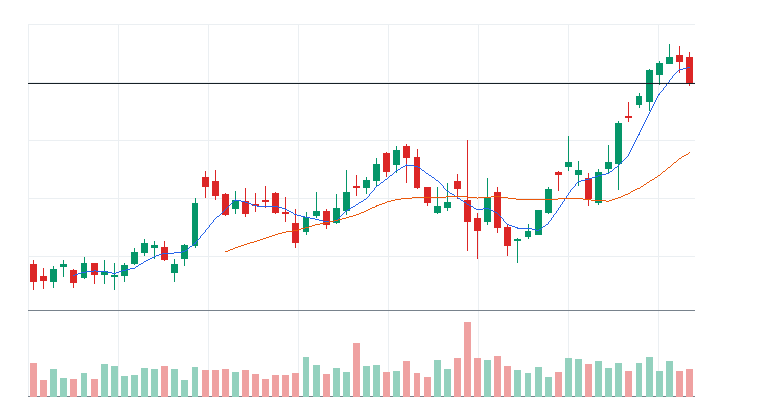
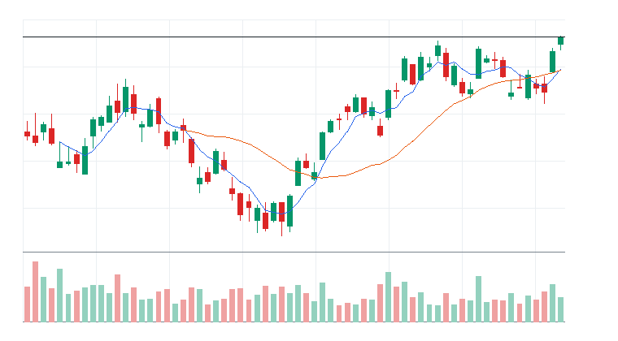

# 오늘의 데일리 트레이딩 요약

**REAL DATA TEST - 가격/거래량은 실제 데이터, 뉴스/ETF 구성종목 확산도/거래대금 유동성 일부 연결**

**목적:** 이 리포트는 최근 오른 자산을 나열하는 것이 아니라, 돈이 몰리는 근거와 다음 매수 주체가 확인할 트레이딩 후보를 찾기 위한 보고서다.

> 핵심 질문: 현재 가격에서 누가 사고 있고, 누가 앞으로 더 비싸게 사줄 수 있는가?

## 시장 국면 판단

- 최종 판정: 기간 조정 (82점)
- 전일 대비: 기간 조정 유지, 점수 변화는 제한적이다(-1점).
- 판정 신뢰도: 높음 (100점) - 핵심 지수와 매크로 데이터가 대부분 직접 수집되어 판정 신뢰도가 높다.
- 행동 바이어스: 추격 보류, 돌파 확인
- 한 줄 결론: 장기 추세는 유지되지만 단기 추세가 둔화되어 기간 조정으로 본다. 기술 100점, 매크로 49점.
- 기술적 지표: 상승 추세 우위 (100점, 가중치 65%)
- S&P 500: 100점 | 50일선 위, 200일선 위, 20일 +2.41%, 60일 +5.00%, 52주 고점 대비 -0.46% -> 기술 점수 100
- Nasdaq 100: 100점 | 50일선 위, 200일선 위, 20일 -0.34%, 60일 +2.00%, 52주 고점 대비 -3.38% -> 기술 점수 100
- 매크로 시황: 매크로 중립 (49점, 가중치 35%)
- 매크로 요약: 매크로 점수 49로 뚜렷한 방향성보다 확인 대기 성격이 강하다.
- 금리: 중립 48점 / 금리 중립 / confidence HIGH
  - 주요 근거: US 10Y yield 20일 +1.99%, 5일 -1.79%; US 3M yield 20일 +0.41%, 단기금리 방향 확인; US long-duration bonds 20일 -2.02%, 장기채 가격 기준 할인율 부담 확인
  - 확인 사항: 추가 확인 이벤트 없음
- 물가: 중립 47점 / 물가 중립 / confidence HIGH
  - 주요 근거: Oil ETF 20일 +8.54%, 유가 기반 물가 압력 확인; TIPS ETF 20일 -0.97%, 물가연동채 흐름은 보조 근거; Gold 20일 +5.69%, 금 강세는 방어 수요 여부 확인
  - 확인 사항: 금 강세가 인플레 헤지 또는 방어 수요일 수 있어 위험자산 해석을 제한한다.
- 정책: 중립 50점 / 정책 이벤트 확인 전 중립 / confidence LOW
  - 주요 근거: 정책 톤은 1차 버전에서 일정/이벤트 리스크 기반 중립값으로 반영한다.
  - 확인 사항: FOMC, CPI, PCE, 고용지표 발표 전후에는 매크로 confidence를 보수적으로 해석한다.
- 신용/유동성: 중립 52점 / 신용/유동성 중립 / confidence HIGH
  - 주요 근거: High yield credit 20일 -0.13%, 하이일드 위험선호 확인; HYG-LQD 20일 상대강도 +0.72%, 신용위험 선호/회피 확인; VIX 20일 -0.86%, 변동성 부담 확인
  - 확인 사항: 추가 확인 이벤트 없음
- 환율/글로벌: 중립 52점 / 환율/글로벌 중립 / confidence MEDIUM
  - 주요 근거: US dollar 20일 -1.13%, 달러 강세/약세 확인
  - 확인 사항: 추가 확인 이벤트 없음
- US 10Y yield: 48점 | 하락 시 주식 우호; 5일 -1.79%, 20일 +1.99% -> 매크로 점수 48
- US 3M yield: 49점 | 하락 시 주식 우호; 5일 +0.76%, 20일 +0.41% -> 매크로 점수 49
- US long-duration bonds: 47점 | 상승 시 주식 우호; 5일 +0.62%, 20일 -2.02% -> 매크로 점수 47
- TIPS ETF: 50점 | 상승 시 주식 우호; 5일 -0.51%, 20일 -0.97% -> 매크로 점수 50
- Oil ETF: 43점 | 하락 시 주식 우호; 5일 -8.66%, 20일 +8.54% -> 매크로 점수 43
- Gold: 50점 | 상승 시 주식 우호; 5일 +7.25%, 20일 +5.69% -> 매크로 점수 50
- US dollar: 52점 | 하락 시 주식 우호; 5일 -0.35%, 20일 -1.13% -> 매크로 점수 52
- High yield credit: 50점 | 상승 시 주식 우호; 5일 +0.16%, 20일 -0.13% -> 매크로 점수 50
- Investment grade credit: 50점 | 상승 시 주식 우호; 5일 +0.28%, 20일 -0.85% -> 매크로 점수 50
- VIX: 57점 | 하락 시 주식 우호; 5일 -6.82%, 20일 -0.86% -> 매크로 점수 57
- 데이터 커버리지: 기술 2/2, 매크로 10/10
- 데이터 신뢰도 근거:
  - 직접 지수 데이터: S&P 500, Nasdaq 100
  - 대체 지수 데이터 없음
  - 매크로 데이터: 10/10
  - 누락 데이터 없음
  - stale 데이터 없음

## 모바일 요약

[오늘의 데일리 트레이딩 요약]

생성 성공 / 데이터 모드: REAL_TEST

시장:
- 중립

시장 지배 서사:
1. AI 소프트웨어/사이버보안 확산 - 부상 - iShares Expanded Tech-Software Sector ETF(IGV), Invesco QQQ Trust(QQQ), Palantir Technologies Inc.(PLTR), Atlassian Corporation(TEAM) 중심으로 5일 +14.38%, 20일 +19.48% 흐름이 형성됨. 직접 촉매 일부 확인.
2. 방산/안보 프리미엄 - 관찰 - Global X Defense Tech ETF(SHLD), iShares U.S. Aerospace & Defense ETF(ITA), Palantir Technologies Inc.(PLTR), AeroVironment(AVAV) 중심으로 5일 +13.25%, 20일 +15.19% 흐름이 형성됨. 뉴스 직접성 제한.
3. Aerospace & Defense 자금 유입 - 관찰 - Global X Defense Tech ETF(SHLD), SPDR S&P 500 ETF Trust(SPY), AeroVironment(AVAV), Kratos Defense & Security Solutions(KTOS) 중심으로 5일 +9.77%, 20일 +10.48% 흐름이 형성됨. 뉴스 직접성 제한.

트렌드 강도:
1. AI 소프트웨어/사이버보안 확산 - TSI 69 - 부상 - 진입품질 관찰
2. 방산/안보 프리미엄 - TSI 67 - 부상 - 진입품질 관찰
3. Aerospace & Defense 자금 유입 - TSI 67 - 부상 - 진입품질 관찰

오늘 결론:
- 이커머스/여행 플랫폼 개별 종목 흐름이 ETF 대비 강한지 확인 필요
- 행동 후보는 linkedNarrative와 함께 확인한다.
- 추격보다 진입 조건 확인 후 접근한다.

오늘 실제 행동 후보:
1. Booking Holdings Inc.(BKNG)(STOCK) - AI 소프트웨어/사이버보안 확산 - 단기 추세가 유지되고 거래량이 1.0배 이상이면 눌림 이후 재상승을 시도할 수 있음
2. Fastenal Company(FAST)(STOCK) - Aerospace & Defense 자금 유입 - 52주 고점 부근이라 돌파가 확인되면 신고가 추종 매수가 붙을 수 있음
3. Shopify Inc.(SHOP)(STOCK) - AI 소프트웨어/사이버보안 확산 - 단기 추세가 유지되고 거래량이 1.0배 이상이면 눌림 이후 재상승을 시도할 수 있음

다크호스 후보:
1. Airbnb Inc.(ABNB) - darkHorseScore 78 - 베이스 돌파 확인
2. Cognizant Technology Solutions Corporation(CTSH) - darkHorseScore 71 - 베이스 돌파 확인
3. IDEXX Laboratories Inc.(IDXX) - darkHorseScore 67 - 초기 반전

ETF 후보 TOP 5:
1. Global X Copper Miners ETF(COPX) - 전력망/원전/인프라 병목 - 조건부 진입
2. Global X Uranium ETF(URA) - 전력망/원전/인프라 병목 - 관찰
3. First Trust NASDAQ Clean Edge Smart Grid Infrastructure ETF(GRID) - 전력망/원전/인프라 병목 - 관찰
4. ARK Innovation ETF(ARKK) - 위험선호 성장주 재진입 - 제외
5. Amplify Cybersecurity ETF(HACK) - 사이버보안 지출 재가속 - 제외

웹 리포트:
https://yoolcool.github.io/DailyTradingThesisAgent/

## 오늘 결론

- 오늘 결론: 조건부 진입
- 신규 진입 후보: 0개
- 조건부 진입 후보: 7개
- 관찰 후보: 122개
- 주요 제한 요인: Entry Quality < 40, RVOL 미달, 뉴스 직접성 부족
- 주문 판단: 시장가 금지 / 지정가 또는 관찰
- 실전 판단: 진입 후보는 있으나, 전일 고점 돌파와 거래량 확인 후 선별적으로 접근한다.

### 후보 제한 요인 집계

- RVOL < 1.00x: 118개
- 거래대금 유동성 낮음: 16개
- Entry Quality 50~54 near miss: 2개
- Entry Quality 40~49 관찰: 9개
- Entry Quality < 40: 146개
- Exhaustion Risk >= 70: 0개
- ETF breadth 샘플 부족: 37개
- 뉴스 직접성 부족: 100개

## 데이터 신뢰도

- 전체 데이터 신뢰도 등급: LOW
- 분석 신뢰도: LOW
- 주문 실행 신뢰도: LOW
- ETF breadth 신뢰도: LOW
- 신뢰도 해석: 테마 확산 판단 제한, 거래대금 유동성 낮음 또는 확인 불가, 프리/애프터마켓 확인 불가
- 리포트 생성 시각: 2026-08-10 08:32 KST
- 가격 기준 거래일: 2026-08-07 US regular close
- 뉴스 수집 시각: 2026-08-10 08:32 KST
- 가장 최근 뉴스 발행 시각: 2026-08-10 08:17 KST
- 뉴스 신선도 상태: FRESH
- 뉴스 소스: Yahoo Finance RSS, MarketWatch RSS, CNBC Markets RSS, SEC EDGAR RSS, Federal Reserve RSS, Finnhub API
- 뉴스 소스 상태: Yahoo Finance RSS CONNECTED, MarketWatch RSS CONNECTED, CNBC Markets RSS PARTIAL, SEC EDGAR RSS PARTIAL, Federal Reserve RSS CONNECTED, Finnhub API DISABLED
- 뉴스 신뢰도: MEDIUM
- 추천 적용 거래일: 2026-08-09 US regular session
- 가격/거래량 데이터 상태: 연결됨
- 뉴스 데이터 상태: 일부 연결
- ETF 구성종목 확산도 상태: 일부 연결
- ETF 구성종목 샘플 수: 1~4
- 거래대금 유동성 데이터 상태: 일부 연결
- 프리/애프터마켓 데이터 상태: UNAVAILABLE
- 데이터 provider: yfinance, Yahoo Finance RSS, MarketWatch RSS, CNBC Markets RSS, SEC EDGAR RSS, Federal Reserve RSS, Finnhub API, config fallback sample, price-volume dollar-volume fallback
- 실전 사용 경고: 이 리포트는 투자판단 보조용이며, REAL_TEST 모드에서는 일부 데이터가 누락되거나 지연될 수 있다. 실제 주문 전 현재가, 뉴스, 프리마켓/정규장 거래량을 별도 확인해야 한다.

## 0. 시장 상태

- 데이터 모드: REAL_TEST
- 가격/거래량: 연결됨
- 뉴스: 일부 연결
- ETF 구성종목 확산도: 일부 연결
- 거래대금 유동성: 일부 연결
- 생성 시각: 2026년 8월 10일 월요일 AM 8:32
- 시장 상태: 중립
- 오늘 돈의 방향: 이커머스/여행 플랫폼 개별 종목 흐름이 ETF 대비 강한지 확인 필요
- 강한 테마 TOP 3: 구리/금속 ETF(98), 금속/광산 ETF(91), 금 ETF(78)
- 데이터 한계:
  - API 또는 provider 상태에 따라 뉴스/ETF 확산도/거래대금 유동성 반영 범위가 달라질 수 있다.
  - 수집 실패 데이터는 점수 반영에서 제외하거나 confidence를 제한한다.
  - reasonConfidence HIGH는 직접 촉매, 가격/거래량, 확산도/유동성 근거가 함께 있을 때만 사용한다.

## 오늘 시장을 지배하는 서사

### 오늘 시장을 지배하는 서사 TOP 3

#### 1. AI 소프트웨어/사이버보안 확산
- 상태: 부상
- narrativeScore: 67
- reasonConfidence: MEDIUM
- 근거 ETF: IGV, QQQ, AIQ
- 근거 개별 종목: PLTR, TEAM, ZS, MSFT, DDOG
- 돈이 몰리는 이유: AI 소프트웨어/사이버보안 확산 관련 iShares Expanded Tech-Software Sector ETF(IGV), Invesco QQQ Trust(QQQ), Global X Artificial Intelligence & Technology ETF(AIQ)와 Palantir Technologies Inc.(PLTR), Atlassian Corporation(TEAM), Zscaler Inc.(ZS), Microsoft Corporation(MSFT)의 5일(+14.38%)·20일(+19.48%) 흐름을 함께 본다. 평균 상대 거래량은 1.37배이고, ETF 확산도는 추가 확인이 필요하다. 직접 뉴스/이벤트가 일부 확인된다.
- 다음 매수 주체: AI 소프트웨어 실적 기대를 사는 ETF 자금, 엔터프라이즈 소프트웨어 스윙 트레이더, 신고가 추종 자금
- 가장 좋은 트레이딩 수단: ETF 우선: IGV, AIQ, QQQ / 개별 종목 우선: PLTR, DDOG, TEAM
- 서사가 깨지는 조건: IGV/AIQ 20일선 이탈, 관련 소프트웨어 종목 절반 이상 5일선 이탈, 상대 거래량 둔화
- 오늘 행동: 추격보다 눌림 후 재상승 확인

상세 narrativeScore 근거 보기

- rawScore: 67
- ETF 평균 moneyFlowScore: 39
- 개별 종목 평균 moneyFlowScore: 65
- ETF 후보 비율: 0%
- 개별 종목 후보 비율: 40%
- 5일 평균 수익률: +14.00%
- 20일 평균 수익률: +19.00%
- 평균 상대 거래량: 1.00배
- ETF 평균 상대 거래량: 1.00배
- 개별주 평균 상대 거래량: 2.00배
- 52주 고점 근접 후보 비율: 13%
- 뉴스 직접성 점수: 9
- ETF 확산도 점수: 0
- 유동성 점수: 2
- 과열 리스크 차감: 0

#### 2. 방산/안보 프리미엄
- 상태: 관찰
- narrativeScore: 64
- reasonConfidence: LOW
- 근거 ETF: SHLD, ITA, XAR
- 근거 개별 종목: PLTR, AVAV, KTOS
- 돈이 몰리는 이유: 방산/안보 프리미엄 관련 Global X Defense Tech ETF(SHLD), iShares U.S. Aerospace & Defense ETF(ITA), SPDR S&P Aerospace & Defense ETF(XAR)와 Palantir Technologies Inc.(PLTR), AeroVironment(AVAV), Kratos Defense & Security Solutions(KTOS)의 5일(+13.25%)·20일(+15.19%) 흐름을 함께 본다. 평균 상대 거래량은 0.96배이고, ETF 확산도는 추가 확인이 필요하다. 뉴스 직접성은 아직 제한적이다.
- 다음 매수 주체: 지정학 리스크와 안보 예산 기대를 사는 테마 ETF 자금
- 가장 좋은 트레이딩 수단: ETF 우선: XAR, SHLD, ITA / 개별 종목 우선: AVAV, KTOS, PLTR
- 서사가 깨지는 조건: 방산 ETF 20일선 이탈 또는 안보 이벤트 프리미엄 둔화
- 오늘 행동: 뉴스 촉매가 직접 확인될 때만 추세 추종

상세 narrativeScore 근거 보기

- rawScore: 64
- ETF 평균 moneyFlowScore: 46
- 개별 종목 평균 moneyFlowScore: 65
- ETF 후보 비율: 25%
- 개별 종목 후보 비율: 50%
- 5일 평균 수익률: +13.00%
- 20일 평균 수익률: +15.00%
- 평균 상대 거래량: 1.00배
- ETF 평균 상대 거래량: 1.00배
- 개별주 평균 상대 거래량: 1.00배
- 52주 고점 근접 후보 비율: 40%
- 뉴스 직접성 점수: 8
- ETF 확산도 점수: 0
- 유동성 점수: 0
- 과열 리스크 차감: 0

#### 3. Aerospace & Defense 자금 유입
- 상태: 관찰
- narrativeScore: 64
- reasonConfidence: MEDIUM
- 근거 ETF: SHLD, SPY, IWM, QQQ
- 근거 개별 종목: AVAV, KTOS, AXON, RTX, LMT
- 돈이 몰리는 이유: Aerospace & Defense 자금 유입 관련 Global X Defense Tech ETF(SHLD), SPDR S&P 500 ETF Trust(SPY), iShares Russell 2000 ETF(IWM)와 AeroVironment(AVAV), Kratos Defense & Security Solutions(KTOS), Axon Enterprise Inc.(AXON), RTX의 5일(+9.77%)·20일(+10.48%) 흐름을 함께 본다. 평균 상대 거래량은 1.03배이고, ETF 확산도는 추가 확인이 필요하다. 뉴스 직접성은 아직 제한적이다.
- 다음 매수 주체: Aerospace & Defense 자금 유입을 확인한 섹터 ETF 자금과 상대강도 추종 스윙 자금
- 가장 좋은 트레이딩 수단: ETF 우선: QQQ, SPY, IWM / 개별 종목 우선: RTX, LMT, KTOS
- 서사가 깨지는 조건: QQQ 20일선 이탈 또는 관련 종목 절반 이상 5일선 이탈
- 오늘 행동: 기존 네러티브와 중복을 확인한 뒤 ETF/대표 종목 동조성이 살아날 때만 관찰 편입

상세 narrativeScore 근거 보기

- rawScore: 64
- ETF 평균 moneyFlowScore: 47
- 개별 종목 평균 moneyFlowScore: 67
- ETF 후보 비율: 20%
- 개별 종목 후보 비율: 60%
- 5일 평균 수익률: +10.00%
- 20일 평균 수익률: +10.00%
- 평균 상대 거래량: 1.00배
- ETF 평균 상대 거래량: 1.00배
- 개별주 평균 상대 거래량: 1.00배
- 52주 고점 근접 후보 비율: 50%
- 뉴스 직접성 점수: 10
- ETF 확산도 점수: 0
- 유동성 점수: 1
- 과열 리스크 차감: 0

### 전체 narrative 요약

| 서사명 | 상태 | narrativeScore | reasonConfidence | 대표 ETF | 대표 종목 | 오늘 행동 |
| --- | --- | ---: | --- | --- | --- | --- |
| AI 소프트웨어/사이버보안 확산 | 부상 | 67 | MEDIUM | IGV, QQQ, AIQ | PLTR, TEAM, ZS, MSFT | 추격보다 눌림 후 재상승 확인 |
| 방산/안보 프리미엄 | 관찰 | 64 | LOW | SHLD, ITA, XAR | PLTR, AVAV, KTOS | 뉴스 촉매가 직접 확인될 때만 추세 추종 |
| Aerospace & Defense 자금 유입 | 관찰 | 64 | MEDIUM | SHLD, SPY, IWM | AVAV, KTOS, AXON, RTX | 기존 네러티브와 중복을 확인한 뒤 ETF/대표 종목 동조성이 살아날 때만 관찰 편입 |
| 바이오/헬스케어 촉매 | 관찰 | 62 | MEDIUM | QQQ | REGN, INSM, AMGN | 기존 네러티브와 중복을 확인한 뒤 ETF/대표 종목 동조성이 살아날 때만 관찰 편입 |
| 소프트웨어 실적/AI 수익화 | 관찰 | 53 | LOW | IGV, QQQ, AIQ | TEAM, WDAY, ADSK, INTU | 기존 네러티브와 중복을 확인한 뒤 ETF/대표 종목 동조성이 살아날 때만 관찰 편입 |
| 사이버보안 지출 재가속 | 약화 | 47 | LOW | HACK, CIBR, IHAK | CRWD, PANW, FTNT | 기존 네러티브와 중복을 확인한 뒤 ETF/대표 종목 동조성이 살아날 때만 관찰 편입 |
| Internet Content 자금 유입 | 약화 | 44 | LOW | QQQ | DASH, META | 기존 네러티브와 중복을 확인한 뒤 ETF/대표 종목 동조성이 살아날 때만 관찰 편입 |
| 전력망/원전/인프라 병목 | 약화 | 36 | LOW | COPX, URA, GRID | FCX, ETN, CEG, PWR | ETF 확산도와 거래량이 같이 살아날 때만 진입 |
| Specialty Business Services 자금 유입 | 약화 | 31 | LOW | SPY, IWM, QQQ | TRI, CTAS, CPRT | 기존 네러티브와 중복을 확인한 뒤 ETF/대표 종목 동조성이 살아날 때만 관찰 편입 |
| 소비 회복/방어주 선별 | 약화 | 29 | LOW | QQQ | AMZN, PDD | 기존 네러티브와 중복을 확인한 뒤 ETF/대표 종목 동조성이 살아날 때만 관찰 편입 |
| 위험선호 성장주 재진입 | 소멸 | 28 | LOW | ARKK, QQQ, IPO | COIN, ARM, TSLA | 지수 위험선호가 유지될 때만 선별 진입 |
| 전력 유틸리티 수요 재평가 | 약화 | 27 | LOW | SPY, IWM, QQQ | ETN, GEV, VRT | 기존 네러티브와 중복을 확인한 뒤 ETF/대표 종목 동조성이 살아날 때만 관찰 편입 |
| 매크로 방어/헤지 | 약화 | 23 | LOW | GLD, TLT, XLE | XOM, CVX | 위험회피가 확인될 때만 헤지성 접근 |
| 필수소비재 음료 방어 성장 | 약화 | 19 | LOW | QQQ | CCEP, MNST | 기존 네러티브와 중복을 확인한 뒤 ETF/대표 종목 동조성이 살아날 때만 관찰 편입 |
| Integrated Oil & Gas 자금 유입 | 약화 | 19 | LOW | SPY, IWM, QQQ | XOM, CVX | 기존 네러티브와 중복을 확인한 뒤 ETF/대표 종목 동조성이 살아날 때만 관찰 편입 |
| AI 인프라 재가속 | 소멸 | 18 | LOW | GRID, SMH, SOXX | ETN, NVDA, MU, VRT | 추격보다 5일선 지지 후 재상승 확인 |
| Data Storage 자금 유입 | 소멸 | 17 | LOW | SPY, IWM, QQQ | STX, WDC | 기존 네러티브와 중복을 확인한 뒤 ETF/대표 종목 동조성이 살아날 때만 관찰 편입 |
| 반도체 설계/공급망 재가속 | 소멸 | 11 | LOW | SMH, SOXX, SOXQ | ADI, ARM, TXN, AMD | 기존 네러티브와 중복을 확인한 뒤 ETF/대표 종목 동조성이 살아날 때만 관찰 편입 |
| 반도체 장비 사이클 재평가 | 소멸 | 10 | LOW | SMH, SOXX, SOXQ | ASML, AMAT, LRCX | 기존 네러티브와 중복을 확인한 뒤 ETF/대표 종목 동조성이 살아날 때만 관찰 편입 |
| 비트코인/디지털 자산 위험선호 | 소멸 | 6 | LOW | IBIT, BLOK | MSTR, IREN, COIN | 비트코인 베타가 살아날 때만 단기 매매 |

## 트렌드 강도 판단

### 1. AI 소프트웨어/사이버보안 확산
- Trend Strength Index: 69
- 트렌드 상태 라벨: 부상
- 테마 확산도: 보통
- ETF 동조성: 강함
- 거래량 강도: 보통
- 과열 위험: 보통 (33)
- 오늘 진입 품질: 관찰 (40)
- 한 줄 판단: AI 소프트웨어/사이버보안 확산는 Trend Strength는 중간이지만 진입 품질이 살아나는 초기 진입 후보 성격이다.
- 오늘 접근법: iShares Expanded Tech-Software Sector ETF(IGV)/Invesco QQQ Trust(QQQ)/Global X Artificial Intelligence & Technology ETF(AIQ) 거래량 증가와 Palantir Technologies Inc.(PLTR)/Atlassian Corporation(TEAM)/Zscaler Inc.(ZS) 확산을 확인하며 작은 사이즈의 초기 진입 후보로만 본다.

트렌드 강도 상세 근거 보기

- 가격 모멘텀: 가격 모멘텀 25/25. 평균 5D +14.38%, 20D +19.48%.
- 거래량 강도: 거래량 강도 10/20. 평균 RVOL 1.37배.
- ETF 동조성: ETF 동조성 12/15. 관련 ETF iShares Expanded Tech-Software Sector ETF(IGV), Global X Artificial Intelligence & Technology ETF(AIQ), Invesco QQQ Trust(QQQ) 흐름을 기준으로 판단.
- 테마 확산도: 테마 확산도 12/20. 상위 1~2개 쏠림 감점 0점 반영.
- 뉴스 촉매: 뉴스/촉매 신선도 3/10. HIGH 직접 촉매 1개.
- 과열 리스크: 과열 리스크 33/100. 단기 급등, 고점 근접, ETF-개별주 괴리, 쏠림을 함께 반영.
- 시장 환경: 시장 환경 7/10. QQQ/SPY/IWM 가격 흐름 기반 위험선호 점수.

### 2. 방산/안보 프리미엄
- Trend Strength Index: 67
- 트렌드 상태 라벨: 부상
- 테마 확산도: 보통
- ETF 동조성: 강함
- 거래량 강도: 부족
- 과열 위험: 보통 (28)
- 오늘 진입 품질: 관찰 (41)
- 한 줄 판단: 방산/안보 프리미엄는 Trend Strength는 중간이지만 진입 품질이 살아나는 초기 진입 후보 성격이다.
- 오늘 접근법: Global X Defense Tech ETF(SHLD)/iShares U.S. Aerospace & Defense ETF(ITA)/SPDR S&P Aerospace & Defense ETF(XAR) 거래량 증가와 Palantir Technologies Inc.(PLTR)/AeroVironment(AVAV)/Kratos Defense & Security Solutions(KTOS) 확산을 확인하며 작은 사이즈의 초기 진입 후보로만 본다.

트렌드 강도 상세 근거 보기

- 가격 모멘텀: 가격 모멘텀 25/25. 평균 5D +13.25%, 20D +15.19%.
- 거래량 강도: 거래량 강도 4/20. 평균 RVOL 0.96배.
- ETF 동조성: ETF 동조성 15/15. 관련 ETF SPDR S&P Aerospace & Defense ETF(XAR), Global X Defense Tech ETF(SHLD), iShares U.S. Aerospace & Defense ETF(ITA), Invesco Aerospace & Defense ETF(PPA) 흐름을 기준으로 판단.
- 테마 확산도: 테마 확산도 13/20. 상위 1~2개 쏠림 감점 0점 반영.
- 뉴스 촉매: 뉴스/촉매 신선도 3/10. HIGH 직접 촉매 0개.
- 과열 리스크: 과열 리스크 28/100. 단기 급등, 고점 근접, ETF-개별주 괴리, 쏠림을 함께 반영.
- 시장 환경: 시장 환경 7/10. QQQ/SPY/IWM 가격 흐름 기반 위험선호 점수.

### 3. Aerospace & Defense 자금 유입
- Trend Strength Index: 67
- 트렌드 상태 라벨: 부상
- 테마 확산도: 보통
- ETF 동조성: 강함
- 거래량 강도: 약함
- 과열 위험: 낮음 (18)
- 오늘 진입 품질: 관찰 (46)
- 한 줄 판단: Aerospace & Defense 자금 유입는 Trend Strength는 중간이지만 진입 품질이 살아나는 초기 진입 후보 성격이다.
- 오늘 접근법: Global X Defense Tech ETF(SHLD)/SPDR S&P 500 ETF Trust(SPY)/iShares Russell 2000 ETF(IWM) 거래량 증가와 AeroVironment(AVAV)/Kratos Defense & Security Solutions(KTOS)/Axon Enterprise Inc.(AXON) 확산을 확인하며 작은 사이즈의 초기 진입 후보로만 본다.

트렌드 강도 상세 근거 보기

- 가격 모멘텀: 가격 모멘텀 23/25. 평균 5D +9.77%, 20D +10.48%.
- 거래량 강도: 거래량 강도 6/20. 평균 RVOL 1.03배.
- ETF 동조성: ETF 동조성 14/15. 관련 ETF Invesco QQQ Trust(QQQ), SPDR S&P 500 ETF Trust(SPY), iShares Russell 2000 ETF(IWM), SPDR S&P Aerospace & Defense ETF(XAR), Global X Defense Tech ETF(SHLD) 흐름을 기준으로 판단.
- 테마 확산도: 테마 확산도 14/20. 상위 1~2개 쏠림 감점 0점 반영.
- 뉴스 촉매: 뉴스/촉매 신선도 3/10. HIGH 직접 촉매 0개.
- 과열 리스크: 과열 리스크 18/100. 단기 급등, 고점 근접, ETF-개별주 괴리, 쏠림을 함께 반영.
- 시장 환경: 시장 환경 7/10. QQQ/SPY/IWM 가격 흐름 기반 위험선호 점수.

## 최근 추천 결과 트래킹

개별주는 데이트레이딩 관점으로 추천 이후 첫 정규장의 장중 최고가와 종가를 추적한다. ETF는 테마/스윙 관점으로 추천 이후 1주일 동안의 최고가와 현재 종가를 추적한다.

### 개별주 Top 3 추천 성과 요약
- 최근 5개 리포트 표본: 15개 (초기 검증 단계)
- 장중 최고가 기준 성공률: +41.67%
- 종가 기준 성공률: +50.00%
- 평균 장중 최고 수익률: +2.57%
- 평균 종가 수익률: +0.72%

### ETF 추천 성과 요약
- 최근 5개 리포트 표본: 8개 (초기 검증 단계)
- 1주 최고가 기준 성공률: +50.00%
- 현재 종가 기준 성공률: +50.00%
- 평균 1주 최고 수익률: +2.51%
- 평균 현재 수익률: +1.38%

최근 추천 결과 상세 테이블 펼치기

| 추천일 | 유형 | 순위 | 티커 | 기준가 | 추적 기간 | 상태 | High 수익률 | Close 수익률 | 결과 | 코멘트 |
| --- | --- | ---: | --- | ---: | --- | --- | ---: | ---: | --- | --- |
| 2026-08-10 | STOCK | 3 | SHOP | $151.57 | 2026-08-10 | pending | 데이터 없음 | 데이터 없음 | 추적 대기 | 아직 추적 거래일 데이터가 완성되지 않음 |
| 2026-08-10 | STOCK | 2 | FAST | $51.84 | 2026-08-10 | pending | 데이터 없음 | 데이터 없음 | 추적 대기 | 아직 추적 거래일 데이터가 완성되지 않음 |
| 2026-08-10 | STOCK | 1 | BKNG | $214.42 | 2026-08-10 | pending | 데이터 없음 | 데이터 없음 | 추적 대기 | 아직 추적 거래일 데이터가 완성되지 않음 |
| 2026-08-10 | ETF | 2 | XME | $115.74 | 2026-08-10~2026-08-17 | in_progress | 데이터 없음 | 0.00% | 진행 중 | 아직 1주 추적 기간이 끝나지 않음 (일봉 high 미확보 시 close 기준 보조) |
| 2026-08-10 | ETF | 1 | COPX | $88.03 | 2026-08-10~2026-08-17 | in_progress | 데이터 없음 | 0.00% | 진행 중 | 아직 1주 추적 기간이 끝나지 않음 (일봉 high 미확보 시 close 기준 보조) |
| 2026-08-07 | STOCK | 3 | KTOS | $57.41 | 2026-08-07 | complete | +6.41% | +5.85% | 성공 | 장중 기회와 종가 유지가 모두 확인됨 (일봉 기준) |
| 2026-08-07 | STOCK | 2 | BKNG | $207.39 | 2026-08-07 | complete | +4.00% | +3.39% | 성공 | 장중 기회와 종가 유지가 모두 확인됨 (일봉 기준) |
| 2026-08-07 | STOCK | 1 | SHOP | $147.44 | 2026-08-07 | complete | +3.67% | +2.80% | 성공 | 장중 기회와 종가 유지가 모두 확인됨 (일봉 기준) |
| 2026-08-06 | STOCK | 3 | KTOS | $55.34 | 2026-08-06 | complete | +6.79% | +3.74% | 성공 | 장중 기회와 종가 유지가 모두 확인됨 (일봉 기준) |
| 2026-08-06 | STOCK | 2 | AMGN | $407.83 | 2026-08-06 | complete | +2.59% | -0.73% | 제한적 유효 | 제한적인 장중 기회만 발생 (일봉 기준) |
| 2026-08-06 | STOCK | 1 | TEAM | $113.32 | 2026-08-06 | complete | -2.15% | -2.78% | 실패 | 추천 이후 의미 있는 장중 기회가 부족하고 종가도 약함 (일봉 기준) |
| 2026-08-06 | ETF | 2 | XME | $111.92 | 2026-08-06~2026-08-13 | in_progress | +3.73% | +3.41% | 진행 중 | 아직 1주 추적 기간이 끝나지 않음 |
| 2026-08-06 | ETF | 1 | COPX | $86.72 | 2026-08-06~2026-08-13 | in_progress | +2.12% | +1.51% | 진행 중 | 아직 1주 추적 기간이 끝나지 않음 |
| 2026-08-05 | STOCK | 3 | DXCM | $86.94 | 2026-08-05 | complete | -0.54% | -4.92% | 실패 | 추천 이후 의미 있는 장중 기회가 부족하고 종가도 약함 (일봉 기준) |
| 2026-08-05 | STOCK | 2 | DDOG | $288.15 | 2026-08-05 | complete | +1.59% | -1.73% | 제한적 유효 | 제한적인 장중 기회만 발생 (일봉 기준) |
| 2026-08-05 | STOCK | 1 | MSFT | $492.81 | 2026-08-05 | complete | +1.10% | -1.09% | 제한적 유효 | 제한적인 장중 기회만 발생 (일봉 기준) |
| 2026-08-05 | ETF | 3 | MAGS | $68.96 | 2026-08-05~2026-08-12 | in_progress | +0.81% | +0.26% | 진행 중 | 아직 1주 추적 기간이 끝나지 않음 |
| 2026-08-05 | ETF | 2 | COPX | $83.99 | 2026-08-05~2026-08-12 | in_progress | +5.44% | +4.81% | 진행 중 | 아직 1주 추적 기간이 끝나지 않음 |
| 2026-08-05 | ETF | 1 | CIBR | $97.94 | 2026-08-05~2026-08-12 | in_progress | +1.18% | -0.09% | 진행 중 | 아직 1주 추적 기간이 끝나지 않음 |
| 2026-08-04 | STOCK | 3 | MSFT | $487.65 | 2026-08-04 | complete | +2.42% | +1.06% | 제한적 유효 | 제한적인 장중 기회만 발생 (일봉 기준) |
| 2026-08-04 | STOCK | 2 | AMZN | $284.02 | 2026-08-04 | complete | -1.04% | -2.32% | 실패 | 추천 이후 의미 있는 장중 기회가 부족하고 종가도 약함 (일봉 기준) |
| 2026-08-04 | STOCK | 1 | DDOG | $273.6 | 2026-08-04 | complete | +5.96% | +5.32% | 성공 | 장중 기회와 종가 유지가 모두 확인됨 (일봉 기준) |
| 2026-08-04 | ETF | 1 | MAGS | $68.38 | 2026-08-04~2026-08-11 | in_progress | +1.80% | +1.11% | 진행 중 | 아직 1주 추적 기간이 끝나지 않음 |
| 2026-08-03 | STOCK | 3 | DXCM | $83.45 | 2026-08-03 | complete | +5.01% | +4.63% | 성공 | 장중 기회와 종가 유지가 모두 확인됨 (일봉 기준) |
| 2026-08-03 | STOCK | 2 | REGN | $762.63 | 2026-08-03 | complete | +1.33% | -0.44% | 제한적 유효 | 제한적인 장중 기회만 발생 (일봉 기준) |
| 2026-08-03 | STOCK | 1 | MSFT | $464.72 | 2026-08-03 | complete | +5.79% | +4.93% | 성공 | 장중 기회와 종가 유지가 모두 확인됨 (일봉 기준) |
| 2026-07-31 | STOCK | 2 | REGN | $738.34 | 2026-07-31 | complete | +3.58% | +3.29% | 성공 | 장중 기회와 종가 유지가 모두 확인됨 (일봉 기준) |
| 2026-07-31 | STOCK | 1 | MSFT | $451.1 | 2026-07-31 | complete | +3.49% | +3.02% | 성공 | 장중 기회와 종가 유지가 모두 확인됨 (일봉 기준) |
| 2026-07-30 | STOCK | 3 | WDAY | $168.01 | 2026-07-30 | complete | -4.18% | -5.89% | 실패 | 추천 이후 의미 있는 장중 기회가 부족하고 종가도 약함 (일봉 기준) |
| 2026-07-30 | STOCK | 2 | ADBE | $263.43 | 2026-07-30 | complete | -3.09% | -5.90% | 실패 | 추천 이후 의미 있는 장중 기회가 부족하고 종가도 약함 (일봉 기준) |
| 2026-07-30 | STOCK | 1 | MDLZ | $64.99 | 2026-07-30 | complete | -1.65% | -2.94% | 실패 | 추천 이후 의미 있는 장중 기회가 부족하고 종가도 약함 (일봉 기준) |
| 2026-07-29 | STOCK | 3 | ADBE | $249.18 | 2026-07-29 | complete | +6.86% | +5.72% | 성공 | 장중 기회와 종가 유지가 모두 확인됨 (일봉 기준) |
| 2026-07-29 | STOCK | 2 | TEAM | $99.98 | 2026-07-29 | complete | +6.74% | +4.30% | 성공 | 장중 기회와 종가 유지가 모두 확인됨 (일봉 기준) |
| 2026-07-29 | STOCK | 1 | RTX | $218.58 | 2026-07-29 | complete | +0.91% | -1.52% | 실패 | 추천 이후 의미 있는 장중 기회가 부족하고 종가도 약함 (일봉 기준) |
| 2026-07-28 | STOCK | 1 | RTX | $218.42 | 2026-07-28 | complete | +1.34% | +0.07% | 제한적 유효 | 제한적인 장중 기회만 발생 (일봉 기준) |
| 2026-07-27 | STOCK | 2 | LMT | $582.6 | 2026-07-27 | complete | +0.93% | -0.45% | 실패 | 추천 이후 의미 있는 장중 기회가 부족하고 종가도 약함 (일봉 기준) |
| 2026-07-27 | STOCK | 1 | RTX | $212.79 | 2026-07-27 | complete | +3.57% | +2.65% | 성공 | 장중 기회와 종가 유지가 모두 확인됨 (일봉 기준) |
| 2026-07-24 | STOCK | 3 | XOM | $156.89 | 2026-07-24 | complete | +1.16% | +0.03% | 제한적 유효 | 제한적인 장중 기회만 발생 (일봉 기준) |
| 2026-07-24 | STOCK | 2 | LMT | $568.59 | 2026-07-24 | complete | +3.49% | +2.46% | 성공 | 장중 기회와 종가 유지가 모두 확인됨 (일봉 기준) |
| 2026-07-24 | STOCK | 1 | RTX | $209.16 | 2026-07-24 | complete | +2.74% | +1.74% | 제한적 유효 | 제한적인 장중 기회만 발생 (일봉 기준) |
| 2026-07-23 | STOCK | 1 | PCAR | $131.11 | 2026-07-23 | complete | +1.82% | -0.27% | 제한적 유효 | 제한적인 장중 기회만 발생 (일봉 기준) |
| 2026-07-22 | STOCK | 1 | COIN | $175.85 | 2026-07-22 | complete | -0.51% | -5.53% | 실패 | 추천 이후 의미 있는 장중 기회가 부족하고 종가도 약함 (일봉 기준) |
| 2026-07-21 | STOCK | 1 | PYPL | $56.82 | 2026-07-21 | complete | +0.16% | -1.71% | 실패 | 추천 이후 의미 있는 장중 기회가 부족하고 종가도 약함 (일봉 기준) |
| 2026-07-20 | STOCK | 2 | CTAS | $204.45 | 2026-07-20 | complete | -0.03% | -1.30% | 실패 | 추천 이후 의미 있는 장중 기회가 부족하고 종가도 약함 (일봉 기준) |
| 2026-07-20 | STOCK | 1 | PANW | $358.68 | 2026-07-20 | complete | +2.13% | -2.79% | 제한적 유효 | 제한적인 장중 기회만 발생 (일봉 기준) |
| 2026-07-17 | STOCK | 3 | CTAS | $206.25 | 2026-07-17 | complete | +1.68% | -0.87% | 제한적 유효 | 제한적인 장중 기회만 발생 (일봉 기준) |
| 2026-07-17 | STOCK | 2 | TRI | $98.82 | 2026-07-17 | complete | +2.05% | -2.65% | 제한적 유효 | 제한적인 장중 기회만 발생 (일봉 기준) |
| 2026-07-17 | STOCK | 1 | PYPL | $56.73 | 2026-07-17 | complete | +0.78% | -0.30% | 실패 | 추천 이후 의미 있는 장중 기회가 부족하고 종가도 약함 (일봉 기준) |
| 2026-07-16 | STOCK | 3 | PYPL | $55.52 | 2026-07-16 | complete | +3.87% | +2.18% | 성공 | 장중 기회와 종가 유지가 모두 확인됨 (일봉 기준) |
| 2026-07-16 | STOCK | 2 | TRI | $95.51 | 2026-07-16 | complete | +5.85% | +3.47% | 성공 | 장중 기회와 종가 유지가 모두 확인됨 (일봉 기준) |
| 2026-07-16 | STOCK | 1 | CRWD | $210.73 | 2026-07-15 | complete | +3.21% | -1.88% | 단타 유효 | 장중 기회는 있었지만 종가 유지력은 약함 (일봉 기준) |
| 2026-07-15 | STOCK | 1 | CRWD | $210.73 | 2026-07-15 | complete | +3.21% | -1.88% | 단타 유효 | 장중 기회는 있었지만 종가 유지력은 약함 (일봉 기준) |
| 2026-07-14 | STOCK | 1 | TRI | $94.29 | 2026-07-14 | complete | -0.66% | -2.70% | 실패 | 추천 이후 의미 있는 장중 기회가 부족하고 종가도 약함 (일봉 기준) |
| 2026-07-13 | STOCK | 1 | AXON | $640.46 | 2026-07-13 | complete | -9.75% | -14.59% | 실패 | 추천 이후 의미 있는 장중 기회가 부족하고 종가도 약함 (일봉 기준) |
| 2026-07-13 | STOCK | 1 | META | $669.21 | 2026-07-13 | complete | +1.11% | -1.86% | 제한적 유효 | 제한적인 장중 기회만 발생 (일봉 기준) |
| 2026-07-08 | STOCK | 1 | AXON | $640.46 | 2026-07-08 | complete | -1.48% | -6.35% | 실패 | 추천 이후 의미 있는 장중 기회가 부족하고 종가도 약함 (일봉 기준) |
| 2026-07-07 | STOCK | 2 | AXON | $622.35 | 2026-07-07 | complete | +6.86% | +2.91% | 성공 | 장중 기회와 종가 유지가 모두 확인됨 (일봉 기준) |
| 2026-07-07 | STOCK | 1 | PANW | $357.53 | 2026-07-07 | complete | +1.53% | -5.73% | 제한적 유효 | 제한적인 장중 기회만 발생 (일봉 기준) |
| 2026-07-06 | STOCK | 2 | CCEP | $106.61 | 2026-07-06 | complete | +0.58% | +0.34% | 추적 대기 | 아직 추적 거래일 데이터가 완성되지 않음 (일봉 기준) |
| 2026-07-06 | STOCK | 1 | PANW | $348.06 | 2026-07-06 | complete | +5.78% | +2.72% | 성공 | 장중 기회와 종가 유지가 모두 확인됨 (일봉 기준) |

## 오늘 실제 행동 후보

### 1. Booking Holdings Inc.(BKNG)
- 자산 유형: STOCK
- linkedNarrative: AI 소프트웨어/사이버보안 확산
- narrativeStatus: 부상
- narrativeScore: 67
- Trend Strength Index: 69
- Exhaustion Risk: 33 (보통)
- Entry Quality Score: 49 (관찰)
- 트렌드 판단: 시장 위험선호가 약해 시장 환경 비우호 구간이다.
- moneyFlowScore: 100
- finalRawScore: 101
- reasonConfidence: MEDIUM
- reasonConfidenceExplanation: 직접 촉매 부재 때문에 HIGH가 아니라 MEDIUM으로 제한했다.
- tieBreakerReason: 최종 원점수 101, 리스크 패널티 0, 5일 수익률 +11.16%, 상대 거래량 1.12배 순으로 정렬
- 후보별 시장 해석: 중립 / 제한적 - Entry Quality 49 < 50이나 moneyFlow 100, confidence MEDIUM, RVOL 1.12x로 강한 자금흐름 예외 조건 충족
- 게이트 사유: Entry Quality 49 < 50이나 moneyFlow 100, confidence MEDIUM, RVOL 1.12x로 강한 자금흐름 예외 조건 충족
- 주문 실행: 시장가 가능

- 왜 돈이 몰리는가: 20일 +20.20%, 5일 +11.16%, 상대 거래량 1.12배로 가격과 거래량이 함께 개선. 뉴스: MarketWatch RSS macro/under_6h / 유동성: LIQUID
- 누가 더 비싸게 사줄 수 있는지: 개별 주도주를 따라붙는 단기 모멘텀 자금과 관련 ETF 강세를 확인한 트레이더
- 진입 조건: 20일선 위 눌림 후 재상승 확인
- 무효화 조건: 20일선 이탈 또는 상대 거래량 0.8배 이하 둔화
- todayActionLabel: 자금흐름 예외 조건부
#### 최근 뉴스/동향 한국어 요약

- 요약: 종목 직접 뉴스 확인 상태이며 뉴스 흐름은 긍정 우위입니다. 후보 선정 후 재확인한 핵심 이슈는 "Is Booking Holdings (BKNG) a Buying Opportunity as AI Fears Weigh on the Stock?"입니다.
- 직접 촉매 판단: Booking Holdings Inc.에 대해 직접 촉매로 분류된 뉴스가 확인됐습니다. 핵심은 "Is Booking Holdings (BKNG) a Buying Opportunity as AI Fears Weigh on the Stock?"이며, 가이던스 재료로 봅니다.
- 뉴스 1: Is Booking Holdings (BKNG) a Buying Opportunity as AI Fears Weigh on the Stock?
  - 내용: Booking Holdings Inc. 관련 기사는 Is Booking Holdings (BKNG) a Buying Opportunity as AI Fears Weigh on the Stock? 이슈를 다루며, 주가 변동률 +14.90%를 핵심 내용으로 봅니다.
  - 투자 의미: Booking Holdings Inc.의 당일 상대강도 확인에는 도움이 되지만, 실적/가이던스 같은 새 펀더멘털 변화로 보기는 어렵습니다.
  - 확인할 점: 거래량 동반 여부, 장중 고점 유지, 관련 ETF 동반 강세
- 뉴스 2: Company News for Aug 6, 2026
  - 내용: Booking Holdings Inc. 관련 시장 일반 뉴스입니다. 현재 방향성은 중립으로 분류됩니다.
  - 투자 의미: 단기 중립 뉴스 흐름으로 볼 수 있지만, 단독 매수 근거보다는 가격·거래량 조건을 확인하는 보조 근거로 사용합니다.
  - 확인할 점: 원문 수치, 후속 보도, 가격이 진입 조건을 지키는지
- 뉴스 3: ABNB Stock Soars 11% After-Hours — Airbnb Raises 2026 Outlook Again On Strong Travel Demand
  - 내용: Booking Holdings Inc. 관련 기사는 ABNB Stock Soars 11% After-Hours — Airbnb Raises 2026 Outlook Again On Strong Travel Demand 이슈를 다루며, 주가 변동률 +11.00%를 핵심 내용으로 봅니다.
  - 투자 의미: Booking Holdings Inc.의 당일 상대강도 확인에는 도움이 되지만, 실적/가이던스 같은 새 펀더멘털 변화로 보기는 어렵습니다.
  - 확인할 점: 거래량 동반 여부, 장중 고점 유지, 관련 ETF 동반 강세
- 매매 해석: 매매 관점에서는 뉴스 자체보다 가격이 진입 조건을 지키는지, 거래량이 동반되는지, 그리고 뉴스가 이미 주가에 반영됐는지를 우선 확인해야 합니다.
- 차트: 

### 2. Fastenal Company(FAST)
- 자산 유형: STOCK
- linkedNarrative: Aerospace & Defense 자금 유입
- narrativeStatus: 관찰
- narrativeScore: 64
- Trend Strength Index: 67
- Exhaustion Risk: 18 (낮음)
- Entry Quality Score: 51 (관찰)
- 트렌드 판단: 시장 위험선호가 약해 시장 환경 비우호 구간이다.
- moneyFlowScore: 90
- finalRawScore: 90
- reasonConfidence: MEDIUM
- reasonConfidenceExplanation: 직접 촉매 부재 때문에 HIGH가 아니라 MEDIUM으로 제한했다.
- tieBreakerReason: 최종 원점수 90, 리스크 패널티 0, 5일 수익률 +8.66%, 상대 거래량 1.16배 순으로 정렬
- 후보별 시장 해석: 중립 / 제한적 - 고점 근처 추격 리스크
- 게이트 사유: 통과
- 주문 실행: 지정가 권장

- 왜 돈이 몰리는가: 20일 +11.51%, 5일 +8.66%, 상대 거래량 1.16배로 가격과 거래량이 함께 개선. 뉴스: MarketWatch RSS macro/under_6h / 유동성: ACCEPTABLE
- 누가 더 비싸게 사줄 수 있는지: 개별 주도주를 따라붙는 단기 모멘텀 자금과 관련 ETF 강세를 확인한 트레이더
- 진입 조건: 전일 고점 돌파와 5일선 유지 확인
- 무효화 조건: 20일선 이탈 또는 상대 거래량 0.8배 이하 둔화
- todayActionLabel: 조건부 진입
#### 최근 뉴스/동향 한국어 요약

- 요약: 종목 직접 뉴스 확인 상태이며 뉴스 흐름은 긍정 우위입니다. 후보 선정 후 재확인한 핵심 이슈는 "2 Reasons to Like FAST (and 1 Not So Much)"입니다.
- 직접 촉매 판단: Fastenal Company에 대해 직접 촉매로 분류된 뉴스가 확인됐습니다. 핵심은 "2 Reasons to Like FAST (and 1 Not So Much)"이며, 시장 일반 재료로 봅니다.
- 뉴스 1: 2 Reasons to Like FAST (and 1 Not So Much)
  - 내용: Fastenal Company 관련 기사는 2 Reasons to Like FAST (and 1 Not So Much) 이슈를 다루며, 주가 변동률 +10.90%, 동반 비교 수치 +7.10%를 핵심 내용으로 봅니다.
  - 투자 의미: Fastenal Company의 당일 상대강도 확인에는 도움이 되지만, 실적/가이던스 같은 새 펀더멘털 변화로 보기는 어렵습니다.
  - 확인할 점: 거래량 동반 여부, 장중 고점 유지, 관련 ETF 동반 강세
- 뉴스 2: U.S. stock futures dip as investors await inflation data, grapple with more Iran uncertainty
  - 내용: Fastenal Company 관련 기사는 목표가 변화를 다룹니다. 기사 스니펫상 핵심은 U.S.입니다.
  - 투자 의미: 애널리스트 상향은 단기 수급에 우호적일 수 있으나, 목표가 변화가 이미 주가에 반영됐는지 확인해야 합니다.
  - 확인할 점: 원문 수치, 후속 보도, 가격이 진입 조건을 지키는지
- 뉴스 3: Ferguson Added to S&P 500 and the Plumbing Stock Pops. Where It Can Go Next.
  - 내용: Fastenal Company 관련 실적 뉴스입니다. 기사 스니펫상 핵심 내용은 Ferguson is replacing Electronic Arts in the benchmark index.입니다.
  - 투자 의미: 실적/가이던스 재료는 다음 분기 기대치 변화로 이어질 수 있어 컨센서스 변화와 주가 반응 지속성을 함께 봅니다.
  - 확인할 점: 매출/마진/가이던스 수치, 컨센서스 대비 차이
- 매매 해석: 매매 관점에서는 뉴스 자체보다 가격이 진입 조건을 지키는지, 거래량이 동반되는지, 그리고 뉴스가 이미 주가에 반영됐는지를 우선 확인해야 합니다.
- 차트: 

### 3. Shopify Inc.(SHOP)
- 자산 유형: STOCK
- linkedNarrative: AI 소프트웨어/사이버보안 확산
- narrativeStatus: 부상
- narrativeScore: 67
- Trend Strength Index: 69
- Exhaustion Risk: 33 (보통)
- Entry Quality Score: 49 (관찰)
- 트렌드 판단: 시장 위험선호가 약해 시장 환경 비우호 구간이다.
- moneyFlowScore: 94
- finalRawScore: 94
- reasonConfidence: HIGH
- reasonConfidenceExplanation: 직접 촉매: Yahoo Finance RSS / general_market / under_6h - Why Shopify Stock Soared This Week 가격/거래량, 관련 ETF 동반 강세, 유동성 근거가 함께 확인되어 HIGH로 분류했다.
- tieBreakerReason: 최종 원점수 94, 리스크 패널티 -6, 5일 수익률 +29.38%, 상대 거래량 1.16배 순으로 정렬
- 후보별 시장 해석: 중립 / 제한적 - Entry Quality 49 < 50이나 moneyFlow 94, confidence HIGH, RVOL 1.16x로 강한 자금흐름 예외 조건 충족
- 게이트 사유: Entry Quality 49 < 50이나 moneyFlow 94, confidence HIGH, RVOL 1.16x로 강한 자금흐름 예외 조건 충족
- 주문 실행: 시장가 가능
- 직접 촉매: Yahoo Finance RSS / general_market / under_6h - Why Shopify Stock Soared This Week
- 왜 돈이 몰리는가: 20일 +23.69%, 5일 +29.38%, 상대 거래량 1.16배로 가격과 거래량이 함께 개선. 뉴스: MarketWatch RSS macro/under_6h / 유동성: LIQUID
- 누가 더 비싸게 사줄 수 있는지: 개별 주도주를 따라붙는 단기 모멘텀 자금과 관련 ETF 강세를 확인한 트레이더
- 진입 조건: 20일선 위 눌림 후 재상승 확인
- 무효화 조건: 20일선 이탈 또는 상대 거래량 0.8배 이하 둔화
- todayActionLabel: 자금흐름 예외 조건부
#### 최근 뉴스/동향 한국어 요약

- 요약: 종목 직접 뉴스 확인 상태이며 뉴스 흐름은 긍정 우위입니다. 후보 선정 후 재확인한 핵심 이슈는 "Shopify (SHOP) Stock Sees Fair Value Lift As Analysts Weigh AI Growth And Competition"입니다.
- 직접 촉매 판단: Shopify Inc.에 대해 직접 촉매로 분류된 뉴스가 확인됐습니다. 핵심은 "Shopify (SHOP) Stock Sees Fair Value Lift As Analysts Weigh AI Growth And Competition"이며, 애널리스트 상향 재료로 봅니다.
- 뉴스 1: Shopify (SHOP) Stock Sees Fair Value Lift As Analysts Weigh AI Growth And Competition
  - 내용: Shopify Inc. 관련 애널리스트 상향 뉴스입니다. 기사 스니펫상 핵심 내용은 Shopify sits at the center of a wide valuation debate, with recent analyst price targets clustering between US$130 and US$192.입니다.
  - 투자 의미: 애널리스트 상향은 단기 수급에 우호적일 수 있으나, 목표가 변화가 이미 주가에 반영됐는지 확인해야 합니다.
  - 확인할 점: 상향 기관, 목표가 변화폭, 같은 섹터 동반 반응
- 뉴스 2: Why Shopify Stock Soared This Week
  - 내용: Shopify Inc. 관련 시장 일반 뉴스입니다. 현재 방향성은 긍정으로 분류됩니다.
  - 투자 의미: 단기 긍정 뉴스 흐름으로 볼 수 있지만, 단독 매수 근거보다는 가격·거래량 조건을 확인하는 보조 근거로 사용합니다.
  - 확인할 점: 원문 수치, 후속 보도, 가격이 진입 조건을 지키는지
- 뉴스 3: Why Shopify Stock Could Be the Biggest Winner in Agentic AI Commerce
  - 내용: Shopify Inc. 관련 시장 일반 뉴스입니다. 현재 방향성은 긍정으로 분류됩니다.
  - 투자 의미: 단기 긍정 뉴스 흐름으로 볼 수 있지만, 단독 매수 근거보다는 가격·거래량 조건을 확인하는 보조 근거로 사용합니다.
  - 확인할 점: 원문 수치, 후속 보도, 가격이 진입 조건을 지키는지
- 매매 해석: 매매 관점에서는 뉴스 자체보다 가격이 진입 조건을 지키는지, 거래량이 동반되는지, 그리고 뉴스가 이미 주가에 반영됐는지를 우선 확인해야 합니다.
- 차트: 

## 다크호스 후보

> 메인 행동 후보를 대체하지 않는 보조 관찰 섹션이다. 상위 서사 안에서 아직 과열되지 않았지만 초기 추세 전환, 베이스 돌파, 거래량 회복이 시작되는 개별주만 표시한다.

### 1. Airbnb Inc.(ABNB)
- 소속 서사: AI 소프트웨어/사이버보안 확산
- darkHorseScore: 78 (다크호스 후보)
- 단계: 베이스 돌파 확인
- Confidence: LOW
- 5D / 20D / RVOL: +17.52% / +19.82% / 3.69x
- MA 구조: 종가 $178.07 / MA5 $156.55 / MA20 $149.11
- 선정 이유: ABNB는 AI 소프트웨어/사이버보안 확산 서사에 속하고 종가가 MA20 위에 있으며 MA5/MA20 정렬이 개선되고 있다. 최근 15거래일 베이스는 상단 돌파 상태이고, RVOL 3.69x로 거래량 확인은 충분하다. Exhaustion Risk 33로 아직 메인 후보 대비 과열 상한 안에 있다.
- 확인 조건: 돌파 후 고점 위 안착 유지, MA5 위 종가 유지, 관련 ETF 동반 강세
- 무효화 조건: MA20 $149.11 종가 이탈, 최근 스윙 저점 $143.00 이탈, RVOL 0.80x 이하 둔화
- 왜 아직 메인이 아닌가: Entry Quality 0 < 50
#### 최근 뉴스/동향 한국어 요약

- 요약: 후보 선정 후 재확인 뉴스 데이터 없음

darkHorseScore 상세 근거 보기

- 서사 정렬: 13/20
- 초기 추세 구조: 30/30
- 베이스 돌파/정돈: 15/20
- 거래량 확인: 14/15
- 낮은 과열: 5/10
- 유동성 리스크 보정: 5/5
- 리스크 차감: -4
- rawScore: 78

- 차트: 

### 2. Cognizant Technology Solutions Corporation(CTSH)
- 소속 서사: Aerospace & Defense 자금 유입
- darkHorseScore: 71 (다크호스 후보)
- 단계: 베이스 돌파 확인
- Confidence: LOW
- 5D / 20D / RVOL: +4.19% / +35.47% / 1.31x
- MA 구조: 종가 $57.67 / MA5 $56.33 / MA20 $49.19
- 선정 이유: CTSH는 Aerospace & Defense 자금 유입 서사에 속하고 종가가 MA20 위에 있으며 MA5/MA20 정렬이 개선되고 있다. 최근 15거래일 베이스는 상단 돌파 상태이고, RVOL 1.31x로 거래량 확인은 충분하다. Exhaustion Risk 18로 아직 메인 후보 대비 과열 상한 안에 있다.
- 확인 조건: 돌파 후 고점 위 안착 유지, MA5 위 종가 유지, 관련 ETF 동반 강세
- 무효화 조건: MA20 $49.19 종가 이탈, 최근 스윙 저점 $46.18 이탈, RVOL 0.80x 이하 둔화
- 왜 아직 메인이 아닌가: Entry Quality 49 < 50
#### 최근 뉴스/동향 한국어 요약

- 요약: 후보 선정 후 재확인 뉴스 데이터 없음

darkHorseScore 상세 근거 보기

- 서사 정렬: 13/20
- 초기 추세 구조: 24/30
- 베이스 돌파/정돈: 11/20
- 거래량 확인: 10/15
- 낮은 과열: 10/10
- 유동성 리스크 보정: 3/5
- 리스크 차감: -0
- rawScore: 71

- 차트: 

### 3. IDEXX Laboratories Inc.(IDXX)
- 소속 서사: AI 소프트웨어/사이버보안 확산
- darkHorseScore: 67 (관찰 후보)
- 단계: 초기 반전
- Confidence: LOW
- 5D / 20D / RVOL: +4.94% / +4.10% / 0.91x
- MA 구조: 종가 $586.67 / MA5 $583.48 / MA20 $564.06
- 선정 이유: IDXX는 AI 소프트웨어/사이버보안 확산 서사에 속하고 종가가 MA20 위에 있으며 MA5/MA20 정렬이 개선되고 있다. 최근 15거래일 베이스는 돌파 대기 상태이고, RVOL 0.91x로 거래량 확인은 아직 약하다. Exhaustion Risk 33로 아직 메인 후보 대비 과열 상한 안에 있다.
- 확인 조건: 최근 15거래일 고점 $624.15 돌파, RVOL 1.20x 이상 재증가, MA5 위 종가 유지, 관련 ETF 동반 강세
- 무효화 조건: MA20 $564.06 종가 이탈, 최근 스윙 저점 $548.00 이탈, RVOL 0.80x 이하 둔화
- 왜 아직 메인이 아닌가: Entry Quality 23 < 50, moneyFlowScore 22 < 75, RVOL 0.91x < 1.20x, 최근 고점 돌파 확인 전
#### 최근 뉴스/동향 한국어 요약

- 요약: 후보 선정 후 재확인 뉴스 데이터 없음

darkHorseScore 상세 근거 보기

- 서사 정렬: 13/20
- 초기 추세 구조: 30/30
- 베이스 돌파/정돈: 7/20
- 거래량 확인: 7/15
- 낮은 과열: 8/10
- 유동성 리스크 보정: 2/5
- 리스크 차감: -0
- rawScore: 67

- 차트: 

## 오늘 돈이 몰리는 테마

- 구리/금속 ETF: COPX | 평균 moneyFlowScore 98 | 단일 종목 이벤트보다 테마 단위 자금 흐름이 선명한 구간으로 본다.
- 금속/광산 ETF: XME | 평균 moneyFlowScore 91 | 단일 종목 이벤트보다 테마 단위 자금 흐름이 선명한 구간으로 본다.
- 금 ETF: GLD | 평균 moneyFlowScore 78 | 단일 종목 이벤트보다 테마 단위 자금 흐름이 선명한 구간으로 본다.
- Materials: FCX | 평균 moneyFlowScore 69 | 추세는 확인되지만 선별 진입이 필요한 중간 강도의 테마로 본다.
- 전력망 인프라 ETF: GRID | 평균 moneyFlowScore 67 | 추세는 확인되지만 선별 진입이 필요한 중간 강도의 테마로 본다.
- 혁신 성장 ETF: ARKK | 평균 moneyFlowScore 67 | 추세는 확인되지만 선별 진입이 필요한 중간 강도의 테마로 본다.

## 1. ETF 트레이딩 보고서
### 1-1. ETF 결론
- ETF 우선 후보: 없음
- ETF 관찰 후보: Roundhill Memory ETF(DRAM), VanEck Semiconductor ETF(SMH), iShares Semiconductor ETF(SOXX), Invesco PHLX Semiconductor ETF(SOXQ), iShares Expanded Tech-Software Sector ETF(IGV)
- ETF 매매 금지: Roundhill Memory ETF(DRAM), iShares U.S. Infrastructure ETF(IFRA), Utilities Select Sector SPDR Fund(XLU), Energy Select Sector SPDR Fund(XLE), VanEck Oil Services ETF(OIH)
- 오늘 ETF 최우선 1개: Global X Copper Miners ETF(COPX) - 20일선 위 눌림 후 재상승 확인
- ETF 섹션 해석: 이 섹션은 개별 종목 선택이 아니라 테마/섹터 단위 자금 흐름을 ETF로 매매할지 판단하기 위한 영역이다.

### 1-2. ETF 후보 TOP 5

선정 기준: ETF 후보는 가격/거래량 1차 점수에 뉴스, ETF 구성종목 확산도, 유동성, 리스크 패널티를 반영한 finalRawScore 기준으로 정렬한다. 표시 점수 100점 후보가 겹치면 tieBreakerReason으로 우선순위를 설명한다.

### [ETF] Global X Copper Miners ETF(COPX)
- 자산 유형: ETF
- ETF 세부 카테고리: 구리/금속 ETF
- ETF 역할: 리스크 오프 확인
- 상태: 진입 후보
- linkedNarrative: 전력망/원전/인프라 병목
- narrativeStatus: 약화
- narrativeScore: 36
- moneyFlowScore: 98
- finalRawScore: 98
- tieBreakerReason: 최종 원점수 98, 리스크 패널티 0, 5일 수익률 +11.63%, 상대 거래량 1.57배 순으로 정렬
- 과열 리스크: 낮음
- reasonConfidence: MEDIUM
- reasonConfidenceExplanation: ETF 확산도 제한 때문에 HIGH가 아니라 MEDIUM으로 제한했다.

- todayActionLabel: 조건부 진입
- 주문 실행: 지정가 권장
- 기준일: 2026-08-07
- 종가: $88.03
- 1일 수익률: +2.25%
- 5일 수익률: +11.63%
- 20일 수익률: +15.01%
- 상대 거래량: 1.57배
- 52주 고점 대비 위치: -11.96%
- whyMoneyIsFlowing: 20일 +15.01%, 5일 +11.63%, 상대 거래량 1.57배로 가격과 거래량이 함께 개선. 뉴스: MarketWatch RSS macro/under_6h / 유동성: ACCEPTABLE
- likelyNextBuyer: 섹터 베타를 노리는 단기 모멘텀 자금과 리밸런싱 자금
- whyThisCouldTradeHigher: 단기 추세가 유지되고 거래량이 1.0배 이상이면 눌림 이후 재상승을 시도할 수 있음
#### 최근 뉴스/동향 한국어 요약

- 요약: 종목 직접 뉴스 확인 상태이며 뉴스 흐름은 긍정 우위입니다. 후보 선정 후 재확인한 핵심 이슈는 "COPX- A Copper ETF to Target as Wall Street Plays Catch Up"입니다.
- 직접 촉매 판단: Global X Copper Miners ETF에 대해 직접 촉매로 분류된 뉴스가 확인됐습니다. 핵심은 "COPX- A Copper ETF to Target as Wall Street Plays Catch Up"이며, 애널리스트 상향 재료로 봅니다.
- 뉴스 1: COPX- A Copper ETF to Target as Wall Street Plays Catch Up
  - 내용: Global X Copper Miners ETF 관련 애널리스트 상향 뉴스입니다. 기사 스니펫상 핵심 내용은 Wall Street thought it had copper figured out.입니다.
  - 투자 의미: 애널리스트 상향은 단기 수급에 우호적일 수 있으나, 목표가 변화가 이미 주가에 반영됐는지 확인해야 합니다.
  - 확인할 점: 상향 기관, 목표가 변화폭, 같은 섹터 동반 반응
- 뉴스 2: Mag-7 Suffers Biggest Rout Since April 2025: ETFs to Buy
  - 내용: Global X Copper Miners ETF 관련 시장 일반 뉴스입니다. 기사 스니펫상 핵심 내용은 The Mag-7 erased nearly $800 billion in value as AI spending worries resurfaced.입니다.
  - 투자 의미: 단기 긍정 뉴스 흐름으로 볼 수 있지만, 단독 매수 근거보다는 가격·거래량 조건을 확인하는 보조 근거로 사용합니다.
  - 확인할 점: 원문 수치, 후속 보도, 가격이 진입 조건을 지키는지
- 뉴스 3: U.S. stock futures dip as investors await inflation data, grapple with more Iran uncertainty
  - 내용: Global X Copper Miners ETF 관련 기사는 목표가 변화를 다룹니다. 기사 스니펫상 핵심은 U.S.입니다.
  - 투자 의미: 애널리스트 상향은 단기 수급에 우호적일 수 있으나, 목표가 변화가 이미 주가에 반영됐는지 확인해야 합니다.
  - 확인할 점: 원문 수치, 후속 보도, 가격이 진입 조건을 지키는지
- 매매 해석: 매매 관점에서는 뉴스 자체보다 가격이 진입 조건을 지키는지, 거래량이 동반되는지, 그리고 뉴스가 이미 주가에 반영됐는지를 우선 확인해야 합니다.
- 진입 조건: 20일선 위 눌림 후 재상승 확인
- 무효화 조건: 20일선 이탈 또는 상대 거래량 0.8배 이하 둔화
- 차트: 

#### 상세 근거

Global X Copper Miners ETF(COPX) 상세 근거 펼치기

- moneyFlowScore(최종) 산정 근거:
  - moneyFlowScore(1차): 84
  - 최종 원점수: 98
  - 최종 표시 점수: 98
  - cap 적용: cap 미적용
  - 계산식: +84 + +12 + 0 + +2 + 0 + 0 + 0 = 98
  - 점수 해석: 강한 자금 유입 후보. 단, 과열 여부 확인 필수.
  - 가격/거래량 1차 점수: +84
    - 추세: +24
    - 단기 모멘텀: +12
    - 중기 모멘텀: +10
    - 거래량: +18
    - 신고가 근접: +6
    - 이동평균: +14
  - 하위 점수 cap:
    - 가격 모멘텀: 원점수 +24, 상한 적용 +24 / 최대 25
    - 단기 모멘텀: 원점수 +12, 상한 적용 +12 / 최대 20
    - 중기 모멘텀: 원점수 +10, 상한 적용 +10 / 최대 16
    - 거래량: 원점수 +18, 상한 적용 +18 / 최대 20
    - 신고가 근접: 원점수 +6, 상한 적용 +6 / 최대 12
    - 이동평균: 원점수 +14, 상한 적용 +14 / 최대 14
  - 추가 데이터 가감점:
    - 뉴스: +12
    - 유동성: +2
  - ETF 확산도: 0
  - 리스크 패널티: 0
  - 주요 근거: 1차 84, 최종 원점수 98, 표시 98. 20일 수익률 강함, 5일 수익률 강함, 1일 단기 모멘텀 확인. 주의: ETF 구성종목 확산도 데이터 미연결.
  - 리스크 패널티 산정 근거:
    - 총 리스크 패널티: 0
    - 리스크 등급: LOW
    - 감점된 리스크: 없음
    - 관찰 리스크: ETF breadth data not connected
    - 한 줄 해석: 직접 감점된 주요 리스크는 없지만 관찰 리스크는 계속 확인해야 한다.
- 데이터 사용 현황:
  - 가격/거래량: 사용
  - 뉴스: 사용
  - ETF 확산도: 미연결
  - 거래대금 유동성: 사용
  - 관련 ETF 상대강도: 사용
- 뉴스 확인:
  - 최근 뉴스 상태: 일부 연결
  - 뉴스 소스: MarketWatch RSS, Federal Reserve RSS, Yahoo Finance RSS
  - 소스별 상태: Yahoo Finance RSS CONNECTED; MarketWatch RSS CONNECTED; CNBC Markets RSS FAILED; SEC EDGAR RSS PARTIAL; Federal Reserve RSS CONNECTED; Finnhub API DISABLED
  - 긍정/중립/부정: 9/6/1
  - 직접성/방향성/신선도: 2/1/4
  - 강한 촉매 수: 0
  - 중요 공시 수: 0
  - 직접 촉매: 없음
  - 보조 뉴스: MarketWatch RSS sector_theme / macro / under_6h
  - 뉴스 수집 시각: 2026-08-10 08:32 KST
  - 가장 최근 뉴스 발행 시각: 2026-08-10 08:15 KST
  - 뉴스 신선도 상태: FRESH
  - 뉴스 이후 가격 반응: 긍정
  - 가격 반응 점수 제한: 뉴스 이후 가격 반응과 점수 제한 특이사항 없음
  - 핵심 뉴스 요약: U.S. stock futures dip as investors await inflation data, grapple with more Iran uncertainty
  - 원점수/상한 점수: +18 / +12
  - 점수 반영: +12
  - 주의: CNBC Markets RSS: HTTP 403 from https://www.cnbc.com/id/100003114/device/rss/rss.html; SEC EDGAR RSS: no matching RSS items; Finnhub API: FINNHUB_API_KEY not configured
- ETF 구성종목 확산도:
  - 구성종목 데이터 상태: 미연결
  - 샘플 수: 0/0
  - 샘플 신뢰도: UNKNOWN
  - 상승 종목 비율: 데이터 없음
  - 20일선 위 비율: 데이터 없음
  - 50일선 위 비율: 데이터 없음
  - 상위 기여 종목: 데이터 없음
  - 확산도 판단: UNKNOWN
  - 원점수/샘플 상한/반영 점수: 0 / N/A / 0
  - 점수 반영: 0
- 거래대금 유동성:
  - 데이터 상태: 일부 연결
  - 거래대금 기준 유동성: ACCEPTABLE
  - 거래대금: $387,420,030
  - 평균 거래대금: $246,700,114
  - 주문 영향: 지정가 권장
  - 매매 영향: 거래대금은 허용 가능하나 지정가를 우선한다
- reasonConfidence 근거: 가격/거래량, 뉴스, 거래대금 유동성, 관련 ETF 상대강도은 확인됐지만 일부 보조 데이터가 미연결 또는 fallback이라 중간으로 제한한다.
- 후보 선정 후 뉴스/동향 재확인:
  - 재확인 상태: 일부 연결
  - 재확인 시각: 2026-08-10 08:32 KST
  - 최근 발행 시각: 2026-08-10 08:15 KST
  - 신선도: FRESH
  - 출처: MarketWatch RSS, Federal Reserve RSS, Yahoo Finance RSS
  - 소스별 상태: Yahoo Finance RSS CONNECTED; MarketWatch RSS CONNECTED; CNBC Markets RSS FAILED; SEC EDGAR RSS PARTIAL; Federal Reserve RSS CONNECTED; Finnhub API DISABLED
  - 한국어 요약: 종목 직접 뉴스 확인 상태이며 뉴스 흐름은 긍정 우위입니다. 후보 선정 후 재확인한 핵심 이슈는 "COPX- A Copper ETF to Target as Wall Street Plays Catch Up"입니다.
  - 직접 촉매: Yahoo Finance RSS / analyst_upgrade / stale - COPX- A Copper ETF to Target as Wall Street Plays Catch Up
  - 한국어 뉴스 요약 1: COPX- A Copper ETF to Target as Wall Street Plays Catch Up
    - 내용: Global X Copper Miners ETF 관련 애널리스트 상향 뉴스입니다. 기사 스니펫상 핵심 내용은 Wall Street thought it had copper figured out.입니다.
    - 투자 의미: 애널리스트 상향은 단기 수급에 우호적일 수 있으나, 목표가 변화가 이미 주가에 반영됐는지 확인해야 합니다.
    - 확인할 점: 상향 기관, 목표가 변화폭, 같은 섹터 동반 반응
  - 한국어 뉴스 요약 2: Mag-7 Suffers Biggest Rout Since April 2025: ETFs to Buy
    - 내용: Global X Copper Miners ETF 관련 시장 일반 뉴스입니다. 기사 스니펫상 핵심 내용은 The Mag-7 erased nearly $800 billion in value as AI spending worries resurfaced.입니다.
    - 투자 의미: 단기 긍정 뉴스 흐름으로 볼 수 있지만, 단독 매수 근거보다는 가격·거래량 조건을 확인하는 보조 근거로 사용합니다.
    - 확인할 점: 원문 수치, 후속 보도, 가격이 진입 조건을 지키는지
  - 한국어 뉴스 요약 3: U.S. stock futures dip as investors await inflation data, grapple with more Iran uncertainty
    - 내용: Global X Copper Miners ETF 관련 기사는 목표가 변화를 다룹니다. 기사 스니펫상 핵심은 U.S.입니다.
    - 투자 의미: 애널리스트 상향은 단기 수급에 우호적일 수 있으나, 목표가 변화가 이미 주가에 반영됐는지 확인해야 합니다.
    - 확인할 점: 원문 수치, 후속 보도, 가격이 진입 조건을 지키는지
  - 원문 헤드라인 1: Yahoo Finance RSS / analyst_upgrade / stale / positive - COPX- A Copper ETF to Target as Wall Street Plays Catch Up
  - 원문 헤드라인 2: Yahoo Finance RSS / general_market / stale / positive - Mag-7 Suffers Biggest Rout Since April 2025: ETFs to Buy
  - 원문 헤드라인 3: MarketWatch RSS / macro / under_6h / positive - U.S. stock futures dip as investors await inflation data, grapple with more Iran uncertainty
  - 주의: CNBC Markets RSS: HTTP 403 from https://www.cnbc.com/id/100003114/device/rss/rss.html; SEC EDGAR RSS: no matching RSS items; Finnhub API: FINNHUB_API_KEY not configured
- 차트 요약: 최근 20거래일 기준 5일선이 20일선 위에 있음
- 기준일 2026-08-07 | 종가 $88.03 | 1일 +2.25% | 5일 +11.63% | 20일 +15.01% | 상대 거래량 1.57배 | 52주 고점 대비 -11.96% | 데이터 소스: yfinance

### [ETF] Global X Uranium ETF(URA)
- 자산 유형: ETF
- ETF 세부 카테고리: 원전/우라늄 ETF
- ETF 역할: 테마 베타 매수
- 상태: 관찰
- linkedNarrative: 전력망/원전/인프라 병목
- narrativeStatus: 약화
- narrativeScore: 36
- moneyFlowScore: 78
- finalRawScore: 78
- tieBreakerReason: 최종 원점수 78, 리스크 패널티 0, 5일 수익률 +14.95%, 상대 거래량 1.12배 순으로 정렬
- 과열 리스크: 낮음
- reasonConfidence: MEDIUM
- reasonConfidenceExplanation: ETF 확산도 제한 때문에 HIGH가 아니라 MEDIUM으로 제한했다.

- todayActionLabel: 관찰
- 주문 실행: 지정가 권장
- 기준일: 2026-08-07
- 종가: $44.91
- 1일 수익률: +3.96%
- 5일 수익률: +14.95%
- 20일 수익률: +4.51%
- 상대 거래량: 1.12배
- 52주 고점 대비 위치: -27.89%
- whyMoneyIsFlowing: 20일 +4.51%, 5일 +14.95%, 상대 거래량 1.12배로 가격과 거래량이 함께 개선. 뉴스: Yahoo Finance RSS general_market/stale / 유동성: ACCEPTABLE
- likelyNextBuyer: 섹터 베타를 노리는 단기 모멘텀 자금과 리밸런싱 자금
- whyThisCouldTradeHigher: 단기 추세가 유지되고 거래량이 1.0배 이상이면 눌림 이후 재상승을 시도할 수 있음
#### 최근 뉴스/동향 한국어 요약

- 요약: 후보 선정 후 재확인 뉴스 데이터 없음
- 진입 조건: 20일선 위 눌림 후 재상승 확인
- 무효화 조건: 20일선 이탈 또는 상대 거래량 0.8배 이하 둔화
- 차트: 

#### 상세 근거

Global X Uranium ETF(URA) 상세 근거 펼치기

- moneyFlowScore(최종) 산정 근거:
  - moneyFlowScore(1차): 64
  - 최종 원점수: 78
  - 최종 표시 점수: 78
  - cap 적용: cap 미적용
  - 계산식: +64 + +12 + 0 + +2 + 0 + 0 + 0 = 78
  - 점수 해석: 관심 후보. 눌림 또는 돌파 확인 후 진입 검토.
  - 가격/거래량 1차 점수: +64
    - 추세: +20
    - 단기 모멘텀: +17
    - 중기 모멘텀: +3
    - 거래량: +10
    - 신고가 근접: 0
    - 이동평균: +14
  - 하위 점수 cap:
    - 가격 모멘텀: 원점수 +20, 상한 적용 +20 / 최대 25
    - 단기 모멘텀: 원점수 +17, 상한 적용 +17 / 최대 20
    - 중기 모멘텀: 원점수 +3, 상한 적용 +3 / 최대 16
    - 거래량: 원점수 +10, 상한 적용 +10 / 최대 20
    - 신고가 근접: 원점수 0, 상한 적용 0 / 최대 12
    - 이동평균: 원점수 +14, 상한 적용 +14 / 최대 14
  - 추가 데이터 가감점:
    - 뉴스: +12
    - 유동성: +2
  - ETF 확산도: 0
  - 리스크 패널티: 0
  - 주요 근거: 1차 64, 최종 원점수 78, 표시 78. 5일 수익률 강함, 1일 단기 모멘텀 확인, 이동평균 위 추세 유지. 주의: ETF 구성종목 확산도 데이터 미연결.
  - 리스크 패널티 산정 근거:
    - 총 리스크 패널티: 0
    - 리스크 등급: LOW
    - 감점된 리스크: 없음
    - 관찰 리스크: ETF breadth data not connected
    - 한 줄 해석: 직접 감점된 주요 리스크는 없지만 관찰 리스크는 계속 확인해야 한다.
- 데이터 사용 현황:
  - 가격/거래량: 사용
  - 뉴스: 사용
  - ETF 확산도: 미연결
  - 거래대금 유동성: 사용
  - 관련 ETF 상대강도: 사용
- 뉴스 확인:
  - 최근 뉴스 상태: 일부 연결
  - 뉴스 소스: MarketWatch RSS, Yahoo Finance RSS, Federal Reserve RSS
  - 소스별 상태: Yahoo Finance RSS CONNECTED; MarketWatch RSS CONNECTED; CNBC Markets RSS FAILED; SEC EDGAR RSS PARTIAL; Federal Reserve RSS CONNECTED; Finnhub API DISABLED
  - 긍정/중립/부정: 8/7/1
  - 직접성/방향성/신선도: 4/1/4
  - 강한 촉매 수: 0
  - 중요 공시 수: 0
  - 직접 촉매: Yahoo Finance RSS / general_market / stale / neutral - Terra Innovatum Added to Solactive Global Uranium & Nuclear Components Total Return Index, the Benchmark Tracked by the Global X Uranium ETF (URA)
  - 보조 뉴스: MarketWatch RSS sector_theme / macro / under_6h
  - 뉴스 수집 시각: 2026-08-10 08:32 KST
  - 가장 최근 뉴스 발행 시각: 2026-08-10 08:15 KST
  - 뉴스 신선도 상태: FRESH
  - 뉴스 이후 가격 반응: 긍정
  - 가격 반응 점수 제한: 뉴스 이후 가격 반응과 점수 제한 특이사항 없음
  - 핵심 뉴스 요약: U.S. stock futures dip as investors await inflation data, grapple with more Iran uncertainty
  - 원점수/상한 점수: +19 / +12
  - 점수 반영: +12
  - 주의: CNBC Markets RSS: HTTP 403 from https://www.cnbc.com/id/100003114/device/rss/rss.html; SEC EDGAR RSS: no matching RSS items; Finnhub API: FINNHUB_API_KEY not configured
- ETF 구성종목 확산도:
  - 구성종목 데이터 상태: 미연결
  - 샘플 수: 0/0
  - 샘플 신뢰도: UNKNOWN
  - 상승 종목 비율: 데이터 없음
  - 20일선 위 비율: 데이터 없음
  - 50일선 위 비율: 데이터 없음
  - 상위 기여 종목: 데이터 없음
  - 확산도 판단: UNKNOWN
  - 원점수/샘플 상한/반영 점수: 0 / N/A / 0
  - 점수 반영: 0
- 거래대금 유동성:
  - 데이터 상태: 일부 연결
  - 거래대금 기준 유동성: ACCEPTABLE
  - 거래대금: $165,187,962
  - 평균 거래대금: $147,584,589
  - 주문 영향: 지정가 권장
  - 매매 영향: 거래대금은 허용 가능하나 지정가를 우선한다
- reasonConfidence 근거: 가격/거래량, 뉴스, 거래대금 유동성, 관련 ETF 상대강도은 확인됐지만 일부 보조 데이터가 미연결 또는 fallback이라 중간으로 제한한다.
- 후보 선정 후 뉴스/동향 재확인:
  - 재확인 상태: 데이터 없음
- 차트 요약: 최근 20거래일 기준 5일선이 20일선 위에 있음
- 기준일 2026-08-07 | 종가 $44.91 | 1일 +3.96% | 5일 +14.95% | 20일 +4.51% | 상대 거래량 1.12배 | 52주 고점 대비 -27.89% | 데이터 소스: yfinance

### [ETF] First Trust NASDAQ Clean Edge Smart Grid Infrastructure ETF(GRID)
- 자산 유형: ETF
- ETF 세부 카테고리: 전력망 인프라 ETF
- ETF 역할: 테마 베타 매수
- 상태: 관찰
- linkedNarrative: 전력망/원전/인프라 병목
- narrativeStatus: 약화
- narrativeScore: 36
- moneyFlowScore: 67
- finalRawScore: 67
- tieBreakerReason: 최종 원점수 67, 리스크 패널티 0, 5일 수익률 +3.95%, 상대 거래량 4.36배 순으로 정렬
- 과열 리스크: 낮음
- reasonConfidence: MEDIUM
- reasonConfidenceExplanation: ETF 확산도 제한 때문에 HIGH가 아니라 MEDIUM으로 제한했다.

- todayActionLabel: 관찰
- 주문 실행: 지정가 권장
- 기준일: 2026-08-07
- 종가: $186.43
- 1일 수익률: +0.45%
- 5일 수익률: +3.95%
- 20일 수익률: +0.87%
- 상대 거래량: 4.36배
- 52주 고점 대비 위치: -6.78%
- whyMoneyIsFlowing: 20일 +0.87%, 5일 +3.95%, 상대 거래량 4.36배로 가격과 거래량이 함께 개선. 뉴스: Yahoo Finance RSS earnings/under_6h / 유동성: ACCEPTABLE
- likelyNextBuyer: 섹터 베타를 노리는 단기 모멘텀 자금과 리밸런싱 자금
- whyThisCouldTradeHigher: 단기 추세가 유지되고 거래량이 1.0배 이상이면 눌림 이후 재상승을 시도할 수 있음
#### 최근 뉴스/동향 한국어 요약

- 요약: 후보 선정 후 재확인 뉴스 데이터 없음
- 진입 조건: 20일선 위 눌림 후 재상승 확인
- 무효화 조건: 20일선 이탈 또는 상대 거래량 0.8배 이하 둔화
- 차트: 

#### 상세 근거

First Trust NASDAQ Clean Edge Smart Grid Infrastructure ETF(GRID) 상세 근거 펼치기

- moneyFlowScore(최종) 산정 근거:
  - moneyFlowScore(1차): 53
  - 최종 원점수: 67
  - 최종 표시 점수: 67
  - cap 적용: cap 미적용
  - 계산식: +53 + +12 + 0 + +2 + 0 + 0 + 0 = 67
  - 점수 해석: 관심 후보. 눌림 또는 돌파 확인 후 진입 검토.
  - 가격/거래량 1차 점수: +53
    - 추세: +10
    - 단기 모멘텀: +4
    - 중기 모멘텀: +1
    - 거래량: +18
    - 신고가 근접: +6
    - 이동평균: +14
  - 하위 점수 cap:
    - 가격 모멘텀: 원점수 +10, 상한 적용 +10 / 최대 25
    - 단기 모멘텀: 원점수 +4, 상한 적용 +4 / 최대 20
    - 중기 모멘텀: 원점수 +1, 상한 적용 +1 / 최대 16
    - 거래량: 원점수 +18, 상한 적용 +18 / 최대 20
    - 신고가 근접: 원점수 +6, 상한 적용 +6 / 최대 12
    - 이동평균: 원점수 +14, 상한 적용 +14 / 최대 14
  - 추가 데이터 가감점:
    - 뉴스: +12
    - 유동성: +2
  - ETF 확산도: 0
  - 리스크 패널티: 0
  - 주요 근거: 1차 53, 최종 원점수 67, 표시 67. 상대 거래량 증가, 이동평균 위 추세 유지, 뉴스 흐름이 가격/거래량 근거 보강. 주의: ETF 구성종목 확산도 데이터 미연결.
  - 리스크 패널티 산정 근거:
    - 총 리스크 패널티: 0
    - 리스크 등급: LOW
    - 감점된 리스크: 없음
    - 관찰 리스크: ETF breadth data not connected
    - 한 줄 해석: 직접 감점된 주요 리스크는 없지만 관찰 리스크는 계속 확인해야 한다.
- 데이터 사용 현황:
  - 가격/거래량: 사용
  - 뉴스: 사용
  - ETF 확산도: 미연결
  - 거래대금 유동성: 사용
  - 관련 ETF 상대강도: 사용
- 뉴스 확인:
  - 최근 뉴스 상태: 일부 연결
  - 뉴스 소스: MarketWatch RSS, Yahoo Finance RSS, Federal Reserve RSS
  - 소스별 상태: Yahoo Finance RSS CONNECTED; MarketWatch RSS CONNECTED; CNBC Markets RSS FAILED; SEC EDGAR RSS PARTIAL; Federal Reserve RSS CONNECTED; Finnhub API DISABLED
  - 긍정/중립/부정: 8/7/1
  - 직접성/방향성/신선도: 4/1/4
  - 강한 촉매 수: 1
  - 중요 공시 수: 0
  - 직접 촉매: Yahoo Finance RSS / earnings / under_6h / neutral - Tantalus Systems Q2 Earnings Call Highlights
  - 보조 뉴스: MarketWatch RSS sector_theme / macro / under_6h
  - 뉴스 수집 시각: 2026-08-10 08:32 KST
  - 가장 최근 뉴스 발행 시각: 2026-08-10 08:15 KST
  - 뉴스 신선도 상태: FRESH
  - 뉴스 이후 가격 반응: 긍정
  - 가격 반응 점수 제한: 뉴스 이후 가격 반응과 점수 제한 특이사항 없음
  - 핵심 뉴스 요약: U.S. stock futures dip as investors await inflation data, grapple with more Iran uncertainty
  - 원점수/상한 점수: +21 / +12
  - 점수 반영: +12
  - 주의: CNBC Markets RSS: HTTP 403 from https://www.cnbc.com/id/100003114/device/rss/rss.html; SEC EDGAR RSS: no matching RSS items; Finnhub API: FINNHUB_API_KEY not configured
- ETF 구성종목 확산도:
  - 구성종목 데이터 상태: 미연결
  - 샘플 수: 0/0
  - 샘플 신뢰도: UNKNOWN
  - 상승 종목 비율: 데이터 없음
  - 20일선 위 비율: 데이터 없음
  - 50일선 위 비율: 데이터 없음
  - 상위 기여 종목: 데이터 없음
  - 확산도 판단: UNKNOWN
  - 원점수/샘플 상한/반영 점수: 0 / N/A / 0
  - 점수 반영: 0
- 거래대금 유동성:
  - 데이터 상태: 일부 연결
  - 거래대금 기준 유동성: ACCEPTABLE
  - 거래대금: $545,978,898
  - 평균 거래대금: $125,290,282
  - 주문 영향: 지정가 권장
  - 매매 영향: 거래대금은 허용 가능하나 지정가를 우선한다
- reasonConfidence 근거: 가격/거래량, 뉴스, 거래대금 유동성, 관련 ETF 상대강도은 확인됐지만 일부 보조 데이터가 미연결 또는 fallback이라 중간으로 제한한다.
- 후보 선정 후 뉴스/동향 재확인:
  - 재확인 상태: 데이터 없음
- 차트 요약: 최근 20거래일 기준 5일선이 20일선 위에 있음
- 기준일 2026-08-07 | 종가 $186.43 | 1일 +0.45% | 5일 +3.95% | 20일 +0.87% | 상대 거래량 4.36배 | 52주 고점 대비 -6.78% | 데이터 소스: yfinance

### [ETF] ARK Innovation ETF(ARKK)
- 자산 유형: ETF
- ETF 세부 카테고리: 혁신 성장 ETF
- ETF 역할: 테마 베타 매수
- 상태: 매매 금지
- linkedNarrative: 위험선호 성장주 재진입
- narrativeStatus: 소멸
- narrativeScore: 28
- moneyFlowScore: 67
- finalRawScore: 67
- tieBreakerReason: 최종 원점수 67, 리스크 패널티 0, 5일 수익률 +11.50%, 상대 거래량 1.39배 순으로 정렬
- 과열 리스크: 낮음
- reasonConfidence: MEDIUM
- reasonConfidenceExplanation: ETF 확산도 제한 때문에 HIGH가 아니라 MEDIUM으로 제한했다.

- todayActionLabel: 제외
- 주문 실행: 지정가 권장
- 기준일: 2026-08-07
- 종가: $79.43
- 1일 수익률: +4.89%
- 5일 수익률: +11.50%
- 20일 수익률: -1.02%
- 상대 거래량: 1.39배
- 52주 고점 대비 위치: -14.27%
- whyMoneyIsFlowing: 20일 -1.02%, 5일 +11.50%, 상대 거래량 1.39배로 가격과 거래량이 함께 개선. 뉴스: Yahoo Finance RSS general_market/stale / 유동성: ACCEPTABLE
- likelyNextBuyer: 섹터 베타를 노리는 단기 모멘텀 자금과 리밸런싱 자금
- whyThisCouldTradeHigher: 단기 추세가 유지되고 거래량이 1.0배 이상이면 눌림 이후 재상승을 시도할 수 있음
#### 최근 뉴스/동향 한국어 요약

- 요약: 후보 선정 후 재확인 뉴스 데이터 없음
- 진입 조건: 20일선 위 눌림 후 재상승 확인
- 무효화 조건: 20일선 이탈 또는 상대 거래량 0.8배 이하 둔화
- 차트: 

#### 상세 근거

ARK Innovation ETF(ARKK) 상세 근거 펼치기

- moneyFlowScore(최종) 산정 근거:
  - moneyFlowScore(1차): 53
  - 최종 원점수: 67
  - 최종 표시 점수: 67
  - cap 적용: cap 미적용
  - 계산식: +53 + +12 + 0 + +2 + 0 + 0 + 0 = 67
  - 점수 해석: 관심 후보. 눌림 또는 돌파 확인 후 진입 검토.
  - 가격/거래량 1차 점수: +53
    - 추세: +11
    - 단기 모멘텀: +15
    - 중기 모멘텀: -1
    - 거래량: +14
    - 신고가 근접: 0
    - 이동평균: +14
  - 하위 점수 cap:
    - 가격 모멘텀: 원점수 +11, 상한 적용 +11 / 최대 25
    - 단기 모멘텀: 원점수 +15, 상한 적용 +15 / 최대 20
    - 중기 모멘텀: 원점수 -1, 상한 적용 -1 / 최대 16
    - 거래량: 원점수 +14, 상한 적용 +14 / 최대 20
    - 신고가 근접: 원점수 0, 상한 적용 0 / 최대 12
    - 이동평균: 원점수 +14, 상한 적용 +14 / 최대 14
  - 추가 데이터 가감점:
    - 뉴스: +12
    - 유동성: +2
  - ETF 확산도: 0
  - 리스크 패널티: 0
  - 주요 근거: 1차 53, 최종 원점수 67, 표시 67. 5일 수익률 강함, 1일 단기 모멘텀 확인, 상대 거래량 증가. 주의: ETF 구성종목 확산도 데이터 미연결.
  - 리스크 패널티 산정 근거:
    - 총 리스크 패널티: 0
    - 리스크 등급: LOW
    - 감점된 리스크: 없음
    - 관찰 리스크: ETF breadth data not connected
    - 한 줄 해석: 직접 감점된 주요 리스크는 없지만 관찰 리스크는 계속 확인해야 한다.
- 데이터 사용 현황:
  - 가격/거래량: 사용
  - 뉴스: 사용
  - ETF 확산도: 미연결
  - 거래대금 유동성: 사용
  - 관련 ETF 상대강도: 사용
- 뉴스 확인:
  - 최근 뉴스 상태: 일부 연결
  - 뉴스 소스: MarketWatch RSS, Yahoo Finance RSS, Federal Reserve RSS
  - 소스별 상태: Yahoo Finance RSS CONNECTED; MarketWatch RSS CONNECTED; CNBC Markets RSS FAILED; SEC EDGAR RSS PARTIAL; Federal Reserve RSS CONNECTED; Finnhub API DISABLED
  - 긍정/중립/부정: 9/6/1
  - 직접성/방향성/신선도: 4/1/4
  - 강한 촉매 수: 3
  - 중요 공시 수: 0
  - 직접 촉매: Yahoo Finance RSS / general_market / stale / neutral - Cathie Wood's Ark Innovation Fund: Is It Still a Buy After Years of Underperformance?
  - 보조 뉴스: MarketWatch RSS sector_theme / macro / under_6h
  - 뉴스 수집 시각: 2026-08-10 08:32 KST
  - 가장 최근 뉴스 발행 시각: 2026-08-10 08:15 KST
  - 뉴스 신선도 상태: FRESH
  - 뉴스 이후 가격 반응: 긍정
  - 가격 반응 점수 제한: 뉴스 이후 가격 반응과 점수 제한 특이사항 없음
  - 핵심 뉴스 요약: U.S. stock futures dip as investors await inflation data, grapple with more Iran uncertainty
  - 원점수/상한 점수: +26 / +12
  - 점수 반영: +12
  - 주의: CNBC Markets RSS: HTTP 403 from https://www.cnbc.com/id/100003114/device/rss/rss.html; SEC EDGAR RSS: no matching RSS items; Finnhub API: FINNHUB_API_KEY not configured
- ETF 구성종목 확산도:
  - 구성종목 데이터 상태: 미연결
  - 샘플 수: 0/0
  - 샘플 신뢰도: UNKNOWN
  - 상승 종목 비율: 데이터 없음
  - 20일선 위 비율: 데이터 없음
  - 50일선 위 비율: 데이터 없음
  - 상위 기여 종목: 데이터 없음
  - 확산도 판단: UNKNOWN
  - 원점수/샘플 상한/반영 점수: 0 / N/A / 0
  - 점수 반영: 0
- 거래대금 유동성:
  - 데이터 상태: 일부 연결
  - 거래대금 기준 유동성: ACCEPTABLE
  - 거래대금: $559,211,029
  - 평균 거래대금: $401,545,259
  - 주문 영향: 지정가 권장
  - 매매 영향: 거래대금은 허용 가능하나 지정가를 우선한다
- reasonConfidence 근거: 가격/거래량, 뉴스, 거래대금 유동성, 관련 ETF 상대강도은 확인됐지만 일부 보조 데이터가 미연결 또는 fallback이라 중간으로 제한한다.
- 후보 선정 후 뉴스/동향 재확인:
  - 재확인 상태: 데이터 없음
- 차트 요약: 최근 20거래일 기준 5일선이 20일선 위에 있음
- 기준일 2026-08-07 | 종가 $79.43 | 1일 +4.89% | 5일 +11.50% | 20일 -1.02% | 상대 거래량 1.39배 | 52주 고점 대비 -14.27% | 데이터 소스: yfinance

### [ETF] Amplify Cybersecurity ETF(HACK)
- 자산 유형: ETF
- ETF 세부 카테고리: 사이버보안 ETF
- ETF 역할: 테마 베타 매수
- 상태: 매매 금지
- linkedNarrative: 사이버보안 지출 재가속
- narrativeStatus: 약화
- narrativeScore: 47
- moneyFlowScore: 68
- finalRawScore: 68
- tieBreakerReason: 최종 원점수 68, 리스크 패널티 -5, 5일 수익률 +8.08%, 상대 거래량 1.11배 순으로 정렬
- 과열 리스크: 낮음
- reasonConfidence: MEDIUM
- reasonConfidenceExplanation: ETF 확산도 제한 때문에 HIGH가 아니라 MEDIUM으로 제한했다.

- todayActionLabel: 제외
- 주문 실행: 추격 금지
- 기준일: 2026-08-07
- 종가: $115.42
- 1일 수익률: +1.97%
- 5일 수익률: +8.08%
- 20일 수익률: +5.91%
- 상대 거래량: 1.11배
- 52주 고점 대비 위치: -1.16%
- whyMoneyIsFlowing: 20일 +5.91%, 5일 +8.08%, 상대 거래량 1.11배로 가격과 거래량이 함께 개선. 뉴스: MarketWatch RSS macro/under_6h
- likelyNextBuyer: 섹터 베타를 노리는 단기 모멘텀 자금과 리밸런싱 자금
- whyThisCouldTradeHigher: 52주 고점 부근이라 돌파가 확인되면 신고가 추종 매수가 붙을 수 있음
#### 최근 뉴스/동향 한국어 요약

- 요약: 후보 선정 후 재확인 뉴스 데이터 없음
- 진입 조건: 전일 고점 돌파와 5일선 유지 확인
- 무효화 조건: 20일선 이탈 또는 상대 거래량 0.8배 이하 둔화
- 차트: 

#### 상세 근거

Amplify Cybersecurity ETF(HACK) 상세 근거 펼치기

- moneyFlowScore(최종) 산정 근거:
  - moneyFlowScore(1차): 66
  - 최종 원점수: 68
  - 최종 표시 점수: 68
  - cap 적용: cap 미적용
  - 계산식: +66 + +12 + 0 - 5 + 0 - 5 + 0 = 68
  - 점수 해석: 관심 후보. 눌림 또는 돌파 확인 후 진입 검토.
  - 가격/거래량 1차 점수: +66
    - 추세: +17
    - 단기 모멘텀: +9
    - 중기 모멘텀: +4
    - 거래량: +10
    - 신고가 근접: +12
    - 이동평균: +14
  - 하위 점수 cap:
    - 가격 모멘텀: 원점수 +17, 상한 적용 +17 / 최대 25
    - 단기 모멘텀: 원점수 +9, 상한 적용 +9 / 최대 20
    - 중기 모멘텀: 원점수 +4, 상한 적용 +4 / 최대 16
    - 거래량: 원점수 +10, 상한 적용 +10 / 최대 20
    - 신고가 근접: 원점수 +12, 상한 적용 +12 / 최대 12
    - 이동평균: 원점수 +14, 상한 적용 +14 / 최대 14
  - 추가 데이터 가감점:
    - 뉴스: +12
    - 유동성: -5
  - ETF 확산도: 0
  - 리스크 패널티: -5
  - 주요 근거: 1차 66, 최종 원점수 68, 표시 68. 5일 수익률 강함, 52주 고점 근처, 이동평균 위 추세 유지. 주의: 단기 과열/추격 위험 존재.
  - 리스크 패널티 산정 근거:
    - 총 리스크 패널티: -5
    - 리스크 등급: LOW
    - 감점된 리스크:
      - low liquidity: -5 | 근거: Liquidity signal: LOW. | 대응: Avoid market-order chasing.
    - 관찰 리스크: 주요 관찰 리스크 없음
    - 한 줄 해석: 1개 감점 리스크로 총 -5점 반영.
- 데이터 사용 현황:
  - 가격/거래량: 사용
  - 뉴스: 사용
  - ETF 확산도: 일부 연결
  - 거래대금 유동성: 사용
  - 관련 ETF 상대강도: 사용
- 뉴스 확인:
  - 최근 뉴스 상태: 일부 연결
  - 뉴스 소스: MarketWatch RSS, CNBC Markets RSS
  - 소스별 상태: Yahoo Finance RSS CONNECTED; MarketWatch RSS CONNECTED; CNBC Markets RSS CONNECTED; SEC EDGAR RSS PARTIAL; Federal Reserve RSS CONNECTED; Finnhub API DISABLED
  - 긍정/중립/부정: 14/2/0
  - 직접성/방향성/신선도: 2/1/4
  - 강한 촉매 수: 1
  - 중요 공시 수: 0
  - 직접 촉매: 없음
  - 보조 뉴스: MarketWatch RSS sector_theme / macro / under_6h
  - 뉴스 수집 시각: 2026-08-10 08:32 KST
  - 가장 최근 뉴스 발행 시각: 2026-08-10 08:15 KST
  - 뉴스 신선도 상태: FRESH
  - 뉴스 이후 가격 반응: 긍정
  - 가격 반응 점수 제한: 뉴스 이후 가격 반응과 점수 제한 특이사항 없음
  - 핵심 뉴스 요약: U.S. stock futures dip as investors await inflation data, grapple with more Iran uncertainty
  - 원점수/상한 점수: +23 / +12
  - 점수 반영: +12
  - 주의: SEC EDGAR RSS: no matching RSS items; Finnhub API: FINNHUB_API_KEY not configured
- ETF 구성종목 확산도:
  - 구성종목 데이터 상태: 일부 연결
  - 샘플 수: 2/2
  - 샘플 신뢰도: INSUFFICIENT
  - 상승 종목 비율: 100%
  - 20일선 위 비율: 100%
  - 50일선 위 비율: 100%
  - 상위 기여 종목: PLTR, MSFT
  - 확산도 판단: SAMPLE_TOO_SMALL
  - 원점수/샘플 상한/반영 점수: 0 / 0 / 0
  - 점수 반영: 0
- 거래대금 유동성:
  - 데이터 상태: 일부 연결
  - 거래대금 기준 유동성: LOW
  - 거래대금: $30,690,178
  - 평균 거래대금: $27,688,681
  - 주문 영향: 추격 금지
  - 매매 영향: 유동성 부족으로 추격 금지 또는 우선순위 하향
- reasonConfidence 근거: 가격/거래량, 뉴스, 거래대금 유동성, 관련 ETF 상대강도은 확인됐지만 일부 보조 데이터가 미연결 또는 fallback이라 중간으로 제한한다.
- 후보 선정 후 뉴스/동향 재확인:
  - 재확인 상태: 데이터 없음
- 차트 요약: 최근 20거래일 기준 5일선이 20일선 위에 있음
- 기준일 2026-08-07 | 종가 $115.42 | 1일 +1.97% | 5일 +8.08% | 20일 +5.91% | 상대 거래량 1.11배 | 52주 고점 대비 -1.16% | 데이터 소스: yfinance

### 1-3. ETF 과열/주의 후보

해당 없음

### 1-4. ETF 제외/매매 금지 후보

#### Roundhill Memory ETF(DRAM)
- moneyFlowScore(최종): 0
- moneyFlowScore 산정 근거 요약: 1차 0, 최종 원점수 -27, 표시 0. 뉴스 흐름이 가격/거래량 근거 보강, 거래대금 기준 유동성 양호. 주의: 단기 과열/추격 위험 존재, ETF 구성종목 확산도 데이터 미연결.
- 제외 사유: 테마 자금 흐름 약함
- 해제 조건: 상대 거래량 1.0배 회복 후 관찰

#### iShares U.S. Infrastructure ETF(IFRA)
- moneyFlowScore(최종): 0
- moneyFlowScore 산정 근거 요약: 1차 0, 최종 원점수 -6, 표시 0. 52주 고점 근처, 뉴스 흐름이 가격/거래량 근거 보강, 거래대금 유동성 주의. 주의: 단기 과열/추격 위험 존재, ETF 구성종목 확산도 데이터 미연결.
- 제외 사유: 테마 자금 흐름 약함
- 해제 조건: 상대 거래량 1.0배 회복 후 관찰

#### Utilities Select Sector SPDR Fund(XLU)
- moneyFlowScore(최종): 0
- moneyFlowScore 산정 근거 요약: 1차 0, 최종 원점수 -7, 표시 0. 뉴스 흐름이 가격/거래량 근거 보강, 거래대금 기준 유동성 양호. 주의: 단기 과열/추격 위험 존재, ETF 구성종목 확산도 데이터 미연결.
- 제외 사유: 테마 자금 흐름 약함
- 해제 조건: 상대 거래량 1.0배 회복 후 관찰

#### Energy Select Sector SPDR Fund(XLE)
- moneyFlowScore(최종): 0
- moneyFlowScore 산정 근거 요약: 1차 0, 최종 원점수 -9, 표시 0. 뉴스 흐름이 가격/거래량 근거 보강, 거래대금 기준 유동성 양호. 주의: 단기 과열/추격 위험 존재.
- 제외 사유: 테마 자금 흐름 약함
- 해제 조건: 상대 거래량 1.0배 회복 후 관찰

#### VanEck Oil Services ETF(OIH)
- moneyFlowScore(최종): 0
- moneyFlowScore 산정 근거 요약: 1차 5, 최종 원점수 -7, 표시 0. 이동평균 위 추세 유지, 뉴스 흐름이 가격/거래량 근거 보강, 거래대금 유동성 주의. 주의: 단기 과열/추격 위험 존재.
- 제외 사유: 테마 자금 흐름 약함
- 해제 조건: 상대 거래량 1.0배 회복 후 관찰

## 2. 개별 종목 트레이딩 보고서
### 2-1. 오늘 Nasdaq-100 신규 발굴 요약
- 신규 발굴 풀: Nasdaq-100 구성종목 전체
- universe source: fallback from StockAnalysis Nasdaq-100 list checked 2026-06-02
- universe fetchStatus: FALLBACK
- 총 스캔 종목 수: 101
- 데이터 수집 성공: 120
- 데이터 수집 실패: -19
- 상세 데이터 수집 대상: 가격/거래량 1차 스캔 상위 20개
- 오늘 진입 후보: 9
- 오늘 눌림 대기: 0
- 오늘 관찰: 92
- 오늘 매매 금지: 19
- 개별 종목 진입 후보: Booking Holdings Inc.(BKNG), Fastenal Company(FAST), Shopify Inc.(SHOP), Kratos Defense & Security Solutions(KTOS), AeroVironment(AVAV)
- 개별 종목 눌림 대기: 없음
- 개별 종목 매매 금지: Strategy Inc.(MSTR), Insmed Incorporated(INSM)
- 오늘 개별 종목 최우선 1개: Booking Holdings Inc.(BKNG) - 관련 ETF보다 강함 | 주식 5일 +11.16% vs ETF 평균 +5.09%, 주식 20일 +20.20% vs ETF 평균 -0.34%, 상대 거래량 1.12배 vs ETF 평균 0.74배
- 개별 종목 섹션 해석: 이 섹션은 ETF로 확인된 테마 자금 흐름 안에서 ETF보다 더 강한 돌파 가능성이 있는 개별 종목만 선별하는 영역이다.

### 2-2. 오늘 개별 종목 신규 후보 TOP 5

선정 기준:
1. Nasdaq-100 전체를 moneyFlowScore(1차)로 먼저 스캔
2. moneyFlowScore(1차) 상위 20개를 상세 분석
3. 뉴스/유동성/관련 ETF 대비 상대강도/리스크 패널티를 반영
4. moneyFlowScore(최종), 최종 원점수, 리스크 패널티, 5일 수익률, 상대 거래량 순으로 재정렬

### Booking Holdings Inc.(BKNG)
- 자산 유형: STOCK
- 상태: 진입 후보
- primaryTheme: 이커머스/여행 플랫폼
- primarySector: Consumer Cyclical
- industry: Travel Services
- relatedEtfs: QQQ
- linkedNarrative: AI 소프트웨어/사이버보안 확산
- narrativeStatus: 부상
- narrativeScore: 67
- moneyFlowScore: 100
- finalRawScore: 101
- tieBreakerReason: 최종 원점수 101, 리스크 패널티 0, 5일 수익률 +11.16%, 상대 거래량 1.12배 순으로 정렬
- 과열 리스크: 낮음
- reasonConfidence: MEDIUM
- reasonConfidenceExplanation: 직접 촉매 부재 때문에 HIGH가 아니라 MEDIUM으로 제한했다.

- todayActionLabel: 자금흐름 예외 조건부
- 주문 실행: 시장가 가능
- 기준일: 2026-08-07
- 종가: $214.42
- 1일 수익률: +3.39%
- 5일 수익률: +11.16%
- 20일 수익률: +20.20%
- 상대 거래량: 1.12배
- 52주 고점 대비 위치: -7.50%
- 관련 ETF 대비 상대강도: 관련 ETF보다 강함 | 주식 5일 +11.16% vs ETF 평균 +5.09%, 주식 20일 +20.20% vs ETF 평균 -0.34%, 상대 거래량 1.12배 vs ETF 평균 0.74배
- whyMoneyIsFlowing: 20일 +20.20%, 5일 +11.16%, 상대 거래량 1.12배로 가격과 거래량이 함께 개선. 뉴스: MarketWatch RSS macro/under_6h / 유동성: LIQUID
- likelyNextBuyer: 개별 주도주를 따라붙는 단기 모멘텀 자금과 관련 ETF 강세를 확인한 트레이더
- whyThisCouldTradeHigher: 단기 추세가 유지되고 거래량이 1.0배 이상이면 눌림 이후 재상승을 시도할 수 있음
- 왜 ETF가 아니라 이 종목인가: BKNG가 관련 ETF 평균보다 5일/20일 흐름 또는 거래량에서 강해 개별 종목 우선 후보로 본다.
- ETF가 더 나은 경우: BKNG가 관련 ETF 평균보다 약하거나 거래량이 둔화되면 개별 종목보다 관련 ETF를 우선한다.
#### 최근 뉴스/동향 한국어 요약

- 요약: 종목 직접 뉴스 확인 상태이며 뉴스 흐름은 긍정 우위입니다. 후보 선정 후 재확인한 핵심 이슈는 "Is Booking Holdings (BKNG) a Buying Opportunity as AI Fears Weigh on the Stock?"입니다.
- 직접 촉매 판단: Booking Holdings Inc.에 대해 직접 촉매로 분류된 뉴스가 확인됐습니다. 핵심은 "Is Booking Holdings (BKNG) a Buying Opportunity as AI Fears Weigh on the Stock?"이며, 가이던스 재료로 봅니다.
- 뉴스 1: Is Booking Holdings (BKNG) a Buying Opportunity as AI Fears Weigh on the Stock?
  - 내용: Booking Holdings Inc. 관련 기사는 Is Booking Holdings (BKNG) a Buying Opportunity as AI Fears Weigh on the Stock? 이슈를 다루며, 주가 변동률 +14.90%를 핵심 내용으로 봅니다.
  - 투자 의미: Booking Holdings Inc.의 당일 상대강도 확인에는 도움이 되지만, 실적/가이던스 같은 새 펀더멘털 변화로 보기는 어렵습니다.
  - 확인할 점: 거래량 동반 여부, 장중 고점 유지, 관련 ETF 동반 강세
- 뉴스 2: Company News for Aug 6, 2026
  - 내용: Booking Holdings Inc. 관련 시장 일반 뉴스입니다. 현재 방향성은 중립으로 분류됩니다.
  - 투자 의미: 단기 중립 뉴스 흐름으로 볼 수 있지만, 단독 매수 근거보다는 가격·거래량 조건을 확인하는 보조 근거로 사용합니다.
  - 확인할 점: 원문 수치, 후속 보도, 가격이 진입 조건을 지키는지
- 뉴스 3: ABNB Stock Soars 11% After-Hours — Airbnb Raises 2026 Outlook Again On Strong Travel Demand
  - 내용: Booking Holdings Inc. 관련 기사는 ABNB Stock Soars 11% After-Hours — Airbnb Raises 2026 Outlook Again On Strong Travel Demand 이슈를 다루며, 주가 변동률 +11.00%를 핵심 내용으로 봅니다.
  - 투자 의미: Booking Holdings Inc.의 당일 상대강도 확인에는 도움이 되지만, 실적/가이던스 같은 새 펀더멘털 변화로 보기는 어렵습니다.
  - 확인할 점: 거래량 동반 여부, 장중 고점 유지, 관련 ETF 동반 강세
- 매매 해석: 매매 관점에서는 뉴스 자체보다 가격이 진입 조건을 지키는지, 거래량이 동반되는지, 그리고 뉴스가 이미 주가에 반영됐는지를 우선 확인해야 합니다.
- 진입 조건: 20일선 위 눌림 후 재상승 확인
- 무효화 조건: 20일선 이탈 또는 상대 거래량 0.8배 이하 둔화
- 차트: 

#### 상세 근거

Booking Holdings Inc.(BKNG) 상세 근거 펼치기

- moneyFlowScore(최종) 산정 근거:
  - moneyFlowScore(1차): 81
  - 최종 원점수: 101
  - 최종 표시 점수: 100
  - cap 적용: raw score 101 capped to displayed score 100
  - 계산식: +81 + +12 + 0 + +5 + +3 + 0 + 0 = 101 -> 100
  - 점수 해석: 강한 자금 유입 후보. 단, 과열 여부 확인 필수.
  - 가격/거래량 1차 점수: +81
    - 추세: +25
    - 단기 모멘텀: +13
    - 중기 모멘텀: +13
    - 거래량: +10
    - 신고가 근접: +6
    - 이동평균: +14
  - 하위 점수 cap:
    - 가격 모멘텀: 원점수 +26, 상한 적용 +25 / 최대 25 (cap 적용)
    - 단기 모멘텀: 원점수 +13, 상한 적용 +13 / 최대 20
    - 중기 모멘텀: 원점수 +13, 상한 적용 +13 / 최대 16
    - 거래량: 원점수 +10, 상한 적용 +10 / 최대 20
    - 신고가 근접: 원점수 +6, 상한 적용 +6 / 최대 12
    - 이동평균: 원점수 +14, 상한 적용 +14 / 최대 14
    - 관련 ETF 상대강도: 원점수 +3, 상한 적용 +3 / 최대 8
  - 추가 데이터 가감점:
    - 뉴스: +12
    - 유동성: +5
  - ETF 대비 상대강도: +3
  - 리스크 패널티: 0
  - 주요 근거: 1차 81, 최종 원점수 101, 표시 100. 20일 수익률 강함, 5일 수익률 강함, 1일 단기 모멘텀 확인. 주의: 큰 감점 제한적.
  - 리스크 패널티 산정 근거:
    - 총 리스크 패널티: 0
    - 리스크 등급: LOW
    - 감점된 리스크: 없음
    - 관찰 리스크: 주요 관찰 리스크 없음
    - 한 줄 해석: 직접 감점된 주요 리스크는 없지만 관찰 리스크는 계속 확인해야 한다.
- 데이터 사용 현황:
  - 가격/거래량: 사용
  - 뉴스: 사용
  - ETF 확산도: 관련 ETF에서 확인
  - 거래대금 유동성: 사용
  - 관련 ETF 상대강도: 사용
- 뉴스 확인:
  - 최근 뉴스 상태: 일부 연결
  - 뉴스 소스: MarketWatch RSS, CNBC Markets RSS, Yahoo Finance RSS
  - 소스별 상태: Yahoo Finance RSS CONNECTED; MarketWatch RSS CONNECTED; CNBC Markets RSS CONNECTED; SEC EDGAR RSS PARTIAL; Federal Reserve RSS CONNECTED; Finnhub API DISABLED
  - 긍정/중립/부정: 13/2/1
  - 직접성/방향성/신선도: 2/1/4
  - 강한 촉매 수: 2
  - 중요 공시 수: 0
  - 직접 촉매: 없음
  - 보조 뉴스: MarketWatch RSS sector_theme / macro / under_6h
  - 뉴스 수집 시각: 2026-08-10 08:32 KST
  - 가장 최근 뉴스 발행 시각: 2026-08-10 08:15 KST
  - 뉴스 신선도 상태: FRESH
  - 뉴스 이후 가격 반응: 긍정
  - 가격 반응 점수 제한: 뉴스 이후 가격 반응과 점수 제한 특이사항 없음
  - 핵심 뉴스 요약: U.S. stock futures dip as investors await inflation data, grapple with more Iran uncertainty
  - 원점수/상한 점수: +24 / +12
  - 점수 반영: +12
  - 주의: SEC EDGAR RSS: no matching RSS items; Finnhub API: FINNHUB_API_KEY not configured
- ETF 구성종목 확산도: 관련 ETF에서 확인
- 거래대금 유동성:
  - 데이터 상태: 일부 연결
  - 거래대금 기준 유동성: LIQUID
  - 거래대금: $1,545,324,940
  - 평균 거래대금: $1,382,950,035
  - 주문 영향: 시장가 가능
  - 매매 영향: 거래대금이 충분해 시장가 가능 범위로 본다
- reasonConfidence 근거: 가격/거래량, 뉴스, 거래대금 유동성, 관련 ETF 상대강도은 확인됐지만 일부 보조 데이터가 미연결 또는 fallback이라 중간으로 제한한다.
- 후보 선정 후 뉴스/동향 재확인:
  - 재확인 상태: 일부 연결
  - 재확인 시각: 2026-08-10 08:32 KST
  - 최근 발행 시각: 2026-08-10 08:15 KST
  - 신선도: FRESH
  - 출처: MarketWatch RSS, Yahoo Finance RSS, Federal Reserve RSS
  - 소스별 상태: Yahoo Finance RSS CONNECTED; MarketWatch RSS CONNECTED; CNBC Markets RSS FAILED; SEC EDGAR RSS PARTIAL; Federal Reserve RSS CONNECTED; Finnhub API DISABLED
  - 한국어 요약: 종목 직접 뉴스 확인 상태이며 뉴스 흐름은 긍정 우위입니다. 후보 선정 후 재확인한 핵심 이슈는 "Is Booking Holdings (BKNG) a Buying Opportunity as AI Fears Weigh on the Stock?"입니다.
  - 직접 촉매: Yahoo Finance RSS / guidance / stale - Is Booking Holdings (BKNG) a Buying Opportunity as AI Fears Weigh on the Stock?
  - 한국어 뉴스 요약 1: Is Booking Holdings (BKNG) a Buying Opportunity as AI Fears Weigh on the Stock?
    - 내용: Booking Holdings Inc. 관련 기사는 Is Booking Holdings (BKNG) a Buying Opportunity as AI Fears Weigh on the Stock? 이슈를 다루며, 주가 변동률 +14.90%를 핵심 내용으로 봅니다.
    - 투자 의미: Booking Holdings Inc.의 당일 상대강도 확인에는 도움이 되지만, 실적/가이던스 같은 새 펀더멘털 변화로 보기는 어렵습니다.
    - 확인할 점: 거래량 동반 여부, 장중 고점 유지, 관련 ETF 동반 강세
  - 한국어 뉴스 요약 2: Company News for Aug 6, 2026
    - 내용: Booking Holdings Inc. 관련 시장 일반 뉴스입니다. 현재 방향성은 중립으로 분류됩니다.
    - 투자 의미: 단기 중립 뉴스 흐름으로 볼 수 있지만, 단독 매수 근거보다는 가격·거래량 조건을 확인하는 보조 근거로 사용합니다.
    - 확인할 점: 원문 수치, 후속 보도, 가격이 진입 조건을 지키는지
  - 한국어 뉴스 요약 3: ABNB Stock Soars 11% After-Hours — Airbnb Raises 2026 Outlook Again On Strong Travel Demand
    - 내용: Booking Holdings Inc. 관련 기사는 ABNB Stock Soars 11% After-Hours — Airbnb Raises 2026 Outlook Again On Strong Travel Demand 이슈를 다루며, 주가 변동률 +11.00%를 핵심 내용으로 봅니다.
    - 투자 의미: Booking Holdings Inc.의 당일 상대강도 확인에는 도움이 되지만, 실적/가이던스 같은 새 펀더멘털 변화로 보기는 어렵습니다.
    - 확인할 점: 거래량 동반 여부, 장중 고점 유지, 관련 ETF 동반 강세
  - 원문 헤드라인 1: Yahoo Finance RSS / guidance / stale / positive - Is Booking Holdings (BKNG) a Buying Opportunity as AI Fears Weigh on the Stock?
  - 원문 헤드라인 2: Yahoo Finance RSS / general_market / stale / neutral - Company News for Aug 6, 2026
  - 원문 헤드라인 3: Yahoo Finance RSS / earnings / stale / positive - ABNB Stock Soars 11% After-Hours — Airbnb Raises 2026 Outlook Again On Strong Travel Demand
  - 주의: CNBC Markets RSS: HTTP 403 from https://www.cnbc.com/id/100003114/device/rss/rss.html; SEC EDGAR RSS: no matching RSS items; Finnhub API: FINNHUB_API_KEY not configured
- 차트 요약: 최근 20거래일 기준 5일선이 20일선 위에 있음
- 기준일 2026-08-07 | 종가 $214.42 | 1일 +3.39% | 5일 +11.16% | 20일 +20.20% | 상대 거래량 1.12배 | 52주 고점 대비 -7.50% | 데이터 소스: yfinance

### Fastenal Company(FAST)
- 자산 유형: STOCK
- 상태: 진입 후보
- primaryTheme: Industrials
- primarySector: Industrials
- industry: Industrial Distribution
- relatedEtfs: QQQ, SPY, IWM
- linkedNarrative: Aerospace & Defense 자금 유입
- narrativeStatus: 관찰
- narrativeScore: 64
- moneyFlowScore: 90
- finalRawScore: 90
- tieBreakerReason: 최종 원점수 90, 리스크 패널티 0, 5일 수익률 +8.66%, 상대 거래량 1.16배 순으로 정렬
- 과열 리스크: 낮음~중간
- reasonConfidence: MEDIUM
- reasonConfidenceExplanation: 직접 촉매 부재 때문에 HIGH가 아니라 MEDIUM으로 제한했다.

- todayActionLabel: 조건부 진입
- 주문 실행: 지정가 권장
- 기준일: 2026-08-07
- 종가: $51.84
- 1일 수익률: +2.05%
- 5일 수익률: +8.66%
- 20일 수익률: +11.51%
- 상대 거래량: 1.16배
- 52주 고점 대비 위치: -0.12%
- 관련 ETF 대비 상대강도: 관련 ETF보다 강함 | 주식 5일 +8.66% vs ETF 평균 +4.05%, 주식 20일 +11.51% vs ETF 평균 +1.32%, 상대 거래량 1.16배 vs ETF 평균 0.82배
- whyMoneyIsFlowing: 20일 +11.51%, 5일 +8.66%, 상대 거래량 1.16배로 가격과 거래량이 함께 개선. 뉴스: MarketWatch RSS macro/under_6h / 유동성: ACCEPTABLE
- likelyNextBuyer: 개별 주도주를 따라붙는 단기 모멘텀 자금과 관련 ETF 강세를 확인한 트레이더
- whyThisCouldTradeHigher: 52주 고점 부근이라 돌파가 확인되면 신고가 추종 매수가 붙을 수 있음
- 왜 ETF가 아니라 이 종목인가: FAST가 관련 ETF 평균보다 5일/20일 흐름 또는 거래량에서 강해 개별 종목 우선 후보로 본다.
- ETF가 더 나은 경우: FAST가 관련 ETF 평균보다 약하거나 거래량이 둔화되면 개별 종목보다 관련 ETF를 우선한다.
#### 최근 뉴스/동향 한국어 요약

- 요약: 종목 직접 뉴스 확인 상태이며 뉴스 흐름은 긍정 우위입니다. 후보 선정 후 재확인한 핵심 이슈는 "2 Reasons to Like FAST (and 1 Not So Much)"입니다.
- 직접 촉매 판단: Fastenal Company에 대해 직접 촉매로 분류된 뉴스가 확인됐습니다. 핵심은 "2 Reasons to Like FAST (and 1 Not So Much)"이며, 시장 일반 재료로 봅니다.
- 뉴스 1: 2 Reasons to Like FAST (and 1 Not So Much)
  - 내용: Fastenal Company 관련 기사는 2 Reasons to Like FAST (and 1 Not So Much) 이슈를 다루며, 주가 변동률 +10.90%, 동반 비교 수치 +7.10%를 핵심 내용으로 봅니다.
  - 투자 의미: Fastenal Company의 당일 상대강도 확인에는 도움이 되지만, 실적/가이던스 같은 새 펀더멘털 변화로 보기는 어렵습니다.
  - 확인할 점: 거래량 동반 여부, 장중 고점 유지, 관련 ETF 동반 강세
- 뉴스 2: U.S. stock futures dip as investors await inflation data, grapple with more Iran uncertainty
  - 내용: Fastenal Company 관련 기사는 목표가 변화를 다룹니다. 기사 스니펫상 핵심은 U.S.입니다.
  - 투자 의미: 애널리스트 상향은 단기 수급에 우호적일 수 있으나, 목표가 변화가 이미 주가에 반영됐는지 확인해야 합니다.
  - 확인할 점: 원문 수치, 후속 보도, 가격이 진입 조건을 지키는지
- 뉴스 3: Ferguson Added to S&P 500 and the Plumbing Stock Pops. Where It Can Go Next.
  - 내용: Fastenal Company 관련 실적 뉴스입니다. 기사 스니펫상 핵심 내용은 Ferguson is replacing Electronic Arts in the benchmark index.입니다.
  - 투자 의미: 실적/가이던스 재료는 다음 분기 기대치 변화로 이어질 수 있어 컨센서스 변화와 주가 반응 지속성을 함께 봅니다.
  - 확인할 점: 매출/마진/가이던스 수치, 컨센서스 대비 차이
- 매매 해석: 매매 관점에서는 뉴스 자체보다 가격이 진입 조건을 지키는지, 거래량이 동반되는지, 그리고 뉴스가 이미 주가에 반영됐는지를 우선 확인해야 합니다.
- 진입 조건: 전일 고점 돌파와 5일선 유지 확인
- 무효화 조건: 20일선 이탈 또는 상대 거래량 0.8배 이하 둔화
- 차트: 

#### 상세 근거

Fastenal Company(FAST) 상세 근거 펼치기

- moneyFlowScore(최종) 산정 근거:
  - moneyFlowScore(1차): 72
  - 최종 원점수: 90
  - 최종 표시 점수: 90
  - cap 적용: cap 미적용
  - 계산식: +72 + +12 + 0 + +2 + +4 + 0 + 0 = 90
  - 점수 해석: 강한 자금 유입 후보. 단, 과열 여부 확인 필수.
  - 가격/거래량 1차 점수: +72
    - 추세: +20
    - 단기 모멘텀: +9
    - 중기 모멘텀: +7
    - 거래량: +10
    - 신고가 근접: +12
    - 이동평균: +14
  - 하위 점수 cap:
    - 가격 모멘텀: 원점수 +20, 상한 적용 +20 / 최대 25
    - 단기 모멘텀: 원점수 +9, 상한 적용 +9 / 최대 20
    - 중기 모멘텀: 원점수 +7, 상한 적용 +7 / 최대 16
    - 거래량: 원점수 +10, 상한 적용 +10 / 최대 20
    - 신고가 근접: 원점수 +12, 상한 적용 +12 / 최대 12
    - 이동평균: 원점수 +14, 상한 적용 +14 / 최대 14
    - 관련 ETF 상대강도: 원점수 +4, 상한 적용 +4 / 최대 8
  - 추가 데이터 가감점:
    - 뉴스: +12
    - 유동성: +2
  - ETF 대비 상대강도: +4
  - 리스크 패널티: 0
  - 주요 근거: 1차 72, 최종 원점수 90, 표시 90. 20일 수익률 강함, 5일 수익률 강함, 1일 단기 모멘텀 확인. 주의: 큰 감점 제한적.
  - 리스크 패널티 산정 근거:
    - 총 리스크 패널티: 0
    - 리스크 등급: LOW
    - 감점된 리스크: 없음
    - 관찰 리스크: 주요 관찰 리스크 없음
    - 한 줄 해석: 직접 감점된 주요 리스크는 없지만 관찰 리스크는 계속 확인해야 한다.
- 데이터 사용 현황:
  - 가격/거래량: 사용
  - 뉴스: 사용
  - ETF 확산도: 관련 ETF에서 확인
  - 거래대금 유동성: 사용
  - 관련 ETF 상대강도: 사용
- 뉴스 확인:
  - 최근 뉴스 상태: 일부 연결
  - 뉴스 소스: MarketWatch RSS, CNBC Markets RSS
  - 소스별 상태: Yahoo Finance RSS CONNECTED; MarketWatch RSS CONNECTED; CNBC Markets RSS CONNECTED; SEC EDGAR RSS PARTIAL; Federal Reserve RSS CONNECTED; Finnhub API DISABLED
  - 긍정/중립/부정: 14/2/0
  - 직접성/방향성/신선도: 2/1/4
  - 강한 촉매 수: 1
  - 중요 공시 수: 0
  - 직접 촉매: 없음
  - 보조 뉴스: MarketWatch RSS sector_theme / macro / under_6h
  - 뉴스 수집 시각: 2026-08-10 08:32 KST
  - 가장 최근 뉴스 발행 시각: 2026-08-10 08:15 KST
  - 뉴스 신선도 상태: FRESH
  - 뉴스 이후 가격 반응: 긍정
  - 가격 반응 점수 제한: 뉴스 이후 가격 반응과 점수 제한 특이사항 없음
  - 핵심 뉴스 요약: U.S. stock futures dip as investors await inflation data, grapple with more Iran uncertainty
  - 원점수/상한 점수: +23 / +12
  - 점수 반영: +12
  - 주의: SEC EDGAR RSS: no matching RSS items; Finnhub API: FINNHUB_API_KEY not configured
- ETF 구성종목 확산도: 관련 ETF에서 확인
- 거래대금 유동성:
  - 데이터 상태: 일부 연결
  - 거래대금 기준 유동성: ACCEPTABLE
  - 거래대금: $561,012,480
  - 평균 거래대금: $484,882,589
  - 주문 영향: 지정가 권장
  - 매매 영향: 거래대금은 허용 가능하나 지정가를 우선한다
- reasonConfidence 근거: 가격/거래량, 뉴스, 거래대금 유동성, 관련 ETF 상대강도은 확인됐지만 일부 보조 데이터가 미연결 또는 fallback이라 중간으로 제한한다.
- 후보 선정 후 뉴스/동향 재확인:
  - 재확인 상태: 일부 연결
  - 재확인 시각: 2026-08-10 08:32 KST
  - 최근 발행 시각: 2026-08-10 08:15 KST
  - 신선도: FRESH
  - 출처: MarketWatch RSS, Federal Reserve RSS, Yahoo Finance RSS
  - 소스별 상태: Yahoo Finance RSS CONNECTED; MarketWatch RSS CONNECTED; CNBC Markets RSS FAILED; SEC EDGAR RSS PARTIAL; Federal Reserve RSS CONNECTED; Finnhub API DISABLED
  - 한국어 요약: 종목 직접 뉴스 확인 상태이며 뉴스 흐름은 긍정 우위입니다. 후보 선정 후 재확인한 핵심 이슈는 "2 Reasons to Like FAST (and 1 Not So Much)"입니다.
  - 직접 촉매: Yahoo Finance RSS / general_market / stale - 2 Reasons to Like FAST (and 1 Not So Much)
  - 한국어 뉴스 요약 1: 2 Reasons to Like FAST (and 1 Not So Much)
    - 내용: Fastenal Company 관련 기사는 2 Reasons to Like FAST (and 1 Not So Much) 이슈를 다루며, 주가 변동률 +10.90%, 동반 비교 수치 +7.10%를 핵심 내용으로 봅니다.
    - 투자 의미: Fastenal Company의 당일 상대강도 확인에는 도움이 되지만, 실적/가이던스 같은 새 펀더멘털 변화로 보기는 어렵습니다.
    - 확인할 점: 거래량 동반 여부, 장중 고점 유지, 관련 ETF 동반 강세
  - 한국어 뉴스 요약 2: U.S. stock futures dip as investors await inflation data, grapple with more Iran uncertainty
    - 내용: Fastenal Company 관련 기사는 목표가 변화를 다룹니다. 기사 스니펫상 핵심은 U.S.입니다.
    - 투자 의미: 애널리스트 상향은 단기 수급에 우호적일 수 있으나, 목표가 변화가 이미 주가에 반영됐는지 확인해야 합니다.
    - 확인할 점: 원문 수치, 후속 보도, 가격이 진입 조건을 지키는지
  - 한국어 뉴스 요약 3: Ferguson Added to S&P 500 and the Plumbing Stock Pops. Where It Can Go Next.
    - 내용: Fastenal Company 관련 실적 뉴스입니다. 기사 스니펫상 핵심 내용은 Ferguson is replacing Electronic Arts in the benchmark index.입니다.
    - 투자 의미: 실적/가이던스 재료는 다음 분기 기대치 변화로 이어질 수 있어 컨센서스 변화와 주가 반응 지속성을 함께 봅니다.
    - 확인할 점: 매출/마진/가이던스 수치, 컨센서스 대비 차이
  - 원문 헤드라인 1: Yahoo Finance RSS / general_market / stale / positive - 2 Reasons to Like FAST (and 1 Not So Much)
  - 원문 헤드라인 2: MarketWatch RSS / macro / under_6h / positive - U.S. stock futures dip as investors await inflation data, grapple with more Iran uncertainty
  - 원문 헤드라인 3: Yahoo Finance RSS / earnings / stale / neutral - Ferguson Added to S&P 500 and the Plumbing Stock Pops. Where It Can Go Next.
  - 주의: CNBC Markets RSS: HTTP 403 from https://www.cnbc.com/id/100003114/device/rss/rss.html; SEC EDGAR RSS: no matching RSS items; Finnhub API: FINNHUB_API_KEY not configured
- 차트 요약: 최근 20거래일 기준 5일선이 20일선 위에 있음
- 기준일 2026-08-07 | 종가 $51.84 | 1일 +2.05% | 5일 +8.66% | 20일 +11.51% | 상대 거래량 1.16배 | 52주 고점 대비 -0.12% | 데이터 소스: yfinance

### Shopify Inc.(SHOP)
- 자산 유형: STOCK
- 상태: 진입 후보
- primaryTheme: 클라우드/엔터프라이즈 소프트웨어
- primarySector: Technology
- industry: Software
- relatedEtfs: IGV, AIQ, QQQ
- linkedNarrative: AI 소프트웨어/사이버보안 확산
- narrativeStatus: 부상
- narrativeScore: 67
- moneyFlowScore: 94
- finalRawScore: 94
- tieBreakerReason: 최종 원점수 94, 리스크 패널티 -6, 5일 수익률 +29.38%, 상대 거래량 1.16배 순으로 정렬
- 과열 리스크: 낮음
- reasonConfidence: HIGH
- reasonConfidenceExplanation: 직접 촉매: Yahoo Finance RSS / general_market / under_6h - Why Shopify Stock Soared This Week 가격/거래량, 관련 ETF 동반 강세, 유동성 근거가 함께 확인되어 HIGH로 분류했다.
- 직접 촉매: Yahoo Finance RSS / general_market / under_6h - Why Shopify Stock Soared This Week
- todayActionLabel: 자금흐름 예외 조건부
- 주문 실행: 시장가 가능
- 기준일: 2026-08-07
- 종가: $151.57
- 1일 수익률: +2.80%
- 5일 수익률: +29.38%
- 20일 수익률: +23.69%
- 상대 거래량: 1.16배
- 52주 고점 대비 위치: -16.81%
- 관련 ETF 대비 상대강도: 관련 ETF보다 강함 | 주식 5일 +29.38% vs ETF 평균 +7.08%, 주식 20일 +23.69% vs ETF 평균 +3.55%, 상대 거래량 1.16배 vs ETF 평균 0.62배
- whyMoneyIsFlowing: 20일 +23.69%, 5일 +29.38%, 상대 거래량 1.16배로 가격과 거래량이 함께 개선. 뉴스: MarketWatch RSS macro/under_6h / 유동성: LIQUID
- likelyNextBuyer: 개별 주도주를 따라붙는 단기 모멘텀 자금과 관련 ETF 강세를 확인한 트레이더
- whyThisCouldTradeHigher: 단기 추세가 유지되고 거래량이 1.0배 이상이면 눌림 이후 재상승을 시도할 수 있음
- 왜 ETF가 아니라 이 종목인가: SHOP가 관련 ETF 평균보다 5일/20일 흐름 또는 거래량에서 강해 개별 종목 우선 후보로 본다.
- ETF가 더 나은 경우: SHOP가 관련 ETF 평균보다 약하거나 거래량이 둔화되면 개별 종목보다 관련 ETF를 우선한다.
#### 최근 뉴스/동향 한국어 요약

- 요약: 종목 직접 뉴스 확인 상태이며 뉴스 흐름은 긍정 우위입니다. 후보 선정 후 재확인한 핵심 이슈는 "Shopify (SHOP) Stock Sees Fair Value Lift As Analysts Weigh AI Growth And Competition"입니다.
- 직접 촉매 판단: Shopify Inc.에 대해 직접 촉매로 분류된 뉴스가 확인됐습니다. 핵심은 "Shopify (SHOP) Stock Sees Fair Value Lift As Analysts Weigh AI Growth And Competition"이며, 애널리스트 상향 재료로 봅니다.
- 뉴스 1: Shopify (SHOP) Stock Sees Fair Value Lift As Analysts Weigh AI Growth And Competition
  - 내용: Shopify Inc. 관련 애널리스트 상향 뉴스입니다. 기사 스니펫상 핵심 내용은 Shopify sits at the center of a wide valuation debate, with recent analyst price targets clustering between US$130 and US$192.입니다.
  - 투자 의미: 애널리스트 상향은 단기 수급에 우호적일 수 있으나, 목표가 변화가 이미 주가에 반영됐는지 확인해야 합니다.
  - 확인할 점: 상향 기관, 목표가 변화폭, 같은 섹터 동반 반응
- 뉴스 2: Why Shopify Stock Soared This Week
  - 내용: Shopify Inc. 관련 시장 일반 뉴스입니다. 현재 방향성은 긍정으로 분류됩니다.
  - 투자 의미: 단기 긍정 뉴스 흐름으로 볼 수 있지만, 단독 매수 근거보다는 가격·거래량 조건을 확인하는 보조 근거로 사용합니다.
  - 확인할 점: 원문 수치, 후속 보도, 가격이 진입 조건을 지키는지
- 뉴스 3: Why Shopify Stock Could Be the Biggest Winner in Agentic AI Commerce
  - 내용: Shopify Inc. 관련 시장 일반 뉴스입니다. 현재 방향성은 긍정으로 분류됩니다.
  - 투자 의미: 단기 긍정 뉴스 흐름으로 볼 수 있지만, 단독 매수 근거보다는 가격·거래량 조건을 확인하는 보조 근거로 사용합니다.
  - 확인할 점: 원문 수치, 후속 보도, 가격이 진입 조건을 지키는지
- 매매 해석: 매매 관점에서는 뉴스 자체보다 가격이 진입 조건을 지키는지, 거래량이 동반되는지, 그리고 뉴스가 이미 주가에 반영됐는지를 우선 확인해야 합니다.
- 진입 조건: 20일선 위 눌림 후 재상승 확인
- 무효화 조건: 20일선 이탈 또는 상대 거래량 0.8배 이하 둔화
- 차트: 

#### 상세 근거

Shopify Inc.(SHOP) 상세 근거 펼치기

- moneyFlowScore(최종) 산정 근거:
  - moneyFlowScore(1차): 79
  - 최종 원점수: 94
  - 최종 표시 점수: 94
  - cap 적용: cap 미적용
  - 계산식: +79 + +12 + 0 + +5 + +4 - 6 + 0 = 94
  - 점수 해석: 강한 자금 유입 후보. 단, 과열 여부 확인 필수.
  - 가격/거래량 1차 점수: +79
    - 추세: +25
    - 단기 모멘텀: +15
    - 중기 모멘텀: +15
    - 거래량: +10
    - 신고가 근접: 0
    - 이동평균: +14
  - 하위 점수 cap:
    - 가격 모멘텀: 원점수 +29, 상한 적용 +25 / 최대 25 (cap 적용)
    - 단기 모멘텀: 원점수 +15, 상한 적용 +15 / 최대 20
    - 중기 모멘텀: 원점수 +15, 상한 적용 +15 / 최대 16
    - 거래량: 원점수 +10, 상한 적용 +10 / 최대 20
    - 신고가 근접: 원점수 0, 상한 적용 0 / 최대 12
    - 이동평균: 원점수 +14, 상한 적용 +14 / 최대 14
    - 관련 ETF 상대강도: 원점수 +4, 상한 적용 +4 / 최대 8
  - 추가 데이터 가감점:
    - 뉴스: +12
    - 유동성: +5
  - ETF 대비 상대강도: +4
  - 리스크 패널티: -6
  - 주요 근거: 1차 79, 최종 원점수 94, 표시 94. 20일 수익률 강함, 5일 수익률 강함, 1일 단기 모멘텀 확인. 주의: 단기 과열/추격 위험 존재.
  - 리스크 패널티 산정 근거:
    - 총 리스크 패널티: -6
    - 리스크 등급: LOW
    - 감점된 리스크:
      - short-term overheat: -6 | 근거: 5d return +29.38% is extended. | 대응: Prefer pullback or prior high reclaim over chasing.
    - 관찰 리스크: 주요 관찰 리스크 없음
    - 한 줄 해석: 1개 감점 리스크로 총 -6점 반영.
- 데이터 사용 현황:
  - 가격/거래량: 사용
  - 뉴스: 사용
  - ETF 확산도: 관련 ETF에서 확인
  - 거래대금 유동성: 사용
  - 관련 ETF 상대강도: 사용
- 뉴스 확인:
  - 최근 뉴스 상태: 일부 연결
  - 뉴스 소스: MarketWatch RSS, Yahoo Finance RSS, CNBC Markets RSS
  - 소스별 상태: Yahoo Finance RSS CONNECTED; MarketWatch RSS CONNECTED; CNBC Markets RSS CONNECTED; SEC EDGAR RSS PARTIAL; Federal Reserve RSS CONNECTED; Finnhub API DISABLED
  - 긍정/중립/부정: 14/2/0
  - 직접성/방향성/신선도: 2/1/4
  - 강한 촉매 수: 1
  - 중요 공시 수: 0
  - 직접 촉매: 없음
  - 보조 뉴스: MarketWatch RSS sector_theme / macro / under_6h
  - 뉴스 수집 시각: 2026-08-10 08:32 KST
  - 가장 최근 뉴스 발행 시각: 2026-08-10 08:15 KST
  - 뉴스 신선도 상태: FRESH
  - 뉴스 이후 가격 반응: 긍정
  - 가격 반응 점수 제한: 뉴스 이후 가격 반응과 점수 제한 특이사항 없음
  - 핵심 뉴스 요약: U.S. stock futures dip as investors await inflation data, grapple with more Iran uncertainty
  - 원점수/상한 점수: +23 / +12
  - 점수 반영: +12
  - 주의: SEC EDGAR RSS: no matching RSS items; Finnhub API: FINNHUB_API_KEY not configured
- ETF 구성종목 확산도: 관련 ETF에서 확인
- 거래대금 유동성:
  - 데이터 상태: 일부 연결
  - 거래대금 기준 유동성: LIQUID
  - 거래대금: $2,031,159,256
  - 평균 거래대금: $1,744,686,651
  - 주문 영향: 시장가 가능
  - 매매 영향: 거래대금이 충분해 시장가 가능 범위로 본다
- reasonConfidence 근거: 가격/거래량, 뉴스, 거래대금 유동성, 관련 ETF 상대강도 데이터가 확인되어 신뢰도를 높게 본다.
- 후보 선정 후 뉴스/동향 재확인:
  - 재확인 상태: 일부 연결
  - 재확인 시각: 2026-08-10 08:32 KST
  - 최근 발행 시각: 2026-08-10 08:15 KST
  - 신선도: FRESH
  - 출처: MarketWatch RSS, Yahoo Finance RSS, Federal Reserve RSS
  - 소스별 상태: Yahoo Finance RSS CONNECTED; MarketWatch RSS CONNECTED; CNBC Markets RSS FAILED; SEC EDGAR RSS PARTIAL; Federal Reserve RSS CONNECTED; Finnhub API DISABLED
  - 한국어 요약: 종목 직접 뉴스 확인 상태이며 뉴스 흐름은 긍정 우위입니다. 후보 선정 후 재확인한 핵심 이슈는 "Shopify (SHOP) Stock Sees Fair Value Lift As Analysts Weigh AI Growth And Competition"입니다.
  - 직접 촉매: Yahoo Finance RSS / analyst_upgrade / under_72h - Shopify (SHOP) Stock Sees Fair Value Lift As Analysts Weigh AI Growth And Competition
  - 한국어 뉴스 요약 1: Shopify (SHOP) Stock Sees Fair Value Lift As Analysts Weigh AI Growth And Competition
    - 내용: Shopify Inc. 관련 애널리스트 상향 뉴스입니다. 기사 스니펫상 핵심 내용은 Shopify sits at the center of a wide valuation debate, with recent analyst price targets clustering between US$130 and US$192.입니다.
    - 투자 의미: 애널리스트 상향은 단기 수급에 우호적일 수 있으나, 목표가 변화가 이미 주가에 반영됐는지 확인해야 합니다.
    - 확인할 점: 상향 기관, 목표가 변화폭, 같은 섹터 동반 반응
  - 한국어 뉴스 요약 2: Why Shopify Stock Soared This Week
    - 내용: Shopify Inc. 관련 시장 일반 뉴스입니다. 현재 방향성은 긍정으로 분류됩니다.
    - 투자 의미: 단기 긍정 뉴스 흐름으로 볼 수 있지만, 단독 매수 근거보다는 가격·거래량 조건을 확인하는 보조 근거로 사용합니다.
    - 확인할 점: 원문 수치, 후속 보도, 가격이 진입 조건을 지키는지
  - 한국어 뉴스 요약 3: Why Shopify Stock Could Be the Biggest Winner in Agentic AI Commerce
    - 내용: Shopify Inc. 관련 시장 일반 뉴스입니다. 현재 방향성은 긍정으로 분류됩니다.
    - 투자 의미: 단기 긍정 뉴스 흐름으로 볼 수 있지만, 단독 매수 근거보다는 가격·거래량 조건을 확인하는 보조 근거로 사용합니다.
    - 확인할 점: 원문 수치, 후속 보도, 가격이 진입 조건을 지키는지
  - 원문 헤드라인 1: Yahoo Finance RSS / analyst_upgrade / under_72h / mixed - Shopify (SHOP) Stock Sees Fair Value Lift As Analysts Weigh AI Growth And Competition
  - 원문 헤드라인 2: Yahoo Finance RSS / general_market / under_6h / positive - Why Shopify Stock Soared This Week
  - 원문 헤드라인 3: Yahoo Finance RSS / general_market / under_24h / positive - Why Shopify Stock Could Be the Biggest Winner in Agentic AI Commerce
  - 주의: CNBC Markets RSS: HTTP 403 from https://www.cnbc.com/id/100003114/device/rss/rss.html; SEC EDGAR RSS: no matching RSS items; Finnhub API: FINNHUB_API_KEY not configured
- 차트 요약: 최근 20거래일 기준 5일선이 20일선 위에 있음
- 기준일 2026-08-07 | 종가 $151.57 | 1일 +2.80% | 5일 +29.38% | 20일 +23.69% | 상대 거래량 1.16배 | 52주 고점 대비 -16.81% | 데이터 소스: yfinance

### Cognizant Technology Solutions Corporation(CTSH)
- 자산 유형: STOCK
- 상태: 관찰
- primaryTheme: 기술 기타
- primarySector: Technology
- industry: Information Technology Services
- relatedEtfs: QQQ, SPY, IWM
- linkedNarrative: Aerospace & Defense 자금 유입
- narrativeStatus: 관찰
- narrativeScore: 64
- moneyFlowScore: 83
- finalRawScore: 83
- tieBreakerReason: 최종 원점수 83, 리스크 패널티 0, 5일 수익률 +4.19%, 상대 거래량 1.31배 순으로 정렬
- 과열 리스크: 낮음
- reasonConfidence: MEDIUM
- reasonConfidenceExplanation: 직접 촉매 부재 때문에 HIGH가 아니라 MEDIUM으로 제한했다.

- todayActionLabel: 관찰
- 주문 실행: 지정가 권장
- 기준일: 2026-08-07
- 종가: $57.67
- 1일 수익률: +1.37%
- 5일 수익률: +4.19%
- 20일 수익률: +35.47%
- 상대 거래량: 1.31배
- 52주 고점 대비 위치: -33.74%
- 관련 ETF 대비 상대강도: 관련 ETF보다 강함 | 주식 5일 +4.19% vs ETF 평균 +4.05%, 주식 20일 +35.47% vs ETF 평균 +1.32%, 상대 거래량 1.31배 vs ETF 평균 0.82배
- whyMoneyIsFlowing: 20일 +35.47%, 5일 +4.19%, 상대 거래량 1.31배로 가격과 거래량이 함께 개선. 뉴스: MarketWatch RSS macro/under_6h / 유동성: ACCEPTABLE
- likelyNextBuyer: 개별 주도주를 따라붙는 단기 모멘텀 자금과 관련 ETF 강세를 확인한 트레이더
- whyThisCouldTradeHigher: 단기 추세가 유지되고 거래량이 1.0배 이상이면 눌림 이후 재상승을 시도할 수 있음
- 왜 ETF가 아니라 이 종목인가: CTSH가 관련 ETF 평균보다 5일/20일 흐름 또는 거래량에서 강해 개별 종목 우선 후보로 본다.
- ETF가 더 나은 경우: CTSH가 관련 ETF 평균보다 약하거나 거래량이 둔화되면 개별 종목보다 관련 ETF를 우선한다.
#### 최근 뉴스/동향 한국어 요약

- 요약: 후보 선정 후 재확인 뉴스 데이터 없음
- 진입 조건: 20일선 위 눌림 후 재상승 확인
- 무효화 조건: 20일선 이탈 또는 상대 거래량 0.8배 이하 둔화
- 차트: 

#### 상세 근거

Cognizant Technology Solutions Corporation(CTSH) 상세 근거 펼치기

- moneyFlowScore(최종) 산정 근거:
  - moneyFlowScore(1차): 65
  - 최종 원점수: 83
  - 최종 표시 점수: 83
  - cap 적용: cap 미적용
  - 계산식: +65 + +12 + 0 + +2 + +4 + 0 + 0 = 83
  - 점수 해석: 강한 자금 유입 후보. 단, 과열 여부 확인 필수.
  - 가격/거래량 1차 점수: +65
    - 추세: +16
    - 단기 모멘텀: +5
    - 중기 모멘텀: +16
    - 거래량: +14
    - 신고가 근접: 0
    - 이동평균: +14
  - 하위 점수 cap:
    - 가격 모멘텀: 원점수 +16, 상한 적용 +16 / 최대 25
    - 단기 모멘텀: 원점수 +5, 상한 적용 +5 / 최대 20
    - 중기 모멘텀: 원점수 +23, 상한 적용 +16 / 최대 16 (cap 적용)
    - 거래량: 원점수 +14, 상한 적용 +14 / 최대 20
    - 신고가 근접: 원점수 0, 상한 적용 0 / 최대 12
    - 이동평균: 원점수 +14, 상한 적용 +14 / 최대 14
    - 관련 ETF 상대강도: 원점수 +4, 상한 적용 +4 / 최대 8
  - 추가 데이터 가감점:
    - 뉴스: +12
    - 유동성: +2
  - ETF 대비 상대강도: +4
  - 리스크 패널티: 0
  - 주요 근거: 1차 65, 최종 원점수 83, 표시 83. 20일 수익률 강함, 상대 거래량 증가, 이동평균 위 추세 유지. 주의: 큰 감점 제한적.
  - 리스크 패널티 산정 근거:
    - 총 리스크 패널티: 0
    - 리스크 등급: LOW
    - 감점된 리스크: 없음
    - 관찰 리스크: 주요 관찰 리스크 없음
    - 한 줄 해석: 직접 감점된 주요 리스크는 없지만 관찰 리스크는 계속 확인해야 한다.
- 데이터 사용 현황:
  - 가격/거래량: 사용
  - 뉴스: 사용
  - ETF 확산도: 관련 ETF에서 확인
  - 거래대금 유동성: 사용
  - 관련 ETF 상대강도: 사용
- 뉴스 확인:
  - 최근 뉴스 상태: 일부 연결
  - 뉴스 소스: MarketWatch RSS, CNBC Markets RSS
  - 소스별 상태: Yahoo Finance RSS CONNECTED; MarketWatch RSS CONNECTED; CNBC Markets RSS CONNECTED; SEC EDGAR RSS PARTIAL; Federal Reserve RSS CONNECTED; Finnhub API DISABLED
  - 긍정/중립/부정: 14/2/0
  - 직접성/방향성/신선도: 2/1/4
  - 강한 촉매 수: 1
  - 중요 공시 수: 0
  - 직접 촉매: 없음
  - 보조 뉴스: MarketWatch RSS sector_theme / macro / under_6h
  - 뉴스 수집 시각: 2026-08-10 08:32 KST
  - 가장 최근 뉴스 발행 시각: 2026-08-10 08:15 KST
  - 뉴스 신선도 상태: FRESH
  - 뉴스 이후 가격 반응: 긍정
  - 가격 반응 점수 제한: 뉴스 이후 가격 반응과 점수 제한 특이사항 없음
  - 핵심 뉴스 요약: U.S. stock futures dip as investors await inflation data, grapple with more Iran uncertainty
  - 원점수/상한 점수: +23 / +12
  - 점수 반영: +12
  - 주의: SEC EDGAR RSS: no matching RSS items; Finnhub API: FINNHUB_API_KEY not configured
- ETF 구성종목 확산도: 관련 ETF에서 확인
- 거래대금 유동성:
  - 데이터 상태: 일부 연결
  - 거래대금 기준 유동성: ACCEPTABLE
  - 거래대금: $728,216,391
  - 평균 거래대금: $556,895,545
  - 주문 영향: 지정가 권장
  - 매매 영향: 거래대금은 허용 가능하나 지정가를 우선한다
- reasonConfidence 근거: 가격/거래량, 뉴스, 거래대금 유동성, 관련 ETF 상대강도은 확인됐지만 일부 보조 데이터가 미연결 또는 fallback이라 중간으로 제한한다.
- 후보 선정 후 뉴스/동향 재확인:
  - 재확인 상태: 데이터 없음
- 차트 요약: 최근 20거래일 기준 5일선이 20일선 위에 있음
- 기준일 2026-08-07 | 종가 $57.67 | 1일 +1.37% | 5일 +4.19% | 20일 +35.47% | 상대 거래량 1.31배 | 52주 고점 대비 -33.74% | 데이터 소스: yfinance

### Kratos Defense & Security Solutions(KTOS)
- 자산 유형: STOCK
- 상태: 진입 후보
- primaryTheme: Industrials
- primarySector: Industrials
- industry: Aerospace & Defense
- relatedEtfs: QQQ, SPY, IWM
- linkedNarrative: 방산/안보 프리미엄
- narrativeStatus: 관찰
- narrativeScore: 64
- moneyFlowScore: 96
- finalRawScore: 96
- tieBreakerReason: 최종 원점수 96, 리스크 패널티 -6, 5일 수익률 +30.41%, 상대 거래량 1.17배 순으로 정렬
- 과열 리스크: 낮음
- reasonConfidence: MEDIUM
- reasonConfidenceExplanation: 직접 촉매 부재 때문에 HIGH가 아니라 MEDIUM으로 제한했다.

- todayActionLabel: 자금흐름 예외 조건부
- 주문 실행: 지정가 권장
- 기준일: 2026-08-07
- 종가: $60.77
- 1일 수익률: +5.85%
- 5일 수익률: +30.41%
- 20일 수익률: +26.11%
- 상대 거래량: 1.17배
- 52주 고점 대비 위치: -54.65%
- 관련 ETF 대비 상대강도: 관련 ETF보다 강함 | 주식 5일 +30.41% vs ETF 평균 +4.05%, 주식 20일 +26.11% vs ETF 평균 +1.32%, 상대 거래량 1.17배 vs ETF 평균 0.82배
- whyMoneyIsFlowing: 20일 +26.11%, 5일 +30.41%, 상대 거래량 1.17배로 가격과 거래량이 함께 개선. 뉴스: MarketWatch RSS macro/under_6h / 유동성: ACCEPTABLE
- likelyNextBuyer: 개별 주도주를 따라붙는 단기 모멘텀 자금과 관련 ETF 강세를 확인한 트레이더
- whyThisCouldTradeHigher: 단기 추세가 유지되고 거래량이 1.0배 이상이면 눌림 이후 재상승을 시도할 수 있음
- 왜 ETF가 아니라 이 종목인가: KTOS가 관련 ETF 평균보다 5일/20일 흐름 또는 거래량에서 강해 개별 종목 우선 후보로 본다.
- ETF가 더 나은 경우: KTOS가 관련 ETF 평균보다 약하거나 거래량이 둔화되면 개별 종목보다 관련 ETF를 우선한다.
#### 최근 뉴스/동향 한국어 요약

- 요약: 종목 직접 뉴스 확인 상태이며 뉴스 흐름은 긍정 우위입니다. 후보 선정 후 재확인한 핵심 이슈는 "KTOS Q2 Earnings Call Highlights Hypersonics and Engine Ramp-Up"입니다.
- 직접 촉매 판단: Kratos Defense & Security Solutions에 대해 직접 촉매로 분류된 뉴스가 확인됐습니다. 핵심은 "KTOS Q2 Earnings Call Highlights Hypersonics and Engine Ramp-Up"이며, 실적 재료로 봅니다.
- 뉴스 1: KTOS Q2 Earnings Call Highlights Hypersonics and Engine Ramp-Up
  - 내용: Kratos Defense & Security Solutions 관련 실적 뉴스입니다. 기사 스니펫상 핵심 내용은 Kratos ramps up hypersonics, jet engines and unmanned systems as new capacity, program funding and bookings support stronger second-half growth.입니다.
  - 투자 의미: 실적/가이던스 재료는 다음 분기 기대치 변화로 이어질 수 있어 컨센서스 변화와 주가 반응 지속성을 함께 봅니다.
  - 확인할 점: 매출/마진/가이던스 수치, 컨센서스 대비 차이
- 뉴스 2: Kratos Receives U.S. Army Contract to Develop a Next-Generation Seeker for the Javelin Missile System
  - 내용: Kratos Defense & Security Solutions 관련 계약/수주 뉴스입니다. 기사 스니펫상 핵심 내용은 SAN DIEGO, Aug.입니다.
  - 투자 의미: 계약/수주 재료는 실적 가시성이나 밸류에이션 기대에 영향을 줄 수 있어 규모와 일정 확인이 중요합니다.
  - 확인할 점: 계약/수주의 금액, 기간, 실적 반영 시점
- 뉴스 3: Kratos Defense Rallies Above Key Level On Upgrade, Q2 Beat, Outlook 'Comfort' Analyst
  - 내용: Kratos Defense & Security Solutions 관련 기사는 투자의견 상향를 다룹니다. 기사 스니펫상 핵심은 Kratos Defense cleared Q2 estimates, lifted its guidance.입니다.
  - 투자 의미: 애널리스트 상향은 단기 수급에 우호적일 수 있으나, 목표가 변화가 이미 주가에 반영됐는지 확인해야 합니다.
  - 확인할 점: 매출/마진/가이던스 수치, 컨센서스 대비 차이
- 매매 해석: 매매 관점에서는 뉴스 자체보다 가격이 진입 조건을 지키는지, 거래량이 동반되는지, 그리고 뉴스가 이미 주가에 반영됐는지를 우선 확인해야 합니다.
- 진입 조건: 20일선 위 눌림 후 재상승 확인
- 무효화 조건: 20일선 이탈 또는 상대 거래량 0.8배 이하 둔화
- 차트: 

#### 상세 근거

Kratos Defense & Security Solutions(KTOS) 상세 근거 펼치기

- moneyFlowScore(최종) 산정 근거:
  - moneyFlowScore(1차): 84
  - 최종 원점수: 96
  - 최종 표시 점수: 96
  - cap 적용: cap 미적용
  - 계산식: +84 + +12 + 0 + +2 + +4 - 6 + 0 = 96
  - 점수 해석: 강한 자금 유입 후보. 단, 과열 여부 확인 필수.
  - 가격/거래량 1차 점수: +84
    - 추세: +25
    - 단기 모멘텀: +19
    - 중기 모멘텀: +16
    - 거래량: +10
    - 신고가 근접: 0
    - 이동평균: +14
  - 하위 점수 cap:
    - 가격 모멘텀: 원점수 +30, 상한 적용 +25 / 최대 25 (cap 적용)
    - 단기 모멘텀: 원점수 +19, 상한 적용 +19 / 최대 20
    - 중기 모멘텀: 원점수 +17, 상한 적용 +16 / 최대 16 (cap 적용)
    - 거래량: 원점수 +10, 상한 적용 +10 / 최대 20
    - 신고가 근접: 원점수 0, 상한 적용 0 / 최대 12
    - 이동평균: 원점수 +14, 상한 적용 +14 / 최대 14
    - 관련 ETF 상대강도: 원점수 +4, 상한 적용 +4 / 최대 8
  - 추가 데이터 가감점:
    - 뉴스: +12
    - 유동성: +2
  - ETF 대비 상대강도: +4
  - 리스크 패널티: -6
  - 주요 근거: 1차 84, 최종 원점수 96, 표시 96. 20일 수익률 강함, 5일 수익률 강함, 1일 단기 모멘텀 확인. 주의: 단기 과열/추격 위험 존재.
  - 리스크 패널티 산정 근거:
    - 총 리스크 패널티: -6
    - 리스크 등급: LOW
    - 감점된 리스크:
      - short-term overheat: -6 | 근거: 5d return +30.41% is extended. | 대응: Prefer pullback or prior high reclaim over chasing.
    - 관찰 리스크: 주요 관찰 리스크 없음
    - 한 줄 해석: 1개 감점 리스크로 총 -6점 반영.
- 데이터 사용 현황:
  - 가격/거래량: 사용
  - 뉴스: 사용
  - ETF 확산도: 관련 ETF에서 확인
  - 거래대금 유동성: 사용
  - 관련 ETF 상대강도: 사용
- 뉴스 확인:
  - 최근 뉴스 상태: 일부 연결
  - 뉴스 소스: MarketWatch RSS, CNBC Markets RSS
  - 소스별 상태: Yahoo Finance RSS CONNECTED; MarketWatch RSS CONNECTED; CNBC Markets RSS CONNECTED; SEC EDGAR RSS PARTIAL; Federal Reserve RSS CONNECTED; Finnhub API DISABLED
  - 긍정/중립/부정: 14/2/0
  - 직접성/방향성/신선도: 2/1/4
  - 강한 촉매 수: 1
  - 중요 공시 수: 0
  - 직접 촉매: 없음
  - 보조 뉴스: MarketWatch RSS sector_theme / macro / under_6h
  - 뉴스 수집 시각: 2026-08-10 08:32 KST
  - 가장 최근 뉴스 발행 시각: 2026-08-10 08:15 KST
  - 뉴스 신선도 상태: FRESH
  - 뉴스 이후 가격 반응: 긍정
  - 가격 반응 점수 제한: 뉴스 이후 가격 반응과 점수 제한 특이사항 없음
  - 핵심 뉴스 요약: U.S. stock futures dip as investors await inflation data, grapple with more Iran uncertainty
  - 원점수/상한 점수: +23 / +12
  - 점수 반영: +12
  - 주의: SEC EDGAR RSS: no matching RSS items; Finnhub API: FINNHUB_API_KEY not configured
- ETF 구성종목 확산도: 관련 ETF에서 확인
- 거래대금 유동성:
  - 데이터 상태: 일부 연결
  - 거래대금 기준 유동성: ACCEPTABLE
  - 거래대금: $290,359,060
  - 평균 거래대금: $249,106,561
  - 주문 영향: 지정가 권장
  - 매매 영향: 거래대금은 허용 가능하나 지정가를 우선한다
- reasonConfidence 근거: 가격/거래량, 뉴스, 거래대금 유동성, 관련 ETF 상대강도은 확인됐지만 일부 보조 데이터가 미연결 또는 fallback이라 중간으로 제한한다.
- 후보 선정 후 뉴스/동향 재확인:
  - 재확인 상태: 일부 연결
  - 재확인 시각: 2026-08-10 08:32 KST
  - 최근 발행 시각: 2026-08-10 08:15 KST
  - 신선도: FRESH
  - 출처: MarketWatch RSS, Yahoo Finance RSS, Federal Reserve RSS
  - 소스별 상태: Yahoo Finance RSS CONNECTED; MarketWatch RSS CONNECTED; CNBC Markets RSS FAILED; SEC EDGAR RSS PARTIAL; Federal Reserve RSS CONNECTED; Finnhub API DISABLED
  - 한국어 요약: 종목 직접 뉴스 확인 상태이며 뉴스 흐름은 긍정 우위입니다. 후보 선정 후 재확인한 핵심 이슈는 "KTOS Q2 Earnings Call Highlights Hypersonics and Engine Ramp-Up"입니다.
  - 직접 촉매: Yahoo Finance RSS / earnings / under_72h - KTOS Q2 Earnings Call Highlights Hypersonics and Engine Ramp-Up
  - 한국어 뉴스 요약 1: KTOS Q2 Earnings Call Highlights Hypersonics and Engine Ramp-Up
    - 내용: Kratos Defense & Security Solutions 관련 실적 뉴스입니다. 기사 스니펫상 핵심 내용은 Kratos ramps up hypersonics, jet engines and unmanned systems as new capacity, program funding and bookings support stronger second-half growth.입니다.
    - 투자 의미: 실적/가이던스 재료는 다음 분기 기대치 변화로 이어질 수 있어 컨센서스 변화와 주가 반응 지속성을 함께 봅니다.
    - 확인할 점: 매출/마진/가이던스 수치, 컨센서스 대비 차이
  - 한국어 뉴스 요약 2: Kratos Receives U.S. Army Contract to Develop a Next-Generation Seeker for the Javelin Missile System
    - 내용: Kratos Defense & Security Solutions 관련 계약/수주 뉴스입니다. 기사 스니펫상 핵심 내용은 SAN DIEGO, Aug.입니다.
    - 투자 의미: 계약/수주 재료는 실적 가시성이나 밸류에이션 기대에 영향을 줄 수 있어 규모와 일정 확인이 중요합니다.
    - 확인할 점: 계약/수주의 금액, 기간, 실적 반영 시점
  - 한국어 뉴스 요약 3: Kratos Defense Rallies Above Key Level On Upgrade, Q2 Beat, Outlook 'Comfort' Analyst
    - 내용: Kratos Defense & Security Solutions 관련 기사는 투자의견 상향를 다룹니다. 기사 스니펫상 핵심은 Kratos Defense cleared Q2 estimates, lifted its guidance.입니다.
    - 투자 의미: 애널리스트 상향은 단기 수급에 우호적일 수 있으나, 목표가 변화가 이미 주가에 반영됐는지 확인해야 합니다.
    - 확인할 점: 매출/마진/가이던스 수치, 컨센서스 대비 차이
  - 원문 헤드라인 1: Yahoo Finance RSS / earnings / under_72h / positive - KTOS Q2 Earnings Call Highlights Hypersonics and Engine Ramp-Up
  - 원문 헤드라인 2: Yahoo Finance RSS / contract / stale / mixed - Kratos Receives U.S. Army Contract to Develop a Next-Generation Seeker for the Javelin Missile System
  - 원문 헤드라인 3: Yahoo Finance RSS / guidance / stale / positive - Kratos Defense Rallies Above Key Level On Upgrade, Q2 Beat, Outlook 'Comfort' Analyst
  - 주의: CNBC Markets RSS: HTTP 403 from https://www.cnbc.com/id/100003114/device/rss/rss.html; SEC EDGAR RSS: no matching RSS items; Finnhub API: FINNHUB_API_KEY not configured
- 차트 요약: 최근 20거래일 기준 5일선이 20일선 위에 있음
- 기준일 2026-08-07 | 종가 $60.77 | 1일 +5.85% | 5일 +30.41% | 20일 +26.11% | 상대 거래량 1.17배 | 52주 고점 대비 -54.65% | 데이터 소스: yfinance

### 2-3. 전일 추천 종목 점검
이 섹션은 실제 계좌 보유 종목이 아니라 전일 리포트에서 제시된 개별 종목 후보의 사후 점검이다.
실제 보유 수량/평단이 입력되지 않았으므로 계좌 수익률이 아니라 추천 기준일 이후 가격 변화를 추적한다.

#### Atlassian Corporation(TEAM)
- 전일 추천일: 2026-08-05
- 전일 actionLabel: 조건부 진입
- 전일 moneyFlowScore: 92
- 전일 종가 또는 추천 기준가: $113.32
- 오늘 종가: $149.07
- 추천 이후 수익률: +31.55%
- 진입 조건 충족 여부: 충족 또는 유지
- 무효화 조건 발생 여부: 미발생
- 관련 ETF 대비 상대강도 유지 여부: 유지
- 오늘 상태: 눌림 대기
- 오늘 판단 근거: TEAM는 전일 추천 이후 +31.55% 변화. 관련 ETF보다 강함 | 주식 5일 +47.57% vs ETF 평균 +7.08%, 주식 20일 +67.76% vs ETF 평균 +3.55%, 상대 거래량 3.96배 vs ETF 평균 0.62배
- 다음 확인 조건: 20일선 이탈 또는 상대 거래량 0.8배 이하 둔화

#### Amgen Inc.(AMGN)
- 전일 추천일: 2026-08-05
- 전일 actionLabel: 자금흐름 예외 조건부
- 전일 moneyFlowScore: 97
- 전일 종가 또는 추천 기준가: $407.83
- 오늘 종가: $410.95
- 추천 이후 수익률: +0.77%
- 진입 조건 충족 여부: 미충족
- 무효화 조건 발생 여부: 미발생
- 관련 ETF 대비 상대강도 유지 여부: 유지
- 오늘 상태: 유지
- 오늘 판단 근거: AMGN는 전일 추천 이후 +0.77% 변화. 관련 ETF보다 강함 | 주식 5일 +6.70% vs ETF 평균 +5.09%, 주식 20일 +13.09% vs ETF 평균 -0.34%, 상대 거래량 0.67배 vs ETF 평균 0.74배
- 다음 확인 조건: 거래량 회복 실패

#### Kratos Defense & Security Solutions(KTOS)
- 전일 추천일: 2026-08-05
- 전일 actionLabel: 자금흐름 예외 조건부
- 전일 moneyFlowScore: 87
- 전일 종가 또는 추천 기준가: $55.34
- 오늘 종가: $60.77
- 추천 이후 수익률: +9.81%
- 진입 조건 충족 여부: 충족 또는 유지
- 무효화 조건 발생 여부: 미발생
- 관련 ETF 대비 상대강도 유지 여부: 유지
- 오늘 상태: 눌림 대기
- 오늘 판단 근거: KTOS는 전일 추천 이후 +9.81% 변화. 관련 ETF보다 강함 | 주식 5일 +30.41% vs ETF 평균 +4.05%, 주식 20일 +26.11% vs ETF 평균 +1.32%, 상대 거래량 1.17배 vs ETF 평균 0.82배
- 다음 확인 조건: 20일선 이탈 또는 상대 거래량 0.8배 이하 둔화

#### NVIDIA Corporation(NVDA)
- 전일 추천일: 2026-08-05
- 전일 actionLabel: 자금흐름 예외 조건부
- 전일 moneyFlowScore: 96
- 전일 종가 또는 추천 기준가: $219.22
- 오늘 종가: $223.96
- 추천 이후 수익률: +2.16%
- 진입 조건 충족 여부: 미충족
- 무효화 조건 발생 여부: 미발생
- 관련 ETF 대비 상대강도 유지 여부: 유지
- 오늘 상태: 유지
- 오늘 판단 근거: NVDA는 전일 추천 이후 +2.16% 변화. 관련 ETF보다 강함 | 주식 5일 +11.56% vs ETF 평균 +7.44%, 주식 20일 +6.16% vs ETF 평균 -3.29%, 상대 거래량 0.83배 vs ETF 평균 0.53배
- 다음 확인 조건: 거래량 회복 실패

#### Booking Holdings Inc.(BKNG)
- 전일 추천일: 2026-08-05
- 전일 actionLabel: 자금흐름 예외 조건부
- 전일 moneyFlowScore: 87
- 전일 종가 또는 추천 기준가: $207.02
- 오늘 종가: $214.42
- 추천 이후 수익률: +3.57%
- 진입 조건 충족 여부: 충족 또는 유지
- 무효화 조건 발생 여부: 미발생
- 관련 ETF 대비 상대강도 유지 여부: 유지
- 오늘 상태: 눌림 대기
- 오늘 판단 근거: BKNG는 전일 추천 이후 +3.57% 변화. 관련 ETF보다 강함 | 주식 5일 +11.16% vs ETF 평균 +5.09%, 주식 20일 +20.20% vs ETF 평균 -0.34%, 상대 거래량 1.12배 vs ETF 평균 0.74배
- 다음 확인 조건: 20일선 이탈 또는 상대 거래량 0.8배 이하 둔화

### 2-4. ETF 대비 개별 종목 판단 로직

- 관련 ETF의 5일/20일 수익률과 개별 종목의 5일/20일 수익률을 비교한다.
- 관련 ETF의 상대 거래량과 개별 종목의 상대 거래량을 비교한다.
- 개별 종목이 관련 ETF보다 강하면 개별 종목 우선 가능성으로 본다.
- 개별 종목이 관련 ETF와 비슷하거나 약하면 ETF 우선 / 개별 종목 관찰로 낮춘다.
- 관련 ETF가 더 강하면 개별 종목 대신 ETF를 우선한다.

### 2-5. 개별 종목 제외/주의 후보

#### Cognizant Technology Solutions Corporation(CTSH)
- moneyFlowScore(최종): 83
- moneyFlowScore 산정 근거 요약: 1차 65, 최종 원점수 83, 표시 83. 20일 수익률 강함, 상대 거래량 증가, 이동평균 위 추세 유지. 주의: 큰 감점 제한적.
- 제외/주의 사유: 개별 종목 우선 근거 부족
- 해제 조건: 20일선 위 눌림 후 재상승 확인

#### Regeneron Pharmaceuticals Inc.(REGN)
- moneyFlowScore(최종): 80
- moneyFlowScore 산정 근거 요약: 1차 63, 최종 원점수 80, 표시 80. 20일 수익률 강함, 52주 고점 근처, 이동평균 위 추세 유지. 주의: 큰 감점 제한적.
- 제외/주의 사유: 개별 종목 우선 근거 부족
- 해제 조건: 전일 고점 돌파와 5일선 유지 확인

#### CrowdStrike Holdings Inc.(CRWD)
- moneyFlowScore(최종): 79
- moneyFlowScore 산정 근거 요약: 1차 60, 최종 원점수 79, 표시 79. 20일 수익률 강함, 5일 수익률 강함, 1일 단기 모멘텀 확인. 주의: 단기 과열/추격 위험 존재.
- 제외/주의 사유: 개별 종목 우선 근거 부족
- 해제 조건: 상대 거래량 1.0배 회복 후 관찰

#### Strategy Inc.(MSTR)
- moneyFlowScore(최종): 79
- moneyFlowScore 산정 근거 요약: 1차 58, 최종 원점수 79, 표시 79. 5일 수익률 강함, 1일 단기 모멘텀 확인, 상대 거래량 증가. 주의: 큰 감점 제한적.
- 제외/주의 사유: 매매 조건 미충족
- 해제 조건: 20일선 위 눌림 후 재상승 확인

#### Insmed Incorporated(INSM)
- moneyFlowScore(최종): 77
- moneyFlowScore 산정 근거 요약: 1차 76, 최종 원점수 77, 표시 77. 20일 수익률 강함, 5일 수익률 강함, 상대 거래량 증가. 주의: 단기 과열/추격 위험 존재.
- 제외/주의 사유: 매매 조건 미충족
- 해제 조건: 20일선 위 눌림 후 재상승 확인

### Nasdaq-100 전체 moneyFlowScore(1차) 표
이 표는 NASDAQ_100 전체 구성종목을 가격/거래량/추세 중심으로 빠르게 스캔한 moneyFlowScore(1차) 결과다. 뉴스, 유동성, 관련 ETF 대비 상대강도, 리스크 패널티를 반영한 최종 추천 점수는 Top5 카드의 moneyFlowScore(최종)에서 확인한다.

주의: Top5 카드의 moneyFlowScore(최종)는 1차 점수에 상세 데이터 가감점과 리스크 패널티를 더한 값이다. 따라서 아래 전체 표의 1차 순위와 Top5 최종 순위는 다를 수 있다.

- 총 스캔 종목 수: 101
- 점수 계산 성공: 120
- 점수 계산 실패: 0
- moneyFlowScore(1차) 80점 이상: 6
- moneyFlowScore(1차) 65~79점: 5
- moneyFlowScore(1차) 50~64점: 11
- moneyFlowScore(1차) 50점 미만: 98

상위 20개 요약:

| 순위 | 티커 | 이름 | moneyFlowScore(1차) | 최종 표시 점수 | 최종 원점수 | 점수 구간 | 오늘 판단 | 신뢰도 | 1일 | 5일 | 20일 | 상대 거래량 | 관련 ETF |
|---:|---|---|---:|---:|---:|---|---|---|---:|---:|---:|---:|---|
| 1 | ABNB | Airbnb Inc. | 100 | 100 | 112 | 강한 자금 유입 후보 | 자금흐름 예외 조건부 | HIGH | +17.43% | +17.52% | +19.82% | 3.69 | QQQ |
| 2 | TEAM | Atlassian Corporation | 93 | 100 | 104 | 강한 자금 유입 후보 | 자금흐름 예외 조건부 | HIGH | +35.31% | +47.57% | +67.76% | 3.96 | IGV, AIQ, QQQ |
| 3 | PLTR | Palantir Technologies Inc. | 93 | 100 | 104 | 강한 자금 유입 후보 | 자금흐름 예외 조건부 | MEDIUM | +10.32% | +39.78% | +35.67% | 1.68 | IGV, AIQ, CIBR, QQQ |
| 4 | AVAV | AeroVironment | 89 | 98 | 98 | 강한 자금 유입 후보 | 자금흐름 예외 조건부 | MEDIUM | +9.12% | +25.01% | +29.15% | 1.44 | XAR, SHLD, ITA, PPA |
| 5 | KTOS | Kratos Defense & Security Solutions | 84 | 96 | 96 | 강한 자금 유입 후보 | 자금흐름 예외 조건부 | MEDIUM | +5.85% | +30.41% | +26.11% | 1.17 | QQQ, SPY, IWM |
| 6 | BKNG | Booking Holdings Inc. | 81 | 100 | 101 | 강한 자금 유입 후보 | 자금흐름 예외 조건부 | MEDIUM | +3.39% | +11.16% | +20.20% | 1.12 | QQQ |
| 7 | SHOP | Shopify Inc. | 79 | 94 | 94 | 관심 후보 | 자금흐름 예외 조건부 | HIGH | +2.80% | +29.38% | +23.69% | 1.16 | IGV, AIQ, QQQ |
| 8 | INSM | Insmed Incorporated | 76 | 77 | 77 | 관심 후보 | 제외 | MEDIUM | -1.09% | +32.96% | +13.40% | 1.55 | QQQ |
| 9 | DASH | DoorDash Inc. | 72 | 92 | 92 | 관심 후보 | 자금흐름 예외 조건부 | MEDIUM | +1.41% | +10.25% | +12.74% | 1.57 | QQQ |
| 10 | FAST | Fastenal Company | 72 | 90 | 90 | 관심 후보 | 조건부 진입 | MEDIUM | +2.05% | +8.66% | +11.51% | 1.16 | QQQ, SPY, IWM |
| 11 | CTSH | Cognizant Technology Solutions Corporation | 65 | 83 | 83 | 관심 후보 | 관찰 | MEDIUM | +1.37% | +4.19% | +35.47% | 1.31 | QQQ, SPY, IWM |
| 12 | REGN | Regeneron Pharmaceuticals Inc. | 63 | 80 | 80 | 관찰 후보 | 관찰 | HIGH | +1.59% | +2.85% | +18.03% | 1.05 | QQQ |
| 13 | WDAY | Workday Inc. | 62 | 76 | 76 | 관찰 후보 | 거래량 확인 전 관찰 | LOW | +5.52% | +12.04% | +29.28% | 0.75 | IGV, AIQ, QQQ |
| 14 | CRWD | CrowdStrike Holdings Inc. | 60 | 79 | 79 | 관찰 후보 | 거래량 확인 전 관찰 | LOW | +3.39% | +12.34% | +14.55% | 0.72 | HACK, CIBR, IHAK, IGV |
| 15 | AXON | Axon Enterprise Inc. | 59 | 73 | 73 | 관찰 후보 | 제외 | MEDIUM | +9.29% | +8.20% | +0.92% | 1.82 | QQQ, SPY, IWM |
| 16 | MSTR | Strategy Inc. | 58 | 79 | 79 | 관찰 후보 | 제외 | HIGH | +3.26% | +7.21% | +5.67% | 1.86 | IGV, AIQ, QQQ |
| 17 | ZS | Zscaler Inc. | 55 | 71 | 71 | 관찰 후보 | 거래량 확인 전 관찰 | LOW | +3.74% | +11.56% | +21.12% | 0.96 | HACK, CIBR, IHAK, IGV |
| 18 | FCX | Freeport-McMoRan | 55 | 69 | 69 | 관찰 후보 | 거래량 확인 전 관찰 | LOW | +2.11% | +11.16% | +13.17% | 0.79 | QQQ, SPY, IWM |
| 19 | TTWO | Take-Two Interactive Software Inc. | 55 | 68 | 68 | 관찰 후보 | 제외 | HIGH | +6.04% | +1.47% | +1.36% | 2.02 | QQQ |
| 20 | MCHP | Microchip Technology Incorporated | 54 | 69 | 69 | 관찰 후보 | 제외 | HIGH | +13.89% | +14.00% | -4.40% | 1.63 | SMH, SOXX, SOXQ, AIQ |

NASDAQ_100 전체 moneyFlowScore(1차) 표 펼치기

| 순위 | 티커 | 이름 | moneyFlowScore(1차) | 최종 표시 점수 | 최종 원점수 | 점수 구간 | 오늘 판단 | 신뢰도 | 1일 | 5일 | 20일 | 상대 거래량 | 관련 ETF |
|---:|---|---|---:|---:|---:|---|---|---|---:|---:|---:|---:|---|
| 1 | ABNB | Airbnb Inc. | 100 | 100 | 112 | 강한 자금 유입 후보 | 자금흐름 예외 조건부 | HIGH | +17.43% | +17.52% | +19.82% | 3.69 | QQQ |
| 2 | TEAM | Atlassian Corporation | 93 | 100 | 104 | 강한 자금 유입 후보 | 자금흐름 예외 조건부 | HIGH | +35.31% | +47.57% | +67.76% | 3.96 | IGV, AIQ, QQQ |
| 3 | PLTR | Palantir Technologies Inc. | 93 | 100 | 104 | 강한 자금 유입 후보 | 자금흐름 예외 조건부 | MEDIUM | +10.32% | +39.78% | +35.67% | 1.68 | IGV, AIQ, CIBR, QQQ |
| 4 | AVAV | AeroVironment | 89 | 98 | 98 | 강한 자금 유입 후보 | 자금흐름 예외 조건부 | MEDIUM | +9.12% | +25.01% | +29.15% | 1.44 | XAR, SHLD, ITA, PPA |
| 5 | KTOS | Kratos Defense & Security Solutions | 84 | 96 | 96 | 강한 자금 유입 후보 | 자금흐름 예외 조건부 | MEDIUM | +5.85% | +30.41% | +26.11% | 1.17 | QQQ, SPY, IWM |
| 6 | BKNG | Booking Holdings Inc. | 81 | 100 | 101 | 강한 자금 유입 후보 | 자금흐름 예외 조건부 | MEDIUM | +3.39% | +11.16% | +20.20% | 1.12 | QQQ |
| 7 | SHOP | Shopify Inc. | 79 | 94 | 94 | 관심 후보 | 자금흐름 예외 조건부 | HIGH | +2.80% | +29.38% | +23.69% | 1.16 | IGV, AIQ, QQQ |
| 8 | INSM | Insmed Incorporated | 76 | 77 | 77 | 관심 후보 | 제외 | MEDIUM | -1.09% | +32.96% | +13.40% | 1.55 | QQQ |
| 9 | DASH | DoorDash Inc. | 72 | 92 | 92 | 관심 후보 | 자금흐름 예외 조건부 | MEDIUM | +1.41% | +10.25% | +12.74% | 1.57 | QQQ |
| 10 | FAST | Fastenal Company | 72 | 90 | 90 | 관심 후보 | 조건부 진입 | MEDIUM | +2.05% | +8.66% | +11.51% | 1.16 | QQQ, SPY, IWM |
| 11 | CTSH | Cognizant Technology Solutions Corporation | 65 | 83 | 83 | 관심 후보 | 관찰 | MEDIUM | +1.37% | +4.19% | +35.47% | 1.31 | QQQ, SPY, IWM |
| 12 | REGN | Regeneron Pharmaceuticals Inc. | 63 | 80 | 80 | 관찰 후보 | 관찰 | HIGH | +1.59% | +2.85% | +18.03% | 1.05 | QQQ |
| 13 | WDAY | Workday Inc. | 62 | 76 | 76 | 관찰 후보 | 거래량 확인 전 관찰 | LOW | +5.52% | +12.04% | +29.28% | 0.75 | IGV, AIQ, QQQ |
| 14 | CRWD | CrowdStrike Holdings Inc. | 60 | 79 | 79 | 관찰 후보 | 거래량 확인 전 관찰 | LOW | +3.39% | +12.34% | +14.55% | 0.72 | HACK, CIBR, IHAK, IGV |
| 15 | AXON | Axon Enterprise Inc. | 59 | 73 | 73 | 관찰 후보 | 제외 | MEDIUM | +9.29% | +8.20% | +0.92% | 1.82 | QQQ, SPY, IWM |
| 16 | MSTR | Strategy Inc. | 58 | 79 | 79 | 관찰 후보 | 제외 | HIGH | +3.26% | +7.21% | +5.67% | 1.86 | IGV, AIQ, QQQ |
| 17 | ZS | Zscaler Inc. | 55 | 71 | 71 | 관찰 후보 | 거래량 확인 전 관찰 | LOW | +3.74% | +11.56% | +21.12% | 0.96 | HACK, CIBR, IHAK, IGV |
| 18 | FCX | Freeport-McMoRan | 55 | 69 | 69 | 관찰 후보 | 거래량 확인 전 관찰 | LOW | +2.11% | +11.16% | +13.17% | 0.79 | QQQ, SPY, IWM |
| 19 | TTWO | Take-Two Interactive Software Inc. | 55 | 68 | 68 | 관찰 후보 | 제외 | HIGH | +6.04% | +1.47% | +1.36% | 2.02 | QQQ |
| 20 | MCHP | Microchip Technology Incorporated | 54 | 69 | 69 | 관찰 후보 | 제외 | HIGH | +13.89% | +14.00% | -4.40% | 1.63 | SMH, SOXX, SOXQ, AIQ |
| 21 | MSFT | Microsoft Corporation | 54 | 54 | 54 | 관찰 후보 | 거래량 확인 전 관찰 | LOW | +0.03% | +7.59% | +29.83% | 0.72 | QQQ, MAGS, IGV, AIQ |
| 22 | PANW | Palo Alto Networks Inc. | 50 | 52 | 52 | 관찰 후보 | 거래량 확인 전 관찰 | LOW | +1.22% | +9.65% | +11.64% | 0.78 | HACK, CIBR, IHAK, IGV |
| 23 | AMGN | Amgen Inc. | 47 | 46 | 46 | 우선순위 낮음/매매 금지 | 거래량 확인 전 관찰 | LOW | +1.51% | +6.70% | +13.09% | 0.67 | QQQ |
| 24 | ETN | Eaton | 45 | 45 | 45 | 우선순위 낮음/매매 금지 | 거래량 확인 전 관찰 | LOW | +0.11% | +8.06% | +10.16% | 0.68 | QQQ, SPY, IWM |
| 25 | NVDA | NVIDIA Corporation | 42 | 41 | 41 | 우선순위 낮음/매매 금지 | 거래량 확인 전 관찰 | LOW | +2.27% | +11.56% | +6.16% | 0.83 | SMH, SOXX, SOXQ, AIQ, QQQ |
| 26 | ADSK | Autodesk Inc. | 42 | 42 | 42 | 우선순위 낮음/매매 금지 | 거래량 확인 전 관찰 | LOW | +2.73% | +6.35% | +19.49% | 0.84 | IGV, AIQ, QQQ |
| 27 | RTX | RTX | 40 | 44 | 44 | 우선순위 낮음/매매 금지 | 거래량 확인 전 관찰 | LOW | -0.10% | +3.63% | +13.83% | 0.93 | QQQ, SPY, IWM |
| 28 | ADBE | Adobe Inc. | 39 | 39 | 39 | 우선순위 낮음/매매 금지 | 거래량 확인 전 관찰 | LOW | +1.91% | +5.91% | +18.59% | 0.86 | IGV, AIQ, QQQ |
| 29 | GILD | Gilead Sciences Inc. | 39 | 42 | 42 | 우선순위 낮음/매매 금지 | 제외 | MEDIUM | +1.80% | +2.30% | +2.60% | 1.19 | QQQ |
| 30 | PYPL | PayPal Holdings Inc. | 38 | 42 | 42 | 우선순위 낮음/매매 금지 | 거래량 확인 전 관찰 | LOW | -1.19% | +3.25% | +27.53% | 0.45 | QQQ, SPY, IWM |
| 31 | ROST | Ross Stores Inc. | 37 | 41 | 41 | 우선순위 낮음/매매 금지 | 거래량 확인 전 관찰 | LOW | +0.36% | +1.66% | +14.51% | 0.58 | QQQ, SPY, IWM |
| 32 | AVGO | Broadcom Inc. | 34 | 32 | 32 | 우선순위 낮음/매매 금지 | 거래량 확인 전 관찰 | LOW | +1.71% | +9.88% | +6.95% | 0.77 | SMH, SOXX, SOXQ, AIQ |
| 33 | INTU | Intuit Inc. | 33 | 37 | 37 | 우선순위 낮음/매매 금지 | 거래량 확인 전 관찰 | LOW | +1.04% | +2.90% | +18.29% | 0.73 | IGV, AIQ, QQQ |
| 34 | DXCM | DexCom Inc. | 33 | 36 | 36 | 우선순위 낮음/매매 금지 | 거래량 확인 전 관찰 | LOW | +2.08% | +1.56% | +13.06% | 0.89 | QQQ |
| 35 | IREN | IREN | 32 | 26 | 26 | 우선순위 낮음/매매 금지 | 거래량 확인 전 관찰 | LOW | +8.70% | +12.04% | +0.22% | 0.69 | IBIT, BLOK |
| 36 | CCJ | Cameco | 31 | 31 | 31 | 우선순위 낮음/매매 금지 | 거래량 확인 전 관찰 | LOW | +4.03% | +12.75% | +1.46% | 0.79 | QQQ, SPY, IWM |
| 37 | XOM | Exxon Mobil | 31 | 31 | 31 | 우선순위 낮음/매매 금지 | 제외 | LOW | -1.16% | -1.54% | +10.20% | 1.26 | XLE, OIH |
| 38 | GEHC | GE HealthCare Technologies Inc. | 30 | 29 | 29 | 우선순위 낮음/매매 금지 | 거래량 확인 전 관찰 | LOW | +2.08% | +5.51% | +10.93% | 0.49 | QQQ |
| 39 | CHTR | Charter Communications Inc. | 30 | 30 | 30 | 우선순위 낮음/매매 금지 | 거래량 확인 전 관찰 | LOW | -3.09% | +5.24% | +16.71% | 0.64 | QQQ, SPY, IWM |
| 40 | AMZN | Amazon.com Inc. | 30 | 33 | 33 | 우선순위 낮음/매매 금지 | 거래량 확인 전 관찰 | LOW | +0.82% | +1.07% | +11.88% | 0.68 | QQQ |
| 41 | HON | Honeywell International Inc. | 27 | 31 | 31 | 우선순위 낮음/매매 금지 | 거래량 확인 전 관찰 | LOW | +2.27% | +1.30% | +8.74% | 0.84 | QQQ, SPY, IWM |
| 42 | CMCSA | Comcast Corporation | 26 | 26 | 26 | 우선순위 낮음/매매 금지 | 거래량 확인 전 관찰 | LOW | +0.75% | +5.84% | +7.59% | 0.57 | QQQ, SPY, IWM |
| 43 | TRI | Thomson Reuters Corporation | 26 | 30 | 30 | 우선순위 낮음/매매 금지 | 거래량 확인 전 관찰 | LOW | +1.68% | +3.77% | +13.59% | 0.52 | QQQ, SPY, IWM |
| 44 | ROP | Roper Technologies Inc. | 26 | 30 | 30 | 우선순위 낮음/매매 금지 | 거래량 확인 전 관찰 | LOW | +1.30% | +2.62% | +13.02% | 0.79 | IGV, AIQ, QQQ |
| 45 | CTAS | Cintas Corporation | 25 | 29 | 29 | 우선순위 낮음/매매 금지 | 거래량 확인 전 관찰 | LOW | +0.45% | -0.77% | +13.03% | 0.59 | QQQ, SPY, IWM |
| 46 | VRTX | Vertex Pharmaceuticals Incorporated | 24 | 27 | 27 | 우선순위 낮음/매매 금지 | 거래량 확인 전 관찰 | LOW | +2.49% | +3.98% | +2.20% | 0.75 | QQQ |
| 47 | PAYX | Paychex Inc. | 24 | 28 | 28 | 우선순위 낮음/매매 금지 | 거래량 확인 전 관찰 | LOW | -0.07% | +2.74% | +11.62% | 0.59 | QQQ, SPY, IWM |
| 48 | MRVL | Marvell Technology Inc. | 23 | 21 | 21 | 우선순위 낮음/매매 금지 | 거래량 확인 전 관찰 | LOW | +3.89% | +16.61% | -7.25% | 0.82 | SMH, SOXX, SOXQ, AIQ |
| 49 | NOC | Northrop Grumman | 23 | 23 | 23 | 우선순위 낮음/매매 금지 | 거래량 확인 전 관찰 | LOW | +0.68% | +5.36% | +5.92% | 0.49 | QQQ, SPY, IWM |
| 50 | ORLY | O'Reilly Automotive Inc. | 23 | 27 | 27 | 우선순위 낮음/매매 금지 | 거래량 확인 전 관찰 | LOW | +0.17% | +4.68% | +8.40% | 0.56 | QQQ, SPY, IWM |
| 51 | CEG | Constellation Energy Corporation | 23 | 27 | 27 | 우선순위 낮음/매매 금지 | 거래량 확인 전 관찰 | LOW | +3.37% | +2.72% | +7.36% | 0.91 | QQQ, SPY, IWM |
| 52 | EA | Electronic Arts Inc. | 23 | 26 | 26 | 우선순위 낮음/매매 금지 | 거래량 확인 전 관찰 | LOW | 0.00% | +0.89% | +2.53% | 0.00 | QQQ |
| 53 | PDD | PDD Holdings Inc. | 22 | 25 | 25 | 우선순위 낮음/매매 금지 | 거래량 확인 전 관찰 | LOW | +1.00% | +3.61% | +7.79% | 0.60 | QQQ |
| 54 | FER | Ferrovial N.V. | 22 | 26 | 26 | 우선순위 낮음/매매 금지 | 거래량 확인 전 관찰 | LOW | +1.71% | +2.17% | +3.47% | 0.66 | QQQ, SPY, IWM |
| 55 | LMT | Lockheed Martin | 22 | 26 | 26 | 우선순위 낮음/매매 금지 | 거래량 확인 전 관찰 | LOW | +0.88% | +0.89% | +12.37% | 0.61 | QQQ, SPY, IWM |
| 56 | PCAR | PACCAR Inc. | 22 | 26 | 26 | 우선순위 낮음/매매 금지 | 거래량 확인 전 관찰 | LOW | +0.80% | +0.32% | +6.86% | 0.80 | QQQ, SPY, IWM |
| 57 | CSGP | CoStar Group Inc. | 21 | 21 | 21 | 우선순위 낮음/매매 금지 | 거래량 확인 전 관찰 | LOW | +2.23% | +5.15% | +6.52% | 0.76 | QQQ, SPY, IWM |
| 58 | CSCO | Cisco Systems Inc. | 21 | 25 | 25 | 우선순위 낮음/매매 금지 | 거래량 확인 전 관찰 | LOW | +0.45% | +4.69% | +0.10% | 0.79 | QQQ, SPY, IWM |
| 59 | ADP | Automatic Data Processing Inc. | 21 | 25 | 25 | 우선순위 낮음/매매 금지 | 거래량 확인 전 관찰 | LOW | -0.80% | +1.82% | +12.15% | 0.83 | QQQ, SPY, IWM |
| 60 | QCOM | QUALCOMM Incorporated | 20 | 18 | 18 | 우선순위 낮음/매매 금지 | 거래량 확인 전 관찰 | LOW | +4.66% | +13.72% | -11.26% | 0.74 | SMH, SOXX, SOXQ, AIQ |
| 61 | COIN | Coinbase | 20 | 18 | 18 | 우선순위 낮음/매매 금지 | 제외 | LOW | +5.63% | +5.02% | -3.44% | 1.12 | QQQ, SPY, IWM |
| 62 | CPRT | Copart Inc. | 20 | 24 | 24 | 우선순위 낮음/매매 금지 | 거래량 확인 전 관찰 | LOW | +2.24% | +1.85% | +7.78% | 0.68 | QQQ, SPY, IWM |
| 63 | IDXX | IDEXX Laboratories Inc. | 19 | 22 | 22 | 우선순위 낮음/매매 금지 | 거래량 확인 전 관찰 | LOW | -0.56% | +4.94% | +4.10% | 0.91 | QQQ |
| 64 | MDLZ | Mondelez International Inc. | 19 | 22 | 22 | 우선순위 낮음/매매 금지 | 거래량 확인 전 관찰 | LOW | -0.22% | +0.48% | +6.43% | 0.54 | QQQ |
| 65 | SBUX | Starbucks Corporation | 19 | 23 | 23 | 우선순위 낮음/매매 금지 | 거래량 확인 전 관찰 | LOW | +0.40% | +0.31% | -0.41% | 0.79 | QQQ, SPY, IWM |
| 66 | CCEP | Coca-Cola Europacific Partners PLC | 19 | 22 | 22 | 우선순위 낮음/매매 금지 | 거래량 확인 전 관찰 | LOW | +0.04% | -1.07% | +2.31% | 0.59 | QQQ |
| 67 | INTC | Intel Corporation | 18 | 16 | 16 | 우선순위 낮음/매매 금지 | 거래량 확인 전 관찰 | LOW | +1.84% | +12.69% | -7.46% | 0.67 | SMH, SOXX, SOXQ, AIQ |
| 68 | WBD | Warner Bros. Discovery Inc. | 17 | 20 | 20 | 우선순위 낮음/매매 금지 | 거래량 확인 전 관찰 | LOW | +1.44% | +1.83% | +0.71% | 0.47 | QQQ |
| 69 | ADI | Analog Devices Inc. | 15 | 13 | 13 | 우선순위 낮음/매매 금지 | 거래량 확인 전 관찰 | LOW | +3.34% | +6.13% | -1.45% | 0.71 | SMH, SOXX, SOXQ, AIQ |
| 70 | ASML | ASML Holding N.V. | 13 | 11 | 11 | 우선순위 낮음/매매 금지 | 거래량 확인 전 관찰 | LOW | +2.15% | +6.87% | -3.13% | 0.55 | SMH, SOXX, SOXQ, AIQ |
| 71 | ARM | Arm Holdings plc | 12 | 10 | 10 | 우선순위 낮음/매매 금지 | 거래량 확인 전 관찰 | LOW | -1.43% | +17.89% | -12.62% | 0.61 | SMH, SOXX, SOXQ, AIQ |
| 72 | SNPS | Synopsys Inc. | 11 | 11 | 11 | 우선순위 낮음/매매 금지 | 거래량 확인 전 관찰 | LOW | +2.47% | +7.00% | -6.62% | 0.58 | IGV, AIQ, QQQ |
| 73 | BKR | Baker Hughes Company | 11 | 15 | 15 | 우선순위 낮음/매매 금지 | 거래량 확인 전 관찰 | LOW | -1.91% | +1.75% | +6.93% | 0.81 | QQQ, SPY, IWM |
| 74 | TSLA | Tesla Inc. | 10 | 7 | 7 | 우선순위 낮음/매매 금지 | 제외 | LOW | +2.83% | +5.58% | -19.42% | 1.00 | QQQ |
| 75 | NFLX | Netflix Inc. | 10 | 13 | 13 | 우선순위 낮음/매매 금지 | 거래량 확인 전 관찰 | LOW | +0.61% | +3.39% | +1.05% | 0.52 | QQQ |
| 76 | ISRG | Intuitive Surgical Inc. | 9 | 8 | 8 | 우선순위 낮음/매매 금지 | 거래량 확인 전 관찰 | LOW | +1.36% | +7.21% | -6.88% | 0.58 | QQQ |
| 77 | FTNT | Fortinet Inc. | 7 | 13 | 13 | 우선순위 낮음/매매 금지 | 거래량 확인 전 관찰 | LOW | -0.29% | -1.43% | +1.35% | 0.86 | HACK, CIBR, IHAK, IGV |
| 78 | TSM | Taiwan Semiconductor | 6 | 8 | 8 | 우선순위 낮음/매매 금지 | 거래량 확인 전 관찰 | LOW | +0.44% | +3.91% | -3.24% | 0.61 | SMH, SOXX, SOXQ |
| 79 | MPWR | Monolithic Power Systems Inc. | 6 | 8 | 8 | 우선순위 낮음/매매 금지 | 거래량 확인 전 관찰 | LOW | +3.12% | -1.72% | +3.61% | 0.64 | SMH, SOXX, SOXQ, AIQ |
| 80 | AMAT | Applied Materials Inc. | 5 | 3 | 3 | 우선순위 낮음/매매 금지 | 거래량 확인 전 관찰 | LOW | +2.21% | +6.20% | -10.52% | 0.62 | SMH, SOXX, SOXQ, AIQ |
| 81 | LRCX | Lam Research Corporation | 4 | 2 | 2 | 우선순위 낮음/매매 금지 | 거래량 확인 전 관찰 | LOW | +1.82% | +6.26% | -11.13% | 0.59 | SMH, SOXX, SOXQ, AIQ |
| 82 | TXN | Texas Instruments Incorporated | 3 | 5 | 5 | 우선순위 낮음/매매 금지 | 거래량 확인 전 관찰 | LOW | +2.76% | +3.75% | -8.15% | 0.94 | SMH, SOXX, SOXQ, AIQ |
| 83 | PEP | PepsiCo Inc. | 3 | 6 | 6 | 우선순위 낮음/매매 금지 | 거래량 확인 전 관찰 | LOW | +0.42% | -0.39% | +1.19% | 0.60 | QQQ |
| 84 | AAPL | Apple Inc. | 2 | 0 | 0 | 우선순위 낮음/매매 금지 | 거래량 확인 전 관찰 | LOW | +0.29% | +1.43% | -0.63% | 0.61 | QQQ, MAGS, SPY |
| 85 | PWR | Quanta Services | 2 | 6 | 6 | 우선순위 낮음/매매 금지 | 거래량 확인 전 관찰 | LOW | +0.60% | +0.67% | +2.02% | 0.65 | QQQ, SPY, IWM |
| 86 | VRT | Vertiv | 0 | 0 | -7 | 우선순위 낮음/매매 금지 | 거래량 확인 전 관찰 | LOW | -1.01% | +12.76% | -14.57% | 0.61 | QQQ, SPY, IWM |
| 87 | KLAC | KLA Corporation | 0 | 0 | -12 | 우선순위 낮음/매매 금지 | 거래량 확인 전 관찰 | LOW | +2.53% | +8.36% | -14.43% | 0.74 | SMH, SOXX, SOXQ, AIQ |
| 88 | ALNY | Alnylam Pharmaceuticals Inc. | 0 | 0 | -19 | 우선순위 낮음/매매 금지 | 거래량 확인 전 관찰 | LOW | +1.43% | +6.66% | -26.63% | 0.77 | QQQ |
| 89 | MU | Micron Technology Inc. | 0 | 0 | -17 | 우선순위 낮음/매매 금지 | 거래량 확인 전 관찰 | LOW | -0.44% | +6.63% | -10.39% | 0.76 | DRAM, SMH, SOXX, SOXQ |
| 90 | META | Meta Platforms Inc. | 0 | 0 | -16 | 우선순위 낮음/매매 금지 | 거래량 확인 전 관찰 | LOW | +0.37% | +6.36% | -11.52% | 0.65 | QQQ |
| 91 | NXPI | NXP Semiconductors N.V. | 0 | 0 | -13 | 우선순위 낮음/매매 금지 | 거래량 확인 전 관찰 | LOW | +3.42% | +4.60% | -17.98% | 0.70 | SMH, SOXX, SOXQ, AIQ |
| 92 | TMUS | T-Mobile US Inc. | 0 | 0 | -16 | 우선순위 낮음/매매 금지 | 거래량 확인 전 관찰 | LOW | -1.54% | +2.59% | -5.55% | 0.95 | QQQ, SPY, IWM |
| 93 | LIN | Linde plc | 0 | 0 | -10 | 우선순위 낮음/매매 금지 | 거래량 확인 전 관찰 | LOW | -0.03% | +2.42% | -7.51% | 0.79 | QQQ, SPY, IWM |
| 94 | ODFL | Old Dominion Freight Line Inc. | 0 | 0 | -11 | 우선순위 낮음/매매 금지 | 거래량 확인 전 관찰 | LOW | +2.34% | +1.99% | -4.95% | 0.73 | QQQ, SPY, IWM |
| 95 | RIOT | Riot Platforms | 0 | 0 | -21 | 우선순위 낮음/매매 금지 | 거래량 확인 전 관찰 | LOW | -3.25% | +1.74% | -2.12% | 0.66 | IBIT, BLOK |
| 96 | AMD | Advanced Micro Devices Inc. | 0 | 0 | -28 | 우선순위 낮음/매매 금지 | 거래량 확인 전 관찰 | LOW | -1.21% | +1.51% | -13.36% | 0.88 | SMH, SOXX, SOXQ, AIQ |
| 97 | WMT | Walmart Inc. | 0 | 0 | -14 | 우선순위 낮음/매매 금지 | 거래량 확인 전 관찰 | LOW | -0.20% | +0.58% | -1.80% | 0.86 | QQQ |
| 98 | GEV | GE Vernova | 0 | 0 | -27 | 우선순위 낮음/매매 금지 | 거래량 확인 전 관찰 | LOW | -1.00% | 0.00% | -9.28% | 0.87 | QQQ, SPY, IWM |
| 99 | XEL | Xcel Energy Inc. | 0 | 0 | -7 | 우선순위 낮음/매매 금지 | 거래량 확인 전 관찰 | LOW | +1.43% | -0.17% | -2.49% | 0.99 | QQQ, SPY, IWM |
| 100 | CDNS | Cadence Design Systems Inc. | 0 | 0 | -24 | 우선순위 낮음/매매 금지 | 거래량 확인 전 관찰 | LOW | +0.24% | -0.23% | -11.70% | 0.86 | IGV, AIQ, QQQ |
| 101 | CSX | CSX Corporation | 0 | 0 | -5 | 우선순위 낮음/매매 금지 | 거래량 확인 전 관찰 | LOW | -0.85% | -0.26% | +1.74% | 0.51 | QQQ, SPY, IWM |
| 102 | COST | Costco Wholesale Corporation | 0 | 3 | 3 | 우선순위 낮음/매매 금지 | 거래량 확인 전 관찰 | LOW | -0.14% | -0.43% | +3.45% | 0.73 | QQQ |
| 103 | EXC | Exelon Corporation | 0 | 0 | -14 | 우선순위 낮음/매매 금지 | 거래량 확인 전 관찰 | LOW | +0.64% | -0.46% | -2.54% | 0.81 | QQQ, SPY, IWM |
| 104 | GOOGL | Alphabet Inc. Class A | 0 | 0 | -3 | 우선순위 낮음/매매 금지 | 거래량 확인 전 관찰 | LOW | -0.96% | -0.51% | -0.81% | 0.61 | QQQ |
| 105 | GOOG | Alphabet Inc. Class C | 0 | 0 | -2 | 우선순위 낮음/매매 금지 | 거래량 확인 전 관찰 | LOW | -0.88% | -0.89% | -0.44% | 0.68 | QQQ |
| 106 | VRSK | Verisk Analytics Inc. | 0 | 0 | -6 | 우선순위 낮음/매매 금지 | 거래량 확인 전 관찰 | LOW | +1.09% | -1.56% | +3.47% | 0.73 | QQQ, SPY, IWM |
| 107 | AEP | American Electric Power Company Inc. | 0 | 0 | -3 | 우선순위 낮음/매매 금지 | 제외 | LOW | +0.38% | -1.66% | -7.16% | 1.06 | QQQ, SPY, IWM |
| 108 | KHC | The Kraft Heinz Company | 0 | 0 | -7 | 우선순위 낮음/매매 금지 | 거래량 확인 전 관찰 | LOW | +1.44% | -2.05% | +1.89% | 0.96 | QQQ |
| 109 | MELI | MercadoLibre Inc. | 0 | 0 | -3 | 우선순위 낮음/매매 금지 | 제외 | LOW | -0.51% | -3.05% | -1.70% | 1.17 | QQQ |
| 110 | KDP | Keurig Dr Pepper Inc. | 0 | 0 | -30 | 우선순위 낮음/매매 금지 | 거래량 확인 전 관찰 | LOW | -1.19% | -3.57% | -5.24% | 0.99 | QQQ |
| 111 | MAR | Marriott International Inc. | 0 | 0 | -8 | 우선순위 낮음/매매 금지 | 제외 | LOW | -1.60% | -5.07% | -5.90% | 1.32 | QQQ, SPY, IWM |
| 112 | STX | Seagate Technology Holdings plc | 0 | 0 | -24 | 우선순위 낮음/매매 금지 | 제외 | LOW | -4.71% | -5.07% | -10.72% | 1.04 | QQQ, SPY, IWM |
| 113 | CVX | Chevron | 0 | 0 | -17 | 우선순위 낮음/매매 금지 | 거래량 확인 전 관찰 | LOW | -1.41% | -5.22% | +5.76% | 0.94 | QQQ, SPY, IWM |
| 114 | MNST | Monster Beverage Corporation | 0 | 0 | -13 | 우선순위 낮음/매매 금지 | 제외 | LOW | -4.04% | -6.25% | -7.22% | 1.44 | QQQ |
| 115 | FANG | Diamondback Energy Inc. | 0 | 0 | -26 | 우선순위 낮음/매매 금지 | 거래량 확인 전 관찰 | LOW | -0.84% | -7.35% | +2.54% | 0.76 | QQQ, SPY, IWM |
| 116 | MARA | MARA Holdings | 0 | 0 | -28 | 우선순위 낮음/매매 금지 | 제외 | LOW | -5.26% | -10.87% | -19.92% | 1.18 | IBIT, BLOK |
| 117 | APP | AppLovin Corporation | 0 | 0 | -18 | 우선순위 낮음/매매 금지 | 제외 | LOW | +3.32% | -12.40% | -31.59% | 1.06 | IGV, AIQ, QQQ |
| 118 | DDOG | Datadog Inc. | 0 | 0 | -10 | 우선순위 낮음/매매 금지 | 제외 | LOW | +2.02% | -12.70% | -9.17% | 1.75 | IGV, AIQ, QQQ |
| 119 | WDC | Western Digital Corporation | 0 | 0 | -22 | 우선순위 낮음/매매 금지 | 제외 | LOW | -3.81% | -20.29% | -25.45% | 1.42 | QQQ, SPY, IWM |
| 120 | CIFR | Cipher Mining | 0 | 0 | -24 | 우선순위 낮음/매매 금지 | 제외 | LOW | -5.66% | -23.03% | -22.30% | 1.43 | IBIT, BLOK |

#### 데이터 수집 실패 종목
데이터 수집 실패 종목 없음

## 감시 ETF 목록

| 티커 | 카테고리 | moneyFlowScore | 상태 | reasonConfidence | 주요 이유 |
| --- | --- | ---: | --- | --- | --- |
| Roundhill Memory ETF(DRAM) | 메모리/HBM ETF | 0 | 관찰 | LOW | 최근 수익률은 확인되지만 상대 거래량 0.63배라 신규 자금 유입 강도는 약함. 뉴스: MarketWatch RSS macro/under_6h / 유동성: LIQUID |
| VanEck Semiconductor ETF(SMH) | AI 반도체 ETF | 27 | 관찰 | LOW | 최근 수익률은 확인되지만 상대 거래량 0.52배라 신규 자금 유입 강도는 약함. 뉴스: Yahoo Finance RSS general_market/under_72h / 유동성: LIQUID |
| iShares Semiconductor ETF(SOXX) | AI 반도체 ETF | 25 | 관찰 | LOW | 최근 수익률은 확인되지만 상대 거래량 0.49배라 신규 자금 유입 강도는 약함. 뉴스: MarketWatch RSS macro/under_6h / 유동성: LIQUID |
| Invesco PHLX Semiconductor ETF(SOXQ) | AI 반도체 ETF | 14 | 관찰 | LOW | 최근 수익률은 확인되지만 상대 거래량 0.38배라 신규 자금 유입 강도는 약함. 뉴스: MarketWatch RSS macro/under_6h |
| iShares Expanded Tech-Software Sector ETF(IGV) | 클라우드/엔터프라이즈 소프트웨어 ETF | 48 | 관찰 | LOW | 최근 수익률은 확인되지만 상대 거래량 0.60배라 신규 자금 유입 강도는 약함. 뉴스: MarketWatch RSS macro/under_6h / 유동성: ACCEPTABLE |
| Global X Artificial Intelligence & Technology ETF(AIQ) | AI 소프트웨어 ETF | 27 | 관찰 | LOW | 최근 수익률은 확인되지만 상대 거래량 0.53배라 신규 자금 유입 강도는 약함. 뉴스: MarketWatch RSS macro/under_6h |
| Global X Robotics & Artificial Intelligence ETF(BOTZ) | 로봇/자동화 ETF | 27 | 관찰 | LOW | 최근 수익률은 확인되지만 상대 거래량 0.84배라 신규 자금 유입 강도는 약함. 뉴스: MarketWatch RSS macro/under_6h |
| ROBO Global Robotics and Automation Index ETF(ROBO) | 로봇/자동화 ETF | 25 | 관찰 | LOW | 최근 수익률은 확인되지만 상대 거래량 0.73배라 신규 자금 유입 강도는 약함. 뉴스: MarketWatch RSS macro/under_6h |
| First Trust NASDAQ Cybersecurity ETF(CIBR) | 사이버보안 ETF | 48 | 관찰 | LOW | 최근 수익률은 확인되지만 상대 거래량 0.85배라 신규 자금 유입 강도는 약함. 뉴스: MarketWatch RSS macro/under_6h / 유동성: ACCEPTABLE |
| Amplify Cybersecurity ETF(HACK) | 사이버보안 ETF | 68 | 매매 금지 | MEDIUM | 20일 +5.91%, 5일 +8.08%, 상대 거래량 1.11배로 가격과 거래량이 함께 개선. 뉴스: MarketWatch RSS macro/under_6h |
| iShares Cybersecurity and Tech ETF(IHAK) | 사이버보안 ETF | 39 | 관찰 | LOW | 최근 수익률은 확인되지만 상대 거래량 0.49배라 신규 자금 유입 강도는 약함. 뉴스: MarketWatch RSS macro/under_6h |
| iShares U.S. Aerospace & Defense ETF(ITA) | 방산 ETF | 46 | 관찰 | LOW | 최근 수익률은 확인되지만 상대 거래량 0.59배라 신규 자금 유입 강도는 약함. 뉴스: MarketWatch RSS macro/under_6h / 유동성: ACCEPTABLE |
| SPDR S&P Aerospace & Defense ETF(XAR) | 방산 ETF | 39 | 관찰 | LOW | 최근 수익률은 확인되지만 상대 거래량 0.81배라 신규 자금 유입 강도는 약함. 뉴스: Yahoo Finance RSS general_market/stale |
| Global X Defense Tech ETF(SHLD) | 방산 ETF | 65 | 매매 금지 | MEDIUM | 20일 +12.83%, 5일 +9.15%, 상대 거래량 1.10배로 가격과 거래량이 함께 개선. 뉴스: MarketWatch RSS macro/under_6h |
| Invesco Aerospace & Defense ETF(PPA) | 방산 ETF | 33 | 관찰 | LOW | 최근 수익률은 확인되지만 상대 거래량 0.74배라 신규 자금 유입 강도는 약함. 뉴스: MarketWatch RSS macro/under_6h |
| Global X U.S. Infrastructure Development ETF(PAVE) | 인프라 ETF | 32 | 관찰 | LOW | 최근 수익률은 확인되지만 상대 거래량 0.51배라 신규 자금 유입 강도는 약함. 뉴스: Yahoo Finance RSS general_market/stale |
| First Trust NASDAQ Clean Edge Smart Grid Infrastructure ETF(GRID) | 전력망 인프라 ETF | 67 | 관찰 | MEDIUM | 20일 +0.87%, 5일 +3.95%, 상대 거래량 4.36배로 가격과 거래량이 함께 개선. 뉴스: Yahoo Finance RSS earnings/under_6h / 유동성: ACCEPTABLE |
| iShares U.S. Infrastructure ETF(IFRA) | 인프라 ETF | 0 | 관찰 | LOW | 최근 수익률은 확인되지만 상대 거래량 0.78배라 신규 자금 유입 강도는 약함. 뉴스: MarketWatch RSS macro/under_6h |
| Utilities Select Sector SPDR Fund(XLU) | 전력/유틸리티 ETF | 0 | 관찰 | LOW | 최근 수익률은 확인되지만 상대 거래량 0.95배라 신규 자금 유입 강도는 약함. 뉴스: MarketWatch RSS macro/under_6h / 유동성: ACCEPTABLE |
| Global X Uranium ETF(URA) | 원전/우라늄 ETF | 78 | 관찰 | MEDIUM | 20일 +4.51%, 5일 +14.95%, 상대 거래량 1.12배로 가격과 거래량이 함께 개선. 뉴스: Yahoo Finance RSS general_market/stale / 유동성: ACCEPTABLE |
| VanEck Uranium and Nuclear ETF(NLR) | 원전/우라늄 ETF | 30 | 관찰 | LOW | 최근 수익률은 확인되지만 상대 거래량 0.93배라 신규 자금 유입 강도는 약함. 뉴스: Yahoo Finance RSS general_market/stale |
| Global X Lithium & Battery Tech ETF(LIT) | 배터리/리튬 ETF | 18 | 관찰 | LOW | 최근 수익률은 확인되지만 상대 거래량 0.83배라 신규 자금 유입 강도는 약함. 뉴스: Yahoo Finance RSS general_market/stale |
| Global X Copper Miners ETF(COPX) | 구리/금속 ETF | 98 | 진입 후보 | MEDIUM | 20일 +15.01%, 5일 +11.63%, 상대 거래량 1.57배로 가격과 거래량이 함께 개선. 뉴스: MarketWatch RSS macro/under_6h / 유동성: ACCEPTABLE |
| SPDR S&P Metals & Mining ETF(XME) | 금속/광산 ETF | 91 | 진입 후보 | MEDIUM | 20일 +11.62%, 5일 +14.99%, 상대 거래량 1.46배로 가격과 거래량이 함께 개선. 뉴스: Yahoo Finance RSS general_market/stale / 유동성: ACCEPTABLE |
| Energy Select Sector SPDR Fund(XLE) | 전통 에너지 ETF | 0 | 관찰 | LOW | 최근 수익률은 확인되지만 상대 거래량 0.70배라 신규 자금 유입 강도는 약함. 뉴스: MarketWatch RSS macro/under_6h / 유동성: LIQUID |
| VanEck Oil Services ETF(OIH) | 전통 에너지 ETF | 0 | 관찰 | LOW | 최근 수익률은 확인되지만 상대 거래량 0.42배라 신규 자금 유입 강도는 약함. 뉴스: Yahoo Finance RSS earnings/stale |
| ARK Innovation ETF(ARKK) | 혁신 성장 ETF | 67 | 매매 금지 | MEDIUM | 20일 -1.02%, 5일 +11.50%, 상대 거래량 1.39배로 가격과 거래량이 함께 개선. 뉴스: Yahoo Finance RSS general_market/stale / 유동성: ACCEPTABLE |
| Renaissance IPO ETF(IPO) | IPO/신규상장 ETF | 25 | 관찰 | LOW | 최근 수익률은 확인되지만 상대 거래량 0.98배라 신규 자금 유입 강도는 약함. 뉴스: Yahoo Finance RSS mna/stale |
| KraneShares CSI China Internet ETF(KWEB) | 중국 인터넷 ETF | 32 | 관찰 | LOW | 최근 수익률은 확인되지만 상대 거래량 0.47배라 신규 자금 유입 강도는 약함. 뉴스: Yahoo Finance RSS general_market/stale / 유동성: ACCEPTABLE |
| Roundhill Magnificent Seven ETF(MAGS) | 메가캡 플랫폼 ETF | 44 | 관찰 | LOW | 최근 수익률은 확인되지만 상대 거래량 0.75배라 신규 자금 유입 강도는 약함. 뉴스: Yahoo Finance RSS general_market/stale / 유동성: ACCEPTABLE |
| Invesco QQQ Trust(QQQ) | 시장 기준 ETF | 41 | 관찰 | LOW | 최근 수익률은 확인되지만 상대 거래량 0.74배라 신규 자금 유입 강도는 약함. 뉴스: MarketWatch RSS macro/under_6h / 유동성: LIQUID |
| SPDR S&P 500 ETF Trust(SPY) | 시장 기준 ETF | 46 | 관찰 | LOW | 최근 수익률은 확인되지만 상대 거래량 0.88배라 신규 자금 유입 강도는 약함. 뉴스: Yahoo Finance RSS general_market/under_72h / 유동성: LIQUID |
| iShares Russell 2000 ETF(IWM) | 시장 기준 ETF | 44 | 관찰 | LOW | 최근 수익률은 확인되지만 상대 거래량 0.85배라 신규 자금 유입 강도는 약함. 뉴스: Yahoo Finance RSS general_market/under_72h / 유동성: LIQUID |
| iShares 20+ Year Treasury Bond ETF(TLT) | 채권 ETF | 33 | 매매 금지 | LOW | 20일 -2.02%, 5일 +0.62%, 상대 거래량 3.17배로 가격과 거래량이 함께 개선. 뉴스: Yahoo Finance RSS macro/stale / 유동성: LIQUID |
| SPDR Gold Shares(GLD) | 금 ETF | 78 | 매매 금지 | MEDIUM | 20일 +5.69%, 5일 +7.25%, 상대 거래량 1.77배로 가격과 거래량이 함께 개선. 뉴스: Yahoo Finance RSS contract/under_72h / 유동성: LIQUID |
| iShares Bitcoin Trust ETF(IBIT) | 비트코인 ETF | 28 | 관찰 | LOW | 최근 수익률은 확인되지만 상대 거래량 0.95배라 신규 자금 유입 강도는 약함. 뉴스: Yahoo Finance RSS general_market/under_24h / 유동성: LIQUID |
| Amplify Transformational Data Sharing ETF(BLOK) | 비트코인 ETF | 0 | 관찰 | LOW | 최근 수익률은 확인되지만 상대 거래량 0.76배라 신규 자금 유입 강도는 약함. 뉴스: MarketWatch RSS macro/under_6h |

## 3. 최종 실행 판단

### 3-1. 오늘 실제로 할 일
1. ETF에서 할 일: Global X Copper Miners ETF(COPX) 포함 ETF 후보의 전일 고점 돌파와 5일선 유지를 확인한다.
2. 개별 종목에서 할 일: Booking Holdings Inc.(BKNG) 등은 관련 ETF 대비 상대강도가 유지되는지 확인하고 눌림 또는 돌파 조건에서만 검토한다.
3. 하지 말아야 할 일: ETF와 개별 종목을 같은 테마 안에서 중복 매수하지 않는다.

### 3-2. 내일 확인할 조건
- ETF 확인 조건: ETF 후보 TOP 5가 20일선 위에서 유지되는지 확인
- 개별 종목 확인 조건: 관련 ETF 대비 5일/20일 상대강도와 상대 거래량 유지 확인
- 시장 상태 확인 조건: QQQ/SPY/IWM의 5일/20일 추세와 위험선호 유지 여부 확인
- 데이터 보강 필요 항목: 뉴스, ETF 구성종목 확산도, 프리마켓/정규장 거래량, 실제 보유 진입가

## 데이터 수집 상태

- 가격/거래량:
  - 상태: 연결됨
  - 소스: yfinance
  - 비고: REAL_TEST 가격/거래량 및 차트 생성 사용

- 뉴스:
  - 상태: 일부 연결
  - 소스: Yahoo Finance RSS, MarketWatch RSS, CNBC Markets RSS, SEC EDGAR RSS, Federal Reserve RSS, Finnhub API
  - 소스별 상태: Yahoo Finance RSS CONNECTED; MarketWatch RSS CONNECTED; CNBC Markets RSS PARTIAL; SEC EDGAR RSS PARTIAL; Federal Reserve RSS CONNECTED; Finnhub API DISABLED
  - 수집 뉴스 수: 912
  - 실패/제한 사유: SEC EDGAR RSS: no matching RSS items; Finnhub API: FINNHUB_API_KEY not configured; CNBC Markets RSS: HTTP 403 from https://www.cnbc.com/id/100003114/device/rss/rss.html

- ETF 구성종목 확산도:
  - 상태: 일부 연결
  - 소스: config/etfHoldingsFallback.json 샘플
  - 수집 가능 ETF 수: 13
  - fallback 사용 여부: 사용

- Nasdaq-100 구성종목:
  - 상태: FALLBACK
  - 소스: fallback from StockAnalysis Nasdaq-100 list checked 2026-06-02
  - 총 구성종목 수: 101
  - 비고: remote source returned too few members: 0

- 전일 추천 snapshot:
  - 상태: 연결됨
  - 점검 대상: 5
  - 저장 위치: data/latest-report.json, data/previous-report.json, data/dailyReports/

- 거래대금 유동성:
  - 상태: 일부 연결
  - 소스: 가격/거래량 기반 거래대금 fallback
  - 거래대금 fallback 사용 여부: 사용

- 전체 비고:
- ETF 구성종목 확산도 fallback sample 13개 사용
- 거래대금 기반 유동성 fallback 57개 사용

## 참고: moneyFlowScore 산정 방식과 트렌드 강도

moneyFlowScore는 매수 추천 점수가 아니라 현재 ETF 또는 종목으로 돈이 몰리는 정도를 추적하는 트레이딩 후보 점수다.
Trend Strength Index는 테마 전체의 돈 몰림 강도이고, Entry Quality Score는 오늘 실제 진입 품질이다.
강한 트렌드와 매수 가능성은 분리해서 판단한다.

### 기본 산정 요소
- 20일 수익률: 최근 1개월 수준의 중기 추세를 반영한다.
- 5일 수익률: 최근 1주일 수준의 단기 자금 유입을 반영한다.
- 1일 수익률: 직전 거래일의 단기 추격 매수세를 반영한다.
- 상대 거래량: 가격 상승과 함께 거래량이 늘면 실제 자금 유입 가능성을 높게 본다.
- 52주 고점 대비 위치: 고점 근처 자산은 추세 추종 자금 유입 가능성이 있다.
- ETF 대비 상대강도: 개별 종목에만 적용하며, 관련 ETF보다 강할 때 개별 종목 우선 가능성이 올라간다.

### 계산 구조
- moneyFlowScore(1차) = 추세 + 단기 모멘텀 + 중기 모멘텀 + 거래량 + 신고가 근접 + 이동평균
- moneyFlowScore(최종 원점수) = moneyFlowScore(1차) + 뉴스 + ETF 확산도 + 유동성 + 관련 ETF 대비 상대강도 + 리스크 패널티
- moneyFlowScore(최종 표시 점수) = min(100, max(0, 최종 원점수))
- 하위 점수는 각 최대치를 넘지 않도록 cap 처리하고, 상세 근거에 원점수와 상한 적용 점수를 함께 표시한다.
- 리스크 패널티는 음수로 저장하고 계산식에 그대로 더한다.
- 행동 라벨은 Entry Quality, Exhaustion Risk, RVOL, 거래대금 유동성 게이트를 통과해야 진입 가능으로 표시한다.

주의: 점수가 높아도 진입 조건, 무효화 조건, 리스크 패널티 근거를 함께 확인해야 한다.
