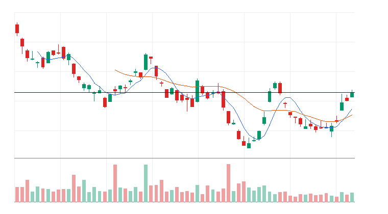
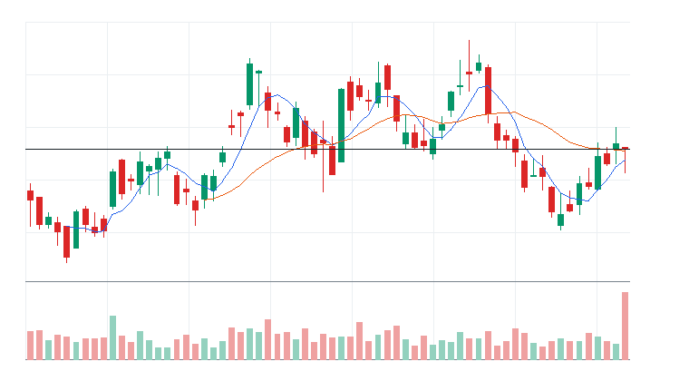

# 오늘의 데일리 트레이딩 요약

**REAL DATA TEST - 가격/거래량은 실제 데이터, 뉴스/ETF 구성종목 확산도/거래대금 유동성 일부 연결**

**목적:** 이 리포트는 최근 오른 자산을 나열하는 것이 아니라, 돈이 몰리는 근거와 다음 매수 주체가 확인할 트레이딩 후보를 찾기 위한 보고서다.

> 핵심 질문: 현재 가격에서 누가 사고 있고, 누가 앞으로 더 비싸게 사줄 수 있는가?

## 시장 국면 판단

- 최종 판정: 중립-상승 (56점)
- 전일 대비: 중립-상승 유지, 점수 변화는 제한적이다(-2점).
- 판정 신뢰도: 높음 (100점) - 핵심 지수와 매크로 데이터가 대부분 직접 수집되어 판정 신뢰도가 높다.
- 행동 바이어스: 눌림 매수와 돌파 확인 병행
- 한 줄 결론: S&P 500 중심으로 상승 우위지만, 매크로 점수 47라 추격보다 확인 매수가 낫다.
- 기술적 지표: 상승 추세 유지 (62점, 가중치 65%)
- S&P 500: 71점 | 50일선 아래, 200일선 위, 20일 -0.16%, 60일 +3.00%, 52주 고점 대비 -2.52% -> 기술 점수 71
- Nasdaq 100: 52점 | 50일선 아래, 200일선 위, 20일 -6.76%, 60일 +1.00%, 52주 고점 대비 -9.75% -> 기술 점수 52
- 매크로 시황: 매크로 중립 (47점, 가중치 35%)
- 매크로 요약: 매크로 점수 47로 뚜렷한 방향성보다 확인 대기 성격이 강하다.
- 금리: 중립 45점 / 금리 중립 / confidence HIGH
  - 주요 근거: US 10Y yield 20일 +5.26%, 5일 -0.52%; US 3M yield 20일 +2.17%, 단기금리 방향 확인; US long-duration bonds 20일 -3.67%, 장기채 가격 기준 할인율 부담 확인
  - 확인 사항: 장기금리 상승과 장기채 약세가 겹쳐 성장주 할인율 부담이 커질 수 있다.
- 물가: 중립 45점 / 물가 중립 / confidence HIGH
  - 주요 근거: Oil ETF 20일 +12.52%, 유가 기반 물가 압력 확인; TIPS ETF 20일 -2.04%, 물가연동채 흐름은 보조 근거; Gold 20일 +0.21%, 금 강세는 방어 수요 여부 확인
  - 확인 사항: 추가 확인 이벤트 없음
- 정책: 중립 50점 / 정책 이벤트 확인 전 중립 / confidence LOW
  - 주요 근거: 정책 톤은 1차 버전에서 일정/이벤트 리스크 기반 중립값으로 반영한다.
  - 확인 사항: FOMC, CPI, PCE, 고용지표 발표 전후에는 매크로 confidence를 보수적으로 해석한다.
- 신용/유동성: 중립 48점 / 신용/유동성 중립 / confidence HIGH
  - 주요 근거: High yield credit 20일 -0.74%, 하이일드 위험선호 확인; HYG-LQD 20일 상대강도 +1.88%, 신용위험 선호/회피 확인; VIX 20일 +3.17%, 변동성 부담 확인
  - 확인 사항: 추가 확인 이벤트 없음
- 환율/글로벌: 중립 49점 / 환율/글로벌 중립 / confidence MEDIUM
  - 주요 근거: US dollar 20일 +0.74%, 달러 강세/약세 확인
  - 확인 사항: 추가 확인 이벤트 없음
- US 10Y yield: 42점 | 하락 시 주식 우호; 5일 -0.52%, 20일 +5.26% -> 매크로 점수 42
- US 3M yield: 46점 | 하락 시 주식 우호; 5일 +0.80%, 20일 +2.17% -> 매크로 점수 46
- US long-duration bonds: 45점 | 상승 시 주식 우호; 5일 +0.69%, 20일 -3.67% -> 매크로 점수 45
- TIPS ETF: 50점 | 상승 시 주식 우호; 5일 -0.20%, 20일 -2.04% -> 매크로 점수 50
- Oil ETF: 35점 | 하락 시 주식 우호; 5일 -6.49%, 20일 +12.52% -> 매크로 점수 35
- Gold: 50점 | 상승 시 주식 우호; 5일 -1.45%, 20일 +0.21% -> 매크로 점수 50
- US dollar: 49점 | 하락 시 주식 우호; 5일 +0.35%, 20일 +0.74% -> 매크로 점수 49
- High yield credit: 49점 | 상승 시 주식 우호; 5일 -0.29%, 20일 -0.74% -> 매크로 점수 49
- Investment grade credit: 50점 | 상승 시 주식 우호; 5일 -0.02%, 20일 -2.62% -> 매크로 점수 50
- VIX: 39점 | 하락 시 주식 우호; 5일 +6.80%, 20일 +3.17% -> 매크로 점수 39
- 데이터 커버리지: 기술 2/2, 매크로 10/10
- 데이터 신뢰도 근거:
  - 직접 지수 데이터: S&P 500, Nasdaq 100
  - 대체 지수 데이터 없음
  - 매크로 데이터: 10/10
  - 누락 데이터 없음
  - stale 데이터 없음

## 모바일 요약

[오늘의 데일리 트레이딩 요약]

생성 성공 / 데이터 모드: REAL_TEST

시장:
- 위험회피

시장 지배 서사:
1. Specialty Business Services 자금 유입 - 관찰 - iShares Russell 2000 ETF(IWM), SPDR S&P 500 ETF Trust(SPY), Thomson Reuters Corporation(TRI), Cintas Corporation(CTAS) 중심으로 5일 +4.55%, 20일 +8.78% 흐름이 형성됨. 직접 촉매 일부 확인.
2. 소프트웨어 실적/AI 수익화 - 약화 - iShares Expanded Tech-Software Sector ETF(IGV), Global X Artificial Intelligence & Technology ETF(AIQ), Workday Inc.(WDAY), Atlassian Corporation(TEAM) 중심으로 5일 +3.92%, 20일 +9.98% 흐름이 형성됨. 직접 촉매 일부 확인.
3. 방산/안보 프리미엄 - 약화 - Global X Defense Tech ETF(SHLD), iShares U.S. Aerospace & Defense ETF(ITA), RTX, AeroVironment(AVAV) 중심으로 5일 +5.43%, 20일 +7.82% 흐름이 형성됨. 직접 촉매 일부 확인.

트렌드 강도:
1. Specialty Business Services 자금 유입 - TSI 41 - 잠복 - 진입품질 낮음
2. 소프트웨어 실적/AI 수익화 - TSI 41 - 잠복 - 진입품질 낮음
3. 방산/안보 프리미엄 - TSI 60 - 부상 - 진입품질 낮음

오늘 결론:
- Industrials 개별 종목 흐름이 ETF 대비 강한지 확인 필요
- 행동 후보는 linkedNarrative와 함께 확인한다.
- 추격보다 진입 조건 확인 후 접근한다.

오늘 실제 행동 후보:
1. RTX(STOCK) - 방산/안보 프리미엄 - 52주 고점 부근이라 돌파가 확인되면 신고가 추종 매수가 붙을 수 있음
2. Atlassian Corporation(TEAM)(STOCK) - 소프트웨어 실적/AI 수익화 - 단기 추세가 유지되고 거래량이 1.0배 이상이면 눌림 이후 재상승을 시도할 수 있음
3. Adobe Inc.(ADBE)(STOCK) - 소프트웨어 실적/AI 수익화 - 단기 추세가 유지되고 거래량이 1.0배 이상이면 눌림 이후 재상승을 시도할 수 있음

다크호스 후보:
1. 다크호스 후보 없음 - 조건 충족 후보 없음

ETF 후보 TOP 5:
1. Global X Defense Tech ETF(SHLD) - 방산/안보 프리미엄 - 관찰
2. iShares U.S. Aerospace & Defense ETF(ITA) - 방산/안보 프리미엄 - 거래량 확인 전 관찰
3. SPDR S&P Aerospace & Defense ETF(XAR) - 방산/안보 프리미엄 - 제외
4. Invesco Aerospace & Defense ETF(PPA) - 방산/안보 프리미엄 - 거래량 확인 전 관찰
5. iShares Expanded Tech-Software Sector ETF(IGV) - 소프트웨어 실적/AI 수익화 - 제외

웹 리포트:
https://yoolcool.github.io/DailyTradingThesisAgent/

## 오늘 결론

- 오늘 결론: 조건부 진입
- 신규 진입 후보: 0개
- 조건부 진입 후보: 5개
- 관찰 후보: 60개
- 주요 제한 요인: Entry Quality < 40, 뉴스 직접성 부족, RVOL 미달
- 주문 판단: 시장가 금지 / 지정가 또는 관찰
- 실전 판단: 진입 후보는 있으나, 전일 고점 돌파와 거래량 확인 후 선별적으로 접근한다.

### 후보 제한 요인 집계

- RVOL < 1.00x: 59개
- 거래대금 유동성 낮음: 11개
- Entry Quality 50~54 near miss: 0개
- Entry Quality 40~49 관찰: 10개
- Entry Quality < 40: 146개
- Exhaustion Risk >= 70: 0개
- ETF breadth 샘플 부족: 37개
- 뉴스 직접성 부족: 100개

## 데이터 신뢰도

- 전체 데이터 신뢰도 등급: LOW
- 분석 신뢰도: LOW
- 주문 실행 신뢰도: LOW
- ETF breadth 신뢰도: LOW
- 신뢰도 해석: 가격/거래량 stale fallback 1개 사용, 테마 확산 판단 제한, 거래대금 유동성 낮음 또는 확인 불가, 프리/애프터마켓 확인 불가
- 리포트 생성 시각: 2026-07-29 08:59 KST
- 가격 기준 거래일: 2026-07-28 US regular close
- 뉴스 수집 시각: 2026-07-29 08:59 KST
- 가장 최근 뉴스 발행 시각: 2026-07-29 08:49 KST
- 뉴스 신선도 상태: FRESH
- 뉴스 소스: Yahoo Finance RSS, MarketWatch RSS, CNBC Markets RSS, SEC EDGAR RSS, Federal Reserve RSS, Finnhub API
- 뉴스 소스 상태: Yahoo Finance RSS CONNECTED, MarketWatch RSS CONNECTED, CNBC Markets RSS PARTIAL, SEC EDGAR RSS PARTIAL, Federal Reserve RSS CONNECTED, Finnhub API DISABLED
- 뉴스 신뢰도: MEDIUM
- 추천 적용 거래일: 2026-07-28 US regular session
- 가격/거래량 데이터 상태: 일부 연결
- 뉴스 데이터 상태: 일부 연결
- ETF 구성종목 확산도 상태: 일부 연결
- ETF 구성종목 샘플 수: 1~4
- 거래대금 유동성 데이터 상태: 일부 연결
- 프리/애프터마켓 데이터 상태: UNAVAILABLE
- 데이터 provider: yfinance, Yahoo Finance RSS, MarketWatch RSS, CNBC Markets RSS, SEC EDGAR RSS, Federal Reserve RSS, Finnhub API, config fallback sample, price-volume dollar-volume fallback
- 실전 사용 경고: 이 리포트는 투자판단 보조용이며, REAL_TEST 모드에서는 일부 데이터가 누락되거나 지연될 수 있다. 실제 주문 전 현재가, 뉴스, 프리마켓/정규장 거래량을 별도 확인해야 한다.

## 0. 시장 상태

- 데이터 모드: REAL_TEST
- 가격/거래량: 일부 연결
- 뉴스: 일부 연결
- ETF 구성종목 확산도: 일부 연결
- 거래대금 유동성: 일부 연결
- 생성 시각: 2026년 7월 29일 수요일 AM 8:59
- 시장 상태: 위험회피
- 오늘 돈의 방향: Industrials 개별 종목 흐름이 ETF 대비 강한지 확인 필요
- 강한 테마 TOP 3: Financial Services(65), 이커머스/여행 플랫폼(52), Real Estate(51)
- 데이터 한계:
  - API 또는 provider 상태에 따라 뉴스/ETF 확산도/거래대금 유동성 반영 범위가 달라질 수 있다.
  - 수집 실패 데이터는 점수 반영에서 제외하거나 confidence를 제한한다.
  - reasonConfidence HIGH는 직접 촉매, 가격/거래량, 확산도/유동성 근거가 함께 있을 때만 사용한다.

## 오늘 시장을 지배하는 서사

### 오늘 시장을 지배하는 서사 TOP 3

#### 1. Specialty Business Services 자금 유입
- 상태: 관찰
- narrativeScore: 60
- reasonConfidence: MEDIUM
- 근거 ETF: IWM, SPY, QQQ
- 근거 개별 종목: TRI, CTAS, CPRT
- 돈이 몰리는 이유: Specialty Business Services 자금 유입 관련 iShares Russell 2000 ETF(IWM), SPDR S&P 500 ETF Trust(SPY), Invesco QQQ Trust(QQQ)와 Thomson Reuters Corporation(TRI), Cintas Corporation(CTAS), Copart Inc.(CPRT)의 5일(+4.55%)·20일(+8.78%) 흐름을 함께 본다. 평균 상대 거래량은 1.26배이고, ETF 확산도는 추가 확인이 필요하다. 직접 뉴스/이벤트가 일부 확인된다.
- 다음 매수 주체: Specialty Business Services 자금 유입을 확인한 섹터 ETF 자금과 상대강도 추종 스윙 자금
- 가장 좋은 트레이딩 수단: ETF 우선: QQQ, SPY, IWM / 개별 종목 우선: TRI, CTAS, CPRT
- 서사가 깨지는 조건: QQQ 20일선 이탈 또는 관련 종목 절반 이상 5일선 이탈
- 오늘 행동: 기존 네러티브와 중복을 확인한 뒤 ETF/대표 종목 동조성이 살아날 때만 관찰 편입

상세 narrativeScore 근거 보기

- rawScore: 60
- ETF 평균 moneyFlowScore: 7
- 개별 종목 평균 moneyFlowScore: 94
- ETF 후보 비율: 0%
- 개별 종목 후보 비율: 100%
- 5일 평균 수익률: +5.00%
- 20일 평균 수익률: +9.00%
- 평균 상대 거래량: 1.00배
- ETF 평균 상대 거래량: 1.00배
- 개별주 평균 상대 거래량: 1.00배
- 52주 고점 근접 후보 비율: 33%
- 뉴스 직접성 점수: 10
- ETF 확산도 점수: -1
- 유동성 점수: 4
- 과열 리스크 차감: 0

#### 2. 소프트웨어 실적/AI 수익화
- 상태: 약화
- narrativeScore: 48
- reasonConfidence: LOW
- 근거 ETF: IGV, AIQ, QQQ
- 근거 개별 종목: WDAY, TEAM, ADSK, INTU, DDOG
- 돈이 몰리는 이유: 소프트웨어 실적/AI 수익화 관련 iShares Expanded Tech-Software Sector ETF(IGV), Global X Artificial Intelligence & Technology ETF(AIQ), Invesco QQQ Trust(QQQ)와 Workday Inc.(WDAY), Atlassian Corporation(TEAM), Autodesk Inc.(ADSK), Intuit Inc.(INTU)의 5일(+3.92%)·20일(+9.98%) 흐름을 함께 본다. 평균 상대 거래량은 1.37배이고, ETF 확산도는 추가 확인이 필요하다. 직접 뉴스/이벤트가 일부 확인된다.
- 다음 매수 주체: 소프트웨어 실적/AI 수익화을 확인한 섹터 ETF 자금과 상대강도 추종 스윙 자금
- 가장 좋은 트레이딩 수단: ETF 우선: IGV, AIQ, QQQ / 개별 종목 우선: DDOG, WDAY, TEAM
- 서사가 깨지는 조건: IGV 20일선 이탈 또는 관련 종목 절반 이상 5일선 이탈
- 오늘 행동: 기존 네러티브와 중복을 확인한 뒤 ETF/대표 종목 동조성이 살아날 때만 관찰 편입

상세 narrativeScore 근거 보기

- rawScore: 48
- ETF 평균 moneyFlowScore: 9
- 개별 종목 평균 moneyFlowScore: 78
- ETF 후보 비율: 0%
- 개별 종목 후보 비율: 80%
- 5일 평균 수익률: +4.00%
- 20일 평균 수익률: +10.00%
- 평균 상대 거래량: 1.00배
- ETF 평균 상대 거래량: 1.00배
- 개별주 평균 상대 거래량: 1.00배
- 52주 고점 근접 후보 비율: 0%
- 뉴스 직접성 점수: 8
- ETF 확산도 점수: -4
- 유동성 점수: 3
- 과열 리스크 차감: 0

#### 3. 방산/안보 프리미엄
- 상태: 약화
- narrativeScore: 41
- reasonConfidence: LOW
- 근거 ETF: SHLD, ITA, XAR
- 근거 개별 종목: RTX, AVAV, KTOS, PLTR
- 돈이 몰리는 이유: 방산/안보 프리미엄 관련 Global X Defense Tech ETF(SHLD), iShares U.S. Aerospace & Defense ETF(ITA), SPDR S&P Aerospace & Defense ETF(XAR)와 RTX, AeroVironment(AVAV), Kratos Defense & Security Solutions(KTOS), Palantir Technologies Inc.(PLTR)의 5일(+5.43%)·20일(+7.82%) 흐름을 함께 본다. 평균 상대 거래량은 1.22배이고, ETF 확산도는 추가 확인이 필요하다. 직접 뉴스/이벤트가 일부 확인된다.
- 다음 매수 주체: 지정학 리스크와 안보 예산 기대를 사는 테마 ETF 자금
- 가장 좋은 트레이딩 수단: ETF 우선: XAR, SHLD, ITA / 개별 종목 우선: AVAV, KTOS, PLTR
- 서사가 깨지는 조건: 방산 ETF 20일선 이탈 또는 안보 이벤트 프리미엄 둔화
- 오늘 행동: 뉴스 촉매가 직접 확인될 때만 추세 추종

상세 narrativeScore 근거 보기

- rawScore: 41
- ETF 평균 moneyFlowScore: 47
- 개별 종목 평균 moneyFlowScore: 34
- ETF 후보 비율: 25%
- 개별 종목 후보 비율: 17%
- 5일 평균 수익률: +5.00%
- 20일 평균 수익률: +8.00%
- 평균 상대 거래량: 1.00배
- ETF 평균 상대 거래량: 2.00배
- 개별주 평균 상대 거래량: 1.00배
- 52주 고점 근접 후보 비율: 30%
- 뉴스 직접성 점수: 5
- ETF 확산도 점수: 0
- 유동성 점수: 1
- 과열 리스크 차감: 0

### 전체 narrative 요약

| 서사명 | 상태 | narrativeScore | reasonConfidence | 대표 ETF | 대표 종목 | 오늘 행동 |
| --- | --- | ---: | --- | --- | --- | --- |
| Specialty Business Services 자금 유입 | 관찰 | 60 | MEDIUM | IWM, SPY, QQQ | TRI, CTAS, CPRT | 기존 네러티브와 중복을 확인한 뒤 ETF/대표 종목 동조성이 살아날 때만 관찰 편입 |
| 소프트웨어 실적/AI 수익화 | 약화 | 48 | LOW | IGV, AIQ, QQQ | WDAY, TEAM, ADSK, INTU | 기존 네러티브와 중복을 확인한 뒤 ETF/대표 종목 동조성이 살아날 때만 관찰 편입 |
| 방산/안보 프리미엄 | 약화 | 41 | LOW | SHLD, ITA, XAR | RTX, AVAV, KTOS, PLTR | 뉴스 촉매가 직접 확인될 때만 추세 추종 |
| Aerospace & Defense 자금 유입 | 약화 | 37 | LOW | IWM, SPY, QQQ | RTX, LMT, AVAV | 기존 네러티브와 중복을 확인한 뒤 ETF/대표 종목 동조성이 살아날 때만 관찰 편입 |
| 필수소비재 음료 방어 성장 | 약화 | 27 | LOW | QQQ | CCEP, MNST | 기존 네러티브와 중복을 확인한 뒤 ETF/대표 종목 동조성이 살아날 때만 관찰 편입 |
| AI 소프트웨어/사이버보안 확산 | 약화 | 16 | LOW | IGV, AIQ, QQQ | TEAM, MSFT, PLTR, DDOG | 추격보다 눌림 후 재상승 확인 |
| Integrated Oil & Gas 자금 유입 | 약화 | 14 | LOW | IWM, SPY, QQQ | XOM, CVX | 기존 네러티브와 중복을 확인한 뒤 ETF/대표 종목 동조성이 살아날 때만 관찰 편입 |
| 매크로 방어/헤지 | 약화 | 12 | LOW | TLT, XLE, GLD | XOM, CVX | 위험회피가 확인될 때만 헤지성 접근 |
| 바이오/헬스케어 촉매 | 약화 | 4 | LOW | QQQ | REGN, VRTX, INSM, ALNY | 기존 네러티브와 중복을 확인한 뒤 ETF/대표 종목 동조성이 살아날 때만 관찰 편입 |
| 전력 유틸리티 수요 재평가 | 소멸 | 2 | LOW | IWM, SPY, QQQ | ETN, GEV, VRT | 기존 네러티브와 중복을 확인한 뒤 ETF/대표 종목 동조성이 살아날 때만 관찰 편입 |
| 사이버보안 지출 재가속 | 약화 | 0 | LOW | HACK, CIBR, IHAK | CRWD, PANW, FTNT | 기존 네러티브와 중복을 확인한 뒤 ETF/대표 종목 동조성이 살아날 때만 관찰 편입 |
| Internet Content 자금 유입 | 약화 | 0 | LOW | QQQ | DASH, META | 기존 네러티브와 중복을 확인한 뒤 ETF/대표 종목 동조성이 살아날 때만 관찰 편입 |
| Data Storage 자금 유입 | 소멸 | 0 | LOW | IWM, SPY, QQQ | STX, WDC | 기존 네러티브와 중복을 확인한 뒤 ETF/대표 종목 동조성이 살아날 때만 관찰 편입 |
| 전력망/원전/인프라 병목 | 소멸 | 0 | LOW | PAVE, GRID, URA | VRT, ETN, PWR, CEG | ETF 확산도와 거래량이 같이 살아날 때만 진입 |
| 위험선호 성장주 재진입 | 소멸 | 0 | LOW | QQQ, IPO, ARKK | COIN, ARM, TSLA | 지수 위험선호가 유지될 때만 선별 진입 |
| AI 인프라 재가속 | 소멸 | 0 | LOW | SMH, SOXX, DRAM | NVDA, MU, VRT, ETN | 추격보다 5일선 지지 후 재상승 확인 |
| 비트코인/디지털 자산 위험선호 | 소멸 | 0 | LOW | IBIT, BLOK | COIN, MSTR, IREN | 비트코인 베타가 살아날 때만 단기 매매 |
| 반도체 장비 사이클 재평가 | 소멸 | 0 | LOW | SMH, SOXX, SOXQ | AMAT, LRCX, ASML | 기존 네러티브와 중복을 확인한 뒤 ETF/대표 종목 동조성이 살아날 때만 관찰 편입 |
| 반도체 설계/공급망 재가속 | 소멸 | 0 | LOW | SMH, SOXX, SOXQ | ARM, AMD, TXN, ADI | 기존 네러티브와 중복을 확인한 뒤 ETF/대표 종목 동조성이 살아날 때만 관찰 편입 |

## 트렌드 강도 판단

### 1. Specialty Business Services 자금 유입
- Trend Strength Index: 41
- 트렌드 상태 라벨: 잠복
- 테마 확산도: 약함
- ETF 동조성: 부족
- 거래량 강도: 보통
- 과열 위험: 낮음 (22)
- 오늘 진입 품질: 낮음 (28)
- 한 줄 판단: Specialty Business Services 자금 유입는 Trend Strength는 높아도 시장 위험선호가 약해 시장 환경 비우호 구간이다.
- 오늘 접근법: iShares Russell 2000 ETF(IWM)/SPDR S&P 500 ETF Trust(SPY)/Invesco QQQ Trust(QQQ)와 Thomson Reuters Corporation(TRI)/Cintas Corporation(CTAS)/Copart Inc.(CPRT)의 거래량 확산이 확인되기 전까지 관찰한다.

트렌드 강도 상세 근거 보기

- 가격 모멘텀: 가격 모멘텀 16/25. 평균 5D +4.55%, 20D +8.78%.
- 거래량 강도: 거래량 강도 12/20. 평균 RVOL 1.26배.
- ETF 동조성: ETF 동조성 1/15. 관련 ETF Invesco QQQ Trust(QQQ), SPDR S&P 500 ETF Trust(SPY), iShares Russell 2000 ETF(IWM) 흐름을 기준으로 판단.
- 테마 확산도: 테마 확산도 6/20. 상위 1~2개 쏠림 감점 3점 반영.
- 뉴스 촉매: 뉴스/촉매 신선도 4/10. HIGH 직접 촉매 1개.
- 과열 리스크: 과열 리스크 22/100. 단기 급등, 고점 근접, ETF-개별주 괴리, 쏠림을 함께 반영.
- 시장 환경: 시장 환경 2/10. QQQ/SPY/IWM 가격 흐름 기반 위험선호 점수.

### 2. 소프트웨어 실적/AI 수익화
- Trend Strength Index: 41
- 트렌드 상태 라벨: 잠복
- 테마 확산도: 약함
- ETF 동조성: 부족
- 거래량 강도: 보통
- 과열 위험: 낮음 (12)
- 오늘 진입 품질: 낮음 (34)
- 한 줄 판단: 소프트웨어 실적/AI 수익화는 Trend Strength는 높아도 시장 위험선호가 약해 시장 환경 비우호 구간이다.
- 오늘 접근법: iShares Expanded Tech-Software Sector ETF(IGV)/Global X Artificial Intelligence & Technology ETF(AIQ)/Invesco QQQ Trust(QQQ)와 Workday Inc.(WDAY)/Atlassian Corporation(TEAM)/Autodesk Inc.(ADSK)의 거래량 확산이 확인되기 전까지 관찰한다.

트렌드 강도 상세 근거 보기

- 가격 모멘텀: 가격 모멘텀 13/25. 평균 5D +3.92%, 20D +9.98%.
- 거래량 강도: 거래량 강도 13/20. 평균 RVOL 1.37배.
- ETF 동조성: ETF 동조성 -1/15. 관련 ETF iShares Expanded Tech-Software Sector ETF(IGV), Global X Artificial Intelligence & Technology ETF(AIQ), Invesco QQQ Trust(QQQ) 흐름을 기준으로 판단.
- 테마 확산도: 테마 확산도 9/20. 상위 1~2개 쏠림 감점 0점 반영.
- 뉴스 촉매: 뉴스/촉매 신선도 5/10. HIGH 직접 촉매 1개.
- 과열 리스크: 과열 리스크 12/100. 단기 급등, 고점 근접, ETF-개별주 괴리, 쏠림을 함께 반영.
- 시장 환경: 시장 환경 2/10. QQQ/SPY/IWM 가격 흐름 기반 위험선호 점수.

### 3. 방산/안보 프리미엄
- Trend Strength Index: 60
- 트렌드 상태 라벨: 부상
- 테마 확산도: 보통
- ETF 동조성: 강함
- 거래량 강도: 약함
- 과열 위험: 낮음 (6)
- 오늘 진입 품질: 낮음 (39)
- 한 줄 판단: 방산/안보 프리미엄는 Trend Strength는 높아도 시장 위험선호가 약해 시장 환경 비우호 구간이다.
- 오늘 접근법: Global X Defense Tech ETF(SHLD)/iShares U.S. Aerospace & Defense ETF(ITA)/SPDR S&P Aerospace & Defense ETF(XAR) 거래량 증가와 RTX/AeroVironment(AVAV)/Kratos Defense & Security Solutions(KTOS) 확산을 확인하며 작은 사이즈의 초기 진입 후보로만 본다.

트렌드 강도 상세 근거 보기

- 가격 모멘텀: 가격 모멘텀 19/25. 평균 5D +5.43%, 20D +7.82%.
- 거래량 강도: 거래량 강도 7/20. 평균 RVOL 1.22배.
- ETF 동조성: ETF 동조성 16/15. 관련 ETF SPDR S&P Aerospace & Defense ETF(XAR), Global X Defense Tech ETF(SHLD), iShares U.S. Aerospace & Defense ETF(ITA), Invesco Aerospace & Defense ETF(PPA) 흐름을 기준으로 판단.
- 테마 확산도: 테마 확산도 12/20. 상위 1~2개 쏠림 감점 0점 반영.
- 뉴스 촉매: 뉴스/촉매 신선도 4/10. HIGH 직접 촉매 1개.
- 과열 리스크: 과열 리스크 6/100. 단기 급등, 고점 근접, ETF-개별주 괴리, 쏠림을 함께 반영.
- 시장 환경: 시장 환경 2/10. QQQ/SPY/IWM 가격 흐름 기반 위험선호 점수.

## 최근 추천 결과 트래킹

개별주는 데이트레이딩 관점으로 추천 이후 첫 정규장의 장중 최고가와 종가를 추적한다. ETF는 테마/스윙 관점으로 추천 이후 1주일 동안의 최고가와 현재 종가를 추적한다.

### 개별주 Top 3 추천 성과 요약
- 최근 5개 리포트 표본: 10개 (초기 검증 단계)
- 장중 최고가 기준 성공률: +28.57%
- 종가 기준 성공률: +42.86%
- 평균 장중 최고 수익률: +2.15%
- 평균 종가 수익률: +0.89%

### ETF 추천 성과 요약
- 최근 5개 리포트 표본: 0개 (초기 검증 단계)
- 1주 최고가 기준 성공률: 데이터 없음
- 현재 종가 기준 성공률: 데이터 없음
- 평균 1주 최고 수익률: 데이터 없음
- 평균 현재 수익률: 데이터 없음

최근 추천 결과 상세 테이블 펼치기

| 추천일 | 유형 | 순위 | 티커 | 기준가 | 추적 기간 | 상태 | High 수익률 | Close 수익률 | 결과 | 코멘트 |
| --- | --- | ---: | --- | ---: | --- | --- | ---: | ---: | --- | --- |
| 2026-07-29 | STOCK | 3 | ADBE | $249.18 | 2026-07-29 | pending | 데이터 없음 | 데이터 없음 | 추적 대기 | 아직 추적 거래일 데이터가 완성되지 않음 |
| 2026-07-29 | STOCK | 2 | TEAM | $99.98 | 2026-07-29 | pending | 데이터 없음 | 데이터 없음 | 추적 대기 | 아직 추적 거래일 데이터가 완성되지 않음 |
| 2026-07-29 | STOCK | 1 | RTX | $218.58 | 2026-07-29 | pending | 데이터 없음 | 데이터 없음 | 추적 대기 | 아직 추적 거래일 데이터가 완성되지 않음 |
| 2026-07-28 | STOCK | 1 | RTX | $218.42 | 2026-07-28 | complete | +1.34% | +0.07% | 제한적 유효 | 제한적인 장중 기회만 발생 (일봉 기준) |
| 2026-07-27 | STOCK | 2 | LMT | $582.6 | 2026-07-27 | complete | +0.93% | -0.45% | 실패 | 추천 이후 의미 있는 장중 기회가 부족하고 종가도 약함 (일봉 기준) |
| 2026-07-27 | STOCK | 1 | RTX | $212.79 | 2026-07-27 | complete | +3.57% | +2.65% | 성공 | 장중 기회와 종가 유지가 모두 확인됨 (일봉 기준) |
| 2026-07-24 | STOCK | 3 | XOM | $156.89 | 2026-07-24 | complete | +1.16% | +0.03% | 제한적 유효 | 제한적인 장중 기회만 발생 (일봉 기준) |
| 2026-07-24 | STOCK | 2 | LMT | $568.59 | 2026-07-24 | complete | +3.49% | +2.46% | 성공 | 장중 기회와 종가 유지가 모두 확인됨 (일봉 기준) |
| 2026-07-24 | STOCK | 1 | RTX | $209.16 | 2026-07-24 | complete | +2.74% | +1.74% | 제한적 유효 | 제한적인 장중 기회만 발생 (일봉 기준) |
| 2026-07-23 | STOCK | 1 | PCAR | $131.11 | 2026-07-23 | complete | +1.82% | -0.27% | 제한적 유효 | 제한적인 장중 기회만 발생 (일봉 기준) |
| 2026-07-22 | STOCK | 1 | COIN | $175.85 | 2026-07-22 | complete | -0.51% | -5.53% | 실패 | 추천 이후 의미 있는 장중 기회가 부족하고 종가도 약함 (일봉 기준) |
| 2026-07-21 | STOCK | 1 | PYPL | $56.82 | 2026-07-21 | complete | +0.16% | -1.71% | 실패 | 추천 이후 의미 있는 장중 기회가 부족하고 종가도 약함 (일봉 기준) |
| 2026-07-20 | STOCK | 2 | CTAS | $204.45 | 2026-07-20 | complete | -0.03% | -1.30% | 실패 | 추천 이후 의미 있는 장중 기회가 부족하고 종가도 약함 (일봉 기준) |
| 2026-07-20 | STOCK | 1 | PANW | $358.68 | 2026-07-20 | complete | +2.13% | -2.79% | 제한적 유효 | 제한적인 장중 기회만 발생 (일봉 기준) |
| 2026-07-17 | STOCK | 3 | CTAS | $206.25 | 2026-07-17 | complete | +1.68% | -0.87% | 제한적 유효 | 제한적인 장중 기회만 발생 (일봉 기준) |
| 2026-07-17 | STOCK | 2 | TRI | $98.82 | 2026-07-17 | complete | +2.05% | -2.65% | 제한적 유효 | 제한적인 장중 기회만 발생 (일봉 기준) |
| 2026-07-17 | STOCK | 1 | PYPL | $56.73 | 2026-07-17 | complete | +0.78% | -0.30% | 실패 | 추천 이후 의미 있는 장중 기회가 부족하고 종가도 약함 (일봉 기준) |
| 2026-07-16 | STOCK | 3 | PYPL | $55.52 | 2026-07-16 | complete | +3.87% | +2.18% | 성공 | 장중 기회와 종가 유지가 모두 확인됨 (일봉 기준) |
| 2026-07-16 | STOCK | 2 | TRI | $95.51 | 2026-07-16 | complete | +5.85% | +3.47% | 성공 | 장중 기회와 종가 유지가 모두 확인됨 (일봉 기준) |
| 2026-07-16 | STOCK | 1 | CRWD | $210.73 | 2026-07-15 | complete | +3.21% | -1.88% | 단타 유효 | 장중 기회는 있었지만 종가 유지력은 약함 (일봉 기준) |
| 2026-07-15 | STOCK | 1 | CRWD | $210.73 | 2026-07-15 | complete | +3.21% | -1.88% | 단타 유효 | 장중 기회는 있었지만 종가 유지력은 약함 (일봉 기준) |
| 2026-07-14 | STOCK | 1 | TRI | $94.29 | 2026-07-14 | complete | -0.66% | -2.70% | 실패 | 추천 이후 의미 있는 장중 기회가 부족하고 종가도 약함 (일봉 기준) |
| 2026-07-13 | STOCK | 1 | AXON | $640.46 | 2026-07-13 | complete | -9.75% | -14.59% | 실패 | 추천 이후 의미 있는 장중 기회가 부족하고 종가도 약함 (일봉 기준) |
| 2026-07-13 | STOCK | 1 | META | $669.21 | 2026-07-13 | complete | +1.11% | -1.86% | 제한적 유효 | 제한적인 장중 기회만 발생 (일봉 기준) |
| 2026-07-08 | STOCK | 1 | AXON | $640.46 | 2026-07-08 | complete | -1.48% | -6.35% | 실패 | 추천 이후 의미 있는 장중 기회가 부족하고 종가도 약함 (일봉 기준) |
| 2026-07-07 | STOCK | 2 | AXON | $622.35 | 2026-07-07 | complete | +6.86% | +2.91% | 성공 | 장중 기회와 종가 유지가 모두 확인됨 (일봉 기준) |
| 2026-07-07 | STOCK | 1 | PANW | $357.53 | 2026-07-07 | complete | +1.53% | -5.73% | 제한적 유효 | 제한적인 장중 기회만 발생 (일봉 기준) |
| 2026-07-06 | STOCK | 2 | CCEP | $106.61 | 2026-07-06 | complete | +0.58% | +0.34% | 추적 대기 | 아직 추적 거래일 데이터가 완성되지 않음 (일봉 기준) |
| 2026-07-06 | STOCK | 1 | PANW | $348.06 | 2026-07-06 | complete | +5.78% | +2.72% | 성공 | 장중 기회와 종가 유지가 모두 확인됨 (일봉 기준) |
| 2026-07-03 | STOCK | 1 | CCEP | $106.61 | 2026-07-03 | pending | 데이터 없음 | 데이터 없음 | 추적 대기 | 아직 추적 거래일 데이터가 완성되지 않음 |
| 2026-07-02 | STOCK | 2 | AXON | $593.96 | 2026-07-02 | complete | +1.52% | +0.52% | 제한적 유효 | 제한적인 장중 기회만 발생 (일봉 기준) |
| 2026-07-02 | STOCK | 1 | CCEP | $106.1 | 2026-07-02 | complete | +1.86% | +0.48% | 제한적 유효 | 제한적인 장중 기회만 발생 (일봉 기준) |
| 2026-07-01 | STOCK | 3 | LRCX | $433.33 | 2026-07-01 | complete | -4.12% | -9.71% | 실패 | 추천 이후 의미 있는 장중 기회가 부족하고 종가도 약함 (일봉 기준) |
| 2026-07-01 | STOCK | 2 | PANW | $341.02 | 2026-07-01 | complete | +5.01% | +3.23% | 성공 | 장중 기회와 종가 유지가 모두 확인됨 (일봉 기준) |
| 2026-07-01 | STOCK | 1 | AMAT | $723 | 2026-07-01 | complete | -4.04% | -9.97% | 실패 | 추천 이후 의미 있는 장중 기회가 부족하고 종가도 약함 (일봉 기준) |
| 2026-06-30 | STOCK | 3 | AMAT | $694.64 | 2026-06-30 | complete | +6.48% | +4.08% | 성공 | 장중 기회와 종가 유지가 모두 확인됨 (일봉 기준) |
| 2026-06-30 | STOCK | 2 | CRWD | $742.91 | 2026-06-30 | complete | -74.25% | -74.32% | 실패 | 추천 이후 의미 있는 장중 기회가 부족하고 종가도 약함 (일봉 기준) |
| 2026-06-30 | STOCK | 1 | PANW | $332 | 2026-06-30 | complete | +3.16% | +2.72% | 성공 | 장중 기회와 종가 유지가 모두 확인됨 (일봉 기준) |
| 2026-06-29 | STOCK | 3 | KDP | $33.4 | 2026-06-29 | complete | +1.26% | +0.30% | 제한적 유효 | 제한적인 장중 기회만 발생 (일봉 기준) |
| 2026-06-29 | STOCK | 2 | VRTX | $491.34 | 2026-06-29 | complete | +1.74% | +1.69% | 제한적 유효 | 제한적인 장중 기회만 발생 (일봉 기준) |
| 2026-06-29 | STOCK | 1 | FTNT | $151.35 | 2026-06-29 | complete | +5.10% | +2.69% | 성공 | 장중 기회와 종가 유지가 모두 확인됨 (일봉 기준) |
| 2026-06-26 | STOCK | 3 | MU | $1,213.56 | 2026-06-26 | complete | -1.22% | -6.69% | 실패 | 추천 이후 의미 있는 장중 기회가 부족하고 종가도 약함 (일봉 기준) |
| 2026-06-26 | STOCK | 2 | AMAT | $668 | 2026-06-26 | complete | -1.17% | -6.16% | 실패 | 추천 이후 의미 있는 장중 기회가 부족하고 종가도 약함 (일봉 기준) |
| 2026-06-26 | STOCK | 1 | LRCX | $401.82 | 2026-06-26 | complete | -2.97% | -5.66% | 실패 | 추천 이후 의미 있는 장중 기회가 부족하고 종가도 약함 (일봉 기준) |
| 2026-06-26 | ETF | 1 | DRAM | $76.89 | 2026-06-26~2026-07-03 | complete | -3.55% | -37.87% | 실패 | 추천 이후 ETF 흐름이 약화됨 |
| 2026-06-23 | STOCK | 3 | TSM | $467.67 | 2026-06-23 | complete | -4.35% | -6.69% | 실패 | 추천 이후 의미 있는 장중 기회가 부족하고 종가도 약함 (일봉 기준) |
| 2026-06-23 | STOCK | 2 | GEV | $1,127.59 | 2026-06-23 | complete | -4.84% | -8.21% | 실패 | 추천 이후 의미 있는 장중 기회가 부족하고 종가도 약함 (일봉 기준) |
| 2026-06-23 | STOCK | 1 | ETN | $435.78 | 2026-06-23 | complete | -3.27% | -7.00% | 실패 | 추천 이후 의미 있는 장중 기회가 부족하고 종가도 약함 (일봉 기준) |
| 2026-06-23 | ETF | 1 | DRAM | $80.72 | 2026-06-23~2026-06-30 | complete | -1.39% | -40.82% | 실패 | 추천 이후 ETF 흐름이 약화됨 |
| 2026-06-22 | STOCK | 3 | ARM | $439.46 | 2026-06-22 | complete | +1.25% | -7.22% | 제한적 유효 | 제한적인 장중 기회만 발생 (일봉 기준) |
| 2026-06-22 | STOCK | 2 | GEV | $1,109.73 | 2026-06-22 | complete | +2.91% | +1.61% | 제한적 유효 | 제한적인 장중 기회만 발생 (일봉 기준) |
| 2026-06-22 | STOCK | 1 | ETN | $421.77 | 2026-06-22 | complete | +3.55% | +3.32% | 성공 | 장중 기회와 종가 유지가 모두 확인됨 (일봉 기준) |
| 2026-06-22 | ETF | 3 | IFRA | $61.99 | 2026-06-22~2026-06-29 | complete | +3.65% | -1.00% | 단기 고점 후 반납 | 1주 내 상승 기회는 있었지만 현재가는 반납 |
| 2026-06-22 | ETF | 2 | SMH | $659.88 | 2026-06-22~2026-06-29 | complete | -1.49% | -19.74% | 실패 | 추천 이후 ETF 흐름이 약화됨 |
| 2026-06-22 | ETF | 1 | DRAM | $76.71 | 2026-06-22~2026-06-29 | complete | +3.77% | -37.73% | 단기 고점 후 반납 | 1주 내 상승 기회는 있었지만 현재가는 반납 |
| 2026-06-19 | STOCK | 3 | AMD | $537.37 | 2026-06-19 | pending | 데이터 없음 | 데이터 없음 | 추적 대기 | 아직 추적 거래일 데이터가 완성되지 않음 |
| 2026-06-19 | STOCK | 2 | ARM | $439.46 | 2026-06-19 | pending | 데이터 없음 | 데이터 없음 | 추적 대기 | 아직 추적 거래일 데이터가 완성되지 않음 |
| 2026-06-19 | STOCK | 1 | GEV | $1,109.73 | 2026-06-19 | pending | 데이터 없음 | 데이터 없음 | 추적 대기 | 아직 추적 거래일 데이터가 완성되지 않음 |
| 2026-06-19 | ETF | 1 | DRAM | $76.71 | 2026-06-19~2026-06-26 | complete | +6.04% | -37.73% | 단기 고점 후 반납 | 1주 내 상승 기회는 있었지만 현재가는 반납 |
| 2026-06-18 | STOCK | 3 | ASML | $1,867.83 | 2026-06-18 | complete | +4.02% | +3.31% | 성공 | 장중 기회와 종가 유지가 모두 확인됨 (일봉 기준) |

## 오늘 실제 행동 후보

### 1. RTX
- 자산 유형: STOCK
- linkedNarrative: 방산/안보 프리미엄
- narrativeStatus: 약화
- narrativeScore: 41
- Trend Strength Index: 60
- Exhaustion Risk: 6 (낮음)
- Entry Quality Score: 56 (보통)
- 트렌드 판단: 시장 위험선호가 약해 시장 환경 비우호 구간이다.
- moneyFlowScore: 100
- finalRawScore: 108
- reasonConfidence: HIGH
- reasonConfidenceExplanation: 직접 촉매: Yahoo Finance RSS / general_market / under_6h / positive - Top Analyst Reports for Alphabet, AMD & RTX 가격/거래량, 관련 ETF 동반 강세, 유동성 근거가 함께 확인되어 HIGH로 분류했다.
- tieBreakerReason: 최종 원점수 108, 리스크 패널티 0, 5일 수익률 +12.86%, 상대 거래량 1.57배 순으로 정렬
- 후보별 시장 해석: 위험회피 / 제한적 - 전체 시장은 위험회피
- 게이트 사유: 통과
- 주문 실행: 시장가 가능
- 직접 촉매: Yahoo Finance RSS / general_market / under_6h / positive - Top Analyst Reports for Alphabet, AMD & RTX
- 왜 돈이 몰리는가: 20일 +16.68%, 5일 +12.86%, 상대 거래량 1.57배로 가격과 거래량이 함께 개선. 뉴스: Yahoo Finance RSS general_market/under_6h / 유동성: LIQUID
- 누가 더 비싸게 사줄 수 있는지: 개별 주도주를 따라붙는 단기 모멘텀 자금과 관련 ETF 강세를 확인한 트레이더
- 진입 조건: 전일 고점 돌파와 5일선 유지 확인
- 무효화 조건: 20일선 이탈 또는 상대 거래량 0.8배 이하 둔화
- todayActionLabel: 조건부 진입
#### 최근 뉴스/동향 한국어 요약

- 요약: 종목 직접 뉴스 확인 상태이며 뉴스 흐름은 긍정 우위입니다. 후보 선정 후 재확인한 핵심 이슈는 "Aging Jets, Rising Threats: Why RTX Corporation (RTX) Just Raised Its 2026 Outlook"입니다.
- 직접 촉매 판단: RTX에 대해 직접 촉매로 분류된 뉴스가 확인됐습니다. 핵심은 "Aging Jets, Rising Threats: Why RTX Corporation (RTX) Just Raised Its 2026 Outlook"이며, 가이던스 재료로 봅니다.
- 뉴스 1: Aging Jets, Rising Threats: Why RTX Corporation (RTX) Just Raised Its 2026 Outlook
  - 내용: RTX 관련 기사는 목표가 변화를 다룹니다. 기사 스니펫상 핵심은 RTX Corporation (NYSE:RTX) on Thursday lifted its sales and profit outlook for 2026, amid sustained demand for commercial aircraft maintenance and military systems, as airlines ...입니다.
  - 투자 의미: 애널리스트 상향은 단기 수급에 우호적일 수 있으나, 목표가 변화가 이미 주가에 반영됐는지 확인해야 합니다.
  - 확인할 점: 매출/마진/가이던스 수치, 컨센서스 대비 차이
- 뉴스 2: RTX (RTX) Stock May Be Below Fair Value On Cash Flow Yet Full On Earnings
  - 내용: RTX 관련 기사는 RTX (RTX) Stock May Be Below Fair Value On Cash Flow Yet Full On Earnings 이슈를 다루며, 주가 변동률 +181.50%를 핵심 내용으로 봅니다.
  - 투자 의미: RTX의 당일 상대강도 확인에는 도움이 되지만, 실적/가이던스 같은 새 펀더멘털 변화로 보기는 어렵습니다.
  - 확인할 점: 거래량 동반 여부, 장중 고점 유지, 관련 ETF 동반 강세
- 뉴스 3: Why Did AAPL, FBRX, RTX Stocks Surge To 52-Week Highs Today?
  - 내용: RTX 관련 실적 뉴스입니다. 기사 스니펫상 핵심 내용은 Investor optimism was driven by AI optimism, a multibillion-dollar acquisition, and strong earnings execution.입니다.
  - 투자 의미: 실적/가이던스 재료는 다음 분기 기대치 변화로 이어질 수 있어 컨센서스 변화와 주가 반응 지속성을 함께 봅니다.
  - 확인할 점: 매출/마진/가이던스 수치, 컨센서스 대비 차이
- 매매 해석: 매매 관점에서는 뉴스 자체보다 가격이 진입 조건을 지키는지, 거래량이 동반되는지, 그리고 뉴스가 이미 주가에 반영됐는지를 우선 확인해야 합니다.
- 차트: 

### 2. Atlassian Corporation(TEAM)
- 자산 유형: STOCK
- linkedNarrative: 소프트웨어 실적/AI 수익화
- narrativeStatus: 약화
- narrativeScore: 48
- Trend Strength Index: 41
- Exhaustion Risk: 12 (낮음)
- Entry Quality Score: 42 (관찰)
- 트렌드 판단: ETF 동조성이 약해 테마 자금 확인이 부족하다.
- moneyFlowScore: 100
- finalRawScore: 102
- reasonConfidence: MEDIUM
- reasonConfidenceExplanation: 직접 촉매 부재 때문에 HIGH가 아니라 MEDIUM으로 제한했다.
- tieBreakerReason: 최종 원점수 102, 리스크 패널티 0, 5일 수익률 +10.35%, 상대 거래량 1.63배 순으로 정렬
- 후보별 시장 해석: 위험회피 / 제한적 - 전체 시장은 위험회피 / Entry Quality 42 < 50이나 moneyFlow 100, confidence MEDIUM, RVOL 1.63x로 강한 자금흐름 예외 조건 충족
- 게이트 사유: Entry Quality 42 < 50이나 moneyFlow 100, confidence MEDIUM, RVOL 1.63x로 강한 자금흐름 예외 조건 충족
- 주문 실행: 지정가 권장

- 왜 돈이 몰리는가: 20일 +26.14%, 5일 +10.35%, 상대 거래량 1.63배로 가격과 거래량이 함께 개선. 뉴스: CNBC Markets RSS product/under_6h / 유동성: ACCEPTABLE
- 누가 더 비싸게 사줄 수 있는지: 개별 주도주를 따라붙는 단기 모멘텀 자금과 관련 ETF 강세를 확인한 트레이더
- 진입 조건: 20일선 위 눌림 후 재상승 확인
- 무효화 조건: 20일선 이탈 또는 상대 거래량 0.8배 이하 둔화
- todayActionLabel: 자금흐름 예외 조건부
#### 최근 뉴스/동향 한국어 요약

- 요약: 종목 직접 뉴스 확인 상태이며 뉴스 흐름은 긍정 우위입니다. 후보 선정 후 재확인한 핵심 이슈는 "Atlassian’s (TEAM) Strategic Position in the AI Landscape"입니다.
- 직접 촉매 판단: Atlassian Corporation에 대해 직접 촉매로 분류된 뉴스가 확인됐습니다. 핵심은 "Atlassian’s (TEAM) Strategic Position in the AI Landscape"이며, 시장 일반 재료로 봅니다.
- 뉴스 1: Atlassian’s (TEAM) Strategic Position in the AI Landscape
  - 내용: Atlassian Corporation 관련 시장 일반 뉴스입니다. 기사 스니펫상 핵심 내용은 Night View Capital, an investment management firm, released its second-quarter 2026 investor letter.입니다.
  - 투자 의미: 단기 긍정 뉴스 흐름으로 볼 수 있지만, 단독 매수 근거보다는 가격·거래량 조건을 확인하는 보조 근거로 사용합니다.
  - 확인할 점: 원문 수치, 후속 보도, 가격이 진입 조건을 지키는지
- 뉴스 2: 3 Reasons Investors Love Atlassian (TEAM)
  - 내용: Atlassian Corporation 관련 기사는 3 Reasons Investors Love Atlassian (TEAM) 이슈를 다루며, 주가 변동률 +29.50%를 핵심 내용으로 봅니다.
  - 투자 의미: Atlassian Corporation의 당일 상대강도 확인에는 도움이 되지만, 실적/가이던스 같은 새 펀더멘털 변화로 보기는 어렵습니다.
  - 확인할 점: 거래량 동반 여부, 장중 고점 유지, 관련 ETF 동반 강세
- 뉴스 3: CRM, WDAY, TEAM Bounce Back: Can Momentum Continue?
  - 내용: Atlassian Corporation 관련 시장 일반 뉴스입니다. 기사 스니펫상 핵심 내용은 Many software stocks have faced a harsh 2026 overall, but action over the last month for these three has provided nice relief while also easing some fears.입니다.
  - 투자 의미: 단기 중립 뉴스 흐름으로 볼 수 있지만, 단독 매수 근거보다는 가격·거래량 조건을 확인하는 보조 근거로 사용합니다.
  - 확인할 점: 원문 수치, 후속 보도, 가격이 진입 조건을 지키는지
- 매매 해석: 매매 관점에서는 뉴스 자체보다 가격이 진입 조건을 지키는지, 거래량이 동반되는지, 그리고 뉴스가 이미 주가에 반영됐는지를 우선 확인해야 합니다.
- 차트: 

### 3. Adobe Inc.(ADBE)
- 자산 유형: STOCK
- linkedNarrative: 소프트웨어 실적/AI 수익화
- narrativeStatus: 약화
- narrativeScore: 48
- Trend Strength Index: 41
- Exhaustion Risk: 12 (낮음)
- Entry Quality Score: 40 (관찰)
- 트렌드 판단: ETF 동조성이 약해 테마 자금 확인이 부족하다.
- moneyFlowScore: 99
- finalRawScore: 99
- reasonConfidence: MEDIUM
- reasonConfidenceExplanation: 직접 촉매 부재 때문에 HIGH가 아니라 MEDIUM으로 제한했다.
- tieBreakerReason: 최종 원점수 99, 리스크 패널티 0, 5일 수익률 +9.69%, 상대 거래량 1.42배 순으로 정렬
- 후보별 시장 해석: 위험회피 / 제한적 - 전체 시장은 위험회피 / Entry Quality 40 < 50이나 moneyFlow 99, confidence MEDIUM, RVOL 1.42x로 강한 자금흐름 예외 조건 충족
- 게이트 사유: Entry Quality 40 < 50이나 moneyFlow 99, confidence MEDIUM, RVOL 1.42x로 강한 자금흐름 예외 조건 충족
- 주문 실행: 시장가 가능

- 왜 돈이 몰리는가: 20일 +20.71%, 5일 +9.69%, 상대 거래량 1.42배로 가격과 거래량이 함께 개선. 뉴스: CNBC Markets RSS product/under_6h / 유동성: LIQUID
- 누가 더 비싸게 사줄 수 있는지: 개별 주도주를 따라붙는 단기 모멘텀 자금과 관련 ETF 강세를 확인한 트레이더
- 진입 조건: 20일선 위 눌림 후 재상승 확인
- 무효화 조건: 20일선 이탈 또는 상대 거래량 0.8배 이하 둔화
- todayActionLabel: 자금흐름 예외 조건부
#### 최근 뉴스/동향 한국어 요약

- 요약: 종목 직접 뉴스 확인 상태이며 뉴스 흐름은 긍정 우위입니다. 후보 선정 후 재확인한 핵심 이슈는 "Adobe (ADBE) Joins Open Source AI Cybersecurity Alliance As AI Trust Takes Focus"입니다.
- 직접 촉매 판단: Adobe Inc.에 대해 직접 촉매로 분류된 뉴스가 확인됐습니다. 핵심은 "Adobe (ADBE) Joins Open Source AI Cybersecurity Alliance As AI Trust Takes Focus"이며, 제품/서비스 재료로 봅니다.
- 뉴스 1: Adobe (ADBE) Joins Open Source AI Cybersecurity Alliance As AI Trust Takes Focus
  - 내용: Adobe Inc. 관련 제품/서비스 뉴스입니다. 기사 스니펫상 핵심 내용은 Adobe joined an industry coalition to create the Open Source AI Cybersecurity Alliance, focusing on safer AI tools and standards.입니다.
  - 투자 의미: 단기 긍정 뉴스 흐름으로 볼 수 있지만, 단독 매수 근거보다는 가격·거래량 조건을 확인하는 보조 근거로 사용합니다.
  - 확인할 점: 원문 수치, 후속 보도, 가격이 진입 조건을 지키는지
- 뉴스 2: ADBE Showered Owners With Cash. The Stock Still Lagged The Market
  - 내용: Adobe Inc. 관련 시장 일반 뉴스입니다. 기사 스니펫상 핵심 내용은 The software giant sent a torrent of cash back to its owners, yet the stock fell far behind the market.입니다.
  - 투자 의미: 단기 중립 뉴스 흐름으로 볼 수 있지만, 단독 매수 근거보다는 가격·거래량 조건을 확인하는 보조 근거로 사용합니다.
  - 확인할 점: 원문 수치, 후속 보도, 가격이 진입 조건을 지키는지
- 뉴스 3: Bloom Energy sees sales top $1 billion as AI proves a validation moment for fuel-cell technology
  - 내용: Adobe Inc. 관련 가이던스 뉴스입니다. 기사 스니펫상 핵심 내용은 Fuel-cell maker also raises its 2026 guidance for the second straight time입니다.
  - 투자 의미: 실적/가이던스 재료는 다음 분기 기대치 변화로 이어질 수 있어 컨센서스 변화와 주가 반응 지속성을 함께 봅니다.
  - 확인할 점: 매출/마진/가이던스 수치, 컨센서스 대비 차이
- 매매 해석: 매매 관점에서는 뉴스 자체보다 가격이 진입 조건을 지키는지, 거래량이 동반되는지, 그리고 뉴스가 이미 주가에 반영됐는지를 우선 확인해야 합니다.
- 차트: 

## 다크호스 후보

다크호스 후보 없음. 상위 서사 정렬, MA20 위 안착, MA5/MA20 구조 개선, RVOL 0.90x 이상 조건을 동시에 충족한 개별주가 없다.

- darkHorseScore: 조건 충족 후보 없음
- 왜 아직 메인이 아닌가: 확인 조건을 통과한 보조 관찰 후보가 없다.

darkHorseScore 상세 근거 보기

- 서사 정렬: 조건 미충족
- 초기 추세 구조: 조건 미충족
- 베이스 돌파/정돈: 조건 미충족
- 거래량 확인: 조건 미충족
- rawScore: 데이터 없음

## 오늘 돈이 몰리는 테마

- Financial Services: PYPL | 평균 moneyFlowScore 65 | 추세는 확인되지만 선별 진입이 필요한 중간 강도의 테마로 본다.
- 이커머스/여행 플랫폼: BKNG, PDD, MELI, ABNB, DASH | 평균 moneyFlowScore 52 | 관심은 유지하되 우선순위는 낮추고 추가 거래량 확인을 기다린다.
- Real Estate: CSGP | 평균 moneyFlowScore 51 | 관심은 유지하되 우선순위는 낮추고 추가 거래량 확인을 기다린다.
- 필수소비재: WMT, COST, PEP, MNST, MDLZ, KDP, CCEP, KHC | 평균 moneyFlowScore 51 | 관심은 유지하되 우선순위는 낮추고 추가 거래량 확인을 기다린다.
- Consumer Cyclical: SBUX, MAR, ROST, ORLY | 평균 moneyFlowScore 50 | 관심은 유지하되 우선순위는 낮추고 추가 거래량 확인을 기다린다.
- 클라우드/엔터프라이즈 소프트웨어: MSFT, PLTR, APP, SHOP, ADBE, CDNS, SNPS, INTU | 평균 moneyFlowScore 49 | 관심은 유지하되 우선순위는 낮추고 추가 거래량 확인을 기다린다.

## 1. ETF 트레이딩 보고서
### 1-1. ETF 결론
- ETF 우선 후보: 없음
- ETF 관찰 후보: ROBO Global Robotics and Automation Index ETF(ROBO), First Trust NASDAQ Cybersecurity ETF(CIBR), Amplify Cybersecurity ETF(HACK), iShares Cybersecurity and Tech ETF(IHAK), iShares U.S. Aerospace & Defense ETF(ITA)
- ETF 매매 금지: Roundhill Memory ETF(DRAM), VanEck Semiconductor ETF(SMH), iShares Semiconductor ETF(SOXX), Invesco PHLX Semiconductor ETF(SOXQ), Global X Artificial Intelligence & Technology ETF(AIQ)
- 오늘 ETF 최우선 1개: 없음
- ETF 섹션 해석: 이 섹션은 개별 종목 선택이 아니라 테마/섹터 단위 자금 흐름을 ETF로 매매할지 판단하기 위한 영역이다.

### 1-2. ETF 후보 TOP 5

선정 기준: ETF 후보는 가격/거래량 1차 점수에 뉴스, ETF 구성종목 확산도, 유동성, 리스크 패널티를 반영한 finalRawScore 기준으로 정렬한다. 표시 점수 100점 후보가 겹치면 tieBreakerReason으로 우선순위를 설명한다.

### [ETF] Global X Defense Tech ETF(SHLD)
- 자산 유형: ETF
- ETF 세부 카테고리: 방산 ETF
- ETF 역할: 방어 섹터 확인
- 상태: 관찰
- linkedNarrative: 방산/안보 프리미엄
- narrativeStatus: 약화
- narrativeScore: 41
- moneyFlowScore: 73
- finalRawScore: 73
- tieBreakerReason: 최종 원점수 73, 리스크 패널티 0, 5일 수익률 +6.07%, 상대 거래량 2.00배 순으로 정렬
- 과열 리스크: 낮음
- reasonConfidence: MEDIUM
- reasonConfidenceExplanation: ETF 확산도 제한 때문에 HIGH가 아니라 MEDIUM으로 제한했다.

- todayActionLabel: 관찰
- 주문 실행: 지정가 권장
- 기준일: 2026-07-28
- 종가: $63.91
- 1일 수익률: +0.09%
- 5일 수익률: +6.07%
- 20일 수익률: +8.88%
- 상대 거래량: 2.00배
- 52주 고점 대비 위치: -18.58%
- whyMoneyIsFlowing: 20일 +8.88%, 5일 +6.07%, 상대 거래량 2.00배로 가격과 거래량이 함께 개선. 뉴스: MarketWatch RSS earnings/under_6h / 유동성: ACCEPTABLE
- likelyNextBuyer: 섹터 베타를 노리는 단기 모멘텀 자금과 리밸런싱 자금
- whyThisCouldTradeHigher: 단기 추세가 유지되고 거래량이 1.0배 이상이면 눌림 이후 재상승을 시도할 수 있음
#### 최근 뉴스/동향 한국어 요약

- 요약: 후보 선정 후 재확인 뉴스 데이터 없음
- 진입 조건: 20일선 위 눌림 후 재상승 확인
- 무효화 조건: 20일선 이탈 또는 상대 거래량 0.8배 이하 둔화
- 차트: 

#### 상세 근거

Global X Defense Tech ETF(SHLD) 상세 근거 펼치기

- moneyFlowScore(최종) 산정 근거:
  - moneyFlowScore(1차): 59
  - 최종 원점수: 73
  - 최종 표시 점수: 73
  - cap 적용: cap 미적용
  - 계산식: +59 + +12 + 0 + +2 + 0 + 0 + 0 = 73
  - 점수 해석: 관심 후보. 눌림 또는 돌파 확인 후 진입 검토.
  - 가격/거래량 1차 점수: +59
    - 추세: +16
    - 단기 모멘텀: +5
    - 중기 모멘텀: +6
    - 거래량: +18
    - 신고가 근접: 0
    - 이동평균: +14
  - 하위 점수 cap:
    - 가격 모멘텀: 원점수 +16, 상한 적용 +16 / 최대 25
    - 단기 모멘텀: 원점수 +5, 상한 적용 +5 / 최대 20
    - 중기 모멘텀: 원점수 +6, 상한 적용 +6 / 최대 16
    - 거래량: 원점수 +18, 상한 적용 +18 / 최대 20
    - 신고가 근접: 원점수 0, 상한 적용 0 / 최대 12
    - 이동평균: 원점수 +14, 상한 적용 +14 / 최대 14
  - 추가 데이터 가감점:
    - 뉴스: +12
    - 유동성: +2
  - ETF 확산도: 0
  - 리스크 패널티: 0
  - 주요 근거: 1차 59, 최종 원점수 73, 표시 73. 20일 수익률 강함, 5일 수익률 강함, 상대 거래량 증가. 주의: ETF 구성종목 확산도 데이터 미연결.
  - 리스크 패널티 산정 근거:
    - 총 리스크 패널티: 0
    - 리스크 등급: LOW
    - 감점된 리스크: 없음
    - 관찰 리스크: ETF breadth data not connected
    - 한 줄 해석: 직접 감점된 주요 리스크는 없지만 관찰 리스크는 계속 확인해야 한다.
- 데이터 사용 현황:
  - 가격/거래량: 사용
  - 뉴스: 사용
  - ETF 확산도: 미연결
  - 거래대금 유동성: 사용
  - 관련 ETF 상대강도: 사용
- 뉴스 확인:
  - 최근 뉴스 상태: 일부 연결
  - 뉴스 소스: MarketWatch RSS, Yahoo Finance RSS, Federal Reserve RSS
  - 소스별 상태: Yahoo Finance RSS CONNECTED; MarketWatch RSS CONNECTED; CNBC Markets RSS FAILED; SEC EDGAR RSS PARTIAL; Federal Reserve RSS CONNECTED; Finnhub API DISABLED
  - 긍정/중립/부정: 9/7/0
  - 직접성/방향성/신선도: 2/1/4
  - 강한 촉매 수: 4
  - 중요 공시 수: 0
  - 직접 촉매: 없음
  - 보조 뉴스: MarketWatch RSS sector_theme / earnings / under_6h
  - 뉴스 수집 시각: 2026-07-29 08:59 KST
  - 가장 최근 뉴스 발행 시각: 2026-07-29 07:17 KST
  - 뉴스 신선도 상태: FRESH
  - 뉴스 이후 가격 반응: 긍정
  - 가격 반응 점수 제한: 뉴스 이후 가격 반응과 점수 제한 특이사항 없음
  - 핵심 뉴스 요약: Seagate&#x2019;s earnings are welcome news for the battered AI trade
  - 원점수/상한 점수: +26 / +12
  - 점수 반영: +12
  - 주의: CNBC Markets RSS: HTTP 403 from https://www.cnbc.com/id/100003114/device/rss/rss.html; SEC EDGAR RSS: no matching RSS items; Finnhub API: FINNHUB_API_KEY not configured
- ETF 구성종목 확산도:
  - 구성종목 데이터 상태: 미연결
  - 샘플 수: 0/0
  - 샘플 신뢰도: UNKNOWN
  - 상승 종목 비율: 데이터 없음
  - 20일선 위 비율: 데이터 없음
  - 50일선 위 비율: 데이터 없음
  - 상위 기여 종목: 데이터 없음
  - 확산도 판단: UNKNOWN
  - 원점수/샘플 상한/반영 점수: 0 / N/A / 0
  - 점수 반영: 0
- 거래대금 유동성:
  - 데이터 상태: 일부 연결
  - 거래대금 기준 유동성: ACCEPTABLE
  - 거래대금: $150,655,107
  - 평균 거래대금: $75,485,060
  - 주문 영향: 지정가 권장
  - 매매 영향: 거래대금은 허용 가능하나 지정가를 우선한다
- reasonConfidence 근거: 가격/거래량, 뉴스, 거래대금 유동성, 관련 ETF 상대강도은 확인됐지만 일부 보조 데이터가 미연결 또는 fallback이라 중간으로 제한한다.
- 후보 선정 후 뉴스/동향 재확인:
  - 재확인 상태: 데이터 없음
- 차트 요약: 최근 20거래일 기준 5일선이 20일선 위에 있음
- 기준일 2026-07-28 | 종가 $63.91 | 1일 +0.09% | 5일 +6.07% | 20일 +8.88% | 상대 거래량 2.00배 | 52주 고점 대비 -18.58% | 데이터 소스: yfinance

### [ETF] iShares U.S. Aerospace & Defense ETF(ITA)
- 자산 유형: ETF
- ETF 세부 카테고리: 방산 ETF
- ETF 역할: 방어 섹터 확인
- 상태: 관찰
- linkedNarrative: 방산/안보 프리미엄
- narrativeStatus: 약화
- narrativeScore: 41
- moneyFlowScore: 44
- finalRawScore: 44
- tieBreakerReason: 최종 원점수 44, 리스크 패널티 -4, 5일 수익률 +6.63%, 상대 거래량 0.95배 순으로 정렬
- 과열 리스크: 낮음
- reasonConfidence: LOW
- reasonConfidenceExplanation: 가격/거래량이 약하거나 핵심 보조 근거가 부족해 LOW로 분류했다.

- todayActionLabel: 거래량 확인 전 관찰
- 주문 실행: 지정가 권장
- 기준일: 2026-07-28
- 종가: $244.98
- 1일 수익률: +0.44%
- 5일 수익률: +6.63%
- 20일 수익률: +2.45%
- 상대 거래량: 0.95배
- 52주 고점 대비 위치: -2.59%
- whyMoneyIsFlowing: 최근 수익률은 확인되지만 상대 거래량 0.95배라 신규 자금 유입 강도는 약함. 뉴스: CNBC Markets RSS product/under_6h / 유동성: ACCEPTABLE
- likelyNextBuyer: 섹터 베타를 노리는 단기 모멘텀 자금과 리밸런싱 자금
- whyThisCouldTradeHigher: 52주 고점 부근이라 돌파가 확인되면 신고가 추종 매수가 붙을 수 있음
#### 최근 뉴스/동향 한국어 요약

- 요약: 후보 선정 후 재확인 뉴스 데이터 없음
- 진입 조건: 상대 거래량 1.0배 회복 후 관찰
- 무효화 조건: 거래량 회복 실패
- 차트: 

#### 상세 근거

iShares U.S. Aerospace & Defense ETF(ITA) 상세 근거 펼치기

- moneyFlowScore(최종) 산정 근거:
  - moneyFlowScore(1차): 34
  - 최종 원점수: 44
  - 최종 표시 점수: 44
  - cap 적용: cap 미적용
  - 계산식: +34 + +12 + 0 + +2 + 0 - 4 + 0 = 44
  - 점수 해석: 매매 금지 또는 우선순위 낮은 후보.
  - 가격/거래량 1차 점수: +34
    - 추세: +8
    - 단기 모멘텀: +6
    - 중기 모멘텀: +2
    - 거래량: -8
    - 신고가 근접: +12
    - 이동평균: +14
  - 하위 점수 cap:
    - 가격 모멘텀: 원점수 +8, 상한 적용 +8 / 최대 25
    - 단기 모멘텀: 원점수 +6, 상한 적용 +6 / 최대 20
    - 중기 모멘텀: 원점수 +2, 상한 적용 +2 / 최대 16
    - 거래량: 원점수 -8, 상한 적용 -8 / 최대 20
    - 신고가 근접: 원점수 +12, 상한 적용 +12 / 최대 12
    - 이동평균: 원점수 +14, 상한 적용 +14 / 최대 14
  - 추가 데이터 가감점:
    - 뉴스: +12
    - 유동성: +2
  - ETF 확산도: 0
  - 리스크 패널티: -4
  - 주요 근거: 1차 34, 최종 원점수 44, 표시 44. 5일 수익률 강함, 52주 고점 근처, 이동평균 위 추세 유지. 주의: 단기 과열/추격 위험 존재, ETF 구성종목 확산도 데이터 미연결.
  - 리스크 패널티 산정 근거:
    - 총 리스크 패널티: -4
    - 리스크 등급: LOW
    - 감점된 리스크:
      - volume divergence: -4 | 근거: 5d price strength is not confirmed by relative volume 0.95x. | 대응: Require relative volume recovery above 1.0x.
    - 관찰 리스크: ETF breadth data not connected
    - 한 줄 해석: 1개 감점 리스크로 총 -4점 반영.
- 데이터 사용 현황:
  - 가격/거래량: 사용
  - 뉴스: 사용
  - ETF 확산도: 미연결
  - 거래대금 유동성: 사용
  - 관련 ETF 상대강도: 사용
- 뉴스 확인:
  - 최근 뉴스 상태: 일부 연결
  - 뉴스 소스: CNBC Markets RSS, MarketWatch RSS
  - 소스별 상태: Yahoo Finance RSS CONNECTED; MarketWatch RSS CONNECTED; CNBC Markets RSS CONNECTED; SEC EDGAR RSS PARTIAL; Federal Reserve RSS CONNECTED; Finnhub API DISABLED
  - 긍정/중립/부정: 13/2/1
  - 직접성/방향성/신선도: 2/1/4
  - 강한 촉매 수: 5
  - 중요 공시 수: 0
  - 직접 촉매: 없음
  - 보조 뉴스: CNBC Markets RSS sector_theme / product / under_6h
  - 뉴스 수집 시각: 2026-07-29 08:59 KST
  - 가장 최근 뉴스 발행 시각: 2026-07-29 08:49 KST
  - 뉴스 신선도 상태: FRESH
  - 뉴스 이후 가격 반응: 긍정
  - 가격 반응 점수 제한: 뉴스 이후 가격 반응과 점수 제한 특이사항 없음
  - 핵심 뉴스 요약: SpaceX, Blue Origin could get quicker launch approval under FAA move to waive environmental rules
  - 원점수/상한 점수: +30 / +12
  - 점수 반영: +12
  - 주의: SEC EDGAR RSS: no matching RSS items; Finnhub API: FINNHUB_API_KEY not configured
- ETF 구성종목 확산도:
  - 구성종목 데이터 상태: 미연결
  - 샘플 수: 0/0
  - 샘플 신뢰도: UNKNOWN
  - 상승 종목 비율: 데이터 없음
  - 20일선 위 비율: 데이터 없음
  - 50일선 위 비율: 데이터 없음
  - 상위 기여 종목: 데이터 없음
  - 확산도 판단: UNKNOWN
  - 원점수/샘플 상한/반영 점수: 0 / N/A / 0
  - 점수 반영: 0
- 거래대금 유동성:
  - 데이터 상태: 일부 연결
  - 거래대금 기준 유동성: ACCEPTABLE
  - 거래대금: $156,788,915
  - 평균 거래대금: $165,655,476
  - 주문 영향: 지정가 권장
  - 매매 영향: 거래대금은 허용 가능하나 지정가를 우선한다
- reasonConfidence 근거: 가격/거래량이 약하거나 주요 데이터가 부족해 낮음.
- 후보 선정 후 뉴스/동향 재확인:
  - 재확인 상태: 데이터 없음
- 차트 요약: 최근 20거래일 기준 5일선이 20일선 위에 있음
- 기준일 2026-07-28 | 종가 $244.98 | 1일 +0.44% | 5일 +6.63% | 20일 +2.45% | 상대 거래량 0.95배 | 52주 고점 대비 -2.59% | 데이터 소스: yfinance

### [ETF] SPDR S&P Aerospace & Defense ETF(XAR)
- 자산 유형: ETF
- ETF 세부 카테고리: 방산 ETF
- ETF 역할: 방어 섹터 확인
- 상태: 매매 금지
- linkedNarrative: 방산/안보 프리미엄
- narrativeStatus: 약화
- narrativeScore: 41
- moneyFlowScore: 41
- finalRawScore: 41
- tieBreakerReason: 최종 원점수 41, 리스크 패널티 0, 5일 수익률 +2.65%, 상대 거래량 2.92배 순으로 정렬
- 과열 리스크: 낮음
- reasonConfidence: MEDIUM
- reasonConfidenceExplanation: ETF 확산도 제한 때문에 HIGH가 아니라 MEDIUM으로 제한했다.

- todayActionLabel: 제외
- 주문 실행: 지정가 권장
- 기준일: 2026-07-28
- 종가: $271.92
- 1일 수익률: -0.42%
- 5일 수익률: +2.65%
- 20일 수익률: -1.83%
- 상대 거래량: 2.92배
- 52주 고점 대비 위치: -7.95%
- whyMoneyIsFlowing: 20일 -1.83%, 5일 +2.65%, 상대 거래량 2.92배로 가격과 거래량이 함께 개선. 뉴스: CNBC Markets RSS product/under_6h / 유동성: ACCEPTABLE
- likelyNextBuyer: 섹터 베타를 노리는 단기 모멘텀 자금과 리밸런싱 자금
- whyThisCouldTradeHigher: 단기 추세가 유지되고 거래량이 1.0배 이상이면 눌림 이후 재상승을 시도할 수 있음
#### 최근 뉴스/동향 한국어 요약

- 요약: 후보 선정 후 재확인 뉴스 데이터 없음
- 진입 조건: 20일선 위 눌림 후 재상승 확인
- 무효화 조건: 20일선 이탈 또는 상대 거래량 0.8배 이하 둔화
- 차트: 

#### 상세 근거

SPDR S&P Aerospace & Defense ETF(XAR) 상세 근거 펼치기

- moneyFlowScore(최종) 산정 근거:
  - moneyFlowScore(1차): 37
  - 최종 원점수: 41
  - 최종 표시 점수: 41
  - cap 적용: cap 미적용
  - 계산식: +37 + +2 + 0 + +2 + 0 + 0 + 0 = 41
  - 점수 해석: 매매 금지 또는 우선순위 낮은 후보.
  - 가격/거래량 1차 점수: +37
    - 추세: +2
    - 단기 모멘텀: +2
    - 중기 모멘텀: -1
    - 거래량: +18
    - 신고가 근접: +6
    - 이동평균: +10
  - 하위 점수 cap:
    - 가격 모멘텀: 원점수 +2, 상한 적용 +2 / 최대 25
    - 단기 모멘텀: 원점수 +2, 상한 적용 +2 / 최대 20
    - 중기 모멘텀: 원점수 -1, 상한 적용 -1 / 최대 16
    - 거래량: 원점수 +18, 상한 적용 +18 / 최대 20
    - 신고가 근접: 원점수 +6, 상한 적용 +6 / 최대 12
    - 이동평균: 원점수 +10, 상한 적용 +10 / 최대 14
  - 추가 데이터 가감점:
    - 뉴스: +2
    - 유동성: +2
  - ETF 확산도: 0
  - 리스크 패널티: 0
  - 주요 근거: 1차 37, 최종 원점수 41, 표시 41. 상대 거래량 증가, 이동평균 위 추세 유지, 뉴스 흐름이 가격/거래량 근거 보강. 주의: ETF 구성종목 확산도 데이터 미연결.
  - 리스크 패널티 산정 근거:
    - 총 리스크 패널티: 0
    - 리스크 등급: LOW
    - 감점된 리스크: 없음
    - 관찰 리스크: ETF breadth data not connected
    - 한 줄 해석: 직접 감점된 주요 리스크는 없지만 관찰 리스크는 계속 확인해야 한다.
- 데이터 사용 현황:
  - 가격/거래량: 사용
  - 뉴스: 사용
  - ETF 확산도: 미연결
  - 거래대금 유동성: 사용
  - 관련 ETF 상대강도: 사용
- 뉴스 확인:
  - 최근 뉴스 상태: 일부 연결
  - 뉴스 소스: CNBC Markets RSS, MarketWatch RSS
  - 소스별 상태: Yahoo Finance RSS CONNECTED; MarketWatch RSS CONNECTED; CNBC Markets RSS CONNECTED; SEC EDGAR RSS PARTIAL; Federal Reserve RSS CONNECTED; Finnhub API DISABLED
  - 긍정/중립/부정: 13/2/1
  - 직접성/방향성/신선도: 2/1/4
  - 강한 촉매 수: 5
  - 중요 공시 수: 0
  - 직접 촉매: 없음
  - 보조 뉴스: CNBC Markets RSS sector_theme / product / under_6h
  - 뉴스 수집 시각: 2026-07-29 08:59 KST
  - 가장 최근 뉴스 발행 시각: 2026-07-29 08:49 KST
  - 뉴스 신선도 상태: FRESH
  - 뉴스 이후 가격 반응: 부정
  - 가격 반응 점수 제한: 뉴스 이후 가격 반응 부정 -> 긍정 점수 제한
  - 핵심 뉴스 요약: SpaceX, Blue Origin could get quicker launch approval under FAA move to waive environmental rules
  - 원점수/상한 점수: +30 / +12
  - 점수 반영: +12
  - 주의: SEC EDGAR RSS: no matching RSS items; Finnhub API: FINNHUB_API_KEY not configured
- ETF 구성종목 확산도:
  - 구성종목 데이터 상태: 미연결
  - 샘플 수: 0/0
  - 샘플 신뢰도: UNKNOWN
  - 상승 종목 비율: 데이터 없음
  - 20일선 위 비율: 데이터 없음
  - 50일선 위 비율: 데이터 없음
  - 상위 기여 종목: 데이터 없음
  - 확산도 판단: UNKNOWN
  - 원점수/샘플 상한/반영 점수: 0 / N/A / 0
  - 점수 반영: 0
- 거래대금 유동성:
  - 데이터 상태: 일부 연결
  - 거래대금 기준 유동성: ACCEPTABLE
  - 거래대금: $176,584,848
  - 평균 거래대금: $60,521,234
  - 주문 영향: 지정가 권장
  - 매매 영향: 거래대금은 허용 가능하나 지정가를 우선한다
- reasonConfidence 근거: 가격/거래량, 뉴스, 거래대금 유동성, 관련 ETF 상대강도은 확인됐지만 일부 보조 데이터가 미연결 또는 fallback이라 중간으로 제한한다.
- 후보 선정 후 뉴스/동향 재확인:
  - 재확인 상태: 데이터 없음
- 차트 요약: 단기 추세 중립
- 기준일 2026-07-28 | 종가 $271.92 | 1일 -0.42% | 5일 +2.65% | 20일 -1.83% | 상대 거래량 2.92배 | 52주 고점 대비 -7.95% | 데이터 소스: yfinance

### [ETF] Invesco Aerospace & Defense ETF(PPA)
- 자산 유형: ETF
- ETF 세부 카테고리: 방산 ETF
- ETF 역할: 방어 섹터 확인
- 상태: 관찰
- linkedNarrative: 방산/안보 프리미엄
- narrativeStatus: 약화
- narrativeScore: 41
- moneyFlowScore: 28
- finalRawScore: 28
- tieBreakerReason: 최종 원점수 28, 리스크 패널티 -9, 5일 수익률 +5.20%, 상대 거래량 0.89배 순으로 정렬
- 과열 리스크: 낮음
- reasonConfidence: LOW
- reasonConfidenceExplanation: 가격/거래량이 약하거나 핵심 보조 근거가 부족해 LOW로 분류했다.

- todayActionLabel: 거래량 확인 전 관찰
- 주문 실행: 추격 금지
- 기준일: 2026-07-28
- 종가: $177.66
- 1일 수익률: +0.27%
- 5일 수익률: +5.20%
- 20일 수익률: +2.68%
- 상대 거래량: 0.89배
- 52주 고점 대비 위치: -4.64%
- whyMoneyIsFlowing: 최근 수익률은 확인되지만 상대 거래량 0.89배라 신규 자금 유입 강도는 약함. 뉴스: CNBC Markets RSS product/under_6h
- likelyNextBuyer: 섹터 베타를 노리는 단기 모멘텀 자금과 리밸런싱 자금
- whyThisCouldTradeHigher: 52주 고점 부근이라 돌파가 확인되면 신고가 추종 매수가 붙을 수 있음
#### 최근 뉴스/동향 한국어 요약

- 요약: 후보 선정 후 재확인 뉴스 데이터 없음
- 진입 조건: 상대 거래량 1.0배 회복 후 관찰
- 무효화 조건: 거래량 회복 실패
- 차트: 

#### 상세 근거

Invesco Aerospace & Defense ETF(PPA) 상세 근거 펼치기

- moneyFlowScore(최종) 산정 근거:
  - moneyFlowScore(1차): 30
  - 최종 원점수: 28
  - 최종 표시 점수: 28
  - cap 적용: cap 미적용
  - 계산식: +30 + +12 + 0 - 5 + 0 - 9 + 0 = 28
  - 점수 해석: 매매 금지 또는 우선순위 낮은 후보.
  - 가격/거래량 1차 점수: +30
    - 추세: +6
    - 단기 모멘텀: +4
    - 중기 모멘텀: +2
    - 거래량: -8
    - 신고가 근접: +12
    - 이동평균: +14
  - 하위 점수 cap:
    - 가격 모멘텀: 원점수 +6, 상한 적용 +6 / 최대 25
    - 단기 모멘텀: 원점수 +4, 상한 적용 +4 / 최대 20
    - 중기 모멘텀: 원점수 +2, 상한 적용 +2 / 최대 16
    - 거래량: 원점수 -8, 상한 적용 -8 / 최대 20
    - 신고가 근접: 원점수 +12, 상한 적용 +12 / 최대 12
    - 이동평균: 원점수 +14, 상한 적용 +14 / 최대 14
  - 추가 데이터 가감점:
    - 뉴스: +12
    - 유동성: -5
  - ETF 확산도: 0
  - 리스크 패널티: -9
  - 주요 근거: 1차 30, 최종 원점수 28, 표시 28. 5일 수익률 강함, 52주 고점 근처, 이동평균 위 추세 유지. 주의: 단기 과열/추격 위험 존재, ETF 구성종목 확산도 데이터 미연결.
  - 리스크 패널티 산정 근거:
    - 총 리스크 패널티: -9
    - 리스크 등급: MEDIUM
    - 감점된 리스크:
      - volume divergence: -4 | 근거: 5d price strength is not confirmed by relative volume 0.89x. | 대응: Require relative volume recovery above 1.0x.
      - low liquidity: -5 | 근거: Liquidity signal: LOW. | 대응: Avoid market-order chasing.
    - 관찰 리스크: ETF breadth data not connected
    - 한 줄 해석: 2개 감점 리스크로 총 -9점 반영.
- 데이터 사용 현황:
  - 가격/거래량: 사용
  - 뉴스: 사용
  - ETF 확산도: 미연결
  - 거래대금 유동성: 사용
  - 관련 ETF 상대강도: 사용
- 뉴스 확인:
  - 최근 뉴스 상태: 일부 연결
  - 뉴스 소스: CNBC Markets RSS, MarketWatch RSS
  - 소스별 상태: Yahoo Finance RSS CONNECTED; MarketWatch RSS CONNECTED; CNBC Markets RSS CONNECTED; SEC EDGAR RSS PARTIAL; Federal Reserve RSS CONNECTED; Finnhub API DISABLED
  - 긍정/중립/부정: 13/2/1
  - 직접성/방향성/신선도: 2/1/4
  - 강한 촉매 수: 5
  - 중요 공시 수: 0
  - 직접 촉매: 없음
  - 보조 뉴스: CNBC Markets RSS sector_theme / product / under_6h
  - 뉴스 수집 시각: 2026-07-29 08:59 KST
  - 가장 최근 뉴스 발행 시각: 2026-07-29 08:49 KST
  - 뉴스 신선도 상태: FRESH
  - 뉴스 이후 가격 반응: 긍정
  - 가격 반응 점수 제한: 뉴스 이후 가격 반응과 점수 제한 특이사항 없음
  - 핵심 뉴스 요약: SpaceX, Blue Origin could get quicker launch approval under FAA move to waive environmental rules
  - 원점수/상한 점수: +30 / +12
  - 점수 반영: +12
  - 주의: SEC EDGAR RSS: no matching RSS items; Finnhub API: FINNHUB_API_KEY not configured
- ETF 구성종목 확산도:
  - 구성종목 데이터 상태: 미연결
  - 샘플 수: 0/0
  - 샘플 신뢰도: UNKNOWN
  - 상승 종목 비율: 데이터 없음
  - 20일선 위 비율: 데이터 없음
  - 50일선 위 비율: 데이터 없음
  - 상위 기여 종목: 데이터 없음
  - 확산도 판단: UNKNOWN
  - 원점수/샘플 상한/반영 점수: 0 / N/A / 0
  - 점수 반영: 0
- 거래대금 유동성:
  - 데이터 상태: 일부 연결
  - 거래대금 기준 유동성: LOW
  - 거래대금: $27,918,914
  - 평균 거래대금: $31,391,101
  - 주문 영향: 추격 금지
  - 매매 영향: 유동성 부족으로 추격 금지 또는 우선순위 하향
- reasonConfidence 근거: 가격/거래량이 약하거나 주요 데이터가 부족해 낮음.
- 후보 선정 후 뉴스/동향 재확인:
  - 재확인 상태: 데이터 없음
- 차트 요약: 최근 20거래일 기준 5일선이 20일선 위에 있음
- 기준일 2026-07-28 | 종가 $177.66 | 1일 +0.27% | 5일 +5.20% | 20일 +2.68% | 상대 거래량 0.89배 | 52주 고점 대비 -4.64% | 데이터 소스: yfinance

### [ETF] iShares Expanded Tech-Software Sector ETF(IGV)
- 자산 유형: ETF
- ETF 세부 카테고리: 클라우드/엔터프라이즈 소프트웨어 ETF
- ETF 역할: 테마 베타 매수
- 상태: 매매 금지
- linkedNarrative: 소프트웨어 실적/AI 수익화
- narrativeStatus: 약화
- narrativeScore: 48
- moneyFlowScore: 26
- finalRawScore: 26
- tieBreakerReason: 최종 원점수 26, 리스크 패널티 -6, 5일 수익률 -0.04%, 상대 거래량 1.59배 순으로 정렬
- 과열 리스크: 낮음
- reasonConfidence: LOW
- reasonConfidenceExplanation: 가격/거래량이 약하거나 핵심 보조 근거가 부족해 LOW로 분류했다.

- todayActionLabel: 제외
- 주문 실행: 시장가 가능
- 기준일: 2026-07-28
- 종가: $91.78
- 1일 수익률: +0.96%
- 5일 수익률: -0.04%
- 20일 수익률: +2.10%
- 상대 거래량: 1.59배
- 52주 고점 대비 위치: -22.21%
- whyMoneyIsFlowing: 20일 +2.10%, 5일 -0.04%, 상대 거래량 1.59배로 가격과 거래량이 함께 개선. 뉴스: CNBC Markets RSS product/under_6h / 유동성: LIQUID
- likelyNextBuyer: 섹터 베타를 노리는 단기 모멘텀 자금과 리밸런싱 자금
- whyThisCouldTradeHigher: 단기 추세가 유지되고 거래량이 1.0배 이상이면 눌림 이후 재상승을 시도할 수 있음
#### 최근 뉴스/동향 한국어 요약

- 요약: 후보 선정 후 재확인 뉴스 데이터 없음
- 진입 조건: 20일선 위 눌림 후 재상승 확인
- 무효화 조건: 20일선 이탈 또는 상대 거래량 0.8배 이하 둔화
- 차트: 

#### 상세 근거

iShares Expanded Tech-Software Sector ETF(IGV) 상세 근거 펼치기

- moneyFlowScore(최종) 산정 근거:
  - moneyFlowScore(1차): 19
  - 최종 원점수: 26
  - 최종 표시 점수: 26
  - cap 적용: cap 미적용
  - 계산식: +19 + +12 - 4 + +5 + 0 - 6 + 0 = 26
  - 점수 해석: 매매 금지 또는 우선순위 낮은 후보.
  - 가격/거래량 1차 점수: +19
    - 추세: +1
    - 단기 모멘텀: +1
    - 중기 모멘텀: +1
    - 거래량: +18
    - 신고가 근접: 0
    - 이동평균: -2
  - 하위 점수 cap:
    - 가격 모멘텀: 원점수 +1, 상한 적용 +1 / 최대 25
    - 단기 모멘텀: 원점수 +1, 상한 적용 +1 / 최대 20
    - 중기 모멘텀: 원점수 +1, 상한 적용 +1 / 최대 16
    - 거래량: 원점수 +18, 상한 적용 +18 / 최대 20
    - 신고가 근접: 원점수 0, 상한 적용 0 / 최대 12
    - 이동평균: 원점수 -2, 상한 적용 -2 / 최대 14
  - 추가 데이터 가감점:
    - 뉴스: +12
    - 유동성: +5
  - ETF 확산도: -4
  - 리스크 패널티: -6
  - 주요 근거: 1차 19, 최종 원점수 26, 표시 26. 상대 거래량 증가, 뉴스 흐름이 가격/거래량 근거 보강, 거래대금 기준 유동성 양호. 주의: 단기 과열/추격 위험 존재.
  - 리스크 패널티 산정 근거:
    - 총 리스크 패널티: -6
    - 리스크 등급: LOW
    - 감점된 리스크:
      - 20d moving average break risk: -6 | 근거: Close is below the 20-day moving average. | 대응: Hold off until 20-day moving average is recovered.
    - 관찰 리스크: 주요 관찰 리스크 없음
    - 한 줄 해석: 1개 감점 리스크로 총 -6점 반영.
- 데이터 사용 현황:
  - 가격/거래량: 사용
  - 뉴스: 사용
  - ETF 확산도: 일부 연결
  - 거래대금 유동성: 사용
  - 관련 ETF 상대강도: 사용
- 뉴스 확인:
  - 최근 뉴스 상태: 일부 연결
  - 뉴스 소스: CNBC Markets RSS, MarketWatch RSS
  - 소스별 상태: Yahoo Finance RSS CONNECTED; MarketWatch RSS CONNECTED; CNBC Markets RSS CONNECTED; SEC EDGAR RSS PARTIAL; Federal Reserve RSS CONNECTED; Finnhub API DISABLED
  - 긍정/중립/부정: 13/2/1
  - 직접성/방향성/신선도: 2/1/4
  - 강한 촉매 수: 5
  - 중요 공시 수: 0
  - 직접 촉매: 없음
  - 보조 뉴스: CNBC Markets RSS sector_theme / product / under_6h
  - 뉴스 수집 시각: 2026-07-29 08:59 KST
  - 가장 최근 뉴스 발행 시각: 2026-07-29 08:49 KST
  - 뉴스 신선도 상태: FRESH
  - 뉴스 이후 가격 반응: 긍정
  - 가격 반응 점수 제한: 뉴스 이후 가격 반응과 점수 제한 특이사항 없음
  - 핵심 뉴스 요약: SpaceX, Blue Origin could get quicker launch approval under FAA move to waive environmental rules
  - 원점수/상한 점수: +30 / +12
  - 점수 반영: +12
  - 주의: SEC EDGAR RSS: no matching RSS items; Finnhub API: FINNHUB_API_KEY not configured
- ETF 구성종목 확산도:
  - 구성종목 데이터 상태: 일부 연결
  - 샘플 수: 3/3
  - 샘플 신뢰도: INSUFFICIENT
  - 상승 종목 비율: 33%
  - 20일선 위 비율: 67%
  - 50일선 위 비율: 33%
  - 상위 기여 종목: AAPL, MSFT, PLTR
  - 확산도 판단: WEAK_BREADTH
  - 원점수/샘플 상한/반영 점수: -4 / 0 / -4
  - 점수 반영: -4
- 거래대금 유동성:
  - 데이터 상태: 일부 연결
  - 거래대금 기준 유동성: LIQUID
  - 거래대금: $2,207,970,458
  - 평균 거래대금: $1,384,351,699
  - 주문 영향: 시장가 가능
  - 매매 영향: 거래대금이 충분해 시장가 가능 범위로 본다
- reasonConfidence 근거: 가격/거래량이 약하거나 주요 데이터가 부족해 낮음.
- 후보 선정 후 뉴스/동향 재확인:
  - 재확인 상태: 데이터 없음
- 차트 요약: 20일선 아래라 추세 확인 전까지 보수적 접근
- 기준일 2026-07-28 | 종가 $91.78 | 1일 +0.96% | 5일 -0.04% | 20일 +2.10% | 상대 거래량 1.59배 | 52주 고점 대비 -22.21% | 데이터 소스: yfinance

### 1-3. ETF 과열/주의 후보

해당 없음

### 1-4. ETF 제외/매매 금지 후보

#### Roundhill Memory ETF(DRAM)
- moneyFlowScore(최종): 0
- moneyFlowScore 산정 근거 요약: 1차 0, 최종 원점수 -23, 표시 0. 뉴스 흐름이 가격/거래량 근거 보강, 거래대금 기준 유동성 양호. 주의: 단기 과열/추격 위험 존재, ETF 구성종목 확산도 데이터 미연결.
- 제외 사유: 테마 자금 흐름 약함
- 해제 조건: 20일선 위 눌림 후 재상승 확인

#### VanEck Semiconductor ETF(SMH)
- moneyFlowScore(최종): 0
- moneyFlowScore 산정 근거 요약: 1차 0, 최종 원점수 -23, 표시 0. 상대 거래량 증가, 뉴스 흐름이 가격/거래량 근거 보강, 거래대금 기준 유동성 양호. 주의: 단기 과열/추격 위험 존재.
- 제외 사유: 테마 자금 흐름 약함
- 해제 조건: 20일선 위 눌림 후 재상승 확인

#### iShares Semiconductor ETF(SOXX)
- moneyFlowScore(최종): 0
- moneyFlowScore 산정 근거 요약: 1차 0, 최종 원점수 -23, 표시 0. 상대 거래량 증가, 뉴스 흐름이 가격/거래량 근거 보강, 거래대금 기준 유동성 양호. 주의: 단기 과열/추격 위험 존재.
- 제외 사유: 테마 자금 흐름 약함
- 해제 조건: 20일선 위 눌림 후 재상승 확인

#### Invesco PHLX Semiconductor ETF(SOXQ)
- moneyFlowScore(최종): 0
- moneyFlowScore 산정 근거 요약: 1차 0, 최종 원점수 -22, 표시 0. 상대 거래량 증가, 뉴스 흐름이 가격/거래량 근거 보강, 거래대금 기준 유동성 양호. 주의: 단기 과열/추격 위험 존재.
- 제외 사유: 테마 자금 흐름 약함
- 해제 조건: 20일선 위 눌림 후 재상승 확인

#### Global X Artificial Intelligence & Technology ETF(AIQ)
- moneyFlowScore(최종): 0
- moneyFlowScore 산정 근거 요약: 1차 0, 최종 원점수 -26, 표시 0. 뉴스 흐름이 가격/거래량 근거 보강, 거래대금 기준 유동성 양호. 주의: 단기 과열/추격 위험 존재.
- 제외 사유: 테마 자금 흐름 약함
- 해제 조건: 20일선 위 눌림 후 재상승 확인

## 2. 개별 종목 트레이딩 보고서
### 2-1. 오늘 Nasdaq-100 신규 발굴 요약
- 신규 발굴 풀: Nasdaq-100 구성종목 전체
- universe source: fallback from StockAnalysis Nasdaq-100 list checked 2026-06-02
- universe fetchStatus: FALLBACK
- 총 스캔 종목 수: 101
- 데이터 수집 성공: 120
- 데이터 수집 실패: -19
- 상세 데이터 수집 대상: 가격/거래량 1차 스캔 상위 20개
- 오늘 진입 후보: 20
- 오늘 눌림 대기: 0
- 오늘 관찰: 37
- 오늘 매매 금지: 63
- 개별 종목 진입 후보: RTX, Atlassian Corporation(TEAM), Adobe Inc.(ADBE), PACCAR Inc.(PCAR), Autodesk Inc.(ADSK)
- 개별 종목 눌림 대기: 없음
- 개별 종목 매매 금지: Coca-Cola Europacific Partners PLC(CCEP), Apple Inc.(AAPL), Shopify Inc.(SHOP), PayPal Holdings Inc.(PYPL), Fastenal Company(FAST)
- 오늘 개별 종목 최우선 1개: RTX - 관련 ETF보다 강함 | 주식 5일 +12.86% vs ETF 평균 -2.26%, 주식 20일 +16.68% vs ETF 평균 -2.87%, 상대 거래량 1.57배 vs ETF 평균 1.05배
- 개별 종목 섹션 해석: 이 섹션은 ETF로 확인된 테마 자금 흐름 안에서 ETF보다 더 강한 돌파 가능성이 있는 개별 종목만 선별하는 영역이다.

### 2-2. 오늘 개별 종목 신규 후보 TOP 5

선정 기준:
1. Nasdaq-100 전체를 moneyFlowScore(1차)로 먼저 스캔
2. moneyFlowScore(1차) 상위 20개를 상세 분석
3. 뉴스/유동성/관련 ETF 대비 상대강도/리스크 패널티를 반영
4. moneyFlowScore(최종), 최종 원점수, 리스크 패널티, 5일 수익률, 상대 거래량 순으로 재정렬

### RTX
- 자산 유형: STOCK
- 상태: 진입 후보
- primaryTheme: Industrials
- primarySector: Industrials
- industry: Aerospace & Defense
- relatedEtfs: QQQ, SPY, IWM
- linkedNarrative: 방산/안보 프리미엄
- narrativeStatus: 약화
- narrativeScore: 41
- moneyFlowScore: 100
- finalRawScore: 108
- tieBreakerReason: 최종 원점수 108, 리스크 패널티 0, 5일 수익률 +12.86%, 상대 거래량 1.57배 순으로 정렬
- 과열 리스크: 낮음
- reasonConfidence: HIGH
- reasonConfidenceExplanation: 직접 촉매: Yahoo Finance RSS / general_market / under_6h / positive - Top Analyst Reports for Alphabet, AMD & RTX 가격/거래량, 관련 ETF 동반 강세, 유동성 근거가 함께 확인되어 HIGH로 분류했다.
- 직접 촉매: Yahoo Finance RSS / general_market / under_6h / positive - Top Analyst Reports for Alphabet, AMD & RTX
- todayActionLabel: 조건부 진입
- 주문 실행: 시장가 가능
- 기준일: 2026-07-28
- 종가: $218.58
- 1일 수익률: +0.07%
- 5일 수익률: +12.86%
- 20일 수익률: +16.68%
- 상대 거래량: 1.57배
- 52주 고점 대비 위치: -1.25%
- 관련 ETF 대비 상대강도: 관련 ETF보다 강함 | 주식 5일 +12.86% vs ETF 평균 -2.26%, 주식 20일 +16.68% vs ETF 평균 -2.87%, 상대 거래량 1.57배 vs ETF 평균 1.05배
- whyMoneyIsFlowing: 20일 +16.68%, 5일 +12.86%, 상대 거래량 1.57배로 가격과 거래량이 함께 개선. 뉴스: Yahoo Finance RSS general_market/under_6h / 유동성: LIQUID
- likelyNextBuyer: 개별 주도주를 따라붙는 단기 모멘텀 자금과 관련 ETF 강세를 확인한 트레이더
- whyThisCouldTradeHigher: 52주 고점 부근이라 돌파가 확인되면 신고가 추종 매수가 붙을 수 있음
- 왜 ETF가 아니라 이 종목인가: RTX가 관련 ETF 평균보다 5일/20일 흐름 또는 거래량에서 강해 개별 종목 우선 후보로 본다.
- ETF가 더 나은 경우: RTX가 관련 ETF 평균보다 약하거나 거래량이 둔화되면 개별 종목보다 관련 ETF를 우선한다.
#### 최근 뉴스/동향 한국어 요약

- 요약: 종목 직접 뉴스 확인 상태이며 뉴스 흐름은 긍정 우위입니다. 후보 선정 후 재확인한 핵심 이슈는 "Aging Jets, Rising Threats: Why RTX Corporation (RTX) Just Raised Its 2026 Outlook"입니다.
- 직접 촉매 판단: RTX에 대해 직접 촉매로 분류된 뉴스가 확인됐습니다. 핵심은 "Aging Jets, Rising Threats: Why RTX Corporation (RTX) Just Raised Its 2026 Outlook"이며, 가이던스 재료로 봅니다.
- 뉴스 1: Aging Jets, Rising Threats: Why RTX Corporation (RTX) Just Raised Its 2026 Outlook
  - 내용: RTX 관련 기사는 목표가 변화를 다룹니다. 기사 스니펫상 핵심은 RTX Corporation (NYSE:RTX) on Thursday lifted its sales and profit outlook for 2026, amid sustained demand for commercial aircraft maintenance and military systems, as airlines ...입니다.
  - 투자 의미: 애널리스트 상향은 단기 수급에 우호적일 수 있으나, 목표가 변화가 이미 주가에 반영됐는지 확인해야 합니다.
  - 확인할 점: 매출/마진/가이던스 수치, 컨센서스 대비 차이
- 뉴스 2: RTX (RTX) Stock May Be Below Fair Value On Cash Flow Yet Full On Earnings
  - 내용: RTX 관련 기사는 RTX (RTX) Stock May Be Below Fair Value On Cash Flow Yet Full On Earnings 이슈를 다루며, 주가 변동률 +181.50%를 핵심 내용으로 봅니다.
  - 투자 의미: RTX의 당일 상대강도 확인에는 도움이 되지만, 실적/가이던스 같은 새 펀더멘털 변화로 보기는 어렵습니다.
  - 확인할 점: 거래량 동반 여부, 장중 고점 유지, 관련 ETF 동반 강세
- 뉴스 3: Why Did AAPL, FBRX, RTX Stocks Surge To 52-Week Highs Today?
  - 내용: RTX 관련 실적 뉴스입니다. 기사 스니펫상 핵심 내용은 Investor optimism was driven by AI optimism, a multibillion-dollar acquisition, and strong earnings execution.입니다.
  - 투자 의미: 실적/가이던스 재료는 다음 분기 기대치 변화로 이어질 수 있어 컨센서스 변화와 주가 반응 지속성을 함께 봅니다.
  - 확인할 점: 매출/마진/가이던스 수치, 컨센서스 대비 차이
- 매매 해석: 매매 관점에서는 뉴스 자체보다 가격이 진입 조건을 지키는지, 거래량이 동반되는지, 그리고 뉴스가 이미 주가에 반영됐는지를 우선 확인해야 합니다.
- 진입 조건: 전일 고점 돌파와 5일선 유지 확인
- 무효화 조건: 20일선 이탈 또는 상대 거래량 0.8배 이하 둔화
- 차트: 

#### 상세 근거

RTX 상세 근거 펼치기

- moneyFlowScore(최종) 산정 근거:
  - moneyFlowScore(1차): 90
  - 최종 원점수: 108
  - 최종 표시 점수: 100
  - cap 적용: raw score 108 capped to displayed score 100
  - 계산식: +90 + +12 + 0 + +5 + +1 + 0 + 0 = 108 -> 100
  - 점수 해석: 강한 자금 유입 후보. 단, 과열 여부 확인 필수.
  - 가격/거래량 1차 점수: +90
    - 추세: +25
    - 단기 모멘텀: +10
    - 중기 모멘텀: +11
    - 거래량: +18
    - 신고가 근접: +12
    - 이동평균: +14
  - 하위 점수 cap:
    - 가격 모멘텀: 원점수 +26, 상한 적용 +25 / 최대 25 (cap 적용)
    - 단기 모멘텀: 원점수 +10, 상한 적용 +10 / 최대 20
    - 중기 모멘텀: 원점수 +11, 상한 적용 +11 / 최대 16
    - 거래량: 원점수 +18, 상한 적용 +18 / 최대 20
    - 신고가 근접: 원점수 +12, 상한 적용 +12 / 최대 12
    - 이동평균: 원점수 +14, 상한 적용 +14 / 최대 14
    - 관련 ETF 상대강도: 원점수 +1, 상한 적용 +1 / 최대 8
  - 추가 데이터 가감점:
    - 뉴스: +12
    - 유동성: +5
  - ETF 대비 상대강도: +1
  - 리스크 패널티: 0
  - 주요 근거: 1차 90, 최종 원점수 108, 표시 100. 20일 수익률 강함, 5일 수익률 강함, 상대 거래량 증가. 주의: 큰 감점 제한적.
  - 리스크 패널티 산정 근거:
    - 총 리스크 패널티: 0
    - 리스크 등급: LOW
    - 감점된 리스크: 없음
    - 관찰 리스크: 주요 관찰 리스크 없음
    - 한 줄 해석: 직접 감점된 주요 리스크는 없지만 관찰 리스크는 계속 확인해야 한다.
- 데이터 사용 현황:
  - 가격/거래량: 사용
  - 뉴스: 사용
  - ETF 확산도: 관련 ETF에서 확인
  - 거래대금 유동성: 사용
  - 관련 ETF 상대강도: 사용
- 뉴스 확인:
  - 최근 뉴스 상태: 일부 연결
  - 뉴스 소스: CNBC Markets RSS, MarketWatch RSS, Yahoo Finance RSS
  - 소스별 상태: Yahoo Finance RSS CONNECTED; MarketWatch RSS CONNECTED; CNBC Markets RSS CONNECTED; SEC EDGAR RSS PARTIAL; Federal Reserve RSS CONNECTED; Finnhub API DISABLED
  - 긍정/중립/부정: 14/2/0
  - 직접성/방향성/신선도: 4/1/4
  - 강한 촉매 수: 5
  - 중요 공시 수: 0
  - 직접 촉매: Yahoo Finance RSS / general_market / under_6h / positive - Top Analyst Reports for Alphabet, AMD & RTX
  - 보조 뉴스: CNBC Markets RSS sector_theme / product / under_6h
  - 뉴스 수집 시각: 2026-07-29 08:59 KST
  - 가장 최근 뉴스 발행 시각: 2026-07-29 08:49 KST
  - 뉴스 신선도 상태: FRESH
  - 뉴스 이후 가격 반응: 긍정
  - 가격 반응 점수 제한: 뉴스 이후 가격 반응과 점수 제한 특이사항 없음
  - 핵심 뉴스 요약: SpaceX, Blue Origin could get quicker launch approval under FAA move to waive environmental rules
  - 원점수/상한 점수: +33 / +12
  - 점수 반영: +12
  - 주의: SEC EDGAR RSS: no matching RSS items; Finnhub API: FINNHUB_API_KEY not configured
- ETF 구성종목 확산도: 관련 ETF에서 확인
- 거래대금 유동성:
  - 데이터 상태: 일부 연결
  - 거래대금 기준 유동성: LIQUID
  - 거래대금: $1,699,647,260
  - 평균 거래대금: $1,086,035,932
  - 주문 영향: 시장가 가능
  - 매매 영향: 거래대금이 충분해 시장가 가능 범위로 본다
- reasonConfidence 근거: 가격/거래량, 뉴스, 거래대금 유동성, 관련 ETF 상대강도 데이터가 확인되어 신뢰도를 높게 본다.
- 후보 선정 후 뉴스/동향 재확인:
  - 재확인 상태: 일부 연결
  - 재확인 시각: 2026-07-29 08:59 KST
  - 최근 발행 시각: 2026-07-29 07:17 KST
  - 신선도: FRESH
  - 출처: MarketWatch RSS, Yahoo Finance RSS, Federal Reserve RSS
  - 소스별 상태: Yahoo Finance RSS CONNECTED; MarketWatch RSS CONNECTED; CNBC Markets RSS FAILED; SEC EDGAR RSS PARTIAL; Federal Reserve RSS CONNECTED; Finnhub API DISABLED
  - 한국어 요약: 종목 직접 뉴스 확인 상태이며 뉴스 흐름은 긍정 우위입니다. 후보 선정 후 재확인한 핵심 이슈는 "Aging Jets, Rising Threats: Why RTX Corporation (RTX) Just Raised Its 2026 Outlook"입니다.
  - 직접 촉매: Yahoo Finance RSS / guidance / under_24h - Aging Jets, Rising Threats: Why RTX Corporation (RTX) Just Raised Its 2026 Outlook
  - 한국어 뉴스 요약 1: Aging Jets, Rising Threats: Why RTX Corporation (RTX) Just Raised Its 2026 Outlook
    - 내용: RTX 관련 기사는 목표가 변화를 다룹니다. 기사 스니펫상 핵심은 RTX Corporation (NYSE:RTX) on Thursday lifted its sales and profit outlook for 2026, amid sustained demand for commercial aircraft maintenance and military systems, as airlines ...입니다.
    - 투자 의미: 애널리스트 상향은 단기 수급에 우호적일 수 있으나, 목표가 변화가 이미 주가에 반영됐는지 확인해야 합니다.
    - 확인할 점: 매출/마진/가이던스 수치, 컨센서스 대비 차이
  - 한국어 뉴스 요약 2: RTX (RTX) Stock May Be Below Fair Value On Cash Flow Yet Full On Earnings
    - 내용: RTX 관련 기사는 RTX (RTX) Stock May Be Below Fair Value On Cash Flow Yet Full On Earnings 이슈를 다루며, 주가 변동률 +181.50%를 핵심 내용으로 봅니다.
    - 투자 의미: RTX의 당일 상대강도 확인에는 도움이 되지만, 실적/가이던스 같은 새 펀더멘털 변화로 보기는 어렵습니다.
    - 확인할 점: 거래량 동반 여부, 장중 고점 유지, 관련 ETF 동반 강세
  - 한국어 뉴스 요약 3: Why Did AAPL, FBRX, RTX Stocks Surge To 52-Week Highs Today?
    - 내용: RTX 관련 실적 뉴스입니다. 기사 스니펫상 핵심 내용은 Investor optimism was driven by AI optimism, a multibillion-dollar acquisition, and strong earnings execution.입니다.
    - 투자 의미: 실적/가이던스 재료는 다음 분기 기대치 변화로 이어질 수 있어 컨센서스 변화와 주가 반응 지속성을 함께 봅니다.
    - 확인할 점: 매출/마진/가이던스 수치, 컨센서스 대비 차이
  - 원문 헤드라인 1: Yahoo Finance RSS / guidance / under_24h / positive - Aging Jets, Rising Threats: Why RTX Corporation (RTX) Just Raised Its 2026 Outlook
  - 원문 헤드라인 2: Yahoo Finance RSS / earnings / under_24h / positive - RTX (RTX) Stock May Be Below Fair Value On Cash Flow Yet Full On Earnings
  - 원문 헤드라인 3: Yahoo Finance RSS / earnings / under_24h / mixed - Why Did AAPL, FBRX, RTX Stocks Surge To 52-Week Highs Today?
  - 주의: CNBC Markets RSS: HTTP 403 from https://www.cnbc.com/id/100003114/device/rss/rss.html; SEC EDGAR RSS: no matching RSS items; Finnhub API: FINNHUB_API_KEY not configured
- 차트 요약: 최근 20거래일 기준 5일선이 20일선 위에 있음
- 기준일 2026-07-28 | 종가 $218.58 | 1일 +0.07% | 5일 +12.86% | 20일 +16.68% | 상대 거래량 1.57배 | 52주 고점 대비 -1.25% | 데이터 소스: yfinance

### Atlassian Corporation(TEAM)
- 자산 유형: STOCK
- 상태: 진입 후보
- primaryTheme: 클라우드/엔터프라이즈 소프트웨어
- primarySector: Technology
- industry: Software Application
- relatedEtfs: IGV, AIQ, QQQ
- linkedNarrative: 소프트웨어 실적/AI 수익화
- narrativeStatus: 약화
- narrativeScore: 48
- moneyFlowScore: 100
- finalRawScore: 102
- tieBreakerReason: 최종 원점수 102, 리스크 패널티 0, 5일 수익률 +10.35%, 상대 거래량 1.63배 순으로 정렬
- 과열 리스크: 낮음
- reasonConfidence: MEDIUM
- reasonConfidenceExplanation: 직접 촉매 부재 때문에 HIGH가 아니라 MEDIUM으로 제한했다.

- todayActionLabel: 자금흐름 예외 조건부
- 주문 실행: 지정가 권장
- 기준일: 2026-07-28
- 종가: $99.98
- 1일 수익률: +4.29%
- 5일 수익률: +10.35%
- 20일 수익률: +26.14%
- 상대 거래량: 1.63배
- 52주 고점 대비 위치: -51.14%
- 관련 ETF 대비 상대강도: 관련 ETF보다 강함 | 주식 5일 +10.35% vs ETF 평균 -3.64%, 주식 20일 +26.14% vs ETF 평균 -5.16%, 상대 거래량 1.63배 vs ETF 평균 1.35배
- whyMoneyIsFlowing: 20일 +26.14%, 5일 +10.35%, 상대 거래량 1.63배로 가격과 거래량이 함께 개선. 뉴스: CNBC Markets RSS product/under_6h / 유동성: ACCEPTABLE
- likelyNextBuyer: 개별 주도주를 따라붙는 단기 모멘텀 자금과 관련 ETF 강세를 확인한 트레이더
- whyThisCouldTradeHigher: 단기 추세가 유지되고 거래량이 1.0배 이상이면 눌림 이후 재상승을 시도할 수 있음
- 왜 ETF가 아니라 이 종목인가: TEAM가 관련 ETF 평균보다 5일/20일 흐름 또는 거래량에서 강해 개별 종목 우선 후보로 본다.
- ETF가 더 나은 경우: TEAM가 관련 ETF 평균보다 약하거나 거래량이 둔화되면 개별 종목보다 관련 ETF를 우선한다.
#### 최근 뉴스/동향 한국어 요약

- 요약: 종목 직접 뉴스 확인 상태이며 뉴스 흐름은 긍정 우위입니다. 후보 선정 후 재확인한 핵심 이슈는 "Atlassian’s (TEAM) Strategic Position in the AI Landscape"입니다.
- 직접 촉매 판단: Atlassian Corporation에 대해 직접 촉매로 분류된 뉴스가 확인됐습니다. 핵심은 "Atlassian’s (TEAM) Strategic Position in the AI Landscape"이며, 시장 일반 재료로 봅니다.
- 뉴스 1: Atlassian’s (TEAM) Strategic Position in the AI Landscape
  - 내용: Atlassian Corporation 관련 시장 일반 뉴스입니다. 기사 스니펫상 핵심 내용은 Night View Capital, an investment management firm, released its second-quarter 2026 investor letter.입니다.
  - 투자 의미: 단기 긍정 뉴스 흐름으로 볼 수 있지만, 단독 매수 근거보다는 가격·거래량 조건을 확인하는 보조 근거로 사용합니다.
  - 확인할 점: 원문 수치, 후속 보도, 가격이 진입 조건을 지키는지
- 뉴스 2: 3 Reasons Investors Love Atlassian (TEAM)
  - 내용: Atlassian Corporation 관련 기사는 3 Reasons Investors Love Atlassian (TEAM) 이슈를 다루며, 주가 변동률 +29.50%를 핵심 내용으로 봅니다.
  - 투자 의미: Atlassian Corporation의 당일 상대강도 확인에는 도움이 되지만, 실적/가이던스 같은 새 펀더멘털 변화로 보기는 어렵습니다.
  - 확인할 점: 거래량 동반 여부, 장중 고점 유지, 관련 ETF 동반 강세
- 뉴스 3: CRM, WDAY, TEAM Bounce Back: Can Momentum Continue?
  - 내용: Atlassian Corporation 관련 시장 일반 뉴스입니다. 기사 스니펫상 핵심 내용은 Many software stocks have faced a harsh 2026 overall, but action over the last month for these three has provided nice relief while also easing some fears.입니다.
  - 투자 의미: 단기 중립 뉴스 흐름으로 볼 수 있지만, 단독 매수 근거보다는 가격·거래량 조건을 확인하는 보조 근거로 사용합니다.
  - 확인할 점: 원문 수치, 후속 보도, 가격이 진입 조건을 지키는지
- 매매 해석: 매매 관점에서는 뉴스 자체보다 가격이 진입 조건을 지키는지, 거래량이 동반되는지, 그리고 뉴스가 이미 주가에 반영됐는지를 우선 확인해야 합니다.
- 진입 조건: 20일선 위 눌림 후 재상승 확인
- 무효화 조건: 20일선 이탈 또는 상대 거래량 0.8배 이하 둔화
- 차트: 

#### 상세 근거

Atlassian Corporation(TEAM) 상세 근거 펼치기

- moneyFlowScore(최종) 산정 근거:
  - moneyFlowScore(1차): 86
  - 최종 원점수: 102
  - 최종 표시 점수: 100
  - cap 적용: raw score 102 capped to displayed score 100
  - 계산식: +86 + +12 + 0 + +2 + +2 + 0 + 0 = 102 -> 100
  - 점수 해석: 강한 자금 유입 후보. 단, 과열 여부 확인 필수.
  - 가격/거래량 1차 점수: +86
    - 추세: +25
    - 단기 모멘텀: +13
    - 중기 모멘텀: +16
    - 거래량: +18
    - 신고가 근접: 0
    - 이동평균: +14
  - 하위 점수 cap:
    - 가격 모멘텀: 원점수 +28, 상한 적용 +25 / 최대 25 (cap 적용)
    - 단기 모멘텀: 원점수 +13, 상한 적용 +13 / 최대 20
    - 중기 모멘텀: 원점수 +17, 상한 적용 +16 / 최대 16 (cap 적용)
    - 거래량: 원점수 +18, 상한 적용 +18 / 최대 20
    - 신고가 근접: 원점수 0, 상한 적용 0 / 최대 12
    - 이동평균: 원점수 +14, 상한 적용 +14 / 최대 14
    - 관련 ETF 상대강도: 원점수 +2, 상한 적용 +2 / 최대 8
  - 추가 데이터 가감점:
    - 뉴스: +12
    - 유동성: +2
  - ETF 대비 상대강도: +2
  - 리스크 패널티: 0
  - 주요 근거: 1차 86, 최종 원점수 102, 표시 100. 20일 수익률 강함, 5일 수익률 강함, 1일 단기 모멘텀 확인. 주의: 큰 감점 제한적.
  - 리스크 패널티 산정 근거:
    - 총 리스크 패널티: 0
    - 리스크 등급: LOW
    - 감점된 리스크: 없음
    - 관찰 리스크: 주요 관찰 리스크 없음
    - 한 줄 해석: 직접 감점된 주요 리스크는 없지만 관찰 리스크는 계속 확인해야 한다.
- 데이터 사용 현황:
  - 가격/거래량: 사용
  - 뉴스: 사용
  - ETF 확산도: 관련 ETF에서 확인
  - 거래대금 유동성: 사용
  - 관련 ETF 상대강도: 사용
- 뉴스 확인:
  - 최근 뉴스 상태: 일부 연결
  - 뉴스 소스: CNBC Markets RSS, MarketWatch RSS
  - 소스별 상태: Yahoo Finance RSS CONNECTED; MarketWatch RSS CONNECTED; CNBC Markets RSS CONNECTED; SEC EDGAR RSS PARTIAL; Federal Reserve RSS CONNECTED; Finnhub API DISABLED
  - 긍정/중립/부정: 13/2/1
  - 직접성/방향성/신선도: 2/1/4
  - 강한 촉매 수: 5
  - 중요 공시 수: 0
  - 직접 촉매: 없음
  - 보조 뉴스: CNBC Markets RSS sector_theme / product / under_6h
  - 뉴스 수집 시각: 2026-07-29 08:59 KST
  - 가장 최근 뉴스 발행 시각: 2026-07-29 08:49 KST
  - 뉴스 신선도 상태: FRESH
  - 뉴스 이후 가격 반응: 긍정
  - 가격 반응 점수 제한: 뉴스 이후 가격 반응과 점수 제한 특이사항 없음
  - 핵심 뉴스 요약: SpaceX, Blue Origin could get quicker launch approval under FAA move to waive environmental rules
  - 원점수/상한 점수: +30 / +12
  - 점수 반영: +12
  - 주의: SEC EDGAR RSS: no matching RSS items; Finnhub API: FINNHUB_API_KEY not configured
- ETF 구성종목 확산도: 관련 ETF에서 확인
- 거래대금 유동성:
  - 데이터 상태: 일부 연결
  - 거래대금 기준 유동성: ACCEPTABLE
  - 거래대금: $598,587,858
  - 평균 거래대금: $366,518,982
  - 주문 영향: 지정가 권장
  - 매매 영향: 거래대금은 허용 가능하나 지정가를 우선한다
- reasonConfidence 근거: 가격/거래량, 뉴스, 거래대금 유동성, 관련 ETF 상대강도은 확인됐지만 일부 보조 데이터가 미연결 또는 fallback이라 중간으로 제한한다.
- 후보 선정 후 뉴스/동향 재확인:
  - 재확인 상태: 일부 연결
  - 재확인 시각: 2026-07-29 08:59 KST
  - 최근 발행 시각: 2026-07-29 07:17 KST
  - 신선도: FRESH
  - 출처: MarketWatch RSS, Yahoo Finance RSS
  - 소스별 상태: Yahoo Finance RSS CONNECTED; MarketWatch RSS CONNECTED; CNBC Markets RSS FAILED; SEC EDGAR RSS PARTIAL; Federal Reserve RSS CONNECTED; Finnhub API DISABLED
  - 한국어 요약: 종목 직접 뉴스 확인 상태이며 뉴스 흐름은 긍정 우위입니다. 후보 선정 후 재확인한 핵심 이슈는 "Atlassian’s (TEAM) Strategic Position in the AI Landscape"입니다.
  - 직접 촉매: Yahoo Finance RSS / general_market / under_24h - Atlassian’s (TEAM) Strategic Position in the AI Landscape
  - 한국어 뉴스 요약 1: Atlassian’s (TEAM) Strategic Position in the AI Landscape
    - 내용: Atlassian Corporation 관련 시장 일반 뉴스입니다. 기사 스니펫상 핵심 내용은 Night View Capital, an investment management firm, released its second-quarter 2026 investor letter.입니다.
    - 투자 의미: 단기 긍정 뉴스 흐름으로 볼 수 있지만, 단독 매수 근거보다는 가격·거래량 조건을 확인하는 보조 근거로 사용합니다.
    - 확인할 점: 원문 수치, 후속 보도, 가격이 진입 조건을 지키는지
  - 한국어 뉴스 요약 2: 3 Reasons Investors Love Atlassian (TEAM)
    - 내용: Atlassian Corporation 관련 기사는 3 Reasons Investors Love Atlassian (TEAM) 이슈를 다루며, 주가 변동률 +29.50%를 핵심 내용으로 봅니다.
    - 투자 의미: Atlassian Corporation의 당일 상대강도 확인에는 도움이 되지만, 실적/가이던스 같은 새 펀더멘털 변화로 보기는 어렵습니다.
    - 확인할 점: 거래량 동반 여부, 장중 고점 유지, 관련 ETF 동반 강세
  - 한국어 뉴스 요약 3: CRM, WDAY, TEAM Bounce Back: Can Momentum Continue?
    - 내용: Atlassian Corporation 관련 시장 일반 뉴스입니다. 기사 스니펫상 핵심 내용은 Many software stocks have faced a harsh 2026 overall, but action over the last month for these three has provided nice relief while also easing some fears.입니다.
    - 투자 의미: 단기 중립 뉴스 흐름으로 볼 수 있지만, 단독 매수 근거보다는 가격·거래량 조건을 확인하는 보조 근거로 사용합니다.
    - 확인할 점: 원문 수치, 후속 보도, 가격이 진입 조건을 지키는지
  - 원문 헤드라인 1: Yahoo Finance RSS / general_market / under_24h / positive - Atlassian’s (TEAM) Strategic Position in the AI Landscape
  - 원문 헤드라인 2: Yahoo Finance RSS / general_market / stale / positive - 3 Reasons Investors Love Atlassian (TEAM)
  - 원문 헤드라인 3: Yahoo Finance RSS / general_market / stale / neutral - CRM, WDAY, TEAM Bounce Back: Can Momentum Continue?
  - 주의: CNBC Markets RSS: HTTP 403 from https://www.cnbc.com/id/100003114/device/rss/rss.html; SEC EDGAR RSS: no matching RSS items; Finnhub API: FINNHUB_API_KEY not configured
- 차트 요약: 최근 20거래일 기준 5일선이 20일선 위에 있음
- 기준일 2026-07-28 | 종가 $99.98 | 1일 +4.29% | 5일 +10.35% | 20일 +26.14% | 상대 거래량 1.63배 | 52주 고점 대비 -51.14% | 데이터 소스: yfinance

### Adobe Inc.(ADBE)
- 자산 유형: STOCK
- 상태: 진입 후보
- primaryTheme: 클라우드/엔터프라이즈 소프트웨어
- primarySector: Technology
- industry: Software
- relatedEtfs: IGV, AIQ, QQQ
- linkedNarrative: 소프트웨어 실적/AI 수익화
- narrativeStatus: 약화
- narrativeScore: 48
- moneyFlowScore: 99
- finalRawScore: 99
- tieBreakerReason: 최종 원점수 99, 리스크 패널티 0, 5일 수익률 +9.69%, 상대 거래량 1.42배 순으로 정렬
- 과열 리스크: 낮음
- reasonConfidence: MEDIUM
- reasonConfidenceExplanation: 직접 촉매 부재 때문에 HIGH가 아니라 MEDIUM으로 제한했다.

- todayActionLabel: 자금흐름 예외 조건부
- 주문 실행: 시장가 가능
- 기준일: 2026-07-28
- 종가: $249.18
- 1일 수익률: +4.81%
- 5일 수익률: +9.69%
- 20일 수익률: +20.71%
- 상대 거래량: 1.42배
- 52주 고점 대비 위치: -33.76%
- 관련 ETF 대비 상대강도: 관련 ETF보다 강함 | 주식 5일 +9.69% vs ETF 평균 -3.64%, 주식 20일 +20.71% vs ETF 평균 -5.16%, 상대 거래량 1.42배 vs ETF 평균 1.35배
- whyMoneyIsFlowing: 20일 +20.71%, 5일 +9.69%, 상대 거래량 1.42배로 가격과 거래량이 함께 개선. 뉴스: CNBC Markets RSS product/under_6h / 유동성: LIQUID
- likelyNextBuyer: 개별 주도주를 따라붙는 단기 모멘텀 자금과 관련 ETF 강세를 확인한 트레이더
- whyThisCouldTradeHigher: 단기 추세가 유지되고 거래량이 1.0배 이상이면 눌림 이후 재상승을 시도할 수 있음
- 왜 ETF가 아니라 이 종목인가: ADBE가 관련 ETF 평균보다 5일/20일 흐름 또는 거래량에서 강해 개별 종목 우선 후보로 본다.
- ETF가 더 나은 경우: ADBE가 관련 ETF 평균보다 약하거나 거래량이 둔화되면 개별 종목보다 관련 ETF를 우선한다.
#### 최근 뉴스/동향 한국어 요약

- 요약: 종목 직접 뉴스 확인 상태이며 뉴스 흐름은 긍정 우위입니다. 후보 선정 후 재확인한 핵심 이슈는 "Adobe (ADBE) Joins Open Source AI Cybersecurity Alliance As AI Trust Takes Focus"입니다.
- 직접 촉매 판단: Adobe Inc.에 대해 직접 촉매로 분류된 뉴스가 확인됐습니다. 핵심은 "Adobe (ADBE) Joins Open Source AI Cybersecurity Alliance As AI Trust Takes Focus"이며, 제품/서비스 재료로 봅니다.
- 뉴스 1: Adobe (ADBE) Joins Open Source AI Cybersecurity Alliance As AI Trust Takes Focus
  - 내용: Adobe Inc. 관련 제품/서비스 뉴스입니다. 기사 스니펫상 핵심 내용은 Adobe joined an industry coalition to create the Open Source AI Cybersecurity Alliance, focusing on safer AI tools and standards.입니다.
  - 투자 의미: 단기 긍정 뉴스 흐름으로 볼 수 있지만, 단독 매수 근거보다는 가격·거래량 조건을 확인하는 보조 근거로 사용합니다.
  - 확인할 점: 원문 수치, 후속 보도, 가격이 진입 조건을 지키는지
- 뉴스 2: ADBE Showered Owners With Cash. The Stock Still Lagged The Market
  - 내용: Adobe Inc. 관련 시장 일반 뉴스입니다. 기사 스니펫상 핵심 내용은 The software giant sent a torrent of cash back to its owners, yet the stock fell far behind the market.입니다.
  - 투자 의미: 단기 중립 뉴스 흐름으로 볼 수 있지만, 단독 매수 근거보다는 가격·거래량 조건을 확인하는 보조 근거로 사용합니다.
  - 확인할 점: 원문 수치, 후속 보도, 가격이 진입 조건을 지키는지
- 뉴스 3: Bloom Energy sees sales top $1 billion as AI proves a validation moment for fuel-cell technology
  - 내용: Adobe Inc. 관련 가이던스 뉴스입니다. 기사 스니펫상 핵심 내용은 Fuel-cell maker also raises its 2026 guidance for the second straight time입니다.
  - 투자 의미: 실적/가이던스 재료는 다음 분기 기대치 변화로 이어질 수 있어 컨센서스 변화와 주가 반응 지속성을 함께 봅니다.
  - 확인할 점: 매출/마진/가이던스 수치, 컨센서스 대비 차이
- 매매 해석: 매매 관점에서는 뉴스 자체보다 가격이 진입 조건을 지키는지, 거래량이 동반되는지, 그리고 뉴스가 이미 주가에 반영됐는지를 우선 확인해야 합니다.
- 진입 조건: 20일선 위 눌림 후 재상승 확인
- 무효화 조건: 20일선 이탈 또는 상대 거래량 0.8배 이하 둔화
- 차트: 

#### 상세 근거

Adobe Inc.(ADBE) 상세 근거 펼치기

- moneyFlowScore(최종) 산정 근거:
  - moneyFlowScore(1차): 80
  - 최종 원점수: 99
  - 최종 표시 점수: 99
  - cap 적용: cap 미적용
  - 계산식: +80 + +12 + 0 + +5 + +2 + 0 + 0 = 99
  - 점수 해석: 강한 자금 유입 후보. 단, 과열 여부 확인 필수.
  - 가격/거래량 1차 점수: +80
    - 추세: +25
    - 단기 모멘텀: +14
    - 중기 모멘텀: +13
    - 거래량: +14
    - 신고가 근접: 0
    - 이동평균: +14
  - 하위 점수 cap:
    - 가격 모멘텀: 원점수 +25, 상한 적용 +25 / 최대 25
    - 단기 모멘텀: 원점수 +14, 상한 적용 +14 / 최대 20
    - 중기 모멘텀: 원점수 +13, 상한 적용 +13 / 최대 16
    - 거래량: 원점수 +14, 상한 적용 +14 / 최대 20
    - 신고가 근접: 원점수 0, 상한 적용 0 / 최대 12
    - 이동평균: 원점수 +14, 상한 적용 +14 / 최대 14
    - 관련 ETF 상대강도: 원점수 +2, 상한 적용 +2 / 최대 8
  - 추가 데이터 가감점:
    - 뉴스: +12
    - 유동성: +5
  - ETF 대비 상대강도: +2
  - 리스크 패널티: 0
  - 주요 근거: 1차 80, 최종 원점수 99, 표시 99. 20일 수익률 강함, 5일 수익률 강함, 1일 단기 모멘텀 확인. 주의: 큰 감점 제한적.
  - 리스크 패널티 산정 근거:
    - 총 리스크 패널티: 0
    - 리스크 등급: LOW
    - 감점된 리스크: 없음
    - 관찰 리스크: 주요 관찰 리스크 없음
    - 한 줄 해석: 직접 감점된 주요 리스크는 없지만 관찰 리스크는 계속 확인해야 한다.
- 데이터 사용 현황:
  - 가격/거래량: 사용
  - 뉴스: 사용
  - ETF 확산도: 관련 ETF에서 확인
  - 거래대금 유동성: 사용
  - 관련 ETF 상대강도: 사용
- 뉴스 확인:
  - 최근 뉴스 상태: 일부 연결
  - 뉴스 소스: CNBC Markets RSS, MarketWatch RSS, Yahoo Finance RSS
  - 소스별 상태: Yahoo Finance RSS CONNECTED; MarketWatch RSS CONNECTED; CNBC Markets RSS CONNECTED; SEC EDGAR RSS PARTIAL; Federal Reserve RSS CONNECTED; Finnhub API DISABLED
  - 긍정/중립/부정: 14/2/0
  - 직접성/방향성/신선도: 2/1/4
  - 강한 촉매 수: 5
  - 중요 공시 수: 0
  - 직접 촉매: 없음
  - 보조 뉴스: CNBC Markets RSS sector_theme / product / under_6h
  - 뉴스 수집 시각: 2026-07-29 08:59 KST
  - 가장 최근 뉴스 발행 시각: 2026-07-29 08:49 KST
  - 뉴스 신선도 상태: FRESH
  - 뉴스 이후 가격 반응: 긍정
  - 가격 반응 점수 제한: 뉴스 이후 가격 반응과 점수 제한 특이사항 없음
  - 핵심 뉴스 요약: SpaceX, Blue Origin could get quicker launch approval under FAA move to waive environmental rules
  - 원점수/상한 점수: +31 / +12
  - 점수 반영: +12
  - 주의: SEC EDGAR RSS: no matching RSS items; Finnhub API: FINNHUB_API_KEY not configured
- ETF 구성종목 확산도: 관련 ETF에서 확인
- 거래대금 유동성:
  - 데이터 상태: 일부 연결
  - 거래대금 기준 유동성: LIQUID
  - 거래대금: $1,965,976,128
  - 평균 거래대금: $1,383,638,979
  - 주문 영향: 시장가 가능
  - 매매 영향: 거래대금이 충분해 시장가 가능 범위로 본다
- reasonConfidence 근거: 가격/거래량, 뉴스, 거래대금 유동성, 관련 ETF 상대강도은 확인됐지만 일부 보조 데이터가 미연결 또는 fallback이라 중간으로 제한한다.
- 후보 선정 후 뉴스/동향 재확인:
  - 재확인 상태: 일부 연결
  - 재확인 시각: 2026-07-29 08:59 KST
  - 최근 발행 시각: 2026-07-29 07:17 KST
  - 신선도: FRESH
  - 출처: MarketWatch RSS, Yahoo Finance RSS, Federal Reserve RSS
  - 소스별 상태: Yahoo Finance RSS CONNECTED; MarketWatch RSS CONNECTED; CNBC Markets RSS FAILED; SEC EDGAR RSS PARTIAL; Federal Reserve RSS CONNECTED; Finnhub API DISABLED
  - 한국어 요약: 종목 직접 뉴스 확인 상태이며 뉴스 흐름은 긍정 우위입니다. 후보 선정 후 재확인한 핵심 이슈는 "Adobe (ADBE) Joins Open Source AI Cybersecurity Alliance As AI Trust Takes Focus"입니다.
  - 직접 촉매: Yahoo Finance RSS / product / under_72h - Adobe (ADBE) Joins Open Source AI Cybersecurity Alliance As AI Trust Takes Focus
  - 한국어 뉴스 요약 1: Adobe (ADBE) Joins Open Source AI Cybersecurity Alliance As AI Trust Takes Focus
    - 내용: Adobe Inc. 관련 제품/서비스 뉴스입니다. 기사 스니펫상 핵심 내용은 Adobe joined an industry coalition to create the Open Source AI Cybersecurity Alliance, focusing on safer AI tools and standards.입니다.
    - 투자 의미: 단기 긍정 뉴스 흐름으로 볼 수 있지만, 단독 매수 근거보다는 가격·거래량 조건을 확인하는 보조 근거로 사용합니다.
    - 확인할 점: 원문 수치, 후속 보도, 가격이 진입 조건을 지키는지
  - 한국어 뉴스 요약 2: ADBE Showered Owners With Cash. The Stock Still Lagged The Market
    - 내용: Adobe Inc. 관련 시장 일반 뉴스입니다. 기사 스니펫상 핵심 내용은 The software giant sent a torrent of cash back to its owners, yet the stock fell far behind the market.입니다.
    - 투자 의미: 단기 중립 뉴스 흐름으로 볼 수 있지만, 단독 매수 근거보다는 가격·거래량 조건을 확인하는 보조 근거로 사용합니다.
    - 확인할 점: 원문 수치, 후속 보도, 가격이 진입 조건을 지키는지
  - 한국어 뉴스 요약 3: Bloom Energy sees sales top $1 billion as AI proves a validation moment for fuel-cell technology
    - 내용: Adobe Inc. 관련 가이던스 뉴스입니다. 기사 스니펫상 핵심 내용은 Fuel-cell maker also raises its 2026 guidance for the second straight time입니다.
    - 투자 의미: 실적/가이던스 재료는 다음 분기 기대치 변화로 이어질 수 있어 컨센서스 변화와 주가 반응 지속성을 함께 봅니다.
    - 확인할 점: 매출/마진/가이던스 수치, 컨센서스 대비 차이
  - 원문 헤드라인 1: Yahoo Finance RSS / product / under_72h / positive - Adobe (ADBE) Joins Open Source AI Cybersecurity Alliance As AI Trust Takes Focus
  - 원문 헤드라인 2: Yahoo Finance RSS / general_market / under_72h / neutral - ADBE Showered Owners With Cash. The Stock Still Lagged The Market
  - 원문 헤드라인 3: MarketWatch RSS / guidance / under_6h / positive - Bloom Energy sees sales top $1 billion as AI proves a validation moment for fuel-cell technology
  - 주의: CNBC Markets RSS: HTTP 403 from https://www.cnbc.com/id/100003114/device/rss/rss.html; SEC EDGAR RSS: no matching RSS items; Finnhub API: FINNHUB_API_KEY not configured
- 차트 요약: 최근 20거래일 기준 5일선이 20일선 위에 있음
- 기준일 2026-07-28 | 종가 $249.18 | 1일 +4.81% | 5일 +9.69% | 20일 +20.71% | 상대 거래량 1.42배 | 52주 고점 대비 -33.76% | 데이터 소스: yfinance

### PACCAR Inc.(PCAR)
- 자산 유형: STOCK
- 상태: 진입 후보
- primaryTheme: Industrials
- primarySector: Industrials
- industry: Farm & Heavy Construction Machinery
- relatedEtfs: QQQ, SPY, IWM
- linkedNarrative: Specialty Business Services 자금 유입
- narrativeStatus: 관찰
- narrativeScore: 60
- moneyFlowScore: 100
- finalRawScore: 103
- tieBreakerReason: 최종 원점수 103, 리스크 패널티 0, 5일 수익률 +9.47%, 상대 거래량 1.60배 순으로 정렬
- 과열 리스크: 낮음~중간
- reasonConfidence: HIGH
- reasonConfidenceExplanation: 직접 촉매: Yahoo Finance RSS / earnings / under_6h / neutral - PACCAR Inc (PCAR) Q2 2026 Earnings Call Highlights: Record Revenues and Strategic Investments ... 가격/거래량, 관련 ETF 동반 강세, 유동성 근거가 함께 확인되어 HIGH로 분류했다.
- 직접 촉매: Yahoo Finance RSS / earnings / under_6h / neutral - PACCAR Inc (PCAR) Q2 2026 Earnings Call Highlights: Record Revenues and Strategic Investments ...
- todayActionLabel: 자금흐름 예외 조건부
- 주문 실행: 지정가 권장
- 기준일: 2026-07-28
- 종가: $138.21
- 1일 수익률: +3.57%
- 5일 수익률: +9.47%
- 20일 수익률: +15.56%
- 상대 거래량: 1.60배
- 52주 고점 대비 위치: -0.74%
- 관련 ETF 대비 상대강도: 관련 ETF보다 강함 | 주식 5일 +9.47% vs ETF 평균 -2.26%, 주식 20일 +15.56% vs ETF 평균 -2.87%, 상대 거래량 1.60배 vs ETF 평균 1.05배
- whyMoneyIsFlowing: 20일 +15.56%, 5일 +9.47%, 상대 거래량 1.60배로 가격과 거래량이 함께 개선. 뉴스: Yahoo Finance RSS earnings/under_6h / 유동성: ACCEPTABLE
- likelyNextBuyer: 개별 주도주를 따라붙는 단기 모멘텀 자금과 관련 ETF 강세를 확인한 트레이더
- whyThisCouldTradeHigher: 52주 고점 부근이라 돌파가 확인되면 신고가 추종 매수가 붙을 수 있음
- 왜 ETF가 아니라 이 종목인가: PCAR가 관련 ETF 평균보다 5일/20일 흐름 또는 거래량에서 강해 개별 종목 우선 후보로 본다.
- ETF가 더 나은 경우: PCAR가 관련 ETF 평균보다 약하거나 거래량이 둔화되면 개별 종목보다 관련 ETF를 우선한다.
#### 최근 뉴스/동향 한국어 요약

- 요약: 종목 직접 뉴스 확인 상태이며 뉴스 흐름은 긍정 우위입니다. 후보 선정 후 재확인한 핵심 이슈는 "PACCAR Inc (PCAR) Q2 2026 Earnings Call Highlights: Record Revenues and Strategic Investments ..."입니다.
- 직접 촉매 판단: PACCAR Inc.에 대해 직접 촉매로 분류된 뉴스가 확인됐습니다. 핵심은 "PACCAR Inc (PCAR) Q2 2026 Earnings Call Highlights: Record Revenues and Strategic Investments ..."이며, 실적 재료로 봅니다.
- 뉴스 1: PACCAR Inc (PCAR) Q2 2026 Earnings Call Highlights: Record Revenues and Strategic Investments ...
  - 내용: PACCAR Inc. 관련 실적 뉴스입니다. 기사 스니펫상 핵심 내용은 PACCAR Inc (PCAR) reports a robust second quarter with record revenues, increased truck deliveries, and strategic investments in technology and innovation.입니다.
  - 투자 의미: 실적/가이던스 재료는 다음 분기 기대치 변화로 이어질 수 있어 컨센서스 변화와 주가 반응 지속성을 함께 봅니다.
  - 확인할 점: 매출/마진/가이던스 수치, 컨센서스 대비 차이
- 뉴스 2: PACCAR Q2 Earnings Call Highlights
  - 내용: PACCAR Inc. 관련 기사는 PACCAR Q2 Earnings Call Highlights 이슈를 다루며, 주가 변동률 +24.00%를 핵심 내용으로 봅니다.
  - 투자 의미: PACCAR Inc.의 당일 상대강도 확인에는 도움이 되지만, 실적/가이던스 같은 새 펀더멘털 변화로 보기는 어렵습니다.
  - 확인할 점: 거래량 동반 여부, 장중 고점 유지, 관련 ETF 동반 강세
- 뉴스 3: PACCAR Q2 Earnings Surpass Expectations on Truck Profit
  - 내용: PACCAR Inc. 관련 실적 뉴스입니다. 기사 스니펫상 핵심 내용은 PCAR beats Q2 earnings estimates as higher truck profitability and record parts revenues offset softer sales.입니다.
  - 투자 의미: 실적/가이던스 재료는 다음 분기 기대치 변화로 이어질 수 있어 컨센서스 변화와 주가 반응 지속성을 함께 봅니다.
  - 확인할 점: 매출/마진/가이던스 수치, 컨센서스 대비 차이
- 매매 해석: 매매 관점에서는 뉴스 자체보다 가격이 진입 조건을 지키는지, 거래량이 동반되는지, 그리고 뉴스가 이미 주가에 반영됐는지를 우선 확인해야 합니다.
- 진입 조건: 전일 고점 돌파와 5일선 유지 확인
- 무효화 조건: 20일선 이탈 또는 상대 거래량 0.8배 이하 둔화
- 차트: 

#### 상세 근거

PACCAR Inc.(PCAR) 상세 근거 펼치기

- moneyFlowScore(최종) 산정 근거:
  - moneyFlowScore(1차): 88
  - 최종 원점수: 103
  - 최종 표시 점수: 100
  - cap 적용: raw score 103 capped to displayed score 100
  - 계산식: +88 + +12 + 0 + +2 + +1 + 0 + 0 = 103 -> 100
  - 점수 해석: 강한 자금 유입 후보. 단, 과열 여부 확인 필수.
  - 가격/거래량 1차 점수: +88
    - 추세: +22
    - 단기 모멘텀: +12
    - 중기 모멘텀: +10
    - 거래량: +18
    - 신고가 근접: +12
    - 이동평균: +14
  - 하위 점수 cap:
    - 가격 모멘텀: 원점수 +22, 상한 적용 +22 / 최대 25
    - 단기 모멘텀: 원점수 +12, 상한 적용 +12 / 최대 20
    - 중기 모멘텀: 원점수 +10, 상한 적용 +10 / 최대 16
    - 거래량: 원점수 +18, 상한 적용 +18 / 최대 20
    - 신고가 근접: 원점수 +12, 상한 적용 +12 / 최대 12
    - 이동평균: 원점수 +14, 상한 적용 +14 / 최대 14
    - 관련 ETF 상대강도: 원점수 +1, 상한 적용 +1 / 최대 8
  - 추가 데이터 가감점:
    - 뉴스: +12
    - 유동성: +2
  - ETF 대비 상대강도: +1
  - 리스크 패널티: 0
  - 주요 근거: 1차 88, 최종 원점수 103, 표시 100. 20일 수익률 강함, 5일 수익률 강함, 1일 단기 모멘텀 확인. 주의: 큰 감점 제한적.
  - 리스크 패널티 산정 근거:
    - 총 리스크 패널티: 0
    - 리스크 등급: LOW
    - 감점된 리스크: 없음
    - 관찰 리스크: 주요 관찰 리스크 없음
    - 한 줄 해석: 직접 감점된 주요 리스크는 없지만 관찰 리스크는 계속 확인해야 한다.
- 데이터 사용 현황:
  - 가격/거래량: 사용
  - 뉴스: 사용
  - ETF 확산도: 관련 ETF에서 확인
  - 거래대금 유동성: 사용
  - 관련 ETF 상대강도: 사용
- 뉴스 확인:
  - 최근 뉴스 상태: 일부 연결
  - 뉴스 소스: CNBC Markets RSS, Yahoo Finance RSS, MarketWatch RSS
  - 소스별 상태: Yahoo Finance RSS CONNECTED; MarketWatch RSS CONNECTED; CNBC Markets RSS CONNECTED; SEC EDGAR RSS PARTIAL; Federal Reserve RSS CONNECTED; Finnhub API DISABLED
  - 긍정/중립/부정: 13/3/0
  - 직접성/방향성/신선도: 4/1/4
  - 강한 촉매 수: 6
  - 중요 공시 수: 0
  - 직접 촉매: Yahoo Finance RSS / earnings / under_6h / neutral - PACCAR Inc (PCAR) Q2 2026 Earnings Call Highlights: Record Revenues and Strategic Investments ...
  - 보조 뉴스: CNBC Markets RSS sector_theme / product / under_6h
  - 뉴스 수집 시각: 2026-07-29 08:59 KST
  - 가장 최근 뉴스 발행 시각: 2026-07-29 08:49 KST
  - 뉴스 신선도 상태: FRESH
  - 뉴스 이후 가격 반응: 긍정
  - 가격 반응 점수 제한: 뉴스 이후 가격 반응과 점수 제한 특이사항 없음
  - 핵심 뉴스 요약: SpaceX, Blue Origin could get quicker launch approval under FAA move to waive environmental rules
  - 원점수/상한 점수: +34 / +12
  - 점수 반영: +12
  - 주의: SEC EDGAR RSS: no matching RSS items; Finnhub API: FINNHUB_API_KEY not configured
- ETF 구성종목 확산도: 관련 ETF에서 확인
- 거래대금 유동성:
  - 데이터 상태: 일부 연결
  - 거래대금 기준 유동성: ACCEPTABLE
  - 거래대금: $752,541,149
  - 평균 거래대금: $471,307,848
  - 주문 영향: 지정가 권장
  - 매매 영향: 거래대금은 허용 가능하나 지정가를 우선한다
- reasonConfidence 근거: 가격/거래량, 뉴스, 거래대금 유동성, 관련 ETF 상대강도 데이터가 확인되어 신뢰도를 높게 본다.
- 후보 선정 후 뉴스/동향 재확인:
  - 재확인 상태: 일부 연결
  - 재확인 시각: 2026-07-29 08:59 KST
  - 최근 발행 시각: 2026-07-29 08:00 KST
  - 신선도: FRESH
  - 출처: Yahoo Finance RSS, MarketWatch RSS
  - 소스별 상태: Yahoo Finance RSS CONNECTED; MarketWatch RSS CONNECTED; CNBC Markets RSS FAILED; SEC EDGAR RSS PARTIAL; Federal Reserve RSS CONNECTED; Finnhub API DISABLED
  - 한국어 요약: 종목 직접 뉴스 확인 상태이며 뉴스 흐름은 긍정 우위입니다. 후보 선정 후 재확인한 핵심 이슈는 "PACCAR Inc (PCAR) Q2 2026 Earnings Call Highlights: Record Revenues and Strategic Investments ..."입니다.
  - 직접 촉매: Yahoo Finance RSS / earnings / under_6h - PACCAR Inc (PCAR) Q2 2026 Earnings Call Highlights: Record Revenues and Strategic Investments ...
  - 한국어 뉴스 요약 1: PACCAR Inc (PCAR) Q2 2026 Earnings Call Highlights: Record Revenues and Strategic Investments ...
    - 내용: PACCAR Inc. 관련 실적 뉴스입니다. 기사 스니펫상 핵심 내용은 PACCAR Inc (PCAR) reports a robust second quarter with record revenues, increased truck deliveries, and strategic investments in technology and innovation.입니다.
    - 투자 의미: 실적/가이던스 재료는 다음 분기 기대치 변화로 이어질 수 있어 컨센서스 변화와 주가 반응 지속성을 함께 봅니다.
    - 확인할 점: 매출/마진/가이던스 수치, 컨센서스 대비 차이
  - 한국어 뉴스 요약 2: PACCAR Q2 Earnings Call Highlights
    - 내용: PACCAR Inc. 관련 기사는 PACCAR Q2 Earnings Call Highlights 이슈를 다루며, 주가 변동률 +24.00%를 핵심 내용으로 봅니다.
    - 투자 의미: PACCAR Inc.의 당일 상대강도 확인에는 도움이 되지만, 실적/가이던스 같은 새 펀더멘털 변화로 보기는 어렵습니다.
    - 확인할 점: 거래량 동반 여부, 장중 고점 유지, 관련 ETF 동반 강세
  - 한국어 뉴스 요약 3: PACCAR Q2 Earnings Surpass Expectations on Truck Profit
    - 내용: PACCAR Inc. 관련 실적 뉴스입니다. 기사 스니펫상 핵심 내용은 PCAR beats Q2 earnings estimates as higher truck profitability and record parts revenues offset softer sales.입니다.
    - 투자 의미: 실적/가이던스 재료는 다음 분기 기대치 변화로 이어질 수 있어 컨센서스 변화와 주가 반응 지속성을 함께 봅니다.
    - 확인할 점: 매출/마진/가이던스 수치, 컨센서스 대비 차이
  - 원문 헤드라인 1: Yahoo Finance RSS / earnings / under_6h / neutral - PACCAR Inc (PCAR) Q2 2026 Earnings Call Highlights: Record Revenues and Strategic Investments ...
  - 원문 헤드라인 2: Yahoo Finance RSS / earnings / under_24h / mixed - PACCAR Q2 Earnings Call Highlights
  - 원문 헤드라인 3: Yahoo Finance RSS / earnings / under_24h / positive - PACCAR Q2 Earnings Surpass Expectations on Truck Profit
  - 주의: CNBC Markets RSS: HTTP 403 from https://www.cnbc.com/id/100003114/device/rss/rss.html; SEC EDGAR RSS: no matching RSS items; Finnhub API: FINNHUB_API_KEY not configured
- 차트 요약: 최근 20거래일 기준 5일선이 20일선 위에 있음
- 기준일 2026-07-28 | 종가 $138.21 | 1일 +3.57% | 5일 +9.47% | 20일 +15.56% | 상대 거래량 1.60배 | 52주 고점 대비 -0.74% | 데이터 소스: yfinance

### Autodesk Inc.(ADSK)
- 자산 유형: STOCK
- 상태: 진입 후보
- primaryTheme: 클라우드/엔터프라이즈 소프트웨어
- primarySector: Technology
- industry: Software Application
- relatedEtfs: IGV, AIQ, QQQ
- linkedNarrative: 소프트웨어 실적/AI 수익화
- narrativeStatus: 약화
- narrativeScore: 48
- moneyFlowScore: 99
- finalRawScore: 99
- tieBreakerReason: 최종 원점수 99, 리스크 패널티 0, 5일 수익률 +12.42%, 상대 거래량 1.32배 순으로 정렬
- 과열 리스크: 낮음
- reasonConfidence: HIGH
- reasonConfidenceExplanation: 직접 촉매: Yahoo Finance RSS / general_market / under_6h / neutral - Is the Options Market Predicting a Spike in Autodesk Stock? 가격/거래량, 관련 ETF 동반 강세, 유동성 근거가 함께 확인되어 HIGH로 분류했다.
- 직접 촉매: Yahoo Finance RSS / general_market / under_6h / neutral - Is the Options Market Predicting a Spike in Autodesk Stock?
- todayActionLabel: 자금흐름 예외 조건부
- 주문 실행: 지정가 권장
- 기준일: 2026-07-28
- 종가: $237.38
- 1일 수익률: +5.08%
- 5일 수익률: +12.42%
- 20일 수익률: +21.58%
- 상대 거래량: 1.32배
- 52주 고점 대비 위치: -27.87%
- 관련 ETF 대비 상대강도: 관련 ETF보다 강함 | 주식 5일 +12.42% vs ETF 평균 -3.64%, 주식 20일 +21.58% vs ETF 평균 -5.16%, 상대 거래량 1.32배 vs ETF 평균 1.35배
- whyMoneyIsFlowing: 20일 +21.58%, 5일 +12.42%, 상대 거래량 1.32배로 가격과 거래량이 함께 개선. 뉴스: Yahoo Finance RSS general_market/under_6h / 유동성: ACCEPTABLE
- likelyNextBuyer: 개별 주도주를 따라붙는 단기 모멘텀 자금과 관련 ETF 강세를 확인한 트레이더
- whyThisCouldTradeHigher: 단기 추세가 유지되고 거래량이 1.0배 이상이면 눌림 이후 재상승을 시도할 수 있음
- 왜 ETF가 아니라 이 종목인가: ADSK가 관련 ETF 평균보다 5일/20일 흐름 또는 거래량에서 강해 개별 종목 우선 후보로 본다.
- ETF가 더 나은 경우: ADSK가 관련 ETF 평균보다 약하거나 거래량이 둔화되면 개별 종목보다 관련 ETF를 우선한다.
#### 최근 뉴스/동향 한국어 요약

- 요약: 종목 직접 뉴스 확인 상태이며 뉴스 흐름은 긍정 우위입니다. 후보 선정 후 재확인한 핵심 이슈는 "What Could Push ADSK Stock Higher From Here?"입니다.
- 직접 촉매 판단: Autodesk Inc.에 대해 직접 촉매로 분류된 뉴스가 확인됐습니다. 핵심은 "What Could Push ADSK Stock Higher From Here?"이며, M&A 재료로 봅니다.
- 뉴스 1: What Could Push ADSK Stock Higher From Here?
  - 내용: Autodesk Inc. 관련 기사는 What Could Push ADSK Stock Higher From Here? 이슈를 다루며, 주가 변동률 +20.00%를 핵심 내용으로 봅니다.
  - 투자 의미: Autodesk Inc.의 당일 상대강도 확인에는 도움이 되지만, 실적/가이던스 같은 새 펀더멘털 변화로 보기는 어렵습니다.
  - 확인할 점: 거래량 동반 여부, 장중 고점 유지, 관련 ETF 동반 강세
- 뉴스 2: Autodesk (ADSK) Holds Stable Position in the Market
  - 내용: Autodesk Inc. 관련 시장 일반 뉴스입니다. 기사 스니펫상 핵심 내용은 Night View Capital, an investment management firm, released its second-quarter 2026 investor letter.입니다.
  - 투자 의미: 단기 긍정 뉴스 흐름으로 볼 수 있지만, 단독 매수 근거보다는 가격·거래량 조건을 확인하는 보조 근거로 사용합니다.
  - 확인할 점: 원문 수치, 후속 보도, 가격이 진입 조건을 지키는지
- 뉴스 3: Inflated AI Risk Hurt Autodesk (ADSK)
  - 내용: Autodesk Inc. 관련 시장 일반 뉴스입니다. 기사 스니펫상 핵심 내용은 WS Amati Global Innovation Fund, managed by a UK-based equity management firm from AMAti Global Investors, released its second quarter 2026 investor letter.입니다.
  - 투자 의미: 단기 긍정 뉴스 흐름으로 볼 수 있지만, 단독 매수 근거보다는 가격·거래량 조건을 확인하는 보조 근거로 사용합니다.
  - 확인할 점: 원문 수치, 후속 보도, 가격이 진입 조건을 지키는지
- 매매 해석: 매매 관점에서는 뉴스 자체보다 가격이 진입 조건을 지키는지, 거래량이 동반되는지, 그리고 뉴스가 이미 주가에 반영됐는지를 우선 확인해야 합니다.
- 진입 조건: 20일선 위 눌림 후 재상승 확인
- 무효화 조건: 20일선 이탈 또는 상대 거래량 0.8배 이하 둔화
- 차트: 

#### 상세 근거

Autodesk Inc.(ADSK) 상세 근거 펼치기

- moneyFlowScore(최종) 산정 근거:
  - moneyFlowScore(1차): 83
  - 최종 원점수: 99
  - 최종 표시 점수: 99
  - cap 적용: cap 미적용
  - 계산식: +83 + +12 + 0 + +2 + +2 + 0 + 0 = 99
  - 점수 해석: 강한 자금 유입 후보. 단, 과열 여부 확인 필수.
  - 가격/거래량 1차 점수: +83
    - 추세: +25
    - 단기 모멘텀: +16
    - 중기 모멘텀: +14
    - 거래량: +14
    - 신고가 근접: 0
    - 이동평균: +14
  - 하위 점수 cap:
    - 가격 모멘텀: 원점수 +28, 상한 적용 +25 / 최대 25 (cap 적용)
    - 단기 모멘텀: 원점수 +16, 상한 적용 +16 / 최대 20
    - 중기 모멘텀: 원점수 +14, 상한 적용 +14 / 최대 16
    - 거래량: 원점수 +14, 상한 적용 +14 / 최대 20
    - 신고가 근접: 원점수 0, 상한 적용 0 / 최대 12
    - 이동평균: 원점수 +14, 상한 적용 +14 / 최대 14
    - 관련 ETF 상대강도: 원점수 +2, 상한 적용 +2 / 최대 8
  - 추가 데이터 가감점:
    - 뉴스: +12
    - 유동성: +2
  - ETF 대비 상대강도: +2
  - 리스크 패널티: 0
  - 주요 근거: 1차 83, 최종 원점수 99, 표시 99. 20일 수익률 강함, 5일 수익률 강함, 1일 단기 모멘텀 확인. 주의: 큰 감점 제한적.
  - 리스크 패널티 산정 근거:
    - 총 리스크 패널티: 0
    - 리스크 등급: LOW
    - 감점된 리스크: 없음
    - 관찰 리스크: 주요 관찰 리스크 없음
    - 한 줄 해석: 직접 감점된 주요 리스크는 없지만 관찰 리스크는 계속 확인해야 한다.
- 데이터 사용 현황:
  - 가격/거래량: 사용
  - 뉴스: 사용
  - ETF 확산도: 관련 ETF에서 확인
  - 거래대금 유동성: 사용
  - 관련 ETF 상대강도: 사용
- 뉴스 확인:
  - 최근 뉴스 상태: 일부 연결
  - 뉴스 소스: CNBC Markets RSS, MarketWatch RSS, Yahoo Finance RSS
  - 소스별 상태: Yahoo Finance RSS CONNECTED; MarketWatch RSS CONNECTED; CNBC Markets RSS CONNECTED; SEC EDGAR RSS PARTIAL; Federal Reserve RSS CONNECTED; Finnhub API DISABLED
  - 긍정/중립/부정: 13/3/0
  - 직접성/방향성/신선도: 4/1/4
  - 강한 촉매 수: 5
  - 중요 공시 수: 0
  - 직접 촉매: Yahoo Finance RSS / general_market / under_6h / neutral - Is the Options Market Predicting a Spike in Autodesk Stock?
  - 보조 뉴스: CNBC Markets RSS sector_theme / product / under_6h
  - 뉴스 수집 시각: 2026-07-29 08:59 KST
  - 가장 최근 뉴스 발행 시각: 2026-07-29 08:49 KST
  - 뉴스 신선도 상태: FRESH
  - 뉴스 이후 가격 반응: 긍정
  - 가격 반응 점수 제한: 뉴스 이후 가격 반응과 점수 제한 특이사항 없음
  - 핵심 뉴스 요약: SpaceX, Blue Origin could get quicker launch approval under FAA move to waive environmental rules
  - 원점수/상한 점수: +32 / +12
  - 점수 반영: +12
  - 주의: SEC EDGAR RSS: no matching RSS items; Finnhub API: FINNHUB_API_KEY not configured
- ETF 구성종목 확산도: 관련 ETF에서 확인
- 거래대금 유동성:
  - 데이터 상태: 일부 연결
  - 거래대금 기준 유동성: ACCEPTABLE
  - 거래대금: $686,537,617
  - 평균 거래대금: $518,815,829
  - 주문 영향: 지정가 권장
  - 매매 영향: 거래대금은 허용 가능하나 지정가를 우선한다
- reasonConfidence 근거: 가격/거래량, 뉴스, 거래대금 유동성, 관련 ETF 상대강도 데이터가 확인되어 신뢰도를 높게 본다.
- 후보 선정 후 뉴스/동향 재확인:
  - 재확인 상태: 일부 연결
  - 재확인 시각: 2026-07-29 08:59 KST
  - 최근 발행 시각: 2026-07-29 07:17 KST
  - 신선도: FRESH
  - 출처: MarketWatch RSS, Yahoo Finance RSS, Federal Reserve RSS
  - 소스별 상태: Yahoo Finance RSS CONNECTED; MarketWatch RSS CONNECTED; CNBC Markets RSS FAILED; SEC EDGAR RSS PARTIAL; Federal Reserve RSS CONNECTED; Finnhub API DISABLED
  - 한국어 요약: 종목 직접 뉴스 확인 상태이며 뉴스 흐름은 긍정 우위입니다. 후보 선정 후 재확인한 핵심 이슈는 "What Could Push ADSK Stock Higher From Here?"입니다.
  - 직접 촉매: Yahoo Finance RSS / mna / stale - What Could Push ADSK Stock Higher From Here?
  - 한국어 뉴스 요약 1: What Could Push ADSK Stock Higher From Here?
    - 내용: Autodesk Inc. 관련 기사는 What Could Push ADSK Stock Higher From Here? 이슈를 다루며, 주가 변동률 +20.00%를 핵심 내용으로 봅니다.
    - 투자 의미: Autodesk Inc.의 당일 상대강도 확인에는 도움이 되지만, 실적/가이던스 같은 새 펀더멘털 변화로 보기는 어렵습니다.
    - 확인할 점: 거래량 동반 여부, 장중 고점 유지, 관련 ETF 동반 강세
  - 한국어 뉴스 요약 2: Autodesk (ADSK) Holds Stable Position in the Market
    - 내용: Autodesk Inc. 관련 시장 일반 뉴스입니다. 기사 스니펫상 핵심 내용은 Night View Capital, an investment management firm, released its second-quarter 2026 investor letter.입니다.
    - 투자 의미: 단기 긍정 뉴스 흐름으로 볼 수 있지만, 단독 매수 근거보다는 가격·거래량 조건을 확인하는 보조 근거로 사용합니다.
    - 확인할 점: 원문 수치, 후속 보도, 가격이 진입 조건을 지키는지
  - 한국어 뉴스 요약 3: Inflated AI Risk Hurt Autodesk (ADSK)
    - 내용: Autodesk Inc. 관련 시장 일반 뉴스입니다. 기사 스니펫상 핵심 내용은 WS Amati Global Innovation Fund, managed by a UK-based equity management firm from AMAti Global Investors, released its second quarter 2026 investor letter.입니다.
    - 투자 의미: 단기 긍정 뉴스 흐름으로 볼 수 있지만, 단독 매수 근거보다는 가격·거래량 조건을 확인하는 보조 근거로 사용합니다.
    - 확인할 점: 원문 수치, 후속 보도, 가격이 진입 조건을 지키는지
  - 원문 헤드라인 1: Yahoo Finance RSS / mna / stale / neutral - What Could Push ADSK Stock Higher From Here?
  - 원문 헤드라인 2: Yahoo Finance RSS / general_market / under_24h / positive - Autodesk (ADSK) Holds Stable Position in the Market
  - 원문 헤드라인 3: Yahoo Finance RSS / general_market / under_72h / positive - Inflated AI Risk Hurt Autodesk (ADSK)
  - 주의: CNBC Markets RSS: HTTP 403 from https://www.cnbc.com/id/100003114/device/rss/rss.html; SEC EDGAR RSS: no matching RSS items; Finnhub API: FINNHUB_API_KEY not configured
- 차트 요약: 최근 20거래일 기준 5일선이 20일선 위에 있음
- 기준일 2026-07-28 | 종가 $237.38 | 1일 +5.08% | 5일 +12.42% | 20일 +21.58% | 상대 거래량 1.32배 | 52주 고점 대비 -27.87% | 데이터 소스: yfinance

### 2-3. 전일 추천 종목 점검
이 섹션은 실제 계좌 보유 종목이 아니라 전일 리포트에서 제시된 개별 종목 후보의 사후 점검이다.
실제 보유 수량/평단이 입력되지 않았으므로 계좌 수익률이 아니라 추천 기준일 이후 가격 변화를 추적한다.

#### RTX
- 전일 추천일: 2026-07-24
- 전일 actionLabel: 조건부 진입
- 전일 moneyFlowScore: 99
- 전일 종가 또는 추천 기준가: $212.79
- 오늘 종가: $218.58
- 추천 이후 수익률: +2.72%
- 진입 조건 충족 여부: 충족 또는 유지
- 무효화 조건 발생 여부: 미발생
- 관련 ETF 대비 상대강도 유지 여부: 유지
- 오늘 상태: 눌림 대기
- 오늘 판단 근거: RTX는 전일 추천 이후 +2.72% 변화. 관련 ETF보다 강함 | 주식 5일 +12.86% vs ETF 평균 -2.26%, 주식 20일 +16.68% vs ETF 평균 -2.87%, 상대 거래량 1.57배 vs ETF 평균 1.05배
- 다음 확인 조건: 20일선 이탈 또는 상대 거래량 0.8배 이하 둔화

#### Lockheed Martin(LMT)
- 전일 추천일: 2026-07-24
- 전일 actionLabel: 조건부 진입
- 전일 moneyFlowScore: 96
- 전일 종가 또는 추천 기준가: $582.6
- 오늘 종가: $581.31
- 추천 이후 수익률: -0.22%
- 진입 조건 충족 여부: 미충족
- 무효화 조건 발생 여부: 미발생
- 관련 ETF 대비 상대강도 유지 여부: 유지
- 오늘 상태: 유지
- 오늘 판단 근거: LMT는 전일 추천 이후 -0.22% 변화. 관련 ETF보다 강함 | 주식 5일 +14.64% vs ETF 평균 -2.26%, 주식 20일 +15.78% vs ETF 평균 -2.87%, 상대 거래량 0.94배 vs ETF 평균 1.05배
- 다음 확인 조건: 거래량 회복 실패

### 2-4. ETF 대비 개별 종목 판단 로직

- 관련 ETF의 5일/20일 수익률과 개별 종목의 5일/20일 수익률을 비교한다.
- 관련 ETF의 상대 거래량과 개별 종목의 상대 거래량을 비교한다.
- 개별 종목이 관련 ETF보다 강하면 개별 종목 우선 가능성으로 본다.
- 개별 종목이 관련 ETF와 비슷하거나 약하면 ETF 우선 / 개별 종목 관찰로 낮춘다.
- 관련 ETF가 더 강하면 개별 종목 대신 ETF를 우선한다.

### 2-5. 개별 종목 제외/주의 후보

#### Coca-Cola Europacific Partners PLC(CCEP)
- moneyFlowScore(최종): 70
- moneyFlowScore 산정 근거 요약: 1차 70, 최종 원점수 70, 표시 70. 20일 수익률 강함, 5일 수익률 강함, 1일 단기 모멘텀 확인. 주의: 뉴스 데이터 미연결 또는 수집 실패, 거래대금 유동성 데이터 미연결.
- 제외/주의 사유: 매매 조건 미충족
- 해제 조건: 전일 고점 돌파와 5일선 유지 확인

#### Apple Inc.(AAPL)
- moneyFlowScore(최종): 67
- moneyFlowScore 산정 근거 요약: 1차 66, 최종 원점수 67, 표시 67. 20일 수익률 강함, 52주 고점 근처, 이동평균 위 추세 유지. 주의: 뉴스 데이터 미연결 또는 수집 실패, 거래대금 유동성 데이터 미연결.
- 제외/주의 사유: 매매 조건 미충족
- 해제 조건: 전일 고점 돌파와 5일선 유지 확인

#### Shopify Inc.(SHOP)
- moneyFlowScore(최종): 65
- moneyFlowScore 산정 근거 요약: 1차 63, 최종 원점수 65, 표시 65. 20일 수익률 강함, 5일 수익률 강함, 1일 단기 모멘텀 확인. 주의: 뉴스 데이터 미연결 또는 수집 실패, 거래대금 유동성 데이터 미연결.
- 제외/주의 사유: 매매 조건 미충족
- 해제 조건: 20일선 위 눌림 후 재상승 확인

#### PayPal Holdings Inc.(PYPL)
- moneyFlowScore(최종): 65
- moneyFlowScore 산정 근거 요약: 1차 64, 최종 원점수 65, 표시 65. 20일 수익률 강함, 1일 단기 모멘텀 확인, 이동평균 위 추세 유지. 주의: 뉴스 데이터 미연결 또는 수집 실패, 거래대금 유동성 데이터 미연결.
- 제외/주의 사유: 매매 조건 미충족
- 해제 조건: 20일선 위 눌림 후 재상승 확인

#### Fastenal Company(FAST)
- moneyFlowScore(최종): 59
- moneyFlowScore 산정 근거 요약: 1차 58, 최종 원점수 59, 표시 59. 5일 수익률 강함, 52주 고점 근처, 이동평균 위 추세 유지. 주의: 뉴스 데이터 미연결 또는 수집 실패, 거래대금 유동성 데이터 미연결.
- 제외/주의 사유: 매매 조건 미충족
- 해제 조건: 전일 고점 돌파와 5일선 유지 확인

### Nasdaq-100 전체 moneyFlowScore(1차) 표
이 표는 NASDAQ_100 전체 구성종목을 가격/거래량/추세 중심으로 빠르게 스캔한 moneyFlowScore(1차) 결과다. 뉴스, 유동성, 관련 ETF 대비 상대강도, 리스크 패널티를 반영한 최종 추천 점수는 Top5 카드의 moneyFlowScore(최종)에서 확인한다.

주의: Top5 카드의 moneyFlowScore(최종)는 1차 점수에 상세 데이터 가감점과 리스크 패널티를 더한 값이다. 따라서 아래 전체 표의 1차 순위와 Top5 최종 순위는 다를 수 있다.

- 총 스캔 종목 수: 101
- 점수 계산 성공: 120
- 점수 계산 실패: 0
- moneyFlowScore(1차) 80점 이상: 10
- moneyFlowScore(1차) 65~79점: 12
- moneyFlowScore(1차) 50~64점: 8
- moneyFlowScore(1차) 50점 미만: 90

상위 20개 요약:

| 순위 | 티커 | 이름 | moneyFlowScore(1차) | 최종 표시 점수 | 최종 원점수 | 점수 구간 | 오늘 판단 | 신뢰도 | 1일 | 5일 | 20일 | 상대 거래량 | 관련 ETF |
|---:|---|---|---:|---:|---:|---|---|---|---:|---:|---:|---:|---|
| 1 | TRI | Thomson Reuters Corporation | 91 | 100 | 106 | 강한 자금 유입 후보 | 자금흐름 예외 조건부 | MEDIUM | +5.66% | +13.88% | +24.96% | 1.81 | QQQ, SPY, IWM |
| 2 | WDAY | Workday Inc. | 91 | 100 | 106 | 강한 자금 유입 후보 | 자금흐름 예외 조건부 | MEDIUM | +8.24% | +13.12% | +29.22% | 1.65 | IGV, AIQ, QQQ |
| 3 | RTX | RTX | 90 | 100 | 108 | 강한 자금 유입 후보 | 조건부 진입 | HIGH | +0.07% | +12.86% | +16.68% | 1.57 | QQQ, SPY, IWM |
| 4 | CTSH | Cognizant Technology Solutions Corporation | 89 | 100 | 100 | 강한 자금 유입 후보 | 자금흐름 예외 조건부 | HIGH | +6.93% | +15.31% | +29.87% | 1.47 | QQQ, SPY, IWM |
| 5 | PCAR | PACCAR Inc. | 88 | 100 | 103 | 강한 자금 유입 후보 | 자금흐름 예외 조건부 | HIGH | +3.57% | +9.47% | +15.56% | 1.60 | QQQ, SPY, IWM |
| 6 | TEAM | Atlassian Corporation | 86 | 100 | 102 | 강한 자금 유입 후보 | 자금흐름 예외 조건부 | MEDIUM | +4.29% | +10.35% | +26.14% | 1.63 | IGV, AIQ, QQQ |
| 7 | ROST | Ross Stores Inc. | 84 | 99 | 99 | 강한 자금 유입 후보 | 자금흐름 예외 조건부 | MEDIUM | +3.16% | +6.45% | +20.21% | 1.29 | QQQ, SPY, IWM |
| 8 | ADSK | Autodesk Inc. | 83 | 99 | 99 | 강한 자금 유입 후보 | 자금흐름 예외 조건부 | HIGH | +5.08% | +12.42% | +21.58% | 1.32 | IGV, AIQ, QQQ |
| 9 | CTAS | Cintas Corporation | 83 | 98 | 98 | 강한 자금 유입 후보 | 자금흐름 예외 조건부 | HIGH | +1.86% | +7.23% | +27.10% | 1.36 | QQQ, SPY, IWM |
| 10 | ADBE | Adobe Inc. | 80 | 99 | 99 | 강한 자금 유입 후보 | 자금흐름 예외 조건부 | MEDIUM | +4.81% | +9.69% | +20.71% | 1.42 | IGV, AIQ, QQQ |
| 11 | ROP | Roper Technologies Inc. | 78 | 94 | 94 | 관심 후보 | 자금흐름 예외 조건부 | HIGH | +4.24% | +11.47% | +16.76% | 1.36 | IGV, AIQ, QQQ |
| 12 | VRSK | Verisk Analytics Inc. | 77 | 92 | 92 | 관심 후보 | 자금흐름 예외 조건부 | MEDIUM | +2.71% | +8.71% | +18.44% | 1.71 | QQQ, SPY, IWM |
| 13 | AMGN | Amgen Inc. | 74 | 91 | 91 | 관심 후보 | 자금흐름 예외 조건부 | MEDIUM | +4.48% | +7.33% | +9.03% | 1.40 | QQQ |
| 14 | KHC | The Kraft Heinz Company | 74 | 88 | 88 | 관심 후보 | 자금흐름 예외 조건부 | MEDIUM | +4.12% | +5.85% | +12.86% | 1.59 | QQQ |
| 15 | PAYX | Paychex Inc. | 73 | 88 | 88 | 관심 후보 | 자금흐름 예외 조건부 | MEDIUM | +2.94% | +6.17% | +19.10% | 1.57 | QQQ, SPY, IWM |
| 16 | BKNG | Booking Holdings Inc. | 72 | 85 | 85 | 관심 후보 | 자금흐름 예외 조건부 | MEDIUM | +6.70% | +11.10% | +9.26% | 1.45 | QQQ |
| 17 | INTU | Intuit Inc. | 71 | 90 | 90 | 관심 후보 | 자금흐름 예외 조건부 | MEDIUM | +2.99% | +7.96% | +17.49% | 1.33 | IGV, AIQ, QQQ |
| 18 | ABNB | Airbnb Inc. | 71 | 88 | 88 | 관심 후보 | 자금흐름 예외 조건부 | MEDIUM | +4.26% | +6.25% | +4.04% | 2.00 | QQQ |
| 19 | CPRT | Copart Inc. | 70 | 85 | 85 | 관심 후보 | 자금흐름 예외 조건부 | MEDIUM | +3.02% | +12.96% | +9.22% | 1.25 | QQQ, SPY, IWM |
| 20 | ADP | Automatic Data Processing Inc. | 70 | 85 | 85 | 관심 후보 | 자금흐름 예외 조건부 | MEDIUM | +3.60% | +7.29% | +17.42% | 1.49 | QQQ, SPY, IWM |

NASDAQ_100 전체 moneyFlowScore(1차) 표 펼치기

| 순위 | 티커 | 이름 | moneyFlowScore(1차) | 최종 표시 점수 | 최종 원점수 | 점수 구간 | 오늘 판단 | 신뢰도 | 1일 | 5일 | 20일 | 상대 거래량 | 관련 ETF |
|---:|---|---|---:|---:|---:|---|---|---|---:|---:|---:|---:|---|
| 1 | TRI | Thomson Reuters Corporation | 91 | 100 | 106 | 강한 자금 유입 후보 | 자금흐름 예외 조건부 | MEDIUM | +5.66% | +13.88% | +24.96% | 1.81 | QQQ, SPY, IWM |
| 2 | WDAY | Workday Inc. | 91 | 100 | 106 | 강한 자금 유입 후보 | 자금흐름 예외 조건부 | MEDIUM | +8.24% | +13.12% | +29.22% | 1.65 | IGV, AIQ, QQQ |
| 3 | RTX | RTX | 90 | 100 | 108 | 강한 자금 유입 후보 | 조건부 진입 | HIGH | +0.07% | +12.86% | +16.68% | 1.57 | QQQ, SPY, IWM |
| 4 | CTSH | Cognizant Technology Solutions Corporation | 89 | 100 | 100 | 강한 자금 유입 후보 | 자금흐름 예외 조건부 | HIGH | +6.93% | +15.31% | +29.87% | 1.47 | QQQ, SPY, IWM |
| 5 | PCAR | PACCAR Inc. | 88 | 100 | 103 | 강한 자금 유입 후보 | 자금흐름 예외 조건부 | HIGH | +3.57% | +9.47% | +15.56% | 1.60 | QQQ, SPY, IWM |
| 6 | TEAM | Atlassian Corporation | 86 | 100 | 102 | 강한 자금 유입 후보 | 자금흐름 예외 조건부 | MEDIUM | +4.29% | +10.35% | +26.14% | 1.63 | IGV, AIQ, QQQ |
| 7 | ROST | Ross Stores Inc. | 84 | 99 | 99 | 강한 자금 유입 후보 | 자금흐름 예외 조건부 | MEDIUM | +3.16% | +6.45% | +20.21% | 1.29 | QQQ, SPY, IWM |
| 8 | ADSK | Autodesk Inc. | 83 | 99 | 99 | 강한 자금 유입 후보 | 자금흐름 예외 조건부 | HIGH | +5.08% | +12.42% | +21.58% | 1.32 | IGV, AIQ, QQQ |
| 9 | CTAS | Cintas Corporation | 83 | 98 | 98 | 강한 자금 유입 후보 | 자금흐름 예외 조건부 | HIGH | +1.86% | +7.23% | +27.10% | 1.36 | QQQ, SPY, IWM |
| 10 | ADBE | Adobe Inc. | 80 | 99 | 99 | 강한 자금 유입 후보 | 자금흐름 예외 조건부 | MEDIUM | +4.81% | +9.69% | +20.71% | 1.42 | IGV, AIQ, QQQ |
| 11 | ROP | Roper Technologies Inc. | 78 | 94 | 94 | 관심 후보 | 자금흐름 예외 조건부 | HIGH | +4.24% | +11.47% | +16.76% | 1.36 | IGV, AIQ, QQQ |
| 12 | VRSK | Verisk Analytics Inc. | 77 | 92 | 92 | 관심 후보 | 자금흐름 예외 조건부 | MEDIUM | +2.71% | +8.71% | +18.44% | 1.71 | QQQ, SPY, IWM |
| 13 | AMGN | Amgen Inc. | 74 | 91 | 91 | 관심 후보 | 자금흐름 예외 조건부 | MEDIUM | +4.48% | +7.33% | +9.03% | 1.40 | QQQ |
| 14 | KHC | The Kraft Heinz Company | 74 | 88 | 88 | 관심 후보 | 자금흐름 예외 조건부 | MEDIUM | +4.12% | +5.85% | +12.86% | 1.59 | QQQ |
| 15 | PAYX | Paychex Inc. | 73 | 88 | 88 | 관심 후보 | 자금흐름 예외 조건부 | MEDIUM | +2.94% | +6.17% | +19.10% | 1.57 | QQQ, SPY, IWM |
| 16 | BKNG | Booking Holdings Inc. | 72 | 85 | 85 | 관심 후보 | 자금흐름 예외 조건부 | MEDIUM | +6.70% | +11.10% | +9.26% | 1.45 | QQQ |
| 17 | INTU | Intuit Inc. | 71 | 90 | 90 | 관심 후보 | 자금흐름 예외 조건부 | MEDIUM | +2.99% | +7.96% | +17.49% | 1.33 | IGV, AIQ, QQQ |
| 18 | ABNB | Airbnb Inc. | 71 | 88 | 88 | 관심 후보 | 자금흐름 예외 조건부 | MEDIUM | +4.26% | +6.25% | +4.04% | 2.00 | QQQ |
| 19 | CPRT | Copart Inc. | 70 | 85 | 85 | 관심 후보 | 자금흐름 예외 조건부 | MEDIUM | +3.02% | +12.96% | +9.22% | 1.25 | QQQ, SPY, IWM |
| 20 | ADP | Automatic Data Processing Inc. | 70 | 85 | 85 | 관심 후보 | 자금흐름 예외 조건부 | MEDIUM | +3.60% | +7.29% | +17.42% | 1.49 | QQQ, SPY, IWM |
| 21 | CCEP | Coca-Cola Europacific Partners PLC | 70 | 70 | 70 | 관심 후보 | 제외 | MEDIUM | +2.53% | +5.95% | +9.93% | 1.36 | QQQ |
| 22 | AAPL | Apple Inc. | 66 | 67 | 67 | 관심 후보 | 제외 | MEDIUM | +0.94% | +3.77% | +20.71% | 1.02 | QQQ, MAGS, SPY |
| 23 | PYPL | PayPal Holdings Inc. | 64 | 65 | 65 | 관찰 후보 | 제외 | MEDIUM | +4.01% | +4.42% | +31.41% | 1.07 | QQQ, SPY, IWM |
| 24 | SHOP | Shopify Inc. | 63 | 65 | 65 | 관찰 후보 | 제외 | MEDIUM | +2.68% | +5.89% | +14.07% | 1.25 | IGV, AIQ, QQQ |
| 25 | FAST | Fastenal Company | 58 | 59 | 59 | 관찰 후보 | 제외 | MEDIUM | +0.97% | +6.87% | +1.48% | 1.04 | QQQ, SPY, IWM |
| 26 | MDLZ | Mondelez International Inc. | 56 | 56 | 56 | 관찰 후보 | 제외 | MEDIUM | +2.98% | +4.38% | +3.87% | 1.23 | QQQ |
| 27 | MNST | Monster Beverage Corporation | 52 | 52 | 52 | 관찰 후보 | 제외 | MEDIUM | +2.53% | +3.47% | +0.10% | 1.08 | QQQ |
| 28 | REGN | Regeneron Pharmaceuticals Inc. | 51 | 51 | 51 | 관찰 후보 | 제외 | MEDIUM | +4.20% | +2.96% | +10.03% | 1.16 | QQQ |
| 29 | CSGP | CoStar Group Inc. | 50 | 51 | 51 | 관찰 후보 | 제외 | MEDIUM | +3.98% | +6.42% | +3.44% | 1.24 | QQQ, SPY, IWM |
| 30 | MAR | Marriott International Inc. | 50 | 51 | 51 | 관찰 후보 | 제외 | MEDIUM | +0.12% | +4.27% | +2.30% | 1.20 | QQQ, SPY, IWM |
| 31 | CHTR | Charter Communications Inc. | 48 | 45 | 45 | 우선순위 낮음/매매 금지 | 제외 | MEDIUM | +6.35% | +9.53% | -4.24% | 1.21 | QQQ, SPY, IWM |
| 32 | LMT | Lockheed Martin | 47 | 44 | 44 | 우선순위 낮음/매매 금지 | 거래량 확인 전 관찰 | LOW | +0.23% | +14.64% | +15.78% | 0.94 | QQQ, SPY, IWM |
| 33 | TTWO | Take-Two Interactive Software Inc. | 47 | 47 | 47 | 우선순위 낮음/매매 금지 | 제외 | MEDIUM | +1.50% | +4.95% | +0.19% | 1.01 | QQQ |
| 34 | PEP | PepsiCo Inc. | 46 | 46 | 46 | 우선순위 낮음/매매 금지 | 제외 | MEDIUM | +2.20% | +5.82% | +3.01% | 1.13 | QQQ |
| 35 | GILD | Gilead Sciences Inc. | 46 | 46 | 46 | 우선순위 낮음/매매 금지 | 제외 | MEDIUM | +2.91% | +3.10% | +6.32% | 1.04 | QQQ |
| 36 | AXON | Axon Enterprise Inc. | 44 | 39 | 39 | 우선순위 낮음/매매 금지 | 제외 | MEDIUM | +4.22% | +7.14% | +7.26% | 1.01 | QQQ, SPY, IWM |
| 37 | COST | Costco Wholesale Corporation | 43 | 43 | 43 | 우선순위 낮음/매매 금지 | 제외 | MEDIUM | +1.58% | +4.02% | +2.10% | 1.07 | QQQ |
| 38 | ORLY | O'Reilly Automotive Inc. | 43 | 44 | 44 | 우선순위 낮음/매매 금지 | 제외 | MEDIUM | +0.64% | +3.64% | +1.12% | 1.34 | QQQ, SPY, IWM |
| 39 | MELI | MercadoLibre Inc. | 43 | 43 | 43 | 우선순위 낮음/매매 금지 | 제외 | MEDIUM | +2.35% | +2.19% | +10.66% | 1.10 | QQQ |
| 40 | EA | Electronic Arts Inc. | 42 | 42 | 42 | 우선순위 낮음/매매 금지 | 제외 | MEDIUM | -0.10% | -0.08% | +1.86% | 1.62 | QQQ |
| 41 | CSX | CSX Corporation | 40 | 41 | 41 | 우선순위 낮음/매매 금지 | 제외 | MEDIUM | -1.85% | +1.90% | +5.89% | 1.07 | QQQ, SPY, IWM |
| 42 | GEHC | GE HealthCare Technologies Inc. | 39 | 39 | 39 | 우선순위 낮음/매매 금지 | 제외 | MEDIUM | +4.89% | +3.34% | -1.45% | 1.47 | QQQ |
| 43 | BKR | Baker Hughes Company | 36 | 37 | 37 | 우선순위 낮음/매매 금지 | 제외 | MEDIUM | -3.52% | +3.69% | +3.82% | 1.21 | QQQ, SPY, IWM |
| 44 | HON | Honeywell International Inc. | 35 | 32 | 32 | 우선순위 낮음/매매 금지 | 거래량 확인 전 관찰 | LOW | +0.53% | +7.48% | +8.45% | 0.71 | QQQ, SPY, IWM |
| 45 | CMCSA | Comcast Corporation | 35 | 32 | 32 | 우선순위 낮음/매매 금지 | 제외 | LOW | +6.10% | +1.60% | -0.12% | 1.10 | QQQ, SPY, IWM |
| 46 | CSCO | Cisco Systems Inc. | 34 | 35 | 35 | 우선순위 낮음/매매 금지 | 제외 | MEDIUM | +0.88% | +3.03% | -1.80% | 1.25 | QQQ, SPY, IWM |
| 47 | NOC | Northrop Grumman | 31 | 28 | 28 | 우선순위 낮음/매매 금지 | 거래량 확인 전 관찰 | LOW | +0.30% | +7.21% | +10.73% | 0.70 | QQQ, SPY, IWM |
| 48 | AVAV | AeroVironment | 27 | 29 | 29 | 우선순위 낮음/매매 금지 | 거래량 확인 전 관찰 | LOW | +1.37% | +5.05% | +12.48% | 0.49 | XAR, SHLD, ITA, PPA |
| 49 | DASH | DoorDash Inc. | 27 | 23 | 23 | 우선순위 낮음/매매 금지 | 거래량 확인 전 관찰 | LOW | +6.05% | +3.98% | +5.79% | 0.98 | QQQ |
| 50 | MSFT | Microsoft Corporation | 26 | 28 | 28 | 우선순위 낮음/매매 금지 | 제외 | LOW | +1.09% | -1.11% | +6.72% | 1.00 | QQQ, MAGS, IGV, AIQ |
| 51 | KDP | Keurig Dr Pepper Inc. | 25 | 25 | 25 | 우선순위 낮음/매매 금지 | 제외 | LOW | +3.19% | +2.88% | -7.22% | 1.09 | QQQ |
| 52 | ZS | Zscaler Inc. | 25 | 27 | 27 | 우선순위 낮음/매매 금지 | 거래량 확인 전 관찰 | LOW | +2.94% | +1.96% | +10.20% | 0.97 | HACK, CIBR, IHAK, IGV |
| 53 | WMT | Walmart Inc. | 24 | 24 | 24 | 우선순위 낮음/매매 금지 | 제외 | LOW | +1.22% | +2.45% | -1.31% | 1.09 | QQQ |
| 54 | LIN | Linde plc | 23 | 18 | 18 | 우선순위 낮음/매매 금지 | 제외 | LOW | +0.82% | +1.22% | +0.02% | 1.16 | QQQ, SPY, IWM |
| 55 | VRTX | Vertex Pharmaceuticals Incorporated | 22 | 16 | 16 | 우선순위 낮음/매매 금지 | 제외 | LOW | +2.38% | +1.74% | -1.85% | 1.12 | QQQ |
| 56 | PDD | PDD Holdings Inc. | 22 | 22 | 22 | 우선순위 낮음/매매 금지 | 거래량 확인 전 관찰 | LOW | +1.01% | +1.04% | +11.98% | 0.61 | QQQ |
| 57 | IDXX | IDEXX Laboratories Inc. | 21 | 21 | 21 | 우선순위 낮음/매매 금지 | 거래량 확인 전 관찰 | LOW | +2.40% | +3.09% | +6.27% | 0.71 | QQQ |
| 58 | FANG | Diamondback Energy Inc. | 21 | 22 | 22 | 우선순위 낮음/매매 금지 | 제외 | LOW | -2.81% | -4.75% | +5.41% | 1.21 | QQQ, SPY, IWM |
| 59 | EXC | Exelon Corporation | 18 | 19 | 19 | 우선순위 낮음/매매 금지 | 거래량 확인 전 관찰 | LOW | +0.34% | +3.09% | +0.34% | 0.98 | QQQ, SPY, IWM |
| 60 | DXCM | DexCom Inc. | 17 | 17 | 17 | 우선순위 낮음/매매 금지 | 거래량 확인 전 관찰 | LOW | +2.02% | +0.13% | +6.96% | 0.93 | QQQ |
| 61 | XEL | Xcel Energy Inc. | 15 | 16 | 16 | 우선순위 낮음/매매 금지 | 거래량 확인 전 관찰 | LOW | -0.47% | +2.05% | -2.01% | 0.84 | QQQ, SPY, IWM |
| 62 | XOM | Exxon Mobil | 15 | 17 | 17 | 우선순위 낮음/매매 금지 | 거래량 확인 전 관찰 | LOW | -1.12% | +0.88% | +12.48% | 0.85 | XLE, OIH |
| 63 | ODFL | Old Dominion Freight Line Inc. | 15 | 10 | 10 | 우선순위 낮음/매매 금지 | 제외 | LOW | -0.22% | -3.62% | +3.00% | 1.33 | QQQ, SPY, IWM |
| 64 | CDNS | Cadence Design Systems Inc. | 10 | 6 | 6 | 우선순위 낮음/매매 금지 | 제외 | LOW | +1.80% | +0.02% | -7.51% | 2.15 | IGV, AIQ, QQQ |
| 65 | COIN | Coinbase | 10 | 11 | 11 | 우선순위 낮음/매매 금지 | 거래량 확인 전 관찰 | LOW | +0.24% | -4.52% | +10.72% | 0.72 | QQQ, SPY, IWM |
| 66 | SBUX | Starbucks Corporation | 9 | 4 | 4 | 우선순위 낮음/매매 금지 | 제외 | LOW | -0.53% | -1.29% | -0.92% | 1.10 | QQQ, SPY, IWM |
| 67 | CVX | Chevron | 9 | 10 | 10 | 우선순위 낮음/매매 금지 | 거래량 확인 전 관찰 | LOW | -1.27% | -1.83% | +11.34% | 0.89 | QQQ, SPY, IWM |
| 68 | ALNY | Alnylam Pharmaceuticals Inc. | 6 | 0 | -8 | 우선순위 낮음/매매 금지 | 거래량 확인 전 관찰 | LOW | +6.12% | +5.77% | -1.02% | 0.88 | QQQ |
| 69 | AVGO | Broadcom Inc. | 6 | 6 | 6 | 우선순위 낮음/매매 금지 | 거래량 확인 전 관찰 | LOW | +0.34% | +1.34% | +4.99% | 0.74 | SMH, SOXX, SOXQ, AIQ |
| 70 | ISRG | Intuitive Surgical Inc. | 4 | 0 | -2 | 우선순위 낮음/매매 금지 | 제외 | LOW | +1.39% | +3.35% | -10.88% | 1.01 | QQQ |
| 71 | FTNT | Fortinet Inc. | 3 | 0 | -1 | 우선순위 낮음/매매 금지 | 제외 | LOW | -1.58% | -5.14% | -3.50% | 1.26 | HACK, CIBR, IHAK, IGV |
| 72 | NFLX | Netflix Inc. | 2 | 0 | -8 | 우선순위 낮음/매매 금지 | 거래량 확인 전 관찰 | LOW | +2.83% | +5.42% | -1.88% | 0.94 | QQQ |
| 73 | AEP | American Electric Power Company Inc. | 0 | 0 | -10 | 우선순위 낮음/매매 금지 | 거래량 확인 전 관찰 | LOW | -0.43% | +1.95% | -3.59% | 0.91 | QQQ, SPY, IWM |
| 74 | KTOS | Kratos Defense & Security Solutions | 0 | 0 | -11 | 우선순위 낮음/매매 금지 | 거래량 확인 전 관찰 | LOW | -1.64% | +0.89% | +3.60% | 0.61 | QQQ, SPY, IWM |
| 75 | WBD | Warner Bros. Discovery Inc. | 0 | 0 | -26 | 우선순위 낮음/매매 금지 | 거래량 확인 전 관찰 | LOW | +1.31% | -0.85% | -5.60% | 0.84 | QQQ |
| 76 | CEG | Constellation Energy Corporation | 0 | 0 | -7 | 우선순위 낮음/매매 금지 | 거래량 확인 전 관찰 | LOW | -3.77% | -0.92% | +0.19% | 0.88 | QQQ, SPY, IWM |
| 77 | RIOT | Riot Platforms | 0 | 0 | -38 | 우선순위 낮음/매매 금지 | 거래량 확인 전 관찰 | LOW | -3.32% | -1.16% | -23.46% | 0.96 | IBIT, BLOK |
| 78 | SNPS | Synopsys Inc. | 0 | 0 | -12 | 우선순위 낮음/매매 금지 | 제외 | LOW | -1.33% | -1.35% | -14.18% | 1.13 | IGV, AIQ, QQQ |
| 79 | FCX | Freeport-McMoRan | 0 | 0 | -5 | 우선순위 낮음/매매 금지 | 거래량 확인 전 관찰 | LOW | -1.72% | -1.47% | +0.03% | 0.75 | QQQ, SPY, IWM |
| 80 | DDOG | Datadog Inc. | 0 | 0 | -6 | 우선순위 낮음/매매 금지 | 거래량 확인 전 관찰 | LOW | -0.39% | -1.53% | +0.93% | 0.97 | IGV, AIQ, QQQ |
| 81 | CCJ | Cameco | 0 | 0 | -38 | 우선순위 낮음/매매 금지 | 거래량 확인 전 관찰 | LOW | -2.67% | -1.94% | -15.96% | 0.80 | QQQ, SPY, IWM |
| 82 | APP | AppLovin Corporation | 0 | 0 | -28 | 우선순위 낮음/매매 금지 | 거래량 확인 전 관찰 | LOW | +1.33% | -2.44% | -16.15% | 0.97 | IGV, AIQ, QQQ |
| 83 | FER | Ferrovial N.V. | 0 | 0 | -14 | 우선순위 낮음/매매 금지 | 제외 | LOW | -1.73% | -2.80% | -9.68% | 1.30 | QQQ, SPY, IWM |
| 84 | GOOGL | Alphabet Inc. Class A | 0 | 0 | -26 | 우선순위 낮음/매매 금지 | 거래량 확인 전 관찰 | LOW | +2.19% | -3.87% | -5.64% | 0.93 | QQQ |
| 85 | GOOG | Alphabet Inc. Class C | 0 | 0 | -8 | 우선순위 낮음/매매 금지 | 제외 | LOW | +1.85% | -3.93% | -5.32% | 1.07 | QQQ |
| 86 | INSM | Insmed Incorporated | 0 | 0 | -28 | 우선순위 낮음/매매 금지 | 거래량 확인 전 관찰 | LOW | -0.57% | -4.13% | -0.58% | 0.83 | QQQ |
| 87 | ETN | Eaton | 0 | 0 | -9 | 우선순위 낮음/매매 금지 | 제외 | LOW | -3.11% | -4.14% | -5.39% | 1.41 | QQQ, SPY, IWM |
| 88 | TMUS | T-Mobile US Inc. | 0 | 0 | -14 | 우선순위 낮음/매매 금지 | 거래량 확인 전 관찰 | LOW | +2.92% | -4.39% | +4.84% | 0.97 | QQQ, SPY, IWM |
| 89 | ADI | Analog Devices Inc. | 0 | 0 | -15 | 우선순위 낮음/매매 금지 | 제외 | LOW | -1.63% | -4.44% | -6.62% | 1.23 | SMH, SOXX, SOXQ, AIQ |
| 90 | TXN | Texas Instruments Incorporated | 0 | 0 | -11 | 우선순위 낮음/매매 금지 | 제외 | LOW | -0.84% | -4.88% | -2.95% | 1.26 | SMH, SOXX, SOXQ, AIQ |
| 91 | CRWD | CrowdStrike Holdings Inc. | 0 | 0 | -24 | 우선순위 낮음/매매 금지 | 거래량 확인 전 관찰 | LOW | +0.94% | -4.89% | -2.11% | 0.93 | HACK, CIBR, IHAK, IGV |
| 92 | NVDA | NVIDIA Corporation | 0 | 0 | -27 | 우선순위 낮음/매매 금지 | 거래량 확인 전 관찰 | LOW | +0.25% | -4.96% | +1.05% | 0.97 | SMH, SOXX, SOXQ, AIQ, QQQ |
| 93 | NXPI | NXP Semiconductors N.V. | 0 | 0 | -14 | 우선순위 낮음/매매 금지 | 제외 | LOW | -3.19% | -5.14% | -6.92% | 1.65 | SMH, SOXX, SOXQ, AIQ |
| 94 | MSTR | Strategy Inc. | 0 | 0 | -6 | 우선순위 낮음/매매 금지 | 거래량 확인 전 관찰 | LOW | -2.52% | -5.68% | +3.75% | 0.70 | IGV, AIQ, QQQ |
| 95 | QCOM | QUALCOMM Incorporated | 0 | 0 | -30 | 우선순위 낮음/매매 금지 | 제외 | LOW | -4.21% | -6.12% | -13.69% | 1.13 | SMH, SOXX, SOXQ, AIQ |
| 96 | AMZN | Amazon.com Inc. | 0 | 0 | -19 | 우선순위 낮음/매매 금지 | 제외 | LOW | -0.23% | -6.74% | -3.86% | 1.06 | QQQ |
| 97 | PANW | Palo Alto Networks Inc. | 0 | 0 | -30 | 우선순위 낮음/매매 금지 | 거래량 확인 전 관찰 | LOW | +0.53% | -6.77% | -3.92% | 0.92 | HACK, CIBR, IHAK, IGV |
| 98 | PLTR | Palantir Technologies Inc. | 0 | 0 | -9 | 우선순위 낮음/매매 금지 | 제외 | LOW | -6.08% | -6.88% | +6.77% | 1.14 | IGV, AIQ, CIBR, QQQ |
| 99 | MARA | MARA Holdings | 0 | 0 | -26 | 우선순위 낮음/매매 금지 | 제외 | LOW | -3.31% | -7.10% | -18.89% | 1.23 | IBIT, BLOK |
| 100 | MPWR | Monolithic Power Systems Inc. | 0 | 0 | -21 | 우선순위 낮음/매매 금지 | 제외 | LOW | -4.26% | -7.32% | -2.34% | 1.07 | SMH, SOXX, SOXQ, AIQ |
| 101 | TSM | Taiwan Semiconductor | 0 | 0 | -28 | 우선순위 낮음/매매 금지 | 제외 | LOW | -1.70% | -7.61% | -13.80% | 1.19 | SMH, SOXX, SOXQ |
| 102 | META | Meta Platforms Inc. | 0 | 0 | -26 | 우선순위 낮음/매매 금지 | 거래량 확인 전 관찰 | LOW | -0.08% | -7.83% | +5.48% | 0.58 | QQQ |
| 103 | PWR | Quanta Services | 0 | 0 | -25 | 우선순위 낮음/매매 금지 | 제외 | LOW | -5.15% | -7.95% | -17.65% | 1.44 | QQQ, SPY, IWM |
| 104 | MCHP | Microchip Technology Incorporated | 0 | 0 | -25 | 우선순위 낮음/매매 금지 | 제외 | LOW | -2.81% | -9.20% | -14.99% | 1.28 | SMH, SOXX, SOXQ, AIQ |
| 105 | CIFR | Cipher Mining | 0 | 0 | -48 | 우선순위 낮음/매매 금지 | 거래량 확인 전 관찰 | LOW | -5.68% | -10.79% | -17.76% | 0.92 | IBIT, BLOK |
| 106 | VRT | Vertiv | 0 | 0 | -21 | 우선순위 낮음/매매 금지 | 제외 | LOW | -6.27% | -11.47% | -12.19% | 1.67 | QQQ, SPY, IWM |
| 107 | ASML | ASML Holding N.V. | 0 | 0 | -26 | 우선순위 낮음/매매 금지 | 제외 | LOW | -4.37% | -12.13% | -15.94% | 1.38 | SMH, SOXX, SOXQ, AIQ |
| 108 | KLAC | KLA Corporation | 0 | 0 | -26 | 우선순위 낮음/매매 금지 | 제외 | LOW | -6.18% | -12.30% | -31.46% | 1.23 | SMH, SOXX, SOXQ, AIQ |
| 109 | GEV | GE Vernova | 0 | 0 | -25 | 우선순위 낮음/매매 금지 | 제외 | LOW | -5.34% | -12.55% | -14.43% | 1.31 | QQQ, SPY, IWM |
| 110 | WDC | Western Digital Corporation | 0 | 0 | -25 | 우선순위 낮음/매매 금지 | 제외 | LOW | -6.91% | -15.48% | -28.90% | 1.35 | QQQ, SPY, IWM |
| 111 | MU | Micron Technology Inc. | 0 | 0 | -26 | 우선순위 낮음/매매 금지 | 제외 | LOW | -8.85% | -15.48% | -28.36% | 1.30 | DRAM, SMH, SOXX, SOXQ |
| 112 | ARM | Arm Holdings plc | 0 | 0 | -30 | 우선순위 낮음/매매 금지 | 제외 | LOW | -8.11% | -15.53% | -28.77% | 1.00 | SMH, SOXX, SOXQ, AIQ |
| 113 | AMAT | Applied Materials Inc. | 0 | 0 | -30 | 우선순위 낮음/매매 금지 | 제외 | LOW | -7.82% | -15.60% | -31.41% | 1.05 | SMH, SOXX, SOXQ, AIQ |
| 114 | MRVL | Marvell Technology Inc. | 0 | 0 | -30 | 우선순위 낮음/매매 금지 | 제외 | LOW | -7.77% | -16.10% | -37.18% | 1.09 | SMH, SOXX, SOXQ, AIQ |
| 115 | STX | Seagate Technology Holdings plc | 0 | 0 | -21 | 우선순위 낮음/매매 금지 | 제외 | LOW | -8.53% | -16.21% | -22.84% | 1.61 | QQQ, SPY, IWM |
| 116 | LRCX | Lam Research Corporation | 0 | 0 | -26 | 우선순위 낮음/매매 금지 | 제외 | LOW | -7.54% | -16.27% | -34.39% | 1.34 | SMH, SOXX, SOXQ, AIQ |
| 117 | AMD | Advanced Micro Devices Inc. | 0 | 0 | -26 | 우선순위 낮음/매매 금지 | 제외 | LOW | -8.15% | -16.50% | -15.73% | 1.30 | SMH, SOXX, SOXQ, AIQ |
| 118 | IREN | IREN | 0 | 0 | -48 | 우선순위 낮음/매매 금지 | 거래량 확인 전 관찰 | LOW | -6.50% | -17.83% | -26.09% | 0.95 | IBIT, BLOK |
| 119 | INTC | Intel Corporation | 0 | 0 | -26 | 우선순위 낮음/매매 금지 | 제외 | LOW | -5.86% | -18.16% | -34.48% | 1.30 | SMH, SOXX, SOXQ, AIQ |
| 120 | TSLA | Tesla Inc. | 0 | 0 | -45 | 우선순위 낮음/매매 금지 | 거래량 확인 전 관찰 | LOW | -0.58% | -18.87% | -25.35% | 0.90 | QQQ |

#### 데이터 수집 실패 종목
데이터 수집 실패 종목 없음

## 감시 ETF 목록

| 티커 | 카테고리 | moneyFlowScore | 상태 | reasonConfidence | 주요 이유 |
| --- | --- | ---: | --- | --- | --- |
| Roundhill Memory ETF(DRAM) | 메모리/HBM ETF | 0 | 매매 금지 | LOW | 20일 -33.60%, 5일 -18.83%, 상대 거래량 1.10배로 가격과 거래량이 함께 개선. 뉴스: CNBC Markets RSS product/under_6h / 유동성: LIQUID |
| VanEck Semiconductor ETF(SMH) | AI 반도체 ETF | 0 | 매매 금지 | LOW | 20일 -16.20%, 5일 -9.33%, 상대 거래량 1.33배로 가격과 거래량이 함께 개선. 뉴스: CNBC Markets RSS product/under_6h / 유동성: LIQUID |
| iShares Semiconductor ETF(SOXX) | AI 반도체 ETF | 0 | 매매 금지 | LOW | 20일 -20.00%, 5일 -11.08%, 상대 거래량 1.40배로 가격과 거래량이 함께 개선. 뉴스: CNBC Markets RSS product/under_6h / 유동성: LIQUID |
| Invesco PHLX Semiconductor ETF(SOXQ) | AI 반도체 ETF | 0 | 매매 금지 | LOW | 20일 -19.48%, 5일 -10.71%, 상대 거래량 1.69배로 가격과 거래량이 함께 개선. 뉴스: CNBC Markets RSS product/under_6h / 유동성: ACCEPTABLE |
| iShares Expanded Tech-Software Sector ETF(IGV) | 클라우드/엔터프라이즈 소프트웨어 ETF | 26 | 매매 금지 | LOW | 20일 +2.10%, 5일 -0.04%, 상대 거래량 1.59배로 가격과 거래량이 함께 개선. 뉴스: CNBC Markets RSS product/under_6h / 유동성: LIQUID |
| Global X Artificial Intelligence & Technology ETF(AIQ) | AI 소프트웨어 ETF | 0 | 매매 금지 | LOW | 20일 -10.87%, 5일 -6.16%, 상대 거래량 1.16배로 가격과 거래량이 함께 개선. 뉴스: CNBC Markets RSS product/under_6h / 유동성: ACCEPTABLE |
| Global X Robotics & Artificial Intelligence ETF(BOTZ) | 로봇/자동화 ETF | 0 | 매매 금지 | LOW | 20일 -7.81%, 5일 -2.61%, 상대 거래량 1.30배로 가격과 거래량이 함께 개선. 뉴스: CNBC Markets RSS product/under_6h |
| ROBO Global Robotics and Automation Index ETF(ROBO) | 로봇/자동화 ETF | 0 | 관찰 | LOW | 최근 수익률은 확인되지만 상대 거래량 0.70배라 신규 자금 유입 강도는 약함. 뉴스: CNBC Markets RSS product/under_6h |
| First Trust NASDAQ Cybersecurity ETF(CIBR) | 사이버보안 ETF | 0 | 관찰 | LOW | 최근 수익률은 확인되지만 상대 거래량 0.75배라 신규 자금 유입 강도는 약함. 뉴스: CNBC Markets RSS product/under_6h |
| Amplify Cybersecurity ETF(HACK) | 사이버보안 ETF | 0 | 관찰 | LOW | 최근 수익률은 확인되지만 상대 거래량 0.79배라 신규 자금 유입 강도는 약함. 뉴스: CNBC Markets RSS product/under_6h |
| iShares Cybersecurity and Tech ETF(IHAK) | 사이버보안 ETF | 0 | 관찰 | LOW | 최근 수익률은 확인되지만 상대 거래량 0.84배라 신규 자금 유입 강도는 약함. 뉴스: CNBC Markets RSS product/under_6h |
| iShares U.S. Aerospace & Defense ETF(ITA) | 방산 ETF | 44 | 관찰 | LOW | 최근 수익률은 확인되지만 상대 거래량 0.95배라 신규 자금 유입 강도는 약함. 뉴스: CNBC Markets RSS product/under_6h / 유동성: ACCEPTABLE |
| SPDR S&P Aerospace & Defense ETF(XAR) | 방산 ETF | 41 | 매매 금지 | MEDIUM | 20일 -1.83%, 5일 +2.65%, 상대 거래량 2.92배로 가격과 거래량이 함께 개선. 뉴스: CNBC Markets RSS product/under_6h / 유동성: ACCEPTABLE |
| Global X Defense Tech ETF(SHLD) | 방산 ETF | 73 | 관찰 | MEDIUM | 20일 +8.88%, 5일 +6.07%, 상대 거래량 2.00배로 가격과 거래량이 함께 개선. 뉴스: MarketWatch RSS earnings/under_6h / 유동성: ACCEPTABLE |
| Invesco Aerospace & Defense ETF(PPA) | 방산 ETF | 28 | 관찰 | LOW | 최근 수익률은 확인되지만 상대 거래량 0.89배라 신규 자금 유입 강도는 약함. 뉴스: CNBC Markets RSS product/under_6h |
| Global X U.S. Infrastructure Development ETF(PAVE) | 인프라 ETF | 10 | 관찰 | LOW | 최근 수익률은 확인되지만 상대 거래량 0.84배라 신규 자금 유입 강도는 약함. 뉴스: MarketWatch RSS earnings/under_6h / 유동성: ACCEPTABLE |
| First Trust NASDAQ Clean Edge Smart Grid Infrastructure ETF(GRID) | 전력망 인프라 ETF | 0 | 매매 금지 | LOW | 20일 -8.42%, 5일 -4.24%, 상대 거래량 1.19배로 가격과 거래량이 함께 개선. 뉴스: Yahoo Finance RSS contract/stale / 유동성: ACCEPTABLE |
| iShares U.S. Infrastructure ETF(IFRA) | 인프라 ETF | 0 | 관찰 | LOW | 최근 수익률은 확인되지만 상대 거래량 0.68배라 신규 자금 유입 강도는 약함. 뉴스: MarketWatch RSS earnings/under_6h |
| Utilities Select Sector SPDR Fund(XLU) | 전력/유틸리티 ETF | 19 | 관찰 | LOW | 최근 수익률은 확인되지만 상대 거래량 0.91배라 신규 자금 유입 강도는 약함. 뉴스: MarketWatch RSS earnings/under_6h / 유동성: ACCEPTABLE |
| Global X Uranium ETF(URA) | 원전/우라늄 ETF | 0 | 매매 금지 | LOW | 20일 -11.34%, 5일 -3.23%, 상대 거래량 1.10배로 가격과 거래량이 함께 개선. 뉴스: Yahoo Finance RSS general_market/stale / 유동성: ACCEPTABLE |
| VanEck Uranium and Nuclear ETF(NLR) | 원전/우라늄 ETF | 0 | 관찰 | LOW | 최근 수익률은 확인되지만 상대 거래량 0.99배라 신규 자금 유입 강도는 약함. 뉴스: Yahoo Finance RSS general_market/stale |
| Global X Lithium & Battery Tech ETF(LIT) | 배터리/리튬 ETF | 0 | 관찰 | LOW | 최근 수익률은 확인되지만 상대 거래량 0.97배라 신규 자금 유입 강도는 약함. 뉴스: Yahoo Finance RSS general_market/stale |
| Global X Copper Miners ETF(COPX) | 구리/금속 ETF | 0 | 관찰 | LOW | 최근 수익률은 확인되지만 상대 거래량 0.89배라 신규 자금 유입 강도는 약함. 뉴스: Yahoo Finance RSS analyst_upgrade/under_72h / 유동성: ACCEPTABLE |
| SPDR S&P Metals & Mining ETF(XME) | 금속/광산 ETF | 0 | 관찰 | LOW | 최근 수익률은 확인되지만 상대 거래량 0.95배라 신규 자금 유입 강도는 약함. 뉴스: Yahoo Finance RSS general_market/stale / 유동성: ACCEPTABLE |
| Energy Select Sector SPDR Fund(XLE) | 전통 에너지 ETF | 19 | 관찰 | LOW | 최근 수익률은 확인되지만 상대 거래량 0.89배라 신규 자금 유입 강도는 약함. 뉴스: MarketWatch RSS earnings/under_6h / 유동성: LIQUID |
| VanEck Oil Services ETF(OIH) | 전통 에너지 ETF | 0 | 매매 금지 | LOW | 20일 -0.44%, 5일 -3.17%, 상대 거래량 1.03배로 가격과 거래량이 함께 개선. 뉴스: Yahoo Finance RSS general_market/stale / 유동성: ACCEPTABLE |
| ARK Innovation ETF(ARKK) | 혁신 성장 ETF | 0 | 관찰 | LOW | 최근 수익률은 확인되지만 상대 거래량 0.94배라 신규 자금 유입 강도는 약함. 뉴스: MarketWatch RSS earnings/under_6h / 유동성: ACCEPTABLE |
| Renaissance IPO ETF(IPO) | IPO/신규상장 ETF | 0 | 관찰 | LOW | 최근 수익률은 확인되지만 상대 거래량 0.78배라 신규 자금 유입 강도는 약함. 뉴스: Yahoo Finance RSS mna/stale |
| KraneShares CSI China Internet ETF(KWEB) | 중국 인터넷 ETF | 37 | 관찰 | LOW | 최근 수익률은 확인되지만 상대 거래량 0.72배라 신규 자금 유입 강도는 약함. 뉴스: Yahoo Finance RSS general_market/under_24h / 유동성: ACCEPTABLE |
| Roundhill Magnificent Seven ETF(MAGS) | 메가캡 플랫폼 ETF | 0 | 관찰 | LOW | 최근 수익률은 확인되지만 상대 거래량 0.63배라 신규 자금 유입 강도는 약함. 뉴스: Yahoo Finance RSS product/stale / 유동성: ACCEPTABLE |
| Invesco QQQ Trust(QQQ) | 시장 기준 ETF | 0 | 매매 금지 | LOW | 20일 -6.71%, 5일 -4.72%, 상대 거래량 1.31배로 가격과 거래량이 함께 개선. 뉴스: Yahoo Finance RSS general_market/under_6h / 유동성: LIQUID |
| SPDR S&P 500 ETF Trust(SPY) | 시장 기준 ETF | 7 | 관찰 | LOW | 최근 수익률은 확인되지만 상대 거래량 0.89배라 신규 자금 유입 강도는 약함. 뉴스: Yahoo Finance RSS general_market/under_24h / 유동성: LIQUID |
| iShares Russell 2000 ETF(IWM) | 시장 기준 ETF | 13 | 관찰 | LOW | 최근 수익률은 확인되지만 상대 거래량 0.96배라 신규 자금 유입 강도는 약함. 뉴스: MarketWatch RSS earnings/under_6h / 유동성: LIQUID |
| iShares 20+ Year Treasury Bond ETF(TLT) | 채권 ETF | 23 | 매매 금지 | LOW | 20일 -3.67%, 5일 +0.69%, 상대 거래량 1.16배로 가격과 거래량이 함께 개선. 뉴스: Yahoo Finance RSS macro/under_72h / 유동성: LIQUID |
| SPDR Gold Shares(GLD) | 금 ETF | 0 | 관찰 | LOW | 최근 수익률은 확인되지만 상대 거래량 0.71배라 신규 자금 유입 강도는 약함. 뉴스: Yahoo Finance RSS general_market/under_6h / 유동성: LIQUID |
| iShares Bitcoin Trust ETF(IBIT) | 비트코인 ETF | 0 | 관찰 | LOW | 최근 수익률은 확인되지만 상대 거래량 0.75배라 신규 자금 유입 강도는 약함. 뉴스: Yahoo Finance RSS macro/under_72h / 유동성: LIQUID |
| Amplify Transformational Data Sharing ETF(BLOK) | 비트코인 ETF | 0 | 매매 금지 | LOW | 20일 -5.65%, 5일 -5.54%, 상대 거래량 1.88배로 가격과 거래량이 함께 개선. 뉴스: MarketWatch RSS earnings/under_6h |

## 3. 최종 실행 판단

### 3-1. 오늘 실제로 할 일
1. ETF에서 할 일: ETF 후보는 관찰한다.
2. 개별 종목에서 할 일: RTX 등은 관련 ETF 대비 상대강도가 유지되는지 확인하고 눌림 또는 돌파 조건에서만 검토한다.
3. 하지 말아야 할 일: ETF와 개별 종목을 같은 테마 안에서 중복 매수하지 않는다.

### 3-2. 내일 확인할 조건
- ETF 확인 조건: ETF 후보 TOP 5가 20일선 위에서 유지되는지 확인
- 개별 종목 확인 조건: 관련 ETF 대비 5일/20일 상대강도와 상대 거래량 유지 확인
- 시장 상태 확인 조건: QQQ/SPY/IWM의 5일/20일 추세와 위험선호 유지 여부 확인
- 데이터 보강 필요 항목: 뉴스, ETF 구성종목 확산도, 프리마켓/정규장 거래량, 실제 보유 진입가

## 데이터 수집 상태

- 가격/거래량:
  - 상태: 일부 연결
  - 소스: yfinance
  - 비고: REAL_TEST 가격/거래량 및 차트 생성 사용

- 뉴스:
  - 상태: 일부 연결
  - 소스: Yahoo Finance RSS, MarketWatch RSS, CNBC Markets RSS, SEC EDGAR RSS, Federal Reserve RSS, Finnhub API
  - 소스별 상태: Yahoo Finance RSS CONNECTED; MarketWatch RSS CONNECTED; CNBC Markets RSS PARTIAL; SEC EDGAR RSS PARTIAL; Federal Reserve RSS CONNECTED; Finnhub API DISABLED
  - 수집 뉴스 수: 912
  - 실패/제한 사유: SEC EDGAR RSS: no matching RSS items; Finnhub API: FINNHUB_API_KEY not configured; CNBC Markets RSS: HTTP 403 from https://www.cnbc.com/id/100003114/device/rss/rss.html

- ETF 구성종목 확산도:
  - 상태: 일부 연결
  - 소스: config/etfHoldingsFallback.json 샘플
  - 수집 가능 ETF 수: 13
  - fallback 사용 여부: 사용

- Nasdaq-100 구성종목:
  - 상태: FALLBACK
  - 소스: fallback from StockAnalysis Nasdaq-100 list checked 2026-06-02
  - 총 구성종목 수: 101
  - 비고: remote source returned too few members: 0

- 전일 추천 snapshot:
  - 상태: 연결됨
  - 점검 대상: 2
  - 저장 위치: data/latest-report.json, data/previous-report.json, data/dailyReports/

- 거래대금 유동성:
  - 상태: 일부 연결
  - 소스: 가격/거래량 기반 거래대금 fallback
  - 거래대금 fallback 사용 여부: 사용

- 전체 비고:
- ETF 구성종목 확산도 fallback sample 13개 사용
- 거래대금 기반 유동성 fallback 57개 사용

## 참고: moneyFlowScore 산정 방식과 트렌드 강도

moneyFlowScore는 매수 추천 점수가 아니라 현재 ETF 또는 종목으로 돈이 몰리는 정도를 추적하는 트레이딩 후보 점수다.
Trend Strength Index는 테마 전체의 돈 몰림 강도이고, Entry Quality Score는 오늘 실제 진입 품질이다.
강한 트렌드와 매수 가능성은 분리해서 판단한다.

### 기본 산정 요소
- 20일 수익률: 최근 1개월 수준의 중기 추세를 반영한다.
- 5일 수익률: 최근 1주일 수준의 단기 자금 유입을 반영한다.
- 1일 수익률: 직전 거래일의 단기 추격 매수세를 반영한다.
- 상대 거래량: 가격 상승과 함께 거래량이 늘면 실제 자금 유입 가능성을 높게 본다.
- 52주 고점 대비 위치: 고점 근처 자산은 추세 추종 자금 유입 가능성이 있다.
- ETF 대비 상대강도: 개별 종목에만 적용하며, 관련 ETF보다 강할 때 개별 종목 우선 가능성이 올라간다.

### 계산 구조
- moneyFlowScore(1차) = 추세 + 단기 모멘텀 + 중기 모멘텀 + 거래량 + 신고가 근접 + 이동평균
- moneyFlowScore(최종 원점수) = moneyFlowScore(1차) + 뉴스 + ETF 확산도 + 유동성 + 관련 ETF 대비 상대강도 + 리스크 패널티
- moneyFlowScore(최종 표시 점수) = min(100, max(0, 최종 원점수))
- 하위 점수는 각 최대치를 넘지 않도록 cap 처리하고, 상세 근거에 원점수와 상한 적용 점수를 함께 표시한다.
- 리스크 패널티는 음수로 저장하고 계산식에 그대로 더한다.
- 행동 라벨은 Entry Quality, Exhaustion Risk, RVOL, 거래대금 유동성 게이트를 통과해야 진입 가능으로 표시한다.

주의: 점수가 높아도 진입 조건, 무효화 조건, 리스크 패널티 근거를 함께 확인해야 한다.
