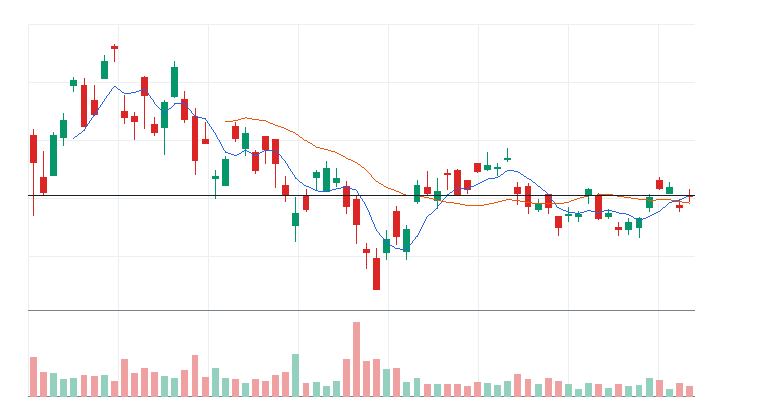
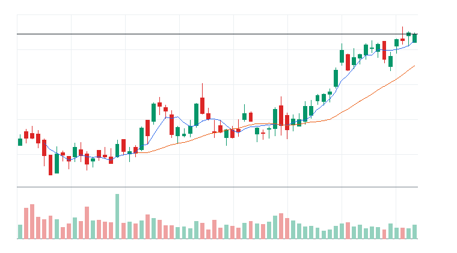
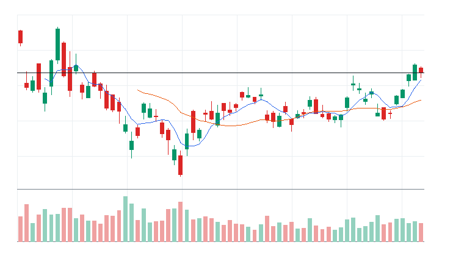

# 오늘의 데일리 트레이딩 요약

**REAL DATA TEST - 가격/거래량은 실제 데이터, 뉴스/ETF 구성종목 확산도/거래대금 유동성 일부 연결**

**목적:** 이 리포트는 최근 오른 자산을 나열하는 것이 아니라, 돈이 몰리는 근거와 다음 매수 주체가 확인할 트레이딩 후보를 찾기 위한 보고서다.

> 핵심 질문: 현재 가격에서 누가 사고 있고, 누가 앞으로 더 비싸게 사줄 수 있는가?

## 시장 국면 판단

- 최종 판정: 기간 조정 (81점)
- 전일 대비: 기간 조정은 유지됐지만 점수는 전일보다 강화됐다(+13점).
- 판정 신뢰도: 높음 (100점) - 핵심 지수와 매크로 데이터가 대부분 직접 수집되어 판정 신뢰도가 높다.
- 행동 바이어스: 추격 보류, 돌파 확인
- 한 줄 결론: 장기 추세는 유지되지만 단기 추세가 둔화되어 기간 조정으로 본다. 기술 100점, 매크로 47점.
- 기술적 지표: 상승 추세 우위 (100점, 가중치 65%)
- S&P 500: 100점 | 50일선 위, 200일선 위, 20일 -0.50%, 60일 +6.00%, 52주 고점 대비 -1.26% -> 기술 점수 100
- Nasdaq 100: 100점 | 50일선 위, 200일선 위, 20일 -0.60%, 60일 +4.00%, 52주 고점 대비 -3.96% -> 기술 점수 100
- 매크로 시황: 매크로 중립 (47점, 가중치 35%)
- 매크로 요약: 물가 부담으로 매크로 환경은 방어적이다.
- 금리: 중립 47점 / 금리 중립 / confidence HIGH
  - 주요 근거: US 10Y yield 20일 +2.66%, 5일 +1.36%; US 3M yield 20일 +1.27%, 단기금리 방향 확인; US long-duration bonds 20일 -0.66%, 장기채 가격 기준 할인율 부담 확인
  - 확인 사항: 추가 확인 이벤트 없음
- 물가: 부담 38점 / 물가 부담 / confidence HIGH
  - 주요 근거: Oil ETF 20일 +20.33%, 유가 기반 물가 압력 확인; TIPS ETF 20일 -0.10%, 물가연동채 흐름은 보조 근거; Gold 20일 +2.08%, 금 강세는 방어 수요 여부 확인
  - 확인 사항: 추가 확인 이벤트 없음
- 정책: 중립 50점 / 정책 이벤트 확인 전 중립 / confidence LOW
  - 주요 근거: 정책 톤은 1차 버전에서 일정/이벤트 리스크 기반 중립값으로 반영한다.
  - 확인 사항: FOMC, CPI, PCE, 고용지표 발표 전후에는 매크로 confidence를 보수적으로 해석한다.
- 신용/유동성: 중립 51점 / 신용/유동성 중립 / confidence HIGH
  - 주요 근거: High yield credit 20일 -0.57%, 하이일드 위험선호 확인; HYG-LQD 20일 상대강도 +0.43%, 신용위험 선호/회피 확인; VIX 20일 -2.48%, 변동성 부담 확인
  - 확인 사항: 추가 확인 이벤트 없음
- 환율/글로벌: 중립 50점 / 환율/글로벌 중립 / confidence MEDIUM
  - 주요 근거: US dollar 20일 +0.04%, 달러 강세/약세 확인
  - 확인 사항: 추가 확인 이벤트 없음
- US 10Y yield: 45점 | 하락 시 주식 우호; 5일 +1.36%, 20일 +2.66% -> 매크로 점수 45
- US 3M yield: 47점 | 하락 시 주식 우호; 5일 +0.72%, 20일 +1.27% -> 매크로 점수 47
- US long-duration bonds: 48점 | 상승 시 주식 우호; 5일 -0.81%, 20일 -0.66% -> 매크로 점수 48
- TIPS ETF: 50점 | 상승 시 주식 우호; 5일 +0.03%, 20일 -0.10% -> 매크로 점수 50
- Oil ETF: 10점 | 하락 시 주식 우호; 5일 +9.45%, 20일 +20.33% -> 매크로 점수 10
- Gold: 50점 | 상승 시 주식 우호; 5일 -0.52%, 20일 +2.08% -> 매크로 점수 50
- US dollar: 50점 | 하락 시 주식 우호; 5일 -0.35%, 20일 +0.04% -> 매크로 점수 50
- High yield credit: 49점 | 상승 시 주식 우호; 5일 -0.73%, 20일 -0.57% -> 매크로 점수 49
- Investment grade credit: 50점 | 상승 시 주식 우호; 5일 -0.82%, 20일 -1.00% -> 매크로 점수 50
- VIX: 53점 | 하락 시 주식 우호; 5일 +0.69%, 20일 -2.48% -> 매크로 점수 53
- 데이터 커버리지: 기술 2/2, 매크로 10/10
- 데이터 신뢰도 근거:
  - 직접 지수 데이터: S&P 500, Nasdaq 100
  - 대체 지수 데이터 없음
  - 매크로 데이터: 10/10
  - 누락 데이터 없음
  - stale 데이터 없음

## 모바일 요약

[오늘의 데일리 트레이딩 요약]

생성 성공 / 데이터 모드: REAL_TEST

시장:
- 중립

시장 지배 서사:
1. 비트코인/디지털 자산 위험선호 - 약화 - iShares Bitcoin Trust ETF(IBIT), Amplify Transformational Data Sharing ETF(BLOK), Strategy Inc.(MSTR), Riot Platforms(RIOT) 중심으로 5일 +10.93%, 20일 +15.60% 흐름이 형성됨. 뉴스 직접성 제한.
2. 바이오/헬스케어 촉매 - 약화 - Invesco QQQ Trust(QQQ), Gilead Sciences Inc.(GILD), Alnylam Pharmaceuticals Inc.(ALNY) 중심으로 5일 +4.13%, 20일 +7.50% 흐름이 형성됨. 직접 촉매 일부 확인.
3. Internet Content 자금 유입 - 약화 - Invesco QQQ Trust(QQQ), Meta Platforms Inc.(META), DoorDash Inc.(DASH) 중심으로 5일 -1.17%, 20일 +0.51% 흐름이 형성됨. 직접 촉매 일부 확인.

트렌드 강도:
1. 비트코인/디지털 자산 위험선호 - TSI 57 - 약화 - 진입품질 낮음
2. 바이오/헬스케어 촉매 - TSI 42 - 잠복 - 진입품질 낮음
3. Internet Content 자금 유입 - TSI 19 - 잠복 - 진입품질 낮음

오늘 결론:
- 메모리/HBM 개별 종목 흐름이 ETF 대비 강한지 확인 필요
- 행동 후보는 linkedNarrative와 함께 확인한다.
- 추격보다 진입 조건 확인 후 접근한다.

오늘 실제 행동 후보:
1. Micron Technology Inc.(MU)(STOCK) - AI 인프라 재가속 - 단기 추세가 유지되고 거래량이 1.0배 이상이면 눌림 이후 재상승을 시도할 수 있음

다크호스 후보:
1. 다크호스 후보 없음 - 조건 충족 후보 없음

ETF 후보 TOP 5:
1. Roundhill Memory ETF(DRAM) - AI 인프라 재가속 - 제외
2. Invesco QQQ Trust(QQQ) - 바이오/헬스케어 촉매 - 제외
3. VanEck Semiconductor ETF(SMH) - AI 인프라 재가속 - 제외
4. Roundhill Magnificent Seven ETF(MAGS) - 위험선호 성장주 재진입 - 제외
5. iShares Bitcoin Trust ETF(IBIT) - 비트코인/디지털 자산 위험선호 - 거래량 확인 전 관찰

웹 리포트:
https://yoolcool.github.io/DailyTradingThesisAgent/

## 오늘 결론

- 오늘 결론: 조건부 진입
- 신규 진입 후보: 0개
- 조건부 진입 후보: 1개
- 관찰 후보: 103개
- 주요 제한 요인: Entry Quality < 40, RVOL 미달, 뉴스 직접성 부족
- 주문 판단: 시장가 금지 / 지정가 또는 관찰
- 실전 판단: 진입 후보는 있으나, 전일 고점 돌파와 거래량 확인 후 선별적으로 접근한다.

### 후보 제한 요인 집계

- RVOL < 1.00x: 100개
- 거래대금 유동성 낮음: 18개
- Entry Quality 50~54 near miss: 0개
- Entry Quality 40~49 관찰: 5개
- Entry Quality < 40: 152개
- Exhaustion Risk >= 70: 0개
- ETF breadth 샘플 부족: 37개
- 뉴스 직접성 부족: 100개

## 데이터 신뢰도

- 전체 데이터 신뢰도 등급: LOW
- 분석 신뢰도: LOW
- 주문 실행 신뢰도: LOW
- ETF breadth 신뢰도: LOW
- 신뢰도 해석: 테마 확산 판단 제한, 거래대금 유동성 낮음 또는 확인 불가, 프리/애프터마켓 확인 불가
- 리포트 생성 시각: 2026-09-07 09:43 KST
- 가격 기준 거래일: 2026-09-04 US regular close
- 뉴스 수집 시각: 2026-09-07 09:43 KST
- 가장 최근 뉴스 발행 시각: 2026-09-07 09:28 KST
- 뉴스 신선도 상태: FRESH
- 뉴스 소스: Yahoo Finance RSS, MarketWatch RSS, CNBC Markets RSS, SEC EDGAR RSS, Federal Reserve RSS, Finnhub API
- 뉴스 소스 상태: Yahoo Finance RSS CONNECTED, MarketWatch RSS CONNECTED, CNBC Markets RSS PARTIAL, SEC EDGAR RSS PARTIAL, Federal Reserve RSS CONNECTED, Finnhub API DISABLED
- 뉴스 신뢰도: MEDIUM
- 추천 적용 거래일: 2026-09-06 US regular session
- 가격/거래량 데이터 상태: 연결됨
- 뉴스 데이터 상태: 일부 연결
- ETF 구성종목 확산도 상태: 일부 연결
- ETF 구성종목 샘플 수: 1~4
- 거래대금 유동성 데이터 상태: 일부 연결
- 프리/애프터마켓 데이터 상태: UNAVAILABLE
- 데이터 provider: yfinance, Yahoo Finance RSS, MarketWatch RSS, CNBC Markets RSS, SEC EDGAR RSS, Federal Reserve RSS, Finnhub API, config fallback sample, price-volume dollar-volume fallback
- 실전 사용 경고: 이 리포트는 투자판단 보조용이며, REAL_TEST 모드에서는 일부 데이터가 누락되거나 지연될 수 있다. 실제 주문 전 현재가, 뉴스, 프리마켓/정규장 거래량을 별도 확인해야 한다.

## 0. 시장 상태

- 데이터 모드: REAL_TEST
- 가격/거래량: 연결됨
- 뉴스: 일부 연결
- ETF 구성종목 확산도: 일부 연결
- 거래대금 유동성: 일부 연결
- 생성 시각: 2026년 9월 7일 월요일 AM 9:43
- 시장 상태: 중립
- 오늘 돈의 방향: 메모리/HBM 개별 종목 흐름이 ETF 대비 강한지 확인 필요
- 강한 테마 TOP 3: 메모리/HBM ETF(83), 메가캡 플랫폼 ETF(50), Financials(40)
- 데이터 한계:
  - API 또는 provider 상태에 따라 뉴스/ETF 확산도/거래대금 유동성 반영 범위가 달라질 수 있다.
  - 수집 실패 데이터는 점수 반영에서 제외하거나 confidence를 제한한다.
  - reasonConfidence HIGH는 직접 촉매, 가격/거래량, 확산도/유동성 근거가 함께 있을 때만 사용한다.

## 오늘 시장을 지배하는 서사

### 오늘 시장을 지배하는 서사 TOP 3

#### 1. 비트코인/디지털 자산 위험선호
- 상태: 약화
- narrativeScore: 41
- reasonConfidence: LOW
- 근거 ETF: IBIT, BLOK
- 근거 개별 종목: MSTR, RIOT, IREN, COIN
- 돈이 몰리는 이유: 비트코인/디지털 자산 위험선호 관련 iShares Bitcoin Trust ETF(IBIT), Amplify Transformational Data Sharing ETF(BLOK)와 Strategy Inc.(MSTR), Riot Platforms(RIOT), IREN, Coinbase(COIN)의 5일(+10.93%)·20일(+15.60%) 흐름을 함께 본다. 평균 상대 거래량은 0.82배이고, ETF 확산도는 추가 확인이 필요하다. 뉴스 직접성은 아직 제한적이다.
- 다음 매수 주체: 비트코인 현물 ETF와 디지털 자산 베타를 사는 위험선호 자금
- 가장 좋은 트레이딩 수단: ETF 우선: IBIT, BLOK / 개별 종목 우선: MSTR, COIN, IREN
- 서사가 깨지는 조건: IBIT/BLOK 20일선 이탈 또는 채굴주 상대강도 급락
- 오늘 행동: 비트코인 베타가 살아날 때만 단기 매매

상세 narrativeScore 근거 보기

- rawScore: 41
- ETF 평균 moneyFlowScore: 27
- 개별 종목 평균 moneyFlowScore: 46
- ETF 후보 비율: 0%
- 개별 종목 후보 비율: 0%
- 5일 평균 수익률: +11.00%
- 20일 평균 수익률: +16.00%
- 평균 상대 거래량: 1.00배
- ETF 평균 상대 거래량: 1.00배
- 개별주 평균 상대 거래량: 1.00배
- 52주 고점 근접 후보 비율: 0%
- 뉴스 직접성 점수: 6
- ETF 확산도 점수: 0
- 유동성 점수: 2
- 과열 리스크 차감: 0

#### 2. 바이오/헬스케어 촉매
- 상태: 약화
- narrativeScore: 40
- reasonConfidence: LOW
- 근거 ETF: QQQ
- 근거 개별 종목: GILD, ALNY, REGN, VRTX
- 돈이 몰리는 이유: 바이오/헬스케어 촉매 관련 Invesco QQQ Trust(QQQ)와 Gilead Sciences Inc.(GILD), Alnylam Pharmaceuticals Inc.(ALNY), Regeneron Pharmaceuticals Inc.(REGN), Vertex Pharmaceuticals Incorporated(VRTX)의 5일(+4.13%)·20일(+7.50%) 흐름을 함께 본다. 평균 상대 거래량은 0.90배이고, ETF 확산도는 추가 확인이 필요하다. 직접 뉴스/이벤트가 일부 확인된다.
- 다음 매수 주체: 바이오/헬스케어 촉매을 확인한 섹터 ETF 자금과 상대강도 추종 스윙 자금
- 가장 좋은 트레이딩 수단: ETF 우선: QQQ / 개별 종목 우선: GILD, ALNY, REGN
- 서사가 깨지는 조건: QQQ 20일선 이탈 또는 관련 종목 절반 이상 5일선 이탈
- 오늘 행동: 기존 네러티브와 중복을 확인한 뒤 ETF/대표 종목 동조성이 살아날 때만 관찰 편입

상세 narrativeScore 근거 보기

- rawScore: 40
- ETF 평균 moneyFlowScore: 53
- 개별 종목 평균 moneyFlowScore: 39
- ETF 후보 비율: 0%
- 개별 종목 후보 비율: 17%
- 5일 평균 수익률: +4.00%
- 20일 평균 수익률: +8.00%
- 평균 상대 거래량: 1.00배
- ETF 평균 상대 거래량: 1.00배
- 개별주 평균 상대 거래량: 1.00배
- 52주 고점 근접 후보 비율: 71%
- 뉴스 직접성 점수: 5
- ETF 확산도 점수: 0
- 유동성 점수: 1
- 과열 리스크 차감: 0

#### 3. Internet Content 자금 유입
- 상태: 약화
- narrativeScore: 36
- reasonConfidence: LOW
- 근거 ETF: QQQ
- 근거 개별 종목: META, DASH
- 돈이 몰리는 이유: Internet Content 자금 유입 관련 Invesco QQQ Trust(QQQ)와 Meta Platforms Inc.(META), DoorDash Inc.(DASH)의 5일(-1.17%)·20일(+0.51%) 흐름을 함께 본다. 평균 상대 거래량은 1.02배이고, ETF 확산도는 추가 확인이 필요하다. 직접 뉴스/이벤트가 일부 확인된다.
- 다음 매수 주체: Internet Content 자금 유입을 확인한 섹터 ETF 자금과 상대강도 추종 스윙 자금
- 가장 좋은 트레이딩 수단: ETF 우선: QQQ / 개별 종목 우선: META, DASH
- 서사가 깨지는 조건: QQQ 20일선 이탈 또는 관련 종목 절반 이상 5일선 이탈
- 오늘 행동: 기존 네러티브와 중복을 확인한 뒤 ETF/대표 종목 동조성이 살아날 때만 관찰 편입

상세 narrativeScore 근거 보기

- rawScore: 36
- ETF 평균 moneyFlowScore: 53
- 개별 종목 평균 moneyFlowScore: 35
- ETF 후보 비율: 0%
- 개별 종목 후보 비율: 50%
- 5일 평균 수익률: -1.00%
- 20일 평균 수익률: +1.00%
- 평균 상대 거래량: 1.00배
- ETF 평균 상대 거래량: 1.00배
- 개별주 평균 상대 거래량: 1.00배
- 52주 고점 근접 후보 비율: 33%
- 뉴스 직접성 점수: 7
- ETF 확산도 점수: 0
- 유동성 점수: 3
- 과열 리스크 차감: 0

### 전체 narrative 요약

| 서사명 | 상태 | narrativeScore | reasonConfidence | 대표 ETF | 대표 종목 | 오늘 행동 |
| --- | --- | ---: | --- | --- | --- | --- |
| 비트코인/디지털 자산 위험선호 | 약화 | 41 | LOW | IBIT, BLOK | MSTR, RIOT, IREN, COIN | 비트코인 베타가 살아날 때만 단기 매매 |
| 바이오/헬스케어 촉매 | 약화 | 40 | LOW | QQQ | GILD, ALNY, REGN, VRTX | 기존 네러티브와 중복을 확인한 뒤 ETF/대표 종목 동조성이 살아날 때만 관찰 편입 |
| Internet Content 자금 유입 | 약화 | 36 | LOW | QQQ | META, DASH | 기존 네러티브와 중복을 확인한 뒤 ETF/대표 종목 동조성이 살아날 때만 관찰 편입 |
| AI 인프라 재가속 | 약화 | 32 | LOW | DRAM, SMH, SOXX | MU, NVDA, AMD, VRT | 추격보다 5일선 지지 후 재상승 확인 |
| 위험선호 성장주 재진입 | 약화 | 28 | LOW | QQQ, MAGS, ARKK | COIN, TSLA, ARM | 지수 위험선호가 유지될 때만 선별 진입 |
| Integrated Oil & Gas 자금 유입 | 약화 | 28 | LOW | QQQ, XLE, OIH | CVX, XOM | 기존 네러티브와 중복을 확인한 뒤 ETF/대표 종목 동조성이 살아날 때만 관찰 편입 |
| 소프트웨어 실적/AI 수익화 | 약화 | 24 | LOW | QQQ, MAGS, AIQ | MSTR, MSFT, ADBE | 기존 네러티브와 중복을 확인한 뒤 ETF/대표 종목 동조성이 살아날 때만 관찰 편입 |
| 반도체 설계/공급망 재가속 | 소멸 | 22 | LOW | SMH, SOXX, SOXQ | TSM, INTC, AMD, ARM | 기존 네러티브와 중복을 확인한 뒤 ETF/대표 종목 동조성이 살아날 때만 관찰 편입 |
| Data Storage 자금 유입 | 약화 | 22 | LOW | QQQ, SPY, IWM | WDC, STX | 기존 네러티브와 중복을 확인한 뒤 ETF/대표 종목 동조성이 살아날 때만 관찰 편입 |
| 전력 유틸리티 수요 재평가 | 약화 | 22 | LOW | QQQ, SPY, IWM | VRT, ETN, GEV | 기존 네러티브와 중복을 확인한 뒤 ETF/대표 종목 동조성이 살아날 때만 관찰 편입 |
| 매크로 방어/헤지 | 약화 | 21 | LOW | XLE, TLT, GLD | CVX, XOM | 위험회피가 확인될 때만 헤지성 접근 |
| Specialty Business Services 자금 유입 | 약화 | 19 | LOW | QQQ, SPY, IWM | CPRT, TRI, CTAS | 기존 네러티브와 중복을 확인한 뒤 ETF/대표 종목 동조성이 살아날 때만 관찰 편입 |
| 필수소비재 음료 방어 성장 | 약화 | 17 | LOW | QQQ | CCEP, MNST | 기존 네러티브와 중복을 확인한 뒤 ETF/대표 종목 동조성이 살아날 때만 관찰 편입 |
| 반도체 장비 사이클 재평가 | 소멸 | 14 | LOW | SMH, SOXX, SOXQ | LRCX, ASML, AMAT | 기존 네러티브와 중복을 확인한 뒤 ETF/대표 종목 동조성이 살아날 때만 관찰 편입 |
| Travel Services 자금 유입 | 약화 | 14 | LOW | QQQ | BKNG, ABNB | 기존 네러티브와 중복을 확인한 뒤 ETF/대표 종목 동조성이 살아날 때만 관찰 편입 |
| AI 소프트웨어/사이버보안 확산 | 약화 | 12 | LOW | QQQ, AIQ, IGV | TEAM, MSFT, PLTR, DDOG | 추격보다 눌림 후 재상승 확인 |
| 전력망/원전/인프라 병목 | 약화 | 12 | LOW | URA, GRID, PAVE | CEG, VRT, ETN, PWR | ETF 확산도와 거래량이 같이 살아날 때만 진입 |
| 소비 회복/방어주 선별 | 소멸 | 12 | LOW | QQQ | PDD, AMZN | 기존 네러티브와 중복을 확인한 뒤 ETF/대표 종목 동조성이 살아날 때만 관찰 편입 |
| Aerospace & Defense 자금 유입 | 소멸 | 3 | LOW | QQQ, SPY, IWM | KTOS, AVAV | 기존 네러티브와 중복을 확인한 뒤 ETF/대표 종목 동조성이 살아날 때만 관찰 편입 |
| 사이버보안 지출 재가속 | 약화 | 0 | LOW | HACK, CIBR, IHAK | CRWD, ZS, FTNT, PANW | 기존 네러티브와 중복을 확인한 뒤 ETF/대표 종목 동조성이 살아날 때만 관찰 편입 |
| 방산/안보 프리미엄 | 소멸 | 0 | LOW | XAR, SHLD, ITA | AVAV, KTOS, PLTR | 뉴스 촉매가 직접 확인될 때만 추세 추종 |

## 트렌드 강도 판단

### 1. 비트코인/디지털 자산 위험선호
- Trend Strength Index: 57
- 트렌드 상태 라벨: 약화
- 테마 확산도: 보통
- ETF 동조성: 강함
- 거래량 강도: 부족
- 과열 위험: 낮음 (20)
- 오늘 진입 품질: 낮음 (29)
- 한 줄 판단: 비트코인/디지털 자산 위험선호는 관찰 가능한 흐름은 있으나 가격, 거래량, 확산도 중 일부 확인이 더 필요하다.
- 오늘 접근법: 상승률이 남아 있어도 iShares Bitcoin Trust ETF(IBIT)/Amplify Transformational Data Sharing ETF(BLOK)와 구성 종목 확산도가 회복될 때까지 신규 진입은 낮춘다.

트렌드 강도 상세 근거 보기

- 가격 모멘텀: 가격 모멘텀 24/25. 평균 5D +10.93%, 20D +15.60%.
- 거래량 강도: 거래량 강도 2/20. 평균 RVOL 0.82배.
- ETF 동조성: ETF 동조성 15/15. 관련 ETF iShares Bitcoin Trust ETF(IBIT), Amplify Transformational Data Sharing ETF(BLOK) 흐름을 기준으로 판단.
- 테마 확산도: 테마 확산도 12/20. 상위 1~2개 쏠림 감점 0점 반영.
- 뉴스 촉매: 뉴스/촉매 신선도 0/10. HIGH 직접 촉매 0개.
- 과열 리스크: 과열 리스크 20/100. 단기 급등, 고점 근접, ETF-개별주 괴리, 쏠림을 함께 반영.
- 시장 환경: 시장 환경 4/10. QQQ/SPY/IWM 가격 흐름 기반 위험선호 점수.

### 2. 바이오/헬스케어 촉매
- Trend Strength Index: 42
- 트렌드 상태 라벨: 잠복
- 테마 확산도: 보통
- ETF 동조성: 부족
- 거래량 강도: 부족
- 과열 위험: 낮음 (0)
- 오늘 진입 품질: 낮음 (36)
- 한 줄 판단: 바이오/헬스케어 촉매는 ETF 동조성이 약해 테마 자금 확인이 부족하다.
- 오늘 접근법: Invesco QQQ Trust(QQQ)와 Gilead Sciences Inc.(GILD)/Alnylam Pharmaceuticals Inc.(ALNY)/Regeneron Pharmaceuticals Inc.(REGN)의 거래량 확산이 확인되기 전까지 관찰한다.

트렌드 강도 상세 근거 보기

- 가격 모멘텀: 가격 모멘텀 16/25. 평균 5D +4.13%, 20D +7.50%.
- 거래량 강도: 거래량 강도 3/20. 평균 RVOL 0.90배.
- ETF 동조성: ETF 동조성 4/15. 관련 ETF Invesco QQQ Trust(QQQ) 흐름을 기준으로 판단.
- 테마 확산도: 테마 확산도 12/20. 상위 1~2개 쏠림 감점 0점 반영.
- 뉴스 촉매: 뉴스/촉매 신선도 3/10. HIGH 직접 촉매 1개.
- 과열 리스크: 과열 리스크 0/100. 단기 급등, 고점 근접, ETF-개별주 괴리, 쏠림을 함께 반영.
- 시장 환경: 시장 환경 4/10. QQQ/SPY/IWM 가격 흐름 기반 위험선호 점수.

### 3. Internet Content 자금 유입
- Trend Strength Index: 19
- 트렌드 상태 라벨: 잠복
- 테마 확산도: 부족
- ETF 동조성: 부족
- 거래량 강도: 약함
- 과열 위험: 낮음 (18)
- 오늘 진입 품질: 낮음 (16)
- 한 줄 판단: Internet Content 자금 유입는 테마 확산도가 낮아 아직 개별 종목 이벤트성 흐름에 가깝다.
- 오늘 접근법: Invesco QQQ Trust(QQQ)와 Meta Platforms Inc.(META)/DoorDash Inc.(DASH)의 거래량 확산이 확인되기 전까지 관찰한다.

트렌드 강도 상세 근거 보기

- 가격 모멘텀: 가격 모멘텀 1/25. 평균 5D -1.17%, 20D +0.51%.
- 거래량 강도: 거래량 강도 7/20. 평균 RVOL 1.02배.
- ETF 동조성: ETF 동조성 4/15. 관련 ETF Invesco QQQ Trust(QQQ) 흐름을 기준으로 판단.
- 테마 확산도: 테마 확산도 2/20. 상위 1~2개 쏠림 감점 6점 반영.
- 뉴스 촉매: 뉴스/촉매 신선도 1/10. HIGH 직접 촉매 1개.
- 과열 리스크: 과열 리스크 18/100. 단기 급등, 고점 근접, ETF-개별주 괴리, 쏠림을 함께 반영.
- 시장 환경: 시장 환경 4/10. QQQ/SPY/IWM 가격 흐름 기반 위험선호 점수.

## 최근 추천 결과 트래킹

개별주는 데이트레이딩 관점으로 추천 이후 첫 정규장의 장중 최고가와 종가를 추적한다. ETF는 테마/스윙 관점으로 추천 이후 1주일 동안의 최고가와 현재 종가를 추적한다.

### 개별주 Top 3 추천 성과 요약
- 최근 5개 리포트 표본: 7개 (초기 검증 단계)
- 장중 최고가 기준 성공률: 0.00%
- 종가 기준 성공률: 0.00%
- 평균 장중 최고 수익률: -0.15%
- 평균 종가 수익률: -2.91%

### ETF 추천 성과 요약
- 최근 5개 리포트 표본: 2개 (초기 검증 단계)
- 1주 최고가 기준 성공률: 0.00%
- 현재 종가 기준 성공률: 0.00%
- 평균 1주 최고 수익률: -4.15%
- 평균 현재 수익률: -3.81%

최근 추천 결과 상세 테이블 펼치기

| 추천일 | 유형 | 순위 | 티커 | 기준가 | 추적 기간 | 상태 | High 수익률 | Close 수익률 | 결과 | 코멘트 |
| --- | --- | ---: | --- | ---: | --- | --- | ---: | ---: | --- | --- |
| 2026-09-07 | STOCK | 1 | MU | $1,016.59 | 2026-09-07 | pending | 데이터 없음 | 데이터 없음 | 추적 대기 | 아직 추적 거래일 데이터가 완성되지 않음 |
| 2026-09-04 | STOCK | 1 | ALNY | $267.4 | 2026-09-04 | complete | -0.21% | -0.48% | 실패 | 추천 이후 의미 있는 장중 기회가 부족하고 종가도 약함 (일봉 기준) |
| 2026-09-04 | ETF | 1 | OIH | $436.58 | 2026-09-04~2026-09-11 | in_progress | 데이터 없음 | -2.07% | 진행 중 | 아직 1주 추적 기간이 끝나지 않음 (일봉 high 미확보 시 close 기준 보조) |
| 2026-09-03 | STOCK | 1 | CVX | $211.05 | 2026-09-03 | complete | +1.02% | +0.13% | 제한적 유효 | 제한적인 장중 기회만 발생 (일봉 기준) |
| 2026-09-02 | STOCK | 1 | CVX | $211.05 | 2026-09-02 | complete | +0.82% | +0.35% | 추적 대기 | 아직 추적 거래일 데이터가 완성되지 않음 (일봉 기준) |
| 2026-09-01 | STOCK | 3 | PANW | $382.13 | 2026-09-01 | complete | -1.63% | -5.24% | 실패 | 추천 이후 의미 있는 장중 기회가 부족하고 종가도 약함 (일봉 기준) |
| 2026-09-01 | STOCK | 2 | ZS | $188.39 | 2026-09-01 | complete | -1.06% | -5.32% | 실패 | 추천 이후 의미 있는 장중 기회가 부족하고 종가도 약함 (일봉 기준) |
| 2026-09-01 | STOCK | 1 | CRWD | $231 | 2026-09-01 | complete | +0.13% | -6.90% | 실패 | 추천 이후 의미 있는 장중 기회가 부족하고 종가도 약함 (일봉 기준) |
| 2026-09-01 | ETF | 1 | CIBR | $100.15 | 2026-09-01~2026-09-08 | in_progress | -4.15% | -5.55% | 진행 중 | 아직 1주 추적 기간이 끝나지 않음 |
| 2026-08-31 | STOCK | 3 | MSFT | $513.53 | 2026-08-31 | complete | -0.26% | -1.22% | 실패 | 추천 이후 의미 있는 장중 기회가 부족하고 종가도 약함 (일봉 기준) |
| 2026-08-31 | STOCK | 2 | WDAY | $204.72 | 2026-08-31 | complete | -0.53% | -3.55% | 실패 | 추천 이후 의미 있는 장중 기회가 부족하고 종가도 약함 (일봉 기준) |
| 2026-08-31 | STOCK | 1 | CRWD | $218.4 | 2026-08-31 | complete | +7.09% | +5.77% | 성공 | 장중 기회와 종가 유지가 모두 확인됨 (일봉 기준) |
| 2026-08-31 | ETF | 1 | IGV | $109.5 | 2026-08-31~2026-09-07 | in_progress | -0.70% | -4.50% | 진행 중 | 아직 1주 추적 기간이 끝나지 않음 |
| 2026-08-28 | STOCK | 3 | ZS | $187.3 | 2026-08-28 | complete | +0.47% | -1.64% | 실패 | 추천 이후 의미 있는 장중 기회가 부족하고 종가도 약함 (일봉 기준) |
| 2026-08-28 | STOCK | 2 | ADSK | $270.58 | 2026-08-28 | complete | -1.32% | -3.67% | 실패 | 추천 이후 의미 있는 장중 기회가 부족하고 종가도 약함 (일봉 기준) |
| 2026-08-28 | STOCK | 1 | ADBE | $289.15 | 2026-08-28 | complete | +1.71% | +0.82% | 제한적 유효 | 제한적인 장중 기회만 발생 (일봉 기준) |
| 2026-08-28 | ETF | 3 | IBIT | $45.29 | 2026-08-28~2026-09-04 | complete | +2.38% | -0.13% | 단기 고점 후 반납 | 1주 내 상승 기회는 있었지만 현재가는 반납 |
| 2026-08-28 | ETF | 2 | CIBR | $100.79 | 2026-08-28~2026-09-04 | complete | -0.35% | -6.15% | 실패 | 추천 이후 ETF 흐름이 약화됨 |
| 2026-08-28 | ETF | 1 | IGV | $110.32 | 2026-08-28~2026-09-04 | complete | +0.23% | -5.21% | 실패 | 추천 이후 ETF 흐름이 약화됨 |
| 2026-08-21 | STOCK | 3 | FCX | $71.22 | 2026-08-21 | complete | +8.58% | +7.64% | 성공 | 장중 기회와 종가 유지가 모두 확인됨 (일봉 기준) |
| 2026-08-21 | STOCK | 2 | COIN | $172.35 | 2026-08-21 | complete | +11.03% | +8.20% | 성공 | 장중 기회와 종가 유지가 모두 확인됨 (일봉 기준) |
| 2026-08-21 | STOCK | 1 | MSTR | $112.39 | 2026-08-21 | complete | +8.47% | +6.10% | 성공 | 장중 기회와 종가 유지가 모두 확인됨 (일봉 기준) |
| 2026-08-21 | ETF | 1 | IBIT | $41.2 | 2026-08-21~2026-08-28 | complete | +11.19% | +9.78% | 성공 | 추천 이후 테마 추세가 유지됨 |
| 2026-08-20 | STOCK | 3 | ADBE | $272.47 | 2026-08-20 | complete | +0.65% | -0.09% | 실패 | 추천 이후 의미 있는 장중 기회가 부족하고 종가도 약함 (일봉 기준) |
| 2026-08-20 | STOCK | 2 | TEAM | $174.23 | 2026-08-20 | complete | +2.09% | +0.39% | 제한적 유효 | 제한적인 장중 기회만 발생 (일봉 기준) |
| 2026-08-20 | STOCK | 1 | INTU | $362.47 | 2026-08-20 | complete | +1.15% | -0.17% | 제한적 유효 | 제한적인 장중 기회만 발생 (일봉 기준) |
| 2026-08-18 | STOCK | 2 | CPRT | $31.7 | 2026-08-18 | complete | +5.84% | -0.60% | 단타 유효 | 장중 기회는 있었지만 종가 유지력은 약함 (일봉 기준) |
| 2026-08-18 | STOCK | 1 | PWR | $722.31 | 2026-08-18 | complete | -1.43% | -3.62% | 실패 | 추천 이후 의미 있는 장중 기회가 부족하고 종가도 약함 (일봉 기준) |
| 2026-08-17 | STOCK | 3 | WDAY | $198.68 | 2026-08-17 | complete | -1.69% | -3.77% | 실패 | 추천 이후 의미 있는 장중 기회가 부족하고 종가도 약함 (일봉 기준) |
| 2026-08-17 | STOCK | 2 | AVAV | $192.81 | 2026-08-17 | complete | -0.43% | -6.06% | 실패 | 추천 이후 의미 있는 장중 기회가 부족하고 종가도 약함 (일봉 기준) |
| 2026-08-17 | STOCK | 1 | KTOS | $64.58 | 2026-08-17 | complete | +0.79% | -2.00% | 실패 | 추천 이후 의미 있는 장중 기회가 부족하고 종가도 약함 (일봉 기준) |
| 2026-08-14 | STOCK | 3 | ADSK | $257.96 | 2026-08-14 | complete | +1.08% | -2.44% | 제한적 유효 | 제한적인 장중 기회만 발생 (일봉 기준) |
| 2026-08-14 | STOCK | 2 | TEAM | $165.98 | 2026-08-14 | complete | +1.07% | -2.27% | 제한적 유효 | 제한적인 장중 기회만 발생 (일봉 기준) |
| 2026-08-14 | STOCK | 1 | INTU | $358.29 | 2026-08-14 | complete | +1.04% | -3.53% | 제한적 유효 | 제한적인 장중 기회만 발생 (일봉 기준) |
| 2026-08-14 | ETF | 2 | IGV | $106.28 | 2026-08-14~2026-08-21 | complete | -2.05% | -1.61% | 실패 | 추천 이후 ETF 흐름이 약화됨 |
| 2026-08-14 | ETF | 1 | CIBR | $102.2 | 2026-08-14~2026-08-21 | complete | -2.50% | -7.45% | 실패 | 추천 이후 ETF 흐름이 약화됨 |
| 2026-08-13 | STOCK | 1 | ABNB | $180.1 | 2026-08-13 | complete | +2.91% | +2.80% | 제한적 유효 | 제한적인 장중 기회만 발생 (일봉 기준) |
| 2026-08-12 | STOCK | 3 | ABNB | $184.98 | 2026-08-12 | complete | -0.47% | -2.64% | 실패 | 추천 이후 의미 있는 장중 기회가 부족하고 종가도 약함 (일봉 기준) |
| 2026-08-12 | STOCK | 2 | AXON | $636.31 | 2026-08-12 | complete | +1.00% | -5.74% | 제한적 유효 | 제한적인 장중 기회만 발생 (일봉 기준) |
| 2026-08-12 | STOCK | 1 | FAST | $52.38 | 2026-08-12 | complete | +0.84% | -0.31% | 실패 | 추천 이후 의미 있는 장중 기회가 부족하고 종가도 약함 (일봉 기준) |
| 2026-08-11 | STOCK | 3 | ZS | $176.68 | 2026-08-11 | complete | +2.33% | +1.06% | 제한적 유효 | 제한적인 장중 기회만 발생 (일봉 기준) |
| 2026-08-11 | STOCK | 2 | PLTR | $175.23 | 2026-08-11 | complete | +1.55% | -0.17% | 제한적 유효 | 제한적인 장중 기회만 발생 (일봉 기준) |
| 2026-08-11 | STOCK | 1 | TEAM | $151.87 | 2026-08-11 | complete | +2.86% | +1.46% | 제한적 유효 | 제한적인 장중 기회만 발생 (일봉 기준) |
| 2026-08-11 | ETF | 3 | GLD | $402.54 | 2026-08-11~2026-08-18 | complete | +1.20% | +1.05% | 진행 중 | 아직 1주 추적 기간이 끝나지 않음 |
| 2026-08-11 | ETF | 2 | OIH | $411.34 | 2026-08-11~2026-08-18 | complete | +4.23% | +3.94% | 성공 | 추천 이후 테마 추세가 유지됨 |
| 2026-08-11 | ETF | 1 | CIBR | $100.6 | 2026-08-11~2026-08-18 | complete | +1.74% | -5.97% | 실패 | 추천 이후 ETF 흐름이 약화됨 |
| 2026-08-10 | STOCK | 3 | SHOP | $151.57 | 2026-08-10 | complete | +2.67% | +2.38% | 제한적 유효 | 제한적인 장중 기회만 발생 (일봉 기준) |
| 2026-08-10 | STOCK | 2 | FAST | $51.84 | 2026-08-10 | complete | +0.75% | +0.60% | 추적 대기 | 아직 추적 거래일 데이터가 완성되지 않음 (일봉 기준) |
| 2026-08-10 | STOCK | 1 | BKNG | $214.42 | 2026-08-10 | complete | +0.48% | -0.72% | 실패 | 추천 이후 의미 있는 장중 기회가 부족하고 종가도 약함 (일봉 기준) |
| 2026-08-10 | ETF | 2 | XME | $115.74 | 2026-08-10~2026-08-17 | complete | +3.45% | +2.49% | 성공 | 추천 이후 테마 추세가 유지됨 |
| 2026-08-10 | ETF | 1 | COPX | $88.03 | 2026-08-10~2026-08-17 | complete | +2.52% | +2.99% | 성공 | 추천 이후 테마 추세가 유지됨 |
| 2026-08-07 | STOCK | 3 | KTOS | $57.41 | 2026-08-07 | complete | +6.41% | +5.85% | 성공 | 장중 기회와 종가 유지가 모두 확인됨 (일봉 기준) |
| 2026-08-07 | STOCK | 2 | BKNG | $207.39 | 2026-08-07 | complete | +4.00% | +3.39% | 성공 | 장중 기회와 종가 유지가 모두 확인됨 (일봉 기준) |
| 2026-08-07 | STOCK | 1 | SHOP | $147.44 | 2026-08-07 | complete | +3.67% | +2.80% | 성공 | 장중 기회와 종가 유지가 모두 확인됨 (일봉 기준) |
| 2026-08-06 | STOCK | 3 | KTOS | $55.34 | 2026-08-06 | complete | +6.79% | +3.74% | 성공 | 장중 기회와 종가 유지가 모두 확인됨 (일봉 기준) |
| 2026-08-06 | STOCK | 2 | AMGN | $407.83 | 2026-08-06 | complete | +2.59% | -0.73% | 제한적 유효 | 제한적인 장중 기회만 발생 (일봉 기준) |
| 2026-08-06 | STOCK | 1 | TEAM | $113.32 | 2026-08-06 | complete | -2.15% | -2.78% | 실패 | 추천 이후 의미 있는 장중 기회가 부족하고 종가도 약함 (일봉 기준) |
| 2026-08-06 | ETF | 2 | XME | $111.92 | 2026-08-06~2026-08-13 | complete | +6.98% | +5.99% | 성공 | 추천 이후 테마 추세가 유지됨 |
| 2026-08-06 | ETF | 1 | COPX | $86.72 | 2026-08-06~2026-08-13 | complete | +4.07% | +4.54% | 성공 | 추천 이후 테마 추세가 유지됨 |
| 2026-08-05 | STOCK | 3 | DXCM | $86.94 | 2026-08-05 | complete | -0.54% | -4.92% | 실패 | 추천 이후 의미 있는 장중 기회가 부족하고 종가도 약함 (일봉 기준) |

## 오늘 실제 행동 후보

### 1. Micron Technology Inc.(MU)
- 자산 유형: STOCK
- linkedNarrative: AI 인프라 재가속
- narrativeStatus: 약화
- narrativeScore: 32
- Trend Strength Index: 48
- Exhaustion Risk: 0 (낮음)
- Entry Quality Score: 40 (관찰)
- 트렌드 판단: 시장 위험선호가 약해 시장 환경 비우호 구간이다.
- moneyFlowScore: 95
- finalRawScore: 95
- reasonConfidence: HIGH
- reasonConfidenceExplanation: 직접 촉매: Yahoo Finance RSS / contract / under_72h / positive - Why Is Micron Technology (MU) CEO Being Honored In Taiwan? 가격/거래량, 관련 ETF 동반 강세, 유동성 근거가 함께 확인되어 HIGH로 분류했다.
- tieBreakerReason: 최종 원점수 95, 리스크 패널티 -4, 5일 수익률 +8.98%, 상대 거래량 1.27배 순으로 정렬
- 후보별 시장 해석: 중립 / 제한적 - Entry Quality 40 < 50이나 moneyFlow 95, confidence HIGH, RVOL 1.27x로 강한 자금흐름 예외 조건 충족
- 게이트 사유: Entry Quality 40 < 50이나 moneyFlow 95, confidence HIGH, RVOL 1.27x로 강한 자금흐름 예외 조건 충족
- 주문 실행: 시장가 가능
- 직접 촉매: Yahoo Finance RSS / contract / under_72h / positive - Why Is Micron Technology (MU) CEO Being Honored In Taiwan?
- 왜 돈이 몰리는가: 20일 +15.84%, 5일 +8.98%, 상대 거래량 1.27배로 가격과 거래량이 함께 개선. 뉴스: Yahoo Finance RSS contract/under_72h / 유동성: LIQUID
- 누가 더 비싸게 사줄 수 있는지: 개별 주도주를 따라붙는 단기 모멘텀 자금과 관련 ETF 강세를 확인한 트레이더
- 진입 조건: 20일선 위 눌림 후 재상승 확인
- 무효화 조건: 20일선 이탈 또는 상대 거래량 0.8배 이하 둔화
- todayActionLabel: 자금흐름 예외 조건부
#### 최근 뉴스/동향 한국어 요약

- 요약: 종목 직접 뉴스 확인 상태이며 뉴스 흐름은 긍정 우위입니다. 후보 선정 후 재확인한 핵심 이슈는 "Why Is Micron Technology (MU) CEO Being Honored In Taiwan?"입니다.
- 직접 촉매 판단: Micron Technology Inc.에 대해 직접 촉매로 분류된 뉴스가 확인됐습니다. 핵심은 "Why Is Micron Technology (MU) CEO Being Honored In Taiwan?"이며, 계약/수주 재료로 봅니다.
- 뉴스 1: Why Is Micron Technology (MU) CEO Being Honored In Taiwan?
  - 내용: Micron Technology Inc. 관련 계약/수주 뉴스입니다. 기사 스니펫상 핵심 내용은 Micron Technology (NasdaqGS:MU) President and CEO Sanjay Mehrotra received Taiwan's Medal of Economic Contribution at the Semicon Network Summit 2026.입니다.
  - 투자 의미: 계약/수주 재료는 실적 가시성이나 밸류에이션 기대에 영향을 줄 수 있어 규모와 일정 확인이 중요합니다.
  - 확인할 점: 계약/수주의 금액, 기간, 실적 반영 시점
- 뉴스 2: Prediction: Micron Stock Will Skyrocket After Sept. 30
  - 내용: Micron Technology Inc. 관련 실적 뉴스입니다. 기사 스니펫상 핵심 내용은 Micron&#x27;s earnings report is the catalyst the stock needs to kick-start its rise.입니다.
  - 투자 의미: 실적/가이던스 재료는 다음 분기 기대치 변화로 이어질 수 있어 컨센서스 변화와 주가 반응 지속성을 함께 봅니다.
  - 확인할 점: 매출/마진/가이던스 수치, 컨센서스 대비 차이
- 뉴스 3: Dell’s Monster Quarter Just Confirmed Micron’s Biggest Opportunity Is Not Just HBM
  - 내용: Micron Technology Inc. 관련 시장 일반 뉴스입니다. 기사 스니펫상 핵심 내용은 Dell's huge beat-and-raise quarter signals broad data-center demand for DDR5 and NAND, strengthening Micron's memory-cycle thesis beyond the AI-driven HBM boom.입니다.
  - 투자 의미: 단기 긍정 뉴스 흐름으로 볼 수 있지만, 단독 매수 근거보다는 가격·거래량 조건을 확인하는 보조 근거로 사용합니다.
  - 확인할 점: 원문 수치, 후속 보도, 가격이 진입 조건을 지키는지
- 매매 해석: 매매 관점에서는 뉴스 자체보다 가격이 진입 조건을 지키는지, 거래량이 동반되는지, 그리고 뉴스가 이미 주가에 반영됐는지를 우선 확인해야 합니다.
- 차트: 

## 다크호스 후보

다크호스 후보 없음. 상위 서사 정렬, MA20 위 안착, MA5/MA20 구조 개선, RVOL 0.90x 이상 조건을 동시에 충족한 개별주가 없다.

- darkHorseScore: 조건 충족 후보 없음
- 왜 아직 메인이 아닌가: 확인 조건을 통과한 보조 관찰 후보가 없다.

darkHorseScore 상세 근거 보기

- 서사 정렬: 조건 미충족
- 초기 추세 구조: 조건 미충족
- 베이스 돌파/정돈: 조건 미충족
- 거래량 확인: 조건 미충족
- rawScore: 데이터 없음

## 오늘 돈이 몰리는 테마

- 메모리/HBM ETF: DRAM | 평균 moneyFlowScore 83 | 단일 종목 이벤트보다 테마 단위 자금 흐름이 선명한 구간으로 본다.
- 메가캡 플랫폼 ETF: MAGS | 평균 moneyFlowScore 50 | 관심은 유지하되 우선순위는 낮추고 추가 거래량 확인을 기다린다.
- Financials: COIN | 평균 moneyFlowScore 40 | 관심은 유지하되 우선순위는 낮추고 추가 거래량 확인을 기다린다.
- 메모리/HBM: MU, STX, WDC | 평균 moneyFlowScore 40 | 관심은 유지하되 우선순위는 낮추고 추가 거래량 확인을 기다린다.
- AI 소프트웨어 ETF: AIQ | 평균 moneyFlowScore 34 | 관심은 유지하되 우선순위는 낮추고 추가 거래량 확인을 기다린다.
- AI 반도체: NVDA, AVGO, AMD, ASML, ARM, MRVL, TSM | 평균 moneyFlowScore 32 | 관심은 유지하되 우선순위는 낮추고 추가 거래량 확인을 기다린다.

## 1. ETF 트레이딩 보고서
### 1-1. ETF 결론
- ETF 우선 후보: 없음
- ETF 관찰 후보: Invesco PHLX Semiconductor ETF(SOXQ), ROBO Global Robotics and Automation Index ETF(ROBO), First Trust NASDAQ Cybersecurity ETF(CIBR), Amplify Cybersecurity ETF(HACK), iShares Cybersecurity and Tech ETF(IHAK)
- ETF 매매 금지: ROBO Global Robotics and Automation Index ETF(ROBO), First Trust NASDAQ Cybersecurity ETF(CIBR), Amplify Cybersecurity ETF(HACK), iShares Cybersecurity and Tech ETF(IHAK), iShares U.S. Aerospace & Defense ETF(ITA)
- 오늘 ETF 최우선 1개: 없음
- ETF 섹션 해석: 이 섹션은 개별 종목 선택이 아니라 테마/섹터 단위 자금 흐름을 ETF로 매매할지 판단하기 위한 영역이다.

### 1-2. ETF 후보 TOP 5

선정 기준: ETF 후보는 가격/거래량 1차 점수에 뉴스, ETF 구성종목 확산도, 유동성, 리스크 패널티를 반영한 finalRawScore 기준으로 정렬한다. 표시 점수 100점 후보가 겹치면 tieBreakerReason으로 우선순위를 설명한다.

### [ETF] Roundhill Memory ETF(DRAM)
- 자산 유형: ETF
- ETF 세부 카테고리: 메모리/HBM ETF
- ETF 역할: 테마 베타 매수
- 상태: 매매 금지
- linkedNarrative: AI 인프라 재가속
- narrativeStatus: 약화
- narrativeScore: 32
- moneyFlowScore: 83
- finalRawScore: 83
- tieBreakerReason: 최종 원점수 83, 리스크 패널티 -4, 5일 수익률 +6.91%, 상대 거래량 1.06배 순으로 정렬
- 과열 리스크: 낮음
- reasonConfidence: MEDIUM
- reasonConfidenceExplanation: ETF 확산도 제한 때문에 HIGH가 아니라 MEDIUM으로 제한했다.

- todayActionLabel: 제외
- 주문 실행: 시장가 가능
- 기준일: 2026-09-04
- 종가: $59.69
- 1일 수익률: +6.61%
- 5일 수익률: +6.91%
- 20일 수익률: +17.96%
- 상대 거래량: 1.06배
- 52주 고점 대비 위치: -26.62%
- whyMoneyIsFlowing: 20일 +17.96%, 5일 +6.91%, 상대 거래량 1.06배로 가격과 거래량이 함께 개선. 뉴스: CNBC Markets RSS general_market/under_6h / 유동성: LIQUID
- likelyNextBuyer: 섹터 베타를 노리는 단기 모멘텀 자금과 리밸런싱 자금
- whyThisCouldTradeHigher: 단기 추세가 유지되고 거래량이 1.0배 이상이면 눌림 이후 재상승을 시도할 수 있음
#### 최근 뉴스/동향 한국어 요약

- 요약: 후보 선정 후 재확인 뉴스 데이터 없음
- 진입 조건: 20일선 위 눌림 후 재상승 확인
- 무효화 조건: 20일선 이탈 또는 상대 거래량 0.8배 이하 둔화
- 차트: 

#### 상세 근거

Roundhill Memory ETF(DRAM) 상세 근거 펼치기

- moneyFlowScore(최종) 산정 근거:
  - moneyFlowScore(1차): 70
  - 최종 원점수: 83
  - 최종 표시 점수: 83
  - cap 적용: cap 미적용
  - 계산식: +70 + +12 + 0 + +5 + 0 - 4 + 0 = 83
  - 점수 해석: 강한 자금 유입 후보. 단, 과열 여부 확인 필수.
  - 가격/거래량 1차 점수: +70
    - 추세: +21
    - 단기 모멘텀: +13
    - 중기 모멘텀: +12
    - 거래량: +10
    - 신고가 근접: 0
    - 이동평균: +14
  - 하위 점수 cap:
    - 가격 모멘텀: 원점수 +21, 상한 적용 +21 / 최대 25
    - 단기 모멘텀: 원점수 +13, 상한 적용 +13 / 최대 20
    - 중기 모멘텀: 원점수 +12, 상한 적용 +12 / 최대 16
    - 거래량: 원점수 +10, 상한 적용 +10 / 최대 20
    - 신고가 근접: 원점수 0, 상한 적용 0 / 최대 12
    - 이동평균: 원점수 +14, 상한 적용 +14 / 최대 14
  - 추가 데이터 가감점:
    - 뉴스: +12
    - 유동성: +5
  - ETF 확산도: 0
  - 리스크 패널티: -4
  - 주요 근거: 1차 70, 최종 원점수 83, 표시 83. 20일 수익률 강함, 5일 수익률 강함, 1일 단기 모멘텀 확인. 주의: 단기 과열/추격 위험 존재, ETF 구성종목 확산도 데이터 미연결.
  - 리스크 패널티 산정 근거:
    - 총 리스크 패널티: -4
    - 리스크 등급: LOW
    - 감점된 리스크:
      - extreme 1d move: -4 | 근거: 1d return +6.61% is unusually strong. | 대응: Confirm next-session volume retention.
    - 관찰 리스크: ETF breadth data not connected
    - 한 줄 해석: 1개 감점 리스크로 총 -4점 반영.
- 데이터 사용 현황:
  - 가격/거래량: 사용
  - 뉴스: 사용
  - ETF 확산도: 미연결
  - 거래대금 유동성: 사용
  - 관련 ETF 상대강도: 사용
- 뉴스 확인:
  - 최근 뉴스 상태: 일부 연결
  - 뉴스 소스: CNBC Markets RSS, MarketWatch RSS
  - 소스별 상태: Yahoo Finance RSS CONNECTED; MarketWatch RSS CONNECTED; CNBC Markets RSS CONNECTED; SEC EDGAR RSS PARTIAL; Federal Reserve RSS CONNECTED; Finnhub API DISABLED
  - 긍정/중립/부정: 15/1/0
  - 직접성/방향성/신선도: 2/1/4
  - 강한 촉매 수: 3
  - 중요 공시 수: 0
  - 직접 촉매: 없음
  - 보조 뉴스: CNBC Markets RSS sector_theme / general_market / under_6h
  - 뉴스 수집 시각: 2026-09-07 09:43 KST
  - 가장 최근 뉴스 발행 시각: 2026-09-07 09:06 KST
  - 뉴스 신선도 상태: FRESH
  - 뉴스 이후 가격 반응: 긍정
  - 가격 반응 점수 제한: 뉴스 이후 가격 반응과 점수 제한 특이사항 없음
  - 핵심 뉴스 요약: Data centers in space: Four big obstacles and Elon Musk&apos;s ambitious timeline
  - 원점수/상한 점수: +28 / +12
  - 점수 반영: +12
  - 주의: SEC EDGAR RSS: no matching RSS items; Finnhub API: FINNHUB_API_KEY not configured
- ETF 구성종목 확산도:
  - 구성종목 데이터 상태: 미연결
  - 샘플 수: 0/0
  - 샘플 신뢰도: UNKNOWN
  - 상승 종목 비율: 데이터 없음
  - 20일선 위 비율: 데이터 없음
  - 50일선 위 비율: 데이터 없음
  - 상위 기여 종목: 데이터 없음
  - 확산도 판단: UNKNOWN
  - 원점수/샘플 상한/반영 점수: 0 / N/A / 0
  - 점수 반영: 0
- 거래대금 유동성:
  - 데이터 상태: 일부 연결
  - 거래대금 기준 유동성: LIQUID
  - 거래대금: $2,435,745,954
  - 평균 거래대금: $2,288,353,139
  - 주문 영향: 시장가 가능
  - 매매 영향: 거래대금이 충분해 시장가 가능 범위로 본다
- reasonConfidence 근거: 가격/거래량, 뉴스, 거래대금 유동성, 관련 ETF 상대강도은 확인됐지만 일부 보조 데이터가 미연결 또는 fallback이라 중간으로 제한한다.
- 후보 선정 후 뉴스/동향 재확인:
  - 재확인 상태: 데이터 없음
- 차트 요약: 최근 20거래일 기준 5일선이 20일선 위에 있음
- 기준일 2026-09-04 | 종가 $59.69 | 1일 +6.61% | 5일 +6.91% | 20일 +17.96% | 상대 거래량 1.06배 | 52주 고점 대비 -26.62% | 데이터 소스: yfinance

### [ETF] Invesco QQQ Trust(QQQ)
- 자산 유형: ETF
- ETF 세부 카테고리: 시장 기준 ETF
- ETF 역할: 시장 기준 확인
- 상태: 매매 금지
- linkedNarrative: 바이오/헬스케어 촉매
- narrativeStatus: 약화
- narrativeScore: 40
- moneyFlowScore: 53
- finalRawScore: 53
- tieBreakerReason: 최종 원점수 53, 리스크 패널티 0, 5일 수익률 +0.35%, 상대 거래량 1.06배 순으로 정렬
- 과열 리스크: 낮음
- reasonConfidence: MEDIUM
- reasonConfidenceExplanation: ETF 확산도 제한 때문에 HIGH가 아니라 MEDIUM으로 제한했다.

- todayActionLabel: 제외
- 주문 실행: 시장가 가능
- 기준일: 2026-09-04
- 종가: $718.96
- 1일 수익률: +0.18%
- 5일 수익률: +0.35%
- 20일 수익률: -0.56%
- 상대 거래량: 1.06배
- 52주 고점 대비 위치: -3.97%
- whyMoneyIsFlowing: 20일 -0.56%, 5일 +0.35%, 상대 거래량 1.06배로 가격과 거래량이 함께 개선. 뉴스: Yahoo Finance RSS product/under_72h / 유동성: LIQUID
- likelyNextBuyer: 섹터 베타를 노리는 단기 모멘텀 자금과 리밸런싱 자금
- whyThisCouldTradeHigher: 52주 고점 부근이라 돌파가 확인되면 신고가 추종 매수가 붙을 수 있음
#### 최근 뉴스/동향 한국어 요약

- 요약: 후보 선정 후 재확인 뉴스 데이터 없음
- 진입 조건: 전일 고점 돌파와 5일선 유지 확인
- 무효화 조건: 20일선 이탈 또는 상대 거래량 0.8배 이하 둔화
- 차트: 

#### 상세 근거

Invesco QQQ Trust(QQQ) 상세 근거 펼치기

- moneyFlowScore(최종) 산정 근거:
  - moneyFlowScore(1차): 36
  - 최종 원점수: 53
  - 최종 표시 점수: 53
  - cap 적용: cap 미적용
  - 계산식: +36 + +12 + 0 + +5 + 0 + 0 + 0 = 53
  - 점수 해석: 관찰 후보. 흐름은 있으나 우선순위는 낮음.
  - 가격/거래량 1차 점수: +36
    - 추세: 0
    - 단기 모멘텀: 0
    - 중기 모멘텀: 0
    - 거래량: +10
    - 신고가 근접: +12
    - 이동평균: +14
  - 하위 점수 cap:
    - 가격 모멘텀: 원점수 0, 상한 적용 0 / 최대 25
    - 단기 모멘텀: 원점수 0, 상한 적용 0 / 최대 20
    - 중기 모멘텀: 원점수 0, 상한 적용 0 / 최대 16
    - 거래량: 원점수 +10, 상한 적용 +10 / 최대 20
    - 신고가 근접: 원점수 +12, 상한 적용 +12 / 최대 12
    - 이동평균: 원점수 +14, 상한 적용 +14 / 최대 14
  - 추가 데이터 가감점:
    - 뉴스: +12
    - 유동성: +5
  - ETF 확산도: 0
  - 리스크 패널티: 0
  - 주요 근거: 1차 36, 최종 원점수 53, 표시 53. 52주 고점 근처, 이동평균 위 추세 유지, 뉴스 흐름이 가격/거래량 근거 보강. 주의: 큰 감점 제한적.
  - 리스크 패널티 산정 근거:
    - 총 리스크 패널티: 0
    - 리스크 등급: LOW
    - 감점된 리스크: 없음
    - 관찰 리스크: 주요 관찰 리스크 없음
    - 한 줄 해석: 직접 감점된 주요 리스크는 없지만 관찰 리스크는 계속 확인해야 한다.
- 데이터 사용 현황:
  - 가격/거래량: 사용
  - 뉴스: 사용
  - ETF 확산도: 일부 연결
  - 거래대금 유동성: 사용
  - 관련 ETF 상대강도: 사용
- 뉴스 확인:
  - 최근 뉴스 상태: 일부 연결
  - 뉴스 소스: MarketWatch RSS, Yahoo Finance RSS, Federal Reserve RSS
  - 소스별 상태: Yahoo Finance RSS CONNECTED; MarketWatch RSS CONNECTED; CNBC Markets RSS FAILED; SEC EDGAR RSS PARTIAL; Federal Reserve RSS CONNECTED; Finnhub API DISABLED
  - 긍정/중립/부정: 7/9/0
  - 직접성/방향성/신선도: 4/1/4
  - 강한 촉매 수: 2
  - 중요 공시 수: 0
  - 직접 촉매: Yahoo Finance RSS / product / under_72h / neutral - Forget JEPQ: The Company Behind QQQ Runs Its Own Nasdaq Income Fund
  - 보조 뉴스: MarketWatch RSS sector_theme / general_market / under_6h
  - 뉴스 수집 시각: 2026-09-07 09:43 KST
  - 가장 최근 뉴스 발행 시각: 2026-09-07 06:00 KST
  - 뉴스 신선도 상태: FRESH
  - 뉴스 이후 가격 반응: 긍정
  - 가격 반응 점수 제한: 뉴스 이후 가격 반응과 점수 제한 특이사항 없음
  - 핵심 뉴스 요약: &#x2018;It&#x2019;s not fair&#x2019;: My twin brother and I were left houses by our parents. Can I make him pay his share for taxes and upkeep?
  - 원점수/상한 점수: +22 / +12
  - 점수 반영: +12
  - 주의: CNBC Markets RSS: HTTP 403 from https://www.cnbc.com/id/100003114/device/rss/rss.html; SEC EDGAR RSS: no matching RSS items; Finnhub API: FINNHUB_API_KEY not configured
- ETF 구성종목 확산도:
  - 구성종목 데이터 상태: 일부 연결
  - 샘플 수: 3/3
  - 샘플 신뢰도: INSUFFICIENT
  - 상승 종목 비율: 67%
  - 20일선 위 비율: 100%
  - 50일선 위 비율: 100%
  - 상위 기여 종목: NVDA, AAPL, MSFT
  - 확산도 판단: SAMPLE_TOO_SMALL
  - 원점수/샘플 상한/반영 점수: 0 / 0 / 0
  - 점수 반영: 0
- 거래대금 유동성:
  - 데이터 상태: 일부 연결
  - 거래대금 기준 유동성: LIQUID
  - 거래대금: $23,570,816,016
  - 평균 거래대금: $22,135,009,758
  - 주문 영향: 시장가 가능
  - 매매 영향: 거래대금이 충분해 시장가 가능 범위로 본다
- reasonConfidence 근거: 가격/거래량, 뉴스, 거래대금 유동성, 관련 ETF 상대강도은 확인됐지만 일부 보조 데이터가 미연결 또는 fallback이라 중간으로 제한한다.
- 후보 선정 후 뉴스/동향 재확인:
  - 재확인 상태: 데이터 없음
- 차트 요약: 단기 추세 중립
- 기준일 2026-09-04 | 종가 $718.96 | 1일 +0.18% | 5일 +0.35% | 20일 -0.56% | 상대 거래량 1.06배 | 52주 고점 대비 -3.97% | 데이터 소스: yfinance

### [ETF] VanEck Semiconductor ETF(SMH)
- 자산 유형: ETF
- ETF 세부 카테고리: AI 반도체 ETF
- ETF 역할: 테마 베타 매수
- 상태: 매매 금지
- linkedNarrative: AI 인프라 재가속
- narrativeStatus: 약화
- narrativeScore: 32
- moneyFlowScore: 45
- finalRawScore: 45
- tieBreakerReason: 최종 원점수 45, 리스크 패널티 0, 5일 수익률 +2.51%, 상대 거래량 1.39배 순으로 정렬
- 과열 리스크: 낮음
- reasonConfidence: MEDIUM
- reasonConfidenceExplanation: ETF 확산도 제한 때문에 HIGH가 아니라 MEDIUM으로 제한했다.

- todayActionLabel: 제외
- 주문 실행: 시장가 가능
- 기준일: 2026-09-04
- 종가: $567.01
- 1일 수익률: +2.61%
- 5일 수익률: +2.51%
- 20일 수익률: -2.69%
- 상대 거래량: 1.39배
- 52주 고점 대비 위치: -15.60%
- whyMoneyIsFlowing: 20일 -2.69%, 5일 +2.51%, 상대 거래량 1.39배로 가격과 거래량이 함께 개선. 뉴스: CNBC Markets RSS general_market/under_6h / 유동성: LIQUID
- likelyNextBuyer: 섹터 베타를 노리는 단기 모멘텀 자금과 리밸런싱 자금
- whyThisCouldTradeHigher: 단기 추세가 유지되고 거래량이 1.0배 이상이면 눌림 이후 재상승을 시도할 수 있음
#### 최근 뉴스/동향 한국어 요약

- 요약: 후보 선정 후 재확인 뉴스 데이터 없음
- 진입 조건: 20일선 위 눌림 후 재상승 확인
- 무효화 조건: 20일선 이탈 또는 상대 거래량 0.8배 이하 둔화
- 차트: 

#### 상세 근거

VanEck Semiconductor ETF(SMH) 상세 근거 펼치기

- moneyFlowScore(최종) 산정 근거:
  - moneyFlowScore(1차): 28
  - 최종 원점수: 45
  - 최종 표시 점수: 45
  - cap 적용: cap 미적용
  - 계산식: +28 + +12 + 0 + +5 + 0 + 0 + 0 = 45
  - 점수 해석: 매매 금지 또는 우선순위 낮은 후보.
  - 가격/거래량 1차 점수: +28
    - 추세: +1
    - 단기 모멘텀: +5
    - 중기 모멘텀: -2
    - 거래량: +14
    - 신고가 근접: 0
    - 이동평균: +10
  - 하위 점수 cap:
    - 가격 모멘텀: 원점수 +1, 상한 적용 +1 / 최대 25
    - 단기 모멘텀: 원점수 +5, 상한 적용 +5 / 최대 20
    - 중기 모멘텀: 원점수 -2, 상한 적용 -2 / 최대 16
    - 거래량: 원점수 +14, 상한 적용 +14 / 최대 20
    - 신고가 근접: 원점수 0, 상한 적용 0 / 최대 12
    - 이동평균: 원점수 +10, 상한 적용 +10 / 최대 14
  - 추가 데이터 가감점:
    - 뉴스: +12
    - 유동성: +5
  - ETF 확산도: 0
  - 리스크 패널티: 0
  - 주요 근거: 1차 28, 최종 원점수 45, 표시 45. 1일 단기 모멘텀 확인, 상대 거래량 증가, 이동평균 위 추세 유지. 주의: 큰 감점 제한적.
  - 리스크 패널티 산정 근거:
    - 총 리스크 패널티: 0
    - 리스크 등급: LOW
    - 감점된 리스크: 없음
    - 관찰 리스크: 주요 관찰 리스크 없음
    - 한 줄 해석: 직접 감점된 주요 리스크는 없지만 관찰 리스크는 계속 확인해야 한다.
- 데이터 사용 현황:
  - 가격/거래량: 사용
  - 뉴스: 사용
  - ETF 확산도: 일부 연결
  - 거래대금 유동성: 사용
  - 관련 ETF 상대강도: 사용
- 뉴스 확인:
  - 최근 뉴스 상태: 일부 연결
  - 뉴스 소스: CNBC Markets RSS, MarketWatch RSS
  - 소스별 상태: Yahoo Finance RSS CONNECTED; MarketWatch RSS CONNECTED; CNBC Markets RSS CONNECTED; SEC EDGAR RSS PARTIAL; Federal Reserve RSS CONNECTED; Finnhub API DISABLED
  - 긍정/중립/부정: 15/1/0
  - 직접성/방향성/신선도: 2/1/4
  - 강한 촉매 수: 3
  - 중요 공시 수: 0
  - 직접 촉매: 없음
  - 보조 뉴스: CNBC Markets RSS sector_theme / general_market / under_6h
  - 뉴스 수집 시각: 2026-09-07 09:43 KST
  - 가장 최근 뉴스 발행 시각: 2026-09-07 09:06 KST
  - 뉴스 신선도 상태: FRESH
  - 뉴스 이후 가격 반응: 긍정
  - 가격 반응 점수 제한: 뉴스 이후 가격 반응과 점수 제한 특이사항 없음
  - 핵심 뉴스 요약: Data centers in space: Four big obstacles and Elon Musk&apos;s ambitious timeline
  - 원점수/상한 점수: +28 / +12
  - 점수 반영: +12
  - 주의: SEC EDGAR RSS: no matching RSS items; Finnhub API: FINNHUB_API_KEY not configured
- ETF 구성종목 확산도:
  - 구성종목 데이터 상태: 일부 연결
  - 샘플 수: 3/3
  - 샘플 신뢰도: INSUFFICIENT
  - 상승 종목 비율: 100%
  - 20일선 위 비율: 100%
  - 50일선 위 비율: 100%
  - 상위 기여 종목: MU, NVDA, TSM
  - 확산도 판단: SAMPLE_TOO_SMALL
  - 원점수/샘플 상한/반영 점수: 0 / 0 / 0
  - 점수 반영: 0
- 거래대금 유동성:
  - 데이터 상태: 일부 연결
  - 거래대금 기준 유동성: LIQUID
  - 거래대금: $5,358,924,912
  - 평균 거래대금: $3,862,860,522
  - 주문 영향: 시장가 가능
  - 매매 영향: 거래대금이 충분해 시장가 가능 범위로 본다
- reasonConfidence 근거: 가격/거래량, 뉴스, 거래대금 유동성, 관련 ETF 상대강도은 확인됐지만 일부 보조 데이터가 미연결 또는 fallback이라 중간으로 제한한다.
- 후보 선정 후 뉴스/동향 재확인:
  - 재확인 상태: 데이터 없음
- 차트 요약: 단기 추세 중립
- 기준일 2026-09-04 | 종가 $567.01 | 1일 +2.61% | 5일 +2.51% | 20일 -2.69% | 상대 거래량 1.39배 | 52주 고점 대비 -15.60% | 데이터 소스: yfinance

### [ETF] Roundhill Magnificent Seven ETF(MAGS)
- 자산 유형: ETF
- ETF 세부 카테고리: 메가캡 플랫폼 ETF
- ETF 역할: 테마 베타 매수
- 상태: 매매 금지
- linkedNarrative: 위험선호 성장주 재진입
- narrativeStatus: 약화
- narrativeScore: 28
- moneyFlowScore: 50
- finalRawScore: 50
- tieBreakerReason: 최종 원점수 50, 리스크 패널티 0, 5일 수익률 +0.54%, 상대 거래량 1.41배 순으로 정렬
- 과열 리스크: 낮음
- reasonConfidence: MEDIUM
- reasonConfidenceExplanation: ETF 확산도 제한 때문에 HIGH가 아니라 MEDIUM으로 제한했다.

- todayActionLabel: 제외
- 주문 실행: 지정가 권장
- 기준일: 2026-09-04
- 종가: $69.44
- 1일 수익률: -1.41%
- 5일 수익률: +0.54%
- 20일 수익률: +0.43%
- 상대 거래량: 1.41배
- 52주 고점 대비 위치: -2.42%
- whyMoneyIsFlowing: 20일 +0.43%, 5일 +0.54%, 상대 거래량 1.41배로 가격과 거래량이 함께 개선. 뉴스: MarketWatch RSS general_market/under_6h / 유동성: ACCEPTABLE
- likelyNextBuyer: 섹터 베타를 노리는 단기 모멘텀 자금과 리밸런싱 자금
- whyThisCouldTradeHigher: 52주 고점 부근이라 돌파가 확인되면 신고가 추종 매수가 붙을 수 있음
#### 최근 뉴스/동향 한국어 요약

- 요약: 후보 선정 후 재확인 뉴스 데이터 없음
- 진입 조건: 전일 고점 돌파와 5일선 유지 확인
- 무효화 조건: 20일선 이탈 또는 상대 거래량 0.8배 이하 둔화
- 차트: 

#### 상세 근거

Roundhill Magnificent Seven ETF(MAGS) 상세 근거 펼치기

- moneyFlowScore(최종) 산정 근거:
  - moneyFlowScore(1차): 46
  - 최종 원점수: 50
  - 최종 표시 점수: 50
  - cap 적용: cap 미적용
  - 계산식: +46 + +2 + 0 + +2 + 0 + 0 + 0 = 50
  - 점수 해석: 관찰 후보. 흐름은 있으나 우선순위는 낮음.
  - 가격/거래량 1차 점수: +46
    - 추세: +7
    - 단기 모멘텀: -1
    - 중기 모멘텀: 0
    - 거래량: +14
    - 신고가 근접: +12
    - 이동평균: +14
  - 하위 점수 cap:
    - 가격 모멘텀: 원점수 +7, 상한 적용 +7 / 최대 25
    - 단기 모멘텀: 원점수 -1, 상한 적용 -1 / 최대 20
    - 중기 모멘텀: 원점수 0, 상한 적용 0 / 최대 16
    - 거래량: 원점수 +14, 상한 적용 +14 / 최대 20
    - 신고가 근접: 원점수 +12, 상한 적용 +12 / 최대 12
    - 이동평균: 원점수 +14, 상한 적용 +14 / 최대 14
  - 추가 데이터 가감점:
    - 뉴스: +2
    - 유동성: +2
  - ETF 확산도: 0
  - 리스크 패널티: 0
  - 주요 근거: 1차 46, 최종 원점수 50, 표시 50. 상대 거래량 증가, 52주 고점 근처, 이동평균 위 추세 유지. 주의: ETF 구성종목 확산도 데이터 미연결.
  - 리스크 패널티 산정 근거:
    - 총 리스크 패널티: 0
    - 리스크 등급: LOW
    - 감점된 리스크: 없음
    - 관찰 리스크: ETF breadth data not connected
    - 한 줄 해석: 직접 감점된 주요 리스크는 없지만 관찰 리스크는 계속 확인해야 한다.
- 데이터 사용 현황:
  - 가격/거래량: 사용
  - 뉴스: 사용
  - ETF 확산도: 미연결
  - 거래대금 유동성: 사용
  - 관련 ETF 상대강도: 사용
- 뉴스 확인:
  - 최근 뉴스 상태: 일부 연결
  - 뉴스 소스: MarketWatch RSS, Federal Reserve RSS, Yahoo Finance RSS
  - 소스별 상태: Yahoo Finance RSS CONNECTED; MarketWatch RSS CONNECTED; CNBC Markets RSS FAILED; SEC EDGAR RSS PARTIAL; Federal Reserve RSS CONNECTED; Finnhub API DISABLED
  - 긍정/중립/부정: 9/7/0
  - 직접성/방향성/신선도: 2/1/4
  - 강한 촉매 수: 0
  - 중요 공시 수: 0
  - 직접 촉매: 없음
  - 보조 뉴스: MarketWatch RSS sector_theme / general_market / under_6h
  - 뉴스 수집 시각: 2026-09-07 09:43 KST
  - 가장 최근 뉴스 발행 시각: 2026-09-07 06:00 KST
  - 뉴스 신선도 상태: FRESH
  - 뉴스 이후 가격 반응: 부정
  - 가격 반응 점수 제한: 뉴스 이후 가격 반응 부정 -> 긍정 점수 제한
  - 핵심 뉴스 요약: &#x2018;It&#x2019;s not fair&#x2019;: My twin brother and I were left houses by our parents. Can I make him pay his share for taxes and upkeep?
  - 원점수/상한 점수: +18 / +12
  - 점수 반영: +12
  - 주의: CNBC Markets RSS: HTTP 403 from https://www.cnbc.com/id/100003114/device/rss/rss.html; SEC EDGAR RSS: no matching RSS items; Finnhub API: FINNHUB_API_KEY not configured
- ETF 구성종목 확산도:
  - 구성종목 데이터 상태: 미연결
  - 샘플 수: 0/0
  - 샘플 신뢰도: UNKNOWN
  - 상승 종목 비율: 데이터 없음
  - 20일선 위 비율: 데이터 없음
  - 50일선 위 비율: 데이터 없음
  - 상위 기여 종목: 데이터 없음
  - 확산도 판단: UNKNOWN
  - 원점수/샘플 상한/반영 점수: 0 / N/A / 0
  - 점수 반영: 0
- 거래대금 유동성:
  - 데이터 상태: 일부 연결
  - 거래대금 기준 유동성: ACCEPTABLE
  - 거래대금: $266,212,128
  - 평균 거래대금: $188,641,398
  - 주문 영향: 지정가 권장
  - 매매 영향: 거래대금은 허용 가능하나 지정가를 우선한다
- reasonConfidence 근거: 가격/거래량, 뉴스, 거래대금 유동성, 관련 ETF 상대강도은 확인됐지만 일부 보조 데이터가 미연결 또는 fallback이라 중간으로 제한한다.
- 후보 선정 후 뉴스/동향 재확인:
  - 재확인 상태: 데이터 없음
- 차트 요약: 최근 20거래일 기준 5일선이 20일선 위에 있음
- 기준일 2026-09-04 | 종가 $69.44 | 1일 -1.41% | 5일 +0.54% | 20일 +0.43% | 상대 거래량 1.41배 | 52주 고점 대비 -2.42% | 데이터 소스: yfinance

### [ETF] iShares Bitcoin Trust ETF(IBIT)
- 자산 유형: ETF
- ETF 세부 카테고리: 비트코인 ETF
- ETF 역할: 위험선호 지표
- 상태: 관찰
- linkedNarrative: 비트코인/디지털 자산 위험선호
- narrativeStatus: 약화
- narrativeScore: 41
- moneyFlowScore: 41
- finalRawScore: 41
- tieBreakerReason: 최종 원점수 41, 리스크 패널티 0, 5일 수익률 +3.03%, 상대 거래량 0.88배 순으로 정렬
- 과열 리스크: 낮음
- reasonConfidence: LOW
- reasonConfidenceExplanation: 가격/거래량이 약하거나 핵심 보조 근거가 부족해 LOW로 분류했다.

- todayActionLabel: 거래량 확인 전 관찰
- 주문 실행: 시장가 가능
- 기준일: 2026-09-04
- 종가: $45.23
- 1일 수익률: -2.42%
- 5일 수익률: +3.03%
- 20일 수익률: +22.91%
- 상대 거래량: 0.88배
- 52주 고점 대비 위치: -37.02%
- whyMoneyIsFlowing: 최근 수익률은 확인되지만 상대 거래량 0.88배라 신규 자금 유입 강도는 약함. 뉴스: Yahoo Finance RSS general_market/under_72h / 유동성: LIQUID
- likelyNextBuyer: 섹터 베타를 노리는 단기 모멘텀 자금과 리밸런싱 자금
- whyThisCouldTradeHigher: 단기 추세가 유지되고 거래량이 1.0배 이상이면 눌림 이후 재상승을 시도할 수 있음
#### 최근 뉴스/동향 한국어 요약

- 요약: 후보 선정 후 재확인 뉴스 데이터 없음
- 진입 조건: 상대 거래량 1.0배 회복 후 관찰
- 무효화 조건: 거래량 회복 실패
- 차트: 

#### 상세 근거

iShares Bitcoin Trust ETF(IBIT) 상세 근거 펼치기

- moneyFlowScore(최종) 산정 근거:
  - moneyFlowScore(1차): 34
  - 최종 원점수: 41
  - 최종 표시 점수: 41
  - cap 적용: cap 미적용
  - 계산식: +34 + +2 + 0 + +5 + 0 + 0 + 0 = 41
  - 점수 해석: 매매 금지 또는 우선순위 낮은 후보.
  - 가격/거래량 1차 점수: +34
    - 추세: +13
    - 단기 모멘텀: 0
    - 중기 모멘텀: +15
    - 거래량: -8
    - 신고가 근접: 0
    - 이동평균: +14
  - 하위 점수 cap:
    - 가격 모멘텀: 원점수 +13, 상한 적용 +13 / 최대 25
    - 단기 모멘텀: 원점수 0, 상한 적용 0 / 최대 20
    - 중기 모멘텀: 원점수 +15, 상한 적용 +15 / 최대 16
    - 거래량: 원점수 -8, 상한 적용 -8 / 최대 20
    - 신고가 근접: 원점수 0, 상한 적용 0 / 최대 12
    - 이동평균: 원점수 +14, 상한 적용 +14 / 최대 14
  - 추가 데이터 가감점:
    - 뉴스: +2
    - 유동성: +5
  - ETF 확산도: 0
  - 리스크 패널티: 0
  - 주요 근거: 1차 34, 최종 원점수 41, 표시 41. 20일 수익률 강함, 이동평균 위 추세 유지, 뉴스 흐름이 가격/거래량 근거 보강. 주의: 큰 감점 제한적.
  - 리스크 패널티 산정 근거:
    - 총 리스크 패널티: 0
    - 리스크 등급: LOW
    - 감점된 리스크: 없음
    - 관찰 리스크: 주요 관찰 리스크 없음
    - 한 줄 해석: 직접 감점된 주요 리스크는 없지만 관찰 리스크는 계속 확인해야 한다.
- 데이터 사용 현황:
  - 가격/거래량: 사용
  - 뉴스: 사용
  - ETF 확산도: 일부 연결
  - 거래대금 유동성: 사용
  - 관련 ETF 상대강도: 사용
- 뉴스 확인:
  - 최근 뉴스 상태: 일부 연결
  - 뉴스 소스: MarketWatch RSS, Yahoo Finance RSS, Federal Reserve RSS
  - 소스별 상태: Yahoo Finance RSS CONNECTED; MarketWatch RSS CONNECTED; CNBC Markets RSS FAILED; SEC EDGAR RSS PARTIAL; Federal Reserve RSS CONNECTED; Finnhub API DISABLED
  - 긍정/중립/부정: 9/7/0
  - 직접성/방향성/신선도: 4/1/4
  - 강한 촉매 수: 0
  - 중요 공시 수: 0
  - 직접 촉매: Yahoo Finance RSS / general_market / under_72h / positive - Bitcoin ETF News: BlackRock IBIT Captures 62% of Inflows
  - 보조 뉴스: MarketWatch RSS sector_theme / general_market / under_6h
  - 뉴스 수집 시각: 2026-09-07 09:43 KST
  - 가장 최근 뉴스 발행 시각: 2026-09-07 06:00 KST
  - 뉴스 신선도 상태: FRESH
  - 뉴스 이후 가격 반응: 부정
  - 가격 반응 점수 제한: 뉴스 이후 가격 반응 부정 -> 긍정 점수 제한
  - 핵심 뉴스 요약: &#x2018;It&#x2019;s not fair&#x2019;: My twin brother and I were left houses by our parents. Can I make him pay his share for taxes and upkeep?
  - 원점수/상한 점수: +20 / +12
  - 점수 반영: +12
  - 주의: CNBC Markets RSS: HTTP 403 from https://www.cnbc.com/id/100003114/device/rss/rss.html; SEC EDGAR RSS: no matching RSS items; Finnhub API: FINNHUB_API_KEY not configured
- ETF 구성종목 확산도:
  - 구성종목 데이터 상태: 일부 연결
  - 샘플 수: 4/4
  - 샘플 신뢰도: INSUFFICIENT
  - 상승 종목 비율: 100%
  - 20일선 위 비율: 100%
  - 50일선 위 비율: 50%
  - 상위 기여 종목: IREN, CIFR, RIOT, MARA
  - 확산도 판단: SAMPLE_TOO_SMALL
  - 원점수/샘플 상한/반영 점수: 0 / 0 / 0
  - 점수 반영: 0
- 거래대금 유동성:
  - 데이터 상태: 일부 연결
  - 거래대금 기준 유동성: LIQUID
  - 거래대금: $2,352,348,978
  - 평균 거래대금: $2,682,415,129
  - 주문 영향: 시장가 가능
  - 매매 영향: 거래대금이 충분해 시장가 가능 범위로 본다
- reasonConfidence 근거: 가격/거래량이 약하거나 주요 데이터가 부족해 낮음.
- 후보 선정 후 뉴스/동향 재확인:
  - 재확인 상태: 데이터 없음
- 차트 요약: 최근 20거래일 기준 5일선이 20일선 위에 있음
- 기준일 2026-09-04 | 종가 $45.23 | 1일 -2.42% | 5일 +3.03% | 20일 +22.91% | 상대 거래량 0.88배 | 52주 고점 대비 -37.02% | 데이터 소스: yfinance

### 1-3. ETF 과열/주의 후보

해당 없음

### 1-4. ETF 제외/매매 금지 후보

#### ROBO Global Robotics and Automation Index ETF(ROBO)
- moneyFlowScore(최종): 0
- moneyFlowScore 산정 근거 요약: 1차 0, 최종 원점수 -12, 표시 0. 뉴스 흐름이 가격/거래량 근거 보강, 거래대금 유동성 주의. 주의: 단기 과열/추격 위험 존재, ETF 구성종목 확산도 데이터 미연결.
- 제외 사유: 테마 자금 흐름 약함
- 해제 조건: 상대 거래량 1.0배 회복 후 관찰

#### First Trust NASDAQ Cybersecurity ETF(CIBR)
- moneyFlowScore(최종): 0
- moneyFlowScore 산정 근거 요약: 1차 0, 최종 원점수 -34, 표시 0. 뉴스 흐름이 가격/거래량 근거 보강, 거래대금 유동성 주의. 주의: 단기 과열/추격 위험 존재.
- 제외 사유: 테마 자금 흐름 약함
- 해제 조건: 상대 거래량 1.0배 회복 후 관찰

#### Amplify Cybersecurity ETF(HACK)
- moneyFlowScore(최종): 0
- moneyFlowScore 산정 근거 요약: 1차 0, 최종 원점수 -35, 표시 0. 뉴스 흐름이 가격/거래량 근거 보강, 거래대금 유동성 주의. 주의: 단기 과열/추격 위험 존재.
- 제외 사유: 테마 자금 흐름 약함
- 해제 조건: 상대 거래량 1.0배 회복 후 관찰

#### iShares Cybersecurity and Tech ETF(IHAK)
- moneyFlowScore(최종): 0
- moneyFlowScore 산정 근거 요약: 1차 0, 최종 원점수 -34, 표시 0. 뉴스 흐름이 가격/거래량 근거 보강, 거래대금 유동성 주의. 주의: 단기 과열/추격 위험 존재, ETF 구성종목 확산도 데이터 미연결.
- 제외 사유: 테마 자금 흐름 약함
- 해제 조건: 상대 거래량 1.0배 회복 후 관찰

#### iShares U.S. Aerospace & Defense ETF(ITA)
- moneyFlowScore(최종): 0
- moneyFlowScore 산정 근거 요약: 1차 0, 최종 원점수 -15, 표시 0. 뉴스 흐름이 가격/거래량 근거 보강, 거래대금 기준 유동성 양호. 주의: 단기 과열/추격 위험 존재, ETF 구성종목 확산도 데이터 미연결.
- 제외 사유: 테마 자금 흐름 약함
- 해제 조건: 20일선 위 눌림 후 재상승 확인

## 2. 개별 종목 트레이딩 보고서
### 2-1. 오늘 Nasdaq-100 신규 발굴 요약
- 신규 발굴 풀: Nasdaq-100 구성종목 전체
- universe source: fallback from StockAnalysis Nasdaq-100 list checked 2026-06-02
- universe fetchStatus: FALLBACK
- 총 스캔 종목 수: 101
- 데이터 수집 성공: 120
- 데이터 수집 실패: -19
- 상세 데이터 수집 대상: 가격/거래량 1차 스캔 상위 20개
- 오늘 진입 후보: 1
- 오늘 눌림 대기: 0
- 오늘 관찰: 78
- 오늘 매매 금지: 41
- 개별 종목 진입 후보: Micron Technology Inc.(MU)
- 개별 종목 눌림 대기: 없음
- 개별 종목 매매 금지: Constellation Energy Corporation(CEG), Meta Platforms Inc.(META)
- 오늘 개별 종목 최우선 1개: Micron Technology Inc.(MU) - 관련 ETF보다 강함 | 주식 5일 +8.98% vs ETF 평균 +3.49%, 주식 20일 +15.84% vs ETF 평균 +1.51%, 상대 거래량 1.27배 vs ETF 평균 1.12배
- 개별 종목 섹션 해석: 이 섹션은 ETF로 확인된 테마 자금 흐름 안에서 ETF보다 더 강한 돌파 가능성이 있는 개별 종목만 선별하는 영역이다.

### 2-2. 오늘 개별 종목 신규 후보 TOP 5

선정 기준:
1. Nasdaq-100 전체를 moneyFlowScore(1차)로 먼저 스캔
2. moneyFlowScore(1차) 상위 20개를 상세 분석
3. 뉴스/유동성/관련 ETF 대비 상대강도/리스크 패널티를 반영
4. moneyFlowScore(최종), 최종 원점수, 리스크 패널티, 5일 수익률, 상대 거래량 순으로 재정렬

### Micron Technology Inc.(MU)
- 자산 유형: STOCK
- 상태: 진입 후보
- primaryTheme: 메모리/HBM
- primarySector: Technology
- industry: Memory Semiconductors
- relatedEtfs: DRAM, SMH, SOXX, SOXQ
- linkedNarrative: AI 인프라 재가속
- narrativeStatus: 약화
- narrativeScore: 32
- moneyFlowScore: 95
- finalRawScore: 95
- tieBreakerReason: 최종 원점수 95, 리스크 패널티 -4, 5일 수익률 +8.98%, 상대 거래량 1.27배 순으로 정렬
- 과열 리스크: 낮음
- reasonConfidence: HIGH
- reasonConfidenceExplanation: 직접 촉매: Yahoo Finance RSS / contract / under_72h / positive - Why Is Micron Technology (MU) CEO Being Honored In Taiwan? 가격/거래량, 관련 ETF 동반 강세, 유동성 근거가 함께 확인되어 HIGH로 분류했다.
- 직접 촉매: Yahoo Finance RSS / contract / under_72h / positive - Why Is Micron Technology (MU) CEO Being Honored In Taiwan?
- todayActionLabel: 자금흐름 예외 조건부
- 주문 실행: 시장가 가능
- 기준일: 2026-09-04
- 종가: $1,016.59
- 1일 수익률: +6.10%
- 5일 수익률: +8.98%
- 20일 수익률: +15.84%
- 상대 거래량: 1.27배
- 52주 고점 대비 위치: -19.00%
- 관련 ETF 대비 상대강도: 관련 ETF보다 강함 | 주식 5일 +8.98% vs ETF 평균 +3.49%, 주식 20일 +15.84% vs ETF 평균 +1.51%, 상대 거래량 1.27배 vs ETF 평균 1.12배
- whyMoneyIsFlowing: 20일 +15.84%, 5일 +8.98%, 상대 거래량 1.27배로 가격과 거래량이 함께 개선. 뉴스: Yahoo Finance RSS contract/under_72h / 유동성: LIQUID
- likelyNextBuyer: 개별 주도주를 따라붙는 단기 모멘텀 자금과 관련 ETF 강세를 확인한 트레이더
- whyThisCouldTradeHigher: 단기 추세가 유지되고 거래량이 1.0배 이상이면 눌림 이후 재상승을 시도할 수 있음
- 왜 ETF가 아니라 이 종목인가: MU가 관련 ETF 평균보다 5일/20일 흐름 또는 거래량에서 강해 개별 종목 우선 후보로 본다.
- ETF가 더 나은 경우: MU가 관련 ETF 평균보다 약하거나 거래량이 둔화되면 개별 종목보다 관련 ETF를 우선한다.
#### 최근 뉴스/동향 한국어 요약

- 요약: 종목 직접 뉴스 확인 상태이며 뉴스 흐름은 긍정 우위입니다. 후보 선정 후 재확인한 핵심 이슈는 "Why Is Micron Technology (MU) CEO Being Honored In Taiwan?"입니다.
- 직접 촉매 판단: Micron Technology Inc.에 대해 직접 촉매로 분류된 뉴스가 확인됐습니다. 핵심은 "Why Is Micron Technology (MU) CEO Being Honored In Taiwan?"이며, 계약/수주 재료로 봅니다.
- 뉴스 1: Why Is Micron Technology (MU) CEO Being Honored In Taiwan?
  - 내용: Micron Technology Inc. 관련 계약/수주 뉴스입니다. 기사 스니펫상 핵심 내용은 Micron Technology (NasdaqGS:MU) President and CEO Sanjay Mehrotra received Taiwan's Medal of Economic Contribution at the Semicon Network Summit 2026.입니다.
  - 투자 의미: 계약/수주 재료는 실적 가시성이나 밸류에이션 기대에 영향을 줄 수 있어 규모와 일정 확인이 중요합니다.
  - 확인할 점: 계약/수주의 금액, 기간, 실적 반영 시점
- 뉴스 2: Prediction: Micron Stock Will Skyrocket After Sept. 30
  - 내용: Micron Technology Inc. 관련 실적 뉴스입니다. 기사 스니펫상 핵심 내용은 Micron&#x27;s earnings report is the catalyst the stock needs to kick-start its rise.입니다.
  - 투자 의미: 실적/가이던스 재료는 다음 분기 기대치 변화로 이어질 수 있어 컨센서스 변화와 주가 반응 지속성을 함께 봅니다.
  - 확인할 점: 매출/마진/가이던스 수치, 컨센서스 대비 차이
- 뉴스 3: Dell’s Monster Quarter Just Confirmed Micron’s Biggest Opportunity Is Not Just HBM
  - 내용: Micron Technology Inc. 관련 시장 일반 뉴스입니다. 기사 스니펫상 핵심 내용은 Dell's huge beat-and-raise quarter signals broad data-center demand for DDR5 and NAND, strengthening Micron's memory-cycle thesis beyond the AI-driven HBM boom.입니다.
  - 투자 의미: 단기 긍정 뉴스 흐름으로 볼 수 있지만, 단독 매수 근거보다는 가격·거래량 조건을 확인하는 보조 근거로 사용합니다.
  - 확인할 점: 원문 수치, 후속 보도, 가격이 진입 조건을 지키는지
- 매매 해석: 매매 관점에서는 뉴스 자체보다 가격이 진입 조건을 지키는지, 거래량이 동반되는지, 그리고 뉴스가 이미 주가에 반영됐는지를 우선 확인해야 합니다.
- 진입 조건: 20일선 위 눌림 후 재상승 확인
- 무효화 조건: 20일선 이탈 또는 상대 거래량 0.8배 이하 둔화
- 차트: 

#### 상세 근거

Micron Technology Inc.(MU) 상세 근거 펼치기

- moneyFlowScore(최종) 산정 근거:
  - moneyFlowScore(1차): 75
  - 최종 원점수: 95
  - 최종 표시 점수: 95
  - cap 적용: cap 미적용
  - 계산식: +75 + +12 + 0 + +5 + +7 - 4 + 0 = 95
  - 점수 해석: 강한 자금 유입 후보. 단, 과열 여부 확인 필수.
  - 가격/거래량 1차 점수: +75
    - 추세: +22
    - 단기 모멘텀: +15
    - 중기 모멘텀: +10
    - 거래량: +14
    - 신고가 근접: 0
    - 이동평균: +14
  - 하위 점수 cap:
    - 가격 모멘텀: 원점수 +22, 상한 적용 +22 / 최대 25
    - 단기 모멘텀: 원점수 +15, 상한 적용 +15 / 최대 20
    - 중기 모멘텀: 원점수 +10, 상한 적용 +10 / 최대 16
    - 거래량: 원점수 +14, 상한 적용 +14 / 최대 20
    - 신고가 근접: 원점수 0, 상한 적용 0 / 최대 12
    - 이동평균: 원점수 +14, 상한 적용 +14 / 최대 14
    - 관련 ETF 상대강도: 원점수 +7, 상한 적용 +7 / 최대 8
  - 추가 데이터 가감점:
    - 뉴스: +12
    - 유동성: +5
  - ETF 대비 상대강도: +7
  - 리스크 패널티: -4
  - 주요 근거: 1차 75, 최종 원점수 95, 표시 95. 20일 수익률 강함, 5일 수익률 강함, 1일 단기 모멘텀 확인. 주의: 단기 과열/추격 위험 존재.
  - 리스크 패널티 산정 근거:
    - 총 리스크 패널티: -4
    - 리스크 등급: LOW
    - 감점된 리스크:
      - extreme 1d move: -4 | 근거: 1d return +6.10% is unusually strong. | 대응: Confirm next-session volume retention.
    - 관찰 리스크: 주요 관찰 리스크 없음
    - 한 줄 해석: 1개 감점 리스크로 총 -4점 반영.
- 데이터 사용 현황:
  - 가격/거래량: 사용
  - 뉴스: 사용
  - ETF 확산도: 관련 ETF에서 확인
  - 거래대금 유동성: 사용
  - 관련 ETF 상대강도: 사용
- 뉴스 확인:
  - 최근 뉴스 상태: 일부 연결
  - 뉴스 소스: Yahoo Finance RSS, CNBC Markets RSS, MarketWatch RSS
  - 소스별 상태: Yahoo Finance RSS CONNECTED; MarketWatch RSS CONNECTED; CNBC Markets RSS CONNECTED; SEC EDGAR RSS PARTIAL; Federal Reserve RSS CONNECTED; Finnhub API DISABLED
  - 긍정/중립/부정: 13/3/0
  - 직접성/방향성/신선도: 4/1/4
  - 강한 촉매 수: 5
  - 중요 공시 수: 0
  - 직접 촉매: Yahoo Finance RSS / contract / under_72h / positive - Why Is Micron Technology (MU) CEO Being Honored In Taiwan?
  - 보조 뉴스: Yahoo Finance RSS sector_theme / macro / under_6h
  - 뉴스 수집 시각: 2026-09-07 09:43 KST
  - 가장 최근 뉴스 발행 시각: 2026-09-07 09:28 KST
  - 뉴스 신선도 상태: FRESH
  - 뉴스 이후 가격 반응: 긍정
  - 가격 반응 점수 제한: 뉴스 이후 가격 반응과 점수 제한 특이사항 없음
  - 핵심 뉴스 요약: Dow Jones Futures Fall With Iran, Apple, Inflation In Focus; Nvidia, Micron, Sandisk Flash Buy Signals
  - 원점수/상한 점수: +32 / +12
  - 점수 반영: +12
  - 주의: SEC EDGAR RSS: no matching RSS items; Finnhub API: FINNHUB_API_KEY not configured
- ETF 구성종목 확산도: 관련 ETF에서 확인
- 거래대금 유동성:
  - 데이터 상태: 일부 연결
  - 거래대금 기준 유동성: LIQUID
  - 거래대금: $35,699,184,394
  - 평균 거래대금: $28,160,173,286
  - 주문 영향: 시장가 가능
  - 매매 영향: 거래대금이 충분해 시장가 가능 범위로 본다
- reasonConfidence 근거: 가격/거래량, 뉴스, 거래대금 유동성, 관련 ETF 상대강도 데이터가 확인되어 신뢰도를 높게 본다.
- 후보 선정 후 뉴스/동향 재확인:
  - 재확인 상태: 일부 연결
  - 재확인 시각: 2026-09-07 09:43 KST
  - 최근 발행 시각: 2026-09-07 09:28 KST
  - 신선도: FRESH
  - 출처: Yahoo Finance RSS, MarketWatch RSS, Federal Reserve RSS
  - 소스별 상태: Yahoo Finance RSS CONNECTED; MarketWatch RSS CONNECTED; CNBC Markets RSS FAILED; SEC EDGAR RSS PARTIAL; Federal Reserve RSS CONNECTED; Finnhub API DISABLED
  - 한국어 요약: 종목 직접 뉴스 확인 상태이며 뉴스 흐름은 긍정 우위입니다. 후보 선정 후 재확인한 핵심 이슈는 "Why Is Micron Technology (MU) CEO Being Honored In Taiwan?"입니다.
  - 직접 촉매: Yahoo Finance RSS / contract / under_72h - Why Is Micron Technology (MU) CEO Being Honored In Taiwan?
  - 한국어 뉴스 요약 1: Why Is Micron Technology (MU) CEO Being Honored In Taiwan?
    - 내용: Micron Technology Inc. 관련 계약/수주 뉴스입니다. 기사 스니펫상 핵심 내용은 Micron Technology (NasdaqGS:MU) President and CEO Sanjay Mehrotra received Taiwan's Medal of Economic Contribution at the Semicon Network Summit 2026.입니다.
    - 투자 의미: 계약/수주 재료는 실적 가시성이나 밸류에이션 기대에 영향을 줄 수 있어 규모와 일정 확인이 중요합니다.
    - 확인할 점: 계약/수주의 금액, 기간, 실적 반영 시점
  - 한국어 뉴스 요약 2: Prediction: Micron Stock Will Skyrocket After Sept. 30
    - 내용: Micron Technology Inc. 관련 실적 뉴스입니다. 기사 스니펫상 핵심 내용은 Micron&#x27;s earnings report is the catalyst the stock needs to kick-start its rise.입니다.
    - 투자 의미: 실적/가이던스 재료는 다음 분기 기대치 변화로 이어질 수 있어 컨센서스 변화와 주가 반응 지속성을 함께 봅니다.
    - 확인할 점: 매출/마진/가이던스 수치, 컨센서스 대비 차이
  - 한국어 뉴스 요약 3: Dell’s Monster Quarter Just Confirmed Micron’s Biggest Opportunity Is Not Just HBM
    - 내용: Micron Technology Inc. 관련 시장 일반 뉴스입니다. 기사 스니펫상 핵심 내용은 Dell's huge beat-and-raise quarter signals broad data-center demand for DDR5 and NAND, strengthening Micron's memory-cycle thesis beyond the AI-driven HBM boom.입니다.
    - 투자 의미: 단기 긍정 뉴스 흐름으로 볼 수 있지만, 단독 매수 근거보다는 가격·거래량 조건을 확인하는 보조 근거로 사용합니다.
    - 확인할 점: 원문 수치, 후속 보도, 가격이 진입 조건을 지키는지
  - 원문 헤드라인 1: Yahoo Finance RSS / contract / under_72h / positive - Why Is Micron Technology (MU) CEO Being Honored In Taiwan?
  - 원문 헤드라인 2: Yahoo Finance RSS / earnings / under_24h / neutral - Prediction: Micron Stock Will Skyrocket After Sept. 30
  - 원문 헤드라인 3: Yahoo Finance RSS / general_market / under_72h / positive - Dell’s Monster Quarter Just Confirmed Micron’s Biggest Opportunity Is Not Just HBM
  - 주의: CNBC Markets RSS: HTTP 403 from https://www.cnbc.com/id/100003114/device/rss/rss.html; SEC EDGAR RSS: no matching RSS items; Finnhub API: FINNHUB_API_KEY not configured
- 차트 요약: 최근 20거래일 기준 5일선이 20일선 위에 있음
- 기준일 2026-09-04 | 종가 $1,016.59 | 1일 +6.10% | 5일 +8.98% | 20일 +15.84% | 상대 거래량 1.27배 | 52주 고점 대비 -19.00% | 데이터 소스: yfinance

### NVIDIA Corporation(NVDA)
- 자산 유형: STOCK
- 상태: 관찰
- primaryTheme: AI 반도체
- primarySector: Technology
- industry: Semiconductors
- relatedEtfs: SMH, SOXX, SOXQ, AIQ, QQQ
- linkedNarrative: AI 인프라 재가속
- narrativeStatus: 약화
- narrativeScore: 32
- moneyFlowScore: 78
- finalRawScore: 78
- tieBreakerReason: 최종 원점수 78, 리스크 패널티 0, 5일 수익률 +5.89%, 상대 거래량 1.05배 순으로 정렬
- 과열 리스크: 낮음
- reasonConfidence: HIGH
- reasonConfidenceExplanation: 직접 촉매: Yahoo Finance RSS / guidance / under_6h / positive - Nvidia (NVDA)’s First-Ever Year-Ahead Forecast Puts It on a Path to Pass Apple and Alphabet 가격/거래량, 관련 ETF 동반 강세, 유동성 근거가 함께 확인되어 HIGH로 분류했다.
- 직접 촉매: Yahoo Finance RSS / guidance / under_6h / positive - Nvidia (NVDA)’s First-Ever Year-Ahead Forecast Puts It on a Path to Pass Apple and Alphabet
- todayActionLabel: 관찰
- 주문 실행: 시장가 가능
- 기준일: 2026-09-04
- 종가: $230.36
- 1일 수익률: +0.84%
- 5일 수익률: +5.89%
- 20일 수익률: +2.86%
- 상대 거래량: 1.05배
- 52주 고점 대비 위치: -2.61%
- 관련 ETF 대비 상대강도: 관련 ETF보다 강함 | 주식 5일 +5.89% vs ETF 평균 +1.52%, 주식 20일 +2.86% vs ETF 평균 -2.19%, 상대 거래량 1.05배 vs ETF 평균 1.12배
- whyMoneyIsFlowing: 20일 +2.86%, 5일 +5.89%, 상대 거래량 1.05배로 가격과 거래량이 함께 개선. 뉴스: Yahoo Finance RSS guidance/under_6h / 유동성: LIQUID
- likelyNextBuyer: 개별 주도주를 따라붙는 단기 모멘텀 자금과 관련 ETF 강세를 확인한 트레이더
- whyThisCouldTradeHigher: 52주 고점 부근이라 돌파가 확인되면 신고가 추종 매수가 붙을 수 있음
- 왜 ETF가 아니라 이 종목인가: NVDA가 관련 ETF 평균보다 5일/20일 흐름 또는 거래량에서 강해 개별 종목 우선 후보로 본다.
- ETF가 더 나은 경우: NVDA가 관련 ETF 평균보다 약하거나 거래량이 둔화되면 개별 종목보다 관련 ETF를 우선한다.
#### 최근 뉴스/동향 한국어 요약

- 요약: 후보 선정 후 재확인 뉴스 데이터 없음
- 진입 조건: 전일 고점 돌파와 5일선 유지 확인
- 무효화 조건: 20일선 이탈 또는 상대 거래량 0.8배 이하 둔화
- 차트: 

#### 상세 근거

NVIDIA Corporation(NVDA) 상세 근거 펼치기

- moneyFlowScore(최종) 산정 근거:
  - moneyFlowScore(1차): 57
  - 최종 원점수: 78
  - 최종 표시 점수: 78
  - cap 적용: cap 미적용
  - 계산식: +57 + +12 + 0 + +5 + +4 + 0 + 0 = 78
  - 점수 해석: 관심 후보. 눌림 또는 돌파 확인 후 진입 검토.
  - 가격/거래량 1차 점수: +57
    - 추세: +13
    - 단기 모멘텀: +6
    - 중기 모멘텀: +2
    - 거래량: +10
    - 신고가 근접: +12
    - 이동평균: +14
  - 하위 점수 cap:
    - 가격 모멘텀: 원점수 +13, 상한 적용 +13 / 최대 25
    - 단기 모멘텀: 원점수 +6, 상한 적용 +6 / 최대 20
    - 중기 모멘텀: 원점수 +2, 상한 적용 +2 / 최대 16
    - 거래량: 원점수 +10, 상한 적용 +10 / 최대 20
    - 신고가 근접: 원점수 +12, 상한 적용 +12 / 최대 12
    - 이동평균: 원점수 +14, 상한 적용 +14 / 최대 14
    - 관련 ETF 상대강도: 원점수 +4, 상한 적용 +4 / 최대 8
  - 추가 데이터 가감점:
    - 뉴스: +12
    - 유동성: +5
  - ETF 대비 상대강도: +4
  - 리스크 패널티: 0
  - 주요 근거: 1차 57, 최종 원점수 78, 표시 78. 5일 수익률 강함, 52주 고점 근처, 이동평균 위 추세 유지. 주의: 큰 감점 제한적.
  - 리스크 패널티 산정 근거:
    - 총 리스크 패널티: 0
    - 리스크 등급: LOW
    - 감점된 리스크: 없음
    - 관찰 리스크: 주요 관찰 리스크 없음
    - 한 줄 해석: 직접 감점된 주요 리스크는 없지만 관찰 리스크는 계속 확인해야 한다.
- 데이터 사용 현황:
  - 가격/거래량: 사용
  - 뉴스: 사용
  - ETF 확산도: 관련 ETF에서 확인
  - 거래대금 유동성: 사용
  - 관련 ETF 상대강도: 사용
- 뉴스 확인:
  - 최근 뉴스 상태: 일부 연결
  - 뉴스 소스: Yahoo Finance RSS, CNBC Markets RSS, MarketWatch RSS
  - 소스별 상태: Yahoo Finance RSS CONNECTED; MarketWatch RSS CONNECTED; CNBC Markets RSS CONNECTED; SEC EDGAR RSS PARTIAL; Federal Reserve RSS CONNECTED; Finnhub API DISABLED
  - 긍정/중립/부정: 14/2/0
  - 직접성/방향성/신선도: 4/1/4
  - 강한 촉매 수: 2
  - 중요 공시 수: 0
  - 직접 촉매: Yahoo Finance RSS / guidance / under_6h / positive - Nvidia (NVDA)’s First-Ever Year-Ahead Forecast Puts It on a Path to Pass Apple and Alphabet
  - 보조 뉴스: Yahoo Finance RSS sector_theme / macro / under_6h
  - 뉴스 수집 시각: 2026-09-07 09:43 KST
  - 가장 최근 뉴스 발행 시각: 2026-09-07 09:28 KST
  - 뉴스 신선도 상태: FRESH
  - 뉴스 이후 가격 반응: 긍정
  - 가격 반응 점수 제한: 뉴스 이후 가격 반응과 점수 제한 특이사항 없음
  - 핵심 뉴스 요약: Dow Jones Futures Fall With Iran, Apple, Inflation In Focus; Nvidia, Micron, Sandisk Flash Buy Signals
  - 원점수/상한 점수: +27 / +12
  - 점수 반영: +12
  - 주의: SEC EDGAR RSS: no matching RSS items; Finnhub API: FINNHUB_API_KEY not configured
- ETF 구성종목 확산도: 관련 ETF에서 확인
- 거래대금 유동성:
  - 데이터 상태: 일부 연결
  - 거래대금 기준 유동성: LIQUID
  - 거래대금: $31,086,344,848
  - 평균 거래대금: $29,693,362,535
  - 주문 영향: 시장가 가능
  - 매매 영향: 거래대금이 충분해 시장가 가능 범위로 본다
- reasonConfidence 근거: 가격/거래량, 뉴스, 거래대금 유동성, 관련 ETF 상대강도 데이터가 확인되어 신뢰도를 높게 본다.
- 후보 선정 후 뉴스/동향 재확인:
  - 재확인 상태: 데이터 없음
- 차트 요약: 최근 20거래일 기준 5일선이 20일선 위에 있음
- 기준일 2026-09-04 | 종가 $230.36 | 1일 +0.84% | 5일 +5.89% | 20일 +2.86% | 상대 거래량 1.05배 | 52주 고점 대비 -2.61% | 데이터 소스: yfinance

### Gilead Sciences Inc.(GILD)
- 자산 유형: STOCK
- 상태: 관찰
- primaryTheme: 바이오/헬스케어
- primarySector: Healthcare
- industry: Biotechnology
- relatedEtfs: QQQ
- linkedNarrative: 바이오/헬스케어 촉매
- narrativeStatus: 약화
- narrativeScore: 40
- moneyFlowScore: 72
- finalRawScore: 72
- tieBreakerReason: 최종 원점수 72, 리스크 패널티 0, 5일 수익률 +3.65%, 상대 거래량 1.15배 순으로 정렬
- 과열 리스크: 낮음
- reasonConfidence: HIGH
- reasonConfidenceExplanation: 직접 촉매: Yahoo Finance RSS / regulation / under_72h - Gilead Sciences Just Won Its Third FDA Approval in Less Than 4 Months. Is the Stock Still Underrating This Turnaround Play? 가격/거래량, 관련 ETF 동반 강세, 유동성 근거가 함께 확인되어 HIGH로 분류했다.
- 직접 촉매: Yahoo Finance RSS / regulation / under_72h - Gilead Sciences Just Won Its Third FDA Approval in Less Than 4 Months. Is the Stock Still Underrating This Turnaround Play?
- todayActionLabel: 관찰
- 주문 실행: 지정가 권장
- 기준일: 2026-09-04
- 종가: $151
- 1일 수익률: -0.15%
- 5일 수익률: +3.65%
- 20일 수익률: +13.35%
- 상대 거래량: 1.15배
- 52주 고점 대비 위치: -4.00%
- 관련 ETF 대비 상대강도: 관련 ETF보다 강함 | 주식 5일 +3.65% vs ETF 평균 +0.35%, 주식 20일 +13.35% vs ETF 평균 -0.56%, 상대 거래량 1.15배 vs ETF 평균 1.06배
- whyMoneyIsFlowing: 20일 +13.35%, 5일 +3.65%, 상대 거래량 1.15배로 가격과 거래량이 함께 개선. 뉴스: CNBC Markets RSS general_market/under_6h / 유동성: ACCEPTABLE
- likelyNextBuyer: 개별 주도주를 따라붙는 단기 모멘텀 자금과 관련 ETF 강세를 확인한 트레이더
- whyThisCouldTradeHigher: 52주 고점 부근이라 돌파가 확인되면 신고가 추종 매수가 붙을 수 있음
- 왜 ETF가 아니라 이 종목인가: GILD가 관련 ETF 평균보다 5일/20일 흐름 또는 거래량에서 강해 개별 종목 우선 후보로 본다.
- ETF가 더 나은 경우: GILD가 관련 ETF 평균보다 약하거나 거래량이 둔화되면 개별 종목보다 관련 ETF를 우선한다.
#### 최근 뉴스/동향 한국어 요약

- 요약: 후보 선정 후 재확인 뉴스 데이터 없음
- 진입 조건: 전일 고점 돌파와 5일선 유지 확인
- 무효화 조건: 20일선 이탈 또는 상대 거래량 0.8배 이하 둔화
- 차트: 

#### 상세 근거

Gilead Sciences Inc.(GILD) 상세 근거 펼치기

- moneyFlowScore(최종) 산정 근거:
  - moneyFlowScore(1차): 64
  - 최종 원점수: 72
  - 최종 표시 점수: 72
  - cap 적용: cap 미적용
  - 계산식: +64 + +2 + 0 + +2 + +4 + 0 + 0 = 72
  - 점수 해석: 관심 후보. 눌림 또는 돌파 확인 후 진입 검토.
  - 가격/거래량 1차 점수: +64
    - 추세: +16
    - 단기 모멘텀: +3
    - 중기 모멘텀: +9
    - 거래량: +10
    - 신고가 근접: +12
    - 이동평균: +14
  - 하위 점수 cap:
    - 가격 모멘텀: 원점수 +16, 상한 적용 +16 / 최대 25
    - 단기 모멘텀: 원점수 +3, 상한 적용 +3 / 최대 20
    - 중기 모멘텀: 원점수 +9, 상한 적용 +9 / 최대 16
    - 거래량: 원점수 +10, 상한 적용 +10 / 최대 20
    - 신고가 근접: 원점수 +12, 상한 적용 +12 / 최대 12
    - 이동평균: 원점수 +14, 상한 적용 +14 / 최대 14
    - 관련 ETF 상대강도: 원점수 +4, 상한 적용 +4 / 최대 8
  - 추가 데이터 가감점:
    - 뉴스: +2
    - 유동성: +2
  - ETF 대비 상대강도: +4
  - 리스크 패널티: 0
  - 주요 근거: 1차 64, 최종 원점수 72, 표시 72. 20일 수익률 강함, 52주 고점 근처, 이동평균 위 추세 유지. 주의: 큰 감점 제한적.
  - 리스크 패널티 산정 근거:
    - 총 리스크 패널티: 0
    - 리스크 등급: LOW
    - 감점된 리스크: 없음
    - 관찰 리스크: 주요 관찰 리스크 없음
    - 한 줄 해석: 직접 감점된 주요 리스크는 없지만 관찰 리스크는 계속 확인해야 한다.
- 데이터 사용 현황:
  - 가격/거래량: 사용
  - 뉴스: 사용
  - ETF 확산도: 관련 ETF에서 확인
  - 거래대금 유동성: 사용
  - 관련 ETF 상대강도: 사용
- 뉴스 확인:
  - 최근 뉴스 상태: 일부 연결
  - 뉴스 소스: CNBC Markets RSS, MarketWatch RSS, Yahoo Finance RSS
  - 소스별 상태: Yahoo Finance RSS CONNECTED; MarketWatch RSS CONNECTED; CNBC Markets RSS CONNECTED; SEC EDGAR RSS PARTIAL; Federal Reserve RSS CONNECTED; Finnhub API DISABLED
  - 긍정/중립/부정: 15/1/0
  - 직접성/방향성/신선도: 2/1/4
  - 강한 촉매 수: 4
  - 중요 공시 수: 0
  - 직접 촉매: 없음
  - 보조 뉴스: CNBC Markets RSS sector_theme / general_market / under_6h
  - 뉴스 수집 시각: 2026-09-07 09:43 KST
  - 가장 최근 뉴스 발행 시각: 2026-09-07 09:06 KST
  - 뉴스 신선도 상태: FRESH
  - 뉴스 이후 가격 반응: 부정
  - 가격 반응 점수 제한: 뉴스 이후 가격 반응 부정 -> 긍정 점수 제한
  - 핵심 뉴스 요약: Data centers in space: Four big obstacles and Elon Musk&apos;s ambitious timeline
  - 원점수/상한 점수: +30 / +12
  - 점수 반영: +12
  - 주의: SEC EDGAR RSS: no matching RSS items; Finnhub API: FINNHUB_API_KEY not configured
- ETF 구성종목 확산도: 관련 ETF에서 확인
- 거래대금 유동성:
  - 데이터 상태: 일부 연결
  - 거래대금 기준 유동성: ACCEPTABLE
  - 거래대금: $933,376,300
  - 평균 거래대금: $810,895,670
  - 주문 영향: 지정가 권장
  - 매매 영향: 거래대금은 허용 가능하나 지정가를 우선한다
- reasonConfidence 근거: 가격/거래량, 뉴스, 거래대금 유동성, 관련 ETF 상대강도 데이터가 확인되어 신뢰도를 높게 본다.
- 후보 선정 후 뉴스/동향 재확인:
  - 재확인 상태: 데이터 없음
- 차트 요약: 최근 20거래일 기준 5일선이 20일선 위에 있음
- 기준일 2026-09-04 | 종가 $151 | 1일 -0.15% | 5일 +3.65% | 20일 +13.35% | 상대 거래량 1.15배 | 52주 고점 대비 -4.00% | 데이터 소스: yfinance

### Alnylam Pharmaceuticals Inc.(ALNY)
- 자산 유형: STOCK
- 상태: 관찰
- primaryTheme: 바이오/헬스케어
- primarySector: Healthcare
- industry: Biotechnology
- relatedEtfs: QQQ
- linkedNarrative: 바이오/헬스케어 촉매
- narrativeStatus: 약화
- narrativeScore: 40
- moneyFlowScore: 67
- finalRawScore: 67
- tieBreakerReason: 최종 원점수 67, 리스크 패널티 -4, 5일 수익률 +12.24%, 상대 거래량 0.84배 순으로 정렬
- 과열 리스크: 낮음
- reasonConfidence: LOW
- reasonConfidenceExplanation: 가격/거래량이 약하거나 핵심 보조 근거가 부족해 LOW로 분류했다.

- todayActionLabel: 거래량 확인 전 관찰
- 주문 실행: 지정가 권장
- 기준일: 2026-09-04
- 종가: $266.11
- 1일 수익률: +0.61%
- 5일 수익률: +12.24%
- 20일 수익률: +21.40%
- 상대 거래량: 0.84배
- 52주 고점 대비 위치: -46.30%
- 관련 ETF 대비 상대강도: 관련 ETF보다 강함 | 주식 5일 +12.24% vs ETF 평균 +0.35%, 주식 20일 +21.40% vs ETF 평균 -0.56%, 상대 거래량 0.84배 vs ETF 평균 1.06배
- whyMoneyIsFlowing: 최근 수익률은 확인되지만 상대 거래량 0.84배라 신규 자금 유입 강도는 약함. 뉴스: CNBC Markets RSS general_market/under_6h / 유동성: ACCEPTABLE
- likelyNextBuyer: 개별 주도주를 따라붙는 단기 모멘텀 자금과 관련 ETF 강세를 확인한 트레이더
- whyThisCouldTradeHigher: 단기 추세가 유지되고 거래량이 1.0배 이상이면 눌림 이후 재상승을 시도할 수 있음
- 왜 ETF가 아니라 이 종목인가: ALNY가 관련 ETF 평균보다 5일/20일 흐름 또는 거래량에서 강해 개별 종목 우선 후보로 본다.
- ETF가 더 나은 경우: ALNY가 관련 ETF 평균보다 약하거나 거래량이 둔화되면 개별 종목보다 관련 ETF를 우선한다.
#### 최근 뉴스/동향 한국어 요약

- 요약: 후보 선정 후 재확인 뉴스 데이터 없음
- 진입 조건: 상대 거래량 1.0배 회복 후 관찰
- 무효화 조건: 거래량 회복 실패
- 차트: 

#### 상세 근거

Alnylam Pharmaceuticals Inc.(ALNY) 상세 근거 펼치기

- moneyFlowScore(최종) 산정 근거:
  - moneyFlowScore(1차): 53
  - 최종 원점수: 67
  - 최종 표시 점수: 67
  - cap 적용: cap 미적용
  - 계산식: +53 + +12 + 0 + +2 + +4 - 4 + 0 = 67
  - 점수 해석: 관심 후보. 눌림 또는 돌파 확인 후 진입 검토.
  - 가격/거래량 1차 점수: +53
    - 추세: +22
    - 단기 모멘텀: +11
    - 중기 모멘텀: +14
    - 거래량: -8
    - 신고가 근접: 0
    - 이동평균: +14
  - 하위 점수 cap:
    - 가격 모멘텀: 원점수 +22, 상한 적용 +22 / 최대 25
    - 단기 모멘텀: 원점수 +11, 상한 적용 +11 / 최대 20
    - 중기 모멘텀: 원점수 +14, 상한 적용 +14 / 최대 16
    - 거래량: 원점수 -8, 상한 적용 -8 / 최대 20
    - 신고가 근접: 원점수 0, 상한 적용 0 / 최대 12
    - 이동평균: 원점수 +14, 상한 적용 +14 / 최대 14
    - 관련 ETF 상대강도: 원점수 +4, 상한 적용 +4 / 최대 8
  - 추가 데이터 가감점:
    - 뉴스: +12
    - 유동성: +2
  - ETF 대비 상대강도: +4
  - 리스크 패널티: -4
  - 주요 근거: 1차 53, 최종 원점수 67, 표시 67. 20일 수익률 강함, 5일 수익률 강함, 이동평균 위 추세 유지. 주의: 단기 과열/추격 위험 존재.
  - 리스크 패널티 산정 근거:
    - 총 리스크 패널티: -4
    - 리스크 등급: LOW
    - 감점된 리스크:
      - volume divergence: -4 | 근거: 5d price strength is not confirmed by relative volume 0.84x. | 대응: Require relative volume recovery above 1.0x.
    - 관찰 리스크: 주요 관찰 리스크 없음
    - 한 줄 해석: 1개 감점 리스크로 총 -4점 반영.
- 데이터 사용 현황:
  - 가격/거래량: 사용
  - 뉴스: 사용
  - ETF 확산도: 관련 ETF에서 확인
  - 거래대금 유동성: 사용
  - 관련 ETF 상대강도: 사용
- 뉴스 확인:
  - 최근 뉴스 상태: 일부 연결
  - 뉴스 소스: CNBC Markets RSS, MarketWatch RSS
  - 소스별 상태: Yahoo Finance RSS CONNECTED; MarketWatch RSS CONNECTED; CNBC Markets RSS CONNECTED; SEC EDGAR RSS PARTIAL; Federal Reserve RSS CONNECTED; Finnhub API DISABLED
  - 긍정/중립/부정: 15/1/0
  - 직접성/방향성/신선도: 2/1/4
  - 강한 촉매 수: 3
  - 중요 공시 수: 0
  - 직접 촉매: 없음
  - 보조 뉴스: CNBC Markets RSS sector_theme / general_market / under_6h
  - 뉴스 수집 시각: 2026-09-07 09:43 KST
  - 가장 최근 뉴스 발행 시각: 2026-09-07 09:06 KST
  - 뉴스 신선도 상태: FRESH
  - 뉴스 이후 가격 반응: 긍정
  - 가격 반응 점수 제한: 뉴스 이후 가격 반응과 점수 제한 특이사항 없음
  - 핵심 뉴스 요약: Data centers in space: Four big obstacles and Elon Musk&apos;s ambitious timeline
  - 원점수/상한 점수: +28 / +12
  - 점수 반영: +12
  - 주의: SEC EDGAR RSS: no matching RSS items; Finnhub API: FINNHUB_API_KEY not configured
- ETF 구성종목 확산도: 관련 ETF에서 확인
- 거래대금 유동성:
  - 데이터 상태: 일부 연결
  - 거래대금 기준 유동성: ACCEPTABLE
  - 거래대금: $380,776,799
  - 평균 거래대금: $452,824,751
  - 주문 영향: 지정가 권장
  - 매매 영향: 거래대금은 허용 가능하나 지정가를 우선한다
- reasonConfidence 근거: 가격/거래량이 약하거나 주요 데이터가 부족해 낮음.
- 후보 선정 후 뉴스/동향 재확인:
  - 재확인 상태: 데이터 없음
- 차트 요약: 최근 20거래일 기준 5일선이 20일선 위에 있음
- 기준일 2026-09-04 | 종가 $266.11 | 1일 +0.61% | 5일 +12.24% | 20일 +21.40% | 상대 거래량 0.84배 | 52주 고점 대비 -46.30% | 데이터 소스: yfinance

### Taiwan Semiconductor(TSM)
- 자산 유형: STOCK
- 상태: 관찰
- primaryTheme: AI 반도체
- primarySector: Technology
- industry: Semiconductors
- relatedEtfs: SMH, SOXX, SOXQ
- linkedNarrative: 반도체 설계/공급망 재가속
- narrativeStatus: 소멸
- narrativeScore: 22
- moneyFlowScore: 72
- finalRawScore: 72
- tieBreakerReason: 최종 원점수 72, 리스크 패널티 0, 5일 수익률 +2.73%, 상대 거래량 1.33배 순으로 정렬
- 과열 리스크: 낮음
- reasonConfidence: HIGH
- reasonConfidenceExplanation: 직접 촉매: CNBC Markets RSS / general_market / under_24h - Many truckers don&apos;t feel like the rest of America about AI data centers as business booms 가격/거래량, 관련 ETF 동반 강세, 유동성 근거가 함께 확인되어 HIGH로 분류했다.
- 직접 촉매: CNBC Markets RSS / general_market / under_24h - Many truckers don&apos;t feel like the rest of America about AI data centers as business booms
- todayActionLabel: 관찰
- 주문 실행: 시장가 가능
- 기준일: 2026-09-04
- 종가: $428.91
- 1일 수익률: +2.85%
- 5일 수익률: +2.73%
- 20일 수익률: +2.11%
- 상대 거래량: 1.33배
- 52주 고점 대비 위치: -10.46%
- 관련 ETF 대비 상대강도: 관련 ETF와 비슷함 | 주식 5일 +2.73% vs ETF 평균 +2.36%, 주식 20일 +2.11% vs ETF 평균 -3.98%, 상대 거래량 1.33배 vs ETF 평균 1.14배
- whyMoneyIsFlowing: 20일 +2.11%, 5일 +2.73%, 상대 거래량 1.33배로 가격과 거래량이 함께 개선. 뉴스: CNBC Markets RSS general_market/under_6h / 유동성: LIQUID
- likelyNextBuyer: 개별 주도주를 따라붙는 단기 모멘텀 자금과 관련 ETF 강세를 확인한 트레이더
- whyThisCouldTradeHigher: 단기 추세가 유지되고 거래량이 1.0배 이상이면 눌림 이후 재상승을 시도할 수 있음
- 왜 ETF가 아니라 이 종목인가: 관련 ETF와 비슷함 | 주식 5일 +2.73% vs ETF 평균 +2.36%, 주식 20일 +2.11% vs ETF 평균 -3.98%, 상대 거래량 1.33배 vs ETF 평균 1.14배. 개별 종목 우선으로 격상하려면 관련 ETF 대비 상대강도 유지가 더 필요하다.
- ETF가 더 나은 경우: TSM가 관련 ETF 평균보다 약하거나 거래량이 둔화되면 개별 종목보다 관련 ETF를 우선한다.
#### 최근 뉴스/동향 한국어 요약

- 요약: 후보 선정 후 재확인 뉴스 데이터 없음
- 진입 조건: 20일선 위 눌림 후 재상승 확인
- 무효화 조건: 20일선 이탈 또는 상대 거래량 0.8배 이하 둔화
- 차트: 

#### 상세 근거

Taiwan Semiconductor(TSM) 상세 근거 펼치기

- moneyFlowScore(최종) 산정 근거:
  - moneyFlowScore(1차): 51
  - 최종 원점수: 72
  - 최종 표시 점수: 72
  - cap 적용: cap 미적용
  - 계산식: +51 + +12 + 0 + +5 + +4 + 0 + 0 = 72
  - 점수 해석: 관심 후보. 눌림 또는 돌파 확인 후 진입 검토.
  - 가격/거래량 1차 점수: +51
    - 추세: +10
    - 단기 모멘텀: +6
    - 중기 모멘텀: +1
    - 거래량: +14
    - 신고가 근접: +6
    - 이동평균: +14
  - 하위 점수 cap:
    - 가격 모멘텀: 원점수 +10, 상한 적용 +10 / 최대 25
    - 단기 모멘텀: 원점수 +6, 상한 적용 +6 / 최대 20
    - 중기 모멘텀: 원점수 +1, 상한 적용 +1 / 최대 16
    - 거래량: 원점수 +14, 상한 적용 +14 / 최대 20
    - 신고가 근접: 원점수 +6, 상한 적용 +6 / 최대 12
    - 이동평균: 원점수 +14, 상한 적용 +14 / 최대 14
    - 관련 ETF 상대강도: 원점수 +4, 상한 적용 +4 / 최대 8
  - 추가 데이터 가감점:
    - 뉴스: +12
    - 유동성: +5
  - ETF 대비 상대강도: +4
  - 리스크 패널티: 0
  - 주요 근거: 1차 51, 최종 원점수 72, 표시 72. 1일 단기 모멘텀 확인, 상대 거래량 증가, 이동평균 위 추세 유지. 주의: 큰 감점 제한적.
  - 리스크 패널티 산정 근거:
    - 총 리스크 패널티: 0
    - 리스크 등급: LOW
    - 감점된 리스크: 없음
    - 관찰 리스크: 주요 관찰 리스크 없음
    - 한 줄 해석: 직접 감점된 주요 리스크는 없지만 관찰 리스크는 계속 확인해야 한다.
- 데이터 사용 현황:
  - 가격/거래량: 사용
  - 뉴스: 사용
  - ETF 확산도: 관련 ETF에서 확인
  - 거래대금 유동성: 사용
  - 관련 ETF 상대강도: 사용
- 뉴스 확인:
  - 최근 뉴스 상태: 일부 연결
  - 뉴스 소스: CNBC Markets RSS, Yahoo Finance RSS, MarketWatch RSS
  - 소스별 상태: Yahoo Finance RSS CONNECTED; MarketWatch RSS CONNECTED; CNBC Markets RSS CONNECTED; SEC EDGAR RSS PARTIAL; Federal Reserve RSS CONNECTED; Finnhub API DISABLED
  - 긍정/중립/부정: 15/1/0
  - 직접성/방향성/신선도: 2/1/4
  - 강한 촉매 수: 3
  - 중요 공시 수: 0
  - 직접 촉매: 없음
  - 보조 뉴스: CNBC Markets RSS sector_theme / general_market / under_6h
  - 뉴스 수집 시각: 2026-09-07 09:43 KST
  - 가장 최근 뉴스 발행 시각: 2026-09-07 09:06 KST
  - 뉴스 신선도 상태: FRESH
  - 뉴스 이후 가격 반응: 긍정
  - 가격 반응 점수 제한: 뉴스 이후 가격 반응과 점수 제한 특이사항 없음
  - 핵심 뉴스 요약: Data centers in space: Four big obstacles and Elon Musk&apos;s ambitious timeline
  - 원점수/상한 점수: +28 / +12
  - 점수 반영: +12
  - 주의: SEC EDGAR RSS: no matching RSS items; Finnhub API: FINNHUB_API_KEY not configured
- ETF 구성종목 확산도: 관련 ETF에서 확인
- 거래대금 유동성:
  - 데이터 상태: 일부 연결
  - 거래대금 기준 유동성: LIQUID
  - 거래대금: $5,265,427,833
  - 평균 거래대금: $3,961,567,168
  - 주문 영향: 시장가 가능
  - 매매 영향: 거래대금이 충분해 시장가 가능 범위로 본다
- reasonConfidence 근거: 가격/거래량, 뉴스, 거래대금 유동성, 관련 ETF 상대강도 데이터가 확인되어 신뢰도를 높게 본다.
- 후보 선정 후 뉴스/동향 재확인:
  - 재확인 상태: 데이터 없음
- 차트 요약: 단기 추세 중립
- 기준일 2026-09-04 | 종가 $428.91 | 1일 +2.85% | 5일 +2.73% | 20일 +2.11% | 상대 거래량 1.33배 | 52주 고점 대비 -10.46% | 데이터 소스: yfinance

### 2-3. 전일 추천 종목 점검
이 섹션은 실제 계좌 보유 종목이 아니라 전일 리포트에서 제시된 개별 종목 후보의 사후 점검이다.
실제 보유 수량/평단이 입력되지 않았으므로 계좌 수익률이 아니라 추천 기준일 이후 가격 변화를 추적한다.

#### Chevron(CVX)
- 전일 추천일: 2026-09-01
- 전일 actionLabel: 자금흐름 예외 조건부
- 전일 moneyFlowScore: 85
- 전일 종가 또는 추천 기준가: $211.05
- 오늘 종가: $208.6
- 추천 이후 수익률: -1.16%
- 진입 조건 충족 여부: 미충족
- 무효화 조건 발생 여부: 미발생
- 관련 ETF 대비 상대강도 유지 여부: 유지
- 오늘 상태: 유지
- 오늘 판단 근거: CVX는 전일 추천 이후 -1.16% 변화. 관련 ETF보다 강함 | 주식 5일 +3.34% vs ETF 평균 +0.18%, 주식 20일 +11.81% vs ETF 평균 -0.93%, 상대 거래량 0.70배 vs ETF 평균 0.94배
- 다음 확인 조건: 거래량 회복 실패

### 2-4. ETF 대비 개별 종목 판단 로직

- 관련 ETF의 5일/20일 수익률과 개별 종목의 5일/20일 수익률을 비교한다.
- 관련 ETF의 상대 거래량과 개별 종목의 상대 거래량을 비교한다.
- 개별 종목이 관련 ETF보다 강하면 개별 종목 우선 가능성으로 본다.
- 개별 종목이 관련 ETF와 비슷하거나 약하면 ETF 우선 / 개별 종목 관찰로 낮춘다.
- 관련 ETF가 더 강하면 개별 종목 대신 ETF를 우선한다.

### 2-5. 개별 종목 제외/주의 후보

#### Constellation Energy Corporation(CEG)
- moneyFlowScore(최종): 80
- moneyFlowScore 산정 근거 요약: 1차 62, 최종 원점수 80, 표시 80. 20일 수익률 강함, 5일 수익률 강함, 1일 단기 모멘텀 확인. 주의: 큰 감점 제한적.
- 제외/주의 사유: 매매 조건 미충족
- 해제 조건: 20일선 위 눌림 후 재상승 확인

#### NVIDIA Corporation(NVDA)
- moneyFlowScore(최종): 78
- moneyFlowScore 산정 근거 요약: 1차 57, 최종 원점수 78, 표시 78. 5일 수익률 강함, 52주 고점 근처, 이동평균 위 추세 유지. 주의: 큰 감점 제한적.
- 제외/주의 사유: 개별 종목 우선 근거 부족
- 해제 조건: 전일 고점 돌파와 5일선 유지 확인

#### Gilead Sciences Inc.(GILD)
- moneyFlowScore(최종): 72
- moneyFlowScore 산정 근거 요약: 1차 64, 최종 원점수 72, 표시 72. 20일 수익률 강함, 52주 고점 근처, 이동평균 위 추세 유지. 주의: 큰 감점 제한적.
- 제외/주의 사유: 개별 종목 우선 근거 부족
- 해제 조건: 전일 고점 돌파와 5일선 유지 확인

#### Taiwan Semiconductor(TSM)
- moneyFlowScore(최종): 72
- moneyFlowScore 산정 근거 요약: 1차 51, 최종 원점수 72, 표시 72. 1일 단기 모멘텀 확인, 상대 거래량 증가, 이동평균 위 추세 유지. 주의: 큰 감점 제한적.
- 제외/주의 사유: 개별 종목 우선 근거 부족
- 해제 조건: 20일선 위 눌림 후 재상승 확인

#### Meta Platforms Inc.(META)
- moneyFlowScore(최종): 70
- moneyFlowScore 산정 근거 요약: 1차 49, 최종 원점수 70, 표시 70. 5일 수익률 강함, 이동평균 위 추세 유지, 관련 ETF 강세 테마 안의 개별 종목. 주의: 큰 감점 제한적.
- 제외/주의 사유: 매매 조건 미충족
- 해제 조건: 20일선 위 눌림 후 재상승 확인

### Nasdaq-100 전체 moneyFlowScore(1차) 표
이 표는 NASDAQ_100 전체 구성종목을 가격/거래량/추세 중심으로 빠르게 스캔한 moneyFlowScore(1차) 결과다. 뉴스, 유동성, 관련 ETF 대비 상대강도, 리스크 패널티를 반영한 최종 추천 점수는 Top5 카드의 moneyFlowScore(최종)에서 확인한다.

주의: Top5 카드의 moneyFlowScore(최종)는 1차 점수에 상세 데이터 가감점과 리스크 패널티를 더한 값이다. 따라서 아래 전체 표의 1차 순위와 Top5 최종 순위는 다를 수 있다.

- 총 스캔 종목 수: 101
- 점수 계산 성공: 120
- 점수 계산 실패: 0
- moneyFlowScore(1차) 80점 이상: 0
- moneyFlowScore(1차) 65~79점: 1
- moneyFlowScore(1차) 50~64점: 6
- moneyFlowScore(1차) 50점 미만: 113

상위 20개 요약:

| 순위 | 티커 | 이름 | moneyFlowScore(1차) | 최종 표시 점수 | 최종 원점수 | 점수 구간 | 오늘 판단 | 신뢰도 | 1일 | 5일 | 20일 | 상대 거래량 | 관련 ETF |
|---:|---|---|---:|---:|---:|---|---|---|---:|---:|---:|---:|---|
| 1 | MU | Micron Technology Inc. | 75 | 95 | 95 | 관심 후보 | 자금흐름 예외 조건부 | HIGH | +6.10% | +8.98% | +15.84% | 1.27 | DRAM, SMH, SOXX, SOXQ |
| 2 | GILD | Gilead Sciences Inc. | 64 | 72 | 72 | 관찰 후보 | 관찰 | HIGH | -0.15% | +3.65% | +13.35% | 1.15 | QQQ |
| 3 | CEG | Constellation Energy Corporation | 62 | 80 | 80 | 관찰 후보 | 제외 | HIGH | +4.88% | +8.03% | +10.77% | 1.18 | QQQ, SPY, IWM |
| 4 | NVDA | NVIDIA Corporation | 57 | 78 | 78 | 관찰 후보 | 관찰 | HIGH | +0.84% | +5.89% | +2.86% | 1.05 | SMH, SOXX, SOXQ, AIQ, QQQ |
| 5 | MSTR | Strategy Inc. | 54 | 61 | 61 | 관찰 후보 | 거래량 확인 전 관찰 | LOW | -1.39% | +12.17% | +42.79% | 0.97 | IGV, AIQ, QQQ |
| 6 | ALNY | Alnylam Pharmaceuticals Inc. | 53 | 67 | 67 | 관찰 후보 | 거래량 확인 전 관찰 | LOW | +0.61% | +12.24% | +21.40% | 0.84 | QQQ |
| 7 | TSM | Taiwan Semiconductor | 51 | 72 | 72 | 관찰 후보 | 관찰 | HIGH | +2.85% | +2.73% | +2.11% | 1.33 | SMH, SOXX, SOXQ |
| 8 | META | Meta Platforms Inc. | 49 | 70 | 70 | 우선순위 낮음/매매 금지 | 제외 | HIGH | +1.00% | +6.70% | +4.17% | 1.00 | QQQ |
| 9 | IREN | IREN | 47 | 53 | 53 | 우선순위 낮음/매매 금지 | 거래량 확인 전 관찰 | LOW | +7.27% | +26.04% | +8.37% | 0.79 | IBIT, BLOK |
| 10 | RIOT | Riot Platforms | 41 | 54 | 54 | 우선순위 낮음/매매 금지 | 거래량 확인 전 관찰 | LOW | +3.12% | +14.80% | +6.24% | 0.71 | IBIT, BLOK |
| 11 | TEAM | Atlassian Corporation | 39 | 47 | 47 | 우선순위 낮음/매매 금지 | 거래량 확인 전 관찰 | LOW | -2.62% | -0.44% | +27.18% | 0.56 | IGV, AIQ, QQQ |
| 12 | CIFR | Cipher Mining | 32 | 45 | 45 | 우선순위 낮음/매매 금지 | 거래량 확인 전 관찰 | LOW | +2.13% | +16.94% | +3.26% | 0.75 | IBIT, BLOK |
| 13 | CVX | Chevron | 32 | 43 | 43 | 우선순위 낮음/매매 금지 | 거래량 확인 전 관찰 | LOW | -1.29% | +3.34% | +11.81% | 0.70 | QQQ, SPY, IWM |
| 14 | INTC | Intel Corporation | 31 | 52 | 52 | 우선순위 낮음/매매 금지 | 제외 | HIGH | +4.51% | +7.07% | -5.76% | 1.00 | SMH, SOXX, SOXQ, AIQ |
| 15 | COIN | Coinbase | 29 | 40 | 40 | 우선순위 낮음/매매 금지 | 거래량 확인 전 관찰 | LOW | -4.18% | +3.36% | +20.21% | 0.82 | QQQ, SPY, IWM |
| 16 | AMD | Advanced Micro Devices Inc. | 29 | 50 | 50 | 우선순위 낮음/매매 금지 | 제외 | HIGH | +4.69% | +2.58% | -1.20% | 1.12 | SMH, SOXX, SOXQ, AIQ |
| 17 | TSLA | Tesla Inc. | 29 | 40 | 40 | 우선순위 낮음/매매 금지 | 제외 | MEDIUM | -5.92% | +1.53% | +7.76% | 1.71 | QQQ |
| 18 | KDP | Keurig Dr Pepper Inc. | 29 | 37 | 37 | 우선순위 낮음/매매 금지 | 거래량 확인 전 관찰 | LOW | -0.88% | +1.27% | +8.60% | 0.58 | QQQ |
| 19 | VRT | Vertiv | 27 | 41 | 41 | 우선순위 낮음/매매 금지 | 거래량 확인 전 관찰 | LOW | +4.35% | +9.12% | +2.98% | 0.83 | QQQ, SPY, IWM |
| 20 | AEP | American Electric Power Company Inc. | 27 | 35 | 35 | 우선순위 낮음/매매 금지 | 제외 | HIGH | -0.17% | +1.79% | -0.98% | 1.00 | QQQ, SPY, IWM |

NASDAQ_100 전체 moneyFlowScore(1차) 표 펼치기

| 순위 | 티커 | 이름 | moneyFlowScore(1차) | 최종 표시 점수 | 최종 원점수 | 점수 구간 | 오늘 판단 | 신뢰도 | 1일 | 5일 | 20일 | 상대 거래량 | 관련 ETF |
|---:|---|---|---:|---:|---:|---|---|---|---:|---:|---:|---:|---|
| 1 | MU | Micron Technology Inc. | 75 | 95 | 95 | 관심 후보 | 자금흐름 예외 조건부 | HIGH | +6.10% | +8.98% | +15.84% | 1.27 | DRAM, SMH, SOXX, SOXQ |
| 2 | GILD | Gilead Sciences Inc. | 64 | 72 | 72 | 관찰 후보 | 관찰 | HIGH | -0.15% | +3.65% | +13.35% | 1.15 | QQQ |
| 3 | CEG | Constellation Energy Corporation | 62 | 80 | 80 | 관찰 후보 | 제외 | HIGH | +4.88% | +8.03% | +10.77% | 1.18 | QQQ, SPY, IWM |
| 4 | NVDA | NVIDIA Corporation | 57 | 78 | 78 | 관찰 후보 | 관찰 | HIGH | +0.84% | +5.89% | +2.86% | 1.05 | SMH, SOXX, SOXQ, AIQ, QQQ |
| 5 | MSTR | Strategy Inc. | 54 | 61 | 61 | 관찰 후보 | 거래량 확인 전 관찰 | LOW | -1.39% | +12.17% | +42.79% | 0.97 | IGV, AIQ, QQQ |
| 6 | ALNY | Alnylam Pharmaceuticals Inc. | 53 | 67 | 67 | 관찰 후보 | 거래량 확인 전 관찰 | LOW | +0.61% | +12.24% | +21.40% | 0.84 | QQQ |
| 7 | TSM | Taiwan Semiconductor | 51 | 72 | 72 | 관찰 후보 | 관찰 | HIGH | +2.85% | +2.73% | +2.11% | 1.33 | SMH, SOXX, SOXQ |
| 8 | META | Meta Platforms Inc. | 49 | 70 | 70 | 우선순위 낮음/매매 금지 | 제외 | HIGH | +1.00% | +6.70% | +4.17% | 1.00 | QQQ |
| 9 | IREN | IREN | 47 | 53 | 53 | 우선순위 낮음/매매 금지 | 거래량 확인 전 관찰 | LOW | +7.27% | +26.04% | +8.37% | 0.79 | IBIT, BLOK |
| 10 | RIOT | Riot Platforms | 41 | 54 | 54 | 우선순위 낮음/매매 금지 | 거래량 확인 전 관찰 | LOW | +3.12% | +14.80% | +6.24% | 0.71 | IBIT, BLOK |
| 11 | TEAM | Atlassian Corporation | 39 | 47 | 47 | 우선순위 낮음/매매 금지 | 거래량 확인 전 관찰 | LOW | -2.62% | -0.44% | +27.18% | 0.56 | IGV, AIQ, QQQ |
| 12 | CIFR | Cipher Mining | 32 | 45 | 45 | 우선순위 낮음/매매 금지 | 거래량 확인 전 관찰 | LOW | +2.13% | +16.94% | +3.26% | 0.75 | IBIT, BLOK |
| 13 | CVX | Chevron | 32 | 43 | 43 | 우선순위 낮음/매매 금지 | 거래량 확인 전 관찰 | LOW | -1.29% | +3.34% | +11.81% | 0.70 | QQQ, SPY, IWM |
| 14 | INTC | Intel Corporation | 31 | 52 | 52 | 우선순위 낮음/매매 금지 | 제외 | HIGH | +4.51% | +7.07% | -5.76% | 1.00 | SMH, SOXX, SOXQ, AIQ |
| 15 | COIN | Coinbase | 29 | 40 | 40 | 우선순위 낮음/매매 금지 | 거래량 확인 전 관찰 | LOW | -4.18% | +3.36% | +20.21% | 0.82 | QQQ, SPY, IWM |
| 16 | AMD | Advanced Micro Devices Inc. | 29 | 50 | 50 | 우선순위 낮음/매매 금지 | 제외 | HIGH | +4.69% | +2.58% | -1.20% | 1.12 | SMH, SOXX, SOXQ, AIQ |
| 17 | TSLA | Tesla Inc. | 29 | 40 | 40 | 우선순위 낮음/매매 금지 | 제외 | MEDIUM | -5.92% | +1.53% | +7.76% | 1.71 | QQQ |
| 18 | KDP | Keurig Dr Pepper Inc. | 29 | 37 | 37 | 우선순위 낮음/매매 금지 | 거래량 확인 전 관찰 | LOW | -0.88% | +1.27% | +8.60% | 0.58 | QQQ |
| 19 | VRT | Vertiv | 27 | 41 | 41 | 우선순위 낮음/매매 금지 | 거래량 확인 전 관찰 | LOW | +4.35% | +9.12% | +2.98% | 0.83 | QQQ, SPY, IWM |
| 20 | AEP | American Electric Power Company Inc. | 27 | 35 | 35 | 우선순위 낮음/매매 금지 | 제외 | HIGH | -0.17% | +1.79% | -0.98% | 1.00 | QQQ, SPY, IWM |
| 21 | REGN | Regeneron Pharmaceuticals Inc. | 26 | 30 | 30 | 우선순위 낮음/매매 금지 | 거래량 확인 전 관찰 | LOW | -1.87% | +4.22% | +5.53% | 0.82 | QQQ |
| 22 | XOM | Exxon Mobil | 26 | 24 | 24 | 우선순위 낮음/매매 금지 | 제외 | LOW | -1.69% | +1.76% | +4.20% | 1.15 | XLE, OIH |
| 23 | CPRT | Copart Inc. | 25 | 29 | 29 | 우선순위 낮음/매매 금지 | 거래량 확인 전 관찰 | LOW | +0.42% | +2.21% | +13.69% | 0.66 | QQQ, SPY, IWM |
| 24 | AAPL | Apple Inc. | 25 | 29 | 29 | 우선순위 낮음/매매 금지 | 제외 | LOW | -2.51% | +0.08% | +2.12% | 1.00 | QQQ, MAGS, SPY |
| 25 | KLAC | KLA Corporation | 24 | 18 | 18 | 우선순위 낮음/매매 금지 | 제외 | LOW | +7.32% | +5.73% | -6.31% | 1.41 | SMH, SOXX, SOXQ, AIQ |
| 26 | VRTX | Vertex Pharmaceuticals Incorporated | 24 | 28 | 28 | 우선순위 낮음/매매 금지 | 거래량 확인 전 관찰 | LOW | -2.12% | +0.82% | +10.09% | 0.72 | QQQ |
| 27 | MARA | MARA Holdings | 23 | 22 | 22 | 우선순위 낮음/매매 금지 | 거래량 확인 전 관찰 | LOW | -2.50% | +6.00% | +12.09% | 0.76 | IBIT, BLOK |
| 28 | AMGN | Amgen Inc. | 21 | 25 | 25 | 우선순위 낮음/매매 금지 | 거래량 확인 전 관찰 | LOW | -1.55% | +1.11% | +6.39% | 0.74 | QQQ |
| 29 | NXPI | NXP Semiconductors N.V. | 20 | 24 | 24 | 우선순위 낮음/매매 금지 | 제외 | LOW | +1.27% | +1.91% | -4.95% | 1.00 | SMH, SOXX, SOXQ, AIQ |
| 30 | WDC | Western Digital Corporation | 20 | 24 | 24 | 우선순위 낮음/매매 금지 | 거래량 확인 전 관찰 | LOW | +5.86% | +1.74% | +7.64% | 0.90 | QQQ, SPY, IWM |
| 31 | EA | Electronic Arts Inc. | 18 | 22 | 22 | 우선순위 낮음/매매 금지 | 거래량 확인 전 관찰 | LOW | 0.00% | +0.38% | - | 0.00 | QQQ |
| 32 | MELI | MercadoLibre Inc. | 17 | 21 | 21 | 우선순위 낮음/매매 금지 | 거래량 확인 전 관찰 | LOW | -0.64% | +0.62% | +8.66% | 0.66 | QQQ |
| 33 | LRCX | Lam Research Corporation | 16 | 14 | 14 | 우선순위 낮음/매매 금지 | 제외 | LOW | +5.12% | +1.90% | -1.19% | 1.12 | SMH, SOXX, SOXQ, AIQ |
| 34 | INSM | Insmed Incorporated | 14 | 14 | 14 | 우선순위 낮음/매매 금지 | 거래량 확인 전 관찰 | LOW | -0.31% | +6.54% | -3.67% | 0.95 | QQQ |
| 35 | BKR | Baker Hughes Company | 14 | 18 | 18 | 우선순위 낮음/매매 금지 | 거래량 확인 전 관찰 | LOW | -0.22% | +1.75% | +3.17% | 0.93 | QQQ, SPY, IWM |
| 36 | FAST | Fastenal Company | 14 | 12 | 12 | 우선순위 낮음/매매 금지 | 제외 | LOW | +0.75% | -0.36% | -4.32% | 1.06 | QQQ, SPY, IWM |
| 37 | ASML | ASML Holding N.V. | 13 | 11 | 11 | 우선순위 낮음/매매 금지 | 제외 | LOW | +4.17% | +1.10% | -1.50% | 1.11 | SMH, SOXX, SOXQ, AIQ |
| 38 | ARM | Arm Holdings plc | 11 | 9 | 9 | 우선순위 낮음/매매 금지 | 제외 | LOW | +3.92% | +5.45% | -10.79% | 1.13 | SMH, SOXX, SOXQ, AIQ |
| 39 | CCJ | Cameco | 11 | 15 | 15 | 우선순위 낮음/매매 금지 | 거래량 확인 전 관찰 | LOW | +0.12% | +0.73% | +3.44% | 0.59 | QQQ, SPY, IWM |
| 40 | WBD | Warner Bros. Discovery Inc. | 11 | 15 | 15 | 우선순위 낮음/매매 금지 | 거래량 확인 전 관찰 | LOW | -0.42% | -1.81% | +5.49% | 0.63 | QQQ |
| 41 | MRVL | Marvell Technology Inc. | 10 | 4 | 4 | 우선순위 낮음/매매 금지 | 거래량 확인 전 관찰 | LOW | +7.05% | +3.20% | +2.21% | 0.86 | SMH, SOXX, SOXQ, AIQ |
| 42 | ADP | Automatic Data Processing Inc. | 9 | 7 | 7 | 우선순위 낮음/매매 금지 | 제외 | LOW | -2.08% | -3.43% | +2.32% | 1.08 | QQQ, SPY, IWM |
| 43 | ETN | Eaton | 7 | 5 | 5 | 우선순위 낮음/매매 금지 | 제외 | LOW | +3.46% | +2.00% | -8.43% | 1.10 | QQQ, SPY, IWM |
| 44 | TMUS | T-Mobile US Inc. | 7 | 5 | 5 | 우선순위 낮음/매매 금지 | 제외 | LOW | -3.46% | +0.08% | +2.44% | 1.17 | QQQ, SPY, IWM |
| 45 | STX | Seagate Technology Holdings plc | 6 | 0 | 0 | 우선순위 낮음/매매 금지 | 거래량 확인 전 관찰 | LOW | +6.34% | +2.35% | +4.49% | 0.71 | QQQ, SPY, IWM |
| 46 | NFLX | Netflix Inc. | 5 | 3 | 3 | 우선순위 낮음/매매 금지 | 제외 | LOW | -5.35% | -4.25% | +5.54% | 1.43 | QQQ |
| 47 | MDLZ | Mondelez International Inc. | 4 | 2 | 2 | 우선순위 낮음/매매 금지 | 제외 | LOW | -0.28% | -1.73% | -2.12% | 1.15 | QQQ |
| 48 | KHC | The Kraft Heinz Company | 4 | 2 | 2 | 우선순위 낮음/매매 금지 | 제외 | LOW | -2.24% | -3.31% | -1.86% | 1.34 | QQQ |
| 49 | FCX | Freeport-McMoRan | 4 | 8 | 8 | 우선순위 낮음/매매 금지 | 거래량 확인 전 관찰 | LOW | +0.23% | -4.87% | +4.47% | 0.52 | QQQ, SPY, IWM |
| 50 | QCOM | QUALCOMM Incorporated | 3 | 7 | 7 | 우선순위 낮음/매매 금지 | 거래량 확인 전 관찰 | LOW | +0.10% | +2.77% | +0.52% | 0.94 | SMH, SOXX, SOXQ, AIQ |
| 51 | CMCSA | Comcast Corporation | 3 | 7 | 7 | 우선순위 낮음/매매 금지 | 거래량 확인 전 관찰 | LOW | -0.60% | -2.11% | +4.46% | 0.85 | QQQ, SPY, IWM |
| 52 | CRWD | CrowdStrike Holdings Inc. | 2 | 2 | 2 | 우선순위 낮음/매매 금지 | 거래량 확인 전 관찰 | LOW | -0.87% | -2.43% | -0.62% | 0.81 | HACK, CIBR, IHAK, IGV |
| 53 | CTSH | Cognizant Technology Solutions Corporation | 2 | 6 | 6 | 우선순위 낮음/매매 금지 | 거래량 확인 전 관찰 | LOW | -3.60% | -2.70% | +8.05% | 0.68 | QQQ, SPY, IWM |
| 54 | CCEP | Coca-Cola Europacific Partners PLC | 2 | 0 | 0 | 우선순위 낮음/매매 금지 | 제외 | LOW | -3.11% | -3.06% | -2.34% | 1.47 | QQQ |
| 55 | FANG | Diamondback Energy Inc. | 1 | 0 | -1 | 우선순위 낮음/매매 금지 | 거래량 확인 전 관찰 | LOW | -1.83% | +0.78% | +5.95% | 0.97 | QQQ, SPY, IWM |
| 56 | CHTR | Charter Communications Inc. | 1 | 5 | 5 | 우선순위 낮음/매매 금지 | 거래량 확인 전 관찰 | LOW | +0.40% | -1.06% | -0.38% | 0.73 | QQQ, SPY, IWM |
| 57 | WMT | Walmart Inc. | 0 | 0 | -11 | 우선순위 낮음/매매 금지 | 거래량 확인 전 관찰 | LOW | -1.18% | +3.93% | -4.21% | 0.74 | QQQ |
| 58 | PWR | Quanta Services | 0 | 0 | -13 | 우선순위 낮음/매매 금지 | 거래량 확인 전 관찰 | LOW | +0.70% | +3.60% | -7.06% | 0.61 | QQQ, SPY, IWM |
| 59 | GEV | GE Vernova | 0 | 0 | -11 | 우선순위 낮음/매매 금지 | 거래량 확인 전 관찰 | LOW | +0.01% | +3.29% | -4.88% | 0.61 | QQQ, SPY, IWM |
| 60 | PYPL | PayPal Holdings Inc. | 0 | 0 | -2 | 우선순위 낮음/매매 금지 | 제외 | LOW | -3.27% | +2.42% | -6.96% | 1.05 | QQQ, SPY, IWM |
| 61 | MCHP | Microchip Technology Incorporated | 0 | 0 | -19 | 우선순위 낮음/매매 금지 | 거래량 확인 전 관찰 | LOW | +1.45% | +1.70% | -12.42% | 0.95 | SMH, SOXX, SOXQ, AIQ |
| 62 | ROST | Ross Stores Inc. | 0 | 0 | -15 | 우선순위 낮음/매매 금지 | 거래량 확인 전 관찰 | LOW | -0.42% | +0.94% | -9.61% | 0.49 | QQQ, SPY, IWM |
| 63 | APP | AppLovin Corporation | 0 | 1 | 1 | 우선순위 낮음/매매 금지 | 거래량 확인 전 관찰 | LOW | +2.23% | +0.88% | -7.57% | 0.72 | IGV, AIQ, QQQ |
| 64 | ADI | Analog Devices Inc. | 0 | 0 | -18 | 우선순위 낮음/매매 금지 | 거래량 확인 전 관찰 | LOW | +1.61% | +0.13% | -7.10% | 0.99 | SMH, SOXX, SOXQ, AIQ |
| 65 | TXN | Texas Instruments Incorporated | 0 | 0 | -20 | 우선순위 낮음/매매 금지 | 거래량 확인 전 관찰 | LOW | +1.82% | -0.08% | -9.66% | 0.79 | SMH, SOXX, SOXQ, AIQ |
| 66 | PCAR | PACCAR Inc. | 0 | 0 | -13 | 우선순위 낮음/매매 금지 | 거래량 확인 전 관찰 | LOW | +0.15% | -0.51% | -6.32% | 0.72 | QQQ, SPY, IWM |
| 67 | TRI | Thomson Reuters Corporation | 0 | 3 | 3 | 우선순위 낮음/매매 금지 | 거래량 확인 전 관찰 | LOW | -5.44% | -0.52% | +3.78% | 0.79 | QQQ, SPY, IWM |
| 68 | EXC | Exelon Corporation | 0 | 0 | -3 | 우선순위 낮음/매매 금지 | 제외 | LOW | -2.00% | -0.66% | -4.32% | 1.31 | QQQ, SPY, IWM |
| 69 | CSCO | Cisco Systems Inc. | 0 | 0 | -28 | 우선순위 낮음/매매 금지 | 거래량 확인 전 관찰 | LOW | +0.54% | -0.66% | -10.07% | 0.63 | QQQ, SPY, IWM |
| 70 | ORLY | O'Reilly Automotive Inc. | 0 | 0 | -19 | 우선순위 낮음/매매 금지 | 거래량 확인 전 관찰 | LOW | +0.58% | -0.69% | -6.03% | 0.82 | QQQ, SPY, IWM |
| 71 | XEL | Xcel Energy Inc. | 0 | 0 | -16 | 우선순위 낮음/매매 금지 | 거래량 확인 전 관찰 | LOW | -0.81% | -0.95% | -3.01% | 0.77 | QQQ, SPY, IWM |
| 72 | FER | Ferrovial N.V. | 0 | 0 | -26 | 우선순위 낮음/매매 금지 | 거래량 확인 전 관찰 | LOW | -0.09% | -1.16% | -12.72% | 0.89 | QQQ, SPY, IWM |
| 73 | AMAT | Applied Materials Inc. | 0 | 0 | -22 | 우선순위 낮음/매매 금지 | 거래량 확인 전 관찰 | LOW | +4.31% | -1.51% | -15.66% | 0.81 | SMH, SOXX, SOXQ, AIQ |
| 74 | ISRG | Intuitive Surgical Inc. | 0 | 0 | -23 | 우선순위 낮음/매매 금지 | 거래량 확인 전 관찰 | LOW | -0.85% | -1.58% | -3.20% | 0.91 | QQQ |
| 75 | CTAS | Cintas Corporation | 0 | 0 | -7 | 우선순위 낮음/매매 금지 | 거래량 확인 전 관찰 | LOW | -0.29% | -1.82% | -1.27% | 0.79 | QQQ, SPY, IWM |
| 76 | GOOG | Alphabet Inc. Class C | 0 | 0 | -23 | 우선순위 낮음/매매 금지 | 거래량 확인 전 관찰 | LOW | -1.11% | -2.21% | -5.14% | 0.84 | QQQ |
| 77 | AVAV | AeroVironment | 0 | 0 | -16 | 우선순위 낮음/매매 금지 | 제외 | LOW | -1.74% | -2.22% | -22.54% | 1.23 | XAR, SHLD, ITA, PPA |
| 78 | GOOGL | Alphabet Inc. Class A | 0 | 0 | -8 | 우선순위 낮음/매매 금지 | 제외 | LOW | -1.17% | -2.35% | -4.47% | 1.04 | QQQ |
| 79 | LIN | Linde plc | 0 | 0 | -3 | 우선순위 낮음/매매 금지 | 제외 | LOW | -0.96% | -2.44% | -2.53% | 1.20 | QQQ, SPY, IWM |
| 80 | PEP | PepsiCo Inc. | 0 | 0 | -24 | 우선순위 낮음/매매 금지 | 거래량 확인 전 관찰 | LOW | -1.71% | -2.44% | -1.00% | 0.93 | QQQ |
| 81 | MPWR | Monolithic Power Systems Inc. | 0 | 0 | -14 | 우선순위 낮음/매매 금지 | 제외 | LOW | +0.84% | -2.58% | -12.68% | 1.10 | SMH, SOXX, SOXQ, AIQ |
| 82 | MSFT | Microsoft Corporation | 0 | 4 | 4 | 우선순위 낮음/매매 금지 | 거래량 확인 전 관찰 | LOW | -2.04% | -2.69% | -0.06% | 0.79 | QQQ, MAGS, IGV, AIQ |
| 83 | AVGO | Broadcom Inc. | 0 | 0 | -11 | 우선순위 낮음/매매 금지 | 제외 | LOW | +0.21% | -2.95% | -16.33% | 1.40 | SMH, SOXX, SOXQ, AIQ |
| 84 | AMZN | Amazon.com Inc. | 0 | 0 | -15 | 우선순위 낮음/매매 금지 | 거래량 확인 전 관찰 | LOW | -0.15% | -2.97% | -5.82% | 0.94 | QQQ |
| 85 | VRSK | Verisk Analytics Inc. | 0 | 0 | -29 | 우선순위 낮음/매매 금지 | 거래량 확인 전 관찰 | LOW | -2.52% | -3.12% | -3.14% | 0.72 | QQQ, SPY, IWM |
| 86 | SBUX | Starbucks Corporation | 0 | 0 | -19 | 우선순위 낮음/매매 금지 | 거래량 확인 전 관찰 | LOW | -1.28% | -3.13% | -1.05% | 0.84 | QQQ, SPY, IWM |
| 87 | COST | Costco Wholesale Corporation | 0 | 0 | -9 | 우선순위 낮음/매매 금지 | 제외 | LOW | -1.04% | -3.14% | -3.38% | 1.17 | QQQ |
| 88 | DXCM | DexCom Inc. | 0 | 0 | -11 | 우선순위 낮음/매매 금지 | 거래량 확인 전 관찰 | LOW | -2.02% | -3.22% | +3.72% | 0.58 | QQQ |
| 89 | IDXX | IDEXX Laboratories Inc. | 0 | 0 | -30 | 우선순위 낮음/매매 금지 | 거래량 확인 전 관찰 | LOW | +1.15% | -3.53% | -8.74% | 0.81 | QQQ |
| 90 | HON | Honeywell International Inc. | 0 | 0 | -30 | 우선순위 낮음/매매 금지 | 거래량 확인 전 관찰 | LOW | +0.95% | -3.60% | -14.87% | 0.94 | QQQ, SPY, IWM |
| 91 | CSX | CSX Corporation | 0 | 0 | -13 | 우선순위 낮음/매매 금지 | 거래량 확인 전 관찰 | LOW | +0.86% | -3.65% | -1.71% | 0.85 | QQQ, SPY, IWM |
| 92 | ABNB | Airbnb Inc. | 0 | 0 | -13 | 우선순위 낮음/매매 금지 | 거래량 확인 전 관찰 | LOW | -1.79% | -3.95% | +2.17% | 0.66 | QQQ |
| 93 | GEHC | GE HealthCare Technologies Inc. | 0 | 0 | -8 | 우선순위 낮음/매매 금지 | 제외 | LOW | -1.23% | -3.99% | -4.05% | 1.10 | QQQ |
| 94 | PDD | PDD Holdings Inc. | 0 | 0 | -33 | 우선순위 낮음/매매 금지 | 거래량 확인 전 관찰 | LOW | +0.71% | -4.06% | -10.41% | 0.69 | QQQ |
| 95 | CSGP | CoStar Group Inc. | 0 | 0 | -20 | 우선순위 낮음/매매 금지 | 거래량 확인 전 관찰 | LOW | -2.43% | -4.07% | +2.22% | 0.59 | QQQ, SPY, IWM |
| 96 | MAR | Marriott International Inc. | 0 | 0 | -24 | 우선순위 낮음/매매 금지 | 거래량 확인 전 관찰 | LOW | +0.13% | -4.15% | -4.92% | 0.83 | QQQ, SPY, IWM |
| 97 | PAYX | Paychex Inc. | 0 | 0 | -16 | 우선순위 낮음/매매 금지 | 거래량 확인 전 관찰 | LOW | -2.69% | -4.20% | +1.39% | 0.85 | QQQ, SPY, IWM |
| 98 | WDAY | Workday Inc. | 0 | 3 | 3 | 우선순위 낮음/매매 금지 | 거래량 확인 전 관찰 | LOW | -5.38% | -4.36% | +8.99% | 0.57 | IGV, AIQ, QQQ |
| 99 | ROP | Roper Technologies Inc. | 0 | 0 | -23 | 우선순위 낮음/매매 금지 | 거래량 확인 전 관찰 | LOW | -3.57% | -4.44% | +1.25% | 0.93 | IGV, AIQ, QQQ |
| 100 | SHOP | Shopify Inc. | 0 | 0 | -5 | 우선순위 낮음/매매 금지 | 제외 | LOW | -0.54% | -5.11% | -4.28% | 1.03 | IGV, AIQ, QQQ |
| 101 | RTX | RTX | 0 | 0 | -30 | 우선순위 낮음/매매 금지 | 거래량 확인 전 관찰 | LOW | -0.66% | -5.16% | -9.97% | 0.70 | QQQ, SPY, IWM |
| 102 | NOC | Northrop Grumman | 0 | 0 | -17 | 우선순위 낮음/매매 금지 | 제외 | LOW | -2.51% | -5.61% | -9.90% | 1.35 | QQQ, SPY, IWM |
| 103 | FTNT | Fortinet Inc. | 0 | 0 | -27 | 우선순위 낮음/매매 금지 | 거래량 확인 전 관찰 | LOW | -0.04% | -5.85% | -2.10% | 0.70 | HACK, CIBR, IHAK, IGV |
| 104 | BKNG | Booking Holdings Inc. | 0 | 0 | -16 | 우선순위 낮음/매매 금지 | 제외 | LOW | -0.94% | -6.00% | -9.85% | 1.31 | QQQ |
| 105 | ODFL | Old Dominion Freight Line Inc. | 0 | 0 | -17 | 우선순위 낮음/매매 금지 | 제외 | LOW | +0.06% | -6.42% | -14.09% | 1.45 | QQQ, SPY, IWM |
| 106 | PLTR | Palantir Technologies Inc. | 0 | 0 | -26 | 우선순위 낮음/매매 금지 | 거래량 확인 전 관찰 | LOW | -4.49% | -6.42% | +1.35% | 0.84 | IGV, AIQ, CIBR, QQQ |
| 107 | MNST | Monster Beverage Corporation | 0 | 0 | -9 | 우선순위 낮음/매매 금지 | 제외 | LOW | -0.59% | -6.49% | -3.01% | 1.27 | QQQ |
| 108 | LMT | Lockheed Martin | 0 | 0 | -40 | 우선순위 낮음/매매 금지 | 거래량 확인 전 관찰 | LOW | -1.44% | -6.84% | -10.66% | 0.94 | QQQ, SPY, IWM |
| 109 | INTU | Intuit Inc. | 0 | 0 | -26 | 우선순위 낮음/매매 금지 | 거래량 확인 전 관찰 | LOW | -3.37% | -7.08% | +2.29% | 0.87 | IGV, AIQ, QQQ |
| 110 | ZS | Zscaler Inc. | 0 | 0 | -6 | 우선순위 낮음/매매 금지 | 제외 | LOW | -4.50% | -7.83% | +0.66% | 2.68 | HACK, CIBR, IHAK, IGV |
| 111 | KTOS | Kratos Defense & Security Solutions | 0 | 0 | -41 | 우선순위 낮음/매매 금지 | 거래량 확인 전 관찰 | LOW | -0.58% | -8.04% | -21.31% | 0.88 | QQQ, SPY, IWM |
| 112 | ADBE | Adobe Inc. | 0 | 0 | -2 | 우선순위 낮음/매매 금지 | 제외 | LOW | -6.73% | -8.58% | +0.49% | 1.54 | IGV, AIQ, QQQ |
| 113 | TTWO | Take-Two Interactive Software Inc. | 0 | 0 | -40 | 우선순위 낮음/매매 금지 | 거래량 확인 전 관찰 | LOW | +0.26% | -8.79% | -12.90% | 0.79 | QQQ |
| 114 | DDOG | Datadog Inc. | 0 | 0 | -39 | 우선순위 낮음/매매 금지 | 거래량 확인 전 관찰 | LOW | -0.85% | -10.15% | -8.98% | 0.60 | IGV, AIQ, QQQ |
| 115 | PANW | Palo Alto Networks Inc. | 0 | 0 | -41 | 우선순위 낮음/매매 금지 | 거래량 확인 전 관찰 | LOW | +0.40% | -10.32% | -8.41% | 0.91 | HACK, CIBR, IHAK, IGV |
| 116 | DASH | DoorDash Inc. | 0 | 0 | -12 | 우선순위 낮음/매매 금지 | 제외 | LOW | -4.63% | -10.56% | -2.09% | 1.01 | QQQ |
| 117 | SNPS | Synopsys Inc. | 0 | 0 | -11 | 우선순위 낮음/매매 금지 | 제외 | LOW | -5.40% | -11.02% | -5.32% | 1.69 | IGV, AIQ, QQQ |
| 118 | CDNS | Cadence Design Systems Inc. | 0 | 0 | -18 | 우선순위 낮음/매매 금지 | 제외 | LOW | -4.00% | -14.01% | -13.72% | 1.88 | IGV, AIQ, QQQ |
| 119 | AXON | Axon Enterprise Inc. | 0 | 0 | -42 | 우선순위 낮음/매매 금지 | 거래량 확인 전 관찰 | LOW | -4.18% | -14.16% | -9.69% | 0.79 | QQQ, SPY, IWM |
| 120 | ADSK | Autodesk Inc. | 0 | 0 | -18 | 우선순위 낮음/매매 금지 | 제외 | LOW | -8.26% | -16.40% | -12.52% | 1.95 | IGV, AIQ, QQQ |

#### 데이터 수집 실패 종목
데이터 수집 실패 종목 없음

## 감시 ETF 목록

| 티커 | 카테고리 | moneyFlowScore | 상태 | reasonConfidence | 주요 이유 |
| --- | --- | ---: | --- | --- | --- |
| Roundhill Memory ETF(DRAM) | 메모리/HBM ETF | 83 | 매매 금지 | MEDIUM | 20일 +17.96%, 5일 +6.91%, 상대 거래량 1.06배로 가격과 거래량이 함께 개선. 뉴스: CNBC Markets RSS general_market/under_6h / 유동성: LIQUID |
| VanEck Semiconductor ETF(SMH) | AI 반도체 ETF | 45 | 매매 금지 | MEDIUM | 20일 -2.69%, 5일 +2.51%, 상대 거래량 1.39배로 가격과 거래량이 함께 개선. 뉴스: CNBC Markets RSS general_market/under_6h / 유동성: LIQUID |
| iShares Semiconductor ETF(SOXX) | AI 반도체 ETF | 26 | 매매 금지 | LOW | 20일 -4.31%, 5일 +2.21%, 상대 거래량 1.29배로 가격과 거래량이 함께 개선. 뉴스: CNBC Markets RSS general_market/under_6h / 유동성: LIQUID |
| Invesco PHLX Semiconductor ETF(SOXQ) | AI 반도체 ETF | 1 | 관찰 | LOW | 최근 수익률은 확인되지만 상대 거래량 0.73배라 신규 자금 유입 강도는 약함. 뉴스: CNBC Markets RSS general_market/under_6h / 유동성: ACCEPTABLE |
| iShares Expanded Tech-Software Sector ETF(IGV) | 클라우드/엔터프라이즈 소프트웨어 ETF | 2 | 매매 금지 | LOW | 20일 +1.83%, 5일 -4.50%, 상대 거래량 1.06배로 가격과 거래량이 함께 개선. 뉴스: CNBC Markets RSS general_market/under_6h / 유동성: LIQUID |
| Global X Artificial Intelligence & Technology ETF(AIQ) | AI 소프트웨어 ETF | 34 | 매매 금지 | LOW | 20일 +1.53%, 5일 +0.16%, 상대 거래량 1.14배로 가격과 거래량이 함께 개선. 뉴스: CNBC Markets RSS general_market/under_6h |
| Global X Robotics & Artificial Intelligence ETF(BOTZ) | 로봇/자동화 ETF | 5 | 매매 금지 | LOW | 20일 -4.41%, 5일 +0.56%, 상대 거래량 1.29배로 가격과 거래량이 함께 개선. 뉴스: CNBC Markets RSS general_market/under_6h |
| ROBO Global Robotics and Automation Index ETF(ROBO) | 로봇/자동화 ETF | 0 | 관찰 | LOW | 최근 수익률은 확인되지만 상대 거래량 0.50배라 신규 자금 유입 강도는 약함. 뉴스: CNBC Markets RSS general_market/under_6h |
| First Trust NASDAQ Cybersecurity ETF(CIBR) | 사이버보안 ETF | 0 | 관찰 | LOW | 최근 수익률은 확인되지만 상대 거래량 0.61배라 신규 자금 유입 강도는 약함. 뉴스: CNBC Markets RSS general_market/under_6h |
| Amplify Cybersecurity ETF(HACK) | 사이버보안 ETF | 0 | 관찰 | LOW | 최근 수익률은 확인되지만 상대 거래량 0.35배라 신규 자금 유입 강도는 약함. 뉴스: CNBC Markets RSS general_market/under_72h |
| iShares Cybersecurity and Tech ETF(IHAK) | 사이버보안 ETF | 0 | 관찰 | LOW | 최근 수익률은 확인되지만 상대 거래량 0.46배라 신규 자금 유입 강도는 약함. 뉴스: Yahoo Finance RSS general_market/stale |
| iShares U.S. Aerospace & Defense ETF(ITA) | 방산 ETF | 0 | 매매 금지 | LOW | 20일 -10.03%, 5일 -3.10%, 상대 거래량 1.00배로 가격과 거래량이 함께 개선. 뉴스: Yahoo Finance RSS offering/stale / 유동성: ACCEPTABLE |
| SPDR S&P Aerospace & Defense ETF(XAR) | 방산 ETF | 0 | 관찰 | LOW | 최근 수익률은 확인되지만 상대 거래량 0.93배라 신규 자금 유입 강도는 약함. 뉴스: Yahoo Finance RSS offering/stale |
| Global X Defense Tech ETF(SHLD) | 방산 ETF | 0 | 매매 금지 | LOW | 20일 -8.78%, 5일 -4.85%, 상대 거래량 1.02배로 가격과 거래량이 함께 개선. 뉴스: MarketWatch RSS general_market/under_6h |
| Invesco Aerospace & Defense ETF(PPA) | 방산 ETF | 0 | 관찰 | LOW | 최근 수익률은 확인되지만 상대 거래량 0.95배라 신규 자금 유입 강도는 약함. 뉴스: Yahoo Finance RSS offering/stale |
| Global X U.S. Infrastructure Development ETF(PAVE) | 인프라 ETF | 0 | 관찰 | LOW | 최근 수익률은 확인되지만 상대 거래량 0.80배라 신규 자금 유입 강도는 약함. 뉴스: Yahoo Finance RSS general_market/stale |
| First Trust NASDAQ Clean Edge Smart Grid Infrastructure ETF(GRID) | 전력망 인프라 ETF | 0 | 관찰 | LOW | 최근 수익률은 확인되지만 상대 거래량 0.69배라 신규 자금 유입 강도는 약함. 뉴스: Yahoo Finance RSS general_market/stale |
| iShares U.S. Infrastructure ETF(IFRA) | 인프라 ETF | 0 | 관찰 | LOW | 최근 수익률은 확인되지만 상대 거래량 0.34배라 신규 자금 유입 강도는 약함. 뉴스: Yahoo Finance RSS general_market/stale |
| Utilities Select Sector SPDR Fund(XLU) | 전력/유틸리티 ETF | 4 | 관찰 | LOW | 최근 수익률은 확인되지만 상대 거래량 0.94배라 신규 자금 유입 강도는 약함. 뉴스: Yahoo Finance RSS general_market/stale / 유동성: ACCEPTABLE |
| Global X Uranium ETF(URA) | 원전/우라늄 ETF | 26 | 관찰 | LOW | 최근 수익률은 확인되지만 상대 거래량 0.82배라 신규 자금 유입 강도는 약함. 뉴스: MarketWatch RSS general_market/under_6h / 유동성: ACCEPTABLE |
| VanEck Uranium and Nuclear ETF(NLR) | 원전/우라늄 ETF | 13 | 관찰 | LOW | 최근 수익률은 확인되지만 상대 거래량 0.77배라 신규 자금 유입 강도는 약함. 뉴스: MarketWatch RSS general_market/under_6h |
| Global X Lithium & Battery Tech ETF(LIT) | 배터리/리튬 ETF | 0 | 관찰 | LOW | 최근 수익률은 확인되지만 상대 거래량 0.32배라 신규 자금 유입 강도는 약함. 뉴스: MarketWatch RSS general_market/under_6h |
| Global X Copper Miners ETF(COPX) | 구리/금속 ETF | 0 | 관찰 | LOW | 최근 수익률은 확인되지만 상대 거래량 0.45배라 신규 자금 유입 강도는 약함. 뉴스: MarketWatch RSS general_market/under_6h / 유동성: ACCEPTABLE |
| SPDR S&P Metals & Mining ETF(XME) | 금속/광산 ETF | 11 | 관찰 | LOW | 최근 수익률은 확인되지만 상대 거래량 0.43배라 신규 자금 유입 강도는 약함. 뉴스: MarketWatch RSS general_market/under_6h |
| Energy Select Sector SPDR Fund(XLE) | 전통 에너지 ETF | 50 | 매매 금지 | MEDIUM | 20일 +11.41%, 5일 +2.20%, 상대 거래량 1.02배로 가격과 거래량이 함께 개선. 뉴스: Yahoo Finance RSS general_market/under_72h / 유동성: LIQUID |
| VanEck Oil Services ETF(OIH) | 전통 에너지 ETF | 11 | 관찰 | LOW | 최근 수익률은 확인되지만 상대 거래량 0.82배라 신규 자금 유입 강도는 약함. 뉴스: Yahoo Finance RSS general_market/stale |
| ARK Innovation ETF(ARKK) | 혁신 성장 ETF | 28 | 관찰 | LOW | 최근 수익률은 확인되지만 상대 거래량 0.74배라 신규 자금 유입 강도는 약함. 뉴스: MarketWatch RSS general_market/under_6h / 유동성: ACCEPTABLE |
| Renaissance IPO ETF(IPO) | IPO/신규상장 ETF | 14 | 매매 금지 | LOW | 20일 -1.89%, 5일 +2.22%, 상대 거래량 1.13배로 가격과 거래량이 함께 개선. 뉴스: Yahoo Finance RSS mna/stale |
| KraneShares CSI China Internet ETF(KWEB) | 중국 인터넷 ETF | 0 | 관찰 | LOW | 최근 수익률은 확인되지만 상대 거래량 0.87배라 신규 자금 유입 강도는 약함. 뉴스: MarketWatch RSS general_market/under_6h / 유동성: ACCEPTABLE |
| Roundhill Magnificent Seven ETF(MAGS) | 메가캡 플랫폼 ETF | 50 | 매매 금지 | MEDIUM | 20일 +0.43%, 5일 +0.54%, 상대 거래량 1.41배로 가격과 거래량이 함께 개선. 뉴스: MarketWatch RSS general_market/under_6h / 유동성: ACCEPTABLE |
| Invesco QQQ Trust(QQQ) | 시장 기준 ETF | 53 | 매매 금지 | MEDIUM | 20일 -0.56%, 5일 +0.35%, 상대 거래량 1.06배로 가격과 거래량이 함께 개선. 뉴스: Yahoo Finance RSS product/under_72h / 유동성: LIQUID |
| SPDR S&P 500 ETF Trust(SPY) | 시장 기준 ETF | 25 | 관찰 | LOW | 최근 수익률은 확인되지만 상대 거래량 0.94배라 신규 자금 유입 강도는 약함. 뉴스: MarketWatch RSS general_market/under_6h / 유동성: LIQUID |
| iShares Russell 2000 ETF(IWM) | 시장 기준 ETF | 11 | 관찰 | LOW | 최근 수익률은 확인되지만 상대 거래량 0.83배라 신규 자금 유입 강도는 약함. 뉴스: Yahoo Finance RSS general_market/stale / 유동성: LIQUID |
| iShares 20+ Year Treasury Bond ETF(TLT) | 채권 ETF | 6 | 관찰 | LOW | 최근 수익률은 확인되지만 상대 거래량 0.58배라 신규 자금 유입 강도는 약함. 뉴스: Yahoo Finance RSS macro/stale / 유동성: LIQUID |
| SPDR Gold Shares(GLD) | 금 ETF | 0 | 관찰 | LOW | 최근 수익률은 확인되지만 상대 거래량 0.81배라 신규 자금 유입 강도는 약함. 뉴스: Yahoo Finance RSS general_market/under_72h / 유동성: LIQUID |
| iShares Bitcoin Trust ETF(IBIT) | 비트코인 ETF | 41 | 관찰 | LOW | 최근 수익률은 확인되지만 상대 거래량 0.88배라 신규 자금 유입 강도는 약함. 뉴스: Yahoo Finance RSS general_market/under_72h / 유동성: LIQUID |
| Amplify Transformational Data Sharing ETF(BLOK) | 비트코인 ETF | 13 | 관찰 | LOW | 최근 수익률은 확인되지만 상대 거래량 0.87배라 신규 자금 유입 강도는 약함. 뉴스: MarketWatch RSS general_market/under_6h |

## 3. 최종 실행 판단

### 3-1. 오늘 실제로 할 일
1. ETF에서 할 일: ETF 후보는 관찰한다.
2. 개별 종목에서 할 일: Micron Technology Inc.(MU) 등은 관련 ETF 대비 상대강도가 유지되는지 확인하고 눌림 또는 돌파 조건에서만 검토한다.
3. 하지 말아야 할 일: ETF와 개별 종목을 같은 테마 안에서 중복 매수하지 않는다.

### 3-2. 내일 확인할 조건
- ETF 확인 조건: ETF 후보 TOP 5가 20일선 위에서 유지되는지 확인
- 개별 종목 확인 조건: 관련 ETF 대비 5일/20일 상대강도와 상대 거래량 유지 확인
- 시장 상태 확인 조건: QQQ/SPY/IWM의 5일/20일 추세와 위험선호 유지 여부 확인
- 데이터 보강 필요 항목: 뉴스, ETF 구성종목 확산도, 프리마켓/정규장 거래량, 실제 보유 진입가

## 데이터 수집 상태

- 가격/거래량:
  - 상태: 연결됨
  - 소스: yfinance
  - 비고: REAL_TEST 가격/거래량 및 차트 생성 사용

- 뉴스:
  - 상태: 일부 연결
  - 소스: Yahoo Finance RSS, MarketWatch RSS, CNBC Markets RSS, SEC EDGAR RSS, Federal Reserve RSS, Finnhub API
  - 소스별 상태: Yahoo Finance RSS CONNECTED; MarketWatch RSS CONNECTED; CNBC Markets RSS PARTIAL; SEC EDGAR RSS PARTIAL; Federal Reserve RSS CONNECTED; Finnhub API DISABLED
  - 수집 뉴스 수: 912
  - 실패/제한 사유: SEC EDGAR RSS: no matching RSS items; Finnhub API: FINNHUB_API_KEY not configured; CNBC Markets RSS: HTTP 403 from https://www.cnbc.com/id/100003114/device/rss/rss.html

- ETF 구성종목 확산도:
  - 상태: 일부 연결
  - 소스: config/etfHoldingsFallback.json 샘플
  - 수집 가능 ETF 수: 13
  - fallback 사용 여부: 사용

- Nasdaq-100 구성종목:
  - 상태: FALLBACK
  - 소스: fallback from StockAnalysis Nasdaq-100 list checked 2026-06-02
  - 총 구성종목 수: 101
  - 비고: remote source returned too few members: 0

- 전일 추천 snapshot:
  - 상태: 연결됨
  - 점검 대상: 1
  - 저장 위치: data/latest-report.json, data/previous-report.json, data/dailyReports/

- 거래대금 유동성:
  - 상태: 일부 연결
  - 소스: 가격/거래량 기반 거래대금 fallback
  - 거래대금 fallback 사용 여부: 사용

- 전체 비고:
- ETF 구성종목 확산도 fallback sample 13개 사용
- 거래대금 기반 유동성 fallback 57개 사용

## 참고: moneyFlowScore 산정 방식과 트렌드 강도

moneyFlowScore는 매수 추천 점수가 아니라 현재 ETF 또는 종목으로 돈이 몰리는 정도를 추적하는 트레이딩 후보 점수다.
Trend Strength Index는 테마 전체의 돈 몰림 강도이고, Entry Quality Score는 오늘 실제 진입 품질이다.
강한 트렌드와 매수 가능성은 분리해서 판단한다.

### 기본 산정 요소
- 20일 수익률: 최근 1개월 수준의 중기 추세를 반영한다.
- 5일 수익률: 최근 1주일 수준의 단기 자금 유입을 반영한다.
- 1일 수익률: 직전 거래일의 단기 추격 매수세를 반영한다.
- 상대 거래량: 가격 상승과 함께 거래량이 늘면 실제 자금 유입 가능성을 높게 본다.
- 52주 고점 대비 위치: 고점 근처 자산은 추세 추종 자금 유입 가능성이 있다.
- ETF 대비 상대강도: 개별 종목에만 적용하며, 관련 ETF보다 강할 때 개별 종목 우선 가능성이 올라간다.

### 계산 구조
- moneyFlowScore(1차) = 추세 + 단기 모멘텀 + 중기 모멘텀 + 거래량 + 신고가 근접 + 이동평균
- moneyFlowScore(최종 원점수) = moneyFlowScore(1차) + 뉴스 + ETF 확산도 + 유동성 + 관련 ETF 대비 상대강도 + 리스크 패널티
- moneyFlowScore(최종 표시 점수) = min(100, max(0, 최종 원점수))
- 하위 점수는 각 최대치를 넘지 않도록 cap 처리하고, 상세 근거에 원점수와 상한 적용 점수를 함께 표시한다.
- 리스크 패널티는 음수로 저장하고 계산식에 그대로 더한다.
- 행동 라벨은 Entry Quality, Exhaustion Risk, RVOL, 거래대금 유동성 게이트를 통과해야 진입 가능으로 표시한다.

주의: 점수가 높아도 진입 조건, 무효화 조건, 리스크 패널티 근거를 함께 확인해야 한다.
