# 오늘의 데일리 트레이딩 요약

**REAL DATA TEST - 가격/거래량은 실제 데이터, 뉴스/ETF 구성종목 확산도/거래대금 유동성 일부 연결**

**목적:** 이 리포트는 최근 오른 자산을 나열하는 것이 아니라, 돈이 몰리는 근거와 다음 매수 주체가 확인할 트레이딩 후보를 찾기 위한 보고서다.

> 핵심 질문: 현재 가격에서 누가 사고 있고, 누가 앞으로 더 비싸게 사줄 수 있는가?

## 시장 국면 판단

- 최종 판정: 기간 조정 (61점)
- 전일 대비: 중립-상승에서 기간 조정으로 개선됐다(+5점).
- 판정 신뢰도: 높음 (100점) - 핵심 지수와 매크로 데이터가 대부분 직접 수집되어 판정 신뢰도가 높다.
- 행동 바이어스: 추격 보류, 돌파 확인
- 한 줄 결론: 장기 추세는 유지되지만 단기 추세가 둔화되어 기간 조정으로 본다. 기술 68점, 매크로 48점.
- 기술적 지표: 상승 추세 유지 (68점, 가중치 65%)
- S&P 500: 80점 | 50일선 아래, 200일선 위, 20일 -0.61%, 60일 +3.00%, 52주 고점 대비 -2.40% -> 기술 점수 80
- Nasdaq 100: 56점 | 50일선 아래, 200일선 위, 20일 -5.71%, 60일 +2.00%, 52주 고점 대비 -8.63% -> 기술 점수 56
- 매크로 시황: 매크로 중립 (48점, 가중치 35%)
- 매크로 요약: 물가 부담으로 매크로 환경은 방어적이다.
- 금리: 중립 47점 / 금리 중립 / confidence HIGH
  - 주요 근거: US 10Y yield 20일 +4.20%, 5일 -0.85%; US 3M yield 20일 -0.68%, 단기금리 방향 확인; US long-duration bonds 20일 -3.18%, 장기채 가격 기준 할인율 부담 확인
  - 확인 사항: 장기금리 상승과 장기채 약세가 겹쳐 성장주 할인율 부담이 커질 수 있다.
- 물가: 부담 40점 / 물가 부담 / confidence HIGH
  - 주요 근거: Oil ETF 20일 +23.44%, 유가 기반 물가 압력 확인; TIPS ETF 20일 -0.40%, 물가연동채 흐름은 보조 근거; Gold 20일 +1.77%, 금 강세는 방어 수요 여부 확인
  - 확인 사항: 추가 확인 이벤트 없음
- 정책: 중립 50점 / 정책 이벤트 확인 전 중립 / confidence LOW
  - 주요 근거: 정책 톤은 1차 버전에서 일정/이벤트 리스크 기반 중립값으로 반영한다.
  - 확인 사항: FOMC, CPI, PCE, 고용지표 발표 전후에는 매크로 confidence를 보수적으로 해석한다.
- 신용/유동성: 중립 52점 / 신용/유동성 중립 / confidence HIGH
  - 주요 근거: High yield credit 20일 -0.15%, 하이일드 위험선호 확인; HYG-LQD 20일 상대강도 +1.74%, 신용위험 선호/회피 확인; VIX 20일 +3.01%, 변동성 부담 확인
  - 확인 사항: 추가 확인 이벤트 없음
- 환율/글로벌: 중립 53점 / 환율/글로벌 중립 / confidence MEDIUM
  - 주요 근거: US dollar 20일 -1.23%, 달러 강세/약세 확인
  - 확인 사항: 추가 확인 이벤트 없음
- US 10Y yield: 44점 | 하락 시 주식 우호; 5일 -0.85%, 20일 +4.20% -> 매크로 점수 44
- US 3M yield: 54점 | 하락 시 주식 우호; 5일 -3.29%, 20일 -0.68% -> 매크로 점수 54
- US long-duration bonds: 45점 | 상승 시 주식 우호; 5일 -0.44%, 20일 -3.18% -> 매크로 점수 45
- TIPS ETF: 50점 | 상승 시 주식 우호; 5일 +0.23%, 20일 -0.40% -> 매크로 점수 50
- Oil ETF: 19점 | 하락 시 주식 우호; 5일 -8.61%, 20일 +23.44% -> 매크로 점수 19
- Gold: 50점 | 상승 시 주식 우호; 5일 +1.52%, 20일 +1.77% -> 매크로 점수 50
- US dollar: 53점 | 하락 시 주식 우호; 5일 -1.47%, 20일 -1.23% -> 매크로 점수 53
- High yield credit: 50점 | 상승 시 주식 우호; 5일 +0.30%, 20일 -0.15% -> 매크로 점수 50
- Investment grade credit: 50점 | 상승 시 주식 우호; 5일 +0.14%, 20일 -1.89% -> 매크로 점수 50
- VIX: 52점 | 하락 시 주식 우호; 5일 -8.61%, 20일 +3.01% -> 매크로 점수 52
- 데이터 커버리지: 기술 2/2, 매크로 10/10
- 데이터 신뢰도 근거:
  - 직접 지수 데이터: S&P 500, Nasdaq 100
  - 대체 지수 데이터 없음
  - 매크로 데이터: 10/10
  - 누락 데이터 없음
  - stale 데이터 없음

## 모바일 요약

[오늘의 데일리 트레이딩 요약]

생성 성공 / 데이터 모드: REAL_TEST

시장:
- 위험회피

시장 지배 서사:
1. 소프트웨어 실적/AI 수익화 - 관찰 - iShares Expanded Tech-Software Sector ETF(IGV), Invesco QQQ Trust(QQQ), Workday Inc.(WDAY), Intuit Inc.(INTU) 중심으로 5일 +10.92%, 20일 +7.89% 흐름이 형성됨. 직접 촉매 일부 확인.
2. 필수소비재 음료 방어 성장 - 약화 - Invesco QQQ Trust(QQQ), Coca-Cola Europacific Partners PLC(CCEP), Monster Beverage Corporation(MNST) 중심으로 5일 +3.65%, 20일 -0.05% 흐름이 형성됨. 뉴스 직접성 제한.
3. Specialty Business Services 자금 유입 - 약화 - SPDR S&P 500 ETF Trust(SPY), iShares Russell 2000 ETF(IWM), Thomson Reuters Corporation(TRI), Cintas Corporation(CTAS) 중심으로 5일 +4.20%, 20일 +4.87% 흐름이 형성됨. 직접 촉매 일부 확인.

트렌드 강도:
1. 소프트웨어 실적/AI 수익화 - TSI 53 - 부상 - 진입품질 관찰
2. 필수소비재 음료 방어 성장 - TSI 37 - 잠복 - 진입품질 낮음
3. Specialty Business Services 자금 유입 - TSI 42 - 잠복 - 진입품질 낮음

오늘 결론:
- 클라우드/엔터프라이즈 소프트웨어 개별 종목 흐름이 ETF 대비 강한지 확인 필요
- 행동 후보는 linkedNarrative와 함께 확인한다.
- 추격보다 진입 조건 확인 후 접근한다.

오늘 실제 행동 후보:
1. Microsoft Corporation(MSFT)(STOCK) - AI 소프트웨어/사이버보안 확산 - 단기 추세가 유지되고 거래량이 1.0배 이상이면 눌림 이후 재상승을 시도할 수 있음
2. Regeneron Pharmaceuticals Inc.(REGN)(STOCK) - 바이오/헬스케어 촉매 - 단기 추세가 유지되고 거래량이 1.0배 이상이면 눌림 이후 재상승을 시도할 수 있음

다크호스 후보:
1. 다크호스 후보 없음 - 조건 충족 후보 없음

ETF 후보 TOP 5:
1. iShares Expanded Tech-Software Sector ETF(IGV) - 소프트웨어 실적/AI 수익화 - 거래량 확인 전 관찰
2. SPDR S&P 500 ETF Trust(SPY) - Specialty Business Services 자금 유입 - 제외
3. Energy Select Sector SPDR Fund(XLE) - 매크로 방어/헤지 - 거래량 확인 전 관찰
4. iShares Russell 2000 ETF(IWM) - Specialty Business Services 자금 유입 - 제외
5. Invesco QQQ Trust(QQQ) - 소프트웨어 실적/AI 수익화 - 제외

웹 리포트:
https://yoolcool.github.io/DailyTradingThesisAgent/

## 오늘 결론

- 오늘 결론: 매매 보류
- 신규 진입 후보: 0개
- 조건부 진입 후보: 2개
- 관찰 후보: 65개
- 주요 제한 요인: Entry Quality < 40, 뉴스 직접성 부족, RVOL 미달
- 주문 판단: 시장가 금지 / 지정가 또는 관찰
- 실전 판단: 진입 후보는 있으나, 전일 고점 돌파와 거래량 확인 후 선별적으로 접근한다.

### 후보 제한 요인 집계

- RVOL < 1.00x: 59개
- 거래대금 유동성 낮음: 16개
- Entry Quality 50~54 near miss: 0개
- Entry Quality 40~49 관찰: 6개
- Entry Quality < 40: 151개
- Exhaustion Risk >= 70: 0개
- ETF breadth 샘플 부족: 37개
- 뉴스 직접성 부족: 100개

## 데이터 신뢰도

- 전체 데이터 신뢰도 등급: LOW
- 분석 신뢰도: LOW
- 주문 실행 신뢰도: LOW
- ETF breadth 신뢰도: LOW
- 신뢰도 해석: 테마 확산 판단 제한, 거래대금 유동성 낮음 또는 확인 불가, 프리/애프터마켓 확인 불가
- 리포트 생성 시각: 2026-07-31 09:02 KST
- 가격 기준 거래일: 2026-07-30 US regular close
- 뉴스 수집 시각: 2026-07-31 09:02 KST
- 가장 최근 뉴스 발행 시각: 2026-07-31 09:00 KST
- 뉴스 신선도 상태: FRESH
- 뉴스 소스: Yahoo Finance RSS, MarketWatch RSS, CNBC Markets RSS, SEC EDGAR RSS, Federal Reserve RSS, Finnhub API
- 뉴스 소스 상태: Yahoo Finance RSS CONNECTED, MarketWatch RSS CONNECTED, CNBC Markets RSS PARTIAL, SEC EDGAR RSS PARTIAL, Federal Reserve RSS CONNECTED, Finnhub API DISABLED
- 뉴스 신뢰도: MEDIUM
- 추천 적용 거래일: 2026-07-30 US regular session
- 가격/거래량 데이터 상태: 연결됨
- 뉴스 데이터 상태: 일부 연결
- ETF 구성종목 확산도 상태: 일부 연결
- ETF 구성종목 샘플 수: 1~4
- 거래대금 유동성 데이터 상태: 일부 연결
- 프리/애프터마켓 데이터 상태: UNAVAILABLE
- 데이터 provider: yfinance, Yahoo Finance RSS, MarketWatch RSS, CNBC Markets RSS, SEC EDGAR RSS, Federal Reserve RSS, Finnhub API, config fallback sample, price-volume dollar-volume fallback
- 실전 사용 경고: 이 리포트는 투자판단 보조용이며, REAL_TEST 모드에서는 일부 데이터가 누락되거나 지연될 수 있다. 실제 주문 전 현재가, 뉴스, 프리마켓/정규장 거래량을 별도 확인해야 한다.

## 0. 시장 상태

- 데이터 모드: REAL_TEST
- 가격/거래량: 연결됨
- 뉴스: 일부 연결
- ETF 구성종목 확산도: 일부 연결
- 거래대금 유동성: 일부 연결
- 생성 시각: 2026년 7월 31일 금요일 AM 9:02
- 시장 상태: 위험회피
- 오늘 돈의 방향: 클라우드/엔터프라이즈 소프트웨어 개별 종목 흐름이 ETF 대비 강한지 확인 필요
- 강한 테마 TOP 3: 중국 인터넷 ETF(75), 구리/금속 ETF(54), Real Estate(51)
- 데이터 한계:
  - API 또는 provider 상태에 따라 뉴스/ETF 확산도/거래대금 유동성 반영 범위가 달라질 수 있다.
  - 수집 실패 데이터는 점수 반영에서 제외하거나 confidence를 제한한다.
  - reasonConfidence HIGH는 직접 촉매, 가격/거래량, 확산도/유동성 근거가 함께 있을 때만 사용한다.

## 오늘 시장을 지배하는 서사

### 오늘 시장을 지배하는 서사 TOP 3

#### 1. 소프트웨어 실적/AI 수익화
- 상태: 관찰
- narrativeScore: 55
- reasonConfidence: LOW
- 근거 ETF: IGV, QQQ, AIQ
- 근거 개별 종목: WDAY, INTU, ADSK, TEAM, DDOG
- 돈이 몰리는 이유: 소프트웨어 실적/AI 수익화 관련 iShares Expanded Tech-Software Sector ETF(IGV), Invesco QQQ Trust(QQQ), Global X Artificial Intelligence & Technology ETF(AIQ)와 Workday Inc.(WDAY), Intuit Inc.(INTU), Autodesk Inc.(ADSK), Atlassian Corporation(TEAM)의 5일(+10.92%)·20일(+7.89%) 흐름을 함께 본다. 평균 상대 거래량은 1.13배이고, ETF 확산도는 추가 확인이 필요하다. 직접 뉴스/이벤트가 일부 확인된다.
- 다음 매수 주체: 소프트웨어 실적/AI 수익화을 확인한 섹터 ETF 자금과 상대강도 추종 스윙 자금
- 가장 좋은 트레이딩 수단: ETF 우선: IGV, AIQ, QQQ / 개별 종목 우선: DDOG, WDAY, TEAM
- 서사가 깨지는 조건: IGV 20일선 이탈 또는 관련 종목 절반 이상 5일선 이탈
- 오늘 행동: 기존 네러티브와 중복을 확인한 뒤 ETF/대표 종목 동조성이 살아날 때만 관찰 편입

상세 narrativeScore 근거 보기

- rawScore: 55
- ETF 평균 moneyFlowScore: 20
- 개별 종목 평균 moneyFlowScore: 67
- ETF 후보 비율: 0%
- 개별 종목 후보 비율: 80%
- 5일 평균 수익률: +11.00%
- 20일 평균 수익률: +8.00%
- 평균 상대 거래량: 1.00배
- ETF 평균 상대 거래량: 1.00배
- 개별주 평균 상대 거래량: 1.00배
- 52주 고점 근접 후보 비율: 13%
- 뉴스 직접성 점수: 8
- ETF 확산도 점수: 0
- 유동성 점수: 3
- 과열 리스크 차감: 0

#### 2. 필수소비재 음료 방어 성장
- 상태: 약화
- narrativeScore: 47
- reasonConfidence: LOW
- 근거 ETF: QQQ
- 근거 개별 종목: CCEP, MNST
- 돈이 몰리는 이유: 필수소비재 음료 방어 성장 관련 Invesco QQQ Trust(QQQ)와 Coca-Cola Europacific Partners PLC(CCEP), Monster Beverage Corporation(MNST)의 5일(+3.65%)·20일(-0.05%) 흐름을 함께 본다. 평균 상대 거래량은 1.29배이고, ETF 확산도는 추가 확인이 필요하다. 뉴스 직접성은 아직 제한적이다.
- 다음 매수 주체: 필수소비재 음료 방어 성장을 확인한 섹터 ETF 자금과 상대강도 추종 스윙 자금
- 가장 좋은 트레이딩 수단: ETF 우선: QQQ / 개별 종목 우선: CCEP, MNST
- 서사가 깨지는 조건: QQQ 20일선 이탈 또는 관련 종목 절반 이상 5일선 이탈
- 오늘 행동: 기존 네러티브와 중복을 확인한 뒤 ETF/대표 종목 동조성이 살아날 때만 관찰 편입

상세 narrativeScore 근거 보기

- rawScore: 47
- ETF 평균 moneyFlowScore: 28
- 개별 종목 평균 moneyFlowScore: 66
- ETF 후보 비율: 0%
- 개별 종목 후보 비율: 50%
- 5일 평균 수익률: +4.00%
- 20일 평균 수익률: 0.00%
- 평균 상대 거래량: 1.00배
- ETF 평균 상대 거래량: 2.00배
- 개별주 평균 상대 거래량: 1.00배
- 52주 고점 근접 후보 비율: 67%
- 뉴스 직접성 점수: 8
- ETF 확산도 점수: 0
- 유동성 점수: 2
- 과열 리스크 차감: 0

#### 3. Specialty Business Services 자금 유입
- 상태: 약화
- narrativeScore: 41
- reasonConfidence: LOW
- 근거 ETF: SPY, IWM, QQQ
- 근거 개별 종목: TRI, CTAS, CPRT
- 돈이 몰리는 이유: Specialty Business Services 자금 유입 관련 SPDR S&P 500 ETF Trust(SPY), iShares Russell 2000 ETF(IWM), Invesco QQQ Trust(QQQ)와 Thomson Reuters Corporation(TRI), Cintas Corporation(CTAS), Copart Inc.(CPRT)의 5일(+4.20%)·20일(+4.87%) 흐름을 함께 본다. 평균 상대 거래량은 1.19배이고, ETF 확산도는 추가 확인이 필요하다. 직접 뉴스/이벤트가 일부 확인된다.
- 다음 매수 주체: Specialty Business Services 자금 유입을 확인한 섹터 ETF 자금과 상대강도 추종 스윙 자금
- 가장 좋은 트레이딩 수단: ETF 우선: QQQ, SPY, IWM / 개별 종목 우선: TRI, CTAS, CPRT
- 서사가 깨지는 조건: QQQ 20일선 이탈 또는 관련 종목 절반 이상 5일선 이탈
- 오늘 행동: 기존 네러티브와 중복을 확인한 뒤 ETF/대표 종목 동조성이 살아날 때만 관찰 편입

상세 narrativeScore 근거 보기

- rawScore: 41
- ETF 평균 moneyFlowScore: 33
- 개별 종목 평균 moneyFlowScore: 42
- ETF 후보 비율: 0%
- 개별 종목 후보 비율: 33%
- 5일 평균 수익률: +4.00%
- 20일 평균 수익률: +5.00%
- 평균 상대 거래량: 1.00배
- ETF 평균 상대 거래량: 1.00배
- 개별주 평균 상대 거래량: 1.00배
- 52주 고점 근접 후보 비율: 33%
- 뉴스 직접성 점수: 8
- ETF 확산도 점수: 0
- 유동성 점수: 3
- 과열 리스크 차감: 0

### 전체 narrative 요약

| 서사명 | 상태 | narrativeScore | reasonConfidence | 대표 ETF | 대표 종목 | 오늘 행동 |
| --- | --- | ---: | --- | --- | --- | --- |
| 소프트웨어 실적/AI 수익화 | 관찰 | 55 | LOW | IGV, QQQ, AIQ | WDAY, INTU, ADSK, TEAM | 기존 네러티브와 중복을 확인한 뒤 ETF/대표 종목 동조성이 살아날 때만 관찰 편입 |
| 필수소비재 음료 방어 성장 | 약화 | 47 | LOW | QQQ | CCEP, MNST | 기존 네러티브와 중복을 확인한 뒤 ETF/대표 종목 동조성이 살아날 때만 관찰 편입 |
| Specialty Business Services 자금 유입 | 약화 | 41 | LOW | SPY, IWM, QQQ | TRI, CTAS, CPRT | 기존 네러티브와 중복을 확인한 뒤 ETF/대표 종목 동조성이 살아날 때만 관찰 편입 |
| AI 소프트웨어/사이버보안 확산 | 약화 | 40 | LOW | IGV, QQQ, AIQ | MSFT, TEAM, DDOG, PLTR | 추격보다 눌림 후 재상승 확인 |
| Integrated Oil & Gas 자금 유입 | 약화 | 28 | LOW | SPY, IWM, QQQ | XOM, CVX | 기존 네러티브와 중복을 확인한 뒤 ETF/대표 종목 동조성이 살아날 때만 관찰 편입 |
| Aerospace & Defense 자금 유입 | 약화 | 24 | LOW | SPY, IWM, QQQ | LMT, RTX, AVAV | 기존 네러티브와 중복을 확인한 뒤 ETF/대표 종목 동조성이 살아날 때만 관찰 편입 |
| 매크로 방어/헤지 | 약화 | 22 | LOW | XLE, GLD, TLT | XOM, CVX | 위험회피가 확인될 때만 헤지성 접근 |
| 바이오/헬스케어 촉매 | 소멸 | 21 | LOW | QQQ | REGN, VRTX, INSM, ALNY | 기존 네러티브와 중복을 확인한 뒤 ETF/대표 종목 동조성이 살아날 때만 관찰 편입 |
| Data Storage 자금 유입 | 소멸 | 19 | LOW | SPY, IWM, QQQ | STX, WDC | 기존 네러티브와 중복을 확인한 뒤 ETF/대표 종목 동조성이 살아날 때만 관찰 편입 |
| Internet Content 자금 유입 | 소멸 | 19 | LOW | QQQ | DASH, META | 기존 네러티브와 중복을 확인한 뒤 ETF/대표 종목 동조성이 살아날 때만 관찰 편입 |
| 전력 유틸리티 수요 재평가 | 소멸 | 10 | LOW | SPY, IWM, QQQ | ETN, GEV, VRT | 기존 네러티브와 중복을 확인한 뒤 ETF/대표 종목 동조성이 살아날 때만 관찰 편입 |
| 사이버보안 지출 재가속 | 약화 | 8 | LOW | CIBR, HACK, IHAK | FTNT, CRWD, PANW | 기존 네러티브와 중복을 확인한 뒤 ETF/대표 종목 동조성이 살아날 때만 관찰 편입 |
| 위험선호 성장주 재진입 | 소멸 | 7 | LOW | QQQ, IPO, ARKK | COIN, ARM, TSLA | 지수 위험선호가 유지될 때만 선별 진입 |
| 방산/안보 프리미엄 | 약화 | 5 | LOW | ITA, SHLD, XAR | AVAV, KTOS, PLTR | 뉴스 촉매가 직접 확인될 때만 추세 추종 |
| 전력망/원전/인프라 병목 | 소멸 | 4 | LOW | COPX, GRID, PAVE | PWR, CEG, VRT, ETN | ETF 확산도와 거래량이 같이 살아날 때만 진입 |
| 비트코인/디지털 자산 위험선호 | 약화 | 2 | LOW | IBIT, BLOK | COIN, MSTR, IREN | 비트코인 베타가 살아날 때만 단기 매매 |
| AI 인프라 재가속 | 소멸 | 0 | LOW | SOXX, DRAM, SMH | NVDA, MU, VRT, ETN | 추격보다 5일선 지지 후 재상승 확인 |
| 반도체 장비 사이클 재평가 | 소멸 | 0 | LOW | SOXX, SMH, SOXQ | AMAT, LRCX, ASML | 기존 네러티브와 중복을 확인한 뒤 ETF/대표 종목 동조성이 살아날 때만 관찰 편입 |
| 반도체 설계/공급망 재가속 | 소멸 | 0 | LOW | SOXX, SMH, SOXQ | ARM, AMD, TXN, ADI | 기존 네러티브와 중복을 확인한 뒤 ETF/대표 종목 동조성이 살아날 때만 관찰 편입 |

## 트렌드 강도 판단

### 1. 소프트웨어 실적/AI 수익화
- Trend Strength Index: 53
- 트렌드 상태 라벨: 부상
- 테마 확산도: 보통
- ETF 동조성: 약함
- 거래량 강도: 약함
- 과열 위험: 낮음 (15)
- 오늘 진입 품질: 관찰 (42)
- 한 줄 판단: 소프트웨어 실적/AI 수익화는 Trend Strength는 중간이지만 진입 품질이 살아나는 초기 진입 후보 성격이다.
- 오늘 접근법: iShares Expanded Tech-Software Sector ETF(IGV)/Invesco QQQ Trust(QQQ)/Global X Artificial Intelligence & Technology ETF(AIQ) 거래량 증가와 Workday Inc.(WDAY)/Intuit Inc.(INTU)/Autodesk Inc.(ADSK) 확산을 확인하며 작은 사이즈의 초기 진입 후보로만 본다.

트렌드 강도 상세 근거 보기

- 가격 모멘텀: 가격 모멘텀 20/25. 평균 5D +10.92%, 20D +7.89%.
- 거래량 강도: 거래량 강도 7/20. 평균 RVOL 1.13배.
- ETF 동조성: ETF 동조성 5/15. 관련 ETF iShares Expanded Tech-Software Sector ETF(IGV), Global X Artificial Intelligence & Technology ETF(AIQ), Invesco QQQ Trust(QQQ) 흐름을 기준으로 판단.
- 테마 확산도: 테마 확산도 10/20. 상위 1~2개 쏠림 감점 0점 반영.
- 뉴스 촉매: 뉴스/촉매 신선도 7/10. HIGH 직접 촉매 2개.
- 과열 리스크: 과열 리스크 15/100. 단기 급등, 고점 근접, ETF-개별주 괴리, 쏠림을 함께 반영.
- 시장 환경: 시장 환경 4/10. QQQ/SPY/IWM 가격 흐름 기반 위험선호 점수.

### 2. 필수소비재 음료 방어 성장
- Trend Strength Index: 37
- 트렌드 상태 라벨: 잠복
- 테마 확산도: 부족
- ETF 동조성: 부족
- 거래량 강도: 보통
- 과열 위험: 보통 (36)
- 오늘 진입 품질: 낮음 (20)
- 한 줄 판단: 필수소비재 음료 방어 성장는 테마 확산도가 낮아 아직 개별 종목 이벤트성 흐름에 가깝다.
- 오늘 접근법: Invesco QQQ Trust(QQQ)와 Coca-Cola Europacific Partners PLC(CCEP)/Monster Beverage Corporation(MNST)의 거래량 확산이 확인되기 전까지 관찰한다.

트렌드 강도 상세 근거 보기

- 가격 모멘텀: 가격 모멘텀 14/25. 평균 5D +3.65%, 20D -0.05%.
- 거래량 강도: 거래량 강도 12/20. 평균 RVOL 1.29배.
- ETF 동조성: ETF 동조성 0/15. 관련 ETF Invesco QQQ Trust(QQQ) 흐름을 기준으로 판단.
- 테마 확산도: 테마 확산도 5/20. 상위 1~2개 쏠림 감점 6점 반영.
- 뉴스 촉매: 뉴스/촉매 신선도 2/10. HIGH 직접 촉매 0개.
- 과열 리스크: 과열 리스크 36/100. 단기 급등, 고점 근접, ETF-개별주 괴리, 쏠림을 함께 반영.
- 시장 환경: 시장 환경 4/10. QQQ/SPY/IWM 가격 흐름 기반 위험선호 점수.

### 3. Specialty Business Services 자금 유입
- Trend Strength Index: 42
- 트렌드 상태 라벨: 잠복
- 테마 확산도: 약함
- ETF 동조성: 부족
- 거래량 강도: 약함
- 과열 위험: 낮음 (12)
- 오늘 진입 품질: 낮음 (32)
- 한 줄 판단: Specialty Business Services 자금 유입는 ETF 동조성이 약해 테마 자금 확인이 부족하다.
- 오늘 접근법: SPDR S&P 500 ETF Trust(SPY)/iShares Russell 2000 ETF(IWM)/Invesco QQQ Trust(QQQ)와 Thomson Reuters Corporation(TRI)/Cintas Corporation(CTAS)/Copart Inc.(CPRT)의 거래량 확산이 확인되기 전까지 관찰한다.

트렌드 강도 상세 근거 보기

- 가격 모멘텀: 가격 모멘텀 12/25. 평균 5D +4.20%, 20D +4.87%.
- 거래량 강도: 거래량 강도 9/20. 평균 RVOL 1.19배.
- ETF 동조성: ETF 동조성 3/15. 관련 ETF Invesco QQQ Trust(QQQ), SPDR S&P 500 ETF Trust(SPY), iShares Russell 2000 ETF(IWM) 흐름을 기준으로 판단.
- 테마 확산도: 테마 확산도 9/20. 상위 1~2개 쏠림 감점 0점 반영.
- 뉴스 촉매: 뉴스/촉매 신선도 5/10. HIGH 직접 촉매 1개.
- 과열 리스크: 과열 리스크 12/100. 단기 급등, 고점 근접, ETF-개별주 괴리, 쏠림을 함께 반영.
- 시장 환경: 시장 환경 4/10. QQQ/SPY/IWM 가격 흐름 기반 위험선호 점수.

## 최근 추천 결과 트래킹

개별주는 데이트레이딩 관점으로 추천 이후 첫 정규장의 장중 최고가와 종가를 추적한다. ETF는 테마/스윙 관점으로 추천 이후 1주일 동안의 최고가와 현재 종가를 추적한다.

### 개별주 Top 3 추천 성과 요약
- 최근 5개 리포트 표본: 11개 (초기 검증 단계)
- 장중 최고가 기준 성공률: +33.33%
- 종가 기준 성공률: +33.33%
- 평균 장중 최고 수익률: +1.27%
- 평균 종가 수익률: -0.44%

### ETF 추천 성과 요약
- 최근 5개 리포트 표본: 0개 (초기 검증 단계)
- 1주 최고가 기준 성공률: 데이터 없음
- 현재 종가 기준 성공률: 데이터 없음
- 평균 1주 최고 수익률: 데이터 없음
- 평균 현재 수익률: 데이터 없음

최근 추천 결과 상세 테이블 펼치기

| 추천일 | 유형 | 순위 | 티커 | 기준가 | 추적 기간 | 상태 | High 수익률 | Close 수익률 | 결과 | 코멘트 |
| --- | --- | ---: | --- | ---: | --- | --- | ---: | ---: | --- | --- |
| 2026-07-31 | STOCK | 2 | REGN | $738.34 | 2026-07-31 | pending | 데이터 없음 | 데이터 없음 | 추적 대기 | 아직 추적 거래일 데이터가 완성되지 않음 |
| 2026-07-31 | STOCK | 1 | MSFT | $451.1 | 2026-07-31 | pending | 데이터 없음 | 데이터 없음 | 추적 대기 | 아직 추적 거래일 데이터가 완성되지 않음 |
| 2026-07-30 | STOCK | 3 | WDAY | $168.01 | 2026-07-30 | complete | -4.18% | -5.89% | 실패 | 추천 이후 의미 있는 장중 기회가 부족하고 종가도 약함 (일봉 기준) |
| 2026-07-30 | STOCK | 2 | ADBE | $263.43 | 2026-07-30 | complete | -3.09% | -5.90% | 실패 | 추천 이후 의미 있는 장중 기회가 부족하고 종가도 약함 (일봉 기준) |
| 2026-07-30 | STOCK | 1 | MDLZ | $64.99 | 2026-07-30 | complete | -1.65% | -2.94% | 실패 | 추천 이후 의미 있는 장중 기회가 부족하고 종가도 약함 (일봉 기준) |
| 2026-07-29 | STOCK | 3 | ADBE | $249.18 | 2026-07-29 | complete | +6.86% | +5.72% | 성공 | 장중 기회와 종가 유지가 모두 확인됨 (일봉 기준) |
| 2026-07-29 | STOCK | 2 | TEAM | $99.98 | 2026-07-29 | complete | +6.74% | +4.30% | 성공 | 장중 기회와 종가 유지가 모두 확인됨 (일봉 기준) |
| 2026-07-29 | STOCK | 1 | RTX | $218.58 | 2026-07-29 | complete | +0.91% | -1.52% | 실패 | 추천 이후 의미 있는 장중 기회가 부족하고 종가도 약함 (일봉 기준) |
| 2026-07-28 | STOCK | 1 | RTX | $218.42 | 2026-07-28 | complete | +1.34% | +0.07% | 제한적 유효 | 제한적인 장중 기회만 발생 (일봉 기준) |
| 2026-07-27 | STOCK | 2 | LMT | $582.6 | 2026-07-27 | complete | +0.93% | -0.45% | 실패 | 추천 이후 의미 있는 장중 기회가 부족하고 종가도 약함 (일봉 기준) |
| 2026-07-27 | STOCK | 1 | RTX | $212.79 | 2026-07-27 | complete | +3.57% | +2.65% | 성공 | 장중 기회와 종가 유지가 모두 확인됨 (일봉 기준) |
| 2026-07-24 | STOCK | 3 | XOM | $156.89 | 2026-07-24 | complete | +1.16% | +0.03% | 제한적 유효 | 제한적인 장중 기회만 발생 (일봉 기준) |
| 2026-07-24 | STOCK | 2 | LMT | $568.59 | 2026-07-24 | complete | +3.49% | +2.46% | 성공 | 장중 기회와 종가 유지가 모두 확인됨 (일봉 기준) |
| 2026-07-24 | STOCK | 1 | RTX | $209.16 | 2026-07-24 | complete | +2.74% | +1.74% | 제한적 유효 | 제한적인 장중 기회만 발생 (일봉 기준) |
| 2026-07-23 | STOCK | 1 | PCAR | $131.11 | 2026-07-23 | complete | +1.82% | -0.27% | 제한적 유효 | 제한적인 장중 기회만 발생 (일봉 기준) |
| 2026-07-22 | STOCK | 1 | COIN | $175.85 | 2026-07-22 | complete | -0.51% | -5.53% | 실패 | 추천 이후 의미 있는 장중 기회가 부족하고 종가도 약함 (일봉 기준) |
| 2026-07-21 | STOCK | 1 | PYPL | $56.82 | 2026-07-21 | complete | +0.16% | -1.71% | 실패 | 추천 이후 의미 있는 장중 기회가 부족하고 종가도 약함 (일봉 기준) |
| 2026-07-20 | STOCK | 2 | CTAS | $204.45 | 2026-07-20 | complete | -0.03% | -1.30% | 실패 | 추천 이후 의미 있는 장중 기회가 부족하고 종가도 약함 (일봉 기준) |
| 2026-07-20 | STOCK | 1 | PANW | $358.68 | 2026-07-20 | complete | +2.13% | -2.79% | 제한적 유효 | 제한적인 장중 기회만 발생 (일봉 기준) |
| 2026-07-17 | STOCK | 3 | CTAS | $206.25 | 2026-07-17 | complete | +1.68% | -0.87% | 제한적 유효 | 제한적인 장중 기회만 발생 (일봉 기준) |
| 2026-07-17 | STOCK | 2 | TRI | $98.82 | 2026-07-17 | complete | +2.05% | -2.65% | 제한적 유효 | 제한적인 장중 기회만 발생 (일봉 기준) |
| 2026-07-17 | STOCK | 1 | PYPL | $56.73 | 2026-07-17 | complete | +0.78% | -0.30% | 실패 | 추천 이후 의미 있는 장중 기회가 부족하고 종가도 약함 (일봉 기준) |
| 2026-07-16 | STOCK | 3 | PYPL | $55.52 | 2026-07-16 | complete | +3.87% | +2.18% | 성공 | 장중 기회와 종가 유지가 모두 확인됨 (일봉 기준) |
| 2026-07-16 | STOCK | 2 | TRI | $95.51 | 2026-07-16 | complete | +5.85% | +3.47% | 성공 | 장중 기회와 종가 유지가 모두 확인됨 (일봉 기준) |
| 2026-07-16 | STOCK | 1 | CRWD | $210.73 | 2026-07-15 | complete | +3.21% | -1.88% | 단타 유효 | 장중 기회는 있었지만 종가 유지력은 약함 (일봉 기준) |
| 2026-07-15 | STOCK | 1 | CRWD | $210.73 | 2026-07-15 | complete | +3.21% | -1.88% | 단타 유효 | 장중 기회는 있었지만 종가 유지력은 약함 (일봉 기준) |
| 2026-07-14 | STOCK | 1 | TRI | $94.29 | 2026-07-14 | complete | -0.66% | -2.70% | 실패 | 추천 이후 의미 있는 장중 기회가 부족하고 종가도 약함 (일봉 기준) |
| 2026-07-13 | STOCK | 1 | AXON | $640.46 | 2026-07-13 | complete | -9.75% | -14.59% | 실패 | 추천 이후 의미 있는 장중 기회가 부족하고 종가도 약함 (일봉 기준) |
| 2026-07-13 | STOCK | 1 | META | $669.21 | 2026-07-13 | complete | +1.11% | -1.86% | 제한적 유효 | 제한적인 장중 기회만 발생 (일봉 기준) |
| 2026-07-08 | STOCK | 1 | AXON | $640.46 | 2026-07-08 | complete | -1.48% | -6.35% | 실패 | 추천 이후 의미 있는 장중 기회가 부족하고 종가도 약함 (일봉 기준) |
| 2026-07-07 | STOCK | 2 | AXON | $622.35 | 2026-07-07 | complete | +6.86% | +2.91% | 성공 | 장중 기회와 종가 유지가 모두 확인됨 (일봉 기준) |
| 2026-07-07 | STOCK | 1 | PANW | $357.53 | 2026-07-07 | complete | +1.53% | -5.73% | 제한적 유효 | 제한적인 장중 기회만 발생 (일봉 기준) |
| 2026-07-06 | STOCK | 2 | CCEP | $106.61 | 2026-07-06 | complete | +0.58% | +0.34% | 추적 대기 | 아직 추적 거래일 데이터가 완성되지 않음 (일봉 기준) |
| 2026-07-06 | STOCK | 1 | PANW | $348.06 | 2026-07-06 | complete | +5.78% | +2.72% | 성공 | 장중 기회와 종가 유지가 모두 확인됨 (일봉 기준) |
| 2026-07-03 | STOCK | 1 | CCEP | $106.61 | 2026-07-03 | pending | 데이터 없음 | 데이터 없음 | 추적 대기 | 아직 추적 거래일 데이터가 완성되지 않음 |
| 2026-07-02 | STOCK | 2 | AXON | $593.96 | 2026-07-02 | complete | +1.52% | +0.52% | 제한적 유효 | 제한적인 장중 기회만 발생 (일봉 기준) |
| 2026-07-02 | STOCK | 1 | CCEP | $106.1 | 2026-07-02 | complete | +1.86% | +0.48% | 제한적 유효 | 제한적인 장중 기회만 발생 (일봉 기준) |
| 2026-07-01 | STOCK | 3 | LRCX | $433.33 | 2026-07-01 | complete | -4.12% | -9.71% | 실패 | 추천 이후 의미 있는 장중 기회가 부족하고 종가도 약함 (일봉 기준) |
| 2026-07-01 | STOCK | 2 | PANW | $341.02 | 2026-07-01 | complete | +5.01% | +3.23% | 성공 | 장중 기회와 종가 유지가 모두 확인됨 (일봉 기준) |
| 2026-07-01 | STOCK | 1 | AMAT | $723 | 2026-07-01 | complete | -4.04% | -9.97% | 실패 | 추천 이후 의미 있는 장중 기회가 부족하고 종가도 약함 (일봉 기준) |
| 2026-06-30 | STOCK | 3 | AMAT | $694.64 | 2026-06-30 | complete | +6.48% | +4.08% | 성공 | 장중 기회와 종가 유지가 모두 확인됨 (일봉 기준) |
| 2026-06-30 | STOCK | 2 | CRWD | $742.91 | 2026-06-30 | complete | -74.25% | -74.32% | 실패 | 추천 이후 의미 있는 장중 기회가 부족하고 종가도 약함 (일봉 기준) |
| 2026-06-30 | STOCK | 1 | PANW | $332 | 2026-06-30 | complete | +3.16% | +2.72% | 성공 | 장중 기회와 종가 유지가 모두 확인됨 (일봉 기준) |
| 2026-06-29 | STOCK | 3 | KDP | $33.4 | 2026-06-29 | complete | +1.26% | +0.30% | 제한적 유효 | 제한적인 장중 기회만 발생 (일봉 기준) |
| 2026-06-29 | STOCK | 2 | VRTX | $491.34 | 2026-06-29 | complete | +1.74% | +1.69% | 제한적 유효 | 제한적인 장중 기회만 발생 (일봉 기준) |
| 2026-06-29 | STOCK | 1 | FTNT | $151.35 | 2026-06-29 | complete | +5.10% | +2.69% | 성공 | 장중 기회와 종가 유지가 모두 확인됨 (일봉 기준) |
| 2026-06-26 | STOCK | 3 | MU | $1,213.56 | 2026-06-26 | complete | -1.22% | -6.69% | 실패 | 추천 이후 의미 있는 장중 기회가 부족하고 종가도 약함 (일봉 기준) |
| 2026-06-26 | STOCK | 2 | AMAT | $668 | 2026-06-26 | complete | -1.17% | -6.16% | 실패 | 추천 이후 의미 있는 장중 기회가 부족하고 종가도 약함 (일봉 기준) |
| 2026-06-26 | STOCK | 1 | LRCX | $401.82 | 2026-06-26 | complete | -2.97% | -5.66% | 실패 | 추천 이후 의미 있는 장중 기회가 부족하고 종가도 약함 (일봉 기준) |
| 2026-06-26 | ETF | 1 | DRAM | $76.89 | 2026-06-26~2026-07-03 | complete | -3.55% | -31.93% | 실패 | 추천 이후 ETF 흐름이 약화됨 |
| 2026-06-23 | STOCK | 3 | TSM | $467.67 | 2026-06-23 | complete | -4.35% | -6.69% | 실패 | 추천 이후 의미 있는 장중 기회가 부족하고 종가도 약함 (일봉 기준) |
| 2026-06-23 | STOCK | 2 | GEV | $1,127.59 | 2026-06-23 | complete | -4.84% | -8.21% | 실패 | 추천 이후 의미 있는 장중 기회가 부족하고 종가도 약함 (일봉 기준) |
| 2026-06-23 | STOCK | 1 | ETN | $435.78 | 2026-06-23 | complete | -3.27% | -7.00% | 실패 | 추천 이후 의미 있는 장중 기회가 부족하고 종가도 약함 (일봉 기준) |
| 2026-06-23 | ETF | 1 | DRAM | $80.72 | 2026-06-23~2026-06-30 | complete | -1.39% | -35.16% | 실패 | 추천 이후 ETF 흐름이 약화됨 |
| 2026-06-22 | STOCK | 3 | ARM | $439.46 | 2026-06-22 | complete | +1.25% | -7.22% | 제한적 유효 | 제한적인 장중 기회만 발생 (일봉 기준) |
| 2026-06-22 | STOCK | 2 | GEV | $1,109.73 | 2026-06-22 | complete | +2.91% | +1.61% | 제한적 유효 | 제한적인 장중 기회만 발생 (일봉 기준) |
| 2026-06-22 | STOCK | 1 | ETN | $421.77 | 2026-06-22 | complete | +3.55% | +3.32% | 성공 | 장중 기회와 종가 유지가 모두 확인됨 (일봉 기준) |
| 2026-06-22 | ETF | 3 | IFRA | $61.99 | 2026-06-22~2026-06-29 | complete | +3.65% | -2.29% | 단기 고점 후 반납 | 1주 내 상승 기회는 있었지만 현재가는 반납 |
| 2026-06-22 | ETF | 2 | SMH | $659.88 | 2026-06-22~2026-06-29 | complete | -1.49% | -18.33% | 실패 | 추천 이후 ETF 흐름이 약화됨 |
| 2026-06-22 | ETF | 1 | DRAM | $76.71 | 2026-06-22~2026-06-29 | complete | +3.77% | -31.77% | 단기 고점 후 반납 | 1주 내 상승 기회는 있었지만 현재가는 반납 |

## 오늘 실제 행동 후보

### 1. Microsoft Corporation(MSFT)
- 자산 유형: STOCK
- linkedNarrative: AI 소프트웨어/사이버보안 확산
- narrativeStatus: 약화
- narrativeScore: 40
- Trend Strength Index: 48
- Exhaustion Risk: 8 (낮음)
- Entry Quality Score: 1 (낮음)
- 트렌드 판단: 시장 위험선호가 약해 시장 환경 비우호 구간이다.
- moneyFlowScore: 98
- finalRawScore: 98
- reasonConfidence: HIGH
- reasonConfidenceExplanation: 직접 촉매: Yahoo Finance RSS / general_market / under_6h / positive - S&P 500, Nasdaq End Best Day In A Month On Support From Microsoft Gains, AI Stocks — ORCL, GOOGL, MSFT, BE, TSLA Stock In Focus 가격/거래량, 관련 ETF 동반 강세, 유동성 근거가 함께 확인되어 HIGH로 분류했다.
- tieBreakerReason: 최종 원점수 98, 리스크 패널티 -10, 5일 수익률 +18.22%, 상대 거래량 3.10배 순으로 정렬
- 후보별 시장 해석: 위험회피 / 제한적 - 전체 시장은 위험회피 / Entry Quality 1 < 50이나 moneyFlow 98, confidence HIGH, RVOL 3.10x로 강한 자금흐름 예외 조건 충족
- 게이트 사유: Entry Quality 1 < 50이나 moneyFlow 98, confidence HIGH, RVOL 3.10x로 강한 자금흐름 예외 조건 충족
- 주문 실행: 시장가 가능
- 직접 촉매: Yahoo Finance RSS / general_market / under_6h / positive - S&P 500, Nasdaq End Best Day In A Month On Support From Microsoft Gains, AI Stocks — ORCL, GOOGL, MSFT, BE, TSLA Stock In Focus
- 왜 돈이 몰리는가: 20일 +17.39%, 5일 +18.22%, 상대 거래량 3.10배로 가격과 거래량이 함께 개선. 뉴스: Yahoo Finance RSS general_market/under_6h / 유동성: LIQUID
- 누가 더 비싸게 사줄 수 있는지: 개별 주도주를 따라붙는 단기 모멘텀 자금과 관련 ETF 강세를 확인한 트레이더
- 진입 조건: 20일선 위 눌림 후 재상승 확인
- 무효화 조건: 20일선 이탈 또는 상대 거래량 0.8배 이하 둔화
- todayActionLabel: 자금흐름 예외 조건부
#### 최근 뉴스/동향 한국어 요약

- 요약: 종목 직접 뉴스 확인 상태이며 뉴스 흐름은 긍정 우위입니다. 후보 선정 후 재확인한 핵심 이슈는 "S&P 500, Nasdaq End Best Day In A Month On Support From Microsoft Gains, AI Stocks — ORCL, GOOGL, MSFT, BE, TSLA Stock In Focus"입니다.
- 직접 촉매 판단: Microsoft Corporation에 대해 직접 촉매로 분류된 뉴스가 확인됐습니다. 핵심은 "S&P 500, Nasdaq End Best Day In A Month On Support From Microsoft Gains, AI Stocks — ORCL, GOOGL, MSFT, BE, TSLA Stock In Focus"이며, 시장 일반 재료로 봅니다.
- 뉴스 1: S&P 500, Nasdaq End Best Day In A Month On Support From Microsoft Gains, AI Stocks — ORCL, GOOGL, MSFT, BE, TSLA Stock In Focus
  - 내용: Microsoft Corporation 관련 시장 일반 뉴스입니다. 현재 방향성은 긍정으로 분류됩니다.
  - 투자 의미: 단기 긍정 뉴스 흐름으로 볼 수 있지만, 단독 매수 근거보다는 가격·거래량 조건을 확인하는 보조 근거로 사용합니다.
  - 확인할 점: 원문 수치, 후속 보도, 가격이 진입 조건을 지키는지
- 뉴스 2: Wall Street ends sharply higher, lifted by soaring Microsoft
  - 내용: Microsoft Corporation 관련 기사는 Wall Street ends sharply higher, lifted by soaring Microsoft 이슈를 다루며, 주가 변동률 +15.00%, 동반 비교 수치 +4.00%를 핵심 내용으로 봅니다.
  - 투자 의미: Microsoft Corporation의 당일 상대강도 확인에는 도움이 되지만, 실적/가이던스 같은 새 펀더멘털 변화로 보기는 어렵습니다.
  - 확인할 점: 거래량 동반 여부, 장중 고점 유지, 관련 ETF 동반 강세
- 뉴스 3: Micron, Sandisk and other chip stocks get major boosts in the wake of Microsoft&#x2019;s earnings
  - 내용: Microsoft Corporation 관련 실적 뉴스입니다. 기사 스니펫상 핵심 내용은 Microsoft is spending heavily on AI but is also taking a &#x201c;responsible&#x201d; approach to its financials, an analyst said.입니다.
  - 투자 의미: 실적/가이던스 재료는 다음 분기 기대치 변화로 이어질 수 있어 컨센서스 변화와 주가 반응 지속성을 함께 봅니다.
  - 확인할 점: 매출/마진/가이던스 수치, 컨센서스 대비 차이
- 매매 해석: 매매 관점에서는 뉴스 자체보다 가격이 진입 조건을 지키는지, 거래량이 동반되는지, 그리고 뉴스가 이미 주가에 반영됐는지를 우선 확인해야 합니다.
- 차트: 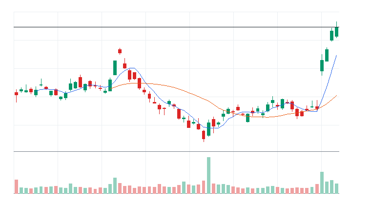

### 2. Regeneron Pharmaceuticals Inc.(REGN)
- 자산 유형: STOCK
- linkedNarrative: 바이오/헬스케어 촉매
- narrativeStatus: 소멸
- narrativeScore: 21
- Trend Strength Index: 17
- Exhaustion Risk: 20 (낮음)
- Entry Quality Score: 24 (낮음)
- 트렌드 판단: 테마 확산도가 낮아 개별 종목 이벤트성 흐름일 수 있다.
- moneyFlowScore: 100
- finalRawScore: 108
- reasonConfidence: HIGH
- reasonConfidenceExplanation: 직접 촉매: Yahoo Finance RSS / earnings / under_6h / mixed - Regeneron (REGN) Stock Looks Cheap On Earnings Yet Mixed Elsewhere 가격/거래량, 관련 ETF 동반 강세, 유동성 근거가 함께 확인되어 HIGH로 분류했다.
- tieBreakerReason: 최종 원점수 108, 리스크 패널티 -4, 5일 수익률 +13.26%, 상대 거래량 1.83배 순으로 정렬
- 후보별 시장 해석: 위험회피 / 제한적 - 전체 시장은 위험회피 / Entry Quality 24 < 50이나 moneyFlow 100, confidence HIGH, RVOL 1.83x로 강한 자금흐름 예외 조건 충족
- 게이트 사유: Entry Quality 24 < 50이나 moneyFlow 100, confidence HIGH, RVOL 1.83x로 강한 자금흐름 예외 조건 충족
- 주문 실행: 시장가 가능
- 직접 촉매: Yahoo Finance RSS / earnings / under_6h / mixed - Regeneron (REGN) Stock Looks Cheap On Earnings Yet Mixed Elsewhere
- 왜 돈이 몰리는가: 20일 +18.19%, 5일 +13.26%, 상대 거래량 1.83배로 가격과 거래량이 함께 개선. 뉴스: Yahoo Finance RSS earnings/under_6h / 유동성: LIQUID
- 누가 더 비싸게 사줄 수 있는지: 개별 주도주를 따라붙는 단기 모멘텀 자금과 관련 ETF 강세를 확인한 트레이더
- 진입 조건: 20일선 위 눌림 후 재상승 확인
- 무효화 조건: 20일선 이탈 또는 상대 거래량 0.8배 이하 둔화
- todayActionLabel: 자금흐름 예외 조건부
#### 최근 뉴스/동향 한국어 요약

- 요약: 종목 직접 뉴스 확인 상태이며 뉴스 흐름은 긍정 우위입니다. 후보 선정 후 재확인한 핵심 이슈는 "Regeneron (REGN) Stock Looks Cheap On Earnings Yet Mixed Elsewhere"입니다.
- 직접 촉매 판단: Regeneron Pharmaceuticals Inc.에 대해 직접 촉매로 분류된 뉴스가 확인됐습니다. 핵심은 "Regeneron (REGN) Stock Looks Cheap On Earnings Yet Mixed Elsewhere"이며, 실적 재료로 봅니다.
- 뉴스 1: Regeneron (REGN) Stock Looks Cheap On Earnings Yet Mixed Elsewhere
  - 내용: Regeneron Pharmaceuticals Inc. 관련 기사는 Regeneron (REGN) Stock Looks Cheap On Earnings Yet Mixed Elsewhere 이슈를 다루며, 주가 변동률 +36.10%를 핵심 내용으로 봅니다.
  - 투자 의미: Regeneron Pharmaceuticals Inc.의 당일 상대강도 확인에는 도움이 되지만, 실적/가이던스 같은 새 펀더멘털 변화로 보기는 어렵습니다.
  - 확인할 점: 거래량 동반 여부, 장중 고점 유지, 관련 ETF 동반 강세
- 뉴스 2: Regeneron Pharmaceuticals Q2 Earnings Call Highlights
  - 내용: Regeneron Pharmaceuticals Inc. 관련 기사는 Regeneron Pharmaceuticals Q2 Earnings Call Highlights 이슈를 다루며, 주가 변동률 +17.00%, 동반 비교 수치 +11.00%를 핵심 내용으로 봅니다.
  - 투자 의미: Regeneron Pharmaceuticals Inc.의 당일 상대강도 확인에는 도움이 되지만, 실적/가이던스 같은 새 펀더멘털 변화로 보기는 어렵습니다.
  - 확인할 점: 거래량 동반 여부, 장중 고점 유지, 관련 ETF 동반 강세
- 뉴스 3: Regeneron Q2 Earnings Beat, Sales Up on Dupixent & Eylea HD Strength
  - 내용: Regeneron Pharmaceuticals Inc. 관련 실적 뉴스입니다. 기사 스니펫상 핵심 내용은 REGN's Q2 earnings and revenues beat estimates as robust Eylea HD demand and higher Dupixent profits offset declining Eylea sales.입니다.
  - 투자 의미: 실적/가이던스 재료는 다음 분기 기대치 변화로 이어질 수 있어 컨센서스 변화와 주가 반응 지속성을 함께 봅니다.
  - 확인할 점: 매출/마진/가이던스 수치, 컨센서스 대비 차이
- 매매 해석: 매매 관점에서는 뉴스 자체보다 가격이 진입 조건을 지키는지, 거래량이 동반되는지, 그리고 뉴스가 이미 주가에 반영됐는지를 우선 확인해야 합니다.
- 차트: 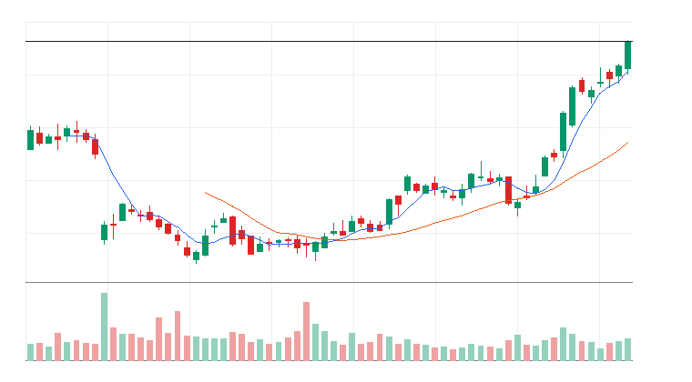

## 다크호스 후보

다크호스 후보 없음. 상위 서사 정렬, MA20 위 안착, MA5/MA20 구조 개선, RVOL 0.90x 이상 조건을 동시에 충족한 개별주가 없다.

- darkHorseScore: 조건 충족 후보 없음
- 왜 아직 메인이 아닌가: 확인 조건을 통과한 보조 관찰 후보가 없다.

darkHorseScore 상세 근거 보기

- 서사 정렬: 조건 미충족
- 초기 추세 구조: 조건 미충족
- 베이스 돌파/정돈: 조건 미충족
- 거래량 확인: 조건 미충족
- rawScore: 데이터 없음

## 오늘 돈이 몰리는 테마

- 중국 인터넷 ETF: KWEB | 평균 moneyFlowScore 75 | 단일 종목 이벤트보다 테마 단위 자금 흐름이 선명한 구간으로 본다.
- 구리/금속 ETF: COPX | 평균 moneyFlowScore 54 | 관심은 유지하되 우선순위는 낮추고 추가 거래량 확인을 기다린다.
- Real Estate: CSGP | 평균 moneyFlowScore 51 | 관심은 유지하되 우선순위는 낮추고 추가 거래량 확인을 기다린다.
- Consumer Cyclical: SBUX, MAR, ROST, ORLY | 평균 moneyFlowScore 50 | 관심은 유지하되 우선순위는 낮추고 추가 거래량 확인을 기다린다.
- 클라우드/엔터프라이즈 소프트웨어: MSFT, PLTR, APP, SHOP, ADBE, CDNS, SNPS, INTU | 평균 moneyFlowScore 44 | 관심은 유지하되 우선순위는 낮추고 추가 거래량 확인을 기다린다.
- 이커머스/여행 플랫폼: BKNG, PDD, MELI, ABNB, DASH | 평균 moneyFlowScore 42 | 관심은 유지하되 우선순위는 낮추고 추가 거래량 확인을 기다린다.

## 1. ETF 트레이딩 보고서
### 1-1. ETF 결론
- ETF 우선 후보: 없음
- ETF 관찰 후보: Invesco PHLX Semiconductor ETF(SOXQ), iShares Expanded Tech-Software Sector ETF(IGV), Global X Artificial Intelligence & Technology ETF(AIQ), ROBO Global Robotics and Automation Index ETF(ROBO), First Trust NASDAQ Cybersecurity ETF(CIBR)
- ETF 매매 금지: VanEck Semiconductor ETF(SMH), Invesco PHLX Semiconductor ETF(SOXQ), Global X Artificial Intelligence & Technology ETF(AIQ), ROBO Global Robotics and Automation Index ETF(ROBO), Amplify Cybersecurity ETF(HACK)
- 오늘 ETF 최우선 1개: 없음
- ETF 섹션 해석: 이 섹션은 개별 종목 선택이 아니라 테마/섹터 단위 자금 흐름을 ETF로 매매할지 판단하기 위한 영역이다.

### 1-2. ETF 후보 TOP 5

선정 기준: ETF 후보는 가격/거래량 1차 점수에 뉴스, ETF 구성종목 확산도, 유동성, 리스크 패널티를 반영한 finalRawScore 기준으로 정렬한다. 표시 점수 100점 후보가 겹치면 tieBreakerReason으로 우선순위를 설명한다.

### [ETF] iShares Expanded Tech-Software Sector ETF(IGV)
- 자산 유형: ETF
- ETF 세부 카테고리: 클라우드/엔터프라이즈 소프트웨어 ETF
- ETF 역할: 테마 베타 매수
- 상태: 관찰
- linkedNarrative: 소프트웨어 실적/AI 수익화
- narrativeStatus: 관찰
- narrativeScore: 55
- moneyFlowScore: 33
- finalRawScore: 33
- tieBreakerReason: 최종 원점수 33, 리스크 패널티 -4, 5일 수익률 +7.13%, 상대 거래량 0.92배 순으로 정렬
- 과열 리스크: 낮음
- reasonConfidence: LOW
- reasonConfidenceExplanation: 가격/거래량이 약하거나 핵심 보조 근거가 부족해 LOW로 분류했다.

- todayActionLabel: 거래량 확인 전 관찰
- 주문 실행: 시장가 가능
- 기준일: 2026-07-30
- 종가: $93.31
- 1일 수익률: +1.02%
- 5일 수익률: +7.13%
- 20일 수익률: -0.03%
- 상대 거래량: 0.92배
- 52주 고점 대비 위치: -20.92%
- whyMoneyIsFlowing: 최근 수익률은 확인되지만 상대 거래량 0.92배라 신규 자금 유입 강도는 약함. 뉴스: CNBC Markets RSS general_market/under_6h / 유동성: LIQUID
- likelyNextBuyer: 섹터 베타를 노리는 단기 모멘텀 자금과 리밸런싱 자금
- whyThisCouldTradeHigher: 단기 추세가 유지되고 거래량이 1.0배 이상이면 눌림 이후 재상승을 시도할 수 있음
#### 최근 뉴스/동향 한국어 요약

- 요약: 후보 선정 후 재확인 뉴스 데이터 없음
- 진입 조건: 상대 거래량 1.0배 회복 후 관찰
- 무효화 조건: 거래량 회복 실패
- 차트: 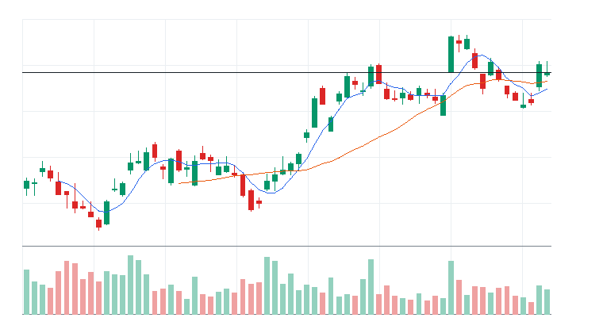

#### 상세 근거

iShares Expanded Tech-Software Sector ETF(IGV) 상세 근거 펼치기

- moneyFlowScore(최종) 산정 근거:
  - moneyFlowScore(1차): 20
  - 최종 원점수: 33
  - 최종 표시 점수: 33
  - cap 적용: cap 미적용
  - 계산식: +20 + +12 + 0 + +5 + 0 - 4 + 0 = 33
  - 점수 해석: 매매 금지 또는 우선순위 낮은 후보.
  - 가격/거래량 1차 점수: +20
    - 추세: +7
    - 단기 모멘텀: +7
    - 중기 모멘텀: 0
    - 거래량: -8
    - 신고가 근접: 0
    - 이동평균: +14
  - 하위 점수 cap:
    - 가격 모멘텀: 원점수 +7, 상한 적용 +7 / 최대 25
    - 단기 모멘텀: 원점수 +7, 상한 적용 +7 / 최대 20
    - 중기 모멘텀: 원점수 0, 상한 적용 0 / 최대 16
    - 거래량: 원점수 -8, 상한 적용 -8 / 최대 20
    - 신고가 근접: 원점수 0, 상한 적용 0 / 최대 12
    - 이동평균: 원점수 +14, 상한 적용 +14 / 최대 14
  - 추가 데이터 가감점:
    - 뉴스: +12
    - 유동성: +5
  - ETF 확산도: 0
  - 리스크 패널티: -4
  - 주요 근거: 1차 20, 최종 원점수 33, 표시 33. 5일 수익률 강함, 이동평균 위 추세 유지, 뉴스 흐름이 가격/거래량 근거 보강. 주의: 단기 과열/추격 위험 존재.
  - 리스크 패널티 산정 근거:
    - 총 리스크 패널티: -4
    - 리스크 등급: LOW
    - 감점된 리스크:
      - volume divergence: -4 | 근거: 5d price strength is not confirmed by relative volume 0.92x. | 대응: Require relative volume recovery above 1.0x.
    - 관찰 리스크: 주요 관찰 리스크 없음
    - 한 줄 해석: 1개 감점 리스크로 총 -4점 반영.
- 데이터 사용 현황:
  - 가격/거래량: 사용
  - 뉴스: 사용
  - ETF 확산도: 일부 연결
  - 거래대금 유동성: 사용
  - 관련 ETF 상대강도: 사용
- 뉴스 확인:
  - 최근 뉴스 상태: 일부 연결
  - 뉴스 소스: CNBC Markets RSS, MarketWatch RSS
  - 소스별 상태: Yahoo Finance RSS CONNECTED; MarketWatch RSS CONNECTED; CNBC Markets RSS CONNECTED; SEC EDGAR RSS PARTIAL; Federal Reserve RSS CONNECTED; Finnhub API DISABLED
  - 긍정/중립/부정: 13/3/0
  - 직접성/방향성/신선도: 2/1/4
  - 강한 촉매 수: 3
  - 중요 공시 수: 0
  - 직접 촉매: 없음
  - 보조 뉴스: CNBC Markets RSS sector_theme / general_market / under_6h
  - 뉴스 수집 시각: 2026-07-31 09:02 KST
  - 가장 최근 뉴스 발행 시각: 2026-07-31 09:00 KST
  - 뉴스 신선도 상태: FRESH
  - 뉴스 이후 가격 반응: 긍정
  - 가격 반응 점수 제한: 뉴스 이후 가격 반응과 점수 제한 특이사항 없음
  - 핵심 뉴스 요약: Anthropic says its Claude models &apos;gained unauthorized access&apos; to other organizations&apos; systems
  - 원점수/상한 점수: +26 / +12
  - 점수 반영: +12
  - 주의: SEC EDGAR RSS: no matching RSS items; Finnhub API: FINNHUB_API_KEY not configured
- ETF 구성종목 확산도:
  - 구성종목 데이터 상태: 일부 연결
  - 샘플 수: 3/3
  - 샘플 신뢰도: INSUFFICIENT
  - 상승 종목 비율: 67%
  - 20일선 위 비율: 67%
  - 50일선 위 비율: 67%
  - 상위 기여 종목: MSFT, AAPL, PLTR
  - 확산도 판단: SAMPLE_TOO_SMALL
  - 원점수/샘플 상한/반영 점수: 0 / 0 / 0
  - 점수 반영: 0
- 거래대금 유동성:
  - 데이터 상태: 일부 연결
  - 거래대금 기준 유동성: LIQUID
  - 거래대금: $1,225,923,016
  - 평균 거래대금: $1,325,737,096
  - 주문 영향: 시장가 가능
  - 매매 영향: 거래대금이 충분해 시장가 가능 범위로 본다
- reasonConfidence 근거: 가격/거래량이 약하거나 주요 데이터가 부족해 낮음.
- 후보 선정 후 뉴스/동향 재확인:
  - 재확인 상태: 데이터 없음
- 차트 요약: 단기 추세 중립
- 기준일 2026-07-30 | 종가 $93.31 | 1일 +1.02% | 5일 +7.13% | 20일 -0.03% | 상대 거래량 0.92배 | 52주 고점 대비 -20.92% | 데이터 소스: yfinance

### [ETF] SPDR S&P 500 ETF Trust(SPY)
- 자산 유형: ETF
- ETF 세부 카테고리: 시장 기준 ETF
- ETF 역할: 시장 기준 확인
- 상태: 매매 금지
- linkedNarrative: Specialty Business Services 자금 유입
- narrativeStatus: 약화
- narrativeScore: 41
- moneyFlowScore: 37
- finalRawScore: 37
- tieBreakerReason: 최종 원점수 37, 리스크 패널티 -6, 5일 수익률 +0.48%, 상대 거래량 1.38배 순으로 정렬
- 과열 리스크: 낮음
- reasonConfidence: MEDIUM
- reasonConfidenceExplanation: ETF 확산도 제한 때문에 HIGH가 아니라 MEDIUM으로 제한했다.

- todayActionLabel: 제외
- 주문 실행: 시장가 가능
- 기준일: 2026-07-30
- 종가: $741.69
- 1일 수익률: +1.68%
- 5일 수익률: +0.48%
- 20일 수익률: -0.55%
- 상대 거래량: 1.38배
- 52주 고점 대비 위치: -2.46%
- whyMoneyIsFlowing: 20일 -0.55%, 5일 +0.48%, 상대 거래량 1.38배로 가격과 거래량이 함께 개선. 뉴스: MarketWatch RSS general_market/under_6h / 유동성: LIQUID
- likelyNextBuyer: 섹터 베타를 노리는 단기 모멘텀 자금과 리밸런싱 자금
- whyThisCouldTradeHigher: 52주 고점 부근이라 돌파가 확인되면 신고가 추종 매수가 붙을 수 있음
#### 최근 뉴스/동향 한국어 요약

- 요약: 후보 선정 후 재확인 뉴스 데이터 없음
- 진입 조건: 전일 고점 돌파와 5일선 유지 확인
- 무효화 조건: 20일선 이탈 또는 상대 거래량 0.8배 이하 둔화
- 차트: 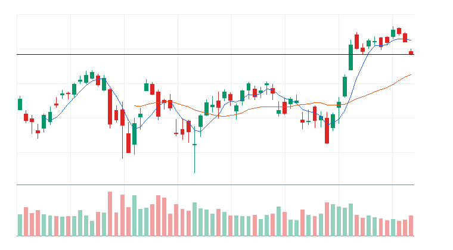

#### 상세 근거

SPDR S&P 500 ETF Trust(SPY) 상세 근거 펼치기

- moneyFlowScore(최종) 산정 근거:
  - moneyFlowScore(1차): 26
  - 최종 원점수: 37
  - 최종 표시 점수: 37
  - cap 적용: cap 미적용
  - 계산식: +26 + +12 + 0 + +5 + 0 - 6 + 0 = 37
  - 점수 해석: 매매 금지 또는 우선순위 낮은 후보.
  - 가격/거래량 1차 점수: +26
    - 추세: 0
    - 단기 모멘텀: +2
    - 중기 모멘텀: 0
    - 거래량: +14
    - 신고가 근접: +12
    - 이동평균: -2
  - 하위 점수 cap:
    - 가격 모멘텀: 원점수 0, 상한 적용 0 / 최대 25
    - 단기 모멘텀: 원점수 +2, 상한 적용 +2 / 최대 20
    - 중기 모멘텀: 원점수 0, 상한 적용 0 / 최대 16
    - 거래량: 원점수 +14, 상한 적용 +14 / 최대 20
    - 신고가 근접: 원점수 +12, 상한 적용 +12 / 최대 12
    - 이동평균: 원점수 -2, 상한 적용 -2 / 최대 14
  - 추가 데이터 가감점:
    - 뉴스: +12
    - 유동성: +5
  - ETF 확산도: 0
  - 리스크 패널티: -6
  - 주요 근거: 1차 26, 최종 원점수 37, 표시 37. 상대 거래량 증가, 52주 고점 근처, 뉴스 흐름이 가격/거래량 근거 보강. 주의: 단기 과열/추격 위험 존재.
  - 리스크 패널티 산정 근거:
    - 총 리스크 패널티: -6
    - 리스크 등급: LOW
    - 감점된 리스크:
      - 20d moving average break risk: -6 | 근거: Close is below the 20-day moving average. | 대응: Hold off until 20-day moving average is recovered.
    - 관찰 리스크: 주요 관찰 리스크 없음
    - 한 줄 해석: 1개 감점 리스크로 총 -6점 반영.
- 데이터 사용 현황:
  - 가격/거래량: 사용
  - 뉴스: 사용
  - ETF 확산도: 일부 연결
  - 거래대금 유동성: 사용
  - 관련 ETF 상대강도: 사용
- 뉴스 확인:
  - 최근 뉴스 상태: 일부 연결
  - 뉴스 소스: MarketWatch RSS, Yahoo Finance RSS, Federal Reserve RSS
  - 소스별 상태: Yahoo Finance RSS CONNECTED; MarketWatch RSS CONNECTED; CNBC Markets RSS FAILED; SEC EDGAR RSS PARTIAL; Federal Reserve RSS CONNECTED; Finnhub API DISABLED
  - 긍정/중립/부정: 9/7/0
  - 직접성/방향성/신선도: 2/1/4
  - 강한 촉매 수: 3
  - 중요 공시 수: 0
  - 직접 촉매: 없음
  - 보조 뉴스: MarketWatch RSS sector_theme / general_market / under_6h
  - 뉴스 수집 시각: 2026-07-31 09:02 KST
  - 가장 최근 뉴스 발행 시각: 2026-07-31 08:01 KST
  - 뉴스 신선도 상태: FRESH
  - 뉴스 이후 가격 반응: 긍정
  - 가격 반응 점수 제한: 뉴스 이후 가격 반응과 점수 제한 특이사항 없음
  - 핵심 뉴스 요약: Empty seats? Concert giant Live Nation says ticket sales are actually at record levels.
  - 원점수/상한 점수: +24 / +12
  - 점수 반영: +12
  - 주의: CNBC Markets RSS: HTTP 403 from https://www.cnbc.com/id/100003114/device/rss/rss.html; SEC EDGAR RSS: no matching RSS items; Finnhub API: FINNHUB_API_KEY not configured
- ETF 구성종목 확산도:
  - 구성종목 데이터 상태: 일부 연결
  - 샘플 수: 4/4
  - 샘플 신뢰도: INSUFFICIENT
  - 상승 종목 비율: 75%
  - 20일선 위 비율: 75%
  - 50일선 위 비율: 75%
  - 상위 기여 종목: MSFT, AAPL, XOM, NVDA
  - 확산도 판단: SAMPLE_TOO_SMALL
  - 원점수/샘플 상한/반영 점수: 0 / 0 / 0
  - 점수 반영: 0
- 거래대금 유동성:
  - 데이터 상태: 일부 연결
  - 거래대금 기준 유동성: LIQUID
  - 거래대금: $48,883,003,394
  - 평균 거래대금: $35,396,991,337
  - 주문 영향: 시장가 가능
  - 매매 영향: 거래대금이 충분해 시장가 가능 범위로 본다
- reasonConfidence 근거: 가격/거래량, 뉴스, 거래대금 유동성, 관련 ETF 상대강도은 확인됐지만 일부 보조 데이터가 미연결 또는 fallback이라 중간으로 제한한다.
- 후보 선정 후 뉴스/동향 재확인:
  - 재확인 상태: 데이터 없음
- 차트 요약: 20일선 아래라 추세 확인 전까지 보수적 접근
- 기준일 2026-07-30 | 종가 $741.69 | 1일 +1.68% | 5일 +0.48% | 20일 -0.55% | 상대 거래량 1.38배 | 52주 고점 대비 -2.46% | 데이터 소스: yfinance

### [ETF] Energy Select Sector SPDR Fund(XLE)
- 자산 유형: ETF
- ETF 세부 카테고리: 전통 에너지 ETF
- ETF 역할: 테마 베타 매수
- 상태: 관찰
- linkedNarrative: 매크로 방어/헤지
- narrativeStatus: 약화
- narrativeScore: 22
- moneyFlowScore: 42
- finalRawScore: 42
- tieBreakerReason: 최종 원점수 42, 리스크 패널티 0, 5일 수익률 -0.71%, 상대 거래량 0.75배 순으로 정렬
- 과열 리스크: 낮음
- reasonConfidence: LOW
- reasonConfidenceExplanation: 가격/거래량이 약하거나 핵심 보조 근거가 부족해 LOW로 분류했다.

- todayActionLabel: 거래량 확인 전 관찰
- 주문 실행: 시장가 가능
- 기준일: 2026-07-30
- 종가: $58.96
- 1일 수익률: +0.53%
- 5일 수익률: -0.71%
- 20일 수익률: +11.65%
- 상대 거래량: 0.75배
- 52주 고점 대비 위치: -7.09%
- whyMoneyIsFlowing: 최근 수익률은 확인되지만 상대 거래량 0.75배라 신규 자금 유입 강도는 약함. 뉴스: MarketWatch RSS general_market/under_6h / 유동성: LIQUID
- likelyNextBuyer: 섹터 베타를 노리는 단기 모멘텀 자금과 리밸런싱 자금
- whyThisCouldTradeHigher: 단기 추세가 유지되고 거래량이 1.0배 이상이면 눌림 이후 재상승을 시도할 수 있음
#### 최근 뉴스/동향 한국어 요약

- 요약: 후보 선정 후 재확인 뉴스 데이터 없음
- 진입 조건: 상대 거래량 1.0배 회복 후 관찰
- 무효화 조건: 거래량 회복 실패
- 차트: 

#### 상세 근거

Energy Select Sector SPDR Fund(XLE) 상세 근거 펼치기

- moneyFlowScore(최종) 산정 근거:
  - moneyFlowScore(1차): 25
  - 최종 원점수: 42
  - 최종 표시 점수: 42
  - cap 적용: cap 미적용
  - 계산식: +25 + +12 + 0 + +5 + 0 + 0 + 0 = 42
  - 점수 해석: 매매 금지 또는 우선순위 낮은 후보.
  - 가격/거래량 1차 점수: +25
    - 추세: +5
    - 단기 모멘텀: 0
    - 중기 모멘텀: +8
    - 거래량: -8
    - 신고가 근접: +6
    - 이동평균: +14
  - 하위 점수 cap:
    - 가격 모멘텀: 원점수 +5, 상한 적용 +5 / 최대 25
    - 단기 모멘텀: 원점수 0, 상한 적용 0 / 최대 20
    - 중기 모멘텀: 원점수 +8, 상한 적용 +8 / 최대 16
    - 거래량: 원점수 -8, 상한 적용 -8 / 최대 20
    - 신고가 근접: 원점수 +6, 상한 적용 +6 / 최대 12
    - 이동평균: 원점수 +14, 상한 적용 +14 / 최대 14
  - 추가 데이터 가감점:
    - 뉴스: +12
    - 유동성: +5
  - ETF 확산도: 0
  - 리스크 패널티: 0
  - 주요 근거: 1차 25, 최종 원점수 42, 표시 42. 20일 수익률 강함, 이동평균 위 추세 유지, 뉴스 흐름이 가격/거래량 근거 보강. 주의: 큰 감점 제한적.
  - 리스크 패널티 산정 근거:
    - 총 리스크 패널티: 0
    - 리스크 등급: LOW
    - 감점된 리스크: 없음
    - 관찰 리스크: 주요 관찰 리스크 없음
    - 한 줄 해석: 직접 감점된 주요 리스크는 없지만 관찰 리스크는 계속 확인해야 한다.
- 데이터 사용 현황:
  - 가격/거래량: 사용
  - 뉴스: 사용
  - ETF 확산도: 일부 연결
  - 거래대금 유동성: 사용
  - 관련 ETF 상대강도: 사용
- 뉴스 확인:
  - 최근 뉴스 상태: 일부 연결
  - 뉴스 소스: MarketWatch RSS, Federal Reserve RSS, Yahoo Finance RSS
  - 소스별 상태: Yahoo Finance RSS CONNECTED; MarketWatch RSS CONNECTED; CNBC Markets RSS FAILED; SEC EDGAR RSS PARTIAL; Federal Reserve RSS CONNECTED; Finnhub API DISABLED
  - 긍정/중립/부정: 11/5/0
  - 직접성/방향성/신선도: 2/1/4
  - 강한 촉매 수: 3
  - 중요 공시 수: 0
  - 직접 촉매: 없음
  - 보조 뉴스: MarketWatch RSS sector_theme / general_market / under_6h
  - 뉴스 수집 시각: 2026-07-31 09:02 KST
  - 가장 최근 뉴스 발행 시각: 2026-07-31 08:01 KST
  - 뉴스 신선도 상태: FRESH
  - 뉴스 이후 가격 반응: 긍정
  - 가격 반응 점수 제한: 뉴스 이후 가격 반응과 점수 제한 특이사항 없음
  - 핵심 뉴스 요약: Empty seats? Concert giant Live Nation says ticket sales are actually at record levels.
  - 원점수/상한 점수: +26 / +12
  - 점수 반영: +12
  - 주의: CNBC Markets RSS: HTTP 403 from https://www.cnbc.com/id/100003114/device/rss/rss.html; SEC EDGAR RSS: no matching RSS items; Finnhub API: FINNHUB_API_KEY not configured
- ETF 구성종목 확산도:
  - 구성종목 데이터 상태: 일부 연결
  - 샘플 수: 1/1
  - 샘플 신뢰도: INSUFFICIENT
  - 상승 종목 비율: 100%
  - 20일선 위 비율: 100%
  - 50일선 위 비율: 100%
  - 상위 기여 종목: XOM
  - 확산도 판단: SAMPLE_TOO_SMALL
  - 원점수/샘플 상한/반영 점수: 0 / 0 / 0
  - 점수 반영: 0
- 거래대금 유동성:
  - 데이터 상태: 일부 연결
  - 거래대금 기준 유동성: LIQUID
  - 거래대금: $1,354,437,610
  - 평균 거래대금: $1,802,388,156
  - 주문 영향: 시장가 가능
  - 매매 영향: 거래대금이 충분해 시장가 가능 범위로 본다
- reasonConfidence 근거: 가격/거래량이 약하거나 주요 데이터가 부족해 낮음.
- 후보 선정 후 뉴스/동향 재확인:
  - 재확인 상태: 데이터 없음
- 차트 요약: 최근 20거래일 기준 5일선이 20일선 위에 있음
- 기준일 2026-07-30 | 종가 $58.96 | 1일 +0.53% | 5일 -0.71% | 20일 +11.65% | 상대 거래량 0.75배 | 52주 고점 대비 -7.09% | 데이터 소스: yfinance

### [ETF] iShares Russell 2000 ETF(IWM)
- 자산 유형: ETF
- ETF 세부 카테고리: 시장 기준 ETF
- ETF 역할: 시장 기준 확인
- 상태: 매매 금지
- linkedNarrative: Specialty Business Services 자금 유입
- narrativeStatus: 약화
- narrativeScore: 41
- moneyFlowScore: 35
- finalRawScore: 35
- tieBreakerReason: 최종 원점수 35, 리스크 패널티 -6, 5일 수익률 +0.17%, 상대 거래량 1.04배 순으로 정렬
- 과열 리스크: 낮음
- reasonConfidence: MEDIUM
- reasonConfidenceExplanation: ETF 확산도 제한 때문에 HIGH가 아니라 MEDIUM으로 제한했다.

- todayActionLabel: 제외
- 주문 실행: 시장가 가능
- 기준일: 2026-07-30
- 종가: $292.59
- 1일 수익률: +1.39%
- 5일 수익률: +0.17%
- 20일 수익률: -2.25%
- 상대 거래량: 1.04배
- 52주 고점 대비 위치: -3.35%
- whyMoneyIsFlowing: 20일 -2.25%, 5일 +0.17%, 상대 거래량 1.04배로 가격과 거래량이 함께 개선. 뉴스: Yahoo Finance RSS general_market/under_24h / 유동성: LIQUID
- likelyNextBuyer: 섹터 베타를 노리는 단기 모멘텀 자금과 리밸런싱 자금
- whyThisCouldTradeHigher: 52주 고점 부근이라 돌파가 확인되면 신고가 추종 매수가 붙을 수 있음
#### 최근 뉴스/동향 한국어 요약

- 요약: 후보 선정 후 재확인 뉴스 데이터 없음
- 진입 조건: 전일 고점 돌파와 5일선 유지 확인
- 무효화 조건: 20일선 이탈 또는 상대 거래량 0.8배 이하 둔화
- 차트: 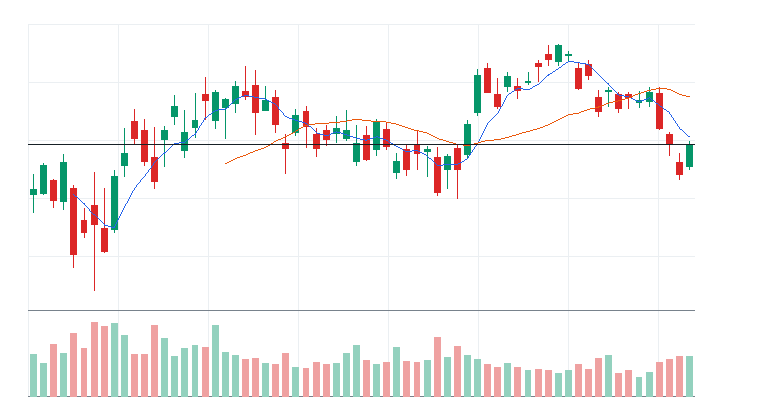

#### 상세 근거

iShares Russell 2000 ETF(IWM) 상세 근거 펼치기

- moneyFlowScore(최종) 산정 근거:
  - moneyFlowScore(1차): 24
  - 최종 원점수: 35
  - 최종 표시 점수: 35
  - cap 적용: cap 미적용
  - 계산식: +24 + +12 + 0 + +5 + 0 - 6 + 0 = 35
  - 점수 해석: 매매 금지 또는 우선순위 낮은 후보.
  - 가격/거래량 1차 점수: +24
    - 추세: -1
    - 단기 모멘텀: +2
    - 중기 모멘텀: -1
    - 거래량: +10
    - 신고가 근접: +12
    - 이동평균: +2
  - 하위 점수 cap:
    - 가격 모멘텀: 원점수 -1, 상한 적용 -1 / 최대 25
    - 단기 모멘텀: 원점수 +2, 상한 적용 +2 / 최대 20
    - 중기 모멘텀: 원점수 -1, 상한 적용 -1 / 최대 16
    - 거래량: 원점수 +10, 상한 적용 +10 / 최대 20
    - 신고가 근접: 원점수 +12, 상한 적용 +12 / 최대 12
    - 이동평균: 원점수 +2, 상한 적용 +2 / 최대 14
  - 추가 데이터 가감점:
    - 뉴스: +12
    - 유동성: +5
  - ETF 확산도: 0
  - 리스크 패널티: -6
  - 주요 근거: 1차 24, 최종 원점수 35, 표시 35. 52주 고점 근처, 뉴스 흐름이 가격/거래량 근거 보강, 거래대금 기준 유동성 양호. 주의: 단기 과열/추격 위험 존재, ETF 구성종목 확산도 데이터 미연결.
  - 리스크 패널티 산정 근거:
    - 총 리스크 패널티: -6
    - 리스크 등급: LOW
    - 감점된 리스크:
      - 20d moving average break risk: -6 | 근거: Close is below the 20-day moving average. | 대응: Hold off until 20-day moving average is recovered.
    - 관찰 리스크: ETF breadth data not connected
    - 한 줄 해석: 1개 감점 리스크로 총 -6점 반영.
- 데이터 사용 현황:
  - 가격/거래량: 사용
  - 뉴스: 사용
  - ETF 확산도: 미연결
  - 거래대금 유동성: 사용
  - 관련 ETF 상대강도: 사용
- 뉴스 확인:
  - 최근 뉴스 상태: 일부 연결
  - 뉴스 소스: MarketWatch RSS, Federal Reserve RSS, Yahoo Finance RSS
  - 소스별 상태: Yahoo Finance RSS CONNECTED; MarketWatch RSS CONNECTED; CNBC Markets RSS FAILED; SEC EDGAR RSS PARTIAL; Federal Reserve RSS CONNECTED; Finnhub API DISABLED
  - 긍정/중립/부정: 10/6/0
  - 직접성/방향성/신선도: 4/1/4
  - 강한 촉매 수: 4
  - 중요 공시 수: 0
  - 직접 촉매: Yahoo Finance RSS / general_market / under_24h / positive - Institutional Investors Favor IWM Over IJR or VB. Should You?
  - 보조 뉴스: MarketWatch RSS sector_theme / general_market / under_6h
  - 뉴스 수집 시각: 2026-07-31 09:02 KST
  - 가장 최근 뉴스 발행 시각: 2026-07-31 08:01 KST
  - 뉴스 신선도 상태: FRESH
  - 뉴스 이후 가격 반응: 긍정
  - 가격 반응 점수 제한: 뉴스 이후 가격 반응과 점수 제한 특이사항 없음
  - 핵심 뉴스 요약: Empty seats? Concert giant Live Nation says ticket sales are actually at record levels.
  - 원점수/상한 점수: +29 / +12
  - 점수 반영: +12
  - 주의: CNBC Markets RSS: HTTP 403 from https://www.cnbc.com/id/100003114/device/rss/rss.html; SEC EDGAR RSS: no matching RSS items; Finnhub API: FINNHUB_API_KEY not configured
- ETF 구성종목 확산도:
  - 구성종목 데이터 상태: 미연결
  - 샘플 수: 0/0
  - 샘플 신뢰도: UNKNOWN
  - 상승 종목 비율: 데이터 없음
  - 20일선 위 비율: 데이터 없음
  - 50일선 위 비율: 데이터 없음
  - 상위 기여 종목: 데이터 없음
  - 확산도 판단: UNKNOWN
  - 원점수/샘플 상한/반영 점수: 0 / N/A / 0
  - 점수 반영: 0
- 거래대금 유동성:
  - 데이터 상태: 일부 연결
  - 거래대금 기준 유동성: LIQUID
  - 거래대금: $6,436,778,113
  - 평균 거래대금: $6,207,171,036
  - 주문 영향: 시장가 가능
  - 매매 영향: 거래대금이 충분해 시장가 가능 범위로 본다
- reasonConfidence 근거: 가격/거래량, 뉴스, 거래대금 유동성, 관련 ETF 상대강도은 확인됐지만 일부 보조 데이터가 미연결 또는 fallback이라 중간으로 제한한다.
- 후보 선정 후 뉴스/동향 재확인:
  - 재확인 상태: 데이터 없음
- 차트 요약: 20일선 아래라 추세 확인 전까지 보수적 접근
- 기준일 2026-07-30 | 종가 $292.59 | 1일 +1.39% | 5일 +0.17% | 20일 -2.25% | 상대 거래량 1.04배 | 52주 고점 대비 -3.35% | 데이터 소스: yfinance

### [ETF] Invesco QQQ Trust(QQQ)
- 자산 유형: ETF
- ETF 세부 카테고리: 시장 기준 ETF
- ETF 역할: 시장 기준 확인
- 상태: 매매 금지
- linkedNarrative: 소프트웨어 실적/AI 수익화
- narrativeStatus: 관찰
- narrativeScore: 55
- moneyFlowScore: 28
- finalRawScore: 28
- tieBreakerReason: 최종 원점수 28, 리스크 패널티 -6, 5일 수익률 -1.22%, 상대 거래량 1.62배 순으로 정렬
- 과열 리스크: 낮음
- reasonConfidence: LOW
- reasonConfidenceExplanation: 가격/거래량이 약하거나 핵심 보조 근거가 부족해 LOW로 분류했다.

- todayActionLabel: 제외
- 주문 실행: 시장가 가능
- 기준일: 2026-07-30
- 종가: $683.55
- 1일 수익률: +3.30%
- 5일 수익률: -1.22%
- 20일 수익률: -5.74%
- 상대 거래량: 1.62배
- 52주 고점 대비 위치: -8.70%
- whyMoneyIsFlowing: 20일 -5.74%, 5일 -1.22%, 상대 거래량 1.62배로 가격과 거래량이 함께 개선. 뉴스: Yahoo Finance RSS general_market/under_6h / 유동성: LIQUID
- likelyNextBuyer: 섹터 베타를 노리는 단기 모멘텀 자금과 리밸런싱 자금
- whyThisCouldTradeHigher: 단기 추세가 유지되고 거래량이 1.0배 이상이면 눌림 이후 재상승을 시도할 수 있음
#### 최근 뉴스/동향 한국어 요약

- 요약: 후보 선정 후 재확인 뉴스 데이터 없음
- 진입 조건: 20일선 위 눌림 후 재상승 확인
- 무효화 조건: 20일선 이탈 또는 상대 거래량 0.8배 이하 둔화
- 차트: 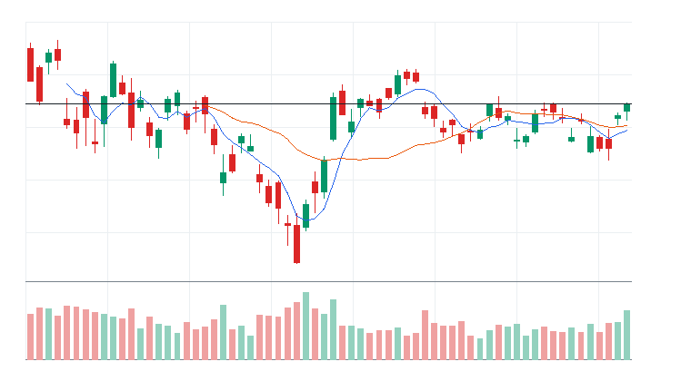

#### 상세 근거

Invesco QQQ Trust(QQQ) 상세 근거 펼치기

- moneyFlowScore(최종) 산정 근거:
  - moneyFlowScore(1차): 17
  - 최종 원점수: 28
  - 최종 표시 점수: 28
  - cap 적용: cap 미적용
  - 계산식: +17 + +12 + 0 + +5 + 0 - 6 + 0 = 28
  - 점수 해석: 매매 금지 또는 우선순위 낮은 후보.
  - 가격/거래량 1차 점수: +17
    - 추세: -4
    - 단기 모멘텀: +3
    - 중기 모멘텀: -4
    - 거래량: +18
    - 신고가 근접: +6
    - 이동평균: -2
  - 하위 점수 cap:
    - 가격 모멘텀: 원점수 -4, 상한 적용 -4 / 최대 25
    - 단기 모멘텀: 원점수 +3, 상한 적용 +3 / 최대 20
    - 중기 모멘텀: 원점수 -4, 상한 적용 -4 / 최대 16
    - 거래량: 원점수 +18, 상한 적용 +18 / 최대 20
    - 신고가 근접: 원점수 +6, 상한 적용 +6 / 최대 12
    - 이동평균: 원점수 -2, 상한 적용 -2 / 최대 14
  - 추가 데이터 가감점:
    - 뉴스: +12
    - 유동성: +5
  - ETF 확산도: 0
  - 리스크 패널티: -6
  - 주요 근거: 1차 17, 최종 원점수 28, 표시 28. 1일 단기 모멘텀 확인, 상대 거래량 증가, 뉴스 흐름이 가격/거래량 근거 보강. 주의: 단기 과열/추격 위험 존재.
  - 리스크 패널티 산정 근거:
    - 총 리스크 패널티: -6
    - 리스크 등급: LOW
    - 감점된 리스크:
      - 20d moving average break risk: -6 | 근거: Close is below the 20-day moving average. | 대응: Hold off until 20-day moving average is recovered.
    - 관찰 리스크: 주요 관찰 리스크 없음
    - 한 줄 해석: 1개 감점 리스크로 총 -6점 반영.
- 데이터 사용 현황:
  - 가격/거래량: 사용
  - 뉴스: 사용
  - ETF 확산도: 일부 연결
  - 거래대금 유동성: 사용
  - 관련 ETF 상대강도: 사용
- 뉴스 확인:
  - 최근 뉴스 상태: 일부 연결
  - 뉴스 소스: MarketWatch RSS, Yahoo Finance RSS, Federal Reserve RSS
  - 소스별 상태: Yahoo Finance RSS CONNECTED; MarketWatch RSS CONNECTED; CNBC Markets RSS FAILED; SEC EDGAR RSS PARTIAL; Federal Reserve RSS CONNECTED; Finnhub API DISABLED
  - 긍정/중립/부정: 10/6/0
  - 직접성/방향성/신선도: 4/1/4
  - 강한 촉매 수: 2
  - 중요 공시 수: 0
  - 직접 촉매: Yahoo Finance RSS / general_market / under_6h / neutral - Why This Morning’s Stock Rally May Be a Selling Opportunity
  - 보조 뉴스: MarketWatch RSS sector_theme / general_market / under_6h
  - 뉴스 수집 시각: 2026-07-31 09:02 KST
  - 가장 최근 뉴스 발행 시각: 2026-07-31 08:01 KST
  - 뉴스 신선도 상태: FRESH
  - 뉴스 이후 가격 반응: 긍정
  - 가격 반응 점수 제한: 뉴스 이후 가격 반응과 점수 제한 특이사항 없음
  - 핵심 뉴스 요약: Empty seats? Concert giant Live Nation says ticket sales are actually at record levels.
  - 원점수/상한 점수: +25 / +12
  - 점수 반영: +12
  - 주의: CNBC Markets RSS: HTTP 403 from https://www.cnbc.com/id/100003114/device/rss/rss.html; SEC EDGAR RSS: no matching RSS items; Finnhub API: FINNHUB_API_KEY not configured
- ETF 구성종목 확산도:
  - 구성종목 데이터 상태: 일부 연결
  - 샘플 수: 3/3
  - 샘플 신뢰도: INSUFFICIENT
  - 상승 종목 비율: 67%
  - 20일선 위 비율: 67%
  - 50일선 위 비율: 67%
  - 상위 기여 종목: MSFT, AAPL, NVDA
  - 확산도 판단: SAMPLE_TOO_SMALL
  - 원점수/샘플 상한/반영 점수: 0 / 0 / 0
  - 점수 반영: 0
- 거래대금 유동성:
  - 데이터 상태: 일부 연결
  - 거래대금 기준 유동성: LIQUID
  - 거래대금: $44,431,276,334
  - 평균 거래대금: $27,403,661,678
  - 주문 영향: 시장가 가능
  - 매매 영향: 거래대금이 충분해 시장가 가능 범위로 본다
- reasonConfidence 근거: 가격/거래량이 약하거나 주요 데이터가 부족해 낮음.
- 후보 선정 후 뉴스/동향 재확인:
  - 재확인 상태: 데이터 없음
- 차트 요약: 20일선 아래라 추세 확인 전까지 보수적 접근
- 기준일 2026-07-30 | 종가 $683.55 | 1일 +3.30% | 5일 -1.22% | 20일 -5.74% | 상대 거래량 1.62배 | 52주 고점 대비 -8.70% | 데이터 소스: yfinance

### 1-3. ETF 과열/주의 후보

해당 없음

### 1-4. ETF 제외/매매 금지 후보

#### VanEck Semiconductor ETF(SMH)
- moneyFlowScore(최종): 0
- moneyFlowScore 산정 근거 요약: 1차 0, 최종 원점수 -5, 표시 0. 1일 단기 모멘텀 확인, 뉴스 흐름이 가격/거래량 근거 보강, 거래대금 기준 유동성 양호. 주의: 단기 과열/추격 위험 존재.
- 제외 사유: 테마 자금 흐름 약함
- 해제 조건: 20일선 위 눌림 후 재상승 확인

#### Invesco PHLX Semiconductor ETF(SOXQ)
- moneyFlowScore(최종): 0
- moneyFlowScore 산정 근거 요약: 1차 0, 최종 원점수 -26, 표시 0. 1일 단기 모멘텀 확인, 뉴스 흐름이 가격/거래량 근거 보강, 거래대금 기준 유동성 양호. 주의: 단기 과열/추격 위험 존재.
- 제외 사유: 테마 자금 흐름 약함
- 해제 조건: 상대 거래량 1.0배 회복 후 관찰

#### Global X Artificial Intelligence & Technology ETF(AIQ)
- moneyFlowScore(최종): 0
- moneyFlowScore 산정 근거 요약: 1차 0, 최종 원점수 -7, 표시 0. 1일 단기 모멘텀 확인, 뉴스 흐름이 가격/거래량 근거 보강, 거래대금 기준 유동성 양호. 주의: 단기 과열/추격 위험 존재.
- 제외 사유: 테마 자금 흐름 약함
- 해제 조건: 상대 거래량 1.0배 회복 후 관찰

#### ROBO Global Robotics and Automation Index ETF(ROBO)
- moneyFlowScore(최종): 0
- moneyFlowScore 산정 근거 요약: 1차 0, 최종 원점수 -17, 표시 0. 1일 단기 모멘텀 확인, 뉴스 흐름이 가격/거래량 근거 보강, 거래대금 유동성 주의. 주의: 단기 과열/추격 위험 존재, ETF 구성종목 확산도 데이터 미연결.
- 제외 사유: 테마 자금 흐름 약함
- 해제 조건: 상대 거래량 1.0배 회복 후 관찰

#### Amplify Cybersecurity ETF(HACK)
- moneyFlowScore(최종): 0
- moneyFlowScore 산정 근거 요약: 1차 3, 최종 원점수 -1, 표시 0. 뉴스 흐름이 가격/거래량 근거 보강, 거래대금 유동성 주의. 주의: 단기 과열/추격 위험 존재.
- 제외 사유: 테마 자금 흐름 약함
- 해제 조건: 상대 거래량 1.0배 회복 후 관찰

## 2. 개별 종목 트레이딩 보고서
### 2-1. 오늘 Nasdaq-100 신규 발굴 요약
- 신규 발굴 풀: Nasdaq-100 구성종목 전체
- universe source: fallback from StockAnalysis Nasdaq-100 list checked 2026-06-02
- universe fetchStatus: FALLBACK
- 총 스캔 종목 수: 101
- 데이터 수집 성공: 120
- 데이터 수집 실패: -19
- 상세 데이터 수집 대상: 가격/거래량 1차 스캔 상위 20개
- 오늘 진입 후보: 2
- 오늘 눌림 대기: 0
- 오늘 관찰: 44
- 오늘 매매 금지: 74
- 개별 종목 진입 후보: Microsoft Corporation(MSFT), Regeneron Pharmaceuticals Inc.(REGN)
- 개별 종목 눌림 대기: 없음
- 개별 종목 매매 금지: Coca-Cola Europacific Partners PLC(CCEP)
- 오늘 개별 종목 최우선 1개: Microsoft Corporation(MSFT) - 관련 ETF보다 강함 | 주식 5일 +18.22% vs ETF 평균 +1.48%, 주식 20일 +17.39% vs ETF 평균 -4.11%, 상대 거래량 3.10배 vs ETF 평균 1.05배
- 개별 종목 섹션 해석: 이 섹션은 ETF로 확인된 테마 자금 흐름 안에서 ETF보다 더 강한 돌파 가능성이 있는 개별 종목만 선별하는 영역이다.

### 2-2. 오늘 개별 종목 신규 후보 TOP 5

선정 기준:
1. Nasdaq-100 전체를 moneyFlowScore(1차)로 먼저 스캔
2. moneyFlowScore(1차) 상위 20개를 상세 분석
3. 뉴스/유동성/관련 ETF 대비 상대강도/리스크 패널티를 반영
4. moneyFlowScore(최종), 최종 원점수, 리스크 패널티, 5일 수익률, 상대 거래량 순으로 재정렬

### Workday Inc.(WDAY)
- 자산 유형: STOCK
- 상태: 관찰
- primaryTheme: 클라우드/엔터프라이즈 소프트웨어
- primarySector: Technology
- industry: Software Application
- relatedEtfs: IGV, AIQ, QQQ
- linkedNarrative: 소프트웨어 실적/AI 수익화
- narrativeStatus: 관찰
- narrativeScore: 55
- moneyFlowScore: 77
- finalRawScore: 77
- tieBreakerReason: 최종 원점수 77, 리스크 패널티 -6, 5일 수익률 +23.65%, 상대 거래량 1.43배 순으로 정렬
- 과열 리스크: 낮음
- reasonConfidence: HIGH
- reasonConfidenceExplanation: 직접 촉매: Yahoo Finance RSS / general_market / under_6h / positive - Workday (WDAY) Stock Dips While Market Gains: Key Facts 가격/거래량, 관련 ETF 동반 강세, 유동성 근거가 함께 확인되어 HIGH로 분류했다.
- 직접 촉매: Yahoo Finance RSS / general_market / under_6h / positive - Workday (WDAY) Stock Dips While Market Gains: Key Facts
- todayActionLabel: 관찰
- 주문 실행: 시장가 가능
- 기준일: 2026-07-30
- 종가: $158.11
- 1일 수익률: -5.89%
- 5일 수익률: +23.65%
- 20일 수익률: +21.37%
- 상대 거래량: 1.43배
- 52주 고점 대비 위치: -36.72%
- 관련 ETF 대비 상대강도: 관련 ETF보다 강함 | 주식 5일 +23.65% vs ETF 평균 +1.61%, 주식 20일 +21.37% vs ETF 평균 -4.51%, 상대 거래량 1.43배 vs ETF 평균 1.16배
- whyMoneyIsFlowing: 20일 +21.37%, 5일 +23.65%, 상대 거래량 1.43배로 가격과 거래량이 함께 개선. 뉴스: Yahoo Finance RSS general_market/under_6h / 유동성: LIQUID
- likelyNextBuyer: 개별 주도주를 따라붙는 단기 모멘텀 자금과 관련 ETF 강세를 확인한 트레이더
- whyThisCouldTradeHigher: 단기 추세가 유지되고 거래량이 1.0배 이상이면 눌림 이후 재상승을 시도할 수 있음
- 왜 ETF가 아니라 이 종목인가: WDAY가 관련 ETF 평균보다 5일/20일 흐름 또는 거래량에서 강해 개별 종목 우선 후보로 본다.
- ETF가 더 나은 경우: WDAY가 관련 ETF 평균보다 약하거나 거래량이 둔화되면 개별 종목보다 관련 ETF를 우선한다.
#### 최근 뉴스/동향 한국어 요약

- 요약: 후보 선정 후 재확인 뉴스 데이터 없음
- 진입 조건: 20일선 위 눌림 후 재상승 확인
- 무효화 조건: 20일선 이탈 또는 상대 거래량 0.8배 이하 둔화
- 차트: 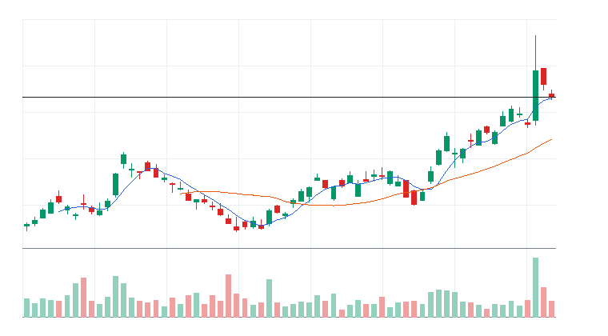

#### 상세 근거

Workday Inc.(WDAY) 상세 근거 펼치기

- moneyFlowScore(최종) 산정 근거:
  - moneyFlowScore(1차): 73
  - 최종 원점수: 77
  - 최종 표시 점수: 77
  - cap 적용: cap 미적용
  - 계산식: +73 + +2 + 0 + +5 + +3 - 6 + 0 = 77
  - 점수 해석: 관심 후보. 눌림 또는 돌파 확인 후 진입 검토.
  - 가격/거래량 1차 점수: +73
    - 추세: +25
    - 단기 모멘텀: +6
    - 중기 모멘텀: +14
    - 거래량: +14
    - 신고가 근접: 0
    - 이동평균: +14
  - 하위 점수 cap:
    - 가격 모멘텀: 원점수 +28, 상한 적용 +25 / 최대 25 (cap 적용)
    - 단기 모멘텀: 원점수 +6, 상한 적용 +6 / 최대 20
    - 중기 모멘텀: 원점수 +14, 상한 적용 +14 / 최대 16
    - 거래량: 원점수 +14, 상한 적용 +14 / 최대 20
    - 신고가 근접: 원점수 0, 상한 적용 0 / 최대 12
    - 이동평균: 원점수 +14, 상한 적용 +14 / 최대 14
    - 관련 ETF 상대강도: 원점수 +3, 상한 적용 +3 / 최대 8
  - 추가 데이터 가감점:
    - 뉴스: +2
    - 유동성: +5
  - ETF 대비 상대강도: +3
  - 리스크 패널티: -6
  - 주요 근거: 1차 73, 최종 원점수 77, 표시 77. 20일 수익률 강함, 5일 수익률 강함, 상대 거래량 증가. 주의: 단기 과열/추격 위험 존재.
  - 리스크 패널티 산정 근거:
    - 총 리스크 패널티: -6
    - 리스크 등급: LOW
    - 감점된 리스크:
      - short-term overheat: -6 | 근거: 5d return +23.65% is extended. | 대응: Prefer pullback or prior high reclaim over chasing.
    - 관찰 리스크: 주요 관찰 리스크 없음
    - 한 줄 해석: 1개 감점 리스크로 총 -6점 반영.
- 데이터 사용 현황:
  - 가격/거래량: 사용
  - 뉴스: 사용
  - ETF 확산도: 관련 ETF에서 확인
  - 거래대금 유동성: 사용
  - 관련 ETF 상대강도: 사용
- 뉴스 확인:
  - 최근 뉴스 상태: 일부 연결
  - 뉴스 소스: CNBC Markets RSS, MarketWatch RSS, Yahoo Finance RSS
  - 소스별 상태: Yahoo Finance RSS CONNECTED; MarketWatch RSS CONNECTED; CNBC Markets RSS CONNECTED; SEC EDGAR RSS PARTIAL; Federal Reserve RSS CONNECTED; Finnhub API DISABLED
  - 긍정/중립/부정: 13/3/0
  - 직접성/방향성/신선도: 4/1/4
  - 강한 촉매 수: 2
  - 중요 공시 수: 0
  - 직접 촉매: Yahoo Finance RSS / general_market / under_6h / positive - Workday (WDAY) Stock Dips While Market Gains: Key Facts
  - 보조 뉴스: CNBC Markets RSS sector_theme / general_market / under_6h
  - 뉴스 수집 시각: 2026-07-31 09:02 KST
  - 가장 최근 뉴스 발행 시각: 2026-07-31 09:00 KST
  - 뉴스 신선도 상태: FRESH
  - 뉴스 이후 가격 반응: 부정
  - 가격 반응 점수 제한: 뉴스 이후 가격 반응 부정 -> 긍정 점수 제한
  - 핵심 뉴스 요약: Anthropic says its Claude models &apos;gained unauthorized access&apos; to other organizations&apos; systems
  - 원점수/상한 점수: +26 / +12
  - 점수 반영: +12
  - 주의: SEC EDGAR RSS: no matching RSS items; Finnhub API: FINNHUB_API_KEY not configured
- ETF 구성종목 확산도: 관련 ETF에서 확인
- 거래대금 유동성:
  - 데이터 상태: 일부 연결
  - 거래대금 기준 유동성: LIQUID
  - 거래대금: $1,070,244,693
  - 평균 거래대금: $748,460,960
  - 주문 영향: 시장가 가능
  - 매매 영향: 거래대금이 충분해 시장가 가능 범위로 본다
- reasonConfidence 근거: 가격/거래량, 뉴스, 거래대금 유동성, 관련 ETF 상대강도 데이터가 확인되어 신뢰도를 높게 본다.
- 후보 선정 후 뉴스/동향 재확인:
  - 재확인 상태: 데이터 없음
- 차트 요약: 최근 20거래일 기준 5일선이 20일선 위에 있음
- 기준일 2026-07-30 | 종가 $158.11 | 1일 -5.89% | 5일 +23.65% | 20일 +21.37% | 상대 거래량 1.43배 | 52주 고점 대비 -36.72% | 데이터 소스: yfinance

### Adobe Inc.(ADBE)
- 자산 유형: STOCK
- 상태: 관찰
- primaryTheme: 클라우드/엔터프라이즈 소프트웨어
- primarySector: Technology
- industry: Software
- relatedEtfs: IGV, AIQ, QQQ
- linkedNarrative: 소프트웨어 실적/AI 수익화
- narrativeStatus: 관찰
- narrativeScore: 55
- moneyFlowScore: 76
- finalRawScore: 76
- tieBreakerReason: 최종 원점수 76, 리스크 패널티 0, 5일 수익률 +16.84%, 상대 거래량 1.18배 순으로 정렬
- 과열 리스크: 낮음
- reasonConfidence: HIGH
- reasonConfidenceExplanation: 직접 촉매: Yahoo Finance RSS / general_market / under_6h / positive - Adobe Systems (ADBE) Stock Sinks As Market Gains: What You Should Know 가격/거래량, 관련 ETF 동반 강세, 유동성 근거가 함께 확인되어 HIGH로 분류했다.
- 직접 촉매: Yahoo Finance RSS / general_market / under_6h / positive - Adobe Systems (ADBE) Stock Sinks As Market Gains: What You Should Know
- todayActionLabel: 관찰
- 주문 실행: 시장가 가능
- 기준일: 2026-07-30
- 종가: $247.9
- 1일 수익률: -5.90%
- 5일 수익률: +16.84%
- 20일 수익률: +17.50%
- 상대 거래량: 1.18배
- 52주 고점 대비 위치: -33.16%
- 관련 ETF 대비 상대강도: 관련 ETF보다 강함 | 주식 5일 +16.84% vs ETF 평균 +1.61%, 주식 20일 +17.50% vs ETF 평균 -4.51%, 상대 거래량 1.18배 vs ETF 평균 1.16배
- whyMoneyIsFlowing: 20일 +17.50%, 5일 +16.84%, 상대 거래량 1.18배로 가격과 거래량이 함께 개선. 뉴스: Yahoo Finance RSS general_market/under_6h / 유동성: LIQUID
- likelyNextBuyer: 개별 주도주를 따라붙는 단기 모멘텀 자금과 관련 ETF 강세를 확인한 트레이더
- whyThisCouldTradeHigher: 단기 추세가 유지되고 거래량이 1.0배 이상이면 눌림 이후 재상승을 시도할 수 있음
- 왜 ETF가 아니라 이 종목인가: ADBE가 관련 ETF 평균보다 5일/20일 흐름 또는 거래량에서 강해 개별 종목 우선 후보로 본다.
- ETF가 더 나은 경우: ADBE가 관련 ETF 평균보다 약하거나 거래량이 둔화되면 개별 종목보다 관련 ETF를 우선한다.
#### 최근 뉴스/동향 한국어 요약

- 요약: 후보 선정 후 재확인 뉴스 데이터 없음
- 진입 조건: 20일선 위 눌림 후 재상승 확인
- 무효화 조건: 20일선 이탈 또는 상대 거래량 0.8배 이하 둔화
- 차트: 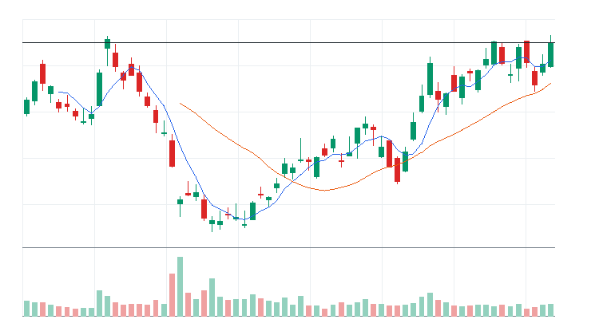

#### 상세 근거

Adobe Inc.(ADBE) 상세 근거 펼치기

- moneyFlowScore(최종) 산정 근거:
  - moneyFlowScore(1차): 66
  - 최종 원점수: 76
  - 최종 표시 점수: 76
  - cap 적용: cap 미적용
  - 계산식: +66 + +2 + 0 + +5 + +3 + 0 + 0 = 76
  - 점수 해석: 관심 후보. 눌림 또는 돌파 확인 후 진입 검토.
  - 가격/거래량 1차 점수: +66
    - 추세: +25
    - 단기 모멘텀: +6
    - 중기 모멘텀: +11
    - 거래량: +10
    - 신고가 근접: 0
    - 이동평균: +14
  - 하위 점수 cap:
    - 가격 모멘텀: 원점수 +26, 상한 적용 +25 / 최대 25 (cap 적용)
    - 단기 모멘텀: 원점수 +6, 상한 적용 +6 / 최대 20
    - 중기 모멘텀: 원점수 +11, 상한 적용 +11 / 최대 16
    - 거래량: 원점수 +10, 상한 적용 +10 / 최대 20
    - 신고가 근접: 원점수 0, 상한 적용 0 / 최대 12
    - 이동평균: 원점수 +14, 상한 적용 +14 / 최대 14
    - 관련 ETF 상대강도: 원점수 +3, 상한 적용 +3 / 최대 8
  - 추가 데이터 가감점:
    - 뉴스: +2
    - 유동성: +5
  - ETF 대비 상대강도: +3
  - 리스크 패널티: 0
  - 주요 근거: 1차 66, 최종 원점수 76, 표시 76. 20일 수익률 강함, 5일 수익률 강함, 이동평균 위 추세 유지. 주의: 큰 감점 제한적.
  - 리스크 패널티 산정 근거:
    - 총 리스크 패널티: 0
    - 리스크 등급: LOW
    - 감점된 리스크: 없음
    - 관찰 리스크: 주요 관찰 리스크 없음
    - 한 줄 해석: 직접 감점된 주요 리스크는 없지만 관찰 리스크는 계속 확인해야 한다.
- 데이터 사용 현황:
  - 가격/거래량: 사용
  - 뉴스: 사용
  - ETF 확산도: 관련 ETF에서 확인
  - 거래대금 유동성: 사용
  - 관련 ETF 상대강도: 사용
- 뉴스 확인:
  - 최근 뉴스 상태: 일부 연결
  - 뉴스 소스: CNBC Markets RSS, MarketWatch RSS, Yahoo Finance RSS
  - 소스별 상태: Yahoo Finance RSS CONNECTED; MarketWatch RSS CONNECTED; CNBC Markets RSS CONNECTED; SEC EDGAR RSS PARTIAL; Federal Reserve RSS CONNECTED; Finnhub API DISABLED
  - 긍정/중립/부정: 13/3/0
  - 직접성/방향성/신선도: 4/1/4
  - 강한 촉매 수: 2
  - 중요 공시 수: 0
  - 직접 촉매: Yahoo Finance RSS / general_market / under_6h / positive - Adobe Systems (ADBE) Stock Sinks As Market Gains: What You Should Know
  - 보조 뉴스: CNBC Markets RSS sector_theme / general_market / under_6h
  - 뉴스 수집 시각: 2026-07-31 09:02 KST
  - 가장 최근 뉴스 발행 시각: 2026-07-31 09:00 KST
  - 뉴스 신선도 상태: FRESH
  - 뉴스 이후 가격 반응: 부정
  - 가격 반응 점수 제한: 뉴스 이후 가격 반응 부정 -> 긍정 점수 제한
  - 핵심 뉴스 요약: Anthropic says its Claude models &apos;gained unauthorized access&apos; to other organizations&apos; systems
  - 원점수/상한 점수: +26 / +12
  - 점수 반영: +12
  - 주의: SEC EDGAR RSS: no matching RSS items; Finnhub API: FINNHUB_API_KEY not configured
- ETF 구성종목 확산도: 관련 ETF에서 확인
- 거래대금 유동성:
  - 데이터 상태: 일부 연결
  - 거래대금 기준 유동성: LIQUID
  - 거래대금: $1,700,516,655
  - 평균 거래대금: $1,436,239,390
  - 주문 영향: 시장가 가능
  - 매매 영향: 거래대금이 충분해 시장가 가능 범위로 본다
- reasonConfidence 근거: 가격/거래량, 뉴스, 거래대금 유동성, 관련 ETF 상대강도 데이터가 확인되어 신뢰도를 높게 본다.
- 후보 선정 후 뉴스/동향 재확인:
  - 재확인 상태: 데이터 없음
- 차트 요약: 최근 20거래일 기준 5일선이 20일선 위에 있음
- 기준일 2026-07-30 | 종가 $247.9 | 1일 -5.90% | 5일 +16.84% | 20일 +17.50% | 상대 거래량 1.18배 | 52주 고점 대비 -33.16% | 데이터 소스: yfinance

### Intuit Inc.(INTU)
- 자산 유형: STOCK
- 상태: 관찰
- primaryTheme: 클라우드/엔터프라이즈 소프트웨어
- primarySector: Technology
- industry: Software Application
- relatedEtfs: IGV, AIQ, QQQ
- linkedNarrative: 소프트웨어 실적/AI 수익화
- narrativeStatus: 관찰
- narrativeScore: 55
- moneyFlowScore: 75
- finalRawScore: 75
- tieBreakerReason: 최종 원점수 75, 리스크 패널티 0, 5일 수익률 +12.07%, 상대 거래량 1.06배 순으로 정렬
- 과열 리스크: 낮음
- reasonConfidence: MEDIUM
- reasonConfidenceExplanation: 직접 촉매 부재 때문에 HIGH가 아니라 MEDIUM으로 제한했다.

- todayActionLabel: 관찰
- 주문 실행: 시장가 가능
- 기준일: 2026-07-30
- 종가: $315.5
- 1일 수익률: -5.29%
- 5일 수익률: +12.07%
- 20일 수익률: +18.13%
- 상대 거래량: 1.06배
- 52주 고점 대비 위치: -60.91%
- 관련 ETF 대비 상대강도: 관련 ETF보다 강함 | 주식 5일 +12.07% vs ETF 평균 +1.61%, 주식 20일 +18.13% vs ETF 평균 -4.51%, 상대 거래량 1.06배 vs ETF 평균 1.16배
- whyMoneyIsFlowing: 20일 +18.13%, 5일 +12.07%, 상대 거래량 1.06배로 가격과 거래량이 함께 개선. 뉴스: CNBC Markets RSS general_market/under_6h / 유동성: LIQUID
- likelyNextBuyer: 개별 주도주를 따라붙는 단기 모멘텀 자금과 관련 ETF 강세를 확인한 트레이더
- whyThisCouldTradeHigher: 단기 추세가 유지되고 거래량이 1.0배 이상이면 눌림 이후 재상승을 시도할 수 있음
- 왜 ETF가 아니라 이 종목인가: INTU가 관련 ETF 평균보다 5일/20일 흐름 또는 거래량에서 강해 개별 종목 우선 후보로 본다.
- ETF가 더 나은 경우: INTU가 관련 ETF 평균보다 약하거나 거래량이 둔화되면 개별 종목보다 관련 ETF를 우선한다.
#### 최근 뉴스/동향 한국어 요약

- 요약: 후보 선정 후 재확인 뉴스 데이터 없음
- 진입 조건: 20일선 위 눌림 후 재상승 확인
- 무효화 조건: 20일선 이탈 또는 상대 거래량 0.8배 이하 둔화
- 차트: 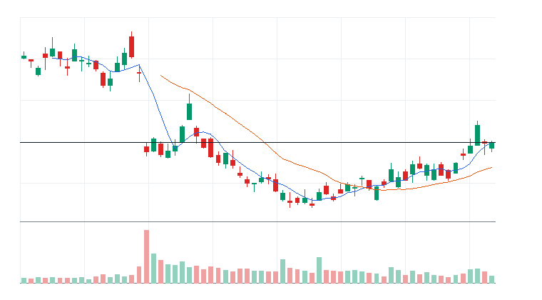

#### 상세 근거

Intuit Inc.(INTU) 상세 근거 펼치기

- moneyFlowScore(최종) 산정 근거:
  - moneyFlowScore(1차): 65
  - 최종 원점수: 75
  - 최종 표시 점수: 75
  - cap 적용: cap 미적용
  - 계산식: +65 + +2 + 0 + +5 + +3 + 0 + 0 = 75
  - 점수 해석: 관심 후보. 눌림 또는 돌파 확인 후 진입 검토.
  - 가격/거래량 1차 점수: +65
    - 추세: +25
    - 단기 모멘텀: +4
    - 중기 모멘텀: +12
    - 거래량: +10
    - 신고가 근접: 0
    - 이동평균: +14
  - 하위 점수 cap:
    - 가격 모멘텀: 원점수 +26, 상한 적용 +25 / 최대 25 (cap 적용)
    - 단기 모멘텀: 원점수 +4, 상한 적용 +4 / 최대 20
    - 중기 모멘텀: 원점수 +12, 상한 적용 +12 / 최대 16
    - 거래량: 원점수 +10, 상한 적용 +10 / 최대 20
    - 신고가 근접: 원점수 0, 상한 적용 0 / 최대 12
    - 이동평균: 원점수 +14, 상한 적용 +14 / 최대 14
    - 관련 ETF 상대강도: 원점수 +3, 상한 적용 +3 / 최대 8
  - 추가 데이터 가감점:
    - 뉴스: +2
    - 유동성: +5
  - ETF 대비 상대강도: +3
  - 리스크 패널티: 0
  - 주요 근거: 1차 65, 최종 원점수 75, 표시 75. 20일 수익률 강함, 5일 수익률 강함, 이동평균 위 추세 유지. 주의: 큰 감점 제한적.
  - 리스크 패널티 산정 근거:
    - 총 리스크 패널티: 0
    - 리스크 등급: LOW
    - 감점된 리스크: 없음
    - 관찰 리스크: 주요 관찰 리스크 없음
    - 한 줄 해석: 직접 감점된 주요 리스크는 없지만 관찰 리스크는 계속 확인해야 한다.
- 데이터 사용 현황:
  - 가격/거래량: 사용
  - 뉴스: 사용
  - ETF 확산도: 관련 ETF에서 확인
  - 거래대금 유동성: 사용
  - 관련 ETF 상대강도: 사용
- 뉴스 확인:
  - 최근 뉴스 상태: 일부 연결
  - 뉴스 소스: CNBC Markets RSS, MarketWatch RSS
  - 소스별 상태: Yahoo Finance RSS CONNECTED; MarketWatch RSS CONNECTED; CNBC Markets RSS CONNECTED; SEC EDGAR RSS PARTIAL; Federal Reserve RSS CONNECTED; Finnhub API DISABLED
  - 긍정/중립/부정: 13/3/0
  - 직접성/방향성/신선도: 2/1/4
  - 강한 촉매 수: 3
  - 중요 공시 수: 0
  - 직접 촉매: 없음
  - 보조 뉴스: CNBC Markets RSS sector_theme / general_market / under_6h
  - 뉴스 수집 시각: 2026-07-31 09:02 KST
  - 가장 최근 뉴스 발행 시각: 2026-07-31 09:00 KST
  - 뉴스 신선도 상태: FRESH
  - 뉴스 이후 가격 반응: 부정
  - 가격 반응 점수 제한: 뉴스 이후 가격 반응 부정 -> 긍정 점수 제한
  - 핵심 뉴스 요약: Anthropic says its Claude models &apos;gained unauthorized access&apos; to other organizations&apos; systems
  - 원점수/상한 점수: +26 / +12
  - 점수 반영: +12
  - 주의: SEC EDGAR RSS: no matching RSS items; Finnhub API: FINNHUB_API_KEY not configured
- ETF 구성종목 확산도: 관련 ETF에서 확인
- 거래대금 유동성:
  - 데이터 상태: 일부 연결
  - 거래대금 기준 유동성: LIQUID
  - 거래대금: $1,463,374,185
  - 평균 거래대금: $1,374,617,094
  - 주문 영향: 시장가 가능
  - 매매 영향: 거래대금이 충분해 시장가 가능 범위로 본다
- reasonConfidence 근거: 가격/거래량, 뉴스, 거래대금 유동성, 관련 ETF 상대강도은 확인됐지만 일부 보조 데이터가 미연결 또는 fallback이라 중간으로 제한한다.
- 후보 선정 후 뉴스/동향 재확인:
  - 재확인 상태: 데이터 없음
- 차트 요약: 최근 20거래일 기준 5일선이 20일선 위에 있음
- 기준일 2026-07-30 | 종가 $315.5 | 1일 -5.29% | 5일 +12.07% | 20일 +18.13% | 상대 거래량 1.06배 | 52주 고점 대비 -60.91% | 데이터 소스: yfinance

### Starbucks Corporation(SBUX)
- 자산 유형: STOCK
- 상태: 관찰
- primaryTheme: Consumer Cyclical
- primarySector: Consumer Cyclical
- industry: Restaurants
- relatedEtfs: QQQ, SPY, IWM
- linkedNarrative: Specialty Business Services 자금 유입
- narrativeStatus: 약화
- narrativeScore: 41
- moneyFlowScore: 80
- finalRawScore: 80
- tieBreakerReason: 최종 원점수 80, 리스크 패널티 0, 5일 수익률 +2.56%, 상대 거래량 2.81배 순으로 정렬
- 과열 리스크: 낮음
- reasonConfidence: MEDIUM
- reasonConfidenceExplanation: 직접 촉매 부재 때문에 HIGH가 아니라 MEDIUM으로 제한했다.

- todayActionLabel: 관찰
- 주문 실행: 시장가 가능
- 기준일: 2026-07-30
- 종가: $105.85
- 1일 수익률: +1.64%
- 5일 수익률: +2.56%
- 20일 수익률: +2.38%
- 상대 거래량: 2.81배
- 52주 고점 대비 위치: -3.09%
- 관련 ETF 대비 상대강도: 관련 ETF보다 강함 | 주식 5일 +2.56% vs ETF 평균 -0.19%, 주식 20일 +2.38% vs ETF 평균 -2.85%, 상대 거래량 2.81배 vs ETF 평균 1.35배
- whyMoneyIsFlowing: 20일 +2.38%, 5일 +2.56%, 상대 거래량 2.81배로 가격과 거래량이 함께 개선. 뉴스: CNBC Markets RSS general_market/under_6h / 유동성: LIQUID
- likelyNextBuyer: 개별 주도주를 따라붙는 단기 모멘텀 자금과 관련 ETF 강세를 확인한 트레이더
- whyThisCouldTradeHigher: 52주 고점 부근이라 돌파가 확인되면 신고가 추종 매수가 붙을 수 있음
- 왜 ETF가 아니라 이 종목인가: SBUX가 관련 ETF 평균보다 5일/20일 흐름 또는 거래량에서 강해 개별 종목 우선 후보로 본다.
- ETF가 더 나은 경우: SBUX가 관련 ETF 평균보다 약하거나 거래량이 둔화되면 개별 종목보다 관련 ETF를 우선한다.
#### 최근 뉴스/동향 한국어 요약

- 요약: 후보 선정 후 재확인 뉴스 데이터 없음
- 진입 조건: 전일 고점 돌파와 5일선 유지 확인
- 무효화 조건: 20일선 이탈 또는 상대 거래량 0.8배 이하 둔화
- 차트: 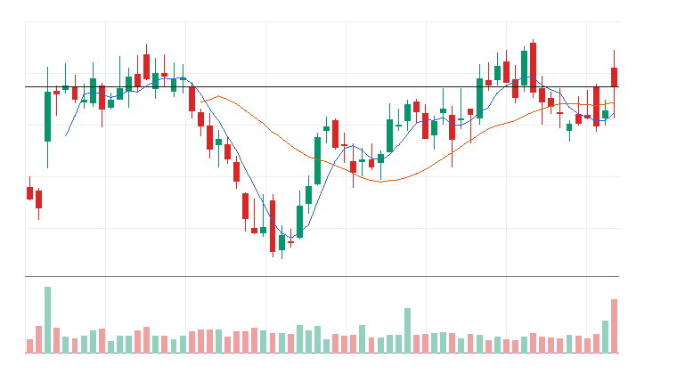

#### 상세 근거

Starbucks Corporation(SBUX) 상세 근거 펼치기

- moneyFlowScore(최종) 산정 근거:
  - moneyFlowScore(1차): 60
  - 최종 원점수: 80
  - 최종 표시 점수: 80
  - cap 적용: cap 미적용
  - 계산식: +60 + +12 + 0 + +5 + +3 + 0 + 0 = 80
  - 점수 해석: 강한 자금 유입 후보. 단, 과열 여부 확인 필수.
  - 가격/거래량 1차 점수: +60
    - 추세: +10
    - 단기 모멘텀: +4
    - 중기 모멘텀: +2
    - 거래량: +18
    - 신고가 근접: +12
    - 이동평균: +14
  - 하위 점수 cap:
    - 가격 모멘텀: 원점수 +10, 상한 적용 +10 / 최대 25
    - 단기 모멘텀: 원점수 +4, 상한 적용 +4 / 최대 20
    - 중기 모멘텀: 원점수 +2, 상한 적용 +2 / 최대 16
    - 거래량: 원점수 +18, 상한 적용 +18 / 최대 20
    - 신고가 근접: 원점수 +12, 상한 적용 +12 / 최대 12
    - 이동평균: 원점수 +14, 상한 적용 +14 / 최대 14
    - 관련 ETF 상대강도: 원점수 +3, 상한 적용 +3 / 최대 8
  - 추가 데이터 가감점:
    - 뉴스: +12
    - 유동성: +5
  - ETF 대비 상대강도: +3
  - 리스크 패널티: 0
  - 주요 근거: 1차 60, 최종 원점수 80, 표시 80. 상대 거래량 증가, 52주 고점 근처, 이동평균 위 추세 유지. 주의: 큰 감점 제한적.
  - 리스크 패널티 산정 근거:
    - 총 리스크 패널티: 0
    - 리스크 등급: LOW
    - 감점된 리스크: 없음
    - 관찰 리스크: 주요 관찰 리스크 없음
    - 한 줄 해석: 직접 감점된 주요 리스크는 없지만 관찰 리스크는 계속 확인해야 한다.
- 데이터 사용 현황:
  - 가격/거래량: 사용
  - 뉴스: 사용
  - ETF 확산도: 관련 ETF에서 확인
  - 거래대금 유동성: 사용
  - 관련 ETF 상대강도: 사용
- 뉴스 확인:
  - 최근 뉴스 상태: 일부 연결
  - 뉴스 소스: CNBC Markets RSS, MarketWatch RSS
  - 소스별 상태: Yahoo Finance RSS CONNECTED; MarketWatch RSS CONNECTED; CNBC Markets RSS CONNECTED; SEC EDGAR RSS PARTIAL; Federal Reserve RSS CONNECTED; Finnhub API DISABLED
  - 긍정/중립/부정: 13/3/0
  - 직접성/방향성/신선도: 2/1/4
  - 강한 촉매 수: 3
  - 중요 공시 수: 0
  - 직접 촉매: 없음
  - 보조 뉴스: CNBC Markets RSS sector_theme / general_market / under_6h
  - 뉴스 수집 시각: 2026-07-31 09:02 KST
  - 가장 최근 뉴스 발행 시각: 2026-07-31 09:00 KST
  - 뉴스 신선도 상태: FRESH
  - 뉴스 이후 가격 반응: 긍정
  - 가격 반응 점수 제한: 뉴스 이후 가격 반응과 점수 제한 특이사항 없음
  - 핵심 뉴스 요약: Anthropic says its Claude models &apos;gained unauthorized access&apos; to other organizations&apos; systems
  - 원점수/상한 점수: +26 / +12
  - 점수 반영: +12
  - 주의: SEC EDGAR RSS: no matching RSS items; Finnhub API: FINNHUB_API_KEY not configured
- ETF 구성종목 확산도: 관련 ETF에서 확인
- 거래대금 유동성:
  - 데이터 상태: 일부 연결
  - 거래대금 기준 유동성: LIQUID
  - 거래대금: $2,180,599,020
  - 평균 거래대금: $776,076,005
  - 주문 영향: 시장가 가능
  - 매매 영향: 거래대금이 충분해 시장가 가능 범위로 본다
- reasonConfidence 근거: 가격/거래량, 뉴스, 거래대금 유동성, 관련 ETF 상대강도은 확인됐지만 일부 보조 데이터가 미연결 또는 fallback이라 중간으로 제한한다.
- 후보 선정 후 뉴스/동향 재확인:
  - 재확인 상태: 데이터 없음
- 차트 요약: 단기 추세 중립
- 기준일 2026-07-30 | 종가 $105.85 | 1일 +1.64% | 5일 +2.56% | 20일 +2.38% | 상대 거래량 2.81배 | 52주 고점 대비 -3.09% | 데이터 소스: yfinance

### Autodesk Inc.(ADSK)
- 자산 유형: STOCK
- 상태: 관찰
- primaryTheme: 클라우드/엔터프라이즈 소프트웨어
- primarySector: Technology
- industry: Software Application
- relatedEtfs: IGV, AIQ, QQQ
- linkedNarrative: 소프트웨어 실적/AI 수익화
- narrativeStatus: 관찰
- narrativeScore: 55
- moneyFlowScore: 74
- finalRawScore: 74
- tieBreakerReason: 최종 원점수 74, 리스크 패널티 0, 5일 수익률 +14.47%, 상대 거래량 1.06배 순으로 정렬
- 과열 리스크: 낮음
- reasonConfidence: HIGH
- reasonConfidenceExplanation: 직접 촉매: Yahoo Finance RSS / general_market / under_6h / positive - Autodesk (ADSK) Stock Dips While Market Gains: Key Facts 가격/거래량, 관련 ETF 동반 강세, 유동성 근거가 함께 확인되어 HIGH로 분류했다.
- 직접 촉매: Yahoo Finance RSS / general_market / under_6h / positive - Autodesk (ADSK) Stock Dips While Market Gains: Key Facts
- todayActionLabel: 관찰
- 주문 실행: 지정가 권장
- 기준일: 2026-07-30
- 종가: $234.97
- 1일 수익률: -4.19%
- 5일 수익률: +14.47%
- 20일 수익률: +17.63%
- 상대 거래량: 1.06배
- 52주 고점 대비 위치: -28.60%
- 관련 ETF 대비 상대강도: 관련 ETF보다 강함 | 주식 5일 +14.47% vs ETF 평균 +1.61%, 주식 20일 +17.63% vs ETF 평균 -4.51%, 상대 거래량 1.06배 vs ETF 평균 1.16배
- whyMoneyIsFlowing: 20일 +17.63%, 5일 +14.47%, 상대 거래량 1.06배로 가격과 거래량이 함께 개선. 뉴스: Yahoo Finance RSS general_market/under_6h / 유동성: ACCEPTABLE
- likelyNextBuyer: 개별 주도주를 따라붙는 단기 모멘텀 자금과 관련 ETF 강세를 확인한 트레이더
- whyThisCouldTradeHigher: 단기 추세가 유지되고 거래량이 1.0배 이상이면 눌림 이후 재상승을 시도할 수 있음
- 왜 ETF가 아니라 이 종목인가: ADSK가 관련 ETF 평균보다 5일/20일 흐름 또는 거래량에서 강해 개별 종목 우선 후보로 본다.
- ETF가 더 나은 경우: ADSK가 관련 ETF 평균보다 약하거나 거래량이 둔화되면 개별 종목보다 관련 ETF를 우선한다.
#### 최근 뉴스/동향 한국어 요약

- 요약: 후보 선정 후 재확인 뉴스 데이터 없음
- 진입 조건: 20일선 위 눌림 후 재상승 확인
- 무효화 조건: 20일선 이탈 또는 상대 거래량 0.8배 이하 둔화
- 차트: 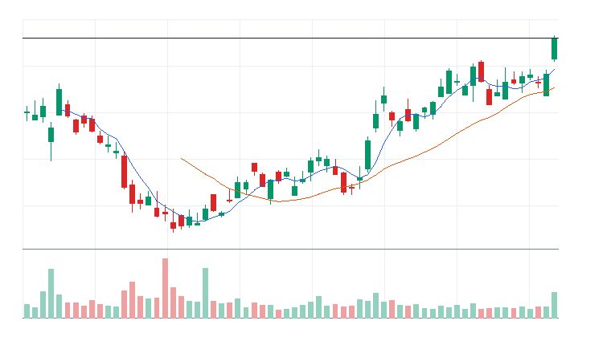

#### 상세 근거

Autodesk Inc.(ADSK) 상세 근거 펼치기

- moneyFlowScore(최종) 산정 근거:
  - moneyFlowScore(1차): 67
  - 최종 원점수: 74
  - 최종 표시 점수: 74
  - cap 적용: cap 미적용
  - 계산식: +67 + +2 + 0 + +2 + +3 + 0 + 0 = 74
  - 점수 해석: 관심 후보. 눌림 또는 돌파 확인 후 진입 검토.
  - 가격/거래량 1차 점수: +67
    - 추세: +25
    - 단기 모멘텀: +7
    - 중기 모멘텀: +11
    - 거래량: +10
    - 신고가 근접: 0
    - 이동평균: +14
  - 하위 점수 cap:
    - 가격 모멘텀: 원점수 +26, 상한 적용 +25 / 최대 25 (cap 적용)
    - 단기 모멘텀: 원점수 +7, 상한 적용 +7 / 최대 20
    - 중기 모멘텀: 원점수 +11, 상한 적용 +11 / 최대 16
    - 거래량: 원점수 +10, 상한 적용 +10 / 최대 20
    - 신고가 근접: 원점수 0, 상한 적용 0 / 최대 12
    - 이동평균: 원점수 +14, 상한 적용 +14 / 최대 14
    - 관련 ETF 상대강도: 원점수 +3, 상한 적용 +3 / 최대 8
  - 추가 데이터 가감점:
    - 뉴스: +2
    - 유동성: +2
  - ETF 대비 상대강도: +3
  - 리스크 패널티: 0
  - 주요 근거: 1차 67, 최종 원점수 74, 표시 74. 20일 수익률 강함, 5일 수익률 강함, 이동평균 위 추세 유지. 주의: 큰 감점 제한적.
  - 리스크 패널티 산정 근거:
    - 총 리스크 패널티: 0
    - 리스크 등급: LOW
    - 감점된 리스크: 없음
    - 관찰 리스크: 주요 관찰 리스크 없음
    - 한 줄 해석: 직접 감점된 주요 리스크는 없지만 관찰 리스크는 계속 확인해야 한다.
- 데이터 사용 현황:
  - 가격/거래량: 사용
  - 뉴스: 사용
  - ETF 확산도: 관련 ETF에서 확인
  - 거래대금 유동성: 사용
  - 관련 ETF 상대강도: 사용
- 뉴스 확인:
  - 최근 뉴스 상태: 일부 연결
  - 뉴스 소스: CNBC Markets RSS, MarketWatch RSS, Yahoo Finance RSS
  - 소스별 상태: Yahoo Finance RSS CONNECTED; MarketWatch RSS CONNECTED; CNBC Markets RSS CONNECTED; SEC EDGAR RSS PARTIAL; Federal Reserve RSS CONNECTED; Finnhub API DISABLED
  - 긍정/중립/부정: 13/3/0
  - 직접성/방향성/신선도: 4/1/4
  - 강한 촉매 수: 2
  - 중요 공시 수: 0
  - 직접 촉매: Yahoo Finance RSS / general_market / under_6h / positive - Autodesk (ADSK) Stock Dips While Market Gains: Key Facts
  - 보조 뉴스: CNBC Markets RSS sector_theme / general_market / under_6h
  - 뉴스 수집 시각: 2026-07-31 09:02 KST
  - 가장 최근 뉴스 발행 시각: 2026-07-31 09:00 KST
  - 뉴스 신선도 상태: FRESH
  - 뉴스 이후 가격 반응: 부정
  - 가격 반응 점수 제한: 뉴스 이후 가격 반응 부정 -> 긍정 점수 제한
  - 핵심 뉴스 요약: Anthropic says its Claude models &apos;gained unauthorized access&apos; to other organizations&apos; systems
  - 원점수/상한 점수: +26 / +12
  - 점수 반영: +12
  - 주의: SEC EDGAR RSS: no matching RSS items; Finnhub API: FINNHUB_API_KEY not configured
- ETF 구성종목 확산도: 관련 ETF에서 확인
- 거래대금 유동성:
  - 데이터 상태: 일부 연결
  - 거래대금 기준 유동성: ACCEPTABLE
  - 거래대금: $559,442,188
  - 평균 거래대금: $527,201,014
  - 주문 영향: 지정가 권장
  - 매매 영향: 거래대금은 허용 가능하나 지정가를 우선한다
- reasonConfidence 근거: 가격/거래량, 뉴스, 거래대금 유동성, 관련 ETF 상대강도 데이터가 확인되어 신뢰도를 높게 본다.
- 후보 선정 후 뉴스/동향 재확인:
  - 재확인 상태: 데이터 없음
- 차트 요약: 최근 20거래일 기준 5일선이 20일선 위에 있음
- 기준일 2026-07-30 | 종가 $234.97 | 1일 -4.19% | 5일 +14.47% | 20일 +17.63% | 상대 거래량 1.06배 | 52주 고점 대비 -28.60% | 데이터 소스: yfinance

### 2-3. 전일 추천 종목 점검
이 섹션은 실제 계좌 보유 종목이 아니라 전일 리포트에서 제시된 개별 종목 후보의 사후 점검이다.
실제 보유 수량/평단이 입력되지 않았으므로 계좌 수익률이 아니라 추천 기준일 이후 가격 변화를 추적한다.

#### RTX
- 전일 추천일: 2026-07-28
- 전일 actionLabel: 조건부 진입
- 전일 moneyFlowScore: 100
- 전일 종가 또는 추천 기준가: $218.58
- 오늘 종가: $214.38
- 추천 이후 수익률: -1.92%
- 진입 조건 충족 여부: 미충족
- 무효화 조건 발생 여부: 미발생
- 관련 ETF 대비 상대강도 유지 여부: 유지
- 오늘 상태: 유지
- 오늘 판단 근거: RTX는 전일 추천 이후 -1.92% 변화. 관련 ETF보다 강함 | 주식 5일 +2.50% vs ETF 평균 -0.19%, 주식 20일 +11.78% vs ETF 평균 -2.85%, 상대 거래량 0.74배 vs ETF 평균 1.35배
- 다음 확인 조건: 거래량 회복 실패

#### Atlassian Corporation(TEAM)
- 전일 추천일: 2026-07-28
- 전일 actionLabel: 자금흐름 예외 조건부
- 전일 moneyFlowScore: 100
- 전일 종가 또는 추천 기준가: $99.98
- 오늘 종가: $98.12
- 추천 이후 수익률: -1.86%
- 진입 조건 충족 여부: 미충족
- 무효화 조건 발생 여부: 발생
- 관련 ETF 대비 상대강도 유지 여부: 유지
- 오늘 상태: 무효화
- 오늘 판단 근거: TEAM는 전일 추천 이후 -1.86% 변화. 관련 ETF보다 강함 | 주식 5일 +22.42% vs ETF 평균 +1.61%, 주식 20일 +17.98% vs ETF 평균 -4.51%, 상대 거래량 1.03배 vs ETF 평균 1.16배
- 다음 확인 조건: 20일선 이탈 또는 상대 거래량 0.8배 이하 둔화

#### Adobe Inc.(ADBE)
- 전일 추천일: 2026-07-28
- 전일 actionLabel: 자금흐름 예외 조건부
- 전일 moneyFlowScore: 99
- 전일 종가 또는 추천 기준가: $249.18
- 오늘 종가: $247.9
- 추천 이후 수익률: -0.51%
- 진입 조건 충족 여부: 미충족
- 무효화 조건 발생 여부: 미발생
- 관련 ETF 대비 상대강도 유지 여부: 유지
- 오늘 상태: 유지
- 오늘 판단 근거: ADBE는 전일 추천 이후 -0.51% 변화. 관련 ETF보다 강함 | 주식 5일 +16.84% vs ETF 평균 +1.61%, 주식 20일 +17.50% vs ETF 평균 -4.51%, 상대 거래량 1.18배 vs ETF 평균 1.16배
- 다음 확인 조건: 20일선 이탈 또는 상대 거래량 0.8배 이하 둔화

#### PACCAR Inc.(PCAR)
- 전일 추천일: 2026-07-28
- 전일 actionLabel: 자금흐름 예외 조건부
- 전일 moneyFlowScore: 100
- 전일 종가 또는 추천 기준가: $138.21
- 오늘 종가: $133.76
- 추천 이후 수익률: -3.22%
- 진입 조건 충족 여부: 미충족
- 무효화 조건 발생 여부: 발생
- 관련 ETF 대비 상대강도 유지 여부: 유지
- 오늘 상태: 무효화
- 오늘 판단 근거: PCAR는 전일 추천 이후 -3.22% 변화. 관련 ETF보다 강함 | 주식 5일 +2.30% vs ETF 평균 -0.19%, 주식 20일 +10.33% vs ETF 평균 -2.85%, 상대 거래량 1.07배 vs ETF 평균 1.35배
- 다음 확인 조건: 20일선 이탈 또는 상대 거래량 0.8배 이하 둔화

#### Autodesk Inc.(ADSK)
- 전일 추천일: 2026-07-28
- 전일 actionLabel: 자금흐름 예외 조건부
- 전일 moneyFlowScore: 99
- 전일 종가 또는 추천 기준가: $237.38
- 오늘 종가: $234.97
- 추천 이후 수익률: -1.02%
- 진입 조건 충족 여부: 미충족
- 무효화 조건 발생 여부: 미발생
- 관련 ETF 대비 상대강도 유지 여부: 유지
- 오늘 상태: 유지
- 오늘 판단 근거: ADSK는 전일 추천 이후 -1.02% 변화. 관련 ETF보다 강함 | 주식 5일 +14.47% vs ETF 평균 +1.61%, 주식 20일 +17.63% vs ETF 평균 -4.51%, 상대 거래량 1.06배 vs ETF 평균 1.16배
- 다음 확인 조건: 20일선 이탈 또는 상대 거래량 0.8배 이하 둔화

### 2-4. ETF 대비 개별 종목 판단 로직

- 관련 ETF의 5일/20일 수익률과 개별 종목의 5일/20일 수익률을 비교한다.
- 관련 ETF의 상대 거래량과 개별 종목의 상대 거래량을 비교한다.
- 개별 종목이 관련 ETF보다 강하면 개별 종목 우선 가능성으로 본다.
- 개별 종목이 관련 ETF와 비슷하거나 약하면 ETF 우선 / 개별 종목 관찰로 낮춘다.
- 관련 ETF가 더 강하면 개별 종목 대신 ETF를 우선한다.

### 2-5. 개별 종목 제외/주의 후보

#### Starbucks Corporation(SBUX)
- moneyFlowScore(최종): 80
- moneyFlowScore 산정 근거 요약: 1차 60, 최종 원점수 80, 표시 80. 상대 거래량 증가, 52주 고점 근처, 이동평균 위 추세 유지. 주의: 큰 감점 제한적.
- 제외/주의 사유: 개별 종목 우선 근거 부족
- 해제 조건: 전일 고점 돌파와 5일선 유지 확인

#### Coca-Cola Europacific Partners PLC(CCEP)
- moneyFlowScore(최종): 78
- moneyFlowScore 산정 근거 요약: 1차 62, 최종 원점수 78, 표시 78. 5일 수익률 강함, 52주 고점 근처, 이동평균 위 추세 유지. 주의: 큰 감점 제한적.
- 제외/주의 사유: 매매 조건 미충족
- 해제 조건: 전일 고점 돌파와 5일선 유지 확인

#### Workday Inc.(WDAY)
- moneyFlowScore(최종): 77
- moneyFlowScore 산정 근거 요약: 1차 73, 최종 원점수 77, 표시 77. 20일 수익률 강함, 5일 수익률 강함, 상대 거래량 증가. 주의: 단기 과열/추격 위험 존재.
- 제외/주의 사유: 개별 종목 우선 근거 부족
- 해제 조건: 20일선 위 눌림 후 재상승 확인

#### Adobe Inc.(ADBE)
- moneyFlowScore(최종): 76
- moneyFlowScore 산정 근거 요약: 1차 66, 최종 원점수 76, 표시 76. 20일 수익률 강함, 5일 수익률 강함, 이동평균 위 추세 유지. 주의: 큰 감점 제한적.
- 제외/주의 사유: 개별 종목 우선 근거 부족
- 해제 조건: 20일선 위 눌림 후 재상승 확인

#### Intuit Inc.(INTU)
- moneyFlowScore(최종): 75
- moneyFlowScore 산정 근거 요약: 1차 65, 최종 원점수 75, 표시 75. 20일 수익률 강함, 5일 수익률 강함, 이동평균 위 추세 유지. 주의: 큰 감점 제한적.
- 제외/주의 사유: 개별 종목 우선 근거 부족
- 해제 조건: 20일선 위 눌림 후 재상승 확인

### Nasdaq-100 전체 moneyFlowScore(1차) 표
이 표는 NASDAQ_100 전체 구성종목을 가격/거래량/추세 중심으로 빠르게 스캔한 moneyFlowScore(1차) 결과다. 뉴스, 유동성, 관련 ETF 대비 상대강도, 리스크 패널티를 반영한 최종 추천 점수는 Top5 카드의 moneyFlowScore(최종)에서 확인한다.

주의: Top5 카드의 moneyFlowScore(최종)는 1차 점수에 상세 데이터 가감점과 리스크 패널티를 더한 값이다. 따라서 아래 전체 표의 1차 순위와 Top5 최종 순위는 다를 수 있다.

- 총 스캔 종목 수: 101
- 점수 계산 성공: 120
- 점수 계산 실패: 0
- moneyFlowScore(1차) 80점 이상: 2
- moneyFlowScore(1차) 65~79점: 6
- moneyFlowScore(1차) 50~64점: 13
- moneyFlowScore(1차) 50점 미만: 99

상위 20개 요약:

| 순위 | 티커 | 이름 | moneyFlowScore(1차) | 최종 표시 점수 | 최종 원점수 | 점수 구간 | 오늘 판단 | 신뢰도 | 1일 | 5일 | 20일 | 상대 거래량 | 관련 ETF |
|---:|---|---|---:|---:|---:|---|---|---|---:|---:|---:|---:|---|
| 1 | REGN | Regeneron Pharmaceuticals Inc. | 93 | 100 | 108 | 강한 자금 유입 후보 | 자금흐름 예외 조건부 | HIGH | +6.17% | +13.26% | +18.19% | 1.83 | QQQ |
| 2 | MSFT | Microsoft Corporation | 88 | 98 | 98 | 강한 자금 유입 후보 | 자금흐름 예외 조건부 | HIGH | +15.51% | +18.22% | +17.39% | 3.10 | QQQ, MAGS, IGV, AIQ |
| 3 | CTSH | Cognizant Technology Solutions Corporation | 73 | 74 | 74 | 관심 후보 | 제외 | HIGH | -3.71% | +25.31% | +31.23% | 1.18 | QQQ, SPY, IWM |
| 4 | WDAY | Workday Inc. | 73 | 77 | 77 | 관심 후보 | 관찰 | HIGH | -5.89% | +23.65% | +21.37% | 1.43 | IGV, AIQ, QQQ |
| 5 | TEAM | Atlassian Corporation | 67 | 68 | 68 | 관심 후보 | 제외 | MEDIUM | -5.91% | +22.42% | +17.98% | 1.03 | IGV, AIQ, QQQ |
| 6 | ADSK | Autodesk Inc. | 67 | 74 | 74 | 관심 후보 | 관찰 | HIGH | -4.19% | +14.47% | +17.63% | 1.06 | IGV, AIQ, QQQ |
| 7 | ADBE | Adobe Inc. | 66 | 76 | 76 | 관심 후보 | 관찰 | HIGH | -5.90% | +16.84% | +17.50% | 1.18 | IGV, AIQ, QQQ |
| 8 | INTU | Intuit Inc. | 65 | 75 | 75 | 관심 후보 | 관찰 | MEDIUM | -5.29% | +12.07% | +18.13% | 1.06 | IGV, AIQ, QQQ |
| 9 | TRI | Thomson Reuters Corporation | 62 | 69 | 69 | 관찰 후보 | 제외 | HIGH | -7.06% | +15.33% | +16.39% | 1.12 | QQQ, SPY, IWM |
| 10 | GEHC | GE HealthCare Technologies Inc. | 62 | 68 | 68 | 관찰 후보 | 제외 | HIGH | -2.73% | +12.82% | +7.83% | 1.25 | QQQ |
| 11 | CCEP | Coca-Cola Europacific Partners PLC | 62 | 78 | 78 | 관찰 후보 | 제외 | MEDIUM | +0.55% | +7.81% | +5.29% | 1.19 | QQQ |
| 12 | SBUX | Starbucks Corporation | 60 | 80 | 80 | 관찰 후보 | 관찰 | MEDIUM | +1.64% | +2.56% | +2.38% | 2.81 | QQQ, SPY, IWM |
| 13 | AMGN | Amgen Inc. | 58 | 74 | 74 | 관찰 후보 | 관찰 | MEDIUM | 0.00% | +4.34% | +7.28% | 1.06 | QQQ |
| 14 | AAPL | Apple Inc. | 58 | 68 | 68 | 관찰 후보 | 제외 | HIGH | -1.41% | +3.66% | +13.27% | 1.11 | QQQ, MAGS, SPY |
| 15 | ADP | Automatic Data Processing Inc. | 55 | 62 | 62 | 관찰 후보 | 제외 | HIGH | -3.48% | +8.64% | +11.94% | 1.13 | QQQ, SPY, IWM |
| 16 | ROST | Ross Stores Inc. | 54 | 67 | 67 | 관찰 후보 | 거래량 확인 전 관찰 | LOW | +0.24% | +8.68% | +19.19% | 0.82 | QQQ, SPY, IWM |
| 17 | BKNG | Booking Holdings Inc. | 53 | 62 | 62 | 관찰 후보 | 제외 | HIGH | -4.00% | +11.81% | +5.80% | 1.04 | QQQ |
| 18 | ROP | Roper Technologies Inc. | 52 | 59 | 59 | 관찰 후보 | 제외 | HIGH | -4.61% | +9.61% | +9.75% | 1.14 | IGV, AIQ, QQQ |
| 19 | DXCM | DexCom Inc. | 52 | 58 | 58 | 관찰 후보 | 제외 | HIGH | -0.80% | +5.76% | +8.25% | 1.24 | QQQ |
| 20 | CHTR | Charter Communications Inc. | 51 | 58 | 58 | 관찰 후보 | 제외 | MEDIUM | -2.20% | +12.25% | +1.54% | 1.08 | QQQ, SPY, IWM |

NASDAQ_100 전체 moneyFlowScore(1차) 표 펼치기

| 순위 | 티커 | 이름 | moneyFlowScore(1차) | 최종 표시 점수 | 최종 원점수 | 점수 구간 | 오늘 판단 | 신뢰도 | 1일 | 5일 | 20일 | 상대 거래량 | 관련 ETF |
|---:|---|---|---:|---:|---:|---|---|---|---:|---:|---:|---:|---|
| 1 | REGN | Regeneron Pharmaceuticals Inc. | 93 | 100 | 108 | 강한 자금 유입 후보 | 자금흐름 예외 조건부 | HIGH | +6.17% | +13.26% | +18.19% | 1.83 | QQQ |
| 2 | MSFT | Microsoft Corporation | 88 | 98 | 98 | 강한 자금 유입 후보 | 자금흐름 예외 조건부 | HIGH | +15.51% | +18.22% | +17.39% | 3.10 | QQQ, MAGS, IGV, AIQ |
| 3 | CTSH | Cognizant Technology Solutions Corporation | 73 | 74 | 74 | 관심 후보 | 제외 | HIGH | -3.71% | +25.31% | +31.23% | 1.18 | QQQ, SPY, IWM |
| 4 | WDAY | Workday Inc. | 73 | 77 | 77 | 관심 후보 | 관찰 | HIGH | -5.89% | +23.65% | +21.37% | 1.43 | IGV, AIQ, QQQ |
| 5 | TEAM | Atlassian Corporation | 67 | 68 | 68 | 관심 후보 | 제외 | MEDIUM | -5.91% | +22.42% | +17.98% | 1.03 | IGV, AIQ, QQQ |
| 6 | ADSK | Autodesk Inc. | 67 | 74 | 74 | 관심 후보 | 관찰 | HIGH | -4.19% | +14.47% | +17.63% | 1.06 | IGV, AIQ, QQQ |
| 7 | ADBE | Adobe Inc. | 66 | 76 | 76 | 관심 후보 | 관찰 | HIGH | -5.90% | +16.84% | +17.50% | 1.18 | IGV, AIQ, QQQ |
| 8 | INTU | Intuit Inc. | 65 | 75 | 75 | 관심 후보 | 관찰 | MEDIUM | -5.29% | +12.07% | +18.13% | 1.06 | IGV, AIQ, QQQ |
| 9 | TRI | Thomson Reuters Corporation | 62 | 69 | 69 | 관찰 후보 | 제외 | HIGH | -7.06% | +15.33% | +16.39% | 1.12 | QQQ, SPY, IWM |
| 10 | GEHC | GE HealthCare Technologies Inc. | 62 | 68 | 68 | 관찰 후보 | 제외 | HIGH | -2.73% | +12.82% | +7.83% | 1.25 | QQQ |
| 11 | CCEP | Coca-Cola Europacific Partners PLC | 62 | 78 | 78 | 관찰 후보 | 제외 | MEDIUM | +0.55% | +7.81% | +5.29% | 1.19 | QQQ |
| 12 | SBUX | Starbucks Corporation | 60 | 80 | 80 | 관찰 후보 | 관찰 | MEDIUM | +1.64% | +2.56% | +2.38% | 2.81 | QQQ, SPY, IWM |
| 13 | AMGN | Amgen Inc. | 58 | 74 | 74 | 관찰 후보 | 관찰 | MEDIUM | 0.00% | +4.34% | +7.28% | 1.06 | QQQ |
| 14 | AAPL | Apple Inc. | 58 | 68 | 68 | 관찰 후보 | 제외 | HIGH | -1.41% | +3.66% | +13.27% | 1.11 | QQQ, MAGS, SPY |
| 15 | ADP | Automatic Data Processing Inc. | 55 | 62 | 62 | 관찰 후보 | 제외 | HIGH | -3.48% | +8.64% | +11.94% | 1.13 | QQQ, SPY, IWM |
| 16 | ROST | Ross Stores Inc. | 54 | 67 | 67 | 관찰 후보 | 거래량 확인 전 관찰 | LOW | +0.24% | +8.68% | +19.19% | 0.82 | QQQ, SPY, IWM |
| 17 | BKNG | Booking Holdings Inc. | 53 | 62 | 62 | 관찰 후보 | 제외 | HIGH | -4.00% | +11.81% | +5.80% | 1.04 | QQQ |
| 18 | ROP | Roper Technologies Inc. | 52 | 59 | 59 | 관찰 후보 | 제외 | HIGH | -4.61% | +9.61% | +9.75% | 1.14 | IGV, AIQ, QQQ |
| 19 | DXCM | DexCom Inc. | 52 | 58 | 58 | 관찰 후보 | 제외 | HIGH | -0.80% | +5.76% | +8.25% | 1.24 | QQQ |
| 20 | CHTR | Charter Communications Inc. | 51 | 58 | 58 | 관찰 후보 | 제외 | MEDIUM | -2.20% | +12.25% | +1.54% | 1.08 | QQQ, SPY, IWM |
| 21 | MNST | Monster Beverage Corporation | 51 | 53 | 53 | 관찰 후보 | 제외 | MEDIUM | +0.43% | +4.37% | +0.31% | 1.06 | QQQ |
| 22 | MELI | MercadoLibre Inc. | 49 | 51 | 51 | 우선순위 낮음/매매 금지 | 제외 | MEDIUM | +1.20% | +4.84% | +8.24% | 1.03 | QQQ |
| 23 | CSGP | CoStar Group Inc. | 48 | 51 | 51 | 우선순위 낮음/매매 금지 | 제외 | MEDIUM | -1.24% | +8.55% | +0.34% | 1.54 | QQQ, SPY, IWM |
| 24 | PCAR | PACCAR Inc. | 48 | 51 | 51 | 우선순위 낮음/매매 금지 | 제외 | MEDIUM | -0.08% | +2.30% | +10.33% | 1.07 | QQQ, SPY, IWM |
| 25 | EA | Electronic Arts Inc. | 47 | 49 | 49 | 우선순위 낮음/매매 금지 | 제외 | MEDIUM | +0.33% | +0.28% | +2.02% | 1.59 | QQQ |
| 26 | TTWO | Take-Two Interactive Software Inc. | 46 | 48 | 48 | 우선순위 낮음/매매 금지 | 제외 | MEDIUM | +0.41% | +7.46% | -1.15% | 1.23 | QQQ |
| 27 | PAYX | Paychex Inc. | 44 | 47 | 47 | 우선순위 낮음/매매 금지 | 제외 | MEDIUM | -4.75% | +5.12% | +13.26% | 1.09 | QQQ, SPY, IWM |
| 28 | CTAS | Cintas Corporation | 44 | 47 | 47 | 우선순위 낮음/매매 금지 | 제외 | MEDIUM | -4.50% | +1.74% | +18.69% | 1.19 | QQQ, SPY, IWM |
| 29 | ABNB | Airbnb Inc. | 40 | 38 | 38 | 우선순위 낮음/매매 금지 | 거래량 확인 전 관찰 | LOW | -0.61% | +10.55% | +3.24% | 0.90 | QQQ |
| 30 | DDOG | Datadog Inc. | 40 | 39 | 39 | 우선순위 낮음/매매 금지 | 거래량 확인 전 관찰 | LOW | +1.65% | +9.89% | +1.54% | 0.99 | IGV, AIQ, QQQ |
| 31 | KHC | The Kraft Heinz Company | 40 | 42 | 42 | 우선순위 낮음/매매 금지 | 제외 | MEDIUM | -4.49% | +4.02% | +5.48% | 1.00 | QQQ |
| 32 | ZS | Zscaler Inc. | 39 | 42 | 42 | 우선순위 낮음/매매 금지 | 제외 | MEDIUM | -3.50% | +6.22% | +1.32% | 1.21 | HACK, CIBR, IHAK, IGV |
| 33 | PYPL | PayPal Holdings Inc. | 38 | 41 | 41 | 우선순위 낮음/매매 금지 | 거래량 확인 전 관찰 | LOW | -1.20% | +2.95% | +30.81% | 0.59 | QQQ, SPY, IWM |
| 34 | DASH | DoorDash Inc. | 37 | 35 | 35 | 우선순위 낮음/매매 금지 | 거래량 확인 전 관찰 | LOW | +2.07% | +16.35% | +4.59% | 0.89 | QQQ |
| 35 | VRSK | Verisk Analytics Inc. | 37 | 40 | 40 | 우선순위 낮음/매매 금지 | 제외 | MEDIUM | -6.01% | +3.72% | +9.05% | 1.18 | QQQ, SPY, IWM |
| 36 | COIN | Coinbase | 35 | 38 | 38 | 우선순위 낮음/매매 금지 | 제외 | MEDIUM | +2.18% | +1.50% | +2.73% | 1.13 | QQQ, SPY, IWM |
| 37 | MAR | Marriott International Inc. | 34 | 37 | 37 | 우선순위 낮음/매매 금지 | 제외 | MEDIUM | -1.48% | +3.02% | +1.94% | 1.14 | QQQ, SPY, IWM |
| 38 | FER | Ferrovial N.V. | 34 | 37 | 37 | 우선순위 낮음/매매 금지 | 제외 | MEDIUM | +4.13% | +2.88% | -3.18% | 1.68 | QQQ, SPY, IWM |
| 39 | LMT | Lockheed Martin | 34 | 37 | 37 | 우선순위 낮음/매매 금지 | 제외 | MEDIUM | +0.86% | +0.97% | +10.02% | 1.07 | QQQ, SPY, IWM |
| 40 | BKR | Baker Hughes Company | 33 | 32 | 32 | 우선순위 낮음/매매 금지 | 거래량 확인 전 관찰 | LOW | +2.01% | +6.79% | +11.30% | 0.76 | QQQ, SPY, IWM |
| 41 | RTX | RTX | 32 | 35 | 35 | 우선순위 낮음/매매 금지 | 거래량 확인 전 관찰 | LOW | -0.40% | +2.50% | +11.78% | 0.74 | QQQ, SPY, IWM |
| 42 | PWR | Quanta Services | 32 | 31 | 31 | 우선순위 낮음/매매 금지 | 제외 | LOW | +17.26% | +0.64% | -4.83% | 2.31 | QQQ, SPY, IWM |
| 43 | KDP | Keurig Dr Pepper Inc. | 30 | 32 | 32 | 우선순위 낮음/매매 금지 | 제외 | LOW | +0.38% | +6.40% | -5.39% | 1.06 | QQQ |
| 44 | SHOP | Shopify Inc. | 29 | 26 | 26 | 우선순위 낮음/매매 금지 | 제외 | LOW | -5.24% | +9.29% | +0.63% | 1.32 | IGV, AIQ, QQQ |
| 45 | NFLX | Netflix Inc. | 29 | 31 | 31 | 우선순위 낮음/매매 금지 | 제외 | LOW | -0.62% | +6.21% | -1.37% | 1.04 | QQQ |
| 46 | XOM | Exxon Mobil | 29 | 33 | 33 | 우선순위 낮음/매매 금지 | 거래량 확인 전 관찰 | LOW | +0.14% | +0.05% | +15.18% | 0.56 | XLE, OIH |
| 47 | AVGO | Broadcom Inc. | 29 | 29 | 29 | 우선순위 낮음/매매 금지 | 제외 | LOW | +4.73% | -1.18% | +5.01% | 1.05 | SMH, SOXX, SOXQ, AIQ |
| 48 | CVX | Chevron | 27 | 30 | 30 | 우선순위 낮음/매매 금지 | 거래량 확인 전 관찰 | LOW | +0.23% | -1.09% | +16.07% | 0.71 | QQQ, SPY, IWM |
| 49 | CEG | Constellation Energy Corporation | 27 | 30 | 30 | 우선순위 낮음/매매 금지 | 제외 | LOW | +2.17% | -4.37% | +11.44% | 1.11 | QQQ, SPY, IWM |
| 50 | FTNT | Fortinet Inc. | 26 | 23 | 23 | 우선순위 낮음/매매 금지 | 제외 | LOW | +0.67% | +1.79% | -2.98% | 1.99 | HACK, CIBR, IHAK, IGV |
| 51 | MDLZ | Mondelez International Inc. | 25 | 23 | 23 | 우선순위 낮음/매매 금지 | 거래량 확인 전 관찰 | LOW | -2.94% | +5.05% | +6.28% | 0.97 | QQQ |
| 52 | FANG | Diamondback Energy Inc. | 25 | 28 | 28 | 우선순위 낮음/매매 금지 | 거래량 확인 전 관찰 | LOW | +0.32% | -2.78% | +16.17% | 0.72 | QQQ, SPY, IWM |
| 53 | PDD | PDD Holdings Inc. | 21 | 23 | 23 | 우선순위 낮음/매매 금지 | 거래량 확인 전 관찰 | LOW | -1.00% | +4.97% | +5.96% | 0.87 | QQQ |
| 54 | MSTR | Strategy Inc. | 20 | 23 | 23 | 우선순위 낮음/매매 금지 | 거래량 확인 전 관찰 | LOW | +4.73% | +4.39% | +4.66% | 0.77 | IGV, AIQ, QQQ |
| 55 | AMZN | Amazon.com Inc. | 19 | 15 | 15 | 우선순위 낮음/매매 금지 | 제외 | LOW | +3.90% | +0.79% | -2.57% | 1.95 | QQQ |
| 56 | CIFR | Cipher Mining | 19 | 19 | 19 | 우선순위 낮음/매매 금지 | 제외 | LOW | +28.07% | -12.26% | -0.81% | 1.33 | IBIT, BLOK |
| 57 | WMT | Walmart Inc. | 17 | 13 | 13 | 우선순위 낮음/매매 금지 | 제외 | LOW | -2.73% | +2.49% | +2.10% | 1.26 | QQQ |
| 58 | HON | Honeywell International Inc. | 15 | 18 | 18 | 우선순위 낮음/매매 금지 | 거래량 확인 전 관찰 | LOW | +0.33% | -1.77% | +9.09% | 0.77 | QQQ, SPY, IWM |
| 59 | FCX | Freeport-McMoRan | 14 | 17 | 17 | 우선순위 낮음/매매 금지 | 거래량 확인 전 관찰 | LOW | +5.75% | -0.09% | +4.81% | 0.67 | QQQ, SPY, IWM |
| 60 | STX | Seagate Technology Holdings plc | 13 | 12 | 12 | 우선순위 낮음/매매 금지 | 제외 | LOW | +11.41% | -6.75% | -6.94% | 1.32 | QQQ, SPY, IWM |
| 61 | CPRT | Copart Inc. | 12 | 11 | 11 | 우선순위 낮음/매매 금지 | 거래량 확인 전 관찰 | LOW | -4.07% | +8.69% | +2.69% | 0.80 | QQQ, SPY, IWM |
| 62 | CMCSA | Comcast Corporation | 12 | 11 | 11 | 우선순위 낮음/매매 금지 | 거래량 확인 전 관찰 | LOW | -3.82% | +7.98% | -0.25% | 0.79 | QQQ, SPY, IWM |
| 63 | TMUS | T-Mobile US Inc. | 12 | 9 | 9 | 우선순위 낮음/매매 금지 | 제외 | LOW | -4.51% | +1.71% | +0.16% | 1.33 | QQQ, SPY, IWM |
| 64 | ORLY | O'Reilly Automotive Inc. | 12 | 15 | 15 | 우선순위 낮음/매매 금지 | 제외 | LOW | -3.61% | +1.45% | -5.75% | 1.47 | QQQ, SPY, IWM |
| 65 | RIOT | Riot Platforms | 12 | 12 | 12 | 우선순위 낮음/매매 금지 | 제외 | LOW | +21.27% | -7.29% | -7.68% | 1.47 | IBIT, BLOK |
| 66 | IDXX | IDEXX Laboratories Inc. | 11 | 13 | 13 | 우선순위 낮음/매매 금지 | 거래량 확인 전 관찰 | LOW | -1.93% | +3.60% | +3.95% | 0.87 | QQQ |
| 67 | MPWR | Monolithic Power Systems Inc. | 11 | 5 | 5 | 우선순위 낮음/매매 금지 | 제외 | LOW | +5.40% | -5.80% | -1.17% | 1.84 | SMH, SOXX, SOXQ, AIQ |
| 68 | GOOGL | Alphabet Inc. Class A | 8 | 4 | 4 | 우선순위 낮음/매매 금지 | 제외 | LOW | -0.91% | +5.03% | -7.63% | 1.03 | QQQ |
| 69 | WDC | Western Digital Corporation | 8 | 7 | 7 | 우선순위 낮음/매매 금지 | 제외 | LOW | +15.37% | -4.52% | -10.92% | 1.10 | QQQ, SPY, IWM |
| 70 | XEL | Xcel Energy Inc. | 6 | 3 | 3 | 우선순위 낮음/매매 금지 | 제외 | LOW | -0.66% | -3.14% | -1.84% | 1.45 | QQQ, SPY, IWM |
| 71 | EXC | Exelon Corporation | 6 | 3 | 3 | 우선순위 낮음/매매 금지 | 제외 | LOW | -3.08% | -3.60% | -1.47% | 1.54 | QQQ, SPY, IWM |
| 72 | FAST | Fastenal Company | 5 | 8 | 8 | 우선순위 낮음/매매 금지 | 거래량 확인 전 관찰 | LOW | -2.34% | +1.11% | -2.28% | 0.89 | QQQ, SPY, IWM |
| 73 | LIN | Linde plc | 5 | 2 | 2 | 우선순위 낮음/매매 금지 | 제외 | LOW | -0.49% | +0.46% | -4.67% | 1.15 | QQQ, SPY, IWM |
| 74 | COST | Costco Wholesale Corporation | 4 | 6 | 6 | 우선순위 낮음/매매 금지 | 거래량 확인 전 관찰 | LOW | -2.04% | +3.04% | +3.19% | 0.94 | QQQ |
| 75 | ADI | Analog Devices Inc. | 4 | 0 | -2 | 우선순위 낮음/매매 금지 | 제외 | LOW | +3.76% | -3.56% | -5.74% | 1.49 | SMH, SOXX, SOXQ, AIQ |
| 76 | ETN | Eaton | 4 | 0 | -3 | 우선순위 낮음/매매 금지 | 제외 | LOW | +6.91% | -6.80% | -6.17% | 1.32 | QQQ, SPY, IWM |
| 77 | CSCO | Cisco Systems Inc. | 3 | 0 | 0 | 우선순위 낮음/매매 금지 | 제외 | LOW | +0.96% | +0.71% | -2.95% | 1.00 | QQQ, SPY, IWM |
| 78 | PEP | PepsiCo Inc. | 2 | 4 | 4 | 우선순위 낮음/매매 금지 | 거래량 확인 전 관찰 | LOW | -2.30% | +3.89% | -0.68% | 0.91 | QQQ |
| 79 | TXN | Texas Instruments Incorporated | 1 | 0 | -5 | 우선순위 낮음/매매 금지 | 제외 | LOW | +2.75% | -2.19% | -6.58% | 1.13 | SMH, SOXX, SOXQ, AIQ |
| 80 | TSM | Taiwan Semiconductor | 1 | 0 | -9 | 우선순위 낮음/매매 금지 | 제외 | LOW | +7.64% | -2.95% | -9.21% | 1.12 | SMH, SOXX, SOXQ |
| 81 | IREN | IREN | 1 | 0 | -5 | 우선순위 낮음/매매 금지 | 제외 | LOW | +30.54% | -5.72% | -11.68% | 1.51 | IBIT, BLOK |
| 82 | AXON | Axon Enterprise Inc. | 0 | 0 | -18 | 우선순위 낮음/매매 금지 | 거래량 확인 전 관찰 | LOW | -1.11% | +6.79% | -11.56% | 0.70 | QQQ, SPY, IWM |
| 83 | ISRG | Intuitive Surgical Inc. | 0 | 0 | -19 | 우선순위 낮음/매매 금지 | 거래량 확인 전 관찰 | LOW | -0.04% | +6.31% | -12.28% | 0.67 | QQQ |
| 84 | GOOG | Alphabet Inc. Class C | 0 | 0 | -13 | 우선순위 낮음/매매 금지 | 거래량 확인 전 관찰 | LOW | -0.62% | +4.82% | -6.76% | 0.87 | QQQ |
| 85 | VRTX | Vertex Pharmaceuticals Incorporated | 0 | 0 | -9 | 우선순위 낮음/매매 금지 | 거래량 확인 전 관찰 | LOW | -0.34% | +1.82% | -3.28% | 0.76 | QQQ |
| 86 | APP | AppLovin Corporation | 0 | 0 | -4 | 우선순위 낮음/매매 금지 | 제외 | LOW | +1.10% | +1.26% | -28.47% | 1.31 | IGV, AIQ, QQQ |
| 87 | CRWD | CrowdStrike Holdings Inc. | 0 | 0 | -8 | 우선순위 낮음/매매 금지 | 거래량 확인 전 관찰 | LOW | +3.26% | +0.98% | -4.12% | 0.92 | HACK, CIBR, IHAK, IGV |
| 88 | CDNS | Cadence Design Systems Inc. | 0 | 0 | -9 | 우선순위 낮음/매매 금지 | 제외 | LOW | +0.02% | +0.71% | -11.89% | 1.13 | IGV, AIQ, QQQ |
| 89 | GILD | Gilead Sciences Inc. | 0 | 0 | -10 | 우선순위 낮음/매매 금지 | 거래량 확인 전 관찰 | LOW | -1.09% | +0.32% | +4.22% | 0.93 | QQQ |
| 90 | NOC | Northrop Grumman | 0 | 0 | -13 | 우선순위 낮음/매매 금지 | 거래량 확인 전 관찰 | LOW | -0.04% | +0.26% | +2.87% | 0.63 | QQQ, SPY, IWM |
| 91 | PANW | Palo Alto Networks Inc. | 0 | 0 | -7 | 우선순위 낮음/매매 금지 | 거래량 확인 전 관찰 | LOW | +3.67% | +0.02% | -7.49% | 0.99 | HACK, CIBR, IHAK, IGV |
| 92 | SNPS | Synopsys Inc. | 0 | 0 | -12 | 우선순위 낮음/매매 금지 | 제외 | LOW | -0.36% | -0.32% | -18.08% | 1.19 | IGV, AIQ, QQQ |
| 93 | PLTR | Palantir Technologies Inc. | 0 | 0 | -22 | 우선순위 낮음/매매 금지 | 거래량 확인 전 관찰 | LOW | -0.60% | -0.90% | -2.76% | 0.77 | IGV, AIQ, CIBR, QQQ |
| 94 | CCJ | Cameco | 0 | 0 | -20 | 우선순위 낮음/매매 금지 | 거래량 확인 전 관찰 | LOW | +4.33% | -1.23% | -9.41% | 0.98 | QQQ, SPY, IWM |
| 95 | WBD | Warner Bros. Discovery Inc. | 0 | 0 | -9 | 우선순위 낮음/매매 금지 | 제외 | LOW | -0.66% | -1.85% | -5.00% | 1.00 | QQQ |
| 96 | TSLA | Tesla Inc. | 0 | 0 | -27 | 우선순위 낮음/매매 금지 | 거래량 확인 전 관찰 | LOW | +3.53% | -3.39% | -27.38% | 0.85 | QQQ |
| 97 | GEV | GE Vernova | 0 | 0 | -30 | 우선순위 낮음/매매 금지 | 거래량 확인 전 관찰 | LOW | +9.07% | -4.77% | -13.43% | 0.92 | QQQ, SPY, IWM |
| 98 | CSX | CSX Corporation | 0 | 0 | -12 | 우선순위 낮음/매매 금지 | 거래량 확인 전 관찰 | LOW | -1.08% | -4.96% | +3.85% | 0.93 | QQQ, SPY, IWM |
| 99 | AEP | American Electric Power Company Inc. | 0 | 0 | -6 | 우선순위 낮음/매매 금지 | 제외 | LOW | -1.25% | -5.29% | -5.38% | 1.35 | QQQ, SPY, IWM |
| 100 | INSM | Insmed Incorporated | 0 | 0 | -13 | 우선순위 낮음/매매 금지 | 제외 | LOW | -1.58% | -5.51% | -5.15% | 1.44 | QQQ |
| 101 | NVDA | NVIDIA Corporation | 0 | 0 | -28 | 우선순위 낮음/매매 금지 | 거래량 확인 전 관찰 | LOW | +2.65% | -6.57% | -1.29% | 0.96 | SMH, SOXX, SOXQ, AIQ, QQQ |
| 102 | KTOS | Kratos Defense & Security Solutions | 0 | 0 | -34 | 우선순위 낮음/매매 금지 | 거래량 확인 전 관찰 | LOW | +5.22% | -6.61% | -12.95% | 0.87 | QQQ, SPY, IWM |
| 103 | LRCX | Lam Research Corporation | 0 | 0 | -10 | 우선순위 낮음/매매 금지 | 제외 | LOW | +17.98% | -6.90% | -23.91% | 1.82 | SMH, SOXX, SOXQ, AIQ |
| 104 | MARA | MARA Holdings | 0 | 0 | -32 | 우선순위 낮음/매매 금지 | 거래량 확인 전 관찰 | LOW | +17.61% | -7.44% | -11.59% | 0.89 | IBIT, BLOK |
| 105 | AVAV | AeroVironment | 0 | 0 | -36 | 우선순위 낮음/매매 금지 | 거래량 확인 전 관찰 | LOW | +3.13% | -7.66% | -15.00% | 0.55 | XAR, SHLD, ITA, PPA |
| 106 | MCHP | Microchip Technology Incorporated | 0 | 0 | -16 | 우선순위 낮음/매매 금지 | 제외 | LOW | +5.10% | -7.79% | -15.42% | 1.21 | SMH, SOXX, SOXQ, AIQ |
| 107 | ODFL | Old Dominion Freight Line Inc. | 0 | 0 | -10 | 우선순위 낮음/매매 금지 | 제외 | LOW | -4.63% | -7.91% | -2.52% | 2.17 | QQQ, SPY, IWM |
| 108 | ASML | ASML Holding N.V. | 0 | 0 | -17 | 우선순위 낮음/매매 금지 | 제외 | LOW | +6.50% | -8.41% | -10.40% | 1.02 | SMH, SOXX, SOXQ, AIQ |
| 109 | INTC | Intel Corporation | 0 | 0 | -18 | 우선순위 낮음/매매 금지 | 제외 | LOW | +11.30% | -9.08% | -28.26% | 1.14 | SMH, SOXX, SOXQ, AIQ |
| 110 | AMD | Advanced Micro Devices Inc. | 0 | 0 | -13 | 우선순위 낮음/매매 금지 | 제외 | LOW | +13.00% | -10.06% | -10.26% | 1.26 | SMH, SOXX, SOXQ, AIQ |
| 111 | AMAT | Applied Materials Inc. | 0 | 0 | -14 | 우선순위 낮음/매매 금지 | 제외 | LOW | +14.97% | -10.84% | -22.91% | 1.37 | SMH, SOXX, SOXQ, AIQ |
| 112 | META | Meta Platforms Inc. | 0 | 0 | -20 | 우선순위 낮음/매매 금지 | 제외 | LOW | -7.95% | -11.07% | -12.05% | 2.23 | QQQ |
| 113 | QCOM | QUALCOMM Incorporated | 0 | 0 | -21 | 우선순위 낮음/매매 금지 | 제외 | LOW | -2.62% | -11.40% | -16.67% | 1.71 | SMH, SOXX, SOXQ, AIQ |
| 114 | NXPI | NXP Semiconductors N.V. | 0 | 0 | -16 | 우선순위 낮음/매매 금지 | 제외 | LOW | +1.73% | -11.59% | -12.19% | 1.83 | SMH, SOXX, SOXQ, AIQ |
| 115 | MU | Micron Technology Inc. | 0 | 0 | -14 | 우선순위 낮음/매매 금지 | 제외 | LOW | +18.36% | -11.67% | -15.27% | 1.27 | DRAM, SMH, SOXX, SOXQ |
| 116 | MRVL | Marvell Technology Inc. | 0 | 0 | -18 | 우선순위 낮음/매매 금지 | 제외 | LOW | +12.18% | -12.43% | -32.62% | 1.15 | SMH, SOXX, SOXQ, AIQ |
| 117 | ARM | Arm Holdings plc | 0 | 0 | -14 | 우선순위 낮음/매매 금지 | 제외 | LOW | +7.40% | -14.66% | -28.43% | 2.00 | SMH, SOXX, SOXQ, AIQ |
| 118 | KLAC | KLA Corporation | 0 | 0 | -15 | 우선순위 낮음/매매 금지 | 제외 | LOW | +5.96% | -17.56% | -32.26% | 1.33 | SMH, SOXX, SOXQ, AIQ |
| 119 | ALNY | Alnylam Pharmaceuticals Inc. | 0 | 0 | -20 | 우선순위 낮음/매매 금지 | 제외 | LOW | -28.31% | -23.54% | -31.89% | 4.90 | QQQ |
| 120 | VRT | Vertiv | 0 | 0 | -13 | 우선순위 낮음/매매 금지 | 제외 | LOW | +2.00% | -25.17% | -26.95% | 2.46 | QQQ, SPY, IWM |

#### 데이터 수집 실패 종목
데이터 수집 실패 종목 없음

## 감시 ETF 목록

| 티커 | 카테고리 | moneyFlowScore | 상태 | reasonConfidence | 주요 이유 |
| --- | --- | ---: | --- | --- | --- |
| Roundhill Memory ETF(DRAM) | 메모리/HBM ETF | 3 | 매매 금지 | LOW | 20일 -20.53%, 5일 -10.22%, 상대 거래량 1.47배로 가격과 거래량이 함께 개선. 뉴스: CNBC Markets RSS general_market/under_6h / 유동성: LIQUID |
| VanEck Semiconductor ETF(SMH) | AI 반도체 ETF | 0 | 매매 금지 | LOW | 20일 -13.15%, 5일 -7.11%, 상대 거래량 1.03배로 가격과 거래량이 함께 개선. 뉴스: CNBC Markets RSS general_market/under_6h / 유동성: LIQUID |
| iShares Semiconductor ETF(SOXX) | AI 반도체 ETF | 3 | 매매 금지 | LOW | 20일 -15.87%, 5일 -8.47%, 상대 거래량 1.56배로 가격과 거래량이 함께 개선. 뉴스: CNBC Markets RSS general_market/under_6h / 유동성: LIQUID |
| Invesco PHLX Semiconductor ETF(SOXQ) | AI 반도체 ETF | 0 | 관찰 | LOW | 최근 수익률은 확인되지만 상대 거래량 0.93배라 신규 자금 유입 강도는 약함. 뉴스: CNBC Markets RSS general_market/under_6h / 유동성: ACCEPTABLE |
| iShares Expanded Tech-Software Sector ETF(IGV) | 클라우드/엔터프라이즈 소프트웨어 ETF | 33 | 관찰 | LOW | 최근 수익률은 확인되지만 상대 거래량 0.92배라 신규 자금 유입 강도는 약함. 뉴스: CNBC Markets RSS general_market/under_6h / 유동성: LIQUID |
| Global X Artificial Intelligence & Technology ETF(AIQ) | AI 소프트웨어 ETF | 0 | 관찰 | LOW | 최근 수익률은 확인되지만 상대 거래량 0.94배라 신규 자금 유입 강도는 약함. 뉴스: MarketWatch RSS general_market/under_6h / 유동성: ACCEPTABLE |
| Global X Robotics & Artificial Intelligence ETF(BOTZ) | 로봇/자동화 ETF | 3 | 매매 금지 | LOW | 20일 -8.30%, 5일 +1.72%, 상대 거래량 1.04배로 가격과 거래량이 함께 개선. 뉴스: MarketWatch RSS general_market/under_6h |
| ROBO Global Robotics and Automation Index ETF(ROBO) | 로봇/자동화 ETF | 0 | 관찰 | LOW | 최근 수익률은 확인되지만 상대 거래량 0.64배라 신규 자금 유입 강도는 약함. 뉴스: Yahoo Finance RSS general_market/stale |
| First Trust NASDAQ Cybersecurity ETF(CIBR) | 사이버보안 ETF | 1 | 관찰 | LOW | 최근 수익률은 확인되지만 상대 거래량 0.63배라 신규 자금 유입 강도는 약함. 뉴스: MarketWatch RSS general_market/under_6h |
| Amplify Cybersecurity ETF(HACK) | 사이버보안 ETF | 0 | 관찰 | LOW | 최근 수익률은 확인되지만 상대 거래량 0.44배라 신규 자금 유입 강도는 약함. 뉴스: Yahoo Finance RSS general_market/stale |
| iShares Cybersecurity and Tech ETF(IHAK) | 사이버보안 ETF | 0 | 관찰 | LOW | 최근 수익률은 확인되지만 상대 거래량 0.98배라 신규 자금 유입 강도는 약함. 뉴스: MarketWatch RSS general_market/under_6h |
| iShares U.S. Aerospace & Defense ETF(ITA) | 방산 ETF | 42 | 매매 금지 | MEDIUM | 20일 -2.35%, 5일 -0.04%, 상대 거래량 1.47배로 가격과 거래량이 함께 개선. 뉴스: Yahoo Finance RSS general_market/stale / 유동성: ACCEPTABLE |
| SPDR S&P Aerospace & Defense ETF(XAR) | 방산 ETF | 0 | 관찰 | LOW | 최근 수익률은 확인되지만 상대 거래량 0.85배라 신규 자금 유입 강도는 약함. 뉴스: CNBC Markets RSS general_market/under_6h |
| Global X Defense Tech ETF(SHLD) | 방산 ETF | 8 | 관찰 | LOW | 최근 수익률은 확인되지만 상대 거래량 0.84배라 신규 자금 유입 강도는 약함. 뉴스: CNBC Markets RSS general_market/under_6h |
| Invesco Aerospace & Defense ETF(PPA) | 방산 ETF | 0 | 관찰 | LOW | 최근 수익률은 확인되지만 상대 거래량 0.93배라 신규 자금 유입 강도는 약함. 뉴스: CNBC Markets RSS general_market/under_6h |
| Global X U.S. Infrastructure Development ETF(PAVE) | 인프라 ETF | 0 | 관찰 | LOW | 최근 수익률은 확인되지만 상대 거래량 0.62배라 신규 자금 유입 강도는 약함. 뉴스: MarketWatch RSS general_market/under_6h |
| First Trust NASDAQ Clean Edge Smart Grid Infrastructure ETF(GRID) | 전력망 인프라 ETF | 0 | 관찰 | LOW | 최근 수익률은 확인되지만 상대 거래량 0.86배라 신규 자금 유입 강도는 약함. 뉴스: CNBC Markets RSS general_market/under_6h |
| iShares U.S. Infrastructure ETF(IFRA) | 인프라 ETF | 3 | 매매 금지 | LOW | 20일 -2.13%, 5일 -3.49%, 상대 거래량 1.38배로 가격과 거래량이 함께 개선. 뉴스: MarketWatch RSS general_market/under_6h |
| Utilities Select Sector SPDR Fund(XLU) | 전력/유틸리티 ETF | 9 | 매매 금지 | LOW | 20일 -0.25%, 5일 -3.31%, 상대 거래량 1.29배로 가격과 거래량이 함께 개선. 뉴스: Yahoo Finance RSS general_market/under_24h / 유동성: LIQUID |
| Global X Uranium ETF(URA) | 원전/우라늄 ETF | 0 | 관찰 | LOW | 최근 수익률은 확인되지만 상대 거래량 0.98배라 신규 자금 유입 강도는 약함. 뉴스: Yahoo Finance RSS general_market/stale / 유동성: ACCEPTABLE |
| VanEck Uranium and Nuclear ETF(NLR) | 원전/우라늄 ETF | 0 | 관찰 | LOW | 최근 수익률은 확인되지만 상대 거래량 0.64배라 신규 자금 유입 강도는 약함. 뉴스: CNBC Markets RSS general_market/under_6h |
| Global X Lithium & Battery Tech ETF(LIT) | 배터리/리튬 ETF | 8 | 매매 금지 | LOW | 20일 -10.47%, 5일 +1.14%, 상대 거래량 1.55배로 가격과 거래량이 함께 개선. 뉴스: Yahoo Finance RSS general_market/stale |
| Global X Copper Miners ETF(COPX) | 구리/금속 ETF | 54 | 매매 금지 | MEDIUM | 20일 +5.59%, 5일 +1.44%, 상대 거래량 1.17배로 가격과 거래량이 함께 개선. 뉴스: Yahoo Finance RSS analyst_upgrade/stale / 유동성: ACCEPTABLE |
| SPDR S&P Metals & Mining ETF(XME) | 금속/광산 ETF | 20 | 매매 금지 | LOW | 20일 -2.40%, 5일 -1.27%, 상대 거래량 1.30배로 가격과 거래량이 함께 개선. 뉴스: Yahoo Finance RSS general_market/stale / 유동성: ACCEPTABLE |
| Energy Select Sector SPDR Fund(XLE) | 전통 에너지 ETF | 42 | 관찰 | LOW | 최근 수익률은 확인되지만 상대 거래량 0.75배라 신규 자금 유입 강도는 약함. 뉴스: MarketWatch RSS general_market/under_6h / 유동성: LIQUID |
| VanEck Oil Services ETF(OIH) | 전통 에너지 ETF | 0 | 관찰 | LOW | 최근 수익률은 확인되지만 상대 거래량 0.56배라 신규 자금 유입 강도는 약함. 뉴스: Yahoo Finance RSS earnings/under_72h |
| ARK Innovation ETF(ARKK) | 혁신 성장 ETF | 0 | 관찰 | LOW | 최근 수익률은 확인되지만 상대 거래량 0.96배라 신규 자금 유입 강도는 약함. 뉴스: CNBC Markets RSS general_market/under_6h / 유동성: ACCEPTABLE |
| Renaissance IPO ETF(IPO) | IPO/신규상장 ETF | 0 | 관찰 | LOW | 최근 수익률은 확인되지만 상대 거래량 0.99배라 신규 자금 유입 강도는 약함. 뉴스: Yahoo Finance RSS mna/stale |
| KraneShares CSI China Internet ETF(KWEB) | 중국 인터넷 ETF | 75 | 매매 금지 | MEDIUM | 20일 +11.70%, 5일 +6.81%, 상대 거래량 1.26배로 가격과 거래량이 함께 개선. 뉴스: Yahoo Finance RSS general_market/under_72h / 유동성: ACCEPTABLE |
| Roundhill Magnificent Seven ETF(MAGS) | 메가캡 플랫폼 ETF | 5 | 관찰 | LOW | 최근 수익률은 확인되지만 상대 거래량 0.72배라 신규 자금 유입 강도는 약함. 뉴스: Yahoo Finance RSS product/stale / 유동성: ACCEPTABLE |
| Invesco QQQ Trust(QQQ) | 시장 기준 ETF | 28 | 매매 금지 | LOW | 20일 -5.74%, 5일 -1.22%, 상대 거래량 1.62배로 가격과 거래량이 함께 개선. 뉴스: Yahoo Finance RSS general_market/under_6h / 유동성: LIQUID |
| SPDR S&P 500 ETF Trust(SPY) | 시장 기준 ETF | 37 | 매매 금지 | MEDIUM | 20일 -0.55%, 5일 +0.48%, 상대 거래량 1.38배로 가격과 거래량이 함께 개선. 뉴스: MarketWatch RSS general_market/under_6h / 유동성: LIQUID |
| iShares Russell 2000 ETF(IWM) | 시장 기준 ETF | 35 | 매매 금지 | MEDIUM | 20일 -2.25%, 5일 +0.17%, 상대 거래량 1.04배로 가격과 거래량이 함께 개선. 뉴스: Yahoo Finance RSS general_market/under_24h / 유동성: LIQUID |
| iShares 20+ Year Treasury Bond ETF(TLT) | 채권 ETF | 15 | 매매 금지 | LOW | 20일 -3.18%, 5일 -0.44%, 상대 거래량 1.75배로 가격과 거래량이 함께 개선. 뉴스: Yahoo Finance RSS macro/stale / 유동성: LIQUID |
| SPDR Gold Shares(GLD) | 금 ETF | 25 | 관찰 | LOW | 최근 수익률은 확인되지만 상대 거래량 0.92배라 신규 자금 유입 강도는 약함. 뉴스: Yahoo Finance RSS general_market/under_72h / 유동성: LIQUID |
| iShares Bitcoin Trust ETF(IBIT) | 비트코인 ETF | 44 | 매매 금지 | MEDIUM | 20일 +7.94%, 5일 +0.14%, 상대 거래량 1.00배로 가격과 거래량이 함께 개선. 뉴스: Yahoo Finance RSS macro/stale / 유동성: LIQUID |
| Amplify Transformational Data Sharing ETF(BLOK) | 비트코인 ETF | 0 | 관찰 | LOW | 최근 수익률은 확인되지만 상대 거래량 0.80배라 신규 자금 유입 강도는 약함. 뉴스: MarketWatch RSS general_market/under_6h |

## 3. 최종 실행 판단

### 3-1. 오늘 실제로 할 일
1. ETF에서 할 일: ETF 후보는 관찰한다.
2. 개별 종목에서 할 일: Microsoft Corporation(MSFT) 등은 관련 ETF 대비 상대강도가 유지되는지 확인하고 눌림 또는 돌파 조건에서만 검토한다.
3. 하지 말아야 할 일: ETF와 개별 종목을 같은 테마 안에서 중복 매수하지 않는다.

### 3-2. 내일 확인할 조건
- ETF 확인 조건: ETF 후보 TOP 5가 20일선 위에서 유지되는지 확인
- 개별 종목 확인 조건: 관련 ETF 대비 5일/20일 상대강도와 상대 거래량 유지 확인
- 시장 상태 확인 조건: QQQ/SPY/IWM의 5일/20일 추세와 위험선호 유지 여부 확인
- 데이터 보강 필요 항목: 뉴스, ETF 구성종목 확산도, 프리마켓/정규장 거래량, 실제 보유 진입가

## 데이터 수집 상태

- 가격/거래량:
  - 상태: 연결됨
  - 소스: yfinance
  - 비고: REAL_TEST 가격/거래량 및 차트 생성 사용

- 뉴스:
  - 상태: 일부 연결
  - 소스: Yahoo Finance RSS, MarketWatch RSS, CNBC Markets RSS, SEC EDGAR RSS, Federal Reserve RSS, Finnhub API
  - 소스별 상태: Yahoo Finance RSS CONNECTED; MarketWatch RSS CONNECTED; CNBC Markets RSS PARTIAL; SEC EDGAR RSS PARTIAL; Federal Reserve RSS CONNECTED; Finnhub API DISABLED
  - 수집 뉴스 수: 912
  - 실패/제한 사유: SEC EDGAR RSS: no matching RSS items; Finnhub API: FINNHUB_API_KEY not configured; CNBC Markets RSS: HTTP 403 from https://www.cnbc.com/id/100003114/device/rss/rss.html

- ETF 구성종목 확산도:
  - 상태: 일부 연결
  - 소스: config/etfHoldingsFallback.json 샘플
  - 수집 가능 ETF 수: 13
  - fallback 사용 여부: 사용

- Nasdaq-100 구성종목:
  - 상태: FALLBACK
  - 소스: fallback from StockAnalysis Nasdaq-100 list checked 2026-06-02
  - 총 구성종목 수: 101
  - 비고: remote source returned too few members: 0

- 전일 추천 snapshot:
  - 상태: 연결됨
  - 점검 대상: 5
  - 저장 위치: data/latest-report.json, data/previous-report.json, data/dailyReports/

- 거래대금 유동성:
  - 상태: 일부 연결
  - 소스: 가격/거래량 기반 거래대금 fallback
  - 거래대금 fallback 사용 여부: 사용

- 전체 비고:
- ETF 구성종목 확산도 fallback sample 13개 사용
- 거래대금 기반 유동성 fallback 57개 사용

## 참고: moneyFlowScore 산정 방식과 트렌드 강도

moneyFlowScore는 매수 추천 점수가 아니라 현재 ETF 또는 종목으로 돈이 몰리는 정도를 추적하는 트레이딩 후보 점수다.
Trend Strength Index는 테마 전체의 돈 몰림 강도이고, Entry Quality Score는 오늘 실제 진입 품질이다.
강한 트렌드와 매수 가능성은 분리해서 판단한다.

### 기본 산정 요소
- 20일 수익률: 최근 1개월 수준의 중기 추세를 반영한다.
- 5일 수익률: 최근 1주일 수준의 단기 자금 유입을 반영한다.
- 1일 수익률: 직전 거래일의 단기 추격 매수세를 반영한다.
- 상대 거래량: 가격 상승과 함께 거래량이 늘면 실제 자금 유입 가능성을 높게 본다.
- 52주 고점 대비 위치: 고점 근처 자산은 추세 추종 자금 유입 가능성이 있다.
- ETF 대비 상대강도: 개별 종목에만 적용하며, 관련 ETF보다 강할 때 개별 종목 우선 가능성이 올라간다.

### 계산 구조
- moneyFlowScore(1차) = 추세 + 단기 모멘텀 + 중기 모멘텀 + 거래량 + 신고가 근접 + 이동평균
- moneyFlowScore(최종 원점수) = moneyFlowScore(1차) + 뉴스 + ETF 확산도 + 유동성 + 관련 ETF 대비 상대강도 + 리스크 패널티
- moneyFlowScore(최종 표시 점수) = min(100, max(0, 최종 원점수))
- 하위 점수는 각 최대치를 넘지 않도록 cap 처리하고, 상세 근거에 원점수와 상한 적용 점수를 함께 표시한다.
- 리스크 패널티는 음수로 저장하고 계산식에 그대로 더한다.
- 행동 라벨은 Entry Quality, Exhaustion Risk, RVOL, 거래대금 유동성 게이트를 통과해야 진입 가능으로 표시한다.

주의: 점수가 높아도 진입 조건, 무효화 조건, 리스크 패널티 근거를 함께 확인해야 한다.
