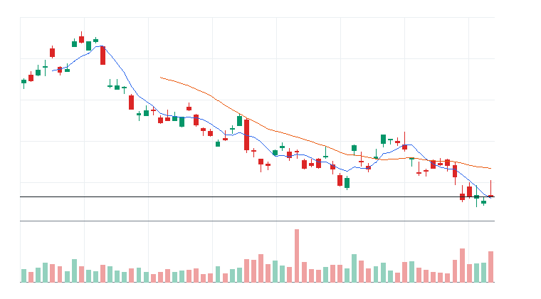
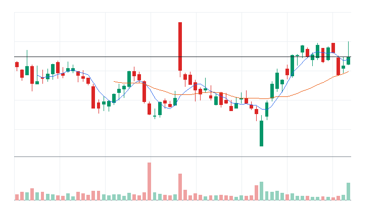

# 오늘의 데일리 트레이딩 요약

**REAL DATA TEST - 가격/거래량은 실제 데이터, 뉴스/ETF 구성종목 확산도/거래대금 유동성 일부 연결**

**목적:** 이 리포트는 최근 오른 자산을 나열하는 것이 아니라, 돈이 몰리는 근거와 다음 매수 주체가 확인할 트레이딩 후보를 찾기 위한 보고서다.

> 핵심 질문: 현재 가격에서 누가 사고 있고, 누가 앞으로 더 비싸게 사줄 수 있는가?

## 시장 국면 판단

- 최종 판정: 강세장 (82점)
- 전일 대비: 기간 조정에서 강세장으로 개선됐다(-1점).
- 판정 신뢰도: 높음 (100점) - 핵심 지수와 매크로 데이터가 대부분 직접 수집되어 판정 신뢰도가 높다.
- 행동 바이어스: 선별 매수 우위, 과열 추격만 제한
- 한 줄 결론: 기술적 추세가 강세장 조건에 가깝다. 매크로도 큰 부담은 제한적이다.
- 기술적 지표: 상승 추세 우위 (99점, 가중치 65%)
- S&P 500: 100점 | 50일선 위, 200일선 위, 20일 +3.36%, 60일 +5.00%, 52주 고점 대비 -1.39% -> 기술 점수 100
- Nasdaq 100: 97점 | 50일선 위, 200일선 위, 20일 +2.91%, 60일 +2.00%, 52주 고점 대비 -4.34% -> 기술 점수 97
- 매크로 시황: 매크로 중립-우호 (52점, 가중치 35%)
- 매크로 요약: 신용/유동성 중심으로 매크로가 위험자산에 우호적이다.
- 금리: 중립 50점 / 금리 중립 / confidence HIGH
  - 주요 근거: US 10Y yield 20일 데이터 없음, 5일 -0.62%; US 3M yield 20일 데이터 없음, 단기금리 방향 확인; US long-duration bonds 20일 -0.50%, 장기채 가격 기준 할인율 부담 확인
  - 확인 사항: 추가 확인 이벤트 없음
- 물가: 중립 48점 / 물가 중립 / confidence HIGH
  - 주요 근거: Oil ETF 20일 -0.58%, 유가 기반 물가 압력 확인; TIPS ETF 20일 -0.70%, 물가연동채 흐름은 보조 근거; Gold 20일 +9.16%, 금 강세는 방어 수요 여부 확인
  - 확인 사항: 금 강세가 인플레 헤지 또는 방어 수요일 수 있어 위험자산 해석을 제한한다.
- 정책: 중립 50점 / 정책 이벤트 확인 전 중립 / confidence LOW
  - 주요 근거: 정책 톤은 1차 버전에서 일정/이벤트 리스크 기반 중립값으로 반영한다.
  - 확인 사항: FOMC, CPI, PCE, 고용지표 발표 전후에는 매크로 confidence를 보수적으로 해석한다.
- 신용/유동성: 중립-우호 60점 / 신용/유동성 우호 / confidence HIGH
  - 주요 근거: High yield credit 20일 +0.04%, 하이일드 위험선호 확인; HYG-LQD 20일 상대강도 +0.96%, 신용위험 선호/회피 확인; VIX 20일 -20.67%, 변동성 부담 확인
  - 확인 사항: 추가 확인 이벤트 없음
- 환율/글로벌: 중립 54점 / 환율/글로벌 중립 / confidence MEDIUM
  - 주요 근거: US dollar 20일 -2.00%, 달러 강세/약세 확인
  - 확인 사항: 추가 확인 이벤트 없음
- US 10Y yield: 50점 | 하락 시 주식 우호; 5일 -0.62%, 20일 데이터 없음 -> 매크로 점수 50
- US 3M yield: 50점 | 하락 시 주식 우호; 5일 -0.19%, 20일 데이터 없음 -> 매크로 점수 50
- US long-duration bonds: 50점 | 상승 시 주식 우호; 5일 +1.11%, 20일 -0.50% -> 매크로 점수 50
- TIPS ETF: 50점 | 상승 시 주식 우호; 5일 +0.55%, 20일 -0.70% -> 매크로 점수 50
- Oil ETF: 49점 | 하락 시 주식 우호; 5일 +2.84%, 20일 -0.58% -> 매크로 점수 49
- Gold: 50점 | 상승 시 주식 우호; 5일 +2.20%, 20일 +9.16% -> 매크로 점수 50
- US dollar: 54점 | 하락 시 주식 우호; 5일 -1.13%, 20일 -2.00% -> 매크로 점수 54
- High yield credit: 50점 | 상승 시 주식 우호; 5일 +0.13%, 20일 +0.04% -> 매크로 점수 50
- Investment grade credit: 50점 | 상승 시 주식 우호; 5일 +0.42%, 20일 -0.92% -> 매크로 점수 50
- VIX: 81점 | 하락 시 주식 우호; 5일 +2.34%, 20일 -20.67% -> 매크로 점수 81
- 데이터 커버리지: 기술 2/2, 매크로 10/10
- 데이터 신뢰도 근거:
  - 직접 지수 데이터: S&P 500, Nasdaq 100
  - 대체 지수 데이터 없음
  - 매크로 데이터: 10/10
  - 누락 데이터 없음
  - stale 데이터 없음

## 모바일 요약

[오늘의 데일리 트레이딩 요약]

생성 성공 / 데이터 모드: REAL_TEST

시장:
- 중립

시장 지배 서사:
1. 매크로 방어/헤지 - 약화 - SPDR Gold Shares(GLD), iShares 20+ Year Treasury Bond ETF(TLT), Chevron(CVX), Exxon Mobil(XOM) 중심으로 5일 +2.77%, 20일 +6.64% 흐름이 형성됨. 뉴스 직접성 제한.
2. 바이오/헬스케어 촉매 - 약화 - Invesco QQQ Trust(QQQ), Vertex Pharmaceuticals Incorporated(VRTX), Regeneron Pharmaceuticals Inc.(REGN) 중심으로 5일 +2.88%, 20일 +16.36% 흐름이 형성됨. 뉴스 직접성 제한.
3. Integrated Oil & Gas 자금 유입 - 약화 - SPDR S&P 500 ETF Trust(SPY), iShares Russell 2000 ETF(IWM), Chevron(CVX), Exxon Mobil(XOM) 중심으로 5일 +1.64%, 20일 +5.47% 흐름이 형성됨. 뉴스 직접성 제한.

트렌드 강도:
1. 매크로 방어/헤지 - TSI 54 - 부상 - 진입품질 관찰
2. 바이오/헬스케어 촉매 - TSI 36 - 잠복 - 진입품질 낮음
3. Integrated Oil & Gas 자금 유입 - TSI 38 - 잠복 - 진입품질 낮음

오늘 결론:
- Energy 개별 종목 흐름이 ETF 대비 강한지 확인 필요
- 행동 후보는 linkedNarrative와 함께 확인한다.
- 추격보다 진입 조건 확인 후 접근한다.

오늘 실제 행동 후보:
1. Intuit Inc.(INTU)(STOCK) - AI 소프트웨어/사이버보안 확산 - 단기 추세가 유지되고 거래량이 1.0배 이상이면 눌림 이후 재상승을 시도할 수 있음
2. Atlassian Corporation(TEAM)(STOCK) - AI 소프트웨어/사이버보안 확산 - 단기 추세가 유지되고 거래량이 1.0배 이상이면 눌림 이후 재상승을 시도할 수 있음
3. Adobe Inc.(ADBE)(STOCK) - AI 소프트웨어/사이버보안 확산 - 단기 추세가 유지되고 거래량이 1.0배 이상이면 눌림 이후 재상승을 시도할 수 있음

다크호스 후보:
1. 다크호스 후보 없음 - 조건 충족 후보 없음

ETF 후보 TOP 5:
1. SPDR Gold Shares(GLD) - 매크로 방어/헤지 - 관찰
2. iShares Bitcoin Trust ETF(IBIT) - 비트코인/디지털 자산 위험선호 - 제외
3. iShares 20+ Year Treasury Bond ETF(TLT) - 매크로 방어/헤지 - 제외
4. Energy Select Sector SPDR Fund(XLE) - 매크로 방어/헤지 - 거래량 확인 전 관찰
5. ARK Innovation ETF(ARKK) - 위험선호 성장주 재진입 - 제외

웹 리포트:
https://yoolcool.github.io/DailyTradingThesisAgent/

## 오늘 결론

- 오늘 결론: 조건부 진입
- 신규 진입 후보: 0개
- 조건부 진입 후보: 5개
- 관찰 후보: 120개
- 주요 제한 요인: Entry Quality < 40, RVOL 미달, 뉴스 직접성 부족
- 주문 판단: 시장가 금지 / 지정가 또는 관찰
- 실전 판단: 진입 후보는 있으나, 전일 고점 돌파와 거래량 확인 후 선별적으로 접근한다.

### 후보 제한 요인 집계

- RVOL < 1.00x: 117개
- 거래대금 유동성 낮음: 17개
- Entry Quality 50~54 near miss: 0개
- Entry Quality 40~49 관찰: 3개
- Entry Quality < 40: 154개
- Exhaustion Risk >= 70: 0개
- ETF breadth 샘플 부족: 37개
- 뉴스 직접성 부족: 100개

## 데이터 신뢰도

- 전체 데이터 신뢰도 등급: LOW
- 분석 신뢰도: LOW
- 주문 실행 신뢰도: LOW
- ETF breadth 신뢰도: LOW
- 신뢰도 해석: 테마 확산 판단 제한, 거래대금 유동성 낮음 또는 확인 불가, 프리/애프터마켓 확인 불가
- 리포트 생성 시각: 2026-08-20 08:23 KST
- 가격 기준 거래일: 2026-08-19 US regular close
- 뉴스 수집 시각: 2026-08-20 08:23 KST
- 가장 최근 뉴스 발행 시각: 2026-08-20 08:10 KST
- 뉴스 신선도 상태: FRESH
- 뉴스 소스: Yahoo Finance RSS, MarketWatch RSS, CNBC Markets RSS, SEC EDGAR RSS, Federal Reserve RSS, Finnhub API
- 뉴스 소스 상태: Yahoo Finance RSS CONNECTED, MarketWatch RSS CONNECTED, CNBC Markets RSS PARTIAL, SEC EDGAR RSS PARTIAL, Federal Reserve RSS CONNECTED, Finnhub API DISABLED
- 뉴스 신뢰도: MEDIUM
- 추천 적용 거래일: 2026-08-19 US regular session
- 가격/거래량 데이터 상태: 연결됨
- 뉴스 데이터 상태: 일부 연결
- ETF 구성종목 확산도 상태: 일부 연결
- ETF 구성종목 샘플 수: 1~4
- 거래대금 유동성 데이터 상태: 일부 연결
- 프리/애프터마켓 데이터 상태: UNAVAILABLE
- 데이터 provider: yfinance, Yahoo Finance RSS, MarketWatch RSS, CNBC Markets RSS, SEC EDGAR RSS, Federal Reserve RSS, Finnhub API, config fallback sample, price-volume dollar-volume fallback
- 실전 사용 경고: 이 리포트는 투자판단 보조용이며, REAL_TEST 모드에서는 일부 데이터가 누락되거나 지연될 수 있다. 실제 주문 전 현재가, 뉴스, 프리마켓/정규장 거래량을 별도 확인해야 한다.

## 0. 시장 상태

- 데이터 모드: REAL_TEST
- 가격/거래량: 연결됨
- 뉴스: 일부 연결
- ETF 구성종목 확산도: 일부 연결
- 거래대금 유동성: 일부 연결
- 생성 시각: 2026년 8월 20일 목요일 AM 8:23
- 시장 상태: 중립
- 오늘 돈의 방향: Energy 개별 종목 흐름이 ETF 대비 강한지 확인 필요
- 강한 테마 TOP 3: 혁신 성장 ETF(77), Materials(72), 금속/광산 ETF(71)
- 데이터 한계:
  - API 또는 provider 상태에 따라 뉴스/ETF 확산도/거래대금 유동성 반영 범위가 달라질 수 있다.
  - 수집 실패 데이터는 점수 반영에서 제외하거나 confidence를 제한한다.
  - reasonConfidence HIGH는 직접 촉매, 가격/거래량, 확산도/유동성 근거가 함께 있을 때만 사용한다.

## 오늘 시장을 지배하는 서사

### 오늘 시장을 지배하는 서사 TOP 3

#### 1. 매크로 방어/헤지
- 상태: 약화
- narrativeScore: 49
- reasonConfidence: LOW
- 근거 ETF: GLD, TLT, XLE
- 근거 개별 종목: CVX, XOM
- 돈이 몰리는 이유: 매크로 방어/헤지 관련 SPDR Gold Shares(GLD), iShares 20+ Year Treasury Bond ETF(TLT), Energy Select Sector SPDR Fund(XLE)와 Chevron(CVX), Exxon Mobil(XOM)의 5일(+2.77%)·20일(+6.64%) 흐름을 함께 본다. 평균 상대 거래량은 1.14배이고, ETF 확산도는 추가 확인이 필요하다. 뉴스 직접성은 아직 제한적이다.
- 다음 매수 주체: 금리/에너지/방어 헤지를 찾는 매크로 자금
- 가장 좋은 트레이딩 수단: ETF 우선: GLD, TLT, XLE / 개별 종목 우선: XOM, CVX
- 서사가 깨지는 조건: 방어 ETF 상대강도 둔화와 위험선호 성장주 재강세
- 오늘 행동: 위험회피가 확인될 때만 헤지성 접근

상세 narrativeScore 근거 보기

- rawScore: 49
- ETF 평균 moneyFlowScore: 43
- 개별 종목 평균 moneyFlowScore: 53
- ETF 후보 비율: 25%
- 개별 종목 후보 비율: 50%
- 5일 평균 수익률: +3.00%
- 20일 평균 수익률: +7.00%
- 평균 상대 거래량: 1.00배
- ETF 평균 상대 거래량: 1.00배
- 개별주 평균 상대 거래량: 1.00배
- 52주 고점 근접 후보 비율: 33%
- 뉴스 직접성 점수: 7
- ETF 확산도 점수: 0
- 유동성 점수: 3
- 과열 리스크 차감: 0

#### 2. 바이오/헬스케어 촉매
- 상태: 약화
- narrativeScore: 40
- reasonConfidence: LOW
- 근거 ETF: QQQ
- 근거 개별 종목: VRTX, REGN, AMGN, INSM
- 돈이 몰리는 이유: 바이오/헬스케어 촉매 관련 Invesco QQQ Trust(QQQ)와 Vertex Pharmaceuticals Incorporated(VRTX), Regeneron Pharmaceuticals Inc.(REGN), Amgen Inc.(AMGN), Insmed Incorporated(INSM)의 5일(+2.88%)·20일(+16.36%) 흐름을 함께 본다. 평균 상대 거래량은 0.84배이고, ETF 확산도는 추가 확인이 필요하다. 뉴스 직접성은 아직 제한적이다.
- 다음 매수 주체: 바이오/헬스케어 촉매을 확인한 섹터 ETF 자금과 상대강도 추종 스윙 자금
- 가장 좋은 트레이딩 수단: ETF 우선: QQQ / 개별 종목 우선: REGN, AMGN, VRTX
- 서사가 깨지는 조건: QQQ 20일선 이탈 또는 관련 종목 절반 이상 5일선 이탈
- 오늘 행동: 기존 네러티브와 중복을 확인한 뒤 ETF/대표 종목 동조성이 살아날 때만 관찰 편입

상세 narrativeScore 근거 보기

- rawScore: 40
- ETF 평균 moneyFlowScore: 17
- 개별 종목 평균 moneyFlowScore: 63
- ETF 후보 비율: 0%
- 개별 종목 후보 비율: 0%
- 5일 평균 수익률: +3.00%
- 20일 평균 수익률: +16.00%
- 평균 상대 거래량: 1.00배
- ETF 평균 상대 거래량: 1.00배
- 개별주 평균 상대 거래량: 1.00배
- 52주 고점 근접 후보 비율: 80%
- 뉴스 직접성 점수: 8
- ETF 확산도 점수: -4
- 유동성 점수: 3
- 과열 리스크 차감: -2

#### 3. Integrated Oil & Gas 자금 유입
- 상태: 약화
- narrativeScore: 40
- reasonConfidence: LOW
- 근거 ETF: SPY, IWM, QQQ
- 근거 개별 종목: CVX, XOM
- 돈이 몰리는 이유: Integrated Oil & Gas 자금 유입 관련 SPDR S&P 500 ETF Trust(SPY), iShares Russell 2000 ETF(IWM), Invesco QQQ Trust(QQQ)와 Chevron(CVX), Exxon Mobil(XOM)의 5일(+1.64%)·20일(+5.47%) 흐름을 함께 본다. 평균 상대 거래량은 0.86배이고, ETF 확산도는 추가 확인이 필요하다. 뉴스 직접성은 아직 제한적이다.
- 다음 매수 주체: Integrated Oil & Gas 자금 유입을 확인한 섹터 ETF 자금과 상대강도 추종 스윙 자금
- 가장 좋은 트레이딩 수단: ETF 우선: QQQ, SPY, IWM / 개별 종목 우선: CVX, XOM
- 서사가 깨지는 조건: QQQ 20일선 이탈 또는 관련 종목 절반 이상 5일선 이탈
- 오늘 행동: 기존 네러티브와 중복을 확인한 뒤 ETF/대표 종목 동조성이 살아날 때만 관찰 편입

상세 narrativeScore 근거 보기

- rawScore: 40
- ETF 평균 moneyFlowScore: 28
- 개별 종목 평균 moneyFlowScore: 53
- ETF 후보 비율: 0%
- 개별 종목 후보 비율: 50%
- 5일 평균 수익률: +2.00%
- 20일 평균 수익률: +5.00%
- 평균 상대 거래량: 1.00배
- ETF 평균 상대 거래량: 1.00배
- 개별주 평균 상대 거래량: 1.00배
- 52주 고점 근접 후보 비율: 71%
- 뉴스 직접성 점수: 6
- ETF 확산도 점수: -1
- 유동성 점수: 3
- 과열 리스크 차감: 0

### 전체 narrative 요약

| 서사명 | 상태 | narrativeScore | reasonConfidence | 대표 ETF | 대표 종목 | 오늘 행동 |
| --- | --- | ---: | --- | --- | --- | --- |
| 매크로 방어/헤지 | 약화 | 49 | LOW | GLD, TLT, XLE | CVX, XOM | 위험회피가 확인될 때만 헤지성 접근 |
| 바이오/헬스케어 촉매 | 약화 | 40 | LOW | QQQ | VRTX, REGN, AMGN, INSM | 기존 네러티브와 중복을 확인한 뒤 ETF/대표 종목 동조성이 살아날 때만 관찰 편입 |
| Integrated Oil & Gas 자금 유입 | 약화 | 40 | LOW | SPY, IWM, QQQ | CVX, XOM | 기존 네러티브와 중복을 확인한 뒤 ETF/대표 종목 동조성이 살아날 때만 관찰 편입 |
| AI 소프트웨어/사이버보안 확산 | 약화 | 36 | LOW | IGV, QQQ, AIQ | TEAM, PLTR, MSFT, DDOG | 추격보다 눌림 후 재상승 확인 |
| 소프트웨어 실적/AI 수익화 | 약화 | 35 | LOW | IGV, MAGS, QQQ | MSTR, MSFT, SHOP | 기존 네러티브와 중복을 확인한 뒤 ETF/대표 종목 동조성이 살아날 때만 관찰 편입 |
| Travel Services 자금 유입 | 약화 | 34 | LOW | QQQ | ABNB, BKNG | 기존 네러티브와 중복을 확인한 뒤 ETF/대표 종목 동조성이 살아날 때만 관찰 편입 |
| Specialty Business Services 자금 유입 | 약화 | 30 | LOW | SPY, IWM, QQQ | CPRT, TRI, CTAS | 기존 네러티브와 중복을 확인한 뒤 ETF/대표 종목 동조성이 살아날 때만 관찰 편입 |
| 비트코인/디지털 자산 위험선호 | 소멸 | 29 | LOW | IBIT, BLOK | MSTR, COIN, IREN | 비트코인 베타가 살아날 때만 단기 매매 |
| 위험선호 성장주 재진입 | 약화 | 28 | LOW | ARKK, QQQ, IPO | COIN, TSLA, ARM | 지수 위험선호가 유지될 때만 선별 진입 |
| Aerospace & Defense 자금 유입 | 약화 | 26 | LOW | SPY, IWM, QQQ | AXON, KTOS, AVAV | 기존 네러티브와 중복을 확인한 뒤 ETF/대표 종목 동조성이 살아날 때만 관찰 편입 |
| 방산/안보 프리미엄 | 약화 | 17 | LOW | XAR, SHLD, ITA | PLTR, KTOS, AVAV | 뉴스 촉매가 직접 확인될 때만 추세 추종 |
| 소비 회복/방어주 선별 | 약화 | 14 | LOW | QQQ | PDD, AMZN | 기존 네러티브와 중복을 확인한 뒤 ETF/대표 종목 동조성이 살아날 때만 관찰 편입 |
| Data Storage 자금 유입 | 소멸 | 13 | LOW | SPY, IWM, QQQ | STX, WDC | 기존 네러티브와 중복을 확인한 뒤 ETF/대표 종목 동조성이 살아날 때만 관찰 편입 |
| 전력망/원전/인프라 병목 | 약화 | 12 | LOW | COPX, URA, GRID | FCX, PWR, CEG, VRT | ETF 확산도와 거래량이 같이 살아날 때만 진입 |
| 사이버보안 지출 재가속 | 약화 | 10 | LOW | HACK, CIBR, IHAK | ZS, CRWD, PANW | 기존 네러티브와 중복을 확인한 뒤 ETF/대표 종목 동조성이 살아날 때만 관찰 편입 |
| 전력 유틸리티 수요 재평가 | 약화 | 10 | LOW | SPY, IWM, QQQ | ETN, GEV, VRT | 기존 네러티브와 중복을 확인한 뒤 ETF/대표 종목 동조성이 살아날 때만 관찰 편입 |
| Internet Content 자금 유입 | 약화 | 10 | LOW | QQQ | DASH, META | 기존 네러티브와 중복을 확인한 뒤 ETF/대표 종목 동조성이 살아날 때만 관찰 편입 |
| 반도체 설계/공급망 재가속 | 소멸 | 0 | LOW | SMH, SOXX, SOXQ | MRVL, ARM, AMD, TXN | 기존 네러티브와 중복을 확인한 뒤 ETF/대표 종목 동조성이 살아날 때만 관찰 편입 |
| AI 인프라 재가속 | 약화 | 0 | LOW | DRAM, SMH, SOXX | NVDA, MU, VRT, ETN | 추격보다 5일선 지지 후 재상승 확인 |
| 필수소비재 음료 방어 성장 | 소멸 | 0 | LOW | QQQ | MNST, CCEP | 기존 네러티브와 중복을 확인한 뒤 ETF/대표 종목 동조성이 살아날 때만 관찰 편입 |
| 반도체 장비 사이클 재평가 | 소멸 | 0 | LOW | SMH, SOXX, SOXQ | AMAT, LRCX, ASML | 기존 네러티브와 중복을 확인한 뒤 ETF/대표 종목 동조성이 살아날 때만 관찰 편입 |

## 트렌드 강도 판단

### 1. 매크로 방어/헤지
- Trend Strength Index: 54
- 트렌드 상태 라벨: 부상
- 테마 확산도: 보통
- ETF 동조성: 강함
- 거래량 강도: 약함
- 과열 위험: 낮음 (3)
- 오늘 진입 품질: 관찰 (40)
- 한 줄 판단: 매크로 방어/헤지는 Trend Strength는 중간이지만 진입 품질이 살아나는 초기 진입 후보 성격이다.
- 오늘 접근법: SPDR Gold Shares(GLD)/iShares 20+ Year Treasury Bond ETF(TLT)/Energy Select Sector SPDR Fund(XLE) 거래량 증가와 Chevron(CVX)/Exxon Mobil(XOM) 확산을 확인하며 작은 사이즈의 초기 진입 후보로만 본다.

트렌드 강도 상세 근거 보기

- 가격 모멘텀: 가격 모멘텀 12/25. 평균 5D +2.77%, 20D +6.64%.
- 거래량 강도: 거래량 강도 9/20. 평균 RVOL 1.14배.
- ETF 동조성: ETF 동조성 14/15. 관련 ETF SPDR Gold Shares(GLD), iShares 20+ Year Treasury Bond ETF(TLT), Energy Select Sector SPDR Fund(XLE), VanEck Oil Services ETF(OIH) 흐름을 기준으로 판단.
- 테마 확산도: 테마 확산도 13/20. 상위 1~2개 쏠림 감점 0점 반영.
- 뉴스 촉매: 뉴스/촉매 신선도 2/10. HIGH 직접 촉매 0개.
- 과열 리스크: 과열 리스크 3/100. 단기 급등, 고점 근접, ETF-개별주 괴리, 쏠림을 함께 반영.
- 시장 환경: 시장 환경 4/10. QQQ/SPY/IWM 가격 흐름 기반 위험선호 점수.

### 2. 바이오/헬스케어 촉매
- Trend Strength Index: 36
- 트렌드 상태 라벨: 잠복
- 테마 확산도: 약함
- ETF 동조성: 부족
- 거래량 강도: 부족
- 과열 위험: 보통 (43)
- 오늘 진입 품질: 낮음 (15)
- 한 줄 판단: 바이오/헬스케어 촉매는 ETF 동조성이 약해 테마 자금 확인이 부족하다.
- 오늘 접근법: Invesco QQQ Trust(QQQ)와 Vertex Pharmaceuticals Incorporated(VRTX)/Regeneron Pharmaceuticals Inc.(REGN)/Amgen Inc.(AMGN)의 거래량 확산이 확인되기 전까지 관찰한다.

트렌드 강도 상세 근거 보기

- 가격 모멘텀: 가격 모멘텀 16/25. 평균 5D +2.88%, 20D +16.36%.
- 거래량 강도: 거래량 강도 4/20. 평균 RVOL 0.84배.
- ETF 동조성: ETF 동조성 2/15. 관련 ETF Invesco QQQ Trust(QQQ) 흐름을 기준으로 판단.
- 테마 확산도: 테마 확산도 9/20. 상위 1~2개 쏠림 감점 3점 반영.
- 뉴스 촉매: 뉴스/촉매 신선도 1/10. HIGH 직접 촉매 0개.
- 과열 리스크: 과열 리스크 43/100. 단기 급등, 고점 근접, ETF-개별주 괴리, 쏠림을 함께 반영.
- 시장 환경: 시장 환경 4/10. QQQ/SPY/IWM 가격 흐름 기반 위험선호 점수.

### 3. Integrated Oil & Gas 자금 유입
- Trend Strength Index: 38
- 트렌드 상태 라벨: 잠복
- 테마 확산도: 보통
- ETF 동조성: 보통
- 거래량 강도: 부족
- 과열 위험: 낮음 (8)
- 오늘 진입 품질: 낮음 (26)
- 한 줄 판단: Integrated Oil & Gas 자금 유입는 관찰 가능한 흐름은 있으나 가격, 거래량, 확산도 중 일부 확인이 더 필요하다.
- 오늘 접근법: SPDR S&P 500 ETF Trust(SPY)/iShares Russell 2000 ETF(IWM)/Invesco QQQ Trust(QQQ)와 Chevron(CVX)/Exxon Mobil(XOM)의 거래량 확산이 확인되기 전까지 관찰한다.

트렌드 강도 상세 근거 보기

- 가격 모멘텀: 가격 모멘텀 9/25. 평균 5D +1.64%, 20D +5.47%.
- 거래량 강도: 거래량 강도 4/20. 평균 RVOL 0.86배.
- ETF 동조성: ETF 동조성 9/15. 관련 ETF Invesco QQQ Trust(QQQ), SPDR S&P 500 ETF Trust(SPY), iShares Russell 2000 ETF(IWM), Energy Select Sector SPDR Fund(XLE), VanEck Oil Services ETF(OIH) 흐름을 기준으로 판단.
- 테마 확산도: 테마 확산도 11/20. 상위 1~2개 쏠림 감점 0점 반영.
- 뉴스 촉매: 뉴스/촉매 신선도 1/10. HIGH 직접 촉매 0개.
- 과열 리스크: 과열 리스크 8/100. 단기 급등, 고점 근접, ETF-개별주 괴리, 쏠림을 함께 반영.
- 시장 환경: 시장 환경 4/10. QQQ/SPY/IWM 가격 흐름 기반 위험선호 점수.

## 최근 추천 결과 트래킹

개별주는 데이트레이딩 관점으로 추천 이후 첫 정규장의 장중 최고가와 종가를 추적한다. ETF는 테마/스윙 관점으로 추천 이후 1주일 동안의 최고가와 현재 종가를 추적한다.

### 개별주 Top 3 추천 성과 요약
- 최근 5개 리포트 표본: 12개 (초기 검증 단계)
- 장중 최고가 기준 성공률: +11.11%
- 종가 기준 성공률: +11.11%
- 평균 장중 최고 수익률: +1.02%
- 평균 종가 수익률: -2.39%

### ETF 추천 성과 요약
- 최근 5개 리포트 표본: 2개 (초기 검증 단계)
- 1주 최고가 기준 성공률: 0.00%
- 현재 종가 기준 성공률: 0.00%
- 평균 1주 최고 수익률: -2.27%
- 평균 현재 수익률: -4.89%

최근 추천 결과 상세 테이블 펼치기

| 추천일 | 유형 | 순위 | 티커 | 기준가 | 추적 기간 | 상태 | High 수익률 | Close 수익률 | 결과 | 코멘트 |
| --- | --- | ---: | --- | ---: | --- | --- | ---: | ---: | --- | --- |
| 2026-08-20 | STOCK | 3 | ADBE | $272.47 | 2026-08-20 | pending | 데이터 없음 | 데이터 없음 | 추적 대기 | 아직 추적 거래일 데이터가 완성되지 않음 |
| 2026-08-20 | STOCK | 2 | TEAM | $174.23 | 2026-08-20 | pending | 데이터 없음 | 데이터 없음 | 추적 대기 | 아직 추적 거래일 데이터가 완성되지 않음 |
| 2026-08-20 | STOCK | 1 | INTU | $362.47 | 2026-08-20 | pending | 데이터 없음 | 데이터 없음 | 추적 대기 | 아직 추적 거래일 데이터가 완성되지 않음 |
| 2026-08-18 | STOCK | 2 | CPRT | $31.7 | 2026-08-18 | complete | +5.84% | -0.60% | 단타 유효 | 장중 기회는 있었지만 종가 유지력은 약함 (일봉 기준) |
| 2026-08-18 | STOCK | 1 | PWR | $722.31 | 2026-08-18 | complete | -1.43% | -3.62% | 실패 | 추천 이후 의미 있는 장중 기회가 부족하고 종가도 약함 (일봉 기준) |
| 2026-08-17 | STOCK | 3 | WDAY | $198.68 | 2026-08-17 | complete | -1.69% | -3.77% | 실패 | 추천 이후 의미 있는 장중 기회가 부족하고 종가도 약함 (일봉 기준) |
| 2026-08-17 | STOCK | 2 | AVAV | $192.81 | 2026-08-17 | complete | -0.43% | -6.06% | 실패 | 추천 이후 의미 있는 장중 기회가 부족하고 종가도 약함 (일봉 기준) |
| 2026-08-17 | STOCK | 1 | KTOS | $64.58 | 2026-08-17 | complete | +0.79% | -2.00% | 실패 | 추천 이후 의미 있는 장중 기회가 부족하고 종가도 약함 (일봉 기준) |
| 2026-08-14 | STOCK | 3 | ADSK | $257.96 | 2026-08-14 | complete | +1.08% | -2.44% | 제한적 유효 | 제한적인 장중 기회만 발생 (일봉 기준) |
| 2026-08-14 | STOCK | 2 | TEAM | $165.98 | 2026-08-14 | complete | +1.07% | -2.27% | 제한적 유효 | 제한적인 장중 기회만 발생 (일봉 기준) |
| 2026-08-14 | STOCK | 1 | INTU | $358.29 | 2026-08-14 | complete | +1.04% | -3.53% | 제한적 유효 | 제한적인 장중 기회만 발생 (일봉 기준) |
| 2026-08-14 | ETF | 2 | IGV | $106.28 | 2026-08-14~2026-08-21 | in_progress | -2.05% | -3.26% | 진행 중 | 아직 1주 추적 기간이 끝나지 않음 |
| 2026-08-14 | ETF | 1 | CIBR | $102.2 | 2026-08-14~2026-08-21 | in_progress | -2.50% | -6.52% | 진행 중 | 아직 1주 추적 기간이 끝나지 않음 |
| 2026-08-13 | STOCK | 1 | ABNB | $180.1 | 2026-08-13 | complete | +2.91% | +2.80% | 제한적 유효 | 제한적인 장중 기회만 발생 (일봉 기준) |
| 2026-08-12 | STOCK | 3 | ABNB | $184.98 | 2026-08-12 | complete | -0.47% | -2.64% | 실패 | 추천 이후 의미 있는 장중 기회가 부족하고 종가도 약함 (일봉 기준) |
| 2026-08-12 | STOCK | 2 | AXON | $636.31 | 2026-08-12 | complete | +1.00% | -5.74% | 제한적 유효 | 제한적인 장중 기회만 발생 (일봉 기준) |
| 2026-08-12 | STOCK | 1 | FAST | $52.38 | 2026-08-12 | complete | +0.84% | -0.31% | 실패 | 추천 이후 의미 있는 장중 기회가 부족하고 종가도 약함 (일봉 기준) |
| 2026-08-11 | STOCK | 3 | ZS | $176.68 | 2026-08-11 | complete | +2.33% | +1.06% | 제한적 유효 | 제한적인 장중 기회만 발생 (일봉 기준) |
| 2026-08-11 | STOCK | 2 | PLTR | $175.23 | 2026-08-11 | complete | +1.55% | -0.17% | 제한적 유효 | 제한적인 장중 기회만 발생 (일봉 기준) |
| 2026-08-11 | STOCK | 1 | TEAM | $151.87 | 2026-08-11 | complete | +2.86% | +1.46% | 제한적 유효 | 제한적인 장중 기회만 발생 (일봉 기준) |
| 2026-08-11 | ETF | 3 | GLD | $402.54 | 2026-08-11~2026-08-18 | complete | +1.20% | +2.81% | 진행 중 | 아직 1주 추적 기간이 끝나지 않음 |
| 2026-08-11 | ETF | 2 | OIH | $411.34 | 2026-08-11~2026-08-18 | complete | +4.23% | +1.79% | 성공 | 추천 이후 테마 추세가 유지됨 |
| 2026-08-11 | ETF | 1 | CIBR | $100.6 | 2026-08-11~2026-08-18 | complete | +1.74% | -5.03% | 실패 | 추천 이후 ETF 흐름이 약화됨 |
| 2026-08-10 | STOCK | 3 | SHOP | $151.57 | 2026-08-10 | complete | +2.67% | +2.38% | 제한적 유효 | 제한적인 장중 기회만 발생 (일봉 기준) |
| 2026-08-10 | STOCK | 2 | FAST | $51.84 | 2026-08-10 | complete | +0.75% | +0.60% | 추적 대기 | 아직 추적 거래일 데이터가 완성되지 않음 (일봉 기준) |
| 2026-08-10 | STOCK | 1 | BKNG | $214.42 | 2026-08-10 | complete | +0.48% | -0.72% | 실패 | 추천 이후 의미 있는 장중 기회가 부족하고 종가도 약함 (일봉 기준) |
| 2026-08-10 | ETF | 2 | XME | $115.74 | 2026-08-10~2026-08-17 | complete | +3.45% | +1.15% | 성공 | 추천 이후 테마 추세가 유지됨 |
| 2026-08-10 | ETF | 1 | COPX | $88.03 | 2026-08-10~2026-08-17 | complete | +2.52% | +0.28% | 단기 고점 후 반납 | 1주 내 상승 기회는 있었지만 현재가는 반납 |
| 2026-08-07 | STOCK | 3 | KTOS | $57.41 | 2026-08-07 | complete | +6.41% | +5.85% | 성공 | 장중 기회와 종가 유지가 모두 확인됨 (일봉 기준) |
| 2026-08-07 | STOCK | 2 | BKNG | $207.39 | 2026-08-07 | complete | +4.00% | +3.39% | 성공 | 장중 기회와 종가 유지가 모두 확인됨 (일봉 기준) |
| 2026-08-07 | STOCK | 1 | SHOP | $147.44 | 2026-08-07 | complete | +3.67% | +2.80% | 성공 | 장중 기회와 종가 유지가 모두 확인됨 (일봉 기준) |
| 2026-08-06 | STOCK | 3 | KTOS | $55.34 | 2026-08-06 | complete | +6.79% | +3.74% | 성공 | 장중 기회와 종가 유지가 모두 확인됨 (일봉 기준) |
| 2026-08-06 | STOCK | 2 | AMGN | $407.83 | 2026-08-06 | complete | +2.59% | -0.73% | 제한적 유효 | 제한적인 장중 기회만 발생 (일봉 기준) |
| 2026-08-06 | STOCK | 1 | TEAM | $113.32 | 2026-08-06 | complete | -2.15% | -2.78% | 실패 | 추천 이후 의미 있는 장중 기회가 부족하고 종가도 약함 (일봉 기준) |
| 2026-08-06 | ETF | 2 | XME | $111.92 | 2026-08-06~2026-08-13 | complete | +6.98% | +4.60% | 성공 | 추천 이후 테마 추세가 유지됨 |
| 2026-08-06 | ETF | 1 | COPX | $86.72 | 2026-08-06~2026-08-13 | complete | +4.07% | +1.80% | 성공 | 추천 이후 테마 추세가 유지됨 |
| 2026-08-05 | STOCK | 3 | DXCM | $86.94 | 2026-08-05 | complete | -0.54% | -4.92% | 실패 | 추천 이후 의미 있는 장중 기회가 부족하고 종가도 약함 (일봉 기준) |
| 2026-08-05 | STOCK | 2 | DDOG | $288.15 | 2026-08-05 | complete | +1.59% | -1.73% | 제한적 유효 | 제한적인 장중 기회만 발생 (일봉 기준) |
| 2026-08-05 | STOCK | 1 | MSFT | $492.81 | 2026-08-05 | complete | +1.10% | -1.09% | 제한적 유효 | 제한적인 장중 기회만 발생 (일봉 기준) |
| 2026-08-05 | ETF | 3 | MAGS | $68.96 | 2026-08-05~2026-08-12 | complete | +0.81% | -1.89% | 실패 | 추천 이후 ETF 흐름이 약화됨 |
| 2026-08-05 | ETF | 2 | COPX | $83.99 | 2026-08-05~2026-08-12 | complete | +7.45% | +5.11% | 성공 | 추천 이후 테마 추세가 유지됨 |
| 2026-08-05 | ETF | 1 | CIBR | $97.94 | 2026-08-05~2026-08-12 | complete | +3.31% | -2.45% | 단기 고점 후 반납 | 1주 내 상승 기회는 있었지만 현재가는 반납 |
| 2026-08-04 | STOCK | 3 | MSFT | $487.65 | 2026-08-04 | complete | +2.42% | +1.06% | 제한적 유효 | 제한적인 장중 기회만 발생 (일봉 기준) |
| 2026-08-04 | STOCK | 2 | AMZN | $284.02 | 2026-08-04 | complete | -1.04% | -2.32% | 실패 | 추천 이후 의미 있는 장중 기회가 부족하고 종가도 약함 (일봉 기준) |
| 2026-08-04 | STOCK | 1 | DDOG | $273.6 | 2026-08-04 | complete | +5.96% | +5.32% | 성공 | 장중 기회와 종가 유지가 모두 확인됨 (일봉 기준) |
| 2026-08-04 | ETF | 1 | MAGS | $68.38 | 2026-08-04~2026-08-11 | complete | +1.80% | -1.05% | 진행 중 | 아직 1주 추적 기간이 끝나지 않음 |
| 2026-08-03 | STOCK | 3 | DXCM | $83.45 | 2026-08-03 | complete | +5.01% | +4.63% | 성공 | 장중 기회와 종가 유지가 모두 확인됨 (일봉 기준) |
| 2026-08-03 | STOCK | 2 | REGN | $762.63 | 2026-08-03 | complete | +1.33% | -0.44% | 제한적 유효 | 제한적인 장중 기회만 발생 (일봉 기준) |
| 2026-08-03 | STOCK | 1 | MSFT | $464.72 | 2026-08-03 | complete | +5.79% | +4.93% | 성공 | 장중 기회와 종가 유지가 모두 확인됨 (일봉 기준) |
| 2026-07-31 | STOCK | 2 | REGN | $738.34 | 2026-07-31 | pending | +3.58% | +3.29% | 추적 대기 | 아직 추적 거래일 데이터가 완성되지 않음 |
| 2026-07-31 | STOCK | 1 | MSFT | $451.1 | 2026-07-31 | complete | +3.49% | +3.02% | 성공 | 장중 기회와 종가 유지가 모두 확인됨 (일봉 기준) |
| 2026-07-30 | STOCK | 3 | WDAY | $168.01 | 2026-07-30 | complete | -4.18% | -5.89% | 실패 | 추천 이후 의미 있는 장중 기회가 부족하고 종가도 약함 (일봉 기준) |
| 2026-07-30 | STOCK | 2 | ADBE | $263.43 | 2026-07-30 | complete | -3.09% | -5.90% | 실패 | 추천 이후 의미 있는 장중 기회가 부족하고 종가도 약함 (일봉 기준) |
| 2026-07-30 | STOCK | 1 | MDLZ | $64.99 | 2026-07-30 | complete | -1.65% | -2.94% | 실패 | 추천 이후 의미 있는 장중 기회가 부족하고 종가도 약함 (일봉 기준) |
| 2026-07-29 | STOCK | 3 | ADBE | $249.18 | 2026-07-29 | complete | +6.86% | +5.72% | 성공 | 장중 기회와 종가 유지가 모두 확인됨 (일봉 기준) |
| 2026-07-29 | STOCK | 2 | TEAM | $99.98 | 2026-07-29 | complete | +6.74% | +4.30% | 성공 | 장중 기회와 종가 유지가 모두 확인됨 (일봉 기준) |
| 2026-07-29 | STOCK | 1 | RTX | $218.58 | 2026-07-29 | complete | +0.91% | -1.52% | 실패 | 추천 이후 의미 있는 장중 기회가 부족하고 종가도 약함 (일봉 기준) |
| 2026-07-28 | STOCK | 1 | RTX | $218.42 | 2026-07-28 | complete | +1.34% | +0.07% | 제한적 유효 | 제한적인 장중 기회만 발생 (일봉 기준) |
| 2026-07-27 | STOCK | 2 | LMT | $582.6 | 2026-07-27 | complete | +0.93% | -0.45% | 실패 | 추천 이후 의미 있는 장중 기회가 부족하고 종가도 약함 (일봉 기준) |
| 2026-07-27 | STOCK | 1 | RTX | $212.79 | 2026-07-27 | complete | +3.57% | +2.65% | 성공 | 장중 기회와 종가 유지가 모두 확인됨 (일봉 기준) |

## 오늘 실제 행동 후보

### 1. Intuit Inc.(INTU)
- 자산 유형: STOCK
- linkedNarrative: AI 소프트웨어/사이버보안 확산
- narrativeStatus: 약화
- narrativeScore: 36
- Trend Strength Index: 33
- Exhaustion Risk: 21 (낮음)
- Entry Quality Score: 39 (낮음)
- 트렌드 판단: 시장 위험선호가 약해 시장 환경 비우호 구간이다.
- moneyFlowScore: 96
- finalRawScore: 96
- reasonConfidence: MEDIUM
- reasonConfidenceExplanation: 직접 촉매 부재 때문에 HIGH가 아니라 MEDIUM으로 제한했다.
- tieBreakerReason: 최종 원점수 96, 리스크 패널티 0, 5일 수익률 +8.29%, 상대 거래량 1.04배 순으로 정렬
- 후보별 시장 해석: 중립 / 제한적 - Entry Quality 39 < 50이나 moneyFlow 96, confidence MEDIUM, RVOL 1.04x로 강한 자금흐름 예외 조건 충족
- 게이트 사유: Entry Quality 39 < 50이나 moneyFlow 96, confidence MEDIUM, RVOL 1.04x로 강한 자금흐름 예외 조건 충족
- 주문 실행: 시장가 가능

- 왜 돈이 몰리는가: 20일 +27.42%, 5일 +8.29%, 상대 거래량 1.04배로 가격과 거래량이 함께 개선. 뉴스: CNBC Markets RSS regulation/under_6h / 유동성: LIQUID
- 누가 더 비싸게 사줄 수 있는지: 개별 주도주를 따라붙는 단기 모멘텀 자금과 관련 ETF 강세를 확인한 트레이더
- 진입 조건: 20일선 위 눌림 후 재상승 확인
- 무효화 조건: 20일선 이탈 또는 상대 거래량 0.8배 이하 둔화
- todayActionLabel: 자금흐름 예외 조건부
#### 최근 뉴스/동향 한국어 요약

- 요약: 종목 직접 뉴스 확인 상태이며 뉴스 흐름은 긍정 우위입니다. 후보 선정 후 재확인한 핵심 이슈는 "Intuit (INTU) Earnings Expected to Grow: Should You Buy?"입니다.
- 직접 촉매 판단: Intuit Inc.에 대해 직접 촉매로 분류된 뉴스가 확인됐습니다. 핵심은 "Intuit (INTU) Earnings Expected to Grow: Should You Buy?"이며, 실적 재료로 봅니다.
- 뉴스 1: Intuit (INTU) Earnings Expected to Grow: Should You Buy?
  - 내용: Intuit Inc. 관련 실적 뉴스입니다. 기사 스니펫상 핵심 내용은 Intuit (INTU) possesses the right combination of the two key ingredients for a likely earnings beat in its upcoming report.입니다.
  - 투자 의미: 실적/가이던스 재료는 다음 분기 기대치 변화로 이어질 수 있어 컨센서스 변화와 주가 반응 지속성을 함께 봅니다.
  - 확인할 점: 매출/마진/가이던스 수치, 컨센서스 대비 차이
- 뉴스 2: 3 Reasons Why Growth Investors Shouldn't Overlook Intuit (INTU)
  - 내용: Intuit Inc. 관련 시장 일반 뉴스입니다. 기사 스니펫상 핵심 내용은 Intuit (INTU) could produce exceptional returns because of its solid growth attributes.입니다.
  - 투자 의미: 단기 긍정 뉴스 흐름으로 볼 수 있지만, 단독 매수 근거보다는 가격·거래량 조건을 확인하는 보조 근거로 사용합니다.
  - 확인할 점: 원문 수치, 후속 보도, 가격이 진입 조건을 지키는지
- 뉴스 3: Brokers Suggest Investing in Intuit (INTU): Read This Before Placing a Bet
  - 내용: Intuit Inc. 관련 시장 일반 뉴스입니다. 기사 스니펫상 핵심 내용은 The average brokerage recommendation (ABR) for Intuit (INTU) is equivalent to a Buy.입니다.
  - 투자 의미: 단기 중립 뉴스 흐름으로 볼 수 있지만, 단독 매수 근거보다는 가격·거래량 조건을 확인하는 보조 근거로 사용합니다.
  - 확인할 점: 원문 수치, 후속 보도, 가격이 진입 조건을 지키는지
- 매매 해석: 매매 관점에서는 뉴스 자체보다 가격이 진입 조건을 지키는지, 거래량이 동반되는지, 그리고 뉴스가 이미 주가에 반영됐는지를 우선 확인해야 합니다.
- 차트: 

### 2. Atlassian Corporation(TEAM)
- 자산 유형: STOCK
- linkedNarrative: AI 소프트웨어/사이버보안 확산
- narrativeStatus: 약화
- narrativeScore: 36
- Trend Strength Index: 33
- Exhaustion Risk: 21 (낮음)
- Entry Quality Score: 26 (낮음)
- 트렌드 판단: 시장 위험선호가 약해 시장 환경 비우호 구간이다.
- moneyFlowScore: 100
- finalRawScore: 104
- reasonConfidence: HIGH
- reasonConfidenceExplanation: 직접 촉매: CNBC Markets RSS / guidance / under_6h - Target says its turnaround is picking up steam, with help from a big tariff refund 가격/거래량, 관련 ETF 동반 강세, 유동성 근거가 함께 확인되어 HIGH로 분류했다.
- tieBreakerReason: 최종 원점수 104, 리스크 패널티 -4, 5일 수익률 +12.23%, 상대 거래량 1.06배 순으로 정렬
- 후보별 시장 해석: 중립 / 제한적 - Entry Quality 26 < 50이나 moneyFlow 100, confidence HIGH, RVOL 1.06x로 강한 자금흐름 예외 조건 충족
- 게이트 사유: Entry Quality 26 < 50이나 moneyFlow 100, confidence HIGH, RVOL 1.06x로 강한 자금흐름 예외 조건 충족
- 주문 실행: 시장가 가능
- 직접 촉매: CNBC Markets RSS / guidance / under_6h - Target says its turnaround is picking up steam, with help from a big tariff refund
- 왜 돈이 몰리는가: 20일 +104.02%, 5일 +12.23%, 상대 거래량 1.06배로 가격과 거래량이 함께 개선. 뉴스: CNBC Markets RSS regulation/under_6h / 유동성: LIQUID
- 누가 더 비싸게 사줄 수 있는지: 개별 주도주를 따라붙는 단기 모멘텀 자금과 관련 ETF 강세를 확인한 트레이더
- 진입 조건: 20일선 위 눌림 후 재상승 확인
- 무효화 조건: 20일선 이탈 또는 상대 거래량 0.8배 이하 둔화
- todayActionLabel: 자금흐름 예외 조건부
#### 최근 뉴스/동향 한국어 요약

- 요약: 종목 직접 뉴스 확인 상태이며 뉴스 흐름은 긍정 우위입니다. 후보 선정 후 재확인한 핵심 이슈는 "Can Strong AI Adoption Help Atlassian Challenge CRM & NOW?"입니다.
- 직접 촉매 판단: Atlassian Corporation에 대해 직접 촉매로 분류된 뉴스가 확인됐습니다. 핵심은 "Can Strong AI Adoption Help Atlassian Challenge CRM & NOW?"이며, M&A 재료로 봅니다.
- 뉴스 1: Can Strong AI Adoption Help Atlassian Challenge CRM & NOW?
  - 내용: Atlassian Corporation 관련 M&A 뉴스입니다. 기사 스니펫상 핵심 내용은 TEAM's AI adoption is driving customer expansion, larger deals and cross-selling, strengthening its position in cloud software.입니다.
  - 투자 의미: M&A 재료는 실적 가시성이나 밸류에이션 기대에 영향을 줄 수 있어 규모와 일정 확인이 중요합니다.
  - 확인할 점: M&A의 금액, 기간, 실적 반영 시점
- 뉴스 2: Atlassian vs. Salesforce: Which Cloud Software Stock Has an Edge?
  - 내용: Atlassian Corporation 관련 실적 뉴스입니다. 기사 스니펫상 핵심 내용은 CRM's AI momentum, stronger earnings outlook and lower valuation give it an edge over TEAM amid rising AI investments.입니다.
  - 투자 의미: 실적/가이던스 재료는 다음 분기 기대치 변화로 이어질 수 있어 컨센서스 변화와 주가 반응 지속성을 함께 봅니다.
  - 확인할 점: 매출/마진/가이던스 수치, 컨센서스 대비 차이
- 뉴스 3: Atlassian (TEAM) Q4 2026 Earnings Call Transcript
  - 내용: Atlassian Corporation 관련 기사는 Atlassian (TEAM) Q4 2026 Earnings Call Transcript 이슈를 다루며, 주가 변동률 +31.00%, 동반 비교 수치 +120.00%를 핵심 내용으로 봅니다.
  - 투자 의미: Atlassian Corporation의 당일 상대강도 확인에는 도움이 되지만, 실적/가이던스 같은 새 펀더멘털 변화로 보기는 어렵습니다.
  - 확인할 점: 거래량 동반 여부, 장중 고점 유지, 관련 ETF 동반 강세
- 매매 해석: 매매 관점에서는 뉴스 자체보다 가격이 진입 조건을 지키는지, 거래량이 동반되는지, 그리고 뉴스가 이미 주가에 반영됐는지를 우선 확인해야 합니다.
- 차트: 

### 3. Adobe Inc.(ADBE)
- 자산 유형: STOCK
- linkedNarrative: AI 소프트웨어/사이버보안 확산
- narrativeStatus: 약화
- narrativeScore: 36
- Trend Strength Index: 33
- Exhaustion Risk: 21 (낮음)
- Entry Quality Score: 35 (낮음)
- 트렌드 판단: 시장 위험선호가 약해 시장 환경 비우호 구간이다.
- moneyFlowScore: 85
- finalRawScore: 85
- reasonConfidence: MEDIUM
- reasonConfidenceExplanation: 직접 촉매 부재 때문에 HIGH가 아니라 MEDIUM으로 제한했다.
- tieBreakerReason: 최종 원점수 85, 리스크 패널티 0, 5일 수익률 +5.30%, 상대 거래량 1.02배 순으로 정렬
- 후보별 시장 해석: 중립 / 제한적 - Entry Quality 35 < 50이나 moneyFlow 85, confidence MEDIUM, RVOL 1.02x로 강한 자금흐름 예외 조건 충족
- 게이트 사유: Entry Quality 35 < 50이나 moneyFlow 85, confidence MEDIUM, RVOL 1.02x로 강한 자금흐름 예외 조건 충족
- 주문 실행: 시장가 가능

- 왜 돈이 몰리는가: 20일 +24.78%, 5일 +5.30%, 상대 거래량 1.02배로 가격과 거래량이 함께 개선. 뉴스: CNBC Markets RSS regulation/under_6h / 유동성: LIQUID
- 누가 더 비싸게 사줄 수 있는지: 개별 주도주를 따라붙는 단기 모멘텀 자금과 관련 ETF 강세를 확인한 트레이더
- 진입 조건: 20일선 위 눌림 후 재상승 확인
- 무효화 조건: 20일선 이탈 또는 상대 거래량 0.8배 이하 둔화
- todayActionLabel: 자금흐름 예외 조건부
#### 최근 뉴스/동향 한국어 요약

- 요약: 종목 직접 뉴스 확인 상태이며 뉴스 흐름은 긍정 우위입니다. 후보 선정 후 재확인한 핵심 이슈는 "Is Adobe (ADBE) Below Fair Value On Its Freemium AI Push?"입니다.
- 직접 촉매 판단: Adobe Inc.에 대해 직접 촉매로 분류된 뉴스가 확인됐습니다. 핵심은 "Is Adobe (ADBE) Below Fair Value On Its Freemium AI Push?"이며, 시장 일반 재료로 봅니다.
- 뉴스 1: Is Adobe (ADBE) Below Fair Value On Its Freemium AI Push?
  - 내용: Adobe Inc. 관련 기사는 Is Adobe (ADBE) Below Fair Value On Its Freemium AI Push? 이슈를 다루며, 주가 변동률 +10.91%, 동반 비교 수치 +3.58%를 핵심 내용으로 봅니다.
  - 투자 의미: Adobe Inc.의 당일 상대강도 확인에는 도움이 되지만, 실적/가이던스 같은 새 펀더멘털 변화로 보기는 어렵습니다.
  - 확인할 점: 거래량 동반 여부, 장중 고점 유지, 관련 ETF 동반 강세
- 뉴스 2: Why Adobe Systems (ADBE) Dipped More Than Broader Market Today
  - 내용: Adobe Inc. 관련 기사는 Why Adobe Systems (ADBE) Dipped More Than Broader Market Today 이슈를 다루며, 주가 변동률 +2.40%를 핵심 내용으로 봅니다.
  - 투자 의미: Adobe Inc.의 당일 상대강도 확인에는 도움이 되지만, 실적/가이던스 같은 새 펀더멘털 변화로 보기는 어렵습니다.
  - 확인할 점: 거래량 동반 여부, 장중 고점 유지, 관련 ETF 동반 강세
- 뉴스 3: ADBE Stock: Collect 12% While Setting A 30%-Off Buy Price
  - 내용: Adobe Inc. 관련 기사는 ADBE Stock: Collect 12% While Setting A 30%-Off Buy Price 이슈를 다루며, 주가 변동률 +12.00%, 동반 비교 수치 +30.00%를 핵심 내용으로 봅니다.
  - 투자 의미: Adobe Inc.의 당일 상대강도 확인에는 도움이 되지만, 실적/가이던스 같은 새 펀더멘털 변화로 보기는 어렵습니다.
  - 확인할 점: 거래량 동반 여부, 장중 고점 유지, 관련 ETF 동반 강세
- 매매 해석: 매매 관점에서는 뉴스 자체보다 가격이 진입 조건을 지키는지, 거래량이 동반되는지, 그리고 뉴스가 이미 주가에 반영됐는지를 우선 확인해야 합니다.
- 차트: 

## 다크호스 후보

다크호스 후보 없음. 상위 서사 정렬, MA20 위 안착, MA5/MA20 구조 개선, RVOL 0.90x 이상 조건을 동시에 충족한 개별주가 없다.

- darkHorseScore: 조건 충족 후보 없음
- 왜 아직 메인이 아닌가: 확인 조건을 통과한 보조 관찰 후보가 없다.

darkHorseScore 상세 근거 보기

- 서사 정렬: 조건 미충족
- 초기 추세 구조: 조건 미충족
- 베이스 돌파/정돈: 조건 미충족
- 거래량 확인: 조건 미충족
- rawScore: 데이터 없음

## 오늘 돈이 몰리는 테마

- 혁신 성장 ETF: ARKK | 평균 moneyFlowScore 77 | 단일 종목 이벤트보다 테마 단위 자금 흐름이 선명한 구간으로 본다.
- Materials: FCX | 평균 moneyFlowScore 72 | 추세는 확인되지만 선별 진입이 필요한 중간 강도의 테마로 본다.
- 금속/광산 ETF: XME | 평균 moneyFlowScore 71 | 추세는 확인되지만 선별 진입이 필요한 중간 강도의 테마로 본다.
- 금 ETF: GLD | 평균 moneyFlowScore 67 | 추세는 확인되지만 선별 진입이 필요한 중간 강도의 테마로 본다.
- Financials: COIN | 평균 moneyFlowScore 66 | 추세는 확인되지만 선별 진입이 필요한 중간 강도의 테마로 본다.
- 구리/금속 ETF: COPX | 평균 moneyFlowScore 64 | 추세는 확인되지만 선별 진입이 필요한 중간 강도의 테마로 본다.

## 1. ETF 트레이딩 보고서
### 1-1. ETF 결론
- ETF 우선 후보: 없음
- ETF 관찰 후보: Roundhill Memory ETF(DRAM), VanEck Semiconductor ETF(SMH), iShares Semiconductor ETF(SOXX), iShares Expanded Tech-Software Sector ETF(IGV), Global X Artificial Intelligence & Technology ETF(AIQ)
- ETF 매매 금지: VanEck Semiconductor ETF(SMH), iShares Semiconductor ETF(SOXX), Invesco PHLX Semiconductor ETF(SOXQ), iShares Cybersecurity and Tech ETF(IHAK), iShares U.S. Aerospace & Defense ETF(ITA)
- 오늘 ETF 최우선 1개: 없음
- ETF 섹션 해석: 이 섹션은 개별 종목 선택이 아니라 테마/섹터 단위 자금 흐름을 ETF로 매매할지 판단하기 위한 영역이다.

### 1-2. ETF 후보 TOP 5

선정 기준: ETF 후보는 가격/거래량 1차 점수에 뉴스, ETF 구성종목 확산도, 유동성, 리스크 패널티를 반영한 finalRawScore 기준으로 정렬한다. 표시 점수 100점 후보가 겹치면 tieBreakerReason으로 우선순위를 설명한다.

### [ETF] SPDR Gold Shares(GLD)
- 자산 유형: ETF
- ETF 세부 카테고리: 금 ETF
- ETF 역할: 리스크 오프 확인
- 상태: 관찰
- linkedNarrative: 매크로 방어/헤지
- narrativeStatus: 약화
- narrativeScore: 49
- moneyFlowScore: 67
- finalRawScore: 67
- tieBreakerReason: 최종 원점수 67, 리스크 패널티 0, 5일 수익률 +2.20%, 상대 거래량 1.84배 순으로 정렬
- 과열 리스크: 낮음
- reasonConfidence: MEDIUM
- reasonConfidenceExplanation: ETF 확산도 제한 때문에 HIGH가 아니라 MEDIUM으로 제한했다.

- todayActionLabel: 관찰
- 주문 실행: 시장가 가능
- 기준일: 2026-08-19
- 종가: $413.84
- 1일 수익률: +3.84%
- 5일 수익률: +2.20%
- 20일 수익률: +9.16%
- 상대 거래량: 1.84배
- 52주 고점 대비 위치: -18.81%
- whyMoneyIsFlowing: 20일 +9.16%, 5일 +2.20%, 상대 거래량 1.84배로 가격과 거래량이 함께 개선. 뉴스: Yahoo Finance RSS macro/under_6h / 유동성: LIQUID
- likelyNextBuyer: 섹터 베타를 노리는 단기 모멘텀 자금과 리밸런싱 자금
- whyThisCouldTradeHigher: 단기 추세가 유지되고 거래량이 1.0배 이상이면 눌림 이후 재상승을 시도할 수 있음
#### 최근 뉴스/동향 한국어 요약

- 요약: 후보 선정 후 재확인 뉴스 데이터 없음
- 진입 조건: 20일선 위 눌림 후 재상승 확인
- 무효화 조건: 20일선 이탈 또는 상대 거래량 0.8배 이하 둔화
- 차트: 

#### 상세 근거

SPDR Gold Shares(GLD) 상세 근거 펼치기

- moneyFlowScore(최종) 산정 근거:
  - moneyFlowScore(1차): 50
  - 최종 원점수: 67
  - 최종 표시 점수: 67
  - cap 적용: cap 미적용
  - 계산식: +50 + +12 + 0 + +5 + 0 + 0 + 0 = 67
  - 점수 해석: 관심 후보. 눌림 또는 돌파 확인 후 진입 검토.
  - 가격/거래량 1차 점수: +50
    - 추세: +6
    - 단기 모멘텀: +6
    - 중기 모멘텀: +6
    - 거래량: +18
    - 신고가 근접: 0
    - 이동평균: +14
  - 하위 점수 cap:
    - 가격 모멘텀: 원점수 +6, 상한 적용 +6 / 최대 25
    - 단기 모멘텀: 원점수 +6, 상한 적용 +6 / 최대 20
    - 중기 모멘텀: 원점수 +6, 상한 적용 +6 / 최대 16
    - 거래량: 원점수 +18, 상한 적용 +18 / 최대 20
    - 신고가 근접: 원점수 0, 상한 적용 0 / 최대 12
    - 이동평균: 원점수 +14, 상한 적용 +14 / 최대 14
  - 추가 데이터 가감점:
    - 뉴스: +12
    - 유동성: +5
  - ETF 확산도: 0
  - 리스크 패널티: 0
  - 주요 근거: 1차 50, 최종 원점수 67, 표시 67. 20일 수익률 강함, 1일 단기 모멘텀 확인, 상대 거래량 증가. 주의: ETF 구성종목 확산도 데이터 미연결.
  - 리스크 패널티 산정 근거:
    - 총 리스크 패널티: 0
    - 리스크 등급: LOW
    - 감점된 리스크: 없음
    - 관찰 리스크: ETF breadth data not connected
    - 한 줄 해석: 직접 감점된 주요 리스크는 없지만 관찰 리스크는 계속 확인해야 한다.
- 데이터 사용 현황:
  - 가격/거래량: 사용
  - 뉴스: 사용
  - ETF 확산도: 미연결
  - 거래대금 유동성: 사용
  - 관련 ETF 상대강도: 사용
- 뉴스 확인:
  - 최근 뉴스 상태: 일부 연결
  - 뉴스 소스: MarketWatch RSS, Yahoo Finance RSS, Federal Reserve RSS
  - 소스별 상태: Yahoo Finance RSS CONNECTED; MarketWatch RSS CONNECTED; CNBC Markets RSS FAILED; SEC EDGAR RSS PARTIAL; Federal Reserve RSS CONNECTED; Finnhub API DISABLED
  - 긍정/중립/부정: 9/7/0
  - 직접성/방향성/신선도: 4/1/4
  - 강한 촉매 수: 1
  - 중요 공시 수: 0
  - 직접 촉매: Yahoo Finance RSS / macro / under_6h / positive - Gold Jumps 3% as Bessent's Treasury Steps Into Bond Rout
  - 보조 뉴스: MarketWatch RSS sector_theme / general_market / under_6h
  - 뉴스 수집 시각: 2026-08-20 08:23 KST
  - 가장 최근 뉴스 발행 시각: 2026-08-20 07:02 KST
  - 뉴스 신선도 상태: FRESH
  - 뉴스 이후 가격 반응: 긍정
  - 가격 반응 점수 제한: 뉴스 이후 가격 반응과 점수 제한 특이사항 없음
  - 핵심 뉴스 요약: The chip-stock rally hits a speed bump &#x2014; but these analysts see reason to be hopeful
  - 원점수/상한 점수: +22 / +12
  - 점수 반영: +12
  - 주의: CNBC Markets RSS: HTTP 403 from https://www.cnbc.com/id/100003114/device/rss/rss.html; SEC EDGAR RSS: no matching RSS items; Finnhub API: FINNHUB_API_KEY not configured
- ETF 구성종목 확산도:
  - 구성종목 데이터 상태: 미연결
  - 샘플 수: 0/0
  - 샘플 신뢰도: UNKNOWN
  - 상승 종목 비율: 데이터 없음
  - 20일선 위 비율: 데이터 없음
  - 50일선 위 비율: 데이터 없음
  - 상위 기여 종목: 데이터 없음
  - 확산도 판단: UNKNOWN
  - 원점수/샘플 상한/반영 점수: 0 / N/A / 0
  - 점수 반영: 0
- 거래대금 유동성:
  - 데이터 상태: 일부 연결
  - 거래대금 기준 유동성: LIQUID
  - 거래대금: $6,761,079,962
  - 평균 거래대금: $3,672,470,373
  - 주문 영향: 시장가 가능
  - 매매 영향: 거래대금이 충분해 시장가 가능 범위로 본다
- reasonConfidence 근거: 가격/거래량, 뉴스, 거래대금 유동성, 관련 ETF 상대강도은 확인됐지만 일부 보조 데이터가 미연결 또는 fallback이라 중간으로 제한한다.
- 후보 선정 후 뉴스/동향 재확인:
  - 재확인 상태: 데이터 없음
- 차트 요약: 최근 20거래일 기준 5일선이 20일선 위에 있음
- 기준일 2026-08-19 | 종가 $413.84 | 1일 +3.84% | 5일 +2.20% | 20일 +9.16% | 상대 거래량 1.84배 | 52주 고점 대비 -18.81% | 데이터 소스: yfinance

### [ETF] iShares Bitcoin Trust ETF(IBIT)
- 자산 유형: ETF
- ETF 세부 카테고리: 비트코인 ETF
- ETF 역할: 위험선호 지표
- 상태: 매매 금지
- linkedNarrative: 비트코인/디지털 자산 위험선호
- narrativeStatus: 소멸
- narrativeScore: 29
- moneyFlowScore: 78
- finalRawScore: 78
- tieBreakerReason: 최종 원점수 78, 리스크 패널티 0, 5일 수익률 +8.05%, 상대 거래량 3.53배 순으로 정렬
- 과열 리스크: 낮음
- reasonConfidence: MEDIUM
- reasonConfidenceExplanation: ETF 확산도 제한 때문에 HIGH가 아니라 MEDIUM으로 제한했다.

- todayActionLabel: 제외
- 주문 실행: 시장가 가능
- 기준일: 2026-08-19
- 종가: $38.78
- 1일 수익률: +5.96%
- 5일 수익률: +8.05%
- 20일 수익률: +3.86%
- 상대 거래량: 3.53배
- 52주 고점 대비 위치: -46.00%
- whyMoneyIsFlowing: 20일 +3.86%, 5일 +8.05%, 상대 거래량 3.53배로 가격과 거래량이 함께 개선. 뉴스: Yahoo Finance RSS product/under_72h / 유동성: LIQUID
- likelyNextBuyer: 섹터 베타를 노리는 단기 모멘텀 자금과 리밸런싱 자금
- whyThisCouldTradeHigher: 단기 추세가 유지되고 거래량이 1.0배 이상이면 눌림 이후 재상승을 시도할 수 있음
#### 최근 뉴스/동향 한국어 요약

- 요약: 후보 선정 후 재확인 뉴스 데이터 없음
- 진입 조건: 20일선 위 눌림 후 재상승 확인
- 무효화 조건: 20일선 이탈 또는 상대 거래량 0.8배 이하 둔화
- 차트: 

#### 상세 근거

iShares Bitcoin Trust ETF(IBIT) 상세 근거 펼치기

- moneyFlowScore(최종) 산정 근거:
  - moneyFlowScore(1차): 65
  - 최종 원점수: 78
  - 최종 표시 점수: 78
  - cap 적용: cap 미적용
  - 계산식: +65 + +12 - 4 + +5 + 0 + 0 + 0 = 78
  - 점수 해석: 관심 후보. 눌림 또는 돌파 확인 후 진입 검토.
  - 가격/거래량 1차 점수: +65
    - 추세: +16
    - 단기 모멘텀: +14
    - 중기 모멘텀: +3
    - 거래량: +18
    - 신고가 근접: 0
    - 이동평균: +14
  - 하위 점수 cap:
    - 가격 모멘텀: 원점수 +16, 상한 적용 +16 / 최대 25
    - 단기 모멘텀: 원점수 +14, 상한 적용 +14 / 최대 20
    - 중기 모멘텀: 원점수 +3, 상한 적용 +3 / 최대 16
    - 거래량: 원점수 +18, 상한 적용 +18 / 최대 20
    - 신고가 근접: 원점수 0, 상한 적용 0 / 최대 12
    - 이동평균: 원점수 +14, 상한 적용 +14 / 최대 14
  - 추가 데이터 가감점:
    - 뉴스: +12
    - 유동성: +5
  - ETF 확산도: -4
  - 리스크 패널티: 0
  - 주요 근거: 1차 65, 최종 원점수 78, 표시 78. 5일 수익률 강함, 1일 단기 모멘텀 확인, 상대 거래량 증가. 주의: 큰 감점 제한적.
  - 리스크 패널티 산정 근거:
    - 총 리스크 패널티: 0
    - 리스크 등급: LOW
    - 감점된 리스크: 없음
    - 관찰 리스크: 주요 관찰 리스크 없음
    - 한 줄 해석: 직접 감점된 주요 리스크는 없지만 관찰 리스크는 계속 확인해야 한다.
- 데이터 사용 현황:
  - 가격/거래량: 사용
  - 뉴스: 사용
  - ETF 확산도: 일부 연결
  - 거래대금 유동성: 사용
  - 관련 ETF 상대강도: 사용
- 뉴스 확인:
  - 최근 뉴스 상태: 일부 연결
  - 뉴스 소스: MarketWatch RSS, Federal Reserve RSS, Yahoo Finance RSS
  - 소스별 상태: Yahoo Finance RSS CONNECTED; MarketWatch RSS CONNECTED; CNBC Markets RSS FAILED; SEC EDGAR RSS PARTIAL; Federal Reserve RSS CONNECTED; Finnhub API DISABLED
  - 긍정/중립/부정: 7/6/3
  - 직접성/방향성/신선도: 4/1/4
  - 강한 촉매 수: 1
  - 중요 공시 수: 0
  - 직접 촉매: Yahoo Finance RSS / product / under_72h / positive - Billionaire hedge fund manager makes surprising Bitcoin move
  - 보조 뉴스: MarketWatch RSS sector_theme / general_market / under_6h
  - 뉴스 수집 시각: 2026-08-20 08:23 KST
  - 가장 최근 뉴스 발행 시각: 2026-08-20 07:02 KST
  - 뉴스 신선도 상태: FRESH
  - 뉴스 이후 가격 반응: 긍정
  - 가격 반응 점수 제한: 뉴스 이후 가격 반응과 점수 제한 특이사항 없음
  - 핵심 뉴스 요약: The chip-stock rally hits a speed bump &#x2014; but these analysts see reason to be hopeful
  - 원점수/상한 점수: +20 / +12
  - 점수 반영: +12
  - 주의: CNBC Markets RSS: HTTP 403 from https://www.cnbc.com/id/100003114/device/rss/rss.html; SEC EDGAR RSS: no matching RSS items; Finnhub API: FINNHUB_API_KEY not configured
- ETF 구성종목 확산도:
  - 구성종목 데이터 상태: 일부 연결
  - 샘플 수: 4/4
  - 샘플 신뢰도: INSUFFICIENT
  - 상승 종목 비율: 25%
  - 20일선 위 비율: 25%
  - 50일선 위 비율: 0%
  - 상위 기여 종목: MARA, IREN, RIOT, CIFR
  - 확산도 판단: WEAK_BREADTH
  - 원점수/샘플 상한/반영 점수: -4 / 0 / -4
  - 점수 반영: -4
- 거래대금 유동성:
  - 데이터 상태: 일부 연결
  - 거래대금 기준 유동성: LIQUID
  - 거래대금: $5,360,783,742
  - 평균 거래대금: $1,519,634,399
  - 주문 영향: 시장가 가능
  - 매매 영향: 거래대금이 충분해 시장가 가능 범위로 본다
- reasonConfidence 근거: 가격/거래량, 뉴스, 거래대금 유동성, 관련 ETF 상대강도은 확인됐지만 일부 보조 데이터가 미연결 또는 fallback이라 중간으로 제한한다.
- 후보 선정 후 뉴스/동향 재확인:
  - 재확인 상태: 데이터 없음
- 차트 요약: 최근 20거래일 기준 5일선이 20일선 위에 있음
- 기준일 2026-08-19 | 종가 $38.78 | 1일 +5.96% | 5일 +8.05% | 20일 +3.86% | 상대 거래량 3.53배 | 52주 고점 대비 -46.00% | 데이터 소스: yfinance

### [ETF] iShares 20+ Year Treasury Bond ETF(TLT)
- 자산 유형: ETF
- ETF 세부 카테고리: 채권 ETF
- ETF 역할: 리스크 오프 확인
- 상태: 매매 금지
- linkedNarrative: 매크로 방어/헤지
- narrativeStatus: 약화
- narrativeScore: 49
- moneyFlowScore: 51
- finalRawScore: 51
- tieBreakerReason: 최종 원점수 51, 리스크 패널티 0, 5일 수익률 +1.11%, 상대 거래량 1.44배 순으로 정렬
- 과열 리스크: 낮음
- reasonConfidence: MEDIUM
- reasonConfidenceExplanation: ETF 확산도 제한 때문에 HIGH가 아니라 MEDIUM으로 제한했다.

- todayActionLabel: 제외
- 주문 실행: 시장가 가능
- 기준일: 2026-08-19
- 종가: $83.02
- 1일 수익률: +1.67%
- 5일 수익률: +1.11%
- 20일 수익률: -0.50%
- 상대 거래량: 1.44배
- 52주 고점 대비 위치: -9.95%
- whyMoneyIsFlowing: 20일 -0.50%, 5일 +1.11%, 상대 거래량 1.44배로 가격과 거래량이 함께 개선. 뉴스: Yahoo Finance RSS offering/under_6h / 유동성: LIQUID
- likelyNextBuyer: 섹터 베타를 노리는 단기 모멘텀 자금과 리밸런싱 자금
- whyThisCouldTradeHigher: 단기 추세가 유지되고 거래량이 1.0배 이상이면 눌림 이후 재상승을 시도할 수 있음
#### 최근 뉴스/동향 한국어 요약

- 요약: 후보 선정 후 재확인 뉴스 데이터 없음
- 진입 조건: 20일선 위 눌림 후 재상승 확인
- 무효화 조건: 20일선 이탈 또는 상대 거래량 0.8배 이하 둔화
- 차트: 

#### 상세 근거

iShares 20+ Year Treasury Bond ETF(TLT) 상세 근거 펼치기

- moneyFlowScore(최종) 산정 근거:
  - moneyFlowScore(1차): 34
  - 최종 원점수: 51
  - 최종 표시 점수: 51
  - cap 적용: cap 미적용
  - 계산식: +34 + +12 + 0 + +5 + 0 + 0 + 0 = 51
  - 점수 해석: 관찰 후보. 흐름은 있으나 우선순위는 낮음.
  - 가격/거래량 1차 점수: +34
    - 추세: +1
    - 단기 모멘텀: +3
    - 중기 모멘텀: 0
    - 거래량: +14
    - 신고가 근접: +6
    - 이동평균: +10
  - 하위 점수 cap:
    - 가격 모멘텀: 원점수 +1, 상한 적용 +1 / 최대 25
    - 단기 모멘텀: 원점수 +3, 상한 적용 +3 / 최대 20
    - 중기 모멘텀: 원점수 0, 상한 적용 0 / 최대 16
    - 거래량: 원점수 +14, 상한 적용 +14 / 최대 20
    - 신고가 근접: 원점수 +6, 상한 적용 +6 / 최대 12
    - 이동평균: 원점수 +10, 상한 적용 +10 / 최대 14
  - 추가 데이터 가감점:
    - 뉴스: +12
    - 유동성: +5
  - ETF 확산도: 0
  - 리스크 패널티: 0
  - 주요 근거: 1차 34, 최종 원점수 51, 표시 51. 상대 거래량 증가, 이동평균 위 추세 유지, 뉴스 흐름이 가격/거래량 근거 보강. 주의: ETF 구성종목 확산도 데이터 미연결.
  - 리스크 패널티 산정 근거:
    - 총 리스크 패널티: 0
    - 리스크 등급: LOW
    - 감점된 리스크: 없음
    - 관찰 리스크: ETF breadth data not connected
    - 한 줄 해석: 직접 감점된 주요 리스크는 없지만 관찰 리스크는 계속 확인해야 한다.
- 데이터 사용 현황:
  - 가격/거래량: 사용
  - 뉴스: 사용
  - ETF 확산도: 미연결
  - 거래대금 유동성: 사용
  - 관련 ETF 상대강도: 사용
- 뉴스 확인:
  - 최근 뉴스 상태: 일부 연결
  - 뉴스 소스: MarketWatch RSS, Yahoo Finance RSS, Federal Reserve RSS
  - 소스별 상태: Yahoo Finance RSS CONNECTED; MarketWatch RSS CONNECTED; CNBC Markets RSS FAILED; SEC EDGAR RSS PARTIAL; Federal Reserve RSS CONNECTED; Finnhub API DISABLED
  - 긍정/중립/부정: 8/7/1
  - 직접성/방향성/신선도: 4/1/4
  - 강한 촉매 수: 2
  - 중요 공시 수: 0
  - 직접 촉매: Yahoo Finance RSS / offering / under_6h / negative - VGLT vs TLT: Which Bond ETF Is the Better Value?
  - 보조 뉴스: MarketWatch RSS sector_theme / general_market / under_6h
  - 뉴스 수집 시각: 2026-08-20 08:23 KST
  - 가장 최근 뉴스 발행 시각: 2026-08-20 07:02 KST
  - 뉴스 신선도 상태: FRESH
  - 뉴스 이후 가격 반응: 긍정
  - 가격 반응 점수 제한: 뉴스 이후 가격 반응과 점수 제한 특이사항 없음
  - 핵심 뉴스 요약: The chip-stock rally hits a speed bump &#x2014; but these analysts see reason to be hopeful
  - 원점수/상한 점수: +23 / +12
  - 점수 반영: +12
  - 주의: CNBC Markets RSS: HTTP 403 from https://www.cnbc.com/id/100003114/device/rss/rss.html; SEC EDGAR RSS: no matching RSS items; Finnhub API: FINNHUB_API_KEY not configured
- ETF 구성종목 확산도:
  - 구성종목 데이터 상태: 미연결
  - 샘플 수: 0/0
  - 샘플 신뢰도: UNKNOWN
  - 상승 종목 비율: 데이터 없음
  - 20일선 위 비율: 데이터 없음
  - 50일선 위 비율: 데이터 없음
  - 상위 기여 종목: 데이터 없음
  - 확산도 판단: UNKNOWN
  - 원점수/샘플 상한/반영 점수: 0 / N/A / 0
  - 점수 반영: 0
- 거래대금 유동성:
  - 데이터 상태: 일부 연결
  - 거래대금 기준 유동성: LIQUID
  - 거래대금: $4,144,998,816
  - 평균 거래대금: $2,887,234,277
  - 주문 영향: 시장가 가능
  - 매매 영향: 거래대금이 충분해 시장가 가능 범위로 본다
- reasonConfidence 근거: 가격/거래량, 뉴스, 거래대금 유동성, 관련 ETF 상대강도은 확인됐지만 일부 보조 데이터가 미연결 또는 fallback이라 중간으로 제한한다.
- 후보 선정 후 뉴스/동향 재확인:
  - 재확인 상태: 데이터 없음
- 차트 요약: 단기 추세 중립
- 기준일 2026-08-19 | 종가 $83.02 | 1일 +1.67% | 5일 +1.11% | 20일 -0.50% | 상대 거래량 1.44배 | 52주 고점 대비 -9.95% | 데이터 소스: yfinance

### [ETF] Energy Select Sector SPDR Fund(XLE)
- 자산 유형: ETF
- ETF 세부 카테고리: 전통 에너지 ETF
- ETF 역할: 테마 베타 매수
- 상태: 관찰
- linkedNarrative: 매크로 방어/헤지
- narrativeStatus: 약화
- narrativeScore: 49
- moneyFlowScore: 41
- finalRawScore: 41
- tieBreakerReason: 최종 원점수 41, 리스크 패널티 0, 5일 수익률 +4.18%, 상대 거래량 0.92배 순으로 정렬
- 과열 리스크: 낮음
- reasonConfidence: LOW
- reasonConfidenceExplanation: 가격/거래량이 약하거나 핵심 보조 근거가 부족해 LOW로 분류했다.

- todayActionLabel: 거래량 확인 전 관찰
- 주문 실행: 시장가 가능
- 기준일: 2026-08-19
- 종가: $63.58
- 1일 수익률: -0.16%
- 5일 수익률: +4.18%
- 20일 수익률: +7.40%
- 상대 거래량: 0.92배
- 52주 고점 대비 위치: -1.04%
- whyMoneyIsFlowing: 최근 수익률은 확인되지만 상대 거래량 0.92배라 신규 자금 유입 강도는 약함. 뉴스: MarketWatch RSS general_market/under_6h / 유동성: LIQUID
- likelyNextBuyer: 섹터 베타를 노리는 단기 모멘텀 자금과 리밸런싱 자금
- whyThisCouldTradeHigher: 52주 고점 부근이라 돌파가 확인되면 신고가 추종 매수가 붙을 수 있음
#### 최근 뉴스/동향 한국어 요약

- 요약: 후보 선정 후 재확인 뉴스 데이터 없음
- 진입 조건: 상대 거래량 1.0배 회복 후 관찰
- 무효화 조건: 거래량 회복 실패
- 차트: 

#### 상세 근거

Energy Select Sector SPDR Fund(XLE) 상세 근거 펼치기

- moneyFlowScore(최종) 산정 근거:
  - moneyFlowScore(1차): 34
  - 최종 원점수: 41
  - 최종 표시 점수: 41
  - cap 적용: cap 미적용
  - 계산식: +34 + +2 + 0 + +5 + 0 + 0 + 0 = 41
  - 점수 해석: 매매 금지 또는 우선순위 낮은 후보.
  - 가격/거래량 1차 점수: +34
    - 추세: +8
    - 단기 모멘텀: +3
    - 중기 모멘텀: +5
    - 거래량: -8
    - 신고가 근접: +12
    - 이동평균: +14
  - 하위 점수 cap:
    - 가격 모멘텀: 원점수 +8, 상한 적용 +8 / 최대 25
    - 단기 모멘텀: 원점수 +3, 상한 적용 +3 / 최대 20
    - 중기 모멘텀: 원점수 +5, 상한 적용 +5 / 최대 16
    - 거래량: 원점수 -8, 상한 적용 -8 / 최대 20
    - 신고가 근접: 원점수 +12, 상한 적용 +12 / 최대 12
    - 이동평균: 원점수 +14, 상한 적용 +14 / 최대 14
  - 추가 데이터 가감점:
    - 뉴스: +2
    - 유동성: +5
  - ETF 확산도: 0
  - 리스크 패널티: 0
  - 주요 근거: 1차 34, 최종 원점수 41, 표시 41. 52주 고점 근처, 이동평균 위 추세 유지, 뉴스 흐름이 가격/거래량 근거 보강. 주의: 큰 감점 제한적.
  - 리스크 패널티 산정 근거:
    - 총 리스크 패널티: 0
    - 리스크 등급: LOW
    - 감점된 리스크: 없음
    - 관찰 리스크: 주요 관찰 리스크 없음
    - 한 줄 해석: 직접 감점된 주요 리스크는 없지만 관찰 리스크는 계속 확인해야 한다.
- 데이터 사용 현황:
  - 가격/거래량: 사용
  - 뉴스: 사용
  - ETF 확산도: 일부 연결
  - 거래대금 유동성: 사용
  - 관련 ETF 상대강도: 사용
- 뉴스 확인:
  - 최근 뉴스 상태: 일부 연결
  - 뉴스 소스: MarketWatch RSS, Federal Reserve RSS, Yahoo Finance RSS
  - 소스별 상태: Yahoo Finance RSS CONNECTED; MarketWatch RSS CONNECTED; CNBC Markets RSS FAILED; SEC EDGAR RSS PARTIAL; Federal Reserve RSS CONNECTED; Finnhub API DISABLED
  - 긍정/중립/부정: 10/5/1
  - 직접성/방향성/신선도: 2/1/4
  - 강한 촉매 수: 2
  - 중요 공시 수: 0
  - 직접 촉매: 없음
  - 보조 뉴스: MarketWatch RSS sector_theme / general_market / under_6h
  - 뉴스 수집 시각: 2026-08-20 08:23 KST
  - 가장 최근 뉴스 발행 시각: 2026-08-20 07:02 KST
  - 뉴스 신선도 상태: FRESH
  - 뉴스 이후 가격 반응: 부정
  - 가격 반응 점수 제한: 뉴스 이후 가격 반응 부정 -> 긍정 점수 제한
  - 핵심 뉴스 요약: The chip-stock rally hits a speed bump &#x2014; but these analysts see reason to be hopeful
  - 원점수/상한 점수: +23 / +12
  - 점수 반영: +12
  - 주의: CNBC Markets RSS: HTTP 403 from https://www.cnbc.com/id/100003114/device/rss/rss.html; SEC EDGAR RSS: no matching RSS items; Finnhub API: FINNHUB_API_KEY not configured
- ETF 구성종목 확산도:
  - 구성종목 데이터 상태: 일부 연결
  - 샘플 수: 1/1
  - 샘플 신뢰도: INSUFFICIENT
  - 상승 종목 비율: 100%
  - 20일선 위 비율: 100%
  - 50일선 위 비율: 100%
  - 상위 기여 종목: XOM
  - 확산도 판단: SAMPLE_TOO_SMALL
  - 원점수/샘플 상한/반영 점수: 0 / 0 / 0
  - 점수 반영: 0
- 거래대금 유동성:
  - 데이터 상태: 일부 연결
  - 거래대금 기준 유동성: LIQUID
  - 거래대금: $1,613,231,680
  - 평균 거래대금: $1,760,683,873
  - 주문 영향: 시장가 가능
  - 매매 영향: 거래대금이 충분해 시장가 가능 범위로 본다
- reasonConfidence 근거: 가격/거래량이 약하거나 주요 데이터가 부족해 낮음.
- 후보 선정 후 뉴스/동향 재확인:
  - 재확인 상태: 데이터 없음
- 차트 요약: 최근 20거래일 기준 5일선이 20일선 위에 있음
- 기준일 2026-08-19 | 종가 $63.58 | 1일 -0.16% | 5일 +4.18% | 20일 +7.40% | 상대 거래량 0.92배 | 52주 고점 대비 -1.04% | 데이터 소스: yfinance

### [ETF] ARK Innovation ETF(ARKK)
- 자산 유형: ETF
- ETF 세부 카테고리: 혁신 성장 ETF
- ETF 역할: 테마 베타 매수
- 상태: 매매 금지
- linkedNarrative: 위험선호 성장주 재진입
- narrativeStatus: 약화
- narrativeScore: 28
- moneyFlowScore: 77
- finalRawScore: 77
- tieBreakerReason: 최종 원점수 77, 리스크 패널티 0, 5일 수익률 +2.38%, 상대 거래량 1.65배 순으로 정렬
- 과열 리스크: 낮음
- reasonConfidence: MEDIUM
- reasonConfidenceExplanation: ETF 확산도 제한 때문에 HIGH가 아니라 MEDIUM으로 제한했다.

- todayActionLabel: 제외
- 주문 실행: 지정가 권장
- 기준일: 2026-08-19
- 종가: $83.31
- 1일 수익률: +5.26%
- 5일 수익률: +2.38%
- 20일 수익률: +7.23%
- 상대 거래량: 1.65배
- 52주 고점 대비 위치: -10.08%
- whyMoneyIsFlowing: 20일 +7.23%, 5일 +2.38%, 상대 거래량 1.65배로 가격과 거래량이 함께 개선. 뉴스: MarketWatch RSS general_market/under_6h / 유동성: ACCEPTABLE
- likelyNextBuyer: 섹터 베타를 노리는 단기 모멘텀 자금과 리밸런싱 자금
- whyThisCouldTradeHigher: 단기 추세가 유지되고 거래량이 1.0배 이상이면 눌림 이후 재상승을 시도할 수 있음
#### 최근 뉴스/동향 한국어 요약

- 요약: 후보 선정 후 재확인 뉴스 데이터 없음
- 진입 조건: 20일선 위 눌림 후 재상승 확인
- 무효화 조건: 20일선 이탈 또는 상대 거래량 0.8배 이하 둔화
- 차트: 

#### 상세 근거

ARK Innovation ETF(ARKK) 상세 근거 펼치기

- moneyFlowScore(최종) 산정 근거:
  - moneyFlowScore(1차): 63
  - 최종 원점수: 77
  - 최종 표시 점수: 77
  - cap 적용: cap 미적용
  - 계산식: +63 + +12 + 0 + +2 + 0 + 0 + 0 = 77
  - 점수 해석: 관심 후보. 눌림 또는 돌파 확인 후 진입 검토.
  - 가격/거래량 1차 점수: +63
    - 추세: +12
    - 단기 모멘텀: +8
    - 중기 모멘텀: +5
    - 거래량: +18
    - 신고가 근접: +6
    - 이동평균: +14
  - 하위 점수 cap:
    - 가격 모멘텀: 원점수 +12, 상한 적용 +12 / 최대 25
    - 단기 모멘텀: 원점수 +8, 상한 적용 +8 / 최대 20
    - 중기 모멘텀: 원점수 +5, 상한 적용 +5 / 최대 16
    - 거래량: 원점수 +18, 상한 적용 +18 / 최대 20
    - 신고가 근접: 원점수 +6, 상한 적용 +6 / 최대 12
    - 이동평균: 원점수 +14, 상한 적용 +14 / 최대 14
  - 추가 데이터 가감점:
    - 뉴스: +12
    - 유동성: +2
  - ETF 확산도: 0
  - 리스크 패널티: 0
  - 주요 근거: 1차 63, 최종 원점수 77, 표시 77. 1일 단기 모멘텀 확인, 상대 거래량 증가, 이동평균 위 추세 유지. 주의: ETF 구성종목 확산도 데이터 미연결.
  - 리스크 패널티 산정 근거:
    - 총 리스크 패널티: 0
    - 리스크 등급: LOW
    - 감점된 리스크: 없음
    - 관찰 리스크: ETF breadth data not connected
    - 한 줄 해석: 직접 감점된 주요 리스크는 없지만 관찰 리스크는 계속 확인해야 한다.
- 데이터 사용 현황:
  - 가격/거래량: 사용
  - 뉴스: 사용
  - ETF 확산도: 미연결
  - 거래대금 유동성: 사용
  - 관련 ETF 상대강도: 사용
- 뉴스 확인:
  - 최근 뉴스 상태: 일부 연결
  - 뉴스 소스: MarketWatch RSS, Yahoo Finance RSS, Federal Reserve RSS
  - 소스별 상태: Yahoo Finance RSS CONNECTED; MarketWatch RSS CONNECTED; CNBC Markets RSS FAILED; SEC EDGAR RSS PARTIAL; Federal Reserve RSS CONNECTED; Finnhub API DISABLED
  - 긍정/중립/부정: 10/6/0
  - 직접성/방향성/신선도: 2/1/4
  - 강한 촉매 수: 3
  - 중요 공시 수: 0
  - 직접 촉매: 없음
  - 보조 뉴스: MarketWatch RSS sector_theme / general_market / under_6h
  - 뉴스 수집 시각: 2026-08-20 08:23 KST
  - 가장 최근 뉴스 발행 시각: 2026-08-20 07:02 KST
  - 뉴스 신선도 상태: FRESH
  - 뉴스 이후 가격 반응: 긍정
  - 가격 반응 점수 제한: 뉴스 이후 가격 반응과 점수 제한 특이사항 없음
  - 핵심 뉴스 요약: The chip-stock rally hits a speed bump &#x2014; but these analysts see reason to be hopeful
  - 원점수/상한 점수: +25 / +12
  - 점수 반영: +12
  - 주의: CNBC Markets RSS: HTTP 403 from https://www.cnbc.com/id/100003114/device/rss/rss.html; SEC EDGAR RSS: no matching RSS items; Finnhub API: FINNHUB_API_KEY not configured
- ETF 구성종목 확산도:
  - 구성종목 데이터 상태: 미연결
  - 샘플 수: 0/0
  - 샘플 신뢰도: UNKNOWN
  - 상승 종목 비율: 데이터 없음
  - 20일선 위 비율: 데이터 없음
  - 50일선 위 비율: 데이터 없음
  - 상위 기여 종목: 데이터 없음
  - 확산도 판단: UNKNOWN
  - 원점수/샘플 상한/반영 점수: 0 / N/A / 0
  - 점수 반영: 0
- 거래대금 유동성:
  - 데이터 상태: 일부 연결
  - 거래대금 기준 유동성: ACCEPTABLE
  - 거래대금: $697,649,104
  - 평균 거래대금: $424,102,551
  - 주문 영향: 지정가 권장
  - 매매 영향: 거래대금은 허용 가능하나 지정가를 우선한다
- reasonConfidence 근거: 가격/거래량, 뉴스, 거래대금 유동성, 관련 ETF 상대강도은 확인됐지만 일부 보조 데이터가 미연결 또는 fallback이라 중간으로 제한한다.
- 후보 선정 후 뉴스/동향 재확인:
  - 재확인 상태: 데이터 없음
- 차트 요약: 최근 20거래일 기준 5일선이 20일선 위에 있음
- 기준일 2026-08-19 | 종가 $83.31 | 1일 +5.26% | 5일 +2.38% | 20일 +7.23% | 상대 거래량 1.65배 | 52주 고점 대비 -10.08% | 데이터 소스: yfinance

### 1-3. ETF 과열/주의 후보

해당 없음

### 1-4. ETF 제외/매매 금지 후보

#### VanEck Semiconductor ETF(SMH)
- moneyFlowScore(최종): 0
- moneyFlowScore 산정 근거 요약: 1차 0, 최종 원점수 -31, 표시 0. 뉴스 흐름이 가격/거래량 근거 보강, 거래대금 기준 유동성 양호. 주의: 단기 과열/추격 위험 존재.
- 제외 사유: 테마 자금 흐름 약함
- 해제 조건: 상대 거래량 1.0배 회복 후 관찰

#### iShares Semiconductor ETF(SOXX)
- moneyFlowScore(최종): 0
- moneyFlowScore 산정 근거 요약: 1차 0, 최종 원점수 -36, 표시 0. 뉴스 흐름이 가격/거래량 근거 보강, 거래대금 기준 유동성 양호. 주의: 단기 과열/추격 위험 존재.
- 제외 사유: 테마 자금 흐름 약함
- 해제 조건: 상대 거래량 1.0배 회복 후 관찰

#### Invesco PHLX Semiconductor ETF(SOXQ)
- moneyFlowScore(최종): 0
- moneyFlowScore 산정 근거 요약: 1차 0, 최종 원점수 -21, 표시 0. 뉴스 흐름이 가격/거래량 근거 보강, 거래대금 기준 유동성 양호. 주의: 단기 과열/추격 위험 존재.
- 제외 사유: 테마 자금 흐름 약함
- 해제 조건: 20일선 위 눌림 후 재상승 확인

#### iShares Cybersecurity and Tech ETF(IHAK)
- moneyFlowScore(최종): 0
- moneyFlowScore 산정 근거 요약: 1차 2, 최종 원점수 -6, 표시 0. 뉴스 흐름이 가격/거래량 근거 보강, 거래대금 유동성 주의. 주의: 단기 과열/추격 위험 존재, ETF 구성종목 확산도 데이터 미연결.
- 제외 사유: 테마 자금 흐름 약함
- 해제 조건: 상대 거래량 1.0배 회복 후 관찰

#### iShares U.S. Aerospace & Defense ETF(ITA)
- moneyFlowScore(최종): 0
- moneyFlowScore 산정 근거 요약: 1차 2, 최종 원점수 0, 표시 0. 52주 고점 근처, 뉴스 흐름이 가격/거래량 근거 보강, 거래대금 기준 유동성 양호. 주의: 단기 과열/추격 위험 존재, ETF 구성종목 확산도 데이터 미연결.
- 제외 사유: 테마 자금 흐름 약함
- 해제 조건: 상대 거래량 1.0배 회복 후 관찰

## 2. 개별 종목 트레이딩 보고서
### 2-1. 오늘 Nasdaq-100 신규 발굴 요약
- 신규 발굴 풀: Nasdaq-100 구성종목 전체
- universe source: fallback from StockAnalysis Nasdaq-100 list checked 2026-06-02
- universe fetchStatus: FALLBACK
- 총 스캔 종목 수: 101
- 데이터 수집 성공: 120
- 데이터 수집 실패: -19
- 상세 데이터 수집 대상: 가격/거래량 1차 스캔 상위 20개
- 오늘 진입 후보: 6
- 오늘 눌림 대기: 0
- 오늘 관찰: 94
- 오늘 매매 금지: 20
- 개별 종목 진입 후보: Intuit Inc.(INTU), Atlassian Corporation(TEAM), Adobe Inc.(ADBE), Gilead Sciences Inc.(GILD), Strategy Inc.(MSTR)
- 개별 종목 눌림 대기: 없음
- 개별 종목 매매 금지: Vertex Pharmaceuticals Incorporated(VRTX), DexCom Inc.(DXCM)
- 오늘 개별 종목 최우선 1개: Intuit Inc.(INTU) - 관련 ETF보다 강함 | 주식 5일 +8.29% vs ETF 평균 -0.84%, 주식 20일 +27.42% vs ETF 평균 +7.84%, 상대 거래량 1.04배 vs ETF 평균 0.64배
- 개별 종목 섹션 해석: 이 섹션은 ETF로 확인된 테마 자금 흐름 안에서 ETF보다 더 강한 돌파 가능성이 있는 개별 종목만 선별하는 영역이다.

### 2-2. 오늘 개별 종목 신규 후보 TOP 5

선정 기준:
1. Nasdaq-100 전체를 moneyFlowScore(1차)로 먼저 스캔
2. moneyFlowScore(1차) 상위 20개를 상세 분석
3. 뉴스/유동성/관련 ETF 대비 상대강도/리스크 패널티를 반영
4. moneyFlowScore(최종), 최종 원점수, 리스크 패널티, 5일 수익률, 상대 거래량 순으로 재정렬

### Chevron(CVX)
- 자산 유형: STOCK
- 상태: 관찰
- primaryTheme: Energy
- primarySector: Energy
- industry: Integrated Oil & Gas
- relatedEtfs: QQQ, SPY, IWM
- linkedNarrative: 매크로 방어/헤지
- narrativeStatus: 약화
- narrativeScore: 49
- moneyFlowScore: 78
- finalRawScore: 78
- tieBreakerReason: 최종 원점수 78, 리스크 패널티 0, 5일 수익률 +4.66%, 상대 거래량 1.02배 순으로 정렬
- 과열 리스크: 낮음
- reasonConfidence: MEDIUM
- reasonConfidenceExplanation: 직접 촉매 부재 때문에 HIGH가 아니라 MEDIUM으로 제한했다.

- todayActionLabel: 관찰
- 주문 실행: 시장가 가능
- 기준일: 2026-08-19
- 종가: $205.76
- 1일 수익률: +0.01%
- 5일 수익률: +4.66%
- 20일 수익률: +6.62%
- 상대 거래량: 1.02배
- 52주 고점 대비 위치: -4.17%
- 관련 ETF 대비 상대강도: 관련 ETF보다 강함 | 주식 5일 +4.66% vs ETF 평균 -0.61%, 주식 20일 +6.62% vs ETF 평균 +2.37%, 상대 거래량 1.02배 vs ETF 평균 0.83배
- whyMoneyIsFlowing: 20일 +6.62%, 5일 +4.66%, 상대 거래량 1.02배로 가격과 거래량이 함께 개선. 뉴스: CNBC Markets RSS regulation/under_6h / 유동성: LIQUID
- likelyNextBuyer: 개별 주도주를 따라붙는 단기 모멘텀 자금과 관련 ETF 강세를 확인한 트레이더
- whyThisCouldTradeHigher: 52주 고점 부근이라 돌파가 확인되면 신고가 추종 매수가 붙을 수 있음
- 왜 ETF가 아니라 이 종목인가: CVX가 관련 ETF 평균보다 5일/20일 흐름 또는 거래량에서 강해 개별 종목 우선 후보로 본다.
- ETF가 더 나은 경우: CVX가 관련 ETF 평균보다 약하거나 거래량이 둔화되면 개별 종목보다 관련 ETF를 우선한다.
#### 최근 뉴스/동향 한국어 요약

- 요약: 후보 선정 후 재확인 뉴스 데이터 없음
- 진입 조건: 전일 고점 돌파와 5일선 유지 확인
- 무효화 조건: 20일선 이탈 또는 상대 거래량 0.8배 이하 둔화
- 차트: 

#### 상세 근거

Chevron(CVX) 상세 근거 펼치기

- moneyFlowScore(최종) 산정 근거:
  - moneyFlowScore(1차): 58
  - 최종 원점수: 78
  - 최종 표시 점수: 78
  - cap 적용: cap 미적용
  - 계산식: +58 + +12 + 0 + +5 + +3 + 0 + 0 = 78
  - 점수 해석: 관심 후보. 눌림 또는 돌파 확인 후 진입 검토.
  - 가격/거래량 1차 점수: +58
    - 추세: +14
    - 단기 모멘텀: +4
    - 중기 모멘텀: +4
    - 거래량: +10
    - 신고가 근접: +12
    - 이동평균: +14
  - 하위 점수 cap:
    - 가격 모멘텀: 원점수 +14, 상한 적용 +14 / 최대 25
    - 단기 모멘텀: 원점수 +4, 상한 적용 +4 / 최대 20
    - 중기 모멘텀: 원점수 +4, 상한 적용 +4 / 최대 16
    - 거래량: 원점수 +10, 상한 적용 +10 / 최대 20
    - 신고가 근접: 원점수 +12, 상한 적용 +12 / 최대 12
    - 이동평균: 원점수 +14, 상한 적용 +14 / 최대 14
    - 관련 ETF 상대강도: 원점수 +3, 상한 적용 +3 / 최대 8
  - 추가 데이터 가감점:
    - 뉴스: +12
    - 유동성: +5
  - ETF 대비 상대강도: +3
  - 리스크 패널티: 0
  - 주요 근거: 1차 58, 최종 원점수 78, 표시 78. 52주 고점 근처, 이동평균 위 추세 유지, 관련 ETF 강세 테마 안의 개별 종목. 주의: 큰 감점 제한적.
  - 리스크 패널티 산정 근거:
    - 총 리스크 패널티: 0
    - 리스크 등급: LOW
    - 감점된 리스크: 없음
    - 관찰 리스크: 주요 관찰 리스크 없음
    - 한 줄 해석: 직접 감점된 주요 리스크는 없지만 관찰 리스크는 계속 확인해야 한다.
- 데이터 사용 현황:
  - 가격/거래량: 사용
  - 뉴스: 사용
  - ETF 확산도: 관련 ETF에서 확인
  - 거래대금 유동성: 사용
  - 관련 ETF 상대강도: 사용
- 뉴스 확인:
  - 최근 뉴스 상태: 일부 연결
  - 뉴스 소스: CNBC Markets RSS, MarketWatch RSS
  - 소스별 상태: Yahoo Finance RSS CONNECTED; MarketWatch RSS CONNECTED; CNBC Markets RSS CONNECTED; SEC EDGAR RSS PARTIAL; Federal Reserve RSS CONNECTED; Finnhub API DISABLED
  - 긍정/중립/부정: 12/4/0
  - 직접성/방향성/신선도: 2/1/4
  - 강한 촉매 수: 5
  - 중요 공시 수: 0
  - 직접 촉매: 없음
  - 보조 뉴스: CNBC Markets RSS sector_theme / regulation / under_6h
  - 뉴스 수집 시각: 2026-08-20 08:23 KST
  - 가장 최근 뉴스 발행 시각: 2026-08-20 07:39 KST
  - 뉴스 신선도 상태: FRESH
  - 뉴스 이후 가격 반응: 긍정
  - 가격 반응 점수 제한: 뉴스 이후 가격 반응과 점수 제한 특이사항 없음
  - 핵심 뉴스 요약: Call-buying bonanza around Trump&apos;s Hyperliquid comments includes some eyebrow-raising trades
  - 원점수/상한 점수: +29 / +12
  - 점수 반영: +12
  - 주의: SEC EDGAR RSS: no matching RSS items; Finnhub API: FINNHUB_API_KEY not configured
- ETF 구성종목 확산도: 관련 ETF에서 확인
- 거래대금 유동성:
  - 데이터 상태: 일부 연결
  - 거래대금 기준 유동성: LIQUID
  - 거래대금: $1,689,097,832
  - 평균 거래대금: $1,656,814,088
  - 주문 영향: 시장가 가능
  - 매매 영향: 거래대금이 충분해 시장가 가능 범위로 본다
- reasonConfidence 근거: 가격/거래량, 뉴스, 거래대금 유동성, 관련 ETF 상대강도은 확인됐지만 일부 보조 데이터가 미연결 또는 fallback이라 중간으로 제한한다.
- 후보 선정 후 뉴스/동향 재확인:
  - 재확인 상태: 데이터 없음
- 차트 요약: 최근 20거래일 기준 5일선이 20일선 위에 있음
- 기준일 2026-08-19 | 종가 $205.76 | 1일 +0.01% | 5일 +4.66% | 20일 +6.62% | 상대 거래량 1.02배 | 52주 고점 대비 -4.17% | 데이터 소스: yfinance

### Intuit Inc.(INTU)
- 자산 유형: STOCK
- 상태: 진입 후보
- primaryTheme: 클라우드/엔터프라이즈 소프트웨어
- primarySector: Technology
- industry: Software Application
- relatedEtfs: IGV, AIQ, QQQ
- linkedNarrative: AI 소프트웨어/사이버보안 확산
- narrativeStatus: 약화
- narrativeScore: 36
- moneyFlowScore: 96
- finalRawScore: 96
- tieBreakerReason: 최종 원점수 96, 리스크 패널티 0, 5일 수익률 +8.29%, 상대 거래량 1.04배 순으로 정렬
- 과열 리스크: 낮음
- reasonConfidence: MEDIUM
- reasonConfidenceExplanation: 직접 촉매 부재 때문에 HIGH가 아니라 MEDIUM으로 제한했다.

- todayActionLabel: 자금흐름 예외 조건부
- 주문 실행: 시장가 가능
- 기준일: 2026-08-19
- 종가: $362.47
- 1일 수익률: +3.44%
- 5일 수익률: +8.29%
- 20일 수익률: +27.42%
- 상대 거래량: 1.04배
- 52주 고점 대비 위치: -48.59%
- 관련 ETF 대비 상대강도: 관련 ETF보다 강함 | 주식 5일 +8.29% vs ETF 평균 -0.84%, 주식 20일 +27.42% vs ETF 평균 +7.84%, 상대 거래량 1.04배 vs ETF 평균 0.64배
- whyMoneyIsFlowing: 20일 +27.42%, 5일 +8.29%, 상대 거래량 1.04배로 가격과 거래량이 함께 개선. 뉴스: CNBC Markets RSS regulation/under_6h / 유동성: LIQUID
- likelyNextBuyer: 개별 주도주를 따라붙는 단기 모멘텀 자금과 관련 ETF 강세를 확인한 트레이더
- whyThisCouldTradeHigher: 단기 추세가 유지되고 거래량이 1.0배 이상이면 눌림 이후 재상승을 시도할 수 있음
- 왜 ETF가 아니라 이 종목인가: INTU가 관련 ETF 평균보다 5일/20일 흐름 또는 거래량에서 강해 개별 종목 우선 후보로 본다.
- ETF가 더 나은 경우: INTU가 관련 ETF 평균보다 약하거나 거래량이 둔화되면 개별 종목보다 관련 ETF를 우선한다.
#### 최근 뉴스/동향 한국어 요약

- 요약: 종목 직접 뉴스 확인 상태이며 뉴스 흐름은 긍정 우위입니다. 후보 선정 후 재확인한 핵심 이슈는 "Intuit (INTU) Earnings Expected to Grow: Should You Buy?"입니다.
- 직접 촉매 판단: Intuit Inc.에 대해 직접 촉매로 분류된 뉴스가 확인됐습니다. 핵심은 "Intuit (INTU) Earnings Expected to Grow: Should You Buy?"이며, 실적 재료로 봅니다.
- 뉴스 1: Intuit (INTU) Earnings Expected to Grow: Should You Buy?
  - 내용: Intuit Inc. 관련 실적 뉴스입니다. 기사 스니펫상 핵심 내용은 Intuit (INTU) possesses the right combination of the two key ingredients for a likely earnings beat in its upcoming report.입니다.
  - 투자 의미: 실적/가이던스 재료는 다음 분기 기대치 변화로 이어질 수 있어 컨센서스 변화와 주가 반응 지속성을 함께 봅니다.
  - 확인할 점: 매출/마진/가이던스 수치, 컨센서스 대비 차이
- 뉴스 2: 3 Reasons Why Growth Investors Shouldn't Overlook Intuit (INTU)
  - 내용: Intuit Inc. 관련 시장 일반 뉴스입니다. 기사 스니펫상 핵심 내용은 Intuit (INTU) could produce exceptional returns because of its solid growth attributes.입니다.
  - 투자 의미: 단기 긍정 뉴스 흐름으로 볼 수 있지만, 단독 매수 근거보다는 가격·거래량 조건을 확인하는 보조 근거로 사용합니다.
  - 확인할 점: 원문 수치, 후속 보도, 가격이 진입 조건을 지키는지
- 뉴스 3: Brokers Suggest Investing in Intuit (INTU): Read This Before Placing a Bet
  - 내용: Intuit Inc. 관련 시장 일반 뉴스입니다. 기사 스니펫상 핵심 내용은 The average brokerage recommendation (ABR) for Intuit (INTU) is equivalent to a Buy.입니다.
  - 투자 의미: 단기 중립 뉴스 흐름으로 볼 수 있지만, 단독 매수 근거보다는 가격·거래량 조건을 확인하는 보조 근거로 사용합니다.
  - 확인할 점: 원문 수치, 후속 보도, 가격이 진입 조건을 지키는지
- 매매 해석: 매매 관점에서는 뉴스 자체보다 가격이 진입 조건을 지키는지, 거래량이 동반되는지, 그리고 뉴스가 이미 주가에 반영됐는지를 우선 확인해야 합니다.
- 진입 조건: 20일선 위 눌림 후 재상승 확인
- 무효화 조건: 20일선 이탈 또는 상대 거래량 0.8배 이하 둔화
- 차트: 

#### 상세 근거

Intuit Inc.(INTU) 상세 근거 펼치기

- moneyFlowScore(최종) 산정 근거:
  - moneyFlowScore(1차): 76
  - 최종 원점수: 96
  - 최종 표시 점수: 96
  - cap 적용: cap 미적용
  - 계산식: +76 + +12 + 0 + +5 + +3 + 0 + 0 = 96
  - 점수 해석: 강한 자금 유입 후보. 단, 과열 여부 확인 필수.
  - 가격/거래량 1차 점수: +76
    - 추세: +25
    - 단기 모멘텀: +11
    - 중기 모멘텀: +16
    - 거래량: +10
    - 신고가 근접: 0
    - 이동평균: +14
  - 하위 점수 cap:
    - 가격 모멘텀: 원점수 +26, 상한 적용 +25 / 최대 25 (cap 적용)
    - 단기 모멘텀: 원점수 +11, 상한 적용 +11 / 최대 20
    - 중기 모멘텀: 원점수 +18, 상한 적용 +16 / 최대 16 (cap 적용)
    - 거래량: 원점수 +10, 상한 적용 +10 / 최대 20
    - 신고가 근접: 원점수 0, 상한 적용 0 / 최대 12
    - 이동평균: 원점수 +14, 상한 적용 +14 / 최대 14
    - 관련 ETF 상대강도: 원점수 +3, 상한 적용 +3 / 최대 8
  - 추가 데이터 가감점:
    - 뉴스: +12
    - 유동성: +5
  - ETF 대비 상대강도: +3
  - 리스크 패널티: 0
  - 주요 근거: 1차 76, 최종 원점수 96, 표시 96. 20일 수익률 강함, 5일 수익률 강함, 1일 단기 모멘텀 확인. 주의: 큰 감점 제한적.
  - 리스크 패널티 산정 근거:
    - 총 리스크 패널티: 0
    - 리스크 등급: LOW
    - 감점된 리스크: 없음
    - 관찰 리스크: 주요 관찰 리스크 없음
    - 한 줄 해석: 직접 감점된 주요 리스크는 없지만 관찰 리스크는 계속 확인해야 한다.
- 데이터 사용 현황:
  - 가격/거래량: 사용
  - 뉴스: 사용
  - ETF 확산도: 관련 ETF에서 확인
  - 거래대금 유동성: 사용
  - 관련 ETF 상대강도: 사용
- 뉴스 확인:
  - 최근 뉴스 상태: 일부 연결
  - 뉴스 소스: CNBC Markets RSS, MarketWatch RSS
  - 소스별 상태: Yahoo Finance RSS CONNECTED; MarketWatch RSS CONNECTED; CNBC Markets RSS CONNECTED; SEC EDGAR RSS PARTIAL; Federal Reserve RSS CONNECTED; Finnhub API DISABLED
  - 긍정/중립/부정: 12/4/0
  - 직접성/방향성/신선도: 2/1/4
  - 강한 촉매 수: 5
  - 중요 공시 수: 0
  - 직접 촉매: 없음
  - 보조 뉴스: CNBC Markets RSS sector_theme / regulation / under_6h
  - 뉴스 수집 시각: 2026-08-20 08:23 KST
  - 가장 최근 뉴스 발행 시각: 2026-08-20 07:39 KST
  - 뉴스 신선도 상태: FRESH
  - 뉴스 이후 가격 반응: 긍정
  - 가격 반응 점수 제한: 뉴스 이후 가격 반응과 점수 제한 특이사항 없음
  - 핵심 뉴스 요약: Call-buying bonanza around Trump&apos;s Hyperliquid comments includes some eyebrow-raising trades
  - 원점수/상한 점수: +29 / +12
  - 점수 반영: +12
  - 주의: SEC EDGAR RSS: no matching RSS items; Finnhub API: FINNHUB_API_KEY not configured
- ETF 구성종목 확산도: 관련 ETF에서 확인
- 거래대금 유동성:
  - 데이터 상태: 일부 연결
  - 거래대금 기준 유동성: LIQUID
  - 거래대금: $1,389,160,113
  - 평균 거래대금: $1,335,114,386
  - 주문 영향: 시장가 가능
  - 매매 영향: 거래대금이 충분해 시장가 가능 범위로 본다
- reasonConfidence 근거: 가격/거래량, 뉴스, 거래대금 유동성, 관련 ETF 상대강도은 확인됐지만 일부 보조 데이터가 미연결 또는 fallback이라 중간으로 제한한다.
- 후보 선정 후 뉴스/동향 재확인:
  - 재확인 상태: 일부 연결
  - 재확인 시각: 2026-08-20 08:23 KST
  - 최근 발행 시각: 2026-08-20 07:02 KST
  - 신선도: FRESH
  - 출처: MarketWatch RSS, Federal Reserve RSS, Yahoo Finance RSS
  - 소스별 상태: Yahoo Finance RSS CONNECTED; MarketWatch RSS CONNECTED; CNBC Markets RSS FAILED; SEC EDGAR RSS PARTIAL; Federal Reserve RSS CONNECTED; Finnhub API DISABLED
  - 한국어 요약: 종목 직접 뉴스 확인 상태이며 뉴스 흐름은 긍정 우위입니다. 후보 선정 후 재확인한 핵심 이슈는 "Intuit (INTU) Earnings Expected to Grow: Should You Buy?"입니다.
  - 직접 촉매: Yahoo Finance RSS / earnings / under_72h - Intuit (INTU) Earnings Expected to Grow: Should You Buy?
  - 한국어 뉴스 요약 1: Intuit (INTU) Earnings Expected to Grow: Should You Buy?
    - 내용: Intuit Inc. 관련 실적 뉴스입니다. 기사 스니펫상 핵심 내용은 Intuit (INTU) possesses the right combination of the two key ingredients for a likely earnings beat in its upcoming report.입니다.
    - 투자 의미: 실적/가이던스 재료는 다음 분기 기대치 변화로 이어질 수 있어 컨센서스 변화와 주가 반응 지속성을 함께 봅니다.
    - 확인할 점: 매출/마진/가이던스 수치, 컨센서스 대비 차이
  - 한국어 뉴스 요약 2: 3 Reasons Why Growth Investors Shouldn't Overlook Intuit (INTU)
    - 내용: Intuit Inc. 관련 시장 일반 뉴스입니다. 기사 스니펫상 핵심 내용은 Intuit (INTU) could produce exceptional returns because of its solid growth attributes.입니다.
    - 투자 의미: 단기 긍정 뉴스 흐름으로 볼 수 있지만, 단독 매수 근거보다는 가격·거래량 조건을 확인하는 보조 근거로 사용합니다.
    - 확인할 점: 원문 수치, 후속 보도, 가격이 진입 조건을 지키는지
  - 한국어 뉴스 요약 3: Brokers Suggest Investing in Intuit (INTU): Read This Before Placing a Bet
    - 내용: Intuit Inc. 관련 시장 일반 뉴스입니다. 기사 스니펫상 핵심 내용은 The average brokerage recommendation (ABR) for Intuit (INTU) is equivalent to a Buy.입니다.
    - 투자 의미: 단기 중립 뉴스 흐름으로 볼 수 있지만, 단독 매수 근거보다는 가격·거래량 조건을 확인하는 보조 근거로 사용합니다.
    - 확인할 점: 원문 수치, 후속 보도, 가격이 진입 조건을 지키는지
  - 원문 헤드라인 1: Yahoo Finance RSS / earnings / under_72h / positive - Intuit (INTU) Earnings Expected to Grow: Should You Buy?
  - 원문 헤드라인 2: Yahoo Finance RSS / general_market / under_72h / positive - 3 Reasons Why Growth Investors Shouldn't Overlook Intuit (INTU)
  - 원문 헤드라인 3: Yahoo Finance RSS / general_market / under_72h / neutral - Brokers Suggest Investing in Intuit (INTU): Read This Before Placing a Bet
  - 주의: CNBC Markets RSS: HTTP 403 from https://www.cnbc.com/id/100003114/device/rss/rss.html; SEC EDGAR RSS: no matching RSS items; Finnhub API: FINNHUB_API_KEY not configured
- 차트 요약: 최근 20거래일 기준 5일선이 20일선 위에 있음
- 기준일 2026-08-19 | 종가 $362.47 | 1일 +3.44% | 5일 +8.29% | 20일 +27.42% | 상대 거래량 1.04배 | 52주 고점 대비 -48.59% | 데이터 소스: yfinance

### Charter Communications Inc.(CHTR)
- 자산 유형: STOCK
- 상태: 관찰
- primaryTheme: Communication Services
- primarySector: Communication Services
- industry: Telecom Services
- relatedEtfs: QQQ, SPY, IWM
- linkedNarrative: Integrated Oil & Gas 자금 유입
- narrativeStatus: 약화
- narrativeScore: 40
- moneyFlowScore: 76
- finalRawScore: 76
- tieBreakerReason: 최종 원점수 76, 리스크 패널티 0, 5일 수익률 +1.50%, 상대 거래량 2.54배 순으로 정렬
- 과열 리스크: 낮음
- reasonConfidence: MEDIUM
- reasonConfidenceExplanation: 직접 촉매 부재 때문에 HIGH가 아니라 MEDIUM으로 제한했다.

- todayActionLabel: 관찰
- 주문 실행: 시장가 가능
- 기준일: 2026-08-19
- 종가: $152.47
- 1일 수익률: +2.78%
- 5일 수익률: +1.50%
- 20일 수익률: +16.06%
- 상대 거래량: 2.54배
- 52주 고점 대비 위치: -46.66%
- 관련 ETF 대비 상대강도: 관련 ETF보다 강함 | 주식 5일 +1.50% vs ETF 평균 -0.61%, 주식 20일 +16.06% vs ETF 평균 +2.37%, 상대 거래량 2.54배 vs ETF 평균 0.83배
- whyMoneyIsFlowing: 20일 +16.06%, 5일 +1.50%, 상대 거래량 2.54배로 가격과 거래량이 함께 개선. 뉴스: CNBC Markets RSS regulation/under_6h / 유동성: LIQUID
- likelyNextBuyer: 개별 주도주를 따라붙는 단기 모멘텀 자금과 관련 ETF 강세를 확인한 트레이더
- whyThisCouldTradeHigher: 단기 추세가 유지되고 거래량이 1.0배 이상이면 눌림 이후 재상승을 시도할 수 있음
- 왜 ETF가 아니라 이 종목인가: CHTR가 관련 ETF 평균보다 5일/20일 흐름 또는 거래량에서 강해 개별 종목 우선 후보로 본다.
- ETF가 더 나은 경우: CHTR가 관련 ETF 평균보다 약하거나 거래량이 둔화되면 개별 종목보다 관련 ETF를 우선한다.
#### 최근 뉴스/동향 한국어 요약

- 요약: 후보 선정 후 재확인 뉴스 데이터 없음
- 진입 조건: 20일선 위 눌림 후 재상승 확인
- 무효화 조건: 20일선 이탈 또는 상대 거래량 0.8배 이하 둔화
- 차트: 

#### 상세 근거

Charter Communications Inc.(CHTR) 상세 근거 펼치기

- moneyFlowScore(최종) 산정 근거:
  - moneyFlowScore(1차): 56
  - 최종 원점수: 76
  - 최종 표시 점수: 76
  - cap 적용: cap 미적용
  - 계산식: +56 + +12 + 0 + +5 + +3 + 0 + 0 = 76
  - 점수 해석: 관심 후보. 눌림 또는 돌파 확인 후 진입 검토.
  - 가격/거래량 1차 점수: +56
    - 추세: +9
    - 단기 모멘텀: +5
    - 중기 모멘텀: +10
    - 거래량: +18
    - 신고가 근접: 0
    - 이동평균: +14
  - 하위 점수 cap:
    - 가격 모멘텀: 원점수 +9, 상한 적용 +9 / 최대 25
    - 단기 모멘텀: 원점수 +5, 상한 적용 +5 / 최대 20
    - 중기 모멘텀: 원점수 +10, 상한 적용 +10 / 최대 16
    - 거래량: 원점수 +18, 상한 적용 +18 / 최대 20
    - 신고가 근접: 원점수 0, 상한 적용 0 / 최대 12
    - 이동평균: 원점수 +14, 상한 적용 +14 / 최대 14
    - 관련 ETF 상대강도: 원점수 +3, 상한 적용 +3 / 최대 8
  - 추가 데이터 가감점:
    - 뉴스: +12
    - 유동성: +5
  - ETF 대비 상대강도: +3
  - 리스크 패널티: 0
  - 주요 근거: 1차 56, 최종 원점수 76, 표시 76. 20일 수익률 강함, 1일 단기 모멘텀 확인, 상대 거래량 증가. 주의: 큰 감점 제한적.
  - 리스크 패널티 산정 근거:
    - 총 리스크 패널티: 0
    - 리스크 등급: LOW
    - 감점된 리스크: 없음
    - 관찰 리스크: 주요 관찰 리스크 없음
    - 한 줄 해석: 직접 감점된 주요 리스크는 없지만 관찰 리스크는 계속 확인해야 한다.
- 데이터 사용 현황:
  - 가격/거래량: 사용
  - 뉴스: 사용
  - ETF 확산도: 관련 ETF에서 확인
  - 거래대금 유동성: 사용
  - 관련 ETF 상대강도: 사용
- 뉴스 확인:
  - 최근 뉴스 상태: 일부 연결
  - 뉴스 소스: CNBC Markets RSS, MarketWatch RSS
  - 소스별 상태: Yahoo Finance RSS CONNECTED; MarketWatch RSS CONNECTED; CNBC Markets RSS CONNECTED; SEC EDGAR RSS PARTIAL; Federal Reserve RSS CONNECTED; Finnhub API DISABLED
  - 긍정/중립/부정: 12/4/0
  - 직접성/방향성/신선도: 2/1/4
  - 강한 촉매 수: 5
  - 중요 공시 수: 0
  - 직접 촉매: 없음
  - 보조 뉴스: CNBC Markets RSS sector_theme / regulation / under_6h
  - 뉴스 수집 시각: 2026-08-20 08:23 KST
  - 가장 최근 뉴스 발행 시각: 2026-08-20 07:39 KST
  - 뉴스 신선도 상태: FRESH
  - 뉴스 이후 가격 반응: 긍정
  - 가격 반응 점수 제한: 뉴스 이후 가격 반응과 점수 제한 특이사항 없음
  - 핵심 뉴스 요약: Call-buying bonanza around Trump&apos;s Hyperliquid comments includes some eyebrow-raising trades
  - 원점수/상한 점수: +29 / +12
  - 점수 반영: +12
  - 주의: SEC EDGAR RSS: no matching RSS items; Finnhub API: FINNHUB_API_KEY not configured
- ETF 구성종목 확산도: 관련 ETF에서 확인
- 거래대금 유동성:
  - 데이터 상태: 일부 연결
  - 거래대금 기준 유동성: LIQUID
  - 거래대금: $1,265,970,303
  - 평균 거래대금: $498,860,952
  - 주문 영향: 시장가 가능
  - 매매 영향: 거래대금이 충분해 시장가 가능 범위로 본다
- reasonConfidence 근거: 가격/거래량, 뉴스, 거래대금 유동성, 관련 ETF 상대강도은 확인됐지만 일부 보조 데이터가 미연결 또는 fallback이라 중간으로 제한한다.
- 후보 선정 후 뉴스/동향 재확인:
  - 재확인 상태: 데이터 없음
- 차트 요약: 최근 20거래일 기준 5일선이 20일선 위에 있음
- 기준일 2026-08-19 | 종가 $152.47 | 1일 +2.78% | 5일 +1.50% | 20일 +16.06% | 상대 거래량 2.54배 | 52주 고점 대비 -46.66% | 데이터 소스: yfinance

### Atlassian Corporation(TEAM)
- 자산 유형: STOCK
- 상태: 진입 후보
- primaryTheme: 클라우드/엔터프라이즈 소프트웨어
- primarySector: Technology
- industry: Software Application
- relatedEtfs: IGV, AIQ, QQQ
- linkedNarrative: AI 소프트웨어/사이버보안 확산
- narrativeStatus: 약화
- narrativeScore: 36
- moneyFlowScore: 100
- finalRawScore: 104
- tieBreakerReason: 최종 원점수 104, 리스크 패널티 -4, 5일 수익률 +12.23%, 상대 거래량 1.06배 순으로 정렬
- 과열 리스크: 낮음
- reasonConfidence: HIGH
- reasonConfidenceExplanation: 직접 촉매: CNBC Markets RSS / guidance / under_6h - Target says its turnaround is picking up steam, with help from a big tariff refund 가격/거래량, 관련 ETF 동반 강세, 유동성 근거가 함께 확인되어 HIGH로 분류했다.
- 직접 촉매: CNBC Markets RSS / guidance / under_6h - Target says its turnaround is picking up steam, with help from a big tariff refund
- todayActionLabel: 자금흐름 예외 조건부
- 주문 실행: 시장가 가능
- 기준일: 2026-08-19
- 종가: $174.23
- 1일 수익률: +6.89%
- 5일 수익률: +12.23%
- 20일 수익률: +104.02%
- 상대 거래량: 1.06배
- 52주 고점 대비 위치: -5.31%
- 관련 ETF 대비 상대강도: 관련 ETF보다 강함 | 주식 5일 +12.23% vs ETF 평균 -0.84%, 주식 20일 +104.02% vs ETF 평균 +7.84%, 상대 거래량 1.06배 vs ETF 평균 0.64배
- whyMoneyIsFlowing: 20일 +104.02%, 5일 +12.23%, 상대 거래량 1.06배로 가격과 거래량이 함께 개선. 뉴스: CNBC Markets RSS regulation/under_6h / 유동성: LIQUID
- likelyNextBuyer: 개별 주도주를 따라붙는 단기 모멘텀 자금과 관련 ETF 강세를 확인한 트레이더
- whyThisCouldTradeHigher: 단기 추세가 유지되고 거래량이 1.0배 이상이면 눌림 이후 재상승을 시도할 수 있음
- 왜 ETF가 아니라 이 종목인가: TEAM가 관련 ETF 평균보다 5일/20일 흐름 또는 거래량에서 강해 개별 종목 우선 후보로 본다.
- ETF가 더 나은 경우: TEAM가 관련 ETF 평균보다 약하거나 거래량이 둔화되면 개별 종목보다 관련 ETF를 우선한다.
#### 최근 뉴스/동향 한국어 요약

- 요약: 종목 직접 뉴스 확인 상태이며 뉴스 흐름은 긍정 우위입니다. 후보 선정 후 재확인한 핵심 이슈는 "Can Strong AI Adoption Help Atlassian Challenge CRM & NOW?"입니다.
- 직접 촉매 판단: Atlassian Corporation에 대해 직접 촉매로 분류된 뉴스가 확인됐습니다. 핵심은 "Can Strong AI Adoption Help Atlassian Challenge CRM & NOW?"이며, M&A 재료로 봅니다.
- 뉴스 1: Can Strong AI Adoption Help Atlassian Challenge CRM & NOW?
  - 내용: Atlassian Corporation 관련 M&A 뉴스입니다. 기사 스니펫상 핵심 내용은 TEAM's AI adoption is driving customer expansion, larger deals and cross-selling, strengthening its position in cloud software.입니다.
  - 투자 의미: M&A 재료는 실적 가시성이나 밸류에이션 기대에 영향을 줄 수 있어 규모와 일정 확인이 중요합니다.
  - 확인할 점: M&A의 금액, 기간, 실적 반영 시점
- 뉴스 2: Atlassian vs. Salesforce: Which Cloud Software Stock Has an Edge?
  - 내용: Atlassian Corporation 관련 실적 뉴스입니다. 기사 스니펫상 핵심 내용은 CRM's AI momentum, stronger earnings outlook and lower valuation give it an edge over TEAM amid rising AI investments.입니다.
  - 투자 의미: 실적/가이던스 재료는 다음 분기 기대치 변화로 이어질 수 있어 컨센서스 변화와 주가 반응 지속성을 함께 봅니다.
  - 확인할 점: 매출/마진/가이던스 수치, 컨센서스 대비 차이
- 뉴스 3: Atlassian (TEAM) Q4 2026 Earnings Call Transcript
  - 내용: Atlassian Corporation 관련 기사는 Atlassian (TEAM) Q4 2026 Earnings Call Transcript 이슈를 다루며, 주가 변동률 +31.00%, 동반 비교 수치 +120.00%를 핵심 내용으로 봅니다.
  - 투자 의미: Atlassian Corporation의 당일 상대강도 확인에는 도움이 되지만, 실적/가이던스 같은 새 펀더멘털 변화로 보기는 어렵습니다.
  - 확인할 점: 거래량 동반 여부, 장중 고점 유지, 관련 ETF 동반 강세
- 매매 해석: 매매 관점에서는 뉴스 자체보다 가격이 진입 조건을 지키는지, 거래량이 동반되는지, 그리고 뉴스가 이미 주가에 반영됐는지를 우선 확인해야 합니다.
- 진입 조건: 20일선 위 눌림 후 재상승 확인
- 무효화 조건: 20일선 이탈 또는 상대 거래량 0.8배 이하 둔화
- 차트: 

#### 상세 근거

Atlassian Corporation(TEAM) 상세 근거 펼치기

- moneyFlowScore(최종) 산정 근거:
  - moneyFlowScore(1차): 88
  - 최종 원점수: 104
  - 최종 표시 점수: 100
  - cap 적용: raw score 104 capped to displayed score 100
  - 계산식: +88 + +12 + 0 + +5 + +3 - 4 + 0 = 104 -> 100
  - 점수 해석: 강한 자금 유입 후보. 단, 과열 여부 확인 필수.
  - 가격/거래량 1차 점수: +88
    - 추세: +24
    - 단기 모멘텀: +18
    - 중기 모멘텀: +16
    - 거래량: +10
    - 신고가 근접: +6
    - 이동평균: +14
  - 하위 점수 cap:
    - 가격 모멘텀: 원점수 +24, 상한 적용 +24 / 최대 25
    - 단기 모멘텀: 원점수 +18, 상한 적용 +18 / 최대 20
    - 중기 모멘텀: 원점수 +68, 상한 적용 +16 / 최대 16 (cap 적용)
    - 거래량: 원점수 +10, 상한 적용 +10 / 최대 20
    - 신고가 근접: 원점수 +6, 상한 적용 +6 / 최대 12
    - 이동평균: 원점수 +14, 상한 적용 +14 / 최대 14
    - 관련 ETF 상대강도: 원점수 +3, 상한 적용 +3 / 최대 8
  - 추가 데이터 가감점:
    - 뉴스: +12
    - 유동성: +5
  - ETF 대비 상대강도: +3
  - 리스크 패널티: -4
  - 주요 근거: 1차 88, 최종 원점수 104, 표시 100. 20일 수익률 강함, 5일 수익률 강함, 1일 단기 모멘텀 확인. 주의: 단기 과열/추격 위험 존재.
  - 리스크 패널티 산정 근거:
    - 총 리스크 패널티: -4
    - 리스크 등급: LOW
    - 감점된 리스크:
      - extreme 1d move: -4 | 근거: 1d return +6.89% is unusually strong. | 대응: Confirm next-session volume retention.
    - 관찰 리스크: 주요 관찰 리스크 없음
    - 한 줄 해석: 1개 감점 리스크로 총 -4점 반영.
- 데이터 사용 현황:
  - 가격/거래량: 사용
  - 뉴스: 사용
  - ETF 확산도: 관련 ETF에서 확인
  - 거래대금 유동성: 사용
  - 관련 ETF 상대강도: 사용
- 뉴스 확인:
  - 최근 뉴스 상태: 일부 연결
  - 뉴스 소스: CNBC Markets RSS, MarketWatch RSS
  - 소스별 상태: Yahoo Finance RSS CONNECTED; MarketWatch RSS CONNECTED; CNBC Markets RSS CONNECTED; SEC EDGAR RSS PARTIAL; Federal Reserve RSS CONNECTED; Finnhub API DISABLED
  - 긍정/중립/부정: 12/4/0
  - 직접성/방향성/신선도: 2/1/4
  - 강한 촉매 수: 5
  - 중요 공시 수: 0
  - 직접 촉매: 없음
  - 보조 뉴스: CNBC Markets RSS sector_theme / regulation / under_6h
  - 뉴스 수집 시각: 2026-08-20 08:23 KST
  - 가장 최근 뉴스 발행 시각: 2026-08-20 07:39 KST
  - 뉴스 신선도 상태: FRESH
  - 뉴스 이후 가격 반응: 긍정
  - 가격 반응 점수 제한: 뉴스 이후 가격 반응과 점수 제한 특이사항 없음
  - 핵심 뉴스 요약: Call-buying bonanza around Trump&apos;s Hyperliquid comments includes some eyebrow-raising trades
  - 원점수/상한 점수: +29 / +12
  - 점수 반영: +12
  - 주의: SEC EDGAR RSS: no matching RSS items; Finnhub API: FINNHUB_API_KEY not configured
- ETF 구성종목 확산도: 관련 ETF에서 확인
- 거래대금 유동성:
  - 데이터 상태: 일부 연결
  - 거래대금 기준 유동성: LIQUID
  - 거래대금: $1,056,492,041
  - 평균 거래대금: $993,512,252
  - 주문 영향: 시장가 가능
  - 매매 영향: 거래대금이 충분해 시장가 가능 범위로 본다
- reasonConfidence 근거: 가격/거래량, 뉴스, 거래대금 유동성, 관련 ETF 상대강도 데이터가 확인되어 신뢰도를 높게 본다.
- 후보 선정 후 뉴스/동향 재확인:
  - 재확인 상태: 일부 연결
  - 재확인 시각: 2026-08-20 08:23 KST
  - 최근 발행 시각: 2026-08-20 07:02 KST
  - 신선도: FRESH
  - 출처: MarketWatch RSS, Federal Reserve RSS, Yahoo Finance RSS
  - 소스별 상태: Yahoo Finance RSS CONNECTED; MarketWatch RSS CONNECTED; CNBC Markets RSS FAILED; SEC EDGAR RSS PARTIAL; Federal Reserve RSS CONNECTED; Finnhub API DISABLED
  - 한국어 요약: 종목 직접 뉴스 확인 상태이며 뉴스 흐름은 긍정 우위입니다. 후보 선정 후 재확인한 핵심 이슈는 "Can Strong AI Adoption Help Atlassian Challenge CRM & NOW?"입니다.
  - 직접 촉매: Yahoo Finance RSS / mna / under_24h - Can Strong AI Adoption Help Atlassian Challenge CRM & NOW?
  - 한국어 뉴스 요약 1: Can Strong AI Adoption Help Atlassian Challenge CRM & NOW?
    - 내용: Atlassian Corporation 관련 M&A 뉴스입니다. 기사 스니펫상 핵심 내용은 TEAM's AI adoption is driving customer expansion, larger deals and cross-selling, strengthening its position in cloud software.입니다.
    - 투자 의미: M&A 재료는 실적 가시성이나 밸류에이션 기대에 영향을 줄 수 있어 규모와 일정 확인이 중요합니다.
    - 확인할 점: M&A의 금액, 기간, 실적 반영 시점
  - 한국어 뉴스 요약 2: Atlassian vs. Salesforce: Which Cloud Software Stock Has an Edge?
    - 내용: Atlassian Corporation 관련 실적 뉴스입니다. 기사 스니펫상 핵심 내용은 CRM's AI momentum, stronger earnings outlook and lower valuation give it an edge over TEAM amid rising AI investments.입니다.
    - 투자 의미: 실적/가이던스 재료는 다음 분기 기대치 변화로 이어질 수 있어 컨센서스 변화와 주가 반응 지속성을 함께 봅니다.
    - 확인할 점: 매출/마진/가이던스 수치, 컨센서스 대비 차이
  - 한국어 뉴스 요약 3: Atlassian (TEAM) Q4 2026 Earnings Call Transcript
    - 내용: Atlassian Corporation 관련 기사는 Atlassian (TEAM) Q4 2026 Earnings Call Transcript 이슈를 다루며, 주가 변동률 +31.00%, 동반 비교 수치 +120.00%를 핵심 내용으로 봅니다.
    - 투자 의미: Atlassian Corporation의 당일 상대강도 확인에는 도움이 되지만, 실적/가이던스 같은 새 펀더멘털 변화로 보기는 어렵습니다.
    - 확인할 점: 거래량 동반 여부, 장중 고점 유지, 관련 ETF 동반 강세
  - 원문 헤드라인 1: Yahoo Finance RSS / mna / under_24h / positive - Can Strong AI Adoption Help Atlassian Challenge CRM & NOW?
  - 원문 헤드라인 2: Yahoo Finance RSS / earnings / under_72h / positive - Atlassian vs. Salesforce: Which Cloud Software Stock Has an Edge?
  - 원문 헤드라인 3: Yahoo Finance RSS / earnings / stale / neutral - Atlassian (TEAM) Q4 2026 Earnings Call Transcript
  - 주의: CNBC Markets RSS: HTTP 403 from https://www.cnbc.com/id/100003114/device/rss/rss.html; SEC EDGAR RSS: no matching RSS items; Finnhub API: FINNHUB_API_KEY not configured
- 차트 요약: 최근 20거래일 기준 5일선이 20일선 위에 있음
- 기준일 2026-08-19 | 종가 $174.23 | 1일 +6.89% | 5일 +12.23% | 20일 +104.02% | 상대 거래량 1.06배 | 52주 고점 대비 -5.31% | 데이터 소스: yfinance

### Adobe Inc.(ADBE)
- 자산 유형: STOCK
- 상태: 진입 후보
- primaryTheme: 클라우드/엔터프라이즈 소프트웨어
- primarySector: Technology
- industry: Software
- relatedEtfs: IGV, AIQ, QQQ
- linkedNarrative: AI 소프트웨어/사이버보안 확산
- narrativeStatus: 약화
- narrativeScore: 36
- moneyFlowScore: 85
- finalRawScore: 85
- tieBreakerReason: 최종 원점수 85, 리스크 패널티 0, 5일 수익률 +5.30%, 상대 거래량 1.02배 순으로 정렬
- 과열 리스크: 낮음
- reasonConfidence: MEDIUM
- reasonConfidenceExplanation: 직접 촉매 부재 때문에 HIGH가 아니라 MEDIUM으로 제한했다.

- todayActionLabel: 자금흐름 예외 조건부
- 주문 실행: 시장가 가능
- 기준일: 2026-08-19
- 종가: $272.47
- 1일 수익률: +3.55%
- 5일 수익률: +5.30%
- 20일 수익률: +24.78%
- 상대 거래량: 1.02배
- 52주 고점 대비 위치: -26.53%
- 관련 ETF 대비 상대강도: 관련 ETF보다 강함 | 주식 5일 +5.30% vs ETF 평균 -0.84%, 주식 20일 +24.78% vs ETF 평균 +7.84%, 상대 거래량 1.02배 vs ETF 평균 0.64배
- whyMoneyIsFlowing: 20일 +24.78%, 5일 +5.30%, 상대 거래량 1.02배로 가격과 거래량이 함께 개선. 뉴스: CNBC Markets RSS regulation/under_6h / 유동성: LIQUID
- likelyNextBuyer: 개별 주도주를 따라붙는 단기 모멘텀 자금과 관련 ETF 강세를 확인한 트레이더
- whyThisCouldTradeHigher: 단기 추세가 유지되고 거래량이 1.0배 이상이면 눌림 이후 재상승을 시도할 수 있음
- 왜 ETF가 아니라 이 종목인가: ADBE가 관련 ETF 평균보다 5일/20일 흐름 또는 거래량에서 강해 개별 종목 우선 후보로 본다.
- ETF가 더 나은 경우: ADBE가 관련 ETF 평균보다 약하거나 거래량이 둔화되면 개별 종목보다 관련 ETF를 우선한다.
#### 최근 뉴스/동향 한국어 요약

- 요약: 종목 직접 뉴스 확인 상태이며 뉴스 흐름은 긍정 우위입니다. 후보 선정 후 재확인한 핵심 이슈는 "Is Adobe (ADBE) Below Fair Value On Its Freemium AI Push?"입니다.
- 직접 촉매 판단: Adobe Inc.에 대해 직접 촉매로 분류된 뉴스가 확인됐습니다. 핵심은 "Is Adobe (ADBE) Below Fair Value On Its Freemium AI Push?"이며, 시장 일반 재료로 봅니다.
- 뉴스 1: Is Adobe (ADBE) Below Fair Value On Its Freemium AI Push?
  - 내용: Adobe Inc. 관련 기사는 Is Adobe (ADBE) Below Fair Value On Its Freemium AI Push? 이슈를 다루며, 주가 변동률 +10.91%, 동반 비교 수치 +3.58%를 핵심 내용으로 봅니다.
  - 투자 의미: Adobe Inc.의 당일 상대강도 확인에는 도움이 되지만, 실적/가이던스 같은 새 펀더멘털 변화로 보기는 어렵습니다.
  - 확인할 점: 거래량 동반 여부, 장중 고점 유지, 관련 ETF 동반 강세
- 뉴스 2: Why Adobe Systems (ADBE) Dipped More Than Broader Market Today
  - 내용: Adobe Inc. 관련 기사는 Why Adobe Systems (ADBE) Dipped More Than Broader Market Today 이슈를 다루며, 주가 변동률 +2.40%를 핵심 내용으로 봅니다.
  - 투자 의미: Adobe Inc.의 당일 상대강도 확인에는 도움이 되지만, 실적/가이던스 같은 새 펀더멘털 변화로 보기는 어렵습니다.
  - 확인할 점: 거래량 동반 여부, 장중 고점 유지, 관련 ETF 동반 강세
- 뉴스 3: ADBE Stock: Collect 12% While Setting A 30%-Off Buy Price
  - 내용: Adobe Inc. 관련 기사는 ADBE Stock: Collect 12% While Setting A 30%-Off Buy Price 이슈를 다루며, 주가 변동률 +12.00%, 동반 비교 수치 +30.00%를 핵심 내용으로 봅니다.
  - 투자 의미: Adobe Inc.의 당일 상대강도 확인에는 도움이 되지만, 실적/가이던스 같은 새 펀더멘털 변화로 보기는 어렵습니다.
  - 확인할 점: 거래량 동반 여부, 장중 고점 유지, 관련 ETF 동반 강세
- 매매 해석: 매매 관점에서는 뉴스 자체보다 가격이 진입 조건을 지키는지, 거래량이 동반되는지, 그리고 뉴스가 이미 주가에 반영됐는지를 우선 확인해야 합니다.
- 진입 조건: 20일선 위 눌림 후 재상승 확인
- 무효화 조건: 20일선 이탈 또는 상대 거래량 0.8배 이하 둔화
- 차트: 

#### 상세 근거

Adobe Inc.(ADBE) 상세 근거 펼치기

- moneyFlowScore(최종) 산정 근거:
  - moneyFlowScore(1차): 65
  - 최종 원점수: 85
  - 최종 표시 점수: 85
  - cap 적용: cap 미적용
  - 계산식: +65 + +12 + 0 + +5 + +3 + 0 + 0 = 85
  - 점수 해석: 강한 자금 유입 후보. 단, 과열 여부 확인 필수.
  - 가격/거래량 1차 점수: +65
    - 추세: +16
    - 단기 모멘텀: +9
    - 중기 모멘텀: +16
    - 거래량: +10
    - 신고가 근접: 0
    - 이동평균: +14
  - 하위 점수 cap:
    - 가격 모멘텀: 원점수 +16, 상한 적용 +16 / 최대 25
    - 단기 모멘텀: 원점수 +9, 상한 적용 +9 / 최대 20
    - 중기 모멘텀: 원점수 +16, 상한 적용 +16 / 최대 16
    - 거래량: 원점수 +10, 상한 적용 +10 / 최대 20
    - 신고가 근접: 원점수 0, 상한 적용 0 / 최대 12
    - 이동평균: 원점수 +14, 상한 적용 +14 / 최대 14
    - 관련 ETF 상대강도: 원점수 +3, 상한 적용 +3 / 최대 8
  - 추가 데이터 가감점:
    - 뉴스: +12
    - 유동성: +5
  - ETF 대비 상대강도: +3
  - 리스크 패널티: 0
  - 주요 근거: 1차 65, 최종 원점수 85, 표시 85. 20일 수익률 강함, 5일 수익률 강함, 1일 단기 모멘텀 확인. 주의: 큰 감점 제한적.
  - 리스크 패널티 산정 근거:
    - 총 리스크 패널티: 0
    - 리스크 등급: LOW
    - 감점된 리스크: 없음
    - 관찰 리스크: 주요 관찰 리스크 없음
    - 한 줄 해석: 직접 감점된 주요 리스크는 없지만 관찰 리스크는 계속 확인해야 한다.
- 데이터 사용 현황:
  - 가격/거래량: 사용
  - 뉴스: 사용
  - ETF 확산도: 관련 ETF에서 확인
  - 거래대금 유동성: 사용
  - 관련 ETF 상대강도: 사용
- 뉴스 확인:
  - 최근 뉴스 상태: 일부 연결
  - 뉴스 소스: CNBC Markets RSS, MarketWatch RSS
  - 소스별 상태: Yahoo Finance RSS CONNECTED; MarketWatch RSS CONNECTED; CNBC Markets RSS CONNECTED; SEC EDGAR RSS PARTIAL; Federal Reserve RSS CONNECTED; Finnhub API DISABLED
  - 긍정/중립/부정: 12/4/0
  - 직접성/방향성/신선도: 2/1/4
  - 강한 촉매 수: 5
  - 중요 공시 수: 0
  - 직접 촉매: 없음
  - 보조 뉴스: CNBC Markets RSS sector_theme / regulation / under_6h
  - 뉴스 수집 시각: 2026-08-20 08:23 KST
  - 가장 최근 뉴스 발행 시각: 2026-08-20 07:39 KST
  - 뉴스 신선도 상태: FRESH
  - 뉴스 이후 가격 반응: 긍정
  - 가격 반응 점수 제한: 뉴스 이후 가격 반응과 점수 제한 특이사항 없음
  - 핵심 뉴스 요약: Call-buying bonanza around Trump&apos;s Hyperliquid comments includes some eyebrow-raising trades
  - 원점수/상한 점수: +29 / +12
  - 점수 반영: +12
  - 주의: SEC EDGAR RSS: no matching RSS items; Finnhub API: FINNHUB_API_KEY not configured
- ETF 구성종목 확산도: 관련 ETF에서 확인
- 거래대금 유동성:
  - 데이터 상태: 일부 연결
  - 거래대금 기준 유동성: LIQUID
  - 거래대금: $1,415,224,711
  - 평균 거래대금: $1,391,442,167
  - 주문 영향: 시장가 가능
  - 매매 영향: 거래대금이 충분해 시장가 가능 범위로 본다
- reasonConfidence 근거: 가격/거래량, 뉴스, 거래대금 유동성, 관련 ETF 상대강도은 확인됐지만 일부 보조 데이터가 미연결 또는 fallback이라 중간으로 제한한다.
- 후보 선정 후 뉴스/동향 재확인:
  - 재확인 상태: 일부 연결
  - 재확인 시각: 2026-08-20 08:23 KST
  - 최근 발행 시각: 2026-08-20 07:02 KST
  - 신선도: FRESH
  - 출처: MarketWatch RSS, Yahoo Finance RSS, Federal Reserve RSS
  - 소스별 상태: Yahoo Finance RSS CONNECTED; MarketWatch RSS CONNECTED; CNBC Markets RSS FAILED; SEC EDGAR RSS PARTIAL; Federal Reserve RSS CONNECTED; Finnhub API DISABLED
  - 한국어 요약: 종목 직접 뉴스 확인 상태이며 뉴스 흐름은 긍정 우위입니다. 후보 선정 후 재확인한 핵심 이슈는 "Is Adobe (ADBE) Below Fair Value On Its Freemium AI Push?"입니다.
  - 직접 촉매: Yahoo Finance RSS / general_market / under_24h - Is Adobe (ADBE) Below Fair Value On Its Freemium AI Push?
  - 한국어 뉴스 요약 1: Is Adobe (ADBE) Below Fair Value On Its Freemium AI Push?
    - 내용: Adobe Inc. 관련 기사는 Is Adobe (ADBE) Below Fair Value On Its Freemium AI Push? 이슈를 다루며, 주가 변동률 +10.91%, 동반 비교 수치 +3.58%를 핵심 내용으로 봅니다.
    - 투자 의미: Adobe Inc.의 당일 상대강도 확인에는 도움이 되지만, 실적/가이던스 같은 새 펀더멘털 변화로 보기는 어렵습니다.
    - 확인할 점: 거래량 동반 여부, 장중 고점 유지, 관련 ETF 동반 강세
  - 한국어 뉴스 요약 2: Why Adobe Systems (ADBE) Dipped More Than Broader Market Today
    - 내용: Adobe Inc. 관련 기사는 Why Adobe Systems (ADBE) Dipped More Than Broader Market Today 이슈를 다루며, 주가 변동률 +2.40%를 핵심 내용으로 봅니다.
    - 투자 의미: Adobe Inc.의 당일 상대강도 확인에는 도움이 되지만, 실적/가이던스 같은 새 펀더멘털 변화로 보기는 어렵습니다.
    - 확인할 점: 거래량 동반 여부, 장중 고점 유지, 관련 ETF 동반 강세
  - 한국어 뉴스 요약 3: ADBE Stock: Collect 12% While Setting A 30%-Off Buy Price
    - 내용: Adobe Inc. 관련 기사는 ADBE Stock: Collect 12% While Setting A 30%-Off Buy Price 이슈를 다루며, 주가 변동률 +12.00%, 동반 비교 수치 +30.00%를 핵심 내용으로 봅니다.
    - 투자 의미: Adobe Inc.의 당일 상대강도 확인에는 도움이 되지만, 실적/가이던스 같은 새 펀더멘털 변화로 보기는 어렵습니다.
    - 확인할 점: 거래량 동반 여부, 장중 고점 유지, 관련 ETF 동반 강세
  - 원문 헤드라인 1: Yahoo Finance RSS / general_market / under_24h / positive - Is Adobe (ADBE) Below Fair Value On Its Freemium AI Push?
  - 원문 헤드라인 2: Yahoo Finance RSS / general_market / stale / neutral - Why Adobe Systems (ADBE) Dipped More Than Broader Market Today
  - 원문 헤드라인 3: Yahoo Finance RSS / general_market / stale / neutral - ADBE Stock: Collect 12% While Setting A 30%-Off Buy Price
  - 주의: CNBC Markets RSS: HTTP 403 from https://www.cnbc.com/id/100003114/device/rss/rss.html; SEC EDGAR RSS: no matching RSS items; Finnhub API: FINNHUB_API_KEY not configured
- 차트 요약: 최근 20거래일 기준 5일선이 20일선 위에 있음
- 기준일 2026-08-19 | 종가 $272.47 | 1일 +3.55% | 5일 +5.30% | 20일 +24.78% | 상대 거래량 1.02배 | 52주 고점 대비 -26.53% | 데이터 소스: yfinance

### 2-3. 전일 추천 종목 점검
이 섹션은 실제 계좌 보유 종목이 아니라 전일 리포트에서 제시된 개별 종목 후보의 사후 점검이다.
실제 보유 수량/평단이 입력되지 않았으므로 계좌 수익률이 아니라 추천 기준일 이후 가격 변화를 추적한다.

#### Quanta Services(PWR)
- 전일 추천일: 2026-08-17
- 전일 actionLabel: 자금흐름 예외 조건부
- 전일 moneyFlowScore: 92
- 전일 종가 또는 추천 기준가: $722.31
- 오늘 종가: $677.41
- 추천 이후 수익률: -6.22%
- 진입 조건 충족 여부: 미충족
- 무효화 조건 발생 여부: 발생
- 관련 ETF 대비 상대강도 유지 여부: 유지
- 오늘 상태: 무효화
- 오늘 판단 근거: PWR는 전일 추천 이후 -6.22% 변화. 관련 ETF와 비슷함 | 주식 5일 -0.09% vs ETF 평균 -0.61%, 주식 20일 +5.33% vs ETF 평균 +2.37%, 상대 거래량 0.78배 vs ETF 평균 0.83배
- 다음 확인 조건: 거래량 회복 실패

#### Copart Inc.(CPRT)
- 전일 추천일: 2026-08-17
- 전일 actionLabel: 자금흐름 예외 조건부
- 전일 moneyFlowScore: 85
- 전일 종가 또는 추천 기준가: $31.7
- 오늘 종가: $33.85
- 추천 이후 수익률: +6.78%
- 진입 조건 충족 여부: 미충족
- 무효화 조건 발생 여부: 미발생
- 관련 ETF 대비 상대강도 유지 여부: 유지
- 오늘 상태: 유지
- 오늘 판단 근거: CPRT는 전일 추천 이후 +6.78% 변화. 관련 ETF보다 강함 | 주식 5일 +16.76% vs ETF 평균 -0.61%, 주식 20일 +24.59% vs ETF 평균 +2.37%, 상대 거래량 0.97배 vs ETF 평균 0.83배
- 다음 확인 조건: 거래량 회복 실패

### 2-4. ETF 대비 개별 종목 판단 로직

- 관련 ETF의 5일/20일 수익률과 개별 종목의 5일/20일 수익률을 비교한다.
- 관련 ETF의 상대 거래량과 개별 종목의 상대 거래량을 비교한다.
- 개별 종목이 관련 ETF보다 강하면 개별 종목 우선 가능성으로 본다.
- 개별 종목이 관련 ETF와 비슷하거나 약하면 ETF 우선 / 개별 종목 관찰로 낮춘다.
- 관련 ETF가 더 강하면 개별 종목 대신 ETF를 우선한다.

### 2-5. 개별 종목 제외/주의 후보

#### Vertex Pharmaceuticals Incorporated(VRTX)
- moneyFlowScore(최종): 83
- moneyFlowScore 산정 근거 요약: 1차 72, 최종 원점수 83, 표시 83. 20일 수익률 강함, 5일 수익률 강함, 1일 단기 모멘텀 확인. 주의: 단기 과열/추격 위험 존재.
- 제외/주의 사유: 매매 조건 미충족
- 해제 조건: 전일 고점 돌파와 5일선 유지 확인

#### DexCom Inc.(DXCM)
- moneyFlowScore(최종): 82
- moneyFlowScore 산정 근거 요약: 1차 67, 최종 원점수 82, 표시 82. 20일 수익률 강함, 상대 거래량 증가, 52주 고점 근처. 주의: 큰 감점 제한적.
- 제외/주의 사유: 매매 조건 미충족
- 해제 조건: 전일 고점 돌파와 5일선 유지 확인

#### Chevron(CVX)
- moneyFlowScore(최종): 78
- moneyFlowScore 산정 근거 요약: 1차 58, 최종 원점수 78, 표시 78. 52주 고점 근처, 이동평균 위 추세 유지, 관련 ETF 강세 테마 안의 개별 종목. 주의: 큰 감점 제한적.
- 제외/주의 사유: 개별 종목 우선 근거 부족
- 해제 조건: 전일 고점 돌파와 5일선 유지 확인

#### Charter Communications Inc.(CHTR)
- moneyFlowScore(최종): 76
- moneyFlowScore 산정 근거 요약: 1차 56, 최종 원점수 76, 표시 76. 20일 수익률 강함, 1일 단기 모멘텀 확인, 상대 거래량 증가. 주의: 큰 감점 제한적.
- 제외/주의 사유: 개별 종목 우선 근거 부족
- 해제 조건: 20일선 위 눌림 후 재상승 확인

#### Workday Inc.(WDAY)
- moneyFlowScore(최종): 74
- moneyFlowScore 산정 근거 요약: 1차 61, 최종 원점수 74, 표시 74. 20일 수익률 강함, 5일 수익률 강함, 1일 단기 모멘텀 확인. 주의: 단기 과열/추격 위험 존재.
- 제외/주의 사유: 개별 종목 우선 근거 부족
- 해제 조건: 상대 거래량 1.0배 회복 후 관찰

### Nasdaq-100 전체 moneyFlowScore(1차) 표
이 표는 NASDAQ_100 전체 구성종목을 가격/거래량/추세 중심으로 빠르게 스캔한 moneyFlowScore(1차) 결과다. 뉴스, 유동성, 관련 ETF 대비 상대강도, 리스크 패널티를 반영한 최종 추천 점수는 Top5 카드의 moneyFlowScore(최종)에서 확인한다.

주의: Top5 카드의 moneyFlowScore(최종)는 1차 점수에 상세 데이터 가감점과 리스크 패널티를 더한 값이다. 따라서 아래 전체 표의 1차 순위와 Top5 최종 순위는 다를 수 있다.

- 총 스캔 종목 수: 101
- 점수 계산 성공: 120
- 점수 계산 실패: 0
- moneyFlowScore(1차) 80점 이상: 1
- moneyFlowScore(1차) 65~79점: 8
- moneyFlowScore(1차) 50~64점: 11
- moneyFlowScore(1차) 50점 미만: 100

상위 20개 요약:

| 순위 | 티커 | 이름 | moneyFlowScore(1차) | 최종 표시 점수 | 최종 원점수 | 점수 구간 | 오늘 판단 | 신뢰도 | 1일 | 5일 | 20일 | 상대 거래량 | 관련 ETF |
|---:|---|---|---:|---:|---:|---|---|---|---:|---:|---:|---:|---|
| 1 | TEAM | Atlassian Corporation | 88 | 100 | 104 | 강한 자금 유입 후보 | 자금흐름 예외 조건부 | HIGH | +6.89% | +12.23% | +104.02% | 1.06 | IGV, AIQ, QQQ |
| 2 | MRVL | Marvell Technology Inc. | 76 | 90 | 90 | 관심 후보 | 자금흐름 예외 조건부 | HIGH | +9.85% | +9.30% | +12.46% | 1.88 | SMH, SOXX, SOXQ, AIQ |
| 3 | INTU | Intuit Inc. | 76 | 96 | 96 | 관심 후보 | 자금흐름 예외 조건부 | MEDIUM | +3.44% | +8.29% | +27.42% | 1.04 | IGV, AIQ, QQQ |
| 4 | VRTX | Vertex Pharmaceuticals Incorporated | 72 | 83 | 83 | 관심 후보 | 제외 | MEDIUM | +4.52% | +5.01% | +14.54% | 1.05 | QQQ |
| 5 | GILD | Gilead Sciences Inc. | 70 | 85 | 85 | 관심 후보 | 자금흐름 예외 조건부 | MEDIUM | +2.90% | +8.63% | +13.24% | 1.00 | QQQ |
| 6 | MSTR | Strategy Inc. | 69 | 85 | 85 | 관심 후보 | 자금흐름 예외 조건부 | HIGH | +12.68% | +9.93% | +4.24% | 2.68 | IGV, AIQ, QQQ |
| 7 | DXCM | DexCom Inc. | 67 | 82 | 82 | 관심 후보 | 제외 | MEDIUM | +0.31% | -1.01% | +25.83% | 1.53 | QQQ |
| 8 | CPRT | Copart Inc. | 65 | 74 | 74 | 관심 후보 | 거래량 확인 전 관찰 | LOW | +7.43% | +16.76% | +24.59% | 0.97 | QQQ, SPY, IWM |
| 9 | ADBE | Adobe Inc. | 65 | 85 | 85 | 관심 후보 | 자금흐름 예외 조건부 | MEDIUM | +3.55% | +5.30% | +24.78% | 1.02 | IGV, AIQ, QQQ |
| 10 | WDAY | Workday Inc. | 61 | 74 | 74 | 관찰 후보 | 거래량 확인 전 관찰 | LOW | +4.08% | +13.20% | +49.84% | 0.79 | IGV, AIQ, QQQ |
| 11 | REGN | Regeneron Pharmaceuticals Inc. | 59 | 70 | 70 | 관찰 후보 | 거래량 확인 전 관찰 | LOW | +3.78% | +5.37% | +24.26% | 0.90 | QQQ |
| 12 | AMGN | Amgen Inc. | 58 | 68 | 68 | 관찰 후보 | 거래량 확인 전 관찰 | LOW | +4.02% | +6.29% | +20.85% | 0.91 | QQQ |
| 13 | CVX | Chevron | 58 | 78 | 78 | 관찰 후보 | 관찰 | MEDIUM | +0.01% | +4.66% | +6.62% | 1.02 | QQQ, SPY, IWM |
| 14 | MELI | MercadoLibre Inc. | 56 | 70 | 70 | 관찰 후보 | 제외 | HIGH | +7.28% | +4.40% | +5.22% | 1.49 | QQQ |
| 15 | CHTR | Charter Communications Inc. | 56 | 76 | 76 | 관찰 후보 | 관찰 | MEDIUM | +2.78% | +1.50% | +16.06% | 2.54 | QQQ, SPY, IWM |
| 16 | ABNB | Airbnb Inc. | 55 | 70 | 70 | 관찰 후보 | 거래량 확인 전 관찰 | LOW | +1.71% | +3.50% | +33.09% | 0.92 | QQQ |
| 17 | AXON | Axon Enterprise Inc. | 53 | 66 | 66 | 관찰 후보 | 거래량 확인 전 관찰 | LOW | +4.17% | +7.66% | +26.54% | 0.80 | QQQ, SPY, IWM |
| 18 | FCX | Freeport-McMoRan | 52 | 72 | 72 | 관찰 후보 | 제외 | MEDIUM | +4.18% | -0.19% | +6.29% | 1.30 | QQQ, SPY, IWM |
| 19 | FANG | Diamondback Energy Inc. | 51 | 58 | 58 | 관찰 후보 | 제외 | MEDIUM | -0.70% | +3.84% | +2.72% | 1.01 | QQQ, SPY, IWM |
| 20 | COIN | Coinbase | 50 | 66 | 66 | 관찰 후보 | 제외 | MEDIUM | +9.55% | +7.49% | -3.56% | 1.92 | QQQ, SPY, IWM |

NASDAQ_100 전체 moneyFlowScore(1차) 표 펼치기

| 순위 | 티커 | 이름 | moneyFlowScore(1차) | 최종 표시 점수 | 최종 원점수 | 점수 구간 | 오늘 판단 | 신뢰도 | 1일 | 5일 | 20일 | 상대 거래량 | 관련 ETF |
|---:|---|---|---:|---:|---:|---|---|---|---:|---:|---:|---:|---|
| 1 | TEAM | Atlassian Corporation | 88 | 100 | 104 | 강한 자금 유입 후보 | 자금흐름 예외 조건부 | HIGH | +6.89% | +12.23% | +104.02% | 1.06 | IGV, AIQ, QQQ |
| 2 | MRVL | Marvell Technology Inc. | 76 | 90 | 90 | 관심 후보 | 자금흐름 예외 조건부 | HIGH | +9.85% | +9.30% | +12.46% | 1.88 | SMH, SOXX, SOXQ, AIQ |
| 3 | INTU | Intuit Inc. | 76 | 96 | 96 | 관심 후보 | 자금흐름 예외 조건부 | MEDIUM | +3.44% | +8.29% | +27.42% | 1.04 | IGV, AIQ, QQQ |
| 4 | VRTX | Vertex Pharmaceuticals Incorporated | 72 | 83 | 83 | 관심 후보 | 제외 | MEDIUM | +4.52% | +5.01% | +14.54% | 1.05 | QQQ |
| 5 | GILD | Gilead Sciences Inc. | 70 | 85 | 85 | 관심 후보 | 자금흐름 예외 조건부 | MEDIUM | +2.90% | +8.63% | +13.24% | 1.00 | QQQ |
| 6 | MSTR | Strategy Inc. | 69 | 85 | 85 | 관심 후보 | 자금흐름 예외 조건부 | HIGH | +12.68% | +9.93% | +4.24% | 2.68 | IGV, AIQ, QQQ |
| 7 | DXCM | DexCom Inc. | 67 | 82 | 82 | 관심 후보 | 제외 | MEDIUM | +0.31% | -1.01% | +25.83% | 1.53 | QQQ |
| 8 | CPRT | Copart Inc. | 65 | 74 | 74 | 관심 후보 | 거래량 확인 전 관찰 | LOW | +7.43% | +16.76% | +24.59% | 0.97 | QQQ, SPY, IWM |
| 9 | ADBE | Adobe Inc. | 65 | 85 | 85 | 관심 후보 | 자금흐름 예외 조건부 | MEDIUM | +3.55% | +5.30% | +24.78% | 1.02 | IGV, AIQ, QQQ |
| 10 | WDAY | Workday Inc. | 61 | 74 | 74 | 관찰 후보 | 거래량 확인 전 관찰 | LOW | +4.08% | +13.20% | +49.84% | 0.79 | IGV, AIQ, QQQ |
| 11 | REGN | Regeneron Pharmaceuticals Inc. | 59 | 70 | 70 | 관찰 후보 | 거래량 확인 전 관찰 | LOW | +3.78% | +5.37% | +24.26% | 0.90 | QQQ |
| 12 | AMGN | Amgen Inc. | 58 | 68 | 68 | 관찰 후보 | 거래량 확인 전 관찰 | LOW | +4.02% | +6.29% | +20.85% | 0.91 | QQQ |
| 13 | CVX | Chevron | 58 | 78 | 78 | 관찰 후보 | 관찰 | MEDIUM | +0.01% | +4.66% | +6.62% | 1.02 | QQQ, SPY, IWM |
| 14 | MELI | MercadoLibre Inc. | 56 | 70 | 70 | 관찰 후보 | 제외 | HIGH | +7.28% | +4.40% | +5.22% | 1.49 | QQQ |
| 15 | CHTR | Charter Communications Inc. | 56 | 76 | 76 | 관찰 후보 | 관찰 | MEDIUM | +2.78% | +1.50% | +16.06% | 2.54 | QQQ, SPY, IWM |
| 16 | ABNB | Airbnb Inc. | 55 | 70 | 70 | 관찰 후보 | 거래량 확인 전 관찰 | LOW | +1.71% | +3.50% | +33.09% | 0.92 | QQQ |
| 17 | AXON | Axon Enterprise Inc. | 53 | 66 | 66 | 관찰 후보 | 거래량 확인 전 관찰 | LOW | +4.17% | +7.66% | +26.54% | 0.80 | QQQ, SPY, IWM |
| 18 | FCX | Freeport-McMoRan | 52 | 72 | 72 | 관찰 후보 | 제외 | MEDIUM | +4.18% | -0.19% | +6.29% | 1.30 | QQQ, SPY, IWM |
| 19 | FANG | Diamondback Energy Inc. | 51 | 58 | 58 | 관찰 후보 | 제외 | MEDIUM | -0.70% | +3.84% | +2.72% | 1.01 | QQQ, SPY, IWM |
| 20 | COIN | Coinbase | 50 | 66 | 66 | 관찰 후보 | 제외 | MEDIUM | +9.55% | +7.49% | -3.56% | 1.92 | QQQ, SPY, IWM |
| 21 | CTSH | Cognizant Technology Solutions Corporation | 49 | 52 | 52 | 우선순위 낮음/매매 금지 | 거래량 확인 전 관찰 | LOW | +5.45% | +4.69% | +36.49% | 0.70 | QQQ, SPY, IWM |
| 22 | CSGP | CoStar Group Inc. | 48 | 43 | 43 | 우선순위 낮음/매매 금지 | 거래량 확인 전 관찰 | LOW | +7.49% | +10.59% | +13.65% | 0.79 | QQQ, SPY, IWM |
| 23 | NFLX | Netflix Inc. | 43 | 40 | 40 | 우선순위 낮음/매매 금지 | 거래량 확인 전 관찰 | LOW | +3.15% | +8.10% | +17.06% | 0.88 | QQQ |
| 24 | DASH | DoorDash Inc. | 41 | 42 | 42 | 우선순위 낮음/매매 금지 | 거래량 확인 전 관찰 | LOW | +1.79% | +3.64% | +23.91% | 0.93 | QQQ |
| 25 | PLTR | Palantir Technologies Inc. | 41 | 44 | 44 | 우선순위 낮음/매매 금지 | 거래량 확인 전 관찰 | LOW | +2.13% | +2.43% | +40.64% | 0.77 | IGV, AIQ, CIBR, QQQ |
| 26 | RTX | RTX | 41 | 44 | 44 | 우선순위 낮음/매매 금지 | 제외 | MEDIUM | -2.28% | -1.08% | +13.07% | 1.12 | QQQ, SPY, IWM |
| 27 | GEHC | GE HealthCare Technologies Inc. | 39 | 40 | 40 | 우선순위 낮음/매매 금지 | 거래량 확인 전 관찰 | LOW | +2.74% | +3.24% | +21.51% | 0.62 | QQQ |
| 28 | PDD | PDD Holdings Inc. | 39 | 40 | 40 | 우선순위 낮음/매매 금지 | 제외 | MEDIUM | +3.36% | +1.30% | +7.91% | 1.08 | QQQ |
| 29 | XEL | Xcel Energy Inc. | 39 | 42 | 42 | 우선순위 낮음/매매 금지 | 제외 | MEDIUM | +0.30% | +1.03% | +0.88% | 1.03 | QQQ, SPY, IWM |
| 30 | ZS | Zscaler Inc. | 37 | 40 | 40 | 우선순위 낮음/매매 금지 | 거래량 확인 전 관찰 | LOW | -0.59% | +4.11% | +29.76% | 0.66 | HACK, CIBR, IHAK, IGV |
| 31 | BKNG | Booking Holdings Inc. | 37 | 38 | 38 | 우선순위 낮음/매매 금지 | 거래량 확인 전 관찰 | LOW | +2.28% | +0.35% | +19.76% | 0.74 | QQQ |
| 32 | WBD | Warner Bros. Discovery Inc. | 36 | 37 | 37 | 우선순위 낮음/매매 금지 | 거래량 확인 전 관찰 | LOW | +0.18% | +3.18% | +10.37% | 0.72 | QQQ |
| 33 | MDLZ | Mondelez International Inc. | 33 | 34 | 34 | 우선순위 낮음/매매 금지 | 거래량 확인 전 관찰 | LOW | +2.39% | +3.18% | +5.42% | 0.77 | QQQ |
| 34 | ADP | Automatic Data Processing Inc. | 31 | 34 | 34 | 우선순위 낮음/매매 금지 | 거래량 확인 전 관찰 | LOW | +2.94% | +2.93% | +8.61% | 0.88 | QQQ, SPY, IWM |
| 35 | FAST | Fastenal Company | 31 | 34 | 34 | 우선순위 낮음/매매 금지 | 거래량 확인 전 관찰 | LOW | +0.33% | -1.49% | +14.29% | 0.78 | QQQ, SPY, IWM |
| 36 | WMT | Walmart Inc. | 30 | 31 | 31 | 우선순위 낮음/매매 금지 | 제외 | LOW | -0.78% | -1.47% | +4.55% | 1.56 | QQQ |
| 37 | CMCSA | Comcast Corporation | 29 | 32 | 32 | 우선순위 낮음/매매 금지 | 거래량 확인 전 관찰 | LOW | +1.49% | +4.40% | +13.05% | 0.78 | QQQ, SPY, IWM |
| 38 | ROP | Roper Technologies Inc. | 29 | 32 | 32 | 우선순위 낮음/매매 금지 | 거래량 확인 전 관찰 | LOW | +3.34% | +3.06% | +12.17% | 0.74 | IGV, AIQ, QQQ |
| 39 | BKR | Baker Hughes Company | 28 | 31 | 31 | 우선순위 낮음/매매 금지 | 거래량 확인 전 관찰 | LOW | +0.06% | +0.31% | +13.92% | 0.58 | QQQ, SPY, IWM |
| 40 | INSM | Insmed Incorporated | 28 | 29 | 29 | 우선순위 낮음/매매 금지 | 거래량 확인 전 관찰 | LOW | +1.71% | -1.22% | +20.62% | 0.48 | QQQ |
| 41 | ADSK | Autodesk Inc. | 27 | 30 | 30 | 우선순위 낮음/매매 금지 | 거래량 확인 전 관찰 | LOW | +1.82% | +0.71% | +15.09% | 0.72 | IGV, AIQ, QQQ |
| 42 | TRI | Thomson Reuters Corporation | 26 | 29 | 29 | 우선순위 낮음/매매 금지 | 거래량 확인 전 관찰 | LOW | +4.02% | +2.28% | +9.98% | 0.55 | QQQ, SPY, IWM |
| 43 | MSFT | Microsoft Corporation | 26 | 29 | 29 | 우선순위 낮음/매매 금지 | 거래량 확인 전 관찰 | LOW | +0.56% | -1.65% | +24.07% | 0.53 | QQQ, MAGS, IGV, AIQ |
| 44 | PYPL | PayPal Holdings Inc. | 25 | 28 | 28 | 우선순위 낮음/매매 금지 | 거래량 확인 전 관찰 | LOW | +1.36% | +3.46% | +10.34% | 0.78 | QQQ, SPY, IWM |
| 45 | ISRG | Intuitive Surgical Inc. | 25 | 26 | 26 | 우선순위 낮음/매매 금지 | 거래량 확인 전 관찰 | LOW | +1.67% | -0.88% | +16.74% | 0.68 | QQQ |
| 46 | XOM | Exxon Mobil | 24 | 27 | 27 | 우선순위 낮음/매매 금지 | 거래량 확인 전 관찰 | LOW | -0.48% | +3.14% | +6.68% | 0.95 | XLE, OIH |
| 47 | PAYX | Paychex Inc. | 24 | 27 | 27 | 우선순위 낮음/매매 금지 | 거래량 확인 전 관찰 | LOW | +2.14% | +1.77% | +10.62% | 0.92 | QQQ, SPY, IWM |
| 48 | AMZN | Amazon.com Inc. | 24 | 25 | 25 | 우선순위 낮음/매매 금지 | 거래량 확인 전 관찰 | LOW | +2.46% | -0.54% | +8.57% | 0.67 | QQQ |
| 49 | SHOP | Shopify Inc. | 23 | 26 | 26 | 우선순위 낮음/매매 금지 | 거래량 확인 전 관찰 | LOW | 0.00% | -2.55% | +23.78% | 0.52 | IGV, AIQ, QQQ |
| 50 | AAPL | Apple Inc. | 20 | 23 | 23 | 우선순위 낮음/매매 금지 | 거래량 확인 전 관찰 | LOW | +2.19% | +4.82% | -2.78% | 0.94 | QQQ, MAGS, SPY |
| 51 | PEP | PepsiCo Inc. | 18 | 19 | 19 | 우선순위 낮음/매매 금지 | 거래량 확인 전 관찰 | LOW | +1.75% | +2.80% | +5.11% | 0.89 | QQQ |
| 52 | NOC | Northrop Grumman | 18 | 21 | 21 | 우선순위 낮음/매매 금지 | 거래량 확인 전 관찰 | LOW | -1.07% | +0.96% | +10.96% | 0.77 | QQQ, SPY, IWM |
| 53 | EA | Electronic Arts Inc. | 18 | 19 | 19 | 우선순위 낮음/매매 금지 | 거래량 확인 전 관찰 | LOW | 0.00% | +0.38% | - | 0.00 | QQQ |
| 54 | KTOS | Kratos Defense & Security Solutions | 18 | 21 | 21 | 우선순위 낮음/매매 금지 | 거래량 확인 전 관찰 | LOW | -2.31% | -5.11% | +26.46% | 0.71 | QQQ, SPY, IWM |
| 55 | CCJ | Cameco | 16 | 19 | 19 | 우선순위 낮음/매매 금지 | 거래량 확인 전 관찰 | LOW | +2.03% | -1.06% | +8.42% | 0.48 | QQQ, SPY, IWM |
| 56 | KDP | Keurig Dr Pepper Inc. | 15 | 12 | 12 | 우선순위 낮음/매매 금지 | 거래량 확인 전 관찰 | LOW | +0.88% | +5.07% | +2.81% | 0.56 | QQQ |
| 57 | ALNY | Alnylam Pharmaceuticals Inc. | 13 | 6 | 6 | 우선순위 낮음/매매 금지 | 거래량 확인 전 관찰 | LOW | +6.12% | +8.33% | -11.02% | 0.79 | QQQ |
| 58 | TSLA | Tesla Inc. | 13 | 10 | 10 | 우선순위 낮음/매매 금지 | 거래량 확인 전 관찰 | LOW | +4.23% | +7.21% | -6.12% | 0.90 | QQQ |
| 59 | MARA | MARA Holdings | 12 | 9 | 9 | 우선순위 낮음/매매 금지 | 제외 | LOW | +7.70% | +0.10% | -22.24% | 1.50 | IBIT, BLOK |
| 60 | KHC | The Kraft Heinz Company | 11 | 6 | 6 | 우선순위 낮음/매매 금지 | 거래량 확인 전 관찰 | LOW | +3.46% | +4.69% | -1.08% | 0.71 | QQQ |
| 61 | CRWD | CrowdStrike Holdings Inc. | 10 | 7 | 7 | 우선순위 낮음/매매 금지 | 제외 | LOW | -5.30% | -9.09% | +7.01% | 1.39 | HACK, CIBR, IHAK, IGV |
| 62 | ORLY | O'Reilly Automotive Inc. | 9 | 12 | 12 | 우선순위 낮음/매매 금지 | 거래량 확인 전 관찰 | LOW | +0.48% | -0.92% | +3.67% | 0.60 | QQQ, SPY, IWM |
| 63 | LMT | Lockheed Martin | 9 | 12 | 12 | 우선순위 낮음/매매 금지 | 거래량 확인 전 관찰 | LOW | -2.97% | -2.90% | +14.54% | 0.82 | QQQ, SPY, IWM |
| 64 | LIN | Linde plc | 7 | 4 | 4 | 우선순위 낮음/매매 금지 | 제외 | LOW | +0.51% | +0.35% | -6.04% | 1.21 | QQQ, SPY, IWM |
| 65 | ROST | Ross Stores Inc. | 7 | 4 | 4 | 우선순위 낮음/매매 금지 | 제외 | LOW | -0.71% | -5.46% | -0.46% | 1.24 | QQQ, SPY, IWM |
| 66 | MNST | Monster Beverage Corporation | 6 | 1 | 1 | 우선순위 낮음/매매 금지 | 제외 | LOW | +0.11% | +3.15% | -50.31% | 1.37 | QQQ |
| 67 | TMUS | T-Mobile US Inc. | 6 | 9 | 9 | 우선순위 낮음/매매 금지 | 거래량 확인 전 관찰 | LOW | -0.21% | +2.95% | -4.49% | 0.76 | QQQ, SPY, IWM |
| 68 | COST | Costco Wholesale Corporation | 6 | 7 | 7 | 우선순위 낮음/매매 금지 | 거래량 확인 전 관찰 | LOW | -0.45% | +0.78% | +3.20% | 0.85 | QQQ |
| 69 | AVAV | AeroVironment | 6 | 9 | 9 | 우선순위 낮음/매매 금지 | 거래량 확인 전 관찰 | LOW | -0.80% | -10.87% | +14.89% | 0.85 | XAR, SHLD, ITA, PPA |
| 70 | CSX | CSX Corporation | 5 | 2 | 2 | 우선순위 낮음/매매 금지 | 거래량 확인 전 관찰 | LOW | +0.88% | +1.20% | +1.50% | 0.71 | QQQ, SPY, IWM |
| 71 | PWR | Quanta Services | 4 | 7 | 7 | 우선순위 낮음/매매 금지 | 거래량 확인 전 관찰 | LOW | -2.69% | -0.09% | +5.33% | 0.78 | QQQ, SPY, IWM |
| 72 | NVDA | NVIDIA Corporation | 4 | 5 | 5 | 우선순위 낮음/매매 금지 | 거래량 확인 전 관찰 | LOW | -0.99% | -2.91% | +2.59% | 0.82 | SMH, SOXX, SOXQ, AIQ, QQQ |
| 73 | FER | Ferrovial N.V. | 3 | 6 | 6 | 우선순위 낮음/매매 금지 | 거래량 확인 전 관찰 | LOW | +1.96% | -1.97% | +1.65% | 0.89 | QQQ, SPY, IWM |
| 74 | TTWO | Take-Two Interactive Software Inc. | 3 | 0 | -2 | 우선순위 낮음/매매 금지 | 제외 | LOW | -2.21% | -2.45% | +0.47% | 1.10 | QQQ |
| 75 | CTAS | Cintas Corporation | 2 | 0 | -1 | 우선순위 낮음/매매 금지 | 거래량 확인 전 관찰 | LOW | +1.82% | -0.21% | +0.63% | 0.70 | QQQ, SPY, IWM |
| 76 | CEG | Constellation Energy Corporation | 2 | 5 | 5 | 우선순위 낮음/매매 금지 | 거래량 확인 전 관찰 | LOW | +2.75% | -1.62% | -0.27% | 0.77 | QQQ, SPY, IWM |
| 77 | IREN | IREN | 1 | 8 | 8 | 우선순위 낮음/매매 금지 | 거래량 확인 전 관찰 | LOW | +2.00% | -1.90% | +3.78% | 0.93 | IBIT, BLOK |
| 78 | VRSK | Verisk Analytics Inc. | 0 | 0 | -10 | 우선순위 낮음/매매 금지 | 거래량 확인 전 관찰 | LOW | +4.24% | +3.37% | -7.09% | 0.63 | QQQ, SPY, IWM |
| 79 | MU | Micron Technology Inc. | 0 | 1 | 1 | 우선순위 낮음/매매 금지 | 거래량 확인 전 관찰 | LOW | -0.39% | +2.83% | -2.33% | 0.63 | DRAM, SMH, SOXX, SOXQ |
| 80 | APP | AppLovin Corporation | 0 | 0 | -24 | 우선순위 낮음/매매 금지 | 거래량 확인 전 관찰 | LOW | +1.15% | +2.31% | -24.65% | 0.60 | IGV, AIQ, QQQ |
| 81 | WDC | Western Digital Corporation | 0 | 0 | -32 | 우선순위 낮음/매매 금지 | 거래량 확인 전 관찰 | LOW | -6.87% | +1.76% | -16.99% | 0.78 | QQQ, SPY, IWM |
| 82 | MAR | Marriott International Inc. | 0 | 0 | -11 | 우선순위 낮음/매매 금지 | 거래량 확인 전 관찰 | LOW | +0.73% | +1.51% | -2.14% | 0.66 | QQQ, SPY, IWM |
| 83 | AEP | American Electric Power Company Inc. | 0 | 0 | -8 | 우선순위 낮음/매매 금지 | 거래량 확인 전 관찰 | LOW | -0.06% | +1.30% | -3.23% | 0.72 | QQQ, SPY, IWM |
| 84 | GOOGL | Alphabet Inc. Class A | 0 | 0 | -17 | 우선순위 낮음/매매 금지 | 거래량 확인 전 관찰 | LOW | +0.15% | +0.34% | +0.77% | 0.66 | QQQ |
| 85 | EXC | Exelon Corporation | 0 | 0 | -12 | 우선순위 낮음/매매 금지 | 거래량 확인 전 관찰 | LOW | -0.02% | +0.18% | -1.29% | 0.51 | QQQ, SPY, IWM |
| 86 | GOOG | Alphabet Inc. Class C | 0 | 0 | -19 | 우선순위 낮음/매매 금지 | 거래량 확인 전 관찰 | LOW | +0.12% | -0.20% | -0.06% | 0.67 | QQQ |
| 87 | CCEP | Coca-Cola Europacific Partners PLC | 0 | 0 | -9 | 우선순위 낮음/매매 금지 | 거래량 확인 전 관찰 | LOW | -0.76% | -0.37% | +1.43% | 0.98 | QQQ |
| 88 | QCOM | QUALCOMM Incorporated | 0 | 0 | -9 | 우선순위 낮음/매매 금지 | 거래량 확인 전 관찰 | LOW | +1.07% | -0.71% | -7.81% | 0.71 | SMH, SOXX, SOXQ, AIQ |
| 89 | IDXX | IDEXX Laboratories Inc. | 0 | 0 | -13 | 우선순위 낮음/매매 금지 | 거래량 확인 전 관찰 | LOW | +1.60% | -1.47% | -0.92% | 0.73 | QQQ |
| 90 | CDNS | Cadence Design Systems Inc. | 0 | 0 | -29 | 우선순위 낮음/매매 금지 | 거래량 확인 전 관찰 | LOW | -0.49% | -2.52% | -6.54% | 0.76 | IGV, AIQ, QQQ |
| 91 | SNPS | Synopsys Inc. | 0 | 2 | 2 | 우선순위 낮음/매매 금지 | 거래량 확인 전 관찰 | LOW | -0.78% | -2.69% | +6.26% | 0.82 | IGV, AIQ, QQQ |
| 92 | PCAR | PACCAR Inc. | 0 | 0 | -11 | 우선순위 낮음/매매 금지 | 거래량 확인 전 관찰 | LOW | -0.43% | -2.74% | +0.97% | 0.61 | QQQ, SPY, IWM |
| 93 | ADI | Analog Devices Inc. | 0 | 0 | -6 | 우선순위 낮음/매매 금지 | 제외 | LOW | -0.89% | -2.91% | -3.48% | 1.48 | SMH, SOXX, SOXQ, AIQ |
| 94 | MCHP | Microchip Technology Incorporated | 0 | 0 | -36 | 우선순위 낮음/매매 금지 | 거래량 확인 전 관찰 | LOW | -1.42% | -2.97% | -9.34% | 0.77 | SMH, SOXX, SOXQ, AIQ |
| 95 | DDOG | Datadog Inc. | 0 | 0 | -33 | 우선순위 낮음/매매 금지 | 거래량 확인 전 관찰 | LOW | -5.07% | -3.07% | -4.98% | 0.79 | IGV, AIQ, QQQ |
| 96 | NXPI | NXP Semiconductors N.V. | 0 | 0 | -38 | 우선순위 낮음/매매 금지 | 거래량 확인 전 관찰 | LOW | -1.11% | -3.17% | -18.93% | 0.71 | SMH, SOXX, SOXQ, AIQ |
| 97 | ASML | ASML Holding N.V. | 0 | 0 | -13 | 우선순위 낮음/매매 금지 | 거래량 확인 전 관찰 | LOW | -2.84% | -3.22% | -2.78% | 0.79 | SMH, SOXX, SOXQ, AIQ |
| 98 | SBUX | Starbucks Corporation | 0 | 0 | -7 | 우선순위 낮음/매매 금지 | 거래량 확인 전 관찰 | LOW | -0.97% | -3.24% | +0.96% | 0.83 | QQQ, SPY, IWM |
| 99 | TXN | Texas Instruments Incorporated | 0 | 0 | -37 | 우선순위 낮음/매매 금지 | 거래량 확인 전 관찰 | LOW | -1.76% | -3.30% | -9.09% | 0.85 | SMH, SOXX, SOXQ, AIQ |
| 100 | AMD | Advanced Micro Devices Inc. | 0 | 0 | -41 | 우선순위 낮음/매매 금지 | 거래량 확인 전 관찰 | LOW | -3.71% | -3.42% | -15.55% | 0.66 | SMH, SOXX, SOXQ, AIQ |
| 101 | ODFL | Old Dominion Freight Line Inc. | 0 | 0 | -37 | 우선순위 낮음/매매 금지 | 거래량 확인 전 관찰 | LOW | -1.40% | -3.51% | -12.30% | 0.77 | QQQ, SPY, IWM |
| 102 | TSM | Taiwan Semiconductor | 0 | 0 | -30 | 우선순위 낮음/매매 금지 | 거래량 확인 전 관찰 | LOW | -0.32% | -3.98% | -2.17% | 0.68 | SMH, SOXX, SOXQ |
| 103 | RIOT | Riot Platforms | 0 | 0 | -27 | 우선순위 낮음/매매 금지 | 거래량 확인 전 관찰 | LOW | +2.49% | -4.63% | -17.11% | 0.95 | IBIT, BLOK |
| 104 | FTNT | Fortinet Inc. | 0 | 0 | -26 | 우선순위 낮음/매매 금지 | 거래량 확인 전 관찰 | LOW | -3.27% | -4.97% | -1.42% | 0.71 | HACK, CIBR, IHAK, IGV |
| 105 | GEV | GE Vernova | 0 | 0 | -28 | 우선순위 낮음/매매 금지 | 거래량 확인 전 관찰 | LOW | -1.70% | -5.04% | +0.25% | 0.85 | QQQ, SPY, IWM |
| 106 | STX | Seagate Technology Holdings plc | 0 | 0 | -23 | 우선순위 낮음/매매 금지 | 제외 | LOW | -7.87% | -5.20% | -8.32% | 1.09 | QQQ, SPY, IWM |
| 107 | META | Meta Platforms Inc. | 0 | 0 | -41 | 우선순위 낮음/매매 금지 | 거래량 확인 전 관찰 | LOW | +0.43% | -5.67% | -12.94% | 0.95 | QQQ |
| 108 | HON | Honeywell International Inc. | 0 | 0 | -36 | 우선순위 낮음/매매 금지 | 거래량 확인 전 관찰 | LOW | -2.63% | -5.78% | -4.83% | 0.69 | QQQ, SPY, IWM |
| 109 | LRCX | Lam Research Corporation | 0 | 0 | -39 | 우선순위 낮음/매매 금지 | 거래량 확인 전 관찰 | LOW | -6.33% | -5.81% | -3.80% | 0.92 | SMH, SOXX, SOXQ, AIQ |
| 110 | PANW | Palo Alto Networks Inc. | 0 | 3 | 3 | 우선순위 낮음/매매 금지 | 거래량 확인 전 관찰 | LOW | -3.84% | -7.04% | +7.30% | 0.92 | HACK, CIBR, IHAK, IGV |
| 111 | ETN | Eaton | 0 | 0 | -14 | 우선순위 낮음/매매 금지 | 거래량 확인 전 관찰 | LOW | -1.54% | -7.67% | +5.79% | 0.73 | QQQ, SPY, IWM |
| 112 | INTC | Intel Corporation | 0 | 0 | -45 | 우선순위 낮음/매매 금지 | 거래량 확인 전 관찰 | LOW | -4.02% | -8.07% | -9.57% | 0.90 | SMH, SOXX, SOXQ, AIQ |
| 113 | ARM | Arm Holdings plc | 0 | 0 | -45 | 우선순위 낮음/매매 금지 | 거래량 확인 전 관찰 | LOW | -1.57% | -8.29% | -12.02% | 0.79 | SMH, SOXX, SOXQ, AIQ |
| 114 | MPWR | Monolithic Power Systems Inc. | 0 | 0 | -35 | 우선순위 낮음/매매 금지 | 거래량 확인 전 관찰 | LOW | -2.48% | -8.76% | -0.90% | 0.87 | SMH, SOXX, SOXQ, AIQ |
| 115 | AMAT | Applied Materials Inc. | 0 | 0 | -46 | 우선순위 낮음/매매 금지 | 거래량 확인 전 관찰 | LOW | -3.53% | -9.48% | -10.43% | 0.82 | SMH, SOXX, SOXQ, AIQ |
| 116 | VRT | Vertiv | 0 | 0 | -45 | 우선순위 낮음/매매 금지 | 거래량 확인 전 관찰 | LOW | -4.23% | -9.49% | -13.34% | 0.86 | QQQ, SPY, IWM |
| 117 | KLAC | KLA Corporation | 0 | 0 | -47 | 우선순위 낮음/매매 금지 | 거래량 확인 전 관찰 | LOW | -3.86% | -10.07% | -12.77% | 0.77 | SMH, SOXX, SOXQ, AIQ |
| 118 | CSCO | Cisco Systems Inc. | 0 | 0 | -32 | 우선순위 낮음/매매 금지 | 거래량 확인 전 관찰 | LOW | -0.95% | -10.76% | -1.48% | 0.77 | QQQ, SPY, IWM |
| 119 | CIFR | Cipher Mining | 0 | 0 | -17 | 우선순위 낮음/매매 금지 | 제외 | LOW | -1.27% | -11.08% | -35.04% | 1.23 | IBIT, BLOK |
| 120 | AVGO | Broadcom Inc. | 0 | 0 | -19 | 우선순위 낮음/매매 금지 | 제외 | LOW | -4.61% | -12.88% | -8.65% | 1.78 | SMH, SOXX, SOXQ, AIQ |

#### 데이터 수집 실패 종목
데이터 수집 실패 종목 없음

## 감시 ETF 목록

| 티커 | 카테고리 | moneyFlowScore | 상태 | reasonConfidence | 주요 이유 |
| --- | --- | ---: | --- | --- | --- |
| Roundhill Memory ETF(DRAM) | 메모리/HBM ETF | 12 | 관찰 | LOW | 최근 수익률은 확인되지만 상대 거래량 0.66배라 신규 자금 유입 강도는 약함. 뉴스: CNBC Markets RSS regulation/under_6h / 유동성: LIQUID |
| VanEck Semiconductor ETF(SMH) | AI 반도체 ETF | 0 | 관찰 | LOW | 최근 수익률은 확인되지만 상대 거래량 0.76배라 신규 자금 유입 강도는 약함. 뉴스: CNBC Markets RSS regulation/under_6h / 유동성: LIQUID |
| iShares Semiconductor ETF(SOXX) | AI 반도체 ETF | 0 | 관찰 | LOW | 최근 수익률은 확인되지만 상대 거래량 0.84배라 신규 자금 유입 강도는 약함. 뉴스: CNBC Markets RSS regulation/under_6h / 유동성: LIQUID |
| Invesco PHLX Semiconductor ETF(SOXQ) | AI 반도체 ETF | 0 | 매매 금지 | LOW | 20일 -5.40%, 5일 -5.30%, 상대 거래량 1.03배로 가격과 거래량이 함께 개선. 뉴스: MarketWatch RSS general_market/under_6h / 유동성: ACCEPTABLE |
| iShares Expanded Tech-Software Sector ETF(IGV) | 클라우드/엔터프라이즈 소프트웨어 ETF | 34 | 관찰 | LOW | 최근 수익률은 확인되지만 상대 거래량 0.50배라 신규 자금 유입 강도는 약함. 뉴스: CNBC Markets RSS regulation/under_6h / 유동성: ACCEPTABLE |
| Global X Artificial Intelligence & Technology ETF(AIQ) | AI 소프트웨어 ETF | 16 | 관찰 | LOW | 최근 수익률은 확인되지만 상대 거래량 0.56배라 신규 자금 유입 강도는 약함. 뉴스: MarketWatch RSS general_market/under_6h |
| Global X Robotics & Artificial Intelligence ETF(BOTZ) | 로봇/자동화 ETF | 5 | 매매 금지 | LOW | 20일 +4.27%, 5일 -3.78%, 상대 거래량 1.07배로 가격과 거래량이 함께 개선. 뉴스: CNBC Markets RSS regulation/under_6h |
| ROBO Global Robotics and Automation Index ETF(ROBO) | 로봇/자동화 ETF | 21 | 매매 금지 | LOW | 20일 +4.92%, 5일 -3.59%, 상대 거래량 1.64배로 가격과 거래량이 함께 개선. 뉴스: CNBC Markets RSS regulation/under_6h |
| First Trust NASDAQ Cybersecurity ETF(CIBR) | 사이버보안 ETF | 8 | 관찰 | LOW | 최근 수익률은 확인되지만 상대 거래량 0.86배라 신규 자금 유입 강도는 약함. 뉴스: CNBC Markets RSS regulation/under_6h / 유동성: ACCEPTABLE |
| Amplify Cybersecurity ETF(HACK) | 사이버보안 ETF | 10 | 매매 금지 | LOW | 20일 +2.01%, 5일 -5.53%, 상대 거래량 1.33배로 가격과 거래량이 함께 개선. 뉴스: CNBC Markets RSS regulation/under_6h |
| iShares Cybersecurity and Tech ETF(IHAK) | 사이버보안 ETF | 0 | 관찰 | LOW | 최근 수익률은 확인되지만 상대 거래량 0.56배라 신규 자금 유입 강도는 약함. 뉴스: MarketWatch RSS general_market/under_6h |
| iShares U.S. Aerospace & Defense ETF(ITA) | 방산 ETF | 0 | 관찰 | LOW | 최근 수익률은 확인되지만 상대 거래량 0.84배라 신규 자금 유입 강도는 약함. 뉴스: MarketWatch RSS general_market/under_6h / 유동성: ACCEPTABLE |
| SPDR S&P Aerospace & Defense ETF(XAR) | 방산 ETF | 30 | 매매 금지 | LOW | 20일 +9.87%, 5일 -3.15%, 상대 거래량 1.22배로 가격과 거래량이 함께 개선. 뉴스: CNBC Markets RSS regulation/under_6h |
| Global X Defense Tech ETF(SHLD) | 방산 ETF | 12 | 관찰 | LOW | 최근 수익률은 확인되지만 상대 거래량 0.69배라 신규 자금 유입 강도는 약함. 뉴스: MarketWatch RSS general_market/under_6h |
| Invesco Aerospace & Defense ETF(PPA) | 방산 ETF | 0 | 관찰 | LOW | 최근 수익률은 확인되지만 상대 거래량 0.91배라 신규 자금 유입 강도는 약함. 뉴스: CNBC Markets RSS regulation/under_6h |
| Global X U.S. Infrastructure Development ETF(PAVE) | 인프라 ETF | 0 | 관찰 | LOW | 최근 수익률은 확인되지만 상대 거래량 0.81배라 신규 자금 유입 강도는 약함. 뉴스: MarketWatch RSS general_market/under_6h |
| First Trust NASDAQ Clean Edge Smart Grid Infrastructure ETF(GRID) | 전력망 인프라 ETF | 0 | 관찰 | LOW | 최근 수익률은 확인되지만 상대 거래량 0.73배라 신규 자금 유입 강도는 약함. 뉴스: Yahoo Finance RSS general_market/stale |
| iShares U.S. Infrastructure ETF(IFRA) | 인프라 ETF | 0 | 관찰 | LOW | 최근 수익률은 확인되지만 상대 거래량 0.57배라 신규 자금 유입 강도는 약함. 뉴스: Yahoo Finance RSS general_market/under_72h |
| Utilities Select Sector SPDR Fund(XLU) | 전력/유틸리티 ETF | 0 | 관찰 | LOW | 최근 수익률은 확인되지만 상대 거래량 0.78배라 신규 자금 유입 강도는 약함. 뉴스: Yahoo Finance RSS general_market/stale / 유동성: ACCEPTABLE |
| Global X Uranium ETF(URA) | 원전/우라늄 ETF | 21 | 관찰 | LOW | 최근 수익률은 확인되지만 상대 거래량 0.72배라 신규 자금 유입 강도는 약함. 뉴스: Yahoo Finance RSS general_market/stale |
| VanEck Uranium and Nuclear ETF(NLR) | 원전/우라늄 ETF | 24 | 관찰 | LOW | 최근 수익률은 확인되지만 상대 거래량 0.84배라 신규 자금 유입 강도는 약함. 뉴스: MarketWatch RSS general_market/under_6h |
| Global X Lithium & Battery Tech ETF(LIT) | 배터리/리튬 ETF | 9 | 관찰 | LOW | 최근 수익률은 확인되지만 상대 거래량 0.66배라 신규 자금 유입 강도는 약함. 뉴스: MarketWatch RSS general_market/under_6h |
| Global X Copper Miners ETF(COPX) | 구리/금속 ETF | 64 | 매매 금지 | MEDIUM | 20일 +10.36%, 5일 -0.02%, 상대 거래량 1.24배로 가격과 거래량이 함께 개선. 뉴스: MarketWatch RSS general_market/under_6h / 유동성: ACCEPTABLE |
| SPDR S&P Metals & Mining ETF(XME) | 금속/광산 ETF | 71 | 매매 금지 | MEDIUM | 20일 +19.03%, 5일 +0.24%, 상대 거래량 1.83배로 가격과 거래량이 함께 개선. 뉴스: MarketWatch RSS general_market/under_6h / 유동성: ACCEPTABLE |
| Energy Select Sector SPDR Fund(XLE) | 전통 에너지 ETF | 41 | 관찰 | LOW | 최근 수익률은 확인되지만 상대 거래량 0.92배라 신규 자금 유입 강도는 약함. 뉴스: MarketWatch RSS general_market/under_6h / 유동성: LIQUID |
| VanEck Oil Services ETF(OIH) | 전통 에너지 ETF | 14 | 관찰 | LOW | 최근 수익률은 확인되지만 상대 거래량 0.66배라 신규 자금 유입 강도는 약함. 뉴스: Yahoo Finance RSS earnings/stale |
| ARK Innovation ETF(ARKK) | 혁신 성장 ETF | 77 | 매매 금지 | MEDIUM | 20일 +7.23%, 5일 +2.38%, 상대 거래량 1.65배로 가격과 거래량이 함께 개선. 뉴스: MarketWatch RSS general_market/under_6h / 유동성: ACCEPTABLE |
| Renaissance IPO ETF(IPO) | IPO/신규상장 ETF | 0 | 관찰 | LOW | 최근 수익률은 확인되지만 상대 거래량 0.43배라 신규 자금 유입 강도는 약함. 뉴스: Yahoo Finance RSS guidance/stale |
| KraneShares CSI China Internet ETF(KWEB) | 중국 인터넷 ETF | 23 | 매매 금지 | LOW | 20일 +2.95%, 5일 -1.16%, 상대 거래량 1.02배로 가격과 거래량이 함께 개선. 뉴스: MarketWatch RSS general_market/under_6h / 유동성: ACCEPTABLE |
| Roundhill Magnificent Seven ETF(MAGS) | 메가캡 플랫폼 ETF | 32 | 관찰 | LOW | 최근 수익률은 확인되지만 상대 거래량 0.61배라 신규 자금 유입 강도는 약함. 뉴스: MarketWatch RSS general_market/under_6h / 유동성: ACCEPTABLE |
| Invesco QQQ Trust(QQQ) | 시장 기준 ETF | 17 | 관찰 | LOW | 최근 수익률은 확인되지만 상대 거래량 0.86배라 신규 자금 유입 강도는 약함. 뉴스: MarketWatch RSS general_market/under_6h / 유동성: LIQUID |
| SPDR S&P 500 ETF Trust(SPY) | 시장 기준 ETF | 34 | 관찰 | LOW | 최근 수익률은 확인되지만 상대 거래량 0.85배라 신규 자금 유입 강도는 약함. 뉴스: Yahoo Finance RSS general_market/under_24h / 유동성: LIQUID |
| iShares Russell 2000 ETF(IWM) | 시장 기준 ETF | 34 | 관찰 | LOW | 최근 수익률은 확인되지만 상대 거래량 0.77배라 신규 자금 유입 강도는 약함. 뉴스: Yahoo Finance RSS macro/stale / 유동성: LIQUID |
| iShares 20+ Year Treasury Bond ETF(TLT) | 채권 ETF | 51 | 매매 금지 | MEDIUM | 20일 -0.50%, 5일 +1.11%, 상대 거래량 1.44배로 가격과 거래량이 함께 개선. 뉴스: Yahoo Finance RSS offering/under_6h / 유동성: LIQUID |
| SPDR Gold Shares(GLD) | 금 ETF | 67 | 관찰 | MEDIUM | 20일 +9.16%, 5일 +2.20%, 상대 거래량 1.84배로 가격과 거래량이 함께 개선. 뉴스: Yahoo Finance RSS macro/under_6h / 유동성: LIQUID |
| iShares Bitcoin Trust ETF(IBIT) | 비트코인 ETF | 78 | 매매 금지 | MEDIUM | 20일 +3.86%, 5일 +8.05%, 상대 거래량 3.53배로 가격과 거래량이 함께 개선. 뉴스: Yahoo Finance RSS product/under_72h / 유동성: LIQUID |
| Amplify Transformational Data Sharing ETF(BLOK) | 비트코인 ETF | 3 | 관찰 | LOW | 최근 수익률은 확인되지만 상대 거래량 0.67배라 신규 자금 유입 강도는 약함. 뉴스: MarketWatch RSS general_market/under_6h |

## 3. 최종 실행 판단

### 3-1. 오늘 실제로 할 일
1. ETF에서 할 일: ETF 후보는 관찰한다.
2. 개별 종목에서 할 일: Intuit Inc.(INTU) 등은 관련 ETF 대비 상대강도가 유지되는지 확인하고 눌림 또는 돌파 조건에서만 검토한다.
3. 하지 말아야 할 일: ETF와 개별 종목을 같은 테마 안에서 중복 매수하지 않는다.

### 3-2. 내일 확인할 조건
- ETF 확인 조건: ETF 후보 TOP 5가 20일선 위에서 유지되는지 확인
- 개별 종목 확인 조건: 관련 ETF 대비 5일/20일 상대강도와 상대 거래량 유지 확인
- 시장 상태 확인 조건: QQQ/SPY/IWM의 5일/20일 추세와 위험선호 유지 여부 확인
- 데이터 보강 필요 항목: 뉴스, ETF 구성종목 확산도, 프리마켓/정규장 거래량, 실제 보유 진입가

## 데이터 수집 상태

- 가격/거래량:
  - 상태: 연결됨
  - 소스: yfinance
  - 비고: REAL_TEST 가격/거래량 및 차트 생성 사용

- 뉴스:
  - 상태: 일부 연결
  - 소스: Yahoo Finance RSS, MarketWatch RSS, CNBC Markets RSS, SEC EDGAR RSS, Federal Reserve RSS, Finnhub API
  - 소스별 상태: Yahoo Finance RSS CONNECTED; MarketWatch RSS CONNECTED; CNBC Markets RSS PARTIAL; SEC EDGAR RSS PARTIAL; Federal Reserve RSS CONNECTED; Finnhub API DISABLED
  - 수집 뉴스 수: 912
  - 실패/제한 사유: SEC EDGAR RSS: no matching RSS items; Finnhub API: FINNHUB_API_KEY not configured; CNBC Markets RSS: HTTP 403 from https://www.cnbc.com/id/100003114/device/rss/rss.html

- ETF 구성종목 확산도:
  - 상태: 일부 연결
  - 소스: config/etfHoldingsFallback.json 샘플
  - 수집 가능 ETF 수: 13
  - fallback 사용 여부: 사용

- Nasdaq-100 구성종목:
  - 상태: FALLBACK
  - 소스: fallback from StockAnalysis Nasdaq-100 list checked 2026-06-02
  - 총 구성종목 수: 101
  - 비고: remote source returned too few members: 0

- 전일 추천 snapshot:
  - 상태: 연결됨
  - 점검 대상: 2
  - 저장 위치: data/latest-report.json, data/previous-report.json, data/dailyReports/

- 거래대금 유동성:
  - 상태: 일부 연결
  - 소스: 가격/거래량 기반 거래대금 fallback
  - 거래대금 fallback 사용 여부: 사용

- 전체 비고:
- ETF 구성종목 확산도 fallback sample 13개 사용
- 거래대금 기반 유동성 fallback 57개 사용

## 참고: moneyFlowScore 산정 방식과 트렌드 강도

moneyFlowScore는 매수 추천 점수가 아니라 현재 ETF 또는 종목으로 돈이 몰리는 정도를 추적하는 트레이딩 후보 점수다.
Trend Strength Index는 테마 전체의 돈 몰림 강도이고, Entry Quality Score는 오늘 실제 진입 품질이다.
강한 트렌드와 매수 가능성은 분리해서 판단한다.

### 기본 산정 요소
- 20일 수익률: 최근 1개월 수준의 중기 추세를 반영한다.
- 5일 수익률: 최근 1주일 수준의 단기 자금 유입을 반영한다.
- 1일 수익률: 직전 거래일의 단기 추격 매수세를 반영한다.
- 상대 거래량: 가격 상승과 함께 거래량이 늘면 실제 자금 유입 가능성을 높게 본다.
- 52주 고점 대비 위치: 고점 근처 자산은 추세 추종 자금 유입 가능성이 있다.
- ETF 대비 상대강도: 개별 종목에만 적용하며, 관련 ETF보다 강할 때 개별 종목 우선 가능성이 올라간다.

### 계산 구조
- moneyFlowScore(1차) = 추세 + 단기 모멘텀 + 중기 모멘텀 + 거래량 + 신고가 근접 + 이동평균
- moneyFlowScore(최종 원점수) = moneyFlowScore(1차) + 뉴스 + ETF 확산도 + 유동성 + 관련 ETF 대비 상대강도 + 리스크 패널티
- moneyFlowScore(최종 표시 점수) = min(100, max(0, 최종 원점수))
- 하위 점수는 각 최대치를 넘지 않도록 cap 처리하고, 상세 근거에 원점수와 상한 적용 점수를 함께 표시한다.
- 리스크 패널티는 음수로 저장하고 계산식에 그대로 더한다.
- 행동 라벨은 Entry Quality, Exhaustion Risk, RVOL, 거래대금 유동성 게이트를 통과해야 진입 가능으로 표시한다.

주의: 점수가 높아도 진입 조건, 무효화 조건, 리스크 패널티 근거를 함께 확인해야 한다.
