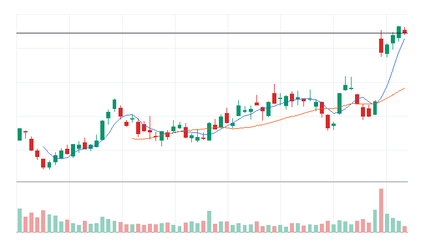
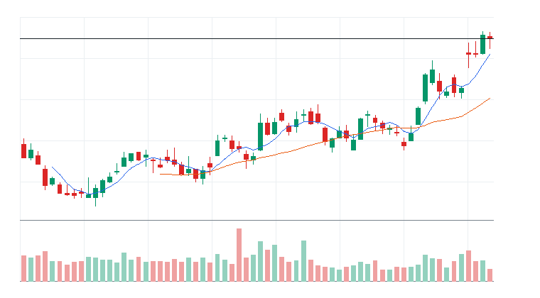
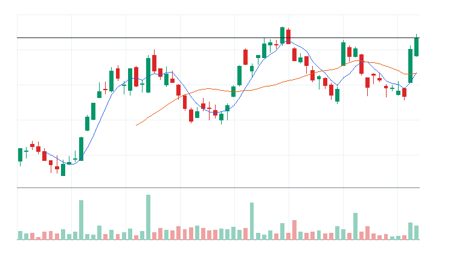

# 오늘의 데일리 트레이딩 요약

**REAL DATA TEST - 가격/거래량은 실제 데이터, 뉴스/ETF 구성종목 확산도/거래대금 유동성 일부 연결**

**목적:** 이 리포트는 최근 오른 자산을 나열하는 것이 아니라, 돈이 몰리는 근거와 다음 매수 주체가 확인할 트레이딩 후보를 찾기 위한 보고서다.

> 핵심 질문: 현재 가격에서 누가 사고 있고, 누가 앞으로 더 비싸게 사줄 수 있는가?

## 시장 국면 판단

- 최종 판정: 기간 조정 (74점)
- 전일 대비: 기간 조정은 유지됐지만 점수는 전일보다 약화됐다(-8점).
- 판정 신뢰도: 높음 (100점) - 핵심 지수와 매크로 데이터가 대부분 직접 수집되어 판정 신뢰도가 높다.
- 행동 바이어스: 추격 보류, 돌파 확인
- 한 줄 결론: 장기 추세는 유지되지만 단기 추세가 둔화되어 기간 조정으로 본다. 기술 87점, 매크로 49점.
- 기술적 지표: 상승 추세 우위 (87점, 가중치 65%)
- S&P 500: 100점 | 50일선 위, 200일선 위, 20일 +2.20%, 60일 +4.00%, 52주 고점 대비 -1.07% -> 기술 점수 100
- Nasdaq 100: 74점 | 50일선 아래, 200일선 위, 20일 -1.19%, 60일 0.00%, 52주 고점 대비 -4.51% -> 기술 점수 74
- 매크로 시황: 매크로 중립 (49점, 가중치 35%)
- 매크로 요약: 신용/유동성 중심으로 매크로가 위험자산에 우호적이다.
- 금리: 중립 46점 / 금리 중립 / confidence HIGH
  - 주요 근거: US 10Y yield 20일 +2.89%, 5일 +0.15%; US 3M yield 20일 +1.36%, 단기금리 방향 확인; US long-duration bonds 20일 -2.33%, 장기채 가격 기준 할인율 부담 확인
  - 확인 사항: 추가 확인 이벤트 없음
- 물가: 중립 46점 / 물가 중립 / confidence HIGH
  - 주요 근거: Oil ETF 20일 +9.05%, 유가 기반 물가 압력 확인; TIPS ETF 20일 -1.16%, 물가연동채 흐름은 보조 근거; Gold 20일 +3.04%, 금 강세는 방어 수요 여부 확인
  - 확인 사항: 추가 확인 이벤트 없음
- 정책: 중립 50점 / 정책 이벤트 확인 전 중립 / confidence LOW
  - 주요 근거: 정책 톤은 1차 버전에서 일정/이벤트 리스크 기반 중립값으로 반영한다.
  - 확인 사항: FOMC, CPI, PCE, 고용지표 발표 전후에는 매크로 confidence를 보수적으로 해석한다.
- 신용/유동성: 중립-우호 55점 / 신용/유동성 중립 / confidence HIGH
  - 주요 근거: High yield credit 20일 -0.36%, 하이일드 위험선호 확인; HYG-LQD 20일 상대강도 +0.89%, 신용위험 선호/회피 확인; VIX 20일 -4.36%, 변동성 부담 확인
  - 확인 사항: 추가 확인 이벤트 없음
- 환율/글로벌: 중립 51점 / 환율/글로벌 중립 / confidence MEDIUM
  - 주요 근거: US dollar 20일 -0.60%, 달러 강세/약세 확인
  - 확인 사항: 추가 확인 이벤트 없음
- US 10Y yield: 45점 | 하락 시 주식 우호; 5일 +0.15%, 20일 +2.89% -> 매크로 점수 45
- US 3M yield: 47점 | 하락 시 주식 우호; 5일 +1.55%, 20일 +1.36% -> 매크로 점수 47
- US long-duration bonds: 46점 | 상승 시 주식 우호; 5일 -0.34%, 20일 -2.33% -> 매크로 점수 46
- TIPS ETF: 50점 | 상승 시 주식 우호; 5일 -0.81%, 20일 -1.16% -> 매크로 점수 50
- Oil ETF: 41점 | 하락 시 주식 우호; 5일 -6.75%, 20일 +9.05% -> 매크로 점수 41
- Gold: 50점 | 상승 시 주식 우호; 5일 +3.32%, 20일 +3.04% -> 매크로 점수 50
- US dollar: 51점 | 하락 시 주식 우호; 5일 +0.18%, 20일 -0.60% -> 매크로 점수 51
- High yield credit: 49점 | 상승 시 주식 우호; 5일 -0.01%, 20일 -0.36% -> 매크로 점수 49
- Investment grade credit: 50점 | 상승 시 주식 우호; 5일 -0.05%, 20일 -1.25% -> 매크로 점수 50
- VIX: 66점 | 하락 시 주식 우호; 5일 -11.35%, 20일 -4.36% -> 매크로 점수 66
- 데이터 커버리지: 기술 2/2, 매크로 10/10
- 데이터 신뢰도 근거:
  - 직접 지수 데이터: S&P 500, Nasdaq 100
  - 대체 지수 데이터 없음
  - 매크로 데이터: 10/10
  - 누락 데이터 없음
  - stale 데이터 없음

## 모바일 요약

[오늘의 데일리 트레이딩 요약]

생성 성공 / 데이터 모드: REAL_TEST

시장:
- 중립

시장 지배 서사:
1. 방산/안보 프리미엄 - 약화 - iShares U.S. Aerospace & Defense ETF(ITA), SPDR S&P Aerospace & Defense ETF(XAR), Kratos Defense & Security Solutions(KTOS), AeroVironment(AVAV) 중심으로 5일 +10.64%, 20일 +10.91% 흐름이 형성됨. 뉴스 직접성 제한.
2. AI 소프트웨어/사이버보안 확산 - 약화 - iShares Expanded Tech-Software Sector ETF(IGV), Invesco QQQ Trust(QQQ), Atlassian Corporation(TEAM), Microsoft Corporation(MSFT) 중심으로 5일 +7.78%, 20일 +8.73% 흐름이 형성됨. 직접 촉매 일부 확인.
3. Internet Content 자금 유입 - 약화 - Invesco QQQ Trust(QQQ), DoorDash Inc.(DASH), Meta Platforms Inc.(META) 중심으로 5일 +7.32%, 20일 +1.03% 흐름이 형성됨. 직접 촉매 일부 확인.

트렌드 강도:
1. 방산/안보 프리미엄 - TSI 62 - 약화 - 진입품질 낮음
2. AI 소프트웨어/사이버보안 확산 - TSI 60 - 부상 - 진입품질 관찰
3. Internet Content 자금 유입 - TSI 45 - 약화 - 진입품질 낮음

오늘 결론:
- 클라우드/엔터프라이즈 소프트웨어 개별 종목 흐름이 ETF 대비 강한지 확인 필요
- 행동 후보는 linkedNarrative와 함께 확인한다.
- 추격보다 진입 조건 확인 후 접근한다.

오늘 실제 행동 후보:
1. Shopify Inc.(SHOP)(STOCK) - AI 소프트웨어/사이버보안 확산 - 단기 추세가 유지되고 거래량이 1.0배 이상이면 눌림 이후 재상승을 시도할 수 있음
2. Booking Holdings Inc.(BKNG)(STOCK) - AI 소프트웨어/사이버보안 확산 - 단기 추세가 유지되고 거래량이 1.0배 이상이면 눌림 이후 재상승을 시도할 수 있음
3. Kratos Defense & Security Solutions(KTOS)(STOCK) - 방산/안보 프리미엄 - 단기 추세가 유지되고 거래량이 1.0배 이상이면 눌림 이후 재상승을 시도할 수 있음

다크호스 후보:
1. 다크호스 후보 없음 - 조건 충족 후보 없음

ETF 후보 TOP 5:
1. iShares U.S. Aerospace & Defense ETF(ITA) - 방산/안보 프리미엄 - 관찰
2. iShares Expanded Tech-Software Sector ETF(IGV) - AI 소프트웨어/사이버보안 확산 - 관찰
3. Global X Copper Miners ETF(COPX) - 전력망/원전/인프라 병목 - 제외
4. iShares Cybersecurity and Tech ETF(IHAK) - 사이버보안 지출 재가속 - 제외
5. SPDR Gold Shares(GLD) - 매크로 방어/헤지 - 제외

웹 리포트:
https://yoolcool.github.io/DailyTradingThesisAgent/

## 오늘 결론

- 오늘 결론: 조건부 진입
- 신규 진입 후보: 0개
- 조건부 진입 후보: 5개
- 관찰 후보: 125개
- 주요 제한 요인: Entry Quality < 40, RVOL 미달, 뉴스 직접성 부족
- 주문 판단: 시장가 금지 / 지정가 또는 관찰
- 실전 판단: 진입 후보는 있으나, 전일 고점 돌파와 거래량 확인 후 선별적으로 접근한다.

### 후보 제한 요인 집계

- RVOL < 1.00x: 123개
- 거래대금 유동성 낮음: 17개
- Entry Quality 50~54 near miss: 2개
- Entry Quality 40~49 관찰: 7개
- Entry Quality < 40: 148개
- Exhaustion Risk >= 70: 0개
- ETF breadth 샘플 부족: 37개
- 뉴스 직접성 부족: 100개

## 데이터 신뢰도

- 전체 데이터 신뢰도 등급: LOW
- 분석 신뢰도: LOW
- 주문 실행 신뢰도: LOW
- ETF breadth 신뢰도: LOW
- 신뢰도 해석: 가격/거래량 stale fallback 1개 사용, 테마 확산 판단 제한, 거래대금 유동성 낮음 또는 확인 불가, 프리/애프터마켓 확인 불가
- 리포트 생성 시각: 2026-08-07 10:43 KST
- 가격 기준 거래일: 2026-08-06 US regular close
- 뉴스 수집 시각: 2026-08-07 10:43 KST
- 가장 최근 뉴스 발행 시각: 2026-08-07 10:28 KST
- 뉴스 신선도 상태: FRESH
- 뉴스 소스: Yahoo Finance RSS, MarketWatch RSS, CNBC Markets RSS, SEC EDGAR RSS, Federal Reserve RSS, Finnhub API
- 뉴스 소스 상태: Yahoo Finance RSS CONNECTED, MarketWatch RSS CONNECTED, CNBC Markets RSS PARTIAL, SEC EDGAR RSS PARTIAL, Federal Reserve RSS CONNECTED, Finnhub API DISABLED
- 뉴스 신뢰도: MEDIUM
- 추천 적용 거래일: 2026-08-06 US regular session
- 가격/거래량 데이터 상태: 일부 연결
- 뉴스 데이터 상태: 일부 연결
- ETF 구성종목 확산도 상태: 일부 연결
- ETF 구성종목 샘플 수: 1~4
- 거래대금 유동성 데이터 상태: 일부 연결
- 프리/애프터마켓 데이터 상태: UNAVAILABLE
- 데이터 provider: yfinance, Yahoo Finance RSS, MarketWatch RSS, CNBC Markets RSS, SEC EDGAR RSS, Federal Reserve RSS, Finnhub API, config fallback sample, price-volume dollar-volume fallback
- 실전 사용 경고: 이 리포트는 투자판단 보조용이며, REAL_TEST 모드에서는 일부 데이터가 누락되거나 지연될 수 있다. 실제 주문 전 현재가, 뉴스, 프리마켓/정규장 거래량을 별도 확인해야 한다.

## 0. 시장 상태

- 데이터 모드: REAL_TEST
- 가격/거래량: 일부 연결
- 뉴스: 일부 연결
- ETF 구성종목 확산도: 일부 연결
- 거래대금 유동성: 일부 연결
- 생성 시각: 2026년 8월 7일 금요일 AM 10:43
- 시장 상태: 중립
- 오늘 돈의 방향: 클라우드/엔터프라이즈 소프트웨어 개별 종목 흐름이 ETF 대비 강한지 확인 필요
- 강한 테마 TOP 3: 구리/금속 ETF(64), Financial Services(62), 금 ETF(61)
- 데이터 한계:
  - API 또는 provider 상태에 따라 뉴스/ETF 확산도/거래대금 유동성 반영 범위가 달라질 수 있다.
  - 수집 실패 데이터는 점수 반영에서 제외하거나 confidence를 제한한다.
  - reasonConfidence HIGH는 직접 촉매, 가격/거래량, 확산도/유동성 근거가 함께 있을 때만 사용한다.

## 오늘 시장을 지배하는 서사

### 오늘 시장을 지배하는 서사 TOP 3

#### 1. 방산/안보 프리미엄
- 상태: 약화
- narrativeScore: 48
- reasonConfidence: LOW
- 근거 ETF: ITA, XAR, SHLD
- 근거 개별 종목: KTOS, AVAV, PLTR
- 돈이 몰리는 이유: 방산/안보 프리미엄 관련 iShares U.S. Aerospace & Defense ETF(ITA), SPDR S&P Aerospace & Defense ETF(XAR), Global X Defense Tech ETF(SHLD)와 Kratos Defense & Security Solutions(KTOS), AeroVironment(AVAV), Palantir Technologies Inc.(PLTR)의 5일(+10.64%)·20일(+10.91%) 흐름을 함께 본다. 평균 상대 거래량은 0.88배이고, ETF 확산도는 추가 확인이 필요하다. 뉴스 직접성은 아직 제한적이다.
- 다음 매수 주체: 지정학 리스크와 안보 예산 기대를 사는 테마 ETF 자금
- 가장 좋은 트레이딩 수단: ETF 우선: XAR, SHLD, ITA / 개별 종목 우선: AVAV, KTOS, PLTR
- 서사가 깨지는 조건: 방산 ETF 20일선 이탈 또는 안보 이벤트 프리미엄 둔화
- 오늘 행동: 뉴스 촉매가 직접 확인될 때만 추세 추종

상세 narrativeScore 근거 보기

- rawScore: 48
- ETF 평균 moneyFlowScore: 45
- 개별 종목 평균 moneyFlowScore: 50
- ETF 후보 비율: 25%
- 개별 종목 후보 비율: 17%
- 5일 평균 수익률: +11.00%
- 20일 평균 수익률: +11.00%
- 평균 상대 거래량: 1.00배
- ETF 평균 상대 거래량: 1.00배
- 개별주 평균 상대 거래량: 1.00배
- 52주 고점 근접 후보 비율: 40%
- 뉴스 직접성 점수: 5
- ETF 확산도 점수: 0
- 유동성 점수: 0
- 과열 리스크 차감: 0

#### 2. AI 소프트웨어/사이버보안 확산
- 상태: 약화
- narrativeScore: 40
- reasonConfidence: LOW
- 근거 ETF: IGV, QQQ, AIQ
- 근거 개별 종목: TEAM, MSFT, PLTR, DDOG
- 돈이 몰리는 이유: AI 소프트웨어/사이버보안 확산 관련 iShares Expanded Tech-Software Sector ETF(IGV), Invesco QQQ Trust(QQQ), Global X Artificial Intelligence & Technology ETF(AIQ)와 Atlassian Corporation(TEAM), Microsoft Corporation(MSFT), Palantir Technologies Inc.(PLTR), Datadog Inc.(DDOG)의 5일(+7.78%)·20일(+8.73%) 흐름을 함께 본다. 평균 상대 거래량은 1.21배이고, ETF 확산도는 추가 확인이 필요하다. 직접 뉴스/이벤트가 일부 확인된다.
- 다음 매수 주체: AI 소프트웨어 실적 기대를 사는 ETF 자금, 엔터프라이즈 소프트웨어 스윙 트레이더, 신고가 추종 자금
- 가장 좋은 트레이딩 수단: ETF 우선: IGV, AIQ, QQQ / 개별 종목 우선: PLTR, DDOG, TEAM
- 서사가 깨지는 조건: IGV/AIQ 20일선 이탈, 관련 소프트웨어 종목 절반 이상 5일선 이탈, 상대 거래량 둔화
- 오늘 행동: 추격보다 눌림 후 재상승 확인

상세 narrativeScore 근거 보기

- rawScore: 40
- ETF 평균 moneyFlowScore: 29
- 개별 종목 평균 moneyFlowScore: 51
- ETF 후보 비율: 0%
- 개별 종목 후보 비율: 20%
- 5일 평균 수익률: +8.00%
- 20일 평균 수익률: +9.00%
- 평균 상대 거래량: 1.00배
- ETF 평균 상대 거래량: 1.00배
- 개별주 평균 상대 거래량: 1.00배
- 52주 고점 근접 후보 비율: 13%
- 뉴스 직접성 점수: 4
- ETF 확산도 점수: 0
- 유동성 점수: 2
- 과열 리스크 차감: 0

#### 3. Internet Content 자금 유입
- 상태: 약화
- narrativeScore: 39
- reasonConfidence: LOW
- 근거 ETF: QQQ
- 근거 개별 종목: DASH, META
- 돈이 몰리는 이유: Internet Content 자금 유입 관련 Invesco QQQ Trust(QQQ)와 DoorDash Inc.(DASH), Meta Platforms Inc.(META)의 5일(+7.32%)·20일(+1.03%) 흐름을 함께 본다. 평균 상대 거래량은 1.19배이고, ETF 확산도는 추가 확인이 필요하다. 직접 뉴스/이벤트가 일부 확인된다.
- 다음 매수 주체: Internet Content 자금 유입을 확인한 섹터 ETF 자금과 상대강도 추종 스윙 자금
- 가장 좋은 트레이딩 수단: ETF 우선: QQQ / 개별 종목 우선: META, DASH
- 서사가 깨지는 조건: QQQ 20일선 이탈 또는 관련 종목 절반 이상 5일선 이탈
- 오늘 행동: 기존 네러티브와 중복을 확인한 뒤 ETF/대표 종목 동조성이 살아날 때만 관찰 편입

상세 narrativeScore 근거 보기

- rawScore: 39
- ETF 평균 moneyFlowScore: 27
- 개별 종목 평균 moneyFlowScore: 44
- ETF 후보 비율: 0%
- 개별 종목 후보 비율: 50%
- 5일 평균 수익률: +7.00%
- 20일 평균 수익률: +1.00%
- 평균 상대 거래량: 1.00배
- ETF 평균 상대 거래량: 1.00배
- 개별주 평균 상대 거래량: 1.00배
- 52주 고점 근접 후보 비율: 33%
- 뉴스 직접성 점수: 4
- ETF 확산도 점수: 0
- 유동성 점수: 3
- 과열 리스크 차감: 0

### 전체 narrative 요약

| 서사명 | 상태 | narrativeScore | reasonConfidence | 대표 ETF | 대표 종목 | 오늘 행동 |
| --- | --- | ---: | --- | --- | --- | --- |
| 방산/안보 프리미엄 | 약화 | 48 | LOW | ITA, XAR, SHLD | KTOS, AVAV, PLTR | 뉴스 촉매가 직접 확인될 때만 추세 추종 |
| AI 소프트웨어/사이버보안 확산 | 약화 | 40 | LOW | IGV, QQQ, AIQ | TEAM, MSFT, PLTR, DDOG | 추격보다 눌림 후 재상승 확인 |
| Internet Content 자금 유입 | 약화 | 39 | LOW | QQQ | DASH, META | 기존 네러티브와 중복을 확인한 뒤 ETF/대표 종목 동조성이 살아날 때만 관찰 편입 |
| 소프트웨어 실적/AI 수익화 | 약화 | 31 | LOW | IGV, QQQ, AIQ | TEAM, WDAY, ADSK, INTU | 기존 네러티브와 중복을 확인한 뒤 ETF/대표 종목 동조성이 살아날 때만 관찰 편입 |
| 사이버보안 지출 재가속 | 약화 | 30 | LOW | IGV, IHAK, CIBR | PANW, CRWD, FTNT | 기존 네러티브와 중복을 확인한 뒤 ETF/대표 종목 동조성이 살아날 때만 관찰 편입 |
| 바이오/헬스케어 촉매 | 약화 | 29 | LOW | QQQ | REGN, AMGN | 기존 네러티브와 중복을 확인한 뒤 ETF/대표 종목 동조성이 살아날 때만 관찰 편입 |
| 전력 유틸리티 수요 재평가 | 약화 | 25 | LOW | SPY, IWM, QQQ | ETN, GEV, VRT | 기존 네러티브와 중복을 확인한 뒤 ETF/대표 종목 동조성이 살아날 때만 관찰 편입 |
| 소비 회복/방어주 선별 | 약화 | 25 | LOW | QQQ | AMZN, PDD, MELI | 기존 네러티브와 중복을 확인한 뒤 ETF/대표 종목 동조성이 살아날 때만 관찰 편입 |
| Aerospace & Defense 자금 유입 | 약화 | 23 | LOW | SPY, IWM, QQQ | RTX, LMT, AXON | 기존 네러티브와 중복을 확인한 뒤 ETF/대표 종목 동조성이 살아날 때만 관찰 편입 |
| 매크로 방어/헤지 | 약화 | 22 | LOW | GLD, XLE, TLT | XOM, CVX | 위험회피가 확인될 때만 헤지성 접근 |
| Integrated Oil & Gas 자금 유입 | 약화 | 20 | LOW | SPY, IWM, QQQ | XOM, CVX | 기존 네러티브와 중복을 확인한 뒤 ETF/대표 종목 동조성이 살아날 때만 관찰 편입 |
| Specialty Business Services 자금 유입 | 약화 | 18 | LOW | SPY, IWM, QQQ | TRI, CTAS, CPRT | 기존 네러티브와 중복을 확인한 뒤 ETF/대표 종목 동조성이 살아날 때만 관찰 편입 |
| 전력망/원전/인프라 병목 | 약화 | 16 | LOW | COPX, URA, PAVE | ETN, CEG, PWR, VRT | ETF 확산도와 거래량이 같이 살아날 때만 진입 |
| 필수소비재 음료 방어 성장 | 약화 | 13 | LOW | QQQ | CCEP, MNST | 기존 네러티브와 중복을 확인한 뒤 ETF/대표 종목 동조성이 살아날 때만 관찰 편입 |
| Data Storage 자금 유입 | 소멸 | 11 | LOW | SPY, IWM, QQQ | STX, WDC | 기존 네러티브와 중복을 확인한 뒤 ETF/대표 종목 동조성이 살아날 때만 관찰 편입 |
| 위험선호 성장주 재진입 | 소멸 | 10 | LOW | QQQ, IPO, ARKK | ARM, COIN, TSLA | 지수 위험선호가 유지될 때만 선별 진입 |
| AI 인프라 재가속 | 소멸 | 9 | LOW | SMH, SOXX, DRAM | ETN, NVDA, MU, VRT | 추격보다 5일선 지지 후 재상승 확인 |
| 반도체 설계/공급망 재가속 | 소멸 | 4 | LOW | SMH, SOXX, SOXQ | ARM, ADI, AMD, TXN | 기존 네러티브와 중복을 확인한 뒤 ETF/대표 종목 동조성이 살아날 때만 관찰 편입 |
| 반도체 장비 사이클 재평가 | 소멸 | 2 | LOW | SMH, SOXX, SOXQ | AMAT, LRCX, ASML | 기존 네러티브와 중복을 확인한 뒤 ETF/대표 종목 동조성이 살아날 때만 관찰 편입 |
| 비트코인/디지털 자산 위험선호 | 소멸 | 0 | LOW | IBIT, BLOK | MSTR, COIN, IREN | 비트코인 베타가 살아날 때만 단기 매매 |

## 트렌드 강도 판단

### 1. 방산/안보 프리미엄
- Trend Strength Index: 62
- 트렌드 상태 라벨: 약화
- 테마 확산도: 보통
- ETF 동조성: 강함
- 거래량 강도: 부족
- 과열 위험: 낮음 (18)
- 오늘 진입 품질: 낮음 (38)
- 한 줄 판단: 방산/안보 프리미엄는 관찰 가능한 흐름은 있으나 가격, 거래량, 확산도 중 일부 확인이 더 필요하다.
- 오늘 접근법: 상승률이 남아 있어도 iShares U.S. Aerospace & Defense ETF(ITA)/SPDR S&P Aerospace & Defense ETF(XAR)/Global X Defense Tech ETF(SHLD)와 구성 종목 확산도가 회복될 때까지 신규 진입은 낮춘다.

트렌드 강도 상세 근거 보기

- 가격 모멘텀: 가격 모멘텀 23/25. 평균 5D +10.64%, 20D +10.91%.
- 거래량 강도: 거래량 강도 3/20. 평균 RVOL 0.88배.
- ETF 동조성: ETF 동조성 15/15. 관련 ETF SPDR S&P Aerospace & Defense ETF(XAR), Global X Defense Tech ETF(SHLD), iShares U.S. Aerospace & Defense ETF(ITA), Invesco Aerospace & Defense ETF(PPA) 흐름을 기준으로 판단.
- 테마 확산도: 테마 확산도 13/20. 상위 1~2개 쏠림 감점 0점 반영.
- 뉴스 촉매: 뉴스/촉매 신선도 2/10. HIGH 직접 촉매 0개.
- 과열 리스크: 과열 리스크 18/100. 단기 급등, 고점 근접, ETF-개별주 괴리, 쏠림을 함께 반영.
- 시장 환경: 시장 환경 6/10. QQQ/SPY/IWM 가격 흐름 기반 위험선호 점수.

### 2. AI 소프트웨어/사이버보안 확산
- Trend Strength Index: 60
- 트렌드 상태 라벨: 부상
- 테마 확산도: 보통
- ETF 동조성: 보통
- 거래량 강도: 약함
- 과열 위험: 낮음 (11)
- 오늘 진입 품질: 관찰 (41)
- 한 줄 판단: AI 소프트웨어/사이버보안 확산는 Trend Strength는 중간이지만 진입 품질이 살아나는 초기 진입 후보 성격이다.
- 오늘 접근법: iShares Expanded Tech-Software Sector ETF(IGV)/Invesco QQQ Trust(QQQ)/Global X Artificial Intelligence & Technology ETF(AIQ) 거래량 증가와 Atlassian Corporation(TEAM)/Microsoft Corporation(MSFT)/Palantir Technologies Inc.(PLTR) 확산을 확인하며 작은 사이즈의 초기 진입 후보로만 본다.

트렌드 강도 상세 근거 보기

- 가격 모멘텀: 가격 모멘텀 21/25. 평균 5D +7.78%, 20D +8.73%.
- 거래량 강도: 거래량 강도 7/20. 평균 RVOL 1.21배.
- ETF 동조성: ETF 동조성 11/15. 관련 ETF iShares Expanded Tech-Software Sector ETF(IGV), Global X Artificial Intelligence & Technology ETF(AIQ), Invesco QQQ Trust(QQQ) 흐름을 기준으로 판단.
- 테마 확산도: 테마 확산도 12/20. 상위 1~2개 쏠림 감점 0점 반영.
- 뉴스 촉매: 뉴스/촉매 신선도 3/10. HIGH 직접 촉매 1개.
- 과열 리스크: 과열 리스크 11/100. 단기 급등, 고점 근접, ETF-개별주 괴리, 쏠림을 함께 반영.
- 시장 환경: 시장 환경 6/10. QQQ/SPY/IWM 가격 흐름 기반 위험선호 점수.

### 3. Internet Content 자금 유입
- Trend Strength Index: 45
- 트렌드 상태 라벨: 약화
- 테마 확산도: 부족
- ETF 동조성: 약함
- 거래량 강도: 약함
- 과열 위험: 보통 (25)
- 오늘 진입 품질: 낮음 (25)
- 한 줄 판단: Internet Content 자금 유입는 테마 확산도가 낮아 아직 개별 종목 이벤트성 흐름에 가깝다.
- 오늘 접근법: 상승률이 남아 있어도 Invesco QQQ Trust(QQQ)와 구성 종목 확산도가 회복될 때까지 신규 진입은 낮춘다.

트렌드 강도 상세 근거 보기

- 가격 모멘텀: 가격 모멘텀 17/25. 평균 5D +7.32%, 20D +1.03%.
- 거래량 강도: 거래량 강도 9/20. 평균 RVOL 1.19배.
- ETF 동조성: ETF 동조성 7/15. 관련 ETF Invesco QQQ Trust(QQQ) 흐름을 기준으로 판단.
- 테마 확산도: 테마 확산도 5/20. 상위 1~2개 쏠림 감점 6점 반영.
- 뉴스 촉매: 뉴스/촉매 신선도 1/10. HIGH 직접 촉매 1개.
- 과열 리스크: 과열 리스크 25/100. 단기 급등, 고점 근접, ETF-개별주 괴리, 쏠림을 함께 반영.
- 시장 환경: 시장 환경 6/10. QQQ/SPY/IWM 가격 흐름 기반 위험선호 점수.

## 최근 추천 결과 트래킹

개별주는 데이트레이딩 관점으로 추천 이후 첫 정규장의 장중 최고가와 종가를 추적한다. ETF는 테마/스윙 관점으로 추천 이후 1주일 동안의 최고가와 현재 종가를 추적한다.

### 개별주 Top 3 추천 성과 요약
- 최근 5개 리포트 표본: 15개 (초기 검증 단계)
- 장중 최고가 기준 성공률: +33.33%
- 종가 기준 성공률: +41.67%
- 평균 장중 최고 수익률: +2.40%
- 평균 종가 수익률: +0.47%

### ETF 추천 성과 요약
- 최근 5개 리포트 표본: 6개 (초기 검증 단계)
- 1주 최고가 기준 성공률: +25.00%
- 현재 종가 기준 성공률: +16.67%
- 평균 1주 최고 수익률: +1.26%
- 평균 현재 수익률: -0.24%

최근 추천 결과 상세 테이블 펼치기

| 추천일 | 유형 | 순위 | 티커 | 기준가 | 추적 기간 | 상태 | High 수익률 | Close 수익률 | 결과 | 코멘트 |
| --- | --- | ---: | --- | ---: | --- | --- | ---: | ---: | --- | --- |
| 2026-08-07 | STOCK | 3 | KTOS | $57.41 | 2026-08-07 | pending | 데이터 없음 | 데이터 없음 | 추적 대기 | 아직 추적 거래일 데이터가 완성되지 않음 |
| 2026-08-07 | STOCK | 2 | BKNG | $207.39 | 2026-08-07 | pending | 데이터 없음 | 데이터 없음 | 추적 대기 | 아직 추적 거래일 데이터가 완성되지 않음 |
| 2026-08-07 | STOCK | 1 | SHOP | $147.44 | 2026-08-07 | pending | 데이터 없음 | 데이터 없음 | 추적 대기 | 아직 추적 거래일 데이터가 완성되지 않음 |
| 2026-08-06 | STOCK | 3 | KTOS | $55.34 | 2026-08-06 | complete | +6.79% | +3.74% | 성공 | 장중 기회와 종가 유지가 모두 확인됨 (일봉 기준) |
| 2026-08-06 | STOCK | 2 | AMGN | $407.83 | 2026-08-06 | complete | +2.59% | -0.73% | 제한적 유효 | 제한적인 장중 기회만 발생 (일봉 기준) |
| 2026-08-06 | STOCK | 1 | TEAM | $113.32 | 2026-08-06 | complete | -2.15% | -2.78% | 실패 | 추천 이후 의미 있는 장중 기회가 부족하고 종가도 약함 (일봉 기준) |
| 2026-08-06 | ETF | 2 | XME | $111.92 | 2026-08-06~2026-08-13 | in_progress | 데이터 없음 | -1.40% | 진행 중 | 아직 1주 추적 기간이 끝나지 않음 (일봉 high 미확보 시 close 기준 보조) |
| 2026-08-06 | ETF | 1 | COPX | $86.72 | 2026-08-06~2026-08-13 | in_progress | 데이터 없음 | -0.73% | 진행 중 | 아직 1주 추적 기간이 끝나지 않음 (일봉 high 미확보 시 close 기준 보조) |
| 2026-08-05 | STOCK | 3 | DXCM | $86.94 | 2026-08-05 | complete | -0.54% | -4.92% | 실패 | 추천 이후 의미 있는 장중 기회가 부족하고 종가도 약함 (일봉 기준) |
| 2026-08-05 | STOCK | 2 | DDOG | $288.15 | 2026-08-05 | complete | +1.59% | -1.73% | 제한적 유효 | 제한적인 장중 기회만 발생 (일봉 기준) |
| 2026-08-05 | STOCK | 1 | MSFT | $492.81 | 2026-08-05 | complete | +1.10% | -1.09% | 제한적 유효 | 제한적인 장중 기회만 발생 (일봉 기준) |
| 2026-08-05 | ETF | 3 | MAGS | $68.96 | 2026-08-05~2026-08-12 | in_progress | +0.24% | -0.55% | 진행 중 | 아직 1주 추적 기간이 끝나지 않음 |
| 2026-08-05 | ETF | 2 | COPX | $83.99 | 2026-08-05~2026-08-12 | in_progress | +4.11% | +2.50% | 진행 중 | 아직 1주 추적 기간이 끝나지 않음 |
| 2026-08-05 | ETF | 1 | CIBR | $97.94 | 2026-08-05~2026-08-12 | in_progress | -1.10% | -1.58% | 진행 중 | 아직 1주 추적 기간이 끝나지 않음 |
| 2026-08-04 | STOCK | 3 | MSFT | $487.65 | 2026-08-04 | complete | +2.42% | +1.06% | 제한적 유효 | 제한적인 장중 기회만 발생 (일봉 기준) |
| 2026-08-04 | STOCK | 2 | AMZN | $284.02 | 2026-08-04 | complete | -1.04% | -2.32% | 실패 | 추천 이후 의미 있는 장중 기회가 부족하고 종가도 약함 (일봉 기준) |
| 2026-08-04 | STOCK | 1 | DDOG | $273.6 | 2026-08-04 | complete | +5.96% | +5.32% | 성공 | 장중 기회와 종가 유지가 모두 확인됨 (일봉 기준) |
| 2026-08-04 | ETF | 1 | MAGS | $68.38 | 2026-08-04~2026-08-11 | in_progress | +1.80% | +0.29% | 진행 중 | 아직 1주 추적 기간이 끝나지 않음 |
| 2026-08-03 | STOCK | 3 | DXCM | $83.45 | 2026-08-03 | complete | +5.01% | +4.63% | 성공 | 장중 기회와 종가 유지가 모두 확인됨 (일봉 기준) |
| 2026-08-03 | STOCK | 2 | REGN | $762.63 | 2026-08-03 | complete | +1.33% | -0.44% | 제한적 유효 | 제한적인 장중 기회만 발생 (일봉 기준) |
| 2026-08-03 | STOCK | 1 | MSFT | $464.72 | 2026-08-03 | complete | +5.79% | +4.93% | 성공 | 장중 기회와 종가 유지가 모두 확인됨 (일봉 기준) |
| 2026-07-31 | STOCK | 2 | REGN | $738.34 | 2026-07-31 | complete | +3.58% | +3.29% | 성공 | 장중 기회와 종가 유지가 모두 확인됨 (일봉 기준) |
| 2026-07-31 | STOCK | 1 | MSFT | $451.1 | 2026-07-31 | complete | +3.49% | +3.02% | 성공 | 장중 기회와 종가 유지가 모두 확인됨 (일봉 기준) |
| 2026-07-30 | STOCK | 3 | WDAY | $168.01 | 2026-07-30 | complete | -4.18% | -5.89% | 실패 | 추천 이후 의미 있는 장중 기회가 부족하고 종가도 약함 (일봉 기준) |
| 2026-07-30 | STOCK | 2 | ADBE | $263.43 | 2026-07-30 | complete | -3.09% | -5.90% | 실패 | 추천 이후 의미 있는 장중 기회가 부족하고 종가도 약함 (일봉 기준) |
| 2026-07-30 | STOCK | 1 | MDLZ | $64.99 | 2026-07-30 | complete | -1.65% | -2.94% | 실패 | 추천 이후 의미 있는 장중 기회가 부족하고 종가도 약함 (일봉 기준) |
| 2026-07-29 | STOCK | 3 | ADBE | $249.18 | 2026-07-29 | complete | +6.86% | +5.72% | 성공 | 장중 기회와 종가 유지가 모두 확인됨 (일봉 기준) |
| 2026-07-29 | STOCK | 2 | TEAM | $99.98 | 2026-07-29 | complete | +6.74% | +4.30% | 성공 | 장중 기회와 종가 유지가 모두 확인됨 (일봉 기준) |
| 2026-07-29 | STOCK | 1 | RTX | $218.58 | 2026-07-29 | complete | +0.91% | -1.52% | 실패 | 추천 이후 의미 있는 장중 기회가 부족하고 종가도 약함 (일봉 기준) |
| 2026-07-28 | STOCK | 1 | RTX | $218.42 | 2026-07-28 | complete | +1.34% | +0.07% | 제한적 유효 | 제한적인 장중 기회만 발생 (일봉 기준) |
| 2026-07-27 | STOCK | 2 | LMT | $582.6 | 2026-07-27 | complete | +0.93% | -0.45% | 실패 | 추천 이후 의미 있는 장중 기회가 부족하고 종가도 약함 (일봉 기준) |
| 2026-07-27 | STOCK | 1 | RTX | $212.79 | 2026-07-27 | complete | +3.57% | +2.65% | 성공 | 장중 기회와 종가 유지가 모두 확인됨 (일봉 기준) |
| 2026-07-24 | STOCK | 3 | XOM | $156.89 | 2026-07-24 | complete | +1.16% | +0.03% | 제한적 유효 | 제한적인 장중 기회만 발생 (일봉 기준) |
| 2026-07-24 | STOCK | 2 | LMT | $568.59 | 2026-07-24 | complete | +3.49% | +2.46% | 성공 | 장중 기회와 종가 유지가 모두 확인됨 (일봉 기준) |
| 2026-07-24 | STOCK | 1 | RTX | $209.16 | 2026-07-24 | complete | +2.74% | +1.74% | 제한적 유효 | 제한적인 장중 기회만 발생 (일봉 기준) |
| 2026-07-23 | STOCK | 1 | PCAR | $131.11 | 2026-07-23 | complete | +1.82% | -0.27% | 제한적 유효 | 제한적인 장중 기회만 발생 (일봉 기준) |
| 2026-07-22 | STOCK | 1 | COIN | $175.85 | 2026-07-22 | complete | -0.51% | -5.53% | 실패 | 추천 이후 의미 있는 장중 기회가 부족하고 종가도 약함 (일봉 기준) |
| 2026-07-21 | STOCK | 1 | PYPL | $56.82 | 2026-07-21 | complete | +0.16% | -1.71% | 실패 | 추천 이후 의미 있는 장중 기회가 부족하고 종가도 약함 (일봉 기준) |
| 2026-07-20 | STOCK | 2 | CTAS | $204.45 | 2026-07-20 | complete | -0.03% | -1.30% | 실패 | 추천 이후 의미 있는 장중 기회가 부족하고 종가도 약함 (일봉 기준) |
| 2026-07-20 | STOCK | 1 | PANW | $358.68 | 2026-07-20 | complete | +2.13% | -2.79% | 제한적 유효 | 제한적인 장중 기회만 발생 (일봉 기준) |
| 2026-07-17 | STOCK | 3 | CTAS | $206.25 | 2026-07-17 | complete | +1.68% | -0.87% | 제한적 유효 | 제한적인 장중 기회만 발생 (일봉 기준) |
| 2026-07-17 | STOCK | 2 | TRI | $98.82 | 2026-07-17 | complete | +2.05% | -2.65% | 제한적 유효 | 제한적인 장중 기회만 발생 (일봉 기준) |
| 2026-07-17 | STOCK | 1 | PYPL | $56.73 | 2026-07-17 | complete | +0.78% | -0.30% | 실패 | 추천 이후 의미 있는 장중 기회가 부족하고 종가도 약함 (일봉 기준) |
| 2026-07-16 | STOCK | 3 | PYPL | $55.52 | 2026-07-16 | complete | +3.87% | +2.18% | 성공 | 장중 기회와 종가 유지가 모두 확인됨 (일봉 기준) |
| 2026-07-16 | STOCK | 2 | TRI | $95.51 | 2026-07-16 | complete | +5.85% | +3.47% | 성공 | 장중 기회와 종가 유지가 모두 확인됨 (일봉 기준) |
| 2026-07-16 | STOCK | 1 | CRWD | $210.73 | 2026-07-15 | complete | +3.21% | -1.88% | 단타 유효 | 장중 기회는 있었지만 종가 유지력은 약함 (일봉 기준) |
| 2026-07-15 | STOCK | 1 | CRWD | $210.73 | 2026-07-15 | complete | +3.21% | -1.88% | 단타 유효 | 장중 기회는 있었지만 종가 유지력은 약함 (일봉 기준) |
| 2026-07-14 | STOCK | 1 | TRI | $94.29 | 2026-07-14 | complete | -0.66% | -2.70% | 실패 | 추천 이후 의미 있는 장중 기회가 부족하고 종가도 약함 (일봉 기준) |
| 2026-07-13 | STOCK | 1 | AXON | $640.46 | 2026-07-13 | complete | -9.75% | -14.59% | 실패 | 추천 이후 의미 있는 장중 기회가 부족하고 종가도 약함 (일봉 기준) |
| 2026-07-13 | STOCK | 1 | META | $669.21 | 2026-07-13 | complete | +1.11% | -1.86% | 제한적 유효 | 제한적인 장중 기회만 발생 (일봉 기준) |
| 2026-07-08 | STOCK | 1 | AXON | $640.46 | 2026-07-08 | complete | -1.48% | -6.35% | 실패 | 추천 이후 의미 있는 장중 기회가 부족하고 종가도 약함 (일봉 기준) |
| 2026-07-07 | STOCK | 2 | AXON | $622.35 | 2026-07-07 | complete | +6.86% | +2.91% | 성공 | 장중 기회와 종가 유지가 모두 확인됨 (일봉 기준) |
| 2026-07-07 | STOCK | 1 | PANW | $357.53 | 2026-07-07 | complete | +1.53% | -5.73% | 제한적 유효 | 제한적인 장중 기회만 발생 (일봉 기준) |
| 2026-07-06 | STOCK | 2 | CCEP | $106.61 | 2026-07-06 | complete | +0.58% | +0.34% | 추적 대기 | 아직 추적 거래일 데이터가 완성되지 않음 (일봉 기준) |
| 2026-07-06 | STOCK | 1 | PANW | $348.06 | 2026-07-06 | complete | +5.78% | +2.72% | 성공 | 장중 기회와 종가 유지가 모두 확인됨 (일봉 기준) |
| 2026-07-03 | STOCK | 1 | CCEP | $106.61 | 2026-07-03 | pending | 데이터 없음 | 데이터 없음 | 추적 대기 | 아직 추적 거래일 데이터가 완성되지 않음 |
| 2026-07-02 | STOCK | 2 | AXON | $593.96 | 2026-07-02 | complete | +1.52% | +0.52% | 제한적 유효 | 제한적인 장중 기회만 발생 (일봉 기준) |
| 2026-07-02 | STOCK | 1 | CCEP | $106.1 | 2026-07-02 | complete | +1.86% | +0.48% | 제한적 유효 | 제한적인 장중 기회만 발생 (일봉 기준) |
| 2026-07-01 | STOCK | 3 | LRCX | $433.33 | 2026-07-01 | complete | -4.12% | -9.71% | 실패 | 추천 이후 의미 있는 장중 기회가 부족하고 종가도 약함 (일봉 기준) |
| 2026-07-01 | STOCK | 2 | PANW | $341.02 | 2026-07-01 | complete | +5.01% | +3.23% | 성공 | 장중 기회와 종가 유지가 모두 확인됨 (일봉 기준) |

## 오늘 실제 행동 후보

### 1. Shopify Inc.(SHOP)
- 자산 유형: STOCK
- linkedNarrative: AI 소프트웨어/사이버보안 확산
- narrativeStatus: 약화
- narrativeScore: 40
- Trend Strength Index: 60
- Exhaustion Risk: 11 (낮음)
- Entry Quality Score: 54 (관찰)
- 트렌드 판단: 시장 위험선호가 약해 시장 환경 비우호 구간이다.
- moneyFlowScore: 97
- finalRawScore: 97
- reasonConfidence: HIGH
- reasonConfidenceExplanation: 직접 촉매: Yahoo Finance RSS / earnings / under_24h / positive - SHOP Q2 Earnings Beat Estimates, Revenues Ride on Strong GMV 가격/거래량, 관련 ETF 동반 강세, 유동성 근거가 함께 확인되어 HIGH로 분류했다.
- tieBreakerReason: 최종 원점수 97, 리스크 패널티 -6, 5일 수익률 +20.46%, 상대 거래량 1.48배 순으로 정렬
- 후보별 시장 해석: 중립 / 제한적 - 특이 충돌 없음
- 게이트 사유: 통과
- 주문 실행: 시장가 가능
- 직접 촉매: Yahoo Finance RSS / earnings / under_24h / positive - SHOP Q2 Earnings Beat Estimates, Revenues Ride on Strong GMV
- 왜 돈이 몰리는가: 20일 +19.70%, 5일 +20.46%, 상대 거래량 1.48배로 가격과 거래량이 함께 개선. 뉴스: Yahoo Finance RSS earnings/under_24h / 유동성: LIQUID
- 누가 더 비싸게 사줄 수 있는지: 개별 주도주를 따라붙는 단기 모멘텀 자금과 관련 ETF 강세를 확인한 트레이더
- 진입 조건: 20일선 위 눌림 후 재상승 확인
- 무효화 조건: 20일선 이탈 또는 상대 거래량 0.8배 이하 둔화
- todayActionLabel: 조건부 진입
#### 최근 뉴스/동향 한국어 요약

- 요약: 종목 직접 뉴스 확인 상태이며 뉴스 흐름은 긍정 우위입니다. 후보 선정 후 재확인한 핵심 이슈는 "SHOP Q2 Earnings Beat Estimates, Revenues Ride on Strong GMV"입니다.
- 직접 촉매 판단: Shopify Inc.에 대해 직접 촉매로 분류된 뉴스가 확인됐습니다. 핵심은 "SHOP Q2 Earnings Beat Estimates, Revenues Ride on Strong GMV"이며, 실적 재료로 봅니다.
- 뉴스 1: SHOP Q2 Earnings Beat Estimates, Revenues Ride on Strong GMV
  - 내용: Shopify Inc. 관련 실적 뉴스입니다. 기사 스니펫상 핵심 내용은 Shopify's Q2 earnings and revenues beat estimates as GMV surges, payments penetration widens and AI-driven commerce gains traction across channels.입니다.
  - 투자 의미: 실적/가이던스 재료는 다음 분기 기대치 변화로 이어질 수 있어 컨센서스 변화와 주가 반응 지속성을 함께 봅니다.
  - 확인할 점: 매출/마진/가이던스 수치, 컨센서스 대비 차이
- 뉴스 2: Shopify Q2 Earnings Call Spotlights AI Commerce and Growth
  - 내용: Shopify Inc. 관련 실적 뉴스입니다. 기사 스니펫상 핵심 내용은 SHOP's Q2 call highlights agentic commerce, AI-driven order growth and expanding payments, backed by broad GMV gains and operating leverage.입니다.
  - 투자 의미: 실적/가이던스 재료는 다음 분기 기대치 변화로 이어질 수 있어 컨센서스 변화와 주가 반응 지속성을 함께 봅니다.
  - 확인할 점: 매출/마진/가이던스 수치, 컨센서스 대비 차이
- 뉴스 3: Signal: Shopify Stock Could Build on Post-Earnings Pop
  - 내용: Shopify Inc.의 실적 또는 가이던스 관련 뉴스입니다. 중립 재료로 분류됩니다.
  - 투자 의미: Shopify Inc.의 당일 상대강도 확인에는 도움이 되지만, 실적/가이던스 같은 새 펀더멘털 변화로 보기는 어렵습니다.
  - 확인할 점: 거래량 동반 여부, 장중 고점 유지, 관련 ETF 동반 강세
- 매매 해석: 매매 관점에서는 뉴스 자체보다 가격이 진입 조건을 지키는지, 거래량이 동반되는지, 그리고 뉴스가 이미 주가에 반영됐는지를 우선 확인해야 합니다.
- 차트: 

### 2. Booking Holdings Inc.(BKNG)
- 자산 유형: STOCK
- linkedNarrative: AI 소프트웨어/사이버보안 확산
- narrativeStatus: 약화
- narrativeScore: 40
- Trend Strength Index: 60
- Exhaustion Risk: 11 (낮음)
- Entry Quality Score: 51 (관찰)
- 트렌드 판단: 시장 위험선호가 약해 시장 환경 비우호 구간이다.
- moneyFlowScore: 88
- finalRawScore: 88
- reasonConfidence: HIGH
- reasonConfidenceExplanation: 직접 촉매: Yahoo Finance RSS / guidance / under_24h / positive - Is Booking Holdings (BKNG) a Buying Opportunity as AI Fears Weigh on the Stock? 가격/거래량, 관련 ETF 동반 강세, 유동성 근거가 함께 확인되어 HIGH로 분류했다.
- tieBreakerReason: 최종 원점수 88, 리스크 패널티 0, 5일 수익률 +7.32%, 상대 거래량 1.07배 순으로 정렬
- 후보별 시장 해석: 중립 / 제한적 - 특이 충돌 없음
- 게이트 사유: 통과
- 주문 실행: 시장가 가능
- 직접 촉매: Yahoo Finance RSS / guidance / under_24h / positive - Is Booking Holdings (BKNG) a Buying Opportunity as AI Fears Weigh on the Stock?
- 왜 돈이 몰리는가: 20일 +18.16%, 5일 +7.32%, 상대 거래량 1.07배로 가격과 거래량이 함께 개선. 뉴스: Yahoo Finance RSS guidance/under_24h / 유동성: LIQUID
- 누가 더 비싸게 사줄 수 있는지: 개별 주도주를 따라붙는 단기 모멘텀 자금과 관련 ETF 강세를 확인한 트레이더
- 진입 조건: 20일선 위 눌림 후 재상승 확인
- 무효화 조건: 20일선 이탈 또는 상대 거래량 0.8배 이하 둔화
- todayActionLabel: 조건부 진입
#### 최근 뉴스/동향 한국어 요약

- 요약: 종목 직접 뉴스 확인 상태이며 뉴스 흐름은 긍정 우위입니다. 후보 선정 후 재확인한 핵심 이슈는 "Is Booking Holdings (BKNG) a Buying Opportunity as AI Fears Weigh on the Stock?"입니다.
- 직접 촉매 판단: Booking Holdings Inc.에 대해 직접 촉매로 분류된 뉴스가 확인됐습니다. 핵심은 "Is Booking Holdings (BKNG) a Buying Opportunity as AI Fears Weigh on the Stock?"이며, 가이던스 재료로 봅니다.
- 뉴스 1: Is Booking Holdings (BKNG) a Buying Opportunity as AI Fears Weigh on the Stock?
  - 내용: Booking Holdings Inc. 관련 기사는 Is Booking Holdings (BKNG) a Buying Opportunity as AI Fears Weigh on the Stock? 이슈를 다루며, 주가 변동률 +14.90%를 핵심 내용으로 봅니다.
  - 투자 의미: Booking Holdings Inc.의 당일 상대강도 확인에는 도움이 되지만, 실적/가이던스 같은 새 펀더멘털 변화로 보기는 어렵습니다.
  - 확인할 점: 거래량 동반 여부, 장중 고점 유지, 관련 ETF 동반 강세
- 뉴스 2: Booking Holdings Q2 Earnings & Revenues Beat Estimates, Rise Y/Y
  - 내용: Booking Holdings Inc. 관련 실적 뉴스입니다. 기사 스니펫상 핵심 내용은 BKNG's Q2 earnings and revenues beat estimates as travel demand drives higher room nights and gross bookings.입니다.
  - 투자 의미: 실적/가이던스 재료는 다음 분기 기대치 변화로 이어질 수 있어 컨센서스 변화와 주가 반응 지속성을 함께 봅니다.
  - 확인할 점: 매출/마진/가이던스 수치, 컨센서스 대비 차이
- 뉴스 3: Company News for Aug 6, 2026
  - 내용: Booking Holdings Inc. 관련 시장 일반 뉴스입니다. 현재 방향성은 중립으로 분류됩니다.
  - 투자 의미: 단기 중립 뉴스 흐름으로 볼 수 있지만, 단독 매수 근거보다는 가격·거래량 조건을 확인하는 보조 근거로 사용합니다.
  - 확인할 점: 원문 수치, 후속 보도, 가격이 진입 조건을 지키는지
- 매매 해석: 매매 관점에서는 뉴스 자체보다 가격이 진입 조건을 지키는지, 거래량이 동반되는지, 그리고 뉴스가 이미 주가에 반영됐는지를 우선 확인해야 합니다.
- 차트: 

### 3. Kratos Defense & Security Solutions(KTOS)
- 자산 유형: STOCK
- linkedNarrative: 방산/안보 프리미엄
- narrativeStatus: 약화
- narrativeScore: 48
- Trend Strength Index: 62
- Exhaustion Risk: 18 (낮음)
- Entry Quality Score: 47 (관찰)
- 트렌드 판단: 시장 위험선호가 약해 시장 환경 비우호 구간이다.
- moneyFlowScore: 91
- finalRawScore: 91
- reasonConfidence: MEDIUM
- reasonConfidenceExplanation: 직접 촉매 부재 때문에 HIGH가 아니라 MEDIUM으로 제한했다.
- tieBreakerReason: 최종 원점수 91, 리스크 패널티 -6, 5일 수익률 +24.34%, 상대 거래량 1.32배 순으로 정렬
- 후보별 시장 해석: 중립 / 제한적 - Entry Quality 47 < 50이나 moneyFlow 91, confidence MEDIUM, RVOL 1.32x로 강한 자금흐름 예외 조건 충족
- 게이트 사유: Entry Quality 47 < 50이나 moneyFlow 91, confidence MEDIUM, RVOL 1.32x로 강한 자금흐름 예외 조건 충족
- 주문 실행: 지정가 권장

- 왜 돈이 몰리는가: 20일 +17.52%, 5일 +24.34%, 상대 거래량 1.32배로 가격과 거래량이 함께 개선. 뉴스: CNBC Markets RSS contract/under_6h / 유동성: ACCEPTABLE
- 누가 더 비싸게 사줄 수 있는지: 개별 주도주를 따라붙는 단기 모멘텀 자금과 관련 ETF 강세를 확인한 트레이더
- 진입 조건: 20일선 위 눌림 후 재상승 확인
- 무효화 조건: 20일선 이탈 또는 상대 거래량 0.8배 이하 둔화
- todayActionLabel: 자금흐름 예외 조건부
#### 최근 뉴스/동향 한국어 요약

- 요약: 종목 직접 뉴스 확인 상태이며 뉴스 흐름은 긍정 우위입니다. 후보 선정 후 재확인한 핵심 이슈는 "Kratos Receives U.S. Army Contract to Develop a Next-Generation Seeker for the Javelin Missile System"입니다.
- 직접 촉매 판단: Kratos Defense & Security Solutions에 대해 직접 촉매로 분류된 뉴스가 확인됐습니다. 핵심은 "Kratos Receives U.S. Army Contract to Develop a Next-Generation Seeker for the Javelin Missile System"이며, 계약/수주 재료로 봅니다.
- 뉴스 1: Kratos Receives U.S. Army Contract to Develop a Next-Generation Seeker for the Javelin Missile System
  - 내용: Kratos Defense & Security Solutions 관련 계약/수주 뉴스입니다. 기사 스니펫상 핵심 내용은 SAN DIEGO, Aug.입니다.
  - 투자 의미: 계약/수주 재료는 실적 가시성이나 밸류에이션 기대에 영향을 줄 수 있어 규모와 일정 확인이 중요합니다.
  - 확인할 점: 계약/수주의 금액, 기간, 실적 반영 시점
- 뉴스 2: Kratos Defense & Security Solutions (KTOS) Could Be 65% Below Fair Value On Raised 2026 Outlook
  - 내용: Kratos Defense & Security Solutions 관련 기사는 Kratos Defense & Security Solutions (KTOS) Could Be 65% Below Fair Value On Raised 2026 Outlook 이슈를 다루며, 주가 변동률 +65.00%, 동반 비교 수치 +34.60%를 핵심 내용으로 봅니다.
  - 투자 의미: Kratos Defense & Security Solutions의 당일 상대강도 확인에는 도움이 되지만, 실적/가이던스 같은 새 펀더멘털 변화로 보기는 어렵습니다.
  - 확인할 점: 거래량 동반 여부, 장중 고점 유지, 관련 ETF 동반 강세
- 뉴스 3: Kratos Defense Rallies Above Key Level On Upgrade, Q2 Beat, Outlook 'Comfort' Analyst
  - 내용: Kratos Defense & Security Solutions 관련 기사는 투자의견 상향를 다룹니다. 기사 스니펫상 핵심은 Kratos Defense cleared Q2 estimates, lifted its guidance.입니다.
  - 투자 의미: 애널리스트 상향은 단기 수급에 우호적일 수 있으나, 목표가 변화가 이미 주가에 반영됐는지 확인해야 합니다.
  - 확인할 점: 매출/마진/가이던스 수치, 컨센서스 대비 차이
- 매매 해석: 매매 관점에서는 뉴스 자체보다 가격이 진입 조건을 지키는지, 거래량이 동반되는지, 그리고 뉴스가 이미 주가에 반영됐는지를 우선 확인해야 합니다.
- 차트: 

## 다크호스 후보

다크호스 후보 없음. 상위 서사 정렬, MA20 위 안착, MA5/MA20 구조 개선, RVOL 0.90x 이상 조건을 동시에 충족한 개별주가 없다.

- darkHorseScore: 조건 충족 후보 없음
- 왜 아직 메인이 아닌가: 확인 조건을 통과한 보조 관찰 후보가 없다.

darkHorseScore 상세 근거 보기

- 서사 정렬: 조건 미충족
- 초기 추세 구조: 조건 미충족
- 베이스 돌파/정돈: 조건 미충족
- 거래량 확인: 조건 미충족
- rawScore: 데이터 없음

## 오늘 돈이 몰리는 테마

- 구리/금속 ETF: COPX | 평균 moneyFlowScore 64 | 추세는 확인되지만 선별 진입이 필요한 중간 강도의 테마로 본다.
- Financial Services: PYPL | 평균 moneyFlowScore 62 | 추세는 확인되지만 선별 진입이 필요한 중간 강도의 테마로 본다.
- 금 ETF: GLD | 평균 moneyFlowScore 61 | 추세는 확인되지만 선별 진입이 필요한 중간 강도의 테마로 본다.
- 금속/광산 ETF: XME | 평균 moneyFlowScore 58 | 관심은 유지하되 우선순위는 낮추고 추가 거래량 확인을 기다린다.
- 클라우드/엔터프라이즈 소프트웨어 ETF: IGV | 평균 moneyFlowScore 57 | 관심은 유지하되 우선순위는 낮추고 추가 거래량 확인을 기다린다.
- 이커머스/여행 플랫폼: BKNG, PDD, MELI, ABNB, DASH | 평균 moneyFlowScore 50 | 관심은 유지하되 우선순위는 낮추고 추가 거래량 확인을 기다린다.

## 1. ETF 트레이딩 보고서
### 1-1. ETF 결론
- ETF 우선 후보: 없음
- ETF 관찰 후보: Roundhill Memory ETF(DRAM), VanEck Semiconductor ETF(SMH), iShares Semiconductor ETF(SOXX), Invesco PHLX Semiconductor ETF(SOXQ), iShares Expanded Tech-Software Sector ETF(IGV)
- ETF 매매 금지: Roundhill Memory ETF(DRAM), iShares U.S. Infrastructure ETF(IFRA), VanEck Uranium and Nuclear ETF(NLR), Global X Lithium & Battery Tech ETF(LIT), Amplify Transformational Data Sharing ETF(BLOK)
- 오늘 ETF 최우선 1개: 없음
- ETF 섹션 해석: 이 섹션은 개별 종목 선택이 아니라 테마/섹터 단위 자금 흐름을 ETF로 매매할지 판단하기 위한 영역이다.

### 1-2. ETF 후보 TOP 5

선정 기준: ETF 후보는 가격/거래량 1차 점수에 뉴스, ETF 구성종목 확산도, 유동성, 리스크 패널티를 반영한 finalRawScore 기준으로 정렬한다. 표시 점수 100점 후보가 겹치면 tieBreakerReason으로 우선순위를 설명한다.

### [ETF] iShares U.S. Aerospace & Defense ETF(ITA)
- 자산 유형: ETF
- ETF 세부 카테고리: 방산 ETF
- ETF 역할: 방어 섹터 확인
- 상태: 관찰
- linkedNarrative: 방산/안보 프리미엄
- narrativeStatus: 약화
- narrativeScore: 48
- moneyFlowScore: 67
- finalRawScore: 67
- tieBreakerReason: 최종 원점수 67, 리스크 패널티 0, 5일 수익률 +4.98%, 상대 거래량 1.61배 순으로 정렬
- 과열 리스크: 낮음
- reasonConfidence: MEDIUM
- reasonConfidenceExplanation: ETF 확산도 제한 때문에 HIGH가 아니라 MEDIUM으로 제한했다.

- todayActionLabel: 관찰
- 주문 실행: 지정가 권장
- 기준일: 2026-08-06
- 종가: $249.99
- 1일 수익률: -0.91%
- 5일 수익률: +4.98%
- 20일 수익률: +4.33%
- 상대 거래량: 1.61배
- 52주 고점 대비 위치: -2.58%
- whyMoneyIsFlowing: 20일 +4.33%, 5일 +4.98%, 상대 거래량 1.61배로 가격과 거래량이 함께 개선. 뉴스: Yahoo Finance RSS general_market/stale / 유동성: ACCEPTABLE
- likelyNextBuyer: 섹터 베타를 노리는 단기 모멘텀 자금과 리밸런싱 자금
- whyThisCouldTradeHigher: 52주 고점 부근이라 돌파가 확인되면 신고가 추종 매수가 붙을 수 있음
#### 최근 뉴스/동향 한국어 요약

- 요약: 후보 선정 후 재확인 뉴스 데이터 없음
- 진입 조건: 전일 고점 돌파와 5일선 유지 확인
- 무효화 조건: 20일선 이탈 또는 상대 거래량 0.8배 이하 둔화
- 차트: 

#### 상세 근거

iShares U.S. Aerospace & Defense ETF(ITA) 상세 근거 펼치기

- moneyFlowScore(최종) 산정 근거:
  - moneyFlowScore(1차): 63
  - 최종 원점수: 67
  - 최종 표시 점수: 67
  - cap 적용: cap 미적용
  - 계산식: +63 + +2 + 0 + +2 + 0 + 0 + 0 = 67
  - 점수 해석: 관심 후보. 눌림 또는 돌파 확인 후 진입 검토.
  - 가격/거래량 1차 점수: +63
    - 추세: +13
    - 단기 모멘텀: +3
    - 중기 모멘텀: +3
    - 거래량: +18
    - 신고가 근접: +12
    - 이동평균: +14
  - 하위 점수 cap:
    - 가격 모멘텀: 원점수 +13, 상한 적용 +13 / 최대 25
    - 단기 모멘텀: 원점수 +3, 상한 적용 +3 / 최대 20
    - 중기 모멘텀: 원점수 +3, 상한 적용 +3 / 최대 16
    - 거래량: 원점수 +18, 상한 적용 +18 / 최대 20
    - 신고가 근접: 원점수 +12, 상한 적용 +12 / 최대 12
    - 이동평균: 원점수 +14, 상한 적용 +14 / 최대 14
  - 추가 데이터 가감점:
    - 뉴스: +2
    - 유동성: +2
  - ETF 확산도: 0
  - 리스크 패널티: 0
  - 주요 근거: 1차 63, 최종 원점수 67, 표시 67. 상대 거래량 증가, 52주 고점 근처, 이동평균 위 추세 유지. 주의: ETF 구성종목 확산도 데이터 미연결.
  - 리스크 패널티 산정 근거:
    - 총 리스크 패널티: 0
    - 리스크 등급: LOW
    - 감점된 리스크: 없음
    - 관찰 리스크: ETF breadth data not connected
    - 한 줄 해석: 직접 감점된 주요 리스크는 없지만 관찰 리스크는 계속 확인해야 한다.
- 데이터 사용 현황:
  - 가격/거래량: 사용
  - 뉴스: 사용
  - ETF 확산도: 미연결
  - 거래대금 유동성: 사용
  - 관련 ETF 상대강도: 사용
- 뉴스 확인:
  - 최근 뉴스 상태: 일부 연결
  - 뉴스 소스: MarketWatch RSS, Federal Reserve RSS, Yahoo Finance RSS
  - 소스별 상태: Yahoo Finance RSS CONNECTED; MarketWatch RSS CONNECTED; CNBC Markets RSS FAILED; SEC EDGAR RSS PARTIAL; Federal Reserve RSS CONNECTED; Finnhub API DISABLED
  - 긍정/중립/부정: 5/10/1
  - 직접성/방향성/신선도: 4/1/4
  - 강한 촉매 수: 0
  - 중요 공시 수: 0
  - 직접 촉매: Yahoo Finance RSS / general_market / stale / neutral - Should You Invest in the iShares U.S. Aerospace & Defense ETF (ITA)?
  - 보조 뉴스: MarketWatch RSS sector_theme / general_market / under_6h
  - 뉴스 수집 시각: 2026-08-07 10:43 KST
  - 가장 최근 뉴스 발행 시각: 2026-08-07 08:14 KST
  - 뉴스 신선도 상태: FRESH
  - 뉴스 이후 가격 반응: 부정
  - 가격 반응 점수 제한: 뉴스 이후 가격 반응 부정 -> 긍정 점수 제한
  - 핵심 뉴스 요약: As Alphabet burns through cash on AI, it&#x2019;s turning back to the bond market
  - 원점수/상한 점수: +16 / +12
  - 점수 반영: +12
  - 주의: CNBC Markets RSS: HTTP 403 from https://www.cnbc.com/id/100003114/device/rss/rss.html; SEC EDGAR RSS: no matching RSS items; Finnhub API: FINNHUB_API_KEY not configured
- ETF 구성종목 확산도:
  - 구성종목 데이터 상태: 미연결
  - 샘플 수: 0/0
  - 샘플 신뢰도: UNKNOWN
  - 상승 종목 비율: 데이터 없음
  - 20일선 위 비율: 데이터 없음
  - 50일선 위 비율: 데이터 없음
  - 상위 기여 종목: 데이터 없음
  - 확산도 판단: UNKNOWN
  - 원점수/샘플 상한/반영 점수: 0 / N/A / 0
  - 점수 반영: 0
- 거래대금 유동성:
  - 데이터 상태: 일부 연결
  - 거래대금 기준 유동성: ACCEPTABLE
  - 거래대금: $278,536,108
  - 평균 거래대금: $172,637,844
  - 주문 영향: 지정가 권장
  - 매매 영향: 거래대금은 허용 가능하나 지정가를 우선한다
- reasonConfidence 근거: 가격/거래량, 뉴스, 거래대금 유동성, 관련 ETF 상대강도은 확인됐지만 일부 보조 데이터가 미연결 또는 fallback이라 중간으로 제한한다.
- 후보 선정 후 뉴스/동향 재확인:
  - 재확인 상태: 데이터 없음
- 차트 요약: 최근 20거래일 기준 5일선이 20일선 위에 있음
- 기준일 2026-08-06 | 종가 $249.99 | 1일 -0.91% | 5일 +4.98% | 20일 +4.33% | 상대 거래량 1.61배 | 52주 고점 대비 -2.58% | 데이터 소스: yfinance

### [ETF] iShares Expanded Tech-Software Sector ETF(IGV)
- 자산 유형: ETF
- ETF 세부 카테고리: 클라우드/엔터프라이즈 소프트웨어 ETF
- ETF 역할: 테마 베타 매수
- 상태: 관찰
- linkedNarrative: AI 소프트웨어/사이버보안 확산
- narrativeStatus: 약화
- narrativeScore: 40
- moneyFlowScore: 57
- finalRawScore: 57
- tieBreakerReason: 최종 원점수 57, 리스크 패널티 0, 5일 수익률 +6.55%, 상대 거래량 1.22배 순으로 정렬
- 과열 리스크: 낮음
- reasonConfidence: MEDIUM
- reasonConfidenceExplanation: ETF 확산도 제한 때문에 HIGH가 아니라 MEDIUM으로 제한했다.

- todayActionLabel: 관찰
- 주문 실행: 시장가 가능
- 기준일: 2026-08-06
- 종가: $99.42
- 1일 수익률: -1.87%
- 5일 수익률: +6.55%
- 20일 수익률: +5.90%
- 상대 거래량: 1.22배
- 52주 고점 대비 위치: -15.74%
- whyMoneyIsFlowing: 20일 +5.90%, 5일 +6.55%, 상대 거래량 1.22배로 가격과 거래량이 함께 개선. 뉴스: CNBC Markets RSS contract/under_6h / 유동성: LIQUID
- likelyNextBuyer: 섹터 베타를 노리는 단기 모멘텀 자금과 리밸런싱 자금
- whyThisCouldTradeHigher: 단기 추세가 유지되고 거래량이 1.0배 이상이면 눌림 이후 재상승을 시도할 수 있음
#### 최근 뉴스/동향 한국어 요약

- 요약: 후보 선정 후 재확인 뉴스 데이터 없음
- 진입 조건: 20일선 위 눌림 후 재상승 확인
- 무효화 조건: 20일선 이탈 또는 상대 거래량 0.8배 이하 둔화
- 차트: 

#### 상세 근거

iShares Expanded Tech-Software Sector ETF(IGV) 상세 근거 펼치기

- moneyFlowScore(최종) 산정 근거:
  - moneyFlowScore(1차): 50
  - 최종 원점수: 57
  - 최종 표시 점수: 57
  - cap 적용: cap 미적용
  - 계산식: +50 + +2 + 0 + +5 + 0 + 0 + 0 = 57
  - 점수 해석: 관찰 후보. 흐름은 있으나 우선순위는 낮음.
  - 가격/거래량 1차 점수: +50
    - 추세: +15
    - 단기 모멘텀: +3
    - 중기 모멘텀: +4
    - 거래량: +14
    - 신고가 근접: 0
    - 이동평균: +14
  - 하위 점수 cap:
    - 가격 모멘텀: 원점수 +15, 상한 적용 +15 / 최대 25
    - 단기 모멘텀: 원점수 +3, 상한 적용 +3 / 최대 20
    - 중기 모멘텀: 원점수 +4, 상한 적용 +4 / 최대 16
    - 거래량: 원점수 +14, 상한 적용 +14 / 최대 20
    - 신고가 근접: 원점수 0, 상한 적용 0 / 최대 12
    - 이동평균: 원점수 +14, 상한 적용 +14 / 최대 14
  - 추가 데이터 가감점:
    - 뉴스: +2
    - 유동성: +5
  - ETF 확산도: 0
  - 리스크 패널티: 0
  - 주요 근거: 1차 50, 최종 원점수 57, 표시 57. 5일 수익률 강함, 상대 거래량 증가, 이동평균 위 추세 유지. 주의: 큰 감점 제한적.
  - 리스크 패널티 산정 근거:
    - 총 리스크 패널티: 0
    - 리스크 등급: LOW
    - 감점된 리스크: 없음
    - 관찰 리스크: 주요 관찰 리스크 없음
    - 한 줄 해석: 직접 감점된 주요 리스크는 없지만 관찰 리스크는 계속 확인해야 한다.
- 데이터 사용 현황:
  - 가격/거래량: 사용
  - 뉴스: 사용
  - ETF 확산도: 일부 연결
  - 거래대금 유동성: 사용
  - 관련 ETF 상대강도: 사용
- 뉴스 확인:
  - 최근 뉴스 상태: 일부 연결
  - 뉴스 소스: CNBC Markets RSS, MarketWatch RSS
  - 소스별 상태: Yahoo Finance RSS CONNECTED; MarketWatch RSS CONNECTED; CNBC Markets RSS CONNECTED; SEC EDGAR RSS PARTIAL; Federal Reserve RSS CONNECTED; Finnhub API DISABLED
  - 긍정/중립/부정: 13/3/0
  - 직접성/방향성/신선도: 2/1/4
  - 강한 촉매 수: 4
  - 중요 공시 수: 0
  - 직접 촉매: 없음
  - 보조 뉴스: CNBC Markets RSS sector_theme / contract / under_6h
  - 뉴스 수집 시각: 2026-08-07 10:43 KST
  - 가장 최근 뉴스 발행 시각: 2026-08-07 10:28 KST
  - 뉴스 신선도 상태: FRESH
  - 뉴스 이후 가격 반응: 부정
  - 가격 반응 점수 제한: 뉴스 이후 가격 반응 부정 -> 긍정 점수 제한
  - 핵심 뉴스 요약: Meta ordered to pay $567 million into abatement fund as remedy to child harms case in New Mexico
  - 원점수/상한 점수: +28 / +12
  - 점수 반영: +12
  - 주의: SEC EDGAR RSS: no matching RSS items; Finnhub API: FINNHUB_API_KEY not configured
- ETF 구성종목 확산도:
  - 구성종목 데이터 상태: 일부 연결
  - 샘플 수: 3/3
  - 샘플 신뢰도: INSUFFICIENT
  - 상승 종목 비율: 67%
  - 20일선 위 비율: 67%
  - 50일선 위 비율: 100%
  - 상위 기여 종목: PLTR, MSFT, AAPL
  - 확산도 판단: SAMPLE_TOO_SMALL
  - 원점수/샘플 상한/반영 점수: 0 / 0 / 0
  - 점수 반영: 0
- 거래대금 유동성:
  - 데이터 상태: 일부 연결
  - 거래대금 기준 유동성: LIQUID
  - 거래대금: $1,661,540,942
  - 평균 거래대금: $1,359,085,518
  - 주문 영향: 시장가 가능
  - 매매 영향: 거래대금이 충분해 시장가 가능 범위로 본다
- reasonConfidence 근거: 가격/거래량, 뉴스, 거래대금 유동성, 관련 ETF 상대강도은 확인됐지만 일부 보조 데이터가 미연결 또는 fallback이라 중간으로 제한한다.
- 후보 선정 후 뉴스/동향 재확인:
  - 재확인 상태: 데이터 없음
- 차트 요약: 최근 20거래일 기준 5일선이 20일선 위에 있음
- 기준일 2026-08-06 | 종가 $99.42 | 1일 -1.87% | 5일 +6.55% | 20일 +5.90% | 상대 거래량 1.22배 | 52주 고점 대비 -15.74% | 데이터 소스: yfinance

### [ETF] Global X Copper Miners ETF(COPX)
- 자산 유형: ETF
- ETF 세부 카테고리: 구리/금속 ETF
- ETF 역할: 리스크 오프 확인
- 상태: 매매 금지
- linkedNarrative: 전력망/원전/인프라 병목
- narrativeStatus: 약화
- narrativeScore: 16
- moneyFlowScore: 64
- finalRawScore: 64
- tieBreakerReason: 최종 원점수 64, 리스크 패널티 0, 5일 수익률 +8.29%, 상대 거래량 1.17배 순으로 정렬
- 과열 리스크: 낮음
- reasonConfidence: MEDIUM
- reasonConfidenceExplanation: ETF 확산도 제한 때문에 HIGH가 아니라 MEDIUM으로 제한했다.

- todayActionLabel: 제외
- 주문 실행: 지정가 권장
- 기준일: 2026-08-06
- 종가: $86.09
- 1일 수익률: -0.73%
- 5일 수익률: +8.29%
- 20일 수익률: +14.18%
- 상대 거래량: 1.17배
- 52주 고점 대비 위치: -13.90%
- whyMoneyIsFlowing: 20일 +14.18%, 5일 +8.29%, 상대 거래량 1.17배로 가격과 거래량이 함께 개선. 뉴스: CNBC Markets RSS contract/under_6h / 유동성: ACCEPTABLE
- likelyNextBuyer: 섹터 베타를 노리는 단기 모멘텀 자금과 리밸런싱 자금
- whyThisCouldTradeHigher: 단기 추세가 유지되고 거래량이 1.0배 이상이면 눌림 이후 재상승을 시도할 수 있음
#### 최근 뉴스/동향 한국어 요약

- 요약: 후보 선정 후 재확인 뉴스 데이터 없음
- 진입 조건: 20일선 위 눌림 후 재상승 확인
- 무효화 조건: 20일선 이탈 또는 상대 거래량 0.8배 이하 둔화
- 차트: 

#### 상세 근거

Global X Copper Miners ETF(COPX) 상세 근거 펼치기

- moneyFlowScore(최종) 산정 근거:
  - moneyFlowScore(1차): 60
  - 최종 원점수: 64
  - 최종 표시 점수: 64
  - cap 적용: cap 미적용
  - 계산식: +60 + +2 + 0 + +2 + 0 + 0 + 0 = 64
  - 점수 해석: 관찰 후보. 흐름은 있으나 우선순위는 낮음.
  - 가격/거래량 1차 점수: +60
    - 추세: +21
    - 단기 모멘텀: +6
    - 중기 모멘텀: +9
    - 거래량: +10
    - 신고가 근접: 0
    - 이동평균: +14
  - 하위 점수 cap:
    - 가격 모멘텀: 원점수 +21, 상한 적용 +21 / 최대 25
    - 단기 모멘텀: 원점수 +6, 상한 적용 +6 / 최대 20
    - 중기 모멘텀: 원점수 +9, 상한 적용 +9 / 최대 16
    - 거래량: 원점수 +10, 상한 적용 +10 / 최대 20
    - 신고가 근접: 원점수 0, 상한 적용 0 / 최대 12
    - 이동평균: 원점수 +14, 상한 적용 +14 / 최대 14
  - 추가 데이터 가감점:
    - 뉴스: +2
    - 유동성: +2
  - ETF 확산도: 0
  - 리스크 패널티: 0
  - 주요 근거: 1차 60, 최종 원점수 64, 표시 64. 20일 수익률 강함, 5일 수익률 강함, 이동평균 위 추세 유지. 주의: ETF 구성종목 확산도 데이터 미연결.
  - 리스크 패널티 산정 근거:
    - 총 리스크 패널티: 0
    - 리스크 등급: LOW
    - 감점된 리스크: 없음
    - 관찰 리스크: ETF breadth data not connected
    - 한 줄 해석: 직접 감점된 주요 리스크는 없지만 관찰 리스크는 계속 확인해야 한다.
- 데이터 사용 현황:
  - 가격/거래량: 사용
  - 뉴스: 사용
  - ETF 확산도: 미연결
  - 거래대금 유동성: 사용
  - 관련 ETF 상대강도: 사용
- 뉴스 확인:
  - 최근 뉴스 상태: 일부 연결
  - 뉴스 소스: CNBC Markets RSS, MarketWatch RSS
  - 소스별 상태: Yahoo Finance RSS CONNECTED; MarketWatch RSS CONNECTED; CNBC Markets RSS CONNECTED; SEC EDGAR RSS PARTIAL; Federal Reserve RSS CONNECTED; Finnhub API DISABLED
  - 긍정/중립/부정: 13/3/0
  - 직접성/방향성/신선도: 2/1/4
  - 강한 촉매 수: 4
  - 중요 공시 수: 0
  - 직접 촉매: 없음
  - 보조 뉴스: CNBC Markets RSS sector_theme / contract / under_6h
  - 뉴스 수집 시각: 2026-08-07 10:43 KST
  - 가장 최근 뉴스 발행 시각: 2026-08-07 10:28 KST
  - 뉴스 신선도 상태: FRESH
  - 뉴스 이후 가격 반응: 부정
  - 가격 반응 점수 제한: 뉴스 이후 가격 반응 부정 -> 긍정 점수 제한
  - 핵심 뉴스 요약: Meta ordered to pay $567 million into abatement fund as remedy to child harms case in New Mexico
  - 원점수/상한 점수: +28 / +12
  - 점수 반영: +12
  - 주의: SEC EDGAR RSS: no matching RSS items; Finnhub API: FINNHUB_API_KEY not configured
- ETF 구성종목 확산도:
  - 구성종목 데이터 상태: 미연결
  - 샘플 수: 0/0
  - 샘플 신뢰도: UNKNOWN
  - 상승 종목 비율: 데이터 없음
  - 20일선 위 비율: 데이터 없음
  - 50일선 위 비율: 데이터 없음
  - 상위 기여 종목: 데이터 없음
  - 확산도 판단: UNKNOWN
  - 원점수/샘플 상한/반영 점수: 0 / N/A / 0
  - 점수 반영: 0
- 거래대금 유동성:
  - 데이터 상태: 일부 연결
  - 거래대금 기준 유동성: ACCEPTABLE
  - 거래대금: $266,345,586
  - 평균 거래대금: $227,340,015
  - 주문 영향: 지정가 권장
  - 매매 영향: 거래대금은 허용 가능하나 지정가를 우선한다
- reasonConfidence 근거: 가격/거래량, 뉴스, 거래대금 유동성, 관련 ETF 상대강도은 확인됐지만 일부 보조 데이터가 미연결 또는 fallback이라 중간으로 제한한다.
- 후보 선정 후 뉴스/동향 재확인:
  - 재확인 상태: 데이터 없음
- 차트 요약: 최근 20거래일 기준 5일선이 20일선 위에 있음
- 기준일 2026-08-06 | 종가 $86.09 | 1일 -0.73% | 5일 +8.29% | 20일 +14.18% | 상대 거래량 1.17배 | 52주 고점 대비 -13.90% | 데이터 소스: yfinance

### [ETF] iShares Cybersecurity and Tech ETF(IHAK)
- 자산 유형: ETF
- ETF 세부 카테고리: 사이버보안 ETF
- ETF 역할: 테마 베타 매수
- 상태: 매매 금지
- linkedNarrative: 사이버보안 지출 재가속
- narrativeStatus: 약화
- narrativeScore: 30
- moneyFlowScore: 56
- finalRawScore: 56
- tieBreakerReason: 최종 원점수 56, 리스크 패널티 -5, 5일 수익률 +8.03%, 상대 거래량 2.76배 순으로 정렬
- 과열 리스크: 낮음
- reasonConfidence: MEDIUM
- reasonConfidenceExplanation: ETF 확산도 제한 때문에 HIGH가 아니라 MEDIUM으로 제한했다.

- todayActionLabel: 제외
- 주문 실행: 추격 금지
- 기준일: 2026-08-06
- 종가: $64.44
- 1일 수익률: -0.36%
- 5일 수익률: +8.03%
- 20일 수익률: +0.34%
- 상대 거래량: 2.76배
- 52주 고점 대비 위치: -2.75%
- whyMoneyIsFlowing: 20일 +0.34%, 5일 +8.03%, 상대 거래량 2.76배로 가격과 거래량이 함께 개선. 뉴스: CNBC Markets RSS contract/under_6h
- likelyNextBuyer: 섹터 베타를 노리는 단기 모멘텀 자금과 리밸런싱 자금
- whyThisCouldTradeHigher: 52주 고점 부근이라 돌파가 확인되면 신고가 추종 매수가 붙을 수 있음
#### 최근 뉴스/동향 한국어 요약

- 요약: 후보 선정 후 재확인 뉴스 데이터 없음
- 진입 조건: 전일 고점 돌파와 5일선 유지 확인
- 무효화 조건: 20일선 이탈 또는 상대 거래량 0.8배 이하 둔화
- 차트: 

#### 상세 근거

iShares Cybersecurity and Tech ETF(IHAK) 상세 근거 펼치기

- moneyFlowScore(최종) 산정 근거:
  - moneyFlowScore(1차): 64
  - 최종 원점수: 56
  - 최종 표시 점수: 56
  - cap 적용: cap 미적용
  - 계산식: +64 + +2 + 0 - 5 + 0 - 5 + 0 = 56
  - 점수 해석: 관찰 후보. 흐름은 있으나 우선순위는 낮음.
  - 가격/거래량 1차 점수: +64
    - 추세: +14
    - 단기 모멘텀: +6
    - 중기 모멘텀: 0
    - 거래량: +18
    - 신고가 근접: +12
    - 이동평균: +14
  - 하위 점수 cap:
    - 가격 모멘텀: 원점수 +14, 상한 적용 +14 / 최대 25
    - 단기 모멘텀: 원점수 +6, 상한 적용 +6 / 최대 20
    - 중기 모멘텀: 원점수 0, 상한 적용 0 / 최대 16
    - 거래량: 원점수 +18, 상한 적용 +18 / 최대 20
    - 신고가 근접: 원점수 +12, 상한 적용 +12 / 최대 12
    - 이동평균: 원점수 +14, 상한 적용 +14 / 최대 14
  - 추가 데이터 가감점:
    - 뉴스: +2
    - 유동성: -5
  - ETF 확산도: 0
  - 리스크 패널티: -5
  - 주요 근거: 1차 64, 최종 원점수 56, 표시 56. 5일 수익률 강함, 상대 거래량 증가, 52주 고점 근처. 주의: 단기 과열/추격 위험 존재, ETF 구성종목 확산도 데이터 미연결.
  - 리스크 패널티 산정 근거:
    - 총 리스크 패널티: -5
    - 리스크 등급: LOW
    - 감점된 리스크:
      - low liquidity: -5 | 근거: Liquidity signal: LOW. | 대응: Avoid market-order chasing.
    - 관찰 리스크: ETF breadth data not connected
    - 한 줄 해석: 1개 감점 리스크로 총 -5점 반영.
- 데이터 사용 현황:
  - 가격/거래량: 사용
  - 뉴스: 사용
  - ETF 확산도: 미연결
  - 거래대금 유동성: 사용
  - 관련 ETF 상대강도: 사용
- 뉴스 확인:
  - 최근 뉴스 상태: 일부 연결
  - 뉴스 소스: CNBC Markets RSS, MarketWatch RSS
  - 소스별 상태: Yahoo Finance RSS CONNECTED; MarketWatch RSS CONNECTED; CNBC Markets RSS CONNECTED; SEC EDGAR RSS PARTIAL; Federal Reserve RSS CONNECTED; Finnhub API DISABLED
  - 긍정/중립/부정: 13/3/0
  - 직접성/방향성/신선도: 2/1/4
  - 강한 촉매 수: 4
  - 중요 공시 수: 0
  - 직접 촉매: 없음
  - 보조 뉴스: CNBC Markets RSS sector_theme / contract / under_6h
  - 뉴스 수집 시각: 2026-08-07 10:43 KST
  - 가장 최근 뉴스 발행 시각: 2026-08-07 10:28 KST
  - 뉴스 신선도 상태: FRESH
  - 뉴스 이후 가격 반응: 부정
  - 가격 반응 점수 제한: 뉴스 이후 가격 반응 부정 -> 긍정 점수 제한
  - 핵심 뉴스 요약: Meta ordered to pay $567 million into abatement fund as remedy to child harms case in New Mexico
  - 원점수/상한 점수: +28 / +12
  - 점수 반영: +12
  - 주의: SEC EDGAR RSS: no matching RSS items; Finnhub API: FINNHUB_API_KEY not configured
- ETF 구성종목 확산도:
  - 구성종목 데이터 상태: 미연결
  - 샘플 수: 0/0
  - 샘플 신뢰도: UNKNOWN
  - 상승 종목 비율: 데이터 없음
  - 20일선 위 비율: 데이터 없음
  - 50일선 위 비율: 데이터 없음
  - 상위 기여 종목: 데이터 없음
  - 확산도 판단: UNKNOWN
  - 원점수/샘플 상한/반영 점수: 0 / N/A / 0
  - 점수 반영: 0
- 거래대금 유동성:
  - 데이터 상태: 일부 연결
  - 거래대금 기준 유동성: LOW
  - 거래대금: $36,881,590
  - 평균 거래대금: $13,373,362
  - 주문 영향: 추격 금지
  - 매매 영향: 유동성 부족으로 추격 금지 또는 우선순위 하향
- reasonConfidence 근거: 가격/거래량, 뉴스, 거래대금 유동성, 관련 ETF 상대강도은 확인됐지만 일부 보조 데이터가 미연결 또는 fallback이라 중간으로 제한한다.
- 후보 선정 후 뉴스/동향 재확인:
  - 재확인 상태: 데이터 없음
- 차트 요약: 최근 20거래일 기준 5일선이 20일선 위에 있음
- 기준일 2026-08-06 | 종가 $64.44 | 1일 -0.36% | 5일 +8.03% | 20일 +0.34% | 상대 거래량 2.76배 | 52주 고점 대비 -2.75% | 데이터 소스: yfinance

### [ETF] SPDR Gold Shares(GLD)
- 자산 유형: ETF
- ETF 세부 카테고리: 금 ETF
- ETF 역할: 리스크 오프 확인
- 상태: 매매 금지
- linkedNarrative: 매크로 방어/헤지
- narrativeStatus: 약화
- narrativeScore: 22
- moneyFlowScore: 61
- finalRawScore: 61
- tieBreakerReason: 최종 원점수 61, 리스크 패널티 0, 5일 수익률 +3.32%, 상대 거래량 1.36배 순으로 정렬
- 과열 리스크: 낮음
- reasonConfidence: MEDIUM
- reasonConfidenceExplanation: ETF 확산도 제한 때문에 HIGH가 아니라 MEDIUM으로 제한했다.

- todayActionLabel: 제외
- 주문 실행: 시장가 가능
- 기준일: 2026-08-06
- 종가: $389.67
- 1일 수익률: +0.01%
- 5일 수익률: +3.32%
- 20일 수익률: +3.04%
- 상대 거래량: 1.36배
- 52주 고점 대비 위치: -23.55%
- whyMoneyIsFlowing: 20일 +3.04%, 5일 +3.32%, 상대 거래량 1.36배로 가격과 거래량이 함께 개선. 뉴스: Yahoo Finance RSS general_market/under_6h / 유동성: LIQUID
- likelyNextBuyer: 섹터 베타를 노리는 단기 모멘텀 자금과 리밸런싱 자금
- whyThisCouldTradeHigher: 단기 추세가 유지되고 거래량이 1.0배 이상이면 눌림 이후 재상승을 시도할 수 있음
#### 최근 뉴스/동향 한국어 요약

- 요약: 후보 선정 후 재확인 뉴스 데이터 없음
- 진입 조건: 20일선 위 눌림 후 재상승 확인
- 무효화 조건: 20일선 이탈 또는 상대 거래량 0.8배 이하 둔화
- 차트: 

#### 상세 근거

SPDR Gold Shares(GLD) 상세 근거 펼치기

- moneyFlowScore(최종) 산정 근거:
  - moneyFlowScore(1차): 44
  - 최종 원점수: 61
  - 최종 표시 점수: 61
  - cap 적용: cap 미적용
  - 계산식: +44 + +12 + 0 + +5 + 0 + 0 + 0 = 61
  - 점수 해석: 관찰 후보. 흐름은 있으나 우선순위는 낮음.
  - 가격/거래량 1차 점수: +44
    - 추세: +11
    - 단기 모멘텀: +3
    - 중기 모멘텀: +2
    - 거래량: +14
    - 신고가 근접: 0
    - 이동평균: +14
  - 하위 점수 cap:
    - 가격 모멘텀: 원점수 +11, 상한 적용 +11 / 최대 25
    - 단기 모멘텀: 원점수 +3, 상한 적용 +3 / 최대 20
    - 중기 모멘텀: 원점수 +2, 상한 적용 +2 / 최대 16
    - 거래량: 원점수 +14, 상한 적용 +14 / 최대 20
    - 신고가 근접: 원점수 0, 상한 적용 0 / 최대 12
    - 이동평균: 원점수 +14, 상한 적용 +14 / 최대 14
  - 추가 데이터 가감점:
    - 뉴스: +12
    - 유동성: +5
  - ETF 확산도: 0
  - 리스크 패널티: 0
  - 주요 근거: 1차 44, 최종 원점수 61, 표시 61. 상대 거래량 증가, 이동평균 위 추세 유지, 뉴스 흐름이 가격/거래량 근거 보강. 주의: ETF 구성종목 확산도 데이터 미연결.
  - 리스크 패널티 산정 근거:
    - 총 리스크 패널티: 0
    - 리스크 등급: LOW
    - 감점된 리스크: 없음
    - 관찰 리스크: ETF breadth data not connected
    - 한 줄 해석: 직접 감점된 주요 리스크는 없지만 관찰 리스크는 계속 확인해야 한다.
- 데이터 사용 현황:
  - 가격/거래량: 사용
  - 뉴스: 사용
  - ETF 확산도: 미연결
  - 거래대금 유동성: 사용
  - 관련 ETF 상대강도: 사용
- 뉴스 확인:
  - 최근 뉴스 상태: 일부 연결
  - 뉴스 소스: MarketWatch RSS, Yahoo Finance RSS, Federal Reserve RSS
  - 소스별 상태: Yahoo Finance RSS CONNECTED; MarketWatch RSS CONNECTED; CNBC Markets RSS FAILED; SEC EDGAR RSS PARTIAL; Federal Reserve RSS CONNECTED; Finnhub API DISABLED
  - 긍정/중립/부정: 7/8/1
  - 직접성/방향성/신선도: 4/1/4
  - 강한 촉매 수: 1
  - 중요 공시 수: 0
  - 직접 촉매: Yahoo Finance RSS / general_market / under_6h / positive - Daily ETF Flows: GLD Makes Appearance
  - 보조 뉴스: MarketWatch RSS sector_theme / general_market / under_6h
  - 뉴스 수집 시각: 2026-08-07 10:43 KST
  - 가장 최근 뉴스 발행 시각: 2026-08-07 08:14 KST
  - 뉴스 신선도 상태: FRESH
  - 뉴스 이후 가격 반응: 긍정
  - 가격 반응 점수 제한: 뉴스 이후 가격 반응과 점수 제한 특이사항 없음
  - 핵심 뉴스 요약: As Alphabet burns through cash on AI, it&#x2019;s turning back to the bond market
  - 원점수/상한 점수: +20 / +12
  - 점수 반영: +12
  - 주의: CNBC Markets RSS: HTTP 403 from https://www.cnbc.com/id/100003114/device/rss/rss.html; SEC EDGAR RSS: no matching RSS items; Finnhub API: FINNHUB_API_KEY not configured
- ETF 구성종목 확산도:
  - 구성종목 데이터 상태: 미연결
  - 샘플 수: 0/0
  - 샘플 신뢰도: UNKNOWN
  - 상승 종목 비율: 데이터 없음
  - 20일선 위 비율: 데이터 없음
  - 50일선 위 비율: 데이터 없음
  - 상위 기여 종목: 데이터 없음
  - 확산도 판단: UNKNOWN
  - 원점수/샘플 상한/반영 점수: 0 / N/A / 0
  - 점수 반영: 0
- 거래대금 유동성:
  - 데이터 상태: 일부 연결
  - 거래대금 기준 유동성: LIQUID
  - 거래대금: $3,750,319,295
  - 평균 거래대금: $2,749,483,074
  - 주문 영향: 시장가 가능
  - 매매 영향: 거래대금이 충분해 시장가 가능 범위로 본다
- reasonConfidence 근거: 가격/거래량, 뉴스, 거래대금 유동성, 관련 ETF 상대강도은 확인됐지만 일부 보조 데이터가 미연결 또는 fallback이라 중간으로 제한한다.
- 후보 선정 후 뉴스/동향 재확인:
  - 재확인 상태: 데이터 없음
- 차트 요약: 최근 20거래일 기준 5일선이 20일선 위에 있음
- 기준일 2026-08-06 | 종가 $389.67 | 1일 +0.01% | 5일 +3.32% | 20일 +3.04% | 상대 거래량 1.36배 | 52주 고점 대비 -23.55% | 데이터 소스: yfinance

### 1-3. ETF 과열/주의 후보

해당 없음

### 1-4. ETF 제외/매매 금지 후보

#### Roundhill Memory ETF(DRAM)
- moneyFlowScore(최종): 0
- moneyFlowScore 산정 근거 요약: 1차 0, 최종 원점수 -34, 표시 0. 뉴스 흐름이 가격/거래량 근거 보강, 거래대금 기준 유동성 양호. 주의: 단기 과열/추격 위험 존재, ETF 구성종목 확산도 데이터 미연결.
- 제외 사유: 테마 자금 흐름 약함
- 해제 조건: 상대 거래량 1.0배 회복 후 관찰

#### iShares U.S. Infrastructure ETF(IFRA)
- moneyFlowScore(최종): 0
- moneyFlowScore 산정 근거 요약: 1차 0, 최종 원점수 -23, 표시 0. 뉴스 흐름이 가격/거래량 근거 보강, 거래대금 유동성 주의. 주의: 단기 과열/추격 위험 존재, ETF 구성종목 확산도 데이터 미연결.
- 제외 사유: 테마 자금 흐름 약함
- 해제 조건: 상대 거래량 1.0배 회복 후 관찰

#### VanEck Uranium and Nuclear ETF(NLR)
- moneyFlowScore(최종): 0
- moneyFlowScore 산정 근거 요약: 1차 11, 최종 원점수 -1, 표시 0. 5일 수익률 강함, 이동평균 위 추세 유지, 뉴스 흐름이 가격/거래량 근거 보강. 주의: 단기 과열/추격 위험 존재, ETF 구성종목 확산도 데이터 미연결.
- 제외 사유: 테마 자금 흐름 약함
- 해제 조건: 상대 거래량 1.0배 회복 후 관찰

#### Global X Lithium & Battery Tech ETF(LIT)
- moneyFlowScore(최종): 0
- moneyFlowScore 산정 근거 요약: 1차 8, 최종 원점수 0, 표시 0. 이동평균 위 추세 유지, 뉴스 흐름이 가격/거래량 근거 보강, 거래대금 유동성 주의. 주의: 단기 과열/추격 위험 존재, ETF 구성종목 확산도 데이터 미연결.
- 제외 사유: 테마 자금 흐름 약함
- 해제 조건: 상대 거래량 1.0배 회복 후 관찰

#### Amplify Transformational Data Sharing ETF(BLOK)
- moneyFlowScore(최종): 0
- moneyFlowScore 산정 근거 요약: 1차 0, 최종 원점수 -41, 표시 0. 뉴스 흐름이 가격/거래량 근거 보강, 거래대금 유동성 주의. 주의: 단기 과열/추격 위험 존재.
- 제외 사유: 테마 자금 흐름 약함
- 해제 조건: 상대 거래량 1.0배 회복 후 관찰

## 2. 개별 종목 트레이딩 보고서
### 2-1. 오늘 Nasdaq-100 신규 발굴 요약
- 신규 발굴 풀: Nasdaq-100 구성종목 전체
- universe source: fallback from StockAnalysis Nasdaq-100 list checked 2026-06-02
- universe fetchStatus: FALLBACK
- 총 스캔 종목 수: 101
- 데이터 수집 성공: 120
- 데이터 수집 실패: -19
- 상세 데이터 수집 대상: 가격/거래량 1차 스캔 상위 20개
- 오늘 진입 후보: 6
- 오늘 눌림 대기: 0
- 오늘 관찰: 96
- 오늘 매매 금지: 18
- 개별 종목 진입 후보: Shopify Inc.(SHOP), Booking Holdings Inc.(BKNG), Kratos Defense & Security Solutions(KTOS), Atlassian Corporation(TEAM), DoorDash Inc.(DASH)
- 개별 종목 눌림 대기: 없음
- 개별 종목 매매 금지: Paychex Inc.(PAYX)
- 오늘 개별 종목 최우선 1개: Shopify Inc.(SHOP) - 관련 ETF보다 강함 | 주식 5일 +20.46% vs ETF 평균 +5.55%, 주식 20일 +19.70% vs ETF 평균 +0.59%, 상대 거래량 1.48배 vs ETF 평균 0.84배
- 개별 종목 섹션 해석: 이 섹션은 ETF로 확인된 테마 자금 흐름 안에서 ETF보다 더 강한 돌파 가능성이 있는 개별 종목만 선별하는 영역이다.

### 2-2. 오늘 개별 종목 신규 후보 TOP 5

선정 기준:
1. Nasdaq-100 전체를 moneyFlowScore(1차)로 먼저 스캔
2. moneyFlowScore(1차) 상위 20개를 상세 분석
3. 뉴스/유동성/관련 ETF 대비 상대강도/리스크 패널티를 반영
4. moneyFlowScore(최종), 최종 원점수, 리스크 패널티, 5일 수익률, 상대 거래량 순으로 재정렬

### Shopify Inc.(SHOP)
- 자산 유형: STOCK
- 상태: 진입 후보
- primaryTheme: 클라우드/엔터프라이즈 소프트웨어
- primarySector: Technology
- industry: Software
- relatedEtfs: IGV, AIQ, QQQ
- linkedNarrative: AI 소프트웨어/사이버보안 확산
- narrativeStatus: 약화
- narrativeScore: 40
- moneyFlowScore: 97
- finalRawScore: 97
- tieBreakerReason: 최종 원점수 97, 리스크 패널티 -6, 5일 수익률 +20.46%, 상대 거래량 1.48배 순으로 정렬
- 과열 리스크: 낮음
- reasonConfidence: HIGH
- reasonConfidenceExplanation: 직접 촉매: Yahoo Finance RSS / earnings / under_24h / positive - SHOP Q2 Earnings Beat Estimates, Revenues Ride on Strong GMV 가격/거래량, 관련 ETF 동반 강세, 유동성 근거가 함께 확인되어 HIGH로 분류했다.
- 직접 촉매: Yahoo Finance RSS / earnings / under_24h / positive - SHOP Q2 Earnings Beat Estimates, Revenues Ride on Strong GMV
- todayActionLabel: 조건부 진입
- 주문 실행: 시장가 가능
- 기준일: 2026-08-06
- 종가: $147.44
- 1일 수익률: +2.22%
- 5일 수익률: +20.46%
- 20일 수익률: +19.70%
- 상대 거래량: 1.48배
- 52주 고점 대비 위치: -19.07%
- 관련 ETF 대비 상대강도: 관련 ETF보다 강함 | 주식 5일 +20.46% vs ETF 평균 +5.55%, 주식 20일 +19.70% vs ETF 평균 +0.59%, 상대 거래량 1.48배 vs ETF 평균 0.84배
- whyMoneyIsFlowing: 20일 +19.70%, 5일 +20.46%, 상대 거래량 1.48배로 가격과 거래량이 함께 개선. 뉴스: Yahoo Finance RSS earnings/under_24h / 유동성: LIQUID
- likelyNextBuyer: 개별 주도주를 따라붙는 단기 모멘텀 자금과 관련 ETF 강세를 확인한 트레이더
- whyThisCouldTradeHigher: 단기 추세가 유지되고 거래량이 1.0배 이상이면 눌림 이후 재상승을 시도할 수 있음
- 왜 ETF가 아니라 이 종목인가: SHOP가 관련 ETF 평균보다 5일/20일 흐름 또는 거래량에서 강해 개별 종목 우선 후보로 본다.
- ETF가 더 나은 경우: SHOP가 관련 ETF 평균보다 약하거나 거래량이 둔화되면 개별 종목보다 관련 ETF를 우선한다.
#### 최근 뉴스/동향 한국어 요약

- 요약: 종목 직접 뉴스 확인 상태이며 뉴스 흐름은 긍정 우위입니다. 후보 선정 후 재확인한 핵심 이슈는 "SHOP Q2 Earnings Beat Estimates, Revenues Ride on Strong GMV"입니다.
- 직접 촉매 판단: Shopify Inc.에 대해 직접 촉매로 분류된 뉴스가 확인됐습니다. 핵심은 "SHOP Q2 Earnings Beat Estimates, Revenues Ride on Strong GMV"이며, 실적 재료로 봅니다.
- 뉴스 1: SHOP Q2 Earnings Beat Estimates, Revenues Ride on Strong GMV
  - 내용: Shopify Inc. 관련 실적 뉴스입니다. 기사 스니펫상 핵심 내용은 Shopify's Q2 earnings and revenues beat estimates as GMV surges, payments penetration widens and AI-driven commerce gains traction across channels.입니다.
  - 투자 의미: 실적/가이던스 재료는 다음 분기 기대치 변화로 이어질 수 있어 컨센서스 변화와 주가 반응 지속성을 함께 봅니다.
  - 확인할 점: 매출/마진/가이던스 수치, 컨센서스 대비 차이
- 뉴스 2: Shopify Q2 Earnings Call Spotlights AI Commerce and Growth
  - 내용: Shopify Inc. 관련 실적 뉴스입니다. 기사 스니펫상 핵심 내용은 SHOP's Q2 call highlights agentic commerce, AI-driven order growth and expanding payments, backed by broad GMV gains and operating leverage.입니다.
  - 투자 의미: 실적/가이던스 재료는 다음 분기 기대치 변화로 이어질 수 있어 컨센서스 변화와 주가 반응 지속성을 함께 봅니다.
  - 확인할 점: 매출/마진/가이던스 수치, 컨센서스 대비 차이
- 뉴스 3: Signal: Shopify Stock Could Build on Post-Earnings Pop
  - 내용: Shopify Inc.의 실적 또는 가이던스 관련 뉴스입니다. 중립 재료로 분류됩니다.
  - 투자 의미: Shopify Inc.의 당일 상대강도 확인에는 도움이 되지만, 실적/가이던스 같은 새 펀더멘털 변화로 보기는 어렵습니다.
  - 확인할 점: 거래량 동반 여부, 장중 고점 유지, 관련 ETF 동반 강세
- 매매 해석: 매매 관점에서는 뉴스 자체보다 가격이 진입 조건을 지키는지, 거래량이 동반되는지, 그리고 뉴스가 이미 주가에 반영됐는지를 우선 확인해야 합니다.
- 진입 조건: 20일선 위 눌림 후 재상승 확인
- 무효화 조건: 20일선 이탈 또는 상대 거래량 0.8배 이하 둔화
- 차트: 

#### 상세 근거

Shopify Inc.(SHOP) 상세 근거 펼치기

- moneyFlowScore(최종) 산정 근거:
  - moneyFlowScore(1차): 81
  - 최종 원점수: 97
  - 최종 표시 점수: 97
  - cap 적용: cap 미적용
  - 계산식: +81 + +12 + 0 + +5 + +5 - 6 + 0 = 97
  - 점수 해석: 강한 자금 유입 후보. 단, 과열 여부 확인 필수.
  - 가격/거래량 1차 점수: +81
    - 추세: +25
    - 단기 모멘텀: +15
    - 중기 모멘텀: +13
    - 거래량: +14
    - 신고가 근접: 0
    - 이동평균: +14
  - 하위 점수 cap:
    - 가격 모멘텀: 원점수 +27, 상한 적용 +25 / 최대 25 (cap 적용)
    - 단기 모멘텀: 원점수 +15, 상한 적용 +15 / 최대 20
    - 중기 모멘텀: 원점수 +13, 상한 적용 +13 / 최대 16
    - 거래량: 원점수 +14, 상한 적용 +14 / 최대 20
    - 신고가 근접: 원점수 0, 상한 적용 0 / 최대 12
    - 이동평균: 원점수 +14, 상한 적용 +14 / 최대 14
    - 관련 ETF 상대강도: 원점수 +5, 상한 적용 +5 / 최대 8
  - 추가 데이터 가감점:
    - 뉴스: +12
    - 유동성: +5
  - ETF 대비 상대강도: +5
  - 리스크 패널티: -6
  - 주요 근거: 1차 81, 최종 원점수 97, 표시 97. 20일 수익률 강함, 5일 수익률 강함, 1일 단기 모멘텀 확인. 주의: 단기 과열/추격 위험 존재.
  - 리스크 패널티 산정 근거:
    - 총 리스크 패널티: -6
    - 리스크 등급: LOW
    - 감점된 리스크:
      - short-term overheat: -6 | 근거: 5d return +20.46% is extended. | 대응: Prefer pullback or prior high reclaim over chasing.
    - 관찰 리스크: 주요 관찰 리스크 없음
    - 한 줄 해석: 1개 감점 리스크로 총 -6점 반영.
- 데이터 사용 현황:
  - 가격/거래량: 사용
  - 뉴스: 사용
  - ETF 확산도: 관련 ETF에서 확인
  - 거래대금 유동성: 사용
  - 관련 ETF 상대강도: 사용
- 뉴스 확인:
  - 최근 뉴스 상태: 일부 연결
  - 뉴스 소스: MarketWatch RSS, Yahoo Finance RSS, Federal Reserve RSS
  - 소스별 상태: Yahoo Finance RSS CONNECTED; MarketWatch RSS CONNECTED; CNBC Markets RSS FAILED; SEC EDGAR RSS PARTIAL; Federal Reserve RSS CONNECTED; Finnhub API DISABLED
  - 긍정/중립/부정: 10/5/1
  - 직접성/방향성/신선도: 4/1/4
  - 강한 촉매 수: 4
  - 중요 공시 수: 0
  - 직접 촉매: Yahoo Finance RSS / earnings / under_24h / positive - SHOP Q2 Earnings Beat Estimates, Revenues Ride on Strong GMV
  - 보조 뉴스: MarketWatch RSS sector_theme / general_market / under_6h
  - 뉴스 수집 시각: 2026-08-07 10:43 KST
  - 가장 최근 뉴스 발행 시각: 2026-08-07 08:14 KST
  - 뉴스 신선도 상태: FRESH
  - 뉴스 이후 가격 반응: 긍정
  - 가격 반응 점수 제한: 뉴스 이후 가격 반응과 점수 제한 특이사항 없음
  - 핵심 뉴스 요약: As Alphabet burns through cash on AI, it&#x2019;s turning back to the bond market
  - 원점수/상한 점수: +29 / +12
  - 점수 반영: +12
  - 주의: CNBC Markets RSS: HTTP 403 from https://www.cnbc.com/id/100003114/device/rss/rss.html; SEC EDGAR RSS: no matching RSS items; Finnhub API: FINNHUB_API_KEY not configured
- ETF 구성종목 확산도: 관련 ETF에서 확인
- 거래대금 유동성:
  - 데이터 상태: 일부 연결
  - 거래대금 기준 유동성: LIQUID
  - 거래대금: $2,403,779,341
  - 평균 거래대금: $1,629,515,284
  - 주문 영향: 시장가 가능
  - 매매 영향: 거래대금이 충분해 시장가 가능 범위로 본다
- reasonConfidence 근거: 가격/거래량, 뉴스, 거래대금 유동성, 관련 ETF 상대강도 데이터가 확인되어 신뢰도를 높게 본다.
- 후보 선정 후 뉴스/동향 재확인:
  - 재확인 상태: 일부 연결
  - 재확인 시각: 2026-08-07 10:43 KST
  - 최근 발행 시각: 2026-08-07 08:14 KST
  - 신선도: FRESH
  - 출처: MarketWatch RSS, Yahoo Finance RSS, Federal Reserve RSS
  - 소스별 상태: Yahoo Finance RSS CONNECTED; MarketWatch RSS CONNECTED; CNBC Markets RSS FAILED; SEC EDGAR RSS PARTIAL; Federal Reserve RSS CONNECTED; Finnhub API DISABLED
  - 한국어 요약: 종목 직접 뉴스 확인 상태이며 뉴스 흐름은 긍정 우위입니다. 후보 선정 후 재확인한 핵심 이슈는 "SHOP Q2 Earnings Beat Estimates, Revenues Ride on Strong GMV"입니다.
  - 직접 촉매: Yahoo Finance RSS / earnings / under_24h - SHOP Q2 Earnings Beat Estimates, Revenues Ride on Strong GMV
  - 한국어 뉴스 요약 1: SHOP Q2 Earnings Beat Estimates, Revenues Ride on Strong GMV
    - 내용: Shopify Inc. 관련 실적 뉴스입니다. 기사 스니펫상 핵심 내용은 Shopify's Q2 earnings and revenues beat estimates as GMV surges, payments penetration widens and AI-driven commerce gains traction across channels.입니다.
    - 투자 의미: 실적/가이던스 재료는 다음 분기 기대치 변화로 이어질 수 있어 컨센서스 변화와 주가 반응 지속성을 함께 봅니다.
    - 확인할 점: 매출/마진/가이던스 수치, 컨센서스 대비 차이
  - 한국어 뉴스 요약 2: Shopify Q2 Earnings Call Spotlights AI Commerce and Growth
    - 내용: Shopify Inc. 관련 실적 뉴스입니다. 기사 스니펫상 핵심 내용은 SHOP's Q2 call highlights agentic commerce, AI-driven order growth and expanding payments, backed by broad GMV gains and operating leverage.입니다.
    - 투자 의미: 실적/가이던스 재료는 다음 분기 기대치 변화로 이어질 수 있어 컨센서스 변화와 주가 반응 지속성을 함께 봅니다.
    - 확인할 점: 매출/마진/가이던스 수치, 컨센서스 대비 차이
  - 한국어 뉴스 요약 3: Signal: Shopify Stock Could Build on Post-Earnings Pop
    - 내용: Shopify Inc.의 실적 또는 가이던스 관련 뉴스입니다. 중립 재료로 분류됩니다.
    - 투자 의미: Shopify Inc.의 당일 상대강도 확인에는 도움이 되지만, 실적/가이던스 같은 새 펀더멘털 변화로 보기는 어렵습니다.
    - 확인할 점: 거래량 동반 여부, 장중 고점 유지, 관련 ETF 동반 강세
  - 원문 헤드라인 1: Yahoo Finance RSS / earnings / under_24h / positive - SHOP Q2 Earnings Beat Estimates, Revenues Ride on Strong GMV
  - 원문 헤드라인 2: Yahoo Finance RSS / earnings / under_24h / positive - Shopify Q2 Earnings Call Spotlights AI Commerce and Growth
  - 원문 헤드라인 3: Yahoo Finance RSS / earnings / under_24h / neutral - Signal: Shopify Stock Could Build on Post-Earnings Pop
  - 주의: CNBC Markets RSS: HTTP 403 from https://www.cnbc.com/id/100003114/device/rss/rss.html; SEC EDGAR RSS: no matching RSS items; Finnhub API: FINNHUB_API_KEY not configured
- 차트 요약: 최근 20거래일 기준 5일선이 20일선 위에 있음
- 기준일 2026-08-06 | 종가 $147.44 | 1일 +2.22% | 5일 +20.46% | 20일 +19.70% | 상대 거래량 1.48배 | 52주 고점 대비 -19.07% | 데이터 소스: yfinance

### Booking Holdings Inc.(BKNG)
- 자산 유형: STOCK
- 상태: 진입 후보
- primaryTheme: 이커머스/여행 플랫폼
- primarySector: Consumer Cyclical
- industry: Travel Services
- relatedEtfs: QQQ
- linkedNarrative: AI 소프트웨어/사이버보안 확산
- narrativeStatus: 약화
- narrativeScore: 40
- moneyFlowScore: 88
- finalRawScore: 88
- tieBreakerReason: 최종 원점수 88, 리스크 패널티 0, 5일 수익률 +7.32%, 상대 거래량 1.07배 순으로 정렬
- 과열 리스크: 낮음
- reasonConfidence: HIGH
- reasonConfidenceExplanation: 직접 촉매: Yahoo Finance RSS / guidance / under_24h / positive - Is Booking Holdings (BKNG) a Buying Opportunity as AI Fears Weigh on the Stock? 가격/거래량, 관련 ETF 동반 강세, 유동성 근거가 함께 확인되어 HIGH로 분류했다.
- 직접 촉매: Yahoo Finance RSS / guidance / under_24h / positive - Is Booking Holdings (BKNG) a Buying Opportunity as AI Fears Weigh on the Stock?
- todayActionLabel: 조건부 진입
- 주문 실행: 시장가 가능
- 기준일: 2026-08-06
- 종가: $207.39
- 1일 수익률: +0.18%
- 5일 수익률: +7.32%
- 20일 수익률: +18.16%
- 상대 거래량: 1.07배
- 52주 고점 대비 위치: -10.53%
- 관련 ETF 대비 상대강도: 관련 ETF보다 강함 | 주식 5일 +7.32% vs ETF 평균 +4.55%, 주식 20일 +18.16% vs ETF 평균 -1.19%, 상대 거래량 1.07배 vs ETF 평균 0.74배
- whyMoneyIsFlowing: 20일 +18.16%, 5일 +7.32%, 상대 거래량 1.07배로 가격과 거래량이 함께 개선. 뉴스: Yahoo Finance RSS guidance/under_24h / 유동성: LIQUID
- likelyNextBuyer: 개별 주도주를 따라붙는 단기 모멘텀 자금과 관련 ETF 강세를 확인한 트레이더
- whyThisCouldTradeHigher: 단기 추세가 유지되고 거래량이 1.0배 이상이면 눌림 이후 재상승을 시도할 수 있음
- 왜 ETF가 아니라 이 종목인가: BKNG가 관련 ETF 평균보다 5일/20일 흐름 또는 거래량에서 강해 개별 종목 우선 후보로 본다.
- ETF가 더 나은 경우: BKNG가 관련 ETF 평균보다 약하거나 거래량이 둔화되면 개별 종목보다 관련 ETF를 우선한다.
#### 최근 뉴스/동향 한국어 요약

- 요약: 종목 직접 뉴스 확인 상태이며 뉴스 흐름은 긍정 우위입니다. 후보 선정 후 재확인한 핵심 이슈는 "Is Booking Holdings (BKNG) a Buying Opportunity as AI Fears Weigh on the Stock?"입니다.
- 직접 촉매 판단: Booking Holdings Inc.에 대해 직접 촉매로 분류된 뉴스가 확인됐습니다. 핵심은 "Is Booking Holdings (BKNG) a Buying Opportunity as AI Fears Weigh on the Stock?"이며, 가이던스 재료로 봅니다.
- 뉴스 1: Is Booking Holdings (BKNG) a Buying Opportunity as AI Fears Weigh on the Stock?
  - 내용: Booking Holdings Inc. 관련 기사는 Is Booking Holdings (BKNG) a Buying Opportunity as AI Fears Weigh on the Stock? 이슈를 다루며, 주가 변동률 +14.90%를 핵심 내용으로 봅니다.
  - 투자 의미: Booking Holdings Inc.의 당일 상대강도 확인에는 도움이 되지만, 실적/가이던스 같은 새 펀더멘털 변화로 보기는 어렵습니다.
  - 확인할 점: 거래량 동반 여부, 장중 고점 유지, 관련 ETF 동반 강세
- 뉴스 2: Booking Holdings Q2 Earnings & Revenues Beat Estimates, Rise Y/Y
  - 내용: Booking Holdings Inc. 관련 실적 뉴스입니다. 기사 스니펫상 핵심 내용은 BKNG's Q2 earnings and revenues beat estimates as travel demand drives higher room nights and gross bookings.입니다.
  - 투자 의미: 실적/가이던스 재료는 다음 분기 기대치 변화로 이어질 수 있어 컨센서스 변화와 주가 반응 지속성을 함께 봅니다.
  - 확인할 점: 매출/마진/가이던스 수치, 컨센서스 대비 차이
- 뉴스 3: Company News for Aug 6, 2026
  - 내용: Booking Holdings Inc. 관련 시장 일반 뉴스입니다. 현재 방향성은 중립으로 분류됩니다.
  - 투자 의미: 단기 중립 뉴스 흐름으로 볼 수 있지만, 단독 매수 근거보다는 가격·거래량 조건을 확인하는 보조 근거로 사용합니다.
  - 확인할 점: 원문 수치, 후속 보도, 가격이 진입 조건을 지키는지
- 매매 해석: 매매 관점에서는 뉴스 자체보다 가격이 진입 조건을 지키는지, 거래량이 동반되는지, 그리고 뉴스가 이미 주가에 반영됐는지를 우선 확인해야 합니다.
- 진입 조건: 20일선 위 눌림 후 재상승 확인
- 무효화 조건: 20일선 이탈 또는 상대 거래량 0.8배 이하 둔화
- 차트: 

#### 상세 근거

Booking Holdings Inc.(BKNG) 상세 근거 펼치기

- moneyFlowScore(최종) 산정 근거:
  - moneyFlowScore(1차): 69
  - 최종 원점수: 88
  - 최종 표시 점수: 88
  - cap 적용: cap 미적용
  - 계산식: +69 + +12 + 0 + +5 + +2 + 0 + 0 = 88
  - 점수 해석: 강한 자금 유입 후보. 단, 과열 여부 확인 필수.
  - 가격/거래량 1차 점수: +69
    - 추세: +21
    - 단기 모멘텀: +6
    - 중기 모멘텀: +12
    - 거래량: +10
    - 신고가 근접: +6
    - 이동평균: +14
  - 하위 점수 cap:
    - 가격 모멘텀: 원점수 +21, 상한 적용 +21 / 최대 25
    - 단기 모멘텀: 원점수 +6, 상한 적용 +6 / 최대 20
    - 중기 모멘텀: 원점수 +12, 상한 적용 +12 / 최대 16
    - 거래량: 원점수 +10, 상한 적용 +10 / 최대 20
    - 신고가 근접: 원점수 +6, 상한 적용 +6 / 최대 12
    - 이동평균: 원점수 +14, 상한 적용 +14 / 최대 14
    - 관련 ETF 상대강도: 원점수 +2, 상한 적용 +2 / 최대 8
  - 추가 데이터 가감점:
    - 뉴스: +12
    - 유동성: +5
  - ETF 대비 상대강도: +2
  - 리스크 패널티: 0
  - 주요 근거: 1차 69, 최종 원점수 88, 표시 88. 20일 수익률 강함, 5일 수익률 강함, 이동평균 위 추세 유지. 주의: 큰 감점 제한적.
  - 리스크 패널티 산정 근거:
    - 총 리스크 패널티: 0
    - 리스크 등급: LOW
    - 감점된 리스크: 없음
    - 관찰 리스크: 주요 관찰 리스크 없음
    - 한 줄 해석: 직접 감점된 주요 리스크는 없지만 관찰 리스크는 계속 확인해야 한다.
- 데이터 사용 현황:
  - 가격/거래량: 사용
  - 뉴스: 사용
  - ETF 확산도: 관련 ETF에서 확인
  - 거래대금 유동성: 사용
  - 관련 ETF 상대강도: 사용
- 뉴스 확인:
  - 최근 뉴스 상태: 일부 연결
  - 뉴스 소스: MarketWatch RSS, Yahoo Finance RSS, Federal Reserve RSS
  - 소스별 상태: Yahoo Finance RSS CONNECTED; MarketWatch RSS CONNECTED; CNBC Markets RSS FAILED; SEC EDGAR RSS PARTIAL; Federal Reserve RSS CONNECTED; Finnhub API DISABLED
  - 긍정/중립/부정: 11/4/1
  - 직접성/방향성/신선도: 4/1/4
  - 강한 촉매 수: 3
  - 중요 공시 수: 0
  - 직접 촉매: Yahoo Finance RSS / guidance / under_24h / positive - Is Booking Holdings (BKNG) a Buying Opportunity as AI Fears Weigh on the Stock?
  - 보조 뉴스: MarketWatch RSS sector_theme / general_market / under_6h
  - 뉴스 수집 시각: 2026-08-07 10:43 KST
  - 가장 최근 뉴스 발행 시각: 2026-08-07 08:14 KST
  - 뉴스 신선도 상태: FRESH
  - 뉴스 이후 가격 반응: 긍정
  - 가격 반응 점수 제한: 뉴스 이후 가격 반응과 점수 제한 특이사항 없음
  - 핵심 뉴스 요약: As Alphabet burns through cash on AI, it&#x2019;s turning back to the bond market
  - 원점수/상한 점수: +28 / +12
  - 점수 반영: +12
  - 주의: CNBC Markets RSS: HTTP 403 from https://www.cnbc.com/id/100003114/device/rss/rss.html; SEC EDGAR RSS: no matching RSS items; Finnhub API: FINNHUB_API_KEY not configured
- ETF 구성종목 확산도: 관련 ETF에서 확인
- 거래대금 유동성:
  - 데이터 상태: 일부 연결
  - 거래대금 기준 유동성: LIQUID
  - 거래대금: $1,399,447,811
  - 평균 거래대금: $1,302,859,236
  - 주문 영향: 시장가 가능
  - 매매 영향: 거래대금이 충분해 시장가 가능 범위로 본다
- reasonConfidence 근거: 가격/거래량, 뉴스, 거래대금 유동성, 관련 ETF 상대강도 데이터가 확인되어 신뢰도를 높게 본다.
- 후보 선정 후 뉴스/동향 재확인:
  - 재확인 상태: 일부 연결
  - 재확인 시각: 2026-08-07 10:43 KST
  - 최근 발행 시각: 2026-08-07 08:14 KST
  - 신선도: FRESH
  - 출처: MarketWatch RSS, Yahoo Finance RSS, Federal Reserve RSS
  - 소스별 상태: Yahoo Finance RSS CONNECTED; MarketWatch RSS CONNECTED; CNBC Markets RSS FAILED; SEC EDGAR RSS PARTIAL; Federal Reserve RSS CONNECTED; Finnhub API DISABLED
  - 한국어 요약: 종목 직접 뉴스 확인 상태이며 뉴스 흐름은 긍정 우위입니다. 후보 선정 후 재확인한 핵심 이슈는 "Is Booking Holdings (BKNG) a Buying Opportunity as AI Fears Weigh on the Stock?"입니다.
  - 직접 촉매: Yahoo Finance RSS / guidance / under_24h - Is Booking Holdings (BKNG) a Buying Opportunity as AI Fears Weigh on the Stock?
  - 한국어 뉴스 요약 1: Is Booking Holdings (BKNG) a Buying Opportunity as AI Fears Weigh on the Stock?
    - 내용: Booking Holdings Inc. 관련 기사는 Is Booking Holdings (BKNG) a Buying Opportunity as AI Fears Weigh on the Stock? 이슈를 다루며, 주가 변동률 +14.90%를 핵심 내용으로 봅니다.
    - 투자 의미: Booking Holdings Inc.의 당일 상대강도 확인에는 도움이 되지만, 실적/가이던스 같은 새 펀더멘털 변화로 보기는 어렵습니다.
    - 확인할 점: 거래량 동반 여부, 장중 고점 유지, 관련 ETF 동반 강세
  - 한국어 뉴스 요약 2: Booking Holdings Q2 Earnings & Revenues Beat Estimates, Rise Y/Y
    - 내용: Booking Holdings Inc. 관련 실적 뉴스입니다. 기사 스니펫상 핵심 내용은 BKNG's Q2 earnings and revenues beat estimates as travel demand drives higher room nights and gross bookings.입니다.
    - 투자 의미: 실적/가이던스 재료는 다음 분기 기대치 변화로 이어질 수 있어 컨센서스 변화와 주가 반응 지속성을 함께 봅니다.
    - 확인할 점: 매출/마진/가이던스 수치, 컨센서스 대비 차이
  - 한국어 뉴스 요약 3: Company News for Aug 6, 2026
    - 내용: Booking Holdings Inc. 관련 시장 일반 뉴스입니다. 현재 방향성은 중립으로 분류됩니다.
    - 투자 의미: 단기 중립 뉴스 흐름으로 볼 수 있지만, 단독 매수 근거보다는 가격·거래량 조건을 확인하는 보조 근거로 사용합니다.
    - 확인할 점: 원문 수치, 후속 보도, 가격이 진입 조건을 지키는지
  - 원문 헤드라인 1: Yahoo Finance RSS / guidance / under_24h / positive - Is Booking Holdings (BKNG) a Buying Opportunity as AI Fears Weigh on the Stock?
  - 원문 헤드라인 2: Yahoo Finance RSS / earnings / under_72h / positive - Booking Holdings Q2 Earnings & Revenues Beat Estimates, Rise Y/Y
  - 원문 헤드라인 3: Yahoo Finance RSS / general_market / under_24h / neutral - Company News for Aug 6, 2026
  - 주의: CNBC Markets RSS: HTTP 403 from https://www.cnbc.com/id/100003114/device/rss/rss.html; SEC EDGAR RSS: no matching RSS items; Finnhub API: FINNHUB_API_KEY not configured
- 차트 요약: 최근 20거래일 기준 5일선이 20일선 위에 있음
- 기준일 2026-08-06 | 종가 $207.39 | 1일 +0.18% | 5일 +7.32% | 20일 +18.16% | 상대 거래량 1.07배 | 52주 고점 대비 -10.53% | 데이터 소스: yfinance

### Kratos Defense & Security Solutions(KTOS)
- 자산 유형: STOCK
- 상태: 진입 후보
- primaryTheme: Industrials
- primarySector: Industrials
- industry: Aerospace & Defense
- relatedEtfs: QQQ, SPY, IWM
- linkedNarrative: 방산/안보 프리미엄
- narrativeStatus: 약화
- narrativeScore: 48
- moneyFlowScore: 91
- finalRawScore: 91
- tieBreakerReason: 최종 원점수 91, 리스크 패널티 -6, 5일 수익률 +24.34%, 상대 거래량 1.32배 순으로 정렬
- 과열 리스크: 낮음
- reasonConfidence: MEDIUM
- reasonConfidenceExplanation: 직접 촉매 부재 때문에 HIGH가 아니라 MEDIUM으로 제한했다.

- todayActionLabel: 자금흐름 예외 조건부
- 주문 실행: 지정가 권장
- 기준일: 2026-08-06
- 종가: $57.41
- 1일 수익률: +3.74%
- 5일 수익률: +24.34%
- 20일 수익률: +17.52%
- 상대 거래량: 1.32배
- 52주 고점 대비 위치: -57.16%
- 관련 ETF 대비 상대강도: 관련 ETF보다 강함 | 주식 5일 +24.34% vs ETF 평균 +3.37%, 주식 20일 +17.52% vs ETF 평균 +0.46%, 상대 거래량 1.32배 vs ETF 평균 0.72배
- whyMoneyIsFlowing: 20일 +17.52%, 5일 +24.34%, 상대 거래량 1.32배로 가격과 거래량이 함께 개선. 뉴스: CNBC Markets RSS contract/under_6h / 유동성: ACCEPTABLE
- likelyNextBuyer: 개별 주도주를 따라붙는 단기 모멘텀 자금과 관련 ETF 강세를 확인한 트레이더
- whyThisCouldTradeHigher: 단기 추세가 유지되고 거래량이 1.0배 이상이면 눌림 이후 재상승을 시도할 수 있음
- 왜 ETF가 아니라 이 종목인가: KTOS가 관련 ETF 평균보다 5일/20일 흐름 또는 거래량에서 강해 개별 종목 우선 후보로 본다.
- ETF가 더 나은 경우: KTOS가 관련 ETF 평균보다 약하거나 거래량이 둔화되면 개별 종목보다 관련 ETF를 우선한다.
#### 최근 뉴스/동향 한국어 요약

- 요약: 종목 직접 뉴스 확인 상태이며 뉴스 흐름은 긍정 우위입니다. 후보 선정 후 재확인한 핵심 이슈는 "Kratos Receives U.S. Army Contract to Develop a Next-Generation Seeker for the Javelin Missile System"입니다.
- 직접 촉매 판단: Kratos Defense & Security Solutions에 대해 직접 촉매로 분류된 뉴스가 확인됐습니다. 핵심은 "Kratos Receives U.S. Army Contract to Develop a Next-Generation Seeker for the Javelin Missile System"이며, 계약/수주 재료로 봅니다.
- 뉴스 1: Kratos Receives U.S. Army Contract to Develop a Next-Generation Seeker for the Javelin Missile System
  - 내용: Kratos Defense & Security Solutions 관련 계약/수주 뉴스입니다. 기사 스니펫상 핵심 내용은 SAN DIEGO, Aug.입니다.
  - 투자 의미: 계약/수주 재료는 실적 가시성이나 밸류에이션 기대에 영향을 줄 수 있어 규모와 일정 확인이 중요합니다.
  - 확인할 점: 계약/수주의 금액, 기간, 실적 반영 시점
- 뉴스 2: Kratos Defense & Security Solutions (KTOS) Could Be 65% Below Fair Value On Raised 2026 Outlook
  - 내용: Kratos Defense & Security Solutions 관련 기사는 Kratos Defense & Security Solutions (KTOS) Could Be 65% Below Fair Value On Raised 2026 Outlook 이슈를 다루며, 주가 변동률 +65.00%, 동반 비교 수치 +34.60%를 핵심 내용으로 봅니다.
  - 투자 의미: Kratos Defense & Security Solutions의 당일 상대강도 확인에는 도움이 되지만, 실적/가이던스 같은 새 펀더멘털 변화로 보기는 어렵습니다.
  - 확인할 점: 거래량 동반 여부, 장중 고점 유지, 관련 ETF 동반 강세
- 뉴스 3: Kratos Defense Rallies Above Key Level On Upgrade, Q2 Beat, Outlook 'Comfort' Analyst
  - 내용: Kratos Defense & Security Solutions 관련 기사는 투자의견 상향를 다룹니다. 기사 스니펫상 핵심은 Kratos Defense cleared Q2 estimates, lifted its guidance.입니다.
  - 투자 의미: 애널리스트 상향은 단기 수급에 우호적일 수 있으나, 목표가 변화가 이미 주가에 반영됐는지 확인해야 합니다.
  - 확인할 점: 매출/마진/가이던스 수치, 컨센서스 대비 차이
- 매매 해석: 매매 관점에서는 뉴스 자체보다 가격이 진입 조건을 지키는지, 거래량이 동반되는지, 그리고 뉴스가 이미 주가에 반영됐는지를 우선 확인해야 합니다.
- 진입 조건: 20일선 위 눌림 후 재상승 확인
- 무효화 조건: 20일선 이탈 또는 상대 거래량 0.8배 이하 둔화
- 차트: 

#### 상세 근거

Kratos Defense & Security Solutions(KTOS) 상세 근거 펼치기

- moneyFlowScore(최종) 산정 근거:
  - moneyFlowScore(1차): 80
  - 최종 원점수: 91
  - 최종 표시 점수: 91
  - cap 적용: cap 미적용
  - 계산식: +80 + +12 + 0 + +2 + +3 - 6 + 0 = 91
  - 점수 해석: 강한 자금 유입 후보. 단, 과열 여부 확인 필수.
  - 가격/거래량 1차 점수: +80
    - 추세: +25
    - 단기 모멘텀: +16
    - 중기 모멘텀: +11
    - 거래량: +14
    - 신고가 근접: 0
    - 이동평균: +14
  - 하위 점수 cap:
    - 가격 모멘텀: 원점수 +26, 상한 적용 +25 / 최대 25 (cap 적용)
    - 단기 모멘텀: 원점수 +16, 상한 적용 +16 / 최대 20
    - 중기 모멘텀: 원점수 +11, 상한 적용 +11 / 최대 16
    - 거래량: 원점수 +14, 상한 적용 +14 / 최대 20
    - 신고가 근접: 원점수 0, 상한 적용 0 / 최대 12
    - 이동평균: 원점수 +14, 상한 적용 +14 / 최대 14
    - 관련 ETF 상대강도: 원점수 +3, 상한 적용 +3 / 최대 8
  - 추가 데이터 가감점:
    - 뉴스: +12
    - 유동성: +2
  - ETF 대비 상대강도: +3
  - 리스크 패널티: -6
  - 주요 근거: 1차 80, 최종 원점수 91, 표시 91. 20일 수익률 강함, 5일 수익률 강함, 1일 단기 모멘텀 확인. 주의: 단기 과열/추격 위험 존재.
  - 리스크 패널티 산정 근거:
    - 총 리스크 패널티: -6
    - 리스크 등급: LOW
    - 감점된 리스크:
      - short-term overheat: -6 | 근거: 5d return +24.34% is extended. | 대응: Prefer pullback or prior high reclaim over chasing.
    - 관찰 리스크: 주요 관찰 리스크 없음
    - 한 줄 해석: 1개 감점 리스크로 총 -6점 반영.
- 데이터 사용 현황:
  - 가격/거래량: 사용
  - 뉴스: 사용
  - ETF 확산도: 관련 ETF에서 확인
  - 거래대금 유동성: 사용
  - 관련 ETF 상대강도: 사용
- 뉴스 확인:
  - 최근 뉴스 상태: 일부 연결
  - 뉴스 소스: CNBC Markets RSS, MarketWatch RSS
  - 소스별 상태: Yahoo Finance RSS CONNECTED; MarketWatch RSS CONNECTED; CNBC Markets RSS CONNECTED; SEC EDGAR RSS PARTIAL; Federal Reserve RSS CONNECTED; Finnhub API DISABLED
  - 긍정/중립/부정: 13/3/0
  - 직접성/방향성/신선도: 2/1/4
  - 강한 촉매 수: 4
  - 중요 공시 수: 0
  - 직접 촉매: 없음
  - 보조 뉴스: CNBC Markets RSS sector_theme / contract / under_6h
  - 뉴스 수집 시각: 2026-08-07 10:43 KST
  - 가장 최근 뉴스 발행 시각: 2026-08-07 10:28 KST
  - 뉴스 신선도 상태: FRESH
  - 뉴스 이후 가격 반응: 긍정
  - 가격 반응 점수 제한: 뉴스 이후 가격 반응과 점수 제한 특이사항 없음
  - 핵심 뉴스 요약: Meta ordered to pay $567 million into abatement fund as remedy to child harms case in New Mexico
  - 원점수/상한 점수: +28 / +12
  - 점수 반영: +12
  - 주의: SEC EDGAR RSS: no matching RSS items; Finnhub API: FINNHUB_API_KEY not configured
- ETF 구성종목 확산도: 관련 ETF에서 확인
- 거래대금 유동성:
  - 데이터 상태: 일부 연결
  - 거래대금 기준 유동성: ACCEPTABLE
  - 거래대금: $301,521,511
  - 평균 거래대금: $228,396,959
  - 주문 영향: 지정가 권장
  - 매매 영향: 거래대금은 허용 가능하나 지정가를 우선한다
- reasonConfidence 근거: 가격/거래량, 뉴스, 거래대금 유동성, 관련 ETF 상대강도은 확인됐지만 일부 보조 데이터가 미연결 또는 fallback이라 중간으로 제한한다.
- 후보 선정 후 뉴스/동향 재확인:
  - 재확인 상태: 일부 연결
  - 재확인 시각: 2026-08-07 10:43 KST
  - 최근 발행 시각: 2026-08-07 08:14 KST
  - 신선도: FRESH
  - 출처: MarketWatch RSS, Yahoo Finance RSS, Federal Reserve RSS
  - 소스별 상태: Yahoo Finance RSS CONNECTED; MarketWatch RSS CONNECTED; CNBC Markets RSS FAILED; SEC EDGAR RSS FAILED; Federal Reserve RSS CONNECTED; Finnhub API DISABLED
  - 한국어 요약: 종목 직접 뉴스 확인 상태이며 뉴스 흐름은 긍정 우위입니다. 후보 선정 후 재확인한 핵심 이슈는 "Kratos Receives U.S. Army Contract to Develop a Next-Generation Seeker for the Javelin Missile System"입니다.
  - 직접 촉매: Yahoo Finance RSS / contract / under_24h - Kratos Receives U.S. Army Contract to Develop a Next-Generation Seeker for the Javelin Missile System
  - 한국어 뉴스 요약 1: Kratos Receives U.S. Army Contract to Develop a Next-Generation Seeker for the Javelin Missile System
    - 내용: Kratos Defense & Security Solutions 관련 계약/수주 뉴스입니다. 기사 스니펫상 핵심 내용은 SAN DIEGO, Aug.입니다.
    - 투자 의미: 계약/수주 재료는 실적 가시성이나 밸류에이션 기대에 영향을 줄 수 있어 규모와 일정 확인이 중요합니다.
    - 확인할 점: 계약/수주의 금액, 기간, 실적 반영 시점
  - 한국어 뉴스 요약 2: Kratos Defense & Security Solutions (KTOS) Could Be 65% Below Fair Value On Raised 2026 Outlook
    - 내용: Kratos Defense & Security Solutions 관련 기사는 Kratos Defense & Security Solutions (KTOS) Could Be 65% Below Fair Value On Raised 2026 Outlook 이슈를 다루며, 주가 변동률 +65.00%, 동반 비교 수치 +34.60%를 핵심 내용으로 봅니다.
    - 투자 의미: Kratos Defense & Security Solutions의 당일 상대강도 확인에는 도움이 되지만, 실적/가이던스 같은 새 펀더멘털 변화로 보기는 어렵습니다.
    - 확인할 점: 거래량 동반 여부, 장중 고점 유지, 관련 ETF 동반 강세
  - 한국어 뉴스 요약 3: Kratos Defense Rallies Above Key Level On Upgrade, Q2 Beat, Outlook 'Comfort' Analyst
    - 내용: Kratos Defense & Security Solutions 관련 기사는 투자의견 상향를 다룹니다. 기사 스니펫상 핵심은 Kratos Defense cleared Q2 estimates, lifted its guidance.입니다.
    - 투자 의미: 애널리스트 상향은 단기 수급에 우호적일 수 있으나, 목표가 변화가 이미 주가에 반영됐는지 확인해야 합니다.
    - 확인할 점: 매출/마진/가이던스 수치, 컨센서스 대비 차이
  - 원문 헤드라인 1: Yahoo Finance RSS / contract / under_24h / mixed - Kratos Receives U.S. Army Contract to Develop a Next-Generation Seeker for the Javelin Missile System
  - 원문 헤드라인 2: Yahoo Finance RSS / earnings / under_72h / positive - Kratos Defense & Security Solutions (KTOS) Could Be 65% Below Fair Value On Raised 2026 Outlook
  - 원문 헤드라인 3: Yahoo Finance RSS / guidance / under_72h / positive - Kratos Defense Rallies Above Key Level On Upgrade, Q2 Beat, Outlook 'Comfort' Analyst
  - 주의: CNBC Markets RSS: HTTP 403 from https://www.cnbc.com/id/100003114/device/rss/rss.html; SEC EDGAR RSS: This operation was aborted; Finnhub API: FINNHUB_API_KEY not configured
- 차트 요약: 최근 20거래일 기준 5일선이 20일선 위에 있음
- 기준일 2026-08-06 | 종가 $57.41 | 1일 +3.74% | 5일 +24.34% | 20일 +17.52% | 상대 거래량 1.32배 | 52주 고점 대비 -57.16% | 데이터 소스: yfinance

### Atlassian Corporation(TEAM)
- 자산 유형: STOCK
- 상태: 진입 후보
- primaryTheme: 클라우드/엔터프라이즈 소프트웨어
- primarySector: Technology
- industry: Software Application
- relatedEtfs: IGV, AIQ, QQQ
- linkedNarrative: AI 소프트웨어/사이버보안 확산
- narrativeStatus: 약화
- narrativeScore: 40
- moneyFlowScore: 86
- finalRawScore: 86
- tieBreakerReason: 최종 원점수 86, 리스크 패널티 0, 5일 수익률 +12.28%, 상대 거래량 1.53배 순으로 정렬
- 과열 리스크: 낮음
- reasonConfidence: HIGH
- reasonConfidenceExplanation: 직접 촉매: Yahoo Finance RSS / earnings / under_6h / neutral - Atlassian (TEAM) Reports Q4 Earnings: What Key Metrics Have to Say 가격/거래량, 관련 ETF 동반 강세, 유동성 근거가 함께 확인되어 HIGH로 분류했다.
- 직접 촉매: Yahoo Finance RSS / earnings / under_6h / neutral - Atlassian (TEAM) Reports Q4 Earnings: What Key Metrics Have to Say
- todayActionLabel: 자금흐름 예외 조건부
- 주문 실행: 지정가 권장
- 기준일: 2026-08-06
- 종가: $110.17
- 1일 수익률: -2.78%
- 5일 수익률: +12.28%
- 20일 수익률: +21.45%
- 상대 거래량: 1.53배
- 52주 고점 대비 위치: -41.92%
- 관련 ETF 대비 상대강도: 관련 ETF보다 강함 | 주식 5일 +12.28% vs ETF 평균 +5.55%, 주식 20일 +21.45% vs ETF 평균 +0.59%, 상대 거래량 1.53배 vs ETF 평균 0.84배
- whyMoneyIsFlowing: 20일 +21.45%, 5일 +12.28%, 상대 거래량 1.53배로 가격과 거래량이 함께 개선. 뉴스: Yahoo Finance RSS earnings/under_6h / 유동성: ACCEPTABLE
- likelyNextBuyer: 개별 주도주를 따라붙는 단기 모멘텀 자금과 관련 ETF 강세를 확인한 트레이더
- whyThisCouldTradeHigher: 단기 추세가 유지되고 거래량이 1.0배 이상이면 눌림 이후 재상승을 시도할 수 있음
- 왜 ETF가 아니라 이 종목인가: TEAM가 관련 ETF 평균보다 5일/20일 흐름 또는 거래량에서 강해 개별 종목 우선 후보로 본다.
- ETF가 더 나은 경우: TEAM가 관련 ETF 평균보다 약하거나 거래량이 둔화되면 개별 종목보다 관련 ETF를 우선한다.
#### 최근 뉴스/동향 한국어 요약

- 요약: 종목 직접 뉴스 확인 상태이며 뉴스 흐름은 긍정 우위입니다. 후보 선정 후 재확인한 핵심 이슈는 "Atlassian (TEAM) Reports Q4 Earnings: What Key Metrics Have to Say"입니다.
- 직접 촉매 판단: Atlassian Corporation에 대해 직접 촉매로 분류된 뉴스가 확인됐습니다. 핵심은 "Atlassian (TEAM) Reports Q4 Earnings: What Key Metrics Have to Say"이며, 실적 재료로 봅니다.
- 뉴스 1: Atlassian (TEAM) Reports Q4 Earnings: What Key Metrics Have to Say
  - 내용: Atlassian Corporation 관련 실적 뉴스입니다. 기사 스니펫상 핵심 내용은 While the top- and bottom-line numbers for Atlassian (TEAM) give a sense of how the business performed in the quarter ended June 2026, it could be worth looking at how some of i...입니다.
  - 투자 의미: 실적/가이던스 재료는 다음 분기 기대치 변화로 이어질 수 있어 컨센서스 변화와 주가 반응 지속성을 함께 봅니다.
  - 확인할 점: 매출/마진/가이던스 수치, 컨센서스 대비 차이
- 뉴스 2: Atlassian (NASDAQ:TEAM) Beats Expectations in Strong Q2 CY2026, Stock Jumps 37.4%
  - 내용: Atlassian Corporation 관련 기사는 Atlassian (NASDAQ:TEAM) Beats Expectations in Strong Q2 CY2026, Stock Jumps 37.4% 이슈를 다루며, 주가 변동률 +37.40%, 동반 비교 수치 +27.60%를 핵심 내용으로 봅니다.
  - 투자 의미: Atlassian Corporation의 당일 상대강도 확인에는 도움이 되지만, 실적/가이던스 같은 새 펀더멘털 변화로 보기는 어렵습니다.
  - 확인할 점: 거래량 동반 여부, 장중 고점 유지, 관련 ETF 동반 강세
- 뉴스 3: Atlassian (TEAM) Q4 Earnings and Revenues Top Estimates
  - 내용: Atlassian Corporation 관련 기사는 Atlassian (TEAM) Q4 Earnings and Revenues Top Estimates 이슈를 다루며, 주가 변동률 +26.35%, 동반 비교 수치 +6.52%를 핵심 내용으로 봅니다.
  - 투자 의미: Atlassian Corporation의 당일 상대강도 확인에는 도움이 되지만, 실적/가이던스 같은 새 펀더멘털 변화로 보기는 어렵습니다.
  - 확인할 점: 거래량 동반 여부, 장중 고점 유지, 관련 ETF 동반 강세
- 매매 해석: 매매 관점에서는 뉴스 자체보다 가격이 진입 조건을 지키는지, 거래량이 동반되는지, 그리고 뉴스가 이미 주가에 반영됐는지를 우선 확인해야 합니다.
- 진입 조건: 20일선 위 눌림 후 재상승 확인
- 무효화 조건: 20일선 이탈 또는 상대 거래량 0.8배 이하 둔화
- 차트: 

#### 상세 근거

Atlassian Corporation(TEAM) 상세 근거 펼치기

- moneyFlowScore(최종) 산정 근거:
  - moneyFlowScore(1차): 77
  - 최종 원점수: 86
  - 최종 표시 점수: 86
  - cap 적용: cap 미적용
  - 계산식: +77 + +2 + 0 + +2 + +5 + 0 + 0 = 86
  - 점수 해석: 강한 자금 유입 후보. 단, 과열 여부 확인 필수.
  - 가격/거래량 1차 점수: +77
    - 추세: +25
    - 단기 모멘텀: +6
    - 중기 모멘텀: +14
    - 거래량: +18
    - 신고가 근접: 0
    - 이동평균: +14
  - 하위 점수 cap:
    - 가격 모멘텀: 원점수 +28, 상한 적용 +25 / 최대 25 (cap 적용)
    - 단기 모멘텀: 원점수 +6, 상한 적용 +6 / 최대 20
    - 중기 모멘텀: 원점수 +14, 상한 적용 +14 / 최대 16
    - 거래량: 원점수 +18, 상한 적용 +18 / 최대 20
    - 신고가 근접: 원점수 0, 상한 적용 0 / 최대 12
    - 이동평균: 원점수 +14, 상한 적용 +14 / 최대 14
    - 관련 ETF 상대강도: 원점수 +5, 상한 적용 +5 / 최대 8
  - 추가 데이터 가감점:
    - 뉴스: +2
    - 유동성: +2
  - ETF 대비 상대강도: +5
  - 리스크 패널티: 0
  - 주요 근거: 1차 77, 최종 원점수 86, 표시 86. 20일 수익률 강함, 5일 수익률 강함, 상대 거래량 증가. 주의: 큰 감점 제한적.
  - 리스크 패널티 산정 근거:
    - 총 리스크 패널티: 0
    - 리스크 등급: LOW
    - 감점된 리스크: 없음
    - 관찰 리스크: 주요 관찰 리스크 없음
    - 한 줄 해석: 직접 감점된 주요 리스크는 없지만 관찰 리스크는 계속 확인해야 한다.
- 데이터 사용 현황:
  - 가격/거래량: 사용
  - 뉴스: 사용
  - ETF 확산도: 관련 ETF에서 확인
  - 거래대금 유동성: 사용
  - 관련 ETF 상대강도: 사용
- 뉴스 확인:
  - 최근 뉴스 상태: 일부 연결
  - 뉴스 소스: CNBC Markets RSS, MarketWatch RSS, Yahoo Finance RSS
  - 소스별 상태: Yahoo Finance RSS CONNECTED; MarketWatch RSS CONNECTED; CNBC Markets RSS CONNECTED; SEC EDGAR RSS PARTIAL; Federal Reserve RSS CONNECTED; Finnhub API DISABLED
  - 긍정/중립/부정: 11/5/0
  - 직접성/방향성/신선도: 4/1/4
  - 강한 촉매 수: 8
  - 중요 공시 수: 0
  - 직접 촉매: Yahoo Finance RSS / earnings / under_6h / neutral - Atlassian (TEAM) Reports Q4 Earnings: What Key Metrics Have to Say
  - 보조 뉴스: CNBC Markets RSS sector_theme / contract / under_6h
  - 뉴스 수집 시각: 2026-08-07 10:43 KST
  - 가장 최근 뉴스 발행 시각: 2026-08-07 10:28 KST
  - 뉴스 신선도 상태: FRESH
  - 뉴스 이후 가격 반응: 부정
  - 가격 반응 점수 제한: 뉴스 이후 가격 반응 부정 -> 긍정 점수 제한
  - 핵심 뉴스 요약: Meta ordered to pay $567 million into abatement fund as remedy to child harms case in New Mexico
  - 원점수/상한 점수: +36 / +12
  - 점수 반영: +12
  - 주의: SEC EDGAR RSS: no matching RSS items; Finnhub API: FINNHUB_API_KEY not configured
- ETF 구성종목 확산도: 관련 ETF에서 확인
- 거래대금 유동성:
  - 데이터 상태: 일부 연결
  - 거래대금 기준 유동성: ACCEPTABLE
  - 거래대금: $693,580,744
  - 평균 거래대금: $453,261,083
  - 주문 영향: 지정가 권장
  - 매매 영향: 거래대금은 허용 가능하나 지정가를 우선한다
- reasonConfidence 근거: 가격/거래량, 뉴스, 거래대금 유동성, 관련 ETF 상대강도 데이터가 확인되어 신뢰도를 높게 본다.
- 후보 선정 후 뉴스/동향 재확인:
  - 재확인 상태: 일부 연결
  - 재확인 시각: 2026-08-07 10:43 KST
  - 최근 발행 시각: 2026-08-07 08:14 KST
  - 신선도: FRESH
  - 출처: MarketWatch RSS, Yahoo Finance RSS, Federal Reserve RSS
  - 소스별 상태: Yahoo Finance RSS CONNECTED; MarketWatch RSS CONNECTED; CNBC Markets RSS FAILED; SEC EDGAR RSS PARTIAL; Federal Reserve RSS CONNECTED; Finnhub API DISABLED
  - 한국어 요약: 종목 직접 뉴스 확인 상태이며 뉴스 흐름은 긍정 우위입니다. 후보 선정 후 재확인한 핵심 이슈는 "Atlassian (TEAM) Reports Q4 Earnings: What Key Metrics Have to Say"입니다.
  - 직접 촉매: Yahoo Finance RSS / earnings / under_6h - Atlassian (TEAM) Reports Q4 Earnings: What Key Metrics Have to Say
  - 한국어 뉴스 요약 1: Atlassian (TEAM) Reports Q4 Earnings: What Key Metrics Have to Say
    - 내용: Atlassian Corporation 관련 실적 뉴스입니다. 기사 스니펫상 핵심 내용은 While the top- and bottom-line numbers for Atlassian (TEAM) give a sense of how the business performed in the quarter ended June 2026, it could be worth looking at how some of i...입니다.
    - 투자 의미: 실적/가이던스 재료는 다음 분기 기대치 변화로 이어질 수 있어 컨센서스 변화와 주가 반응 지속성을 함께 봅니다.
    - 확인할 점: 매출/마진/가이던스 수치, 컨센서스 대비 차이
  - 한국어 뉴스 요약 2: Atlassian (NASDAQ:TEAM) Beats Expectations in Strong Q2 CY2026, Stock Jumps 37.4%
    - 내용: Atlassian Corporation 관련 기사는 Atlassian (NASDAQ:TEAM) Beats Expectations in Strong Q2 CY2026, Stock Jumps 37.4% 이슈를 다루며, 주가 변동률 +37.40%, 동반 비교 수치 +27.60%를 핵심 내용으로 봅니다.
    - 투자 의미: Atlassian Corporation의 당일 상대강도 확인에는 도움이 되지만, 실적/가이던스 같은 새 펀더멘털 변화로 보기는 어렵습니다.
    - 확인할 점: 거래량 동반 여부, 장중 고점 유지, 관련 ETF 동반 강세
  - 한국어 뉴스 요약 3: Atlassian (TEAM) Q4 Earnings and Revenues Top Estimates
    - 내용: Atlassian Corporation 관련 기사는 Atlassian (TEAM) Q4 Earnings and Revenues Top Estimates 이슈를 다루며, 주가 변동률 +26.35%, 동반 비교 수치 +6.52%를 핵심 내용으로 봅니다.
    - 투자 의미: Atlassian Corporation의 당일 상대강도 확인에는 도움이 되지만, 실적/가이던스 같은 새 펀더멘털 변화로 보기는 어렵습니다.
    - 확인할 점: 거래량 동반 여부, 장중 고점 유지, 관련 ETF 동반 강세
  - 원문 헤드라인 1: Yahoo Finance RSS / earnings / under_6h / neutral - Atlassian (TEAM) Reports Q4 Earnings: What Key Metrics Have to Say
  - 원문 헤드라인 2: Yahoo Finance RSS / guidance / under_6h / positive - Atlassian (NASDAQ:TEAM) Beats Expectations in Strong Q2 CY2026, Stock Jumps 37.4%
  - 원문 헤드라인 3: Yahoo Finance RSS / earnings / under_6h / neutral - Atlassian (TEAM) Q4 Earnings and Revenues Top Estimates
  - 주의: CNBC Markets RSS: HTTP 403 from https://www.cnbc.com/id/100003114/device/rss/rss.html; SEC EDGAR RSS: no matching RSS items; Finnhub API: FINNHUB_API_KEY not configured
- 차트 요약: 최근 20거래일 기준 5일선이 20일선 위에 있음
- 기준일 2026-08-06 | 종가 $110.17 | 1일 -2.78% | 5일 +12.28% | 20일 +21.45% | 상대 거래량 1.53배 | 52주 고점 대비 -41.92% | 데이터 소스: yfinance

### Microsoft Corporation(MSFT)
- 자산 유형: STOCK
- 상태: 관찰
- primaryTheme: 클라우드/엔터프라이즈 소프트웨어
- primarySector: Technology
- industry: Software
- relatedEtfs: QQQ, MAGS, IGV, AIQ
- linkedNarrative: AI 소프트웨어/사이버보안 확산
- narrativeStatus: 약화
- narrativeScore: 40
- moneyFlowScore: 81
- finalRawScore: 81
- tieBreakerReason: 최종 원점수 81, 리스크 패널티 -4, 5일 수익률 +10.81%, 상대 거래량 0.83배 순으로 정렬
- 과열 리스크: 낮음
- reasonConfidence: LOW
- reasonConfidenceExplanation: 가격/거래량이 약하거나 핵심 보조 근거가 부족해 LOW로 분류했다.

- todayActionLabel: 거래량 확인 전 관찰
- 주문 실행: 시장가 가능
- 기준일: 2026-08-06
- 종가: $499.86
- 1일 수익률: +2.54%
- 5일 수익률: +10.81%
- 20일 수익률: +30.05%
- 상대 거래량: 0.83배
- 52주 고점 대비 위치: -9.73%
- 관련 ETF 대비 상대강도: 관련 ETF보다 강함 | 주식 5일 +10.81% vs ETF 평균 +5.99%, 주식 20일 +30.05% vs ETF 평균 +1.12%, 상대 거래량 0.83배 vs ETF 평균 0.81배
- whyMoneyIsFlowing: 최근 수익률은 확인되지만 상대 거래량 0.83배라 신규 자금 유입 강도는 약함. 뉴스: Yahoo Finance RSS general_market/under_6h / 유동성: LIQUID
- likelyNextBuyer: 개별 주도주를 따라붙는 단기 모멘텀 자금과 관련 ETF 강세를 확인한 트레이더
- whyThisCouldTradeHigher: 단기 추세가 유지되고 거래량이 1.0배 이상이면 눌림 이후 재상승을 시도할 수 있음
- 왜 ETF가 아니라 이 종목인가: MSFT가 관련 ETF 평균보다 5일/20일 흐름 또는 거래량에서 강해 개별 종목 우선 후보로 본다.
- ETF가 더 나은 경우: MSFT가 관련 ETF 평균보다 약하거나 거래량이 둔화되면 개별 종목보다 관련 ETF를 우선한다.
#### 최근 뉴스/동향 한국어 요약

- 요약: 후보 선정 후 재확인 뉴스 데이터 없음
- 진입 조건: 상대 거래량 1.0배 회복 후 관찰
- 무효화 조건: 거래량 회복 실패
- 차트: 

#### 상세 근거

Microsoft Corporation(MSFT) 상세 근거 펼치기

- moneyFlowScore(최종) 산정 근거:
  - moneyFlowScore(1차): 63
  - 최종 원점수: 81
  - 최종 표시 점수: 81
  - cap 적용: cap 미적용
  - 계산식: +63 + +12 + 0 + +5 + +5 - 4 + 0 = 81
  - 점수 해석: 강한 자금 유입 후보. 단, 과열 여부 확인 필수.
  - 가격/거래량 1차 점수: +63
    - 추세: +23
    - 단기 모멘텀: +12
    - 중기 모멘텀: +16
    - 거래량: -8
    - 신고가 근접: +6
    - 이동평균: +14
  - 하위 점수 cap:
    - 가격 모멘텀: 원점수 +23, 상한 적용 +23 / 최대 25
    - 단기 모멘텀: 원점수 +12, 상한 적용 +12 / 최대 20
    - 중기 모멘텀: 원점수 +20, 상한 적용 +16 / 최대 16 (cap 적용)
    - 거래량: 원점수 -8, 상한 적용 -8 / 최대 20
    - 신고가 근접: 원점수 +6, 상한 적용 +6 / 최대 12
    - 이동평균: 원점수 +14, 상한 적용 +14 / 최대 14
    - 관련 ETF 상대강도: 원점수 +5, 상한 적용 +5 / 최대 8
  - 추가 데이터 가감점:
    - 뉴스: +12
    - 유동성: +5
  - ETF 대비 상대강도: +5
  - 리스크 패널티: -4
  - 주요 근거: 1차 63, 최종 원점수 81, 표시 81. 20일 수익률 강함, 5일 수익률 강함, 1일 단기 모멘텀 확인. 주의: 단기 과열/추격 위험 존재.
  - 리스크 패널티 산정 근거:
    - 총 리스크 패널티: -4
    - 리스크 등급: LOW
    - 감점된 리스크:
      - volume divergence: -4 | 근거: 5d price strength is not confirmed by relative volume 0.83x. | 대응: Require relative volume recovery above 1.0x.
    - 관찰 리스크: 주요 관찰 리스크 없음
    - 한 줄 해석: 1개 감점 리스크로 총 -4점 반영.
- 데이터 사용 현황:
  - 가격/거래량: 사용
  - 뉴스: 사용
  - ETF 확산도: 관련 ETF에서 확인
  - 거래대금 유동성: 사용
  - 관련 ETF 상대강도: 사용
- 뉴스 확인:
  - 최근 뉴스 상태: 일부 연결
  - 뉴스 소스: CNBC Markets RSS, MarketWatch RSS, Yahoo Finance RSS
  - 소스별 상태: Yahoo Finance RSS CONNECTED; MarketWatch RSS CONNECTED; CNBC Markets RSS CONNECTED; SEC EDGAR RSS PARTIAL; Federal Reserve RSS CONNECTED; Finnhub API DISABLED
  - 긍정/중립/부정: 13/3/0
  - 직접성/방향성/신선도: 4/1/4
  - 강한 촉매 수: 4
  - 중요 공시 수: 0
  - 직접 촉매: Yahoo Finance RSS / general_market / under_6h / positive - Microsoft (MSFT) vs. Alphabet (GOOGL): Which AI Giant Has the Edge in Next-Gen Cybersecurity?
  - 보조 뉴스: CNBC Markets RSS sector_theme / contract / under_6h
  - 뉴스 수집 시각: 2026-08-07 10:43 KST
  - 가장 최근 뉴스 발행 시각: 2026-08-07 10:28 KST
  - 뉴스 신선도 상태: FRESH
  - 뉴스 이후 가격 반응: 긍정
  - 가격 반응 점수 제한: 뉴스 이후 가격 반응과 점수 제한 특이사항 없음
  - 핵심 뉴스 요약: Meta ordered to pay $567 million into abatement fund as remedy to child harms case in New Mexico
  - 원점수/상한 점수: +30 / +12
  - 점수 반영: +12
  - 주의: SEC EDGAR RSS: no matching RSS items; Finnhub API: FINNHUB_API_KEY not configured
- ETF 구성종목 확산도: 관련 ETF에서 확인
- 거래대금 유동성:
  - 데이터 상태: 일부 연결
  - 거래대금 기준 유동성: LIQUID
  - 거래대금: $16,389,842,559
  - 평균 거래대금: $19,689,614,364
  - 주문 영향: 시장가 가능
  - 매매 영향: 거래대금이 충분해 시장가 가능 범위로 본다
- reasonConfidence 근거: 가격/거래량이 약하거나 주요 데이터가 부족해 낮음.
- 후보 선정 후 뉴스/동향 재확인:
  - 재확인 상태: 데이터 없음
- 차트 요약: 최근 20거래일 기준 5일선이 20일선 위에 있음
- 기준일 2026-08-06 | 종가 $499.86 | 1일 +2.54% | 5일 +10.81% | 20일 +30.05% | 상대 거래량 0.83배 | 52주 고점 대비 -9.73% | 데이터 소스: yfinance

### 2-3. 전일 추천 종목 점검
이 섹션은 실제 계좌 보유 종목이 아니라 전일 리포트에서 제시된 개별 종목 후보의 사후 점검이다.
실제 보유 수량/평단이 입력되지 않았으므로 계좌 수익률이 아니라 추천 기준일 이후 가격 변화를 추적한다.

#### Microsoft Corporation(MSFT)
- 전일 추천일: 2026-08-04
- 전일 actionLabel: 조건부 진입
- 전일 moneyFlowScore: 100
- 전일 종가 또는 추천 기준가: $492.81
- 오늘 종가: $499.86
- 추천 이후 수익률: +1.43%
- 진입 조건 충족 여부: 미충족
- 무효화 조건 발생 여부: 미발생
- 관련 ETF 대비 상대강도 유지 여부: 유지
- 오늘 상태: 유지
- 오늘 판단 근거: MSFT는 전일 추천 이후 +1.43% 변화. 관련 ETF보다 강함 | 주식 5일 +10.81% vs ETF 평균 +5.99%, 주식 20일 +30.05% vs ETF 평균 +1.12%, 상대 거래량 0.83배 vs ETF 평균 0.81배
- 다음 확인 조건: 거래량 회복 실패

#### Datadog Inc.(DDOG)
- 전일 추천일: 2026-08-04
- 전일 actionLabel: 자금흐름 예외 조건부
- 전일 moneyFlowScore: 100
- 전일 종가 또는 추천 기준가: $288.15
- 오늘 종가: $229.29
- 추천 이후 수익률: -20.43%
- 진입 조건 충족 여부: 미충족
- 무효화 조건 발생 여부: 발생
- 관련 ETF 대비 상대강도 유지 여부: 유지
- 오늘 상태: 무효화
- 오늘 판단 근거: DDOG는 전일 추천 이후 -20.43% 변화. 관련 ETF보다 약함 | 주식 5일 -14.62% vs ETF 평균 +5.55%, 주식 20일 -14.76% vs ETF 평균 +0.59%, 상대 거래량 3.17배 vs ETF 평균 0.84배
- 다음 확인 조건: 20일선 이탈 또는 상대 거래량 0.8배 이하 둔화

#### DexCom Inc.(DXCM)
- 전일 추천일: 2026-08-04
- 전일 actionLabel: 조건부 진입
- 전일 moneyFlowScore: 95
- 전일 종가 또는 추천 기준가: $86.94
- 오늘 종가: $83.02
- 추천 이후 수익률: -4.51%
- 진입 조건 충족 여부: 미충족
- 무효화 조건 발생 여부: 미발생
- 관련 ETF 대비 상대강도 유지 여부: 유지
- 오늘 상태: 유지
- 오늘 판단 근거: DXCM는 전일 추천 이후 -4.51% 변화. 관련 ETF보다 강함 | 주식 5일 +11.38% vs ETF 평균 +4.55%, 주식 20일 +13.69% vs ETF 평균 -1.19%, 상대 거래량 0.74배 vs ETF 평균 0.74배
- 다음 확인 조건: 거래량 회복 실패

#### Cognizant Technology Solutions Corporation(CTSH)
- 전일 추천일: 2026-08-04
- 전일 actionLabel: 조건부 진입
- 전일 moneyFlowScore: 100
- 전일 종가 또는 추천 기준가: $56.13
- 오늘 종가: $56.89
- 추천 이후 수익률: +1.35%
- 진입 조건 충족 여부: 미충족
- 무효화 조건 발생 여부: 미발생
- 관련 ETF 대비 상대강도 유지 여부: 유지
- 오늘 상태: 유지
- 오늘 판단 근거: CTSH는 전일 추천 이후 +1.35% 변화. 관련 ETF보다 강함 | 주식 5일 +5.55% vs ETF 평균 +3.37%, 주식 20일 +31.08% vs ETF 평균 +0.46%, 상대 거래량 0.80배 vs ETF 평균 0.72배
- 다음 확인 조건: 거래량 회복 실패

#### Amazon.com Inc.(AMZN)
- 전일 추천일: 2026-08-04
- 전일 actionLabel: 조건부 진입
- 전일 moneyFlowScore: 89
- 전일 종가 또는 추천 기준가: $277.42
- 오늘 종가: $272.26
- 추천 이후 수익률: -1.86%
- 진입 조건 충족 여부: 미충족
- 무효화 조건 발생 여부: 미발생
- 관련 ETF 대비 상대강도 유지 여부: 유지
- 오늘 상태: 유지
- 오늘 판단 근거: AMZN는 전일 추천 이후 -1.86% 변화. 관련 ETF보다 강함 | 주식 5일 +15.61% vs ETF 평균 +4.55%, 주식 20일 +10.21% vs ETF 평균 -1.19%, 상대 거래량 0.56배 vs ETF 평균 0.74배
- 다음 확인 조건: 거래량 회복 실패

### 2-4. ETF 대비 개별 종목 판단 로직

- 관련 ETF의 5일/20일 수익률과 개별 종목의 5일/20일 수익률을 비교한다.
- 관련 ETF의 상대 거래량과 개별 종목의 상대 거래량을 비교한다.
- 개별 종목이 관련 ETF보다 강하면 개별 종목 우선 가능성으로 본다.
- 개별 종목이 관련 ETF와 비슷하거나 약하면 ETF 우선 / 개별 종목 관찰로 낮춘다.
- 관련 ETF가 더 강하면 개별 종목 대신 ETF를 우선한다.

### 2-5. 개별 종목 제외/주의 후보

#### Microsoft Corporation(MSFT)
- moneyFlowScore(최종): 81
- moneyFlowScore 산정 근거 요약: 1차 63, 최종 원점수 81, 표시 81. 20일 수익률 강함, 5일 수익률 강함, 1일 단기 모멘텀 확인. 주의: 단기 과열/추격 위험 존재.
- 제외/주의 사유: 개별 종목 우선 근거 부족
- 해제 조건: 상대 거래량 1.0배 회복 후 관찰

#### Paychex Inc.(PAYX)
- moneyFlowScore(최종): 69
- moneyFlowScore 산정 근거 요약: 1차 52, 최종 원점수 69, 표시 69. 20일 수익률 강함, 이동평균 위 추세 유지, 관련 ETF 강세 테마 안의 개별 종목. 주의: 큰 감점 제한적.
- 제외/주의 사유: 매매 조건 미충족
- 해제 조건: 20일선 위 눌림 후 재상승 확인

#### Eaton(ETN)
- moneyFlowScore(최종): 67
- moneyFlowScore 산정 근거 요약: 1차 54, 최종 원점수 67, 표시 67. 20일 수익률 강함, 5일 수익률 강함, 52주 고점 근처. 주의: 단기 과열/추격 위험 존재.
- 제외/주의 사유: 개별 종목 우선 근거 부족
- 해제 조건: 상대 거래량 1.0배 회복 후 관찰

#### AeroVironment(AVAV)
- moneyFlowScore(최종): 65
- moneyFlowScore 산정 근거 요약: 1차 49, 최종 원점수 65, 표시 65. 20일 수익률 강함, 5일 수익률 강함, 이동평균 위 추세 유지. 주의: 단기 과열/추격 위험 존재.
- 제외/주의 사유: 개별 종목 우선 근거 부족
- 해제 조건: 상대 거래량 1.0배 회복 후 관찰

#### PayPal Holdings Inc.(PYPL)
- moneyFlowScore(최종): 62
- moneyFlowScore 산정 근거 요약: 1차 45, 최종 원점수 62, 표시 62. 20일 수익률 강함, 1일 단기 모멘텀 확인, 이동평균 위 추세 유지. 주의: 큰 감점 제한적.
- 제외/주의 사유: 개별 종목 우선 근거 부족
- 해제 조건: 상대 거래량 1.0배 회복 후 관찰

### Nasdaq-100 전체 moneyFlowScore(1차) 표
이 표는 NASDAQ_100 전체 구성종목을 가격/거래량/추세 중심으로 빠르게 스캔한 moneyFlowScore(1차) 결과다. 뉴스, 유동성, 관련 ETF 대비 상대강도, 리스크 패널티를 반영한 최종 추천 점수는 Top5 카드의 moneyFlowScore(최종)에서 확인한다.

주의: Top5 카드의 moneyFlowScore(최종)는 1차 점수에 상세 데이터 가감점과 리스크 패널티를 더한 값이다. 따라서 아래 전체 표의 1차 순위와 Top5 최종 순위는 다를 수 있다.

- 총 스캔 종목 수: 101
- 점수 계산 성공: 120
- 점수 계산 실패: 0
- moneyFlowScore(1차) 80점 이상: 3
- moneyFlowScore(1차) 65~79점: 3
- moneyFlowScore(1차) 50~64점: 4
- moneyFlowScore(1차) 50점 미만: 110

상위 20개 요약:

| 순위 | 티커 | 이름 | moneyFlowScore(1차) | 최종 표시 점수 | 최종 원점수 | 점수 구간 | 오늘 판단 | 신뢰도 | 1일 | 5일 | 20일 | 상대 거래량 | 관련 ETF |
|---:|---|---|---:|---:|---:|---|---|---|---:|---:|---:|---:|---|
| 1 | INSM | Insmed Incorporated | 83 | 92 | 92 | 강한 자금 유입 후보 | 자금흐름 예외 조건부 | MEDIUM | +33.86% | +30.60% | +12.08% | 3.92 | QQQ |
| 2 | SHOP | Shopify Inc. | 81 | 97 | 97 | 강한 자금 유입 후보 | 조건부 진입 | HIGH | +2.22% | +20.46% | +19.70% | 1.48 | IGV, AIQ, QQQ |
| 3 | KTOS | Kratos Defense & Security Solutions | 80 | 91 | 91 | 강한 자금 유입 후보 | 자금흐름 예외 조건부 | MEDIUM | +3.74% | +24.34% | +17.52% | 1.32 | QQQ, SPY, IWM |
| 4 | TEAM | Atlassian Corporation | 77 | 86 | 86 | 관심 후보 | 자금흐름 예외 조건부 | HIGH | -2.78% | +12.28% | +21.45% | 1.53 | IGV, AIQ, QQQ |
| 5 | BKNG | Booking Holdings Inc. | 69 | 88 | 88 | 관심 후보 | 조건부 진입 | HIGH | +0.18% | +7.32% | +18.16% | 1.07 | QQQ |
| 6 | DASH | DoorDash Inc. | 68 | 87 | 87 | 관심 후보 | 자금흐름 예외 조건부 | HIGH | +2.89% | +7.96% | +10.87% | 2.20 | QQQ |
| 7 | MSFT | Microsoft Corporation | 63 | 81 | 81 | 관찰 후보 | 거래량 확인 전 관찰 | LOW | +2.54% | +10.81% | +30.05% | 0.83 | QQQ, MAGS, IGV, AIQ |
| 8 | ETN | Eaton | 54 | 67 | 67 | 관찰 후보 | 거래량 확인 전 관찰 | LOW | +0.20% | +15.84% | +10.44% | 0.70 | QQQ, SPY, IWM |
| 9 | PAYX | Paychex Inc. | 52 | 69 | 69 | 관찰 후보 | 제외 | HIGH | +1.57% | +3.27% | +13.05% | 1.09 | QQQ, SPY, IWM |
| 10 | PLTR | Palantir Technologies Inc. | 51 | 53 | 53 | 관찰 후보 | 거래량 확인 전 관찰 | LOW | -1.58% | +27.53% | +20.83% | 0.88 | IGV, AIQ, CIBR, QQQ |
| 11 | AVAV | AeroVironment | 49 | 65 | 65 | 우선순위 낮음/매매 금지 | 거래량 확인 전 관찰 | LOW | +1.82% | +16.75% | +15.31% | 0.80 | XAR, SHLD, ITA, PPA |
| 12 | CHTR | Charter Communications Inc. | 48 | 61 | 61 | 우선순위 낮음/매매 금지 | 거래량 확인 전 관찰 | LOW | +2.79% | +10.87% | +17.19% | 0.59 | QQQ, SPY, IWM |
| 13 | CTSH | Cognizant Technology Solutions Corporation | 47 | 60 | 60 | 우선순위 낮음/매매 금지 | 거래량 확인 전 관찰 | LOW | +1.99% | +5.55% | +31.08% | 0.80 | QQQ, SPY, IWM |
| 14 | FAST | Fastenal Company | 46 | 59 | 59 | 우선순위 낮음/매매 금지 | 거래량 확인 전 관찰 | LOW | +1.62% | +8.87% | +9.60% | 0.91 | QQQ, SPY, IWM |
| 15 | ABNB | Airbnb Inc. | 46 | 52 | 52 | 우선순위 낮음/매매 금지 | 제외 | MEDIUM | -0.56% | -0.29% | +3.23% | 1.52 | QQQ |
| 16 | DXCM | DexCom Inc. | 45 | 57 | 57 | 우선순위 낮음/매매 금지 | 거래량 확인 전 관찰 | LOW | +0.44% | +11.38% | +13.69% | 0.74 | QQQ |
| 17 | WDAY | Workday Inc. | 45 | 50 | 50 | 우선순위 낮음/매매 금지 | 거래량 확인 전 관찰 | LOW | -0.23% | +7.67% | +23.06% | 0.81 | IGV, AIQ, QQQ |
| 18 | PYPL | PayPal Holdings Inc. | 45 | 62 | 62 | 우선순위 낮음/매매 금지 | 거래량 확인 전 관찰 | LOW | +3.19% | +3.69% | +31.91% | 0.56 | QQQ, SPY, IWM |
| 19 | AMZN | Amazon.com Inc. | 44 | 49 | 49 | 우선순위 낮음/매매 금지 | 거래량 확인 전 관찰 | LOW | -0.14% | +15.61% | +10.21% | 0.56 | QQQ |
| 20 | NVDA | NVIDIA Corporation | 43 | 48 | 48 | 우선순위 낮음/매매 금지 | 거래량 확인 전 관찰 | LOW | -0.10% | +12.28% | +7.99% | 0.87 | SMH, SOXX, SOXQ, AIQ, QQQ |

NASDAQ_100 전체 moneyFlowScore(1차) 표 펼치기

| 순위 | 티커 | 이름 | moneyFlowScore(1차) | 최종 표시 점수 | 최종 원점수 | 점수 구간 | 오늘 판단 | 신뢰도 | 1일 | 5일 | 20일 | 상대 거래량 | 관련 ETF |
|---:|---|---|---:|---:|---:|---|---|---|---:|---:|---:|---:|---|
| 1 | INSM | Insmed Incorporated | 83 | 92 | 92 | 강한 자금 유입 후보 | 자금흐름 예외 조건부 | MEDIUM | +33.86% | +30.60% | +12.08% | 3.92 | QQQ |
| 2 | SHOP | Shopify Inc. | 81 | 97 | 97 | 강한 자금 유입 후보 | 조건부 진입 | HIGH | +2.22% | +20.46% | +19.70% | 1.48 | IGV, AIQ, QQQ |
| 3 | KTOS | Kratos Defense & Security Solutions | 80 | 91 | 91 | 강한 자금 유입 후보 | 자금흐름 예외 조건부 | MEDIUM | +3.74% | +24.34% | +17.52% | 1.32 | QQQ, SPY, IWM |
| 4 | TEAM | Atlassian Corporation | 77 | 86 | 86 | 관심 후보 | 자금흐름 예외 조건부 | HIGH | -2.78% | +12.28% | +21.45% | 1.53 | IGV, AIQ, QQQ |
| 5 | BKNG | Booking Holdings Inc. | 69 | 88 | 88 | 관심 후보 | 조건부 진입 | HIGH | +0.18% | +7.32% | +18.16% | 1.07 | QQQ |
| 6 | DASH | DoorDash Inc. | 68 | 87 | 87 | 관심 후보 | 자금흐름 예외 조건부 | HIGH | +2.89% | +7.96% | +10.87% | 2.20 | QQQ |
| 7 | MSFT | Microsoft Corporation | 63 | 81 | 81 | 관찰 후보 | 거래량 확인 전 관찰 | LOW | +2.54% | +10.81% | +30.05% | 0.83 | QQQ, MAGS, IGV, AIQ |
| 8 | ETN | Eaton | 54 | 67 | 67 | 관찰 후보 | 거래량 확인 전 관찰 | LOW | +0.20% | +15.84% | +10.44% | 0.70 | QQQ, SPY, IWM |
| 9 | PAYX | Paychex Inc. | 52 | 69 | 69 | 관찰 후보 | 제외 | HIGH | +1.57% | +3.27% | +13.05% | 1.09 | QQQ, SPY, IWM |
| 10 | PLTR | Palantir Technologies Inc. | 51 | 53 | 53 | 관찰 후보 | 거래량 확인 전 관찰 | LOW | -1.58% | +27.53% | +20.83% | 0.88 | IGV, AIQ, CIBR, QQQ |
| 11 | AVAV | AeroVironment | 49 | 65 | 65 | 우선순위 낮음/매매 금지 | 거래량 확인 전 관찰 | LOW | +1.82% | +16.75% | +15.31% | 0.80 | XAR, SHLD, ITA, PPA |
| 12 | CHTR | Charter Communications Inc. | 48 | 61 | 61 | 우선순위 낮음/매매 금지 | 거래량 확인 전 관찰 | LOW | +2.79% | +10.87% | +17.19% | 0.59 | QQQ, SPY, IWM |
| 13 | CTSH | Cognizant Technology Solutions Corporation | 47 | 60 | 60 | 우선순위 낮음/매매 금지 | 거래량 확인 전 관찰 | LOW | +1.99% | +5.55% | +31.08% | 0.80 | QQQ, SPY, IWM |
| 14 | FAST | Fastenal Company | 46 | 59 | 59 | 우선순위 낮음/매매 금지 | 거래량 확인 전 관찰 | LOW | +1.62% | +8.87% | +9.60% | 0.91 | QQQ, SPY, IWM |
| 15 | ABNB | Airbnb Inc. | 46 | 52 | 52 | 우선순위 낮음/매매 금지 | 제외 | MEDIUM | -0.56% | -0.29% | +3.23% | 1.52 | QQQ |
| 16 | DXCM | DexCom Inc. | 45 | 57 | 57 | 우선순위 낮음/매매 금지 | 거래량 확인 전 관찰 | LOW | +0.44% | +11.38% | +13.69% | 0.74 | QQQ |
| 17 | WDAY | Workday Inc. | 45 | 50 | 50 | 우선순위 낮음/매매 금지 | 거래량 확인 전 관찰 | LOW | -0.23% | +7.67% | +23.06% | 0.81 | IGV, AIQ, QQQ |
| 18 | PYPL | PayPal Holdings Inc. | 45 | 62 | 62 | 우선순위 낮음/매매 금지 | 거래량 확인 전 관찰 | LOW | +3.19% | +3.69% | +31.91% | 0.56 | QQQ, SPY, IWM |
| 19 | AMZN | Amazon.com Inc. | 44 | 49 | 49 | 우선순위 낮음/매매 금지 | 거래량 확인 전 관찰 | LOW | -0.14% | +15.61% | +10.21% | 0.56 | QQQ |
| 20 | NVDA | NVIDIA Corporation | 43 | 48 | 48 | 우선순위 낮음/매매 금지 | 거래량 확인 전 관찰 | LOW | -0.10% | +12.28% | +7.99% | 0.87 | SMH, SOXX, SOXQ, AIQ, QQQ |
| 21 | PANW | Palo Alto Networks Inc. | 42 | 43 | 43 | 우선순위 낮음/매매 금지 | 거래량 확인 전 관찰 | LOW | -0.87% | +10.38% | +6.26% | 0.89 | HACK, CIBR, IHAK, IGV |
| 22 | RTX | RTX | 42 | 45 | 45 | 우선순위 낮음/매매 금지 | 거래량 확인 전 관찰 | LOW | +0.42% | +4.14% | +14.37% | 0.67 | QQQ, SPY, IWM |
| 23 | REGN | Regeneron Pharmaceuticals Inc. | 38 | 40 | 40 | 우선순위 낮음/매매 금지 | 거래량 확인 전 관찰 | LOW | +0.46% | +4.57% | +15.59% | 0.80 | QQQ |
| 24 | AMGN | Amgen Inc. | 38 | 40 | 40 | 우선순위 낮음/매매 금지 | 거래량 확인 전 관찰 | LOW | -0.73% | +4.44% | +11.34% | 0.90 | QQQ |
| 25 | CRWD | CrowdStrike Holdings Inc. | 37 | 38 | 38 | 우선순위 낮음/매매 금지 | 거래량 확인 전 관찰 | LOW | -1.18% | +11.97% | +4.53% | 0.81 | HACK, CIBR, IHAK, IGV |
| 26 | FCX | Freeport-McMoRan | 37 | 36 | 36 | 우선순위 낮음/매매 금지 | 거래량 확인 전 관찰 | LOW | -1.74% | +7.47% | +12.64% | 0.70 | QQQ, SPY, IWM |
| 27 | ROST | Ross Stores Inc. | 37 | 40 | 40 | 우선순위 낮음/매매 금지 | 거래량 확인 전 관찰 | LOW | +0.43% | +0.69% | +15.28% | 0.69 | QQQ, SPY, IWM |
| 28 | ZS | Zscaler Inc. | 35 | 36 | 36 | 우선순위 낮음/매매 금지 | 거래량 확인 전 관찰 | LOW | +0.59% | +9.58% | +10.52% | 0.76 | HACK, CIBR, IHAK, IGV |
| 29 | ADP | Automatic Data Processing Inc. | 35 | 38 | 38 | 우선순위 낮음/매매 금지 | 거래량 확인 전 관찰 | LOW | +1.27% | +3.65% | +13.36% | 0.95 | QQQ, SPY, IWM |
| 30 | ADBE | Adobe Inc. | 34 | 39 | 39 | 우선순위 낮음/매매 금지 | 거래량 확인 전 관찰 | LOW | +0.35% | +4.98% | +16.88% | 0.83 | IGV, AIQ, QQQ |
| 31 | HON | Honeywell International Inc. | 34 | 37 | 37 | 우선순위 낮음/매매 금지 | 제외 | MEDIUM | -2.97% | -0.48% | +7.75% | 1.27 | QQQ, SPY, IWM |
| 32 | BKR | Baker Hughes Company | 33 | 36 | 36 | 우선순위 낮음/매매 금지 | 거래량 확인 전 관찰 | LOW | +1.75% | +4.76% | +9.70% | 0.55 | QQQ, SPY, IWM |
| 33 | ADSK | Autodesk Inc. | 32 | 37 | 37 | 우선순위 낮음/매매 금지 | 거래량 확인 전 관찰 | LOW | +1.02% | +3.19% | +16.25% | 0.62 | IGV, AIQ, QQQ |
| 34 | ORLY | O'Reilly Automotive Inc. | 28 | 27 | 27 | 우선순위 낮음/매매 금지 | 거래량 확인 전 관찰 | LOW | -0.07% | +6.88% | +9.69% | 0.48 | QQQ, SPY, IWM |
| 35 | CMCSA | Comcast Corporation | 28 | 27 | 27 | 우선순위 낮음/매매 금지 | 거래량 확인 전 관찰 | LOW | +1.70% | +6.34% | +7.79% | 0.72 | QQQ, SPY, IWM |
| 36 | AVGO | Broadcom Inc. | 27 | 25 | 25 | 우선순위 낮음/매매 금지 | 거래량 확인 전 관찰 | LOW | +0.55% | +8.44% | +4.85% | 0.67 | SMH, SOXX, SOXQ, AIQ |
| 37 | INTU | Intuit Inc. | 27 | 32 | 32 | 우선순위 낮음/매매 금지 | 거래량 확인 전 관찰 | LOW | -1.84% | +2.03% | +17.75% | 0.71 | IGV, AIQ, QQQ |
| 38 | NOC | Northrop Grumman | 26 | 25 | 25 | 우선순위 낮음/매매 금지 | 거래량 확인 전 관찰 | LOW | +1.84% | +6.15% | +6.67% | 0.53 | QQQ, SPY, IWM |
| 39 | CSCO | Cisco Systems Inc. | 25 | 24 | 24 | 우선순위 낮음/매매 금지 | 거래량 확인 전 관찰 | LOW | -0.51% | +6.45% | +2.17% | 0.61 | QQQ, SPY, IWM |
| 40 | IDXX | IDEXX Laboratories Inc. | 24 | 22 | 22 | 우선순위 낮음/매매 금지 | 거래량 확인 전 관찰 | LOW | +0.89% | +5.58% | +5.62% | 0.97 | QQQ |
| 41 | EA | Electronic Arts Inc. | 24 | 26 | 26 | 우선순위 낮음/매매 금지 | 거래량 확인 전 관찰 | LOW | 0.00% | +1.48% | +3.32% | 0.00 | QQQ |
| 42 | ROP | Roper Technologies Inc. | 23 | 28 | 28 | 우선순위 낮음/매매 금지 | 거래량 확인 전 관찰 | LOW | +0.65% | +2.01% | +11.56% | 0.67 | IGV, AIQ, QQQ |
| 43 | FER | Ferrovial N.V. | 22 | 25 | 25 | 우선순위 낮음/매매 금지 | 제외 | LOW | -1.74% | +0.41% | +1.29% | 1.03 | QQQ, SPY, IWM |
| 44 | PDD | PDD Holdings Inc. | 20 | 22 | 22 | 우선순위 낮음/매매 금지 | 거래량 확인 전 관찰 | LOW | -0.10% | +3.90% | +5.79% | 0.62 | QQQ |
| 45 | TRI | Thomson Reuters Corporation | 20 | 23 | 23 | 우선순위 낮음/매매 금지 | 거래량 확인 전 관찰 | LOW | +1.56% | +1.34% | +12.77% | 0.89 | QQQ, SPY, IWM |
| 46 | MDLZ | Mondelez International Inc. | 20 | 22 | 22 | 우선순위 낮음/매매 금지 | 거래량 확인 전 관찰 | LOW | +0.24% | -0.52% | +7.63% | 0.54 | QQQ |
| 47 | CTAS | Cintas Corporation | 20 | 23 | 23 | 우선순위 낮음/매매 금지 | 거래량 확인 전 관찰 | LOW | +0.37% | -2.24% | +13.77% | 0.60 | QQQ, SPY, IWM |
| 48 | ARM | Arm Holdings plc | 19 | 11 | 11 | 우선순위 낮음/매매 금지 | 거래량 확인 전 관찰 | LOW | +4.41% | +18.69% | -12.56% | 0.70 | SMH, SOXX, SOXQ, AIQ |
| 49 | GOOG | Alphabet Inc. Class C | 19 | 17 | 17 | 우선순위 낮음/매매 금지 | 거래량 확인 전 관찰 | LOW | -0.97% | +6.87% | +0.11% | 0.76 | QQQ |
| 50 | LMT | Lockheed Martin | 19 | 22 | 22 | 우선순위 낮음/매매 금지 | 거래량 확인 전 관찰 | LOW | +0.91% | +1.52% | +12.46% | 0.47 | QQQ, SPY, IWM |
| 51 | XOM | Exxon Mobil | 19 | 21 | 21 | 우선순위 낮음/매매 금지 | 거래량 확인 전 관찰 | LOW | +2.12% | -1.36% | +12.64% | 0.64 | XLE, OIH |
| 52 | GEHC | GE HealthCare Technologies Inc. | 17 | 19 | 19 | 우선순위 낮음/매매 금지 | 거래량 확인 전 관찰 | LOW | +0.10% | +0.53% | +8.67% | 0.70 | QQQ |
| 53 | CVX | Chevron | 17 | 20 | 20 | 우선순위 낮음/매매 금지 | 거래량 확인 전 관찰 | LOW | +1.51% | -1.60% | +8.72% | 0.95 | QQQ, SPY, IWM |
| 54 | CSX | CSX Corporation | 16 | 19 | 19 | 우선순위 낮음/매매 금지 | 거래량 확인 전 관찰 | LOW | -0.82% | +1.02% | +2.74% | 0.77 | QQQ, SPY, IWM |
| 55 | SBUX | Starbucks Corporation | 15 | 18 | 18 | 우선순위 낮음/매매 금지 | 거래량 확인 전 관찰 | LOW | -0.79% | -0.65% | -1.17% | 0.69 | QQQ, SPY, IWM |
| 56 | CCEP | Coca-Cola Europacific Partners PLC | 15 | 17 | 17 | 우선순위 낮음/매매 금지 | 거래량 확인 전 관찰 | LOW | -0.30% | -3.10% | +3.01% | 0.79 | QQQ |
| 57 | MRVL | Marvell Technology Inc. | 14 | 12 | 12 | 우선순위 낮음/매매 금지 | 거래량 확인 전 관찰 | LOW | -0.23% | +14.86% | -13.45% | 0.69 | SMH, SOXX, SOXQ, AIQ |
| 58 | GOOGL | Alphabet Inc. Class A | 13 | 11 | 11 | 우선순위 낮음/매매 금지 | 거래량 확인 전 관찰 | LOW | -1.29% | +7.22% | -0.32% | 0.77 | QQQ |
| 59 | CEG | Constellation Energy Corporation | 13 | 10 | 10 | 우선순위 낮음/매매 금지 | 제외 | LOW | -1.52% | -0.93% | +4.13% | 1.60 | QQQ, SPY, IWM |
| 60 | PCAR | PACCAR Inc. | 13 | 16 | 16 | 우선순위 낮음/매매 금지 | 거래량 확인 전 관찰 | LOW | -0.96% | -1.27% | +7.12% | 0.64 | QQQ, SPY, IWM |
| 61 | SNPS | Synopsys Inc. | 11 | 12 | 12 | 우선순위 낮음/매매 금지 | 거래량 확인 전 관찰 | LOW | +1.29% | +9.04% | -8.43% | 0.74 | IGV, AIQ, QQQ |
| 62 | CCJ | Cameco | 10 | 9 | 9 | 우선순위 낮음/매매 금지 | 거래량 확인 전 관찰 | LOW | -0.69% | +6.11% | -2.21% | 0.54 | QQQ, SPY, IWM |
| 63 | FTNT | Fortinet Inc. | 10 | 15 | 15 | 우선순위 낮음/매매 금지 | 거래량 확인 전 관찰 | LOW | -2.45% | +3.80% | -2.21% | 0.90 | HACK, CIBR, IHAK, IGV |
| 64 | KHC | The Kraft Heinz Company | 10 | 6 | 6 | 우선순위 낮음/매매 금지 | 제외 | LOW | -2.99% | -5.38% | +1.13% | 1.60 | QQQ |
| 65 | WBD | Warner Bros. Discovery Inc. | 9 | 11 | 11 | 우선순위 낮음/매매 금지 | 거래량 확인 전 관찰 | LOW | +1.66% | +3.65% | -0.86% | 0.99 | QQQ |
| 66 | VRTX | Vertex Pharmaceuticals Incorporated | 9 | 11 | 11 | 우선순위 낮음/매매 금지 | 거래량 확인 전 관찰 | LOW | -0.17% | +0.48% | -2.51% | 0.74 | QQQ |
| 67 | INTC | Intel Corporation | 7 | 5 | 5 | 우선순위 낮음/매매 금지 | 거래량 확인 전 관찰 | LOW | -1.24% | +9.52% | -11.31% | 0.68 | SMH, SOXX, SOXQ, AIQ |
| 68 | GILD | Gilead Sciences Inc. | 7 | 3 | 3 | 우선순위 낮음/매매 금지 | 제외 | LOW | -0.68% | -0.32% | -2.95% | 1.22 | QQQ |
| 69 | MELI | MercadoLibre Inc. | 7 | 3 | 3 | 우선순위 낮음/매매 금지 | 제외 | LOW | -4.81% | -2.96% | +1.23% | 2.80 | QQQ |
| 70 | COST | Costco Wholesale Corporation | 6 | 8 | 8 | 우선순위 낮음/매매 금지 | 거래량 확인 전 관찰 | LOW | +0.76% | -0.53% | +3.96% | 0.80 | QQQ |
| 71 | TSM | Taiwan Semiconductor | 5 | 7 | 7 | 우선순위 낮음/매매 금지 | 거래량 확인 전 관찰 | LOW | +1.01% | +3.69% | -4.29% | 0.70 | SMH, SOXX, SOXQ |
| 72 | MPWR | Monolithic Power Systems Inc. | 4 | 6 | 6 | 우선순위 낮음/매매 금지 | 거래량 확인 전 관찰 | LOW | +1.01% | +3.26% | -1.10% | 0.63 | SMH, SOXX, SOXQ, AIQ |
| 73 | MNST | Monster Beverage Corporation | 4 | 0 | 0 | 우선순위 낮음/매매 금지 | 제외 | LOW | -0.32% | -3.57% | -2.48% | 1.11 | QQQ |
| 74 | XEL | Xcel Energy Inc. | 3 | 0 | 0 | 우선순위 낮음/매매 금지 | 제외 | LOW | -0.30% | -1.61% | -2.59% | 1.04 | QQQ, SPY, IWM |
| 75 | ISRG | Intuitive Surgical Inc. | 2 | 0 | 0 | 우선순위 낮음/매매 금지 | 거래량 확인 전 관찰 | LOW | -0.40% | +5.88% | -9.19% | 0.61 | QQQ |
| 76 | ADI | Analog Devices Inc. | 2 | 4 | 4 | 우선순위 낮음/매매 금지 | 거래량 확인 전 관찰 | LOW | -0.10% | +2.90% | -4.15% | 0.90 | SMH, SOXX, SOXQ, AIQ |
| 77 | MSTR | Strategy Inc. | 2 | 7 | 7 | 우선순위 낮음/매매 금지 | 거래량 확인 전 관찰 | LOW | -1.55% | -0.91% | +3.15% | 0.67 | IGV, AIQ, QQQ |
| 78 | VRT | Vertiv | 1 | 0 | -12 | 우선순위 낮음/매매 금지 | 거래량 확인 전 관찰 | LOW | -1.00% | +20.95% | -15.05% | 0.79 | QQQ, SPY, IWM |
| 79 | META | Meta Platforms Inc. | 0 | 0 | -8 | 우선순위 낮음/매매 금지 | 거래량 확인 전 관찰 | LOW | +0.19% | +9.44% | -6.58% | 0.62 | QQQ |
| 80 | KLAC | KLA Corporation | 0 | 0 | -17 | 우선순위 낮음/매매 금지 | 거래량 확인 전 관찰 | LOW | +0.22% | +7.15% | -15.82% | 0.95 | SMH, SOXX, SOXQ, AIQ |
| 81 | QCOM | QUALCOMM Incorporated | 0 | 0 | -17 | 우선순위 낮음/매매 금지 | 거래량 확인 전 관찰 | LOW | +1.82% | +5.80% | -16.07% | 0.55 | SMH, SOXX, SOXQ, AIQ |
| 82 | ALNY | Alnylam Pharmaceuticals Inc. | 0 | 0 | -31 | 우선순위 낮음/매매 금지 | 거래량 확인 전 관찰 | LOW | -5.51% | +5.18% | -30.91% | 0.98 | QQQ |
| 83 | AMAT | Applied Materials Inc. | 0 | 0 | -21 | 우선순위 낮음/매매 금지 | 거래량 확인 전 관찰 | LOW | -1.27% | +5.12% | -10.39% | 0.53 | SMH, SOXX, SOXQ, AIQ |
| 84 | TMUS | T-Mobile US Inc. | 0 | 0 | -3 | 우선순위 낮음/매매 금지 | 거래량 확인 전 관찰 | LOW | +3.75% | +3.82% | -0.83% | 0.80 | QQQ, SPY, IWM |
| 85 | TSLA | Tesla Inc. | 0 | 0 | -25 | 우선순위 낮음/매매 금지 | 거래량 확인 전 관찰 | LOW | -0.63% | +3.46% | -21.40% | 0.64 | QQQ |
| 86 | ASML | ASML Holding N.V. | 0 | 0 | -13 | 우선순위 낮음/매매 금지 | 거래량 확인 전 관찰 | LOW | +1.56% | +3.21% | -5.54% | 0.55 | SMH, SOXX, SOXQ, AIQ |
| 87 | LRCX | Lam Research Corporation | 0 | 0 | -21 | 우선순위 낮음/매매 금지 | 거래량 확인 전 관찰 | LOW | -0.54% | +2.70% | -13.42% | 0.62 | SMH, SOXX, SOXQ, AIQ |
| 88 | GEV | GE Vernova | 0 | 0 | -24 | 우선순위 낮음/매매 금지 | 거래량 확인 전 관찰 | LOW | -1.73% | +1.87% | -6.97% | 0.60 | QQQ, SPY, IWM |
| 89 | CDNS | Cadence Design Systems Inc. | 0 | 0 | -23 | 우선순위 낮음/매매 금지 | 거래량 확인 전 관찰 | LOW | +0.40% | +1.68% | -12.32% | 0.64 | IGV, AIQ, QQQ |
| 90 | PWR | Quanta Services | 0 | 1 | 1 | 우선순위 낮음/매매 금지 | 거래량 확인 전 관찰 | LOW | -2.22% | +1.50% | -0.05% | 0.60 | QQQ, SPY, IWM |
| 91 | WMT | Walmart Inc. | 0 | 0 | -13 | 우선순위 낮음/매매 금지 | 거래량 확인 전 관찰 | LOW | -0.24% | +0.87% | -0.12% | 0.97 | QQQ |
| 92 | AMD | Advanced Micro Devices Inc. | 0 | 0 | -26 | 우선순위 낮음/매매 금지 | 거래량 확인 전 관찰 | LOW | +1.50% | +0.80% | -10.51% | 0.80 | SMH, SOXX, SOXQ, AIQ |
| 93 | MU | Micron Technology Inc. | 0 | 0 | -25 | 우선순위 낮음/매매 금지 | 거래량 확인 전 관찰 | LOW | -1.31% | +0.78% | -11.11% | 0.76 | DRAM, SMH, SOXX, SOXQ |
| 94 | NFLX | Netflix Inc. | 0 | 2 | 2 | 우선순위 낮음/매매 금지 | 거래량 확인 전 관찰 | LOW | -0.69% | +0.71% | -2.36% | 0.60 | QQQ |
| 95 | CSGP | CoStar Group Inc. | 0 | 1 | 1 | 우선순위 낮음/매매 금지 | 거래량 확인 전 관찰 | LOW | -2.09% | +0.41% | +1.34% | 0.86 | QQQ, SPY, IWM |
| 96 | STX | Seagate Technology Holdings plc | 0 | 2 | 2 | 우선순위 낮음/매매 금지 | 거래량 확인 전 관찰 | LOW | +1.83% | +0.15% | -4.17% | 0.97 | QQQ, SPY, IWM |
| 97 | TXN | Texas Instruments Incorporated | 0 | 0 | -24 | 우선순위 낮음/매매 금지 | 거래량 확인 전 관찰 | LOW | +0.24% | -0.13% | -9.77% | 0.57 | SMH, SOXX, SOXQ, AIQ |
| 98 | ODFL | Old Dominion Freight Line Inc. | 0 | 0 | -27 | 우선순위 낮음/매매 금지 | 거래량 확인 전 관찰 | LOW | -1.88% | -0.50% | -6.39% | 0.79 | QQQ, SPY, IWM |
| 99 | AXON | Axon Enterprise Inc. | 0 | 0 | -5 | 우선순위 낮음/매매 금지 | 제외 | LOW | -14.28% | -0.54% | -10.23% | 2.61 | QQQ, SPY, IWM |
| 100 | EXC | Exelon Corporation | 0 | 0 | -16 | 우선순위 낮음/매매 금지 | 거래량 확인 전 관찰 | LOW | -0.96% | -0.57% | -2.29% | 0.70 | QQQ, SPY, IWM |
| 101 | IREN | IREN | 0 | 0 | -16 | 우선순위 낮음/매매 금지 | 거래량 확인 전 관찰 | LOW | -2.47% | -0.86% | -9.08% | 0.66 | IBIT, BLOK |
| 102 | MCHP | Microchip Technology Incorporated | 0 | 0 | -15 | 우선순위 낮음/매매 금지 | 제외 | LOW | -4.41% | -0.87% | -15.75% | 1.29 | SMH, SOXX, SOXQ, AIQ |
| 103 | PEP | PepsiCo Inc. | 0 | 0 | -2 | 우선순위 낮음/매매 금지 | 거래량 확인 전 관찰 | LOW | -0.24% | -1.26% | +0.42% | 0.84 | QQQ |
| 104 | CPRT | Copart Inc. | 0 | 1 | 1 | 우선순위 낮음/매매 금지 | 거래량 확인 전 관찰 | LOW | +0.35% | -1.89% | +2.40% | 0.60 | QQQ, SPY, IWM |
| 105 | AEP | American Electric Power Company Inc. | 0 | 0 | -23 | 우선순위 낮음/매매 금지 | 거래량 확인 전 관찰 | LOW | -0.96% | -1.97% | -6.42% | 0.76 | QQQ, SPY, IWM |
| 106 | KDP | Keurig Dr Pepper Inc. | 0 | 0 | -6 | 우선순위 낮음/매매 금지 | 제외 | LOW | -1.24% | -3.80% | -1.14% | 1.40 | QQQ |
| 107 | LIN | Linde plc | 0 | 0 | -21 | 우선순위 낮음/매매 금지 | 거래량 확인 전 관찰 | LOW | +1.32% | -3.94% | -6.94% | 0.96 | QQQ, SPY, IWM |
| 108 | RIOT | Riot Platforms | 0 | 0 | -8 | 우선순위 낮음/매매 금지 | 거래량 확인 전 관찰 | LOW | -1.35% | -4.11% | -1.39% | 0.87 | IBIT, BLOK |
| 109 | MAR | Marriott International Inc. | 0 | 0 | -25 | 우선순위 낮음/매매 금지 | 거래량 확인 전 관찰 | LOW | -0.45% | -4.21% | -3.44% | 0.99 | QQQ, SPY, IWM |
| 110 | FANG | Diamondback Energy Inc. | 0 | 0 | -13 | 우선순위 낮음/매매 금지 | 거래량 확인 전 관찰 | LOW | +1.86% | -5.08% | +4.19% | 0.74 | QQQ, SPY, IWM |
| 111 | VRSK | Verisk Analytics Inc. | 0 | 0 | -21 | 우선순위 낮음/매매 금지 | 거래량 확인 전 관찰 | LOW | +0.53% | -5.29% | +1.47% | 0.95 | QQQ, SPY, IWM |
| 112 | NXPI | NXP Semiconductors N.V. | 0 | 0 | -35 | 우선순위 낮음/매매 금지 | 거래량 확인 전 관찰 | LOW | +0.27% | -5.46% | -20.22% | 0.67 | SMH, SOXX, SOXQ, AIQ |
| 113 | TTWO | Take-Two Interactive Software Inc. | 0 | 0 | -10 | 우선순위 낮음/매매 금지 | 제외 | LOW | -1.04% | -6.05% | -5.54% | 2.07 | QQQ |
| 114 | AAPL | Apple Inc. | 0 | 0 | -14 | 우선순위 낮음/매매 금지 | 거래량 확인 전 관찰 | LOW | +0.45% | -6.30% | -1.20% | 0.81 | QQQ, MAGS, SPY |
| 115 | MARA | MARA Holdings | 0 | 0 | -47 | 우선순위 낮음/매매 금지 | 거래량 확인 전 관찰 | LOW | -5.25% | -9.90% | -19.44% | 0.76 | IBIT, BLOK |
| 116 | COIN | Coinbase | 0 | 0 | -42 | 우선순위 낮음/매매 금지 | 거래량 확인 전 관찰 | LOW | -2.99% | -11.11% | -8.22% | 0.76 | QQQ, SPY, IWM |
| 117 | DDOG | Datadog Inc. | 0 | 0 | -17 | 우선순위 낮음/매매 금지 | 제외 | LOW | -19.03% | -14.62% | -14.76% | 3.17 | IGV, AIQ, QQQ |
| 118 | WDC | Western Digital Corporation | 0 | 0 | -19 | 우선순위 낮음/매매 금지 | 제외 | LOW | -13.03% | -15.29% | -21.89% | 2.02 | QQQ, SPY, IWM |
| 119 | APP | AppLovin Corporation | 0 | 0 | -17 | 우선순위 낮음/매매 금지 | 제외 | LOW | -19.66% | -16.89% | -35.50% | 2.15 | IGV, AIQ, QQQ |
| 120 | CIFR | Cipher Mining | 0 | 0 | -28 | 우선순위 낮음/매매 금지 | 제외 | LOW | -2.67% | -19.62% | -21.71% | 1.01 | IBIT, BLOK |

#### 데이터 수집 실패 종목
데이터 수집 실패 종목 없음

## 감시 ETF 목록

| 티커 | 카테고리 | moneyFlowScore | 상태 | reasonConfidence | 주요 이유 |
| --- | --- | ---: | --- | --- | --- |
| Roundhill Memory ETF(DRAM) | 메모리/HBM ETF | 0 | 관찰 | LOW | 최근 수익률은 확인되지만 상대 거래량 0.64배라 신규 자금 유입 강도는 약함. 뉴스: CNBC Markets RSS contract/under_6h / 유동성: LIQUID |
| VanEck Semiconductor ETF(SMH) | AI 반도체 ETF | 19 | 관찰 | LOW | 최근 수익률은 확인되지만 상대 거래량 0.47배라 신규 자금 유입 강도는 약함. 뉴스: MarketWatch RSS general_market/under_6h / 유동성: LIQUID |
| iShares Semiconductor ETF(SOXX) | AI 반도체 ETF | 17 | 관찰 | LOW | 최근 수익률은 확인되지만 상대 거래량 0.70배라 신규 자금 유입 강도는 약함. 뉴스: CNBC Markets RSS contract/under_6h / 유동성: LIQUID |
| Invesco PHLX Semiconductor ETF(SOXQ) | AI 반도체 ETF | 4 | 관찰 | LOW | 최근 수익률은 확인되지만 상대 거래량 0.44배라 신규 자금 유입 강도는 약함. 뉴스: CNBC Markets RSS contract/under_6h |
| iShares Expanded Tech-Software Sector ETF(IGV) | 클라우드/엔터프라이즈 소프트웨어 ETF | 57 | 관찰 | MEDIUM | 20일 +5.90%, 5일 +6.55%, 상대 거래량 1.22배로 가격과 거래량이 함께 개선. 뉴스: CNBC Markets RSS contract/under_6h / 유동성: LIQUID |
| Global X Artificial Intelligence & Technology ETF(AIQ) | AI 소프트웨어 ETF | 2 | 관찰 | LOW | 최근 수익률은 확인되지만 상대 거래량 0.57배라 신규 자금 유입 강도는 약함. 뉴스: MarketWatch RSS general_market/under_6h |
| Global X Robotics & Artificial Intelligence ETF(BOTZ) | 로봇/자동화 ETF | 11 | 관찰 | LOW | 최근 수익률은 확인되지만 상대 거래량 0.98배라 신규 자금 유입 강도는 약함. 뉴스: CNBC Markets RSS contract/under_6h |
| ROBO Global Robotics and Automation Index ETF(ROBO) | 로봇/자동화 ETF | 9 | 관찰 | LOW | 최근 수익률은 확인되지만 상대 거래량 0.86배라 신규 자금 유입 강도는 약함. 뉴스: Yahoo Finance RSS general_market/stale |
| First Trust NASDAQ Cybersecurity ETF(CIBR) | 사이버보안 ETF | 31 | 관찰 | LOW | 최근 수익률은 확인되지만 상대 거래량 0.75배라 신규 자금 유입 강도는 약함. 뉴스: CNBC Markets RSS contract/under_6h / 유동성: ACCEPTABLE |
| Amplify Cybersecurity ETF(HACK) | 사이버보안 ETF | 19 | 관찰 | LOW | 최근 수익률은 확인되지만 상대 거래량 0.85배라 신규 자금 유입 강도는 약함. 뉴스: Yahoo Finance RSS general_market/stale |
| iShares Cybersecurity and Tech ETF(IHAK) | 사이버보안 ETF | 56 | 매매 금지 | MEDIUM | 20일 +0.34%, 5일 +8.03%, 상대 거래량 2.76배로 가격과 거래량이 함께 개선. 뉴스: CNBC Markets RSS contract/under_6h |
| iShares U.S. Aerospace & Defense ETF(ITA) | 방산 ETF | 67 | 관찰 | MEDIUM | 20일 +4.33%, 5일 +4.98%, 상대 거래량 1.61배로 가격과 거래량이 함께 개선. 뉴스: Yahoo Finance RSS general_market/stale / 유동성: ACCEPTABLE |
| SPDR S&P Aerospace & Defense ETF(XAR) | 방산 ETF | 33 | 관찰 | LOW | 최근 수익률은 확인되지만 상대 거래량 0.72배라 신규 자금 유입 강도는 약함. 뉴스: CNBC Markets RSS contract/under_6h |
| Global X Defense Tech ETF(SHLD) | 방산 ETF | 31 | 관찰 | LOW | 최근 수익률은 확인되지만 상대 거래량 0.75배라 신규 자금 유입 강도는 약함. 뉴스: MarketWatch RSS general_market/under_6h |
| Invesco Aerospace & Defense ETF(PPA) | 방산 ETF | 47 | 매매 금지 | MEDIUM | 20일 +4.02%, 5일 +5.40%, 상대 거래량 1.02배로 가격과 거래량이 함께 개선. 뉴스: Yahoo Finance RSS general_market/stale |
| Global X U.S. Infrastructure Development ETF(PAVE) | 인프라 ETF | 21 | 관찰 | LOW | 최근 수익률은 확인되지만 상대 거래량 0.49배라 신규 자금 유입 강도는 약함. 뉴스: CNBC Markets RSS contract/under_6h |
| First Trust NASDAQ Clean Edge Smart Grid Infrastructure ETF(GRID) | 전력망 인프라 ETF | 5 | 관찰 | LOW | 최근 수익률은 확인되지만 상대 거래량 0.78배라 신규 자금 유입 강도는 약함. 뉴스: CNBC Markets RSS contract/under_6h |
| iShares U.S. Infrastructure ETF(IFRA) | 인프라 ETF | 0 | 관찰 | LOW | 최근 수익률은 확인되지만 상대 거래량 0.69배라 신규 자금 유입 강도는 약함. 뉴스: CNBC Markets RSS contract/under_6h |
| Utilities Select Sector SPDR Fund(XLU) | 전력/유틸리티 ETF | 4 | 매매 금지 | LOW | 20일 -3.88%, 5일 -2.87%, 상대 거래량 1.39배로 가격과 거래량이 함께 개선. 뉴스: CNBC Markets RSS contract/under_6h / 유동성: LIQUID |
| Global X Uranium ETF(URA) | 원전/우라늄 ETF | 31 | 관찰 | LOW | 최근 수익률은 확인되지만 상대 거래량 0.73배라 신규 자금 유입 강도는 약함. 뉴스: CNBC Markets RSS contract/under_6h / 유동성: ACCEPTABLE |
| VanEck Uranium and Nuclear ETF(NLR) | 원전/우라늄 ETF | 0 | 관찰 | LOW | 최근 수익률은 확인되지만 상대 거래량 0.83배라 신규 자금 유입 강도는 약함. 뉴스: CNBC Markets RSS contract/under_6h |
| Global X Lithium & Battery Tech ETF(LIT) | 배터리/리튬 ETF | 0 | 관찰 | LOW | 최근 수익률은 확인되지만 상대 거래량 0.60배라 신규 자금 유입 강도는 약함. 뉴스: CNBC Markets RSS contract/under_6h |
| Global X Copper Miners ETF(COPX) | 구리/금속 ETF | 64 | 매매 금지 | MEDIUM | 20일 +14.18%, 5일 +8.29%, 상대 거래량 1.17배로 가격과 거래량이 함께 개선. 뉴스: CNBC Markets RSS contract/under_6h / 유동성: ACCEPTABLE |
| SPDR S&P Metals & Mining ETF(XME) | 금속/광산 ETF | 58 | 매매 금지 | MEDIUM | 20일 +6.89%, 5일 +8.33%, 상대 거래량 1.36배로 가격과 거래량이 함께 개선. 뉴스: Yahoo Finance RSS general_market/stale / 유동성: ACCEPTABLE |
| Energy Select Sector SPDR Fund(XLE) | 전통 에너지 ETF | 27 | 관찰 | LOW | 최근 수익률은 확인되지만 상대 거래량 0.82배라 신규 자금 유입 강도는 약함. 뉴스: MarketWatch RSS general_market/under_6h / 유동성: LIQUID |
| VanEck Oil Services ETF(OIH) | 전통 에너지 ETF | 15 | 관찰 | LOW | 최근 수익률은 확인되지만 상대 거래량 0.69배라 신규 자금 유입 강도는 약함. 뉴스: Yahoo Finance RSS earnings/stale |
| ARK Innovation ETF(ARKK) | 혁신 성장 ETF | 4 | 관찰 | LOW | 최근 수익률은 확인되지만 상대 거래량 0.70배라 신규 자금 유입 강도는 약함. 뉴스: Yahoo Finance RSS general_market/under_24h / 유동성: ACCEPTABLE |
| Renaissance IPO ETF(IPO) | IPO/신규상장 ETF | 25 | 매매 금지 | LOW | 20일 -6.70%, 5일 +3.57%, 상대 거래량 1.65배로 가격과 거래량이 함께 개선. 뉴스: Yahoo Finance RSS mna/stale |
| KraneShares CSI China Internet ETF(KWEB) | 중국 인터넷 ETF | 15 | 관찰 | LOW | 최근 수익률은 확인되지만 상대 거래량 0.46배라 신규 자금 유입 강도는 약함. 뉴스: Yahoo Finance RSS general_market/stale / 유동성: ACCEPTABLE |
| Roundhill Magnificent Seven ETF(MAGS) | 메가캡 플랫폼 ETF | 45 | 관찰 | LOW | 최근 수익률은 확인되지만 상대 거래량 0.73배라 신규 자금 유입 강도는 약함. 뉴스: Yahoo Finance RSS general_market/stale / 유동성: ACCEPTABLE |
| Invesco QQQ Trust(QQQ) | 시장 기준 ETF | 27 | 관찰 | LOW | 최근 수익률은 확인되지만 상대 거래량 0.74배라 신규 자금 유입 강도는 약함. 뉴스: MarketWatch RSS general_market/under_6h / 유동성: LIQUID |
| SPDR S&P 500 ETF Trust(SPY) | 시장 기준 ETF | 34 | 관찰 | LOW | 최근 수익률은 확인되지만 상대 거래량 0.67배라 신규 자금 유입 강도는 약함. 뉴스: Yahoo Finance RSS earnings/under_24h / 유동성: LIQUID |
| iShares Russell 2000 ETF(IWM) | 시장 기준 ETF | 28 | 관찰 | LOW | 최근 수익률은 확인되지만 상대 거래량 0.75배라 신규 자금 유입 강도는 약함. 뉴스: Yahoo Finance RSS general_market/stale / 유동성: LIQUID |
| iShares 20+ Year Treasury Bond ETF(TLT) | 채권 ETF | 7 | 매매 금지 | LOW | 20일 -2.33%, 5일 -0.34%, 상대 거래량 1.04배로 가격과 거래량이 함께 개선. 뉴스: Yahoo Finance RSS macro/under_72h / 유동성: LIQUID |
| SPDR Gold Shares(GLD) | 금 ETF | 61 | 매매 금지 | MEDIUM | 20일 +3.04%, 5일 +3.32%, 상대 거래량 1.36배로 가격과 거래량이 함께 개선. 뉴스: Yahoo Finance RSS general_market/under_6h / 유동성: LIQUID |
| iShares Bitcoin Trust ETF(IBIT) | 비트코인 ETF | 9 | 관찰 | LOW | 최근 수익률은 확인되지만 상대 거래량 0.80배라 신규 자금 유입 강도는 약함. 뉴스: Yahoo Finance RSS product/under_72h / 유동성: LIQUID |
| Amplify Transformational Data Sharing ETF(BLOK) | 비트코인 ETF | 0 | 관찰 | LOW | 최근 수익률은 확인되지만 상대 거래량 0.65배라 신규 자금 유입 강도는 약함. 뉴스: Yahoo Finance RSS macro/stale |

## 3. 최종 실행 판단

### 3-1. 오늘 실제로 할 일
1. ETF에서 할 일: ETF 후보는 관찰한다.
2. 개별 종목에서 할 일: Shopify Inc.(SHOP) 등은 관련 ETF 대비 상대강도가 유지되는지 확인하고 눌림 또는 돌파 조건에서만 검토한다.
3. 하지 말아야 할 일: ETF와 개별 종목을 같은 테마 안에서 중복 매수하지 않는다.

### 3-2. 내일 확인할 조건
- ETF 확인 조건: ETF 후보 TOP 5가 20일선 위에서 유지되는지 확인
- 개별 종목 확인 조건: 관련 ETF 대비 5일/20일 상대강도와 상대 거래량 유지 확인
- 시장 상태 확인 조건: QQQ/SPY/IWM의 5일/20일 추세와 위험선호 유지 여부 확인
- 데이터 보강 필요 항목: 뉴스, ETF 구성종목 확산도, 프리마켓/정규장 거래량, 실제 보유 진입가

## 데이터 수집 상태

- 가격/거래량:
  - 상태: 일부 연결
  - 소스: yfinance
  - 비고: REAL_TEST 가격/거래량 및 차트 생성 사용

- 뉴스:
  - 상태: 일부 연결
  - 소스: Yahoo Finance RSS, MarketWatch RSS, CNBC Markets RSS, SEC EDGAR RSS, Federal Reserve RSS, Finnhub API
  - 소스별 상태: Yahoo Finance RSS CONNECTED; MarketWatch RSS CONNECTED; CNBC Markets RSS PARTIAL; SEC EDGAR RSS PARTIAL; Federal Reserve RSS CONNECTED; Finnhub API DISABLED
  - 수집 뉴스 수: 912
  - 실패/제한 사유: SEC EDGAR RSS: no matching RSS items; Finnhub API: FINNHUB_API_KEY not configured; CNBC Markets RSS: HTTP 403 from https://www.cnbc.com/id/100003114/device/rss/rss.html

- ETF 구성종목 확산도:
  - 상태: 일부 연결
  - 소스: config/etfHoldingsFallback.json 샘플
  - 수집 가능 ETF 수: 13
  - fallback 사용 여부: 사용

- Nasdaq-100 구성종목:
  - 상태: FALLBACK
  - 소스: fallback from StockAnalysis Nasdaq-100 list checked 2026-06-02
  - 총 구성종목 수: 101
  - 비고: remote source returned too few members: 0

- 전일 추천 snapshot:
  - 상태: 연결됨
  - 점검 대상: 5
  - 저장 위치: data/latest-report.json, data/previous-report.json, data/dailyReports/

- 거래대금 유동성:
  - 상태: 일부 연결
  - 소스: 가격/거래량 기반 거래대금 fallback
  - 거래대금 fallback 사용 여부: 사용

- 전체 비고:
- ETF 구성종목 확산도 fallback sample 13개 사용
- 거래대금 기반 유동성 fallback 57개 사용

## 참고: moneyFlowScore 산정 방식과 트렌드 강도

moneyFlowScore는 매수 추천 점수가 아니라 현재 ETF 또는 종목으로 돈이 몰리는 정도를 추적하는 트레이딩 후보 점수다.
Trend Strength Index는 테마 전체의 돈 몰림 강도이고, Entry Quality Score는 오늘 실제 진입 품질이다.
강한 트렌드와 매수 가능성은 분리해서 판단한다.

### 기본 산정 요소
- 20일 수익률: 최근 1개월 수준의 중기 추세를 반영한다.
- 5일 수익률: 최근 1주일 수준의 단기 자금 유입을 반영한다.
- 1일 수익률: 직전 거래일의 단기 추격 매수세를 반영한다.
- 상대 거래량: 가격 상승과 함께 거래량이 늘면 실제 자금 유입 가능성을 높게 본다.
- 52주 고점 대비 위치: 고점 근처 자산은 추세 추종 자금 유입 가능성이 있다.
- ETF 대비 상대강도: 개별 종목에만 적용하며, 관련 ETF보다 강할 때 개별 종목 우선 가능성이 올라간다.

### 계산 구조
- moneyFlowScore(1차) = 추세 + 단기 모멘텀 + 중기 모멘텀 + 거래량 + 신고가 근접 + 이동평균
- moneyFlowScore(최종 원점수) = moneyFlowScore(1차) + 뉴스 + ETF 확산도 + 유동성 + 관련 ETF 대비 상대강도 + 리스크 패널티
- moneyFlowScore(최종 표시 점수) = min(100, max(0, 최종 원점수))
- 하위 점수는 각 최대치를 넘지 않도록 cap 처리하고, 상세 근거에 원점수와 상한 적용 점수를 함께 표시한다.
- 리스크 패널티는 음수로 저장하고 계산식에 그대로 더한다.
- 행동 라벨은 Entry Quality, Exhaustion Risk, RVOL, 거래대금 유동성 게이트를 통과해야 진입 가능으로 표시한다.

주의: 점수가 높아도 진입 조건, 무효화 조건, 리스크 패널티 근거를 함께 확인해야 한다.
