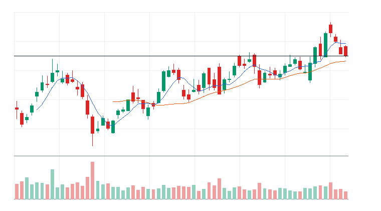
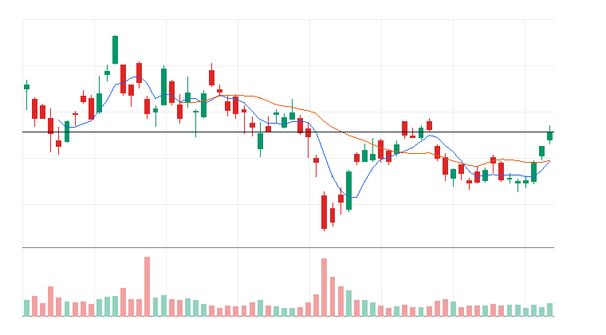
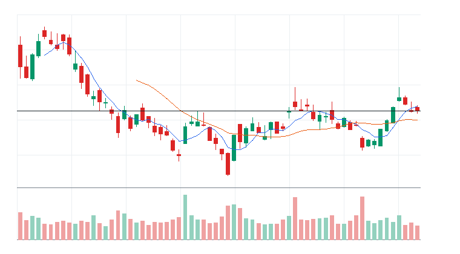

# 오늘의 데일리 트레이딩 요약

**REAL DATA TEST - 가격/거래량은 실제 데이터, 뉴스/ETF 구성종목 확산도/거래대금 유동성 일부 연결**

**목적:** 이 리포트는 최근 오른 자산을 나열하는 것이 아니라, 돈이 몰리는 근거와 다음 매수 주체가 확인할 트레이딩 후보를 찾기 위한 보고서다.

> 핵심 질문: 현재 가격에서 누가 사고 있고, 누가 앞으로 더 비싸게 사줄 수 있는가?

## 시장 국면 판단

- 최종 판정: 기간 조정 (81점)
- 전일 대비: 기간 조정 유지, 점수 변화는 제한적이다(0점).
- 판정 신뢰도: 높음 (100점) - 핵심 지수와 매크로 데이터가 대부분 직접 수집되어 판정 신뢰도가 높다.
- 행동 바이어스: 추격 보류, 돌파 확인
- 한 줄 결론: 장기 추세는 유지되지만 단기 추세가 둔화되어 기간 조정으로 본다. 기술 100점, 매크로 46점.
- 기술적 지표: 상승 추세 우위 (100점, 가중치 65%)
- S&P 500: 100점 | 50일선 위, 200일선 위, 20일 -1.19%, 60일 +3.00%, 52주 고점 대비 -2.31% -> 기술 점수 100
- Nasdaq 100: 100점 | 50일선 위, 200일선 위, 20일 -0.35%, 60일 -1.00%, 52주 고점 대비 -4.36% -> 기술 점수 100
- 매크로 시황: 매크로 중립 (46점, 가중치 35%)
- 매크로 요약: 물가, 신용/유동성 부담으로 매크로 환경은 방어적이다.
- 금리: 중립 47점 / 금리 중립 / confidence HIGH
  - 주요 근거: US 10Y yield 20일 +3.27%, 5일 +0.85%; US 3M yield 20일 +2.01%, 단기금리 방향 확인; US long-duration bonds 20일 +0.17%, 장기채 가격 기준 할인율 부담 확인
  - 확인 사항: 추가 확인 이벤트 없음
- 물가: 부담 41점 / 물가 부담 / confidence HIGH
  - 주요 근거: Oil ETF 20일 +15.97%, 유가 기반 물가 압력 확인; TIPS ETF 20일 +0.18%, 물가연동채 흐름은 보조 근거; Gold 20일 -0.70%, 금 강세는 방어 수요 여부 확인
  - 확인 사항: 추가 확인 이벤트 없음
- 정책: 중립 50점 / 정책 이벤트 확인 전 중립 / confidence LOW
  - 주요 근거: 정책 톤은 1차 버전에서 일정/이벤트 리스크 기반 중립값으로 반영한다.
  - 확인 사항: FOMC, CPI, PCE, 고용지표 발표 전후에는 매크로 confidence를 보수적으로 해석한다.
- 신용/유동성: 부담 41점 / 신용/유동성 부담 / confidence HIGH
  - 주요 근거: High yield credit 20일 -0.45%, 하이일드 위험선호 확인; HYG-LQD 20일 상대강도 0.00%, 신용위험 선호/회피 확인; VIX 20일 +13.13%, 변동성 부담 확인
  - 확인 사항: VIX 상승은 유동성/리스크 프리미엄 부담으로 해석한다.
- 환율/글로벌: 중립 51점 / 환율/글로벌 중립 / confidence MEDIUM
  - 주요 근거: US dollar 20일 -0.53%, 달러 강세/약세 확인
  - 확인 사항: 추가 확인 이벤트 없음
- US 10Y yield: 44점 | 하락 시 주식 우호; 5일 +0.85%, 20일 +3.27% -> 매크로 점수 44
- US 3M yield: 46점 | 하락 시 주식 우호; 5일 +0.87%, 20일 +2.01% -> 매크로 점수 46
- US long-duration bonds: 50점 | 상승 시 주식 우호; 5일 -0.39%, 20일 +0.17% -> 매크로 점수 50
- TIPS ETF: 50점 | 상승 시 주식 우호; 5일 +0.22%, 20일 +0.18% -> 매크로 점수 50
- Oil ETF: 17점 | 하락 시 주식 우호; 5일 +9.22%, 20일 +15.97% -> 매크로 점수 17
- Gold: 50점 | 상승 시 주식 우호; 5일 -2.13%, 20일 -0.70% -> 매크로 점수 50
- US dollar: 51점 | 하락 시 주식 우호; 5일 -0.46%, 20일 -0.53% -> 매크로 점수 51
- High yield credit: 49점 | 상승 시 주식 우호; 5일 -0.86%, 20일 -0.45% -> 매크로 점수 49
- Investment grade credit: 50점 | 상승 시 주식 우호; 5일 -0.69%, 20일 -0.45% -> 매크로 점수 50
- VIX: 22점 | 하락 시 주식 우호; 5일 +8.29%, 20일 +13.13% -> 매크로 점수 22
- 데이터 커버리지: 기술 2/2, 매크로 10/10
- 데이터 신뢰도 근거:
  - 직접 지수 데이터: S&P 500, Nasdaq 100
  - 대체 지수 데이터 없음
  - 매크로 데이터: 10/10
  - 누락 데이터 없음
  - stale 데이터 없음

## 모바일 요약

[오늘의 데일리 트레이딩 요약]

생성 성공 / 데이터 모드: REAL_TEST

시장:
- 중립

시장 지배 서사:
1. 비트코인/디지털 자산 위험선호 - 약화 - iShares Bitcoin Trust ETF(IBIT), Amplify Transformational Data Sharing ETF(BLOK), IREN, MARA Holdings(MARA) 중심으로 5일 +9.36%, 20일 +20.88% 흐름이 형성됨. 직접 촉매 일부 확인.
2. Data Storage 자금 유입 - 관찰 - Invesco QQQ Trust(QQQ), iShares Russell 2000 ETF(IWM), Seagate Technology Holdings plc(STX), Western Digital Corporation(WDC) 중심으로 5일 +3.09%, 20일 +3.75% 흐름이 형성됨. 직접 촉매 일부 확인.
3. 반도체 설계/공급망 재가속 - 약화 - VanEck Semiconductor ETF(SMH), iShares Semiconductor ETF(SOXX), Intel Corporation(INTC), Advanced Micro Devices Inc.(AMD) 중심으로 5일 +4.37%, 20일 +2.55% 흐름이 형성됨. 직접 촉매 일부 확인.

트렌드 강도:
1. 비트코인/디지털 자산 위험선호 - TSI 62 - 약화 - 진입품질 관찰
2. Data Storage 자금 유입 - TSI 36 - 잠복 - 진입품질 낮음
3. 반도체 설계/공급망 재가속 - TSI 58 - 부상 - 진입품질 관찰

오늘 결론:
- Utilities 개별 종목 흐름이 ETF 대비 강한지 확인 필요
- 행동 후보는 linkedNarrative와 함께 확인한다.
- 추격보다 진입 조건 확인 후 접근한다.

오늘 실제 행동 후보:
1. Constellation Energy Corporation(CEG)(STOCK) - 전력망/원전/인프라 병목 - 단기 추세가 유지되고 거래량이 1.0배 이상이면 눌림 이후 재상승을 시도할 수 있음
2. Advanced Micro Devices Inc.(AMD)(STOCK) - 반도체 설계/공급망 재가속 - 단기 추세가 유지되고 거래량이 1.0배 이상이면 눌림 이후 재상승을 시도할 수 있음
3. Taiwan Semiconductor(TSM)(STOCK) - 반도체 설계/공급망 재가속 - 단기 추세가 유지되고 거래량이 1.0배 이상이면 눌림 이후 재상승을 시도할 수 있음

다크호스 후보:
1. 다크호스 후보 없음 - 조건 충족 후보 없음

ETF 후보 TOP 5:
1. Roundhill Memory ETF(DRAM) - AI 인프라 재가속 - 조건부 진입
2. Global X Uranium ETF(URA) - 전력망/원전/인프라 병목 - 관찰
3. Global X Copper Miners ETF(COPX) - 전력망/원전/인프라 병목 - 관찰
4. VanEck Semiconductor ETF(SMH) - 반도체 설계/공급망 재가속 - 관찰
5. iShares Semiconductor ETF(SOXX) - 반도체 설계/공급망 재가속 - 관찰

웹 리포트:
https://yoolcool.github.io/DailyTradingThesisAgent/

## 오늘 결론

- 오늘 결론: 조건부 진입
- 신규 진입 후보: 0개
- 조건부 진입 후보: 6개
- 관찰 후보: 83개
- 주요 제한 요인: Entry Quality < 40, 뉴스 직접성 부족, RVOL 미달
- 주문 판단: 시장가 금지 / 지정가 또는 관찰
- 실전 판단: 진입 후보는 있으나, 전일 고점 돌파와 거래량 확인 후 선별적으로 접근한다.

### 후보 제한 요인 집계

- RVOL < 1.00x: 75개
- 거래대금 유동성 낮음: 16개
- Entry Quality 50~54 near miss: 3개
- Entry Quality 40~49 관찰: 11개
- Entry Quality < 40: 143개
- Exhaustion Risk >= 70: 0개
- ETF breadth 샘플 부족: 37개
- 뉴스 직접성 부족: 100개

## 데이터 신뢰도

- 전체 데이터 신뢰도 등급: LOW
- 분석 신뢰도: LOW
- 주문 실행 신뢰도: LOW
- ETF breadth 신뢰도: LOW
- 신뢰도 해석: 테마 확산 판단 제한, 거래대금 유동성 낮음 또는 확인 불가, 프리/애프터마켓 확인 불가
- 리포트 생성 시각: 2026-09-10 09:53 KST
- 가격 기준 거래일: 2026-09-09 US regular close
- 뉴스 수집 시각: 2026-09-10 09:53 KST
- 가장 최근 뉴스 발행 시각: 2026-09-10 09:42 KST
- 뉴스 신선도 상태: FRESH
- 뉴스 소스: Yahoo Finance RSS, MarketWatch RSS, CNBC Markets RSS, SEC EDGAR RSS, Federal Reserve RSS, Finnhub API
- 뉴스 소스 상태: Yahoo Finance RSS CONNECTED, MarketWatch RSS CONNECTED, CNBC Markets RSS PARTIAL, SEC EDGAR RSS PARTIAL, Federal Reserve RSS CONNECTED, Finnhub API DISABLED
- 뉴스 신뢰도: MEDIUM
- 추천 적용 거래일: 2026-09-09 US regular session
- 가격/거래량 데이터 상태: 연결됨
- 뉴스 데이터 상태: 일부 연결
- ETF 구성종목 확산도 상태: 일부 연결
- ETF 구성종목 샘플 수: 1~4
- 거래대금 유동성 데이터 상태: 일부 연결
- 프리/애프터마켓 데이터 상태: UNAVAILABLE
- 데이터 provider: yfinance, Yahoo Finance RSS, MarketWatch RSS, CNBC Markets RSS, SEC EDGAR RSS, Federal Reserve RSS, Finnhub API, config fallback sample, price-volume dollar-volume fallback
- 실전 사용 경고: 이 리포트는 투자판단 보조용이며, REAL_TEST 모드에서는 일부 데이터가 누락되거나 지연될 수 있다. 실제 주문 전 현재가, 뉴스, 프리마켓/정규장 거래량을 별도 확인해야 한다.

## 0. 시장 상태

- 데이터 모드: REAL_TEST
- 가격/거래량: 연결됨
- 뉴스: 일부 연결
- ETF 구성종목 확산도: 일부 연결
- 거래대금 유동성: 일부 연결
- 생성 시각: 2026년 9월 10일 목요일 AM 9:53
- 시장 상태: 중립
- 오늘 돈의 방향: Utilities 개별 종목 흐름이 ETF 대비 강한지 확인 필요
- 강한 테마 TOP 3: 메모리/HBM ETF(89), Materials(69), 구리/금속 ETF(68)
- 데이터 한계:
  - API 또는 provider 상태에 따라 뉴스/ETF 확산도/거래대금 유동성 반영 범위가 달라질 수 있다.
  - 수집 실패 데이터는 점수 반영에서 제외하거나 confidence를 제한한다.
  - reasonConfidence HIGH는 직접 촉매, 가격/거래량, 확산도/유동성 근거가 함께 있을 때만 사용한다.

## 오늘 시장을 지배하는 서사

### 오늘 시장을 지배하는 서사 TOP 3

#### 1. 비트코인/디지털 자산 위험선호
- 상태: 약화
- narrativeScore: 55
- reasonConfidence: LOW
- 근거 ETF: IBIT, BLOK
- 근거 개별 종목: IREN, MARA, CIFR, RIOT, MSTR
- 돈이 몰리는 이유: 비트코인/디지털 자산 위험선호 관련 iShares Bitcoin Trust ETF(IBIT), Amplify Transformational Data Sharing ETF(BLOK)와 IREN, MARA Holdings(MARA), Cipher Mining(CIFR), Riot Platforms(RIOT)의 5일(+9.36%)·20일(+20.88%) 흐름을 함께 본다. 평균 상대 거래량은 0.82배이고, ETF 확산도는 추가 확인이 필요하다. 직접 뉴스/이벤트가 일부 확인된다.
- 다음 매수 주체: 비트코인 현물 ETF와 디지털 자산 베타를 사는 위험선호 자금
- 가장 좋은 트레이딩 수단: ETF 우선: IBIT, BLOK / 개별 종목 우선: MSTR, IREN
- 서사가 깨지는 조건: IBIT/BLOK 20일선 이탈 또는 채굴주 상대강도 급락
- 오늘 행동: 비트코인 베타가 살아날 때만 단기 매매

상세 narrativeScore 근거 보기

- rawScore: 55
- ETF 평균 moneyFlowScore: 30
- 개별 종목 평균 moneyFlowScore: 64
- ETF 후보 비율: 0%
- 개별 종목 후보 비율: 50%
- 5일 평균 수익률: +9.00%
- 20일 평균 수익률: +21.00%
- 평균 상대 거래량: 1.00배
- ETF 평균 상대 거래량: 1.00배
- 개별주 평균 상대 거래량: 1.00배
- 52주 고점 근접 후보 비율: 0%
- 뉴스 직접성 점수: 7
- ETF 확산도 점수: 0
- 유동성 점수: 1
- 과열 리스크 차감: 0

#### 2. Data Storage 자금 유입
- 상태: 관찰
- narrativeScore: 50
- reasonConfidence: LOW
- 근거 ETF: QQQ, IWM, SPY
- 근거 개별 종목: STX, WDC
- 돈이 몰리는 이유: Data Storage 자금 유입 관련 Invesco QQQ Trust(QQQ), iShares Russell 2000 ETF(IWM), SPDR S&P 500 ETF Trust(SPY)와 Seagate Technology Holdings plc(STX), Western Digital Corporation(WDC)의 5일(+3.09%)·20일(+3.75%) 흐름을 함께 본다. 평균 상대 거래량은 1.12배이고, ETF 확산도는 추가 확인이 필요하다. 직접 뉴스/이벤트가 일부 확인된다.
- 다음 매수 주체: Data Storage 자금 유입을 확인한 섹터 ETF 자금과 상대강도 추종 스윙 자금
- 가장 좋은 트레이딩 수단: ETF 우선: QQQ, SPY, IWM / 개별 종목 우선: STX, WDC
- 서사가 깨지는 조건: QQQ 20일선 이탈 또는 관련 종목 절반 이상 5일선 이탈
- 오늘 행동: 기존 네러티브와 중복을 확인한 뒤 ETF/대표 종목 동조성이 살아날 때만 관찰 편입

상세 narrativeScore 근거 보기

- rawScore: 50
- ETF 평균 moneyFlowScore: 19
- 개별 종목 평균 moneyFlowScore: 78
- ETF 후보 비율: 0%
- 개별 종목 후보 비율: 100%
- 5일 평균 수익률: +3.00%
- 20일 평균 수익률: +4.00%
- 평균 상대 거래량: 1.00배
- ETF 평균 상대 거래량: 1.00배
- 개별주 평균 상대 거래량: 1.00배
- 52주 고점 근접 후보 비율: 60%
- 뉴스 직접성 점수: 5
- ETF 확산도 점수: -3
- 유동성 점수: 5
- 과열 리스크 차감: 0

#### 3. 반도체 설계/공급망 재가속
- 상태: 약화
- narrativeScore: 42
- reasonConfidence: LOW
- 근거 ETF: SMH, SOXX, SOXQ
- 근거 개별 종목: INTC, AMD, TSM, NVDA, MRVL
- 돈이 몰리는 이유: 반도체 설계/공급망 재가속 관련 VanEck Semiconductor ETF(SMH), iShares Semiconductor ETF(SOXX), Invesco PHLX Semiconductor ETF(SOXQ)와 Intel Corporation(INTC), Advanced Micro Devices Inc.(AMD), Taiwan Semiconductor(TSM), NVIDIA Corporation(NVDA)의 5일(+4.37%)·20일(+2.55%) 흐름을 함께 본다. 평균 상대 거래량은 1.18배이고, ETF 확산도는 추가 확인이 필요하다. 직접 뉴스/이벤트가 일부 확인된다.
- 다음 매수 주체: 반도체 설계/공급망 재가속을 확인한 섹터 ETF 자금과 상대강도 추종 스윙 자금
- 가장 좋은 트레이딩 수단: ETF 우선: SMH, SOXX, SOXQ / 개별 종목 우선: MRVL, NVDA, TSM
- 서사가 깨지는 조건: SMH 20일선 이탈 또는 관련 종목 절반 이상 5일선 이탈
- 오늘 행동: 기존 네러티브와 중복을 확인한 뒤 ETF/대표 종목 동조성이 살아날 때만 관찰 편입

상세 narrativeScore 근거 보기

- rawScore: 42
- ETF 평균 moneyFlowScore: 32
- 개별 종목 평균 moneyFlowScore: 51
- ETF 후보 비율: 20%
- 개별 종목 후보 비율: 50%
- 5일 평균 수익률: +4.00%
- 20일 평균 수익률: +3.00%
- 평균 상대 거래량: 1.00배
- ETF 평균 상대 거래량: 1.00배
- 개별주 평균 상대 거래량: 1.00배
- 52주 고점 근접 후보 비율: 18%
- 뉴스 직접성 점수: 7
- ETF 확산도 점수: -2
- 유동성 점수: 2
- 과열 리스크 차감: 0

### 전체 narrative 요약

| 서사명 | 상태 | narrativeScore | reasonConfidence | 대표 ETF | 대표 종목 | 오늘 행동 |
| --- | --- | ---: | --- | --- | --- | --- |
| 비트코인/디지털 자산 위험선호 | 약화 | 55 | LOW | IBIT, BLOK | IREN, MARA, CIFR, RIOT | 비트코인 베타가 살아날 때만 단기 매매 |
| Data Storage 자금 유입 | 관찰 | 50 | LOW | QQQ, IWM, SPY | STX, WDC | 기존 네러티브와 중복을 확인한 뒤 ETF/대표 종목 동조성이 살아날 때만 관찰 편입 |
| 반도체 설계/공급망 재가속 | 약화 | 42 | LOW | SMH, SOXX, SOXQ | INTC, AMD, TSM, NVDA | 기존 네러티브와 중복을 확인한 뒤 ETF/대표 종목 동조성이 살아날 때만 관찰 편입 |
| 반도체 장비 사이클 재평가 | 약화 | 42 | LOW | SMH, SOXX, SOXQ | ASML, LRCX, AMAT | 기존 네러티브와 중복을 확인한 뒤 ETF/대표 종목 동조성이 살아날 때만 관찰 편입 |
| AI 인프라 재가속 | 약화 | 36 | LOW | DRAM, SMH, SOXX | AMD, VRT, ETN, MU | 추격보다 5일선 지지 후 재상승 확인 |
| 전력망/원전/인프라 병목 | 약화 | 35 | LOW | URA, COPX, GRID | CEG, VRT, FCX, ETN | ETF 확산도와 거래량이 같이 살아날 때만 진입 |
| 매크로 방어/헤지 | 약화 | 29 | LOW | XLE, GLD, TLT | CVX, XOM | 위험회피가 확인될 때만 헤지성 접근 |
| 전력 유틸리티 수요 재평가 | 약화 | 29 | LOW | QQQ, IWM, SPY | VRT, ETN, GEV | 기존 네러티브와 중복을 확인한 뒤 ETF/대표 종목 동조성이 살아날 때만 관찰 편입 |
| Integrated Oil & Gas 자금 유입 | 약화 | 28 | LOW | QQQ, IWM, SPY | CVX, XOM | 기존 네러티브와 중복을 확인한 뒤 ETF/대표 종목 동조성이 살아날 때만 관찰 편입 |
| 위험선호 성장주 재진입 | 약화 | 26 | LOW | ARKK, QQQ, IPO | TSLA, ARM, COIN | 지수 위험선호가 유지될 때만 선별 진입 |
| Internet Content 자금 유입 | 약화 | 14 | LOW | QQQ | META, DASH | 기존 네러티브와 중복을 확인한 뒤 ETF/대표 종목 동조성이 살아날 때만 관찰 편입 |
| 바이오/헬스케어 촉매 | 약화 | 13 | LOW | QQQ | ALNY, GILD, VRTX, REGN | 기존 네러티브와 중복을 확인한 뒤 ETF/대표 종목 동조성이 살아날 때만 관찰 편입 |
| 소프트웨어 실적/AI 수익화 | 약화 | 9 | LOW | QQQ, AIQ, IGV | MSTR, ADBE, MSFT | 기존 네러티브와 중복을 확인한 뒤 ETF/대표 종목 동조성이 살아날 때만 관찰 편입 |
| Specialty Business Services 자금 유입 | 약화 | 8 | LOW | QQQ, IWM, SPY | CPRT, TRI, CTAS | 기존 네러티브와 중복을 확인한 뒤 ETF/대표 종목 동조성이 살아날 때만 관찰 편입 |
| 필수소비재 음료 방어 성장 | 약화 | 2 | LOW | QQQ | CCEP, MNST | 기존 네러티브와 중복을 확인한 뒤 ETF/대표 종목 동조성이 살아날 때만 관찰 편입 |
| Travel Services 자금 유입 | 소멸 | 1 | LOW | QQQ | BKNG, ABNB | 기존 네러티브와 중복을 확인한 뒤 ETF/대표 종목 동조성이 살아날 때만 관찰 편입 |
| Aerospace & Defense 자금 유입 | 소멸 | 0 | LOW | QQQ, IWM, SPY | AVAV, KTOS | 기존 네러티브와 중복을 확인한 뒤 ETF/대표 종목 동조성이 살아날 때만 관찰 편입 |
| 소비 회복/방어주 선별 | 소멸 | 0 | LOW | QQQ | PDD, AMZN | 기존 네러티브와 중복을 확인한 뒤 ETF/대표 종목 동조성이 살아날 때만 관찰 편입 |
| AI 소프트웨어/사이버보안 확산 | 약화 | 0 | LOW | QQQ, AIQ, IGV | TEAM, PLTR, DDOG, MSFT | 추격보다 눌림 후 재상승 확인 |
| 방산/안보 프리미엄 | 소멸 | 0 | LOW | XAR, SHLD, ITA | AVAV, KTOS, PLTR | 뉴스 촉매가 직접 확인될 때만 추세 추종 |
| 사이버보안 지출 재가속 | 소멸 | 0 | LOW | HACK, CIBR, IHAK | ZS, CRWD, FTNT, PANW | 기존 네러티브와 중복을 확인한 뒤 ETF/대표 종목 동조성이 살아날 때만 관찰 편입 |

## 트렌드 강도 판단

### 1. 비트코인/디지털 자산 위험선호
- Trend Strength Index: 62
- 트렌드 상태 라벨: 약화
- 테마 확산도: 보통
- ETF 동조성: 강함
- 거래량 강도: 부족
- 과열 위험: 낮음 (24)
- 오늘 진입 품질: 관찰 (41)
- 한 줄 판단: 비트코인/디지털 자산 위험선호는 Trend Strength는 중간이지만 진입 품질이 살아나는 초기 진입 후보 성격이다.
- 오늘 접근법: 상승률이 남아 있어도 iShares Bitcoin Trust ETF(IBIT)/Amplify Transformational Data Sharing ETF(BLOK)와 구성 종목 확산도가 회복될 때까지 신규 진입은 낮춘다.

트렌드 강도 상세 근거 보기

- 가격 모멘텀: 가격 모멘텀 24/25. 평균 5D +9.36%, 20D +20.88%.
- 거래량 강도: 거래량 강도 4/20. 평균 RVOL 0.82배.
- ETF 동조성: ETF 동조성 13/15. 관련 ETF iShares Bitcoin Trust ETF(IBIT), Amplify Transformational Data Sharing ETF(BLOK) 흐름을 기준으로 판단.
- 테마 확산도: 테마 확산도 11/20. 상위 1~2개 쏠림 감점 0점 반영.
- 뉴스 촉매: 뉴스/촉매 신선도 6/10. HIGH 직접 촉매 2개.
- 과열 리스크: 과열 리스크 24/100. 단기 급등, 고점 근접, ETF-개별주 괴리, 쏠림을 함께 반영.
- 시장 환경: 시장 환경 4/10. QQQ/SPY/IWM 가격 흐름 기반 위험선호 점수.

### 2. Data Storage 자금 유입
- Trend Strength Index: 36
- 트렌드 상태 라벨: 잠복
- 테마 확산도: 부족
- ETF 동조성: 부족
- 거래량 강도: 약함
- 과열 위험: 낮음 (22)
- 오늘 진입 품질: 낮음 (25)
- 한 줄 판단: Data Storage 자금 유입는 테마 확산도가 낮아 아직 개별 종목 이벤트성 흐름에 가깝다.
- 오늘 접근법: Invesco QQQ Trust(QQQ)/iShares Russell 2000 ETF(IWM)/SPDR S&P 500 ETF Trust(SPY)와 Seagate Technology Holdings plc(STX)/Western Digital Corporation(WDC)의 거래량 확산이 확인되기 전까지 관찰한다.

트렌드 강도 상세 근거 보기

- 가격 모멘텀: 가격 모멘텀 13/25. 평균 5D +3.09%, 20D +3.75%.
- 거래량 강도: 거래량 강도 9/20. 평균 RVOL 1.12배.
- ETF 동조성: ETF 동조성 3/15. 관련 ETF Invesco QQQ Trust(QQQ), SPDR S&P 500 ETF Trust(SPY), iShares Russell 2000 ETF(IWM) 흐름을 기준으로 판단.
- 테마 확산도: 테마 확산도 4/20. 상위 1~2개 쏠림 감점 6점 반영.
- 뉴스 촉매: 뉴스/촉매 신선도 3/10. HIGH 직접 촉매 2개.
- 과열 리스크: 과열 리스크 22/100. 단기 급등, 고점 근접, ETF-개별주 괴리, 쏠림을 함께 반영.
- 시장 환경: 시장 환경 4/10. QQQ/SPY/IWM 가격 흐름 기반 위험선호 점수.

### 3. 반도체 설계/공급망 재가속
- Trend Strength Index: 58
- 트렌드 상태 라벨: 부상
- 테마 확산도: 보통
- ETF 동조성: 보통
- 거래량 강도: 보통
- 과열 위험: 낮음 (2)
- 오늘 진입 품질: 관찰 (47)
- 한 줄 판단: 반도체 설계/공급망 재가속는 Trend Strength는 중간이지만 진입 품질이 살아나는 초기 진입 후보 성격이다.
- 오늘 접근법: VanEck Semiconductor ETF(SMH)/iShares Semiconductor ETF(SOXX)/Invesco PHLX Semiconductor ETF(SOXQ) 거래량 증가와 Intel Corporation(INTC)/Advanced Micro Devices Inc.(AMD)/Taiwan Semiconductor(TSM) 확산을 확인하며 작은 사이즈의 초기 진입 후보로만 본다.

트렌드 강도 상세 근거 보기

- 가격 모멘텀: 가격 모멘텀 15/25. 평균 5D +4.37%, 20D +2.55%.
- 거래량 강도: 거래량 강도 10/20. 평균 RVOL 1.18배.
- ETF 동조성: ETF 동조성 9/15. 관련 ETF VanEck Semiconductor ETF(SMH), iShares Semiconductor ETF(SOXX), Invesco PHLX Semiconductor ETF(SOXQ), Global X Artificial Intelligence & Technology ETF(AIQ), Invesco QQQ Trust(QQQ) 흐름을 기준으로 판단.
- 테마 확산도: 테마 확산도 13/20. 상위 1~2개 쏠림 감점 0점 반영.
- 뉴스 촉매: 뉴스/촉매 신선도 7/10. HIGH 직접 촉매 2개.
- 과열 리스크: 과열 리스크 2/100. 단기 급등, 고점 근접, ETF-개별주 괴리, 쏠림을 함께 반영.
- 시장 환경: 시장 환경 4/10. QQQ/SPY/IWM 가격 흐름 기반 위험선호 점수.

## 최근 추천 결과 트래킹

개별주는 데이트레이딩 관점으로 추천 이후 첫 정규장의 장중 최고가와 종가를 추적한다. ETF는 테마/스윙 관점으로 추천 이후 1주일 동안의 최고가와 현재 종가를 추적한다.

### 개별주 Top 3 추천 성과 요약
- 최근 5개 리포트 표본: 7개 (초기 검증 단계)
- 장중 최고가 기준 성공률: 0.00%
- 종가 기준 성공률: 0.00%
- 평균 장중 최고 수익률: +1.10%
- 평균 종가 수익률: -1.04%

### ETF 추천 성과 요약
- 최근 5개 리포트 표본: 2개 (초기 검증 단계)
- 1주 최고가 기준 성공률: 0.00%
- 현재 종가 기준 성공률: 0.00%
- 평균 1주 최고 수익률: +0.10%
- 평균 현재 수익률: -0.92%

최근 추천 결과 상세 테이블 펼치기

| 추천일 | 유형 | 순위 | 티커 | 기준가 | 추적 기간 | 상태 | High 수익률 | Close 수익률 | 결과 | 코멘트 |
| --- | --- | ---: | --- | ---: | --- | --- | ---: | ---: | --- | --- |
| 2026-09-10 | STOCK | 3 | TSM | $439 | 2026-09-10 | pending | 데이터 없음 | 데이터 없음 | 추적 대기 | 아직 추적 거래일 데이터가 완성되지 않음 |
| 2026-09-10 | STOCK | 2 | AMD | $505.74 | 2026-09-10 | pending | 데이터 없음 | 데이터 없음 | 추적 대기 | 아직 추적 거래일 데이터가 완성되지 않음 |
| 2026-09-10 | STOCK | 1 | CEG | $299.05 | 2026-09-10 | pending | 데이터 없음 | 데이터 없음 | 추적 대기 | 아직 추적 거래일 데이터가 완성되지 않음 |
| 2026-09-10 | ETF | 1 | DRAM | $61.1 | 2026-09-10~2026-09-17 | in_progress | 데이터 없음 | 0.00% | 진행 중 | 아직 1주 추적 기간이 끝나지 않음 (일봉 high 미확보 시 close 기준 보조) |
| 2026-09-09 | STOCK | 1 | MU | $1,016.59 | 2026-09-09 | pending | 데이터 없음 | 데이터 없음 | 추적 대기 | 아직 추적 거래일 데이터가 완성되지 않음 |
| 2026-09-08 | STOCK | 1 | MU | $1,016.59 | 2026-09-08 | complete | +2.41% | -1.61% | 제한적 유효 | 제한적인 장중 기회만 발생 (일봉 기준) |
| 2026-09-07 | STOCK | 1 | MU | $1,016.59 | 2026-09-07 | pending | 데이터 없음 | 데이터 없음 | 추적 대기 | 아직 추적 거래일 데이터가 완성되지 않음 |
| 2026-09-04 | STOCK | 1 | ALNY | $267.4 | 2026-09-04 | complete | -0.21% | -0.48% | 실패 | 추천 이후 의미 있는 장중 기회가 부족하고 종가도 약함 (일봉 기준) |
| 2026-09-04 | ETF | 1 | OIH | $436.58 | 2026-09-04~2026-09-11 | in_progress | +0.10% | -1.83% | 진행 중 | 아직 1주 추적 기간이 끝나지 않음 |
| 2026-09-03 | STOCK | 1 | CVX | $211.05 | 2026-09-03 | complete | +1.02% | +0.13% | 제한적 유효 | 제한적인 장중 기회만 발생 (일봉 기준) |
| 2026-09-02 | STOCK | 1 | CVX | $211.05 | 2026-09-02 | complete | +0.82% | +0.35% | 추적 대기 | 아직 추적 거래일 데이터가 완성되지 않음 (일봉 기준) |
| 2026-09-01 | STOCK | 3 | PANW | $382.13 | 2026-09-01 | complete | -1.63% | -5.24% | 실패 | 추천 이후 의미 있는 장중 기회가 부족하고 종가도 약함 (일봉 기준) |
| 2026-09-01 | STOCK | 2 | ZS | $188.39 | 2026-09-01 | complete | -1.06% | -5.32% | 실패 | 추천 이후 의미 있는 장중 기회가 부족하고 종가도 약함 (일봉 기준) |
| 2026-09-01 | STOCK | 1 | CRWD | $231 | 2026-09-01 | complete | +0.13% | -6.90% | 실패 | 추천 이후 의미 있는 장중 기회가 부족하고 종가도 약함 (일봉 기준) |
| 2026-09-01 | ETF | 1 | CIBR | $100.15 | 2026-09-01~2026-09-08 | complete | -4.15% | -6.13% | 실패 | 추천 이후 ETF 흐름이 약화됨 |
| 2026-08-31 | STOCK | 3 | MSFT | $513.53 | 2026-08-31 | complete | -0.26% | -1.22% | 실패 | 추천 이후 의미 있는 장중 기회가 부족하고 종가도 약함 (일봉 기준) |
| 2026-08-31 | STOCK | 2 | WDAY | $204.72 | 2026-08-31 | complete | -0.53% | -3.55% | 실패 | 추천 이후 의미 있는 장중 기회가 부족하고 종가도 약함 (일봉 기준) |
| 2026-08-31 | STOCK | 1 | CRWD | $218.4 | 2026-08-31 | complete | +7.09% | +5.77% | 성공 | 장중 기회와 종가 유지가 모두 확인됨 (일봉 기준) |
| 2026-08-31 | ETF | 1 | IGV | $109.5 | 2026-08-31~2026-09-07 | complete | -0.70% | -6.25% | 실패 | 추천 이후 ETF 흐름이 약화됨 |
| 2026-08-28 | STOCK | 3 | ZS | $187.3 | 2026-08-28 | complete | +0.47% | -1.64% | 실패 | 추천 이후 의미 있는 장중 기회가 부족하고 종가도 약함 (일봉 기준) |
| 2026-08-28 | STOCK | 2 | ADSK | $270.58 | 2026-08-28 | complete | -1.32% | -3.67% | 실패 | 추천 이후 의미 있는 장중 기회가 부족하고 종가도 약함 (일봉 기준) |
| 2026-08-28 | STOCK | 1 | ADBE | $289.15 | 2026-08-28 | complete | +1.71% | +0.82% | 제한적 유효 | 제한적인 장중 기회만 발생 (일봉 기준) |
| 2026-08-28 | ETF | 3 | IBIT | $45.29 | 2026-08-28~2026-09-04 | complete | +2.38% | -1.99% | 단기 고점 후 반납 | 1주 내 상승 기회는 있었지만 현재가는 반납 |
| 2026-08-28 | ETF | 2 | CIBR | $100.79 | 2026-08-28~2026-09-04 | complete | -0.35% | -6.73% | 실패 | 추천 이후 ETF 흐름이 약화됨 |
| 2026-08-28 | ETF | 1 | IGV | $110.32 | 2026-08-28~2026-09-04 | complete | +0.23% | -6.94% | 실패 | 추천 이후 ETF 흐름이 약화됨 |
| 2026-08-21 | STOCK | 3 | FCX | $71.22 | 2026-08-21 | complete | +8.58% | +7.64% | 성공 | 장중 기회와 종가 유지가 모두 확인됨 (일봉 기준) |
| 2026-08-21 | STOCK | 2 | COIN | $172.35 | 2026-08-21 | complete | +11.03% | +8.20% | 성공 | 장중 기회와 종가 유지가 모두 확인됨 (일봉 기준) |
| 2026-08-21 | STOCK | 1 | MSTR | $112.39 | 2026-08-21 | complete | +8.47% | +6.10% | 성공 | 장중 기회와 종가 유지가 모두 확인됨 (일봉 기준) |
| 2026-08-21 | ETF | 1 | IBIT | $41.2 | 2026-08-21~2026-08-28 | complete | +11.19% | +7.74% | 성공 | 추천 이후 테마 추세가 유지됨 |
| 2026-08-20 | STOCK | 3 | ADBE | $272.47 | 2026-08-20 | complete | +0.65% | -0.09% | 실패 | 추천 이후 의미 있는 장중 기회가 부족하고 종가도 약함 (일봉 기준) |
| 2026-08-20 | STOCK | 2 | TEAM | $174.23 | 2026-08-20 | complete | +2.09% | +0.39% | 제한적 유효 | 제한적인 장중 기회만 발생 (일봉 기준) |
| 2026-08-20 | STOCK | 1 | INTU | $362.47 | 2026-08-20 | complete | +1.15% | -0.17% | 제한적 유효 | 제한적인 장중 기회만 발생 (일봉 기준) |
| 2026-08-18 | STOCK | 2 | CPRT | $31.7 | 2026-08-18 | complete | +5.84% | -0.60% | 단타 유효 | 장중 기회는 있었지만 종가 유지력은 약함 (일봉 기준) |
| 2026-08-18 | STOCK | 1 | PWR | $722.31 | 2026-08-18 | complete | -1.43% | -3.62% | 실패 | 추천 이후 의미 있는 장중 기회가 부족하고 종가도 약함 (일봉 기준) |
| 2026-08-17 | STOCK | 3 | WDAY | $198.68 | 2026-08-17 | complete | -1.69% | -3.77% | 실패 | 추천 이후 의미 있는 장중 기회가 부족하고 종가도 약함 (일봉 기준) |
| 2026-08-17 | STOCK | 2 | AVAV | $192.81 | 2026-08-17 | complete | -0.43% | -6.06% | 실패 | 추천 이후 의미 있는 장중 기회가 부족하고 종가도 약함 (일봉 기준) |
| 2026-08-17 | STOCK | 1 | KTOS | $64.58 | 2026-08-17 | complete | +0.79% | -2.00% | 실패 | 추천 이후 의미 있는 장중 기회가 부족하고 종가도 약함 (일봉 기준) |
| 2026-08-14 | STOCK | 3 | ADSK | $257.96 | 2026-08-14 | complete | +1.08% | -2.44% | 제한적 유효 | 제한적인 장중 기회만 발생 (일봉 기준) |
| 2026-08-14 | STOCK | 2 | TEAM | $165.98 | 2026-08-14 | complete | +1.07% | -2.27% | 제한적 유효 | 제한적인 장중 기회만 발생 (일봉 기준) |
| 2026-08-14 | STOCK | 1 | INTU | $358.29 | 2026-08-14 | complete | +1.04% | -3.53% | 제한적 유효 | 제한적인 장중 기회만 발생 (일봉 기준) |
| 2026-08-14 | ETF | 2 | IGV | $106.28 | 2026-08-14~2026-08-21 | complete | -2.05% | -3.41% | 실패 | 추천 이후 ETF 흐름이 약화됨 |
| 2026-08-14 | ETF | 1 | CIBR | $102.2 | 2026-08-14~2026-08-21 | complete | -2.50% | -8.01% | 실패 | 추천 이후 ETF 흐름이 약화됨 |
| 2026-08-13 | STOCK | 1 | ABNB | $180.1 | 2026-08-13 | complete | +2.91% | +2.80% | 제한적 유효 | 제한적인 장중 기회만 발생 (일봉 기준) |
| 2026-08-12 | STOCK | 3 | ABNB | $184.98 | 2026-08-12 | complete | -0.47% | -2.64% | 실패 | 추천 이후 의미 있는 장중 기회가 부족하고 종가도 약함 (일봉 기준) |
| 2026-08-12 | STOCK | 2 | AXON | $636.31 | 2026-08-12 | complete | +1.00% | -5.74% | 제한적 유효 | 제한적인 장중 기회만 발생 (일봉 기준) |
| 2026-08-12 | STOCK | 1 | FAST | $52.38 | 2026-08-12 | complete | +0.84% | -0.31% | 실패 | 추천 이후 의미 있는 장중 기회가 부족하고 종가도 약함 (일봉 기준) |
| 2026-08-11 | STOCK | 3 | ZS | $176.68 | 2026-08-11 | complete | +2.33% | +1.06% | 제한적 유효 | 제한적인 장중 기회만 발생 (일봉 기준) |
| 2026-08-11 | STOCK | 2 | PLTR | $175.23 | 2026-08-11 | complete | +1.55% | -0.17% | 제한적 유효 | 제한적인 장중 기회만 발생 (일봉 기준) |
| 2026-08-11 | STOCK | 1 | TEAM | $151.87 | 2026-08-11 | complete | +2.86% | +1.46% | 제한적 유효 | 제한적인 장중 기회만 발생 (일봉 기준) |
| 2026-08-11 | ETF | 3 | GLD | $402.54 | 2026-08-11~2026-08-18 | complete | +1.20% | -0.70% | 진행 중 | 아직 1주 추적 기간이 끝나지 않음 |
| 2026-08-11 | ETF | 2 | OIH | $411.34 | 2026-08-11~2026-08-18 | complete | +4.23% | +4.19% | 성공 | 추천 이후 테마 추세가 유지됨 |
| 2026-08-11 | ETF | 1 | CIBR | $100.6 | 2026-08-11~2026-08-18 | complete | +1.74% | -6.55% | 실패 | 추천 이후 ETF 흐름이 약화됨 |
| 2026-08-10 | STOCK | 3 | SHOP | $151.57 | 2026-08-10 | complete | +2.67% | +2.38% | 제한적 유효 | 제한적인 장중 기회만 발생 (일봉 기준) |
| 2026-08-10 | STOCK | 2 | FAST | $51.84 | 2026-08-10 | complete | +0.75% | +0.60% | 추적 대기 | 아직 추적 거래일 데이터가 완성되지 않음 (일봉 기준) |
| 2026-08-10 | STOCK | 1 | BKNG | $214.42 | 2026-08-10 | complete | +0.48% | -0.72% | 실패 | 추천 이후 의미 있는 장중 기회가 부족하고 종가도 약함 (일봉 기준) |
| 2026-08-10 | ETF | 2 | XME | $115.74 | 2026-08-10~2026-08-17 | complete | +3.45% | +3.64% | 성공 | 추천 이후 테마 추세가 유지됨 |
| 2026-08-10 | ETF | 1 | COPX | $88.03 | 2026-08-10~2026-08-17 | complete | +2.52% | +7.21% | 성공 | 추천 이후 테마 추세가 유지됨 |
| 2026-08-07 | STOCK | 3 | KTOS | $57.41 | 2026-08-07 | complete | +6.41% | +5.85% | 성공 | 장중 기회와 종가 유지가 모두 확인됨 (일봉 기준) |
| 2026-08-07 | STOCK | 2 | BKNG | $207.39 | 2026-08-07 | complete | +4.00% | +3.39% | 성공 | 장중 기회와 종가 유지가 모두 확인됨 (일봉 기준) |
| 2026-08-07 | STOCK | 1 | SHOP | $147.44 | 2026-08-07 | complete | +3.67% | +2.80% | 성공 | 장중 기회와 종가 유지가 모두 확인됨 (일봉 기준) |

## 오늘 실제 행동 후보

### 1. Constellation Energy Corporation(CEG)
- 자산 유형: STOCK
- linkedNarrative: 전력망/원전/인프라 병목
- narrativeStatus: 약화
- narrativeScore: 35
- Trend Strength Index: 55
- Exhaustion Risk: 1 (낮음)
- Entry Quality Score: 51 (관찰)
- 트렌드 판단: 시장 위험선호가 약해 시장 환경 비우호 구간이다.
- moneyFlowScore: 85
- finalRawScore: 85
- reasonConfidence: HIGH
- reasonConfidenceExplanation: 직접 촉매: CNBC Markets RSS / general_market / under_6h - Trump says oil and gas prices won&apos;t fall until &apos;right after&apos; midterm election 가격/거래량, 관련 ETF 동반 강세, 유동성 근거가 함께 확인되어 HIGH로 분류했다.
- tieBreakerReason: 최종 원점수 85, 리스크 패널티 0, 5일 수익률 +8.84%, 상대 거래량 1.50배 순으로 정렬
- 후보별 시장 해석: 중립 / 제한적 - 특이 충돌 없음
- 게이트 사유: 통과
- 주문 실행: 시장가 가능
- 직접 촉매: CNBC Markets RSS / general_market / under_6h - Trump says oil and gas prices won&apos;t fall until &apos;right after&apos; midterm election
- 왜 돈이 몰리는가: 20일 +10.58%, 5일 +8.84%, 상대 거래량 1.50배로 가격과 거래량이 함께 개선. 뉴스: CNBC Markets RSS general_market/under_6h / 유동성: LIQUID
- 누가 더 비싸게 사줄 수 있는지: 개별 주도주를 따라붙는 단기 모멘텀 자금과 관련 ETF 강세를 확인한 트레이더
- 진입 조건: 20일선 위 눌림 후 재상승 확인
- 무효화 조건: 20일선 이탈 또는 상대 거래량 0.8배 이하 둔화
- todayActionLabel: 조건부 진입
#### 최근 뉴스/동향 한국어 요약

- 요약: 섹터/테마 뉴스 중심 상태이며 뉴스 흐름은 긍정 우위입니다. 후보 선정 후 재확인한 핵심 이슈는 "Diesel prices hit another record high. If you&#x2019;re shocked, wait until you see your grocery bill."입니다.
- 직접 촉매 판단: Constellation Energy Corporation에 대해 강한 직접 촉매는 확인되지 않았습니다.
- 뉴스 1: Constellation Energy's Biggest AI Power Deal Doesn't Start Paying Until June 2027
  - 내용: Constellation Energy Corporation 관련 계약/수주 뉴스입니다. 기사 스니펫상 핵심 내용은 Meta signed a 20-year deal built around one Illinois nuclear plant.입니다.
  - 투자 의미: 계약/수주 재료는 실적 가시성이나 밸류에이션 기대에 영향을 줄 수 있어 규모와 일정 확인이 중요합니다.
  - 확인할 점: 계약/수주의 금액, 기간, 실적 반영 시점
- 뉴스 2: Google’s revived nuclear power plant gets $1.9B loan from US government
  - 내용: Constellation Energy Corporation 관련 시장 일반 뉴스입니다. 기사 스니펫상 핵심 내용은 Google said it would bring an Iowa nuclear power plant back from the dead.입니다.
  - 투자 의미: 단기 긍정 뉴스 흐름으로 볼 수 있지만, 단독 매수 근거보다는 가격·거래량 조건을 확인하는 보조 근거로 사용합니다.
  - 확인할 점: 원문 수치, 후속 보도, 가격이 진입 조건을 지키는지
- 뉴스 3: Nuclear Stock Face-Off: Is Constellation Energy or Vistra the Better Buy Right Now?
  - 내용: Constellation Energy Corporation 관련 시장 일반 뉴스입니다. 기사 스니펫상 핵심 내용은 Constellation Energy has the bigger nuclear platform, but Vistra's valuation and growth catalysts keep the race close.입니다.
  - 투자 의미: 단기 긍정 뉴스 흐름으로 볼 수 있지만, 단독 매수 근거보다는 가격·거래량 조건을 확인하는 보조 근거로 사용합니다.
  - 확인할 점: 원문 수치, 후속 보도, 가격이 진입 조건을 지키는지
- 매매 해석: 매매 관점에서는 뉴스 자체보다 가격이 진입 조건을 지키는지, 거래량이 동반되는지, 그리고 뉴스가 이미 주가에 반영됐는지를 우선 확인해야 합니다.
- 차트: 

### 2. Advanced Micro Devices Inc.(AMD)
- 자산 유형: STOCK
- linkedNarrative: 반도체 설계/공급망 재가속
- narrativeStatus: 약화
- narrativeScore: 42
- Trend Strength Index: 58
- Exhaustion Risk: 2 (낮음)
- Entry Quality Score: 42 (관찰)
- 트렌드 판단: 시장 위험선호가 약해 시장 환경 비우호 구간이다.
- moneyFlowScore: 89
- finalRawScore: 89
- reasonConfidence: HIGH
- reasonConfidenceExplanation: 직접 촉매: Yahoo Finance RSS / macro / under_6h / neutral - Dow Jones Futures Rise: Oil Prices Keep Climbing But Market Hasn't Broken Yet. Inflation Data Due. 가격/거래량, 관련 ETF 동반 강세, 유동성 근거가 함께 확인되어 HIGH로 분류했다.
- tieBreakerReason: 최종 원점수 89, 리스크 패널티 0, 5일 수익률 +7.44%, 상대 거래량 1.57배 순으로 정렬
- 후보별 시장 해석: 중립 / 제한적 - Entry Quality 42 < 50이나 moneyFlow 89, confidence HIGH, RVOL 1.57x로 강한 자금흐름 예외 조건 충족
- 게이트 사유: Entry Quality 42 < 50이나 moneyFlow 89, confidence HIGH, RVOL 1.57x로 강한 자금흐름 예외 조건 충족
- 주문 실행: 시장가 가능
- 직접 촉매: Yahoo Finance RSS / macro / under_6h / neutral - Dow Jones Futures Rise: Oil Prices Keep Climbing But Market Hasn't Broken Yet. Inflation Data Due.
- 왜 돈이 몰리는가: 20일 +7.71%, 5일 +7.44%, 상대 거래량 1.57배로 가격과 거래량이 함께 개선. 뉴스: Yahoo Finance RSS macro/under_6h / 유동성: LIQUID
- 누가 더 비싸게 사줄 수 있는지: 개별 주도주를 따라붙는 단기 모멘텀 자금과 관련 ETF 강세를 확인한 트레이더
- 진입 조건: 20일선 위 눌림 후 재상승 확인
- 무효화 조건: 20일선 이탈 또는 상대 거래량 0.8배 이하 둔화
- todayActionLabel: 자금흐름 예외 조건부
#### 최근 뉴스/동향 한국어 요약

- 요약: 종목 직접 뉴스 확인 상태이며 뉴스 흐름은 긍정 우위입니다. 후보 선정 후 재확인한 핵심 이슈는 "Guidance Upside Drives Advanced Micro Devices (AMD) Higher, Hurting Non Owners"입니다.
- 직접 촉매 판단: Advanced Micro Devices Inc.에 대해 직접 촉매로 분류된 뉴스가 확인됐습니다. 핵심은 "Guidance Upside Drives Advanced Micro Devices (AMD) Higher, Hurting Non Owners"이며, 실적 재료로 봅니다.
- 뉴스 1: Guidance Upside Drives Advanced Micro Devices (AMD) Higher, Hurting Non Owners
  - 내용: Advanced Micro Devices Inc. 관련 실적 뉴스입니다. 기사 스니펫상 핵심 내용은 American Century Investments, an investment management company, released its first-quarter 2026 investor letter for the “American Century Investments Focused Dynamic Growth Fund”.입니다.
  - 투자 의미: 실적/가이던스 재료는 다음 분기 기대치 변화로 이어질 수 있어 컨센서스 변화와 주가 반응 지속성을 함께 봅니다.
  - 확인할 점: 매출/마진/가이던스 수치, 컨센서스 대비 차이
- 뉴스 2: Could Advanced Micro Devices (AMD)’s Partnership With Cisco Systems (CSCO) Unlock a Massive Middle East AI Opportunity?
  - 내용: Advanced Micro Devices Inc. 관련 시장 일반 뉴스입니다. 기사 스니펫상 핵심 내용은 On August 31, Advanced Micro Devices, Inc.입니다.
  - 투자 의미: 단기 긍정 뉴스 흐름으로 볼 수 있지만, 단독 매수 근거보다는 가격·거래량 조건을 확인하는 보조 근거로 사용합니다.
  - 확인할 점: 원문 수치, 후속 보도, 가격이 진입 조건을 지키는지
- 뉴스 3: Bank of America Spots a Major Semiconductor. Micron and AMD Are Big Winners
  - 내용: Advanced Micro Devices Inc. 관련 시장 일반 뉴스입니다. 현재 방향성은 긍정으로 분류됩니다.
  - 투자 의미: 단기 긍정 뉴스 흐름으로 볼 수 있지만, 단독 매수 근거보다는 가격·거래량 조건을 확인하는 보조 근거로 사용합니다.
  - 확인할 점: 원문 수치, 후속 보도, 가격이 진입 조건을 지키는지
- 매매 해석: 매매 관점에서는 뉴스 자체보다 가격이 진입 조건을 지키는지, 거래량이 동반되는지, 그리고 뉴스가 이미 주가에 반영됐는지를 우선 확인해야 합니다.
- 차트: 

### 3. Taiwan Semiconductor(TSM)
- 자산 유형: STOCK
- linkedNarrative: 반도체 설계/공급망 재가속
- narrativeStatus: 약화
- narrativeScore: 42
- Trend Strength Index: 58
- Exhaustion Risk: 2 (낮음)
- Entry Quality Score: 50 (관찰)
- 트렌드 판단: 시장 위험선호가 약해 시장 환경 비우호 구간이다.
- moneyFlowScore: 80
- finalRawScore: 80
- reasonConfidence: MEDIUM
- reasonConfidenceExplanation: 직접 촉매 부재 때문에 HIGH가 아니라 MEDIUM으로 제한했다.
- tieBreakerReason: 최종 원점수 80, 리스크 패널티 0, 5일 수익률 +5.70%, 상대 거래량 1.41배 순으로 정렬
- 후보별 시장 해석: 중립 / 제한적 - 특이 충돌 없음
- 게이트 사유: 통과
- 주문 실행: 시장가 가능

- 왜 돈이 몰리는가: 20일 +4.91%, 5일 +5.70%, 상대 거래량 1.41배로 가격과 거래량이 함께 개선. 뉴스: CNBC Markets RSS general_market/under_6h / 유동성: LIQUID
- 누가 더 비싸게 사줄 수 있는지: 개별 주도주를 따라붙는 단기 모멘텀 자금과 관련 ETF 강세를 확인한 트레이더
- 진입 조건: 20일선 위 눌림 후 재상승 확인
- 무효화 조건: 20일선 이탈 또는 상대 거래량 0.8배 이하 둔화
- todayActionLabel: 조건부 진입
#### 최근 뉴스/동향 한국어 요약

- 요약: 종목 직접 뉴스 확인 상태이며 뉴스 흐름은 긍정 우위입니다. 후보 선정 후 재확인한 핵심 이슈는 "Taiwan Semiconductor Manufacturing Company Ltd. (TSM) is Attracting Investor Attention: Here is What You Should Know"입니다.
- 직접 촉매 판단: Taiwan Semiconductor에 대해 직접 촉매로 분류된 뉴스가 확인됐습니다. 핵심은 "Taiwan Semiconductor Manufacturing Company Ltd. (TSM) is Attracting Investor Attention: Here is What You Should Know"이며, 시장 일반 재료로 봅니다.
- 뉴스 1: Taiwan Semiconductor Manufacturing Company Ltd. (TSM) is Attracting Investor Attention: Here is What You Should Know
  - 내용: Taiwan Semiconductor 관련 시장 일반 뉴스입니다. 기사 스니펫상 핵심 내용은 Zacks.com users have recently been watching TSMC (TSM) quite a bit.입니다.
  - 투자 의미: 단기 긍정 뉴스 흐름으로 볼 수 있지만, 단독 매수 근거보다는 가격·거래량 조건을 확인하는 보조 근거로 사용합니다.
  - 확인할 점: 원문 수치, 후속 보도, 가격이 진입 조건을 지키는지
- 뉴스 2: TSMC’s High-NA Plan Gives ASML a Catalyst, but Investors Face Two Different Timelines
  - 내용: Taiwan Semiconductor 관련 시장 일반 뉴스입니다. 기사 스니펫상 핵심 내용은 ASML Holding N.V.입니다.
  - 투자 의미: 단기 긍정 뉴스 흐름으로 볼 수 있지만, 단독 매수 근거보다는 가격·거래량 조건을 확인하는 보조 근거로 사용합니다.
  - 확인할 점: 원문 수치, 후속 보도, 가격이 진입 조건을 지키는지
- 뉴스 3: ASML Inks Advanced EUV Lithography Deals With Chip Titans TSMC, Samsung
  - 내용: Taiwan Semiconductor 관련 M&A 뉴스입니다. 기사 스니펫상 핵심 내용은 Barclays analysts called the announcement a “positive” for High NA EUV machines, which are viewed as crucial to ASML’s revenue growth.입니다.
  - 투자 의미: M&A 재료는 실적 가시성이나 밸류에이션 기대에 영향을 줄 수 있어 규모와 일정 확인이 중요합니다.
  - 확인할 점: M&A의 금액, 기간, 실적 반영 시점
- 매매 해석: 매매 관점에서는 뉴스 자체보다 가격이 진입 조건을 지키는지, 거래량이 동반되는지, 그리고 뉴스가 이미 주가에 반영됐는지를 우선 확인해야 합니다.
- 차트: 

## 다크호스 후보

다크호스 후보 없음. 상위 서사 정렬, MA20 위 안착, MA5/MA20 구조 개선, RVOL 0.90x 이상 조건을 동시에 충족한 개별주가 없다.

- darkHorseScore: 조건 충족 후보 없음
- 왜 아직 메인이 아닌가: 확인 조건을 통과한 보조 관찰 후보가 없다.

darkHorseScore 상세 근거 보기

- 서사 정렬: 조건 미충족
- 초기 추세 구조: 조건 미충족
- 베이스 돌파/정돈: 조건 미충족
- 거래량 확인: 조건 미충족
- rawScore: 데이터 없음

## 오늘 돈이 몰리는 테마

- 메모리/HBM ETF: DRAM | 평균 moneyFlowScore 89 | 단일 종목 이벤트보다 테마 단위 자금 흐름이 선명한 구간으로 본다.
- Materials: FCX | 평균 moneyFlowScore 69 | 추세는 확인되지만 선별 진입이 필요한 중간 강도의 테마로 본다.
- 구리/금속 ETF: COPX | 평균 moneyFlowScore 68 | 추세는 확인되지만 선별 진입이 필요한 중간 강도의 테마로 본다.
- 메모리/HBM: MU, STX, WDC | 평균 moneyFlowScore 64 | 추세는 확인되지만 선별 진입이 필요한 중간 강도의 테마로 본다.
- 원전/우라늄 ETF: URA, NLR | 평균 moneyFlowScore 47 | 관심은 유지하되 우선순위는 낮추고 추가 거래량 확인을 기다린다.
- AI 반도체: NVDA, AVGO, AMD, ASML, ARM, MRVL, TSM | 평균 moneyFlowScore 46 | 관심은 유지하되 우선순위는 낮추고 추가 거래량 확인을 기다린다.

## 1. ETF 트레이딩 보고서
### 1-1. ETF 결론
- ETF 우선 후보: 없음
- ETF 관찰 후보: VanEck Semiconductor ETF(SMH), iShares Semiconductor ETF(SOXX), Invesco PHLX Semiconductor ETF(SOXQ), Global X Artificial Intelligence & Technology ETF(AIQ), ROBO Global Robotics and Automation Index ETF(ROBO)
- ETF 매매 금지: iShares Expanded Tech-Software Sector ETF(IGV), Global X Robotics & Artificial Intelligence ETF(BOTZ), ROBO Global Robotics and Automation Index ETF(ROBO), First Trust NASDAQ Cybersecurity ETF(CIBR), Amplify Cybersecurity ETF(HACK)
- 오늘 ETF 최우선 1개: Roundhill Memory ETF(DRAM) - 20일선 위 눌림 후 재상승 확인
- ETF 섹션 해석: 이 섹션은 개별 종목 선택이 아니라 테마/섹터 단위 자금 흐름을 ETF로 매매할지 판단하기 위한 영역이다.

### 1-2. ETF 후보 TOP 5

선정 기준: ETF 후보는 가격/거래량 1차 점수에 뉴스, ETF 구성종목 확산도, 유동성, 리스크 패널티를 반영한 finalRawScore 기준으로 정렬한다. 표시 점수 100점 후보가 겹치면 tieBreakerReason으로 우선순위를 설명한다.

### [ETF] Roundhill Memory ETF(DRAM)
- 자산 유형: ETF
- ETF 세부 카테고리: 메모리/HBM ETF
- ETF 역할: 테마 베타 매수
- 상태: 진입 후보
- linkedNarrative: AI 인프라 재가속
- narrativeStatus: 약화
- narrativeScore: 36
- moneyFlowScore: 89
- finalRawScore: 89
- tieBreakerReason: 최종 원점수 89, 리스크 패널티 0, 5일 수익률 +7.38%, 상대 거래량 1.00배 순으로 정렬
- 과열 리스크: 낮음
- reasonConfidence: MEDIUM
- reasonConfidenceExplanation: ETF 확산도 제한 때문에 HIGH가 아니라 MEDIUM으로 제한했다.

- todayActionLabel: 조건부 진입
- 주문 실행: 시장가 가능
- 기준일: 2026-09-08
- 종가: $61.1
- 1일 수익률: +2.36%
- 5일 수익률: +7.38%
- 20일 수익률: +23.19%
- 상대 거래량: 1.00배
- 52주 고점 대비 위치: -24.88%
- whyMoneyIsFlowing: 20일 +23.19%, 5일 +7.38%, 상대 거래량 1.00배로 가격과 거래량이 함께 개선. 뉴스: CNBC Markets RSS general_market/under_6h / 유동성: LIQUID
- likelyNextBuyer: 섹터 베타를 노리는 단기 모멘텀 자금과 리밸런싱 자금
- whyThisCouldTradeHigher: 단기 추세가 유지되고 거래량이 1.0배 이상이면 눌림 이후 재상승을 시도할 수 있음
#### 최근 뉴스/동향 한국어 요약

- 요약: 종목 직접 뉴스 확인 상태이며 뉴스 흐름은 긍정 우위입니다. 후보 선정 후 재확인한 핵심 이슈는 "These 5 ETFs Have Raked in Cash This Year—What Do They All Have in Common?"입니다.
- 직접 촉매 판단: Roundhill Memory ETF에 대해 직접 촉매로 분류된 뉴스가 확인됐습니다. 핵심은 "These 5 ETFs Have Raked in Cash This Year—What Do They All Have in Common?"이며, 시장 일반 재료로 봅니다.
- 뉴스 1: These 5 ETFs Have Raked in Cash This Year—What Do They All Have in Common?
  - 내용: Roundhill Memory ETF 관련 시장 일반 뉴스입니다. 기사 스니펫상 핵심 내용은 AI-linked ETFs like DRAM, QQQ, QQQM, SOXX, and EWY drew massive 2026 inflows and gains tied to semiconductors and memory chips, but recent sell-offs highlight concentration risk.입니다.
  - 투자 의미: 단기 긍정 뉴스 흐름으로 볼 수 있지만, 단독 매수 근거보다는 가격·거래량 조건을 확인하는 보조 근거로 사용합니다.
  - 확인할 점: 원문 수치, 후속 보도, 가격이 진입 조건을 지키는지
- 뉴스 2: ETFs to Watch as Memory-Chip Scarcity Could Extend Through 2027
  - 내용: Roundhill Memory ETF 관련 시장 일반 뉴스입니다. 기사 스니펫상 핵심 내용은 AI's memory crunch could extend through 2027, driving chipmakers while pressuring electronics firms.입니다.
  - 투자 의미: 단기 긍정 뉴스 흐름으로 볼 수 있지만, 단독 매수 근거보다는 가격·거래량 조건을 확인하는 보조 근거로 사용합니다.
  - 확인할 점: 원문 수치, 후속 보도, 가격이 진입 조건을 지키는지
- 뉴스 3: How to Play the Micron vs. CXMT Memory-Chip War
  - 내용: Roundhill Memory ETF 관련 시장 일반 뉴스입니다. 기사 스니펫상 핵심 내용은 Micron stock was shrugging off CXMT's claimed advance in smartphone memory but investors might want to spread their bets.입니다.
  - 투자 의미: 단기 긍정 뉴스 흐름으로 볼 수 있지만, 단독 매수 근거보다는 가격·거래량 조건을 확인하는 보조 근거로 사용합니다.
  - 확인할 점: 원문 수치, 후속 보도, 가격이 진입 조건을 지키는지
- 매매 해석: 매매 관점에서는 뉴스 자체보다 가격이 진입 조건을 지키는지, 거래량이 동반되는지, 그리고 뉴스가 이미 주가에 반영됐는지를 우선 확인해야 합니다.
- 진입 조건: 20일선 위 눌림 후 재상승 확인
- 무효화 조건: 20일선 이탈 또는 상대 거래량 0.8배 이하 둔화
- 차트: 

#### 상세 근거

Roundhill Memory ETF(DRAM) 상세 근거 펼치기

- moneyFlowScore(최종) 산정 근거:
  - moneyFlowScore(1차): 72
  - 최종 원점수: 89
  - 최종 표시 점수: 89
  - cap 적용: cap 미적용
  - 계산식: +72 + +12 + 0 + +5 + 0 + 0 + 0 = 89
  - 점수 해석: 강한 자금 유입 후보. 단, 과열 여부 확인 필수.
  - 가격/거래량 1차 점수: +72
    - 추세: +24
    - 단기 모멘텀: +9
    - 중기 모멘텀: +15
    - 거래량: +10
    - 신고가 근접: 0
    - 이동평균: +14
  - 하위 점수 cap:
    - 가격 모멘텀: 원점수 +24, 상한 적용 +24 / 최대 25
    - 단기 모멘텀: 원점수 +9, 상한 적용 +9 / 최대 20
    - 중기 모멘텀: 원점수 +15, 상한 적용 +15 / 최대 16
    - 거래량: 원점수 +10, 상한 적용 +10 / 최대 20
    - 신고가 근접: 원점수 0, 상한 적용 0 / 최대 12
    - 이동평균: 원점수 +14, 상한 적용 +14 / 최대 14
  - 추가 데이터 가감점:
    - 뉴스: +12
    - 유동성: +5
  - ETF 확산도: 0
  - 리스크 패널티: 0
  - 주요 근거: 1차 72, 최종 원점수 89, 표시 89. 20일 수익률 강함, 5일 수익률 강함, 1일 단기 모멘텀 확인. 주의: ETF 구성종목 확산도 데이터 미연결.
  - 리스크 패널티 산정 근거:
    - 총 리스크 패널티: 0
    - 리스크 등급: LOW
    - 감점된 리스크: 없음
    - 관찰 리스크: ETF breadth data not connected
    - 한 줄 해석: 직접 감점된 주요 리스크는 없지만 관찰 리스크는 계속 확인해야 한다.
- 데이터 사용 현황:
  - 가격/거래량: 사용
  - 뉴스: 사용
  - ETF 확산도: 미연결
  - 거래대금 유동성: 사용
  - 관련 ETF 상대강도: 사용
- 뉴스 확인:
  - 최근 뉴스 상태: 일부 연결
  - 뉴스 소스: CNBC Markets RSS, MarketWatch RSS, Yahoo Finance RSS
  - 소스별 상태: Yahoo Finance RSS CONNECTED; MarketWatch RSS CONNECTED; CNBC Markets RSS CONNECTED; SEC EDGAR RSS FAILED; Federal Reserve RSS CONNECTED; Finnhub API DISABLED
  - 긍정/중립/부정: 12/4/0
  - 직접성/방향성/신선도: 2/1/4
  - 강한 촉매 수: 0
  - 중요 공시 수: 0
  - 직접 촉매: 없음
  - 보조 뉴스: CNBC Markets RSS sector_theme / general_market / under_6h
  - 뉴스 수집 시각: 2026-09-10 09:53 KST
  - 가장 최근 뉴스 발행 시각: 2026-09-10 07:53 KST
  - 뉴스 신선도 상태: FRESH
  - 뉴스 이후 가격 반응: 긍정
  - 가격 반응 점수 제한: 뉴스 이후 가격 반응과 점수 제한 특이사항 없음
  - 핵심 뉴스 요약: Bank of America CEO says the consumer remains resilient despite rising gas prices
  - 원점수/상한 점수: +19 / +12
  - 점수 반영: +12
  - 주의: SEC EDGAR RSS: This operation was aborted; Finnhub API: FINNHUB_API_KEY not configured
- ETF 구성종목 확산도:
  - 구성종목 데이터 상태: 미연결
  - 샘플 수: 0/0
  - 샘플 신뢰도: UNKNOWN
  - 상승 종목 비율: 데이터 없음
  - 20일선 위 비율: 데이터 없음
  - 50일선 위 비율: 데이터 없음
  - 상위 기여 종목: 데이터 없음
  - 확산도 판단: UNKNOWN
  - 원점수/샘플 상한/반영 점수: 0 / N/A / 0
  - 점수 반영: 0
- 거래대금 유동성:
  - 데이터 상태: 일부 연결
  - 거래대금 기준 유동성: LIQUID
  - 거래대금: $2,383,443,790
  - 평균 거래대금: $2,377,591,327
  - 주문 영향: 시장가 가능
  - 매매 영향: 거래대금이 충분해 시장가 가능 범위로 본다
- reasonConfidence 근거: 가격/거래량, 뉴스, 거래대금 유동성, 관련 ETF 상대강도은 확인됐지만 일부 보조 데이터가 미연결 또는 fallback이라 중간으로 제한한다.
- 후보 선정 후 뉴스/동향 재확인:
  - 재확인 상태: 일부 연결
  - 재확인 시각: 2026-09-10 09:53 KST
  - 최근 발행 시각: 2026-09-10 07:51 KST
  - 신선도: FRESH
  - 출처: MarketWatch RSS, Yahoo Finance RSS, Federal Reserve RSS
  - 소스별 상태: Yahoo Finance RSS CONNECTED; MarketWatch RSS CONNECTED; CNBC Markets RSS FAILED; SEC EDGAR RSS PARTIAL; Federal Reserve RSS CONNECTED; Finnhub API DISABLED
  - 한국어 요약: 종목 직접 뉴스 확인 상태이며 뉴스 흐름은 긍정 우위입니다. 후보 선정 후 재확인한 핵심 이슈는 "These 5 ETFs Have Raked in Cash This Year—What Do They All Have in Common?"입니다.
  - 직접 촉매: Yahoo Finance RSS / general_market / stale - These 5 ETFs Have Raked in Cash This Year—What Do They All Have in Common?
  - 한국어 뉴스 요약 1: These 5 ETFs Have Raked in Cash This Year—What Do They All Have in Common?
    - 내용: Roundhill Memory ETF 관련 시장 일반 뉴스입니다. 기사 스니펫상 핵심 내용은 AI-linked ETFs like DRAM, QQQ, QQQM, SOXX, and EWY drew massive 2026 inflows and gains tied to semiconductors and memory chips, but recent sell-offs highlight concentration risk.입니다.
    - 투자 의미: 단기 긍정 뉴스 흐름으로 볼 수 있지만, 단독 매수 근거보다는 가격·거래량 조건을 확인하는 보조 근거로 사용합니다.
    - 확인할 점: 원문 수치, 후속 보도, 가격이 진입 조건을 지키는지
  - 한국어 뉴스 요약 2: ETFs to Watch as Memory-Chip Scarcity Could Extend Through 2027
    - 내용: Roundhill Memory ETF 관련 시장 일반 뉴스입니다. 기사 스니펫상 핵심 내용은 AI's memory crunch could extend through 2027, driving chipmakers while pressuring electronics firms.입니다.
    - 투자 의미: 단기 긍정 뉴스 흐름으로 볼 수 있지만, 단독 매수 근거보다는 가격·거래량 조건을 확인하는 보조 근거로 사용합니다.
    - 확인할 점: 원문 수치, 후속 보도, 가격이 진입 조건을 지키는지
  - 한국어 뉴스 요약 3: How to Play the Micron vs. CXMT Memory-Chip War
    - 내용: Roundhill Memory ETF 관련 시장 일반 뉴스입니다. 기사 스니펫상 핵심 내용은 Micron stock was shrugging off CXMT's claimed advance in smartphone memory but investors might want to spread their bets.입니다.
    - 투자 의미: 단기 긍정 뉴스 흐름으로 볼 수 있지만, 단독 매수 근거보다는 가격·거래량 조건을 확인하는 보조 근거로 사용합니다.
    - 확인할 점: 원문 수치, 후속 보도, 가격이 진입 조건을 지키는지
  - 원문 헤드라인 1: Yahoo Finance RSS / general_market / stale / positive - These 5 ETFs Have Raked in Cash This Year—What Do They All Have in Common?
  - 원문 헤드라인 2: Yahoo Finance RSS / general_market / stale / positive - ETFs to Watch as Memory-Chip Scarcity Could Extend Through 2027
  - 원문 헤드라인 3: Yahoo Finance RSS / general_market / stale / positive - How to Play the Micron vs. CXMT Memory-Chip War
  - 주의: CNBC Markets RSS: HTTP 403 from https://www.cnbc.com/id/100003114/device/rss/rss.html; SEC EDGAR RSS: no matching RSS items; Finnhub API: FINNHUB_API_KEY not configured
- 차트 요약: 최근 20거래일 기준 5일선이 20일선 위에 있음
- 기준일 2026-09-08 | 종가 $61.1 | 1일 +2.36% | 5일 +7.38% | 20일 +23.19% | 상대 거래량 1.00배 | 52주 고점 대비 -24.88% | 데이터 소스: yfinance

### [ETF] Global X Uranium ETF(URA)
- 자산 유형: ETF
- ETF 세부 카테고리: 원전/우라늄 ETF
- ETF 역할: 테마 베타 매수
- 상태: 관찰
- linkedNarrative: 전력망/원전/인프라 병목
- narrativeStatus: 약화
- narrativeScore: 35
- moneyFlowScore: 68
- finalRawScore: 68
- tieBreakerReason: 최종 원점수 68, 리스크 패널티 0, 5일 수익률 +4.37%, 상대 거래량 1.40배 순으로 정렬
- 과열 리스크: 낮음
- reasonConfidence: MEDIUM
- reasonConfidenceExplanation: ETF 확산도 제한 때문에 HIGH가 아니라 MEDIUM으로 제한했다.

- todayActionLabel: 관찰
- 주문 실행: 지정가 권장
- 기준일: 2026-09-08
- 종가: $47.5
- 1일 수익률: +3.13%
- 5일 수익률: +4.37%
- 20일 수익률: +7.03%
- 상대 거래량: 1.40배
- 52주 고점 대비 위치: -23.73%
- whyMoneyIsFlowing: 20일 +7.03%, 5일 +4.37%, 상대 거래량 1.40배로 가격과 거래량이 함께 개선. 뉴스: MarketWatch RSS macro/under_6h / 유동성: ACCEPTABLE
- likelyNextBuyer: 섹터 베타를 노리는 단기 모멘텀 자금과 리밸런싱 자금
- whyThisCouldTradeHigher: 단기 추세가 유지되고 거래량이 1.0배 이상이면 눌림 이후 재상승을 시도할 수 있음
#### 최근 뉴스/동향 한국어 요약

- 요약: 후보 선정 후 재확인 뉴스 데이터 없음
- 진입 조건: 20일선 위 눌림 후 재상승 확인
- 무효화 조건: 20일선 이탈 또는 상대 거래량 0.8배 이하 둔화
- 차트: 

#### 상세 근거

Global X Uranium ETF(URA) 상세 근거 펼치기

- moneyFlowScore(최종) 산정 근거:
  - moneyFlowScore(1차): 54
  - 최종 원점수: 68
  - 최종 표시 점수: 68
  - cap 적용: cap 미적용
  - 계산식: +54 + +12 + 0 + +2 + 0 + 0 + 0 = 68
  - 점수 해석: 관심 후보. 눌림 또는 돌파 확인 후 진입 검토.
  - 가격/거래량 1차 점수: +54
    - 추세: +14
    - 단기 모멘텀: +7
    - 중기 모멘텀: +5
    - 거래량: +14
    - 신고가 근접: 0
    - 이동평균: +14
  - 하위 점수 cap:
    - 가격 모멘텀: 원점수 +14, 상한 적용 +14 / 최대 25
    - 단기 모멘텀: 원점수 +7, 상한 적용 +7 / 최대 20
    - 중기 모멘텀: 원점수 +5, 상한 적용 +5 / 최대 16
    - 거래량: 원점수 +14, 상한 적용 +14 / 최대 20
    - 신고가 근접: 원점수 0, 상한 적용 0 / 최대 12
    - 이동평균: 원점수 +14, 상한 적용 +14 / 최대 14
  - 추가 데이터 가감점:
    - 뉴스: +12
    - 유동성: +2
  - ETF 확산도: 0
  - 리스크 패널티: 0
  - 주요 근거: 1차 54, 최종 원점수 68, 표시 68. 1일 단기 모멘텀 확인, 상대 거래량 증가, 이동평균 위 추세 유지. 주의: ETF 구성종목 확산도 데이터 미연결.
  - 리스크 패널티 산정 근거:
    - 총 리스크 패널티: 0
    - 리스크 등급: LOW
    - 감점된 리스크: 없음
    - 관찰 리스크: ETF breadth data not connected
    - 한 줄 해석: 직접 감점된 주요 리스크는 없지만 관찰 리스크는 계속 확인해야 한다.
- 데이터 사용 현황:
  - 가격/거래량: 사용
  - 뉴스: 사용
  - ETF 확산도: 미연결
  - 거래대금 유동성: 사용
  - 관련 ETF 상대강도: 사용
- 뉴스 확인:
  - 최근 뉴스 상태: 일부 연결
  - 뉴스 소스: MarketWatch RSS, Yahoo Finance RSS, Federal Reserve RSS
  - 소스별 상태: Yahoo Finance RSS CONNECTED; MarketWatch RSS CONNECTED; CNBC Markets RSS FAILED; SEC EDGAR RSS PARTIAL; Federal Reserve RSS CONNECTED; Finnhub API DISABLED
  - 긍정/중립/부정: 5/11/0
  - 직접성/방향성/신선도: 2/1/4
  - 강한 촉매 수: 0
  - 중요 공시 수: 0
  - 직접 촉매: 없음
  - 보조 뉴스: MarketWatch RSS sector_theme / macro / under_6h
  - 뉴스 수집 시각: 2026-09-10 09:53 KST
  - 가장 최근 뉴스 발행 시각: 2026-09-10 07:51 KST
  - 뉴스 신선도 상태: FRESH
  - 뉴스 이후 가격 반응: 긍정
  - 가격 반응 점수 제한: 뉴스 이후 가격 반응과 점수 제한 특이사항 없음
  - 핵심 뉴스 요약: Diesel prices hit another record high. If you&#x2019;re shocked, wait until you see your grocery bill.
  - 원점수/상한 점수: +14 / +12
  - 점수 반영: +12
  - 주의: CNBC Markets RSS: HTTP 403 from https://www.cnbc.com/id/100003114/device/rss/rss.html; SEC EDGAR RSS: no matching RSS items; Finnhub API: FINNHUB_API_KEY not configured
- ETF 구성종목 확산도:
  - 구성종목 데이터 상태: 미연결
  - 샘플 수: 0/0
  - 샘플 신뢰도: UNKNOWN
  - 상승 종목 비율: 데이터 없음
  - 20일선 위 비율: 데이터 없음
  - 50일선 위 비율: 데이터 없음
  - 상위 기여 종목: 데이터 없음
  - 확산도 판단: UNKNOWN
  - 원점수/샘플 상한/반영 점수: 0 / N/A / 0
  - 점수 반영: 0
- 거래대금 유동성:
  - 데이터 상태: 일부 연결
  - 거래대금 기준 유동성: ACCEPTABLE
  - 거래대금: $221,625,500
  - 평균 거래대금: $158,219,650
  - 주문 영향: 지정가 권장
  - 매매 영향: 거래대금은 허용 가능하나 지정가를 우선한다
- reasonConfidence 근거: 가격/거래량, 뉴스, 거래대금 유동성, 관련 ETF 상대강도은 확인됐지만 일부 보조 데이터가 미연결 또는 fallback이라 중간으로 제한한다.
- 후보 선정 후 뉴스/동향 재확인:
  - 재확인 상태: 데이터 없음
- 차트 요약: 단기 추세 중립
- 기준일 2026-09-08 | 종가 $47.5 | 1일 +3.13% | 5일 +4.37% | 20일 +7.03% | 상대 거래량 1.40배 | 52주 고점 대비 -23.73% | 데이터 소스: yfinance

### [ETF] Global X Copper Miners ETF(COPX)
- 자산 유형: ETF
- ETF 세부 카테고리: 구리/금속 ETF
- ETF 역할: 리스크 오프 확인
- 상태: 관찰
- linkedNarrative: 전력망/원전/인프라 병목
- narrativeStatus: 약화
- narrativeScore: 35
- moneyFlowScore: 68
- finalRawScore: 68
- tieBreakerReason: 최종 원점수 68, 리스크 패널티 0, 5일 수익률 +1.64%, 상대 거래량 1.42배 순으로 정렬
- 과열 리스크: 낮음
- reasonConfidence: MEDIUM
- reasonConfidenceExplanation: ETF 확산도 제한 때문에 HIGH가 아니라 MEDIUM으로 제한했다.

- todayActionLabel: 관찰
- 주문 실행: 지정가 권장
- 기준일: 2026-09-08
- 종가: $94.38
- 1일 수익률: +4.10%
- 5일 수익률: +1.64%
- 20일 수익률: +5.44%
- 상대 거래량: 1.42배
- 52주 고점 대비 위치: -5.61%
- whyMoneyIsFlowing: 20일 +5.44%, 5일 +1.64%, 상대 거래량 1.42배로 가격과 거래량이 함께 개선. 뉴스: MarketWatch RSS macro/under_6h / 유동성: ACCEPTABLE
- likelyNextBuyer: 섹터 베타를 노리는 단기 모멘텀 자금과 리밸런싱 자금
- whyThisCouldTradeHigher: 단기 추세가 유지되고 거래량이 1.0배 이상이면 눌림 이후 재상승을 시도할 수 있음
#### 최근 뉴스/동향 한국어 요약

- 요약: 후보 선정 후 재확인 뉴스 데이터 없음
- 진입 조건: 20일선 위 눌림 후 재상승 확인
- 무효화 조건: 20일선 이탈 또는 상대 거래량 0.8배 이하 둔화
- 차트: 

#### 상세 근거

Global X Copper Miners ETF(COPX) 상세 근거 펼치기

- moneyFlowScore(최종) 산정 근거:
  - moneyFlowScore(1차): 54
  - 최종 원점수: 68
  - 최종 표시 점수: 68
  - cap 적용: cap 미적용
  - 계산식: +54 + +12 + 0 + +2 + 0 + 0 + 0 = 68
  - 점수 해석: 관심 후보. 눌림 또는 돌파 확인 후 진입 검토.
  - 가격/거래량 1차 점수: +54
    - 추세: +10
    - 단기 모멘텀: +6
    - 중기 모멘텀: +4
    - 거래량: +14
    - 신고가 근접: +6
    - 이동평균: +14
  - 하위 점수 cap:
    - 가격 모멘텀: 원점수 +10, 상한 적용 +10 / 최대 25
    - 단기 모멘텀: 원점수 +6, 상한 적용 +6 / 최대 20
    - 중기 모멘텀: 원점수 +4, 상한 적용 +4 / 최대 16
    - 거래량: 원점수 +14, 상한 적용 +14 / 최대 20
    - 신고가 근접: 원점수 +6, 상한 적용 +6 / 최대 12
    - 이동평균: 원점수 +14, 상한 적용 +14 / 최대 14
  - 추가 데이터 가감점:
    - 뉴스: +12
    - 유동성: +2
  - ETF 확산도: 0
  - 리스크 패널티: 0
  - 주요 근거: 1차 54, 최종 원점수 68, 표시 68. 1일 단기 모멘텀 확인, 상대 거래량 증가, 이동평균 위 추세 유지. 주의: ETF 구성종목 확산도 데이터 미연결.
  - 리스크 패널티 산정 근거:
    - 총 리스크 패널티: 0
    - 리스크 등급: LOW
    - 감점된 리스크: 없음
    - 관찰 리스크: ETF breadth data not connected
    - 한 줄 해석: 직접 감점된 주요 리스크는 없지만 관찰 리스크는 계속 확인해야 한다.
- 데이터 사용 현황:
  - 가격/거래량: 사용
  - 뉴스: 사용
  - ETF 확산도: 미연결
  - 거래대금 유동성: 사용
  - 관련 ETF 상대강도: 사용
- 뉴스 확인:
  - 최근 뉴스 상태: 일부 연결
  - 뉴스 소스: MarketWatch RSS, Yahoo Finance RSS, Federal Reserve RSS
  - 소스별 상태: Yahoo Finance RSS CONNECTED; MarketWatch RSS CONNECTED; CNBC Markets RSS FAILED; SEC EDGAR RSS PARTIAL; Federal Reserve RSS CONNECTED; Finnhub API DISABLED
  - 긍정/중립/부정: 5/10/1
  - 직접성/방향성/신선도: 2/1/4
  - 강한 촉매 수: 0
  - 중요 공시 수: 0
  - 직접 촉매: 없음
  - 보조 뉴스: MarketWatch RSS sector_theme / macro / under_6h
  - 뉴스 수집 시각: 2026-09-10 09:53 KST
  - 가장 최근 뉴스 발행 시각: 2026-09-10 07:51 KST
  - 뉴스 신선도 상태: FRESH
  - 뉴스 이후 가격 반응: 긍정
  - 가격 반응 점수 제한: 뉴스 이후 가격 반응과 점수 제한 특이사항 없음
  - 핵심 뉴스 요약: Diesel prices hit another record high. If you&#x2019;re shocked, wait until you see your grocery bill.
  - 원점수/상한 점수: +14 / +12
  - 점수 반영: +12
  - 주의: CNBC Markets RSS: HTTP 403 from https://www.cnbc.com/id/100003114/device/rss/rss.html; SEC EDGAR RSS: no matching RSS items; Finnhub API: FINNHUB_API_KEY not configured
- ETF 구성종목 확산도:
  - 구성종목 데이터 상태: 미연결
  - 샘플 수: 0/0
  - 샘플 신뢰도: UNKNOWN
  - 상승 종목 비율: 데이터 없음
  - 20일선 위 비율: 데이터 없음
  - 50일선 위 비율: 데이터 없음
  - 상위 기여 종목: 데이터 없음
  - 확산도 판단: UNKNOWN
  - 원점수/샘플 상한/반영 점수: 0 / N/A / 0
  - 점수 반영: 0
- 거래대금 유동성:
  - 데이터 상태: 일부 연결
  - 거래대금 기준 유동성: ACCEPTABLE
  - 거래대금: $422,718,582
  - 평균 거래대금: $297,281,899
  - 주문 영향: 지정가 권장
  - 매매 영향: 거래대금은 허용 가능하나 지정가를 우선한다
- reasonConfidence 근거: 가격/거래량, 뉴스, 거래대금 유동성, 관련 ETF 상대강도은 확인됐지만 일부 보조 데이터가 미연결 또는 fallback이라 중간으로 제한한다.
- 후보 선정 후 뉴스/동향 재확인:
  - 재확인 상태: 데이터 없음
- 차트 요약: 최근 20거래일 기준 5일선이 20일선 위에 있음
- 기준일 2026-09-08 | 종가 $94.38 | 1일 +4.10% | 5일 +1.64% | 20일 +5.44% | 상대 거래량 1.42배 | 52주 고점 대비 -5.61% | 데이터 소스: yfinance

### [ETF] VanEck Semiconductor ETF(SMH)
- 자산 유형: ETF
- ETF 세부 카테고리: AI 반도체 ETF
- ETF 역할: 테마 베타 매수
- 상태: 관찰
- linkedNarrative: 반도체 설계/공급망 재가속
- narrativeStatus: 약화
- narrativeScore: 42
- moneyFlowScore: 58
- finalRawScore: 58
- tieBreakerReason: 최종 원점수 58, 리스크 패널티 0, 5일 수익률 +3.07%, 상대 거래량 1.20배 순으로 정렬
- 과열 리스크: 낮음
- reasonConfidence: MEDIUM
- reasonConfidenceExplanation: ETF 확산도 제한 때문에 HIGH가 아니라 MEDIUM으로 제한했다.

- todayActionLabel: 관찰
- 주문 실행: 시장가 가능
- 기준일: 2026-09-08
- 종가: $573.73
- 1일 수익률: +1.19%
- 5일 수익률: +3.07%
- 20일 수익률: +0.76%
- 상대 거래량: 1.20배
- 52주 고점 대비 위치: -14.60%
- whyMoneyIsFlowing: 20일 +0.76%, 5일 +3.07%, 상대 거래량 1.20배로 가격과 거래량이 함께 개선. 뉴스: Yahoo Finance RSS mna/under_6h / 유동성: LIQUID
- likelyNextBuyer: 섹터 베타를 노리는 단기 모멘텀 자금과 리밸런싱 자금
- whyThisCouldTradeHigher: 단기 추세가 유지되고 거래량이 1.0배 이상이면 눌림 이후 재상승을 시도할 수 있음
#### 최근 뉴스/동향 한국어 요약

- 요약: 후보 선정 후 재확인 뉴스 데이터 없음
- 진입 조건: 20일선 위 눌림 후 재상승 확인
- 무효화 조건: 20일선 이탈 또는 상대 거래량 0.8배 이하 둔화
- 차트: 

#### 상세 근거

VanEck Semiconductor ETF(SMH) 상세 근거 펼치기

- moneyFlowScore(최종) 산정 근거:
  - moneyFlowScore(1차): 41
  - 최종 원점수: 58
  - 최종 표시 점수: 58
  - cap 적용: cap 미적용
  - 계산식: +41 + +12 + 0 + +5 + 0 + 0 + 0 = 58
  - 점수 해석: 관찰 후보. 흐름은 있으나 우선순위는 낮음.
  - 가격/거래량 1차 점수: +41
    - 추세: +9
    - 단기 모멘텀: +4
    - 중기 모멘텀: 0
    - 거래량: +14
    - 신고가 근접: 0
    - 이동평균: +14
  - 하위 점수 cap:
    - 가격 모멘텀: 원점수 +9, 상한 적용 +9 / 최대 25
    - 단기 모멘텀: 원점수 +4, 상한 적용 +4 / 최대 20
    - 중기 모멘텀: 원점수 0, 상한 적용 0 / 최대 16
    - 거래량: 원점수 +14, 상한 적용 +14 / 최대 20
    - 신고가 근접: 원점수 0, 상한 적용 0 / 최대 12
    - 이동평균: 원점수 +14, 상한 적용 +14 / 최대 14
  - 추가 데이터 가감점:
    - 뉴스: +12
    - 유동성: +5
  - ETF 확산도: 0
  - 리스크 패널티: 0
  - 주요 근거: 1차 41, 최종 원점수 58, 표시 58. 상대 거래량 증가, 이동평균 위 추세 유지, 뉴스 흐름이 가격/거래량 근거 보강. 주의: 큰 감점 제한적.
  - 리스크 패널티 산정 근거:
    - 총 리스크 패널티: 0
    - 리스크 등급: LOW
    - 감점된 리스크: 없음
    - 관찰 리스크: 주요 관찰 리스크 없음
    - 한 줄 해석: 직접 감점된 주요 리스크는 없지만 관찰 리스크는 계속 확인해야 한다.
- 데이터 사용 현황:
  - 가격/거래량: 사용
  - 뉴스: 사용
  - ETF 확산도: 일부 연결
  - 거래대금 유동성: 사용
  - 관련 ETF 상대강도: 사용
- 뉴스 확인:
  - 최근 뉴스 상태: 일부 연결
  - 뉴스 소스: Yahoo Finance RSS, CNBC Markets RSS, MarketWatch RSS
  - 소스별 상태: Yahoo Finance RSS CONNECTED; MarketWatch RSS CONNECTED; CNBC Markets RSS CONNECTED; SEC EDGAR RSS PARTIAL; Federal Reserve RSS CONNECTED; Finnhub API DISABLED
  - 긍정/중립/부정: 11/5/0
  - 직접성/방향성/신선도: 2/1/4
  - 강한 촉매 수: 1
  - 중요 공시 수: 0
  - 직접 촉매: 없음
  - 보조 뉴스: Yahoo Finance RSS sector_theme / mna / under_6h
  - 뉴스 수집 시각: 2026-09-10 09:53 KST
  - 가장 최근 뉴스 발행 시각: 2026-09-10 07:55 KST
  - 뉴스 신선도 상태: FRESH
  - 뉴스 이후 가격 반응: 긍정
  - 가격 반응 점수 제한: 뉴스 이후 가격 반응과 점수 제한 특이사항 없음
  - 핵심 뉴스 요약: From Farmland to Fast Trading, ETFs Are Doing It All
  - 원점수/상한 점수: +20 / +12
  - 점수 반영: +12
  - 주의: SEC EDGAR RSS: no matching RSS items; Finnhub API: FINNHUB_API_KEY not configured
- ETF 구성종목 확산도:
  - 구성종목 데이터 상태: 일부 연결
  - 샘플 수: 3/3
  - 샘플 신뢰도: INSUFFICIENT
  - 상승 종목 비율: 100%
  - 20일선 위 비율: 100%
  - 50일선 위 비율: 100%
  - 상위 기여 종목: TSM, MU, NVDA
  - 확산도 판단: SAMPLE_TOO_SMALL
  - 원점수/샘플 상한/반영 점수: 0 / 0 / 0
  - 점수 반영: 0
- 거래대금 유동성:
  - 데이터 상태: 일부 연결
  - 거래대금 기준 유동성: LIQUID
  - 거래대금: $4,762,131,119
  - 평균 거래대금: $3,960,954,466
  - 주문 영향: 시장가 가능
  - 매매 영향: 거래대금이 충분해 시장가 가능 범위로 본다
- reasonConfidence 근거: 가격/거래량, 뉴스, 거래대금 유동성, 관련 ETF 상대강도은 확인됐지만 일부 보조 데이터가 미연결 또는 fallback이라 중간으로 제한한다.
- 후보 선정 후 뉴스/동향 재확인:
  - 재확인 상태: 데이터 없음
- 차트 요약: 단기 추세 중립
- 기준일 2026-09-08 | 종가 $573.73 | 1일 +1.19% | 5일 +3.07% | 20일 +0.76% | 상대 거래량 1.20배 | 52주 고점 대비 -14.60% | 데이터 소스: yfinance

### [ETF] iShares Semiconductor ETF(SOXX)
- 자산 유형: ETF
- ETF 세부 카테고리: AI 반도체 ETF
- ETF 역할: 테마 베타 매수
- 상태: 관찰
- linkedNarrative: 반도체 설계/공급망 재가속
- narrativeStatus: 약화
- narrativeScore: 42
- moneyFlowScore: 49
- finalRawScore: 49
- tieBreakerReason: 최종 원점수 49, 리스크 패널티 0, 5일 수익률 +3.40%, 상대 거래량 1.24배 순으로 정렬
- 과열 리스크: 낮음
- reasonConfidence: MEDIUM
- reasonConfidenceExplanation: ETF 확산도 제한 때문에 HIGH가 아니라 MEDIUM으로 제한했다.

- todayActionLabel: 관찰
- 주문 실행: 시장가 가능
- 기준일: 2026-09-08
- 종가: $528.4
- 1일 수익률: +1.64%
- 5일 수익률: +3.40%
- 20일 수익률: -0.19%
- 상대 거래량: 1.24배
- 52주 고점 대비 위치: -19.45%
- whyMoneyIsFlowing: 20일 -0.19%, 5일 +3.40%, 상대 거래량 1.24배로 가격과 거래량이 함께 개선. 뉴스: Yahoo Finance RSS mna/under_6h / 유동성: LIQUID
- likelyNextBuyer: 섹터 베타를 노리는 단기 모멘텀 자금과 리밸런싱 자금
- whyThisCouldTradeHigher: 단기 추세가 유지되고 거래량이 1.0배 이상이면 눌림 이후 재상승을 시도할 수 있음
#### 최근 뉴스/동향 한국어 요약

- 요약: 후보 선정 후 재확인 뉴스 데이터 없음
- 진입 조건: 20일선 위 눌림 후 재상승 확인
- 무효화 조건: 20일선 이탈 또는 상대 거래량 0.8배 이하 둔화
- 차트: 

#### 상세 근거

iShares Semiconductor ETF(SOXX) 상세 근거 펼치기

- moneyFlowScore(최종) 산정 근거:
  - moneyFlowScore(1차): 32
  - 최종 원점수: 49
  - 최종 표시 점수: 49
  - cap 적용: cap 미적용
  - 계산식: +32 + +12 + 0 + +5 + 0 + 0 + 0 = 49
  - 점수 해석: 매매 금지 또는 우선순위 낮은 후보.
  - 가격/거래량 1차 점수: +32
    - 추세: +3
    - 단기 모멘텀: +5
    - 중기 모멘텀: 0
    - 거래량: +14
    - 신고가 근접: 0
    - 이동평균: +10
  - 하위 점수 cap:
    - 가격 모멘텀: 원점수 +3, 상한 적용 +3 / 최대 25
    - 단기 모멘텀: 원점수 +5, 상한 적용 +5 / 최대 20
    - 중기 모멘텀: 원점수 0, 상한 적용 0 / 최대 16
    - 거래량: 원점수 +14, 상한 적용 +14 / 최대 20
    - 신고가 근접: 원점수 0, 상한 적용 0 / 최대 12
    - 이동평균: 원점수 +10, 상한 적용 +10 / 최대 14
  - 추가 데이터 가감점:
    - 뉴스: +12
    - 유동성: +5
  - ETF 확산도: 0
  - 리스크 패널티: 0
  - 주요 근거: 1차 32, 최종 원점수 49, 표시 49. 상대 거래량 증가, 이동평균 위 추세 유지, 뉴스 흐름이 가격/거래량 근거 보강. 주의: 큰 감점 제한적.
  - 리스크 패널티 산정 근거:
    - 총 리스크 패널티: 0
    - 리스크 등급: LOW
    - 감점된 리스크: 없음
    - 관찰 리스크: 주요 관찰 리스크 없음
    - 한 줄 해석: 직접 감점된 주요 리스크는 없지만 관찰 리스크는 계속 확인해야 한다.
- 데이터 사용 현황:
  - 가격/거래량: 사용
  - 뉴스: 사용
  - ETF 확산도: 일부 연결
  - 거래대금 유동성: 사용
  - 관련 ETF 상대강도: 사용
- 뉴스 확인:
  - 최근 뉴스 상태: 일부 연결
  - 뉴스 소스: Yahoo Finance RSS, CNBC Markets RSS, MarketWatch RSS
  - 소스별 상태: Yahoo Finance RSS CONNECTED; MarketWatch RSS CONNECTED; CNBC Markets RSS CONNECTED; SEC EDGAR RSS PARTIAL; Federal Reserve RSS CONNECTED; Finnhub API DISABLED
  - 긍정/중립/부정: 11/5/0
  - 직접성/방향성/신선도: 2/1/4
  - 강한 촉매 수: 1
  - 중요 공시 수: 0
  - 직접 촉매: 없음
  - 보조 뉴스: Yahoo Finance RSS sector_theme / mna / under_6h
  - 뉴스 수집 시각: 2026-09-10 09:53 KST
  - 가장 최근 뉴스 발행 시각: 2026-09-10 07:55 KST
  - 뉴스 신선도 상태: FRESH
  - 뉴스 이후 가격 반응: 긍정
  - 가격 반응 점수 제한: 뉴스 이후 가격 반응과 점수 제한 특이사항 없음
  - 핵심 뉴스 요약: From Farmland to Fast Trading, ETFs Are Doing It All
  - 원점수/상한 점수: +20 / +12
  - 점수 반영: +12
  - 주의: SEC EDGAR RSS: no matching RSS items; Finnhub API: FINNHUB_API_KEY not configured
- ETF 구성종목 확산도:
  - 구성종목 데이터 상태: 일부 연결
  - 샘플 수: 3/3
  - 샘플 신뢰도: INSUFFICIENT
  - 상승 종목 비율: 100%
  - 20일선 위 비율: 100%
  - 50일선 위 비율: 100%
  - 상위 기여 종목: TSM, MU, NVDA
  - 확산도 판단: SAMPLE_TOO_SMALL
  - 원점수/샘플 상한/반영 점수: 0 / 0 / 0
  - 점수 반영: 0
- 거래대금 유동성:
  - 데이터 상태: 일부 연결
  - 거래대금 기준 유동성: LIQUID
  - 거래대금: $4,667,410,040
  - 평균 거래대금: $3,766,078,530
  - 주문 영향: 시장가 가능
  - 매매 영향: 거래대금이 충분해 시장가 가능 범위로 본다
- reasonConfidence 근거: 가격/거래량, 뉴스, 거래대금 유동성, 관련 ETF 상대강도은 확인됐지만 일부 보조 데이터가 미연결 또는 fallback이라 중간으로 제한한다.
- 후보 선정 후 뉴스/동향 재확인:
  - 재확인 상태: 데이터 없음
- 차트 요약: 단기 추세 중립
- 기준일 2026-09-08 | 종가 $528.4 | 1일 +1.64% | 5일 +3.40% | 20일 -0.19% | 상대 거래량 1.24배 | 52주 고점 대비 -19.45% | 데이터 소스: yfinance

### 1-3. ETF 과열/주의 후보

해당 없음

### 1-4. ETF 제외/매매 금지 후보

#### iShares Expanded Tech-Software Sector ETF(IGV)
- moneyFlowScore(최종): 0
- moneyFlowScore 산정 근거 요약: 1차 0, 최종 원점수 -11, 표시 0. 뉴스 흐름이 가격/거래량 근거 보강, 거래대금 기준 유동성 양호. 주의: 단기 과열/추격 위험 존재.
- 제외 사유: 테마 자금 흐름 약함
- 해제 조건: 20일선 위 눌림 후 재상승 확인

#### Global X Robotics & Artificial Intelligence ETF(BOTZ)
- moneyFlowScore(최종): 0
- moneyFlowScore 산정 근거 요약: 1차 4, 최종 원점수 -10, 표시 0. 상대 거래량 증가, 뉴스 흐름이 가격/거래량 근거 보강, 거래대금 유동성 주의. 주의: 단기 과열/추격 위험 존재, ETF 구성종목 확산도 데이터 미연결.
- 제외 사유: 테마 자금 흐름 약함
- 해제 조건: 20일선 위 눌림 후 재상승 확인

#### ROBO Global Robotics and Automation Index ETF(ROBO)
- moneyFlowScore(최종): 0
- moneyFlowScore 산정 근거 요약: 1차 0, 최종 원점수 -32, 표시 0. 뉴스 흐름이 가격/거래량 근거 보강, 거래대금 유동성 주의. 주의: 단기 과열/추격 위험 존재, ETF 구성종목 확산도 데이터 미연결.
- 제외 사유: 테마 자금 흐름 약함
- 해제 조건: 상대 거래량 1.0배 회복 후 관찰

#### First Trust NASDAQ Cybersecurity ETF(CIBR)
- moneyFlowScore(최종): 0
- moneyFlowScore 산정 근거 요약: 1차 0, 최종 원점수 -33, 표시 0. 뉴스 흐름이 가격/거래량 근거 보강, 거래대금 기준 유동성 양호. 주의: 단기 과열/추격 위험 존재.
- 제외 사유: 테마 자금 흐름 약함
- 해제 조건: 상대 거래량 1.0배 회복 후 관찰

#### Amplify Cybersecurity ETF(HACK)
- moneyFlowScore(최종): 0
- moneyFlowScore 산정 근거 요약: 1차 0, 최종 원점수 -45, 표시 0. 뉴스 흐름이 가격/거래량 근거 보강, 거래대금 유동성 주의. 주의: 단기 과열/추격 위험 존재.
- 제외 사유: 테마 자금 흐름 약함
- 해제 조건: 상대 거래량 1.0배 회복 후 관찰

## 2. 개별 종목 트레이딩 보고서
### 2-1. 오늘 Nasdaq-100 신규 발굴 요약
- 신규 발굴 풀: Nasdaq-100 구성종목 전체
- universe source: fallback from StockAnalysis Nasdaq-100 list checked 2026-06-02
- universe fetchStatus: FALLBACK
- 총 스캔 종목 수: 101
- 데이터 수집 성공: 120
- 데이터 수집 실패: -19
- 상세 데이터 수집 대상: 가격/거래량 1차 스캔 상위 20개
- 오늘 진입 후보: 7
- 오늘 눌림 대기: 0
- 오늘 관찰: 54
- 오늘 매매 금지: 59
- 개별 종목 진입 후보: Constellation Energy Corporation(CEG), Advanced Micro Devices Inc.(AMD), Taiwan Semiconductor(TSM), IREN, MARA Holdings(MARA)
- 개별 종목 눌림 대기: 없음
- 개별 종목 매매 금지: Cipher Mining(CIFR)
- 오늘 개별 종목 최우선 1개: Constellation Energy Corporation(CEG) - 관련 ETF보다 강함 | 주식 5일 +8.84% vs ETF 평균 +0.11%, 주식 20일 +10.58% vs ETF 평균 -1.01%, 상대 거래량 1.50배 vs ETF 평균 1.06배
- 개별 종목 섹션 해석: 이 섹션은 ETF로 확인된 테마 자금 흐름 안에서 ETF보다 더 강한 돌파 가능성이 있는 개별 종목만 선별하는 영역이다.

### 2-2. 오늘 개별 종목 신규 후보 TOP 5

선정 기준:
1. Nasdaq-100 전체를 moneyFlowScore(1차)로 먼저 스캔
2. moneyFlowScore(1차) 상위 20개를 상세 분석
3. 뉴스/유동성/관련 ETF 대비 상대강도/리스크 패널티를 반영
4. moneyFlowScore(최종), 최종 원점수, 리스크 패널티, 5일 수익률, 상대 거래량 순으로 재정렬

### Constellation Energy Corporation(CEG)
- 자산 유형: STOCK
- 상태: 진입 후보
- primaryTheme: Utilities
- primarySector: Utilities
- industry: Utilities Renewable
- relatedEtfs: QQQ, SPY, IWM
- linkedNarrative: 전력망/원전/인프라 병목
- narrativeStatus: 약화
- narrativeScore: 35
- moneyFlowScore: 85
- finalRawScore: 85
- tieBreakerReason: 최종 원점수 85, 리스크 패널티 0, 5일 수익률 +8.84%, 상대 거래량 1.50배 순으로 정렬
- 과열 리스크: 낮음
- reasonConfidence: HIGH
- reasonConfidenceExplanation: 직접 촉매: CNBC Markets RSS / general_market / under_6h - Trump says oil and gas prices won&apos;t fall until &apos;right after&apos; midterm election 가격/거래량, 관련 ETF 동반 강세, 유동성 근거가 함께 확인되어 HIGH로 분류했다.
- 직접 촉매: CNBC Markets RSS / general_market / under_6h - Trump says oil and gas prices won&apos;t fall until &apos;right after&apos; midterm election
- todayActionLabel: 조건부 진입
- 주문 실행: 시장가 가능
- 기준일: 2026-09-08
- 종가: $299.05
- 1일 수익률: +0.03%
- 5일 수익률: +8.84%
- 20일 수익률: +10.58%
- 상대 거래량: 1.50배
- 52주 고점 대비 위치: -27.54%
- 관련 ETF 대비 상대강도: 관련 ETF보다 강함 | 주식 5일 +8.84% vs ETF 평균 +0.11%, 주식 20일 +10.58% vs ETF 평균 -1.01%, 상대 거래량 1.50배 vs ETF 평균 1.06배
- whyMoneyIsFlowing: 20일 +10.58%, 5일 +8.84%, 상대 거래량 1.50배로 가격과 거래량이 함께 개선. 뉴스: CNBC Markets RSS general_market/under_6h / 유동성: LIQUID
- likelyNextBuyer: 개별 주도주를 따라붙는 단기 모멘텀 자금과 관련 ETF 강세를 확인한 트레이더
- whyThisCouldTradeHigher: 단기 추세가 유지되고 거래량이 1.0배 이상이면 눌림 이후 재상승을 시도할 수 있음
- 왜 ETF가 아니라 이 종목인가: CEG가 관련 ETF 평균보다 5일/20일 흐름 또는 거래량에서 강해 개별 종목 우선 후보로 본다.
- ETF가 더 나은 경우: CEG가 관련 ETF 평균보다 약하거나 거래량이 둔화되면 개별 종목보다 관련 ETF를 우선한다.
#### 최근 뉴스/동향 한국어 요약

- 요약: 섹터/테마 뉴스 중심 상태이며 뉴스 흐름은 긍정 우위입니다. 후보 선정 후 재확인한 핵심 이슈는 "Diesel prices hit another record high. If you&#x2019;re shocked, wait until you see your grocery bill."입니다.
- 직접 촉매 판단: Constellation Energy Corporation에 대해 강한 직접 촉매는 확인되지 않았습니다.
- 뉴스 1: Constellation Energy's Biggest AI Power Deal Doesn't Start Paying Until June 2027
  - 내용: Constellation Energy Corporation 관련 계약/수주 뉴스입니다. 기사 스니펫상 핵심 내용은 Meta signed a 20-year deal built around one Illinois nuclear plant.입니다.
  - 투자 의미: 계약/수주 재료는 실적 가시성이나 밸류에이션 기대에 영향을 줄 수 있어 규모와 일정 확인이 중요합니다.
  - 확인할 점: 계약/수주의 금액, 기간, 실적 반영 시점
- 뉴스 2: Google’s revived nuclear power plant gets $1.9B loan from US government
  - 내용: Constellation Energy Corporation 관련 시장 일반 뉴스입니다. 기사 스니펫상 핵심 내용은 Google said it would bring an Iowa nuclear power plant back from the dead.입니다.
  - 투자 의미: 단기 긍정 뉴스 흐름으로 볼 수 있지만, 단독 매수 근거보다는 가격·거래량 조건을 확인하는 보조 근거로 사용합니다.
  - 확인할 점: 원문 수치, 후속 보도, 가격이 진입 조건을 지키는지
- 뉴스 3: Nuclear Stock Face-Off: Is Constellation Energy or Vistra the Better Buy Right Now?
  - 내용: Constellation Energy Corporation 관련 시장 일반 뉴스입니다. 기사 스니펫상 핵심 내용은 Constellation Energy has the bigger nuclear platform, but Vistra's valuation and growth catalysts keep the race close.입니다.
  - 투자 의미: 단기 긍정 뉴스 흐름으로 볼 수 있지만, 단독 매수 근거보다는 가격·거래량 조건을 확인하는 보조 근거로 사용합니다.
  - 확인할 점: 원문 수치, 후속 보도, 가격이 진입 조건을 지키는지
- 매매 해석: 매매 관점에서는 뉴스 자체보다 가격이 진입 조건을 지키는지, 거래량이 동반되는지, 그리고 뉴스가 이미 주가에 반영됐는지를 우선 확인해야 합니다.
- 진입 조건: 20일선 위 눌림 후 재상승 확인
- 무효화 조건: 20일선 이탈 또는 상대 거래량 0.8배 이하 둔화
- 차트: 

#### 상세 근거

Constellation Energy Corporation(CEG) 상세 근거 펼치기

- moneyFlowScore(최종) 산정 근거:
  - moneyFlowScore(1차): 66
  - 최종 원점수: 85
  - 최종 표시 점수: 85
  - cap 적용: cap 미적용
  - 계산식: +66 + +12 + 0 + +5 + +2 + 0 + 0 = 85
  - 점수 해석: 강한 자금 유입 후보. 단, 과열 여부 확인 필수.
  - 가격/거래량 1차 점수: +66
    - 추세: +20
    - 단기 모멘텀: +7
    - 중기 모멘텀: +7
    - 거래량: +18
    - 신고가 근접: 0
    - 이동평균: +14
  - 하위 점수 cap:
    - 가격 모멘텀: 원점수 +20, 상한 적용 +20 / 최대 25
    - 단기 모멘텀: 원점수 +7, 상한 적용 +7 / 최대 20
    - 중기 모멘텀: 원점수 +7, 상한 적용 +7 / 최대 16
    - 거래량: 원점수 +18, 상한 적용 +18 / 최대 20
    - 신고가 근접: 원점수 0, 상한 적용 0 / 최대 12
    - 이동평균: 원점수 +14, 상한 적용 +14 / 최대 14
    - 관련 ETF 상대강도: 원점수 +2, 상한 적용 +2 / 최대 8
  - 추가 데이터 가감점:
    - 뉴스: +12
    - 유동성: +5
  - ETF 대비 상대강도: +2
  - 리스크 패널티: 0
  - 주요 근거: 1차 66, 최종 원점수 85, 표시 85. 20일 수익률 강함, 5일 수익률 강함, 상대 거래량 증가. 주의: 큰 감점 제한적.
  - 리스크 패널티 산정 근거:
    - 총 리스크 패널티: 0
    - 리스크 등급: LOW
    - 감점된 리스크: 없음
    - 관찰 리스크: 주요 관찰 리스크 없음
    - 한 줄 해석: 직접 감점된 주요 리스크는 없지만 관찰 리스크는 계속 확인해야 한다.
- 데이터 사용 현황:
  - 가격/거래량: 사용
  - 뉴스: 사용
  - ETF 확산도: 관련 ETF에서 확인
  - 거래대금 유동성: 사용
  - 관련 ETF 상대강도: 사용
- 뉴스 확인:
  - 최근 뉴스 상태: 일부 연결
  - 뉴스 소스: CNBC Markets RSS, MarketWatch RSS
  - 소스별 상태: Yahoo Finance RSS CONNECTED; MarketWatch RSS CONNECTED; CNBC Markets RSS CONNECTED; SEC EDGAR RSS FAILED; Federal Reserve RSS CONNECTED; Finnhub API DISABLED
  - 긍정/중립/부정: 12/4/0
  - 직접성/방향성/신선도: 2/1/4
  - 강한 촉매 수: 0
  - 중요 공시 수: 0
  - 직접 촉매: 없음
  - 보조 뉴스: CNBC Markets RSS sector_theme / general_market / under_6h
  - 뉴스 수집 시각: 2026-09-10 09:53 KST
  - 가장 최근 뉴스 발행 시각: 2026-09-10 07:53 KST
  - 뉴스 신선도 상태: FRESH
  - 뉴스 이후 가격 반응: 긍정
  - 가격 반응 점수 제한: 뉴스 이후 가격 반응과 점수 제한 특이사항 없음
  - 핵심 뉴스 요약: Bank of America CEO says the consumer remains resilient despite rising gas prices
  - 원점수/상한 점수: +19 / +12
  - 점수 반영: +12
  - 주의: SEC EDGAR RSS: This operation was aborted; Finnhub API: FINNHUB_API_KEY not configured
- ETF 구성종목 확산도: 관련 ETF에서 확인
- 거래대금 유동성:
  - 데이터 상태: 일부 연결
  - 거래대금 기준 유동성: LIQUID
  - 거래대금: $1,145,540,930
  - 평균 거래대금: $761,515,873
  - 주문 영향: 시장가 가능
  - 매매 영향: 거래대금이 충분해 시장가 가능 범위로 본다
- reasonConfidence 근거: 가격/거래량, 뉴스, 거래대금 유동성, 관련 ETF 상대강도 데이터가 확인되어 신뢰도를 높게 본다.
- 후보 선정 후 뉴스/동향 재확인:
  - 재확인 상태: 일부 연결
  - 재확인 시각: 2026-09-10 09:53 KST
  - 최근 발행 시각: 2026-09-10 07:51 KST
  - 신선도: FRESH
  - 출처: MarketWatch RSS, Yahoo Finance RSS, Federal Reserve RSS
  - 소스별 상태: Yahoo Finance RSS CONNECTED; MarketWatch RSS CONNECTED; CNBC Markets RSS FAILED; SEC EDGAR RSS PARTIAL; Federal Reserve RSS CONNECTED; Finnhub API DISABLED
  - 한국어 요약: 섹터/테마 뉴스 중심 상태이며 뉴스 흐름은 긍정 우위입니다. 후보 선정 후 재확인한 핵심 이슈는 "Diesel prices hit another record high. If you&#x2019;re shocked, wait until you see your grocery bill."입니다.
  - 직접 촉매: 없음
  - 한국어 뉴스 요약 1: Constellation Energy's Biggest AI Power Deal Doesn't Start Paying Until June 2027
    - 내용: Constellation Energy Corporation 관련 계약/수주 뉴스입니다. 기사 스니펫상 핵심 내용은 Meta signed a 20-year deal built around one Illinois nuclear plant.입니다.
    - 투자 의미: 계약/수주 재료는 실적 가시성이나 밸류에이션 기대에 영향을 줄 수 있어 규모와 일정 확인이 중요합니다.
    - 확인할 점: 계약/수주의 금액, 기간, 실적 반영 시점
  - 한국어 뉴스 요약 2: Google’s revived nuclear power plant gets $1.9B loan from US government
    - 내용: Constellation Energy Corporation 관련 시장 일반 뉴스입니다. 기사 스니펫상 핵심 내용은 Google said it would bring an Iowa nuclear power plant back from the dead.입니다.
    - 투자 의미: 단기 긍정 뉴스 흐름으로 볼 수 있지만, 단독 매수 근거보다는 가격·거래량 조건을 확인하는 보조 근거로 사용합니다.
    - 확인할 점: 원문 수치, 후속 보도, 가격이 진입 조건을 지키는지
  - 한국어 뉴스 요약 3: Nuclear Stock Face-Off: Is Constellation Energy or Vistra the Better Buy Right Now?
    - 내용: Constellation Energy Corporation 관련 시장 일반 뉴스입니다. 기사 스니펫상 핵심 내용은 Constellation Energy has the bigger nuclear platform, but Vistra's valuation and growth catalysts keep the race close.입니다.
    - 투자 의미: 단기 긍정 뉴스 흐름으로 볼 수 있지만, 단독 매수 근거보다는 가격·거래량 조건을 확인하는 보조 근거로 사용합니다.
    - 확인할 점: 원문 수치, 후속 보도, 가격이 진입 조건을 지키는지
  - 원문 헤드라인 1: Yahoo Finance RSS / contract / under_72h / positive - Constellation Energy's Biggest AI Power Deal Doesn't Start Paying Until June 2027
  - 원문 헤드라인 2: Yahoo Finance RSS / general_market / under_72h / positive - Google’s revived nuclear power plant gets $1.9B loan from US government
  - 원문 헤드라인 3: Yahoo Finance RSS / general_market / under_72h / positive - Nuclear Stock Face-Off: Is Constellation Energy or Vistra the Better Buy Right Now?
  - 주의: CNBC Markets RSS: HTTP 403 from https://www.cnbc.com/id/100003114/device/rss/rss.html; SEC EDGAR RSS: no matching RSS items; Finnhub API: FINNHUB_API_KEY not configured
- 차트 요약: 최근 20거래일 기준 5일선이 20일선 위에 있음
- 기준일 2026-09-08 | 종가 $299.05 | 1일 +0.03% | 5일 +8.84% | 20일 +10.58% | 상대 거래량 1.50배 | 52주 고점 대비 -27.54% | 데이터 소스: yfinance

### Advanced Micro Devices Inc.(AMD)
- 자산 유형: STOCK
- 상태: 진입 후보
- primaryTheme: AI 반도체
- primarySector: Technology
- industry: Semiconductors
- relatedEtfs: SMH, SOXX, SOXQ, AIQ
- linkedNarrative: 반도체 설계/공급망 재가속
- narrativeStatus: 약화
- narrativeScore: 42
- moneyFlowScore: 89
- finalRawScore: 89
- tieBreakerReason: 최종 원점수 89, 리스크 패널티 0, 5일 수익률 +7.44%, 상대 거래량 1.57배 순으로 정렬
- 과열 리스크: 낮음
- reasonConfidence: HIGH
- reasonConfidenceExplanation: 직접 촉매: Yahoo Finance RSS / macro / under_6h / neutral - Dow Jones Futures Rise: Oil Prices Keep Climbing But Market Hasn't Broken Yet. Inflation Data Due. 가격/거래량, 관련 ETF 동반 강세, 유동성 근거가 함께 확인되어 HIGH로 분류했다.
- 직접 촉매: Yahoo Finance RSS / macro / under_6h / neutral - Dow Jones Futures Rise: Oil Prices Keep Climbing But Market Hasn't Broken Yet. Inflation Data Due.
- todayActionLabel: 자금흐름 예외 조건부
- 주문 실행: 시장가 가능
- 기준일: 2026-09-08
- 종가: $505.74
- 1일 수익률: +5.90%
- 5일 수익률: +7.44%
- 20일 수익률: +7.71%
- 상대 거래량: 1.57배
- 52주 고점 대비 위치: -13.51%
- 관련 ETF 대비 상대강도: 관련 ETF보다 강함 | 주식 5일 +7.44% vs ETF 평균 +2.41%, 주식 20일 +7.71% vs ETF 평균 +0.24%, 상대 거래량 1.57배 vs ETF 평균 1.01배
- whyMoneyIsFlowing: 20일 +7.71%, 5일 +7.44%, 상대 거래량 1.57배로 가격과 거래량이 함께 개선. 뉴스: Yahoo Finance RSS macro/under_6h / 유동성: LIQUID
- likelyNextBuyer: 개별 주도주를 따라붙는 단기 모멘텀 자금과 관련 ETF 강세를 확인한 트레이더
- whyThisCouldTradeHigher: 단기 추세가 유지되고 거래량이 1.0배 이상이면 눌림 이후 재상승을 시도할 수 있음
- 왜 ETF가 아니라 이 종목인가: AMD가 관련 ETF 평균보다 5일/20일 흐름 또는 거래량에서 강해 개별 종목 우선 후보로 본다.
- ETF가 더 나은 경우: AMD가 관련 ETF 평균보다 약하거나 거래량이 둔화되면 개별 종목보다 관련 ETF를 우선한다.
#### 최근 뉴스/동향 한국어 요약

- 요약: 종목 직접 뉴스 확인 상태이며 뉴스 흐름은 긍정 우위입니다. 후보 선정 후 재확인한 핵심 이슈는 "Guidance Upside Drives Advanced Micro Devices (AMD) Higher, Hurting Non Owners"입니다.
- 직접 촉매 판단: Advanced Micro Devices Inc.에 대해 직접 촉매로 분류된 뉴스가 확인됐습니다. 핵심은 "Guidance Upside Drives Advanced Micro Devices (AMD) Higher, Hurting Non Owners"이며, 실적 재료로 봅니다.
- 뉴스 1: Guidance Upside Drives Advanced Micro Devices (AMD) Higher, Hurting Non Owners
  - 내용: Advanced Micro Devices Inc. 관련 실적 뉴스입니다. 기사 스니펫상 핵심 내용은 American Century Investments, an investment management company, released its first-quarter 2026 investor letter for the “American Century Investments Focused Dynamic Growth Fund”.입니다.
  - 투자 의미: 실적/가이던스 재료는 다음 분기 기대치 변화로 이어질 수 있어 컨센서스 변화와 주가 반응 지속성을 함께 봅니다.
  - 확인할 점: 매출/마진/가이던스 수치, 컨센서스 대비 차이
- 뉴스 2: Could Advanced Micro Devices (AMD)’s Partnership With Cisco Systems (CSCO) Unlock a Massive Middle East AI Opportunity?
  - 내용: Advanced Micro Devices Inc. 관련 시장 일반 뉴스입니다. 기사 스니펫상 핵심 내용은 On August 31, Advanced Micro Devices, Inc.입니다.
  - 투자 의미: 단기 긍정 뉴스 흐름으로 볼 수 있지만, 단독 매수 근거보다는 가격·거래량 조건을 확인하는 보조 근거로 사용합니다.
  - 확인할 점: 원문 수치, 후속 보도, 가격이 진입 조건을 지키는지
- 뉴스 3: Bank of America Spots a Major Semiconductor. Micron and AMD Are Big Winners
  - 내용: Advanced Micro Devices Inc. 관련 시장 일반 뉴스입니다. 현재 방향성은 긍정으로 분류됩니다.
  - 투자 의미: 단기 긍정 뉴스 흐름으로 볼 수 있지만, 단독 매수 근거보다는 가격·거래량 조건을 확인하는 보조 근거로 사용합니다.
  - 확인할 점: 원문 수치, 후속 보도, 가격이 진입 조건을 지키는지
- 매매 해석: 매매 관점에서는 뉴스 자체보다 가격이 진입 조건을 지키는지, 거래량이 동반되는지, 그리고 뉴스가 이미 주가에 반영됐는지를 우선 확인해야 합니다.
- 진입 조건: 20일선 위 눌림 후 재상승 확인
- 무효화 조건: 20일선 이탈 또는 상대 거래량 0.8배 이하 둔화
- 차트: 

#### 상세 근거

Advanced Micro Devices Inc.(AMD) 상세 근거 펼치기

- moneyFlowScore(최종) 산정 근거:
  - moneyFlowScore(1차): 67
  - 최종 원점수: 89
  - 최종 표시 점수: 89
  - cap 적용: cap 미적용
  - 계산식: +67 + +12 + 0 + +5 + +5 + 0 + 0 = 89
  - 점수 해석: 강한 자금 유입 후보. 단, 과열 여부 확인 필수.
  - 가격/거래량 1차 점수: +67
    - 추세: +17
    - 단기 모멘텀: +13
    - 중기 모멘텀: +5
    - 거래량: +18
    - 신고가 근접: 0
    - 이동평균: +14
  - 하위 점수 cap:
    - 가격 모멘텀: 원점수 +17, 상한 적용 +17 / 최대 25
    - 단기 모멘텀: 원점수 +13, 상한 적용 +13 / 최대 20
    - 중기 모멘텀: 원점수 +5, 상한 적용 +5 / 최대 16
    - 거래량: 원점수 +18, 상한 적용 +18 / 최대 20
    - 신고가 근접: 원점수 0, 상한 적용 0 / 최대 12
    - 이동평균: 원점수 +14, 상한 적용 +14 / 최대 14
    - 관련 ETF 상대강도: 원점수 +5, 상한 적용 +5 / 최대 8
  - 추가 데이터 가감점:
    - 뉴스: +12
    - 유동성: +5
  - ETF 대비 상대강도: +5
  - 리스크 패널티: 0
  - 주요 근거: 1차 67, 최종 원점수 89, 표시 89. 5일 수익률 강함, 1일 단기 모멘텀 확인, 상대 거래량 증가. 주의: 큰 감점 제한적.
  - 리스크 패널티 산정 근거:
    - 총 리스크 패널티: 0
    - 리스크 등급: LOW
    - 감점된 리스크: 없음
    - 관찰 리스크: 주요 관찰 리스크 없음
    - 한 줄 해석: 직접 감점된 주요 리스크는 없지만 관찰 리스크는 계속 확인해야 한다.
- 데이터 사용 현황:
  - 가격/거래량: 사용
  - 뉴스: 사용
  - ETF 확산도: 관련 ETF에서 확인
  - 거래대금 유동성: 사용
  - 관련 ETF 상대강도: 사용
- 뉴스 확인:
  - 최근 뉴스 상태: 일부 연결
  - 뉴스 소스: Yahoo Finance RSS, CNBC Markets RSS, MarketWatch RSS
  - 소스별 상태: Yahoo Finance RSS CONNECTED; MarketWatch RSS CONNECTED; CNBC Markets RSS CONNECTED; SEC EDGAR RSS PARTIAL; Federal Reserve RSS CONNECTED; Finnhub API DISABLED
  - 긍정/중립/부정: 11/5/0
  - 직접성/방향성/신선도: 4/1/4
  - 강한 촉매 수: 0
  - 중요 공시 수: 0
  - 직접 촉매: Yahoo Finance RSS / macro / under_6h / neutral - Dow Jones Futures Rise: Oil Prices Keep Climbing But Market Hasn't Broken Yet. Inflation Data Due.
  - 보조 뉴스: CNBC Markets RSS sector_theme / general_market / under_6h
  - 뉴스 수집 시각: 2026-09-10 09:53 KST
  - 가장 최근 뉴스 발행 시각: 2026-09-10 09:42 KST
  - 뉴스 신선도 상태: FRESH
  - 뉴스 이후 가격 반응: 긍정
  - 가격 반응 점수 제한: 뉴스 이후 가격 반응과 점수 제한 특이사항 없음
  - 핵심 뉴스 요약: Dow Jones Futures Rise: Oil Prices Keep Climbing But Market Hasn't Broken Yet. Inflation Data Due.
  - 원점수/상한 점수: +20 / +12
  - 점수 반영: +12
  - 주의: SEC EDGAR RSS: no matching RSS items; Finnhub API: FINNHUB_API_KEY not configured
- ETF 구성종목 확산도: 관련 ETF에서 확인
- 거래대금 유동성:
  - 데이터 상태: 일부 연결
  - 거래대금 기준 유동성: LIQUID
  - 거래대금: $14,244,925,710
  - 평균 거래대금: $9,068,464,399
  - 주문 영향: 시장가 가능
  - 매매 영향: 거래대금이 충분해 시장가 가능 범위로 본다
- reasonConfidence 근거: 가격/거래량, 뉴스, 거래대금 유동성, 관련 ETF 상대강도 데이터가 확인되어 신뢰도를 높게 본다.
- 후보 선정 후 뉴스/동향 재확인:
  - 재확인 상태: 일부 연결
  - 재확인 시각: 2026-09-10 09:53 KST
  - 최근 발행 시각: 2026-09-10 09:42 KST
  - 신선도: FRESH
  - 출처: Yahoo Finance RSS, MarketWatch RSS, Federal Reserve RSS
  - 소스별 상태: Yahoo Finance RSS CONNECTED; MarketWatch RSS CONNECTED; CNBC Markets RSS FAILED; SEC EDGAR RSS PARTIAL; Federal Reserve RSS CONNECTED; Finnhub API DISABLED
  - 한국어 요약: 종목 직접 뉴스 확인 상태이며 뉴스 흐름은 긍정 우위입니다. 후보 선정 후 재확인한 핵심 이슈는 "Guidance Upside Drives Advanced Micro Devices (AMD) Higher, Hurting Non Owners"입니다.
  - 직접 촉매: Yahoo Finance RSS / earnings / under_24h - Guidance Upside Drives Advanced Micro Devices (AMD) Higher, Hurting Non Owners
  - 한국어 뉴스 요약 1: Guidance Upside Drives Advanced Micro Devices (AMD) Higher, Hurting Non Owners
    - 내용: Advanced Micro Devices Inc. 관련 실적 뉴스입니다. 기사 스니펫상 핵심 내용은 American Century Investments, an investment management company, released its first-quarter 2026 investor letter for the “American Century Investments Focused Dynamic Growth Fund”.입니다.
    - 투자 의미: 실적/가이던스 재료는 다음 분기 기대치 변화로 이어질 수 있어 컨센서스 변화와 주가 반응 지속성을 함께 봅니다.
    - 확인할 점: 매출/마진/가이던스 수치, 컨센서스 대비 차이
  - 한국어 뉴스 요약 2: Could Advanced Micro Devices (AMD)’s Partnership With Cisco Systems (CSCO) Unlock a Massive Middle East AI Opportunity?
    - 내용: Advanced Micro Devices Inc. 관련 시장 일반 뉴스입니다. 기사 스니펫상 핵심 내용은 On August 31, Advanced Micro Devices, Inc.입니다.
    - 투자 의미: 단기 긍정 뉴스 흐름으로 볼 수 있지만, 단독 매수 근거보다는 가격·거래량 조건을 확인하는 보조 근거로 사용합니다.
    - 확인할 점: 원문 수치, 후속 보도, 가격이 진입 조건을 지키는지
  - 한국어 뉴스 요약 3: Bank of America Spots a Major Semiconductor. Micron and AMD Are Big Winners
    - 내용: Advanced Micro Devices Inc. 관련 시장 일반 뉴스입니다. 현재 방향성은 긍정으로 분류됩니다.
    - 투자 의미: 단기 긍정 뉴스 흐름으로 볼 수 있지만, 단독 매수 근거보다는 가격·거래량 조건을 확인하는 보조 근거로 사용합니다.
    - 확인할 점: 원문 수치, 후속 보도, 가격이 진입 조건을 지키는지
  - 원문 헤드라인 1: Yahoo Finance RSS / earnings / under_24h / positive - Guidance Upside Drives Advanced Micro Devices (AMD) Higher, Hurting Non Owners
  - 원문 헤드라인 2: Yahoo Finance RSS / general_market / under_6h / positive - Could Advanced Micro Devices (AMD)’s Partnership With Cisco Systems (CSCO) Unlock a Massive Middle East AI Opportunity?
  - 원문 헤드라인 3: Yahoo Finance RSS / general_market / under_6h / positive - Bank of America Spots a Major Semiconductor. Micron and AMD Are Big Winners
  - 주의: CNBC Markets RSS: HTTP 403 from https://www.cnbc.com/id/100003114/device/rss/rss.html; SEC EDGAR RSS: no matching RSS items; Finnhub API: FINNHUB_API_KEY not configured
- 차트 요약: 단기 추세 중립
- 기준일 2026-09-08 | 종가 $505.74 | 1일 +5.90% | 5일 +7.44% | 20일 +7.71% | 상대 거래량 1.57배 | 52주 고점 대비 -13.51% | 데이터 소스: yfinance

### Vertiv(VRT)
- 자산 유형: STOCK
- 상태: 관찰
- primaryTheme: Industrials
- primarySector: Industrials
- industry: Electrical Equipment
- relatedEtfs: QQQ, SPY, IWM
- linkedNarrative: AI 인프라 재가속
- narrativeStatus: 약화
- narrativeScore: 36
- moneyFlowScore: 83
- finalRawScore: 83
- tieBreakerReason: 최종 원점수 83, 리스크 패널티 0, 5일 수익률 +12.41%, 상대 거래량 1.16배 순으로 정렬
- 과열 리스크: 낮음
- reasonConfidence: HIGH
- reasonConfidenceExplanation: 직접 촉매: Yahoo Finance RSS / general_market / under_6h / neutral - Why Vertiv Holdings Co. (VRT) Dipped More Than Broader Market Today 가격/거래량, 관련 ETF 동반 강세, 유동성 근거가 함께 확인되어 HIGH로 분류했다.
- 직접 촉매: Yahoo Finance RSS / general_market / under_6h / neutral - Why Vertiv Holdings Co. (VRT) Dipped More Than Broader Market Today
- todayActionLabel: 관찰
- 주문 실행: 시장가 가능
- 기준일: 2026-09-08
- 종가: $290.83
- 1일 수익률: +3.67%
- 5일 수익률: +12.41%
- 20일 수익률: +7.67%
- 상대 거래량: 1.16배
- 52주 고점 대비 위치: -23.45%
- 관련 ETF 대비 상대강도: 관련 ETF보다 강함 | 주식 5일 +12.41% vs ETF 평균 +0.11%, 주식 20일 +7.67% vs ETF 평균 -1.01%, 상대 거래량 1.16배 vs ETF 평균 1.06배
- whyMoneyIsFlowing: 20일 +7.67%, 5일 +12.41%, 상대 거래량 1.16배로 가격과 거래량이 함께 개선. 뉴스: Yahoo Finance RSS general_market/under_6h / 유동성: LIQUID
- likelyNextBuyer: 개별 주도주를 따라붙는 단기 모멘텀 자금과 관련 ETF 강세를 확인한 트레이더
- whyThisCouldTradeHigher: 단기 추세가 유지되고 거래량이 1.0배 이상이면 눌림 이후 재상승을 시도할 수 있음
- 왜 ETF가 아니라 이 종목인가: VRT가 관련 ETF 평균보다 5일/20일 흐름 또는 거래량에서 강해 개별 종목 우선 후보로 본다.
- ETF가 더 나은 경우: VRT가 관련 ETF 평균보다 약하거나 거래량이 둔화되면 개별 종목보다 관련 ETF를 우선한다.
#### 최근 뉴스/동향 한국어 요약

- 요약: 후보 선정 후 재확인 뉴스 데이터 없음
- 진입 조건: 20일선 위 눌림 후 재상승 확인
- 무효화 조건: 20일선 이탈 또는 상대 거래량 0.8배 이하 둔화
- 차트: 

#### 상세 근거

Vertiv(VRT) 상세 근거 펼치기

- moneyFlowScore(최종) 산정 근거:
  - moneyFlowScore(1차): 64
  - 최종 원점수: 83
  - 최종 표시 점수: 83
  - cap 적용: cap 미적용
  - 계산식: +64 + +12 + 0 + +5 + +2 + 0 + 0 = 83
  - 점수 해석: 강한 자금 유입 후보. 단, 과열 여부 확인 필수.
  - 가격/거래량 1차 점수: +64
    - 추세: +21
    - 단기 모멘텀: +14
    - 중기 모멘텀: +5
    - 거래량: +10
    - 신고가 근접: 0
    - 이동평균: +14
  - 하위 점수 cap:
    - 가격 모멘텀: 원점수 +21, 상한 적용 +21 / 최대 25
    - 단기 모멘텀: 원점수 +14, 상한 적용 +14 / 최대 20
    - 중기 모멘텀: 원점수 +5, 상한 적용 +5 / 최대 16
    - 거래량: 원점수 +10, 상한 적용 +10 / 최대 20
    - 신고가 근접: 원점수 0, 상한 적용 0 / 최대 12
    - 이동평균: 원점수 +14, 상한 적용 +14 / 최대 14
    - 관련 ETF 상대강도: 원점수 +2, 상한 적용 +2 / 최대 8
  - 추가 데이터 가감점:
    - 뉴스: +12
    - 유동성: +5
  - ETF 대비 상대강도: +2
  - 리스크 패널티: 0
  - 주요 근거: 1차 64, 최종 원점수 83, 표시 83. 5일 수익률 강함, 1일 단기 모멘텀 확인, 이동평균 위 추세 유지. 주의: 큰 감점 제한적.
  - 리스크 패널티 산정 근거:
    - 총 리스크 패널티: 0
    - 리스크 등급: LOW
    - 감점된 리스크: 없음
    - 관찰 리스크: 주요 관찰 리스크 없음
    - 한 줄 해석: 직접 감점된 주요 리스크는 없지만 관찰 리스크는 계속 확인해야 한다.
- 데이터 사용 현황:
  - 가격/거래량: 사용
  - 뉴스: 사용
  - ETF 확산도: 관련 ETF에서 확인
  - 거래대금 유동성: 사용
  - 관련 ETF 상대강도: 사용
- 뉴스 확인:
  - 최근 뉴스 상태: 일부 연결
  - 뉴스 소스: CNBC Markets RSS, MarketWatch RSS, Yahoo Finance RSS
  - 소스별 상태: Yahoo Finance RSS CONNECTED; MarketWatch RSS CONNECTED; CNBC Markets RSS CONNECTED; SEC EDGAR RSS PARTIAL; Federal Reserve RSS CONNECTED; Finnhub API DISABLED
  - 긍정/중립/부정: 11/5/0
  - 직접성/방향성/신선도: 4/1/4
  - 강한 촉매 수: 0
  - 중요 공시 수: 0
  - 직접 촉매: Yahoo Finance RSS / general_market / under_6h / neutral - Why Vertiv Holdings Co. (VRT) Dipped More Than Broader Market Today
  - 보조 뉴스: CNBC Markets RSS sector_theme / general_market / under_6h
  - 뉴스 수집 시각: 2026-09-10 09:53 KST
  - 가장 최근 뉴스 발행 시각: 2026-09-10 07:53 KST
  - 뉴스 신선도 상태: FRESH
  - 뉴스 이후 가격 반응: 긍정
  - 가격 반응 점수 제한: 뉴스 이후 가격 반응과 점수 제한 특이사항 없음
  - 핵심 뉴스 요약: Bank of America CEO says the consumer remains resilient despite rising gas prices
  - 원점수/상한 점수: +20 / +12
  - 점수 반영: +12
  - 주의: SEC EDGAR RSS: no matching RSS items; Finnhub API: FINNHUB_API_KEY not configured
- ETF 구성종목 확산도: 관련 ETF에서 확인
- 거래대금 유동성:
  - 데이터 상태: 일부 연결
  - 거래대금 기준 유동성: LIQUID
  - 거래대금: $1,381,733,330
  - 평균 거래대금: $1,188,802,525
  - 주문 영향: 시장가 가능
  - 매매 영향: 거래대금이 충분해 시장가 가능 범위로 본다
- reasonConfidence 근거: 가격/거래량, 뉴스, 거래대금 유동성, 관련 ETF 상대강도 데이터가 확인되어 신뢰도를 높게 본다.
- 후보 선정 후 뉴스/동향 재확인:
  - 재확인 상태: 데이터 없음
- 차트 요약: 단기 추세 중립
- 기준일 2026-09-08 | 종가 $290.83 | 1일 +3.67% | 5일 +12.41% | 20일 +7.67% | 상대 거래량 1.16배 | 52주 고점 대비 -23.45% | 데이터 소스: yfinance

### Taiwan Semiconductor(TSM)
- 자산 유형: STOCK
- 상태: 진입 후보
- primaryTheme: AI 반도체
- primarySector: Technology
- industry: Semiconductors
- relatedEtfs: SMH, SOXX, SOXQ
- linkedNarrative: 반도체 설계/공급망 재가속
- narrativeStatus: 약화
- narrativeScore: 42
- moneyFlowScore: 80
- finalRawScore: 80
- tieBreakerReason: 최종 원점수 80, 리스크 패널티 0, 5일 수익률 +5.70%, 상대 거래량 1.41배 순으로 정렬
- 과열 리스크: 낮음
- reasonConfidence: MEDIUM
- reasonConfidenceExplanation: 직접 촉매 부재 때문에 HIGH가 아니라 MEDIUM으로 제한했다.

- todayActionLabel: 조건부 진입
- 주문 실행: 시장가 가능
- 기준일: 2026-09-08
- 종가: $439
- 1일 수익률: +2.35%
- 5일 수익률: +5.70%
- 20일 수익률: +4.91%
- 상대 거래량: 1.41배
- 52주 고점 대비 위치: -8.35%
- 관련 ETF 대비 상대강도: 관련 ETF보다 강함 | 주식 5일 +5.70% vs ETF 평균 +3.20%, 주식 20일 +4.91% vs ETF 평균 -0.11%, 상대 거래량 1.41배 vs ETF 평균 1.09배
- whyMoneyIsFlowing: 20일 +4.91%, 5일 +5.70%, 상대 거래량 1.41배로 가격과 거래량이 함께 개선. 뉴스: CNBC Markets RSS general_market/under_6h / 유동성: LIQUID
- likelyNextBuyer: 개별 주도주를 따라붙는 단기 모멘텀 자금과 관련 ETF 강세를 확인한 트레이더
- whyThisCouldTradeHigher: 단기 추세가 유지되고 거래량이 1.0배 이상이면 눌림 이후 재상승을 시도할 수 있음
- 왜 ETF가 아니라 이 종목인가: TSM가 관련 ETF 평균보다 5일/20일 흐름 또는 거래량에서 강해 개별 종목 우선 후보로 본다.
- ETF가 더 나은 경우: TSM가 관련 ETF 평균보다 약하거나 거래량이 둔화되면 개별 종목보다 관련 ETF를 우선한다.
#### 최근 뉴스/동향 한국어 요약

- 요약: 종목 직접 뉴스 확인 상태이며 뉴스 흐름은 긍정 우위입니다. 후보 선정 후 재확인한 핵심 이슈는 "Taiwan Semiconductor Manufacturing Company Ltd. (TSM) is Attracting Investor Attention: Here is What You Should Know"입니다.
- 직접 촉매 판단: Taiwan Semiconductor에 대해 직접 촉매로 분류된 뉴스가 확인됐습니다. 핵심은 "Taiwan Semiconductor Manufacturing Company Ltd. (TSM) is Attracting Investor Attention: Here is What You Should Know"이며, 시장 일반 재료로 봅니다.
- 뉴스 1: Taiwan Semiconductor Manufacturing Company Ltd. (TSM) is Attracting Investor Attention: Here is What You Should Know
  - 내용: Taiwan Semiconductor 관련 시장 일반 뉴스입니다. 기사 스니펫상 핵심 내용은 Zacks.com users have recently been watching TSMC (TSM) quite a bit.입니다.
  - 투자 의미: 단기 긍정 뉴스 흐름으로 볼 수 있지만, 단독 매수 근거보다는 가격·거래량 조건을 확인하는 보조 근거로 사용합니다.
  - 확인할 점: 원문 수치, 후속 보도, 가격이 진입 조건을 지키는지
- 뉴스 2: TSMC’s High-NA Plan Gives ASML a Catalyst, but Investors Face Two Different Timelines
  - 내용: Taiwan Semiconductor 관련 시장 일반 뉴스입니다. 기사 스니펫상 핵심 내용은 ASML Holding N.V.입니다.
  - 투자 의미: 단기 긍정 뉴스 흐름으로 볼 수 있지만, 단독 매수 근거보다는 가격·거래량 조건을 확인하는 보조 근거로 사용합니다.
  - 확인할 점: 원문 수치, 후속 보도, 가격이 진입 조건을 지키는지
- 뉴스 3: ASML Inks Advanced EUV Lithography Deals With Chip Titans TSMC, Samsung
  - 내용: Taiwan Semiconductor 관련 M&A 뉴스입니다. 기사 스니펫상 핵심 내용은 Barclays analysts called the announcement a “positive” for High NA EUV machines, which are viewed as crucial to ASML’s revenue growth.입니다.
  - 투자 의미: M&A 재료는 실적 가시성이나 밸류에이션 기대에 영향을 줄 수 있어 규모와 일정 확인이 중요합니다.
  - 확인할 점: M&A의 금액, 기간, 실적 반영 시점
- 매매 해석: 매매 관점에서는 뉴스 자체보다 가격이 진입 조건을 지키는지, 거래량이 동반되는지, 그리고 뉴스가 이미 주가에 반영됐는지를 우선 확인해야 합니다.
- 진입 조건: 20일선 위 눌림 후 재상승 확인
- 무효화 조건: 20일선 이탈 또는 상대 거래량 0.8배 이하 둔화
- 차트: 

#### 상세 근거

Taiwan Semiconductor(TSM) 상세 근거 펼치기

- moneyFlowScore(최종) 산정 근거:
  - moneyFlowScore(1차): 58
  - 최종 원점수: 80
  - 최종 표시 점수: 80
  - cap 적용: cap 미적용
  - 계산식: +58 + +12 + 0 + +5 + +5 + 0 + 0 = 80
  - 점수 해석: 강한 자금 유입 후보. 단, 과열 여부 확인 필수.
  - 가격/거래량 1차 점수: +58
    - 추세: +14
    - 단기 모멘텀: +7
    - 중기 모멘텀: +3
    - 거래량: +14
    - 신고가 근접: +6
    - 이동평균: +14
  - 하위 점수 cap:
    - 가격 모멘텀: 원점수 +14, 상한 적용 +14 / 최대 25
    - 단기 모멘텀: 원점수 +7, 상한 적용 +7 / 최대 20
    - 중기 모멘텀: 원점수 +3, 상한 적용 +3 / 최대 16
    - 거래량: 원점수 +14, 상한 적용 +14 / 최대 20
    - 신고가 근접: 원점수 +6, 상한 적용 +6 / 최대 12
    - 이동평균: 원점수 +14, 상한 적용 +14 / 최대 14
    - 관련 ETF 상대강도: 원점수 +5, 상한 적용 +5 / 최대 8
  - 추가 데이터 가감점:
    - 뉴스: +12
    - 유동성: +5
  - ETF 대비 상대강도: +5
  - 리스크 패널티: 0
  - 주요 근거: 1차 58, 최종 원점수 80, 표시 80. 5일 수익률 강함, 1일 단기 모멘텀 확인, 상대 거래량 증가. 주의: 큰 감점 제한적.
  - 리스크 패널티 산정 근거:
    - 총 리스크 패널티: 0
    - 리스크 등급: LOW
    - 감점된 리스크: 없음
    - 관찰 리스크: 주요 관찰 리스크 없음
    - 한 줄 해석: 직접 감점된 주요 리스크는 없지만 관찰 리스크는 계속 확인해야 한다.
- 데이터 사용 현황:
  - 가격/거래량: 사용
  - 뉴스: 사용
  - ETF 확산도: 관련 ETF에서 확인
  - 거래대금 유동성: 사용
  - 관련 ETF 상대강도: 사용
- 뉴스 확인:
  - 최근 뉴스 상태: 일부 연결
  - 뉴스 소스: CNBC Markets RSS, MarketWatch RSS
  - 소스별 상태: Yahoo Finance RSS CONNECTED; MarketWatch RSS CONNECTED; CNBC Markets RSS CONNECTED; SEC EDGAR RSS PARTIAL; Federal Reserve RSS CONNECTED; Finnhub API DISABLED
  - 긍정/중립/부정: 12/4/0
  - 직접성/방향성/신선도: 2/1/4
  - 강한 촉매 수: 0
  - 중요 공시 수: 0
  - 직접 촉매: 없음
  - 보조 뉴스: CNBC Markets RSS sector_theme / general_market / under_6h
  - 뉴스 수집 시각: 2026-09-10 09:53 KST
  - 가장 최근 뉴스 발행 시각: 2026-09-10 07:53 KST
  - 뉴스 신선도 상태: FRESH
  - 뉴스 이후 가격 반응: 긍정
  - 가격 반응 점수 제한: 뉴스 이후 가격 반응과 점수 제한 특이사항 없음
  - 핵심 뉴스 요약: Bank of America CEO says the consumer remains resilient despite rising gas prices
  - 원점수/상한 점수: +19 / +12
  - 점수 반영: +12
  - 주의: SEC EDGAR RSS: no matching RSS items; Finnhub API: FINNHUB_API_KEY not configured
- ETF 구성종목 확산도: 관련 ETF에서 확인
- 거래대금 유동성:
  - 데이터 상태: 일부 연결
  - 거래대금 기준 유동성: LIQUID
  - 거래대금: $5,742,076,100
  - 평균 거래대금: $4,083,380,450
  - 주문 영향: 시장가 가능
  - 매매 영향: 거래대금이 충분해 시장가 가능 범위로 본다
- reasonConfidence 근거: 가격/거래량, 뉴스, 거래대금 유동성, 관련 ETF 상대강도은 확인됐지만 일부 보조 데이터가 미연결 또는 fallback이라 중간으로 제한한다.
- 후보 선정 후 뉴스/동향 재확인:
  - 재확인 상태: 일부 연결
  - 재확인 시각: 2026-09-10 09:53 KST
  - 최근 발행 시각: 2026-09-10 07:51 KST
  - 신선도: FRESH
  - 출처: MarketWatch RSS, Yahoo Finance RSS, Federal Reserve RSS
  - 소스별 상태: Yahoo Finance RSS CONNECTED; MarketWatch RSS CONNECTED; CNBC Markets RSS FAILED; SEC EDGAR RSS PARTIAL; Federal Reserve RSS CONNECTED; Finnhub API DISABLED
  - 한국어 요약: 종목 직접 뉴스 확인 상태이며 뉴스 흐름은 긍정 우위입니다. 후보 선정 후 재확인한 핵심 이슈는 "Taiwan Semiconductor Manufacturing Company Ltd. (TSM) is Attracting Investor Attention: Here is What You Should Know"입니다.
  - 직접 촉매: Yahoo Finance RSS / general_market / under_24h - Taiwan Semiconductor Manufacturing Company Ltd. (TSM) is Attracting Investor Attention: Here is What You Should Know
  - 한국어 뉴스 요약 1: Taiwan Semiconductor Manufacturing Company Ltd. (TSM) is Attracting Investor Attention: Here is What You Should Know
    - 내용: Taiwan Semiconductor 관련 시장 일반 뉴스입니다. 기사 스니펫상 핵심 내용은 Zacks.com users have recently been watching TSMC (TSM) quite a bit.입니다.
    - 투자 의미: 단기 긍정 뉴스 흐름으로 볼 수 있지만, 단독 매수 근거보다는 가격·거래량 조건을 확인하는 보조 근거로 사용합니다.
    - 확인할 점: 원문 수치, 후속 보도, 가격이 진입 조건을 지키는지
  - 한국어 뉴스 요약 2: TSMC’s High-NA Plan Gives ASML a Catalyst, but Investors Face Two Different Timelines
    - 내용: Taiwan Semiconductor 관련 시장 일반 뉴스입니다. 기사 스니펫상 핵심 내용은 ASML Holding N.V.입니다.
    - 투자 의미: 단기 긍정 뉴스 흐름으로 볼 수 있지만, 단독 매수 근거보다는 가격·거래량 조건을 확인하는 보조 근거로 사용합니다.
    - 확인할 점: 원문 수치, 후속 보도, 가격이 진입 조건을 지키는지
  - 한국어 뉴스 요약 3: ASML Inks Advanced EUV Lithography Deals With Chip Titans TSMC, Samsung
    - 내용: Taiwan Semiconductor 관련 M&A 뉴스입니다. 기사 스니펫상 핵심 내용은 Barclays analysts called the announcement a “positive” for High NA EUV machines, which are viewed as crucial to ASML’s revenue growth.입니다.
    - 투자 의미: M&A 재료는 실적 가시성이나 밸류에이션 기대에 영향을 줄 수 있어 규모와 일정 확인이 중요합니다.
    - 확인할 점: M&A의 금액, 기간, 실적 반영 시점
  - 원문 헤드라인 1: Yahoo Finance RSS / general_market / under_24h / positive - Taiwan Semiconductor Manufacturing Company Ltd. (TSM) is Attracting Investor Attention: Here is What You Should Know
  - 원문 헤드라인 2: Yahoo Finance RSS / general_market / under_24h / positive - TSMC’s High-NA Plan Gives ASML a Catalyst, but Investors Face Two Different Timelines
  - 원문 헤드라인 3: Yahoo Finance RSS / mna / under_24h / positive - ASML Inks Advanced EUV Lithography Deals With Chip Titans TSMC, Samsung
  - 주의: CNBC Markets RSS: HTTP 403 from https://www.cnbc.com/id/100003114/device/rss/rss.html; SEC EDGAR RSS: no matching RSS items; Finnhub API: FINNHUB_API_KEY not configured
- 차트 요약: 최근 20거래일 기준 5일선이 20일선 위에 있음
- 기준일 2026-09-08 | 종가 $439 | 1일 +2.35% | 5일 +5.70% | 20일 +4.91% | 상대 거래량 1.41배 | 52주 고점 대비 -8.35% | 데이터 소스: yfinance

### IREN
- 자산 유형: STOCK
- 상태: 진입 후보
- primaryTheme: 기술 기타
- primarySector: Technology
- industry: Bitcoin Mining
- relatedEtfs: IBIT, BLOK
- linkedNarrative: 비트코인/디지털 자산 위험선호
- narrativeStatus: 약화
- narrativeScore: 55
- moneyFlowScore: 95
- finalRawScore: 95
- tieBreakerReason: 최종 원점수 95, 리스크 패널티 -6, 5일 수익률 +26.44%, 상대 거래량 1.09배 순으로 정렬
- 과열 리스크: 낮음
- reasonConfidence: HIGH
- reasonConfidenceExplanation: 직접 촉매: Yahoo Finance RSS / contract / under_24h / positive - Could IREN Become the Next Nvidia-Backed AI Winner? 가격/거래량, 관련 ETF 동반 강세, 유동성 근거가 함께 확인되어 HIGH로 분류했다.
- 직접 촉매: Yahoo Finance RSS / contract / under_24h / positive - Could IREN Become the Next Nvidia-Backed AI Winner?
- todayActionLabel: 자금흐름 예외 조건부
- 주문 실행: 시장가 가능
- 기준일: 2026-09-08
- 종가: $46.93
- 1일 수익률: +5.04%
- 5일 수익률: +26.44%
- 20일 수익률: +21.14%
- 상대 거래량: 1.09배
- 52주 고점 대비 위치: -38.95%
- 관련 ETF 대비 상대강도: 관련 ETF보다 강함 | 주식 5일 +26.44% vs ETF 평균 +2.10%, 주식 20일 +21.14% vs ETF 평균 +16.72%, 상대 거래량 1.09배 vs ETF 평균 0.58배
- whyMoneyIsFlowing: 20일 +21.14%, 5일 +26.44%, 상대 거래량 1.09배로 가격과 거래량이 함께 개선. 뉴스: Yahoo Finance RSS contract/under_24h / 유동성: LIQUID
- likelyNextBuyer: 개별 주도주를 따라붙는 단기 모멘텀 자금과 관련 ETF 강세를 확인한 트레이더
- whyThisCouldTradeHigher: 단기 추세가 유지되고 거래량이 1.0배 이상이면 눌림 이후 재상승을 시도할 수 있음
- 왜 ETF가 아니라 이 종목인가: IREN가 관련 ETF 평균보다 5일/20일 흐름 또는 거래량에서 강해 개별 종목 우선 후보로 본다.
- ETF가 더 나은 경우: IREN가 관련 ETF 평균보다 약하거나 거래량이 둔화되면 개별 종목보다 관련 ETF를 우선한다.
#### 최근 뉴스/동향 한국어 요약

- 요약: 종목 직접 뉴스 확인 상태이며 뉴스 흐름은 긍정 우위입니다. 후보 선정 후 재확인한 핵심 이슈는 "Could IREN Become the Next Nvidia-Backed AI Winner?"입니다.
- 직접 촉매 판단: IREN에 대해 직접 촉매로 분류된 뉴스가 확인됐습니다. 핵심은 "Could IREN Become the Next Nvidia-Backed AI Winner?"이며, 계약/수주 재료로 봅니다.
- 뉴스 1: Could IREN Become the Next Nvidia-Backed AI Winner?
  - 내용: IREN 관련 계약/수주 뉴스입니다. 기사 스니펫상 핵심 내용은 A former Bitcoin miner now holds billions in contracted AI cloud revenue and a direct NVIDIA investment commitment, but the path to capturing that upside runs through one of the...입니다.
  - 투자 의미: 계약/수주 재료는 실적 가시성이나 밸류에이션 기대에 영향을 줄 수 있어 규모와 일정 확인이 중요합니다.
  - 확인할 점: 계약/수주의 금액, 기간, 실적 반영 시점
- 뉴스 2: IREN Stock Price Update and Batch Zero Approval, Palantir Taps Nebius for Sovereign AI, Soluna Batch Zero Approval, Data Centers Enrich WV
  - 내용: IREN 관련 정책/규제 뉴스입니다. 기사 스니펫상 핵심 내용은 We cover IREN receiving base load designation for Sweetwater 1 and 2 in Batch Zero, Palantir and Nebius new agreement for sovereign AI enterprise compute, Soluna’s project Kati ...입니다.
  - 투자 의미: 정책/규제 재료는 실적 가시성이나 밸류에이션 기대에 영향을 줄 수 있어 규모와 일정 확인이 중요합니다.
  - 확인할 점: 정책/규제의 금액, 기간, 실적 반영 시점
- 뉴스 3: IREN’s 2GW Sweetwater hub conditionally enters ERCOT Batch Zero as base load
  - 내용: IREN 관련 정책/규제 뉴스입니다. 기사 스니펫상 핵심 내용은 Sweetwater 1’s energized substation and 300MW buildout give IREN a head start, but the hub’s 2GW interconnection status remains subject to further approvals.입니다.
  - 투자 의미: 정책/규제 재료는 실적 가시성이나 밸류에이션 기대에 영향을 줄 수 있어 규모와 일정 확인이 중요합니다.
  - 확인할 점: 정책/규제의 금액, 기간, 실적 반영 시점
- 매매 해석: 매매 관점에서는 뉴스 자체보다 가격이 진입 조건을 지키는지, 거래량이 동반되는지, 그리고 뉴스가 이미 주가에 반영됐는지를 우선 확인해야 합니다.
- 진입 조건: 20일선 위 눌림 후 재상승 확인
- 무효화 조건: 20일선 이탈 또는 상대 거래량 0.8배 이하 둔화
- 차트: 

#### 상세 근거

IREN 상세 근거 펼치기

- moneyFlowScore(최종) 산정 근거:
  - moneyFlowScore(1차): 81
  - 최종 원점수: 95
  - 최종 표시 점수: 95
  - cap 적용: cap 미적용
  - 계산식: +81 + +12 + 0 + +5 + +3 - 6 + 0 = 95
  - 점수 해석: 강한 자금 유입 후보. 단, 과열 여부 확인 필수.
  - 가격/거래량 1차 점수: +81
    - 추세: +25
    - 단기 모멘텀: +18
    - 중기 모멘텀: +14
    - 거래량: +10
    - 신고가 근접: 0
    - 이동평균: +14
  - 하위 점수 cap:
    - 가격 모멘텀: 원점수 +28, 상한 적용 +25 / 최대 25 (cap 적용)
    - 단기 모멘텀: 원점수 +18, 상한 적용 +18 / 최대 20
    - 중기 모멘텀: 원점수 +14, 상한 적용 +14 / 최대 16
    - 거래량: 원점수 +10, 상한 적용 +10 / 최대 20
    - 신고가 근접: 원점수 0, 상한 적용 0 / 최대 12
    - 이동평균: 원점수 +14, 상한 적용 +14 / 최대 14
    - 관련 ETF 상대강도: 원점수 +3, 상한 적용 +3 / 최대 8
  - 추가 데이터 가감점:
    - 뉴스: +12
    - 유동성: +5
  - ETF 대비 상대강도: +3
  - 리스크 패널티: -6
  - 주요 근거: 1차 81, 최종 원점수 95, 표시 95. 20일 수익률 강함, 5일 수익률 강함, 1일 단기 모멘텀 확인. 주의: 단기 과열/추격 위험 존재.
  - 리스크 패널티 산정 근거:
    - 총 리스크 패널티: -6
    - 리스크 등급: LOW
    - 감점된 리스크:
      - short-term overheat: -6 | 근거: 5d return +26.44% is extended. | 대응: Prefer pullback or prior high reclaim over chasing.
    - 관찰 리스크: 주요 관찰 리스크 없음
    - 한 줄 해석: 1개 감점 리스크로 총 -6점 반영.
- 데이터 사용 현황:
  - 가격/거래량: 사용
  - 뉴스: 사용
  - ETF 확산도: 관련 ETF에서 확인
  - 거래대금 유동성: 사용
  - 관련 ETF 상대강도: 사용
- 뉴스 확인:
  - 최근 뉴스 상태: 일부 연결
  - 뉴스 소스: CNBC Markets RSS, MarketWatch RSS, Yahoo Finance RSS
  - 소스별 상태: Yahoo Finance RSS CONNECTED; MarketWatch RSS CONNECTED; CNBC Markets RSS CONNECTED; SEC EDGAR RSS FAILED; Federal Reserve RSS CONNECTED; Finnhub API DISABLED
  - 긍정/중립/부정: 12/4/0
  - 직접성/방향성/신선도: 4/1/4
  - 강한 촉매 수: 1
  - 중요 공시 수: 0
  - 직접 촉매: Yahoo Finance RSS / contract / under_24h / positive - Could IREN Become the Next Nvidia-Backed AI Winner?
  - 보조 뉴스: CNBC Markets RSS sector_theme / general_market / under_6h
  - 뉴스 수집 시각: 2026-09-10 09:53 KST
  - 가장 최근 뉴스 발행 시각: 2026-09-10 07:53 KST
  - 뉴스 신선도 상태: FRESH
  - 뉴스 이후 가격 반응: 긍정
  - 가격 반응 점수 제한: 뉴스 이후 가격 반응과 점수 제한 특이사항 없음
  - 핵심 뉴스 요약: Bank of America CEO says the consumer remains resilient despite rising gas prices
  - 원점수/상한 점수: +23 / +12
  - 점수 반영: +12
  - 주의: SEC EDGAR RSS: This operation was aborted; Finnhub API: FINNHUB_API_KEY not configured
- ETF 구성종목 확산도: 관련 ETF에서 확인
- 거래대금 유동성:
  - 데이터 상태: 일부 연결
  - 거래대금 기준 유동성: LIQUID
  - 거래대금: $2,389,431,564
  - 평균 거래대금: $2,193,032,564
  - 주문 영향: 시장가 가능
  - 매매 영향: 거래대금이 충분해 시장가 가능 범위로 본다
- reasonConfidence 근거: 가격/거래량, 뉴스, 거래대금 유동성, 관련 ETF 상대강도 데이터가 확인되어 신뢰도를 높게 본다.
- 후보 선정 후 뉴스/동향 재확인:
  - 재확인 상태: 일부 연결
  - 재확인 시각: 2026-09-10 09:53 KST
  - 최근 발행 시각: 2026-09-10 07:51 KST
  - 신선도: FRESH
  - 출처: MarketWatch RSS, Yahoo Finance RSS, Federal Reserve RSS
  - 소스별 상태: Yahoo Finance RSS CONNECTED; MarketWatch RSS CONNECTED; CNBC Markets RSS FAILED; SEC EDGAR RSS PARTIAL; Federal Reserve RSS CONNECTED; Finnhub API DISABLED
  - 한국어 요약: 종목 직접 뉴스 확인 상태이며 뉴스 흐름은 긍정 우위입니다. 후보 선정 후 재확인한 핵심 이슈는 "Could IREN Become the Next Nvidia-Backed AI Winner?"입니다.
  - 직접 촉매: Yahoo Finance RSS / contract / under_24h - Could IREN Become the Next Nvidia-Backed AI Winner?
  - 한국어 뉴스 요약 1: Could IREN Become the Next Nvidia-Backed AI Winner?
    - 내용: IREN 관련 계약/수주 뉴스입니다. 기사 스니펫상 핵심 내용은 A former Bitcoin miner now holds billions in contracted AI cloud revenue and a direct NVIDIA investment commitment, but the path to capturing that upside runs through one of the...입니다.
    - 투자 의미: 계약/수주 재료는 실적 가시성이나 밸류에이션 기대에 영향을 줄 수 있어 규모와 일정 확인이 중요합니다.
    - 확인할 점: 계약/수주의 금액, 기간, 실적 반영 시점
  - 한국어 뉴스 요약 2: IREN Stock Price Update and Batch Zero Approval, Palantir Taps Nebius for Sovereign AI, Soluna Batch Zero Approval, Data Centers Enrich WV
    - 내용: IREN 관련 정책/규제 뉴스입니다. 기사 스니펫상 핵심 내용은 We cover IREN receiving base load designation for Sweetwater 1 and 2 in Batch Zero, Palantir and Nebius new agreement for sovereign AI enterprise compute, Soluna’s project Kati ...입니다.
    - 투자 의미: 정책/규제 재료는 실적 가시성이나 밸류에이션 기대에 영향을 줄 수 있어 규모와 일정 확인이 중요합니다.
    - 확인할 점: 정책/규제의 금액, 기간, 실적 반영 시점
  - 한국어 뉴스 요약 3: IREN’s 2GW Sweetwater hub conditionally enters ERCOT Batch Zero as base load
    - 내용: IREN 관련 정책/규제 뉴스입니다. 기사 스니펫상 핵심 내용은 Sweetwater 1’s energized substation and 300MW buildout give IREN a head start, but the hub’s 2GW interconnection status remains subject to further approvals.입니다.
    - 투자 의미: 정책/규제 재료는 실적 가시성이나 밸류에이션 기대에 영향을 줄 수 있어 규모와 일정 확인이 중요합니다.
    - 확인할 점: 정책/규제의 금액, 기간, 실적 반영 시점
  - 원문 헤드라인 1: Yahoo Finance RSS / contract / under_24h / positive - Could IREN Become the Next Nvidia-Backed AI Winner?
  - 원문 헤드라인 2: Yahoo Finance RSS / regulation / under_72h / positive - IREN Stock Price Update and Batch Zero Approval, Palantir Taps Nebius for Sovereign AI, Soluna Batch Zero Approval, Data Centers Enrich WV
  - 원문 헤드라인 3: Yahoo Finance RSS / regulation / under_72h / positive - IREN’s 2GW Sweetwater hub conditionally enters ERCOT Batch Zero as base load
  - 주의: CNBC Markets RSS: HTTP 403 from https://www.cnbc.com/id/100003114/device/rss/rss.html; SEC EDGAR RSS: no matching RSS items; Finnhub API: FINNHUB_API_KEY not configured
- 차트 요약: 최근 20거래일 기준 5일선이 20일선 위에 있음
- 기준일 2026-09-08 | 종가 $46.93 | 1일 +5.04% | 5일 +26.44% | 20일 +21.14% | 상대 거래량 1.09배 | 52주 고점 대비 -38.95% | 데이터 소스: yfinance

### 2-3. 전일 추천 종목 점검
이 섹션은 실제 계좌 보유 종목이 아니라 전일 리포트에서 제시된 개별 종목 후보의 사후 점검이다.
실제 보유 수량/평단이 입력되지 않았으므로 계좌 수익률이 아니라 추천 기준일 이후 가격 변화를 추적한다.

#### Micron Technology Inc.(MU)
- 전일 추천일: 2026-09-04
- 전일 actionLabel: 자금흐름 예외 조건부
- 전일 moneyFlowScore: 95
- 전일 종가 또는 추천 기준가: $1,016.59
- 오늘 종가: $1,000.26
- 추천 이후 수익률: -1.61%
- 진입 조건 충족 여부: 미충족
- 무효화 조건 발생 여부: 미발생
- 관련 ETF 대비 상대강도 유지 여부: 유지
- 오늘 상태: 유지
- 오늘 판단 근거: MU는 전일 추천 이후 -1.61% 변화. 관련 ETF와 비슷함 | 주식 5일 +4.33% vs ETF 평균 +4.25%, 주식 20일 +16.17% vs ETF 평균 +5.72%, 상대 거래량 0.96배 vs ETF 평균 1.07배
- 다음 확인 조건: 거래량 회복 실패

### 2-4. ETF 대비 개별 종목 판단 로직

- 관련 ETF의 5일/20일 수익률과 개별 종목의 5일/20일 수익률을 비교한다.
- 관련 ETF의 상대 거래량과 개별 종목의 상대 거래량을 비교한다.
- 개별 종목이 관련 ETF보다 강하면 개별 종목 우선 가능성으로 본다.
- 개별 종목이 관련 ETF와 비슷하거나 약하면 ETF 우선 / 개별 종목 관찰로 낮춘다.
- 관련 ETF가 더 강하면 개별 종목 대신 ETF를 우선한다.

### 2-5. 개별 종목 제외/주의 후보

#### Vertiv(VRT)
- moneyFlowScore(최종): 83
- moneyFlowScore 산정 근거 요약: 1차 64, 최종 원점수 83, 표시 83. 5일 수익률 강함, 1일 단기 모멘텀 확인, 이동평균 위 추세 유지. 주의: 큰 감점 제한적.
- 제외/주의 사유: 개별 종목 우선 근거 부족
- 해제 조건: 20일선 위 눌림 후 재상승 확인

#### Cipher Mining(CIFR)
- moneyFlowScore(최종): 81
- moneyFlowScore 산정 근거 요약: 1차 70, 최종 원점수 81, 표시 81. 20일 수익률 강함, 5일 수익률 강함, 1일 단기 모멘텀 확인. 주의: 단기 과열/추격 위험 존재.
- 제외/주의 사유: 매매 조건 미충족
- 해제 조건: 20일선 위 눌림 후 재상승 확인

#### QUALCOMM Incorporated(QCOM)
- moneyFlowScore(최종): 76
- moneyFlowScore 산정 근거 요약: 1차 54, 최종 원점수 76, 표시 76. 1일 단기 모멘텀 확인, 상대 거래량 증가, 이동평균 위 추세 유지. 주의: 큰 감점 제한적.
- 제외/주의 사유: 개별 종목 우선 근거 부족
- 해제 조건: 20일선 위 눌림 후 재상승 확인

#### ASML Holding N.V.(ASML)
- moneyFlowScore(최종): 71
- moneyFlowScore 산정 근거 요약: 1차 49, 최종 원점수 71, 표시 71. 1일 단기 모멘텀 확인, 이동평균 위 추세 유지, 관련 ETF 강세 테마 안의 개별 종목. 주의: 큰 감점 제한적.
- 제외/주의 사유: 개별 종목 우선 근거 부족
- 해제 조건: 20일선 위 눌림 후 재상승 확인

#### Lam Research Corporation(LRCX)
- moneyFlowScore(최종): 69
- moneyFlowScore 산정 근거 요약: 1차 47, 최종 원점수 69, 표시 69. 5일 수익률 강함, 1일 단기 모멘텀 확인, 이동평균 위 추세 유지. 주의: 큰 감점 제한적.
- 제외/주의 사유: 개별 종목 우선 근거 부족
- 해제 조건: 20일선 위 눌림 후 재상승 확인

### Nasdaq-100 전체 moneyFlowScore(1차) 표
이 표는 NASDAQ_100 전체 구성종목을 가격/거래량/추세 중심으로 빠르게 스캔한 moneyFlowScore(1차) 결과다. 뉴스, 유동성, 관련 ETF 대비 상대강도, 리스크 패널티를 반영한 최종 추천 점수는 Top5 카드의 moneyFlowScore(최종)에서 확인한다.

주의: Top5 카드의 moneyFlowScore(최종)는 1차 점수에 상세 데이터 가감점과 리스크 패널티를 더한 값이다. 따라서 아래 전체 표의 1차 순위와 Top5 최종 순위는 다를 수 있다.

- 총 스캔 종목 수: 101
- 점수 계산 성공: 120
- 점수 계산 실패: 0
- moneyFlowScore(1차) 80점 이상: 1
- moneyFlowScore(1차) 65~79점: 6
- moneyFlowScore(1차) 50~64점: 6
- moneyFlowScore(1차) 50점 미만: 107

상위 20개 요약:

| 순위 | 티커 | 이름 | moneyFlowScore(1차) | 최종 표시 점수 | 최종 원점수 | 점수 구간 | 오늘 판단 | 신뢰도 | 1일 | 5일 | 20일 | 상대 거래량 | 관련 ETF |
|---:|---|---|---:|---:|---:|---|---|---|---:|---:|---:|---:|---|
| 1 | IREN | IREN | 81 | 95 | 95 | 강한 자금 유입 후보 | 자금흐름 예외 조건부 | HIGH | +5.04% | +26.44% | +21.14% | 1.09 | IBIT, BLOK |
| 2 | MARA | MARA Holdings | 77 | 94 | 94 | 관심 후보 | 자금흐름 예외 조건부 | MEDIUM | +4.60% | +9.84% | +23.74% | 1.07 | IBIT, BLOK |
| 3 | INTC | Intel Corporation | 74 | 92 | 92 | 관심 후보 | 자금흐름 예외 조건부 | HIGH | +9.05% | +16.71% | +7.13% | 1.41 | SMH, SOXX, SOXQ, AIQ |
| 4 | STX | Seagate Technology Holdings plc | 72 | 87 | 87 | 관심 후보 | 자금흐름 예외 조건부 | HIGH | +6.49% | +9.17% | +12.91% | 1.41 | QQQ, SPY, IWM |
| 5 | CIFR | Cipher Mining | 70 | 81 | 81 | 관심 후보 | 제외 | HIGH | +4.34% | +19.42% | +13.35% | 1.18 | IBIT, BLOK |
| 6 | AMD | Advanced Micro Devices Inc. | 67 | 89 | 89 | 관심 후보 | 자금흐름 예외 조건부 | HIGH | +5.90% | +7.44% | +7.71% | 1.57 | SMH, SOXX, SOXQ, AIQ |
| 7 | CEG | Constellation Energy Corporation | 66 | 85 | 85 | 관심 후보 | 조건부 진입 | HIGH | +0.03% | +8.84% | +10.58% | 1.50 | QQQ, SPY, IWM |
| 8 | VRT | Vertiv | 64 | 83 | 83 | 관찰 후보 | 관찰 | HIGH | +3.67% | +12.41% | +7.67% | 1.16 | QQQ, SPY, IWM |
| 9 | ALNY | Alnylam Pharmaceuticals Inc. | 60 | 66 | 66 | 관찰 후보 | 제외 | MEDIUM | -2.26% | +8.06% | +19.87% | 1.16 | QQQ |
| 10 | TSM | Taiwan Semiconductor | 58 | 80 | 80 | 관찰 후보 | 조건부 진입 | MEDIUM | +2.35% | +5.70% | +4.91% | 1.41 | SMH, SOXX, SOXQ |
| 11 | QCOM | QUALCOMM Incorporated | 54 | 76 | 76 | 관찰 후보 | 관찰 | HIGH | +3.17% | +2.12% | +7.35% | 2.63 | SMH, SOXX, SOXQ, AIQ |
| 12 | FCX | Freeport-McMoRan | 54 | 69 | 69 | 관찰 후보 | 제외 | MEDIUM | +5.35% | +1.16% | +8.67% | 1.18 | QQQ, SPY, IWM |
| 13 | RIOT | Riot Platforms | 50 | 63 | 63 | 관찰 후보 | 거래량 확인 전 관찰 | LOW | +2.11% | +17.19% | +14.74% | 0.70 | IBIT, BLOK |
| 14 | WDC | Western Digital Corporation | 49 | 68 | 68 | 우선순위 낮음/매매 금지 | 제외 | HIGH | +2.10% | +5.94% | +8.89% | 1.00 | QQQ, SPY, IWM |
| 15 | ASML | ASML Holding N.V. | 49 | 71 | 71 | 우선순위 낮음/매매 금지 | 관찰 | HIGH | +2.91% | +4.06% | +1.81% | 1.15 | SMH, SOXX, SOXQ, AIQ |
| 16 | LRCX | Lam Research Corporation | 47 | 69 | 69 | 우선순위 낮음/매매 금지 | 관찰 | HIGH | +4.15% | +6.28% | +4.58% | 1.18 | SMH, SOXX, SOXQ, AIQ |
| 17 | META | Meta Platforms Inc. | 46 | 55 | 55 | 우선순위 낮음/매매 금지 | 제외 | HIGH | -0.53% | +7.19% | +3.12% | 1.17 | QQQ |
| 18 | TSLA | Tesla Inc. | 45 | 64 | 64 | 우선순위 낮음/매매 금지 | 제외 | HIGH | +3.98% | +0.06% | +11.27% | 1.30 | QQQ |
| 19 | CVX | Chevron | 44 | 63 | 63 | 우선순위 낮음/매매 금지 | 제외 | HIGH | +0.58% | +1.78% | +7.64% | 1.03 | QQQ, SPY, IWM |
| 20 | AEP | American Electric Power Company Inc. | 43 | 59 | 59 | 우선순위 낮음/매매 금지 | 제외 | HIGH | +0.74% | +2.44% | +2.10% | 1.29 | QQQ, SPY, IWM |

NASDAQ_100 전체 moneyFlowScore(1차) 표 펼치기

| 순위 | 티커 | 이름 | moneyFlowScore(1차) | 최종 표시 점수 | 최종 원점수 | 점수 구간 | 오늘 판단 | 신뢰도 | 1일 | 5일 | 20일 | 상대 거래량 | 관련 ETF |
|---:|---|---|---:|---:|---:|---|---|---|---:|---:|---:|---:|---|
| 1 | IREN | IREN | 81 | 95 | 95 | 강한 자금 유입 후보 | 자금흐름 예외 조건부 | HIGH | +5.04% | +26.44% | +21.14% | 1.09 | IBIT, BLOK |
| 2 | MARA | MARA Holdings | 77 | 94 | 94 | 관심 후보 | 자금흐름 예외 조건부 | MEDIUM | +4.60% | +9.84% | +23.74% | 1.07 | IBIT, BLOK |
| 3 | INTC | Intel Corporation | 74 | 92 | 92 | 관심 후보 | 자금흐름 예외 조건부 | HIGH | +9.05% | +16.71% | +7.13% | 1.41 | SMH, SOXX, SOXQ, AIQ |
| 4 | STX | Seagate Technology Holdings plc | 72 | 87 | 87 | 관심 후보 | 자금흐름 예외 조건부 | HIGH | +6.49% | +9.17% | +12.91% | 1.41 | QQQ, SPY, IWM |
| 5 | CIFR | Cipher Mining | 70 | 81 | 81 | 관심 후보 | 제외 | HIGH | +4.34% | +19.42% | +13.35% | 1.18 | IBIT, BLOK |
| 6 | AMD | Advanced Micro Devices Inc. | 67 | 89 | 89 | 관심 후보 | 자금흐름 예외 조건부 | HIGH | +5.90% | +7.44% | +7.71% | 1.57 | SMH, SOXX, SOXQ, AIQ |
| 7 | CEG | Constellation Energy Corporation | 66 | 85 | 85 | 관심 후보 | 조건부 진입 | HIGH | +0.03% | +8.84% | +10.58% | 1.50 | QQQ, SPY, IWM |
| 8 | VRT | Vertiv | 64 | 83 | 83 | 관찰 후보 | 관찰 | HIGH | +3.67% | +12.41% | +7.67% | 1.16 | QQQ, SPY, IWM |
| 9 | ALNY | Alnylam Pharmaceuticals Inc. | 60 | 66 | 66 | 관찰 후보 | 제외 | MEDIUM | -2.26% | +8.06% | +19.87% | 1.16 | QQQ |
| 10 | TSM | Taiwan Semiconductor | 58 | 80 | 80 | 관찰 후보 | 조건부 진입 | MEDIUM | +2.35% | +5.70% | +4.91% | 1.41 | SMH, SOXX, SOXQ |
| 11 | QCOM | QUALCOMM Incorporated | 54 | 76 | 76 | 관찰 후보 | 관찰 | HIGH | +3.17% | +2.12% | +7.35% | 2.63 | SMH, SOXX, SOXQ, AIQ |
| 12 | FCX | Freeport-McMoRan | 54 | 69 | 69 | 관찰 후보 | 제외 | MEDIUM | +5.35% | +1.16% | +8.67% | 1.18 | QQQ, SPY, IWM |
| 13 | RIOT | Riot Platforms | 50 | 63 | 63 | 관찰 후보 | 거래량 확인 전 관찰 | LOW | +2.11% | +17.19% | +14.74% | 0.70 | IBIT, BLOK |
| 14 | WDC | Western Digital Corporation | 49 | 68 | 68 | 우선순위 낮음/매매 금지 | 제외 | HIGH | +2.10% | +5.94% | +8.89% | 1.00 | QQQ, SPY, IWM |
| 15 | ASML | ASML Holding N.V. | 49 | 71 | 71 | 우선순위 낮음/매매 금지 | 관찰 | HIGH | +2.91% | +4.06% | +1.81% | 1.15 | SMH, SOXX, SOXQ, AIQ |
| 16 | LRCX | Lam Research Corporation | 47 | 69 | 69 | 우선순위 낮음/매매 금지 | 관찰 | HIGH | +4.15% | +6.28% | +4.58% | 1.18 | SMH, SOXX, SOXQ, AIQ |
| 17 | META | Meta Platforms Inc. | 46 | 55 | 55 | 우선순위 낮음/매매 금지 | 제외 | HIGH | -0.53% | +7.19% | +3.12% | 1.17 | QQQ |
| 18 | TSLA | Tesla Inc. | 45 | 64 | 64 | 우선순위 낮음/매매 금지 | 제외 | HIGH | +3.98% | +0.06% | +11.27% | 1.30 | QQQ |
| 19 | CVX | Chevron | 44 | 63 | 63 | 우선순위 낮음/매매 금지 | 제외 | HIGH | +0.58% | +1.78% | +7.64% | 1.03 | QQQ, SPY, IWM |
| 20 | AEP | American Electric Power Company Inc. | 43 | 59 | 59 | 우선순위 낮음/매매 금지 | 제외 | HIGH | +0.74% | +2.44% | +2.10% | 1.29 | QQQ, SPY, IWM |
| 21 | ARM | Arm Holdings plc | 40 | 45 | 45 | 우선순위 낮음/매매 금지 | 제외 | MEDIUM | +3.74% | +8.11% | -2.36% | 1.37 | SMH, SOXX, SOXQ, AIQ |
| 22 | KLAC | KLA Corporation | 38 | 43 | 43 | 우선순위 낮음/매매 금지 | 제외 | MEDIUM | +1.82% | +7.71% | -1.95% | 1.36 | SMH, SOXX, SOXQ, AIQ |
| 23 | ETN | Eaton | 37 | 39 | 39 | 우선순위 낮음/매매 금지 | 제외 | MEDIUM | +2.75% | +5.04% | -5.13% | 1.17 | QQQ, SPY, IWM |
| 24 | GILD | Gilead Sciences Inc. | 35 | 37 | 37 | 우선순위 낮음/매매 금지 | 제외 | MEDIUM | -2.89% | +0.21% | +10.21% | 1.14 | QQQ |
| 25 | MSTR | Strategy Inc. | 34 | 36 | 36 | 우선순위 낮음/매매 금지 | 거래량 확인 전 관찰 | LOW | -4.40% | +2.69% | +40.27% | 0.71 | IGV, AIQ, QQQ |
| 26 | KDP | Keurig Dr Pepper Inc. | 34 | 36 | 36 | 우선순위 낮음/매매 금지 | 거래량 확인 전 관찰 | LOW | -0.12% | +2.17% | +11.09% | 0.92 | QQQ |
| 27 | XEL | Xcel Energy Inc. | 33 | 29 | 29 | 우선순위 낮음/매매 금지 | 제외 | LOW | +1.53% | +1.57% | +0.01% | 1.54 | QQQ, SPY, IWM |
| 28 | MU | Micron Technology Inc. | 31 | 38 | 38 | 우선순위 낮음/매매 금지 | 거래량 확인 전 관찰 | LOW | -1.61% | +4.33% | +16.17% | 0.96 | DRAM, SMH, SOXX, SOXQ |
| 29 | NVDA | NVIDIA Corporation | 23 | 28 | 28 | 우선순위 낮음/매매 금지 | 거래량 확인 전 관찰 | LOW | -2.01% | +2.24% | +3.76% | 0.95 | SMH, SOXX, SOXQ, AIQ, QQQ |
| 30 | GEV | GE Vernova | 18 | 16 | 16 | 우선순위 낮음/매매 금지 | 거래량 확인 전 관찰 | LOW | +3.12% | +8.10% | -1.97% | 0.84 | QQQ, SPY, IWM |
| 31 | CCJ | Cameco | 18 | 20 | 20 | 우선순위 낮음/매매 금지 | 거래량 확인 전 관찰 | LOW | +1.22% | +3.25% | +4.79% | 0.83 | QQQ, SPY, IWM |
| 32 | TMUS | T-Mobile US Inc. | 18 | 14 | 14 | 우선순위 낮음/매매 금지 | 제외 | LOW | +0.09% | +0.69% | +1.96% | 1.08 | QQQ, SPY, IWM |
| 33 | EA | Electronic Arts Inc. | 18 | 20 | 20 | 우선순위 낮음/매매 금지 | 거래량 확인 전 관찰 | LOW | 0.00% | +0.38% | - | 0.00 | QQQ |
| 34 | FANG | Diamondback Energy Inc. | 18 | 14 | 14 | 우선순위 낮음/매매 금지 | 제외 | LOW | +0.22% | -0.41% | +0.34% | 1.28 | QQQ, SPY, IWM |
| 35 | MDLZ | Mondelez International Inc. | 17 | 13 | 13 | 우선순위 낮음/매매 금지 | 제외 | LOW | +0.57% | -0.71% | +0.16% | 1.43 | QQQ |
| 36 | MRVL | Marvell Technology Inc. | 15 | 10 | 10 | 우선순위 낮음/매매 금지 | 거래량 확인 전 관찰 | LOW | +0.83% | +6.50% | +8.08% | 0.84 | SMH, SOXX, SOXQ, AIQ |
| 37 | CMCSA | Comcast Corporation | 14 | 10 | 10 | 우선순위 낮음/매매 금지 | 제외 | LOW | -0.60% | -1.09% | +4.48% | 1.31 | QQQ, SPY, IWM |
| 38 | BKR | Baker Hughes Company | 13 | 15 | 15 | 우선순위 낮음/매매 금지 | 거래량 확인 전 관찰 | LOW | +0.66% | +0.58% | -0.23% | 0.94 | QQQ, SPY, IWM |
| 39 | COIN | Coinbase | 11 | 13 | 13 | 우선순위 낮음/매매 금지 | 거래량 확인 전 관찰 | LOW | -3.09% | -4.88% | +20.35% | 0.61 | QQQ, SPY, IWM |
| 40 | TEAM | Atlassian Corporation | 10 | 12 | 12 | 우선순위 낮음/매매 금지 | 거래량 확인 전 관찰 | LOW | -6.94% | -9.14% | +16.17% | 0.92 | IGV, AIQ, QQQ |
| 41 | AAPL | Apple Inc. | 9 | 13 | 13 | 우선순위 낮음/매매 금지 | 거래량 확인 전 관찰 | LOW | -1.17% | -0.20% | +2.58% | 0.91 | QQQ, MAGS, SPY |
| 42 | CCEP | Coca-Cola Europacific Partners PLC | 9 | 5 | 5 | 우선순위 낮음/매매 금지 | 제외 | LOW | +0.75% | -1.36% | +0.49% | 1.03 | QQQ |
| 43 | KHC | The Kraft Heinz Company | 9 | 5 | 5 | 우선순위 낮음/매매 금지 | 제외 | LOW | +0.20% | -3.00% | -0.12% | 1.37 | QQQ |
| 44 | EXC | Exelon Corporation | 8 | 4 | 4 | 우선순위 낮음/매매 금지 | 제외 | LOW | +0.71% | +0.53% | -1.24% | 1.41 | QQQ, SPY, IWM |
| 45 | AVAV | AeroVironment | 8 | 2 | 2 | 우선순위 낮음/매매 금지 | 제외 | LOW | +2.86% | +0.29% | -21.34% | 1.58 | XAR, SHLD, ITA, PPA |
| 46 | CPRT | Copart Inc. | 7 | 9 | 9 | 우선순위 낮음/매매 금지 | 거래량 확인 전 관찰 | LOW | -3.32% | -1.18% | +10.17% | 0.73 | QQQ, SPY, IWM |
| 47 | PEP | PepsiCo Inc. | 7 | 3 | 3 | 우선순위 낮음/매매 금지 | 제외 | LOW | +0.60% | -1.35% | +0.52% | 1.49 | QQQ |
| 48 | VRTX | Vertex Pharmaceuticals Incorporated | 7 | 3 | 3 | 우선순위 낮음/매매 금지 | 제외 | LOW | -3.15% | -2.87% | +0.95% | 1.08 | QQQ |
| 49 | NXPI | NXP Semiconductors N.V. | 5 | 4 | 4 | 우선순위 낮음/매매 금지 | 제외 | LOW | -1.74% | -0.34% | -4.10% | 1.83 | SMH, SOXX, SOXQ, AIQ |
| 50 | MELI | MercadoLibre Inc. | 4 | 6 | 6 | 우선순위 낮음/매매 금지 | 거래량 확인 전 관찰 | LOW | -2.63% | -0.51% | +5.59% | 0.82 | QQQ |
| 51 | AVGO | Broadcom Inc. | 3 | 2 | 2 | 우선순위 낮음/매매 금지 | 제외 | LOW | +2.98% | -0.48% | -12.75% | 1.25 | SMH, SOXX, SOXQ, AIQ |
| 52 | FER | Ferrovial N.V. | 3 | 0 | -1 | 우선순위 낮음/매매 금지 | 제외 | LOW | -0.10% | -0.96% | -11.37% | 1.64 | QQQ, SPY, IWM |
| 53 | GOOGL | Alphabet Inc. Class A | 2 | 0 | -2 | 우선순위 낮음/매매 금지 | 제외 | LOW | -0.03% | -0.29% | -5.36% | 1.02 | QQQ |
| 54 | DXCM | DexCom Inc. | 2 | 0 | -2 | 우선순위 낮음/매매 금지 | 제외 | LOW | -3.83% | -7.17% | -3.56% | 2.01 | QQQ |
| 55 | PWR | Quanta Services | 0 | 0 | -9 | 우선순위 낮음/매매 금지 | 거래량 확인 전 관찰 | LOW | +2.34% | +5.26% | -3.30% | 0.78 | QQQ, SPY, IWM |
| 56 | AMAT | Applied Materials Inc. | 0 | 0 | -11 | 우선순위 낮음/매매 금지 | 거래량 확인 전 관찰 | LOW | +3.98% | +3.14% | -9.45% | 0.85 | SMH, SOXX, SOXQ, AIQ |
| 57 | INSM | Insmed Incorporated | 0 | 0 | -19 | 우선순위 낮음/매매 금지 | 거래량 확인 전 관찰 | LOW | -1.11% | +2.52% | -7.32% | 0.89 | QQQ |
| 58 | REGN | Regeneron Pharmaceuticals Inc. | 0 | 0 | -7 | 우선순위 낮음/매매 금지 | 거래량 확인 전 관찰 | LOW | -2.10% | +1.41% | +0.28% | 0.85 | QQQ |
| 59 | WMT | Walmart Inc. | 0 | 0 | -24 | 우선순위 낮음/매매 금지 | 거래량 확인 전 관찰 | LOW | -1.02% | +1.13% | -5.87% | 0.81 | QQQ |
| 60 | PYPL | PayPal Holdings Inc. | 0 | 0 | -30 | 우선순위 낮음/매매 금지 | 거래량 확인 전 관찰 | LOW | -3.24% | +0.98% | -9.97% | 0.77 | QQQ, SPY, IWM |
| 61 | ROST | Ross Stores Inc. | 0 | 0 | -23 | 우선순위 낮음/매매 금지 | 거래량 확인 전 관찰 | LOW | -0.60% | +0.34% | -10.01% | 0.92 | QQQ, SPY, IWM |
| 62 | ADI | Analog Devices Inc. | 0 | 0 | -16 | 우선순위 낮음/매매 금지 | 거래량 확인 전 관찰 | LOW | +0.26% | +0.29% | -5.40% | 0.87 | SMH, SOXX, SOXQ, AIQ |
| 63 | FAST | Fastenal Company | 0 | 0 | -9 | 우선순위 낮음/매매 금지 | 거래량 확인 전 관찰 | LOW | -0.44% | +0.14% | -5.31% | 0.83 | QQQ, SPY, IWM |
| 64 | GOOG | Alphabet Inc. Class C | 0 | 0 | -21 | 우선순위 낮음/매매 금지 | 거래량 확인 전 관찰 | LOW | +0.02% | -0.01% | -5.75% | 0.93 | QQQ |
| 65 | APP | AppLovin Corporation | 0 | 0 | -12 | 우선순위 낮음/매매 금지 | 거래량 확인 전 관찰 | LOW | -2.67% | -0.02% | -7.96% | 0.76 | IGV, AIQ, QQQ |
| 66 | MCHP | Microchip Technology Incorporated | 0 | 0 | -4 | 우선순위 낮음/매매 금지 | 제외 | LOW | -1.07% | -0.10% | -9.84% | 1.08 | SMH, SOXX, SOXQ, AIQ |
| 67 | XOM | Exxon Mobil | 0 | 0 | -4 | 우선순위 낮음/매매 금지 | 거래량 확인 전 관찰 | LOW | +0.75% | -0.18% | +0.54% | 0.92 | XLE, OIH |
| 68 | CTAS | Cintas Corporation | 0 | 0 | -6 | 우선순위 낮음/매매 금지 | 거래량 확인 전 관찰 | LOW | +0.01% | -0.64% | -1.09% | 0.97 | QQQ, SPY, IWM |
| 69 | TXN | Texas Instruments Incorporated | 0 | 0 | -2 | 우선순위 낮음/매매 금지 | 제외 | LOW | +0.19% | -0.76% | -7.67% | 1.00 | SMH, SOXX, SOXQ, AIQ |
| 70 | AMZN | Amazon.com Inc. | 0 | 0 | -15 | 우선순위 낮음/매매 금지 | 거래량 확인 전 관찰 | LOW | -0.60% | -1.08% | -7.59% | 0.91 | QQQ |
| 71 | CSCO | Cisco Systems Inc. | 0 | 0 | -31 | 우선순위 낮음/매매 금지 | 거래량 확인 전 관찰 | LOW | -0.03% | -1.19% | -10.93% | 0.76 | QQQ, SPY, IWM |
| 72 | PCAR | PACCAR Inc. | 0 | 0 | -29 | 우선순위 낮음/매매 금지 | 거래량 확인 전 관찰 | LOW | -1.76% | -1.31% | -6.66% | 0.92 | QQQ, SPY, IWM |
| 73 | WBD | Warner Bros. Discovery Inc. | 0 | 0 | -6 | 우선순위 낮음/매매 금지 | 거래량 확인 전 관찰 | LOW | -0.46% | -1.44% | +4.65% | 0.78 | QQQ |
| 74 | HON | Honeywell International Inc. | 0 | 0 | -35 | 우선순위 낮음/매매 금지 | 거래량 확인 전 관찰 | LOW | -0.65% | -2.48% | -14.28% | 0.79 | QQQ, SPY, IWM |
| 75 | MSFT | Microsoft Corporation | 0 | 0 | -15 | 우선순위 낮음/매매 금지 | 거래량 확인 전 관찰 | LOW | -1.15% | -2.63% | -2.39% | 0.84 | QQQ, MAGS, IGV, AIQ |
| 76 | TTWO | Take-Two Interactive Software Inc. | 0 | 0 | -18 | 우선순위 낮음/매매 금지 | 제외 | LOW | -0.65% | -2.92% | -15.89% | 1.00 | QQQ |
| 77 | CSX | CSX Corporation | 0 | 0 | -16 | 우선순위 낮음/매매 금지 | 거래량 확인 전 관찰 | LOW | -0.83% | -2.99% | -2.23% | 0.81 | QQQ, SPY, IWM |
| 78 | ORLY | O'Reilly Automotive Inc. | 0 | 0 | -7 | 우선순위 낮음/매매 금지 | 제외 | LOW | -2.28% | -3.28% | -6.87% | 1.67 | QQQ, SPY, IWM |
| 79 | COST | Costco Wholesale Corporation | 0 | 0 | -9 | 우선순위 낮음/매매 금지 | 제외 | LOW | -0.61% | -3.57% | -4.47% | 1.24 | QQQ |
| 80 | MAR | Marriott International Inc. | 0 | 0 | -12 | 우선순위 낮음/매매 금지 | 제외 | LOW | -2.29% | -3.80% | -5.64% | 1.48 | QQQ, SPY, IWM |
| 81 | MPWR | Monolithic Power Systems Inc. | 0 | 0 | -13 | 우선순위 낮음/매매 금지 | 제외 | LOW | -0.44% | -3.89% | -11.77% | 1.31 | SMH, SOXX, SOXQ, AIQ |
| 82 | NOC | Northrop Grumman | 0 | 0 | -9 | 우선순위 낮음/매매 금지 | 제외 | LOW | +0.70% | -3.91% | -10.26% | 1.71 | QQQ, SPY, IWM |
| 83 | SBUX | Starbucks Corporation | 0 | 0 | -7 | 우선순위 낮음/매매 금지 | 제외 | LOW | -2.35% | -3.99% | -2.52% | 1.13 | QQQ, SPY, IWM |
| 84 | RTX | RTX | 0 | 0 | -38 | 우선순위 낮음/매매 금지 | 거래량 확인 전 관찰 | LOW | -0.99% | -4.29% | -11.29% | 0.90 | QQQ, SPY, IWM |
| 85 | LIN | Linde plc | 0 | 0 | -12 | 우선순위 낮음/매매 금지 | 제외 | LOW | -1.92% | -4.33% | -4.89% | 1.34 | QQQ, SPY, IWM |
| 86 | CHTR | Charter Communications Inc. | 0 | 0 | -32 | 우선순위 낮음/매매 금지 | 거래량 확인 전 관찰 | LOW | -4.11% | -4.40% | -4.93% | 0.75 | QQQ, SPY, IWM |
| 87 | LMT | Lockheed Martin | 0 | 0 | -4 | 우선순위 낮음/매매 금지 | 제외 | LOW | +2.07% | -4.47% | -11.11% | 1.65 | QQQ, SPY, IWM |
| 88 | ABNB | Airbnb Inc. | 0 | 0 | -6 | 우선순위 낮음/매매 금지 | 제외 | LOW | -4.07% | -4.74% | -5.50% | 1.41 | QQQ |
| 89 | PDD | PDD Holdings Inc. | 0 | 0 | -17 | 우선순위 낮음/매매 금지 | 제외 | LOW | -2.99% | -5.06% | -14.25% | 1.53 | QQQ |
| 90 | NFLX | Netflix Inc. | 0 | 0 | -7 | 우선순위 낮음/매매 금지 | 제외 | LOW | -1.89% | -5.28% | +0.63% | 1.19 | QQQ |
| 91 | CSGP | CoStar Group Inc. | 0 | 0 | -30 | 우선순위 낮음/매매 금지 | 거래량 확인 전 관찰 | LOW | -1.84% | -5.39% | -3.62% | 0.93 | QQQ, SPY, IWM |
| 92 | KTOS | Kratos Defense & Security Solutions | 0 | 0 | -38 | 우선순위 낮음/매매 금지 | 거래량 확인 전 관찰 | LOW | +0.79% | -5.45% | -22.78% | 0.89 | QQQ, SPY, IWM |
| 93 | WDAY | Workday Inc. | 0 | 0 | -28 | 우선순위 낮음/매매 금지 | 거래량 확인 전 관찰 | LOW | -4.86% | -5.66% | +1.13% | 0.58 | IGV, AIQ, QQQ |
| 94 | MNST | Monster Beverage Corporation | 0 | 0 | -38 | 우선순위 낮음/매매 금지 | 거래량 확인 전 관찰 | LOW | -1.53% | -6.03% | -5.61% | 0.88 | QQQ |
| 95 | GEHC | GE HealthCare Technologies Inc. | 0 | 0 | -20 | 우선순위 낮음/매매 금지 | 제외 | LOW | -3.03% | -6.25% | -8.45% | 1.22 | QQQ |
| 96 | ADP | Automatic Data Processing Inc. | 0 | 0 | -25 | 우선순위 낮음/매매 금지 | 거래량 확인 전 관찰 | LOW | -3.48% | -6.36% | -2.09% | 0.89 | QQQ, SPY, IWM |
| 97 | ODFL | Old Dominion Freight Line Inc. | 0 | 0 | -36 | 우선순위 낮음/매매 금지 | 거래량 확인 전 관찰 | LOW | +0.61% | -6.48% | -12.02% | 0.98 | QQQ, SPY, IWM |
| 98 | IDXX | IDEXX Laboratories Inc. | 0 | 0 | -23 | 우선순위 낮음/매매 금지 | 제외 | LOW | -2.83% | -6.55% | -12.68% | 1.22 | QQQ |
| 99 | ROP | Roper Technologies Inc. | 0 | 0 | -31 | 우선순위 낮음/매매 금지 | 거래량 확인 전 관찰 | LOW | -2.86% | -6.83% | -2.04% | 0.89 | IGV, AIQ, QQQ |
| 100 | ISRG | Intuitive Surgical Inc. | 0 | 0 | -23 | 우선순위 낮음/매매 금지 | 제외 | LOW | -4.51% | -7.08% | -10.99% | 1.40 | QQQ |
| 101 | CTSH | Cognizant Technology Solutions Corporation | 0 | 0 | -27 | 우선순위 낮음/매매 금지 | 거래량 확인 전 관찰 | LOW | -3.84% | -7.22% | +2.76% | 0.93 | QQQ, SPY, IWM |
| 102 | FTNT | Fortinet Inc. | 0 | 0 | -26 | 우선순위 낮음/매매 금지 | 거래량 확인 전 관찰 | LOW | +0.76% | -7.87% | -4.10% | 0.84 | HACK, CIBR, IHAK, IGV |
| 103 | TRI | Thomson Reuters Corporation | 0 | 0 | -13 | 우선순위 낮음/매매 금지 | 제외 | LOW | -6.50% | -7.93% | -5.32% | 1.22 | QQQ, SPY, IWM |
| 104 | PAYX | Paychex Inc. | 0 | 0 | -12 | 우선순위 낮음/매매 금지 | 제외 | LOW | -3.93% | -8.17% | -3.51% | 1.42 | QQQ, SPY, IWM |
| 105 | AMGN | Amgen Inc. | 0 | 0 | -15 | 우선순위 낮음/매매 금지 | 제외 | LOW | -10.08% | -8.54% | -5.76% | 2.75 | QQQ |
| 106 | PLTR | Palantir Technologies Inc. | 0 | 0 | -32 | 우선순위 낮음/매매 금지 | 거래량 확인 전 관찰 | LOW | -2.31% | -8.63% | -2.81% | 0.78 | IGV, AIQ, CIBR, QQQ |
| 107 | SHOP | Shopify Inc. | 0 | 0 | -20 | 우선순위 낮음/매매 금지 | 제외 | LOW | -7.57% | -9.00% | -13.58% | 2.03 | IGV, AIQ, QQQ |
| 108 | CRWD | CrowdStrike Holdings Inc. | 0 | 0 | -13 | 우선순위 낮음/매매 금지 | 거래량 확인 전 관찰 | LOW | -1.45% | -9.08% | -6.72% | 0.78 | HACK, CIBR, IHAK, IGV |
| 109 | BKNG | Booking Holdings Inc. | 0 | 0 | -20 | 우선순위 낮음/매매 금지 | 제외 | LOW | -6.72% | -9.44% | -15.30% | 2.12 | QQQ |
| 110 | VRSK | Verisk Analytics Inc. | 0 | 0 | -15 | 우선순위 낮음/매매 금지 | 제외 | LOW | -5.54% | -9.44% | -3.14% | 1.49 | QQQ, SPY, IWM |
| 111 | AXON | Axon Enterprise Inc. | 0 | 0 | -44 | 우선순위 낮음/매매 금지 | 거래량 확인 전 관찰 | LOW | -1.99% | -10.79% | -15.24% | 0.93 | QQQ, SPY, IWM |
| 112 | SNPS | Synopsys Inc. | 0 | 0 | -14 | 우선순위 낮음/매매 금지 | 제외 | LOW | -0.46% | -10.82% | -4.77% | 1.22 | IGV, AIQ, QQQ |
| 113 | INTU | Intuit Inc. | 0 | 0 | -17 | 우선순위 낮음/매매 금지 | 제외 | LOW | -4.14% | -11.24% | -4.63% | 1.08 | IGV, AIQ, QQQ |
| 114 | DDOG | Datadog Inc. | 0 | 0 | -22 | 우선순위 낮음/매매 금지 | 제외 | LOW | -1.27% | -11.31% | -19.38% | 1.33 | IGV, AIQ, QQQ |
| 115 | PANW | Palo Alto Networks Inc. | 0 | 0 | -43 | 우선순위 낮음/매매 금지 | 거래량 확인 전 관찰 | LOW | +1.12% | -11.82% | -12.48% | 0.99 | HACK, CIBR, IHAK, IGV |
| 116 | ADBE | Adobe Inc. | 0 | 0 | -15 | 우선순위 낮음/매매 금지 | 제외 | LOW | -3.47% | -12.13% | -5.75% | 1.25 | IGV, AIQ, QQQ |
| 117 | DASH | DoorDash Inc. | 0 | 0 | -21 | 우선순위 낮음/매매 금지 | 제외 | LOW | -5.33% | -13.51% | -4.49% | 1.13 | QQQ |
| 118 | ZS | Zscaler Inc. | 0 | 0 | -19 | 우선순위 낮음/매매 금지 | 제외 | LOW | -4.63% | -14.04% | -8.34% | 1.42 | HACK, CIBR, IHAK, IGV |
| 119 | CDNS | Cadence Design Systems Inc. | 0 | 0 | -20 | 우선순위 낮음/매매 금지 | 제외 | LOW | -2.93% | -16.14% | -14.40% | 1.85 | IGV, AIQ, QQQ |
| 120 | ADSK | Autodesk Inc. | 0 | 0 | -23 | 우선순위 낮음/매매 금지 | 제외 | LOW | -2.61% | -17.92% | -17.13% | 1.42 | IGV, AIQ, QQQ |

#### 데이터 수집 실패 종목
데이터 수집 실패 종목 없음

## 감시 ETF 목록

| 티커 | 카테고리 | moneyFlowScore | 상태 | reasonConfidence | 주요 이유 |
| --- | --- | ---: | --- | --- | --- |
| Roundhill Memory ETF(DRAM) | 메모리/HBM ETF | 89 | 진입 후보 | MEDIUM | 20일 +23.19%, 5일 +7.38%, 상대 거래량 1.00배로 가격과 거래량이 함께 개선. 뉴스: CNBC Markets RSS general_market/under_6h / 유동성: LIQUID |
| VanEck Semiconductor ETF(SMH) | AI 반도체 ETF | 58 | 관찰 | MEDIUM | 20일 +0.76%, 5일 +3.07%, 상대 거래량 1.20배로 가격과 거래량이 함께 개선. 뉴스: Yahoo Finance RSS mna/under_6h / 유동성: LIQUID |
| iShares Semiconductor ETF(SOXX) | AI 반도체 ETF | 49 | 관찰 | MEDIUM | 20일 -0.19%, 5일 +3.40%, 상대 거래량 1.24배로 가격과 거래량이 함께 개선. 뉴스: Yahoo Finance RSS mna/under_6h / 유동성: LIQUID |
| Invesco PHLX Semiconductor ETF(SOXQ) | AI 반도체 ETF | 22 | 관찰 | LOW | 최근 수익률은 확인되지만 상대 거래량 0.83배라 신규 자금 유입 강도는 약함. 뉴스: CNBC Markets RSS general_market/under_6h / 유동성: ACCEPTABLE |
| iShares Expanded Tech-Software Sector ETF(IGV) | 클라우드/엔터프라이즈 소프트웨어 ETF | 0 | 매매 금지 | LOW | 20일 -2.24%, 5일 -6.66%, 상대 거래량 1.10배로 가격과 거래량이 함께 개선. 뉴스: CNBC Markets RSS general_market/under_6h / 유동성: LIQUID |
| Global X Artificial Intelligence & Technology ETF(AIQ) | AI 소프트웨어 ETF | 12 | 관찰 | LOW | 최근 수익률은 확인되지만 상대 거래량 0.78배라 신규 자금 유입 강도는 약함. 뉴스: MarketWatch RSS macro/under_6h |
| Global X Robotics & Artificial Intelligence ETF(BOTZ) | 로봇/자동화 ETF | 0 | 매매 금지 | LOW | 20일 -4.84%, 5일 -0.78%, 상대 거래량 1.29배로 가격과 거래량이 함께 개선. 뉴스: CNBC Markets RSS general_market/under_6h |
| ROBO Global Robotics and Automation Index ETF(ROBO) | 로봇/자동화 ETF | 0 | 관찰 | LOW | 최근 수익률은 확인되지만 상대 거래량 0.57배라 신규 자금 유입 강도는 약함. 뉴스: CNBC Markets RSS general_market/under_6h |
| First Trust NASDAQ Cybersecurity ETF(CIBR) | 사이버보안 ETF | 0 | 관찰 | LOW | 최근 수익률은 확인되지만 상대 거래량 0.69배라 신규 자금 유입 강도는 약함. 뉴스: CNBC Markets RSS general_market/under_6h / 유동성: ACCEPTABLE |
| Amplify Cybersecurity ETF(HACK) | 사이버보안 ETF | 0 | 관찰 | LOW | 최근 수익률은 확인되지만 상대 거래량 0.83배라 신규 자금 유입 강도는 약함. 뉴스: CNBC Markets RSS general_market/under_6h |
| iShares Cybersecurity and Tech ETF(IHAK) | 사이버보안 ETF | 0 | 관찰 | LOW | 최근 수익률은 확인되지만 상대 거래량 0.58배라 신규 자금 유입 강도는 약함. 뉴스: CNBC Markets RSS general_market/under_6h |
| iShares U.S. Aerospace & Defense ETF(ITA) | 방산 ETF | 0 | 관찰 | LOW | 최근 수익률은 확인되지만 상대 거래량 0.83배라 신규 자금 유입 강도는 약함. 뉴스: CNBC Markets RSS general_market/under_6h / 유동성: ACCEPTABLE |
| SPDR S&P Aerospace & Defense ETF(XAR) | 방산 ETF | 0 | 관찰 | LOW | 최근 수익률은 확인되지만 상대 거래량 0.78배라 신규 자금 유입 강도는 약함. 뉴스: CNBC Markets RSS general_market/under_6h |
| Global X Defense Tech ETF(SHLD) | 방산 ETF | 0 | 관찰 | LOW | 최근 수익률은 확인되지만 상대 거래량 0.92배라 신규 자금 유입 강도는 약함. 뉴스: CNBC Markets RSS general_market/under_6h |
| Invesco Aerospace & Defense ETF(PPA) | 방산 ETF | 0 | 매매 금지 | LOW | 20일 -10.91%, 5일 -2.06%, 상대 거래량 1.28배로 가격과 거래량이 함께 개선. 뉴스: Yahoo Finance RSS offering/stale |
| Global X U.S. Infrastructure Development ETF(PAVE) | 인프라 ETF | 0 | 관찰 | LOW | 최근 수익률은 확인되지만 상대 거래량 0.75배라 신규 자금 유입 강도는 약함. 뉴스: Yahoo Finance RSS general_market/stale |
| First Trust NASDAQ Clean Edge Smart Grid Infrastructure ETF(GRID) | 전력망 인프라 ETF | 18 | 관찰 | LOW | 최근 수익률은 확인되지만 상대 거래량 0.65배라 신규 자금 유입 강도는 약함. 뉴스: CNBC Markets RSS general_market/under_6h |
| iShares U.S. Infrastructure ETF(IFRA) | 인프라 ETF | 0 | 관찰 | LOW | 최근 수익률은 확인되지만 상대 거래량 0.33배라 신규 자금 유입 강도는 약함. 뉴스: Yahoo Finance RSS general_market/stale |
| Utilities Select Sector SPDR Fund(XLU) | 전력/유틸리티 ETF | 28 | 관찰 | LOW | 최근 수익률은 확인되지만 상대 거래량 0.99배라 신규 자금 유입 강도는 약함. 뉴스: Yahoo Finance RSS general_market/under_72h / 유동성: ACCEPTABLE |
| Global X Uranium ETF(URA) | 원전/우라늄 ETF | 68 | 관찰 | MEDIUM | 20일 +7.03%, 5일 +4.37%, 상대 거래량 1.40배로 가격과 거래량이 함께 개선. 뉴스: MarketWatch RSS macro/under_6h / 유동성: ACCEPTABLE |
| VanEck Uranium and Nuclear ETF(NLR) | 원전/우라늄 ETF | 26 | 관찰 | LOW | 최근 수익률은 확인되지만 상대 거래량 0.83배라 신규 자금 유입 강도는 약함. 뉴스: MarketWatch RSS macro/under_6h |
| Global X Lithium & Battery Tech ETF(LIT) | 배터리/리튬 ETF | 0 | 관찰 | LOW | 최근 수익률은 확인되지만 상대 거래량 0.51배라 신규 자금 유입 강도는 약함. 뉴스: MarketWatch RSS macro/under_6h |
| Global X Copper Miners ETF(COPX) | 구리/금속 ETF | 68 | 관찰 | MEDIUM | 20일 +5.44%, 5일 +1.64%, 상대 거래량 1.42배로 가격과 거래량이 함께 개선. 뉴스: MarketWatch RSS macro/under_6h / 유동성: ACCEPTABLE |
| SPDR S&P Metals & Mining ETF(XME) | 금속/광산 ETF | 32 | 관찰 | LOW | 최근 수익률은 확인되지만 상대 거래량 0.79배라 신규 자금 유입 강도는 약함. 뉴스: MarketWatch RSS macro/under_6h / 유동성: ACCEPTABLE |
| Energy Select Sector SPDR Fund(XLE) | 전통 에너지 ETF | 61 | 매매 금지 | MEDIUM | 20일 +7.63%, 5일 +1.27%, 상대 거래량 1.11배로 가격과 거래량이 함께 개선. 뉴스: Yahoo Finance RSS general_market/under_24h / 유동성: LIQUID |
| VanEck Oil Services ETF(OIH) | 전통 에너지 ETF | 11 | 관찰 | LOW | 최근 수익률은 확인되지만 상대 거래량 0.87배라 신규 자금 유입 강도는 약함. 뉴스: Yahoo Finance RSS general_market/stale |
| ARK Innovation ETF(ARKK) | 혁신 성장 ETF | 25 | 관찰 | LOW | 최근 수익률은 확인되지만 상대 거래량 0.85배라 신규 자금 유입 강도는 약함. 뉴스: Yahoo Finance RSS general_market/under_6h / 유동성: ACCEPTABLE |
| Renaissance IPO ETF(IPO) | IPO/신규상장 ETF | 0 | 관찰 | LOW | 최근 수익률은 확인되지만 상대 거래량 0.54배라 신규 자금 유입 강도는 약함. 뉴스: Yahoo Finance RSS mna/stale |
| KraneShares CSI China Internet ETF(KWEB) | 중국 인터넷 ETF | 0 | 관찰 | LOW | 최근 수익률은 확인되지만 상대 거래량 0.79배라 신규 자금 유입 강도는 약함. 뉴스: MarketWatch RSS macro/under_6h / 유동성: ACCEPTABLE |
| Roundhill Magnificent Seven ETF(MAGS) | 메가캡 플랫폼 ETF | 42 | 매매 금지 | MEDIUM | 20일 +0.04%, 5일 +0.48%, 상대 거래량 1.18배로 가격과 거래량이 함께 개선. 뉴스: MarketWatch RSS macro/under_6h / 유동성: ACCEPTABLE |
| Invesco QQQ Trust(QQQ) | 시장 기준 ETF | 21 | 관찰 | LOW | 최근 수익률은 확인되지만 상대 거래량 0.92배라 신규 자금 유입 강도는 약함. 뉴스: Yahoo Finance RSS general_market/under_6h / 유동성: LIQUID |
| SPDR S&P 500 ETF Trust(SPY) | 시장 기준 ETF | 18 | 매매 금지 | LOW | 20일 -0.91%, 5일 -0.14%, 상대 거래량 1.22배로 가격과 거래량이 함께 개선. 뉴스: MarketWatch RSS macro/under_6h / 유동성: LIQUID |
| iShares Russell 2000 ETF(IWM) | 시장 기준 ETF | 19 | 매매 금지 | LOW | 20일 -1.77%, 5일 +0.25%, 상대 거래량 1.03배로 가격과 거래량이 함께 개선. 뉴스: Yahoo Finance RSS macro/stale / 유동성: LIQUID |
| iShares 20+ Year Treasury Bond ETF(TLT) | 채권 ETF | 0 | 관찰 | LOW | 최근 수익률은 확인되지만 상대 거래량 0.59배라 신규 자금 유입 강도는 약함. 뉴스: Yahoo Finance RSS general_market/under_72h / 유동성: LIQUID |
| SPDR Gold Shares(GLD) | 금 ETF | 0 | 관찰 | LOW | 최근 수익률은 확인되지만 상대 거래량 0.75배라 신규 자금 유입 강도는 약함. 뉴스: Yahoo Finance RSS general_market/stale / 유동성: LIQUID |
| iShares Bitcoin Trust ETF(IBIT) | 비트코인 ETF | 31 | 관찰 | LOW | 최근 수익률은 확인되지만 상대 거래량 0.71배라 신규 자금 유입 강도는 약함. 뉴스: Yahoo Finance RSS general_market/stale / 유동성: LIQUID |
| Amplify Transformational Data Sharing ETF(BLOK) | 비트코인 ETF | 29 | 관찰 | LOW | 최근 수익률은 확인되지만 상대 거래량 0.45배라 신규 자금 유입 강도는 약함. 뉴스: MarketWatch RSS macro/under_6h |

## 3. 최종 실행 판단

### 3-1. 오늘 실제로 할 일
1. ETF에서 할 일: Roundhill Memory ETF(DRAM) 포함 ETF 후보의 전일 고점 돌파와 5일선 유지를 확인한다.
2. 개별 종목에서 할 일: Constellation Energy Corporation(CEG) 등은 관련 ETF 대비 상대강도가 유지되는지 확인하고 눌림 또는 돌파 조건에서만 검토한다.
3. 하지 말아야 할 일: ETF와 개별 종목을 같은 테마 안에서 중복 매수하지 않는다.

### 3-2. 내일 확인할 조건
- ETF 확인 조건: ETF 후보 TOP 5가 20일선 위에서 유지되는지 확인
- 개별 종목 확인 조건: 관련 ETF 대비 5일/20일 상대강도와 상대 거래량 유지 확인
- 시장 상태 확인 조건: QQQ/SPY/IWM의 5일/20일 추세와 위험선호 유지 여부 확인
- 데이터 보강 필요 항목: 뉴스, ETF 구성종목 확산도, 프리마켓/정규장 거래량, 실제 보유 진입가

## 데이터 수집 상태

- 가격/거래량:
  - 상태: 연결됨
  - 소스: yfinance
  - 비고: REAL_TEST 가격/거래량 및 차트 생성 사용

- 뉴스:
  - 상태: 일부 연결
  - 소스: Yahoo Finance RSS, MarketWatch RSS, CNBC Markets RSS, SEC EDGAR RSS, Federal Reserve RSS, Finnhub API
  - 소스별 상태: Yahoo Finance RSS CONNECTED; MarketWatch RSS CONNECTED; CNBC Markets RSS PARTIAL; SEC EDGAR RSS PARTIAL; Federal Reserve RSS CONNECTED; Finnhub API DISABLED
  - 수집 뉴스 수: 912
  - 실패/제한 사유: SEC EDGAR RSS: no matching RSS items; Finnhub API: FINNHUB_API_KEY not configured; CNBC Markets RSS: HTTP 403 from https://www.cnbc.com/id/100003114/device/rss/rss.html

- ETF 구성종목 확산도:
  - 상태: 일부 연결
  - 소스: config/etfHoldingsFallback.json 샘플
  - 수집 가능 ETF 수: 13
  - fallback 사용 여부: 사용

- Nasdaq-100 구성종목:
  - 상태: FALLBACK
  - 소스: fallback from StockAnalysis Nasdaq-100 list checked 2026-06-02
  - 총 구성종목 수: 101
  - 비고: remote source returned too few members: 0

- 전일 추천 snapshot:
  - 상태: 연결됨
  - 점검 대상: 1
  - 저장 위치: data/latest-report.json, data/previous-report.json, data/dailyReports/

- 거래대금 유동성:
  - 상태: 일부 연결
  - 소스: 가격/거래량 기반 거래대금 fallback
  - 거래대금 fallback 사용 여부: 사용

- 전체 비고:
- ETF 구성종목 확산도 fallback sample 13개 사용
- 거래대금 기반 유동성 fallback 57개 사용

## 참고: moneyFlowScore 산정 방식과 트렌드 강도

moneyFlowScore는 매수 추천 점수가 아니라 현재 ETF 또는 종목으로 돈이 몰리는 정도를 추적하는 트레이딩 후보 점수다.
Trend Strength Index는 테마 전체의 돈 몰림 강도이고, Entry Quality Score는 오늘 실제 진입 품질이다.
강한 트렌드와 매수 가능성은 분리해서 판단한다.

### 기본 산정 요소
- 20일 수익률: 최근 1개월 수준의 중기 추세를 반영한다.
- 5일 수익률: 최근 1주일 수준의 단기 자금 유입을 반영한다.
- 1일 수익률: 직전 거래일의 단기 추격 매수세를 반영한다.
- 상대 거래량: 가격 상승과 함께 거래량이 늘면 실제 자금 유입 가능성을 높게 본다.
- 52주 고점 대비 위치: 고점 근처 자산은 추세 추종 자금 유입 가능성이 있다.
- ETF 대비 상대강도: 개별 종목에만 적용하며, 관련 ETF보다 강할 때 개별 종목 우선 가능성이 올라간다.

### 계산 구조
- moneyFlowScore(1차) = 추세 + 단기 모멘텀 + 중기 모멘텀 + 거래량 + 신고가 근접 + 이동평균
- moneyFlowScore(최종 원점수) = moneyFlowScore(1차) + 뉴스 + ETF 확산도 + 유동성 + 관련 ETF 대비 상대강도 + 리스크 패널티
- moneyFlowScore(최종 표시 점수) = min(100, max(0, 최종 원점수))
- 하위 점수는 각 최대치를 넘지 않도록 cap 처리하고, 상세 근거에 원점수와 상한 적용 점수를 함께 표시한다.
- 리스크 패널티는 음수로 저장하고 계산식에 그대로 더한다.
- 행동 라벨은 Entry Quality, Exhaustion Risk, RVOL, 거래대금 유동성 게이트를 통과해야 진입 가능으로 표시한다.

주의: 점수가 높아도 진입 조건, 무효화 조건, 리스크 패널티 근거를 함께 확인해야 한다.
