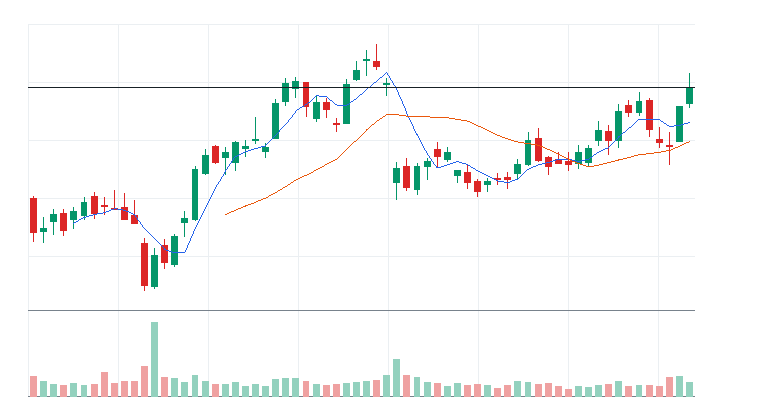
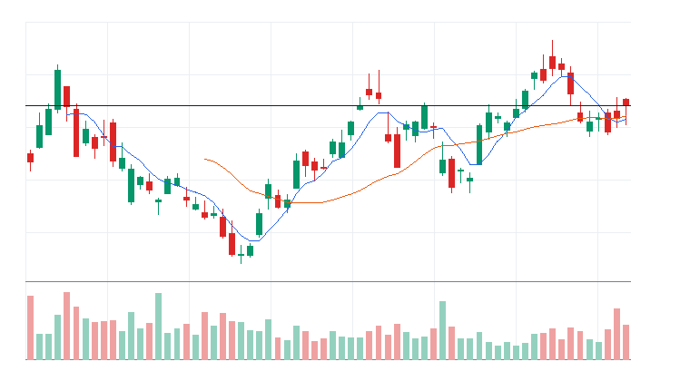

# 오늘의 데일리 트레이딩 요약

**REAL DATA TEST - 가격/거래량은 실제 데이터, 뉴스/ETF 구성종목 확산도/거래대금 유동성 일부 연결**

**목적:** 이 리포트는 최근 오른 자산을 나열하는 것이 아니라, 돈이 몰리는 근거와 다음 매수 주체가 확인할 트레이딩 후보를 찾기 위한 보고서다.

> 핵심 질문: 현재 가격에서 누가 사고 있고, 누가 앞으로 더 비싸게 사줄 수 있는가?

## 시장 국면 판단

- 최종 판정: 기간 조정 (68점)
- 전일 대비: 기간 조정은 유지됐지만 점수는 전일보다 약화됐다(-15점).
- 판정 신뢰도: 높음 (100점) - 핵심 지수와 매크로 데이터가 대부분 직접 수집되어 판정 신뢰도가 높다.
- 행동 바이어스: 추격 보류, 돌파 확인
- 한 줄 결론: 장기 추세는 유지되지만 단기 추세가 둔화되어 기간 조정으로 본다. 기술 81점, 매크로 46점.
- 기술적 지표: 상승 추세 우위 (81점, 가중치 65%)
- S&P 500: 98점 | 50일선 위, 200일선 위, 20일 -0.74%, 60일 +4.00%, 52주 고점 대비 -1.92% -> 기술 점수 98
- Nasdaq 100: 63점 | 50일선 아래, 200일선 위, 20일 -1.17%, 60일 -1.00%, 52주 고점 대비 -5.26% -> 기술 점수 63
- 매크로 시황: 매크로 중립 (46점, 가중치 35%)
- 매크로 요약: 물가 부담으로 매크로 환경은 방어적이다.
- 금리: 중립 45점 / 금리 중립 / confidence HIGH
  - 주요 근거: US 10Y yield 20일 +3.88%, 5일 +2.83%; US 3M yield 20일 +1.26%, 단기금리 방향 확인; US long-duration bonds 20일 -1.15%, 장기채 가격 기준 할인율 부담 확인
  - 확인 사항: 추가 확인 이벤트 없음
- 물가: 부담 36점 / 물가 부담 / confidence HIGH
  - 주요 근거: Oil ETF 20일 +21.78%, 유가 기반 물가 압력 확인; TIPS ETF 20일 -0.22%, 물가연동채 흐름은 보조 근거; Gold 20일 +6.04%, 금 강세는 방어 수요 여부 확인
  - 확인 사항: 금 강세가 인플레 헤지 또는 방어 수요일 수 있어 위험자산 해석을 제한한다.
- 정책: 중립 50점 / 정책 이벤트 확인 전 중립 / confidence LOW
  - 주요 근거: 정책 톤은 1차 버전에서 일정/이벤트 리스크 기반 중립값으로 반영한다.
  - 확인 사항: FOMC, CPI, PCE, 고용지표 발표 전후에는 매크로 confidence를 보수적으로 해석한다.
- 신용/유동성: 중립 52점 / 신용/유동성 중립 / confidence HIGH
  - 주요 근거: High yield credit 20일 -0.57%, 하이일드 위험선호 확인; HYG-LQD 20일 상대강도 +0.87%, 신용위험 선호/회피 확인; VIX 20일 -3.86%, 변동성 부담 확인
  - 확인 사항: 추가 확인 이벤트 없음
- 환율/글로벌: 중립 49점 / 환율/글로벌 중립 / confidence MEDIUM
  - 주요 근거: US dollar 20일 +0.18%, 달러 강세/약세 확인
  - 확인 사항: 추가 확인 이벤트 없음
- US 10Y yield: 42점 | 하락 시 주식 우호; 5일 +2.83%, 20일 +3.88% -> 매크로 점수 42
- US 3M yield: 46점 | 하락 시 주식 우호; 5일 +2.22%, 20일 +1.26% -> 매크로 점수 46
- US long-duration bonds: 47점 | 상승 시 주식 우호; 5일 -1.92%, 20일 -1.15% -> 매크로 점수 47
- TIPS ETF: 50점 | 상승 시 주식 우호; 5일 -0.77%, 20일 -0.22% -> 매크로 점수 50
- Oil ETF: 6점 | 하락 시 주식 우호; 5일 +11.77%, 20일 +21.78% -> 매크로 점수 6
- Gold: 50점 | 상승 시 주식 우호; 5일 -7.32%, 20일 +6.04% -> 매크로 점수 50
- US dollar: 49점 | 하락 시 주식 우호; 5일 +0.97%, 20일 +0.18% -> 매크로 점수 49
- High yield credit: 48점 | 상승 시 주식 우호; 5일 -1.03%, 20일 -0.57% -> 매크로 점수 48
- Investment grade credit: 50점 | 상승 시 주식 우호; 5일 -1.53%, 20일 -1.44% -> 매크로 점수 50
- VIX: 56점 | 하락 시 주식 우호; 5일 -0.07%, 20일 -3.86% -> 매크로 점수 56
- 데이터 커버리지: 기술 2/2, 매크로 10/10
- 데이터 신뢰도 근거:
  - 직접 지수 데이터: S&P 500, Nasdaq 100
  - 대체 지수 데이터 없음
  - 매크로 데이터: 10/10
  - 누락 데이터 없음
  - stale 데이터 없음

## 모바일 요약

[오늘의 데일리 트레이딩 요약]

생성 성공 / 데이터 모드: REAL_TEST

시장:
- 위험회피

시장 지배 서사:
1. 매크로 방어/헤지 - 관찰 - Energy Select Sector SPDR Fund(XLE), VanEck Oil Services ETF(OIH), Chevron(CVX), Exxon Mobil(XOM) 중심으로 5일 +1.39%, 20일 +7.03% 흐름이 형성됨. 직접 촉매 일부 확인.
2. Integrated Oil & Gas 자금 유입 - 관찰 - Energy Select Sector SPDR Fund(XLE), VanEck Oil Services ETF(OIH), Chevron(CVX), Exxon Mobil(XOM) 중심으로 5일 +1.96%, 20일 +4.30% 흐름이 형성됨. 직접 촉매 일부 확인.
3. 바이오/헬스케어 촉매 - 약화 - Invesco QQQ Trust(QQQ), Amgen Inc.(AMGN), Vertex Pharmaceuticals Incorporated(VRTX) 중심으로 5일 -1.08%, 20일 +11.17% 흐름이 형성됨. 뉴스 직접성 제한.

트렌드 강도:
1. 매크로 방어/헤지 - TSI 40 - 잠복 - 진입품질 낮음
2. Integrated Oil & Gas 자금 유입 - TSI 44 - 잠복 - 진입품질 낮음
3. 바이오/헬스케어 촉매 - TSI 16 - 잠복 - 진입품질 낮음

오늘 결론:
- 메가캡 플랫폼 개별 종목 흐름이 ETF 대비 강한지 확인 필요
- 행동 후보는 linkedNarrative와 함께 확인한다.
- 추격보다 진입 조건 확인 후 접근한다.

오늘 실제 행동 후보:
1. Chevron(CVX)(STOCK) - 매크로 방어/헤지 - 52주 고점 부근이라 돌파가 확인되면 신고가 추종 매수가 붙을 수 있음

다크호스 후보:
1. 다크호스 후보 없음 - 조건 충족 후보 없음

ETF 후보 TOP 5:
1. Energy Select Sector SPDR Fund(XLE) - 매크로 방어/헤지 - 관찰
2. VanEck Oil Services ETF(OIH) - 매크로 방어/헤지 - 제외
3. iShares Expanded Tech-Software Sector ETF(IGV) - AI 소프트웨어/사이버보안 확산 - 제외
4. Roundhill Magnificent Seven ETF(MAGS) - 소프트웨어 실적/AI 수익화 - 제외
5. First Trust NASDAQ Cybersecurity ETF(CIBR) - 사이버보안 지출 재가속 - 제외

웹 리포트:
https://yoolcool.github.io/DailyTradingThesisAgent/

## 오늘 결론

- 오늘 결론: 조건부 진입
- 신규 진입 후보: 0개
- 조건부 진입 후보: 1개
- 관찰 후보: 98개
- 주요 제한 요인: Entry Quality < 40, 뉴스 직접성 부족, RVOL 미달
- 주문 판단: 시장가 금지 / 지정가 또는 관찰
- 실전 판단: 진입 후보는 있으나, 전일 고점 돌파와 거래량 확인 후 선별적으로 접근한다.

### 후보 제한 요인 집계

- RVOL < 1.00x: 95개
- 거래대금 유동성 낮음: 13개
- Entry Quality 50~54 near miss: 0개
- Entry Quality 40~49 관찰: 4개
- Entry Quality < 40: 153개
- Exhaustion Risk >= 70: 0개
- ETF breadth 샘플 부족: 37개
- 뉴스 직접성 부족: 100개

## 데이터 신뢰도

- 전체 데이터 신뢰도 등급: LOW
- 분석 신뢰도: LOW
- 주문 실행 신뢰도: LOW
- ETF breadth 신뢰도: LOW
- 신뢰도 해석: 가격/거래량 stale fallback 1개 사용, 테마 확산 판단 제한, 거래대금 유동성 낮음 또는 확인 불가, 프리/애프터마켓 확인 불가
- 리포트 생성 시각: 2026-09-03 09:59 KST
- 가격 기준 거래일: 2026-09-02 US regular close
- 뉴스 수집 시각: 2026-09-03 09:59 KST
- 가장 최근 뉴스 발행 시각: 2026-09-03 09:27 KST
- 뉴스 신선도 상태: FRESH
- 뉴스 소스: Yahoo Finance RSS, MarketWatch RSS, CNBC Markets RSS, SEC EDGAR RSS, Federal Reserve RSS, Finnhub API
- 뉴스 소스 상태: Yahoo Finance RSS CONNECTED, MarketWatch RSS CONNECTED, CNBC Markets RSS PARTIAL, SEC EDGAR RSS PARTIAL, Federal Reserve RSS CONNECTED, Finnhub API DISABLED
- 뉴스 신뢰도: MEDIUM
- 추천 적용 거래일: 2026-09-02 US regular session
- 가격/거래량 데이터 상태: 일부 연결
- 뉴스 데이터 상태: 일부 연결
- ETF 구성종목 확산도 상태: 일부 연결
- ETF 구성종목 샘플 수: 1~4
- 거래대금 유동성 데이터 상태: 일부 연결
- 프리/애프터마켓 데이터 상태: UNAVAILABLE
- 데이터 provider: yfinance, Yahoo Finance RSS, MarketWatch RSS, CNBC Markets RSS, SEC EDGAR RSS, Federal Reserve RSS, Finnhub API, config fallback sample, price-volume dollar-volume fallback
- 실전 사용 경고: 이 리포트는 투자판단 보조용이며, REAL_TEST 모드에서는 일부 데이터가 누락되거나 지연될 수 있다. 실제 주문 전 현재가, 뉴스, 프리마켓/정규장 거래량을 별도 확인해야 한다.

## 0. 시장 상태

- 데이터 모드: REAL_TEST
- 가격/거래량: 일부 연결
- 뉴스: 일부 연결
- ETF 구성종목 확산도: 일부 연결
- 거래대금 유동성: 일부 연결
- 생성 시각: 2026년 9월 3일 목요일 AM 9:59
- 시장 상태: 위험회피
- 오늘 돈의 방향: 메가캡 플랫폼 개별 종목 흐름이 ETF 대비 강한지 확인 필요
- 강한 테마 TOP 3: 전통 에너지 ETF(74), 클라우드/엔터프라이즈 소프트웨어 ETF(47), 사이버보안(46)
- 데이터 한계:
  - API 또는 provider 상태에 따라 뉴스/ETF 확산도/거래대금 유동성 반영 범위가 달라질 수 있다.
  - 수집 실패 데이터는 점수 반영에서 제외하거나 confidence를 제한한다.
  - reasonConfidence HIGH는 직접 촉매, 가격/거래량, 확산도/유동성 근거가 함께 있을 때만 사용한다.

## 오늘 시장을 지배하는 서사

### 오늘 시장을 지배하는 서사 TOP 3

#### 1. 매크로 방어/헤지
- 상태: 관찰
- narrativeScore: 54
- reasonConfidence: LOW
- 근거 ETF: XLE, OIH, GLD, TLT
- 근거 개별 종목: CVX, XOM
- 돈이 몰리는 이유: 매크로 방어/헤지 관련 Energy Select Sector SPDR Fund(XLE), VanEck Oil Services ETF(OIH), SPDR Gold Shares(GLD)와 Chevron(CVX), Exxon Mobil(XOM)의 5일(+1.39%)·20일(+7.03%) 흐름을 함께 본다. 평균 상대 거래량은 1.07배이고, ETF 확산도는 추가 확인이 필요하다. 직접 뉴스/이벤트가 일부 확인된다.
- 다음 매수 주체: 금리/에너지/방어 헤지를 찾는 매크로 자금
- 가장 좋은 트레이딩 수단: ETF 우선: GLD, TLT, XLE / 개별 종목 우선: XOM, CVX
- 서사가 깨지는 조건: 방어 ETF 상대강도 둔화와 위험선호 성장주 재강세
- 오늘 행동: 위험회피가 확인될 때만 헤지성 접근

상세 narrativeScore 근거 보기

- rawScore: 54
- ETF 평균 moneyFlowScore: 37
- 개별 종목 평균 moneyFlowScore: 68
- ETF 후보 비율: 50%
- 개별 종목 후보 비율: 50%
- 5일 평균 수익률: +1.00%
- 20일 평균 수익률: +7.00%
- 평균 상대 거래량: 1.00배
- ETF 평균 상대 거래량: 1.00배
- 개별주 평균 상대 거래량: 1.00배
- 52주 고점 근접 후보 비율: 33%
- 뉴스 직접성 점수: 7
- ETF 확산도 점수: 0
- 유동성 점수: 5
- 과열 리스크 차감: 0

#### 2. Integrated Oil & Gas 자금 유입
- 상태: 관찰
- narrativeScore: 53
- reasonConfidence: LOW
- 근거 ETF: XLE, OIH, SPY, IWM, QQQ
- 근거 개별 종목: CVX, XOM
- 돈이 몰리는 이유: Integrated Oil & Gas 자금 유입 관련 Energy Select Sector SPDR Fund(XLE), VanEck Oil Services ETF(OIH), SPDR S&P 500 ETF Trust(SPY)와 Chevron(CVX), Exxon Mobil(XOM)의 5일(+1.96%)·20일(+4.30%) 흐름을 함께 본다. 평균 상대 거래량은 1.17배이고, ETF 확산도는 추가 확인이 필요하다. 직접 뉴스/이벤트가 일부 확인된다.
- 다음 매수 주체: Integrated Oil & Gas 자금 유입을 확인한 섹터 ETF 자금과 상대강도 추종 스윙 자금
- 가장 좋은 트레이딩 수단: ETF 우선: QQQ, SPY, IWM / 개별 종목 우선: CVX, XOM
- 서사가 깨지는 조건: QQQ 20일선 이탈 또는 관련 종목 절반 이상 5일선 이탈
- 오늘 행동: 기존 네러티브와 중복을 확인한 뒤 ETF/대표 종목 동조성이 살아날 때만 관찰 편입

상세 narrativeScore 근거 보기

- rawScore: 53
- ETF 평균 moneyFlowScore: 36
- 개별 종목 평균 moneyFlowScore: 68
- ETF 후보 비율: 40%
- 개별 종목 후보 비율: 50%
- 5일 평균 수익률: +2.00%
- 20일 평균 수익률: +4.00%
- 평균 상대 거래량: 1.00배
- ETF 평균 상대 거래량: 1.00배
- 개별주 평균 상대 거래량: 1.00배
- 52주 고점 근접 후보 비율: 57%
- 뉴스 직접성 점수: 6
- ETF 확산도 점수: 0
- 유동성 점수: 5
- 과열 리스크 차감: 0

#### 3. 바이오/헬스케어 촉매
- 상태: 약화
- narrativeScore: 29
- reasonConfidence: LOW
- 근거 ETF: QQQ
- 근거 개별 종목: AMGN, VRTX, REGN, INSM
- 돈이 몰리는 이유: 바이오/헬스케어 촉매 관련 Invesco QQQ Trust(QQQ)와 Amgen Inc.(AMGN), Vertex Pharmaceuticals Incorporated(VRTX), Regeneron Pharmaceuticals Inc.(REGN), Insmed Incorporated(INSM)의 5일(-1.08%)·20일(+11.17%) 흐름을 함께 본다. 평균 상대 거래량은 0.85배이고, ETF 확산도는 추가 확인이 필요하다. 뉴스 직접성은 아직 제한적이다.
- 다음 매수 주체: 바이오/헬스케어 촉매을 확인한 섹터 ETF 자금과 상대강도 추종 스윙 자금
- 가장 좋은 트레이딩 수단: ETF 우선: QQQ / 개별 종목 우선: REGN, AMGN, VRTX
- 서사가 깨지는 조건: QQQ 20일선 이탈 또는 관련 종목 절반 이상 5일선 이탈
- 오늘 행동: 기존 네러티브와 중복을 확인한 뒤 ETF/대표 종목 동조성이 살아날 때만 관찰 편입

상세 narrativeScore 근거 보기

- rawScore: 29
- ETF 평균 moneyFlowScore: 7
- 개별 종목 평균 moneyFlowScore: 37
- ETF 후보 비율: 0%
- 개별 종목 후보 비율: 0%
- 5일 평균 수익률: -1.00%
- 20일 평균 수익률: +11.00%
- 평균 상대 거래량: 1.00배
- ETF 평균 상대 거래량: 1.00배
- 개별주 평균 상대 거래량: 1.00배
- 52주 고점 근접 후보 비율: 60%
- 뉴스 직접성 점수: 8
- ETF 확산도 점수: 0
- 유동성 점수: 3
- 과열 리스크 차감: 0

### 전체 narrative 요약

| 서사명 | 상태 | narrativeScore | reasonConfidence | 대표 ETF | 대표 종목 | 오늘 행동 |
| --- | --- | ---: | --- | --- | --- | --- |
| 매크로 방어/헤지 | 관찰 | 54 | LOW | XLE, OIH, GLD | CVX, XOM | 위험회피가 확인될 때만 헤지성 접근 |
| Integrated Oil & Gas 자금 유입 | 관찰 | 53 | LOW | XLE, OIH, SPY | CVX, XOM | 기존 네러티브와 중복을 확인한 뒤 ETF/대표 종목 동조성이 살아날 때만 관찰 편입 |
| 바이오/헬스케어 촉매 | 약화 | 29 | LOW | QQQ | AMGN, VRTX, REGN, INSM | 기존 네러티브와 중복을 확인한 뒤 ETF/대표 종목 동조성이 살아날 때만 관찰 편입 |
| 사이버보안 지출 재가속 | 약화 | 28 | LOW | CIBR, HACK, IHAK | CRWD, ZS, FTNT, PANW | 기존 네러티브와 중복을 확인한 뒤 ETF/대표 종목 동조성이 살아날 때만 관찰 편입 |
| AI 소프트웨어/사이버보안 확산 | 약화 | 20 | LOW | IGV, QQQ, AIQ | TEAM, PLTR, MSFT, DDOG | 추격보다 눌림 후 재상승 확인 |
| 소프트웨어 실적/AI 수익화 | 약화 | 18 | LOW | IGV, QQQ, AIQ | ADBE, MSTR, MSFT, SHOP | 기존 네러티브와 중복을 확인한 뒤 ETF/대표 종목 동조성이 살아날 때만 관찰 편입 |
| 위험선호 성장주 재진입 | 약화 | 10 | LOW | ARKK, QQQ, IPO | TSLA, COIN, ARM | 지수 위험선호가 유지될 때만 선별 진입 |
| Specialty Business Services 자금 유입 | 약화 | 8 | LOW | SPY, IWM, QQQ | CPRT, TRI, CTAS | 기존 네러티브와 중복을 확인한 뒤 ETF/대표 종목 동조성이 살아날 때만 관찰 편입 |
| Travel Services 자금 유입 | 약화 | 8 | LOW | QQQ | ABNB, BKNG | 기존 네러티브와 중복을 확인한 뒤 ETF/대표 종목 동조성이 살아날 때만 관찰 편입 |
| Internet Content 자금 유입 | 약화 | 7 | LOW | QQQ | META, DASH | 기존 네러티브와 중복을 확인한 뒤 ETF/대표 종목 동조성이 살아날 때만 관찰 편입 |
| Data Storage 자금 유입 | 소멸 | 5 | LOW | SPY, IWM, QQQ | STX, WDC | 기존 네러티브와 중복을 확인한 뒤 ETF/대표 종목 동조성이 살아날 때만 관찰 편입 |
| 전력 유틸리티 수요 재평가 | 소멸 | 4 | LOW | SPY, IWM, QQQ | ETN, GEV, VRT | 기존 네러티브와 중복을 확인한 뒤 ETF/대표 종목 동조성이 살아날 때만 관찰 편입 |
| Aerospace & Defense 자금 유입 | 소멸 | 1 | LOW | SPY, IWM, QQQ | KTOS, AVAV | 기존 네러티브와 중복을 확인한 뒤 ETF/대표 종목 동조성이 살아날 때만 관찰 편입 |
| 전력망/원전/인프라 병목 | 약화 | 0 | LOW | GRID, PAVE, URA | CEG, VRT, ETN, PWR | ETF 확산도와 거래량이 같이 살아날 때만 진입 |
| 소비 회복/방어주 선별 | 소멸 | 0 | LOW | QQQ | PDD, AMZN | 기존 네러티브와 중복을 확인한 뒤 ETF/대표 종목 동조성이 살아날 때만 관찰 편입 |
| AI 인프라 재가속 | 소멸 | 0 | LOW | SMH, SOXX, DRAM | NVDA, MU, VRT, ETN | 추격보다 5일선 지지 후 재상승 확인 |
| 방산/안보 프리미엄 | 소멸 | 0 | LOW | XAR, SHLD, ITA | PLTR, AVAV, KTOS | 뉴스 촉매가 직접 확인될 때만 추세 추종 |
| 반도체 장비 사이클 재평가 | 소멸 | 0 | LOW | SMH, SOXX, SOXQ | AMAT, LRCX, ASML | 기존 네러티브와 중복을 확인한 뒤 ETF/대표 종목 동조성이 살아날 때만 관찰 편입 |
| 반도체 설계/공급망 재가속 | 소멸 | 0 | LOW | SMH, SOXX, SOXQ | ARM, AMD, TXN, ADI | 기존 네러티브와 중복을 확인한 뒤 ETF/대표 종목 동조성이 살아날 때만 관찰 편입 |
| 비트코인/디지털 자산 위험선호 | 약화 | 0 | LOW | IBIT, BLOK | MSTR, COIN, IREN | 비트코인 베타가 살아날 때만 단기 매매 |
| 필수소비재 음료 방어 성장 | 소멸 | 0 | LOW | QQQ | CCEP, MNST | 기존 네러티브와 중복을 확인한 뒤 ETF/대표 종목 동조성이 살아날 때만 관찰 편입 |

## 트렌드 강도 판단

### 1. 매크로 방어/헤지
- Trend Strength Index: 40
- 트렌드 상태 라벨: 잠복
- 테마 확산도: 약함
- ETF 동조성: 보통
- 거래량 강도: 약함
- 과열 위험: 낮음 (16)
- 오늘 진입 품질: 낮음 (28)
- 한 줄 판단: 매크로 방어/헤지는 Trend Strength는 높아도 시장 위험선호가 약해 시장 환경 비우호 구간이다.
- 오늘 접근법: Energy Select Sector SPDR Fund(XLE)/VanEck Oil Services ETF(OIH)/SPDR Gold Shares(GLD)와 Chevron(CVX)/Exxon Mobil(XOM)의 거래량 확산이 확인되기 전까지 관찰한다.

트렌드 강도 상세 근거 보기

- 가격 모멘텀: 가격 모멘텀 8/25. 평균 5D +1.39%, 20D +7.03%.
- 거래량 강도: 거래량 강도 8/20. 평균 RVOL 1.07배.
- ETF 동조성: ETF 동조성 11/15. 관련 ETF SPDR Gold Shares(GLD), iShares 20+ Year Treasury Bond ETF(TLT), Energy Select Sector SPDR Fund(XLE), VanEck Oil Services ETF(OIH) 흐름을 기준으로 판단.
- 테마 확산도: 테마 확산도 8/20. 상위 1~2개 쏠림 감점 3점 반영.
- 뉴스 촉매: 뉴스/촉매 신선도 2/10. HIGH 직접 촉매 1개.
- 과열 리스크: 과열 리스크 16/100. 단기 급등, 고점 근접, ETF-개별주 괴리, 쏠림을 함께 반영.
- 시장 환경: 시장 환경 3/10. QQQ/SPY/IWM 가격 흐름 기반 위험선호 점수.

### 2. Integrated Oil & Gas 자금 유입
- Trend Strength Index: 44
- 트렌드 상태 라벨: 잠복
- 테마 확산도: 보통
- ETF 동조성: 보통
- 거래량 강도: 약함
- 과열 위험: 낮음 (6)
- 오늘 진입 품질: 낮음 (33)
- 한 줄 판단: Integrated Oil & Gas 자금 유입는 Trend Strength는 높아도 시장 위험선호가 약해 시장 환경 비우호 구간이다.
- 오늘 접근법: Energy Select Sector SPDR Fund(XLE)/VanEck Oil Services ETF(OIH)/SPDR S&P 500 ETF Trust(SPY)와 Chevron(CVX)/Exxon Mobil(XOM)의 거래량 확산이 확인되기 전까지 관찰한다.

트렌드 강도 상세 근거 보기

- 가격 모멘텀: 가격 모멘텀 10/25. 평균 5D +1.96%, 20D +4.30%.
- 거래량 강도: 거래량 강도 9/20. 평균 RVOL 1.17배.
- ETF 동조성: ETF 동조성 10/15. 관련 ETF Invesco QQQ Trust(QQQ), SPDR S&P 500 ETF Trust(SPY), iShares Russell 2000 ETF(IWM), Energy Select Sector SPDR Fund(XLE), VanEck Oil Services ETF(OIH) 흐름을 기준으로 판단.
- 테마 확산도: 테마 확산도 10/20. 상위 1~2개 쏠림 감점 0점 반영.
- 뉴스 촉매: 뉴스/촉매 신선도 2/10. HIGH 직접 촉매 1개.
- 과열 리스크: 과열 리스크 6/100. 단기 급등, 고점 근접, ETF-개별주 괴리, 쏠림을 함께 반영.
- 시장 환경: 시장 환경 3/10. QQQ/SPY/IWM 가격 흐름 기반 위험선호 점수.

### 3. 바이오/헬스케어 촉매
- Trend Strength Index: 16
- 트렌드 상태 라벨: 잠복
- 테마 확산도: 부족
- ETF 동조성: 부족
- 거래량 강도: 부족
- 과열 위험: 낮음 (18)
- 오늘 진입 품질: 낮음 (9)
- 한 줄 판단: 바이오/헬스케어 촉매는 Trend Strength는 높아도 시장 위험선호가 약해 시장 환경 비우호 구간이다.
- 오늘 접근법: Invesco QQQ Trust(QQQ)와 Amgen Inc.(AMGN)/Vertex Pharmaceuticals Incorporated(VRTX)/Regeneron Pharmaceuticals Inc.(REGN)의 거래량 확산이 확인되기 전까지 관찰한다.

트렌드 강도 상세 근거 보기

- 가격 모멘텀: 가격 모멘텀 5/25. 평균 5D -1.08%, 20D +11.17%.
- 거래량 강도: 거래량 강도 2/20. 평균 RVOL 0.85배.
- ETF 동조성: ETF 동조성 4/15. 관련 ETF Invesco QQQ Trust(QQQ) 흐름을 기준으로 판단.
- 테마 확산도: 테마 확산도 2/20. 상위 1~2개 쏠림 감점 3점 반영.
- 뉴스 촉매: 뉴스/촉매 신선도 0/10. HIGH 직접 촉매 0개.
- 과열 리스크: 과열 리스크 18/100. 단기 급등, 고점 근접, ETF-개별주 괴리, 쏠림을 함께 반영.
- 시장 환경: 시장 환경 3/10. QQQ/SPY/IWM 가격 흐름 기반 위험선호 점수.

## 최근 추천 결과 트래킹

개별주는 데이트레이딩 관점으로 추천 이후 첫 정규장의 장중 최고가와 종가를 추적한다. ETF는 테마/스윙 관점으로 추천 이후 1주일 동안의 최고가와 현재 종가를 추적한다.

### 개별주 Top 3 추천 성과 요약
- 최근 5개 리포트 표본: 11개 (초기 검증 단계)
- 장중 최고가 기준 성공률: +11.11%
- 종가 기준 성공률: +11.11%
- 평균 장중 최고 수익률: +0.51%
- 평균 종가 수익률: -2.33%

### ETF 추천 성과 요약
- 최근 5개 리포트 표본: 5개 (초기 검증 단계)
- 1주 최고가 기준 성공률: 0.00%
- 현재 종가 기준 성공률: 0.00%
- 평균 1주 최고 수익률: -0.42%
- 평균 현재 수익률: -3.73%

최근 추천 결과 상세 테이블 펼치기

| 추천일 | 유형 | 순위 | 티커 | 기준가 | 추적 기간 | 상태 | High 수익률 | Close 수익률 | 결과 | 코멘트 |
| --- | --- | ---: | --- | ---: | --- | --- | ---: | ---: | --- | --- |
| 2026-09-03 | STOCK | 1 | CVX | $211.05 | 2026-09-03 | pending | 데이터 없음 | 데이터 없음 | 추적 대기 | 아직 추적 거래일 데이터가 완성되지 않음 |
| 2026-09-02 | STOCK | 1 | CVX | $211.05 | 2026-09-02 | pending | 데이터 없음 | 데이터 없음 | 추적 대기 | 아직 추적 거래일 데이터가 완성되지 않음 |
| 2026-09-01 | STOCK | 3 | PANW | $382.13 | 2026-09-01 | complete | -1.63% | -5.24% | 실패 | 추천 이후 의미 있는 장중 기회가 부족하고 종가도 약함 (일봉 기준) |
| 2026-09-01 | STOCK | 2 | ZS | $188.39 | 2026-09-01 | complete | -1.06% | -5.32% | 실패 | 추천 이후 의미 있는 장중 기회가 부족하고 종가도 약함 (일봉 기준) |
| 2026-09-01 | STOCK | 1 | CRWD | $231 | 2026-09-01 | complete | +0.13% | -6.90% | 실패 | 추천 이후 의미 있는 장중 기회가 부족하고 종가도 약함 (일봉 기준) |
| 2026-09-01 | ETF | 1 | CIBR | $100.15 | 2026-09-01~2026-09-08 | in_progress | 데이터 없음 | -3.94% | 진행 중 | 아직 1주 추적 기간이 끝나지 않음 (일봉 high 미확보 시 close 기준 보조) |
| 2026-08-31 | STOCK | 3 | MSFT | $513.53 | 2026-08-31 | complete | -0.26% | -1.22% | 실패 | 추천 이후 의미 있는 장중 기회가 부족하고 종가도 약함 (일봉 기준) |
| 2026-08-31 | STOCK | 2 | WDAY | $204.72 | 2026-08-31 | complete | -0.53% | -3.55% | 실패 | 추천 이후 의미 있는 장중 기회가 부족하고 종가도 약함 (일봉 기준) |
| 2026-08-31 | STOCK | 1 | CRWD | $218.4 | 2026-08-31 | complete | +7.09% | +5.77% | 성공 | 장중 기회와 종가 유지가 모두 확인됨 (일봉 기준) |
| 2026-08-31 | ETF | 1 | IGV | $109.5 | 2026-08-31~2026-09-07 | in_progress | -0.70% | -3.03% | 진행 중 | 아직 1주 추적 기간이 끝나지 않음 |
| 2026-08-28 | STOCK | 3 | ZS | $187.3 | 2026-08-28 | complete | +0.47% | -1.64% | 실패 | 추천 이후 의미 있는 장중 기회가 부족하고 종가도 약함 (일봉 기준) |
| 2026-08-28 | STOCK | 2 | ADSK | $270.58 | 2026-08-28 | complete | -1.32% | -3.67% | 실패 | 추천 이후 의미 있는 장중 기회가 부족하고 종가도 약함 (일봉 기준) |
| 2026-08-28 | STOCK | 1 | ADBE | $289.15 | 2026-08-28 | complete | +1.71% | +0.82% | 제한적 유효 | 제한적인 장중 기회만 발생 (일봉 기준) |
| 2026-08-28 | ETF | 3 | IBIT | $45.29 | 2026-08-28~2026-09-04 | in_progress | -0.86% | -3.38% | 진행 중 | 아직 1주 추적 기간이 끝나지 않음 |
| 2026-08-28 | ETF | 2 | CIBR | $100.79 | 2026-08-28~2026-09-04 | in_progress | -0.35% | -4.55% | 진행 중 | 아직 1주 추적 기간이 끝나지 않음 |
| 2026-08-28 | ETF | 1 | IGV | $110.32 | 2026-08-28~2026-09-04 | in_progress | +0.23% | -3.75% | 진행 중 | 아직 1주 추적 기간이 끝나지 않음 |
| 2026-08-21 | STOCK | 3 | FCX | $71.22 | 2026-08-21 | complete | +8.58% | +7.64% | 성공 | 장중 기회와 종가 유지가 모두 확인됨 (일봉 기준) |
| 2026-08-21 | STOCK | 2 | COIN | $172.35 | 2026-08-21 | complete | +11.03% | +8.20% | 성공 | 장중 기회와 종가 유지가 모두 확인됨 (일봉 기준) |
| 2026-08-21 | STOCK | 1 | MSTR | $112.39 | 2026-08-21 | complete | +8.47% | +6.10% | 성공 | 장중 기회와 종가 유지가 모두 확인됨 (일봉 기준) |
| 2026-08-21 | ETF | 1 | IBIT | $41.2 | 2026-08-21~2026-08-28 | complete | +11.19% | +6.21% | 성공 | 추천 이후 테마 추세가 유지됨 |
| 2026-08-20 | STOCK | 3 | ADBE | $272.47 | 2026-08-20 | complete | +0.65% | -0.09% | 실패 | 추천 이후 의미 있는 장중 기회가 부족하고 종가도 약함 (일봉 기준) |
| 2026-08-20 | STOCK | 2 | TEAM | $174.23 | 2026-08-20 | complete | +2.09% | +0.39% | 제한적 유효 | 제한적인 장중 기회만 발생 (일봉 기준) |
| 2026-08-20 | STOCK | 1 | INTU | $362.47 | 2026-08-20 | complete | +1.15% | -0.17% | 제한적 유효 | 제한적인 장중 기회만 발생 (일봉 기준) |
| 2026-08-18 | STOCK | 2 | CPRT | $31.7 | 2026-08-18 | complete | +5.84% | -0.60% | 단타 유효 | 장중 기회는 있었지만 종가 유지력은 약함 (일봉 기준) |
| 2026-08-18 | STOCK | 1 | PWR | $722.31 | 2026-08-18 | complete | -1.43% | -3.62% | 실패 | 추천 이후 의미 있는 장중 기회가 부족하고 종가도 약함 (일봉 기준) |
| 2026-08-17 | STOCK | 3 | WDAY | $198.68 | 2026-08-17 | complete | -1.69% | -3.77% | 실패 | 추천 이후 의미 있는 장중 기회가 부족하고 종가도 약함 (일봉 기준) |
| 2026-08-17 | STOCK | 2 | AVAV | $192.81 | 2026-08-17 | complete | -0.43% | -6.06% | 실패 | 추천 이후 의미 있는 장중 기회가 부족하고 종가도 약함 (일봉 기준) |
| 2026-08-17 | STOCK | 1 | KTOS | $64.58 | 2026-08-17 | complete | +0.79% | -2.00% | 실패 | 추천 이후 의미 있는 장중 기회가 부족하고 종가도 약함 (일봉 기준) |
| 2026-08-14 | STOCK | 3 | ADSK | $257.96 | 2026-08-14 | complete | +1.08% | -2.44% | 제한적 유효 | 제한적인 장중 기회만 발생 (일봉 기준) |
| 2026-08-14 | STOCK | 2 | TEAM | $165.98 | 2026-08-14 | complete | +1.07% | -2.27% | 제한적 유효 | 제한적인 장중 기회만 발생 (일봉 기준) |
| 2026-08-14 | STOCK | 1 | INTU | $358.29 | 2026-08-14 | complete | +1.04% | -3.53% | 제한적 유효 | 제한적인 장중 기회만 발생 (일봉 기준) |
| 2026-08-14 | ETF | 2 | IGV | $106.28 | 2026-08-14~2026-08-21 | complete | -2.05% | -0.09% | 진행 중 | 아직 1주 추적 기간이 끝나지 않음 |
| 2026-08-14 | ETF | 1 | CIBR | $102.2 | 2026-08-14~2026-08-21 | complete | -2.50% | -5.87% | 실패 | 추천 이후 ETF 흐름이 약화됨 |
| 2026-08-13 | STOCK | 1 | ABNB | $180.1 | 2026-08-13 | complete | +2.91% | +2.80% | 제한적 유효 | 제한적인 장중 기회만 발생 (일봉 기준) |
| 2026-08-12 | STOCK | 3 | ABNB | $184.98 | 2026-08-12 | complete | -0.47% | -2.64% | 실패 | 추천 이후 의미 있는 장중 기회가 부족하고 종가도 약함 (일봉 기준) |
| 2026-08-12 | STOCK | 2 | AXON | $636.31 | 2026-08-12 | complete | +1.00% | -5.74% | 제한적 유효 | 제한적인 장중 기회만 발생 (일봉 기준) |
| 2026-08-12 | STOCK | 1 | FAST | $52.38 | 2026-08-12 | complete | +0.84% | -0.31% | 실패 | 추천 이후 의미 있는 장중 기회가 부족하고 종가도 약함 (일봉 기준) |
| 2026-08-11 | STOCK | 3 | ZS | $176.68 | 2026-08-11 | complete | +2.33% | +1.06% | 제한적 유효 | 제한적인 장중 기회만 발생 (일봉 기준) |
| 2026-08-11 | STOCK | 2 | PLTR | $175.23 | 2026-08-11 | complete | +1.55% | -0.17% | 제한적 유효 | 제한적인 장중 기회만 발생 (일봉 기준) |
| 2026-08-11 | STOCK | 1 | TEAM | $151.87 | 2026-08-11 | complete | +2.86% | +1.46% | 제한적 유효 | 제한적인 장중 기회만 발생 (일봉 기준) |
| 2026-08-11 | ETF | 3 | GLD | $402.54 | 2026-08-11~2026-08-18 | complete | +1.20% | -1.44% | 진행 중 | 아직 1주 추적 기간이 끝나지 않음 |
| 2026-08-11 | ETF | 2 | OIH | $411.34 | 2026-08-11~2026-08-18 | complete | +4.23% | +3.78% | 성공 | 추천 이후 테마 추세가 유지됨 |
| 2026-08-11 | ETF | 1 | CIBR | $100.6 | 2026-08-11~2026-08-18 | complete | +1.74% | -4.37% | 실패 | 추천 이후 ETF 흐름이 약화됨 |
| 2026-08-10 | STOCK | 3 | SHOP | $151.57 | 2026-08-10 | complete | +2.67% | +2.38% | 제한적 유효 | 제한적인 장중 기회만 발생 (일봉 기준) |
| 2026-08-10 | STOCK | 2 | FAST | $51.84 | 2026-08-10 | complete | +0.75% | +0.60% | 추적 대기 | 아직 추적 거래일 데이터가 완성되지 않음 (일봉 기준) |
| 2026-08-10 | STOCK | 1 | BKNG | $214.42 | 2026-08-10 | complete | +0.48% | -0.72% | 실패 | 추천 이후 의미 있는 장중 기회가 부족하고 종가도 약함 (일봉 기준) |
| 2026-08-10 | ETF | 2 | XME | $115.74 | 2026-08-10~2026-08-17 | complete | +3.45% | +0.03% | 단기 고점 후 반납 | 1주 내 상승 기회는 있었지만 현재가는 반납 |
| 2026-08-10 | ETF | 1 | COPX | $88.03 | 2026-08-10~2026-08-17 | complete | +2.52% | +1.37% | 성공 | 추천 이후 테마 추세가 유지됨 |
| 2026-08-07 | STOCK | 3 | KTOS | $57.41 | 2026-08-07 | complete | +6.41% | +5.85% | 성공 | 장중 기회와 종가 유지가 모두 확인됨 (일봉 기준) |
| 2026-08-07 | STOCK | 2 | BKNG | $207.39 | 2026-08-07 | complete | +4.00% | +3.39% | 성공 | 장중 기회와 종가 유지가 모두 확인됨 (일봉 기준) |
| 2026-08-07 | STOCK | 1 | SHOP | $147.44 | 2026-08-07 | complete | +3.67% | +2.80% | 성공 | 장중 기회와 종가 유지가 모두 확인됨 (일봉 기준) |
| 2026-08-06 | STOCK | 3 | KTOS | $55.34 | 2026-08-06 | complete | +6.79% | +3.74% | 성공 | 장중 기회와 종가 유지가 모두 확인됨 (일봉 기준) |
| 2026-08-06 | STOCK | 2 | AMGN | $407.83 | 2026-08-06 | complete | +2.59% | -0.73% | 제한적 유효 | 제한적인 장중 기회만 발생 (일봉 기준) |
| 2026-08-06 | STOCK | 1 | TEAM | $113.32 | 2026-08-06 | complete | -2.15% | -2.78% | 실패 | 추천 이후 의미 있는 장중 기회가 부족하고 종가도 약함 (일봉 기준) |
| 2026-08-06 | ETF | 2 | XME | $111.92 | 2026-08-06~2026-08-13 | complete | +6.98% | +3.44% | 성공 | 추천 이후 테마 추세가 유지됨 |
| 2026-08-06 | ETF | 1 | COPX | $86.72 | 2026-08-06~2026-08-13 | complete | +4.07% | +2.91% | 성공 | 추천 이후 테마 추세가 유지됨 |
| 2026-08-05 | STOCK | 3 | DXCM | $86.94 | 2026-08-05 | complete | -0.54% | -4.92% | 실패 | 추천 이후 의미 있는 장중 기회가 부족하고 종가도 약함 (일봉 기준) |
| 2026-08-05 | STOCK | 2 | DDOG | $288.15 | 2026-08-05 | complete | +1.59% | -1.73% | 제한적 유효 | 제한적인 장중 기회만 발생 (일봉 기준) |
| 2026-08-05 | STOCK | 1 | MSFT | $492.81 | 2026-08-05 | complete | +1.10% | -1.09% | 제한적 유효 | 제한적인 장중 기회만 발생 (일봉 기준) |
| 2026-08-05 | ETF | 3 | MAGS | $68.96 | 2026-08-05~2026-08-12 | complete | +0.81% | -1.06% | 진행 중 | 아직 1주 추적 기간이 끝나지 않음 |

## 오늘 실제 행동 후보

### 1. Chevron(CVX)
- 자산 유형: STOCK
- linkedNarrative: 매크로 방어/헤지
- narrativeStatus: 관찰
- narrativeScore: 54
- Trend Strength Index: 40
- Exhaustion Risk: 16 (낮음)
- Entry Quality Score: 41 (관찰)
- 트렌드 판단: 시장 위험선호가 약해 시장 환경 비우호 구간이다.
- moneyFlowScore: 85
- finalRawScore: 85
- reasonConfidence: HIGH
- reasonConfidenceExplanation: 직접 촉매: Yahoo Finance RSS / mna / under_24h / negative - Chevron Just Committed $7 Billion to Venezuela. Here's What It Means for CVX Stock. 가격/거래량, 관련 ETF 동반 강세, 유동성 근거가 함께 확인되어 HIGH로 분류했다.
- tieBreakerReason: 최종 원점수 85, 리스크 패널티 0, 5일 수익률 +5.58%, 상대 거래량 1.08배 순으로 정렬
- 후보별 시장 해석: 위험회피 / 제한적 - 전체 시장은 위험회피 / 고점 근처 추격 리스크 / Entry Quality 41 < 50이나 moneyFlow 85, confidence HIGH, RVOL 1.08x로 강한 자금흐름 예외 조건 충족
- 게이트 사유: Entry Quality 41 < 50이나 moneyFlow 85, confidence HIGH, RVOL 1.08x로 강한 자금흐름 예외 조건 충족
- 주문 실행: 시장가 가능
- 직접 촉매: Yahoo Finance RSS / mna / under_24h / negative - Chevron Just Committed $7 Billion to Venezuela. Here's What It Means for CVX Stock.
- 왜 돈이 몰리는가: 20일 +10.85%, 5일 +5.58%, 상대 거래량 1.08배로 가격과 거래량이 함께 개선. 뉴스: Yahoo Finance RSS mna/under_24h / 유동성: LIQUID
- 누가 더 비싸게 사줄 수 있는지: 개별 주도주를 따라붙는 단기 모멘텀 자금과 관련 ETF 강세를 확인한 트레이더
- 진입 조건: 전일 고점 돌파와 5일선 유지 확인
- 무효화 조건: 20일선 이탈 또는 상대 거래량 0.8배 이하 둔화
- todayActionLabel: 자금흐름 예외 조건부
#### 최근 뉴스/동향 한국어 요약

- 요약: 종목 직접 뉴스 확인 상태이며 뉴스 흐름은 긍정 우위입니다. 후보 선정 후 재확인한 핵심 이슈는 "Chevron Just Committed $7 Billion to Venezuela. Here's What It Means for CVX Stock."입니다.
- 직접 촉매 판단: Chevron에 대해 직접 촉매로 분류된 뉴스가 확인됐습니다. 핵심은 "Chevron Just Committed $7 Billion to Venezuela. Here's What It Means for CVX Stock."이며, M&A 재료로 봅니다.
- 뉴스 1: Chevron Just Committed $7 Billion to Venezuela. Here's What It Means for CVX Stock.
  - 내용: Chevron 관련 M&A 뉴스입니다. 기사 스니펫상 핵심 내용은 Chevron just doubled down on Venezuela right after Washington cut an oil deal there.입니다.
  - 투자 의미: M&A 재료는 실적 가시성이나 밸류에이션 기대에 영향을 줄 수 있어 규모와 일정 확인이 중요합니다.
  - 확인할 점: M&A의 금액, 기간, 실적 반영 시점
- 뉴스 2: Chevron Outlines $7 Billion Investment Plan to Double Venezuela Oil Production in 5 Years
  - 내용: Chevron 관련 제품/서비스 뉴스입니다. 기사 스니펫상 핵심 내용은 Chevron (CVX) outlined a plan to invest more than $7 billion in Venezuela and double its oil product입니다.
  - 투자 의미: 단기 중립 뉴스 흐름으로 볼 수 있지만, 단독 매수 근거보다는 가격·거래량 조건을 확인하는 보조 근거로 사용합니다.
  - 확인할 점: 원문 수치, 후속 보도, 가격이 진입 조건을 지키는지
- 뉴스 3: Chevron, Eni Lead Wave of Deals to Lift Venezuela Oil Output
  - 내용: Chevron 관련 제품/서비스 뉴스입니다. 기사 스니펫상 핵심 내용은 Executives from Chevron Corp., GE Vernova Inc.입니다.
  - 투자 의미: 단기 혼재 뉴스 흐름으로 볼 수 있지만, 단독 매수 근거보다는 가격·거래량 조건을 확인하는 보조 근거로 사용합니다.
  - 확인할 점: 원문 수치, 후속 보도, 가격이 진입 조건을 지키는지
- 매매 해석: 매매 관점에서는 뉴스 자체보다 가격이 진입 조건을 지키는지, 거래량이 동반되는지, 그리고 뉴스가 이미 주가에 반영됐는지를 우선 확인해야 합니다.
- 차트: 

## 다크호스 후보

다크호스 후보 없음. 상위 서사 정렬, MA20 위 안착, MA5/MA20 구조 개선, RVOL 0.90x 이상 조건을 동시에 충족한 개별주가 없다.

- darkHorseScore: 조건 충족 후보 없음
- 왜 아직 메인이 아닌가: 확인 조건을 통과한 보조 관찰 후보가 없다.

darkHorseScore 상세 근거 보기

- 서사 정렬: 조건 미충족
- 초기 추세 구조: 조건 미충족
- 베이스 돌파/정돈: 조건 미충족
- 거래량 확인: 조건 미충족
- rawScore: 데이터 없음

## 오늘 돈이 몰리는 테마

- 전통 에너지 ETF: XLE, OIH | 평균 moneyFlowScore 74 | 추세는 확인되지만 선별 진입이 필요한 중간 강도의 테마로 본다.
- 클라우드/엔터프라이즈 소프트웨어 ETF: IGV | 평균 moneyFlowScore 47 | 관심은 유지하되 우선순위는 낮추고 추가 거래량 확인을 기다린다.
- 사이버보안: PANW, CRWD, FTNT, ZS | 평균 moneyFlowScore 46 | 관심은 유지하되 우선순위는 낮추고 추가 거래량 확인을 기다린다.
- Energy: BKR, FANG, CCJ, XOM, CVX | 평균 moneyFlowScore 45 | 관심은 유지하되 우선순위는 낮추고 추가 거래량 확인을 기다린다.
- 메가캡 플랫폼 ETF: MAGS | 평균 moneyFlowScore 35 | 관심은 유지하되 우선순위는 낮추고 추가 거래량 확인을 기다린다.
- 바이오/헬스케어: AMGN, GILD, ISRG, VRTX, REGN, IDXX, ALNY, DXCM | 평균 moneyFlowScore 28 | 관심은 유지하되 우선순위는 낮추고 추가 거래량 확인을 기다린다.

## 1. ETF 트레이딩 보고서
### 1-1. ETF 결론
- ETF 우선 후보: 없음
- ETF 관찰 후보: Roundhill Memory ETF(DRAM), VanEck Semiconductor ETF(SMH), Global X Artificial Intelligence & Technology ETF(AIQ), ROBO Global Robotics and Automation Index ETF(ROBO), iShares Cybersecurity and Tech ETF(IHAK)
- ETF 매매 금지: Roundhill Memory ETF(DRAM), VanEck Semiconductor ETF(SMH), iShares Semiconductor ETF(SOXX), Invesco PHLX Semiconductor ETF(SOXQ), Global X Artificial Intelligence & Technology ETF(AIQ)
- 오늘 ETF 최우선 1개: 없음
- ETF 섹션 해석: 이 섹션은 개별 종목 선택이 아니라 테마/섹터 단위 자금 흐름을 ETF로 매매할지 판단하기 위한 영역이다.

### 1-2. ETF 후보 TOP 5

선정 기준: ETF 후보는 가격/거래량 1차 점수에 뉴스, ETF 구성종목 확산도, 유동성, 리스크 패널티를 반영한 finalRawScore 기준으로 정렬한다. 표시 점수 100점 후보가 겹치면 tieBreakerReason으로 우선순위를 설명한다.

### [ETF] Energy Select Sector SPDR Fund(XLE)
- 자산 유형: ETF
- ETF 세부 카테고리: 전통 에너지 ETF
- ETF 역할: 테마 베타 매수
- 상태: 관찰
- linkedNarrative: 매크로 방어/헤지
- narrativeStatus: 관찰
- narrativeScore: 54
- moneyFlowScore: 84
- finalRawScore: 84
- tieBreakerReason: 최종 원점수 84, 리스크 패널티 0, 5일 수익률 +4.37%, 상대 거래량 1.29배 순으로 정렬
- 과열 리스크: 낮음
- reasonConfidence: MEDIUM
- reasonConfidenceExplanation: ETF 확산도 제한 때문에 HIGH가 아니라 MEDIUM으로 제한했다.

- todayActionLabel: 관찰
- 주문 실행: 시장가 가능
- 기준일: 2026-09-01
- 종가: $64.77
- 1일 수익률: +1.27%
- 5일 수익률: +4.37%
- 20일 수익률: +10.68%
- 상대 거래량: 1.29배
- 52주 고점 대비 위치: -0.28%
- whyMoneyIsFlowing: 20일 +10.68%, 5일 +4.37%, 상대 거래량 1.29배로 가격과 거래량이 함께 개선. 뉴스: MarketWatch RSS general_market/under_6h / 유동성: LIQUID
- likelyNextBuyer: 섹터 베타를 노리는 단기 모멘텀 자금과 리밸런싱 자금
- whyThisCouldTradeHigher: 52주 고점 부근이라 돌파가 확인되면 신고가 추종 매수가 붙을 수 있음
#### 최근 뉴스/동향 한국어 요약

- 요약: 후보 선정 후 재확인 뉴스 데이터 없음
- 진입 조건: 전일 고점 돌파와 5일선 유지 확인
- 무효화 조건: 20일선 이탈 또는 상대 거래량 0.8배 이하 둔화
- 차트: 

#### 상세 근거

Energy Select Sector SPDR Fund(XLE) 상세 근거 펼치기

- moneyFlowScore(최종) 산정 근거:
  - moneyFlowScore(1차): 67
  - 최종 원점수: 84
  - 최종 표시 점수: 84
  - cap 적용: cap 미적용
  - 계산식: +67 + +12 + 0 + +5 + 0 + 0 + 0 = 84
  - 점수 해석: 강한 자금 유입 후보. 단, 과열 여부 확인 필수.
  - 가격/거래량 1차 점수: +67
    - 추세: +15
    - 단기 모멘텀: +5
    - 중기 모멘텀: +7
    - 거래량: +14
    - 신고가 근접: +12
    - 이동평균: +14
  - 하위 점수 cap:
    - 가격 모멘텀: 원점수 +15, 상한 적용 +15 / 최대 25
    - 단기 모멘텀: 원점수 +5, 상한 적용 +5 / 최대 20
    - 중기 모멘텀: 원점수 +7, 상한 적용 +7 / 최대 16
    - 거래량: 원점수 +14, 상한 적용 +14 / 최대 20
    - 신고가 근접: 원점수 +12, 상한 적용 +12 / 최대 12
    - 이동평균: 원점수 +14, 상한 적용 +14 / 최대 14
  - 추가 데이터 가감점:
    - 뉴스: +12
    - 유동성: +5
  - ETF 확산도: 0
  - 리스크 패널티: 0
  - 주요 근거: 1차 67, 최종 원점수 84, 표시 84. 20일 수익률 강함, 상대 거래량 증가, 52주 고점 근처. 주의: 큰 감점 제한적.
  - 리스크 패널티 산정 근거:
    - 총 리스크 패널티: 0
    - 리스크 등급: LOW
    - 감점된 리스크: 없음
    - 관찰 리스크: 주요 관찰 리스크 없음
    - 한 줄 해석: 직접 감점된 주요 리스크는 없지만 관찰 리스크는 계속 확인해야 한다.
- 데이터 사용 현황:
  - 가격/거래량: 사용
  - 뉴스: 사용
  - ETF 확산도: 일부 연결
  - 거래대금 유동성: 사용
  - 관련 ETF 상대강도: 사용
- 뉴스 확인:
  - 최근 뉴스 상태: 일부 연결
  - 뉴스 소스: MarketWatch RSS, CNBC Markets RSS
  - 소스별 상태: Yahoo Finance RSS CONNECTED; MarketWatch RSS CONNECTED; CNBC Markets RSS CONNECTED; SEC EDGAR RSS FAILED; Federal Reserve RSS CONNECTED; Finnhub API DISABLED
  - 긍정/중립/부정: 13/3/0
  - 직접성/방향성/신선도: 2/1/4
  - 강한 촉매 수: 6
  - 중요 공시 수: 0
  - 직접 촉매: 없음
  - 보조 뉴스: MarketWatch RSS sector_theme / general_market / under_6h
  - 뉴스 수집 시각: 2026-09-03 09:59 KST
  - 가장 최근 뉴스 발행 시각: 2026-09-03 09:23 KST
  - 뉴스 신선도 상태: FRESH
  - 뉴스 이후 가격 반응: 긍정
  - 가격 반응 점수 제한: 뉴스 이후 가격 반응과 점수 제한 특이사항 없음
  - 핵심 뉴스 요약: Snowflake&#x2019;s stock soars as the company blows away estimates with its AI-fueled forecast
  - 원점수/상한 점수: +32 / +12
  - 점수 반영: +12
  - 주의: SEC EDGAR RSS: This operation was aborted; Finnhub API: FINNHUB_API_KEY not configured
- ETF 구성종목 확산도:
  - 구성종목 데이터 상태: 일부 연결
  - 샘플 수: 1/1
  - 샘플 신뢰도: INSUFFICIENT
  - 상승 종목 비율: 100%
  - 20일선 위 비율: 100%
  - 50일선 위 비율: 100%
  - 상위 기여 종목: XOM
  - 확산도 판단: SAMPLE_TOO_SMALL
  - 원점수/샘플 상한/반영 점수: 0 / 0 / 0
  - 점수 반영: 0
- 거래대금 유동성:
  - 데이터 상태: 일부 연결
  - 거래대금 기준 유동성: LIQUID
  - 거래대금: $2,155,280,043
  - 평균 거래대금: $1,669,369,350
  - 주문 영향: 시장가 가능
  - 매매 영향: 거래대금이 충분해 시장가 가능 범위로 본다
- reasonConfidence 근거: 가격/거래량, 뉴스, 거래대금 유동성, 관련 ETF 상대강도은 확인됐지만 일부 보조 데이터가 미연결 또는 fallback이라 중간으로 제한한다.
- 후보 선정 후 뉴스/동향 재확인:
  - 재확인 상태: 데이터 없음
- 차트 요약: 최근 20거래일 기준 5일선이 20일선 위에 있음
- 기준일 2026-09-01 | 종가 $64.77 | 1일 +1.27% | 5일 +4.37% | 20일 +10.68% | 상대 거래량 1.29배 | 52주 고점 대비 -0.28% | 데이터 소스: yfinance

### [ETF] VanEck Oil Services ETF(OIH)
- 자산 유형: ETF
- ETF 세부 카테고리: 전통 에너지 ETF
- ETF 역할: 테마 베타 매수
- 상태: 매매 금지
- linkedNarrative: 매크로 방어/헤지
- narrativeStatus: 관찰
- narrativeScore: 54
- moneyFlowScore: 63
- finalRawScore: 63
- tieBreakerReason: 최종 원점수 63, 리스크 패널티 0, 5일 수익률 +5.22%, 상대 거래량 1.43배 순으로 정렬
- 과열 리스크: 낮음
- reasonConfidence: MEDIUM
- reasonConfidenceExplanation: ETF 확산도 제한 때문에 HIGH가 아니라 MEDIUM으로 제한했다.

- todayActionLabel: 제외
- 주문 실행: 지정가 권장
- 기준일: 2026-09-01
- 종가: $426.88
- 1일 수익률: -0.54%
- 5일 수익률: +5.22%
- 20일 수익률: +8.86%
- 상대 거래량: 1.43배
- 52주 고점 대비 위치: -7.05%
- whyMoneyIsFlowing: 20일 +8.86%, 5일 +5.22%, 상대 거래량 1.43배로 가격과 거래량이 함께 개선. 뉴스: MarketWatch RSS general_market/under_6h / 유동성: ACCEPTABLE
- likelyNextBuyer: 섹터 베타를 노리는 단기 모멘텀 자금과 리밸런싱 자금
- whyThisCouldTradeHigher: 단기 추세가 유지되고 거래량이 1.0배 이상이면 눌림 이후 재상승을 시도할 수 있음
#### 최근 뉴스/동향 한국어 요약

- 요약: 후보 선정 후 재확인 뉴스 데이터 없음
- 진입 조건: 20일선 위 눌림 후 재상승 확인
- 무효화 조건: 20일선 이탈 또는 상대 거래량 0.8배 이하 둔화
- 차트: 

#### 상세 근거

VanEck Oil Services ETF(OIH) 상세 근거 펼치기

- moneyFlowScore(최종) 산정 근거:
  - moneyFlowScore(1차): 59
  - 최종 원점수: 63
  - 최종 표시 점수: 63
  - cap 적용: cap 미적용
  - 계산식: +59 + +2 + 0 + +2 + 0 + 0 + 0 = 63
  - 점수 해석: 관찰 후보. 흐름은 있으나 우선순위는 낮음.
  - 가격/거래량 1차 점수: +59
    - 추세: +15
    - 단기 모멘텀: +4
    - 중기 모멘텀: +6
    - 거래량: +14
    - 신고가 근접: +6
    - 이동평균: +14
  - 하위 점수 cap:
    - 가격 모멘텀: 원점수 +15, 상한 적용 +15 / 최대 25
    - 단기 모멘텀: 원점수 +4, 상한 적용 +4 / 최대 20
    - 중기 모멘텀: 원점수 +6, 상한 적용 +6 / 최대 16
    - 거래량: 원점수 +14, 상한 적용 +14 / 최대 20
    - 신고가 근접: 원점수 +6, 상한 적용 +6 / 최대 12
    - 이동평균: 원점수 +14, 상한 적용 +14 / 최대 14
  - 추가 데이터 가감점:
    - 뉴스: +2
    - 유동성: +2
  - ETF 확산도: 0
  - 리스크 패널티: 0
  - 주요 근거: 1차 59, 최종 원점수 63, 표시 63. 20일 수익률 강함, 5일 수익률 강함, 상대 거래량 증가. 주의: 큰 감점 제한적.
  - 리스크 패널티 산정 근거:
    - 총 리스크 패널티: 0
    - 리스크 등급: LOW
    - 감점된 리스크: 없음
    - 관찰 리스크: 주요 관찰 리스크 없음
    - 한 줄 해석: 직접 감점된 주요 리스크는 없지만 관찰 리스크는 계속 확인해야 한다.
- 데이터 사용 현황:
  - 가격/거래량: 사용
  - 뉴스: 사용
  - ETF 확산도: 일부 연결
  - 거래대금 유동성: 사용
  - 관련 ETF 상대강도: 사용
- 뉴스 확인:
  - 최근 뉴스 상태: 일부 연결
  - 뉴스 소스: MarketWatch RSS, Yahoo Finance RSS, Federal Reserve RSS
  - 소스별 상태: Yahoo Finance RSS CONNECTED; MarketWatch RSS CONNECTED; CNBC Markets RSS FAILED; SEC EDGAR RSS PARTIAL; Federal Reserve RSS CONNECTED; Finnhub API DISABLED
  - 긍정/중립/부정: 9/6/1
  - 직접성/방향성/신선도: 2/1/4
  - 강한 촉매 수: 4
  - 중요 공시 수: 0
  - 직접 촉매: 없음
  - 보조 뉴스: MarketWatch RSS sector_theme / general_market / under_6h
  - 뉴스 수집 시각: 2026-09-03 09:59 KST
  - 가장 최근 뉴스 발행 시각: 2026-09-03 09:23 KST
  - 뉴스 신선도 상태: FRESH
  - 뉴스 이후 가격 반응: 부정
  - 가격 반응 점수 제한: 뉴스 이후 가격 반응 부정 -> 긍정 점수 제한
  - 핵심 뉴스 요약: Snowflake&#x2019;s stock soars as the company blows away estimates with its AI-fueled forecast
  - 원점수/상한 점수: +26 / +12
  - 점수 반영: +12
  - 주의: CNBC Markets RSS: HTTP 403 from https://www.cnbc.com/id/100003114/device/rss/rss.html; SEC EDGAR RSS: no matching RSS items; Finnhub API: FINNHUB_API_KEY not configured
- ETF 구성종목 확산도:
  - 구성종목 데이터 상태: 일부 연결
  - 샘플 수: 1/1
  - 샘플 신뢰도: INSUFFICIENT
  - 상승 종목 비율: 100%
  - 20일선 위 비율: 100%
  - 50일선 위 비율: 100%
  - 상위 기여 종목: XOM
  - 확산도 판단: SAMPLE_TOO_SMALL
  - 원점수/샘플 상한/반영 점수: 0 / 0 / 0
  - 점수 반영: 0
- 거래대금 유동성:
  - 데이터 상태: 일부 연결
  - 거래대금 기준 유동성: ACCEPTABLE
  - 거래대금: $148,255,424
  - 평균 거래대금: $103,691,286
  - 주문 영향: 지정가 권장
  - 매매 영향: 거래대금은 허용 가능하나 지정가를 우선한다
- reasonConfidence 근거: 가격/거래량, 뉴스, 거래대금 유동성, 관련 ETF 상대강도은 확인됐지만 일부 보조 데이터가 미연결 또는 fallback이라 중간으로 제한한다.
- 후보 선정 후 뉴스/동향 재확인:
  - 재확인 상태: 데이터 없음
- 차트 요약: 최근 20거래일 기준 5일선이 20일선 위에 있음
- 기준일 2026-09-01 | 종가 $426.88 | 1일 -0.54% | 5일 +5.22% | 20일 +8.86% | 상대 거래량 1.43배 | 52주 고점 대비 -7.05% | 데이터 소스: yfinance

### [ETF] iShares Expanded Tech-Software Sector ETF(IGV)
- 자산 유형: ETF
- ETF 세부 카테고리: 클라우드/엔터프라이즈 소프트웨어 ETF
- ETF 역할: 테마 베타 매수
- 상태: 매매 금지
- linkedNarrative: AI 소프트웨어/사이버보안 확산
- narrativeStatus: 약화
- narrativeScore: 20
- moneyFlowScore: 47
- finalRawScore: 47
- tieBreakerReason: 최종 원점수 47, 리스크 패널티 0, 5일 수익률 +4.25%, 상대 거래량 1.11배 순으로 정렬
- 과열 리스크: 낮음
- reasonConfidence: MEDIUM
- reasonConfidenceExplanation: ETF 확산도 제한 때문에 HIGH가 아니라 MEDIUM으로 제한했다.

- todayActionLabel: 제외
- 주문 실행: 시장가 가능
- 기준일: 2026-09-01
- 종가: $106.18
- 1일 수익률: -3.46%
- 5일 수익률: +4.25%
- 20일 수익률: +4.10%
- 상대 거래량: 1.11배
- 52주 고점 대비 위치: -10.01%
- whyMoneyIsFlowing: 20일 +4.10%, 5일 +4.25%, 상대 거래량 1.11배로 가격과 거래량이 함께 개선. 뉴스: MarketWatch RSS general_market/under_6h / 유동성: LIQUID
- likelyNextBuyer: 섹터 베타를 노리는 단기 모멘텀 자금과 리밸런싱 자금
- whyThisCouldTradeHigher: 단기 추세가 유지되고 거래량이 1.0배 이상이면 눌림 이후 재상승을 시도할 수 있음
#### 최근 뉴스/동향 한국어 요약

- 요약: 후보 선정 후 재확인 뉴스 데이터 없음
- 진입 조건: 20일선 위 눌림 후 재상승 확인
- 무효화 조건: 20일선 이탈 또는 상대 거래량 0.8배 이하 둔화
- 차트: 

#### 상세 근거

iShares Expanded Tech-Software Sector ETF(IGV) 상세 근거 펼치기

- moneyFlowScore(최종) 산정 근거:
  - moneyFlowScore(1차): 40
  - 최종 원점수: 47
  - 최종 표시 점수: 47
  - cap 적용: cap 미적용
  - 계산식: +40 + +2 + 0 + +5 + 0 + 0 + 0 = 47
  - 점수 해석: 매매 금지 또는 우선순위 낮은 후보.
  - 가격/거래량 1차 점수: +40
    - 추세: +12
    - 단기 모멘텀: -1
    - 중기 모멘텀: +3
    - 거래량: +10
    - 신고가 근접: +6
    - 이동평균: +10
  - 하위 점수 cap:
    - 가격 모멘텀: 원점수 +12, 상한 적용 +12 / 최대 25
    - 단기 모멘텀: 원점수 -1, 상한 적용 -1 / 최대 20
    - 중기 모멘텀: 원점수 +3, 상한 적용 +3 / 최대 16
    - 거래량: 원점수 +10, 상한 적용 +10 / 최대 20
    - 신고가 근접: 원점수 +6, 상한 적용 +6 / 최대 12
    - 이동평균: 원점수 +10, 상한 적용 +10 / 최대 14
  - 추가 데이터 가감점:
    - 뉴스: +2
    - 유동성: +5
  - ETF 확산도: 0
  - 리스크 패널티: 0
  - 주요 근거: 1차 40, 최종 원점수 47, 표시 47. 뉴스 흐름이 가격/거래량 근거 보강, 거래대금 기준 유동성 양호. 주의: 큰 감점 제한적.
  - 리스크 패널티 산정 근거:
    - 총 리스크 패널티: 0
    - 리스크 등급: LOW
    - 감점된 리스크: 없음
    - 관찰 리스크: 주요 관찰 리스크 없음
    - 한 줄 해석: 직접 감점된 주요 리스크는 없지만 관찰 리스크는 계속 확인해야 한다.
- 데이터 사용 현황:
  - 가격/거래량: 사용
  - 뉴스: 사용
  - ETF 확산도: 일부 연결
  - 거래대금 유동성: 사용
  - 관련 ETF 상대강도: 사용
- 뉴스 확인:
  - 최근 뉴스 상태: 일부 연결
  - 뉴스 소스: MarketWatch RSS, CNBC Markets RSS, Yahoo Finance RSS
  - 소스별 상태: Yahoo Finance RSS CONNECTED; MarketWatch RSS CONNECTED; CNBC Markets RSS CONNECTED; SEC EDGAR RSS PARTIAL; Federal Reserve RSS CONNECTED; Finnhub API DISABLED
  - 긍정/중립/부정: 13/3/0
  - 직접성/방향성/신선도: 2/1/4
  - 강한 촉매 수: 6
  - 중요 공시 수: 0
  - 직접 촉매: 없음
  - 보조 뉴스: MarketWatch RSS sector_theme / general_market / under_6h
  - 뉴스 수집 시각: 2026-09-03 09:59 KST
  - 가장 최근 뉴스 발행 시각: 2026-09-03 09:23 KST
  - 뉴스 신선도 상태: FRESH
  - 뉴스 이후 가격 반응: 부정
  - 가격 반응 점수 제한: 뉴스 이후 가격 반응 부정 -> 긍정 점수 제한
  - 핵심 뉴스 요약: Snowflake&#x2019;s stock soars as the company blows away estimates with its AI-fueled forecast
  - 원점수/상한 점수: +32 / +12
  - 점수 반영: +12
  - 주의: SEC EDGAR RSS: no matching RSS items; Finnhub API: FINNHUB_API_KEY not configured
- ETF 구성종목 확산도:
  - 구성종목 데이터 상태: 일부 연결
  - 샘플 수: 3/3
  - 샘플 신뢰도: INSUFFICIENT
  - 상승 종목 비율: 100%
  - 20일선 위 비율: 100%
  - 50일선 위 비율: 100%
  - 상위 기여 종목: AAPL, PLTR, MSFT
  - 확산도 판단: SAMPLE_TOO_SMALL
  - 원점수/샘플 상한/반영 점수: 0 / 0 / 0
  - 점수 반영: 0
- 거래대금 유동성:
  - 데이터 상태: 일부 연결
  - 거래대금 기준 유동성: LIQUID
  - 거래대금: $1,356,545,062
  - 평균 거래대금: $1,226,933,260
  - 주문 영향: 시장가 가능
  - 매매 영향: 거래대금이 충분해 시장가 가능 범위로 본다
- reasonConfidence 근거: 가격/거래량, 뉴스, 거래대금 유동성, 관련 ETF 상대강도은 확인됐지만 일부 보조 데이터가 미연결 또는 fallback이라 중간으로 제한한다.
- 후보 선정 후 뉴스/동향 재확인:
  - 재확인 상태: 데이터 없음
- 차트 요약: 20일선 위에서 단기 눌림 확인 구간
- 기준일 2026-09-01 | 종가 $106.18 | 1일 -3.46% | 5일 +4.25% | 20일 +4.10% | 상대 거래량 1.11배 | 52주 고점 대비 -10.01% | 데이터 소스: yfinance

### [ETF] Roundhill Magnificent Seven ETF(MAGS)
- 자산 유형: ETF
- ETF 세부 카테고리: 메가캡 플랫폼 ETF
- ETF 역할: 테마 베타 매수
- 상태: 매매 금지
- linkedNarrative: 소프트웨어 실적/AI 수익화
- narrativeStatus: 약화
- narrativeScore: 18
- moneyFlowScore: 35
- finalRawScore: 35
- tieBreakerReason: 최종 원점수 35, 리스크 패널티 0, 5일 수익률 +0.92%, 상대 거래량 1.00배 순으로 정렬
- 과열 리스크: 낮음
- reasonConfidence: MEDIUM
- reasonConfidenceExplanation: ETF 확산도 제한 때문에 HIGH가 아니라 MEDIUM으로 제한했다.

- todayActionLabel: 제외
- 주문 실행: 지정가 권장
- 기준일: 2026-09-01
- 종가: $68.23
- 1일 수익률: -0.74%
- 5일 수익률: +0.92%
- 20일 수익률: -1.06%
- 상대 거래량: 1.00배
- 52주 고점 대비 위치: -4.12%
- whyMoneyIsFlowing: 20일 -1.06%, 5일 +0.92%, 상대 거래량 1.00배로 가격과 거래량이 함께 개선. 뉴스: MarketWatch RSS general_market/under_6h / 유동성: ACCEPTABLE
- likelyNextBuyer: 섹터 베타를 노리는 단기 모멘텀 자금과 리밸런싱 자금
- whyThisCouldTradeHigher: 52주 고점 부근이라 돌파가 확인되면 신고가 추종 매수가 붙을 수 있음
#### 최근 뉴스/동향 한국어 요약

- 요약: 후보 선정 후 재확인 뉴스 데이터 없음
- 진입 조건: 전일 고점 돌파와 5일선 유지 확인
- 무효화 조건: 20일선 이탈 또는 상대 거래량 0.8배 이하 둔화
- 차트: 

#### 상세 근거

Roundhill Magnificent Seven ETF(MAGS) 상세 근거 펼치기

- moneyFlowScore(최종) 산정 근거:
  - moneyFlowScore(1차): 31
  - 최종 원점수: 35
  - 최종 표시 점수: 35
  - cap 적용: cap 미적용
  - 계산식: +31 + +2 + 0 + +2 + 0 + 0 + 0 = 35
  - 점수 해석: 매매 금지 또는 우선순위 낮은 후보.
  - 가격/거래량 1차 점수: +31
    - 추세: 0
    - 단기 모멘텀: 0
    - 중기 모멘텀: -1
    - 거래량: +10
    - 신고가 근접: +12
    - 이동평균: +10
  - 하위 점수 cap:
    - 가격 모멘텀: 원점수 0, 상한 적용 0 / 최대 25
    - 단기 모멘텀: 원점수 0, 상한 적용 0 / 최대 20
    - 중기 모멘텀: 원점수 -1, 상한 적용 -1 / 최대 16
    - 거래량: 원점수 +10, 상한 적용 +10 / 최대 20
    - 신고가 근접: 원점수 +12, 상한 적용 +12 / 최대 12
    - 이동평균: 원점수 +10, 상한 적용 +10 / 최대 14
  - 추가 데이터 가감점:
    - 뉴스: +2
    - 유동성: +2
  - ETF 확산도: 0
  - 리스크 패널티: 0
  - 주요 근거: 1차 31, 최종 원점수 35, 표시 35. 52주 고점 근처, 뉴스 흐름이 가격/거래량 근거 보강, 거래대금 기준 유동성 양호. 주의: ETF 구성종목 확산도 데이터 미연결.
  - 리스크 패널티 산정 근거:
    - 총 리스크 패널티: 0
    - 리스크 등급: LOW
    - 감점된 리스크: 없음
    - 관찰 리스크: ETF breadth data not connected
    - 한 줄 해석: 직접 감점된 주요 리스크는 없지만 관찰 리스크는 계속 확인해야 한다.
- 데이터 사용 현황:
  - 가격/거래량: 사용
  - 뉴스: 사용
  - ETF 확산도: 미연결
  - 거래대금 유동성: 사용
  - 관련 ETF 상대강도: 사용
- 뉴스 확인:
  - 최근 뉴스 상태: 일부 연결
  - 뉴스 소스: MarketWatch RSS, Yahoo Finance RSS, Federal Reserve RSS
  - 소스별 상태: Yahoo Finance RSS CONNECTED; MarketWatch RSS CONNECTED; CNBC Markets RSS FAILED; SEC EDGAR RSS PARTIAL; Federal Reserve RSS CONNECTED; Finnhub API DISABLED
  - 긍정/중립/부정: 12/4/0
  - 직접성/방향성/신선도: 2/1/4
  - 강한 촉매 수: 3
  - 중요 공시 수: 0
  - 직접 촉매: 없음
  - 보조 뉴스: MarketWatch RSS sector_theme / general_market / under_6h
  - 뉴스 수집 시각: 2026-09-03 09:59 KST
  - 가장 최근 뉴스 발행 시각: 2026-09-03 09:23 KST
  - 뉴스 신선도 상태: FRESH
  - 뉴스 이후 가격 반응: 부정
  - 가격 반응 점수 제한: 뉴스 이후 가격 반응 부정 -> 긍정 점수 제한
  - 핵심 뉴스 요약: Snowflake&#x2019;s stock soars as the company blows away estimates with its AI-fueled forecast
  - 원점수/상한 점수: +27 / +12
  - 점수 반영: +12
  - 주의: CNBC Markets RSS: HTTP 403 from https://www.cnbc.com/id/100003114/device/rss/rss.html; SEC EDGAR RSS: no matching RSS items; Finnhub API: FINNHUB_API_KEY not configured
- ETF 구성종목 확산도:
  - 구성종목 데이터 상태: 미연결
  - 샘플 수: 0/0
  - 샘플 신뢰도: UNKNOWN
  - 상승 종목 비율: 데이터 없음
  - 20일선 위 비율: 데이터 없음
  - 50일선 위 비율: 데이터 없음
  - 상위 기여 종목: 데이터 없음
  - 확산도 판단: UNKNOWN
  - 원점수/샘플 상한/반영 점수: 0 / N/A / 0
  - 점수 반영: 0
- 거래대금 유동성:
  - 데이터 상태: 일부 연결
  - 거래대금 기준 유동성: ACCEPTABLE
  - 거래대금: $181,034,659
  - 평균 거래대금: $181,663,740
  - 주문 영향: 지정가 권장
  - 매매 영향: 거래대금은 허용 가능하나 지정가를 우선한다
- reasonConfidence 근거: 가격/거래량, 뉴스, 거래대금 유동성, 관련 ETF 상대강도은 확인됐지만 일부 보조 데이터가 미연결 또는 fallback이라 중간으로 제한한다.
- 후보 선정 후 뉴스/동향 재확인:
  - 재확인 상태: 데이터 없음
- 차트 요약: 20일선 위에서 단기 눌림 확인 구간
- 기준일 2026-09-01 | 종가 $68.23 | 1일 -0.74% | 5일 +0.92% | 20일 -1.06% | 상대 거래량 1.00배 | 52주 고점 대비 -4.12% | 데이터 소스: yfinance

### [ETF] First Trust NASDAQ Cybersecurity ETF(CIBR)
- 자산 유형: ETF
- ETF 세부 카테고리: 사이버보안 ETF
- ETF 역할: 테마 베타 매수
- 상태: 매매 금지
- linkedNarrative: 사이버보안 지출 재가속
- narrativeStatus: 약화
- narrativeScore: 28
- moneyFlowScore: 17
- finalRawScore: 17
- tieBreakerReason: 최종 원점수 17, 리스크 패널티 -6, 5일 수익률 +4.04%, 상대 거래량 1.43배 순으로 정렬
- 과열 리스크: 낮음
- reasonConfidence: LOW
- reasonConfidenceExplanation: 가격/거래량이 약하거나 핵심 보조 근거가 부족해 LOW로 분류했다.

- todayActionLabel: 제외
- 주문 실행: 지정가 권장
- 기준일: 2026-09-01
- 종가: $96.2
- 1일 수익률: -3.94%
- 5일 수익률: +4.04%
- 20일 수익률: -1.78%
- 상대 거래량: 1.43배
- 52주 고점 대비 위치: -6.01%
- whyMoneyIsFlowing: 20일 -1.78%, 5일 +4.04%, 상대 거래량 1.43배로 가격과 거래량이 함께 개선. 뉴스: MarketWatch RSS general_market/under_6h / 유동성: ACCEPTABLE
- likelyNextBuyer: 섹터 베타를 노리는 단기 모멘텀 자금과 리밸런싱 자금
- whyThisCouldTradeHigher: 단기 추세가 유지되고 거래량이 1.0배 이상이면 눌림 이후 재상승을 시도할 수 있음
#### 최근 뉴스/동향 한국어 요약

- 요약: 후보 선정 후 재확인 뉴스 데이터 없음
- 진입 조건: 20일선 위 눌림 후 재상승 확인
- 무효화 조건: 20일선 이탈 또는 상대 거래량 0.8배 이하 둔화
- 차트: 

#### 상세 근거

First Trust NASDAQ Cybersecurity ETF(CIBR) 상세 근거 펼치기

- moneyFlowScore(최종) 산정 근거:
  - moneyFlowScore(1차): 19
  - 최종 원점수: 17
  - 최종 표시 점수: 17
  - cap 적용: cap 미적용
  - 계산식: +19 + +2 + 0 + +2 + 0 - 6 + 0 = 17
  - 점수 해석: 매매 금지 또는 우선순위 낮은 후보.
  - 가격/거래량 1차 점수: +19
    - 추세: +3
    - 단기 모멘텀: -1
    - 중기 모멘텀: -1
    - 거래량: +14
    - 신고가 근접: +6
    - 이동평균: -2
  - 하위 점수 cap:
    - 가격 모멘텀: 원점수 +3, 상한 적용 +3 / 최대 25
    - 단기 모멘텀: 원점수 -1, 상한 적용 -1 / 최대 20
    - 중기 모멘텀: 원점수 -1, 상한 적용 -1 / 최대 16
    - 거래량: 원점수 +14, 상한 적용 +14 / 최대 20
    - 신고가 근접: 원점수 +6, 상한 적용 +6 / 최대 12
    - 이동평균: 원점수 -2, 상한 적용 -2 / 최대 14
  - 추가 데이터 가감점:
    - 뉴스: +2
    - 유동성: +2
  - ETF 확산도: 0
  - 리스크 패널티: -6
  - 주요 근거: 1차 19, 최종 원점수 17, 표시 17. 상대 거래량 증가, 뉴스 흐름이 가격/거래량 근거 보강, 거래대금 기준 유동성 양호. 주의: 단기 과열/추격 위험 존재.
  - 리스크 패널티 산정 근거:
    - 총 리스크 패널티: -6
    - 리스크 등급: LOW
    - 감점된 리스크:
      - 20d moving average break risk: -6 | 근거: Close is below the 20-day moving average. | 대응: Hold off until 20-day moving average is recovered.
    - 관찰 리스크: 주요 관찰 리스크 없음
    - 한 줄 해석: 1개 감점 리스크로 총 -6점 반영.
- 데이터 사용 현황:
  - 가격/거래량: 사용
  - 뉴스: 사용
  - ETF 확산도: 일부 연결
  - 거래대금 유동성: 사용
  - 관련 ETF 상대강도: 사용
- 뉴스 확인:
  - 최근 뉴스 상태: 일부 연결
  - 뉴스 소스: MarketWatch RSS, CNBC Markets RSS
  - 소스별 상태: Yahoo Finance RSS CONNECTED; MarketWatch RSS CONNECTED; CNBC Markets RSS CONNECTED; SEC EDGAR RSS PARTIAL; Federal Reserve RSS CONNECTED; Finnhub API DISABLED
  - 긍정/중립/부정: 13/3/0
  - 직접성/방향성/신선도: 2/1/4
  - 강한 촉매 수: 6
  - 중요 공시 수: 0
  - 직접 촉매: 없음
  - 보조 뉴스: MarketWatch RSS sector_theme / general_market / under_6h
  - 뉴스 수집 시각: 2026-09-03 09:59 KST
  - 가장 최근 뉴스 발행 시각: 2026-09-03 09:23 KST
  - 뉴스 신선도 상태: FRESH
  - 뉴스 이후 가격 반응: 부정
  - 가격 반응 점수 제한: 뉴스 이후 가격 반응 부정 -> 긍정 점수 제한
  - 핵심 뉴스 요약: Snowflake&#x2019;s stock soars as the company blows away estimates with its AI-fueled forecast
  - 원점수/상한 점수: +32 / +12
  - 점수 반영: +12
  - 주의: SEC EDGAR RSS: no matching RSS items; Finnhub API: FINNHUB_API_KEY not configured
- ETF 구성종목 확산도:
  - 구성종목 데이터 상태: 일부 연결
  - 샘플 수: 2/2
  - 샘플 신뢰도: INSUFFICIENT
  - 상승 종목 비율: 100%
  - 20일선 위 비율: 100%
  - 50일선 위 비율: 100%
  - 상위 기여 종목: PLTR, MSFT
  - 확산도 판단: SAMPLE_TOO_SMALL
  - 원점수/샘플 상한/반영 점수: 0 / 0 / 0
  - 점수 반영: 0
- 거래대금 유동성:
  - 데이터 상태: 일부 연결
  - 거래대금 기준 유동성: ACCEPTABLE
  - 거래대금: $229,215,740
  - 평균 거래대금: $160,046,978
  - 주문 영향: 지정가 권장
  - 매매 영향: 거래대금은 허용 가능하나 지정가를 우선한다
- reasonConfidence 근거: 가격/거래량이 약하거나 주요 데이터가 부족해 낮음.
- 후보 선정 후 뉴스/동향 재확인:
  - 재확인 상태: 데이터 없음
- 차트 요약: 20일선 아래라 추세 확인 전까지 보수적 접근
- 기준일 2026-09-01 | 종가 $96.2 | 1일 -3.94% | 5일 +4.04% | 20일 -1.78% | 상대 거래량 1.43배 | 52주 고점 대비 -6.01% | 데이터 소스: yfinance

### 1-3. ETF 과열/주의 후보

해당 없음

### 1-4. ETF 제외/매매 금지 후보

#### Roundhill Memory ETF(DRAM)
- moneyFlowScore(최종): 0
- moneyFlowScore 산정 근거 요약: 1차 0, 최종 원점수 -21, 표시 0. 뉴스 흐름이 가격/거래량 근거 보강, 거래대금 기준 유동성 양호. 주의: 단기 과열/추격 위험 존재, ETF 구성종목 확산도 데이터 미연결.
- 제외 사유: 테마 자금 흐름 약함
- 해제 조건: 상대 거래량 1.0배 회복 후 관찰

#### VanEck Semiconductor ETF(SMH)
- moneyFlowScore(최종): 0
- moneyFlowScore 산정 근거 요약: 1차 0, 최종 원점수 -28, 표시 0. 뉴스 흐름이 가격/거래량 근거 보강, 거래대금 기준 유동성 양호. 주의: 단기 과열/추격 위험 존재.
- 제외 사유: 테마 자금 흐름 약함
- 해제 조건: 상대 거래량 1.0배 회복 후 관찰

#### iShares Semiconductor ETF(SOXX)
- moneyFlowScore(최종): 0
- moneyFlowScore 산정 근거 요약: 1차 0, 최종 원점수 -15, 표시 0. 뉴스 흐름이 가격/거래량 근거 보강, 거래대금 기준 유동성 양호. 주의: 단기 과열/추격 위험 존재.
- 제외 사유: 테마 자금 흐름 약함
- 해제 조건: 20일선 위 눌림 후 재상승 확인

#### Invesco PHLX Semiconductor ETF(SOXQ)
- moneyFlowScore(최종): 0
- moneyFlowScore 산정 근거 요약: 1차 0, 최종 원점수 -9, 표시 0. 상대 거래량 증가, 뉴스 흐름이 가격/거래량 근거 보강, 거래대금 기준 유동성 양호. 주의: 단기 과열/추격 위험 존재.
- 제외 사유: 테마 자금 흐름 약함
- 해제 조건: 20일선 위 눌림 후 재상승 확인

#### Global X Artificial Intelligence & Technology ETF(AIQ)
- moneyFlowScore(최종): 0
- moneyFlowScore 산정 근거 요약: 1차 0, 최종 원점수 -20, 표시 0. 뉴스 흐름이 가격/거래량 근거 보강, 거래대금 유동성 주의. 주의: 단기 과열/추격 위험 존재.
- 제외 사유: 테마 자금 흐름 약함
- 해제 조건: 상대 거래량 1.0배 회복 후 관찰

## 2. 개별 종목 트레이딩 보고서
### 2-1. 오늘 Nasdaq-100 신규 발굴 요약
- 신규 발굴 풀: Nasdaq-100 구성종목 전체
- universe source: fallback from StockAnalysis Nasdaq-100 list checked 2026-06-02
- universe fetchStatus: FALLBACK
- 총 스캔 종목 수: 101
- 데이터 수집 성공: 120
- 데이터 수집 실패: -19
- 상세 데이터 수집 대상: 가격/거래량 1차 스캔 상위 20개
- 오늘 진입 후보: 1
- 오늘 눌림 대기: 0
- 오늘 관찰: 82
- 오늘 매매 금지: 37
- 개별 종목 진입 후보: Chevron(CVX)
- 개별 종목 눌림 대기: 없음
- 개별 종목 매매 금지: Diamondback Energy Inc.(FANG), Alnylam Pharmaceuticals Inc.(ALNY)
- 오늘 개별 종목 최우선 1개: Chevron(CVX) - 관련 ETF보다 강함 | 주식 5일 +5.58% vs ETF 평균 -1.29%, 주식 20일 +10.85% vs ETF 평균 -2.39%, 상대 거래량 1.08배 vs ETF 평균 1.20배
- 개별 종목 섹션 해석: 이 섹션은 ETF로 확인된 테마 자금 흐름 안에서 ETF보다 더 강한 돌파 가능성이 있는 개별 종목만 선별하는 영역이다.

### 2-2. 오늘 개별 종목 신규 후보 TOP 5

선정 기준:
1. Nasdaq-100 전체를 moneyFlowScore(1차)로 먼저 스캔
2. moneyFlowScore(1차) 상위 20개를 상세 분석
3. 뉴스/유동성/관련 ETF 대비 상대강도/리스크 패널티를 반영
4. moneyFlowScore(최종), 최종 원점수, 리스크 패널티, 5일 수익률, 상대 거래량 순으로 재정렬

### Apple Inc.(AAPL)
- 자산 유형: STOCK
- 상태: 관찰
- primaryTheme: 메가캡 플랫폼
- primarySector: Technology
- industry: Consumer Electronics
- relatedEtfs: QQQ, MAGS, SPY
- linkedNarrative: Integrated Oil & Gas 자금 유입
- narrativeStatus: 관찰
- narrativeScore: 53
- moneyFlowScore: 77
- finalRawScore: 77
- tieBreakerReason: 최종 원점수 77, 리스크 패널티 0, 5일 수익률 +4.91%, 상대 거래량 1.31배 순으로 정렬
- 과열 리스크: 낮음
- reasonConfidence: HIGH
- reasonConfidenceExplanation: 직접 촉매: Yahoo Finance RSS / analyst_upgrade / under_6h / positive - Apple May Need a Foldable iPhone to Avoid a Revenue Slowdown Next Year 가격/거래량, 관련 ETF 동반 강세, 유동성 근거가 함께 확인되어 HIGH로 분류했다.
- 직접 촉매: Yahoo Finance RSS / analyst_upgrade / under_6h / positive - Apple May Need a Foldable iPhone to Avoid a Revenue Slowdown Next Year
- todayActionLabel: 관찰
- 주문 실행: 시장가 가능
- 기준일: 2026-09-01
- 종가: $325.13
- 1일 수익률: +2.61%
- 5일 수익률: +4.91%
- 20일 수익률: +5.09%
- 상대 거래량: 1.31배
- 52주 고점 대비 위치: -5.64%
- 관련 ETF 대비 상대강도: 관련 ETF보다 강함 | 주식 5일 +4.91% vs ETF 평균 -0.02%, 주식 20일 +5.09% vs ETF 평균 -1.51%, 상대 거래량 1.31배 vs ETF 평균 1.07배
- whyMoneyIsFlowing: 20일 +5.09%, 5일 +4.91%, 상대 거래량 1.31배로 가격과 거래량이 함께 개선. 뉴스: Yahoo Finance RSS analyst_upgrade/under_6h / 유동성: LIQUID
- likelyNextBuyer: 개별 주도주를 따라붙는 단기 모멘텀 자금과 관련 ETF 강세를 확인한 트레이더
- whyThisCouldTradeHigher: 단기 추세가 유지되고 거래량이 1.0배 이상이면 눌림 이후 재상승을 시도할 수 있음
- 왜 ETF가 아니라 이 종목인가: AAPL가 관련 ETF 평균보다 5일/20일 흐름 또는 거래량에서 강해 개별 종목 우선 후보로 본다.
- ETF가 더 나은 경우: AAPL가 관련 ETF 평균보다 약하거나 거래량이 둔화되면 개별 종목보다 관련 ETF를 우선한다.
#### 최근 뉴스/동향 한국어 요약

- 요약: 후보 선정 후 재확인 뉴스 데이터 없음
- 진입 조건: 20일선 위 눌림 후 재상승 확인
- 무효화 조건: 20일선 이탈 또는 상대 거래량 0.8배 이하 둔화
- 차트: 

#### 상세 근거

Apple Inc.(AAPL) 상세 근거 펼치기

- moneyFlowScore(최종) 산정 근거:
  - moneyFlowScore(1차): 57
  - 최종 원점수: 77
  - 최종 표시 점수: 77
  - cap 적용: cap 미적용
  - 계산식: +57 + +12 + 0 + +5 + +3 + 0 + 0 = 77
  - 점수 해석: 관심 후보. 눌림 또는 돌파 확인 후 진입 검토.
  - 가격/거래량 1차 점수: +57
    - 추세: +13
    - 단기 모멘텀: +7
    - 중기 모멘텀: +3
    - 거래량: +14
    - 신고가 근접: +6
    - 이동평균: +14
  - 하위 점수 cap:
    - 가격 모멘텀: 원점수 +13, 상한 적용 +13 / 최대 25
    - 단기 모멘텀: 원점수 +7, 상한 적용 +7 / 최대 20
    - 중기 모멘텀: 원점수 +3, 상한 적용 +3 / 최대 16
    - 거래량: 원점수 +14, 상한 적용 +14 / 최대 20
    - 신고가 근접: 원점수 +6, 상한 적용 +6 / 최대 12
    - 이동평균: 원점수 +14, 상한 적용 +14 / 최대 14
    - 관련 ETF 상대강도: 원점수 +3, 상한 적용 +3 / 최대 8
  - 추가 데이터 가감점:
    - 뉴스: +12
    - 유동성: +5
  - ETF 대비 상대강도: +3
  - 리스크 패널티: 0
  - 주요 근거: 1차 57, 최종 원점수 77, 표시 77. 1일 단기 모멘텀 확인, 상대 거래량 증가, 이동평균 위 추세 유지. 주의: 큰 감점 제한적.
  - 리스크 패널티 산정 근거:
    - 총 리스크 패널티: 0
    - 리스크 등급: LOW
    - 감점된 리스크: 없음
    - 관찰 리스크: 주요 관찰 리스크 없음
    - 한 줄 해석: 직접 감점된 주요 리스크는 없지만 관찰 리스크는 계속 확인해야 한다.
- 데이터 사용 현황:
  - 가격/거래량: 사용
  - 뉴스: 사용
  - ETF 확산도: 관련 ETF에서 확인
  - 거래대금 유동성: 사용
  - 관련 ETF 상대강도: 사용
- 뉴스 확인:
  - 최근 뉴스 상태: 일부 연결
  - 뉴스 소스: MarketWatch RSS, CNBC Markets RSS, Yahoo Finance RSS
  - 소스별 상태: Yahoo Finance RSS CONNECTED; MarketWatch RSS CONNECTED; CNBC Markets RSS CONNECTED; SEC EDGAR RSS PARTIAL; Federal Reserve RSS CONNECTED; Finnhub API DISABLED
  - 긍정/중립/부정: 13/3/0
  - 직접성/방향성/신선도: 4/1/4
  - 강한 촉매 수: 6
  - 중요 공시 수: 0
  - 직접 촉매: Yahoo Finance RSS / analyst_upgrade / under_6h / positive - Apple May Need a Foldable iPhone to Avoid a Revenue Slowdown Next Year
  - 보조 뉴스: MarketWatch RSS sector_theme / general_market / under_6h
  - 뉴스 수집 시각: 2026-09-03 09:59 KST
  - 가장 최근 뉴스 발행 시각: 2026-09-03 09:23 KST
  - 뉴스 신선도 상태: FRESH
  - 뉴스 이후 가격 반응: 긍정
  - 가격 반응 점수 제한: 뉴스 이후 가격 반응과 점수 제한 특이사항 없음
  - 핵심 뉴스 요약: Snowflake&#x2019;s stock soars as the company blows away estimates with its AI-fueled forecast
  - 원점수/상한 점수: +34 / +12
  - 점수 반영: +12
  - 주의: SEC EDGAR RSS: no matching RSS items; Finnhub API: FINNHUB_API_KEY not configured
- ETF 구성종목 확산도: 관련 ETF에서 확인
- 거래대금 유동성:
  - 데이터 상태: 일부 연결
  - 거래대금 기준 유동성: LIQUID
  - 거래대금: $17,286,316,762
  - 평균 거래대금: $13,208,789,903
  - 주문 영향: 시장가 가능
  - 매매 영향: 거래대금이 충분해 시장가 가능 범위로 본다
- reasonConfidence 근거: 가격/거래량, 뉴스, 거래대금 유동성, 관련 ETF 상대강도 데이터가 확인되어 신뢰도를 높게 본다.
- 후보 선정 후 뉴스/동향 재확인:
  - 재확인 상태: 데이터 없음
- 차트 요약: 최근 20거래일 기준 5일선이 20일선 위에 있음
- 기준일 2026-09-01 | 종가 $325.13 | 1일 +2.61% | 5일 +4.91% | 20일 +5.09% | 상대 거래량 1.31배 | 52주 고점 대비 -5.64% | 데이터 소스: yfinance

### Chevron(CVX)
- 자산 유형: STOCK
- 상태: 진입 후보
- primaryTheme: Energy
- primarySector: Energy
- industry: Integrated Oil & Gas
- relatedEtfs: QQQ, SPY, IWM
- linkedNarrative: 매크로 방어/헤지
- narrativeStatus: 관찰
- narrativeScore: 54
- moneyFlowScore: 85
- finalRawScore: 85
- tieBreakerReason: 최종 원점수 85, 리스크 패널티 0, 5일 수익률 +5.58%, 상대 거래량 1.08배 순으로 정렬
- 과열 리스크: 낮음~중간
- reasonConfidence: HIGH
- reasonConfidenceExplanation: 직접 촉매: Yahoo Finance RSS / mna / under_24h / negative - Chevron Just Committed $7 Billion to Venezuela. Here's What It Means for CVX Stock. 가격/거래량, 관련 ETF 동반 강세, 유동성 근거가 함께 확인되어 HIGH로 분류했다.
- 직접 촉매: Yahoo Finance RSS / mna / under_24h / negative - Chevron Just Committed $7 Billion to Venezuela. Here's What It Means for CVX Stock.
- todayActionLabel: 자금흐름 예외 조건부
- 주문 실행: 시장가 가능
- 기준일: 2026-09-01
- 종가: $211.05
- 1일 수익률: +2.38%
- 5일 수익률: +5.58%
- 20일 수익률: +10.85%
- 상대 거래량: 1.08배
- 52주 고점 대비 위치: -1.70%
- 관련 ETF 대비 상대강도: 관련 ETF보다 강함 | 주식 5일 +5.58% vs ETF 평균 -1.29%, 주식 20일 +10.85% vs ETF 평균 -2.39%, 상대 거래량 1.08배 vs ETF 평균 1.20배
- whyMoneyIsFlowing: 20일 +10.85%, 5일 +5.58%, 상대 거래량 1.08배로 가격과 거래량이 함께 개선. 뉴스: Yahoo Finance RSS mna/under_24h / 유동성: LIQUID
- likelyNextBuyer: 개별 주도주를 따라붙는 단기 모멘텀 자금과 관련 ETF 강세를 확인한 트레이더
- whyThisCouldTradeHigher: 52주 고점 부근이라 돌파가 확인되면 신고가 추종 매수가 붙을 수 있음
- 왜 ETF가 아니라 이 종목인가: CVX가 관련 ETF 평균보다 5일/20일 흐름 또는 거래량에서 강해 개별 종목 우선 후보로 본다.
- ETF가 더 나은 경우: CVX가 관련 ETF 평균보다 약하거나 거래량이 둔화되면 개별 종목보다 관련 ETF를 우선한다.
#### 최근 뉴스/동향 한국어 요약

- 요약: 종목 직접 뉴스 확인 상태이며 뉴스 흐름은 긍정 우위입니다. 후보 선정 후 재확인한 핵심 이슈는 "Chevron Just Committed $7 Billion to Venezuela. Here's What It Means for CVX Stock."입니다.
- 직접 촉매 판단: Chevron에 대해 직접 촉매로 분류된 뉴스가 확인됐습니다. 핵심은 "Chevron Just Committed $7 Billion to Venezuela. Here's What It Means for CVX Stock."이며, M&A 재료로 봅니다.
- 뉴스 1: Chevron Just Committed $7 Billion to Venezuela. Here's What It Means for CVX Stock.
  - 내용: Chevron 관련 M&A 뉴스입니다. 기사 스니펫상 핵심 내용은 Chevron just doubled down on Venezuela right after Washington cut an oil deal there.입니다.
  - 투자 의미: M&A 재료는 실적 가시성이나 밸류에이션 기대에 영향을 줄 수 있어 규모와 일정 확인이 중요합니다.
  - 확인할 점: M&A의 금액, 기간, 실적 반영 시점
- 뉴스 2: Chevron Outlines $7 Billion Investment Plan to Double Venezuela Oil Production in 5 Years
  - 내용: Chevron 관련 제품/서비스 뉴스입니다. 기사 스니펫상 핵심 내용은 Chevron (CVX) outlined a plan to invest more than $7 billion in Venezuela and double its oil product입니다.
  - 투자 의미: 단기 중립 뉴스 흐름으로 볼 수 있지만, 단독 매수 근거보다는 가격·거래량 조건을 확인하는 보조 근거로 사용합니다.
  - 확인할 점: 원문 수치, 후속 보도, 가격이 진입 조건을 지키는지
- 뉴스 3: Chevron, Eni Lead Wave of Deals to Lift Venezuela Oil Output
  - 내용: Chevron 관련 제품/서비스 뉴스입니다. 기사 스니펫상 핵심 내용은 Executives from Chevron Corp., GE Vernova Inc.입니다.
  - 투자 의미: 단기 혼재 뉴스 흐름으로 볼 수 있지만, 단독 매수 근거보다는 가격·거래량 조건을 확인하는 보조 근거로 사용합니다.
  - 확인할 점: 원문 수치, 후속 보도, 가격이 진입 조건을 지키는지
- 매매 해석: 매매 관점에서는 뉴스 자체보다 가격이 진입 조건을 지키는지, 거래량이 동반되는지, 그리고 뉴스가 이미 주가에 반영됐는지를 우선 확인해야 합니다.
- 진입 조건: 전일 고점 돌파와 5일선 유지 확인
- 무효화 조건: 20일선 이탈 또는 상대 거래량 0.8배 이하 둔화
- 차트: 

#### 상세 근거

Chevron(CVX) 상세 근거 펼치기

- moneyFlowScore(최종) 산정 근거:
  - moneyFlowScore(1차): 66
  - 최종 원점수: 85
  - 최종 표시 점수: 85
  - cap 적용: cap 미적용
  - 계산식: +66 + +12 + 0 + +5 + +2 + 0 + 0 = 85
  - 점수 해석: 강한 자금 유입 후보. 단, 과열 여부 확인 필수.
  - 가격/거래량 1차 점수: +66
    - 추세: +16
    - 단기 모멘텀: +7
    - 중기 모멘텀: +7
    - 거래량: +10
    - 신고가 근접: +12
    - 이동평균: +14
  - 하위 점수 cap:
    - 가격 모멘텀: 원점수 +16, 상한 적용 +16 / 최대 25
    - 단기 모멘텀: 원점수 +7, 상한 적용 +7 / 최대 20
    - 중기 모멘텀: 원점수 +7, 상한 적용 +7 / 최대 16
    - 거래량: 원점수 +10, 상한 적용 +10 / 최대 20
    - 신고가 근접: 원점수 +12, 상한 적용 +12 / 최대 12
    - 이동평균: 원점수 +14, 상한 적용 +14 / 최대 14
    - 관련 ETF 상대강도: 원점수 +2, 상한 적용 +2 / 최대 8
  - 추가 데이터 가감점:
    - 뉴스: +12
    - 유동성: +5
  - ETF 대비 상대강도: +2
  - 리스크 패널티: 0
  - 주요 근거: 1차 66, 최종 원점수 85, 표시 85. 20일 수익률 강함, 5일 수익률 강함, 1일 단기 모멘텀 확인. 주의: 큰 감점 제한적.
  - 리스크 패널티 산정 근거:
    - 총 리스크 패널티: 0
    - 리스크 등급: LOW
    - 감점된 리스크: 없음
    - 관찰 리스크: 주요 관찰 리스크 없음
    - 한 줄 해석: 직접 감점된 주요 리스크는 없지만 관찰 리스크는 계속 확인해야 한다.
- 데이터 사용 현황:
  - 가격/거래량: 사용
  - 뉴스: 사용
  - ETF 확산도: 관련 ETF에서 확인
  - 거래대금 유동성: 사용
  - 관련 ETF 상대강도: 사용
- 뉴스 확인:
  - 최근 뉴스 상태: 일부 연결
  - 뉴스 소스: MarketWatch RSS, CNBC Markets RSS, Yahoo Finance RSS
  - 소스별 상태: Yahoo Finance RSS CONNECTED; MarketWatch RSS CONNECTED; CNBC Markets RSS CONNECTED; SEC EDGAR RSS PARTIAL; Federal Reserve RSS CONNECTED; Finnhub API DISABLED
  - 긍정/중립/부정: 12/3/1
  - 직접성/방향성/신선도: 4/1/4
  - 강한 촉매 수: 6
  - 중요 공시 수: 0
  - 직접 촉매: Yahoo Finance RSS / mna / under_24h / negative - Chevron Just Committed $7 Billion to Venezuela. Here's What It Means for CVX Stock.
  - 보조 뉴스: MarketWatch RSS sector_theme / general_market / under_6h
  - 뉴스 수집 시각: 2026-09-03 09:59 KST
  - 가장 최근 뉴스 발행 시각: 2026-09-03 09:23 KST
  - 뉴스 신선도 상태: FRESH
  - 뉴스 이후 가격 반응: 긍정
  - 가격 반응 점수 제한: 뉴스 이후 가격 반응과 점수 제한 특이사항 없음
  - 핵심 뉴스 요약: Snowflake&#x2019;s stock soars as the company blows away estimates with its AI-fueled forecast
  - 원점수/상한 점수: +33 / +12
  - 점수 반영: +12
  - 주의: SEC EDGAR RSS: no matching RSS items; Finnhub API: FINNHUB_API_KEY not configured
- ETF 구성종목 확산도: 관련 ETF에서 확인
- 거래대금 유동성:
  - 데이터 상태: 일부 연결
  - 거래대금 기준 유동성: LIQUID
  - 거래대금: $1,804,794,075
  - 평균 거래대금: $1,674,462,258
  - 주문 영향: 시장가 가능
  - 매매 영향: 거래대금이 충분해 시장가 가능 범위로 본다
- reasonConfidence 근거: 가격/거래량, 뉴스, 거래대금 유동성, 관련 ETF 상대강도 데이터가 확인되어 신뢰도를 높게 본다.
- 후보 선정 후 뉴스/동향 재확인:
  - 재확인 상태: 일부 연결
  - 재확인 시각: 2026-09-03 09:59 KST
  - 최근 발행 시각: 2026-09-03 09:23 KST
  - 신선도: FRESH
  - 출처: MarketWatch RSS, Yahoo Finance RSS, Federal Reserve RSS
  - 소스별 상태: Yahoo Finance RSS CONNECTED; MarketWatch RSS CONNECTED; CNBC Markets RSS FAILED; SEC EDGAR RSS FAILED; Federal Reserve RSS CONNECTED; Finnhub API DISABLED
  - 한국어 요약: 종목 직접 뉴스 확인 상태이며 뉴스 흐름은 긍정 우위입니다. 후보 선정 후 재확인한 핵심 이슈는 "Chevron Just Committed $7 Billion to Venezuela. Here's What It Means for CVX Stock."입니다.
  - 직접 촉매: Yahoo Finance RSS / mna / under_24h - Chevron Just Committed $7 Billion to Venezuela. Here's What It Means for CVX Stock.
  - 한국어 뉴스 요약 1: Chevron Just Committed $7 Billion to Venezuela. Here's What It Means for CVX Stock.
    - 내용: Chevron 관련 M&A 뉴스입니다. 기사 스니펫상 핵심 내용은 Chevron just doubled down on Venezuela right after Washington cut an oil deal there.입니다.
    - 투자 의미: M&A 재료는 실적 가시성이나 밸류에이션 기대에 영향을 줄 수 있어 규모와 일정 확인이 중요합니다.
    - 확인할 점: M&A의 금액, 기간, 실적 반영 시점
  - 한국어 뉴스 요약 2: Chevron Outlines $7 Billion Investment Plan to Double Venezuela Oil Production in 5 Years
    - 내용: Chevron 관련 제품/서비스 뉴스입니다. 기사 스니펫상 핵심 내용은 Chevron (CVX) outlined a plan to invest more than $7 billion in Venezuela and double its oil product입니다.
    - 투자 의미: 단기 중립 뉴스 흐름으로 볼 수 있지만, 단독 매수 근거보다는 가격·거래량 조건을 확인하는 보조 근거로 사용합니다.
    - 확인할 점: 원문 수치, 후속 보도, 가격이 진입 조건을 지키는지
  - 한국어 뉴스 요약 3: Chevron, Eni Lead Wave of Deals to Lift Venezuela Oil Output
    - 내용: Chevron 관련 제품/서비스 뉴스입니다. 기사 스니펫상 핵심 내용은 Executives from Chevron Corp., GE Vernova Inc.입니다.
    - 투자 의미: 단기 혼재 뉴스 흐름으로 볼 수 있지만, 단독 매수 근거보다는 가격·거래량 조건을 확인하는 보조 근거로 사용합니다.
    - 확인할 점: 원문 수치, 후속 보도, 가격이 진입 조건을 지키는지
  - 원문 헤드라인 1: Yahoo Finance RSS / mna / under_24h / negative - Chevron Just Committed $7 Billion to Venezuela. Here's What It Means for CVX Stock.
  - 원문 헤드라인 2: Yahoo Finance RSS / product / under_24h / neutral - Chevron Outlines $7 Billion Investment Plan to Double Venezuela Oil Production in 5 Years
  - 원문 헤드라인 3: Yahoo Finance RSS / product / under_24h / mixed - Chevron, Eni Lead Wave of Deals to Lift Venezuela Oil Output
  - 주의: CNBC Markets RSS: HTTP 403 from https://www.cnbc.com/id/100003114/device/rss/rss.html; SEC EDGAR RSS: This operation was aborted; Finnhub API: FINNHUB_API_KEY not configured
- 차트 요약: 최근 20거래일 기준 5일선이 20일선 위에 있음
- 기준일 2026-09-01 | 종가 $211.05 | 1일 +2.38% | 5일 +5.58% | 20일 +10.85% | 상대 거래량 1.08배 | 52주 고점 대비 -1.70% | 데이터 소스: yfinance

### CrowdStrike Holdings Inc.(CRWD)
- 자산 유형: STOCK
- 상태: 관찰
- primaryTheme: 사이버보안
- primarySector: Technology
- industry: Cybersecurity
- relatedEtfs: HACK, CIBR, IHAK, IGV
- linkedNarrative: 사이버보안 지출 재가속
- narrativeStatus: 약화
- narrativeScore: 28
- moneyFlowScore: 67
- finalRawScore: 67
- tieBreakerReason: 최종 원점수 67, 리스크 패널티 0, 5일 수익률 +16.02%, 상대 거래량 1.41배 순으로 정렬
- 과열 리스크: 낮음
- reasonConfidence: HIGH
- reasonConfidenceExplanation: 직접 촉매: Yahoo Finance RSS / contract / under_24h / positive - CrowdStrike Announces 2026 Customer and Partner Award Winners: The Leaders Securing the Front Lines of AI 가격/거래량, 관련 ETF 동반 강세, 유동성 근거가 함께 확인되어 HIGH로 분류했다.
- 직접 촉매: Yahoo Finance RSS / contract / under_24h / positive - CrowdStrike Announces 2026 Customer and Partner Award Winners: The Leaders Securing the Front Lines of AI
- todayActionLabel: 관찰
- 주문 실행: 시장가 가능
- 기준일: 2026-09-01
- 종가: $215.07
- 1일 수익률: -6.90%
- 5일 수익률: +16.02%
- 20일 수익률: +1.82%
- 상대 거래량: 1.41배
- 52주 고점 대비 위치: -8.04%
- 관련 ETF 대비 상대강도: 관련 ETF보다 강함 | 주식 5일 +16.02% vs ETF 평균 +3.83%, 주식 20일 +1.82% vs ETF 평균 -0.20%, 상대 거래량 1.41배 vs ETF 평균 1.12배
- whyMoneyIsFlowing: 20일 +1.82%, 5일 +16.02%, 상대 거래량 1.41배로 가격과 거래량이 함께 개선. 뉴스: Yahoo Finance RSS contract/under_24h / 유동성: LIQUID
- likelyNextBuyer: 개별 주도주를 따라붙는 단기 모멘텀 자금과 관련 ETF 강세를 확인한 트레이더
- whyThisCouldTradeHigher: 단기 추세가 유지되고 거래량이 1.0배 이상이면 눌림 이후 재상승을 시도할 수 있음
- 왜 ETF가 아니라 이 종목인가: CRWD가 관련 ETF 평균보다 5일/20일 흐름 또는 거래량에서 강해 개별 종목 우선 후보로 본다.
- ETF가 더 나은 경우: CRWD가 관련 ETF 평균보다 약하거나 거래량이 둔화되면 개별 종목보다 관련 ETF를 우선한다.
#### 최근 뉴스/동향 한국어 요약

- 요약: 후보 선정 후 재확인 뉴스 데이터 없음
- 진입 조건: 20일선 위 눌림 후 재상승 확인
- 무효화 조건: 20일선 이탈 또는 상대 거래량 0.8배 이하 둔화
- 차트: 

#### 상세 근거

CrowdStrike Holdings Inc.(CRWD) 상세 근거 펼치기

- moneyFlowScore(최종) 산정 근거:
  - moneyFlowScore(1차): 56
  - 최종 원점수: 67
  - 최종 표시 점수: 67
  - cap 적용: cap 미적용
  - 계산식: +56 + +2 + 0 + +5 + +4 + 0 + 0 = 67
  - 점수 해석: 관심 후보. 눌림 또는 돌파 확인 후 진입 검토.
  - 가격/거래량 1차 점수: +56
    - 추세: +19
    - 단기 모멘텀: +6
    - 중기 모멘텀: +1
    - 거래량: +14
    - 신고가 근접: +6
    - 이동평균: +10
  - 하위 점수 cap:
    - 가격 모멘텀: 원점수 +19, 상한 적용 +19 / 최대 25
    - 단기 모멘텀: 원점수 +6, 상한 적용 +6 / 최대 20
    - 중기 모멘텀: 원점수 +1, 상한 적용 +1 / 최대 16
    - 거래량: 원점수 +14, 상한 적용 +14 / 최대 20
    - 신고가 근접: 원점수 +6, 상한 적용 +6 / 최대 12
    - 이동평균: 원점수 +10, 상한 적용 +10 / 최대 14
    - 관련 ETF 상대강도: 원점수 +4, 상한 적용 +4 / 최대 8
  - 추가 데이터 가감점:
    - 뉴스: +2
    - 유동성: +5
  - ETF 대비 상대강도: +4
  - 리스크 패널티: 0
  - 주요 근거: 1차 56, 최종 원점수 67, 표시 67. 5일 수익률 강함, 상대 거래량 증가, 관련 ETF 강세 테마 안의 개별 종목. 주의: 큰 감점 제한적.
  - 리스크 패널티 산정 근거:
    - 총 리스크 패널티: 0
    - 리스크 등급: LOW
    - 감점된 리스크: 없음
    - 관찰 리스크: 주요 관찰 리스크 없음
    - 한 줄 해석: 직접 감점된 주요 리스크는 없지만 관찰 리스크는 계속 확인해야 한다.
- 데이터 사용 현황:
  - 가격/거래량: 사용
  - 뉴스: 사용
  - ETF 확산도: 관련 ETF에서 확인
  - 거래대금 유동성: 사용
  - 관련 ETF 상대강도: 사용
- 뉴스 확인:
  - 최근 뉴스 상태: 일부 연결
  - 뉴스 소스: MarketWatch RSS, CNBC Markets RSS, Yahoo Finance RSS
  - 소스별 상태: Yahoo Finance RSS CONNECTED; MarketWatch RSS CONNECTED; CNBC Markets RSS CONNECTED; SEC EDGAR RSS PARTIAL; Federal Reserve RSS CONNECTED; Finnhub API DISABLED
  - 긍정/중립/부정: 12/4/0
  - 직접성/방향성/신선도: 4/1/4
  - 강한 촉매 수: 7
  - 중요 공시 수: 0
  - 직접 촉매: Yahoo Finance RSS / contract / under_24h / positive - CrowdStrike Announces 2026 Customer and Partner Award Winners: The Leaders Securing the Front Lines of AI
  - 보조 뉴스: MarketWatch RSS sector_theme / general_market / under_6h
  - 뉴스 수집 시각: 2026-09-03 09:59 KST
  - 가장 최근 뉴스 발행 시각: 2026-09-03 09:23 KST
  - 뉴스 신선도 상태: FRESH
  - 뉴스 이후 가격 반응: 부정
  - 가격 반응 점수 제한: 뉴스 이후 가격 반응 부정 -> 긍정 점수 제한
  - 핵심 뉴스 요약: Snowflake&#x2019;s stock soars as the company blows away estimates with its AI-fueled forecast
  - 원점수/상한 점수: +35 / +12
  - 점수 반영: +12
  - 주의: SEC EDGAR RSS: no matching RSS items; Finnhub API: FINNHUB_API_KEY not configured
- ETF 구성종목 확산도: 관련 ETF에서 확인
- 거래대금 유동성:
  - 데이터 상태: 일부 연결
  - 거래대금 기준 유동성: LIQUID
  - 거래대금: $2,955,212,349
  - 평균 거래대금: $2,088,695,319
  - 주문 영향: 시장가 가능
  - 매매 영향: 거래대금이 충분해 시장가 가능 범위로 본다
- reasonConfidence 근거: 가격/거래량, 뉴스, 거래대금 유동성, 관련 ETF 상대강도 데이터가 확인되어 신뢰도를 높게 본다.
- 후보 선정 후 뉴스/동향 재확인:
  - 재확인 상태: 데이터 없음
- 차트 요약: 20일선 위에서 단기 눌림 확인 구간
- 기준일 2026-09-01 | 종가 $215.07 | 1일 -6.90% | 5일 +16.02% | 20일 +1.82% | 상대 거래량 1.41배 | 52주 고점 대비 -8.04% | 데이터 소스: yfinance

### Diamondback Energy Inc.(FANG)
- 자산 유형: STOCK
- 상태: 매매 금지
- primaryTheme: Energy
- primarySector: Energy
- industry: Oil & Gas E&P
- relatedEtfs: QQQ, SPY, IWM
- linkedNarrative: Integrated Oil & Gas 자금 유입
- narrativeStatus: 관찰
- narrativeScore: 53
- moneyFlowScore: 67
- finalRawScore: 67
- tieBreakerReason: 최종 원점수 67, 리스크 패널티 0, 5일 수익률 +1.64%, 상대 거래량 1.45배 순으로 정렬
- 과열 리스크: 낮음
- reasonConfidence: HIGH
- reasonConfidenceExplanation: 직접 촉매: CNBC Markets RSS / general_market / under_6h - Trump floats renaming Strait of Hormuz the &apos;Trump Strait&apos; 가격/거래량, 관련 ETF 동반 강세, 유동성 근거가 함께 확인되어 HIGH로 분류했다.
- 직접 촉매: CNBC Markets RSS / general_market / under_6h - Trump floats renaming Strait of Hormuz the &apos;Trump Strait&apos;
- todayActionLabel: 제외
- 주문 실행: 지정가 권장
- 기준일: 2026-09-01
- 종가: $203.16
- 1일 수익률: +1.34%
- 5일 수익률: +1.64%
- 20일 수익률: +5.88%
- 상대 거래량: 1.45배
- 52주 고점 대비 위치: -6.33%
- 관련 ETF 대비 상대강도: 관련 ETF보다 강함 | 주식 5일 +1.64% vs ETF 평균 -1.29%, 주식 20일 +5.88% vs ETF 평균 -2.39%, 상대 거래량 1.45배 vs ETF 평균 1.20배
- whyMoneyIsFlowing: 20일 +5.88%, 5일 +1.64%, 상대 거래량 1.45배로 가격과 거래량이 함께 개선. 뉴스: MarketWatch RSS general_market/under_6h / 유동성: ACCEPTABLE
- likelyNextBuyer: 개별 주도주를 따라붙는 단기 모멘텀 자금과 관련 ETF 강세를 확인한 트레이더
- whyThisCouldTradeHigher: 단기 추세가 유지되고 거래량이 1.0배 이상이면 눌림 이후 재상승을 시도할 수 있음
- 왜 ETF가 아니라 이 종목인가: FANG가 관련 ETF 평균보다 5일/20일 흐름 또는 거래량에서 강해 개별 종목 우선 후보로 본다.
- ETF가 더 나은 경우: FANG가 관련 ETF 평균보다 약하거나 거래량이 둔화되면 개별 종목보다 관련 ETF를 우선한다.
#### 최근 뉴스/동향 한국어 요약

- 요약: 후보 선정 후 재확인 뉴스 데이터 없음
- 진입 조건: 20일선 위 눌림 후 재상승 확인
- 무효화 조건: 20일선 이탈 또는 상대 거래량 0.8배 이하 둔화
- 차트: 

#### 상세 근거

Diamondback Energy Inc.(FANG) 상세 근거 펼치기

- moneyFlowScore(최종) 산정 근거:
  - moneyFlowScore(1차): 51
  - 최종 원점수: 67
  - 최종 표시 점수: 67
  - cap 적용: cap 미적용
  - 계산식: +51 + +12 + 0 + +2 + +2 + 0 + 0 = 67
  - 점수 해석: 관심 후보. 눌림 또는 돌파 확인 후 진입 검토.
  - 가격/거래량 1차 점수: +51
    - 추세: +10
    - 단기 모멘텀: +3
    - 중기 모멘텀: +4
    - 거래량: +14
    - 신고가 근접: +6
    - 이동평균: +14
  - 하위 점수 cap:
    - 가격 모멘텀: 원점수 +10, 상한 적용 +10 / 최대 25
    - 단기 모멘텀: 원점수 +3, 상한 적용 +3 / 최대 20
    - 중기 모멘텀: 원점수 +4, 상한 적용 +4 / 최대 16
    - 거래량: 원점수 +14, 상한 적용 +14 / 최대 20
    - 신고가 근접: 원점수 +6, 상한 적용 +6 / 최대 12
    - 이동평균: 원점수 +14, 상한 적용 +14 / 최대 14
    - 관련 ETF 상대강도: 원점수 +2, 상한 적용 +2 / 최대 8
  - 추가 데이터 가감점:
    - 뉴스: +12
    - 유동성: +2
  - ETF 대비 상대강도: +2
  - 리스크 패널티: 0
  - 주요 근거: 1차 51, 최종 원점수 67, 표시 67. 상대 거래량 증가, 이동평균 위 추세 유지, 관련 ETF 강세 테마 안의 개별 종목. 주의: 큰 감점 제한적.
  - 리스크 패널티 산정 근거:
    - 총 리스크 패널티: 0
    - 리스크 등급: LOW
    - 감점된 리스크: 없음
    - 관찰 리스크: 주요 관찰 리스크 없음
    - 한 줄 해석: 직접 감점된 주요 리스크는 없지만 관찰 리스크는 계속 확인해야 한다.
- 데이터 사용 현황:
  - 가격/거래량: 사용
  - 뉴스: 사용
  - ETF 확산도: 관련 ETF에서 확인
  - 거래대금 유동성: 사용
  - 관련 ETF 상대강도: 사용
- 뉴스 확인:
  - 최근 뉴스 상태: 일부 연결
  - 뉴스 소스: MarketWatch RSS, CNBC Markets RSS
  - 소스별 상태: Yahoo Finance RSS CONNECTED; MarketWatch RSS CONNECTED; CNBC Markets RSS CONNECTED; SEC EDGAR RSS PARTIAL; Federal Reserve RSS CONNECTED; Finnhub API DISABLED
  - 긍정/중립/부정: 13/3/0
  - 직접성/방향성/신선도: 2/1/4
  - 강한 촉매 수: 6
  - 중요 공시 수: 0
  - 직접 촉매: 없음
  - 보조 뉴스: MarketWatch RSS sector_theme / general_market / under_6h
  - 뉴스 수집 시각: 2026-09-03 09:59 KST
  - 가장 최근 뉴스 발행 시각: 2026-09-03 09:23 KST
  - 뉴스 신선도 상태: FRESH
  - 뉴스 이후 가격 반응: 긍정
  - 가격 반응 점수 제한: 뉴스 이후 가격 반응과 점수 제한 특이사항 없음
  - 핵심 뉴스 요약: Snowflake&#x2019;s stock soars as the company blows away estimates with its AI-fueled forecast
  - 원점수/상한 점수: +32 / +12
  - 점수 반영: +12
  - 주의: SEC EDGAR RSS: no matching RSS items; Finnhub API: FINNHUB_API_KEY not configured
- ETF 구성종목 확산도: 관련 ETF에서 확인
- 거래대금 유동성:
  - 데이터 상태: 일부 연결
  - 거래대금 기준 유동성: ACCEPTABLE
  - 거래대금: $522,872,892
  - 평균 거래대금: $361,408,435
  - 주문 영향: 지정가 권장
  - 매매 영향: 거래대금은 허용 가능하나 지정가를 우선한다
- reasonConfidence 근거: 가격/거래량, 뉴스, 거래대금 유동성, 관련 ETF 상대강도 데이터가 확인되어 신뢰도를 높게 본다.
- 후보 선정 후 뉴스/동향 재확인:
  - 재확인 상태: 데이터 없음
- 차트 요약: 단기 추세 중립
- 기준일 2026-09-01 | 종가 $203.16 | 1일 +1.34% | 5일 +1.64% | 20일 +5.88% | 상대 거래량 1.45배 | 52주 고점 대비 -6.33% | 데이터 소스: yfinance

### Atlassian Corporation(TEAM)
- 자산 유형: STOCK
- 상태: 관찰
- primaryTheme: 클라우드/엔터프라이즈 소프트웨어
- primarySector: Technology
- industry: Software Application
- relatedEtfs: IGV, AIQ, QQQ
- linkedNarrative: AI 소프트웨어/사이버보안 확산
- narrativeStatus: 약화
- narrativeScore: 20
- moneyFlowScore: 61
- finalRawScore: 61
- tieBreakerReason: 최종 원점수 61, 리스크 패널티 -4, 5일 수익률 +12.34%, 상대 거래량 0.69배 순으로 정렬
- 과열 리스크: 낮음
- reasonConfidence: LOW
- reasonConfidenceExplanation: 가격/거래량이 약하거나 핵심 보조 근거가 부족해 LOW로 분류했다.

- todayActionLabel: 거래량 확인 전 관찰
- 주문 실행: 지정가 권장
- 기준일: 2026-09-01
- 종가: $187.03
- 1일 수익률: -3.68%
- 5일 수익률: +12.34%
- 20일 수익률: +69.55%
- 상대 거래량: 0.69배
- 52주 고점 대비 위치: -5.21%
- 관련 ETF 대비 상대강도: 관련 ETF보다 강함 | 주식 5일 +12.34% vs ETF 평균 +1.26%, 주식 20일 +69.55% vs ETF 평균 +0.58%, 상대 거래량 0.69배 vs ETF 평균 0.97배
- whyMoneyIsFlowing: 최근 수익률은 확인되지만 상대 거래량 0.69배라 신규 자금 유입 강도는 약함. 뉴스: CNBC Markets RSS general_market/under_6h / 유동성: ACCEPTABLE
- likelyNextBuyer: 개별 주도주를 따라붙는 단기 모멘텀 자금과 관련 ETF 강세를 확인한 트레이더
- whyThisCouldTradeHigher: 단기 추세가 유지되고 거래량이 1.0배 이상이면 눌림 이후 재상승을 시도할 수 있음
- 왜 ETF가 아니라 이 종목인가: TEAM가 관련 ETF 평균보다 5일/20일 흐름 또는 거래량에서 강해 개별 종목 우선 후보로 본다.
- ETF가 더 나은 경우: TEAM가 관련 ETF 평균보다 약하거나 거래량이 둔화되면 개별 종목보다 관련 ETF를 우선한다.
#### 최근 뉴스/동향 한국어 요약

- 요약: 후보 선정 후 재확인 뉴스 데이터 없음
- 진입 조건: 상대 거래량 1.0배 회복 후 관찰
- 무효화 조건: 거래량 회복 실패
- 차트: 

#### 상세 근거

Atlassian Corporation(TEAM) 상세 근거 펼치기

- moneyFlowScore(최종) 산정 근거:
  - moneyFlowScore(1차): 57
  - 최종 원점수: 61
  - 최종 표시 점수: 61
  - cap 적용: cap 미적용
  - 계산식: +57 + +2 + 0 + +2 + +4 - 4 + 0 = 61
  - 점수 해석: 관찰 후보. 흐름은 있으나 우선순위는 낮음.
  - 가격/거래량 1차 점수: +57
    - 추세: +24
    - 단기 모멘텀: +5
    - 중기 모멘텀: +16
    - 거래량: -8
    - 신고가 근접: +6
    - 이동평균: +14
  - 하위 점수 cap:
    - 가격 모멘텀: 원점수 +24, 상한 적용 +24 / 최대 25
    - 단기 모멘텀: 원점수 +5, 상한 적용 +5 / 최대 20
    - 중기 모멘텀: 원점수 +45, 상한 적용 +16 / 최대 16 (cap 적용)
    - 거래량: 원점수 -8, 상한 적용 -8 / 최대 20
    - 신고가 근접: 원점수 +6, 상한 적용 +6 / 최대 12
    - 이동평균: 원점수 +14, 상한 적용 +14 / 최대 14
    - 관련 ETF 상대강도: 원점수 +4, 상한 적용 +4 / 최대 8
  - 추가 데이터 가감점:
    - 뉴스: +2
    - 유동성: +2
  - ETF 대비 상대강도: +4
  - 리스크 패널티: -4
  - 주요 근거: 1차 57, 최종 원점수 61, 표시 61. 20일 수익률 강함, 5일 수익률 강함, 이동평균 위 추세 유지. 주의: 단기 과열/추격 위험 존재.
  - 리스크 패널티 산정 근거:
    - 총 리스크 패널티: -4
    - 리스크 등급: LOW
    - 감점된 리스크:
      - volume divergence: -4 | 근거: 5d price strength is not confirmed by relative volume 0.69x. | 대응: Require relative volume recovery above 1.0x.
    - 관찰 리스크: 주요 관찰 리스크 없음
    - 한 줄 해석: 1개 감점 리스크로 총 -4점 반영.
- 데이터 사용 현황:
  - 가격/거래량: 사용
  - 뉴스: 사용
  - ETF 확산도: 관련 ETF에서 확인
  - 거래대금 유동성: 사용
  - 관련 ETF 상대강도: 사용
- 뉴스 확인:
  - 최근 뉴스 상태: 일부 연결
  - 뉴스 소스: MarketWatch RSS, CNBC Markets RSS
  - 소스별 상태: Yahoo Finance RSS CONNECTED; MarketWatch RSS CONNECTED; CNBC Markets RSS CONNECTED; SEC EDGAR RSS PARTIAL; Federal Reserve RSS CONNECTED; Finnhub API DISABLED
  - 긍정/중립/부정: 12/4/0
  - 직접성/방향성/신선도: 4/1/4
  - 강한 촉매 수: 6
  - 중요 공시 수: 0
  - 직접 촉매: CNBC Markets RSS / general_market / under_6h / mixed - NBA suspends Clippers owner Ballmer for one year in Kawhi Leonard salary cap probe
  - 보조 뉴스: MarketWatch RSS sector_theme / general_market / under_6h
  - 뉴스 수집 시각: 2026-09-03 09:59 KST
  - 가장 최근 뉴스 발행 시각: 2026-09-03 09:23 KST
  - 뉴스 신선도 상태: FRESH
  - 뉴스 이후 가격 반응: 부정
  - 가격 반응 점수 제한: 뉴스 이후 가격 반응 부정 -> 긍정 점수 제한
  - 핵심 뉴스 요약: Snowflake&#x2019;s stock soars as the company blows away estimates with its AI-fueled forecast
  - 원점수/상한 점수: +33 / +12
  - 점수 반영: +12
  - 주의: SEC EDGAR RSS: no matching RSS items; Finnhub API: FINNHUB_API_KEY not configured
- ETF 구성종목 확산도: 관련 ETF에서 확인
- 거래대금 유동성:
  - 데이터 상태: 일부 연결
  - 거래대금 기준 유동성: ACCEPTABLE
  - 거래대금: $727,602,809
  - 평균 거래대금: $1,048,252,652
  - 주문 영향: 지정가 권장
  - 매매 영향: 거래대금은 허용 가능하나 지정가를 우선한다
- reasonConfidence 근거: 가격/거래량이 약하거나 주요 데이터가 부족해 낮음.
- 후보 선정 후 뉴스/동향 재확인:
  - 재확인 상태: 데이터 없음
- 차트 요약: 최근 20거래일 기준 5일선이 20일선 위에 있음
- 기준일 2026-09-01 | 종가 $187.03 | 1일 -3.68% | 5일 +12.34% | 20일 +69.55% | 상대 거래량 0.69배 | 52주 고점 대비 -5.21% | 데이터 소스: yfinance

### 2-3. 전일 추천 종목 점검
이 섹션은 실제 계좌 보유 종목이 아니라 전일 리포트에서 제시된 개별 종목 후보의 사후 점검이다.
실제 보유 수량/평단이 입력되지 않았으므로 계좌 수익률이 아니라 추천 기준일 이후 가격 변화를 추적한다.

#### CrowdStrike Holdings Inc.(CRWD)
- 전일 추천일: 2026-08-31
- 전일 actionLabel: 자금흐름 예외 조건부
- 전일 moneyFlowScore: 100
- 전일 종가 또는 추천 기준가: $231
- 오늘 종가: $215.07
- 추천 이후 수익률: -6.90%
- 진입 조건 충족 여부: 미충족
- 무효화 조건 발생 여부: 미발생
- 관련 ETF 대비 상대강도 유지 여부: 유지
- 오늘 상태: 유지
- 오늘 판단 근거: CRWD는 전일 추천 이후 -6.90% 변화. 관련 ETF보다 강함 | 주식 5일 +16.02% vs ETF 평균 +3.83%, 주식 20일 +1.82% vs ETF 평균 -0.20%, 상대 거래량 1.41배 vs ETF 평균 1.12배
- 다음 확인 조건: 20일선 이탈 또는 상대 거래량 0.8배 이하 둔화

#### Zscaler Inc.(ZS)
- 전일 추천일: 2026-08-31
- 전일 actionLabel: 조건부 진입
- 전일 moneyFlowScore: 90
- 전일 종가 또는 추천 기준가: $188.39
- 오늘 종가: $178.37
- 추천 이후 수익률: -5.32%
- 진입 조건 충족 여부: 미충족
- 무효화 조건 발생 여부: 발생
- 관련 ETF 대비 상대강도 유지 여부: 유지
- 오늘 상태: 무효화
- 오늘 판단 근거: ZS는 전일 추천 이후 -5.32% 변화. 관련 ETF보다 강함 | 주식 5일 +5.91% vs ETF 평균 +3.83%, 주식 20일 +9.28% vs ETF 평균 -0.20%, 상대 거래량 1.02배 vs ETF 평균 1.12배
- 다음 확인 조건: 20일선 이탈 또는 상대 거래량 0.8배 이하 둔화

#### Palo Alto Networks Inc.(PANW)
- 전일 추천일: 2026-08-31
- 전일 actionLabel: 조건부 진입
- 전일 moneyFlowScore: 100
- 전일 종가 또는 추천 기준가: $382.13
- 오늘 종가: $362.09
- 추천 이후 수익률: -5.24%
- 진입 조건 충족 여부: 미충족
- 무효화 조건 발생 여부: 발생
- 관련 ETF 대비 상대강도 유지 여부: 유지
- 오늘 상태: 무효화
- 오늘 판단 근거: PANW는 전일 추천 이후 -5.24% 변화. 관련 ETF와 비슷함 | 주식 5일 +6.53% vs ETF 평균 +3.83%, 주식 20일 -1.16% vs ETF 평균 -0.20%, 상대 거래량 1.63배 vs ETF 평균 1.12배
- 다음 확인 조건: 20일선 이탈 또는 상대 거래량 0.8배 이하 둔화

#### Fortinet Inc.(FTNT)
- 전일 추천일: 2026-08-31
- 전일 actionLabel: 조건부 진입
- 전일 moneyFlowScore: 100
- 전일 종가 또는 추천 기준가: $170.93
- 오늘 종가: $161.85
- 추천 이후 수익률: -5.31%
- 진입 조건 충족 여부: 미충족
- 무효화 조건 발생 여부: 발생
- 관련 ETF 대비 상대강도 유지 여부: 유지
- 오늘 상태: 무효화
- 오늘 판단 근거: FTNT는 전일 추천 이후 -5.31% 변화. 관련 ETF와 비슷함 | 주식 5일 +5.33% vs ETF 평균 +3.83%, 주식 20일 -3.83% vs ETF 평균 -0.20%, 상대 거래량 1.22배 vs ETF 평균 1.12배
- 다음 확인 조건: 20일선 이탈 또는 상대 거래량 0.8배 이하 둔화

#### Tesla Inc.(TSLA)
- 전일 추천일: 2026-08-31
- 전일 actionLabel: 자금흐름 예외 조건부
- 전일 moneyFlowScore: 89
- 전일 종가 또는 추천 기준가: $367.95
- 오늘 종가: $356.09
- 추천 이후 수익률: -3.22%
- 진입 조건 충족 여부: 미충족
- 무효화 조건 발생 여부: 발생
- 관련 ETF 대비 상대강도 유지 여부: 유지
- 오늘 상태: 무효화
- 오늘 판단 근거: TSLA는 전일 추천 이후 -3.22% 변화. 관련 ETF보다 강함 | 주식 5일 +1.67% vs ETF 평균 -0.43%, 주식 20일 +8.78% vs ETF 평균 -2.24%, 상대 거래량 1.05배 vs ETF 평균 1.12배
- 다음 확인 조건: 20일선 이탈 또는 상대 거래량 0.8배 이하 둔화

### 2-4. ETF 대비 개별 종목 판단 로직

- 관련 ETF의 5일/20일 수익률과 개별 종목의 5일/20일 수익률을 비교한다.
- 관련 ETF의 상대 거래량과 개별 종목의 상대 거래량을 비교한다.
- 개별 종목이 관련 ETF보다 강하면 개별 종목 우선 가능성으로 본다.
- 개별 종목이 관련 ETF와 비슷하거나 약하면 ETF 우선 / 개별 종목 관찰로 낮춘다.
- 관련 ETF가 더 강하면 개별 종목 대신 ETF를 우선한다.

### 2-5. 개별 종목 제외/주의 후보

#### Apple Inc.(AAPL)
- moneyFlowScore(최종): 77
- moneyFlowScore 산정 근거 요약: 1차 57, 최종 원점수 77, 표시 77. 1일 단기 모멘텀 확인, 상대 거래량 증가, 이동평균 위 추세 유지. 주의: 큰 감점 제한적.
- 제외/주의 사유: 개별 종목 우선 근거 부족
- 해제 조건: 20일선 위 눌림 후 재상승 확인

#### CrowdStrike Holdings Inc.(CRWD)
- moneyFlowScore(최종): 67
- moneyFlowScore 산정 근거 요약: 1차 56, 최종 원점수 67, 표시 67. 5일 수익률 강함, 상대 거래량 증가, 관련 ETF 강세 테마 안의 개별 종목. 주의: 큰 감점 제한적.
- 제외/주의 사유: 개별 종목 우선 근거 부족
- 해제 조건: 20일선 위 눌림 후 재상승 확인

#### Diamondback Energy Inc.(FANG)
- moneyFlowScore(최종): 67
- moneyFlowScore 산정 근거 요약: 1차 51, 최종 원점수 67, 표시 67. 상대 거래량 증가, 이동평균 위 추세 유지, 관련 ETF 강세 테마 안의 개별 종목. 주의: 큰 감점 제한적.
- 제외/주의 사유: 매매 조건 미충족
- 해제 조건: 20일선 위 눌림 후 재상승 확인

#### Atlassian Corporation(TEAM)
- moneyFlowScore(최종): 61
- moneyFlowScore 산정 근거 요약: 1차 57, 최종 원점수 61, 표시 61. 20일 수익률 강함, 5일 수익률 강함, 이동평균 위 추세 유지. 주의: 단기 과열/추격 위험 존재.
- 제외/주의 사유: 개별 종목 우선 근거 부족
- 해제 조건: 상대 거래량 1.0배 회복 후 관찰

#### Alnylam Pharmaceuticals Inc.(ALNY)
- moneyFlowScore(최종): 56
- moneyFlowScore 산정 근거 요약: 1차 41, 최종 원점수 56, 표시 56. 20일 수익률 강함, 1일 단기 모멘텀 확인, 이동평균 위 추세 유지. 주의: 큰 감점 제한적.
- 제외/주의 사유: 매매 조건 미충족
- 해제 조건: 20일선 위 눌림 후 재상승 확인

### Nasdaq-100 전체 moneyFlowScore(1차) 표
이 표는 NASDAQ_100 전체 구성종목을 가격/거래량/추세 중심으로 빠르게 스캔한 moneyFlowScore(1차) 결과다. 뉴스, 유동성, 관련 ETF 대비 상대강도, 리스크 패널티를 반영한 최종 추천 점수는 Top5 카드의 moneyFlowScore(최종)에서 확인한다.

주의: Top5 카드의 moneyFlowScore(최종)는 1차 점수에 상세 데이터 가감점과 리스크 패널티를 더한 값이다. 따라서 아래 전체 표의 1차 순위와 Top5 최종 순위는 다를 수 있다.

- 총 스캔 종목 수: 101
- 점수 계산 성공: 120
- 점수 계산 실패: 0
- moneyFlowScore(1차) 80점 이상: 0
- moneyFlowScore(1차) 65~79점: 1
- moneyFlowScore(1차) 50~64점: 4
- moneyFlowScore(1차) 50점 미만: 115

상위 20개 요약:

| 순위 | 티커 | 이름 | moneyFlowScore(1차) | 최종 표시 점수 | 최종 원점수 | 점수 구간 | 오늘 판단 | 신뢰도 | 1일 | 5일 | 20일 | 상대 거래량 | 관련 ETF |
|---:|---|---|---:|---:|---:|---|---|---|---:|---:|---:|---:|---|
| 1 | CVX | Chevron | 66 | 85 | 85 | 관심 후보 | 자금흐름 예외 조건부 | HIGH | +2.38% | +5.58% | +10.85% | 1.08 | QQQ, SPY, IWM |
| 2 | TEAM | Atlassian Corporation | 57 | 61 | 61 | 관찰 후보 | 거래량 확인 전 관찰 | LOW | -3.68% | +12.34% | +69.55% | 0.69 | IGV, AIQ, QQQ |
| 3 | AAPL | Apple Inc. | 57 | 77 | 77 | 관찰 후보 | 관찰 | HIGH | +2.61% | +4.91% | +5.09% | 1.31 | QQQ, MAGS, SPY |
| 4 | CRWD | CrowdStrike Holdings Inc. | 56 | 67 | 67 | 관찰 후보 | 관찰 | HIGH | -6.90% | +16.02% | +1.82% | 1.41 | HACK, CIBR, IHAK, IGV |
| 5 | FANG | Diamondback Energy Inc. | 51 | 67 | 67 | 관찰 후보 | 제외 | HIGH | +1.34% | +1.64% | +5.88% | 1.45 | QQQ, SPY, IWM |
| 6 | ADBE | Adobe Inc. | 43 | 54 | 54 | 우선순위 낮음/매매 금지 | 제외 | HIGH | -2.29% | +4.44% | +11.10% | 1.03 | IGV, AIQ, QQQ |
| 7 | ZS | Zscaler Inc. | 41 | 49 | 49 | 우선순위 낮음/매매 금지 | 제외 | MEDIUM | -5.32% | +5.91% | +9.28% | 1.02 | HACK, CIBR, IHAK, IGV |
| 8 | ALNY | Alnylam Pharmaceuticals Inc. | 41 | 56 | 56 | 우선순위 낮음/매매 금지 | 제외 | MEDIUM | +2.25% | +2.51% | +12.38% | 1.13 | QQQ |
| 9 | GILD | Gilead Sciences Inc. | 35 | 50 | 50 | 우선순위 낮음/매매 금지 | 거래량 확인 전 관찰 | LOW | +2.45% | +0.77% | +10.85% | 0.81 | QQQ |
| 10 | AMGN | Amgen Inc. | 33 | 51 | 51 | 우선순위 낮음/매매 금지 | 거래량 확인 전 관찰 | LOW | +1.92% | -0.93% | +12.33% | 0.96 | QQQ |
| 11 | VRTX | Vertex Pharmaceuticals Incorporated | 33 | 48 | 48 | 우선순위 낮음/매매 금지 | 거래량 확인 전 관찰 | LOW | +0.57% | -0.94% | +14.40% | 0.66 | QQQ |
| 12 | FTNT | Fortinet Inc. | 30 | 38 | 38 | 우선순위 낮음/매매 금지 | 제외 | MEDIUM | -5.31% | +5.33% | -3.83% | 1.22 | HACK, CIBR, IHAK, IGV |
| 13 | TSLA | Tesla Inc. | 29 | 37 | 37 | 우선순위 낮음/매매 금지 | 제외 | HIGH | -3.22% | +1.67% | +8.78% | 1.05 | QQQ |
| 14 | TMUS | T-Mobile US Inc. | 29 | 45 | 45 | 우선순위 낮음/매매 금지 | 제외 | HIGH | +0.95% | +0.30% | +2.79% | 1.01 | QQQ, SPY, IWM |
| 15 | REGN | Regeneron Pharmaceuticals Inc. | 29 | 44 | 44 | 우선순위 낮음/매매 금지 | 거래량 확인 전 관찰 | LOW | +3.10% | -1.17% | +8.30% | 0.97 | QQQ |
| 16 | XOM | Exxon Mobil | 27 | 51 | 51 | 우선순위 낮음/매매 금지 | 거래량 확인 전 관찰 | LOW | +2.24% | +2.43% | +6.88% | 0.81 | XLE, OIH |
| 17 | WDAY | Workday Inc. | 27 | 45 | 45 | 우선순위 낮음/매매 금지 | 거래량 확인 전 관찰 | LOW | +0.47% | +2.04% | +15.82% | 0.73 | IGV, AIQ, QQQ |
| 18 | PANW | Palo Alto Networks Inc. | 26 | 31 | 31 | 우선순위 낮음/매매 금지 | 제외 | LOW | -5.24% | +6.53% | -1.16% | 1.63 | HACK, CIBR, IHAK, IGV |
| 19 | SNPS | Synopsys Inc. | 26 | 34 | 34 | 우선순위 낮음/매매 금지 | 제외 | LOW | -5.63% | +1.48% | +2.71% | 1.22 | IGV, AIQ, QQQ |
| 20 | ABNB | Airbnb Inc. | 24 | 29 | 29 | 우선순위 낮음/매매 금지 | 거래량 확인 전 관찰 | LOW | -0.37% | -4.18% | +21.76% | 0.74 | QQQ |

NASDAQ_100 전체 moneyFlowScore(1차) 표 펼치기

| 순위 | 티커 | 이름 | moneyFlowScore(1차) | 최종 표시 점수 | 최종 원점수 | 점수 구간 | 오늘 판단 | 신뢰도 | 1일 | 5일 | 20일 | 상대 거래량 | 관련 ETF |
|---:|---|---|---:|---:|---:|---|---|---|---:|---:|---:|---:|---|
| 1 | CVX | Chevron | 66 | 85 | 85 | 관심 후보 | 자금흐름 예외 조건부 | HIGH | +2.38% | +5.58% | +10.85% | 1.08 | QQQ, SPY, IWM |
| 2 | TEAM | Atlassian Corporation | 57 | 61 | 61 | 관찰 후보 | 거래량 확인 전 관찰 | LOW | -3.68% | +12.34% | +69.55% | 0.69 | IGV, AIQ, QQQ |
| 3 | AAPL | Apple Inc. | 57 | 77 | 77 | 관찰 후보 | 관찰 | HIGH | +2.61% | +4.91% | +5.09% | 1.31 | QQQ, MAGS, SPY |
| 4 | CRWD | CrowdStrike Holdings Inc. | 56 | 67 | 67 | 관찰 후보 | 관찰 | HIGH | -6.90% | +16.02% | +1.82% | 1.41 | HACK, CIBR, IHAK, IGV |
| 5 | FANG | Diamondback Energy Inc. | 51 | 67 | 67 | 관찰 후보 | 제외 | HIGH | +1.34% | +1.64% | +5.88% | 1.45 | QQQ, SPY, IWM |
| 6 | ADBE | Adobe Inc. | 43 | 54 | 54 | 우선순위 낮음/매매 금지 | 제외 | HIGH | -2.29% | +4.44% | +11.10% | 1.03 | IGV, AIQ, QQQ |
| 7 | ZS | Zscaler Inc. | 41 | 49 | 49 | 우선순위 낮음/매매 금지 | 제외 | MEDIUM | -5.32% | +5.91% | +9.28% | 1.02 | HACK, CIBR, IHAK, IGV |
| 8 | ALNY | Alnylam Pharmaceuticals Inc. | 41 | 56 | 56 | 우선순위 낮음/매매 금지 | 제외 | MEDIUM | +2.25% | +2.51% | +12.38% | 1.13 | QQQ |
| 9 | GILD | Gilead Sciences Inc. | 35 | 50 | 50 | 우선순위 낮음/매매 금지 | 거래량 확인 전 관찰 | LOW | +2.45% | +0.77% | +10.85% | 0.81 | QQQ |
| 10 | AMGN | Amgen Inc. | 33 | 51 | 51 | 우선순위 낮음/매매 금지 | 거래량 확인 전 관찰 | LOW | +1.92% | -0.93% | +12.33% | 0.96 | QQQ |
| 11 | VRTX | Vertex Pharmaceuticals Incorporated | 33 | 48 | 48 | 우선순위 낮음/매매 금지 | 거래량 확인 전 관찰 | LOW | +0.57% | -0.94% | +14.40% | 0.66 | QQQ |
| 12 | FTNT | Fortinet Inc. | 30 | 38 | 38 | 우선순위 낮음/매매 금지 | 제외 | MEDIUM | -5.31% | +5.33% | -3.83% | 1.22 | HACK, CIBR, IHAK, IGV |
| 13 | TSLA | Tesla Inc. | 29 | 37 | 37 | 우선순위 낮음/매매 금지 | 제외 | HIGH | -3.22% | +1.67% | +8.78% | 1.05 | QQQ |
| 14 | TMUS | T-Mobile US Inc. | 29 | 45 | 45 | 우선순위 낮음/매매 금지 | 제외 | HIGH | +0.95% | +0.30% | +2.79% | 1.01 | QQQ, SPY, IWM |
| 15 | REGN | Regeneron Pharmaceuticals Inc. | 29 | 44 | 44 | 우선순위 낮음/매매 금지 | 거래량 확인 전 관찰 | LOW | +3.10% | -1.17% | +8.30% | 0.97 | QQQ |
| 16 | XOM | Exxon Mobil | 27 | 51 | 51 | 우선순위 낮음/매매 금지 | 거래량 확인 전 관찰 | LOW | +2.24% | +2.43% | +6.88% | 0.81 | XLE, OIH |
| 17 | WDAY | Workday Inc. | 27 | 45 | 45 | 우선순위 낮음/매매 금지 | 거래량 확인 전 관찰 | LOW | +0.47% | +2.04% | +15.82% | 0.73 | IGV, AIQ, QQQ |
| 18 | PANW | Palo Alto Networks Inc. | 26 | 31 | 31 | 우선순위 낮음/매매 금지 | 제외 | LOW | -5.24% | +6.53% | -1.16% | 1.63 | HACK, CIBR, IHAK, IGV |
| 19 | SNPS | Synopsys Inc. | 26 | 34 | 34 | 우선순위 낮음/매매 금지 | 제외 | LOW | -5.63% | +1.48% | +2.71% | 1.22 | IGV, AIQ, QQQ |
| 20 | ABNB | Airbnb Inc. | 24 | 29 | 29 | 우선순위 낮음/매매 금지 | 거래량 확인 전 관찰 | LOW | -0.37% | -4.18% | +21.76% | 0.74 | QQQ |
| 21 | DXCM | DexCom Inc. | 23 | 24 | 24 | 우선순위 낮음/매매 금지 | 거래량 확인 전 관찰 | LOW | -1.01% | +1.10% | +3.68% | 0.48 | QQQ |
| 22 | META | Meta Platforms Inc. | 22 | 23 | 23 | 우선순위 낮음/매매 금지 | 제외 | LOW | +1.08% | +1.49% | -1.60% | 1.01 | QQQ |
| 23 | BKR | Baker Hughes Company | 21 | 23 | 23 | 우선순위 낮음/매매 금지 | 거래량 확인 전 관찰 | LOW | +0.17% | +2.98% | +3.13% | 0.95 | QQQ, SPY, IWM |
| 24 | MSTR | Strategy Inc. | 21 | 25 | 25 | 우선순위 낮음/매매 금지 | 거래량 확인 전 관찰 | LOW | -6.06% | -1.54% | +27.89% | 0.86 | IGV, AIQ, QQQ |
| 25 | EA | Electronic Arts Inc. | 18 | 19 | 19 | 우선순위 낮음/매매 금지 | 거래량 확인 전 관찰 | LOW | 0.00% | +0.38% | - | 0.00 | QQQ |
| 26 | PLTR | Palantir Technologies Inc. | 17 | 21 | 21 | 우선순위 낮음/매매 금지 | 거래량 확인 전 관찰 | LOW | -3.47% | +4.16% | +10.61% | 0.66 | IGV, AIQ, CIBR, QQQ |
| 27 | CEG | Constellation Energy Corporation | 15 | 17 | 17 | 우선순위 낮음/매매 금지 | 거래량 확인 전 관찰 | LOW | +2.02% | +0.68% | +4.89% | 0.95 | QQQ, SPY, IWM |
| 28 | KHC | The Kraft Heinz Company | 14 | 15 | 15 | 우선순위 낮음/매매 금지 | 거래량 확인 전 관찰 | LOW | +0.78% | +2.17% | -2.89% | 0.92 | QQQ |
| 29 | PAYX | Paychex Inc. | 14 | 16 | 16 | 우선순위 낮음/매매 금지 | 거래량 확인 전 관찰 | LOW | -1.34% | +0.52% | +5.88% | 0.79 | QQQ, SPY, IWM |
| 30 | CTSH | Cognizant Technology Solutions Corporation | 14 | 16 | 16 | 우선순위 낮음/매매 금지 | 거래량 확인 전 관찰 | LOW | -1.84% | +0.52% | +12.93% | 0.57 | QQQ, SPY, IWM |
| 31 | WBD | Warner Bros. Discovery Inc. | 14 | 15 | 15 | 우선순위 낮음/매매 금지 | 거래량 확인 전 관찰 | LOW | -0.74% | -2.01% | +9.81% | 0.78 | QQQ |
| 32 | VRSK | Verisk Analytics Inc. | 13 | 15 | 15 | 우선순위 낮음/매매 금지 | 거래량 확인 전 관찰 | LOW | +0.29% | +3.11% | +0.80% | 0.78 | QQQ, SPY, IWM |
| 33 | MSFT | Microsoft Corporation | 12 | 16 | 16 | 우선순위 낮음/매매 금지 | 거래량 확인 전 관찰 | LOW | -1.24% | +1.89% | +1.67% | 0.84 | QQQ, MAGS, IGV, AIQ |
| 34 | ADP | Automatic Data Processing Inc. | 12 | 14 | 14 | 우선순위 낮음/매매 금지 | 거래량 확인 전 관찰 | LOW | -0.93% | +0.25% | +4.76% | 0.86 | QQQ, SPY, IWM |
| 35 | XEL | Xcel Energy Inc. | 12 | 8 | 8 | 우선순위 낮음/매매 금지 | 제외 | LOW | +0.26% | -1.68% | -2.39% | 1.56 | QQQ, SPY, IWM |
| 36 | KDP | Keurig Dr Pepper Inc. | 11 | 12 | 12 | 우선순위 낮음/매매 금지 | 거래량 확인 전 관찰 | LOW | +0.09% | +0.16% | +2.54% | 0.65 | QQQ |
| 37 | INSM | Insmed Incorporated | 11 | 6 | 6 | 우선순위 낮음/매매 금지 | 거래량 확인 전 관찰 | LOW | -0.25% | -1.92% | +23.05% | 0.52 | QQQ |
| 38 | CSGP | CoStar Group Inc. | 10 | 12 | 12 | 우선순위 낮음/매매 금지 | 거래량 확인 전 관찰 | LOW | -0.28% | -2.53% | +7.24% | 0.88 | QQQ, SPY, IWM |
| 39 | QCOM | QUALCOMM Incorporated | 9 | 9 | 9 | 우선순위 낮음/매매 금지 | 거래량 확인 전 관찰 | LOW | -2.27% | +3.77% | +2.42% | 0.96 | SMH, SOXX, SOXQ, AIQ |
| 40 | ROP | Roper Technologies Inc. | 9 | 13 | 13 | 우선순위 낮음/매매 금지 | 거래량 확인 전 관찰 | LOW | -1.49% | +1.20% | +6.51% | 0.73 | IGV, AIQ, QQQ |
| 41 | MELI | MercadoLibre Inc. | 9 | 10 | 10 | 우선순위 낮음/매매 금지 | 거래량 확인 전 관찰 | LOW | +1.41% | -1.68% | +3.97% | 0.67 | QQQ |
| 42 | NFLX | Netflix Inc. | 9 | 10 | 10 | 우선순위 낮음/매매 금지 | 거래량 확인 전 관찰 | LOW | -0.30% | -1.73% | +9.84% | 0.76 | QQQ |
| 43 | MDLZ | Mondelez International Inc. | 8 | 3 | 3 | 우선순위 낮음/매매 금지 | 제외 | LOW | -0.74% | -2.19% | -0.76% | 1.14 | QQQ |
| 44 | CPRT | Copart Inc. | 7 | 9 | 9 | 우선순위 낮음/매매 금지 | 거래량 확인 전 관찰 | LOW | -1.58% | -2.58% | +10.44% | 0.55 | QQQ, SPY, IWM |
| 45 | TRI | Thomson Reuters Corporation | 5 | 7 | 7 | 우선순위 낮음/매매 금지 | 거래량 확인 전 관찰 | LOW | -0.90% | +1.89% | -2.57% | 0.97 | QQQ, SPY, IWM |
| 46 | DASH | DoorDash Inc. | 5 | 6 | 6 | 우선순위 낮음/매매 금지 | 거래량 확인 전 관찰 | LOW | -2.62% | -3.36% | +11.51% | 0.77 | QQQ |
| 47 | COIN | Coinbase | 5 | 7 | 7 | 우선순위 낮음/매매 금지 | 거래량 확인 전 관찰 | LOW | -6.01% | -5.52% | +17.31% | 0.87 | QQQ, SPY, IWM |
| 48 | SBUX | Starbucks Corporation | 4 | 0 | 0 | 우선순위 낮음/매매 금지 | 거래량 확인 전 관찰 | LOW | -0.09% | +0.37% | +1.12% | 0.80 | QQQ, SPY, IWM |
| 49 | AVGO | Broadcom Inc. | 3 | 0 | -3 | 우선순위 낮음/매매 금지 | 제외 | LOW | -0.18% | +3.63% | -11.59% | 1.01 | SMH, SOXX, SOXQ, AIQ |
| 50 | LIN | Linde plc | 3 | 5 | 5 | 우선순위 낮음/매매 금지 | 거래량 확인 전 관찰 | LOW | -0.58% | -0.09% | +0.44% | 0.85 | QQQ, SPY, IWM |
| 51 | CMCSA | Comcast Corporation | 2 | 4 | 4 | 우선순위 낮음/매매 금지 | 거래량 확인 전 관찰 | LOW | -1.20% | -2.95% | +5.50% | 0.91 | QQQ, SPY, IWM |
| 52 | NVDA | NVIDIA Corporation | 1 | 0 | -4 | 우선순위 낮음/매매 금지 | 거래량 확인 전 관찰 | LOW | -1.51% | +2.06% | +2.60% | 0.87 | SMH, SOXX, SOXQ, AIQ, QQQ |
| 53 | EXC | Exelon Corporation | 1 | 0 | -3 | 우선순위 낮음/매매 금지 | 제외 | LOW | +0.25% | -1.08% | -4.38% | 1.26 | QQQ, SPY, IWM |
| 54 | INTC | Intel Corporation | 0 | 0 | -29 | 우선순위 낮음/매매 금지 | 거래량 확인 전 관찰 | LOW | -0.60% | +1.70% | -11.79% | 0.76 | SMH, SOXX, SOXQ, AIQ |
| 55 | PWR | Quanta Services | 0 | 0 | -27 | 우선순위 낮음/매매 금지 | 거래량 확인 전 관찰 | LOW | +0.71% | +1.26% | -11.78% | 0.93 | QQQ, SPY, IWM |
| 56 | WMT | Walmart Inc. | 0 | 0 | -18 | 우선순위 낮음/매매 금지 | 거래량 확인 전 관찰 | LOW | +1.00% | +0.51% | -5.05% | 0.80 | QQQ |
| 57 | APP | AppLovin Corporation | 0 | 0 | -28 | 우선순위 낮음/매매 금지 | 거래량 확인 전 관찰 | LOW | -0.10% | +0.39% | -25.72% | 0.61 | IGV, AIQ, QQQ |
| 58 | DDOG | Datadog Inc. | 0 | 0 | -34 | 우선순위 낮음/매매 금지 | 거래량 확인 전 관찰 | LOW | -5.57% | +0.38% | -22.32% | 0.69 | IGV, AIQ, QQQ |
| 59 | AEP | American Electric Power Company Inc. | 0 | 0 | -18 | 우선순위 낮음/매매 금지 | 거래량 확인 전 관찰 | LOW | +0.43% | +0.15% | -4.20% | 0.86 | QQQ, SPY, IWM |
| 60 | VRT | Vertiv | 0 | 0 | -6 | 우선순위 낮음/매매 금지 | 제외 | LOW | -1.06% | +0.09% | -5.17% | 1.02 | QQQ, SPY, IWM |
| 61 | MU | Micron Technology Inc. | 0 | 0 | 0 | 우선순위 낮음/매매 금지 | 거래량 확인 전 관찰 | LOW | -2.64% | +0.05% | +4.57% | 0.96 | DRAM, SMH, SOXX, SOXQ |
| 62 | WDC | Western Digital Corporation | 0 | 0 | -30 | 우선순위 낮음/매매 금지 | 거래량 확인 전 관찰 | LOW | -0.02% | -0.07% | -17.89% | 0.72 | QQQ, SPY, IWM |
| 63 | STX | Seagate Technology Holdings plc | 0 | 0 | -24 | 우선순위 낮음/매매 금지 | 거래량 확인 전 관찰 | LOW | -1.42% | -0.61% | -3.40% | 0.60 | QQQ, SPY, IWM |
| 64 | ISRG | Intuitive Surgical Inc. | 0 | 0 | -23 | 우선순위 낮음/매매 금지 | 거래량 확인 전 관찰 | LOW | -2.02% | -0.70% | +0.27% | 0.77 | QQQ |
| 65 | TSM | Taiwan Semiconductor | 0 | 0 | -22 | 우선순위 낮음/매매 금지 | 거래량 확인 전 관찰 | LOW | -0.32% | -0.82% | -0.76% | 0.83 | SMH, SOXX, SOXQ |
| 66 | IDXX | IDEXX Laboratories Inc. | 0 | 0 | -31 | 우선순위 낮음/매매 금지 | 거래량 확인 전 관찰 | LOW | -2.07% | -0.88% | -7.30% | 0.87 | QQQ |
| 67 | NXPI | NXP Semiconductors N.V. | 0 | 0 | -12 | 우선순위 낮음/매매 금지 | 제외 | LOW | -1.00% | -1.05% | -6.40% | 1.02 | SMH, SOXX, SOXQ, AIQ |
| 68 | CSCO | Cisco Systems Inc. | 0 | 0 | -31 | 우선순위 낮음/매매 금지 | 거래량 확인 전 관찰 | LOW | -0.68% | -1.23% | -9.86% | 0.71 | QQQ, SPY, IWM |
| 69 | ADSK | Autodesk Inc. | 0 | 0 | -14 | 우선순위 낮음/매매 금지 | 거래량 확인 전 관찰 | LOW | -4.19% | -1.40% | +4.42% | 0.97 | IGV, AIQ, QQQ |
| 70 | PEP | PepsiCo Inc. | 0 | 0 | -19 | 우선순위 낮음/매매 금지 | 거래량 확인 전 관찰 | LOW | -0.39% | -1.74% | +0.50% | 0.87 | QQQ |
| 71 | NOC | Northrop Grumman | 0 | 0 | -26 | 우선순위 낮음/매매 금지 | 거래량 확인 전 관찰 | LOW | -1.26% | -1.77% | -3.38% | 0.79 | QQQ, SPY, IWM |
| 72 | CTAS | Cintas Corporation | 0 | 0 | -14 | 우선순위 낮음/매매 금지 | 거래량 확인 전 관찰 | LOW | -0.59% | -2.04% | -1.50% | 0.88 | QQQ, SPY, IWM |
| 73 | CCEP | Coca-Cola Europacific Partners PLC | 0 | 0 | -11 | 우선순위 낮음/매매 금지 | 거래량 확인 전 관찰 | LOW | -0.39% | -2.05% | +1.39% | 0.85 | QQQ |
| 74 | COST | Costco Wholesale Corporation | 0 | 0 | -24 | 우선순위 낮음/매매 금지 | 거래량 확인 전 관찰 | LOW | -0.42% | -2.09% | -0.83% | 0.88 | QQQ |
| 75 | LMT | Lockheed Martin | 0 | 0 | -16 | 우선순위 낮음/매매 금지 | 제외 | LOW | -2.98% | -2.16% | -7.61% | 1.07 | QQQ, SPY, IWM |
| 76 | AVAV | AeroVironment | 0 | 0 | -39 | 우선순위 낮음/매매 금지 | 거래량 확인 전 관찰 | LOW | -2.82% | -2.20% | -14.70% | 0.88 | XAR, SHLD, ITA, PPA |
| 77 | AMZN | Amazon.com Inc. | 0 | 0 | -24 | 우선순위 낮음/매매 금지 | 거래량 확인 전 관찰 | LOW | -1.87% | -2.35% | -8.11% | 0.93 | QQQ |
| 78 | RTX | RTX | 0 | 0 | -24 | 우선순위 낮음/매매 금지 | 거래량 확인 전 관찰 | LOW | -1.24% | -2.43% | -5.86% | 0.73 | QQQ, SPY, IWM |
| 79 | TXN | Texas Instruments Incorporated | 0 | 0 | -18 | 우선순위 낮음/매매 금지 | 제외 | LOW | -2.90% | -2.58% | -10.68% | 1.28 | SMH, SOXX, SOXQ, AIQ |
| 80 | ORLY | O'Reilly Automotive Inc. | 0 | 0 | -11 | 우선순위 낮음/매매 금지 | 제외 | LOW | -0.96% | -2.62% | -4.23% | 1.17 | QQQ, SPY, IWM |
| 81 | HON | Honeywell International Inc. | 0 | 0 | -37 | 우선순위 낮음/매매 금지 | 거래량 확인 전 관찰 | LOW | -1.66% | -2.64% | -15.60% | 0.79 | QQQ, SPY, IWM |
| 82 | ARM | Arm Holdings plc | 0 | 0 | -41 | 우선순위 낮음/매매 금지 | 거래량 확인 전 관찰 | LOW | -2.93% | -2.79% | -16.30% | 0.79 | SMH, SOXX, SOXQ, AIQ |
| 83 | MCHP | Microchip Technology Incorporated | 0 | 0 | -22 | 우선순위 낮음/매매 금지 | 제외 | LOW | -2.78% | -2.84% | -11.48% | 1.08 | SMH, SOXX, SOXQ, AIQ |
| 84 | GEV | GE Vernova | 0 | 0 | -17 | 우선순위 낮음/매매 금지 | 제외 | LOW | 0.00% | -3.04% | -11.78% | 1.15 | QQQ, SPY, IWM |
| 85 | FAST | Fastenal Company | 0 | 0 | -17 | 우선순위 낮음/매매 금지 | 거래량 확인 전 관찰 | LOW | -1.14% | -3.10% | -1.93% | 0.86 | QQQ, SPY, IWM |
| 86 | GOOG | Alphabet Inc. Class C | 0 | 0 | -20 | 우선순위 낮음/매매 금지 | 제외 | LOW | -1.01% | -3.29% | -11.54% | 1.00 | QQQ |
| 87 | GOOGL | Alphabet Inc. Class A | 0 | 0 | -37 | 우선순위 낮음/매매 금지 | 거래량 확인 전 관찰 | LOW | -1.28% | -3.44% | -11.29% | 0.99 | QQQ |
| 88 | INTU | Intuit Inc. | 0 | 0 | -17 | 우선순위 낮음/매매 금지 | 거래량 확인 전 관찰 | LOW | -4.00% | -3.51% | +6.59% | 0.67 | IGV, AIQ, QQQ |
| 89 | AMD | Advanced Micro Devices Inc. | 0 | 0 | -41 | 우선순위 낮음/매매 금지 | 거래량 확인 전 관찰 | LOW | -2.36% | -4.08% | -11.37% | 0.80 | SMH, SOXX, SOXQ, AIQ |
| 90 | ETN | Eaton | 0 | 0 | -24 | 우선순위 낮음/매매 금지 | 제외 | LOW | -2.78% | -4.52% | -12.15% | 1.16 | QQQ, SPY, IWM |
| 91 | ASML | ASML Holding N.V. | 0 | 0 | -34 | 우선순위 낮음/매매 금지 | 거래량 확인 전 관찰 | LOW | -1.82% | -4.53% | -2.73% | 0.88 | SMH, SOXX, SOXQ, AIQ |
| 92 | GEHC | GE HealthCare Technologies Inc. | 0 | 0 | -7 | 우선순위 낮음/매매 금지 | 제외 | LOW | -1.14% | -4.72% | +0.23% | 1.04 | QQQ |
| 93 | ROST | Ross Stores Inc. | 0 | 0 | -31 | 우선순위 낮음/매매 금지 | 거래량 확인 전 관찰 | LOW | +0.31% | -4.95% | -8.69% | 0.78 | QQQ, SPY, IWM |
| 94 | ADI | Analog Devices Inc. | 0 | 0 | -21 | 우선순위 낮음/매매 금지 | 제외 | LOW | -2.10% | -5.12% | -6.78% | 1.01 | SMH, SOXX, SOXQ, AIQ |
| 95 | PDD | PDD Holdings Inc. | 0 | 0 | -39 | 우선순위 낮음/매매 금지 | 거래량 확인 전 관찰 | LOW | -0.99% | -5.22% | -8.63% | 0.91 | QQQ |
| 96 | PCAR | PACCAR Inc. | 0 | 0 | -39 | 우선순위 낮음/매매 금지 | 거래량 확인 전 관찰 | LOW | -1.35% | -5.24% | -9.94% | 0.96 | QQQ, SPY, IWM |
| 97 | CSX | CSX Corporation | 0 | 0 | -6 | 우선순위 낮음/매매 금지 | 제외 | LOW | -3.58% | -5.46% | -4.57% | 1.72 | QQQ, SPY, IWM |
| 98 | CDNS | Cadence Design Systems Inc. | 0 | 0 | -22 | 우선순위 낮음/매매 금지 | 제외 | LOW | -7.60% | -5.68% | -8.10% | 1.11 | IGV, AIQ, QQQ |
| 99 | ODFL | Old Dominion Freight Line Inc. | 0 | 0 | -20 | 우선순위 낮음/매매 금지 | 제외 | LOW | -6.48% | -5.71% | -14.73% | 1.68 | QQQ, SPY, IWM |
| 100 | CHTR | Charter Communications Inc. | 0 | 0 | -17 | 우선순위 낮음/매매 금지 | 제외 | LOW | -4.10% | -5.77% | -4.49% | 1.01 | QQQ, SPY, IWM |
| 101 | MPWR | Monolithic Power Systems Inc. | 0 | 0 | -22 | 우선순위 낮음/매매 금지 | 제외 | LOW | -3.30% | -6.00% | -8.17% | 1.27 | SMH, SOXX, SOXQ, AIQ |
| 102 | KTOS | Kratos Defense & Security Solutions | 0 | 0 | -20 | 우선순위 낮음/매매 금지 | 제외 | LOW | -3.22% | -6.27% | -4.88% | 1.02 | QQQ, SPY, IWM |
| 103 | MAR | Marriott International Inc. | 0 | 0 | -17 | 우선순위 낮음/매매 금지 | 제외 | LOW | -2.11% | -6.49% | -3.09% | 1.11 | QQQ, SPY, IWM |
| 104 | KLAC | KLA Corporation | 0 | 0 | -29 | 우선순위 낮음/매매 금지 | 제외 | LOW | -2.60% | -6.79% | -12.57% | 1.12 | SMH, SOXX, SOXQ, AIQ |
| 105 | TTWO | Take-Two Interactive Software Inc. | 0 | 0 | -24 | 우선순위 낮음/매매 금지 | 제외 | LOW | -1.37% | -6.98% | -9.80% | 1.01 | QQQ |
| 106 | MNST | Monster Beverage Corporation | 0 | 0 | -45 | 우선순위 낮음/매매 금지 | 거래량 확인 전 관찰 | LOW | -2.03% | -7.67% | -51.91% | 0.78 | QQQ |
| 107 | LRCX | Lam Research Corporation | 0 | 0 | -28 | 우선순위 낮음/매매 금지 | 제외 | LOW | -3.74% | -7.77% | -8.67% | 1.08 | SMH, SOXX, SOXQ, AIQ |
| 108 | AMAT | Applied Materials Inc. | 0 | 0 | -48 | 우선순위 낮음/매매 금지 | 거래량 확인 전 관찰 | LOW | -3.61% | -7.96% | -19.17% | 0.99 | SMH, SOXX, SOXQ, AIQ |
| 109 | BKNG | Booking Holdings Inc. | 0 | 0 | -11 | 우선순위 낮음/매매 금지 | 제외 | LOW | -1.71% | -8.46% | +0.73% | 1.03 | QQQ |
| 110 | FER | Ferrovial N.V. | 0 | 0 | -44 | 우선순위 낮음/매매 금지 | 거래량 확인 전 관찰 | LOW | -1.45% | -8.46% | -13.26% | 0.88 | QQQ, SPY, IWM |
| 111 | SHOP | Shopify Inc. | 0 | 0 | -13 | 우선순위 낮음/매매 금지 | 거래량 확인 전 관찰 | LOW | -5.12% | -9.14% | +13.40% | 0.97 | IGV, AIQ, QQQ |
| 112 | FCX | Freeport-McMoRan | 0 | 2 | 2 | 우선순위 낮음/매매 금지 | 거래량 확인 전 관찰 | LOW | -4.32% | -9.31% | +7.68% | 0.89 | QQQ, SPY, IWM |
| 113 | CCJ | Cameco | 0 | 0 | -25 | 우선순위 낮음/매매 금지 | 거래량 확인 전 관찰 | LOW | -2.53% | -10.00% | +3.41% | 0.80 | QQQ, SPY, IWM |
| 114 | CIFR | Cipher Mining | 0 | 0 | -46 | 우선순위 낮음/매매 금지 | 거래량 확인 전 관찰 | LOW | -5.74% | -10.42% | -28.31% | 0.58 | IBIT, BLOK |
| 115 | MRVL | Marvell Technology Inc. | 0 | 0 | -37 | 우선순위 낮음/매매 금지 | 거래량 확인 전 관찰 | LOW | -0.60% | -12.48% | -3.75% | 0.91 | SMH, SOXX, SOXQ, AIQ |
| 116 | IREN | IREN | 0 | 0 | -41 | 우선순위 낮음/매매 금지 | 거래량 확인 전 관찰 | LOW | -0.79% | -12.77% | -9.87% | 0.75 | IBIT, BLOK |
| 117 | MARA | MARA Holdings | 0 | 0 | -46 | 우선순위 낮음/매매 금지 | 거래량 확인 전 관찰 | LOW | -5.01% | -13.52% | -12.94% | 0.62 | IBIT, BLOK |
| 118 | AXON | Axon Enterprise Inc. | 0 | 0 | -20 | 우선순위 낮음/매매 금지 | 제외 | LOW | -8.52% | -15.48% | -14.64% | 1.52 | QQQ, SPY, IWM |
| 119 | PYPL | PayPal Holdings Inc. | 0 | 0 | -42 | 우선순위 낮음/매매 금지 | 거래량 확인 전 관찰 | LOW | -0.50% | -15.85% | -10.49% | 0.87 | QQQ, SPY, IWM |
| 120 | RIOT | Riot Platforms | 0 | 0 | -46 | 우선순위 낮음/매매 금지 | 거래량 확인 전 관찰 | LOW | -6.34% | -16.48% | -17.49% | 0.69 | IBIT, BLOK |

#### 데이터 수집 실패 종목
데이터 수집 실패 종목 없음

## 감시 ETF 목록

| 티커 | 카테고리 | moneyFlowScore | 상태 | reasonConfidence | 주요 이유 |
| --- | --- | ---: | --- | --- | --- |
| Roundhill Memory ETF(DRAM) | 메모리/HBM ETF | 0 | 관찰 | LOW | 최근 수익률은 확인되지만 상대 거래량 0.59배라 신규 자금 유입 강도는 약함. 뉴스: MarketWatch RSS general_market/under_6h / 유동성: LIQUID |
| VanEck Semiconductor ETF(SMH) | AI 반도체 ETF | 0 | 관찰 | LOW | 최근 수익률은 확인되지만 상대 거래량 0.92배라 신규 자금 유입 강도는 약함. 뉴스: MarketWatch RSS general_market/under_6h / 유동성: LIQUID |
| iShares Semiconductor ETF(SOXX) | AI 반도체 ETF | 0 | 매매 금지 | LOW | 20일 -7.73%, 5일 -2.67%, 상대 거래량 1.12배로 가격과 거래량이 함께 개선. 뉴스: MarketWatch RSS general_market/under_6h / 유동성: LIQUID |
| Invesco PHLX Semiconductor ETF(SOXQ) | AI 반도체 ETF | 0 | 매매 금지 | LOW | 20일 -7.26%, 5일 -2.51%, 상대 거래량 2.03배로 가격과 거래량이 함께 개선. 뉴스: MarketWatch RSS general_market/under_6h / 유동성: ACCEPTABLE |
| iShares Expanded Tech-Software Sector ETF(IGV) | 클라우드/엔터프라이즈 소프트웨어 ETF | 47 | 매매 금지 | MEDIUM | 20일 +4.10%, 5일 +4.25%, 상대 거래량 1.11배로 가격과 거래량이 함께 개선. 뉴스: MarketWatch RSS general_market/under_6h / 유동성: LIQUID |
| Global X Artificial Intelligence & Technology ETF(AIQ) | AI 소프트웨어 ETF | 0 | 관찰 | LOW | 최근 수익률은 확인되지만 상대 거래량 0.68배라 신규 자금 유입 강도는 약함. 뉴스: MarketWatch RSS general_market/under_6h |
| Global X Robotics & Artificial Intelligence ETF(BOTZ) | 로봇/자동화 ETF | 0 | 매매 금지 | LOW | 20일 -5.23%, 5일 -1.95%, 상대 거래량 1.37배로 가격과 거래량이 함께 개선. 뉴스: MarketWatch RSS general_market/under_6h |
| ROBO Global Robotics and Automation Index ETF(ROBO) | 로봇/자동화 ETF | 0 | 관찰 | LOW | 최근 수익률은 확인되지만 상대 거래량 0.95배라 신규 자금 유입 강도는 약함. 뉴스: MarketWatch RSS general_market/under_6h |
| First Trust NASDAQ Cybersecurity ETF(CIBR) | 사이버보안 ETF | 17 | 매매 금지 | LOW | 20일 -1.78%, 5일 +4.04%, 상대 거래량 1.43배로 가격과 거래량이 함께 개선. 뉴스: MarketWatch RSS general_market/under_6h / 유동성: ACCEPTABLE |
| Amplify Cybersecurity ETF(HACK) | 사이버보안 ETF | 4 | 매매 금지 | LOW | 20일 -1.95%, 5일 +3.48%, 상대 거래량 1.22배로 가격과 거래량이 함께 개선. 뉴스: MarketWatch RSS general_market/under_6h |
| iShares Cybersecurity and Tech ETF(IHAK) | 사이버보안 ETF | 0 | 관찰 | LOW | 최근 수익률은 확인되지만 상대 거래량 0.72배라 신규 자금 유입 강도는 약함. 뉴스: MarketWatch RSS general_market/under_6h |
| iShares U.S. Aerospace & Defense ETF(ITA) | 방산 ETF | 0 | 매매 금지 | LOW | 20일 -10.05%, 5일 -3.77%, 상대 거래량 1.72배로 가격과 거래량이 함께 개선. 뉴스: MarketWatch RSS general_market/under_6h / 유동성: ACCEPTABLE |
| SPDR S&P Aerospace & Defense ETF(XAR) | 방산 ETF | 0 | 매매 금지 | LOW | 20일 -10.65%, 5일 -4.84%, 상대 거래량 1.74배로 가격과 거래량이 함께 개선. 뉴스: MarketWatch RSS general_market/under_6h |
| Global X Defense Tech ETF(SHLD) | 방산 ETF | 0 | 매매 금지 | LOW | 20일 -5.12%, 5일 -2.35%, 상대 거래량 1.24배로 가격과 거래량이 함께 개선. 뉴스: MarketWatch RSS general_market/under_6h |
| Invesco Aerospace & Defense ETF(PPA) | 방산 ETF | 0 | 매매 금지 | LOW | 20일 -10.04%, 5일 -3.22%, 상대 거래량 1.47배로 가격과 거래량이 함께 개선. 뉴스: MarketWatch RSS general_market/under_6h |
| Global X U.S. Infrastructure Development ETF(PAVE) | 인프라 ETF | 0 | 매매 금지 | LOW | 20일 -7.95%, 5일 -3.07%, 상대 거래량 1.81배로 가격과 거래량이 함께 개선. 뉴스: MarketWatch RSS general_market/under_6h / 유동성: ACCEPTABLE |
| First Trust NASDAQ Clean Edge Smart Grid Infrastructure ETF(GRID) | 전력망 인프라 ETF | 0 | 매매 금지 | LOW | 20일 -6.05%, 5일 -2.20%, 상대 거래량 1.73배로 가격과 거래량이 함께 개선. 뉴스: MarketWatch RSS general_market/under_6h / 유동성: ACCEPTABLE |
| iShares U.S. Infrastructure ETF(IFRA) | 인프라 ETF | 0 | 관찰 | LOW | 최근 수익률은 확인되지만 상대 거래량 0.62배라 신규 자금 유입 강도는 약함. 뉴스: MarketWatch RSS general_market/under_6h |
| Utilities Select Sector SPDR Fund(XLU) | 전력/유틸리티 ETF | 24 | 매매 금지 | LOW | 20일 -3.51%, 5일 -1.73%, 상대 거래량 1.52배로 가격과 거래량이 함께 개선. 뉴스: MarketWatch RSS general_market/under_6h / 유동성: LIQUID |
| Global X Uranium ETF(URA) | 원전/우라늄 ETF | 0 | 관찰 | LOW | 최근 수익률은 확인되지만 상대 거래량 0.87배라 신규 자금 유입 강도는 약함. 뉴스: MarketWatch RSS general_market/under_6h / 유동성: ACCEPTABLE |
| VanEck Uranium and Nuclear ETF(NLR) | 원전/우라늄 ETF | 0 | 관찰 | LOW | 최근 수익률은 확인되지만 상대 거래량 0.98배라 신규 자금 유입 강도는 약함. 뉴스: MarketWatch RSS general_market/under_6h |
| Global X Lithium & Battery Tech ETF(LIT) | 배터리/리튬 ETF | 0 | 관찰 | LOW | 최근 수익률은 확인되지만 상대 거래량 0.79배라 신규 자금 유입 강도는 약함. 뉴스: MarketWatch RSS general_market/under_6h |
| Global X Copper Miners ETF(COPX) | 구리/금속 ETF | 11 | 매매 금지 | LOW | 20일 +6.25%, 5일 -7.35%, 상대 거래량 1.60배로 가격과 거래량이 함께 개선. 뉴스: MarketWatch RSS general_market/under_6h / 유동성: ACCEPTABLE |
| SPDR S&P Metals & Mining ETF(XME) | 금속/광산 ETF | 0 | 관찰 | LOW | 최근 수익률은 확인되지만 상대 거래량 0.89배라 신규 자금 유입 강도는 약함. 뉴스: MarketWatch RSS general_market/under_6h / 유동성: ACCEPTABLE |
| Energy Select Sector SPDR Fund(XLE) | 전통 에너지 ETF | 84 | 관찰 | MEDIUM | 20일 +10.68%, 5일 +4.37%, 상대 거래량 1.29배로 가격과 거래량이 함께 개선. 뉴스: MarketWatch RSS general_market/under_6h / 유동성: LIQUID |
| VanEck Oil Services ETF(OIH) | 전통 에너지 ETF | 63 | 매매 금지 | MEDIUM | 20일 +8.86%, 5일 +5.22%, 상대 거래량 1.43배로 가격과 거래량이 함께 개선. 뉴스: MarketWatch RSS general_market/under_6h / 유동성: ACCEPTABLE |
| ARK Innovation ETF(ARKK) | 혁신 성장 ETF | 10 | 관찰 | LOW | 최근 수익률은 확인되지만 상대 거래량 0.88배라 신규 자금 유입 강도는 약함. 뉴스: MarketWatch RSS general_market/under_6h / 유동성: ACCEPTABLE |
| Renaissance IPO ETF(IPO) | IPO/신규상장 ETF | 0 | 관찰 | LOW | 최근 수익률은 확인되지만 상대 거래량 0.80배라 신규 자금 유입 강도는 약함. 뉴스: Yahoo Finance RSS mna/stale |
| KraneShares CSI China Internet ETF(KWEB) | 중국 인터넷 ETF | 0 | 관찰 | LOW | 최근 수익률은 확인되지만 상대 거래량 0.62배라 신규 자금 유입 강도는 약함. 뉴스: MarketWatch RSS general_market/under_6h / 유동성: ACCEPTABLE |
| Roundhill Magnificent Seven ETF(MAGS) | 메가캡 플랫폼 ETF | 35 | 매매 금지 | MEDIUM | 20일 -1.06%, 5일 +0.92%, 상대 거래량 1.00배로 가격과 거래량이 함께 개선. 뉴스: MarketWatch RSS general_market/under_6h / 유동성: ACCEPTABLE |
| Invesco QQQ Trust(QQQ) | 시장 기준 ETF | 7 | 매매 금지 | LOW | 20일 -2.24%, 5일 -0.43%, 상대 거래량 1.12배로 가격과 거래량이 함께 개선. 뉴스: MarketWatch RSS general_market/under_6h / 유동성: LIQUID |
| SPDR S&P 500 ETF Trust(SPY) | 시장 기준 ETF | 18 | 매매 금지 | LOW | 20일 -1.24%, 5일 -0.54%, 상대 거래량 1.10배로 가격과 거래량이 함께 개선. 뉴스: Yahoo Finance RSS general_market/under_24h / 유동성: LIQUID |
| iShares Russell 2000 ETF(IWM) | 시장 기준 ETF | 10 | 매매 금지 | LOW | 20일 -3.69%, 5일 -2.89%, 상대 거래량 1.37배로 가격과 거래량이 함께 개선. 뉴스: MarketWatch RSS general_market/under_6h / 유동성: LIQUID |
| iShares 20+ Year Treasury Bond ETF(TLT) | 채권 ETF | 0 | 관찰 | LOW | 최근 수익률은 확인되지만 상대 거래량 0.77배라 신규 자금 유입 강도는 약함. 뉴스: Yahoo Finance RSS macro/stale / 유동성: LIQUID |
| SPDR Gold Shares(GLD) | 금 ETF | 1 | 매매 금지 | LOW | 20일 +6.04%, 5일 -7.32%, 상대 거래량 1.07배로 가격과 거래량이 함께 개선. 뉴스: Yahoo Finance RSS general_market/under_6h / 유동성: LIQUID |
| iShares Bitcoin Trust ETF(IBIT) | 비트코인 ETF | 21 | 관찰 | LOW | 최근 수익률은 확인되지만 상대 거래량 0.91배라 신규 자금 유입 강도는 약함. 뉴스: Yahoo Finance RSS macro/under_72h / 유동성: LIQUID |
| Amplify Transformational Data Sharing ETF(BLOK) | 비트코인 ETF | 0 | 매매 금지 | LOW | 20일 -2.49%, 5일 -6.05%, 상대 거래량 2.45배로 가격과 거래량이 함께 개선. 뉴스: MarketWatch RSS general_market/under_6h |

## 3. 최종 실행 판단

### 3-1. 오늘 실제로 할 일
1. ETF에서 할 일: ETF 후보는 관찰한다.
2. 개별 종목에서 할 일: Chevron(CVX) 등은 관련 ETF 대비 상대강도가 유지되는지 확인하고 눌림 또는 돌파 조건에서만 검토한다.
3. 하지 말아야 할 일: ETF와 개별 종목을 같은 테마 안에서 중복 매수하지 않는다.

### 3-2. 내일 확인할 조건
- ETF 확인 조건: ETF 후보 TOP 5가 20일선 위에서 유지되는지 확인
- 개별 종목 확인 조건: 관련 ETF 대비 5일/20일 상대강도와 상대 거래량 유지 확인
- 시장 상태 확인 조건: QQQ/SPY/IWM의 5일/20일 추세와 위험선호 유지 여부 확인
- 데이터 보강 필요 항목: 뉴스, ETF 구성종목 확산도, 프리마켓/정규장 거래량, 실제 보유 진입가

## 데이터 수집 상태

- 가격/거래량:
  - 상태: 일부 연결
  - 소스: yfinance
  - 비고: REAL_TEST 가격/거래량 및 차트 생성 사용

- 뉴스:
  - 상태: 일부 연결
  - 소스: Yahoo Finance RSS, MarketWatch RSS, CNBC Markets RSS, SEC EDGAR RSS, Federal Reserve RSS, Finnhub API
  - 소스별 상태: Yahoo Finance RSS CONNECTED; MarketWatch RSS CONNECTED; CNBC Markets RSS PARTIAL; SEC EDGAR RSS PARTIAL; Federal Reserve RSS CONNECTED; Finnhub API DISABLED
  - 수집 뉴스 수: 912
  - 실패/제한 사유: SEC EDGAR RSS: no matching RSS items; Finnhub API: FINNHUB_API_KEY not configured; SEC EDGAR RSS: This operation was aborted

- ETF 구성종목 확산도:
  - 상태: 일부 연결
  - 소스: config/etfHoldingsFallback.json 샘플
  - 수집 가능 ETF 수: 13
  - fallback 사용 여부: 사용

- Nasdaq-100 구성종목:
  - 상태: FALLBACK
  - 소스: fallback from StockAnalysis Nasdaq-100 list checked 2026-06-02
  - 총 구성종목 수: 101
  - 비고: remote source returned too few members: 0

- 전일 추천 snapshot:
  - 상태: 연결됨
  - 점검 대상: 5
  - 저장 위치: data/latest-report.json, data/previous-report.json, data/dailyReports/

- 거래대금 유동성:
  - 상태: 일부 연결
  - 소스: 가격/거래량 기반 거래대금 fallback
  - 거래대금 fallback 사용 여부: 사용

- 전체 비고:
- ETF 구성종목 확산도 fallback sample 13개 사용
- 거래대금 기반 유동성 fallback 57개 사용

## 참고: moneyFlowScore 산정 방식과 트렌드 강도

moneyFlowScore는 매수 추천 점수가 아니라 현재 ETF 또는 종목으로 돈이 몰리는 정도를 추적하는 트레이딩 후보 점수다.
Trend Strength Index는 테마 전체의 돈 몰림 강도이고, Entry Quality Score는 오늘 실제 진입 품질이다.
강한 트렌드와 매수 가능성은 분리해서 판단한다.

### 기본 산정 요소
- 20일 수익률: 최근 1개월 수준의 중기 추세를 반영한다.
- 5일 수익률: 최근 1주일 수준의 단기 자금 유입을 반영한다.
- 1일 수익률: 직전 거래일의 단기 추격 매수세를 반영한다.
- 상대 거래량: 가격 상승과 함께 거래량이 늘면 실제 자금 유입 가능성을 높게 본다.
- 52주 고점 대비 위치: 고점 근처 자산은 추세 추종 자금 유입 가능성이 있다.
- ETF 대비 상대강도: 개별 종목에만 적용하며, 관련 ETF보다 강할 때 개별 종목 우선 가능성이 올라간다.

### 계산 구조
- moneyFlowScore(1차) = 추세 + 단기 모멘텀 + 중기 모멘텀 + 거래량 + 신고가 근접 + 이동평균
- moneyFlowScore(최종 원점수) = moneyFlowScore(1차) + 뉴스 + ETF 확산도 + 유동성 + 관련 ETF 대비 상대강도 + 리스크 패널티
- moneyFlowScore(최종 표시 점수) = min(100, max(0, 최종 원점수))
- 하위 점수는 각 최대치를 넘지 않도록 cap 처리하고, 상세 근거에 원점수와 상한 적용 점수를 함께 표시한다.
- 리스크 패널티는 음수로 저장하고 계산식에 그대로 더한다.
- 행동 라벨은 Entry Quality, Exhaustion Risk, RVOL, 거래대금 유동성 게이트를 통과해야 진입 가능으로 표시한다.

주의: 점수가 높아도 진입 조건, 무효화 조건, 리스크 패널티 근거를 함께 확인해야 한다.
