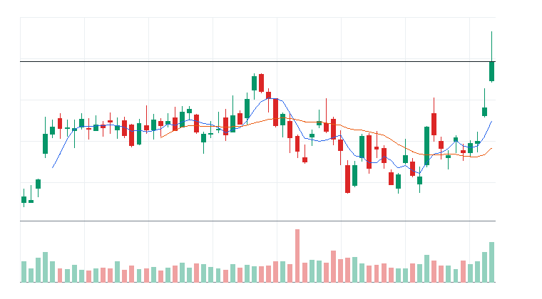
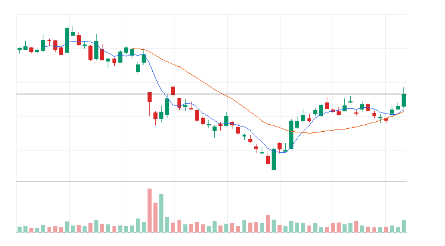

# 오늘의 데일리 트레이딩 요약

**REAL DATA TEST - 가격/거래량은 실제 데이터, 뉴스/ETF 구성종목 확산도/거래대금 유동성 일부 연결**

**목적:** 이 리포트는 최근 오른 자산을 나열하는 것이 아니라, 돈이 몰리는 근거와 다음 매수 주체가 확인할 트레이딩 후보를 찾기 위한 보고서다.

> 핵심 질문: 현재 가격에서 누가 사고 있고, 누가 앞으로 더 비싸게 사줄 수 있는가?

## 시장 국면 판단

- 최종 판정: 중립 (51점)
- 전일 대비: 중립-상승에서 중립으로 악화됐다(-7점).
- 판정 신뢰도: 높음 (100점) - 핵심 지수와 매크로 데이터가 대부분 직접 수집되어 판정 신뢰도가 높다.
- 행동 바이어스: 강한 테마만 선별, 신규 추격 제한
- 한 줄 결론: 기술 점수 55, 매크로 점수 44로 방향성이 엇갈린다. 후보별 게이트를 더 엄격히 본다.
- 기술적 지표: 방향성 중립 (55점, 가중치 65%)
- S&P 500: 65점 | 50일선 아래, 200일선 위, 20일 -2.44%, 60일 +1.00%, 52주 고점 대비 -4.00% -> 기술 점수 65
- Nasdaq 100: 44점 | 50일선 아래, 200일선 위, 20일 -10.19%, 60일 -2.00%, 52주 고점 대비 -11.60% -> 기술 점수 44
- 매크로 시황: 매크로 부담 (44점, 가중치 35%)
- 매크로 요약: 물가, 신용/유동성 부담으로 매크로 환경은 방어적이다.
- 금리: 중립 46점 / 금리 중립 / confidence HIGH
  - 주요 근거: US 10Y yield 20일 +4.62%, 5일 -0.75%; US 3M yield 20일 -1.98%, 단기금리 방향 확인; US long-duration bonds 20일 -4.13%, 장기채 가격 기준 할인율 부담 확인
  - 확인 사항: 장기금리 상승과 장기채 약세가 겹쳐 성장주 할인율 부담이 커질 수 있다.
- 물가: 부담 40점 / 물가 부담 / confidence HIGH
  - 주요 근거: Oil ETF 20일 +21.49%, 유가 기반 물가 압력 확인; TIPS ETF 20일 -1.52%, 물가연동채 흐름은 보조 근거; Gold 20일 +0.73%, 금 강세는 방어 수요 여부 확인
  - 확인 사항: 추가 확인 이벤트 없음
- 정책: 중립 50점 / 정책 이벤트 확인 전 중립 / confidence LOW
  - 주요 근거: 정책 톤은 1차 버전에서 일정/이벤트 리스크 기반 중립값으로 반영한다.
  - 확인 사항: FOMC, CPI, PCE, 고용지표 발표 전후에는 매크로 confidence를 보수적으로 해석한다.
- 신용/유동성: 위험 34점 / 신용/유동성 부담 / confidence HIGH
  - 주요 근거: High yield credit 20일 -0.91%, 하이일드 위험선호 확인; HYG-LQD 20일 상대강도 +1.70%, 신용위험 선호/회피 확인; VIX 20일 +25.59%, 변동성 부담 확인
  - 확인 사항: VIX 상승은 유동성/리스크 프리미엄 부담으로 해석한다.
- 환율/글로벌: 중립 50점 / 환율/글로벌 중립 / confidence MEDIUM
  - 주요 근거: US dollar 20일 +0.04%, 달러 강세/약세 확인
  - 확인 사항: 추가 확인 이벤트 없음
- US 10Y yield: 43점 | 하락 시 주식 우호; 5일 -0.75%, 20일 +4.62% -> 매크로 점수 43
- US 3M yield: 55점 | 하락 시 주식 우호; 5일 -2.32%, 20일 -1.98% -> 매크로 점수 55
- US long-duration bonds: 43점 | 상승 시 주식 우호; 5일 -0.71%, 20일 -4.13% -> 매크로 점수 43
- TIPS ETF: 50점 | 상승 시 주식 우호; 5일 0.00%, 20일 -1.52% -> 매크로 점수 50
- Oil ETF: 17점 | 하락 시 주식 우호; 5일 -1.80%, 20일 +21.49% -> 매크로 점수 17
- Gold: 50점 | 상승 시 주식 우호; 5일 -2.12%, 20일 +0.73% -> 매크로 점수 50
- US dollar: 50점 | 하락 시 주식 우호; 5일 -0.11%, 20일 +0.04% -> 매크로 점수 50
- High yield credit: 48점 | 상승 시 주식 우호; 5일 -0.35%, 20일 -0.91% -> 매크로 점수 48
- Investment grade credit: 50점 | 상승 시 주식 우호; 5일 -0.42%, 20일 -2.61% -> 매크로 점수 50
- VIX: 0점 | 하락 시 주식 우호; 5일 +24.16%, 20일 +25.59% -> 매크로 점수 0
- 데이터 커버리지: 기술 2/2, 매크로 10/10
- 데이터 신뢰도 근거:
  - 직접 지수 데이터: S&P 500, Nasdaq 100
  - 대체 지수 데이터 없음
  - 매크로 데이터: 10/10
  - 누락 데이터 없음
  - stale 데이터 없음

## 모바일 요약

[오늘의 데일리 트레이딩 요약]

생성 성공 / 데이터 모드: REAL_TEST

시장:
- 위험회피

시장 지배 서사:
1. 소프트웨어 실적/AI 수익화 - 부상 - iShares Expanded Tech-Software Sector ETF(IGV), Global X Artificial Intelligence & Technology ETF(AIQ), Workday Inc.(WDAY), Intuit Inc.(INTU) 중심으로 5일 +10.60%, 20일 +12.96% 흐름이 형성됨. 직접 촉매 일부 확인.
2. Specialty Business Services 자금 유입 - 관찰 - iShares Russell 2000 ETF(IWM), SPDR S&P 500 ETF Trust(SPY), Cintas Corporation(CTAS), Thomson Reuters Corporation(TRI) 중심으로 5일 +5.40%, 20일 +8.41% 흐름이 형성됨. 뉴스 직접성 제한.
3. Aerospace & Defense 자금 유입 - 약화 - iShares Russell 2000 ETF(IWM), SPDR S&P 500 ETF Trust(SPY), RTX, Lockheed Martin(LMT) 중심으로 5일 +0.88%, 20일 -0.86% 흐름이 형성됨. 뉴스 직접성 제한.

트렌드 강도:
1. 소프트웨어 실적/AI 수익화 - TSI 59 - 부상 - 진입품질 낮음
2. Specialty Business Services 자금 유입 - TSI 41 - 잠복 - 진입품질 낮음
3. Aerospace & Defense 자금 유입 - TSI 22 - 잠복 - 진입품질 낮음

오늘 결론:
- 필수소비재 개별 종목 흐름이 ETF 대비 강한지 확인 필요
- 행동 후보는 linkedNarrative와 함께 확인한다.
- 추격보다 진입 조건 확인 후 접근한다.

오늘 실제 행동 후보:
1. Mondelez International Inc.(MDLZ)(STOCK) - 소프트웨어 실적/AI 수익화 - 52주 고점 부근이라 돌파가 확인되면 신고가 추종 매수가 붙을 수 있음
2. Adobe Inc.(ADBE)(STOCK) - 소프트웨어 실적/AI 수익화 - 단기 추세가 유지되고 거래량이 1.0배 이상이면 눌림 이후 재상승을 시도할 수 있음
3. Workday Inc.(WDAY)(STOCK) - 소프트웨어 실적/AI 수익화 - 단기 추세가 유지되고 거래량이 1.0배 이상이면 눌림 이후 재상승을 시도할 수 있음

다크호스 후보:
1. Booking Holdings Inc.(BKNG) - darkHorseScore 79 - 베이스 돌파 확인
2. PDD Holdings Inc.(PDD) - darkHorseScore 71 - 베이스 돌파 확인
3. Intuit Inc.(INTU) - darkHorseScore 70 - 베이스 돌파 확인

ETF 후보 TOP 5:
1. Energy Select Sector SPDR Fund(XLE) - 매크로 방어/헤지 - 제외
2. iShares Expanded Tech-Software Sector ETF(IGV) - 소프트웨어 실적/AI 수익화 - 거래량 확인 전 관찰
3. iShares Russell 2000 ETF(IWM) - Specialty Business Services 자금 유입 - 제외
4. Invesco QQQ Trust(QQQ) - 소프트웨어 실적/AI 수익화 - 제외
5. SPDR Gold Shares(GLD) - 매크로 방어/헤지 - 제외

웹 리포트:
https://yoolcool.github.io/DailyTradingThesisAgent/

## 오늘 결론

- 오늘 결론: 매매 보류
- 신규 진입 후보: 0개
- 조건부 진입 후보: 5개
- 관찰 후보: 50개
- 주요 제한 요인: Entry Quality < 40, 뉴스 직접성 부족, RVOL 미달
- 주문 판단: 시장가 금지 / 지정가 또는 관찰
- 실전 판단: 진입 후보는 있으나, 전일 고점 돌파와 거래량 확인 후 선별적으로 접근한다.

### 후보 제한 요인 집계

- RVOL < 1.00x: 49개
- 거래대금 유동성 낮음: 12개
- Entry Quality 50~54 near miss: 0개
- Entry Quality 40~49 관찰: 13개
- Entry Quality < 40: 144개
- Exhaustion Risk >= 70: 0개
- ETF breadth 샘플 부족: 37개
- 뉴스 직접성 부족: 100개

## 데이터 신뢰도

- 전체 데이터 신뢰도 등급: LOW
- 분석 신뢰도: LOW
- 주문 실행 신뢰도: LOW
- ETF breadth 신뢰도: LOW
- 신뢰도 해석: 테마 확산 판단 제한, 거래대금 유동성 낮음 또는 확인 불가, 프리/애프터마켓 확인 불가
- 리포트 생성 시각: 2026-07-30 09:00 KST
- 가격 기준 거래일: 2026-07-29 US regular close
- 뉴스 수집 시각: 2026-07-30 09:00 KST
- 가장 최근 뉴스 발행 시각: 2026-07-30 08:58 KST
- 뉴스 신선도 상태: FRESH
- 뉴스 소스: Yahoo Finance RSS, MarketWatch RSS, CNBC Markets RSS, SEC EDGAR RSS, Federal Reserve RSS, Finnhub API
- 뉴스 소스 상태: Yahoo Finance RSS CONNECTED, MarketWatch RSS CONNECTED, CNBC Markets RSS PARTIAL, SEC EDGAR RSS PARTIAL, Federal Reserve RSS CONNECTED, Finnhub API DISABLED
- 뉴스 신뢰도: MEDIUM
- 추천 적용 거래일: 2026-07-29 US regular session
- 가격/거래량 데이터 상태: 연결됨
- 뉴스 데이터 상태: 일부 연결
- ETF 구성종목 확산도 상태: 일부 연결
- ETF 구성종목 샘플 수: 1~4
- 거래대금 유동성 데이터 상태: 일부 연결
- 프리/애프터마켓 데이터 상태: UNAVAILABLE
- 데이터 provider: yfinance, Yahoo Finance RSS, MarketWatch RSS, CNBC Markets RSS, SEC EDGAR RSS, Federal Reserve RSS, Finnhub API, config fallback sample, price-volume dollar-volume fallback
- 실전 사용 경고: 이 리포트는 투자판단 보조용이며, REAL_TEST 모드에서는 일부 데이터가 누락되거나 지연될 수 있다. 실제 주문 전 현재가, 뉴스, 프리마켓/정규장 거래량을 별도 확인해야 한다.

## 0. 시장 상태

- 데이터 모드: REAL_TEST
- 가격/거래량: 연결됨
- 뉴스: 일부 연결
- ETF 구성종목 확산도: 일부 연결
- 거래대금 유동성: 일부 연결
- 생성 시각: 2026년 7월 30일 목요일 AM 9:00
- 시장 상태: 위험회피
- 오늘 돈의 방향: 필수소비재 개별 종목 흐름이 ETF 대비 강한지 확인 필요
- 강한 테마 TOP 3: 이커머스/여행 플랫폼(62), Real Estate(52), 클라우드/엔터프라이즈 소프트웨어(51)
- 데이터 한계:
  - API 또는 provider 상태에 따라 뉴스/ETF 확산도/거래대금 유동성 반영 범위가 달라질 수 있다.
  - 수집 실패 데이터는 점수 반영에서 제외하거나 confidence를 제한한다.
  - reasonConfidence HIGH는 직접 촉매, 가격/거래량, 확산도/유동성 근거가 함께 있을 때만 사용한다.

## 오늘 시장을 지배하는 서사

### 오늘 시장을 지배하는 서사 TOP 3

#### 1. 소프트웨어 실적/AI 수익화
- 상태: 부상
- narrativeScore: 67
- reasonConfidence: MEDIUM
- 근거 ETF: IGV, AIQ, QQQ
- 근거 개별 종목: WDAY, INTU, TEAM, ADSK, DDOG
- 돈이 몰리는 이유: 소프트웨어 실적/AI 수익화 관련 iShares Expanded Tech-Software Sector ETF(IGV), Global X Artificial Intelligence & Technology ETF(AIQ), Invesco QQQ Trust(QQQ)와 Workday Inc.(WDAY), Intuit Inc.(INTU), Atlassian Corporation(TEAM), Autodesk Inc.(ADSK)의 5일(+10.60%)·20일(+12.96%) 흐름을 함께 본다. 평균 상대 거래량은 1.52배이고, ETF 확산도는 추가 확인이 필요하다. 직접 뉴스/이벤트가 일부 확인된다.
- 다음 매수 주체: 소프트웨어 실적/AI 수익화을 확인한 섹터 ETF 자금과 상대강도 추종 스윙 자금
- 가장 좋은 트레이딩 수단: ETF 우선: IGV, AIQ, QQQ / 개별 종목 우선: DDOG, WDAY, TEAM
- 서사가 깨지는 조건: IGV 20일선 이탈 또는 관련 종목 절반 이상 5일선 이탈
- 오늘 행동: 기존 네러티브와 중복을 확인한 뒤 ETF/대표 종목 동조성이 살아날 때만 관찰 편입

상세 narrativeScore 근거 보기

- rawScore: 67
- ETF 평균 moneyFlowScore: 10
- 개별 종목 평균 moneyFlowScore: 91
- ETF 후보 비율: 0%
- 개별 종목 후보 비율: 100%
- 5일 평균 수익률: +11.00%
- 20일 평균 수익률: +13.00%
- 평균 상대 거래량: 2.00배
- ETF 평균 상대 거래량: 2.00배
- 개별주 평균 상대 거래량: 1.00배
- 52주 고점 근접 후보 비율: 0%
- 뉴스 직접성 점수: 8
- ETF 확산도 점수: 0
- 유동성 점수: 3
- 과열 리스크 차감: 0

#### 2. Specialty Business Services 자금 유입
- 상태: 관찰
- narrativeScore: 58
- reasonConfidence: LOW
- 근거 ETF: IWM, SPY, QQQ
- 근거 개별 종목: CTAS, TRI, CPRT
- 돈이 몰리는 이유: Specialty Business Services 자금 유입 관련 iShares Russell 2000 ETF(IWM), SPDR S&P 500 ETF Trust(SPY), Invesco QQQ Trust(QQQ)와 Cintas Corporation(CTAS), Thomson Reuters Corporation(TRI), Copart Inc.(CPRT)의 5일(+5.40%)·20일(+8.41%) 흐름을 함께 본다. 평균 상대 거래량은 1.36배이고, ETF 확산도는 추가 확인이 필요하다. 뉴스 직접성은 아직 제한적이다.
- 다음 매수 주체: Specialty Business Services 자금 유입을 확인한 섹터 ETF 자금과 상대강도 추종 스윙 자금
- 가장 좋은 트레이딩 수단: ETF 우선: QQQ, SPY, IWM / 개별 종목 우선: TRI, CTAS, CPRT
- 서사가 깨지는 조건: QQQ 20일선 이탈 또는 관련 종목 절반 이상 5일선 이탈
- 오늘 행동: 기존 네러티브와 중복을 확인한 뒤 ETF/대표 종목 동조성이 살아날 때만 관찰 편입

상세 narrativeScore 근거 보기

- rawScore: 58
- ETF 평균 moneyFlowScore: 9
- 개별 종목 평균 moneyFlowScore: 87
- ETF 후보 비율: 0%
- 개별 종목 후보 비율: 100%
- 5일 평균 수익률: +5.00%
- 20일 평균 수익률: +8.00%
- 평균 상대 거래량: 1.00배
- ETF 평균 상대 거래량: 1.00배
- 개별주 평균 상대 거래량: 1.00배
- 52주 고점 근접 후보 비율: 50%
- 뉴스 직접성 점수: 5
- ETF 확산도 점수: 0
- 유동성 점수: 3
- 과열 리스크 차감: 0

#### 3. Aerospace & Defense 자금 유입
- 상태: 약화
- narrativeScore: 32
- reasonConfidence: LOW
- 근거 ETF: IWM, SPY, QQQ
- 근거 개별 종목: RTX, LMT, AVAV
- 돈이 몰리는 이유: Aerospace & Defense 자금 유입 관련 iShares Russell 2000 ETF(IWM), SPDR S&P 500 ETF Trust(SPY), Invesco QQQ Trust(QQQ)와 RTX, Lockheed Martin(LMT), AeroVironment(AVAV)의 5일(+0.88%)·20일(-0.86%) 흐름을 함께 본다. 평균 상대 거래량은 1.33배이고, ETF 확산도는 추가 확인이 필요하다. 뉴스 직접성은 아직 제한적이다.
- 다음 매수 주체: Aerospace & Defense 자금 유입을 확인한 섹터 ETF 자금과 상대강도 추종 스윙 자금
- 가장 좋은 트레이딩 수단: ETF 우선: QQQ, SPY, IWM / 개별 종목 우선: RTX, LMT, AVAV
- 서사가 깨지는 조건: QQQ 20일선 이탈 또는 관련 종목 절반 이상 5일선 이탈
- 오늘 행동: 기존 네러티브와 중복을 확인한 뒤 ETF/대표 종목 동조성이 살아날 때만 관찰 편입

상세 narrativeScore 근거 보기

- rawScore: 32
- ETF 평균 moneyFlowScore: 9
- 개별 종목 평균 moneyFlowScore: 51
- ETF 후보 비율: 0%
- 개별 종목 후보 비율: 67%
- 5일 평균 수익률: +1.00%
- 20일 평균 수익률: -1.00%
- 평균 상대 거래량: 1.00배
- ETF 평균 상대 거래량: 1.00배
- 개별주 평균 상대 거래량: 1.00배
- 52주 고점 근접 후보 비율: 50%
- 뉴스 직접성 점수: 1
- ETF 확산도 점수: 0
- 유동성 점수: 3
- 과열 리스크 차감: 0

### 전체 narrative 요약

| 서사명 | 상태 | narrativeScore | reasonConfidence | 대표 ETF | 대표 종목 | 오늘 행동 |
| --- | --- | ---: | --- | --- | --- | --- |
| 소프트웨어 실적/AI 수익화 | 부상 | 67 | MEDIUM | IGV, AIQ, QQQ | WDAY, INTU, TEAM, ADSK | 기존 네러티브와 중복을 확인한 뒤 ETF/대표 종목 동조성이 살아날 때만 관찰 편입 |
| Specialty Business Services 자금 유입 | 관찰 | 58 | LOW | IWM, SPY, QQQ | CTAS, TRI, CPRT | 기존 네러티브와 중복을 확인한 뒤 ETF/대표 종목 동조성이 살아날 때만 관찰 편입 |
| Aerospace & Defense 자금 유입 | 약화 | 32 | LOW | IWM, SPY, QQQ | RTX, LMT, AVAV | 기존 네러티브와 중복을 확인한 뒤 ETF/대표 종목 동조성이 살아날 때만 관찰 편입 |
| AI 소프트웨어/사이버보안 확산 | 약화 | 30 | LOW | IGV, AIQ, QQQ | TEAM, DDOG, MSFT, PLTR | 추격보다 눌림 후 재상승 확인 |
| 필수소비재 음료 방어 성장 | 약화 | 28 | LOW | QQQ | CCEP, MNST | 기존 네러티브와 중복을 확인한 뒤 ETF/대표 종목 동조성이 살아날 때만 관찰 편입 |
| 매크로 방어/헤지 | 약화 | 26 | LOW | XLE, GLD, TLT | CVX, XOM | 위험회피가 확인될 때만 헤지성 접근 |
| Integrated Oil & Gas 자금 유입 | 약화 | 22 | LOW | XLE, IWM, SPY | CVX, XOM | 기존 네러티브와 중복을 확인한 뒤 ETF/대표 종목 동조성이 살아날 때만 관찰 편입 |
| 방산/안보 프리미엄 | 약화 | 13 | LOW | ITA, XAR, SHLD | RTX, LMT, AVAV, KTOS | 뉴스 촉매가 직접 확인될 때만 추세 추종 |
| 바이오/헬스케어 촉매 | 약화 | 8 | LOW | QQQ | REGN, VRTX, INSM, ALNY | 기존 네러티브와 중복을 확인한 뒤 ETF/대표 종목 동조성이 살아날 때만 관찰 편입 |
| Internet Content 자금 유입 | 약화 | 7 | LOW | QQQ | DASH, META | 기존 네러티브와 중복을 확인한 뒤 ETF/대표 종목 동조성이 살아날 때만 관찰 편입 |
| 사이버보안 지출 재가속 | 약화 | 3 | LOW | CIBR, HACK, IHAK | FTNT, CRWD, PANW | 기존 네러티브와 중복을 확인한 뒤 ETF/대표 종목 동조성이 살아날 때만 관찰 편입 |
| 전력 유틸리티 수요 재평가 | 소멸 | 0 | LOW | IWM, SPY, QQQ | ETN, GEV, VRT | 기존 네러티브와 중복을 확인한 뒤 ETF/대표 종목 동조성이 살아날 때만 관찰 편입 |
| Data Storage 자금 유입 | 소멸 | 0 | LOW | IWM, SPY, QQQ | STX, WDC | 기존 네러티브와 중복을 확인한 뒤 ETF/대표 종목 동조성이 살아날 때만 관찰 편입 |
| 전력망/원전/인프라 병목 | 소멸 | 0 | LOW | GRID, PAVE, URA | VRT, ETN, PWR, CEG | ETF 확산도와 거래량이 같이 살아날 때만 진입 |
| AI 인프라 재가속 | 소멸 | 0 | LOW | SMH, SOXX, DRAM | NVDA, MU, VRT, ETN | 추격보다 5일선 지지 후 재상승 확인 |
| 위험선호 성장주 재진입 | 소멸 | 0 | LOW | QQQ, IPO, ARKK | ARM, COIN, TSLA | 지수 위험선호가 유지될 때만 선별 진입 |
| 반도체 장비 사이클 재평가 | 소멸 | 0 | LOW | SMH, SOXX, SOXQ | AMAT, LRCX, ASML | 기존 네러티브와 중복을 확인한 뒤 ETF/대표 종목 동조성이 살아날 때만 관찰 편입 |
| 반도체 설계/공급망 재가속 | 소멸 | 0 | LOW | SMH, SOXX, SOXQ | ARM, AMD, TXN, ADI | 기존 네러티브와 중복을 확인한 뒤 ETF/대표 종목 동조성이 살아날 때만 관찰 편입 |
| 비트코인/디지털 자산 위험선호 | 소멸 | 0 | LOW | IBIT, BLOK | MSTR, COIN, IREN | 비트코인 베타가 살아날 때만 단기 매매 |

## 트렌드 강도 판단

### 1. 소프트웨어 실적/AI 수익화
- Trend Strength Index: 59
- 트렌드 상태 라벨: 부상
- 테마 확산도: 보통
- ETF 동조성: 부족
- 거래량 강도: 강함
- 과열 위험: 보통 (29)
- 오늘 진입 품질: 낮음 (36)
- 한 줄 판단: 소프트웨어 실적/AI 수익화는 Trend Strength는 높아도 시장 위험선호가 약해 시장 환경 비우호 구간이다.
- 오늘 접근법: iShares Expanded Tech-Software Sector ETF(IGV)/Global X Artificial Intelligence & Technology ETF(AIQ)/Invesco QQQ Trust(QQQ) 거래량 증가와 Workday Inc.(WDAY)/Intuit Inc.(INTU)/Atlassian Corporation(TEAM) 확산을 확인하며 작은 사이즈의 초기 진입 후보로만 본다.

트렌드 강도 상세 근거 보기

- 가격 모멘텀: 가격 모멘텀 22/25. 평균 5D +10.60%, 20D +12.96%.
- 거래량 강도: 거래량 강도 15/20. 평균 RVOL 1.52배.
- ETF 동조성: ETF 동조성 3/15. 관련 ETF iShares Expanded Tech-Software Sector ETF(IGV), Global X Artificial Intelligence & Technology ETF(AIQ), Invesco QQQ Trust(QQQ) 흐름을 기준으로 판단.
- 테마 확산도: 테마 확산도 12/20. 상위 1~2개 쏠림 감점 0점 반영.
- 뉴스 촉매: 뉴스/촉매 신선도 6/10. HIGH 직접 촉매 1개.
- 과열 리스크: 과열 리스크 29/100. 단기 급등, 고점 근접, ETF-개별주 괴리, 쏠림을 함께 반영.
- 시장 환경: 시장 환경 1/10. QQQ/SPY/IWM 가격 흐름 기반 위험선호 점수.

### 2. Specialty Business Services 자금 유입
- Trend Strength Index: 41
- 트렌드 상태 라벨: 잠복
- 테마 확산도: 약함
- ETF 동조성: 부족
- 거래량 강도: 보통
- 과열 위험: 보통 (26)
- 오늘 진입 품질: 낮음 (21)
- 한 줄 판단: Specialty Business Services 자금 유입는 Trend Strength는 높아도 시장 위험선호가 약해 시장 환경 비우호 구간이다.
- 오늘 접근법: iShares Russell 2000 ETF(IWM)/SPDR S&P 500 ETF Trust(SPY)/Invesco QQQ Trust(QQQ)와 Cintas Corporation(CTAS)/Thomson Reuters Corporation(TRI)/Copart Inc.(CPRT)의 거래량 확산이 확인되기 전까지 관찰한다.

트렌드 강도 상세 근거 보기

- 가격 모멘텀: 가격 모멘텀 18/25. 평균 5D +5.40%, 20D +8.41%.
- 거래량 강도: 거래량 강도 12/20. 평균 RVOL 1.36배.
- ETF 동조성: ETF 동조성 2/15. 관련 ETF Invesco QQQ Trust(QQQ), SPDR S&P 500 ETF Trust(SPY), iShares Russell 2000 ETF(IWM) 흐름을 기준으로 판단.
- 테마 확산도: 테마 확산도 6/20. 상위 1~2개 쏠림 감점 3점 반영.
- 뉴스 촉매: 뉴스/촉매 신선도 2/10. HIGH 직접 촉매 0개.
- 과열 리스크: 과열 리스크 26/100. 단기 급등, 고점 근접, ETF-개별주 괴리, 쏠림을 함께 반영.
- 시장 환경: 시장 환경 1/10. QQQ/SPY/IWM 가격 흐름 기반 위험선호 점수.

### 3. Aerospace & Defense 자금 유입
- Trend Strength Index: 22
- 트렌드 상태 라벨: 잠복
- 테마 확산도: 부족
- ETF 동조성: 부족
- 거래량 강도: 보통
- 과열 위험: 보통 (34)
- 오늘 진입 품질: 낮음 (5)
- 한 줄 판단: Aerospace & Defense 자금 유입는 Trend Strength는 높아도 시장 위험선호가 약해 시장 환경 비우호 구간이다.
- 오늘 접근법: iShares Russell 2000 ETF(IWM)/SPDR S&P 500 ETF Trust(SPY)/Invesco QQQ Trust(QQQ)와 RTX/Lockheed Martin(LMT)/AeroVironment(AVAV)의 거래량 확산이 확인되기 전까지 관찰한다.

트렌드 강도 상세 근거 보기

- 가격 모멘텀: 가격 모멘텀 5/25. 평균 5D +0.88%, 20D -0.86%.
- 거래량 강도: 거래량 강도 11/20. 평균 RVOL 1.33배.
- ETF 동조성: ETF 동조성 2/15. 관련 ETF Invesco QQQ Trust(QQQ), SPDR S&P 500 ETF Trust(SPY), iShares Russell 2000 ETF(IWM) 흐름을 기준으로 판단.
- 테마 확산도: 테마 확산도 1/20. 상위 1~2개 쏠림 감점 6점 반영.
- 뉴스 촉매: 뉴스/촉매 신선도 2/10. HIGH 직접 촉매 0개.
- 과열 리스크: 과열 리스크 34/100. 단기 급등, 고점 근접, ETF-개별주 괴리, 쏠림을 함께 반영.
- 시장 환경: 시장 환경 1/10. QQQ/SPY/IWM 가격 흐름 기반 위험선호 점수.

## 최근 추천 결과 트래킹

개별주는 데이트레이딩 관점으로 추천 이후 첫 정규장의 장중 최고가와 종가를 추적한다. ETF는 테마/스윙 관점으로 추천 이후 1주일 동안의 최고가와 현재 종가를 추적한다.

### 개별주 Top 3 추천 성과 요약
- 최근 5개 리포트 표본: 12개 (초기 검증 단계)
- 장중 최고가 기준 성공률: +44.44%
- 종가 기준 성공률: +55.56%
- 평균 장중 최고 수익률: +3.06%
- 평균 종가 수익률: +1.67%

### ETF 추천 성과 요약
- 최근 5개 리포트 표본: 0개 (초기 검증 단계)
- 1주 최고가 기준 성공률: 데이터 없음
- 현재 종가 기준 성공률: 데이터 없음
- 평균 1주 최고 수익률: 데이터 없음
- 평균 현재 수익률: 데이터 없음

최근 추천 결과 상세 테이블 펼치기

| 추천일 | 유형 | 순위 | 티커 | 기준가 | 추적 기간 | 상태 | High 수익률 | Close 수익률 | 결과 | 코멘트 |
| --- | --- | ---: | --- | ---: | --- | --- | ---: | ---: | --- | --- |
| 2026-07-30 | STOCK | 3 | WDAY | $168.01 | 2026-07-30 | pending | 데이터 없음 | 데이터 없음 | 추적 대기 | 아직 추적 거래일 데이터가 완성되지 않음 |
| 2026-07-30 | STOCK | 2 | ADBE | $263.43 | 2026-07-30 | pending | 데이터 없음 | 데이터 없음 | 추적 대기 | 아직 추적 거래일 데이터가 완성되지 않음 |
| 2026-07-30 | STOCK | 1 | MDLZ | $64.99 | 2026-07-30 | pending | 데이터 없음 | 데이터 없음 | 추적 대기 | 아직 추적 거래일 데이터가 완성되지 않음 |
| 2026-07-29 | STOCK | 3 | ADBE | $249.18 | 2026-07-29 | complete | +6.85% | +5.72% | 성공 | 장중 기회와 종가 유지가 모두 확인됨 (일봉 기준) |
| 2026-07-29 | STOCK | 2 | TEAM | $99.98 | 2026-07-29 | complete | +6.74% | +4.30% | 성공 | 장중 기회와 종가 유지가 모두 확인됨 (일봉 기준) |
| 2026-07-29 | STOCK | 1 | RTX | $218.58 | 2026-07-29 | complete | +0.76% | -1.52% | 실패 | 추천 이후 의미 있는 장중 기회가 부족하고 종가도 약함 (일봉 기준) |
| 2026-07-28 | STOCK | 1 | RTX | $218.42 | 2026-07-28 | complete | +1.34% | +0.07% | 제한적 유효 | 제한적인 장중 기회만 발생 (일봉 기준) |
| 2026-07-27 | STOCK | 2 | LMT | $582.6 | 2026-07-27 | complete | +0.93% | -0.45% | 실패 | 추천 이후 의미 있는 장중 기회가 부족하고 종가도 약함 (일봉 기준) |
| 2026-07-27 | STOCK | 1 | RTX | $212.79 | 2026-07-27 | complete | +3.57% | +2.65% | 성공 | 장중 기회와 종가 유지가 모두 확인됨 (일봉 기준) |
| 2026-07-24 | STOCK | 3 | XOM | $156.89 | 2026-07-24 | complete | +1.16% | +0.03% | 제한적 유효 | 제한적인 장중 기회만 발생 (일봉 기준) |
| 2026-07-24 | STOCK | 2 | LMT | $568.59 | 2026-07-24 | complete | +3.49% | +2.46% | 성공 | 장중 기회와 종가 유지가 모두 확인됨 (일봉 기준) |
| 2026-07-24 | STOCK | 1 | RTX | $209.16 | 2026-07-24 | complete | +2.74% | +1.74% | 제한적 유효 | 제한적인 장중 기회만 발생 (일봉 기준) |
| 2026-07-23 | STOCK | 1 | PCAR | $131.11 | 2026-07-23 | complete | +1.82% | -0.27% | 제한적 유효 | 제한적인 장중 기회만 발생 (일봉 기준) |
| 2026-07-22 | STOCK | 1 | COIN | $175.85 | 2026-07-22 | complete | -0.51% | -5.53% | 실패 | 추천 이후 의미 있는 장중 기회가 부족하고 종가도 약함 (일봉 기준) |
| 2026-07-21 | STOCK | 1 | PYPL | $56.82 | 2026-07-21 | complete | +0.16% | -1.71% | 실패 | 추천 이후 의미 있는 장중 기회가 부족하고 종가도 약함 (일봉 기준) |
| 2026-07-20 | STOCK | 2 | CTAS | $204.45 | 2026-07-20 | complete | -0.03% | -1.30% | 실패 | 추천 이후 의미 있는 장중 기회가 부족하고 종가도 약함 (일봉 기준) |
| 2026-07-20 | STOCK | 1 | PANW | $358.68 | 2026-07-20 | complete | +2.13% | -2.79% | 제한적 유효 | 제한적인 장중 기회만 발생 (일봉 기준) |
| 2026-07-17 | STOCK | 3 | CTAS | $206.25 | 2026-07-17 | complete | +1.68% | -0.87% | 제한적 유효 | 제한적인 장중 기회만 발생 (일봉 기준) |
| 2026-07-17 | STOCK | 2 | TRI | $98.82 | 2026-07-17 | complete | +2.05% | -2.65% | 제한적 유효 | 제한적인 장중 기회만 발생 (일봉 기준) |
| 2026-07-17 | STOCK | 1 | PYPL | $56.73 | 2026-07-17 | complete | +0.78% | -0.30% | 실패 | 추천 이후 의미 있는 장중 기회가 부족하고 종가도 약함 (일봉 기준) |
| 2026-07-16 | STOCK | 3 | PYPL | $55.52 | 2026-07-16 | complete | +3.87% | +2.18% | 성공 | 장중 기회와 종가 유지가 모두 확인됨 (일봉 기준) |
| 2026-07-16 | STOCK | 2 | TRI | $95.51 | 2026-07-16 | complete | +5.85% | +3.47% | 성공 | 장중 기회와 종가 유지가 모두 확인됨 (일봉 기준) |
| 2026-07-16 | STOCK | 1 | CRWD | $210.73 | 2026-07-15 | complete | +3.21% | -1.88% | 단타 유효 | 장중 기회는 있었지만 종가 유지력은 약함 (일봉 기준) |
| 2026-07-15 | STOCK | 1 | CRWD | $210.73 | 2026-07-15 | complete | +3.21% | -1.88% | 단타 유효 | 장중 기회는 있었지만 종가 유지력은 약함 (일봉 기준) |
| 2026-07-14 | STOCK | 1 | TRI | $94.29 | 2026-07-14 | complete | -0.66% | -2.70% | 실패 | 추천 이후 의미 있는 장중 기회가 부족하고 종가도 약함 (일봉 기준) |
| 2026-07-13 | STOCK | 1 | AXON | $640.46 | 2026-07-13 | complete | -9.75% | -14.59% | 실패 | 추천 이후 의미 있는 장중 기회가 부족하고 종가도 약함 (일봉 기준) |
| 2026-07-13 | STOCK | 1 | META | $669.21 | 2026-07-13 | complete | +1.11% | -1.86% | 제한적 유효 | 제한적인 장중 기회만 발생 (일봉 기준) |
| 2026-07-08 | STOCK | 1 | AXON | $640.46 | 2026-07-08 | complete | -1.48% | -6.35% | 실패 | 추천 이후 의미 있는 장중 기회가 부족하고 종가도 약함 (일봉 기준) |
| 2026-07-07 | STOCK | 2 | AXON | $622.35 | 2026-07-07 | complete | +6.86% | +2.91% | 성공 | 장중 기회와 종가 유지가 모두 확인됨 (일봉 기준) |
| 2026-07-07 | STOCK | 1 | PANW | $357.53 | 2026-07-07 | complete | +1.53% | -5.73% | 제한적 유효 | 제한적인 장중 기회만 발생 (일봉 기준) |
| 2026-07-06 | STOCK | 2 | CCEP | $106.61 | 2026-07-06 | complete | +0.58% | +0.34% | 추적 대기 | 아직 추적 거래일 데이터가 완성되지 않음 (일봉 기준) |
| 2026-07-06 | STOCK | 1 | PANW | $348.06 | 2026-07-06 | complete | +5.78% | +2.72% | 성공 | 장중 기회와 종가 유지가 모두 확인됨 (일봉 기준) |
| 2026-07-03 | STOCK | 1 | CCEP | $106.61 | 2026-07-03 | pending | 데이터 없음 | 데이터 없음 | 추적 대기 | 아직 추적 거래일 데이터가 완성되지 않음 |
| 2026-07-02 | STOCK | 2 | AXON | $593.96 | 2026-07-02 | complete | +1.52% | +0.52% | 제한적 유효 | 제한적인 장중 기회만 발생 (일봉 기준) |
| 2026-07-02 | STOCK | 1 | CCEP | $106.1 | 2026-07-02 | complete | +1.86% | +0.48% | 제한적 유효 | 제한적인 장중 기회만 발생 (일봉 기준) |
| 2026-07-01 | STOCK | 3 | LRCX | $433.33 | 2026-07-01 | complete | -4.12% | -9.71% | 실패 | 추천 이후 의미 있는 장중 기회가 부족하고 종가도 약함 (일봉 기준) |
| 2026-07-01 | STOCK | 2 | PANW | $341.02 | 2026-07-01 | complete | +5.01% | +3.23% | 성공 | 장중 기회와 종가 유지가 모두 확인됨 (일봉 기준) |
| 2026-07-01 | STOCK | 1 | AMAT | $723 | 2026-07-01 | complete | -4.04% | -9.97% | 실패 | 추천 이후 의미 있는 장중 기회가 부족하고 종가도 약함 (일봉 기준) |
| 2026-06-30 | STOCK | 3 | AMAT | $694.64 | 2026-06-30 | complete | +6.48% | +4.08% | 성공 | 장중 기회와 종가 유지가 모두 확인됨 (일봉 기준) |
| 2026-06-30 | STOCK | 2 | CRWD | $742.91 | 2026-06-30 | complete | -74.25% | -74.32% | 실패 | 추천 이후 의미 있는 장중 기회가 부족하고 종가도 약함 (일봉 기준) |
| 2026-06-30 | STOCK | 1 | PANW | $332 | 2026-06-30 | complete | +3.16% | +2.72% | 성공 | 장중 기회와 종가 유지가 모두 확인됨 (일봉 기준) |
| 2026-06-29 | STOCK | 3 | KDP | $33.4 | 2026-06-29 | complete | +1.26% | +0.30% | 제한적 유효 | 제한적인 장중 기회만 발생 (일봉 기준) |
| 2026-06-29 | STOCK | 2 | VRTX | $491.34 | 2026-06-29 | complete | +1.74% | +1.69% | 제한적 유효 | 제한적인 장중 기회만 발생 (일봉 기준) |
| 2026-06-29 | STOCK | 1 | FTNT | $151.35 | 2026-06-29 | complete | +5.10% | +2.69% | 성공 | 장중 기회와 종가 유지가 모두 확인됨 (일봉 기준) |
| 2026-06-26 | STOCK | 3 | MU | $1,213.56 | 2026-06-26 | complete | -1.22% | -6.69% | 실패 | 추천 이후 의미 있는 장중 기회가 부족하고 종가도 약함 (일봉 기준) |
| 2026-06-26 | STOCK | 2 | AMAT | $668 | 2026-06-26 | complete | -1.17% | -6.16% | 실패 | 추천 이후 의미 있는 장중 기회가 부족하고 종가도 약함 (일봉 기준) |
| 2026-06-26 | STOCK | 1 | LRCX | $401.82 | 2026-06-26 | complete | -2.97% | -5.66% | 실패 | 추천 이후 의미 있는 장중 기회가 부족하고 종가도 약함 (일봉 기준) |
| 2026-06-26 | ETF | 1 | DRAM | $76.89 | 2026-06-26~2026-07-03 | complete | -3.55% | -41.67% | 실패 | 추천 이후 ETF 흐름이 약화됨 |
| 2026-06-23 | STOCK | 3 | TSM | $467.67 | 2026-06-23 | complete | -4.35% | -6.69% | 실패 | 추천 이후 의미 있는 장중 기회가 부족하고 종가도 약함 (일봉 기준) |
| 2026-06-23 | STOCK | 2 | GEV | $1,127.59 | 2026-06-23 | complete | -4.84% | -8.21% | 실패 | 추천 이후 의미 있는 장중 기회가 부족하고 종가도 약함 (일봉 기준) |
| 2026-06-23 | STOCK | 1 | ETN | $435.78 | 2026-06-23 | complete | -3.27% | -7.00% | 실패 | 추천 이후 의미 있는 장중 기회가 부족하고 종가도 약함 (일봉 기준) |
| 2026-06-23 | ETF | 1 | DRAM | $80.72 | 2026-06-23~2026-06-30 | complete | -1.39% | -44.44% | 실패 | 추천 이후 ETF 흐름이 약화됨 |
| 2026-06-22 | STOCK | 3 | ARM | $439.46 | 2026-06-22 | complete | +1.25% | -7.22% | 제한적 유효 | 제한적인 장중 기회만 발생 (일봉 기준) |
| 2026-06-22 | STOCK | 2 | GEV | $1,109.73 | 2026-06-22 | complete | +2.91% | +1.61% | 제한적 유효 | 제한적인 장중 기회만 발생 (일봉 기준) |
| 2026-06-22 | STOCK | 1 | ETN | $421.77 | 2026-06-22 | complete | +3.55% | +3.32% | 성공 | 장중 기회와 종가 유지가 모두 확인됨 (일봉 기준) |
| 2026-06-22 | ETF | 3 | IFRA | $61.99 | 2026-06-22~2026-06-29 | complete | +3.65% | -3.24% | 단기 고점 후 반납 | 1주 내 상승 기회는 있었지만 현재가는 반납 |
| 2026-06-22 | ETF | 2 | SMH | $659.88 | 2026-06-22~2026-06-29 | complete | -1.49% | -23.59% | 실패 | 추천 이후 ETF 흐름이 약화됨 |
| 2026-06-22 | ETF | 1 | DRAM | $76.71 | 2026-06-22~2026-06-29 | complete | +3.77% | -41.53% | 단기 고점 후 반납 | 1주 내 상승 기회는 있었지만 현재가는 반납 |
| 2026-06-19 | STOCK | 3 | AMD | $537.37 | 2026-06-19 | pending | 데이터 없음 | 데이터 없음 | 추적 대기 | 아직 추적 거래일 데이터가 완성되지 않음 |
| 2026-06-19 | STOCK | 2 | ARM | $439.46 | 2026-06-19 | pending | 데이터 없음 | 데이터 없음 | 추적 대기 | 아직 추적 거래일 데이터가 완성되지 않음 |

## 오늘 실제 행동 후보

### 1. Mondelez International Inc.(MDLZ)
- 자산 유형: STOCK
- linkedNarrative: 소프트웨어 실적/AI 수익화
- narrativeStatus: 부상
- narrativeScore: 67
- Trend Strength Index: 59
- Exhaustion Risk: 29 (보통)
- Entry Quality Score: 44 (관찰)
- 트렌드 판단: ETF 동조성이 약해 테마 자금 확인이 부족하다.
- moneyFlowScore: 97
- finalRawScore: 97
- reasonConfidence: MEDIUM
- reasonConfidenceExplanation: 직접 촉매 부재 때문에 HIGH가 아니라 MEDIUM으로 제한했다.
- tieBreakerReason: 최종 원점수 97, 리스크 패널티 0, 5일 수익률 +6.79%, 상대 거래량 2.00배 순으로 정렬
- 후보별 시장 해석: 위험회피 / 제한적 - 전체 시장은 위험회피 / 고점 근처 추격 리스크 / Entry Quality 44 < 50이나 moneyFlow 97, confidence MEDIUM, RVOL 2.00x로 강한 자금흐름 예외 조건 충족
- 게이트 사유: Entry Quality 44 < 50이나 moneyFlow 97, confidence MEDIUM, RVOL 2.00x로 강한 자금흐름 예외 조건 충족
- 주문 실행: 시장가 가능

- 왜 돈이 몰리는가: 20일 +12.36%, 5일 +6.79%, 상대 거래량 2.00배로 가격과 거래량이 함께 개선. 뉴스: CNBC Markets RSS analyst_upgrade/under_6h / 유동성: LIQUID
- 누가 더 비싸게 사줄 수 있는지: 개별 주도주를 따라붙는 단기 모멘텀 자금과 관련 ETF 강세를 확인한 트레이더
- 진입 조건: 전일 고점 돌파와 5일선 유지 확인
- 무효화 조건: 20일선 이탈 또는 상대 거래량 0.8배 이하 둔화
- todayActionLabel: 자금흐름 예외 조건부
#### 최근 뉴스/동향 한국어 요약

- 요약: 종목 직접 뉴스 확인 상태이며 뉴스 흐름은 긍정 우위입니다. 후보 선정 후 재확인한 핵심 이슈는 "Mondelez Q2 Earnings Beat Estimates, 2026 Organic Sales Outlook Up"입니다.
- 직접 촉매 판단: Mondelez International Inc.에 대해 직접 촉매로 분류된 뉴스가 확인됐습니다. 핵심은 "Mondelez Q2 Earnings Beat Estimates, 2026 Organic Sales Outlook Up"이며, 실적 재료로 봅니다.
- 뉴스 1: Mondelez Q2 Earnings Beat Estimates, 2026 Organic Sales Outlook Up
  - 내용: Mondelez International Inc. 관련 실적 뉴스입니다. 기사 스니펫상 핵심 내용은 MDLZ posts second-quarter earnings and sales beat, backed by pricing and volume growth, and lifts its 2026 organic sales outlook.입니다.
  - 투자 의미: 실적/가이던스 재료는 다음 분기 기대치 변화로 이어질 수 있어 컨센서스 변화와 주가 반응 지속성을 함께 봅니다.
  - 확인할 점: 매출/마진/가이던스 수치, 컨센서스 대비 차이
- 뉴스 2: Mondelez International Inc (MDLZ) Q2 2026 Earnings Call Highlights: Strong Growth in Emerging ...
  - 내용: Mondelez International Inc. 관련 실적 뉴스입니다. 기사 스니펫상 핵심 내용은 Mondelez International Inc (MDLZ) reports robust top-line growth and market share gains, while navigating economic headwinds and regional challenges.입니다.
  - 투자 의미: 실적/가이던스 재료는 다음 분기 기대치 변화로 이어질 수 있어 컨센서스 변화와 주가 반응 지속성을 함께 봅니다.
  - 확인할 점: 매출/마진/가이던스 수치, 컨센서스 대비 차이
- 뉴스 3: Mondelez International Q2 Earnings Call Highlights
  - 내용: Mondelez International Inc. 관련 실적 뉴스입니다. 기사 스니펫상 핵심 내용은 Mondelez International (NASDAQ:MDLZ) said it expects momentum in emerging markets, improving execution in North America and a recovery in Europe to support a strong second half,...입니다.
  - 투자 의미: 실적/가이던스 재료는 다음 분기 기대치 변화로 이어질 수 있어 컨센서스 변화와 주가 반응 지속성을 함께 봅니다.
  - 확인할 점: 매출/마진/가이던스 수치, 컨센서스 대비 차이
- 매매 해석: 매매 관점에서는 뉴스 자체보다 가격이 진입 조건을 지키는지, 거래량이 동반되는지, 그리고 뉴스가 이미 주가에 반영됐는지를 우선 확인해야 합니다.
- 차트: 

### 2. Adobe Inc.(ADBE)
- 자산 유형: STOCK
- linkedNarrative: 소프트웨어 실적/AI 수익화
- narrativeStatus: 부상
- narrativeScore: 67
- Trend Strength Index: 59
- Exhaustion Risk: 29 (보통)
- Entry Quality Score: 38 (낮음)
- 트렌드 판단: ETF 동조성이 약해 테마 자금 확인이 부족하다.
- moneyFlowScore: 100
- finalRawScore: 105
- reasonConfidence: HIGH
- reasonConfidenceExplanation: 직접 촉매: Yahoo Finance RSS / macro / under_6h / neutral - Dow Sees Worst Day In Over A Year, Nasdaq Enters Correction Territory As Fed Decision Piques Inflation Concerns — SPCX, CAT, ADBE, SOFI, HIMS Stock In Focus 가격/거래량, 관련 ETF 동반 강세, 유동성 근거가 함께 확인되어 HIGH로 분류했다.
- tieBreakerReason: 최종 원점수 105, 리스크 패널티 -6, 5일 수익률 +20.64%, 상대 거래량 1.71배 순으로 정렬
- 후보별 시장 해석: 위험회피 / 제한적 - 전체 시장은 위험회피 / Entry Quality 38 < 50이나 moneyFlow 100, confidence HIGH, RVOL 1.71x로 강한 자금흐름 예외 조건 충족
- 게이트 사유: Entry Quality 38 < 50이나 moneyFlow 100, confidence HIGH, RVOL 1.71x로 강한 자금흐름 예외 조건 충족
- 주문 실행: 시장가 가능
- 직접 촉매: Yahoo Finance RSS / macro / under_6h / neutral - Dow Sees Worst Day In Over A Year, Nasdaq Enters Correction Territory As Fed Decision Piques Inflation Concerns — SPCX, CAT, ADBE, SOFI, HIMS Stock In Focus
- 왜 돈이 몰리는가: 20일 +28.49%, 5일 +20.64%, 상대 거래량 1.71배로 가격과 거래량이 함께 개선. 뉴스: Yahoo Finance RSS macro/under_6h / 유동성: LIQUID
- 누가 더 비싸게 사줄 수 있는지: 개별 주도주를 따라붙는 단기 모멘텀 자금과 관련 ETF 강세를 확인한 트레이더
- 진입 조건: 20일선 위 눌림 후 재상승 확인
- 무효화 조건: 20일선 이탈 또는 상대 거래량 0.8배 이하 둔화
- todayActionLabel: 자금흐름 예외 조건부
#### 최근 뉴스/동향 한국어 요약

- 요약: 종목 직접 뉴스 확인 상태이며 뉴스 흐름은 긍정 우위입니다. 후보 선정 후 재확인한 핵심 이슈는 "Dow Sees Worst Day In Over A Year, Nasdaq Enters Correction Territory As Fed Decision Piques Inflation Concerns — SPCX, CAT, ADBE, SOFI, HIMS Stock In Focus"입니다.
- 직접 촉매 판단: Adobe Inc.에 대해 직접 촉매로 분류된 뉴스가 확인됐습니다. 핵심은 "Dow Sees Worst Day In Over A Year, Nasdaq Enters Correction Territory As Fed Decision Piques Inflation Concerns — SPCX, CAT, ADBE, SOFI, HIMS Stock In Focus"이며, 매크로 재료로 봅니다.
- 뉴스 1: Dow Sees Worst Day In Over A Year, Nasdaq Enters Correction Territory As Fed Decision Piques Inflation Concerns — SPCX, CAT, ADBE, SOFI, HIMS Stock In Focus
  - 내용: Adobe Inc. 관련 매크로 뉴스입니다. 기사 스니펫상 핵심 내용은 U.S.입니다.
  - 투자 의미: 단기 중립 뉴스 흐름으로 볼 수 있지만, 단독 매수 근거보다는 가격·거래량 조건을 확인하는 보조 근거로 사용합니다.
  - 확인할 점: 원문 수치, 후속 보도, 가격이 진입 조건을 지키는지
- 뉴스 2: ADBE Stock At Near Two-Month Highs After FTC Grants Early Approval For Adobe’s Acquisition Of Topaz Labs
  - 내용: Adobe Inc. 관련 매크로 뉴스입니다. 기사 스니펫상 핵심 내용은 Federal regulators have given Adobe the green light to proceed with its acquisition of Topaz Labs, clearing antitrust hurdles ahead of schedule.입니다.
  - 투자 의미: 단기 긍정 뉴스 흐름으로 볼 수 있지만, 단독 매수 근거보다는 가격·거래량 조건을 확인하는 보조 근거로 사용합니다.
  - 확인할 점: 원문 수치, 후속 보도, 가격이 진입 조건을 지키는지
- 뉴스 3: Why Is Adobe Stock Climbing Today
  - 내용: Adobe Inc. 관련 M&A 뉴스입니다. 현재 방향성은 긍정으로 분류됩니다.
  - 투자 의미: M&A 재료는 실적 가시성이나 밸류에이션 기대에 영향을 줄 수 있어 규모와 일정 확인이 중요합니다.
  - 확인할 점: M&A의 금액, 기간, 실적 반영 시점
- 매매 해석: 매매 관점에서는 뉴스 자체보다 가격이 진입 조건을 지키는지, 거래량이 동반되는지, 그리고 뉴스가 이미 주가에 반영됐는지를 우선 확인해야 합니다.
- 차트: 

### 3. Workday Inc.(WDAY)
- 자산 유형: STOCK
- linkedNarrative: 소프트웨어 실적/AI 수익화
- narrativeStatus: 부상
- narrativeScore: 67
- Trend Strength Index: 59
- Exhaustion Risk: 29 (보통)
- Entry Quality Score: 40 (관찰)
- 트렌드 판단: ETF 동조성이 약해 테마 자금 확인이 부족하다.
- moneyFlowScore: 100
- finalRawScore: 104
- reasonConfidence: MEDIUM
- reasonConfidenceExplanation: 직접 촉매 부재 때문에 HIGH가 아니라 MEDIUM으로 제한했다.
- tieBreakerReason: 최종 원점수 104, 리스크 패널티 -6, 5일 수익률 +26.88%, 상대 거래량 1.58배 순으로 정렬
- 후보별 시장 해석: 위험회피 / 제한적 - 전체 시장은 위험회피 / Entry Quality 40 < 50이나 moneyFlow 100, confidence MEDIUM, RVOL 1.58x로 강한 자금흐름 예외 조건 충족
- 게이트 사유: Entry Quality 40 < 50이나 moneyFlow 100, confidence MEDIUM, RVOL 1.58x로 강한 자금흐름 예외 조건 충족
- 주문 실행: 시장가 가능

- 왜 돈이 몰리는가: 20일 +37.24%, 5일 +26.88%, 상대 거래량 1.58배로 가격과 거래량이 함께 개선. 뉴스: CNBC Markets RSS analyst_upgrade/under_6h / 유동성: LIQUID
- 누가 더 비싸게 사줄 수 있는지: 개별 주도주를 따라붙는 단기 모멘텀 자금과 관련 ETF 강세를 확인한 트레이더
- 진입 조건: 20일선 위 눌림 후 재상승 확인
- 무효화 조건: 20일선 이탈 또는 상대 거래량 0.8배 이하 둔화
- todayActionLabel: 자금흐름 예외 조건부
#### 최근 뉴스/동향 한국어 요약

- 요약: 종목 직접 뉴스 확인 상태이며 뉴스 흐름은 긍정 우위입니다. 후보 선정 후 재확인한 핵심 이슈는 "Workday (WDAY) Just Flashed Golden Cross Signal: Do You Buy?"입니다.
- 직접 촉매 판단: Workday Inc.에 대해 직접 촉매로 분류된 뉴스가 확인됐습니다. 핵심은 "Workday (WDAY) Just Flashed Golden Cross Signal: Do You Buy?"이며, 시장 일반 재료로 봅니다.
- 뉴스 1: Workday (WDAY) Just Flashed Golden Cross Signal: Do You Buy?
  - 내용: Workday Inc. 관련 시장 일반 뉴스입니다. 기사 스니펫상 핵심 내용은 Should investors be excited or worried when a stock crosses above the 20-day simple moving average?입니다.
  - 투자 의미: 단기 중립 뉴스 흐름으로 볼 수 있지만, 단독 매수 근거보다는 가격·거래량 조건을 확인하는 보조 근거로 사용합니다.
  - 확인할 점: 원문 수치, 후속 보도, 가격이 진입 조건을 지키는지
- 뉴스 2: EarnIn Partners with Workday to Bring Enhanced Direct Deposit to Millions of Working Americans
  - 내용: Workday Inc. 관련 기사는 EarnIn Partners with Workday to Bring Enhanced Direct Deposit to Millions of Working Americans 이슈를 다루며, 주가 변동률 +65.00%를 핵심 내용으로 봅니다.
  - 투자 의미: Workday Inc.의 당일 상대강도 확인에는 도움이 되지만, 실적/가이던스 같은 새 펀더멘털 변화로 보기는 어렵습니다.
  - 확인할 점: 거래량 동반 여부, 장중 고점 유지, 관련 ETF 동반 강세
- 뉴스 3: Qualcomm&#x2019;s stock falls as memory woes weigh on earnings
  - 내용: Workday Inc.의 실적 또는 가이던스 관련 뉴스입니다. 혼재 재료로 분류됩니다.
  - 투자 의미: 실적/가이던스 재료는 다음 분기 기대치 변화로 이어질 수 있어 컨센서스 변화와 주가 반응 지속성을 함께 봅니다.
  - 확인할 점: 매출/마진/가이던스 수치, 컨센서스 대비 차이
- 매매 해석: 매매 관점에서는 뉴스 자체보다 가격이 진입 조건을 지키는지, 거래량이 동반되는지, 그리고 뉴스가 이미 주가에 반영됐는지를 우선 확인해야 합니다.
- 차트: 

## 다크호스 후보

> 메인 행동 후보를 대체하지 않는 보조 관찰 섹션이다. 상위 서사 안에서 아직 과열되지 않았지만 초기 추세 전환, 베이스 돌파, 거래량 회복이 시작되는 개별주만 표시한다.

### 1. Booking Holdings Inc.(BKNG)
- 소속 서사: 소프트웨어 실적/AI 수익화
- darkHorseScore: 79 (다크호스 후보)
- 단계: 베이스 돌파 확인
- Confidence: LOW
- 5D / 20D / RVOL: +13.18% / +12.94% / 1.21x
- MA 구조: 종가 $201.3 / MA5 $187.54 / MA20 $181.63
- 선정 이유: BKNG는 소프트웨어 실적/AI 수익화 서사에 속하고 종가가 MA20 위에 있으며 MA5/MA20 정렬이 개선되고 있다. 최근 15거래일 베이스는 상단 돌파 상태이고, RVOL 1.21x로 거래량 확인은 충분하다. Exhaustion Risk 29로 아직 메인 후보 대비 과열 상한 안에 있다.
- 확인 조건: 돌파 후 고점 위 안착 유지, MA5 위 종가 유지, 관련 ETF 동반 강세
- 무효화 조건: MA20 $181.63 종가 이탈, 최근 스윙 저점 $171.02 이탈, RVOL 0.80x 이하 둔화
- 왜 아직 메인이 아닌가: Entry Quality 45 < 50
#### 최근 뉴스/동향 한국어 요약

- 요약: 후보 선정 후 재확인 뉴스 데이터 없음

darkHorseScore 상세 근거 보기

- 서사 정렬: 13/20
- 초기 추세 구조: 28/30
- 베이스 돌파/정돈: 15/20
- 거래량 확인: 14/15
- 낮은 과열: 8/10
- 유동성 리스크 보정: 5/5
- 리스크 차감: -4
- rawScore: 79

- 차트: 

### 2. PDD Holdings Inc.(PDD)
- 소속 서사: 소프트웨어 실적/AI 수익화
- darkHorseScore: 71 (다크호스 후보)
- 단계: 베이스 돌파 확인
- Confidence: LOW
- 5D / 20D / RVOL: +5.66% / +15.78% / 1.59x
- MA 구조: 종가 $88.32 / MA5 $84.97 / MA20 $84.56
- 선정 이유: PDD는 소프트웨어 실적/AI 수익화 서사에 속하고 종가가 MA20 위에 있으며 MA5/MA20 정렬이 개선되고 있다. 최근 15거래일 베이스는 상단 돌파 상태이고, RVOL 1.59x로 거래량 확인은 충분하다. Exhaustion Risk 29로 아직 메인 후보 대비 과열 상한 안에 있다.
- 확인 조건: 돌파 후 고점 위 안착 유지, MA5 위 종가 유지, 관련 ETF 동반 강세
- 무효화 조건: MA20 $84.56 종가 이탈, 최근 스윙 저점 $82.06 이탈, RVOL 0.80x 이하 둔화
- 왜 아직 메인이 아닌가: Entry Quality 42 < 50
#### 최근 뉴스/동향 한국어 요약

- 요약: 후보 선정 후 재확인 뉴스 데이터 없음

darkHorseScore 상세 근거 보기

- 서사 정렬: 13/20
- 초기 추세 구조: 22/30
- 베이스 돌파/정돈: 15/20
- 거래량 확인: 14/15
- 낮은 과열: 8/10
- 유동성 리스크 보정: 3/5
- 리스크 차감: -4
- rawScore: 71

- 차트: 

### 3. Intuit Inc.(INTU)
- 소속 서사: 소프트웨어 실적/AI 수익화
- darkHorseScore: 70 (다크호스 후보)
- 단계: 베이스 돌파 확인
- Confidence: LOW
- 5D / 20D / RVOL: +17.11% / +27.64% / 1.33x
- MA 구조: 종가 $333.13 / MA5 $305.58 / MA20 $287.5
- 선정 이유: INTU는 소프트웨어 실적/AI 수익화 서사에 속하고 종가가 MA20 위에 있으며 MA5/MA20 정렬이 개선되고 있다. 최근 15거래일 베이스는 상단 돌파 상태이고, RVOL 1.33x로 거래량 확인은 충분하다. Exhaustion Risk 29로 아직 메인 후보 대비 과열 상한 안에 있다.
- 확인 조건: 돌파 후 고점 위 안착 유지, MA5 위 종가 유지, 관련 ETF 동반 강세
- 무효화 조건: MA20 $287.50 종가 이탈, 최근 스윙 저점 $277.57 이탈, RVOL 0.80x 이하 둔화
- 왜 아직 메인이 아닌가: Entry Quality 35 < 50
#### 최근 뉴스/동향 한국어 요약

- 요약: 후보 선정 후 재확인 뉴스 데이터 없음

darkHorseScore 상세 근거 보기

- 서사 정렬: 13/20
- 초기 추세 구조: 24/30
- 베이스 돌파/정돈: 13/20
- 거래량 확인: 14/15
- 낮은 과열: 5/10
- 유동성 리스크 보정: 5/5
- 리스크 차감: -4
- rawScore: 70

- 차트: 

## 오늘 돈이 몰리는 테마

- 이커머스/여행 플랫폼: BKNG, PDD, MELI, ABNB, DASH | 평균 moneyFlowScore 62 | 추세는 확인되지만 선별 진입이 필요한 중간 강도의 테마로 본다.
- Real Estate: CSGP | 평균 moneyFlowScore 52 | 관심은 유지하되 우선순위는 낮추고 추가 거래량 확인을 기다린다.
- 클라우드/엔터프라이즈 소프트웨어: MSFT, PLTR, APP, SHOP, ADBE, CDNS, SNPS, INTU | 평균 moneyFlowScore 51 | 관심은 유지하되 우선순위는 낮추고 추가 거래량 확인을 기다린다.
- 필수소비재: WMT, COST, PEP, MNST, MDLZ, KDP, CCEP, KHC | 평균 moneyFlowScore 49 | 관심은 유지하되 우선순위는 낮추고 추가 거래량 확인을 기다린다.
- Consumer Cyclical: SBUX, MAR, ROST, ORLY | 평균 moneyFlowScore 44 | 관심은 유지하되 우선순위는 낮추고 추가 거래량 확인을 기다린다.
- 중국 인터넷 ETF: KWEB | 평균 moneyFlowScore 42 | 관심은 유지하되 우선순위는 낮추고 추가 거래량 확인을 기다린다.

## 1. ETF 트레이딩 보고서
### 1-1. ETF 결론
- ETF 우선 후보: 없음
- ETF 관찰 후보: iShares Expanded Tech-Software Sector ETF(IGV), ROBO Global Robotics and Automation Index ETF(ROBO), Amplify Cybersecurity ETF(HACK), iShares Cybersecurity and Tech ETF(IHAK), Global X Defense Tech ETF(SHLD)
- ETF 매매 금지: Roundhill Memory ETF(DRAM), VanEck Semiconductor ETF(SMH), iShares Semiconductor ETF(SOXX), Invesco PHLX Semiconductor ETF(SOXQ), Global X Artificial Intelligence & Technology ETF(AIQ)
- 오늘 ETF 최우선 1개: 없음
- ETF 섹션 해석: 이 섹션은 개별 종목 선택이 아니라 테마/섹터 단위 자금 흐름을 ETF로 매매할지 판단하기 위한 영역이다.

### 1-2. ETF 후보 TOP 5

선정 기준: ETF 후보는 가격/거래량 1차 점수에 뉴스, ETF 구성종목 확산도, 유동성, 리스크 패널티를 반영한 finalRawScore 기준으로 정렬한다. 표시 점수 100점 후보가 겹치면 tieBreakerReason으로 우선순위를 설명한다.

### [ETF] Energy Select Sector SPDR Fund(XLE)
- 자산 유형: ETF
- ETF 세부 카테고리: 전통 에너지 ETF
- ETF 역할: 테마 베타 매수
- 상태: 매매 금지
- linkedNarrative: 매크로 방어/헤지
- narrativeStatus: 약화
- narrativeScore: 26
- moneyFlowScore: 56
- finalRawScore: 56
- tieBreakerReason: 최종 원점수 56, 리스크 패널티 0, 5일 수익률 -0.93%, 상대 거래량 1.09배 순으로 정렬
- 과열 리스크: 낮음
- reasonConfidence: MEDIUM
- reasonConfidenceExplanation: ETF 확산도 제한 때문에 HIGH가 아니라 MEDIUM으로 제한했다.

- todayActionLabel: 제외
- 주문 실행: 시장가 가능
- 기준일: 2026-07-29
- 종가: $58.65
- 1일 수익률: +1.88%
- 5일 수익률: -0.93%
- 20일 수익률: +10.43%
- 상대 거래량: 1.09배
- 52주 고점 대비 위치: -7.58%
- whyMoneyIsFlowing: 20일 +10.43%, 5일 -0.93%, 상대 거래량 1.09배로 가격과 거래량이 함께 개선. 뉴스: Yahoo Finance RSS earnings/under_24h / 유동성: LIQUID
- likelyNextBuyer: 섹터 베타를 노리는 단기 모멘텀 자금과 리밸런싱 자금
- whyThisCouldTradeHigher: 단기 추세가 유지되고 거래량이 1.0배 이상이면 눌림 이후 재상승을 시도할 수 있음
#### 최근 뉴스/동향 한국어 요약

- 요약: 후보 선정 후 재확인 뉴스 데이터 없음
- 진입 조건: 20일선 위 눌림 후 재상승 확인
- 무효화 조건: 20일선 이탈 또는 상대 거래량 0.8배 이하 둔화
- 차트: 

#### 상세 근거

Energy Select Sector SPDR Fund(XLE) 상세 근거 펼치기

- moneyFlowScore(최종) 산정 근거:
  - moneyFlowScore(1차): 39
  - 최종 원점수: 56
  - 최종 표시 점수: 56
  - cap 적용: cap 미적용
  - 계산식: +39 + +12 + 0 + +5 + 0 + 0 + 0 = 56
  - 점수 해석: 관찰 후보. 흐름은 있으나 우선순위는 낮음.
  - 가격/거래량 1차 점수: +39
    - 추세: +4
    - 단기 모멘텀: +2
    - 중기 모멘텀: +7
    - 거래량: +10
    - 신고가 근접: +6
    - 이동평균: +10
  - 하위 점수 cap:
    - 가격 모멘텀: 원점수 +4, 상한 적용 +4 / 최대 25
    - 단기 모멘텀: 원점수 +2, 상한 적용 +2 / 최대 20
    - 중기 모멘텀: 원점수 +7, 상한 적용 +7 / 최대 16
    - 거래량: 원점수 +10, 상한 적용 +10 / 최대 20
    - 신고가 근접: 원점수 +6, 상한 적용 +6 / 최대 12
    - 이동평균: 원점수 +10, 상한 적용 +10 / 최대 14
  - 추가 데이터 가감점:
    - 뉴스: +12
    - 유동성: +5
  - ETF 확산도: 0
  - 리스크 패널티: 0
  - 주요 근거: 1차 39, 최종 원점수 56, 표시 56. 20일 수익률 강함, 뉴스 흐름이 가격/거래량 근거 보강, 거래대금 기준 유동성 양호. 주의: 큰 감점 제한적.
  - 리스크 패널티 산정 근거:
    - 총 리스크 패널티: 0
    - 리스크 등급: LOW
    - 감점된 리스크: 없음
    - 관찰 리스크: 주요 관찰 리스크 없음
    - 한 줄 해석: 직접 감점된 주요 리스크는 없지만 관찰 리스크는 계속 확인해야 한다.
- 데이터 사용 현황:
  - 가격/거래량: 사용
  - 뉴스: 사용
  - ETF 확산도: 일부 연결
  - 거래대금 유동성: 사용
  - 관련 ETF 상대강도: 사용
- 뉴스 확인:
  - 최근 뉴스 상태: 일부 연결
  - 뉴스 소스: MarketWatch RSS, Yahoo Finance RSS, Federal Reserve RSS
  - 소스별 상태: Yahoo Finance RSS CONNECTED; MarketWatch RSS CONNECTED; CNBC Markets RSS FAILED; SEC EDGAR RSS PARTIAL; Federal Reserve RSS CONNECTED; Finnhub API DISABLED
  - 긍정/중립/부정: 9/7/0
  - 직접성/방향성/신선도: 4/1/4
  - 강한 촉매 수: 5
  - 중요 공시 수: 0
  - 직접 촉매: Yahoo Finance RSS / earnings / under_24h / positive - Here's How SLB's Q2 Earnings Impact Energy ETFs
  - 보조 뉴스: MarketWatch RSS sector_theme / general_market / under_6h
  - 뉴스 수집 시각: 2026-07-30 09:00 KST
  - 가장 최근 뉴스 발행 시각: 2026-07-30 07:44 KST
  - 뉴스 신선도 상태: FRESH
  - 뉴스 이후 가격 반응: 긍정
  - 가격 반응 점수 제한: 뉴스 이후 가격 반응과 점수 제한 특이사항 없음
  - 핵심 뉴스 요약: Why the USO oil ETF is a better buy than crude futures as the Iran war rages
  - 원점수/상한 점수: +30 / +12
  - 점수 반영: +12
  - 주의: CNBC Markets RSS: HTTP 403 from https://www.cnbc.com/id/100003114/device/rss/rss.html; SEC EDGAR RSS: no matching RSS items; Finnhub API: FINNHUB_API_KEY not configured
- ETF 구성종목 확산도:
  - 구성종목 데이터 상태: 일부 연결
  - 샘플 수: 1/1
  - 샘플 신뢰도: INSUFFICIENT
  - 상승 종목 비율: 100%
  - 20일선 위 비율: 100%
  - 50일선 위 비율: 100%
  - 상위 기여 종목: XOM
  - 확산도 판단: SAMPLE_TOO_SMALL
  - 원점수/샘플 상한/반영 점수: 0 / 0 / 0
  - 점수 반영: 0
- 거래대금 유동성:
  - 데이터 상태: 일부 연결
  - 거래대금 기준 유동성: LIQUID
  - 거래대금: $1,994,965,439
  - 평균 거래대금: $1,823,815,707
  - 주문 영향: 시장가 가능
  - 매매 영향: 거래대금이 충분해 시장가 가능 범위로 본다
- reasonConfidence 근거: 가격/거래량, 뉴스, 거래대금 유동성, 관련 ETF 상대강도은 확인됐지만 일부 보조 데이터가 미연결 또는 fallback이라 중간으로 제한한다.
- 후보 선정 후 뉴스/동향 재확인:
  - 재확인 상태: 데이터 없음
- 차트 요약: 20일선 위에서 단기 눌림 확인 구간
- 기준일 2026-07-29 | 종가 $58.65 | 1일 +1.88% | 5일 -0.93% | 20일 +10.43% | 상대 거래량 1.09배 | 52주 고점 대비 -7.58% | 데이터 소스: yfinance

### [ETF] iShares Expanded Tech-Software Sector ETF(IGV)
- 자산 유형: ETF
- ETF 세부 카테고리: 클라우드/엔터프라이즈 소프트웨어 ETF
- ETF 역할: 테마 베타 매수
- 상태: 관찰
- linkedNarrative: 소프트웨어 실적/AI 수익화
- narrativeStatus: 부상
- narrativeScore: 67
- moneyFlowScore: 29
- finalRawScore: 29
- tieBreakerReason: 최종 원점수 29, 리스크 패널티 0, 5일 수익률 +3.76%, 상대 거래량 0.91배 순으로 정렬
- 과열 리스크: 낮음
- reasonConfidence: LOW
- reasonConfidenceExplanation: 가격/거래량이 약하거나 핵심 보조 근거가 부족해 LOW로 분류했다.

- todayActionLabel: 거래량 확인 전 관찰
- 주문 실행: 시장가 가능
- 기준일: 2026-07-29
- 종가: $92.37
- 1일 수익률: +0.64%
- 5일 수익률: +3.76%
- 20일 수익률: +1.95%
- 상대 거래량: 0.91배
- 52주 고점 대비 위치: -21.71%
- whyMoneyIsFlowing: 최근 수익률은 확인되지만 상대 거래량 0.91배라 신규 자금 유입 강도는 약함. 뉴스: CNBC Markets RSS analyst_upgrade/under_6h / 유동성: LIQUID
- likelyNextBuyer: 섹터 베타를 노리는 단기 모멘텀 자금과 리밸런싱 자금
- whyThisCouldTradeHigher: 단기 추세가 유지되고 거래량이 1.0배 이상이면 눌림 이후 재상승을 시도할 수 있음
#### 최근 뉴스/동향 한국어 요약

- 요약: 후보 선정 후 재확인 뉴스 데이터 없음
- 진입 조건: 상대 거래량 1.0배 회복 후 관찰
- 무효화 조건: 거래량 회복 실패
- 차트: 

#### 상세 근거

iShares Expanded Tech-Software Sector ETF(IGV) 상세 근거 펼치기

- moneyFlowScore(최종) 산정 근거:
  - moneyFlowScore(1차): 12
  - 최종 원점수: 29
  - 최종 표시 점수: 29
  - cap 적용: cap 미적용
  - 계산식: +12 + +12 + 0 + +5 + 0 + 0 + 0 = 29
  - 점수 해석: 매매 금지 또는 우선순위 낮은 후보.
  - 가격/거래량 1차 점수: +12
    - 추세: +5
    - 단기 모멘텀: +4
    - 중기 모멘텀: +1
    - 거래량: -8
    - 신고가 근접: 0
    - 이동평균: +10
  - 하위 점수 cap:
    - 가격 모멘텀: 원점수 +5, 상한 적용 +5 / 최대 25
    - 단기 모멘텀: 원점수 +4, 상한 적용 +4 / 최대 20
    - 중기 모멘텀: 원점수 +1, 상한 적용 +1 / 최대 16
    - 거래량: 원점수 -8, 상한 적용 -8 / 최대 20
    - 신고가 근접: 원점수 0, 상한 적용 0 / 최대 12
    - 이동평균: 원점수 +10, 상한 적용 +10 / 최대 14
  - 추가 데이터 가감점:
    - 뉴스: +12
    - 유동성: +5
  - ETF 확산도: 0
  - 리스크 패널티: 0
  - 주요 근거: 1차 12, 최종 원점수 29, 표시 29. 이동평균 위 추세 유지, 뉴스 흐름이 가격/거래량 근거 보강, 거래대금 기준 유동성 양호. 주의: 큰 감점 제한적.
  - 리스크 패널티 산정 근거:
    - 총 리스크 패널티: 0
    - 리스크 등급: LOW
    - 감점된 리스크: 없음
    - 관찰 리스크: 주요 관찰 리스크 없음
    - 한 줄 해석: 직접 감점된 주요 리스크는 없지만 관찰 리스크는 계속 확인해야 한다.
- 데이터 사용 현황:
  - 가격/거래량: 사용
  - 뉴스: 사용
  - ETF 확산도: 일부 연결
  - 거래대금 유동성: 사용
  - 관련 ETF 상대강도: 사용
- 뉴스 확인:
  - 최근 뉴스 상태: 일부 연결
  - 뉴스 소스: CNBC Markets RSS, MarketWatch RSS
  - 소스별 상태: Yahoo Finance RSS CONNECTED; MarketWatch RSS CONNECTED; CNBC Markets RSS CONNECTED; SEC EDGAR RSS PARTIAL; Federal Reserve RSS CONNECTED; Finnhub API DISABLED
  - 긍정/중립/부정: 10/6/0
  - 직접성/방향성/신선도: 2/1/4
  - 강한 촉매 수: 2
  - 중요 공시 수: 0
  - 직접 촉매: 없음
  - 보조 뉴스: CNBC Markets RSS sector_theme / analyst_upgrade / under_6h
  - 뉴스 수집 시각: 2026-07-30 09:00 KST
  - 가장 최근 뉴스 발행 시각: 2026-07-30 08:58 KST
  - 뉴스 신선도 상태: FRESH
  - 뉴스 이후 가격 반응: 긍정
  - 가격 반응 점수 제한: 뉴스 이후 가격 반응과 점수 제한 특이사항 없음
  - 핵심 뉴스 요약: Samsung Electronics second-quarter operating profit beats estimates on soaring AI chip demand
  - 원점수/상한 점수: +21 / +12
  - 점수 반영: +12
  - 주의: SEC EDGAR RSS: no matching RSS items; Finnhub API: FINNHUB_API_KEY not configured
- ETF 구성종목 확산도:
  - 구성종목 데이터 상태: 일부 연결
  - 샘플 수: 3/3
  - 샘플 신뢰도: INSUFFICIENT
  - 상승 종목 비율: 67%
  - 20일선 위 비율: 67%
  - 50일선 위 비율: 33%
  - 상위 기여 종목: AAPL, MSFT, PLTR
  - 확산도 판단: SAMPLE_TOO_SMALL
  - 원점수/샘플 상한/반영 점수: 0 / 0 / 0
  - 점수 반영: 0
- 거래대금 유동성:
  - 데이터 상태: 일부 연결
  - 거래대금 기준 유동성: LIQUID
  - 거래대금: $1,258,322,333
  - 평균 거래대금: $1,375,877,106
  - 주문 영향: 시장가 가능
  - 매매 영향: 거래대금이 충분해 시장가 가능 범위로 본다
- reasonConfidence 근거: 가격/거래량이 약하거나 주요 데이터가 부족해 낮음.
- 후보 선정 후 뉴스/동향 재확인:
  - 재확인 상태: 데이터 없음
- 차트 요약: 단기 추세 중립
- 기준일 2026-07-29 | 종가 $92.37 | 1일 +0.64% | 5일 +3.76% | 20일 +1.95% | 상대 거래량 0.91배 | 52주 고점 대비 -21.71% | 데이터 소스: yfinance

### [ETF] iShares Russell 2000 ETF(IWM)
- 자산 유형: ETF
- ETF 세부 카테고리: 시장 기준 ETF
- ETF 역할: 시장 기준 확인
- 상태: 매매 금지
- linkedNarrative: Specialty Business Services 자금 유입
- narrativeStatus: 관찰
- narrativeScore: 58
- moneyFlowScore: 15
- finalRawScore: 15
- tieBreakerReason: 최종 원점수 15, 리스크 패널티 -6, 5일 수익률 -1.78%, 상대 거래량 1.55배 순으로 정렬
- 과열 리스크: 낮음
- reasonConfidence: LOW
- reasonConfidenceExplanation: 가격/거래량이 약하거나 핵심 보조 근거가 부족해 LOW로 분류했다.

- todayActionLabel: 제외
- 주문 실행: 시장가 가능
- 기준일: 2026-07-29
- 종가: $288.57
- 1일 수익률: -1.64%
- 5일 수익률: -1.78%
- 20일 수익률: -3.95%
- 상대 거래량: 1.55배
- 52주 고점 대비 위치: -4.67%
- whyMoneyIsFlowing: 20일 -3.95%, 5일 -1.78%, 상대 거래량 1.55배로 가격과 거래량이 함께 개선. 뉴스: MarketWatch RSS general_market/under_6h / 유동성: LIQUID
- likelyNextBuyer: 섹터 베타를 노리는 단기 모멘텀 자금과 리밸런싱 자금
- whyThisCouldTradeHigher: 52주 고점 부근이라 돌파가 확인되면 신고가 추종 매수가 붙을 수 있음
#### 최근 뉴스/동향 한국어 요약

- 요약: 후보 선정 후 재확인 뉴스 데이터 없음
- 진입 조건: 전일 고점 돌파와 5일선 유지 확인
- 무효화 조건: 20일선 이탈 또는 상대 거래량 0.8배 이하 둔화
- 차트: 

#### 상세 근거

iShares Russell 2000 ETF(IWM) 상세 근거 펼치기

- moneyFlowScore(최종) 산정 근거:
  - moneyFlowScore(1차): 14
  - 최종 원점수: 15
  - 최종 표시 점수: 15
  - cap 적용: cap 미적용
  - 계산식: +14 + +2 + 0 + +5 + 0 - 6 + 0 = 15
  - 점수 해석: 매매 금지 또는 우선순위 낮은 후보.
  - 가격/거래량 1차 점수: +14
    - 추세: -4
    - 단기 모멘텀: -3
    - 중기 모멘텀: -3
    - 거래량: +18
    - 신고가 근접: +12
    - 이동평균: -6
  - 하위 점수 cap:
    - 가격 모멘텀: 원점수 -4, 상한 적용 -4 / 최대 25
    - 단기 모멘텀: 원점수 -3, 상한 적용 -3 / 최대 20
    - 중기 모멘텀: 원점수 -3, 상한 적용 -3 / 최대 16
    - 거래량: 원점수 +18, 상한 적용 +18 / 최대 20
    - 신고가 근접: 원점수 +12, 상한 적용 +12 / 최대 12
    - 이동평균: 원점수 -6, 상한 적용 -6 / 최대 14
  - 추가 데이터 가감점:
    - 뉴스: +2
    - 유동성: +5
  - ETF 확산도: 0
  - 리스크 패널티: -6
  - 주요 근거: 1차 14, 최종 원점수 15, 표시 15. 상대 거래량 증가, 52주 고점 근처, 뉴스 흐름이 가격/거래량 근거 보강. 주의: 단기 과열/추격 위험 존재, ETF 구성종목 확산도 데이터 미연결.
  - 리스크 패널티 산정 근거:
    - 총 리스크 패널티: -6
    - 리스크 등급: LOW
    - 감점된 리스크:
      - 20d moving average break risk: -6 | 근거: Close is below the 20-day moving average. | 대응: Hold off until 20-day moving average is recovered.
    - 관찰 리스크: ETF breadth data not connected
    - 한 줄 해석: 1개 감점 리스크로 총 -6점 반영.
- 데이터 사용 현황:
  - 가격/거래량: 사용
  - 뉴스: 사용
  - ETF 확산도: 미연결
  - 거래대금 유동성: 사용
  - 관련 ETF 상대강도: 사용
- 뉴스 확인:
  - 최근 뉴스 상태: 일부 연결
  - 뉴스 소스: MarketWatch RSS, Yahoo Finance RSS, Federal Reserve RSS
  - 소스별 상태: Yahoo Finance RSS CONNECTED; MarketWatch RSS CONNECTED; CNBC Markets RSS FAILED; SEC EDGAR RSS PARTIAL; Federal Reserve RSS CONNECTED; Finnhub API DISABLED
  - 긍정/중립/부정: 5/10/1
  - 직접성/방향성/신선도: 2/1/4
  - 강한 촉매 수: 2
  - 중요 공시 수: 0
  - 직접 촉매: 없음
  - 보조 뉴스: MarketWatch RSS sector_theme / general_market / under_6h
  - 뉴스 수집 시각: 2026-07-30 09:00 KST
  - 가장 최근 뉴스 발행 시각: 2026-07-30 07:44 KST
  - 뉴스 신선도 상태: FRESH
  - 뉴스 이후 가격 반응: 부정
  - 가격 반응 점수 제한: 뉴스 이후 가격 반응 부정 -> 긍정 점수 제한
  - 핵심 뉴스 요약: Why the USO oil ETF is a better buy than crude futures as the Iran war rages
  - 원점수/상한 점수: +18 / +12
  - 점수 반영: +12
  - 주의: CNBC Markets RSS: HTTP 403 from https://www.cnbc.com/id/100003114/device/rss/rss.html; SEC EDGAR RSS: no matching RSS items; Finnhub API: FINNHUB_API_KEY not configured
- ETF 구성종목 확산도:
  - 구성종목 데이터 상태: 미연결
  - 샘플 수: 0/0
  - 샘플 신뢰도: UNKNOWN
  - 상승 종목 비율: 데이터 없음
  - 20일선 위 비율: 데이터 없음
  - 50일선 위 비율: 데이터 없음
  - 상위 기여 종목: 데이터 없음
  - 확산도 판단: UNKNOWN
  - 원점수/샘플 상한/반영 점수: 0 / N/A / 0
  - 점수 반영: 0
- 거래대금 유동성:
  - 데이터 상태: 일부 연결
  - 거래대금 기준 유동성: LIQUID
  - 거래대금: $9,476,390,053
  - 평균 거래대금: $6,095,200,357
  - 주문 영향: 시장가 가능
  - 매매 영향: 거래대금이 충분해 시장가 가능 범위로 본다
- reasonConfidence 근거: 가격/거래량이 약하거나 주요 데이터가 부족해 낮음.
- 후보 선정 후 뉴스/동향 재확인:
  - 재확인 상태: 데이터 없음
- 차트 요약: 20일선 아래라 추세 확인 전까지 보수적 접근
- 기준일 2026-07-29 | 종가 $288.57 | 1일 -1.64% | 5일 -1.78% | 20일 -3.95% | 상대 거래량 1.55배 | 52주 고점 대비 -4.67% | 데이터 소스: yfinance

### [ETF] Invesco QQQ Trust(QQQ)
- 자산 유형: ETF
- ETF 세부 카테고리: 시장 기준 ETF
- ETF 역할: 시장 기준 확인
- 상태: 매매 금지
- linkedNarrative: 소프트웨어 실적/AI 수익화
- narrativeStatus: 부상
- narrativeScore: 67
- moneyFlowScore: 0
- finalRawScore: -9
- tieBreakerReason: 최종 원점수 -9, 리스크 패널티 -6, 5일 수익률 -6.18%, 상대 거래량 1.32배 순으로 정렬
- 과열 리스크: 낮음
- reasonConfidence: LOW
- reasonConfidenceExplanation: 가격/거래량이 약하거나 핵심 보조 근거가 부족해 LOW로 분류했다.

- todayActionLabel: 제외
- 주문 실행: 시장가 가능
- 기준일: 2026-07-29
- 종가: $661.73
- 1일 수익률: -2.04%
- 5일 수익률: -6.18%
- 20일 수익률: -10.14%
- 상대 거래량: 1.32배
- 52주 고점 대비 위치: -11.61%
- whyMoneyIsFlowing: 20일 -10.14%, 5일 -6.18%, 상대 거래량 1.32배로 가격과 거래량이 함께 개선. 뉴스: Yahoo Finance RSS contract/under_24h / 유동성: LIQUID
- likelyNextBuyer: 섹터 베타를 노리는 단기 모멘텀 자금과 리밸런싱 자금
- whyThisCouldTradeHigher: 단기 추세가 유지되고 거래량이 1.0배 이상이면 눌림 이후 재상승을 시도할 수 있음
#### 최근 뉴스/동향 한국어 요약

- 요약: 후보 선정 후 재확인 뉴스 데이터 없음
- 진입 조건: 20일선 위 눌림 후 재상승 확인
- 무효화 조건: 20일선 이탈 또는 상대 거래량 0.8배 이하 둔화
- 차트: 

#### 상세 근거

Invesco QQQ Trust(QQQ) 상세 근거 펼치기

- moneyFlowScore(최종) 산정 근거:
  - moneyFlowScore(1차): 0
  - 최종 원점수: -9
  - 최종 표시 점수: 0
  - cap 적용: raw score -9 capped to displayed score 0
  - 계산식: -10 + +2 + 0 + +5 + 0 - 6 + 0 = -9 -> 0
  - 점수 해석: 매매 금지 또는 우선순위 낮은 후보.
  - 가격/거래량 1차 점수: -10
    - 추세: -10
    - 단기 모멘텀: -7
    - 중기 모멘텀: -7
    - 거래량: +14
    - 신고가 근접: +6
    - 이동평균: -6
  - 하위 점수 cap:
    - 가격 모멘텀: 원점수 -10, 상한 적용 -10 / 최대 25
    - 단기 모멘텀: 원점수 -7, 상한 적용 -7 / 최대 20
    - 중기 모멘텀: 원점수 -7, 상한 적용 -7 / 최대 16
    - 거래량: 원점수 +14, 상한 적용 +14 / 최대 20
    - 신고가 근접: 원점수 +6, 상한 적용 +6 / 최대 12
    - 이동평균: 원점수 -6, 상한 적용 -6 / 최대 14
  - 추가 데이터 가감점:
    - 뉴스: +2
    - 유동성: +5
  - ETF 확산도: 0
  - 리스크 패널티: -6
  - 주요 근거: 1차 0, 최종 원점수 -9, 표시 0. 상대 거래량 증가, 뉴스 흐름이 가격/거래량 근거 보강, 거래대금 기준 유동성 양호. 주의: 단기 과열/추격 위험 존재.
  - 리스크 패널티 산정 근거:
    - 총 리스크 패널티: -6
    - 리스크 등급: LOW
    - 감점된 리스크:
      - 20d moving average break risk: -6 | 근거: Close is below the 20-day moving average. | 대응: Hold off until 20-day moving average is recovered.
    - 관찰 리스크: 주요 관찰 리스크 없음
    - 한 줄 해석: 1개 감점 리스크로 총 -6점 반영.
- 데이터 사용 현황:
  - 가격/거래량: 사용
  - 뉴스: 사용
  - ETF 확산도: 일부 연결
  - 거래대금 유동성: 사용
  - 관련 ETF 상대강도: 사용
- 뉴스 확인:
  - 최근 뉴스 상태: 일부 연결
  - 뉴스 소스: Yahoo Finance RSS, MarketWatch RSS, Federal Reserve RSS
  - 소스별 상태: Yahoo Finance RSS CONNECTED; MarketWatch RSS CONNECTED; CNBC Markets RSS FAILED; SEC EDGAR RSS PARTIAL; Federal Reserve RSS CONNECTED; Finnhub API DISABLED
  - 긍정/중립/부정: 7/7/2
  - 직접성/방향성/신선도: 4/1/4
  - 강한 촉매 수: 3
  - 중요 공시 수: 0
  - 직접 촉매: Yahoo Finance RSS / contract / under_24h / positive - CHICAGO GOURMET, POWERED BY INVESCO QQQ, ANNOUNCES NEW DINE AROUND SERIES
  - 보조 뉴스: Yahoo Finance RSS sector_theme / general_market / under_6h
  - 뉴스 수집 시각: 2026-07-30 09:00 KST
  - 가장 최근 뉴스 발행 시각: 2026-07-30 07:57 KST
  - 뉴스 신선도 상태: FRESH
  - 뉴스 이후 가격 반응: 부정
  - 가격 반응 점수 제한: 뉴스 이후 가격 반응 부정 -> 긍정 점수 제한
  - 핵심 뉴스 요약: AI's Biggest Winners Are Selling Off, and ETFs Are Behaving Strangely
  - 원점수/상한 점수: +24 / +12
  - 점수 반영: +12
  - 주의: CNBC Markets RSS: HTTP 403 from https://www.cnbc.com/id/100003114/device/rss/rss.html; SEC EDGAR RSS: no matching RSS items; Finnhub API: FINNHUB_API_KEY not configured
- ETF 구성종목 확산도:
  - 구성종목 데이터 상태: 일부 연결
  - 샘플 수: 3/3
  - 샘플 신뢰도: INSUFFICIENT
  - 상승 종목 비율: 67%
  - 20일선 위 비율: 67%
  - 50일선 위 비율: 33%
  - 상위 기여 종목: AAPL, MSFT, NVDA
  - 확산도 판단: SAMPLE_TOO_SMALL
  - 원점수/샘플 상한/반영 점수: 0 / 0 / 0
  - 점수 반영: 0
- 거래대금 유동성:
  - 데이터 상태: 일부 연결
  - 거래대금 기준 유동성: LIQUID
  - 거래대금: $33,787,585,068
  - 평균 거래대금: $25,524,029,866
  - 주문 영향: 시장가 가능
  - 매매 영향: 거래대금이 충분해 시장가 가능 범위로 본다
- reasonConfidence 근거: 가격/거래량이 약하거나 주요 데이터가 부족해 낮음.
- 후보 선정 후 뉴스/동향 재확인:
  - 재확인 상태: 데이터 없음
- 차트 요약: 20일선 아래라 추세 확인 전까지 보수적 접근
- 기준일 2026-07-29 | 종가 $661.73 | 1일 -2.04% | 5일 -6.18% | 20일 -10.14% | 상대 거래량 1.32배 | 52주 고점 대비 -11.61% | 데이터 소스: yfinance

### [ETF] SPDR Gold Shares(GLD)
- 자산 유형: ETF
- ETF 세부 카테고리: 금 ETF
- ETF 역할: 리스크 오프 확인
- 상태: 매매 금지
- linkedNarrative: 매크로 방어/헤지
- narrativeStatus: 약화
- narrativeScore: 26
- moneyFlowScore: 20
- finalRawScore: 20
- tieBreakerReason: 최종 원점수 20, 리스크 패널티 -6, 5일 수익률 -2.12%, 상대 거래량 1.77배 순으로 정렬
- 과열 리스크: 낮음
- reasonConfidence: LOW
- reasonConfidenceExplanation: 가격/거래량이 약하거나 핵심 보조 근거가 부족해 LOW로 분류했다.

- todayActionLabel: 제외
- 주문 실행: 시장가 가능
- 기준일: 2026-07-29
- 종가: $371.08
- 1일 수익률: +0.46%
- 5일 수익률: -2.12%
- 20일 수익률: +0.73%
- 상대 거래량: 1.77배
- 52주 고점 대비 위치: -27.20%
- whyMoneyIsFlowing: 20일 +0.73%, 5일 -2.12%, 상대 거래량 1.77배로 가격과 거래량이 함께 개선. 뉴스: Yahoo Finance RSS general_market/under_72h / 유동성: LIQUID
- likelyNextBuyer: 섹터 베타를 노리는 단기 모멘텀 자금과 리밸런싱 자금
- whyThisCouldTradeHigher: 단기 추세가 유지되고 거래량이 1.0배 이상이면 눌림 이후 재상승을 시도할 수 있음
#### 최근 뉴스/동향 한국어 요약

- 요약: 후보 선정 후 재확인 뉴스 데이터 없음
- 진입 조건: 20일선 위 눌림 후 재상승 확인
- 무효화 조건: 20일선 이탈 또는 상대 거래량 0.8배 이하 둔화
- 차트: 

#### 상세 근거

SPDR Gold Shares(GLD) 상세 근거 펼치기

- moneyFlowScore(최종) 산정 근거:
  - moneyFlowScore(1차): 9
  - 최종 원점수: 20
  - 최종 표시 점수: 20
  - cap 적용: cap 미적용
  - 계산식: +9 + +12 + 0 + +5 + 0 - 6 + 0 = 20
  - 점수 해석: 매매 금지 또는 우선순위 낮은 후보.
  - 가격/거래량 1차 점수: +9
    - 추세: -2
    - 단기 모멘텀: -1
    - 중기 모멘텀: 0
    - 거래량: +18
    - 신고가 근접: 0
    - 이동평균: -6
  - 하위 점수 cap:
    - 가격 모멘텀: 원점수 -2, 상한 적용 -2 / 최대 25
    - 단기 모멘텀: 원점수 -1, 상한 적용 -1 / 최대 20
    - 중기 모멘텀: 원점수 0, 상한 적용 0 / 최대 16
    - 거래량: 원점수 +18, 상한 적용 +18 / 최대 20
    - 신고가 근접: 원점수 0, 상한 적용 0 / 최대 12
    - 이동평균: 원점수 -6, 상한 적용 -6 / 최대 14
  - 추가 데이터 가감점:
    - 뉴스: +12
    - 유동성: +5
  - ETF 확산도: 0
  - 리스크 패널티: -6
  - 주요 근거: 1차 9, 최종 원점수 20, 표시 20. 상대 거래량 증가, 뉴스 흐름이 가격/거래량 근거 보강, 거래대금 기준 유동성 양호. 주의: 단기 과열/추격 위험 존재, ETF 구성종목 확산도 데이터 미연결.
  - 리스크 패널티 산정 근거:
    - 총 리스크 패널티: -6
    - 리스크 등급: LOW
    - 감점된 리스크:
      - 20d moving average break risk: -6 | 근거: Close is below the 20-day moving average. | 대응: Hold off until 20-day moving average is recovered.
    - 관찰 리스크: ETF breadth data not connected
    - 한 줄 해석: 1개 감점 리스크로 총 -6점 반영.
- 데이터 사용 현황:
  - 가격/거래량: 사용
  - 뉴스: 사용
  - ETF 확산도: 미연결
  - 거래대금 유동성: 사용
  - 관련 ETF 상대강도: 사용
- 뉴스 확인:
  - 최근 뉴스 상태: 일부 연결
  - 뉴스 소스: MarketWatch RSS, Federal Reserve RSS, Yahoo Finance RSS
  - 소스별 상태: Yahoo Finance RSS CONNECTED; MarketWatch RSS CONNECTED; CNBC Markets RSS FAILED; SEC EDGAR RSS PARTIAL; Federal Reserve RSS CONNECTED; Finnhub API DISABLED
  - 긍정/중립/부정: 6/10/0
  - 직접성/방향성/신선도: 4/1/4
  - 강한 촉매 수: 2
  - 중요 공시 수: 0
  - 직접 촉매: Yahoo Finance RSS / general_market / under_72h / neutral - GLD vs SLVP: Should You Invest in Gold Bullion or Silver Mining Stocks in 2026?
  - 보조 뉴스: MarketWatch RSS sector_theme / general_market / under_6h
  - 뉴스 수집 시각: 2026-07-30 09:00 KST
  - 가장 최근 뉴스 발행 시각: 2026-07-30 07:44 KST
  - 뉴스 신선도 상태: FRESH
  - 뉴스 이후 가격 반응: 긍정
  - 가격 반응 점수 제한: 뉴스 이후 가격 반응과 점수 제한 특이사항 없음
  - 핵심 뉴스 요약: Why the USO oil ETF is a better buy than crude futures as the Iran war rages
  - 원점수/상한 점수: +21 / +12
  - 점수 반영: +12
  - 주의: CNBC Markets RSS: HTTP 403 from https://www.cnbc.com/id/100003114/device/rss/rss.html; SEC EDGAR RSS: no matching RSS items; Finnhub API: FINNHUB_API_KEY not configured
- ETF 구성종목 확산도:
  - 구성종목 데이터 상태: 미연결
  - 샘플 수: 0/0
  - 샘플 신뢰도: UNKNOWN
  - 상승 종목 비율: 데이터 없음
  - 20일선 위 비율: 데이터 없음
  - 50일선 위 비율: 데이터 없음
  - 상위 기여 종목: 데이터 없음
  - 확산도 판단: UNKNOWN
  - 원점수/샘플 상한/반영 점수: 0 / N/A / 0
  - 점수 반영: 0
- 거래대금 유동성:
  - 데이터 상태: 일부 연결
  - 거래대금 기준 유동성: LIQUID
  - 거래대금: $4,295,961,618
  - 평균 거래대금: $2,427,649,890
  - 주문 영향: 시장가 가능
  - 매매 영향: 거래대금이 충분해 시장가 가능 범위로 본다
- reasonConfidence 근거: 가격/거래량이 약하거나 주요 데이터가 부족해 낮음.
- 후보 선정 후 뉴스/동향 재확인:
  - 재확인 상태: 데이터 없음
- 차트 요약: 20일선 아래라 추세 확인 전까지 보수적 접근
- 기준일 2026-07-29 | 종가 $371.08 | 1일 +0.46% | 5일 -2.12% | 20일 +0.73% | 상대 거래량 1.77배 | 52주 고점 대비 -27.20% | 데이터 소스: yfinance

### 1-3. ETF 과열/주의 후보

해당 없음

### 1-4. ETF 제외/매매 금지 후보

#### Roundhill Memory ETF(DRAM)
- moneyFlowScore(최종): 0
- moneyFlowScore 산정 근거 요약: 1차 0, 최종 원점수 -15, 표시 0. 상대 거래량 증가, 뉴스 흐름이 가격/거래량 근거 보강, 거래대금 기준 유동성 양호. 주의: 단기 과열/추격 위험 존재, ETF 구성종목 확산도 데이터 미연결.
- 제외 사유: 테마 자금 흐름 약함
- 해제 조건: 20일선 위 눌림 후 재상승 확인

#### VanEck Semiconductor ETF(SMH)
- moneyFlowScore(최종): 0
- moneyFlowScore 산정 근거 요약: 1차 0, 최종 원점수 -23, 표시 0. 상대 거래량 증가, 뉴스 흐름이 가격/거래량 근거 보강, 거래대금 기준 유동성 양호. 주의: 단기 과열/추격 위험 존재.
- 제외 사유: 테마 자금 흐름 약함
- 해제 조건: 20일선 위 눌림 후 재상승 확인

#### iShares Semiconductor ETF(SOXX)
- moneyFlowScore(최종): 0
- moneyFlowScore 산정 근거 요약: 1차 0, 최종 원점수 -19, 표시 0. 상대 거래량 증가, 뉴스 흐름이 가격/거래량 근거 보강, 거래대금 기준 유동성 양호. 주의: 단기 과열/추격 위험 존재.
- 제외 사유: 테마 자금 흐름 약함
- 해제 조건: 20일선 위 눌림 후 재상승 확인

#### Invesco PHLX Semiconductor ETF(SOXQ)
- moneyFlowScore(최종): 0
- moneyFlowScore 산정 근거 요약: 1차 0, 최종 원점수 -26, 표시 0. 상대 거래량 증가, 뉴스 흐름이 가격/거래량 근거 보강, 거래대금 기준 유동성 양호. 주의: 단기 과열/추격 위험 존재.
- 제외 사유: 테마 자금 흐름 약함
- 해제 조건: 20일선 위 눌림 후 재상승 확인

#### Global X Artificial Intelligence & Technology ETF(AIQ)
- moneyFlowScore(최종): 0
- moneyFlowScore 산정 근거 요약: 1차 0, 최종 원점수 -16, 표시 0. 상대 거래량 증가, 뉴스 흐름이 가격/거래량 근거 보강, 거래대금 기준 유동성 양호. 주의: 단기 과열/추격 위험 존재.
- 제외 사유: 테마 자금 흐름 약함
- 해제 조건: 20일선 위 눌림 후 재상승 확인

## 2. 개별 종목 트레이딩 보고서
### 2-1. 오늘 Nasdaq-100 신규 발굴 요약
- 신규 발굴 풀: Nasdaq-100 구성종목 전체
- universe source: fallback from StockAnalysis Nasdaq-100 list checked 2026-06-02
- universe fetchStatus: FALLBACK
- 총 스캔 종목 수: 101
- 데이터 수집 성공: 120
- 데이터 수집 실패: -19
- 상세 데이터 수집 대상: 가격/거래량 1차 스캔 상위 20개
- 오늘 진입 후보: 18
- 오늘 눌림 대기: 0
- 오늘 관찰: 40
- 오늘 매매 금지: 62
- 개별 종목 진입 후보: Mondelez International Inc.(MDLZ), Adobe Inc.(ADBE), Workday Inc.(WDAY), Intuit Inc.(INTU), Atlassian Corporation(TEAM)
- 개별 종목 눌림 대기: 없음
- 개별 종목 매매 금지: Coca-Cola Europacific Partners PLC(CCEP), Datadog Inc.(DDOG), Airbnb Inc.(ABNB), Copart Inc.(CPRT)
- 오늘 개별 종목 최우선 1개: Mondelez International Inc.(MDLZ) - 관련 ETF보다 강함 | 주식 5일 +6.79% vs ETF 평균 -6.18%, 주식 20일 +12.36% vs ETF 평균 -10.14%, 상대 거래량 2.00배 vs ETF 평균 1.32배
- 개별 종목 섹션 해석: 이 섹션은 ETF로 확인된 테마 자금 흐름 안에서 ETF보다 더 강한 돌파 가능성이 있는 개별 종목만 선별하는 영역이다.

### 2-2. 오늘 개별 종목 신규 후보 TOP 5

선정 기준:
1. Nasdaq-100 전체를 moneyFlowScore(1차)로 먼저 스캔
2. moneyFlowScore(1차) 상위 20개를 상세 분석
3. 뉴스/유동성/관련 ETF 대비 상대강도/리스크 패널티를 반영
4. moneyFlowScore(최종), 최종 원점수, 리스크 패널티, 5일 수익률, 상대 거래량 순으로 재정렬

### Mondelez International Inc.(MDLZ)
- 자산 유형: STOCK
- 상태: 진입 후보
- primaryTheme: 필수소비재
- primarySector: Consumer Defensive
- industry: Confectioners
- relatedEtfs: QQQ
- linkedNarrative: 소프트웨어 실적/AI 수익화
- narrativeStatus: 부상
- narrativeScore: 67
- moneyFlowScore: 97
- finalRawScore: 97
- tieBreakerReason: 최종 원점수 97, 리스크 패널티 0, 5일 수익률 +6.79%, 상대 거래량 2.00배 순으로 정렬
- 과열 리스크: 낮음~중간
- reasonConfidence: MEDIUM
- reasonConfidenceExplanation: 직접 촉매 부재 때문에 HIGH가 아니라 MEDIUM으로 제한했다.

- todayActionLabel: 자금흐름 예외 조건부
- 주문 실행: 시장가 가능
- 기준일: 2026-07-29
- 종가: $64.99
- 1일 수익률: +4.02%
- 5일 수익률: +6.79%
- 20일 수익률: +12.36%
- 상대 거래량: 2.00배
- 52주 고점 대비 위치: -4.36%
- 관련 ETF 대비 상대강도: 관련 ETF보다 강함 | 주식 5일 +6.79% vs ETF 평균 -6.18%, 주식 20일 +12.36% vs ETF 평균 -10.14%, 상대 거래량 2.00배 vs ETF 평균 1.32배
- whyMoneyIsFlowing: 20일 +12.36%, 5일 +6.79%, 상대 거래량 2.00배로 가격과 거래량이 함께 개선. 뉴스: CNBC Markets RSS analyst_upgrade/under_6h / 유동성: LIQUID
- likelyNextBuyer: 개별 주도주를 따라붙는 단기 모멘텀 자금과 관련 ETF 강세를 확인한 트레이더
- whyThisCouldTradeHigher: 52주 고점 부근이라 돌파가 확인되면 신고가 추종 매수가 붙을 수 있음
- 왜 ETF가 아니라 이 종목인가: MDLZ가 관련 ETF 평균보다 5일/20일 흐름 또는 거래량에서 강해 개별 종목 우선 후보로 본다.
- ETF가 더 나은 경우: MDLZ가 관련 ETF 평균보다 약하거나 거래량이 둔화되면 개별 종목보다 관련 ETF를 우선한다.
#### 최근 뉴스/동향 한국어 요약

- 요약: 종목 직접 뉴스 확인 상태이며 뉴스 흐름은 긍정 우위입니다. 후보 선정 후 재확인한 핵심 이슈는 "Mondelez Q2 Earnings Beat Estimates, 2026 Organic Sales Outlook Up"입니다.
- 직접 촉매 판단: Mondelez International Inc.에 대해 직접 촉매로 분류된 뉴스가 확인됐습니다. 핵심은 "Mondelez Q2 Earnings Beat Estimates, 2026 Organic Sales Outlook Up"이며, 실적 재료로 봅니다.
- 뉴스 1: Mondelez Q2 Earnings Beat Estimates, 2026 Organic Sales Outlook Up
  - 내용: Mondelez International Inc. 관련 실적 뉴스입니다. 기사 스니펫상 핵심 내용은 MDLZ posts second-quarter earnings and sales beat, backed by pricing and volume growth, and lifts its 2026 organic sales outlook.입니다.
  - 투자 의미: 실적/가이던스 재료는 다음 분기 기대치 변화로 이어질 수 있어 컨센서스 변화와 주가 반응 지속성을 함께 봅니다.
  - 확인할 점: 매출/마진/가이던스 수치, 컨센서스 대비 차이
- 뉴스 2: Mondelez International Inc (MDLZ) Q2 2026 Earnings Call Highlights: Strong Growth in Emerging ...
  - 내용: Mondelez International Inc. 관련 실적 뉴스입니다. 기사 스니펫상 핵심 내용은 Mondelez International Inc (MDLZ) reports robust top-line growth and market share gains, while navigating economic headwinds and regional challenges.입니다.
  - 투자 의미: 실적/가이던스 재료는 다음 분기 기대치 변화로 이어질 수 있어 컨센서스 변화와 주가 반응 지속성을 함께 봅니다.
  - 확인할 점: 매출/마진/가이던스 수치, 컨센서스 대비 차이
- 뉴스 3: Mondelez International Q2 Earnings Call Highlights
  - 내용: Mondelez International Inc. 관련 실적 뉴스입니다. 기사 스니펫상 핵심 내용은 Mondelez International (NASDAQ:MDLZ) said it expects momentum in emerging markets, improving execution in North America and a recovery in Europe to support a strong second half,...입니다.
  - 투자 의미: 실적/가이던스 재료는 다음 분기 기대치 변화로 이어질 수 있어 컨센서스 변화와 주가 반응 지속성을 함께 봅니다.
  - 확인할 점: 매출/마진/가이던스 수치, 컨센서스 대비 차이
- 매매 해석: 매매 관점에서는 뉴스 자체보다 가격이 진입 조건을 지키는지, 거래량이 동반되는지, 그리고 뉴스가 이미 주가에 반영됐는지를 우선 확인해야 합니다.
- 진입 조건: 전일 고점 돌파와 5일선 유지 확인
- 무효화 조건: 20일선 이탈 또는 상대 거래량 0.8배 이하 둔화
- 차트: 

#### 상세 근거

Mondelez International Inc.(MDLZ) 상세 근거 펼치기

- moneyFlowScore(최종) 산정 근거:
  - moneyFlowScore(1차): 80
  - 최종 원점수: 97
  - 최종 표시 점수: 97
  - cap 적용: cap 미적용
  - 계산식: +80 + +12 + 0 + +5 + 0 + 0 + 0 = 97
  - 점수 해석: 강한 자금 유입 후보. 단, 과열 여부 확인 필수.
  - 가격/거래량 1차 점수: +80
    - 추세: +18
    - 단기 모멘텀: +10
    - 중기 모멘텀: +8
    - 거래량: +18
    - 신고가 근접: +12
    - 이동평균: +14
  - 하위 점수 cap:
    - 가격 모멘텀: 원점수 +18, 상한 적용 +18 / 최대 25
    - 단기 모멘텀: 원점수 +10, 상한 적용 +10 / 최대 20
    - 중기 모멘텀: 원점수 +8, 상한 적용 +8 / 최대 16
    - 거래량: 원점수 +18, 상한 적용 +18 / 최대 20
    - 신고가 근접: 원점수 +12, 상한 적용 +12 / 최대 12
    - 이동평균: 원점수 +14, 상한 적용 +14 / 최대 14
    - 관련 ETF 상대강도: 원점수 0, 상한 적용 0 / 최대 8
  - 추가 데이터 가감점:
    - 뉴스: +12
    - 유동성: +5
  - ETF 대비 상대강도: 0
  - 리스크 패널티: 0
  - 주요 근거: 1차 80, 최종 원점수 97, 표시 97. 20일 수익률 강함, 5일 수익률 강함, 1일 단기 모멘텀 확인. 주의: 큰 감점 제한적.
  - 리스크 패널티 산정 근거:
    - 총 리스크 패널티: 0
    - 리스크 등급: LOW
    - 감점된 리스크: 없음
    - 관찰 리스크: related ETF relative strength mapping needs confirmation
    - 한 줄 해석: 직접 감점된 주요 리스크는 없지만 관찰 리스크는 계속 확인해야 한다.
- 데이터 사용 현황:
  - 가격/거래량: 사용
  - 뉴스: 사용
  - ETF 확산도: 관련 ETF에서 확인
  - 거래대금 유동성: 사용
  - 관련 ETF 상대강도: 사용
- 뉴스 확인:
  - 최근 뉴스 상태: 일부 연결
  - 뉴스 소스: CNBC Markets RSS, MarketWatch RSS
  - 소스별 상태: Yahoo Finance RSS CONNECTED; MarketWatch RSS CONNECTED; CNBC Markets RSS CONNECTED; SEC EDGAR RSS PARTIAL; Federal Reserve RSS CONNECTED; Finnhub API DISABLED
  - 긍정/중립/부정: 10/6/0
  - 직접성/방향성/신선도: 2/1/4
  - 강한 촉매 수: 2
  - 중요 공시 수: 0
  - 직접 촉매: 없음
  - 보조 뉴스: CNBC Markets RSS sector_theme / analyst_upgrade / under_6h
  - 뉴스 수집 시각: 2026-07-30 09:00 KST
  - 가장 최근 뉴스 발행 시각: 2026-07-30 08:58 KST
  - 뉴스 신선도 상태: FRESH
  - 뉴스 이후 가격 반응: 긍정
  - 가격 반응 점수 제한: 뉴스 이후 가격 반응과 점수 제한 특이사항 없음
  - 핵심 뉴스 요약: Samsung Electronics second-quarter operating profit beats estimates on soaring AI chip demand
  - 원점수/상한 점수: +21 / +12
  - 점수 반영: +12
  - 주의: SEC EDGAR RSS: no matching RSS items; Finnhub API: FINNHUB_API_KEY not configured
- ETF 구성종목 확산도: 관련 ETF에서 확인
- 거래대금 유동성:
  - 데이터 상태: 일부 연결
  - 거래대금 기준 유동성: LIQUID
  - 거래대금: $1,248,311,802
  - 평균 거래대금: $622,762,906
  - 주문 영향: 시장가 가능
  - 매매 영향: 거래대금이 충분해 시장가 가능 범위로 본다
- reasonConfidence 근거: 가격/거래량, 뉴스, 거래대금 유동성, 관련 ETF 상대강도은 확인됐지만 일부 보조 데이터가 미연결 또는 fallback이라 중간으로 제한한다.
- 후보 선정 후 뉴스/동향 재확인:
  - 재확인 상태: 일부 연결
  - 재확인 시각: 2026-07-30 09:00 KST
  - 최근 발행 시각: 2026-07-30 07:44 KST
  - 신선도: FRESH
  - 출처: MarketWatch RSS, Federal Reserve RSS, Yahoo Finance RSS
  - 소스별 상태: Yahoo Finance RSS CONNECTED; MarketWatch RSS CONNECTED; CNBC Markets RSS FAILED; SEC EDGAR RSS PARTIAL; Federal Reserve RSS CONNECTED; Finnhub API DISABLED
  - 한국어 요약: 종목 직접 뉴스 확인 상태이며 뉴스 흐름은 긍정 우위입니다. 후보 선정 후 재확인한 핵심 이슈는 "Mondelez Q2 Earnings Beat Estimates, 2026 Organic Sales Outlook Up"입니다.
  - 직접 촉매: Yahoo Finance RSS / earnings / under_24h - Mondelez Q2 Earnings Beat Estimates, 2026 Organic Sales Outlook Up
  - 한국어 뉴스 요약 1: Mondelez Q2 Earnings Beat Estimates, 2026 Organic Sales Outlook Up
    - 내용: Mondelez International Inc. 관련 실적 뉴스입니다. 기사 스니펫상 핵심 내용은 MDLZ posts second-quarter earnings and sales beat, backed by pricing and volume growth, and lifts its 2026 organic sales outlook.입니다.
    - 투자 의미: 실적/가이던스 재료는 다음 분기 기대치 변화로 이어질 수 있어 컨센서스 변화와 주가 반응 지속성을 함께 봅니다.
    - 확인할 점: 매출/마진/가이던스 수치, 컨센서스 대비 차이
  - 한국어 뉴스 요약 2: Mondelez International Inc (MDLZ) Q2 2026 Earnings Call Highlights: Strong Growth in Emerging ...
    - 내용: Mondelez International Inc. 관련 실적 뉴스입니다. 기사 스니펫상 핵심 내용은 Mondelez International Inc (MDLZ) reports robust top-line growth and market share gains, while navigating economic headwinds and regional challenges.입니다.
    - 투자 의미: 실적/가이던스 재료는 다음 분기 기대치 변화로 이어질 수 있어 컨센서스 변화와 주가 반응 지속성을 함께 봅니다.
    - 확인할 점: 매출/마진/가이던스 수치, 컨센서스 대비 차이
  - 한국어 뉴스 요약 3: Mondelez International Q2 Earnings Call Highlights
    - 내용: Mondelez International Inc. 관련 실적 뉴스입니다. 기사 스니펫상 핵심 내용은 Mondelez International (NASDAQ:MDLZ) said it expects momentum in emerging markets, improving execution in North America and a recovery in Europe to support a strong second half,...입니다.
    - 투자 의미: 실적/가이던스 재료는 다음 분기 기대치 변화로 이어질 수 있어 컨센서스 변화와 주가 반응 지속성을 함께 봅니다.
    - 확인할 점: 매출/마진/가이던스 수치, 컨센서스 대비 차이
  - 원문 헤드라인 1: Yahoo Finance RSS / earnings / under_24h / positive - Mondelez Q2 Earnings Beat Estimates, 2026 Organic Sales Outlook Up
  - 원문 헤드라인 2: Yahoo Finance RSS / earnings / under_24h / positive - Mondelez International Inc (MDLZ) Q2 2026 Earnings Call Highlights: Strong Growth in Emerging ...
  - 원문 헤드라인 3: Yahoo Finance RSS / earnings / under_72h / mixed - Mondelez International Q2 Earnings Call Highlights
  - 주의: CNBC Markets RSS: HTTP 403 from https://www.cnbc.com/id/100003114/device/rss/rss.html; SEC EDGAR RSS: no matching RSS items; Finnhub API: FINNHUB_API_KEY not configured
- 차트 요약: 최근 20거래일 기준 5일선이 20일선 위에 있음
- 기준일 2026-07-29 | 종가 $64.99 | 1일 +4.02% | 5일 +6.79% | 20일 +12.36% | 상대 거래량 2.00배 | 52주 고점 대비 -4.36% | 데이터 소스: yfinance

### Adobe Inc.(ADBE)
- 자산 유형: STOCK
- 상태: 진입 후보
- primaryTheme: 클라우드/엔터프라이즈 소프트웨어
- primarySector: Technology
- industry: Software
- relatedEtfs: IGV, AIQ, QQQ
- linkedNarrative: 소프트웨어 실적/AI 수익화
- narrativeStatus: 부상
- narrativeScore: 67
- moneyFlowScore: 100
- finalRawScore: 105
- tieBreakerReason: 최종 원점수 105, 리스크 패널티 -6, 5일 수익률 +20.64%, 상대 거래량 1.71배 순으로 정렬
- 과열 리스크: 낮음
- reasonConfidence: HIGH
- reasonConfidenceExplanation: 직접 촉매: Yahoo Finance RSS / macro / under_6h / neutral - Dow Sees Worst Day In Over A Year, Nasdaq Enters Correction Territory As Fed Decision Piques Inflation Concerns — SPCX, CAT, ADBE, SOFI, HIMS Stock In Focus 가격/거래량, 관련 ETF 동반 강세, 유동성 근거가 함께 확인되어 HIGH로 분류했다.
- 직접 촉매: Yahoo Finance RSS / macro / under_6h / neutral - Dow Sees Worst Day In Over A Year, Nasdaq Enters Correction Territory As Fed Decision Piques Inflation Concerns — SPCX, CAT, ADBE, SOFI, HIMS Stock In Focus
- todayActionLabel: 자금흐름 예외 조건부
- 주문 실행: 시장가 가능
- 기준일: 2026-07-29
- 종가: $263.43
- 1일 수익률: +5.72%
- 5일 수익률: +20.64%
- 20일 수익률: +28.49%
- 상대 거래량: 1.71배
- 52주 고점 대비 위치: -28.97%
- 관련 ETF 대비 상대강도: 관련 ETF보다 강함 | 주식 5일 +20.64% vs ETF 평균 -3.11%, 주식 20일 +28.49% vs ETF 평균 -7.62%, 상대 거래량 1.71배 vs ETF 평균 1.69배
- whyMoneyIsFlowing: 20일 +28.49%, 5일 +20.64%, 상대 거래량 1.71배로 가격과 거래량이 함께 개선. 뉴스: Yahoo Finance RSS macro/under_6h / 유동성: LIQUID
- likelyNextBuyer: 개별 주도주를 따라붙는 단기 모멘텀 자금과 관련 ETF 강세를 확인한 트레이더
- whyThisCouldTradeHigher: 단기 추세가 유지되고 거래량이 1.0배 이상이면 눌림 이후 재상승을 시도할 수 있음
- 왜 ETF가 아니라 이 종목인가: ADBE가 관련 ETF 평균보다 5일/20일 흐름 또는 거래량에서 강해 개별 종목 우선 후보로 본다.
- ETF가 더 나은 경우: ADBE가 관련 ETF 평균보다 약하거나 거래량이 둔화되면 개별 종목보다 관련 ETF를 우선한다.
#### 최근 뉴스/동향 한국어 요약

- 요약: 종목 직접 뉴스 확인 상태이며 뉴스 흐름은 긍정 우위입니다. 후보 선정 후 재확인한 핵심 이슈는 "Dow Sees Worst Day In Over A Year, Nasdaq Enters Correction Territory As Fed Decision Piques Inflation Concerns — SPCX, CAT, ADBE, SOFI, HIMS Stock In Focus"입니다.
- 직접 촉매 판단: Adobe Inc.에 대해 직접 촉매로 분류된 뉴스가 확인됐습니다. 핵심은 "Dow Sees Worst Day In Over A Year, Nasdaq Enters Correction Territory As Fed Decision Piques Inflation Concerns — SPCX, CAT, ADBE, SOFI, HIMS Stock In Focus"이며, 매크로 재료로 봅니다.
- 뉴스 1: Dow Sees Worst Day In Over A Year, Nasdaq Enters Correction Territory As Fed Decision Piques Inflation Concerns — SPCX, CAT, ADBE, SOFI, HIMS Stock In Focus
  - 내용: Adobe Inc. 관련 매크로 뉴스입니다. 기사 스니펫상 핵심 내용은 U.S.입니다.
  - 투자 의미: 단기 중립 뉴스 흐름으로 볼 수 있지만, 단독 매수 근거보다는 가격·거래량 조건을 확인하는 보조 근거로 사용합니다.
  - 확인할 점: 원문 수치, 후속 보도, 가격이 진입 조건을 지키는지
- 뉴스 2: ADBE Stock At Near Two-Month Highs After FTC Grants Early Approval For Adobe’s Acquisition Of Topaz Labs
  - 내용: Adobe Inc. 관련 매크로 뉴스입니다. 기사 스니펫상 핵심 내용은 Federal regulators have given Adobe the green light to proceed with its acquisition of Topaz Labs, clearing antitrust hurdles ahead of schedule.입니다.
  - 투자 의미: 단기 긍정 뉴스 흐름으로 볼 수 있지만, 단독 매수 근거보다는 가격·거래량 조건을 확인하는 보조 근거로 사용합니다.
  - 확인할 점: 원문 수치, 후속 보도, 가격이 진입 조건을 지키는지
- 뉴스 3: Why Is Adobe Stock Climbing Today
  - 내용: Adobe Inc. 관련 M&A 뉴스입니다. 현재 방향성은 긍정으로 분류됩니다.
  - 투자 의미: M&A 재료는 실적 가시성이나 밸류에이션 기대에 영향을 줄 수 있어 규모와 일정 확인이 중요합니다.
  - 확인할 점: M&A의 금액, 기간, 실적 반영 시점
- 매매 해석: 매매 관점에서는 뉴스 자체보다 가격이 진입 조건을 지키는지, 거래량이 동반되는지, 그리고 뉴스가 이미 주가에 반영됐는지를 우선 확인해야 합니다.
- 진입 조건: 20일선 위 눌림 후 재상승 확인
- 무효화 조건: 20일선 이탈 또는 상대 거래량 0.8배 이하 둔화
- 차트: 

#### 상세 근거

Adobe Inc.(ADBE) 상세 근거 펼치기

- moneyFlowScore(최종) 산정 근거:
  - moneyFlowScore(1차): 92
  - 최종 원점수: 105
  - 최종 표시 점수: 100
  - cap 적용: raw score 105 capped to displayed score 100
  - 계산식: +92 + +12 + 0 + +5 + +2 - 6 + 0 = 105 -> 100
  - 점수 해석: 강한 자금 유입 후보. 단, 과열 여부 확인 필수.
  - 가격/거래량 1차 점수: +92
    - 추세: +25
    - 단기 모멘텀: +19
    - 중기 모멘텀: +16
    - 거래량: +18
    - 신고가 근접: 0
    - 이동평균: +14
  - 하위 점수 cap:
    - 가격 모멘텀: 원점수 +30, 상한 적용 +25 / 최대 25 (cap 적용)
    - 단기 모멘텀: 원점수 +19, 상한 적용 +19 / 최대 20
    - 중기 모멘텀: 원점수 +19, 상한 적용 +16 / 최대 16 (cap 적용)
    - 거래량: 원점수 +18, 상한 적용 +18 / 최대 20
    - 신고가 근접: 원점수 0, 상한 적용 0 / 최대 12
    - 이동평균: 원점수 +14, 상한 적용 +14 / 최대 14
    - 관련 ETF 상대강도: 원점수 +2, 상한 적용 +2 / 최대 8
  - 추가 데이터 가감점:
    - 뉴스: +12
    - 유동성: +5
  - ETF 대비 상대강도: +2
  - 리스크 패널티: -6
  - 주요 근거: 1차 92, 최종 원점수 105, 표시 100. 20일 수익률 강함, 5일 수익률 강함, 1일 단기 모멘텀 확인. 주의: 단기 과열/추격 위험 존재.
  - 리스크 패널티 산정 근거:
    - 총 리스크 패널티: -6
    - 리스크 등급: LOW
    - 감점된 리스크:
      - short-term overheat: -6 | 근거: 5d return +20.64% is extended. | 대응: Prefer pullback or prior high reclaim over chasing.
    - 관찰 리스크: 주요 관찰 리스크 없음
    - 한 줄 해석: 1개 감점 리스크로 총 -6점 반영.
- 데이터 사용 현황:
  - 가격/거래량: 사용
  - 뉴스: 사용
  - ETF 확산도: 관련 ETF에서 확인
  - 거래대금 유동성: 사용
  - 관련 ETF 상대강도: 사용
- 뉴스 확인:
  - 최근 뉴스 상태: 일부 연결
  - 뉴스 소스: CNBC Markets RSS, Yahoo Finance RSS, MarketWatch RSS
  - 소스별 상태: Yahoo Finance RSS CONNECTED; MarketWatch RSS CONNECTED; CNBC Markets RSS CONNECTED; SEC EDGAR RSS PARTIAL; Federal Reserve RSS CONNECTED; Finnhub API DISABLED
  - 긍정/중립/부정: 11/5/0
  - 직접성/방향성/신선도: 4/1/4
  - 강한 촉매 수: 3
  - 중요 공시 수: 0
  - 직접 촉매: Yahoo Finance RSS / macro / under_6h / neutral - Dow Sees Worst Day In Over A Year, Nasdaq Enters Correction Territory As Fed Decision Piques Inflation Concerns — SPCX, CAT, ADBE, SOFI, HIMS Stock In Focus
  - 보조 뉴스: CNBC Markets RSS sector_theme / analyst_upgrade / under_6h
  - 뉴스 수집 시각: 2026-07-30 09:00 KST
  - 가장 최근 뉴스 발행 시각: 2026-07-30 08:58 KST
  - 뉴스 신선도 상태: FRESH
  - 뉴스 이후 가격 반응: 긍정
  - 가격 반응 점수 제한: 뉴스 이후 가격 반응과 점수 제한 특이사항 없음
  - 핵심 뉴스 요약: Samsung Electronics second-quarter operating profit beats estimates on soaring AI chip demand
  - 원점수/상한 점수: +26 / +12
  - 점수 반영: +12
  - 주의: SEC EDGAR RSS: no matching RSS items; Finnhub API: FINNHUB_API_KEY not configured
- ETF 구성종목 확산도: 관련 ETF에서 확인
- 거래대금 유동성:
  - 데이터 상태: 일부 연결
  - 거래대금 기준 유동성: LIQUID
  - 거래대금: $2,591,996,830
  - 평균 거래대금: $1,512,538,665
  - 주문 영향: 시장가 가능
  - 매매 영향: 거래대금이 충분해 시장가 가능 범위로 본다
- reasonConfidence 근거: 가격/거래량, 뉴스, 거래대금 유동성, 관련 ETF 상대강도 데이터가 확인되어 신뢰도를 높게 본다.
- 후보 선정 후 뉴스/동향 재확인:
  - 재확인 상태: 일부 연결
  - 재확인 시각: 2026-07-30 09:00 KST
  - 최근 발행 시각: 2026-07-30 08:00 KST
  - 신선도: FRESH
  - 출처: Yahoo Finance RSS, MarketWatch RSS, Federal Reserve RSS
  - 소스별 상태: Yahoo Finance RSS CONNECTED; MarketWatch RSS CONNECTED; CNBC Markets RSS FAILED; SEC EDGAR RSS FAILED; Federal Reserve RSS CONNECTED; Finnhub API DISABLED
  - 한국어 요약: 종목 직접 뉴스 확인 상태이며 뉴스 흐름은 긍정 우위입니다. 후보 선정 후 재확인한 핵심 이슈는 "Dow Sees Worst Day In Over A Year, Nasdaq Enters Correction Territory As Fed Decision Piques Inflation Concerns — SPCX, CAT, ADBE, SOFI, HIMS Stock In Focus"입니다.
  - 직접 촉매: Yahoo Finance RSS / macro / under_6h - Dow Sees Worst Day In Over A Year, Nasdaq Enters Correction Territory As Fed Decision Piques Inflation Concerns — SPCX, CAT, ADBE, SOFI, HIMS Stock In Focus
  - 한국어 뉴스 요약 1: Dow Sees Worst Day In Over A Year, Nasdaq Enters Correction Territory As Fed Decision Piques Inflation Concerns — SPCX, CAT, ADBE, SOFI, HIMS Stock In Focus
    - 내용: Adobe Inc. 관련 매크로 뉴스입니다. 기사 스니펫상 핵심 내용은 U.S.입니다.
    - 투자 의미: 단기 중립 뉴스 흐름으로 볼 수 있지만, 단독 매수 근거보다는 가격·거래량 조건을 확인하는 보조 근거로 사용합니다.
    - 확인할 점: 원문 수치, 후속 보도, 가격이 진입 조건을 지키는지
  - 한국어 뉴스 요약 2: ADBE Stock At Near Two-Month Highs After FTC Grants Early Approval For Adobe’s Acquisition Of Topaz Labs
    - 내용: Adobe Inc. 관련 매크로 뉴스입니다. 기사 스니펫상 핵심 내용은 Federal regulators have given Adobe the green light to proceed with its acquisition of Topaz Labs, clearing antitrust hurdles ahead of schedule.입니다.
    - 투자 의미: 단기 긍정 뉴스 흐름으로 볼 수 있지만, 단독 매수 근거보다는 가격·거래량 조건을 확인하는 보조 근거로 사용합니다.
    - 확인할 점: 원문 수치, 후속 보도, 가격이 진입 조건을 지키는지
  - 한국어 뉴스 요약 3: Why Is Adobe Stock Climbing Today
    - 내용: Adobe Inc. 관련 M&A 뉴스입니다. 현재 방향성은 긍정으로 분류됩니다.
    - 투자 의미: M&A 재료는 실적 가시성이나 밸류에이션 기대에 영향을 줄 수 있어 규모와 일정 확인이 중요합니다.
    - 확인할 점: M&A의 금액, 기간, 실적 반영 시점
  - 원문 헤드라인 1: Yahoo Finance RSS / macro / under_6h / neutral - Dow Sees Worst Day In Over A Year, Nasdaq Enters Correction Territory As Fed Decision Piques Inflation Concerns — SPCX, CAT, ADBE, SOFI, HIMS Stock In Focus
  - 원문 헤드라인 2: Yahoo Finance RSS / macro / under_24h / positive - ADBE Stock At Near Two-Month Highs After FTC Grants Early Approval For Adobe’s Acquisition Of Topaz Labs
  - 원문 헤드라인 3: Yahoo Finance RSS / mna / under_6h / positive - Why Is Adobe Stock Climbing Today
  - 주의: CNBC Markets RSS: HTTP 403 from https://www.cnbc.com/id/100003114/device/rss/rss.html; SEC EDGAR RSS: This operation was aborted; Finnhub API: FINNHUB_API_KEY not configured
- 차트 요약: 최근 20거래일 기준 5일선이 20일선 위에 있음
- 기준일 2026-07-29 | 종가 $263.43 | 1일 +5.72% | 5일 +20.64% | 20일 +28.49% | 상대 거래량 1.71배 | 52주 고점 대비 -28.97% | 데이터 소스: yfinance

### Workday Inc.(WDAY)
- 자산 유형: STOCK
- 상태: 진입 후보
- primaryTheme: 클라우드/엔터프라이즈 소프트웨어
- primarySector: Technology
- industry: Software Application
- relatedEtfs: IGV, AIQ, QQQ
- linkedNarrative: 소프트웨어 실적/AI 수익화
- narrativeStatus: 부상
- narrativeScore: 67
- moneyFlowScore: 100
- finalRawScore: 104
- tieBreakerReason: 최종 원점수 104, 리스크 패널티 -6, 5일 수익률 +26.88%, 상대 거래량 1.58배 순으로 정렬
- 과열 리스크: 낮음
- reasonConfidence: MEDIUM
- reasonConfidenceExplanation: 직접 촉매 부재 때문에 HIGH가 아니라 MEDIUM으로 제한했다.

- todayActionLabel: 자금흐름 예외 조건부
- 주문 실행: 시장가 가능
- 기준일: 2026-07-29
- 종가: $168.01
- 1일 수익률: +5.21%
- 5일 수익률: +26.88%
- 20일 수익률: +37.24%
- 상대 거래량: 1.58배
- 52주 고점 대비 위치: -32.76%
- 관련 ETF 대비 상대강도: 관련 ETF보다 강함 | 주식 5일 +26.88% vs ETF 평균 -3.11%, 주식 20일 +37.24% vs ETF 평균 -7.62%, 상대 거래량 1.58배 vs ETF 평균 1.69배
- whyMoneyIsFlowing: 20일 +37.24%, 5일 +26.88%, 상대 거래량 1.58배로 가격과 거래량이 함께 개선. 뉴스: CNBC Markets RSS analyst_upgrade/under_6h / 유동성: LIQUID
- likelyNextBuyer: 개별 주도주를 따라붙는 단기 모멘텀 자금과 관련 ETF 강세를 확인한 트레이더
- whyThisCouldTradeHigher: 단기 추세가 유지되고 거래량이 1.0배 이상이면 눌림 이후 재상승을 시도할 수 있음
- 왜 ETF가 아니라 이 종목인가: WDAY가 관련 ETF 평균보다 5일/20일 흐름 또는 거래량에서 강해 개별 종목 우선 후보로 본다.
- ETF가 더 나은 경우: WDAY가 관련 ETF 평균보다 약하거나 거래량이 둔화되면 개별 종목보다 관련 ETF를 우선한다.
#### 최근 뉴스/동향 한국어 요약

- 요약: 종목 직접 뉴스 확인 상태이며 뉴스 흐름은 긍정 우위입니다. 후보 선정 후 재확인한 핵심 이슈는 "Workday (WDAY) Just Flashed Golden Cross Signal: Do You Buy?"입니다.
- 직접 촉매 판단: Workday Inc.에 대해 직접 촉매로 분류된 뉴스가 확인됐습니다. 핵심은 "Workday (WDAY) Just Flashed Golden Cross Signal: Do You Buy?"이며, 시장 일반 재료로 봅니다.
- 뉴스 1: Workday (WDAY) Just Flashed Golden Cross Signal: Do You Buy?
  - 내용: Workday Inc. 관련 시장 일반 뉴스입니다. 기사 스니펫상 핵심 내용은 Should investors be excited or worried when a stock crosses above the 20-day simple moving average?입니다.
  - 투자 의미: 단기 중립 뉴스 흐름으로 볼 수 있지만, 단독 매수 근거보다는 가격·거래량 조건을 확인하는 보조 근거로 사용합니다.
  - 확인할 점: 원문 수치, 후속 보도, 가격이 진입 조건을 지키는지
- 뉴스 2: EarnIn Partners with Workday to Bring Enhanced Direct Deposit to Millions of Working Americans
  - 내용: Workday Inc. 관련 기사는 EarnIn Partners with Workday to Bring Enhanced Direct Deposit to Millions of Working Americans 이슈를 다루며, 주가 변동률 +65.00%를 핵심 내용으로 봅니다.
  - 투자 의미: Workday Inc.의 당일 상대강도 확인에는 도움이 되지만, 실적/가이던스 같은 새 펀더멘털 변화로 보기는 어렵습니다.
  - 확인할 점: 거래량 동반 여부, 장중 고점 유지, 관련 ETF 동반 강세
- 뉴스 3: Qualcomm&#x2019;s stock falls as memory woes weigh on earnings
  - 내용: Workday Inc.의 실적 또는 가이던스 관련 뉴스입니다. 혼재 재료로 분류됩니다.
  - 투자 의미: 실적/가이던스 재료는 다음 분기 기대치 변화로 이어질 수 있어 컨센서스 변화와 주가 반응 지속성을 함께 봅니다.
  - 확인할 점: 매출/마진/가이던스 수치, 컨센서스 대비 차이
- 매매 해석: 매매 관점에서는 뉴스 자체보다 가격이 진입 조건을 지키는지, 거래량이 동반되는지, 그리고 뉴스가 이미 주가에 반영됐는지를 우선 확인해야 합니다.
- 진입 조건: 20일선 위 눌림 후 재상승 확인
- 무효화 조건: 20일선 이탈 또는 상대 거래량 0.8배 이하 둔화
- 차트: 

#### 상세 근거

Workday Inc.(WDAY) 상세 근거 펼치기

- moneyFlowScore(최종) 산정 근거:
  - moneyFlowScore(1차): 91
  - 최종 원점수: 104
  - 최종 표시 점수: 100
  - cap 적용: raw score 104 capped to displayed score 100
  - 계산식: +91 + +12 + 0 + +5 + +2 - 6 + 0 = 104 -> 100
  - 점수 해석: 강한 자금 유입 후보. 단, 과열 여부 확인 필수.
  - 가격/거래량 1차 점수: +91
    - 추세: +25
    - 단기 모멘텀: +18
    - 중기 모멘텀: +16
    - 거래량: +18
    - 신고가 근접: 0
    - 이동평균: +14
  - 하위 점수 cap:
    - 가격 모멘텀: 원점수 +30, 상한 적용 +25 / 최대 25 (cap 적용)
    - 단기 모멘텀: 원점수 +18, 상한 적용 +18 / 최대 20
    - 중기 모멘텀: 원점수 +24, 상한 적용 +16 / 최대 16 (cap 적용)
    - 거래량: 원점수 +18, 상한 적용 +18 / 최대 20
    - 신고가 근접: 원점수 0, 상한 적용 0 / 최대 12
    - 이동평균: 원점수 +14, 상한 적용 +14 / 최대 14
    - 관련 ETF 상대강도: 원점수 +2, 상한 적용 +2 / 최대 8
  - 추가 데이터 가감점:
    - 뉴스: +12
    - 유동성: +5
  - ETF 대비 상대강도: +2
  - 리스크 패널티: -6
  - 주요 근거: 1차 91, 최종 원점수 104, 표시 100. 20일 수익률 강함, 5일 수익률 강함, 1일 단기 모멘텀 확인. 주의: 단기 과열/추격 위험 존재.
  - 리스크 패널티 산정 근거:
    - 총 리스크 패널티: -6
    - 리스크 등급: LOW
    - 감점된 리스크:
      - short-term overheat: -6 | 근거: 5d return +26.88% is extended. | 대응: Prefer pullback or prior high reclaim over chasing.
    - 관찰 리스크: 주요 관찰 리스크 없음
    - 한 줄 해석: 1개 감점 리스크로 총 -6점 반영.
- 데이터 사용 현황:
  - 가격/거래량: 사용
  - 뉴스: 사용
  - ETF 확산도: 관련 ETF에서 확인
  - 거래대금 유동성: 사용
  - 관련 ETF 상대강도: 사용
- 뉴스 확인:
  - 최근 뉴스 상태: 일부 연결
  - 뉴스 소스: CNBC Markets RSS, MarketWatch RSS
  - 소스별 상태: Yahoo Finance RSS CONNECTED; MarketWatch RSS CONNECTED; CNBC Markets RSS CONNECTED; SEC EDGAR RSS PARTIAL; Federal Reserve RSS CONNECTED; Finnhub API DISABLED
  - 긍정/중립/부정: 10/6/0
  - 직접성/방향성/신선도: 2/1/4
  - 강한 촉매 수: 2
  - 중요 공시 수: 0
  - 직접 촉매: 없음
  - 보조 뉴스: CNBC Markets RSS sector_theme / analyst_upgrade / under_6h
  - 뉴스 수집 시각: 2026-07-30 09:00 KST
  - 가장 최근 뉴스 발행 시각: 2026-07-30 08:58 KST
  - 뉴스 신선도 상태: FRESH
  - 뉴스 이후 가격 반응: 긍정
  - 가격 반응 점수 제한: 뉴스 이후 가격 반응과 점수 제한 특이사항 없음
  - 핵심 뉴스 요약: Samsung Electronics second-quarter operating profit beats estimates on soaring AI chip demand
  - 원점수/상한 점수: +21 / +12
  - 점수 반영: +12
  - 주의: SEC EDGAR RSS: no matching RSS items; Finnhub API: FINNHUB_API_KEY not configured
- ETF 구성종목 확산도: 관련 ETF에서 확인
- 거래대금 유동성:
  - 데이터 상태: 일부 연결
  - 거래대금 기준 유동성: LIQUID
  - 거래대금: $1,214,145,602
  - 평균 거래대금: $768,277,976
  - 주문 영향: 시장가 가능
  - 매매 영향: 거래대금이 충분해 시장가 가능 범위로 본다
- reasonConfidence 근거: 가격/거래량, 뉴스, 거래대금 유동성, 관련 ETF 상대강도은 확인됐지만 일부 보조 데이터가 미연결 또는 fallback이라 중간으로 제한한다.
- 후보 선정 후 뉴스/동향 재확인:
  - 재확인 상태: 일부 연결
  - 재확인 시각: 2026-07-30 09:00 KST
  - 최근 발행 시각: 2026-07-30 07:44 KST
  - 신선도: FRESH
  - 출처: MarketWatch RSS, Yahoo Finance RSS, Federal Reserve RSS
  - 소스별 상태: Yahoo Finance RSS CONNECTED; MarketWatch RSS CONNECTED; CNBC Markets RSS FAILED; SEC EDGAR RSS PARTIAL; Federal Reserve RSS CONNECTED; Finnhub API DISABLED
  - 한국어 요약: 종목 직접 뉴스 확인 상태이며 뉴스 흐름은 긍정 우위입니다. 후보 선정 후 재확인한 핵심 이슈는 "Workday (WDAY) Just Flashed Golden Cross Signal: Do You Buy?"입니다.
  - 직접 촉매: Yahoo Finance RSS / general_market / under_72h - Workday (WDAY) Just Flashed Golden Cross Signal: Do You Buy?
  - 한국어 뉴스 요약 1: Workday (WDAY) Just Flashed Golden Cross Signal: Do You Buy?
    - 내용: Workday Inc. 관련 시장 일반 뉴스입니다. 기사 스니펫상 핵심 내용은 Should investors be excited or worried when a stock crosses above the 20-day simple moving average?입니다.
    - 투자 의미: 단기 중립 뉴스 흐름으로 볼 수 있지만, 단독 매수 근거보다는 가격·거래량 조건을 확인하는 보조 근거로 사용합니다.
    - 확인할 점: 원문 수치, 후속 보도, 가격이 진입 조건을 지키는지
  - 한국어 뉴스 요약 2: EarnIn Partners with Workday to Bring Enhanced Direct Deposit to Millions of Working Americans
    - 내용: Workday Inc. 관련 기사는 EarnIn Partners with Workday to Bring Enhanced Direct Deposit to Millions of Working Americans 이슈를 다루며, 주가 변동률 +65.00%를 핵심 내용으로 봅니다.
    - 투자 의미: Workday Inc.의 당일 상대강도 확인에는 도움이 되지만, 실적/가이던스 같은 새 펀더멘털 변화로 보기는 어렵습니다.
    - 확인할 점: 거래량 동반 여부, 장중 고점 유지, 관련 ETF 동반 강세
  - 한국어 뉴스 요약 3: Qualcomm&#x2019;s stock falls as memory woes weigh on earnings
    - 내용: Workday Inc.의 실적 또는 가이던스 관련 뉴스입니다. 혼재 재료로 분류됩니다.
    - 투자 의미: 실적/가이던스 재료는 다음 분기 기대치 변화로 이어질 수 있어 컨센서스 변화와 주가 반응 지속성을 함께 봅니다.
    - 확인할 점: 매출/마진/가이던스 수치, 컨센서스 대비 차이
  - 원문 헤드라인 1: Yahoo Finance RSS / general_market / under_72h / neutral - Workday (WDAY) Just Flashed Golden Cross Signal: Do You Buy?
  - 원문 헤드라인 2: Yahoo Finance RSS / earnings / under_24h / positive - EarnIn Partners with Workday to Bring Enhanced Direct Deposit to Millions of Working Americans
  - 원문 헤드라인 3: MarketWatch RSS / earnings / under_6h / mixed - Qualcomm&#x2019;s stock falls as memory woes weigh on earnings
  - 주의: CNBC Markets RSS: HTTP 403 from https://www.cnbc.com/id/100003114/device/rss/rss.html; SEC EDGAR RSS: no matching RSS items; Finnhub API: FINNHUB_API_KEY not configured
- 차트 요약: 최근 20거래일 기준 5일선이 20일선 위에 있음
- 기준일 2026-07-29 | 종가 $168.01 | 1일 +5.21% | 5일 +26.88% | 20일 +37.24% | 상대 거래량 1.58배 | 52주 고점 대비 -32.76% | 데이터 소스: yfinance

### Intuit Inc.(INTU)
- 자산 유형: STOCK
- 상태: 진입 후보
- primaryTheme: 클라우드/엔터프라이즈 소프트웨어
- primarySector: Technology
- industry: Software Application
- relatedEtfs: IGV, AIQ, QQQ
- linkedNarrative: 소프트웨어 실적/AI 수익화
- narrativeStatus: 부상
- narrativeScore: 67
- moneyFlowScore: 100
- finalRawScore: 104
- tieBreakerReason: 최종 원점수 104, 리스크 패널티 -4, 5일 수익률 +17.11%, 상대 거래량 1.33배 순으로 정렬
- 과열 리스크: 낮음
- reasonConfidence: MEDIUM
- reasonConfidenceExplanation: 직접 촉매 부재 때문에 HIGH가 아니라 MEDIUM으로 제한했다.

- todayActionLabel: 자금흐름 예외 조건부
- 주문 실행: 시장가 가능
- 기준일: 2026-07-29
- 종가: $333.13
- 1일 수익률: +6.43%
- 5일 수익률: +17.11%
- 20일 수익률: +27.64%
- 상대 거래량: 1.33배
- 52주 고점 대비 위치: -59.06%
- 관련 ETF 대비 상대강도: 관련 ETF보다 강함 | 주식 5일 +17.11% vs ETF 평균 -3.11%, 주식 20일 +27.64% vs ETF 평균 -7.62%, 상대 거래량 1.33배 vs ETF 평균 1.69배
- whyMoneyIsFlowing: 20일 +27.64%, 5일 +17.11%, 상대 거래량 1.33배로 가격과 거래량이 함께 개선. 뉴스: CNBC Markets RSS analyst_upgrade/under_6h / 유동성: LIQUID
- likelyNextBuyer: 개별 주도주를 따라붙는 단기 모멘텀 자금과 관련 ETF 강세를 확인한 트레이더
- whyThisCouldTradeHigher: 단기 추세가 유지되고 거래량이 1.0배 이상이면 눌림 이후 재상승을 시도할 수 있음
- 왜 ETF가 아니라 이 종목인가: INTU가 관련 ETF 평균보다 5일/20일 흐름 또는 거래량에서 강해 개별 종목 우선 후보로 본다.
- ETF가 더 나은 경우: INTU가 관련 ETF 평균보다 약하거나 거래량이 둔화되면 개별 종목보다 관련 ETF를 우선한다.
#### 최근 뉴스/동향 한국어 요약

- 요약: 종목 직접 뉴스 확인 상태이며 뉴스 흐름은 긍정 우위입니다. 후보 선정 후 재확인한 핵심 이슈는 "Intuit Inc. (INTU) is Attracting Investor Attention: Here is What You Should Know"입니다.
- 직접 촉매 판단: Intuit Inc.에 대해 직접 촉매로 분류된 뉴스가 확인됐습니다. 핵심은 "Intuit Inc. (INTU) is Attracting Investor Attention: Here is What You Should Know"이며, 시장 일반 재료로 봅니다.
- 뉴스 1: Intuit Inc. (INTU) is Attracting Investor Attention: Here is What You Should Know
  - 내용: Intuit Inc. 관련 시장 일반 뉴스입니다. 기사 스니펫상 핵심 내용은 Recently, Zacks.com users have been paying close attention to Intuit (INTU).입니다.
  - 투자 의미: 단기 중립 뉴스 흐름으로 볼 수 있지만, 단독 매수 근거보다는 가격·거래량 조건을 확인하는 보조 근거로 사용합니다.
  - 확인할 점: 원문 수치, 후속 보도, 가격이 진입 조건을 지키는지
- 뉴스 2: Intuit (INTU) Stock Could Be Cheap After Its QuickBooks Card Launch
  - 내용: Intuit Inc. 관련 기사는 Intuit (INTU) Stock Could Be Cheap After Its QuickBooks Card Launch 이슈를 다루며, 주가 변동률 +61.50%를 핵심 내용으로 봅니다.
  - 투자 의미: Intuit Inc.의 당일 상대강도 확인에는 도움이 되지만, 실적/가이던스 같은 새 펀더멘털 변화로 보기는 어렵습니다.
  - 확인할 점: 거래량 동반 여부, 장중 고점 유지, 관련 ETF 동반 강세
- 뉴스 3: Intuit downgrade, Intuitive Surgical upgraded: Wall Street's top analyst calls
  - 내용: Intuit Inc.에 대한 증권사 투자의견 상향 또는 신규 커버리지 뉴스입니다.
  - 투자 의미: 애널리스트 상향은 단기 수급에 우호적일 수 있으나, 목표가 변화가 이미 주가에 반영됐는지 확인해야 합니다.
  - 확인할 점: 하향 사유, 추가 하향 가능성, 주요 지지선 방어
- 매매 해석: 매매 관점에서는 뉴스 자체보다 가격이 진입 조건을 지키는지, 거래량이 동반되는지, 그리고 뉴스가 이미 주가에 반영됐는지를 우선 확인해야 합니다.
- 진입 조건: 20일선 위 눌림 후 재상승 확인
- 무효화 조건: 20일선 이탈 또는 상대 거래량 0.8배 이하 둔화
- 차트: 

#### 상세 근거

Intuit Inc.(INTU) 상세 근거 펼치기

- moneyFlowScore(최종) 산정 근거:
  - moneyFlowScore(1차): 89
  - 최종 원점수: 104
  - 최종 표시 점수: 100
  - cap 적용: raw score 104 capped to displayed score 100
  - 계산식: +89 + +12 + 0 + +5 + +2 - 4 + 0 = 104 -> 100
  - 점수 해석: 강한 자금 유입 후보. 단, 과열 여부 확인 필수.
  - 가격/거래량 1차 점수: +89
    - 추세: +25
    - 단기 모멘텀: +20
    - 중기 모멘텀: +16
    - 거래량: +14
    - 신고가 근접: 0
    - 이동평균: +14
  - 하위 점수 cap:
    - 가격 모멘텀: 원점수 +30, 상한 적용 +25 / 최대 25 (cap 적용)
    - 단기 모멘텀: 원점수 +20, 상한 적용 +20 / 최대 20
    - 중기 모멘텀: 원점수 +18, 상한 적용 +16 / 최대 16 (cap 적용)
    - 거래량: 원점수 +14, 상한 적용 +14 / 최대 20
    - 신고가 근접: 원점수 0, 상한 적용 0 / 최대 12
    - 이동평균: 원점수 +14, 상한 적용 +14 / 최대 14
    - 관련 ETF 상대강도: 원점수 +2, 상한 적용 +2 / 최대 8
  - 추가 데이터 가감점:
    - 뉴스: +12
    - 유동성: +5
  - ETF 대비 상대강도: +2
  - 리스크 패널티: -4
  - 주요 근거: 1차 89, 최종 원점수 104, 표시 100. 20일 수익률 강함, 5일 수익률 강함, 1일 단기 모멘텀 확인. 주의: 단기 과열/추격 위험 존재.
  - 리스크 패널티 산정 근거:
    - 총 리스크 패널티: -4
    - 리스크 등급: LOW
    - 감점된 리스크:
      - extreme 1d move: -4 | 근거: 1d return +6.43% is unusually strong. | 대응: Confirm next-session volume retention.
    - 관찰 리스크: 주요 관찰 리스크 없음
    - 한 줄 해석: 1개 감점 리스크로 총 -4점 반영.
- 데이터 사용 현황:
  - 가격/거래량: 사용
  - 뉴스: 사용
  - ETF 확산도: 관련 ETF에서 확인
  - 거래대금 유동성: 사용
  - 관련 ETF 상대강도: 사용
- 뉴스 확인:
  - 최근 뉴스 상태: 일부 연결
  - 뉴스 소스: CNBC Markets RSS, MarketWatch RSS
  - 소스별 상태: Yahoo Finance RSS CONNECTED; MarketWatch RSS CONNECTED; CNBC Markets RSS CONNECTED; SEC EDGAR RSS PARTIAL; Federal Reserve RSS CONNECTED; Finnhub API DISABLED
  - 긍정/중립/부정: 10/6/0
  - 직접성/방향성/신선도: 2/1/4
  - 강한 촉매 수: 2
  - 중요 공시 수: 0
  - 직접 촉매: 없음
  - 보조 뉴스: CNBC Markets RSS sector_theme / analyst_upgrade / under_6h
  - 뉴스 수집 시각: 2026-07-30 09:00 KST
  - 가장 최근 뉴스 발행 시각: 2026-07-30 08:58 KST
  - 뉴스 신선도 상태: FRESH
  - 뉴스 이후 가격 반응: 긍정
  - 가격 반응 점수 제한: 뉴스 이후 가격 반응과 점수 제한 특이사항 없음
  - 핵심 뉴스 요약: Samsung Electronics second-quarter operating profit beats estimates on soaring AI chip demand
  - 원점수/상한 점수: +21 / +12
  - 점수 반영: +12
  - 주의: SEC EDGAR RSS: no matching RSS items; Finnhub API: FINNHUB_API_KEY not configured
- ETF 구성종목 확산도: 관련 ETF에서 확인
- 거래대금 유동성:
  - 데이터 상태: 일부 연결
  - 거래대금 기준 유동성: LIQUID
  - 거래대금: $1,934,887,332
  - 평균 거래대금: $1,451,437,416
  - 주문 영향: 시장가 가능
  - 매매 영향: 거래대금이 충분해 시장가 가능 범위로 본다
- reasonConfidence 근거: 가격/거래량, 뉴스, 거래대금 유동성, 관련 ETF 상대강도은 확인됐지만 일부 보조 데이터가 미연결 또는 fallback이라 중간으로 제한한다.
- 후보 선정 후 뉴스/동향 재확인:
  - 재확인 상태: 일부 연결
  - 재확인 시각: 2026-07-30 09:00 KST
  - 최근 발행 시각: 2026-07-30 07:44 KST
  - 신선도: FRESH
  - 출처: MarketWatch RSS, Yahoo Finance RSS, Federal Reserve RSS
  - 소스별 상태: Yahoo Finance RSS CONNECTED; MarketWatch RSS CONNECTED; CNBC Markets RSS FAILED; SEC EDGAR RSS FAILED; Federal Reserve RSS CONNECTED; Finnhub API DISABLED
  - 한국어 요약: 종목 직접 뉴스 확인 상태이며 뉴스 흐름은 긍정 우위입니다. 후보 선정 후 재확인한 핵심 이슈는 "Intuit Inc. (INTU) is Attracting Investor Attention: Here is What You Should Know"입니다.
  - 직접 촉매: Yahoo Finance RSS / general_market / under_24h - Intuit Inc. (INTU) is Attracting Investor Attention: Here is What You Should Know
  - 한국어 뉴스 요약 1: Intuit Inc. (INTU) is Attracting Investor Attention: Here is What You Should Know
    - 내용: Intuit Inc. 관련 시장 일반 뉴스입니다. 기사 스니펫상 핵심 내용은 Recently, Zacks.com users have been paying close attention to Intuit (INTU).입니다.
    - 투자 의미: 단기 중립 뉴스 흐름으로 볼 수 있지만, 단독 매수 근거보다는 가격·거래량 조건을 확인하는 보조 근거로 사용합니다.
    - 확인할 점: 원문 수치, 후속 보도, 가격이 진입 조건을 지키는지
  - 한국어 뉴스 요약 2: Intuit (INTU) Stock Could Be Cheap After Its QuickBooks Card Launch
    - 내용: Intuit Inc. 관련 기사는 Intuit (INTU) Stock Could Be Cheap After Its QuickBooks Card Launch 이슈를 다루며, 주가 변동률 +61.50%를 핵심 내용으로 봅니다.
    - 투자 의미: Intuit Inc.의 당일 상대강도 확인에는 도움이 되지만, 실적/가이던스 같은 새 펀더멘털 변화로 보기는 어렵습니다.
    - 확인할 점: 거래량 동반 여부, 장중 고점 유지, 관련 ETF 동반 강세
  - 한국어 뉴스 요약 3: Intuit downgrade, Intuitive Surgical upgraded: Wall Street's top analyst calls
    - 내용: Intuit Inc.에 대한 증권사 투자의견 상향 또는 신규 커버리지 뉴스입니다.
    - 투자 의미: 애널리스트 상향은 단기 수급에 우호적일 수 있으나, 목표가 변화가 이미 주가에 반영됐는지 확인해야 합니다.
    - 확인할 점: 하향 사유, 추가 하향 가능성, 주요 지지선 방어
  - 원문 헤드라인 1: Yahoo Finance RSS / general_market / under_24h / neutral - Intuit Inc. (INTU) is Attracting Investor Attention: Here is What You Should Know
  - 원문 헤드라인 2: Yahoo Finance RSS / product / under_72h / positive - Intuit (INTU) Stock Could Be Cheap After Its QuickBooks Card Launch
  - 원문 헤드라인 3: Yahoo Finance RSS / analyst_downgrade / under_72h / mixed - Intuit downgrade, Intuitive Surgical upgraded: Wall Street's top analyst calls
  - 주의: CNBC Markets RSS: HTTP 403 from https://www.cnbc.com/id/100003114/device/rss/rss.html; SEC EDGAR RSS: This operation was aborted; Finnhub API: FINNHUB_API_KEY not configured
- 차트 요약: 최근 20거래일 기준 5일선이 20일선 위에 있음
- 기준일 2026-07-29 | 종가 $333.13 | 1일 +6.43% | 5일 +17.11% | 20일 +27.64% | 상대 거래량 1.33배 | 52주 고점 대비 -59.06% | 데이터 소스: yfinance

### Atlassian Corporation(TEAM)
- 자산 유형: STOCK
- 상태: 진입 후보
- primaryTheme: 클라우드/엔터프라이즈 소프트웨어
- primarySector: Technology
- industry: Software Application
- relatedEtfs: IGV, AIQ, QQQ
- linkedNarrative: 소프트웨어 실적/AI 수익화
- narrativeStatus: 부상
- narrativeScore: 67
- moneyFlowScore: 96
- finalRawScore: 96
- tieBreakerReason: 최종 원점수 96, 리스크 패널티 -6, 5일 수익률 +22.11%, 상대 거래량 1.43배 순으로 정렬
- 과열 리스크: 낮음
- reasonConfidence: HIGH
- reasonConfidenceExplanation: 직접 촉매: Yahoo Finance RSS / general_market / under_6h / positive - Redditors Think Wall Street is Wrong About Atlassian (TEAM) 가격/거래량, 관련 ETF 동반 강세, 유동성 근거가 함께 확인되어 HIGH로 분류했다.
- 직접 촉매: Yahoo Finance RSS / general_market / under_6h / positive - Redditors Think Wall Street is Wrong About Atlassian (TEAM)
- todayActionLabel: 자금흐름 예외 조건부
- 주문 실행: 지정가 권장
- 기준일: 2026-07-29
- 종가: $104.28
- 1일 수익률: +4.30%
- 5일 수익률: +22.11%
- 20일 수익률: +34.05%
- 상대 거래량: 1.43배
- 52주 고점 대비 위치: -47.96%
- 관련 ETF 대비 상대강도: 관련 ETF보다 강함 | 주식 5일 +22.11% vs ETF 평균 -3.11%, 주식 20일 +34.05% vs ETF 평균 -7.62%, 상대 거래량 1.43배 vs ETF 평균 1.69배
- whyMoneyIsFlowing: 20일 +34.05%, 5일 +22.11%, 상대 거래량 1.43배로 가격과 거래량이 함께 개선. 뉴스: Yahoo Finance RSS general_market/under_6h / 유동성: ACCEPTABLE
- likelyNextBuyer: 개별 주도주를 따라붙는 단기 모멘텀 자금과 관련 ETF 강세를 확인한 트레이더
- whyThisCouldTradeHigher: 단기 추세가 유지되고 거래량이 1.0배 이상이면 눌림 이후 재상승을 시도할 수 있음
- 왜 ETF가 아니라 이 종목인가: TEAM가 관련 ETF 평균보다 5일/20일 흐름 또는 거래량에서 강해 개별 종목 우선 후보로 본다.
- ETF가 더 나은 경우: TEAM가 관련 ETF 평균보다 약하거나 거래량이 둔화되면 개별 종목보다 관련 ETF를 우선한다.
#### 최근 뉴스/동향 한국어 요약

- 요약: 종목 직접 뉴스 확인 상태이며 뉴스 흐름은 긍정 우위입니다. 후보 선정 후 재확인한 핵심 이슈는 "Redditors Think Wall Street is Wrong About Atlassian (TEAM)"입니다.
- 직접 촉매 판단: Atlassian Corporation에 대해 직접 촉매로 분류된 뉴스가 확인됐습니다. 핵심은 "Redditors Think Wall Street is Wrong About Atlassian (TEAM)"이며, 시장 일반 재료로 봅니다.
- 뉴스 1: Redditors Think Wall Street is Wrong About Atlassian (TEAM)
  - 내용: Atlassian Corporation 관련 기사는 Redditors Think Wall Street is Wrong About Atlassian (TEAM) 이슈를 다루며, 주가 변동률 +32.00%를 핵심 내용으로 봅니다.
  - 투자 의미: Atlassian Corporation의 당일 상대강도 확인에는 도움이 되지만, 실적/가이던스 같은 새 펀더멘털 변화로 보기는 어렵습니다.
  - 확인할 점: 거래량 동반 여부, 장중 고점 유지, 관련 ETF 동반 강세
- 뉴스 2: Atlassian’s (TEAM) Strategic Position in the AI Landscape
  - 내용: Atlassian Corporation 관련 시장 일반 뉴스입니다. 기사 스니펫상 핵심 내용은 Night View Capital, an investment management firm, released its second-quarter 2026 investor letter.입니다.
  - 투자 의미: 단기 긍정 뉴스 흐름으로 볼 수 있지만, 단독 매수 근거보다는 가격·거래량 조건을 확인하는 보조 근거로 사용합니다.
  - 확인할 점: 원문 수치, 후속 보도, 가격이 진입 조건을 지키는지
- 뉴스 3: 3 Reasons Investors Love Atlassian (TEAM)
  - 내용: Atlassian Corporation 관련 기사는 3 Reasons Investors Love Atlassian (TEAM) 이슈를 다루며, 주가 변동률 +29.50%를 핵심 내용으로 봅니다.
  - 투자 의미: Atlassian Corporation의 당일 상대강도 확인에는 도움이 되지만, 실적/가이던스 같은 새 펀더멘털 변화로 보기는 어렵습니다.
  - 확인할 점: 거래량 동반 여부, 장중 고점 유지, 관련 ETF 동반 강세
- 매매 해석: 매매 관점에서는 뉴스 자체보다 가격이 진입 조건을 지키는지, 거래량이 동반되는지, 그리고 뉴스가 이미 주가에 반영됐는지를 우선 확인해야 합니다.
- 진입 조건: 20일선 위 눌림 후 재상승 확인
- 무효화 조건: 20일선 이탈 또는 상대 거래량 0.8배 이하 둔화
- 차트: 

#### 상세 근거

Atlassian Corporation(TEAM) 상세 근거 펼치기

- moneyFlowScore(최종) 산정 근거:
  - moneyFlowScore(1차): 86
  - 최종 원점수: 96
  - 최종 표시 점수: 96
  - cap 적용: cap 미적용
  - 계산식: +86 + +12 + 0 + +2 + +2 - 6 + 0 = 96
  - 점수 해석: 강한 자금 유입 후보. 단, 과열 여부 확인 필수.
  - 가격/거래량 1차 점수: +86
    - 추세: +25
    - 단기 모멘텀: +17
    - 중기 모멘텀: +16
    - 거래량: +14
    - 신고가 근접: 0
    - 이동평균: +14
  - 하위 점수 cap:
    - 가격 모멘텀: 원점수 +30, 상한 적용 +25 / 최대 25 (cap 적용)
    - 단기 모멘텀: 원점수 +17, 상한 적용 +17 / 최대 20
    - 중기 모멘텀: 원점수 +22, 상한 적용 +16 / 최대 16 (cap 적용)
    - 거래량: 원점수 +14, 상한 적용 +14 / 최대 20
    - 신고가 근접: 원점수 0, 상한 적용 0 / 최대 12
    - 이동평균: 원점수 +14, 상한 적용 +14 / 최대 14
    - 관련 ETF 상대강도: 원점수 +2, 상한 적용 +2 / 최대 8
  - 추가 데이터 가감점:
    - 뉴스: +12
    - 유동성: +2
  - ETF 대비 상대강도: +2
  - 리스크 패널티: -6
  - 주요 근거: 1차 86, 최종 원점수 96, 표시 96. 20일 수익률 강함, 5일 수익률 강함, 1일 단기 모멘텀 확인. 주의: 단기 과열/추격 위험 존재.
  - 리스크 패널티 산정 근거:
    - 총 리스크 패널티: -6
    - 리스크 등급: LOW
    - 감점된 리스크:
      - short-term overheat: -6 | 근거: 5d return +22.11% is extended. | 대응: Prefer pullback or prior high reclaim over chasing.
    - 관찰 리스크: 주요 관찰 리스크 없음
    - 한 줄 해석: 1개 감점 리스크로 총 -6점 반영.
- 데이터 사용 현황:
  - 가격/거래량: 사용
  - 뉴스: 사용
  - ETF 확산도: 관련 ETF에서 확인
  - 거래대금 유동성: 사용
  - 관련 ETF 상대강도: 사용
- 뉴스 확인:
  - 최근 뉴스 상태: 일부 연결
  - 뉴스 소스: CNBC Markets RSS, MarketWatch RSS, Yahoo Finance RSS
  - 소스별 상태: Yahoo Finance RSS CONNECTED; MarketWatch RSS CONNECTED; CNBC Markets RSS CONNECTED; SEC EDGAR RSS PARTIAL; Federal Reserve RSS CONNECTED; Finnhub API DISABLED
  - 긍정/중립/부정: 11/5/0
  - 직접성/방향성/신선도: 4/1/4
  - 강한 촉매 수: 2
  - 중요 공시 수: 0
  - 직접 촉매: Yahoo Finance RSS / general_market / under_6h / positive - Redditors Think Wall Street is Wrong About Atlassian (TEAM)
  - 보조 뉴스: CNBC Markets RSS sector_theme / analyst_upgrade / under_6h
  - 뉴스 수집 시각: 2026-07-30 09:00 KST
  - 가장 최근 뉴스 발행 시각: 2026-07-30 08:58 KST
  - 뉴스 신선도 상태: FRESH
  - 뉴스 이후 가격 반응: 긍정
  - 가격 반응 점수 제한: 뉴스 이후 가격 반응과 점수 제한 특이사항 없음
  - 핵심 뉴스 요약: Samsung Electronics second-quarter operating profit beats estimates on soaring AI chip demand
  - 원점수/상한 점수: +24 / +12
  - 점수 반영: +12
  - 주의: SEC EDGAR RSS: no matching RSS items; Finnhub API: FINNHUB_API_KEY not configured
- ETF 구성종목 확산도: 관련 ETF에서 확인
- 거래대금 유동성:
  - 데이터 상태: 일부 연결
  - 거래대금 기준 유동성: ACCEPTABLE
  - 거래대금: $563,287,503
  - 평균 거래대금: $393,373,254
  - 주문 영향: 지정가 권장
  - 매매 영향: 거래대금은 허용 가능하나 지정가를 우선한다
- reasonConfidence 근거: 가격/거래량, 뉴스, 거래대금 유동성, 관련 ETF 상대강도 데이터가 확인되어 신뢰도를 높게 본다.
- 후보 선정 후 뉴스/동향 재확인:
  - 재확인 상태: 일부 연결
  - 재확인 시각: 2026-07-30 09:00 KST
  - 최근 발행 시각: 2026-07-30 07:44 KST
  - 신선도: FRESH
  - 출처: MarketWatch RSS, Yahoo Finance RSS, Federal Reserve RSS
  - 소스별 상태: Yahoo Finance RSS CONNECTED; MarketWatch RSS CONNECTED; CNBC Markets RSS FAILED; SEC EDGAR RSS FAILED; Federal Reserve RSS CONNECTED; Finnhub API DISABLED
  - 한국어 요약: 종목 직접 뉴스 확인 상태이며 뉴스 흐름은 긍정 우위입니다. 후보 선정 후 재확인한 핵심 이슈는 "Redditors Think Wall Street is Wrong About Atlassian (TEAM)"입니다.
  - 직접 촉매: Yahoo Finance RSS / general_market / under_6h - Redditors Think Wall Street is Wrong About Atlassian (TEAM)
  - 한국어 뉴스 요약 1: Redditors Think Wall Street is Wrong About Atlassian (TEAM)
    - 내용: Atlassian Corporation 관련 기사는 Redditors Think Wall Street is Wrong About Atlassian (TEAM) 이슈를 다루며, 주가 변동률 +32.00%를 핵심 내용으로 봅니다.
    - 투자 의미: Atlassian Corporation의 당일 상대강도 확인에는 도움이 되지만, 실적/가이던스 같은 새 펀더멘털 변화로 보기는 어렵습니다.
    - 확인할 점: 거래량 동반 여부, 장중 고점 유지, 관련 ETF 동반 강세
  - 한국어 뉴스 요약 2: Atlassian’s (TEAM) Strategic Position in the AI Landscape
    - 내용: Atlassian Corporation 관련 시장 일반 뉴스입니다. 기사 스니펫상 핵심 내용은 Night View Capital, an investment management firm, released its second-quarter 2026 investor letter.입니다.
    - 투자 의미: 단기 긍정 뉴스 흐름으로 볼 수 있지만, 단독 매수 근거보다는 가격·거래량 조건을 확인하는 보조 근거로 사용합니다.
    - 확인할 점: 원문 수치, 후속 보도, 가격이 진입 조건을 지키는지
  - 한국어 뉴스 요약 3: 3 Reasons Investors Love Atlassian (TEAM)
    - 내용: Atlassian Corporation 관련 기사는 3 Reasons Investors Love Atlassian (TEAM) 이슈를 다루며, 주가 변동률 +29.50%를 핵심 내용으로 봅니다.
    - 투자 의미: Atlassian Corporation의 당일 상대강도 확인에는 도움이 되지만, 실적/가이던스 같은 새 펀더멘털 변화로 보기는 어렵습니다.
    - 확인할 점: 거래량 동반 여부, 장중 고점 유지, 관련 ETF 동반 강세
  - 원문 헤드라인 1: Yahoo Finance RSS / general_market / under_6h / positive - Redditors Think Wall Street is Wrong About Atlassian (TEAM)
  - 원문 헤드라인 2: Yahoo Finance RSS / general_market / under_72h / positive - Atlassian’s (TEAM) Strategic Position in the AI Landscape
  - 원문 헤드라인 3: Yahoo Finance RSS / general_market / stale / positive - 3 Reasons Investors Love Atlassian (TEAM)
  - 주의: CNBC Markets RSS: HTTP 403 from https://www.cnbc.com/id/100003114/device/rss/rss.html; SEC EDGAR RSS: This operation was aborted; Finnhub API: FINNHUB_API_KEY not configured
- 차트 요약: 최근 20거래일 기준 5일선이 20일선 위에 있음
- 기준일 2026-07-29 | 종가 $104.28 | 1일 +4.30% | 5일 +22.11% | 20일 +34.05% | 상대 거래량 1.43배 | 52주 고점 대비 -47.96% | 데이터 소스: yfinance

### 2-3. 전일 추천 종목 점검
이 섹션은 실제 계좌 보유 종목이 아니라 전일 리포트에서 제시된 개별 종목 후보의 사후 점검이다.
실제 보유 수량/평단이 입력되지 않았으므로 계좌 수익률이 아니라 추천 기준일 이후 가격 변화를 추적한다.

#### RTX
- 전일 추천일: 2026-07-27
- 전일 actionLabel: 조건부 진입
- 전일 moneyFlowScore: 100
- 전일 종가 또는 추천 기준가: $218.42
- 오늘 종가: $215.25
- 추천 이후 수익률: -1.45%
- 진입 조건 충족 여부: 충족 또는 유지
- 무효화 조건 발생 여부: 미발생
- 관련 ETF 대비 상대강도 유지 여부: 유지
- 오늘 상태: 눌림 대기
- 오늘 판단 근거: RTX는 전일 추천 이후 -1.45% 변화. 관련 ETF보다 강함 | 주식 5일 +10.45% vs ETF 평균 -3.45%, 주식 20일 +13.45% vs ETF 평균 -5.47%, 상대 거래량 1.59배 vs ETF 평균 1.45배
- 다음 확인 조건: 20일선 이탈 또는 상대 거래량 0.8배 이하 둔화

### 2-4. ETF 대비 개별 종목 판단 로직

- 관련 ETF의 5일/20일 수익률과 개별 종목의 5일/20일 수익률을 비교한다.
- 관련 ETF의 상대 거래량과 개별 종목의 상대 거래량을 비교한다.
- 개별 종목이 관련 ETF보다 강하면 개별 종목 우선 가능성으로 본다.
- 개별 종목이 관련 ETF와 비슷하거나 약하면 ETF 우선 / 개별 종목 관찰로 낮춘다.
- 관련 ETF가 더 강하면 개별 종목 대신 ETF를 우선한다.

### 2-5. 개별 종목 제외/주의 후보

#### PDD Holdings Inc.(PDD)
- moneyFlowScore(최종): 83
- moneyFlowScore 산정 근거 요약: 1차 69, 최종 원점수 83, 표시 83. 20일 수익률 강함, 5일 수익률 강함, 1일 단기 모멘텀 확인. 주의: 큰 감점 제한적.
- 제외/주의 사유: 개별 종목 우선 근거 부족
- 해제 조건: 20일선 위 눌림 후 재상승 확인

#### Coca-Cola Europacific Partners PLC(CCEP)
- moneyFlowScore(최종): 75
- moneyFlowScore 산정 근거 요약: 1차 71, 최종 원점수 75, 표시 75. 20일 수익률 강함, 상대 거래량 증가, 52주 고점 근처. 주의: 큰 감점 제한적.
- 제외/주의 사유: 매매 조건 미충족
- 해제 조건: 전일 고점 돌파와 5일선 유지 확인

#### Datadog Inc.(DDOG)
- moneyFlowScore(최종): 67
- moneyFlowScore 산정 근거 요약: 1차 65, 최종 원점수 67, 표시 67. 5일 수익률 강함, 1일 단기 모멘텀 확인, 상대 거래량 증가. 주의: 뉴스 데이터 미연결 또는 수집 실패, 거래대금 유동성 데이터 미연결.
- 제외/주의 사유: 매매 조건 미충족
- 해제 조건: 20일선 위 눌림 후 재상승 확인

#### Airbnb Inc.(ABNB)
- moneyFlowScore(최종): 66
- moneyFlowScore 산정 근거 요약: 1차 66, 최종 원점수 66, 표시 66. 5일 수익률 강함, 52주 고점 근처, 이동평균 위 추세 유지. 주의: 뉴스 데이터 미연결 또는 수집 실패, 거래대금 유동성 데이터 미연결.
- 제외/주의 사유: 매매 조건 미충족
- 해제 조건: 전일 고점 돌파와 5일선 유지 확인

#### Copart Inc.(CPRT)
- moneyFlowScore(최종): 64
- moneyFlowScore 산정 근거 요약: 1차 63, 최종 원점수 64, 표시 64. 20일 수익률 강함, 5일 수익률 강함, 이동평균 위 추세 유지. 주의: 뉴스 데이터 미연결 또는 수집 실패, 거래대금 유동성 데이터 미연결.
- 제외/주의 사유: 매매 조건 미충족
- 해제 조건: 20일선 위 눌림 후 재상승 확인

### Nasdaq-100 전체 moneyFlowScore(1차) 표
이 표는 NASDAQ_100 전체 구성종목을 가격/거래량/추세 중심으로 빠르게 스캔한 moneyFlowScore(1차) 결과다. 뉴스, 유동성, 관련 ETF 대비 상대강도, 리스크 패널티를 반영한 최종 추천 점수는 Top5 카드의 moneyFlowScore(최종)에서 확인한다.

주의: Top5 카드의 moneyFlowScore(최종)는 1차 점수에 상세 데이터 가감점과 리스크 패널티를 더한 값이다. 따라서 아래 전체 표의 1차 순위와 Top5 최종 순위는 다를 수 있다.

- 총 스캔 종목 수: 101
- 점수 계산 성공: 120
- 점수 계산 실패: 0
- moneyFlowScore(1차) 80점 이상: 14
- moneyFlowScore(1차) 65~79점: 8
- moneyFlowScore(1차) 50~64점: 9
- moneyFlowScore(1차) 50점 미만: 89

상위 20개 요약:

| 순위 | 티커 | 이름 | moneyFlowScore(1차) | 최종 표시 점수 | 최종 원점수 | 점수 구간 | 오늘 판단 | 신뢰도 | 1일 | 5일 | 20일 | 상대 거래량 | 관련 ETF |
|---:|---|---|---:|---:|---:|---|---|---|---:|---:|---:|---:|---|
| 1 | CTSH | Cognizant Technology Solutions Corporation | 93 | 100 | 101 | 강한 자금 유입 후보 | 자금흐름 예외 조건부 | MEDIUM | +11.25% | +29.62% | +44.51% | 1.87 | QQQ, SPY, IWM |
| 2 | ADBE | Adobe Inc. | 92 | 100 | 105 | 강한 자금 유입 후보 | 자금흐름 예외 조건부 | HIGH | +5.72% | +20.64% | +28.49% | 1.71 | IGV, AIQ, QQQ |
| 3 | WDAY | Workday Inc. | 91 | 100 | 104 | 강한 자금 유입 후보 | 자금흐름 예외 조건부 | MEDIUM | +5.21% | +26.88% | +37.24% | 1.58 | IGV, AIQ, QQQ |
| 4 | TRI | Thomson Reuters Corporation | 89 | 98 | 98 | 강한 자금 유입 후보 | 자금흐름 예외 조건부 | MEDIUM | +2.95% | +21.77% | +30.21% | 1.63 | QQQ, SPY, IWM |
| 5 | INTU | Intuit Inc. | 89 | 100 | 104 | 강한 자금 유입 후보 | 자금흐름 예외 조건부 | MEDIUM | +6.43% | +17.11% | +27.64% | 1.33 | IGV, AIQ, QQQ |
| 6 | TEAM | Atlassian Corporation | 86 | 96 | 96 | 강한 자금 유입 후보 | 자금흐름 예외 조건부 | HIGH | +4.30% | +22.11% | +34.05% | 1.43 | IGV, AIQ, QQQ |
| 7 | ADP | Automatic Data Processing Inc. | 85 | 100 | 103 | 강한 자금 유입 후보 | 자금흐름 예외 조건부 | HIGH | +3.48% | +12.44% | +22.07% | 1.92 | QQQ, SPY, IWM |
| 8 | GEHC | GE HealthCare Technologies Inc. | 84 | 97 | 97 | 강한 자금 유입 후보 | 자금흐름 예외 조건부 | MEDIUM | +12.15% | +17.08% | +12.33% | 2.60 | QQQ |
| 9 | CTAS | Cintas Corporation | 84 | 99 | 99 | 강한 자금 유입 후보 | 자금흐름 예외 조건부 | MEDIUM | +0.76% | +7.53% | +27.31% | 1.05 | QQQ, SPY, IWM |
| 10 | ROP | Roper Technologies Inc. | 83 | 93 | 93 | 강한 자금 유입 후보 | 자금흐름 예외 조건부 | HIGH | +4.39% | +21.19% | +20.59% | 1.41 | IGV, AIQ, QQQ |
| 11 | RTX | RTX | 83 | 91 | 91 | 강한 자금 유입 후보 | 자금흐름 예외 조건부 | MEDIUM | -1.52% | +10.45% | +13.45% | 1.59 | QQQ, SPY, IWM |
| 12 | ADSK | Autodesk Inc. | 81 | 91 | 91 | 강한 자금 유입 후보 | 자금흐름 예외 조건부 | MEDIUM | +3.32% | +20.52% | +26.14% | 1.08 | IGV, AIQ, QQQ |
| 13 | PAYX | Paychex Inc. | 81 | 96 | 96 | 강한 자금 유입 후보 | 자금흐름 예외 조건부 | MEDIUM | +2.74% | +10.29% | +24.20% | 1.47 | QQQ, SPY, IWM |
| 14 | MDLZ | Mondelez International Inc. | 80 | 97 | 97 | 강한 자금 유입 후보 | 자금흐름 예외 조건부 | MEDIUM | +4.02% | +6.79% | +12.36% | 2.00 | QQQ |
| 15 | VRSK | Verisk Analytics Inc. | 78 | 93 | 93 | 관심 후보 | 자금흐름 예외 조건부 | MEDIUM | +0.42% | +10.85% | +18.73% | 1.66 | QQQ, SPY, IWM |
| 16 | ROST | Ross Stores Inc. | 73 | 88 | 88 | 관심 후보 | 자금흐름 예외 조건부 | MEDIUM | +0.37% | +5.77% | +18.37% | 1.04 | QQQ, SPY, IWM |
| 17 | BKNG | Booking Holdings Inc. | 72 | 89 | 89 | 관심 후보 | 자금흐름 예외 조건부 | MEDIUM | +1.00% | +13.18% | +12.94% | 1.21 | QQQ |
| 18 | KHC | The Kraft Heinz Company | 72 | 86 | 86 | 관심 후보 | 자금흐름 예외 조건부 | MEDIUM | +1.17% | +6.39% | +16.93% | 1.30 | QQQ |
| 19 | CCEP | Coca-Cola Europacific Partners PLC | 71 | 75 | 75 | 관심 후보 | 제외 | MEDIUM | -0.31% | +4.93% | +11.02% | 1.86 | QQQ |
| 20 | PDD | PDD Holdings Inc. | 69 | 83 | 83 | 관심 후보 | 관찰 | MEDIUM | +3.05% | +5.66% | +15.78% | 1.59 | QQQ |

NASDAQ_100 전체 moneyFlowScore(1차) 표 펼치기

| 순위 | 티커 | 이름 | moneyFlowScore(1차) | 최종 표시 점수 | 최종 원점수 | 점수 구간 | 오늘 판단 | 신뢰도 | 1일 | 5일 | 20일 | 상대 거래량 | 관련 ETF |
|---:|---|---|---:|---:|---:|---|---|---|---:|---:|---:|---:|---|
| 1 | CTSH | Cognizant Technology Solutions Corporation | 93 | 100 | 101 | 강한 자금 유입 후보 | 자금흐름 예외 조건부 | MEDIUM | +11.25% | +29.62% | +44.51% | 1.87 | QQQ, SPY, IWM |
| 2 | ADBE | Adobe Inc. | 92 | 100 | 105 | 강한 자금 유입 후보 | 자금흐름 예외 조건부 | HIGH | +5.72% | +20.64% | +28.49% | 1.71 | IGV, AIQ, QQQ |
| 3 | WDAY | Workday Inc. | 91 | 100 | 104 | 강한 자금 유입 후보 | 자금흐름 예외 조건부 | MEDIUM | +5.21% | +26.88% | +37.24% | 1.58 | IGV, AIQ, QQQ |
| 4 | TRI | Thomson Reuters Corporation | 89 | 98 | 98 | 강한 자금 유입 후보 | 자금흐름 예외 조건부 | MEDIUM | +2.95% | +21.77% | +30.21% | 1.63 | QQQ, SPY, IWM |
| 5 | INTU | Intuit Inc. | 89 | 100 | 104 | 강한 자금 유입 후보 | 자금흐름 예외 조건부 | MEDIUM | +6.43% | +17.11% | +27.64% | 1.33 | IGV, AIQ, QQQ |
| 6 | TEAM | Atlassian Corporation | 86 | 96 | 96 | 강한 자금 유입 후보 | 자금흐름 예외 조건부 | HIGH | +4.30% | +22.11% | +34.05% | 1.43 | IGV, AIQ, QQQ |
| 7 | ADP | Automatic Data Processing Inc. | 85 | 100 | 103 | 강한 자금 유입 후보 | 자금흐름 예외 조건부 | HIGH | +3.48% | +12.44% | +22.07% | 1.92 | QQQ, SPY, IWM |
| 8 | GEHC | GE HealthCare Technologies Inc. | 84 | 97 | 97 | 강한 자금 유입 후보 | 자금흐름 예외 조건부 | MEDIUM | +12.15% | +17.08% | +12.33% | 2.60 | QQQ |
| 9 | CTAS | Cintas Corporation | 84 | 99 | 99 | 강한 자금 유입 후보 | 자금흐름 예외 조건부 | MEDIUM | +0.76% | +7.53% | +27.31% | 1.05 | QQQ, SPY, IWM |
| 10 | ROP | Roper Technologies Inc. | 83 | 93 | 93 | 강한 자금 유입 후보 | 자금흐름 예외 조건부 | HIGH | +4.39% | +21.19% | +20.59% | 1.41 | IGV, AIQ, QQQ |
| 11 | RTX | RTX | 83 | 91 | 91 | 강한 자금 유입 후보 | 자금흐름 예외 조건부 | MEDIUM | -1.52% | +10.45% | +13.45% | 1.59 | QQQ, SPY, IWM |
| 12 | ADSK | Autodesk Inc. | 81 | 91 | 91 | 강한 자금 유입 후보 | 자금흐름 예외 조건부 | MEDIUM | +3.32% | +20.52% | +26.14% | 1.08 | IGV, AIQ, QQQ |
| 13 | PAYX | Paychex Inc. | 81 | 96 | 96 | 강한 자금 유입 후보 | 자금흐름 예외 조건부 | MEDIUM | +2.74% | +10.29% | +24.20% | 1.47 | QQQ, SPY, IWM |
| 14 | MDLZ | Mondelez International Inc. | 80 | 97 | 97 | 강한 자금 유입 후보 | 자금흐름 예외 조건부 | MEDIUM | +4.02% | +6.79% | +12.36% | 2.00 | QQQ |
| 15 | VRSK | Verisk Analytics Inc. | 78 | 93 | 93 | 관심 후보 | 자금흐름 예외 조건부 | MEDIUM | +0.42% | +10.85% | +18.73% | 1.66 | QQQ, SPY, IWM |
| 16 | ROST | Ross Stores Inc. | 73 | 88 | 88 | 관심 후보 | 자금흐름 예외 조건부 | MEDIUM | +0.37% | +5.77% | +18.37% | 1.04 | QQQ, SPY, IWM |
| 17 | BKNG | Booking Holdings Inc. | 72 | 89 | 89 | 관심 후보 | 자금흐름 예외 조건부 | MEDIUM | +1.00% | +13.18% | +12.94% | 1.21 | QQQ |
| 18 | KHC | The Kraft Heinz Company | 72 | 86 | 86 | 관심 후보 | 자금흐름 예외 조건부 | MEDIUM | +1.17% | +6.39% | +16.93% | 1.30 | QQQ |
| 19 | CCEP | Coca-Cola Europacific Partners PLC | 71 | 75 | 75 | 관심 후보 | 제외 | MEDIUM | -0.31% | +4.93% | +11.02% | 1.86 | QQQ |
| 20 | PDD | PDD Holdings Inc. | 69 | 83 | 83 | 관심 후보 | 관찰 | MEDIUM | +3.05% | +5.66% | +15.78% | 1.59 | QQQ |
| 21 | ABNB | Airbnb Inc. | 66 | 66 | 66 | 관심 후보 | 제외 | MEDIUM | -0.07% | +9.25% | +6.93% | 1.13 | QQQ |
| 22 | DDOG | Datadog Inc. | 65 | 67 | 67 | 관심 후보 | 제외 | MEDIUM | +5.31% | +7.50% | +1.47% | 1.64 | IGV, AIQ, QQQ |
| 23 | CPRT | Copart Inc. | 63 | 64 | 64 | 관찰 후보 | 제외 | MEDIUM | +0.42% | +13.43% | +9.33% | 1.13 | QQQ, SPY, IWM |
| 24 | AMGN | Amgen Inc. | 63 | 63 | 63 | 관찰 후보 | 제외 | MEDIUM | -1.39% | +5.90% | +7.05% | 1.22 | QQQ |
| 25 | CHTR | Charter Communications Inc. | 62 | 63 | 63 | 관찰 후보 | 제외 | MEDIUM | +3.74% | +12.37% | +2.10% | 1.39 | QQQ, SPY, IWM |
| 26 | LMT | Lockheed Martin | 60 | 61 | 61 | 관찰 후보 | 제외 | MEDIUM | -2.08% | +10.66% | +11.73% | 1.34 | QQQ, SPY, IWM |
| 27 | REGN | Regeneron Pharmaceuticals Inc. | 58 | 58 | 58 | 관찰 후보 | 제외 | MEDIUM | +0.03% | +6.79% | +11.53% | 1.31 | QQQ |
| 28 | DXCM | DexCom Inc. | 57 | 57 | 57 | 관찰 후보 | 제외 | MEDIUM | +0.39% | +5.19% | +11.57% | 1.34 | QQQ |
| 29 | PCAR | PACCAR Inc. | 52 | 53 | 53 | 관찰 후보 | 제외 | MEDIUM | -3.14% | +2.11% | +11.45% | 1.27 | QQQ, SPY, IWM |
| 30 | CSGP | CoStar Group Inc. | 51 | 52 | 52 | 관찰 후보 | 제외 | MEDIUM | -1.65% | +7.73% | +5.33% | 2.31 | QQQ, SPY, IWM |
| 31 | DASH | DoorDash Inc. | 50 | 50 | 50 | 관찰 후보 | 제외 | MEDIUM | -1.02% | +8.89% | +4.88% | 1.03 | QQQ |
| 32 | CVX | Chevron | 49 | 50 | 50 | 우선순위 낮음/매매 금지 | 제외 | MEDIUM | +2.28% | -0.58% | +15.75% | 1.05 | QQQ, SPY, IWM |
| 33 | BKR | Baker Hughes Company | 48 | 49 | 49 | 우선순위 낮음/매매 금지 | 제외 | MEDIUM | +0.44% | +3.75% | +5.80% | 1.92 | QQQ, SPY, IWM |
| 34 | MAR | Marriott International Inc. | 44 | 45 | 45 | 우선순위 낮음/매매 금지 | 제외 | MEDIUM | -0.63% | +3.06% | +2.84% | 1.06 | QQQ, SPY, IWM |
| 35 | PYPL | PayPal Holdings Inc. | 43 | 40 | 40 | 우선순위 낮음/매매 금지 | 거래량 확인 전 관찰 | LOW | +0.05% | +5.12% | +35.13% | 0.86 | QQQ, SPY, IWM |
| 36 | TTWO | Take-Two Interactive Software Inc. | 42 | 42 | 42 | 우선순위 낮음/매매 금지 | 제외 | MEDIUM | -0.48% | +5.50% | -1.42% | 1.38 | QQQ |
| 37 | AAPL | Apple Inc. | 42 | 43 | 43 | 우선순위 낮음/매매 금지 | 거래량 확인 전 관찰 | LOW | -0.56% | +3.77% | +16.88% | 0.99 | QQQ, MAGS, SPY |
| 38 | EA | Electronic Arts Inc. | 42 | 42 | 42 | 우선순위 낮음/매매 금지 | 제외 | MEDIUM | +0.02% | -0.02% | +1.89% | 1.50 | QQQ |
| 39 | CMCSA | Comcast Corporation | 41 | 42 | 42 | 우선순위 낮음/매매 금지 | 제외 | MEDIUM | +1.74% | +4.63% | +0.24% | 1.00 | QQQ, SPY, IWM |
| 40 | FAST | Fastenal Company | 39 | 40 | 40 | 우선순위 낮음/매매 금지 | 제외 | MEDIUM | -0.67% | +5.40% | -0.52% | 1.09 | QQQ, SPY, IWM |
| 41 | WMT | Walmart Inc. | 37 | 37 | 37 | 우선순위 낮음/매매 금지 | 제외 | MEDIUM | +0.99% | +4.47% | +0.85% | 1.06 | QQQ |
| 42 | SHOP | Shopify Inc. | 36 | 34 | 34 | 우선순위 낮음/매매 금지 | 거래량 확인 전 관찰 | LOW | -0.85% | +9.08% | +13.13% | 0.95 | IGV, AIQ, QQQ |
| 43 | CSX | CSX Corporation | 36 | 37 | 37 | 우선순위 낮음/매매 금지 | 제외 | MEDIUM | -0.20% | +1.62% | +6.75% | 1.06 | QQQ, SPY, IWM |
| 44 | SBUX | Starbucks Corporation | 35 | 30 | 30 | 우선순위 낮음/매매 금지 | 제외 | LOW | +1.01% | +0.15% | +1.91% | 1.66 | QQQ, SPY, IWM |
| 45 | XOM | Exxon Mobil | 34 | 39 | 39 | 우선순위 낮음/매매 금지 | 거래량 확인 전 관찰 | LOW | +2.42% | +1.49% | +14.65% | 0.76 | XLE, OIH |
| 46 | ZS | Zscaler Inc. | 32 | 30 | 30 | 우선순위 낮음/매매 금지 | 거래량 확인 전 관찰 | LOW | +1.41% | +8.09% | +8.94% | 0.81 | HACK, CIBR, IHAK, IGV |
| 47 | KDP | Keurig Dr Pepper Inc. | 32 | 32 | 32 | 우선순위 낮음/매매 금지 | 제외 | LOW | +1.19% | +4.14% | -3.91% | 1.31 | QQQ |
| 48 | FANG | Diamondback Energy Inc. | 29 | 30 | 30 | 우선순위 낮음/매매 금지 | 거래량 확인 전 관찰 | LOW | +4.63% | -1.92% | +13.28% | 0.95 | QQQ, SPY, IWM |
| 49 | MSFT | Microsoft Corporation | 28 | 30 | 30 | 우선순위 낮음/매매 금지 | 제외 | LOW | -0.71% | +0.05% | +4.70% | 1.33 | QQQ, MAGS, IGV, AIQ |
| 50 | COST | Costco Wholesale Corporation | 27 | 23 | 23 | 우선순위 낮음/매매 금지 | 거래량 확인 전 관찰 | LOW | +0.77% | +5.04% | +4.12% | 0.77 | QQQ |
| 51 | FTNT | Fortinet Inc. | 27 | 23 | 23 | 우선순위 낮음/매매 금지 | 제외 | LOW | +2.16% | -1.18% | -0.26% | 2.35 | HACK, CIBR, IHAK, IGV |
| 52 | PEP | PepsiCo Inc. | 23 | 19 | 19 | 우선순위 낮음/매매 금지 | 거래량 확인 전 관찰 | LOW | +0.45% | +5.79% | +5.98% | 0.92 | QQQ |
| 53 | IDXX | IDEXX Laboratories Inc. | 23 | 23 | 23 | 우선순위 낮음/매매 금지 | 거래량 확인 전 관찰 | LOW | +0.04% | +4.54% | +8.23% | 0.74 | QQQ |
| 54 | MELI | MercadoLibre Inc. | 23 | 23 | 23 | 우선순위 낮음/매매 금지 | 거래량 확인 전 관찰 | LOW | +0.04% | +3.56% | +9.78% | 0.81 | QQQ |
| 55 | MNST | Monster Beverage Corporation | 22 | 22 | 22 | 우선순위 낮음/매매 금지 | 거래량 확인 전 관찰 | LOW | -0.52% | +1.63% | +1.15% | 0.76 | QQQ |
| 56 | NFLX | Netflix Inc. | 21 | 17 | 17 | 우선순위 낮음/매매 금지 | 거래량 확인 전 관찰 | LOW | +1.71% | +7.44% | +3.12% | 0.87 | QQQ |
| 57 | HON | Honeywell International Inc. | 20 | 21 | 21 | 우선순위 낮음/매매 금지 | 거래량 확인 전 관찰 | LOW | -2.40% | +3.49% | +7.69% | 0.65 | QQQ, SPY, IWM |
| 58 | GILD | Gilead Sciences Inc. | 13 | 13 | 13 | 우선순위 낮음/매매 금지 | 거래량 확인 전 관찰 | LOW | -1.18% | +1.83% | +5.06% | 0.99 | QQQ |
| 59 | ORLY | O'Reilly Automotive Inc. | 12 | 13 | 13 | 우선순위 낮음/매매 금지 | 거래량 확인 전 관찰 | LOW | -0.59% | +4.74% | -1.59% | 0.83 | QQQ, SPY, IWM |
| 60 | ODFL | Old Dominion Freight Line Inc. | 12 | 7 | 7 | 우선순위 낮음/매매 금지 | 제외 | LOW | -1.54% | -4.30% | +2.86% | 1.86 | QQQ, SPY, IWM |
| 61 | TMUS | T-Mobile US Inc. | 11 | 6 | 6 | 우선순위 낮음/매매 금지 | 제외 | LOW | -0.48% | -4.93% | +8.22% | 1.44 | QQQ, SPY, IWM |
| 62 | EXC | Exelon Corporation | 10 | 11 | 11 | 우선순위 낮음/매매 금지 | 거래량 확인 전 관찰 | LOW | -0.59% | +0.71% | +0.88% | 0.94 | QQQ, SPY, IWM |
| 63 | XEL | Xcel Energy Inc. | 6 | 1 | 1 | 우선순위 낮음/매매 금지 | 제외 | LOW | -1.97% | -1.80% | -1.93% | 1.31 | QQQ, SPY, IWM |
| 64 | NOC | Northrop Grumman | 3 | 4 | 4 | 우선순위 낮음/매매 금지 | 거래량 확인 전 관찰 | LOW | -2.58% | +1.86% | +5.05% | 0.77 | QQQ, SPY, IWM |
| 65 | GOOG | Alphabet Inc. Class C | 1 | 0 | -5 | 우선순위 낮음/매매 금지 | 제외 | LOW | +0.95% | -1.80% | -4.97% | 1.03 | QQQ |
| 66 | AXON | Axon Enterprise Inc. | 0 | 0 | -9 | 우선순위 낮음/매매 금지 | 거래량 확인 전 관찰 | LOW | -3.00% | +8.08% | -5.25% | 0.99 | QQQ, SPY, IWM |
| 67 | ALNY | Alnylam Pharmaceuticals Inc. | 0 | 0 | -13 | 우선순위 낮음/매매 금지 | 거래량 확인 전 관찰 | LOW | -0.62% | +7.35% | -4.79% | 0.83 | QQQ |
| 68 | ISRG | Intuitive Surgical Inc. | 0 | 0 | -23 | 우선순위 낮음/매매 금지 | 거래량 확인 전 관찰 | LOW | -2.40% | +3.64% | -11.21% | 0.67 | QQQ |
| 69 | VRTX | Vertex Pharmaceuticals Incorporated | 0 | 0 | -7 | 우선순위 낮음/매매 금지 | 거래량 확인 전 관찰 | LOW | -1.44% | +2.28% | -2.70% | 0.81 | QQQ |
| 70 | LIN | Linde plc | 0 | 0 | -10 | 우선순위 낮음/매매 금지 | 거래량 확인 전 관찰 | LOW | 0.00% | +0.49% | -1.50% | 0.98 | QQQ, SPY, IWM |
| 71 | CSCO | Cisco Systems Inc. | 0 | 0 | -9 | 우선순위 낮음/매매 금지 | 제외 | LOW | -2.68% | +0.24% | -4.24% | 1.06 | QQQ, SPY, IWM |
| 72 | WBD | Warner Bros. Discovery Inc. | 0 | 0 | -26 | 우선순위 낮음/매매 금지 | 거래량 확인 전 관찰 | LOW | +0.12% | -0.81% | -3.83% | 0.58 | QQQ |
| 73 | SNPS | Synopsys Inc. | 0 | 0 | -35 | 우선순위 낮음/매매 금지 | 거래량 확인 전 관찰 | LOW | -2.64% | -1.04% | -16.23% | 0.87 | IGV, AIQ, QQQ |
| 74 | CDNS | Cadence Design Systems Inc. | 0 | 0 | -13 | 우선순위 낮음/매매 금지 | 제외 | LOW | -3.47% | -1.26% | -11.34% | 1.48 | IGV, AIQ, QQQ |
| 75 | PLTR | Palantir Technologies Inc. | 0 | 0 | -15 | 우선순위 낮음/매매 금지 | 거래량 확인 전 관찰 | LOW | -0.43% | -1.26% | +5.43% | 0.69 | IGV, AIQ, CIBR, QQQ |
| 76 | GOOGL | Alphabet Inc. Class A | 0 | 0 | -24 | 우선순위 낮음/매매 금지 | 거래량 확인 전 관찰 | LOW | +0.90% | -1.57% | -5.78% | 0.94 | QQQ |
| 77 | FER | Ferrovial N.V. | 0 | 0 | -5 | 우선순위 낮음/매매 금지 | 제외 | LOW | +1.25% | -2.46% | -8.85% | 3.10 | QQQ, SPY, IWM |
| 78 | AEP | American Electric Power Company Inc. | 0 | 0 | -27 | 우선순위 낮음/매매 금지 | 거래량 확인 전 관찰 | LOW | -2.72% | -2.76% | -5.42% | 0.98 | QQQ, SPY, IWM |
| 79 | APP | AppLovin Corporation | 0 | 0 | -41 | 우선순위 낮음/매매 금지 | 거래량 확인 전 관찰 | LOW | -4.49% | -3.16% | -22.47% | 0.99 | IGV, AIQ, QQQ |
| 80 | INSM | Insmed Incorporated | 0 | 0 | -31 | 우선순위 낮음/매매 금지 | 거래량 확인 전 관찰 | LOW | -0.97% | -3.30% | -3.28% | 0.92 | QQQ |
| 81 | COIN | Coinbase | 0 | 0 | -20 | 우선순위 낮음/매매 금지 | 거래량 확인 전 관찰 | LOW | -4.65% | -3.63% | +9.51% | 0.98 | QQQ, SPY, IWM |
| 82 | CRWD | CrowdStrike Holdings Inc. | 0 | 0 | -34 | 우선순위 낮음/매매 금지 | 거래량 확인 전 관찰 | LOW | -1.33% | -4.80% | -5.98% | 0.81 | HACK, CIBR, IHAK, IGV |
| 83 | AVAV | AeroVironment | 0 | 0 | -46 | 우선순위 낮음/매매 금지 | 거래량 확인 전 관찰 | LOW | -9.10% | -5.47% | -13.90% | 0.71 | XAR, SHLD, ITA, PPA |
| 84 | CEG | Constellation Energy Corporation | 0 | 0 | -8 | 우선순위 낮음/매매 금지 | 거래량 확인 전 관찰 | LOW | -0.72% | -6.17% | +3.86% | 0.86 | QQQ, SPY, IWM |
| 85 | PANW | Palo Alto Networks Inc. | 0 | 0 | -36 | 우선순위 낮음/매매 금지 | 거래량 확인 전 관찰 | LOW | -1.52% | -6.30% | -7.88% | 0.92 | HACK, CIBR, IHAK, IGV |
| 86 | CCJ | Cameco | 0 | 0 | -45 | 우선순위 낮음/매매 금지 | 거래량 확인 전 관찰 | LOW | -2.75% | -6.42% | -16.97% | 0.77 | QQQ, SPY, IWM |
| 87 | META | Meta Platforms Inc. | 0 | 0 | -10 | 우선순위 낮음/매매 금지 | 제외 | LOW | -1.31% | -6.63% | +3.96% | 1.05 | QQQ |
| 88 | AVGO | Broadcom Inc. | 0 | 0 | -19 | 우선순위 낮음/매매 금지 | 제외 | LOW | -2.78% | -6.68% | -1.97% | 1.01 | SMH, SOXX, SOXQ, AIQ |
| 89 | MSTR | Strategy Inc. | 0 | 0 | -25 | 우선순위 낮음/매매 금지 | 거래량 확인 전 관찰 | LOW | -2.94% | -6.68% | +7.36% | 0.78 | IGV, AIQ, QQQ |
| 90 | AMZN | Amazon.com Inc. | 0 | 0 | -21 | 우선순위 낮음/매매 금지 | 제외 | LOW | -1.82% | -7.43% | -4.90% | 1.03 | QQQ |
| 91 | FCX | Freeport-McMoRan | 0 | 0 | -17 | 우선순위 낮음/매매 금지 | 제외 | LOW | -2.68% | -7.71% | -4.61% | 1.20 | QQQ, SPY, IWM |
| 92 | TXN | Texas Instruments Incorporated | 0 | 0 | -22 | 우선순위 낮음/매매 금지 | 제외 | LOW | -2.08% | -7.78% | -8.98% | 1.20 | SMH, SOXX, SOXQ, AIQ |
| 93 | KTOS | Kratos Defense & Security Solutions | 0 | 0 | -29 | 우선순위 낮음/매매 금지 | 제외 | LOW | -9.79% | -8.37% | -11.99% | 1.00 | QQQ, SPY, IWM |
| 94 | GEV | GE Vernova | 0 | 0 | -29 | 우선순위 낮음/매매 금지 | 제외 | LOW | -4.57% | -8.60% | -23.37% | 1.15 | QQQ, SPY, IWM |
| 95 | ADI | Analog Devices Inc. | 0 | 0 | -25 | 우선순위 낮음/매매 금지 | 제외 | LOW | -3.41% | -8.63% | -11.03% | 1.23 | SMH, SOXX, SOXQ, AIQ |
| 96 | NVDA | NVIDIA Corporation | 0 | 0 | -23 | 우선순위 낮음/매매 금지 | 제외 | LOW | -3.55% | -10.40% | -5.04% | 1.06 | SMH, SOXX, SOXQ, AIQ, QQQ |
| 97 | MPWR | Monolithic Power Systems Inc. | 0 | 0 | -23 | 우선순위 낮음/매매 금지 | 제외 | LOW | -2.59% | -10.70% | -9.66% | 1.21 | SMH, SOXX, SOXQ, AIQ |
| 98 | TSM | Taiwan Semiconductor | 0 | 0 | -26 | 우선순위 낮음/매매 금지 | 제외 | LOW | -4.50% | -11.05% | -21.55% | 1.27 | SMH, SOXX, SOXQ |
| 99 | ETN | Eaton | 0 | 0 | -21 | 우선순위 낮음/매매 금지 | 제외 | LOW | -6.31% | -11.07% | -15.08% | 2.06 | QQQ, SPY, IWM |
| 100 | QCOM | QUALCOMM Incorporated | 0 | 0 | -26 | 우선순위 낮음/매매 금지 | 제외 | LOW | -4.42% | -11.36% | -15.75% | 1.28 | SMH, SOXX, SOXQ, AIQ |
| 101 | PWR | Quanta Services | 0 | 0 | -21 | 우선순위 낮음/매매 금지 | 제외 | LOW | -4.63% | -12.75% | -22.07% | 1.68 | QQQ, SPY, IWM |
| 102 | NXPI | NXP Semiconductors N.V. | 0 | 0 | -22 | 우선순위 낮음/매매 금지 | 제외 | LOW | -7.00% | -13.57% | -14.25% | 1.85 | SMH, SOXX, SOXQ, AIQ |
| 103 | ASML | ASML Holding N.V. | 0 | 0 | -24 | 우선순위 낮음/매매 금지 | 제외 | LOW | -2.04% | -13.94% | -22.05% | 1.20 | SMH, SOXX, SOXQ, AIQ |
| 104 | STX | Seagate Technology Holdings plc | 0 | 0 | -14 | 우선순위 낮음/매매 금지 | 제외 | LOW | +2.29% | -15.82% | -20.78% | 1.74 | QQQ, SPY, IWM |
| 105 | MCHP | Microchip Technology Incorporated | 0 | 0 | -26 | 우선순위 낮음/매매 금지 | 제외 | LOW | -5.73% | -16.06% | -21.74% | 1.43 | SMH, SOXX, SOXQ, AIQ |
| 106 | WDC | Western Digital Corporation | 0 | 0 | -21 | 우선순위 낮음/매매 금지 | 제외 | LOW | -0.32% | -17.00% | -27.66% | 1.25 | QQQ, SPY, IWM |
| 107 | MARA | MARA Holdings | 0 | 0 | -48 | 우선순위 낮음/매매 금지 | 거래량 확인 전 관찰 | LOW | -11.69% | -19.02% | -27.65% | 0.86 | IBIT, BLOK |
| 108 | INTC | Intel Corporation | 0 | 0 | -26 | 우선순위 낮음/매매 금지 | 제외 | LOW | -5.12% | -20.21% | -41.36% | 1.26 | SMH, SOXX, SOXQ, AIQ |
| 109 | TSLA | Tesla Inc. | 0 | 0 | -48 | 우선순위 낮음/매매 금지 | 거래량 확인 전 관찰 | LOW | -2.97% | -20.24% | -29.07% | 0.90 | QQQ |
| 110 | ARM | Arm Holdings plc | 0 | 0 | -26 | 우선순위 낮음/매매 금지 | 제외 | LOW | -8.11% | -20.65% | -36.57% | 1.46 | SMH, SOXX, SOXQ, AIQ |
| 111 | KLAC | KLA Corporation | 0 | 0 | -22 | 우선순위 낮음/매매 금지 | 제외 | LOW | -10.80% | -20.73% | -43.59% | 1.51 | SMH, SOXX, SOXQ, AIQ |
| 112 | LRCX | Lam Research Corporation | 0 | 0 | -26 | 우선순위 낮음/매매 금지 | 제외 | LOW | -6.40% | -20.97% | -41.76% | 1.31 | SMH, SOXX, SOXQ, AIQ |
| 113 | AMAT | Applied Materials Inc. | 0 | 0 | -30 | 우선순위 낮음/매매 금지 | 제외 | LOW | -8.40% | -21.21% | -39.63% | 1.08 | SMH, SOXX, SOXQ, AIQ |
| 114 | RIOT | Riot Platforms | 0 | 0 | -26 | 우선순위 낮음/매매 금지 | 제외 | LOW | -14.12% | -21.98% | -33.38% | 1.32 | IBIT, BLOK |
| 115 | AMD | Advanced Micro Devices Inc. | 0 | 0 | -30 | 우선순위 낮음/매매 금지 | 제외 | LOW | -5.51% | -22.23% | -26.05% | 1.14 | SMH, SOXX, SOXQ, AIQ |
| 116 | MRVL | Marvell Technology Inc. | 0 | 0 | -48 | 우선순위 낮음/매매 금지 | 거래량 확인 전 관찰 | LOW | -6.34% | -22.56% | -45.15% | 0.95 | SMH, SOXX, SOXQ, AIQ |
| 117 | MU | Micron Technology Inc. | 0 | 0 | -26 | 우선순위 낮음/매매 금지 | 제외 | LOW | -9.94% | -22.98% | -35.98% | 1.46 | DRAM, SMH, SOXX, SOXQ |
| 118 | VRT | Vertiv | 0 | 0 | -21 | 우선순위 낮음/매매 금지 | 제외 | LOW | -17.26% | -25.94% | -33.39% | 3.87 | QQQ, SPY, IWM |
| 119 | CIFR | Cipher Mining | 0 | 0 | -26 | 우선순위 낮음/매매 금지 | 제외 | LOW | -13.37% | -27.68% | -27.80% | 1.44 | IBIT, BLOK |
| 120 | IREN | IREN | 0 | 0 | -22 | 우선순위 낮음/매매 금지 | 제외 | LOW | -13.62% | -29.00% | -35.91% | 1.52 | IBIT, BLOK |

#### 데이터 수집 실패 종목
데이터 수집 실패 종목 없음

## 감시 ETF 목록

| 티커 | 카테고리 | moneyFlowScore | 상태 | reasonConfidence | 주요 이유 |
| --- | --- | ---: | --- | --- | --- |
| Roundhill Memory ETF(DRAM) | 메모리/HBM ETF | 0 | 매매 금지 | LOW | 20일 -39.27%, 5일 -22.36%, 상대 거래량 1.54배로 가격과 거래량이 함께 개선. 뉴스: CNBC Markets RSS analyst_upgrade/under_6h / 유동성: LIQUID |
| VanEck Semiconductor ETF(SMH) | AI 반도체 ETF | 0 | 매매 금지 | LOW | 20일 -23.12%, 5일 -14.09%, 상대 거래량 1.42배로 가격과 거래량이 함께 개선. 뉴스: CNBC Markets RSS analyst_upgrade/under_6h / 유동성: LIQUID |
| iShares Semiconductor ETF(SOXX) | AI 반도체 ETF | 0 | 매매 금지 | LOW | 20일 -27.43%, 5일 -16.29%, 상대 거래량 1.73배로 가격과 거래량이 함께 개선. 뉴스: Yahoo Finance RSS general_market/under_6h / 유동성: LIQUID |
| Invesco PHLX Semiconductor ETF(SOXQ) | AI 반도체 ETF | 0 | 매매 금지 | LOW | 20일 -26.64%, 5일 -15.79%, 상대 거래량 1.46배로 가격과 거래량이 함께 개선. 뉴스: CNBC Markets RSS analyst_upgrade/under_6h / 유동성: ACCEPTABLE |
| iShares Expanded Tech-Software Sector ETF(IGV) | 클라우드/엔터프라이즈 소프트웨어 ETF | 29 | 관찰 | LOW | 최근 수익률은 확인되지만 상대 거래량 0.91배라 신규 자금 유입 강도는 약함. 뉴스: CNBC Markets RSS analyst_upgrade/under_6h / 유동성: LIQUID |
| Global X Artificial Intelligence & Technology ETF(AIQ) | AI 소프트웨어 ETF | 0 | 매매 금지 | LOW | 20일 -14.68%, 5일 -6.92%, 상대 거래량 2.84배로 가격과 거래량이 함께 개선. 뉴스: CNBC Markets RSS analyst_upgrade/under_6h / 유동성: ACCEPTABLE |
| Global X Robotics & Artificial Intelligence ETF(BOTZ) | 로봇/자동화 ETF | 0 | 매매 금지 | LOW | 20일 -11.23%, 5일 -3.47%, 상대 거래량 1.28배로 가격과 거래량이 함께 개선. 뉴스: CNBC Markets RSS analyst_upgrade/under_6h |
| ROBO Global Robotics and Automation Index ETF(ROBO) | 로봇/자동화 ETF | 0 | 관찰 | LOW | 최근 수익률은 확인되지만 상대 거래량 0.92배라 신규 자금 유입 강도는 약함. 뉴스: CNBC Markets RSS analyst_upgrade/under_6h |
| First Trust NASDAQ Cybersecurity ETF(CIBR) | 사이버보안 ETF | 13 | 매매 금지 | LOW | 20일 -1.18%, 5일 -0.60%, 상대 거래량 1.08배로 가격과 거래량이 함께 개선. 뉴스: CNBC Markets RSS analyst_upgrade/under_6h / 유동성: ACCEPTABLE |
| Amplify Cybersecurity ETF(HACK) | 사이버보안 ETF | 0 | 관찰 | LOW | 최근 수익률은 확인되지만 상대 거래량 0.51배라 신규 자금 유입 강도는 약함. 뉴스: Yahoo Finance RSS general_market/stale |
| iShares Cybersecurity and Tech ETF(IHAK) | 사이버보안 ETF | 0 | 관찰 | LOW | 최근 수익률은 확인되지만 상대 거래량 0.84배라 신규 자금 유입 강도는 약함. 뉴스: MarketWatch RSS general_market/under_6h |
| iShares U.S. Aerospace & Defense ETF(ITA) | 방산 ETF | 13 | 매매 금지 | LOW | 20일 -2.54%, 5일 +2.23%, 상대 거래량 1.29배로 가격과 거래량이 함께 개선. 뉴스: CNBC Markets RSS analyst_upgrade/under_6h / 유동성: ACCEPTABLE |
| SPDR S&P Aerospace & Defense ETF(XAR) | 방산 ETF | 0 | 매매 금지 | LOW | 20일 -9.05%, 5일 -2.34%, 상대 거래량 1.22배로 가격과 거래량이 함께 개선. 뉴스: CNBC Markets RSS analyst_upgrade/under_6h |
| Global X Defense Tech ETF(SHLD) | 방산 ETF | 0 | 관찰 | LOW | 최근 수익률은 확인되지만 상대 거래량 0.75배라 신규 자금 유입 강도는 약함. 뉴스: MarketWatch RSS general_market/under_6h |
| Invesco Aerospace & Defense ETF(PPA) | 방산 ETF | 0 | 매매 금지 | LOW | 20일 -3.24%, 5일 +0.42%, 상대 거래량 1.55배로 가격과 거래량이 함께 개선. 뉴스: Yahoo Finance RSS general_market/stale |
| Global X U.S. Infrastructure Development ETF(PAVE) | 인프라 ETF | 0 | 매매 금지 | LOW | 20일 -6.67%, 5일 -2.84%, 상대 거래량 2.39배로 가격과 거래량이 함께 개선. 뉴스: MarketWatch RSS general_market/under_6h / 유동성: ACCEPTABLE |
| First Trust NASDAQ Clean Edge Smart Grid Infrastructure ETF(GRID) | 전력망 인프라 ETF | 0 | 매매 금지 | LOW | 20일 -12.64%, 5일 -7.18%, 상대 거래량 1.65배로 가격과 거래량이 함께 개선. 뉴스: Yahoo Finance RSS contract/stale / 유동성: ACCEPTABLE |
| iShares U.S. Infrastructure ETF(IFRA) | 인프라 ETF | 0 | 매매 금지 | LOW | 20일 -4.85%, 5일 -3.20%, 상대 거래량 1.26배로 가격과 거래량이 함께 개선. 뉴스: MarketWatch RSS general_market/under_6h |
| Utilities Select Sector SPDR Fund(XLU) | 전력/유틸리티 ETF | 8 | 매매 금지 | LOW | 20일 -0.95%, 5일 -2.22%, 상대 거래량 1.28배로 가격과 거래량이 함께 개선. 뉴스: MarketWatch RSS general_market/under_6h / 유동성: LIQUID |
| Global X Uranium ETF(URA) | 원전/우라늄 ETF | 0 | 매매 금지 | LOW | 20일 -14.14%, 5일 -8.42%, 상대 거래량 1.13배로 가격과 거래량이 함께 개선. 뉴스: Yahoo Finance RSS general_market/stale / 유동성: ACCEPTABLE |
| VanEck Uranium and Nuclear ETF(NLR) | 원전/우라늄 ETF | 0 | 매매 금지 | LOW | 20일 -11.45%, 5일 -7.80%, 상대 거래량 1.06배로 가격과 거래량이 함께 개선. 뉴스: Yahoo Finance RSS general_market/stale |
| Global X Lithium & Battery Tech ETF(LIT) | 배터리/리튬 ETF | 0 | 관찰 | LOW | 최근 수익률은 확인되지만 상대 거래량 0.83배라 신규 자금 유입 강도는 약함. 뉴스: Yahoo Finance RSS general_market/stale |
| Global X Copper Miners ETF(COPX) | 구리/금속 ETF | 0 | 매매 금지 | LOW | 20일 -1.08%, 5일 -4.81%, 상대 거래량 1.08배로 가격과 거래량이 함께 개선. 뉴스: Yahoo Finance RSS analyst_upgrade/under_72h / 유동성: ACCEPTABLE |
| SPDR S&P Metals & Mining ETF(XME) | 금속/광산 ETF | 0 | 매매 금지 | LOW | 20일 -8.74%, 5일 -5.72%, 상대 거래량 1.18배로 가격과 거래량이 함께 개선. 뉴스: Yahoo Finance RSS general_market/stale / 유동성: ACCEPTABLE |
| Energy Select Sector SPDR Fund(XLE) | 전통 에너지 ETF | 56 | 매매 금지 | MEDIUM | 20일 +10.43%, 5일 -0.93%, 상대 거래량 1.09배로 가격과 거래량이 함께 개선. 뉴스: Yahoo Finance RSS earnings/under_24h / 유동성: LIQUID |
| VanEck Oil Services ETF(OIH) | 전통 에너지 ETF | 0 | 관찰 | LOW | 최근 수익률은 확인되지만 상대 거래량 0.89배라 신규 자금 유입 강도는 약함. 뉴스: Yahoo Finance RSS earnings/under_24h / 유동성: ACCEPTABLE |
| ARK Innovation ETF(ARKK) | 혁신 성장 ETF | 0 | 매매 금지 | LOW | 20일 -12.67%, 5일 -7.17%, 상대 거래량 1.24배로 가격과 거래량이 함께 개선. 뉴스: MarketWatch RSS general_market/under_6h / 유동성: ACCEPTABLE |
| Renaissance IPO ETF(IPO) | IPO/신규상장 ETF | 0 | 매매 금지 | LOW | 20일 -16.19%, 5일 -7.14%, 상대 거래량 1.28배로 가격과 거래량이 함께 개선. 뉴스: Yahoo Finance RSS mna/stale |
| KraneShares CSI China Internet ETF(KWEB) | 중국 인터넷 ETF | 42 | 관찰 | LOW | 최근 수익률은 확인되지만 상대 거래량 0.97배라 신규 자금 유입 강도는 약함. 뉴스: Yahoo Finance RSS general_market/under_72h / 유동성: ACCEPTABLE |
| Roundhill Magnificent Seven ETF(MAGS) | 메가캡 플랫폼 ETF | 0 | 관찰 | LOW | 최근 수익률은 확인되지만 상대 거래량 0.73배라 신규 자금 유입 강도는 약함. 뉴스: Yahoo Finance RSS product/stale / 유동성: ACCEPTABLE |
| Invesco QQQ Trust(QQQ) | 시장 기준 ETF | 0 | 매매 금지 | LOW | 20일 -10.14%, 5일 -6.18%, 상대 거래량 1.32배로 가격과 거래량이 함께 개선. 뉴스: Yahoo Finance RSS contract/under_24h / 유동성: LIQUID |
| SPDR S&P 500 ETF Trust(SPY) | 시장 기준 ETF | 12 | 매매 금지 | LOW | 20일 -2.32%, 5일 -2.40%, 상대 거래량 1.48배로 가격과 거래량이 함께 개선. 뉴스: Yahoo Finance RSS general_market/under_6h / 유동성: LIQUID |
| iShares Russell 2000 ETF(IWM) | 시장 기준 ETF | 15 | 매매 금지 | LOW | 20일 -3.95%, 5일 -1.78%, 상대 거래량 1.55배로 가격과 거래량이 함께 개선. 뉴스: MarketWatch RSS general_market/under_6h / 유동성: LIQUID |
| iShares 20+ Year Treasury Bond ETF(TLT) | 채권 ETF | 10 | 매매 금지 | LOW | 20일 -4.13%, 5일 -0.71%, 상대 거래량 1.86배로 가격과 거래량이 함께 개선. 뉴스: Yahoo Finance RSS macro/stale / 유동성: LIQUID |
| SPDR Gold Shares(GLD) | 금 ETF | 20 | 매매 금지 | LOW | 20일 +0.73%, 5일 -2.12%, 상대 거래량 1.77배로 가격과 거래량이 함께 개선. 뉴스: Yahoo Finance RSS general_market/under_72h / 유동성: LIQUID |
| iShares Bitcoin Trust ETF(IBIT) | 비트코인 ETF | 0 | 관찰 | LOW | 최근 수익률은 확인되지만 상대 거래량 0.99배라 신규 자금 유입 강도는 약함. 뉴스: Yahoo Finance RSS macro/under_72h / 유동성: LIQUID |
| Amplify Transformational Data Sharing ETF(BLOK) | 비트코인 ETF | 0 | 매매 금지 | LOW | 20일 -10.25%, 5일 -10.12%, 상대 거래량 1.36배로 가격과 거래량이 함께 개선. 뉴스: MarketWatch RSS general_market/under_6h |

## 3. 최종 실행 판단

### 3-1. 오늘 실제로 할 일
1. ETF에서 할 일: ETF 후보는 관찰한다.
2. 개별 종목에서 할 일: Mondelez International Inc.(MDLZ) 등은 관련 ETF 대비 상대강도가 유지되는지 확인하고 눌림 또는 돌파 조건에서만 검토한다.
3. 하지 말아야 할 일: ETF와 개별 종목을 같은 테마 안에서 중복 매수하지 않는다.

### 3-2. 내일 확인할 조건
- ETF 확인 조건: ETF 후보 TOP 5가 20일선 위에서 유지되는지 확인
- 개별 종목 확인 조건: 관련 ETF 대비 5일/20일 상대강도와 상대 거래량 유지 확인
- 시장 상태 확인 조건: QQQ/SPY/IWM의 5일/20일 추세와 위험선호 유지 여부 확인
- 데이터 보강 필요 항목: 뉴스, ETF 구성종목 확산도, 프리마켓/정규장 거래량, 실제 보유 진입가

## 데이터 수집 상태

- 가격/거래량:
  - 상태: 연결됨
  - 소스: yfinance
  - 비고: REAL_TEST 가격/거래량 및 차트 생성 사용

- 뉴스:
  - 상태: 일부 연결
  - 소스: Yahoo Finance RSS, MarketWatch RSS, CNBC Markets RSS, SEC EDGAR RSS, Federal Reserve RSS, Finnhub API
  - 소스별 상태: Yahoo Finance RSS CONNECTED; MarketWatch RSS CONNECTED; CNBC Markets RSS PARTIAL; SEC EDGAR RSS PARTIAL; Federal Reserve RSS CONNECTED; Finnhub API DISABLED
  - 수집 뉴스 수: 912
  - 실패/제한 사유: SEC EDGAR RSS: no matching RSS items; Finnhub API: FINNHUB_API_KEY not configured; CNBC Markets RSS: HTTP 403 from https://www.cnbc.com/id/100003114/device/rss/rss.html

- ETF 구성종목 확산도:
  - 상태: 일부 연결
  - 소스: config/etfHoldingsFallback.json 샘플
  - 수집 가능 ETF 수: 13
  - fallback 사용 여부: 사용

- Nasdaq-100 구성종목:
  - 상태: FALLBACK
  - 소스: fallback from StockAnalysis Nasdaq-100 list checked 2026-06-02
  - 총 구성종목 수: 101
  - 비고: remote source returned too few members: 0

- 전일 추천 snapshot:
  - 상태: 연결됨
  - 점검 대상: 1
  - 저장 위치: data/latest-report.json, data/previous-report.json, data/dailyReports/

- 거래대금 유동성:
  - 상태: 일부 연결
  - 소스: 가격/거래량 기반 거래대금 fallback
  - 거래대금 fallback 사용 여부: 사용

- 전체 비고:
- ETF 구성종목 확산도 fallback sample 13개 사용
- 거래대금 기반 유동성 fallback 57개 사용

## 참고: moneyFlowScore 산정 방식과 트렌드 강도

moneyFlowScore는 매수 추천 점수가 아니라 현재 ETF 또는 종목으로 돈이 몰리는 정도를 추적하는 트레이딩 후보 점수다.
Trend Strength Index는 테마 전체의 돈 몰림 강도이고, Entry Quality Score는 오늘 실제 진입 품질이다.
강한 트렌드와 매수 가능성은 분리해서 판단한다.

### 기본 산정 요소
- 20일 수익률: 최근 1개월 수준의 중기 추세를 반영한다.
- 5일 수익률: 최근 1주일 수준의 단기 자금 유입을 반영한다.
- 1일 수익률: 직전 거래일의 단기 추격 매수세를 반영한다.
- 상대 거래량: 가격 상승과 함께 거래량이 늘면 실제 자금 유입 가능성을 높게 본다.
- 52주 고점 대비 위치: 고점 근처 자산은 추세 추종 자금 유입 가능성이 있다.
- ETF 대비 상대강도: 개별 종목에만 적용하며, 관련 ETF보다 강할 때 개별 종목 우선 가능성이 올라간다.

### 계산 구조
- moneyFlowScore(1차) = 추세 + 단기 모멘텀 + 중기 모멘텀 + 거래량 + 신고가 근접 + 이동평균
- moneyFlowScore(최종 원점수) = moneyFlowScore(1차) + 뉴스 + ETF 확산도 + 유동성 + 관련 ETF 대비 상대강도 + 리스크 패널티
- moneyFlowScore(최종 표시 점수) = min(100, max(0, 최종 원점수))
- 하위 점수는 각 최대치를 넘지 않도록 cap 처리하고, 상세 근거에 원점수와 상한 적용 점수를 함께 표시한다.
- 리스크 패널티는 음수로 저장하고 계산식에 그대로 더한다.
- 행동 라벨은 Entry Quality, Exhaustion Risk, RVOL, 거래대금 유동성 게이트를 통과해야 진입 가능으로 표시한다.

주의: 점수가 높아도 진입 조건, 무효화 조건, 리스크 패널티 근거를 함께 확인해야 한다.
