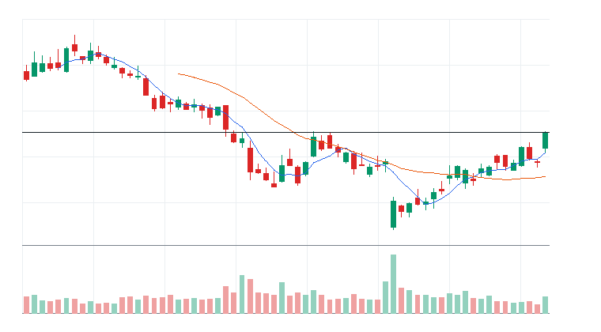

# 오늘의 데일리 트레이딩 요약

**REAL DATA TEST - 가격/거래량은 실제 데이터, 뉴스/ETF 구성종목 확산도/거래대금 유동성 일부 연결**

**목적:** 이 리포트는 최근 오른 자산을 나열하는 것이 아니라, 돈이 몰리는 근거와 다음 매수 주체가 확인할 트레이딩 후보를 찾기 위한 보고서다.

> 핵심 질문: 현재 가격에서 누가 사고 있고, 누가 앞으로 더 비싸게 사줄 수 있는가?

## 시장 국면 판단

- 최종 판정: 기간 조정 (83점)
- 전일 대비: 기간 조정 유지, 점수 변화는 제한적이다(+3점).
- 판정 신뢰도: 높음 (100점) - 핵심 지수와 매크로 데이터가 대부분 직접 수집되어 판정 신뢰도가 높다.
- 행동 바이어스: 추격 보류, 돌파 확인
- 한 줄 결론: 장기 추세는 유지되지만 단기 추세가 둔화되어 기간 조정으로 본다. 기술 100점, 매크로 50점.
- 기술적 지표: 상승 추세 우위 (100점, 가중치 65%)
- S&P 500: 100점 | 50일선 위, 200일선 위, 20일 +3.77%, 60일 +5.00%, 52주 고점 대비 -0.23% -> 기술 점수 100
- Nasdaq 100: 100점 | 50일선 위, 200일선 위, 20일 +3.65%, 60일 +4.00%, 52주 고점 대비 -2.20% -> 기술 점수 100
- 매크로 시황: 매크로 중립 (50점, 가중치 35%)
- 매크로 요약: 신용/유동성 중심으로 매크로가 위험자산에 우호적이다.
- 금리: 중립 48점 / 금리 중립 / confidence HIGH
  - 주요 근거: US 10Y yield 20일 +1.58%, 5일 -0.62%; US 3M yield 20일 데이터 없음, 단기금리 방향 확인; US long-duration bonds 20일 -1.92%, 장기채 가격 기준 할인율 부담 확인
  - 확인 사항: 추가 확인 이벤트 없음
- 물가: 중립 45점 / 물가 중립 / confidence HIGH
  - 주요 근거: Oil ETF 20일 +4.80%, 유가 기반 물가 압력 확인; TIPS ETF 20일 -0.70%, 물가연동채 흐름은 보조 근거; Gold 20일 +9.32%, 금 강세는 방어 수요 여부 확인
  - 확인 사항: 금 강세가 인플레 헤지 또는 방어 수요일 수 있어 위험자산 해석을 제한한다.
- 정책: 중립 50점 / 정책 이벤트 확인 전 중립 / confidence LOW
  - 주요 근거: 정책 톤은 1차 버전에서 일정/이벤트 리스크 기반 중립값으로 반영한다.
  - 확인 사항: FOMC, CPI, PCE, 고용지표 발표 전후에는 매크로 confidence를 보수적으로 해석한다.
- 신용/유동성: 중립-우호 57점 / 신용/유동성 중립 / confidence HIGH
  - 주요 근거: High yield credit 20일 -0.01%, 하이일드 위험선호 확인; HYG-LQD 20일 상대강도 +0.37%, 신용위험 선호/회피 확인; VIX 20일 -12.55%, 변동성 부담 확인
  - 확인 사항: 추가 확인 이벤트 없음
- 환율/글로벌: 중립 51점 / 환율/글로벌 중립 / confidence MEDIUM
  - 주요 근거: US dollar 20일 -0.56%, 달러 강세/약세 확인
  - 확인 사항: 추가 확인 이벤트 없음
- US 10Y yield: 48점 | 하락 시 주식 우호; 5일 -0.62%, 20일 +1.58% -> 매크로 점수 48
- US 3M yield: 51점 | 하락 시 주식 우호; 5일 -0.72%, 20일 데이터 없음 -> 매크로 점수 51
- US long-duration bonds: 47점 | 상승 시 주식 우호; 5일 +0.08%, 20일 -1.92% -> 매크로 점수 47
- TIPS ETF: 50점 | 상승 시 주식 우호; 5일 +0.27%, 20일 -0.70% -> 매크로 점수 50
- Oil ETF: 38점 | 하락 시 주식 우호; 5일 +5.18%, 20일 +4.80% -> 매크로 점수 38
- Gold: 50점 | 상승 시 주식 우호; 5일 +2.38%, 20일 +9.32% -> 매크로 점수 50
- US dollar: 51점 | 하락 시 주식 우호; 5일 -0.04%, 20일 -0.56% -> 매크로 점수 51
- High yield credit: 50점 | 상승 시 주식 우호; 5일 +0.42%, 20일 -0.01% -> 매크로 점수 50
- Investment grade credit: 50점 | 상승 시 주식 우호; 5일 +0.18%, 20일 -0.38% -> 매크로 점수 50
- VIX: 73점 | 하락 시 주식 우호; 5일 -3.43%, 20일 -12.55% -> 매크로 점수 73
- 데이터 커버리지: 기술 2/2, 매크로 10/10
- 데이터 신뢰도 근거:
  - 직접 지수 데이터: S&P 500, Nasdaq 100
  - 대체 지수 데이터 없음
  - 매크로 데이터: 10/10
  - 누락 데이터 없음
  - stale 데이터 없음

## 모바일 요약

[오늘의 데일리 트레이딩 요약]

생성 성공 / 데이터 모드: REAL_TEST

시장:
- 위험선호

시장 지배 서사:
1. 소프트웨어 실적/AI 수익화 - 부상 - iShares Expanded Tech-Software Sector ETF(IGV), Invesco QQQ Trust(QQQ), Atlassian Corporation(TEAM), Workday Inc.(WDAY) 중심으로 5일 +14.16%, 20일 +23.04% 흐름이 형성됨. 직접 촉매 일부 확인.
2. 사이버보안 지출 재가속 - 부상 - First Trust NASDAQ Cybersecurity ETF(CIBR), iShares Expanded Tech-Software Sector ETF(IGV), Palo Alto Networks Inc.(PANW), CrowdStrike Holdings Inc.(CRWD) 중심으로 5일 +6.99%, 20일 +9.80% 흐름이 형성됨. 뉴스 직접성 제한.
3. AI 소프트웨어/사이버보안 확산 - 부상 - iShares Expanded Tech-Software Sector ETF(IGV), Invesco QQQ Trust(QQQ), Atlassian Corporation(TEAM), Zscaler Inc.(ZS) 중심으로 5일 +13.03%, 20일 +23.44% 흐름이 형성됨. 직접 촉매 일부 확인.

트렌드 강도:
1. 소프트웨어 실적/AI 수익화 - TSI 79 - 확인 - 진입품질 관찰
2. 사이버보안 지출 재가속 - TSI 78 - 확인 - 진입품질 관찰
3. AI 소프트웨어/사이버보안 확산 - TSI 66 - 부상 - 진입품질 낮음

오늘 결론:
- 클라우드/엔터프라이즈 소프트웨어 개별 종목 흐름이 ETF 대비 강한지 확인 필요
- 행동 후보는 linkedNarrative와 함께 확인한다.
- 추격보다 진입 조건 확인 후 접근한다.

오늘 실제 행동 후보:
1. Intuit Inc.(INTU)(STOCK) - 소프트웨어 실적/AI 수익화 - 단기 추세가 유지되고 거래량이 1.0배 이상이면 눌림 이후 재상승을 시도할 수 있음
2. Atlassian Corporation(TEAM)(STOCK) - 소프트웨어 실적/AI 수익화 - 단기 추세가 유지되고 거래량이 1.0배 이상이면 눌림 이후 재상승을 시도할 수 있음
3. First Trust NASDAQ Cybersecurity ETF(CIBR)(ETF) - 사이버보안 지출 재가속 - 52주 고점 부근이라 돌파가 확인되면 신고가 추종 매수가 붙을 수 있음

다크호스 후보:
1. Warner Bros. Discovery Inc.(WBD) - darkHorseScore 75 - 베이스 돌파 직전
2. Autodesk Inc.(ADSK) - darkHorseScore 68 - 초기 관찰
3. Netflix Inc.(NFLX) - darkHorseScore 67 - 초기 관찰

ETF 후보 TOP 5:
1. First Trust NASDAQ Cybersecurity ETF(CIBR) - 사이버보안 지출 재가속 - 조건부 진입
2. iShares Expanded Tech-Software Sector ETF(IGV) - 소프트웨어 실적/AI 수익화 - 자금흐름 예외 조건부
3. Amplify Cybersecurity ETF(HACK) - 사이버보안 지출 재가속 - 제외
4. Roundhill Memory ETF(DRAM) - AI 인프라 재가속 - 관찰
5. iShares Cybersecurity and Tech ETF(IHAK) - 사이버보안 지출 재가속 - 제외

웹 리포트:
https://yoolcool.github.io/DailyTradingThesisAgent/

## 오늘 결론

- 오늘 결론: 조건부 진입
- 신규 진입 후보: 0개
- 조건부 진입 후보: 7개
- 관찰 후보: 130개
- 주요 제한 요인: Entry Quality < 40, RVOL 미달, 뉴스 직접성 부족
- 주문 판단: 시장가 금지 / 지정가 또는 관찰
- 실전 판단: 진입 후보는 있으나, 전일 고점 돌파와 거래량 확인 후 선별적으로 접근한다.

### 후보 제한 요인 집계

- RVOL < 1.00x: 128개
- 거래대금 유동성 낮음: 15개
- Entry Quality 50~54 near miss: 1개
- Entry Quality 40~49 관찰: 7개
- Entry Quality < 40: 149개
- Exhaustion Risk >= 70: 0개
- ETF breadth 샘플 부족: 37개
- 뉴스 직접성 부족: 100개

## 데이터 신뢰도

- 전체 데이터 신뢰도 등급: LOW
- 분석 신뢰도: LOW
- 주문 실행 신뢰도: LOW
- ETF breadth 신뢰도: LOW
- 신뢰도 해석: 테마 확산 판단 제한, 거래대금 유동성 낮음 또는 확인 불가, 프리/애프터마켓 확인 불가
- 리포트 생성 시각: 2026-08-14 08:41 KST
- 가격 기준 거래일: 2026-08-13 US regular close
- 뉴스 수집 시각: 2026-08-14 08:41 KST
- 가장 최근 뉴스 발행 시각: 2026-08-14 07:39 KST
- 뉴스 신선도 상태: FRESH
- 뉴스 소스: Yahoo Finance RSS, MarketWatch RSS, CNBC Markets RSS, SEC EDGAR RSS, Federal Reserve RSS, Finnhub API
- 뉴스 소스 상태: Yahoo Finance RSS CONNECTED, MarketWatch RSS CONNECTED, CNBC Markets RSS PARTIAL, SEC EDGAR RSS PARTIAL, Federal Reserve RSS CONNECTED, Finnhub API DISABLED
- 뉴스 신뢰도: MEDIUM
- 추천 적용 거래일: 2026-08-13 US regular session
- 가격/거래량 데이터 상태: 연결됨
- 뉴스 데이터 상태: 일부 연결
- ETF 구성종목 확산도 상태: 일부 연결
- ETF 구성종목 샘플 수: 1~4
- 거래대금 유동성 데이터 상태: 일부 연결
- 프리/애프터마켓 데이터 상태: UNAVAILABLE
- 데이터 provider: yfinance, Yahoo Finance RSS, MarketWatch RSS, CNBC Markets RSS, SEC EDGAR RSS, Federal Reserve RSS, Finnhub API, config fallback sample, price-volume dollar-volume fallback
- 실전 사용 경고: 이 리포트는 투자판단 보조용이며, REAL_TEST 모드에서는 일부 데이터가 누락되거나 지연될 수 있다. 실제 주문 전 현재가, 뉴스, 프리마켓/정규장 거래량을 별도 확인해야 한다.

## 0. 시장 상태

- 데이터 모드: REAL_TEST
- 가격/거래량: 연결됨
- 뉴스: 일부 연결
- ETF 구성종목 확산도: 일부 연결
- 거래대금 유동성: 일부 연결
- 생성 시각: 2026년 8월 14일 금요일 AM 8:41
- 시장 상태: 위험선호
- 오늘 돈의 방향: 클라우드/엔터프라이즈 소프트웨어 개별 종목 흐름이 ETF 대비 강한지 확인 필요
- 강한 테마 TOP 3: 클라우드/엔터프라이즈 소프트웨어 ETF(88), Real Estate(83), 사이버보안 ETF(80)
- 데이터 한계:
  - API 또는 provider 상태에 따라 뉴스/ETF 확산도/거래대금 유동성 반영 범위가 달라질 수 있다.
  - 수집 실패 데이터는 점수 반영에서 제외하거나 confidence를 제한한다.
  - reasonConfidence HIGH는 직접 촉매, 가격/거래량, 확산도/유동성 근거가 함께 있을 때만 사용한다.

## 오늘 시장을 지배하는 서사

### 오늘 시장을 지배하는 서사 TOP 3

#### 1. 소프트웨어 실적/AI 수익화
- 상태: 부상
- narrativeScore: 82
- reasonConfidence: MEDIUM
- 근거 ETF: IGV, QQQ, AIQ
- 근거 개별 종목: TEAM, WDAY, INTU, ADSK
- 돈이 몰리는 이유: 소프트웨어 실적/AI 수익화 관련 iShares Expanded Tech-Software Sector ETF(IGV), Invesco QQQ Trust(QQQ), Global X Artificial Intelligence & Technology ETF(AIQ)와 Atlassian Corporation(TEAM), Workday Inc.(WDAY), Intuit Inc.(INTU), Autodesk Inc.(ADSK)의 5일(+14.16%)·20일(+23.04%) 흐름을 함께 본다. 평균 상대 거래량은 1.27배이고, ETF 확산도는 추가 확인이 필요하다. 직접 뉴스/이벤트가 일부 확인된다.
- 다음 매수 주체: 소프트웨어 실적/AI 수익화을 확인한 섹터 ETF 자금과 상대강도 추종 스윙 자금
- 가장 좋은 트레이딩 수단: ETF 우선: IGV, AIQ, QQQ / 개별 종목 우선: TEAM, ADSK, WDAY
- 서사가 깨지는 조건: IGV 20일선 이탈 또는 관련 종목 절반 이상 5일선 이탈
- 오늘 행동: 기존 네러티브와 중복을 확인한 뒤 ETF/대표 종목 동조성이 살아날 때만 관찰 편입

상세 narrativeScore 근거 보기

- rawScore: 82
- ETF 평균 moneyFlowScore: 54
- 개별 종목 평균 moneyFlowScore: 80
- ETF 후보 비율: 33%
- 개별 종목 후보 비율: 80%
- 5일 평균 수익률: +14.00%
- 20일 평균 수익률: +23.00%
- 평균 상대 거래량: 1.00배
- ETF 평균 상대 거래량: 1.00배
- 개별주 평균 상대 거래량: 1.00배
- 52주 고점 근접 후보 비율: 13%
- 뉴스 직접성 점수: 10
- ETF 확산도 점수: -3
- 유동성 점수: 2
- 과열 리스크 차감: 0

#### 2. 사이버보안 지출 재가속
- 상태: 부상
- narrativeScore: 73
- reasonConfidence: MEDIUM
- 근거 ETF: CIBR, IGV, HACK, IHAK
- 근거 개별 종목: PANW, CRWD, FTNT
- 돈이 몰리는 이유: 사이버보안 지출 재가속 관련 First Trust NASDAQ Cybersecurity ETF(CIBR), iShares Expanded Tech-Software Sector ETF(IGV), Amplify Cybersecurity ETF(HACK)와 Palo Alto Networks Inc.(PANW), CrowdStrike Holdings Inc.(CRWD), Fortinet Inc.(FTNT)의 5일(+6.99%)·20일(+9.80%) 흐름을 함께 본다. 평균 상대 거래량은 1.25배이고, ETF 확산도는 추가 확인이 필요하다. 뉴스 직접성은 아직 제한적이다.
- 다음 매수 주체: 사이버보안 지출 재가속을 확인한 섹터 ETF 자금과 상대강도 추종 스윙 자금
- 가장 좋은 트레이딩 수단: ETF 우선: HACK, CIBR, IHAK / 개별 종목 우선: CRWD, PANW, FTNT
- 서사가 깨지는 조건: HACK 20일선 이탈 또는 관련 종목 절반 이상 5일선 이탈
- 오늘 행동: 기존 네러티브와 중복을 확인한 뒤 ETF/대표 종목 동조성이 살아날 때만 관찰 편입

상세 narrativeScore 근거 보기

- rawScore: 73
- ETF 평균 moneyFlowScore: 82
- 개별 종목 평균 moneyFlowScore: 60
- ETF 후보 비율: 100%
- 개별 종목 후보 비율: 0%
- 5일 평균 수익률: +7.00%
- 20일 평균 수익률: +10.00%
- 평균 상대 거래량: 1.00배
- ETF 평균 상대 거래량: 2.00배
- 개별주 평균 상대 거래량: 1.00배
- 52주 고점 근접 후보 비율: 86%
- 뉴스 직접성 점수: 10
- ETF 확산도 점수: -1
- 유동성 점수: 1
- 과열 리스크 차감: 0

#### 3. AI 소프트웨어/사이버보안 확산
- 상태: 부상
- narrativeScore: 69
- reasonConfidence: LOW
- 근거 ETF: IGV, QQQ, AIQ
- 근거 개별 종목: TEAM, ZS, PLTR, MSFT, DDOG
- 돈이 몰리는 이유: AI 소프트웨어/사이버보안 확산 관련 iShares Expanded Tech-Software Sector ETF(IGV), Invesco QQQ Trust(QQQ), Global X Artificial Intelligence & Technology ETF(AIQ)와 Atlassian Corporation(TEAM), Zscaler Inc.(ZS), Palantir Technologies Inc.(PLTR), Microsoft Corporation(MSFT)의 5일(+13.03%)·20일(+23.44%) 흐름을 함께 본다. 평균 상대 거래량은 0.89배이고, ETF 확산도는 추가 확인이 필요하다. 직접 뉴스/이벤트가 일부 확인된다.
- 다음 매수 주체: AI 소프트웨어 실적 기대를 사는 ETF 자금, 엔터프라이즈 소프트웨어 스윙 트레이더, 신고가 추종 자금
- 가장 좋은 트레이딩 수단: ETF 우선: IGV, AIQ, QQQ / 개별 종목 우선: PLTR, DDOG, TEAM
- 서사가 깨지는 조건: IGV/AIQ 20일선 이탈, 관련 소프트웨어 종목 절반 이상 5일선 이탈, 상대 거래량 둔화
- 오늘 행동: 추격보다 눌림 후 재상승 확인

상세 narrativeScore 근거 보기

- rawScore: 69
- ETF 평균 moneyFlowScore: 54
- 개별 종목 평균 moneyFlowScore: 67
- ETF 후보 비율: 33%
- 개별 종목 후보 비율: 40%
- 5일 평균 수익률: +13.00%
- 20일 평균 수익률: +23.00%
- 평균 상대 거래량: 1.00배
- ETF 평균 상대 거래량: 1.00배
- 개별주 평균 상대 거래량: 1.00배
- 52주 고점 근접 후보 비율: 13%
- 뉴스 직접성 점수: 9
- ETF 확산도 점수: -3
- 유동성 점수: 2
- 과열 리스크 차감: 0

### 전체 narrative 요약

| 서사명 | 상태 | narrativeScore | reasonConfidence | 대표 ETF | 대표 종목 | 오늘 행동 |
| --- | --- | ---: | --- | --- | --- | --- |
| 소프트웨어 실적/AI 수익화 | 부상 | 82 | MEDIUM | IGV, QQQ, AIQ | TEAM, WDAY, INTU, ADSK | 기존 네러티브와 중복을 확인한 뒤 ETF/대표 종목 동조성이 살아날 때만 관찰 편입 |
| 사이버보안 지출 재가속 | 부상 | 73 | MEDIUM | CIBR, IGV, HACK | PANW, CRWD, FTNT | 기존 네러티브와 중복을 확인한 뒤 ETF/대표 종목 동조성이 살아날 때만 관찰 편입 |
| AI 소프트웨어/사이버보안 확산 | 부상 | 69 | LOW | IGV, QQQ, AIQ | TEAM, ZS, PLTR, MSFT | 추격보다 눌림 후 재상승 확인 |
| Travel Services 자금 유입 | 약화 | 48 | LOW | QQQ | ABNB, BKNG | 기존 네러티브와 중복을 확인한 뒤 ETF/대표 종목 동조성이 살아날 때만 관찰 편입 |
| Data Storage 자금 유입 | 약화 | 43 | LOW | SPY, IWM, QQQ | STX, WDC | 기존 네러티브와 중복을 확인한 뒤 ETF/대표 종목 동조성이 살아날 때만 관찰 편입 |
| Aerospace & Defense 자금 유입 | 약화 | 41 | LOW | SPY, IWM, QQQ | AXON, KTOS, AVAV, RTX | 기존 네러티브와 중복을 확인한 뒤 ETF/대표 종목 동조성이 살아날 때만 관찰 편입 |
| 방산/안보 프리미엄 | 약화 | 33 | LOW | SHLD, XAR, ITA | PLTR, KTOS, AVAV | 뉴스 촉매가 직접 확인될 때만 추세 추종 |
| Integrated Oil & Gas 자금 유입 | 약화 | 31 | LOW | XLE, SPY, IWM | CVX, XOM | 기존 네러티브와 중복을 확인한 뒤 ETF/대표 종목 동조성이 살아날 때만 관찰 편입 |
| 바이오/헬스케어 촉매 | 약화 | 29 | LOW | QQQ | REGN, AMGN, VRTX, INSM | 기존 네러티브와 중복을 확인한 뒤 ETF/대표 종목 동조성이 살아날 때만 관찰 편입 |
| 매크로 방어/헤지 | 약화 | 25 | LOW | XLE, GLD, TLT | CVX, XOM | 위험회피가 확인될 때만 헤지성 접근 |
| 전력 유틸리티 수요 재평가 | 약화 | 25 | LOW | SPY, IWM, QQQ | ETN, GEV, VRT | 기존 네러티브와 중복을 확인한 뒤 ETF/대표 종목 동조성이 살아날 때만 관찰 편입 |
| 반도체 장비 사이클 재평가 | 약화 | 24 | LOW | SOXX, SMH, SOXQ | ASML, LRCX, AMAT | 기존 네러티브와 중복을 확인한 뒤 ETF/대표 종목 동조성이 살아날 때만 관찰 편입 |
| AI 인프라 재가속 | 약화 | 23 | LOW | DRAM, SOXX, SMH | NVDA, MU, ETN, VRT | 추격보다 5일선 지지 후 재상승 확인 |
| Specialty Business Services 자금 유입 | 약화 | 23 | LOW | SPY, IWM, QQQ | TRI, CPRT, CTAS | 기존 네러티브와 중복을 확인한 뒤 ETF/대표 종목 동조성이 살아날 때만 관찰 편입 |
| 위험선호 성장주 재진입 | 약화 | 20 | LOW | ARKK, QQQ, IPO | ARM, TSLA, COIN | 지수 위험선호가 유지될 때만 선별 진입 |
| 전력망/원전/인프라 병목 | 약화 | 19 | LOW | GRID, URA, PAVE | ETN, CEG, PWR, VRT | ETF 확산도와 거래량이 같이 살아날 때만 진입 |
| 반도체 설계/공급망 재가속 | 약화 | 16 | LOW | SOXX, SMH, SOXQ | ARM, ADI, AMD, TXN | 기존 네러티브와 중복을 확인한 뒤 ETF/대표 종목 동조성이 살아날 때만 관찰 편입 |
| Internet Content 자금 유입 | 약화 | 16 | LOW | QQQ | DASH, META | 기존 네러티브와 중복을 확인한 뒤 ETF/대표 종목 동조성이 살아날 때만 관찰 편입 |
| 소비 회복/방어주 선별 | 약화 | 12 | LOW | QQQ | AMZN, PDD | 기존 네러티브와 중복을 확인한 뒤 ETF/대표 종목 동조성이 살아날 때만 관찰 편입 |
| 비트코인/디지털 자산 위험선호 | 약화 | 5 | LOW | BLOK, IBIT | IREN, MSTR, COIN | 비트코인 베타가 살아날 때만 단기 매매 |
| 필수소비재 음료 방어 성장 | 소멸 | 0 | LOW | QQQ | CCEP, MNST | 기존 네러티브와 중복을 확인한 뒤 ETF/대표 종목 동조성이 살아날 때만 관찰 편입 |

## 트렌드 강도 판단

### 1. 소프트웨어 실적/AI 수익화
- Trend Strength Index: 79
- 트렌드 상태 라벨: 확인
- 테마 확산도: 보통
- ETF 동조성: 강함
- 거래량 강도: 보통
- 과열 위험: 보통 (38)
- 오늘 진입 품질: 관찰 (52)
- 한 줄 판단: 소프트웨어 실적/AI 수익화는 돈이 강하게 몰리지만 오늘 진입 품질은 아직 제한적이라 추격보다 조건 확인이 필요하다.
- 오늘 접근법: iShares Expanded Tech-Software Sector ETF(IGV)/Invesco QQQ Trust(QQQ)/Global X Artificial Intelligence & Technology ETF(AIQ) 동반 강세가 유지되는 동안 돌파 추격보다 전일 고점 재돌파 또는 5일선 눌림 회복을 기다린다.

트렌드 강도 상세 근거 보기

- 가격 모멘텀: 가격 모멘텀 25/25. 평균 5D +14.16%, 20D +23.04%.
- 거래량 강도: 거래량 강도 11/20. 평균 RVOL 1.27배.
- ETF 동조성: ETF 동조성 15/15. 관련 ETF iShares Expanded Tech-Software Sector ETF(IGV), Global X Artificial Intelligence & Technology ETF(AIQ), Invesco QQQ Trust(QQQ) 흐름을 기준으로 판단.
- 테마 확산도: 테마 확산도 13/20. 상위 1~2개 쏠림 감점 0점 반영.
- 뉴스 촉매: 뉴스/촉매 신선도 9/10. HIGH 직접 촉매 3개.
- 과열 리스크: 과열 리스크 38/100. 단기 급등, 고점 근접, ETF-개별주 괴리, 쏠림을 함께 반영.
- 시장 환경: 시장 환경 6/10. QQQ/SPY/IWM 가격 흐름 기반 위험선호 점수.

### 2. 사이버보안 지출 재가속
- Trend Strength Index: 78
- 트렌드 상태 라벨: 확인
- 테마 확산도: 강함
- ETF 동조성: 강함
- 거래량 강도: 보통
- 과열 위험: 낮음 (24)
- 오늘 진입 품질: 관찰 (51)
- 한 줄 판단: 사이버보안 지출 재가속는 가격, 거래량, ETF, 확산도가 함께 확인되어 테마 단위 자금 유입이 선명하다.
- 오늘 접근법: First Trust NASDAQ Cybersecurity ETF(CIBR)/iShares Expanded Tech-Software Sector ETF(IGV)/Amplify Cybersecurity ETF(HACK) 동반 강세가 유지되는 동안 돌파 추격보다 전일 고점 재돌파 또는 5일선 눌림 회복을 기다린다.

트렌드 강도 상세 근거 보기

- 가격 모멘텀: 가격 모멘텀 25/25. 평균 5D +6.99%, 20D +9.80%.
- 거래량 강도: 거래량 강도 10/20. 평균 RVOL 1.25배.
- ETF 동조성: ETF 동조성 17/15. 관련 ETF Amplify Cybersecurity ETF(HACK), First Trust NASDAQ Cybersecurity ETF(CIBR), iShares Cybersecurity and Tech ETF(IHAK), iShares Expanded Tech-Software Sector ETF(IGV) 흐름을 기준으로 판단.
- 테마 확산도: 테마 확산도 17/20. 상위 1~2개 쏠림 감점 0점 반영.
- 뉴스 촉매: 뉴스/촉매 신선도 3/10. HIGH 직접 촉매 0개.
- 과열 리스크: 과열 리스크 24/100. 단기 급등, 고점 근접, ETF-개별주 괴리, 쏠림을 함께 반영.
- 시장 환경: 시장 환경 6/10. QQQ/SPY/IWM 가격 흐름 기반 위험선호 점수.

### 3. AI 소프트웨어/사이버보안 확산
- Trend Strength Index: 66
- 트렌드 상태 라벨: 부상
- 테마 확산도: 보통
- ETF 동조성: 강함
- 거래량 강도: 부족
- 과열 위험: 보통 (36)
- 오늘 진입 품질: 낮음 (39)
- 한 줄 판단: AI 소프트웨어/사이버보안 확산는 관찰 가능한 흐름은 있으나 가격, 거래량, 확산도 중 일부 확인이 더 필요하다.
- 오늘 접근법: iShares Expanded Tech-Software Sector ETF(IGV)/Invesco QQQ Trust(QQQ)/Global X Artificial Intelligence & Technology ETF(AIQ) 거래량 증가와 Atlassian Corporation(TEAM)/Zscaler Inc.(ZS)/Palantir Technologies Inc.(PLTR) 확산을 확인하며 작은 사이즈의 초기 진입 후보로만 본다.

트렌드 강도 상세 근거 보기

- 가격 모멘텀: 가격 모멘텀 25/25. 평균 5D +13.03%, 20D +23.44%.
- 거래량 강도: 거래량 강도 5/20. 평균 RVOL 0.89배.
- ETF 동조성: ETF 동조성 15/15. 관련 ETF iShares Expanded Tech-Software Sector ETF(IGV), Global X Artificial Intelligence & Technology ETF(AIQ), Invesco QQQ Trust(QQQ) 흐름을 기준으로 판단.
- 테마 확산도: 테마 확산도 11/20. 상위 1~2개 쏠림 감점 0점 반영.
- 뉴스 촉매: 뉴스/촉매 신선도 4/10. HIGH 직접 촉매 1개.
- 과열 리스크: 과열 리스크 36/100. 단기 급등, 고점 근접, ETF-개별주 괴리, 쏠림을 함께 반영.
- 시장 환경: 시장 환경 6/10. QQQ/SPY/IWM 가격 흐름 기반 위험선호 점수.

## 최근 추천 결과 트래킹

개별주는 데이트레이딩 관점으로 추천 이후 첫 정규장의 장중 최고가와 종가를 추적한다. ETF는 테마/스윙 관점으로 추천 이후 1주일 동안의 최고가와 현재 종가를 추적한다.

### 개별주 Top 3 추천 성과 요약
- 최근 5개 리포트 표본: 13개 (초기 검증 단계)
- 장중 최고가 기준 성공률: 0.00%
- 종가 기준 성공률: +40.00%
- 평균 장중 최고 수익률: +1.49%
- 평균 종가 수익률: -0.13%

### ETF 추천 성과 요약
- 최근 5개 리포트 표본: 7개 (초기 검증 단계)
- 1주 최고가 기준 성공률: +40.00%
- 현재 종가 기준 성공률: +14.29%
- 평균 1주 최고 수익률: +1.99%
- 평균 현재 수익률: -0.39%

최근 추천 결과 상세 테이블 펼치기

| 추천일 | 유형 | 순위 | 티커 | 기준가 | 추적 기간 | 상태 | High 수익률 | Close 수익률 | 결과 | 코멘트 |
| --- | --- | ---: | --- | ---: | --- | --- | ---: | ---: | --- | --- |
| 2026-08-14 | STOCK | 3 | ADSK | $257.96 | 2026-08-14 | pending | 데이터 없음 | 데이터 없음 | 추적 대기 | 아직 추적 거래일 데이터가 완성되지 않음 |
| 2026-08-14 | STOCK | 2 | TEAM | $165.98 | 2026-08-14 | pending | 데이터 없음 | 데이터 없음 | 추적 대기 | 아직 추적 거래일 데이터가 완성되지 않음 |
| 2026-08-14 | STOCK | 1 | INTU | $358.29 | 2026-08-14 | pending | 데이터 없음 | 데이터 없음 | 추적 대기 | 아직 추적 거래일 데이터가 완성되지 않음 |
| 2026-08-14 | ETF | 2 | IGV | $106.28 | 2026-08-14~2026-08-21 | in_progress | 데이터 없음 | 0.00% | 진행 중 | 아직 1주 추적 기간이 끝나지 않음 (일봉 high 미확보 시 close 기준 보조) |
| 2026-08-14 | ETF | 1 | CIBR | $102.2 | 2026-08-14~2026-08-21 | in_progress | 데이터 없음 | 0.00% | 진행 중 | 아직 1주 추적 기간이 끝나지 않음 (일봉 high 미확보 시 close 기준 보조) |
| 2026-08-13 | STOCK | 1 | ABNB | $180.1 | 2026-08-13 | complete | +2.91% | +2.80% | 제한적 유효 | 제한적인 장중 기회만 발생 (일봉 기준) |
| 2026-08-12 | STOCK | 3 | ABNB | $184.98 | 2026-08-12 | complete | -0.47% | -2.64% | 실패 | 추천 이후 의미 있는 장중 기회가 부족하고 종가도 약함 (일봉 기준) |
| 2026-08-12 | STOCK | 2 | AXON | $636.31 | 2026-08-12 | complete | +1.00% | -5.74% | 제한적 유효 | 제한적인 장중 기회만 발생 (일봉 기준) |
| 2026-08-12 | STOCK | 1 | FAST | $52.38 | 2026-08-12 | complete | +0.84% | -0.31% | 실패 | 추천 이후 의미 있는 장중 기회가 부족하고 종가도 약함 (일봉 기준) |
| 2026-08-11 | STOCK | 3 | ZS | $176.68 | 2026-08-11 | complete | +2.33% | +1.06% | 제한적 유효 | 제한적인 장중 기회만 발생 (일봉 기준) |
| 2026-08-11 | STOCK | 2 | PLTR | $175.23 | 2026-08-11 | complete | +1.55% | -0.17% | 제한적 유효 | 제한적인 장중 기회만 발생 (일봉 기준) |
| 2026-08-11 | STOCK | 1 | TEAM | $151.87 | 2026-08-11 | complete | +2.86% | +1.46% | 제한적 유효 | 제한적인 장중 기회만 발생 (일봉 기준) |
| 2026-08-11 | ETF | 3 | GLD | $402.54 | 2026-08-11~2026-08-18 | in_progress | +1.20% | -0.89% | 진행 중 | 아직 1주 추적 기간이 끝나지 않음 |
| 2026-08-11 | ETF | 2 | OIH | $411.34 | 2026-08-11~2026-08-18 | in_progress | +1.13% | -0.19% | 진행 중 | 아직 1주 추적 기간이 끝나지 않음 |
| 2026-08-11 | ETF | 1 | CIBR | $100.6 | 2026-08-11~2026-08-18 | in_progress | +1.65% | +1.59% | 진행 중 | 아직 1주 추적 기간이 끝나지 않음 |
| 2026-08-10 | STOCK | 3 | SHOP | $151.57 | 2026-08-10 | complete | +2.67% | +2.38% | 제한적 유효 | 제한적인 장중 기회만 발생 (일봉 기준) |
| 2026-08-10 | STOCK | 2 | FAST | $51.84 | 2026-08-10 | complete | +0.75% | +0.60% | 추적 대기 | 아직 추적 거래일 데이터가 완성되지 않음 (일봉 기준) |
| 2026-08-10 | STOCK | 1 | BKNG | $214.42 | 2026-08-10 | complete | +0.48% | -0.72% | 실패 | 추천 이후 의미 있는 장중 기회가 부족하고 종가도 약함 (일봉 기준) |
| 2026-08-10 | ETF | 2 | XME | $115.74 | 2026-08-10~2026-08-17 | in_progress | +3.45% | -0.41% | 진행 중 | 아직 1주 추적 기간이 끝나지 않음 |
| 2026-08-10 | ETF | 1 | COPX | $88.03 | 2026-08-10~2026-08-17 | in_progress | +2.52% | -2.85% | 진행 중 | 아직 1주 추적 기간이 끝나지 않음 |
| 2026-08-07 | STOCK | 3 | KTOS | $57.41 | 2026-08-07 | complete | +6.41% | +5.85% | 성공 | 장중 기회와 종가 유지가 모두 확인됨 (일봉 기준) |
| 2026-08-07 | STOCK | 2 | BKNG | $207.39 | 2026-08-07 | complete | +4.00% | +3.39% | 성공 | 장중 기회와 종가 유지가 모두 확인됨 (일봉 기준) |
| 2026-08-07 | STOCK | 1 | SHOP | $147.44 | 2026-08-07 | complete | +3.67% | +2.80% | 성공 | 장중 기회와 종가 유지가 모두 확인됨 (일봉 기준) |
| 2026-08-06 | STOCK | 3 | KTOS | $55.34 | 2026-08-06 | complete | +6.79% | +3.74% | 성공 | 장중 기회와 종가 유지가 모두 확인됨 (일봉 기준) |
| 2026-08-06 | STOCK | 2 | AMGN | $407.83 | 2026-08-06 | complete | +2.59% | -0.73% | 제한적 유효 | 제한적인 장중 기회만 발생 (일봉 기준) |
| 2026-08-06 | STOCK | 1 | TEAM | $113.32 | 2026-08-06 | complete | -2.15% | -2.78% | 실패 | 추천 이후 의미 있는 장중 기회가 부족하고 종가도 약함 (일봉 기준) |
| 2026-08-06 | ETF | 2 | XME | $111.92 | 2026-08-06~2026-08-13 | complete | +6.98% | +2.99% | 성공 | 추천 이후 테마 추세가 유지됨 |
| 2026-08-06 | ETF | 1 | COPX | $86.72 | 2026-08-06~2026-08-13 | complete | +4.07% | -1.38% | 단기 고점 후 반납 | 1주 내 상승 기회는 있었지만 현재가는 반납 |
| 2026-08-05 | STOCK | 3 | DXCM | $86.94 | 2026-08-05 | complete | -0.54% | -4.92% | 실패 | 추천 이후 의미 있는 장중 기회가 부족하고 종가도 약함 (일봉 기준) |
| 2026-08-05 | STOCK | 2 | DDOG | $288.15 | 2026-08-05 | complete | +1.59% | -1.73% | 제한적 유효 | 제한적인 장중 기회만 발생 (일봉 기준) |
| 2026-08-05 | STOCK | 1 | MSFT | $492.81 | 2026-08-05 | complete | +1.10% | -1.09% | 제한적 유효 | 제한적인 장중 기회만 발생 (일봉 기준) |
| 2026-08-05 | ETF | 3 | MAGS | $68.96 | 2026-08-05~2026-08-12 | complete | +0.81% | -0.68% | 진행 중 | 아직 1주 추적 기간이 끝나지 않음 |
| 2026-08-05 | ETF | 2 | COPX | $83.99 | 2026-08-05~2026-08-12 | complete | +7.45% | +1.82% | 성공 | 추천 이후 테마 추세가 유지됨 |
| 2026-08-05 | ETF | 1 | CIBR | $97.94 | 2026-08-05~2026-08-12 | complete | +3.31% | +4.35% | 성공 | 추천 이후 테마 추세가 유지됨 |
| 2026-08-04 | STOCK | 3 | MSFT | $487.65 | 2026-08-04 | complete | +2.42% | +1.06% | 제한적 유효 | 제한적인 장중 기회만 발생 (일봉 기준) |
| 2026-08-04 | STOCK | 2 | AMZN | $284.02 | 2026-08-04 | complete | -1.04% | -2.32% | 실패 | 추천 이후 의미 있는 장중 기회가 부족하고 종가도 약함 (일봉 기준) |
| 2026-08-04 | STOCK | 1 | DDOG | $273.6 | 2026-08-04 | complete | +5.96% | +5.32% | 성공 | 장중 기회와 종가 유지가 모두 확인됨 (일봉 기준) |
| 2026-08-04 | ETF | 1 | MAGS | $68.38 | 2026-08-04~2026-08-11 | complete | +1.80% | +0.16% | 진행 중 | 아직 1주 추적 기간이 끝나지 않음 |
| 2026-08-03 | STOCK | 3 | DXCM | $83.45 | 2026-08-03 | complete | +5.01% | +4.63% | 성공 | 장중 기회와 종가 유지가 모두 확인됨 (일봉 기준) |
| 2026-08-03 | STOCK | 2 | REGN | $762.63 | 2026-08-03 | complete | +1.33% | -0.44% | 제한적 유효 | 제한적인 장중 기회만 발생 (일봉 기준) |
| 2026-08-03 | STOCK | 1 | MSFT | $464.72 | 2026-08-03 | complete | +5.79% | +4.93% | 성공 | 장중 기회와 종가 유지가 모두 확인됨 (일봉 기준) |
| 2026-07-31 | STOCK | 2 | REGN | $738.34 | 2026-07-31 | complete | +3.58% | +3.29% | 성공 | 장중 기회와 종가 유지가 모두 확인됨 (일봉 기준) |
| 2026-07-31 | STOCK | 1 | MSFT | $451.1 | 2026-07-31 | complete | +3.49% | +3.02% | 성공 | 장중 기회와 종가 유지가 모두 확인됨 (일봉 기준) |
| 2026-07-30 | STOCK | 3 | WDAY | $168.01 | 2026-07-30 | complete | -4.18% | -5.89% | 실패 | 추천 이후 의미 있는 장중 기회가 부족하고 종가도 약함 (일봉 기준) |
| 2026-07-30 | STOCK | 2 | ADBE | $263.43 | 2026-07-30 | complete | -3.09% | -5.90% | 실패 | 추천 이후 의미 있는 장중 기회가 부족하고 종가도 약함 (일봉 기준) |
| 2026-07-30 | STOCK | 1 | MDLZ | $64.99 | 2026-07-30 | complete | -1.65% | -2.94% | 실패 | 추천 이후 의미 있는 장중 기회가 부족하고 종가도 약함 (일봉 기준) |
| 2026-07-29 | STOCK | 3 | ADBE | $249.18 | 2026-07-29 | complete | +6.86% | +5.72% | 성공 | 장중 기회와 종가 유지가 모두 확인됨 (일봉 기준) |
| 2026-07-29 | STOCK | 2 | TEAM | $99.98 | 2026-07-29 | complete | +6.74% | +4.30% | 성공 | 장중 기회와 종가 유지가 모두 확인됨 (일봉 기준) |
| 2026-07-29 | STOCK | 1 | RTX | $218.58 | 2026-07-29 | complete | +0.91% | -1.52% | 실패 | 추천 이후 의미 있는 장중 기회가 부족하고 종가도 약함 (일봉 기준) |
| 2026-07-28 | STOCK | 1 | RTX | $218.42 | 2026-07-28 | complete | +1.34% | +0.07% | 제한적 유효 | 제한적인 장중 기회만 발생 (일봉 기준) |
| 2026-07-27 | STOCK | 2 | LMT | $582.6 | 2026-07-27 | complete | +0.93% | -0.45% | 실패 | 추천 이후 의미 있는 장중 기회가 부족하고 종가도 약함 (일봉 기준) |
| 2026-07-27 | STOCK | 1 | RTX | $212.79 | 2026-07-27 | complete | +3.57% | +2.65% | 성공 | 장중 기회와 종가 유지가 모두 확인됨 (일봉 기준) |
| 2026-07-24 | STOCK | 3 | XOM | $156.89 | 2026-07-24 | complete | +1.16% | +0.03% | 제한적 유효 | 제한적인 장중 기회만 발생 (일봉 기준) |
| 2026-07-24 | STOCK | 2 | LMT | $568.59 | 2026-07-24 | complete | +3.49% | +2.46% | 성공 | 장중 기회와 종가 유지가 모두 확인됨 (일봉 기준) |
| 2026-07-24 | STOCK | 1 | RTX | $209.16 | 2026-07-24 | complete | +2.74% | +1.74% | 제한적 유효 | 제한적인 장중 기회만 발생 (일봉 기준) |
| 2026-07-23 | STOCK | 1 | PCAR | $131.11 | 2026-07-23 | complete | +1.82% | -0.27% | 제한적 유효 | 제한적인 장중 기회만 발생 (일봉 기준) |
| 2026-07-22 | STOCK | 1 | COIN | $175.85 | 2026-07-22 | complete | -0.51% | -5.53% | 실패 | 추천 이후 의미 있는 장중 기회가 부족하고 종가도 약함 (일봉 기준) |
| 2026-07-21 | STOCK | 1 | PYPL | $56.82 | 2026-07-21 | complete | +0.16% | -1.71% | 실패 | 추천 이후 의미 있는 장중 기회가 부족하고 종가도 약함 (일봉 기준) |
| 2026-07-20 | STOCK | 2 | CTAS | $204.45 | 2026-07-20 | complete | -0.03% | -1.30% | 실패 | 추천 이후 의미 있는 장중 기회가 부족하고 종가도 약함 (일봉 기준) |
| 2026-07-20 | STOCK | 1 | PANW | $358.68 | 2026-07-20 | complete | +2.13% | -2.79% | 제한적 유효 | 제한적인 장중 기회만 발생 (일봉 기준) |

## 오늘 실제 행동 후보

### 1. Intuit Inc.(INTU)
- 자산 유형: STOCK
- linkedNarrative: 소프트웨어 실적/AI 수익화
- narrativeStatus: 부상
- narrativeScore: 82
- Trend Strength Index: 79
- Exhaustion Risk: 38 (보통)
- Entry Quality Score: 37 (낮음)
- 트렌드 판단: 시장 위험선호가 약해 시장 환경 비우호 구간이다.
- moneyFlowScore: 100
- finalRawScore: 104
- reasonConfidence: HIGH
- reasonConfidenceExplanation: 직접 촉매: Yahoo Finance RSS / offering / under_6h / mixed - Intuit's AI and Mid-Market Push: Can Growth Follow Through? 가격/거래량, 관련 ETF 동반 강세, 유동성 근거가 함께 확인되어 HIGH로 분류했다.
- tieBreakerReason: 최종 원점수 104, 리스크 패널티 -4, 5일 수익률 +11.30%, 상대 거래량 1.23배 순으로 정렬
- 후보별 시장 해석: 위험선호 / 제한적 - 전체 시장은 위험선호 / Entry Quality 37 < 50이나 moneyFlow 100, confidence HIGH, RVOL 1.23x로 강한 자금흐름 예외 조건 충족
- 게이트 사유: Entry Quality 37 < 50이나 moneyFlow 100, confidence HIGH, RVOL 1.23x로 강한 자금흐름 예외 조건 충족
- 주문 실행: 시장가 가능
- 직접 촉매: Yahoo Finance RSS / offering / under_6h / mixed - Intuit's AI and Mid-Market Push: Can Growth Follow Through?
- 왜 돈이 몰리는가: 20일 +21.54%, 5일 +11.30%, 상대 거래량 1.23배로 가격과 거래량이 함께 개선. 뉴스: Yahoo Finance RSS offering/under_6h / 유동성: LIQUID
- 누가 더 비싸게 사줄 수 있는지: 개별 주도주를 따라붙는 단기 모멘텀 자금과 관련 ETF 강세를 확인한 트레이더
- 진입 조건: 20일선 위 눌림 후 재상승 확인
- 무효화 조건: 20일선 이탈 또는 상대 거래량 0.8배 이하 둔화
- todayActionLabel: 자금흐름 예외 조건부
#### 최근 뉴스/동향 한국어 요약

- 요약: 종목 직접 뉴스 확인 상태이며 뉴스 흐름은 긍정 우위입니다. 후보 선정 후 재확인한 핵심 이슈는 "Intuit's AI and Mid-Market Push: Can Growth Follow Through?"입니다.
- 직접 촉매 판단: Intuit Inc.에 대해 직접 촉매로 분류된 뉴스가 확인됐습니다. 핵심은 "Intuit's AI and Mid-Market Push: Can Growth Follow Through?"이며, 증자/오퍼링 재료로 봅니다.
- 뉴스 1: Intuit's AI and Mid-Market Push: Can Growth Follow Through?
  - 내용: Intuit Inc. 관련 증자/오퍼링 뉴스입니다. 기사 스니펫상 핵심 내용은 INTU expands its mid-market push with AI-powered tools, broader QuickBooks offerings and IES capabilities for complex businesses.입니다.
  - 투자 의미: 단기 혼재 뉴스 흐름으로 볼 수 있지만, 단독 매수 근거보다는 가격·거래량 조건을 확인하는 보조 근거로 사용합니다.
  - 확인할 점: 원문 수치, 후속 보도, 가격이 진입 조건을 지키는지
- 뉴스 2: What Could Intuit (INTU) New AI ERP Push Mean For Mid Market Growth?
  - 내용: Intuit Inc. 관련 제품/서비스 뉴스입니다. 기사 스니펫상 핵심 내용은 Intuit (NasdaqGS:INTU) launched an AI powered Enterprise Suite with Citrin Cooperman Advisors focused on mid market ERP transformation.입니다.
  - 투자 의미: 단기 긍정 뉴스 흐름으로 볼 수 있지만, 단독 매수 근거보다는 가격·거래량 조건을 확인하는 보조 근거로 사용합니다.
  - 확인할 점: 원문 수치, 후속 보도, 가격이 진입 조건을 지키는지
- 뉴스 3: Intuit Advances Its Mid-Market Platform With Conversational AI, Enterprise Scale, and Deep Industry Workflows for CFOs and Accounting Firms
  - 내용: Intuit Inc. 관련 시장 일반 뉴스입니다. 기사 스니펫상 핵심 내용은 MOUNTAIN VIEW, Calif., August 12, 2026--Intuit Inc.입니다.
  - 투자 의미: 단기 긍정 뉴스 흐름으로 볼 수 있지만, 단독 매수 근거보다는 가격·거래량 조건을 확인하는 보조 근거로 사용합니다.
  - 확인할 점: 원문 수치, 후속 보도, 가격이 진입 조건을 지키는지
- 매매 해석: 매매 관점에서는 뉴스 자체보다 가격이 진입 조건을 지키는지, 거래량이 동반되는지, 그리고 뉴스가 이미 주가에 반영됐는지를 우선 확인해야 합니다.
- 차트: 

### 2. Atlassian Corporation(TEAM)
- 자산 유형: STOCK
- linkedNarrative: 소프트웨어 실적/AI 수익화
- narrativeStatus: 부상
- narrativeScore: 82
- Trend Strength Index: 79
- Exhaustion Risk: 38 (보통)
- Entry Quality Score: 37 (낮음)
- 트렌드 판단: 시장 위험선호가 약해 시장 환경 비우호 구간이다.
- moneyFlowScore: 100
- finalRawScore: 102
- reasonConfidence: HIGH
- reasonConfidenceExplanation: 직접 촉매: Yahoo Finance RSS / general_market / under_24h / positive - Is Atlassian’s (TEAM) New Code Context Subtly Redefining Its AI-Native Cloud Workflow Strategy? 가격/거래량, 관련 ETF 동반 강세, 유동성 근거가 함께 확인되어 HIGH로 분류했다.
- tieBreakerReason: 최종 원점수 102, 리스크 패널티 -10, 5일 수익률 +50.66%, 상대 거래량 1.01배 순으로 정렬
- 후보별 시장 해석: 위험선호 / 제한적 - 전체 시장은 위험선호 / Entry Quality 37 < 50이나 moneyFlow 100, confidence HIGH, RVOL 1.01x로 강한 자금흐름 예외 조건 충족
- 게이트 사유: Entry Quality 37 < 50이나 moneyFlow 100, confidence HIGH, RVOL 1.01x로 강한 자금흐름 예외 조건 충족
- 주문 실행: 지정가 권장
- 직접 촉매: Yahoo Finance RSS / general_market / under_24h / positive - Is Atlassian’s (TEAM) New Code Context Subtly Redefining Its AI-Native Cloud Workflow Strategy?
- 왜 돈이 몰리는가: 20일 +79.71%, 5일 +50.66%, 상대 거래량 1.01배로 가격과 거래량이 함께 개선. 뉴스: Yahoo Finance RSS general_market/under_24h / 유동성: ACCEPTABLE
- 누가 더 비싸게 사줄 수 있는지: 개별 주도주를 따라붙는 단기 모멘텀 자금과 관련 ETF 강세를 확인한 트레이더
- 진입 조건: 20일선 위 눌림 후 재상승 확인
- 무효화 조건: 20일선 이탈 또는 상대 거래량 0.8배 이하 둔화
- todayActionLabel: 자금흐름 예외 조건부
#### 최근 뉴스/동향 한국어 요약

- 요약: 종목 직접 뉴스 확인 상태이며 뉴스 흐름은 긍정 우위입니다. 후보 선정 후 재확인한 핵심 이슈는 "Atlassian (TEAM) Beat Earnings And Lifted Guidance, Is The AI Upside Already Priced In?"입니다.
- 직접 촉매 판단: Atlassian Corporation에 대해 직접 촉매로 분류된 뉴스가 확인됐습니다. 핵심은 "Atlassian (TEAM) Beat Earnings And Lifted Guidance, Is The AI Upside Already Priced In?"이며, 실적 재료로 봅니다.
- 뉴스 1: Atlassian (TEAM) Beat Earnings And Lifted Guidance, Is The AI Upside Already Priced In?
  - 내용: Atlassian Corporation 관련 기사는 Atlassian (TEAM) Beat Earnings And Lifted Guidance, Is The AI Upside Already Priced In? 이슈를 다루며, 주가 변동률 +61.44%, 동반 비교 수치 +91.99%를 핵심 내용으로 봅니다.
  - 투자 의미: Atlassian Corporation의 당일 상대강도 확인에는 도움이 되지만, 실적/가이던스 같은 새 펀더멘털 변화로 보기는 어렵습니다.
  - 확인할 점: 거래량 동반 여부, 장중 고점 유지, 관련 ETF 동반 강세
- 뉴스 2: TEAM Q2 Deep Dive: AI Acceleration, Enterprise Expansion, and Contextual Advantage Drive Results
  - 내용: Atlassian Corporation 관련 기사는 TEAM Q2 Deep Dive: AI Acceleration, Enterprise Expansion, and Contextual Advantage Drive Results 이슈를 다루며, 주가 변동률 +27.60%, 동반 비교 수치 +2.80%를 핵심 내용으로 봅니다.
  - 투자 의미: Atlassian Corporation의 당일 상대강도 확인에는 도움이 되지만, 실적/가이던스 같은 새 펀더멘털 변화로 보기는 어렵습니다.
  - 확인할 점: 거래량 동반 여부, 장중 고점 유지, 관련 ETF 동반 강세
- 뉴스 3: TEAM Trades at Premium Valuation: Time to Hold or Fold the Stock?
  - 내용: Atlassian Corporation 관련 시장 일반 뉴스입니다. 기사 스니펫상 핵심 내용은 Atlassian's AI investments, slower ARR growth and strong competition pressure on profitability, while its premium valuation adds risk.입니다.
  - 투자 의미: 단기 긍정 뉴스 흐름으로 볼 수 있지만, 단독 매수 근거보다는 가격·거래량 조건을 확인하는 보조 근거로 사용합니다.
  - 확인할 점: 원문 수치, 후속 보도, 가격이 진입 조건을 지키는지
- 매매 해석: 매매 관점에서는 뉴스 자체보다 가격이 진입 조건을 지키는지, 거래량이 동반되는지, 그리고 뉴스가 이미 주가에 반영됐는지를 우선 확인해야 합니다.
- 차트: 

### 3. First Trust NASDAQ Cybersecurity ETF(CIBR)
- 자산 유형: ETF
- linkedNarrative: 사이버보안 지출 재가속
- narrativeStatus: 부상
- narrativeScore: 73
- Trend Strength Index: 78
- Exhaustion Risk: 24 (낮음)
- Entry Quality Score: 53 (관찰)
- 트렌드 판단: 시장 위험선호가 약해 시장 환경 비우호 구간이다.
- moneyFlowScore: 89
- finalRawScore: 89
- reasonConfidence: MEDIUM
- reasonConfidenceExplanation: ETF 확산도 제한 때문에 HIGH가 아니라 MEDIUM으로 제한했다.
- tieBreakerReason: 최종 원점수 89, 리스크 패널티 0, 5일 수익률 +6.03%, 상대 거래량 1.71배 순으로 정렬
- 후보별 시장 해석: 위험선호 / 제한적 - 전체 시장은 위험선호
- 게이트 사유: 통과
- 주문 실행: 지정가 권장

- 왜 돈이 몰리는가: 20일 +11.22%, 5일 +6.03%, 상대 거래량 1.71배로 가격과 거래량이 함께 개선. 뉴스: MarketWatch RSS earnings/under_6h / 유동성: ACCEPTABLE
- 누가 더 비싸게 사줄 수 있는지: 섹터 베타를 노리는 단기 모멘텀 자금과 리밸런싱 자금
- 진입 조건: 전일 고점 돌파와 5일선 유지 확인
- 무효화 조건: 20일선 이탈 또는 상대 거래량 0.8배 이하 둔화
- todayActionLabel: 조건부 진입
#### 최근 뉴스/동향 한국어 요약

- 요약: 섹터/테마 뉴스 중심 상태이며 뉴스 흐름은 긍정 우위입니다. 후보 선정 후 재확인한 핵심 이슈는 "Dell&#x2019;s stock has beaten Micron and AMD this year &#x2014; and now it&#x2019;s adding to its gains"입니다.
- 직접 촉매 판단: First Trust NASDAQ Cybersecurity ETF에 대해 강한 직접 촉매는 확인되지 않았습니다.
- 뉴스 1: A Guide to Investing in Cybersecurity ETFs
  - 내용: First Trust NASDAQ Cybersecurity ETF 관련 시장 일반 뉴스입니다. 기사 스니펫상 핵심 내용은 AI is transforming cybersecurity-and cybercrime.입니다.
  - 투자 의미: 단기 긍정 뉴스 흐름으로 볼 수 있지만, 단독 매수 근거보다는 가격·거래량 조건을 확인하는 보조 근거로 사용합니다.
  - 확인할 점: 원문 수치, 후속 보도, 가격이 진입 조건을 지키는지
- 뉴스 2: Dell&#x2019;s stock has beaten Micron and AMD this year &#x2014; and now it&#x2019;s adding to its gains
  - 내용: First Trust NASDAQ Cybersecurity ETF 관련 실적 뉴스입니다. 기사 스니펫상 핵심 내용은 Shares of Dell have roughly quadrupled in price this year, with Lenovo&#x2019;s earnings report helping to drive the latest bout of momentum for the PC and server maker.입니다.
  - 투자 의미: 실적/가이던스 재료는 다음 분기 기대치 변화로 이어질 수 있어 컨센서스 변화와 주가 반응 지속성을 함께 봅니다.
  - 확인할 점: 매출/마진/가이던스 수치, 컨센서스 대비 차이
- 뉴스 3: How AI's "Jurassic Park" Moment Sent Cybersecurity Stocks Soaring
  - 내용: First Trust NASDAQ Cybersecurity ETF 관련 시장 일반 뉴스입니다. 현재 방향성은 긍정으로 분류됩니다.
  - 투자 의미: 단기 긍정 뉴스 흐름으로 볼 수 있지만, 단독 매수 근거보다는 가격·거래량 조건을 확인하는 보조 근거로 사용합니다.
  - 확인할 점: 원문 수치, 후속 보도, 가격이 진입 조건을 지키는지
- 매매 해석: 매매 관점에서는 뉴스 자체보다 가격이 진입 조건을 지키는지, 거래량이 동반되는지, 그리고 뉴스가 이미 주가에 반영됐는지를 우선 확인해야 합니다.
- 차트: 

## 다크호스 후보

> 메인 행동 후보를 대체하지 않는 보조 관찰 섹션이다. 상위 서사 안에서 아직 과열되지 않았지만 초기 추세 전환, 베이스 돌파, 거래량 회복이 시작되는 개별주만 표시한다.

### 1. Warner Bros. Discovery Inc.(WBD)
- 소속 서사: 소프트웨어 실적/AI 수익화
- darkHorseScore: 75 (다크호스 후보)
- 단계: 베이스 돌파 직전
- Confidence: LOW
- 5D / 20D / RVOL: +5.11% / +1.69% / 1.02x
- MA 구조: 종가 $27.75 / MA5 $27.22 / MA20 $26.24
- 선정 이유: WBD는 소프트웨어 실적/AI 수익화 서사에 속하고 종가가 MA20 위에 있으며 MA5/MA20 정렬이 개선되고 있다. 최근 15거래일 베이스는 상단 돌파 직전 상태이고, RVOL 1.02x로 거래량 확인은 보통 수준이다. Exhaustion Risk 38로 아직 메인 후보 대비 과열 상한 안에 있다.
- 확인 조건: 최근 15거래일 고점 $27.78 돌파, RVOL 1.20x 이상 재증가, MA5 위 종가 유지, 관련 ETF 동반 강세
- 무효화 조건: MA20 $26.24 종가 이탈, 최근 스윙 저점 $25.40 이탈, RVOL 0.80x 이하 둔화
- 왜 아직 메인이 아닌가: Entry Quality 40 < 50, moneyFlowScore 65 < 75, RVOL 1.02x < 1.20x, 최근 고점 돌파 확인 전
#### 최근 뉴스/동향 한국어 요약

- 요약: 후보 선정 후 재확인 뉴스 데이터 없음

darkHorseScore 상세 근거 보기

- 서사 정렬: 17/20
- 초기 추세 구조: 30/30
- 베이스 돌파/정돈: 12/20
- 거래량 확인: 7/15
- 낮은 과열: 6/10
- 유동성 리스크 보정: 3/5
- 리스크 차감: -0
- rawScore: 75

- 차트: 

### 2. Autodesk Inc.(ADSK)
- 소속 서사: 소프트웨어 실적/AI 수익화
- darkHorseScore: 68 (관찰 후보)
- 단계: 초기 관찰
- Confidence: LOW
- 5D / 20D / RVOL: +6.39% / +18.84% / 1.02x
- MA 구조: 종가 $257.96 / MA5 $252.84 / MA20 $233.11
- 선정 이유: ADSK는 소프트웨어 실적/AI 수익화 서사에 속하고 종가가 MA20 위에 있으며 MA5/MA20 정렬이 개선되고 있다. 최근 15거래일 베이스는 상단 돌파 상태이고, RVOL 1.02x로 거래량 확인은 보통 수준이다. Exhaustion Risk 38로 아직 메인 후보 대비 과열 상한 안에 있다.
- 확인 조건: 돌파 후 고점 위 안착 유지, RVOL 1.20x 이상 재증가, MA5 위 종가 유지, 관련 ETF 동반 강세
- 무효화 조건: MA20 $233.11 종가 이탈, 최근 스윙 저점 $227.99 이탈, RVOL 0.80x 이하 둔화
- 왜 아직 메인이 아닌가: Entry Quality 46 < 50, RVOL 1.02x < 1.20x
#### 최근 뉴스/동향 한국어 요약

- 요약: 후보 선정 후 재확인 뉴스 데이터 없음

darkHorseScore 상세 근거 보기

- 서사 정렬: 17/20
- 초기 추세 구조: 24/30
- 베이스 돌파/정돈: 11/20
- 거래량 확인: 7/15
- 낮은 과열: 6/10
- 유동성 리스크 보정: 3/5
- 리스크 차감: -0
- rawScore: 68

- 차트: 

### 3. Netflix Inc.(NFLX)
- 소속 서사: 소프트웨어 실적/AI 수익화
- darkHorseScore: 67 (관찰 후보)
- 단계: 초기 관찰
- Confidence: LOW
- 5D / 20D / RVOL: +6.17% / +5.23% / 0.93x
- MA 구조: 종가 $78.24 / MA5 $75.53 / MA20 $72.32
- 선정 이유: NFLX는 소프트웨어 실적/AI 수익화 서사에 속하고 종가가 MA20 위에 있으며 MA5/MA20 정렬이 개선되고 있다. 최근 15거래일 베이스는 상단 돌파 상태이고, RVOL 0.93x로 거래량 확인은 아직 약하다. Exhaustion Risk 38로 아직 메인 후보 대비 과열 상한 안에 있다.
- 확인 조건: 돌파 후 고점 위 안착 유지, RVOL 1.20x 이상 재증가, MA5 위 종가 유지, 관련 ETF 동반 강세
- 무효화 조건: MA20 $72.32 종가 이탈, 최근 스윙 저점 $71.11 이탈, RVOL 0.80x 이하 둔화
- 왜 아직 메인이 아닌가: Entry Quality 18 < 50, moneyFlowScore 28 < 75, RVOL 0.93x < 1.20x
#### 최근 뉴스/동향 한국어 요약

- 요약: 후보 선정 후 재확인 뉴스 데이터 없음

darkHorseScore 상세 근거 보기

- 서사 정렬: 17/20
- 초기 추세 구조: 24/30
- 베이스 돌파/정돈: 15/20
- 거래량 확인: 3/15
- 낮은 과열: 6/10
- 유동성 리스크 보정: 2/5
- 리스크 차감: -0
- rawScore: 67

- 차트: 

## 오늘 돈이 몰리는 테마

- 클라우드/엔터프라이즈 소프트웨어 ETF: IGV | 평균 moneyFlowScore 88 | 단일 종목 이벤트보다 테마 단위 자금 흐름이 선명한 구간으로 본다.
- Real Estate: CSGP | 평균 moneyFlowScore 83 | 단일 종목 이벤트보다 테마 단위 자금 흐름이 선명한 구간으로 본다.
- 사이버보안 ETF: CIBR, HACK, IHAK | 평균 moneyFlowScore 80 | 단일 종목 이벤트보다 테마 단위 자금 흐름이 선명한 구간으로 본다.
- 메모리/HBM ETF: DRAM | 평균 moneyFlowScore 77 | 단일 종목 이벤트보다 테마 단위 자금 흐름이 선명한 구간으로 본다.
- 사이버보안: PANW, CRWD, FTNT, ZS | 평균 moneyFlowScore 70 | 추세는 확인되지만 선별 진입이 필요한 중간 강도의 테마로 본다.
- 클라우드/엔터프라이즈 소프트웨어: MSFT, PLTR, APP, SHOP, ADBE, CDNS, SNPS, INTU | 평균 moneyFlowScore 51 | 관심은 유지하되 우선순위는 낮추고 추가 거래량 확인을 기다린다.

## 1. ETF 트레이딩 보고서
### 1-1. ETF 결론
- ETF 우선 후보: 없음
- ETF 관찰 후보: Roundhill Memory ETF(DRAM), VanEck Semiconductor ETF(SMH), iShares Semiconductor ETF(SOXX), Invesco PHLX Semiconductor ETF(SOXQ), Global X Artificial Intelligence & Technology ETF(AIQ)
- ETF 매매 금지: iShares U.S. Infrastructure ETF(IFRA), KraneShares CSI China Internet ETF(KWEB), iShares Bitcoin Trust ETF(IBIT), Utilities Select Sector SPDR Fund(XLU), Amplify Transformational Data Sharing ETF(BLOK)
- 오늘 ETF 최우선 1개: First Trust NASDAQ Cybersecurity ETF(CIBR) - 전일 고점 돌파와 5일선 유지 확인
- ETF 섹션 해석: 이 섹션은 개별 종목 선택이 아니라 테마/섹터 단위 자금 흐름을 ETF로 매매할지 판단하기 위한 영역이다.

### 1-2. ETF 후보 TOP 5

선정 기준: ETF 후보는 가격/거래량 1차 점수에 뉴스, ETF 구성종목 확산도, 유동성, 리스크 패널티를 반영한 finalRawScore 기준으로 정렬한다. 표시 점수 100점 후보가 겹치면 tieBreakerReason으로 우선순위를 설명한다.

### [ETF] First Trust NASDAQ Cybersecurity ETF(CIBR)
- 자산 유형: ETF
- ETF 세부 카테고리: 사이버보안 ETF
- ETF 역할: 테마 베타 매수
- 상태: 진입 후보
- linkedNarrative: 사이버보안 지출 재가속
- narrativeStatus: 부상
- narrativeScore: 73
- moneyFlowScore: 89
- finalRawScore: 89
- tieBreakerReason: 최종 원점수 89, 리스크 패널티 0, 5일 수익률 +6.03%, 상대 거래량 1.71배 순으로 정렬
- 과열 리스크: 낮음
- reasonConfidence: MEDIUM
- reasonConfidenceExplanation: ETF 확산도 제한 때문에 HIGH가 아니라 MEDIUM으로 제한했다.

- todayActionLabel: 조건부 진입
- 주문 실행: 지정가 권장
- 기준일: 2026-08-13
- 종가: $102.2
- 1일 수익률: +1.80%
- 5일 수익률: +6.03%
- 20일 수익률: +11.22%
- 상대 거래량: 1.71배
- 52주 고점 대비 위치: -0.06%
- whyMoneyIsFlowing: 20일 +11.22%, 5일 +6.03%, 상대 거래량 1.71배로 가격과 거래량이 함께 개선. 뉴스: MarketWatch RSS earnings/under_6h / 유동성: ACCEPTABLE
- likelyNextBuyer: 섹터 베타를 노리는 단기 모멘텀 자금과 리밸런싱 자금
- whyThisCouldTradeHigher: 52주 고점 부근이라 돌파가 확인되면 신고가 추종 매수가 붙을 수 있음
#### 최근 뉴스/동향 한국어 요약

- 요약: 섹터/테마 뉴스 중심 상태이며 뉴스 흐름은 긍정 우위입니다. 후보 선정 후 재확인한 핵심 이슈는 "Dell&#x2019;s stock has beaten Micron and AMD this year &#x2014; and now it&#x2019;s adding to its gains"입니다.
- 직접 촉매 판단: First Trust NASDAQ Cybersecurity ETF에 대해 강한 직접 촉매는 확인되지 않았습니다.
- 뉴스 1: A Guide to Investing in Cybersecurity ETFs
  - 내용: First Trust NASDAQ Cybersecurity ETF 관련 시장 일반 뉴스입니다. 기사 스니펫상 핵심 내용은 AI is transforming cybersecurity-and cybercrime.입니다.
  - 투자 의미: 단기 긍정 뉴스 흐름으로 볼 수 있지만, 단독 매수 근거보다는 가격·거래량 조건을 확인하는 보조 근거로 사용합니다.
  - 확인할 점: 원문 수치, 후속 보도, 가격이 진입 조건을 지키는지
- 뉴스 2: Dell&#x2019;s stock has beaten Micron and AMD this year &#x2014; and now it&#x2019;s adding to its gains
  - 내용: First Trust NASDAQ Cybersecurity ETF 관련 실적 뉴스입니다. 기사 스니펫상 핵심 내용은 Shares of Dell have roughly quadrupled in price this year, with Lenovo&#x2019;s earnings report helping to drive the latest bout of momentum for the PC and server maker.입니다.
  - 투자 의미: 실적/가이던스 재료는 다음 분기 기대치 변화로 이어질 수 있어 컨센서스 변화와 주가 반응 지속성을 함께 봅니다.
  - 확인할 점: 매출/마진/가이던스 수치, 컨센서스 대비 차이
- 뉴스 3: How AI's "Jurassic Park" Moment Sent Cybersecurity Stocks Soaring
  - 내용: First Trust NASDAQ Cybersecurity ETF 관련 시장 일반 뉴스입니다. 현재 방향성은 긍정으로 분류됩니다.
  - 투자 의미: 단기 긍정 뉴스 흐름으로 볼 수 있지만, 단독 매수 근거보다는 가격·거래량 조건을 확인하는 보조 근거로 사용합니다.
  - 확인할 점: 원문 수치, 후속 보도, 가격이 진입 조건을 지키는지
- 매매 해석: 매매 관점에서는 뉴스 자체보다 가격이 진입 조건을 지키는지, 거래량이 동반되는지, 그리고 뉴스가 이미 주가에 반영됐는지를 우선 확인해야 합니다.
- 진입 조건: 전일 고점 돌파와 5일선 유지 확인
- 무효화 조건: 20일선 이탈 또는 상대 거래량 0.8배 이하 둔화
- 차트: 

#### 상세 근거

First Trust NASDAQ Cybersecurity ETF(CIBR) 상세 근거 펼치기

- moneyFlowScore(최종) 산정 근거:
  - moneyFlowScore(1차): 75
  - 최종 원점수: 89
  - 최종 표시 점수: 89
  - cap 적용: cap 미적용
  - 계산식: +75 + +12 + 0 + +2 + 0 + 0 + 0 = 89
  - 점수 해석: 강한 자금 유입 후보. 단, 과열 여부 확인 필수.
  - 가격/거래량 1차 점수: +75
    - 추세: +17
    - 단기 모멘텀: +7
    - 중기 모멘텀: +7
    - 거래량: +18
    - 신고가 근접: +12
    - 이동평균: +14
  - 하위 점수 cap:
    - 가격 모멘텀: 원점수 +17, 상한 적용 +17 / 최대 25
    - 단기 모멘텀: 원점수 +7, 상한 적용 +7 / 최대 20
    - 중기 모멘텀: 원점수 +7, 상한 적용 +7 / 최대 16
    - 거래량: 원점수 +18, 상한 적용 +18 / 최대 20
    - 신고가 근접: 원점수 +12, 상한 적용 +12 / 최대 12
    - 이동평균: 원점수 +14, 상한 적용 +14 / 최대 14
  - 추가 데이터 가감점:
    - 뉴스: +12
    - 유동성: +2
  - ETF 확산도: 0
  - 리스크 패널티: 0
  - 주요 근거: 1차 75, 최종 원점수 89, 표시 89. 20일 수익률 강함, 5일 수익률 강함, 상대 거래량 증가. 주의: 큰 감점 제한적.
  - 리스크 패널티 산정 근거:
    - 총 리스크 패널티: 0
    - 리스크 등급: LOW
    - 감점된 리스크: 없음
    - 관찰 리스크: 주요 관찰 리스크 없음
    - 한 줄 해석: 직접 감점된 주요 리스크는 없지만 관찰 리스크는 계속 확인해야 한다.
- 데이터 사용 현황:
  - 가격/거래량: 사용
  - 뉴스: 사용
  - ETF 확산도: 일부 연결
  - 거래대금 유동성: 사용
  - 관련 ETF 상대강도: 사용
- 뉴스 확인:
  - 최근 뉴스 상태: 일부 연결
  - 뉴스 소스: MarketWatch RSS, CNBC Markets RSS, Yahoo Finance RSS
  - 소스별 상태: Yahoo Finance RSS CONNECTED; MarketWatch RSS CONNECTED; CNBC Markets RSS CONNECTED; SEC EDGAR RSS PARTIAL; Federal Reserve RSS CONNECTED; Finnhub API DISABLED
  - 긍정/중립/부정: 13/3/0
  - 직접성/방향성/신선도: 2/1/4
  - 강한 촉매 수: 3
  - 중요 공시 수: 0
  - 직접 촉매: 없음
  - 보조 뉴스: MarketWatch RSS sector_theme / earnings / under_6h
  - 뉴스 수집 시각: 2026-08-14 08:41 KST
  - 가장 최근 뉴스 발행 시각: 2026-08-14 07:09 KST
  - 뉴스 신선도 상태: FRESH
  - 뉴스 이후 가격 반응: 긍정
  - 가격 반응 점수 제한: 뉴스 이후 가격 반응과 점수 제한 특이사항 없음
  - 핵심 뉴스 요약: Dell&#x2019;s stock has beaten Micron and AMD this year &#x2014; and now it&#x2019;s adding to its gains
  - 원점수/상한 점수: +26 / +12
  - 점수 반영: +12
  - 주의: SEC EDGAR RSS: no matching RSS items; Finnhub API: FINNHUB_API_KEY not configured
- ETF 구성종목 확산도:
  - 구성종목 데이터 상태: 일부 연결
  - 샘플 수: 2/2
  - 샘플 신뢰도: INSUFFICIENT
  - 상승 종목 비율: 50%
  - 20일선 위 비율: 100%
  - 50일선 위 비율: 100%
  - 상위 기여 종목: PLTR, MSFT
  - 확산도 판단: NARROW_LEADERSHIP
  - 원점수/샘플 상한/반영 점수: +2 / 0 / 0
  - 점수 반영: 0
- 거래대금 유동성:
  - 데이터 상태: 일부 연결
  - 거래대금 기준 유동성: ACCEPTABLE
  - 거래대금: $254,664,719
  - 평균 거래대금: $148,977,042
  - 주문 영향: 지정가 권장
  - 매매 영향: 거래대금은 허용 가능하나 지정가를 우선한다
- reasonConfidence 근거: 가격/거래량, 뉴스, 거래대금 유동성, 관련 ETF 상대강도은 확인됐지만 일부 보조 데이터가 미연결 또는 fallback이라 중간으로 제한한다.
- 후보 선정 후 뉴스/동향 재확인:
  - 재확인 상태: 일부 연결
  - 재확인 시각: 2026-08-14 08:41 KST
  - 최근 발행 시각: 2026-08-14 07:09 KST
  - 신선도: FRESH
  - 출처: MarketWatch RSS, Yahoo Finance RSS, Federal Reserve RSS
  - 소스별 상태: Yahoo Finance RSS CONNECTED; MarketWatch RSS CONNECTED; CNBC Markets RSS FAILED; SEC EDGAR RSS FAILED; Federal Reserve RSS CONNECTED; Finnhub API DISABLED
  - 한국어 요약: 섹터/테마 뉴스 중심 상태이며 뉴스 흐름은 긍정 우위입니다. 후보 선정 후 재확인한 핵심 이슈는 "Dell&#x2019;s stock has beaten Micron and AMD this year &#x2014; and now it&#x2019;s adding to its gains"입니다.
  - 직접 촉매: 없음
  - 한국어 뉴스 요약 1: A Guide to Investing in Cybersecurity ETFs
    - 내용: First Trust NASDAQ Cybersecurity ETF 관련 시장 일반 뉴스입니다. 기사 스니펫상 핵심 내용은 AI is transforming cybersecurity-and cybercrime.입니다.
    - 투자 의미: 단기 긍정 뉴스 흐름으로 볼 수 있지만, 단독 매수 근거보다는 가격·거래량 조건을 확인하는 보조 근거로 사용합니다.
    - 확인할 점: 원문 수치, 후속 보도, 가격이 진입 조건을 지키는지
  - 한국어 뉴스 요약 2: Dell&#x2019;s stock has beaten Micron and AMD this year &#x2014; and now it&#x2019;s adding to its gains
    - 내용: First Trust NASDAQ Cybersecurity ETF 관련 실적 뉴스입니다. 기사 스니펫상 핵심 내용은 Shares of Dell have roughly quadrupled in price this year, with Lenovo&#x2019;s earnings report helping to drive the latest bout of momentum for the PC and server maker.입니다.
    - 투자 의미: 실적/가이던스 재료는 다음 분기 기대치 변화로 이어질 수 있어 컨센서스 변화와 주가 반응 지속성을 함께 봅니다.
    - 확인할 점: 매출/마진/가이던스 수치, 컨센서스 대비 차이
  - 한국어 뉴스 요약 3: How AI's "Jurassic Park" Moment Sent Cybersecurity Stocks Soaring
    - 내용: First Trust NASDAQ Cybersecurity ETF 관련 시장 일반 뉴스입니다. 현재 방향성은 긍정으로 분류됩니다.
    - 투자 의미: 단기 긍정 뉴스 흐름으로 볼 수 있지만, 단독 매수 근거보다는 가격·거래량 조건을 확인하는 보조 근거로 사용합니다.
    - 확인할 점: 원문 수치, 후속 보도, 가격이 진입 조건을 지키는지
  - 원문 헤드라인 1: Yahoo Finance RSS / general_market / under_24h / positive - A Guide to Investing in Cybersecurity ETFs
  - 원문 헤드라인 2: MarketWatch RSS / earnings / under_6h / positive - Dell&#x2019;s stock has beaten Micron and AMD this year &#x2014; and now it&#x2019;s adding to its gains
  - 원문 헤드라인 3: Yahoo Finance RSS / general_market / under_72h / positive - How AI's "Jurassic Park" Moment Sent Cybersecurity Stocks Soaring
  - 주의: CNBC Markets RSS: HTTP 403 from https://www.cnbc.com/id/100003114/device/rss/rss.html; SEC EDGAR RSS: This operation was aborted; Finnhub API: FINNHUB_API_KEY not configured
- 차트 요약: 최근 20거래일 기준 5일선이 20일선 위에 있음
- 기준일 2026-08-13 | 종가 $102.2 | 1일 +1.80% | 5일 +6.03% | 20일 +11.22% | 상대 거래량 1.71배 | 52주 고점 대비 -0.06% | 데이터 소스: yfinance

### [ETF] iShares Expanded Tech-Software Sector ETF(IGV)
- 자산 유형: ETF
- ETF 세부 카테고리: 클라우드/엔터프라이즈 소프트웨어 ETF
- ETF 역할: 테마 베타 매수
- 상태: 진입 후보
- linkedNarrative: 소프트웨어 실적/AI 수익화
- narrativeStatus: 부상
- narrativeScore: 82
- moneyFlowScore: 88
- finalRawScore: 88
- tieBreakerReason: 최종 원점수 88, 리스크 패널티 0, 5일 수익률 +6.90%, 상대 거래량 1.75배 순으로 정렬
- 과열 리스크: 낮음
- reasonConfidence: MEDIUM
- reasonConfidenceExplanation: ETF 확산도 제한 때문에 HIGH가 아니라 MEDIUM으로 제한했다.

- todayActionLabel: 자금흐름 예외 조건부
- 주문 실행: 시장가 가능
- 기준일: 2026-08-13
- 종가: $106.28
- 1일 수익률: +3.10%
- 5일 수익률: +6.90%
- 20일 수익률: +13.43%
- 상대 거래량: 1.75배
- 52주 고점 대비 위치: -9.92%
- whyMoneyIsFlowing: 20일 +13.43%, 5일 +6.90%, 상대 거래량 1.75배로 가격과 거래량이 함께 개선. 뉴스: MarketWatch RSS earnings/under_6h / 유동성: LIQUID
- likelyNextBuyer: 섹터 베타를 노리는 단기 모멘텀 자금과 리밸런싱 자금
- whyThisCouldTradeHigher: 단기 추세가 유지되고 거래량이 1.0배 이상이면 눌림 이후 재상승을 시도할 수 있음
#### 최근 뉴스/동향 한국어 요약

- 요약: 섹터/테마 뉴스 중심 상태이며 뉴스 흐름은 긍정 우위입니다. 후보 선정 후 재확인한 핵심 이슈는 "Dell&#x2019;s stock has beaten Micron and AMD this year &#x2014; and now it&#x2019;s adding to its gains"입니다.
- 직접 촉매 판단: iShares Expanded Tech-Software Sector ETF에 대해 강한 직접 촉매는 확인되지 않았습니다.
- 뉴스 1: Software catches a bid as investors rotate ahead of Palantir earnings
  - 내용: iShares Expanded Tech-Software Sector ETF 관련 기사는 Software catches a bid as investors rotate ahead of Palantir earnings 이슈를 다루며, 주가 변동률 +43.00%를 핵심 내용으로 봅니다.
  - 투자 의미: iShares Expanded Tech-Software Sector ETF의 당일 상대강도 확인에는 도움이 되지만, 실적/가이던스 같은 새 펀더멘털 변화로 보기는 어렵습니다.
  - 확인할 점: 거래량 동반 여부, 장중 고점 유지, 관련 ETF 동반 강세
- 뉴스 2: Dell&#x2019;s stock has beaten Micron and AMD this year &#x2014; and now it&#x2019;s adding to its gains
  - 내용: iShares Expanded Tech-Software Sector ETF 관련 실적 뉴스입니다. 기사 스니펫상 핵심 내용은 Shares of Dell have roughly quadrupled in price this year, with Lenovo&#x2019;s earnings report helping to drive the latest bout of momentum for the PC and server maker.입니다.
  - 투자 의미: 실적/가이던스 재료는 다음 분기 기대치 변화로 이어질 수 있어 컨센서스 변화와 주가 반응 지속성을 함께 봅니다.
  - 확인할 점: 매출/마진/가이던스 수치, 컨센서스 대비 차이
- 뉴스 3: The Dow Is Sideways. The AI Rotation Shows Signs of Life.
  - 내용: iShares Expanded Tech-Software Sector ETF 관련 시장 일반 뉴스입니다. 기사 스니펫상 핵심 내용은 The Dow Jones Industrial Average was up just 36 points and trading sideways all day.입니다.
  - 투자 의미: 단기 긍정 뉴스 흐름으로 볼 수 있지만, 단독 매수 근거보다는 가격·거래량 조건을 확인하는 보조 근거로 사용합니다.
  - 확인할 점: 원문 수치, 후속 보도, 가격이 진입 조건을 지키는지
- 매매 해석: 매매 관점에서는 뉴스 자체보다 가격이 진입 조건을 지키는지, 거래량이 동반되는지, 그리고 뉴스가 이미 주가에 반영됐는지를 우선 확인해야 합니다.
- 진입 조건: 20일선 위 눌림 후 재상승 확인
- 무효화 조건: 20일선 이탈 또는 상대 거래량 0.8배 이하 둔화
- 차트: 

#### 상세 근거

iShares Expanded Tech-Software Sector ETF(IGV) 상세 근거 펼치기

- moneyFlowScore(최종) 산정 근거:
  - moneyFlowScore(1차): 75
  - 최종 원점수: 88
  - 최종 표시 점수: 88
  - cap 적용: cap 미적용
  - 계산식: +75 + +12 - 4 + +5 + 0 + 0 + 0 = 88
  - 점수 해석: 강한 자금 유입 후보. 단, 과열 여부 확인 필수.
  - 가격/거래량 1차 점수: +75
    - 추세: +19
    - 단기 모멘텀: +9
    - 중기 모멘텀: +9
    - 거래량: +18
    - 신고가 근접: +6
    - 이동평균: +14
  - 하위 점수 cap:
    - 가격 모멘텀: 원점수 +19, 상한 적용 +19 / 최대 25
    - 단기 모멘텀: 원점수 +9, 상한 적용 +9 / 최대 20
    - 중기 모멘텀: 원점수 +9, 상한 적용 +9 / 최대 16
    - 거래량: 원점수 +18, 상한 적용 +18 / 최대 20
    - 신고가 근접: 원점수 +6, 상한 적용 +6 / 최대 12
    - 이동평균: 원점수 +14, 상한 적용 +14 / 최대 14
  - 추가 데이터 가감점:
    - 뉴스: +12
    - 유동성: +5
  - ETF 확산도: -4
  - 리스크 패널티: 0
  - 주요 근거: 1차 75, 최종 원점수 88, 표시 88. 20일 수익률 강함, 5일 수익률 강함, 1일 단기 모멘텀 확인. 주의: 큰 감점 제한적.
  - 리스크 패널티 산정 근거:
    - 총 리스크 패널티: 0
    - 리스크 등급: LOW
    - 감점된 리스크: 없음
    - 관찰 리스크: 주요 관찰 리스크 없음
    - 한 줄 해석: 직접 감점된 주요 리스크는 없지만 관찰 리스크는 계속 확인해야 한다.
- 데이터 사용 현황:
  - 가격/거래량: 사용
  - 뉴스: 사용
  - ETF 확산도: 일부 연결
  - 거래대금 유동성: 사용
  - 관련 ETF 상대강도: 사용
- 뉴스 확인:
  - 최근 뉴스 상태: 일부 연결
  - 뉴스 소스: MarketWatch RSS, CNBC Markets RSS, Federal Reserve RSS
  - 소스별 상태: Yahoo Finance RSS CONNECTED; MarketWatch RSS CONNECTED; CNBC Markets RSS CONNECTED; SEC EDGAR RSS PARTIAL; Federal Reserve RSS CONNECTED; Finnhub API DISABLED
  - 긍정/중립/부정: 12/4/0
  - 직접성/방향성/신선도: 2/1/4
  - 강한 촉매 수: 3
  - 중요 공시 수: 0
  - 직접 촉매: 없음
  - 보조 뉴스: MarketWatch RSS sector_theme / earnings / under_6h
  - 뉴스 수집 시각: 2026-08-14 08:41 KST
  - 가장 최근 뉴스 발행 시각: 2026-08-14 07:09 KST
  - 뉴스 신선도 상태: FRESH
  - 뉴스 이후 가격 반응: 긍정
  - 가격 반응 점수 제한: 뉴스 이후 가격 반응과 점수 제한 특이사항 없음
  - 핵심 뉴스 요약: Dell&#x2019;s stock has beaten Micron and AMD this year &#x2014; and now it&#x2019;s adding to its gains
  - 원점수/상한 점수: +27 / +12
  - 점수 반영: +12
  - 주의: SEC EDGAR RSS: no matching RSS items; Finnhub API: FINNHUB_API_KEY not configured
- ETF 구성종목 확산도:
  - 구성종목 데이터 상태: 일부 연결
  - 샘플 수: 3/3
  - 샘플 신뢰도: INSUFFICIENT
  - 상승 종목 비율: 33%
  - 20일선 위 비율: 67%
  - 50일선 위 비율: 67%
  - 상위 기여 종목: PLTR, MSFT, AAPL
  - 확산도 판단: WEAK_BREADTH
  - 원점수/샘플 상한/반영 점수: -4 / 0 / -4
  - 점수 반영: -4
- 거래대금 유동성:
  - 데이터 상태: 일부 연결
  - 거래대금 기준 유동성: LIQUID
  - 거래대금: $2,678,988,163
  - 평균 거래대금: $1,533,894,496
  - 주문 영향: 시장가 가능
  - 매매 영향: 거래대금이 충분해 시장가 가능 범위로 본다
- reasonConfidence 근거: 가격/거래량, 뉴스, 거래대금 유동성, 관련 ETF 상대강도은 확인됐지만 일부 보조 데이터가 미연결 또는 fallback이라 중간으로 제한한다.
- 후보 선정 후 뉴스/동향 재확인:
  - 재확인 상태: 일부 연결
  - 재확인 시각: 2026-08-14 08:41 KST
  - 최근 발행 시각: 2026-08-14 07:09 KST
  - 신선도: FRESH
  - 출처: MarketWatch RSS, Federal Reserve RSS, Yahoo Finance RSS
  - 소스별 상태: Yahoo Finance RSS CONNECTED; MarketWatch RSS CONNECTED; CNBC Markets RSS FAILED; SEC EDGAR RSS PARTIAL; Federal Reserve RSS CONNECTED; Finnhub API DISABLED
  - 한국어 요약: 섹터/테마 뉴스 중심 상태이며 뉴스 흐름은 긍정 우위입니다. 후보 선정 후 재확인한 핵심 이슈는 "Dell&#x2019;s stock has beaten Micron and AMD this year &#x2014; and now it&#x2019;s adding to its gains"입니다.
  - 직접 촉매: 없음
  - 한국어 뉴스 요약 1: Software catches a bid as investors rotate ahead of Palantir earnings
    - 내용: iShares Expanded Tech-Software Sector ETF 관련 기사는 Software catches a bid as investors rotate ahead of Palantir earnings 이슈를 다루며, 주가 변동률 +43.00%를 핵심 내용으로 봅니다.
    - 투자 의미: iShares Expanded Tech-Software Sector ETF의 당일 상대강도 확인에는 도움이 되지만, 실적/가이던스 같은 새 펀더멘털 변화로 보기는 어렵습니다.
    - 확인할 점: 거래량 동반 여부, 장중 고점 유지, 관련 ETF 동반 강세
  - 한국어 뉴스 요약 2: Dell&#x2019;s stock has beaten Micron and AMD this year &#x2014; and now it&#x2019;s adding to its gains
    - 내용: iShares Expanded Tech-Software Sector ETF 관련 실적 뉴스입니다. 기사 스니펫상 핵심 내용은 Shares of Dell have roughly quadrupled in price this year, with Lenovo&#x2019;s earnings report helping to drive the latest bout of momentum for the PC and server maker.입니다.
    - 투자 의미: 실적/가이던스 재료는 다음 분기 기대치 변화로 이어질 수 있어 컨센서스 변화와 주가 반응 지속성을 함께 봅니다.
    - 확인할 점: 매출/마진/가이던스 수치, 컨센서스 대비 차이
  - 한국어 뉴스 요약 3: The Dow Is Sideways. The AI Rotation Shows Signs of Life.
    - 내용: iShares Expanded Tech-Software Sector ETF 관련 시장 일반 뉴스입니다. 기사 스니펫상 핵심 내용은 The Dow Jones Industrial Average was up just 36 points and trading sideways all day.입니다.
    - 투자 의미: 단기 긍정 뉴스 흐름으로 볼 수 있지만, 단독 매수 근거보다는 가격·거래량 조건을 확인하는 보조 근거로 사용합니다.
    - 확인할 점: 원문 수치, 후속 보도, 가격이 진입 조건을 지키는지
  - 원문 헤드라인 1: Yahoo Finance RSS / earnings / stale / positive - Software catches a bid as investors rotate ahead of Palantir earnings
  - 원문 헤드라인 2: MarketWatch RSS / earnings / under_6h / positive - Dell&#x2019;s stock has beaten Micron and AMD this year &#x2014; and now it&#x2019;s adding to its gains
  - 원문 헤드라인 3: Yahoo Finance RSS / general_market / under_72h / positive - The Dow Is Sideways. The AI Rotation Shows Signs of Life.
  - 주의: CNBC Markets RSS: HTTP 403 from https://www.cnbc.com/id/100003114/device/rss/rss.html; SEC EDGAR RSS: no matching RSS items; Finnhub API: FINNHUB_API_KEY not configured
- 차트 요약: 최근 20거래일 기준 5일선이 20일선 위에 있음
- 기준일 2026-08-13 | 종가 $106.28 | 1일 +3.10% | 5일 +6.90% | 20일 +13.43% | 상대 거래량 1.75배 | 52주 고점 대비 -9.92% | 데이터 소스: yfinance

### [ETF] Amplify Cybersecurity ETF(HACK)
- 자산 유형: ETF
- ETF 세부 카테고리: 사이버보안 ETF
- ETF 역할: 테마 베타 매수
- 상태: 매매 금지
- linkedNarrative: 사이버보안 지출 재가속
- narrativeStatus: 부상
- narrativeScore: 73
- moneyFlowScore: 81
- finalRawScore: 81
- tieBreakerReason: 최종 원점수 81, 리스크 패널티 -5, 5일 수익률 +7.69%, 상대 거래량 1.67배 순으로 정렬
- 과열 리스크: 낮음~중간
- reasonConfidence: MEDIUM
- reasonConfidenceExplanation: ETF 확산도 제한 때문에 HIGH가 아니라 MEDIUM으로 제한했다.

- todayActionLabel: 제외
- 주문 실행: 추격 금지
- 기준일: 2026-08-13
- 종가: $121.89
- 1일 수익률: +2.55%
- 5일 수익률: +7.69%
- 20일 수익률: +10.71%
- 상대 거래량: 1.67배
- 52주 고점 대비 위치: -0.07%
- whyMoneyIsFlowing: 20일 +10.71%, 5일 +7.69%, 상대 거래량 1.67배로 가격과 거래량이 함께 개선. 뉴스: MarketWatch RSS earnings/under_6h
- likelyNextBuyer: 섹터 베타를 노리는 단기 모멘텀 자금과 리밸런싱 자금
- whyThisCouldTradeHigher: 52주 고점 부근이라 돌파가 확인되면 신고가 추종 매수가 붙을 수 있음
#### 최근 뉴스/동향 한국어 요약

- 요약: 후보 선정 후 재확인 뉴스 데이터 없음
- 진입 조건: 전일 고점 돌파와 5일선 유지 확인
- 무효화 조건: 20일선 이탈 또는 상대 거래량 0.8배 이하 둔화
- 차트: 

#### 상세 근거

Amplify Cybersecurity ETF(HACK) 상세 근거 펼치기

- moneyFlowScore(최종) 산정 근거:
  - moneyFlowScore(1차): 79
  - 최종 원점수: 81
  - 최종 표시 점수: 81
  - cap 적용: cap 미적용
  - 계산식: +79 + +12 + 0 - 5 + 0 - 5 + 0 = 81
  - 점수 해석: 강한 자금 유입 후보. 단, 과열 여부 확인 필수.
  - 가격/거래량 1차 점수: +79
    - 추세: +19
    - 단기 모멘텀: +9
    - 중기 모멘텀: +7
    - 거래량: +18
    - 신고가 근접: +12
    - 이동평균: +14
  - 하위 점수 cap:
    - 가격 모멘텀: 원점수 +19, 상한 적용 +19 / 최대 25
    - 단기 모멘텀: 원점수 +9, 상한 적용 +9 / 최대 20
    - 중기 모멘텀: 원점수 +7, 상한 적용 +7 / 최대 16
    - 거래량: 원점수 +18, 상한 적용 +18 / 최대 20
    - 신고가 근접: 원점수 +12, 상한 적용 +12 / 최대 12
    - 이동평균: 원점수 +14, 상한 적용 +14 / 최대 14
  - 추가 데이터 가감점:
    - 뉴스: +12
    - 유동성: -5
  - ETF 확산도: 0
  - 리스크 패널티: -5
  - 주요 근거: 1차 79, 최종 원점수 81, 표시 81. 20일 수익률 강함, 5일 수익률 강함, 1일 단기 모멘텀 확인. 주의: 단기 과열/추격 위험 존재.
  - 리스크 패널티 산정 근거:
    - 총 리스크 패널티: -5
    - 리스크 등급: LOW
    - 감점된 리스크:
      - low liquidity: -5 | 근거: Liquidity signal: LOW. | 대응: Avoid market-order chasing.
    - 관찰 리스크: 주요 관찰 리스크 없음
    - 한 줄 해석: 1개 감점 리스크로 총 -5점 반영.
- 데이터 사용 현황:
  - 가격/거래량: 사용
  - 뉴스: 사용
  - ETF 확산도: 일부 연결
  - 거래대금 유동성: 사용
  - 관련 ETF 상대강도: 사용
- 뉴스 확인:
  - 최근 뉴스 상태: 일부 연결
  - 뉴스 소스: MarketWatch RSS, CNBC Markets RSS, Yahoo Finance RSS
  - 소스별 상태: Yahoo Finance RSS CONNECTED; MarketWatch RSS CONNECTED; CNBC Markets RSS CONNECTED; SEC EDGAR RSS PARTIAL; Federal Reserve RSS CONNECTED; Finnhub API DISABLED
  - 긍정/중립/부정: 13/3/0
  - 직접성/방향성/신선도: 2/1/4
  - 강한 촉매 수: 3
  - 중요 공시 수: 0
  - 직접 촉매: 없음
  - 보조 뉴스: MarketWatch RSS sector_theme / earnings / under_6h
  - 뉴스 수집 시각: 2026-08-14 08:41 KST
  - 가장 최근 뉴스 발행 시각: 2026-08-14 07:09 KST
  - 뉴스 신선도 상태: FRESH
  - 뉴스 이후 가격 반응: 긍정
  - 가격 반응 점수 제한: 뉴스 이후 가격 반응과 점수 제한 특이사항 없음
  - 핵심 뉴스 요약: Dell&#x2019;s stock has beaten Micron and AMD this year &#x2014; and now it&#x2019;s adding to its gains
  - 원점수/상한 점수: +26 / +12
  - 점수 반영: +12
  - 주의: SEC EDGAR RSS: no matching RSS items; Finnhub API: FINNHUB_API_KEY not configured
- ETF 구성종목 확산도:
  - 구성종목 데이터 상태: 일부 연결
  - 샘플 수: 2/2
  - 샘플 신뢰도: INSUFFICIENT
  - 상승 종목 비율: 50%
  - 20일선 위 비율: 100%
  - 50일선 위 비율: 100%
  - 상위 기여 종목: PLTR, MSFT
  - 확산도 판단: NARROW_LEADERSHIP
  - 원점수/샘플 상한/반영 점수: +2 / 0 / 0
  - 점수 반영: 0
- 거래대금 유동성:
  - 데이터 상태: 일부 연결
  - 거래대금 기준 유동성: LOW
  - 거래대금: $48,844,858
  - 평균 거래대금: $29,328,075
  - 주문 영향: 추격 금지
  - 매매 영향: 유동성 부족으로 추격 금지 또는 우선순위 하향
- reasonConfidence 근거: 가격/거래량, 뉴스, 거래대금 유동성, 관련 ETF 상대강도은 확인됐지만 일부 보조 데이터가 미연결 또는 fallback이라 중간으로 제한한다.
- 후보 선정 후 뉴스/동향 재확인:
  - 재확인 상태: 데이터 없음
- 차트 요약: 최근 20거래일 기준 5일선이 20일선 위에 있음
- 기준일 2026-08-13 | 종가 $121.89 | 1일 +2.55% | 5일 +7.69% | 20일 +10.71% | 상대 거래량 1.67배 | 52주 고점 대비 -0.07% | 데이터 소스: yfinance

### [ETF] Roundhill Memory ETF(DRAM)
- 자산 유형: ETF
- ETF 세부 카테고리: 메모리/HBM ETF
- ETF 역할: 테마 베타 매수
- 상태: 관찰
- linkedNarrative: AI 인프라 재가속
- narrativeStatus: 약화
- narrativeScore: 23
- moneyFlowScore: 77
- finalRawScore: 77
- tieBreakerReason: 최종 원점수 77, 리스크 패널티 0, 5일 수익률 +10.67%, 상대 거래량 1.07배 순으로 정렬
- 과열 리스크: 낮음
- reasonConfidence: MEDIUM
- reasonConfidenceExplanation: ETF 확산도 제한 때문에 HIGH가 아니라 MEDIUM으로 제한했다.

- todayActionLabel: 관찰
- 주문 실행: 시장가 가능
- 기준일: 2026-08-13
- 종가: $56.93
- 1일 수익률: +3.89%
- 5일 수익률: +10.67%
- 20일 수익률: +8.77%
- 상대 거래량: 1.07배
- 52주 고점 대비 위치: -30.01%
- whyMoneyIsFlowing: 20일 +8.77%, 5일 +10.67%, 상대 거래량 1.07배로 가격과 거래량이 함께 개선. 뉴스: MarketWatch RSS earnings/under_6h / 유동성: LIQUID
- likelyNextBuyer: 섹터 베타를 노리는 단기 모멘텀 자금과 리밸런싱 자금
- whyThisCouldTradeHigher: 단기 추세가 유지되고 거래량이 1.0배 이상이면 눌림 이후 재상승을 시도할 수 있음
#### 최근 뉴스/동향 한국어 요약

- 요약: 후보 선정 후 재확인 뉴스 데이터 없음
- 진입 조건: 20일선 위 눌림 후 재상승 확인
- 무효화 조건: 20일선 이탈 또는 상대 거래량 0.8배 이하 둔화
- 차트: 

#### 상세 근거

Roundhill Memory ETF(DRAM) 상세 근거 펼치기

- moneyFlowScore(최종) 산정 근거:
  - moneyFlowScore(1차): 60
  - 최종 원점수: 77
  - 최종 표시 점수: 77
  - cap 적용: cap 미적용
  - 계산식: +60 + +12 + 0 + +5 + 0 + 0 + 0 = 77
  - 점수 해석: 관심 후보. 눌림 또는 돌파 확인 후 진입 검토.
  - 가격/거래량 1차 점수: +60
    - 추세: +21
    - 단기 모멘텀: +13
    - 중기 모멘텀: +6
    - 거래량: +10
    - 신고가 근접: 0
    - 이동평균: +10
  - 하위 점수 cap:
    - 가격 모멘텀: 원점수 +21, 상한 적용 +21 / 최대 25
    - 단기 모멘텀: 원점수 +13, 상한 적용 +13 / 최대 20
    - 중기 모멘텀: 원점수 +6, 상한 적용 +6 / 최대 16
    - 거래량: 원점수 +10, 상한 적용 +10 / 최대 20
    - 신고가 근접: 원점수 0, 상한 적용 0 / 최대 12
    - 이동평균: 원점수 +10, 상한 적용 +10 / 최대 14
  - 추가 데이터 가감점:
    - 뉴스: +12
    - 유동성: +5
  - ETF 확산도: 0
  - 리스크 패널티: 0
  - 주요 근거: 1차 60, 최종 원점수 77, 표시 77. 20일 수익률 강함, 5일 수익률 강함, 1일 단기 모멘텀 확인. 주의: ETF 구성종목 확산도 데이터 미연결.
  - 리스크 패널티 산정 근거:
    - 총 리스크 패널티: 0
    - 리스크 등급: LOW
    - 감점된 리스크: 없음
    - 관찰 리스크: ETF breadth data not connected
    - 한 줄 해석: 직접 감점된 주요 리스크는 없지만 관찰 리스크는 계속 확인해야 한다.
- 데이터 사용 현황:
  - 가격/거래량: 사용
  - 뉴스: 사용
  - ETF 확산도: 미연결
  - 거래대금 유동성: 사용
  - 관련 ETF 상대강도: 사용
- 뉴스 확인:
  - 최근 뉴스 상태: 일부 연결
  - 뉴스 소스: MarketWatch RSS, CNBC Markets RSS, Federal Reserve RSS
  - 소스별 상태: Yahoo Finance RSS CONNECTED; MarketWatch RSS CONNECTED; CNBC Markets RSS CONNECTED; SEC EDGAR RSS PARTIAL; Federal Reserve RSS CONNECTED; Finnhub API DISABLED
  - 긍정/중립/부정: 12/4/0
  - 직접성/방향성/신선도: 2/1/4
  - 강한 촉매 수: 3
  - 중요 공시 수: 0
  - 직접 촉매: 없음
  - 보조 뉴스: MarketWatch RSS sector_theme / earnings / under_6h
  - 뉴스 수집 시각: 2026-08-14 08:41 KST
  - 가장 최근 뉴스 발행 시각: 2026-08-14 07:09 KST
  - 뉴스 신선도 상태: FRESH
  - 뉴스 이후 가격 반응: 긍정
  - 가격 반응 점수 제한: 뉴스 이후 가격 반응과 점수 제한 특이사항 없음
  - 핵심 뉴스 요약: Dell&#x2019;s stock has beaten Micron and AMD this year &#x2014; and now it&#x2019;s adding to its gains
  - 원점수/상한 점수: +27 / +12
  - 점수 반영: +12
  - 주의: SEC EDGAR RSS: no matching RSS items; Finnhub API: FINNHUB_API_KEY not configured
- ETF 구성종목 확산도:
  - 구성종목 데이터 상태: 미연결
  - 샘플 수: 0/0
  - 샘플 신뢰도: UNKNOWN
  - 상승 종목 비율: 데이터 없음
  - 20일선 위 비율: 데이터 없음
  - 50일선 위 비율: 데이터 없음
  - 상위 기여 종목: 데이터 없음
  - 확산도 판단: UNKNOWN
  - 원점수/샘플 상한/반영 점수: 0 / N/A / 0
  - 점수 반영: 0
- 거래대금 유동성:
  - 데이터 상태: 일부 연결
  - 거래대금 기준 유동성: LIQUID
  - 거래대금: $4,299,672,750
  - 평균 거래대금: $4,026,055,442
  - 주문 영향: 시장가 가능
  - 매매 영향: 거래대금이 충분해 시장가 가능 범위로 본다
- reasonConfidence 근거: 가격/거래량, 뉴스, 거래대금 유동성, 관련 ETF 상대강도은 확인됐지만 일부 보조 데이터가 미연결 또는 fallback이라 중간으로 제한한다.
- 후보 선정 후 뉴스/동향 재확인:
  - 재확인 상태: 데이터 없음
- 차트 요약: 단기 추세 중립
- 기준일 2026-08-13 | 종가 $56.93 | 1일 +3.89% | 5일 +10.67% | 20일 +8.77% | 상대 거래량 1.07배 | 52주 고점 대비 -30.01% | 데이터 소스: yfinance

### [ETF] iShares Cybersecurity and Tech ETF(IHAK)
- 자산 유형: ETF
- ETF 세부 카테고리: 사이버보안 ETF
- ETF 역할: 테마 베타 매수
- 상태: 매매 금지
- linkedNarrative: 사이버보안 지출 재가속
- narrativeStatus: 부상
- narrativeScore: 73
- moneyFlowScore: 71
- finalRawScore: 71
- tieBreakerReason: 최종 원점수 71, 리스크 패널티 -5, 5일 수익률 +6.08%, 상대 거래량 1.40배 순으로 정렬
- 과열 리스크: 낮음~중간
- reasonConfidence: MEDIUM
- reasonConfidenceExplanation: ETF 확산도 제한 때문에 HIGH가 아니라 MEDIUM으로 제한했다.

- todayActionLabel: 제외
- 주문 실행: 추격 금지
- 기준일: 2026-08-13
- 종가: $68.36
- 1일 수익률: +2.55%
- 5일 수익률: +6.08%
- 20일 수익률: +7.76%
- 상대 거래량: 1.40배
- 52주 고점 대비 위치: -0.13%
- whyMoneyIsFlowing: 20일 +7.76%, 5일 +6.08%, 상대 거래량 1.40배로 가격과 거래량이 함께 개선. 뉴스: MarketWatch RSS earnings/under_6h
- likelyNextBuyer: 섹터 베타를 노리는 단기 모멘텀 자금과 리밸런싱 자금
- whyThisCouldTradeHigher: 52주 고점 부근이라 돌파가 확인되면 신고가 추종 매수가 붙을 수 있음
#### 최근 뉴스/동향 한국어 요약

- 요약: 후보 선정 후 재확인 뉴스 데이터 없음
- 진입 조건: 전일 고점 돌파와 5일선 유지 확인
- 무효화 조건: 20일선 이탈 또는 상대 거래량 0.8배 이하 둔화
- 차트: 

#### 상세 근거

iShares Cybersecurity and Tech ETF(IHAK) 상세 근거 펼치기

- moneyFlowScore(최종) 산정 근거:
  - moneyFlowScore(1차): 69
  - 최종 원점수: 71
  - 최종 표시 점수: 71
  - cap 적용: cap 미적용
  - 계산식: +69 + +12 + 0 - 5 + 0 - 5 + 0 = 71
  - 점수 해석: 관심 후보. 눌림 또는 돌파 확인 후 진입 검토.
  - 가격/거래량 1차 점수: +69
    - 추세: +16
    - 단기 모멘텀: +8
    - 중기 모멘텀: +5
    - 거래량: +14
    - 신고가 근접: +12
    - 이동평균: +14
  - 하위 점수 cap:
    - 가격 모멘텀: 원점수 +16, 상한 적용 +16 / 최대 25
    - 단기 모멘텀: 원점수 +8, 상한 적용 +8 / 최대 20
    - 중기 모멘텀: 원점수 +5, 상한 적용 +5 / 최대 16
    - 거래량: 원점수 +14, 상한 적용 +14 / 최대 20
    - 신고가 근접: 원점수 +12, 상한 적용 +12 / 최대 12
    - 이동평균: 원점수 +14, 상한 적용 +14 / 최대 14
  - 추가 데이터 가감점:
    - 뉴스: +12
    - 유동성: -5
  - ETF 확산도: 0
  - 리스크 패널티: -5
  - 주요 근거: 1차 69, 최종 원점수 71, 표시 71. 5일 수익률 강함, 1일 단기 모멘텀 확인, 상대 거래량 증가. 주의: 단기 과열/추격 위험 존재, ETF 구성종목 확산도 데이터 미연결.
  - 리스크 패널티 산정 근거:
    - 총 리스크 패널티: -5
    - 리스크 등급: LOW
    - 감점된 리스크:
      - low liquidity: -5 | 근거: Liquidity signal: LOW. | 대응: Avoid market-order chasing.
    - 관찰 리스크: ETF breadth data not connected
    - 한 줄 해석: 1개 감점 리스크로 총 -5점 반영.
- 데이터 사용 현황:
  - 가격/거래량: 사용
  - 뉴스: 사용
  - ETF 확산도: 미연결
  - 거래대금 유동성: 사용
  - 관련 ETF 상대강도: 사용
- 뉴스 확인:
  - 최근 뉴스 상태: 일부 연결
  - 뉴스 소스: MarketWatch RSS, CNBC Markets RSS, Yahoo Finance RSS
  - 소스별 상태: Yahoo Finance RSS CONNECTED; MarketWatch RSS CONNECTED; CNBC Markets RSS CONNECTED; SEC EDGAR RSS PARTIAL; Federal Reserve RSS CONNECTED; Finnhub API DISABLED
  - 긍정/중립/부정: 13/3/0
  - 직접성/방향성/신선도: 2/1/4
  - 강한 촉매 수: 3
  - 중요 공시 수: 0
  - 직접 촉매: 없음
  - 보조 뉴스: MarketWatch RSS sector_theme / earnings / under_6h
  - 뉴스 수집 시각: 2026-08-14 08:41 KST
  - 가장 최근 뉴스 발행 시각: 2026-08-14 07:09 KST
  - 뉴스 신선도 상태: FRESH
  - 뉴스 이후 가격 반응: 긍정
  - 가격 반응 점수 제한: 뉴스 이후 가격 반응과 점수 제한 특이사항 없음
  - 핵심 뉴스 요약: Dell&#x2019;s stock has beaten Micron and AMD this year &#x2014; and now it&#x2019;s adding to its gains
  - 원점수/상한 점수: +26 / +12
  - 점수 반영: +12
  - 주의: SEC EDGAR RSS: no matching RSS items; Finnhub API: FINNHUB_API_KEY not configured
- ETF 구성종목 확산도:
  - 구성종목 데이터 상태: 미연결
  - 샘플 수: 0/0
  - 샘플 신뢰도: UNKNOWN
  - 상승 종목 비율: 데이터 없음
  - 20일선 위 비율: 데이터 없음
  - 50일선 위 비율: 데이터 없음
  - 상위 기여 종목: 데이터 없음
  - 확산도 판단: UNKNOWN
  - 원점수/샘플 상한/반영 점수: 0 / N/A / 0
  - 점수 반영: 0
- 거래대금 유동성:
  - 데이터 상태: 일부 연결
  - 거래대금 기준 유동성: LOW
  - 거래대금: $17,391,057
  - 평균 거래대금: $12,441,520
  - 주문 영향: 추격 금지
  - 매매 영향: 유동성 부족으로 추격 금지 또는 우선순위 하향
- reasonConfidence 근거: 가격/거래량, 뉴스, 거래대금 유동성, 관련 ETF 상대강도은 확인됐지만 일부 보조 데이터가 미연결 또는 fallback이라 중간으로 제한한다.
- 후보 선정 후 뉴스/동향 재확인:
  - 재확인 상태: 데이터 없음
- 차트 요약: 최근 20거래일 기준 5일선이 20일선 위에 있음
- 기준일 2026-08-13 | 종가 $68.36 | 1일 +2.55% | 5일 +6.08% | 20일 +7.76% | 상대 거래량 1.40배 | 52주 고점 대비 -0.13% | 데이터 소스: yfinance

### 1-3. ETF 과열/주의 후보

#### Amplify Cybersecurity ETF(HACK)
- moneyFlowScore(최종): 81
- moneyFlowScore 산정 근거 요약: 1차 79, 최종 원점수 81, 표시 81. 20일 수익률 강함, 5일 수익률 강함, 1일 단기 모멘텀 확인. 주의: 단기 과열/추격 위험 존재.
- 과열 리스크: 낮음~중간
- 과열 근거: 사이버보안 ETF 기준 단기 급등과 고점 근접 조합 확인
- 대응: 돌파 확인 후 진입

#### iShares Cybersecurity and Tech ETF(IHAK)
- moneyFlowScore(최종): 71
- moneyFlowScore 산정 근거 요약: 1차 69, 최종 원점수 71, 표시 71. 5일 수익률 강함, 1일 단기 모멘텀 확인, 상대 거래량 증가. 주의: 단기 과열/추격 위험 존재, ETF 구성종목 확산도 데이터 미연결.
- 과열 리스크: 낮음~중간
- 과열 근거: 사이버보안 ETF 기준 단기 급등과 고점 근접 조합 확인
- 대응: 돌파 확인 후 진입

### 1-4. ETF 제외/매매 금지 후보

#### iShares U.S. Infrastructure ETF(IFRA)
- moneyFlowScore(최종): 0
- moneyFlowScore 산정 근거 요약: 1차 4, 최종 원점수 0, 표시 0. 52주 고점 근처, 뉴스 흐름이 가격/거래량 근거 보강, 거래대금 유동성 주의. 주의: 단기 과열/추격 위험 존재, ETF 구성종목 확산도 데이터 미연결.
- 제외 사유: 테마 자금 흐름 약함
- 해제 조건: 상대 거래량 1.0배 회복 후 관찰

#### KraneShares CSI China Internet ETF(KWEB)
- moneyFlowScore(최종): 0
- moneyFlowScore 산정 근거 요약: 1차 2, 최종 원점수 0, 표시 0. 상대 거래량 증가, 뉴스 흐름이 가격/거래량 근거 보강, 거래대금 기준 유동성 양호. 주의: 단기 과열/추격 위험 존재, ETF 구성종목 확산도 데이터 미연결.
- 제외 사유: 테마 자금 흐름 약함
- 해제 조건: 20일선 위 눌림 후 재상승 확인

#### iShares Bitcoin Trust ETF(IBIT)
- moneyFlowScore(최종): 0
- moneyFlowScore 산정 근거 요약: 1차 0, 최종 원점수 -24, 표시 0. 뉴스 흐름이 가격/거래량 근거 보강, 거래대금 기준 유동성 양호. 주의: 단기 과열/추격 위험 존재.
- 제외 사유: 테마 자금 흐름 약함
- 해제 조건: 상대 거래량 1.0배 회복 후 관찰

#### Utilities Select Sector SPDR Fund(XLU)
- moneyFlowScore(최종): 4
- moneyFlowScore 산정 근거 요약: 1차 0, 최종 원점수 4, 표시 4. 뉴스 흐름이 가격/거래량 근거 보강, 거래대금 기준 유동성 양호. 주의: 단기 과열/추격 위험 존재, ETF 구성종목 확산도 데이터 미연결.
- 제외 사유: 테마 자금 흐름 약함
- 해제 조건: 상대 거래량 1.0배 회복 후 관찰

#### Amplify Transformational Data Sharing ETF(BLOK)
- moneyFlowScore(최종): 4
- moneyFlowScore 산정 근거 요약: 1차 6, 최종 원점수 4, 표시 4. 이동평균 위 추세 유지, 뉴스 흐름이 가격/거래량 근거 보강, 거래대금 유동성 주의. 주의: 단기 과열/추격 위험 존재.
- 제외 사유: 테마 자금 흐름 약함
- 해제 조건: 상대 거래량 1.0배 회복 후 관찰

## 2. 개별 종목 트레이딩 보고서
### 2-1. 오늘 Nasdaq-100 신규 발굴 요약
- 신규 발굴 풀: Nasdaq-100 구성종목 전체
- universe source: fallback from StockAnalysis Nasdaq-100 list checked 2026-06-02
- universe fetchStatus: FALLBACK
- 총 스캔 종목 수: 101
- 데이터 수집 성공: 120
- 데이터 수집 실패: -19
- 상세 데이터 수집 대상: 가격/거래량 1차 스캔 상위 20개
- 오늘 진입 후보: 6
- 오늘 눌림 대기: 0
- 오늘 관찰: 102
- 오늘 매매 금지: 12
- 개별 종목 진입 후보: Intuit Inc.(INTU), Atlassian Corporation(TEAM), Autodesk Inc.(ADSK), Zscaler Inc.(ZS), Workday Inc.(WDAY)
- 개별 종목 눌림 대기: 없음
- 개별 종목 매매 금지: CoStar Group Inc.(CSGP)
- 오늘 개별 종목 최우선 1개: Intuit Inc.(INTU) - 관련 ETF보다 강함 | 주식 5일 +11.30% vs ETF 평균 +4.55%, 주식 20일 +21.54% vs ETF 평균 +8.69%, 상대 거래량 1.23배 vs ETF 평균 1.01배
- 개별 종목 섹션 해석: 이 섹션은 ETF로 확인된 테마 자금 흐름 안에서 ETF보다 더 강한 돌파 가능성이 있는 개별 종목만 선별하는 영역이다.

### 2-2. 오늘 개별 종목 신규 후보 TOP 5

선정 기준:
1. Nasdaq-100 전체를 moneyFlowScore(1차)로 먼저 스캔
2. moneyFlowScore(1차) 상위 20개를 상세 분석
3. 뉴스/유동성/관련 ETF 대비 상대강도/리스크 패널티를 반영
4. moneyFlowScore(최종), 최종 원점수, 리스크 패널티, 5일 수익률, 상대 거래량 순으로 재정렬

### Intuit Inc.(INTU)
- 자산 유형: STOCK
- 상태: 진입 후보
- primaryTheme: 클라우드/엔터프라이즈 소프트웨어
- primarySector: Technology
- industry: Software Application
- relatedEtfs: IGV, AIQ, QQQ
- linkedNarrative: 소프트웨어 실적/AI 수익화
- narrativeStatus: 부상
- narrativeScore: 82
- moneyFlowScore: 100
- finalRawScore: 104
- tieBreakerReason: 최종 원점수 104, 리스크 패널티 -4, 5일 수익률 +11.30%, 상대 거래량 1.23배 순으로 정렬
- 과열 리스크: 낮음
- reasonConfidence: HIGH
- reasonConfidenceExplanation: 직접 촉매: Yahoo Finance RSS / offering / under_6h / mixed - Intuit's AI and Mid-Market Push: Can Growth Follow Through? 가격/거래량, 관련 ETF 동반 강세, 유동성 근거가 함께 확인되어 HIGH로 분류했다.
- 직접 촉매: Yahoo Finance RSS / offering / under_6h / mixed - Intuit's AI and Mid-Market Push: Can Growth Follow Through?
- todayActionLabel: 자금흐름 예외 조건부
- 주문 실행: 시장가 가능
- 기준일: 2026-08-13
- 종가: $358.29
- 1일 수익률: +7.04%
- 5일 수익률: +11.30%
- 20일 수익률: +21.54%
- 상대 거래량: 1.23배
- 52주 고점 대비 위치: -50.34%
- 관련 ETF 대비 상대강도: 관련 ETF보다 강함 | 주식 5일 +11.30% vs ETF 평균 +4.55%, 주식 20일 +21.54% vs ETF 평균 +8.69%, 상대 거래량 1.23배 vs ETF 평균 1.01배
- whyMoneyIsFlowing: 20일 +21.54%, 5일 +11.30%, 상대 거래량 1.23배로 가격과 거래량이 함께 개선. 뉴스: Yahoo Finance RSS offering/under_6h / 유동성: LIQUID
- likelyNextBuyer: 개별 주도주를 따라붙는 단기 모멘텀 자금과 관련 ETF 강세를 확인한 트레이더
- whyThisCouldTradeHigher: 단기 추세가 유지되고 거래량이 1.0배 이상이면 눌림 이후 재상승을 시도할 수 있음
- 왜 ETF가 아니라 이 종목인가: INTU가 관련 ETF 평균보다 5일/20일 흐름 또는 거래량에서 강해 개별 종목 우선 후보로 본다.
- ETF가 더 나은 경우: INTU가 관련 ETF 평균보다 약하거나 거래량이 둔화되면 개별 종목보다 관련 ETF를 우선한다.
#### 최근 뉴스/동향 한국어 요약

- 요약: 종목 직접 뉴스 확인 상태이며 뉴스 흐름은 긍정 우위입니다. 후보 선정 후 재확인한 핵심 이슈는 "Intuit's AI and Mid-Market Push: Can Growth Follow Through?"입니다.
- 직접 촉매 판단: Intuit Inc.에 대해 직접 촉매로 분류된 뉴스가 확인됐습니다. 핵심은 "Intuit's AI and Mid-Market Push: Can Growth Follow Through?"이며, 증자/오퍼링 재료로 봅니다.
- 뉴스 1: Intuit's AI and Mid-Market Push: Can Growth Follow Through?
  - 내용: Intuit Inc. 관련 증자/오퍼링 뉴스입니다. 기사 스니펫상 핵심 내용은 INTU expands its mid-market push with AI-powered tools, broader QuickBooks offerings and IES capabilities for complex businesses.입니다.
  - 투자 의미: 단기 혼재 뉴스 흐름으로 볼 수 있지만, 단독 매수 근거보다는 가격·거래량 조건을 확인하는 보조 근거로 사용합니다.
  - 확인할 점: 원문 수치, 후속 보도, 가격이 진입 조건을 지키는지
- 뉴스 2: What Could Intuit (INTU) New AI ERP Push Mean For Mid Market Growth?
  - 내용: Intuit Inc. 관련 제품/서비스 뉴스입니다. 기사 스니펫상 핵심 내용은 Intuit (NasdaqGS:INTU) launched an AI powered Enterprise Suite with Citrin Cooperman Advisors focused on mid market ERP transformation.입니다.
  - 투자 의미: 단기 긍정 뉴스 흐름으로 볼 수 있지만, 단독 매수 근거보다는 가격·거래량 조건을 확인하는 보조 근거로 사용합니다.
  - 확인할 점: 원문 수치, 후속 보도, 가격이 진입 조건을 지키는지
- 뉴스 3: Intuit Advances Its Mid-Market Platform With Conversational AI, Enterprise Scale, and Deep Industry Workflows for CFOs and Accounting Firms
  - 내용: Intuit Inc. 관련 시장 일반 뉴스입니다. 기사 스니펫상 핵심 내용은 MOUNTAIN VIEW, Calif., August 12, 2026--Intuit Inc.입니다.
  - 투자 의미: 단기 긍정 뉴스 흐름으로 볼 수 있지만, 단독 매수 근거보다는 가격·거래량 조건을 확인하는 보조 근거로 사용합니다.
  - 확인할 점: 원문 수치, 후속 보도, 가격이 진입 조건을 지키는지
- 매매 해석: 매매 관점에서는 뉴스 자체보다 가격이 진입 조건을 지키는지, 거래량이 동반되는지, 그리고 뉴스가 이미 주가에 반영됐는지를 우선 확인해야 합니다.
- 진입 조건: 20일선 위 눌림 후 재상승 확인
- 무효화 조건: 20일선 이탈 또는 상대 거래량 0.8배 이하 둔화
- 차트: 

#### 상세 근거

Intuit Inc.(INTU) 상세 근거 펼치기

- moneyFlowScore(최종) 산정 근거:
  - moneyFlowScore(1차): 84
  - 최종 원점수: 104
  - 최종 표시 점수: 100
  - cap 적용: raw score 104 capped to displayed score 100
  - 계산식: +84 + +12 + 0 + +5 + +7 - 4 + 0 = 104 -> 100
  - 점수 해석: 강한 자금 유입 후보. 단, 과열 여부 확인 필수.
  - 가격/거래량 1차 점수: +84
    - 추세: +25
    - 단기 모멘텀: +17
    - 중기 모멘텀: +14
    - 거래량: +14
    - 신고가 근접: 0
    - 이동평균: +14
  - 하위 점수 cap:
    - 가격 모멘텀: 원점수 +27, 상한 적용 +25 / 최대 25 (cap 적용)
    - 단기 모멘텀: 원점수 +17, 상한 적용 +17 / 최대 20
    - 중기 모멘텀: 원점수 +14, 상한 적용 +14 / 최대 16
    - 거래량: 원점수 +14, 상한 적용 +14 / 최대 20
    - 신고가 근접: 원점수 0, 상한 적용 0 / 최대 12
    - 이동평균: 원점수 +14, 상한 적용 +14 / 최대 14
    - 관련 ETF 상대강도: 원점수 +7, 상한 적용 +7 / 최대 8
  - 추가 데이터 가감점:
    - 뉴스: +12
    - 유동성: +5
  - ETF 대비 상대강도: +7
  - 리스크 패널티: -4
  - 주요 근거: 1차 84, 최종 원점수 104, 표시 100. 20일 수익률 강함, 5일 수익률 강함, 1일 단기 모멘텀 확인. 주의: 단기 과열/추격 위험 존재.
  - 리스크 패널티 산정 근거:
    - 총 리스크 패널티: -4
    - 리스크 등급: LOW
    - 감점된 리스크:
      - extreme 1d move: -4 | 근거: 1d return +7.04% is unusually strong. | 대응: Confirm next-session volume retention.
    - 관찰 리스크: 주요 관찰 리스크 없음
    - 한 줄 해석: 1개 감점 리스크로 총 -4점 반영.
- 데이터 사용 현황:
  - 가격/거래량: 사용
  - 뉴스: 사용
  - ETF 확산도: 관련 ETF에서 확인
  - 거래대금 유동성: 사용
  - 관련 ETF 상대강도: 사용
- 뉴스 확인:
  - 최근 뉴스 상태: 일부 연결
  - 뉴스 소스: MarketWatch RSS, CNBC Markets RSS, Yahoo Finance RSS
  - 소스별 상태: Yahoo Finance RSS CONNECTED; MarketWatch RSS CONNECTED; CNBC Markets RSS CONNECTED; SEC EDGAR RSS PARTIAL; Federal Reserve RSS CONNECTED; Finnhub API DISABLED
  - 긍정/중립/부정: 12/4/0
  - 직접성/방향성/신선도: 4/1/4
  - 강한 촉매 수: 4
  - 중요 공시 수: 0
  - 직접 촉매: Yahoo Finance RSS / offering / under_6h / mixed - Intuit's AI and Mid-Market Push: Can Growth Follow Through?
  - 보조 뉴스: MarketWatch RSS sector_theme / earnings / under_6h
  - 뉴스 수집 시각: 2026-08-14 08:41 KST
  - 가장 최근 뉴스 발행 시각: 2026-08-14 07:09 KST
  - 뉴스 신선도 상태: FRESH
  - 뉴스 이후 가격 반응: 긍정
  - 가격 반응 점수 제한: 뉴스 이후 가격 반응과 점수 제한 특이사항 없음
  - 핵심 뉴스 요약: Dell&#x2019;s stock has beaten Micron and AMD this year &#x2014; and now it&#x2019;s adding to its gains
  - 원점수/상한 점수: +29 / +12
  - 점수 반영: +12
  - 주의: SEC EDGAR RSS: no matching RSS items; Finnhub API: FINNHUB_API_KEY not configured
- ETF 구성종목 확산도: 관련 ETF에서 확인
- 거래대금 유동성:
  - 데이터 상태: 일부 연결
  - 거래대금 기준 유동성: LIQUID
  - 거래대금: $1,617,718,762
  - 평균 거래대금: $1,316,393,289
  - 주문 영향: 시장가 가능
  - 매매 영향: 거래대금이 충분해 시장가 가능 범위로 본다
- reasonConfidence 근거: 가격/거래량, 뉴스, 거래대금 유동성, 관련 ETF 상대강도 데이터가 확인되어 신뢰도를 높게 본다.
- 후보 선정 후 뉴스/동향 재확인:
  - 재확인 상태: 일부 연결
  - 재확인 시각: 2026-08-14 08:41 KST
  - 최근 발행 시각: 2026-08-14 07:09 KST
  - 신선도: FRESH
  - 출처: MarketWatch RSS, Yahoo Finance RSS, Federal Reserve RSS
  - 소스별 상태: Yahoo Finance RSS CONNECTED; MarketWatch RSS CONNECTED; CNBC Markets RSS FAILED; SEC EDGAR RSS PARTIAL; Federal Reserve RSS CONNECTED; Finnhub API DISABLED
  - 한국어 요약: 종목 직접 뉴스 확인 상태이며 뉴스 흐름은 긍정 우위입니다. 후보 선정 후 재확인한 핵심 이슈는 "Intuit's AI and Mid-Market Push: Can Growth Follow Through?"입니다.
  - 직접 촉매: Yahoo Finance RSS / offering / under_6h - Intuit's AI and Mid-Market Push: Can Growth Follow Through?
  - 한국어 뉴스 요약 1: Intuit's AI and Mid-Market Push: Can Growth Follow Through?
    - 내용: Intuit Inc. 관련 증자/오퍼링 뉴스입니다. 기사 스니펫상 핵심 내용은 INTU expands its mid-market push with AI-powered tools, broader QuickBooks offerings and IES capabilities for complex businesses.입니다.
    - 투자 의미: 단기 혼재 뉴스 흐름으로 볼 수 있지만, 단독 매수 근거보다는 가격·거래량 조건을 확인하는 보조 근거로 사용합니다.
    - 확인할 점: 원문 수치, 후속 보도, 가격이 진입 조건을 지키는지
  - 한국어 뉴스 요약 2: What Could Intuit (INTU) New AI ERP Push Mean For Mid Market Growth?
    - 내용: Intuit Inc. 관련 제품/서비스 뉴스입니다. 기사 스니펫상 핵심 내용은 Intuit (NasdaqGS:INTU) launched an AI powered Enterprise Suite with Citrin Cooperman Advisors focused on mid market ERP transformation.입니다.
    - 투자 의미: 단기 긍정 뉴스 흐름으로 볼 수 있지만, 단독 매수 근거보다는 가격·거래량 조건을 확인하는 보조 근거로 사용합니다.
    - 확인할 점: 원문 수치, 후속 보도, 가격이 진입 조건을 지키는지
  - 한국어 뉴스 요약 3: Intuit Advances Its Mid-Market Platform With Conversational AI, Enterprise Scale, and Deep Industry Workflows for CFOs and Accounting Firms
    - 내용: Intuit Inc. 관련 시장 일반 뉴스입니다. 기사 스니펫상 핵심 내용은 MOUNTAIN VIEW, Calif., August 12, 2026--Intuit Inc.입니다.
    - 투자 의미: 단기 긍정 뉴스 흐름으로 볼 수 있지만, 단독 매수 근거보다는 가격·거래량 조건을 확인하는 보조 근거로 사용합니다.
    - 확인할 점: 원문 수치, 후속 보도, 가격이 진입 조건을 지키는지
  - 원문 헤드라인 1: Yahoo Finance RSS / offering / under_6h / mixed - Intuit's AI and Mid-Market Push: Can Growth Follow Through?
  - 원문 헤드라인 2: Yahoo Finance RSS / product / under_72h / positive - What Could Intuit (INTU) New AI ERP Push Mean For Mid Market Growth?
  - 원문 헤드라인 3: Yahoo Finance RSS / general_market / under_72h / positive - Intuit Advances Its Mid-Market Platform With Conversational AI, Enterprise Scale, and Deep Industry Workflows for CFOs and Accounting Firms
  - 주의: CNBC Markets RSS: HTTP 403 from https://www.cnbc.com/id/100003114/device/rss/rss.html; SEC EDGAR RSS: no matching RSS items; Finnhub API: FINNHUB_API_KEY not configured
- 차트 요약: 최근 20거래일 기준 5일선이 20일선 위에 있음
- 기준일 2026-08-13 | 종가 $358.29 | 1일 +7.04% | 5일 +11.30% | 20일 +21.54% | 상대 거래량 1.23배 | 52주 고점 대비 -50.34% | 데이터 소스: yfinance

### Atlassian Corporation(TEAM)
- 자산 유형: STOCK
- 상태: 진입 후보
- primaryTheme: 클라우드/엔터프라이즈 소프트웨어
- primarySector: Technology
- industry: Software Application
- relatedEtfs: IGV, AIQ, QQQ
- linkedNarrative: 소프트웨어 실적/AI 수익화
- narrativeStatus: 부상
- narrativeScore: 82
- moneyFlowScore: 100
- finalRawScore: 102
- tieBreakerReason: 최종 원점수 102, 리스크 패널티 -10, 5일 수익률 +50.66%, 상대 거래량 1.01배 순으로 정렬
- 과열 리스크: 낮음
- reasonConfidence: HIGH
- reasonConfidenceExplanation: 직접 촉매: Yahoo Finance RSS / general_market / under_24h / positive - Is Atlassian’s (TEAM) New Code Context Subtly Redefining Its AI-Native Cloud Workflow Strategy? 가격/거래량, 관련 ETF 동반 강세, 유동성 근거가 함께 확인되어 HIGH로 분류했다.
- 직접 촉매: Yahoo Finance RSS / general_market / under_24h / positive - Is Atlassian’s (TEAM) New Code Context Subtly Redefining Its AI-Native Cloud Workflow Strategy?
- todayActionLabel: 자금흐름 예외 조건부
- 주문 실행: 지정가 권장
- 기준일: 2026-08-13
- 종가: $165.98
- 1일 수익률: +6.92%
- 5일 수익률: +50.66%
- 20일 수익률: +79.71%
- 상대 거래량: 1.01배
- 52주 고점 대비 위치: -9.79%
- 관련 ETF 대비 상대강도: 관련 ETF보다 강함 | 주식 5일 +50.66% vs ETF 평균 +4.55%, 주식 20일 +79.71% vs ETF 평균 +8.69%, 상대 거래량 1.01배 vs ETF 평균 1.01배
- whyMoneyIsFlowing: 20일 +79.71%, 5일 +50.66%, 상대 거래량 1.01배로 가격과 거래량이 함께 개선. 뉴스: Yahoo Finance RSS general_market/under_24h / 유동성: ACCEPTABLE
- likelyNextBuyer: 개별 주도주를 따라붙는 단기 모멘텀 자금과 관련 ETF 강세를 확인한 트레이더
- whyThisCouldTradeHigher: 단기 추세가 유지되고 거래량이 1.0배 이상이면 눌림 이후 재상승을 시도할 수 있음
- 왜 ETF가 아니라 이 종목인가: TEAM가 관련 ETF 평균보다 5일/20일 흐름 또는 거래량에서 강해 개별 종목 우선 후보로 본다.
- ETF가 더 나은 경우: TEAM가 관련 ETF 평균보다 약하거나 거래량이 둔화되면 개별 종목보다 관련 ETF를 우선한다.
#### 최근 뉴스/동향 한국어 요약

- 요약: 종목 직접 뉴스 확인 상태이며 뉴스 흐름은 긍정 우위입니다. 후보 선정 후 재확인한 핵심 이슈는 "Atlassian (TEAM) Beat Earnings And Lifted Guidance, Is The AI Upside Already Priced In?"입니다.
- 직접 촉매 판단: Atlassian Corporation에 대해 직접 촉매로 분류된 뉴스가 확인됐습니다. 핵심은 "Atlassian (TEAM) Beat Earnings And Lifted Guidance, Is The AI Upside Already Priced In?"이며, 실적 재료로 봅니다.
- 뉴스 1: Atlassian (TEAM) Beat Earnings And Lifted Guidance, Is The AI Upside Already Priced In?
  - 내용: Atlassian Corporation 관련 기사는 Atlassian (TEAM) Beat Earnings And Lifted Guidance, Is The AI Upside Already Priced In? 이슈를 다루며, 주가 변동률 +61.44%, 동반 비교 수치 +91.99%를 핵심 내용으로 봅니다.
  - 투자 의미: Atlassian Corporation의 당일 상대강도 확인에는 도움이 되지만, 실적/가이던스 같은 새 펀더멘털 변화로 보기는 어렵습니다.
  - 확인할 점: 거래량 동반 여부, 장중 고점 유지, 관련 ETF 동반 강세
- 뉴스 2: TEAM Q2 Deep Dive: AI Acceleration, Enterprise Expansion, and Contextual Advantage Drive Results
  - 내용: Atlassian Corporation 관련 기사는 TEAM Q2 Deep Dive: AI Acceleration, Enterprise Expansion, and Contextual Advantage Drive Results 이슈를 다루며, 주가 변동률 +27.60%, 동반 비교 수치 +2.80%를 핵심 내용으로 봅니다.
  - 투자 의미: Atlassian Corporation의 당일 상대강도 확인에는 도움이 되지만, 실적/가이던스 같은 새 펀더멘털 변화로 보기는 어렵습니다.
  - 확인할 점: 거래량 동반 여부, 장중 고점 유지, 관련 ETF 동반 강세
- 뉴스 3: TEAM Trades at Premium Valuation: Time to Hold or Fold the Stock?
  - 내용: Atlassian Corporation 관련 시장 일반 뉴스입니다. 기사 스니펫상 핵심 내용은 Atlassian's AI investments, slower ARR growth and strong competition pressure on profitability, while its premium valuation adds risk.입니다.
  - 투자 의미: 단기 긍정 뉴스 흐름으로 볼 수 있지만, 단독 매수 근거보다는 가격·거래량 조건을 확인하는 보조 근거로 사용합니다.
  - 확인할 점: 원문 수치, 후속 보도, 가격이 진입 조건을 지키는지
- 매매 해석: 매매 관점에서는 뉴스 자체보다 가격이 진입 조건을 지키는지, 거래량이 동반되는지, 그리고 뉴스가 이미 주가에 반영됐는지를 우선 확인해야 합니다.
- 진입 조건: 20일선 위 눌림 후 재상승 확인
- 무효화 조건: 20일선 이탈 또는 상대 거래량 0.8배 이하 둔화
- 차트: 

#### 상세 근거

Atlassian Corporation(TEAM) 상세 근거 펼치기

- moneyFlowScore(최종) 산정 근거:
  - moneyFlowScore(1차): 91
  - 최종 원점수: 102
  - 최종 표시 점수: 100
  - cap 적용: raw score 102 capped to displayed score 100
  - 계산식: +91 + +12 + 0 + +2 + +7 - 10 + 0 = 102 -> 100
  - 점수 해석: 강한 자금 유입 후보. 단, 과열 여부 확인 필수.
  - 가격/거래량 1차 점수: +91
    - 추세: +25
    - 단기 모멘텀: +20
    - 중기 모멘텀: +16
    - 거래량: +10
    - 신고가 근접: +6
    - 이동평균: +14
  - 하위 점수 cap:
    - 가격 모멘텀: 원점수 +30, 상한 적용 +25 / 최대 25 (cap 적용)
    - 단기 모멘텀: 원점수 +20, 상한 적용 +20 / 최대 20
    - 중기 모멘텀: 원점수 +52, 상한 적용 +16 / 최대 16 (cap 적용)
    - 거래량: 원점수 +10, 상한 적용 +10 / 최대 20
    - 신고가 근접: 원점수 +6, 상한 적용 +6 / 최대 12
    - 이동평균: 원점수 +14, 상한 적용 +14 / 최대 14
    - 관련 ETF 상대강도: 원점수 +7, 상한 적용 +7 / 최대 8
  - 추가 데이터 가감점:
    - 뉴스: +12
    - 유동성: +2
  - ETF 대비 상대강도: +7
  - 리스크 패널티: -10
  - 주요 근거: 1차 91, 최종 원점수 102, 표시 100. 20일 수익률 강함, 5일 수익률 강함, 1일 단기 모멘텀 확인. 주의: 단기 과열/추격 위험 존재.
  - 리스크 패널티 산정 근거:
    - 총 리스크 패널티: -10
    - 리스크 등급: MEDIUM
    - 감점된 리스크:
      - short-term overheat: -6 | 근거: 5d return +50.66% is extended. | 대응: Prefer pullback or prior high reclaim over chasing.
      - extreme 1d move: -4 | 근거: 1d return +6.92% is unusually strong. | 대응: Confirm next-session volume retention.
    - 관찰 리스크: 주요 관찰 리스크 없음
    - 한 줄 해석: 2개 감점 리스크로 총 -10점 반영.
- 데이터 사용 현황:
  - 가격/거래량: 사용
  - 뉴스: 사용
  - ETF 확산도: 관련 ETF에서 확인
  - 거래대금 유동성: 사용
  - 관련 ETF 상대강도: 사용
- 뉴스 확인:
  - 최근 뉴스 상태: 일부 연결
  - 뉴스 소스: MarketWatch RSS, CNBC Markets RSS, Yahoo Finance RSS
  - 소스별 상태: Yahoo Finance RSS CONNECTED; MarketWatch RSS CONNECTED; CNBC Markets RSS CONNECTED; SEC EDGAR RSS PARTIAL; Federal Reserve RSS CONNECTED; Finnhub API DISABLED
  - 긍정/중립/부정: 13/3/0
  - 직접성/방향성/신선도: 4/1/4
  - 강한 촉매 수: 3
  - 중요 공시 수: 0
  - 직접 촉매: Yahoo Finance RSS / general_market / under_24h / positive - Is Atlassian’s (TEAM) New Code Context Subtly Redefining Its AI-Native Cloud Workflow Strategy?
  - 보조 뉴스: MarketWatch RSS sector_theme / earnings / under_6h
  - 뉴스 수집 시각: 2026-08-14 08:41 KST
  - 가장 최근 뉴스 발행 시각: 2026-08-14 07:09 KST
  - 뉴스 신선도 상태: FRESH
  - 뉴스 이후 가격 반응: 긍정
  - 가격 반응 점수 제한: 뉴스 이후 가격 반응과 점수 제한 특이사항 없음
  - 핵심 뉴스 요약: Dell&#x2019;s stock has beaten Micron and AMD this year &#x2014; and now it&#x2019;s adding to its gains
  - 원점수/상한 점수: +28 / +12
  - 점수 반영: +12
  - 주의: SEC EDGAR RSS: no matching RSS items; Finnhub API: FINNHUB_API_KEY not configured
- ETF 구성종목 확산도: 관련 ETF에서 확인
- 거래대금 유동성:
  - 데이터 상태: 일부 연결
  - 거래대금 기준 유동성: ACCEPTABLE
  - 거래대금: $908,312,604
  - 평균 거래대금: $897,448,217
  - 주문 영향: 지정가 권장
  - 매매 영향: 거래대금은 허용 가능하나 지정가를 우선한다
- reasonConfidence 근거: 가격/거래량, 뉴스, 거래대금 유동성, 관련 ETF 상대강도 데이터가 확인되어 신뢰도를 높게 본다.
- 후보 선정 후 뉴스/동향 재확인:
  - 재확인 상태: 일부 연결
  - 재확인 시각: 2026-08-14 08:41 KST
  - 최근 발행 시각: 2026-08-14 07:09 KST
  - 신선도: FRESH
  - 출처: MarketWatch RSS, Yahoo Finance RSS, Federal Reserve RSS
  - 소스별 상태: Yahoo Finance RSS CONNECTED; MarketWatch RSS CONNECTED; CNBC Markets RSS FAILED; SEC EDGAR RSS PARTIAL; Federal Reserve RSS CONNECTED; Finnhub API DISABLED
  - 한국어 요약: 종목 직접 뉴스 확인 상태이며 뉴스 흐름은 긍정 우위입니다. 후보 선정 후 재확인한 핵심 이슈는 "Atlassian (TEAM) Beat Earnings And Lifted Guidance, Is The AI Upside Already Priced In?"입니다.
  - 직접 촉매: Yahoo Finance RSS / earnings / under_24h - Atlassian (TEAM) Beat Earnings And Lifted Guidance, Is The AI Upside Already Priced In?
  - 한국어 뉴스 요약 1: Atlassian (TEAM) Beat Earnings And Lifted Guidance, Is The AI Upside Already Priced In?
    - 내용: Atlassian Corporation 관련 기사는 Atlassian (TEAM) Beat Earnings And Lifted Guidance, Is The AI Upside Already Priced In? 이슈를 다루며, 주가 변동률 +61.44%, 동반 비교 수치 +91.99%를 핵심 내용으로 봅니다.
    - 투자 의미: Atlassian Corporation의 당일 상대강도 확인에는 도움이 되지만, 실적/가이던스 같은 새 펀더멘털 변화로 보기는 어렵습니다.
    - 확인할 점: 거래량 동반 여부, 장중 고점 유지, 관련 ETF 동반 강세
  - 한국어 뉴스 요약 2: TEAM Q2 Deep Dive: AI Acceleration, Enterprise Expansion, and Contextual Advantage Drive Results
    - 내용: Atlassian Corporation 관련 기사는 TEAM Q2 Deep Dive: AI Acceleration, Enterprise Expansion, and Contextual Advantage Drive Results 이슈를 다루며, 주가 변동률 +27.60%, 동반 비교 수치 +2.80%를 핵심 내용으로 봅니다.
    - 투자 의미: Atlassian Corporation의 당일 상대강도 확인에는 도움이 되지만, 실적/가이던스 같은 새 펀더멘털 변화로 보기는 어렵습니다.
    - 확인할 점: 거래량 동반 여부, 장중 고점 유지, 관련 ETF 동반 강세
  - 한국어 뉴스 요약 3: TEAM Trades at Premium Valuation: Time to Hold or Fold the Stock?
    - 내용: Atlassian Corporation 관련 시장 일반 뉴스입니다. 기사 스니펫상 핵심 내용은 Atlassian's AI investments, slower ARR growth and strong competition pressure on profitability, while its premium valuation adds risk.입니다.
    - 투자 의미: 단기 긍정 뉴스 흐름으로 볼 수 있지만, 단독 매수 근거보다는 가격·거래량 조건을 확인하는 보조 근거로 사용합니다.
    - 확인할 점: 원문 수치, 후속 보도, 가격이 진입 조건을 지키는지
  - 원문 헤드라인 1: Yahoo Finance RSS / earnings / under_24h / positive - Atlassian (TEAM) Beat Earnings And Lifted Guidance, Is The AI Upside Already Priced In?
  - 원문 헤드라인 2: Yahoo Finance RSS / guidance / under_72h / positive - TEAM Q2 Deep Dive: AI Acceleration, Enterprise Expansion, and Contextual Advantage Drive Results
  - 원문 헤드라인 3: Yahoo Finance RSS / general_market / under_72h / positive - TEAM Trades at Premium Valuation: Time to Hold or Fold the Stock?
  - 주의: CNBC Markets RSS: HTTP 403 from https://www.cnbc.com/id/100003114/device/rss/rss.html; SEC EDGAR RSS: no matching RSS items; Finnhub API: FINNHUB_API_KEY not configured
- 차트 요약: 최근 20거래일 기준 5일선이 20일선 위에 있음
- 기준일 2026-08-13 | 종가 $165.98 | 1일 +6.92% | 5일 +50.66% | 20일 +79.71% | 상대 거래량 1.01배 | 52주 고점 대비 -9.79% | 데이터 소스: yfinance

### Autodesk Inc.(ADSK)
- 자산 유형: STOCK
- 상태: 진입 후보
- primaryTheme: 클라우드/엔터프라이즈 소프트웨어
- primarySector: Technology
- industry: Software Application
- relatedEtfs: IGV, AIQ, QQQ
- linkedNarrative: 소프트웨어 실적/AI 수익화
- narrativeStatus: 부상
- narrativeScore: 82
- moneyFlowScore: 87
- finalRawScore: 87
- tieBreakerReason: 최종 원점수 87, 리스크 패널티 0, 5일 수익률 +6.39%, 상대 거래량 1.02배 순으로 정렬
- 과열 리스크: 낮음
- reasonConfidence: MEDIUM
- reasonConfidenceExplanation: 직접 촉매 부재 때문에 HIGH가 아니라 MEDIUM으로 제한했다.

- todayActionLabel: 자금흐름 예외 조건부
- 주문 실행: 지정가 권장
- 기준일: 2026-08-13
- 종가: $257.96
- 1일 수익률: +3.39%
- 5일 수익률: +6.39%
- 20일 수익률: +18.84%
- 상대 거래량: 1.02배
- 52주 고점 대비 위치: -21.61%
- 관련 ETF 대비 상대강도: 관련 ETF보다 강함 | 주식 5일 +6.39% vs ETF 평균 +4.55%, 주식 20일 +18.84% vs ETF 평균 +8.69%, 상대 거래량 1.02배 vs ETF 평균 1.01배
- whyMoneyIsFlowing: 20일 +18.84%, 5일 +6.39%, 상대 거래량 1.02배로 가격과 거래량이 함께 개선. 뉴스: MarketWatch RSS earnings/under_6h / 유동성: ACCEPTABLE
- likelyNextBuyer: 개별 주도주를 따라붙는 단기 모멘텀 자금과 관련 ETF 강세를 확인한 트레이더
- whyThisCouldTradeHigher: 단기 추세가 유지되고 거래량이 1.0배 이상이면 눌림 이후 재상승을 시도할 수 있음
- 왜 ETF가 아니라 이 종목인가: ADSK가 관련 ETF 평균보다 5일/20일 흐름 또는 거래량에서 강해 개별 종목 우선 후보로 본다.
- ETF가 더 나은 경우: ADSK가 관련 ETF 평균보다 약하거나 거래량이 둔화되면 개별 종목보다 관련 ETF를 우선한다.
#### 최근 뉴스/동향 한국어 요약

- 요약: 종목 직접 뉴스 확인 상태이며 뉴스 흐름은 긍정 우위입니다. 후보 선정 후 재확인한 핵심 이슈는 "Is Resilient Q2 Sales During Restructuring Altering The Investment Case For Autodesk (ADSK)?"입니다.
- 직접 촉매 판단: Autodesk Inc.에 대해 직접 촉매로 분류된 뉴스가 확인됐습니다. 핵심은 "Is Resilient Q2 Sales During Restructuring Altering The Investment Case For Autodesk (ADSK)?"이며, 실적 재료로 봅니다.
- 뉴스 1: Is Resilient Q2 Sales During Restructuring Altering The Investment Case For Autodesk (ADSK)?
  - 내용: Autodesk Inc. 관련 실적 뉴스입니다. 기사 스니펫상 핵심 내용은 In the past week, Autodesk reported steady fiscal Q2 sales trends despite its ongoing restructuring, with partners successfully adjusting to the company’s newer transaction mode...입니다.
  - 투자 의미: 실적/가이던스 재료는 다음 분기 기대치 변화로 이어질 수 있어 컨센서스 변화와 주가 반응 지속성을 함께 봅니다.
  - 확인할 점: 매출/마진/가이던스 수치, 컨센서스 대비 차이
- 뉴스 2: Why This Investor Sold Autodesk (ADSK) Over AI Risks
  - 내용: Autodesk Inc. 관련 기사는 Why This Investor Sold Autodesk (ADSK) Over AI Risks 이슈를 다루며, 주가 변동률 +4.60%를 핵심 내용으로 봅니다.
  - 투자 의미: Autodesk Inc.의 당일 상대강도 확인에는 도움이 되지만, 실적/가이던스 같은 새 펀더멘털 변화로 보기는 어렵습니다.
  - 확인할 점: 거래량 동반 여부, 장중 고점 유지, 관련 ETF 동반 강세
- 뉴스 3: Autodesk (ADSK) Gains As Market Dips: What You Should Know
  - 내용: Autodesk Inc. 관련 기사는 Autodesk (ADSK) Gains As Market Dips: What You Should Know 이슈를 다루며, 주가 변동률 +1.19%를 핵심 내용으로 봅니다.
  - 투자 의미: Autodesk Inc.의 당일 상대강도 확인에는 도움이 되지만, 실적/가이던스 같은 새 펀더멘털 변화로 보기는 어렵습니다.
  - 확인할 점: 거래량 동반 여부, 장중 고점 유지, 관련 ETF 동반 강세
- 매매 해석: 매매 관점에서는 뉴스 자체보다 가격이 진입 조건을 지키는지, 거래량이 동반되는지, 그리고 뉴스가 이미 주가에 반영됐는지를 우선 확인해야 합니다.
- 진입 조건: 20일선 위 눌림 후 재상승 확인
- 무효화 조건: 20일선 이탈 또는 상대 거래량 0.8배 이하 둔화
- 차트: 

#### 상세 근거

Autodesk Inc.(ADSK) 상세 근거 펼치기

- moneyFlowScore(최종) 산정 근거:
  - moneyFlowScore(1차): 66
  - 최종 원점수: 87
  - 최종 표시 점수: 87
  - cap 적용: cap 미적용
  - 계산식: +66 + +12 + 0 + +2 + +7 + 0 + 0 = 87
  - 점수 해석: 강한 자금 유입 후보. 단, 과열 여부 확인 필수.
  - 가격/거래량 1차 점수: +66
    - 추세: +21
    - 단기 모멘텀: +9
    - 중기 모멘텀: +12
    - 거래량: +10
    - 신고가 근접: 0
    - 이동평균: +14
  - 하위 점수 cap:
    - 가격 모멘텀: 원점수 +21, 상한 적용 +21 / 최대 25
    - 단기 모멘텀: 원점수 +9, 상한 적용 +9 / 최대 20
    - 중기 모멘텀: 원점수 +12, 상한 적용 +12 / 최대 16
    - 거래량: 원점수 +10, 상한 적용 +10 / 최대 20
    - 신고가 근접: 원점수 0, 상한 적용 0 / 최대 12
    - 이동평균: 원점수 +14, 상한 적용 +14 / 최대 14
    - 관련 ETF 상대강도: 원점수 +7, 상한 적용 +7 / 최대 8
  - 추가 데이터 가감점:
    - 뉴스: +12
    - 유동성: +2
  - ETF 대비 상대강도: +7
  - 리스크 패널티: 0
  - 주요 근거: 1차 66, 최종 원점수 87, 표시 87. 20일 수익률 강함, 5일 수익률 강함, 1일 단기 모멘텀 확인. 주의: 큰 감점 제한적.
  - 리스크 패널티 산정 근거:
    - 총 리스크 패널티: 0
    - 리스크 등급: LOW
    - 감점된 리스크: 없음
    - 관찰 리스크: 주요 관찰 리스크 없음
    - 한 줄 해석: 직접 감점된 주요 리스크는 없지만 관찰 리스크는 계속 확인해야 한다.
- 데이터 사용 현황:
  - 가격/거래량: 사용
  - 뉴스: 사용
  - ETF 확산도: 관련 ETF에서 확인
  - 거래대금 유동성: 사용
  - 관련 ETF 상대강도: 사용
- 뉴스 확인:
  - 최근 뉴스 상태: 일부 연결
  - 뉴스 소스: MarketWatch RSS, CNBC Markets RSS, Federal Reserve RSS
  - 소스별 상태: Yahoo Finance RSS CONNECTED; MarketWatch RSS CONNECTED; CNBC Markets RSS CONNECTED; SEC EDGAR RSS PARTIAL; Federal Reserve RSS CONNECTED; Finnhub API DISABLED
  - 긍정/중립/부정: 12/4/0
  - 직접성/방향성/신선도: 2/1/4
  - 강한 촉매 수: 3
  - 중요 공시 수: 0
  - 직접 촉매: 없음
  - 보조 뉴스: MarketWatch RSS sector_theme / earnings / under_6h
  - 뉴스 수집 시각: 2026-08-14 08:41 KST
  - 가장 최근 뉴스 발행 시각: 2026-08-14 07:09 KST
  - 뉴스 신선도 상태: FRESH
  - 뉴스 이후 가격 반응: 긍정
  - 가격 반응 점수 제한: 뉴스 이후 가격 반응과 점수 제한 특이사항 없음
  - 핵심 뉴스 요약: Dell&#x2019;s stock has beaten Micron and AMD this year &#x2014; and now it&#x2019;s adding to its gains
  - 원점수/상한 점수: +27 / +12
  - 점수 반영: +12
  - 주의: SEC EDGAR RSS: no matching RSS items; Finnhub API: FINNHUB_API_KEY not configured
- ETF 구성종목 확산도: 관련 ETF에서 확인
- 거래대금 유동성:
  - 데이터 상태: 일부 연결
  - 거래대금 기준 유동성: ACCEPTABLE
  - 거래대금: $570,331,245
  - 평균 거래대금: $558,784,181
  - 주문 영향: 지정가 권장
  - 매매 영향: 거래대금은 허용 가능하나 지정가를 우선한다
- reasonConfidence 근거: 가격/거래량, 뉴스, 거래대금 유동성, 관련 ETF 상대강도은 확인됐지만 일부 보조 데이터가 미연결 또는 fallback이라 중간으로 제한한다.
- 후보 선정 후 뉴스/동향 재확인:
  - 재확인 상태: 일부 연결
  - 재확인 시각: 2026-08-14 08:41 KST
  - 최근 발행 시각: 2026-08-14 07:09 KST
  - 신선도: FRESH
  - 출처: MarketWatch RSS, Federal Reserve RSS, Yahoo Finance RSS
  - 소스별 상태: Yahoo Finance RSS CONNECTED; MarketWatch RSS CONNECTED; CNBC Markets RSS FAILED; SEC EDGAR RSS PARTIAL; Federal Reserve RSS CONNECTED; Finnhub API DISABLED
  - 한국어 요약: 종목 직접 뉴스 확인 상태이며 뉴스 흐름은 긍정 우위입니다. 후보 선정 후 재확인한 핵심 이슈는 "Is Resilient Q2 Sales During Restructuring Altering The Investment Case For Autodesk (ADSK)?"입니다.
  - 직접 촉매: Yahoo Finance RSS / earnings / stale - Is Resilient Q2 Sales During Restructuring Altering The Investment Case For Autodesk (ADSK)?
  - 한국어 뉴스 요약 1: Is Resilient Q2 Sales During Restructuring Altering The Investment Case For Autodesk (ADSK)?
    - 내용: Autodesk Inc. 관련 실적 뉴스입니다. 기사 스니펫상 핵심 내용은 In the past week, Autodesk reported steady fiscal Q2 sales trends despite its ongoing restructuring, with partners successfully adjusting to the company’s newer transaction mode...입니다.
    - 투자 의미: 실적/가이던스 재료는 다음 분기 기대치 변화로 이어질 수 있어 컨센서스 변화와 주가 반응 지속성을 함께 봅니다.
    - 확인할 점: 매출/마진/가이던스 수치, 컨센서스 대비 차이
  - 한국어 뉴스 요약 2: Why This Investor Sold Autodesk (ADSK) Over AI Risks
    - 내용: Autodesk Inc. 관련 기사는 Why This Investor Sold Autodesk (ADSK) Over AI Risks 이슈를 다루며, 주가 변동률 +4.60%를 핵심 내용으로 봅니다.
    - 투자 의미: Autodesk Inc.의 당일 상대강도 확인에는 도움이 되지만, 실적/가이던스 같은 새 펀더멘털 변화로 보기는 어렵습니다.
    - 확인할 점: 거래량 동반 여부, 장중 고점 유지, 관련 ETF 동반 강세
  - 한국어 뉴스 요약 3: Autodesk (ADSK) Gains As Market Dips: What You Should Know
    - 내용: Autodesk Inc. 관련 기사는 Autodesk (ADSK) Gains As Market Dips: What You Should Know 이슈를 다루며, 주가 변동률 +1.19%를 핵심 내용으로 봅니다.
    - 투자 의미: Autodesk Inc.의 당일 상대강도 확인에는 도움이 되지만, 실적/가이던스 같은 새 펀더멘털 변화로 보기는 어렵습니다.
    - 확인할 점: 거래량 동반 여부, 장중 고점 유지, 관련 ETF 동반 강세
  - 원문 헤드라인 1: Yahoo Finance RSS / earnings / stale / positive - Is Resilient Q2 Sales During Restructuring Altering The Investment Case For Autodesk (ADSK)?
  - 원문 헤드라인 2: Yahoo Finance RSS / general_market / stale / positive - Why This Investor Sold Autodesk (ADSK) Over AI Risks
  - 원문 헤드라인 3: Yahoo Finance RSS / general_market / stale / positive - Autodesk (ADSK) Gains As Market Dips: What You Should Know
  - 주의: CNBC Markets RSS: HTTP 403 from https://www.cnbc.com/id/100003114/device/rss/rss.html; SEC EDGAR RSS: no matching RSS items; Finnhub API: FINNHUB_API_KEY not configured
- 차트 요약: 최근 20거래일 기준 5일선이 20일선 위에 있음
- 기준일 2026-08-13 | 종가 $257.96 | 1일 +3.39% | 5일 +6.39% | 20일 +18.84% | 상대 거래량 1.02배 | 52주 고점 대비 -21.61% | 데이터 소스: yfinance

### Zscaler Inc.(ZS)
- 자산 유형: STOCK
- 상태: 진입 후보
- primaryTheme: 사이버보안
- primarySector: Technology
- industry: Cybersecurity
- relatedEtfs: HACK, CIBR, IHAK, IGV
- linkedNarrative: AI 소프트웨어/사이버보안 확산
- narrativeStatus: 부상
- narrativeScore: 69
- moneyFlowScore: 100
- finalRawScore: 101
- tieBreakerReason: 최종 원점수 101, 리스크 패널티 -4, 5일 수익률 +15.73%, 상대 거래량 1.05배 순으로 정렬
- 과열 리스크: 낮음
- reasonConfidence: MEDIUM
- reasonConfidenceExplanation: 직접 촉매 부재 때문에 HIGH가 아니라 MEDIUM으로 제한했다.

- todayActionLabel: 자금흐름 예외 조건부
- 주문 실행: 지정가 권장
- 기준일: 2026-08-13
- 종가: $188.18
- 1일 수익률: +6.12%
- 5일 수익률: +15.73%
- 20일 수익률: +28.51%
- 상대 거래량: 1.05배
- 52주 고점 대비 위치: -44.16%
- 관련 ETF 대비 상대강도: 관련 ETF보다 강함 | 주식 5일 +15.73% vs ETF 평균 +6.68%, 주식 20일 +28.51% vs ETF 평균 +10.78%, 상대 거래량 1.05배 vs ETF 평균 1.63배
- whyMoneyIsFlowing: 20일 +28.51%, 5일 +15.73%, 상대 거래량 1.05배로 가격과 거래량이 함께 개선. 뉴스: MarketWatch RSS earnings/under_6h / 유동성: ACCEPTABLE
- likelyNextBuyer: 개별 주도주를 따라붙는 단기 모멘텀 자금과 관련 ETF 강세를 확인한 트레이더
- whyThisCouldTradeHigher: 단기 추세가 유지되고 거래량이 1.0배 이상이면 눌림 이후 재상승을 시도할 수 있음
- 왜 ETF가 아니라 이 종목인가: ZS가 관련 ETF 평균보다 5일/20일 흐름 또는 거래량에서 강해 개별 종목 우선 후보로 본다.
- ETF가 더 나은 경우: ZS가 관련 ETF 평균보다 약하거나 거래량이 둔화되면 개별 종목보다 관련 ETF를 우선한다.
#### 최근 뉴스/동향 한국어 요약

- 요약: 종목 직접 뉴스 확인 상태이며 뉴스 흐름은 긍정 우위입니다. 후보 선정 후 재확인한 핵심 이슈는 "Zscaler to Host Fourth Quarter Fiscal Year 2026 Earnings Conference Call"입니다.
- 직접 촉매 판단: Zscaler Inc.에 대해 직접 촉매로 분류된 뉴스가 확인됐습니다. 핵심은 "Zscaler to Host Fourth Quarter Fiscal Year 2026 Earnings Conference Call"이며, 실적 재료로 봅니다.
- 뉴스 1: Zscaler to Host Fourth Quarter Fiscal Year 2026 Earnings Conference Call
  - 내용: Zscaler Inc. 관련 실적 뉴스입니다. 기사 스니펫상 핵심 내용은 SAN JOSE, Calif., Aug.입니다.
  - 투자 의미: 실적/가이던스 재료는 다음 분기 기대치 변화로 이어질 수 있어 컨센서스 변화와 주가 반응 지속성을 함께 봅니다.
  - 확인할 점: 매출/마진/가이던스 수치, 컨센서스 대비 차이
- 뉴스 2: Zscaler's Large Deal Activity Surges: What's Driving This Momentum?
  - 내용: Zscaler Inc. 관련 계약/수주 뉴스입니다. 기사 스니펫상 핵심 내용은 ZS' record-large deal activity is fueled by Zero Trust adoption, AI protection, platform consolidation and surging Z-Flex contract value.입니다.
  - 투자 의미: 계약/수주 재료는 실적 가시성이나 밸류에이션 기대에 영향을 줄 수 있어 규모와 일정 확인이 중요합니다.
  - 확인할 점: 계약/수주의 금액, 기간, 실적 반영 시점
- 뉴스 3: Zscaler (ZS) Advances While Market Declines: Some Information for Investors
  - 내용: Zscaler Inc. 관련 기사는 Zscaler (ZS) Advances While Market Declines: Some Information for Investors 이슈를 다루며, 주가 변동률 +1.06%를 핵심 내용으로 봅니다.
  - 투자 의미: Zscaler Inc.의 당일 상대강도 확인에는 도움이 되지만, 실적/가이던스 같은 새 펀더멘털 변화로 보기는 어렵습니다.
  - 확인할 점: 거래량 동반 여부, 장중 고점 유지, 관련 ETF 동반 강세
- 매매 해석: 매매 관점에서는 뉴스 자체보다 가격이 진입 조건을 지키는지, 거래량이 동반되는지, 그리고 뉴스가 이미 주가에 반영됐는지를 우선 확인해야 합니다.
- 진입 조건: 20일선 위 눌림 후 재상승 확인
- 무효화 조건: 20일선 이탈 또는 상대 거래량 0.8배 이하 둔화
- 차트: 

#### 상세 근거

Zscaler Inc.(ZS) 상세 근거 펼치기

- moneyFlowScore(최종) 산정 근거:
  - moneyFlowScore(1차): 84
  - 최종 원점수: 101
  - 최종 표시 점수: 100
  - cap 적용: raw score 101 capped to displayed score 100
  - 계산식: +84 + +12 + 0 + +2 + +7 - 4 + 0 = 101 -> 100
  - 점수 해석: 강한 자금 유입 후보. 단, 과열 여부 확인 필수.
  - 가격/거래량 1차 점수: +84
    - 추세: +25
    - 단기 모멘텀: +19
    - 중기 모멘텀: +16
    - 거래량: +10
    - 신고가 근접: 0
    - 이동평균: +14
  - 하위 점수 cap:
    - 가격 모멘텀: 원점수 +30, 상한 적용 +25 / 최대 25 (cap 적용)
    - 단기 모멘텀: 원점수 +19, 상한 적용 +19 / 최대 20
    - 중기 모멘텀: 원점수 +19, 상한 적용 +16 / 최대 16 (cap 적용)
    - 거래량: 원점수 +10, 상한 적용 +10 / 최대 20
    - 신고가 근접: 원점수 0, 상한 적용 0 / 최대 12
    - 이동평균: 원점수 +14, 상한 적용 +14 / 최대 14
    - 관련 ETF 상대강도: 원점수 +7, 상한 적용 +7 / 최대 8
  - 추가 데이터 가감점:
    - 뉴스: +12
    - 유동성: +2
  - ETF 대비 상대강도: +7
  - 리스크 패널티: -4
  - 주요 근거: 1차 84, 최종 원점수 101, 표시 100. 20일 수익률 강함, 5일 수익률 강함, 1일 단기 모멘텀 확인. 주의: 단기 과열/추격 위험 존재.
  - 리스크 패널티 산정 근거:
    - 총 리스크 패널티: -4
    - 리스크 등급: LOW
    - 감점된 리스크:
      - extreme 1d move: -4 | 근거: 1d return +6.12% is unusually strong. | 대응: Confirm next-session volume retention.
    - 관찰 리스크: 주요 관찰 리스크 없음
    - 한 줄 해석: 1개 감점 리스크로 총 -4점 반영.
- 데이터 사용 현황:
  - 가격/거래량: 사용
  - 뉴스: 사용
  - ETF 확산도: 관련 ETF에서 확인
  - 거래대금 유동성: 사용
  - 관련 ETF 상대강도: 사용
- 뉴스 확인:
  - 최근 뉴스 상태: 일부 연결
  - 뉴스 소스: MarketWatch RSS, CNBC Markets RSS, Yahoo Finance RSS
  - 소스별 상태: Yahoo Finance RSS CONNECTED; MarketWatch RSS CONNECTED; CNBC Markets RSS CONNECTED; SEC EDGAR RSS PARTIAL; Federal Reserve RSS CONNECTED; Finnhub API DISABLED
  - 긍정/중립/부정: 13/3/0
  - 직접성/방향성/신선도: 2/1/4
  - 강한 촉매 수: 3
  - 중요 공시 수: 0
  - 직접 촉매: 없음
  - 보조 뉴스: MarketWatch RSS sector_theme / earnings / under_6h
  - 뉴스 수집 시각: 2026-08-14 08:41 KST
  - 가장 최근 뉴스 발행 시각: 2026-08-14 07:09 KST
  - 뉴스 신선도 상태: FRESH
  - 뉴스 이후 가격 반응: 긍정
  - 가격 반응 점수 제한: 뉴스 이후 가격 반응과 점수 제한 특이사항 없음
  - 핵심 뉴스 요약: Dell&#x2019;s stock has beaten Micron and AMD this year &#x2014; and now it&#x2019;s adding to its gains
  - 원점수/상한 점수: +26 / +12
  - 점수 반영: +12
  - 주의: SEC EDGAR RSS: no matching RSS items; Finnhub API: FINNHUB_API_KEY not configured
- ETF 구성종목 확산도: 관련 ETF에서 확인
- 거래대금 유동성:
  - 데이터 상태: 일부 연결
  - 거래대금 기준 유동성: ACCEPTABLE
  - 거래대금: $431,616,422
  - 평균 거래대금: $411,946,908
  - 주문 영향: 지정가 권장
  - 매매 영향: 거래대금은 허용 가능하나 지정가를 우선한다
- reasonConfidence 근거: 가격/거래량, 뉴스, 거래대금 유동성, 관련 ETF 상대강도은 확인됐지만 일부 보조 데이터가 미연결 또는 fallback이라 중간으로 제한한다.
- 후보 선정 후 뉴스/동향 재확인:
  - 재확인 상태: 일부 연결
  - 재확인 시각: 2026-08-14 08:41 KST
  - 최근 발행 시각: 2026-08-14 07:09 KST
  - 신선도: FRESH
  - 출처: MarketWatch RSS, Federal Reserve RSS, Yahoo Finance RSS
  - 소스별 상태: Yahoo Finance RSS CONNECTED; MarketWatch RSS CONNECTED; CNBC Markets RSS FAILED; SEC EDGAR RSS PARTIAL; Federal Reserve RSS CONNECTED; Finnhub API DISABLED
  - 한국어 요약: 종목 직접 뉴스 확인 상태이며 뉴스 흐름은 긍정 우위입니다. 후보 선정 후 재확인한 핵심 이슈는 "Zscaler to Host Fourth Quarter Fiscal Year 2026 Earnings Conference Call"입니다.
  - 직접 촉매: Yahoo Finance RSS / earnings / stale - Zscaler to Host Fourth Quarter Fiscal Year 2026 Earnings Conference Call
  - 한국어 뉴스 요약 1: Zscaler to Host Fourth Quarter Fiscal Year 2026 Earnings Conference Call
    - 내용: Zscaler Inc. 관련 실적 뉴스입니다. 기사 스니펫상 핵심 내용은 SAN JOSE, Calif., Aug.입니다.
    - 투자 의미: 실적/가이던스 재료는 다음 분기 기대치 변화로 이어질 수 있어 컨센서스 변화와 주가 반응 지속성을 함께 봅니다.
    - 확인할 점: 매출/마진/가이던스 수치, 컨센서스 대비 차이
  - 한국어 뉴스 요약 2: Zscaler's Large Deal Activity Surges: What's Driving This Momentum?
    - 내용: Zscaler Inc. 관련 계약/수주 뉴스입니다. 기사 스니펫상 핵심 내용은 ZS' record-large deal activity is fueled by Zero Trust adoption, AI protection, platform consolidation and surging Z-Flex contract value.입니다.
    - 투자 의미: 계약/수주 재료는 실적 가시성이나 밸류에이션 기대에 영향을 줄 수 있어 규모와 일정 확인이 중요합니다.
    - 확인할 점: 계약/수주의 금액, 기간, 실적 반영 시점
  - 한국어 뉴스 요약 3: Zscaler (ZS) Advances While Market Declines: Some Information for Investors
    - 내용: Zscaler Inc. 관련 기사는 Zscaler (ZS) Advances While Market Declines: Some Information for Investors 이슈를 다루며, 주가 변동률 +1.06%를 핵심 내용으로 봅니다.
    - 투자 의미: Zscaler Inc.의 당일 상대강도 확인에는 도움이 되지만, 실적/가이던스 같은 새 펀더멘털 변화로 보기는 어렵습니다.
    - 확인할 점: 거래량 동반 여부, 장중 고점 유지, 관련 ETF 동반 강세
  - 원문 헤드라인 1: Yahoo Finance RSS / earnings / stale / positive - Zscaler to Host Fourth Quarter Fiscal Year 2026 Earnings Conference Call
  - 원문 헤드라인 2: Yahoo Finance RSS / contract / stale / positive - Zscaler's Large Deal Activity Surges: What's Driving This Momentum?
  - 원문 헤드라인 3: Yahoo Finance RSS / general_market / under_72h / neutral - Zscaler (ZS) Advances While Market Declines: Some Information for Investors
  - 주의: CNBC Markets RSS: HTTP 403 from https://www.cnbc.com/id/100003114/device/rss/rss.html; SEC EDGAR RSS: no matching RSS items; Finnhub API: FINNHUB_API_KEY not configured
- 차트 요약: 최근 20거래일 기준 5일선이 20일선 위에 있음
- 기준일 2026-08-13 | 종가 $188.18 | 1일 +6.12% | 5일 +15.73% | 20일 +28.51% | 상대 거래량 1.05배 | 52주 고점 대비 -44.16% | 데이터 소스: yfinance

### Palo Alto Networks Inc.(PANW)
- 자산 유형: STOCK
- 상태: 관찰
- primaryTheme: 사이버보안
- primarySector: Technology
- industry: Cybersecurity
- relatedEtfs: HACK, CIBR, IHAK, IGV
- linkedNarrative: 사이버보안 지출 재가속
- narrativeStatus: 부상
- narrativeScore: 73
- moneyFlowScore: 73
- finalRawScore: 73
- tieBreakerReason: 최종 원점수 73, 리스크 패널티 -4, 5일 수익률 +10.16%, 상대 거래량 0.75배 순으로 정렬
- 과열 리스크: 낮음~중간
- reasonConfidence: LOW
- reasonConfidenceExplanation: 가격/거래량이 약하거나 핵심 보조 근거가 부족해 LOW로 분류했다.

- todayActionLabel: 거래량 확인 전 관찰
- 주문 실행: 시장가 가능
- 기준일: 2026-08-13
- 종가: $396
- 1일 수익률: +2.32%
- 5일 수익률: +10.16%
- 20일 수익률: +11.87%
- 상대 거래량: 0.75배
- 52주 고점 대비 위치: -0.72%
- 관련 ETF 대비 상대강도: 관련 ETF와 비슷함 | 주식 5일 +10.16% vs ETF 평균 +6.68%, 주식 20일 +11.87% vs ETF 평균 +10.78%, 상대 거래량 0.75배 vs ETF 평균 1.63배
- whyMoneyIsFlowing: 최근 수익률은 확인되지만 상대 거래량 0.75배라 신규 자금 유입 강도는 약함. 뉴스: Yahoo Finance RSS general_market/under_6h / 유동성: LIQUID
- likelyNextBuyer: 개별 주도주를 따라붙는 단기 모멘텀 자금과 관련 ETF 강세를 확인한 트레이더
- whyThisCouldTradeHigher: 52주 고점 부근이라 돌파가 확인되면 신고가 추종 매수가 붙을 수 있음
- 왜 ETF가 아니라 이 종목인가: 관련 ETF와 비슷함 | 주식 5일 +10.16% vs ETF 평균 +6.68%, 주식 20일 +11.87% vs ETF 평균 +10.78%, 상대 거래량 0.75배 vs ETF 평균 1.63배. 개별 종목 우선으로 격상하려면 관련 ETF 대비 상대강도 유지가 더 필요하다.
- ETF가 더 나은 경우: PANW가 관련 ETF 평균보다 약하거나 거래량이 둔화되면 개별 종목보다 관련 ETF를 우선한다.
#### 최근 뉴스/동향 한국어 요약

- 요약: 후보 선정 후 재확인 뉴스 데이터 없음
- 진입 조건: 상대 거래량 1.0배 회복 후 관찰
- 무효화 조건: 거래량 회복 실패
- 차트: 

#### 상세 근거

Palo Alto Networks Inc.(PANW) 상세 근거 펼치기

- moneyFlowScore(최종) 산정 근거:
  - moneyFlowScore(1차): 53
  - 최종 원점수: 73
  - 최종 표시 점수: 73
  - cap 적용: cap 미적용
  - 계산식: +53 + +12 + 0 + +5 + +7 - 4 + 0 = 73
  - 점수 해석: 관심 후보. 눌림 또는 돌파 확인 후 진입 검토.
  - 가격/거래량 1차 점수: +53
    - 추세: +16
    - 단기 모멘텀: +11
    - 중기 모멘텀: +8
    - 거래량: -8
    - 신고가 근접: +12
    - 이동평균: +14
  - 하위 점수 cap:
    - 가격 모멘텀: 원점수 +16, 상한 적용 +16 / 최대 25
    - 단기 모멘텀: 원점수 +11, 상한 적용 +11 / 최대 20
    - 중기 모멘텀: 원점수 +8, 상한 적용 +8 / 최대 16
    - 거래량: 원점수 -8, 상한 적용 -8 / 최대 20
    - 신고가 근접: 원점수 +12, 상한 적용 +12 / 최대 12
    - 이동평균: 원점수 +14, 상한 적용 +14 / 최대 14
    - 관련 ETF 상대강도: 원점수 +7, 상한 적용 +7 / 최대 8
  - 추가 데이터 가감점:
    - 뉴스: +12
    - 유동성: +5
  - ETF 대비 상대강도: +7
  - 리스크 패널티: -4
  - 주요 근거: 1차 53, 최종 원점수 73, 표시 73. 20일 수익률 강함, 5일 수익률 강함, 1일 단기 모멘텀 확인. 주의: 단기 과열/추격 위험 존재.
  - 리스크 패널티 산정 근거:
    - 총 리스크 패널티: -4
    - 리스크 등급: LOW
    - 감점된 리스크:
      - volume divergence: -4 | 근거: 5d price strength is not confirmed by relative volume 0.75x. | 대응: Require relative volume recovery above 1.0x.
    - 관찰 리스크: 주요 관찰 리스크 없음
    - 한 줄 해석: 1개 감점 리스크로 총 -4점 반영.
- 데이터 사용 현황:
  - 가격/거래량: 사용
  - 뉴스: 사용
  - ETF 확산도: 관련 ETF에서 확인
  - 거래대금 유동성: 사용
  - 관련 ETF 상대강도: 사용
- 뉴스 확인:
  - 최근 뉴스 상태: 일부 연결
  - 뉴스 소스: MarketWatch RSS, Yahoo Finance RSS, CNBC Markets RSS
  - 소스별 상태: Yahoo Finance RSS CONNECTED; MarketWatch RSS CONNECTED; CNBC Markets RSS CONNECTED; SEC EDGAR RSS PARTIAL; Federal Reserve RSS CONNECTED; Finnhub API DISABLED
  - 긍정/중립/부정: 12/4/0
  - 직접성/방향성/신선도: 4/1/4
  - 강한 촉매 수: 3
  - 중요 공시 수: 0
  - 직접 촉매: Yahoo Finance RSS / general_market / under_6h / neutral - Palo Alto Networks (PANW) Outperforms Broader Market: What You Need to Know
  - 보조 뉴스: MarketWatch RSS sector_theme / earnings / under_6h
  - 뉴스 수집 시각: 2026-08-14 08:41 KST
  - 가장 최근 뉴스 발행 시각: 2026-08-14 07:09 KST
  - 뉴스 신선도 상태: FRESH
  - 뉴스 이후 가격 반응: 긍정
  - 가격 반응 점수 제한: 뉴스 이후 가격 반응과 점수 제한 특이사항 없음
  - 핵심 뉴스 요약: Dell&#x2019;s stock has beaten Micron and AMD this year &#x2014; and now it&#x2019;s adding to its gains
  - 원점수/상한 점수: +27 / +12
  - 점수 반영: +12
  - 주의: SEC EDGAR RSS: no matching RSS items; Finnhub API: FINNHUB_API_KEY not configured
- ETF 구성종목 확산도: 관련 ETF에서 확인
- 거래대금 유동성:
  - 데이터 상태: 일부 연결
  - 거래대금 기준 유동성: LIQUID
  - 거래대금: $1,789,920,792
  - 평균 거래대금: $2,394,802,080
  - 주문 영향: 시장가 가능
  - 매매 영향: 거래대금이 충분해 시장가 가능 범위로 본다
- reasonConfidence 근거: 가격/거래량이 약하거나 주요 데이터가 부족해 낮음.
- 후보 선정 후 뉴스/동향 재확인:
  - 재확인 상태: 데이터 없음
- 차트 요약: 최근 20거래일 기준 5일선이 20일선 위에 있음
- 기준일 2026-08-13 | 종가 $396 | 1일 +2.32% | 5일 +10.16% | 20일 +11.87% | 상대 거래량 0.75배 | 52주 고점 대비 -0.72% | 데이터 소스: yfinance

### 2-3. 전일 추천 종목 점검
이 섹션은 실제 계좌 보유 종목이 아니라 전일 리포트에서 제시된 개별 종목 후보의 사후 점검이다.
실제 보유 수량/평단이 입력되지 않았으므로 계좌 수익률이 아니라 추천 기준일 이후 가격 변화를 추적한다.

#### Fastenal Company(FAST)
- 전일 추천일: 2026-08-11
- 전일 actionLabel: 자금흐름 예외 조건부
- 전일 moneyFlowScore: 85
- 전일 종가 또는 추천 기준가: $52.38
- 오늘 종가: $51.34
- 추천 이후 수익률: -1.99%
- 진입 조건 충족 여부: 미충족
- 무효화 조건 발생 여부: 발생
- 관련 ETF 대비 상대강도 유지 여부: 유지
- 오늘 상태: 무효화
- 오늘 판단 근거: FAST는 전일 추천 이후 -1.99% 변화. 관련 ETF와 비슷함 | 주식 5일 +1.06% vs ETF 평균 +1.80%, 주식 20일 +10.01% vs ETF 평균 +3.33%, 상대 거래량 0.88배 vs ETF 평균 0.68배
- 다음 확인 조건: 거래량 회복 실패

#### Axon Enterprise Inc.(AXON)
- 전일 추천일: 2026-08-11
- 전일 actionLabel: 자금흐름 예외 조건부
- 전일 moneyFlowScore: 86
- 전일 종가 또는 추천 기준가: $636.31
- 오늘 종가: $615.59
- 추천 이후 수익률: -3.26%
- 진입 조건 충족 여부: 미충족
- 무효화 조건 발생 여부: 미발생
- 관련 ETF 대비 상대강도 유지 여부: 유지
- 오늘 상태: 유지
- 오늘 판단 근거: AXON는 전일 추천 이후 -3.26% 변화. 관련 ETF보다 강함 | 주식 5일 +17.83% vs ETF 평균 +1.80%, 주식 20일 +12.53% vs ETF 평균 +3.33%, 상대 거래량 0.84배 vs ETF 평균 0.68배
- 다음 확인 조건: 거래량 회복 실패

#### Airbnb Inc.(ABNB)
- 전일 추천일: 2026-08-11
- 전일 actionLabel: 자금흐름 예외 조건부
- 전일 moneyFlowScore: 100
- 전일 종가 또는 추천 기준가: $184.98
- 오늘 종가: $185.13
- 추천 이후 수익률: +0.08%
- 진입 조건 충족 여부: 미충족
- 무효화 조건 발생 여부: 미발생
- 관련 ETF 대비 상대강도 유지 여부: 유지
- 오늘 상태: 유지
- 오늘 판단 근거: ABNB는 전일 추천 이후 +0.08% 변화. 관련 ETF보다 강함 | 주식 5일 +22.09% vs ETF 평균 +2.44%, 주식 20일 +25.26% vs ETF 평균 +3.70%, 상대 거래량 0.97배 vs ETF 평균 0.73배
- 다음 확인 조건: 거래량 회복 실패

### 2-4. ETF 대비 개별 종목 판단 로직

- 관련 ETF의 5일/20일 수익률과 개별 종목의 5일/20일 수익률을 비교한다.
- 관련 ETF의 상대 거래량과 개별 종목의 상대 거래량을 비교한다.
- 개별 종목이 관련 ETF보다 강하면 개별 종목 우선 가능성으로 본다.
- 개별 종목이 관련 ETF와 비슷하거나 약하면 ETF 우선 / 개별 종목 관찰로 낮춘다.
- 관련 ETF가 더 강하면 개별 종목 대신 ETF를 우선한다.

### 2-5. 개별 종목 제외/주의 후보

#### Palantir Technologies Inc.(PLTR)
- moneyFlowScore(최종): 83
- moneyFlowScore 산정 근거 요약: 1차 63, 최종 원점수 83, 표시 83. 20일 수익률 강함, 5일 수익률 강함, 1일 단기 모멘텀 확인. 주의: 단기 과열/추격 위험 존재.
- 제외/주의 사유: 개별 종목 우선 근거 부족
- 해제 조건: 상대 거래량 1.0배 회복 후 관찰

#### CoStar Group Inc.(CSGP)
- moneyFlowScore(최종): 83
- moneyFlowScore 산정 근거 요약: 1차 69, 최종 원점수 83, 표시 83. 20일 수익률 강함, 5일 수익률 강함, 1일 단기 모멘텀 확인. 주의: 단기 과열/추격 위험 존재.
- 제외/주의 사유: 매매 조건 미충족
- 해제 조건: 20일선 위 눌림 후 재상승 확인

#### Airbnb Inc.(ABNB)
- moneyFlowScore(최종): 79
- moneyFlowScore 산정 근거 요약: 1차 72, 최종 원점수 79, 표시 79. 20일 수익률 강함, 5일 수익률 강함, 1일 단기 모멘텀 확인. 주의: 단기 과열/추격 위험 존재.
- 제외/주의 사유: 개별 종목 우선 근거 부족
- 해제 조건: 상대 거래량 1.0배 회복 후 관찰

#### Shopify Inc.(SHOP)
- moneyFlowScore(최종): 74
- moneyFlowScore 산정 근거 요약: 1차 54, 최종 원점수 74, 표시 74. 20일 수익률 강함, 5일 수익률 강함, 1일 단기 모멘텀 확인. 주의: 단기 과열/추격 위험 존재.
- 제외/주의 사유: 개별 종목 우선 근거 부족
- 해제 조건: 상대 거래량 1.0배 회복 후 관찰

#### Palo Alto Networks Inc.(PANW)
- moneyFlowScore(최종): 73
- moneyFlowScore 산정 근거 요약: 1차 53, 최종 원점수 73, 표시 73. 20일 수익률 강함, 5일 수익률 강함, 1일 단기 모멘텀 확인. 주의: 단기 과열/추격 위험 존재.
- 제외/주의 사유: 개별 종목 우선 근거 부족
- 해제 조건: 상대 거래량 1.0배 회복 후 관찰

### Nasdaq-100 전체 moneyFlowScore(1차) 표
이 표는 NASDAQ_100 전체 구성종목을 가격/거래량/추세 중심으로 빠르게 스캔한 moneyFlowScore(1차) 결과다. 뉴스, 유동성, 관련 ETF 대비 상대강도, 리스크 패널티를 반영한 최종 추천 점수는 Top5 카드의 moneyFlowScore(최종)에서 확인한다.

주의: Top5 카드의 moneyFlowScore(최종)는 1차 점수에 상세 데이터 가감점과 리스크 패널티를 더한 값이다. 따라서 아래 전체 표의 1차 순위와 Top5 최종 순위는 다를 수 있다.

- 총 스캔 종목 수: 101
- 점수 계산 성공: 120
- 점수 계산 실패: 0
- moneyFlowScore(1차) 80점 이상: 5
- moneyFlowScore(1차) 65~79점: 3
- moneyFlowScore(1차) 50~64점: 5
- moneyFlowScore(1차) 50점 미만: 107

상위 20개 요약:

| 순위 | 티커 | 이름 | moneyFlowScore(1차) | 최종 표시 점수 | 최종 원점수 | 점수 구간 | 오늘 판단 | 신뢰도 | 1일 | 5일 | 20일 | 상대 거래량 | 관련 ETF |
|---:|---|---|---:|---:|---:|---|---|---|---:|---:|---:|---:|---|
| 1 | WDAY | Workday Inc. | 93 | 100 | 107 | 강한 자금 유입 후보 | 자금흐름 예외 조건부 | HIGH | +17.78% | +21.27% | +41.96% | 3.21 | IGV, AIQ, QQQ |
| 2 | TEAM | Atlassian Corporation | 91 | 100 | 102 | 강한 자금 유입 후보 | 자금흐름 예외 조건부 | HIGH | +6.92% | +50.66% | +79.71% | 1.01 | IGV, AIQ, QQQ |
| 3 | ZS | Zscaler Inc. | 84 | 100 | 101 | 강한 자금 유입 후보 | 자금흐름 예외 조건부 | MEDIUM | +6.12% | +15.73% | +28.51% | 1.05 | HACK, CIBR, IHAK, IGV |
| 4 | INTU | Intuit Inc. | 84 | 100 | 104 | 강한 자금 유입 후보 | 자금흐름 예외 조건부 | HIGH | +7.04% | +11.30% | +21.54% | 1.23 | IGV, AIQ, QQQ |
| 5 | IREN | IREN | 80 | 91 | 91 | 강한 자금 유입 후보 | 자금흐름 예외 조건부 | HIGH | +2.50% | +18.01% | +28.51% | 1.44 | IBIT, BLOK |
| 6 | ABNB | Airbnb Inc. | 72 | 79 | 79 | 관심 후보 | 거래량 확인 전 관찰 | LOW | +2.80% | +22.09% | +25.26% | 0.97 | QQQ |
| 7 | CSGP | CoStar Group Inc. | 69 | 83 | 83 | 관심 후보 | 제외 | MEDIUM | +8.36% | +11.73% | +8.82% | 1.06 | QQQ, SPY, IWM |
| 8 | ADSK | Autodesk Inc. | 66 | 87 | 87 | 관심 후보 | 자금흐름 예외 조건부 | MEDIUM | +3.39% | +6.39% | +18.84% | 1.02 | IGV, AIQ, QQQ |
| 9 | PLTR | Palantir Technologies Inc. | 63 | 83 | 83 | 관찰 후보 | 거래량 확인 전 관찰 | LOW | +4.66% | +14.81% | +33.15% | 0.77 | IGV, AIQ, CIBR, QQQ |
| 10 | DXCM | DexCom Inc. | 56 | 69 | 69 | 관찰 후보 | 거래량 확인 전 관찰 | LOW | +0.75% | +10.19% | +17.31% | 0.86 | QQQ |
| 11 | SHOP | Shopify Inc. | 54 | 74 | 74 | 관찰 후보 | 거래량 확인 전 관찰 | LOW | +5.40% | +7.52% | +26.76% | 0.65 | IGV, AIQ, QQQ |
| 12 | PANW | Palo Alto Networks Inc. | 53 | 73 | 73 | 관찰 후보 | 거래량 확인 전 관찰 | LOW | +2.32% | +10.16% | +11.87% | 0.75 | HACK, CIBR, IHAK, IGV |
| 13 | STX | Seagate Technology Holdings plc | 52 | 69 | 69 | 관찰 후보 | 거래량 확인 전 관찰 | LOW | +4.91% | +8.02% | +23.59% | 0.81 | QQQ, SPY, IWM |
| 14 | KTOS | Kratos Defense & Security Solutions | 49 | 53 | 53 | 우선순위 낮음/매매 금지 | 거래량 확인 전 관찰 | LOW | -1.61% | +9.37% | +33.71% | 0.65 | QQQ, SPY, IWM |
| 15 | CRWD | CrowdStrike Holdings Inc. | 48 | 68 | 68 | 우선순위 낮음/매매 금지 | 거래량 확인 전 관찰 | LOW | +1.69% | +8.75% | +10.68% | 0.76 | HACK, CIBR, IHAK, IGV |
| 16 | WBD | Warner Bros. Discovery Inc. | 48 | 65 | 65 | 우선순위 낮음/매매 금지 | 관찰 | HIGH | +0.36% | +5.11% | +1.69% | 1.02 | QQQ |
| 17 | REGN | Regeneron Pharmaceuticals Inc. | 48 | 65 | 65 | 우선순위 낮음/매매 금지 | 거래량 확인 전 관찰 | LOW | +1.00% | +4.39% | +18.71% | 0.80 | QQQ |
| 18 | AXON | Axon Enterprise Inc. | 47 | 61 | 61 | 우선순위 낮음/매매 금지 | 거래량 확인 전 관찰 | LOW | +2.64% | +17.83% | +12.53% | 0.84 | QQQ, SPY, IWM |
| 19 | AVAV | AeroVironment | 47 | 50 | 50 | 우선순위 낮음/매매 금지 | 거래량 확인 전 관찰 | LOW | -2.26% | +10.70% | +26.89% | 0.70 | XAR, SHLD, ITA, PPA |
| 20 | CTSH | Cognizant Technology Solutions Corporation | 44 | 62 | 62 | 우선순위 낮음/매매 금지 | 거래량 확인 전 관찰 | LOW | +1.87% | +4.22% | +33.06% | 0.66 | QQQ, SPY, IWM |

NASDAQ_100 전체 moneyFlowScore(1차) 표 펼치기

| 순위 | 티커 | 이름 | moneyFlowScore(1차) | 최종 표시 점수 | 최종 원점수 | 점수 구간 | 오늘 판단 | 신뢰도 | 1일 | 5일 | 20일 | 상대 거래량 | 관련 ETF |
|---:|---|---|---:|---:|---:|---|---|---|---:|---:|---:|---:|---|
| 1 | WDAY | Workday Inc. | 93 | 100 | 107 | 강한 자금 유입 후보 | 자금흐름 예외 조건부 | HIGH | +17.78% | +21.27% | +41.96% | 3.21 | IGV, AIQ, QQQ |
| 2 | TEAM | Atlassian Corporation | 91 | 100 | 102 | 강한 자금 유입 후보 | 자금흐름 예외 조건부 | HIGH | +6.92% | +50.66% | +79.71% | 1.01 | IGV, AIQ, QQQ |
| 3 | ZS | Zscaler Inc. | 84 | 100 | 101 | 강한 자금 유입 후보 | 자금흐름 예외 조건부 | MEDIUM | +6.12% | +15.73% | +28.51% | 1.05 | HACK, CIBR, IHAK, IGV |
| 4 | INTU | Intuit Inc. | 84 | 100 | 104 | 강한 자금 유입 후보 | 자금흐름 예외 조건부 | HIGH | +7.04% | +11.30% | +21.54% | 1.23 | IGV, AIQ, QQQ |
| 5 | IREN | IREN | 80 | 91 | 91 | 강한 자금 유입 후보 | 자금흐름 예외 조건부 | HIGH | +2.50% | +18.01% | +28.51% | 1.44 | IBIT, BLOK |
| 6 | ABNB | Airbnb Inc. | 72 | 79 | 79 | 관심 후보 | 거래량 확인 전 관찰 | LOW | +2.80% | +22.09% | +25.26% | 0.97 | QQQ |
| 7 | CSGP | CoStar Group Inc. | 69 | 83 | 83 | 관심 후보 | 제외 | MEDIUM | +8.36% | +11.73% | +8.82% | 1.06 | QQQ, SPY, IWM |
| 8 | ADSK | Autodesk Inc. | 66 | 87 | 87 | 관심 후보 | 자금흐름 예외 조건부 | MEDIUM | +3.39% | +6.39% | +18.84% | 1.02 | IGV, AIQ, QQQ |
| 9 | PLTR | Palantir Technologies Inc. | 63 | 83 | 83 | 관찰 후보 | 거래량 확인 전 관찰 | LOW | +4.66% | +14.81% | +33.15% | 0.77 | IGV, AIQ, CIBR, QQQ |
| 10 | DXCM | DexCom Inc. | 56 | 69 | 69 | 관찰 후보 | 거래량 확인 전 관찰 | LOW | +0.75% | +10.19% | +17.31% | 0.86 | QQQ |
| 11 | SHOP | Shopify Inc. | 54 | 74 | 74 | 관찰 후보 | 거래량 확인 전 관찰 | LOW | +5.40% | +7.52% | +26.76% | 0.65 | IGV, AIQ, QQQ |
| 12 | PANW | Palo Alto Networks Inc. | 53 | 73 | 73 | 관찰 후보 | 거래량 확인 전 관찰 | LOW | +2.32% | +10.16% | +11.87% | 0.75 | HACK, CIBR, IHAK, IGV |
| 13 | STX | Seagate Technology Holdings plc | 52 | 69 | 69 | 관찰 후보 | 거래량 확인 전 관찰 | LOW | +4.91% | +8.02% | +23.59% | 0.81 | QQQ, SPY, IWM |
| 14 | KTOS | Kratos Defense & Security Solutions | 49 | 53 | 53 | 우선순위 낮음/매매 금지 | 거래량 확인 전 관찰 | LOW | -1.61% | +9.37% | +33.71% | 0.65 | QQQ, SPY, IWM |
| 15 | CRWD | CrowdStrike Holdings Inc. | 48 | 68 | 68 | 우선순위 낮음/매매 금지 | 거래량 확인 전 관찰 | LOW | +1.69% | +8.75% | +10.68% | 0.76 | HACK, CIBR, IHAK, IGV |
| 16 | WBD | Warner Bros. Discovery Inc. | 48 | 65 | 65 | 우선순위 낮음/매매 금지 | 관찰 | HIGH | +0.36% | +5.11% | +1.69% | 1.02 | QQQ |
| 17 | REGN | Regeneron Pharmaceuticals Inc. | 48 | 65 | 65 | 우선순위 낮음/매매 금지 | 거래량 확인 전 관찰 | LOW | +1.00% | +4.39% | +18.71% | 0.80 | QQQ |
| 18 | AXON | Axon Enterprise Inc. | 47 | 61 | 61 | 우선순위 낮음/매매 금지 | 거래량 확인 전 관찰 | LOW | +2.64% | +17.83% | +12.53% | 0.84 | QQQ, SPY, IWM |
| 19 | AVAV | AeroVironment | 47 | 50 | 50 | 우선순위 낮음/매매 금지 | 거래량 확인 전 관찰 | LOW | -2.26% | +10.70% | +26.89% | 0.70 | XAR, SHLD, ITA, PPA |
| 20 | CTSH | Cognizant Technology Solutions Corporation | 44 | 62 | 62 | 우선순위 낮음/매매 금지 | 거래량 확인 전 관찰 | LOW | +1.87% | +4.22% | +33.06% | 0.66 | QQQ, SPY, IWM |
| 21 | WDC | Western Digital Corporation | 41 | 35 | 35 | 우선순위 낮음/매매 금지 | 제외 | MEDIUM | +7.31% | +7.92% | +4.39% | 1.00 | QQQ, SPY, IWM |
| 22 | AMGN | Amgen Inc. | 38 | 41 | 41 | 우선순위 낮음/매매 금지 | 거래량 확인 전 관찰 | LOW | +0.40% | +3.21% | +12.45% | 0.46 | QQQ |
| 23 | PAYX | Paychex Inc. | 36 | 40 | 40 | 우선순위 낮음/매매 금지 | 거래량 확인 전 관찰 | LOW | +4.18% | +4.39% | +9.33% | 0.78 | QQQ, SPY, IWM |
| 24 | ADBE | Adobe Inc. | 36 | 43 | 43 | 우선순위 낮음/매매 금지 | 거래량 확인 전 관찰 | LOW | +4.54% | +3.94% | +14.95% | 0.91 | IGV, AIQ, QQQ |
| 25 | MRVL | Marvell Technology Inc. | 35 | 34 | 34 | 우선순위 낮음/매매 금지 | 거래량 확인 전 관찰 | LOW | +2.35% | +5.53% | +17.99% | 0.82 | SMH, SOXX, SOXQ, AIQ |
| 26 | BKNG | Booking Holdings Inc. | 35 | 38 | 38 | 우선순위 낮음/매매 금지 | 거래량 확인 전 관찰 | LOW | +0.51% | +2.87% | +15.56% | 0.61 | QQQ |
| 27 | MSFT | Microsoft Corporation | 35 | 42 | 42 | 우선순위 낮음/매매 금지 | 거래량 확인 전 관찰 | LOW | +0.90% | -0.60% | +23.88% | 0.59 | QQQ, MAGS, IGV, AIQ |
| 28 | NVDA | NVIDIA Corporation | 34 | 37 | 37 | 우선순위 낮음/매매 금지 | 거래량 확인 전 관찰 | LOW | +0.54% | +2.88% | +8.63% | 0.76 | SMH, SOXX, SOXQ, AIQ, QQQ |
| 29 | ASML | ASML Holding N.V. | 33 | 32 | 32 | 우선순위 낮음/매매 금지 | 거래량 확인 전 관찰 | LOW | +2.09% | +8.42% | +3.53% | 0.75 | SMH, SOXX, SOXQ, AIQ |
| 30 | MU | Micron Technology Inc. | 33 | 35 | 35 | 우선순위 낮음/매매 금지 | 거래량 확인 전 관찰 | LOW | +4.23% | +7.76% | +11.33% | 0.83 | DRAM, SMH, SOXX, SOXQ |
| 31 | FTNT | Fortinet Inc. | 31 | 38 | 38 | 우선순위 낮음/매매 금지 | 거래량 확인 전 관찰 | LOW | +2.86% | +3.33% | +2.90% | 0.71 | HACK, CIBR, IHAK, IGV |
| 32 | ROP | Roper Technologies Inc. | 31 | 38 | 38 | 우선순위 낮음/매매 금지 | 제외 | MEDIUM | +0.57% | +0.11% | +9.14% | 1.07 | IGV, AIQ, QQQ |
| 33 | CCEP | Coca-Cola Europacific Partners PLC | 31 | 34 | 34 | 우선순위 낮음/매매 금지 | 제외 | LOW | +0.37% | -0.71% | +1.40% | 1.00 | QQQ |
| 34 | CEG | Constellation Energy Corporation | 30 | 30 | 30 | 우선순위 낮음/매매 금지 | 거래량 확인 전 관찰 | LOW | -0.01% | +6.72% | +10.67% | 0.79 | QQQ, SPY, IWM |
| 35 | GEHC | GE HealthCare Technologies Inc. | 30 | 33 | 33 | 우선순위 낮음/매매 금지 | 거래량 확인 전 관찰 | LOW | +2.09% | +4.95% | +12.31% | 0.43 | QQQ |
| 36 | LRCX | Lam Research Corporation | 29 | 28 | 28 | 우선순위 낮음/매매 금지 | 거래량 확인 전 관찰 | LOW | +3.34% | +10.22% | +5.00% | 0.81 | SMH, SOXX, SOXQ, AIQ |
| 37 | NFLX | Netflix Inc. | 29 | 28 | 28 | 우선순위 낮음/매매 금지 | 거래량 확인 전 관찰 | LOW | +5.43% | +6.17% | +5.23% | 0.93 | QQQ |
| 38 | TRI | Thomson Reuters Corporation | 29 | 29 | 29 | 우선순위 낮음/매매 금지 | 거래량 확인 전 관찰 | LOW | +3.37% | +5.91% | +7.34% | 0.39 | QQQ, SPY, IWM |
| 39 | CVX | Chevron | 29 | 33 | 33 | 우선순위 낮음/매매 금지 | 거래량 확인 전 관찰 | LOW | +0.56% | +4.48% | +7.53% | 0.75 | QQQ, SPY, IWM |
| 40 | CHTR | Charter Communications Inc. | 29 | 33 | 33 | 우선순위 낮음/매매 금지 | 거래량 확인 전 관찰 | LOW | +4.20% | -0.58% | +17.40% | 0.45 | QQQ, SPY, IWM |
| 41 | DASH | DoorDash Inc. | 28 | 31 | 31 | 우선순위 낮음/매매 금지 | 거래량 확인 전 관찰 | LOW | +1.77% | +1.41% | +16.04% | 0.76 | QQQ |
| 42 | ETN | Eaton | 28 | 32 | 32 | 우선순위 낮음/매매 금지 | 거래량 확인 전 관찰 | LOW | -1.44% | +1.15% | +14.40% | 0.60 | QQQ, SPY, IWM |
| 43 | CMCSA | Comcast Corporation | 27 | 31 | 31 | 우선순위 낮음/매매 금지 | 거래량 확인 전 관찰 | LOW | +2.79% | +4.01% | +8.63% | 0.56 | QQQ, SPY, IWM |
| 44 | MDLZ | Mondelez International Inc. | 27 | 30 | 30 | 우선순위 낮음/매매 금지 | 거래량 확인 전 관찰 | LOW | +2.17% | +1.24% | +3.44% | 0.50 | QQQ |
| 45 | MSTR | Strategy Inc. | 27 | 34 | 34 | 우선순위 낮음/매매 금지 | 제외 | LOW | +2.39% | +0.26% | +3.26% | 1.14 | IGV, AIQ, QQQ |
| 46 | VRTX | Vertex Pharmaceuticals Incorporated | 26 | 25 | 25 | 우선순위 낮음/매매 금지 | 거래량 확인 전 관찰 | LOW | -1.77% | +6.70% | +8.25% | 0.62 | QQQ |
| 47 | FAST | Fastenal Company | 26 | 30 | 30 | 우선순위 낮음/매매 금지 | 거래량 확인 전 관찰 | LOW | -1.69% | +1.06% | +10.01% | 0.88 | QQQ, SPY, IWM |
| 48 | RTX | RTX | 26 | 30 | 30 | 우선순위 낮음/매매 금지 | 거래량 확인 전 관찰 | LOW | -1.02% | -1.24% | +13.44% | 0.41 | QQQ, SPY, IWM |
| 49 | FANG | Diamondback Energy Inc. | 25 | 25 | 25 | 우선순위 낮음/매매 금지 | 거래량 확인 전 관찰 | LOW | -0.66% | +5.21% | +4.93% | 0.63 | QQQ, SPY, IWM |
| 50 | XOM | Exxon Mobil | 25 | 29 | 29 | 우선순위 낮음/매매 금지 | 거래량 확인 전 관찰 | LOW | -0.71% | +2.43% | +8.67% | 0.58 | XLE, OIH |
| 51 | ADP | Automatic Data Processing Inc. | 25 | 29 | 29 | 우선순위 낮음/매매 금지 | 거래량 확인 전 관찰 | LOW | +2.56% | +0.99% | +7.67% | 0.70 | QQQ, SPY, IWM |
| 52 | SBUX | Starbucks Corporation | 24 | 28 | 28 | 우선순위 낮음/매매 금지 | 거래량 확인 전 관찰 | LOW | +0.06% | +3.22% | +0.17% | 0.66 | QQQ, SPY, IWM |
| 53 | INTC | Intel Corporation | 23 | 26 | 26 | 우선순위 낮음/매매 금지 | 거래량 확인 전 관찰 | LOW | +3.58% | +4.76% | +7.82% | 0.93 | SMH, SOXX, SOXQ, AIQ |
| 54 | TSM | Taiwan Semiconductor | 23 | 26 | 26 | 우선순위 낮음/매매 금지 | 거래량 확인 전 관찰 | LOW | +0.31% | +2.94% | +5.06% | 0.61 | SMH, SOXX, SOXQ |
| 55 | LMT | Lockheed Martin | 23 | 27 | 27 | 우선순위 낮음/매매 금지 | 거래량 확인 전 관찰 | LOW | -1.44% | +2.60% | +16.45% | 0.45 | QQQ, SPY, IWM |
| 56 | CCJ | Cameco | 22 | 26 | 26 | 우선순위 낮음/매매 금지 | 거래량 확인 전 관찰 | LOW | -1.29% | +4.41% | +11.89% | 0.54 | QQQ, SPY, IWM |
| 57 | AMAT | Applied Materials Inc. | 22 | 25 | 25 | 우선순위 낮음/매매 금지 | 제외 | LOW | -2.48% | +1.34% | -4.70% | 1.57 | SMH, SOXX, SOXQ, AIQ |
| 58 | BKR | Baker Hughes Company | 22 | 26 | 26 | 우선순위 낮음/매매 금지 | 거래량 확인 전 관찰 | LOW | -1.31% | +1.10% | +12.20% | 0.87 | QQQ, SPY, IWM |
| 59 | EA | Electronic Arts Inc. | 21 | 24 | 24 | 우선순위 낮음/매매 금지 | 거래량 확인 전 관찰 | LOW | 0.00% | +0.38% | +2.43% | 0.00 | QQQ |
| 60 | KDP | Keurig Dr Pepper Inc. | 20 | 23 | 23 | 우선순위 낮음/매매 금지 | 거래량 확인 전 관찰 | LOW | +5.28% | +2.47% | +2.77% | 0.94 | QQQ |
| 61 | ISRG | Intuitive Surgical Inc. | 19 | 18 | 18 | 우선순위 낮음/매매 금지 | 거래량 확인 전 관찰 | LOW | 0.00% | +7.37% | -0.26% | 0.58 | QQQ |
| 62 | GILD | Gilead Sciences Inc. | 19 | 18 | 18 | 우선순위 낮음/매매 금지 | 거래량 확인 전 관찰 | LOW | +1.67% | +5.56% | +1.35% | 0.65 | QQQ |
| 63 | PYPL | PayPal Holdings Inc. | 18 | 22 | 22 | 우선순위 낮음/매매 금지 | 거래량 확인 전 관찰 | LOW | +2.35% | +1.35% | +6.80% | 0.73 | QQQ, SPY, IWM |
| 64 | GEV | GE Vernova | 17 | 21 | 21 | 우선순위 낮음/매매 금지 | 거래량 확인 전 관찰 | LOW | +0.92% | +4.91% | +1.27% | 0.63 | QQQ, SPY, IWM |
| 65 | TTWO | Take-Two Interactive Software Inc. | 17 | 20 | 20 | 우선순위 낮음/매매 금지 | 거래량 확인 전 관찰 | LOW | -0.45% | +4.06% | +0.98% | 0.75 | QQQ |
| 66 | NOC | Northrop Grumman | 15 | 19 | 19 | 우선순위 낮음/매매 금지 | 거래량 확인 전 관찰 | LOW | -0.45% | +1.23% | +10.81% | 0.49 | QQQ, SPY, IWM |
| 67 | AVGO | Broadcom Inc. | 15 | 18 | 18 | 우선순위 낮음/매매 금지 | 거래량 확인 전 관찰 | LOW | +0.43% | -0.65% | +11.58% | 0.74 | SMH, SOXX, SOXQ, AIQ |
| 68 | FCX | Freeport-McMoRan | 15 | 19 | 19 | 우선순위 낮음/매매 금지 | 거래량 확인 전 관찰 | LOW | -3.45% | -1.98% | +14.12% | 0.58 | QQQ, SPY, IWM |
| 69 | DDOG | Datadog Inc. | 14 | 11 | 11 | 우선순위 낮음/매매 금지 | 거래량 확인 전 관찰 | LOW | +4.70% | +10.01% | -3.84% | 0.65 | IGV, AIQ, QQQ |
| 70 | KLAC | KLA Corporation | 12 | 11 | 11 | 우선순위 낮음/매매 금지 | 거래량 확인 전 관찰 | LOW | +0.54% | +8.36% | -4.56% | 0.71 | SMH, SOXX, SOXQ, AIQ |
| 71 | WMT | Walmart Inc. | 12 | 15 | 15 | 우선순위 낮음/매매 금지 | 거래량 확인 전 관찰 | LOW | -0.25% | +3.26% | +0.67% | 0.76 | QQQ |
| 72 | XEL | Xcel Energy Inc. | 12 | 16 | 16 | 우선순위 낮음/매매 금지 | 거래량 확인 전 관찰 | LOW | +0.48% | +2.61% | -1.25% | 0.75 | QQQ, SPY, IWM |
| 73 | PEP | PepsiCo Inc. | 12 | 15 | 15 | 우선순위 낮음/매매 금지 | 거래량 확인 전 관찰 | LOW | +1.38% | +1.57% | +0.85% | 0.81 | QQQ |
| 74 | COST | Costco Wholesale Corporation | 12 | 15 | 15 | 우선순위 낮음/매매 금지 | 거래량 확인 전 관찰 | LOW | +1.29% | +1.34% | +1.72% | 0.69 | QQQ |
| 75 | CPRT | Copart Inc. | 11 | 15 | 15 | 우선순위 낮음/매매 금지 | 거래량 확인 전 관찰 | LOW | +1.38% | +1.31% | +3.89% | 0.75 | QQQ, SPY, IWM |
| 76 | PWR | Quanta Services | 10 | 14 | 14 | 우선순위 낮음/매매 금지 | 거래량 확인 전 관찰 | LOW | -0.77% | +0.74% | +6.62% | 0.52 | QQQ, SPY, IWM |
| 77 | TMUS | T-Mobile US Inc. | 9 | 13 | 13 | 우선순위 낮음/매매 금지 | 거래량 확인 전 관찰 | LOW | +3.53% | +1.89% | -4.91% | 0.58 | QQQ, SPY, IWM |
| 78 | ORLY | O'Reilly Automotive Inc. | 9 | 13 | 13 | 우선순위 낮음/매매 금지 | 거래량 확인 전 관찰 | LOW | +0.58% | -0.85% | +7.34% | 0.61 | QQQ, SPY, IWM |
| 79 | AMZN | Amazon.com Inc. | 9 | 12 | 12 | 우선순위 낮음/매매 금지 | 거래량 확인 전 관찰 | LOW | -0.80% | -2.62% | +6.10% | 0.62 | QQQ |
| 80 | ARM | Arm Holdings plc | 7 | 10 | 10 | 우선순위 낮음/매매 금지 | 거래량 확인 전 관찰 | LOW | +2.49% | -2.80% | +6.35% | 0.86 | SMH, SOXX, SOXQ, AIQ |
| 81 | INSM | Insmed Incorporated | 7 | 10 | 10 | 우선순위 낮음/매매 금지 | 거래량 확인 전 관찰 | LOW | -4.50% | -4.69% | +17.56% | 0.76 | QQQ |
| 82 | TSLA | Tesla Inc. | 6 | 5 | 5 | 우선순위 낮음/매매 금지 | 거래량 확인 전 관찰 | LOW | +3.80% | +6.39% | -13.07% | 0.85 | QQQ |
| 83 | VRT | Vertiv | 6 | 10 | 10 | 우선순위 낮음/매매 금지 | 거래량 확인 전 관찰 | LOW | -0.45% | +4.32% | -2.39% | 0.49 | QQQ, SPY, IWM |
| 84 | QCOM | QUALCOMM Incorporated | 4 | 7 | 7 | 우선순위 낮음/매매 금지 | 거래량 확인 전 관찰 | LOW | +1.05% | +2.74% | -3.41% | 0.62 | SMH, SOXX, SOXQ, AIQ |
| 85 | KHC | The Kraft Heinz Company | 4 | 1 | 1 | 우선순위 낮음/매매 금지 | 거래량 확인 전 관찰 | LOW | +3.47% | +1.68% | -3.24% | 0.77 | QQQ |
| 86 | PCAR | PACCAR Inc. | 1 | 0 | -1 | 우선순위 낮음/매매 금지 | 거래량 확인 전 관찰 | LOW | -0.26% | -1.01% | +6.15% | 0.80 | QQQ, SPY, IWM |
| 87 | COIN | Coinbase | 0 | 0 | -6 | 우선순위 낮음/매매 금지 | 거래량 확인 전 관찰 | LOW | +3.26% | +5.84% | -4.11% | 0.94 | QQQ, SPY, IWM |
| 88 | ALNY | Alnylam Pharmaceuticals Inc. | 0 | 0 | -18 | 우선순위 낮음/매매 금지 | 거래량 확인 전 관찰 | LOW | +1.42% | +5.09% | -19.25% | 0.63 | QQQ |
| 89 | MCHP | Microchip Technology Incorporated | 0 | 0 | -17 | 우선순위 낮음/매매 금지 | 거래량 확인 전 관찰 | LOW | -2.20% | +4.48% | -4.88% | 0.64 | SMH, SOXX, SOXQ, AIQ |
| 90 | ODFL | Old Dominion Freight Line Inc. | 0 | 0 | -17 | 우선순위 낮음/매매 금지 | 거래량 확인 전 관찰 | LOW | +1.50% | +2.04% | -9.03% | 0.65 | QQQ, SPY, IWM |
| 91 | SNPS | Synopsys Inc. | 0 | 6 | 6 | 우선순위 낮음/매매 금지 | 거래량 확인 전 관찰 | LOW | -0.14% | +1.42% | -1.27% | 0.73 | IGV, AIQ, QQQ |
| 92 | ADI | Analog Devices Inc. | 0 | 2 | 2 | 우선순위 낮음/매매 금지 | 거래량 확인 전 관찰 | LOW | -0.85% | +1.02% | +0.17% | 0.73 | SMH, SOXX, SOXQ, AIQ |
| 93 | META | Meta Platforms Inc. | 0 | 0 | -19 | 우선순위 낮음/매매 금지 | 거래량 확인 전 관찰 | LOW | +2.78% | +0.86% | -10.47% | 0.66 | QQQ |
| 94 | EXC | Exelon Corporation | 0 | 0 | -7 | 우선순위 낮음/매매 금지 | 거래량 확인 전 관찰 | LOW | +0.84% | +0.62% | -2.54% | 0.48 | QQQ, SPY, IWM |
| 95 | MPWR | Monolithic Power Systems Inc. | 0 | 1 | 1 | 우선순위 낮음/매매 금지 | 거래량 확인 전 관찰 | LOW | -4.38% | +0.26% | +4.36% | 0.57 | SMH, SOXX, SOXQ, AIQ |
| 96 | AEP | American Electric Power Company Inc. | 0 | 0 | -12 | 우선순위 낮음/매매 금지 | 거래량 확인 전 관찰 | LOW | +0.59% | +0.10% | -5.82% | 0.55 | QQQ, SPY, IWM |
| 97 | NXPI | NXP Semiconductors N.V. | 0 | 0 | -30 | 우선순위 낮음/매매 금지 | 거래량 확인 전 관찰 | LOW | -0.64% | +0.06% | -14.32% | 0.73 | SMH, SOXX, SOXQ, AIQ |
| 98 | MELI | MercadoLibre Inc. | 0 | 0 | -15 | 우선순위 낮음/매매 금지 | 거래량 확인 전 관찰 | LOW | 0.00% | -0.10% | -2.09% | 0.77 | QQQ |
| 99 | CTAS | Cintas Corporation | 0 | 0 | -12 | 우선순위 낮음/매매 금지 | 거래량 확인 전 관찰 | LOW | -1.38% | -0.72% | -2.69% | 0.57 | QQQ, SPY, IWM |
| 100 | CSX | CSX Corporation | 0 | 0 | -6 | 우선순위 낮음/매매 금지 | 거래량 확인 전 관찰 | LOW | +0.12% | -1.10% | -1.47% | 0.68 | QQQ, SPY, IWM |
| 101 | AMD | Advanced Micro Devices Inc. | 0 | 0 | -19 | 우선순위 낮음/매매 금지 | 거래량 확인 전 관찰 | LOW | +0.02% | -1.28% | -3.58% | 0.63 | SMH, SOXX, SOXQ, AIQ |
| 102 | FER | Ferrovial N.V. | 0 | 0 | -20 | 우선순위 낮음/매매 금지 | 거래량 확인 전 관찰 | LOW | -2.17% | -1.35% | +1.34% | 0.87 | QQQ, SPY, IWM |
| 103 | TXN | Texas Instruments Incorporated | 0 | 0 | -29 | 우선순위 낮음/매매 금지 | 거래량 확인 전 관찰 | LOW | -1.14% | -1.79% | -6.11% | 0.68 | SMH, SOXX, SOXQ, AIQ |
| 104 | MAR | Marriott International Inc. | 0 | 0 | -21 | 우선순위 낮음/매매 금지 | 거래량 확인 전 관찰 | LOW | -0.58% | -1.99% | -5.01% | 0.55 | QQQ, SPY, IWM |
| 105 | VRSK | Verisk Analytics Inc. | 0 | 0 | -20 | 우선순위 낮음/매매 금지 | 거래량 확인 전 관찰 | LOW | +3.08% | -2.01% | -7.72% | 0.65 | QQQ, SPY, IWM |
| 106 | AAPL | Apple Inc. | 0 | 0 | -22 | 우선순위 낮음/매매 금지 | 거래량 확인 전 관찰 | LOW | +1.00% | -2.29% | -8.40% | 0.71 | QQQ, MAGS, SPY |
| 107 | LIN | Linde plc | 0 | 0 | -29 | 우선순위 낮음/매매 금지 | 거래량 확인 전 관찰 | LOW | -0.26% | -2.43% | -8.17% | 0.90 | QQQ, SPY, IWM |
| 108 | HON | Honeywell International Inc. | 0 | 0 | -8 | 우선순위 낮음/매매 금지 | 거래량 확인 전 관찰 | LOW | -0.57% | -2.80% | +3.38% | 0.61 | QQQ, SPY, IWM |
| 109 | GOOGL | Alphabet Inc. Class A | 0 | 0 | -24 | 우선순위 낮음/매매 금지 | 거래량 확인 전 관찰 | LOW | +0.82% | -3.18% | -2.29% | 0.55 | QQQ |
| 110 | GOOG | Alphabet Inc. Class C | 0 | 0 | -26 | 우선순위 낮음/매매 금지 | 거래량 확인 전 관찰 | LOW | +0.46% | -3.56% | -2.79% | 0.70 | QQQ |
| 111 | ROST | Ross Stores Inc. | 0 | 0 | -3 | 우선순위 낮음/매매 금지 | 거래량 확인 전 관찰 | LOW | -1.33% | -3.68% | +5.26% | 0.85 | QQQ, SPY, IWM |
| 112 | IDXX | IDEXX Laboratories Inc. | 0 | 0 | -21 | 우선순위 낮음/매매 금지 | 거래량 확인 전 관찰 | LOW | -0.64% | -3.91% | +0.48% | 0.77 | QQQ |
| 113 | CDNS | Cadence Design Systems Inc. | 0 | 0 | -31 | 우선순위 낮음/매매 금지 | 거래량 확인 전 관찰 | LOW | +0.20% | -4.33% | -11.21% | 0.88 | IGV, AIQ, QQQ |
| 114 | CSCO | Cisco Systems Inc. | 0 | 0 | -2 | 우선순위 낮음/매매 금지 | 제외 | LOW | -8.40% | -6.13% | +3.47% | 2.73 | QQQ, SPY, IWM |
| 115 | APP | AppLovin Corporation | 0 | 0 | -15 | 우선순위 낮음/매매 금지 | 제외 | LOW | +2.93% | -6.85% | -28.04% | 1.00 | IGV, AIQ, QQQ |
| 116 | PDD | PDD Holdings Inc. | 0 | 0 | -10 | 우선순위 낮음/매매 금지 | 제외 | LOW | -5.47% | -7.35% | -2.90% | 1.46 | QQQ |
| 117 | CIFR | Cipher Mining | 0 | 0 | -25 | 우선순위 낮음/매매 금지 | 제외 | LOW | -6.99% | -8.73% | -6.21% | 1.01 | IBIT, BLOK |
| 118 | RIOT | Riot Platforms | 0 | 0 | -16 | 우선순위 낮음/매매 금지 | 제외 | LOW | -5.46% | -9.43% | +2.07% | 1.04 | IBIT, BLOK |
| 119 | MARA | MARA Holdings | 0 | 0 | -48 | 우선순위 낮음/매매 금지 | 거래량 확인 전 관찰 | LOW | -4.46% | -13.52% | -19.35% | 0.71 | IBIT, BLOK |
| 120 | MNST | Monster Beverage Corporation | 0 | 0 | -17 | 우선순위 낮음/매매 금지 | 제외 | LOW | +1.52% | -50.58% | -52.37% | 1.44 | QQQ |

#### 데이터 수집 실패 종목
데이터 수집 실패 종목 없음

## 감시 ETF 목록

| 티커 | 카테고리 | moneyFlowScore | 상태 | reasonConfidence | 주요 이유 |
| --- | --- | ---: | --- | --- | --- |
| Roundhill Memory ETF(DRAM) | 메모리/HBM ETF | 77 | 관찰 | MEDIUM | 20일 +8.77%, 5일 +10.67%, 상대 거래량 1.07배로 가격과 거래량이 함께 개선. 뉴스: MarketWatch RSS earnings/under_6h / 유동성: LIQUID |
| VanEck Semiconductor ETF(SMH) | AI 반도체 ETF | 29 | 관찰 | LOW | 최근 수익률은 확인되지만 상대 거래량 0.57배라 신규 자금 유입 강도는 약함. 뉴스: MarketWatch RSS earnings/under_6h / 유동성: LIQUID |
| iShares Semiconductor ETF(SOXX) | AI 반도체 ETF | 30 | 관찰 | LOW | 최근 수익률은 확인되지만 상대 거래량 0.56배라 신규 자금 유입 강도는 약함. 뉴스: MarketWatch RSS earnings/under_6h / 유동성: LIQUID |
| Invesco PHLX Semiconductor ETF(SOXQ) | AI 반도체 ETF | 28 | 관찰 | LOW | 최근 수익률은 확인되지만 상대 거래량 0.62배라 신규 자금 유입 강도는 약함. 뉴스: MarketWatch RSS earnings/under_6h / 유동성: ACCEPTABLE |
| iShares Expanded Tech-Software Sector ETF(IGV) | 클라우드/엔터프라이즈 소프트웨어 ETF | 88 | 진입 후보 | MEDIUM | 20일 +13.43%, 5일 +6.90%, 상대 거래량 1.75배로 가격과 거래량이 함께 개선. 뉴스: MarketWatch RSS earnings/under_6h / 유동성: LIQUID |
| Global X Artificial Intelligence & Technology ETF(AIQ) | AI 소프트웨어 ETF | 33 | 관찰 | LOW | 최근 수익률은 확인되지만 상대 거래량 0.56배라 신규 자금 유입 강도는 약함. 뉴스: MarketWatch RSS earnings/under_6h |
| Global X Robotics & Artificial Intelligence ETF(BOTZ) | 로봇/자동화 ETF | 25 | 관찰 | LOW | 최근 수익률은 확인되지만 상대 거래량 0.94배라 신규 자금 유입 강도는 약함. 뉴스: MarketWatch RSS earnings/under_6h |
| ROBO Global Robotics and Automation Index ETF(ROBO) | 로봇/자동화 ETF | 55 | 매매 금지 | MEDIUM | 20일 +7.08%, 5일 +2.34%, 상대 거래량 1.35배로 가격과 거래량이 함께 개선. 뉴스: MarketWatch RSS earnings/under_6h |
| First Trust NASDAQ Cybersecurity ETF(CIBR) | 사이버보안 ETF | 89 | 진입 후보 | MEDIUM | 20일 +11.22%, 5일 +6.03%, 상대 거래량 1.71배로 가격과 거래량이 함께 개선. 뉴스: MarketWatch RSS earnings/under_6h / 유동성: ACCEPTABLE |
| Amplify Cybersecurity ETF(HACK) | 사이버보안 ETF | 81 | 매매 금지 | MEDIUM | 20일 +10.71%, 5일 +7.69%, 상대 거래량 1.67배로 가격과 거래량이 함께 개선. 뉴스: MarketWatch RSS earnings/under_6h |
| iShares Cybersecurity and Tech ETF(IHAK) | 사이버보안 ETF | 71 | 매매 금지 | MEDIUM | 20일 +7.76%, 5일 +6.08%, 상대 거래량 1.40배로 가격과 거래량이 함께 개선. 뉴스: MarketWatch RSS earnings/under_6h |
| iShares U.S. Aerospace & Defense ETF(ITA) | 방산 ETF | 26 | 관찰 | LOW | 최근 수익률은 확인되지만 상대 거래량 0.63배라 신규 자금 유입 강도는 약함. 뉴스: MarketWatch RSS earnings/under_6h / 유동성: ACCEPTABLE |
| SPDR S&P Aerospace & Defense ETF(XAR) | 방산 ETF | 27 | 관찰 | LOW | 최근 수익률은 확인되지만 상대 거래량 0.91배라 신규 자금 유입 강도는 약함. 뉴스: MarketWatch RSS earnings/under_6h |
| Global X Defense Tech ETF(SHLD) | 방산 ETF | 39 | 관찰 | LOW | 최근 수익률은 확인되지만 상대 거래량 0.74배라 신규 자금 유입 강도는 약함. 뉴스: MarketWatch RSS earnings/under_6h |
| Invesco Aerospace & Defense ETF(PPA) | 방산 ETF | 17 | 관찰 | LOW | 최근 수익률은 확인되지만 상대 거래량 0.71배라 신규 자금 유입 강도는 약함. 뉴스: MarketWatch RSS earnings/under_6h |
| Global X U.S. Infrastructure Development ETF(PAVE) | 인프라 ETF | 9 | 관찰 | LOW | 최근 수익률은 확인되지만 상대 거래량 0.57배라 신규 자금 유입 강도는 약함. 뉴스: Yahoo Finance RSS general_market/stale |
| First Trust NASDAQ Clean Edge Smart Grid Infrastructure ETF(GRID) | 전력망 인프라 ETF | 47 | 매매 금지 | MEDIUM | 20일 +5.93%, 5일 +1.41%, 상대 거래량 1.23배로 가격과 거래량이 함께 개선. 뉴스: Yahoo Finance RSS general_market/stale / 유동성: ACCEPTABLE |
| iShares U.S. Infrastructure ETF(IFRA) | 인프라 ETF | 0 | 관찰 | LOW | 최근 수익률은 확인되지만 상대 거래량 0.74배라 신규 자금 유입 강도는 약함. 뉴스: Yahoo Finance RSS general_market/under_72h |
| Utilities Select Sector SPDR Fund(XLU) | 전력/유틸리티 ETF | 4 | 관찰 | LOW | 최근 수익률은 확인되지만 상대 거래량 0.84배라 신규 자금 유입 강도는 약함. 뉴스: MarketWatch RSS earnings/under_6h / 유동성: ACCEPTABLE |
| Global X Uranium ETF(URA) | 원전/우라늄 ETF | 46 | 관찰 | LOW | 최근 수익률은 확인되지만 상대 거래량 0.72배라 신규 자금 유입 강도는 약함. 뉴스: Yahoo Finance RSS general_market/stale / 유동성: ACCEPTABLE |
| VanEck Uranium and Nuclear ETF(NLR) | 원전/우라늄 ETF | 30 | 관찰 | LOW | 최근 수익률은 확인되지만 상대 거래량 0.95배라 신규 자금 유입 강도는 약함. 뉴스: MarketWatch RSS earnings/under_6h |
| Global X Lithium & Battery Tech ETF(LIT) | 배터리/리튬 ETF | 8 | 관찰 | LOW | 최근 수익률은 확인되지만 상대 거래량 0.86배라 신규 자금 유입 강도는 약함. 뉴스: MarketWatch RSS earnings/under_6h |
| Global X Copper Miners ETF(COPX) | 구리/금속 ETF | 39 | 매매 금지 | MEDIUM | 20일 +14.52%, 5일 -0.66%, 상대 거래량 1.34배로 가격과 거래량이 함께 개선. 뉴스: MarketWatch RSS earnings/under_6h / 유동성: ACCEPTABLE |
| SPDR S&P Metals & Mining ETF(XME) | 금속/광산 ETF | 26 | 관찰 | LOW | 최근 수익률은 확인되지만 상대 거래량 0.75배라 신규 자금 유입 강도는 약함. 뉴스: MarketWatch RSS earnings/under_6h / 유동성: ACCEPTABLE |
| Energy Select Sector SPDR Fund(XLE) | 전통 에너지 ETF | 52 | 관찰 | LOW | 최근 수익률은 확인되지만 상대 거래량 0.70배라 신규 자금 유입 강도는 약함. 뉴스: MarketWatch RSS earnings/under_6h / 유동성: LIQUID |
| VanEck Oil Services ETF(OIH) | 전통 에너지 ETF | 22 | 관찰 | LOW | 최근 수익률은 확인되지만 상대 거래량 0.59배라 신규 자금 유입 강도는 약함. 뉴스: Yahoo Finance RSS earnings/stale |
| ARK Innovation ETF(ARKK) | 혁신 성장 ETF | 44 | 관찰 | LOW | 최근 수익률은 확인되지만 상대 거래량 0.60배라 신규 자금 유입 강도는 약함. 뉴스: Yahoo Finance RSS general_market/under_72h / 유동성: ACCEPTABLE |
| Renaissance IPO ETF(IPO) | IPO/신규상장 ETF | 30 | 관찰 | LOW | 최근 수익률은 확인되지만 상대 거래량 0.49배라 신규 자금 유입 강도는 약함. 뉴스: Yahoo Finance RSS general_market/under_72h |
| KraneShares CSI China Internet ETF(KWEB) | 중국 인터넷 ETF | 0 | 매매 금지 | LOW | 20일 -2.29%, 5일 -5.39%, 상대 거래량 1.64배로 가격과 거래량이 함께 개선. 뉴스: Yahoo Finance RSS general_market/stale / 유동성: ACCEPTABLE |
| Roundhill Magnificent Seven ETF(MAGS) | 메가캡 플랫폼 ETF | 29 | 관찰 | LOW | 최근 수익률은 확인되지만 상대 거래량 0.56배라 신규 자금 유입 강도는 약함. 뉴스: MarketWatch RSS earnings/under_6h / 유동성: ACCEPTABLE |
| Invesco QQQ Trust(QQQ) | 시장 기준 ETF | 40 | 관찰 | LOW | 최근 수익률은 확인되지만 상대 거래량 0.73배라 신규 자금 유입 강도는 약함. 뉴스: Yahoo Finance RSS general_market/under_6h / 유동성: LIQUID |
| SPDR S&P 500 ETF Trust(SPY) | 시장 기준 ETF | 42 | 관찰 | LOW | 최근 수익률은 확인되지만 상대 거래량 0.63배라 신규 자금 유입 강도는 약함. 뉴스: MarketWatch RSS earnings/under_6h / 유동성: LIQUID |
| iShares Russell 2000 ETF(IWM) | 시장 기준 ETF | 42 | 관찰 | LOW | 최근 수익률은 확인되지만 상대 거래량 0.67배라 신규 자금 유입 강도는 약함. 뉴스: Yahoo Finance RSS general_market/under_72h / 유동성: LIQUID |
| iShares 20+ Year Treasury Bond ETF(TLT) | 채권 ETF | 6 | 관찰 | LOW | 최근 수익률은 확인되지만 상대 거래량 0.82배라 신규 자금 유입 강도는 약함. 뉴스: Yahoo Finance RSS general_market/under_72h / 유동성: LIQUID |
| SPDR Gold Shares(GLD) | 금 ETF | 46 | 매매 금지 | MEDIUM | 20일 +9.32%, 5일 +2.38%, 상대 거래량 1.06배로 가격과 거래량이 함께 개선. 뉴스: Yahoo Finance RSS contract/stale / 유동성: LIQUID |
| iShares Bitcoin Trust ETF(IBIT) | 비트코인 ETF | 0 | 관찰 | LOW | 최근 수익률은 확인되지만 상대 거래량 0.69배라 신규 자금 유입 강도는 약함. 뉴스: Yahoo Finance RSS product/under_72h / 유동성: ACCEPTABLE |
| Amplify Transformational Data Sharing ETF(BLOK) | 비트코인 ETF | 4 | 관찰 | LOW | 최근 수익률은 확인되지만 상대 거래량 0.50배라 신규 자금 유입 강도는 약함. 뉴스: MarketWatch RSS earnings/under_6h |

## 3. 최종 실행 판단

### 3-1. 오늘 실제로 할 일
1. ETF에서 할 일: First Trust NASDAQ Cybersecurity ETF(CIBR) 포함 ETF 후보의 전일 고점 돌파와 5일선 유지를 확인한다.
2. 개별 종목에서 할 일: Intuit Inc.(INTU) 등은 관련 ETF 대비 상대강도가 유지되는지 확인하고 눌림 또는 돌파 조건에서만 검토한다.
3. 하지 말아야 할 일: ETF와 개별 종목을 같은 테마 안에서 중복 매수하지 않는다.

### 3-2. 내일 확인할 조건
- ETF 확인 조건: ETF 후보 TOP 5가 20일선 위에서 유지되는지 확인
- 개별 종목 확인 조건: 관련 ETF 대비 5일/20일 상대강도와 상대 거래량 유지 확인
- 시장 상태 확인 조건: QQQ/SPY/IWM의 5일/20일 추세와 위험선호 유지 여부 확인
- 데이터 보강 필요 항목: 뉴스, ETF 구성종목 확산도, 프리마켓/정규장 거래량, 실제 보유 진입가

## 데이터 수집 상태

- 가격/거래량:
  - 상태: 연결됨
  - 소스: yfinance
  - 비고: REAL_TEST 가격/거래량 및 차트 생성 사용

- 뉴스:
  - 상태: 일부 연결
  - 소스: Yahoo Finance RSS, MarketWatch RSS, CNBC Markets RSS, SEC EDGAR RSS, Federal Reserve RSS, Finnhub API
  - 소스별 상태: Yahoo Finance RSS CONNECTED; MarketWatch RSS CONNECTED; CNBC Markets RSS PARTIAL; SEC EDGAR RSS PARTIAL; Federal Reserve RSS CONNECTED; Finnhub API DISABLED
  - 수집 뉴스 수: 912
  - 실패/제한 사유: SEC EDGAR RSS: no matching RSS items; Finnhub API: FINNHUB_API_KEY not configured; CNBC Markets RSS: HTTP 403 from https://www.cnbc.com/id/100003114/device/rss/rss.html

- ETF 구성종목 확산도:
  - 상태: 일부 연결
  - 소스: config/etfHoldingsFallback.json 샘플
  - 수집 가능 ETF 수: 13
  - fallback 사용 여부: 사용

- Nasdaq-100 구성종목:
  - 상태: FALLBACK
  - 소스: fallback from StockAnalysis Nasdaq-100 list checked 2026-06-02
  - 총 구성종목 수: 101
  - 비고: remote source returned too few members: 0

- 전일 추천 snapshot:
  - 상태: 연결됨
  - 점검 대상: 3
  - 저장 위치: data/latest-report.json, data/previous-report.json, data/dailyReports/

- 거래대금 유동성:
  - 상태: 일부 연결
  - 소스: 가격/거래량 기반 거래대금 fallback
  - 거래대금 fallback 사용 여부: 사용

- 전체 비고:
- ETF 구성종목 확산도 fallback sample 13개 사용
- 거래대금 기반 유동성 fallback 57개 사용

## 참고: moneyFlowScore 산정 방식과 트렌드 강도

moneyFlowScore는 매수 추천 점수가 아니라 현재 ETF 또는 종목으로 돈이 몰리는 정도를 추적하는 트레이딩 후보 점수다.
Trend Strength Index는 테마 전체의 돈 몰림 강도이고, Entry Quality Score는 오늘 실제 진입 품질이다.
강한 트렌드와 매수 가능성은 분리해서 판단한다.

### 기본 산정 요소
- 20일 수익률: 최근 1개월 수준의 중기 추세를 반영한다.
- 5일 수익률: 최근 1주일 수준의 단기 자금 유입을 반영한다.
- 1일 수익률: 직전 거래일의 단기 추격 매수세를 반영한다.
- 상대 거래량: 가격 상승과 함께 거래량이 늘면 실제 자금 유입 가능성을 높게 본다.
- 52주 고점 대비 위치: 고점 근처 자산은 추세 추종 자금 유입 가능성이 있다.
- ETF 대비 상대강도: 개별 종목에만 적용하며, 관련 ETF보다 강할 때 개별 종목 우선 가능성이 올라간다.

### 계산 구조
- moneyFlowScore(1차) = 추세 + 단기 모멘텀 + 중기 모멘텀 + 거래량 + 신고가 근접 + 이동평균
- moneyFlowScore(최종 원점수) = moneyFlowScore(1차) + 뉴스 + ETF 확산도 + 유동성 + 관련 ETF 대비 상대강도 + 리스크 패널티
- moneyFlowScore(최종 표시 점수) = min(100, max(0, 최종 원점수))
- 하위 점수는 각 최대치를 넘지 않도록 cap 처리하고, 상세 근거에 원점수와 상한 적용 점수를 함께 표시한다.
- 리스크 패널티는 음수로 저장하고 계산식에 그대로 더한다.
- 행동 라벨은 Entry Quality, Exhaustion Risk, RVOL, 거래대금 유동성 게이트를 통과해야 진입 가능으로 표시한다.

주의: 점수가 높아도 진입 조건, 무효화 조건, 리스크 패널티 근거를 함께 확인해야 한다.
