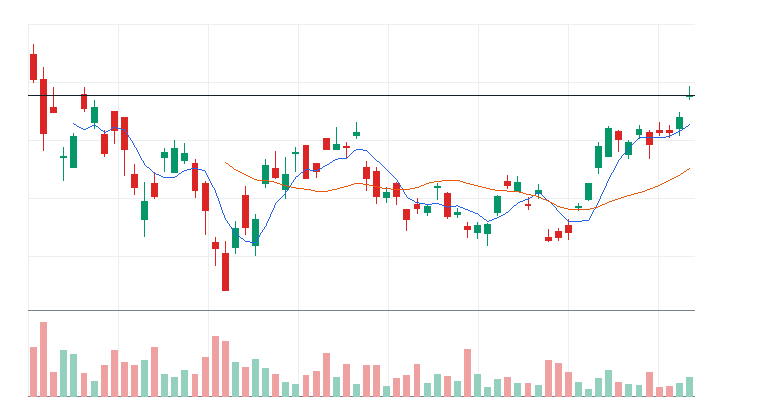
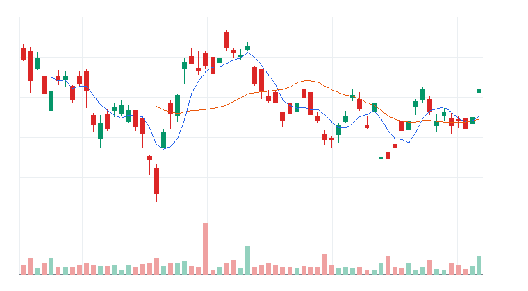
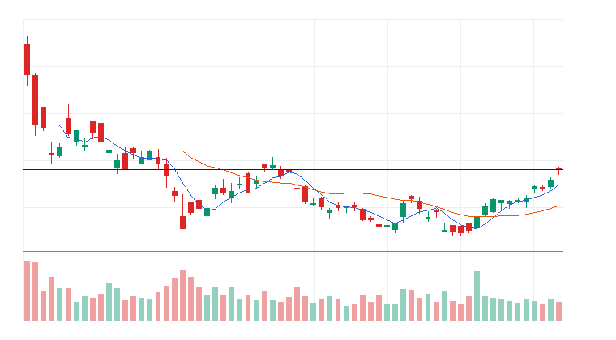
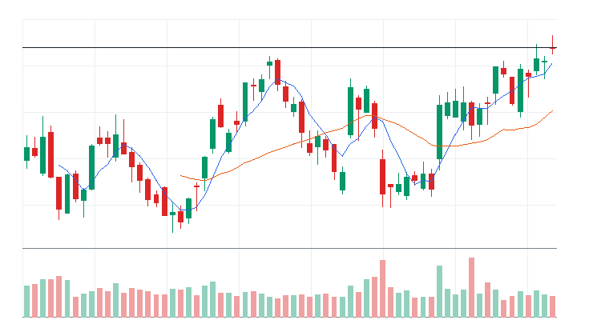

# 오늘의 데일리 트레이딩 요약

**REAL DATA TEST - 가격/거래량은 실제 데이터, 뉴스/ETF 구성종목 확산도/거래대금 유동성 일부 연결**

**목적:** 이 리포트는 최근 오른 자산을 나열하는 것이 아니라, 돈이 몰리는 근거와 다음 매수 주체가 확인할 트레이딩 후보를 찾기 위한 보고서다.

> 핵심 질문: 현재 가격에서 누가 사고 있고, 누가 앞으로 더 비싸게 사줄 수 있는가?

## 시장 국면 판단

- 최종 판정: 기간 조정 (80점)
- 전일 대비: 기간 조정 유지, 점수 변화는 제한적이다(+1점).
- 판정 신뢰도: 높음 (100점) - 핵심 지수와 매크로 데이터가 대부분 직접 수집되어 판정 신뢰도가 높다.
- 행동 바이어스: 추격 보류, 돌파 확인
- 한 줄 결론: 장기 추세는 유지되지만 단기 추세가 둔화되어 기간 조정으로 본다. 기술 99점, 매크로 45점.
- 기술적 지표: 상승 추세 우위 (99점, 가중치 65%)
- S&P 500: 97점 | 50일선 위, 200일선 위, 20일 -0.32%, 60일 +2.00%, 52주 고점 대비 -1.20% -> 기술 점수 97
- Nasdaq 100: 100점 | 50일선 위, 200일선 위, 20일 +4.50%, 60일 +4.00%, 52주 고점 대비 -0.68% -> 기술 점수 100
- 매크로 시황: 매크로 중립 (45점, 가중치 35%)
- 매크로 요약: 금리 부담으로 매크로 환경은 방어적이다.
- 금리: 부담 38점 / 금리 부담 / confidence HIGH
  - 주요 근거: US 10Y yield 20일 +10.81%, 5일 +1.79%; US 3M yield 20일 +6.76%, 단기금리 방향 확인; US long-duration bonds 20일 -5.59%, 장기채 가격 기준 할인율 부담 확인
  - 확인 사항: 장기금리 상승과 장기채 약세가 겹쳐 성장주 할인율 부담이 커질 수 있다.
- 물가: 중립 49점 / 물가 중립 / confidence HIGH
  - 주요 근거: Oil ETF 20일 +3.72%, 유가 기반 물가 압력 확인; TIPS ETF 20일 -2.70%, 물가연동채 흐름은 보조 근거; Gold 20일 -7.33%, 금 강세는 방어 수요 여부 확인
  - 확인 사항: 추가 확인 이벤트 없음
- 정책: 중립 50점 / 정책 이벤트 확인 전 중립 / confidence LOW
  - 주요 근거: 정책 톤은 1차 버전에서 일정/이벤트 리스크 기반 중립값으로 반영한다.
  - 확인 사항: FOMC, CPI, PCE, 고용지표 발표 전후에는 매크로 confidence를 보수적으로 해석한다.
- 신용/유동성: 중립 45점 / 신용/유동성 중립 / confidence HIGH
  - 주요 근거: High yield credit 20일 -2.90%, 하이일드 위험선호 확인; HYG-LQD 20일 상대강도 +0.58%, 신용위험 선호/회피 확인; VIX 20일 +5.37%, 변동성 부담 확인
  - 확인 사항: 추가 확인 이벤트 없음
- 환율/글로벌: 중립 45점 / 환율/글로벌 중립 / confidence MEDIUM
  - 주요 근거: US dollar 20일 +3.14%, 달러 강세/약세 확인
  - 확인 사항: 추가 확인 이벤트 없음
- US 10Y yield: 31점 | 하락 시 주식 우호; 5일 +1.79%, 20일 +10.81% -> 매크로 점수 31
- US 3M yield: 41점 | 하락 시 주식 우호; 5일 -1.89%, 20일 +6.76% -> 매크로 점수 41
- US long-duration bonds: 39점 | 상승 시 주식 우호; 5일 -2.32%, 20일 -5.59% -> 매크로 점수 39
- TIPS ETF: 50점 | 상승 시 주식 우호; 5일 -0.41%, 20일 -2.70% -> 매크로 점수 50
- Oil ETF: 45점 | 하락 시 주식 우호; 5일 -0.65%, 20일 +3.72% -> 매크로 점수 45
- Gold: 50점 | 상승 시 주식 우호; 5일 -3.37%, 20일 -7.33% -> 매크로 점수 50
- US dollar: 44점 | 하락 시 주식 우호; 5일 +0.94%, 20일 +3.14% -> 매크로 점수 44
- High yield credit: 44점 | 상승 시 주식 우호; 5일 -1.22%, 20일 -2.90% -> 매크로 점수 44
- Investment grade credit: 50점 | 상승 시 주식 우호; 5일 -1.34%, 20일 -3.48% -> 매크로 점수 50
- VIX: 39점 | 하락 시 주식 우호; 5일 +2.96%, 20일 +5.37% -> 매크로 점수 39
- 데이터 커버리지: 기술 2/2, 매크로 10/10
- 데이터 신뢰도 근거:
  - 직접 지수 데이터: S&P 500, Nasdaq 100
  - 대체 지수 데이터 없음
  - 매크로 데이터: 10/10
  - 누락 데이터 없음
  - stale 데이터 없음

## 모바일 요약

[오늘의 데일리 트레이딩 요약]

생성 성공 / 데이터 모드: REAL_TEST

시장:
- 중립

시장 지배 서사:
1. 반도체 장비 사이클 재평가 - 관찰 - VanEck Semiconductor ETF(SMH), Invesco PHLX Semiconductor ETF(SOXQ), Lam Research Corporation(LRCX), ASML Holding N.V.(ASML) 중심으로 5일 +4.71%, 20일 +13.70% 흐름이 형성됨. 뉴스 직접성 제한.
2. 반도체 설계/공급망 재가속 - 관찰 - VanEck Semiconductor ETF(SMH), Invesco PHLX Semiconductor ETF(SOXQ), NVIDIA Corporation(NVDA), Advanced Micro Devices Inc.(AMD) 중심으로 5일 +1.30%, 20일 +15.47% 흐름이 형성됨. 직접 촉매 일부 확인.
3. 사이버보안 지출 재가속 - 약화 - First Trust NASDAQ Cybersecurity ETF(CIBR), Amplify Cybersecurity ETF(HACK), CrowdStrike Holdings Inc.(CRWD), Palo Alto Networks Inc.(PANW) 중심으로 5일 +4.36%, 20일 +12.88% 흐름이 형성됨. 뉴스 직접성 제한.

트렌드 강도:
1. 반도체 장비 사이클 재평가 - TSI 61 - 부상 - 진입품질 관찰
2. 반도체 설계/공급망 재가속 - TSI 56 - 잠복 - 진입품질 관찰
3. 사이버보안 지출 재가속 - TSI 61 - 약화 - 진입품질 관찰

오늘 결론:
- 클라우드/엔터프라이즈 소프트웨어 개별 종목 흐름이 ETF 대비 강한지 확인 필요
- 행동 후보는 linkedNarrative와 함께 확인한다.
- 추격보다 진입 조건 확인 후 접근한다.

오늘 실제 행동 후보:
1. Synopsys Inc.(SNPS)(STOCK) - 소프트웨어 실적/AI 수익화 - 단기 추세가 유지되고 거래량이 1.0배 이상이면 눌림 이후 재상승을 시도할 수 있음
2. VanEck Semiconductor ETF(SMH)(ETF) - 반도체 장비 사이클 재평가 - 단기 추세가 유지되고 거래량이 1.0배 이상이면 눌림 이후 재상승을 시도할 수 있음

다크호스 후보:
1. 다크호스 후보 없음 - 조건 충족 후보 없음

ETF 후보 TOP 5:
1. VanEck Semiconductor ETF(SMH) - 반도체 장비 사이클 재평가 - 조건부 진입
2. Invesco PHLX Semiconductor ETF(SOXQ) - 반도체 장비 사이클 재평가 - 관찰
3. First Trust NASDAQ Cybersecurity ETF(CIBR) - 사이버보안 지출 재가속 - 관찰
4. First Trust NASDAQ Clean Edge Smart Grid Infrastructure ETF(GRID) - AI 인프라 재가속 - 관찰
5. iShares Semiconductor ETF(SOXX) - 반도체 장비 사이클 재평가 - 거래량 확인 전 관찰

웹 리포트:
https://yoolcool.github.io/DailyTradingThesisAgent/

## 오늘 결론

- 오늘 결론: 조건부 진입
- 신규 진입 후보: 0개
- 조건부 진입 후보: 2개
- 관찰 후보: 109개
- 주요 제한 요인: Entry Quality < 40, RVOL 미달, 뉴스 직접성 부족
- 주문 판단: 시장가 금지 / 지정가 또는 관찰
- 실전 판단: 진입 후보는 있으나, 전일 고점 돌파와 거래량 확인 후 선별적으로 접근한다.

### 후보 제한 요인 집계

- RVOL < 1.00x: 101개
- 거래대금 유동성 낮음: 14개
- Entry Quality 50~54 near miss: 2개
- Entry Quality 40~49 관찰: 20개
- Entry Quality < 40: 134개
- Exhaustion Risk >= 70: 0개
- ETF breadth 샘플 부족: 37개
- 뉴스 직접성 부족: 99개

## 데이터 신뢰도

- 전체 데이터 신뢰도 등급: LOW
- 분석 신뢰도: LOW
- 주문 실행 신뢰도: LOW
- ETF breadth 신뢰도: LOW
- 신뢰도 해석: 테마 확산 판단 제한, 거래대금 유동성 낮음 또는 확인 불가, 프리/애프터마켓 확인 불가
- 리포트 생성 시각: 2026-10-05 10:40 KST
- 가격 기준 거래일: 2026-10-02 US regular close
- 뉴스 수집 시각: 2026-10-05 10:40 KST
- 가장 최근 뉴스 발행 시각: 2026-10-05 10:29 KST
- 뉴스 신선도 상태: FRESH
- 뉴스 소스: Yahoo Finance RSS, MarketWatch RSS, CNBC Markets RSS, SEC EDGAR RSS, Federal Reserve RSS, Finnhub API
- 뉴스 소스 상태: Yahoo Finance RSS CONNECTED, MarketWatch RSS CONNECTED, CNBC Markets RSS PARTIAL, SEC EDGAR RSS PARTIAL, Federal Reserve RSS CONNECTED, Finnhub API DISABLED
- 뉴스 신뢰도: MEDIUM
- 추천 적용 거래일: 2026-10-04 US regular session
- 가격/거래량 데이터 상태: 일부 연결
- 뉴스 데이터 상태: 일부 연결
- ETF 구성종목 확산도 상태: 일부 연결
- ETF 구성종목 샘플 수: 1~4
- 거래대금 유동성 데이터 상태: 일부 연결
- 프리/애프터마켓 데이터 상태: UNAVAILABLE
- 데이터 provider: yfinance, Yahoo Finance RSS, MarketWatch RSS, CNBC Markets RSS, SEC EDGAR RSS, Federal Reserve RSS, Finnhub API, config fallback sample, price-volume dollar-volume fallback
- 실전 사용 경고: 이 리포트는 투자판단 보조용이며, REAL_TEST 모드에서는 일부 데이터가 누락되거나 지연될 수 있다. 실제 주문 전 현재가, 뉴스, 프리마켓/정규장 거래량을 별도 확인해야 한다.

## 0. 시장 상태

- 데이터 모드: REAL_TEST
- 가격/거래량: 일부 연결
- 뉴스: 일부 연결
- ETF 구성종목 확산도: 일부 연결
- 거래대금 유동성: 일부 연결
- 생성 시각: 2026년 10월 5일 월요일 AM 10:40
- 시장 상태: 중립
- 오늘 돈의 방향: 클라우드/엔터프라이즈 소프트웨어 개별 종목 흐름이 ETF 대비 강한지 확인 필요
- 강한 테마 TOP 3: 반도체 장비/공급망(71), AI 반도체 ETF(68), 전력망 인프라 ETF(67)
- 데이터 한계:
  - API 또는 provider 상태에 따라 뉴스/ETF 확산도/거래대금 유동성 반영 범위가 달라질 수 있다.
  - 수집 실패 데이터는 점수 반영에서 제외하거나 confidence를 제한한다.
  - reasonConfidence HIGH는 직접 촉매, 가격/거래량, 확산도/유동성 근거가 함께 있을 때만 사용한다.

## 오늘 시장을 지배하는 서사

### 오늘 시장을 지배하는 서사 TOP 3

#### 1. 반도체 장비 사이클 재평가
- 상태: 관찰
- narrativeScore: 63
- reasonConfidence: MEDIUM
- 근거 ETF: SMH, SOXQ, SOXX, AIQ
- 근거 개별 종목: LRCX, ASML
- 돈이 몰리는 이유: 반도체 장비 사이클 재평가 관련 VanEck Semiconductor ETF(SMH), Invesco PHLX Semiconductor ETF(SOXQ), iShares Semiconductor ETF(SOXX)와 Lam Research Corporation(LRCX), ASML Holding N.V.(ASML)의 5일(+4.71%)·20일(+13.70%) 흐름을 함께 본다. 평균 상대 거래량은 1.07배이고, ETF 확산도는 추가 확인이 필요하다. 뉴스 직접성은 아직 제한적이다.
- 다음 매수 주체: 반도체 장비 사이클 재평가을 확인한 섹터 ETF 자금과 상대강도 추종 스윙 자금
- 가장 좋은 트레이딩 수단: ETF 우선: SMH, SOXX, SOXQ / 개별 종목 우선: ASML, LRCX
- 서사가 깨지는 조건: SMH 20일선 이탈 또는 관련 종목 절반 이상 5일선 이탈
- 오늘 행동: 기존 네러티브와 중복을 확인한 뒤 ETF/대표 종목 동조성이 살아날 때만 관찰 편입

상세 narrativeScore 근거 보기

- rawScore: 63
- ETF 평균 moneyFlowScore: 65
- 개별 종목 평균 moneyFlowScore: 66
- ETF 후보 비율: 50%
- 개별 종목 후보 비율: 0%
- 5일 평균 수익률: +5.00%
- 20일 평균 수익률: +14.00%
- 평균 상대 거래량: 1.00배
- ETF 평균 상대 거래량: 1.00배
- 개별주 평균 상대 거래량: 1.00배
- 52주 고점 근접 후보 비율: 0%
- 뉴스 직접성 점수: 12
- ETF 확산도 점수: 0
- 유동성 점수: 4
- 과열 리스크 차감: 0

#### 2. 반도체 설계/공급망 재가속
- 상태: 관찰
- narrativeScore: 57
- reasonConfidence: LOW
- 근거 ETF: SMH, SOXQ, QQQ, SOXX, AIQ
- 근거 개별 종목: NVDA, AMD, TSM, ADI, ARM
- 돈이 몰리는 이유: 반도체 설계/공급망 재가속 관련 VanEck Semiconductor ETF(SMH), Invesco PHLX Semiconductor ETF(SOXQ), Invesco QQQ Trust(QQQ)와 NVIDIA Corporation(NVDA), Advanced Micro Devices Inc.(AMD), Taiwan Semiconductor(TSM), Analog Devices Inc.(ADI)의 5일(+1.30%)·20일(+15.47%) 흐름을 함께 본다. 평균 상대 거래량은 0.98배이고, ETF 확산도는 추가 확인이 필요하다. 직접 뉴스/이벤트가 일부 확인된다.
- 다음 매수 주체: 반도체 설계/공급망 재가속을 확인한 섹터 ETF 자금과 상대강도 추종 스윙 자금
- 가장 좋은 트레이딩 수단: ETF 우선: SMH, SOXX, SOXQ / 개별 종목 우선: AMD, ARM
- 서사가 깨지는 조건: SMH 20일선 이탈 또는 관련 종목 절반 이상 5일선 이탈
- 오늘 행동: 기존 네러티브와 중복을 확인한 뒤 ETF/대표 종목 동조성이 살아날 때만 관찰 편입

상세 narrativeScore 근거 보기

- rawScore: 57
- ETF 평균 moneyFlowScore: 64
- 개별 종목 평균 moneyFlowScore: 50
- ETF 후보 비율: 60%
- 개별 종목 후보 비율: 13%
- 5일 평균 수익률: +1.00%
- 20일 평균 수익률: +15.00%
- 평균 상대 거래량: 1.00배
- ETF 평균 상대 거래량: 1.00배
- 개별주 평균 상대 거래량: 1.00배
- 52주 고점 근접 후보 비율: 31%
- 뉴스 직접성 점수: 8
- ETF 확산도 점수: 0
- 유동성 점수: 3
- 과열 리스크 차감: 0

#### 3. 사이버보안 지출 재가속
- 상태: 약화
- narrativeScore: 56
- reasonConfidence: LOW
- 근거 ETF: CIBR, HACK, IHAK
- 근거 개별 종목: CRWD, PANW, FTNT, ZS
- 돈이 몰리는 이유: 사이버보안 지출 재가속 관련 First Trust NASDAQ Cybersecurity ETF(CIBR), Amplify Cybersecurity ETF(HACK), iShares Cybersecurity and Tech ETF(IHAK)와 CrowdStrike Holdings Inc.(CRWD), Palo Alto Networks Inc.(PANW), Fortinet Inc.(FTNT), Zscaler Inc.(ZS)의 5일(+4.36%)·20일(+12.88%) 흐름을 함께 본다. 평균 상대 거래량은 0.84배이고, ETF 확산도는 추가 확인이 필요하다. 뉴스 직접성은 아직 제한적이다.
- 다음 매수 주체: 사이버보안 지출 재가속을 확인한 섹터 ETF 자금과 상대강도 추종 스윙 자금
- 가장 좋은 트레이딩 수단: ETF 우선: HACK, CIBR, IHAK / 개별 종목 우선: CRWD, FTNT, ZS
- 서사가 깨지는 조건: HACK 20일선 이탈 또는 관련 종목 절반 이상 5일선 이탈
- 오늘 행동: 기존 네러티브와 중복을 확인한 뒤 ETF/대표 종목 동조성이 살아날 때만 관찰 편입

상세 narrativeScore 근거 보기

- rawScore: 56
- ETF 평균 moneyFlowScore: 53
- 개별 종목 평균 moneyFlowScore: 61
- ETF 후보 비율: 50%
- 개별 종목 후보 비율: 0%
- 5일 평균 수익률: +4.00%
- 20일 평균 수익률: +13.00%
- 평균 상대 거래량: 1.00배
- ETF 평균 상대 거래량: 1.00배
- 개별주 평균 상대 거래량: 1.00배
- 52주 고점 근접 후보 비율: 75%
- 뉴스 직접성 점수: 11
- ETF 확산도 점수: -1
- 유동성 점수: 1
- 과열 리스크 차감: 0

### 전체 narrative 요약

| 서사명 | 상태 | narrativeScore | reasonConfidence | 대표 ETF | 대표 종목 | 오늘 행동 |
| --- | --- | ---: | --- | --- | --- | --- |
| 반도체 장비 사이클 재평가 | 관찰 | 63 | MEDIUM | SMH, SOXQ, SOXX | LRCX, ASML | 기존 네러티브와 중복을 확인한 뒤 ETF/대표 종목 동조성이 살아날 때만 관찰 편입 |
| 반도체 설계/공급망 재가속 | 관찰 | 57 | LOW | SMH, SOXQ, QQQ | NVDA, AMD, TSM, ADI | 기존 네러티브와 중복을 확인한 뒤 ETF/대표 종목 동조성이 살아날 때만 관찰 편입 |
| 사이버보안 지출 재가속 | 약화 | 56 | LOW | CIBR, HACK, IHAK | CRWD, PANW, FTNT, ZS | 기존 네러티브와 중복을 확인한 뒤 ETF/대표 종목 동조성이 살아날 때만 관찰 편입 |
| AI 인프라 재가속 | 관찰 | 52 | LOW | SMH, SOXQ, GRID | NVDA, AMD, PWR, GEV | 추격보다 5일선 지지 후 재상승 확인 |
| 전력 유틸리티 수요 재평가 | 약화 | 39 | LOW | QQQ, SPY, IWM | GEV, ETN, VRT | 기존 네러티브와 중복을 확인한 뒤 ETF/대표 종목 동조성이 살아날 때만 관찰 편입 |
| Internet Content 자금 유입 | 약화 | 36 | LOW | QQQ | META, GOOGL, GOOG | 기존 네러티브와 중복을 확인한 뒤 ETF/대표 종목 동조성이 살아날 때만 관찰 편입 |
| 소프트웨어 실적/AI 수익화 | 약화 | 34 | LOW | QQQ, AIQ, IGV | MSTR, SHOP, MSFT | 기존 네러티브와 중복을 확인한 뒤 ETF/대표 종목 동조성이 살아날 때만 관찰 편입 |
| Data Storage 자금 유입 | 약화 | 33 | LOW | QQQ, SPY, IWM | STX, WDC | 기존 네러티브와 중복을 확인한 뒤 ETF/대표 종목 동조성이 살아날 때만 관찰 편입 |
| 필수소비재 음료 방어 성장 | 약화 | 32 | LOW | QQQ | CCEP, MNST | 기존 네러티브와 중복을 확인한 뒤 ETF/대표 종목 동조성이 살아날 때만 관찰 편입 |
| 소비 회복/방어주 선별 | 약화 | 31 | LOW | QQQ | PDD, AMZN | 기존 네러티브와 중복을 확인한 뒤 ETF/대표 종목 동조성이 살아날 때만 관찰 편입 |
| Medical Devices 자금 유입 | 약화 | 31 | LOW | QQQ | ISRG, DXCM | 기존 네러티브와 중복을 확인한 뒤 ETF/대표 종목 동조성이 살아날 때만 관찰 편입 |
| AI 소프트웨어/사이버보안 확산 | 약화 | 30 | LOW | QQQ, AIQ, IGV | DDOG, PLTR, MSFT, TEAM | 추격보다 눌림 후 재상승 확인 |
| 위험선호 성장주 재진입 | 약화 | 30 | LOW | QQQ, ARKK, IPO | ARM, TSLA, COIN | 지수 위험선호가 유지될 때만 선별 진입 |
| Integrated Oil & Gas 자금 유입 | 약화 | 28 | LOW | QQQ, SPY, IWM | XOM, CVX | 기존 네러티브와 중복을 확인한 뒤 ETF/대표 종목 동조성이 살아날 때만 관찰 편입 |
| Travel Services 자금 유입 | 소멸 | 25 | LOW | QQQ | BKNG, ABNB | 기존 네러티브와 중복을 확인한 뒤 ETF/대표 종목 동조성이 살아날 때만 관찰 편입 |
| 바이오/헬스케어 촉매 | 소멸 | 24 | LOW | QQQ | ALNY, GILD | 기존 네러티브와 중복을 확인한 뒤 ETF/대표 종목 동조성이 살아날 때만 관찰 편입 |
| Specialty Business Services 자금 유입 | 소멸 | 20 | LOW | QQQ, SPY, IWM | TRI, CTAS, CPRT | 기존 네러티브와 중복을 확인한 뒤 ETF/대표 종목 동조성이 살아날 때만 관찰 편입 |
| 전력망/원전/인프라 병목 | 소멸 | 19 | LOW | GRID, PAVE, URA | PWR, GEV, ETN, VRT | ETF 확산도와 거래량이 같이 살아날 때만 진입 |
| Aerospace & Defense 자금 유입 | 소멸 | 13 | LOW | QQQ, SPY, IWM | KTOS, AVAV | 기존 네러티브와 중복을 확인한 뒤 ETF/대표 종목 동조성이 살아날 때만 관찰 편입 |
| 매크로 방어/헤지 | 소멸 | 6 | LOW | XLE, GLD, TLT | XOM, CVX | 위험회피가 확인될 때만 헤지성 접근 |
| 비트코인/디지털 자산 위험선호 | 약화 | 0 | LOW | IBIT, BLOK | MSTR, IREN, COIN | 비트코인 베타가 살아날 때만 단기 매매 |
| 방산/안보 프리미엄 | 소멸 | 0 | LOW | XAR, SHLD, ITA | PLTR, AVAV, KTOS | 뉴스 촉매가 직접 확인될 때만 추세 추종 |
| Bitcoin Mining 자금 유입 | 소멸 | 0 | LOW | IBIT, BLOK | RIOT, MARA, CIFR | 기존 네러티브와 중복을 확인한 뒤 ETF/대표 종목 동조성이 살아날 때만 관찰 편입 |

## 트렌드 강도 판단

### 1. 반도체 장비 사이클 재평가
- Trend Strength Index: 61
- 트렌드 상태 라벨: 부상
- 테마 확산도: 보통
- ETF 동조성: 강함
- 거래량 강도: 약함
- 과열 위험: 낮음 (4)
- 오늘 진입 품질: 관찰 (49)
- 한 줄 판단: 반도체 장비 사이클 재평가는 Trend Strength는 중간이지만 진입 품질이 살아나는 초기 진입 후보 성격이다.
- 오늘 접근법: VanEck Semiconductor ETF(SMH)/Invesco PHLX Semiconductor ETF(SOXQ)/iShares Semiconductor ETF(SOXX) 거래량 증가와 Lam Research Corporation(LRCX)/ASML Holding N.V.(ASML) 확산을 확인하며 작은 사이즈의 초기 진입 후보로만 본다.

트렌드 강도 상세 근거 보기

- 가격 모멘텀: 가격 모멘텀 18/25. 평균 5D +4.71%, 20D +13.70%.
- 거래량 강도: 거래량 강도 7/20. 평균 RVOL 1.07배.
- ETF 동조성: ETF 동조성 16/15. 관련 ETF VanEck Semiconductor ETF(SMH), iShares Semiconductor ETF(SOXX), Invesco PHLX Semiconductor ETF(SOXQ), Global X Artificial Intelligence & Technology ETF(AIQ) 흐름을 기준으로 판단.
- 테마 확산도: 테마 확산도 13/20. 상위 1~2개 쏠림 감점 0점 반영.
- 뉴스 촉매: 뉴스/촉매 신선도 2/10. HIGH 직접 촉매 0개.
- 과열 리스크: 과열 리스크 4/100. 단기 급등, 고점 근접, ETF-개별주 괴리, 쏠림을 함께 반영.
- 시장 환경: 시장 환경 5/10. QQQ/SPY/IWM 가격 흐름 기반 위험선호 점수.

### 2. 반도체 설계/공급망 재가속
- Trend Strength Index: 56
- 트렌드 상태 라벨: 잠복
- 테마 확산도: 보통
- ETF 동조성: 강함
- 거래량 강도: 약함
- 과열 위험: 낮음 (12)
- 오늘 진입 품질: 관찰 (46)
- 한 줄 판단: 반도체 설계/공급망 재가속는 Trend Strength는 중간이지만 진입 품질이 살아나는 초기 진입 후보 성격이다.
- 오늘 접근법: VanEck Semiconductor ETF(SMH)/Invesco PHLX Semiconductor ETF(SOXQ)/Invesco QQQ Trust(QQQ)와 NVIDIA Corporation(NVDA)/Advanced Micro Devices Inc.(AMD)/Taiwan Semiconductor(TSM)의 거래량 확산이 확인되기 전까지 관찰한다.

트렌드 강도 상세 근거 보기

- 가격 모멘텀: 가격 모멘텀 11/25. 평균 5D +1.30%, 20D +15.47%.
- 거래량 강도: 거래량 강도 6/20. 평균 RVOL 0.98배.
- ETF 동조성: ETF 동조성 16/15. 관련 ETF VanEck Semiconductor ETF(SMH), iShares Semiconductor ETF(SOXX), Invesco PHLX Semiconductor ETF(SOXQ), Global X Artificial Intelligence & Technology ETF(AIQ), Invesco QQQ Trust(QQQ) 흐름을 기준으로 판단.
- 테마 확산도: 테마 확산도 12/20. 상위 1~2개 쏠림 감점 0점 반영.
- 뉴스 촉매: 뉴스/촉매 신선도 6/10. HIGH 직접 촉매 1개.
- 과열 리스크: 과열 리스크 12/100. 단기 급등, 고점 근접, ETF-개별주 괴리, 쏠림을 함께 반영.
- 시장 환경: 시장 환경 5/10. QQQ/SPY/IWM 가격 흐름 기반 위험선호 점수.

### 3. 사이버보안 지출 재가속
- Trend Strength Index: 61
- 트렌드 상태 라벨: 약화
- 테마 확산도: 강함
- ETF 동조성: 강함
- 거래량 강도: 부족
- 과열 위험: 낮음 (16)
- 오늘 진입 품질: 관찰 (41)
- 한 줄 판단: 사이버보안 지출 재가속는 Trend Strength는 중간이지만 진입 품질이 살아나는 초기 진입 후보 성격이다.
- 오늘 접근법: 상승률이 남아 있어도 First Trust NASDAQ Cybersecurity ETF(CIBR)/Amplify Cybersecurity ETF(HACK)/iShares Cybersecurity and Tech ETF(IHAK)와 구성 종목 확산도가 회복될 때까지 신규 진입은 낮춘다.

트렌드 강도 상세 근거 보기

- 가격 모멘텀: 가격 모멘텀 19/25. 평균 5D +4.36%, 20D +12.88%.
- 거래량 강도: 거래량 강도 4/20. 평균 RVOL 0.84배.
- ETF 동조성: ETF 동조성 15/15. 관련 ETF Amplify Cybersecurity ETF(HACK), First Trust NASDAQ Cybersecurity ETF(CIBR), iShares Cybersecurity and Tech ETF(IHAK), iShares Expanded Tech-Software Sector ETF(IGV) 흐름을 기준으로 판단.
- 테마 확산도: 테마 확산도 16/20. 상위 1~2개 쏠림 감점 0점 반영.
- 뉴스 촉매: 뉴스/촉매 신선도 2/10. HIGH 직접 촉매 0개.
- 과열 리스크: 과열 리스크 16/100. 단기 급등, 고점 근접, ETF-개별주 괴리, 쏠림을 함께 반영.
- 시장 환경: 시장 환경 5/10. QQQ/SPY/IWM 가격 흐름 기반 위험선호 점수.

## 최근 추천 결과 트래킹

개별주는 데이트레이딩 관점으로 추천 이후 첫 정규장의 장중 최고가와 종가를 추적한다. ETF는 테마/스윙 관점으로 추천 이후 1주일 동안의 최고가와 현재 종가를 추적한다.

### 개별주 Top 3 추천 성과 요약
- 최근 5개 리포트 표본: 11개 (초기 검증 단계)
- 장중 최고가 기준 성공률: +20.00%
- 종가 기준 성공률: +10.00%
- 평균 장중 최고 수익률: +0.89%
- 평균 종가 수익률: -2.78%

### ETF 추천 성과 요약
- 최근 5개 리포트 표본: 4개 (초기 검증 단계)
- 1주 최고가 기준 성공률: +33.33%
- 현재 종가 기준 성공률: +25.00%
- 평균 1주 최고 수익률: +1.41%
- 평균 현재 수익률: +1.07%

최근 추천 결과 상세 테이블 펼치기

| 추천일 | 유형 | 순위 | 티커 | 기준가 | 추적 기간 | 상태 | High 수익률 | Close 수익률 | 결과 | 코멘트 |
| --- | --- | ---: | --- | ---: | --- | --- | ---: | ---: | --- | --- |
| 2026-10-05 | STOCK | 1 | SNPS | $489.9 | 2026-10-05 | pending | 데이터 없음 | 데이터 없음 | 추적 대기 | 아직 추적 거래일 데이터가 완성되지 않음 |
| 2026-10-05 | ETF | 1 | SMH | $630.6 | 2026-10-05~2026-10-12 | in_progress | 데이터 없음 | 0.00% | 진행 중 | 아직 1주 추적 기간이 끝나지 않음 (일봉 high 미확보 시 close 기준 보조) |
| 2026-09-30 | STOCK | 1 | AMAT | $512.01 | 2026-09-30 | complete | +0.67% | -0.12% | 실패 | 추천 이후 의미 있는 장중 기회가 부족하고 종가도 약함 (일봉 기준) |
| 2026-09-28 | STOCK | 3 | DDOG | $268.13 | 2026-09-28 | complete | +1.74% | +0.21% | 제한적 유효 | 제한적인 장중 기회만 발생 (일봉 기준) |
| 2026-09-28 | STOCK | 2 | ARM | $310.32 | 2026-09-28 | complete | -1.02% | -8.70% | 실패 | 추천 이후 의미 있는 장중 기회가 부족하고 종가도 약함 (일봉 기준) |
| 2026-09-28 | STOCK | 1 | QCOM | $201.97 | 2026-09-28 | complete | -1.39% | -7.17% | 실패 | 추천 이후 의미 있는 장중 기회가 부족하고 종가도 약함 (일봉 기준) |
| 2026-09-25 | STOCK | 3 | ARM | $332.56 | 2026-09-25 | complete | -2.13% | -6.69% | 실패 | 추천 이후 의미 있는 장중 기회가 부족하고 종가도 약함 (일봉 기준) |
| 2026-09-25 | STOCK | 2 | CRWD | $262.49 | 2026-09-25 | complete | -1.00% | -3.95% | 실패 | 추천 이후 의미 있는 장중 기회가 부족하고 종가도 약함 (일봉 기준) |
| 2026-09-25 | STOCK | 1 | PLTR | $191.79 | 2026-09-25 | complete | +1.26% | -1.11% | 제한적 유효 | 제한적인 장중 기회만 발생 (일봉 기준) |
| 2026-09-23 | STOCK | 3 | MARA | $13.28 | 2026-09-23 | complete | +2.79% | +0.53% | 제한적 유효 | 제한적인 장중 기회만 발생 (일봉 기준) |
| 2026-09-23 | STOCK | 2 | CIFR | $18.9 | 2026-09-23 | complete | +3.49% | -2.91% | 단타 유효 | 장중 기회는 있었지만 종가 유지력은 약함 (일봉 기준) |
| 2026-09-23 | STOCK | 1 | RIOT | $24.18 | 2026-09-23 | complete | +4.51% | +2.11% | 성공 | 장중 기회와 종가 유지가 모두 확인됨 (일봉 기준) |
| 2026-09-23 | ETF | 3 | ARKK | $90.72 | 2026-09-23~2026-09-30 | complete | +1.63% | -0.98% | 진행 중 | 아직 1주 추적 기간이 끝나지 않음 |
| 2026-09-23 | ETF | 2 | MAGS | $72.97 | 2026-09-23~2026-09-30 | complete | -0.29% | -0.52% | 진행 중 | 아직 1주 추적 기간이 끝나지 않음 |
| 2026-09-23 | ETF | 1 | SMH | $596.03 | 2026-09-23~2026-09-30 | complete | +2.89% | +5.80% | 성공 | 추천 이후 테마 추세가 유지됨 |
| 2026-09-22 | STOCK | 3 | CRWD | $237.65 | 2026-09-22 | complete | +5.53% | +5.22% | 성공 | 장중 기회와 종가 유지가 모두 확인됨 (일봉 기준) |
| 2026-09-22 | STOCK | 2 | RIOT | $23.75 | 2026-09-22 | complete | +6.91% | +4.97% | 성공 | 장중 기회와 종가 유지가 모두 확인됨 (일봉 기준) |
| 2026-09-22 | STOCK | 1 | AMD | $559.82 | 2026-09-22 | complete | +11.56% | +11.42% | 성공 | 장중 기회와 종가 유지가 모두 확인됨 (일봉 기준) |
| 2026-09-21 | STOCK | 3 | CRWD | $237.65 | 2026-09-21 | complete | +5.33% | +4.92% | 성공 | 장중 기회와 종가 유지가 모두 확인됨 (일봉 기준) |
| 2026-09-21 | STOCK | 2 | RIOT | $23.75 | 2026-09-21 | complete | +5.55% | +1.81% | 성공 | 장중 기회와 종가 유지가 모두 확인됨 (일봉 기준) |
| 2026-09-21 | STOCK | 1 | AMD | $559.82 | 2026-09-21 | complete | +10.16% | +9.95% | 성공 | 장중 기회와 종가 유지가 모두 확인됨 (일봉 기준) |
| 2026-09-17 | STOCK | 3 | QCOM | $187.8 | 2026-09-17 | complete | +2.19% | +0.48% | 제한적 유효 | 제한적인 장중 기회만 발생 (일봉 기준) |
| 2026-09-17 | STOCK | 2 | FTNT | $172.37 | 2026-09-17 | complete | +2.16% | +0.12% | 제한적 유효 | 제한적인 장중 기회만 발생 (일봉 기준) |
| 2026-09-17 | STOCK | 1 | CRWD | $242.49 | 2026-09-17 | complete | +3.23% | +1.32% | 성공 | 장중 기회와 종가 유지가 모두 확인됨 (일봉 기준) |
| 2026-09-15 | STOCK | 1 | AMD | $516.13 | 2026-09-15 | complete | -0.48% | -2.31% | 실패 | 추천 이후 의미 있는 장중 기회가 부족하고 종가도 약함 (일봉 기준) |
| 2026-09-14 | STOCK | 1 | AMD | $516.13 | 2026-09-14 | complete | -3.44% | -4.40% | 실패 | 추천 이후 의미 있는 장중 기회가 부족하고 종가도 약함 (일봉 기준) |
| 2026-09-11 | STOCK | 2 | META | $653.69 | 2026-09-11 | complete | +1.61% | -0.87% | 제한적 유효 | 제한적인 장중 기회만 발생 (일봉 기준) |
| 2026-09-11 | STOCK | 1 | AMD | $521.1 | 2026-09-11 | complete | -0.01% | -0.95% | 실패 | 추천 이후 의미 있는 장중 기회가 부족하고 종가도 약함 (일봉 기준) |
| 2026-09-10 | STOCK | 3 | TSM | $439 | 2026-09-10 | complete | -1.47% | -2.50% | 실패 | 추천 이후 의미 있는 장중 기회가 부족하고 종가도 약함 (일봉 기준) |
| 2026-09-10 | STOCK | 2 | AMD | $505.74 | 2026-09-10 | complete | +2.09% | -0.42% | 제한적 유효 | 제한적인 장중 기회만 발생 (일봉 기준) |
| 2026-09-10 | STOCK | 1 | CEG | $299.05 | 2026-09-10 | complete | -1.41% | -4.37% | 실패 | 추천 이후 의미 있는 장중 기회가 부족하고 종가도 약함 (일봉 기준) |
| 2026-09-10 | ETF | 1 | DRAM | $61.1 | 2026-09-10~2026-09-17 | complete | -1.73% | +1.11% | 진행 중 | 아직 1주 추적 기간이 끝나지 않음 |
| 2026-09-09 | STOCK | 1 | MU | $1,016.59 | 2026-09-09 | complete | +2.54% | +1.10% | 제한적 유효 | 제한적인 장중 기회만 발생 (일봉 기준) |
| 2026-09-08 | STOCK | 1 | MU | $1,016.59 | 2026-09-08 | complete | +2.41% | -1.61% | 제한적 유효 | 제한적인 장중 기회만 발생 (일봉 기준) |
| 2026-09-07 | STOCK | 1 | MU | $1,016.59 | 2026-09-07 | pending | 데이터 없음 | 데이터 없음 | 추적 대기 | 아직 추적 거래일 데이터가 완성되지 않음 |
| 2026-09-04 | STOCK | 1 | ALNY | $267.4 | 2026-09-04 | complete | -0.21% | -0.48% | 실패 | 추천 이후 의미 있는 장중 기회가 부족하고 종가도 약함 (일봉 기준) |
| 2026-09-04 | ETF | 1 | OIH | $436.58 | 2026-09-04~2026-09-11 | complete | +0.81% | -12.34% | 실패 | 추천 이후 ETF 흐름이 약화됨 |
| 2026-09-03 | STOCK | 1 | CVX | $211.05 | 2026-09-03 | complete | +1.02% | +0.13% | 제한적 유효 | 제한적인 장중 기회만 발생 (일봉 기준) |
| 2026-09-02 | STOCK | 1 | CVX | $211.05 | 2026-09-02 | complete | +0.82% | +0.35% | 추적 대기 | 아직 추적 거래일 데이터가 완성되지 않음 (일봉 기준) |
| 2026-09-01 | STOCK | 3 | PANW | $382.13 | 2026-09-01 | complete | -1.63% | -5.24% | 실패 | 추천 이후 의미 있는 장중 기회가 부족하고 종가도 약함 (일봉 기준) |
| 2026-09-01 | STOCK | 2 | ZS | $188.39 | 2026-09-01 | complete | -1.06% | -5.32% | 실패 | 추천 이후 의미 있는 장중 기회가 부족하고 종가도 약함 (일봉 기준) |
| 2026-09-01 | STOCK | 1 | CRWD | $231 | 2026-09-01 | complete | +0.13% | -6.90% | 실패 | 추천 이후 의미 있는 장중 기회가 부족하고 종가도 약함 (일봉 기준) |
| 2026-09-01 | ETF | 1 | CIBR | $100.15 | 2026-09-01~2026-09-08 | complete | -4.15% | +4.54% | 진행 중 | 아직 1주 추적 기간이 끝나지 않음 |
| 2026-08-31 | STOCK | 3 | MSFT | $513.53 | 2026-08-31 | complete | -0.26% | -1.22% | 실패 | 추천 이후 의미 있는 장중 기회가 부족하고 종가도 약함 (일봉 기준) |
| 2026-08-31 | STOCK | 2 | WDAY | $204.72 | 2026-08-31 | complete | -0.53% | -3.55% | 실패 | 추천 이후 의미 있는 장중 기회가 부족하고 종가도 약함 (일봉 기준) |
| 2026-08-31 | STOCK | 1 | CRWD | $218.4 | 2026-08-31 | complete | +7.09% | +5.77% | 성공 | 장중 기회와 종가 유지가 모두 확인됨 (일봉 기준) |
| 2026-08-31 | ETF | 1 | IGV | $109.5 | 2026-08-31~2026-09-07 | complete | -0.70% | -0.98% | 진행 중 | 아직 1주 추적 기간이 끝나지 않음 |
| 2026-08-28 | STOCK | 3 | ZS | $187.3 | 2026-08-28 | complete | +0.47% | -1.64% | 실패 | 추천 이후 의미 있는 장중 기회가 부족하고 종가도 약함 (일봉 기준) |
| 2026-08-28 | STOCK | 2 | ADSK | $270.58 | 2026-08-28 | complete | -1.32% | -3.67% | 실패 | 추천 이후 의미 있는 장중 기회가 부족하고 종가도 약함 (일봉 기준) |
| 2026-08-28 | STOCK | 1 | ADBE | $289.15 | 2026-08-28 | complete | +1.71% | +0.82% | 제한적 유효 | 제한적인 장중 기회만 발생 (일봉 기준) |
| 2026-08-28 | ETF | 3 | IBIT | $45.29 | 2026-08-28~2026-09-04 | complete | +2.38% | +5.39% | 성공 | 추천 이후 테마 추세가 유지됨 |
| 2026-08-28 | ETF | 2 | CIBR | $100.79 | 2026-08-28~2026-09-04 | complete | -0.35% | +3.88% | 진행 중 | 아직 1주 추적 기간이 끝나지 않음 |
| 2026-08-28 | ETF | 1 | IGV | $110.32 | 2026-08-28~2026-09-04 | complete | +0.23% | -1.71% | 실패 | 추천 이후 ETF 흐름이 약화됨 |
| 2026-08-21 | STOCK | 3 | FCX | $71.22 | 2026-08-21 | complete | +8.58% | +7.64% | 성공 | 장중 기회와 종가 유지가 모두 확인됨 (일봉 기준) |
| 2026-08-21 | STOCK | 2 | COIN | $172.35 | 2026-08-21 | complete | +11.03% | +8.20% | 성공 | 장중 기회와 종가 유지가 모두 확인됨 (일봉 기준) |
| 2026-08-21 | STOCK | 1 | MSTR | $112.39 | 2026-08-21 | complete | +8.47% | +6.10% | 성공 | 장중 기회와 종가 유지가 모두 확인됨 (일봉 기준) |
| 2026-08-21 | ETF | 1 | IBIT | $41.2 | 2026-08-21~2026-08-28 | complete | +11.19% | +15.85% | 성공 | 추천 이후 테마 추세가 유지됨 |
| 2026-08-20 | STOCK | 3 | ADBE | $272.47 | 2026-08-20 | complete | +0.65% | -0.09% | 실패 | 추천 이후 의미 있는 장중 기회가 부족하고 종가도 약함 (일봉 기준) |
| 2026-08-20 | STOCK | 2 | TEAM | $174.23 | 2026-08-20 | complete | +2.09% | +0.39% | 제한적 유효 | 제한적인 장중 기회만 발생 (일봉 기준) |
| 2026-08-20 | STOCK | 1 | INTU | $362.47 | 2026-08-20 | complete | +1.15% | -0.17% | 제한적 유효 | 제한적인 장중 기회만 발생 (일봉 기준) |

## 오늘 실제 행동 후보

### 1. Synopsys Inc.(SNPS)
- 자산 유형: STOCK
- linkedNarrative: 소프트웨어 실적/AI 수익화
- narrativeStatus: 약화
- narrativeScore: 34
- Trend Strength Index: 48
- Exhaustion Risk: 5 (낮음)
- Entry Quality Score: 50 (관찰)
- 트렌드 판단: 시장 위험선호가 약해 시장 환경 비우호 구간이다.
- moneyFlowScore: 94
- finalRawScore: 94
- reasonConfidence: HIGH
- reasonConfidenceExplanation: 직접 촉매: Yahoo Finance RSS / mna / under_24h / positive - Synopsys (SNPS) Has a Strong Design Business. Is Its Growth Worth the Premium? 가격/거래량, 관련 ETF 동반 강세, 유동성 근거가 함께 확인되어 HIGH로 분류했다.
- tieBreakerReason: 최종 원점수 94, 리스크 패널티 0, 5일 수익률 +15.06%, 상대 거래량 1.40배 순으로 정렬
- 후보별 시장 해석: 중립 / 제한적 - 후보는 당일 음봉 또는 약세
- 게이트 사유: 통과
- 주문 실행: 시장가 가능
- 직접 촉매: Yahoo Finance RSS / mna / under_24h / positive - Synopsys (SNPS) Has a Strong Design Business. Is Its Growth Worth the Premium?
- 왜 돈이 몰리는가: 20일 +17.68%, 5일 +15.06%, 상대 거래량 1.40배로 가격과 거래량이 함께 개선. 뉴스: Yahoo Finance RSS mna/under_24h / 유동성: LIQUID
- 누가 더 비싸게 사줄 수 있는지: 개별 주도주를 따라붙는 단기 모멘텀 자금과 관련 ETF 강세를 확인한 트레이더
- 진입 조건: 20일선 위 눌림 후 재상승 확인
- 무효화 조건: 20일선 이탈 또는 상대 거래량 0.8배 이하 둔화
- todayActionLabel: 조건부 진입
#### 최근 뉴스/동향 한국어 요약

- 요약: 종목 직접 뉴스 확인 상태이며 뉴스 흐름은 긍정 우위입니다. 후보 선정 후 재확인한 핵심 이슈는 "Synopsys (SNPS) Has a Strong Design Business. Is Its Growth Worth the Premium?"입니다.
- 직접 촉매 판단: Synopsys Inc.에 대해 직접 촉매로 분류된 뉴스가 확인됐습니다. 핵심은 "Synopsys (SNPS) Has a Strong Design Business. Is Its Growth Worth the Premium?"이며, M&A 재료로 봅니다.
- 뉴스 1: Synopsys (SNPS) Has a Strong Design Business. Is Its Growth Worth the Premium?
  - 내용: Synopsys Inc. 관련 M&A 뉴스입니다. 기사 스니펫상 핵심 내용은 Synopsys, Inc.입니다.
  - 투자 의미: M&A 재료는 실적 가시성이나 밸류에이션 기대에 영향을 줄 수 있어 규모와 일정 확인이 중요합니다.
  - 확인할 점: M&A의 금액, 기간, 실적 반영 시점
- 뉴스 2: Synopsys is becoming a major AI player: CEO discusses OpenAI, Amazon deals
  - 내용: Synopsys Inc. 관련 M&A 뉴스입니다. 기사 스니펫상 핵심 내용은 Synopsys (SNPS) is starting to position itself as a key player in the AI boom: At its investor day, the chip designer announced deals with both OpenAI (OPAI.PVT) and Amazon (AMZN).입니다.
  - 투자 의미: M&A 재료는 실적 가시성이나 밸류에이션 기대에 영향을 줄 수 있어 규모와 일정 확인이 중요합니다.
  - 확인할 점: M&A의 금액, 기간, 실적 반영 시점
- 뉴스 3: What Is Driving The Move In Synopsys Stock?
  - 내용: Synopsys Inc. 관련 기사는 What Is Driving The Move In Synopsys Stock? 이슈를 다루며, 주가 변동률 +12.80%, 동반 비교 수치 +0.20%를 핵심 내용으로 봅니다.
  - 투자 의미: Synopsys Inc.의 당일 상대강도 확인에는 도움이 되지만, 실적/가이던스 같은 새 펀더멘털 변화로 보기는 어렵습니다.
  - 확인할 점: 거래량 동반 여부, 장중 고점 유지, 관련 ETF 동반 강세
- 매매 해석: 매매 관점에서는 뉴스 자체보다 가격이 진입 조건을 지키는지, 거래량이 동반되는지, 그리고 뉴스가 이미 주가에 반영됐는지를 우선 확인해야 합니다.
- 차트: 

### 2. VanEck Semiconductor ETF(SMH)
- 자산 유형: ETF
- linkedNarrative: 반도체 장비 사이클 재평가
- narrativeStatus: 관찰
- narrativeScore: 63
- Trend Strength Index: 61
- Exhaustion Risk: 4 (낮음)
- Entry Quality Score: 50 (관찰)
- 트렌드 판단: 시장 위험선호가 약해 시장 환경 비우호 구간이다.
- moneyFlowScore: 78
- finalRawScore: 78
- reasonConfidence: MEDIUM
- reasonConfidenceExplanation: ETF 확산도 제한 때문에 HIGH가 아니라 MEDIUM으로 제한했다.
- tieBreakerReason: 최종 원점수 78, 리스크 패널티 0, 5일 수익률 +3.96%, 상대 거래량 1.13배 순으로 정렬
- 후보별 시장 해석: 중립 / 제한적 - 특이 충돌 없음
- 게이트 사유: 통과
- 주문 실행: 시장가 가능

- 왜 돈이 몰리는가: 20일 +14.12%, 5일 +3.96%, 상대 거래량 1.13배로 가격과 거래량이 함께 개선. 뉴스: CNBC Markets RSS mna/under_6h / 유동성: LIQUID
- 누가 더 비싸게 사줄 수 있는지: 섹터 베타를 노리는 단기 모멘텀 자금과 리밸런싱 자금
- 진입 조건: 20일선 위 눌림 후 재상승 확인
- 무효화 조건: 20일선 이탈 또는 상대 거래량 0.8배 이하 둔화
- todayActionLabel: 조건부 진입
#### 최근 뉴스/동향 한국어 요약

- 요약: 섹터/테마 뉴스 중심 상태이며 뉴스 흐름은 긍정 우위입니다. 후보 선정 후 재확인한 핵심 이슈는 "My wife never went back to work after raising our kids. Do I have to share my retirement savings 50/50?"입니다.
- 직접 촉매 판단: VanEck Semiconductor ETF에 대해 강한 직접 촉매는 확인되지 않았습니다.
- 뉴스 1: The Semiconductor ETF's 2026 Return Is About 3 Times Nvidia's
  - 내용: VanEck Semiconductor ETF 관련 시장 일반 뉴스입니다. 기사 스니펫상 핵심 내용은 Nvidia is the chip fund's top position.입니다.
  - 투자 의미: 단기 긍정 뉴스 흐름으로 볼 수 있지만, 단독 매수 근거보다는 가격·거래량 조건을 확인하는 보조 근거로 사용합니다.
  - 확인할 점: 원문 수치, 후속 보도, 가격이 진입 조건을 지키는지
- 뉴스 2: If I Had Only $500 per Month to Invest, These Are the 2 ETFs I'd Buy
  - 내용: VanEck Semiconductor ETF 관련 시장 일반 뉴스입니다. 기사 스니펫상 핵심 내용은 Despite strong gains for stocks in 2026, these two groups still have positive catalysts working in their favor.입니다.
  - 투자 의미: 단기 긍정 뉴스 흐름으로 볼 수 있지만, 단독 매수 근거보다는 가격·거래량 조건을 확인하는 보조 근거로 사용합니다.
  - 확인할 점: 원문 수치, 후속 보도, 가격이 진입 조건을 지키는지
- 뉴스 3: If I Could Only Add 1 ETF to My Portfolio This Year, Here's Exactly What I'd Buy
  - 내용: VanEck Semiconductor ETF 관련 시장 일반 뉴스입니다. 현재 방향성은 긍정으로 분류됩니다.
  - 투자 의미: 단기 긍정 뉴스 흐름으로 볼 수 있지만, 단독 매수 근거보다는 가격·거래량 조건을 확인하는 보조 근거로 사용합니다.
  - 확인할 점: 원문 수치, 후속 보도, 가격이 진입 조건을 지키는지
- 매매 해석: 매매 관점에서는 뉴스 자체보다 가격이 진입 조건을 지키는지, 거래량이 동반되는지, 그리고 뉴스가 이미 주가에 반영됐는지를 우선 확인해야 합니다.
- 차트: 

## 다크호스 후보

다크호스 후보 없음. 상위 서사 정렬, MA20 위 안착, MA5/MA20 구조 개선, RVOL 0.90x 이상 조건을 동시에 충족한 개별주가 없다.

- darkHorseScore: 조건 충족 후보 없음
- 왜 아직 메인이 아닌가: 확인 조건을 통과한 보조 관찰 후보가 없다.

darkHorseScore 상세 근거 보기

- 서사 정렬: 조건 미충족
- 초기 추세 구조: 조건 미충족
- 베이스 돌파/정돈: 조건 미충족
- 거래량 확인: 조건 미충족
- rawScore: 데이터 없음

## 오늘 돈이 몰리는 테마

- 반도체 장비/공급망: LRCX, AMAT, KLAC | 평균 moneyFlowScore 71 | 추세는 확인되지만 선별 진입이 필요한 중간 강도의 테마로 본다.
- AI 반도체 ETF: SMH, SOXX, SOXQ | 평균 moneyFlowScore 68 | 추세는 확인되지만 선별 진입이 필요한 중간 강도의 테마로 본다.
- 전력망 인프라 ETF: GRID | 평균 moneyFlowScore 67 | 추세는 확인되지만 선별 진입이 필요한 중간 강도의 테마로 본다.
- 사이버보안: PANW, CRWD, FTNT, ZS | 평균 moneyFlowScore 61 | 추세는 확인되지만 선별 진입이 필요한 중간 강도의 테마로 본다.
- 사이버보안 ETF: CIBR, HACK, IHAK | 평균 moneyFlowScore 61 | 추세는 확인되지만 선별 진입이 필요한 중간 강도의 테마로 본다.
- AI 반도체: NVDA, AVGO, AMD, ASML, ARM, MRVL, TSM | 평균 moneyFlowScore 59 | 관심은 유지하되 우선순위는 낮추고 추가 거래량 확인을 기다린다.

## 1. ETF 트레이딩 보고서
### 1-1. ETF 결론
- ETF 우선 후보: 없음
- ETF 관찰 후보: Roundhill Memory ETF(DRAM), iShares Semiconductor ETF(SOXX), Invesco PHLX Semiconductor ETF(SOXQ), iShares Expanded Tech-Software Sector ETF(IGV), Global X Artificial Intelligence & Technology ETF(AIQ)
- ETF 매매 금지: iShares U.S. Aerospace & Defense ETF(ITA), SPDR S&P Aerospace & Defense ETF(XAR), Global X Defense Tech ETF(SHLD), Invesco Aerospace & Defense ETF(PPA), iShares U.S. Infrastructure ETF(IFRA)
- 오늘 ETF 최우선 1개: VanEck Semiconductor ETF(SMH) - 20일선 위 눌림 후 재상승 확인
- ETF 섹션 해석: 이 섹션은 개별 종목 선택이 아니라 테마/섹터 단위 자금 흐름을 ETF로 매매할지 판단하기 위한 영역이다.

### 1-2. ETF 후보 TOP 5

선정 기준: ETF 후보는 가격/거래량 1차 점수에 뉴스, ETF 구성종목 확산도, 유동성, 리스크 패널티를 반영한 finalRawScore 기준으로 정렬한다. 표시 점수 100점 후보가 겹치면 tieBreakerReason으로 우선순위를 설명한다.

### [ETF] VanEck Semiconductor ETF(SMH)
- 자산 유형: ETF
- ETF 세부 카테고리: AI 반도체 ETF
- ETF 역할: 테마 베타 매수
- 상태: 진입 후보
- linkedNarrative: 반도체 장비 사이클 재평가
- narrativeStatus: 관찰
- narrativeScore: 63
- moneyFlowScore: 78
- finalRawScore: 78
- tieBreakerReason: 최종 원점수 78, 리스크 패널티 0, 5일 수익률 +3.96%, 상대 거래량 1.13배 순으로 정렬
- 과열 리스크: 낮음
- reasonConfidence: MEDIUM
- reasonConfidenceExplanation: ETF 확산도 제한 때문에 HIGH가 아니라 MEDIUM으로 제한했다.

- todayActionLabel: 조건부 진입
- 주문 실행: 시장가 가능
- 기준일: 2026-10-02
- 종가: $630.6
- 1일 수익률: +2.07%
- 5일 수익률: +3.96%
- 20일 수익률: +14.12%
- 상대 거래량: 1.13배
- 52주 고점 대비 위치: -6.14%
- whyMoneyIsFlowing: 20일 +14.12%, 5일 +3.96%, 상대 거래량 1.13배로 가격과 거래량이 함께 개선. 뉴스: CNBC Markets RSS mna/under_6h / 유동성: LIQUID
- likelyNextBuyer: 섹터 베타를 노리는 단기 모멘텀 자금과 리밸런싱 자금
- whyThisCouldTradeHigher: 단기 추세가 유지되고 거래량이 1.0배 이상이면 눌림 이후 재상승을 시도할 수 있음
#### 최근 뉴스/동향 한국어 요약

- 요약: 섹터/테마 뉴스 중심 상태이며 뉴스 흐름은 긍정 우위입니다. 후보 선정 후 재확인한 핵심 이슈는 "My wife never went back to work after raising our kids. Do I have to share my retirement savings 50/50?"입니다.
- 직접 촉매 판단: VanEck Semiconductor ETF에 대해 강한 직접 촉매는 확인되지 않았습니다.
- 뉴스 1: The Semiconductor ETF's 2026 Return Is About 3 Times Nvidia's
  - 내용: VanEck Semiconductor ETF 관련 시장 일반 뉴스입니다. 기사 스니펫상 핵심 내용은 Nvidia is the chip fund's top position.입니다.
  - 투자 의미: 단기 긍정 뉴스 흐름으로 볼 수 있지만, 단독 매수 근거보다는 가격·거래량 조건을 확인하는 보조 근거로 사용합니다.
  - 확인할 점: 원문 수치, 후속 보도, 가격이 진입 조건을 지키는지
- 뉴스 2: If I Had Only $500 per Month to Invest, These Are the 2 ETFs I'd Buy
  - 내용: VanEck Semiconductor ETF 관련 시장 일반 뉴스입니다. 기사 스니펫상 핵심 내용은 Despite strong gains for stocks in 2026, these two groups still have positive catalysts working in their favor.입니다.
  - 투자 의미: 단기 긍정 뉴스 흐름으로 볼 수 있지만, 단독 매수 근거보다는 가격·거래량 조건을 확인하는 보조 근거로 사용합니다.
  - 확인할 점: 원문 수치, 후속 보도, 가격이 진입 조건을 지키는지
- 뉴스 3: If I Could Only Add 1 ETF to My Portfolio This Year, Here's Exactly What I'd Buy
  - 내용: VanEck Semiconductor ETF 관련 시장 일반 뉴스입니다. 현재 방향성은 긍정으로 분류됩니다.
  - 투자 의미: 단기 긍정 뉴스 흐름으로 볼 수 있지만, 단독 매수 근거보다는 가격·거래량 조건을 확인하는 보조 근거로 사용합니다.
  - 확인할 점: 원문 수치, 후속 보도, 가격이 진입 조건을 지키는지
- 매매 해석: 매매 관점에서는 뉴스 자체보다 가격이 진입 조건을 지키는지, 거래량이 동반되는지, 그리고 뉴스가 이미 주가에 반영됐는지를 우선 확인해야 합니다.
- 진입 조건: 20일선 위 눌림 후 재상승 확인
- 무효화 조건: 20일선 이탈 또는 상대 거래량 0.8배 이하 둔화
- 차트: 

#### 상세 근거

VanEck Semiconductor ETF(SMH) 상세 근거 펼치기

- moneyFlowScore(최종) 산정 근거:
  - moneyFlowScore(1차): 61
  - 최종 원점수: 78
  - 최종 표시 점수: 78
  - cap 적용: cap 미적용
  - 계산식: +61 + +12 + 0 + +5 + 0 + 0 + 0 = 78
  - 점수 해석: 관심 후보. 눌림 또는 돌파 확인 후 진입 검토.
  - 가격/거래량 1차 점수: +61
    - 추세: +16
    - 단기 모멘텀: +6
    - 중기 모멘텀: +9
    - 거래량: +10
    - 신고가 근접: +6
    - 이동평균: +14
  - 하위 점수 cap:
    - 가격 모멘텀: 원점수 +16, 상한 적용 +16 / 최대 25
    - 단기 모멘텀: 원점수 +6, 상한 적용 +6 / 최대 20
    - 중기 모멘텀: 원점수 +9, 상한 적용 +9 / 최대 16
    - 거래량: 원점수 +10, 상한 적용 +10 / 최대 20
    - 신고가 근접: 원점수 +6, 상한 적용 +6 / 최대 12
    - 이동평균: 원점수 +14, 상한 적용 +14 / 최대 14
  - 추가 데이터 가감점:
    - 뉴스: +12
    - 유동성: +5
  - ETF 확산도: 0
  - 리스크 패널티: 0
  - 주요 근거: 1차 61, 최종 원점수 78, 표시 78. 20일 수익률 강함, 1일 단기 모멘텀 확인, 이동평균 위 추세 유지. 주의: 큰 감점 제한적.
  - 리스크 패널티 산정 근거:
    - 총 리스크 패널티: 0
    - 리스크 등급: LOW
    - 감점된 리스크: 없음
    - 관찰 리스크: 주요 관찰 리스크 없음
    - 한 줄 해석: 직접 감점된 주요 리스크는 없지만 관찰 리스크는 계속 확인해야 한다.
- 데이터 사용 현황:
  - 가격/거래량: 사용
  - 뉴스: 사용
  - ETF 확산도: 일부 연결
  - 거래대금 유동성: 사용
  - 관련 ETF 상대강도: 사용
- 뉴스 확인:
  - 최근 뉴스 상태: 일부 연결
  - 뉴스 소스: CNBC Markets RSS, MarketWatch RSS
  - 소스별 상태: Yahoo Finance RSS CONNECTED; MarketWatch RSS CONNECTED; CNBC Markets RSS CONNECTED; SEC EDGAR RSS PARTIAL; Federal Reserve RSS CONNECTED; Finnhub API DISABLED
  - 긍정/중립/부정: 12/4/0
  - 직접성/방향성/신선도: 2/1/4
  - 강한 촉매 수: 2
  - 중요 공시 수: 0
  - 직접 촉매: 없음
  - 보조 뉴스: CNBC Markets RSS sector_theme / mna / under_6h
  - 뉴스 수집 시각: 2026-10-05 10:40 KST
  - 가장 최근 뉴스 발행 시각: 2026-10-05 09:47 KST
  - 뉴스 신선도 상태: FRESH
  - 뉴스 이후 가격 반응: 긍정
  - 가격 반응 점수 제한: 뉴스 이후 가격 반응과 점수 제한 특이사항 없음
  - 핵심 뉴스 요약: Trump tells South Korea to sign on to Alaska LNG deal or &apos;I&apos;ll just charge them more&apos;
  - 원점수/상한 점수: +23 / +12
  - 점수 반영: +12
  - 주의: SEC EDGAR RSS: no matching RSS items; Finnhub API: FINNHUB_API_KEY not configured
- ETF 구성종목 확산도:
  - 구성종목 데이터 상태: 일부 연결
  - 샘플 수: 3/3
  - 샘플 신뢰도: INSUFFICIENT
  - 상승 종목 비율: 67%
  - 20일선 위 비율: 100%
  - 50일선 위 비율: 100%
  - 상위 기여 종목: TSM, NVDA, MU
  - 확산도 판단: SAMPLE_TOO_SMALL
  - 원점수/샘플 상한/반영 점수: 0 / 0 / 0
  - 점수 반영: 0
- 거래대금 유동성:
  - 데이터 상태: 일부 연결
  - 거래대금 기준 유동성: LIQUID
  - 거래대금: $4,619,081,940
  - 평균 거래대금: $4,083,626,868
  - 주문 영향: 시장가 가능
  - 매매 영향: 거래대금이 충분해 시장가 가능 범위로 본다
- reasonConfidence 근거: 가격/거래량, 뉴스, 거래대금 유동성, 관련 ETF 상대강도은 확인됐지만 일부 보조 데이터가 미연결 또는 fallback이라 중간으로 제한한다.
- 후보 선정 후 뉴스/동향 재확인:
  - 재확인 상태: 일부 연결
  - 재확인 시각: 2026-10-05 10:40 KST
  - 최근 발행 시각: 2026-10-05 04:30 KST
  - 신선도: FRESH
  - 출처: MarketWatch RSS, Yahoo Finance RSS, Federal Reserve RSS
  - 소스별 상태: Yahoo Finance RSS CONNECTED; MarketWatch RSS CONNECTED; CNBC Markets RSS FAILED; SEC EDGAR RSS PARTIAL; Federal Reserve RSS CONNECTED; Finnhub API DISABLED
  - 한국어 요약: 섹터/테마 뉴스 중심 상태이며 뉴스 흐름은 긍정 우위입니다. 후보 선정 후 재확인한 핵심 이슈는 "My wife never went back to work after raising our kids. Do I have to share my retirement savings 50/50?"입니다.
  - 직접 촉매: 없음
  - 한국어 뉴스 요약 1: The Semiconductor ETF's 2026 Return Is About 3 Times Nvidia's
    - 내용: VanEck Semiconductor ETF 관련 시장 일반 뉴스입니다. 기사 스니펫상 핵심 내용은 Nvidia is the chip fund's top position.입니다.
    - 투자 의미: 단기 긍정 뉴스 흐름으로 볼 수 있지만, 단독 매수 근거보다는 가격·거래량 조건을 확인하는 보조 근거로 사용합니다.
    - 확인할 점: 원문 수치, 후속 보도, 가격이 진입 조건을 지키는지
  - 한국어 뉴스 요약 2: If I Had Only $500 per Month to Invest, These Are the 2 ETFs I'd Buy
    - 내용: VanEck Semiconductor ETF 관련 시장 일반 뉴스입니다. 기사 스니펫상 핵심 내용은 Despite strong gains for stocks in 2026, these two groups still have positive catalysts working in their favor.입니다.
    - 투자 의미: 단기 긍정 뉴스 흐름으로 볼 수 있지만, 단독 매수 근거보다는 가격·거래량 조건을 확인하는 보조 근거로 사용합니다.
    - 확인할 점: 원문 수치, 후속 보도, 가격이 진입 조건을 지키는지
  - 한국어 뉴스 요약 3: If I Could Only Add 1 ETF to My Portfolio This Year, Here's Exactly What I'd Buy
    - 내용: VanEck Semiconductor ETF 관련 시장 일반 뉴스입니다. 현재 방향성은 긍정으로 분류됩니다.
    - 투자 의미: 단기 긍정 뉴스 흐름으로 볼 수 있지만, 단독 매수 근거보다는 가격·거래량 조건을 확인하는 보조 근거로 사용합니다.
    - 확인할 점: 원문 수치, 후속 보도, 가격이 진입 조건을 지키는지
  - 원문 헤드라인 1: Yahoo Finance RSS / general_market / stale / positive - The Semiconductor ETF's 2026 Return Is About 3 Times Nvidia's
  - 원문 헤드라인 2: Yahoo Finance RSS / general_market / stale / positive - If I Had Only $500 per Month to Invest, These Are the 2 ETFs I'd Buy
  - 원문 헤드라인 3: Yahoo Finance RSS / general_market / stale / positive - If I Could Only Add 1 ETF to My Portfolio This Year, Here's Exactly What I'd Buy
  - 주의: CNBC Markets RSS: HTTP 403 from https://www.cnbc.com/id/100003114/device/rss/rss.html; SEC EDGAR RSS: no matching RSS items; Finnhub API: FINNHUB_API_KEY not configured
- 차트 요약: 최근 20거래일 기준 5일선이 20일선 위에 있음
- 기준일 2026-10-02 | 종가 $630.6 | 1일 +2.07% | 5일 +3.96% | 20일 +14.12% | 상대 거래량 1.13배 | 52주 고점 대비 -6.14% | 데이터 소스: yfinance

### [ETF] Invesco PHLX Semiconductor ETF(SOXQ)
- 자산 유형: ETF
- ETF 세부 카테고리: AI 반도체 ETF
- ETF 역할: 테마 베타 매수
- 상태: 관찰
- linkedNarrative: 반도체 장비 사이클 재평가
- narrativeStatus: 관찰
- narrativeScore: 63
- moneyFlowScore: 71
- finalRawScore: 71
- tieBreakerReason: 최종 원점수 71, 리스크 패널티 0, 5일 수익률 +3.74%, 상대 거래량 1.08배 순으로 정렬
- 과열 리스크: 낮음
- reasonConfidence: MEDIUM
- reasonConfidenceExplanation: ETF 확산도 제한 때문에 HIGH가 아니라 MEDIUM으로 제한했다.

- todayActionLabel: 관찰
- 주문 실행: 지정가 권장
- 기준일: 2026-10-02
- 종가: $103.41
- 1일 수익률: +2.42%
- 5일 수익률: +3.74%
- 20일 수익률: +15.67%
- 상대 거래량: 1.08배
- 52주 고점 대비 위치: -10.34%
- whyMoneyIsFlowing: 20일 +15.67%, 5일 +3.74%, 상대 거래량 1.08배로 가격과 거래량이 함께 개선. 뉴스: CNBC Markets RSS mna/under_6h / 유동성: ACCEPTABLE
- likelyNextBuyer: 섹터 베타를 노리는 단기 모멘텀 자금과 리밸런싱 자금
- whyThisCouldTradeHigher: 단기 추세가 유지되고 거래량이 1.0배 이상이면 눌림 이후 재상승을 시도할 수 있음
#### 최근 뉴스/동향 한국어 요약

- 요약: 후보 선정 후 재확인 뉴스 데이터 없음
- 진입 조건: 20일선 위 눌림 후 재상승 확인
- 무효화 조건: 20일선 이탈 또는 상대 거래량 0.8배 이하 둔화
- 차트: 

#### 상세 근거

Invesco PHLX Semiconductor ETF(SOXQ) 상세 근거 펼치기

- moneyFlowScore(최종) 산정 근거:
  - moneyFlowScore(1차): 57
  - 최종 원점수: 71
  - 최종 표시 점수: 71
  - cap 적용: cap 미적용
  - 계산식: +57 + +12 + 0 + +2 + 0 + 0 + 0 = 71
  - 점수 해석: 관심 후보. 눌림 또는 돌파 확인 후 진입 검토.
  - 가격/거래량 1차 점수: +57
    - 추세: +11
    - 단기 모멘텀: +6
    - 중기 모멘텀: +10
    - 거래량: +10
    - 신고가 근접: +6
    - 이동평균: +14
  - 하위 점수 cap:
    - 가격 모멘텀: 원점수 +11, 상한 적용 +11 / 최대 25
    - 단기 모멘텀: 원점수 +6, 상한 적용 +6 / 최대 20
    - 중기 모멘텀: 원점수 +10, 상한 적용 +10 / 최대 16
    - 거래량: 원점수 +10, 상한 적용 +10 / 최대 20
    - 신고가 근접: 원점수 +6, 상한 적용 +6 / 최대 12
    - 이동평균: 원점수 +14, 상한 적용 +14 / 최대 14
  - 추가 데이터 가감점:
    - 뉴스: +12
    - 유동성: +2
  - ETF 확산도: 0
  - 리스크 패널티: 0
  - 주요 근거: 1차 57, 최종 원점수 71, 표시 71. 20일 수익률 강함, 1일 단기 모멘텀 확인, 이동평균 위 추세 유지. 주의: 큰 감점 제한적.
  - 리스크 패널티 산정 근거:
    - 총 리스크 패널티: 0
    - 리스크 등급: LOW
    - 감점된 리스크: 없음
    - 관찰 리스크: 주요 관찰 리스크 없음
    - 한 줄 해석: 직접 감점된 주요 리스크는 없지만 관찰 리스크는 계속 확인해야 한다.
- 데이터 사용 현황:
  - 가격/거래량: 사용
  - 뉴스: 사용
  - ETF 확산도: 일부 연결
  - 거래대금 유동성: 사용
  - 관련 ETF 상대강도: 사용
- 뉴스 확인:
  - 최근 뉴스 상태: 일부 연결
  - 뉴스 소스: CNBC Markets RSS, MarketWatch RSS
  - 소스별 상태: Yahoo Finance RSS CONNECTED; MarketWatch RSS CONNECTED; CNBC Markets RSS CONNECTED; SEC EDGAR RSS PARTIAL; Federal Reserve RSS CONNECTED; Finnhub API DISABLED
  - 긍정/중립/부정: 12/4/0
  - 직접성/방향성/신선도: 2/1/4
  - 강한 촉매 수: 2
  - 중요 공시 수: 0
  - 직접 촉매: 없음
  - 보조 뉴스: CNBC Markets RSS sector_theme / mna / under_6h
  - 뉴스 수집 시각: 2026-10-05 10:40 KST
  - 가장 최근 뉴스 발행 시각: 2026-10-05 09:47 KST
  - 뉴스 신선도 상태: FRESH
  - 뉴스 이후 가격 반응: 긍정
  - 가격 반응 점수 제한: 뉴스 이후 가격 반응과 점수 제한 특이사항 없음
  - 핵심 뉴스 요약: Trump tells South Korea to sign on to Alaska LNG deal or &apos;I&apos;ll just charge them more&apos;
  - 원점수/상한 점수: +23 / +12
  - 점수 반영: +12
  - 주의: SEC EDGAR RSS: no matching RSS items; Finnhub API: FINNHUB_API_KEY not configured
- ETF 구성종목 확산도:
  - 구성종목 데이터 상태: 일부 연결
  - 샘플 수: 3/3
  - 샘플 신뢰도: INSUFFICIENT
  - 상승 종목 비율: 67%
  - 20일선 위 비율: 100%
  - 50일선 위 비율: 100%
  - 상위 기여 종목: TSM, NVDA, MU
  - 확산도 판단: SAMPLE_TOO_SMALL
  - 원점수/샘플 상한/반영 점수: 0 / 0 / 0
  - 점수 반영: 0
- 거래대금 유동성:
  - 데이터 상태: 일부 연결
  - 거래대금 기준 유동성: ACCEPTABLE
  - 거래대금: $131,733,999
  - 평균 거래대금: $121,431,261
  - 주문 영향: 지정가 권장
  - 매매 영향: 거래대금은 허용 가능하나 지정가를 우선한다
- reasonConfidence 근거: 가격/거래량, 뉴스, 거래대금 유동성, 관련 ETF 상대강도은 확인됐지만 일부 보조 데이터가 미연결 또는 fallback이라 중간으로 제한한다.
- 후보 선정 후 뉴스/동향 재확인:
  - 재확인 상태: 데이터 없음
- 차트 요약: 최근 20거래일 기준 5일선이 20일선 위에 있음
- 기준일 2026-10-02 | 종가 $103.41 | 1일 +2.42% | 5일 +3.74% | 20일 +15.67% | 상대 거래량 1.08배 | 52주 고점 대비 -10.34% | 데이터 소스: yfinance

### [ETF] First Trust NASDAQ Cybersecurity ETF(CIBR)
- 자산 유형: ETF
- ETF 세부 카테고리: 사이버보안 ETF
- ETF 역할: 테마 베타 매수
- 상태: 관찰
- linkedNarrative: 사이버보안 지출 재가속
- narrativeStatus: 약화
- narrativeScore: 56
- moneyFlowScore: 78
- finalRawScore: 78
- tieBreakerReason: 최종 원점수 78, 리스크 패널티 0, 5일 수익률 +3.71%, 상대 거래량 1.46배 순으로 정렬
- 과열 리스크: 낮음
- reasonConfidence: MEDIUM
- reasonConfidenceExplanation: ETF 확산도 제한 때문에 HIGH가 아니라 MEDIUM으로 제한했다.

- todayActionLabel: 관찰
- 주문 실행: 지정가 권장
- 기준일: 2026-10-02
- 종가: $104.7
- 1일 수익률: +0.89%
- 5일 수익률: +3.71%
- 20일 수익률: +9.84%
- 상대 거래량: 1.46배
- 52주 고점 대비 위치: -0.92%
- whyMoneyIsFlowing: 20일 +9.84%, 5일 +3.71%, 상대 거래량 1.46배로 가격과 거래량이 함께 개선. 뉴스: CNBC Markets RSS mna/under_6h / 유동성: ACCEPTABLE
- likelyNextBuyer: 섹터 베타를 노리는 단기 모멘텀 자금과 리밸런싱 자금
- whyThisCouldTradeHigher: 52주 고점 부근이라 돌파가 확인되면 신고가 추종 매수가 붙을 수 있음
#### 최근 뉴스/동향 한국어 요약

- 요약: 후보 선정 후 재확인 뉴스 데이터 없음
- 진입 조건: 전일 고점 돌파와 5일선 유지 확인
- 무효화 조건: 20일선 이탈 또는 상대 거래량 0.8배 이하 둔화
- 차트: 

#### 상세 근거

First Trust NASDAQ Cybersecurity ETF(CIBR) 상세 근거 펼치기

- moneyFlowScore(최종) 산정 근거:
  - moneyFlowScore(1차): 64
  - 최종 원점수: 78
  - 최종 표시 점수: 78
  - cap 적용: cap 미적용
  - 계산식: +64 + +12 + 0 + +2 + 0 + 0 + 0 = 78
  - 점수 해석: 관심 후보. 눌림 또는 돌파 확인 후 진입 검토.
  - 가격/거래량 1차 점수: +64
    - 추세: +14
    - 단기 모멘텀: +4
    - 중기 모멘텀: +6
    - 거래량: +14
    - 신고가 근접: +12
    - 이동평균: +14
  - 하위 점수 cap:
    - 가격 모멘텀: 원점수 +14, 상한 적용 +14 / 최대 25
    - 단기 모멘텀: 원점수 +4, 상한 적용 +4 / 최대 20
    - 중기 모멘텀: 원점수 +6, 상한 적용 +6 / 최대 16
    - 거래량: 원점수 +14, 상한 적용 +14 / 최대 20
    - 신고가 근접: 원점수 +12, 상한 적용 +12 / 최대 12
    - 이동평균: 원점수 +14, 상한 적용 +14 / 최대 14
  - 추가 데이터 가감점:
    - 뉴스: +12
    - 유동성: +2
  - ETF 확산도: 0
  - 리스크 패널티: 0
  - 주요 근거: 1차 64, 최종 원점수 78, 표시 78. 20일 수익률 강함, 상대 거래량 증가, 52주 고점 근처. 주의: 큰 감점 제한적.
  - 리스크 패널티 산정 근거:
    - 총 리스크 패널티: 0
    - 리스크 등급: LOW
    - 감점된 리스크: 없음
    - 관찰 리스크: 주요 관찰 리스크 없음
    - 한 줄 해석: 직접 감점된 주요 리스크는 없지만 관찰 리스크는 계속 확인해야 한다.
- 데이터 사용 현황:
  - 가격/거래량: 사용
  - 뉴스: 사용
  - ETF 확산도: 일부 연결
  - 거래대금 유동성: 사용
  - 관련 ETF 상대강도: 사용
- 뉴스 확인:
  - 최근 뉴스 상태: 일부 연결
  - 뉴스 소스: CNBC Markets RSS, MarketWatch RSS
  - 소스별 상태: Yahoo Finance RSS CONNECTED; MarketWatch RSS CONNECTED; CNBC Markets RSS CONNECTED; SEC EDGAR RSS PARTIAL; Federal Reserve RSS CONNECTED; Finnhub API DISABLED
  - 긍정/중립/부정: 12/4/0
  - 직접성/방향성/신선도: 2/1/4
  - 강한 촉매 수: 2
  - 중요 공시 수: 0
  - 직접 촉매: 없음
  - 보조 뉴스: CNBC Markets RSS sector_theme / mna / under_6h
  - 뉴스 수집 시각: 2026-10-05 10:40 KST
  - 가장 최근 뉴스 발행 시각: 2026-10-05 09:47 KST
  - 뉴스 신선도 상태: FRESH
  - 뉴스 이후 가격 반응: 긍정
  - 가격 반응 점수 제한: 뉴스 이후 가격 반응과 점수 제한 특이사항 없음
  - 핵심 뉴스 요약: Trump tells South Korea to sign on to Alaska LNG deal or &apos;I&apos;ll just charge them more&apos;
  - 원점수/상한 점수: +23 / +12
  - 점수 반영: +12
  - 주의: SEC EDGAR RSS: no matching RSS items; Finnhub API: FINNHUB_API_KEY not configured
- ETF 구성종목 확산도:
  - 구성종목 데이터 상태: 일부 연결
  - 샘플 수: 2/2
  - 샘플 신뢰도: INSUFFICIENT
  - 상승 종목 비율: 50%
  - 20일선 위 비율: 100%
  - 50일선 위 비율: 100%
  - 상위 기여 종목: MSFT, PLTR
  - 확산도 판단: NARROW_LEADERSHIP
  - 원점수/샘플 상한/반영 점수: +2 / 0 / 0
  - 점수 반영: 0
- 거래대금 유동성:
  - 데이터 상태: 일부 연결
  - 거래대금 기준 유동성: ACCEPTABLE
  - 거래대금: $262,723,710
  - 평균 거래대금: $180,123,786
  - 주문 영향: 지정가 권장
  - 매매 영향: 거래대금은 허용 가능하나 지정가를 우선한다
- reasonConfidence 근거: 가격/거래량, 뉴스, 거래대금 유동성, 관련 ETF 상대강도은 확인됐지만 일부 보조 데이터가 미연결 또는 fallback이라 중간으로 제한한다.
- 후보 선정 후 뉴스/동향 재확인:
  - 재확인 상태: 데이터 없음
- 차트 요약: 최근 20거래일 기준 5일선이 20일선 위에 있음
- 기준일 2026-10-02 | 종가 $104.7 | 1일 +0.89% | 5일 +3.71% | 20일 +9.84% | 상대 거래량 1.46배 | 52주 고점 대비 -0.92% | 데이터 소스: yfinance

### [ETF] First Trust NASDAQ Clean Edge Smart Grid Infrastructure ETF(GRID)
- 자산 유형: ETF
- ETF 세부 카테고리: 전력망 인프라 ETF
- ETF 역할: 테마 베타 매수
- 상태: 관찰
- linkedNarrative: AI 인프라 재가속
- narrativeStatus: 관찰
- narrativeScore: 52
- moneyFlowScore: 67
- finalRawScore: 67
- tieBreakerReason: 최종 원점수 67, 리스크 패널티 0, 5일 수익률 +1.86%, 상대 거래량 2.09배 순으로 정렬
- 과열 리스크: 낮음
- reasonConfidence: MEDIUM
- reasonConfidenceExplanation: ETF 확산도 제한 때문에 HIGH가 아니라 MEDIUM으로 제한했다.

- todayActionLabel: 관찰
- 주문 실행: 지정가 권장
- 기준일: 2026-10-02
- 종가: $182.91
- 1일 수익률: +2.30%
- 5일 수익률: +1.86%
- 20일 수익률: +3.02%
- 상대 거래량: 2.09배
- 52주 고점 대비 위치: -8.54%
- whyMoneyIsFlowing: 20일 +3.02%, 5일 +1.86%, 상대 거래량 2.09배로 가격과 거래량이 함께 개선. 뉴스: Yahoo Finance RSS analyst_upgrade/stale / 유동성: ACCEPTABLE
- likelyNextBuyer: 섹터 베타를 노리는 단기 모멘텀 자금과 리밸런싱 자금
- whyThisCouldTradeHigher: 단기 추세가 유지되고 거래량이 1.0배 이상이면 눌림 이후 재상승을 시도할 수 있음
#### 최근 뉴스/동향 한국어 요약

- 요약: 후보 선정 후 재확인 뉴스 데이터 없음
- 진입 조건: 20일선 위 눌림 후 재상승 확인
- 무효화 조건: 20일선 이탈 또는 상대 거래량 0.8배 이하 둔화
- 차트: 

#### 상세 근거

First Trust NASDAQ Clean Edge Smart Grid Infrastructure ETF(GRID) 상세 근거 펼치기

- moneyFlowScore(최종) 산정 근거:
  - moneyFlowScore(1차): 53
  - 최종 원점수: 67
  - 최종 표시 점수: 67
  - cap 적용: cap 미적용
  - 계산식: +53 + +12 + 0 + +2 + 0 + 0 + 0 = 67
  - 점수 해석: 관심 후보. 눌림 또는 돌파 확인 후 진입 검토.
  - 가격/거래량 1차 점수: +53
    - 추세: +9
    - 단기 모멘텀: +4
    - 중기 모멘텀: +2
    - 거래량: +18
    - 신고가 근접: +6
    - 이동평균: +14
  - 하위 점수 cap:
    - 가격 모멘텀: 원점수 +9, 상한 적용 +9 / 최대 25
    - 단기 모멘텀: 원점수 +4, 상한 적용 +4 / 최대 20
    - 중기 모멘텀: 원점수 +2, 상한 적용 +2 / 최대 16
    - 거래량: 원점수 +18, 상한 적용 +18 / 최대 20
    - 신고가 근접: 원점수 +6, 상한 적용 +6 / 최대 12
    - 이동평균: 원점수 +14, 상한 적용 +14 / 최대 14
  - 추가 데이터 가감점:
    - 뉴스: +12
    - 유동성: +2
  - ETF 확산도: 0
  - 리스크 패널티: 0
  - 주요 근거: 1차 53, 최종 원점수 67, 표시 67. 1일 단기 모멘텀 확인, 상대 거래량 증가, 이동평균 위 추세 유지. 주의: ETF 구성종목 확산도 데이터 미연결.
  - 리스크 패널티 산정 근거:
    - 총 리스크 패널티: 0
    - 리스크 등급: LOW
    - 감점된 리스크: 없음
    - 관찰 리스크: ETF breadth data not connected
    - 한 줄 해석: 직접 감점된 주요 리스크는 없지만 관찰 리스크는 계속 확인해야 한다.
- 데이터 사용 현황:
  - 가격/거래량: 사용
  - 뉴스: 사용
  - ETF 확산도: 미연결
  - 거래대금 유동성: 사용
  - 관련 ETF 상대강도: 사용
- 뉴스 확인:
  - 최근 뉴스 상태: 일부 연결
  - 뉴스 소스: MarketWatch RSS, Federal Reserve RSS, Yahoo Finance RSS
  - 소스별 상태: Yahoo Finance RSS CONNECTED; MarketWatch RSS CONNECTED; CNBC Markets RSS FAILED; SEC EDGAR RSS PARTIAL; Federal Reserve RSS CONNECTED; Finnhub API DISABLED
  - 긍정/중립/부정: 5/11/0
  - 직접성/방향성/신선도: 4/1/3
  - 강한 촉매 수: 0
  - 중요 공시 수: 0
  - 직접 촉매: Yahoo Finance RSS / analyst_upgrade / stale / positive - From AI infrastructure to GLP-1 Drugs, Here Are Investment Pros’ Favorite Niche ETFs Now
  - 보조 뉴스: MarketWatch RSS sector_theme / general_market / under_24h
  - 뉴스 수집 시각: 2026-10-05 10:40 KST
  - 가장 최근 뉴스 발행 시각: 2026-10-05 04:30 KST
  - 뉴스 신선도 상태: FRESH
  - 뉴스 이후 가격 반응: 긍정
  - 가격 반응 점수 제한: 뉴스 이후 가격 반응과 점수 제한 특이사항 없음
  - 핵심 뉴스 요약: My wife never went back to work after raising our kids. Do I have to share my retirement savings 50/50?
  - 원점수/상한 점수: +15 / +12
  - 점수 반영: +12
  - 주의: CNBC Markets RSS: HTTP 403 from https://www.cnbc.com/id/100003114/device/rss/rss.html; SEC EDGAR RSS: no matching RSS items; Finnhub API: FINNHUB_API_KEY not configured
- ETF 구성종목 확산도:
  - 구성종목 데이터 상태: 미연결
  - 샘플 수: 0/0
  - 샘플 신뢰도: UNKNOWN
  - 상승 종목 비율: 데이터 없음
  - 20일선 위 비율: 데이터 없음
  - 50일선 위 비율: 데이터 없음
  - 상위 기여 종목: 데이터 없음
  - 확산도 판단: UNKNOWN
  - 원점수/샘플 상한/반영 점수: 0 / N/A / 0
  - 점수 반영: 0
- 거래대금 유동성:
  - 데이터 상태: 일부 연결
  - 거래대금 기준 유동성: ACCEPTABLE
  - 거래대금: $191,488,479
  - 평균 거래대금: $91,572,977
  - 주문 영향: 지정가 권장
  - 매매 영향: 거래대금은 허용 가능하나 지정가를 우선한다
- reasonConfidence 근거: 가격/거래량, 뉴스, 거래대금 유동성, 관련 ETF 상대강도은 확인됐지만 일부 보조 데이터가 미연결 또는 fallback이라 중간으로 제한한다.
- 후보 선정 후 뉴스/동향 재확인:
  - 재확인 상태: 데이터 없음
- 차트 요약: 최근 20거래일 기준 5일선이 20일선 위에 있음
- 기준일 2026-10-02 | 종가 $182.91 | 1일 +2.30% | 5일 +1.86% | 20일 +3.02% | 상대 거래량 2.09배 | 52주 고점 대비 -8.54% | 데이터 소스: yfinance

### [ETF] iShares Semiconductor ETF(SOXX)
- 자산 유형: ETF
- ETF 세부 카테고리: AI 반도체 ETF
- ETF 역할: 테마 베타 매수
- 상태: 관찰
- linkedNarrative: 반도체 장비 사이클 재평가
- narrativeStatus: 관찰
- narrativeScore: 63
- moneyFlowScore: 56
- finalRawScore: 56
- tieBreakerReason: 최종 원점수 56, 리스크 패널티 0, 5일 수익률 +2.83%, 상대 거래량 0.96배 순으로 정렬
- 과열 리스크: 낮음
- reasonConfidence: LOW
- reasonConfidenceExplanation: 가격/거래량이 약하거나 핵심 보조 근거가 부족해 LOW로 분류했다.

- todayActionLabel: 거래량 확인 전 관찰
- 주문 실행: 시장가 가능
- 기준일: 2026-10-02
- 종가: $588.9
- 1일 수익률: +2.18%
- 5일 수익률: +2.83%
- 20일 수익률: +17.26%
- 상대 거래량: 0.96배
- 52주 고점 대비 위치: -10.22%
- whyMoneyIsFlowing: 최근 수익률은 확인되지만 상대 거래량 0.96배라 신규 자금 유입 강도는 약함. 뉴스: CNBC Markets RSS mna/under_6h / 유동성: LIQUID
- likelyNextBuyer: 섹터 베타를 노리는 단기 모멘텀 자금과 리밸런싱 자금
- whyThisCouldTradeHigher: 단기 추세가 유지되고 거래량이 1.0배 이상이면 눌림 이후 재상승을 시도할 수 있음
#### 최근 뉴스/동향 한국어 요약

- 요약: 후보 선정 후 재확인 뉴스 데이터 없음
- 진입 조건: 상대 거래량 1.0배 회복 후 관찰
- 무효화 조건: 거래량 회복 실패
- 차트: 

#### 상세 근거

iShares Semiconductor ETF(SOXX) 상세 근거 펼치기

- moneyFlowScore(최종) 산정 근거:
  - moneyFlowScore(1차): 39
  - 최종 원점수: 56
  - 최종 표시 점수: 56
  - cap 적용: cap 미적용
  - 계산식: +39 + +12 + 0 + +5 + 0 + 0 + 0 = 56
  - 점수 해석: 관찰 후보. 흐름은 있으나 우선순위는 낮음.
  - 가격/거래량 1차 점수: +39
    - 추세: +11
    - 단기 모멘텀: +5
    - 중기 모멘텀: +11
    - 거래량: -8
    - 신고가 근접: +6
    - 이동평균: +14
  - 하위 점수 cap:
    - 가격 모멘텀: 원점수 +11, 상한 적용 +11 / 최대 25
    - 단기 모멘텀: 원점수 +5, 상한 적용 +5 / 최대 20
    - 중기 모멘텀: 원점수 +11, 상한 적용 +11 / 최대 16
    - 거래량: 원점수 -8, 상한 적용 -8 / 최대 20
    - 신고가 근접: 원점수 +6, 상한 적용 +6 / 최대 12
    - 이동평균: 원점수 +14, 상한 적용 +14 / 최대 14
  - 추가 데이터 가감점:
    - 뉴스: +12
    - 유동성: +5
  - ETF 확산도: 0
  - 리스크 패널티: 0
  - 주요 근거: 1차 39, 최종 원점수 56, 표시 56. 20일 수익률 강함, 1일 단기 모멘텀 확인, 이동평균 위 추세 유지. 주의: 큰 감점 제한적.
  - 리스크 패널티 산정 근거:
    - 총 리스크 패널티: 0
    - 리스크 등급: LOW
    - 감점된 리스크: 없음
    - 관찰 리스크: 주요 관찰 리스크 없음
    - 한 줄 해석: 직접 감점된 주요 리스크는 없지만 관찰 리스크는 계속 확인해야 한다.
- 데이터 사용 현황:
  - 가격/거래량: 사용
  - 뉴스: 사용
  - ETF 확산도: 일부 연결
  - 거래대금 유동성: 사용
  - 관련 ETF 상대강도: 사용
- 뉴스 확인:
  - 최근 뉴스 상태: 일부 연결
  - 뉴스 소스: CNBC Markets RSS, MarketWatch RSS
  - 소스별 상태: Yahoo Finance RSS CONNECTED; MarketWatch RSS CONNECTED; CNBC Markets RSS CONNECTED; SEC EDGAR RSS PARTIAL; Federal Reserve RSS CONNECTED; Finnhub API DISABLED
  - 긍정/중립/부정: 12/4/0
  - 직접성/방향성/신선도: 2/1/4
  - 강한 촉매 수: 2
  - 중요 공시 수: 0
  - 직접 촉매: 없음
  - 보조 뉴스: CNBC Markets RSS sector_theme / mna / under_6h
  - 뉴스 수집 시각: 2026-10-05 10:40 KST
  - 가장 최근 뉴스 발행 시각: 2026-10-05 09:47 KST
  - 뉴스 신선도 상태: FRESH
  - 뉴스 이후 가격 반응: 긍정
  - 가격 반응 점수 제한: 뉴스 이후 가격 반응과 점수 제한 특이사항 없음
  - 핵심 뉴스 요약: Trump tells South Korea to sign on to Alaska LNG deal or &apos;I&apos;ll just charge them more&apos;
  - 원점수/상한 점수: +23 / +12
  - 점수 반영: +12
  - 주의: SEC EDGAR RSS: no matching RSS items; Finnhub API: FINNHUB_API_KEY not configured
- ETF 구성종목 확산도:
  - 구성종목 데이터 상태: 일부 연결
  - 샘플 수: 3/3
  - 샘플 신뢰도: INSUFFICIENT
  - 상승 종목 비율: 67%
  - 20일선 위 비율: 100%
  - 50일선 위 비율: 100%
  - 상위 기여 종목: TSM, NVDA, MU
  - 확산도 판단: SAMPLE_TOO_SMALL
  - 원점수/샘플 상한/반영 점수: 0 / 0 / 0
  - 점수 반영: 0
- 거래대금 유동성:
  - 데이터 상태: 일부 연결
  - 거래대금 기준 유동성: LIQUID
  - 거래대금: $3,941,331,030
  - 평균 거래대금: $4,100,095,526
  - 주문 영향: 시장가 가능
  - 매매 영향: 거래대금이 충분해 시장가 가능 범위로 본다
- reasonConfidence 근거: 가격/거래량이 약하거나 주요 데이터가 부족해 낮음.
- 후보 선정 후 뉴스/동향 재확인:
  - 재확인 상태: 데이터 없음
- 차트 요약: 최근 20거래일 기준 5일선이 20일선 위에 있음
- 기준일 2026-10-02 | 종가 $588.9 | 1일 +2.18% | 5일 +2.83% | 20일 +17.26% | 상대 거래량 0.96배 | 52주 고점 대비 -10.22% | 데이터 소스: yfinance

### 1-3. ETF 과열/주의 후보

해당 없음

### 1-4. ETF 제외/매매 금지 후보

#### iShares U.S. Aerospace & Defense ETF(ITA)
- moneyFlowScore(최종): 0
- moneyFlowScore 산정 근거 요약: 1차 0, 최종 원점수 -11, 표시 0. 뉴스 흐름이 가격/거래량 근거 보강, 거래대금 기준 유동성 양호. 주의: 단기 과열/추격 위험 존재, ETF 구성종목 확산도 데이터 미연결.
- 제외 사유: 테마 자금 흐름 약함
- 해제 조건: 20일선 위 눌림 후 재상승 확인

#### SPDR S&P Aerospace & Defense ETF(XAR)
- moneyFlowScore(최종): 0
- moneyFlowScore 산정 근거 요약: 1차 0, 최종 원점수 -26, 표시 0. 뉴스 흐름이 가격/거래량 근거 보강, 거래대금 유동성 주의. 주의: 단기 과열/추격 위험 존재, ETF 구성종목 확산도 데이터 미연결.
- 제외 사유: 테마 자금 흐름 약함
- 해제 조건: 상대 거래량 1.0배 회복 후 관찰

#### Global X Defense Tech ETF(SHLD)
- moneyFlowScore(최종): 0
- moneyFlowScore 산정 근거 요약: 1차 0, 최종 원점수 -27, 표시 0. 뉴스 흐름이 가격/거래량 근거 보강, 거래대금 유동성 주의. 주의: 단기 과열/추격 위험 존재, ETF 구성종목 확산도 데이터 미연결.
- 제외 사유: 테마 자금 흐름 약함
- 해제 조건: 상대 거래량 1.0배 회복 후 관찰

#### Invesco Aerospace & Defense ETF(PPA)
- moneyFlowScore(최종): 0
- moneyFlowScore 산정 근거 요약: 1차 0, 최종 원점수 -25, 표시 0. 뉴스 흐름이 가격/거래량 근거 보강, 거래대금 유동성 주의. 주의: 단기 과열/추격 위험 존재, ETF 구성종목 확산도 데이터 미연결.
- 제외 사유: 테마 자금 흐름 약함
- 해제 조건: 상대 거래량 1.0배 회복 후 관찰

#### iShares U.S. Infrastructure ETF(IFRA)
- moneyFlowScore(최종): 0
- moneyFlowScore 산정 근거 요약: 1차 0, 최종 원점수 -16, 표시 0. 뉴스 흐름이 가격/거래량 근거 보강, 거래대금 유동성 주의. 주의: 단기 과열/추격 위험 존재, ETF 구성종목 확산도 데이터 미연결.
- 제외 사유: 테마 자금 흐름 약함
- 해제 조건: 상대 거래량 1.0배 회복 후 관찰

## 2. 개별 종목 트레이딩 보고서
### 2-1. 오늘 Nasdaq-100 신규 발굴 요약
- 신규 발굴 풀: Nasdaq-100 구성종목 전체
- universe source: fallback from StockAnalysis Nasdaq-100 list checked 2026-06-02
- universe fetchStatus: FALLBACK
- 총 스캔 종목 수: 101
- 데이터 수집 성공: 119
- 데이터 수집 실패: -18
- 상세 데이터 수집 대상: 가격/거래량 1차 스캔 상위 20개
- 오늘 진입 후보: 1
- 오늘 눌림 대기: 0
- 오늘 관찰: 87
- 오늘 매매 금지: 32
- 개별 종목 진입 후보: Synopsys Inc.(SNPS)
- 개별 종목 눌림 대기: 없음
- 개별 종목 매매 금지: 없음
- 오늘 개별 종목 최우선 1개: Synopsys Inc.(SNPS) - 관련 ETF보다 강함 | 주식 5일 +15.06% vs ETF 평균 +1.12%, 주식 20일 +17.68% vs ETF 평균 +2.94%, 상대 거래량 1.40배 vs ETF 평균 1.07배
- 개별 종목 섹션 해석: 이 섹션은 ETF로 확인된 테마 자금 흐름 안에서 ETF보다 더 강한 돌파 가능성이 있는 개별 종목만 선별하는 영역이다.

### 2-2. 오늘 개별 종목 신규 후보 TOP 5

선정 기준:
1. Nasdaq-100 전체를 moneyFlowScore(1차)로 먼저 스캔
2. moneyFlowScore(1차) 상위 20개를 상세 분석
3. 뉴스/유동성/관련 ETF 대비 상대강도/리스크 패널티를 반영
4. moneyFlowScore(최종), 최종 원점수, 리스크 패널티, 5일 수익률, 상대 거래량 순으로 재정렬

### Synopsys Inc.(SNPS)
- 자산 유형: STOCK
- 상태: 진입 후보
- primaryTheme: 클라우드/엔터프라이즈 소프트웨어
- primarySector: Technology
- industry: Software Application
- relatedEtfs: IGV, AIQ, QQQ
- linkedNarrative: 소프트웨어 실적/AI 수익화
- narrativeStatus: 약화
- narrativeScore: 34
- moneyFlowScore: 94
- finalRawScore: 94
- tieBreakerReason: 최종 원점수 94, 리스크 패널티 0, 5일 수익률 +15.06%, 상대 거래량 1.40배 순으로 정렬
- 과열 리스크: 낮음
- reasonConfidence: HIGH
- reasonConfidenceExplanation: 직접 촉매: Yahoo Finance RSS / mna / under_24h / positive - Synopsys (SNPS) Has a Strong Design Business. Is Its Growth Worth the Premium? 가격/거래량, 관련 ETF 동반 강세, 유동성 근거가 함께 확인되어 HIGH로 분류했다.
- 직접 촉매: Yahoo Finance RSS / mna / under_24h / positive - Synopsys (SNPS) Has a Strong Design Business. Is Its Growth Worth the Premium?
- todayActionLabel: 조건부 진입
- 주문 실행: 시장가 가능
- 기준일: 2026-10-02
- 종가: $489.9
- 1일 수익률: -0.13%
- 5일 수익률: +15.06%
- 20일 수익률: +17.68%
- 상대 거래량: 1.40배
- 52주 고점 대비 위치: -9.19%
- 관련 ETF 대비 상대강도: 관련 ETF보다 강함 | 주식 5일 +15.06% vs ETF 평균 +1.12%, 주식 20일 +17.68% vs ETF 평균 +2.94%, 상대 거래량 1.40배 vs ETF 평균 1.07배
- whyMoneyIsFlowing: 20일 +17.68%, 5일 +15.06%, 상대 거래량 1.40배로 가격과 거래량이 함께 개선. 뉴스: Yahoo Finance RSS mna/under_24h / 유동성: LIQUID
- likelyNextBuyer: 개별 주도주를 따라붙는 단기 모멘텀 자금과 관련 ETF 강세를 확인한 트레이더
- whyThisCouldTradeHigher: 단기 추세가 유지되고 거래량이 1.0배 이상이면 눌림 이후 재상승을 시도할 수 있음
- 왜 ETF가 아니라 이 종목인가: SNPS가 관련 ETF 평균보다 5일/20일 흐름 또는 거래량에서 강해 개별 종목 우선 후보로 본다.
- ETF가 더 나은 경우: SNPS가 관련 ETF 평균보다 약하거나 거래량이 둔화되면 개별 종목보다 관련 ETF를 우선한다.
#### 최근 뉴스/동향 한국어 요약

- 요약: 종목 직접 뉴스 확인 상태이며 뉴스 흐름은 긍정 우위입니다. 후보 선정 후 재확인한 핵심 이슈는 "Synopsys (SNPS) Has a Strong Design Business. Is Its Growth Worth the Premium?"입니다.
- 직접 촉매 판단: Synopsys Inc.에 대해 직접 촉매로 분류된 뉴스가 확인됐습니다. 핵심은 "Synopsys (SNPS) Has a Strong Design Business. Is Its Growth Worth the Premium?"이며, M&A 재료로 봅니다.
- 뉴스 1: Synopsys (SNPS) Has a Strong Design Business. Is Its Growth Worth the Premium?
  - 내용: Synopsys Inc. 관련 M&A 뉴스입니다. 기사 스니펫상 핵심 내용은 Synopsys, Inc.입니다.
  - 투자 의미: M&A 재료는 실적 가시성이나 밸류에이션 기대에 영향을 줄 수 있어 규모와 일정 확인이 중요합니다.
  - 확인할 점: M&A의 금액, 기간, 실적 반영 시점
- 뉴스 2: Synopsys is becoming a major AI player: CEO discusses OpenAI, Amazon deals
  - 내용: Synopsys Inc. 관련 M&A 뉴스입니다. 기사 스니펫상 핵심 내용은 Synopsys (SNPS) is starting to position itself as a key player in the AI boom: At its investor day, the chip designer announced deals with both OpenAI (OPAI.PVT) and Amazon (AMZN).입니다.
  - 투자 의미: M&A 재료는 실적 가시성이나 밸류에이션 기대에 영향을 줄 수 있어 규모와 일정 확인이 중요합니다.
  - 확인할 점: M&A의 금액, 기간, 실적 반영 시점
- 뉴스 3: What Is Driving The Move In Synopsys Stock?
  - 내용: Synopsys Inc. 관련 기사는 What Is Driving The Move In Synopsys Stock? 이슈를 다루며, 주가 변동률 +12.80%, 동반 비교 수치 +0.20%를 핵심 내용으로 봅니다.
  - 투자 의미: Synopsys Inc.의 당일 상대강도 확인에는 도움이 되지만, 실적/가이던스 같은 새 펀더멘털 변화로 보기는 어렵습니다.
  - 확인할 점: 거래량 동반 여부, 장중 고점 유지, 관련 ETF 동반 강세
- 매매 해석: 매매 관점에서는 뉴스 자체보다 가격이 진입 조건을 지키는지, 거래량이 동반되는지, 그리고 뉴스가 이미 주가에 반영됐는지를 우선 확인해야 합니다.
- 진입 조건: 20일선 위 눌림 후 재상승 확인
- 무효화 조건: 20일선 이탈 또는 상대 거래량 0.8배 이하 둔화
- 차트: 

#### 상세 근거

Synopsys Inc.(SNPS) 상세 근거 펼치기

- moneyFlowScore(최종) 산정 근거:
  - moneyFlowScore(1차): 82
  - 최종 원점수: 94
  - 최종 표시 점수: 94
  - cap 적용: cap 미적용
  - 계산식: +82 + +2 + 0 + +5 + +5 + 0 + 0 = 94
  - 점수 해석: 강한 자금 유입 후보. 단, 과열 여부 확인 필수.
  - 가격/거래량 1차 점수: +82
    - 추세: +25
    - 단기 모멘텀: +12
    - 중기 모멘텀: +11
    - 거래량: +14
    - 신고가 근접: +6
    - 이동평균: +14
  - 하위 점수 cap:
    - 가격 모멘텀: 원점수 +26, 상한 적용 +25 / 최대 25 (cap 적용)
    - 단기 모멘텀: 원점수 +12, 상한 적용 +12 / 최대 20
    - 중기 모멘텀: 원점수 +11, 상한 적용 +11 / 최대 16
    - 거래량: 원점수 +14, 상한 적용 +14 / 최대 20
    - 신고가 근접: 원점수 +6, 상한 적용 +6 / 최대 12
    - 이동평균: 원점수 +14, 상한 적용 +14 / 최대 14
    - 관련 ETF 상대강도: 원점수 +5, 상한 적용 +5 / 최대 8
  - 추가 데이터 가감점:
    - 뉴스: +2
    - 유동성: +5
  - ETF 대비 상대강도: +5
  - 리스크 패널티: 0
  - 주요 근거: 1차 82, 최종 원점수 94, 표시 94. 20일 수익률 강함, 5일 수익률 강함, 상대 거래량 증가. 주의: 큰 감점 제한적.
  - 리스크 패널티 산정 근거:
    - 총 리스크 패널티: 0
    - 리스크 등급: LOW
    - 감점된 리스크: 없음
    - 관찰 리스크: 주요 관찰 리스크 없음
    - 한 줄 해석: 직접 감점된 주요 리스크는 없지만 관찰 리스크는 계속 확인해야 한다.
- 데이터 사용 현황:
  - 가격/거래량: 사용
  - 뉴스: 사용
  - ETF 확산도: 관련 ETF에서 확인
  - 거래대금 유동성: 사용
  - 관련 ETF 상대강도: 사용
- 뉴스 확인:
  - 최근 뉴스 상태: 일부 연결
  - 뉴스 소스: CNBC Markets RSS, MarketWatch RSS, Yahoo Finance RSS
  - 소스별 상태: Yahoo Finance RSS CONNECTED; MarketWatch RSS CONNECTED; CNBC Markets RSS CONNECTED; SEC EDGAR RSS PARTIAL; Federal Reserve RSS CONNECTED; Finnhub API DISABLED
  - 긍정/중립/부정: 13/3/0
  - 직접성/방향성/신선도: 4/1/4
  - 강한 촉매 수: 3
  - 중요 공시 수: 0
  - 직접 촉매: Yahoo Finance RSS / mna / under_24h / positive - Synopsys (SNPS) Has a Strong Design Business. Is Its Growth Worth the Premium?
  - 보조 뉴스: CNBC Markets RSS sector_theme / mna / under_6h
  - 뉴스 수집 시각: 2026-10-05 10:40 KST
  - 가장 최근 뉴스 발행 시각: 2026-10-05 09:47 KST
  - 뉴스 신선도 상태: FRESH
  - 뉴스 이후 가격 반응: 부정
  - 가격 반응 점수 제한: 뉴스 이후 가격 반응 부정 -> 긍정 점수 제한
  - 핵심 뉴스 요약: Trump tells South Korea to sign on to Alaska LNG deal or &apos;I&apos;ll just charge them more&apos;
  - 원점수/상한 점수: +28 / +12
  - 점수 반영: +12
  - 주의: SEC EDGAR RSS: no matching RSS items; Finnhub API: FINNHUB_API_KEY not configured
- ETF 구성종목 확산도: 관련 ETF에서 확인
- 거래대금 유동성:
  - 데이터 상태: 일부 연결
  - 거래대금 기준 유동성: LIQUID
  - 거래대금: $1,629,603,360
  - 평균 거래대금: $1,161,227,117
  - 주문 영향: 시장가 가능
  - 매매 영향: 거래대금이 충분해 시장가 가능 범위로 본다
- reasonConfidence 근거: 가격/거래량, 뉴스, 거래대금 유동성, 관련 ETF 상대강도 데이터가 확인되어 신뢰도를 높게 본다.
- 후보 선정 후 뉴스/동향 재확인:
  - 재확인 상태: 일부 연결
  - 재확인 시각: 2026-10-05 10:40 KST
  - 최근 발행 시각: 2026-10-05 04:30 KST
  - 신선도: FRESH
  - 출처: MarketWatch RSS, Yahoo Finance RSS, Federal Reserve RSS
  - 소스별 상태: Yahoo Finance RSS CONNECTED; MarketWatch RSS CONNECTED; CNBC Markets RSS FAILED; SEC EDGAR RSS PARTIAL; Federal Reserve RSS CONNECTED; Finnhub API DISABLED
  - 한국어 요약: 종목 직접 뉴스 확인 상태이며 뉴스 흐름은 긍정 우위입니다. 후보 선정 후 재확인한 핵심 이슈는 "Synopsys (SNPS) Has a Strong Design Business. Is Its Growth Worth the Premium?"입니다.
  - 직접 촉매: Yahoo Finance RSS / mna / under_24h - Synopsys (SNPS) Has a Strong Design Business. Is Its Growth Worth the Premium?
  - 한국어 뉴스 요약 1: Synopsys (SNPS) Has a Strong Design Business. Is Its Growth Worth the Premium?
    - 내용: Synopsys Inc. 관련 M&A 뉴스입니다. 기사 스니펫상 핵심 내용은 Synopsys, Inc.입니다.
    - 투자 의미: M&A 재료는 실적 가시성이나 밸류에이션 기대에 영향을 줄 수 있어 규모와 일정 확인이 중요합니다.
    - 확인할 점: M&A의 금액, 기간, 실적 반영 시점
  - 한국어 뉴스 요약 2: Synopsys is becoming a major AI player: CEO discusses OpenAI, Amazon deals
    - 내용: Synopsys Inc. 관련 M&A 뉴스입니다. 기사 스니펫상 핵심 내용은 Synopsys (SNPS) is starting to position itself as a key player in the AI boom: At its investor day, the chip designer announced deals with both OpenAI (OPAI.PVT) and Amazon (AMZN).입니다.
    - 투자 의미: M&A 재료는 실적 가시성이나 밸류에이션 기대에 영향을 줄 수 있어 규모와 일정 확인이 중요합니다.
    - 확인할 점: M&A의 금액, 기간, 실적 반영 시점
  - 한국어 뉴스 요약 3: What Is Driving The Move In Synopsys Stock?
    - 내용: Synopsys Inc. 관련 기사는 What Is Driving The Move In Synopsys Stock? 이슈를 다루며, 주가 변동률 +12.80%, 동반 비교 수치 +0.20%를 핵심 내용으로 봅니다.
    - 투자 의미: Synopsys Inc.의 당일 상대강도 확인에는 도움이 되지만, 실적/가이던스 같은 새 펀더멘털 변화로 보기는 어렵습니다.
    - 확인할 점: 거래량 동반 여부, 장중 고점 유지, 관련 ETF 동반 강세
  - 원문 헤드라인 1: Yahoo Finance RSS / mna / under_24h / positive - Synopsys (SNPS) Has a Strong Design Business. Is Its Growth Worth the Premium?
  - 원문 헤드라인 2: Yahoo Finance RSS / mna / stale / positive - Synopsys is becoming a major AI player: CEO discusses OpenAI, Amazon deals
  - 원문 헤드라인 3: Yahoo Finance RSS / earnings / under_72h / positive - What Is Driving The Move In Synopsys Stock?
  - 주의: CNBC Markets RSS: HTTP 403 from https://www.cnbc.com/id/100003114/device/rss/rss.html; SEC EDGAR RSS: no matching RSS items; Finnhub API: FINNHUB_API_KEY not configured
- 차트 요약: 최근 20거래일 기준 5일선이 20일선 위에 있음
- 기준일 2026-10-02 | 종가 $489.9 | 1일 -0.13% | 5일 +15.06% | 20일 +17.68% | 상대 거래량 1.40배 | 52주 고점 대비 -9.19% | 데이터 소스: yfinance

### Applied Materials Inc.(AMAT)
- 자산 유형: STOCK
- 상태: 관찰
- primaryTheme: 반도체 장비/공급망
- primarySector: Technology
- industry: Semiconductor Equipment
- relatedEtfs: SMH, SOXX, SOXQ, AIQ
- linkedNarrative: 반도체 장비 사이클 재평가
- narrativeStatus: 관찰
- narrativeScore: 63
- moneyFlowScore: 76
- finalRawScore: 76
- tieBreakerReason: 최종 원점수 76, 리스크 패널티 -4, 5일 수익률 +11.35%, 상대 거래량 0.96배 순으로 정렬
- 과열 리스크: 낮음
- reasonConfidence: LOW
- reasonConfidenceExplanation: 가격/거래량이 약하거나 핵심 보조 근거가 부족해 LOW로 분류했다.

- todayActionLabel: 거래량 확인 전 관찰
- 주문 실행: 시장가 가능
- 기준일: 2026-10-02
- 종가: $540.04
- 1일 수익률: +2.03%
- 5일 수익률: +11.35%
- 20일 수익률: +23.89%
- 상대 거래량: 0.96배
- 52주 고점 대비 위치: -26.99%
- 관련 ETF 대비 상대강도: 관련 ETF보다 강함 | 주식 5일 +11.35% vs ETF 평균 +2.73%, 주식 20일 +23.89% vs ETF 평균 +12.51%, 상대 거래량 0.96배 vs ETF 평균 1.16배
- whyMoneyIsFlowing: 최근 수익률은 확인되지만 상대 거래량 0.96배라 신규 자금 유입 강도는 약함. 뉴스: CNBC Markets RSS mna/under_6h / 유동성: LIQUID
- likelyNextBuyer: 개별 주도주를 따라붙는 단기 모멘텀 자금과 관련 ETF 강세를 확인한 트레이더
- whyThisCouldTradeHigher: 단기 추세가 유지되고 거래량이 1.0배 이상이면 눌림 이후 재상승을 시도할 수 있음
- 왜 ETF가 아니라 이 종목인가: AMAT가 관련 ETF 평균보다 5일/20일 흐름 또는 거래량에서 강해 개별 종목 우선 후보로 본다.
- ETF가 더 나은 경우: AMAT가 관련 ETF 평균보다 약하거나 거래량이 둔화되면 개별 종목보다 관련 ETF를 우선한다.
#### 최근 뉴스/동향 한국어 요약

- 요약: 후보 선정 후 재확인 뉴스 데이터 없음
- 진입 조건: 상대 거래량 1.0배 회복 후 관찰
- 무효화 조건: 거래량 회복 실패
- 차트: 

#### 상세 근거

Applied Materials Inc.(AMAT) 상세 근거 펼치기

- moneyFlowScore(최종) 산정 근거:
  - moneyFlowScore(1차): 56
  - 최종 원점수: 76
  - 최종 표시 점수: 76
  - cap 적용: cap 미적용
  - 계산식: +56 + +12 + 0 + +5 + +7 - 4 + 0 = 76
  - 점수 해석: 관심 후보. 눌림 또는 돌파 확인 후 진입 검토.
  - 가격/거래량 1차 점수: +56
    - 추세: +22
    - 단기 모멘텀: +12
    - 중기 모멘텀: +16
    - 거래량: -8
    - 신고가 근접: 0
    - 이동평균: +14
  - 하위 점수 cap:
    - 가격 모멘텀: 원점수 +22, 상한 적용 +22 / 최대 25
    - 단기 모멘텀: 원점수 +12, 상한 적용 +12 / 최대 20
    - 중기 모멘텀: 원점수 +16, 상한 적용 +16 / 최대 16
    - 거래량: 원점수 -8, 상한 적용 -8 / 최대 20
    - 신고가 근접: 원점수 0, 상한 적용 0 / 최대 12
    - 이동평균: 원점수 +14, 상한 적용 +14 / 최대 14
    - 관련 ETF 상대강도: 원점수 +7, 상한 적용 +7 / 최대 8
  - 추가 데이터 가감점:
    - 뉴스: +12
    - 유동성: +5
  - ETF 대비 상대강도: +7
  - 리스크 패널티: -4
  - 주요 근거: 1차 56, 최종 원점수 76, 표시 76. 20일 수익률 강함, 5일 수익률 강함, 1일 단기 모멘텀 확인. 주의: 단기 과열/추격 위험 존재.
  - 리스크 패널티 산정 근거:
    - 총 리스크 패널티: -4
    - 리스크 등급: LOW
    - 감점된 리스크:
      - volume divergence: -4 | 근거: 5d price strength is not confirmed by relative volume 0.96x. | 대응: Require relative volume recovery above 1.0x.
    - 관찰 리스크: 주요 관찰 리스크 없음
    - 한 줄 해석: 1개 감점 리스크로 총 -4점 반영.
- 데이터 사용 현황:
  - 가격/거래량: 사용
  - 뉴스: 사용
  - ETF 확산도: 관련 ETF에서 확인
  - 거래대금 유동성: 사용
  - 관련 ETF 상대강도: 사용
- 뉴스 확인:
  - 최근 뉴스 상태: 일부 연결
  - 뉴스 소스: CNBC Markets RSS, MarketWatch RSS
  - 소스별 상태: Yahoo Finance RSS CONNECTED; MarketWatch RSS CONNECTED; CNBC Markets RSS CONNECTED; SEC EDGAR RSS PARTIAL; Federal Reserve RSS CONNECTED; Finnhub API DISABLED
  - 긍정/중립/부정: 12/4/0
  - 직접성/방향성/신선도: 2/1/4
  - 강한 촉매 수: 2
  - 중요 공시 수: 0
  - 직접 촉매: 없음
  - 보조 뉴스: CNBC Markets RSS sector_theme / mna / under_6h
  - 뉴스 수집 시각: 2026-10-05 10:40 KST
  - 가장 최근 뉴스 발행 시각: 2026-10-05 09:47 KST
  - 뉴스 신선도 상태: FRESH
  - 뉴스 이후 가격 반응: 긍정
  - 가격 반응 점수 제한: 뉴스 이후 가격 반응과 점수 제한 특이사항 없음
  - 핵심 뉴스 요약: Trump tells South Korea to sign on to Alaska LNG deal or &apos;I&apos;ll just charge them more&apos;
  - 원점수/상한 점수: +23 / +12
  - 점수 반영: +12
  - 주의: SEC EDGAR RSS: no matching RSS items; Finnhub API: FINNHUB_API_KEY not configured
- ETF 구성종목 확산도: 관련 ETF에서 확인
- 거래대금 유동성:
  - 데이터 상태: 일부 연결
  - 거래대금 기준 유동성: LIQUID
  - 거래대금: $3,280,526,984
  - 평균 거래대금: $3,422,522,401
  - 주문 영향: 시장가 가능
  - 매매 영향: 거래대금이 충분해 시장가 가능 범위로 본다
- reasonConfidence 근거: 가격/거래량이 약하거나 주요 데이터가 부족해 낮음.
- 후보 선정 후 뉴스/동향 재확인:
  - 재확인 상태: 데이터 없음
- 차트 요약: 최근 20거래일 기준 5일선이 20일선 위에 있음
- 기준일 2026-10-02 | 종가 $540.04 | 1일 +2.03% | 5일 +11.35% | 20일 +23.89% | 상대 거래량 0.96배 | 52주 고점 대비 -26.99% | 데이터 소스: yfinance

### CrowdStrike Holdings Inc.(CRWD)
- 자산 유형: STOCK
- 상태: 관찰
- primaryTheme: 사이버보안
- primarySector: Technology
- industry: Cybersecurity
- relatedEtfs: HACK, CIBR, IHAK, IGV
- linkedNarrative: 사이버보안 지출 재가속
- narrativeStatus: 약화
- narrativeScore: 56
- moneyFlowScore: 80
- finalRawScore: 80
- tieBreakerReason: 최종 원점수 80, 리스크 패널티 -4, 5일 수익률 +7.10%, 상대 거래량 0.55배 순으로 정렬
- 과열 리스크: 낮음
- reasonConfidence: LOW
- reasonConfidenceExplanation: 가격/거래량이 약하거나 핵심 보조 근거가 부족해 LOW로 분류했다.

- todayActionLabel: 거래량 확인 전 관찰
- 주문 실행: 시장가 가능
- 기준일: 2026-10-02
- 종가: $270.04
- 1일 수익률: +1.48%
- 5일 수익률: +7.10%
- 20일 수익률: +25.62%
- 상대 거래량: 0.55배
- 52주 고점 대비 위치: -1.28%
- 관련 ETF 대비 상대강도: 관련 ETF보다 강함 | 주식 5일 +7.10% vs ETF 평균 +3.50%, 주식 20일 +25.62% vs ETF 평균 +7.42%, 상대 거래량 0.55배 vs ETF 평균 1.01배
- whyMoneyIsFlowing: 최근 수익률은 확인되지만 상대 거래량 0.55배라 신규 자금 유입 강도는 약함. 뉴스: CNBC Markets RSS mna/under_6h / 유동성: LIQUID
- likelyNextBuyer: 개별 주도주를 따라붙는 단기 모멘텀 자금과 관련 ETF 강세를 확인한 트레이더
- whyThisCouldTradeHigher: 52주 고점 부근이라 돌파가 확인되면 신고가 추종 매수가 붙을 수 있음
- 왜 ETF가 아니라 이 종목인가: CRWD가 관련 ETF 평균보다 5일/20일 흐름 또는 거래량에서 강해 개별 종목 우선 후보로 본다.
- ETF가 더 나은 경우: CRWD가 관련 ETF 평균보다 약하거나 거래량이 둔화되면 개별 종목보다 관련 ETF를 우선한다.
#### 최근 뉴스/동향 한국어 요약

- 요약: 후보 선정 후 재확인 뉴스 데이터 없음
- 진입 조건: 상대 거래량 1.0배 회복 후 관찰
- 무효화 조건: 거래량 회복 실패
- 차트: 

#### 상세 근거

CrowdStrike Holdings Inc.(CRWD) 상세 근거 펼치기

- moneyFlowScore(최종) 산정 근거:
  - moneyFlowScore(1차): 60
  - 최종 원점수: 80
  - 최종 표시 점수: 80
  - cap 적용: cap 미적용
  - 계산식: +60 + +12 + 0 + +5 + +7 - 4 + 0 = 80
  - 점수 해석: 강한 자금 유입 후보. 단, 과열 여부 확인 필수.
  - 가격/거래량 1차 점수: +60
    - 추세: +19
    - 단기 모멘텀: +7
    - 중기 모멘텀: +16
    - 거래량: -8
    - 신고가 근접: +12
    - 이동평균: +14
  - 하위 점수 cap:
    - 가격 모멘텀: 원점수 +19, 상한 적용 +19 / 최대 25
    - 단기 모멘텀: 원점수 +7, 상한 적용 +7 / 최대 20
    - 중기 모멘텀: 원점수 +17, 상한 적용 +16 / 최대 16 (cap 적용)
    - 거래량: 원점수 -8, 상한 적용 -8 / 최대 20
    - 신고가 근접: 원점수 +12, 상한 적용 +12 / 최대 12
    - 이동평균: 원점수 +14, 상한 적용 +14 / 최대 14
    - 관련 ETF 상대강도: 원점수 +7, 상한 적용 +7 / 최대 8
  - 추가 데이터 가감점:
    - 뉴스: +12
    - 유동성: +5
  - ETF 대비 상대강도: +7
  - 리스크 패널티: -4
  - 주요 근거: 1차 60, 최종 원점수 80, 표시 80. 20일 수익률 강함, 5일 수익률 강함, 52주 고점 근처. 주의: 단기 과열/추격 위험 존재.
  - 리스크 패널티 산정 근거:
    - 총 리스크 패널티: -4
    - 리스크 등급: LOW
    - 감점된 리스크:
      - volume divergence: -4 | 근거: 5d price strength is not confirmed by relative volume 0.55x. | 대응: Require relative volume recovery above 1.0x.
    - 관찰 리스크: 주요 관찰 리스크 없음
    - 한 줄 해석: 1개 감점 리스크로 총 -4점 반영.
- 데이터 사용 현황:
  - 가격/거래량: 사용
  - 뉴스: 사용
  - ETF 확산도: 관련 ETF에서 확인
  - 거래대금 유동성: 사용
  - 관련 ETF 상대강도: 사용
- 뉴스 확인:
  - 최근 뉴스 상태: 일부 연결
  - 뉴스 소스: CNBC Markets RSS, MarketWatch RSS
  - 소스별 상태: Yahoo Finance RSS CONNECTED; MarketWatch RSS CONNECTED; CNBC Markets RSS CONNECTED; SEC EDGAR RSS PARTIAL; Federal Reserve RSS CONNECTED; Finnhub API DISABLED
  - 긍정/중립/부정: 12/4/0
  - 직접성/방향성/신선도: 2/1/4
  - 강한 촉매 수: 2
  - 중요 공시 수: 0
  - 직접 촉매: 없음
  - 보조 뉴스: CNBC Markets RSS sector_theme / mna / under_6h
  - 뉴스 수집 시각: 2026-10-05 10:40 KST
  - 가장 최근 뉴스 발행 시각: 2026-10-05 09:47 KST
  - 뉴스 신선도 상태: FRESH
  - 뉴스 이후 가격 반응: 긍정
  - 가격 반응 점수 제한: 뉴스 이후 가격 반응과 점수 제한 특이사항 없음
  - 핵심 뉴스 요약: Trump tells South Korea to sign on to Alaska LNG deal or &apos;I&apos;ll just charge them more&apos;
  - 원점수/상한 점수: +23 / +12
  - 점수 반영: +12
  - 주의: SEC EDGAR RSS: no matching RSS items; Finnhub API: FINNHUB_API_KEY not configured
- ETF 구성종목 확산도: 관련 ETF에서 확인
- 거래대금 유동성:
  - 데이터 상태: 일부 연결
  - 거래대금 기준 유동성: LIQUID
  - 거래대금: $1,579,274,932
  - 평균 거래대금: $2,859,055,251
  - 주문 영향: 시장가 가능
  - 매매 영향: 거래대금이 충분해 시장가 가능 범위로 본다
- reasonConfidence 근거: 가격/거래량이 약하거나 주요 데이터가 부족해 낮음.
- 후보 선정 후 뉴스/동향 재확인:
  - 재확인 상태: 데이터 없음
- 차트 요약: 최근 20거래일 기준 5일선이 20일선 위에 있음
- 기준일 2026-10-02 | 종가 $270.04 | 1일 +1.48% | 5일 +7.10% | 20일 +25.62% | 상대 거래량 0.55배 | 52주 고점 대비 -1.28% | 데이터 소스: yfinance

### KLA Corporation(KLAC)
- 자산 유형: STOCK
- 상태: 관찰
- primaryTheme: 반도체 장비/공급망
- primarySector: Technology
- industry: Semiconductor Equipment
- relatedEtfs: SMH, SOXX, SOXQ, AIQ
- linkedNarrative: 반도체 장비 사이클 재평가
- narrativeStatus: 관찰
- narrativeScore: 63
- moneyFlowScore: 70
- finalRawScore: 70
- tieBreakerReason: 최종 원점수 70, 리스크 패널티 -4, 5일 수익률 +10.09%, 상대 거래량 0.77배 순으로 정렬
- 과열 리스크: 낮음
- reasonConfidence: LOW
- reasonConfidenceExplanation: 가격/거래량이 약하거나 핵심 보조 근거가 부족해 LOW로 분류했다.

- todayActionLabel: 거래량 확인 전 관찰
- 주문 실행: 시장가 가능
- 기준일: 2026-10-02
- 종가: $206.89
- 1일 수익률: +3.27%
- 5일 수익률: +10.09%
- 20일 수익률: +19.63%
- 상대 거래량: 0.77배
- 52주 고점 대비 위치: -32.69%
- 관련 ETF 대비 상대강도: 관련 ETF보다 강함 | 주식 5일 +10.09% vs ETF 평균 +2.73%, 주식 20일 +19.63% vs ETF 평균 +12.51%, 상대 거래량 0.77배 vs ETF 평균 1.16배
- whyMoneyIsFlowing: 최근 수익률은 확인되지만 상대 거래량 0.77배라 신규 자금 유입 강도는 약함. 뉴스: CNBC Markets RSS mna/under_6h / 유동성: LIQUID
- likelyNextBuyer: 개별 주도주를 따라붙는 단기 모멘텀 자금과 관련 ETF 강세를 확인한 트레이더
- whyThisCouldTradeHigher: 단기 추세가 유지되고 거래량이 1.0배 이상이면 눌림 이후 재상승을 시도할 수 있음
- 왜 ETF가 아니라 이 종목인가: KLAC가 관련 ETF 평균보다 5일/20일 흐름 또는 거래량에서 강해 개별 종목 우선 후보로 본다.
- ETF가 더 나은 경우: KLAC가 관련 ETF 평균보다 약하거나 거래량이 둔화되면 개별 종목보다 관련 ETF를 우선한다.
#### 최근 뉴스/동향 한국어 요약

- 요약: 후보 선정 후 재확인 뉴스 데이터 없음
- 진입 조건: 상대 거래량 1.0배 회복 후 관찰
- 무효화 조건: 거래량 회복 실패
- 차트: 

#### 상세 근거

KLA Corporation(KLAC) 상세 근거 펼치기

- moneyFlowScore(최종) 산정 근거:
  - moneyFlowScore(1차): 50
  - 최종 원점수: 70
  - 최종 표시 점수: 70
  - cap 적용: cap 미적용
  - 계산식: +50 + +12 + 0 + +5 + +7 - 4 + 0 = 70
  - 점수 해석: 관심 후보. 눌림 또는 돌파 확인 후 진입 검토.
  - 가격/거래량 1차 점수: +50
    - 추세: +19
    - 단기 모멘텀: +12
    - 중기 모멘텀: +13
    - 거래량: -8
    - 신고가 근접: 0
    - 이동평균: +14
  - 하위 점수 cap:
    - 가격 모멘텀: 원점수 +19, 상한 적용 +19 / 최대 25
    - 단기 모멘텀: 원점수 +12, 상한 적용 +12 / 최대 20
    - 중기 모멘텀: 원점수 +13, 상한 적용 +13 / 최대 16
    - 거래량: 원점수 -8, 상한 적용 -8 / 최대 20
    - 신고가 근접: 원점수 0, 상한 적용 0 / 최대 12
    - 이동평균: 원점수 +14, 상한 적용 +14 / 최대 14
    - 관련 ETF 상대강도: 원점수 +7, 상한 적용 +7 / 최대 8
  - 추가 데이터 가감점:
    - 뉴스: +12
    - 유동성: +5
  - ETF 대비 상대강도: +7
  - 리스크 패널티: -4
  - 주요 근거: 1차 50, 최종 원점수 70, 표시 70. 20일 수익률 강함, 5일 수익률 강함, 1일 단기 모멘텀 확인. 주의: 단기 과열/추격 위험 존재.
  - 리스크 패널티 산정 근거:
    - 총 리스크 패널티: -4
    - 리스크 등급: LOW
    - 감점된 리스크:
      - volume divergence: -4 | 근거: 5d price strength is not confirmed by relative volume 0.77x. | 대응: Require relative volume recovery above 1.0x.
    - 관찰 리스크: 주요 관찰 리스크 없음
    - 한 줄 해석: 1개 감점 리스크로 총 -4점 반영.
- 데이터 사용 현황:
  - 가격/거래량: 사용
  - 뉴스: 사용
  - ETF 확산도: 관련 ETF에서 확인
  - 거래대금 유동성: 사용
  - 관련 ETF 상대강도: 사용
- 뉴스 확인:
  - 최근 뉴스 상태: 일부 연결
  - 뉴스 소스: CNBC Markets RSS, Yahoo Finance RSS, MarketWatch RSS
  - 소스별 상태: Yahoo Finance RSS CONNECTED; MarketWatch RSS CONNECTED; CNBC Markets RSS CONNECTED; SEC EDGAR RSS PARTIAL; Federal Reserve RSS CONNECTED; Finnhub API DISABLED
  - 긍정/중립/부정: 12/4/0
  - 직접성/방향성/신선도: 2/1/4
  - 강한 촉매 수: 2
  - 중요 공시 수: 0
  - 직접 촉매: 없음
  - 보조 뉴스: CNBC Markets RSS sector_theme / mna / under_6h
  - 뉴스 수집 시각: 2026-10-05 10:40 KST
  - 가장 최근 뉴스 발행 시각: 2026-10-05 09:47 KST
  - 뉴스 신선도 상태: FRESH
  - 뉴스 이후 가격 반응: 긍정
  - 가격 반응 점수 제한: 뉴스 이후 가격 반응과 점수 제한 특이사항 없음
  - 핵심 뉴스 요약: Trump tells South Korea to sign on to Alaska LNG deal or &apos;I&apos;ll just charge them more&apos;
  - 원점수/상한 점수: +23 / +12
  - 점수 반영: +12
  - 주의: SEC EDGAR RSS: no matching RSS items; Finnhub API: FINNHUB_API_KEY not configured
- ETF 구성종목 확산도: 관련 ETF에서 확인
- 거래대금 유동성:
  - 데이터 상태: 일부 연결
  - 거래대금 기준 유동성: LIQUID
  - 거래대금: $1,521,365,615
  - 평균 거래대금: $1,976,960,153
  - 주문 영향: 시장가 가능
  - 매매 영향: 거래대금이 충분해 시장가 가능 범위로 본다
- reasonConfidence 근거: 가격/거래량이 약하거나 주요 데이터가 부족해 낮음.
- 후보 선정 후 뉴스/동향 재확인:
  - 재확인 상태: 데이터 없음
- 차트 요약: 최근 20거래일 기준 5일선이 20일선 위에 있음
- 기준일 2026-10-02 | 종가 $206.89 | 1일 +3.27% | 5일 +10.09% | 20일 +19.63% | 상대 거래량 0.77배 | 52주 고점 대비 -32.69% | 데이터 소스: yfinance

### Palo Alto Networks Inc.(PANW)
- 자산 유형: STOCK
- 상태: 관찰
- primaryTheme: 사이버보안
- primarySector: Technology
- industry: Cybersecurity
- relatedEtfs: HACK, CIBR, IHAK, IGV
- linkedNarrative: 사이버보안 지출 재가속
- narrativeStatus: 약화
- narrativeScore: 56
- moneyFlowScore: 77
- finalRawScore: 77
- tieBreakerReason: 최종 원점수 77, 리스크 패널티 -4, 5일 수익률 +7.61%, 상대 거래량 0.78배 순으로 정렬
- 과열 리스크: 낮음
- reasonConfidence: LOW
- reasonConfidenceExplanation: 가격/거래량이 약하거나 핵심 보조 근거가 부족해 LOW로 분류했다.

- todayActionLabel: 거래량 확인 전 관찰
- 주문 실행: 시장가 가능
- 기준일: 2026-10-02
- 종가: $403.24
- 1일 수익률: +1.76%
- 5일 수익률: +7.61%
- 20일 수익률: +21.48%
- 상대 거래량: 0.78배
- 52주 고점 대비 위치: -1.53%
- 관련 ETF 대비 상대강도: 관련 ETF보다 강함 | 주식 5일 +7.61% vs ETF 평균 +3.50%, 주식 20일 +21.48% vs ETF 평균 +7.42%, 상대 거래량 0.78배 vs ETF 평균 1.01배
- whyMoneyIsFlowing: 최근 수익률은 확인되지만 상대 거래량 0.78배라 신규 자금 유입 강도는 약함. 뉴스: CNBC Markets RSS mna/under_6h / 유동성: LIQUID
- likelyNextBuyer: 개별 주도주를 따라붙는 단기 모멘텀 자금과 관련 ETF 강세를 확인한 트레이더
- whyThisCouldTradeHigher: 52주 고점 부근이라 돌파가 확인되면 신고가 추종 매수가 붙을 수 있음
- 왜 ETF가 아니라 이 종목인가: PANW가 관련 ETF 평균보다 5일/20일 흐름 또는 거래량에서 강해 개별 종목 우선 후보로 본다.
- ETF가 더 나은 경우: PANW가 관련 ETF 평균보다 약하거나 거래량이 둔화되면 개별 종목보다 관련 ETF를 우선한다.
#### 최근 뉴스/동향 한국어 요약

- 요약: 후보 선정 후 재확인 뉴스 데이터 없음
- 진입 조건: 상대 거래량 1.0배 회복 후 관찰
- 무효화 조건: 거래량 회복 실패
- 차트: 

#### 상세 근거

Palo Alto Networks Inc.(PANW) 상세 근거 펼치기

- moneyFlowScore(최종) 산정 근거:
  - moneyFlowScore(1차): 57
  - 최종 원점수: 77
  - 최종 표시 점수: 77
  - cap 적용: cap 미적용
  - 계산식: +57 + +12 + 0 + +5 + +7 - 4 + 0 = 77
  - 점수 해석: 관심 후보. 눌림 또는 돌파 확인 후 진입 검토.
  - 가격/거래량 1차 점수: +57
    - 추세: +17
    - 단기 모멘텀: +8
    - 중기 모멘텀: +14
    - 거래량: -8
    - 신고가 근접: +12
    - 이동평균: +14
  - 하위 점수 cap:
    - 가격 모멘텀: 원점수 +17, 상한 적용 +17 / 최대 25
    - 단기 모멘텀: 원점수 +8, 상한 적용 +8 / 최대 20
    - 중기 모멘텀: 원점수 +14, 상한 적용 +14 / 최대 16
    - 거래량: 원점수 -8, 상한 적용 -8 / 최대 20
    - 신고가 근접: 원점수 +12, 상한 적용 +12 / 최대 12
    - 이동평균: 원점수 +14, 상한 적용 +14 / 최대 14
    - 관련 ETF 상대강도: 원점수 +7, 상한 적용 +7 / 최대 8
  - 추가 데이터 가감점:
    - 뉴스: +12
    - 유동성: +5
  - ETF 대비 상대강도: +7
  - 리스크 패널티: -4
  - 주요 근거: 1차 57, 최종 원점수 77, 표시 77. 20일 수익률 강함, 5일 수익률 강함, 52주 고점 근처. 주의: 단기 과열/추격 위험 존재.
  - 리스크 패널티 산정 근거:
    - 총 리스크 패널티: -4
    - 리스크 등급: LOW
    - 감점된 리스크:
      - volume divergence: -4 | 근거: 5d price strength is not confirmed by relative volume 0.78x. | 대응: Require relative volume recovery above 1.0x.
    - 관찰 리스크: 주요 관찰 리스크 없음
    - 한 줄 해석: 1개 감점 리스크로 총 -4점 반영.
- 데이터 사용 현황:
  - 가격/거래량: 사용
  - 뉴스: 사용
  - ETF 확산도: 관련 ETF에서 확인
  - 거래대금 유동성: 사용
  - 관련 ETF 상대강도: 사용
- 뉴스 확인:
  - 최근 뉴스 상태: 일부 연결
  - 뉴스 소스: CNBC Markets RSS, MarketWatch RSS
  - 소스별 상태: Yahoo Finance RSS CONNECTED; MarketWatch RSS CONNECTED; CNBC Markets RSS CONNECTED; SEC EDGAR RSS PARTIAL; Federal Reserve RSS CONNECTED; Finnhub API DISABLED
  - 긍정/중립/부정: 12/4/0
  - 직접성/방향성/신선도: 2/1/4
  - 강한 촉매 수: 2
  - 중요 공시 수: 0
  - 직접 촉매: 없음
  - 보조 뉴스: CNBC Markets RSS sector_theme / mna / under_6h
  - 뉴스 수집 시각: 2026-10-05 10:40 KST
  - 가장 최근 뉴스 발행 시각: 2026-10-05 09:47 KST
  - 뉴스 신선도 상태: FRESH
  - 뉴스 이후 가격 반응: 긍정
  - 가격 반응 점수 제한: 뉴스 이후 가격 반응과 점수 제한 특이사항 없음
  - 핵심 뉴스 요약: Trump tells South Korea to sign on to Alaska LNG deal or &apos;I&apos;ll just charge them more&apos;
  - 원점수/상한 점수: +23 / +12
  - 점수 반영: +12
  - 주의: SEC EDGAR RSS: no matching RSS items; Finnhub API: FINNHUB_API_KEY not configured
- ETF 구성종목 확산도: 관련 ETF에서 확인
- 거래대금 유동성:
  - 데이터 상태: 일부 연결
  - 거래대금 기준 유동성: LIQUID
  - 거래대금: $1,977,771,228
  - 평균 거래대금: $2,528,137,374
  - 주문 영향: 시장가 가능
  - 매매 영향: 거래대금이 충분해 시장가 가능 범위로 본다
- reasonConfidence 근거: 가격/거래량이 약하거나 주요 데이터가 부족해 낮음.
- 후보 선정 후 뉴스/동향 재확인:
  - 재확인 상태: 데이터 없음
- 차트 요약: 최근 20거래일 기준 5일선이 20일선 위에 있음
- 기준일 2026-10-02 | 종가 $403.24 | 1일 +1.76% | 5일 +7.61% | 20일 +21.48% | 상대 거래량 0.78배 | 52주 고점 대비 -1.53% | 데이터 소스: yfinance

### 2-3. 전일 추천 종목 점검
이 섹션은 실제 계좌 보유 종목이 아니라 전일 리포트에서 제시된 개별 종목 후보의 사후 점검이다.
실제 보유 수량/평단이 입력되지 않았으므로 계좌 수익률이 아니라 추천 기준일 이후 가격 변화를 추적한다.

#### Applied Materials Inc.(AMAT)
- 전일 추천일: 2026-09-29
- 전일 actionLabel: 자금흐름 예외 조건부
- 전일 moneyFlowScore: 85
- 전일 종가 또는 추천 기준가: $512.01
- 오늘 종가: $540.04
- 추천 이후 수익률: +5.47%
- 진입 조건 충족 여부: 미충족
- 무효화 조건 발생 여부: 미발생
- 관련 ETF 대비 상대강도 유지 여부: 유지
- 오늘 상태: 유지
- 오늘 판단 근거: AMAT는 전일 추천 이후 +5.47% 변화. 관련 ETF보다 강함 | 주식 5일 +11.35% vs ETF 평균 +2.73%, 주식 20일 +23.89% vs ETF 평균 +12.51%, 상대 거래량 0.96배 vs ETF 평균 1.16배
- 다음 확인 조건: 거래량 회복 실패

### 2-4. ETF 대비 개별 종목 판단 로직

- 관련 ETF의 5일/20일 수익률과 개별 종목의 5일/20일 수익률을 비교한다.
- 관련 ETF의 상대 거래량과 개별 종목의 상대 거래량을 비교한다.
- 개별 종목이 관련 ETF보다 강하면 개별 종목 우선 가능성으로 본다.
- 개별 종목이 관련 ETF와 비슷하거나 약하면 ETF 우선 / 개별 종목 관찰로 낮춘다.
- 관련 ETF가 더 강하면 개별 종목 대신 ETF를 우선한다.

### 2-5. 개별 종목 제외/주의 후보

#### NVIDIA Corporation(NVDA)
- moneyFlowScore(최종): 82
- moneyFlowScore 산정 근거 요약: 1차 58, 최종 원점수 82, 표시 82. 상대 거래량 증가, 52주 고점 근처, 이동평균 위 추세 유지. 주의: 큰 감점 제한적.
- 제외/주의 사유: 개별 종목 우선 근거 부족
- 해제 조건: 전일 고점 돌파와 5일선 유지 확인

#### CrowdStrike Holdings Inc.(CRWD)
- moneyFlowScore(최종): 80
- moneyFlowScore 산정 근거 요약: 1차 60, 최종 원점수 80, 표시 80. 20일 수익률 강함, 5일 수익률 강함, 52주 고점 근처. 주의: 단기 과열/추격 위험 존재.
- 제외/주의 사유: 개별 종목 우선 근거 부족
- 해제 조건: 상대 거래량 1.0배 회복 후 관찰

#### Palo Alto Networks Inc.(PANW)
- moneyFlowScore(최종): 77
- moneyFlowScore 산정 근거 요약: 1차 57, 최종 원점수 77, 표시 77. 20일 수익률 강함, 5일 수익률 강함, 52주 고점 근처. 주의: 단기 과열/추격 위험 존재.
- 제외/주의 사유: 개별 종목 우선 근거 부족
- 해제 조건: 상대 거래량 1.0배 회복 후 관찰

#### Applied Materials Inc.(AMAT)
- moneyFlowScore(최종): 76
- moneyFlowScore 산정 근거 요약: 1차 56, 최종 원점수 76, 표시 76. 20일 수익률 강함, 5일 수익률 강함, 1일 단기 모멘텀 확인. 주의: 단기 과열/추격 위험 존재.
- 제외/주의 사유: 개별 종목 우선 근거 부족
- 해제 조건: 상대 거래량 1.0배 회복 후 관찰

#### Advanced Micro Devices Inc.(AMD)
- moneyFlowScore(최종): 75
- moneyFlowScore 산정 근거 요약: 1차 51, 최종 원점수 75, 표시 75. 20일 수익률 강함, 1일 단기 모멘텀 확인, 52주 고점 근처. 주의: 큰 감점 제한적.
- 제외/주의 사유: 개별 종목 우선 근거 부족
- 해제 조건: 상대 거래량 1.0배 회복 후 관찰

### Nasdaq-100 전체 moneyFlowScore(1차) 표
이 표는 NASDAQ_100 전체 구성종목을 가격/거래량/추세 중심으로 빠르게 스캔한 moneyFlowScore(1차) 결과다. 뉴스, 유동성, 관련 ETF 대비 상대강도, 리스크 패널티를 반영한 최종 추천 점수는 Top5 카드의 moneyFlowScore(최종)에서 확인한다.

주의: Top5 카드의 moneyFlowScore(최종)는 1차 점수에 상세 데이터 가감점과 리스크 패널티를 더한 값이다. 따라서 아래 전체 표의 1차 순위와 Top5 최종 순위는 다를 수 있다.

- 총 스캔 종목 수: 101
- 점수 계산 성공: 119
- 점수 계산 실패: 1
- moneyFlowScore(1차) 80점 이상: 1
- moneyFlowScore(1차) 65~79점: 0
- moneyFlowScore(1차) 50~64점: 7
- moneyFlowScore(1차) 50점 미만: 112

상위 20개 요약:

| 순위 | 티커 | 이름 | moneyFlowScore(1차) | 최종 표시 점수 | 최종 원점수 | 점수 구간 | 오늘 판단 | 신뢰도 | 1일 | 5일 | 20일 | 상대 거래량 | 관련 ETF |
|---:|---|---|---:|---:|---:|---|---|---|---:|---:|---:|---:|---|
| 1 | SNPS | Synopsys Inc. | 82 | 94 | 94 | 강한 자금 유입 후보 | 조건부 진입 | HIGH | -0.13% | +15.06% | +17.68% | 1.40 | IGV, AIQ, QQQ |
| 2 | CRWD | CrowdStrike Holdings Inc. | 60 | 80 | 80 | 관찰 후보 | 거래량 확인 전 관찰 | LOW | +1.48% | +7.10% | +25.62% | 0.55 | HACK, CIBR, IHAK, IGV |
| 3 | NVDA | NVIDIA Corporation | 58 | 82 | 82 | 관찰 후보 | 관찰 | HIGH | +1.34% | +3.95% | +2.41% | 1.23 | SMH, SOXX, SOXQ, AIQ, QQQ |
| 4 | PANW | Palo Alto Networks Inc. | 57 | 77 | 77 | 관찰 후보 | 거래량 확인 전 관찰 | LOW | +1.76% | +7.61% | +21.48% | 0.78 | HACK, CIBR, IHAK, IGV |
| 5 | AMAT | Applied Materials Inc. | 56 | 76 | 76 | 관찰 후보 | 거래량 확인 전 관찰 | LOW | +2.03% | +11.35% | +23.89% | 0.96 | SMH, SOXX, SOXQ, AIQ |
| 6 | AMD | Advanced Micro Devices Inc. | 51 | 75 | 75 | 관찰 후보 | 거래량 확인 전 관찰 | LOW | +2.95% | +0.52% | +38.97% | 0.87 | SMH, SOXX, SOXQ, AIQ |
| 7 | KLAC | KLA Corporation | 50 | 70 | 70 | 관찰 후보 | 거래량 확인 전 관찰 | LOW | +3.27% | +10.09% | +19.63% | 0.77 | SMH, SOXX, SOXQ, AIQ |
| 8 | PWR | Quanta Services | 50 | 69 | 69 | 관찰 후보 | 관찰 | MEDIUM | +2.11% | +4.23% | +9.11% | 1.05 | QQQ, SPY, IWM |
| 9 | LRCX | Lam Research Corporation | 48 | 68 | 68 | 우선순위 낮음/매매 금지 | 거래량 확인 전 관찰 | LOW | +2.17% | +10.24% | +18.74% | 0.78 | SMH, SOXX, SOXQ, AIQ |
| 10 | ADI | Analog Devices Inc. | 46 | 66 | 66 | 우선순위 낮음/매매 금지 | 거래량 확인 전 관찰 | LOW | +3.10% | +5.98% | +17.01% | 0.81 | SMH, SOXX, SOXQ, AIQ |
| 11 | DDOG | Datadog Inc. | 46 | 65 | 65 | 우선순위 낮음/매매 금지 | 거래량 확인 전 관찰 | LOW | +0.27% | +3.39% | +29.08% | 0.62 | IGV, AIQ, QQQ |
| 12 | WBD | Warner Bros. Discovery Inc. | 46 | 58 | 58 | 우선순위 낮음/매매 금지 | 제외 | MEDIUM | -0.03% | +0.26% | +9.06% | 1.17 | QQQ |
| 13 | TSM | Taiwan Semiconductor | 45 | 69 | 69 | 우선순위 낮음/매매 금지 | 거래량 확인 전 관찰 | LOW | +2.96% | +4.92% | +13.37% | 0.98 | SMH, SOXX, SOXQ |
| 14 | ASML | ASML Holding N.V. | 44 | 64 | 64 | 우선순위 낮음/매매 금지 | 거래량 확인 전 관찰 | LOW | +3.25% | +7.07% | +13.43% | 0.99 | SMH, SOXX, SOXQ, AIQ |
| 15 | FTNT | Fortinet Inc. | 44 | 65 | 65 | 우선순위 낮음/매매 금지 | 거래량 확인 전 관찰 | LOW | +1.25% | +4.32% | +15.73% | 0.86 | HACK, CIBR, IHAK, IGV |
| 16 | MPWR | Monolithic Power Systems Inc. | 43 | 63 | 63 | 우선순위 낮음/매매 금지 | 거래량 확인 전 관찰 | LOW | +5.79% | +5.29% | +18.63% | 0.96 | SMH, SOXX, SOXQ, AIQ |
| 17 | MRVL | Marvell Technology Inc. | 43 | 67 | 67 | 우선순위 낮음/매매 금지 | 거래량 확인 전 관찰 | LOW | +1.57% | +3.95% | +30.39% | 0.90 | SMH, SOXX, SOXQ, AIQ |
| 18 | FAST | Fastenal Company | 42 | 61 | 61 | 우선순위 낮음/매매 금지 | 제외 | HIGH | +1.04% | +0.63% | +3.09% | 1.02 | QQQ, SPY, IWM |
| 19 | GEV | GE Vernova | 41 | 63 | 63 | 우선순위 낮음/매매 금지 | 관찰 | MEDIUM | +0.13% | +3.24% | +4.98% | 1.01 | QQQ, SPY, IWM |
| 20 | MSTR | Strategy Inc. | 41 | 53 | 53 | 우선순위 낮음/매매 금지 | 제외 | HIGH | -0.31% | +0.88% | +10.49% | 1.20 | IGV, AIQ, QQQ |

NASDAQ_100 전체 moneyFlowScore(1차) 표 펼치기

| 순위 | 티커 | 이름 | moneyFlowScore(1차) | 최종 표시 점수 | 최종 원점수 | 점수 구간 | 오늘 판단 | 신뢰도 | 1일 | 5일 | 20일 | 상대 거래량 | 관련 ETF |
|---:|---|---|---:|---:|---:|---|---|---|---:|---:|---:|---:|---|
| 1 | SNPS | Synopsys Inc. | 82 | 94 | 94 | 강한 자금 유입 후보 | 조건부 진입 | HIGH | -0.13% | +15.06% | +17.68% | 1.40 | IGV, AIQ, QQQ |
| 2 | CRWD | CrowdStrike Holdings Inc. | 60 | 80 | 80 | 관찰 후보 | 거래량 확인 전 관찰 | LOW | +1.48% | +7.10% | +25.62% | 0.55 | HACK, CIBR, IHAK, IGV |
| 3 | NVDA | NVIDIA Corporation | 58 | 82 | 82 | 관찰 후보 | 관찰 | HIGH | +1.34% | +3.95% | +2.41% | 1.23 | SMH, SOXX, SOXQ, AIQ, QQQ |
| 4 | PANW | Palo Alto Networks Inc. | 57 | 77 | 77 | 관찰 후보 | 거래량 확인 전 관찰 | LOW | +1.76% | +7.61% | +21.48% | 0.78 | HACK, CIBR, IHAK, IGV |
| 5 | AMAT | Applied Materials Inc. | 56 | 76 | 76 | 관찰 후보 | 거래량 확인 전 관찰 | LOW | +2.03% | +11.35% | +23.89% | 0.96 | SMH, SOXX, SOXQ, AIQ |
| 6 | AMD | Advanced Micro Devices Inc. | 51 | 75 | 75 | 관찰 후보 | 거래량 확인 전 관찰 | LOW | +2.95% | +0.52% | +38.97% | 0.87 | SMH, SOXX, SOXQ, AIQ |
| 7 | KLAC | KLA Corporation | 50 | 70 | 70 | 관찰 후보 | 거래량 확인 전 관찰 | LOW | +3.27% | +10.09% | +19.63% | 0.77 | SMH, SOXX, SOXQ, AIQ |
| 8 | PWR | Quanta Services | 50 | 69 | 69 | 관찰 후보 | 관찰 | MEDIUM | +2.11% | +4.23% | +9.11% | 1.05 | QQQ, SPY, IWM |
| 9 | LRCX | Lam Research Corporation | 48 | 68 | 68 | 우선순위 낮음/매매 금지 | 거래량 확인 전 관찰 | LOW | +2.17% | +10.24% | +18.74% | 0.78 | SMH, SOXX, SOXQ, AIQ |
| 10 | ADI | Analog Devices Inc. | 46 | 66 | 66 | 우선순위 낮음/매매 금지 | 거래량 확인 전 관찰 | LOW | +3.10% | +5.98% | +17.01% | 0.81 | SMH, SOXX, SOXQ, AIQ |
| 11 | DDOG | Datadog Inc. | 46 | 65 | 65 | 우선순위 낮음/매매 금지 | 거래량 확인 전 관찰 | LOW | +0.27% | +3.39% | +29.08% | 0.62 | IGV, AIQ, QQQ |
| 12 | WBD | Warner Bros. Discovery Inc. | 46 | 58 | 58 | 우선순위 낮음/매매 금지 | 제외 | MEDIUM | -0.03% | +0.26% | +9.06% | 1.17 | QQQ |
| 13 | TSM | Taiwan Semiconductor | 45 | 69 | 69 | 우선순위 낮음/매매 금지 | 거래량 확인 전 관찰 | LOW | +2.96% | +4.92% | +13.37% | 0.98 | SMH, SOXX, SOXQ |
| 14 | ASML | ASML Holding N.V. | 44 | 64 | 64 | 우선순위 낮음/매매 금지 | 거래량 확인 전 관찰 | LOW | +3.25% | +7.07% | +13.43% | 0.99 | SMH, SOXX, SOXQ, AIQ |
| 15 | FTNT | Fortinet Inc. | 44 | 65 | 65 | 우선순위 낮음/매매 금지 | 거래량 확인 전 관찰 | LOW | +1.25% | +4.32% | +15.73% | 0.86 | HACK, CIBR, IHAK, IGV |
| 16 | MPWR | Monolithic Power Systems Inc. | 43 | 63 | 63 | 우선순위 낮음/매매 금지 | 거래량 확인 전 관찰 | LOW | +5.79% | +5.29% | +18.63% | 0.96 | SMH, SOXX, SOXQ, AIQ |
| 17 | MRVL | Marvell Technology Inc. | 43 | 67 | 67 | 우선순위 낮음/매매 금지 | 거래량 확인 전 관찰 | LOW | +1.57% | +3.95% | +30.39% | 0.90 | SMH, SOXX, SOXQ, AIQ |
| 18 | FAST | Fastenal Company | 42 | 61 | 61 | 우선순위 낮음/매매 금지 | 제외 | HIGH | +1.04% | +0.63% | +3.09% | 1.02 | QQQ, SPY, IWM |
| 19 | GEV | GE Vernova | 41 | 63 | 63 | 우선순위 낮음/매매 금지 | 관찰 | MEDIUM | +0.13% | +3.24% | +4.98% | 1.01 | QQQ, SPY, IWM |
| 20 | MSTR | Strategy Inc. | 41 | 53 | 53 | 우선순위 낮음/매매 금지 | 제외 | HIGH | -0.31% | +0.88% | +10.49% | 1.20 | IGV, AIQ, QQQ |
| 21 | TXN | Texas Instruments Incorporated | 39 | 42 | 42 | 우선순위 낮음/매매 금지 | 거래량 확인 전 관찰 | LOW | +4.44% | +5.66% | +15.75% | 0.86 | SMH, SOXX, SOXQ, AIQ |
| 22 | ARM | Arm Holdings plc | 38 | 45 | 45 | 우선순위 낮음/매매 금지 | 거래량 확인 전 관찰 | LOW | +5.18% | -0.91% | +26.75% | 0.99 | SMH, SOXX, SOXQ, AIQ |
| 23 | CDNS | Cadence Design Systems Inc. | 37 | 38 | 38 | 우선순위 낮음/매매 금지 | 거래량 확인 전 관찰 | LOW | +0.18% | +7.73% | +15.24% | 0.75 | IGV, AIQ, QQQ |
| 24 | MU | Micron Technology Inc. | 34 | 41 | 41 | 우선순위 낮음/매매 금지 | 제외 | MEDIUM | -2.05% | -0.68% | +12.18% | 1.03 | DRAM, SMH, SOXX, SOXQ |
| 25 | FCX | Freeport-McMoRan | 33 | 38 | 38 | 우선순위 낮음/매매 금지 | 제외 | MEDIUM | +3.98% | -0.37% | -0.72% | 1.05 | QQQ, SPY, IWM |
| 26 | TSLA | Tesla Inc. | 31 | 36 | 36 | 우선순위 낮음/매매 금지 | 제외 | MEDIUM | +4.65% | -0.41% | -1.54% | 1.45 | QQQ |
| 27 | MCHP | Microchip Technology Incorporated | 28 | 35 | 35 | 우선순위 낮음/매매 금지 | 거래량 확인 전 관찰 | LOW | +3.59% | +3.34% | +11.23% | 0.93 | SMH, SOXX, SOXQ, AIQ |
| 28 | INTC | Intel Corporation | 28 | 35 | 35 | 우선순위 낮음/매매 금지 | 거래량 확인 전 관찰 | LOW | -0.56% | -2.98% | +30.17% | 0.85 | SMH, SOXX, SOXQ, AIQ |
| 29 | META | Meta Platforms Inc. | 28 | 33 | 33 | 우선순위 낮음/매매 금지 | 거래량 확인 전 관찰 | LOW | +0.30% | -3.14% | +19.22% | 0.55 | QQQ |
| 30 | ODFL | Old Dominion Freight Line Inc. | 26 | 31 | 31 | 우선순위 낮음/매매 금지 | 제외 | LOW | +1.34% | +4.14% | -2.84% | 1.05 | QQQ, SPY, IWM |
| 31 | LIN | Linde plc | 26 | 31 | 31 | 우선순위 낮음/매매 금지 | 제외 | LOW | +2.14% | +2.04% | -0.56% | 1.19 | QQQ, SPY, IWM |
| 32 | SHOP | Shopify Inc. | 23 | 24 | 24 | 우선순위 낮음/매매 금지 | 거래량 확인 전 관찰 | LOW | +1.54% | +6.43% | +3.78% | 0.55 | IGV, AIQ, QQQ |
| 33 | CSCO | Cisco Systems Inc. | 23 | 24 | 24 | 우선순위 낮음/매매 금지 | 거래량 확인 전 관찰 | LOW | +3.16% | +5.15% | +3.31% | 0.95 | QQQ, SPY, IWM |
| 34 | NXPI | NXP Semiconductors N.V. | 21 | 28 | 28 | 우선순위 낮음/매매 금지 | 거래량 확인 전 관찰 | LOW | +1.87% | +2.34% | +8.30% | 0.75 | SMH, SOXX, SOXQ, AIQ |
| 35 | ETN | Eaton | 21 | 26 | 26 | 우선순위 낮음/매매 금지 | 거래량 확인 전 관찰 | LOW | -0.27% | -0.88% | +9.82% | 0.99 | QQQ, SPY, IWM |
| 36 | XOM | Exxon Mobil | 18 | 19 | 19 | 우선순위 낮음/매매 금지 | 거래량 확인 전 관찰 | LOW | +0.12% | +2.13% | +1.11% | 0.80 | XLE, OIH |
| 37 | MAR | Marriott International Inc. | 18 | 23 | 23 | 우선순위 낮음/매매 금지 | 거래량 확인 전 관찰 | LOW | +1.18% | +1.97% | +6.81% | 0.63 | QQQ, SPY, IWM |
| 38 | AAPL | Apple Inc. | 17 | 22 | 22 | 우선순위 낮음/매매 금지 | 거래량 확인 전 관찰 | LOW | +1.02% | -2.16% | +1.67% | 0.79 | QQQ, MAGS, SPY |
| 39 | ZS | Zscaler Inc. | 16 | 23 | 23 | 우선순위 낮음/매매 금지 | 거래량 확인 전 관찰 | LOW | -1.10% | +1.84% | +10.57% | 0.50 | HACK, CIBR, IHAK, IGV |
| 40 | CSX | CSX Corporation | 15 | 14 | 14 | 우선순위 낮음/매매 금지 | 제외 | LOW | +1.91% | +1.39% | -3.18% | 1.02 | QQQ, SPY, IWM |
| 41 | MSFT | Microsoft Corporation | 15 | 20 | 20 | 우선순위 낮음/매매 금지 | 거래량 확인 전 관찰 | LOW | +0.92% | +0.26% | +1.45% | 0.84 | QQQ, MAGS, IGV, AIQ |
| 42 | PLTR | Palantir Technologies Inc. | 14 | 21 | 21 | 우선순위 낮음/매매 금지 | 거래량 확인 전 관찰 | LOW | -0.68% | -0.49% | +3.41% | 0.77 | IGV, AIQ, CIBR, QQQ |
| 43 | AEP | American Electric Power Company Inc. | 9 | 8 | 8 | 우선순위 낮음/매매 금지 | 제외 | LOW | -0.15% | +1.03% | -4.12% | 1.31 | QQQ, SPY, IWM |
| 44 | TEAM | Atlassian Corporation | 8 | 13 | 13 | 우선순위 낮음/매매 금지 | 거래량 확인 전 관찰 | LOW | -1.06% | +0.08% | -3.49% | 0.57 | IGV, AIQ, QQQ |
| 45 | HON | Honeywell International Inc. | 7 | 12 | 12 | 우선순위 낮음/매매 금지 | 거래량 확인 전 관찰 | LOW | +0.09% | +0.68% | +3.06% | 0.61 | QQQ, SPY, IWM |
| 46 | AVGO | Broadcom Inc. | 7 | 14 | 14 | 우선순위 낮음/매매 금지 | 거래량 확인 전 관찰 | LOW | +3.35% | +0.66% | -0.57% | 0.98 | SMH, SOXX, SOXQ, AIQ |
| 47 | AMGN | Amgen Inc. | 6 | 11 | 11 | 우선순위 낮음/매매 금지 | 제외 | LOW | -1.04% | -2.79% | -9.25% | 1.05 | QQQ |
| 48 | IREN | IREN | 6 | 3 | 3 | 우선순위 낮음/매매 금지 | 제외 | LOW | +2.73% | -5.36% | +0.26% | 1.16 | IBIT, BLOK |
| 49 | CCEP | Coca-Cola Europacific Partners PLC | 5 | 4 | 4 | 우선순위 낮음/매매 금지 | 제외 | LOW | +0.27% | -0.66% | -7.41% | 1.23 | QQQ |
| 50 | GOOGL | Alphabet Inc. Class A | 4 | 9 | 9 | 우선순위 낮음/매매 금지 | 거래량 확인 전 관찰 | LOW | +1.56% | -0.12% | +0.30% | 0.87 | QQQ |
| 51 | GOOG | Alphabet Inc. Class C | 4 | 9 | 9 | 우선순위 낮음/매매 금지 | 거래량 확인 전 관찰 | LOW | +1.62% | -0.21% | +0.37% | 0.98 | QQQ |
| 52 | ROST | Ross Stores Inc. | 4 | 3 | 3 | 우선순위 낮음/매매 금지 | 제외 | LOW | -2.38% | -3.21% | -1.35% | 1.21 | QQQ, SPY, IWM |
| 53 | COST | Costco Wholesale Corporation | 3 | 8 | 8 | 우선순위 낮음/매매 금지 | 거래량 확인 전 관찰 | LOW | +0.62% | -0.23% | -0.51% | 0.84 | QQQ |
| 54 | STX | Seagate Technology Holdings plc | 3 | 2 | 2 | 우선순위 낮음/매매 금지 | 제외 | LOW | -10.21% | -7.40% | +6.31% | 3.16 | QQQ, SPY, IWM |
| 55 | EXC | Exelon Corporation | 1 | 0 | 0 | 우선순위 낮음/매매 금지 | 제외 | LOW | +0.64% | +0.97% | -8.53% | 1.15 | QQQ, SPY, IWM |
| 56 | ABNB | Airbnb Inc. | 0 | 0 | -16 | 우선순위 낮음/매매 금지 | 거래량 확인 전 관찰 | LOW | +1.22% | +3.15% | -12.32% | 0.69 | QQQ |
| 57 | XEL | Xcel Energy Inc. | 0 | 0 | -13 | 우선순위 낮음/매매 금지 | 거래량 확인 전 관찰 | LOW | +1.20% | +2.29% | -6.47% | 0.77 | QQQ, SPY, IWM |
| 58 | CTSH | Cognizant Technology Solutions Corporation | 0 | 0 | -4 | 우선순위 낮음/매매 금지 | 제외 | LOW | -3.89% | +2.06% | -9.48% | 1.01 | QQQ, SPY, IWM |
| 59 | INTU | Intuit Inc. | 0 | 0 | -20 | 우선순위 낮음/매매 금지 | 거래량 확인 전 관찰 | LOW | -0.60% | +1.92% | -18.36% | 0.74 | IGV, AIQ, QQQ |
| 60 | ADSK | Autodesk Inc. | 0 | 0 | -20 | 우선순위 낮음/매매 금지 | 거래량 확인 전 관찰 | LOW | +0.33% | +1.24% | -10.74% | 0.72 | IGV, AIQ, QQQ |
| 61 | CVX | Chevron | 0 | 0 | -1 | 우선순위 낮음/매매 금지 | 거래량 확인 전 관찰 | LOW | -0.20% | +1.10% | -2.19% | 0.68 | QQQ, SPY, IWM |
| 62 | ADBE | Adobe Inc. | 0 | 0 | -23 | 우선순위 낮음/매매 금지 | 거래량 확인 전 관찰 | LOW | -1.49% | +0.94% | -16.82% | 0.55 | IGV, AIQ, QQQ |
| 63 | AMZN | Amazon.com Inc. | 0 | 0 | -12 | 우선순위 낮음/매매 금지 | 거래량 확인 전 관찰 | LOW | +1.33% | +0.74% | -2.85% | 0.95 | QQQ |
| 64 | TTWO | Take-Two Interactive Software Inc. | 0 | 0 | -20 | 우선순위 낮음/매매 금지 | 거래량 확인 전 관찰 | LOW | -0.44% | +0.64% | -5.32% | 0.65 | QQQ |
| 65 | SBUX | Starbucks Corporation | 0 | 0 | -26 | 우선순위 낮음/매매 금지 | 거래량 확인 전 관찰 | LOW | -0.18% | -0.16% | -10.50% | 0.90 | QQQ, SPY, IWM |
| 66 | IDXX | IDEXX Laboratories Inc. | 0 | 1 | 1 | 우선순위 낮음/매매 금지 | 거래량 확인 전 관찰 | LOW | +0.12% | -0.17% | -2.06% | 0.60 | QQQ |
| 67 | MNST | Monster Beverage Corporation | 0 | 0 | -13 | 우선순위 낮음/매매 금지 | 거래량 확인 전 관찰 | LOW | +1.90% | -0.39% | -2.59% | 0.76 | QQQ |
| 68 | VRT | Vertiv | 0 | 3 | 3 | 우선순위 낮음/매매 금지 | 거래량 확인 전 관찰 | LOW | +2.46% | -0.43% | -6.19% | 0.63 | QQQ, SPY, IWM |
| 69 | FANG | Diamondback Energy Inc. | 0 | 0 | -23 | 우선순위 낮음/매매 금지 | 거래량 확인 전 관찰 | LOW | -0.43% | -1.05% | -8.98% | 0.66 | QQQ, SPY, IWM |
| 70 | TMUS | T-Mobile US Inc. | 0 | 0 | -23 | 우선순위 낮음/매매 금지 | 거래량 확인 전 관찰 | LOW | +1.18% | -1.08% | -12.97% | 0.65 | QQQ, SPY, IWM |
| 71 | ROP | Roper Technologies Inc. | 0 | 0 | -28 | 우선순위 낮음/매매 금지 | 거래량 확인 전 관찰 | LOW | -2.28% | -1.18% | -16.11% | 0.84 | IGV, AIQ, QQQ |
| 72 | CPRT | Copart Inc. | 0 | 0 | -29 | 우선순위 낮음/매매 금지 | 거래량 확인 전 관찰 | LOW | -0.26% | -1.34% | -18.94% | 0.80 | QQQ, SPY, IWM |
| 73 | TRI | Thomson Reuters Corporation | 0 | 0 | -9 | 우선순위 낮음/매매 금지 | 제외 | LOW | -1.75% | -1.38% | -12.65% | 1.14 | QQQ, SPY, IWM |
| 74 | ORLY | O'Reilly Automotive Inc. | 0 | 0 | -21 | 우선순위 낮음/매매 금지 | 거래량 확인 전 관찰 | LOW | -0.15% | -1.42% | -2.84% | 0.61 | QQQ, SPY, IWM |
| 75 | DXCM | DexCom Inc. | 0 | 0 | -18 | 우선순위 낮음/매매 금지 | 거래량 확인 전 관찰 | LOW | -1.01% | -1.45% | -4.85% | 0.52 | QQQ |
| 76 | PCAR | PACCAR Inc. | 0 | 0 | -11 | 우선순위 낮음/매매 금지 | 제외 | LOW | -0.24% | -1.46% | -11.91% | 1.19 | QQQ, SPY, IWM |
| 77 | CMCSA | Comcast Corporation | 0 | 0 | -31 | 우선순위 낮음/매매 금지 | 거래량 확인 전 관찰 | LOW | -0.60% | -1.55% | -19.06% | 0.65 | QQQ, SPY, IWM |
| 78 | WDAY | Workday Inc. | 0 | 0 | -26 | 우선순위 낮음/매매 금지 | 거래량 확인 전 관찰 | LOW | -0.33% | -1.75% | -10.04% | 0.58 | IGV, AIQ, QQQ |
| 79 | PEP | PepsiCo Inc. | 0 | 0 | -29 | 우선순위 낮음/매매 금지 | 거래량 확인 전 관찰 | LOW | +0.23% | -2.13% | -10.09% | 0.66 | QQQ |
| 80 | DASH | DoorDash Inc. | 0 | 0 | -22 | 우선순위 낮음/매매 금지 | 거래량 확인 전 관찰 | LOW | +3.83% | -2.18% | -14.80% | 0.97 | QQQ |
| 81 | CEG | Constellation Energy Corporation | 0 | 0 | -7 | 우선순위 낮음/매매 금지 | 제외 | LOW | -0.55% | -2.20% | -9.67% | 1.20 | QQQ, SPY, IWM |
| 82 | ADP | Automatic Data Processing Inc. | 0 | 0 | -32 | 우선순위 낮음/매매 금지 | 거래량 확인 전 관찰 | LOW | -2.38% | -2.27% | -9.12% | 0.96 | QQQ, SPY, IWM |
| 83 | PAYX | Paychex Inc. | 0 | 0 | -33 | 우선순위 낮음/매매 금지 | 거래량 확인 전 관찰 | LOW | -1.88% | -2.40% | -20.90% | 0.64 | QQQ, SPY, IWM |
| 84 | RTX | RTX | 0 | 0 | -29 | 우선순위 낮음/매매 금지 | 거래량 확인 전 관찰 | LOW | -0.18% | -2.49% | -8.63% | 0.97 | QQQ, SPY, IWM |
| 85 | CSGP | CoStar Group Inc. | 0 | 0 | -29 | 우선순위 낮음/매매 금지 | 거래량 확인 전 관찰 | LOW | -1.23% | -2.53% | -13.57% | 0.60 | QQQ, SPY, IWM |
| 86 | LMT | Lockheed Martin | 0 | 0 | -25 | 우선순위 낮음/매매 금지 | 거래량 확인 전 관찰 | LOW | -0.02% | -2.72% | -5.17% | 0.87 | QQQ, SPY, IWM |
| 87 | PDD | PDD Holdings Inc. | 0 | 0 | -30 | 우선순위 낮음/매매 금지 | 거래량 확인 전 관찰 | LOW | -1.46% | -2.82% | -7.66% | 0.98 | QQQ |
| 88 | BKNG | Booking Holdings Inc. | 0 | 0 | -33 | 우선순위 낮음/매매 금지 | 거래량 확인 전 관찰 | LOW | -0.79% | -3.01% | -18.51% | 0.84 | QQQ |
| 89 | VRSK | Verisk Analytics Inc. | 0 | 0 | -36 | 우선순위 낮음/매매 금지 | 거래량 확인 전 관찰 | LOW | -2.67% | -3.15% | -14.02% | 0.64 | QQQ, SPY, IWM |
| 90 | BKR | Baker Hughes Company | 0 | 0 | -28 | 우선순위 낮음/매매 금지 | 거래량 확인 전 관찰 | LOW | +0.68% | -3.16% | -12.01% | 0.50 | QQQ, SPY, IWM |
| 91 | MELI | MercadoLibre Inc. | 0 | 0 | -32 | 우선순위 낮음/매매 금지 | 거래량 확인 전 관찰 | LOW | +0.68% | -3.20% | -14.79% | 0.60 | QQQ |
| 92 | CHTR | Charter Communications Inc. | 0 | 0 | -35 | 우선순위 낮음/매매 금지 | 거래량 확인 전 관찰 | LOW | -1.87% | -3.21% | -27.80% | 0.78 | QQQ, SPY, IWM |
| 93 | ISRG | Intuitive Surgical Inc. | 0 | 5 | 5 | 우선순위 낮음/매매 금지 | 거래량 확인 전 관찰 | LOW | -2.32% | -3.27% | +5.98% | 0.76 | QQQ |
| 94 | CCJ | Cameco | 0 | 0 | -15 | 우선순위 낮음/매매 금지 | 제외 | LOW | -0.60% | -3.28% | -15.34% | 1.00 | QQQ, SPY, IWM |
| 95 | MDLZ | Mondelez International Inc. | 0 | 0 | -26 | 우선순위 낮음/매매 금지 | 거래량 확인 전 관찰 | LOW | +0.74% | -3.42% | -5.31% | 0.96 | QQQ |
| 96 | WMT | Walmart Inc. | 0 | 0 | -7 | 우선순위 낮음/매매 금지 | 제외 | LOW | 0.00% | -3.45% | -3.84% | 1.04 | QQQ |
| 97 | CTAS | Cintas Corporation | 0 | 0 | -21 | 우선순위 낮음/매매 금지 | 거래량 확인 전 관찰 | LOW | -1.32% | -3.45% | -3.99% | 0.88 | QQQ, SPY, IWM |
| 98 | GEHC | GE HealthCare Technologies Inc. | 0 | 0 | -29 | 우선순위 낮음/매매 금지 | 거래량 확인 전 관찰 | LOW | +0.48% | -3.51% | -7.79% | 0.88 | QQQ |
| 99 | AXON | Axon Enterprise Inc. | 0 | 0 | -37 | 우선순위 낮음/매매 금지 | 거래량 확인 전 관찰 | LOW | -2.10% | -3.90% | -23.19% | 0.78 | QQQ, SPY, IWM |
| 100 | FER | Ferrovial N.V. | 0 | 0 | -29 | 우선순위 낮음/매매 금지 | 거래량 확인 전 관찰 | LOW | +1.32% | -3.92% | -7.68% | 0.88 | QQQ, SPY, IWM |
| 101 | PYPL | PayPal Holdings Inc. | 0 | 0 | -31 | 우선순위 낮음/매매 금지 | 거래량 확인 전 관찰 | LOW | -0.49% | -4.07% | -7.07% | 0.75 | QQQ, SPY, IWM |
| 102 | VRTX | Vertex Pharmaceuticals Incorporated | 0 | 0 | -27 | 우선순위 낮음/매매 금지 | 거래량 확인 전 관찰 | LOW | -0.40% | -4.08% | -9.54% | 0.93 | QQQ |
| 103 | GILD | Gilead Sciences Inc. | 0 | 0 | -20 | 우선순위 낮음/매매 금지 | 거래량 확인 전 관찰 | LOW | -1.87% | -4.10% | -4.29% | 0.85 | QQQ |
| 104 | KDP | Keurig Dr Pepper Inc. | 0 | 0 | -27 | 우선순위 낮음/매매 금지 | 거래량 확인 전 관찰 | LOW | -1.04% | -4.95% | -7.63% | 0.92 | QQQ |
| 105 | KTOS | Kratos Defense & Security Solutions | 0 | 0 | -18 | 우선순위 낮음/매매 금지 | 제외 | LOW | +0.58% | -5.59% | -10.46% | 1.07 | QQQ, SPY, IWM |
| 106 | INSM | Insmed Incorporated | 0 | 0 | -9 | 우선순위 낮음/매매 금지 | 제외 | LOW | +2.33% | -5.69% | -12.28% | 1.79 | QQQ |
| 107 | NFLX | Netflix Inc. | 0 | 0 | -21 | 우선순위 낮음/매매 금지 | 제외 | LOW | -1.16% | -5.75% | -18.88% | 1.08 | QQQ |
| 108 | KHC | The Kraft Heinz Company | 0 | 0 | -39 | 우선순위 낮음/매매 금지 | 거래량 확인 전 관찰 | LOW | -1.20% | -6.09% | -12.71% | 0.58 | QQQ |
| 109 | COIN | Coinbase | 0 | 0 | -9 | 우선순위 낮음/매매 금지 | 제외 | LOW | -3.32% | -6.21% | -5.03% | 1.33 | QQQ, SPY, IWM |
| 110 | NOC | Northrop Grumman | 0 | 0 | -11 | 우선순위 낮음/매매 금지 | 제외 | LOW | -0.83% | -6.37% | -9.51% | 2.77 | QQQ, SPY, IWM |
| 111 | REGN | Regeneron Pharmaceuticals Inc. | 0 | 0 | -38 | 우선순위 낮음/매매 금지 | 거래량 확인 전 관찰 | LOW | +0.05% | -6.71% | -12.84% | 0.81 | QQQ |
| 112 | AVAV | AeroVironment | 0 | 0 | -36 | 우선순위 낮음/매매 금지 | 거래량 확인 전 관찰 | LOW | +0.36% | -7.39% | -4.34% | 0.56 | XAR, SHLD, ITA, PPA |
| 113 | QCOM | QUALCOMM Incorporated | 0 | 0 | -5 | 우선순위 낮음/매매 금지 | 거래량 확인 전 관찰 | LOW | +1.53% | -8.47% | +9.67% | 0.67 | SMH, SOXX, SOXQ, AIQ |
| 114 | WDC | Western Digital Corporation | 0 | 0 | -12 | 우선순위 낮음/매매 금지 | 제외 | LOW | -10.22% | -9.09% | -5.95% | 3.19 | QQQ, SPY, IWM |
| 115 | MARA | MARA Holdings | 0 | 0 | -32 | 우선순위 낮음/매매 금지 | 거래량 확인 전 관찰 | LOW | +0.18% | -10.52% | -3.19% | 0.94 | IBIT, BLOK |
| 116 | CIFR | Cipher Mining | 0 | 0 | -37 | 우선순위 낮음/매매 금지 | 거래량 확인 전 관찰 | LOW | +1.62% | -11.39% | -9.56% | 0.86 | IBIT, BLOK |
| 117 | APP | AppLovin Corporation | 0 | 0 | -17 | 우선순위 낮음/매매 금지 | 제외 | LOW | -4.65% | -13.69% | -14.47% | 1.68 | IGV, AIQ, QQQ |
| 118 | ALNY | Alnylam Pharmaceuticals Inc. | 0 | 0 | -25 | 우선순위 낮음/매매 금지 | 제외 | LOW | -4.96% | -14.16% | -16.93% | 1.19 | QQQ |
| 119 | RIOT | Riot Platforms | 0 | 0 | -17 | 우선순위 낮음/매매 금지 | 제외 | LOW | +0.61% | -14.22% | -6.67% | 1.03 | IBIT, BLOK |
| 120 | EA | Electronic Arts Inc. | N/A | - | - | 계산 실패 | 돌파 확인 후 관찰 | LOW | - | - | - | - | QQQ |

#### 데이터 수집 실패 종목
- Electronic Arts Inc.(EA): ['Close']; ['Close']; stooq fallback failed: HTTP Error 404: Not Found

## 감시 ETF 목록

| 티커 | 카테고리 | moneyFlowScore | 상태 | reasonConfidence | 주요 이유 |
| --- | --- | ---: | --- | --- | --- |
| Roundhill Memory ETF(DRAM) | 메모리/HBM ETF | 23 | 관찰 | LOW | 최근 수익률은 확인되지만 상대 거래량 0.92배라 신규 자금 유입 강도는 약함. 뉴스: CNBC Markets RSS mna/under_6h / 유동성: LIQUID |
| VanEck Semiconductor ETF(SMH) | AI 반도체 ETF | 78 | 진입 후보 | MEDIUM | 20일 +14.12%, 5일 +3.96%, 상대 거래량 1.13배로 가격과 거래량이 함께 개선. 뉴스: CNBC Markets RSS mna/under_6h / 유동성: LIQUID |
| iShares Semiconductor ETF(SOXX) | AI 반도체 ETF | 56 | 관찰 | LOW | 최근 수익률은 확인되지만 상대 거래량 0.96배라 신규 자금 유입 강도는 약함. 뉴스: CNBC Markets RSS mna/under_6h / 유동성: LIQUID |
| Invesco PHLX Semiconductor ETF(SOXQ) | AI 반도체 ETF | 71 | 관찰 | MEDIUM | 20일 +15.67%, 5일 +3.74%, 상대 거래량 1.08배로 가격과 거래량이 함께 개선. 뉴스: CNBC Markets RSS mna/under_6h / 유동성: ACCEPTABLE |
| iShares Expanded Tech-Software Sector ETF(IGV) | 클라우드/엔터프라이즈 소프트웨어 ETF | 28 | 관찰 | LOW | 최근 수익률은 확인되지만 상대 거래량 0.74배라 신규 자금 유입 강도는 약함. 뉴스: CNBC Markets RSS mna/under_6h / 유동성: ACCEPTABLE |
| Global X Artificial Intelligence & Technology ETF(AIQ) | AI 소프트웨어 ETF | 53 | 관찰 | MEDIUM | 20일 +3.00%, 5일 +0.39%, 상대 거래량 1.45배로 가격과 거래량이 함께 개선. 뉴스: CNBC Markets RSS mna/under_6h / 유동성: ACCEPTABLE |
| Global X Robotics & Artificial Intelligence ETF(BOTZ) | 로봇/자동화 ETF | 13 | 관찰 | LOW | 최근 수익률은 확인되지만 상대 거래량 0.94배라 신규 자금 유입 강도는 약함. 뉴스: CNBC Markets RSS mna/under_6h |
| ROBO Global Robotics and Automation Index ETF(ROBO) | 로봇/자동화 ETF | 24 | 관찰 | LOW | 최근 수익률은 확인되지만 상대 거래량 0.91배라 신규 자금 유입 강도는 약함. 뉴스: CNBC Markets RSS mna/under_6h |
| First Trust NASDAQ Cybersecurity ETF(CIBR) | 사이버보안 ETF | 78 | 관찰 | MEDIUM | 20일 +9.84%, 5일 +3.71%, 상대 거래량 1.46배로 가격과 거래량이 함께 개선. 뉴스: CNBC Markets RSS mna/under_6h / 유동성: ACCEPTABLE |
| Amplify Cybersecurity ETF(HACK) | 사이버보안 ETF | 68 | 매매 금지 | MEDIUM | 20일 +10.36%, 5일 +4.00%, 상대 거래량 1.27배로 가격과 거래량이 함께 개선. 뉴스: CNBC Markets RSS mna/under_6h |
| iShares Cybersecurity and Tech ETF(IHAK) | 사이버보안 ETF | 37 | 관찰 | LOW | 최근 수익률은 확인되지만 상대 거래량 0.59배라 신규 자금 유입 강도는 약함. 뉴스: CNBC Markets RSS mna/under_6h |
| iShares U.S. Aerospace & Defense ETF(ITA) | 방산 ETF | 0 | 매매 금지 | LOW | 20일 -8.05%, 5일 -2.82%, 상대 거래량 1.03배로 가격과 거래량이 함께 개선. 뉴스: MarketWatch RSS general_market/under_24h / 유동성: ACCEPTABLE |
| SPDR S&P Aerospace & Defense ETF(XAR) | 방산 ETF | 0 | 관찰 | LOW | 최근 수익률은 확인되지만 상대 거래량 0.69배라 신규 자금 유입 강도는 약함. 뉴스: MarketWatch RSS general_market/under_24h |
| Global X Defense Tech ETF(SHLD) | 방산 ETF | 0 | 관찰 | LOW | 최근 수익률은 확인되지만 상대 거래량 0.53배라 신규 자금 유입 강도는 약함. 뉴스: MarketWatch RSS general_market/under_24h |
| Invesco Aerospace & Defense ETF(PPA) | 방산 ETF | 0 | 관찰 | LOW | 최근 수익률은 확인되지만 상대 거래량 0.90배라 신규 자금 유입 강도는 약함. 뉴스: Yahoo Finance RSS general_market/stale |
| Global X U.S. Infrastructure Development ETF(PAVE) | 인프라 ETF | 12 | 관찰 | LOW | 최근 수익률은 확인되지만 상대 거래량 0.95배라 신규 자금 유입 강도는 약함. 뉴스: MarketWatch RSS general_market/under_24h |
| First Trust NASDAQ Clean Edge Smart Grid Infrastructure ETF(GRID) | 전력망 인프라 ETF | 67 | 관찰 | MEDIUM | 20일 +3.02%, 5일 +1.86%, 상대 거래량 2.09배로 가격과 거래량이 함께 개선. 뉴스: Yahoo Finance RSS analyst_upgrade/stale / 유동성: ACCEPTABLE |
| iShares U.S. Infrastructure ETF(IFRA) | 인프라 ETF | 0 | 관찰 | LOW | 최근 수익률은 확인되지만 상대 거래량 0.64배라 신규 자금 유입 강도는 약함. 뉴스: MarketWatch RSS general_market/under_24h |
| Utilities Select Sector SPDR Fund(XLU) | 전력/유틸리티 ETF | 20 | 매매 금지 | LOW | 20일 -7.44%, 5일 +0.81%, 상대 거래량 2.15배로 가격과 거래량이 함께 개선. 뉴스: Yahoo Finance RSS macro/under_72h / 유동성: LIQUID |
| Global X Uranium ETF(URA) | 원전/우라늄 ETF | 0 | 관찰 | LOW | 최근 수익률은 확인되지만 상대 거래량 0.68배라 신규 자금 유입 강도는 약함. 뉴스: Yahoo Finance RSS general_market/stale |
| VanEck Uranium and Nuclear ETF(NLR) | 원전/우라늄 ETF | 0 | 매매 금지 | LOW | 20일 -13.80%, 5일 -2.87%, 상대 거래량 1.22배로 가격과 거래량이 함께 개선. 뉴스: MarketWatch RSS general_market/under_24h |
| Global X Lithium & Battery Tech ETF(LIT) | 배터리/리튬 ETF | 0 | 관찰 | LOW | 최근 수익률은 확인되지만 상대 거래량 0.95배라 신규 자금 유입 강도는 약함. 뉴스: MarketWatch RSS general_market/under_24h |
| Global X Copper Miners ETF(COPX) | 구리/금속 ETF | 11 | 매매 금지 | LOW | 20일 -5.85%, 5일 -0.95%, 상대 거래량 1.01배로 가격과 거래량이 함께 개선. 뉴스: MarketWatch RSS general_market/under_24h / 유동성: ACCEPTABLE |
| SPDR S&P Metals & Mining ETF(XME) | 금속/광산 ETF | 7 | 매매 금지 | LOW | 20일 -10.68%, 5일 -2.39%, 상대 거래량 1.20배로 가격과 거래량이 함께 개선. 뉴스: MarketWatch RSS general_market/under_24h / 유동성: ACCEPTABLE |
| Energy Select Sector SPDR Fund(XLE) | 전통 에너지 ETF | 10 | 관찰 | LOW | 최근 수익률은 확인되지만 상대 거래량 0.84배라 신규 자금 유입 강도는 약함. 뉴스: Yahoo Finance RSS general_market/stale / 유동성: LIQUID |
| VanEck Oil Services ETF(OIH) | 전통 에너지 ETF | 0 | 매매 금지 | LOW | 20일 -10.96%, 5일 -2.79%, 상대 거래량 1.15배로 가격과 거래량이 함께 개선. 뉴스: MarketWatch RSS general_market/under_24h / 유동성: ACCEPTABLE |
| ARK Innovation ETF(ARKK) | 혁신 성장 ETF | 57 | 매매 금지 | MEDIUM | 20일 +3.09%, 5일 -1.04%, 상대 거래량 1.24배로 가격과 거래량이 함께 개선. 뉴스: MarketWatch RSS general_market/under_24h / 유동성: ACCEPTABLE |
| Renaissance IPO ETF(IPO) | IPO/신규상장 ETF | 15 | 관찰 | LOW | 최근 수익률은 확인되지만 상대 거래량 0.88배라 신규 자금 유입 강도는 약함. 뉴스: MarketWatch RSS general_market/under_24h |
| KraneShares CSI China Internet ETF(KWEB) | 중국 인터넷 ETF | 0 | 매매 금지 | LOW | 20일 -6.58%, 5일 -2.93%, 상대 거래량 1.42배로 가격과 거래량이 함께 개선. 뉴스: Yahoo Finance RSS general_market/stale / 유동성: ACCEPTABLE |
| Roundhill Magnificent Seven ETF(MAGS) | 메가캡 플랫폼 ETF | 37 | 관찰 | LOW | 최근 수익률은 확인되지만 상대 거래량 0.91배라 신규 자금 유입 강도는 약함. 뉴스: Yahoo Finance RSS general_market/stale / 유동성: ACCEPTABLE |
| Invesco QQQ Trust(QQQ) | 시장 기준 ETF | 61 | 관찰 | MEDIUM | 20일 +4.45%, 5일 +0.68%, 상대 거래량 1.02배로 가격과 거래량이 함께 개선. 뉴스: MarketWatch RSS general_market/under_24h / 유동성: LIQUID |
| SPDR S&P 500 ETF Trust(SPY) | 시장 기준 ETF | 54 | 매매 금지 | MEDIUM | 20일 -0.46%, 5일 -0.22%, 상대 거래량 1.01배로 가격과 거래량이 함께 개선. 뉴스: Yahoo Finance RSS general_market/under_6h / 유동성: LIQUID |
| iShares Russell 2000 ETF(IWM) | 시장 기준 ETF | 25 | 매매 금지 | LOW | 20일 -4.63%, 5일 -0.16%, 상대 거래량 1.22배로 가격과 거래량이 함께 개선. 뉴스: Yahoo Finance RSS regulation/stale / 유동성: LIQUID |
| iShares 20+ Year Treasury Bond ETF(TLT) | 채권 ETF | 0 | 매매 금지 | LOW | 20일 -5.59%, 5일 -2.32%, 상대 거래량 1.28배로 가격과 거래량이 함께 개선. 뉴스: Yahoo Finance RSS macro/stale / 유동성: LIQUID |
| SPDR Gold Shares(GLD) | 금 ETF | 0 | 매매 금지 | LOW | 20일 -7.33%, 5일 -3.37%, 상대 거래량 1.04배로 가격과 거래량이 함께 개선. 뉴스: Yahoo Finance RSS general_market/stale / 유동성: LIQUID |
| iShares Bitcoin Trust ETF(IBIT) | 비트코인 ETF | 31 | 매매 금지 | LOW | 20일 +2.98%, 5일 +0.34%, 상대 거래량 1.06배로 가격과 거래량이 함께 개선. 뉴스: Yahoo Finance RSS general_market/under_24h / 유동성: LIQUID |
| Amplify Transformational Data Sharing ETF(BLOK) | 비트코인 ETF | 0 | 관찰 | LOW | 최근 수익률은 확인되지만 상대 거래량 0.86배라 신규 자금 유입 강도는 약함. 뉴스: MarketWatch RSS general_market/under_24h |

## 3. 최종 실행 판단

### 3-1. 오늘 실제로 할 일
1. ETF에서 할 일: VanEck Semiconductor ETF(SMH) 포함 ETF 후보의 전일 고점 돌파와 5일선 유지를 확인한다.
2. 개별 종목에서 할 일: Synopsys Inc.(SNPS) 등은 관련 ETF 대비 상대강도가 유지되는지 확인하고 눌림 또는 돌파 조건에서만 검토한다.
3. 하지 말아야 할 일: ETF와 개별 종목을 같은 테마 안에서 중복 매수하지 않는다.

### 3-2. 내일 확인할 조건
- ETF 확인 조건: ETF 후보 TOP 5가 20일선 위에서 유지되는지 확인
- 개별 종목 확인 조건: 관련 ETF 대비 5일/20일 상대강도와 상대 거래량 유지 확인
- 시장 상태 확인 조건: QQQ/SPY/IWM의 5일/20일 추세와 위험선호 유지 여부 확인
- 데이터 보강 필요 항목: 뉴스, ETF 구성종목 확산도, 프리마켓/정규장 거래량, 실제 보유 진입가

## 데이터 수집 상태

- 가격/거래량:
  - 상태: 일부 연결
  - 소스: yfinance
  - 비고: REAL_TEST 가격/거래량 및 차트 생성 사용

- 뉴스:
  - 상태: 일부 연결
  - 소스: Yahoo Finance RSS, MarketWatch RSS, CNBC Markets RSS, SEC EDGAR RSS, Federal Reserve RSS, Finnhub API
  - 소스별 상태: Yahoo Finance RSS CONNECTED; MarketWatch RSS CONNECTED; CNBC Markets RSS PARTIAL; SEC EDGAR RSS PARTIAL; Federal Reserve RSS CONNECTED; Finnhub API DISABLED
  - 수집 뉴스 수: 912
  - 실패/제한 사유: SEC EDGAR RSS: no matching RSS items; Finnhub API: FINNHUB_API_KEY not configured; CNBC Markets RSS: HTTP 403 from https://www.cnbc.com/id/100003114/device/rss/rss.html

- ETF 구성종목 확산도:
  - 상태: 일부 연결
  - 소스: config/etfHoldingsFallback.json 샘플
  - 수집 가능 ETF 수: 13
  - fallback 사용 여부: 사용

- Nasdaq-100 구성종목:
  - 상태: FALLBACK
  - 소스: fallback from StockAnalysis Nasdaq-100 list checked 2026-06-02
  - 총 구성종목 수: 101
  - 비고: remote source returned too few members: 0

- 전일 추천 snapshot:
  - 상태: 연결됨
  - 점검 대상: 1
  - 저장 위치: data/latest-report.json, data/previous-report.json, data/dailyReports/

- 거래대금 유동성:
  - 상태: 일부 연결
  - 소스: 가격/거래량 기반 거래대금 fallback
  - 거래대금 fallback 사용 여부: 사용

- 전체 비고:
- ETF 구성종목 확산도 fallback sample 13개 사용
- 거래대금 기반 유동성 fallback 57개 사용

## 참고: moneyFlowScore 산정 방식과 트렌드 강도

moneyFlowScore는 매수 추천 점수가 아니라 현재 ETF 또는 종목으로 돈이 몰리는 정도를 추적하는 트레이딩 후보 점수다.
Trend Strength Index는 테마 전체의 돈 몰림 강도이고, Entry Quality Score는 오늘 실제 진입 품질이다.
강한 트렌드와 매수 가능성은 분리해서 판단한다.

### 기본 산정 요소
- 20일 수익률: 최근 1개월 수준의 중기 추세를 반영한다.
- 5일 수익률: 최근 1주일 수준의 단기 자금 유입을 반영한다.
- 1일 수익률: 직전 거래일의 단기 추격 매수세를 반영한다.
- 상대 거래량: 가격 상승과 함께 거래량이 늘면 실제 자금 유입 가능성을 높게 본다.
- 52주 고점 대비 위치: 고점 근처 자산은 추세 추종 자금 유입 가능성이 있다.
- ETF 대비 상대강도: 개별 종목에만 적용하며, 관련 ETF보다 강할 때 개별 종목 우선 가능성이 올라간다.

### 계산 구조
- moneyFlowScore(1차) = 추세 + 단기 모멘텀 + 중기 모멘텀 + 거래량 + 신고가 근접 + 이동평균
- moneyFlowScore(최종 원점수) = moneyFlowScore(1차) + 뉴스 + ETF 확산도 + 유동성 + 관련 ETF 대비 상대강도 + 리스크 패널티
- moneyFlowScore(최종 표시 점수) = min(100, max(0, 최종 원점수))
- 하위 점수는 각 최대치를 넘지 않도록 cap 처리하고, 상세 근거에 원점수와 상한 적용 점수를 함께 표시한다.
- 리스크 패널티는 음수로 저장하고 계산식에 그대로 더한다.
- 행동 라벨은 Entry Quality, Exhaustion Risk, RVOL, 거래대금 유동성 게이트를 통과해야 진입 가능으로 표시한다.

주의: 점수가 높아도 진입 조건, 무효화 조건, 리스크 패널티 근거를 함께 확인해야 한다.
