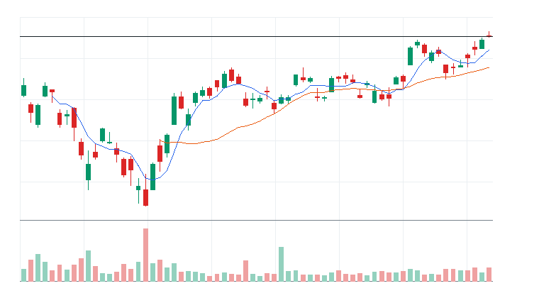
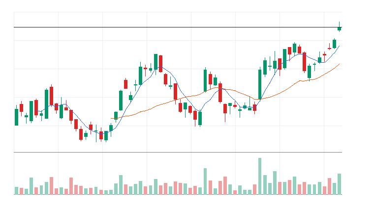
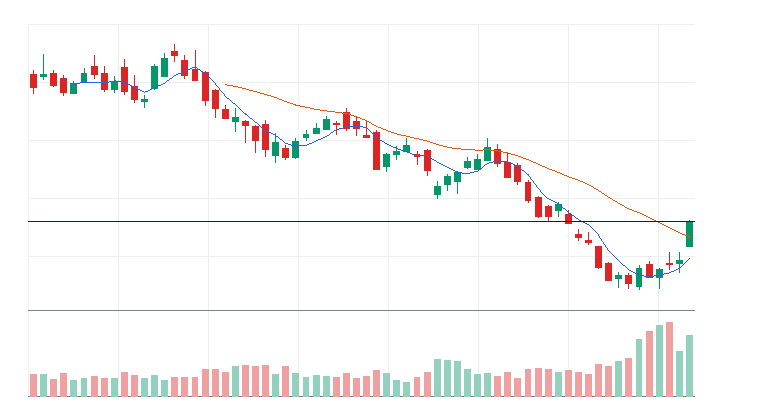

# 오늘의 데일리 트레이딩 요약

**REAL DATA TEST - 가격/거래량은 실제 데이터, 뉴스/ETF 구성종목 확산도/거래대금 유동성 일부 연결**

**목적:** 이 리포트는 최근 오른 자산을 나열하는 것이 아니라, 돈이 몰리는 근거와 다음 매수 주체가 확인할 트레이딩 후보를 찾기 위한 보고서다.

> 핵심 질문: 현재 가격에서 누가 사고 있고, 누가 앞으로 더 비싸게 사줄 수 있는가?

## 시장 국면 판단

- 최종 판정: 기간 조정 (81점)
- 전일 대비: 기간 조정 유지, 점수 변화는 제한적이다(+1점).
- 판정 신뢰도: 높음 (100점) - 핵심 지수와 매크로 데이터가 대부분 직접 수집되어 판정 신뢰도가 높다.
- 행동 바이어스: 추격 보류, 돌파 확인
- 한 줄 결론: 장기 추세는 유지되지만 단기 추세가 둔화되어 기간 조정으로 본다. 기술 100점, 매크로 47점.
- 기술적 지표: 상승 추세 우위 (100점, 가중치 65%)
- S&P 500: 100점 | 50일선 위, 200일선 위, 20일 +1.89%, 60일 +4.00%, 52주 고점 대비 -0.33% -> 기술 점수 100
- Nasdaq 100: 100점 | 50일선 위, 200일선 위, 20일 +5.82%, 60일 +7.00%, 52주 고점 대비 -0.44% -> 기술 점수 100
- 매크로 시황: 매크로 중립 (47점, 가중치 35%)
- 매크로 요약: 금리 부담으로 매크로 환경은 방어적이다.
- 금리: 부담 39점 / 금리 부담 / confidence HIGH
  - 주요 근거: US 10Y yield 20일 +9.63%, 5일 +0.27%; US 3M yield 20일 +6.94%, 단기금리 방향 확인; US long-duration bonds 20일 -5.99%, 장기채 가격 기준 할인율 부담 확인
  - 확인 사항: 장기금리 상승과 장기채 약세가 겹쳐 성장주 할인율 부담이 커질 수 있다.
- 물가: 중립 50점 / 물가 중립 / confidence HIGH
  - 주요 근거: Oil ETF 20일 -0.77%, 유가 기반 물가 압력 확인; TIPS ETF 20일 -2.68%, 물가연동채 흐름은 보조 근거; Gold 20일 -4.37%, 금 강세는 방어 수요 여부 확인
  - 확인 사항: 추가 확인 이벤트 없음
- 정책: 중립 50점 / 정책 이벤트 확인 전 중립 / confidence LOW
  - 주요 근거: 정책 톤은 1차 버전에서 일정/이벤트 리스크 기반 중립값으로 반영한다.
  - 확인 사항: FOMC, CPI, PCE, 고용지표 발표 전후에는 매크로 confidence를 보수적으로 해석한다.
- 신용/유동성: 중립 53점 / 신용/유동성 중립 / confidence HIGH
  - 주요 근거: High yield credit 20일 -2.34%, 하이일드 위험선호 확인; HYG-LQD 20일 상대강도 +0.83%, 신용위험 선호/회피 확인; VIX 20일 -4.52%, 변동성 부담 확인
  - 확인 사항: 추가 확인 이벤트 없음
- 환율/글로벌: 중립 45점 / 환율/글로벌 중립 / confidence MEDIUM
  - 주요 근거: US dollar 20일 +3.25%, 달러 강세/약세 확인
  - 확인 사항: 추가 확인 이벤트 없음
- US 10Y yield: 34점 | 하락 시 주식 우호; 5일 +0.27%, 20일 +9.63% -> 매크로 점수 34
- US 3M yield: 39점 | 하락 시 주식 우호; 5일 -0.69%, 20일 +6.94% -> 매크로 점수 39
- US long-duration bonds: 39점 | 상승 시 주식 우호; 5일 -1.21%, 20일 -5.99% -> 매크로 점수 39
- TIPS ETF: 50점 | 상승 시 주식 우호; 5일 +0.16%, 20일 -2.68% -> 매크로 점수 50
- Oil ETF: 50점 | 하락 시 주식 우호; 5일 +1.09%, 20일 -0.77% -> 매크로 점수 50
- Gold: 50점 | 상승 시 주식 우호; 5일 -0.16%, 20일 -4.37% -> 매크로 점수 50
- US dollar: 44점 | 하락 시 주식 우호; 5일 +0.52%, 20일 +3.25% -> 매크로 점수 44
- High yield credit: 46점 | 상승 시 주식 우호; 5일 -0.12%, 20일 -2.34% -> 매크로 점수 46
- Investment grade credit: 50점 | 상승 시 주식 우호; 5일 -0.26%, 20일 -3.17% -> 매크로 점수 50
- VIX: 62점 | 하락 시 주식 우호; 5일 -6.42%, 20일 -4.52% -> 매크로 점수 62
- 데이터 커버리지: 기술 2/2, 매크로 10/10
- 데이터 신뢰도 근거:
  - 직접 지수 데이터: S&P 500, Nasdaq 100
  - 대체 지수 데이터 없음
  - 매크로 데이터: 10/10
  - 누락 데이터 없음
  - stale 데이터 없음

## 모바일 요약

[오늘의 데일리 트레이딩 요약]

생성 성공 / 데이터 모드: REAL_TEST

시장:
- 중립

시장 지배 서사:
1. 사이버보안 지출 재가속 - 지배 - First Trust NASDAQ Cybersecurity ETF(CIBR), Amplify Cybersecurity ETF(HACK), Fortinet Inc.(FTNT), Zscaler Inc.(ZS) 중심으로 5일 +6.79%, 20일 +20.33% 흐름이 형성됨. 직접 촉매 일부 확인.
2. AI 소프트웨어/사이버보안 확산 - 약화 - Global X Artificial Intelligence & Technology ETF(AIQ), Invesco QQQ Trust(QQQ), Zscaler Inc.(ZS), Datadog Inc.(DDOG) 중심으로 5일 +4.91%, 20일 +13.95% 흐름이 형성됨. 직접 촉매 일부 확인.
3. 소프트웨어 실적/AI 수익화 - 관찰 - Global X Artificial Intelligence & Technology ETF(AIQ), Invesco QQQ Trust(QQQ), Shopify Inc.(SHOP), Strategy Inc.(MSTR) 중심으로 5일 +5.21%, 20일 +10.80% 흐름이 형성됨. 뉴스 직접성 제한.

트렌드 강도:
1. 사이버보안 지출 재가속 - TSI 79 - 부상 - 진입품질 보통
2. AI 소프트웨어/사이버보안 확산 - TSI 64 - 약화 - 진입품질 관찰
3. 소프트웨어 실적/AI 수익화 - TSI 61 - 약화 - 진입품질 관찰

오늘 결론:
- 클라우드/엔터프라이즈 소프트웨어 개별 종목 흐름이 ETF 대비 강한지 확인 필요
- 행동 후보는 linkedNarrative와 함께 확인한다.
- 추격보다 진입 조건 확인 후 접근한다.

오늘 실제 행동 후보:
1. Synopsys Inc.(SNPS)(STOCK) - AI 소프트웨어/사이버보안 확산 - 단기 추세가 유지되고 거래량이 1.0배 이상이면 눌림 이후 재상승을 시도할 수 있음
2. Advanced Micro Devices Inc.(AMD)(STOCK) - AI 인프라 재가속 - 52주 고점 부근이라 돌파가 확인되면 신고가 추종 매수가 붙을 수 있음
3. Fortinet Inc.(FTNT)(STOCK) - 사이버보안 지출 재가속 - 52주 고점 부근이라 돌파가 확인되면 신고가 추종 매수가 붙을 수 있음

다크호스 후보:
1. Zscaler Inc.(ZS) - darkHorseScore 77 - 베이스 돌파 직전

ETF 후보 TOP 5:
1. First Trust NASDAQ Cybersecurity ETF(CIBR) - 사이버보안 지출 재가속 - 조건부 진입
2. Global X Artificial Intelligence & Technology ETF(AIQ) - AI 소프트웨어/사이버보안 확산 - 관찰
3. Amplify Cybersecurity ETF(HACK) - 사이버보안 지출 재가속 - 제외
4. iShares Cybersecurity and Tech ETF(IHAK) - 사이버보안 지출 재가속 - 제외
5. Utilities Select Sector SPDR Fund(XLU) - 전력망/원전/인프라 병목 - 관찰

웹 리포트:
https://yoolcool.github.io/DailyTradingThesisAgent/

## 오늘 결론

- 오늘 결론: 조건부 진입
- 신규 진입 후보: 0개
- 조건부 진입 후보: 6개
- 관찰 후보: 121개
- 주요 제한 요인: Entry Quality < 40, RVOL 미달, 뉴스 직접성 부족
- 주문 판단: 시장가 금지 / 지정가 또는 관찰
- 실전 판단: 진입 후보는 있으나, 전일 고점 돌파와 거래량 확인 후 선별적으로 접근한다.

### 후보 제한 요인 집계

- RVOL < 1.00x: 117개
- 거래대금 유동성 낮음: 15개
- Entry Quality 50~54 near miss: 2개
- Entry Quality 40~49 관찰: 15개
- Entry Quality < 40: 137개
- Exhaustion Risk >= 70: 0개
- ETF breadth 샘플 부족: 37개
- 뉴스 직접성 부족: 99개

## 데이터 신뢰도

- 전체 데이터 신뢰도 등급: LOW
- 분석 신뢰도: LOW
- 주문 실행 신뢰도: LOW
- ETF breadth 신뢰도: LOW
- 신뢰도 해석: 테마 확산 판단 제한, 거래대금 유동성 낮음 또는 확인 불가, 프리/애프터마켓 확인 불가
- 리포트 생성 시각: 2026-10-07 11:09 KST
- 가격 기준 거래일: 2026-10-06 US regular close
- 뉴스 수집 시각: 2026-10-07 11:09 KST
- 가장 최근 뉴스 발행 시각: 2026-10-07 11:05 KST
- 뉴스 신선도 상태: FRESH
- 뉴스 소스: Yahoo Finance RSS, MarketWatch RSS, CNBC Markets RSS, SEC EDGAR RSS, Federal Reserve RSS, Finnhub API
- 뉴스 소스 상태: Yahoo Finance RSS CONNECTED, MarketWatch RSS CONNECTED, CNBC Markets RSS PARTIAL, SEC EDGAR RSS PARTIAL, Federal Reserve RSS CONNECTED, Finnhub API DISABLED
- 뉴스 신뢰도: MEDIUM
- 추천 적용 거래일: 2026-10-06 US regular session
- 가격/거래량 데이터 상태: 일부 연결
- 뉴스 데이터 상태: 일부 연결
- ETF 구성종목 확산도 상태: 일부 연결
- ETF 구성종목 샘플 수: 1~4
- 거래대금 유동성 데이터 상태: 일부 연결
- 프리/애프터마켓 데이터 상태: UNAVAILABLE
- 데이터 provider: yfinance, Yahoo Finance RSS, MarketWatch RSS, CNBC Markets RSS, SEC EDGAR RSS, Federal Reserve RSS, Finnhub API, config fallback sample, price-volume dollar-volume fallback
- 실전 사용 경고: 이 리포트는 투자판단 보조용이며, REAL_TEST 모드에서는 일부 데이터가 누락되거나 지연될 수 있다. 실제 주문 전 현재가, 뉴스, 프리마켓/정규장 거래량을 별도 확인해야 한다.

## 0. 시장 상태

- 데이터 모드: REAL_TEST
- 가격/거래량: 일부 연결
- 뉴스: 일부 연결
- ETF 구성종목 확산도: 일부 연결
- 거래대금 유동성: 일부 연결
- 생성 시각: 2026년 10월 7일 수요일 AM 11:09
- 시장 상태: 중립
- 오늘 돈의 방향: 클라우드/엔터프라이즈 소프트웨어 개별 종목 흐름이 ETF 대비 강한지 확인 필요
- 강한 테마 TOP 3: 사이버보안(91), 사이버보안 ETF(82), Basic Materials(75)
- 데이터 한계:
  - API 또는 provider 상태에 따라 뉴스/ETF 확산도/거래대금 유동성 반영 범위가 달라질 수 있다.
  - 수집 실패 데이터는 점수 반영에서 제외하거나 confidence를 제한한다.
  - reasonConfidence HIGH는 직접 촉매, 가격/거래량, 확산도/유동성 근거가 함께 있을 때만 사용한다.

## 오늘 시장을 지배하는 서사

### 오늘 시장을 지배하는 서사 TOP 3

#### 1. 사이버보안 지출 재가속
- 상태: 지배
- narrativeScore: 87
- reasonConfidence: MEDIUM
- 근거 ETF: CIBR, HACK, IHAK
- 근거 개별 종목: FTNT, ZS, PANW, CRWD
- 돈이 몰리는 이유: 사이버보안 지출 재가속 관련 First Trust NASDAQ Cybersecurity ETF(CIBR), Amplify Cybersecurity ETF(HACK), iShares Cybersecurity and Tech ETF(IHAK)와 Fortinet Inc.(FTNT), Zscaler Inc.(ZS), Palo Alto Networks Inc.(PANW), CrowdStrike Holdings Inc.(CRWD)의 5일(+6.79%)·20일(+20.33%) 흐름을 함께 본다. 평균 상대 거래량은 1.08배이고, ETF 확산도는 추가 확인이 필요하다. 직접 뉴스/이벤트가 일부 확인된다.
- 다음 매수 주체: 사이버보안 지출 재가속을 확인한 섹터 ETF 자금과 상대강도 추종 스윙 자금
- 가장 좋은 트레이딩 수단: ETF 우선: HACK, CIBR, IHAK / 개별 종목 우선: CRWD, ZS, PANW
- 서사가 깨지는 조건: HACK 20일선 이탈 또는 관련 종목 절반 이상 5일선 이탈
- 오늘 행동: 기존 네러티브와 중복을 확인한 뒤 ETF/대표 종목 동조성이 살아날 때만 관찰 편입

상세 narrativeScore 근거 보기

- rawScore: 87
- ETF 평균 moneyFlowScore: 72
- 개별 종목 평균 moneyFlowScore: 91
- ETF 후보 비율: 75%
- 개별 종목 후보 비율: 50%
- 5일 평균 수익률: +7.00%
- 20일 평균 수익률: +20.00%
- 평균 상대 거래량: 1.00배
- ETF 평균 상대 거래량: 1.00배
- 개별주 평균 상대 거래량: 1.00배
- 52주 고점 근접 후보 비율: 75%
- 뉴스 직접성 점수: 12
- ETF 확산도 점수: 0
- 유동성 점수: 1
- 과열 리스크 차감: 0

#### 2. AI 소프트웨어/사이버보안 확산
- 상태: 약화
- narrativeScore: 57
- reasonConfidence: LOW
- 근거 ETF: AIQ, QQQ, IGV
- 근거 개별 종목: ZS, DDOG, TEAM, PLTR, MSFT
- 돈이 몰리는 이유: AI 소프트웨어/사이버보안 확산 관련 Global X Artificial Intelligence & Technology ETF(AIQ), Invesco QQQ Trust(QQQ), iShares Expanded Tech-Software Sector ETF(IGV)와 Zscaler Inc.(ZS), Datadog Inc.(DDOG), Atlassian Corporation(TEAM), Palantir Technologies Inc.(PLTR)의 5일(+4.91%)·20일(+13.95%) 흐름을 함께 본다. 평균 상대 거래량은 0.89배이고, ETF 확산도는 추가 확인이 필요하다. 직접 뉴스/이벤트가 일부 확인된다.
- 다음 매수 주체: AI 소프트웨어 실적 기대를 사는 ETF 자금, 엔터프라이즈 소프트웨어 스윙 트레이더, 신고가 추종 자금
- 가장 좋은 트레이딩 수단: ETF 우선: IGV, AIQ, QQQ / 개별 종목 우선: PLTR, DDOG, TEAM
- 서사가 깨지는 조건: IGV/AIQ 20일선 이탈, 관련 소프트웨어 종목 절반 이상 5일선 이탈, 상대 거래량 둔화
- 오늘 행동: 추격보다 눌림 후 재상승 확인

상세 narrativeScore 근거 보기

- rawScore: 57
- ETF 평균 moneyFlowScore: 54
- 개별 종목 평균 moneyFlowScore: 61
- ETF 후보 비율: 33%
- 개별 종목 후보 비율: 20%
- 5일 평균 수익률: +5.00%
- 20일 평균 수익률: +14.00%
- 평균 상대 거래량: 1.00배
- ETF 평균 상대 거래량: 1.00배
- 개별주 평균 상대 거래량: 1.00배
- 52주 고점 근접 후보 비율: 63%
- 뉴스 직접성 점수: 8
- ETF 확산도 점수: 0
- 유동성 점수: 2
- 과열 리스크 차감: 0

#### 3. 소프트웨어 실적/AI 수익화
- 상태: 관찰
- narrativeScore: 55
- reasonConfidence: LOW
- 근거 ETF: AIQ, QQQ, IGV
- 근거 개별 종목: SHOP, MSTR, MSFT
- 돈이 몰리는 이유: 소프트웨어 실적/AI 수익화 관련 Global X Artificial Intelligence & Technology ETF(AIQ), Invesco QQQ Trust(QQQ), iShares Expanded Tech-Software Sector ETF(IGV)와 Shopify Inc.(SHOP), Strategy Inc.(MSTR), Microsoft Corporation(MSFT)의 5일(+5.21%)·20일(+10.80%) 흐름을 함께 본다. 평균 상대 거래량은 0.93배이고, ETF 확산도는 추가 확인이 필요하다. 뉴스 직접성은 아직 제한적이다.
- 다음 매수 주체: 소프트웨어 실적/AI 수익화을 확인한 섹터 ETF 자금과 상대강도 추종 스윙 자금
- 가장 좋은 트레이딩 수단: ETF 우선: IGV, AIQ, QQQ / 개별 종목 우선: MSTR, MSFT, SHOP
- 서사가 깨지는 조건: IGV 20일선 이탈 또는 관련 종목 절반 이상 5일선 이탈
- 오늘 행동: 기존 네러티브와 중복을 확인한 뒤 ETF/대표 종목 동조성이 살아날 때만 관찰 편입

상세 narrativeScore 근거 보기

- rawScore: 55
- ETF 평균 moneyFlowScore: 52
- 개별 종목 평균 moneyFlowScore: 59
- ETF 후보 비율: 25%
- 개별 종목 후보 비율: 0%
- 5일 평균 수익률: +5.00%
- 20일 평균 수익률: +11.00%
- 평균 상대 거래량: 1.00배
- ETF 평균 상대 거래량: 1.00배
- 개별주 평균 상대 거래량: 1.00배
- 52주 고점 근접 후보 비율: 57%
- 뉴스 직접성 점수: 10
- ETF 확산도 점수: 0
- 유동성 점수: 3
- 과열 리스크 차감: 0

### 전체 narrative 요약

| 서사명 | 상태 | narrativeScore | reasonConfidence | 대표 ETF | 대표 종목 | 오늘 행동 |
| --- | --- | ---: | --- | --- | --- | --- |
| 사이버보안 지출 재가속 | 지배 | 87 | MEDIUM | CIBR, HACK, IHAK | FTNT, ZS, PANW, CRWD | 기존 네러티브와 중복을 확인한 뒤 ETF/대표 종목 동조성이 살아날 때만 관찰 편입 |
| AI 소프트웨어/사이버보안 확산 | 약화 | 57 | LOW | AIQ, QQQ, IGV | ZS, DDOG, TEAM, PLTR | 추격보다 눌림 후 재상승 확인 |
| 소프트웨어 실적/AI 수익화 | 관찰 | 55 | LOW | AIQ, QQQ, IGV | SHOP, MSTR, MSFT | 기존 네러티브와 중복을 확인한 뒤 ETF/대표 종목 동조성이 살아날 때만 관찰 편입 |
| AI 인프라 재가속 | 약화 | 40 | LOW | AIQ, SOXX, SMH | AMD, PWR, GEV, NVDA | 추격보다 5일선 지지 후 재상승 확인 |
| 반도체 설계/공급망 재가속 | 약화 | 38 | LOW | AIQ, SOXQ, SOXX | AMD, ARM, INTC, QCOM | 기존 네러티브와 중복을 확인한 뒤 ETF/대표 종목 동조성이 살아날 때만 관찰 편입 |
| 반도체 장비 사이클 재평가 | 약화 | 34 | LOW | AIQ, SOXQ, SOXX | ASML, LRCX | 기존 네러티브와 중복을 확인한 뒤 ETF/대표 종목 동조성이 살아날 때만 관찰 편입 |
| 전력망/원전/인프라 병목 | 소멸 | 33 | LOW | URA, GRID, PAVE | PWR, CEG, GEV, ETN | ETF 확산도와 거래량이 같이 살아날 때만 진입 |
| 전력 유틸리티 수요 재평가 | 약화 | 30 | LOW | QQQ, SPY, IWM | GEV, ETN, VRT | 기존 네러티브와 중복을 확인한 뒤 ETF/대표 종목 동조성이 살아날 때만 관찰 편입 |
| 위험선호 성장주 재진입 | 약화 | 26 | LOW | IPO, QQQ, ARKK | ARM, TSLA, COIN | 지수 위험선호가 유지될 때만 선별 진입 |
| Internet Content 자금 유입 | 약화 | 25 | LOW | QQQ | META, GOOGL, GOOG | 기존 네러티브와 중복을 확인한 뒤 ETF/대표 종목 동조성이 살아날 때만 관찰 편입 |
| 소비 회복/방어주 선별 | 약화 | 22 | LOW | QQQ | AMZN, PDD | 기존 네러티브와 중복을 확인한 뒤 ETF/대표 종목 동조성이 살아날 때만 관찰 편입 |
| Medical Devices 자금 유입 | 약화 | 22 | LOW | QQQ | ISRG, DXCM | 기존 네러티브와 중복을 확인한 뒤 ETF/대표 종목 동조성이 살아날 때만 관찰 편입 |
| Integrated Oil & Gas 자금 유입 | 약화 | 21 | LOW | QQQ, SPY, IWM | XOM, CVX | 기존 네러티브와 중복을 확인한 뒤 ETF/대표 종목 동조성이 살아날 때만 관찰 편입 |
| 필수소비재 음료 방어 성장 | 약화 | 18 | LOW | QQQ | CCEP, MNST | 기존 네러티브와 중복을 확인한 뒤 ETF/대표 종목 동조성이 살아날 때만 관찰 편입 |
| Data Storage 자금 유입 | 소멸 | 13 | LOW | QQQ, SPY, IWM | STX, WDC | 기존 네러티브와 중복을 확인한 뒤 ETF/대표 종목 동조성이 살아날 때만 관찰 편입 |
| Travel Services 자금 유입 | 소멸 | 13 | LOW | QQQ | BKNG, ABNB | 기존 네러티브와 중복을 확인한 뒤 ETF/대표 종목 동조성이 살아날 때만 관찰 편입 |
| 매크로 방어/헤지 | 소멸 | 12 | LOW | XLE, GLD, TLT | XOM, CVX | 위험회피가 확인될 때만 헤지성 접근 |
| Specialty Business Services 자금 유입 | 약화 | 12 | LOW | QQQ, SPY, IWM | TRI, CTAS, CPRT | 기존 네러티브와 중복을 확인한 뒤 ETF/대표 종목 동조성이 살아날 때만 관찰 편입 |
| 바이오/헬스케어 촉매 | 소멸 | 10 | LOW | QQQ | ALNY, GILD | 기존 네러티브와 중복을 확인한 뒤 ETF/대표 종목 동조성이 살아날 때만 관찰 편입 |
| Aerospace & Defense 자금 유입 | 소멸 | 9 | LOW | QQQ, SPY, IWM | KTOS, AVAV | 기존 네러티브와 중복을 확인한 뒤 ETF/대표 종목 동조성이 살아날 때만 관찰 편입 |
| 방산/안보 프리미엄 | 소멸 | 0 | LOW | XAR, SHLD, ITA | PLTR, KTOS, AVAV | 뉴스 촉매가 직접 확인될 때만 추세 추종 |
| 비트코인/디지털 자산 위험선호 | 약화 | 0 | LOW | IBIT, BLOK | MSTR, COIN, IREN | 비트코인 베타가 살아날 때만 단기 매매 |
| Bitcoin Mining 자금 유입 | 소멸 | 0 | LOW | IBIT, BLOK | RIOT, MARA, CIFR | 기존 네러티브와 중복을 확인한 뒤 ETF/대표 종목 동조성이 살아날 때만 관찰 편입 |

## 트렌드 강도 판단

### 1. 사이버보안 지출 재가속
- Trend Strength Index: 79
- 트렌드 상태 라벨: 부상
- 테마 확산도: 강함
- ETF 동조성: 강함
- 거래량 강도: 약함
- 과열 위험: 보통 (31)
- 오늘 진입 품질: 보통 (56)
- 한 줄 판단: 사이버보안 지출 재가속는 가격, 거래량, ETF, 확산도가 함께 확인되어 테마 단위 자금 유입이 선명하다.
- 오늘 접근법: First Trust NASDAQ Cybersecurity ETF(CIBR)/Amplify Cybersecurity ETF(HACK)/iShares Cybersecurity and Tech ETF(IHAK) 거래량 증가와 Fortinet Inc.(FTNT)/Zscaler Inc.(ZS)/Palo Alto Networks Inc.(PANW) 확산을 확인하며 작은 사이즈의 초기 진입 후보로만 본다.

트렌드 강도 상세 근거 보기

- 가격 모멘텀: 가격 모멘텀 25/25. 평균 5D +6.79%, 20D +20.33%.
- 거래량 강도: 거래량 강도 9/20. 평균 RVOL 1.08배.
- ETF 동조성: ETF 동조성 16/15. 관련 ETF Amplify Cybersecurity ETF(HACK), First Trust NASDAQ Cybersecurity ETF(CIBR), iShares Cybersecurity and Tech ETF(IHAK), iShares Expanded Tech-Software Sector ETF(IGV) 흐름을 기준으로 판단.
- 테마 확산도: 테마 확산도 16/20. 상위 1~2개 쏠림 감점 0점 반영.
- 뉴스 촉매: 뉴스/촉매 신선도 7/10. HIGH 직접 촉매 2개.
- 과열 리스크: 과열 리스크 31/100. 단기 급등, 고점 근접, ETF-개별주 괴리, 쏠림을 함께 반영.
- 시장 환경: 시장 환경 6/10. QQQ/SPY/IWM 가격 흐름 기반 위험선호 점수.

### 2. AI 소프트웨어/사이버보안 확산
- Trend Strength Index: 64
- 트렌드 상태 라벨: 약화
- 테마 확산도: 보통
- ETF 동조성: 강함
- 거래량 강도: 부족
- 과열 위험: 낮음 (7)
- 오늘 진입 품질: 관찰 (49)
- 한 줄 판단: AI 소프트웨어/사이버보안 확산는 Trend Strength는 중간이지만 진입 품질이 살아나는 초기 진입 후보 성격이다.
- 오늘 접근법: 상승률이 남아 있어도 Global X Artificial Intelligence & Technology ETF(AIQ)/Invesco QQQ Trust(QQQ)/iShares Expanded Tech-Software Sector ETF(IGV)와 구성 종목 확산도가 회복될 때까지 신규 진입은 낮춘다.

트렌드 강도 상세 근거 보기

- 가격 모멘텀: 가격 모멘텀 21/25. 평균 5D +4.91%, 20D +13.95%.
- 거래량 강도: 거래량 강도 5/20. 평균 RVOL 0.89배.
- ETF 동조성: ETF 동조성 15/15. 관련 ETF iShares Expanded Tech-Software Sector ETF(IGV), Global X Artificial Intelligence & Technology ETF(AIQ), Invesco QQQ Trust(QQQ) 흐름을 기준으로 판단.
- 테마 확산도: 테마 확산도 14/20. 상위 1~2개 쏠림 감점 0점 반영.
- 뉴스 촉매: 뉴스/촉매 신선도 3/10. HIGH 직접 촉매 1개.
- 과열 리스크: 과열 리스크 7/100. 단기 급등, 고점 근접, ETF-개별주 괴리, 쏠림을 함께 반영.
- 시장 환경: 시장 환경 6/10. QQQ/SPY/IWM 가격 흐름 기반 위험선호 점수.

### 3. 소프트웨어 실적/AI 수익화
- Trend Strength Index: 61
- 트렌드 상태 라벨: 약화
- 테마 확산도: 보통
- ETF 동조성: 강함
- 거래량 강도: 부족
- 과열 위험: 낮음 (8)
- 오늘 진입 품질: 관찰 (44)
- 한 줄 판단: 소프트웨어 실적/AI 수익화는 Trend Strength는 중간이지만 진입 품질이 살아나는 초기 진입 후보 성격이다.
- 오늘 접근법: 상승률이 남아 있어도 Global X Artificial Intelligence & Technology ETF(AIQ)/Invesco QQQ Trust(QQQ)/iShares Expanded Tech-Software Sector ETF(IGV)와 구성 종목 확산도가 회복될 때까지 신규 진입은 낮춘다.

트렌드 강도 상세 근거 보기

- 가격 모멘텀: 가격 모멘텀 21/25. 평균 5D +5.21%, 20D +10.80%.
- 거래량 강도: 거래량 강도 4/20. 평균 RVOL 0.93배.
- ETF 동조성: ETF 동조성 15/15. 관련 ETF iShares Expanded Tech-Software Sector ETF(IGV), Global X Artificial Intelligence & Technology ETF(AIQ), Invesco QQQ Trust(QQQ), Roundhill Magnificent Seven ETF(MAGS) 흐름을 기준으로 판단.
- 테마 확산도: 테마 확산도 14/20. 상위 1~2개 쏠림 감점 0점 반영.
- 뉴스 촉매: 뉴스/촉매 신선도 1/10. HIGH 직접 촉매 0개.
- 과열 리스크: 과열 리스크 8/100. 단기 급등, 고점 근접, ETF-개별주 괴리, 쏠림을 함께 반영.
- 시장 환경: 시장 환경 6/10. QQQ/SPY/IWM 가격 흐름 기반 위험선호 점수.

## 최근 추천 결과 트래킹

개별주는 데이트레이딩 관점으로 추천 이후 첫 정규장의 장중 최고가와 종가를 추적한다. ETF는 테마/스윙 관점으로 추천 이후 1주일 동안의 최고가와 현재 종가를 추적한다.

### 개별주 Top 3 추천 성과 요약
- 최근 5개 리포트 표본: 10개 (초기 검증 단계)
- 장중 최고가 기준 성공률: +28.57%
- 종가 기준 성공률: +14.29%
- 평균 장중 최고 수익률: +1.10%
- 평균 종가 수익률: -1.91%

### ETF 추천 성과 요약
- 최근 5개 리포트 표본: 3개 (초기 검증 단계)
- 1주 최고가 기준 성공률: 0.00%
- 현재 종가 기준 성공률: +33.33%
- 평균 1주 최고 수익률: +1.41%
- 평균 현재 수익률: +0.77%

최근 추천 결과 상세 테이블 펼치기

| 추천일 | 유형 | 순위 | 티커 | 기준가 | 추적 기간 | 상태 | High 수익률 | Close 수익률 | 결과 | 코멘트 |
| --- | --- | ---: | --- | ---: | --- | --- | ---: | ---: | --- | --- |
| 2026-10-07 | STOCK | 3 | FTNT | $191.27 | 2026-10-07 | pending | 데이터 없음 | 데이터 없음 | 추적 대기 | 아직 추적 거래일 데이터가 완성되지 않음 |
| 2026-10-07 | STOCK | 2 | AMD | $649.42 | 2026-10-07 | pending | 데이터 없음 | 데이터 없음 | 추적 대기 | 아직 추적 거래일 데이터가 완성되지 않음 |
| 2026-10-07 | STOCK | 1 | SNPS | $505.17 | 2026-10-07 | pending | 데이터 없음 | 데이터 없음 | 추적 대기 | 아직 추적 거래일 데이터가 완성되지 않음 |
| 2026-10-07 | ETF | 1 | CIBR | $108.13 | 2026-10-07~2026-10-14 | in_progress | 데이터 없음 | 0.00% | 진행 중 | 아직 1주 추적 기간이 끝나지 않음 (일봉 high 미확보 시 close 기준 보조) |
| 2026-10-06 | STOCK | 2 | TSM | $485.8 | 2026-10-06 | complete | +0.04% | -0.72% | 실패 | 추천 이후 의미 있는 장중 기회가 부족하고 종가도 약함 (일봉 기준) |
| 2026-10-06 | STOCK | 1 | SNPS | $488.47 | 2026-10-06 | complete | +3.90% | +3.42% | 성공 | 장중 기회와 종가 유지가 모두 확인됨 (일봉 기준) |
| 2026-10-06 | ETF | 1 | CIBR | $106.01 | 2026-10-06~2026-10-13 | in_progress | 데이터 없음 | +2.00% | 진행 중 | 아직 1주 추적 기간이 끝나지 않음 (일봉 high 미확보 시 close 기준 보조) |
| 2026-10-05 | STOCK | 1 | SNPS | $489.9 | 2026-10-05 | complete | +3.77% | -0.29% | 단타 유효 | 장중 기회는 있었지만 종가 유지력은 약함 (일봉 기준) |
| 2026-10-05 | ETF | 1 | SMH | $630.6 | 2026-10-05~2026-10-12 | in_progress | +1.41% | +0.30% | 진행 중 | 아직 1주 추적 기간이 끝나지 않음 |
| 2026-09-30 | STOCK | 1 | AMAT | $512.01 | 2026-09-30 | complete | +0.67% | -0.12% | 실패 | 추천 이후 의미 있는 장중 기회가 부족하고 종가도 약함 (일봉 기준) |
| 2026-09-28 | STOCK | 3 | DDOG | $268.13 | 2026-09-28 | complete | +1.74% | +0.21% | 제한적 유효 | 제한적인 장중 기회만 발생 (일봉 기준) |
| 2026-09-28 | STOCK | 2 | ARM | $310.32 | 2026-09-28 | complete | -1.02% | -8.70% | 실패 | 추천 이후 의미 있는 장중 기회가 부족하고 종가도 약함 (일봉 기준) |
| 2026-09-28 | STOCK | 1 | QCOM | $201.97 | 2026-09-28 | complete | -1.39% | -7.17% | 실패 | 추천 이후 의미 있는 장중 기회가 부족하고 종가도 약함 (일봉 기준) |
| 2026-09-25 | STOCK | 3 | ARM | $332.56 | 2026-09-25 | complete | -2.13% | -6.69% | 실패 | 추천 이후 의미 있는 장중 기회가 부족하고 종가도 약함 (일봉 기준) |
| 2026-09-25 | STOCK | 2 | CRWD | $262.49 | 2026-09-25 | complete | -1.00% | -3.95% | 실패 | 추천 이후 의미 있는 장중 기회가 부족하고 종가도 약함 (일봉 기준) |
| 2026-09-25 | STOCK | 1 | PLTR | $191.79 | 2026-09-25 | complete | +1.26% | -1.11% | 제한적 유효 | 제한적인 장중 기회만 발생 (일봉 기준) |
| 2026-09-23 | STOCK | 3 | MARA | $13.28 | 2026-09-23 | complete | +2.79% | +0.53% | 제한적 유효 | 제한적인 장중 기회만 발생 (일봉 기준) |
| 2026-09-23 | STOCK | 2 | CIFR | $18.9 | 2026-09-23 | complete | +3.49% | -2.91% | 단타 유효 | 장중 기회는 있었지만 종가 유지력은 약함 (일봉 기준) |
| 2026-09-23 | STOCK | 1 | RIOT | $24.18 | 2026-09-23 | complete | +4.51% | +2.11% | 성공 | 장중 기회와 종가 유지가 모두 확인됨 (일봉 기준) |
| 2026-09-23 | ETF | 3 | ARKK | $90.72 | 2026-09-23~2026-09-30 | complete | +1.63% | -0.25% | 진행 중 | 아직 1주 추적 기간이 끝나지 않음 |
| 2026-09-23 | ETF | 2 | MAGS | $72.97 | 2026-09-23~2026-09-30 | complete | -0.29% | +1.27% | 진행 중 | 아직 1주 추적 기간이 끝나지 않음 |
| 2026-09-23 | ETF | 1 | SMH | $596.03 | 2026-09-23~2026-09-30 | complete | +2.89% | +6.12% | 성공 | 추천 이후 테마 추세가 유지됨 |
| 2026-09-22 | STOCK | 3 | CRWD | $237.65 | 2026-09-22 | complete | +5.53% | +5.22% | 성공 | 장중 기회와 종가 유지가 모두 확인됨 (일봉 기준) |
| 2026-09-22 | STOCK | 2 | RIOT | $23.75 | 2026-09-22 | complete | +6.91% | +4.97% | 성공 | 장중 기회와 종가 유지가 모두 확인됨 (일봉 기준) |
| 2026-09-22 | STOCK | 1 | AMD | $559.82 | 2026-09-22 | complete | +11.56% | +11.42% | 성공 | 장중 기회와 종가 유지가 모두 확인됨 (일봉 기준) |
| 2026-09-21 | STOCK | 3 | CRWD | $237.65 | 2026-09-21 | complete | +5.33% | +4.92% | 성공 | 장중 기회와 종가 유지가 모두 확인됨 (일봉 기준) |
| 2026-09-21 | STOCK | 2 | RIOT | $23.75 | 2026-09-21 | complete | +5.55% | +1.81% | 성공 | 장중 기회와 종가 유지가 모두 확인됨 (일봉 기준) |
| 2026-09-21 | STOCK | 1 | AMD | $559.82 | 2026-09-21 | complete | +10.16% | +9.95% | 성공 | 장중 기회와 종가 유지가 모두 확인됨 (일봉 기준) |
| 2026-09-17 | STOCK | 3 | QCOM | $187.8 | 2026-09-17 | complete | +2.19% | +0.48% | 제한적 유효 | 제한적인 장중 기회만 발생 (일봉 기준) |
| 2026-09-17 | STOCK | 2 | FTNT | $172.37 | 2026-09-17 | complete | +2.16% | +0.12% | 제한적 유효 | 제한적인 장중 기회만 발생 (일봉 기준) |
| 2026-09-17 | STOCK | 1 | CRWD | $242.49 | 2026-09-17 | complete | +3.23% | +1.32% | 성공 | 장중 기회와 종가 유지가 모두 확인됨 (일봉 기준) |
| 2026-09-15 | STOCK | 1 | AMD | $516.13 | 2026-09-15 | complete | -0.48% | -2.31% | 실패 | 추천 이후 의미 있는 장중 기회가 부족하고 종가도 약함 (일봉 기준) |
| 2026-09-14 | STOCK | 1 | AMD | $516.13 | 2026-09-14 | complete | -3.44% | -4.40% | 실패 | 추천 이후 의미 있는 장중 기회가 부족하고 종가도 약함 (일봉 기준) |
| 2026-09-11 | STOCK | 2 | META | $653.69 | 2026-09-11 | complete | +1.61% | -0.87% | 제한적 유효 | 제한적인 장중 기회만 발생 (일봉 기준) |
| 2026-09-11 | STOCK | 1 | AMD | $521.1 | 2026-09-11 | complete | -0.01% | -0.95% | 실패 | 추천 이후 의미 있는 장중 기회가 부족하고 종가도 약함 (일봉 기준) |
| 2026-09-10 | STOCK | 3 | TSM | $439 | 2026-09-10 | complete | -1.47% | -2.50% | 실패 | 추천 이후 의미 있는 장중 기회가 부족하고 종가도 약함 (일봉 기준) |
| 2026-09-10 | STOCK | 2 | AMD | $505.74 | 2026-09-10 | complete | +2.09% | -0.42% | 제한적 유효 | 제한적인 장중 기회만 발생 (일봉 기준) |
| 2026-09-10 | STOCK | 1 | CEG | $299.05 | 2026-09-10 | complete | -1.41% | -4.37% | 실패 | 추천 이후 의미 있는 장중 기회가 부족하고 종가도 약함 (일봉 기준) |
| 2026-09-10 | ETF | 1 | DRAM | $61.1 | 2026-09-10~2026-09-17 | complete | -1.73% | -2.59% | 실패 | 추천 이후 ETF 흐름이 약화됨 |
| 2026-09-09 | STOCK | 1 | MU | $1,016.59 | 2026-09-09 | complete | +2.54% | +1.10% | 제한적 유효 | 제한적인 장중 기회만 발생 (일봉 기준) |
| 2026-09-08 | STOCK | 1 | MU | $1,016.59 | 2026-09-08 | complete | +2.41% | -1.61% | 제한적 유효 | 제한적인 장중 기회만 발생 (일봉 기준) |
| 2026-09-07 | STOCK | 1 | MU | $1,016.59 | 2026-09-07 | pending | 데이터 없음 | 데이터 없음 | 추적 대기 | 아직 추적 거래일 데이터가 완성되지 않음 |
| 2026-09-04 | STOCK | 1 | ALNY | $267.4 | 2026-09-04 | complete | -0.21% | -0.48% | 실패 | 추천 이후 의미 있는 장중 기회가 부족하고 종가도 약함 (일봉 기준) |
| 2026-09-04 | ETF | 1 | OIH | $436.58 | 2026-09-04~2026-09-11 | complete | +0.81% | -10.33% | 실패 | 추천 이후 ETF 흐름이 약화됨 |
| 2026-09-03 | STOCK | 1 | CVX | $211.05 | 2026-09-03 | complete | +1.02% | +0.13% | 제한적 유효 | 제한적인 장중 기회만 발생 (일봉 기준) |
| 2026-09-02 | STOCK | 1 | CVX | $211.05 | 2026-09-02 | complete | +0.82% | +0.35% | 추적 대기 | 아직 추적 거래일 데이터가 완성되지 않음 (일봉 기준) |
| 2026-09-01 | STOCK | 3 | PANW | $382.13 | 2026-09-01 | complete | -1.63% | -5.24% | 실패 | 추천 이후 의미 있는 장중 기회가 부족하고 종가도 약함 (일봉 기준) |
| 2026-09-01 | STOCK | 2 | ZS | $188.39 | 2026-09-01 | complete | -1.06% | -5.32% | 실패 | 추천 이후 의미 있는 장중 기회가 부족하고 종가도 약함 (일봉 기준) |
| 2026-09-01 | STOCK | 1 | CRWD | $231 | 2026-09-01 | complete | +0.13% | -6.90% | 실패 | 추천 이후 의미 있는 장중 기회가 부족하고 종가도 약함 (일봉 기준) |
| 2026-09-01 | ETF | 1 | CIBR | $100.15 | 2026-09-01~2026-09-08 | complete | -4.15% | +7.97% | 진행 중 | 아직 1주 추적 기간이 끝나지 않음 |
| 2026-08-31 | STOCK | 3 | MSFT | $513.53 | 2026-08-31 | complete | -0.26% | -1.22% | 실패 | 추천 이후 의미 있는 장중 기회가 부족하고 종가도 약함 (일봉 기준) |
| 2026-08-31 | STOCK | 2 | WDAY | $204.72 | 2026-08-31 | complete | -0.53% | -3.55% | 실패 | 추천 이후 의미 있는 장중 기회가 부족하고 종가도 약함 (일봉 기준) |
| 2026-08-31 | STOCK | 1 | CRWD | $218.4 | 2026-08-31 | complete | +7.09% | +5.77% | 성공 | 장중 기회와 종가 유지가 모두 확인됨 (일봉 기준) |
| 2026-08-31 | ETF | 1 | IGV | $109.5 | 2026-08-31~2026-09-07 | complete | -0.70% | +1.52% | 진행 중 | 아직 1주 추적 기간이 끝나지 않음 |
| 2026-08-28 | STOCK | 3 | ZS | $187.3 | 2026-08-28 | complete | +0.47% | -1.64% | 실패 | 추천 이후 의미 있는 장중 기회가 부족하고 종가도 약함 (일봉 기준) |
| 2026-08-28 | STOCK | 2 | ADSK | $270.58 | 2026-08-28 | complete | -1.32% | -3.67% | 실패 | 추천 이후 의미 있는 장중 기회가 부족하고 종가도 약함 (일봉 기준) |
| 2026-08-28 | STOCK | 1 | ADBE | $289.15 | 2026-08-28 | complete | +1.71% | +0.82% | 제한적 유효 | 제한적인 장중 기회만 발생 (일봉 기준) |
| 2026-08-28 | ETF | 3 | IBIT | $45.29 | 2026-08-28~2026-09-04 | complete | +2.38% | +7.07% | 성공 | 추천 이후 테마 추세가 유지됨 |
| 2026-08-28 | ETF | 2 | CIBR | $100.79 | 2026-08-28~2026-09-04 | complete | -0.35% | +7.28% | 진행 중 | 아직 1주 추적 기간이 끝나지 않음 |
| 2026-08-28 | ETF | 1 | IGV | $110.32 | 2026-08-28~2026-09-04 | complete | +0.23% | +0.76% | 진행 중 | 아직 1주 추적 기간이 끝나지 않음 |

## 오늘 실제 행동 후보

### 1. Synopsys Inc.(SNPS)
- 자산 유형: STOCK
- linkedNarrative: AI 소프트웨어/사이버보안 확산
- narrativeStatus: 약화
- narrativeScore: 57
- Trend Strength Index: 64
- Exhaustion Risk: 7 (낮음)
- Entry Quality Score: 56 (보통)
- 트렌드 판단: 시장 위험선호가 약해 시장 환경 비우호 구간이다.
- moneyFlowScore: 100
- finalRawScore: 104
- reasonConfidence: HIGH
- reasonConfidenceExplanation: 직접 촉매: Yahoo Finance RSS / mna / stale / positive - Synopsys (SNPS) Has a Strong Design Business. Is Its Growth Worth the Premium? 가격/거래량, 관련 ETF 동반 강세, 유동성 근거가 함께 확인되어 HIGH로 분류했다.
- tieBreakerReason: 최종 원점수 104, 리스크 패널티 -6, 5일 수익률 +21.70%, 상대 거래량 1.15배 순으로 정렬
- 후보별 시장 해석: 중립 / 제한적 - 특이 충돌 없음
- 게이트 사유: 통과
- 주문 실행: 시장가 가능
- 직접 촉매: Yahoo Finance RSS / mna / stale / positive - Synopsys (SNPS) Has a Strong Design Business. Is Its Growth Worth the Premium?
- 왜 돈이 몰리는가: 20일 +28.86%, 5일 +21.70%, 상대 거래량 1.15배로 가격과 거래량이 함께 개선. 뉴스: Yahoo Finance RSS mna/stale / 유동성: LIQUID
- 누가 더 비싸게 사줄 수 있는지: 개별 주도주를 따라붙는 단기 모멘텀 자금과 관련 ETF 강세를 확인한 트레이더
- 진입 조건: 20일선 위 눌림 후 재상승 확인
- 무효화 조건: 20일선 이탈 또는 상대 거래량 0.8배 이하 둔화
- todayActionLabel: 조건부 진입
#### 최근 뉴스/동향 한국어 요약

- 요약: 종목 직접 뉴스 확인 상태이며 뉴스 흐름은 긍정 우위입니다. 후보 선정 후 재확인한 핵심 이슈는 "Synopsys (SNPS) Has a Strong Design Business. Is Its Growth Worth the Premium?"입니다.
- 직접 촉매 판단: Synopsys Inc.에 대해 직접 촉매로 분류된 뉴스가 확인됐습니다. 핵심은 "Synopsys (SNPS) Has a Strong Design Business. Is Its Growth Worth the Premium?"이며, M&A 재료로 봅니다.
- 뉴스 1: Synopsys (SNPS) Has a Strong Design Business. Is Its Growth Worth the Premium?
  - 내용: Synopsys Inc. 관련 M&A 뉴스입니다. 기사 스니펫상 핵심 내용은 Synopsys, Inc.입니다.
  - 투자 의미: M&A 재료는 실적 가시성이나 밸류에이션 기대에 영향을 줄 수 있어 규모와 일정 확인이 중요합니다.
  - 확인할 점: M&A의 금액, 기간, 실적 반영 시점
- 뉴스 2: What Is Driving The Move In Synopsys Stock?
  - 내용: Synopsys Inc. 관련 기사는 What Is Driving The Move In Synopsys Stock? 이슈를 다루며, 주가 변동률 +12.80%, 동반 비교 수치 +0.20%를 핵심 내용으로 봅니다.
  - 투자 의미: Synopsys Inc.의 당일 상대강도 확인에는 도움이 되지만, 실적/가이던스 같은 새 펀더멘털 변화로 보기는 어렵습니다.
  - 확인할 점: 거래량 동반 여부, 장중 고점 유지, 관련 ETF 동반 강세
- 뉴스 3: Where Could Synopsys Stock Be A Year From Now?
  - 내용: Synopsys Inc. 관련 시장 일반 뉴스입니다. 기사 스니펫상 핵심 내용은 Synopsys (SNPS) updated its long-term growth targets at its Investor Day on September 30, 2026.입니다.
  - 투자 의미: 단기 긍정 뉴스 흐름으로 볼 수 있지만, 단독 매수 근거보다는 가격·거래량 조건을 확인하는 보조 근거로 사용합니다.
  - 확인할 점: 원문 수치, 후속 보도, 가격이 진입 조건을 지키는지
- 매매 해석: 매매 관점에서는 뉴스 자체보다 가격이 진입 조건을 지키는지, 거래량이 동반되는지, 그리고 뉴스가 이미 주가에 반영됐는지를 우선 확인해야 합니다.
- 차트: 

### 2. Advanced Micro Devices Inc.(AMD)
- 자산 유형: STOCK
- linkedNarrative: AI 인프라 재가속
- narrativeStatus: 약화
- narrativeScore: 40
- Trend Strength Index: 57
- Exhaustion Risk: 3 (낮음)
- Entry Quality Score: 56 (보통)
- 트렌드 판단: 시장 위험선호가 약해 시장 환경 비우호 구간이다.
- moneyFlowScore: 100
- finalRawScore: 103
- reasonConfidence: HIGH
- reasonConfidenceExplanation: 직접 촉매: Yahoo Finance RSS / contract / under_24h / positive - AMD vs. Marvell Technology: Which AI Chip Stock Is a Better Buy in 2026? 가격/거래량, 관련 ETF 동반 강세, 유동성 근거가 함께 확인되어 HIGH로 분류했다.
- tieBreakerReason: 최종 원점수 103, 리스크 패널티 0, 5일 수익률 +6.89%, 상대 거래량 1.09배 순으로 정렬
- 후보별 시장 해석: 중립 / 제한적 - 고점 근처 추격 리스크
- 게이트 사유: 통과
- 주문 실행: 시장가 가능
- 직접 촉매: Yahoo Finance RSS / contract / under_24h / positive - AMD vs. Marvell Technology: Which AI Chip Stock Is a Better Buy in 2026?
- 왜 돈이 몰리는가: 20일 +28.41%, 5일 +6.89%, 상대 거래량 1.09배로 가격과 거래량이 함께 개선. 뉴스: Yahoo Finance RSS contract/under_24h / 유동성: LIQUID
- 누가 더 비싸게 사줄 수 있는지: 개별 주도주를 따라붙는 단기 모멘텀 자금과 관련 ETF 강세를 확인한 트레이더
- 진입 조건: 전일 고점 돌파와 5일선 유지 확인
- 무효화 조건: 20일선 이탈 또는 상대 거래량 0.8배 이하 둔화
- todayActionLabel: 조건부 진입
#### 최근 뉴스/동향 한국어 요약

- 요약: 종목 직접 뉴스 확인 상태이며 뉴스 흐름은 긍정 우위입니다. 후보 선정 후 재확인한 핵심 이슈는 "AMD vs. Marvell Technology: Which AI Chip Stock Is a Better Buy in 2026?"입니다.
- 직접 촉매 판단: Advanced Micro Devices Inc.에 대해 직접 촉매로 분류된 뉴스가 확인됐습니다. 핵심은 "AMD vs. Marvell Technology: Which AI Chip Stock Is a Better Buy in 2026?"이며, 계약/수주 재료로 봅니다.
- 뉴스 1: AMD vs. Marvell Technology: Which AI Chip Stock Is a Better Buy in 2026?
  - 내용: Advanced Micro Devices Inc. 관련 계약/수주 뉴스입니다. 기사 스니펫상 핵심 내용은 AMD sells its own AI GPUs and server processors to data centers, and Marvell designs the custom chips and networking hardware that cloud providers order to their own specs.입니다.
  - 투자 의미: 계약/수주 재료는 실적 가시성이나 밸류에이션 기대에 영향을 줄 수 있어 규모와 일정 확인이 중요합니다.
  - 확인할 점: 계약/수주의 금액, 기간, 실적 반영 시점
- 뉴스 2: AMD (AMD) Could Issue 320 Million Shares at a Penny. Here is What Has to Happen First
  - 내용: Advanced Micro Devices Inc. 관련 기사는 AMD (AMD) Could Issue 320 Million Shares at a Penny. Here is What Has to Happen First 이슈를 다루며, 주가 변동률 +198.69%를 핵심 내용으로 봅니다.
  - 투자 의미: Advanced Micro Devices Inc.의 당일 상대강도 확인에는 도움이 되지만, 실적/가이던스 같은 새 펀더멘털 변화로 보기는 어렵습니다.
  - 확인할 점: 거래량 동반 여부, 장중 고점 유지, 관련 ETF 동반 강세
- 뉴스 3: 3 Reasons Why You Should Still Buy AMD Stock at a $1 Trillion Valuation
  - 내용: Advanced Micro Devices Inc. 관련 실적 뉴스입니다. 기사 스니펫상 핵심 내용은 AMD's 2027 data center growth, rising AI-driven CPU demand, and fast earnings growth make it worth owning even at $1 trillion.입니다.
  - 투자 의미: 실적/가이던스 재료는 다음 분기 기대치 변화로 이어질 수 있어 컨센서스 변화와 주가 반응 지속성을 함께 봅니다.
  - 확인할 점: 매출/마진/가이던스 수치, 컨센서스 대비 차이
- 매매 해석: 매매 관점에서는 뉴스 자체보다 가격이 진입 조건을 지키는지, 거래량이 동반되는지, 그리고 뉴스가 이미 주가에 반영됐는지를 우선 확인해야 합니다.
- 차트: 

### 3. Fortinet Inc.(FTNT)
- 자산 유형: STOCK
- linkedNarrative: 사이버보안 지출 재가속
- narrativeStatus: 지배
- narrativeScore: 87
- Trend Strength Index: 79
- Exhaustion Risk: 31 (보통)
- Entry Quality Score: 51 (관찰)
- 트렌드 판단: 시장 위험선호가 약해 시장 환경 비우호 구간이다.
- moneyFlowScore: 100
- finalRawScore: 108
- reasonConfidence: HIGH
- reasonConfidenceExplanation: 직접 촉매: Yahoo Finance RSS / earnings / under_72h / positive - Fortinet vs. CrowdStrike: Both Grew 26%. Why Pay Four Times the Earnings Multiple? 가격/거래량, 관련 ETF 동반 강세, 유동성 근거가 함께 확인되어 HIGH로 분류했다.
- tieBreakerReason: 최종 원점수 108, 리스크 패널티 0, 5일 수익률 +8.70%, 상대 거래량 1.06배 순으로 정렬
- 후보별 시장 해석: 중립 / 제한적 - 고점 근처 추격 리스크
- 게이트 사유: 통과
- 주문 실행: 지정가 권장
- 직접 촉매: Yahoo Finance RSS / earnings / under_72h / positive - Fortinet vs. CrowdStrike: Both Grew 26%. Why Pay Four Times the Earnings Multiple?
- 왜 돈이 몰리는가: 20일 +21.46%, 5일 +8.70%, 상대 거래량 1.06배로 가격과 거래량이 함께 개선. 뉴스: Yahoo Finance RSS earnings/under_72h / 유동성: ACCEPTABLE
- 누가 더 비싸게 사줄 수 있는지: 개별 주도주를 따라붙는 단기 모멘텀 자금과 관련 ETF 강세를 확인한 트레이더
- 진입 조건: 전일 고점 돌파와 5일선 유지 확인
- 무효화 조건: 20일선 이탈 또는 상대 거래량 0.8배 이하 둔화
- todayActionLabel: 조건부 진입
#### 최근 뉴스/동향 한국어 요약

- 요약: 종목 직접 뉴스 확인 상태이며 뉴스 흐름은 긍정 우위입니다. 후보 선정 후 재확인한 핵심 이슈는 "Fortinet vs. CrowdStrike: Both Grew 26%. Why Pay Four Times the Earnings Multiple?"입니다.
- 직접 촉매 판단: Fortinet Inc.에 대해 직접 촉매로 분류된 뉴스가 확인됐습니다. 핵심은 "Fortinet vs. CrowdStrike: Both Grew 26%. Why Pay Four Times the Earnings Multiple?"이며, 실적 재료로 봅니다.
- 뉴스 1: Fortinet vs. CrowdStrike: Both Grew 26%. Why Pay Four Times the Earnings Multiple?
  - 내용: Fortinet Inc. 관련 기사는 Fortinet vs. CrowdStrike: Both Grew 26%. Why Pay Four Times the Earnings Multiple? 이슈를 다루며, 주가 변동률 +26.00%를 핵심 내용으로 봅니다.
  - 투자 의미: Fortinet Inc.의 당일 상대강도 확인에는 도움이 되지만, 실적/가이던스 같은 새 펀더멘털 변화로 보기는 어렵습니다.
  - 확인할 점: 거래량 동반 여부, 장중 고점 유지, 관련 ETF 동반 강세
- 뉴스 2: Fortinet to Announce Third Quarter 2026 Financial Results
  - 내용: Fortinet Inc. 관련 시장 일반 뉴스입니다. 기사 스니펫상 핵심 내용은 SUNNYVALE, Calif., Oct.입니다.
  - 투자 의미: 단기 긍정 뉴스 흐름으로 볼 수 있지만, 단독 매수 근거보다는 가격·거래량 조건을 확인하는 보조 근거로 사용합니다.
  - 확인할 점: 원문 수치, 후속 보도, 가격이 진입 조건을 지키는지
- 뉴스 3: Why Fortinet (FTNT) Outpaced the Stock Market Today
  - 내용: Fortinet Inc. 관련 기사는 Why Fortinet (FTNT) Outpaced the Stock Market Today 이슈를 다루며, 주가 변동률 +1.25%를 핵심 내용으로 봅니다.
  - 투자 의미: Fortinet Inc.의 당일 상대강도 확인에는 도움이 되지만, 실적/가이던스 같은 새 펀더멘털 변화로 보기는 어렵습니다.
  - 확인할 점: 거래량 동반 여부, 장중 고점 유지, 관련 ETF 동반 강세
- 매매 해석: 매매 관점에서는 뉴스 자체보다 가격이 진입 조건을 지키는지, 거래량이 동반되는지, 그리고 뉴스가 이미 주가에 반영됐는지를 우선 확인해야 합니다.
- 차트: 

## 다크호스 후보

> 메인 행동 후보를 대체하지 않는 보조 관찰 섹션이다. 상위 서사 안에서 아직 과열되지 않았지만 초기 추세 전환, 베이스 돌파, 거래량 회복이 시작되는 개별주만 표시한다.

### 1. Zscaler Inc.(ZS)
- 소속 서사: 사이버보안 지출 재가속
- darkHorseScore: 77 (다크호스 후보)
- 단계: 베이스 돌파 직전
- Confidence: MEDIUM
- 5D / 20D / RVOL: +7.01% / +31.07% / 1.30x
- MA 구조: 종가 $212.25 / MA5 $201.77 / MA20 $195.61
- 선정 이유: ZS는 사이버보안 지출 재가속 서사에 속하고 종가가 MA20 위에 있으며 MA5/MA20 정렬이 개선되고 있다. 최근 15거래일 베이스는 상단 돌파 직전 상태이고, RVOL 1.30x로 거래량 확인은 충분하다. Exhaustion Risk 31로 아직 메인 후보 대비 과열 상한 안에 있다.
- 확인 조건: 최근 15거래일 고점 $216.97 돌파, MA5 위 종가 유지, 관련 ETF 동반 강세
- 무효화 조건: MA20 $195.61 종가 이탈, 최근 스윙 저점 $187.67 이탈, RVOL 0.80x 이하 둔화
- 왜 아직 메인이 아닌가: Entry Quality 45 < 50, 최근 고점 돌파 확인 전
#### 최근 뉴스/동향 한국어 요약

- 요약: 후보 선정 후 재확인 뉴스 데이터 없음

darkHorseScore 상세 근거 보기

- 서사 정렬: 20/20
- 초기 추세 구조: 24/30
- 베이스 돌파/정돈: 12/20
- 거래량 확인: 10/15
- 낮은 과열: 8/10
- 유동성 리스크 보정: 3/5
- 리스크 차감: -0
- rawScore: 77

- 차트: 

## 오늘 돈이 몰리는 테마

- 사이버보안: PANW, CRWD, FTNT, ZS | 평균 moneyFlowScore 91 | 단일 종목 이벤트보다 테마 단위 자금 흐름이 선명한 구간으로 본다.
- 사이버보안 ETF: CIBR, HACK, IHAK | 평균 moneyFlowScore 82 | 단일 종목 이벤트보다 테마 단위 자금 흐름이 선명한 구간으로 본다.
- Basic Materials: LIN | 평균 moneyFlowScore 75 | 단일 종목 이벤트보다 테마 단위 자금 흐름이 선명한 구간으로 본다.
- AI 소프트웨어 ETF: AIQ | 평균 moneyFlowScore 71 | 추세는 확인되지만 선별 진입이 필요한 중간 강도의 테마로 본다.
- AI 반도체: NVDA, AVGO, AMD, ASML, ARM, MRVL, TSM | 평균 moneyFlowScore 60 | 관심은 유지하되 우선순위는 낮추고 추가 거래량 확인을 기다린다.
- IPO/신규상장 ETF: IPO | 평균 moneyFlowScore 56 | 관심은 유지하되 우선순위는 낮추고 추가 거래량 확인을 기다린다.

## 1. ETF 트레이딩 보고서
### 1-1. ETF 결론
- ETF 우선 후보: 없음
- ETF 관찰 후보: Roundhill Memory ETF(DRAM), VanEck Semiconductor ETF(SMH), iShares Semiconductor ETF(SOXX), Invesco PHLX Semiconductor ETF(SOXQ), iShares Expanded Tech-Software Sector ETF(IGV)
- ETF 매매 금지: Roundhill Memory ETF(DRAM), iShares U.S. Aerospace & Defense ETF(ITA), SPDR S&P Aerospace & Defense ETF(XAR), Global X Defense Tech ETF(SHLD), Invesco Aerospace & Defense ETF(PPA)
- 오늘 ETF 최우선 1개: First Trust NASDAQ Cybersecurity ETF(CIBR) - 전일 고점 돌파와 5일선 유지 확인
- ETF 섹션 해석: 이 섹션은 개별 종목 선택이 아니라 테마/섹터 단위 자금 흐름을 ETF로 매매할지 판단하기 위한 영역이다.

### 1-2. ETF 후보 TOP 5

선정 기준: ETF 후보는 가격/거래량 1차 점수에 뉴스, ETF 구성종목 확산도, 유동성, 리스크 패널티를 반영한 finalRawScore 기준으로 정렬한다. 표시 점수 100점 후보가 겹치면 tieBreakerReason으로 우선순위를 설명한다.

### [ETF] First Trust NASDAQ Cybersecurity ETF(CIBR)
- 자산 유형: ETF
- ETF 세부 카테고리: 사이버보안 ETF
- ETF 역할: 테마 베타 매수
- 상태: 진입 후보
- linkedNarrative: 사이버보안 지출 재가속
- narrativeStatus: 지배
- narrativeScore: 87
- moneyFlowScore: 90
- finalRawScore: 90
- tieBreakerReason: 최종 원점수 90, 리스크 패널티 0, 5일 수익률 +6.04%, 상대 거래량 1.29배 순으로 정렬
- 과열 리스크: 낮음
- reasonConfidence: MEDIUM
- reasonConfidenceExplanation: ETF 확산도 제한 때문에 HIGH가 아니라 MEDIUM으로 제한했다.

- todayActionLabel: 조건부 진입
- 주문 실행: 지정가 권장
- 기준일: 2026-10-06
- 종가: $108.13
- 1일 수익률: +2.00%
- 5일 수익률: +6.04%
- 20일 수익률: +15.02%
- 상대 거래량: 1.29배
- 52주 고점 대비 위치: -0.86%
- whyMoneyIsFlowing: 20일 +15.02%, 5일 +6.04%, 상대 거래량 1.29배로 가격과 거래량이 함께 개선. 뉴스: CNBC Markets RSS general_market/under_6h / 유동성: ACCEPTABLE
- likelyNextBuyer: 섹터 베타를 노리는 단기 모멘텀 자금과 리밸런싱 자금
- whyThisCouldTradeHigher: 52주 고점 부근이라 돌파가 확인되면 신고가 추종 매수가 붙을 수 있음
#### 최근 뉴스/동향 한국어 요약

- 요약: 섹터/테마 뉴스 중심 상태이며 뉴스 흐름은 긍정 우위입니다. 후보 선정 후 재확인한 핵심 이슈는 "Google makes a fresh bet on nuclear power as the AI energy crunch intensifies"입니다.
- 직접 촉매 판단: First Trust NASDAQ Cybersecurity ETF에 대해 강한 직접 촉매는 확인되지 않았습니다.
- 뉴스 1: CrowdStrike Advances 3% on Agentic Security Accelerator With Amazon and NVIDIA; Palo Alto and Zscaler Gain 4%
  - 내용: First Trust NASDAQ Cybersecurity ETF 관련 기사는 CrowdStrike Advances 3% on Agentic Security Accelerator With Amazon and NVIDIA; Palo Alto and Zscaler Gain 4% 이슈를 다루며, 주가 변동률 +3.00%, 동반 비교 수치 +4.00%를 핵심 내용으로 봅니다.
  - 투자 의미: First Trust NASDAQ Cybersecurity ETF의 당일 상대강도 확인에는 도움이 되지만, 실적/가이던스 같은 새 펀더멘털 변화로 보기는 어렵습니다.
  - 확인할 점: 거래량 동반 여부, 장중 고점 유지, 관련 ETF 동반 강세
- 뉴스 2: Cybersecurity Stocks Rally While Large-Cap Tech Slides: CrowdStrike, Palo Alto, Okta, and Palantir Each Gain 4%
  - 내용: First Trust NASDAQ Cybersecurity ETF 관련 기사는 Cybersecurity Stocks Rally While Large-Cap Tech Slides: CrowdStrike, Palo Alto, Okta, and Palantir Each Gain 4% 이슈를 다루며, 주가 변동률 +4.00%를 핵심 내용으로 봅니다.
  - 투자 의미: First Trust NASDAQ Cybersecurity ETF의 당일 상대강도 확인에는 도움이 되지만, 실적/가이던스 같은 새 펀더멘털 변화로 보기는 어렵습니다.
  - 확인할 점: 거래량 동반 여부, 장중 고점 유지, 관련 ETF 동반 강세
- 뉴스 3: Cybersecurity stocks hit new highs as AI agents spark 'biggest risk today': Chart of the Day
  - 내용: First Trust NASDAQ Cybersecurity ETF 관련 시장 일반 뉴스입니다. 기사 스니펫상 핵심 내용은 Cybersecurity stocks are at all-time highs as agentic AI adoption spurs security spending.입니다.
  - 투자 의미: 단기 긍정 뉴스 흐름으로 볼 수 있지만, 단독 매수 근거보다는 가격·거래량 조건을 확인하는 보조 근거로 사용합니다.
  - 확인할 점: 원문 수치, 후속 보도, 가격이 진입 조건을 지키는지
- 매매 해석: 매매 관점에서는 뉴스 자체보다 가격이 진입 조건을 지키는지, 거래량이 동반되는지, 그리고 뉴스가 이미 주가에 반영됐는지를 우선 확인해야 합니다.
- 진입 조건: 전일 고점 돌파와 5일선 유지 확인
- 무효화 조건: 20일선 이탈 또는 상대 거래량 0.8배 이하 둔화
- 차트: 

#### 상세 근거

First Trust NASDAQ Cybersecurity ETF(CIBR) 상세 근거 펼치기

- moneyFlowScore(최종) 산정 근거:
  - moneyFlowScore(1차): 76
  - 최종 원점수: 90
  - 최종 표시 점수: 90
  - cap 적용: cap 미적용
  - 계산식: +76 + +12 + 0 + +2 + 0 + 0 + 0 = 90
  - 점수 해석: 강한 자금 유입 후보. 단, 과열 여부 확인 필수.
  - 가격/거래량 1차 점수: +76
    - 추세: +19
    - 단기 모멘텀: +7
    - 중기 모멘텀: +10
    - 거래량: +14
    - 신고가 근접: +12
    - 이동평균: +14
  - 하위 점수 cap:
    - 가격 모멘텀: 원점수 +19, 상한 적용 +19 / 최대 25
    - 단기 모멘텀: 원점수 +7, 상한 적용 +7 / 최대 20
    - 중기 모멘텀: 원점수 +10, 상한 적용 +10 / 최대 16
    - 거래량: 원점수 +14, 상한 적용 +14 / 최대 20
    - 신고가 근접: 원점수 +12, 상한 적용 +12 / 최대 12
    - 이동평균: 원점수 +14, 상한 적용 +14 / 최대 14
  - 추가 데이터 가감점:
    - 뉴스: +12
    - 유동성: +2
  - ETF 확산도: 0
  - 리스크 패널티: 0
  - 주요 근거: 1차 76, 최종 원점수 90, 표시 90. 20일 수익률 강함, 5일 수익률 강함, 상대 거래량 증가. 주의: 큰 감점 제한적.
  - 리스크 패널티 산정 근거:
    - 총 리스크 패널티: 0
    - 리스크 등급: LOW
    - 감점된 리스크: 없음
    - 관찰 리스크: 주요 관찰 리스크 없음
    - 한 줄 해석: 직접 감점된 주요 리스크는 없지만 관찰 리스크는 계속 확인해야 한다.
- 데이터 사용 현황:
  - 가격/거래량: 사용
  - 뉴스: 사용
  - ETF 확산도: 일부 연결
  - 거래대금 유동성: 사용
  - 관련 ETF 상대강도: 사용
- 뉴스 확인:
  - 최근 뉴스 상태: 일부 연결
  - 뉴스 소스: CNBC Markets RSS, MarketWatch RSS
  - 소스별 상태: Yahoo Finance RSS CONNECTED; MarketWatch RSS CONNECTED; CNBC Markets RSS CONNECTED; SEC EDGAR RSS PARTIAL; Federal Reserve RSS CONNECTED; Finnhub API DISABLED
  - 긍정/중립/부정: 15/1/0
  - 직접성/방향성/신선도: 2/1/4
  - 강한 촉매 수: 1
  - 중요 공시 수: 0
  - 직접 촉매: 없음
  - 보조 뉴스: CNBC Markets RSS sector_theme / general_market / under_6h
  - 뉴스 수집 시각: 2026-10-07 11:09 KST
  - 가장 최근 뉴스 발행 시각: 2026-10-07 11:05 KST
  - 뉴스 신선도 상태: FRESH
  - 뉴스 이후 가격 반응: 긍정
  - 가격 반응 점수 제한: 뉴스 이후 가격 반응과 점수 제한 특이사항 없음
  - 핵심 뉴스 요약: Trump isn&apos;t ‘completely wrong’: Hormuz disruption is Asia’s problem, says Singapore&apos;s foreign minister
  - 원점수/상한 점수: +24 / +12
  - 점수 반영: +12
  - 주의: SEC EDGAR RSS: no matching RSS items; Finnhub API: FINNHUB_API_KEY not configured
- ETF 구성종목 확산도:
  - 구성종목 데이터 상태: 일부 연결
  - 샘플 수: 2/2
  - 샘플 신뢰도: INSUFFICIENT
  - 상승 종목 비율: 100%
  - 20일선 위 비율: 100%
  - 50일선 위 비율: 100%
  - 상위 기여 종목: MSFT, PLTR
  - 확산도 판단: SAMPLE_TOO_SMALL
  - 원점수/샘플 상한/반영 점수: 0 / 0 / 0
  - 점수 반영: 0
- 거래대금 유동성:
  - 데이터 상태: 일부 연결
  - 거래대금 기준 유동성: ACCEPTABLE
  - 거래대금: $260,744,682
  - 평균 거래대금: $202,392,328
  - 주문 영향: 지정가 권장
  - 매매 영향: 거래대금은 허용 가능하나 지정가를 우선한다
- reasonConfidence 근거: 가격/거래량, 뉴스, 거래대금 유동성, 관련 ETF 상대강도은 확인됐지만 일부 보조 데이터가 미연결 또는 fallback이라 중간으로 제한한다.
- 후보 선정 후 뉴스/동향 재확인:
  - 재확인 상태: 일부 연결
  - 재확인 시각: 2026-10-07 11:09 KST
  - 최근 발행 시각: 2026-10-07 05:24 KST
  - 신선도: FRESH
  - 출처: MarketWatch RSS, Yahoo Finance RSS, Federal Reserve RSS
  - 소스별 상태: Yahoo Finance RSS CONNECTED; MarketWatch RSS CONNECTED; CNBC Markets RSS FAILED; SEC EDGAR RSS PARTIAL; Federal Reserve RSS CONNECTED; Finnhub API DISABLED
  - 한국어 요약: 섹터/테마 뉴스 중심 상태이며 뉴스 흐름은 긍정 우위입니다. 후보 선정 후 재확인한 핵심 이슈는 "Google makes a fresh bet on nuclear power as the AI energy crunch intensifies"입니다.
  - 직접 촉매: 없음
  - 한국어 뉴스 요약 1: CrowdStrike Advances 3% on Agentic Security Accelerator With Amazon and NVIDIA; Palo Alto and Zscaler Gain 4%
    - 내용: First Trust NASDAQ Cybersecurity ETF 관련 기사는 CrowdStrike Advances 3% on Agentic Security Accelerator With Amazon and NVIDIA; Palo Alto and Zscaler Gain 4% 이슈를 다루며, 주가 변동률 +3.00%, 동반 비교 수치 +4.00%를 핵심 내용으로 봅니다.
    - 투자 의미: First Trust NASDAQ Cybersecurity ETF의 당일 상대강도 확인에는 도움이 되지만, 실적/가이던스 같은 새 펀더멘털 변화로 보기는 어렵습니다.
    - 확인할 점: 거래량 동반 여부, 장중 고점 유지, 관련 ETF 동반 강세
  - 한국어 뉴스 요약 2: Cybersecurity Stocks Rally While Large-Cap Tech Slides: CrowdStrike, Palo Alto, Okta, and Palantir Each Gain 4%
    - 내용: First Trust NASDAQ Cybersecurity ETF 관련 기사는 Cybersecurity Stocks Rally While Large-Cap Tech Slides: CrowdStrike, Palo Alto, Okta, and Palantir Each Gain 4% 이슈를 다루며, 주가 변동률 +4.00%를 핵심 내용으로 봅니다.
    - 투자 의미: First Trust NASDAQ Cybersecurity ETF의 당일 상대강도 확인에는 도움이 되지만, 실적/가이던스 같은 새 펀더멘털 변화로 보기는 어렵습니다.
    - 확인할 점: 거래량 동반 여부, 장중 고점 유지, 관련 ETF 동반 강세
  - 한국어 뉴스 요약 3: Cybersecurity stocks hit new highs as AI agents spark 'biggest risk today': Chart of the Day
    - 내용: First Trust NASDAQ Cybersecurity ETF 관련 시장 일반 뉴스입니다. 기사 스니펫상 핵심 내용은 Cybersecurity stocks are at all-time highs as agentic AI adoption spurs security spending.입니다.
    - 투자 의미: 단기 긍정 뉴스 흐름으로 볼 수 있지만, 단독 매수 근거보다는 가격·거래량 조건을 확인하는 보조 근거로 사용합니다.
    - 확인할 점: 원문 수치, 후속 보도, 가격이 진입 조건을 지키는지
  - 원문 헤드라인 1: Yahoo Finance RSS / earnings / under_24h / positive - CrowdStrike Advances 3% on Agentic Security Accelerator With Amazon and NVIDIA; Palo Alto and Zscaler Gain 4%
  - 원문 헤드라인 2: Yahoo Finance RSS / earnings / stale / positive - Cybersecurity Stocks Rally While Large-Cap Tech Slides: CrowdStrike, Palo Alto, Okta, and Palantir Each Gain 4%
  - 원문 헤드라인 3: Yahoo Finance RSS / general_market / under_24h / positive - Cybersecurity stocks hit new highs as AI agents spark 'biggest risk today': Chart of the Day
  - 주의: CNBC Markets RSS: HTTP 403 from https://www.cnbc.com/id/100003114/device/rss/rss.html; SEC EDGAR RSS: no matching RSS items; Finnhub API: FINNHUB_API_KEY not configured
- 차트 요약: 최근 20거래일 기준 5일선이 20일선 위에 있음
- 기준일 2026-10-06 | 종가 $108.13 | 1일 +2.00% | 5일 +6.04% | 20일 +15.02% | 상대 거래량 1.29배 | 52주 고점 대비 -0.86% | 데이터 소스: yfinance

### [ETF] Global X Artificial Intelligence & Technology ETF(AIQ)
- 자산 유형: ETF
- ETF 세부 카테고리: AI 소프트웨어 ETF
- ETF 역할: 테마 베타 매수
- 상태: 관찰
- linkedNarrative: AI 소프트웨어/사이버보안 확산
- narrativeStatus: 약화
- narrativeScore: 57
- moneyFlowScore: 71
- finalRawScore: 71
- tieBreakerReason: 최종 원점수 71, 리스크 패널티 0, 5일 수익률 +3.07%, 상대 거래량 1.41배 순으로 정렬
- 과열 리스크: 낮음
- reasonConfidence: MEDIUM
- reasonConfidenceExplanation: ETF 확산도 제한 때문에 HIGH가 아니라 MEDIUM으로 제한했다.

- todayActionLabel: 관찰
- 주문 실행: 지정가 권장
- 기준일: 2026-10-06
- 종가: $67.05
- 1일 수익률: +0.30%
- 5일 수익률: +3.07%
- 20일 수익률: +4.24%
- 상대 거래량: 1.41배
- 52주 고점 대비 위치: -4.57%
- whyMoneyIsFlowing: 20일 +4.24%, 5일 +3.07%, 상대 거래량 1.41배로 가격과 거래량이 함께 개선. 뉴스: CNBC Markets RSS general_market/under_6h / 유동성: ACCEPTABLE
- likelyNextBuyer: 섹터 베타를 노리는 단기 모멘텀 자금과 리밸런싱 자금
- whyThisCouldTradeHigher: 52주 고점 부근이라 돌파가 확인되면 신고가 추종 매수가 붙을 수 있음
#### 최근 뉴스/동향 한국어 요약

- 요약: 후보 선정 후 재확인 뉴스 데이터 없음
- 진입 조건: 전일 고점 돌파와 5일선 유지 확인
- 무효화 조건: 20일선 이탈 또는 상대 거래량 0.8배 이하 둔화
- 차트: 

#### 상세 근거

Global X Artificial Intelligence & Technology ETF(AIQ) 상세 근거 펼치기

- moneyFlowScore(최종) 산정 근거:
  - moneyFlowScore(1차): 57
  - 최종 원점수: 71
  - 최종 표시 점수: 71
  - cap 적용: cap 미적용
  - 계산식: +57 + +12 + 0 + +2 + 0 + 0 + 0 = 71
  - 점수 해석: 관심 후보. 눌림 또는 돌파 확인 후 진입 검토.
  - 가격/거래량 1차 점수: +57
    - 추세: +11
    - 단기 모멘텀: +3
    - 중기 모멘텀: +3
    - 거래량: +14
    - 신고가 근접: +12
    - 이동평균: +14
  - 하위 점수 cap:
    - 가격 모멘텀: 원점수 +11, 상한 적용 +11 / 최대 25
    - 단기 모멘텀: 원점수 +3, 상한 적용 +3 / 최대 20
    - 중기 모멘텀: 원점수 +3, 상한 적용 +3 / 최대 16
    - 거래량: 원점수 +14, 상한 적용 +14 / 최대 20
    - 신고가 근접: 원점수 +12, 상한 적용 +12 / 최대 12
    - 이동평균: 원점수 +14, 상한 적용 +14 / 최대 14
  - 추가 데이터 가감점:
    - 뉴스: +12
    - 유동성: +2
  - ETF 확산도: 0
  - 리스크 패널티: 0
  - 주요 근거: 1차 57, 최종 원점수 71, 표시 71. 상대 거래량 증가, 52주 고점 근처, 이동평균 위 추세 유지. 주의: 큰 감점 제한적.
  - 리스크 패널티 산정 근거:
    - 총 리스크 패널티: 0
    - 리스크 등급: LOW
    - 감점된 리스크: 없음
    - 관찰 리스크: 주요 관찰 리스크 없음
    - 한 줄 해석: 직접 감점된 주요 리스크는 없지만 관찰 리스크는 계속 확인해야 한다.
- 데이터 사용 현황:
  - 가격/거래량: 사용
  - 뉴스: 사용
  - ETF 확산도: 일부 연결
  - 거래대금 유동성: 사용
  - 관련 ETF 상대강도: 사용
- 뉴스 확인:
  - 최근 뉴스 상태: 일부 연결
  - 뉴스 소스: CNBC Markets RSS, MarketWatch RSS
  - 소스별 상태: Yahoo Finance RSS CONNECTED; MarketWatch RSS CONNECTED; CNBC Markets RSS CONNECTED; SEC EDGAR RSS PARTIAL; Federal Reserve RSS CONNECTED; Finnhub API DISABLED
  - 긍정/중립/부정: 15/1/0
  - 직접성/방향성/신선도: 2/1/4
  - 강한 촉매 수: 1
  - 중요 공시 수: 0
  - 직접 촉매: 없음
  - 보조 뉴스: CNBC Markets RSS sector_theme / general_market / under_6h
  - 뉴스 수집 시각: 2026-10-07 11:09 KST
  - 가장 최근 뉴스 발행 시각: 2026-10-07 11:05 KST
  - 뉴스 신선도 상태: FRESH
  - 뉴스 이후 가격 반응: 긍정
  - 가격 반응 점수 제한: 뉴스 이후 가격 반응과 점수 제한 특이사항 없음
  - 핵심 뉴스 요약: Trump isn&apos;t ‘completely wrong’: Hormuz disruption is Asia’s problem, says Singapore&apos;s foreign minister
  - 원점수/상한 점수: +24 / +12
  - 점수 반영: +12
  - 주의: SEC EDGAR RSS: no matching RSS items; Finnhub API: FINNHUB_API_KEY not configured
- ETF 구성종목 확산도:
  - 구성종목 데이터 상태: 일부 연결
  - 샘플 수: 4/4
  - 샘플 신뢰도: INSUFFICIENT
  - 상승 종목 비율: 100%
  - 20일선 위 비율: 100%
  - 50일선 위 비율: 100%
  - 상위 기여 종목: NVDA, MSFT, PLTR, AAPL
  - 확산도 판단: SAMPLE_TOO_SMALL
  - 원점수/샘플 상한/반영 점수: 0 / 0 / 0
  - 점수 반영: 0
- 거래대금 유동성:
  - 데이터 상태: 일부 연결
  - 거래대금 기준 유동성: ACCEPTABLE
  - 거래대금: $102,593,205
  - 평균 거래대금: $72,933,973
  - 주문 영향: 지정가 권장
  - 매매 영향: 거래대금은 허용 가능하나 지정가를 우선한다
- reasonConfidence 근거: 가격/거래량, 뉴스, 거래대금 유동성, 관련 ETF 상대강도은 확인됐지만 일부 보조 데이터가 미연결 또는 fallback이라 중간으로 제한한다.
- 후보 선정 후 뉴스/동향 재확인:
  - 재확인 상태: 데이터 없음
- 차트 요약: 최근 20거래일 기준 5일선이 20일선 위에 있음
- 기준일 2026-10-06 | 종가 $67.05 | 1일 +0.30% | 5일 +3.07% | 20일 +4.24% | 상대 거래량 1.41배 | 52주 고점 대비 -4.57% | 데이터 소스: yfinance

### [ETF] Amplify Cybersecurity ETF(HACK)
- 자산 유형: ETF
- ETF 세부 카테고리: 사이버보안 ETF
- ETF 역할: 테마 베타 매수
- 상태: 매매 금지
- linkedNarrative: 사이버보안 지출 재가속
- narrativeStatus: 지배
- narrativeScore: 87
- moneyFlowScore: 80
- finalRawScore: 80
- tieBreakerReason: 최종 원점수 80, 리스크 패널티 -5, 5일 수익률 +6.55%, 상대 거래량 1.49배 순으로 정렬
- 과열 리스크: 낮음~중간
- reasonConfidence: MEDIUM
- reasonConfidenceExplanation: ETF 확산도 제한 때문에 HIGH가 아니라 MEDIUM으로 제한했다.

- todayActionLabel: 제외
- 주문 실행: 추격 금지
- 기준일: 2026-10-06
- 종가: $127.66
- 1일 수익률: +2.14%
- 5일 수익률: +6.55%
- 20일 수익률: +15.86%
- 상대 거래량: 1.49배
- 52주 고점 대비 위치: -0.92%
- whyMoneyIsFlowing: 20일 +15.86%, 5일 +6.55%, 상대 거래량 1.49배로 가격과 거래량이 함께 개선. 뉴스: CNBC Markets RSS general_market/under_6h
- likelyNextBuyer: 섹터 베타를 노리는 단기 모멘텀 자금과 리밸런싱 자금
- whyThisCouldTradeHigher: 52주 고점 부근이라 돌파가 확인되면 신고가 추종 매수가 붙을 수 있음
#### 최근 뉴스/동향 한국어 요약

- 요약: 후보 선정 후 재확인 뉴스 데이터 없음
- 진입 조건: 전일 고점 돌파와 5일선 유지 확인
- 무효화 조건: 20일선 이탈 또는 상대 거래량 0.8배 이하 둔화
- 차트: 

#### 상세 근거

Amplify Cybersecurity ETF(HACK) 상세 근거 펼치기

- moneyFlowScore(최종) 산정 근거:
  - moneyFlowScore(1차): 78
  - 최종 원점수: 80
  - 최종 표시 점수: 80
  - cap 적용: cap 미적용
  - 계산식: +78 + +12 + 0 - 5 + 0 - 5 + 0 = 80
  - 점수 해석: 강한 자금 유입 후보. 단, 과열 여부 확인 필수.
  - 가격/거래량 1차 점수: +78
    - 추세: +20
    - 단기 모멘텀: +8
    - 중기 모멘텀: +10
    - 거래량: +14
    - 신고가 근접: +12
    - 이동평균: +14
  - 하위 점수 cap:
    - 가격 모멘텀: 원점수 +20, 상한 적용 +20 / 최대 25
    - 단기 모멘텀: 원점수 +8, 상한 적용 +8 / 최대 20
    - 중기 모멘텀: 원점수 +10, 상한 적용 +10 / 최대 16
    - 거래량: 원점수 +14, 상한 적용 +14 / 최대 20
    - 신고가 근접: 원점수 +12, 상한 적용 +12 / 최대 12
    - 이동평균: 원점수 +14, 상한 적용 +14 / 최대 14
  - 추가 데이터 가감점:
    - 뉴스: +12
    - 유동성: -5
  - ETF 확산도: 0
  - 리스크 패널티: -5
  - 주요 근거: 1차 78, 최종 원점수 80, 표시 80. 20일 수익률 강함, 5일 수익률 강함, 1일 단기 모멘텀 확인. 주의: 단기 과열/추격 위험 존재.
  - 리스크 패널티 산정 근거:
    - 총 리스크 패널티: -5
    - 리스크 등급: LOW
    - 감점된 리스크:
      - low liquidity: -5 | 근거: Liquidity signal: LOW. | 대응: Avoid market-order chasing.
    - 관찰 리스크: 주요 관찰 리스크 없음
    - 한 줄 해석: 1개 감점 리스크로 총 -5점 반영.
- 데이터 사용 현황:
  - 가격/거래량: 사용
  - 뉴스: 사용
  - ETF 확산도: 일부 연결
  - 거래대금 유동성: 사용
  - 관련 ETF 상대강도: 사용
- 뉴스 확인:
  - 최근 뉴스 상태: 일부 연결
  - 뉴스 소스: CNBC Markets RSS, MarketWatch RSS
  - 소스별 상태: Yahoo Finance RSS CONNECTED; MarketWatch RSS CONNECTED; CNBC Markets RSS CONNECTED; SEC EDGAR RSS PARTIAL; Federal Reserve RSS CONNECTED; Finnhub API DISABLED
  - 긍정/중립/부정: 15/1/0
  - 직접성/방향성/신선도: 2/1/4
  - 강한 촉매 수: 1
  - 중요 공시 수: 0
  - 직접 촉매: 없음
  - 보조 뉴스: CNBC Markets RSS sector_theme / general_market / under_6h
  - 뉴스 수집 시각: 2026-10-07 11:09 KST
  - 가장 최근 뉴스 발행 시각: 2026-10-07 11:05 KST
  - 뉴스 신선도 상태: FRESH
  - 뉴스 이후 가격 반응: 긍정
  - 가격 반응 점수 제한: 뉴스 이후 가격 반응과 점수 제한 특이사항 없음
  - 핵심 뉴스 요약: Trump isn&apos;t ‘completely wrong’: Hormuz disruption is Asia’s problem, says Singapore&apos;s foreign minister
  - 원점수/상한 점수: +24 / +12
  - 점수 반영: +12
  - 주의: SEC EDGAR RSS: no matching RSS items; Finnhub API: FINNHUB_API_KEY not configured
- ETF 구성종목 확산도:
  - 구성종목 데이터 상태: 일부 연결
  - 샘플 수: 2/2
  - 샘플 신뢰도: INSUFFICIENT
  - 상승 종목 비율: 100%
  - 20일선 위 비율: 100%
  - 50일선 위 비율: 100%
  - 상위 기여 종목: MSFT, PLTR
  - 확산도 판단: SAMPLE_TOO_SMALL
  - 원점수/샘플 상한/반영 점수: 0 / 0 / 0
  - 점수 반영: 0
- 거래대금 유동성:
  - 데이터 상태: 일부 연결
  - 거래대금 기준 유동성: LOW
  - 거래대금: $69,102,358
  - 평균 거래대금: $46,454,836
  - 주문 영향: 추격 금지
  - 매매 영향: 유동성 부족으로 추격 금지 또는 우선순위 하향
- reasonConfidence 근거: 가격/거래량, 뉴스, 거래대금 유동성, 관련 ETF 상대강도은 확인됐지만 일부 보조 데이터가 미연결 또는 fallback이라 중간으로 제한한다.
- 후보 선정 후 뉴스/동향 재확인:
  - 재확인 상태: 데이터 없음
- 차트 요약: 최근 20거래일 기준 5일선이 20일선 위에 있음
- 기준일 2026-10-06 | 종가 $127.66 | 1일 +2.14% | 5일 +6.55% | 20일 +15.86% | 상대 거래량 1.49배 | 52주 고점 대비 -0.92% | 데이터 소스: yfinance

### [ETF] iShares Cybersecurity and Tech ETF(IHAK)
- 자산 유형: ETF
- ETF 세부 카테고리: 사이버보안 ETF
- ETF 역할: 테마 베타 매수
- 상태: 매매 금지
- linkedNarrative: 사이버보안 지출 재가속
- narrativeStatus: 지배
- narrativeScore: 87
- moneyFlowScore: 76
- finalRawScore: 76
- tieBreakerReason: 최종 원점수 76, 리스크 패널티 -5, 5일 수익률 +6.10%, 상대 거래량 1.21배 순으로 정렬
- 과열 리스크: 낮음
- reasonConfidence: MEDIUM
- reasonConfidenceExplanation: ETF 확산도 제한 때문에 HIGH가 아니라 MEDIUM으로 제한했다.

- todayActionLabel: 제외
- 주문 실행: 추격 금지
- 기준일: 2026-10-06
- 종가: $70.74
- 1일 수익률: +1.58%
- 5일 수익률: +6.10%
- 20일 수익률: +13.60%
- 상대 거래량: 1.21배
- 52주 고점 대비 위치: -1.28%
- whyMoneyIsFlowing: 20일 +13.60%, 5일 +6.10%, 상대 거래량 1.21배로 가격과 거래량이 함께 개선. 뉴스: CNBC Markets RSS general_market/under_6h
- likelyNextBuyer: 섹터 베타를 노리는 단기 모멘텀 자금과 리밸런싱 자금
- whyThisCouldTradeHigher: 52주 고점 부근이라 돌파가 확인되면 신고가 추종 매수가 붙을 수 있음
#### 최근 뉴스/동향 한국어 요약

- 요약: 후보 선정 후 재확인 뉴스 데이터 없음
- 진입 조건: 전일 고점 돌파와 5일선 유지 확인
- 무효화 조건: 20일선 이탈 또는 상대 거래량 0.8배 이하 둔화
- 차트: 

#### 상세 근거

iShares Cybersecurity and Tech ETF(IHAK) 상세 근거 펼치기

- moneyFlowScore(최종) 산정 근거:
  - moneyFlowScore(1차): 74
  - 최종 원점수: 76
  - 최종 표시 점수: 76
  - cap 적용: cap 미적용
  - 계산식: +74 + +12 + 0 - 5 + 0 - 5 + 0 = 76
  - 점수 해석: 관심 후보. 눌림 또는 돌파 확인 후 진입 검토.
  - 가격/거래량 1차 점수: +74
    - 추세: +18
    - 단기 모멘텀: +7
    - 중기 모멘텀: +9
    - 거래량: +14
    - 신고가 근접: +12
    - 이동평균: +14
  - 하위 점수 cap:
    - 가격 모멘텀: 원점수 +18, 상한 적용 +18 / 최대 25
    - 단기 모멘텀: 원점수 +7, 상한 적용 +7 / 최대 20
    - 중기 모멘텀: 원점수 +9, 상한 적용 +9 / 최대 16
    - 거래량: 원점수 +14, 상한 적용 +14 / 최대 20
    - 신고가 근접: 원점수 +12, 상한 적용 +12 / 최대 12
    - 이동평균: 원점수 +14, 상한 적용 +14 / 최대 14
  - 추가 데이터 가감점:
    - 뉴스: +12
    - 유동성: -5
  - ETF 확산도: 0
  - 리스크 패널티: -5
  - 주요 근거: 1차 74, 최종 원점수 76, 표시 76. 20일 수익률 강함, 5일 수익률 강함, 상대 거래량 증가. 주의: 단기 과열/추격 위험 존재, ETF 구성종목 확산도 데이터 미연결.
  - 리스크 패널티 산정 근거:
    - 총 리스크 패널티: -5
    - 리스크 등급: LOW
    - 감점된 리스크:
      - low liquidity: -5 | 근거: Liquidity signal: LOW. | 대응: Avoid market-order chasing.
    - 관찰 리스크: ETF breadth data not connected
    - 한 줄 해석: 1개 감점 리스크로 총 -5점 반영.
- 데이터 사용 현황:
  - 가격/거래량: 사용
  - 뉴스: 사용
  - ETF 확산도: 미연결
  - 거래대금 유동성: 사용
  - 관련 ETF 상대강도: 사용
- 뉴스 확인:
  - 최근 뉴스 상태: 일부 연결
  - 뉴스 소스: CNBC Markets RSS, MarketWatch RSS
  - 소스별 상태: Yahoo Finance RSS CONNECTED; MarketWatch RSS CONNECTED; CNBC Markets RSS CONNECTED; SEC EDGAR RSS PARTIAL; Federal Reserve RSS CONNECTED; Finnhub API DISABLED
  - 긍정/중립/부정: 15/1/0
  - 직접성/방향성/신선도: 2/1/4
  - 강한 촉매 수: 1
  - 중요 공시 수: 0
  - 직접 촉매: 없음
  - 보조 뉴스: CNBC Markets RSS sector_theme / general_market / under_6h
  - 뉴스 수집 시각: 2026-10-07 11:09 KST
  - 가장 최근 뉴스 발행 시각: 2026-10-07 11:05 KST
  - 뉴스 신선도 상태: FRESH
  - 뉴스 이후 가격 반응: 긍정
  - 가격 반응 점수 제한: 뉴스 이후 가격 반응과 점수 제한 특이사항 없음
  - 핵심 뉴스 요약: Trump isn&apos;t ‘completely wrong’: Hormuz disruption is Asia’s problem, says Singapore&apos;s foreign minister
  - 원점수/상한 점수: +24 / +12
  - 점수 반영: +12
  - 주의: SEC EDGAR RSS: no matching RSS items; Finnhub API: FINNHUB_API_KEY not configured
- ETF 구성종목 확산도:
  - 구성종목 데이터 상태: 미연결
  - 샘플 수: 0/0
  - 샘플 신뢰도: UNKNOWN
  - 상승 종목 비율: 데이터 없음
  - 20일선 위 비율: 데이터 없음
  - 50일선 위 비율: 데이터 없음
  - 상위 기여 종목: 데이터 없음
  - 확산도 판단: UNKNOWN
  - 원점수/샘플 상한/반영 점수: 0 / N/A / 0
  - 점수 반영: 0
- 거래대금 유동성:
  - 데이터 상태: 일부 연결
  - 거래대금 기준 유동성: LOW
  - 거래대금: $13,030,308
  - 평균 거래대금: $10,788,557
  - 주문 영향: 추격 금지
  - 매매 영향: 유동성 부족으로 추격 금지 또는 우선순위 하향
- reasonConfidence 근거: 가격/거래량, 뉴스, 거래대금 유동성, 관련 ETF 상대강도은 확인됐지만 일부 보조 데이터가 미연결 또는 fallback이라 중간으로 제한한다.
- 후보 선정 후 뉴스/동향 재확인:
  - 재확인 상태: 데이터 없음
- 차트 요약: 최근 20거래일 기준 5일선이 20일선 위에 있음
- 기준일 2026-10-06 | 종가 $70.74 | 1일 +1.58% | 5일 +6.10% | 20일 +13.60% | 상대 거래량 1.21배 | 52주 고점 대비 -1.28% | 데이터 소스: yfinance

### [ETF] Utilities Select Sector SPDR Fund(XLU)
- 자산 유형: ETF
- ETF 세부 카테고리: 전력/유틸리티 ETF
- ETF 역할: 테마 베타 매수
- 상태: 관찰
- linkedNarrative: 전력망/원전/인프라 병목
- narrativeStatus: 소멸
- narrativeScore: 33
- moneyFlowScore: 49
- finalRawScore: 49
- tieBreakerReason: 최종 원점수 49, 리스크 패널티 0, 5일 수익률 +3.65%, 상대 거래량 1.62배 순으로 정렬
- 과열 리스크: 낮음
- reasonConfidence: MEDIUM
- reasonConfidenceExplanation: ETF 확산도 제한 때문에 HIGH가 아니라 MEDIUM으로 제한했다.

- todayActionLabel: 관찰
- 주문 실행: 시장가 가능
- 기준일: 2026-10-06
- 종가: $41.16
- 1일 수익률: +2.98%
- 5일 수익률: +3.65%
- 20일 수익률: -5.27%
- 상대 거래량: 1.62배
- 52주 고점 대비 위치: -13.89%
- whyMoneyIsFlowing: 20일 -5.27%, 5일 +3.65%, 상대 거래량 1.62배로 가격과 거래량이 함께 개선. 뉴스: CNBC Markets RSS general_market/under_6h / 유동성: LIQUID
- likelyNextBuyer: 섹터 베타를 노리는 단기 모멘텀 자금과 리밸런싱 자금
- whyThisCouldTradeHigher: 단기 추세가 유지되고 거래량이 1.0배 이상이면 눌림 이후 재상승을 시도할 수 있음
#### 최근 뉴스/동향 한국어 요약

- 요약: 후보 선정 후 재확인 뉴스 데이터 없음
- 진입 조건: 20일선 위 눌림 후 재상승 확인
- 무효화 조건: 20일선 이탈 또는 상대 거래량 0.8배 이하 둔화
- 차트: 

#### 상세 근거

Utilities Select Sector SPDR Fund(XLU) 상세 근거 펼치기

- moneyFlowScore(최종) 산정 근거:
  - moneyFlowScore(1차): 32
  - 최종 원점수: 49
  - 최종 표시 점수: 49
  - cap 적용: cap 미적용
  - 계산식: +32 + +12 + 0 + +5 + 0 + 0 + 0 = 49
  - 점수 해석: 매매 금지 또는 우선순위 낮은 후보.
  - 가격/거래량 1차 점수: +32
    - 추세: +1
    - 단기 모멘텀: +6
    - 중기 모멘텀: -3
    - 거래량: +18
    - 신고가 근접: 0
    - 이동평균: +10
  - 하위 점수 cap:
    - 가격 모멘텀: 원점수 +1, 상한 적용 +1 / 최대 25
    - 단기 모멘텀: 원점수 +6, 상한 적용 +6 / 최대 20
    - 중기 모멘텀: 원점수 -3, 상한 적용 -3 / 최대 16
    - 거래량: 원점수 +18, 상한 적용 +18 / 최대 20
    - 신고가 근접: 원점수 0, 상한 적용 0 / 최대 12
    - 이동평균: 원점수 +10, 상한 적용 +10 / 최대 14
  - 추가 데이터 가감점:
    - 뉴스: +12
    - 유동성: +5
  - ETF 확산도: 0
  - 리스크 패널티: 0
  - 주요 근거: 1차 32, 최종 원점수 49, 표시 49. 1일 단기 모멘텀 확인, 상대 거래량 증가, 이동평균 위 추세 유지. 주의: ETF 구성종목 확산도 데이터 미연결.
  - 리스크 패널티 산정 근거:
    - 총 리스크 패널티: 0
    - 리스크 등급: LOW
    - 감점된 리스크: 없음
    - 관찰 리스크: ETF breadth data not connected
    - 한 줄 해석: 직접 감점된 주요 리스크는 없지만 관찰 리스크는 계속 확인해야 한다.
- 데이터 사용 현황:
  - 가격/거래량: 사용
  - 뉴스: 사용
  - ETF 확산도: 미연결
  - 거래대금 유동성: 사용
  - 관련 ETF 상대강도: 사용
- 뉴스 확인:
  - 최근 뉴스 상태: 일부 연결
  - 뉴스 소스: CNBC Markets RSS, MarketWatch RSS
  - 소스별 상태: Yahoo Finance RSS CONNECTED; MarketWatch RSS CONNECTED; CNBC Markets RSS CONNECTED; SEC EDGAR RSS PARTIAL; Federal Reserve RSS CONNECTED; Finnhub API DISABLED
  - 긍정/중립/부정: 15/1/0
  - 직접성/방향성/신선도: 2/1/4
  - 강한 촉매 수: 1
  - 중요 공시 수: 0
  - 직접 촉매: 없음
  - 보조 뉴스: CNBC Markets RSS sector_theme / general_market / under_6h
  - 뉴스 수집 시각: 2026-10-07 11:09 KST
  - 가장 최근 뉴스 발행 시각: 2026-10-07 11:05 KST
  - 뉴스 신선도 상태: FRESH
  - 뉴스 이후 가격 반응: 긍정
  - 가격 반응 점수 제한: 뉴스 이후 가격 반응과 점수 제한 특이사항 없음
  - 핵심 뉴스 요약: Trump isn&apos;t ‘completely wrong’: Hormuz disruption is Asia’s problem, says Singapore&apos;s foreign minister
  - 원점수/상한 점수: +24 / +12
  - 점수 반영: +12
  - 주의: SEC EDGAR RSS: no matching RSS items; Finnhub API: FINNHUB_API_KEY not configured
- ETF 구성종목 확산도:
  - 구성종목 데이터 상태: 미연결
  - 샘플 수: 0/0
  - 샘플 신뢰도: UNKNOWN
  - 상승 종목 비율: 데이터 없음
  - 20일선 위 비율: 데이터 없음
  - 50일선 위 비율: 데이터 없음
  - 상위 기여 종목: 데이터 없음
  - 확산도 판단: UNKNOWN
  - 원점수/샘플 상한/반영 점수: 0 / N/A / 0
  - 점수 반영: 0
- 거래대금 유동성:
  - 데이터 상태: 일부 연결
  - 거래대금 기준 유동성: LIQUID
  - 거래대금: $2,142,896,616
  - 평균 거래대금: $1,326,644,836
  - 주문 영향: 시장가 가능
  - 매매 영향: 거래대금이 충분해 시장가 가능 범위로 본다
- reasonConfidence 근거: 가격/거래량, 뉴스, 거래대금 유동성, 관련 ETF 상대강도은 확인됐지만 일부 보조 데이터가 미연결 또는 fallback이라 중간으로 제한한다.
- 후보 선정 후 뉴스/동향 재확인:
  - 재확인 상태: 데이터 없음
- 차트 요약: 단기 추세 중립
- 기준일 2026-10-06 | 종가 $41.16 | 1일 +2.98% | 5일 +3.65% | 20일 -5.27% | 상대 거래량 1.62배 | 52주 고점 대비 -13.89% | 데이터 소스: yfinance

### 1-3. ETF 과열/주의 후보

#### Amplify Cybersecurity ETF(HACK)
- moneyFlowScore(최종): 80
- moneyFlowScore 산정 근거 요약: 1차 78, 최종 원점수 80, 표시 80. 20일 수익률 강함, 5일 수익률 강함, 1일 단기 모멘텀 확인. 주의: 단기 과열/추격 위험 존재.
- 과열 리스크: 낮음~중간
- 과열 근거: 사이버보안 ETF 기준 단기 급등과 고점 근접 조합 확인
- 대응: 돌파 확인 후 진입

### 1-4. ETF 제외/매매 금지 후보

#### Roundhill Memory ETF(DRAM)
- moneyFlowScore(최종): 0
- moneyFlowScore 산정 근거 요약: 1차 0, 최종 원점수 -21, 표시 0. 뉴스 흐름이 가격/거래량 근거 보강, 거래대금 기준 유동성 양호. 주의: 단기 과열/추격 위험 존재, ETF 구성종목 확산도 데이터 미연결.
- 제외 사유: 테마 자금 흐름 약함
- 해제 조건: 상대 거래량 1.0배 회복 후 관찰

#### iShares U.S. Aerospace & Defense ETF(ITA)
- moneyFlowScore(최종): 0
- moneyFlowScore 산정 근거 요약: 1차 0, 최종 원점수 -10, 표시 0. 뉴스 흐름이 가격/거래량 근거 보강, 거래대금 기준 유동성 양호. 주의: 단기 과열/추격 위험 존재, ETF 구성종목 확산도 데이터 미연결.
- 제외 사유: 테마 자금 흐름 약함
- 해제 조건: 상대 거래량 1.0배 회복 후 관찰

#### SPDR S&P Aerospace & Defense ETF(XAR)
- moneyFlowScore(최종): 0
- moneyFlowScore 산정 근거 요약: 1차 0, 최종 원점수 -21, 표시 0. 뉴스 흐름이 가격/거래량 근거 보강, 거래대금 유동성 주의. 주의: 단기 과열/추격 위험 존재, ETF 구성종목 확산도 데이터 미연결.
- 제외 사유: 테마 자금 흐름 약함
- 해제 조건: 상대 거래량 1.0배 회복 후 관찰

#### Global X Defense Tech ETF(SHLD)
- moneyFlowScore(최종): 0
- moneyFlowScore 산정 근거 요약: 1차 0, 최종 원점수 -35, 표시 0. 뉴스 흐름이 가격/거래량 근거 보강, 거래대금 유동성 주의. 주의: 단기 과열/추격 위험 존재, ETF 구성종목 확산도 데이터 미연결.
- 제외 사유: 테마 자금 흐름 약함
- 해제 조건: 상대 거래량 1.0배 회복 후 관찰

#### Invesco Aerospace & Defense ETF(PPA)
- moneyFlowScore(최종): 0
- moneyFlowScore 산정 근거 요약: 1차 0, 최종 원점수 -18, 표시 0. 뉴스 흐름이 가격/거래량 근거 보강, 거래대금 유동성 주의. 주의: 단기 과열/추격 위험 존재, ETF 구성종목 확산도 데이터 미연결.
- 제외 사유: 테마 자금 흐름 약함
- 해제 조건: 상대 거래량 1.0배 회복 후 관찰

## 2. 개별 종목 트레이딩 보고서
### 2-1. 오늘 Nasdaq-100 신규 발굴 요약
- 신규 발굴 풀: Nasdaq-100 구성종목 전체
- universe source: fallback from StockAnalysis Nasdaq-100 list checked 2026-06-02
- universe fetchStatus: FALLBACK
- 총 스캔 종목 수: 101
- 데이터 수집 성공: 119
- 데이터 수집 실패: -18
- 상세 데이터 수집 대상: 가격/거래량 1차 스캔 상위 20개
- 오늘 진입 후보: 8
- 오늘 눌림 대기: 0
- 오늘 관찰: 91
- 오늘 매매 금지: 21
- 개별 종목 진입 후보: Synopsys Inc.(SNPS), Advanced Micro Devices Inc.(AMD), Fortinet Inc.(FTNT), Marvell Technology Inc.(MRVL), Quanta Services(PWR)
- 개별 종목 눌림 대기: 없음
- 개별 종목 매매 금지: Linde plc(LIN)
- 오늘 개별 종목 최우선 1개: Synopsys Inc.(SNPS) - 관련 ETF보다 강함 | 주식 5일 +21.70% vs ETF 평균 +3.89%, 주식 20일 +28.86% vs ETF 평균 +6.09%, 상대 거래량 1.15배 vs ETF 평균 0.95배
- 개별 종목 섹션 해석: 이 섹션은 ETF로 확인된 테마 자금 흐름 안에서 ETF보다 더 강한 돌파 가능성이 있는 개별 종목만 선별하는 영역이다.

### 2-2. 오늘 개별 종목 신규 후보 TOP 5

선정 기준:
1. Nasdaq-100 전체를 moneyFlowScore(1차)로 먼저 스캔
2. moneyFlowScore(1차) 상위 20개를 상세 분석
3. 뉴스/유동성/관련 ETF 대비 상대강도/리스크 패널티를 반영
4. moneyFlowScore(최종), 최종 원점수, 리스크 패널티, 5일 수익률, 상대 거래량 순으로 재정렬

### Synopsys Inc.(SNPS)
- 자산 유형: STOCK
- 상태: 진입 후보
- primaryTheme: 클라우드/엔터프라이즈 소프트웨어
- primarySector: Technology
- industry: Software Application
- relatedEtfs: IGV, AIQ, QQQ
- linkedNarrative: AI 소프트웨어/사이버보안 확산
- narrativeStatus: 약화
- narrativeScore: 57
- moneyFlowScore: 100
- finalRawScore: 104
- tieBreakerReason: 최종 원점수 104, 리스크 패널티 -6, 5일 수익률 +21.70%, 상대 거래량 1.15배 순으로 정렬
- 과열 리스크: 낮음
- reasonConfidence: HIGH
- reasonConfidenceExplanation: 직접 촉매: Yahoo Finance RSS / mna / stale / positive - Synopsys (SNPS) Has a Strong Design Business. Is Its Growth Worth the Premium? 가격/거래량, 관련 ETF 동반 강세, 유동성 근거가 함께 확인되어 HIGH로 분류했다.
- 직접 촉매: Yahoo Finance RSS / mna / stale / positive - Synopsys (SNPS) Has a Strong Design Business. Is Its Growth Worth the Premium?
- todayActionLabel: 조건부 진입
- 주문 실행: 시장가 가능
- 기준일: 2026-10-06
- 종가: $505.17
- 1일 수익률: +3.42%
- 5일 수익률: +21.70%
- 20일 수익률: +28.86%
- 상대 거래량: 1.15배
- 52주 고점 대비 위치: -6.36%
- 관련 ETF 대비 상대강도: 관련 ETF보다 강함 | 주식 5일 +21.70% vs ETF 평균 +3.89%, 주식 20일 +28.86% vs ETF 평균 +6.09%, 상대 거래량 1.15배 vs ETF 평균 0.95배
- whyMoneyIsFlowing: 20일 +28.86%, 5일 +21.70%, 상대 거래량 1.15배로 가격과 거래량이 함께 개선. 뉴스: Yahoo Finance RSS mna/stale / 유동성: LIQUID
- likelyNextBuyer: 개별 주도주를 따라붙는 단기 모멘텀 자금과 관련 ETF 강세를 확인한 트레이더
- whyThisCouldTradeHigher: 단기 추세가 유지되고 거래량이 1.0배 이상이면 눌림 이후 재상승을 시도할 수 있음
- 왜 ETF가 아니라 이 종목인가: SNPS가 관련 ETF 평균보다 5일/20일 흐름 또는 거래량에서 강해 개별 종목 우선 후보로 본다.
- ETF가 더 나은 경우: SNPS가 관련 ETF 평균보다 약하거나 거래량이 둔화되면 개별 종목보다 관련 ETF를 우선한다.
#### 최근 뉴스/동향 한국어 요약

- 요약: 종목 직접 뉴스 확인 상태이며 뉴스 흐름은 긍정 우위입니다. 후보 선정 후 재확인한 핵심 이슈는 "Synopsys (SNPS) Has a Strong Design Business. Is Its Growth Worth the Premium?"입니다.
- 직접 촉매 판단: Synopsys Inc.에 대해 직접 촉매로 분류된 뉴스가 확인됐습니다. 핵심은 "Synopsys (SNPS) Has a Strong Design Business. Is Its Growth Worth the Premium?"이며, M&A 재료로 봅니다.
- 뉴스 1: Synopsys (SNPS) Has a Strong Design Business. Is Its Growth Worth the Premium?
  - 내용: Synopsys Inc. 관련 M&A 뉴스입니다. 기사 스니펫상 핵심 내용은 Synopsys, Inc.입니다.
  - 투자 의미: M&A 재료는 실적 가시성이나 밸류에이션 기대에 영향을 줄 수 있어 규모와 일정 확인이 중요합니다.
  - 확인할 점: M&A의 금액, 기간, 실적 반영 시점
- 뉴스 2: What Is Driving The Move In Synopsys Stock?
  - 내용: Synopsys Inc. 관련 기사는 What Is Driving The Move In Synopsys Stock? 이슈를 다루며, 주가 변동률 +12.80%, 동반 비교 수치 +0.20%를 핵심 내용으로 봅니다.
  - 투자 의미: Synopsys Inc.의 당일 상대강도 확인에는 도움이 되지만, 실적/가이던스 같은 새 펀더멘털 변화로 보기는 어렵습니다.
  - 확인할 점: 거래량 동반 여부, 장중 고점 유지, 관련 ETF 동반 강세
- 뉴스 3: Where Could Synopsys Stock Be A Year From Now?
  - 내용: Synopsys Inc. 관련 시장 일반 뉴스입니다. 기사 스니펫상 핵심 내용은 Synopsys (SNPS) updated its long-term growth targets at its Investor Day on September 30, 2026.입니다.
  - 투자 의미: 단기 긍정 뉴스 흐름으로 볼 수 있지만, 단독 매수 근거보다는 가격·거래량 조건을 확인하는 보조 근거로 사용합니다.
  - 확인할 점: 원문 수치, 후속 보도, 가격이 진입 조건을 지키는지
- 매매 해석: 매매 관점에서는 뉴스 자체보다 가격이 진입 조건을 지키는지, 거래량이 동반되는지, 그리고 뉴스가 이미 주가에 반영됐는지를 우선 확인해야 합니다.
- 진입 조건: 20일선 위 눌림 후 재상승 확인
- 무효화 조건: 20일선 이탈 또는 상대 거래량 0.8배 이하 둔화
- 차트: 

#### 상세 근거

Synopsys Inc.(SNPS) 상세 근거 펼치기

- moneyFlowScore(최종) 산정 근거:
  - moneyFlowScore(1차): 87
  - 최종 원점수: 104
  - 최종 표시 점수: 100
  - cap 적용: raw score 104 capped to displayed score 100
  - 계산식: +87 + +12 + 0 + +5 + +6 - 6 + 0 = 104 -> 100
  - 점수 해석: 강한 자금 유입 후보. 단, 과열 여부 확인 필수.
  - 가격/거래량 1차 점수: +87
    - 추세: +25
    - 단기 모멘텀: +16
    - 중기 모멘텀: +16
    - 거래량: +10
    - 신고가 근접: +6
    - 이동평균: +14
  - 하위 점수 cap:
    - 가격 모멘텀: 원점수 +30, 상한 적용 +25 / 최대 25 (cap 적용)
    - 단기 모멘텀: 원점수 +16, 상한 적용 +16 / 최대 20
    - 중기 모멘텀: 원점수 +19, 상한 적용 +16 / 최대 16 (cap 적용)
    - 거래량: 원점수 +10, 상한 적용 +10 / 최대 20
    - 신고가 근접: 원점수 +6, 상한 적용 +6 / 최대 12
    - 이동평균: 원점수 +14, 상한 적용 +14 / 최대 14
    - 관련 ETF 상대강도: 원점수 +6, 상한 적용 +6 / 최대 8
  - 추가 데이터 가감점:
    - 뉴스: +12
    - 유동성: +5
  - ETF 대비 상대강도: +6
  - 리스크 패널티: -6
  - 주요 근거: 1차 87, 최종 원점수 104, 표시 100. 20일 수익률 강함, 5일 수익률 강함, 1일 단기 모멘텀 확인. 주의: 단기 과열/추격 위험 존재.
  - 리스크 패널티 산정 근거:
    - 총 리스크 패널티: -6
    - 리스크 등급: LOW
    - 감점된 리스크:
      - short-term overheat: -6 | 근거: 5d return +21.70% is extended. | 대응: Prefer pullback or prior high reclaim over chasing.
    - 관찰 리스크: 주요 관찰 리스크 없음
    - 한 줄 해석: 1개 감점 리스크로 총 -6점 반영.
- 데이터 사용 현황:
  - 가격/거래량: 사용
  - 뉴스: 사용
  - ETF 확산도: 관련 ETF에서 확인
  - 거래대금 유동성: 사용
  - 관련 ETF 상대강도: 사용
- 뉴스 확인:
  - 최근 뉴스 상태: 일부 연결
  - 뉴스 소스: MarketWatch RSS, Yahoo Finance RSS, Federal Reserve RSS
  - 소스별 상태: Yahoo Finance RSS CONNECTED; MarketWatch RSS CONNECTED; CNBC Markets RSS FAILED; SEC EDGAR RSS PARTIAL; Federal Reserve RSS CONNECTED; Finnhub API DISABLED
  - 긍정/중립/부정: 11/5/0
  - 직접성/방향성/신선도: 4/1/4
  - 강한 촉매 수: 5
  - 중요 공시 수: 0
  - 직접 촉매: Yahoo Finance RSS / mna / stale / positive - Synopsys (SNPS) Has a Strong Design Business. Is Its Growth Worth the Premium?
  - 보조 뉴스: MarketWatch RSS sector_theme / mna / under_6h
  - 뉴스 수집 시각: 2026-10-07 11:09 KST
  - 가장 최근 뉴스 발행 시각: 2026-10-07 05:24 KST
  - 뉴스 신선도 상태: FRESH
  - 뉴스 이후 가격 반응: 긍정
  - 가격 반응 점수 제한: 뉴스 이후 가격 반응과 점수 제한 특이사항 없음
  - 핵심 뉴스 요약: Google makes a fresh bet on nuclear power as the AI energy crunch intensifies
  - 원점수/상한 점수: +32 / +12
  - 점수 반영: +12
  - 주의: CNBC Markets RSS: HTTP 403 from https://www.cnbc.com/id/100003114/device/rss/rss.html; SEC EDGAR RSS: no matching RSS items; Finnhub API: FINNHUB_API_KEY not configured
- ETF 구성종목 확산도: 관련 ETF에서 확인
- 거래대금 유동성:
  - 데이터 상태: 일부 연결
  - 거래대금 기준 유동성: LIQUID
  - 거래대금: $1,382,953,392
  - 평균 거래대금: $1,207,672,031
  - 주문 영향: 시장가 가능
  - 매매 영향: 거래대금이 충분해 시장가 가능 범위로 본다
- reasonConfidence 근거: 가격/거래량, 뉴스, 거래대금 유동성, 관련 ETF 상대강도 데이터가 확인되어 신뢰도를 높게 본다.
- 후보 선정 후 뉴스/동향 재확인:
  - 재확인 상태: 일부 연결
  - 재확인 시각: 2026-10-07 11:09 KST
  - 최근 발행 시각: 2026-10-07 05:24 KST
  - 신선도: FRESH
  - 출처: MarketWatch RSS, Yahoo Finance RSS, Federal Reserve RSS
  - 소스별 상태: Yahoo Finance RSS CONNECTED; MarketWatch RSS CONNECTED; CNBC Markets RSS FAILED; SEC EDGAR RSS PARTIAL; Federal Reserve RSS CONNECTED; Finnhub API DISABLED
  - 한국어 요약: 종목 직접 뉴스 확인 상태이며 뉴스 흐름은 긍정 우위입니다. 후보 선정 후 재확인한 핵심 이슈는 "Synopsys (SNPS) Has a Strong Design Business. Is Its Growth Worth the Premium?"입니다.
  - 직접 촉매: Yahoo Finance RSS / mna / stale - Synopsys (SNPS) Has a Strong Design Business. Is Its Growth Worth the Premium?
  - 한국어 뉴스 요약 1: Synopsys (SNPS) Has a Strong Design Business. Is Its Growth Worth the Premium?
    - 내용: Synopsys Inc. 관련 M&A 뉴스입니다. 기사 스니펫상 핵심 내용은 Synopsys, Inc.입니다.
    - 투자 의미: M&A 재료는 실적 가시성이나 밸류에이션 기대에 영향을 줄 수 있어 규모와 일정 확인이 중요합니다.
    - 확인할 점: M&A의 금액, 기간, 실적 반영 시점
  - 한국어 뉴스 요약 2: What Is Driving The Move In Synopsys Stock?
    - 내용: Synopsys Inc. 관련 기사는 What Is Driving The Move In Synopsys Stock? 이슈를 다루며, 주가 변동률 +12.80%, 동반 비교 수치 +0.20%를 핵심 내용으로 봅니다.
    - 투자 의미: Synopsys Inc.의 당일 상대강도 확인에는 도움이 되지만, 실적/가이던스 같은 새 펀더멘털 변화로 보기는 어렵습니다.
    - 확인할 점: 거래량 동반 여부, 장중 고점 유지, 관련 ETF 동반 강세
  - 한국어 뉴스 요약 3: Where Could Synopsys Stock Be A Year From Now?
    - 내용: Synopsys Inc. 관련 시장 일반 뉴스입니다. 기사 스니펫상 핵심 내용은 Synopsys (SNPS) updated its long-term growth targets at its Investor Day on September 30, 2026.입니다.
    - 투자 의미: 단기 긍정 뉴스 흐름으로 볼 수 있지만, 단독 매수 근거보다는 가격·거래량 조건을 확인하는 보조 근거로 사용합니다.
    - 확인할 점: 원문 수치, 후속 보도, 가격이 진입 조건을 지키는지
  - 원문 헤드라인 1: Yahoo Finance RSS / mna / stale / positive - Synopsys (SNPS) Has a Strong Design Business. Is Its Growth Worth the Premium?
  - 원문 헤드라인 2: Yahoo Finance RSS / earnings / stale / positive - What Is Driving The Move In Synopsys Stock?
  - 원문 헤드라인 3: Yahoo Finance RSS / general_market / under_72h / positive - Where Could Synopsys Stock Be A Year From Now?
  - 주의: CNBC Markets RSS: HTTP 403 from https://www.cnbc.com/id/100003114/device/rss/rss.html; SEC EDGAR RSS: no matching RSS items; Finnhub API: FINNHUB_API_KEY not configured
- 차트 요약: 최근 20거래일 기준 5일선이 20일선 위에 있음
- 기준일 2026-10-06 | 종가 $505.17 | 1일 +3.42% | 5일 +21.70% | 20일 +28.86% | 상대 거래량 1.15배 | 52주 고점 대비 -6.36% | 데이터 소스: yfinance

### Advanced Micro Devices Inc.(AMD)
- 자산 유형: STOCK
- 상태: 진입 후보
- primaryTheme: AI 반도체
- primarySector: Technology
- industry: Semiconductors
- relatedEtfs: SMH, SOXX, SOXQ, AIQ
- linkedNarrative: AI 인프라 재가속
- narrativeStatus: 약화
- narrativeScore: 40
- moneyFlowScore: 100
- finalRawScore: 103
- tieBreakerReason: 최종 원점수 103, 리스크 패널티 0, 5일 수익률 +6.89%, 상대 거래량 1.09배 순으로 정렬
- 과열 리스크: 낮음~중간
- reasonConfidence: HIGH
- reasonConfidenceExplanation: 직접 촉매: Yahoo Finance RSS / contract / under_24h / positive - AMD vs. Marvell Technology: Which AI Chip Stock Is a Better Buy in 2026? 가격/거래량, 관련 ETF 동반 강세, 유동성 근거가 함께 확인되어 HIGH로 분류했다.
- 직접 촉매: Yahoo Finance RSS / contract / under_24h / positive - AMD vs. Marvell Technology: Which AI Chip Stock Is a Better Buy in 2026?
- todayActionLabel: 조건부 진입
- 주문 실행: 시장가 가능
- 기준일: 2026-10-06
- 종가: $649.42
- 1일 수익률: +2.80%
- 5일 수익률: +6.89%
- 20일 수익률: +28.41%
- 상대 거래량: 1.09배
- 52주 고점 대비 위치: -1.38%
- 관련 ETF 대비 상대강도: 관련 ETF보다 강함 | 주식 5일 +6.89% vs ETF 평균 +3.96%, 주식 20일 +28.41% vs ETF 평균 +9.29%, 상대 거래량 1.09배 vs ETF 평균 0.96배
- whyMoneyIsFlowing: 20일 +28.41%, 5일 +6.89%, 상대 거래량 1.09배로 가격과 거래량이 함께 개선. 뉴스: Yahoo Finance RSS contract/under_24h / 유동성: LIQUID
- likelyNextBuyer: 개별 주도주를 따라붙는 단기 모멘텀 자금과 관련 ETF 강세를 확인한 트레이더
- whyThisCouldTradeHigher: 52주 고점 부근이라 돌파가 확인되면 신고가 추종 매수가 붙을 수 있음
- 왜 ETF가 아니라 이 종목인가: AMD가 관련 ETF 평균보다 5일/20일 흐름 또는 거래량에서 강해 개별 종목 우선 후보로 본다.
- ETF가 더 나은 경우: AMD가 관련 ETF 평균보다 약하거나 거래량이 둔화되면 개별 종목보다 관련 ETF를 우선한다.
#### 최근 뉴스/동향 한국어 요약

- 요약: 종목 직접 뉴스 확인 상태이며 뉴스 흐름은 긍정 우위입니다. 후보 선정 후 재확인한 핵심 이슈는 "AMD vs. Marvell Technology: Which AI Chip Stock Is a Better Buy in 2026?"입니다.
- 직접 촉매 판단: Advanced Micro Devices Inc.에 대해 직접 촉매로 분류된 뉴스가 확인됐습니다. 핵심은 "AMD vs. Marvell Technology: Which AI Chip Stock Is a Better Buy in 2026?"이며, 계약/수주 재료로 봅니다.
- 뉴스 1: AMD vs. Marvell Technology: Which AI Chip Stock Is a Better Buy in 2026?
  - 내용: Advanced Micro Devices Inc. 관련 계약/수주 뉴스입니다. 기사 스니펫상 핵심 내용은 AMD sells its own AI GPUs and server processors to data centers, and Marvell designs the custom chips and networking hardware that cloud providers order to their own specs.입니다.
  - 투자 의미: 계약/수주 재료는 실적 가시성이나 밸류에이션 기대에 영향을 줄 수 있어 규모와 일정 확인이 중요합니다.
  - 확인할 점: 계약/수주의 금액, 기간, 실적 반영 시점
- 뉴스 2: AMD (AMD) Could Issue 320 Million Shares at a Penny. Here is What Has to Happen First
  - 내용: Advanced Micro Devices Inc. 관련 기사는 AMD (AMD) Could Issue 320 Million Shares at a Penny. Here is What Has to Happen First 이슈를 다루며, 주가 변동률 +198.69%를 핵심 내용으로 봅니다.
  - 투자 의미: Advanced Micro Devices Inc.의 당일 상대강도 확인에는 도움이 되지만, 실적/가이던스 같은 새 펀더멘털 변화로 보기는 어렵습니다.
  - 확인할 점: 거래량 동반 여부, 장중 고점 유지, 관련 ETF 동반 강세
- 뉴스 3: 3 Reasons Why You Should Still Buy AMD Stock at a $1 Trillion Valuation
  - 내용: Advanced Micro Devices Inc. 관련 실적 뉴스입니다. 기사 스니펫상 핵심 내용은 AMD's 2027 data center growth, rising AI-driven CPU demand, and fast earnings growth make it worth owning even at $1 trillion.입니다.
  - 투자 의미: 실적/가이던스 재료는 다음 분기 기대치 변화로 이어질 수 있어 컨센서스 변화와 주가 반응 지속성을 함께 봅니다.
  - 확인할 점: 매출/마진/가이던스 수치, 컨센서스 대비 차이
- 매매 해석: 매매 관점에서는 뉴스 자체보다 가격이 진입 조건을 지키는지, 거래량이 동반되는지, 그리고 뉴스가 이미 주가에 반영됐는지를 우선 확인해야 합니다.
- 진입 조건: 전일 고점 돌파와 5일선 유지 확인
- 무효화 조건: 20일선 이탈 또는 상대 거래량 0.8배 이하 둔화
- 차트: 

#### 상세 근거

Advanced Micro Devices Inc.(AMD) 상세 근거 펼치기

- moneyFlowScore(최종) 산정 근거:
  - moneyFlowScore(1차): 80
  - 최종 원점수: 103
  - 최종 표시 점수: 100
  - cap 적용: raw score 103 capped to displayed score 100
  - 계산식: +80 + +12 + 0 + +5 + +6 + 0 + 0 = 103 -> 100
  - 점수 해석: 강한 자금 유입 후보. 단, 과열 여부 확인 필수.
  - 가격/거래량 1차 점수: +80
    - 추세: +19
    - 단기 모멘텀: +9
    - 중기 모멘텀: +16
    - 거래량: +10
    - 신고가 근접: +12
    - 이동평균: +14
  - 하위 점수 cap:
    - 가격 모멘텀: 원점수 +19, 상한 적용 +19 / 최대 25
    - 단기 모멘텀: 원점수 +9, 상한 적용 +9 / 최대 20
    - 중기 모멘텀: 원점수 +18, 상한 적용 +16 / 최대 16 (cap 적용)
    - 거래량: 원점수 +10, 상한 적용 +10 / 최대 20
    - 신고가 근접: 원점수 +12, 상한 적용 +12 / 최대 12
    - 이동평균: 원점수 +14, 상한 적용 +14 / 최대 14
    - 관련 ETF 상대강도: 원점수 +6, 상한 적용 +6 / 최대 8
  - 추가 데이터 가감점:
    - 뉴스: +12
    - 유동성: +5
  - ETF 대비 상대강도: +6
  - 리스크 패널티: 0
  - 주요 근거: 1차 80, 최종 원점수 103, 표시 100. 20일 수익률 강함, 5일 수익률 강함, 1일 단기 모멘텀 확인. 주의: 큰 감점 제한적.
  - 리스크 패널티 산정 근거:
    - 총 리스크 패널티: 0
    - 리스크 등급: LOW
    - 감점된 리스크: 없음
    - 관찰 리스크: 주요 관찰 리스크 없음
    - 한 줄 해석: 직접 감점된 주요 리스크는 없지만 관찰 리스크는 계속 확인해야 한다.
- 데이터 사용 현황:
  - 가격/거래량: 사용
  - 뉴스: 사용
  - ETF 확산도: 관련 ETF에서 확인
  - 거래대금 유동성: 사용
  - 관련 ETF 상대강도: 사용
- 뉴스 확인:
  - 최근 뉴스 상태: 일부 연결
  - 뉴스 소스: CNBC Markets RSS, Yahoo Finance RSS, MarketWatch RSS
  - 소스별 상태: Yahoo Finance RSS CONNECTED; MarketWatch RSS CONNECTED; CNBC Markets RSS CONNECTED; SEC EDGAR RSS PARTIAL; Federal Reserve RSS CONNECTED; Finnhub API DISABLED
  - 긍정/중립/부정: 12/4/0
  - 직접성/방향성/신선도: 4/1/4
  - 강한 촉매 수: 2
  - 중요 공시 수: 0
  - 직접 촉매: Yahoo Finance RSS / contract / under_24h / positive - AMD vs. Marvell Technology: Which AI Chip Stock Is a Better Buy in 2026?
  - 보조 뉴스: CNBC Markets RSS sector_theme / general_market / under_6h
  - 뉴스 수집 시각: 2026-10-07 11:09 KST
  - 가장 최근 뉴스 발행 시각: 2026-10-07 11:05 KST
  - 뉴스 신선도 상태: FRESH
  - 뉴스 이후 가격 반응: 긍정
  - 가격 반응 점수 제한: 뉴스 이후 가격 반응과 점수 제한 특이사항 없음
  - 핵심 뉴스 요약: Trump isn&apos;t ‘completely wrong’: Hormuz disruption is Asia’s problem, says Singapore&apos;s foreign minister
  - 원점수/상한 점수: +25 / +12
  - 점수 반영: +12
  - 주의: SEC EDGAR RSS: no matching RSS items; Finnhub API: FINNHUB_API_KEY not configured
- ETF 구성종목 확산도: 관련 ETF에서 확인
- 거래대금 유동성:
  - 데이터 상태: 일부 연결
  - 거래대금 기준 유동성: LIQUID
  - 거래대금: $15,716,353,652
  - 평균 거래대금: $14,421,968,673
  - 주문 영향: 시장가 가능
  - 매매 영향: 거래대금이 충분해 시장가 가능 범위로 본다
- reasonConfidence 근거: 가격/거래량, 뉴스, 거래대금 유동성, 관련 ETF 상대강도 데이터가 확인되어 신뢰도를 높게 본다.
- 후보 선정 후 뉴스/동향 재확인:
  - 재확인 상태: 일부 연결
  - 재확인 시각: 2026-10-07 11:09 KST
  - 최근 발행 시각: 2026-10-07 09:08 KST
  - 신선도: FRESH
  - 출처: Yahoo Finance RSS, MarketWatch RSS, Federal Reserve RSS
  - 소스별 상태: Yahoo Finance RSS CONNECTED; MarketWatch RSS CONNECTED; CNBC Markets RSS FAILED; SEC EDGAR RSS PARTIAL; Federal Reserve RSS CONNECTED; Finnhub API DISABLED
  - 한국어 요약: 종목 직접 뉴스 확인 상태이며 뉴스 흐름은 긍정 우위입니다. 후보 선정 후 재확인한 핵심 이슈는 "AMD vs. Marvell Technology: Which AI Chip Stock Is a Better Buy in 2026?"입니다.
  - 직접 촉매: Yahoo Finance RSS / contract / under_24h - AMD vs. Marvell Technology: Which AI Chip Stock Is a Better Buy in 2026?
  - 한국어 뉴스 요약 1: AMD vs. Marvell Technology: Which AI Chip Stock Is a Better Buy in 2026?
    - 내용: Advanced Micro Devices Inc. 관련 계약/수주 뉴스입니다. 기사 스니펫상 핵심 내용은 AMD sells its own AI GPUs and server processors to data centers, and Marvell designs the custom chips and networking hardware that cloud providers order to their own specs.입니다.
    - 투자 의미: 계약/수주 재료는 실적 가시성이나 밸류에이션 기대에 영향을 줄 수 있어 규모와 일정 확인이 중요합니다.
    - 확인할 점: 계약/수주의 금액, 기간, 실적 반영 시점
  - 한국어 뉴스 요약 2: AMD (AMD) Could Issue 320 Million Shares at a Penny. Here is What Has to Happen First
    - 내용: Advanced Micro Devices Inc. 관련 기사는 AMD (AMD) Could Issue 320 Million Shares at a Penny. Here is What Has to Happen First 이슈를 다루며, 주가 변동률 +198.69%를 핵심 내용으로 봅니다.
    - 투자 의미: Advanced Micro Devices Inc.의 당일 상대강도 확인에는 도움이 되지만, 실적/가이던스 같은 새 펀더멘털 변화로 보기는 어렵습니다.
    - 확인할 점: 거래량 동반 여부, 장중 고점 유지, 관련 ETF 동반 강세
  - 한국어 뉴스 요약 3: 3 Reasons Why You Should Still Buy AMD Stock at a $1 Trillion Valuation
    - 내용: Advanced Micro Devices Inc. 관련 실적 뉴스입니다. 기사 스니펫상 핵심 내용은 AMD's 2027 data center growth, rising AI-driven CPU demand, and fast earnings growth make it worth owning even at $1 trillion.입니다.
    - 투자 의미: 실적/가이던스 재료는 다음 분기 기대치 변화로 이어질 수 있어 컨센서스 변화와 주가 반응 지속성을 함께 봅니다.
    - 확인할 점: 매출/마진/가이던스 수치, 컨센서스 대비 차이
  - 원문 헤드라인 1: Yahoo Finance RSS / contract / under_24h / positive - AMD vs. Marvell Technology: Which AI Chip Stock Is a Better Buy in 2026?
  - 원문 헤드라인 2: Yahoo Finance RSS / general_market / under_6h / positive - AMD (AMD) Could Issue 320 Million Shares at a Penny. Here is What Has to Happen First
  - 원문 헤드라인 3: Yahoo Finance RSS / earnings / under_24h / positive - 3 Reasons Why You Should Still Buy AMD Stock at a $1 Trillion Valuation
  - 주의: CNBC Markets RSS: HTTP 403 from https://www.cnbc.com/id/100003114/device/rss/rss.html; SEC EDGAR RSS: no matching RSS items; Finnhub API: FINNHUB_API_KEY not configured
- 차트 요약: 최근 20거래일 기준 5일선이 20일선 위에 있음
- 기준일 2026-10-06 | 종가 $649.42 | 1일 +2.80% | 5일 +6.89% | 20일 +28.41% | 상대 거래량 1.09배 | 52주 고점 대비 -1.38% | 데이터 소스: yfinance

### Fortinet Inc.(FTNT)
- 자산 유형: STOCK
- 상태: 진입 후보
- primaryTheme: 사이버보안
- primarySector: Technology
- industry: Cybersecurity
- relatedEtfs: HACK, CIBR, IHAK, IGV
- linkedNarrative: 사이버보안 지출 재가속
- narrativeStatus: 지배
- narrativeScore: 87
- moneyFlowScore: 100
- finalRawScore: 108
- tieBreakerReason: 최종 원점수 108, 리스크 패널티 0, 5일 수익률 +8.70%, 상대 거래량 1.06배 순으로 정렬
- 과열 리스크: 낮음~중간
- reasonConfidence: HIGH
- reasonConfidenceExplanation: 직접 촉매: Yahoo Finance RSS / earnings / under_72h / positive - Fortinet vs. CrowdStrike: Both Grew 26%. Why Pay Four Times the Earnings Multiple? 가격/거래량, 관련 ETF 동반 강세, 유동성 근거가 함께 확인되어 HIGH로 분류했다.
- 직접 촉매: Yahoo Finance RSS / earnings / under_72h / positive - Fortinet vs. CrowdStrike: Both Grew 26%. Why Pay Four Times the Earnings Multiple?
- todayActionLabel: 조건부 진입
- 주문 실행: 지정가 권장
- 기준일: 2026-10-06
- 종가: $191.27
- 1일 수익률: +3.88%
- 5일 수익률: +8.70%
- 20일 수익률: +21.46%
- 상대 거래량: 1.06배
- 52주 고점 대비 위치: -0.59%
- 관련 ETF 대비 상대강도: 관련 ETF보다 강함 | 주식 5일 +8.70% vs ETF 평균 +6.08%, 주식 20일 +21.46% vs ETF 평균 +13.19%, 상대 거래량 1.06배 vs ETF 평균 1.16배
- whyMoneyIsFlowing: 20일 +21.46%, 5일 +8.70%, 상대 거래량 1.06배로 가격과 거래량이 함께 개선. 뉴스: Yahoo Finance RSS earnings/under_72h / 유동성: ACCEPTABLE
- likelyNextBuyer: 개별 주도주를 따라붙는 단기 모멘텀 자금과 관련 ETF 강세를 확인한 트레이더
- whyThisCouldTradeHigher: 52주 고점 부근이라 돌파가 확인되면 신고가 추종 매수가 붙을 수 있음
- 왜 ETF가 아니라 이 종목인가: FTNT가 관련 ETF 평균보다 5일/20일 흐름 또는 거래량에서 강해 개별 종목 우선 후보로 본다.
- ETF가 더 나은 경우: FTNT가 관련 ETF 평균보다 약하거나 거래량이 둔화되면 개별 종목보다 관련 ETF를 우선한다.
#### 최근 뉴스/동향 한국어 요약

- 요약: 종목 직접 뉴스 확인 상태이며 뉴스 흐름은 긍정 우위입니다. 후보 선정 후 재확인한 핵심 이슈는 "Fortinet vs. CrowdStrike: Both Grew 26%. Why Pay Four Times the Earnings Multiple?"입니다.
- 직접 촉매 판단: Fortinet Inc.에 대해 직접 촉매로 분류된 뉴스가 확인됐습니다. 핵심은 "Fortinet vs. CrowdStrike: Both Grew 26%. Why Pay Four Times the Earnings Multiple?"이며, 실적 재료로 봅니다.
- 뉴스 1: Fortinet vs. CrowdStrike: Both Grew 26%. Why Pay Four Times the Earnings Multiple?
  - 내용: Fortinet Inc. 관련 기사는 Fortinet vs. CrowdStrike: Both Grew 26%. Why Pay Four Times the Earnings Multiple? 이슈를 다루며, 주가 변동률 +26.00%를 핵심 내용으로 봅니다.
  - 투자 의미: Fortinet Inc.의 당일 상대강도 확인에는 도움이 되지만, 실적/가이던스 같은 새 펀더멘털 변화로 보기는 어렵습니다.
  - 확인할 점: 거래량 동반 여부, 장중 고점 유지, 관련 ETF 동반 강세
- 뉴스 2: Fortinet to Announce Third Quarter 2026 Financial Results
  - 내용: Fortinet Inc. 관련 시장 일반 뉴스입니다. 기사 스니펫상 핵심 내용은 SUNNYVALE, Calif., Oct.입니다.
  - 투자 의미: 단기 긍정 뉴스 흐름으로 볼 수 있지만, 단독 매수 근거보다는 가격·거래량 조건을 확인하는 보조 근거로 사용합니다.
  - 확인할 점: 원문 수치, 후속 보도, 가격이 진입 조건을 지키는지
- 뉴스 3: Why Fortinet (FTNT) Outpaced the Stock Market Today
  - 내용: Fortinet Inc. 관련 기사는 Why Fortinet (FTNT) Outpaced the Stock Market Today 이슈를 다루며, 주가 변동률 +1.25%를 핵심 내용으로 봅니다.
  - 투자 의미: Fortinet Inc.의 당일 상대강도 확인에는 도움이 되지만, 실적/가이던스 같은 새 펀더멘털 변화로 보기는 어렵습니다.
  - 확인할 점: 거래량 동반 여부, 장중 고점 유지, 관련 ETF 동반 강세
- 매매 해석: 매매 관점에서는 뉴스 자체보다 가격이 진입 조건을 지키는지, 거래량이 동반되는지, 그리고 뉴스가 이미 주가에 반영됐는지를 우선 확인해야 합니다.
- 진입 조건: 전일 고점 돌파와 5일선 유지 확인
- 무효화 조건: 20일선 이탈 또는 상대 거래량 0.8배 이하 둔화
- 차트: 

#### 상세 근거

Fortinet Inc.(FTNT) 상세 근거 펼치기

- moneyFlowScore(최종) 산정 근거:
  - moneyFlowScore(1차): 86
  - 최종 원점수: 108
  - 최종 표시 점수: 100
  - cap 적용: raw score 108 capped to displayed score 100
  - 계산식: +86 + +12 + 0 + +2 + +8 + 0 + 0 = 108 -> 100
  - 점수 해석: 강한 자금 유입 후보. 단, 과열 여부 확인 필수.
  - 가격/거래량 1차 점수: +86
    - 추세: +24
    - 단기 모멘텀: +12
    - 중기 모멘텀: +14
    - 거래량: +10
    - 신고가 근접: +12
    - 이동평균: +14
  - 하위 점수 cap:
    - 가격 모멘텀: 원점수 +24, 상한 적용 +24 / 최대 25
    - 단기 모멘텀: 원점수 +12, 상한 적용 +12 / 최대 20
    - 중기 모멘텀: 원점수 +14, 상한 적용 +14 / 최대 16
    - 거래량: 원점수 +10, 상한 적용 +10 / 최대 20
    - 신고가 근접: 원점수 +12, 상한 적용 +12 / 최대 12
    - 이동평균: 원점수 +14, 상한 적용 +14 / 최대 14
    - 관련 ETF 상대강도: 원점수 +8, 상한 적용 +8 / 최대 8
  - 추가 데이터 가감점:
    - 뉴스: +12
    - 유동성: +2
  - ETF 대비 상대강도: +8
  - 리스크 패널티: 0
  - 주요 근거: 1차 86, 최종 원점수 108, 표시 100. 20일 수익률 강함, 5일 수익률 강함, 1일 단기 모멘텀 확인. 주의: 큰 감점 제한적.
  - 리스크 패널티 산정 근거:
    - 총 리스크 패널티: 0
    - 리스크 등급: LOW
    - 감점된 리스크: 없음
    - 관찰 리스크: 주요 관찰 리스크 없음
    - 한 줄 해석: 직접 감점된 주요 리스크는 없지만 관찰 리스크는 계속 확인해야 한다.
- 데이터 사용 현황:
  - 가격/거래량: 사용
  - 뉴스: 사용
  - ETF 확산도: 관련 ETF에서 확인
  - 거래대금 유동성: 사용
  - 관련 ETF 상대강도: 사용
- 뉴스 확인:
  - 최근 뉴스 상태: 일부 연결
  - 뉴스 소스: MarketWatch RSS, Yahoo Finance RSS, Federal Reserve RSS
  - 소스별 상태: Yahoo Finance RSS CONNECTED; MarketWatch RSS CONNECTED; CNBC Markets RSS FAILED; SEC EDGAR RSS PARTIAL; Federal Reserve RSS CONNECTED; Finnhub API DISABLED
  - 긍정/중립/부정: 10/6/0
  - 직접성/방향성/신선도: 4/1/4
  - 강한 촉매 수: 3
  - 중요 공시 수: 0
  - 직접 촉매: Yahoo Finance RSS / earnings / under_72h / positive - Fortinet vs. CrowdStrike: Both Grew 26%. Why Pay Four Times the Earnings Multiple?
  - 보조 뉴스: MarketWatch RSS sector_theme / mna / under_6h
  - 뉴스 수집 시각: 2026-10-07 11:09 KST
  - 가장 최근 뉴스 발행 시각: 2026-10-07 05:24 KST
  - 뉴스 신선도 상태: FRESH
  - 뉴스 이후 가격 반응: 긍정
  - 가격 반응 점수 제한: 뉴스 이후 가격 반응과 점수 제한 특이사항 없음
  - 핵심 뉴스 요약: Google makes a fresh bet on nuclear power as the AI energy crunch intensifies
  - 원점수/상한 점수: +27 / +12
  - 점수 반영: +12
  - 주의: CNBC Markets RSS: HTTP 403 from https://www.cnbc.com/id/100003114/device/rss/rss.html; SEC EDGAR RSS: no matching RSS items; Finnhub API: FINNHUB_API_KEY not configured
- ETF 구성종목 확산도: 관련 ETF에서 확인
- 거래대금 유동성:
  - 데이터 상태: 일부 연결
  - 거래대금 기준 유동성: ACCEPTABLE
  - 거래대금: $811,539,483
  - 평균 거래대금: $766,926,712
  - 주문 영향: 지정가 권장
  - 매매 영향: 거래대금은 허용 가능하나 지정가를 우선한다
- reasonConfidence 근거: 가격/거래량, 뉴스, 거래대금 유동성, 관련 ETF 상대강도 데이터가 확인되어 신뢰도를 높게 본다.
- 후보 선정 후 뉴스/동향 재확인:
  - 재확인 상태: 일부 연결
  - 재확인 시각: 2026-10-07 11:09 KST
  - 최근 발행 시각: 2026-10-07 05:24 KST
  - 신선도: FRESH
  - 출처: MarketWatch RSS, Yahoo Finance RSS, Federal Reserve RSS
  - 소스별 상태: Yahoo Finance RSS CONNECTED; MarketWatch RSS CONNECTED; CNBC Markets RSS FAILED; SEC EDGAR RSS PARTIAL; Federal Reserve RSS CONNECTED; Finnhub API DISABLED
  - 한국어 요약: 종목 직접 뉴스 확인 상태이며 뉴스 흐름은 긍정 우위입니다. 후보 선정 후 재확인한 핵심 이슈는 "Fortinet vs. CrowdStrike: Both Grew 26%. Why Pay Four Times the Earnings Multiple?"입니다.
  - 직접 촉매: Yahoo Finance RSS / earnings / under_72h - Fortinet vs. CrowdStrike: Both Grew 26%. Why Pay Four Times the Earnings Multiple?
  - 한국어 뉴스 요약 1: Fortinet vs. CrowdStrike: Both Grew 26%. Why Pay Four Times the Earnings Multiple?
    - 내용: Fortinet Inc. 관련 기사는 Fortinet vs. CrowdStrike: Both Grew 26%. Why Pay Four Times the Earnings Multiple? 이슈를 다루며, 주가 변동률 +26.00%를 핵심 내용으로 봅니다.
    - 투자 의미: Fortinet Inc.의 당일 상대강도 확인에는 도움이 되지만, 실적/가이던스 같은 새 펀더멘털 변화로 보기는 어렵습니다.
    - 확인할 점: 거래량 동반 여부, 장중 고점 유지, 관련 ETF 동반 강세
  - 한국어 뉴스 요약 2: Fortinet to Announce Third Quarter 2026 Financial Results
    - 내용: Fortinet Inc. 관련 시장 일반 뉴스입니다. 기사 스니펫상 핵심 내용은 SUNNYVALE, Calif., Oct.입니다.
    - 투자 의미: 단기 긍정 뉴스 흐름으로 볼 수 있지만, 단독 매수 근거보다는 가격·거래량 조건을 확인하는 보조 근거로 사용합니다.
    - 확인할 점: 원문 수치, 후속 보도, 가격이 진입 조건을 지키는지
  - 한국어 뉴스 요약 3: Why Fortinet (FTNT) Outpaced the Stock Market Today
    - 내용: Fortinet Inc. 관련 기사는 Why Fortinet (FTNT) Outpaced the Stock Market Today 이슈를 다루며, 주가 변동률 +1.25%를 핵심 내용으로 봅니다.
    - 투자 의미: Fortinet Inc.의 당일 상대강도 확인에는 도움이 되지만, 실적/가이던스 같은 새 펀더멘털 변화로 보기는 어렵습니다.
    - 확인할 점: 거래량 동반 여부, 장중 고점 유지, 관련 ETF 동반 강세
  - 원문 헤드라인 1: Yahoo Finance RSS / earnings / under_72h / positive - Fortinet vs. CrowdStrike: Both Grew 26%. Why Pay Four Times the Earnings Multiple?
  - 원문 헤드라인 2: Yahoo Finance RSS / general_market / stale / positive - Fortinet to Announce Third Quarter 2026 Financial Results
  - 원문 헤드라인 3: Yahoo Finance RSS / general_market / stale / neutral - Why Fortinet (FTNT) Outpaced the Stock Market Today
  - 주의: CNBC Markets RSS: HTTP 403 from https://www.cnbc.com/id/100003114/device/rss/rss.html; SEC EDGAR RSS: no matching RSS items; Finnhub API: FINNHUB_API_KEY not configured
- 차트 요약: 최근 20거래일 기준 5일선이 20일선 위에 있음
- 기준일 2026-10-06 | 종가 $191.27 | 1일 +3.88% | 5일 +8.70% | 20일 +21.46% | 상대 거래량 1.06배 | 52주 고점 대비 -0.59% | 데이터 소스: yfinance

### Marvell Technology Inc.(MRVL)
- 자산 유형: STOCK
- 상태: 진입 후보
- primaryTheme: AI 반도체
- primarySector: Technology
- industry: Semiconductors
- relatedEtfs: SMH, SOXX, SOXQ, AIQ
- linkedNarrative: AI 인프라 재가속
- narrativeStatus: 약화
- narrativeScore: 40
- moneyFlowScore: 100
- finalRawScore: 110
- tieBreakerReason: 최종 원점수 110, 리스크 패널티 0, 5일 수익률 +9.02%, 상대 거래량 2.72배 순으로 정렬
- 과열 리스크: 낮음
- reasonConfidence: HIGH
- reasonConfidenceExplanation: 직접 촉매: Yahoo Finance RSS / earnings / under_6h / positive - S&P 500 And Nasdaq 100 Soar To Record Highs Amid Rising Bets Of Strong Quarterly Earnings — CEG, LCID, SPCX, MRVL In Focus 가격/거래량, 관련 ETF 동반 강세, 유동성 근거가 함께 확인되어 HIGH로 분류했다.
- 직접 촉매: Yahoo Finance RSS / earnings / under_6h / positive - S&P 500 And Nasdaq 100 Soar To Record Highs Amid Rising Bets Of Strong Quarterly Earnings — CEG, LCID, SPCX, MRVL In Focus
- todayActionLabel: 자금흐름 예외 조건부
- 주문 실행: 시장가 가능
- 기준일: 2026-10-06
- 종가: $287.01
- 1일 수익률: +5.81%
- 5일 수익률: +9.02%
- 20일 수익률: +27.33%
- 상대 거래량: 2.72배
- 52주 고점 대비 위치: -13.00%
- 관련 ETF 대비 상대강도: 관련 ETF보다 강함 | 주식 5일 +9.02% vs ETF 평균 +3.96%, 주식 20일 +27.33% vs ETF 평균 +9.29%, 상대 거래량 2.72배 vs ETF 평균 0.96배
- whyMoneyIsFlowing: 20일 +27.33%, 5일 +9.02%, 상대 거래량 2.72배로 가격과 거래량이 함께 개선. 뉴스: Yahoo Finance RSS earnings/under_6h / 유동성: LIQUID
- likelyNextBuyer: 개별 주도주를 따라붙는 단기 모멘텀 자금과 관련 ETF 강세를 확인한 트레이더
- whyThisCouldTradeHigher: 단기 추세가 유지되고 거래량이 1.0배 이상이면 눌림 이후 재상승을 시도할 수 있음
- 왜 ETF가 아니라 이 종목인가: MRVL가 관련 ETF 평균보다 5일/20일 흐름 또는 거래량에서 강해 개별 종목 우선 후보로 본다.
- ETF가 더 나은 경우: MRVL가 관련 ETF 평균보다 약하거나 거래량이 둔화되면 개별 종목보다 관련 ETF를 우선한다.
#### 최근 뉴스/동향 한국어 요약

- 요약: 종목 직접 뉴스 확인 상태이며 뉴스 흐름은 긍정 우위입니다. 후보 선정 후 재확인한 핵심 이슈는 "S&P 500 And Nasdaq 100 Soar To Record Highs Amid Rising Bets Of Strong Quarterly Earnings — CEG, LCID, SPCX, MRVL In Focus"입니다.
- 직접 촉매 판단: Marvell Technology Inc.에 대해 직접 촉매로 분류된 뉴스가 확인됐습니다. 핵심은 "S&P 500 And Nasdaq 100 Soar To Record Highs Amid Rising Bets Of Strong Quarterly Earnings — CEG, LCID, SPCX, MRVL In Focus"이며, 실적 재료로 봅니다.
- 뉴스 1: S&P 500 And Nasdaq 100 Soar To Record Highs Amid Rising Bets Of Strong Quarterly Earnings — CEG, LCID, SPCX, MRVL In Focus
  - 내용: Marvell Technology Inc. 관련 실적 뉴스입니다. 기사 스니펫상 핵심 내용은 Constellation Energy was the top Nasdaq 100 gainer on its multi-year nuclear power deal with Google.입니다.
  - 투자 의미: 실적/가이던스 재료는 다음 분기 기대치 변화로 이어질 수 있어 컨센서스 변화와 주가 반응 지속성을 함께 봅니다.
  - 확인할 점: 매출/마진/가이던스 수치, 컨센서스 대비 차이
- 뉴스 2: Marvell Technology (MRVL) Stock Trades Up, Here Is Why
  - 내용: Marvell Technology Inc. 관련 기사는 Marvell Technology (MRVL) Stock Trades Up, Here Is Why 이슈를 다루며, 주가 변동률 +8.00%를 핵심 내용으로 봅니다.
  - 투자 의미: Marvell Technology Inc.의 당일 상대강도 확인에는 도움이 되지만, 실적/가이던스 같은 새 펀더멘털 변화로 보기는 어렵습니다.
  - 확인할 점: 거래량 동반 여부, 장중 고점 유지, 관련 ETF 동반 강세
- 뉴스 3: Marvell Technology Targets Up to $90B Revenue by 2031 as AI Demand Accelerates
  - 내용: Marvell Technology Inc. 관련 매크로 뉴스입니다. 기사 스니펫상 핵심 내용은 Marvell Technology (NASDAQ:MRVL) outlined an expanded long-term growth plan at its 2026 Investor Day, raising its fiscal 2028 revenue outlook and projecting a path to $70 billio...입니다.
  - 투자 의미: 단기 긍정 뉴스 흐름으로 볼 수 있지만, 단독 매수 근거보다는 가격·거래량 조건을 확인하는 보조 근거로 사용합니다.
  - 확인할 점: 원문 수치, 후속 보도, 가격이 진입 조건을 지키는지
- 매매 해석: 매매 관점에서는 뉴스 자체보다 가격이 진입 조건을 지키는지, 거래량이 동반되는지, 그리고 뉴스가 이미 주가에 반영됐는지를 우선 확인해야 합니다.
- 진입 조건: 20일선 위 눌림 후 재상승 확인
- 무효화 조건: 20일선 이탈 또는 상대 거래량 0.8배 이하 둔화
- 차트: 

#### 상세 근거

Marvell Technology Inc.(MRVL) 상세 근거 펼치기

- moneyFlowScore(최종) 산정 근거:
  - moneyFlowScore(1차): 87
  - 최종 원점수: 110
  - 최종 표시 점수: 100
  - cap 적용: raw score 110 capped to displayed score 100
  - 계산식: +87 + +12 + 0 + +5 + +6 + 0 + 0 = 110 -> 100
  - 점수 해석: 강한 자금 유입 후보. 단, 과열 여부 확인 필수.
  - 가격/거래량 1차 점수: +87
    - 추세: +25
    - 단기 모멘텀: +14
    - 중기 모멘텀: +16
    - 거래량: +18
    - 신고가 근접: 0
    - 이동평균: +14
  - 하위 점수 cap:
    - 가격 모멘텀: 원점수 +27, 상한 적용 +25 / 최대 25 (cap 적용)
    - 단기 모멘텀: 원점수 +14, 상한 적용 +14 / 최대 20
    - 중기 모멘텀: 원점수 +18, 상한 적용 +16 / 최대 16 (cap 적용)
    - 거래량: 원점수 +18, 상한 적용 +18 / 최대 20
    - 신고가 근접: 원점수 0, 상한 적용 0 / 최대 12
    - 이동평균: 원점수 +14, 상한 적용 +14 / 최대 14
    - 관련 ETF 상대강도: 원점수 +6, 상한 적용 +6 / 최대 8
  - 추가 데이터 가감점:
    - 뉴스: +12
    - 유동성: +5
  - ETF 대비 상대강도: +6
  - 리스크 패널티: 0
  - 주요 근거: 1차 87, 최종 원점수 110, 표시 100. 20일 수익률 강함, 5일 수익률 강함, 1일 단기 모멘텀 확인. 주의: 큰 감점 제한적.
  - 리스크 패널티 산정 근거:
    - 총 리스크 패널티: 0
    - 리스크 등급: LOW
    - 감점된 리스크: 없음
    - 관찰 리스크: 주요 관찰 리스크 없음
    - 한 줄 해석: 직접 감점된 주요 리스크는 없지만 관찰 리스크는 계속 확인해야 한다.
- 데이터 사용 현황:
  - 가격/거래량: 사용
  - 뉴스: 사용
  - ETF 확산도: 관련 ETF에서 확인
  - 거래대금 유동성: 사용
  - 관련 ETF 상대강도: 사용
- 뉴스 확인:
  - 최근 뉴스 상태: 일부 연결
  - 뉴스 소스: CNBC Markets RSS, Yahoo Finance RSS, MarketWatch RSS
  - 소스별 상태: Yahoo Finance RSS CONNECTED; MarketWatch RSS CONNECTED; CNBC Markets RSS CONNECTED; SEC EDGAR RSS PARTIAL; Federal Reserve RSS CONNECTED; Finnhub API DISABLED
  - 긍정/중립/부정: 16/0/0
  - 직접성/방향성/신선도: 4/1/4
  - 강한 촉매 수: 4
  - 중요 공시 수: 0
  - 직접 촉매: Yahoo Finance RSS / earnings / under_6h / positive - S&P 500 And Nasdaq 100 Soar To Record Highs Amid Rising Bets Of Strong Quarterly Earnings — CEG, LCID, SPCX, MRVL In Focus
  - 보조 뉴스: CNBC Markets RSS sector_theme / general_market / under_6h
  - 뉴스 수집 시각: 2026-10-07 11:09 KST
  - 가장 최근 뉴스 발행 시각: 2026-10-07 11:05 KST
  - 뉴스 신선도 상태: FRESH
  - 뉴스 이후 가격 반응: 긍정
  - 가격 반응 점수 제한: 뉴스 이후 가격 반응과 점수 제한 특이사항 없음
  - 핵심 뉴스 요약: Trump isn&apos;t ‘completely wrong’: Hormuz disruption is Asia’s problem, says Singapore&apos;s foreign minister
  - 원점수/상한 점수: +33 / +12
  - 점수 반영: +12
  - 주의: SEC EDGAR RSS: no matching RSS items; Finnhub API: FINNHUB_API_KEY not configured
- ETF 구성종목 확산도: 관련 ETF에서 확인
- 거래대금 유동성:
  - 데이터 상태: 일부 연결
  - 거래대금 기준 유동성: LIQUID
  - 거래대금: $14,683,661,208
  - 평균 거래대금: $5,397,134,077
  - 주문 영향: 시장가 가능
  - 매매 영향: 거래대금이 충분해 시장가 가능 범위로 본다
- reasonConfidence 근거: 가격/거래량, 뉴스, 거래대금 유동성, 관련 ETF 상대강도 데이터가 확인되어 신뢰도를 높게 본다.
- 후보 선정 후 뉴스/동향 재확인:
  - 재확인 상태: 일부 연결
  - 재확인 시각: 2026-10-07 11:09 KST
  - 최근 발행 시각: 2026-10-07 07:35 KST
  - 신선도: FRESH
  - 출처: Yahoo Finance RSS, MarketWatch RSS, Federal Reserve RSS
  - 소스별 상태: Yahoo Finance RSS CONNECTED; MarketWatch RSS CONNECTED; CNBC Markets RSS FAILED; SEC EDGAR RSS PARTIAL; Federal Reserve RSS CONNECTED; Finnhub API DISABLED
  - 한국어 요약: 종목 직접 뉴스 확인 상태이며 뉴스 흐름은 긍정 우위입니다. 후보 선정 후 재확인한 핵심 이슈는 "S&P 500 And Nasdaq 100 Soar To Record Highs Amid Rising Bets Of Strong Quarterly Earnings — CEG, LCID, SPCX, MRVL In Focus"입니다.
  - 직접 촉매: Yahoo Finance RSS / earnings / under_6h - S&P 500 And Nasdaq 100 Soar To Record Highs Amid Rising Bets Of Strong Quarterly Earnings — CEG, LCID, SPCX, MRVL In Focus
  - 한국어 뉴스 요약 1: S&P 500 And Nasdaq 100 Soar To Record Highs Amid Rising Bets Of Strong Quarterly Earnings — CEG, LCID, SPCX, MRVL In Focus
    - 내용: Marvell Technology Inc. 관련 실적 뉴스입니다. 기사 스니펫상 핵심 내용은 Constellation Energy was the top Nasdaq 100 gainer on its multi-year nuclear power deal with Google.입니다.
    - 투자 의미: 실적/가이던스 재료는 다음 분기 기대치 변화로 이어질 수 있어 컨센서스 변화와 주가 반응 지속성을 함께 봅니다.
    - 확인할 점: 매출/마진/가이던스 수치, 컨센서스 대비 차이
  - 한국어 뉴스 요약 2: Marvell Technology (MRVL) Stock Trades Up, Here Is Why
    - 내용: Marvell Technology Inc. 관련 기사는 Marvell Technology (MRVL) Stock Trades Up, Here Is Why 이슈를 다루며, 주가 변동률 +8.00%를 핵심 내용으로 봅니다.
    - 투자 의미: Marvell Technology Inc.의 당일 상대강도 확인에는 도움이 되지만, 실적/가이던스 같은 새 펀더멘털 변화로 보기는 어렵습니다.
    - 확인할 점: 거래량 동반 여부, 장중 고점 유지, 관련 ETF 동반 강세
  - 한국어 뉴스 요약 3: Marvell Technology Targets Up to $90B Revenue by 2031 as AI Demand Accelerates
    - 내용: Marvell Technology Inc. 관련 매크로 뉴스입니다. 기사 스니펫상 핵심 내용은 Marvell Technology (NASDAQ:MRVL) outlined an expanded long-term growth plan at its 2026 Investor Day, raising its fiscal 2028 revenue outlook and projecting a path to $70 billio...입니다.
    - 투자 의미: 단기 긍정 뉴스 흐름으로 볼 수 있지만, 단독 매수 근거보다는 가격·거래량 조건을 확인하는 보조 근거로 사용합니다.
    - 확인할 점: 원문 수치, 후속 보도, 가격이 진입 조건을 지키는지
  - 원문 헤드라인 1: Yahoo Finance RSS / earnings / under_6h / positive - S&P 500 And Nasdaq 100 Soar To Record Highs Amid Rising Bets Of Strong Quarterly Earnings — CEG, LCID, SPCX, MRVL In Focus
  - 원문 헤드라인 2: Yahoo Finance RSS / general_market / under_6h / positive - Marvell Technology (MRVL) Stock Trades Up, Here Is Why
  - 원문 헤드라인 3: Yahoo Finance RSS / macro / under_24h / positive - Marvell Technology Targets Up to $90B Revenue by 2031 as AI Demand Accelerates
  - 주의: CNBC Markets RSS: HTTP 403 from https://www.cnbc.com/id/100003114/device/rss/rss.html; SEC EDGAR RSS: no matching RSS items; Finnhub API: FINNHUB_API_KEY not configured
- 차트 요약: 최근 20거래일 기준 5일선이 20일선 위에 있음
- 기준일 2026-10-06 | 종가 $287.01 | 1일 +5.81% | 5일 +9.02% | 20일 +27.33% | 상대 거래량 2.72배 | 52주 고점 대비 -13.00% | 데이터 소스: yfinance

### Quanta Services(PWR)
- 자산 유형: STOCK
- 상태: 진입 후보
- primaryTheme: Industrials
- primarySector: Industrials
- industry: Engineering & Construction
- relatedEtfs: QQQ, SPY, IWM
- linkedNarrative: AI 인프라 재가속
- narrativeStatus: 약화
- narrativeScore: 40
- moneyFlowScore: 97
- finalRawScore: 97
- tieBreakerReason: 최종 원점수 97, 리스크 패널티 0, 5일 수익률 +10.40%, 상대 거래량 1.33배 순으로 정렬
- 과열 리스크: 낮음
- reasonConfidence: HIGH
- reasonConfidenceExplanation: 직접 촉매: Yahoo Finance RSS / general_market / under_24h / positive - Buy 5 Growth Stocks to Boost Your Portfolio in Q4 After a Mixed Q3 가격/거래량, 관련 ETF 동반 강세, 유동성 근거가 함께 확인되어 HIGH로 분류했다.
- 직접 촉매: Yahoo Finance RSS / general_market / under_24h / positive - Buy 5 Growth Stocks to Boost Your Portfolio in Q4 After a Mixed Q3
- todayActionLabel: 자금흐름 예외 조건부
- 주문 실행: 지정가 권장
- 기준일: 2026-10-06
- 종가: $719.56
- 1일 수익률: +5.29%
- 5일 수익률: +10.40%
- 20일 수익률: +12.60%
- 상대 거래량: 1.33배
- 52주 고점 대비 위치: -8.77%
- 관련 ETF 대비 상대강도: 관련 ETF보다 강함 | 주식 5일 +10.40% vs ETF 평균 +1.91%, 주식 20일 +12.60% vs ETF 평균 +0.98%, 상대 거래량 1.33배 vs ETF 평균 0.81배
- whyMoneyIsFlowing: 20일 +12.60%, 5일 +10.40%, 상대 거래량 1.33배로 가격과 거래량이 함께 개선. 뉴스: Yahoo Finance RSS general_market/under_24h / 유동성: ACCEPTABLE
- likelyNextBuyer: 개별 주도주를 따라붙는 단기 모멘텀 자금과 관련 ETF 강세를 확인한 트레이더
- whyThisCouldTradeHigher: 단기 추세가 유지되고 거래량이 1.0배 이상이면 눌림 이후 재상승을 시도할 수 있음
- 왜 ETF가 아니라 이 종목인가: PWR가 관련 ETF 평균보다 5일/20일 흐름 또는 거래량에서 강해 개별 종목 우선 후보로 본다.
- ETF가 더 나은 경우: PWR가 관련 ETF 평균보다 약하거나 거래량이 둔화되면 개별 종목보다 관련 ETF를 우선한다.
#### 최근 뉴스/동향 한국어 요약

- 요약: 종목 직접 뉴스 확인 상태이며 뉴스 흐름은 긍정 우위입니다. 후보 선정 후 재확인한 핵심 이슈는 "Buy 5 Growth Stocks to Boost Your Portfolio in Q4 After a Mixed Q3"입니다.
- 직접 촉매 판단: Quanta Services에 대해 직접 촉매로 분류된 뉴스가 확인됐습니다. 핵심은 "Buy 5 Growth Stocks to Boost Your Portfolio in Q4 After a Mixed Q3"이며, 시장 일반 재료로 봅니다.
- 뉴스 1: Buy 5 Growth Stocks to Boost Your Portfolio in Q4 After a Mixed Q3
  - 내용: Quanta Services 관련 시장 일반 뉴스입니다. 기사 스니펫상 핵심 내용은 PWR, FORM, SMTC, CNC and ROKU offer strong growth prospects in Q4, driven by AI demand, estimate gains, healthcare momentum and streaming growth.입니다.
  - 투자 의미: 단기 긍정 뉴스 흐름으로 볼 수 있지만, 단독 매수 근거보다는 가격·거래량 조건을 확인하는 보조 근거로 사용합니다.
  - 확인할 점: 원문 수치, 후속 보도, 가격이 진입 조건을 지키는지
- 뉴스 2: Why Quanta Services (PWR) Dipped More Than Broader Market Today
  - 내용: Quanta Services 관련 기사는 Why Quanta Services (PWR) Dipped More Than Broader Market Today 이슈를 다루며, 주가 변동률 -1.42%를 핵심 내용으로 봅니다.
  - 투자 의미: Quanta Services의 당일 상대강도 확인에는 도움이 되지만, 실적/가이던스 같은 새 펀더멘털 변화로 보기는 어렵습니다.
  - 확인할 점: 거래량 동반 여부, 장중 고점 유지, 관련 ETF 동반 강세
- 뉴스 3: Big Tech Will Spend $735 Billion on Data Centers. This Boring Electrical Contractor Collects the Checks.
  - 내용: Quanta Services 관련 계약/수주 뉴스입니다. 기사 스니펫상 핵심 내용은 Beyond chipmakers, Quanta Services is a huge beneficiary of hyperscalers' massive spending.입니다.
  - 투자 의미: 계약/수주 재료는 실적 가시성이나 밸류에이션 기대에 영향을 줄 수 있어 규모와 일정 확인이 중요합니다.
  - 확인할 점: 계약/수주의 금액, 기간, 실적 반영 시점
- 매매 해석: 매매 관점에서는 뉴스 자체보다 가격이 진입 조건을 지키는지, 거래량이 동반되는지, 그리고 뉴스가 이미 주가에 반영됐는지를 우선 확인해야 합니다.
- 진입 조건: 20일선 위 눌림 후 재상승 확인
- 무효화 조건: 20일선 이탈 또는 상대 거래량 0.8배 이하 둔화
- 차트: 

#### 상세 근거

Quanta Services(PWR) 상세 근거 펼치기

- moneyFlowScore(최종) 산정 근거:
  - moneyFlowScore(1차): 79
  - 최종 원점수: 97
  - 최종 표시 점수: 97
  - cap 적용: cap 미적용
  - 계산식: +79 + +12 + 0 + +2 + +4 + 0 + 0 = 97
  - 점수 해석: 강한 자금 유입 후보. 단, 과열 여부 확인 필수.
  - 가격/거래량 1차 점수: +79
    - 추세: +22
    - 단기 모멘텀: +15
    - 중기 모멘텀: +8
    - 거래량: +14
    - 신고가 근접: +6
    - 이동평균: +14
  - 하위 점수 cap:
    - 가격 모멘텀: 원점수 +22, 상한 적용 +22 / 최대 25
    - 단기 모멘텀: 원점수 +15, 상한 적용 +15 / 최대 20
    - 중기 모멘텀: 원점수 +8, 상한 적용 +8 / 최대 16
    - 거래량: 원점수 +14, 상한 적용 +14 / 최대 20
    - 신고가 근접: 원점수 +6, 상한 적용 +6 / 최대 12
    - 이동평균: 원점수 +14, 상한 적용 +14 / 최대 14
    - 관련 ETF 상대강도: 원점수 +4, 상한 적용 +4 / 최대 8
  - 추가 데이터 가감점:
    - 뉴스: +12
    - 유동성: +2
  - ETF 대비 상대강도: +4
  - 리스크 패널티: 0
  - 주요 근거: 1차 79, 최종 원점수 97, 표시 97. 20일 수익률 강함, 5일 수익률 강함, 1일 단기 모멘텀 확인. 주의: 큰 감점 제한적.
  - 리스크 패널티 산정 근거:
    - 총 리스크 패널티: 0
    - 리스크 등급: LOW
    - 감점된 리스크: 없음
    - 관찰 리스크: 주요 관찰 리스크 없음
    - 한 줄 해석: 직접 감점된 주요 리스크는 없지만 관찰 리스크는 계속 확인해야 한다.
- 데이터 사용 현황:
  - 가격/거래량: 사용
  - 뉴스: 사용
  - ETF 확산도: 관련 ETF에서 확인
  - 거래대금 유동성: 사용
  - 관련 ETF 상대강도: 사용
- 뉴스 확인:
  - 최근 뉴스 상태: 일부 연결
  - 뉴스 소스: Yahoo Finance RSS, MarketWatch RSS, Federal Reserve RSS
  - 소스별 상태: Yahoo Finance RSS CONNECTED; MarketWatch RSS CONNECTED; CNBC Markets RSS FAILED; SEC EDGAR RSS PARTIAL; Federal Reserve RSS CONNECTED; Finnhub API DISABLED
  - 긍정/중립/부정: 11/5/0
  - 직접성/방향성/신선도: 4/1/4
  - 강한 촉매 수: 3
  - 중요 공시 수: 0
  - 직접 촉매: Yahoo Finance RSS / general_market / under_24h / positive - Buy 5 Growth Stocks to Boost Your Portfolio in Q4 After a Mixed Q3
  - 보조 뉴스: Yahoo Finance RSS sector_theme / general_market / under_6h
  - 뉴스 수집 시각: 2026-10-07 11:09 KST
  - 가장 최근 뉴스 발행 시각: 2026-10-07 10:50 KST
  - 뉴스 신선도 상태: FRESH
  - 뉴스 이후 가격 반응: 긍정
  - 가격 반응 점수 제한: 뉴스 이후 가격 반응과 점수 제한 특이사항 없음
  - 핵심 뉴스 요약: Dow Jones Futures: S&P 500 Hits High As Astera, GE Vernova, Arista Lead Buys, But These Stocks Tumble
  - 원점수/상한 점수: +28 / +12
  - 점수 반영: +12
  - 주의: CNBC Markets RSS: HTTP 403 from https://www.cnbc.com/id/100003114/device/rss/rss.html; SEC EDGAR RSS: no matching RSS items; Finnhub API: FINNHUB_API_KEY not configured
- ETF 구성종목 확산도: 관련 ETF에서 확인
- 거래대금 유동성:
  - 데이터 상태: 일부 연결
  - 거래대금 기준 유동성: ACCEPTABLE
  - 거래대금: $814,757,788
  - 평균 거래대금: $614,453,871
  - 주문 영향: 지정가 권장
  - 매매 영향: 거래대금은 허용 가능하나 지정가를 우선한다
- reasonConfidence 근거: 가격/거래량, 뉴스, 거래대금 유동성, 관련 ETF 상대강도 데이터가 확인되어 신뢰도를 높게 본다.
- 후보 선정 후 뉴스/동향 재확인:
  - 재확인 상태: 일부 연결
  - 재확인 시각: 2026-10-07 11:09 KST
  - 최근 발행 시각: 2026-10-07 10:50 KST
  - 신선도: FRESH
  - 출처: Yahoo Finance RSS, MarketWatch RSS, Federal Reserve RSS
  - 소스별 상태: Yahoo Finance RSS CONNECTED; MarketWatch RSS CONNECTED; CNBC Markets RSS FAILED; SEC EDGAR RSS PARTIAL; Federal Reserve RSS CONNECTED; Finnhub API DISABLED
  - 한국어 요약: 종목 직접 뉴스 확인 상태이며 뉴스 흐름은 긍정 우위입니다. 후보 선정 후 재확인한 핵심 이슈는 "Buy 5 Growth Stocks to Boost Your Portfolio in Q4 After a Mixed Q3"입니다.
  - 직접 촉매: Yahoo Finance RSS / general_market / under_24h - Buy 5 Growth Stocks to Boost Your Portfolio in Q4 After a Mixed Q3
  - 한국어 뉴스 요약 1: Buy 5 Growth Stocks to Boost Your Portfolio in Q4 After a Mixed Q3
    - 내용: Quanta Services 관련 시장 일반 뉴스입니다. 기사 스니펫상 핵심 내용은 PWR, FORM, SMTC, CNC and ROKU offer strong growth prospects in Q4, driven by AI demand, estimate gains, healthcare momentum and streaming growth.입니다.
    - 투자 의미: 단기 긍정 뉴스 흐름으로 볼 수 있지만, 단독 매수 근거보다는 가격·거래량 조건을 확인하는 보조 근거로 사용합니다.
    - 확인할 점: 원문 수치, 후속 보도, 가격이 진입 조건을 지키는지
  - 한국어 뉴스 요약 2: Why Quanta Services (PWR) Dipped More Than Broader Market Today
    - 내용: Quanta Services 관련 기사는 Why Quanta Services (PWR) Dipped More Than Broader Market Today 이슈를 다루며, 주가 변동률 -1.42%를 핵심 내용으로 봅니다.
    - 투자 의미: Quanta Services의 당일 상대강도 확인에는 도움이 되지만, 실적/가이던스 같은 새 펀더멘털 변화로 보기는 어렵습니다.
    - 확인할 점: 거래량 동반 여부, 장중 고점 유지, 관련 ETF 동반 강세
  - 한국어 뉴스 요약 3: Big Tech Will Spend $735 Billion on Data Centers. This Boring Electrical Contractor Collects the Checks.
    - 내용: Quanta Services 관련 계약/수주 뉴스입니다. 기사 스니펫상 핵심 내용은 Beyond chipmakers, Quanta Services is a huge beneficiary of hyperscalers' massive spending.입니다.
    - 투자 의미: 계약/수주 재료는 실적 가시성이나 밸류에이션 기대에 영향을 줄 수 있어 규모와 일정 확인이 중요합니다.
    - 확인할 점: 계약/수주의 금액, 기간, 실적 반영 시점
  - 원문 헤드라인 1: Yahoo Finance RSS / general_market / under_24h / positive - Buy 5 Growth Stocks to Boost Your Portfolio in Q4 After a Mixed Q3
  - 원문 헤드라인 2: Yahoo Finance RSS / general_market / stale / neutral - Why Quanta Services (PWR) Dipped More Than Broader Market Today
  - 원문 헤드라인 3: Yahoo Finance RSS / contract / stale / positive - Big Tech Will Spend $735 Billion on Data Centers. This Boring Electrical Contractor Collects the Checks.
  - 주의: CNBC Markets RSS: HTTP 403 from https://www.cnbc.com/id/100003114/device/rss/rss.html; SEC EDGAR RSS: no matching RSS items; Finnhub API: FINNHUB_API_KEY not configured
- 차트 요약: 최근 20거래일 기준 5일선이 20일선 위에 있음
- 기준일 2026-10-06 | 종가 $719.56 | 1일 +5.29% | 5일 +10.40% | 20일 +12.60% | 상대 거래량 1.33배 | 52주 고점 대비 -8.77% | 데이터 소스: yfinance

### 2-3. 전일 추천 종목 점검
이 섹션은 실제 계좌 보유 종목이 아니라 전일 리포트에서 제시된 개별 종목 후보의 사후 점검이다.
실제 보유 수량/평단이 입력되지 않았으므로 계좌 수익률이 아니라 추천 기준일 이후 가격 변화를 추적한다.

#### Synopsys Inc.(SNPS)
- 전일 추천일: 2026-10-02
- 전일 actionLabel: 조건부 진입
- 전일 moneyFlowScore: 94
- 전일 종가 또는 추천 기준가: $489.9
- 오늘 종가: $505.17
- 추천 이후 수익률: +3.12%
- 진입 조건 충족 여부: 충족 또는 유지
- 무효화 조건 발생 여부: 미발생
- 관련 ETF 대비 상대강도 유지 여부: 유지
- 오늘 상태: 눌림 대기
- 오늘 판단 근거: SNPS는 전일 추천 이후 +3.12% 변화. 관련 ETF보다 강함 | 주식 5일 +21.70% vs ETF 평균 +3.89%, 주식 20일 +28.86% vs ETF 평균 +6.09%, 상대 거래량 1.15배 vs ETF 평균 0.95배
- 다음 확인 조건: 20일선 이탈 또는 상대 거래량 0.8배 이하 둔화

### 2-4. ETF 대비 개별 종목 판단 로직

- 관련 ETF의 5일/20일 수익률과 개별 종목의 5일/20일 수익률을 비교한다.
- 관련 ETF의 상대 거래량과 개별 종목의 상대 거래량을 비교한다.
- 개별 종목이 관련 ETF보다 강하면 개별 종목 우선 가능성으로 본다.
- 개별 종목이 관련 ETF와 비슷하거나 약하면 ETF 우선 / 개별 종목 관찰로 낮춘다.
- 관련 ETF가 더 강하면 개별 종목 대신 ETF를 우선한다.

### 2-5. 개별 종목 제외/주의 후보

#### Palo Alto Networks Inc.(PANW)
- moneyFlowScore(최종): 84
- moneyFlowScore 산정 근거 요약: 1차 63, 최종 원점수 84, 표시 84. 20일 수익률 강함, 5일 수익률 강함, 1일 단기 모멘텀 확인. 주의: 단기 과열/추격 위험 존재.
- 제외/주의 사유: 개별 종목 우선 근거 부족
- 해제 조건: 상대 거래량 1.0배 회복 후 관찰

#### CrowdStrike Holdings Inc.(CRWD)
- moneyFlowScore(최종): 81
- moneyFlowScore 산정 근거 요약: 1차 60, 최종 원점수 81, 표시 81. 20일 수익률 강함, 5일 수익률 강함, 1일 단기 모멘텀 확인. 주의: 단기 과열/추격 위험 존재.
- 제외/주의 사유: 개별 종목 우선 근거 부족
- 해제 조건: 상대 거래량 1.0배 회복 후 관찰

#### Shopify Inc.(SHOP)
- moneyFlowScore(최종): 79
- moneyFlowScore 산정 근거 요약: 1차 60, 최종 원점수 79, 표시 79. 20일 수익률 강함, 5일 수익률 강함, 1일 단기 모멘텀 확인. 주의: 단기 과열/추격 위험 존재.
- 제외/주의 사유: 개별 종목 우선 근거 부족
- 해제 조건: 상대 거래량 1.0배 회복 후 관찰

#### Linde plc(LIN)
- moneyFlowScore(최종): 75
- moneyFlowScore 산정 근거 요약: 1차 54, 최종 원점수 75, 표시 75. 상대 거래량 증가, 이동평균 위 추세 유지, 관련 ETF 강세 테마 안의 개별 종목. 주의: 큰 감점 제한적.
- 제외/주의 사유: 매매 조건 미충족
- 해제 조건: 20일선 위 눌림 후 재상승 확인

#### GE Vernova(GEV)
- moneyFlowScore(최종): 75
- moneyFlowScore 산정 근거 요약: 1차 54, 최종 원점수 75, 표시 75. 5일 수익률 강함, 1일 단기 모멘텀 확인, 이동평균 위 추세 유지. 주의: 큰 감점 제한적.
- 제외/주의 사유: 개별 종목 우선 근거 부족
- 해제 조건: 20일선 위 눌림 후 재상승 확인

### Nasdaq-100 전체 moneyFlowScore(1차) 표
이 표는 NASDAQ_100 전체 구성종목을 가격/거래량/추세 중심으로 빠르게 스캔한 moneyFlowScore(1차) 결과다. 뉴스, 유동성, 관련 ETF 대비 상대강도, 리스크 패널티를 반영한 최종 추천 점수는 Top5 카드의 moneyFlowScore(최종)에서 확인한다.

주의: Top5 카드의 moneyFlowScore(최종)는 1차 점수에 상세 데이터 가감점과 리스크 패널티를 더한 값이다. 따라서 아래 전체 표의 1차 순위와 Top5 최종 순위는 다를 수 있다.

- 총 스캔 종목 수: 101
- 점수 계산 성공: 119
- 점수 계산 실패: 1
- moneyFlowScore(1차) 80점 이상: 4
- moneyFlowScore(1차) 65~79점: 4
- moneyFlowScore(1차) 50~64점: 8
- moneyFlowScore(1차) 50점 미만: 104

상위 20개 요약:

| 순위 | 티커 | 이름 | moneyFlowScore(1차) | 최종 표시 점수 | 최종 원점수 | 점수 구간 | 오늘 판단 | 신뢰도 | 1일 | 5일 | 20일 | 상대 거래량 | 관련 ETF |
|---:|---|---|---:|---:|---:|---|---|---|---:|---:|---:|---:|---|
| 1 | SNPS | Synopsys Inc. | 87 | 100 | 104 | 강한 자금 유입 후보 | 조건부 진입 | HIGH | +3.42% | +21.70% | +28.86% | 1.15 | IGV, AIQ, QQQ |
| 2 | MRVL | Marvell Technology Inc. | 87 | 100 | 110 | 강한 자금 유입 후보 | 자금흐름 예외 조건부 | HIGH | +5.81% | +9.02% | +27.33% | 2.72 | SMH, SOXX, SOXQ, AIQ |
| 3 | FTNT | Fortinet Inc. | 86 | 100 | 108 | 강한 자금 유입 후보 | 조건부 진입 | HIGH | +3.88% | +8.70% | +21.46% | 1.06 | HACK, CIBR, IHAK, IGV |
| 4 | AMD | Advanced Micro Devices Inc. | 80 | 100 | 103 | 강한 자금 유입 후보 | 조건부 진입 | HIGH | +2.80% | +6.89% | +28.41% | 1.09 | SMH, SOXX, SOXQ, AIQ |
| 5 | PWR | Quanta Services | 79 | 97 | 97 | 관심 후보 | 자금흐름 예외 조건부 | HIGH | +5.29% | +10.40% | +12.60% | 1.33 | QQQ, SPY, IWM |
| 6 | ZS | Zscaler Inc. | 75 | 97 | 97 | 관심 후보 | 자금흐름 예외 조건부 | HIGH | +5.18% | +7.01% | +31.07% | 1.30 | HACK, CIBR, IHAK, IGV |
| 7 | CEG | Constellation Energy Corporation | 69 | 86 | 86 | 관심 후보 | 자금흐름 예외 조건부 | HIGH | +12.25% | +13.54% | +0.45% | 3.77 | QQQ, SPY, IWM |
| 8 | CSCO | Cisco Systems Inc. | 69 | 90 | 90 | 관심 후보 | 자금흐름 예외 조건부 | MEDIUM | +4.54% | +10.29% | +8.03% | 1.11 | QQQ, SPY, IWM |
| 9 | PANW | Palo Alto Networks Inc. | 63 | 84 | 84 | 관찰 후보 | 거래량 확인 전 관찰 | LOW | +3.23% | +8.11% | +24.61% | 0.88 | HACK, CIBR, IHAK, IGV |
| 10 | SHOP | Shopify Inc. | 60 | 79 | 79 | 관찰 후보 | 거래량 확인 전 관찰 | LOW | +2.70% | +10.91% | +22.62% | 0.94 | IGV, AIQ, QQQ |
| 11 | CRWD | CrowdStrike Holdings Inc. | 60 | 81 | 81 | 관찰 후보 | 거래량 확인 전 관찰 | LOW | +2.27% | +6.14% | +32.78% | 0.76 | HACK, CIBR, IHAK, IGV |
| 12 | CDNS | Cadence Design Systems Inc. | 56 | 72 | 72 | 관찰 후보 | 거래량 확인 전 관찰 | LOW | +1.72% | +10.91% | +26.55% | 0.63 | IGV, AIQ, QQQ |
| 13 | GEV | GE Vernova | 54 | 75 | 75 | 관찰 후보 | 관찰 | HIGH | +3.96% | +6.93% | +5.96% | 1.15 | QQQ, SPY, IWM |
| 14 | DDOG | Datadog Inc. | 54 | 74 | 74 | 관찰 후보 | 거래량 확인 전 관찰 | LOW | +0.66% | +3.60% | +32.35% | 0.56 | IGV, AIQ, QQQ |
| 15 | LIN | Linde plc | 54 | 75 | 75 | 관찰 후보 | 제외 | MEDIUM | +1.57% | +3.50% | +4.61% | 1.45 | QQQ, SPY, IWM |
| 16 | AVGO | Broadcom Inc. | 51 | 74 | 74 | 관찰 후보 | 관찰 | MEDIUM | +3.67% | +5.83% | +1.97% | 1.26 | SMH, SOXX, SOXQ, AIQ |
| 17 | TEAM | Atlassian Corporation | 46 | 52 | 52 | 우선순위 낮음/매매 금지 | 거래량 확인 전 관찰 | LOW | -1.36% | +10.24% | +9.95% | 0.65 | IGV, AIQ, QQQ |
| 18 | MPWR | Monolithic Power Systems Inc. | 44 | 50 | 50 | 우선순위 낮음/매매 금지 | 거래량 확인 전 관찰 | LOW | -0.42% | +8.68% | +20.94% | 0.52 | SMH, SOXX, SOXQ, AIQ |
| 19 | ADSK | Autodesk Inc. | 40 | 56 | 56 | 우선순위 낮음/매매 금지 | 거래량 확인 전 관찰 | LOW | +4.39% | +13.83% | +8.99% | 0.99 | IGV, AIQ, QQQ |
| 20 | MSTR | Strategy Inc. | 40 | 59 | 59 | 우선순위 낮음/매매 금지 | 거래량 확인 전 관찰 | LOW | +0.07% | +6.39% | +20.53% | 0.79 | IGV, AIQ, QQQ |

NASDAQ_100 전체 moneyFlowScore(1차) 표 펼치기

| 순위 | 티커 | 이름 | moneyFlowScore(1차) | 최종 표시 점수 | 최종 원점수 | 점수 구간 | 오늘 판단 | 신뢰도 | 1일 | 5일 | 20일 | 상대 거래량 | 관련 ETF |
|---:|---|---|---:|---:|---:|---|---|---|---:|---:|---:|---:|---|
| 1 | SNPS | Synopsys Inc. | 87 | 100 | 104 | 강한 자금 유입 후보 | 조건부 진입 | HIGH | +3.42% | +21.70% | +28.86% | 1.15 | IGV, AIQ, QQQ |
| 2 | MRVL | Marvell Technology Inc. | 87 | 100 | 110 | 강한 자금 유입 후보 | 자금흐름 예외 조건부 | HIGH | +5.81% | +9.02% | +27.33% | 2.72 | SMH, SOXX, SOXQ, AIQ |
| 3 | FTNT | Fortinet Inc. | 86 | 100 | 108 | 강한 자금 유입 후보 | 조건부 진입 | HIGH | +3.88% | +8.70% | +21.46% | 1.06 | HACK, CIBR, IHAK, IGV |
| 4 | AMD | Advanced Micro Devices Inc. | 80 | 100 | 103 | 강한 자금 유입 후보 | 조건부 진입 | HIGH | +2.80% | +6.89% | +28.41% | 1.09 | SMH, SOXX, SOXQ, AIQ |
| 5 | PWR | Quanta Services | 79 | 97 | 97 | 관심 후보 | 자금흐름 예외 조건부 | HIGH | +5.29% | +10.40% | +12.60% | 1.33 | QQQ, SPY, IWM |
| 6 | ZS | Zscaler Inc. | 75 | 97 | 97 | 관심 후보 | 자금흐름 예외 조건부 | HIGH | +5.18% | +7.01% | +31.07% | 1.30 | HACK, CIBR, IHAK, IGV |
| 7 | CEG | Constellation Energy Corporation | 69 | 86 | 86 | 관심 후보 | 자금흐름 예외 조건부 | HIGH | +12.25% | +13.54% | +0.45% | 3.77 | QQQ, SPY, IWM |
| 8 | CSCO | Cisco Systems Inc. | 69 | 90 | 90 | 관심 후보 | 자금흐름 예외 조건부 | MEDIUM | +4.54% | +10.29% | +8.03% | 1.11 | QQQ, SPY, IWM |
| 9 | PANW | Palo Alto Networks Inc. | 63 | 84 | 84 | 관찰 후보 | 거래량 확인 전 관찰 | LOW | +3.23% | +8.11% | +24.61% | 0.88 | HACK, CIBR, IHAK, IGV |
| 10 | SHOP | Shopify Inc. | 60 | 79 | 79 | 관찰 후보 | 거래량 확인 전 관찰 | LOW | +2.70% | +10.91% | +22.62% | 0.94 | IGV, AIQ, QQQ |
| 11 | CRWD | CrowdStrike Holdings Inc. | 60 | 81 | 81 | 관찰 후보 | 거래량 확인 전 관찰 | LOW | +2.27% | +6.14% | +32.78% | 0.76 | HACK, CIBR, IHAK, IGV |
| 12 | CDNS | Cadence Design Systems Inc. | 56 | 72 | 72 | 관찰 후보 | 거래량 확인 전 관찰 | LOW | +1.72% | +10.91% | +26.55% | 0.63 | IGV, AIQ, QQQ |
| 13 | GEV | GE Vernova | 54 | 75 | 75 | 관찰 후보 | 관찰 | HIGH | +3.96% | +6.93% | +5.96% | 1.15 | QQQ, SPY, IWM |
| 14 | DDOG | Datadog Inc. | 54 | 74 | 74 | 관찰 후보 | 거래량 확인 전 관찰 | LOW | +0.66% | +3.60% | +32.35% | 0.56 | IGV, AIQ, QQQ |
| 15 | LIN | Linde plc | 54 | 75 | 75 | 관찰 후보 | 제외 | MEDIUM | +1.57% | +3.50% | +4.61% | 1.45 | QQQ, SPY, IWM |
| 16 | AVGO | Broadcom Inc. | 51 | 74 | 74 | 관찰 후보 | 관찰 | MEDIUM | +3.67% | +5.83% | +1.97% | 1.26 | SMH, SOXX, SOXQ, AIQ |
| 17 | TEAM | Atlassian Corporation | 46 | 52 | 52 | 우선순위 낮음/매매 금지 | 거래량 확인 전 관찰 | LOW | -1.36% | +10.24% | +9.95% | 0.65 | IGV, AIQ, QQQ |
| 18 | MPWR | Monolithic Power Systems Inc. | 44 | 50 | 50 | 우선순위 낮음/매매 금지 | 거래량 확인 전 관찰 | LOW | -0.42% | +8.68% | +20.94% | 0.52 | SMH, SOXX, SOXQ, AIQ |
| 19 | ADSK | Autodesk Inc. | 40 | 56 | 56 | 우선순위 낮음/매매 금지 | 거래량 확인 전 관찰 | LOW | +4.39% | +13.83% | +8.99% | 0.99 | IGV, AIQ, QQQ |
| 20 | MSTR | Strategy Inc. | 40 | 59 | 59 | 우선순위 낮음/매매 금지 | 거래량 확인 전 관찰 | LOW | +0.07% | +6.39% | +20.53% | 0.79 | IGV, AIQ, QQQ |
| 21 | ADI | Analog Devices Inc. | 40 | 42 | 42 | 우선순위 낮음/매매 금지 | 거래량 확인 전 관찰 | LOW | +0.35% | +5.61% | +15.79% | 0.73 | SMH, SOXX, SOXQ, AIQ |
| 22 | TXN | Texas Instruments Incorporated | 39 | 41 | 41 | 우선순위 낮음/매매 금지 | 거래량 확인 전 관찰 | LOW | +0.79% | +5.52% | +14.80% | 0.57 | SMH, SOXX, SOXQ, AIQ |
| 23 | CCJ | Cameco | 38 | 38 | 38 | 우선순위 낮음/매매 금지 | 제외 | MEDIUM | +6.35% | +7.07% | -8.78% | 1.92 | QQQ, SPY, IWM |
| 24 | TSM | Taiwan Semiconductor | 38 | 38 | 38 | 우선순위 낮음/매매 금지 | 거래량 확인 전 관찰 | LOW | -0.72% | +5.55% | +9.86% | 0.84 | SMH, SOXX, SOXQ |
| 25 | NVDA | NVIDIA Corporation | 34 | 36 | 36 | 우선순위 낮음/매매 금지 | 거래량 확인 전 관찰 | LOW | +0.14% | +5.29% | +5.99% | 0.93 | SMH, SOXX, SOXQ, AIQ, QQQ |
| 26 | MSFT | Microsoft Corporation | 34 | 40 | 40 | 우선순위 낮음/매매 금지 | 거래량 확인 전 관찰 | LOW | +0.78% | +4.00% | +7.16% | 0.97 | QQQ, MAGS, IGV, AIQ |
| 27 | META | Meta Platforms Inc. | 34 | 38 | 38 | 우선순위 낮음/매매 금지 | 거래량 확인 전 관찰 | LOW | -0.41% | +0.01% | +20.44% | 0.54 | QQQ |
| 28 | PLTR | Palantir Technologies Inc. | 32 | 40 | 40 | 우선순위 낮음/매매 금지 | 거래량 확인 전 관찰 | LOW | +1.41% | +2.73% | +12.78% | 0.79 | IGV, AIQ, CIBR, QQQ |
| 29 | WBD | Warner Bros. Discovery Inc. | 30 | 34 | 34 | 우선순위 낮음/매매 금지 | 거래량 확인 전 관찰 | LOW | 0.00% | +0.32% | +10.06% | 0.00 | QQQ |
| 30 | ASML | ASML Holding N.V. | 29 | 35 | 35 | 우선순위 낮음/매매 금지 | 제외 | MEDIUM | -1.39% | -0.02% | +3.92% | 1.18 | SMH, SOXX, SOXQ, AIQ |
| 31 | ARM | Arm Holdings plc | 28 | 34 | 34 | 우선순위 낮음/매매 금지 | 거래량 확인 전 관찰 | LOW | -0.11% | +3.03% | +15.69% | 0.58 | SMH, SOXX, SOXQ, AIQ |
| 32 | XEL | Xcel Energy Inc. | 28 | 32 | 32 | 우선순위 낮음/매매 금지 | 제외 | LOW | +1.73% | +2.89% | -5.40% | 1.53 | QQQ, SPY, IWM |
| 33 | ETN | Eaton | 27 | 31 | 31 | 우선순위 낮음/매매 금지 | 거래량 확인 전 관찰 | LOW | +2.89% | +2.73% | +5.44% | 0.77 | QQQ, SPY, IWM |
| 34 | AAPL | Apple Inc. | 27 | 31 | 31 | 우선순위 낮음/매매 금지 | 거래량 확인 전 관찰 | LOW | +0.22% | +1.28% | +5.51% | 0.73 | QQQ, MAGS, SPY |
| 35 | FAST | Fastenal Company | 25 | 29 | 29 | 우선순위 낮음/매매 금지 | 거래량 확인 전 관찰 | LOW | +0.24% | +1.70% | +2.90% | 0.68 | QQQ, SPY, IWM |
| 36 | HON | Honeywell International Inc. | 25 | 29 | 29 | 우선순위 낮음/매매 금지 | 제외 | LOW | -0.59% | +1.30% | +2.22% | 1.08 | QQQ, SPY, IWM |
| 37 | TSLA | Tesla Inc. | 24 | 24 | 24 | 우선순위 낮음/매매 금지 | 거래량 확인 전 관찰 | LOW | +0.51% | +7.89% | +3.40% | 0.77 | QQQ |
| 38 | NXPI | NXP Semiconductors N.V. | 23 | 29 | 29 | 우선순위 낮음/매매 금지 | 거래량 확인 전 관찰 | LOW | +1.00% | +3.35% | +9.16% | 0.52 | SMH, SOXX, SOXQ, AIQ |
| 39 | MCHP | Microchip Technology Incorporated | 23 | 29 | 29 | 우선순위 낮음/매매 금지 | 거래량 확인 전 관찰 | LOW | -0.28% | +3.15% | +10.74% | 0.72 | SMH, SOXX, SOXQ, AIQ |
| 40 | KLAC | KLA Corporation | 20 | 26 | 26 | 우선순위 낮음/매매 금지 | 제외 | LOW | -4.54% | +0.47% | +4.49% | 1.05 | SMH, SOXX, SOXQ, AIQ |
| 41 | AMAT | Applied Materials Inc. | 19 | 25 | 25 | 우선순위 낮음/매매 금지 | 거래량 확인 전 관찰 | LOW | -2.21% | +3.57% | +12.16% | 0.79 | SMH, SOXX, SOXQ, AIQ |
| 42 | XOM | Exxon Mobil | 19 | 22 | 22 | 우선순위 낮음/매매 금지 | 거래량 확인 전 관찰 | LOW | +0.29% | +1.94% | +2.38% | 0.67 | XLE, OIH |
| 43 | ISRG | Intuitive Surgical Inc. | 19 | 23 | 23 | 우선순위 낮음/매매 금지 | 거래량 확인 전 관찰 | LOW | -0.42% | -1.80% | +15.59% | 0.71 | QQQ |
| 44 | MAR | Marriott International Inc. | 18 | 22 | 22 | 우선순위 낮음/매매 금지 | 거래량 확인 전 관찰 | LOW | +1.51% | -0.09% | +9.88% | 0.86 | QQQ, SPY, IWM |
| 45 | AMZN | Amazon.com Inc. | 17 | 21 | 21 | 우선순위 낮음/매매 금지 | 거래량 확인 전 관찰 | LOW | +1.95% | +3.90% | -0.26% | 0.95 | QQQ |
| 46 | GOOG | Alphabet Inc. Class C | 13 | 17 | 17 | 우선순위 낮음/매매 금지 | 거래량 확인 전 관찰 | LOW | +0.22% | +2.16% | +2.75% | 0.73 | QQQ |
| 47 | GOOGL | Alphabet Inc. Class A | 13 | 17 | 17 | 우선순위 낮음/매매 금지 | 거래량 확인 전 관찰 | LOW | +0.35% | +1.98% | +2.75% | 0.67 | QQQ |
| 48 | COST | Costco Wholesale Corporation | 13 | 17 | 17 | 우선순위 낮음/매매 금지 | 거래량 확인 전 관찰 | LOW | +1.32% | +1.20% | +2.80% | 0.80 | QQQ |
| 49 | MELI | MercadoLibre Inc. | 12 | 12 | 12 | 우선순위 낮음/매매 금지 | 거래량 확인 전 관찰 | LOW | -0.14% | +7.72% | -3.54% | 0.75 | QQQ |
| 50 | FCX | Freeport-McMoRan | 11 | 15 | 15 | 우선순위 낮음/매매 금지 | 거래량 확인 전 관찰 | LOW | -0.06% | +2.50% | -5.30% | 0.81 | QQQ, SPY, IWM |
| 51 | PYPL | PayPal Holdings Inc. | 9 | 13 | 13 | 우선순위 낮음/매매 금지 | 거래량 확인 전 관찰 | LOW | +0.37% | +1.34% | +2.69% | 0.60 | QQQ, SPY, IWM |
| 52 | LRCX | Lam Research Corporation | 8 | 14 | 14 | 우선순위 낮음/매매 금지 | 거래량 확인 전 관찰 | LOW | -3.44% | +3.10% | +4.20% | 0.82 | SMH, SOXX, SOXQ, AIQ |
| 53 | CVX | Chevron | 8 | 6 | 6 | 우선순위 낮음/매매 금지 | 거래량 확인 전 관찰 | LOW | +0.54% | +1.57% | -1.06% | 0.56 | QQQ, SPY, IWM |
| 54 | CSX | CSX Corporation | 7 | 11 | 11 | 우선순위 낮음/매매 금지 | 거래량 확인 전 관찰 | LOW | +0.15% | +1.21% | -3.06% | 0.79 | QQQ, SPY, IWM |
| 55 | WMT | Walmart Inc. | 7 | 11 | 11 | 우선순위 낮음/매매 금지 | 거래량 확인 전 관찰 | LOW | +2.03% | +0.37% | +1.08% | 0.99 | QQQ |
| 56 | ORLY | O'Reilly Automotive Inc. | 7 | 5 | 5 | 우선순위 낮음/매매 금지 | 제외 | LOW | +1.48% | -1.08% | -0.87% | 1.10 | QQQ, SPY, IWM |
| 57 | DASH | DoorDash Inc. | 6 | 10 | 10 | 우선순위 낮음/매매 금지 | 거래량 확인 전 관찰 | LOW | +0.96% | +3.48% | -3.40% | 0.69 | QQQ |
| 58 | KTOS | Kratos Defense & Security Solutions | 6 | 4 | 4 | 우선순위 낮음/매매 금지 | 제외 | LOW | +4.02% | +1.53% | -9.32% | 1.17 | QQQ, SPY, IWM |
| 59 | AEP | American Electric Power Company Inc. | 5 | 9 | 9 | 우선순위 낮음/매매 금지 | 거래량 확인 전 관찰 | LOW | +1.62% | +1.99% | -2.99% | 0.79 | QQQ, SPY, IWM |
| 60 | EXC | Exelon Corporation | 4 | 8 | 8 | 우선순위 낮음/매매 금지 | 거래량 확인 전 관찰 | LOW | +2.11% | +2.53% | -5.16% | 0.76 | QQQ, SPY, IWM |
| 61 | PDD | PDD Holdings Inc. | 3 | 7 | 7 | 우선순위 낮음/매매 금지 | 거래량 확인 전 관찰 | LOW | +0.64% | +1.16% | -1.69% | 0.71 | QQQ |
| 62 | AXON | Axon Enterprise Inc. | 2 | 0 | 0 | 우선순위 낮음/매매 금지 | 제외 | LOW | +1.65% | -0.23% | -17.18% | 1.32 | QQQ, SPY, IWM |
| 63 | MU | Micron Technology Inc. | 1 | 5 | 5 | 우선순위 낮음/매매 금지 | 거래량 확인 전 관찰 | LOW | -1.73% | -1.83% | +4.53% | 0.86 | DRAM, SMH, SOXX, SOXQ |
| 64 | INTU | Intuit Inc. | 0 | 0 | -7 | 우선순위 낮음/매매 금지 | 거래량 확인 전 관찰 | LOW | +1.80% | +8.13% | -9.13% | 0.97 | IGV, AIQ, QQQ |
| 65 | ROP | Roper Technologies Inc. | 0 | 0 | -12 | 우선순위 낮음/매매 금지 | 거래량 확인 전 관찰 | LOW | -0.30% | +3.67% | -8.43% | 0.64 | IGV, AIQ, QQQ |
| 66 | MNST | Monster Beverage Corporation | 0 | 0 | -6 | 우선순위 낮음/매매 금지 | 거래량 확인 전 관찰 | LOW | -0.60% | +3.62% | +0.23% | 0.73 | QQQ |
| 67 | CSGP | CoStar Group Inc. | 0 | 0 | -17 | 우선순위 낮음/매매 금지 | 거래량 확인 전 관찰 | LOW | -0.11% | +2.52% | -8.93% | 0.74 | QQQ, SPY, IWM |
| 68 | ABNB | Airbnb Inc. | 0 | 0 | -23 | 우선순위 낮음/매매 금지 | 거래량 확인 전 관찰 | LOW | -2.24% | +2.19% | -8.11% | 0.70 | QQQ |
| 69 | BKR | Baker Hughes Company | 0 | 0 | -20 | 우선순위 낮음/매매 금지 | 거래량 확인 전 관찰 | LOW | -0.44% | +2.16% | -10.62% | 0.54 | QQQ, SPY, IWM |
| 70 | ADBE | Adobe Inc. | 0 | 0 | -19 | 우선순위 낮음/매매 금지 | 거래량 확인 전 관찰 | LOW | -0.28% | +2.12% | -7.44% | 0.50 | IGV, AIQ, QQQ |
| 71 | VRT | Vertiv | 0 | 0 | -3 | 우선순위 낮음/매매 금지 | 거래량 확인 전 관찰 | LOW | -0.19% | +1.93% | -12.96% | 0.79 | QQQ, SPY, IWM |
| 72 | TRI | Thomson Reuters Corporation | 0 | 0 | -7 | 우선순위 낮음/매매 금지 | 거래량 확인 전 관찰 | LOW | +1.04% | +1.92% | -0.73% | 0.71 | QQQ, SPY, IWM |
| 73 | TMUS | T-Mobile US Inc. | 0 | 0 | -18 | 우선순위 낮음/매매 금지 | 거래량 확인 전 관찰 | LOW | +0.78% | +1.81% | -8.67% | 0.84 | QQQ, SPY, IWM |
| 74 | PAYX | Paychex Inc. | 0 | 0 | -19 | 우선순위 낮음/매매 금지 | 거래량 확인 전 관찰 | LOW | +1.24% | +1.72% | -13.61% | 0.62 | QQQ, SPY, IWM |
| 75 | SBUX | Starbucks Corporation | 0 | 3 | 3 | 우선순위 낮음/매매 금지 | 거래량 확인 전 관찰 | LOW | +1.78% | +0.71% | -5.78% | 0.86 | QQQ, SPY, IWM |
| 76 | CTSH | Cognizant Technology Solutions Corporation | 0 | 0 | -21 | 우선순위 낮음/매매 금지 | 거래량 확인 전 관찰 | LOW | -1.63% | +0.67% | -4.51% | 0.79 | QQQ, SPY, IWM |
| 77 | FANG | Diamondback Energy Inc. | 0 | 0 | -19 | 우선순위 낮음/매매 금지 | 거래량 확인 전 관찰 | LOW | +0.49% | +0.56% | -7.35% | 0.96 | QQQ, SPY, IWM |
| 78 | MDLZ | Mondelez International Inc. | 0 | 0 | -6 | 우선순위 낮음/매매 금지 | 거래량 확인 전 관찰 | LOW | +1.93% | +0.51% | -3.26% | 0.89 | QQQ |
| 79 | ODFL | Old Dominion Freight Line Inc. | 0 | 0 | 0 | 우선순위 낮음/매매 금지 | 거래량 확인 전 관찰 | LOW | -0.75% | +0.32% | -4.81% | 0.93 | QQQ, SPY, IWM |
| 80 | KDP | Keurig Dr Pepper Inc. | 0 | 0 | -10 | 우선순위 낮음/매매 금지 | 거래량 확인 전 관찰 | LOW | +0.78% | +0.32% | -4.36% | 0.77 | QQQ |
| 81 | AVAV | AeroVironment | 0 | 0 | -15 | 우선순위 낮음/매매 금지 | 거래량 확인 전 관찰 | LOW | +3.04% | +0.21% | -3.52% | 0.70 | XAR, SHLD, ITA, PPA |
| 82 | ADP | Automatic Data Processing Inc. | 0 | 0 | -7 | 우선순위 낮음/매매 금지 | 거래량 확인 전 관찰 | LOW | +0.81% | +0.21% | -2.09% | 0.67 | QQQ, SPY, IWM |
| 83 | TTWO | Take-Two Interactive Software Inc. | 0 | 0 | -22 | 우선순위 낮음/매매 금지 | 거래량 확인 전 관찰 | LOW | -0.46% | -0.12% | -5.04% | 0.84 | QQQ |
| 84 | CMCSA | Comcast Corporation | 0 | 0 | -28 | 우선순위 낮음/매매 금지 | 거래량 확인 전 관찰 | LOW | -0.05% | -0.19% | -18.12% | 0.72 | QQQ, SPY, IWM |
| 85 | IREN | IREN | 0 | 0 | -6 | 우선순위 낮음/매매 금지 | 제외 | LOW | +1.98% | -0.24% | -12.04% | 1.03 | IBIT, BLOK |
| 86 | LMT | Lockheed Martin | 0 | 0 | -18 | 우선순위 낮음/매매 금지 | 거래량 확인 전 관찰 | LOW | +0.69% | -0.41% | -4.85% | 0.72 | QQQ, SPY, IWM |
| 87 | VRSK | Verisk Analytics Inc. | 0 | 0 | -22 | 우선순위 낮음/매매 금지 | 거래량 확인 전 관찰 | LOW | +1.18% | -0.45% | -5.86% | 0.70 | QQQ, SPY, IWM |
| 88 | CCEP | Coca-Cola Europacific Partners PLC | 0 | 0 | -12 | 우선순위 낮음/매매 금지 | 거래량 확인 전 관찰 | LOW | +0.24% | -0.57% | -4.54% | 0.80 | QQQ |
| 89 | CTAS | Cintas Corporation | 0 | 0 | -9 | 우선순위 낮음/매매 금지 | 거래량 확인 전 관찰 | LOW | +0.29% | -0.90% | -2.26% | 0.54 | QQQ, SPY, IWM |
| 90 | CPRT | Copart Inc. | 0 | 0 | -34 | 우선순위 낮음/매매 금지 | 거래량 확인 전 관찰 | LOW | -3.00% | -1.18% | -17.73% | 0.99 | QQQ, SPY, IWM |
| 91 | WDAY | Workday Inc. | 0 | 0 | -18 | 우선순위 낮음/매매 금지 | 거래량 확인 전 관찰 | LOW | -1.28% | -1.38% | +0.14% | 0.82 | IGV, AIQ, QQQ |
| 92 | REGN | Regeneron Pharmaceuticals Inc. | 0 | 0 | -23 | 우선순위 낮음/매매 금지 | 거래량 확인 전 관찰 | LOW | +1.69% | -1.57% | -8.83% | 0.80 | QQQ |
| 93 | QCOM | QUALCOMM Incorporated | 0 | 0 | -8 | 우선순위 낮음/매매 금지 | 거래량 확인 전 관찰 | LOW | +0.13% | -1.67% | +3.99% | 0.57 | SMH, SOXX, SOXQ, AIQ |
| 94 | CHTR | Charter Communications Inc. | 0 | 0 | -30 | 우선순위 낮음/매매 금지 | 거래량 확인 전 관찰 | LOW | +0.81% | -1.83% | -25.46% | 0.82 | QQQ, SPY, IWM |
| 95 | RTX | RTX | 0 | 0 | -10 | 우선순위 낮음/매매 금지 | 제외 | LOW | -0.56% | -1.95% | -7.81% | 1.06 | QQQ, SPY, IWM |
| 96 | PCAR | PACCAR Inc. | 0 | 0 | -31 | 우선순위 낮음/매매 금지 | 거래량 확인 전 관찰 | LOW | -0.04% | -2.22% | -10.76% | 0.82 | QQQ, SPY, IWM |
| 97 | COIN | Coinbase | 0 | 0 | -14 | 우선순위 낮음/매매 금지 | 거래량 확인 전 관찰 | LOW | -1.32% | -2.25% | +3.80% | 0.58 | QQQ, SPY, IWM |
| 98 | NFLX | Netflix Inc. | 0 | 0 | -25 | 우선순위 낮음/매매 금지 | 거래량 확인 전 관찰 | LOW | +1.76% | -2.29% | -10.52% | 0.98 | QQQ |
| 99 | PEP | PepsiCo Inc. | 0 | 0 | -12 | 우선순위 낮음/매매 금지 | 제외 | LOW | +0.05% | -2.32% | -9.20% | 1.07 | QQQ |
| 100 | GEHC | GE HealthCare Technologies Inc. | 0 | 0 | -26 | 우선순위 낮음/매매 금지 | 거래량 확인 전 관찰 | LOW | -1.48% | -2.54% | -3.00% | 0.94 | QQQ |
| 101 | BKNG | Booking Holdings Inc. | 0 | 0 | -34 | 우선순위 낮음/매매 금지 | 거래량 확인 전 관찰 | LOW | -0.44% | -2.90% | -12.57% | 0.77 | QQQ |
| 102 | INTC | Intel Corporation | 0 | 0 | -10 | 우선순위 낮음/매매 금지 | 거래량 확인 전 관찰 | LOW | -3.18% | -2.96% | +7.69% | 0.93 | SMH, SOXX, SOXQ, AIQ |
| 103 | IDXX | IDEXX Laboratories Inc. | 0 | 0 | -8 | 우선순위 낮음/매매 금지 | 제외 | LOW | -2.21% | -3.38% | -0.92% | 1.04 | QQQ |
| 104 | DXCM | DexCom Inc. | 0 | 0 | -23 | 우선순위 낮음/매매 금지 | 거래량 확인 전 관찰 | LOW | -4.04% | -3.75% | -1.35% | 0.89 | QQQ |
| 105 | NOC | Northrop Grumman | 0 | 0 | -7 | 우선순위 낮음/매매 금지 | 제외 | LOW | +1.47% | -4.26% | -6.84% | 1.04 | QQQ, SPY, IWM |
| 106 | ROST | Ross Stores Inc. | 0 | 0 | -5 | 우선순위 낮음/매매 금지 | 제외 | LOW | -0.95% | -4.35% | -2.22% | 1.43 | QQQ, SPY, IWM |
| 107 | VRTX | Vertex Pharmaceuticals Incorporated | 0 | 0 | -24 | 우선순위 낮음/매매 금지 | 거래량 확인 전 관찰 | LOW | -0.24% | -4.64% | -5.03% | 0.78 | QQQ |
| 108 | GILD | Gilead Sciences Inc. | 0 | 0 | -16 | 우선순위 낮음/매매 금지 | 거래량 확인 전 관찰 | LOW | -0.28% | -4.66% | -1.64% | 0.64 | QQQ |
| 109 | AMGN | Amgen Inc. | 0 | 2 | 2 | 우선순위 낮음/매매 금지 | 거래량 확인 전 관찰 | LOW | -0.09% | -4.97% | +2.40% | 0.64 | QQQ |
| 110 | FER | Ferrovial N.V. | 0 | 0 | -16 | 우선순위 낮음/매매 금지 | 제외 | LOW | -0.73% | -5.70% | -11.26% | 1.34 | QQQ, SPY, IWM |
| 111 | KHC | The Kraft Heinz Company | 0 | 0 | -37 | 우선순위 낮음/매매 금지 | 거래량 확인 전 관찰 | LOW | +0.87% | -6.06% | -11.53% | 0.93 | QQQ |
| 112 | CIFR | Cipher Mining | 0 | 0 | -41 | 우선순위 낮음/매매 금지 | 거래량 확인 전 관찰 | LOW | +0.13% | -6.12% | -16.26% | 0.65 | IBIT, BLOK |
| 113 | MARA | MARA Holdings | 0 | 0 | -40 | 우선순위 낮음/매매 금지 | 거래량 확인 전 관찰 | LOW | -1.79% | -8.51% | -7.27% | 0.66 | IBIT, BLOK |
| 114 | APP | AppLovin Corporation | 0 | 0 | -38 | 우선순위 낮음/매매 금지 | 거래량 확인 전 관찰 | LOW | -1.13% | -8.79% | -10.65% | 0.80 | IGV, AIQ, QQQ |
| 115 | INSM | Insmed Incorporated | 0 | 0 | -16 | 우선순위 낮음/매매 금지 | 제외 | LOW | +1.35% | -8.99% | -15.74% | 1.42 | QQQ |
| 116 | WDC | Western Digital Corporation | 0 | 0 | -18 | 우선순위 낮음/매매 금지 | 제외 | LOW | -6.93% | -9.36% | -13.88% | 1.67 | QQQ, SPY, IWM |
| 117 | RIOT | Riot Platforms | 0 | 0 | -44 | 우선순위 낮음/매매 금지 | 거래량 확인 전 관찰 | LOW | -2.02% | -11.50% | -14.96% | 0.96 | IBIT, BLOK |
| 118 | STX | Seagate Technology Holdings plc | 0 | 0 | -17 | 우선순위 낮음/매매 금지 | 제외 | LOW | -9.18% | -11.80% | -10.92% | 1.60 | QQQ, SPY, IWM |
| 119 | ALNY | Alnylam Pharmaceuticals Inc. | 0 | 0 | -20 | 우선순위 낮음/매매 금지 | 제외 | LOW | +1.84% | -11.86% | -13.90% | 1.00 | QQQ |
| 120 | EA | Electronic Arts Inc. | N/A | - | - | 계산 실패 | 돌파 확인 후 관찰 | LOW | - | - | - | - | QQQ |

#### 데이터 수집 실패 종목
- Electronic Arts Inc.(EA): ['Close']; ['Close']; stooq fallback failed: HTTP Error 404: Not Found

## 감시 ETF 목록

| 티커 | 카테고리 | moneyFlowScore | 상태 | reasonConfidence | 주요 이유 |
| --- | --- | ---: | --- | --- | --- |
| Roundhill Memory ETF(DRAM) | 메모리/HBM ETF | 0 | 관찰 | LOW | 최근 수익률은 확인되지만 상대 거래량 0.91배라 신규 자금 유입 강도는 약함. 뉴스: CNBC Markets RSS general_market/under_6h / 유동성: LIQUID |
| VanEck Semiconductor ETF(SMH) | AI 반도체 ETF | 38 | 관찰 | LOW | 최근 수익률은 확인되지만 상대 거래량 0.84배라 신규 자금 유입 강도는 약함. 뉴스: Yahoo Finance RSS general_market/under_6h / 유동성: LIQUID |
| iShares Semiconductor ETF(SOXX) | AI 반도체 ETF | 39 | 관찰 | LOW | 최근 수익률은 확인되지만 상대 거래량 0.68배라 신규 자금 유입 강도는 약함. 뉴스: CNBC Markets RSS general_market/under_6h / 유동성: LIQUID |
| Invesco PHLX Semiconductor ETF(SOXQ) | AI 반도체 ETF | 47 | 관찰 | LOW | 최근 수익률은 확인되지만 상대 거래량 0.92배라 신규 자금 유입 강도는 약함. 뉴스: Yahoo Finance RSS general_market/stale / 유동성: ACCEPTABLE |
| iShares Expanded Tech-Software Sector ETF(IGV) | 클라우드/엔터프라이즈 소프트웨어 ETF | 42 | 관찰 | LOW | 최근 수익률은 확인되지만 상대 거래량 0.66배라 신규 자금 유입 강도는 약함. 뉴스: Yahoo Finance RSS general_market/under_6h / 유동성: ACCEPTABLE |
| Global X Artificial Intelligence & Technology ETF(AIQ) | AI 소프트웨어 ETF | 71 | 관찰 | MEDIUM | 20일 +4.24%, 5일 +3.07%, 상대 거래량 1.41배로 가격과 거래량이 함께 개선. 뉴스: CNBC Markets RSS general_market/under_6h / 유동성: ACCEPTABLE |
| Global X Robotics & Artificial Intelligence ETF(BOTZ) | 로봇/자동화 ETF | 4 | 관찰 | LOW | 최근 수익률은 확인되지만 상대 거래량 0.87배라 신규 자금 유입 강도는 약함. 뉴스: CNBC Markets RSS general_market/under_6h |
| ROBO Global Robotics and Automation Index ETF(ROBO) | 로봇/자동화 ETF | 26 | 관찰 | LOW | 최근 수익률은 확인되지만 상대 거래량 0.69배라 신규 자금 유입 강도는 약함. 뉴스: CNBC Markets RSS general_market/under_6h |
| First Trust NASDAQ Cybersecurity ETF(CIBR) | 사이버보안 ETF | 90 | 진입 후보 | MEDIUM | 20일 +15.02%, 5일 +6.04%, 상대 거래량 1.29배로 가격과 거래량이 함께 개선. 뉴스: CNBC Markets RSS general_market/under_6h / 유동성: ACCEPTABLE |
| Amplify Cybersecurity ETF(HACK) | 사이버보안 ETF | 80 | 매매 금지 | MEDIUM | 20일 +15.86%, 5일 +6.55%, 상대 거래량 1.49배로 가격과 거래량이 함께 개선. 뉴스: CNBC Markets RSS general_market/under_6h |
| iShares Cybersecurity and Tech ETF(IHAK) | 사이버보안 ETF | 76 | 매매 금지 | MEDIUM | 20일 +13.60%, 5일 +6.10%, 상대 거래량 1.21배로 가격과 거래량이 함께 개선. 뉴스: CNBC Markets RSS general_market/under_6h |
| iShares U.S. Aerospace & Defense ETF(ITA) | 방산 ETF | 0 | 관찰 | LOW | 최근 수익률은 확인되지만 상대 거래량 0.72배라 신규 자금 유입 강도는 약함. 뉴스: CNBC Markets RSS general_market/under_6h / 유동성: ACCEPTABLE |
| SPDR S&P Aerospace & Defense ETF(XAR) | 방산 ETF | 0 | 관찰 | LOW | 최근 수익률은 확인되지만 상대 거래량 0.77배라 신규 자금 유입 강도는 약함. 뉴스: MarketWatch RSS mna/under_6h |
| Global X Defense Tech ETF(SHLD) | 방산 ETF | 0 | 관찰 | LOW | 최근 수익률은 확인되지만 상대 거래량 0.54배라 신규 자금 유입 강도는 약함. 뉴스: MarketWatch RSS mna/under_6h |
| Invesco Aerospace & Defense ETF(PPA) | 방산 ETF | 0 | 관찰 | LOW | 최근 수익률은 확인되지만 상대 거래량 0.82배라 신규 자금 유입 강도는 약함. 뉴스: Yahoo Finance RSS general_market/stale |
| Global X U.S. Infrastructure Development ETF(PAVE) | 인프라 ETF | 17 | 관찰 | LOW | 최근 수익률은 확인되지만 상대 거래량 0.69배라 신규 자금 유입 강도는 약함. 뉴스: CNBC Markets RSS general_market/under_6h |
| First Trust NASDAQ Clean Edge Smart Grid Infrastructure ETF(GRID) | 전력망 인프라 ETF | 23 | 관찰 | LOW | 최근 수익률은 확인되지만 상대 거래량 0.89배라 신규 자금 유입 강도는 약함. 뉴스: Yahoo Finance RSS analyst_upgrade/stale |
| iShares U.S. Infrastructure ETF(IFRA) | 인프라 ETF | 15 | 관찰 | LOW | 최근 수익률은 확인되지만 상대 거래량 0.63배라 신규 자금 유입 강도는 약함. 뉴스: CNBC Markets RSS general_market/under_6h |
| Utilities Select Sector SPDR Fund(XLU) | 전력/유틸리티 ETF | 49 | 관찰 | MEDIUM | 20일 -5.27%, 5일 +3.65%, 상대 거래량 1.62배로 가격과 거래량이 함께 개선. 뉴스: CNBC Markets RSS general_market/under_6h / 유동성: LIQUID |
| Global X Uranium ETF(URA) | 원전/우라늄 ETF | 24 | 매매 금지 | LOW | 20일 -12.00%, 5일 +4.40%, 상대 거래량 2.80배로 가격과 거래량이 함께 개선. 뉴스: Yahoo Finance RSS general_market/stale / 유동성: ACCEPTABLE |
| VanEck Uranium and Nuclear ETF(NLR) | 원전/우라늄 ETF | 35 | 매매 금지 | MEDIUM | 20일 -11.44%, 5일 +5.08%, 상대 거래량 1.52배로 가격과 거래량이 함께 개선. 뉴스: MarketWatch RSS mna/under_6h |
| Global X Lithium & Battery Tech ETF(LIT) | 배터리/리튬 ETF | 9 | 관찰 | LOW | 최근 수익률은 확인되지만 상대 거래량 0.99배라 신규 자금 유입 강도는 약함. 뉴스: CNBC Markets RSS general_market/under_6h |
| Global X Copper Miners ETF(COPX) | 구리/금속 ETF | 0 | 관찰 | LOW | 최근 수익률은 확인되지만 상대 거래량 0.92배라 신규 자금 유입 강도는 약함. 뉴스: MarketWatch RSS mna/under_6h / 유동성: ACCEPTABLE |
| SPDR S&P Metals & Mining ETF(XME) | 금속/광산 ETF | 0 | 관찰 | LOW | 최근 수익률은 확인되지만 상대 거래량 0.63배라 신규 자금 유입 강도는 약함. 뉴스: MarketWatch RSS mna/under_6h / 유동성: ACCEPTABLE |
| Energy Select Sector SPDR Fund(XLE) | 전통 에너지 ETF | 40 | 관찰 | LOW | 최근 수익률은 확인되지만 상대 거래량 0.80배라 신규 자금 유입 강도는 약함. 뉴스: MarketWatch RSS mna/under_6h / 유동성: LIQUID |
| VanEck Oil Services ETF(OIH) | 전통 에너지 ETF | 0 | 관찰 | LOW | 최근 수익률은 확인되지만 상대 거래량 0.82배라 신규 자금 유입 강도는 약함. 뉴스: MarketWatch RSS mna/under_6h |
| ARK Innovation ETF(ARKK) | 혁신 성장 ETF | 44 | 매매 금지 | MEDIUM | 20일 +5.12%, 5일 +1.16%, 상대 거래량 1.04배로 가격과 거래량이 함께 개선. 뉴스: MarketWatch RSS mna/under_6h / 유동성: ACCEPTABLE |
| Renaissance IPO ETF(IPO) | IPO/신규상장 ETF | 56 | 매매 금지 | MEDIUM | 20일 +1.46%, 5일 +3.91%, 상대 거래량 1.99배로 가격과 거래량이 함께 개선. 뉴스: MarketWatch RSS mna/under_6h |
| KraneShares CSI China Internet ETF(KWEB) | 중국 인터넷 ETF | 0 | 관찰 | LOW | 최근 수익률은 확인되지만 상대 거래량 0.63배라 신규 자금 유입 강도는 약함. 뉴스: Yahoo Finance RSS general_market/stale / 유동성: ACCEPTABLE |
| Roundhill Magnificent Seven ETF(MAGS) | 메가캡 플랫폼 ETF | 47 | 관찰 | LOW | 최근 수익률은 확인되지만 상대 거래량 0.94배라 신규 자금 유입 강도는 약함. 뉴스: Yahoo Finance RSS general_market/stale / 유동성: ACCEPTABLE |
| Invesco QQQ Trust(QQQ) | 시장 기준 ETF | 48 | 관찰 | LOW | 최근 수익률은 확인되지만 상대 거래량 0.79배라 신규 자금 유입 강도는 약함. 뉴스: Yahoo Finance RSS contract/under_6h / 유동성: LIQUID |
| SPDR S&P 500 ETF Trust(SPY) | 시장 기준 ETF | 41 | 관찰 | LOW | 최근 수익률은 확인되지만 상대 거래량 0.78배라 신규 자금 유입 강도는 약함. 뉴스: Yahoo Finance RSS earnings/under_6h / 유동성: LIQUID |
| iShares Russell 2000 ETF(IWM) | 시장 기준 ETF | 0 | 관찰 | LOW | 최근 수익률은 확인되지만 상대 거래량 0.87배라 신규 자금 유입 강도는 약함. 뉴스: Yahoo Finance RSS regulation/stale / 유동성: LIQUID |
| iShares 20+ Year Treasury Bond ETF(TLT) | 채권 ETF | 0 | 관찰 | LOW | 최근 수익률은 확인되지만 상대 거래량 0.62배라 신규 자금 유입 강도는 약함. 뉴스: Yahoo Finance RSS macro/stale / 유동성: LIQUID |
| SPDR Gold Shares(GLD) | 금 ETF | 0 | 관찰 | LOW | 최근 수익률은 확인되지만 상대 거래량 0.89배라 신규 자금 유입 강도는 약함. 뉴스: Yahoo Finance RSS general_market/stale / 유동성: LIQUID |
| iShares Bitcoin Trust ETF(IBIT) | 비트코인 ETF | 24 | 관찰 | LOW | 최근 수익률은 확인되지만 상대 거래량 0.68배라 신규 자금 유입 강도는 약함. 뉴스: Yahoo Finance RSS general_market/under_6h / 유동성: LIQUID |
| Amplify Transformational Data Sharing ETF(BLOK) | 비트코인 ETF | 0 | 관찰 | LOW | 최근 수익률은 확인되지만 상대 거래량 0.74배라 신규 자금 유입 강도는 약함. 뉴스: MarketWatch RSS mna/under_6h |

## 3. 최종 실행 판단

### 3-1. 오늘 실제로 할 일
1. ETF에서 할 일: First Trust NASDAQ Cybersecurity ETF(CIBR) 포함 ETF 후보의 전일 고점 돌파와 5일선 유지를 확인한다.
2. 개별 종목에서 할 일: Synopsys Inc.(SNPS) 등은 관련 ETF 대비 상대강도가 유지되는지 확인하고 눌림 또는 돌파 조건에서만 검토한다.
3. 하지 말아야 할 일: ETF와 개별 종목을 같은 테마 안에서 중복 매수하지 않는다.

### 3-2. 내일 확인할 조건
- ETF 확인 조건: ETF 후보 TOP 5가 20일선 위에서 유지되는지 확인
- 개별 종목 확인 조건: 관련 ETF 대비 5일/20일 상대강도와 상대 거래량 유지 확인
- 시장 상태 확인 조건: QQQ/SPY/IWM의 5일/20일 추세와 위험선호 유지 여부 확인
- 데이터 보강 필요 항목: 뉴스, ETF 구성종목 확산도, 프리마켓/정규장 거래량, 실제 보유 진입가

## 데이터 수집 상태

- 가격/거래량:
  - 상태: 일부 연결
  - 소스: yfinance
  - 비고: REAL_TEST 가격/거래량 및 차트 생성 사용

- 뉴스:
  - 상태: 일부 연결
  - 소스: Yahoo Finance RSS, MarketWatch RSS, CNBC Markets RSS, SEC EDGAR RSS, Federal Reserve RSS, Finnhub API
  - 소스별 상태: Yahoo Finance RSS CONNECTED; MarketWatch RSS CONNECTED; CNBC Markets RSS PARTIAL; SEC EDGAR RSS PARTIAL; Federal Reserve RSS CONNECTED; Finnhub API DISABLED
  - 수집 뉴스 수: 912
  - 실패/제한 사유: SEC EDGAR RSS: no matching RSS items; Finnhub API: FINNHUB_API_KEY not configured; CNBC Markets RSS: HTTP 403 from https://www.cnbc.com/id/100003114/device/rss/rss.html

- ETF 구성종목 확산도:
  - 상태: 일부 연결
  - 소스: config/etfHoldingsFallback.json 샘플
  - 수집 가능 ETF 수: 13
  - fallback 사용 여부: 사용

- Nasdaq-100 구성종목:
  - 상태: FALLBACK
  - 소스: fallback from StockAnalysis Nasdaq-100 list checked 2026-06-02
  - 총 구성종목 수: 101
  - 비고: remote source returned too few members: 0

- 전일 추천 snapshot:
  - 상태: 연결됨
  - 점검 대상: 1
  - 저장 위치: data/latest-report.json, data/previous-report.json, data/dailyReports/

- 거래대금 유동성:
  - 상태: 일부 연결
  - 소스: 가격/거래량 기반 거래대금 fallback
  - 거래대금 fallback 사용 여부: 사용

- 전체 비고:
- ETF 구성종목 확산도 fallback sample 13개 사용
- 거래대금 기반 유동성 fallback 57개 사용

## 참고: moneyFlowScore 산정 방식과 트렌드 강도

moneyFlowScore는 매수 추천 점수가 아니라 현재 ETF 또는 종목으로 돈이 몰리는 정도를 추적하는 트레이딩 후보 점수다.
Trend Strength Index는 테마 전체의 돈 몰림 강도이고, Entry Quality Score는 오늘 실제 진입 품질이다.
강한 트렌드와 매수 가능성은 분리해서 판단한다.

### 기본 산정 요소
- 20일 수익률: 최근 1개월 수준의 중기 추세를 반영한다.
- 5일 수익률: 최근 1주일 수준의 단기 자금 유입을 반영한다.
- 1일 수익률: 직전 거래일의 단기 추격 매수세를 반영한다.
- 상대 거래량: 가격 상승과 함께 거래량이 늘면 실제 자금 유입 가능성을 높게 본다.
- 52주 고점 대비 위치: 고점 근처 자산은 추세 추종 자금 유입 가능성이 있다.
- ETF 대비 상대강도: 개별 종목에만 적용하며, 관련 ETF보다 강할 때 개별 종목 우선 가능성이 올라간다.

### 계산 구조
- moneyFlowScore(1차) = 추세 + 단기 모멘텀 + 중기 모멘텀 + 거래량 + 신고가 근접 + 이동평균
- moneyFlowScore(최종 원점수) = moneyFlowScore(1차) + 뉴스 + ETF 확산도 + 유동성 + 관련 ETF 대비 상대강도 + 리스크 패널티
- moneyFlowScore(최종 표시 점수) = min(100, max(0, 최종 원점수))
- 하위 점수는 각 최대치를 넘지 않도록 cap 처리하고, 상세 근거에 원점수와 상한 적용 점수를 함께 표시한다.
- 리스크 패널티는 음수로 저장하고 계산식에 그대로 더한다.
- 행동 라벨은 Entry Quality, Exhaustion Risk, RVOL, 거래대금 유동성 게이트를 통과해야 진입 가능으로 표시한다.

주의: 점수가 높아도 진입 조건, 무효화 조건, 리스크 패널티 근거를 함께 확인해야 한다.
