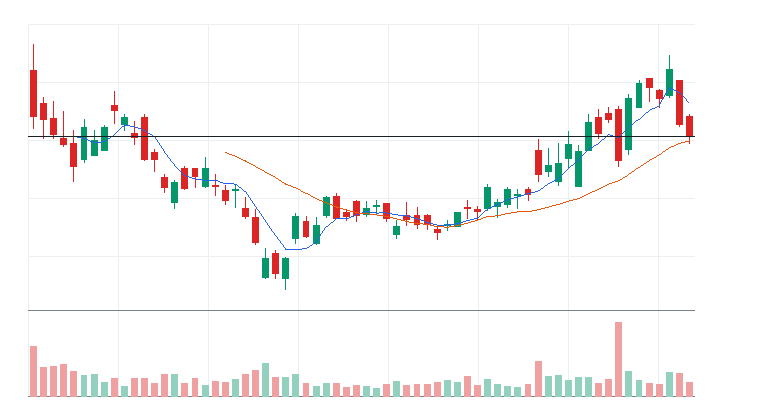
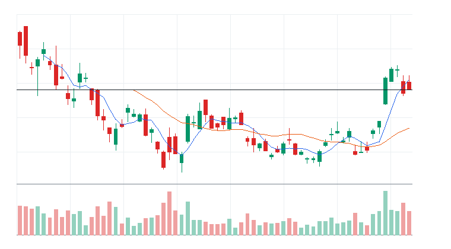
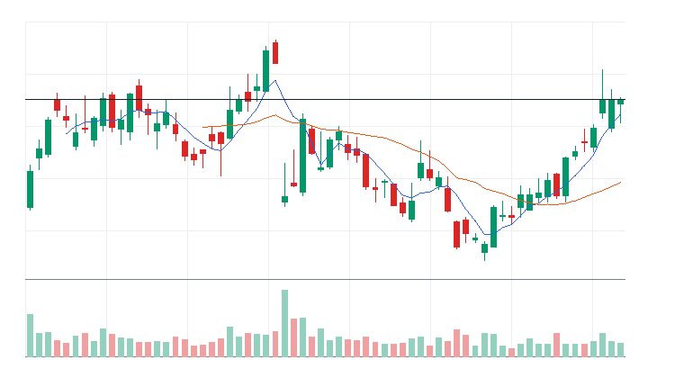
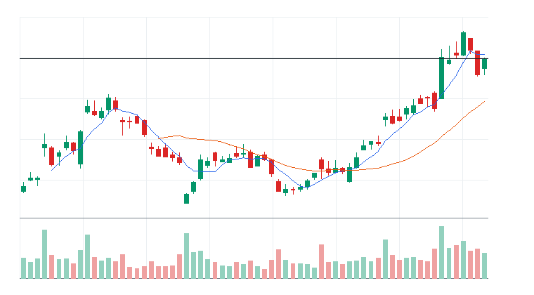

# 오늘의 데일리 트레이딩 요약

**REAL DATA TEST - 가격/거래량은 실제 데이터, 뉴스/ETF 구성종목 확산도/거래대금 유동성 일부 연결**

**목적:** 이 리포트는 최근 오른 자산을 나열하는 것이 아니라, 돈이 몰리는 근거와 다음 매수 주체가 확인할 트레이딩 후보를 찾기 위한 보고서다.

> 핵심 질문: 현재 가격에서 누가 사고 있고, 누가 앞으로 더 비싸게 사줄 수 있는가?

## 시장 국면 판단

- 최종 판정: 기간 조정 (80점)
- 전일 대비: 기간 조정 유지, 점수 변화는 제한적이다(-2점).
- 판정 신뢰도: 높음 (100점) - 핵심 지수와 매크로 데이터가 대부분 직접 수집되어 판정 신뢰도가 높다.
- 행동 바이어스: 추격 보류, 돌파 확인
- 한 줄 결론: 장기 추세는 유지되지만 단기 추세가 둔화되어 기간 조정으로 본다. 기술 100점, 매크로 44점.
- 기술적 지표: 상승 추세 우위 (100점, 가중치 65%)
- S&P 500: 100점 | 50일선 위, 200일선 위, 20일 +0.16%, 60일 +3.00%, 52주 고점 대비 -0.94% -> 기술 점수 100
- Nasdaq 100: 100점 | 50일선 위, 200일선 위, 20일 +3.26%, 60일 +3.00%, 52주 고점 대비 -0.53% -> 기술 점수 100
- 매크로 시황: 매크로 부담 (44점, 가중치 35%)
- 매크로 요약: 금리 부담으로 매크로 환경은 방어적이다.
- 금리: 부담 36점 / 금리 부담 / confidence HIGH
  - 주요 근거: US 10Y yield 20일 +10.96%, 5일 +3.72%; US 3M yield 20일 +10.66%, 단기금리 방향 확인; US long-duration bonds 20일 -4.58%, 장기채 가격 기준 할인율 부담 확인
  - 확인 사항: 장기금리 상승과 장기채 약세가 겹쳐 성장주 할인율 부담이 커질 수 있다.
- 물가: 중립 45점 / 물가 중립 / confidence HIGH
  - 주요 근거: Oil ETF 20일 +14.09%, 유가 기반 물가 압력 확인; TIPS ETF 20일 -2.70%, 물가연동채 흐름은 보조 근거; Gold 20일 -6.91%, 금 강세는 방어 수요 여부 확인
  - 확인 사항: 추가 확인 이벤트 없음
- 정책: 중립 50점 / 정책 이벤트 확인 전 중립 / confidence LOW
  - 주요 근거: 정책 톤은 1차 버전에서 일정/이벤트 리스크 기반 중립값으로 반영한다.
  - 확인 사항: FOMC, CPI, PCE, 고용지표 발표 전후에는 매크로 confidence를 보수적으로 해석한다.
- 신용/유동성: 중립 47점 / 신용/유동성 중립 / confidence HIGH
  - 주요 근거: High yield credit 20일 -2.52%, 하이일드 위험선호 확인; HYG-LQD 20일 상대강도 +0.78%, 신용위험 선호/회피 확인; VIX 20일 +3.05%, 변동성 부담 확인
  - 확인 사항: 추가 확인 이벤트 없음
- 환율/글로벌: 중립 46점 / 환율/글로벌 중립 / confidence MEDIUM
  - 주요 근거: US dollar 20일 +2.14%, 달러 강세/약세 확인
  - 확인 사항: 추가 확인 이벤트 없음
- US 10Y yield: 29점 | 하락 시 주식 우호; 5일 +3.72%, 20일 +10.96% -> 매크로 점수 29
- US 3M yield: 31점 | 하락 시 주식 우호; 5일 +2.31%, 20일 +10.66% -> 매크로 점수 31
- US long-duration bonds: 41점 | 상승 시 주식 우호; 5일 -2.38%, 20일 -4.58% -> 매크로 점수 41
- TIPS ETF: 50점 | 상승 시 주식 우호; 5일 -0.69%, 20일 -2.70% -> 매크로 점수 50
- Oil ETF: 30점 | 하락 시 주식 우호; 5일 -3.57%, 20일 +14.09% -> 매크로 점수 30
- Gold: 50점 | 상승 시 주식 우호; 5일 -1.93%, 20일 -6.91% -> 매크로 점수 50
- US dollar: 46점 | 하락 시 주식 우호; 5일 +0.81%, 20일 +2.14% -> 매크로 점수 46
- High yield credit: 45점 | 상승 시 주식 우호; 5일 -0.85%, 20일 -2.52% -> 매크로 점수 45
- Investment grade credit: 50점 | 상승 시 주식 우호; 5일 -1.42%, 20일 -3.30% -> 매크로 점수 50
- VIX: 45점 | 하락 시 주식 우호; 5일 +0.41%, 20일 +3.05% -> 매크로 점수 45
- 데이터 커버리지: 기술 2/2, 매크로 10/10
- 데이터 신뢰도 근거:
  - 직접 지수 데이터: S&P 500, Nasdaq 100
  - 대체 지수 데이터 없음
  - 매크로 데이터: 10/10
  - 누락 데이터 없음
  - stale 데이터 없음

## 모바일 요약

[오늘의 데일리 트레이딩 요약]

생성 성공 / 데이터 모드: REAL_TEST

시장:
- 중립

시장 지배 서사:
1. 반도체 설계/공급망 재가속 - 약화 - VanEck Semiconductor ETF(SMH), iShares Semiconductor ETF(SOXX), QUALCOMM Incorporated(QCOM), Arm Holdings plc(ARM) 중심으로 5일 +8.30%, 20일 +12.82% 흐름이 형성됨. 직접 촉매 일부 확인.
2. Internet Content 자금 유입 - 약화 - Invesco QQQ Trust(QQQ), Meta Platforms Inc.(META), Alphabet Inc. Class C(GOOG) 중심으로 5일 +3.38%, 20일 +9.21% 흐름이 형성됨. 직접 촉매 일부 확인.
3. Medical Devices 자금 유입 - 약화 - Invesco QQQ Trust(QQQ), Intuitive Surgical Inc.(ISRG), DexCom Inc.(DXCM) 중심으로 5일 +1.05%, 20일 +3.54% 흐름이 형성됨. 뉴스 직접성 제한.

트렌드 강도:
1. 반도체 설계/공급망 재가속 - TSI 64 - 약화 - 진입품질 관찰
2. Internet Content 자금 유입 - TSI 44 - 잠복 - 진입품질 낮음
3. Medical Devices 자금 유입 - TSI 33 - 잠복 - 진입품질 낮음

오늘 결론:
- 기술 기타 개별 종목 흐름이 ETF 대비 강한지 확인 필요
- 행동 후보는 linkedNarrative와 함께 확인한다.
- 추격보다 진입 조건 확인 후 접근한다.

오늘 실제 행동 후보:
1. QUALCOMM Incorporated(QCOM)(STOCK) - 반도체 설계/공급망 재가속 - 단기 추세가 유지되고 거래량이 1.0배 이상이면 눌림 이후 재상승을 시도할 수 있음
2. Arm Holdings plc(ARM)(STOCK) - 반도체 설계/공급망 재가속 - 단기 추세가 유지되고 거래량이 1.0배 이상이면 눌림 이후 재상승을 시도할 수 있음
3. Datadog Inc.(DDOG)(STOCK) - AI 소프트웨어/사이버보안 확산 - 단기 추세가 유지되고 거래량이 1.0배 이상이면 눌림 이후 재상승을 시도할 수 있음

다크호스 후보:
1. 다크호스 후보 없음 - 조건 충족 후보 없음

ETF 후보 TOP 5:
1. iShares Semiconductor ETF(SOXX) - 반도체 설계/공급망 재가속 - 거래량 확인 전 관찰
2. VanEck Semiconductor ETF(SMH) - 반도체 설계/공급망 재가속 - 거래량 확인 전 관찰
3. Roundhill Magnificent Seven ETF(MAGS) - 위험선호 성장주 재진입 - 거래량 확인 전 관찰
4. Roundhill Memory ETF(DRAM) - AI 인프라 재가속 - 거래량 확인 전 관찰
5. Invesco QQQ Trust(QQQ) - Internet Content 자금 유입 - 거래량 확인 전 관찰

웹 리포트:
https://yoolcool.github.io/DailyTradingThesisAgent/

## 오늘 결론

- 오늘 결론: 조건부 진입
- 신규 진입 후보: 0개
- 조건부 진입 후보: 4개
- 관찰 후보: 119개
- 주요 제한 요인: Entry Quality < 40, RVOL 미달, 뉴스 직접성 부족
- 주문 판단: 시장가 금지 / 지정가 또는 관찰
- 실전 판단: 진입 후보는 있으나, 전일 고점 돌파와 거래량 확인 후 선별적으로 접근한다.

### 후보 제한 요인 집계

- RVOL < 1.00x: 118개
- 거래대금 유동성 낮음: 19개
- Entry Quality 50~54 near miss: 2개
- Entry Quality 40~49 관찰: 4개
- Entry Quality < 40: 149개
- Exhaustion Risk >= 70: 0개
- ETF breadth 샘플 부족: 37개
- 뉴스 직접성 부족: 99개

## 데이터 신뢰도

- 전체 데이터 신뢰도 등급: LOW
- 분석 신뢰도: LOW
- 주문 실행 신뢰도: LOW
- ETF breadth 신뢰도: LOW
- 신뢰도 해석: 테마 확산 판단 제한, 거래대금 유동성 낮음 또는 확인 불가, 프리/애프터마켓 확인 불가
- 리포트 생성 시각: 2026-09-28 10:26 KST
- 가격 기준 거래일: 2026-09-25 US regular close
- 뉴스 수집 시각: 2026-09-28 10:26 KST
- 가장 최근 뉴스 발행 시각: 2026-09-28 10:02 KST
- 뉴스 신선도 상태: FRESH
- 뉴스 소스: Yahoo Finance RSS, MarketWatch RSS, CNBC Markets RSS, SEC EDGAR RSS, Federal Reserve RSS, Finnhub API
- 뉴스 소스 상태: Yahoo Finance RSS CONNECTED, MarketWatch RSS CONNECTED, CNBC Markets RSS PARTIAL, SEC EDGAR RSS PARTIAL, Federal Reserve RSS CONNECTED, Finnhub API DISABLED
- 뉴스 신뢰도: MEDIUM
- 추천 적용 거래일: 2026-09-27 US regular session
- 가격/거래량 데이터 상태: 일부 연결
- 뉴스 데이터 상태: 일부 연결
- ETF 구성종목 확산도 상태: 일부 연결
- ETF 구성종목 샘플 수: 1~4
- 거래대금 유동성 데이터 상태: 일부 연결
- 프리/애프터마켓 데이터 상태: UNAVAILABLE
- 데이터 provider: yfinance, Yahoo Finance RSS, MarketWatch RSS, CNBC Markets RSS, SEC EDGAR RSS, Federal Reserve RSS, Finnhub API, config fallback sample, price-volume dollar-volume fallback
- 실전 사용 경고: 이 리포트는 투자판단 보조용이며, REAL_TEST 모드에서는 일부 데이터가 누락되거나 지연될 수 있다. 실제 주문 전 현재가, 뉴스, 프리마켓/정규장 거래량을 별도 확인해야 한다.

## 0. 시장 상태

- 데이터 모드: REAL_TEST
- 가격/거래량: 일부 연결
- 뉴스: 일부 연결
- ETF 구성종목 확산도: 일부 연결
- 거래대금 유동성: 일부 연결
- 생성 시각: 2026년 9월 28일 월요일 AM 10:26
- 시장 상태: 중립
- 오늘 돈의 방향: 기술 기타 개별 종목 흐름이 ETF 대비 강한지 확인 필요
- 강한 테마 TOP 3: 메가캡 플랫폼 ETF(45), AI 반도체(40), 메모리/HBM ETF(38)
- 데이터 한계:
  - API 또는 provider 상태에 따라 뉴스/ETF 확산도/거래대금 유동성 반영 범위가 달라질 수 있다.
  - 수집 실패 데이터는 점수 반영에서 제외하거나 confidence를 제한한다.
  - reasonConfidence HIGH는 직접 촉매, 가격/거래량, 확산도/유동성 근거가 함께 있을 때만 사용한다.

## 오늘 시장을 지배하는 서사

### 오늘 시장을 지배하는 서사 TOP 3

#### 1. 반도체 설계/공급망 재가속
- 상태: 약화
- narrativeScore: 45
- reasonConfidence: LOW
- 근거 ETF: SMH, SOXX, SOXQ
- 근거 개별 종목: QCOM, ARM, AMD, INTC, MPWR
- 돈이 몰리는 이유: 반도체 설계/공급망 재가속 관련 VanEck Semiconductor ETF(SMH), iShares Semiconductor ETF(SOXX), Invesco PHLX Semiconductor ETF(SOXQ)와 QUALCOMM Incorporated(QCOM), Arm Holdings plc(ARM), Advanced Micro Devices Inc.(AMD), Intel Corporation(INTC)의 5일(+8.30%)·20일(+12.82%) 흐름을 함께 본다. 평균 상대 거래량은 0.84배이고, ETF 확산도는 추가 확인이 필요하다. 직접 뉴스/이벤트가 일부 확인된다.
- 다음 매수 주체: 반도체 설계/공급망 재가속을 확인한 섹터 ETF 자금과 상대강도 추종 스윙 자금
- 가장 좋은 트레이딩 수단: ETF 우선: SMH, SOXX, SOXQ / 개별 종목 우선: AMD, QCOM, INTC
- 서사가 깨지는 조건: SMH 20일선 이탈 또는 관련 종목 절반 이상 5일선 이탈
- 오늘 행동: 기존 네러티브와 중복을 확인한 뒤 ETF/대표 종목 동조성이 살아날 때만 관찰 편입

상세 narrativeScore 근거 보기

- rawScore: 45
- ETF 평균 moneyFlowScore: 29
- 개별 종목 평균 moneyFlowScore: 60
- ETF 후보 비율: 0%
- 개별 종목 후보 비율: 25%
- 5일 평균 수익률: +8.00%
- 20일 평균 수익률: +13.00%
- 평균 상대 거래량: 1.00배
- ETF 평균 상대 거래량: 1.00배
- 개별주 평균 상대 거래량: 1.00배
- 52주 고점 근접 후보 비율: 8%
- 뉴스 직접성 점수: 7
- ETF 확산도 점수: 0
- 유동성 점수: 2
- 과열 리스크 차감: 0

#### 2. Internet Content 자금 유입
- 상태: 약화
- narrativeScore: 40
- reasonConfidence: LOW
- 근거 ETF: QQQ
- 근거 개별 종목: META, GOOG, GOOGL
- 돈이 몰리는 이유: Internet Content 자금 유입 관련 Invesco QQQ Trust(QQQ)와 Meta Platforms Inc.(META), Alphabet Inc. Class C(GOOG), Alphabet Inc. Class A(GOOGL)의 5일(+3.38%)·20일(+9.21%) 흐름을 함께 본다. 평균 상대 거래량은 0.91배이고, ETF 확산도는 추가 확인이 필요하다. 직접 뉴스/이벤트가 일부 확인된다.
- 다음 매수 주체: Internet Content 자금 유입을 확인한 섹터 ETF 자금과 상대강도 추종 스윙 자금
- 가장 좋은 트레이딩 수단: ETF 우선: QQQ / 개별 종목 우선: META, GOOGL, GOOG
- 서사가 깨지는 조건: QQQ 20일선 이탈 또는 관련 종목 절반 이상 5일선 이탈
- 오늘 행동: 기존 네러티브와 중복을 확인한 뒤 ETF/대표 종목 동조성이 살아날 때만 관찰 편입

상세 narrativeScore 근거 보기

- rawScore: 40
- ETF 평균 moneyFlowScore: 45
- 개별 종목 평균 moneyFlowScore: 32
- ETF 후보 비율: 0%
- 개별 종목 후보 비율: 33%
- 5일 평균 수익률: +3.00%
- 20일 평균 수익률: +9.00%
- 평균 상대 거래량: 1.00배
- ETF 평균 상대 거래량: 1.00배
- 개별주 평균 상대 거래량: 1.00배
- 52주 고점 근접 후보 비율: 50%
- 뉴스 직접성 점수: 6
- ETF 확산도 점수: 0
- 유동성 점수: 3
- 과열 리스크 차감: 0

#### 3. Medical Devices 자금 유입
- 상태: 약화
- narrativeScore: 37
- reasonConfidence: LOW
- 근거 ETF: QQQ
- 근거 개별 종목: ISRG, DXCM
- 돈이 몰리는 이유: Medical Devices 자금 유입 관련 Invesco QQQ Trust(QQQ)와 Intuitive Surgical Inc.(ISRG), DexCom Inc.(DXCM)의 5일(+1.05%)·20일(+3.54%) 흐름을 함께 본다. 평균 상대 거래량은 0.80배이고, ETF 확산도는 추가 확인이 필요하다. 뉴스 직접성은 아직 제한적이다.
- 다음 매수 주체: Medical Devices 자금 유입을 확인한 섹터 ETF 자금과 상대강도 추종 스윙 자금
- 가장 좋은 트레이딩 수단: ETF 우선: QQQ / 개별 종목 우선: ISRG, DXCM
- 서사가 깨지는 조건: QQQ 20일선 이탈 또는 관련 종목 절반 이상 5일선 이탈
- 오늘 행동: 기존 네러티브와 중복을 확인한 뒤 ETF/대표 종목 동조성이 살아날 때만 관찰 편입

상세 narrativeScore 근거 보기

- rawScore: 37
- ETF 평균 moneyFlowScore: 45
- 개별 종목 평균 moneyFlowScore: 35
- ETF 후보 비율: 0%
- 개별 종목 후보 비율: 50%
- 5일 평균 수익률: +1.00%
- 20일 평균 수익률: +4.00%
- 평균 상대 거래량: 1.00배
- ETF 평균 상대 거래량: 1.00배
- 개별주 평균 상대 거래량: 1.00배
- 52주 고점 근접 후보 비율: 33%
- 뉴스 직접성 점수: 8
- ETF 확산도 점수: 0
- 유동성 점수: 3
- 과열 리스크 차감: 0

### 전체 narrative 요약

| 서사명 | 상태 | narrativeScore | reasonConfidence | 대표 ETF | 대표 종목 | 오늘 행동 |
| --- | --- | ---: | --- | --- | --- | --- |
| 반도체 설계/공급망 재가속 | 약화 | 45 | LOW | SMH, SOXX, SOXQ | QCOM, ARM, AMD, INTC | 기존 네러티브와 중복을 확인한 뒤 ETF/대표 종목 동조성이 살아날 때만 관찰 편입 |
| Internet Content 자금 유입 | 약화 | 40 | LOW | QQQ | META, GOOG, GOOGL | 기존 네러티브와 중복을 확인한 뒤 ETF/대표 종목 동조성이 살아날 때만 관찰 편입 |
| Medical Devices 자금 유입 | 약화 | 37 | LOW | QQQ | ISRG, DXCM | 기존 네러티브와 중복을 확인한 뒤 ETF/대표 종목 동조성이 살아날 때만 관찰 편입 |
| 위험선호 성장주 재진입 | 약화 | 36 | LOW | QQQ, ARKK, IPO | ARM, TSLA, COIN | 지수 위험선호가 유지될 때만 선별 진입 |
| 바이오/헬스케어 촉매 | 약화 | 36 | LOW | QQQ | ALNY, GILD | 기존 네러티브와 중복을 확인한 뒤 ETF/대표 종목 동조성이 살아날 때만 관찰 편입 |
| AI 소프트웨어/사이버보안 확산 | 약화 | 31 | LOW | QQQ, IGV, AIQ | DDOG, MSFT, PLTR, TEAM | 추격보다 눌림 후 재상승 확인 |
| Data Storage 자금 유입 | 약화 | 25 | LOW | QQQ, SPY, IWM | STX, WDC | 기존 네러티브와 중복을 확인한 뒤 ETF/대표 종목 동조성이 살아날 때만 관찰 편입 |
| AI 인프라 재가속 | 약화 | 24 | LOW | SMH, SOXX, DRAM | AMD, MU, ETN, NVDA | 추격보다 5일선 지지 후 재상승 확인 |
| 반도체 장비 사이클 재평가 | 약화 | 22 | LOW | SMH, SOXX, SOXQ | LRCX, ASML | 기존 네러티브와 중복을 확인한 뒤 ETF/대표 종목 동조성이 살아날 때만 관찰 편입 |
| 전력 유틸리티 수요 재평가 | 약화 | 19 | LOW | QQQ, SPY, IWM | ETN, GEV, VRT | 기존 네러티브와 중복을 확인한 뒤 ETF/대표 종목 동조성이 살아날 때만 관찰 편입 |
| Integrated Oil & Gas 자금 유입 | 약화 | 18 | LOW | QQQ, SPY, IWM | CVX, XOM | 기존 네러티브와 중복을 확인한 뒤 ETF/대표 종목 동조성이 살아날 때만 관찰 편입 |
| 소프트웨어 실적/AI 수익화 | 약화 | 16 | LOW | QQQ, IGV, AIQ | MSTR, SHOP | 기존 네러티브와 중복을 확인한 뒤 ETF/대표 종목 동조성이 살아날 때만 관찰 편입 |
| Specialty Business Services 자금 유입 | 소멸 | 16 | LOW | QQQ, SPY, IWM | CTAS, TRI, CPRT | 기존 네러티브와 중복을 확인한 뒤 ETF/대표 종목 동조성이 살아날 때만 관찰 편입 |
| 사이버보안 지출 재가속 | 약화 | 14 | LOW | IHAK, CIBR, HACK | CRWD, ZS, FTNT, PANW | 기존 네러티브와 중복을 확인한 뒤 ETF/대표 종목 동조성이 살아날 때만 관찰 편입 |
| 필수소비재 음료 방어 성장 | 소멸 | 14 | LOW | QQQ | CCEP, MNST | 기존 네러티브와 중복을 확인한 뒤 ETF/대표 종목 동조성이 살아날 때만 관찰 편입 |
| 소비 회복/방어주 선별 | 약화 | 14 | LOW | QQQ | PDD, AMZN | 기존 네러티브와 중복을 확인한 뒤 ETF/대표 종목 동조성이 살아날 때만 관찰 편입 |
| Travel Services 자금 유입 | 소멸 | 9 | LOW | QQQ | BKNG, ABNB | 기존 네러티브와 중복을 확인한 뒤 ETF/대표 종목 동조성이 살아날 때만 관찰 편입 |
| Aerospace & Defense 자금 유입 | 소멸 | 7 | LOW | QQQ, SPY, IWM | KTOS, AVAV | 기존 네러티브와 중복을 확인한 뒤 ETF/대표 종목 동조성이 살아날 때만 관찰 편입 |
| 비트코인/디지털 자산 위험선호 | 약화 | 3 | LOW | IBIT, BLOK | MSTR, IREN, COIN | 비트코인 베타가 살아날 때만 단기 매매 |
| Bitcoin Mining 자금 유입 | 약화 | 2 | LOW | IBIT, BLOK | RIOT, IREN, MARA, CIFR | 기존 네러티브와 중복을 확인한 뒤 ETF/대표 종목 동조성이 살아날 때만 관찰 편입 |
| 매크로 방어/헤지 | 약화 | 0 | LOW | TLT, XLE, GLD | XOM, CVX | 위험회피가 확인될 때만 헤지성 접근 |
| 전력망/원전/인프라 병목 | 소멸 | 0 | LOW | GRID, PAVE, URA | ETN, PWR, VRT, CEG | ETF 확산도와 거래량이 같이 살아날 때만 진입 |
| 방산/안보 프리미엄 | 소멸 | 0 | LOW | XAR, SHLD, ITA | PLTR, AVAV, KTOS | 뉴스 촉매가 직접 확인될 때만 추세 추종 |

## 트렌드 강도 판단

### 1. 반도체 설계/공급망 재가속
- Trend Strength Index: 64
- 트렌드 상태 라벨: 약화
- 테마 확산도: 보통
- ETF 동조성: 강함
- 거래량 강도: 부족
- 과열 위험: 낮음 (12)
- 오늘 진입 품질: 관찰 (46)
- 한 줄 판단: 반도체 설계/공급망 재가속는 Trend Strength는 중간이지만 진입 품질이 살아나는 초기 진입 후보 성격이다.
- 오늘 접근법: 상승률이 남아 있어도 VanEck Semiconductor ETF(SMH)/iShares Semiconductor ETF(SOXX)/Invesco PHLX Semiconductor ETF(SOXQ)와 구성 종목 확산도가 회복될 때까지 신규 진입은 낮춘다.

트렌드 강도 상세 근거 보기

- 가격 모멘텀: 가격 모멘텀 22/25. 평균 5D +8.30%, 20D +12.82%.
- 거래량 강도: 거래량 강도 4/20. 평균 RVOL 0.84배.
- ETF 동조성: ETF 동조성 15/15. 관련 ETF VanEck Semiconductor ETF(SMH), iShares Semiconductor ETF(SOXX), Invesco PHLX Semiconductor ETF(SOXQ), Global X Artificial Intelligence & Technology ETF(AIQ) 흐름을 기준으로 판단.
- 테마 확산도: 테마 확산도 13/20. 상위 1~2개 쏠림 감점 0점 반영.
- 뉴스 촉매: 뉴스/촉매 신선도 5/10. HIGH 직접 촉매 2개.
- 과열 리스크: 과열 리스크 12/100. 단기 급등, 고점 근접, ETF-개별주 괴리, 쏠림을 함께 반영.
- 시장 환경: 시장 환경 5/10. QQQ/SPY/IWM 가격 흐름 기반 위험선호 점수.

### 2. Internet Content 자금 유입
- Trend Strength Index: 44
- 트렌드 상태 라벨: 잠복
- 테마 확산도: 부족
- ETF 동조성: 강함
- 거래량 강도: 부족
- 과열 위험: 낮음 (23)
- 오늘 진입 품질: 낮음 (26)
- 한 줄 판단: Internet Content 자금 유입는 테마 확산도가 낮아 아직 개별 종목 이벤트성 흐름에 가깝다.
- 오늘 접근법: Invesco QQQ Trust(QQQ)와 Meta Platforms Inc.(META)/Alphabet Inc. Class C(GOOG)/Alphabet Inc. Class A(GOOGL)의 거래량 확산이 확인되기 전까지 관찰한다.

트렌드 강도 상세 근거 보기

- 가격 모멘텀: 가격 모멘텀 14/25. 평균 5D +3.38%, 20D +9.21%.
- 거래량 강도: 거래량 강도 4/20. 평균 RVOL 0.91배.
- ETF 동조성: ETF 동조성 14/15. 관련 ETF Invesco QQQ Trust(QQQ) 흐름을 기준으로 판단.
- 테마 확산도: 테마 확산도 4/20. 상위 1~2개 쏠림 감점 6점 반영.
- 뉴스 촉매: 뉴스/촉매 신선도 3/10. HIGH 직접 촉매 1개.
- 과열 리스크: 과열 리스크 23/100. 단기 급등, 고점 근접, ETF-개별주 괴리, 쏠림을 함께 반영.
- 시장 환경: 시장 환경 5/10. QQQ/SPY/IWM 가격 흐름 기반 위험선호 점수.

### 3. Medical Devices 자금 유입
- Trend Strength Index: 33
- 트렌드 상태 라벨: 잠복
- 테마 확산도: 부족
- ETF 동조성: 강함
- 거래량 강도: 부족
- 과열 위험: 낮음 (24)
- 오늘 진입 품질: 낮음 (19)
- 한 줄 판단: Medical Devices 자금 유입는 테마 확산도가 낮아 아직 개별 종목 이벤트성 흐름에 가깝다.
- 오늘 접근법: Invesco QQQ Trust(QQQ)와 Intuitive Surgical Inc.(ISRG)/DexCom Inc.(DXCM)의 거래량 확산이 확인되기 전까지 관찰한다.

트렌드 강도 상세 근거 보기

- 가격 모멘텀: 가격 모멘텀 7/25. 평균 5D +1.05%, 20D +3.54%.
- 거래량 강도: 거래량 강도 3/20. 평균 RVOL 0.80배.
- ETF 동조성: ETF 동조성 14/15. 관련 ETF Invesco QQQ Trust(QQQ) 흐름을 기준으로 판단.
- 테마 확산도: 테마 확산도 3/20. 상위 1~2개 쏠림 감점 6점 반영.
- 뉴스 촉매: 뉴스/촉매 신선도 1/10. HIGH 직접 촉매 0개.
- 과열 리스크: 과열 리스크 24/100. 단기 급등, 고점 근접, ETF-개별주 괴리, 쏠림을 함께 반영.
- 시장 환경: 시장 환경 5/10. QQQ/SPY/IWM 가격 흐름 기반 위험선호 점수.

## 최근 추천 결과 트래킹

개별주는 데이트레이딩 관점으로 추천 이후 첫 정규장의 장중 최고가와 종가를 추적한다. ETF는 테마/스윙 관점으로 추천 이후 1주일 동안의 최고가와 현재 종가를 추적한다.

### 개별주 Top 3 추천 성과 요약
- 최근 5개 리포트 표본: 15개 (초기 검증 단계)
- 장중 최고가 기준 성공률: +66.67%
- 종가 기준 성공률: +58.33%
- 평균 장중 최고 수익률: +4.50%
- 평균 종가 수익률: +2.19%

### ETF 추천 성과 요약
- 최근 5개 리포트 표본: 3개 (초기 검증 단계)
- 1주 최고가 기준 성공률: +33.33%
- 현재 종가 기준 성공률: +33.33%
- 평균 1주 최고 수익률: +1.21%
- 평균 현재 수익률: +0.46%

최근 추천 결과 상세 테이블 펼치기

| 추천일 | 유형 | 순위 | 티커 | 기준가 | 추적 기간 | 상태 | High 수익률 | Close 수익률 | 결과 | 코멘트 |
| --- | --- | ---: | --- | ---: | --- | --- | ---: | ---: | --- | --- |
| 2026-09-28 | STOCK | 3 | DDOG | $268.13 | 2026-09-28 | pending | 데이터 없음 | 데이터 없음 | 추적 대기 | 아직 추적 거래일 데이터가 완성되지 않음 |
| 2026-09-28 | STOCK | 2 | ARM | $310.32 | 2026-09-28 | pending | 데이터 없음 | 데이터 없음 | 추적 대기 | 아직 추적 거래일 데이터가 완성되지 않음 |
| 2026-09-28 | STOCK | 1 | QCOM | $201.97 | 2026-09-28 | pending | 데이터 없음 | 데이터 없음 | 추적 대기 | 아직 추적 거래일 데이터가 완성되지 않음 |
| 2026-09-25 | STOCK | 3 | ARM | $332.56 | 2026-09-25 | complete | -2.13% | -6.69% | 실패 | 추천 이후 의미 있는 장중 기회가 부족하고 종가도 약함 (일봉 기준) |
| 2026-09-25 | STOCK | 2 | CRWD | $262.49 | 2026-09-25 | complete | -1.00% | -3.95% | 실패 | 추천 이후 의미 있는 장중 기회가 부족하고 종가도 약함 (일봉 기준) |
| 2026-09-25 | STOCK | 1 | PLTR | $191.79 | 2026-09-25 | complete | +1.26% | -1.11% | 제한적 유효 | 제한적인 장중 기회만 발생 (일봉 기준) |
| 2026-09-23 | STOCK | 3 | MARA | $13.28 | 2026-09-23 | complete | +2.79% | +0.53% | 제한적 유효 | 제한적인 장중 기회만 발생 (일봉 기준) |
| 2026-09-23 | STOCK | 2 | CIFR | $18.9 | 2026-09-23 | complete | +3.49% | -2.91% | 단타 유효 | 장중 기회는 있었지만 종가 유지력은 약함 (일봉 기준) |
| 2026-09-23 | STOCK | 1 | RIOT | $24.18 | 2026-09-23 | complete | +4.51% | +2.11% | 성공 | 장중 기회와 종가 유지가 모두 확인됨 (일봉 기준) |
| 2026-09-23 | ETF | 3 | ARKK | $90.72 | 2026-09-23~2026-09-30 | in_progress | +1.63% | +0.06% | 진행 중 | 아직 1주 추적 기간이 끝나지 않음 |
| 2026-09-23 | ETF | 2 | MAGS | $72.97 | 2026-09-23~2026-09-30 | in_progress | -0.29% | -0.45% | 진행 중 | 아직 1주 추적 기간이 끝나지 않음 |
| 2026-09-23 | ETF | 1 | SMH | $596.03 | 2026-09-23~2026-09-30 | in_progress | +2.29% | +1.77% | 진행 중 | 아직 1주 추적 기간이 끝나지 않음 |
| 2026-09-22 | STOCK | 3 | CRWD | $237.65 | 2026-09-22 | complete | +5.53% | +5.22% | 성공 | 장중 기회와 종가 유지가 모두 확인됨 (일봉 기준) |
| 2026-09-22 | STOCK | 2 | RIOT | $23.75 | 2026-09-22 | complete | +6.91% | +4.97% | 성공 | 장중 기회와 종가 유지가 모두 확인됨 (일봉 기준) |
| 2026-09-22 | STOCK | 1 | AMD | $559.82 | 2026-09-22 | complete | +11.56% | +11.42% | 성공 | 장중 기회와 종가 유지가 모두 확인됨 (일봉 기준) |
| 2026-09-21 | STOCK | 3 | CRWD | $237.65 | 2026-09-21 | complete | +5.33% | +4.92% | 성공 | 장중 기회와 종가 유지가 모두 확인됨 (일봉 기준) |
| 2026-09-21 | STOCK | 2 | RIOT | $23.75 | 2026-09-21 | complete | +5.55% | +1.81% | 성공 | 장중 기회와 종가 유지가 모두 확인됨 (일봉 기준) |
| 2026-09-21 | STOCK | 1 | AMD | $559.82 | 2026-09-21 | complete | +10.16% | +9.95% | 성공 | 장중 기회와 종가 유지가 모두 확인됨 (일봉 기준) |
| 2026-09-17 | STOCK | 3 | QCOM | $187.8 | 2026-09-17 | complete | +2.19% | +0.48% | 제한적 유효 | 제한적인 장중 기회만 발생 (일봉 기준) |
| 2026-09-17 | STOCK | 2 | FTNT | $172.37 | 2026-09-17 | complete | +2.16% | +0.12% | 제한적 유효 | 제한적인 장중 기회만 발생 (일봉 기준) |
| 2026-09-17 | STOCK | 1 | CRWD | $242.49 | 2026-09-17 | complete | +3.23% | +1.32% | 성공 | 장중 기회와 종가 유지가 모두 확인됨 (일봉 기준) |
| 2026-09-15 | STOCK | 1 | AMD | $516.13 | 2026-09-15 | complete | -0.48% | -2.31% | 실패 | 추천 이후 의미 있는 장중 기회가 부족하고 종가도 약함 (일봉 기준) |
| 2026-09-14 | STOCK | 1 | AMD | $516.13 | 2026-09-14 | complete | -3.44% | -4.40% | 실패 | 추천 이후 의미 있는 장중 기회가 부족하고 종가도 약함 (일봉 기준) |
| 2026-09-11 | STOCK | 2 | META | $653.69 | 2026-09-11 | complete | +1.61% | -0.87% | 제한적 유효 | 제한적인 장중 기회만 발생 (일봉 기준) |
| 2026-09-11 | STOCK | 1 | AMD | $521.1 | 2026-09-11 | complete | -0.01% | -0.95% | 실패 | 추천 이후 의미 있는 장중 기회가 부족하고 종가도 약함 (일봉 기준) |
| 2026-09-10 | STOCK | 3 | TSM | $439 | 2026-09-10 | complete | -1.47% | -2.50% | 실패 | 추천 이후 의미 있는 장중 기회가 부족하고 종가도 약함 (일봉 기준) |
| 2026-09-10 | STOCK | 2 | AMD | $505.74 | 2026-09-10 | complete | +2.09% | -0.42% | 제한적 유효 | 제한적인 장중 기회만 발생 (일봉 기준) |
| 2026-09-10 | STOCK | 1 | CEG | $299.05 | 2026-09-10 | complete | -1.41% | -4.37% | 실패 | 추천 이후 의미 있는 장중 기회가 부족하고 종가도 약함 (일봉 기준) |
| 2026-09-10 | ETF | 1 | DRAM | $61.1 | 2026-09-10~2026-09-17 | complete | -1.73% | +1.33% | 진행 중 | 아직 1주 추적 기간이 끝나지 않음 |
| 2026-09-09 | STOCK | 1 | MU | $1,016.59 | 2026-09-09 | complete | +2.54% | +1.10% | 제한적 유효 | 제한적인 장중 기회만 발생 (일봉 기준) |
| 2026-09-08 | STOCK | 1 | MU | $1,016.59 | 2026-09-08 | complete | +2.41% | -1.61% | 제한적 유효 | 제한적인 장중 기회만 발생 (일봉 기준) |
| 2026-09-07 | STOCK | 1 | MU | $1,016.59 | 2026-09-07 | pending | 데이터 없음 | 데이터 없음 | 추적 대기 | 아직 추적 거래일 데이터가 완성되지 않음 |
| 2026-09-04 | STOCK | 1 | ALNY | $267.4 | 2026-09-04 | complete | -0.21% | -0.48% | 실패 | 추천 이후 의미 있는 장중 기회가 부족하고 종가도 약함 (일봉 기준) |
| 2026-09-04 | ETF | 1 | OIH | $436.58 | 2026-09-04~2026-09-11 | complete | +0.81% | -9.83% | 실패 | 추천 이후 ETF 흐름이 약화됨 |
| 2026-09-03 | STOCK | 1 | CVX | $211.05 | 2026-09-03 | complete | +1.02% | +0.13% | 제한적 유효 | 제한적인 장중 기회만 발생 (일봉 기준) |
| 2026-09-02 | STOCK | 1 | CVX | $211.05 | 2026-09-02 | complete | +0.82% | +0.35% | 추적 대기 | 아직 추적 거래일 데이터가 완성되지 않음 (일봉 기준) |
| 2026-09-01 | STOCK | 3 | PANW | $382.13 | 2026-09-01 | complete | -1.63% | -5.24% | 실패 | 추천 이후 의미 있는 장중 기회가 부족하고 종가도 약함 (일봉 기준) |
| 2026-09-01 | STOCK | 2 | ZS | $188.39 | 2026-09-01 | complete | -1.06% | -5.32% | 실패 | 추천 이후 의미 있는 장중 기회가 부족하고 종가도 약함 (일봉 기준) |
| 2026-09-01 | STOCK | 1 | CRWD | $231 | 2026-09-01 | complete | +0.13% | -6.90% | 실패 | 추천 이후 의미 있는 장중 기회가 부족하고 종가도 약함 (일봉 기준) |
| 2026-09-01 | ETF | 1 | CIBR | $100.15 | 2026-09-01~2026-09-08 | complete | -4.15% | +0.80% | 진행 중 | 아직 1주 추적 기간이 끝나지 않음 |
| 2026-08-31 | STOCK | 3 | MSFT | $513.53 | 2026-08-31 | complete | -0.26% | -1.22% | 실패 | 추천 이후 의미 있는 장중 기회가 부족하고 종가도 약함 (일봉 기준) |
| 2026-08-31 | STOCK | 2 | WDAY | $204.72 | 2026-08-31 | complete | -0.53% | -3.55% | 실패 | 추천 이후 의미 있는 장중 기회가 부족하고 종가도 약함 (일봉 기준) |
| 2026-08-31 | STOCK | 1 | CRWD | $218.4 | 2026-08-31 | complete | +7.09% | +5.77% | 성공 | 장중 기회와 종가 유지가 모두 확인됨 (일봉 기준) |
| 2026-08-31 | ETF | 1 | IGV | $109.5 | 2026-08-31~2026-09-07 | complete | -0.70% | -3.19% | 실패 | 추천 이후 ETF 흐름이 약화됨 |
| 2026-08-28 | STOCK | 3 | ZS | $187.3 | 2026-08-28 | complete | +0.47% | -1.64% | 실패 | 추천 이후 의미 있는 장중 기회가 부족하고 종가도 약함 (일봉 기준) |
| 2026-08-28 | STOCK | 2 | ADSK | $270.58 | 2026-08-28 | complete | -1.32% | -3.67% | 실패 | 추천 이후 의미 있는 장중 기회가 부족하고 종가도 약함 (일봉 기준) |
| 2026-08-28 | STOCK | 1 | ADBE | $289.15 | 2026-08-28 | complete | +1.71% | +0.82% | 제한적 유효 | 제한적인 장중 기회만 발생 (일봉 기준) |
| 2026-08-28 | ETF | 3 | IBIT | $45.29 | 2026-08-28~2026-09-04 | complete | +2.38% | +5.03% | 성공 | 추천 이후 테마 추세가 유지됨 |
| 2026-08-28 | ETF | 2 | CIBR | $100.79 | 2026-08-28~2026-09-04 | complete | -0.35% | +0.16% | 진행 중 | 아직 1주 추적 기간이 끝나지 않음 |
| 2026-08-28 | ETF | 1 | IGV | $110.32 | 2026-08-28~2026-09-04 | complete | +0.23% | -3.91% | 실패 | 추천 이후 ETF 흐름이 약화됨 |
| 2026-08-21 | STOCK | 3 | FCX | $71.22 | 2026-08-21 | complete | +8.58% | +7.64% | 성공 | 장중 기회와 종가 유지가 모두 확인됨 (일봉 기준) |
| 2026-08-21 | STOCK | 2 | COIN | $172.35 | 2026-08-21 | complete | +11.03% | +8.20% | 성공 | 장중 기회와 종가 유지가 모두 확인됨 (일봉 기준) |
| 2026-08-21 | STOCK | 1 | MSTR | $112.39 | 2026-08-21 | complete | +8.47% | +6.10% | 성공 | 장중 기회와 종가 유지가 모두 확인됨 (일봉 기준) |
| 2026-08-21 | ETF | 1 | IBIT | $41.2 | 2026-08-21~2026-08-28 | complete | +11.19% | +15.46% | 성공 | 추천 이후 테마 추세가 유지됨 |
| 2026-08-20 | STOCK | 3 | ADBE | $272.47 | 2026-08-20 | complete | +0.65% | -0.09% | 실패 | 추천 이후 의미 있는 장중 기회가 부족하고 종가도 약함 (일봉 기준) |
| 2026-08-20 | STOCK | 2 | TEAM | $174.23 | 2026-08-20 | complete | +2.09% | +0.39% | 제한적 유효 | 제한적인 장중 기회만 발생 (일봉 기준) |
| 2026-08-20 | STOCK | 1 | INTU | $362.47 | 2026-08-20 | complete | +1.15% | -0.17% | 제한적 유효 | 제한적인 장중 기회만 발생 (일봉 기준) |
| 2026-08-18 | STOCK | 2 | CPRT | $31.7 | 2026-08-18 | complete | +5.84% | -0.60% | 단타 유효 | 장중 기회는 있었지만 종가 유지력은 약함 (일봉 기준) |
| 2026-08-18 | STOCK | 1 | PWR | $722.31 | 2026-08-18 | complete | -1.43% | -3.62% | 실패 | 추천 이후 의미 있는 장중 기회가 부족하고 종가도 약함 (일봉 기준) |
| 2026-08-17 | STOCK | 3 | WDAY | $198.68 | 2026-08-17 | complete | -1.69% | -3.77% | 실패 | 추천 이후 의미 있는 장중 기회가 부족하고 종가도 약함 (일봉 기준) |

## 오늘 실제 행동 후보

### 1. QUALCOMM Incorporated(QCOM)
- 자산 유형: STOCK
- linkedNarrative: 반도체 설계/공급망 재가속
- narrativeStatus: 약화
- narrativeScore: 45
- Trend Strength Index: 64
- Exhaustion Risk: 12 (낮음)
- Entry Quality Score: 52 (관찰)
- 트렌드 판단: 시장 위험선호가 약해 시장 환경 비우호 구간이다.
- moneyFlowScore: 100
- finalRawScore: 105
- reasonConfidence: HIGH
- reasonConfidenceExplanation: 직접 촉매: Yahoo Finance RSS / general_market / under_24h / positive - What Catalysts Could Drive Qualcomm (QCOM)’s Stock Higher or Lower? 가격/거래량, 관련 ETF 동반 강세, 유동성 근거가 함께 확인되어 HIGH로 분류했다.
- tieBreakerReason: 최종 원점수 105, 리스크 패널티 0, 5일 수익률 +13.65%, 상대 거래량 1.22배 순으로 정렬
- 후보별 시장 해석: 중립 / 제한적 - 특이 충돌 없음
- 게이트 사유: 통과
- 주문 실행: 시장가 가능
- 직접 촉매: Yahoo Finance RSS / general_market / under_24h / positive - What Catalysts Could Drive Qualcomm (QCOM)’s Stock Higher or Lower?
- 왜 돈이 몰리는가: 20일 +22.57%, 5일 +13.65%, 상대 거래량 1.22배로 가격과 거래량이 함께 개선. 뉴스: Yahoo Finance RSS general_market/under_24h / 유동성: LIQUID
- 누가 더 비싸게 사줄 수 있는지: 개별 주도주를 따라붙는 단기 모멘텀 자금과 관련 ETF 강세를 확인한 트레이더
- 진입 조건: 20일선 위 눌림 후 재상승 확인
- 무효화 조건: 20일선 이탈 또는 상대 거래량 0.8배 이하 둔화
- todayActionLabel: 조건부 진입
#### 최근 뉴스/동향 한국어 요약

- 요약: 종목 직접 뉴스 확인 상태이며 뉴스 흐름은 긍정 우위입니다. 후보 선정 후 재확인한 핵심 이슈는 "What Catalysts Could Drive Qualcomm (QCOM)’s Stock Higher or Lower?"입니다.
- 직접 촉매 판단: QUALCOMM Incorporated에 대해 직접 촉매로 분류된 뉴스가 확인됐습니다. 핵심은 "What Catalysts Could Drive Qualcomm (QCOM)’s Stock Higher or Lower?"이며, 시장 일반 재료로 봅니다.
- 뉴스 1: What Catalysts Could Drive Qualcomm (QCOM)’s Stock Higher or Lower?
  - 내용: QUALCOMM Incorporated 관련 시장 일반 뉴스입니다. 기사 스니펫상 핵심 내용은 Qualcomm Incorporated (NASDAQ:QCOM) is increasingly focused on the premium smartphone market, where consumers tend to have greater purchasing power.입니다.
  - 투자 의미: 단기 긍정 뉴스 흐름으로 볼 수 있지만, 단독 매수 근거보다는 가격·거래량 조건을 확인하는 보조 근거로 사용합니다.
  - 확인할 점: 원문 수치, 후속 보도, 가격이 진입 조건을 지키는지
- 뉴스 2: Qualcomm (QCOM) Renews its Global Patent License With Apple (AAPL)
  - 내용: QUALCOMM Incorporated 관련 시장 일반 뉴스입니다. 기사 스니펫상 핵심 내용은 QUALCOMM Incorporated (NASDAQ:QCOM) said on September 24 that it has renewed its global patent license agreement with Apple Inc.입니다.
  - 투자 의미: 단기 긍정 뉴스 흐름으로 볼 수 있지만, 단독 매수 근거보다는 가격·거래량 조건을 확인하는 보조 근거로 사용합니다.
  - 확인할 점: 원문 수치, 후속 보도, 가격이 진입 조건을 지키는지
- 뉴스 3: Qualcomm Stock Has an Opportunity Investors May Be Underestimating
  - 내용: QUALCOMM Incorporated 관련 기사는 Qualcomm Stock Has an Opportunity Investors May Be Underestimating 이슈를 다루며, 주가 변동률 +61.00%를 핵심 내용으로 봅니다.
  - 투자 의미: QUALCOMM Incorporated의 당일 상대강도 확인에는 도움이 되지만, 실적/가이던스 같은 새 펀더멘털 변화로 보기는 어렵습니다.
  - 확인할 점: 거래량 동반 여부, 장중 고점 유지, 관련 ETF 동반 강세
- 매매 해석: 매매 관점에서는 뉴스 자체보다 가격이 진입 조건을 지키는지, 거래량이 동반되는지, 그리고 뉴스가 이미 주가에 반영됐는지를 우선 확인해야 합니다.
- 차트: 

### 2. Arm Holdings plc(ARM)
- 자산 유형: STOCK
- linkedNarrative: 반도체 설계/공급망 재가속
- narrativeStatus: 약화
- narrativeScore: 45
- Trend Strength Index: 64
- Exhaustion Risk: 12 (낮음)
- Entry Quality Score: 55 (보통)
- 트렌드 판단: 시장 위험선호가 약해 시장 환경 비우호 구간이다.
- moneyFlowScore: 96
- finalRawScore: 96
- reasonConfidence: HIGH
- reasonConfidenceExplanation: 직접 촉매: Yahoo Finance RSS / general_market / under_72h / positive - 1 Agentic AI Chip Stock to Buy and 1 to Sell 가격/거래량, 관련 ETF 동반 강세, 유동성 근거가 함께 확인되어 HIGH로 분류했다.
- tieBreakerReason: 최종 원점수 96, 리스크 패널티 0, 5일 수익률 +12.59%, 상대 거래량 1.32배 순으로 정렬
- 후보별 시장 해석: 중립 / 제한적 - 특이 충돌 없음
- 게이트 사유: 통과
- 주문 실행: 시장가 가능
- 직접 촉매: Yahoo Finance RSS / general_market / under_72h / positive - 1 Agentic AI Chip Stock to Buy and 1 to Sell
- 왜 돈이 몰리는가: 20일 +21.59%, 5일 +12.59%, 상대 거래량 1.32배로 가격과 거래량이 함께 개선. 뉴스: Yahoo Finance RSS general_market/under_72h / 유동성: LIQUID
- 누가 더 비싸게 사줄 수 있는지: 개별 주도주를 따라붙는 단기 모멘텀 자금과 관련 ETF 강세를 확인한 트레이더
- 진입 조건: 20일선 위 눌림 후 재상승 확인
- 무효화 조건: 20일선 이탈 또는 상대 거래량 0.8배 이하 둔화
- todayActionLabel: 조건부 진입
#### 최근 뉴스/동향 한국어 요약

- 요약: 종목 직접 뉴스 확인 상태이며 뉴스 흐름은 긍정 우위입니다. 후보 선정 후 재확인한 핵심 이슈는 "1 Agentic AI Chip Stock to Buy and 1 to Sell"입니다.
- 직접 촉매 판단: Arm Holdings plc에 대해 직접 촉매로 분류된 뉴스가 확인됐습니다. 핵심은 "1 Agentic AI Chip Stock to Buy and 1 to Sell"이며, 시장 일반 재료로 봅니다.
- 뉴스 1: 1 Agentic AI Chip Stock to Buy and 1 to Sell
  - 내용: Arm Holdings plc 관련 시장 일반 뉴스입니다. 기사 스니펫상 핵심 내용은 AMD looks like a great buy, while ARM Holdings' stock has gotten ahead of itself.입니다.
  - 투자 의미: 단기 긍정 뉴스 흐름으로 볼 수 있지만, 단독 매수 근거보다는 가격·거래량 조건을 확인하는 보조 근거로 사용합니다.
  - 확인할 점: 원문 수치, 후속 보도, 가격이 진입 조건을 지키는지
- 뉴스 2: Arm Stocks Surge as Muse Makes CPUs Matter Again
  - 내용: Arm Holdings plc 관련 시장 일반 뉴스입니다. 기사 스니펫상 핵심 내용은 Persistent AI agents increase orchestration demand, but workload growth must still become licensing and royalty revenue.입니다.
  - 투자 의미: 단기 긍정 뉴스 흐름으로 볼 수 있지만, 단독 매수 근거보다는 가격·거래량 조건을 확인하는 보조 근거로 사용합니다.
  - 확인할 점: 원문 수치, 후속 보도, 가격이 진입 조건을 지키는지
- 뉴스 3: Arm Drops 3.3% as More AI Cores Test Royalty Economics
  - 내용: Arm Holdings plc 관련 기사는 Arm Drops 3.3% as More AI Cores Test Royalty Economics 이슈를 다루며, 주가 변동률 +3.30%를 핵심 내용으로 봅니다.
  - 투자 의미: Arm Holdings plc의 당일 상대강도 확인에는 도움이 되지만, 실적/가이던스 같은 새 펀더멘털 변화로 보기는 어렵습니다.
  - 확인할 점: 거래량 동반 여부, 장중 고점 유지, 관련 ETF 동반 강세
- 매매 해석: 매매 관점에서는 뉴스 자체보다 가격이 진입 조건을 지키는지, 거래량이 동반되는지, 그리고 뉴스가 이미 주가에 반영됐는지를 우선 확인해야 합니다.
- 차트: 

### 3. Datadog Inc.(DDOG)
- 자산 유형: STOCK
- linkedNarrative: AI 소프트웨어/사이버보안 확산
- narrativeStatus: 약화
- narrativeScore: 31
- Trend Strength Index: 48
- Exhaustion Risk: 13 (낮음)
- Entry Quality Score: 44 (관찰)
- 트렌드 판단: 시장 위험선호가 약해 시장 환경 비우호 구간이다.
- moneyFlowScore: 100
- finalRawScore: 102
- reasonConfidence: HIGH
- reasonConfidenceExplanation: 직접 촉매: Yahoo Finance RSS / analyst_upgrade / under_72h / neutral - Why Is Datadog (DDOG) Stock Rocketing Higher Today 가격/거래량, 관련 ETF 동반 강세, 유동성 근거가 함께 확인되어 HIGH로 분류했다.
- tieBreakerReason: 최종 원점수 102, 리스크 패널티 0, 5일 수익률 +16.62%, 상대 거래량 1.46배 순으로 정렬
- 후보별 시장 해석: 중립 / 제한적 - Entry Quality 44 < 50이나 moneyFlow 100, confidence HIGH, RVOL 1.46x로 강한 자금흐름 예외 조건 충족
- 게이트 사유: Entry Quality 44 < 50이나 moneyFlow 100, confidence HIGH, RVOL 1.46x로 강한 자금흐름 예외 조건 충족
- 주문 실행: 시장가 가능
- 직접 촉매: Yahoo Finance RSS / analyst_upgrade / under_72h / neutral - Why Is Datadog (DDOG) Stock Rocketing Higher Today
- 왜 돈이 몰리는가: 20일 +10.37%, 5일 +16.62%, 상대 거래량 1.46배로 가격과 거래량이 함께 개선. 뉴스: Yahoo Finance RSS analyst_upgrade/under_72h / 유동성: LIQUID
- 누가 더 비싸게 사줄 수 있는지: 개별 주도주를 따라붙는 단기 모멘텀 자금과 관련 ETF 강세를 확인한 트레이더
- 진입 조건: 20일선 위 눌림 후 재상승 확인
- 무효화 조건: 20일선 이탈 또는 상대 거래량 0.8배 이하 둔화
- todayActionLabel: 자금흐름 예외 조건부
#### 최근 뉴스/동향 한국어 요약

- 요약: 종목 직접 뉴스 확인 상태이며 뉴스 흐름은 긍정 우위입니다. 후보 선정 후 재확인한 핵심 이슈는 "Why Is Datadog (DDOG) Stock Rocketing Higher Today"입니다.
- 직접 촉매 판단: Datadog Inc.에 대해 직접 촉매로 분류된 뉴스가 확인됐습니다. 핵심은 "Why Is Datadog (DDOG) Stock Rocketing Higher Today"이며, 애널리스트 상향 재료로 봅니다.
- 뉴스 1: Why Is Datadog (DDOG) Stock Rocketing Higher Today
  - 내용: Datadog Inc. 관련 기사는 Why Is Datadog (DDOG) Stock Rocketing Higher Today 이슈를 다루며, 주가 변동률 +5.90%를 핵심 내용으로 봅니다.
  - 투자 의미: Datadog Inc.의 당일 상대강도 확인에는 도움이 되지만, 실적/가이던스 같은 새 펀더멘털 변화로 보기는 어렵습니다.
  - 확인할 점: 거래량 동반 여부, 장중 고점 유지, 관련 ETF 동반 강세
- 뉴스 2: Datadog's Global Expansion Accelerates: Can It Drive More Revenues?
  - 내용: Datadog Inc. 관련 매크로 뉴스입니다. 기사 스니펫상 핵심 내용은 DDOG's international expansion across EMEA and APAC could support revenue growth as recurring subscriptions drive broader platform adoption.입니다.
  - 투자 의미: 단기 긍정 뉴스 흐름으로 볼 수 있지만, 단독 매수 근거보다는 가격·거래량 조건을 확인하는 보조 근거로 사용합니다.
  - 확인할 점: 원문 수치, 후속 보도, 가격이 진입 조건을 지키는지
- 뉴스 3: Datadog (DDOG) Rallies On AI Demand, Is The Stock Still Cheap?
  - 내용: Datadog Inc. 관련 기사는 Datadog (DDOG) Rallies On AI Demand, Is The Stock Still Cheap? 이슈를 다루며, 주가 변동률 +15.20%, 동반 비교 수치 +7.20%를 핵심 내용으로 봅니다.
  - 투자 의미: Datadog Inc.의 당일 상대강도 확인에는 도움이 되지만, 실적/가이던스 같은 새 펀더멘털 변화로 보기는 어렵습니다.
  - 확인할 점: 거래량 동반 여부, 장중 고점 유지, 관련 ETF 동반 강세
- 매매 해석: 매매 관점에서는 뉴스 자체보다 가격이 진입 조건을 지키는지, 거래량이 동반되는지, 그리고 뉴스가 이미 주가에 반영됐는지를 우선 확인해야 합니다.
- 차트: 

## 다크호스 후보

다크호스 후보 없음. 상위 서사 정렬, MA20 위 안착, MA5/MA20 구조 개선, RVOL 0.90x 이상 조건을 동시에 충족한 개별주가 없다.

- darkHorseScore: 조건 충족 후보 없음
- 왜 아직 메인이 아닌가: 확인 조건을 통과한 보조 관찰 후보가 없다.

darkHorseScore 상세 근거 보기

- 서사 정렬: 조건 미충족
- 초기 추세 구조: 조건 미충족
- 베이스 돌파/정돈: 조건 미충족
- 거래량 확인: 조건 미충족
- rawScore: 데이터 없음

## 오늘 돈이 몰리는 테마

- 메가캡 플랫폼 ETF: MAGS | 평균 moneyFlowScore 45 | 관심은 유지하되 우선순위는 낮추고 추가 거래량 확인을 기다린다.
- AI 반도체: NVDA, AVGO, AMD, ASML, ARM, MRVL, TSM | 평균 moneyFlowScore 40 | 관심은 유지하되 우선순위는 낮추고 추가 거래량 확인을 기다린다.
- 메모리/HBM ETF: DRAM | 평균 moneyFlowScore 38 | 관심은 유지하되 우선순위는 낮추고 추가 거래량 확인을 기다린다.
- AI 반도체 ETF: SMH, SOXX, SOXQ | 평균 moneyFlowScore 37 | 관심은 유지하되 우선순위는 낮추고 추가 거래량 확인을 기다린다.
- Financial Services: PYPL | 평균 moneyFlowScore 32 | 관심은 유지하되 우선순위는 낮추고 추가 거래량 확인을 기다린다.
- 기술 기타: INTC, CSCO, TXN, QCOM, ADI, NXPI, MPWR, MCHP | 평균 moneyFlowScore 31 | 관심은 유지하되 우선순위는 낮추고 추가 거래량 확인을 기다린다.

## 1. ETF 트레이딩 보고서
### 1-1. ETF 결론
- ETF 우선 후보: 없음
- ETF 관찰 후보: Roundhill Memory ETF(DRAM), VanEck Semiconductor ETF(SMH), iShares Semiconductor ETF(SOXX), Invesco PHLX Semiconductor ETF(SOXQ), iShares Expanded Tech-Software Sector ETF(IGV)
- ETF 매매 금지: Global X Robotics & Artificial Intelligence ETF(BOTZ), iShares U.S. Aerospace & Defense ETF(ITA), SPDR S&P Aerospace & Defense ETF(XAR), Global X Defense Tech ETF(SHLD), Invesco Aerospace & Defense ETF(PPA)
- 오늘 ETF 최우선 1개: 없음
- ETF 섹션 해석: 이 섹션은 개별 종목 선택이 아니라 테마/섹터 단위 자금 흐름을 ETF로 매매할지 판단하기 위한 영역이다.

### 1-2. ETF 후보 TOP 5

선정 기준: ETF 후보는 가격/거래량 1차 점수에 뉴스, ETF 구성종목 확산도, 유동성, 리스크 패널티를 반영한 finalRawScore 기준으로 정렬한다. 표시 점수 100점 후보가 겹치면 tieBreakerReason으로 우선순위를 설명한다.

### [ETF] iShares Semiconductor ETF(SOXX)
- 자산 유형: ETF
- ETF 세부 카테고리: AI 반도체 ETF
- ETF 역할: 테마 베타 매수
- 상태: 관찰
- linkedNarrative: 반도체 설계/공급망 재가속
- narrativeStatus: 약화
- narrativeScore: 45
- moneyFlowScore: 43
- finalRawScore: 43
- tieBreakerReason: 최종 원점수 43, 리스크 패널티 -4, 5일 수익률 +7.43%, 상대 거래량 0.65배 순으로 정렬
- 과열 리스크: 낮음
- reasonConfidence: LOW
- reasonConfidenceExplanation: 가격/거래량이 약하거나 핵심 보조 근거가 부족해 LOW로 분류했다.

- todayActionLabel: 거래량 확인 전 관찰
- 주문 실행: 시장가 가능
- 기준일: 2026-09-25
- 종가: $572.68
- 1일 수익률: +1.17%
- 5일 수익률: +7.43%
- 20일 수익률: +8.99%
- 상대 거래량: 0.65배
- 52주 고점 대비 위치: -12.69%
- whyMoneyIsFlowing: 최근 수익률은 확인되지만 상대 거래량 0.65배라 신규 자금 유입 강도는 약함. 뉴스: CNBC Markets RSS general_market/under_6h / 유동성: LIQUID
- likelyNextBuyer: 섹터 베타를 노리는 단기 모멘텀 자금과 리밸런싱 자금
- whyThisCouldTradeHigher: 단기 추세가 유지되고 거래량이 1.0배 이상이면 눌림 이후 재상승을 시도할 수 있음
#### 최근 뉴스/동향 한국어 요약

- 요약: 후보 선정 후 재확인 뉴스 데이터 없음
- 진입 조건: 상대 거래량 1.0배 회복 후 관찰
- 무효화 조건: 거래량 회복 실패
- 차트: 

#### 상세 근거

iShares Semiconductor ETF(SOXX) 상세 근거 펼치기

- moneyFlowScore(최종) 산정 근거:
  - moneyFlowScore(1차): 30
  - 최종 원점수: 43
  - 최종 표시 점수: 43
  - cap 적용: cap 미적용
  - 계산식: +30 + +12 + 0 + +5 + 0 - 4 + 0 = 43
  - 점수 해석: 매매 금지 또는 우선순위 낮은 후보.
  - 가격/거래량 1차 점수: +30
    - 추세: +11
    - 단기 모멘텀: +7
    - 중기 모멘텀: +6
    - 거래량: -8
    - 신고가 근접: 0
    - 이동평균: +14
  - 하위 점수 cap:
    - 가격 모멘텀: 원점수 +11, 상한 적용 +11 / 최대 25
    - 단기 모멘텀: 원점수 +7, 상한 적용 +7 / 최대 20
    - 중기 모멘텀: 원점수 +6, 상한 적용 +6 / 최대 16
    - 거래량: 원점수 -8, 상한 적용 -8 / 최대 20
    - 신고가 근접: 원점수 0, 상한 적용 0 / 최대 12
    - 이동평균: 원점수 +14, 상한 적용 +14 / 최대 14
  - 추가 데이터 가감점:
    - 뉴스: +12
    - 유동성: +5
  - ETF 확산도: 0
  - 리스크 패널티: -4
  - 주요 근거: 1차 30, 최종 원점수 43, 표시 43. 20일 수익률 강함, 5일 수익률 강함, 이동평균 위 추세 유지. 주의: 단기 과열/추격 위험 존재.
  - 리스크 패널티 산정 근거:
    - 총 리스크 패널티: -4
    - 리스크 등급: LOW
    - 감점된 리스크:
      - volume divergence: -4 | 근거: 5d price strength is not confirmed by relative volume 0.65x. | 대응: Require relative volume recovery above 1.0x.
    - 관찰 리스크: 주요 관찰 리스크 없음
    - 한 줄 해석: 1개 감점 리스크로 총 -4점 반영.
- 데이터 사용 현황:
  - 가격/거래량: 사용
  - 뉴스: 사용
  - ETF 확산도: 일부 연결
  - 거래대금 유동성: 사용
  - 관련 ETF 상대강도: 사용
- 뉴스 확인:
  - 최근 뉴스 상태: 일부 연결
  - 뉴스 소스: CNBC Markets RSS, MarketWatch RSS
  - 소스별 상태: Yahoo Finance RSS CONNECTED; MarketWatch RSS CONNECTED; CNBC Markets RSS CONNECTED; SEC EDGAR RSS PARTIAL; Federal Reserve RSS CONNECTED; Finnhub API DISABLED
  - 긍정/중립/부정: 12/4/0
  - 직접성/방향성/신선도: 2/1/4
  - 강한 촉매 수: 0
  - 중요 공시 수: 0
  - 직접 촉매: 없음
  - 보조 뉴스: CNBC Markets RSS sector_theme / general_market / under_6h
  - 뉴스 수집 시각: 2026-09-28 10:26 KST
  - 가장 최근 뉴스 발행 시각: 2026-09-28 09:32 KST
  - 뉴스 신선도 상태: FRESH
  - 뉴스 이후 가격 반응: 긍정
  - 가격 반응 점수 제한: 뉴스 이후 가격 반응과 점수 제한 특이사항 없음
  - 핵심 뉴스 요약: Oil gains over 1% as Trump rejects Iranian proposal to reopen Hormuz Strait
  - 원점수/상한 점수: +19 / +12
  - 점수 반영: +12
  - 주의: SEC EDGAR RSS: no matching RSS items; Finnhub API: FINNHUB_API_KEY not configured
- ETF 구성종목 확산도:
  - 구성종목 데이터 상태: 일부 연결
  - 샘플 수: 3/3
  - 샘플 신뢰도: INSUFFICIENT
  - 상승 종목 비율: 100%
  - 20일선 위 비율: 100%
  - 50일선 위 비율: 100%
  - 상위 기여 종목: MU, TSM, NVDA
  - 확산도 판단: SAMPLE_TOO_SMALL
  - 원점수/샘플 상한/반영 점수: 0 / 0 / 0
  - 점수 반영: 0
- 거래대금 유동성:
  - 데이터 상태: 일부 연결
  - 거래대금 기준 유동성: LIQUID
  - 거래대금: $2,696,578,316
  - 평균 거래대금: $4,137,736,126
  - 주문 영향: 시장가 가능
  - 매매 영향: 거래대금이 충분해 시장가 가능 범위로 본다
- reasonConfidence 근거: 가격/거래량이 약하거나 주요 데이터가 부족해 낮음.
- 후보 선정 후 뉴스/동향 재확인:
  - 재확인 상태: 데이터 없음
- 차트 요약: 최근 20거래일 기준 5일선이 20일선 위에 있음
- 기준일 2026-09-25 | 종가 $572.68 | 1일 +1.17% | 5일 +7.43% | 20일 +8.99% | 상대 거래량 0.65배 | 52주 고점 대비 -12.69% | 데이터 소스: yfinance

### [ETF] VanEck Semiconductor ETF(SMH)
- 자산 유형: ETF
- ETF 세부 카테고리: AI 반도체 ETF
- ETF 역할: 테마 베타 매수
- 상태: 관찰
- linkedNarrative: 반도체 설계/공급망 재가속
- narrativeStatus: 약화
- narrativeScore: 45
- moneyFlowScore: 43
- finalRawScore: 43
- tieBreakerReason: 최종 원점수 43, 리스크 패널티 -4, 5일 수익률 +5.86%, 상대 거래량 0.72배 순으로 정렬
- 과열 리스크: 낮음
- reasonConfidence: LOW
- reasonConfidenceExplanation: 가격/거래량이 약하거나 핵심 보조 근거가 부족해 LOW로 분류했다.

- todayActionLabel: 거래량 확인 전 관찰
- 주문 실행: 시장가 가능
- 기준일: 2026-09-25
- 종가: $606.56
- 1일 수익률: +1.01%
- 5일 수익률: +5.86%
- 20일 수익률: +5.86%
- 상대 거래량: 0.72배
- 52주 고점 대비 위치: -9.72%
- whyMoneyIsFlowing: 최근 수익률은 확인되지만 상대 거래량 0.72배라 신규 자금 유입 강도는 약함. 뉴스: CNBC Markets RSS general_market/under_6h / 유동성: LIQUID
- likelyNextBuyer: 섹터 베타를 노리는 단기 모멘텀 자금과 리밸런싱 자금
- whyThisCouldTradeHigher: 단기 추세가 유지되고 거래량이 1.0배 이상이면 눌림 이후 재상승을 시도할 수 있음
#### 최근 뉴스/동향 한국어 요약

- 요약: 후보 선정 후 재확인 뉴스 데이터 없음
- 진입 조건: 상대 거래량 1.0배 회복 후 관찰
- 무효화 조건: 거래량 회복 실패
- 차트: 

#### 상세 근거

VanEck Semiconductor ETF(SMH) 상세 근거 펼치기

- moneyFlowScore(최종) 산정 근거:
  - moneyFlowScore(1차): 30
  - 최종 원점수: 43
  - 최종 표시 점수: 43
  - cap 적용: cap 미적용
  - 계산식: +30 + +12 + 0 + +5 + 0 - 4 + 0 = 43
  - 점수 해석: 매매 금지 또는 우선순위 낮은 후보.
  - 가격/거래량 1차 점수: +30
    - 추세: +8
    - 단기 모멘텀: +6
    - 중기 모멘텀: +4
    - 거래량: -8
    - 신고가 근접: +6
    - 이동평균: +14
  - 하위 점수 cap:
    - 가격 모멘텀: 원점수 +8, 상한 적용 +8 / 최대 25
    - 단기 모멘텀: 원점수 +6, 상한 적용 +6 / 최대 20
    - 중기 모멘텀: 원점수 +4, 상한 적용 +4 / 최대 16
    - 거래량: 원점수 -8, 상한 적용 -8 / 최대 20
    - 신고가 근접: 원점수 +6, 상한 적용 +6 / 최대 12
    - 이동평균: 원점수 +14, 상한 적용 +14 / 최대 14
  - 추가 데이터 가감점:
    - 뉴스: +12
    - 유동성: +5
  - ETF 확산도: 0
  - 리스크 패널티: -4
  - 주요 근거: 1차 30, 최종 원점수 43, 표시 43. 5일 수익률 강함, 이동평균 위 추세 유지, 뉴스 흐름이 가격/거래량 근거 보강. 주의: 단기 과열/추격 위험 존재.
  - 리스크 패널티 산정 근거:
    - 총 리스크 패널티: -4
    - 리스크 등급: LOW
    - 감점된 리스크:
      - volume divergence: -4 | 근거: 5d price strength is not confirmed by relative volume 0.72x. | 대응: Require relative volume recovery above 1.0x.
    - 관찰 리스크: 주요 관찰 리스크 없음
    - 한 줄 해석: 1개 감점 리스크로 총 -4점 반영.
- 데이터 사용 현황:
  - 가격/거래량: 사용
  - 뉴스: 사용
  - ETF 확산도: 일부 연결
  - 거래대금 유동성: 사용
  - 관련 ETF 상대강도: 사용
- 뉴스 확인:
  - 최근 뉴스 상태: 일부 연결
  - 뉴스 소스: CNBC Markets RSS, MarketWatch RSS
  - 소스별 상태: Yahoo Finance RSS CONNECTED; MarketWatch RSS CONNECTED; CNBC Markets RSS CONNECTED; SEC EDGAR RSS PARTIAL; Federal Reserve RSS CONNECTED; Finnhub API DISABLED
  - 긍정/중립/부정: 12/4/0
  - 직접성/방향성/신선도: 2/1/4
  - 강한 촉매 수: 0
  - 중요 공시 수: 0
  - 직접 촉매: 없음
  - 보조 뉴스: CNBC Markets RSS sector_theme / general_market / under_6h
  - 뉴스 수집 시각: 2026-09-28 10:26 KST
  - 가장 최근 뉴스 발행 시각: 2026-09-28 09:32 KST
  - 뉴스 신선도 상태: FRESH
  - 뉴스 이후 가격 반응: 긍정
  - 가격 반응 점수 제한: 뉴스 이후 가격 반응과 점수 제한 특이사항 없음
  - 핵심 뉴스 요약: Oil gains over 1% as Trump rejects Iranian proposal to reopen Hormuz Strait
  - 원점수/상한 점수: +19 / +12
  - 점수 반영: +12
  - 주의: SEC EDGAR RSS: no matching RSS items; Finnhub API: FINNHUB_API_KEY not configured
- ETF 구성종목 확산도:
  - 구성종목 데이터 상태: 일부 연결
  - 샘플 수: 3/3
  - 샘플 신뢰도: INSUFFICIENT
  - 상승 종목 비율: 100%
  - 20일선 위 비율: 100%
  - 50일선 위 비율: 100%
  - 상위 기여 종목: MU, TSM, NVDA
  - 확산도 판단: SAMPLE_TOO_SMALL
  - 원점수/샘플 상한/반영 점수: 0 / 0 / 0
  - 점수 반영: 0
- 거래대금 유동성:
  - 데이터 상태: 일부 연결
  - 거래대금 기준 유동성: LIQUID
  - 거래대금: $2,824,507,296
  - 평균 거래대금: $3,909,015,346
  - 주문 영향: 시장가 가능
  - 매매 영향: 거래대금이 충분해 시장가 가능 범위로 본다
- reasonConfidence 근거: 가격/거래량이 약하거나 주요 데이터가 부족해 낮음.
- 후보 선정 후 뉴스/동향 재확인:
  - 재확인 상태: 데이터 없음
- 차트 요약: 최근 20거래일 기준 5일선이 20일선 위에 있음
- 기준일 2026-09-25 | 종가 $606.56 | 1일 +1.01% | 5일 +5.86% | 20일 +5.86% | 상대 거래량 0.72배 | 52주 고점 대비 -9.72% | 데이터 소스: yfinance

### [ETF] Roundhill Magnificent Seven ETF(MAGS)
- 자산 유형: ETF
- ETF 세부 카테고리: 메가캡 플랫폼 ETF
- ETF 역할: 테마 베타 매수
- 상태: 관찰
- linkedNarrative: 위험선호 성장주 재진입
- narrativeStatus: 약화
- narrativeScore: 36
- moneyFlowScore: 45
- finalRawScore: 45
- tieBreakerReason: 최종 원점수 45, 리스크 패널티 0, 5일 수익률 +3.09%, 상대 거래량 0.68배 순으로 정렬
- 과열 리스크: 낮음
- reasonConfidence: LOW
- reasonConfidenceExplanation: 가격/거래량이 약하거나 핵심 보조 근거가 부족해 LOW로 분류했다.

- todayActionLabel: 거래량 확인 전 관찰
- 주문 실행: 지정가 권장
- 기준일: 2026-09-25
- 종가: $72.64
- 1일 수익률: +0.18%
- 5일 수익률: +3.09%
- 20일 수익률: +5.89%
- 상대 거래량: 0.68배
- 52주 고점 대비 위치: -1.12%
- whyMoneyIsFlowing: 최근 수익률은 확인되지만 상대 거래량 0.68배라 신규 자금 유입 강도는 약함. 뉴스: Yahoo Finance RSS general_market/stale / 유동성: ACCEPTABLE
- likelyNextBuyer: 섹터 베타를 노리는 단기 모멘텀 자금과 리밸런싱 자금
- whyThisCouldTradeHigher: 52주 고점 부근이라 돌파가 확인되면 신고가 추종 매수가 붙을 수 있음
#### 최근 뉴스/동향 한국어 요약

- 요약: 후보 선정 후 재확인 뉴스 데이터 없음
- 진입 조건: 상대 거래량 1.0배 회복 후 관찰
- 무효화 조건: 거래량 회복 실패
- 차트: 

#### 상세 근거

Roundhill Magnificent Seven ETF(MAGS) 상세 근거 펼치기

- moneyFlowScore(최종) 산정 근거:
  - moneyFlowScore(1차): 31
  - 최종 원점수: 45
  - 최종 표시 점수: 45
  - cap 적용: cap 미적용
  - 계산식: +31 + +12 + 0 + +2 + 0 + 0 + 0 = 45
  - 점수 해석: 매매 금지 또는 우선순위 낮은 후보.
  - 가격/거래량 1차 점수: +31
    - 추세: +6
    - 단기 모멘텀: +3
    - 중기 모멘텀: +4
    - 거래량: -8
    - 신고가 근접: +12
    - 이동평균: +14
  - 하위 점수 cap:
    - 가격 모멘텀: 원점수 +6, 상한 적용 +6 / 최대 25
    - 단기 모멘텀: 원점수 +3, 상한 적용 +3 / 최대 20
    - 중기 모멘텀: 원점수 +4, 상한 적용 +4 / 최대 16
    - 거래량: 원점수 -8, 상한 적용 -8 / 최대 20
    - 신고가 근접: 원점수 +12, 상한 적용 +12 / 최대 12
    - 이동평균: 원점수 +14, 상한 적용 +14 / 최대 14
  - 추가 데이터 가감점:
    - 뉴스: +12
    - 유동성: +2
  - ETF 확산도: 0
  - 리스크 패널티: 0
  - 주요 근거: 1차 31, 최종 원점수 45, 표시 45. 52주 고점 근처, 이동평균 위 추세 유지, 뉴스 흐름이 가격/거래량 근거 보강. 주의: ETF 구성종목 확산도 데이터 미연결.
  - 리스크 패널티 산정 근거:
    - 총 리스크 패널티: 0
    - 리스크 등급: LOW
    - 감점된 리스크: 없음
    - 관찰 리스크: ETF breadth data not connected
    - 한 줄 해석: 직접 감점된 주요 리스크는 없지만 관찰 리스크는 계속 확인해야 한다.
- 데이터 사용 현황:
  - 가격/거래량: 사용
  - 뉴스: 사용
  - ETF 확산도: 미연결
  - 거래대금 유동성: 사용
  - 관련 ETF 상대강도: 사용
- 뉴스 확인:
  - 최근 뉴스 상태: 일부 연결
  - 뉴스 소스: MarketWatch RSS, Federal Reserve RSS, Yahoo Finance RSS
  - 소스별 상태: Yahoo Finance RSS CONNECTED; MarketWatch RSS CONNECTED; CNBC Markets RSS FAILED; SEC EDGAR RSS PARTIAL; Federal Reserve RSS CONNECTED; Finnhub API DISABLED
  - 긍정/중립/부정: 8/8/0
  - 직접성/방향성/신선도: 4/1/3
  - 강한 촉매 수: 1
  - 중요 공시 수: 0
  - 직접 촉매: Yahoo Finance RSS / general_market / stale / positive - Daily ETF Flows: IGV MAGS See Inflows
  - 보조 뉴스: MarketWatch RSS sector_theme / macro / under_24h
  - 뉴스 수집 시각: 2026-09-28 10:26 KST
  - 가장 최근 뉴스 발행 시각: 2026-09-28 04:21 KST
  - 뉴스 신선도 상태: FRESH
  - 뉴스 이후 가격 반응: 긍정
  - 가격 반응 점수 제한: 뉴스 이후 가격 반응과 점수 제한 특이사항 없음
  - 핵심 뉴스 요약: A &#x2018;death cross&#x2019; is coming for the dollar. Why Trump will be happy.
  - 원점수/상한 점수: +20 / +12
  - 점수 반영: +12
  - 주의: CNBC Markets RSS: HTTP 403 from https://www.cnbc.com/id/100003114/device/rss/rss.html; SEC EDGAR RSS: no matching RSS items; Finnhub API: FINNHUB_API_KEY not configured
- ETF 구성종목 확산도:
  - 구성종목 데이터 상태: 미연결
  - 샘플 수: 0/0
  - 샘플 신뢰도: UNKNOWN
  - 상승 종목 비율: 데이터 없음
  - 20일선 위 비율: 데이터 없음
  - 50일선 위 비율: 데이터 없음
  - 상위 기여 종목: 데이터 없음
  - 확산도 판단: UNKNOWN
  - 원점수/샘플 상한/반영 점수: 0 / N/A / 0
  - 점수 반영: 0
- 거래대금 유동성:
  - 데이터 상태: 일부 연결
  - 거래대금 기준 유동성: ACCEPTABLE
  - 거래대금: $195,735,744
  - 평균 거래대금: $288,905,261
  - 주문 영향: 지정가 권장
  - 매매 영향: 거래대금은 허용 가능하나 지정가를 우선한다
- reasonConfidence 근거: 가격/거래량이 약하거나 주요 데이터가 부족해 낮음.
- 후보 선정 후 뉴스/동향 재확인:
  - 재확인 상태: 데이터 없음
- 차트 요약: 최근 20거래일 기준 5일선이 20일선 위에 있음
- 기준일 2026-09-25 | 종가 $72.64 | 1일 +0.18% | 5일 +3.09% | 20일 +5.89% | 상대 거래량 0.68배 | 52주 고점 대비 -1.12% | 데이터 소스: yfinance

### [ETF] Roundhill Memory ETF(DRAM)
- 자산 유형: ETF
- ETF 세부 카테고리: 메모리/HBM ETF
- ETF 역할: 테마 베타 매수
- 상태: 관찰
- linkedNarrative: AI 인프라 재가속
- narrativeStatus: 약화
- narrativeScore: 24
- moneyFlowScore: 38
- finalRawScore: 38
- tieBreakerReason: 최종 원점수 38, 리스크 패널티 0, 5일 수익률 +3.86%, 상대 거래량 0.65배 순으로 정렬
- 과열 리스크: 낮음
- reasonConfidence: LOW
- reasonConfidenceExplanation: 가격/거래량이 약하거나 핵심 보조 근거가 부족해 LOW로 분류했다.

- todayActionLabel: 거래량 확인 전 관찰
- 주문 실행: 시장가 가능
- 기준일: 2026-09-25
- 종가: $61.91
- 1일 수익률: +1.96%
- 5일 수익률: +3.86%
- 20일 수익률: +8.94%
- 상대 거래량: 0.65배
- 52주 고점 대비 위치: -23.89%
- whyMoneyIsFlowing: 최근 수익률은 확인되지만 상대 거래량 0.65배라 신규 자금 유입 강도는 약함. 뉴스: CNBC Markets RSS general_market/under_6h / 유동성: LIQUID
- likelyNextBuyer: 섹터 베타를 노리는 단기 모멘텀 자금과 리밸런싱 자금
- whyThisCouldTradeHigher: 단기 추세가 유지되고 거래량이 1.0배 이상이면 눌림 이후 재상승을 시도할 수 있음
#### 최근 뉴스/동향 한국어 요약

- 요약: 후보 선정 후 재확인 뉴스 데이터 없음
- 진입 조건: 상대 거래량 1.0배 회복 후 관찰
- 무효화 조건: 거래량 회복 실패
- 차트: 

#### 상세 근거

Roundhill Memory ETF(DRAM) 상세 근거 펼치기

- moneyFlowScore(최종) 산정 근거:
  - moneyFlowScore(1차): 21
  - 최종 원점수: 38
  - 최종 표시 점수: 38
  - cap 적용: cap 미적용
  - 계산식: +21 + +12 + 0 + +5 + 0 + 0 + 0 = 38
  - 점수 해석: 매매 금지 또는 우선순위 낮은 후보.
  - 가격/거래량 1차 점수: +21
    - 추세: +8
    - 단기 모멘텀: +5
    - 중기 모멘텀: +6
    - 거래량: -8
    - 신고가 근접: 0
    - 이동평균: +10
  - 하위 점수 cap:
    - 가격 모멘텀: 원점수 +8, 상한 적용 +8 / 최대 25
    - 단기 모멘텀: 원점수 +5, 상한 적용 +5 / 최대 20
    - 중기 모멘텀: 원점수 +6, 상한 적용 +6 / 최대 16
    - 거래량: 원점수 -8, 상한 적용 -8 / 최대 20
    - 신고가 근접: 원점수 0, 상한 적용 0 / 최대 12
    - 이동평균: 원점수 +10, 상한 적용 +10 / 최대 14
  - 추가 데이터 가감점:
    - 뉴스: +12
    - 유동성: +5
  - ETF 확산도: 0
  - 리스크 패널티: 0
  - 주요 근거: 1차 21, 최종 원점수 38, 표시 38. 20일 수익률 강함, 뉴스 흐름이 가격/거래량 근거 보강, 거래대금 기준 유동성 양호. 주의: ETF 구성종목 확산도 데이터 미연결.
  - 리스크 패널티 산정 근거:
    - 총 리스크 패널티: 0
    - 리스크 등급: LOW
    - 감점된 리스크: 없음
    - 관찰 리스크: ETF breadth data not connected
    - 한 줄 해석: 직접 감점된 주요 리스크는 없지만 관찰 리스크는 계속 확인해야 한다.
- 데이터 사용 현황:
  - 가격/거래량: 사용
  - 뉴스: 사용
  - ETF 확산도: 미연결
  - 거래대금 유동성: 사용
  - 관련 ETF 상대강도: 사용
- 뉴스 확인:
  - 최근 뉴스 상태: 일부 연결
  - 뉴스 소스: CNBC Markets RSS, MarketWatch RSS
  - 소스별 상태: Yahoo Finance RSS CONNECTED; MarketWatch RSS CONNECTED; CNBC Markets RSS CONNECTED; SEC EDGAR RSS PARTIAL; Federal Reserve RSS CONNECTED; Finnhub API DISABLED
  - 긍정/중립/부정: 12/4/0
  - 직접성/방향성/신선도: 2/1/4
  - 강한 촉매 수: 0
  - 중요 공시 수: 0
  - 직접 촉매: 없음
  - 보조 뉴스: CNBC Markets RSS sector_theme / general_market / under_6h
  - 뉴스 수집 시각: 2026-09-28 10:26 KST
  - 가장 최근 뉴스 발행 시각: 2026-09-28 09:32 KST
  - 뉴스 신선도 상태: FRESH
  - 뉴스 이후 가격 반응: 긍정
  - 가격 반응 점수 제한: 뉴스 이후 가격 반응과 점수 제한 특이사항 없음
  - 핵심 뉴스 요약: Oil gains over 1% as Trump rejects Iranian proposal to reopen Hormuz Strait
  - 원점수/상한 점수: +19 / +12
  - 점수 반영: +12
  - 주의: SEC EDGAR RSS: no matching RSS items; Finnhub API: FINNHUB_API_KEY not configured
- ETF 구성종목 확산도:
  - 구성종목 데이터 상태: 미연결
  - 샘플 수: 0/0
  - 샘플 신뢰도: UNKNOWN
  - 상승 종목 비율: 데이터 없음
  - 20일선 위 비율: 데이터 없음
  - 50일선 위 비율: 데이터 없음
  - 상위 기여 종목: 데이터 없음
  - 확산도 판단: UNKNOWN
  - 원점수/샘플 상한/반영 점수: 0 / N/A / 0
  - 점수 반영: 0
- 거래대금 유동성:
  - 데이터 상태: 일부 연결
  - 거래대금 기준 유동성: LIQUID
  - 거래대금: $1,116,410,648
  - 평균 거래대금: $1,719,349,352
  - 주문 영향: 시장가 가능
  - 매매 영향: 거래대금이 충분해 시장가 가능 범위로 본다
- reasonConfidence 근거: 가격/거래량이 약하거나 주요 데이터가 부족해 낮음.
- 후보 선정 후 뉴스/동향 재확인:
  - 재확인 상태: 데이터 없음
- 차트 요약: 20일선 위에서 단기 눌림 확인 구간
- 기준일 2026-09-25 | 종가 $61.91 | 1일 +1.96% | 5일 +3.86% | 20일 +8.94% | 상대 거래량 0.65배 | 52주 고점 대비 -23.89% | 데이터 소스: yfinance

### [ETF] Invesco QQQ Trust(QQQ)
- 자산 유형: ETF
- ETF 세부 카테고리: 시장 기준 ETF
- ETF 역할: 시장 기준 확인
- 상태: 관찰
- linkedNarrative: Internet Content 자금 유입
- narrativeStatus: 약화
- narrativeScore: 40
- moneyFlowScore: 45
- finalRawScore: 45
- tieBreakerReason: 최종 원점수 45, 리스크 패널티 0, 5일 수익률 +3.19%, 상대 거래량 0.91배 순으로 정렬
- 과열 리스크: 낮음
- reasonConfidence: LOW
- reasonConfidenceExplanation: 가격/거래량이 약하거나 핵심 보조 근거가 부족해 LOW로 분류했다.

- todayActionLabel: 거래량 확인 전 관찰
- 주문 실행: 시장가 가능
- 기준일: 2026-09-25
- 종가: $744.5
- 1일 수익률: +0.46%
- 5일 수익률: +3.19%
- 20일 수익률: +3.24%
- 상대 거래량: 0.91배
- 52주 고점 대비 위치: -0.55%
- whyMoneyIsFlowing: 최근 수익률은 확인되지만 상대 거래량 0.91배라 신규 자금 유입 강도는 약함. 뉴스: Yahoo Finance RSS general_market/under_72h / 유동성: LIQUID
- likelyNextBuyer: 섹터 베타를 노리는 단기 모멘텀 자금과 리밸런싱 자금
- whyThisCouldTradeHigher: 52주 고점 부근이라 돌파가 확인되면 신고가 추종 매수가 붙을 수 있음
#### 최근 뉴스/동향 한국어 요약

- 요약: 후보 선정 후 재확인 뉴스 데이터 없음
- 진입 조건: 상대 거래량 1.0배 회복 후 관찰
- 무효화 조건: 거래량 회복 실패
- 차트: 

#### 상세 근거

Invesco QQQ Trust(QQQ) 상세 근거 펼치기

- moneyFlowScore(최종) 산정 근거:
  - moneyFlowScore(1차): 28
  - 최종 원점수: 45
  - 최종 표시 점수: 45
  - cap 적용: cap 미적용
  - 계산식: +28 + +12 + 0 + +5 + 0 + 0 + 0 = 45
  - 점수 해석: 매매 금지 또는 우선순위 낮은 후보.
  - 가격/거래량 1차 점수: +28
    - 추세: +5
    - 단기 모멘텀: +3
    - 중기 모멘텀: +2
    - 거래량: -8
    - 신고가 근접: +12
    - 이동평균: +14
  - 하위 점수 cap:
    - 가격 모멘텀: 원점수 +5, 상한 적용 +5 / 최대 25
    - 단기 모멘텀: 원점수 +3, 상한 적용 +3 / 최대 20
    - 중기 모멘텀: 원점수 +2, 상한 적용 +2 / 최대 16
    - 거래량: 원점수 -8, 상한 적용 -8 / 최대 20
    - 신고가 근접: 원점수 +12, 상한 적용 +12 / 최대 12
    - 이동평균: 원점수 +14, 상한 적용 +14 / 최대 14
  - 추가 데이터 가감점:
    - 뉴스: +12
    - 유동성: +5
  - ETF 확산도: 0
  - 리스크 패널티: 0
  - 주요 근거: 1차 28, 최종 원점수 45, 표시 45. 52주 고점 근처, 이동평균 위 추세 유지, 뉴스 흐름이 가격/거래량 근거 보강. 주의: 큰 감점 제한적.
  - 리스크 패널티 산정 근거:
    - 총 리스크 패널티: 0
    - 리스크 등급: LOW
    - 감점된 리스크: 없음
    - 관찰 리스크: 주요 관찰 리스크 없음
    - 한 줄 해석: 직접 감점된 주요 리스크는 없지만 관찰 리스크는 계속 확인해야 한다.
- 데이터 사용 현황:
  - 가격/거래량: 사용
  - 뉴스: 사용
  - ETF 확산도: 일부 연결
  - 거래대금 유동성: 사용
  - 관련 ETF 상대강도: 사용
- 뉴스 확인:
  - 최근 뉴스 상태: 일부 연결
  - 뉴스 소스: MarketWatch RSS, Yahoo Finance RSS, Federal Reserve RSS
  - 소스별 상태: Yahoo Finance RSS CONNECTED; MarketWatch RSS CONNECTED; CNBC Markets RSS FAILED; SEC EDGAR RSS PARTIAL; Federal Reserve RSS CONNECTED; Finnhub API DISABLED
  - 긍정/중립/부정: 10/6/0
  - 직접성/방향성/신선도: 4/1/3
  - 강한 촉매 수: 1
  - 중요 공시 수: 0
  - 직접 촉매: Yahoo Finance RSS / general_market / under_72h / neutral - This 17% Yield Nasdaq Covered Call ETF Is Somehow Outperforming QQQ
  - 보조 뉴스: MarketWatch RSS sector_theme / macro / under_24h
  - 뉴스 수집 시각: 2026-09-28 10:26 KST
  - 가장 최근 뉴스 발행 시각: 2026-09-28 04:21 KST
  - 뉴스 신선도 상태: FRESH
  - 뉴스 이후 가격 반응: 긍정
  - 가격 반응 점수 제한: 뉴스 이후 가격 반응과 점수 제한 특이사항 없음
  - 핵심 뉴스 요약: A &#x2018;death cross&#x2019; is coming for the dollar. Why Trump will be happy.
  - 원점수/상한 점수: +22 / +12
  - 점수 반영: +12
  - 주의: CNBC Markets RSS: HTTP 403 from https://www.cnbc.com/id/100003114/device/rss/rss.html; SEC EDGAR RSS: no matching RSS items; Finnhub API: FINNHUB_API_KEY not configured
- ETF 구성종목 확산도:
  - 구성종목 데이터 상태: 일부 연결
  - 샘플 수: 3/3
  - 샘플 신뢰도: INSUFFICIENT
  - 상승 종목 비율: 100%
  - 20일선 위 비율: 100%
  - 50일선 위 비율: 100%
  - 상위 기여 종목: MSFT, AAPL, NVDA
  - 확산도 판단: SAMPLE_TOO_SMALL
  - 원점수/샘플 상한/반영 점수: 0 / 0 / 0
  - 점수 반영: 0
- 거래대금 유동성:
  - 데이터 상태: 일부 연결
  - 거래대금 기준 유동성: LIQUID
  - 거래대금: $22,520,529,400
  - 평균 거래대금: $24,685,129,648
  - 주문 영향: 시장가 가능
  - 매매 영향: 거래대금이 충분해 시장가 가능 범위로 본다
- reasonConfidence 근거: 가격/거래량이 약하거나 주요 데이터가 부족해 낮음.
- 후보 선정 후 뉴스/동향 재확인:
  - 재확인 상태: 데이터 없음
- 차트 요약: 최근 20거래일 기준 5일선이 20일선 위에 있음
- 기준일 2026-09-25 | 종가 $744.5 | 1일 +0.46% | 5일 +3.19% | 20일 +3.24% | 상대 거래량 0.91배 | 52주 고점 대비 -0.55% | 데이터 소스: yfinance

### 1-3. ETF 과열/주의 후보

해당 없음

### 1-4. ETF 제외/매매 금지 후보

#### Global X Robotics & Artificial Intelligence ETF(BOTZ)
- moneyFlowScore(최종): 0
- moneyFlowScore 산정 근거 요약: 1차 0, 최종 원점수 0, 표시 0. 뉴스 흐름이 가격/거래량 근거 보강, 거래대금 유동성 주의. 주의: 단기 과열/추격 위험 존재, ETF 구성종목 확산도 데이터 미연결.
- 제외 사유: 테마 자금 흐름 약함
- 해제 조건: 상대 거래량 1.0배 회복 후 관찰

#### iShares U.S. Aerospace & Defense ETF(ITA)
- moneyFlowScore(최종): 0
- moneyFlowScore 산정 근거 요약: 1차 0, 최종 원점수 -15, 표시 0. 뉴스 흐름이 가격/거래량 근거 보강, 거래대금 기준 유동성 양호. 주의: 단기 과열/추격 위험 존재, ETF 구성종목 확산도 데이터 미연결.
- 제외 사유: 테마 자금 흐름 약함
- 해제 조건: 상대 거래량 1.0배 회복 후 관찰

#### SPDR S&P Aerospace & Defense ETF(XAR)
- moneyFlowScore(최종): 0
- moneyFlowScore 산정 근거 요약: 1차 0, 최종 원점수 -28, 표시 0. 뉴스 흐름이 가격/거래량 근거 보강, 거래대금 유동성 주의. 주의: 단기 과열/추격 위험 존재, ETF 구성종목 확산도 데이터 미연결.
- 제외 사유: 테마 자금 흐름 약함
- 해제 조건: 상대 거래량 1.0배 회복 후 관찰

#### Global X Defense Tech ETF(SHLD)
- moneyFlowScore(최종): 0
- moneyFlowScore 산정 근거 요약: 1차 0, 최종 원점수 -41, 표시 0. 뉴스 흐름이 가격/거래량 근거 보강, 거래대금 유동성 주의. 주의: 단기 과열/추격 위험 존재, ETF 구성종목 확산도 데이터 미연결.
- 제외 사유: 테마 자금 흐름 약함
- 해제 조건: 상대 거래량 1.0배 회복 후 관찰

#### Invesco Aerospace & Defense ETF(PPA)
- moneyFlowScore(최종): 0
- moneyFlowScore 산정 근거 요약: 1차 0, 최종 원점수 -9, 표시 0. 뉴스 흐름이 가격/거래량 근거 보강, 거래대금 유동성 주의. 주의: 단기 과열/추격 위험 존재, ETF 구성종목 확산도 데이터 미연결.
- 제외 사유: 테마 자금 흐름 약함
- 해제 조건: 20일선 위 눌림 후 재상승 확인

## 2. 개별 종목 트레이딩 보고서
### 2-1. 오늘 Nasdaq-100 신규 발굴 요약
- 신규 발굴 풀: Nasdaq-100 구성종목 전체
- universe source: fallback from StockAnalysis Nasdaq-100 list checked 2026-06-02
- universe fetchStatus: FALLBACK
- 총 스캔 종목 수: 101
- 데이터 수집 성공: 119
- 데이터 수집 실패: -18
- 상세 데이터 수집 대상: 가격/거래량 1차 스캔 상위 20개
- 오늘 진입 후보: 4
- 오늘 눌림 대기: 0
- 오늘 관찰: 89
- 오늘 매매 금지: 27
- 개별 종목 진입 후보: QUALCOMM Incorporated(QCOM), Arm Holdings plc(ARM), Datadog Inc.(DDOG), Meta Platforms Inc.(META)
- 개별 종목 눌림 대기: 없음
- 개별 종목 매매 금지: Microchip Technology Incorporated(MCHP), Intuitive Surgical Inc.(ISRG), Cadence Design Systems Inc.(CDNS)
- 오늘 개별 종목 최우선 1개: QUALCOMM Incorporated(QCOM) - 관련 ETF보다 강함 | 주식 5일 +13.65% vs ETF 평균 +5.59%, 주식 20일 +22.57% vs ETF 평균 +5.90%, 상대 거래량 1.22배 vs ETF 평균 0.68배
- 개별 종목 섹션 해석: 이 섹션은 ETF로 확인된 테마 자금 흐름 안에서 ETF보다 더 강한 돌파 가능성이 있는 개별 종목만 선별하는 영역이다.

### 2-2. 오늘 개별 종목 신규 후보 TOP 5

선정 기준:
1. Nasdaq-100 전체를 moneyFlowScore(1차)로 먼저 스캔
2. moneyFlowScore(1차) 상위 20개를 상세 분석
3. 뉴스/유동성/관련 ETF 대비 상대강도/리스크 패널티를 반영
4. moneyFlowScore(최종), 최종 원점수, 리스크 패널티, 5일 수익률, 상대 거래량 순으로 재정렬

### QUALCOMM Incorporated(QCOM)
- 자산 유형: STOCK
- 상태: 진입 후보
- primaryTheme: 기술 기타
- primarySector: Technology
- industry: Semiconductors
- relatedEtfs: SMH, SOXX, SOXQ, AIQ
- linkedNarrative: 반도체 설계/공급망 재가속
- narrativeStatus: 약화
- narrativeScore: 45
- moneyFlowScore: 100
- finalRawScore: 105
- tieBreakerReason: 최종 원점수 105, 리스크 패널티 0, 5일 수익률 +13.65%, 상대 거래량 1.22배 순으로 정렬
- 과열 리스크: 낮음
- reasonConfidence: HIGH
- reasonConfidenceExplanation: 직접 촉매: Yahoo Finance RSS / general_market / under_24h / positive - What Catalysts Could Drive Qualcomm (QCOM)’s Stock Higher or Lower? 가격/거래량, 관련 ETF 동반 강세, 유동성 근거가 함께 확인되어 HIGH로 분류했다.
- 직접 촉매: Yahoo Finance RSS / general_market / under_24h / positive - What Catalysts Could Drive Qualcomm (QCOM)’s Stock Higher or Lower?
- todayActionLabel: 조건부 진입
- 주문 실행: 시장가 가능
- 기준일: 2026-09-25
- 종가: $201.97
- 1일 수익률: +3.97%
- 5일 수익률: +13.65%
- 20일 수익률: +22.57%
- 상대 거래량: 1.22배
- 52주 고점 대비 위치: -22.30%
- 관련 ETF 대비 상대강도: 관련 ETF보다 강함 | 주식 5일 +13.65% vs ETF 평균 +5.59%, 주식 20일 +22.57% vs ETF 평균 +5.90%, 상대 거래량 1.22배 vs ETF 평균 0.68배
- whyMoneyIsFlowing: 20일 +22.57%, 5일 +13.65%, 상대 거래량 1.22배로 가격과 거래량이 함께 개선. 뉴스: Yahoo Finance RSS general_market/under_24h / 유동성: LIQUID
- likelyNextBuyer: 개별 주도주를 따라붙는 단기 모멘텀 자금과 관련 ETF 강세를 확인한 트레이더
- whyThisCouldTradeHigher: 단기 추세가 유지되고 거래량이 1.0배 이상이면 눌림 이후 재상승을 시도할 수 있음
- 왜 ETF가 아니라 이 종목인가: QCOM가 관련 ETF 평균보다 5일/20일 흐름 또는 거래량에서 강해 개별 종목 우선 후보로 본다.
- ETF가 더 나은 경우: QCOM가 관련 ETF 평균보다 약하거나 거래량이 둔화되면 개별 종목보다 관련 ETF를 우선한다.
#### 최근 뉴스/동향 한국어 요약

- 요약: 종목 직접 뉴스 확인 상태이며 뉴스 흐름은 긍정 우위입니다. 후보 선정 후 재확인한 핵심 이슈는 "What Catalysts Could Drive Qualcomm (QCOM)’s Stock Higher or Lower?"입니다.
- 직접 촉매 판단: QUALCOMM Incorporated에 대해 직접 촉매로 분류된 뉴스가 확인됐습니다. 핵심은 "What Catalysts Could Drive Qualcomm (QCOM)’s Stock Higher or Lower?"이며, 시장 일반 재료로 봅니다.
- 뉴스 1: What Catalysts Could Drive Qualcomm (QCOM)’s Stock Higher or Lower?
  - 내용: QUALCOMM Incorporated 관련 시장 일반 뉴스입니다. 기사 스니펫상 핵심 내용은 Qualcomm Incorporated (NASDAQ:QCOM) is increasingly focused on the premium smartphone market, where consumers tend to have greater purchasing power.입니다.
  - 투자 의미: 단기 긍정 뉴스 흐름으로 볼 수 있지만, 단독 매수 근거보다는 가격·거래량 조건을 확인하는 보조 근거로 사용합니다.
  - 확인할 점: 원문 수치, 후속 보도, 가격이 진입 조건을 지키는지
- 뉴스 2: Qualcomm (QCOM) Renews its Global Patent License With Apple (AAPL)
  - 내용: QUALCOMM Incorporated 관련 시장 일반 뉴스입니다. 기사 스니펫상 핵심 내용은 QUALCOMM Incorporated (NASDAQ:QCOM) said on September 24 that it has renewed its global patent license agreement with Apple Inc.입니다.
  - 투자 의미: 단기 긍정 뉴스 흐름으로 볼 수 있지만, 단독 매수 근거보다는 가격·거래량 조건을 확인하는 보조 근거로 사용합니다.
  - 확인할 점: 원문 수치, 후속 보도, 가격이 진입 조건을 지키는지
- 뉴스 3: Qualcomm Stock Has an Opportunity Investors May Be Underestimating
  - 내용: QUALCOMM Incorporated 관련 기사는 Qualcomm Stock Has an Opportunity Investors May Be Underestimating 이슈를 다루며, 주가 변동률 +61.00%를 핵심 내용으로 봅니다.
  - 투자 의미: QUALCOMM Incorporated의 당일 상대강도 확인에는 도움이 되지만, 실적/가이던스 같은 새 펀더멘털 변화로 보기는 어렵습니다.
  - 확인할 점: 거래량 동반 여부, 장중 고점 유지, 관련 ETF 동반 강세
- 매매 해석: 매매 관점에서는 뉴스 자체보다 가격이 진입 조건을 지키는지, 거래량이 동반되는지, 그리고 뉴스가 이미 주가에 반영됐는지를 우선 확인해야 합니다.
- 진입 조건: 20일선 위 눌림 후 재상승 확인
- 무효화 조건: 20일선 이탈 또는 상대 거래량 0.8배 이하 둔화
- 차트: 

#### 상세 근거

QUALCOMM Incorporated(QCOM) 상세 근거 펼치기

- moneyFlowScore(최종) 산정 근거:
  - moneyFlowScore(1차): 84
  - 최종 원점수: 105
  - 최종 표시 점수: 100
  - cap 적용: raw score 105 capped to displayed score 100
  - 계산식: +84 + +12 + 0 + +5 + +4 + 0 + 0 = 105 -> 100
  - 점수 해석: 강한 자금 유입 후보. 단, 과열 여부 확인 필수.
  - 가격/거래량 1차 점수: +84
    - 추세: +25
    - 단기 모멘텀: +16
    - 중기 모멘텀: +15
    - 거래량: +14
    - 신고가 근접: 0
    - 이동평균: +14
  - 하위 점수 cap:
    - 가격 모멘텀: 원점수 +28, 상한 적용 +25 / 최대 25 (cap 적용)
    - 단기 모멘텀: 원점수 +16, 상한 적용 +16 / 최대 20
    - 중기 모멘텀: 원점수 +15, 상한 적용 +15 / 최대 16
    - 거래량: 원점수 +14, 상한 적용 +14 / 최대 20
    - 신고가 근접: 원점수 0, 상한 적용 0 / 최대 12
    - 이동평균: 원점수 +14, 상한 적용 +14 / 최대 14
    - 관련 ETF 상대강도: 원점수 +4, 상한 적용 +4 / 최대 8
  - 추가 데이터 가감점:
    - 뉴스: +12
    - 유동성: +5
  - ETF 대비 상대강도: +4
  - 리스크 패널티: 0
  - 주요 근거: 1차 84, 최종 원점수 105, 표시 100. 20일 수익률 강함, 5일 수익률 강함, 1일 단기 모멘텀 확인. 주의: 큰 감점 제한적.
  - 리스크 패널티 산정 근거:
    - 총 리스크 패널티: 0
    - 리스크 등급: LOW
    - 감점된 리스크: 없음
    - 관찰 리스크: 주요 관찰 리스크 없음
    - 한 줄 해석: 직접 감점된 주요 리스크는 없지만 관찰 리스크는 계속 확인해야 한다.
- 데이터 사용 현황:
  - 가격/거래량: 사용
  - 뉴스: 사용
  - ETF 확산도: 관련 ETF에서 확인
  - 거래대금 유동성: 사용
  - 관련 ETF 상대강도: 사용
- 뉴스 확인:
  - 최근 뉴스 상태: 일부 연결
  - 뉴스 소스: CNBC Markets RSS, MarketWatch RSS, Yahoo Finance RSS
  - 소스별 상태: Yahoo Finance RSS CONNECTED; MarketWatch RSS CONNECTED; CNBC Markets RSS CONNECTED; SEC EDGAR RSS PARTIAL; Federal Reserve RSS CONNECTED; Finnhub API DISABLED
  - 긍정/중립/부정: 13/3/0
  - 직접성/방향성/신선도: 4/1/4
  - 강한 촉매 수: 0
  - 중요 공시 수: 0
  - 직접 촉매: Yahoo Finance RSS / general_market / under_24h / positive - What Catalysts Could Drive Qualcomm (QCOM)’s Stock Higher or Lower?
  - 보조 뉴스: CNBC Markets RSS sector_theme / general_market / under_6h
  - 뉴스 수집 시각: 2026-09-28 10:26 KST
  - 가장 최근 뉴스 발행 시각: 2026-09-28 09:32 KST
  - 뉴스 신선도 상태: FRESH
  - 뉴스 이후 가격 반응: 긍정
  - 가격 반응 점수 제한: 뉴스 이후 가격 반응과 점수 제한 특이사항 없음
  - 핵심 뉴스 요약: Oil gains over 1% as Trump rejects Iranian proposal to reopen Hormuz Strait
  - 원점수/상한 점수: +22 / +12
  - 점수 반영: +12
  - 주의: SEC EDGAR RSS: no matching RSS items; Finnhub API: FINNHUB_API_KEY not configured
- ETF 구성종목 확산도: 관련 ETF에서 확인
- 거래대금 유동성:
  - 데이터 상태: 일부 연결
  - 거래대금 기준 유동성: LIQUID
  - 거래대금: $3,596,176,835
  - 평균 거래대금: $2,941,473,913
  - 주문 영향: 시장가 가능
  - 매매 영향: 거래대금이 충분해 시장가 가능 범위로 본다
- reasonConfidence 근거: 가격/거래량, 뉴스, 거래대금 유동성, 관련 ETF 상대강도 데이터가 확인되어 신뢰도를 높게 본다.
- 후보 선정 후 뉴스/동향 재확인:
  - 재확인 상태: 일부 연결
  - 재확인 시각: 2026-09-28 10:26 KST
  - 최근 발행 시각: 2026-09-28 04:21 KST
  - 신선도: FRESH
  - 출처: MarketWatch RSS, Yahoo Finance RSS, Federal Reserve RSS
  - 소스별 상태: Yahoo Finance RSS CONNECTED; MarketWatch RSS CONNECTED; CNBC Markets RSS FAILED; SEC EDGAR RSS PARTIAL; Federal Reserve RSS CONNECTED; Finnhub API DISABLED
  - 한국어 요약: 종목 직접 뉴스 확인 상태이며 뉴스 흐름은 긍정 우위입니다. 후보 선정 후 재확인한 핵심 이슈는 "What Catalysts Could Drive Qualcomm (QCOM)’s Stock Higher or Lower?"입니다.
  - 직접 촉매: Yahoo Finance RSS / general_market / under_24h - What Catalysts Could Drive Qualcomm (QCOM)’s Stock Higher or Lower?
  - 한국어 뉴스 요약 1: What Catalysts Could Drive Qualcomm (QCOM)’s Stock Higher or Lower?
    - 내용: QUALCOMM Incorporated 관련 시장 일반 뉴스입니다. 기사 스니펫상 핵심 내용은 Qualcomm Incorporated (NASDAQ:QCOM) is increasingly focused on the premium smartphone market, where consumers tend to have greater purchasing power.입니다.
    - 투자 의미: 단기 긍정 뉴스 흐름으로 볼 수 있지만, 단독 매수 근거보다는 가격·거래량 조건을 확인하는 보조 근거로 사용합니다.
    - 확인할 점: 원문 수치, 후속 보도, 가격이 진입 조건을 지키는지
  - 한국어 뉴스 요약 2: Qualcomm (QCOM) Renews its Global Patent License With Apple (AAPL)
    - 내용: QUALCOMM Incorporated 관련 시장 일반 뉴스입니다. 기사 스니펫상 핵심 내용은 QUALCOMM Incorporated (NASDAQ:QCOM) said on September 24 that it has renewed its global patent license agreement with Apple Inc.입니다.
    - 투자 의미: 단기 긍정 뉴스 흐름으로 볼 수 있지만, 단독 매수 근거보다는 가격·거래량 조건을 확인하는 보조 근거로 사용합니다.
    - 확인할 점: 원문 수치, 후속 보도, 가격이 진입 조건을 지키는지
  - 한국어 뉴스 요약 3: Qualcomm Stock Has an Opportunity Investors May Be Underestimating
    - 내용: QUALCOMM Incorporated 관련 기사는 Qualcomm Stock Has an Opportunity Investors May Be Underestimating 이슈를 다루며, 주가 변동률 +61.00%를 핵심 내용으로 봅니다.
    - 투자 의미: QUALCOMM Incorporated의 당일 상대강도 확인에는 도움이 되지만, 실적/가이던스 같은 새 펀더멘털 변화로 보기는 어렵습니다.
    - 확인할 점: 거래량 동반 여부, 장중 고점 유지, 관련 ETF 동반 강세
  - 원문 헤드라인 1: Yahoo Finance RSS / general_market / under_24h / positive - What Catalysts Could Drive Qualcomm (QCOM)’s Stock Higher or Lower?
  - 원문 헤드라인 2: Yahoo Finance RSS / general_market / under_72h / positive - Qualcomm (QCOM) Renews its Global Patent License With Apple (AAPL)
  - 원문 헤드라인 3: Yahoo Finance RSS / general_market / under_24h / positive - Qualcomm Stock Has an Opportunity Investors May Be Underestimating
  - 주의: CNBC Markets RSS: HTTP 403 from https://www.cnbc.com/id/100003114/device/rss/rss.html; SEC EDGAR RSS: no matching RSS items; Finnhub API: FINNHUB_API_KEY not configured
- 차트 요약: 최근 20거래일 기준 5일선이 20일선 위에 있음
- 기준일 2026-09-25 | 종가 $201.97 | 1일 +3.97% | 5일 +13.65% | 20일 +22.57% | 상대 거래량 1.22배 | 52주 고점 대비 -22.30% | 데이터 소스: yfinance

### Arm Holdings plc(ARM)
- 자산 유형: STOCK
- 상태: 진입 후보
- primaryTheme: AI 반도체
- primarySector: Technology
- industry: Semiconductors
- relatedEtfs: SMH, SOXX, SOXQ, AIQ
- linkedNarrative: 반도체 설계/공급망 재가속
- narrativeStatus: 약화
- narrativeScore: 45
- moneyFlowScore: 96
- finalRawScore: 96
- tieBreakerReason: 최종 원점수 96, 리스크 패널티 0, 5일 수익률 +12.59%, 상대 거래량 1.32배 순으로 정렬
- 과열 리스크: 낮음
- reasonConfidence: HIGH
- reasonConfidenceExplanation: 직접 촉매: Yahoo Finance RSS / general_market / under_72h / positive - 1 Agentic AI Chip Stock to Buy and 1 to Sell 가격/거래량, 관련 ETF 동반 강세, 유동성 근거가 함께 확인되어 HIGH로 분류했다.
- 직접 촉매: Yahoo Finance RSS / general_market / under_72h / positive - 1 Agentic AI Chip Stock to Buy and 1 to Sell
- todayActionLabel: 조건부 진입
- 주문 실행: 시장가 가능
- 기준일: 2026-09-25
- 종가: $310.32
- 1일 수익률: +1.30%
- 5일 수익률: +12.59%
- 20일 수익률: +21.59%
- 상대 거래량: 1.32배
- 52주 고점 대비 위치: -31.45%
- 관련 ETF 대비 상대강도: 관련 ETF보다 강함 | 주식 5일 +12.59% vs ETF 평균 +5.59%, 주식 20일 +21.59% vs ETF 평균 +5.90%, 상대 거래량 1.32배 vs ETF 평균 0.68배
- whyMoneyIsFlowing: 20일 +21.59%, 5일 +12.59%, 상대 거래량 1.32배로 가격과 거래량이 함께 개선. 뉴스: Yahoo Finance RSS general_market/under_72h / 유동성: LIQUID
- likelyNextBuyer: 개별 주도주를 따라붙는 단기 모멘텀 자금과 관련 ETF 강세를 확인한 트레이더
- whyThisCouldTradeHigher: 단기 추세가 유지되고 거래량이 1.0배 이상이면 눌림 이후 재상승을 시도할 수 있음
- 왜 ETF가 아니라 이 종목인가: ARM가 관련 ETF 평균보다 5일/20일 흐름 또는 거래량에서 강해 개별 종목 우선 후보로 본다.
- ETF가 더 나은 경우: ARM가 관련 ETF 평균보다 약하거나 거래량이 둔화되면 개별 종목보다 관련 ETF를 우선한다.
#### 최근 뉴스/동향 한국어 요약

- 요약: 종목 직접 뉴스 확인 상태이며 뉴스 흐름은 긍정 우위입니다. 후보 선정 후 재확인한 핵심 이슈는 "1 Agentic AI Chip Stock to Buy and 1 to Sell"입니다.
- 직접 촉매 판단: Arm Holdings plc에 대해 직접 촉매로 분류된 뉴스가 확인됐습니다. 핵심은 "1 Agentic AI Chip Stock to Buy and 1 to Sell"이며, 시장 일반 재료로 봅니다.
- 뉴스 1: 1 Agentic AI Chip Stock to Buy and 1 to Sell
  - 내용: Arm Holdings plc 관련 시장 일반 뉴스입니다. 기사 스니펫상 핵심 내용은 AMD looks like a great buy, while ARM Holdings' stock has gotten ahead of itself.입니다.
  - 투자 의미: 단기 긍정 뉴스 흐름으로 볼 수 있지만, 단독 매수 근거보다는 가격·거래량 조건을 확인하는 보조 근거로 사용합니다.
  - 확인할 점: 원문 수치, 후속 보도, 가격이 진입 조건을 지키는지
- 뉴스 2: Arm Stocks Surge as Muse Makes CPUs Matter Again
  - 내용: Arm Holdings plc 관련 시장 일반 뉴스입니다. 기사 스니펫상 핵심 내용은 Persistent AI agents increase orchestration demand, but workload growth must still become licensing and royalty revenue.입니다.
  - 투자 의미: 단기 긍정 뉴스 흐름으로 볼 수 있지만, 단독 매수 근거보다는 가격·거래량 조건을 확인하는 보조 근거로 사용합니다.
  - 확인할 점: 원문 수치, 후속 보도, 가격이 진입 조건을 지키는지
- 뉴스 3: Arm Drops 3.3% as More AI Cores Test Royalty Economics
  - 내용: Arm Holdings plc 관련 기사는 Arm Drops 3.3% as More AI Cores Test Royalty Economics 이슈를 다루며, 주가 변동률 +3.30%를 핵심 내용으로 봅니다.
  - 투자 의미: Arm Holdings plc의 당일 상대강도 확인에는 도움이 되지만, 실적/가이던스 같은 새 펀더멘털 변화로 보기는 어렵습니다.
  - 확인할 점: 거래량 동반 여부, 장중 고점 유지, 관련 ETF 동반 강세
- 매매 해석: 매매 관점에서는 뉴스 자체보다 가격이 진입 조건을 지키는지, 거래량이 동반되는지, 그리고 뉴스가 이미 주가에 반영됐는지를 우선 확인해야 합니다.
- 진입 조건: 20일선 위 눌림 후 재상승 확인
- 무효화 조건: 20일선 이탈 또는 상대 거래량 0.8배 이하 둔화
- 차트: 

#### 상세 근거

Arm Holdings plc(ARM) 상세 근거 펼치기

- moneyFlowScore(최종) 산정 근거:
  - moneyFlowScore(1차): 75
  - 최종 원점수: 96
  - 최종 표시 점수: 96
  - cap 적용: cap 미적용
  - 계산식: +75 + +12 + 0 + +5 + +4 + 0 + 0 = 96
  - 점수 해석: 강한 자금 유입 후보. 단, 과열 여부 확인 필수.
  - 가격/거래량 1차 점수: +75
    - 추세: +25
    - 단기 모멘텀: +12
    - 중기 모멘텀: +14
    - 거래량: +14
    - 신고가 근접: 0
    - 이동평균: +10
  - 하위 점수 cap:
    - 가격 모멘텀: 원점수 +28, 상한 적용 +25 / 최대 25 (cap 적용)
    - 단기 모멘텀: 원점수 +12, 상한 적용 +12 / 최대 20
    - 중기 모멘텀: 원점수 +14, 상한 적용 +14 / 최대 16
    - 거래량: 원점수 +14, 상한 적용 +14 / 최대 20
    - 신고가 근접: 원점수 0, 상한 적용 0 / 최대 12
    - 이동평균: 원점수 +10, 상한 적용 +10 / 최대 14
    - 관련 ETF 상대강도: 원점수 +4, 상한 적용 +4 / 최대 8
  - 추가 데이터 가감점:
    - 뉴스: +12
    - 유동성: +5
  - ETF 대비 상대강도: +4
  - 리스크 패널티: 0
  - 주요 근거: 1차 75, 최종 원점수 96, 표시 96. 20일 수익률 강함, 5일 수익률 강함, 상대 거래량 증가. 주의: 큰 감점 제한적.
  - 리스크 패널티 산정 근거:
    - 총 리스크 패널티: 0
    - 리스크 등급: LOW
    - 감점된 리스크: 없음
    - 관찰 리스크: 주요 관찰 리스크 없음
    - 한 줄 해석: 직접 감점된 주요 리스크는 없지만 관찰 리스크는 계속 확인해야 한다.
- 데이터 사용 현황:
  - 가격/거래량: 사용
  - 뉴스: 사용
  - ETF 확산도: 관련 ETF에서 확인
  - 거래대금 유동성: 사용
  - 관련 ETF 상대강도: 사용
- 뉴스 확인:
  - 최근 뉴스 상태: 일부 연결
  - 뉴스 소스: CNBC Markets RSS, MarketWatch RSS, Yahoo Finance RSS
  - 소스별 상태: Yahoo Finance RSS CONNECTED; MarketWatch RSS CONNECTED; CNBC Markets RSS CONNECTED; SEC EDGAR RSS PARTIAL; Federal Reserve RSS CONNECTED; Finnhub API DISABLED
  - 긍정/중립/부정: 12/4/0
  - 직접성/방향성/신선도: 4/1/4
  - 강한 촉매 수: 0
  - 중요 공시 수: 0
  - 직접 촉매: Yahoo Finance RSS / general_market / under_72h / positive - 1 Agentic AI Chip Stock to Buy and 1 to Sell
  - 보조 뉴스: CNBC Markets RSS sector_theme / general_market / under_6h
  - 뉴스 수집 시각: 2026-09-28 10:26 KST
  - 가장 최근 뉴스 발행 시각: 2026-09-28 09:32 KST
  - 뉴스 신선도 상태: FRESH
  - 뉴스 이후 가격 반응: 긍정
  - 가격 반응 점수 제한: 뉴스 이후 가격 반응과 점수 제한 특이사항 없음
  - 핵심 뉴스 요약: Oil gains over 1% as Trump rejects Iranian proposal to reopen Hormuz Strait
  - 원점수/상한 점수: +21 / +12
  - 점수 반영: +12
  - 주의: SEC EDGAR RSS: no matching RSS items; Finnhub API: FINNHUB_API_KEY not configured
- ETF 구성종목 확산도: 관련 ETF에서 확인
- 거래대금 유동성:
  - 데이터 상태: 일부 연결
  - 거래대금 기준 유동성: LIQUID
  - 거래대금: $2,170,502,208
  - 평균 거래대금: $1,644,410,506
  - 주문 영향: 시장가 가능
  - 매매 영향: 거래대금이 충분해 시장가 가능 범위로 본다
- reasonConfidence 근거: 가격/거래량, 뉴스, 거래대금 유동성, 관련 ETF 상대강도 데이터가 확인되어 신뢰도를 높게 본다.
- 후보 선정 후 뉴스/동향 재확인:
  - 재확인 상태: 일부 연결
  - 재확인 시각: 2026-09-28 10:26 KST
  - 최근 발행 시각: 2026-09-28 04:21 KST
  - 신선도: FRESH
  - 출처: MarketWatch RSS, Yahoo Finance RSS, Federal Reserve RSS
  - 소스별 상태: Yahoo Finance RSS CONNECTED; MarketWatch RSS CONNECTED; CNBC Markets RSS FAILED; SEC EDGAR RSS PARTIAL; Federal Reserve RSS CONNECTED; Finnhub API DISABLED
  - 한국어 요약: 종목 직접 뉴스 확인 상태이며 뉴스 흐름은 긍정 우위입니다. 후보 선정 후 재확인한 핵심 이슈는 "1 Agentic AI Chip Stock to Buy and 1 to Sell"입니다.
  - 직접 촉매: Yahoo Finance RSS / general_market / under_72h - 1 Agentic AI Chip Stock to Buy and 1 to Sell
  - 한국어 뉴스 요약 1: 1 Agentic AI Chip Stock to Buy and 1 to Sell
    - 내용: Arm Holdings plc 관련 시장 일반 뉴스입니다. 기사 스니펫상 핵심 내용은 AMD looks like a great buy, while ARM Holdings' stock has gotten ahead of itself.입니다.
    - 투자 의미: 단기 긍정 뉴스 흐름으로 볼 수 있지만, 단독 매수 근거보다는 가격·거래량 조건을 확인하는 보조 근거로 사용합니다.
    - 확인할 점: 원문 수치, 후속 보도, 가격이 진입 조건을 지키는지
  - 한국어 뉴스 요약 2: Arm Stocks Surge as Muse Makes CPUs Matter Again
    - 내용: Arm Holdings plc 관련 시장 일반 뉴스입니다. 기사 스니펫상 핵심 내용은 Persistent AI agents increase orchestration demand, but workload growth must still become licensing and royalty revenue.입니다.
    - 투자 의미: 단기 긍정 뉴스 흐름으로 볼 수 있지만, 단독 매수 근거보다는 가격·거래량 조건을 확인하는 보조 근거로 사용합니다.
    - 확인할 점: 원문 수치, 후속 보도, 가격이 진입 조건을 지키는지
  - 한국어 뉴스 요약 3: Arm Drops 3.3% as More AI Cores Test Royalty Economics
    - 내용: Arm Holdings plc 관련 기사는 Arm Drops 3.3% as More AI Cores Test Royalty Economics 이슈를 다루며, 주가 변동률 +3.30%를 핵심 내용으로 봅니다.
    - 투자 의미: Arm Holdings plc의 당일 상대강도 확인에는 도움이 되지만, 실적/가이던스 같은 새 펀더멘털 변화로 보기는 어렵습니다.
    - 확인할 점: 거래량 동반 여부, 장중 고점 유지, 관련 ETF 동반 강세
  - 원문 헤드라인 1: Yahoo Finance RSS / general_market / under_72h / positive - 1 Agentic AI Chip Stock to Buy and 1 to Sell
  - 원문 헤드라인 2: Yahoo Finance RSS / general_market / under_72h / positive - Arm Stocks Surge as Muse Makes CPUs Matter Again
  - 원문 헤드라인 3: Yahoo Finance RSS / general_market / stale / positive - Arm Drops 3.3% as More AI Cores Test Royalty Economics
  - 주의: CNBC Markets RSS: HTTP 403 from https://www.cnbc.com/id/100003114/device/rss/rss.html; SEC EDGAR RSS: no matching RSS items; Finnhub API: FINNHUB_API_KEY not configured
- 차트 요약: 20일선 위에서 단기 눌림 확인 구간
- 기준일 2026-09-25 | 종가 $310.32 | 1일 +1.30% | 5일 +12.59% | 20일 +21.59% | 상대 거래량 1.32배 | 52주 고점 대비 -31.45% | 데이터 소스: yfinance

### Advanced Micro Devices Inc.(AMD)
- 자산 유형: STOCK
- 상태: 관찰
- primaryTheme: AI 반도체
- primarySector: Technology
- industry: Semiconductors
- relatedEtfs: SMH, SOXX, SOXQ, AIQ
- linkedNarrative: 반도체 설계/공급망 재가속
- narrativeStatus: 약화
- narrativeScore: 45
- moneyFlowScore: 85
- finalRawScore: 85
- tieBreakerReason: 최종 원점수 85, 리스크 패널티 -4, 5일 수익률 +12.65%, 상대 거래량 0.81배 순으로 정렬
- 과열 리스크: 낮음
- reasonConfidence: LOW
- reasonConfidenceExplanation: 가격/거래량이 약하거나 핵심 보조 근거가 부족해 LOW로 분류했다.

- todayActionLabel: 거래량 확인 전 관찰
- 주문 실행: 시장가 가능
- 기준일: 2026-09-25
- 종가: $630.63
- 1일 수익률: +0.22%
- 5일 수익률: +12.65%
- 20일 수익률: +32.30%
- 상대 거래량: 0.81배
- 52주 고점 대비 위치: -1.31%
- 관련 ETF 대비 상대강도: 관련 ETF보다 강함 | 주식 5일 +12.65% vs ETF 평균 +5.59%, 주식 20일 +32.30% vs ETF 평균 +5.90%, 상대 거래량 0.81배 vs ETF 평균 0.68배
- whyMoneyIsFlowing: 최근 수익률은 확인되지만 상대 거래량 0.81배라 신규 자금 유입 강도는 약함. 뉴스: Yahoo Finance RSS general_market/under_6h / 유동성: LIQUID
- likelyNextBuyer: 개별 주도주를 따라붙는 단기 모멘텀 자금과 관련 ETF 강세를 확인한 트레이더
- whyThisCouldTradeHigher: 52주 고점 부근이라 돌파가 확인되면 신고가 추종 매수가 붙을 수 있음
- 왜 ETF가 아니라 이 종목인가: AMD가 관련 ETF 평균보다 5일/20일 흐름 또는 거래량에서 강해 개별 종목 우선 후보로 본다.
- ETF가 더 나은 경우: AMD가 관련 ETF 평균보다 약하거나 거래량이 둔화되면 개별 종목보다 관련 ETF를 우선한다.
#### 최근 뉴스/동향 한국어 요약

- 요약: 후보 선정 후 재확인 뉴스 데이터 없음
- 진입 조건: 상대 거래량 1.0배 회복 후 관찰
- 무효화 조건: 거래량 회복 실패
- 차트: 

#### 상세 근거

Advanced Micro Devices Inc.(AMD) 상세 근거 펼치기

- moneyFlowScore(최종) 산정 근거:
  - moneyFlowScore(1차): 68
  - 최종 원점수: 85
  - 최종 표시 점수: 85
  - cap 적용: cap 미적용
  - 계산식: +68 + +12 + 0 + +5 + +4 - 4 + 0 = 85
  - 점수 해석: 강한 자금 유입 후보. 단, 과열 여부 확인 필수.
  - 가격/거래량 1차 점수: +68
    - 추세: +24
    - 단기 모멘텀: +10
    - 중기 모멘텀: +16
    - 거래량: -8
    - 신고가 근접: +12
    - 이동평균: +14
  - 하위 점수 cap:
    - 가격 모멘텀: 원점수 +24, 상한 적용 +24 / 최대 25
    - 단기 모멘텀: 원점수 +10, 상한 적용 +10 / 최대 20
    - 중기 모멘텀: 원점수 +21, 상한 적용 +16 / 최대 16 (cap 적용)
    - 거래량: 원점수 -8, 상한 적용 -8 / 최대 20
    - 신고가 근접: 원점수 +12, 상한 적용 +12 / 최대 12
    - 이동평균: 원점수 +14, 상한 적용 +14 / 최대 14
    - 관련 ETF 상대강도: 원점수 +4, 상한 적용 +4 / 최대 8
  - 추가 데이터 가감점:
    - 뉴스: +12
    - 유동성: +5
  - ETF 대비 상대강도: +4
  - 리스크 패널티: -4
  - 주요 근거: 1차 68, 최종 원점수 85, 표시 85. 20일 수익률 강함, 5일 수익률 강함, 52주 고점 근처. 주의: 단기 과열/추격 위험 존재.
  - 리스크 패널티 산정 근거:
    - 총 리스크 패널티: -4
    - 리스크 등급: LOW
    - 감점된 리스크:
      - volume divergence: -4 | 근거: 5d price strength is not confirmed by relative volume 0.81x. | 대응: Require relative volume recovery above 1.0x.
    - 관찰 리스크: 주요 관찰 리스크 없음
    - 한 줄 해석: 1개 감점 리스크로 총 -4점 반영.
- 데이터 사용 현황:
  - 가격/거래량: 사용
  - 뉴스: 사용
  - ETF 확산도: 관련 ETF에서 확인
  - 거래대금 유동성: 사용
  - 관련 ETF 상대강도: 사용
- 뉴스 확인:
  - 최근 뉴스 상태: 일부 연결
  - 뉴스 소스: CNBC Markets RSS, Yahoo Finance RSS, MarketWatch RSS
  - 소스별 상태: Yahoo Finance RSS CONNECTED; MarketWatch RSS CONNECTED; CNBC Markets RSS CONNECTED; SEC EDGAR RSS PARTIAL; Federal Reserve RSS CONNECTED; Finnhub API DISABLED
  - 긍정/중립/부정: 12/4/0
  - 직접성/방향성/신선도: 4/1/4
  - 강한 촉매 수: 0
  - 중요 공시 수: 0
  - 직접 촉매: Yahoo Finance RSS / general_market / under_6h / positive - AMD’s $1 Trillion Valuation Raises the Bar for its AI Ambitions
  - 보조 뉴스: CNBC Markets RSS sector_theme / general_market / under_6h
  - 뉴스 수집 시각: 2026-09-28 10:26 KST
  - 가장 최근 뉴스 발행 시각: 2026-09-28 09:32 KST
  - 뉴스 신선도 상태: FRESH
  - 뉴스 이후 가격 반응: 긍정
  - 가격 반응 점수 제한: 뉴스 이후 가격 반응과 점수 제한 특이사항 없음
  - 핵심 뉴스 요약: Oil gains over 1% as Trump rejects Iranian proposal to reopen Hormuz Strait
  - 원점수/상한 점수: +21 / +12
  - 점수 반영: +12
  - 주의: SEC EDGAR RSS: no matching RSS items; Finnhub API: FINNHUB_API_KEY not configured
- ETF 구성종목 확산도: 관련 ETF에서 확인
- 거래대금 유동성:
  - 데이터 상태: 일부 연결
  - 거래대금 기준 유동성: LIQUID
  - 거래대금: $11,095,871,787
  - 평균 거래대금: $13,637,651,227
  - 주문 영향: 시장가 가능
  - 매매 영향: 거래대금이 충분해 시장가 가능 범위로 본다
- reasonConfidence 근거: 가격/거래량이 약하거나 주요 데이터가 부족해 낮음.
- 후보 선정 후 뉴스/동향 재확인:
  - 재확인 상태: 데이터 없음
- 차트 요약: 최근 20거래일 기준 5일선이 20일선 위에 있음
- 기준일 2026-09-25 | 종가 $630.63 | 1일 +0.22% | 5일 +12.65% | 20일 +32.30% | 상대 거래량 0.81배 | 52주 고점 대비 -1.31% | 데이터 소스: yfinance

### Datadog Inc.(DDOG)
- 자산 유형: STOCK
- 상태: 진입 후보
- primaryTheme: 클라우드/엔터프라이즈 소프트웨어
- primarySector: Technology
- industry: Software Application
- relatedEtfs: IGV, AIQ, QQQ
- linkedNarrative: AI 소프트웨어/사이버보안 확산
- narrativeStatus: 약화
- narrativeScore: 31
- moneyFlowScore: 100
- finalRawScore: 102
- tieBreakerReason: 최종 원점수 102, 리스크 패널티 0, 5일 수익률 +16.62%, 상대 거래량 1.46배 순으로 정렬
- 과열 리스크: 낮음
- reasonConfidence: HIGH
- reasonConfidenceExplanation: 직접 촉매: Yahoo Finance RSS / analyst_upgrade / under_72h / neutral - Why Is Datadog (DDOG) Stock Rocketing Higher Today 가격/거래량, 관련 ETF 동반 강세, 유동성 근거가 함께 확인되어 HIGH로 분류했다.
- 직접 촉매: Yahoo Finance RSS / analyst_upgrade / under_72h / neutral - Why Is Datadog (DDOG) Stock Rocketing Higher Today
- todayActionLabel: 자금흐름 예외 조건부
- 주문 실행: 시장가 가능
- 기준일: 2026-09-25
- 종가: $268.13
- 1일 수익률: +4.36%
- 5일 수익률: +16.62%
- 20일 수익률: +10.37%
- 상대 거래량: 1.46배
- 52주 고점 대비 위치: -8.40%
- 관련 ETF 대비 상대강도: 관련 ETF보다 강함 | 주식 5일 +16.62% vs ETF 평균 +2.55%, 주식 20일 +10.37% vs ETF 평균 +0.52%, 상대 거래량 1.46배 vs ETF 평균 0.82배
- whyMoneyIsFlowing: 20일 +10.37%, 5일 +16.62%, 상대 거래량 1.46배로 가격과 거래량이 함께 개선. 뉴스: Yahoo Finance RSS analyst_upgrade/under_72h / 유동성: LIQUID
- likelyNextBuyer: 개별 주도주를 따라붙는 단기 모멘텀 자금과 관련 ETF 강세를 확인한 트레이더
- whyThisCouldTradeHigher: 단기 추세가 유지되고 거래량이 1.0배 이상이면 눌림 이후 재상승을 시도할 수 있음
- 왜 ETF가 아니라 이 종목인가: DDOG가 관련 ETF 평균보다 5일/20일 흐름 또는 거래량에서 강해 개별 종목 우선 후보로 본다.
- ETF가 더 나은 경우: DDOG가 관련 ETF 평균보다 약하거나 거래량이 둔화되면 개별 종목보다 관련 ETF를 우선한다.
#### 최근 뉴스/동향 한국어 요약

- 요약: 종목 직접 뉴스 확인 상태이며 뉴스 흐름은 긍정 우위입니다. 후보 선정 후 재확인한 핵심 이슈는 "Why Is Datadog (DDOG) Stock Rocketing Higher Today"입니다.
- 직접 촉매 판단: Datadog Inc.에 대해 직접 촉매로 분류된 뉴스가 확인됐습니다. 핵심은 "Why Is Datadog (DDOG) Stock Rocketing Higher Today"이며, 애널리스트 상향 재료로 봅니다.
- 뉴스 1: Why Is Datadog (DDOG) Stock Rocketing Higher Today
  - 내용: Datadog Inc. 관련 기사는 Why Is Datadog (DDOG) Stock Rocketing Higher Today 이슈를 다루며, 주가 변동률 +5.90%를 핵심 내용으로 봅니다.
  - 투자 의미: Datadog Inc.의 당일 상대강도 확인에는 도움이 되지만, 실적/가이던스 같은 새 펀더멘털 변화로 보기는 어렵습니다.
  - 확인할 점: 거래량 동반 여부, 장중 고점 유지, 관련 ETF 동반 강세
- 뉴스 2: Datadog's Global Expansion Accelerates: Can It Drive More Revenues?
  - 내용: Datadog Inc. 관련 매크로 뉴스입니다. 기사 스니펫상 핵심 내용은 DDOG's international expansion across EMEA and APAC could support revenue growth as recurring subscriptions drive broader platform adoption.입니다.
  - 투자 의미: 단기 긍정 뉴스 흐름으로 볼 수 있지만, 단독 매수 근거보다는 가격·거래량 조건을 확인하는 보조 근거로 사용합니다.
  - 확인할 점: 원문 수치, 후속 보도, 가격이 진입 조건을 지키는지
- 뉴스 3: Datadog (DDOG) Rallies On AI Demand, Is The Stock Still Cheap?
  - 내용: Datadog Inc. 관련 기사는 Datadog (DDOG) Rallies On AI Demand, Is The Stock Still Cheap? 이슈를 다루며, 주가 변동률 +15.20%, 동반 비교 수치 +7.20%를 핵심 내용으로 봅니다.
  - 투자 의미: Datadog Inc.의 당일 상대강도 확인에는 도움이 되지만, 실적/가이던스 같은 새 펀더멘털 변화로 보기는 어렵습니다.
  - 확인할 점: 거래량 동반 여부, 장중 고점 유지, 관련 ETF 동반 강세
- 매매 해석: 매매 관점에서는 뉴스 자체보다 가격이 진입 조건을 지키는지, 거래량이 동반되는지, 그리고 뉴스가 이미 주가에 반영됐는지를 우선 확인해야 합니다.
- 진입 조건: 20일선 위 눌림 후 재상승 확인
- 무효화 조건: 20일선 이탈 또는 상대 거래량 0.8배 이하 둔화
- 차트: 

#### 상세 근거

Datadog Inc.(DDOG) 상세 근거 펼치기

- moneyFlowScore(최종) 산정 근거:
  - moneyFlowScore(1차): 81
  - 최종 원점수: 102
  - 최종 표시 점수: 100
  - cap 적용: raw score 102 capped to displayed score 100
  - 계산식: +81 + +12 + 0 + +5 + +4 + 0 + 0 = 102 -> 100
  - 점수 해석: 강한 자금 유입 후보. 단, 과열 여부 확인 필수.
  - 가격/거래량 1차 점수: +81
    - 추세: +23
    - 단기 모멘텀: +17
    - 중기 모멘텀: +7
    - 거래량: +14
    - 신고가 근접: +6
    - 이동평균: +14
  - 하위 점수 cap:
    - 가격 모멘텀: 원점수 +23, 상한 적용 +23 / 최대 25
    - 단기 모멘텀: 원점수 +17, 상한 적용 +17 / 최대 20
    - 중기 모멘텀: 원점수 +7, 상한 적용 +7 / 최대 16
    - 거래량: 원점수 +14, 상한 적용 +14 / 최대 20
    - 신고가 근접: 원점수 +6, 상한 적용 +6 / 최대 12
    - 이동평균: 원점수 +14, 상한 적용 +14 / 최대 14
    - 관련 ETF 상대강도: 원점수 +4, 상한 적용 +4 / 최대 8
  - 추가 데이터 가감점:
    - 뉴스: +12
    - 유동성: +5
  - ETF 대비 상대강도: +4
  - 리스크 패널티: 0
  - 주요 근거: 1차 81, 최종 원점수 102, 표시 100. 20일 수익률 강함, 5일 수익률 강함, 1일 단기 모멘텀 확인. 주의: 큰 감점 제한적.
  - 리스크 패널티 산정 근거:
    - 총 리스크 패널티: 0
    - 리스크 등급: LOW
    - 감점된 리스크: 없음
    - 관찰 리스크: 주요 관찰 리스크 없음
    - 한 줄 해석: 직접 감점된 주요 리스크는 없지만 관찰 리스크는 계속 확인해야 한다.
- 데이터 사용 현황:
  - 가격/거래량: 사용
  - 뉴스: 사용
  - ETF 확산도: 관련 ETF에서 확인
  - 거래대금 유동성: 사용
  - 관련 ETF 상대강도: 사용
- 뉴스 확인:
  - 최근 뉴스 상태: 일부 연결
  - 뉴스 소스: MarketWatch RSS, Yahoo Finance RSS, Federal Reserve RSS
  - 소스별 상태: Yahoo Finance RSS CONNECTED; MarketWatch RSS CONNECTED; CNBC Markets RSS FAILED; SEC EDGAR RSS PARTIAL; Federal Reserve RSS CONNECTED; Finnhub API DISABLED
  - 긍정/중립/부정: 11/5/0
  - 직접성/방향성/신선도: 4/1/3
  - 강한 촉매 수: 0
  - 중요 공시 수: 0
  - 직접 촉매: Yahoo Finance RSS / analyst_upgrade / under_72h / neutral - Why Is Datadog (DDOG) Stock Rocketing Higher Today
  - 보조 뉴스: MarketWatch RSS sector_theme / macro / under_24h
  - 뉴스 수집 시각: 2026-09-28 10:26 KST
  - 가장 최근 뉴스 발행 시각: 2026-09-28 04:21 KST
  - 뉴스 신선도 상태: FRESH
  - 뉴스 이후 가격 반응: 긍정
  - 가격 반응 점수 제한: 뉴스 이후 가격 반응과 점수 제한 특이사항 없음
  - 핵심 뉴스 요약: A &#x2018;death cross&#x2019; is coming for the dollar. Why Trump will be happy.
  - 원점수/상한 점수: +21 / +12
  - 점수 반영: +12
  - 주의: CNBC Markets RSS: HTTP 403 from https://www.cnbc.com/id/100003114/device/rss/rss.html; SEC EDGAR RSS: no matching RSS items; Finnhub API: FINNHUB_API_KEY not configured
- ETF 구성종목 확산도: 관련 ETF에서 확인
- 거래대금 유동성:
  - 데이터 상태: 일부 연결
  - 거래대금 기준 유동성: LIQUID
  - 거래대금: $1,438,919,645
  - 평균 거래대금: $986,412,732
  - 주문 영향: 시장가 가능
  - 매매 영향: 거래대금이 충분해 시장가 가능 범위로 본다
- reasonConfidence 근거: 가격/거래량, 뉴스, 거래대금 유동성, 관련 ETF 상대강도 데이터가 확인되어 신뢰도를 높게 본다.
- 후보 선정 후 뉴스/동향 재확인:
  - 재확인 상태: 일부 연결
  - 재확인 시각: 2026-09-28 10:26 KST
  - 최근 발행 시각: 2026-09-28 04:21 KST
  - 신선도: FRESH
  - 출처: MarketWatch RSS, Yahoo Finance RSS, Federal Reserve RSS
  - 소스별 상태: Yahoo Finance RSS CONNECTED; MarketWatch RSS CONNECTED; CNBC Markets RSS FAILED; SEC EDGAR RSS PARTIAL; Federal Reserve RSS CONNECTED; Finnhub API DISABLED
  - 한국어 요약: 종목 직접 뉴스 확인 상태이며 뉴스 흐름은 긍정 우위입니다. 후보 선정 후 재확인한 핵심 이슈는 "Why Is Datadog (DDOG) Stock Rocketing Higher Today"입니다.
  - 직접 촉매: Yahoo Finance RSS / analyst_upgrade / under_72h - Why Is Datadog (DDOG) Stock Rocketing Higher Today
  - 한국어 뉴스 요약 1: Why Is Datadog (DDOG) Stock Rocketing Higher Today
    - 내용: Datadog Inc. 관련 기사는 Why Is Datadog (DDOG) Stock Rocketing Higher Today 이슈를 다루며, 주가 변동률 +5.90%를 핵심 내용으로 봅니다.
    - 투자 의미: Datadog Inc.의 당일 상대강도 확인에는 도움이 되지만, 실적/가이던스 같은 새 펀더멘털 변화로 보기는 어렵습니다.
    - 확인할 점: 거래량 동반 여부, 장중 고점 유지, 관련 ETF 동반 강세
  - 한국어 뉴스 요약 2: Datadog's Global Expansion Accelerates: Can It Drive More Revenues?
    - 내용: Datadog Inc. 관련 매크로 뉴스입니다. 기사 스니펫상 핵심 내용은 DDOG's international expansion across EMEA and APAC could support revenue growth as recurring subscriptions drive broader platform adoption.입니다.
    - 투자 의미: 단기 긍정 뉴스 흐름으로 볼 수 있지만, 단독 매수 근거보다는 가격·거래량 조건을 확인하는 보조 근거로 사용합니다.
    - 확인할 점: 원문 수치, 후속 보도, 가격이 진입 조건을 지키는지
  - 한국어 뉴스 요약 3: Datadog (DDOG) Rallies On AI Demand, Is The Stock Still Cheap?
    - 내용: Datadog Inc. 관련 기사는 Datadog (DDOG) Rallies On AI Demand, Is The Stock Still Cheap? 이슈를 다루며, 주가 변동률 +15.20%, 동반 비교 수치 +7.20%를 핵심 내용으로 봅니다.
    - 투자 의미: Datadog Inc.의 당일 상대강도 확인에는 도움이 되지만, 실적/가이던스 같은 새 펀더멘털 변화로 보기는 어렵습니다.
    - 확인할 점: 거래량 동반 여부, 장중 고점 유지, 관련 ETF 동반 강세
  - 원문 헤드라인 1: Yahoo Finance RSS / analyst_upgrade / under_72h / neutral - Why Is Datadog (DDOG) Stock Rocketing Higher Today
  - 원문 헤드라인 2: Yahoo Finance RSS / macro / under_72h / positive - Datadog's Global Expansion Accelerates: Can It Drive More Revenues?
  - 원문 헤드라인 3: Yahoo Finance RSS / general_market / stale / positive - Datadog (DDOG) Rallies On AI Demand, Is The Stock Still Cheap?
  - 주의: CNBC Markets RSS: HTTP 403 from https://www.cnbc.com/id/100003114/device/rss/rss.html; SEC EDGAR RSS: no matching RSS items; Finnhub API: FINNHUB_API_KEY not configured
- 차트 요약: 최근 20거래일 기준 5일선이 20일선 위에 있음
- 기준일 2026-09-25 | 종가 $268.13 | 1일 +4.36% | 5일 +16.62% | 20일 +10.37% | 상대 거래량 1.46배 | 52주 고점 대비 -8.40% | 데이터 소스: yfinance

### Meta Platforms Inc.(META)
- 자산 유형: STOCK
- 상태: 진입 후보
- primaryTheme: 메가캡 플랫폼
- primarySector: Communication Services
- industry: Internet Content
- relatedEtfs: QQQ
- linkedNarrative: Internet Content 자금 유입
- narrativeStatus: 약화
- narrativeScore: 40
- moneyFlowScore: 94
- finalRawScore: 94
- tieBreakerReason: 최종 원점수 94, 리스크 패널티 0, 5일 수익률 +12.90%, 상대 거래량 1.12배 순으로 정렬
- 과열 리스크: 낮음
- reasonConfidence: HIGH
- reasonConfidenceExplanation: 직접 촉매: Yahoo Finance RSS / contract / under_24h / positive - Meta Platforms (META) Found Liable For Nearly 44 Million New Mexico Violations 가격/거래량, 관련 ETF 동반 강세, 유동성 근거가 함께 확인되어 HIGH로 분류했다.
- 직접 촉매: Yahoo Finance RSS / contract / under_24h / positive - Meta Platforms (META) Found Liable For Nearly 44 Million New Mexico Violations
- todayActionLabel: 자금흐름 예외 조건부
- 주문 실행: 시장가 가능
- 기준일: 2026-09-25
- 종가: $751.66
- 1일 수익률: -3.33%
- 5일 수익률: +12.90%
- 20일 수익률: +31.62%
- 상대 거래량: 1.12배
- 52주 고점 대비 위치: -3.61%
- 관련 ETF 대비 상대강도: 관련 ETF보다 강함 | 주식 5일 +12.90% vs ETF 평균 +3.19%, 주식 20일 +31.62% vs ETF 평균 +3.24%, 상대 거래량 1.12배 vs ETF 평균 0.91배
- whyMoneyIsFlowing: 20일 +31.62%, 5일 +12.90%, 상대 거래량 1.12배로 가격과 거래량이 함께 개선. 뉴스: Yahoo Finance RSS contract/under_24h / 유동성: LIQUID
- likelyNextBuyer: 개별 주도주를 따라붙는 단기 모멘텀 자금과 관련 ETF 강세를 확인한 트레이더
- whyThisCouldTradeHigher: 52주 고점 부근이라 돌파가 확인되면 신고가 추종 매수가 붙을 수 있음
- 왜 ETF가 아니라 이 종목인가: META가 관련 ETF 평균보다 5일/20일 흐름 또는 거래량에서 강해 개별 종목 우선 후보로 본다.
- ETF가 더 나은 경우: META가 관련 ETF 평균보다 약하거나 거래량이 둔화되면 개별 종목보다 관련 ETF를 우선한다.
#### 최근 뉴스/동향 한국어 요약

- 요약: 종목 직접 뉴스 확인 상태이며 뉴스 흐름은 긍정 우위입니다. 후보 선정 후 재확인한 핵심 이슈는 "Meta Platforms (META) Found Liable For Nearly 44 Million New Mexico Violations"입니다.
- 직접 촉매 판단: Meta Platforms Inc.에 대해 직접 촉매로 분류된 뉴스가 확인됐습니다. 핵심은 "Meta Platforms (META) Found Liable For Nearly 44 Million New Mexico Violations"이며, 계약/수주 재료로 봅니다.
- 뉴스 1: Meta Platforms (META) Found Liable For Nearly 44 Million New Mexico Violations
  - 내용: Meta Platforms Inc. 관련 계약/수주 뉴스입니다. 기사 스니펫상 핵심 내용은 Meta Platforms (NasdaqGS:META) was found guilty by a New Mexico jury of willfully violating the state's Unfair Practices Act nearly 44 million times.입니다.
  - 투자 의미: 계약/수주 재료는 실적 가시성이나 밸류에이션 기대에 영향을 줄 수 있어 규모와 일정 확인이 중요합니다.
  - 확인할 점: 계약/수주의 금액, 기간, 실적 반영 시점
- 뉴스 2: Meta Is Up 30% in a Month. Is Its New AI Agent Really That Good?
  - 내용: Meta Platforms Inc. 관련 기사는 Meta Is Up 30% in a Month. Is Its New AI Agent Really That Good? 이슈를 다루며, 주가 변동률 +30.00%를 핵심 내용으로 봅니다.
  - 투자 의미: Meta Platforms Inc.의 당일 상대강도 확인에는 도움이 되지만, 실적/가이던스 같은 새 펀더멘털 변화로 보기는 어렵습니다.
  - 확인할 점: 거래량 동반 여부, 장중 고점 유지, 관련 ETF 동반 강세
- 뉴스 3: Why Investors Should Be Bullish on Meta Platforms and Its AI Strategy
  - 내용: Meta Platforms Inc. 관련 시장 일반 뉴스입니다. 현재 방향성은 긍정으로 분류됩니다.
  - 투자 의미: 단기 긍정 뉴스 흐름으로 볼 수 있지만, 단독 매수 근거보다는 가격·거래량 조건을 확인하는 보조 근거로 사용합니다.
  - 확인할 점: 원문 수치, 후속 보도, 가격이 진입 조건을 지키는지
- 매매 해석: 매매 관점에서는 뉴스 자체보다 가격이 진입 조건을 지키는지, 거래량이 동반되는지, 그리고 뉴스가 이미 주가에 반영됐는지를 우선 확인해야 합니다.
- 진입 조건: 전일 고점 돌파와 5일선 유지 확인
- 무효화 조건: 20일선 이탈 또는 상대 거래량 0.8배 이하 둔화
- 차트: 

#### 상세 근거

Meta Platforms Inc.(META) 상세 근거 펼치기

- moneyFlowScore(최종) 산정 근거:
  - moneyFlowScore(1차): 83
  - 최종 원점수: 94
  - 최종 표시 점수: 94
  - cap 적용: cap 미적용
  - 계산식: +83 + +2 + 0 + +5 + +4 + 0 + 0 = 94
  - 점수 해석: 강한 자금 유입 후보. 단, 과열 여부 확인 필수.
  - 가격/거래량 1차 점수: +83
    - 추세: +25
    - 단기 모멘텀: +6
    - 중기 모멘텀: +16
    - 거래량: +10
    - 신고가 근접: +12
    - 이동평균: +14
  - 하위 점수 cap:
    - 가격 모멘텀: 원점수 +30, 상한 적용 +25 / 최대 25 (cap 적용)
    - 단기 모멘텀: 원점수 +6, 상한 적용 +6 / 최대 20
    - 중기 모멘텀: 원점수 +21, 상한 적용 +16 / 최대 16 (cap 적용)
    - 거래량: 원점수 +10, 상한 적용 +10 / 최대 20
    - 신고가 근접: 원점수 +12, 상한 적용 +12 / 최대 12
    - 이동평균: 원점수 +14, 상한 적용 +14 / 최대 14
    - 관련 ETF 상대강도: 원점수 +4, 상한 적용 +4 / 최대 8
  - 추가 데이터 가감점:
    - 뉴스: +2
    - 유동성: +5
  - ETF 대비 상대강도: +4
  - 리스크 패널티: 0
  - 주요 근거: 1차 83, 최종 원점수 94, 표시 94. 20일 수익률 강함, 5일 수익률 강함, 52주 고점 근처. 주의: 큰 감점 제한적.
  - 리스크 패널티 산정 근거:
    - 총 리스크 패널티: 0
    - 리스크 등급: LOW
    - 감점된 리스크: 없음
    - 관찰 리스크: 주요 관찰 리스크 없음
    - 한 줄 해석: 직접 감점된 주요 리스크는 없지만 관찰 리스크는 계속 확인해야 한다.
- 데이터 사용 현황:
  - 가격/거래량: 사용
  - 뉴스: 사용
  - ETF 확산도: 관련 ETF에서 확인
  - 거래대금 유동성: 사용
  - 관련 ETF 상대강도: 사용
- 뉴스 확인:
  - 최근 뉴스 상태: 일부 연결
  - 뉴스 소스: CNBC Markets RSS, Yahoo Finance RSS, MarketWatch RSS
  - 소스별 상태: Yahoo Finance RSS CONNECTED; MarketWatch RSS CONNECTED; CNBC Markets RSS CONNECTED; SEC EDGAR RSS PARTIAL; Federal Reserve RSS CONNECTED; Finnhub API DISABLED
  - 긍정/중립/부정: 10/6/0
  - 직접성/방향성/신선도: 4/1/4
  - 강한 촉매 수: 2
  - 중요 공시 수: 0
  - 직접 촉매: Yahoo Finance RSS / contract / under_24h / positive - Meta Platforms (META) Found Liable For Nearly 44 Million New Mexico Violations
  - 보조 뉴스: CNBC Markets RSS sector_theme / general_market / under_6h
  - 뉴스 수집 시각: 2026-09-28 10:26 KST
  - 가장 최근 뉴스 발행 시각: 2026-09-28 09:32 KST
  - 뉴스 신선도 상태: FRESH
  - 뉴스 이후 가격 반응: 부정
  - 가격 반응 점수 제한: 뉴스 이후 가격 반응 부정 -> 긍정 점수 제한
  - 핵심 뉴스 요약: Oil gains over 1% as Trump rejects Iranian proposal to reopen Hormuz Strait
  - 원점수/상한 점수: +23 / +12
  - 점수 반영: +12
  - 주의: SEC EDGAR RSS: no matching RSS items; Finnhub API: FINNHUB_API_KEY not configured
- ETF 구성종목 확산도: 관련 ETF에서 확인
- 거래대금 유동성:
  - 데이터 상태: 일부 연결
  - 거래대금 기준 유동성: LIQUID
  - 거래대금: $19,357,575,146
  - 평균 거래대금: $17,233,951,489
  - 주문 영향: 시장가 가능
  - 매매 영향: 거래대금이 충분해 시장가 가능 범위로 본다
- reasonConfidence 근거: 가격/거래량, 뉴스, 거래대금 유동성, 관련 ETF 상대강도 데이터가 확인되어 신뢰도를 높게 본다.
- 후보 선정 후 뉴스/동향 재확인:
  - 재확인 상태: 일부 연결
  - 재확인 시각: 2026-09-28 10:26 KST
  - 최근 발행 시각: 2026-09-28 06:01 KST
  - 신선도: FRESH
  - 출처: Yahoo Finance RSS, MarketWatch RSS, Federal Reserve RSS
  - 소스별 상태: Yahoo Finance RSS CONNECTED; MarketWatch RSS CONNECTED; CNBC Markets RSS FAILED; SEC EDGAR RSS PARTIAL; Federal Reserve RSS CONNECTED; Finnhub API DISABLED
  - 한국어 요약: 종목 직접 뉴스 확인 상태이며 뉴스 흐름은 긍정 우위입니다. 후보 선정 후 재확인한 핵심 이슈는 "Meta Platforms (META) Found Liable For Nearly 44 Million New Mexico Violations"입니다.
  - 직접 촉매: Yahoo Finance RSS / contract / under_24h - Meta Platforms (META) Found Liable For Nearly 44 Million New Mexico Violations
  - 한국어 뉴스 요약 1: Meta Platforms (META) Found Liable For Nearly 44 Million New Mexico Violations
    - 내용: Meta Platforms Inc. 관련 계약/수주 뉴스입니다. 기사 스니펫상 핵심 내용은 Meta Platforms (NasdaqGS:META) was found guilty by a New Mexico jury of willfully violating the state's Unfair Practices Act nearly 44 million times.입니다.
    - 투자 의미: 계약/수주 재료는 실적 가시성이나 밸류에이션 기대에 영향을 줄 수 있어 규모와 일정 확인이 중요합니다.
    - 확인할 점: 계약/수주의 금액, 기간, 실적 반영 시점
  - 한국어 뉴스 요약 2: Meta Is Up 30% in a Month. Is Its New AI Agent Really That Good?
    - 내용: Meta Platforms Inc. 관련 기사는 Meta Is Up 30% in a Month. Is Its New AI Agent Really That Good? 이슈를 다루며, 주가 변동률 +30.00%를 핵심 내용으로 봅니다.
    - 투자 의미: Meta Platforms Inc.의 당일 상대강도 확인에는 도움이 되지만, 실적/가이던스 같은 새 펀더멘털 변화로 보기는 어렵습니다.
    - 확인할 점: 거래량 동반 여부, 장중 고점 유지, 관련 ETF 동반 강세
  - 한국어 뉴스 요약 3: Why Investors Should Be Bullish on Meta Platforms and Its AI Strategy
    - 내용: Meta Platforms Inc. 관련 시장 일반 뉴스입니다. 현재 방향성은 긍정으로 분류됩니다.
    - 투자 의미: 단기 긍정 뉴스 흐름으로 볼 수 있지만, 단독 매수 근거보다는 가격·거래량 조건을 확인하는 보조 근거로 사용합니다.
    - 확인할 점: 원문 수치, 후속 보도, 가격이 진입 조건을 지키는지
  - 원문 헤드라인 1: Yahoo Finance RSS / contract / under_24h / positive - Meta Platforms (META) Found Liable For Nearly 44 Million New Mexico Violations
  - 원문 헤드라인 2: Yahoo Finance RSS / earnings / under_24h / positive - Meta Is Up 30% in a Month. Is Its New AI Agent Really That Good?
  - 원문 헤드라인 3: Yahoo Finance RSS / general_market / under_24h / positive - Why Investors Should Be Bullish on Meta Platforms and Its AI Strategy
  - 주의: CNBC Markets RSS: HTTP 403 from https://www.cnbc.com/id/100003114/device/rss/rss.html; SEC EDGAR RSS: no matching RSS items; Finnhub API: FINNHUB_API_KEY not configured
- 차트 요약: 최근 20거래일 기준 5일선이 20일선 위에 있음
- 기준일 2026-09-25 | 종가 $751.66 | 1일 -3.33% | 5일 +12.90% | 20일 +31.62% | 상대 거래량 1.12배 | 52주 고점 대비 -3.61% | 데이터 소스: yfinance

### 2-3. 전일 추천 종목 점검
이 섹션은 실제 계좌 보유 종목이 아니라 전일 리포트에서 제시된 개별 종목 후보의 사후 점검이다.
실제 보유 수량/평단이 입력되지 않았으므로 계좌 수익률이 아니라 추천 기준일 이후 가격 변화를 추적한다.

#### Riot Platforms(RIOT)
- 전일 추천일: 2026-09-21
- 전일 actionLabel: 조건부 진입
- 전일 moneyFlowScore: 100
- 전일 종가 또는 추천 기준가: $24.18
- 오늘 종가: $23
- 추천 이후 수익률: -4.88%
- 진입 조건 충족 여부: 미충족
- 무효화 조건 발생 여부: 발생
- 관련 ETF 대비 상대강도 유지 여부: 유지
- 오늘 상태: 무효화
- 오늘 판단 근거: RIOT는 전일 추천 이후 -4.88% 변화. 관련 ETF와 비슷함 | 주식 5일 -3.16% vs ETF 평균 +1.19%, 주식 20일 +10.15% vs ETF 평균 +1.98%, 상대 거래량 1.02배 vs ETF 평균 0.95배
- 다음 확인 조건: 20일선 이탈 또는 상대 거래량 0.8배 이하 둔화

#### Cipher Mining(CIFR)
- 전일 추천일: 2026-09-21
- 전일 actionLabel: 조건부 진입
- 전일 moneyFlowScore: 97
- 전일 종가 또는 추천 기준가: $18.9
- 오늘 종가: $17.73
- 추천 이후 수익률: -6.19%
- 진입 조건 충족 여부: 미충족
- 무효화 조건 발생 여부: 발생
- 관련 ETF 대비 상대강도 유지 여부: 유지
- 오늘 상태: 무효화
- 오늘 판단 근거: CIFR는 전일 추천 이후 -6.19% 변화. 관련 ETF와 비슷함 | 주식 5일 -3.33% vs ETF 평균 +1.19%, 주식 20일 +5.72% vs ETF 평균 +1.98%, 상대 거래량 0.94배 vs ETF 평균 0.95배
- 다음 확인 조건: 거래량 회복 실패

#### MARA Holdings(MARA)
- 전일 추천일: 2026-09-21
- 전일 actionLabel: 조건부 진입
- 전일 moneyFlowScore: 94
- 전일 종가 또는 추천 기준가: $13.28
- 오늘 종가: $12.55
- 추천 이후 수익률: -5.50%
- 진입 조건 충족 여부: 미충족
- 무효화 조건 발생 여부: 발생
- 관련 ETF 대비 상대강도 유지 여부: 유지
- 오늘 상태: 무효화
- 오늘 판단 근거: MARA는 전일 추천 이후 -5.50% 변화. 관련 ETF보다 약함 | 주식 5일 -5.21% vs ETF 평균 +1.19%, 주식 20일 +5.73% vs ETF 평균 +1.98%, 상대 거래량 0.80배 vs ETF 평균 0.95배
- 다음 확인 조건: 거래량 회복 실패

#### Strategy Inc.(MSTR)
- 전일 추천일: 2026-09-21
- 전일 actionLabel: 자금흐름 예외 조건부
- 전일 moneyFlowScore: 100
- 전일 종가 또는 추천 기준가: $168.5
- 오늘 종가: $158.61
- 추천 이후 수익률: -5.87%
- 진입 조건 충족 여부: 미충족
- 무효화 조건 발생 여부: 발생
- 관련 ETF 대비 상대강도 유지 여부: 유지
- 오늘 상태: 무효화
- 오늘 판단 근거: MSTR는 전일 추천 이후 -5.87% 변화. 관련 ETF보다 강함 | 주식 5일 +3.05% vs ETF 평균 +2.55%, 주식 20일 +15.44% vs ETF 평균 +0.52%, 상대 거래량 0.74배 vs ETF 평균 0.82배
- 다음 확인 조건: 거래량 회복 실패

#### Advanced Micro Devices Inc.(AMD)
- 전일 추천일: 2026-09-21
- 전일 actionLabel: 자금흐름 예외 조건부
- 전일 moneyFlowScore: 100
- 전일 종가 또는 추천 기준가: $615.52
- 오늘 종가: $630.63
- 추천 이후 수익률: +2.45%
- 진입 조건 충족 여부: 미충족
- 무효화 조건 발생 여부: 미발생
- 관련 ETF 대비 상대강도 유지 여부: 유지
- 오늘 상태: 유지
- 오늘 판단 근거: AMD는 전일 추천 이후 +2.45% 변화. 관련 ETF보다 강함 | 주식 5일 +12.65% vs ETF 평균 +5.59%, 주식 20일 +32.30% vs ETF 평균 +5.90%, 상대 거래량 0.81배 vs ETF 평균 0.68배
- 다음 확인 조건: 거래량 회복 실패

### 2-4. ETF 대비 개별 종목 판단 로직

- 관련 ETF의 5일/20일 수익률과 개별 종목의 5일/20일 수익률을 비교한다.
- 관련 ETF의 상대 거래량과 개별 종목의 상대 거래량을 비교한다.
- 개별 종목이 관련 ETF보다 강하면 개별 종목 우선 가능성으로 본다.
- 개별 종목이 관련 ETF와 비슷하거나 약하면 ETF 우선 / 개별 종목 관찰로 낮춘다.
- 관련 ETF가 더 강하면 개별 종목 대신 ETF를 우선한다.

### 2-5. 개별 종목 제외/주의 후보

#### Advanced Micro Devices Inc.(AMD)
- moneyFlowScore(최종): 85
- moneyFlowScore 산정 근거 요약: 1차 68, 최종 원점수 85, 표시 85. 20일 수익률 강함, 5일 수익률 강함, 52주 고점 근처. 주의: 단기 과열/추격 위험 존재.
- 제외/주의 사유: 개별 종목 우선 근거 부족
- 해제 조건: 상대 거래량 1.0배 회복 후 관찰

#### Microsoft Corporation(MSFT)
- moneyFlowScore(최종): 80
- moneyFlowScore 산정 근거 요약: 1차 59, 최종 원점수 80, 표시 80. 1일 단기 모멘텀 확인, 상대 거래량 증가, 이동평균 위 추세 유지. 주의: 큰 감점 제한적.
- 제외/주의 사유: 개별 종목 우선 근거 부족
- 해제 조건: 20일선 위 눌림 후 재상승 확인

#### Microchip Technology Incorporated(MCHP)
- moneyFlowScore(최종): 72
- moneyFlowScore 산정 근거 요약: 1차 54, 최종 원점수 72, 표시 72. 5일 수익률 강함, 1일 단기 모멘텀 확인, 이동평균 위 추세 유지. 주의: 큰 감점 제한적.
- 제외/주의 사유: 매매 조건 미충족
- 해제 조건: 20일선 위 눌림 후 재상승 확인

#### Intuitive Surgical Inc.(ISRG)
- moneyFlowScore(최종): 70
- moneyFlowScore 산정 근거 요약: 1차 49, 최종 원점수 70, 표시 70. 20일 수익률 강함, 이동평균 위 추세 유지, 관련 ETF 강세 테마 안의 개별 종목. 주의: 큰 감점 제한적.
- 제외/주의 사유: 매매 조건 미충족
- 해제 조건: 20일선 위 눌림 후 재상승 확인

#### Cadence Design Systems Inc.(CDNS)
- moneyFlowScore(최종): 61
- moneyFlowScore 산정 근거 요약: 1차 43, 최종 원점수 61, 표시 61. 5일 수익률 강함, 이동평균 위 추세 유지, 관련 ETF 강세 테마 안의 개별 종목. 주의: 큰 감점 제한적.
- 제외/주의 사유: 매매 조건 미충족
- 해제 조건: 20일선 위 눌림 후 재상승 확인

### Nasdaq-100 전체 moneyFlowScore(1차) 표
이 표는 NASDAQ_100 전체 구성종목을 가격/거래량/추세 중심으로 빠르게 스캔한 moneyFlowScore(1차) 결과다. 뉴스, 유동성, 관련 ETF 대비 상대강도, 리스크 패널티를 반영한 최종 추천 점수는 Top5 카드의 moneyFlowScore(최종)에서 확인한다.

주의: Top5 카드의 moneyFlowScore(최종)는 1차 점수에 상세 데이터 가감점과 리스크 패널티를 더한 값이다. 따라서 아래 전체 표의 1차 순위와 Top5 최종 순위는 다를 수 있다.

- 총 스캔 종목 수: 101
- 점수 계산 성공: 119
- 점수 계산 실패: 1
- moneyFlowScore(1차) 80점 이상: 3
- moneyFlowScore(1차) 65~79점: 2
- moneyFlowScore(1차) 50~64점: 2
- moneyFlowScore(1차) 50점 미만: 113

상위 20개 요약:

| 순위 | 티커 | 이름 | moneyFlowScore(1차) | 최종 표시 점수 | 최종 원점수 | 점수 구간 | 오늘 판단 | 신뢰도 | 1일 | 5일 | 20일 | 상대 거래량 | 관련 ETF |
|---:|---|---|---:|---:|---:|---|---|---|---:|---:|---:|---:|---|
| 1 | QCOM | QUALCOMM Incorporated | 84 | 100 | 105 | 강한 자금 유입 후보 | 조건부 진입 | HIGH | +3.97% | +13.65% | +22.57% | 1.22 | SMH, SOXX, SOXQ, AIQ |
| 2 | META | Meta Platforms Inc. | 83 | 94 | 94 | 강한 자금 유입 후보 | 자금흐름 예외 조건부 | HIGH | -3.33% | +12.90% | +31.62% | 1.12 | QQQ |
| 3 | DDOG | Datadog Inc. | 81 | 100 | 102 | 강한 자금 유입 후보 | 자금흐름 예외 조건부 | HIGH | +4.36% | +16.62% | +10.37% | 1.46 | IGV, AIQ, QQQ |
| 4 | ARM | Arm Holdings plc | 75 | 96 | 96 | 관심 후보 | 조건부 진입 | HIGH | +1.30% | +12.59% | +21.59% | 1.32 | SMH, SOXX, SOXQ, AIQ |
| 5 | AMD | Advanced Micro Devices Inc. | 68 | 85 | 85 | 관심 후보 | 거래량 확인 전 관찰 | LOW | +0.22% | +12.65% | +32.30% | 0.81 | SMH, SOXX, SOXQ, AIQ |
| 6 | MSFT | Microsoft Corporation | 59 | 80 | 80 | 관찰 후보 | 관찰 | HIGH | +3.66% | +4.53% | +2.20% | 1.75 | QQQ, MAGS, IGV, AIQ |
| 7 | MCHP | Microchip Technology Incorporated | 54 | 72 | 72 | 관찰 후보 | 제외 | HIGH | +5.36% | +7.40% | +4.24% | 1.14 | SMH, SOXX, SOXQ, AIQ |
| 8 | ISRG | Intuitive Surgical Inc. | 49 | 70 | 70 | 우선순위 낮음/매매 금지 | 제외 | MEDIUM | +1.42% | +3.01% | +10.38% | 1.03 | QQQ |
| 9 | INTC | Intel Corporation | 48 | 55 | 55 | 우선순위 낮음/매매 금지 | 거래량 확인 전 관찰 | LOW | -3.45% | +13.26% | +33.56% | 0.92 | SMH, SOXX, SOXQ, AIQ |
| 10 | WBD | Warner Bros. Discovery Inc. | 45 | 59 | 59 | 우선순위 낮음/매매 금지 | 거래량 확인 전 관찰 | LOW | +0.06% | +11.01% | +6.86% | 0.58 | QQQ |
| 11 | CDNS | Cadence Design Systems Inc. | 43 | 61 | 61 | 우선순위 낮음/매매 금지 | 제외 | MEDIUM | +1.28% | +15.28% | -6.16% | 1.01 | IGV, AIQ, QQQ |
| 12 | FAST | Fastenal Company | 39 | 47 | 47 | 우선순위 낮음/매매 금지 | 제외 | MEDIUM | -0.59% | +2.90% | -1.39% | 1.01 | QQQ, SPY, IWM |
| 13 | MPWR | Monolithic Power Systems Inc. | 36 | 50 | 50 | 우선순위 낮음/매매 금지 | 거래량 확인 전 관찰 | LOW | +2.39% | +12.29% | +4.30% | 0.72 | SMH, SOXX, SOXQ, AIQ |
| 14 | SNPS | Synopsys Inc. | 35 | 53 | 53 | 우선순위 낮음/매매 금지 | 제외 | HIGH | +0.20% | +10.60% | -8.42% | 1.14 | IGV, AIQ, QQQ |
| 15 | MU | Micron Technology Inc. | 35 | 52 | 52 | 우선순위 낮음/매매 금지 | 거래량 확인 전 관찰 | LOW | +0.16% | +6.54% | +15.70% | 0.83 | DRAM, SMH, SOXX, SOXQ |
| 16 | COST | Costco Wholesale Corporation | 35 | 56 | 56 | 우선순위 낮음/매매 금지 | 제외 | HIGH | +2.93% | +3.07% | -1.27% | 1.99 | QQQ |
| 17 | CRWD | CrowdStrike Holdings Inc. | 33 | 38 | 38 | 우선순위 낮음/매매 금지 | 거래량 확인 전 관찰 | LOW | -2.90% | +6.09% | +10.60% | 0.62 | HACK, CIBR, IHAK, IGV |
| 18 | TSLA | Tesla Inc. | 33 | 44 | 44 | 우선순위 낮음/매매 금지 | 제외 | HIGH | -1.54% | +2.15% | +4.88% | 1.16 | QQQ |
| 19 | ALNY | Alnylam Pharmaceuticals Inc. | 31 | 45 | 45 | 우선순위 낮음/매매 금지 | 거래량 확인 전 관찰 | LOW | +2.55% | +6.85% | +8.20% | 0.69 | QQQ |
| 20 | AAPL | Apple Inc. | 31 | 52 | 52 | 우선순위 낮음/매매 금지 | 거래량 확인 전 관찰 | LOW | +1.53% | +1.47% | +8.42% | 0.70 | QQQ, MAGS, SPY |

NASDAQ_100 전체 moneyFlowScore(1차) 표 펼치기

| 순위 | 티커 | 이름 | moneyFlowScore(1차) | 최종 표시 점수 | 최종 원점수 | 점수 구간 | 오늘 판단 | 신뢰도 | 1일 | 5일 | 20일 | 상대 거래량 | 관련 ETF |
|---:|---|---|---:|---:|---:|---|---|---|---:|---:|---:|---:|---|
| 1 | QCOM | QUALCOMM Incorporated | 84 | 100 | 105 | 강한 자금 유입 후보 | 조건부 진입 | HIGH | +3.97% | +13.65% | +22.57% | 1.22 | SMH, SOXX, SOXQ, AIQ |
| 2 | META | Meta Platforms Inc. | 83 | 94 | 94 | 강한 자금 유입 후보 | 자금흐름 예외 조건부 | HIGH | -3.33% | +12.90% | +31.62% | 1.12 | QQQ |
| 3 | DDOG | Datadog Inc. | 81 | 100 | 102 | 강한 자금 유입 후보 | 자금흐름 예외 조건부 | HIGH | +4.36% | +16.62% | +10.37% | 1.46 | IGV, AIQ, QQQ |
| 4 | ARM | Arm Holdings plc | 75 | 96 | 96 | 관심 후보 | 조건부 진입 | HIGH | +1.30% | +12.59% | +21.59% | 1.32 | SMH, SOXX, SOXQ, AIQ |
| 5 | AMD | Advanced Micro Devices Inc. | 68 | 85 | 85 | 관심 후보 | 거래량 확인 전 관찰 | LOW | +0.22% | +12.65% | +32.30% | 0.81 | SMH, SOXX, SOXQ, AIQ |
| 6 | MSFT | Microsoft Corporation | 59 | 80 | 80 | 관찰 후보 | 관찰 | HIGH | +3.66% | +4.53% | +2.20% | 1.75 | QQQ, MAGS, IGV, AIQ |
| 7 | MCHP | Microchip Technology Incorporated | 54 | 72 | 72 | 관찰 후보 | 제외 | HIGH | +5.36% | +7.40% | +4.24% | 1.14 | SMH, SOXX, SOXQ, AIQ |
| 8 | ISRG | Intuitive Surgical Inc. | 49 | 70 | 70 | 우선순위 낮음/매매 금지 | 제외 | MEDIUM | +1.42% | +3.01% | +10.38% | 1.03 | QQQ |
| 9 | INTC | Intel Corporation | 48 | 55 | 55 | 우선순위 낮음/매매 금지 | 거래량 확인 전 관찰 | LOW | -3.45% | +13.26% | +33.56% | 0.92 | SMH, SOXX, SOXQ, AIQ |
| 10 | WBD | Warner Bros. Discovery Inc. | 45 | 59 | 59 | 우선순위 낮음/매매 금지 | 거래량 확인 전 관찰 | LOW | +0.06% | +11.01% | +6.86% | 0.58 | QQQ |
| 11 | CDNS | Cadence Design Systems Inc. | 43 | 61 | 61 | 우선순위 낮음/매매 금지 | 제외 | MEDIUM | +1.28% | +15.28% | -6.16% | 1.01 | IGV, AIQ, QQQ |
| 12 | FAST | Fastenal Company | 39 | 47 | 47 | 우선순위 낮음/매매 금지 | 제외 | MEDIUM | -0.59% | +2.90% | -1.39% | 1.01 | QQQ, SPY, IWM |
| 13 | MPWR | Monolithic Power Systems Inc. | 36 | 50 | 50 | 우선순위 낮음/매매 금지 | 거래량 확인 전 관찰 | LOW | +2.39% | +12.29% | +4.30% | 0.72 | SMH, SOXX, SOXQ, AIQ |
| 14 | SNPS | Synopsys Inc. | 35 | 53 | 53 | 우선순위 낮음/매매 금지 | 제외 | HIGH | +0.20% | +10.60% | -8.42% | 1.14 | IGV, AIQ, QQQ |
| 15 | MU | Micron Technology Inc. | 35 | 52 | 52 | 우선순위 낮음/매매 금지 | 거래량 확인 전 관찰 | LOW | +0.16% | +6.54% | +15.70% | 0.83 | DRAM, SMH, SOXX, SOXQ |
| 16 | COST | Costco Wholesale Corporation | 35 | 56 | 56 | 우선순위 낮음/매매 금지 | 제외 | HIGH | +2.93% | +3.07% | -1.27% | 1.99 | QQQ |
| 17 | CRWD | CrowdStrike Holdings Inc. | 33 | 38 | 38 | 우선순위 낮음/매매 금지 | 거래량 확인 전 관찰 | LOW | -2.90% | +6.09% | +10.60% | 0.62 | HACK, CIBR, IHAK, IGV |
| 18 | TSLA | Tesla Inc. | 33 | 44 | 44 | 우선순위 낮음/매매 금지 | 제외 | HIGH | -1.54% | +2.15% | +4.88% | 1.16 | QQQ |
| 19 | ALNY | Alnylam Pharmaceuticals Inc. | 31 | 45 | 45 | 우선순위 낮음/매매 금지 | 거래량 확인 전 관찰 | LOW | +2.55% | +6.85% | +8.20% | 0.69 | QQQ |
| 20 | AAPL | Apple Inc. | 31 | 52 | 52 | 우선순위 낮음/매매 금지 | 거래량 확인 전 관찰 | LOW | +1.53% | +1.47% | +8.42% | 0.70 | QQQ, MAGS, SPY |
| 21 | CTAS | Cintas Corporation | 31 | 35 | 35 | 우선순위 낮음/매매 금지 | 제외 | MEDIUM | +1.13% | +1.15% | -2.08% | 1.20 | QQQ, SPY, IWM |
| 22 | MRVL | Marvell Technology Inc. | 30 | 30 | 30 | 우선순위 낮음/매매 금지 | 거래량 확인 전 관찰 | LOW | +1.15% | +7.24% | +8.49% | 0.62 | SMH, SOXX, SOXQ, AIQ |
| 23 | ADI | Analog Devices Inc. | 29 | 33 | 33 | 우선순위 낮음/매매 금지 | 거래량 확인 전 관찰 | LOW | +2.87% | +4.76% | +5.09% | 0.73 | SMH, SOXX, SOXQ, AIQ |
| 24 | STX | Seagate Technology Holdings plc | 28 | 28 | 28 | 우선순위 낮음/매매 금지 | 거래량 확인 전 관찰 | LOW | +1.20% | +6.76% | +8.22% | 0.75 | QQQ, SPY, IWM |
| 25 | PYPL | PayPal Holdings Inc. | 28 | 32 | 32 | 우선순위 낮음/매매 금지 | 제외 | LOW | +4.64% | +5.02% | -10.46% | 1.41 | QQQ, SPY, IWM |
| 26 | LRCX | Lam Research Corporation | 25 | 25 | 25 | 우선순위 낮음/매매 금지 | 거래량 확인 전 관찰 | LOW | +2.62% | +9.41% | -1.06% | 0.88 | SMH, SOXX, SOXQ, AIQ |
| 27 | PLTR | Palantir Technologies Inc. | 25 | 25 | 25 | 우선순위 낮음/매매 금지 | 거래량 확인 전 관찰 | LOW | -1.52% | +6.77% | +2.01% | 0.67 | IGV, AIQ, CIBR, QQQ |
| 28 | NXPI | NXP Semiconductors N.V. | 25 | 29 | 29 | 우선순위 낮음/매매 금지 | 거래량 확인 전 관찰 | LOW | +3.44% | +4.43% | +5.41% | 0.81 | SMH, SOXX, SOXQ, AIQ |
| 29 | TSM | Taiwan Semiconductor | 25 | 29 | 29 | 우선순위 낮음/매매 금지 | 거래량 확인 전 관찰 | LOW | -0.12% | +3.67% | +5.46% | 0.79 | SMH, SOXX, SOXQ |
| 30 | ETN | Eaton | 25 | 29 | 29 | 우선순위 낮음/매매 금지 | 거래량 확인 전 관찰 | LOW | 0.00% | +3.58% | +5.75% | 0.68 | QQQ, SPY, IWM |
| 31 | AMGN | Amgen Inc. | 23 | 23 | 23 | 우선순위 낮음/매매 금지 | 거래량 확인 전 관찰 | LOW | +2.11% | +7.51% | -5.12% | 0.72 | QQQ |
| 32 | RIOT | Riot Platforms | 23 | 24 | 24 | 우선순위 낮음/매매 금지 | 제외 | LOW | -2.04% | -3.16% | +10.15% | 1.02 | IBIT, BLOK |
| 33 | TXN | Texas Instruments Incorporated | 22 | 26 | 26 | 우선순위 낮음/매매 금지 | 거래량 확인 전 관찰 | LOW | +2.74% | +4.29% | +4.33% | 0.65 | SMH, SOXX, SOXQ, AIQ |
| 34 | KDP | Keurig Dr Pepper Inc. | 22 | 26 | 26 | 우선순위 낮음/매매 금지 | 거래량 확인 전 관찰 | LOW | +3.47% | +3.20% | +0.22% | 0.88 | QQQ |
| 35 | MSTR | Strategy Inc. | 22 | 26 | 26 | 우선순위 낮음/매매 금지 | 거래량 확인 전 관찰 | LOW | -1.86% | +3.05% | +15.44% | 0.74 | IGV, AIQ, QQQ |
| 36 | AMAT | Applied Materials Inc. | 21 | 21 | 21 | 우선순위 낮음/매매 금지 | 거래량 확인 전 관찰 | LOW | +2.27% | +9.09% | +0.55% | 0.82 | SMH, SOXX, SOXQ, AIQ |
| 37 | ZS | Zscaler Inc. | 21 | 23 | 23 | 우선순위 낮음/매매 금지 | 제외 | LOW | -10.06% | -2.16% | +3.07% | 1.72 | HACK, CIBR, IHAK, IGV |
| 38 | ROST | Ross Stores Inc. | 19 | 23 | 23 | 우선순위 낮음/매매 금지 | 거래량 확인 전 관찰 | LOW | +0.31% | +4.20% | +2.72% | 0.85 | QQQ, SPY, IWM |
| 39 | GILD | Gilead Sciences Inc. | 17 | 21 | 21 | 우선순위 낮음/매매 금지 | 거래량 확인 전 관찰 | LOW | +0.83% | +0.55% | +1.39% | 0.90 | QQQ |
| 40 | PWR | Quanta Services | 16 | 20 | 20 | 우선순위 낮음/매매 금지 | 거래량 확인 전 관찰 | LOW | +0.87% | +1.95% | +4.39% | 0.76 | QQQ, SPY, IWM |
| 41 | KLAC | KLA Corporation | 15 | 15 | 15 | 우선순위 낮음/매매 금지 | 거래량 확인 전 관찰 | LOW | +0.43% | +6.18% | +2.26% | 0.74 | SMH, SOXX, SOXQ, AIQ |
| 42 | ASML | ASML Holding N.V. | 15 | 19 | 19 | 우선순위 낮음/매매 금지 | 거래량 확인 전 관찰 | LOW | +1.24% | +3.81% | +0.51% | 0.62 | SMH, SOXX, SOXQ, AIQ |
| 43 | NVDA | NVIDIA Corporation | 15 | 19 | 19 | 우선순위 낮음/매매 금지 | 거래량 확인 전 관찰 | LOW | +0.22% | +1.26% | -1.28% | 0.77 | SMH, SOXX, SOXQ, AIQ, QQQ |
| 44 | IREN | IREN | 15 | 16 | 16 | 우선순위 낮음/매매 금지 | 제외 | LOW | -4.39% | -5.47% | +8.87% | 1.03 | IBIT, BLOK |
| 45 | FTNT | Fortinet Inc. | 14 | 16 | 16 | 우선순위 낮음/매매 금지 | 거래량 확인 전 관찰 | LOW | -2.92% | +2.13% | +0.39% | 0.56 | HACK, CIBR, IHAK, IGV |
| 46 | SHOP | Shopify Inc. | 10 | 10 | 10 | 우선순위 낮음/매매 금지 | 거래량 확인 전 관찰 | LOW | -2.00% | +10.70% | -7.83% | 0.58 | IGV, AIQ, QQQ |
| 47 | MAR | Marriott International Inc. | 9 | 13 | 13 | 우선순위 낮음/매매 금지 | 거래량 확인 전 관찰 | LOW | +0.15% | +3.87% | -0.52% | 0.84 | QQQ, SPY, IWM |
| 48 | GEHC | GE HealthCare Technologies Inc. | 7 | 5 | 5 | 우선순위 낮음/매매 금지 | 제외 | LOW | +0.38% | +3.90% | -8.07% | 1.18 | QQQ |
| 49 | PANW | Palo Alto Networks Inc. | 7 | 9 | 9 | 우선순위 낮음/매매 금지 | 거래량 확인 전 관찰 | LOW | -3.89% | +3.07% | -2.12% | 0.69 | HACK, CIBR, IHAK, IGV |
| 50 | GEV | GE Vernova | 6 | 10 | 10 | 우선순위 낮음/매매 금지 | 거래량 확인 전 관찰 | LOW | +0.27% | +1.84% | +0.40% | 0.60 | QQQ, SPY, IWM |
| 51 | FER | Ferrovial N.V. | 6 | 4 | 4 | 우선순위 낮음/매매 금지 | 제외 | LOW | +0.81% | +1.44% | -5.00% | 1.08 | QQQ, SPY, IWM |
| 52 | WMT | Walmart Inc. | 6 | 10 | 10 | 우선순위 낮음/매매 금지 | 거래량 확인 전 관찰 | LOW | +0.36% | +1.17% | +5.21% | 0.86 | QQQ |
| 53 | WDC | Western Digital Corporation | 5 | 9 | 9 | 우선순위 낮음/매매 금지 | 거래량 확인 전 관찰 | LOW | +1.44% | +3.50% | -1.12% | 0.92 | QQQ, SPY, IWM |
| 54 | HON | Honeywell International Inc. | 4 | 8 | 8 | 우선순위 낮음/매매 금지 | 거래량 확인 전 관찰 | LOW | +0.36% | +2.95% | -3.56% | 0.57 | QQQ, SPY, IWM |
| 55 | VRTX | Vertex Pharmaceuticals Incorporated | 3 | 1 | 1 | 우선순위 낮음/매매 금지 | 거래량 확인 전 관찰 | LOW | +0.73% | +3.51% | -3.90% | 0.73 | QQQ |
| 56 | COIN | Coinbase | 2 | 6 | 6 | 우선순위 낮음/매매 금지 | 거래량 확인 전 관찰 | LOW | -2.06% | +0.44% | +2.30% | 0.62 | QQQ, SPY, IWM |
| 57 | TRI | Thomson Reuters Corporation | 0 | 0 | -12 | 우선순위 낮음/매매 금지 | 거래량 확인 전 관찰 | LOW | -1.33% | +4.87% | -5.53% | 0.78 | QQQ, SPY, IWM |
| 58 | CEG | Constellation Energy Corporation | 0 | 0 | -13 | 우선순위 낮음/매매 금지 | 거래량 확인 전 관찰 | LOW | +0.63% | +3.36% | -6.78% | 0.67 | QQQ, SPY, IWM |
| 59 | LIN | Linde plc | 0 | 0 | -11 | 우선순위 낮음/매매 금지 | 거래량 확인 전 관찰 | LOW | +0.37% | +2.06% | -3.19% | 0.82 | QQQ, SPY, IWM |
| 60 | CCEP | Coca-Cola Europacific Partners PLC | 0 | 0 | -6 | 우선순위 낮음/매매 금지 | 거래량 확인 전 관찰 | LOW | +1.42% | +1.96% | -5.21% | 0.73 | QQQ |
| 61 | ORLY | O'Reilly Automotive Inc. | 0 | 0 | -11 | 우선순위 낮음/매매 금지 | 거래량 확인 전 관찰 | LOW | -0.14% | +1.66% | -1.95% | 0.64 | QQQ, SPY, IWM |
| 62 | VRT | Vertiv | 0 | 0 | -12 | 우선순위 낮음/매매 금지 | 거래량 확인 전 관찰 | LOW | +3.25% | +1.56% | -5.94% | 0.77 | QQQ, SPY, IWM |
| 63 | IDXX | IDEXX Laboratories Inc. | 0 | 0 | -13 | 우선순위 낮음/매매 금지 | 거래량 확인 전 관찰 | LOW | +1.14% | +1.49% | -4.74% | 0.65 | QQQ |
| 64 | FCX | Freeport-McMoRan | 0 | 0 | -12 | 우선순위 낮음/매매 금지 | 거래량 확인 전 관찰 | LOW | +0.32% | +1.08% | -7.79% | 0.64 | QQQ, SPY, IWM |
| 65 | BKR | Baker Hughes Company | 0 | 0 | -16 | 우선순위 낮음/매매 금지 | 거래량 확인 전 관찰 | LOW | +0.94% | +1.01% | -6.89% | 0.77 | QQQ, SPY, IWM |
| 66 | APP | AppLovin Corporation | 0 | 0 | -15 | 우선순위 낮음/매매 금지 | 거래량 확인 전 관찰 | LOW | -0.55% | +0.87% | -0.60% | 0.62 | IGV, AIQ, QQQ |
| 67 | REGN | Regeneron Pharmaceuticals Inc. | 0 | 0 | -10 | 우선순위 낮음/매매 금지 | 거래량 확인 전 관찰 | LOW | -1.00% | +0.41% | -2.44% | 0.85 | QQQ |
| 68 | DASH | DoorDash Inc. | 0 | 0 | -20 | 우선순위 낮음/매매 금지 | 거래량 확인 전 관찰 | LOW | +3.11% | +0.22% | -16.62% | 0.73 | QQQ |
| 69 | ODFL | Old Dominion Freight Line Inc. | 0 | 0 | -29 | 우선순위 낮음/매매 금지 | 거래량 확인 전 관찰 | LOW | -0.93% | +0.17% | -13.38% | 0.65 | QQQ, SPY, IWM |
| 70 | CSX | CSX Corporation | 0 | 0 | -24 | 우선순위 낮음/매매 금지 | 거래량 확인 전 관찰 | LOW | -0.36% | -0.68% | -9.24% | 0.79 | QQQ, SPY, IWM |
| 71 | PEP | PepsiCo Inc. | 0 | 0 | -25 | 우선순위 낮음/매매 금지 | 거래량 확인 전 관찰 | LOW | +0.37% | -0.86% | -7.94% | 0.75 | QQQ |
| 72 | NFLX | Netflix Inc. | 0 | 0 | -30 | 우선순위 낮음/매매 금지 | 거래량 확인 전 관찰 | LOW | -0.79% | -0.89% | -10.88% | 0.71 | QQQ |
| 73 | GOOG | Alphabet Inc. Class C | 0 | 2 | 2 | 우선순위 낮음/매매 금지 | 거래량 확인 전 관찰 | LOW | +0.61% | -0.97% | +1.00% | 0.79 | QQQ |
| 74 | MDLZ | Mondelez International Inc. | 0 | 0 | -17 | 우선순위 낮음/매매 금지 | 거래량 확인 전 관찰 | LOW | -1.00% | -0.99% | -3.49% | 0.69 | QQQ |
| 75 | SBUX | Starbucks Corporation | 0 | 0 | -6 | 우선순위 낮음/매매 금지 | 제외 | LOW | +1.29% | -1.01% | -11.56% | 1.08 | QQQ, SPY, IWM |
| 76 | AVGO | Broadcom Inc. | 0 | 0 | -23 | 우선순위 낮음/매매 금지 | 거래량 확인 전 관찰 | LOW | +0.70% | -1.34% | -5.04% | 0.59 | SMH, SOXX, SOXQ, AIQ |
| 77 | AEP | American Electric Power Company Inc. | 0 | 0 | -3 | 우선순위 낮음/매매 금지 | 제외 | LOW | +0.66% | -1.38% | -3.55% | 1.02 | QQQ, SPY, IWM |
| 78 | AMZN | Amazon.com Inc. | 0 | 0 | -22 | 우선순위 낮음/매매 금지 | 거래량 확인 전 관찰 | LOW | +0.12% | -1.59% | -2.57% | 0.97 | QQQ |
| 79 | GOOGL | Alphabet Inc. Class A | 0 | 1 | 1 | 우선순위 낮음/매매 금지 | 거래량 확인 전 관찰 | LOW | +0.46% | -1.61% | +0.96% | 0.81 | QQQ |
| 80 | TMUS | T-Mobile US Inc. | 0 | 0 | -23 | 우선순위 낮음/매매 금지 | 거래량 확인 전 관찰 | LOW | +0.05% | -1.64% | -6.93% | 0.75 | QQQ, SPY, IWM |
| 81 | PDD | PDD Holdings Inc. | 0 | 0 | -28 | 우선순위 낮음/매매 금지 | 거래량 확인 전 관찰 | LOW | -0.81% | -1.69% | -8.41% | 0.60 | QQQ |
| 82 | XOM | Exxon Mobil | 0 | 0 | -8 | 우선순위 낮음/매매 금지 | 거래량 확인 전 관찰 | LOW | -0.96% | -1.80% | +2.65% | 0.76 | XLE, OIH |
| 83 | INSM | Insmed Incorporated | 0 | 0 | -4 | 우선순위 낮음/매매 금지 | 제외 | LOW | -3.06% | -1.81% | -2.93% | 1.25 | QQQ |
| 84 | MELI | MercadoLibre Inc. | 0 | 0 | -30 | 우선순위 낮음/매매 금지 | 거래량 확인 전 관찰 | LOW | -0.09% | -1.95% | -9.23% | 0.89 | QQQ |
| 85 | TTWO | Take-Two Interactive Software Inc. | 0 | 0 | -32 | 우선순위 낮음/매매 금지 | 거래량 확인 전 관찰 | LOW | -0.76% | -1.95% | -13.55% | 0.73 | QQQ |
| 86 | TEAM | Atlassian Corporation | 0 | 0 | -12 | 우선순위 낮음/매매 금지 | 거래량 확인 전 관찰 | LOW | -2.53% | -2.23% | +1.14% | 0.56 | IGV, AIQ, QQQ |
| 87 | WDAY | Workday Inc. | 0 | 0 | -19 | 우선순위 낮음/매매 금지 | 거래량 확인 전 관찰 | LOW | -0.81% | -2.28% | -2.13% | 0.36 | IGV, AIQ, QQQ |
| 88 | BKNG | Booking Holdings Inc. | 0 | 0 | -5 | 우선순위 낮음/매매 금지 | 제외 | LOW | +4.15% | -2.35% | -19.06% | 1.05 | QQQ |
| 89 | RTX | RTX | 0 | 0 | -30 | 우선순위 낮음/매매 금지 | 거래량 확인 전 관찰 | LOW | +0.42% | -2.37% | -10.69% | 0.94 | QQQ, SPY, IWM |
| 90 | CVX | Chevron | 0 | 0 | -4 | 우선순위 낮음/매매 금지 | 거래량 확인 전 관찰 | LOW | -0.58% | -2.42% | +2.34% | 0.71 | QQQ, SPY, IWM |
| 91 | CSCO | Cisco Systems Inc. | 0 | 0 | -8 | 우선순위 낮음/매매 금지 | 제외 | LOW | -0.25% | -2.57% | -4.86% | 1.10 | QQQ, SPY, IWM |
| 92 | LMT | Lockheed Martin | 0 | 0 | -30 | 우선순위 낮음/매매 금지 | 거래량 확인 전 관찰 | LOW | -0.79% | -2.59% | -8.19% | 0.96 | QQQ, SPY, IWM |
| 93 | ADP | Automatic Data Processing Inc. | 0 | 0 | -23 | 우선순위 낮음/매매 금지 | 거래량 확인 전 관찰 | LOW | +0.21% | -2.78% | -7.38% | 0.54 | QQQ, SPY, IWM |
| 94 | FANG | Diamondback Energy Inc. | 0 | 0 | -30 | 우선순위 낮음/매매 금지 | 거래량 확인 전 관찰 | LOW | -1.24% | -2.99% | -6.91% | 0.51 | QQQ, SPY, IWM |
| 95 | DXCM | DexCom Inc. | 0 | 0 | -16 | 우선순위 낮음/매매 금지 | 거래량 확인 전 관찰 | LOW | -0.97% | -3.06% | -2.99% | 0.47 | QQQ |
| 96 | NOC | Northrop Grumman | 0 | 0 | -28 | 우선순위 낮음/매매 금지 | 거래량 확인 전 관찰 | LOW | +0.30% | -3.20% | -6.35% | 0.66 | QQQ, SPY, IWM |
| 97 | KHC | The Kraft Heinz Company | 0 | 0 | -30 | 우선순위 낮음/매매 금지 | 거래량 확인 전 관찰 | LOW | -0.96% | -3.27% | -5.97% | 0.45 | QQQ |
| 98 | CIFR | Cipher Mining | 0 | 0 | -3 | 우선순위 낮음/매매 금지 | 거래량 확인 전 관찰 | LOW | -2.04% | -3.33% | +5.72% | 0.94 | IBIT, BLOK |
| 99 | CSGP | CoStar Group Inc. | 0 | 0 | -32 | 우선순위 낮음/매매 금지 | 거래량 확인 전 관찰 | LOW | +0.83% | -3.44% | -10.37% | 0.88 | QQQ, SPY, IWM |
| 100 | XEL | Xcel Energy Inc. | 0 | 0 | -9 | 우선순위 낮음/매매 금지 | 제외 | LOW | +0.35% | -3.46% | -9.54% | 1.24 | QQQ, SPY, IWM |
| 101 | ADSK | Autodesk Inc. | 0 | 0 | -35 | 우선순위 낮음/매매 금지 | 거래량 확인 전 관찰 | LOW | -0.92% | -3.48% | -22.61% | 0.79 | IGV, AIQ, QQQ |
| 102 | VRSK | Verisk Analytics Inc. | 0 | 0 | -15 | 우선순위 낮음/매매 금지 | 제외 | LOW | +0.33% | -3.53% | -11.42% | 1.08 | QQQ, SPY, IWM |
| 103 | MNST | Monster Beverage Corporation | 0 | 0 | -30 | 우선순위 낮음/매매 금지 | 거래량 확인 전 관찰 | LOW | +1.03% | -3.58% | -7.69% | 0.93 | QQQ |
| 104 | CMCSA | Comcast Corporation | 0 | 0 | -14 | 우선순위 낮음/매매 금지 | 제외 | LOW | -0.99% | -3.65% | -17.04% | 1.36 | QQQ, SPY, IWM |
| 105 | ROP | Roper Technologies Inc. | 0 | 0 | -37 | 우선순위 낮음/매매 금지 | 거래량 확인 전 관찰 | LOW | -1.50% | -3.80% | -15.17% | 0.90 | IGV, AIQ, QQQ |
| 106 | CCJ | Cameco | 0 | 0 | -35 | 우선순위 낮음/매매 금지 | 거래량 확인 전 관찰 | LOW | -0.06% | -3.87% | -17.17% | 0.68 | QQQ, SPY, IWM |
| 107 | KTOS | Kratos Defense & Security Solutions | 0 | 0 | -39 | 우선순위 낮음/매매 금지 | 거래량 확인 전 관찰 | LOW | -2.98% | -3.88% | -15.03% | 0.85 | QQQ, SPY, IWM |
| 108 | AXON | Axon Enterprise Inc. | 0 | 0 | -39 | 우선순위 낮음/매매 금지 | 거래량 확인 전 관찰 | LOW | -3.35% | -3.94% | -29.63% | 0.81 | QQQ, SPY, IWM |
| 109 | PCAR | PACCAR Inc. | 0 | 0 | -17 | 우선순위 낮음/매매 금지 | 제외 | LOW | +0.58% | -4.09% | -12.04% | 1.13 | QQQ, SPY, IWM |
| 110 | EXC | Exelon Corporation | 0 | 0 | -32 | 우선순위 낮음/매매 금지 | 거래량 확인 전 관찰 | LOW | +0.35% | -4.11% | -8.23% | 0.90 | QQQ, SPY, IWM |
| 111 | CTSH | Cognizant Technology Solutions Corporation | 0 | 0 | -34 | 우선순위 낮음/매매 금지 | 거래량 확인 전 관찰 | LOW | +0.28% | -4.24% | -10.08% | 0.73 | QQQ, SPY, IWM |
| 112 | AVAV | AeroVironment | 0 | 0 | -16 | 우선순위 낮음/매매 금지 | 거래량 확인 전 관찰 | LOW | -4.10% | -4.94% | -0.15% | 0.56 | XAR, SHLD, ITA, PPA |
| 113 | MARA | MARA Holdings | 0 | 0 | -4 | 우선순위 낮음/매매 금지 | 거래량 확인 전 관찰 | LOW | -2.86% | -5.21% | +5.73% | 0.80 | IBIT, BLOK |
| 114 | ABNB | Airbnb Inc. | 0 | 0 | -10 | 우선순위 낮음/매매 금지 | 제외 | LOW | +4.02% | -5.26% | -14.60% | 1.05 | QQQ |
| 115 | ADBE | Adobe Inc. | 0 | 0 | -39 | 우선순위 낮음/매매 금지 | 거래량 확인 전 관찰 | LOW | -1.45% | -5.40% | -18.56% | 0.56 | IGV, AIQ, QQQ |
| 116 | CPRT | Copart Inc. | 0 | 0 | -23 | 우선순위 낮음/매매 금지 | 제외 | LOW | -1.60% | -5.77% | -15.78% | 1.05 | QQQ, SPY, IWM |
| 117 | INTU | Intuit Inc. | 0 | 0 | -41 | 우선순위 낮음/매매 금지 | 거래량 확인 전 관찰 | LOW | -0.48% | -9.04% | -20.75% | 0.94 | IGV, AIQ, QQQ |
| 118 | CHTR | Charter Communications Inc. | 0 | 0 | -44 | 우선순위 낮음/매매 금지 | 거래량 확인 전 관찰 | LOW | -3.95% | -11.91% | -23.87% | 0.97 | QQQ, SPY, IWM |
| 119 | PAYX | Paychex Inc. | 0 | 0 | -22 | 우선순위 낮음/매매 금지 | 제외 | LOW | -0.22% | -12.72% | -19.85% | 1.17 | QQQ, SPY, IWM |
| 120 | EA | Electronic Arts Inc. | N/A | - | - | 계산 실패 | 돌파 확인 후 관찰 | LOW | - | - | - | - | QQQ |

#### 데이터 수집 실패 종목
- Electronic Arts Inc.(EA): ['Close']; ['Close']; stooq fallback failed: HTTP Error 404: Not Found

## 감시 ETF 목록

| 티커 | 카테고리 | moneyFlowScore | 상태 | reasonConfidence | 주요 이유 |
| --- | --- | ---: | --- | --- | --- |
| Roundhill Memory ETF(DRAM) | 메모리/HBM ETF | 38 | 관찰 | LOW | 최근 수익률은 확인되지만 상대 거래량 0.65배라 신규 자금 유입 강도는 약함. 뉴스: CNBC Markets RSS general_market/under_6h / 유동성: LIQUID |
| VanEck Semiconductor ETF(SMH) | AI 반도체 ETF | 43 | 관찰 | LOW | 최근 수익률은 확인되지만 상대 거래량 0.72배라 신규 자금 유입 강도는 약함. 뉴스: CNBC Markets RSS general_market/under_6h / 유동성: LIQUID |
| iShares Semiconductor ETF(SOXX) | AI 반도체 ETF | 43 | 관찰 | LOW | 최근 수익률은 확인되지만 상대 거래량 0.65배라 신규 자금 유입 강도는 약함. 뉴스: CNBC Markets RSS general_market/under_6h / 유동성: LIQUID |
| Invesco PHLX Semiconductor ETF(SOXQ) | AI 반도체 ETF | 24 | 관찰 | LOW | 최근 수익률은 확인되지만 상대 거래량 0.56배라 신규 자금 유입 강도는 약함. 뉴스: CNBC Markets RSS general_market/under_6h |
| iShares Expanded Tech-Software Sector ETF(IGV) | 클라우드/엔터프라이즈 소프트웨어 ETF | 9 | 관찰 | LOW | 최근 수익률은 확인되지만 상대 거래량 0.77배라 신규 자금 유입 강도는 약함. 뉴스: CNBC Markets RSS general_market/under_6h / 유동성: ACCEPTABLE |
| Global X Artificial Intelligence & Technology ETF(AIQ) | AI 소프트웨어 ETF | 7 | 관찰 | LOW | 최근 수익률은 확인되지만 상대 거래량 0.77배라 신규 자금 유입 강도는 약함. 뉴스: CNBC Markets RSS general_market/under_6h |
| Global X Robotics & Artificial Intelligence ETF(BOTZ) | 로봇/자동화 ETF | 0 | 관찰 | LOW | 최근 수익률은 확인되지만 상대 거래량 0.59배라 신규 자금 유입 강도는 약함. 뉴스: CNBC Markets RSS general_market/under_6h |
| ROBO Global Robotics and Automation Index ETF(ROBO) | 로봇/자동화 ETF | 20 | 관찰 | LOW | 최근 수익률은 확인되지만 상대 거래량 0.64배라 신규 자금 유입 강도는 약함. 뉴스: CNBC Markets RSS general_market/under_6h |
| First Trust NASDAQ Cybersecurity ETF(CIBR) | 사이버보안 ETF | 17 | 관찰 | LOW | 최근 수익률은 확인되지만 상대 거래량 0.67배라 신규 자금 유입 강도는 약함. 뉴스: CNBC Markets RSS general_market/under_6h / 유동성: ACCEPTABLE |
| Amplify Cybersecurity ETF(HACK) | 사이버보안 ETF | 2 | 관찰 | LOW | 최근 수익률은 확인되지만 상대 거래량 0.93배라 신규 자금 유입 강도는 약함. 뉴스: CNBC Markets RSS general_market/under_6h |
| iShares Cybersecurity and Tech ETF(IHAK) | 사이버보안 ETF | 19 | 매매 금지 | LOW | 20일 -1.17%, 5일 +0.33%, 상대 거래량 1.15배로 가격과 거래량이 함께 개선. 뉴스: CNBC Markets RSS general_market/under_6h |
| iShares U.S. Aerospace & Defense ETF(ITA) | 방산 ETF | 0 | 관찰 | LOW | 최근 수익률은 확인되지만 상대 거래량 0.73배라 신규 자금 유입 강도는 약함. 뉴스: Yahoo Finance RSS general_market/stale / 유동성: ACCEPTABLE |
| SPDR S&P Aerospace & Defense ETF(XAR) | 방산 ETF | 0 | 관찰 | LOW | 최근 수익률은 확인되지만 상대 거래량 0.74배라 신규 자금 유입 강도는 약함. 뉴스: MarketWatch RSS macro/under_24h |
| Global X Defense Tech ETF(SHLD) | 방산 ETF | 0 | 관찰 | LOW | 최근 수익률은 확인되지만 상대 거래량 0.64배라 신규 자금 유입 강도는 약함. 뉴스: MarketWatch RSS macro/under_24h |
| Invesco Aerospace & Defense ETF(PPA) | 방산 ETF | 0 | 매매 금지 | LOW | 20일 -7.20%, 5일 -0.29%, 상대 거래량 1.04배로 가격과 거래량이 함께 개선. 뉴스: Yahoo Finance RSS general_market/under_72h |
| Global X U.S. Infrastructure Development ETF(PAVE) | 인프라 ETF | 0 | 관찰 | LOW | 최근 수익률은 확인되지만 상대 거래량 0.97배라 신규 자금 유입 강도는 약함. 뉴스: MarketWatch RSS macro/under_24h |
| First Trust NASDAQ Clean Edge Smart Grid Infrastructure ETF(GRID) | 전력망 인프라 ETF | 6 | 관찰 | LOW | 최근 수익률은 확인되지만 상대 거래량 0.46배라 신규 자금 유입 강도는 약함. 뉴스: Yahoo Finance RSS analyst_upgrade/stale |
| iShares U.S. Infrastructure ETF(IFRA) | 인프라 ETF | 0 | 관찰 | LOW | 최근 수익률은 확인되지만 상대 거래량 0.93배라 신규 자금 유입 강도는 약함. 뉴스: MarketWatch RSS macro/under_24h |
| Utilities Select Sector SPDR Fund(XLU) | 전력/유틸리티 ETF | 2 | 매매 금지 | LOW | 20일 -8.50%, 5일 -3.87%, 상대 거래량 1.30배로 가격과 거래량이 함께 개선. 뉴스: MarketWatch RSS macro/under_24h / 유동성: LIQUID |
| Global X Uranium ETF(URA) | 원전/우라늄 ETF | 0 | 관찰 | LOW | 최근 수익률은 확인되지만 상대 거래량 0.65배라 신규 자금 유입 강도는 약함. 뉴스: MarketWatch RSS macro/under_24h |
| VanEck Uranium and Nuclear ETF(NLR) | 원전/우라늄 ETF | 0 | 관찰 | LOW | 최근 수익률은 확인되지만 상대 거래량 0.95배라 신규 자금 유입 강도는 약함. 뉴스: MarketWatch RSS macro/under_24h |
| Global X Lithium & Battery Tech ETF(LIT) | 배터리/리튬 ETF | 0 | 관찰 | LOW | 최근 수익률은 확인되지만 상대 거래량 0.46배라 신규 자금 유입 강도는 약함. 뉴스: MarketWatch RSS macro/under_24h |
| Global X Copper Miners ETF(COPX) | 구리/금속 ETF | 0 | 관찰 | LOW | 최근 수익률은 확인되지만 상대 거래량 0.33배라 신규 자금 유입 강도는 약함. 뉴스: MarketWatch RSS macro/under_24h |
| SPDR S&P Metals & Mining ETF(XME) | 금속/광산 ETF | 0 | 관찰 | LOW | 최근 수익률은 확인되지만 상대 거래량 0.62배라 신규 자금 유입 강도는 약함. 뉴스: MarketWatch RSS macro/under_24h / 유동성: ACCEPTABLE |
| Energy Select Sector SPDR Fund(XLE) | 전통 에너지 ETF | 3 | 매매 금지 | LOW | 20일 -0.40%, 5일 -3.53%, 상대 거래량 1.13배로 가격과 거래량이 함께 개선. 뉴스: Yahoo Finance RSS general_market/under_72h / 유동성: LIQUID |
| VanEck Oil Services ETF(OIH) | 전통 에너지 ETF | 0 | 관찰 | LOW | 최근 수익률은 확인되지만 상대 거래량 0.43배라 신규 자금 유입 강도는 약함. 뉴스: MarketWatch RSS macro/under_24h |
| ARK Innovation ETF(ARKK) | 혁신 성장 ETF | 27 | 관찰 | LOW | 최근 수익률은 확인되지만 상대 거래량 0.85배라 신규 자금 유입 강도는 약함. 뉴스: Yahoo Finance RSS general_market/stale / 유동성: ACCEPTABLE |
| Renaissance IPO ETF(IPO) | IPO/신규상장 ETF | 1 | 관찰 | LOW | 최근 수익률은 확인되지만 상대 거래량 0.39배라 신규 자금 유입 강도는 약함. 뉴스: MarketWatch RSS macro/under_24h |
| KraneShares CSI China Internet ETF(KWEB) | 중국 인터넷 ETF | 0 | 매매 금지 | LOW | 20일 -5.82%, 5일 -1.01%, 상대 거래량 1.24배로 가격과 거래량이 함께 개선. 뉴스: MarketWatch RSS macro/under_24h / 유동성: ACCEPTABLE |
| Roundhill Magnificent Seven ETF(MAGS) | 메가캡 플랫폼 ETF | 45 | 관찰 | LOW | 최근 수익률은 확인되지만 상대 거래량 0.68배라 신규 자금 유입 강도는 약함. 뉴스: Yahoo Finance RSS general_market/stale / 유동성: ACCEPTABLE |
| Invesco QQQ Trust(QQQ) | 시장 기준 ETF | 45 | 관찰 | LOW | 최근 수익률은 확인되지만 상대 거래량 0.91배라 신규 자금 유입 강도는 약함. 뉴스: Yahoo Finance RSS general_market/under_72h / 유동성: LIQUID |
| SPDR S&P 500 ETF Trust(SPY) | 시장 기준 ETF | 38 | 관찰 | LOW | 최근 수익률은 확인되지만 상대 거래량 0.84배라 신규 자금 유입 강도는 약함. 뉴스: Yahoo Finance RSS regulation/under_6h / 유동성: LIQUID |
| iShares Russell 2000 ETF(IWM) | 시장 기준 ETF | 0 | 관찰 | LOW | 최근 수익률은 확인되지만 상대 거래량 0.99배라 신규 자금 유입 강도는 약함. 뉴스: MarketWatch RSS macro/under_24h / 유동성: LIQUID |
| iShares 20+ Year Treasury Bond ETF(TLT) | 채권 ETF | 4 | 매매 금지 | LOW | 20일 -4.58%, 5일 -2.38%, 상대 거래량 1.70배로 가격과 거래량이 함께 개선. 뉴스: Yahoo Finance RSS general_market/under_24h / 유동성: LIQUID |
| SPDR Gold Shares(GLD) | 금 ETF | 0 | 관찰 | LOW | 최근 수익률은 확인되지만 상대 거래량 0.75배라 신규 자금 유입 강도는 약함. 뉴스: Yahoo Finance RSS earnings/stale / 유동성: LIQUID |
| iShares Bitcoin Trust ETF(IBIT) | 비트코인 ETF | 16 | 관찰 | LOW | 최근 수익률은 확인되지만 상대 거래량 0.73배라 신규 자금 유입 강도는 약함. 뉴스: Yahoo Finance RSS general_market/stale / 유동성: LIQUID |
| Amplify Transformational Data Sharing ETF(BLOK) | 비트코인 ETF | 4 | 매매 금지 | LOW | 20일 -1.08%, 5일 -1.00%, 상대 거래량 1.17배로 가격과 거래량이 함께 개선. 뉴스: MarketWatch RSS macro/under_24h |

## 3. 최종 실행 판단

### 3-1. 오늘 실제로 할 일
1. ETF에서 할 일: ETF 후보는 관찰한다.
2. 개별 종목에서 할 일: QUALCOMM Incorporated(QCOM) 등은 관련 ETF 대비 상대강도가 유지되는지 확인하고 눌림 또는 돌파 조건에서만 검토한다.
3. 하지 말아야 할 일: ETF와 개별 종목을 같은 테마 안에서 중복 매수하지 않는다.

### 3-2. 내일 확인할 조건
- ETF 확인 조건: ETF 후보 TOP 5가 20일선 위에서 유지되는지 확인
- 개별 종목 확인 조건: 관련 ETF 대비 5일/20일 상대강도와 상대 거래량 유지 확인
- 시장 상태 확인 조건: QQQ/SPY/IWM의 5일/20일 추세와 위험선호 유지 여부 확인
- 데이터 보강 필요 항목: 뉴스, ETF 구성종목 확산도, 프리마켓/정규장 거래량, 실제 보유 진입가

## 데이터 수집 상태

- 가격/거래량:
  - 상태: 일부 연결
  - 소스: yfinance
  - 비고: REAL_TEST 가격/거래량 및 차트 생성 사용

- 뉴스:
  - 상태: 일부 연결
  - 소스: Yahoo Finance RSS, MarketWatch RSS, CNBC Markets RSS, SEC EDGAR RSS, Federal Reserve RSS, Finnhub API
  - 소스별 상태: Yahoo Finance RSS CONNECTED; MarketWatch RSS CONNECTED; CNBC Markets RSS PARTIAL; SEC EDGAR RSS PARTIAL; Federal Reserve RSS CONNECTED; Finnhub API DISABLED
  - 수집 뉴스 수: 912
  - 실패/제한 사유: SEC EDGAR RSS: no matching RSS items; Finnhub API: FINNHUB_API_KEY not configured; CNBC Markets RSS: HTTP 403 from https://www.cnbc.com/id/100003114/device/rss/rss.html

- ETF 구성종목 확산도:
  - 상태: 일부 연결
  - 소스: config/etfHoldingsFallback.json 샘플
  - 수집 가능 ETF 수: 13
  - fallback 사용 여부: 사용

- Nasdaq-100 구성종목:
  - 상태: FALLBACK
  - 소스: fallback from StockAnalysis Nasdaq-100 list checked 2026-06-02
  - 총 구성종목 수: 101
  - 비고: remote source returned too few members: 0

- 전일 추천 snapshot:
  - 상태: 연결됨
  - 점검 대상: 5
  - 저장 위치: data/latest-report.json, data/previous-report.json, data/dailyReports/

- 거래대금 유동성:
  - 상태: 일부 연결
  - 소스: 가격/거래량 기반 거래대금 fallback
  - 거래대금 fallback 사용 여부: 사용

- 전체 비고:
- ETF 구성종목 확산도 fallback sample 13개 사용
- 거래대금 기반 유동성 fallback 57개 사용

## 참고: moneyFlowScore 산정 방식과 트렌드 강도

moneyFlowScore는 매수 추천 점수가 아니라 현재 ETF 또는 종목으로 돈이 몰리는 정도를 추적하는 트레이딩 후보 점수다.
Trend Strength Index는 테마 전체의 돈 몰림 강도이고, Entry Quality Score는 오늘 실제 진입 품질이다.
강한 트렌드와 매수 가능성은 분리해서 판단한다.

### 기본 산정 요소
- 20일 수익률: 최근 1개월 수준의 중기 추세를 반영한다.
- 5일 수익률: 최근 1주일 수준의 단기 자금 유입을 반영한다.
- 1일 수익률: 직전 거래일의 단기 추격 매수세를 반영한다.
- 상대 거래량: 가격 상승과 함께 거래량이 늘면 실제 자금 유입 가능성을 높게 본다.
- 52주 고점 대비 위치: 고점 근처 자산은 추세 추종 자금 유입 가능성이 있다.
- ETF 대비 상대강도: 개별 종목에만 적용하며, 관련 ETF보다 강할 때 개별 종목 우선 가능성이 올라간다.

### 계산 구조
- moneyFlowScore(1차) = 추세 + 단기 모멘텀 + 중기 모멘텀 + 거래량 + 신고가 근접 + 이동평균
- moneyFlowScore(최종 원점수) = moneyFlowScore(1차) + 뉴스 + ETF 확산도 + 유동성 + 관련 ETF 대비 상대강도 + 리스크 패널티
- moneyFlowScore(최종 표시 점수) = min(100, max(0, 최종 원점수))
- 하위 점수는 각 최대치를 넘지 않도록 cap 처리하고, 상세 근거에 원점수와 상한 적용 점수를 함께 표시한다.
- 리스크 패널티는 음수로 저장하고 계산식에 그대로 더한다.
- 행동 라벨은 Entry Quality, Exhaustion Risk, RVOL, 거래대금 유동성 게이트를 통과해야 진입 가능으로 표시한다.

주의: 점수가 높아도 진입 조건, 무효화 조건, 리스크 패널티 근거를 함께 확인해야 한다.
