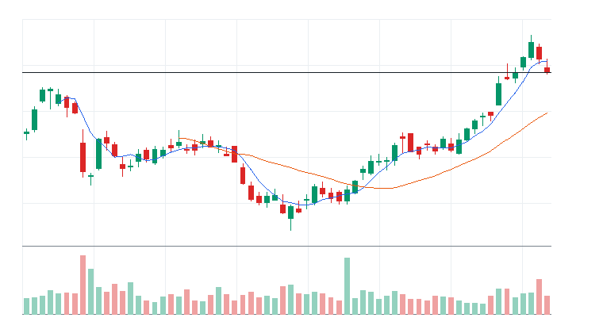
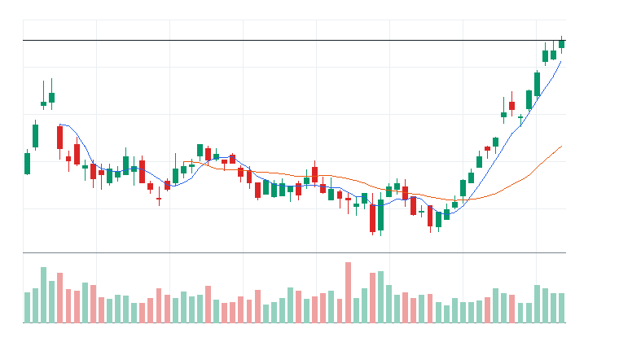
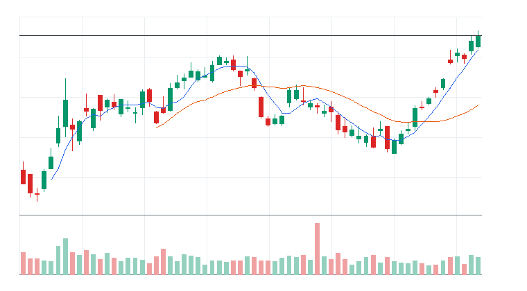
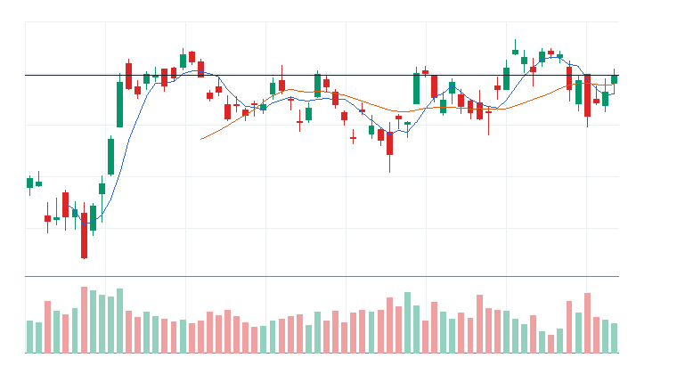
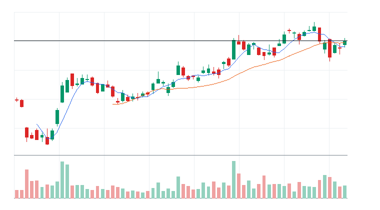
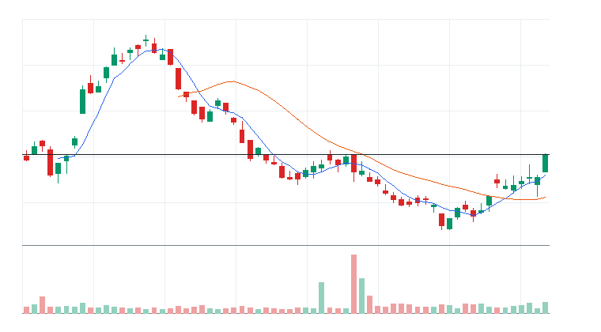
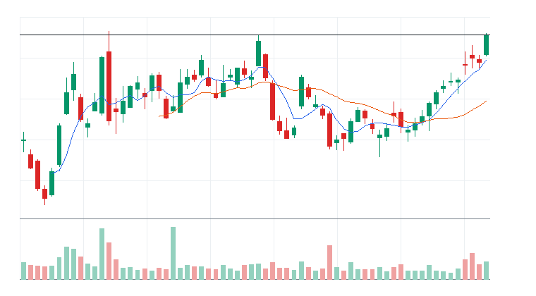

# 오늘의 데일리 트레이딩 요약

**REAL DATA TEST - 가격/거래량은 실제 데이터, 뉴스/ETF 구성종목 확산도/거래대금 유동성 일부 연결**

**목적:** 이 리포트는 최근 오른 자산을 나열하는 것이 아니라, 돈이 몰리는 근거와 다음 매수 주체가 확인할 트레이딩 후보를 찾기 위한 보고서다.

> 핵심 질문: 현재 가격에서 누가 사고 있고, 누가 앞으로 더 비싸게 사줄 수 있는가?

## 시장 국면 판단

- 최종 판정: 중립-상승 (59점)
- 전일 대비: 기간 조정에서 중립-상승으로 악화됐다(-9점).
- 판정 신뢰도: 높음 (100점) - 핵심 지수와 매크로 데이터가 대부분 직접 수집되어 판정 신뢰도가 높다.
- 행동 바이어스: 눌림 매수와 돌파 확인 병행
- 한 줄 결론: S&P 500, Nasdaq 100 중심으로 상승 우위지만, 매크로 점수 47라 추격보다 확인 매수가 낫다.
- 기술적 지표: 상승 추세 유지 (66점, 가중치 65%)
- S&P 500: 72점 | 50일선 아래, 200일선 위, 20일 -0.53%, 60일 +5.00%, 52주 고점 대비 -2.31% -> 기술 점수 72
- Nasdaq 100: 60점 | 50일선 아래, 200일선 위, 20일 -4.99%, 60일 +6.00%, 52주 고점 대비 -7.66% -> 기술 점수 60
- 매크로 시황: 매크로 중립 (47점, 가중치 35%)
- 매크로 요약: 신용/유동성 부담으로 매크로 환경은 방어적이다.
- 금리: 중립 54점 / 금리 중립 / confidence HIGH
  - 주요 근거: US 10Y yield 20일 -4.05%, 5일 -2.67%; US 3M yield 20일 -1.13%, 단기금리 방향 확인; US long-duration bonds 20일 -0.27%, 장기채 가격 기준 할인율 부담 확인
  - 확인 사항: 추가 확인 이벤트 없음
- 물가: 중립 46점 / 물가 중립 / confidence HIGH
  - 주요 근거: Oil ETF 20일 +7.37%, 유가 기반 물가 압력 확인; TIPS ETF 20일 +0.71%, 물가연동채 흐름은 보조 근거; Gold 20일 -3.55%, 금 강세는 방어 수요 여부 확인
  - 확인 사항: 추가 확인 이벤트 없음
- 정책: 중립 50점 / 정책 이벤트 확인 전 중립 / confidence LOW
  - 주요 근거: 정책 톤은 1차 버전에서 일정/이벤트 리스크 기반 중립값으로 반영한다.
  - 확인 사항: FOMC, CPI, PCE, 고용지표 발표 전후에는 매크로 confidence를 보수적으로 해석한다.
- 신용/유동성: 위험 34점 / 신용/유동성 부담 / confidence HIGH
  - 주요 근거: High yield credit 20일 -1.43%, 하이일드 위험선호 확인; HYG-LQD 20일 상대강도 -0.78%, 신용위험 선호/회피 확인; VIX 20일 +21.44%, 변동성 부담 확인
  - 확인 사항: VIX 상승은 유동성/리스크 프리미엄 부담으로 해석한다.
- 환율/글로벌: 중립 49점 / 환율/글로벌 중립 / confidence MEDIUM
  - 주요 근거: US dollar 20일 +0.94%, 달러 강세/약세 확인
  - 확인 사항: 추가 확인 이벤트 없음
- US 10Y yield: 59점 | 하락 시 주식 우호; 5일 -2.67%, 20일 -4.05% -> 매크로 점수 59
- US 3M yield: 53점 | 하락 시 주식 우호; 5일 -1.61%, 20일 -1.13% -> 매크로 점수 53
- US long-duration bonds: 51점 | 상승 시 주식 우호; 5일 +1.71%, 20일 -0.27% -> 매크로 점수 51
- TIPS ETF: 50점 | 상승 시 주식 우호; 5일 +0.70%, 20일 +0.71% -> 매크로 점수 50
- Oil ETF: 35점 | 하락 시 주식 우호; 5일 +4.06%, 20일 +7.37% -> 매크로 점수 35
- Gold: 50점 | 상승 시 주식 우호; 5일 +0.79%, 20일 -3.55% -> 매크로 점수 50
- US dollar: 49점 | 하락 시 주식 우호; 5일 -0.69%, 20일 +0.94% -> 매크로 점수 49
- High yield credit: 48점 | 상승 시 주식 우호; 5일 +0.22%, 20일 -1.43% -> 매크로 점수 48
- Investment grade credit: 50점 | 상승 시 주식 우호; 5일 +0.54%, 20일 -0.65% -> 매크로 점수 50
- VIX: 3점 | 하락 시 주식 우호; 5일 +15.61%, 20일 +21.44% -> 매크로 점수 3
- 데이터 커버리지: 기술 2/2, 매크로 10/10
- 데이터 신뢰도 근거:
  - 직접 지수 데이터: S&P 500, Nasdaq 100
  - 대체 지수 데이터 없음
  - 매크로 데이터: 10/10
  - 누락 데이터 없음
  - stale 데이터 없음

## 모바일 요약

[오늘의 데일리 트레이딩 요약]

생성 성공 / 데이터 모드: REAL_TEST

시장:
- 중립

시장 지배 서사:
1. Specialty Business Services 자금 유입 - 약화 - SPDR S&P 500 ETF Trust(SPY), Invesco QQQ Trust(QQQ), Cintas Corporation(CTAS), Thomson Reuters Corporation(TRI) 중심으로 5일 +3.62%, 20일 +3.99% 흐름이 형성됨. 직접 촉매 일부 확인.
2. Integrated Oil & Gas 자금 유입 - 약화 - Energy Select Sector SPDR Fund(XLE), VanEck Oil Services ETF(OIH), Chevron(CVX), Exxon Mobil(XOM) 중심으로 5일 +1.61%, 20일 +7.39% 흐름이 형성됨. 직접 촉매 일부 확인.
3. 매크로 방어/헤지 - 약화 - Energy Select Sector SPDR Fund(XLE), iShares 20+ Year Treasury Bond ETF(TLT), Chevron(CVX), Exxon Mobil(XOM) 중심으로 5일 +1.49%, 20일 +4.29% 흐름이 형성됨. 직접 촉매 일부 확인.

트렌드 강도:
1. Specialty Business Services 자금 유입 - TSI 40 - 잠복 - 진입품질 낮음
2. Integrated Oil & Gas 자금 유입 - TSI 42 - 잠복 - 진입품질 낮음
3. 매크로 방어/헤지 - TSI 37 - 잠복 - 진입품질 낮음

오늘 결론:
- Consumer Cyclical 개별 종목 흐름이 ETF 대비 강한지 확인 필요
- 행동 후보는 linkedNarrative와 함께 확인한다.
- 추격보다 진입 조건 확인 후 접근한다.

오늘 실제 행동 후보:
1. Marriott International Inc.(MAR)(STOCK) - Specialty Business Services 자금 유입 - 52주 고점 부근이라 돌파가 확인되면 신고가 추종 매수가 붙을 수 있음
2. Cintas Corporation(CTAS)(STOCK) - Specialty Business Services 자금 유입 - 52주 고점 부근이라 돌파가 확인되면 신고가 추종 매수가 붙을 수 있음
3. Automatic Data Processing Inc.(ADP)(STOCK) - Specialty Business Services 자금 유입 - 52주 고점 부근이라 돌파가 확인되면 신고가 추종 매수가 붙을 수 있음

다크호스 후보:
1. 다크호스 후보 없음 - 조건 충족 후보 없음

ETF 후보 TOP 5:
1. iShares Expanded Tech-Software Sector ETF(IGV) - AI 소프트웨어/사이버보안 확산 - 제외
2. Energy Select Sector SPDR Fund(XLE) - Integrated Oil & Gas 자금 유입 - 거래량 확인 전 관찰
3. SPDR S&P 500 ETF Trust(SPY) - Specialty Business Services 자금 유입 - 거래량 확인 전 관찰
4. Roundhill Magnificent Seven ETF(MAGS) - 소프트웨어 실적/AI 수익화 - 거래량 확인 전 관찰
5. Global X Defense Tech ETF(SHLD) - 방산/안보 프리미엄 - 제외

웹 리포트:
https://yoolcool.github.io/DailyTradingThesisAgent/

## 오늘 결론

- 오늘 결론: 조건부 진입
- 신규 진입 후보: 0개
- 조건부 진입 후보: 4개
- 관찰 후보: 95개
- 주요 제한 요인: Entry Quality < 40, 뉴스 직접성 부족, RVOL 미달
- 주문 판단: 시장가 금지 / 지정가 또는 관찰
- 실전 판단: 진입 후보는 있으나, 전일 고점 돌파와 거래량 확인 후 선별적으로 접근한다.

### 후보 제한 요인 집계

- RVOL < 1.00x: 95개
- 거래대금 유동성 낮음: 18개
- Entry Quality 50~54 near miss: 0개
- Entry Quality 40~49 관찰: 4개
- Entry Quality < 40: 151개
- Exhaustion Risk >= 70: 0개
- ETF breadth 샘플 부족: 37개
- 뉴스 직접성 부족: 98개

## 데이터 신뢰도

- 전체 데이터 신뢰도 등급: LOW
- 분석 신뢰도: LOW
- 주문 실행 신뢰도: LOW
- ETF breadth 신뢰도: LOW
- 신뢰도 해석: 테마 확산 판단 제한, 거래대금 유동성 낮음 또는 확인 불가, 프리/애프터마켓 확인 불가
- 리포트 생성 시각: 2026-10-23 10:17 KST
- 가격 기준 거래일: 2026-10-22 US regular close
- 뉴스 수집 시각: 2026-10-23 10:17 KST
- 가장 최근 뉴스 발행 시각: 2026-10-23 10:05 KST
- 뉴스 신선도 상태: FRESH
- 뉴스 소스: Yahoo Finance RSS, MarketWatch RSS, CNBC Markets RSS, SEC EDGAR RSS, Federal Reserve RSS, Finnhub API
- 뉴스 소스 상태: Yahoo Finance RSS CONNECTED, MarketWatch RSS CONNECTED, CNBC Markets RSS PARTIAL, SEC EDGAR RSS PARTIAL, Federal Reserve RSS CONNECTED, Finnhub API DISABLED
- 뉴스 신뢰도: MEDIUM
- 추천 적용 거래일: 2026-10-22 US regular session
- 가격/거래량 데이터 상태: 일부 연결
- 뉴스 데이터 상태: 일부 연결
- ETF 구성종목 확산도 상태: 일부 연결
- ETF 구성종목 샘플 수: 1~4
- 거래대금 유동성 데이터 상태: 일부 연결
- 프리/애프터마켓 데이터 상태: UNAVAILABLE
- 데이터 provider: yfinance, Yahoo Finance RSS, MarketWatch RSS, CNBC Markets RSS, SEC EDGAR RSS, Federal Reserve RSS, Finnhub API, config fallback sample, price-volume dollar-volume fallback
- 실전 사용 경고: 이 리포트는 투자판단 보조용이며, REAL_TEST 모드에서는 일부 데이터가 누락되거나 지연될 수 있다. 실제 주문 전 현재가, 뉴스, 프리마켓/정규장 거래량을 별도 확인해야 한다.

## 0. 시장 상태

- 데이터 모드: REAL_TEST
- 가격/거래량: 일부 연결
- 뉴스: 일부 연결
- ETF 구성종목 확산도: 일부 연결
- 거래대금 유동성: 일부 연결
- 생성 시각: 2026년 10월 23일 금요일 AM 10:17
- 시장 상태: 중립
- 오늘 돈의 방향: Consumer Cyclical 개별 종목 흐름이 ETF 대비 강한지 확인 필요
- 강한 테마 TOP 3: 클라우드/엔터프라이즈 소프트웨어 ETF(58), 전력/유틸리티 ETF(49), Real Estate(40)
- 데이터 한계:
  - API 또는 provider 상태에 따라 뉴스/ETF 확산도/거래대금 유동성 반영 범위가 달라질 수 있다.
  - 수집 실패 데이터는 점수 반영에서 제외하거나 confidence를 제한한다.
  - reasonConfidence HIGH는 직접 촉매, 가격/거래량, 확산도/유동성 근거가 함께 있을 때만 사용한다.

## 오늘 시장을 지배하는 서사

### 오늘 시장을 지배하는 서사 TOP 3

#### 1. Specialty Business Services 자금 유입
- 상태: 약화
- narrativeScore: 49
- reasonConfidence: LOW
- 근거 ETF: SPY, QQQ, IWM
- 근거 개별 종목: CTAS, TRI, CPRT
- 돈이 몰리는 이유: Specialty Business Services 자금 유입 관련 SPDR S&P 500 ETF Trust(SPY), Invesco QQQ Trust(QQQ), iShares Russell 2000 ETF(IWM)와 Cintas Corporation(CTAS), Thomson Reuters Corporation(TRI), Copart Inc.(CPRT)의 5일(+3.62%)·20일(+3.99%) 흐름을 함께 본다. 평균 상대 거래량은 1.03배이고, ETF 확산도는 추가 확인이 필요하다. 직접 뉴스/이벤트가 일부 확인된다.
- 다음 매수 주체: Specialty Business Services 자금 유입을 확인한 섹터 ETF 자금과 상대강도 추종 스윙 자금
- 가장 좋은 트레이딩 수단: ETF 우선: QQQ, SPY, IWM / 개별 종목 우선: TRI, CTAS, CPRT
- 서사가 깨지는 조건: QQQ 20일선 이탈 또는 관련 종목 절반 이상 5일선 이탈
- 오늘 행동: 기존 네러티브와 중복을 확인한 뒤 ETF/대표 종목 동조성이 살아날 때만 관찰 편입

상세 narrativeScore 근거 보기

- rawScore: 49
- ETF 평균 moneyFlowScore: 19
- 개별 종목 평균 moneyFlowScore: 67
- ETF 후보 비율: 0%
- 개별 종목 후보 비율: 67%
- 5일 평균 수익률: +4.00%
- 20일 평균 수익률: +4.00%
- 평균 상대 거래량: 1.00배
- ETF 평균 상대 거래량: 1.00배
- 개별주 평균 상대 거래량: 1.00배
- 52주 고점 근접 후보 비율: 50%
- 뉴스 직접성 점수: 10
- ETF 확산도 점수: 0
- 유동성 점수: 3
- 과열 리스크 차감: 0

#### 2. Integrated Oil & Gas 자금 유입
- 상태: 약화
- narrativeScore: 45
- reasonConfidence: LOW
- 근거 ETF: XLE, OIH
- 근거 개별 종목: CVX, XOM
- 돈이 몰리는 이유: Integrated Oil & Gas 자금 유입 관련 Energy Select Sector SPDR Fund(XLE), VanEck Oil Services ETF(OIH)와 Chevron(CVX), Exxon Mobil(XOM)의 5일(+1.61%)·20일(+7.39%) 흐름을 함께 본다. 평균 상대 거래량은 0.96배이고, ETF 확산도는 추가 확인이 필요하다. 직접 뉴스/이벤트가 일부 확인된다.
- 다음 매수 주체: Integrated Oil & Gas 자금 유입을 확인한 섹터 ETF 자금과 상대강도 추종 스윙 자금
- 가장 좋은 트레이딩 수단: ETF 우선: XLE, OIH / 개별 종목 우선: XOM, CVX
- 서사가 깨지는 조건: XLE 20일선 이탈 또는 관련 종목 절반 이상 5일선 이탈
- 오늘 행동: 기존 네러티브와 중복을 확인한 뒤 ETF/대표 종목 동조성이 살아날 때만 관찰 편입

상세 narrativeScore 근거 보기

- rawScore: 45
- ETF 평균 moneyFlowScore: 30
- 개별 종목 평균 moneyFlowScore: 54
- ETF 후보 비율: 0%
- 개별 종목 후보 비율: 50%
- 5일 평균 수익률: +2.00%
- 20일 평균 수익률: +7.00%
- 평균 상대 거래량: 1.00배
- ETF 평균 상대 거래량: 1.00배
- 개별주 평균 상대 거래량: 1.00배
- 52주 고점 근접 후보 비율: 75%
- 뉴스 직접성 점수: 9
- ETF 확산도 점수: 0
- 유동성 점수: 1
- 과열 리스크 차감: 0

#### 3. 매크로 방어/헤지
- 상태: 약화
- narrativeScore: 40
- reasonConfidence: LOW
- 근거 ETF: XLE, TLT, GLD
- 근거 개별 종목: CVX, XOM
- 돈이 몰리는 이유: 매크로 방어/헤지 관련 Energy Select Sector SPDR Fund(XLE), iShares 20+ Year Treasury Bond ETF(TLT), SPDR Gold Shares(GLD)와 Chevron(CVX), Exxon Mobil(XOM)의 5일(+1.49%)·20일(+4.29%) 흐름을 함께 본다. 평균 상대 거래량은 0.91배이고, ETF 확산도는 추가 확인이 필요하다. 직접 뉴스/이벤트가 일부 확인된다.
- 다음 매수 주체: 금리/에너지/방어 헤지를 찾는 매크로 자금
- 가장 좋은 트레이딩 수단: ETF 우선: GLD, TLT, XLE / 개별 종목 우선: XOM, CVX
- 서사가 깨지는 조건: 방어 ETF 상대강도 둔화와 위험선호 성장주 재강세
- 오늘 행동: 위험회피가 확인될 때만 헤지성 접근

상세 narrativeScore 근거 보기

- rawScore: 40
- ETF 평균 moneyFlowScore: 21
- 개별 종목 평균 moneyFlowScore: 54
- ETF 후보 비율: 0%
- 개별 종목 후보 비율: 50%
- 5일 평균 수익률: +1.00%
- 20일 평균 수익률: +4.00%
- 평균 상대 거래량: 1.00배
- ETF 평균 상대 거래량: 1.00배
- 개별주 평균 상대 거래량: 1.00배
- 52주 고점 근접 후보 비율: 50%
- 뉴스 직접성 점수: 10
- ETF 확산도 점수: 0
- 유동성 점수: 3
- 과열 리스크 차감: 0

### 전체 narrative 요약

| 서사명 | 상태 | narrativeScore | reasonConfidence | 대표 ETF | 대표 종목 | 오늘 행동 |
| --- | --- | ---: | --- | --- | --- | --- |
| Specialty Business Services 자금 유입 | 약화 | 49 | LOW | SPY, QQQ, IWM | CTAS, TRI, CPRT | 기존 네러티브와 중복을 확인한 뒤 ETF/대표 종목 동조성이 살아날 때만 관찰 편입 |
| Integrated Oil & Gas 자금 유입 | 약화 | 45 | LOW | XLE, OIH | CVX, XOM | 기존 네러티브와 중복을 확인한 뒤 ETF/대표 종목 동조성이 살아날 때만 관찰 편입 |
| 매크로 방어/헤지 | 약화 | 40 | LOW | XLE, TLT, GLD | CVX, XOM | 위험회피가 확인될 때만 헤지성 접근 |
| AI 소프트웨어/사이버보안 확산 | 약화 | 36 | LOW | IGV, QQQ, AIQ | TEAM, DDOG, PLTR, MSFT | 추격보다 눌림 후 재상승 확인 |
| 소프트웨어 실적/AI 수익화 | 약화 | 36 | LOW | IGV, QQQ, AIQ | SHOP, MSFT | 기존 네러티브와 중복을 확인한 뒤 ETF/대표 종목 동조성이 살아날 때만 관찰 편입 |
| 필수소비재 음료 방어 성장 | 약화 | 28 | LOW | QQQ | CCEP, MNST | 기존 네러티브와 중복을 확인한 뒤 ETF/대표 종목 동조성이 살아날 때만 관찰 편입 |
| Medical Devices 자금 유입 | 약화 | 22 | LOW | QQQ | ISRG, DXCM | 기존 네러티브와 중복을 확인한 뒤 ETF/대표 종목 동조성이 살아날 때만 관찰 편입 |
| 위험선호 성장주 재진입 | 소멸 | 19 | LOW | QQQ, IPO, ARKK | TSLA, ARM, COIN | 지수 위험선호가 유지될 때만 선별 진입 |
| 방산/안보 프리미엄 | 소멸 | 19 | LOW | SHLD, XAR, ITA | NOC, LMT, PLTR, AVAV | 뉴스 촉매가 직접 확인될 때만 추세 추종 |
| Travel Services 자금 유입 | 약화 | 18 | LOW | QQQ | ABNB, BKNG | 기존 네러티브와 중복을 확인한 뒤 ETF/대표 종목 동조성이 살아날 때만 관찰 편입 |
| Discount Stores 자금 유입 | 약화 | 17 | LOW | QQQ | COST, WMT | 기존 네러티브와 중복을 확인한 뒤 ETF/대표 종목 동조성이 살아날 때만 관찰 편입 |
| 바이오/헬스케어 촉매 | 소멸 | 14 | LOW | QQQ | GILD, ALNY | 기존 네러티브와 중복을 확인한 뒤 ETF/대표 종목 동조성이 살아날 때만 관찰 편입 |
| 소비 회복/방어주 선별 | 약화 | 14 | LOW | QQQ | AMZN, PDD | 기존 네러티브와 중복을 확인한 뒤 ETF/대표 종목 동조성이 살아날 때만 관찰 편입 |
| 사이버보안 지출 재가속 | 약화 | 13 | LOW | IGV, IHAK, HACK | ZS, CRWD, PANW, FTNT | 기존 네러티브와 중복을 확인한 뒤 ETF/대표 종목 동조성이 살아날 때만 관찰 편입 |
| 전력 유틸리티 수요 재평가 | 소멸 | 11 | LOW | SPY, QQQ, IWM | GEV, ETN, VRT | 기존 네러티브와 중복을 확인한 뒤 ETF/대표 종목 동조성이 살아날 때만 관찰 편입 |
| Aerospace & Defense 자금 유입 | 소멸 | 11 | LOW | SPY, QQQ, IWM | KTOS, AVAV | 기존 네러티브와 중복을 확인한 뒤 ETF/대표 종목 동조성이 살아날 때만 관찰 편입 |
| Data Storage 자금 유입 | 소멸 | 10 | LOW | SPY, QQQ, IWM | STX, WDC | 기존 네러티브와 중복을 확인한 뒤 ETF/대표 종목 동조성이 살아날 때만 관찰 편입 |
| 반도체 설계/공급망 재가속 | 소멸 | 7 | LOW | SMH, SOXX, SOXQ | TXN, MRVL, NVDA, AMD | 기존 네러티브와 중복을 확인한 뒤 ETF/대표 종목 동조성이 살아날 때만 관찰 편입 |
| Internet Content 자금 유입 | 약화 | 6 | LOW | QQQ | META, GOOGL, GOOG | 기존 네러티브와 중복을 확인한 뒤 ETF/대표 종목 동조성이 살아날 때만 관찰 편입 |
| 전력망/원전/인프라 병목 | 소멸 | 0 | LOW | GRID, PAVE, URA | VRT, ETN, PWR, CEG | ETF 확산도와 거래량이 같이 살아날 때만 진입 |
| 반도체 장비 사이클 재평가 | 소멸 | 0 | LOW | SMH, SOXX, SOXQ | ASML, LRCX | 기존 네러티브와 중복을 확인한 뒤 ETF/대표 종목 동조성이 살아날 때만 관찰 편입 |
| AI 인프라 재가속 | 소멸 | 0 | LOW | SMH, SOXX, DRAM | NVDA, MU, VRT, ETN | 추격보다 5일선 지지 후 재상승 확인 |
| 비트코인/디지털 자산 위험선호 | 소멸 | 0 | LOW | IBIT, BLOK | MSTR, COIN, IREN | 비트코인 베타가 살아날 때만 단기 매매 |
| Bitcoin Mining 자금 유입 | 소멸 | 0 | LOW | IBIT, BLOK | RIOT, MARA, CIFR | 기존 네러티브와 중복을 확인한 뒤 ETF/대표 종목 동조성이 살아날 때만 관찰 편입 |

## 트렌드 강도 판단

### 1. Specialty Business Services 자금 유입
- Trend Strength Index: 40
- 트렌드 상태 라벨: 잠복
- 테마 확산도: 약함
- ETF 동조성: 부족
- 거래량 강도: 약함
- 과열 위험: 낮음 (15)
- 오늘 진입 품질: 낮음 (29)
- 한 줄 판단: Specialty Business Services 자금 유입는 ETF 동조성이 약해 테마 자금 확인이 부족하다.
- 오늘 접근법: SPDR S&P 500 ETF Trust(SPY)/Invesco QQQ Trust(QQQ)/iShares Russell 2000 ETF(IWM)와 Cintas Corporation(CTAS)/Thomson Reuters Corporation(TRI)/Copart Inc.(CPRT)의 거래량 확산이 확인되기 전까지 관찰한다.

트렌드 강도 상세 근거 보기

- 가격 모멘텀: 가격 모멘텀 13/25. 평균 5D +3.62%, 20D +3.99%.
- 거래량 강도: 거래량 강도 7/20. 평균 RVOL 1.03배.
- ETF 동조성: ETF 동조성 4/15. 관련 ETF Invesco QQQ Trust(QQQ), SPDR S&P 500 ETF Trust(SPY), iShares Russell 2000 ETF(IWM) 흐름을 기준으로 판단.
- 테마 확산도: 테마 확산도 9/20. 상위 1~2개 쏠림 감점 3점 반영.
- 뉴스 촉매: 뉴스/촉매 신선도 3/10. HIGH 직접 촉매 1개.
- 과열 리스크: 과열 리스크 15/100. 단기 급등, 고점 근접, ETF-개별주 괴리, 쏠림을 함께 반영.
- 시장 환경: 시장 환경 4/10. QQQ/SPY/IWM 가격 흐름 기반 위험선호 점수.

### 2. Integrated Oil & Gas 자금 유입
- Trend Strength Index: 42
- 트렌드 상태 라벨: 잠복
- 테마 확산도: 약함
- ETF 동조성: 보통
- 거래량 강도: 부족
- 과열 위험: 보통 (32)
- 오늘 진입 품질: 낮음 (19)
- 한 줄 판단: Integrated Oil & Gas 자금 유입는 관찰 가능한 흐름은 있으나 가격, 거래량, 확산도 중 일부 확인이 더 필요하다.
- 오늘 접근법: Energy Select Sector SPDR Fund(XLE)/VanEck Oil Services ETF(OIH)와 Chevron(CVX)/Exxon Mobil(XOM)의 거래량 확산이 확인되기 전까지 관찰한다.

트렌드 강도 상세 근거 보기

- 가격 모멘텀: 가격 모멘텀 12/25. 평균 5D +1.61%, 20D +7.39%.
- 거래량 강도: 거래량 강도 5/20. 평균 RVOL 0.96배.
- ETF 동조성: ETF 동조성 11/15. 관련 ETF Energy Select Sector SPDR Fund(XLE), VanEck Oil Services ETF(OIH) 흐름을 기준으로 판단.
- 테마 확산도: 테마 확산도 9/20. 상위 1~2개 쏠림 감점 6점 반영.
- 뉴스 촉매: 뉴스/촉매 신선도 1/10. HIGH 직접 촉매 1개.
- 과열 리스크: 과열 리스크 32/100. 단기 급등, 고점 근접, ETF-개별주 괴리, 쏠림을 함께 반영.
- 시장 환경: 시장 환경 4/10. QQQ/SPY/IWM 가격 흐름 기반 위험선호 점수.

### 3. 매크로 방어/헤지
- Trend Strength Index: 37
- 트렌드 상태 라벨: 잠복
- 테마 확산도: 보통
- ETF 동조성: 보통
- 거래량 강도: 부족
- 과열 위험: 낮음 (18)
- 오늘 진입 품질: 낮음 (20)
- 한 줄 판단: 매크로 방어/헤지는 관찰 가능한 흐름은 있으나 가격, 거래량, 확산도 중 일부 확인이 더 필요하다.
- 오늘 접근법: Energy Select Sector SPDR Fund(XLE)/iShares 20+ Year Treasury Bond ETF(TLT)/SPDR Gold Shares(GLD)와 Chevron(CVX)/Exxon Mobil(XOM)의 거래량 확산이 확인되기 전까지 관찰한다.

트렌드 강도 상세 근거 보기

- 가격 모멘텀: 가격 모멘텀 10/25. 평균 5D +1.49%, 20D +4.29%.
- 거래량 강도: 거래량 강도 4/20. 평균 RVOL 0.91배.
- ETF 동조성: ETF 동조성 8/15. 관련 ETF SPDR Gold Shares(GLD), iShares 20+ Year Treasury Bond ETF(TLT), Energy Select Sector SPDR Fund(XLE), VanEck Oil Services ETF(OIH) 흐름을 기준으로 판단.
- 테마 확산도: 테마 확산도 10/20. 상위 1~2개 쏠림 감점 3점 반영.
- 뉴스 촉매: 뉴스/촉매 신선도 1/10. HIGH 직접 촉매 1개.
- 과열 리스크: 과열 리스크 18/100. 단기 급등, 고점 근접, ETF-개별주 괴리, 쏠림을 함께 반영.
- 시장 환경: 시장 환경 4/10. QQQ/SPY/IWM 가격 흐름 기반 위험선호 점수.

## 최근 추천 결과 트래킹

개별주는 데이트레이딩 관점으로 추천 이후 첫 정규장의 장중 최고가와 종가를 추적한다. ETF는 테마/스윙 관점으로 추천 이후 1주일 동안의 최고가와 현재 종가를 추적한다.

### 개별주 Top 3 추천 성과 요약
- 최근 5개 리포트 표본: 13개 (초기 검증 단계)
- 장중 최고가 기준 성공률: +28.57%
- 종가 기준 성공률: +28.57%
- 평균 장중 최고 수익률: +2.90%
- 평균 종가 수익률: +0.83%

### ETF 추천 성과 요약
- 최근 5개 리포트 표본: 0개 (초기 검증 단계)
- 1주 최고가 기준 성공률: 데이터 없음
- 현재 종가 기준 성공률: 데이터 없음
- 평균 1주 최고 수익률: 데이터 없음
- 평균 현재 수익률: 데이터 없음

최근 추천 결과 상세 테이블 펼치기

| 추천일 | 유형 | 순위 | 티커 | 기준가 | 추적 기간 | 상태 | High 수익률 | Close 수익률 | 결과 | 코멘트 |
| --- | --- | ---: | --- | ---: | --- | --- | ---: | ---: | --- | --- |
| 2026-10-23 | STOCK | 3 | ADP | $294.5 | 2026-10-23 | pending | 데이터 없음 | 데이터 없음 | 추적 대기 | 아직 추적 거래일 데이터가 완성되지 않음 |
| 2026-10-23 | STOCK | 2 | CTAS | $220.15 | 2026-10-23 | pending | 데이터 없음 | 데이터 없음 | 추적 대기 | 아직 추적 거래일 데이터가 완성되지 않음 |
| 2026-10-23 | STOCK | 1 | MAR | $404 | 2026-10-23 | pending | 데이터 없음 | 데이터 없음 | 추적 대기 | 아직 추적 거래일 데이터가 완성되지 않음 |
| 2026-10-22 | STOCK | 3 | TRI | $112.82 | 2026-10-22 | pending | 데이터 없음 | 데이터 없음 | 추적 대기 | 아직 추적 거래일 데이터가 완성되지 않음 |
| 2026-10-22 | STOCK | 2 | MAR | $397.31 | 2026-10-22 | pending | 데이터 없음 | 데이터 없음 | 추적 대기 | 아직 추적 거래일 데이터가 완성되지 않음 |
| 2026-10-22 | STOCK | 1 | NOC | $534 | 2026-10-22 | pending | 데이터 없음 | 데이터 없음 | 추적 대기 | 아직 추적 거래일 데이터가 완성되지 않음 |
| 2026-10-13 | STOCK | 2 | SHOP | $179.22 | 2026-10-13 | complete | -0.01% | -1.51% | 실패 | 추천 이후 의미 있는 장중 기회가 부족하고 종가도 약함 (일봉 기준) |
| 2026-10-13 | STOCK | 1 | PLTR | $209 | 2026-10-13 | complete | +0.90% | -0.16% | 실패 | 추천 이후 의미 있는 장중 기회가 부족하고 종가도 약함 (일봉 기준) |
| 2026-10-12 | STOCK | 3 | ZS | $233.73 | 2026-10-12 | complete | +1.49% | -3.40% | 제한적 유효 | 제한적인 장중 기회만 발생 (일봉 기준) |
| 2026-10-12 | STOCK | 2 | DDOG | $293.26 | 2026-10-12 | complete | +2.53% | -2.04% | 제한적 유효 | 제한적인 장중 기회만 발생 (일봉 기준) |
| 2026-10-12 | STOCK | 1 | PLTR | $209.05 | 2026-10-12 | complete | +1.86% | -0.02% | 제한적 유효 | 제한적인 장중 기회만 발생 (일봉 기준) |
| 2026-10-09 | STOCK | 2 | ZS | $216.81 | 2026-10-09 | complete | +8.07% | +7.80% | 성공 | 장중 기회와 종가 유지가 모두 확인됨 (일봉 기준) |
| 2026-10-09 | STOCK | 1 | PLTR | $198.78 | 2026-10-09 | complete | +5.43% | +5.17% | 성공 | 장중 기회와 종가 유지가 모두 확인됨 (일봉 기준) |
| 2026-10-08 | STOCK | 1 | ADSK | $235.05 | 2026-10-08 | complete | +0.40% | -0.62% | 실패 | 추천 이후 의미 있는 장중 기회가 부족하고 종가도 약함 (일봉 기준) |
| 2026-10-07 | STOCK | 3 | FTNT | $191.27 | 2026-10-07 | complete | +0.50% | -1.04% | 실패 | 추천 이후 의미 있는 장중 기회가 부족하고 종가도 약함 (일봉 기준) |
| 2026-10-07 | STOCK | 2 | AMD | $649.42 | 2026-10-07 | complete | -0.14% | -0.55% | 실패 | 추천 이후 의미 있는 장중 기회가 부족하고 종가도 약함 (일봉 기준) |
| 2026-10-07 | STOCK | 1 | SNPS | $505.17 | 2026-10-07 | complete | +0.86% | -0.49% | 실패 | 추천 이후 의미 있는 장중 기회가 부족하고 종가도 약함 (일봉 기준) |
| 2026-10-07 | ETF | 1 | CIBR | $108.13 | 2026-10-07~2026-10-14 | complete | +2.36% | -4.62% | 단기 고점 후 반납 | 1주 내 상승 기회는 있었지만 현재가는 반납 |
| 2026-10-06 | STOCK | 2 | TSM | $485.8 | 2026-10-06 | complete | +0.04% | -0.72% | 실패 | 추천 이후 의미 있는 장중 기회가 부족하고 종가도 약함 (일봉 기준) |
| 2026-10-06 | STOCK | 1 | SNPS | $488.47 | 2026-10-06 | complete | +3.90% | +3.42% | 성공 | 장중 기회와 종가 유지가 모두 확인됨 (일봉 기준) |
| 2026-10-06 | ETF | 1 | CIBR | $106.01 | 2026-10-06~2026-10-13 | complete | +4.41% | -2.72% | 단기 고점 후 반납 | 1주 내 상승 기회는 있었지만 현재가는 반납 |
| 2026-10-05 | STOCK | 1 | SNPS | $489.9 | 2026-10-05 | complete | +3.77% | -0.29% | 단타 유효 | 장중 기회는 있었지만 종가 유지력은 약함 (일봉 기준) |
| 2026-10-05 | ETF | 1 | SMH | $630.6 | 2026-10-05~2026-10-12 | complete | +1.41% | -11.72% | 실패 | 추천 이후 ETF 흐름이 약화됨 |
| 2026-09-30 | STOCK | 1 | AMAT | $512.01 | 2026-09-30 | complete | +0.67% | -0.12% | 실패 | 추천 이후 의미 있는 장중 기회가 부족하고 종가도 약함 (일봉 기준) |
| 2026-09-28 | STOCK | 3 | DDOG | $268.13 | 2026-09-28 | complete | +1.74% | +0.21% | 제한적 유효 | 제한적인 장중 기회만 발생 (일봉 기준) |
| 2026-09-28 | STOCK | 2 | ARM | $310.32 | 2026-09-28 | complete | -1.02% | -8.70% | 실패 | 추천 이후 의미 있는 장중 기회가 부족하고 종가도 약함 (일봉 기준) |
| 2026-09-28 | STOCK | 1 | QCOM | $201.97 | 2026-09-28 | complete | -1.39% | -7.17% | 실패 | 추천 이후 의미 있는 장중 기회가 부족하고 종가도 약함 (일봉 기준) |
| 2026-09-25 | STOCK | 3 | ARM | $332.56 | 2026-09-25 | complete | -2.13% | -6.69% | 실패 | 추천 이후 의미 있는 장중 기회가 부족하고 종가도 약함 (일봉 기준) |
| 2026-09-25 | STOCK | 2 | CRWD | $262.49 | 2026-09-25 | complete | -1.00% | -3.95% | 실패 | 추천 이후 의미 있는 장중 기회가 부족하고 종가도 약함 (일봉 기준) |
| 2026-09-25 | STOCK | 1 | PLTR | $191.79 | 2026-09-25 | complete | +1.26% | -1.11% | 제한적 유효 | 제한적인 장중 기회만 발생 (일봉 기준) |
| 2026-09-23 | STOCK | 3 | MARA | $13.28 | 2026-09-23 | complete | +2.79% | +0.53% | 제한적 유효 | 제한적인 장중 기회만 발생 (일봉 기준) |
| 2026-09-23 | STOCK | 2 | CIFR | $18.9 | 2026-09-23 | complete | +3.49% | -2.91% | 단타 유효 | 장중 기회는 있었지만 종가 유지력은 약함 (일봉 기준) |
| 2026-09-23 | STOCK | 1 | RIOT | $24.18 | 2026-09-23 | complete | +4.51% | +2.11% | 성공 | 장중 기회와 종가 유지가 모두 확인됨 (일봉 기준) |
| 2026-09-23 | ETF | 3 | ARKK | $90.72 | 2026-09-23~2026-09-30 | complete | +1.63% | -5.84% | 실패 | 추천 이후 ETF 흐름이 약화됨 |
| 2026-09-23 | ETF | 2 | MAGS | $72.97 | 2026-09-23~2026-09-30 | complete | -0.29% | -0.11% | 진행 중 | 아직 1주 추적 기간이 끝나지 않음 |
| 2026-09-23 | ETF | 1 | SMH | $596.03 | 2026-09-23~2026-09-30 | complete | +2.89% | -6.60% | 단기 고점 후 반납 | 1주 내 상승 기회는 있었지만 현재가는 반납 |
| 2026-09-22 | STOCK | 3 | CRWD | $237.65 | 2026-09-22 | complete | +5.53% | +5.22% | 성공 | 장중 기회와 종가 유지가 모두 확인됨 (일봉 기준) |
| 2026-09-22 | STOCK | 2 | RIOT | $23.75 | 2026-09-22 | complete | +6.91% | +4.97% | 성공 | 장중 기회와 종가 유지가 모두 확인됨 (일봉 기준) |
| 2026-09-22 | STOCK | 1 | AMD | $559.82 | 2026-09-22 | complete | +11.56% | +11.42% | 성공 | 장중 기회와 종가 유지가 모두 확인됨 (일봉 기준) |
| 2026-09-21 | STOCK | 3 | CRWD | $237.65 | 2026-09-21 | complete | +5.33% | +4.92% | 성공 | 장중 기회와 종가 유지가 모두 확인됨 (일봉 기준) |
| 2026-09-21 | STOCK | 2 | RIOT | $23.75 | 2026-09-21 | complete | +5.55% | +1.81% | 성공 | 장중 기회와 종가 유지가 모두 확인됨 (일봉 기준) |
| 2026-09-21 | STOCK | 1 | AMD | $559.82 | 2026-09-21 | complete | +10.16% | +9.95% | 성공 | 장중 기회와 종가 유지가 모두 확인됨 (일봉 기준) |
| 2026-09-17 | STOCK | 3 | QCOM | $187.8 | 2026-09-17 | complete | +2.19% | +0.48% | 제한적 유효 | 제한적인 장중 기회만 발생 (일봉 기준) |
| 2026-09-17 | STOCK | 2 | FTNT | $172.37 | 2026-09-17 | complete | +2.16% | +0.12% | 제한적 유효 | 제한적인 장중 기회만 발생 (일봉 기준) |
| 2026-09-17 | STOCK | 1 | CRWD | $242.49 | 2026-09-17 | complete | +3.23% | +1.32% | 성공 | 장중 기회와 종가 유지가 모두 확인됨 (일봉 기준) |
| 2026-09-15 | STOCK | 1 | AMD | $516.13 | 2026-09-15 | complete | -0.48% | -2.31% | 실패 | 추천 이후 의미 있는 장중 기회가 부족하고 종가도 약함 (일봉 기준) |
| 2026-09-14 | STOCK | 1 | AMD | $516.13 | 2026-09-14 | complete | -3.44% | -4.40% | 실패 | 추천 이후 의미 있는 장중 기회가 부족하고 종가도 약함 (일봉 기준) |
| 2026-09-11 | STOCK | 2 | META | $653.69 | 2026-09-11 | complete | +1.61% | -0.87% | 제한적 유효 | 제한적인 장중 기회만 발생 (일봉 기준) |
| 2026-09-11 | STOCK | 1 | AMD | $521.1 | 2026-09-11 | complete | -0.01% | -0.95% | 실패 | 추천 이후 의미 있는 장중 기회가 부족하고 종가도 약함 (일봉 기준) |
| 2026-09-10 | STOCK | 3 | TSM | $439 | 2026-09-10 | complete | -1.47% | -2.50% | 실패 | 추천 이후 의미 있는 장중 기회가 부족하고 종가도 약함 (일봉 기준) |
| 2026-09-10 | STOCK | 2 | AMD | $505.74 | 2026-09-10 | complete | +2.09% | -0.42% | 제한적 유효 | 제한적인 장중 기회만 발생 (일봉 기준) |
| 2026-09-10 | STOCK | 1 | CEG | $299.05 | 2026-09-10 | complete | -1.41% | -4.37% | 실패 | 추천 이후 의미 있는 장중 기회가 부족하고 종가도 약함 (일봉 기준) |
| 2026-09-10 | ETF | 1 | DRAM | $61.1 | 2026-09-10~2026-09-17 | complete | -1.73% | -19.54% | 실패 | 추천 이후 ETF 흐름이 약화됨 |
| 2026-09-09 | STOCK | 1 | MU | $1,016.59 | 2026-09-09 | complete | +2.54% | +1.10% | 제한적 유효 | 제한적인 장중 기회만 발생 (일봉 기준) |
| 2026-09-08 | STOCK | 1 | MU | $1,016.59 | 2026-09-08 | complete | +2.41% | -1.61% | 제한적 유효 | 제한적인 장중 기회만 발생 (일봉 기준) |
| 2026-09-07 | STOCK | 1 | MU | $1,016.59 | 2026-09-07 | pending | 데이터 없음 | 데이터 없음 | 추적 대기 | 아직 추적 거래일 데이터가 완성되지 않음 |
| 2026-09-04 | STOCK | 1 | ALNY | $267.4 | 2026-09-04 | complete | -0.21% | -0.48% | 실패 | 추천 이후 의미 있는 장중 기회가 부족하고 종가도 약함 (일봉 기준) |
| 2026-09-04 | ETF | 1 | OIH | $436.58 | 2026-09-04~2026-09-11 | complete | +0.81% | -9.85% | 실패 | 추천 이후 ETF 흐름이 약화됨 |
| 2026-09-03 | STOCK | 1 | CVX | $211.05 | 2026-09-03 | complete | +1.02% | +0.13% | 제한적 유효 | 제한적인 장중 기회만 발생 (일봉 기준) |
| 2026-09-02 | STOCK | 1 | CVX | $211.05 | 2026-09-02 | complete | +0.82% | +0.35% | 추적 대기 | 아직 추적 거래일 데이터가 완성되지 않음 (일봉 기준) |

## 오늘 실제 행동 후보

### 1. Marriott International Inc.(MAR)
- 자산 유형: STOCK
- linkedNarrative: Specialty Business Services 자금 유입
- narrativeStatus: 약화
- narrativeScore: 49
- Trend Strength Index: 40
- Exhaustion Risk: 15 (낮음)
- Entry Quality Score: 45 (관찰)
- 트렌드 판단: ETF 동조성이 약해 테마 자금 확인이 부족하다.
- moneyFlowScore: 97
- finalRawScore: 97
- reasonConfidence: HIGH
- reasonConfidenceExplanation: 직접 촉매: Yahoo Finance RSS / earnings / under_24h / positive - Will Marriott (MAR) Beat Estimates Again in Its Next Earnings Report? 가격/거래량, 관련 ETF 동반 강세, 유동성 근거가 함께 확인되어 HIGH로 분류했다.
- tieBreakerReason: 최종 원점수 97, 리스크 패널티 0, 5일 수익률 +8.65%, 상대 거래량 1.27배 순으로 정렬
- 후보별 시장 해석: 중립 / 제한적 - Entry Quality 45 < 50이나 moneyFlow 97, confidence HIGH, RVOL 1.27x로 강한 자금흐름 예외 조건 충족
- 게이트 사유: Entry Quality 45 < 50이나 moneyFlow 97, confidence HIGH, RVOL 1.27x로 강한 자금흐름 예외 조건 충족
- 주문 실행: 지정가 권장
- 직접 촉매: Yahoo Finance RSS / earnings / under_24h / positive - Will Marriott (MAR) Beat Estimates Again in Its Next Earnings Report?
- 왜 돈이 몰리는가: 20일 +14.88%, 5일 +8.65%, 상대 거래량 1.27배로 가격과 거래량이 함께 개선. 뉴스: Yahoo Finance RSS earnings/under_24h / 유동성: ACCEPTABLE
- 누가 더 비싸게 사줄 수 있는지: 개별 주도주를 따라붙는 단기 모멘텀 자금과 관련 ETF 강세를 확인한 트레이더
- 진입 조건: 전일 고점 돌파와 5일선 유지 확인
- 무효화 조건: 20일선 이탈 또는 상대 거래량 0.8배 이하 둔화
- todayActionLabel: 자금흐름 예외 조건부
#### 최근 뉴스/동향 한국어 요약

- 요약: 종목 직접 뉴스 확인 상태이며 뉴스 흐름은 긍정 우위입니다. 후보 선정 후 재확인한 핵심 이슈는 "Will Marriott (MAR) Beat Estimates Again in Its Next Earnings Report?"입니다.
- 직접 촉매 판단: Marriott International Inc.에 대해 직접 촉매로 분류된 뉴스가 확인됐습니다. 핵심은 "Will Marriott (MAR) Beat Estimates Again in Its Next Earnings Report?"이며, 실적 재료로 봅니다.
- 뉴스 1: Will Marriott (MAR) Beat Estimates Again in Its Next Earnings Report?
  - 내용: Marriott International Inc. 관련 실적 뉴스입니다. 기사 스니펫상 핵심 내용은 Marriott (MAR) has an impressive earnings surprise history and currently possesses the right combination of the two key ingredients for a likely beat in its next quarterly report.입니다.
  - 투자 의미: 실적/가이던스 재료는 다음 분기 기대치 변화로 이어질 수 있어 컨센서스 변화와 주가 반응 지속성을 함께 봅니다.
  - 확인할 점: 매출/마진/가이던스 수치, 컨센서스 대비 차이
- 뉴스 2: AI-Agent Era Sparks a New Trade for Travel Stocks: Buy Hotels, Sell Online Agencies
  - 내용: Marriott International Inc. 관련 기사는 AI-Agent Era Sparks a New Trade for Travel Stocks: Buy Hotels, Sell Online Agencies 이슈를 다루며, 주가 변동률 +1.70%를 핵심 내용으로 봅니다.
  - 투자 의미: Marriott International Inc.의 당일 상대강도 확인에는 도움이 되지만, 실적/가이던스 같은 새 펀더멘털 변화로 보기는 어렵습니다.
  - 확인할 점: 거래량 동반 여부, 장중 고점 유지, 관련 ETF 동반 강세
- 뉴스 3: The U.S. stock market is fracturing into two camps, and it&#x2019;s leaving investors with a brutal case of whiplash
  - 내용: Marriott International Inc. 관련 매크로 뉴스입니다. 기사 스니펫상 핵심 내용은 The artificial-intelligence trade is on the ropes.입니다.
  - 투자 의미: 단기 긍정 뉴스 흐름으로 볼 수 있지만, 단독 매수 근거보다는 가격·거래량 조건을 확인하는 보조 근거로 사용합니다.
  - 확인할 점: 원문 수치, 후속 보도, 가격이 진입 조건을 지키는지
- 매매 해석: 매매 관점에서는 뉴스 자체보다 가격이 진입 조건을 지키는지, 거래량이 동반되는지, 그리고 뉴스가 이미 주가에 반영됐는지를 우선 확인해야 합니다.
- 차트: 

### 2. Cintas Corporation(CTAS)
- 자산 유형: STOCK
- linkedNarrative: Specialty Business Services 자금 유입
- narrativeStatus: 약화
- narrativeScore: 49
- Trend Strength Index: 40
- Exhaustion Risk: 15 (낮음)
- Entry Quality Score: 43 (관찰)
- 트렌드 판단: ETF 동조성이 약해 테마 자금 확인이 부족하다.
- moneyFlowScore: 91
- finalRawScore: 91
- reasonConfidence: MEDIUM
- reasonConfidenceExplanation: 직접 촉매 부재 때문에 HIGH가 아니라 MEDIUM으로 제한했다.
- tieBreakerReason: 최종 원점수 91, 리스크 패널티 0, 5일 수익률 +5.52%, 상대 거래량 1.38배 순으로 정렬
- 후보별 시장 해석: 중립 / 제한적 - Entry Quality 43 < 50이나 moneyFlow 91, confidence MEDIUM, RVOL 1.38x로 강한 자금흐름 예외 조건 충족
- 게이트 사유: Entry Quality 43 < 50이나 moneyFlow 91, confidence MEDIUM, RVOL 1.38x로 강한 자금흐름 예외 조건 충족
- 주문 실행: 지정가 권장

- 왜 돈이 몰리는가: 20일 +14.68%, 5일 +5.52%, 상대 거래량 1.38배로 가격과 거래량이 함께 개선. 뉴스: CNBC Markets RSS macro/under_6h / 유동성: ACCEPTABLE
- 누가 더 비싸게 사줄 수 있는지: 개별 주도주를 따라붙는 단기 모멘텀 자금과 관련 ETF 강세를 확인한 트레이더
- 진입 조건: 전일 고점 돌파와 5일선 유지 확인
- 무효화 조건: 20일선 이탈 또는 상대 거래량 0.8배 이하 둔화
- todayActionLabel: 자금흐름 예외 조건부
#### 최근 뉴스/동향 한국어 요약

- 요약: 종목 직접 뉴스 확인 상태이며 뉴스 흐름은 긍정 우위입니다. 후보 선정 후 재확인한 핵심 이슈는 "Cintas (CTAS) Stock Appears Fairly Priced on Current Cash Flow Expectations"입니다.
- 직접 촉매 판단: Cintas Corporation에 대해 직접 촉매로 분류된 뉴스가 확인됐습니다. 핵심은 "Cintas (CTAS) Stock Appears Fairly Priced on Current Cash Flow Expectations"이며, 시장 일반 재료로 봅니다.
- 뉴스 1: Cintas (CTAS) Stock Appears Fairly Priced on Current Cash Flow Expectations
  - 내용: Cintas Corporation 관련 기사는 Cintas (CTAS) Stock Appears Fairly Priced on Current Cash Flow Expectations 이슈를 다루며, 주가 변동률 +118.20%를 핵심 내용으로 봅니다.
  - 투자 의미: Cintas Corporation의 당일 상대강도 확인에는 도움이 되지만, 실적/가이던스 같은 새 펀더멘털 변화로 보기는 어렵습니다.
  - 확인할 점: 거래량 동반 여부, 장중 고점 유지, 관련 ETF 동반 강세
- 뉴스 2: This Blue-Chip Stock Is a ‘Hold’ for the Long Term Thanks to Robust Momentum and Fundamentals
  - 내용: Cintas Corporation 관련 기사는 This Blue-Chip Stock Is a ‘Hold’ for the Long Term Thanks to Robust Momentum and Fundamentals 이슈를 다루며, 주가 변동률 +100.00%, 동반 비교 수치 +25.00%를 핵심 내용으로 봅니다.
  - 투자 의미: Cintas Corporation의 당일 상대강도 확인에는 도움이 되지만, 실적/가이던스 같은 새 펀더멘털 변화로 보기는 어렵습니다.
  - 확인할 점: 거래량 동반 여부, 장중 고점 유지, 관련 ETF 동반 강세
- 뉴스 3: CROX vs. CTAS: Which Stock Is the Better Value Option?
  - 내용: Cintas Corporation 관련 시장 일반 뉴스입니다. 현재 방향성은 중립으로 분류됩니다.
  - 투자 의미: 단기 중립 뉴스 흐름으로 볼 수 있지만, 단독 매수 근거보다는 가격·거래량 조건을 확인하는 보조 근거로 사용합니다.
  - 확인할 점: 원문 수치, 후속 보도, 가격이 진입 조건을 지키는지
- 매매 해석: 매매 관점에서는 뉴스 자체보다 가격이 진입 조건을 지키는지, 거래량이 동반되는지, 그리고 뉴스가 이미 주가에 반영됐는지를 우선 확인해야 합니다.
- 차트: 

### 3. Automatic Data Processing Inc.(ADP)
- 자산 유형: STOCK
- linkedNarrative: Specialty Business Services 자금 유입
- narrativeStatus: 약화
- narrativeScore: 49
- Trend Strength Index: 40
- Exhaustion Risk: 15 (낮음)
- Entry Quality Score: 41 (관찰)
- 트렌드 판단: ETF 동조성이 약해 테마 자금 확인이 부족하다.
- moneyFlowScore: 86
- finalRawScore: 86
- reasonConfidence: MEDIUM
- reasonConfidenceExplanation: 직접 촉매 부재 때문에 HIGH가 아니라 MEDIUM으로 제한했다.
- tieBreakerReason: 최종 원점수 86, 리스크 패널티 0, 5일 수익률 +5.06%, 상대 거래량 1.24배 순으로 정렬
- 후보별 시장 해석: 중립 / 제한적 - Entry Quality 41 < 50이나 moneyFlow 86, confidence MEDIUM, RVOL 1.24x로 강한 자금흐름 예외 조건 충족
- 게이트 사유: Entry Quality 41 < 50이나 moneyFlow 86, confidence MEDIUM, RVOL 1.24x로 강한 자금흐름 예외 조건 충족
- 주문 실행: 지정가 권장

- 왜 돈이 몰리는가: 20일 +11.69%, 5일 +5.06%, 상대 거래량 1.24배로 가격과 거래량이 함께 개선. 뉴스: CNBC Markets RSS macro/under_6h / 유동성: ACCEPTABLE
- 누가 더 비싸게 사줄 수 있는지: 개별 주도주를 따라붙는 단기 모멘텀 자금과 관련 ETF 강세를 확인한 트레이더
- 진입 조건: 전일 고점 돌파와 5일선 유지 확인
- 무효화 조건: 20일선 이탈 또는 상대 거래량 0.8배 이하 둔화
- todayActionLabel: 자금흐름 예외 조건부
#### 최근 뉴스/동향 한국어 요약

- 요약: 종목 직접 뉴스 확인 상태이며 뉴스 흐름은 긍정 우위입니다. 후보 선정 후 재확인한 핵심 이슈는 "ADP (ADP) vs. PAYC and PAYX: Can Recurring Revenue and Buybacks Offset Slower Growth?"입니다.
- 직접 촉매 판단: Automatic Data Processing Inc.에 대해 직접 촉매로 분류된 뉴스가 확인됐습니다. 핵심은 "ADP (ADP) vs. PAYC and PAYX: Can Recurring Revenue and Buybacks Offset Slower Growth?"이며, 실적 재료로 봅니다.
- 뉴스 1: ADP (ADP) vs. PAYC and PAYX: Can Recurring Revenue and Buybacks Offset Slower Growth?
  - 내용: Automatic Data Processing Inc. 관련 기사는 ADP (ADP) vs. PAYC and PAYX: Can Recurring Revenue and Buybacks Offset Slower Growth? 이슈를 다루며, 주가 변동률 +0.97%를 핵심 내용으로 봅니다.
  - 투자 의미: Automatic Data Processing Inc.의 당일 상대강도 확인에는 도움이 되지만, 실적/가이던스 같은 새 펀더멘털 변화로 보기는 어렵습니다.
  - 확인할 점: 거래량 동반 여부, 장중 고점 유지, 관련 ETF 동반 강세
- 뉴스 2: Automatic Data Processing (ADP) Stock Could Trade At A 17% Premium On Cash Flow
  - 내용: Automatic Data Processing Inc. 관련 기사는 Automatic Data Processing (ADP) Stock Could Trade At A 17% Premium On Cash Flow 이슈를 다루며, 주가 변동률 +17.00%, 동반 비교 수치 +48.40%를 핵심 내용으로 봅니다.
  - 투자 의미: Automatic Data Processing Inc.의 당일 상대강도 확인에는 도움이 되지만, 실적/가이던스 같은 새 펀더멘털 변화로 보기는 어렵습니다.
  - 확인할 점: 거래량 동반 여부, 장중 고점 유지, 관련 ETF 동반 강세
- 뉴스 3: Strong Execution Lifted Automatic Data Processing (ADP) in Q3
  - 내용: Automatic Data Processing Inc. 관련 매크로 뉴스입니다. 기사 스니펫상 핵심 내용은 ClearBridge Investments, a global equity manager, recently published third-quarter 2026 commentary for its “Dividend Strategy”.입니다.
  - 투자 의미: 단기 혼재 뉴스 흐름으로 볼 수 있지만, 단독 매수 근거보다는 가격·거래량 조건을 확인하는 보조 근거로 사용합니다.
  - 확인할 점: 원문 수치, 후속 보도, 가격이 진입 조건을 지키는지
- 매매 해석: 매매 관점에서는 뉴스 자체보다 가격이 진입 조건을 지키는지, 거래량이 동반되는지, 그리고 뉴스가 이미 주가에 반영됐는지를 우선 확인해야 합니다.
- 차트: 

## 다크호스 후보

다크호스 후보 없음. 상위 서사 정렬, MA20 위 안착, MA5/MA20 구조 개선, RVOL 0.90x 이상 조건을 동시에 충족한 개별주가 없다.

- darkHorseScore: 조건 충족 후보 없음
- 왜 아직 메인이 아닌가: 확인 조건을 통과한 보조 관찰 후보가 없다.

darkHorseScore 상세 근거 보기

- 서사 정렬: 조건 미충족
- 초기 추세 구조: 조건 미충족
- 베이스 돌파/정돈: 조건 미충족
- 거래량 확인: 조건 미충족
- rawScore: 데이터 없음

## 오늘 돈이 몰리는 테마

- 클라우드/엔터프라이즈 소프트웨어 ETF: IGV | 평균 moneyFlowScore 58 | 관심은 유지하되 우선순위는 낮추고 추가 거래량 확인을 기다린다.
- 전력/유틸리티 ETF: XLU | 평균 moneyFlowScore 49 | 관심은 유지하되 우선순위는 낮추고 추가 거래량 확인을 기다린다.
- Real Estate: CSGP | 평균 moneyFlowScore 40 | 관심은 유지하되 우선순위는 낮추고 추가 거래량 확인을 기다린다.
- Consumer Cyclical: SBUX, MAR, ROST, ORLY | 평균 moneyFlowScore 37 | 관심은 유지하되 우선순위는 낮추고 추가 거래량 확인을 기다린다.
- 메가캡 플랫폼 ETF: MAGS | 평균 moneyFlowScore 35 | 관심은 유지하되 우선순위는 낮추고 추가 거래량 확인을 기다린다.
- 클라우드/엔터프라이즈 소프트웨어: MSFT, PLTR, APP, SHOP, ADBE, CDNS, SNPS, INTU | 평균 moneyFlowScore 34 | 관심은 유지하되 우선순위는 낮추고 추가 거래량 확인을 기다린다.

## 1. ETF 트레이딩 보고서
### 1-1. ETF 결론
- ETF 우선 후보: 없음
- ETF 관찰 후보: Roundhill Memory ETF(DRAM), Invesco PHLX Semiconductor ETF(SOXQ), Global X Artificial Intelligence & Technology ETF(AIQ), ROBO Global Robotics and Automation Index ETF(ROBO), First Trust NASDAQ Cybersecurity ETF(CIBR)
- ETF 매매 금지: Roundhill Memory ETF(DRAM), Invesco PHLX Semiconductor ETF(SOXQ), Global X Artificial Intelligence & Technology ETF(AIQ), ROBO Global Robotics and Automation Index ETF(ROBO), Global X U.S. Infrastructure Development ETF(PAVE)
- 오늘 ETF 최우선 1개: 없음
- ETF 섹션 해석: 이 섹션은 개별 종목 선택이 아니라 테마/섹터 단위 자금 흐름을 ETF로 매매할지 판단하기 위한 영역이다.

### 1-2. ETF 후보 TOP 5

선정 기준: ETF 후보는 가격/거래량 1차 점수에 뉴스, ETF 구성종목 확산도, 유동성, 리스크 패널티를 반영한 finalRawScore 기준으로 정렬한다. 표시 점수 100점 후보가 겹치면 tieBreakerReason으로 우선순위를 설명한다.

### [ETF] iShares Expanded Tech-Software Sector ETF(IGV)
- 자산 유형: ETF
- ETF 세부 카테고리: 클라우드/엔터프라이즈 소프트웨어 ETF
- ETF 역할: 테마 베타 매수
- 상태: 매매 금지
- linkedNarrative: AI 소프트웨어/사이버보안 확산
- narrativeStatus: 약화
- narrativeScore: 36
- moneyFlowScore: 58
- finalRawScore: 58
- tieBreakerReason: 최종 원점수 58, 리스크 패널티 0, 5일 수익률 +1.09%, 상대 거래량 1.24배 순으로 정렬
- 과열 리스크: 낮음
- reasonConfidence: MEDIUM
- reasonConfidenceExplanation: ETF 확산도 제한 때문에 HIGH가 아니라 MEDIUM으로 제한했다.

- todayActionLabel: 제외
- 주문 실행: 지정가 권장
- 기준일: 2026-10-21
- 종가: $108.82
- 1일 수익률: +1.77%
- 5일 수익률: +1.09%
- 20일 수익률: +0.67%
- 상대 거래량: 1.24배
- 52주 고점 대비 위치: -7.59%
- whyMoneyIsFlowing: 20일 +0.67%, 5일 +1.09%, 상대 거래량 1.24배로 가격과 거래량이 함께 개선. 뉴스: CNBC Markets RSS macro/under_6h / 유동성: ACCEPTABLE
- likelyNextBuyer: 섹터 베타를 노리는 단기 모멘텀 자금과 리밸런싱 자금
- whyThisCouldTradeHigher: 단기 추세가 유지되고 거래량이 1.0배 이상이면 눌림 이후 재상승을 시도할 수 있음
#### 최근 뉴스/동향 한국어 요약

- 요약: 후보 선정 후 재확인 뉴스 데이터 없음
- 진입 조건: 20일선 위 눌림 후 재상승 확인
- 무효화 조건: 20일선 이탈 또는 상대 거래량 0.8배 이하 둔화
- 차트: 

#### 상세 근거

iShares Expanded Tech-Software Sector ETF(IGV) 상세 근거 펼치기

- moneyFlowScore(최종) 산정 근거:
  - moneyFlowScore(1차): 44
  - 최종 원점수: 58
  - 최종 표시 점수: 58
  - cap 적용: cap 미적용
  - 계산식: +44 + +12 + 0 + +2 + 0 + 0 + 0 = 58
  - 점수 해석: 관찰 후보. 흐름은 있으나 우선순위는 낮음.
  - 가격/거래량 1차 점수: +44
    - 추세: +7
    - 단기 모멘텀: +3
    - 중기 모멘텀: 0
    - 거래량: +14
    - 신고가 근접: +6
    - 이동평균: +14
  - 하위 점수 cap:
    - 가격 모멘텀: 원점수 +7, 상한 적용 +7 / 최대 25
    - 단기 모멘텀: 원점수 +3, 상한 적용 +3 / 최대 20
    - 중기 모멘텀: 원점수 0, 상한 적용 0 / 최대 16
    - 거래량: 원점수 +14, 상한 적용 +14 / 최대 20
    - 신고가 근접: 원점수 +6, 상한 적용 +6 / 최대 12
    - 이동평균: 원점수 +14, 상한 적용 +14 / 최대 14
  - 추가 데이터 가감점:
    - 뉴스: +12
    - 유동성: +2
  - ETF 확산도: 0
  - 리스크 패널티: 0
  - 주요 근거: 1차 44, 최종 원점수 58, 표시 58. 상대 거래량 증가, 이동평균 위 추세 유지, 뉴스 흐름이 가격/거래량 근거 보강. 주의: 큰 감점 제한적.
  - 리스크 패널티 산정 근거:
    - 총 리스크 패널티: 0
    - 리스크 등급: LOW
    - 감점된 리스크: 없음
    - 관찰 리스크: 주요 관찰 리스크 없음
    - 한 줄 해석: 직접 감점된 주요 리스크는 없지만 관찰 리스크는 계속 확인해야 한다.
- 데이터 사용 현황:
  - 가격/거래량: 사용
  - 뉴스: 사용
  - ETF 확산도: 일부 연결
  - 거래대금 유동성: 사용
  - 관련 ETF 상대강도: 사용
- 뉴스 확인:
  - 최근 뉴스 상태: 일부 연결
  - 뉴스 소스: CNBC Markets RSS, MarketWatch RSS
  - 소스별 상태: Yahoo Finance RSS CONNECTED; MarketWatch RSS CONNECTED; CNBC Markets RSS CONNECTED; SEC EDGAR RSS PARTIAL; Federal Reserve RSS CONNECTED; Finnhub API DISABLED
  - 긍정/중립/부정: 11/5/0
  - 직접성/방향성/신선도: 2/1/4
  - 강한 촉매 수: 2
  - 중요 공시 수: 0
  - 직접 촉매: 없음
  - 보조 뉴스: CNBC Markets RSS sector_theme / macro / under_6h
  - 뉴스 수집 시각: 2026-10-23 10:17 KST
  - 가장 최근 뉴스 발행 시각: 2026-10-23 09:55 KST
  - 뉴스 신선도 상태: FRESH
  - 뉴스 이후 가격 반응: 긍정
  - 가격 반응 점수 제한: 뉴스 이후 가격 반응과 점수 제한 특이사항 없음
  - 핵심 뉴스 요약: Japan core inflation in September surges to its highest this year at 2.1%
  - 원점수/상한 점수: +22 / +12
  - 점수 반영: +12
  - 주의: SEC EDGAR RSS: no matching RSS items; Finnhub API: FINNHUB_API_KEY not configured
- ETF 구성종목 확산도:
  - 구성종목 데이터 상태: 일부 연결
  - 샘플 수: 3/3
  - 샘플 신뢰도: INSUFFICIENT
  - 상승 종목 비율: 67%
  - 20일선 위 비율: 100%
  - 50일선 위 비율: 100%
  - 상위 기여 종목: PLTR, AAPL, MSFT
  - 확산도 판단: SAMPLE_TOO_SMALL
  - 원점수/샘플 상한/반영 점수: 0 / 0 / 0
  - 점수 반영: 0
- 거래대금 유동성:
  - 데이터 상태: 일부 연결
  - 거래대금 기준 유동성: ACCEPTABLE
  - 거래대금: $999,859,924
  - 평균 거래대금: $805,709,809
  - 주문 영향: 지정가 권장
  - 매매 영향: 거래대금은 허용 가능하나 지정가를 우선한다
- reasonConfidence 근거: 가격/거래량, 뉴스, 거래대금 유동성, 관련 ETF 상대강도은 확인됐지만 일부 보조 데이터가 미연결 또는 fallback이라 중간으로 제한한다.
- 후보 선정 후 뉴스/동향 재확인:
  - 재확인 상태: 데이터 없음
- 차트 요약: 단기 추세 중립
- 기준일 2026-10-21 | 종가 $108.82 | 1일 +1.77% | 5일 +1.09% | 20일 +0.67% | 상대 거래량 1.24배 | 52주 고점 대비 -7.59% | 데이터 소스: yfinance

### [ETF] Energy Select Sector SPDR Fund(XLE)
- 자산 유형: ETF
- ETF 세부 카테고리: 전통 에너지 ETF
- ETF 역할: 테마 베타 매수
- 상태: 관찰
- linkedNarrative: Integrated Oil & Gas 자금 유입
- narrativeStatus: 약화
- narrativeScore: 45
- moneyFlowScore: 47
- finalRawScore: 47
- tieBreakerReason: 최종 원점수 47, 리스크 패널티 0, 5일 수익률 +0.78%, 상대 거래량 0.83배 순으로 정렬
- 과열 리스크: 낮음
- reasonConfidence: LOW
- reasonConfidenceExplanation: 가격/거래량이 약하거나 핵심 보조 근거가 부족해 LOW로 분류했다.

- todayActionLabel: 거래량 확인 전 관찰
- 주문 실행: 시장가 가능
- 기준일: 2026-10-21
- 종가: $68.16
- 1일 수익률: +0.28%
- 5일 수익률: +0.78%
- 20일 수익률: +9.28%
- 상대 거래량: 0.83배
- 52주 고점 대비 위치: -0.70%
- whyMoneyIsFlowing: 최근 수익률은 확인되지만 상대 거래량 0.83배라 신규 자금 유입 강도는 약함. 뉴스: Yahoo Finance RSS guidance/under_24h / 유동성: LIQUID
- likelyNextBuyer: 섹터 베타를 노리는 단기 모멘텀 자금과 리밸런싱 자금
- whyThisCouldTradeHigher: 52주 고점 부근이라 돌파가 확인되면 신고가 추종 매수가 붙을 수 있음
#### 최근 뉴스/동향 한국어 요약

- 요약: 후보 선정 후 재확인 뉴스 데이터 없음
- 진입 조건: 상대 거래량 1.0배 회복 후 관찰
- 무효화 조건: 거래량 회복 실패
- 차트: 

#### 상세 근거

Energy Select Sector SPDR Fund(XLE) 상세 근거 펼치기

- moneyFlowScore(최종) 산정 근거:
  - moneyFlowScore(1차): 30
  - 최종 원점수: 47
  - 최종 표시 점수: 47
  - cap 적용: cap 미적용
  - 계산식: +30 + +12 + 0 + +5 + 0 + 0 + 0 = 47
  - 점수 해석: 매매 금지 또는 우선순위 낮은 후보.
  - 가격/거래량 1차 점수: +30
    - 추세: +5
    - 단기 모멘텀: +1
    - 중기 모멘텀: +6
    - 거래량: -8
    - 신고가 근접: +12
    - 이동평균: +14
  - 하위 점수 cap:
    - 가격 모멘텀: 원점수 +5, 상한 적용 +5 / 최대 25
    - 단기 모멘텀: 원점수 +1, 상한 적용 +1 / 최대 20
    - 중기 모멘텀: 원점수 +6, 상한 적용 +6 / 최대 16
    - 거래량: 원점수 -8, 상한 적용 -8 / 최대 20
    - 신고가 근접: 원점수 +12, 상한 적용 +12 / 최대 12
    - 이동평균: 원점수 +14, 상한 적용 +14 / 최대 14
  - 추가 데이터 가감점:
    - 뉴스: +12
    - 유동성: +5
  - ETF 확산도: 0
  - 리스크 패널티: 0
  - 주요 근거: 1차 30, 최종 원점수 47, 표시 47. 20일 수익률 강함, 52주 고점 근처, 이동평균 위 추세 유지. 주의: 큰 감점 제한적.
  - 리스크 패널티 산정 근거:
    - 총 리스크 패널티: 0
    - 리스크 등급: LOW
    - 감점된 리스크: 없음
    - 관찰 리스크: 주요 관찰 리스크 없음
    - 한 줄 해석: 직접 감점된 주요 리스크는 없지만 관찰 리스크는 계속 확인해야 한다.
- 데이터 사용 현황:
  - 가격/거래량: 사용
  - 뉴스: 사용
  - ETF 확산도: 일부 연결
  - 거래대금 유동성: 사용
  - 관련 ETF 상대강도: 사용
- 뉴스 확인:
  - 최근 뉴스 상태: 일부 연결
  - 뉴스 소스: MarketWatch RSS, Yahoo Finance RSS, Federal Reserve RSS
  - 소스별 상태: Yahoo Finance RSS CONNECTED; MarketWatch RSS CONNECTED; CNBC Markets RSS FAILED; SEC EDGAR RSS PARTIAL; Federal Reserve RSS CONNECTED; Finnhub API DISABLED
  - 긍정/중립/부정: 7/9/0
  - 직접성/방향성/신선도: 4/1/4
  - 강한 촉매 수: 1
  - 중요 공시 수: 0
  - 직접 촉매: Yahoo Finance RSS / guidance / under_24h / neutral - Oil ETFs to Benefit as Oil Prices Rally Due to Geopolitical Tensions
  - 보조 뉴스: MarketWatch RSS sector_theme / general_market / under_6h
  - 뉴스 수집 시각: 2026-10-23 10:17 KST
  - 가장 최근 뉴스 발행 시각: 2026-10-23 08:15 KST
  - 뉴스 신선도 상태: FRESH
  - 뉴스 이후 가격 반응: 긍정
  - 가격 반응 점수 제한: 뉴스 이후 가격 반응과 점수 제한 특이사항 없음
  - 핵심 뉴스 요약: My partner of 17 years left me his $1 million home. His children are crying foul. Am I obliged to split it with them?
  - 원점수/상한 점수: +20 / +12
  - 점수 반영: +12
  - 주의: CNBC Markets RSS: HTTP 403 from https://www.cnbc.com/id/100003114/device/rss/rss.html; SEC EDGAR RSS: no matching RSS items; Finnhub API: FINNHUB_API_KEY not configured
- ETF 구성종목 확산도:
  - 구성종목 데이터 상태: 일부 연결
  - 샘플 수: 1/1
  - 샘플 신뢰도: INSUFFICIENT
  - 상승 종목 비율: 100%
  - 20일선 위 비율: 100%
  - 50일선 위 비율: 100%
  - 상위 기여 종목: XOM
  - 확산도 판단: SAMPLE_TOO_SMALL
  - 원점수/샘플 상한/반영 점수: 0 / 0 / 0
  - 점수 반영: 0
- 거래대금 유동성:
  - 데이터 상태: 일부 연결
  - 거래대금 기준 유동성: LIQUID
  - 거래대금: $1,804,188,384
  - 평균 거래대금: $2,171,472,974
  - 주문 영향: 시장가 가능
  - 매매 영향: 거래대금이 충분해 시장가 가능 범위로 본다
- reasonConfidence 근거: 가격/거래량이 약하거나 주요 데이터가 부족해 낮음.
- 후보 선정 후 뉴스/동향 재확인:
  - 재확인 상태: 데이터 없음
- 차트 요약: 최근 20거래일 기준 5일선이 20일선 위에 있음
- 기준일 2026-10-21 | 종가 $68.16 | 1일 +0.28% | 5일 +0.78% | 20일 +9.28% | 상대 거래량 0.83배 | 52주 고점 대비 -0.70% | 데이터 소스: yfinance

### [ETF] SPDR S&P 500 ETF Trust(SPY)
- 자산 유형: ETF
- ETF 세부 카테고리: 시장 기준 ETF
- ETF 역할: 시장 기준 확인
- 상태: 관찰
- linkedNarrative: Specialty Business Services 자금 유입
- narrativeStatus: 약화
- narrativeScore: 49
- moneyFlowScore: 37
- finalRawScore: 37
- tieBreakerReason: 최종 원점수 37, 리스크 패널티 0, 5일 수익률 +0.45%, 상대 거래량 0.79배 순으로 정렬
- 과열 리스크: 낮음
- reasonConfidence: LOW
- reasonConfidenceExplanation: 가격/거래량이 약하거나 핵심 보조 근거가 부족해 LOW로 분류했다.

- todayActionLabel: 거래량 확인 전 관찰
- 주문 실행: 시장가 가능
- 기준일: 2026-10-21
- 종가: $773.09
- 1일 수익률: +0.53%
- 5일 수익률: +0.45%
- 20일 수익률: +0.69%
- 상대 거래량: 0.79배
- 52주 고점 대비 위치: -1.09%
- whyMoneyIsFlowing: 최근 수익률은 확인되지만 상대 거래량 0.79배라 신규 자금 유입 강도는 약함. 뉴스: Yahoo Finance RSS general_market/under_24h / 유동성: LIQUID
- likelyNextBuyer: 섹터 베타를 노리는 단기 모멘텀 자금과 리밸런싱 자금
- whyThisCouldTradeHigher: 52주 고점 부근이라 돌파가 확인되면 신고가 추종 매수가 붙을 수 있음
#### 최근 뉴스/동향 한국어 요약

- 요약: 후보 선정 후 재확인 뉴스 데이터 없음
- 진입 조건: 상대 거래량 1.0배 회복 후 관찰
- 무효화 조건: 거래량 회복 실패
- 차트: 

#### 상세 근거

SPDR S&P 500 ETF Trust(SPY) 상세 근거 펼치기

- moneyFlowScore(최종) 산정 근거:
  - moneyFlowScore(1차): 20
  - 최종 원점수: 37
  - 최종 표시 점수: 37
  - cap 적용: cap 미적용
  - 계산식: +20 + +12 + 0 + +5 + 0 + 0 + 0 = 37
  - 점수 해석: 매매 금지 또는 우선순위 낮은 후보.
  - 가격/거래량 1차 점수: +20
    - 추세: +1
    - 단기 모멘텀: +1
    - 중기 모멘텀: 0
    - 거래량: -8
    - 신고가 근접: +12
    - 이동평균: +14
  - 하위 점수 cap:
    - 가격 모멘텀: 원점수 +1, 상한 적용 +1 / 최대 25
    - 단기 모멘텀: 원점수 +1, 상한 적용 +1 / 최대 20
    - 중기 모멘텀: 원점수 0, 상한 적용 0 / 최대 16
    - 거래량: 원점수 -8, 상한 적용 -8 / 최대 20
    - 신고가 근접: 원점수 +12, 상한 적용 +12 / 최대 12
    - 이동평균: 원점수 +14, 상한 적용 +14 / 최대 14
  - 추가 데이터 가감점:
    - 뉴스: +12
    - 유동성: +5
  - ETF 확산도: 0
  - 리스크 패널티: 0
  - 주요 근거: 1차 20, 최종 원점수 37, 표시 37. 52주 고점 근처, 이동평균 위 추세 유지, 뉴스 흐름이 가격/거래량 근거 보강. 주의: 큰 감점 제한적.
  - 리스크 패널티 산정 근거:
    - 총 리스크 패널티: 0
    - 리스크 등급: LOW
    - 감점된 리스크: 없음
    - 관찰 리스크: 주요 관찰 리스크 없음
    - 한 줄 해석: 직접 감점된 주요 리스크는 없지만 관찰 리스크는 계속 확인해야 한다.
- 데이터 사용 현황:
  - 가격/거래량: 사용
  - 뉴스: 사용
  - ETF 확산도: 일부 연결
  - 거래대금 유동성: 사용
  - 관련 ETF 상대강도: 사용
- 뉴스 확인:
  - 최근 뉴스 상태: 일부 연결
  - 뉴스 소스: Yahoo Finance RSS, MarketWatch RSS, Federal Reserve RSS
  - 소스별 상태: Yahoo Finance RSS CONNECTED; MarketWatch RSS CONNECTED; CNBC Markets RSS FAILED; SEC EDGAR RSS PARTIAL; Federal Reserve RSS CONNECTED; Finnhub API DISABLED
  - 긍정/중립/부정: 7/9/0
  - 직접성/방향성/신선도: 4/1/4
  - 강한 촉매 수: 4
  - 중요 공시 수: 0
  - 직접 촉매: Yahoo Finance RSS / general_market / under_24h / positive - Exchange-Traded Funds, Equity Futures Lower Pre-Bell Thursday Amid Jobless Claims Data Release
  - 보조 뉴스: Yahoo Finance RSS sector_theme / general_market / under_6h
  - 뉴스 수집 시각: 2026-10-23 10:17 KST
  - 가장 최근 뉴스 발행 시각: 2026-10-23 08:44 KST
  - 뉴스 신선도 상태: FRESH
  - 뉴스 이후 가격 반응: 긍정
  - 가격 반응 점수 제한: 뉴스 이후 가격 반응과 점수 제한 특이사항 없음
  - 핵심 뉴스 요약: Nasdaq 100 Clocks Worst Day In Four Months As Investors Grow Weary Of Capex, Elevated Debt — META, SPCX, BE, MRNA In Focus
  - 원점수/상한 점수: +26 / +12
  - 점수 반영: +12
  - 주의: CNBC Markets RSS: HTTP 403 from https://www.cnbc.com/id/100003114/device/rss/rss.html; SEC EDGAR RSS: no matching RSS items; Finnhub API: FINNHUB_API_KEY not configured
- ETF 구성종목 확산도:
  - 구성종목 데이터 상태: 일부 연결
  - 샘플 수: 4/4
  - 샘플 신뢰도: INSUFFICIENT
  - 상승 종목 비율: 75%
  - 20일선 위 비율: 75%
  - 50일선 위 비율: 75%
  - 상위 기여 종목: XOM, NVDA, AAPL, MSFT
  - 확산도 판단: SAMPLE_TOO_SMALL
  - 원점수/샘플 상한/반영 점수: 0 / 0 / 0
  - 점수 반영: 0
- 거래대금 유동성:
  - 데이터 상태: 일부 연결
  - 거래대금 기준 유동성: LIQUID
  - 거래대금: $24,695,432,342
  - 평균 거래대금: $31,113,586,868
  - 주문 영향: 시장가 가능
  - 매매 영향: 거래대금이 충분해 시장가 가능 범위로 본다
- reasonConfidence 근거: 가격/거래량이 약하거나 주요 데이터가 부족해 낮음.
- 후보 선정 후 뉴스/동향 재확인:
  - 재확인 상태: 데이터 없음
- 차트 요약: 단기 추세 중립
- 기준일 2026-10-21 | 종가 $773.09 | 1일 +0.53% | 5일 +0.45% | 20일 +0.69% | 상대 거래량 0.79배 | 52주 고점 대비 -1.09% | 데이터 소스: yfinance

### [ETF] Roundhill Magnificent Seven ETF(MAGS)
- 자산 유형: ETF
- ETF 세부 카테고리: 메가캡 플랫폼 ETF
- ETF 역할: 테마 베타 매수
- 상태: 관찰
- linkedNarrative: 소프트웨어 실적/AI 수익화
- narrativeStatus: 약화
- narrativeScore: 36
- moneyFlowScore: 35
- finalRawScore: 35
- tieBreakerReason: 최종 원점수 35, 리스크 패널티 0, 5일 수익률 +0.03%, 상대 거래량 0.87배 순으로 정렬
- 과열 리스크: 낮음
- reasonConfidence: LOW
- reasonConfidenceExplanation: 가격/거래량이 약하거나 핵심 보조 근거가 부족해 LOW로 분류했다.

- todayActionLabel: 거래량 확인 전 관찰
- 주문 실행: 지정가 권장
- 기준일: 2026-10-21
- 종가: $72.89
- 1일 수익률: +0.96%
- 5일 수익률: +0.03%
- 20일 수익률: +1.12%
- 상대 거래량: 0.87배
- 52주 고점 대비 위치: -2.52%
- whyMoneyIsFlowing: 최근 수익률은 확인되지만 상대 거래량 0.87배라 신규 자금 유입 강도는 약함. 뉴스: MarketWatch RSS general_market/under_6h / 유동성: ACCEPTABLE
- likelyNextBuyer: 섹터 베타를 노리는 단기 모멘텀 자금과 리밸런싱 자금
- whyThisCouldTradeHigher: 52주 고점 부근이라 돌파가 확인되면 신고가 추종 매수가 붙을 수 있음
#### 최근 뉴스/동향 한국어 요약

- 요약: 후보 선정 후 재확인 뉴스 데이터 없음
- 진입 조건: 상대 거래량 1.0배 회복 후 관찰
- 무효화 조건: 거래량 회복 실패
- 차트: 

#### 상세 근거

Roundhill Magnificent Seven ETF(MAGS) 상세 근거 펼치기

- moneyFlowScore(최종) 산정 근거:
  - moneyFlowScore(1차): 21
  - 최종 원점수: 35
  - 최종 표시 점수: 35
  - cap 적용: cap 미적용
  - 계산식: +21 + +12 + 0 + +2 + 0 + 0 + 0 = 35
  - 점수 해석: 매매 금지 또는 우선순위 낮은 후보.
  - 가격/거래량 1차 점수: +21
    - 추세: +1
    - 단기 모멘텀: +1
    - 중기 모멘텀: +1
    - 거래량: -8
    - 신고가 근접: +12
    - 이동평균: +14
  - 하위 점수 cap:
    - 가격 모멘텀: 원점수 +1, 상한 적용 +1 / 최대 25
    - 단기 모멘텀: 원점수 +1, 상한 적용 +1 / 최대 20
    - 중기 모멘텀: 원점수 +1, 상한 적용 +1 / 최대 16
    - 거래량: 원점수 -8, 상한 적용 -8 / 최대 20
    - 신고가 근접: 원점수 +12, 상한 적용 +12 / 최대 12
    - 이동평균: 원점수 +14, 상한 적용 +14 / 최대 14
  - 추가 데이터 가감점:
    - 뉴스: +12
    - 유동성: +2
  - ETF 확산도: 0
  - 리스크 패널티: 0
  - 주요 근거: 1차 21, 최종 원점수 35, 표시 35. 52주 고점 근처, 이동평균 위 추세 유지, 뉴스 흐름이 가격/거래량 근거 보강. 주의: ETF 구성종목 확산도 데이터 미연결.
  - 리스크 패널티 산정 근거:
    - 총 리스크 패널티: 0
    - 리스크 등급: LOW
    - 감점된 리스크: 없음
    - 관찰 리스크: ETF breadth data not connected
    - 한 줄 해석: 직접 감점된 주요 리스크는 없지만 관찰 리스크는 계속 확인해야 한다.
- 데이터 사용 현황:
  - 가격/거래량: 사용
  - 뉴스: 사용
  - ETF 확산도: 미연결
  - 거래대금 유동성: 사용
  - 관련 ETF 상대강도: 사용
- 뉴스 확인:
  - 최근 뉴스 상태: 일부 연결
  - 뉴스 소스: MarketWatch RSS, Federal Reserve RSS, Yahoo Finance RSS
  - 소스별 상태: Yahoo Finance RSS CONNECTED; MarketWatch RSS CONNECTED; CNBC Markets RSS FAILED; SEC EDGAR RSS PARTIAL; Federal Reserve RSS CONNECTED; Finnhub API DISABLED
  - 긍정/중립/부정: 10/6/0
  - 직접성/방향성/신선도: 2/1/4
  - 강한 촉매 수: 0
  - 중요 공시 수: 0
  - 직접 촉매: 없음
  - 보조 뉴스: MarketWatch RSS sector_theme / general_market / under_6h
  - 뉴스 수집 시각: 2026-10-23 10:17 KST
  - 가장 최근 뉴스 발행 시각: 2026-10-23 08:15 KST
  - 뉴스 신선도 상태: FRESH
  - 뉴스 이후 가격 반응: 긍정
  - 가격 반응 점수 제한: 뉴스 이후 가격 반응과 점수 제한 특이사항 없음
  - 핵심 뉴스 요약: My partner of 17 years left me his $1 million home. His children are crying foul. Am I obliged to split it with them?
  - 원점수/상한 점수: +19 / +12
  - 점수 반영: +12
  - 주의: CNBC Markets RSS: HTTP 403 from https://www.cnbc.com/id/100003114/device/rss/rss.html; SEC EDGAR RSS: no matching RSS items; Finnhub API: FINNHUB_API_KEY not configured
- ETF 구성종목 확산도:
  - 구성종목 데이터 상태: 미연결
  - 샘플 수: 0/0
  - 샘플 신뢰도: UNKNOWN
  - 상승 종목 비율: 데이터 없음
  - 20일선 위 비율: 데이터 없음
  - 50일선 위 비율: 데이터 없음
  - 상위 기여 종목: 데이터 없음
  - 확산도 판단: UNKNOWN
  - 원점수/샘플 상한/반영 점수: 0 / N/A / 0
  - 점수 반영: 0
- 거래대금 유동성:
  - 데이터 상태: 일부 연결
  - 거래대금 기준 유동성: ACCEPTABLE
  - 거래대금: $256,937,250
  - 평균 거래대금: $293,688,024
  - 주문 영향: 지정가 권장
  - 매매 영향: 거래대금은 허용 가능하나 지정가를 우선한다
- reasonConfidence 근거: 가격/거래량이 약하거나 주요 데이터가 부족해 낮음.
- 후보 선정 후 뉴스/동향 재확인:
  - 재확인 상태: 데이터 없음
- 차트 요약: 단기 추세 중립
- 기준일 2026-10-21 | 종가 $72.89 | 1일 +0.96% | 5일 +0.03% | 20일 +1.12% | 상대 거래량 0.87배 | 52주 고점 대비 -2.52% | 데이터 소스: yfinance

### [ETF] Global X Defense Tech ETF(SHLD)
- 자산 유형: ETF
- ETF 세부 카테고리: 방산 ETF
- ETF 역할: 방어 섹터 확인
- 상태: 매매 금지
- linkedNarrative: 방산/안보 프리미엄
- narrativeStatus: 소멸
- narrativeScore: 19
- moneyFlowScore: 27
- finalRawScore: 27
- tieBreakerReason: 최종 원점수 27, 리스크 패널티 -5, 5일 수익률 +3.22%, 상대 거래량 1.04배 순으로 정렬
- 과열 리스크: 낮음
- reasonConfidence: LOW
- reasonConfidenceExplanation: 가격/거래량이 약하거나 핵심 보조 근거가 부족해 LOW로 분류했다.

- todayActionLabel: 제외
- 주문 실행: 추격 금지
- 기준일: 2026-10-21
- 종가: $61.6
- 1일 수익률: +0.44%
- 5일 수익률: +3.22%
- 20일 수익률: -1.12%
- 상대 거래량: 1.04배
- 52주 고점 대비 위치: -21.52%
- whyMoneyIsFlowing: 20일 -1.12%, 5일 +3.22%, 상대 거래량 1.04배로 가격과 거래량이 함께 개선. 뉴스: CNBC Markets RSS macro/under_6h
- likelyNextBuyer: 섹터 베타를 노리는 단기 모멘텀 자금과 리밸런싱 자금
- whyThisCouldTradeHigher: 단기 추세가 유지되고 거래량이 1.0배 이상이면 눌림 이후 재상승을 시도할 수 있음
#### 최근 뉴스/동향 한국어 요약

- 요약: 후보 선정 후 재확인 뉴스 데이터 없음
- 진입 조건: 20일선 위 눌림 후 재상승 확인
- 무효화 조건: 20일선 이탈 또는 상대 거래량 0.8배 이하 둔화
- 차트: 

#### 상세 근거

Global X Defense Tech ETF(SHLD) 상세 근거 펼치기

- moneyFlowScore(최종) 산정 근거:
  - moneyFlowScore(1차): 25
  - 최종 원점수: 27
  - 최종 표시 점수: 27
  - cap 적용: cap 미적용
  - 계산식: +25 + +12 + 0 - 5 + 0 - 5 + 0 = 27
  - 점수 해석: 매매 금지 또는 우선순위 낮은 후보.
  - 가격/거래량 1차 점수: +25
    - 추세: +3
    - 단기 모멘텀: +3
    - 중기 모멘텀: -1
    - 거래량: +10
    - 신고가 근접: 0
    - 이동평균: +10
  - 하위 점수 cap:
    - 가격 모멘텀: 원점수 +3, 상한 적용 +3 / 최대 25
    - 단기 모멘텀: 원점수 +3, 상한 적용 +3 / 최대 20
    - 중기 모멘텀: 원점수 -1, 상한 적용 -1 / 최대 16
    - 거래량: 원점수 +10, 상한 적용 +10 / 최대 20
    - 신고가 근접: 원점수 0, 상한 적용 0 / 최대 12
    - 이동평균: 원점수 +10, 상한 적용 +10 / 최대 14
  - 추가 데이터 가감점:
    - 뉴스: +12
    - 유동성: -5
  - ETF 확산도: 0
  - 리스크 패널티: -5
  - 주요 근거: 1차 25, 최종 원점수 27, 표시 27. 이동평균 위 추세 유지, 뉴스 흐름이 가격/거래량 근거 보강, 거래대금 유동성 주의. 주의: 단기 과열/추격 위험 존재, ETF 구성종목 확산도 데이터 미연결.
  - 리스크 패널티 산정 근거:
    - 총 리스크 패널티: -5
    - 리스크 등급: LOW
    - 감점된 리스크:
      - low liquidity: -5 | 근거: Liquidity signal: LOW. | 대응: Avoid market-order chasing.
    - 관찰 리스크: ETF breadth data not connected
    - 한 줄 해석: 1개 감점 리스크로 총 -5점 반영.
- 데이터 사용 현황:
  - 가격/거래량: 사용
  - 뉴스: 사용
  - ETF 확산도: 미연결
  - 거래대금 유동성: 사용
  - 관련 ETF 상대강도: 사용
- 뉴스 확인:
  - 최근 뉴스 상태: 일부 연결
  - 뉴스 소스: CNBC Markets RSS, MarketWatch RSS
  - 소스별 상태: Yahoo Finance RSS CONNECTED; MarketWatch RSS CONNECTED; CNBC Markets RSS CONNECTED; SEC EDGAR RSS PARTIAL; Federal Reserve RSS CONNECTED; Finnhub API DISABLED
  - 긍정/중립/부정: 11/5/0
  - 직접성/방향성/신선도: 2/1/4
  - 강한 촉매 수: 2
  - 중요 공시 수: 0
  - 직접 촉매: 없음
  - 보조 뉴스: CNBC Markets RSS sector_theme / macro / under_6h
  - 뉴스 수집 시각: 2026-10-23 10:17 KST
  - 가장 최근 뉴스 발행 시각: 2026-10-23 09:55 KST
  - 뉴스 신선도 상태: FRESH
  - 뉴스 이후 가격 반응: 긍정
  - 가격 반응 점수 제한: 뉴스 이후 가격 반응과 점수 제한 특이사항 없음
  - 핵심 뉴스 요약: Japan core inflation in September surges to its highest this year at 2.1%
  - 원점수/상한 점수: +22 / +12
  - 점수 반영: +12
  - 주의: SEC EDGAR RSS: no matching RSS items; Finnhub API: FINNHUB_API_KEY not configured
- ETF 구성종목 확산도:
  - 구성종목 데이터 상태: 미연결
  - 샘플 수: 0/0
  - 샘플 신뢰도: UNKNOWN
  - 상승 종목 비율: 데이터 없음
  - 20일선 위 비율: 데이터 없음
  - 50일선 위 비율: 데이터 없음
  - 상위 기여 종목: 데이터 없음
  - 확산도 판단: UNKNOWN
  - 원점수/샘플 상한/반영 점수: 0 / N/A / 0
  - 점수 반영: 0
- 거래대금 유동성:
  - 데이터 상태: 일부 연결
  - 거래대금 기준 유동성: LOW
  - 거래대금: $72,416,960
  - 평균 거래대금: $69,525,764
  - 주문 영향: 추격 금지
  - 매매 영향: 유동성 부족으로 추격 금지 또는 우선순위 하향
- reasonConfidence 근거: 가격/거래량이 약하거나 주요 데이터가 부족해 낮음.
- 후보 선정 후 뉴스/동향 재확인:
  - 재확인 상태: 데이터 없음
- 차트 요약: 최근 20거래일 기준 5일선이 20일선 위에 있음
- 기준일 2026-10-21 | 종가 $61.6 | 1일 +0.44% | 5일 +3.22% | 20일 -1.12% | 상대 거래량 1.04배 | 52주 고점 대비 -21.52% | 데이터 소스: yfinance

### 1-3. ETF 과열/주의 후보

#### iShares Cybersecurity and Tech ETF(IHAK)
- moneyFlowScore(최종): 29
- moneyFlowScore 산정 근거 요약: 1차 27, 최종 원점수 29, 표시 29. 1일 단기 모멘텀 확인, 52주 고점 근처, 이동평균 위 추세 유지. 주의: 단기 과열/추격 위험 존재, ETF 구성종목 확산도 데이터 미연결.
- 과열 리스크: 낮음~중간
- 과열 근거: 사이버보안 ETF 기준 단기 급등과 고점 근접 조합 확인
- 대응: 돌파 확인 후 진입

### 1-4. ETF 제외/매매 금지 후보

#### Roundhill Memory ETF(DRAM)
- moneyFlowScore(최종): 0
- moneyFlowScore 산정 근거 요약: 1차 0, 최종 원점수 -11, 표시 0. 1일 단기 모멘텀 확인, 뉴스 흐름이 가격/거래량 근거 보강, 거래대금 기준 유동성 양호. 주의: 단기 과열/추격 위험 존재, ETF 구성종목 확산도 데이터 미연결.
- 제외 사유: 테마 자금 흐름 약함
- 해제 조건: 상대 거래량 1.0배 회복 후 관찰

#### Invesco PHLX Semiconductor ETF(SOXQ)
- moneyFlowScore(최종): 0
- moneyFlowScore 산정 근거 요약: 1차 0, 최종 원점수 -27, 표시 0. 뉴스 흐름이 가격/거래량 근거 보강, 거래대금 유동성 주의. 주의: 단기 과열/추격 위험 존재.
- 제외 사유: 테마 자금 흐름 약함
- 해제 조건: 상대 거래량 1.0배 회복 후 관찰

#### Global X Artificial Intelligence & Technology ETF(AIQ)
- moneyFlowScore(최종): 0
- moneyFlowScore 산정 근거 요약: 1차 0, 최종 원점수 -9, 표시 0. 뉴스 흐름이 가격/거래량 근거 보강, 거래대금 유동성 주의. 주의: 단기 과열/추격 위험 존재.
- 제외 사유: 테마 자금 흐름 약함
- 해제 조건: 상대 거래량 1.0배 회복 후 관찰

#### ROBO Global Robotics and Automation Index ETF(ROBO)
- moneyFlowScore(최종): 0
- moneyFlowScore 산정 근거 요약: 1차 0, 최종 원점수 -17, 표시 0. 뉴스 흐름이 가격/거래량 근거 보강, 거래대금 유동성 주의. 주의: 단기 과열/추격 위험 존재, ETF 구성종목 확산도 데이터 미연결.
- 제외 사유: 테마 자금 흐름 약함
- 해제 조건: 상대 거래량 1.0배 회복 후 관찰

#### Global X U.S. Infrastructure Development ETF(PAVE)
- moneyFlowScore(최종): 0
- moneyFlowScore 산정 근거 요약: 1차 0, 최종 원점수 -12, 표시 0. 뉴스 흐름이 가격/거래량 근거 보강, 거래대금 유동성 주의. 주의: 단기 과열/추격 위험 존재, ETF 구성종목 확산도 데이터 미연결.
- 제외 사유: 테마 자금 흐름 약함
- 해제 조건: 상대 거래량 1.0배 회복 후 관찰

## 2. 개별 종목 트레이딩 보고서
### 2-1. 오늘 Nasdaq-100 신규 발굴 요약
- 신규 발굴 풀: Nasdaq-100 구성종목 전체
- universe source: fallback from StockAnalysis Nasdaq-100 list checked 2026-06-02
- universe fetchStatus: FALLBACK
- 총 스캔 종목 수: 101
- 데이터 수집 성공: 118
- 데이터 수집 실패: -17
- 상세 데이터 수집 대상: 가격/거래량 1차 스캔 상위 20개
- 오늘 진입 후보: 4
- 오늘 눌림 대기: 0
- 오늘 관찰: 73
- 오늘 매매 금지: 43
- 개별 종목 진입 후보: Marriott International Inc.(MAR), Cintas Corporation(CTAS), Automatic Data Processing Inc.(ADP), Thomson Reuters Corporation(TRI)
- 개별 종목 눌림 대기: 없음
- 개별 종목 매매 금지: Chevron(CVX), Northrop Grumman(NOC), Vertex Pharmaceuticals Incorporated(VRTX), NXP Semiconductors N.V.(NXPI)
- 오늘 개별 종목 최우선 1개: Marriott International Inc.(MAR) - 관련 ETF보다 강함 | 주식 5일 +8.65% vs ETF 평균 +0.61%, 주식 20일 +14.88% vs ETF 평균 -1.13%, 상대 거래량 1.27배 vs ETF 평균 0.78배
- 개별 종목 섹션 해석: 이 섹션은 ETF로 확인된 테마 자금 흐름 안에서 ETF보다 더 강한 돌파 가능성이 있는 개별 종목만 선별하는 영역이다.

### 2-2. 오늘 개별 종목 신규 후보 TOP 5

선정 기준:
1. Nasdaq-100 전체를 moneyFlowScore(1차)로 먼저 스캔
2. moneyFlowScore(1차) 상위 20개를 상세 분석
3. 뉴스/유동성/관련 ETF 대비 상대강도/리스크 패널티를 반영
4. moneyFlowScore(최종), 최종 원점수, 리스크 패널티, 5일 수익률, 상대 거래량 순으로 재정렬

### Marriott International Inc.(MAR)
- 자산 유형: STOCK
- 상태: 진입 후보
- primaryTheme: Consumer Cyclical
- primarySector: Consumer Cyclical
- industry: Lodging
- relatedEtfs: QQQ, SPY, IWM
- linkedNarrative: Specialty Business Services 자금 유입
- narrativeStatus: 약화
- narrativeScore: 49
- moneyFlowScore: 97
- finalRawScore: 97
- tieBreakerReason: 최종 원점수 97, 리스크 패널티 0, 5일 수익률 +8.65%, 상대 거래량 1.27배 순으로 정렬
- 과열 리스크: 낮음
- reasonConfidence: HIGH
- reasonConfidenceExplanation: 직접 촉매: Yahoo Finance RSS / earnings / under_24h / positive - Will Marriott (MAR) Beat Estimates Again in Its Next Earnings Report? 가격/거래량, 관련 ETF 동반 강세, 유동성 근거가 함께 확인되어 HIGH로 분류했다.
- 직접 촉매: Yahoo Finance RSS / earnings / under_24h / positive - Will Marriott (MAR) Beat Estimates Again in Its Next Earnings Report?
- todayActionLabel: 자금흐름 예외 조건부
- 주문 실행: 지정가 권장
- 기준일: 2026-10-21
- 종가: $404
- 1일 수익률: +1.68%
- 5일 수익률: +8.65%
- 20일 수익률: +14.88%
- 상대 거래량: 1.27배
- 52주 고점 대비 위치: -1.70%
- 관련 ETF 대비 상대강도: 관련 ETF보다 강함 | 주식 5일 +8.65% vs ETF 평균 +0.61%, 주식 20일 +14.88% vs ETF 평균 -1.13%, 상대 거래량 1.27배 vs ETF 평균 0.78배
- whyMoneyIsFlowing: 20일 +14.88%, 5일 +8.65%, 상대 거래량 1.27배로 가격과 거래량이 함께 개선. 뉴스: Yahoo Finance RSS earnings/under_24h / 유동성: ACCEPTABLE
- likelyNextBuyer: 개별 주도주를 따라붙는 단기 모멘텀 자금과 관련 ETF 강세를 확인한 트레이더
- whyThisCouldTradeHigher: 52주 고점 부근이라 돌파가 확인되면 신고가 추종 매수가 붙을 수 있음
- 왜 ETF가 아니라 이 종목인가: MAR가 관련 ETF 평균보다 5일/20일 흐름 또는 거래량에서 강해 개별 종목 우선 후보로 본다.
- ETF가 더 나은 경우: MAR가 관련 ETF 평균보다 약하거나 거래량이 둔화되면 개별 종목보다 관련 ETF를 우선한다.
#### 최근 뉴스/동향 한국어 요약

- 요약: 종목 직접 뉴스 확인 상태이며 뉴스 흐름은 긍정 우위입니다. 후보 선정 후 재확인한 핵심 이슈는 "Will Marriott (MAR) Beat Estimates Again in Its Next Earnings Report?"입니다.
- 직접 촉매 판단: Marriott International Inc.에 대해 직접 촉매로 분류된 뉴스가 확인됐습니다. 핵심은 "Will Marriott (MAR) Beat Estimates Again in Its Next Earnings Report?"이며, 실적 재료로 봅니다.
- 뉴스 1: Will Marriott (MAR) Beat Estimates Again in Its Next Earnings Report?
  - 내용: Marriott International Inc. 관련 실적 뉴스입니다. 기사 스니펫상 핵심 내용은 Marriott (MAR) has an impressive earnings surprise history and currently possesses the right combination of the two key ingredients for a likely beat in its next quarterly report.입니다.
  - 투자 의미: 실적/가이던스 재료는 다음 분기 기대치 변화로 이어질 수 있어 컨센서스 변화와 주가 반응 지속성을 함께 봅니다.
  - 확인할 점: 매출/마진/가이던스 수치, 컨센서스 대비 차이
- 뉴스 2: AI-Agent Era Sparks a New Trade for Travel Stocks: Buy Hotels, Sell Online Agencies
  - 내용: Marriott International Inc. 관련 기사는 AI-Agent Era Sparks a New Trade for Travel Stocks: Buy Hotels, Sell Online Agencies 이슈를 다루며, 주가 변동률 +1.70%를 핵심 내용으로 봅니다.
  - 투자 의미: Marriott International Inc.의 당일 상대강도 확인에는 도움이 되지만, 실적/가이던스 같은 새 펀더멘털 변화로 보기는 어렵습니다.
  - 확인할 점: 거래량 동반 여부, 장중 고점 유지, 관련 ETF 동반 강세
- 뉴스 3: The U.S. stock market is fracturing into two camps, and it&#x2019;s leaving investors with a brutal case of whiplash
  - 내용: Marriott International Inc. 관련 매크로 뉴스입니다. 기사 스니펫상 핵심 내용은 The artificial-intelligence trade is on the ropes.입니다.
  - 투자 의미: 단기 긍정 뉴스 흐름으로 볼 수 있지만, 단독 매수 근거보다는 가격·거래량 조건을 확인하는 보조 근거로 사용합니다.
  - 확인할 점: 원문 수치, 후속 보도, 가격이 진입 조건을 지키는지
- 매매 해석: 매매 관점에서는 뉴스 자체보다 가격이 진입 조건을 지키는지, 거래량이 동반되는지, 그리고 뉴스가 이미 주가에 반영됐는지를 우선 확인해야 합니다.
- 진입 조건: 전일 고점 돌파와 5일선 유지 확인
- 무효화 조건: 20일선 이탈 또는 상대 거래량 0.8배 이하 둔화
- 차트: 

#### 상세 근거

Marriott International Inc.(MAR) 상세 근거 펼치기

- moneyFlowScore(최종) 산정 근거:
  - moneyFlowScore(1차): 80
  - 최종 원점수: 97
  - 최종 표시 점수: 97
  - cap 적용: cap 미적용
  - 계산식: +80 + +12 + 0 + +2 + +3 + 0 + 0 = 97
  - 점수 해석: 강한 자금 유입 후보. 단, 과열 여부 확인 필수.
  - 가격/거래량 1차 점수: +80
    - 추세: +21
    - 단기 모멘텀: +9
    - 중기 모멘텀: +10
    - 거래량: +14
    - 신고가 근접: +12
    - 이동평균: +14
  - 하위 점수 cap:
    - 가격 모멘텀: 원점수 +21, 상한 적용 +21 / 최대 25
    - 단기 모멘텀: 원점수 +9, 상한 적용 +9 / 최대 20
    - 중기 모멘텀: 원점수 +10, 상한 적용 +10 / 최대 16
    - 거래량: 원점수 +14, 상한 적용 +14 / 최대 20
    - 신고가 근접: 원점수 +12, 상한 적용 +12 / 최대 12
    - 이동평균: 원점수 +14, 상한 적용 +14 / 최대 14
    - 관련 ETF 상대강도: 원점수 +3, 상한 적용 +3 / 최대 8
  - 추가 데이터 가감점:
    - 뉴스: +12
    - 유동성: +2
  - ETF 대비 상대강도: +3
  - 리스크 패널티: 0
  - 주요 근거: 1차 80, 최종 원점수 97, 표시 97. 20일 수익률 강함, 5일 수익률 강함, 상대 거래량 증가. 주의: 큰 감점 제한적.
  - 리스크 패널티 산정 근거:
    - 총 리스크 패널티: 0
    - 리스크 등급: LOW
    - 감점된 리스크: 없음
    - 관찰 리스크: 주요 관찰 리스크 없음
    - 한 줄 해석: 직접 감점된 주요 리스크는 없지만 관찰 리스크는 계속 확인해야 한다.
- 데이터 사용 현황:
  - 가격/거래량: 사용
  - 뉴스: 사용
  - ETF 확산도: 관련 ETF에서 확인
  - 거래대금 유동성: 사용
  - 관련 ETF 상대강도: 사용
- 뉴스 확인:
  - 최근 뉴스 상태: 일부 연결
  - 뉴스 소스: MarketWatch RSS, Yahoo Finance RSS, Federal Reserve RSS
  - 소스별 상태: Yahoo Finance RSS CONNECTED; MarketWatch RSS CONNECTED; CNBC Markets RSS FAILED; SEC EDGAR RSS PARTIAL; Federal Reserve RSS CONNECTED; Finnhub API DISABLED
  - 긍정/중립/부정: 10/6/0
  - 직접성/방향성/신선도: 4/1/4
  - 강한 촉매 수: 5
  - 중요 공시 수: 0
  - 직접 촉매: Yahoo Finance RSS / earnings / under_24h / positive - Will Marriott (MAR) Beat Estimates Again in Its Next Earnings Report?
  - 보조 뉴스: MarketWatch RSS sector_theme / general_market / under_6h
  - 뉴스 수집 시각: 2026-10-23 10:17 KST
  - 가장 최근 뉴스 발행 시각: 2026-10-23 08:15 KST
  - 뉴스 신선도 상태: FRESH
  - 뉴스 이후 가격 반응: 긍정
  - 가격 반응 점수 제한: 뉴스 이후 가격 반응과 점수 제한 특이사항 없음
  - 핵심 뉴스 요약: My partner of 17 years left me his $1 million home. His children are crying foul. Am I obliged to split it with them?
  - 원점수/상한 점수: +31 / +12
  - 점수 반영: +12
  - 주의: CNBC Markets RSS: HTTP 403 from https://www.cnbc.com/id/100003114/device/rss/rss.html; SEC EDGAR RSS: no matching RSS items; Finnhub API: FINNHUB_API_KEY not configured
- ETF 구성종목 확산도: 관련 ETF에서 확인
- 거래대금 유동성:
  - 데이터 상태: 일부 연결
  - 거래대금 기준 유동성: ACCEPTABLE
  - 거래대금: $662,115,600
  - 평균 거래대금: $522,927,500
  - 주문 영향: 지정가 권장
  - 매매 영향: 거래대금은 허용 가능하나 지정가를 우선한다
- reasonConfidence 근거: 가격/거래량, 뉴스, 거래대금 유동성, 관련 ETF 상대강도 데이터가 확인되어 신뢰도를 높게 본다.
- 후보 선정 후 뉴스/동향 재확인:
  - 재확인 상태: 일부 연결
  - 재확인 시각: 2026-10-23 10:17 KST
  - 최근 발행 시각: 2026-10-23 08:15 KST
  - 신선도: FRESH
  - 출처: MarketWatch RSS, Yahoo Finance RSS, Federal Reserve RSS
  - 소스별 상태: Yahoo Finance RSS CONNECTED; MarketWatch RSS CONNECTED; CNBC Markets RSS FAILED; SEC EDGAR RSS PARTIAL; Federal Reserve RSS CONNECTED; Finnhub API DISABLED
  - 한국어 요약: 종목 직접 뉴스 확인 상태이며 뉴스 흐름은 긍정 우위입니다. 후보 선정 후 재확인한 핵심 이슈는 "Will Marriott (MAR) Beat Estimates Again in Its Next Earnings Report?"입니다.
  - 직접 촉매: Yahoo Finance RSS / earnings / under_24h - Will Marriott (MAR) Beat Estimates Again in Its Next Earnings Report?
  - 한국어 뉴스 요약 1: Will Marriott (MAR) Beat Estimates Again in Its Next Earnings Report?
    - 내용: Marriott International Inc. 관련 실적 뉴스입니다. 기사 스니펫상 핵심 내용은 Marriott (MAR) has an impressive earnings surprise history and currently possesses the right combination of the two key ingredients for a likely beat in its next quarterly report.입니다.
    - 투자 의미: 실적/가이던스 재료는 다음 분기 기대치 변화로 이어질 수 있어 컨센서스 변화와 주가 반응 지속성을 함께 봅니다.
    - 확인할 점: 매출/마진/가이던스 수치, 컨센서스 대비 차이
  - 한국어 뉴스 요약 2: AI-Agent Era Sparks a New Trade for Travel Stocks: Buy Hotels, Sell Online Agencies
    - 내용: Marriott International Inc. 관련 기사는 AI-Agent Era Sparks a New Trade for Travel Stocks: Buy Hotels, Sell Online Agencies 이슈를 다루며, 주가 변동률 +1.70%를 핵심 내용으로 봅니다.
    - 투자 의미: Marriott International Inc.의 당일 상대강도 확인에는 도움이 되지만, 실적/가이던스 같은 새 펀더멘털 변화로 보기는 어렵습니다.
    - 확인할 점: 거래량 동반 여부, 장중 고점 유지, 관련 ETF 동반 강세
  - 한국어 뉴스 요약 3: The U.S. stock market is fracturing into two camps, and it&#x2019;s leaving investors with a brutal case of whiplash
    - 내용: Marriott International Inc. 관련 매크로 뉴스입니다. 기사 스니펫상 핵심 내용은 The artificial-intelligence trade is on the ropes.입니다.
    - 투자 의미: 단기 긍정 뉴스 흐름으로 볼 수 있지만, 단독 매수 근거보다는 가격·거래량 조건을 확인하는 보조 근거로 사용합니다.
    - 확인할 점: 원문 수치, 후속 보도, 가격이 진입 조건을 지키는지
  - 원문 헤드라인 1: Yahoo Finance RSS / earnings / under_24h / positive - Will Marriott (MAR) Beat Estimates Again in Its Next Earnings Report?
  - 원문 헤드라인 2: Yahoo Finance RSS / general_market / under_72h / mixed - AI-Agent Era Sparks a New Trade for Travel Stocks: Buy Hotels, Sell Online Agencies
  - 원문 헤드라인 3: MarketWatch RSS / macro / under_6h / positive - The U.S. stock market is fracturing into two camps, and it&#x2019;s leaving investors with a brutal case of whiplash
  - 주의: CNBC Markets RSS: HTTP 403 from https://www.cnbc.com/id/100003114/device/rss/rss.html; SEC EDGAR RSS: no matching RSS items; Finnhub API: FINNHUB_API_KEY not configured
- 차트 요약: 최근 20거래일 기준 5일선이 20일선 위에 있음
- 기준일 2026-10-21 | 종가 $404 | 1일 +1.68% | 5일 +8.65% | 20일 +14.88% | 상대 거래량 1.27배 | 52주 고점 대비 -1.70% | 데이터 소스: yfinance

### Cintas Corporation(CTAS)
- 자산 유형: STOCK
- 상태: 진입 후보
- primaryTheme: Industrials
- primarySector: Industrials
- industry: Specialty Business Services
- relatedEtfs: QQQ, SPY, IWM
- linkedNarrative: Specialty Business Services 자금 유입
- narrativeStatus: 약화
- narrativeScore: 49
- moneyFlowScore: 91
- finalRawScore: 91
- tieBreakerReason: 최종 원점수 91, 리스크 패널티 0, 5일 수익률 +5.52%, 상대 거래량 1.38배 순으로 정렬
- 과열 리스크: 낮음
- reasonConfidence: MEDIUM
- reasonConfidenceExplanation: 직접 촉매 부재 때문에 HIGH가 아니라 MEDIUM으로 제한했다.

- todayActionLabel: 자금흐름 예외 조건부
- 주문 실행: 지정가 권장
- 기준일: 2026-10-21
- 종가: $220.15
- 1일 수익률: +1.44%
- 5일 수익률: +5.52%
- 20일 수익률: +14.68%
- 상대 거래량: 1.38배
- 52주 고점 대비 위치: -0.22%
- 관련 ETF 대비 상대강도: 관련 ETF보다 강함 | 주식 5일 +5.52% vs ETF 평균 +0.61%, 주식 20일 +14.68% vs ETF 평균 -1.13%, 상대 거래량 1.38배 vs ETF 평균 0.78배
- whyMoneyIsFlowing: 20일 +14.68%, 5일 +5.52%, 상대 거래량 1.38배로 가격과 거래량이 함께 개선. 뉴스: CNBC Markets RSS macro/under_6h / 유동성: ACCEPTABLE
- likelyNextBuyer: 개별 주도주를 따라붙는 단기 모멘텀 자금과 관련 ETF 강세를 확인한 트레이더
- whyThisCouldTradeHigher: 52주 고점 부근이라 돌파가 확인되면 신고가 추종 매수가 붙을 수 있음
- 왜 ETF가 아니라 이 종목인가: CTAS가 관련 ETF 평균보다 5일/20일 흐름 또는 거래량에서 강해 개별 종목 우선 후보로 본다.
- ETF가 더 나은 경우: CTAS가 관련 ETF 평균보다 약하거나 거래량이 둔화되면 개별 종목보다 관련 ETF를 우선한다.
#### 최근 뉴스/동향 한국어 요약

- 요약: 종목 직접 뉴스 확인 상태이며 뉴스 흐름은 긍정 우위입니다. 후보 선정 후 재확인한 핵심 이슈는 "Cintas (CTAS) Stock Appears Fairly Priced on Current Cash Flow Expectations"입니다.
- 직접 촉매 판단: Cintas Corporation에 대해 직접 촉매로 분류된 뉴스가 확인됐습니다. 핵심은 "Cintas (CTAS) Stock Appears Fairly Priced on Current Cash Flow Expectations"이며, 시장 일반 재료로 봅니다.
- 뉴스 1: Cintas (CTAS) Stock Appears Fairly Priced on Current Cash Flow Expectations
  - 내용: Cintas Corporation 관련 기사는 Cintas (CTAS) Stock Appears Fairly Priced on Current Cash Flow Expectations 이슈를 다루며, 주가 변동률 +118.20%를 핵심 내용으로 봅니다.
  - 투자 의미: Cintas Corporation의 당일 상대강도 확인에는 도움이 되지만, 실적/가이던스 같은 새 펀더멘털 변화로 보기는 어렵습니다.
  - 확인할 점: 거래량 동반 여부, 장중 고점 유지, 관련 ETF 동반 강세
- 뉴스 2: This Blue-Chip Stock Is a ‘Hold’ for the Long Term Thanks to Robust Momentum and Fundamentals
  - 내용: Cintas Corporation 관련 기사는 This Blue-Chip Stock Is a ‘Hold’ for the Long Term Thanks to Robust Momentum and Fundamentals 이슈를 다루며, 주가 변동률 +100.00%, 동반 비교 수치 +25.00%를 핵심 내용으로 봅니다.
  - 투자 의미: Cintas Corporation의 당일 상대강도 확인에는 도움이 되지만, 실적/가이던스 같은 새 펀더멘털 변화로 보기는 어렵습니다.
  - 확인할 점: 거래량 동반 여부, 장중 고점 유지, 관련 ETF 동반 강세
- 뉴스 3: CROX vs. CTAS: Which Stock Is the Better Value Option?
  - 내용: Cintas Corporation 관련 시장 일반 뉴스입니다. 현재 방향성은 중립으로 분류됩니다.
  - 투자 의미: 단기 중립 뉴스 흐름으로 볼 수 있지만, 단독 매수 근거보다는 가격·거래량 조건을 확인하는 보조 근거로 사용합니다.
  - 확인할 점: 원문 수치, 후속 보도, 가격이 진입 조건을 지키는지
- 매매 해석: 매매 관점에서는 뉴스 자체보다 가격이 진입 조건을 지키는지, 거래량이 동반되는지, 그리고 뉴스가 이미 주가에 반영됐는지를 우선 확인해야 합니다.
- 진입 조건: 전일 고점 돌파와 5일선 유지 확인
- 무효화 조건: 20일선 이탈 또는 상대 거래량 0.8배 이하 둔화
- 차트: 

#### 상세 근거

Cintas Corporation(CTAS) 상세 근거 펼치기

- moneyFlowScore(최종) 산정 근거:
  - moneyFlowScore(1차): 74
  - 최종 원점수: 91
  - 최종 표시 점수: 91
  - cap 적용: cap 미적용
  - 계산식: +74 + +12 + 0 + +2 + +3 + 0 + 0 = 91
  - 점수 해석: 강한 자금 유입 후보. 단, 과열 여부 확인 필수.
  - 가격/거래량 1차 점수: +74
    - 추세: +18
    - 단기 모멘텀: +6
    - 중기 모멘텀: +10
    - 거래량: +14
    - 신고가 근접: +12
    - 이동평균: +14
  - 하위 점수 cap:
    - 가격 모멘텀: 원점수 +18, 상한 적용 +18 / 최대 25
    - 단기 모멘텀: 원점수 +6, 상한 적용 +6 / 최대 20
    - 중기 모멘텀: 원점수 +10, 상한 적용 +10 / 최대 16
    - 거래량: 원점수 +14, 상한 적용 +14 / 최대 20
    - 신고가 근접: 원점수 +12, 상한 적용 +12 / 최대 12
    - 이동평균: 원점수 +14, 상한 적용 +14 / 최대 14
    - 관련 ETF 상대강도: 원점수 +3, 상한 적용 +3 / 최대 8
  - 추가 데이터 가감점:
    - 뉴스: +12
    - 유동성: +2
  - ETF 대비 상대강도: +3
  - 리스크 패널티: 0
  - 주요 근거: 1차 74, 최종 원점수 91, 표시 91. 20일 수익률 강함, 5일 수익률 강함, 상대 거래량 증가. 주의: 큰 감점 제한적.
  - 리스크 패널티 산정 근거:
    - 총 리스크 패널티: 0
    - 리스크 등급: LOW
    - 감점된 리스크: 없음
    - 관찰 리스크: 주요 관찰 리스크 없음
    - 한 줄 해석: 직접 감점된 주요 리스크는 없지만 관찰 리스크는 계속 확인해야 한다.
- 데이터 사용 현황:
  - 가격/거래량: 사용
  - 뉴스: 사용
  - ETF 확산도: 관련 ETF에서 확인
  - 거래대금 유동성: 사용
  - 관련 ETF 상대강도: 사용
- 뉴스 확인:
  - 최근 뉴스 상태: 일부 연결
  - 뉴스 소스: CNBC Markets RSS, MarketWatch RSS
  - 소스별 상태: Yahoo Finance RSS CONNECTED; MarketWatch RSS CONNECTED; CNBC Markets RSS CONNECTED; SEC EDGAR RSS PARTIAL; Federal Reserve RSS CONNECTED; Finnhub API DISABLED
  - 긍정/중립/부정: 11/5/0
  - 직접성/방향성/신선도: 2/1/4
  - 강한 촉매 수: 2
  - 중요 공시 수: 0
  - 직접 촉매: 없음
  - 보조 뉴스: CNBC Markets RSS sector_theme / macro / under_6h
  - 뉴스 수집 시각: 2026-10-23 10:17 KST
  - 가장 최근 뉴스 발행 시각: 2026-10-23 09:55 KST
  - 뉴스 신선도 상태: FRESH
  - 뉴스 이후 가격 반응: 긍정
  - 가격 반응 점수 제한: 뉴스 이후 가격 반응과 점수 제한 특이사항 없음
  - 핵심 뉴스 요약: Japan core inflation in September surges to its highest this year at 2.1%
  - 원점수/상한 점수: +22 / +12
  - 점수 반영: +12
  - 주의: SEC EDGAR RSS: no matching RSS items; Finnhub API: FINNHUB_API_KEY not configured
- ETF 구성종목 확산도: 관련 ETF에서 확인
- 거래대금 유동성:
  - 데이터 상태: 일부 연결
  - 거래대금 기준 유동성: ACCEPTABLE
  - 거래대금: $547,535,065
  - 평균 거래대금: $396,662,968
  - 주문 영향: 지정가 권장
  - 매매 영향: 거래대금은 허용 가능하나 지정가를 우선한다
- reasonConfidence 근거: 가격/거래량, 뉴스, 거래대금 유동성, 관련 ETF 상대강도은 확인됐지만 일부 보조 데이터가 미연결 또는 fallback이라 중간으로 제한한다.
- 후보 선정 후 뉴스/동향 재확인:
  - 재확인 상태: 일부 연결
  - 재확인 시각: 2026-10-23 10:17 KST
  - 최근 발행 시각: 2026-10-23 08:15 KST
  - 신선도: FRESH
  - 출처: MarketWatch RSS, Yahoo Finance RSS, Federal Reserve RSS
  - 소스별 상태: Yahoo Finance RSS CONNECTED; MarketWatch RSS CONNECTED; CNBC Markets RSS FAILED; SEC EDGAR RSS PARTIAL; Federal Reserve RSS CONNECTED; Finnhub API DISABLED
  - 한국어 요약: 종목 직접 뉴스 확인 상태이며 뉴스 흐름은 긍정 우위입니다. 후보 선정 후 재확인한 핵심 이슈는 "Cintas (CTAS) Stock Appears Fairly Priced on Current Cash Flow Expectations"입니다.
  - 직접 촉매: Yahoo Finance RSS / general_market / under_24h - Cintas (CTAS) Stock Appears Fairly Priced on Current Cash Flow Expectations
  - 한국어 뉴스 요약 1: Cintas (CTAS) Stock Appears Fairly Priced on Current Cash Flow Expectations
    - 내용: Cintas Corporation 관련 기사는 Cintas (CTAS) Stock Appears Fairly Priced on Current Cash Flow Expectations 이슈를 다루며, 주가 변동률 +118.20%를 핵심 내용으로 봅니다.
    - 투자 의미: Cintas Corporation의 당일 상대강도 확인에는 도움이 되지만, 실적/가이던스 같은 새 펀더멘털 변화로 보기는 어렵습니다.
    - 확인할 점: 거래량 동반 여부, 장중 고점 유지, 관련 ETF 동반 강세
  - 한국어 뉴스 요약 2: This Blue-Chip Stock Is a ‘Hold’ for the Long Term Thanks to Robust Momentum and Fundamentals
    - 내용: Cintas Corporation 관련 기사는 This Blue-Chip Stock Is a ‘Hold’ for the Long Term Thanks to Robust Momentum and Fundamentals 이슈를 다루며, 주가 변동률 +100.00%, 동반 비교 수치 +25.00%를 핵심 내용으로 봅니다.
    - 투자 의미: Cintas Corporation의 당일 상대강도 확인에는 도움이 되지만, 실적/가이던스 같은 새 펀더멘털 변화로 보기는 어렵습니다.
    - 확인할 점: 거래량 동반 여부, 장중 고점 유지, 관련 ETF 동반 강세
  - 한국어 뉴스 요약 3: CROX vs. CTAS: Which Stock Is the Better Value Option?
    - 내용: Cintas Corporation 관련 시장 일반 뉴스입니다. 현재 방향성은 중립으로 분류됩니다.
    - 투자 의미: 단기 중립 뉴스 흐름으로 볼 수 있지만, 단독 매수 근거보다는 가격·거래량 조건을 확인하는 보조 근거로 사용합니다.
    - 확인할 점: 원문 수치, 후속 보도, 가격이 진입 조건을 지키는지
  - 원문 헤드라인 1: Yahoo Finance RSS / general_market / under_24h / positive - Cintas (CTAS) Stock Appears Fairly Priced on Current Cash Flow Expectations
  - 원문 헤드라인 2: Yahoo Finance RSS / macro / under_72h / positive - This Blue-Chip Stock Is a ‘Hold’ for the Long Term Thanks to Robust Momentum and Fundamentals
  - 원문 헤드라인 3: Yahoo Finance RSS / general_market / under_72h / neutral - CROX vs. CTAS: Which Stock Is the Better Value Option?
  - 주의: CNBC Markets RSS: HTTP 403 from https://www.cnbc.com/id/100003114/device/rss/rss.html; SEC EDGAR RSS: no matching RSS items; Finnhub API: FINNHUB_API_KEY not configured
- 차트 요약: 최근 20거래일 기준 5일선이 20일선 위에 있음
- 기준일 2026-10-21 | 종가 $220.15 | 1일 +1.44% | 5일 +5.52% | 20일 +14.68% | 상대 거래량 1.38배 | 52주 고점 대비 -0.22% | 데이터 소스: yfinance

### Automatic Data Processing Inc.(ADP)
- 자산 유형: STOCK
- 상태: 진입 후보
- primaryTheme: Industrials
- primarySector: Industrials
- industry: Staffing & Employment
- relatedEtfs: QQQ, SPY, IWM
- linkedNarrative: Specialty Business Services 자금 유입
- narrativeStatus: 약화
- narrativeScore: 49
- moneyFlowScore: 86
- finalRawScore: 86
- tieBreakerReason: 최종 원점수 86, 리스크 패널티 0, 5일 수익률 +5.06%, 상대 거래량 1.24배 순으로 정렬
- 과열 리스크: 낮음
- reasonConfidence: MEDIUM
- reasonConfidenceExplanation: 직접 촉매 부재 때문에 HIGH가 아니라 MEDIUM으로 제한했다.

- todayActionLabel: 자금흐름 예외 조건부
- 주문 실행: 지정가 권장
- 기준일: 2026-10-21
- 종가: $294.5
- 1일 수익률: +0.60%
- 5일 수익률: +5.06%
- 20일 수익률: +11.69%
- 상대 거래량: 1.24배
- 52주 고점 대비 위치: -0.55%
- 관련 ETF 대비 상대강도: 관련 ETF보다 강함 | 주식 5일 +5.06% vs ETF 평균 +0.61%, 주식 20일 +11.69% vs ETF 평균 -1.13%, 상대 거래량 1.24배 vs ETF 평균 0.78배
- whyMoneyIsFlowing: 20일 +11.69%, 5일 +5.06%, 상대 거래량 1.24배로 가격과 거래량이 함께 개선. 뉴스: CNBC Markets RSS macro/under_6h / 유동성: ACCEPTABLE
- likelyNextBuyer: 개별 주도주를 따라붙는 단기 모멘텀 자금과 관련 ETF 강세를 확인한 트레이더
- whyThisCouldTradeHigher: 52주 고점 부근이라 돌파가 확인되면 신고가 추종 매수가 붙을 수 있음
- 왜 ETF가 아니라 이 종목인가: ADP가 관련 ETF 평균보다 5일/20일 흐름 또는 거래량에서 강해 개별 종목 우선 후보로 본다.
- ETF가 더 나은 경우: ADP가 관련 ETF 평균보다 약하거나 거래량이 둔화되면 개별 종목보다 관련 ETF를 우선한다.
#### 최근 뉴스/동향 한국어 요약

- 요약: 종목 직접 뉴스 확인 상태이며 뉴스 흐름은 긍정 우위입니다. 후보 선정 후 재확인한 핵심 이슈는 "ADP (ADP) vs. PAYC and PAYX: Can Recurring Revenue and Buybacks Offset Slower Growth?"입니다.
- 직접 촉매 판단: Automatic Data Processing Inc.에 대해 직접 촉매로 분류된 뉴스가 확인됐습니다. 핵심은 "ADP (ADP) vs. PAYC and PAYX: Can Recurring Revenue and Buybacks Offset Slower Growth?"이며, 실적 재료로 봅니다.
- 뉴스 1: ADP (ADP) vs. PAYC and PAYX: Can Recurring Revenue and Buybacks Offset Slower Growth?
  - 내용: Automatic Data Processing Inc. 관련 기사는 ADP (ADP) vs. PAYC and PAYX: Can Recurring Revenue and Buybacks Offset Slower Growth? 이슈를 다루며, 주가 변동률 +0.97%를 핵심 내용으로 봅니다.
  - 투자 의미: Automatic Data Processing Inc.의 당일 상대강도 확인에는 도움이 되지만, 실적/가이던스 같은 새 펀더멘털 변화로 보기는 어렵습니다.
  - 확인할 점: 거래량 동반 여부, 장중 고점 유지, 관련 ETF 동반 강세
- 뉴스 2: Automatic Data Processing (ADP) Stock Could Trade At A 17% Premium On Cash Flow
  - 내용: Automatic Data Processing Inc. 관련 기사는 Automatic Data Processing (ADP) Stock Could Trade At A 17% Premium On Cash Flow 이슈를 다루며, 주가 변동률 +17.00%, 동반 비교 수치 +48.40%를 핵심 내용으로 봅니다.
  - 투자 의미: Automatic Data Processing Inc.의 당일 상대강도 확인에는 도움이 되지만, 실적/가이던스 같은 새 펀더멘털 변화로 보기는 어렵습니다.
  - 확인할 점: 거래량 동반 여부, 장중 고점 유지, 관련 ETF 동반 강세
- 뉴스 3: Strong Execution Lifted Automatic Data Processing (ADP) in Q3
  - 내용: Automatic Data Processing Inc. 관련 매크로 뉴스입니다. 기사 스니펫상 핵심 내용은 ClearBridge Investments, a global equity manager, recently published third-quarter 2026 commentary for its “Dividend Strategy”.입니다.
  - 투자 의미: 단기 혼재 뉴스 흐름으로 볼 수 있지만, 단독 매수 근거보다는 가격·거래량 조건을 확인하는 보조 근거로 사용합니다.
  - 확인할 점: 원문 수치, 후속 보도, 가격이 진입 조건을 지키는지
- 매매 해석: 매매 관점에서는 뉴스 자체보다 가격이 진입 조건을 지키는지, 거래량이 동반되는지, 그리고 뉴스가 이미 주가에 반영됐는지를 우선 확인해야 합니다.
- 진입 조건: 전일 고점 돌파와 5일선 유지 확인
- 무효화 조건: 20일선 이탈 또는 상대 거래량 0.8배 이하 둔화
- 차트: 

#### 상세 근거

Automatic Data Processing Inc.(ADP) 상세 근거 펼치기

- moneyFlowScore(최종) 산정 근거:
  - moneyFlowScore(1차): 69
  - 최종 원점수: 86
  - 최종 표시 점수: 86
  - cap 적용: cap 미적용
  - 계산식: +69 + +12 + 0 + +2 + +3 + 0 + 0 = 86
  - 점수 해석: 강한 자금 유입 후보. 단, 과열 여부 확인 필수.
  - 가격/거래량 1차 점수: +69
    - 추세: +16
    - 단기 모멘텀: +5
    - 중기 모멘텀: +8
    - 거래량: +14
    - 신고가 근접: +12
    - 이동평균: +14
  - 하위 점수 cap:
    - 가격 모멘텀: 원점수 +16, 상한 적용 +16 / 최대 25
    - 단기 모멘텀: 원점수 +5, 상한 적용 +5 / 최대 20
    - 중기 모멘텀: 원점수 +8, 상한 적용 +8 / 최대 16
    - 거래량: 원점수 +14, 상한 적용 +14 / 최대 20
    - 신고가 근접: 원점수 +12, 상한 적용 +12 / 최대 12
    - 이동평균: 원점수 +14, 상한 적용 +14 / 최대 14
    - 관련 ETF 상대강도: 원점수 +3, 상한 적용 +3 / 최대 8
  - 추가 데이터 가감점:
    - 뉴스: +12
    - 유동성: +2
  - ETF 대비 상대강도: +3
  - 리스크 패널티: 0
  - 주요 근거: 1차 69, 최종 원점수 86, 표시 86. 20일 수익률 강함, 5일 수익률 강함, 상대 거래량 증가. 주의: 큰 감점 제한적.
  - 리스크 패널티 산정 근거:
    - 총 리스크 패널티: 0
    - 리스크 등급: LOW
    - 감점된 리스크: 없음
    - 관찰 리스크: 주요 관찰 리스크 없음
    - 한 줄 해석: 직접 감점된 주요 리스크는 없지만 관찰 리스크는 계속 확인해야 한다.
- 데이터 사용 현황:
  - 가격/거래량: 사용
  - 뉴스: 사용
  - ETF 확산도: 관련 ETF에서 확인
  - 거래대금 유동성: 사용
  - 관련 ETF 상대강도: 사용
- 뉴스 확인:
  - 최근 뉴스 상태: 일부 연결
  - 뉴스 소스: CNBC Markets RSS, MarketWatch RSS
  - 소스별 상태: Yahoo Finance RSS CONNECTED; MarketWatch RSS CONNECTED; CNBC Markets RSS CONNECTED; SEC EDGAR RSS PARTIAL; Federal Reserve RSS CONNECTED; Finnhub API DISABLED
  - 긍정/중립/부정: 11/5/0
  - 직접성/방향성/신선도: 2/1/4
  - 강한 촉매 수: 2
  - 중요 공시 수: 0
  - 직접 촉매: 없음
  - 보조 뉴스: CNBC Markets RSS sector_theme / macro / under_6h
  - 뉴스 수집 시각: 2026-10-23 10:17 KST
  - 가장 최근 뉴스 발행 시각: 2026-10-23 09:55 KST
  - 뉴스 신선도 상태: FRESH
  - 뉴스 이후 가격 반응: 긍정
  - 가격 반응 점수 제한: 뉴스 이후 가격 반응과 점수 제한 특이사항 없음
  - 핵심 뉴스 요약: Japan core inflation in September surges to its highest this year at 2.1%
  - 원점수/상한 점수: +22 / +12
  - 점수 반영: +12
  - 주의: SEC EDGAR RSS: no matching RSS items; Finnhub API: FINNHUB_API_KEY not configured
- ETF 구성종목 확산도: 관련 ETF에서 확인
- 거래대금 유동성:
  - 데이터 상태: 일부 연결
  - 거래대금 기준 유동성: ACCEPTABLE
  - 거래대금: $655,880,950
  - 평균 거래대금: $530,123,560
  - 주문 영향: 지정가 권장
  - 매매 영향: 거래대금은 허용 가능하나 지정가를 우선한다
- reasonConfidence 근거: 가격/거래량, 뉴스, 거래대금 유동성, 관련 ETF 상대강도은 확인됐지만 일부 보조 데이터가 미연결 또는 fallback이라 중간으로 제한한다.
- 후보 선정 후 뉴스/동향 재확인:
  - 재확인 상태: 일부 연결
  - 재확인 시각: 2026-10-23 10:17 KST
  - 최근 발행 시각: 2026-10-23 08:15 KST
  - 신선도: FRESH
  - 출처: MarketWatch RSS, Yahoo Finance RSS, Federal Reserve RSS
  - 소스별 상태: Yahoo Finance RSS CONNECTED; MarketWatch RSS CONNECTED; CNBC Markets RSS FAILED; SEC EDGAR RSS PARTIAL; Federal Reserve RSS CONNECTED; Finnhub API DISABLED
  - 한국어 요약: 종목 직접 뉴스 확인 상태이며 뉴스 흐름은 긍정 우위입니다. 후보 선정 후 재확인한 핵심 이슈는 "ADP (ADP) vs. PAYC and PAYX: Can Recurring Revenue and Buybacks Offset Slower Growth?"입니다.
  - 직접 촉매: Yahoo Finance RSS / earnings / stale - ADP (ADP) vs. PAYC and PAYX: Can Recurring Revenue and Buybacks Offset Slower Growth?
  - 한국어 뉴스 요약 1: ADP (ADP) vs. PAYC and PAYX: Can Recurring Revenue and Buybacks Offset Slower Growth?
    - 내용: Automatic Data Processing Inc. 관련 기사는 ADP (ADP) vs. PAYC and PAYX: Can Recurring Revenue and Buybacks Offset Slower Growth? 이슈를 다루며, 주가 변동률 +0.97%를 핵심 내용으로 봅니다.
    - 투자 의미: Automatic Data Processing Inc.의 당일 상대강도 확인에는 도움이 되지만, 실적/가이던스 같은 새 펀더멘털 변화로 보기는 어렵습니다.
    - 확인할 점: 거래량 동반 여부, 장중 고점 유지, 관련 ETF 동반 강세
  - 한국어 뉴스 요약 2: Automatic Data Processing (ADP) Stock Could Trade At A 17% Premium On Cash Flow
    - 내용: Automatic Data Processing Inc. 관련 기사는 Automatic Data Processing (ADP) Stock Could Trade At A 17% Premium On Cash Flow 이슈를 다루며, 주가 변동률 +17.00%, 동반 비교 수치 +48.40%를 핵심 내용으로 봅니다.
    - 투자 의미: Automatic Data Processing Inc.의 당일 상대강도 확인에는 도움이 되지만, 실적/가이던스 같은 새 펀더멘털 변화로 보기는 어렵습니다.
    - 확인할 점: 거래량 동반 여부, 장중 고점 유지, 관련 ETF 동반 강세
  - 한국어 뉴스 요약 3: Strong Execution Lifted Automatic Data Processing (ADP) in Q3
    - 내용: Automatic Data Processing Inc. 관련 매크로 뉴스입니다. 기사 스니펫상 핵심 내용은 ClearBridge Investments, a global equity manager, recently published third-quarter 2026 commentary for its “Dividend Strategy”.입니다.
    - 투자 의미: 단기 혼재 뉴스 흐름으로 볼 수 있지만, 단독 매수 근거보다는 가격·거래량 조건을 확인하는 보조 근거로 사용합니다.
    - 확인할 점: 원문 수치, 후속 보도, 가격이 진입 조건을 지키는지
  - 원문 헤드라인 1: Yahoo Finance RSS / earnings / stale / positive - ADP (ADP) vs. PAYC and PAYX: Can Recurring Revenue and Buybacks Offset Slower Growth?
  - 원문 헤드라인 2: Yahoo Finance RSS / general_market / under_24h / positive - Automatic Data Processing (ADP) Stock Could Trade At A 17% Premium On Cash Flow
  - 원문 헤드라인 3: Yahoo Finance RSS / macro / stale / mixed - Strong Execution Lifted Automatic Data Processing (ADP) in Q3
  - 주의: CNBC Markets RSS: HTTP 403 from https://www.cnbc.com/id/100003114/device/rss/rss.html; SEC EDGAR RSS: no matching RSS items; Finnhub API: FINNHUB_API_KEY not configured
- 차트 요약: 최근 20거래일 기준 5일선이 20일선 위에 있음
- 기준일 2026-10-21 | 종가 $294.5 | 1일 +0.60% | 5일 +5.06% | 20일 +11.69% | 상대 거래량 1.24배 | 52주 고점 대비 -0.55% | 데이터 소스: yfinance

### Thomson Reuters Corporation(TRI)
- 자산 유형: STOCK
- 상태: 진입 후보
- primaryTheme: Industrials
- primarySector: Industrials
- industry: Specialty Business Services
- relatedEtfs: QQQ, SPY, IWM
- linkedNarrative: Specialty Business Services 자금 유입
- narrativeStatus: 약화
- narrativeScore: 49
- moneyFlowScore: 85
- finalRawScore: 85
- tieBreakerReason: 최종 원점수 85, 리스크 패널티 0, 5일 수익률 +9.35%, 상대 거래량 1.16배 순으로 정렬
- 과열 리스크: 낮음
- reasonConfidence: HIGH
- reasonConfidenceExplanation: 직접 촉매: CNBC Markets RSS / general_market / under_6h - OpenAI nears up to $30 billion funding round at $1.25 trillion valuation led by UAE investors 가격/거래량, 관련 ETF 동반 강세, 유동성 근거가 함께 확인되어 HIGH로 분류했다.
- 직접 촉매: CNBC Markets RSS / general_market / under_6h - OpenAI nears up to $30 billion funding round at $1.25 trillion valuation led by UAE investors
- todayActionLabel: 자금흐름 예외 조건부
- 주문 실행: 지정가 권장
- 기준일: 2026-10-21
- 종가: $115.26
- 1일 수익률: +2.16%
- 5일 수익률: +9.35%
- 20일 수익률: +17.07%
- 상대 거래량: 1.16배
- 52주 고점 대비 위치: -29.85%
- 관련 ETF 대비 상대강도: 관련 ETF보다 강함 | 주식 5일 +9.35% vs ETF 평균 +0.61%, 주식 20일 +17.07% vs ETF 평균 -1.13%, 상대 거래량 1.16배 vs ETF 평균 0.78배
- whyMoneyIsFlowing: 20일 +17.07%, 5일 +9.35%, 상대 거래량 1.16배로 가격과 거래량이 함께 개선. 뉴스: CNBC Markets RSS macro/under_6h / 유동성: ACCEPTABLE
- likelyNextBuyer: 개별 주도주를 따라붙는 단기 모멘텀 자금과 관련 ETF 강세를 확인한 트레이더
- whyThisCouldTradeHigher: 단기 추세가 유지되고 거래량이 1.0배 이상이면 눌림 이후 재상승을 시도할 수 있음
- 왜 ETF가 아니라 이 종목인가: TRI가 관련 ETF 평균보다 5일/20일 흐름 또는 거래량에서 강해 개별 종목 우선 후보로 본다.
- ETF가 더 나은 경우: TRI가 관련 ETF 평균보다 약하거나 거래량이 둔화되면 개별 종목보다 관련 ETF를 우선한다.
#### 최근 뉴스/동향 한국어 요약

- 요약: 종목 직접 뉴스 확인 상태이며 뉴스 흐름은 긍정 우위입니다. 후보 선정 후 재확인한 핵심 이슈는 "Did AI Legal Rollout Just Shift Thomson Reuters (TSX:TRI) Investment Narrative?"입니다.
- 직접 촉매 판단: Thomson Reuters Corporation에 대해 직접 촉매로 분류된 뉴스가 확인됐습니다. 핵심은 "Did AI Legal Rollout Just Shift Thomson Reuters (TSX:TRI) Investment Narrative?"이며, 계약/수주 재료로 봅니다.
- 뉴스 1: Did AI Legal Rollout Just Shift Thomson Reuters (TSX:TRI) Investment Narrative?
  - 내용: Thomson Reuters Corporation 관련 계약/수주 뉴스입니다. 기사 스니펫상 핵심 내용은 Thomson Reuters recently rolled out the next generation of CoCounsel Legal with a Multinational Profile that centralizes vetted cross border research across more than 100 jurisd...입니다.
  - 투자 의미: 계약/수주 재료는 실적 가시성이나 밸류에이션 기대에 영향을 줄 수 있어 규모와 일정 확인이 중요합니다.
  - 확인할 점: 계약/수주의 금액, 기간, 실적 반영 시점
- 뉴스 2: Thomson Reuters' AI Push Gains Steam: Is TRI Poised for Growth?
  - 내용: Thomson Reuters Corporation 관련 가이던스 뉴스입니다. 기사 스니펫상 핵심 내용은 TRI is advancing AI products, raising its 2026 growth outlook and selling a majority stake in Global Print to sharpen its strategic focus.입니다.
  - 투자 의미: 실적/가이던스 재료는 다음 분기 기대치 변화로 이어질 수 있어 컨센서스 변화와 주가 반응 지속성을 함께 봅니다.
  - 확인할 점: 매출/마진/가이던스 수치, 컨센서스 대비 차이
- 뉴스 3: Legal Work Crosses Borders. Now So Does CoCounsel Legal.
  - 내용: Thomson Reuters Corporation 관련 계약/수주 뉴스입니다. 기사 스니펫상 핵심 내용은 Thomson Reuters (Nasdaq: TRI) (TSX: TRI), a global content and technology company, is making things simpler for legal professionals working across borders.입니다.
  - 투자 의미: 계약/수주 재료는 실적 가시성이나 밸류에이션 기대에 영향을 줄 수 있어 규모와 일정 확인이 중요합니다.
  - 확인할 점: 계약/수주의 금액, 기간, 실적 반영 시점
- 매매 해석: 매매 관점에서는 뉴스 자체보다 가격이 진입 조건을 지키는지, 거래량이 동반되는지, 그리고 뉴스가 이미 주가에 반영됐는지를 우선 확인해야 합니다.
- 진입 조건: 20일선 위 눌림 후 재상승 확인
- 무효화 조건: 20일선 이탈 또는 상대 거래량 0.8배 이하 둔화
- 차트: 

#### 상세 근거

Thomson Reuters Corporation(TRI) 상세 근거 펼치기

- moneyFlowScore(최종) 산정 근거:
  - moneyFlowScore(1차): 68
  - 최종 원점수: 85
  - 최종 표시 점수: 85
  - cap 적용: cap 미적용
  - 계산식: +68 + +12 + 0 + +2 + +3 + 0 + 0 = 85
  - 점수 해석: 강한 자금 유입 후보. 단, 과열 여부 확인 필수.
  - 가격/거래량 1차 점수: +68
    - 추세: +23
    - 단기 모멘텀: +10
    - 중기 모멘텀: +11
    - 거래량: +10
    - 신고가 근접: 0
    - 이동평균: +14
  - 하위 점수 cap:
    - 가격 모멘텀: 원점수 +23, 상한 적용 +23 / 최대 25
    - 단기 모멘텀: 원점수 +10, 상한 적용 +10 / 최대 20
    - 중기 모멘텀: 원점수 +11, 상한 적용 +11 / 최대 16
    - 거래량: 원점수 +10, 상한 적용 +10 / 최대 20
    - 신고가 근접: 원점수 0, 상한 적용 0 / 최대 12
    - 이동평균: 원점수 +14, 상한 적용 +14 / 최대 14
    - 관련 ETF 상대강도: 원점수 +3, 상한 적용 +3 / 최대 8
  - 추가 데이터 가감점:
    - 뉴스: +12
    - 유동성: +2
  - ETF 대비 상대강도: +3
  - 리스크 패널티: 0
  - 주요 근거: 1차 68, 최종 원점수 85, 표시 85. 20일 수익률 강함, 5일 수익률 강함, 1일 단기 모멘텀 확인. 주의: 큰 감점 제한적.
  - 리스크 패널티 산정 근거:
    - 총 리스크 패널티: 0
    - 리스크 등급: LOW
    - 감점된 리스크: 없음
    - 관찰 리스크: 주요 관찰 리스크 없음
    - 한 줄 해석: 직접 감점된 주요 리스크는 없지만 관찰 리스크는 계속 확인해야 한다.
- 데이터 사용 현황:
  - 가격/거래량: 사용
  - 뉴스: 사용
  - ETF 확산도: 관련 ETF에서 확인
  - 거래대금 유동성: 사용
  - 관련 ETF 상대강도: 사용
- 뉴스 확인:
  - 최근 뉴스 상태: 일부 연결
  - 뉴스 소스: CNBC Markets RSS, MarketWatch RSS
  - 소스별 상태: Yahoo Finance RSS CONNECTED; MarketWatch RSS CONNECTED; CNBC Markets RSS CONNECTED; SEC EDGAR RSS PARTIAL; Federal Reserve RSS CONNECTED; Finnhub API DISABLED
  - 긍정/중립/부정: 11/5/0
  - 직접성/방향성/신선도: 2/1/4
  - 강한 촉매 수: 2
  - 중요 공시 수: 0
  - 직접 촉매: 없음
  - 보조 뉴스: CNBC Markets RSS sector_theme / macro / under_6h
  - 뉴스 수집 시각: 2026-10-23 10:17 KST
  - 가장 최근 뉴스 발행 시각: 2026-10-23 09:55 KST
  - 뉴스 신선도 상태: FRESH
  - 뉴스 이후 가격 반응: 긍정
  - 가격 반응 점수 제한: 뉴스 이후 가격 반응과 점수 제한 특이사항 없음
  - 핵심 뉴스 요약: Japan core inflation in September surges to its highest this year at 2.1%
  - 원점수/상한 점수: +22 / +12
  - 점수 반영: +12
  - 주의: SEC EDGAR RSS: no matching RSS items; Finnhub API: FINNHUB_API_KEY not configured
- ETF 구성종목 확산도: 관련 ETF에서 확인
- 거래대금 유동성:
  - 데이터 상태: 일부 연결
  - 거래대금 기준 유동성: ACCEPTABLE
  - 거래대금: $192,380,466
  - 평균 거래대금: $166,174,376
  - 주문 영향: 지정가 권장
  - 매매 영향: 거래대금은 허용 가능하나 지정가를 우선한다
- reasonConfidence 근거: 가격/거래량, 뉴스, 거래대금 유동성, 관련 ETF 상대강도 데이터가 확인되어 신뢰도를 높게 본다.
- 후보 선정 후 뉴스/동향 재확인:
  - 재확인 상태: 일부 연결
  - 재확인 시각: 2026-10-23 10:17 KST
  - 최근 발행 시각: 2026-10-23 08:15 KST
  - 신선도: FRESH
  - 출처: MarketWatch RSS, Yahoo Finance RSS, Federal Reserve RSS
  - 소스별 상태: Yahoo Finance RSS CONNECTED; MarketWatch RSS CONNECTED; CNBC Markets RSS FAILED; SEC EDGAR RSS PARTIAL; Federal Reserve RSS CONNECTED; Finnhub API DISABLED
  - 한국어 요약: 종목 직접 뉴스 확인 상태이며 뉴스 흐름은 긍정 우위입니다. 후보 선정 후 재확인한 핵심 이슈는 "Did AI Legal Rollout Just Shift Thomson Reuters (TSX:TRI) Investment Narrative?"입니다.
  - 직접 촉매: Yahoo Finance RSS / contract / under_72h - Did AI Legal Rollout Just Shift Thomson Reuters (TSX:TRI) Investment Narrative?
  - 한국어 뉴스 요약 1: Did AI Legal Rollout Just Shift Thomson Reuters (TSX:TRI) Investment Narrative?
    - 내용: Thomson Reuters Corporation 관련 계약/수주 뉴스입니다. 기사 스니펫상 핵심 내용은 Thomson Reuters recently rolled out the next generation of CoCounsel Legal with a Multinational Profile that centralizes vetted cross border research across more than 100 jurisd...입니다.
    - 투자 의미: 계약/수주 재료는 실적 가시성이나 밸류에이션 기대에 영향을 줄 수 있어 규모와 일정 확인이 중요합니다.
    - 확인할 점: 계약/수주의 금액, 기간, 실적 반영 시점
  - 한국어 뉴스 요약 2: Thomson Reuters' AI Push Gains Steam: Is TRI Poised for Growth?
    - 내용: Thomson Reuters Corporation 관련 가이던스 뉴스입니다. 기사 스니펫상 핵심 내용은 TRI is advancing AI products, raising its 2026 growth outlook and selling a majority stake in Global Print to sharpen its strategic focus.입니다.
    - 투자 의미: 실적/가이던스 재료는 다음 분기 기대치 변화로 이어질 수 있어 컨센서스 변화와 주가 반응 지속성을 함께 봅니다.
    - 확인할 점: 매출/마진/가이던스 수치, 컨센서스 대비 차이
  - 한국어 뉴스 요약 3: Legal Work Crosses Borders. Now So Does CoCounsel Legal.
    - 내용: Thomson Reuters Corporation 관련 계약/수주 뉴스입니다. 기사 스니펫상 핵심 내용은 Thomson Reuters (Nasdaq: TRI) (TSX: TRI), a global content and technology company, is making things simpler for legal professionals working across borders.입니다.
    - 투자 의미: 계약/수주 재료는 실적 가시성이나 밸류에이션 기대에 영향을 줄 수 있어 규모와 일정 확인이 중요합니다.
    - 확인할 점: 계약/수주의 금액, 기간, 실적 반영 시점
  - 원문 헤드라인 1: Yahoo Finance RSS / contract / under_72h / positive - Did AI Legal Rollout Just Shift Thomson Reuters (TSX:TRI) Investment Narrative?
  - 원문 헤드라인 2: Yahoo Finance RSS / guidance / stale / positive - Thomson Reuters' AI Push Gains Steam: Is TRI Poised for Growth?
  - 원문 헤드라인 3: Yahoo Finance RSS / contract / stale / neutral - Legal Work Crosses Borders. Now So Does CoCounsel Legal.
  - 주의: CNBC Markets RSS: HTTP 403 from https://www.cnbc.com/id/100003114/device/rss/rss.html; SEC EDGAR RSS: no matching RSS items; Finnhub API: FINNHUB_API_KEY not configured
- 차트 요약: 최근 20거래일 기준 5일선이 20일선 위에 있음
- 기준일 2026-10-21 | 종가 $115.26 | 1일 +2.16% | 5일 +9.35% | 20일 +17.07% | 상대 거래량 1.16배 | 52주 고점 대비 -29.85% | 데이터 소스: yfinance

### Atlassian Corporation(TEAM)
- 자산 유형: STOCK
- 상태: 관찰
- primaryTheme: 클라우드/엔터프라이즈 소프트웨어
- primarySector: Technology
- industry: Software Application
- relatedEtfs: IGV, AIQ, QQQ
- linkedNarrative: AI 소프트웨어/사이버보안 확산
- narrativeStatus: 약화
- narrativeScore: 36
- moneyFlowScore: 71
- finalRawScore: 71
- tieBreakerReason: 최종 원점수 71, 리스크 패널티 -4, 5일 수익률 +10.19%, 상대 거래량 0.92배 순으로 정렬
- 과열 리스크: 낮음
- reasonConfidence: LOW
- reasonConfidenceExplanation: 가격/거래량이 약하거나 핵심 보조 근거가 부족해 LOW로 분류했다.

- todayActionLabel: 거래량 확인 전 관찰
- 주문 실행: 지정가 권장
- 기준일: 2026-10-21
- 종가: $225.51
- 1일 수익률: +1.99%
- 5일 수익률: +10.19%
- 20일 수익률: +15.60%
- 상대 거래량: 0.92배
- 52주 고점 대비 위치: -0.82%
- 관련 ETF 대비 상대강도: 관련 ETF보다 강함 | 주식 5일 +10.19% vs ETF 평균 +0.22%, 주식 20일 +15.60% vs ETF 평균 -1.50%, 상대 거래량 0.92배 vs ETF 평균 0.99배
- whyMoneyIsFlowing: 최근 수익률은 확인되지만 상대 거래량 0.92배라 신규 자금 유입 강도는 약함. 뉴스: CNBC Markets RSS macro/under_6h / 유동성: ACCEPTABLE
- likelyNextBuyer: 개별 주도주를 따라붙는 단기 모멘텀 자금과 관련 ETF 강세를 확인한 트레이더
- whyThisCouldTradeHigher: 52주 고점 부근이라 돌파가 확인되면 신고가 추종 매수가 붙을 수 있음
- 왜 ETF가 아니라 이 종목인가: TEAM가 관련 ETF 평균보다 5일/20일 흐름 또는 거래량에서 강해 개별 종목 우선 후보로 본다.
- ETF가 더 나은 경우: TEAM가 관련 ETF 평균보다 약하거나 거래량이 둔화되면 개별 종목보다 관련 ETF를 우선한다.
#### 최근 뉴스/동향 한국어 요약

- 요약: 후보 선정 후 재확인 뉴스 데이터 없음
- 진입 조건: 상대 거래량 1.0배 회복 후 관찰
- 무효화 조건: 거래량 회복 실패
- 차트: 

#### 상세 근거

Atlassian Corporation(TEAM) 상세 근거 펼치기

- moneyFlowScore(최종) 산정 근거:
  - moneyFlowScore(1차): 56
  - 최종 원점수: 71
  - 최종 표시 점수: 71
  - cap 적용: cap 미적용
  - 계산식: +56 + +12 + 0 + +2 + +5 - 4 + 0 = 71
  - 점수 해석: 관심 후보. 눌림 또는 돌파 확인 후 진입 검토.
  - 가격/거래량 1차 점수: +56
    - 추세: +17
    - 단기 모멘텀: +11
    - 중기 모멘텀: +10
    - 거래량: -8
    - 신고가 근접: +12
    - 이동평균: +14
  - 하위 점수 cap:
    - 가격 모멘텀: 원점수 +17, 상한 적용 +17 / 최대 25
    - 단기 모멘텀: 원점수 +11, 상한 적용 +11 / 최대 20
    - 중기 모멘텀: 원점수 +10, 상한 적용 +10 / 최대 16
    - 거래량: 원점수 -8, 상한 적용 -8 / 최대 20
    - 신고가 근접: 원점수 +12, 상한 적용 +12 / 최대 12
    - 이동평균: 원점수 +14, 상한 적용 +14 / 최대 14
    - 관련 ETF 상대강도: 원점수 +5, 상한 적용 +5 / 최대 8
  - 추가 데이터 가감점:
    - 뉴스: +12
    - 유동성: +2
  - ETF 대비 상대강도: +5
  - 리스크 패널티: -4
  - 주요 근거: 1차 56, 최종 원점수 71, 표시 71. 20일 수익률 강함, 5일 수익률 강함, 52주 고점 근처. 주의: 단기 과열/추격 위험 존재.
  - 리스크 패널티 산정 근거:
    - 총 리스크 패널티: -4
    - 리스크 등급: LOW
    - 감점된 리스크:
      - volume divergence: -4 | 근거: 5d price strength is not confirmed by relative volume 0.92x. | 대응: Require relative volume recovery above 1.0x.
    - 관찰 리스크: 주요 관찰 리스크 없음
    - 한 줄 해석: 1개 감점 리스크로 총 -4점 반영.
- 데이터 사용 현황:
  - 가격/거래량: 사용
  - 뉴스: 사용
  - ETF 확산도: 관련 ETF에서 확인
  - 거래대금 유동성: 사용
  - 관련 ETF 상대강도: 사용
- 뉴스 확인:
  - 최근 뉴스 상태: 일부 연결
  - 뉴스 소스: CNBC Markets RSS, MarketWatch RSS
  - 소스별 상태: Yahoo Finance RSS CONNECTED; MarketWatch RSS CONNECTED; CNBC Markets RSS CONNECTED; SEC EDGAR RSS PARTIAL; Federal Reserve RSS CONNECTED; Finnhub API DISABLED
  - 긍정/중립/부정: 11/5/0
  - 직접성/방향성/신선도: 2/1/4
  - 강한 촉매 수: 2
  - 중요 공시 수: 0
  - 직접 촉매: 없음
  - 보조 뉴스: CNBC Markets RSS sector_theme / macro / under_6h
  - 뉴스 수집 시각: 2026-10-23 10:17 KST
  - 가장 최근 뉴스 발행 시각: 2026-10-23 09:55 KST
  - 뉴스 신선도 상태: FRESH
  - 뉴스 이후 가격 반응: 긍정
  - 가격 반응 점수 제한: 뉴스 이후 가격 반응과 점수 제한 특이사항 없음
  - 핵심 뉴스 요약: Japan core inflation in September surges to its highest this year at 2.1%
  - 원점수/상한 점수: +22 / +12
  - 점수 반영: +12
  - 주의: SEC EDGAR RSS: no matching RSS items; Finnhub API: FINNHUB_API_KEY not configured
- ETF 구성종목 확산도: 관련 ETF에서 확인
- 거래대금 유동성:
  - 데이터 상태: 일부 연결
  - 거래대금 기준 유동성: ACCEPTABLE
  - 거래대금: $521,142,055
  - 평균 거래대금: $564,006,045
  - 주문 영향: 지정가 권장
  - 매매 영향: 거래대금은 허용 가능하나 지정가를 우선한다
- reasonConfidence 근거: 가격/거래량이 약하거나 주요 데이터가 부족해 낮음.
- 후보 선정 후 뉴스/동향 재확인:
  - 재확인 상태: 데이터 없음
- 차트 요약: 최근 20거래일 기준 5일선이 20일선 위에 있음
- 기준일 2026-10-21 | 종가 $225.51 | 1일 +1.99% | 5일 +10.19% | 20일 +15.60% | 상대 거래량 0.92배 | 52주 고점 대비 -0.82% | 데이터 소스: yfinance

### 2-3. 전일 추천 종목 점검
이 섹션은 실제 계좌 보유 종목이 아니라 전일 리포트에서 제시된 개별 종목 후보의 사후 점검이다.
실제 보유 수량/평단이 입력되지 않았으므로 계좌 수익률이 아니라 추천 기준일 이후 가격 변화를 추적한다.

전일 추천 종목 데이터 없음

### 2-4. ETF 대비 개별 종목 판단 로직

- 관련 ETF의 5일/20일 수익률과 개별 종목의 5일/20일 수익률을 비교한다.
- 관련 ETF의 상대 거래량과 개별 종목의 상대 거래량을 비교한다.
- 개별 종목이 관련 ETF보다 강하면 개별 종목 우선 가능성으로 본다.
- 개별 종목이 관련 ETF와 비슷하거나 약하면 ETF 우선 / 개별 종목 관찰로 낮춘다.
- 관련 ETF가 더 강하면 개별 종목 대신 ETF를 우선한다.

### 2-5. 개별 종목 제외/주의 후보

#### Chevron(CVX)
- moneyFlowScore(최종): 72
- moneyFlowScore 산정 근거 요약: 1차 52, 최종 원점수 72, 표시 72. 20일 수익률 강함, 52주 고점 근처, 이동평균 위 추세 유지. 주의: 큰 감점 제한적.
- 제외/주의 사유: 매매 조건 미충족
- 해제 조건: 전일 고점 돌파와 5일선 유지 확인

#### Atlassian Corporation(TEAM)
- moneyFlowScore(최종): 71
- moneyFlowScore 산정 근거 요약: 1차 56, 최종 원점수 71, 표시 71. 20일 수익률 강함, 5일 수익률 강함, 52주 고점 근처. 주의: 단기 과열/추격 위험 존재.
- 제외/주의 사유: 개별 종목 우선 근거 부족
- 해제 조건: 상대 거래량 1.0배 회복 후 관찰

#### Northrop Grumman(NOC)
- moneyFlowScore(최종): 69
- moneyFlowScore 산정 근거 요약: 1차 52, 최종 원점수 69, 표시 69. 5일 수익률 강함, 이동평균 위 추세 유지, 관련 ETF 강세 테마 안의 개별 종목. 주의: 큰 감점 제한적.
- 제외/주의 사유: 매매 조건 미충족
- 해제 조건: 20일선 위 눌림 후 재상승 확인

#### Vertex Pharmaceuticals Incorporated(VRTX)
- moneyFlowScore(최종): 68
- moneyFlowScore 산정 근거 요약: 1차 53, 최종 원점수 68, 표시 68. 5일 수익률 강함, 상대 거래량 증가, 이동평균 위 추세 유지. 주의: 큰 감점 제한적.
- 제외/주의 사유: 매매 조건 미충족
- 해제 조건: 20일선 위 눌림 후 재상승 확인

#### NXP Semiconductors N.V.(NXPI)
- moneyFlowScore(최종): 68
- moneyFlowScore 산정 근거 요약: 1차 53, 최종 원점수 68, 표시 68. 5일 수익률 강함, 이동평균 위 추세 유지, 관련 ETF 강세 테마 안의 개별 종목. 주의: 큰 감점 제한적.
- 제외/주의 사유: 매매 조건 미충족
- 해제 조건: 20일선 위 눌림 후 재상승 확인

### Nasdaq-100 전체 moneyFlowScore(1차) 표
이 표는 NASDAQ_100 전체 구성종목을 가격/거래량/추세 중심으로 빠르게 스캔한 moneyFlowScore(1차) 결과다. 뉴스, 유동성, 관련 ETF 대비 상대강도, 리스크 패널티를 반영한 최종 추천 점수는 Top5 카드의 moneyFlowScore(최종)에서 확인한다.

주의: Top5 카드의 moneyFlowScore(최종)는 1차 점수에 상세 데이터 가감점과 리스크 패널티를 더한 값이다. 따라서 아래 전체 표의 1차 순위와 Top5 최종 순위는 다를 수 있다.

- 총 스캔 종목 수: 101
- 점수 계산 성공: 118
- 점수 계산 실패: 2
- moneyFlowScore(1차) 80점 이상: 1
- moneyFlowScore(1차) 65~79점: 3
- moneyFlowScore(1차) 50~64점: 9
- moneyFlowScore(1차) 50점 미만: 107

상위 20개 요약:

| 순위 | 티커 | 이름 | moneyFlowScore(1차) | 최종 표시 점수 | 최종 원점수 | 점수 구간 | 오늘 판단 | 신뢰도 | 1일 | 5일 | 20일 | 상대 거래량 | 관련 ETF |
|---:|---|---|---:|---:|---:|---|---|---|---:|---:|---:|---:|---|
| 1 | MAR | Marriott International Inc. | 80 | 97 | 97 | 강한 자금 유입 후보 | 자금흐름 예외 조건부 | HIGH | +1.68% | +8.65% | +14.88% | 1.27 | QQQ, SPY, IWM |
| 2 | CTAS | Cintas Corporation | 74 | 91 | 91 | 관심 후보 | 자금흐름 예외 조건부 | MEDIUM | +1.44% | +5.52% | +14.68% | 1.38 | QQQ, SPY, IWM |
| 3 | ADP | Automatic Data Processing Inc. | 69 | 86 | 86 | 관심 후보 | 자금흐름 예외 조건부 | MEDIUM | +0.60% | +5.06% | +11.69% | 1.24 | QQQ, SPY, IWM |
| 4 | TRI | Thomson Reuters Corporation | 68 | 85 | 85 | 관심 후보 | 자금흐름 예외 조건부 | HIGH | +2.16% | +9.35% | +17.07% | 1.16 | QQQ, SPY, IWM |
| 5 | TEAM | Atlassian Corporation | 56 | 71 | 71 | 관찰 후보 | 거래량 확인 전 관찰 | LOW | +1.99% | +10.19% | +15.60% | 0.92 | IGV, AIQ, QQQ |
| 6 | NXPI | NXP Semiconductors N.V. | 53 | 68 | 68 | 관찰 후보 | 제외 | MEDIUM | +2.00% | +9.75% | +2.94% | 1.01 | SMH, SOXX, SOXQ, AIQ |
| 7 | VRTX | Vertex Pharmaceuticals Incorporated | 53 | 68 | 68 | 관찰 후보 | 제외 | MEDIUM | +1.92% | +5.22% | +1.58% | 1.22 | QQQ |
| 8 | NOC | Northrop Grumman | 52 | 69 | 69 | 관찰 후보 | 제외 | MEDIUM | +0.99% | +8.80% | +4.84% | 1.09 | QQQ, SPY, IWM |
| 9 | ROP | Roper Technologies Inc. | 52 | 61 | 61 | 관찰 후보 | 제외 | HIGH | -0.16% | +6.67% | +8.52% | 1.18 | IGV, AIQ, QQQ |
| 10 | CCEP | Coca-Cola Europacific Partners PLC | 52 | 57 | 57 | 관찰 후보 | 제외 | MEDIUM | -2.75% | +2.86% | +10.63% | 1.19 | QQQ |
| 11 | CVX | Chevron | 52 | 72 | 72 | 관찰 후보 | 제외 | HIGH | +0.47% | +2.13% | +10.35% | 1.10 | QQQ, SPY, IWM |
| 12 | LMT | Lockheed Martin | 50 | 67 | 67 | 관찰 후보 | 제외 | HIGH | +0.51% | +5.61% | +5.11% | 1.27 | QQQ, SPY, IWM |
| 13 | DDOG | Datadog Inc. | 50 | 65 | 65 | 관찰 후보 | 제외 | MEDIUM | +6.50% | +1.40% | +8.59% | 1.00 | IGV, AIQ, QQQ |
| 14 | MCHP | Microchip Technology Incorporated | 49 | 64 | 64 | 우선순위 낮음/매매 금지 | 제외 | MEDIUM | +1.71% | +8.28% | +2.14% | 1.03 | SMH, SOXX, SOXQ, AIQ |
| 15 | TSLA | Tesla Inc. | 49 | 67 | 67 | 우선순위 낮음/매매 금지 | 제외 | HIGH | +3.41% | +5.26% | +1.67% | 1.38 | QQQ |
| 16 | TXN | Texas Instruments Incorporated | 48 | 66 | 66 | 우선순위 낮음/매매 금지 | 제외 | HIGH | +2.47% | +1.43% | +4.41% | 1.89 | SMH, SOXX, SOXQ, AIQ |
| 17 | CTSH | Cognizant Technology Solutions Corporation | 47 | 60 | 60 | 우선순위 낮음/매매 금지 | 거래량 확인 전 관찰 | LOW | +2.01% | +11.33% | +17.60% | 0.93 | QQQ, SPY, IWM |
| 18 | HON | Honeywell International Inc. | 47 | 64 | 64 | 우선순위 낮음/매매 금지 | 제외 | HIGH | +0.66% | +3.43% | +1.02% | 1.65 | QQQ, SPY, IWM |
| 19 | SHOP | Shopify Inc. | 45 | 67 | 67 | 우선순위 낮음/매매 금지 | 거래량 확인 전 관찰 | LOW | +0.47% | +1.04% | +22.45% | 0.82 | IGV, AIQ, QQQ |
| 20 | XEL | Xcel Energy Inc. | 44 | 61 | 61 | 우선순위 낮음/매매 금지 | 제외 | MEDIUM | +0.13% | +1.88% | +8.66% | 1.01 | QQQ, SPY, IWM |

NASDAQ_100 전체 moneyFlowScore(1차) 표 펼치기

| 순위 | 티커 | 이름 | moneyFlowScore(1차) | 최종 표시 점수 | 최종 원점수 | 점수 구간 | 오늘 판단 | 신뢰도 | 1일 | 5일 | 20일 | 상대 거래량 | 관련 ETF |
|---:|---|---|---:|---:|---:|---|---|---|---:|---:|---:|---:|---|
| 1 | MAR | Marriott International Inc. | 80 | 97 | 97 | 강한 자금 유입 후보 | 자금흐름 예외 조건부 | HIGH | +1.68% | +8.65% | +14.88% | 1.27 | QQQ, SPY, IWM |
| 2 | CTAS | Cintas Corporation | 74 | 91 | 91 | 관심 후보 | 자금흐름 예외 조건부 | MEDIUM | +1.44% | +5.52% | +14.68% | 1.38 | QQQ, SPY, IWM |
| 3 | ADP | Automatic Data Processing Inc. | 69 | 86 | 86 | 관심 후보 | 자금흐름 예외 조건부 | MEDIUM | +0.60% | +5.06% | +11.69% | 1.24 | QQQ, SPY, IWM |
| 4 | TRI | Thomson Reuters Corporation | 68 | 85 | 85 | 관심 후보 | 자금흐름 예외 조건부 | HIGH | +2.16% | +9.35% | +17.07% | 1.16 | QQQ, SPY, IWM |
| 5 | TEAM | Atlassian Corporation | 56 | 71 | 71 | 관찰 후보 | 거래량 확인 전 관찰 | LOW | +1.99% | +10.19% | +15.60% | 0.92 | IGV, AIQ, QQQ |
| 6 | NXPI | NXP Semiconductors N.V. | 53 | 68 | 68 | 관찰 후보 | 제외 | MEDIUM | +2.00% | +9.75% | +2.94% | 1.01 | SMH, SOXX, SOXQ, AIQ |
| 7 | VRTX | Vertex Pharmaceuticals Incorporated | 53 | 68 | 68 | 관찰 후보 | 제외 | MEDIUM | +1.92% | +5.22% | +1.58% | 1.22 | QQQ |
| 8 | NOC | Northrop Grumman | 52 | 69 | 69 | 관찰 후보 | 제외 | MEDIUM | +0.99% | +8.80% | +4.84% | 1.09 | QQQ, SPY, IWM |
| 9 | ROP | Roper Technologies Inc. | 52 | 61 | 61 | 관찰 후보 | 제외 | HIGH | -0.16% | +6.67% | +8.52% | 1.18 | IGV, AIQ, QQQ |
| 10 | CCEP | Coca-Cola Europacific Partners PLC | 52 | 57 | 57 | 관찰 후보 | 제외 | MEDIUM | -2.75% | +2.86% | +10.63% | 1.19 | QQQ |
| 11 | CVX | Chevron | 52 | 72 | 72 | 관찰 후보 | 제외 | HIGH | +0.47% | +2.13% | +10.35% | 1.10 | QQQ, SPY, IWM |
| 12 | LMT | Lockheed Martin | 50 | 67 | 67 | 관찰 후보 | 제외 | HIGH | +0.51% | +5.61% | +5.11% | 1.27 | QQQ, SPY, IWM |
| 13 | DDOG | Datadog Inc. | 50 | 65 | 65 | 관찰 후보 | 제외 | MEDIUM | +6.50% | +1.40% | +8.59% | 1.00 | IGV, AIQ, QQQ |
| 14 | MCHP | Microchip Technology Incorporated | 49 | 64 | 64 | 우선순위 낮음/매매 금지 | 제외 | MEDIUM | +1.71% | +8.28% | +2.14% | 1.03 | SMH, SOXX, SOXQ, AIQ |
| 15 | TSLA | Tesla Inc. | 49 | 67 | 67 | 우선순위 낮음/매매 금지 | 제외 | HIGH | +3.41% | +5.26% | +1.67% | 1.38 | QQQ |
| 16 | TXN | Texas Instruments Incorporated | 48 | 66 | 66 | 우선순위 낮음/매매 금지 | 제외 | HIGH | +2.47% | +1.43% | +4.41% | 1.89 | SMH, SOXX, SOXQ, AIQ |
| 17 | CTSH | Cognizant Technology Solutions Corporation | 47 | 60 | 60 | 우선순위 낮음/매매 금지 | 거래량 확인 전 관찰 | LOW | +2.01% | +11.33% | +17.60% | 0.93 | QQQ, SPY, IWM |
| 18 | HON | Honeywell International Inc. | 47 | 64 | 64 | 우선순위 낮음/매매 금지 | 제외 | HIGH | +0.66% | +3.43% | +1.02% | 1.65 | QQQ, SPY, IWM |
| 19 | SHOP | Shopify Inc. | 45 | 67 | 67 | 우선순위 낮음/매매 금지 | 거래량 확인 전 관찰 | LOW | +0.47% | +1.04% | +22.45% | 0.82 | IGV, AIQ, QQQ |
| 20 | XEL | Xcel Energy Inc. | 44 | 61 | 61 | 우선순위 낮음/매매 금지 | 제외 | MEDIUM | +0.13% | +1.88% | +8.66% | 1.01 | QQQ, SPY, IWM |
| 21 | ISRG | Intuitive Surgical Inc. | 43 | 44 | 44 | 우선순위 낮음/매매 금지 | 제외 | MEDIUM | -2.26% | +1.88% | +7.49% | 2.20 | QQQ |
| 22 | CSGP | CoStar Group Inc. | 41 | 40 | 40 | 우선순위 낮음/매매 금지 | 거래량 확인 전 관찰 | LOW | -0.45% | +9.27% | +16.42% | 0.79 | QQQ, SPY, IWM |
| 23 | INTU | Intuit Inc. | 40 | 41 | 41 | 우선순위 낮음/매매 금지 | 거래량 확인 전 관찰 | LOW | +0.10% | +8.11% | +17.02% | 0.51 | IGV, AIQ, QQQ |
| 24 | MSTR | Strategy Inc. | 40 | 41 | 41 | 우선순위 낮음/매매 금지 | 제외 | MEDIUM | +7.54% | +7.15% | -5.38% | 1.18 | IGV, AIQ, QQQ |
| 25 | ADI | Analog Devices Inc. | 39 | 40 | 40 | 우선순위 낮음/매매 금지 | 제외 | MEDIUM | +2.24% | +0.59% | +5.38% | 1.01 | SMH, SOXX, SOXQ, AIQ |
| 26 | CSX | CSX Corporation | 38 | 41 | 41 | 우선순위 낮음/매매 금지 | 제외 | MEDIUM | +0.67% | +0.25% | +2.56% | 1.55 | QQQ, SPY, IWM |
| 27 | VRSK | Verisk Analytics Inc. | 32 | 31 | 31 | 우선순위 낮음/매매 금지 | 거래량 확인 전 관찰 | LOW | +0.77% | +6.51% | +11.96% | 0.78 | QQQ, SPY, IWM |
| 28 | RTX | RTX | 32 | 35 | 35 | 우선순위 낮음/매매 금지 | 제외 | MEDIUM | -0.90% | +2.75% | -0.31% | 1.51 | QQQ, SPY, IWM |
| 29 | GILD | Gilead Sciences Inc. | 32 | 33 | 33 | 우선순위 낮음/매매 금지 | 제외 | LOW | -1.88% | +0.02% | +1.45% | 1.10 | QQQ |
| 30 | ZS | Zscaler Inc. | 31 | 32 | 32 | 우선순위 낮음/매매 금지 | 거래량 확인 전 관찰 | LOW | +7.84% | +4.77% | +7.87% | 0.98 | HACK, CIBR, IHAK, IGV |
| 31 | KDP | Keurig Dr Pepper Inc. | 31 | 32 | 32 | 우선순위 낮음/매매 금지 | 거래량 확인 전 관찰 | LOW | -0.46% | +4.08% | +8.53% | 0.91 | QQQ |
| 32 | AMGN | Amgen Inc. | 31 | 32 | 32 | 우선순위 낮음/매매 금지 | 거래량 확인 전 관찰 | LOW | -0.14% | +2.87% | +7.94% | 0.96 | QQQ |
| 33 | XOM | Exxon Mobil | 31 | 35 | 35 | 우선순위 낮음/매매 금지 | 거래량 확인 전 관찰 | LOW | +0.13% | +0.61% | +10.46% | 0.98 | XLE, OIH |
| 34 | ADSK | Autodesk Inc. | 30 | 31 | 31 | 우선순위 낮음/매매 금지 | 거래량 확인 전 관찰 | LOW | -0.30% | +5.93% | +12.75% | 0.47 | IGV, AIQ, QQQ |
| 35 | ABNB | Airbnb Inc. | 30 | 31 | 31 | 우선순위 낮음/매매 금지 | 거래량 확인 전 관찰 | LOW | -1.84% | +3.97% | +16.12% | 0.82 | QQQ |
| 36 | CMCSA | Comcast Corporation | 29 | 32 | 32 | 우선순위 낮음/매매 금지 | 제외 | LOW | -1.25% | +4.89% | -2.08% | 1.32 | QQQ, SPY, IWM |
| 37 | MNST | Monster Beverage Corporation | 27 | 24 | 24 | 우선순위 낮음/매매 금지 | 거래량 확인 전 관찰 | LOW | -0.87% | +5.45% | +6.19% | 0.71 | QQQ |
| 38 | COST | Costco Wholesale Corporation | 27 | 28 | 28 | 우선순위 낮음/매매 금지 | 거래량 확인 전 관찰 | LOW | +0.37% | +1.66% | +10.35% | 0.67 | QQQ |
| 39 | WDAY | Workday Inc. | 25 | 26 | 26 | 우선순위 낮음/매매 금지 | 거래량 확인 전 관찰 | LOW | -0.50% | +7.52% | +5.50% | 0.82 | IGV, AIQ, QQQ |
| 40 | SBUX | Starbucks Corporation | 25 | 24 | 24 | 우선순위 낮음/매매 금지 | 거래량 확인 전 관찰 | LOW | -0.29% | +6.25% | +5.25% | 0.62 | QQQ, SPY, IWM |
| 41 | FAST | Fastenal Company | 25 | 28 | 28 | 우선순위 낮음/매매 금지 | 거래량 확인 전 관찰 | LOW | +1.63% | +0.94% | +2.94% | 0.73 | QQQ, SPY, IWM |
| 42 | PLTR | Palantir Technologies Inc. | 24 | 29 | 29 | 우선순위 낮음/매매 금지 | 거래량 확인 전 관찰 | LOW | +4.74% | +0.37% | +5.18% | 0.96 | IGV, AIQ, CIBR, QQQ |
| 43 | CPRT | Copart Inc. | 23 | 26 | 26 | 우선순위 낮음/매매 금지 | 제외 | LOW | -0.86% | +5.02% | -4.43% | 1.30 | QQQ, SPY, IWM |
| 44 | AMZN | Amazon.com Inc. | 23 | 24 | 24 | 우선순위 낮음/매매 금지 | 거래량 확인 전 관찰 | LOW | -0.10% | +3.26% | +5.26% | 0.88 | QQQ |
| 45 | LIN | Linde plc | 22 | 25 | 25 | 우선순위 낮음/매매 금지 | 거래량 확인 전 관찰 | LOW | -0.26% | +1.60% | +6.57% | 0.69 | QQQ, SPY, IWM |
| 46 | AEP | American Electric Power Company Inc. | 22 | 25 | 25 | 우선순위 낮음/매매 금지 | 거래량 확인 전 관찰 | LOW | +0.13% | +1.00% | +7.59% | 0.69 | QQQ, SPY, IWM |
| 47 | AAPL | Apple Inc. | 22 | 25 | 25 | 우선순위 낮음/매매 금지 | 거래량 확인 전 관찰 | LOW | +1.32% | +0.30% | +2.07% | 0.96 | QQQ, MAGS, SPY |
| 48 | MSFT | Microsoft Corporation | 21 | 26 | 26 | 우선순위 낮음/매매 금지 | 거래량 확인 전 관찰 | LOW | +0.20% | -0.14% | +6.46% | 0.66 | QQQ, MAGS, IGV, AIQ |
| 49 | PYPL | PayPal Holdings Inc. | 20 | 23 | 23 | 우선순위 낮음/매매 금지 | 거래량 확인 전 관찰 | LOW | +0.11% | +1.96% | +8.93% | 0.96 | QQQ, SPY, IWM |
| 50 | ADBE | Adobe Inc. | 19 | 20 | 20 | 우선순위 낮음/매매 금지 | 거래량 확인 전 관찰 | LOW | -0.65% | +5.97% | +5.97% | 0.77 | IGV, AIQ, QQQ |
| 51 | REGN | Regeneron Pharmaceuticals Inc. | 19 | 20 | 20 | 우선순위 낮음/매매 금지 | 거래량 확인 전 관찰 | LOW | -0.22% | +3.51% | +0.48% | 0.84 | QQQ |
| 52 | PEP | PepsiCo Inc. | 18 | 19 | 19 | 우선순위 낮음/매매 금지 | 거래량 확인 전 관찰 | LOW | +0.51% | +4.20% | +3.47% | 0.89 | QQQ |
| 53 | FANG | Diamondback Energy Inc. | 18 | 21 | 21 | 우선순위 낮음/매매 금지 | 거래량 확인 전 관찰 | LOW | -0.74% | +1.73% | +8.23% | 0.85 | QQQ, SPY, IWM |
| 54 | PAYX | Paychex Inc. | 17 | 20 | 20 | 우선순위 낮음/매매 금지 | 거래량 확인 전 관찰 | LOW | -0.11% | +3.81% | +7.67% | 0.59 | QQQ, SPY, IWM |
| 55 | ODFL | Old Dominion Freight Line Inc. | 17 | 20 | 20 | 우선순위 낮음/매매 금지 | 거래량 확인 전 관찰 | LOW | +0.30% | +2.46% | +6.29% | 0.79 | QQQ, SPY, IWM |
| 56 | IDXX | IDEXX Laboratories Inc. | 16 | 17 | 17 | 우선순위 낮음/매매 금지 | 거래량 확인 전 관찰 | LOW | -0.80% | +4.63% | +6.03% | 0.80 | QQQ |
| 57 | EXC | Exelon Corporation | 15 | 18 | 18 | 우선순위 낮음/매매 금지 | 거래량 확인 전 관찰 | LOW | +0.05% | +1.06% | +5.80% | 0.68 | QQQ, SPY, IWM |
| 58 | WMT | Walmart Inc. | 11 | 12 | 12 | 우선순위 낮음/매매 금지 | 거래량 확인 전 관찰 | LOW | -0.04% | +1.41% | +6.58% | 0.85 | QQQ |
| 59 | ORLY | O'Reilly Automotive Inc. | 10 | 13 | 13 | 우선순위 낮음/매매 금지 | 거래량 확인 전 관찰 | LOW | -0.91% | +2.90% | +3.84% | 0.86 | QQQ, SPY, IWM |
| 60 | ROST | Ross Stores Inc. | 10 | 13 | 13 | 우선순위 낮음/매매 금지 | 거래량 확인 전 관찰 | LOW | -1.29% | +1.57% | +0.09% | 0.69 | QQQ, SPY, IWM |
| 61 | GEV | GE Vernova | 10 | 7 | 7 | 우선순위 낮음/매매 금지 | 제외 | LOW | +4.00% | -1.68% | -2.72% | 1.38 | QQQ, SPY, IWM |
| 62 | MDLZ | Mondelez International Inc. | 8 | 9 | 9 | 우선순위 낮음/매매 금지 | 거래량 확인 전 관찰 | LOW | -1.95% | +0.27% | +2.12% | 0.87 | QQQ |
| 63 | GEHC | GE HealthCare Technologies Inc. | 7 | 8 | 8 | 우선순위 낮음/매매 금지 | 거래량 확인 전 관찰 | LOW | -1.74% | +0.79% | +4.42% | 0.62 | QQQ |
| 64 | META | Meta Platforms Inc. | 6 | 1 | 1 | 우선순위 낮음/매매 금지 | 제외 | LOW | +0.47% | -5.43% | -6.26% | 1.50 | QQQ |
| 65 | KHC | The Kraft Heinz Company | 5 | 6 | 6 | 우선순위 낮음/매매 금지 | 거래량 확인 전 관찰 | LOW | -1.38% | +3.52% | -1.22% | 0.66 | QQQ |
| 66 | MELI | MercadoLibre Inc. | 5 | 6 | 6 | 우선순위 낮음/매매 금지 | 거래량 확인 전 관찰 | LOW | -1.31% | +0.86% | +3.09% | 0.70 | QQQ |
| 67 | PCAR | PACCAR Inc. | 3 | 6 | 6 | 우선순위 낮음/매매 금지 | 거래량 확인 전 관찰 | LOW | +0.14% | +1.53% | -1.67% | 0.68 | QQQ, SPY, IWM |
| 68 | BKNG | Booking Holdings Inc. | 3 | 0 | -2 | 우선순위 낮음/매매 금지 | 제외 | LOW | -3.38% | -1.43% | +1.59% | 1.20 | QQQ |
| 69 | TTWO | Take-Two Interactive Software Inc. | 2 | 3 | 3 | 우선순위 낮음/매매 금지 | 거래량 확인 전 관찰 | LOW | -0.26% | +2.45% | -0.08% | 0.93 | QQQ |
| 70 | CDNS | Cadence Design Systems Inc. | 1 | 0 | 0 | 우선순위 낮음/매매 금지 | 거래량 확인 전 관찰 | LOW | +1.94% | -1.03% | +5.49% | 0.99 | IGV, AIQ, QQQ |
| 71 | CRWD | CrowdStrike Holdings Inc. | 1 | 0 | 0 | 우선순위 낮음/매매 금지 | 제외 | LOW | +5.26% | -3.99% | -8.82% | 1.14 | HACK, CIBR, IHAK, IGV |
| 72 | WDC | Western Digital Corporation | 0 | 0 | -13 | 우선순위 낮음/매매 금지 | 거래량 확인 전 관찰 | LOW | +3.89% | +3.96% | -20.09% | 0.94 | QQQ, SPY, IWM |
| 73 | MPWR | Monolithic Power Systems Inc. | 0 | 0 | -11 | 우선순위 낮음/매매 금지 | 거래량 확인 전 관찰 | LOW | +2.77% | +3.23% | -5.32% | 0.93 | SMH, SOXX, SOXQ, AIQ |
| 74 | QCOM | QUALCOMM Incorporated | 0 | 0 | -14 | 우선순위 낮음/매매 금지 | 거래량 확인 전 관찰 | LOW | +1.28% | +3.09% | -9.77% | 0.70 | SMH, SOXX, SOXQ, AIQ |
| 75 | COIN | Coinbase | 0 | 0 | -16 | 우선순위 낮음/매매 금지 | 거래량 확인 전 관찰 | LOW | +3.65% | +2.42% | -10.62% | 0.86 | QQQ, SPY, IWM |
| 76 | APP | AppLovin Corporation | 0 | 0 | -25 | 우선순위 낮음/매매 금지 | 거래량 확인 전 관찰 | LOW | -1.67% | +2.18% | -15.02% | 0.60 | IGV, AIQ, QQQ |
| 77 | CHTR | Charter Communications Inc. | 0 | 0 | -3 | 우선순위 낮음/매매 금지 | 제외 | LOW | -2.52% | +2.02% | -8.02% | 1.20 | QQQ, SPY, IWM |
| 78 | ASML | ASML Holding N.V. | 0 | 0 | -13 | 우선순위 낮음/매매 금지 | 거래량 확인 전 관찰 | LOW | +2.81% | +1.62% | -3.89% | 0.85 | SMH, SOXX, SOXQ, AIQ |
| 79 | BKR | Baker Hughes Company | 0 | 0 | -13 | 우선순위 낮음/매매 금지 | 거래량 확인 전 관찰 | LOW | +0.63% | +1.14% | -3.50% | 0.87 | QQQ, SPY, IWM |
| 80 | CCJ | Cameco | 0 | 0 | -19 | 우선순위 낮음/매매 금지 | 거래량 확인 전 관찰 | LOW | +1.88% | +0.68% | -9.67% | 0.86 | QQQ, SPY, IWM |
| 81 | TSM | Taiwan Semiconductor | 0 | 0 | -10 | 우선순위 낮음/매매 금지 | 거래량 확인 전 관찰 | LOW | +1.60% | +0.44% | -3.29% | 0.99 | SMH, SOXX, SOXQ |
| 82 | NVDA | NVIDIA Corporation | 0 | 0 | -7 | 우선순위 낮음/매매 금지 | 거래량 확인 전 관찰 | LOW | +2.54% | +0.30% | -1.57% | 0.84 | SMH, SOXX, SOXQ, AIQ, QQQ |
| 83 | ALNY | Alnylam Pharmaceuticals Inc. | 0 | 0 | -32 | 우선순위 낮음/매매 금지 | 거래량 확인 전 관찰 | LOW | -2.43% | +0.28% | -8.69% | 0.95 | QQQ |
| 84 | DASH | DoorDash Inc. | 0 | 0 | -26 | 우선순위 낮음/매매 금지 | 거래량 확인 전 관찰 | LOW | -3.77% | +0.24% | -2.55% | 0.89 | QQQ |
| 85 | MU | Micron Technology Inc. | 0 | 0 | -25 | 우선순위 낮음/매매 금지 | 거래량 확인 전 관찰 | LOW | +1.96% | -0.05% | -14.76% | 0.80 | DRAM, SMH, SOXX, SOXQ |
| 86 | MRVL | Marvell Technology Inc. | 0 | 0 | -16 | 우선순위 낮음/매매 금지 | 거래량 확인 전 관찰 | LOW | +1.81% | -0.21% | -6.19% | 0.73 | SMH, SOXX, SOXQ, AIQ |
| 87 | FER | Ferrovial N.V. | 0 | 0 | -21 | 우선순위 낮음/매매 금지 | 거래량 확인 전 관찰 | LOW | +1.60% | -0.34% | -9.52% | 0.85 | QQQ, SPY, IWM |
| 88 | FCX | Freeport-McMoRan | 0 | 0 | -24 | 우선순위 낮음/매매 금지 | 거래량 확인 전 관찰 | LOW | +0.04% | -1.03% | -5.07% | 0.89 | QQQ, SPY, IWM |
| 89 | AXON | Axon Enterprise Inc. | 0 | 0 | -23 | 우선순위 낮음/매매 금지 | 거래량 확인 전 관찰 | LOW | +2.54% | -1.43% | -10.65% | 0.92 | QQQ, SPY, IWM |
| 90 | KTOS | Kratos Defense & Security Solutions | 0 | 0 | -32 | 우선순위 낮음/매매 금지 | 거래량 확인 전 관찰 | LOW | -0.56% | -1.50% | -16.07% | 0.79 | QQQ, SPY, IWM |
| 91 | STX | Seagate Technology Holdings plc | 0 | 0 | -25 | 우선순위 낮음/매매 금지 | 거래량 확인 전 관찰 | LOW | +3.22% | -2.33% | -24.57% | 0.92 | QQQ, SPY, IWM |
| 92 | AVGO | Broadcom Inc. | 0 | 0 | -24 | 우선순위 낮음/매매 금지 | 거래량 확인 전 관찰 | LOW | +1.03% | -2.44% | -4.84% | 0.80 | SMH, SOXX, SOXQ, AIQ |
| 93 | TMUS | T-Mobile US Inc. | 0 | 0 | -15 | 우선순위 낮음/매매 금지 | 제외 | LOW | -2.54% | -2.56% | -7.19% | 1.01 | QQQ, SPY, IWM |
| 94 | AVAV | AeroVironment | 0 | 0 | -35 | 우선순위 낮음/매매 금지 | 거래량 확인 전 관찰 | LOW | -0.10% | -2.56% | -24.64% | 0.93 | XAR, SHLD, ITA, PPA |
| 95 | CEG | Constellation Energy Corporation | 0 | 0 | -10 | 우선순위 낮음/매매 금지 | 거래량 확인 전 관찰 | LOW | +4.60% | -3.15% | +2.60% | 0.69 | QQQ, SPY, IWM |
| 96 | AMD | Advanced Micro Devices Inc. | 0 | 0 | -24 | 우선순위 낮음/매매 금지 | 거래량 확인 전 관찰 | LOW | +3.36% | -3.17% | -10.07% | 0.92 | SMH, SOXX, SOXQ, AIQ |
| 97 | PDD | PDD Holdings Inc. | 0 | 0 | -8 | 우선순위 낮음/매매 금지 | 제외 | LOW | -3.56% | -3.35% | -0.61% | 1.24 | QQQ |
| 98 | ETN | Eaton | 0 | 0 | -9 | 우선순위 낮음/매매 금지 | 제외 | LOW | +3.13% | -3.65% | -10.22% | 1.07 | QQQ, SPY, IWM |
| 99 | GOOG | Alphabet Inc. Class C | 0 | 0 | -7 | 우선순위 낮음/매매 금지 | 제외 | LOW | -1.62% | -3.70% | -1.20% | 1.25 | QQQ |
| 100 | GOOGL | Alphabet Inc. Class A | 0 | 0 | -7 | 우선순위 낮음/매매 금지 | 제외 | LOW | -1.62% | -3.70% | -0.91% | 1.23 | QQQ |
| 101 | INSM | Insmed Incorporated | 0 | 0 | -22 | 우선순위 낮음/매매 금지 | 제외 | LOW | -1.70% | -3.83% | -20.53% | 1.01 | QQQ |
| 102 | DXCM | DexCom Inc. | 0 | 0 | -16 | 우선순위 낮음/매매 금지 | 제외 | LOW | -6.39% | -3.85% | -8.51% | 2.38 | QQQ |
| 103 | VRT | Vertiv | 0 | 0 | -7 | 우선순위 낮음/매매 금지 | 제외 | LOW | +4.22% | -4.79% | -14.72% | 1.24 | QQQ, SPY, IWM |
| 104 | ARM | Arm Holdings plc | 0 | 0 | -37 | 우선순위 낮음/매매 금지 | 거래량 확인 전 관찰 | LOW | +2.50% | -4.80% | -31.86% | 0.62 | SMH, SOXX, SOXQ, AIQ |
| 105 | INTC | Intel Corporation | 0 | 0 | -35 | 우선순위 낮음/매매 금지 | 거래량 확인 전 관찰 | LOW | +1.39% | -5.26% | -24.18% | 0.77 | SMH, SOXX, SOXQ, AIQ |
| 106 | MARA | MARA Holdings | 0 | 0 | -28 | 우선순위 낮음/매매 금지 | 거래량 확인 전 관찰 | LOW | +4.14% | -5.35% | -41.65% | 0.99 | IBIT, BLOK |
| 107 | FTNT | Fortinet Inc. | 0 | 0 | -12 | 우선순위 낮음/매매 금지 | 거래량 확인 전 관찰 | LOW | +1.83% | -5.43% | -2.62% | 0.88 | HACK, CIBR, IHAK, IGV |
| 108 | CSCO | Cisco Systems Inc. | 0 | 0 | -25 | 우선순위 낮음/매매 금지 | 거래량 확인 전 관찰 | LOW | +0.52% | -5.61% | +0.78% | 0.70 | QQQ, SPY, IWM |
| 109 | SNPS | Synopsys Inc. | 0 | 0 | -11 | 우선순위 낮음/매매 금지 | 거래량 확인 전 관찰 | LOW | +0.80% | -5.99% | +9.23% | 0.51 | IGV, AIQ, QQQ |
| 110 | RIOT | Riot Platforms | 0 | 0 | -20 | 우선순위 낮음/매매 금지 | 제외 | LOW | +1.82% | -7.15% | -43.22% | 1.01 | IBIT, BLOK |
| 111 | PANW | Palo Alto Networks Inc. | 0 | 0 | -18 | 우선순위 낮음/매매 금지 | 제외 | LOW | +2.05% | -7.41% | -11.71% | 1.01 | HACK, CIBR, IHAK, IGV |
| 112 | NFLX | Netflix Inc. | 0 | 0 | -19 | 우선순위 낮음/매매 금지 | 제외 | LOW | -5.31% | -7.84% | -8.86% | 2.53 | QQQ |
| 113 | CIFR | Cipher Mining | 0 | 0 | -37 | 우선순위 낮음/매매 금지 | 거래량 확인 전 관찰 | LOW | +2.82% | -8.15% | -50.25% | 0.86 | IBIT, BLOK |
| 114 | AMAT | Applied Materials Inc. | 0 | 0 | -42 | 우선순위 낮음/매매 금지 | 거래량 확인 전 관찰 | LOW | +0.98% | -8.44% | -13.79% | 0.98 | SMH, SOXX, SOXQ, AIQ |
| 115 | KLAC | KLA Corporation | 0 | 0 | -24 | 우선순위 낮음/매매 금지 | 제외 | LOW | +1.04% | -8.60% | -13.00% | 1.03 | SMH, SOXX, SOXQ, AIQ |
| 116 | IREN | IREN | 0 | 0 | -17 | 우선순위 낮음/매매 금지 | 제외 | LOW | +4.58% | -8.90% | -40.83% | 1.03 | IBIT, BLOK |
| 117 | PWR | Quanta Services | 0 | 0 | -7 | 우선순위 낮음/매매 금지 | 제외 | LOW | +0.86% | -8.99% | -5.32% | 1.64 | QQQ, SPY, IWM |
| 118 | LRCX | Lam Research Corporation | 0 | 0 | -18 | 우선순위 낮음/매매 금지 | 제외 | LOW | -1.00% | -9.10% | -15.12% | 1.83 | SMH, SOXX, SOXQ, AIQ |
| 119 | WBD | Warner Bros. Discovery Inc. | N/A | - | - | 계산 실패 | 돌파 확인 후 관찰 | LOW | - | - | - | - | QQQ |
| 120 | EA | Electronic Arts Inc. | N/A | - | - | 계산 실패 | 돌파 확인 후 관찰 | LOW | - | - | - | - | QQQ |

#### 데이터 수집 실패 종목
- Warner Bros. Discovery Inc.(WBD): ['Close']; ['Close']; stooq fallback failed: HTTP Error 404: Not Found
- Electronic Arts Inc.(EA): ['Close']; ['Close']; stooq fallback failed: HTTP Error 404: Not Found

## 감시 ETF 목록

| 티커 | 카테고리 | moneyFlowScore | 상태 | reasonConfidence | 주요 이유 |
| --- | --- | ---: | --- | --- | --- |
| Roundhill Memory ETF(DRAM) | 메모리/HBM ETF | 0 | 관찰 | LOW | 최근 수익률은 확인되지만 상대 거래량 0.75배라 신규 자금 유입 강도는 약함. 뉴스: CNBC Markets RSS macro/under_6h / 유동성: LIQUID |
| VanEck Semiconductor ETF(SMH) | AI 반도체 ETF | 6 | 매매 금지 | LOW | 20일 -7.43%, 5일 -1.42%, 상대 거래량 1.00배로 가격과 거래량이 함께 개선. 뉴스: CNBC Markets RSS macro/under_6h / 유동성: LIQUID |
| iShares Semiconductor ETF(SOXX) | AI 반도체 ETF | 4 | 매매 금지 | LOW | 20일 -9.79%, 5일 -1.74%, 상대 거래량 1.08배로 가격과 거래량이 함께 개선. 뉴스: CNBC Markets RSS macro/under_6h / 유동성: LIQUID |
| Invesco PHLX Semiconductor ETF(SOXQ) | AI 반도체 ETF | 0 | 관찰 | LOW | 최근 수익률은 확인되지만 상대 거래량 0.69배라 신규 자금 유입 강도는 약함. 뉴스: CNBC Markets RSS macro/under_6h |
| iShares Expanded Tech-Software Sector ETF(IGV) | 클라우드/엔터프라이즈 소프트웨어 ETF | 58 | 매매 금지 | MEDIUM | 20일 +0.67%, 5일 +1.09%, 상대 거래량 1.24배로 가격과 거래량이 함께 개선. 뉴스: CNBC Markets RSS macro/under_6h / 유동성: ACCEPTABLE |
| Global X Artificial Intelligence & Technology ETF(AIQ) | AI 소프트웨어 ETF | 0 | 관찰 | LOW | 최근 수익률은 확인되지만 상대 거래량 0.80배라 신규 자금 유입 강도는 약함. 뉴스: CNBC Markets RSS macro/under_6h |
| Global X Robotics & Artificial Intelligence ETF(BOTZ) | 로봇/자동화 ETF | 4 | 매매 금지 | LOW | 20일 -4.82%, 5일 -1.52%, 상대 거래량 1.54배로 가격과 거래량이 함께 개선. 뉴스: CNBC Markets RSS macro/under_6h |
| ROBO Global Robotics and Automation Index ETF(ROBO) | 로봇/자동화 ETF | 0 | 관찰 | LOW | 최근 수익률은 확인되지만 상대 거래량 0.53배라 신규 자금 유입 강도는 약함. 뉴스: CNBC Markets RSS macro/under_6h |
| First Trust NASDAQ Cybersecurity ETF(CIBR) | 사이버보안 ETF | 9 | 관찰 | LOW | 최근 수익률은 확인되지만 상대 거래량 0.73배라 신규 자금 유입 강도는 약함. 뉴스: CNBC Markets RSS macro/under_6h / 유동성: ACCEPTABLE |
| Amplify Cybersecurity ETF(HACK) | 사이버보안 ETF | 16 | 매매 금지 | LOW | 20일 -1.50%, 5일 -0.13%, 상대 거래량 1.05배로 가격과 거래량이 함께 개선. 뉴스: Yahoo Finance RSS general_market/stale |
| iShares Cybersecurity and Tech ETF(IHAK) | 사이버보안 ETF | 29 | 관찰 | LOW | 최근 수익률은 확인되지만 상대 거래량 0.54배라 신규 자금 유입 강도는 약함. 뉴스: CNBC Markets RSS macro/under_6h |
| iShares U.S. Aerospace & Defense ETF(ITA) | 방산 ETF | 3 | 매매 금지 | LOW | 20일 -3.80%, 5일 +0.76%, 상대 거래량 1.25배로 가격과 거래량이 함께 개선. 뉴스: CNBC Markets RSS macro/under_6h / 유동성: ACCEPTABLE |
| SPDR S&P Aerospace & Defense ETF(XAR) | 방산 ETF | 14 | 매매 금지 | LOW | 20일 -6.99%, 5일 +1.04%, 상대 거래량 1.51배로 가격과 거래량이 함께 개선. 뉴스: CNBC Markets RSS macro/under_6h / 유동성: ACCEPTABLE |
| Global X Defense Tech ETF(SHLD) | 방산 ETF | 27 | 매매 금지 | LOW | 20일 -1.12%, 5일 +3.22%, 상대 거래량 1.04배로 가격과 거래량이 함께 개선. 뉴스: CNBC Markets RSS macro/under_6h |
| Invesco Aerospace & Defense ETF(PPA) | 방산 ETF | 5 | 관찰 | LOW | 최근 수익률은 확인되지만 상대 거래량 0.82배라 신규 자금 유입 강도는 약함. 뉴스: MarketWatch RSS general_market/under_6h |
| Global X U.S. Infrastructure Development ETF(PAVE) | 인프라 ETF | 0 | 관찰 | LOW | 최근 수익률은 확인되지만 상대 거래량 0.75배라 신규 자금 유입 강도는 약함. 뉴스: Yahoo Finance RSS general_market/stale |
| First Trust NASDAQ Clean Edge Smart Grid Infrastructure ETF(GRID) | 전력망 인프라 ETF | 0 | 관찰 | LOW | 최근 수익률은 확인되지만 상대 거래량 0.78배라 신규 자금 유입 강도는 약함. 뉴스: Yahoo Finance RSS general_market/stale |
| iShares U.S. Infrastructure ETF(IFRA) | 인프라 ETF | 13 | 관찰 | LOW | 최근 수익률은 확인되지만 상대 거래량 0.40배라 신규 자금 유입 강도는 약함. 뉴스: CNBC Markets RSS macro/under_6h |
| Utilities Select Sector SPDR Fund(XLU) | 전력/유틸리티 ETF | 49 | 매매 금지 | MEDIUM | 20일 +5.66%, 5일 +0.67%, 상대 거래량 1.12배로 가격과 거래량이 함께 개선. 뉴스: Yahoo Finance RSS macro/stale / 유동성: LIQUID |
| Global X Uranium ETF(URA) | 원전/우라늄 ETF | 0 | 관찰 | LOW | 최근 수익률은 확인되지만 상대 거래량 0.72배라 신규 자금 유입 강도는 약함. 뉴스: MarketWatch RSS general_market/under_6h |
| VanEck Uranium and Nuclear ETF(NLR) | 원전/우라늄 ETF | 0 | 매매 금지 | LOW | 20일 -12.94%, 5일 -0.22%, 상대 거래량 1.01배로 가격과 거래량이 함께 개선. 뉴스: Yahoo Finance RSS general_market/stale |
| Global X Lithium & Battery Tech ETF(LIT) | 배터리/리튬 ETF | 0 | 매매 금지 | LOW | 20일 -9.17%, 5일 -4.79%, 상대 거래량 1.65배로 가격과 거래량이 함께 개선. 뉴스: MarketWatch RSS general_market/under_6h |
| Global X Copper Miners ETF(COPX) | 구리/금속 ETF | 0 | 매매 금지 | LOW | 20일 -10.35%, 5일 -3.46%, 상대 거래량 1.41배로 가격과 거래량이 함께 개선. 뉴스: MarketWatch RSS general_market/under_6h / 유동성: ACCEPTABLE |
| SPDR S&P Metals & Mining ETF(XME) | 금속/광산 ETF | 0 | 관찰 | LOW | 최근 수익률은 확인되지만 상대 거래량 0.58배라 신규 자금 유입 강도는 약함. 뉴스: MarketWatch RSS general_market/under_6h |
| Energy Select Sector SPDR Fund(XLE) | 전통 에너지 ETF | 47 | 관찰 | LOW | 최근 수익률은 확인되지만 상대 거래량 0.83배라 신규 자금 유입 강도는 약함. 뉴스: Yahoo Finance RSS guidance/under_24h / 유동성: LIQUID |
| VanEck Oil Services ETF(OIH) | 전통 에너지 ETF | 12 | 관찰 | LOW | 최근 수익률은 확인되지만 상대 거래량 0.94배라 신규 자금 유입 강도는 약함. 뉴스: Yahoo Finance RSS guidance/under_24h |
| ARK Innovation ETF(ARKK) | 혁신 성장 ETF | 4 | 관찰 | LOW | 최근 수익률은 확인되지만 상대 거래량 0.75배라 신규 자금 유입 강도는 약함. 뉴스: Yahoo Finance RSS general_market/under_72h / 유동성: ACCEPTABLE |
| Renaissance IPO ETF(IPO) | IPO/신규상장 ETF | 9 | 매매 금지 | LOW | 20일 -6.27%, 5일 +1.18%, 상대 거래량 1.61배로 가격과 거래량이 함께 개선. 뉴스: MarketWatch RSS general_market/under_6h |
| KraneShares CSI China Internet ETF(KWEB) | 중국 인터넷 ETF | 0 | 매매 금지 | LOW | 20일 -4.47%, 5일 -3.14%, 상대 거래량 2.47배로 가격과 거래량이 함께 개선. 뉴스: MarketWatch RSS general_market/under_6h / 유동성: LIQUID |
| Roundhill Magnificent Seven ETF(MAGS) | 메가캡 플랫폼 ETF | 35 | 관찰 | LOW | 최근 수익률은 확인되지만 상대 거래량 0.87배라 신규 자금 유입 강도는 약함. 뉴스: MarketWatch RSS general_market/under_6h / 유동성: ACCEPTABLE |
| Invesco QQQ Trust(QQQ) | 시장 기준 ETF | 12 | 관찰 | LOW | 최근 수익률은 확인되지만 상대 거래량 0.93배라 신규 자금 유입 강도는 약함. 뉴스: MarketWatch RSS general_market/under_6h / 유동성: LIQUID |
| SPDR S&P 500 ETF Trust(SPY) | 시장 기준 ETF | 37 | 관찰 | LOW | 최근 수익률은 확인되지만 상대 거래량 0.79배라 신규 자금 유입 강도는 약함. 뉴스: Yahoo Finance RSS general_market/under_24h / 유동성: LIQUID |
| iShares Russell 2000 ETF(IWM) | 시장 기준 ETF | 9 | 관찰 | LOW | 최근 수익률은 확인되지만 상대 거래량 0.62배라 신규 자금 유입 강도는 약함. 뉴스: Yahoo Finance RSS general_market/stale / 유동성: LIQUID |
| iShares 20+ Year Treasury Bond ETF(TLT) | 채권 ETF | 23 | 관찰 | LOW | 최근 수익률은 확인되지만 상대 거래량 0.73배라 신규 자금 유입 강도는 약함. 뉴스: MarketWatch RSS general_market/under_6h / 유동성: LIQUID |
| SPDR Gold Shares(GLD) | 금 ETF | 0 | 관찰 | LOW | 최근 수익률은 확인되지만 상대 거래량 0.90배라 신규 자금 유입 강도는 약함. 뉴스: Yahoo Finance RSS macro/under_72h / 유동성: LIQUID |
| iShares Bitcoin Trust ETF(IBIT) | 비트코인 ETF | 50 | 매매 금지 | MEDIUM | 20일 -0.08%, 5일 +3.46%, 상대 거래량 1.37배로 가격과 거래량이 함께 개선. 뉴스: Yahoo Finance RSS general_market/under_72h / 유동성: LIQUID |
| Amplify Transformational Data Sharing ETF(BLOK) | 비트코인 ETF | 0 | 관찰 | LOW | 최근 수익률은 확인되지만 상대 거래량 0.67배라 신규 자금 유입 강도는 약함. 뉴스: MarketWatch RSS general_market/under_6h |

## 3. 최종 실행 판단

### 3-1. 오늘 실제로 할 일
1. ETF에서 할 일: ETF 후보는 관찰한다.
2. 개별 종목에서 할 일: Marriott International Inc.(MAR) 등은 관련 ETF 대비 상대강도가 유지되는지 확인하고 눌림 또는 돌파 조건에서만 검토한다.
3. 하지 말아야 할 일: ETF와 개별 종목을 같은 테마 안에서 중복 매수하지 않는다.

### 3-2. 내일 확인할 조건
- ETF 확인 조건: ETF 후보 TOP 5가 20일선 위에서 유지되는지 확인
- 개별 종목 확인 조건: 관련 ETF 대비 5일/20일 상대강도와 상대 거래량 유지 확인
- 시장 상태 확인 조건: QQQ/SPY/IWM의 5일/20일 추세와 위험선호 유지 여부 확인
- 데이터 보강 필요 항목: 뉴스, ETF 구성종목 확산도, 프리마켓/정규장 거래량, 실제 보유 진입가

## 데이터 수집 상태

- 가격/거래량:
  - 상태: 일부 연결
  - 소스: yfinance
  - 비고: REAL_TEST 가격/거래량 및 차트 생성 사용

- 뉴스:
  - 상태: 일부 연결
  - 소스: Yahoo Finance RSS, MarketWatch RSS, CNBC Markets RSS, SEC EDGAR RSS, Federal Reserve RSS, Finnhub API
  - 소스별 상태: Yahoo Finance RSS CONNECTED; MarketWatch RSS CONNECTED; CNBC Markets RSS PARTIAL; SEC EDGAR RSS PARTIAL; Federal Reserve RSS CONNECTED; Finnhub API DISABLED
  - 수집 뉴스 수: 912
  - 실패/제한 사유: SEC EDGAR RSS: no matching RSS items; Finnhub API: FINNHUB_API_KEY not configured; CNBC Markets RSS: HTTP 403 from https://www.cnbc.com/id/100003114/device/rss/rss.html

- ETF 구성종목 확산도:
  - 상태: 일부 연결
  - 소스: config/etfHoldingsFallback.json 샘플
  - 수집 가능 ETF 수: 13
  - fallback 사용 여부: 사용

- Nasdaq-100 구성종목:
  - 상태: FALLBACK
  - 소스: fallback from StockAnalysis Nasdaq-100 list checked 2026-06-02
  - 총 구성종목 수: 101
  - 비고: remote source returned too few members: 0

- 전일 추천 snapshot:
  - 상태: 연결됨
  - 점검 대상: 0
  - 저장 위치: data/latest-report.json, data/previous-report.json, data/dailyReports/

- 거래대금 유동성:
  - 상태: 일부 연결
  - 소스: 가격/거래량 기반 거래대금 fallback
  - 거래대금 fallback 사용 여부: 사용

- 전체 비고:
- ETF 구성종목 확산도 fallback sample 13개 사용
- 거래대금 기반 유동성 fallback 57개 사용

## 참고: moneyFlowScore 산정 방식과 트렌드 강도

moneyFlowScore는 매수 추천 점수가 아니라 현재 ETF 또는 종목으로 돈이 몰리는 정도를 추적하는 트레이딩 후보 점수다.
Trend Strength Index는 테마 전체의 돈 몰림 강도이고, Entry Quality Score는 오늘 실제 진입 품질이다.
강한 트렌드와 매수 가능성은 분리해서 판단한다.

### 기본 산정 요소
- 20일 수익률: 최근 1개월 수준의 중기 추세를 반영한다.
- 5일 수익률: 최근 1주일 수준의 단기 자금 유입을 반영한다.
- 1일 수익률: 직전 거래일의 단기 추격 매수세를 반영한다.
- 상대 거래량: 가격 상승과 함께 거래량이 늘면 실제 자금 유입 가능성을 높게 본다.
- 52주 고점 대비 위치: 고점 근처 자산은 추세 추종 자금 유입 가능성이 있다.
- ETF 대비 상대강도: 개별 종목에만 적용하며, 관련 ETF보다 강할 때 개별 종목 우선 가능성이 올라간다.

### 계산 구조
- moneyFlowScore(1차) = 추세 + 단기 모멘텀 + 중기 모멘텀 + 거래량 + 신고가 근접 + 이동평균
- moneyFlowScore(최종 원점수) = moneyFlowScore(1차) + 뉴스 + ETF 확산도 + 유동성 + 관련 ETF 대비 상대강도 + 리스크 패널티
- moneyFlowScore(최종 표시 점수) = min(100, max(0, 최종 원점수))
- 하위 점수는 각 최대치를 넘지 않도록 cap 처리하고, 상세 근거에 원점수와 상한 적용 점수를 함께 표시한다.
- 리스크 패널티는 음수로 저장하고 계산식에 그대로 더한다.
- 행동 라벨은 Entry Quality, Exhaustion Risk, RVOL, 거래대금 유동성 게이트를 통과해야 진입 가능으로 표시한다.

주의: 점수가 높아도 진입 조건, 무효화 조건, 리스크 패널티 근거를 함께 확인해야 한다.
