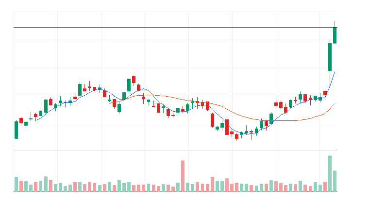
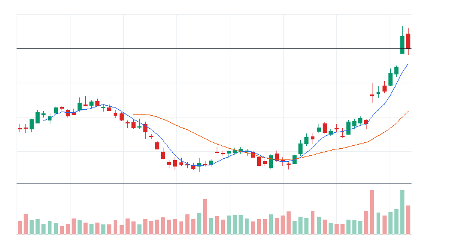
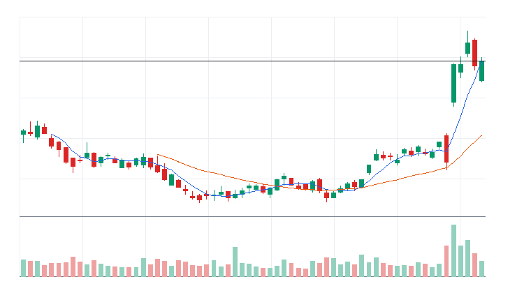
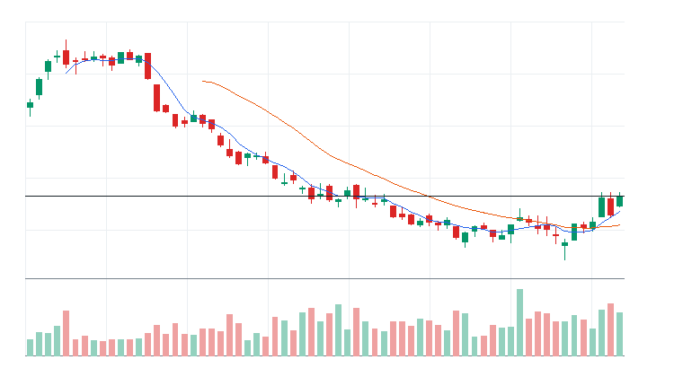
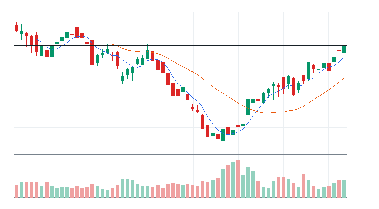
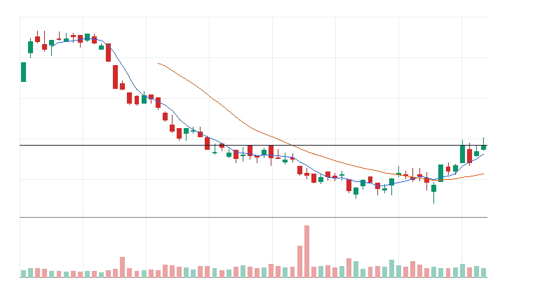
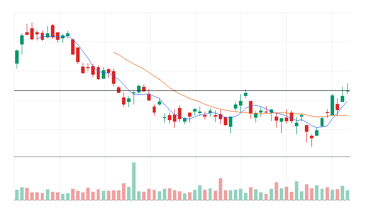
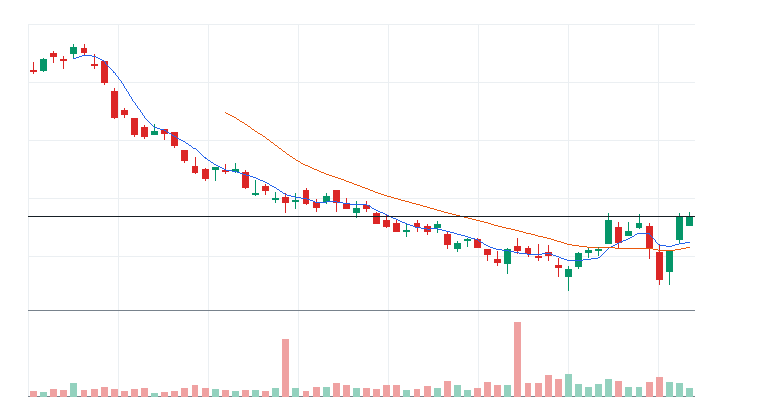
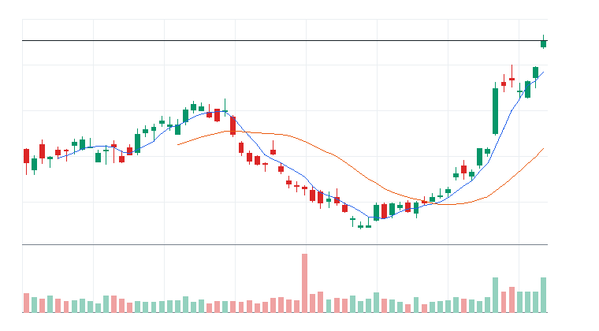
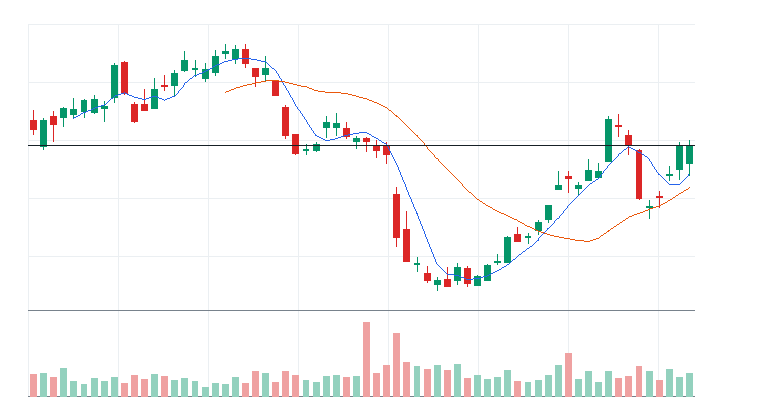

# 오늘의 데일리 트레이딩 요약

**REAL DATA TEST - 가격/거래량은 실제 데이터, 뉴스/ETF 구성종목 확산도/거래대금 유동성 일부 연결**

**목적:** 이 리포트는 최근 오른 자산을 나열하는 것이 아니라, 돈이 몰리는 근거와 다음 매수 주체가 확인할 트레이딩 후보를 찾기 위한 보고서다.

> 핵심 질문: 현재 가격에서 누가 사고 있고, 누가 앞으로 더 비싸게 사줄 수 있는가?

## 시장 국면 판단

- 최종 판정: 중립 (52점)
- 전일 대비: 중립 유지, 점수 변화는 제한적이다(-2점).
- 판정 신뢰도: 높음 (100점) - 핵심 지수와 매크로 데이터가 대부분 직접 수집되어 판정 신뢰도가 높다.
- 행동 바이어스: 강한 테마만 선별, 신규 추격 제한
- 한 줄 결론: 기술 점수 54, 매크로 점수 48로 방향성이 엇갈린다. 후보별 게이트를 더 엄격히 본다.
- 기술적 지표: 방향성 중립 (54점, 가중치 65%)
- S&P 500: 63점 | 50일선 아래, 200일선 위, 20일 -3.20%, 60일 -2.00%, 52주 고점 대비 -3.51% -> 기술 점수 63
- Nasdaq 100: 45점 | 50일선 아래, 200일선 위, 20일 -9.75%, 60일 -5.00%, 52주 고점 대비 -10.14% -> 기술 점수 45
- 매크로 시황: 매크로 중립 (48점, 가중치 35%)
- 매크로 요약: 금리은 우호적이나 신용/유동성 부담이 남아 있다.
- 금리: 중립-우호 56점 / 금리 중립 / confidence HIGH
  - 주요 근거: US 10Y yield 20일 -6.02%, 5일 -0.82%; US 3M yield 20일 -0.30%, 단기금리 방향 확인; US long-duration bonds 20일 +4.96%, 장기채 가격 기준 할인율 부담 확인
  - 확인 사항: 금리 하락이 경기 둔화형 안전자산 선호일 수 있어 단순 우호로 보기 어렵다.
- 물가: 중립 48점 / 물가 중립 / confidence HIGH
  - 주요 근거: Oil ETF 20일 +9.15%, 유가 기반 물가 압력 확인; TIPS ETF 20일 +1.84%, 물가연동채 흐름은 보조 근거; Gold 20일 -6.02%, 금 강세는 방어 수요 여부 확인
  - 확인 사항: 추가 확인 이벤트 없음
- 정책: 중립 50점 / 정책 이벤트 확인 전 중립 / confidence LOW
  - 주요 근거: 정책 톤은 1차 버전에서 일정/이벤트 리스크 기반 중립값으로 반영한다.
  - 확인 사항: FOMC, CPI, PCE, 고용지표 발표 전후에는 매크로 confidence를 보수적으로 해석한다.
- 신용/유동성: 위험 32점 / 신용/유동성 부담 / confidence HIGH
  - 주요 근거: High yield credit 20일 -0.38%, 하이일드 위험선호 확인; HYG-LQD 20일 상대강도 -1.93%, 신용위험 선호/회피 확인; VIX 20일 +38.77%, 변동성 부담 확인
  - 확인 사항: VIX 상승은 유동성/리스크 프리미엄 부담으로 해석한다.
- 환율/글로벌: 중립 50점 / 환율/글로벌 중립 / confidence MEDIUM
  - 주요 근거: US dollar 20일 +0.38%, 달러 강세/약세 확인
  - 확인 사항: 추가 확인 이벤트 없음
- US 10Y yield: 60점 | 하락 시 주식 우호; 5일 -0.82%, 20일 -6.02% -> 매크로 점수 60
- US 3M yield: 51점 | 하락 시 주식 우호; 5일 -0.37%, 20일 -0.30% -> 매크로 점수 51
- US long-duration bonds: 57점 | 상승 시 주식 우호; 5일 -0.64%, 20일 +4.96% -> 매크로 점수 57
- TIPS ETF: 50점 | 상승 시 주식 우호; 5일 -0.20%, 20일 +1.84% -> 매크로 점수 50
- Oil ETF: 38점 | 하락 시 주식 우호; 5일 -3.48%, 20일 +9.15% -> 매크로 점수 38
- Gold: 50점 | 상승 시 주식 우호; 5일 -3.50%, 20일 -6.02% -> 매크로 점수 50
- US dollar: 50점 | 하락 시 주식 우호; 5일 -0.38%, 20일 +0.38% -> 매크로 점수 50
- High yield credit: 49점 | 상승 시 주식 우호; 5일 -0.80%, 20일 -0.38% -> 매크로 점수 49
- Investment grade credit: 50점 | 상승 시 주식 우호; 5일 -0.56%, 20일 +1.55% -> 매크로 점수 50
- VIX: 0점 | 하락 시 주식 우호; 5일 +18.89%, 20일 +38.77% -> 매크로 점수 0
- 데이터 커버리지: 기술 2/2, 매크로 10/10
- 데이터 신뢰도 근거:
  - 직접 지수 데이터: S&P 500, Nasdaq 100
  - 대체 지수 데이터 없음
  - 매크로 데이터: 10/10
  - 누락 데이터 없음
  - stale 데이터 없음

## 모바일 요약

[오늘의 데일리 트레이딩 요약]

생성 성공 / 데이터 모드: REAL_TEST

시장:
- 위험회피

시장 지배 서사:
1. Staffing & Employment 자금 유입 - 약화 - iShares Russell 2000 ETF(IWM), Invesco QQQ Trust(QQQ), Paychex Inc.(PAYX), Automatic Data Processing Inc.(ADP) 중심으로 5일 -0.06%, 20일 +2.76% 흐름이 형성됨. 직접 촉매 일부 확인.
2. 바이오/헬스케어 촉매 - 약화 - Invesco QQQ Trust(QQQ), Regeneron Pharmaceuticals Inc.(REGN), Vertex Pharmaceuticals Incorporated(VRTX) 중심으로 5일 +5.73%, 20일 +9.59% 흐름이 형성됨. 뉴스 직접성 제한.
3. Discount Stores 자금 유입 - 약화 - Invesco QQQ Trust(QQQ), Walmart Inc.(WMT), Costco Wholesale Corporation(COST) 중심으로 5일 +0.79%, 20일 +5.20% 흐름이 형성됨. 뉴스 직접성 제한.

트렌드 강도:
1. Staffing & Employment 자금 유입 - TSI 10 - 잠복 - 진입품질 낮음
2. 바이오/헬스케어 촉매 - TSI 38 - 잠복 - 진입품질 낮음
3. Discount Stores 자금 유입 - TSI 9 - 잠복 - 진입품질 낮음

오늘 결론:
- 바이오/헬스케어 개별 종목 흐름이 ETF 대비 강한지 확인 필요
- 행동 후보는 linkedNarrative와 함께 확인한다.
- 추격보다 진입 조건 확인 후 접근한다.

오늘 실제 행동 후보:
1. Regeneron Pharmaceuticals Inc.(REGN)(STOCK) - 바이오/헬스케어 촉매 - 52주 고점 부근이라 돌파가 확인되면 신고가 추종 매수가 붙을 수 있음
2. GE HealthCare Technologies Inc.(GEHC)(STOCK) - Staffing & Employment 자금 유입 - 단기 추세가 유지되고 거래량이 1.0배 이상이면 눌림 이후 재상승을 시도할 수 있음
3. IDEXX Laboratories Inc.(IDXX)(STOCK) - Staffing & Employment 자금 유입 - 단기 추세가 유지되고 거래량이 1.0배 이상이면 눌림 이후 재상승을 시도할 수 있음

다크호스 후보:
1. 다크호스 후보 없음 - 조건 충족 후보 없음

ETF 후보 TOP 5:
1. iShares U.S. Aerospace & Defense ETF(ITA) - 방산/안보 프리미엄 - 제외
2. Utilities Select Sector SPDR Fund(XLU) - 전력망/원전/인프라 병목 - 거래량 확인 전 관찰
3. Invesco Aerospace & Defense ETF(PPA) - 방산/안보 프리미엄 - 거래량 확인 전 관찰
4. Global X U.S. Infrastructure Development ETF(PAVE) - 전력망/원전/인프라 병목 - 거래량 확인 전 관찰
5. SPDR S&P Aerospace & Defense ETF(XAR) - 방산/안보 프리미엄 - 거래량 확인 전 관찰

웹 리포트:
https://yoolcool.github.io/DailyTradingThesisAgent/

## 오늘 결론

- 오늘 결론: 조건부 진입
- 신규 진입 후보: 0개
- 조건부 진입 후보: 4개
- 관찰 후보: 99개
- 주요 제한 요인: Entry Quality < 40, RVOL 미달, 뉴스 직접성 부족
- 주문 판단: 시장가 금지 / 지정가 또는 관찰
- 실전 판단: 진입 후보는 있으나, 전일 고점 돌파와 거래량 확인 후 선별적으로 접근한다.

### 후보 제한 요인 집계

- RVOL < 1.00x: 99개
- 거래대금 유동성 낮음: 16개
- Entry Quality 50~54 near miss: 0개
- Entry Quality 40~49 관찰: 1개
- Entry Quality < 40: 154개
- Exhaustion Risk >= 70: 0개
- ETF breadth 샘플 부족: 37개
- 뉴스 직접성 부족: 98개

## 데이터 신뢰도

- 전체 데이터 신뢰도 등급: LOW
- 분석 신뢰도: LOW
- 주문 실행 신뢰도: LOW
- ETF breadth 신뢰도: LOW
- 신뢰도 해석: 테마 확산 판단 제한, 거래대금 유동성 낮음 또는 확인 불가, 프리/애프터마켓 확인 불가
- 리포트 생성 시각: 2026-11-04 11:57 KST
- 가격 기준 거래일: 2026-11-03 US regular close
- 뉴스 수집 시각: 2026-11-04 11:57 KST
- 가장 최근 뉴스 발행 시각: 2026-11-04 11:14 KST
- 뉴스 신선도 상태: FRESH
- 뉴스 소스: Yahoo Finance RSS, MarketWatch RSS, CNBC Markets RSS, SEC EDGAR RSS, Federal Reserve RSS, Finnhub API
- 뉴스 소스 상태: Yahoo Finance RSS CONNECTED, MarketWatch RSS CONNECTED, CNBC Markets RSS PARTIAL, SEC EDGAR RSS PARTIAL, Federal Reserve RSS CONNECTED, Finnhub API DISABLED
- 뉴스 신뢰도: MEDIUM
- 추천 적용 거래일: 2026-11-03 US regular session
- 가격/거래량 데이터 상태: 일부 연결
- 뉴스 데이터 상태: 일부 연결
- ETF 구성종목 확산도 상태: 일부 연결
- ETF 구성종목 샘플 수: 1~4
- 거래대금 유동성 데이터 상태: 일부 연결
- 프리/애프터마켓 데이터 상태: UNAVAILABLE
- 데이터 provider: yfinance, Yahoo Finance RSS, MarketWatch RSS, CNBC Markets RSS, SEC EDGAR RSS, Federal Reserve RSS, Finnhub API, config fallback sample, price-volume dollar-volume fallback
- 실전 사용 경고: 이 리포트는 투자판단 보조용이며, REAL_TEST 모드에서는 일부 데이터가 누락되거나 지연될 수 있다. 실제 주문 전 현재가, 뉴스, 프리마켓/정규장 거래량을 별도 확인해야 한다.

## 0. 시장 상태

- 데이터 모드: REAL_TEST
- 가격/거래량: 일부 연결
- 뉴스: 일부 연결
- ETF 구성종목 확산도: 일부 연결
- 거래대금 유동성: 일부 연결
- 생성 시각: 2026년 11월 4일 수요일 AM 11:57
- 시장 상태: 위험회피
- 오늘 돈의 방향: 바이오/헬스케어 개별 종목 흐름이 ETF 대비 강한지 확인 필요
- 강한 테마 TOP 3: 바이오/헬스케어(49), 필수소비재(39), Basic Materials(37)
- 데이터 한계:
  - API 또는 provider 상태에 따라 뉴스/ETF 확산도/거래대금 유동성 반영 범위가 달라질 수 있다.
  - 수집 실패 데이터는 점수 반영에서 제외하거나 confidence를 제한한다.
  - reasonConfidence HIGH는 직접 촉매, 가격/거래량, 확산도/유동성 근거가 함께 있을 때만 사용한다.

## 오늘 시장을 지배하는 서사

### 오늘 시장을 지배하는 서사 TOP 3

#### 1. Staffing & Employment 자금 유입
- 상태: 약화
- narrativeScore: 37
- reasonConfidence: LOW
- 근거 ETF: IWM, QQQ, SPY
- 근거 개별 종목: PAYX, ADP
- 돈이 몰리는 이유: Staffing & Employment 자금 유입 관련 iShares Russell 2000 ETF(IWM), Invesco QQQ Trust(QQQ), SPDR S&P 500 ETF Trust(SPY)와 Paychex Inc.(PAYX), Automatic Data Processing Inc.(ADP)의 5일(-0.06%)·20일(+2.76%) 흐름을 함께 본다. 평균 상대 거래량은 0.91배이고, ETF 확산도는 추가 확인이 필요하다. 직접 뉴스/이벤트가 일부 확인된다.
- 다음 매수 주체: Staffing & Employment 자금 유입을 확인한 섹터 ETF 자금과 상대강도 추종 스윙 자금
- 가장 좋은 트레이딩 수단: ETF 우선: QQQ, SPY, IWM / 개별 종목 우선: ADP, PAYX
- 서사가 깨지는 조건: QQQ 20일선 이탈 또는 관련 종목 절반 이상 5일선 이탈
- 오늘 행동: 기존 네러티브와 중복을 확인한 뒤 ETF/대표 종목 동조성이 살아날 때만 관찰 편입

상세 narrativeScore 근거 보기

- rawScore: 37
- ETF 평균 moneyFlowScore: 7
- 개별 종목 평균 moneyFlowScore: 68
- ETF 후보 비율: 0%
- 개별 종목 후보 비율: 50%
- 5일 평균 수익률: 0.00%
- 20일 평균 수익률: +3.00%
- 평균 상대 거래량: 1.00배
- ETF 평균 상대 거래량: 1.00배
- 개별주 평균 상대 거래량: 1.00배
- 52주 고점 근접 후보 비율: 40%
- 뉴스 직접성 점수: 11
- ETF 확산도 점수: -3
- 유동성 점수: 4
- 과열 리스크 차감: 0

#### 2. 바이오/헬스케어 촉매
- 상태: 약화
- narrativeScore: 35
- reasonConfidence: LOW
- 근거 ETF: QQQ
- 근거 개별 종목: REGN, VRTX, GILD, AMGN
- 돈이 몰리는 이유: 바이오/헬스케어 촉매 관련 Invesco QQQ Trust(QQQ)와 Regeneron Pharmaceuticals Inc.(REGN), Vertex Pharmaceuticals Incorporated(VRTX), Gilead Sciences Inc.(GILD), Amgen Inc.(AMGN)의 5일(+5.73%)·20일(+9.59%) 흐름을 함께 본다. 평균 상대 거래량은 1.22배이고, ETF 확산도는 추가 확인이 필요하다. 뉴스 직접성은 아직 제한적이다.
- 다음 매수 주체: 바이오/헬스케어 촉매을 확인한 섹터 ETF 자금과 상대강도 추종 스윙 자금
- 가장 좋은 트레이딩 수단: ETF 우선: QQQ / 개별 종목 우선: AMGN, VRTX, GILD
- 서사가 깨지는 조건: QQQ 20일선 이탈 또는 관련 종목 절반 이상 5일선 이탈
- 오늘 행동: 기존 네러티브와 중복을 확인한 뒤 ETF/대표 종목 동조성이 살아날 때만 관찰 편입

상세 narrativeScore 근거 보기

- rawScore: 35
- ETF 평균 moneyFlowScore: 0
- 개별 종목 평균 moneyFlowScore: 54
- ETF 후보 비율: 0%
- 개별 종목 후보 비율: 20%
- 5일 평균 수익률: +6.00%
- 20일 평균 수익률: +10.00%
- 평균 상대 거래량: 1.00배
- ETF 평균 상대 거래량: 1.00배
- 개별주 평균 상대 거래량: 1.00배
- 52주 고점 근접 후보 비율: 50%
- 뉴스 직접성 점수: 5
- ETF 확산도 점수: -4
- 유동성 점수: 3
- 과열 리스크 차감: 0

#### 3. Discount Stores 자금 유입
- 상태: 약화
- narrativeScore: 23
- reasonConfidence: LOW
- 근거 ETF: QQQ
- 근거 개별 종목: WMT, COST
- 돈이 몰리는 이유: Discount Stores 자금 유입 관련 Invesco QQQ Trust(QQQ)와 Walmart Inc.(WMT), Costco Wholesale Corporation(COST)의 5일(+0.79%)·20일(+5.20%) 흐름을 함께 본다. 평균 상대 거래량은 0.93배이고, ETF 확산도는 추가 확인이 필요하다. 뉴스 직접성은 아직 제한적이다.
- 다음 매수 주체: Discount Stores 자금 유입을 확인한 섹터 ETF 자금과 상대강도 추종 스윙 자금
- 가장 좋은 트레이딩 수단: ETF 우선: QQQ / 개별 종목 우선: WMT, COST
- 서사가 깨지는 조건: QQQ 20일선 이탈 또는 관련 종목 절반 이상 5일선 이탈
- 오늘 행동: 기존 네러티브와 중복을 확인한 뒤 ETF/대표 종목 동조성이 살아날 때만 관찰 편입

상세 narrativeScore 근거 보기

- rawScore: 23
- ETF 평균 moneyFlowScore: 0
- 개별 종목 평균 moneyFlowScore: 46
- ETF 후보 비율: 0%
- 개별 종목 후보 비율: 50%
- 5일 평균 수익률: +1.00%
- 20일 평균 수익률: +5.00%
- 평균 상대 거래량: 1.00배
- ETF 평균 상대 거래량: 1.00배
- 개별주 평균 상대 거래량: 1.00배
- 52주 고점 근접 후보 비율: 0%
- 뉴스 직접성 점수: 5
- ETF 확산도 점수: -4
- 유동성 점수: 3
- 과열 리스크 차감: 0

### 전체 narrative 요약

| 서사명 | 상태 | narrativeScore | reasonConfidence | 대표 ETF | 대표 종목 | 오늘 행동 |
| --- | --- | ---: | --- | --- | --- | --- |
| Staffing & Employment 자금 유입 | 약화 | 37 | LOW | IWM, QQQ, SPY | PAYX, ADP | 기존 네러티브와 중복을 확인한 뒤 ETF/대표 종목 동조성이 살아날 때만 관찰 편입 |
| 바이오/헬스케어 촉매 | 약화 | 35 | LOW | QQQ | REGN, VRTX, GILD, AMGN | 기존 네러티브와 중복을 확인한 뒤 ETF/대표 종목 동조성이 살아날 때만 관찰 편입 |
| Discount Stores 자금 유입 | 약화 | 23 | LOW | QQQ | WMT, COST | 기존 네러티브와 중복을 확인한 뒤 ETF/대표 종목 동조성이 살아날 때만 관찰 편입 |
| 필수소비재 음료 방어 성장 | 약화 | 20 | LOW | QQQ | MNST, CCEP | 기존 네러티브와 중복을 확인한 뒤 ETF/대표 종목 동조성이 살아날 때만 관찰 편입 |
| Specialty Business Services 자금 유입 | 약화 | 19 | LOW | IWM, QQQ, SPY | CTAS, CPRT, TRI | 기존 네러티브와 중복을 확인한 뒤 ETF/대표 종목 동조성이 살아날 때만 관찰 편입 |
| 소프트웨어 실적/AI 수익화 | 약화 | 17 | LOW | IGV, AIQ, QQQ | ROP, ADSK, INTU, TEAM | 기존 네러티브와 중복을 확인한 뒤 ETF/대표 종목 동조성이 살아날 때만 관찰 편입 |
| 방산/안보 프리미엄 | 약화 | 16 | LOW | ITA, XAR, SHLD | AVAV, KTOS, PLTR | 뉴스 촉매가 직접 확인될 때만 추세 추종 |
| Aerospace & Defense 자금 유입 | 약화 | 14 | LOW | IWM, QQQ, SPY | LMT, RTX, NOC, KTOS | 기존 네러티브와 중복을 확인한 뒤 ETF/대표 종목 동조성이 살아날 때만 관찰 편입 |
| Integrated Oil & Gas 자금 유입 | 약화 | 11 | LOW | IWM, QQQ, SPY | CVX, XOM | 기존 네러티브와 중복을 확인한 뒤 ETF/대표 종목 동조성이 살아날 때만 관찰 편입 |
| 매크로 방어/헤지 | 약화 | 8 | LOW | TLT, GLD, XLE | CVX, XOM | 위험회피가 확인될 때만 헤지성 접근 |
| 전력 유틸리티 수요 재평가 | 소멸 | 7 | LOW | IWM, QQQ, SPY | GEV, VRT, ETN | 기존 네러티브와 중복을 확인한 뒤 ETF/대표 종목 동조성이 살아날 때만 관찰 편입 |
| Travel Services 자금 유입 | 약화 | 4 | LOW | QQQ | BKNG, ABNB | 기존 네러티브와 중복을 확인한 뒤 ETF/대표 종목 동조성이 살아날 때만 관찰 편입 |
| Medical Devices 자금 유입 | 약화 | 2 | LOW | QQQ | ISRG, DXCM | 기존 네러티브와 중복을 확인한 뒤 ETF/대표 종목 동조성이 살아날 때만 관찰 편입 |
| 전력망/원전/인프라 병목 | 소멸 | 0 | LOW | PAVE, GRID, URA | PWR, VRT, ETN, CEG | ETF 확산도와 거래량이 같이 살아날 때만 진입 |
| 소비 회복/방어주 선별 | 소멸 | 0 | LOW | QQQ | PDD, AMZN | 기존 네러티브와 중복을 확인한 뒤 ETF/대표 종목 동조성이 살아날 때만 관찰 편입 |
| Data Storage 자금 유입 | 소멸 | 0 | LOW | IWM, QQQ, SPY | STX, WDC | 기존 네러티브와 중복을 확인한 뒤 ETF/대표 종목 동조성이 살아날 때만 관찰 편입 |
| AI 인프라 재가속 | 소멸 | 0 | LOW | SMH, SOXX, DRAM | VRT, ETN, NVDA, MU | 추격보다 5일선 지지 후 재상승 확인 |
| 위험선호 성장주 재진입 | 소멸 | 0 | LOW | QQQ, IPO, ARKK | TSLA, ARM, COIN | 지수 위험선호가 유지될 때만 선별 진입 |
| Bitcoin Mining 자금 유입 | 소멸 | 0 | LOW | IBIT, BLOK | RIOT, MARA, CIFR | 기존 네러티브와 중복을 확인한 뒤 ETF/대표 종목 동조성이 살아날 때만 관찰 편입 |
| 반도체 설계/공급망 재가속 | 소멸 | 0 | LOW | SMH, SOXX, SOXQ | TXN, TSM, NVDA, AMD | 기존 네러티브와 중복을 확인한 뒤 ETF/대표 종목 동조성이 살아날 때만 관찰 편입 |
| AI 소프트웨어/사이버보안 확산 | 소멸 | 0 | LOW | IGV, AIQ, QQQ | PLTR, DDOG, TEAM, MSFT | 추격보다 눌림 후 재상승 확인 |
| 반도체 장비 사이클 재평가 | 소멸 | 0 | LOW | SMH, SOXX, SOXQ | ASML, LRCX | 기존 네러티브와 중복을 확인한 뒤 ETF/대표 종목 동조성이 살아날 때만 관찰 편입 |
| 비트코인/디지털 자산 위험선호 | 소멸 | 0 | LOW | IBIT, BLOK | MSTR, COIN, IREN | 비트코인 베타가 살아날 때만 단기 매매 |
| 사이버보안 지출 재가속 | 소멸 | 0 | LOW | HACK, CIBR, IHAK | ZS, FTNT, PANW, CRWD | 기존 네러티브와 중복을 확인한 뒤 ETF/대표 종목 동조성이 살아날 때만 관찰 편입 |
| Internet Content 자금 유입 | 소멸 | 0 | LOW | QQQ | META, GOOGL, GOOG | 기존 네러티브와 중복을 확인한 뒤 ETF/대표 종목 동조성이 살아날 때만 관찰 편입 |

## 트렌드 강도 판단

### 1. Staffing & Employment 자금 유입
- Trend Strength Index: 10
- 트렌드 상태 라벨: 잠복
- 테마 확산도: 부족
- ETF 동조성: 부족
- 거래량 강도: 부족
- 과열 위험: 보통 (30)
- 오늘 진입 품질: 낮음 (2)
- 한 줄 판단: Staffing & Employment 자금 유입는 Trend Strength는 높아도 시장 위험선호가 약해 시장 환경 비우호 구간이다.
- 오늘 접근법: iShares Russell 2000 ETF(IWM)/Invesco QQQ Trust(QQQ)/SPDR S&P 500 ETF Trust(SPY)와 Paychex Inc.(PAYX)/Automatic Data Processing Inc.(ADP)의 거래량 확산이 확인되기 전까지 관찰한다.

트렌드 강도 상세 근거 보기

- 가격 모멘텀: 가격 모멘텀 3/25. 평균 5D -0.06%, 20D +2.76%.
- 거래량 강도: 거래량 강도 4/20. 평균 RVOL 0.91배.
- ETF 동조성: ETF 동조성 0/15. 관련 ETF Invesco QQQ Trust(QQQ), SPDR S&P 500 ETF Trust(SPY), iShares Russell 2000 ETF(IWM) 흐름을 기준으로 판단.
- 테마 확산도: 테마 확산도 0/20. 상위 1~2개 쏠림 감점 6점 반영.
- 뉴스 촉매: 뉴스/촉매 신선도 3/10. HIGH 직접 촉매 2개.
- 과열 리스크: 과열 리스크 30/100. 단기 급등, 고점 근접, ETF-개별주 괴리, 쏠림을 함께 반영.
- 시장 환경: 시장 환경 0/10. QQQ/SPY/IWM 가격 흐름 기반 위험선호 점수.

### 2. 바이오/헬스케어 촉매
- Trend Strength Index: 38
- 트렌드 상태 라벨: 잠복
- 테마 확산도: 보통
- ETF 동조성: 부족
- 거래량 강도: 보통
- 과열 위험: 보통 (30)
- 오늘 진입 품질: 낮음 (16)
- 한 줄 판단: 바이오/헬스케어 촉매는 Trend Strength는 높아도 시장 위험선호가 약해 시장 환경 비우호 구간이다.
- 오늘 접근법: Invesco QQQ Trust(QQQ)와 Regeneron Pharmaceuticals Inc.(REGN)/Vertex Pharmaceuticals Incorporated(VRTX)/Gilead Sciences Inc.(GILD)의 거래량 확산이 확인되기 전까지 관찰한다.

트렌드 강도 상세 근거 보기

- 가격 모멘텀: 가격 모멘텀 19/25. 평균 5D +5.73%, 20D +9.59%.
- 거래량 강도: 거래량 강도 10/20. 평균 RVOL 1.22배.
- ETF 동조성: ETF 동조성 -3/15. 관련 ETF Invesco QQQ Trust(QQQ) 흐름을 기준으로 판단.
- 테마 확산도: 테마 확산도 10/20. 상위 1~2개 쏠림 감점 3점 반영.
- 뉴스 촉매: 뉴스/촉매 신선도 2/10. HIGH 직접 촉매 0개.
- 과열 리스크: 과열 리스크 30/100. 단기 급등, 고점 근접, ETF-개별주 괴리, 쏠림을 함께 반영.
- 시장 환경: 시장 환경 0/10. QQQ/SPY/IWM 가격 흐름 기반 위험선호 점수.

### 3. Discount Stores 자금 유입
- Trend Strength Index: 9
- 트렌드 상태 라벨: 잠복
- 테마 확산도: 부족
- ETF 동조성: 부족
- 거래량 강도: 부족
- 과열 위험: 보통 (30)
- 오늘 진입 품질: 낮음 (0)
- 한 줄 판단: Discount Stores 자금 유입는 Trend Strength는 높아도 시장 위험선호가 약해 시장 환경 비우호 구간이다.
- 오늘 접근법: Invesco QQQ Trust(QQQ)와 Walmart Inc.(WMT)/Costco Wholesale Corporation(COST)의 거래량 확산이 확인되기 전까지 관찰한다.

트렌드 강도 상세 근거 보기

- 가격 모멘텀: 가격 모멘텀 5/25. 평균 5D +0.79%, 20D +5.20%.
- 거래량 강도: 거래량 강도 4/20. 평균 RVOL 0.93배.
- ETF 동조성: ETF 동조성 -3/15. 관련 ETF Invesco QQQ Trust(QQQ) 흐름을 기준으로 판단.
- 테마 확산도: 테마 확산도 2/20. 상위 1~2개 쏠림 감점 6점 반영.
- 뉴스 촉매: 뉴스/촉매 신선도 1/10. HIGH 직접 촉매 0개.
- 과열 리스크: 과열 리스크 30/100. 단기 급등, 고점 근접, ETF-개별주 괴리, 쏠림을 함께 반영.
- 시장 환경: 시장 환경 0/10. QQQ/SPY/IWM 가격 흐름 기반 위험선호 점수.

## 최근 추천 결과 트래킹

개별주는 데이트레이딩 관점으로 추천 이후 첫 정규장의 장중 최고가와 종가를 추적한다. ETF는 테마/스윙 관점으로 추천 이후 1주일 동안의 최고가와 현재 종가를 추적한다.

### 개별주 Top 3 추천 성과 요약
- 최근 5개 리포트 표본: 15개 (초기 검증 단계)
- 장중 최고가 기준 성공률: +8.33%
- 종가 기준 성공률: +33.33%
- 평균 장중 최고 수익률: +1.07%
- 평균 종가 수익률: -0.57%

### ETF 추천 성과 요약
- 최근 5개 리포트 표본: 0개 (초기 검증 단계)
- 1주 최고가 기준 성공률: 데이터 없음
- 현재 종가 기준 성공률: 데이터 없음
- 평균 1주 최고 수익률: 데이터 없음
- 평균 현재 수익률: 데이터 없음

최근 추천 결과 상세 테이블 펼치기

| 추천일 | 유형 | 순위 | 티커 | 기준가 | 추적 기간 | 상태 | High 수익률 | Close 수익률 | 결과 | 코멘트 |
| --- | --- | ---: | --- | ---: | --- | --- | ---: | ---: | --- | --- |
| 2026-11-04 | STOCK | 3 | IDXX | $672.04 | 2026-11-04 | pending | 데이터 없음 | 데이터 없음 | 추적 대기 | 아직 추적 거래일 데이터가 완성되지 않음 |
| 2026-11-04 | STOCK | 2 | GEHC | $80.66 | 2026-11-04 | pending | 데이터 없음 | 데이터 없음 | 추적 대기 | 아직 추적 거래일 데이터가 완성되지 않음 |
| 2026-11-04 | STOCK | 1 | REGN | $973.36 | 2026-11-04 | pending | 데이터 없음 | 데이터 없음 | 추적 대기 | 아직 추적 거래일 데이터가 완성되지 않음 |
| 2026-11-03 | STOCK | 3 | GEHC | $79.55 | 2026-11-03 | complete | +1.58% | +1.40% | 제한적 유효 | 제한적인 장중 기회만 발생 (일봉 기준) |
| 2026-11-03 | STOCK | 2 | KDP | $36.82 | 2026-11-03 | complete | -2.77% | -5.65% | 실패 | 추천 이후 의미 있는 장중 기회가 부족하고 종가도 약함 (일봉 기준) |
| 2026-11-03 | STOCK | 1 | REGN | $961.26 | 2026-11-03 | complete | +1.48% | +1.26% | 제한적 유효 | 제한적인 장중 기회만 발생 (일봉 기준) |
| 2026-11-02 | STOCK | 3 | AMGN | $466.01 | 2026-11-02 | complete | +0.64% | -0.12% | 실패 | 추천 이후 의미 있는 장중 기회가 부족하고 종가도 약함 (일봉 기준) |
| 2026-11-02 | STOCK | 2 | VRTX | $558.88 | 2026-11-02 | complete | +1.75% | -1.03% | 제한적 유효 | 제한적인 장중 기회만 발생 (일봉 기준) |
| 2026-11-02 | STOCK | 1 | XOM | $187.25 | 2026-11-02 | complete | -1.42% | -4.05% | 실패 | 추천 이후 의미 있는 장중 기회가 부족하고 종가도 약함 (일봉 기준) |
| 2026-10-30 | STOCK | 3 | FER | $56.92 | 2026-10-30 | complete | -0.09% | -2.86% | 실패 | 추천 이후 의미 있는 장중 기회가 부족하고 종가도 약함 (일봉 기준) |
| 2026-10-30 | STOCK | 2 | RTX | $199.4 | 2026-10-30 | complete | +2.41% | +0.20% | 제한적 유효 | 제한적인 장중 기회만 발생 (일봉 기준) |
| 2026-10-30 | STOCK | 1 | LMT | $643.59 | 2026-10-30 | complete | +2.08% | -1.03% | 제한적 유효 | 제한적인 장중 기회만 발생 (일봉 기준) |
| 2026-10-29 | STOCK | 3 | GEHC | $75.82 | 2026-10-29 | complete | +1.99% | +0.79% | 제한적 유효 | 제한적인 장중 기회만 발생 (일봉 기준) |
| 2026-10-29 | STOCK | 2 | LMT | $629.75 | 2026-10-29 | complete | +3.06% | +2.20% | 성공 | 장중 기회와 종가 유지가 모두 확인됨 (일봉 기준) |
| 2026-10-29 | STOCK | 1 | ROP | $440.66 | 2026-10-29 | complete | +2.17% | +2.04% | 제한적 유효 | 제한적인 장중 기회만 발생 (일봉 기준) |
| 2026-10-27 | STOCK | 3 | LMT | $635.2 | 2026-10-27 | complete | -0.26% | -1.92% | 실패 | 추천 이후 의미 있는 장중 기회가 부족하고 종가도 약함 (일봉 기준) |
| 2026-10-27 | STOCK | 2 | ROP | $441.65 | 2026-10-27 | complete | -0.52% | -1.62% | 실패 | 추천 이후 의미 있는 장중 기회가 부족하고 종가도 약함 (일봉 기준) |
| 2026-10-27 | STOCK | 1 | ZS | $260.45 | 2026-10-27 | complete | +2.85% | -0.12% | 제한적 유효 | 제한적인 장중 기회만 발생 (일봉 기준) |
| 2026-10-27 | ETF | 1 | IHAK | $76.25 | 2026-10-27~2026-11-03 | complete | +1.94% | -7.91% | 실패 | 추천 이후 ETF 흐름이 약화됨 |
| 2026-10-26 | STOCK | 3 | CRWD | $257.57 | 2026-10-26 | complete | +2.65% | +1.65% | 제한적 유효 | 제한적인 장중 기회만 발생 (일봉 기준) |
| 2026-10-26 | STOCK | 2 | ROP | $438.14 | 2026-10-26 | complete | +2.88% | +0.80% | 제한적 유효 | 제한적인 장중 기회만 발생 (일봉 기준) |
| 2026-10-26 | STOCK | 1 | ZS | $255.15 | 2026-10-26 | complete | +2.47% | +2.08% | 제한적 유효 | 제한적인 장중 기회만 발생 (일봉 기준) |
| 2026-10-26 | ETF | 1 | IHAK | $74 | 2026-10-26~2026-11-02 | complete | +5.04% | -5.11% | 단기 고점 후 반납 | 1주 내 상승 기회는 있었지만 현재가는 반납 |
| 2026-10-23 | STOCK | 3 | ADP | $294.5 | 2026-10-23 | complete | +5.06% | +3.28% | 성공 | 장중 기회와 종가 유지가 모두 확인됨 (일봉 기준) |
| 2026-10-23 | STOCK | 2 | CTAS | $220.15 | 2026-10-23 | complete | +2.56% | +1.79% | 제한적 유효 | 제한적인 장중 기회만 발생 (일봉 기준) |
| 2026-10-23 | STOCK | 1 | MAR | $404 | 2026-10-23 | complete | -1.77% | -3.29% | 실패 | 추천 이후 의미 있는 장중 기회가 부족하고 종가도 약함 (일봉 기준) |
| 2026-10-22 | STOCK | 3 | TRI | $112.82 | 2026-10-22 | complete | +9.70% | +9.25% | 성공 | 장중 기회와 종가 유지가 모두 확인됨 (일봉 기준) |
| 2026-10-22 | STOCK | 2 | MAR | $397.31 | 2026-10-22 | complete | +1.50% | -0.13% | 제한적 유효 | 제한적인 장중 기회만 발생 (일봉 기준) |
| 2026-10-22 | STOCK | 1 | NOC | $534 | 2026-10-22 | complete | +4.22% | +3.44% | 성공 | 장중 기회와 종가 유지가 모두 확인됨 (일봉 기준) |
| 2026-10-13 | STOCK | 2 | SHOP | $179.22 | 2026-10-13 | complete | -0.01% | -1.51% | 실패 | 추천 이후 의미 있는 장중 기회가 부족하고 종가도 약함 (일봉 기준) |
| 2026-10-13 | STOCK | 1 | PLTR | $209 | 2026-10-13 | complete | +0.90% | -0.16% | 실패 | 추천 이후 의미 있는 장중 기회가 부족하고 종가도 약함 (일봉 기준) |
| 2026-10-12 | STOCK | 3 | ZS | $233.73 | 2026-10-12 | complete | +1.49% | -3.40% | 제한적 유효 | 제한적인 장중 기회만 발생 (일봉 기준) |
| 2026-10-12 | STOCK | 2 | DDOG | $293.26 | 2026-10-12 | complete | +2.53% | -2.04% | 제한적 유효 | 제한적인 장중 기회만 발생 (일봉 기준) |
| 2026-10-12 | STOCK | 1 | PLTR | $209.05 | 2026-10-12 | complete | +1.86% | -0.02% | 제한적 유효 | 제한적인 장중 기회만 발생 (일봉 기준) |
| 2026-10-09 | STOCK | 2 | ZS | $216.81 | 2026-10-09 | complete | +8.07% | +7.80% | 성공 | 장중 기회와 종가 유지가 모두 확인됨 (일봉 기준) |
| 2026-10-09 | STOCK | 1 | PLTR | $198.78 | 2026-10-09 | complete | +5.43% | +5.17% | 성공 | 장중 기회와 종가 유지가 모두 확인됨 (일봉 기준) |
| 2026-10-08 | STOCK | 1 | ADSK | $235.05 | 2026-10-08 | complete | +0.40% | -0.62% | 실패 | 추천 이후 의미 있는 장중 기회가 부족하고 종가도 약함 (일봉 기준) |
| 2026-10-07 | STOCK | 3 | FTNT | $191.27 | 2026-10-07 | complete | +0.50% | -1.04% | 실패 | 추천 이후 의미 있는 장중 기회가 부족하고 종가도 약함 (일봉 기준) |
| 2026-10-07 | STOCK | 2 | AMD | $649.42 | 2026-10-07 | complete | -0.14% | -0.55% | 실패 | 추천 이후 의미 있는 장중 기회가 부족하고 종가도 약함 (일봉 기준) |
| 2026-10-07 | STOCK | 1 | SNPS | $505.17 | 2026-10-07 | complete | +0.86% | -0.49% | 실패 | 추천 이후 의미 있는 장중 기회가 부족하고 종가도 약함 (일봉 기준) |
| 2026-10-07 | ETF | 1 | CIBR | $108.13 | 2026-10-07~2026-10-14 | complete | +2.36% | -10.09% | 단기 고점 후 반납 | 1주 내 상승 기회는 있었지만 현재가는 반납 |
| 2026-10-06 | STOCK | 2 | TSM | $485.8 | 2026-10-06 | complete | +0.04% | -0.72% | 실패 | 추천 이후 의미 있는 장중 기회가 부족하고 종가도 약함 (일봉 기준) |
| 2026-10-06 | STOCK | 1 | SNPS | $488.47 | 2026-10-06 | complete | +3.90% | +3.42% | 성공 | 장중 기회와 종가 유지가 모두 확인됨 (일봉 기준) |
| 2026-10-06 | ETF | 1 | CIBR | $106.01 | 2026-10-06~2026-10-13 | complete | +4.41% | -8.29% | 단기 고점 후 반납 | 1주 내 상승 기회는 있었지만 현재가는 반납 |
| 2026-10-05 | STOCK | 1 | SNPS | $489.9 | 2026-10-05 | complete | +3.77% | -0.29% | 단타 유효 | 장중 기회는 있었지만 종가 유지력은 약함 (일봉 기준) |
| 2026-10-05 | ETF | 1 | SMH | $630.6 | 2026-10-05~2026-10-12 | complete | +1.41% | -17.77% | 실패 | 추천 이후 ETF 흐름이 약화됨 |
| 2026-09-30 | STOCK | 1 | AMAT | $512.01 | 2026-09-30 | complete | +0.67% | -0.12% | 실패 | 추천 이후 의미 있는 장중 기회가 부족하고 종가도 약함 (일봉 기준) |
| 2026-09-28 | STOCK | 3 | DDOG | $268.13 | 2026-09-28 | complete | +1.74% | +0.21% | 제한적 유효 | 제한적인 장중 기회만 발생 (일봉 기준) |
| 2026-09-28 | STOCK | 2 | ARM | $310.32 | 2026-09-28 | complete | -1.02% | -8.70% | 실패 | 추천 이후 의미 있는 장중 기회가 부족하고 종가도 약함 (일봉 기준) |
| 2026-09-28 | STOCK | 1 | QCOM | $201.97 | 2026-09-28 | complete | -1.39% | -7.17% | 실패 | 추천 이후 의미 있는 장중 기회가 부족하고 종가도 약함 (일봉 기준) |
| 2026-09-25 | STOCK | 3 | ARM | $332.56 | 2026-09-25 | complete | -2.13% | -6.69% | 실패 | 추천 이후 의미 있는 장중 기회가 부족하고 종가도 약함 (일봉 기준) |
| 2026-09-25 | STOCK | 2 | CRWD | $262.49 | 2026-09-25 | complete | -1.00% | -3.95% | 실패 | 추천 이후 의미 있는 장중 기회가 부족하고 종가도 약함 (일봉 기준) |
| 2026-09-25 | STOCK | 1 | PLTR | $191.79 | 2026-09-25 | complete | +1.26% | -1.11% | 제한적 유효 | 제한적인 장중 기회만 발생 (일봉 기준) |
| 2026-09-23 | STOCK | 3 | MARA | $13.28 | 2026-09-23 | complete | +2.79% | +0.53% | 제한적 유효 | 제한적인 장중 기회만 발생 (일봉 기준) |
| 2026-09-23 | STOCK | 2 | CIFR | $18.9 | 2026-09-23 | complete | +3.49% | -2.91% | 단타 유효 | 장중 기회는 있었지만 종가 유지력은 약함 (일봉 기준) |
| 2026-09-23 | STOCK | 1 | RIOT | $24.18 | 2026-09-23 | complete | +4.51% | +2.11% | 성공 | 장중 기회와 종가 유지가 모두 확인됨 (일봉 기준) |
| 2026-09-23 | ETF | 3 | ARKK | $90.72 | 2026-09-23~2026-09-30 | complete | +1.63% | -11.46% | 실패 | 추천 이후 ETF 흐름이 약화됨 |
| 2026-09-23 | ETF | 2 | MAGS | $72.97 | 2026-09-23~2026-09-30 | complete | -0.29% | -5.80% | 실패 | 추천 이후 ETF 흐름이 약화됨 |
| 2026-09-23 | ETF | 1 | SMH | $596.03 | 2026-09-23~2026-09-30 | complete | +2.89% | -13.00% | 단기 고점 후 반납 | 1주 내 상승 기회는 있었지만 현재가는 반납 |
| 2026-09-22 | STOCK | 3 | CRWD | $237.65 | 2026-09-22 | complete | +5.53% | +5.22% | 성공 | 장중 기회와 종가 유지가 모두 확인됨 (일봉 기준) |

## 오늘 실제 행동 후보

### 1. Regeneron Pharmaceuticals Inc.(REGN)
- 자산 유형: STOCK
- linkedNarrative: 바이오/헬스케어 촉매
- narrativeStatus: 약화
- narrativeScore: 35
- Trend Strength Index: 38
- Exhaustion Risk: 30 (보통)
- Entry Quality Score: 41 (관찰)
- 트렌드 판단: ETF 동조성이 약해 테마 자금 확인이 부족하다.
- moneyFlowScore: 100
- finalRawScore: 106
- reasonConfidence: MEDIUM
- reasonConfidenceExplanation: 직접 촉매 부재 때문에 HIGH가 아니라 MEDIUM으로 제한했다.
- tieBreakerReason: 최종 원점수 106, 리스크 패널티 -6, 5일 수익률 +19.27%, 상대 거래량 1.46배 순으로 정렬
- 후보별 시장 해석: 위험회피 / 제한적 - 전체 시장은 위험회피 / Entry Quality 41 < 50이나 moneyFlow 100, confidence MEDIUM, RVOL 1.46x로 강한 자금흐름 예외 조건 충족
- 게이트 사유: Entry Quality 41 < 50이나 moneyFlow 100, confidence MEDIUM, RVOL 1.46x로 강한 자금흐름 예외 조건 충족
- 주문 실행: 시장가 가능

- 왜 돈이 몰리는가: 20일 +31.76%, 5일 +19.27%, 상대 거래량 1.46배로 가격과 거래량이 함께 개선. 뉴스: CNBC Markets RSS macro/under_6h / 유동성: LIQUID
- 누가 더 비싸게 사줄 수 있는지: 개별 주도주를 따라붙는 단기 모멘텀 자금과 관련 ETF 강세를 확인한 트레이더
- 진입 조건: 전일 고점 돌파와 5일선 유지 확인
- 무효화 조건: 20일선 이탈 또는 상대 거래량 0.8배 이하 둔화
- todayActionLabel: 자금흐름 예외 조건부
#### 최근 뉴스/동향 한국어 요약

- 요약: 종목 직접 뉴스 확인 상태이며 뉴스 흐름은 긍정 우위입니다. 후보 선정 후 재확인한 핵심 이슈는 "Regeneron (REGN) Stock Looks At A Discount To Earnings"입니다.
- 직접 촉매 판단: Regeneron Pharmaceuticals Inc.에 대해 직접 촉매로 분류된 뉴스가 확인됐습니다. 핵심은 "Regeneron (REGN) Stock Looks At A Discount To Earnings"이며, 실적 재료로 봅니다.
- 뉴스 1: Regeneron (REGN) Stock Looks At A Discount To Earnings
  - 내용: Regeneron Pharmaceuticals Inc. 관련 기사는 Regeneron (REGN) Stock Looks At A Discount To Earnings 이슈를 다루며, 주가 변동률 +53.30%를 핵심 내용으로 봅니다.
  - 투자 의미: Regeneron Pharmaceuticals Inc.의 당일 상대강도 확인에는 도움이 되지만, 실적/가이던스 같은 새 펀더멘털 변화로 보기는 어렵습니다.
  - 확인할 점: 거래량 동반 여부, 장중 고점 유지, 관련 ETF 동반 강세
- 뉴스 2: Regeneron Announces Investor Conference Presentations
  - 내용: Regeneron Pharmaceuticals Inc. 관련 시장 일반 뉴스입니다. 기사 스니펫상 핵심 내용은 TARRYTOWN, N.Y., Nov.입니다.
  - 투자 의미: 단기 중립 뉴스 흐름으로 볼 수 있지만, 단독 매수 근거보다는 가격·거래량 조건을 확인하는 보조 근거로 사용합니다.
  - 확인할 점: 원문 수치, 후속 보도, 가격이 진입 조건을 지키는지
- 뉴스 3: REGN Q3 deep dive: pipeline progress and core brands drive outperformance
  - 내용: Regeneron Pharmaceuticals Inc. 관련 기사는 REGN Q3 deep dive: pipeline progress and core brands drive outperformance 이슈를 다루며, 주가 변동률 +36.30%, 동반 비교 수치 +23.50%를 핵심 내용으로 봅니다.
  - 투자 의미: Regeneron Pharmaceuticals Inc.의 당일 상대강도 확인에는 도움이 되지만, 실적/가이던스 같은 새 펀더멘털 변화로 보기는 어렵습니다.
  - 확인할 점: 거래량 동반 여부, 장중 고점 유지, 관련 ETF 동반 강세
- 매매 해석: 매매 관점에서는 뉴스 자체보다 가격이 진입 조건을 지키는지, 거래량이 동반되는지, 그리고 뉴스가 이미 주가에 반영됐는지를 우선 확인해야 합니다.
- 차트: 

### 2. GE HealthCare Technologies Inc.(GEHC)
- 자산 유형: STOCK
- linkedNarrative: Staffing & Employment 자금 유입
- narrativeStatus: 약화
- narrativeScore: 37
- Trend Strength Index: 10
- Exhaustion Risk: 30 (보통)
- Entry Quality Score: 30 (낮음)
- 트렌드 판단: 테마 확산도가 낮아 개별 종목 이벤트성 흐름일 수 있다.
- moneyFlowScore: 100
- finalRawScore: 101
- reasonConfidence: MEDIUM
- reasonConfidenceExplanation: 보조 근거 일부 제한 때문에 HIGH가 아니라 MEDIUM으로 제한했다.
- tieBreakerReason: 최종 원점수 101, 리스크 패널티 0, 5일 수익률 +13.43%, 상대 거래량 1.37배 순으로 정렬
- 후보별 시장 해석: 위험회피 / 제한적 - 전체 시장은 위험회피 / Entry Quality 30 < 50이나 moneyFlow 100, confidence MEDIUM, RVOL 1.37x로 강한 자금흐름 예외 조건 충족
- 게이트 사유: Entry Quality 30 < 50이나 moneyFlow 100, confidence MEDIUM, RVOL 1.37x로 강한 자금흐름 예외 조건 충족
- 주문 실행: 지정가 권장

- 왜 돈이 몰리는가: 20일 +24.53%, 5일 +13.43%, 상대 거래량 1.37배로 가격과 거래량이 함께 개선. 뉴스: Yahoo Finance RSS earnings/under_6h / 유동성: ACCEPTABLE
- 누가 더 비싸게 사줄 수 있는지: 개별 주도주를 따라붙는 단기 모멘텀 자금과 관련 ETF 강세를 확인한 트레이더
- 진입 조건: 20일선 위 눌림 후 재상승 확인
- 무효화 조건: 20일선 이탈 또는 상대 거래량 0.8배 이하 둔화
- todayActionLabel: 자금흐름 예외 조건부
#### 최근 뉴스/동향 한국어 요약

- 요약: 종목 직접 뉴스 확인 상태이며 뉴스 흐름은 긍정 우위입니다. 후보 선정 후 재확인한 핵심 이슈는 "Will Earnings And AI Product Launches Change GE HealthCare's (GEHC) Narrative"입니다.
- 직접 촉매 판단: GE HealthCare Technologies Inc.에 대해 직접 촉매로 분류된 뉴스가 확인됐습니다. 핵심은 "Will Earnings And AI Product Launches Change GE HealthCare's (GEHC) Narrative"이며, 실적 재료로 봅니다.
- 뉴스 1: Will Earnings And AI Product Launches Change GE HealthCare's (GEHC) Narrative
  - 내용: GE HealthCare Technologies Inc. 관련 실적 뉴스입니다. 기사 스니펫상 핵심 내용은 GE HealthCare Technologies reported basic and diluted earnings per share from continuing operations of US$1.36 for the third quarter of 2026 and introduced the AI centric Allia ...입니다.
  - 투자 의미: 실적/가이던스 재료는 다음 분기 기대치 변화로 이어질 수 있어 컨센서스 변화와 주가 반응 지속성을 함께 봅니다.
  - 확인할 점: 매출/마진/가이던스 수치, 컨센서스 대비 차이
- 뉴스 2: GE HealthCare (GEHC) Stock Looks Like A Bargain After Raised Outlook
  - 내용: GE HealthCare Technologies Inc. 관련 기사는 GE HealthCare (GEHC) Stock Looks Like A Bargain After Raised Outlook 이슈를 다루며, 주가 변동률 +23.70%를 핵심 내용으로 봅니다.
  - 투자 의미: GE HealthCare Technologies Inc.의 당일 상대강도 확인에는 도움이 되지만, 실적/가이던스 같은 새 펀더멘털 변화로 보기는 어렵습니다.
  - 확인할 점: 거래량 동반 여부, 장중 고점 유지, 관련 ETF 동반 강세
- 뉴스 3: GE HealthCare reinforces leadership in AI with Lung Guidance and AutoAS on Vscan Air for point of care ultrasound assessments
  - 내용: GE HealthCare Technologies Inc. 관련 가이던스 뉴스입니다. 기사 스니펫상 핵심 내용은 CHICAGO, November 03, 2026--GE HealthCare (Nasdaq: GEHC) today announced two new AI-assisted capabilities for its Vscan Air™ handheld ultrasound system: Lung Guidance and AutoAS...입니다.
  - 투자 의미: 실적/가이던스 재료는 다음 분기 기대치 변화로 이어질 수 있어 컨센서스 변화와 주가 반응 지속성을 함께 봅니다.
  - 확인할 점: 매출/마진/가이던스 수치, 컨센서스 대비 차이
- 매매 해석: 매매 관점에서는 뉴스 자체보다 가격이 진입 조건을 지키는지, 거래량이 동반되는지, 그리고 뉴스가 이미 주가에 반영됐는지를 우선 확인해야 합니다.
- 차트: 

### 3. IDEXX Laboratories Inc.(IDXX)
- 자산 유형: STOCK
- linkedNarrative: Staffing & Employment 자금 유입
- narrativeStatus: 약화
- narrativeScore: 37
- Trend Strength Index: 10
- Exhaustion Risk: 30 (보통)
- Entry Quality Score: 28 (낮음)
- 트렌드 판단: 테마 확산도가 낮아 개별 종목 이벤트성 흐름일 수 있다.
- moneyFlowScore: 93
- finalRawScore: 93
- reasonConfidence: MEDIUM
- reasonConfidenceExplanation: 보조 근거 일부 제한 때문에 HIGH가 아니라 MEDIUM으로 제한했다.
- tieBreakerReason: 최종 원점수 93, 리스크 패널티 -6, 5일 수익률 +19.74%, 상대 거래량 1.73배 순으로 정렬
- 후보별 시장 해석: 위험회피 / 제한적 - 전체 시장은 위험회피 / Entry Quality 28 < 50이나 moneyFlow 93, confidence MEDIUM, RVOL 1.73x로 강한 자금흐름 예외 조건 충족
- 게이트 사유: Entry Quality 28 < 50이나 moneyFlow 93, confidence MEDIUM, RVOL 1.73x로 강한 자금흐름 예외 조건 충족
- 주문 실행: 지정가 권장

- 왜 돈이 몰리는가: 20일 +30.39%, 5일 +19.74%, 상대 거래량 1.73배로 가격과 거래량이 함께 개선. 뉴스: Yahoo Finance RSS earnings/under_6h / 유동성: ACCEPTABLE
- 누가 더 비싸게 사줄 수 있는지: 개별 주도주를 따라붙는 단기 모멘텀 자금과 관련 ETF 강세를 확인한 트레이더
- 진입 조건: 20일선 위 눌림 후 재상승 확인
- 무효화 조건: 20일선 이탈 또는 상대 거래량 0.8배 이하 둔화
- todayActionLabel: 자금흐름 예외 조건부
#### 최근 뉴스/동향 한국어 요약

- 요약: 종목 직접 뉴스 확인 상태이며 뉴스 흐름은 긍정 우위입니다. 후보 선정 후 재확인한 핵심 이슈는 "IDEXX Laboratories (IDXX) Q3 Earnings Leave Its Premium Valuation In Focus"입니다.
- 직접 촉매 판단: IDEXX Laboratories Inc.에 대해 직접 촉매로 분류된 뉴스가 확인됐습니다. 핵심은 "IDEXX Laboratories (IDXX) Q3 Earnings Leave Its Premium Valuation In Focus"이며, 실적 재료로 봅니다.
- 뉴스 1: IDEXX Laboratories (IDXX) Q3 Earnings Leave Its Premium Valuation In Focus
  - 내용: IDEXX Laboratories Inc. 관련 기사는 IDEXX Laboratories (IDXX) Q3 Earnings Leave Its Premium Valuation In Focus 이슈를 다루며, 주가 변동률 +0.10%, 동반 비교 수치 +25.40%를 핵심 내용으로 봅니다.
  - 투자 의미: IDEXX Laboratories Inc.의 당일 상대강도 확인에는 도움이 되지만, 실적/가이던스 같은 새 펀더멘털 변화로 보기는 어렵습니다.
  - 확인할 점: 거래량 동반 여부, 장중 고점 유지, 관련 ETF 동반 강세
- 뉴스 2: IDEXX Laboratories Inc (IDXX) (Q3 2026) Earnings Call Highlights: Raised Outlook, Record ...
  - 내용: IDEXX Laboratories Inc. 관련 기사는 IDEXX Laboratories Inc (IDXX) (Q3 2026) Earnings Call Highlights: Raised Outlook, Record ... 이슈를 다루며, 주가 변동률 +10.00%를 핵심 내용으로 봅니다.
  - 투자 의미: IDEXX Laboratories Inc.의 당일 상대강도 확인에는 도움이 되지만, 실적/가이던스 같은 새 펀더멘털 변화로 보기는 어렵습니다.
  - 확인할 점: 거래량 동반 여부, 장중 고점 유지, 관련 ETF 동반 강세
- 뉴스 3: Idexx Laboratories (IDXX) Crossed Above the 200-Day Moving Average: What That Means for Investors
  - 내용: IDEXX Laboratories Inc. 관련 시장 일반 뉴스입니다. 기사 스니펫상 핵심 내용은 When a stock breaks out above the 200-day simple moving average, good things could be on the horizon.입니다.
  - 투자 의미: 단기 중립 뉴스 흐름으로 볼 수 있지만, 단독 매수 근거보다는 가격·거래량 조건을 확인하는 보조 근거로 사용합니다.
  - 확인할 점: 원문 수치, 후속 보도, 가격이 진입 조건을 지키는지
- 매매 해석: 매매 관점에서는 뉴스 자체보다 가격이 진입 조건을 지키는지, 거래량이 동반되는지, 그리고 뉴스가 이미 주가에 반영됐는지를 우선 확인해야 합니다.
- 차트: 

## 다크호스 후보

다크호스 후보 없음. 상위 서사 정렬, MA20 위 안착, MA5/MA20 구조 개선, RVOL 0.90x 이상 조건을 동시에 충족한 개별주가 없다.

- darkHorseScore: 조건 충족 후보 없음
- 왜 아직 메인이 아닌가: 확인 조건을 통과한 보조 관찰 후보가 없다.

darkHorseScore 상세 근거 보기

- 서사 정렬: 조건 미충족
- 초기 추세 구조: 조건 미충족
- 베이스 돌파/정돈: 조건 미충족
- 거래량 확인: 조건 미충족
- rawScore: 데이터 없음

## 오늘 돈이 몰리는 테마

- 바이오/헬스케어: AMGN, GILD, ISRG, VRTX, REGN, IDXX, ALNY, DXCM | 평균 moneyFlowScore 49 | 관심은 유지하되 우선순위는 낮추고 추가 거래량 확인을 기다린다.
- 필수소비재: WMT, COST, PEP, MNST, MDLZ, KDP, CCEP, KHC | 평균 moneyFlowScore 39 | 관심은 유지하되 우선순위는 낮추고 추가 거래량 확인을 기다린다.
- Basic Materials: LIN | 평균 moneyFlowScore 37 | 관심은 유지하되 우선순위는 낮추고 추가 거래량 확인을 기다린다.
- Consumer Cyclical: SBUX, MAR, ROST, ORLY | 평균 moneyFlowScore 35 | 관심은 유지하되 우선순위는 낮추고 추가 거래량 확인을 기다린다.
- 전력/유틸리티 ETF: XLU | 평균 moneyFlowScore 27 | 관심은 유지하되 우선순위는 낮추고 추가 거래량 확인을 기다린다.
- Industrials: HON, ADP, CSX, CTAS, PCAR, FAST, FER, ODFL | 평균 moneyFlowScore 25 | 관심은 유지하되 우선순위는 낮추고 추가 거래량 확인을 기다린다.

## 1. ETF 트레이딩 보고서
### 1-1. ETF 결론
- ETF 우선 후보: 없음
- ETF 관찰 후보: Roundhill Memory ETF(DRAM), VanEck Semiconductor ETF(SMH), Invesco PHLX Semiconductor ETF(SOXQ), iShares Expanded Tech-Software Sector ETF(IGV), Global X Artificial Intelligence & Technology ETF(AIQ)
- ETF 매매 금지: Roundhill Memory ETF(DRAM), VanEck Semiconductor ETF(SMH), iShares Semiconductor ETF(SOXX), Invesco PHLX Semiconductor ETF(SOXQ), iShares Expanded Tech-Software Sector ETF(IGV)
- 오늘 ETF 최우선 1개: 없음
- ETF 섹션 해석: 이 섹션은 개별 종목 선택이 아니라 테마/섹터 단위 자금 흐름을 ETF로 매매할지 판단하기 위한 영역이다.

### 1-2. ETF 후보 TOP 5

선정 기준: ETF 후보는 가격/거래량 1차 점수에 뉴스, ETF 구성종목 확산도, 유동성, 리스크 패널티를 반영한 finalRawScore 기준으로 정렬한다. 표시 점수 100점 후보가 겹치면 tieBreakerReason으로 우선순위를 설명한다.

### [ETF] iShares U.S. Aerospace & Defense ETF(ITA)
- 자산 유형: ETF
- ETF 세부 카테고리: 방산 ETF
- ETF 역할: 방어 섹터 확인
- 상태: 매매 금지
- linkedNarrative: 방산/안보 프리미엄
- narrativeStatus: 약화
- narrativeScore: 16
- moneyFlowScore: 62
- finalRawScore: 62
- tieBreakerReason: 최종 원점수 62, 리스크 패널티 0, 5일 수익률 +4.82%, 상대 거래량 1.33배 순으로 정렬
- 과열 리스크: 낮음
- reasonConfidence: MEDIUM
- reasonConfidenceExplanation: ETF 확산도 제한 때문에 HIGH가 아니라 MEDIUM으로 제한했다.

- todayActionLabel: 제외
- 주문 실행: 지정가 권장
- 기준일: 2026-11-03
- 종가: $216.17
- 1일 수익률: +0.69%
- 5일 수익률: +4.82%
- 20일 수익률: +3.80%
- 상대 거래량: 1.33배
- 52주 고점 대비 위치: -15.76%
- whyMoneyIsFlowing: 20일 +3.80%, 5일 +4.82%, 상대 거래량 1.33배로 가격과 거래량이 함께 개선. 뉴스: MarketWatch RSS general_market/under_6h / 유동성: ACCEPTABLE
- likelyNextBuyer: 섹터 베타를 노리는 단기 모멘텀 자금과 리밸런싱 자금
- whyThisCouldTradeHigher: 단기 추세가 유지되고 거래량이 1.0배 이상이면 눌림 이후 재상승을 시도할 수 있음
#### 최근 뉴스/동향 한국어 요약

- 요약: 후보 선정 후 재확인 뉴스 데이터 없음
- 진입 조건: 20일선 위 눌림 후 재상승 확인
- 무효화 조건: 20일선 이탈 또는 상대 거래량 0.8배 이하 둔화
- 차트: 

#### 상세 근거

iShares U.S. Aerospace & Defense ETF(ITA) 상세 근거 펼치기

- moneyFlowScore(최종) 산정 근거:
  - moneyFlowScore(1차): 48
  - 최종 원점수: 62
  - 최종 표시 점수: 62
  - cap 적용: cap 미적용
  - 계산식: +48 + +12 + 0 + +2 + 0 + 0 + 0 = 62
  - 점수 해석: 관찰 후보. 흐름은 있으나 우선순위는 낮음.
  - 가격/거래량 1차 점수: +48
    - 추세: +13
    - 단기 모멘텀: +5
    - 중기 모멘텀: +2
    - 거래량: +14
    - 신고가 근접: 0
    - 이동평균: +14
  - 하위 점수 cap:
    - 가격 모멘텀: 원점수 +13, 상한 적용 +13 / 최대 25
    - 단기 모멘텀: 원점수 +5, 상한 적용 +5 / 최대 20
    - 중기 모멘텀: 원점수 +2, 상한 적용 +2 / 최대 16
    - 거래량: 원점수 +14, 상한 적용 +14 / 최대 20
    - 신고가 근접: 원점수 0, 상한 적용 0 / 최대 12
    - 이동평균: 원점수 +14, 상한 적용 +14 / 최대 14
  - 추가 데이터 가감점:
    - 뉴스: +12
    - 유동성: +2
  - ETF 확산도: 0
  - 리스크 패널티: 0
  - 주요 근거: 1차 48, 최종 원점수 62, 표시 62. 상대 거래량 증가, 이동평균 위 추세 유지, 뉴스 흐름이 가격/거래량 근거 보강. 주의: ETF 구성종목 확산도 데이터 미연결.
  - 리스크 패널티 산정 근거:
    - 총 리스크 패널티: 0
    - 리스크 등급: LOW
    - 감점된 리스크: 없음
    - 관찰 리스크: ETF breadth data not connected
    - 한 줄 해석: 직접 감점된 주요 리스크는 없지만 관찰 리스크는 계속 확인해야 한다.
- 데이터 사용 현황:
  - 가격/거래량: 사용
  - 뉴스: 사용
  - ETF 확산도: 미연결
  - 거래대금 유동성: 사용
  - 관련 ETF 상대강도: 사용
- 뉴스 확인:
  - 최근 뉴스 상태: 일부 연결
  - 뉴스 소스: MarketWatch RSS, Federal Reserve RSS, Yahoo Finance RSS
  - 소스별 상태: Yahoo Finance RSS CONNECTED; MarketWatch RSS CONNECTED; CNBC Markets RSS FAILED; SEC EDGAR RSS PARTIAL; Federal Reserve RSS CONNECTED; Finnhub API DISABLED
  - 긍정/중립/부정: 12/4/0
  - 직접성/방향성/신선도: 2/1/4
  - 강한 촉매 수: 6
  - 중요 공시 수: 0
  - 직접 촉매: 없음
  - 보조 뉴스: MarketWatch RSS sector_theme / general_market / under_6h
  - 뉴스 수집 시각: 2026-11-04 11:57 KST
  - 가장 최근 뉴스 발행 시각: 2026-11-04 10:16 KST
  - 뉴스 신선도 상태: FRESH
  - 뉴스 이후 가격 반응: 긍정
  - 가격 반응 점수 제한: 뉴스 이후 가격 반응과 점수 제한 특이사항 없음
  - 핵심 뉴스 요약: Here&#x2019;s why AMD&#x2019;s stock is rising &#x2014; and sending a confident message about the AI trade
  - 원점수/상한 점수: +33 / +12
  - 점수 반영: +12
  - 주의: CNBC Markets RSS: HTTP 403 from https://www.cnbc.com/id/100003114/device/rss/rss.html; SEC EDGAR RSS: no matching RSS items; Finnhub API: FINNHUB_API_KEY not configured
- ETF 구성종목 확산도:
  - 구성종목 데이터 상태: 미연결
  - 샘플 수: 0/0
  - 샘플 신뢰도: UNKNOWN
  - 상승 종목 비율: 데이터 없음
  - 20일선 위 비율: 데이터 없음
  - 50일선 위 비율: 데이터 없음
  - 상위 기여 종목: 데이터 없음
  - 확산도 판단: UNKNOWN
  - 원점수/샘플 상한/반영 점수: 0 / N/A / 0
  - 점수 반영: 0
- 거래대금 유동성:
  - 데이터 상태: 일부 연결
  - 거래대금 기준 유동성: ACCEPTABLE
  - 거래대금: $274,514,283
  - 평균 거래대금: $206,186,189
  - 주문 영향: 지정가 권장
  - 매매 영향: 거래대금은 허용 가능하나 지정가를 우선한다
- reasonConfidence 근거: 가격/거래량, 뉴스, 거래대금 유동성, 관련 ETF 상대강도은 확인됐지만 일부 보조 데이터가 미연결 또는 fallback이라 중간으로 제한한다.
- 후보 선정 후 뉴스/동향 재확인:
  - 재확인 상태: 데이터 없음
- 차트 요약: 최근 20거래일 기준 5일선이 20일선 위에 있음
- 기준일 2026-11-03 | 종가 $216.17 | 1일 +0.69% | 5일 +4.82% | 20일 +3.80% | 상대 거래량 1.33배 | 52주 고점 대비 -15.76% | 데이터 소스: yfinance

### [ETF] Utilities Select Sector SPDR Fund(XLU)
- 자산 유형: ETF
- ETF 세부 카테고리: 전력/유틸리티 ETF
- ETF 역할: 테마 베타 매수
- 상태: 관찰
- linkedNarrative: 전력망/원전/인프라 병목
- narrativeStatus: 소멸
- narrativeScore: 0
- moneyFlowScore: 27
- finalRawScore: 27
- tieBreakerReason: 최종 원점수 27, 리스크 패널티 0, 5일 수익률 +1.33%, 상대 거래량 0.97배 순으로 정렬
- 과열 리스크: 낮음
- reasonConfidence: LOW
- reasonConfidenceExplanation: 가격/거래량이 약하거나 핵심 보조 근거가 부족해 LOW로 분류했다.

- todayActionLabel: 거래량 확인 전 관찰
- 주문 실행: 시장가 가능
- 기준일: 2026-11-03
- 종가: $43.42
- 1일 수익률: -0.57%
- 5일 수익률: +1.33%
- 20일 수익률: +5.49%
- 상대 거래량: 0.97배
- 52주 고점 대비 위치: -9.16%
- whyMoneyIsFlowing: 최근 수익률은 확인되지만 상대 거래량 0.97배라 신규 자금 유입 강도는 약함. 뉴스: MarketWatch RSS general_market/under_6h / 유동성: LIQUID
- likelyNextBuyer: 섹터 베타를 노리는 단기 모멘텀 자금과 리밸런싱 자금
- whyThisCouldTradeHigher: 단기 추세가 유지되고 거래량이 1.0배 이상이면 눌림 이후 재상승을 시도할 수 있음
#### 최근 뉴스/동향 한국어 요약

- 요약: 후보 선정 후 재확인 뉴스 데이터 없음
- 진입 조건: 상대 거래량 1.0배 회복 후 관찰
- 무효화 조건: 거래량 회복 실패
- 차트: 

#### 상세 근거

Utilities Select Sector SPDR Fund(XLU) 상세 근거 펼치기

- moneyFlowScore(최종) 산정 근거:
  - moneyFlowScore(1차): 20
  - 최종 원점수: 27
  - 최종 표시 점수: 27
  - cap 적용: cap 미적용
  - 계산식: +20 + +2 + 0 + +5 + 0 + 0 + 0 = 27
  - 점수 해석: 매매 금지 또는 우선순위 낮은 후보.
  - 가격/거래량 1차 점수: +20
    - 추세: +4
    - 단기 모멘텀: 0
    - 중기 모멘텀: +4
    - 거래량: -8
    - 신고가 근접: +6
    - 이동평균: +14
  - 하위 점수 cap:
    - 가격 모멘텀: 원점수 +4, 상한 적용 +4 / 최대 25
    - 단기 모멘텀: 원점수 0, 상한 적용 0 / 최대 20
    - 중기 모멘텀: 원점수 +4, 상한 적용 +4 / 최대 16
    - 거래량: 원점수 -8, 상한 적용 -8 / 최대 20
    - 신고가 근접: 원점수 +6, 상한 적용 +6 / 최대 12
    - 이동평균: 원점수 +14, 상한 적용 +14 / 최대 14
  - 추가 데이터 가감점:
    - 뉴스: +2
    - 유동성: +5
  - ETF 확산도: 0
  - 리스크 패널티: 0
  - 주요 근거: 1차 20, 최종 원점수 27, 표시 27. 이동평균 위 추세 유지, 뉴스 흐름이 가격/거래량 근거 보강, 거래대금 기준 유동성 양호. 주의: ETF 구성종목 확산도 데이터 미연결.
  - 리스크 패널티 산정 근거:
    - 총 리스크 패널티: 0
    - 리스크 등급: LOW
    - 감점된 리스크: 없음
    - 관찰 리스크: ETF breadth data not connected
    - 한 줄 해석: 직접 감점된 주요 리스크는 없지만 관찰 리스크는 계속 확인해야 한다.
- 데이터 사용 현황:
  - 가격/거래량: 사용
  - 뉴스: 사용
  - ETF 확산도: 미연결
  - 거래대금 유동성: 사용
  - 관련 ETF 상대강도: 사용
- 뉴스 확인:
  - 최근 뉴스 상태: 일부 연결
  - 뉴스 소스: MarketWatch RSS, Yahoo Finance RSS, Federal Reserve RSS
  - 소스별 상태: Yahoo Finance RSS CONNECTED; MarketWatch RSS CONNECTED; CNBC Markets RSS FAILED; SEC EDGAR RSS PARTIAL; Federal Reserve RSS CONNECTED; Finnhub API DISABLED
  - 긍정/중립/부정: 10/6/0
  - 직접성/방향성/신선도: 2/1/4
  - 강한 촉매 수: 4
  - 중요 공시 수: 0
  - 직접 촉매: 없음
  - 보조 뉴스: MarketWatch RSS sector_theme / general_market / under_6h
  - 뉴스 수집 시각: 2026-11-04 11:57 KST
  - 가장 최근 뉴스 발행 시각: 2026-11-04 10:16 KST
  - 뉴스 신선도 상태: FRESH
  - 뉴스 이후 가격 반응: 부정
  - 가격 반응 점수 제한: 뉴스 이후 가격 반응 부정 -> 긍정 점수 제한
  - 핵심 뉴스 요약: Here&#x2019;s why AMD&#x2019;s stock is rising &#x2014; and sending a confident message about the AI trade
  - 원점수/상한 점수: +27 / +12
  - 점수 반영: +12
  - 주의: CNBC Markets RSS: HTTP 403 from https://www.cnbc.com/id/100003114/device/rss/rss.html; SEC EDGAR RSS: no matching RSS items; Finnhub API: FINNHUB_API_KEY not configured
- ETF 구성종목 확산도:
  - 구성종목 데이터 상태: 미연결
  - 샘플 수: 0/0
  - 샘플 신뢰도: UNKNOWN
  - 상승 종목 비율: 데이터 없음
  - 20일선 위 비율: 데이터 없음
  - 50일선 위 비율: 데이터 없음
  - 상위 기여 종목: 데이터 없음
  - 확산도 판단: UNKNOWN
  - 원점수/샘플 상한/반영 점수: 0 / N/A / 0
  - 점수 반영: 0
- 거래대금 유동성:
  - 데이터 상태: 일부 연결
  - 거래대금 기준 유동성: LIQUID
  - 거래대금: $1,116,124,126
  - 평균 거래대금: $1,149,469,601
  - 주문 영향: 시장가 가능
  - 매매 영향: 거래대금이 충분해 시장가 가능 범위로 본다
- reasonConfidence 근거: 가격/거래량이 약하거나 주요 데이터가 부족해 낮음.
- 후보 선정 후 뉴스/동향 재확인:
  - 재확인 상태: 데이터 없음
- 차트 요약: 최근 20거래일 기준 5일선이 20일선 위에 있음
- 기준일 2026-11-03 | 종가 $43.42 | 1일 -0.57% | 5일 +1.33% | 20일 +5.49% | 상대 거래량 0.97배 | 52주 고점 대비 -9.16% | 데이터 소스: yfinance

### [ETF] Invesco Aerospace & Defense ETF(PPA)
- 자산 유형: ETF
- ETF 세부 카테고리: 방산 ETF
- ETF 역할: 방어 섹터 확인
- 상태: 관찰
- linkedNarrative: 방산/안보 프리미엄
- narrativeStatus: 약화
- narrativeScore: 16
- moneyFlowScore: 19
- finalRawScore: 19
- tieBreakerReason: 최종 원점수 19, 리스크 패널티 -5, 5일 수익률 +3.35%, 상대 거래량 0.76배 순으로 정렬
- 과열 리스크: 낮음
- reasonConfidence: LOW
- reasonConfidenceExplanation: 가격/거래량이 약하거나 핵심 보조 근거가 부족해 LOW로 분류했다.

- todayActionLabel: 거래량 확인 전 관찰
- 주문 실행: 추격 금지
- 기준일: 2026-11-03
- 종가: $162.13
- 1일 수익률: +0.75%
- 5일 수익률: +3.35%
- 20일 수익률: +3.80%
- 상대 거래량: 0.76배
- 52주 고점 대비 위치: -12.97%
- whyMoneyIsFlowing: 최근 수익률은 확인되지만 상대 거래량 0.76배라 신규 자금 유입 강도는 약함. 뉴스: MarketWatch RSS general_market/under_6h
- likelyNextBuyer: 섹터 베타를 노리는 단기 모멘텀 자금과 리밸런싱 자금
- whyThisCouldTradeHigher: 단기 추세가 유지되고 거래량이 1.0배 이상이면 눌림 이후 재상승을 시도할 수 있음
#### 최근 뉴스/동향 한국어 요약

- 요약: 후보 선정 후 재확인 뉴스 데이터 없음
- 진입 조건: 상대 거래량 1.0배 회복 후 관찰
- 무효화 조건: 거래량 회복 실패
- 차트: 

#### 상세 근거

Invesco Aerospace & Defense ETF(PPA) 상세 근거 펼치기

- moneyFlowScore(최종) 산정 근거:
  - moneyFlowScore(1차): 17
  - 최종 원점수: 19
  - 최종 표시 점수: 19
  - cap 적용: cap 미적용
  - 계산식: +17 + +12 + 0 - 5 + 0 - 5 + 0 = 19
  - 점수 해석: 매매 금지 또는 우선순위 낮은 후보.
  - 가격/거래량 1차 점수: +17
    - 추세: +5
    - 단기 모멘텀: +4
    - 중기 모멘텀: +2
    - 거래량: -8
    - 신고가 근접: 0
    - 이동평균: +14
  - 하위 점수 cap:
    - 가격 모멘텀: 원점수 +5, 상한 적용 +5 / 최대 25
    - 단기 모멘텀: 원점수 +4, 상한 적용 +4 / 최대 20
    - 중기 모멘텀: 원점수 +2, 상한 적용 +2 / 최대 16
    - 거래량: 원점수 -8, 상한 적용 -8 / 최대 20
    - 신고가 근접: 원점수 0, 상한 적용 0 / 최대 12
    - 이동평균: 원점수 +14, 상한 적용 +14 / 최대 14
  - 추가 데이터 가감점:
    - 뉴스: +12
    - 유동성: -5
  - ETF 확산도: 0
  - 리스크 패널티: -5
  - 주요 근거: 1차 17, 최종 원점수 19, 표시 19. 이동평균 위 추세 유지, 뉴스 흐름이 가격/거래량 근거 보강, 거래대금 유동성 주의. 주의: 단기 과열/추격 위험 존재, ETF 구성종목 확산도 데이터 미연결.
  - 리스크 패널티 산정 근거:
    - 총 리스크 패널티: -5
    - 리스크 등급: LOW
    - 감점된 리스크:
      - low liquidity: -5 | 근거: Liquidity signal: LOW. | 대응: Avoid market-order chasing.
    - 관찰 리스크: ETF breadth data not connected
    - 한 줄 해석: 1개 감점 리스크로 총 -5점 반영.
- 데이터 사용 현황:
  - 가격/거래량: 사용
  - 뉴스: 사용
  - ETF 확산도: 미연결
  - 거래대금 유동성: 사용
  - 관련 ETF 상대강도: 사용
- 뉴스 확인:
  - 최근 뉴스 상태: 일부 연결
  - 뉴스 소스: MarketWatch RSS, Federal Reserve RSS, Yahoo Finance RSS
  - 소스별 상태: Yahoo Finance RSS CONNECTED; MarketWatch RSS CONNECTED; CNBC Markets RSS FAILED; SEC EDGAR RSS PARTIAL; Federal Reserve RSS CONNECTED; Finnhub API DISABLED
  - 긍정/중립/부정: 11/5/0
  - 직접성/방향성/신선도: 2/1/4
  - 강한 촉매 수: 3
  - 중요 공시 수: 0
  - 직접 촉매: 없음
  - 보조 뉴스: MarketWatch RSS sector_theme / general_market / under_6h
  - 뉴스 수집 시각: 2026-11-04 11:57 KST
  - 가장 최근 뉴스 발행 시각: 2026-11-04 10:16 KST
  - 뉴스 신선도 상태: FRESH
  - 뉴스 이후 가격 반응: 긍정
  - 가격 반응 점수 제한: 뉴스 이후 가격 반응과 점수 제한 특이사항 없음
  - 핵심 뉴스 요약: Here&#x2019;s why AMD&#x2019;s stock is rising &#x2014; and sending a confident message about the AI trade
  - 원점수/상한 점수: +26 / +12
  - 점수 반영: +12
  - 주의: CNBC Markets RSS: HTTP 403 from https://www.cnbc.com/id/100003114/device/rss/rss.html; SEC EDGAR RSS: no matching RSS items; Finnhub API: FINNHUB_API_KEY not configured
- ETF 구성종목 확산도:
  - 구성종목 데이터 상태: 미연결
  - 샘플 수: 0/0
  - 샘플 신뢰도: UNKNOWN
  - 상승 종목 비율: 데이터 없음
  - 20일선 위 비율: 데이터 없음
  - 50일선 위 비율: 데이터 없음
  - 상위 기여 종목: 데이터 없음
  - 확산도 판단: UNKNOWN
  - 원점수/샘플 상한/반영 점수: 0 / N/A / 0
  - 점수 반영: 0
- 거래대금 유동성:
  - 데이터 상태: 일부 연결
  - 거래대금 기준 유동성: LOW
  - 거래대금: $31,939,610
  - 평균 거래대금: $41,762,256
  - 주문 영향: 추격 금지
  - 매매 영향: 유동성 부족으로 추격 금지 또는 우선순위 하향
- reasonConfidence 근거: 가격/거래량이 약하거나 주요 데이터가 부족해 낮음.
- 후보 선정 후 뉴스/동향 재확인:
  - 재확인 상태: 데이터 없음
- 차트 요약: 최근 20거래일 기준 5일선이 20일선 위에 있음
- 기준일 2026-11-03 | 종가 $162.13 | 1일 +0.75% | 5일 +3.35% | 20일 +3.80% | 상대 거래량 0.76배 | 52주 고점 대비 -12.97% | 데이터 소스: yfinance

### [ETF] Global X U.S. Infrastructure Development ETF(PAVE)
- 자산 유형: ETF
- ETF 세부 카테고리: 인프라 ETF
- ETF 역할: 테마 베타 매수
- 상태: 관찰
- linkedNarrative: 전력망/원전/인프라 병목
- narrativeStatus: 소멸
- narrativeScore: 0
- moneyFlowScore: 22
- finalRawScore: 22
- tieBreakerReason: 최종 원점수 22, 리스크 패널티 -5, 5일 수익률 +3.53%, 상대 거래량 0.80배 순으로 정렬
- 과열 리스크: 낮음
- reasonConfidence: LOW
- reasonConfidenceExplanation: 가격/거래량이 약하거나 핵심 보조 근거가 부족해 LOW로 분류했다.

- todayActionLabel: 거래량 확인 전 관찰
- 주문 실행: 추격 금지
- 기준일: 2026-11-03
- 종가: $54.83
- 1일 수익률: +0.70%
- 5일 수익률: +3.53%
- 20일 수익률: +0.33%
- 상대 거래량: 0.80배
- 52주 고점 대비 위치: -9.27%
- whyMoneyIsFlowing: 최근 수익률은 확인되지만 상대 거래량 0.80배라 신규 자금 유입 강도는 약함. 뉴스: Yahoo Finance RSS general_market/stale
- likelyNextBuyer: 섹터 베타를 노리는 단기 모멘텀 자금과 리밸런싱 자금
- whyThisCouldTradeHigher: 단기 추세가 유지되고 거래량이 1.0배 이상이면 눌림 이후 재상승을 시도할 수 있음
#### 최근 뉴스/동향 한국어 요약

- 요약: 후보 선정 후 재확인 뉴스 데이터 없음
- 진입 조건: 상대 거래량 1.0배 회복 후 관찰
- 무효화 조건: 거래량 회복 실패
- 차트: 

#### 상세 근거

Global X U.S. Infrastructure Development ETF(PAVE) 상세 근거 펼치기

- moneyFlowScore(최종) 산정 근거:
  - moneyFlowScore(1차): 20
  - 최종 원점수: 22
  - 최종 표시 점수: 22
  - cap 적용: cap 미적용
  - 계산식: +20 + +12 + 0 - 5 + 0 - 5 + 0 = 22
  - 점수 해석: 매매 금지 또는 우선순위 낮은 후보.
  - 가격/거래량 1차 점수: +20
    - 추세: +4
    - 단기 모멘텀: +4
    - 중기 모멘텀: 0
    - 거래량: -8
    - 신고가 근접: +6
    - 이동평균: +14
  - 하위 점수 cap:
    - 가격 모멘텀: 원점수 +4, 상한 적용 +4 / 최대 25
    - 단기 모멘텀: 원점수 +4, 상한 적용 +4 / 최대 20
    - 중기 모멘텀: 원점수 0, 상한 적용 0 / 최대 16
    - 거래량: 원점수 -8, 상한 적용 -8 / 최대 20
    - 신고가 근접: 원점수 +6, 상한 적용 +6 / 최대 12
    - 이동평균: 원점수 +14, 상한 적용 +14 / 최대 14
  - 추가 데이터 가감점:
    - 뉴스: +12
    - 유동성: -5
  - ETF 확산도: 0
  - 리스크 패널티: -5
  - 주요 근거: 1차 20, 최종 원점수 22, 표시 22. 이동평균 위 추세 유지, 뉴스 흐름이 가격/거래량 근거 보강, 거래대금 유동성 주의. 주의: 단기 과열/추격 위험 존재, ETF 구성종목 확산도 데이터 미연결.
  - 리스크 패널티 산정 근거:
    - 총 리스크 패널티: -5
    - 리스크 등급: LOW
    - 감점된 리스크:
      - low liquidity: -5 | 근거: Liquidity signal: LOW. | 대응: Avoid market-order chasing.
    - 관찰 리스크: ETF breadth data not connected
    - 한 줄 해석: 1개 감점 리스크로 총 -5점 반영.
- 데이터 사용 현황:
  - 가격/거래량: 사용
  - 뉴스: 사용
  - ETF 확산도: 미연결
  - 거래대금 유동성: 사용
  - 관련 ETF 상대강도: 사용
- 뉴스 확인:
  - 최근 뉴스 상태: 일부 연결
  - 뉴스 소스: MarketWatch RSS, Federal Reserve RSS, Yahoo Finance RSS
  - 소스별 상태: Yahoo Finance RSS CONNECTED; MarketWatch RSS CONNECTED; CNBC Markets RSS FAILED; SEC EDGAR RSS PARTIAL; Federal Reserve RSS CONNECTED; Finnhub API DISABLED
  - 긍정/중립/부정: 10/6/0
  - 직접성/방향성/신선도: 4/1/4
  - 강한 촉매 수: 2
  - 중요 공시 수: 0
  - 직접 촉매: Yahoo Finance RSS / general_market / stale / neutral - Should You Invest in the Global X U.S. Infrastructure Development ETF (PAVE)?
  - 보조 뉴스: MarketWatch RSS sector_theme / general_market / under_6h
  - 뉴스 수집 시각: 2026-11-04 11:57 KST
  - 가장 최근 뉴스 발행 시각: 2026-11-04 10:16 KST
  - 뉴스 신선도 상태: FRESH
  - 뉴스 이후 가격 반응: 긍정
  - 가격 반응 점수 제한: 뉴스 이후 가격 반응과 점수 제한 특이사항 없음
  - 핵심 뉴스 요약: Here&#x2019;s why AMD&#x2019;s stock is rising &#x2014; and sending a confident message about the AI trade
  - 원점수/상한 점수: +25 / +12
  - 점수 반영: +12
  - 주의: CNBC Markets RSS: HTTP 403 from https://www.cnbc.com/id/100003114/device/rss/rss.html; SEC EDGAR RSS: no matching RSS items; Finnhub API: FINNHUB_API_KEY not configured
- ETF 구성종목 확산도:
  - 구성종목 데이터 상태: 미연결
  - 샘플 수: 0/0
  - 샘플 신뢰도: UNKNOWN
  - 상승 종목 비율: 데이터 없음
  - 20일선 위 비율: 데이터 없음
  - 50일선 위 비율: 데이터 없음
  - 상위 기여 종목: 데이터 없음
  - 확산도 판단: UNKNOWN
  - 원점수/샘플 상한/반영 점수: 0 / N/A / 0
  - 점수 반영: 0
- 거래대금 유동성:
  - 데이터 상태: 일부 연결
  - 거래대금 기준 유동성: LOW
  - 거래대금: $70,769,081
  - 평균 거래대금: $87,951,706
  - 주문 영향: 추격 금지
  - 매매 영향: 유동성 부족으로 추격 금지 또는 우선순위 하향
- reasonConfidence 근거: 가격/거래량이 약하거나 주요 데이터가 부족해 낮음.
- 후보 선정 후 뉴스/동향 재확인:
  - 재확인 상태: 데이터 없음
- 차트 요약: 최근 20거래일 기준 5일선이 20일선 위에 있음
- 기준일 2026-11-03 | 종가 $54.83 | 1일 +0.70% | 5일 +3.53% | 20일 +0.33% | 상대 거래량 0.80배 | 52주 고점 대비 -9.27% | 데이터 소스: yfinance

### [ETF] SPDR S&P Aerospace & Defense ETF(XAR)
- 자산 유형: ETF
- ETF 세부 카테고리: 방산 ETF
- ETF 역할: 방어 섹터 확인
- 상태: 관찰
- linkedNarrative: 방산/안보 프리미엄
- narrativeStatus: 약화
- narrativeScore: 16
- moneyFlowScore: 13
- finalRawScore: 13
- tieBreakerReason: 최종 원점수 13, 리스크 패널티 -5, 5일 수익률 +4.29%, 상대 거래량 0.58배 순으로 정렬
- 과열 리스크: 낮음
- reasonConfidence: LOW
- reasonConfidenceExplanation: 가격/거래량이 약하거나 핵심 보조 근거가 부족해 LOW로 분류했다.

- todayActionLabel: 거래량 확인 전 관찰
- 주문 실행: 추격 금지
- 기준일: 2026-11-03
- 종가: $234.07
- 1일 수익률: +1.29%
- 5일 수익률: +4.29%
- 20일 수익률: +0.19%
- 상대 거래량: 0.58배
- 52주 고점 대비 위치: -21.40%
- whyMoneyIsFlowing: 최근 수익률은 확인되지만 상대 거래량 0.58배라 신규 자금 유입 강도는 약함. 뉴스: Yahoo Finance RSS general_market/stale
- likelyNextBuyer: 섹터 베타를 노리는 단기 모멘텀 자금과 리밸런싱 자금
- whyThisCouldTradeHigher: 단기 추세가 유지되고 거래량이 1.0배 이상이면 눌림 이후 재상승을 시도할 수 있음
#### 최근 뉴스/동향 한국어 요약

- 요약: 후보 선정 후 재확인 뉴스 데이터 없음
- 진입 조건: 상대 거래량 1.0배 회복 후 관찰
- 무효화 조건: 거래량 회복 실패
- 차트: 

#### 상세 근거

SPDR S&P Aerospace & Defense ETF(XAR) 상세 근거 펼치기

- moneyFlowScore(최종) 산정 근거:
  - moneyFlowScore(1차): 11
  - 최종 원점수: 13
  - 최종 표시 점수: 13
  - cap 적용: cap 미적용
  - 계산식: +11 + +12 + 0 - 5 + 0 - 5 + 0 = 13
  - 점수 해석: 매매 금지 또는 우선순위 낮은 후보.
  - 가격/거래량 1차 점수: +11
    - 추세: +4
    - 단기 모멘텀: +5
    - 중기 모멘텀: 0
    - 거래량: -8
    - 신고가 근접: 0
    - 이동평균: +10
  - 하위 점수 cap:
    - 가격 모멘텀: 원점수 +4, 상한 적용 +4 / 최대 25
    - 단기 모멘텀: 원점수 +5, 상한 적용 +5 / 최대 20
    - 중기 모멘텀: 원점수 0, 상한 적용 0 / 최대 16
    - 거래량: 원점수 -8, 상한 적용 -8 / 최대 20
    - 신고가 근접: 원점수 0, 상한 적용 0 / 최대 12
    - 이동평균: 원점수 +10, 상한 적용 +10 / 최대 14
  - 추가 데이터 가감점:
    - 뉴스: +12
    - 유동성: -5
  - ETF 확산도: 0
  - 리스크 패널티: -5
  - 주요 근거: 1차 11, 최종 원점수 13, 표시 13. 이동평균 위 추세 유지, 뉴스 흐름이 가격/거래량 근거 보강, 거래대금 유동성 주의. 주의: 단기 과열/추격 위험 존재, ETF 구성종목 확산도 데이터 미연결.
  - 리스크 패널티 산정 근거:
    - 총 리스크 패널티: -5
    - 리스크 등급: LOW
    - 감점된 리스크:
      - low liquidity: -5 | 근거: Liquidity signal: LOW. | 대응: Avoid market-order chasing.
    - 관찰 리스크: ETF breadth data not connected
    - 한 줄 해석: 1개 감점 리스크로 총 -5점 반영.
- 데이터 사용 현황:
  - 가격/거래량: 사용
  - 뉴스: 사용
  - ETF 확산도: 미연결
  - 거래대금 유동성: 사용
  - 관련 ETF 상대강도: 사용
- 뉴스 확인:
  - 최근 뉴스 상태: 일부 연결
  - 뉴스 소스: MarketWatch RSS, Federal Reserve RSS, Yahoo Finance RSS
  - 소스별 상태: Yahoo Finance RSS CONNECTED; MarketWatch RSS CONNECTED; CNBC Markets RSS FAILED; SEC EDGAR RSS PARTIAL; Federal Reserve RSS CONNECTED; Finnhub API DISABLED
  - 긍정/중립/부정: 10/6/0
  - 직접성/방향성/신선도: 4/1/4
  - 강한 촉매 수: 3
  - 중요 공시 수: 0
  - 직접 촉매: Yahoo Finance RSS / general_market / stale / neutral - Should You Invest in the State Street SPDR S&P Aerospace & Defense ETF (XAR)?
  - 보조 뉴스: MarketWatch RSS sector_theme / general_market / under_6h
  - 뉴스 수집 시각: 2026-11-04 11:57 KST
  - 가장 최근 뉴스 발행 시각: 2026-11-04 10:16 KST
  - 뉴스 신선도 상태: FRESH
  - 뉴스 이후 가격 반응: 긍정
  - 가격 반응 점수 제한: 뉴스 이후 가격 반응과 점수 제한 특이사항 없음
  - 핵심 뉴스 요약: Here&#x2019;s why AMD&#x2019;s stock is rising &#x2014; and sending a confident message about the AI trade
  - 원점수/상한 점수: +27 / +12
  - 점수 반영: +12
  - 주의: CNBC Markets RSS: HTTP 403 from https://www.cnbc.com/id/100003114/device/rss/rss.html; SEC EDGAR RSS: no matching RSS items; Finnhub API: FINNHUB_API_KEY not configured
- ETF 구성종목 확산도:
  - 구성종목 데이터 상태: 미연결
  - 샘플 수: 0/0
  - 샘플 신뢰도: UNKNOWN
  - 상승 종목 비율: 데이터 없음
  - 20일선 위 비율: 데이터 없음
  - 50일선 위 비율: 데이터 없음
  - 상위 기여 종목: 데이터 없음
  - 확산도 판단: UNKNOWN
  - 원점수/샘플 상한/반영 점수: 0 / N/A / 0
  - 점수 반영: 0
- 거래대금 유동성:
  - 데이터 상태: 일부 연결
  - 거래대금 기준 유동성: LOW
  - 거래대금: $65,422,565
  - 평균 거래대금: $112,461,272
  - 주문 영향: 추격 금지
  - 매매 영향: 유동성 부족으로 추격 금지 또는 우선순위 하향
- reasonConfidence 근거: 가격/거래량이 약하거나 주요 데이터가 부족해 낮음.
- 후보 선정 후 뉴스/동향 재확인:
  - 재확인 상태: 데이터 없음
- 차트 요약: 최근 20거래일 기준 5일선이 20일선 위에 있음
- 기준일 2026-11-03 | 종가 $234.07 | 1일 +1.29% | 5일 +4.29% | 20일 +0.19% | 상대 거래량 0.58배 | 52주 고점 대비 -21.40% | 데이터 소스: yfinance

### 1-3. ETF 과열/주의 후보

해당 없음

### 1-4. ETF 제외/매매 금지 후보

#### Roundhill Memory ETF(DRAM)
- moneyFlowScore(최종): 0
- moneyFlowScore 산정 근거 요약: 1차 0, 최종 원점수 -22, 표시 0. 1일 단기 모멘텀 확인, 뉴스 흐름이 가격/거래량 근거 보강, 거래대금 기준 유동성 양호. 주의: 단기 과열/추격 위험 존재, ETF 구성종목 확산도 데이터 미연결.
- 제외 사유: 테마 자금 흐름 약함
- 해제 조건: 상대 거래량 1.0배 회복 후 관찰

#### VanEck Semiconductor ETF(SMH)
- moneyFlowScore(최종): 0
- moneyFlowScore 산정 근거 요약: 1차 0, 최종 원점수 -28, 표시 0. 1일 단기 모멘텀 확인, 뉴스 흐름이 가격/거래량 근거 보강, 거래대금 기준 유동성 양호. 주의: 단기 과열/추격 위험 존재.
- 제외 사유: 테마 자금 흐름 약함
- 해제 조건: 상대 거래량 1.0배 회복 후 관찰

#### iShares Semiconductor ETF(SOXX)
- moneyFlowScore(최종): 0
- moneyFlowScore 산정 근거 요약: 1차 0, 최종 원점수 -6, 표시 0. 1일 단기 모멘텀 확인, 상대 거래량 증가, 뉴스 흐름이 가격/거래량 근거 보강. 주의: 단기 과열/추격 위험 존재.
- 제외 사유: 테마 자금 흐름 약함
- 해제 조건: 20일선 위 눌림 후 재상승 확인

#### Invesco PHLX Semiconductor ETF(SOXQ)
- moneyFlowScore(최종): 0
- moneyFlowScore 산정 근거 요약: 1차 0, 최종 원점수 -31, 표시 0. 1일 단기 모멘텀 확인, 뉴스 흐름이 가격/거래량 근거 보강, 거래대금 기준 유동성 양호. 주의: 단기 과열/추격 위험 존재.
- 제외 사유: 테마 자금 흐름 약함
- 해제 조건: 상대 거래량 1.0배 회복 후 관찰

#### iShares Expanded Tech-Software Sector ETF(IGV)
- moneyFlowScore(최종): 0
- moneyFlowScore 산정 근거 요약: 1차 0, 최종 원점수 -23, 표시 0. 뉴스 흐름이 가격/거래량 근거 보강, 거래대금 기준 유동성 양호. 주의: 단기 과열/추격 위험 존재.
- 제외 사유: 테마 자금 흐름 약함
- 해제 조건: 상대 거래량 1.0배 회복 후 관찰

## 2. 개별 종목 트레이딩 보고서
### 2-1. 오늘 Nasdaq-100 신규 발굴 요약
- 신규 발굴 풀: Nasdaq-100 구성종목 전체
- universe source: fallback from StockAnalysis Nasdaq-100 list checked 2026-06-02
- universe fetchStatus: FALLBACK
- 총 스캔 종목 수: 101
- 데이터 수집 성공: 118
- 데이터 수집 실패: -17
- 상세 데이터 수집 대상: 가격/거래량 1차 스캔 상위 20개
- 오늘 진입 후보: 4
- 오늘 눌림 대기: 0
- 오늘 관찰: 68
- 오늘 매매 금지: 48
- 개별 종목 진입 후보: Regeneron Pharmaceuticals Inc.(REGN), GE HealthCare Technologies Inc.(GEHC), IDEXX Laboratories Inc.(IDXX), Roper Technologies Inc.(ROP)
- 개별 종목 눌림 대기: 없음
- 개별 종목 매매 금지: Paychex Inc.(PAYX), Walmart Inc.(WMT), Texas Instruments Incorporated(TXN), Comcast Corporation(CMCSA)
- 오늘 개별 종목 최우선 1개: Regeneron Pharmaceuticals Inc.(REGN) - 관련 ETF보다 강함 | 주식 5일 +19.27% vs ETF 평균 -4.99%, 주식 20일 +31.76% vs ETF 평균 -9.79%, 상대 거래량 1.46배 vs ETF 평균 0.88배
- 개별 종목 섹션 해석: 이 섹션은 ETF로 확인된 테마 자금 흐름 안에서 ETF보다 더 강한 돌파 가능성이 있는 개별 종목만 선별하는 영역이다.

### 2-2. 오늘 개별 종목 신규 후보 TOP 5

선정 기준:
1. Nasdaq-100 전체를 moneyFlowScore(1차)로 먼저 스캔
2. moneyFlowScore(1차) 상위 20개를 상세 분석
3. 뉴스/유동성/관련 ETF 대비 상대강도/리스크 패널티를 반영
4. moneyFlowScore(최종), 최종 원점수, 리스크 패널티, 5일 수익률, 상대 거래량 순으로 재정렬

### Regeneron Pharmaceuticals Inc.(REGN)
- 자산 유형: STOCK
- 상태: 진입 후보
- primaryTheme: 바이오/헬스케어
- primarySector: Healthcare
- industry: Biotechnology
- relatedEtfs: QQQ
- linkedNarrative: 바이오/헬스케어 촉매
- narrativeStatus: 약화
- narrativeScore: 35
- moneyFlowScore: 100
- finalRawScore: 106
- tieBreakerReason: 최종 원점수 106, 리스크 패널티 -6, 5일 수익률 +19.27%, 상대 거래량 1.46배 순으로 정렬
- 과열 리스크: 낮음
- reasonConfidence: MEDIUM
- reasonConfidenceExplanation: 직접 촉매 부재 때문에 HIGH가 아니라 MEDIUM으로 제한했다.

- todayActionLabel: 자금흐름 예외 조건부
- 주문 실행: 시장가 가능
- 기준일: 2026-11-03
- 종가: $973.36
- 1일 수익률: +1.26%
- 5일 수익률: +19.27%
- 20일 수익률: +31.76%
- 상대 거래량: 1.46배
- 52주 고점 대비 위치: -0.22%
- 관련 ETF 대비 상대강도: 관련 ETF보다 강함 | 주식 5일 +19.27% vs ETF 평균 -4.99%, 주식 20일 +31.76% vs ETF 평균 -9.79%, 상대 거래량 1.46배 vs ETF 평균 0.88배
- whyMoneyIsFlowing: 20일 +31.76%, 5일 +19.27%, 상대 거래량 1.46배로 가격과 거래량이 함께 개선. 뉴스: CNBC Markets RSS macro/under_6h / 유동성: LIQUID
- likelyNextBuyer: 개별 주도주를 따라붙는 단기 모멘텀 자금과 관련 ETF 강세를 확인한 트레이더
- whyThisCouldTradeHigher: 52주 고점 부근이라 돌파가 확인되면 신고가 추종 매수가 붙을 수 있음
- 왜 ETF가 아니라 이 종목인가: REGN가 관련 ETF 평균보다 5일/20일 흐름 또는 거래량에서 강해 개별 종목 우선 후보로 본다.
- ETF가 더 나은 경우: REGN가 관련 ETF 평균보다 약하거나 거래량이 둔화되면 개별 종목보다 관련 ETF를 우선한다.
#### 최근 뉴스/동향 한국어 요약

- 요약: 종목 직접 뉴스 확인 상태이며 뉴스 흐름은 긍정 우위입니다. 후보 선정 후 재확인한 핵심 이슈는 "Regeneron (REGN) Stock Looks At A Discount To Earnings"입니다.
- 직접 촉매 판단: Regeneron Pharmaceuticals Inc.에 대해 직접 촉매로 분류된 뉴스가 확인됐습니다. 핵심은 "Regeneron (REGN) Stock Looks At A Discount To Earnings"이며, 실적 재료로 봅니다.
- 뉴스 1: Regeneron (REGN) Stock Looks At A Discount To Earnings
  - 내용: Regeneron Pharmaceuticals Inc. 관련 기사는 Regeneron (REGN) Stock Looks At A Discount To Earnings 이슈를 다루며, 주가 변동률 +53.30%를 핵심 내용으로 봅니다.
  - 투자 의미: Regeneron Pharmaceuticals Inc.의 당일 상대강도 확인에는 도움이 되지만, 실적/가이던스 같은 새 펀더멘털 변화로 보기는 어렵습니다.
  - 확인할 점: 거래량 동반 여부, 장중 고점 유지, 관련 ETF 동반 강세
- 뉴스 2: Regeneron Announces Investor Conference Presentations
  - 내용: Regeneron Pharmaceuticals Inc. 관련 시장 일반 뉴스입니다. 기사 스니펫상 핵심 내용은 TARRYTOWN, N.Y., Nov.입니다.
  - 투자 의미: 단기 중립 뉴스 흐름으로 볼 수 있지만, 단독 매수 근거보다는 가격·거래량 조건을 확인하는 보조 근거로 사용합니다.
  - 확인할 점: 원문 수치, 후속 보도, 가격이 진입 조건을 지키는지
- 뉴스 3: REGN Q3 deep dive: pipeline progress and core brands drive outperformance
  - 내용: Regeneron Pharmaceuticals Inc. 관련 기사는 REGN Q3 deep dive: pipeline progress and core brands drive outperformance 이슈를 다루며, 주가 변동률 +36.30%, 동반 비교 수치 +23.50%를 핵심 내용으로 봅니다.
  - 투자 의미: Regeneron Pharmaceuticals Inc.의 당일 상대강도 확인에는 도움이 되지만, 실적/가이던스 같은 새 펀더멘털 변화로 보기는 어렵습니다.
  - 확인할 점: 거래량 동반 여부, 장중 고점 유지, 관련 ETF 동반 강세
- 매매 해석: 매매 관점에서는 뉴스 자체보다 가격이 진입 조건을 지키는지, 거래량이 동반되는지, 그리고 뉴스가 이미 주가에 반영됐는지를 우선 확인해야 합니다.
- 진입 조건: 전일 고점 돌파와 5일선 유지 확인
- 무효화 조건: 20일선 이탈 또는 상대 거래량 0.8배 이하 둔화
- 차트: 

#### 상세 근거

Regeneron Pharmaceuticals Inc.(REGN) 상세 근거 펼치기

- moneyFlowScore(최종) 산정 근거:
  - moneyFlowScore(1차): 95
  - 최종 원점수: 106
  - 최종 표시 점수: 100
  - cap 적용: raw score 106 capped to displayed score 100
  - 계산식: +95 + +12 + 0 + +5 + 0 - 6 + 0 = 106 -> 100
  - 점수 해석: 강한 자금 유입 후보. 단, 과열 여부 확인 필수.
  - 가격/거래량 1차 점수: +95
    - 추세: +25
    - 단기 모멘텀: +14
    - 중기 모멘텀: +16
    - 거래량: +14
    - 신고가 근접: +12
    - 이동평균: +14
  - 하위 점수 cap:
    - 가격 모멘텀: 원점수 +30, 상한 적용 +25 / 최대 25 (cap 적용)
    - 단기 모멘텀: 원점수 +14, 상한 적용 +14 / 최대 20
    - 중기 모멘텀: 원점수 +21, 상한 적용 +16 / 최대 16 (cap 적용)
    - 거래량: 원점수 +14, 상한 적용 +14 / 최대 20
    - 신고가 근접: 원점수 +12, 상한 적용 +12 / 최대 12
    - 이동평균: 원점수 +14, 상한 적용 +14 / 최대 14
    - 관련 ETF 상대강도: 원점수 0, 상한 적용 0 / 최대 8
  - 추가 데이터 가감점:
    - 뉴스: +12
    - 유동성: +5
  - ETF 대비 상대강도: 0
  - 리스크 패널티: -6
  - 주요 근거: 1차 95, 최종 원점수 106, 표시 100. 20일 수익률 강함, 5일 수익률 강함, 상대 거래량 증가. 주의: 단기 과열/추격 위험 존재.
  - 리스크 패널티 산정 근거:
    - 총 리스크 패널티: -6
    - 리스크 등급: LOW
    - 감점된 리스크:
      - short-term overheat: -6 | 근거: 5d return +19.27% is extended. | 대응: Prefer pullback or prior high reclaim over chasing.
    - 관찰 리스크: related ETF relative strength mapping needs confirmation
    - 한 줄 해석: 1개 감점 리스크로 총 -6점 반영.
- 데이터 사용 현황:
  - 가격/거래량: 사용
  - 뉴스: 사용
  - ETF 확산도: 관련 ETF에서 확인
  - 거래대금 유동성: 사용
  - 관련 ETF 상대강도: 사용
- 뉴스 확인:
  - 최근 뉴스 상태: 일부 연결
  - 뉴스 소스: CNBC Markets RSS, MarketWatch RSS
  - 소스별 상태: Yahoo Finance RSS CONNECTED; MarketWatch RSS CONNECTED; CNBC Markets RSS CONNECTED; SEC EDGAR RSS PARTIAL; Federal Reserve RSS CONNECTED; Finnhub API DISABLED
  - 긍정/중립/부정: 12/4/0
  - 직접성/방향성/신선도: 2/1/4
  - 강한 촉매 수: 3
  - 중요 공시 수: 0
  - 직접 촉매: 없음
  - 보조 뉴스: CNBC Markets RSS sector_theme / macro / under_6h
  - 뉴스 수집 시각: 2026-11-04 11:57 KST
  - 가장 최근 뉴스 발행 시각: 2026-11-04 10:49 KST
  - 뉴스 신선도 상태: FRESH
  - 뉴스 이후 가격 반응: 긍정
  - 가격 반응 점수 제한: 뉴스 이후 가격 반응과 점수 제한 특이사항 없음
  - 핵심 뉴스 요약: Midterm elections could jolt stocks if Democrats sweep Congress
  - 원점수/상한 점수: +25 / +12
  - 점수 반영: +12
  - 주의: SEC EDGAR RSS: no matching RSS items; Finnhub API: FINNHUB_API_KEY not configured
- ETF 구성종목 확산도: 관련 ETF에서 확인
- 거래대금 유동성:
  - 데이터 상태: 일부 연결
  - 거래대금 기준 유동성: LIQUID
  - 거래대금: $1,166,669,296
  - 평균 거래대금: $800,491,264
  - 주문 영향: 시장가 가능
  - 매매 영향: 거래대금이 충분해 시장가 가능 범위로 본다
- reasonConfidence 근거: 가격/거래량, 뉴스, 거래대금 유동성, 관련 ETF 상대강도은 확인됐지만 일부 보조 데이터가 미연결 또는 fallback이라 중간으로 제한한다.
- 후보 선정 후 뉴스/동향 재확인:
  - 재확인 상태: 일부 연결
  - 재확인 시각: 2026-11-04 11:57 KST
  - 최근 발행 시각: 2026-11-04 10:16 KST
  - 신선도: FRESH
  - 출처: MarketWatch RSS, Yahoo Finance RSS, Federal Reserve RSS
  - 소스별 상태: Yahoo Finance RSS CONNECTED; MarketWatch RSS CONNECTED; CNBC Markets RSS FAILED; SEC EDGAR RSS PARTIAL; Federal Reserve RSS CONNECTED; Finnhub API DISABLED
  - 한국어 요약: 종목 직접 뉴스 확인 상태이며 뉴스 흐름은 긍정 우위입니다. 후보 선정 후 재확인한 핵심 이슈는 "Regeneron (REGN) Stock Looks At A Discount To Earnings"입니다.
  - 직접 촉매: Yahoo Finance RSS / earnings / stale - Regeneron (REGN) Stock Looks At A Discount To Earnings
  - 한국어 뉴스 요약 1: Regeneron (REGN) Stock Looks At A Discount To Earnings
    - 내용: Regeneron Pharmaceuticals Inc. 관련 기사는 Regeneron (REGN) Stock Looks At A Discount To Earnings 이슈를 다루며, 주가 변동률 +53.30%를 핵심 내용으로 봅니다.
    - 투자 의미: Regeneron Pharmaceuticals Inc.의 당일 상대강도 확인에는 도움이 되지만, 실적/가이던스 같은 새 펀더멘털 변화로 보기는 어렵습니다.
    - 확인할 점: 거래량 동반 여부, 장중 고점 유지, 관련 ETF 동반 강세
  - 한국어 뉴스 요약 2: Regeneron Announces Investor Conference Presentations
    - 내용: Regeneron Pharmaceuticals Inc. 관련 시장 일반 뉴스입니다. 기사 스니펫상 핵심 내용은 TARRYTOWN, N.Y., Nov.입니다.
    - 투자 의미: 단기 중립 뉴스 흐름으로 볼 수 있지만, 단독 매수 근거보다는 가격·거래량 조건을 확인하는 보조 근거로 사용합니다.
    - 확인할 점: 원문 수치, 후속 보도, 가격이 진입 조건을 지키는지
  - 한국어 뉴스 요약 3: REGN Q3 deep dive: pipeline progress and core brands drive outperformance
    - 내용: Regeneron Pharmaceuticals Inc. 관련 기사는 REGN Q3 deep dive: pipeline progress and core brands drive outperformance 이슈를 다루며, 주가 변동률 +36.30%, 동반 비교 수치 +23.50%를 핵심 내용으로 봅니다.
    - 투자 의미: Regeneron Pharmaceuticals Inc.의 당일 상대강도 확인에는 도움이 되지만, 실적/가이던스 같은 새 펀더멘털 변화로 보기는 어렵습니다.
    - 확인할 점: 거래량 동반 여부, 장중 고점 유지, 관련 ETF 동반 강세
  - 원문 헤드라인 1: Yahoo Finance RSS / earnings / stale / neutral - Regeneron (REGN) Stock Looks At A Discount To Earnings
  - 원문 헤드라인 2: Yahoo Finance RSS / general_market / under_72h / neutral - Regeneron Announces Investor Conference Presentations
  - 원문 헤드라인 3: Yahoo Finance RSS / general_market / under_72h / neutral - REGN Q3 deep dive: pipeline progress and core brands drive outperformance
  - 주의: CNBC Markets RSS: HTTP 403 from https://www.cnbc.com/id/100003114/device/rss/rss.html; SEC EDGAR RSS: no matching RSS items; Finnhub API: FINNHUB_API_KEY not configured
- 차트 요약: 최근 20거래일 기준 5일선이 20일선 위에 있음
- 기준일 2026-11-03 | 종가 $973.36 | 1일 +1.26% | 5일 +19.27% | 20일 +31.76% | 상대 거래량 1.46배 | 52주 고점 대비 -0.22% | 데이터 소스: yfinance

### GE HealthCare Technologies Inc.(GEHC)
- 자산 유형: STOCK
- 상태: 진입 후보
- primaryTheme: 바이오/헬스케어
- primarySector: Healthcare
- industry: Health Information Services
- relatedEtfs: QQQ
- linkedNarrative: Staffing & Employment 자금 유입
- narrativeStatus: 약화
- narrativeScore: 37
- moneyFlowScore: 100
- finalRawScore: 101
- tieBreakerReason: 최종 원점수 101, 리스크 패널티 0, 5일 수익률 +13.43%, 상대 거래량 1.37배 순으로 정렬
- 과열 리스크: 낮음
- reasonConfidence: MEDIUM
- reasonConfidenceExplanation: 보조 근거 일부 제한 때문에 HIGH가 아니라 MEDIUM으로 제한했다.

- todayActionLabel: 자금흐름 예외 조건부
- 주문 실행: 지정가 권장
- 기준일: 2026-11-03
- 종가: $80.66
- 1일 수익률: +1.40%
- 5일 수익률: +13.43%
- 20일 수익률: +24.53%
- 상대 거래량: 1.37배
- 52주 고점 대비 위치: -10.15%
- 관련 ETF 대비 상대강도: 관련 ETF보다 강함 | 주식 5일 +13.43% vs ETF 평균 -4.99%, 주식 20일 +24.53% vs ETF 평균 -9.79%, 상대 거래량 1.37배 vs ETF 평균 0.88배
- whyMoneyIsFlowing: 20일 +24.53%, 5일 +13.43%, 상대 거래량 1.37배로 가격과 거래량이 함께 개선. 뉴스: Yahoo Finance RSS earnings/under_6h / 유동성: ACCEPTABLE
- likelyNextBuyer: 개별 주도주를 따라붙는 단기 모멘텀 자금과 관련 ETF 강세를 확인한 트레이더
- whyThisCouldTradeHigher: 단기 추세가 유지되고 거래량이 1.0배 이상이면 눌림 이후 재상승을 시도할 수 있음
- 왜 ETF가 아니라 이 종목인가: GEHC가 관련 ETF 평균보다 5일/20일 흐름 또는 거래량에서 강해 개별 종목 우선 후보로 본다.
- ETF가 더 나은 경우: GEHC가 관련 ETF 평균보다 약하거나 거래량이 둔화되면 개별 종목보다 관련 ETF를 우선한다.
#### 최근 뉴스/동향 한국어 요약

- 요약: 종목 직접 뉴스 확인 상태이며 뉴스 흐름은 긍정 우위입니다. 후보 선정 후 재확인한 핵심 이슈는 "Will Earnings And AI Product Launches Change GE HealthCare's (GEHC) Narrative"입니다.
- 직접 촉매 판단: GE HealthCare Technologies Inc.에 대해 직접 촉매로 분류된 뉴스가 확인됐습니다. 핵심은 "Will Earnings And AI Product Launches Change GE HealthCare's (GEHC) Narrative"이며, 실적 재료로 봅니다.
- 뉴스 1: Will Earnings And AI Product Launches Change GE HealthCare's (GEHC) Narrative
  - 내용: GE HealthCare Technologies Inc. 관련 실적 뉴스입니다. 기사 스니펫상 핵심 내용은 GE HealthCare Technologies reported basic and diluted earnings per share from continuing operations of US$1.36 for the third quarter of 2026 and introduced the AI centric Allia ...입니다.
  - 투자 의미: 실적/가이던스 재료는 다음 분기 기대치 변화로 이어질 수 있어 컨센서스 변화와 주가 반응 지속성을 함께 봅니다.
  - 확인할 점: 매출/마진/가이던스 수치, 컨센서스 대비 차이
- 뉴스 2: GE HealthCare (GEHC) Stock Looks Like A Bargain After Raised Outlook
  - 내용: GE HealthCare Technologies Inc. 관련 기사는 GE HealthCare (GEHC) Stock Looks Like A Bargain After Raised Outlook 이슈를 다루며, 주가 변동률 +23.70%를 핵심 내용으로 봅니다.
  - 투자 의미: GE HealthCare Technologies Inc.의 당일 상대강도 확인에는 도움이 되지만, 실적/가이던스 같은 새 펀더멘털 변화로 보기는 어렵습니다.
  - 확인할 점: 거래량 동반 여부, 장중 고점 유지, 관련 ETF 동반 강세
- 뉴스 3: GE HealthCare reinforces leadership in AI with Lung Guidance and AutoAS on Vscan Air for point of care ultrasound assessments
  - 내용: GE HealthCare Technologies Inc. 관련 가이던스 뉴스입니다. 기사 스니펫상 핵심 내용은 CHICAGO, November 03, 2026--GE HealthCare (Nasdaq: GEHC) today announced two new AI-assisted capabilities for its Vscan Air™ handheld ultrasound system: Lung Guidance and AutoAS...입니다.
  - 투자 의미: 실적/가이던스 재료는 다음 분기 기대치 변화로 이어질 수 있어 컨센서스 변화와 주가 반응 지속성을 함께 봅니다.
  - 확인할 점: 매출/마진/가이던스 수치, 컨센서스 대비 차이
- 매매 해석: 매매 관점에서는 뉴스 자체보다 가격이 진입 조건을 지키는지, 거래량이 동반되는지, 그리고 뉴스가 이미 주가에 반영됐는지를 우선 확인해야 합니다.
- 진입 조건: 20일선 위 눌림 후 재상승 확인
- 무효화 조건: 20일선 이탈 또는 상대 거래량 0.8배 이하 둔화
- 차트: 

#### 상세 근거

GE HealthCare Technologies Inc.(GEHC) 상세 근거 펼치기

- moneyFlowScore(최종) 산정 근거:
  - moneyFlowScore(1차): 87
  - 최종 원점수: 101
  - 최종 표시 점수: 100
  - cap 적용: raw score 101 capped to displayed score 100
  - 계산식: +87 + +12 + 0 + +2 + 0 + 0 + 0 = 101 -> 100
  - 점수 해석: 강한 자금 유입 후보. 단, 과열 여부 확인 필수.
  - 가격/거래량 1차 점수: +87
    - 추세: +25
    - 단기 모멘텀: +12
    - 중기 모멘텀: +16
    - 거래량: +14
    - 신고가 근접: +6
    - 이동평균: +14
  - 하위 점수 cap:
    - 가격 모멘텀: 원점수 +29, 상한 적용 +25 / 최대 25 (cap 적용)
    - 단기 모멘텀: 원점수 +12, 상한 적용 +12 / 최대 20
    - 중기 모멘텀: 원점수 +16, 상한 적용 +16 / 최대 16
    - 거래량: 원점수 +14, 상한 적용 +14 / 최대 20
    - 신고가 근접: 원점수 +6, 상한 적용 +6 / 최대 12
    - 이동평균: 원점수 +14, 상한 적용 +14 / 최대 14
    - 관련 ETF 상대강도: 원점수 0, 상한 적용 0 / 최대 8
  - 추가 데이터 가감점:
    - 뉴스: +12
    - 유동성: +2
  - ETF 대비 상대강도: 0
  - 리스크 패널티: 0
  - 주요 근거: 1차 87, 최종 원점수 101, 표시 100. 20일 수익률 강함, 5일 수익률 강함, 상대 거래량 증가. 주의: 큰 감점 제한적.
  - 리스크 패널티 산정 근거:
    - 총 리스크 패널티: 0
    - 리스크 등급: LOW
    - 감점된 리스크: 없음
    - 관찰 리스크: related ETF relative strength mapping needs confirmation
    - 한 줄 해석: 직접 감점된 주요 리스크는 없지만 관찰 리스크는 계속 확인해야 한다.
- 데이터 사용 현황:
  - 가격/거래량: 사용
  - 뉴스: 사용
  - ETF 확산도: 관련 ETF에서 확인
  - 거래대금 유동성: 사용
  - 관련 ETF 상대강도: 사용
- 뉴스 확인:
  - 최근 뉴스 상태: 일부 연결
  - 뉴스 소스: Yahoo Finance RSS, CNBC Markets RSS, MarketWatch RSS
  - 소스별 상태: Yahoo Finance RSS CONNECTED; MarketWatch RSS CONNECTED; CNBC Markets RSS CONNECTED; SEC EDGAR RSS PARTIAL; Federal Reserve RSS CONNECTED; Finnhub API DISABLED
  - 긍정/중립/부정: 14/2/0
  - 직접성/방향성/신선도: 4/1/4
  - 강한 촉매 수: 5
  - 중요 공시 수: 0
  - 직접 촉매: Yahoo Finance RSS / earnings / under_6h / positive - Will Earnings And AI Product Launches Change GE HealthCare's (GEHC) Narrative
  - 보조 뉴스: CNBC Markets RSS sector_theme / macro / under_6h
  - 뉴스 수집 시각: 2026-11-04 11:57 KST
  - 가장 최근 뉴스 발행 시각: 2026-11-04 11:14 KST
  - 뉴스 신선도 상태: FRESH
  - 뉴스 이후 가격 반응: 긍정
  - 가격 반응 점수 제한: 뉴스 이후 가격 반응과 점수 제한 특이사항 없음
  - 핵심 뉴스 요약: Will Earnings And AI Product Launches Change GE HealthCare's (GEHC) Narrative
  - 원점수/상한 점수: +33 / +12
  - 점수 반영: +12
  - 주의: SEC EDGAR RSS: no matching RSS items; Finnhub API: FINNHUB_API_KEY not configured
- ETF 구성종목 확산도: 관련 ETF에서 확인
- 거래대금 유동성:
  - 데이터 상태: 일부 연결
  - 거래대금 기준 유동성: ACCEPTABLE
  - 거래대금: $442,904,060
  - 평균 거래대금: $323,286,893
  - 주문 영향: 지정가 권장
  - 매매 영향: 거래대금은 허용 가능하나 지정가를 우선한다
- reasonConfidence 근거: 가격/거래량, 뉴스, 거래대금 유동성, 관련 ETF 상대강도은 확인됐지만 일부 보조 데이터가 미연결 또는 fallback이라 중간으로 제한한다.
- 후보 선정 후 뉴스/동향 재확인:
  - 재확인 상태: 일부 연결
  - 재확인 시각: 2026-11-04 11:57 KST
  - 최근 발행 시각: 2026-11-04 11:14 KST
  - 신선도: FRESH
  - 출처: Yahoo Finance RSS, MarketWatch RSS, Federal Reserve RSS
  - 소스별 상태: Yahoo Finance RSS CONNECTED; MarketWatch RSS CONNECTED; CNBC Markets RSS FAILED; SEC EDGAR RSS PARTIAL; Federal Reserve RSS CONNECTED; Finnhub API DISABLED
  - 한국어 요약: 종목 직접 뉴스 확인 상태이며 뉴스 흐름은 긍정 우위입니다. 후보 선정 후 재확인한 핵심 이슈는 "Will Earnings And AI Product Launches Change GE HealthCare's (GEHC) Narrative"입니다.
  - 직접 촉매: Yahoo Finance RSS / earnings / under_6h - Will Earnings And AI Product Launches Change GE HealthCare's (GEHC) Narrative
  - 한국어 뉴스 요약 1: Will Earnings And AI Product Launches Change GE HealthCare's (GEHC) Narrative
    - 내용: GE HealthCare Technologies Inc. 관련 실적 뉴스입니다. 기사 스니펫상 핵심 내용은 GE HealthCare Technologies reported basic and diluted earnings per share from continuing operations of US$1.36 for the third quarter of 2026 and introduced the AI centric Allia ...입니다.
    - 투자 의미: 실적/가이던스 재료는 다음 분기 기대치 변화로 이어질 수 있어 컨센서스 변화와 주가 반응 지속성을 함께 봅니다.
    - 확인할 점: 매출/마진/가이던스 수치, 컨센서스 대비 차이
  - 한국어 뉴스 요약 2: GE HealthCare (GEHC) Stock Looks Like A Bargain After Raised Outlook
    - 내용: GE HealthCare Technologies Inc. 관련 기사는 GE HealthCare (GEHC) Stock Looks Like A Bargain After Raised Outlook 이슈를 다루며, 주가 변동률 +23.70%를 핵심 내용으로 봅니다.
    - 투자 의미: GE HealthCare Technologies Inc.의 당일 상대강도 확인에는 도움이 되지만, 실적/가이던스 같은 새 펀더멘털 변화로 보기는 어렵습니다.
    - 확인할 점: 거래량 동반 여부, 장중 고점 유지, 관련 ETF 동반 강세
  - 한국어 뉴스 요약 3: GE HealthCare reinforces leadership in AI with Lung Guidance and AutoAS on Vscan Air for point of care ultrasound assessments
    - 내용: GE HealthCare Technologies Inc. 관련 가이던스 뉴스입니다. 기사 스니펫상 핵심 내용은 CHICAGO, November 03, 2026--GE HealthCare (Nasdaq: GEHC) today announced two new AI-assisted capabilities for its Vscan Air™ handheld ultrasound system: Lung Guidance and AutoAS...입니다.
    - 투자 의미: 실적/가이던스 재료는 다음 분기 기대치 변화로 이어질 수 있어 컨센서스 변화와 주가 반응 지속성을 함께 봅니다.
    - 확인할 점: 매출/마진/가이던스 수치, 컨센서스 대비 차이
  - 원문 헤드라인 1: Yahoo Finance RSS / earnings / under_6h / positive - Will Earnings And AI Product Launches Change GE HealthCare's (GEHC) Narrative
  - 원문 헤드라인 2: Yahoo Finance RSS / earnings / under_6h / positive - GE HealthCare (GEHC) Stock Looks Like A Bargain After Raised Outlook
  - 원문 헤드라인 3: Yahoo Finance RSS / guidance / under_24h / positive - GE HealthCare reinforces leadership in AI with Lung Guidance and AutoAS on Vscan Air for point of care ultrasound assessments
  - 주의: CNBC Markets RSS: HTTP 403 from https://www.cnbc.com/id/100003114/device/rss/rss.html; SEC EDGAR RSS: no matching RSS items; Finnhub API: FINNHUB_API_KEY not configured
- 차트 요약: 최근 20거래일 기준 5일선이 20일선 위에 있음
- 기준일 2026-11-03 | 종가 $80.66 | 1일 +1.40% | 5일 +13.43% | 20일 +24.53% | 상대 거래량 1.37배 | 52주 고점 대비 -10.15% | 데이터 소스: yfinance

### IDEXX Laboratories Inc.(IDXX)
- 자산 유형: STOCK
- 상태: 진입 후보
- primaryTheme: 바이오/헬스케어
- primarySector: Healthcare
- industry: Diagnostics & Research
- relatedEtfs: QQQ
- linkedNarrative: Staffing & Employment 자금 유입
- narrativeStatus: 약화
- narrativeScore: 37
- moneyFlowScore: 93
- finalRawScore: 93
- tieBreakerReason: 최종 원점수 93, 리스크 패널티 -6, 5일 수익률 +19.74%, 상대 거래량 1.73배 순으로 정렬
- 과열 리스크: 낮음
- reasonConfidence: MEDIUM
- reasonConfidenceExplanation: 보조 근거 일부 제한 때문에 HIGH가 아니라 MEDIUM으로 제한했다.

- todayActionLabel: 자금흐름 예외 조건부
- 주문 실행: 지정가 권장
- 기준일: 2026-11-03
- 종가: $672.04
- 1일 수익률: +0.06%
- 5일 수익률: +19.74%
- 20일 수익률: +30.39%
- 상대 거래량: 1.73배
- 52주 고점 대비 위치: -12.72%
- 관련 ETF 대비 상대강도: 관련 ETF보다 강함 | 주식 5일 +19.74% vs ETF 평균 -4.99%, 주식 20일 +30.39% vs ETF 평균 -9.79%, 상대 거래량 1.73배 vs ETF 평균 0.88배
- whyMoneyIsFlowing: 20일 +30.39%, 5일 +19.74%, 상대 거래량 1.73배로 가격과 거래량이 함께 개선. 뉴스: Yahoo Finance RSS earnings/under_6h / 유동성: ACCEPTABLE
- likelyNextBuyer: 개별 주도주를 따라붙는 단기 모멘텀 자금과 관련 ETF 강세를 확인한 트레이더
- whyThisCouldTradeHigher: 단기 추세가 유지되고 거래량이 1.0배 이상이면 눌림 이후 재상승을 시도할 수 있음
- 왜 ETF가 아니라 이 종목인가: IDXX가 관련 ETF 평균보다 5일/20일 흐름 또는 거래량에서 강해 개별 종목 우선 후보로 본다.
- ETF가 더 나은 경우: IDXX가 관련 ETF 평균보다 약하거나 거래량이 둔화되면 개별 종목보다 관련 ETF를 우선한다.
#### 최근 뉴스/동향 한국어 요약

- 요약: 종목 직접 뉴스 확인 상태이며 뉴스 흐름은 긍정 우위입니다. 후보 선정 후 재확인한 핵심 이슈는 "IDEXX Laboratories (IDXX) Q3 Earnings Leave Its Premium Valuation In Focus"입니다.
- 직접 촉매 판단: IDEXX Laboratories Inc.에 대해 직접 촉매로 분류된 뉴스가 확인됐습니다. 핵심은 "IDEXX Laboratories (IDXX) Q3 Earnings Leave Its Premium Valuation In Focus"이며, 실적 재료로 봅니다.
- 뉴스 1: IDEXX Laboratories (IDXX) Q3 Earnings Leave Its Premium Valuation In Focus
  - 내용: IDEXX Laboratories Inc. 관련 기사는 IDEXX Laboratories (IDXX) Q3 Earnings Leave Its Premium Valuation In Focus 이슈를 다루며, 주가 변동률 +0.10%, 동반 비교 수치 +25.40%를 핵심 내용으로 봅니다.
  - 투자 의미: IDEXX Laboratories Inc.의 당일 상대강도 확인에는 도움이 되지만, 실적/가이던스 같은 새 펀더멘털 변화로 보기는 어렵습니다.
  - 확인할 점: 거래량 동반 여부, 장중 고점 유지, 관련 ETF 동반 강세
- 뉴스 2: IDEXX Laboratories Inc (IDXX) (Q3 2026) Earnings Call Highlights: Raised Outlook, Record ...
  - 내용: IDEXX Laboratories Inc. 관련 기사는 IDEXX Laboratories Inc (IDXX) (Q3 2026) Earnings Call Highlights: Raised Outlook, Record ... 이슈를 다루며, 주가 변동률 +10.00%를 핵심 내용으로 봅니다.
  - 투자 의미: IDEXX Laboratories Inc.의 당일 상대강도 확인에는 도움이 되지만, 실적/가이던스 같은 새 펀더멘털 변화로 보기는 어렵습니다.
  - 확인할 점: 거래량 동반 여부, 장중 고점 유지, 관련 ETF 동반 강세
- 뉴스 3: Idexx Laboratories (IDXX) Crossed Above the 200-Day Moving Average: What That Means for Investors
  - 내용: IDEXX Laboratories Inc. 관련 시장 일반 뉴스입니다. 기사 스니펫상 핵심 내용은 When a stock breaks out above the 200-day simple moving average, good things could be on the horizon.입니다.
  - 투자 의미: 단기 중립 뉴스 흐름으로 볼 수 있지만, 단독 매수 근거보다는 가격·거래량 조건을 확인하는 보조 근거로 사용합니다.
  - 확인할 점: 원문 수치, 후속 보도, 가격이 진입 조건을 지키는지
- 매매 해석: 매매 관점에서는 뉴스 자체보다 가격이 진입 조건을 지키는지, 거래량이 동반되는지, 그리고 뉴스가 이미 주가에 반영됐는지를 우선 확인해야 합니다.
- 진입 조건: 20일선 위 눌림 후 재상승 확인
- 무효화 조건: 20일선 이탈 또는 상대 거래량 0.8배 이하 둔화
- 차트: 

#### 상세 근거

IDEXX Laboratories Inc.(IDXX) 상세 근거 펼치기

- moneyFlowScore(최종) 산정 근거:
  - moneyFlowScore(1차): 85
  - 최종 원점수: 93
  - 최종 표시 점수: 93
  - cap 적용: cap 미적용
  - 계산식: +85 + +12 + 0 + +2 + 0 - 6 + 0 = 93
  - 점수 해석: 강한 자금 유입 후보. 단, 과열 여부 확인 필수.
  - 가격/거래량 1차 점수: +85
    - 추세: +25
    - 단기 모멘텀: +12
    - 중기 모멘텀: +16
    - 거래량: +18
    - 신고가 근접: 0
    - 이동평균: +14
  - 하위 점수 cap:
    - 가격 모멘텀: 원점수 +30, 상한 적용 +25 / 최대 25 (cap 적용)
    - 단기 모멘텀: 원점수 +12, 상한 적용 +12 / 최대 20
    - 중기 모멘텀: 원점수 +20, 상한 적용 +16 / 최대 16 (cap 적용)
    - 거래량: 원점수 +18, 상한 적용 +18 / 최대 20
    - 신고가 근접: 원점수 0, 상한 적용 0 / 최대 12
    - 이동평균: 원점수 +14, 상한 적용 +14 / 최대 14
    - 관련 ETF 상대강도: 원점수 0, 상한 적용 0 / 최대 8
  - 추가 데이터 가감점:
    - 뉴스: +12
    - 유동성: +2
  - ETF 대비 상대강도: 0
  - 리스크 패널티: -6
  - 주요 근거: 1차 85, 최종 원점수 93, 표시 93. 20일 수익률 강함, 5일 수익률 강함, 상대 거래량 증가. 주의: 단기 과열/추격 위험 존재.
  - 리스크 패널티 산정 근거:
    - 총 리스크 패널티: -6
    - 리스크 등급: LOW
    - 감점된 리스크:
      - short-term overheat: -6 | 근거: 5d return +19.74% is extended. | 대응: Prefer pullback or prior high reclaim over chasing.
    - 관찰 리스크: related ETF relative strength mapping needs confirmation
    - 한 줄 해석: 1개 감점 리스크로 총 -6점 반영.
- 데이터 사용 현황:
  - 가격/거래량: 사용
  - 뉴스: 사용
  - ETF 확산도: 관련 ETF에서 확인
  - 거래대금 유동성: 사용
  - 관련 ETF 상대강도: 사용
- 뉴스 확인:
  - 최근 뉴스 상태: 일부 연결
  - 뉴스 소스: CNBC Markets RSS, MarketWatch RSS, Yahoo Finance RSS
  - 소스별 상태: Yahoo Finance RSS CONNECTED; MarketWatch RSS CONNECTED; CNBC Markets RSS CONNECTED; SEC EDGAR RSS PARTIAL; Federal Reserve RSS CONNECTED; Finnhub API DISABLED
  - 긍정/중립/부정: 12/4/0
  - 직접성/방향성/신선도: 4/1/4
  - 강한 촉매 수: 4
  - 중요 공시 수: 0
  - 직접 촉매: Yahoo Finance RSS / earnings / under_6h / positive - IDEXX Laboratories (IDXX) Q3 Earnings Leave Its Premium Valuation In Focus
  - 보조 뉴스: CNBC Markets RSS sector_theme / macro / under_6h
  - 뉴스 수집 시각: 2026-11-04 11:57 KST
  - 가장 최근 뉴스 발행 시각: 2026-11-04 10:49 KST
  - 뉴스 신선도 상태: FRESH
  - 뉴스 이후 가격 반응: 긍정
  - 가격 반응 점수 제한: 뉴스 이후 가격 반응과 점수 제한 특이사항 없음
  - 핵심 뉴스 요약: Midterm elections could jolt stocks if Democrats sweep Congress
  - 원점수/상한 점수: +29 / +12
  - 점수 반영: +12
  - 주의: SEC EDGAR RSS: no matching RSS items; Finnhub API: FINNHUB_API_KEY not configured
- ETF 구성종목 확산도: 관련 ETF에서 확인
- 거래대금 유동성:
  - 데이터 상태: 일부 연결
  - 거래대금 기준 유동성: ACCEPTABLE
  - 거래대금: $773,921,264
  - 평균 거래대금: $446,113,593
  - 주문 영향: 지정가 권장
  - 매매 영향: 거래대금은 허용 가능하나 지정가를 우선한다
- reasonConfidence 근거: 가격/거래량, 뉴스, 거래대금 유동성, 관련 ETF 상대강도은 확인됐지만 일부 보조 데이터가 미연결 또는 fallback이라 중간으로 제한한다.
- 후보 선정 후 뉴스/동향 재확인:
  - 재확인 상태: 일부 연결
  - 재확인 시각: 2026-11-04 11:57 KST
  - 최근 발행 시각: 2026-11-04 10:16 KST
  - 신선도: FRESH
  - 출처: MarketWatch RSS, Yahoo Finance RSS, Federal Reserve RSS
  - 소스별 상태: Yahoo Finance RSS CONNECTED; MarketWatch RSS CONNECTED; CNBC Markets RSS FAILED; SEC EDGAR RSS PARTIAL; Federal Reserve RSS CONNECTED; Finnhub API DISABLED
  - 한국어 요약: 종목 직접 뉴스 확인 상태이며 뉴스 흐름은 긍정 우위입니다. 후보 선정 후 재확인한 핵심 이슈는 "IDEXX Laboratories (IDXX) Q3 Earnings Leave Its Premium Valuation In Focus"입니다.
  - 직접 촉매: Yahoo Finance RSS / earnings / under_6h - IDEXX Laboratories (IDXX) Q3 Earnings Leave Its Premium Valuation In Focus
  - 한국어 뉴스 요약 1: IDEXX Laboratories (IDXX) Q3 Earnings Leave Its Premium Valuation In Focus
    - 내용: IDEXX Laboratories Inc. 관련 기사는 IDEXX Laboratories (IDXX) Q3 Earnings Leave Its Premium Valuation In Focus 이슈를 다루며, 주가 변동률 +0.10%, 동반 비교 수치 +25.40%를 핵심 내용으로 봅니다.
    - 투자 의미: IDEXX Laboratories Inc.의 당일 상대강도 확인에는 도움이 되지만, 실적/가이던스 같은 새 펀더멘털 변화로 보기는 어렵습니다.
    - 확인할 점: 거래량 동반 여부, 장중 고점 유지, 관련 ETF 동반 강세
  - 한국어 뉴스 요약 2: IDEXX Laboratories Inc (IDXX) (Q3 2026) Earnings Call Highlights: Raised Outlook, Record ...
    - 내용: IDEXX Laboratories Inc. 관련 기사는 IDEXX Laboratories Inc (IDXX) (Q3 2026) Earnings Call Highlights: Raised Outlook, Record ... 이슈를 다루며, 주가 변동률 +10.00%를 핵심 내용으로 봅니다.
    - 투자 의미: IDEXX Laboratories Inc.의 당일 상대강도 확인에는 도움이 되지만, 실적/가이던스 같은 새 펀더멘털 변화로 보기는 어렵습니다.
    - 확인할 점: 거래량 동반 여부, 장중 고점 유지, 관련 ETF 동반 강세
  - 한국어 뉴스 요약 3: Idexx Laboratories (IDXX) Crossed Above the 200-Day Moving Average: What That Means for Investors
    - 내용: IDEXX Laboratories Inc. 관련 시장 일반 뉴스입니다. 기사 스니펫상 핵심 내용은 When a stock breaks out above the 200-day simple moving average, good things could be on the horizon.입니다.
    - 투자 의미: 단기 중립 뉴스 흐름으로 볼 수 있지만, 단독 매수 근거보다는 가격·거래량 조건을 확인하는 보조 근거로 사용합니다.
    - 확인할 점: 원문 수치, 후속 보도, 가격이 진입 조건을 지키는지
  - 원문 헤드라인 1: Yahoo Finance RSS / earnings / under_6h / positive - IDEXX Laboratories (IDXX) Q3 Earnings Leave Its Premium Valuation In Focus
  - 원문 헤드라인 2: Yahoo Finance RSS / earnings / under_72h / positive - IDEXX Laboratories Inc (IDXX) (Q3 2026) Earnings Call Highlights: Raised Outlook, Record ...
  - 원문 헤드라인 3: Yahoo Finance RSS / general_market / under_24h / neutral - Idexx Laboratories (IDXX) Crossed Above the 200-Day Moving Average: What That Means for Investors
  - 주의: CNBC Markets RSS: HTTP 403 from https://www.cnbc.com/id/100003114/device/rss/rss.html; SEC EDGAR RSS: no matching RSS items; Finnhub API: FINNHUB_API_KEY not configured
- 차트 요약: 최근 20거래일 기준 5일선이 20일선 위에 있음
- 기준일 2026-11-03 | 종가 $672.04 | 1일 +0.06% | 5일 +19.74% | 20일 +30.39% | 상대 거래량 1.73배 | 52주 고점 대비 -12.72% | 데이터 소스: yfinance

### Roper Technologies Inc.(ROP)
- 자산 유형: STOCK
- 상태: 진입 후보
- primaryTheme: 클라우드/엔터프라이즈 소프트웨어
- primarySector: Technology
- industry: Software Application
- relatedEtfs: IGV, AIQ, QQQ
- linkedNarrative: 소프트웨어 실적/AI 수익화
- narrativeStatus: 약화
- narrativeScore: 17
- moneyFlowScore: 91
- finalRawScore: 91
- tieBreakerReason: 최종 원점수 91, 리스크 패널티 0, 5일 수익률 +9.00%, 상대 거래량 1.20배 순으로 정렬
- 과열 리스크: 낮음
- reasonConfidence: MEDIUM
- reasonConfidenceExplanation: 직접 촉매 부재 때문에 HIGH가 아니라 MEDIUM으로 제한했다.

- todayActionLabel: 자금흐름 예외 조건부
- 주문 실행: 지정가 권장
- 기준일: 2026-11-03
- 종가: $473.58
- 1일 수익률: -1.24%
- 5일 수익률: +9.00%
- 20일 수익률: +30.72%
- 상대 거래량: 1.20배
- 52주 고점 대비 위치: -2.20%
- 관련 ETF 대비 상대강도: 관련 ETF보다 강함 | 주식 5일 +9.00% vs ETF 평균 -6.54%, 주식 20일 +30.72% vs ETF 평균 -9.55%, 상대 거래량 1.20배 vs ETF 평균 0.83배
- whyMoneyIsFlowing: 20일 +30.72%, 5일 +9.00%, 상대 거래량 1.20배로 가격과 거래량이 함께 개선. 뉴스: CNBC Markets RSS macro/under_6h / 유동성: ACCEPTABLE
- likelyNextBuyer: 개별 주도주를 따라붙는 단기 모멘텀 자금과 관련 ETF 강세를 확인한 트레이더
- whyThisCouldTradeHigher: 52주 고점 부근이라 돌파가 확인되면 신고가 추종 매수가 붙을 수 있음
- 왜 ETF가 아니라 이 종목인가: ROP가 관련 ETF 평균보다 5일/20일 흐름 또는 거래량에서 강해 개별 종목 우선 후보로 본다.
- ETF가 더 나은 경우: ROP가 관련 ETF 평균보다 약하거나 거래량이 둔화되면 개별 종목보다 관련 ETF를 우선한다.
#### 최근 뉴스/동향 한국어 요약

- 요약: 종목 직접 뉴스 확인 상태이며 뉴스 흐름은 긍정 우위입니다. 후보 선정 후 재확인한 핵심 이슈는 "Did Earnings Beat Just Shift Roper Technologies (ROP) Investment Narrative?"입니다.
- 직접 촉매 판단: Roper Technologies Inc.에 대해 직접 촉매로 분류된 뉴스가 확인됐습니다. 핵심은 "Did Earnings Beat Just Shift Roper Technologies (ROP) Investment Narrative?"이며, 실적 재료로 봅니다.
- 뉴스 1: Did Earnings Beat Just Shift Roper Technologies (ROP) Investment Narrative?
  - 내용: Roper Technologies Inc. 관련 실적 뉴스입니다. 기사 스니펫상 핵심 내용은 Roper Technologies reported third quarter 2026 sales of US$2,171.8 million and net income of US$484.7 million, with GAAP diluted EPS from continuing operations of US$4.88.입니다.
  - 투자 의미: 실적/가이던스 재료는 다음 분기 기대치 변화로 이어질 수 있어 컨센서스 변화와 주가 반응 지속성을 함께 봅니다.
  - 확인할 점: 매출/마진/가이던스 수치, 컨센서스 대비 차이
- 뉴스 2: Roper (ROP) Q3 2026 Earnings Call Transcript
  - 내용: Roper Technologies Inc. 관련 기사는 Roper (ROP) Q3 2026 Earnings Call Transcript 이슈를 다루며, 주가 변동률 +7.00%를 핵심 내용으로 봅니다.
  - 투자 의미: Roper Technologies Inc.의 당일 상대강도 확인에는 도움이 되지만, 실적/가이던스 같은 새 펀더멘털 변화로 보기는 어렵습니다.
  - 확인할 점: 거래량 동반 여부, 장중 고점 유지, 관련 ETF 동반 강세
- 뉴스 3: Roper Technologies (ROP), What Is Behind The Fresh Attention?
  - 내용: Roper Technologies Inc. 관련 기사는 Roper Technologies (ROP), What Is Behind The Fresh Attention? 이슈를 다루며, 주가 변동률 +23.17%, 동반 비교 수치 +15.16%를 핵심 내용으로 봅니다.
  - 투자 의미: Roper Technologies Inc.의 당일 상대강도 확인에는 도움이 되지만, 실적/가이던스 같은 새 펀더멘털 변화로 보기는 어렵습니다.
  - 확인할 점: 거래량 동반 여부, 장중 고점 유지, 관련 ETF 동반 강세
- 매매 해석: 매매 관점에서는 뉴스 자체보다 가격이 진입 조건을 지키는지, 거래량이 동반되는지, 그리고 뉴스가 이미 주가에 반영됐는지를 우선 확인해야 합니다.
- 진입 조건: 전일 고점 돌파와 5일선 유지 확인
- 무효화 조건: 20일선 이탈 또는 상대 거래량 0.8배 이하 둔화
- 차트: 

#### 상세 근거

Roper Technologies Inc.(ROP) 상세 근거 펼치기

- moneyFlowScore(최종) 산정 근거:
  - moneyFlowScore(1차): 87
  - 최종 원점수: 91
  - 최종 표시 점수: 91
  - cap 적용: cap 미적용
  - 계산식: +87 + +2 + 0 + +2 + 0 + 0 + 0 = 91
  - 점수 해석: 강한 자금 유입 후보. 단, 과열 여부 확인 필수.
  - 가격/거래량 1차 점수: +87
    - 추세: +25
    - 단기 모멘텀: +6
    - 중기 모멘텀: +16
    - 거래량: +14
    - 신고가 근접: +12
    - 이동평균: +14
  - 하위 점수 cap:
    - 가격 모멘텀: 원점수 +27, 상한 적용 +25 / 최대 25 (cap 적용)
    - 단기 모멘텀: 원점수 +6, 상한 적용 +6 / 최대 20
    - 중기 모멘텀: 원점수 +20, 상한 적용 +16 / 최대 16 (cap 적용)
    - 거래량: 원점수 +14, 상한 적용 +14 / 최대 20
    - 신고가 근접: 원점수 +12, 상한 적용 +12 / 최대 12
    - 이동평균: 원점수 +14, 상한 적용 +14 / 최대 14
    - 관련 ETF 상대강도: 원점수 0, 상한 적용 0 / 최대 8
  - 추가 데이터 가감점:
    - 뉴스: +2
    - 유동성: +2
  - ETF 대비 상대강도: 0
  - 리스크 패널티: 0
  - 주요 근거: 1차 87, 최종 원점수 91, 표시 91. 20일 수익률 강함, 5일 수익률 강함, 상대 거래량 증가. 주의: 큰 감점 제한적.
  - 리스크 패널티 산정 근거:
    - 총 리스크 패널티: 0
    - 리스크 등급: LOW
    - 감점된 리스크: 없음
    - 관찰 리스크: related ETF relative strength mapping needs confirmation
    - 한 줄 해석: 직접 감점된 주요 리스크는 없지만 관찰 리스크는 계속 확인해야 한다.
- 데이터 사용 현황:
  - 가격/거래량: 사용
  - 뉴스: 사용
  - ETF 확산도: 관련 ETF에서 확인
  - 거래대금 유동성: 사용
  - 관련 ETF 상대강도: 사용
- 뉴스 확인:
  - 최근 뉴스 상태: 일부 연결
  - 뉴스 소스: CNBC Markets RSS, MarketWatch RSS
  - 소스별 상태: Yahoo Finance RSS CONNECTED; MarketWatch RSS CONNECTED; CNBC Markets RSS CONNECTED; SEC EDGAR RSS PARTIAL; Federal Reserve RSS CONNECTED; Finnhub API DISABLED
  - 긍정/중립/부정: 12/4/0
  - 직접성/방향성/신선도: 2/1/4
  - 강한 촉매 수: 3
  - 중요 공시 수: 0
  - 직접 촉매: 없음
  - 보조 뉴스: CNBC Markets RSS sector_theme / macro / under_6h
  - 뉴스 수집 시각: 2026-11-04 11:57 KST
  - 가장 최근 뉴스 발행 시각: 2026-11-04 10:49 KST
  - 뉴스 신선도 상태: FRESH
  - 뉴스 이후 가격 반응: 부정
  - 가격 반응 점수 제한: 뉴스 이후 가격 반응 부정 -> 긍정 점수 제한
  - 핵심 뉴스 요약: Midterm elections could jolt stocks if Democrats sweep Congress
  - 원점수/상한 점수: +25 / +12
  - 점수 반영: +12
  - 주의: SEC EDGAR RSS: no matching RSS items; Finnhub API: FINNHUB_API_KEY not configured
- ETF 구성종목 확산도: 관련 ETF에서 확인
- 거래대금 유동성:
  - 데이터 상태: 일부 연결
  - 거래대금 기준 유동성: ACCEPTABLE
  - 거래대금: $561,950,028
  - 평균 거래대금: $468,531,637
  - 주문 영향: 지정가 권장
  - 매매 영향: 거래대금은 허용 가능하나 지정가를 우선한다
- reasonConfidence 근거: 가격/거래량, 뉴스, 거래대금 유동성, 관련 ETF 상대강도은 확인됐지만 일부 보조 데이터가 미연결 또는 fallback이라 중간으로 제한한다.
- 후보 선정 후 뉴스/동향 재확인:
  - 재확인 상태: 일부 연결
  - 재확인 시각: 2026-11-04 11:57 KST
  - 최근 발행 시각: 2026-11-04 10:16 KST
  - 신선도: FRESH
  - 출처: MarketWatch RSS, Yahoo Finance RSS, Federal Reserve RSS
  - 소스별 상태: Yahoo Finance RSS CONNECTED; MarketWatch RSS CONNECTED; CNBC Markets RSS FAILED; SEC EDGAR RSS PARTIAL; Federal Reserve RSS CONNECTED; Finnhub API DISABLED
  - 한국어 요약: 종목 직접 뉴스 확인 상태이며 뉴스 흐름은 긍정 우위입니다. 후보 선정 후 재확인한 핵심 이슈는 "Did Earnings Beat Just Shift Roper Technologies (ROP) Investment Narrative?"입니다.
  - 직접 촉매: Yahoo Finance RSS / earnings / stale - Did Earnings Beat Just Shift Roper Technologies (ROP) Investment Narrative?
  - 한국어 뉴스 요약 1: Did Earnings Beat Just Shift Roper Technologies (ROP) Investment Narrative?
    - 내용: Roper Technologies Inc. 관련 실적 뉴스입니다. 기사 스니펫상 핵심 내용은 Roper Technologies reported third quarter 2026 sales of US$2,171.8 million and net income of US$484.7 million, with GAAP diluted EPS from continuing operations of US$4.88.입니다.
    - 투자 의미: 실적/가이던스 재료는 다음 분기 기대치 변화로 이어질 수 있어 컨센서스 변화와 주가 반응 지속성을 함께 봅니다.
    - 확인할 점: 매출/마진/가이던스 수치, 컨센서스 대비 차이
  - 한국어 뉴스 요약 2: Roper (ROP) Q3 2026 Earnings Call Transcript
    - 내용: Roper Technologies Inc. 관련 기사는 Roper (ROP) Q3 2026 Earnings Call Transcript 이슈를 다루며, 주가 변동률 +7.00%를 핵심 내용으로 봅니다.
    - 투자 의미: Roper Technologies Inc.의 당일 상대강도 확인에는 도움이 되지만, 실적/가이던스 같은 새 펀더멘털 변화로 보기는 어렵습니다.
    - 확인할 점: 거래량 동반 여부, 장중 고점 유지, 관련 ETF 동반 강세
  - 한국어 뉴스 요약 3: Roper Technologies (ROP), What Is Behind The Fresh Attention?
    - 내용: Roper Technologies Inc. 관련 기사는 Roper Technologies (ROP), What Is Behind The Fresh Attention? 이슈를 다루며, 주가 변동률 +23.17%, 동반 비교 수치 +15.16%를 핵심 내용으로 봅니다.
    - 투자 의미: Roper Technologies Inc.의 당일 상대강도 확인에는 도움이 되지만, 실적/가이던스 같은 새 펀더멘털 변화로 보기는 어렵습니다.
    - 확인할 점: 거래량 동반 여부, 장중 고점 유지, 관련 ETF 동반 강세
  - 원문 헤드라인 1: Yahoo Finance RSS / earnings / stale / positive - Did Earnings Beat Just Shift Roper Technologies (ROP) Investment Narrative?
  - 원문 헤드라인 2: Yahoo Finance RSS / earnings / stale / positive - Roper (ROP) Q3 2026 Earnings Call Transcript
  - 원문 헤드라인 3: Yahoo Finance RSS / earnings / stale / positive - Roper Technologies (ROP), What Is Behind The Fresh Attention?
  - 주의: CNBC Markets RSS: HTTP 403 from https://www.cnbc.com/id/100003114/device/rss/rss.html; SEC EDGAR RSS: no matching RSS items; Finnhub API: FINNHUB_API_KEY not configured
- 차트 요약: 최근 20거래일 기준 5일선이 20일선 위에 있음
- 기준일 2026-11-03 | 종가 $473.58 | 1일 -1.24% | 5일 +9.00% | 20일 +30.72% | 상대 거래량 1.20배 | 52주 고점 대비 -2.20% | 데이터 소스: yfinance

### Paychex Inc.(PAYX)
- 자산 유형: STOCK
- 상태: 매매 금지
- primaryTheme: Industrials
- primarySector: Industrials
- industry: Staffing & Employment
- relatedEtfs: QQQ, SPY, IWM
- linkedNarrative: Staffing & Employment 자금 유입
- narrativeStatus: 약화
- narrativeScore: 37
- moneyFlowScore: 78
- finalRawScore: 78
- tieBreakerReason: 최종 원점수 78, 리스크 패널티 0, 5일 수익률 +5.85%, 상대 거래량 1.05배 순으로 정렬
- 과열 리스크: 낮음
- reasonConfidence: HIGH
- reasonConfidenceExplanation: 직접 촉매: Yahoo Finance RSS / general_market / under_6h / positive - Paychex (PAYX) Sees Steady Small Business Hiring, Is The Valuation Upside Already Priced In? 가격/거래량, 관련 ETF 동반 강세, 유동성 근거가 함께 확인되어 HIGH로 분류했다.
- 직접 촉매: Yahoo Finance RSS / general_market / under_6h / positive - Paychex (PAYX) Sees Steady Small Business Hiring, Is The Valuation Upside Already Priced In?
- todayActionLabel: 제외
- 주문 실행: 지정가 권장
- 기준일: 2026-11-03
- 종가: $115.65
- 1일 수익률: +0.14%
- 5일 수익률: +5.85%
- 20일 수익률: +14.48%
- 상대 거래량: 1.05배
- 52주 고점 대비 위치: -9.63%
- 관련 ETF 대비 상대강도: 관련 ETF보다 강함 | 주식 5일 +5.85% vs ETF 평균 -2.37%, 주식 20일 +14.48% vs ETF 평균 -4.51%, 상대 거래량 1.05배 vs ETF 평균 0.81배
- whyMoneyIsFlowing: 20일 +14.48%, 5일 +5.85%, 상대 거래량 1.05배로 가격과 거래량이 함께 개선. 뉴스: Yahoo Finance RSS general_market/under_6h / 유동성: ACCEPTABLE
- likelyNextBuyer: 개별 주도주를 따라붙는 단기 모멘텀 자금과 관련 ETF 강세를 확인한 트레이더
- whyThisCouldTradeHigher: 단기 추세가 유지되고 거래량이 1.0배 이상이면 눌림 이후 재상승을 시도할 수 있음
- 왜 ETF가 아니라 이 종목인가: PAYX가 관련 ETF 평균보다 5일/20일 흐름 또는 거래량에서 강해 개별 종목 우선 후보로 본다.
- ETF가 더 나은 경우: PAYX가 관련 ETF 평균보다 약하거나 거래량이 둔화되면 개별 종목보다 관련 ETF를 우선한다.
#### 최근 뉴스/동향 한국어 요약

- 요약: 후보 선정 후 재확인 뉴스 데이터 없음
- 진입 조건: 20일선 위 눌림 후 재상승 확인
- 무효화 조건: 20일선 이탈 또는 상대 거래량 0.8배 이하 둔화
- 차트: 

#### 상세 근거

Paychex Inc.(PAYX) 상세 근거 펼치기

- moneyFlowScore(최종) 산정 근거:
  - moneyFlowScore(1차): 62
  - 최종 원점수: 78
  - 최종 표시 점수: 78
  - cap 적용: cap 미적용
  - 계산식: +62 + +12 + 0 + +2 + +2 + 0 + 0 = 78
  - 점수 해석: 관심 후보. 눌림 또는 돌파 확인 후 진입 검토.
  - 가격/거래량 1차 점수: +62
    - 추세: +18
    - 단기 모멘텀: +5
    - 중기 모멘텀: +9
    - 거래량: +10
    - 신고가 근접: +6
    - 이동평균: +14
  - 하위 점수 cap:
    - 가격 모멘텀: 원점수 +18, 상한 적용 +18 / 최대 25
    - 단기 모멘텀: 원점수 +5, 상한 적용 +5 / 최대 20
    - 중기 모멘텀: 원점수 +9, 상한 적용 +9 / 최대 16
    - 거래량: 원점수 +10, 상한 적용 +10 / 최대 20
    - 신고가 근접: 원점수 +6, 상한 적용 +6 / 최대 12
    - 이동평균: 원점수 +14, 상한 적용 +14 / 최대 14
    - 관련 ETF 상대강도: 원점수 +2, 상한 적용 +2 / 최대 8
  - 추가 데이터 가감점:
    - 뉴스: +12
    - 유동성: +2
  - ETF 대비 상대강도: +2
  - 리스크 패널티: 0
  - 주요 근거: 1차 62, 최종 원점수 78, 표시 78. 20일 수익률 강함, 5일 수익률 강함, 이동평균 위 추세 유지. 주의: 큰 감점 제한적.
  - 리스크 패널티 산정 근거:
    - 총 리스크 패널티: 0
    - 리스크 등급: LOW
    - 감점된 리스크: 없음
    - 관찰 리스크: 주요 관찰 리스크 없음
    - 한 줄 해석: 직접 감점된 주요 리스크는 없지만 관찰 리스크는 계속 확인해야 한다.
- 데이터 사용 현황:
  - 가격/거래량: 사용
  - 뉴스: 사용
  - ETF 확산도: 관련 ETF에서 확인
  - 거래대금 유동성: 사용
  - 관련 ETF 상대강도: 사용
- 뉴스 확인:
  - 최근 뉴스 상태: 일부 연결
  - 뉴스 소스: Yahoo Finance RSS, CNBC Markets RSS, MarketWatch RSS
  - 소스별 상태: Yahoo Finance RSS CONNECTED; MarketWatch RSS CONNECTED; CNBC Markets RSS CONNECTED; SEC EDGAR RSS PARTIAL; Federal Reserve RSS CONNECTED; Finnhub API DISABLED
  - 긍정/중립/부정: 12/4/0
  - 직접성/방향성/신선도: 4/1/4
  - 강한 촉매 수: 3
  - 중요 공시 수: 0
  - 직접 촉매: Yahoo Finance RSS / general_market / under_6h / positive - Paychex (PAYX) Sees Steady Small Business Hiring, Is The Valuation Upside Already Priced In?
  - 보조 뉴스: CNBC Markets RSS sector_theme / macro / under_6h
  - 뉴스 수집 시각: 2026-11-04 11:57 KST
  - 가장 최근 뉴스 발행 시각: 2026-11-04 11:14 KST
  - 뉴스 신선도 상태: FRESH
  - 뉴스 이후 가격 반응: 긍정
  - 가격 반응 점수 제한: 뉴스 이후 가격 반응과 점수 제한 특이사항 없음
  - 핵심 뉴스 요약: Paychex (PAYX) Sees Steady Small Business Hiring, Is The Valuation Upside Already Priced In?
  - 원점수/상한 점수: +27 / +12
  - 점수 반영: +12
  - 주의: SEC EDGAR RSS: no matching RSS items; Finnhub API: FINNHUB_API_KEY not configured
- ETF 구성종목 확산도: 관련 ETF에서 확인
- 거래대금 유동성:
  - 데이터 상태: 일부 연결
  - 거래대금 기준 유동성: ACCEPTABLE
  - 거래대금: $350,546,715
  - 평균 거래대금: $332,628,482
  - 주문 영향: 지정가 권장
  - 매매 영향: 거래대금은 허용 가능하나 지정가를 우선한다
- reasonConfidence 근거: 가격/거래량, 뉴스, 거래대금 유동성, 관련 ETF 상대강도 데이터가 확인되어 신뢰도를 높게 본다.
- 후보 선정 후 뉴스/동향 재확인:
  - 재확인 상태: 데이터 없음
- 차트 요약: 최근 20거래일 기준 5일선이 20일선 위에 있음
- 기준일 2026-11-03 | 종가 $115.65 | 1일 +0.14% | 5일 +5.85% | 20일 +14.48% | 상대 거래량 1.05배 | 52주 고점 대비 -9.63% | 데이터 소스: yfinance

### 2-3. 전일 추천 종목 점검
이 섹션은 실제 계좌 보유 종목이 아니라 전일 리포트에서 제시된 개별 종목 후보의 사후 점검이다.
실제 보유 수량/평단이 입력되지 않았으므로 계좌 수익률이 아니라 추천 기준일 이후 가격 변화를 추적한다.

#### Exxon Mobil(XOM)
- 전일 추천일: 2026-10-30
- 전일 actionLabel: 자금흐름 예외 조건부
- 전일 moneyFlowScore: 89
- 전일 종가 또는 추천 기준가: $187.25
- 오늘 종가: $177.46
- 추천 이후 수익률: -5.23%
- 진입 조건 충족 여부: 미충족
- 무효화 조건 발생 여부: 발생
- 관련 ETF 대비 상대강도 유지 여부: 유지
- 오늘 상태: 무효화
- 오늘 판단 근거: XOM는 전일 추천 이후 -5.23% 변화. 관련 ETF보다 강함 | 주식 5일 -1.36% vs ETF 평균 -4.03%, 주식 20일 +7.89% vs ETF 평균 +1.49%, 상대 거래량 0.94배 vs ETF 평균 0.96배
- 다음 확인 조건: 거래량 회복 실패

#### Vertex Pharmaceuticals Incorporated(VRTX)
- 전일 추천일: 2026-10-30
- 전일 actionLabel: 자금흐름 예외 조건부
- 전일 moneyFlowScore: 95
- 전일 종가 또는 추천 기준가: $558.88
- 오늘 종가: $530.76
- 추천 이후 수익률: -5.03%
- 진입 조건 충족 여부: 미충족
- 무효화 조건 발생 여부: 발생
- 관련 ETF 대비 상대강도 유지 여부: 유지
- 오늘 상태: 무효화
- 오늘 판단 근거: VRTX는 전일 추천 이후 -5.03% 변화. 관련 ETF보다 강함 | 주식 5일 +1.87% vs ETF 평균 -4.99%, 주식 20일 +5.66% vs ETF 평균 -9.79%, 상대 거래량 1.49배 vs ETF 평균 0.88배
- 다음 확인 조건: 20일선 이탈 또는 상대 거래량 0.8배 이하 둔화

#### Amgen Inc.(AMGN)
- 전일 추천일: 2026-10-30
- 전일 actionLabel: 자금흐름 예외 조건부
- 전일 moneyFlowScore: 92
- 전일 종가 또는 추천 기준가: $466.01
- 오늘 종가: $461.26
- 추천 이후 수익률: -1.02%
- 진입 조건 충족 여부: 미충족
- 무효화 조건 발생 여부: 미발생
- 관련 ETF 대비 상대강도 유지 여부: 유지
- 오늘 상태: 유지
- 오늘 판단 근거: AMGN는 전일 추천 이후 -1.02% 변화. 관련 ETF보다 강함 | 주식 5일 +2.97% vs ETF 평균 -4.99%, 주식 20일 +14.57% vs ETF 평균 -9.79%, 상대 거래량 0.89배 vs ETF 평균 0.88배
- 다음 확인 조건: 거래량 회복 실패

#### Keurig Dr Pepper Inc.(KDP)
- 전일 추천일: 2026-10-30
- 전일 actionLabel: 자금흐름 예외 조건부
- 전일 moneyFlowScore: 89
- 전일 종가 또는 추천 기준가: $35.84
- 오늘 종가: $34.74
- 추천 이후 수익률: -3.07%
- 진입 조건 충족 여부: 미충족
- 무효화 조건 발생 여부: 발생
- 관련 ETF 대비 상대강도 유지 여부: 유지
- 오늘 상태: 무효화
- 오늘 판단 근거: KDP는 전일 추천 이후 -3.07% 변화. 관련 ETF보다 강함 | 주식 5일 -0.34% vs ETF 평균 -4.99%, 주식 20일 +11.60% vs ETF 평균 -9.79%, 상대 거래량 2.04배 vs ETF 평균 0.88배
- 다음 확인 조건: 20일선 이탈 또는 상대 거래량 0.8배 이하 둔화

#### Gilead Sciences Inc.(GILD)
- 전일 추천일: 2026-10-30
- 전일 actionLabel: 자금흐름 예외 조건부
- 전일 moneyFlowScore: 100
- 전일 종가 또는 추천 기준가: $170.68
- 오늘 종가: $167.47
- 추천 이후 수익률: -1.88%
- 진입 조건 충족 여부: 미충족
- 무효화 조건 발생 여부: 미발생
- 관련 ETF 대비 상대강도 유지 여부: 유지
- 오늘 상태: 유지
- 오늘 판단 근거: GILD는 전일 추천 이후 -1.88% 변화. 관련 ETF보다 강함 | 주식 5일 +5.27% vs ETF 평균 -4.99%, 주식 20일 +16.11% vs ETF 평균 -9.79%, 상대 거래량 0.97배 vs ETF 평균 0.88배
- 다음 확인 조건: 거래량 회복 실패

### 2-4. ETF 대비 개별 종목 판단 로직

- 관련 ETF의 5일/20일 수익률과 개별 종목의 5일/20일 수익률을 비교한다.
- 관련 ETF의 상대 거래량과 개별 종목의 상대 거래량을 비교한다.
- 개별 종목이 관련 ETF보다 강하면 개별 종목 우선 가능성으로 본다.
- 개별 종목이 관련 ETF와 비슷하거나 약하면 ETF 우선 / 개별 종목 관찰로 낮춘다.
- 관련 ETF가 더 강하면 개별 종목 대신 ETF를 우선한다.

### 2-5. 개별 종목 제외/주의 후보

#### Paychex Inc.(PAYX)
- moneyFlowScore(최종): 78
- moneyFlowScore 산정 근거 요약: 1차 62, 최종 원점수 78, 표시 78. 20일 수익률 강함, 5일 수익률 강함, 이동평균 위 추세 유지. 주의: 큰 감점 제한적.
- 제외/주의 사유: 매매 조건 미충족
- 해제 조건: 20일선 위 눌림 후 재상승 확인

#### Walmart Inc.(WMT)
- moneyFlowScore(최종): 67
- moneyFlowScore 산정 근거 요약: 1차 60, 최종 원점수 67, 표시 67. 20일 수익률 강함, 이동평균 위 추세 유지, 뉴스 흐름이 가격/거래량 근거 보강. 주의: 큰 감점 제한적.
- 제외/주의 사유: 매매 조건 미충족
- 해제 조건: 20일선 위 눌림 후 재상승 확인

#### Texas Instruments Incorporated(TXN)
- moneyFlowScore(최종): 62
- moneyFlowScore 산정 근거 요약: 1차 45, 최종 원점수 62, 표시 62. 1일 단기 모멘텀 확인, 상대 거래량 증가, 이동평균 위 추세 유지. 주의: 큰 감점 제한적.
- 제외/주의 사유: 매매 조건 미충족
- 해제 조건: 20일선 위 눌림 후 재상승 확인

#### Comcast Corporation(CMCSA)
- moneyFlowScore(최종): 61
- moneyFlowScore 산정 근거 요약: 1차 55, 최종 원점수 61, 표시 61. 20일 수익률 강함, 5일 수익률 강함, 이동평균 위 추세 유지. 주의: 큰 감점 제한적.
- 제외/주의 사유: 매매 조건 미충족
- 해제 조건: 20일선 위 눌림 후 재상승 확인

#### Marriott International Inc.(MAR)
- moneyFlowScore(최종): 59
- moneyFlowScore 산정 근거 요약: 1차 47, 최종 원점수 59, 표시 59. 20일 수익률 강함, 5일 수익률 강함, 52주 고점 근처. 주의: 단기 과열/추격 위험 존재.
- 제외/주의 사유: 개별 종목 우선 근거 부족
- 해제 조건: 상대 거래량 1.0배 회복 후 관찰

### Nasdaq-100 전체 moneyFlowScore(1차) 표
이 표는 NASDAQ_100 전체 구성종목을 가격/거래량/추세 중심으로 빠르게 스캔한 moneyFlowScore(1차) 결과다. 뉴스, 유동성, 관련 ETF 대비 상대강도, 리스크 패널티를 반영한 최종 추천 점수는 Top5 카드의 moneyFlowScore(최종)에서 확인한다.

주의: Top5 카드의 moneyFlowScore(최종)는 1차 점수에 상세 데이터 가감점과 리스크 패널티를 더한 값이다. 따라서 아래 전체 표의 1차 순위와 Top5 최종 순위는 다를 수 있다.

- 총 스캔 종목 수: 101
- 점수 계산 성공: 118
- 점수 계산 실패: 2
- moneyFlowScore(1차) 80점 이상: 4
- moneyFlowScore(1차) 65~79점: 0
- moneyFlowScore(1차) 50~64점: 6
- moneyFlowScore(1차) 50점 미만: 110

상위 20개 요약:

| 순위 | 티커 | 이름 | moneyFlowScore(1차) | 최종 표시 점수 | 최종 원점수 | 점수 구간 | 오늘 판단 | 신뢰도 | 1일 | 5일 | 20일 | 상대 거래량 | 관련 ETF |
|---:|---|---|---:|---:|---:|---|---|---|---:|---:|---:|---:|---|
| 1 | REGN | Regeneron Pharmaceuticals Inc. | 95 | 100 | 106 | 강한 자금 유입 후보 | 자금흐름 예외 조건부 | MEDIUM | +1.26% | +19.27% | +31.76% | 1.46 | QQQ |
| 2 | GEHC | GE HealthCare Technologies Inc. | 87 | 100 | 101 | 강한 자금 유입 후보 | 자금흐름 예외 조건부 | MEDIUM | +1.40% | +13.43% | +24.53% | 1.37 | QQQ |
| 3 | ROP | Roper Technologies Inc. | 87 | 91 | 91 | 강한 자금 유입 후보 | 자금흐름 예외 조건부 | MEDIUM | -1.24% | +9.00% | +30.72% | 1.20 | IGV, AIQ, QQQ |
| 4 | IDXX | IDEXX Laboratories Inc. | 85 | 93 | 93 | 강한 자금 유입 후보 | 자금흐름 예외 조건부 | MEDIUM | +0.06% | +19.74% | +30.39% | 1.73 | QQQ |
| 5 | PAYX | Paychex Inc. | 62 | 78 | 78 | 관찰 후보 | 제외 | HIGH | +0.14% | +5.85% | +14.48% | 1.05 | QQQ, SPY, IWM |
| 6 | WMT | Walmart Inc. | 60 | 67 | 67 | 관찰 후보 | 제외 | MEDIUM | -2.22% | +4.64% | +16.47% | 1.04 | QQQ |
| 7 | CMCSA | Comcast Corporation | 55 | 61 | 61 | 관찰 후보 | 제외 | MEDIUM | -0.84% | +8.38% | +9.79% | 1.01 | QQQ, SPY, IWM |
| 8 | ADSK | Autodesk Inc. | 53 | 57 | 57 | 관찰 후보 | 제외 | MEDIUM | -2.17% | +4.22% | +9.10% | 1.60 | IGV, AIQ, QQQ |
| 9 | MNST | Monster Beverage Corporation | 51 | 55 | 55 | 관찰 후보 | 제외 | MEDIUM | -1.75% | +3.83% | +9.09% | 1.05 | QQQ |
| 10 | ADP | Automatic Data Processing Inc. | 51 | 57 | 57 | 관찰 후보 | 제외 | HIGH | -0.93% | +0.99% | +12.83% | 1.07 | QQQ, SPY, IWM |
| 11 | MAR | Marriott International Inc. | 47 | 59 | 59 | 우선순위 낮음/매매 금지 | 거래량 확인 전 관찰 | LOW | +0.02% | +6.70% | +15.25% | 0.94 | QQQ, SPY, IWM |
| 12 | TXN | Texas Instruments Incorporated | 45 | 62 | 62 | 우선순위 낮음/매매 금지 | 제외 | MEDIUM | +3.47% | +1.16% | +5.13% | 1.23 | SMH, SOXX, SOXQ, AIQ |
| 13 | MPWR | Monolithic Power Systems Inc. | 44 | 57 | 57 | 우선순위 낮음/매매 금지 | 제외 | MEDIUM | +6.78% | +9.61% | -9.87% | 1.43 | SMH, SOXX, SOXQ, AIQ |
| 14 | XEL | Xcel Energy Inc. | 44 | 50 | 50 | 우선순위 낮음/매매 금지 | 제외 | HIGH | -0.72% | +0.79% | +8.29% | 1.90 | QQQ, SPY, IWM |
| 15 | GILD | Gilead Sciences Inc. | 43 | 46 | 46 | 우선순위 낮음/매매 금지 | 거래량 확인 전 관찰 | LOW | -1.68% | +5.27% | +16.11% | 0.97 | QQQ |
| 16 | LMT | Lockheed Martin | 43 | 49 | 49 | 우선순위 낮음/매매 금지 | 거래량 확인 전 관찰 | LOW | -0.65% | +2.57% | +25.26% | 0.80 | QQQ, SPY, IWM |
| 17 | CCEP | Coca-Cola Europacific Partners PLC | 43 | 47 | 47 | 우선순위 낮음/매매 금지 | 제외 | MEDIUM | -3.48% | +0.60% | +9.68% | 1.23 | QQQ |
| 18 | CTAS | Cintas Corporation | 41 | 47 | 47 | 우선순위 낮음/매매 금지 | 거래량 확인 전 관찰 | LOW | -0.46% | +4.16% | +14.18% | 0.76 | QQQ, SPY, IWM |
| 19 | VRTX | Vertex Pharmaceuticals Incorporated | 41 | 48 | 48 | 우선순위 낮음/매매 금지 | 제외 | MEDIUM | -4.05% | +1.87% | +5.66% | 1.49 | QQQ |
| 20 | KDP | Keurig Dr Pepper Inc. | 41 | 48 | 48 | 우선순위 낮음/매매 금지 | 제외 | MEDIUM | -5.65% | -0.34% | +11.60% | 2.04 | QQQ |

NASDAQ_100 전체 moneyFlowScore(1차) 표 펼치기

| 순위 | 티커 | 이름 | moneyFlowScore(1차) | 최종 표시 점수 | 최종 원점수 | 점수 구간 | 오늘 판단 | 신뢰도 | 1일 | 5일 | 20일 | 상대 거래량 | 관련 ETF |
|---:|---|---|---:|---:|---:|---|---|---|---:|---:|---:|---:|---|
| 1 | REGN | Regeneron Pharmaceuticals Inc. | 95 | 100 | 106 | 강한 자금 유입 후보 | 자금흐름 예외 조건부 | MEDIUM | +1.26% | +19.27% | +31.76% | 1.46 | QQQ |
| 2 | GEHC | GE HealthCare Technologies Inc. | 87 | 100 | 101 | 강한 자금 유입 후보 | 자금흐름 예외 조건부 | MEDIUM | +1.40% | +13.43% | +24.53% | 1.37 | QQQ |
| 3 | ROP | Roper Technologies Inc. | 87 | 91 | 91 | 강한 자금 유입 후보 | 자금흐름 예외 조건부 | MEDIUM | -1.24% | +9.00% | +30.72% | 1.20 | IGV, AIQ, QQQ |
| 4 | IDXX | IDEXX Laboratories Inc. | 85 | 93 | 93 | 강한 자금 유입 후보 | 자금흐름 예외 조건부 | MEDIUM | +0.06% | +19.74% | +30.39% | 1.73 | QQQ |
| 5 | PAYX | Paychex Inc. | 62 | 78 | 78 | 관찰 후보 | 제외 | HIGH | +0.14% | +5.85% | +14.48% | 1.05 | QQQ, SPY, IWM |
| 6 | WMT | Walmart Inc. | 60 | 67 | 67 | 관찰 후보 | 제외 | MEDIUM | -2.22% | +4.64% | +16.47% | 1.04 | QQQ |
| 7 | CMCSA | Comcast Corporation | 55 | 61 | 61 | 관찰 후보 | 제외 | MEDIUM | -0.84% | +8.38% | +9.79% | 1.01 | QQQ, SPY, IWM |
| 8 | ADSK | Autodesk Inc. | 53 | 57 | 57 | 관찰 후보 | 제외 | MEDIUM | -2.17% | +4.22% | +9.10% | 1.60 | IGV, AIQ, QQQ |
| 9 | MNST | Monster Beverage Corporation | 51 | 55 | 55 | 관찰 후보 | 제외 | MEDIUM | -1.75% | +3.83% | +9.09% | 1.05 | QQQ |
| 10 | ADP | Automatic Data Processing Inc. | 51 | 57 | 57 | 관찰 후보 | 제외 | HIGH | -0.93% | +0.99% | +12.83% | 1.07 | QQQ, SPY, IWM |
| 11 | MAR | Marriott International Inc. | 47 | 59 | 59 | 우선순위 낮음/매매 금지 | 거래량 확인 전 관찰 | LOW | +0.02% | +6.70% | +15.25% | 0.94 | QQQ, SPY, IWM |
| 12 | TXN | Texas Instruments Incorporated | 45 | 62 | 62 | 우선순위 낮음/매매 금지 | 제외 | MEDIUM | +3.47% | +1.16% | +5.13% | 1.23 | SMH, SOXX, SOXQ, AIQ |
| 13 | MPWR | Monolithic Power Systems Inc. | 44 | 57 | 57 | 우선순위 낮음/매매 금지 | 제외 | MEDIUM | +6.78% | +9.61% | -9.87% | 1.43 | SMH, SOXX, SOXQ, AIQ |
| 14 | XEL | Xcel Energy Inc. | 44 | 50 | 50 | 우선순위 낮음/매매 금지 | 제외 | HIGH | -0.72% | +0.79% | +8.29% | 1.90 | QQQ, SPY, IWM |
| 15 | GILD | Gilead Sciences Inc. | 43 | 46 | 46 | 우선순위 낮음/매매 금지 | 거래량 확인 전 관찰 | LOW | -1.68% | +5.27% | +16.11% | 0.97 | QQQ |
| 16 | LMT | Lockheed Martin | 43 | 49 | 49 | 우선순위 낮음/매매 금지 | 거래량 확인 전 관찰 | LOW | -0.65% | +2.57% | +25.26% | 0.80 | QQQ, SPY, IWM |
| 17 | CCEP | Coca-Cola Europacific Partners PLC | 43 | 47 | 47 | 우선순위 낮음/매매 금지 | 제외 | MEDIUM | -3.48% | +0.60% | +9.68% | 1.23 | QQQ |
| 18 | CTAS | Cintas Corporation | 41 | 47 | 47 | 우선순위 낮음/매매 금지 | 거래량 확인 전 관찰 | LOW | -0.46% | +4.16% | +14.18% | 0.76 | QQQ, SPY, IWM |
| 19 | VRTX | Vertex Pharmaceuticals Incorporated | 41 | 48 | 48 | 우선순위 낮음/매매 금지 | 제외 | MEDIUM | -4.05% | +1.87% | +5.66% | 1.49 | QQQ |
| 20 | KDP | Keurig Dr Pepper Inc. | 41 | 48 | 48 | 우선순위 낮음/매매 금지 | 제외 | MEDIUM | -5.65% | -0.34% | +11.60% | 2.04 | QQQ |
| 21 | HON | Honeywell International Inc. | 40 | 42 | 42 | 우선순위 낮음/매매 금지 | 제외 | MEDIUM | +0.13% | +2.39% | +5.25% | 1.15 | QQQ, SPY, IWM |
| 22 | AMGN | Amgen Inc. | 38 | 38 | 38 | 우선순위 낮음/매매 금지 | 거래량 확인 전 관찰 | LOW | -0.90% | +2.97% | +14.57% | 0.89 | QQQ |
| 23 | INSM | Insmed Incorporated | 37 | 37 | 37 | 우선순위 낮음/매매 금지 | 제외 | MEDIUM | -4.46% | +9.98% | -0.75% | 1.63 | QQQ |
| 24 | ROST | Ross Stores Inc. | 35 | 37 | 37 | 우선순위 낮음/매매 금지 | 제외 | MEDIUM | +0.44% | +0.66% | +3.30% | 1.12 | QQQ, SPY, IWM |
| 25 | LIN | Linde plc | 35 | 37 | 37 | 우선순위 낮음/매매 금지 | 제외 | MEDIUM | -1.57% | +0.57% | +4.41% | 1.08 | QQQ, SPY, IWM |
| 26 | CPRT | Copart Inc. | 34 | 32 | 32 | 우선순위 낮음/매매 금지 | 거래량 확인 전 관찰 | LOW | -2.72% | +7.40% | +15.81% | 0.91 | QQQ, SPY, IWM |
| 27 | VRSK | Verisk Analytics Inc. | 34 | 36 | 36 | 우선순위 낮음/매매 금지 | 거래량 확인 전 관찰 | LOW | -2.23% | +4.94% | +19.25% | 0.79 | QQQ, SPY, IWM |
| 28 | MDLZ | Mondelez International Inc. | 34 | 34 | 34 | 우선순위 낮음/매매 금지 | 거래량 확인 전 관찰 | LOW | -1.90% | +4.44% | +9.23% | 0.98 | QQQ |
| 29 | RTX | RTX | 33 | 35 | 35 | 우선순위 낮음/매매 금지 | 거래량 확인 전 관찰 | LOW | +0.51% | +4.74% | +11.20% | 0.78 | QQQ, SPY, IWM |
| 30 | FER | Ferrovial N.V. | 32 | 30 | 30 | 우선순위 낮음/매매 금지 | 거래량 확인 전 관찰 | LOW | +0.68% | +6.52% | +11.82% | 0.63 | QQQ, SPY, IWM |
| 31 | INTU | Intuit Inc. | 32 | 32 | 32 | 우선순위 낮음/매매 금지 | 거래량 확인 전 관찰 | LOW | -2.10% | +4.95% | +18.95% | 0.70 | IGV, AIQ, QQQ |
| 32 | PWR | Quanta Services | 26 | 24 | 24 | 우선순위 낮음/매매 금지 | 거래량 확인 전 관찰 | LOW | +5.77% | +13.50% | -8.69% | 0.89 | QQQ, SPY, IWM |
| 33 | SBUX | Starbucks Corporation | 26 | 28 | 28 | 우선순위 낮음/매매 금지 | 거래량 확인 전 관찰 | LOW | +0.35% | +1.68% | +9.01% | 0.66 | QQQ, SPY, IWM |
| 34 | ADI | Analog Devices Inc. | 26 | 26 | 26 | 우선순위 낮음/매매 금지 | 제외 | LOW | +1.68% | -1.31% | -0.18% | 1.14 | SMH, SOXX, SOXQ, AIQ |
| 35 | CSX | CSX Corporation | 26 | 28 | 28 | 우선순위 낮음/매매 금지 | 제외 | LOW | -1.74% | -2.97% | +6.78% | 1.02 | QQQ, SPY, IWM |
| 36 | COST | Costco Wholesale Corporation | 25 | 25 | 25 | 우선순위 낮음/매매 금지 | 거래량 확인 전 관찰 | LOW | -2.05% | +2.73% | +8.93% | 0.87 | QQQ |
| 37 | NXPI | NXP Semiconductors N.V. | 24 | 24 | 24 | 우선순위 낮음/매매 금지 | 거래량 확인 전 관찰 | LOW | +2.16% | +3.66% | +7.53% | 0.90 | SMH, SOXX, SOXQ, AIQ |
| 38 | FAST | Fastenal Company | 24 | 26 | 26 | 우선순위 낮음/매매 금지 | 거래량 확인 전 관찰 | LOW | -0.42% | +1.51% | +2.99% | 0.58 | QQQ, SPY, IWM |
| 39 | BKNG | Booking Holdings Inc. | 22 | 16 | 16 | 우선순위 낮음/매매 금지 | 제외 | LOW | +1.25% | +3.68% | -1.24% | 1.88 | QQQ |
| 40 | GEV | GE Vernova | 22 | 20 | 20 | 우선순위 낮음/매매 금지 | 제외 | LOW | +6.49% | +2.58% | -10.79% | 1.00 | QQQ, SPY, IWM |
| 41 | CHTR | Charter Communications Inc. | 21 | 19 | 19 | 우선순위 낮음/매매 금지 | 거래량 확인 전 관찰 | LOW | -1.51% | +8.44% | +4.74% | 0.68 | QQQ, SPY, IWM |
| 42 | CVX | Chevron | 21 | 23 | 23 | 우선순위 낮음/매매 금지 | 거래량 확인 전 관찰 | LOW | -1.10% | -1.30% | +8.52% | 0.95 | QQQ, SPY, IWM |
| 43 | VRT | Vertiv | 20 | 18 | 18 | 우선순위 낮음/매매 금지 | 거래량 확인 전 관찰 | LOW | +5.23% | +13.14% | -6.78% | 0.70 | QQQ, SPY, IWM |
| 44 | KHC | The Kraft Heinz Company | 20 | 20 | 20 | 우선순위 낮음/매매 금지 | 거래량 확인 전 관찰 | LOW | -1.64% | +1.91% | +11.30% | 0.99 | QQQ |
| 45 | WDAY | Workday Inc. | 20 | 20 | 20 | 우선순위 낮음/매매 금지 | 제외 | LOW | -0.10% | -3.66% | +6.11% | 1.10 | IGV, AIQ, QQQ |
| 46 | PYPL | PayPal Holdings Inc. | 19 | 21 | 21 | 우선순위 낮음/매매 금지 | 거래량 확인 전 관찰 | LOW | -0.97% | +3.78% | +6.59% | 0.56 | QQQ, SPY, IWM |
| 47 | PEP | PepsiCo Inc. | 19 | 19 | 19 | 우선순위 낮음/매매 금지 | 거래량 확인 전 관찰 | LOW | -2.24% | +2.82% | +9.20% | 0.80 | QQQ |
| 48 | EXC | Exelon Corporation | 19 | 21 | 21 | 우선순위 낮음/매매 금지 | 거래량 확인 전 관찰 | LOW | -2.05% | +1.79% | +9.17% | 0.99 | QQQ, SPY, IWM |
| 49 | RIOT | Riot Platforms | 18 | 8 | 8 | 우선순위 낮음/매매 금지 | 제외 | LOW | +18.41% | +3.39% | -25.94% | 2.07 | IBIT, BLOK |
| 50 | AEP | American Electric Power Company Inc. | 18 | 20 | 20 | 우선순위 낮음/매매 금지 | 거래량 확인 전 관찰 | LOW | -0.36% | -0.34% | +6.73% | 0.94 | QQQ, SPY, IWM |
| 51 | DASH | DoorDash Inc. | 16 | 10 | 10 | 우선순위 낮음/매매 금지 | 제외 | LOW | -3.55% | +7.48% | -5.32% | 1.42 | QQQ |
| 52 | NOC | Northrop Grumman | 16 | 18 | 18 | 우선순위 낮음/매매 금지 | 거래량 확인 전 관찰 | LOW | -0.90% | -0.17% | +13.91% | 0.79 | QQQ, SPY, IWM |
| 53 | DXCM | DexCom Inc. | 15 | 11 | 11 | 우선순위 낮음/매매 금지 | 거래량 확인 전 관찰 | LOW | -2.11% | +5.61% | -0.50% | 0.85 | QQQ |
| 54 | ISRG | Intuitive Surgical Inc. | 15 | 15 | 15 | 우선순위 낮음/매매 금지 | 거래량 확인 전 관찰 | LOW | +0.89% | -1.15% | +8.89% | 0.68 | QQQ |
| 55 | CSGP | CoStar Group Inc. | 15 | 17 | 17 | 우선순위 낮음/매매 금지 | 거래량 확인 전 관찰 | LOW | -1.57% | -2.16% | +13.36% | 0.66 | QQQ, SPY, IWM |
| 56 | TRI | Thomson Reuters Corporation | 14 | 10 | 10 | 우선순위 낮음/매매 금지 | 제외 | LOW | -9.87% | -5.35% | +12.33% | 1.70 | QQQ, SPY, IWM |
| 57 | MCHP | Microchip Technology Incorporated | 13 | 13 | 13 | 우선순위 낮음/매매 금지 | 제외 | LOW | +2.35% | -2.83% | -4.13% | 1.03 | SMH, SOXX, SOXQ, AIQ |
| 58 | ETN | Eaton | 12 | 4 | 4 | 우선순위 낮음/매매 금지 | 제외 | LOW | +7.00% | +1.95% | -12.00% | 1.22 | QQQ, SPY, IWM |
| 59 | ORLY | O'Reilly Automotive Inc. | 12 | 14 | 14 | 우선순위 낮음/매매 금지 | 거래량 확인 전 관찰 | LOW | -0.78% | +0.19% | +5.70% | 0.84 | QQQ, SPY, IWM |
| 60 | XOM | Exxon Mobil | 12 | 12 | 12 | 우선순위 낮음/매매 금지 | 거래량 확인 전 관찰 | LOW | -1.23% | -1.36% | +7.89% | 0.94 | XLE, OIH |
| 61 | PDD | PDD Holdings Inc. | 10 | 10 | 10 | 우선순위 낮음/매매 금지 | 거래량 확인 전 관찰 | LOW | -1.85% | +2.26% | +2.26% | 0.83 | QQQ |
| 62 | ABNB | Airbnb Inc. | 4 | 0 | -2 | 우선순위 낮음/매매 금지 | 제외 | LOW | -2.43% | -1.10% | +4.10% | 1.12 | QQQ |
| 63 | FANG | Diamondback Energy Inc. | 4 | 0 | 0 | 우선순위 낮음/매매 금지 | 제외 | LOW | -3.70% | -5.94% | +3.98% | 1.44 | QQQ, SPY, IWM |
| 64 | AAPL | Apple Inc. | 3 | 0 | -3 | 우선순위 낮음/매매 금지 | 제외 | LOW | -1.90% | -4.38% | -0.52% | 1.43 | QQQ, MAGS, SPY |
| 65 | TSLA | Tesla Inc. | 2 | 2 | 2 | 우선순위 낮음/매매 금지 | 거래량 확인 전 관찰 | LOW | -1.32% | -2.20% | +4.68% | 0.72 | QQQ |
| 66 | CIFR | Cipher Mining | 1 | 0 | -9 | 우선순위 낮음/매매 금지 | 제외 | LOW | +18.37% | -4.25% | -47.61% | 1.25 | IBIT, BLOK |
| 67 | TMUS | T-Mobile US Inc. | 0 | 0 | -21 | 우선순위 낮음/매매 금지 | 거래량 확인 전 관찰 | LOW | -3.58% | +5.16% | -6.94% | 0.76 | QQQ, SPY, IWM |
| 68 | CEG | Constellation Energy Corporation | 0 | 0 | -20 | 우선순위 낮음/매매 금지 | 거래량 확인 전 관찰 | LOW | +2.39% | +1.71% | -12.32% | 0.79 | QQQ, SPY, IWM |
| 69 | KLAC | KLA Corporation | 0 | 0 | -26 | 우선순위 낮음/매매 금지 | 거래량 확인 전 관찰 | LOW | +2.02% | +1.65% | -20.90% | 0.97 | SMH, SOXX, SOXQ, AIQ |
| 70 | NFLX | Netflix Inc. | 0 | 0 | -20 | 우선순위 낮음/매매 금지 | 거래량 확인 전 관찰 | LOW | +1.73% | +1.44% | -7.67% | 0.78 | QQQ |
| 71 | MARA | MARA Holdings | 0 | 0 | -22 | 우선순위 낮음/매매 금지 | 거래량 확인 전 관찰 | LOW | +11.35% | +0.99% | -34.73% | 0.99 | IBIT, BLOK |
| 72 | META | Meta Platforms Inc. | 0 | 0 | -25 | 우선순위 낮음/매매 금지 | 거래량 확인 전 관찰 | LOW | +2.36% | +0.14% | -15.95% | 0.58 | QQQ |
| 73 | KTOS | Kratos Defense & Security Solutions | 0 | 0 | -6 | 우선순위 낮음/매매 금지 | 거래량 확인 전 관찰 | LOW | +1.89% | -0.80% | -6.22% | 0.76 | QQQ, SPY, IWM |
| 74 | ADBE | Adobe Inc. | 0 | 0 | -20 | 우선순위 낮음/매매 금지 | 거래량 확인 전 관찰 | LOW | -2.12% | -0.89% | +3.37% | 0.74 | IGV, AIQ, QQQ |
| 75 | AMZN | Amazon.com Inc. | 0 | 0 | -17 | 우선순위 낮음/매매 금지 | 거래량 확인 전 관찰 | LOW | +2.06% | -0.95% | -2.19% | 0.88 | QQQ |
| 76 | MELI | MercadoLibre Inc. | 0 | 0 | -30 | 우선순위 낮음/매매 금지 | 거래량 확인 전 관찰 | LOW | -0.87% | -1.09% | -10.54% | 0.72 | QQQ |
| 77 | PCAR | PACCAR Inc. | 0 | 0 | -7 | 우선순위 낮음/매매 금지 | 제외 | LOW | -0.69% | -1.64% | -6.67% | 1.21 | QQQ, SPY, IWM |
| 78 | MSFT | Microsoft Corporation | 0 | 0 | -12 | 우선순위 낮음/매매 금지 | 거래량 확인 전 관찰 | LOW | +2.74% | -1.95% | -1.57% | 0.89 | QQQ, MAGS, IGV, AIQ |
| 79 | AXON | Axon Enterprise Inc. | 0 | 0 | -6 | 우선순위 낮음/매매 금지 | 거래량 확인 전 관찰 | LOW | -2.08% | -2.18% | -0.49% | 0.78 | QQQ, SPY, IWM |
| 80 | SNPS | Synopsys Inc. | 0 | 0 | -30 | 우선순위 낮음/매매 금지 | 거래량 확인 전 관찰 | LOW | -0.69% | -2.43% | -8.37% | 0.70 | IGV, AIQ, QQQ |
| 81 | AVAV | AeroVironment | 0 | 0 | -32 | 우선순위 낮음/매매 금지 | 거래량 확인 전 관찰 | LOW | +0.37% | -2.53% | -13.94% | 0.66 | XAR, SHLD, ITA, PPA |
| 82 | AVGO | Broadcom Inc. | 0 | 0 | -34 | 우선순위 낮음/매매 금지 | 거래량 확인 전 관찰 | LOW | +3.07% | -2.98% | -11.62% | 0.80 | SMH, SOXX, SOXQ, AIQ |
| 83 | TTWO | Take-Two Interactive Software Inc. | 0 | 0 | -24 | 우선순위 낮음/매매 금지 | 거래량 확인 전 관찰 | LOW | +1.50% | -3.12% | -3.72% | 0.95 | QQQ |
| 84 | AMAT | Applied Materials Inc. | 0 | 0 | -36 | 우선순위 낮음/매매 금지 | 거래량 확인 전 관찰 | LOW | +1.97% | -3.54% | -27.98% | 0.75 | SMH, SOXX, SOXQ, AIQ |
| 85 | CTSH | Cognizant Technology Solutions Corporation | 0 | 0 | -9 | 우선순위 낮음/매매 금지 | 거래량 확인 전 관찰 | LOW | -1.94% | -3.61% | +11.55% | 0.62 | QQQ, SPY, IWM |
| 86 | MSTR | Strategy Inc. | 0 | 0 | -35 | 우선순위 낮음/매매 금지 | 거래량 확인 전 관찰 | LOW | +3.72% | -4.08% | -17.58% | 0.63 | IGV, AIQ, QQQ |
| 87 | LRCX | Lam Research Corporation | 0 | 0 | -38 | 우선순위 낮음/매매 금지 | 거래량 확인 전 관찰 | LOW | +1.39% | -4.21% | -30.90% | 0.96 | SMH, SOXX, SOXQ, AIQ |
| 88 | ODFL | Old Dominion Freight Line Inc. | 0 | 0 | -22 | 우선순위 낮음/매매 금지 | 거래량 확인 전 관찰 | LOW | +0.82% | -5.00% | -0.19% | 0.64 | QQQ, SPY, IWM |
| 89 | ASML | ASML Holding N.V. | 0 | 0 | -39 | 우선순위 낮음/매매 금지 | 거래량 확인 전 관찰 | LOW | +1.70% | -5.10% | -15.37% | 0.76 | SMH, SOXX, SOXQ, AIQ |
| 90 | NVDA | NVIDIA Corporation | 0 | 0 | -38 | 우선순위 낮음/매매 금지 | 거래량 확인 전 관찰 | LOW | +2.29% | -5.16% | -13.61% | 0.91 | SMH, SOXX, SOXQ, AIQ, QQQ |
| 91 | CDNS | Cadence Design Systems Inc. | 0 | 0 | -39 | 우선순위 낮음/매매 금지 | 거래량 확인 전 관찰 | LOW | -1.75% | -5.63% | -9.96% | 0.97 | IGV, AIQ, QQQ |
| 92 | FCX | Freeport-McMoRan | 0 | 0 | -43 | 우선순위 낮음/매매 금지 | 거래량 확인 전 관찰 | LOW | -1.91% | -6.34% | -14.87% | 0.75 | QQQ, SPY, IWM |
| 93 | APP | AppLovin Corporation | 0 | 0 | -13 | 우선순위 낮음/매매 금지 | 제외 | LOW | +7.28% | -6.59% | -11.93% | 1.26 | IGV, AIQ, QQQ |
| 94 | TSM | Taiwan Semiconductor | 0 | 0 | -42 | 우선순위 낮음/매매 금지 | 거래량 확인 전 관찰 | LOW | +1.55% | -7.34% | -16.07% | 0.77 | SMH, SOXX, SOXQ |
| 95 | CSCO | Cisco Systems Inc. | 0 | 0 | -18 | 우선순위 낮음/매매 금지 | 제외 | LOW | +1.34% | -7.55% | -12.69% | 1.25 | QQQ, SPY, IWM |
| 96 | MU | Micron Technology Inc. | 0 | 0 | -41 | 우선순위 낮음/매매 금지 | 거래량 확인 전 관찰 | LOW | +2.58% | -7.93% | -18.22% | 0.79 | DRAM, SMH, SOXX, SOXQ |
| 97 | CRWD | CrowdStrike Holdings Inc. | 0 | 0 | -39 | 우선순위 낮음/매매 금지 | 거래량 확인 전 관찰 | LOW | +1.19% | -8.71% | -12.26% | 0.69 | HACK, CIBR, IHAK, IGV |
| 98 | WDC | Western Digital Corporation | 0 | 0 | -39 | 우선순위 낮음/매매 금지 | 거래량 확인 전 관찰 | LOW | +2.59% | -8.80% | -15.49% | 0.61 | QQQ, SPY, IWM |
| 99 | STX | Seagate Technology Holdings plc | 0 | 0 | -39 | 우선순위 낮음/매매 금지 | 거래량 확인 전 관찰 | LOW | +2.13% | -9.20% | -24.73% | 0.86 | QQQ, SPY, IWM |
| 100 | COIN | Coinbase | 0 | 0 | -13 | 우선순위 낮음/매매 금지 | 제외 | LOW | +5.53% | -9.71% | -21.69% | 1.23 | QQQ, SPY, IWM |
| 101 | BKR | Baker Hughes Company | 0 | 0 | -39 | 우선순위 낮음/매매 금지 | 거래량 확인 전 관찰 | LOW | -0.49% | -10.53% | -7.60% | 0.92 | QQQ, SPY, IWM |
| 102 | ARM | Arm Holdings plc | 0 | 0 | -41 | 우선순위 낮음/매매 금지 | 거래량 확인 전 관찰 | LOW | +2.90% | -10.64% | -33.07% | 0.68 | SMH, SOXX, SOXQ, AIQ |
| 103 | QCOM | QUALCOMM Incorporated | 0 | 0 | -22 | 우선순위 낮음/매매 금지 | 제외 | LOW | +1.45% | -10.72% | -9.17% | 1.07 | SMH, SOXX, SOXQ, AIQ |
| 104 | IREN | IREN | 0 | 0 | -40 | 우선순위 낮음/매매 금지 | 거래량 확인 전 관찰 | LOW | +11.08% | -10.86% | -40.75% | 0.94 | IBIT, BLOK |
| 105 | PLTR | Palantir Technologies Inc. | 0 | 0 | -18 | 우선순위 낮음/매매 금지 | 제외 | LOW | -1.65% | -11.74% | -8.68% | 2.04 | IGV, AIQ, CIBR, QQQ |
| 106 | CCJ | Cameco | 0 | 0 | -17 | 우선순위 낮음/매매 금지 | 제외 | LOW | -1.12% | -11.95% | -22.00% | 1.53 | QQQ, SPY, IWM |
| 107 | GOOG | Alphabet Inc. Class C | 0 | 0 | -26 | 우선순위 낮음/매매 금지 | 제외 | LOW | +0.08% | -12.17% | -19.25% | 1.00 | QQQ |
| 108 | GOOGL | Alphabet Inc. Class A | 0 | 0 | -44 | 우선순위 낮음/매매 금지 | 거래량 확인 전 관찰 | LOW | +0.37% | -12.65% | -19.46% | 0.99 | QQQ |
| 109 | PANW | Palo Alto Networks Inc. | 0 | 0 | -45 | 우선순위 낮음/매매 금지 | 거래량 확인 전 관찰 | LOW | -0.43% | -12.82% | -16.60% | 0.98 | HACK, CIBR, IHAK, IGV |
| 110 | TEAM | Atlassian Corporation | 0 | 0 | -9 | 우선순위 낮음/매매 금지 | 제외 | LOW | +2.12% | -12.93% | -1.51% | 1.47 | IGV, AIQ, QQQ |
| 111 | ZS | Zscaler Inc. | 0 | 0 | -20 | 우선순위 낮음/매매 금지 | 거래량 확인 전 관찰 | LOW | +0.58% | -13.48% | +6.05% | 0.59 | HACK, CIBR, IHAK, IGV |
| 112 | AMD | Advanced Micro Devices Inc. | 0 | 0 | -14 | 우선순위 낮음/매매 금지 | 제외 | LOW | +3.65% | -13.63% | -25.49% | 1.56 | SMH, SOXX, SOXQ, AIQ |
| 113 | SHOP | Shopify Inc. | 0 | 0 | -22 | 우선순위 낮음/매매 금지 | 제외 | LOW | -8.74% | -14.02% | -13.30% | 2.76 | IGV, AIQ, QQQ |
| 114 | DDOG | Datadog Inc. | 0 | 0 | -16 | 우선순위 낮음/매매 금지 | 제외 | LOW | +2.05% | -21.47% | -20.74% | 2.12 | IGV, AIQ, QQQ |
| 115 | MRVL | Marvell Technology Inc. | 0 | 0 | -18 | 우선순위 낮음/매매 금지 | 제외 | LOW | +0.33% | -29.40% | -40.08% | 1.57 | SMH, SOXX, SOXQ, AIQ |
| 116 | ALNY | Alnylam Pharmaceuticals Inc. | 0 | 0 | -17 | 우선순위 낮음/매매 금지 | 제외 | LOW | +1.20% | -29.50% | -28.60% | 1.53 | QQQ |
| 117 | FTNT | Fortinet Inc. | 0 | 0 | -24 | 우선순위 낮음/매매 금지 | 제외 | LOW | +1.51% | -30.75% | -33.02% | 1.08 | HACK, CIBR, IHAK, IGV |
| 118 | INTC | Intel Corporation | 0 | 0 | -25 | 우선순위 낮음/매매 금지 | 제외 | LOW | +0.97% | -35.41% | -46.18% | 1.17 | SMH, SOXX, SOXQ, AIQ |
| 119 | WBD | Warner Bros. Discovery Inc. | N/A | - | - | 계산 실패 | 돌파 확인 후 관찰 | LOW | - | - | - | - | QQQ |
| 120 | EA | Electronic Arts Inc. | N/A | - | - | 계산 실패 | 돌파 확인 후 관찰 | LOW | - | - | - | - | QQQ |

#### 데이터 수집 실패 종목
- Warner Bros. Discovery Inc.(WBD): ['Close']; ['Close']; stooq fallback failed: HTTP Error 404: Not Found
- Electronic Arts Inc.(EA): ['Close']; ['Close']; stooq fallback failed: HTTP Error 404: Not Found

## 감시 ETF 목록

| 티커 | 카테고리 | moneyFlowScore | 상태 | reasonConfidence | 주요 이유 |
| --- | --- | ---: | --- | --- | --- |
| Roundhill Memory ETF(DRAM) | 메모리/HBM ETF | 0 | 관찰 | LOW | 최근 수익률은 확인되지만 상대 거래량 0.65배라 신규 자금 유입 강도는 약함. 뉴스: CNBC Markets RSS macro/under_6h / 유동성: LIQUID |
| VanEck Semiconductor ETF(SMH) | AI 반도체 ETF | 0 | 관찰 | LOW | 최근 수익률은 확인되지만 상대 거래량 0.91배라 신규 자금 유입 강도는 약함. 뉴스: CNBC Markets RSS macro/under_6h / 유동성: LIQUID |
| iShares Semiconductor ETF(SOXX) | AI 반도체 ETF | 0 | 매매 금지 | LOW | 20일 -21.11%, 5일 -9.01%, 상대 거래량 1.28배로 가격과 거래량이 함께 개선. 뉴스: CNBC Markets RSS macro/under_6h / 유동성: LIQUID |
| Invesco PHLX Semiconductor ETF(SOXQ) | AI 반도체 ETF | 0 | 관찰 | LOW | 최근 수익률은 확인되지만 상대 거래량 0.90배라 신규 자금 유입 강도는 약함. 뉴스: CNBC Markets RSS macro/under_6h / 유동성: ACCEPTABLE |
| iShares Expanded Tech-Software Sector ETF(IGV) | 클라우드/엔터프라이즈 소프트웨어 ETF | 0 | 관찰 | LOW | 최근 수익률은 확인되지만 상대 거래량 0.96배라 신규 자금 유입 강도는 약함. 뉴스: CNBC Markets RSS macro/under_6h / 유동성: ACCEPTABLE |
| Global X Artificial Intelligence & Technology ETF(AIQ) | AI 소프트웨어 ETF | 0 | 관찰 | LOW | 최근 수익률은 확인되지만 상대 거래량 0.64배라 신규 자금 유입 강도는 약함. 뉴스: CNBC Markets RSS macro/under_6h |
| Global X Robotics & Artificial Intelligence ETF(BOTZ) | 로봇/자동화 ETF | 0 | 관찰 | LOW | 최근 수익률은 확인되지만 상대 거래량 0.74배라 신규 자금 유입 강도는 약함. 뉴스: CNBC Markets RSS macro/under_6h |
| ROBO Global Robotics and Automation Index ETF(ROBO) | 로봇/자동화 ETF | 0 | 관찰 | LOW | 최근 수익률은 확인되지만 상대 거래량 0.70배라 신규 자금 유입 강도는 약함. 뉴스: CNBC Markets RSS macro/under_6h |
| First Trust NASDAQ Cybersecurity ETF(CIBR) | 사이버보안 ETF | 0 | 매매 금지 | LOW | 20일 -10.09%, 5일 -11.34%, 상대 거래량 1.10배로 가격과 거래량이 함께 개선. 뉴스: CNBC Markets RSS macro/under_6h / 유동성: ACCEPTABLE |
| Amplify Cybersecurity ETF(HACK) | 사이버보안 ETF | 0 | 매매 금지 | LOW | 20일 -6.13%, 5일 -10.25%, 상대 거래량 1.47배로 가격과 거래량이 함께 개선. 뉴스: CNBC Markets RSS general_market/under_24h |
| iShares Cybersecurity and Tech ETF(IHAK) | 사이버보안 ETF | 0 | 관찰 | LOW | 최근 수익률은 확인되지만 상대 거래량 0.90배라 신규 자금 유입 강도는 약함. 뉴스: MarketWatch RSS general_market/under_6h |
| iShares U.S. Aerospace & Defense ETF(ITA) | 방산 ETF | 62 | 매매 금지 | MEDIUM | 20일 +3.80%, 5일 +4.82%, 상대 거래량 1.33배로 가격과 거래량이 함께 개선. 뉴스: MarketWatch RSS general_market/under_6h / 유동성: ACCEPTABLE |
| SPDR S&P Aerospace & Defense ETF(XAR) | 방산 ETF | 13 | 관찰 | LOW | 최근 수익률은 확인되지만 상대 거래량 0.58배라 신규 자금 유입 강도는 약함. 뉴스: Yahoo Finance RSS general_market/stale |
| Global X Defense Tech ETF(SHLD) | 방산 ETF | 1 | 관찰 | LOW | 최근 수익률은 확인되지만 상대 거래량 0.65배라 신규 자금 유입 강도는 약함. 뉴스: CNBC Markets RSS macro/under_6h |
| Invesco Aerospace & Defense ETF(PPA) | 방산 ETF | 19 | 관찰 | LOW | 최근 수익률은 확인되지만 상대 거래량 0.76배라 신규 자금 유입 강도는 약함. 뉴스: MarketWatch RSS general_market/under_6h |
| Global X U.S. Infrastructure Development ETF(PAVE) | 인프라 ETF | 22 | 관찰 | LOW | 최근 수익률은 확인되지만 상대 거래량 0.80배라 신규 자금 유입 강도는 약함. 뉴스: Yahoo Finance RSS general_market/stale |
| First Trust NASDAQ Clean Edge Smart Grid Infrastructure ETF(GRID) | 전력망 인프라 ETF | 0 | 관찰 | LOW | 최근 수익률은 확인되지만 상대 거래량 0.71배라 신규 자금 유입 강도는 약함. 뉴스: Yahoo Finance RSS general_market/stale |
| iShares U.S. Infrastructure ETF(IFRA) | 인프라 ETF | 9 | 관찰 | LOW | 최근 수익률은 확인되지만 상대 거래량 0.74배라 신규 자금 유입 강도는 약함. 뉴스: Yahoo Finance RSS general_market/stale |
| Utilities Select Sector SPDR Fund(XLU) | 전력/유틸리티 ETF | 27 | 관찰 | LOW | 최근 수익률은 확인되지만 상대 거래량 0.97배라 신규 자금 유입 강도는 약함. 뉴스: MarketWatch RSS general_market/under_6h / 유동성: LIQUID |
| Global X Uranium ETF(URA) | 원전/우라늄 ETF | 0 | 관찰 | LOW | 최근 수익률은 확인되지만 상대 거래량 0.67배라 신규 자금 유입 강도는 약함. 뉴스: MarketWatch RSS general_market/under_6h |
| VanEck Uranium and Nuclear ETF(NLR) | 원전/우라늄 ETF | 0 | 관찰 | LOW | 최근 수익률은 확인되지만 상대 거래량 0.68배라 신규 자금 유입 강도는 약함. 뉴스: Yahoo Finance RSS general_market/stale |
| Global X Lithium & Battery Tech ETF(LIT) | 배터리/리튬 ETF | 0 | 관찰 | LOW | 최근 수익률은 확인되지만 상대 거래량 0.92배라 신규 자금 유입 강도는 약함. 뉴스: MarketWatch RSS general_market/under_6h |
| Global X Copper Miners ETF(COPX) | 구리/금속 ETF | 0 | 관찰 | LOW | 최근 수익률은 확인되지만 상대 거래량 0.71배라 신규 자금 유입 강도는 약함. 뉴스: MarketWatch RSS general_market/under_6h / 유동성: ACCEPTABLE |
| SPDR S&P Metals & Mining ETF(XME) | 금속/광산 ETF | 0 | 관찰 | LOW | 최근 수익률은 확인되지만 상대 거래량 0.79배라 신규 자금 유입 강도는 약함. 뉴스: MarketWatch RSS general_market/under_6h / 유동성: ACCEPTABLE |
| Energy Select Sector SPDR Fund(XLE) | 전통 에너지 ETF | 0 | 관찰 | LOW | 최근 수익률은 확인되지만 상대 거래량 0.94배라 신규 자금 유입 강도는 약함. 뉴스: Yahoo Finance RSS general_market/under_72h / 유동성: LIQUID |
| VanEck Oil Services ETF(OIH) | 전통 에너지 ETF | 0 | 관찰 | LOW | 최근 수익률은 확인되지만 상대 거래량 0.99배라 신규 자금 유입 강도는 약함. 뉴스: Yahoo Finance RSS guidance/stale / 유동성: ACCEPTABLE |
| ARK Innovation ETF(ARKK) | 혁신 성장 ETF | 0 | 매매 금지 | LOW | 20일 -11.24%, 5일 -5.26%, 상대 거래량 1.20배로 가격과 거래량이 함께 개선. 뉴스: MarketWatch RSS general_market/under_6h / 유동성: ACCEPTABLE |
| Renaissance IPO ETF(IPO) | IPO/신규상장 ETF | 0 | 관찰 | LOW | 최근 수익률은 확인되지만 상대 거래량 0.52배라 신규 자금 유입 강도는 약함. 뉴스: MarketWatch RSS general_market/under_6h |
| KraneShares CSI China Internet ETF(KWEB) | 중국 인터넷 ETF | 0 | 관찰 | LOW | 최근 수익률은 확인되지만 상대 거래량 0.84배라 신규 자금 유입 강도는 약함. 뉴스: MarketWatch RSS general_market/under_6h / 유동성: ACCEPTABLE |
| Roundhill Magnificent Seven ETF(MAGS) | 메가캡 플랫폼 ETF | 0 | 관찰 | LOW | 최근 수익률은 확인되지만 상대 거래량 0.65배라 신규 자금 유입 강도는 약함. 뉴스: MarketWatch RSS general_market/under_6h / 유동성: ACCEPTABLE |
| Invesco QQQ Trust(QQQ) | 시장 기준 ETF | 0 | 관찰 | LOW | 최근 수익률은 확인되지만 상대 거래량 0.88배라 신규 자금 유입 강도는 약함. 뉴스: Yahoo Finance RSS mna/under_24h / 유동성: LIQUID |
| SPDR S&P 500 ETF Trust(SPY) | 시장 기준 ETF | 0 | 관찰 | LOW | 최근 수익률은 확인되지만 상대 거래량 0.83배라 신규 자금 유입 강도는 약함. 뉴스: Yahoo Finance RSS general_market/under_24h / 유동성: LIQUID |
| iShares Russell 2000 ETF(IWM) | 시장 기준 ETF | 21 | 관찰 | LOW | 최근 수익률은 확인되지만 상대 거래량 0.73배라 신규 자금 유입 강도는 약함. 뉴스: Yahoo Finance RSS general_market/under_72h / 유동성: LIQUID |
| iShares 20+ Year Treasury Bond ETF(TLT) | 채권 ETF | 19 | 관찰 | LOW | 최근 수익률은 확인되지만 상대 거래량 0.80배라 신규 자금 유입 강도는 약함. 뉴스: MarketWatch RSS general_market/under_6h / 유동성: LIQUID |
| SPDR Gold Shares(GLD) | 금 ETF | 0 | 관찰 | LOW | 최근 수익률은 확인되지만 상대 거래량 0.71배라 신규 자금 유입 강도는 약함. 뉴스: Yahoo Finance RSS general_market/under_24h / 유동성: LIQUID |
| iShares Bitcoin Trust ETF(IBIT) | 비트코인 ETF | 0 | 관찰 | LOW | 최근 수익률은 확인되지만 상대 거래량 0.63배라 신규 자금 유입 강도는 약함. 뉴스: Yahoo Finance RSS general_market/under_72h / 유동성: LIQUID |
| Amplify Transformational Data Sharing ETF(BLOK) | 비트코인 ETF | 0 | 매매 금지 | LOW | 20일 -15.78%, 5일 -4.17%, 상대 거래량 1.15배로 가격과 거래량이 함께 개선. 뉴스: MarketWatch RSS general_market/under_6h |

## 3. 최종 실행 판단

### 3-1. 오늘 실제로 할 일
1. ETF에서 할 일: ETF 후보는 관찰한다.
2. 개별 종목에서 할 일: Regeneron Pharmaceuticals Inc.(REGN) 등은 관련 ETF 대비 상대강도가 유지되는지 확인하고 눌림 또는 돌파 조건에서만 검토한다.
3. 하지 말아야 할 일: ETF와 개별 종목을 같은 테마 안에서 중복 매수하지 않는다.

### 3-2. 내일 확인할 조건
- ETF 확인 조건: ETF 후보 TOP 5가 20일선 위에서 유지되는지 확인
- 개별 종목 확인 조건: 관련 ETF 대비 5일/20일 상대강도와 상대 거래량 유지 확인
- 시장 상태 확인 조건: QQQ/SPY/IWM의 5일/20일 추세와 위험선호 유지 여부 확인
- 데이터 보강 필요 항목: 뉴스, ETF 구성종목 확산도, 프리마켓/정규장 거래량, 실제 보유 진입가

## 데이터 수집 상태

- 가격/거래량:
  - 상태: 일부 연결
  - 소스: yfinance
  - 비고: REAL_TEST 가격/거래량 및 차트 생성 사용

- 뉴스:
  - 상태: 일부 연결
  - 소스: Yahoo Finance RSS, MarketWatch RSS, CNBC Markets RSS, SEC EDGAR RSS, Federal Reserve RSS, Finnhub API
  - 소스별 상태: Yahoo Finance RSS CONNECTED; MarketWatch RSS CONNECTED; CNBC Markets RSS PARTIAL; SEC EDGAR RSS PARTIAL; Federal Reserve RSS CONNECTED; Finnhub API DISABLED
  - 수집 뉴스 수: 912
  - 실패/제한 사유: SEC EDGAR RSS: no matching RSS items; Finnhub API: FINNHUB_API_KEY not configured; CNBC Markets RSS: HTTP 403 from https://www.cnbc.com/id/100003114/device/rss/rss.html

- ETF 구성종목 확산도:
  - 상태: 일부 연결
  - 소스: config/etfHoldingsFallback.json 샘플
  - 수집 가능 ETF 수: 13
  - fallback 사용 여부: 사용

- Nasdaq-100 구성종목:
  - 상태: FALLBACK
  - 소스: fallback from StockAnalysis Nasdaq-100 list checked 2026-06-02
  - 총 구성종목 수: 101
  - 비고: remote source returned too few members: 0

- 전일 추천 snapshot:
  - 상태: 연결됨
  - 점검 대상: 5
  - 저장 위치: data/latest-report.json, data/previous-report.json, data/dailyReports/

- 거래대금 유동성:
  - 상태: 일부 연결
  - 소스: 가격/거래량 기반 거래대금 fallback
  - 거래대금 fallback 사용 여부: 사용

- 전체 비고:
- ETF 구성종목 확산도 fallback sample 13개 사용
- 거래대금 기반 유동성 fallback 57개 사용

## 참고: moneyFlowScore 산정 방식과 트렌드 강도

moneyFlowScore는 매수 추천 점수가 아니라 현재 ETF 또는 종목으로 돈이 몰리는 정도를 추적하는 트레이딩 후보 점수다.
Trend Strength Index는 테마 전체의 돈 몰림 강도이고, Entry Quality Score는 오늘 실제 진입 품질이다.
강한 트렌드와 매수 가능성은 분리해서 판단한다.

### 기본 산정 요소
- 20일 수익률: 최근 1개월 수준의 중기 추세를 반영한다.
- 5일 수익률: 최근 1주일 수준의 단기 자금 유입을 반영한다.
- 1일 수익률: 직전 거래일의 단기 추격 매수세를 반영한다.
- 상대 거래량: 가격 상승과 함께 거래량이 늘면 실제 자금 유입 가능성을 높게 본다.
- 52주 고점 대비 위치: 고점 근처 자산은 추세 추종 자금 유입 가능성이 있다.
- ETF 대비 상대강도: 개별 종목에만 적용하며, 관련 ETF보다 강할 때 개별 종목 우선 가능성이 올라간다.

### 계산 구조
- moneyFlowScore(1차) = 추세 + 단기 모멘텀 + 중기 모멘텀 + 거래량 + 신고가 근접 + 이동평균
- moneyFlowScore(최종 원점수) = moneyFlowScore(1차) + 뉴스 + ETF 확산도 + 유동성 + 관련 ETF 대비 상대강도 + 리스크 패널티
- moneyFlowScore(최종 표시 점수) = min(100, max(0, 최종 원점수))
- 하위 점수는 각 최대치를 넘지 않도록 cap 처리하고, 상세 근거에 원점수와 상한 적용 점수를 함께 표시한다.
- 리스크 패널티는 음수로 저장하고 계산식에 그대로 더한다.
- 행동 라벨은 Entry Quality, Exhaustion Risk, RVOL, 거래대금 유동성 게이트를 통과해야 진입 가능으로 표시한다.

주의: 점수가 높아도 진입 조건, 무효화 조건, 리스크 패널티 근거를 함께 확인해야 한다.
