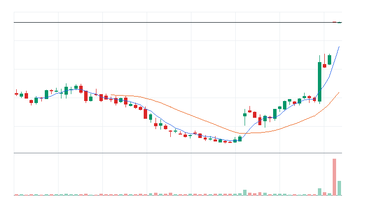
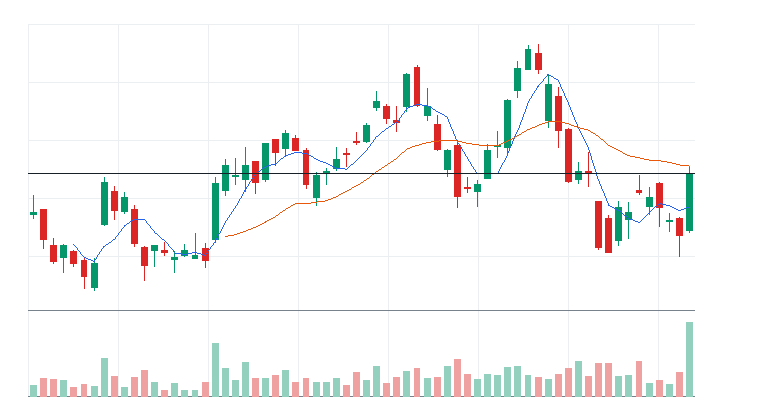
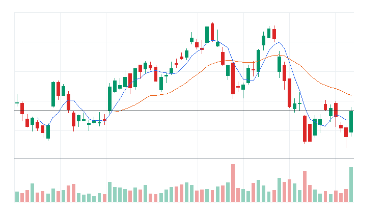
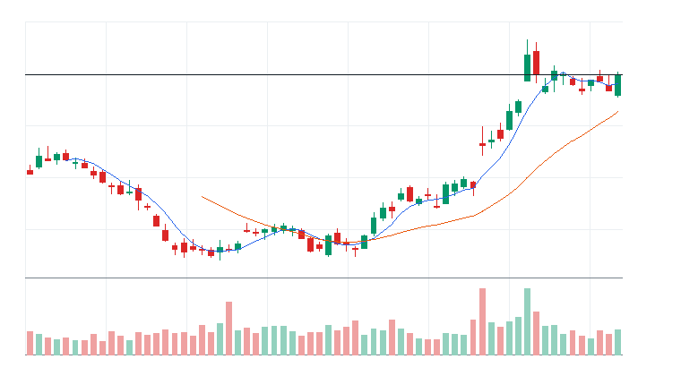
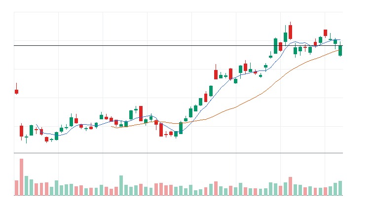
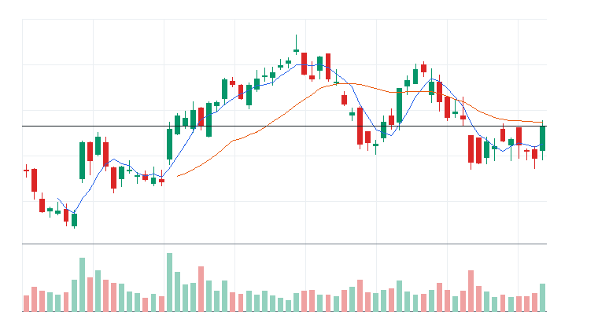

# 오늘의 데일리 트레이딩 요약

**REAL DATA TEST - 가격/거래량은 실제 데이터, 뉴스/ETF 구성종목 확산도/거래대금 유동성 일부 연결**

**목적:** 이 리포트는 최근 오른 자산을 나열하는 것이 아니라, 돈이 몰리는 근거와 다음 매수 주체가 확인할 트레이딩 후보를 찾기 위한 보고서다.

> 핵심 질문: 현재 가격에서 누가 사고 있고, 누가 앞으로 더 비싸게 사줄 수 있는가?

## 시장 국면 판단

- 최종 판정: 중립-하락 (32점)
- 전일 대비: 중립-하락은 유지됐지만 점수는 전일보다 약화됐다(-5점).
- 판정 신뢰도: 높음 (100점) - 핵심 지수와 매크로 데이터가 대부분 직접 수집되어 판정 신뢰도가 높다.
- 행동 바이어스: 매크로 부담 우선, 현금 비중과 손절 기준 강화
- 한 줄 결론: 주요 지수 또는 매크로 중 하나가 약세장 쪽으로 기울었다. 반등 확인 전까지 진입 크기를 줄인다.
- 기술적 지표: 하락 추세 (25점, 가중치 65%)
- S&P 500: 49점 | 50일선 아래, 200일선 위, 20일 -6.36%, 60일 -7.00%, 52주 고점 대비 -8.52% -> 기술 점수 49
- Nasdaq 100: 0점 | 50일선 아래, 200일선 아래, 20일 -8.43%, 60일 -9.00%, 52주 고점 대비 -15.45% -> 기술 점수 0
- 매크로 시황: 매크로 중립 (47점, 가중치 35%)
- 매크로 요약: 물가은 우호적이나 신용/유동성 부담이 남아 있다.
- 금리: 중립 47점 / 금리 중립 / confidence HIGH
  - 주요 근거: US 10Y yield 20일 +2.00%, 5일 -1.00%; US 3M yield 20일 +3.11%, 단기금리 방향 확인; US long-duration bonds 20일 -1.70%, 장기채 가격 기준 할인율 부담 확인
  - 확인 사항: 추가 확인 이벤트 없음
- 물가: 중립-우호 59점 / 물가 중립 / confidence HIGH
  - 주요 근거: Oil ETF 20일 -15.03%, 유가 기반 물가 압력 확인; TIPS ETF 20일 -1.22%, 물가연동채 흐름은 보조 근거; Gold 20일 -9.17%, 금 강세는 방어 수요 여부 확인
  - 확인 사항: 추가 확인 이벤트 없음
- 정책: 중립 50점 / 정책 이벤트 확인 전 중립 / confidence LOW
  - 주요 근거: 정책 톤은 1차 버전에서 일정/이벤트 리스크 기반 중립값으로 반영한다.
  - 확인 사항: FOMC, CPI, PCE, 고용지표 발표 전후에는 매크로 confidence를 보수적으로 해석한다.
- 신용/유동성: 위험 33점 / 신용/유동성 부담 / confidence HIGH
  - 주요 근거: High yield credit 20일 -0.74%, 하이일드 위험선호 확인; HYG-LQD 20일 상대강도 +0.41%, 신용위험 선호/회피 확인; VIX 20일 +49.45%, 변동성 부담 확인
  - 확인 사항: VIX 상승은 유동성/리스크 프리미엄 부담으로 해석한다.
- 환율/글로벌: 중립 46점 / 환율/글로벌 중립 / confidence MEDIUM
  - 주요 근거: US dollar 20일 +2.53%, 달러 강세/약세 확인
  - 확인 사항: 추가 확인 이벤트 없음
- US 10Y yield: 48점 | 하락 시 주식 우호; 5일 -1.00%, 20일 +2.00% -> 매크로 점수 48
- US 3M yield: 45점 | 하락 시 주식 우호; 5일 +0.46%, 20일 +3.11% -> 매크로 점수 45
- US long-duration bonds: 48점 | 상승 시 주식 우호; 5일 +0.79%, 20일 -1.70% -> 매크로 점수 48
- TIPS ETF: 50점 | 상승 시 주식 우호; 5일 +0.25%, 20일 -1.22% -> 매크로 점수 50
- Oil ETF: 78점 | 하락 시 주식 우호; 5일 -5.46%, 20일 -15.03% -> 매크로 점수 78
- Gold: 50점 | 상승 시 주식 우호; 5일 -5.55%, 20일 -9.17% -> 매크로 점수 50
- US dollar: 45점 | 하락 시 주식 우호; 5일 +0.71%, 20일 +2.53% -> 매크로 점수 45
- High yield credit: 48점 | 상승 시 주식 우호; 5일 -0.58%, 20일 -0.74% -> 매크로 점수 48
- Investment grade credit: 50점 | 상승 시 주식 우호; 5일 +0.03%, 20일 -1.15% -> 매크로 점수 50
- VIX: 0점 | 하락 시 주식 우호; 5일 +52.09%, 20일 +49.45% -> 매크로 점수 0
- 데이터 커버리지: 기술 2/2, 매크로 10/10
- 데이터 신뢰도 근거:
  - 직접 지수 데이터: S&P 500, Nasdaq 100
  - 대체 지수 데이터 없음
  - 매크로 데이터: 10/10
  - 누락 데이터 없음
  - stale 데이터 없음

## 모바일 요약

[오늘의 데일리 트레이딩 요약]

생성 성공 / 데이터 모드: REAL_TEST

시장:
- 위험회피

시장 지배 서사:
1. 바이오/헬스케어 촉매 - 약화 - Invesco QQQ Trust(QQQ), Insmed Incorporated(INSM), Regeneron Pharmaceuticals Inc.(REGN) 중심으로 5일 +0.37%, 20일 +9.60% 흐름이 형성됨. 뉴스 직접성 제한.
2. 사이버보안 지출 재가속 - 소멸 - Amplify Cybersecurity ETF(HACK), First Trust NASDAQ Cybersecurity ETF(CIBR), CrowdStrike Holdings Inc.(CRWD), Zscaler Inc.(ZS) 중심으로 5일 +0.53%, 20일 -6.01% 흐름이 형성됨. 직접 촉매 일부 확인.
3. Discount Stores 자금 유입 - 약화 - Invesco QQQ Trust(QQQ), Walmart Inc.(WMT), Costco Wholesale Corporation(COST) 중심으로 5일 -2.08%, 20일 +1.02% 흐름이 형성됨. 뉴스 직접성 제한.

트렌드 강도:
1. 바이오/헬스케어 촉매 - TSI 14 - 잠복 - 진입품질 낮음
2. 사이버보안 지출 재가속 - TSI 24 - 잠복 - 진입품질 낮음
3. Discount Stores 자금 유입 - TSI 10 - 잠복 - 진입품질 낮음

오늘 결론:
- 바이오/헬스케어 개별 종목 흐름이 ETF 대비 강한지 확인 필요
- 행동 후보는 linkedNarrative와 함께 확인한다.
- 추격보다 진입 조건 확인 후 접근한다.

오늘 실제 행동 후보:
1. Insmed Incorporated(INSM)(STOCK) - 바이오/헬스케어 촉매 - 단기 추세가 유지되고 거래량이 1.0배 이상이면 눌림 이후 재상승을 시도할 수 있음

다크호스 후보:
1. 다크호스 후보 없음 - 조건 충족 후보 없음

ETF 후보 TOP 5:
1. Amplify Cybersecurity ETF(HACK) - 사이버보안 지출 재가속 - 제외
2. First Trust NASDAQ Cybersecurity ETF(CIBR) - 사이버보안 지출 재가속 - 제외
3. iShares Cybersecurity and Tech ETF(IHAK) - 사이버보안 지출 재가속 - 제외
4. iShares 20+ Year Treasury Bond ETF(TLT) - 매크로 방어/헤지 - 제외
5. Utilities Select Sector SPDR Fund(XLU) - 전력망/원전/인프라 병목 - 제외

웹 리포트:
https://yoolcool.github.io/DailyTradingThesisAgent/

## 오늘 결론

- 오늘 결론: 조건부 진입
- 신규 진입 후보: 0개
- 조건부 진입 후보: 1개
- 관찰 후보: 96개
- 주요 제한 요인: Entry Quality < 40, 뉴스 직접성 부족, RVOL 미달
- 주문 판단: 시장가 금지 / 지정가 또는 관찰
- 실전 판단: 진입 후보는 있으나, 전일 고점 돌파와 거래량 확인 후 선별적으로 접근한다.

### 후보 제한 요인 집계

- RVOL < 1.00x: 96개
- 거래대금 유동성 낮음: 14개
- Entry Quality 50~54 near miss: 0개
- Entry Quality 40~49 관찰: 0개
- Entry Quality < 40: 155개
- Exhaustion Risk >= 70: 0개
- ETF breadth 샘플 부족: 37개
- 뉴스 직접성 부족: 98개

## 데이터 신뢰도

- 전체 데이터 신뢰도 등급: LOW
- 분석 신뢰도: LOW
- 주문 실행 신뢰도: LOW
- ETF breadth 신뢰도: LOW
- 신뢰도 해석: 테마 확산 판단 제한, 거래대금 유동성 낮음 또는 확인 불가, 프리/애프터마켓 확인 불가
- 리포트 생성 시각: 2026-11-20 12:55 KST
- 가격 기준 거래일: 2026-11-19 US regular close
- 뉴스 수집 시각: 2026-11-20 12:55 KST
- 가장 최근 뉴스 발행 시각: 2026-11-20 12:30 KST
- 뉴스 신선도 상태: FRESH
- 뉴스 소스: Yahoo Finance RSS, MarketWatch RSS, CNBC Markets RSS, SEC EDGAR RSS, Federal Reserve RSS, Finnhub API
- 뉴스 소스 상태: Yahoo Finance RSS CONNECTED, MarketWatch RSS CONNECTED, CNBC Markets RSS PARTIAL, SEC EDGAR RSS PARTIAL, Federal Reserve RSS CONNECTED, Finnhub API DISABLED
- 뉴스 신뢰도: MEDIUM
- 추천 적용 거래일: 2026-11-19 US regular session
- 가격/거래량 데이터 상태: 일부 연결
- 뉴스 데이터 상태: 일부 연결
- ETF 구성종목 확산도 상태: 일부 연결
- ETF 구성종목 샘플 수: 1~4
- 거래대금 유동성 데이터 상태: 일부 연결
- 프리/애프터마켓 데이터 상태: UNAVAILABLE
- 데이터 provider: yfinance, Yahoo Finance RSS, MarketWatch RSS, CNBC Markets RSS, SEC EDGAR RSS, Federal Reserve RSS, Finnhub API, config fallback sample, price-volume dollar-volume fallback
- 실전 사용 경고: 이 리포트는 투자판단 보조용이며, REAL_TEST 모드에서는 일부 데이터가 누락되거나 지연될 수 있다. 실제 주문 전 현재가, 뉴스, 프리마켓/정규장 거래량을 별도 확인해야 한다.

## 0. 시장 상태

- 데이터 모드: REAL_TEST
- 가격/거래량: 일부 연결
- 뉴스: 일부 연결
- ETF 구성종목 확산도: 일부 연결
- 거래대금 유동성: 일부 연결
- 생성 시각: 2026년 11월 20일 금요일 PM 12:55
- 시장 상태: 위험회피
- 오늘 돈의 방향: 바이오/헬스케어 개별 종목 흐름이 ETF 대비 강한지 확인 필요
- 강한 테마 TOP 3: 채권 ETF(29), 필수소비재(24), 사이버보안 ETF(23)
- 데이터 한계:
  - API 또는 provider 상태에 따라 뉴스/ETF 확산도/거래대금 유동성 반영 범위가 달라질 수 있다.
  - 수집 실패 데이터는 점수 반영에서 제외하거나 confidence를 제한한다.
  - reasonConfidence HIGH는 직접 촉매, 가격/거래량, 확산도/유동성 근거가 함께 있을 때만 사용한다.

## 오늘 시장을 지배하는 서사

### 오늘 시장을 지배하는 서사 TOP 3

#### 1. 바이오/헬스케어 촉매
- 상태: 약화
- narrativeScore: 18
- reasonConfidence: LOW
- 근거 ETF: QQQ
- 근거 개별 종목: INSM, REGN, AMGN, VRTX, GILD
- 돈이 몰리는 이유: 바이오/헬스케어 촉매 관련 Invesco QQQ Trust(QQQ)와 Insmed Incorporated(INSM), Regeneron Pharmaceuticals Inc.(REGN), Amgen Inc.(AMGN), Vertex Pharmaceuticals Incorporated(VRTX)의 5일(+0.37%)·20일(+9.60%) 흐름을 함께 본다. 평균 상대 거래량은 1.33배이고, ETF 확산도는 추가 확인이 필요하다. 뉴스 직접성은 아직 제한적이다.
- 다음 매수 주체: 바이오/헬스케어 촉매을 확인한 섹터 ETF 자금과 상대강도 추종 스윙 자금
- 가장 좋은 트레이딩 수단: ETF 우선: QQQ / 개별 종목 우선: AMGN, VRTX, GILD
- 서사가 깨지는 조건: QQQ 20일선 이탈 또는 관련 종목 절반 이상 5일선 이탈
- 오늘 행동: 기존 네러티브와 중복을 확인한 뒤 ETF/대표 종목 동조성이 살아날 때만 관찰 편입

상세 narrativeScore 근거 보기

- rawScore: 18
- ETF 평균 moneyFlowScore: 0
- 개별 종목 평균 moneyFlowScore: 24
- ETF 후보 비율: 0%
- 개별 종목 후보 비율: 20%
- 5일 평균 수익률: 0.00%
- 20일 평균 수익률: +10.00%
- 평균 상대 거래량: 1.00배
- ETF 평균 상대 거래량: 1.00배
- 개별주 평균 상대 거래량: 1.00배
- 52주 고점 근접 후보 비율: 0%
- 뉴스 직접성 점수: 3
- ETF 확산도 점수: -4
- 유동성 점수: 2
- 과열 리스크 차감: 0

#### 2. 사이버보안 지출 재가속
- 상태: 소멸
- narrativeScore: 16
- reasonConfidence: LOW
- 근거 ETF: HACK, CIBR, IHAK
- 근거 개별 종목: CRWD, ZS
- 돈이 몰리는 이유: 사이버보안 지출 재가속 관련 Amplify Cybersecurity ETF(HACK), First Trust NASDAQ Cybersecurity ETF(CIBR), iShares Cybersecurity and Tech ETF(IHAK)와 CrowdStrike Holdings Inc.(CRWD), Zscaler Inc.(ZS)의 5일(+0.53%)·20일(-6.01%) 흐름을 함께 본다. 평균 상대 거래량은 1.59배이고, ETF 확산도는 추가 확인이 필요하다. 직접 뉴스/이벤트가 일부 확인된다.
- 다음 매수 주체: 사이버보안 지출 재가속을 확인한 섹터 ETF 자금과 상대강도 추종 스윙 자금
- 가장 좋은 트레이딩 수단: ETF 우선: HACK, CIBR, IHAK / 개별 종목 우선: ZS, CRWD
- 서사가 깨지는 조건: HACK 20일선 이탈 또는 관련 종목 절반 이상 5일선 이탈
- 오늘 행동: 기존 네러티브와 중복을 확인한 뒤 ETF/대표 종목 동조성이 살아날 때만 관찰 편입

상세 narrativeScore 근거 보기

- rawScore: 16
- ETF 평균 moneyFlowScore: 17
- 개별 종목 평균 moneyFlowScore: 18
- ETF 후보 비율: 0%
- 개별 종목 후보 비율: 0%
- 5일 평균 수익률: +1.00%
- 20일 평균 수익률: -6.00%
- 평균 상대 거래량: 2.00배
- ETF 평균 상대 거래량: 2.00배
- 개별주 평균 상대 거래량: 1.00배
- 52주 고점 근접 후보 비율: 0%
- 뉴스 직접성 점수: 8
- ETF 확산도 점수: -3
- 유동성 점수: 2
- 과열 리스크 차감: 0

#### 3. Discount Stores 자금 유입
- 상태: 약화
- narrativeScore: 14
- reasonConfidence: LOW
- 근거 ETF: QQQ
- 근거 개별 종목: WMT, COST
- 돈이 몰리는 이유: Discount Stores 자금 유입 관련 Invesco QQQ Trust(QQQ)와 Walmart Inc.(WMT), Costco Wholesale Corporation(COST)의 5일(-2.08%)·20일(+1.02%) 흐름을 함께 본다. 평균 상대 거래량은 1.22배이고, ETF 확산도는 추가 확인이 필요하다. 뉴스 직접성은 아직 제한적이다.
- 다음 매수 주체: Discount Stores 자금 유입을 확인한 섹터 ETF 자금과 상대강도 추종 스윙 자금
- 가장 좋은 트레이딩 수단: ETF 우선: QQQ / 개별 종목 우선: WMT, COST
- 서사가 깨지는 조건: QQQ 20일선 이탈 또는 관련 종목 절반 이상 5일선 이탈
- 오늘 행동: 기존 네러티브와 중복을 확인한 뒤 ETF/대표 종목 동조성이 살아날 때만 관찰 편입

상세 narrativeScore 근거 보기

- rawScore: 14
- ETF 평균 moneyFlowScore: 0
- 개별 종목 평균 moneyFlowScore: 35
- ETF 후보 비율: 0%
- 개별 종목 후보 비율: 0%
- 5일 평균 수익률: -2.00%
- 20일 평균 수익률: +1.00%
- 평균 상대 거래량: 1.00배
- ETF 평균 상대 거래량: 1.00배
- 개별주 평균 상대 거래량: 1.00배
- 52주 고점 근접 후보 비율: 33%
- 뉴스 직접성 점수: 2
- ETF 확산도 점수: -4
- 유동성 점수: 5
- 과열 리스크 차감: 0

### 전체 narrative 요약

| 서사명 | 상태 | narrativeScore | reasonConfidence | 대표 ETF | 대표 종목 | 오늘 행동 |
| --- | --- | ---: | --- | --- | --- | --- |
| 바이오/헬스케어 촉매 | 약화 | 18 | LOW | QQQ | INSM, REGN, AMGN, VRTX | 기존 네러티브와 중복을 확인한 뒤 ETF/대표 종목 동조성이 살아날 때만 관찰 편입 |
| 사이버보안 지출 재가속 | 소멸 | 16 | LOW | HACK, CIBR, IHAK | CRWD, ZS | 기존 네러티브와 중복을 확인한 뒤 ETF/대표 종목 동조성이 살아날 때만 관찰 편입 |
| Discount Stores 자금 유입 | 약화 | 14 | LOW | QQQ | WMT, COST | 기존 네러티브와 중복을 확인한 뒤 ETF/대표 종목 동조성이 살아날 때만 관찰 편입 |
| Telecom Services 자금 유입 | 약화 | 7 | LOW | QQQ, SPY, IWM | CHTR, CMCSA | 기존 네러티브와 중복을 확인한 뒤 ETF/대표 종목 동조성이 살아날 때만 관찰 편입 |
| 소프트웨어 실적/AI 수익화 | 약화 | 0 | LOW | IGV, AIQ, QQQ | APP, MSFT | 기존 네러티브와 중복을 확인한 뒤 ETF/대표 종목 동조성이 살아날 때만 관찰 편입 |
| 필수소비재 음료 방어 성장 | 약화 | 0 | LOW | QQQ | CCEP, KDP, PEP | 기존 네러티브와 중복을 확인한 뒤 ETF/대표 종목 동조성이 살아날 때만 관찰 편입 |
| Staffing & Employment 자금 유입 | 소멸 | 0 | LOW | QQQ, SPY, IWM | ADP, PAYX | 기존 네러티브와 중복을 확인한 뒤 ETF/대표 종목 동조성이 살아날 때만 관찰 편입 |
| 매크로 방어/헤지 | 소멸 | 0 | LOW | TLT, GLD, XLE | XOM, CVX | 위험회피가 확인될 때만 헤지성 접근 |
| Specialty Business Services 자금 유입 | 소멸 | 0 | LOW | QQQ, SPY, IWM | TRI, CTAS, CPRT | 기존 네러티브와 중복을 확인한 뒤 ETF/대표 종목 동조성이 살아날 때만 관찰 편입 |
| 소비 회복/방어주 선별 | 약화 | 0 | LOW | QQQ | PDD, AMZN | 기존 네러티브와 중복을 확인한 뒤 ETF/대표 종목 동조성이 살아날 때만 관찰 편입 |
| Data Storage 자금 유입 | 소멸 | 0 | LOW | QQQ, SPY, IWM | STX, WDC | 기존 네러티브와 중복을 확인한 뒤 ETF/대표 종목 동조성이 살아날 때만 관찰 편입 |
| Aerospace & Defense 자금 유입 | 소멸 | 0 | LOW | QQQ, SPY, IWM | LMT, RTX, KTOS | 기존 네러티브와 중복을 확인한 뒤 ETF/대표 종목 동조성이 살아날 때만 관찰 편입 |
| Travel Services 자금 유입 | 소멸 | 0 | LOW | QQQ | ABNB, BKNG | 기존 네러티브와 중복을 확인한 뒤 ETF/대표 종목 동조성이 살아날 때만 관찰 편입 |
| Medical Devices 자금 유입 | 소멸 | 0 | LOW | QQQ | ISRG, DXCM | 기존 네러티브와 중복을 확인한 뒤 ETF/대표 종목 동조성이 살아날 때만 관찰 편입 |
| 위험선호 성장주 재진입 | 소멸 | 0 | LOW | QQQ, IPO, ARKK | ARM, COIN, TSLA | 지수 위험선호가 유지될 때만 선별 진입 |
| 전력 유틸리티 수요 재평가 | 소멸 | 0 | LOW | QQQ, SPY, IWM | ETN, GEV, VRT | 기존 네러티브와 중복을 확인한 뒤 ETF/대표 종목 동조성이 살아날 때만 관찰 편입 |
| Integrated Oil & Gas 자금 유입 | 소멸 | 0 | LOW | QQQ, SPY, IWM | CVX, XOM | 기존 네러티브와 중복을 확인한 뒤 ETF/대표 종목 동조성이 살아날 때만 관찰 편입 |
| 방산/안보 프리미엄 | 소멸 | 0 | LOW | XAR, SHLD, ITA | AVAV, KTOS, PLTR | 뉴스 촉매가 직접 확인될 때만 추세 추종 |
| 전력망/원전/인프라 병목 | 소멸 | 0 | LOW | GRID, PAVE, URA | VRT, ETN, PWR, CEG | ETF 확산도와 거래량이 같이 살아날 때만 진입 |
| Bitcoin Mining 자금 유입 | 소멸 | 0 | LOW | IBIT, BLOK | RIOT, MARA, CIFR | 기존 네러티브와 중복을 확인한 뒤 ETF/대표 종목 동조성이 살아날 때만 관찰 편입 |
| AI 인프라 재가속 | 소멸 | 0 | LOW | SMH, SOXX, DRAM | NVDA, MU, VRT, ETN | 추격보다 5일선 지지 후 재상승 확인 |
| Internet Content 자금 유입 | 소멸 | 0 | LOW | QQQ | META, GOOGL, GOOG | 기존 네러티브와 중복을 확인한 뒤 ETF/대표 종목 동조성이 살아날 때만 관찰 편입 |
| 반도체 설계/공급망 재가속 | 소멸 | 0 | LOW | SMH, SOXX, SOXQ | TSM, NVDA, AMD, MRVL | 기존 네러티브와 중복을 확인한 뒤 ETF/대표 종목 동조성이 살아날 때만 관찰 편입 |
| 비트코인/디지털 자산 위험선호 | 소멸 | 0 | LOW | IBIT, BLOK | RIOT, MSTR, COIN, IREN | 비트코인 베타가 살아날 때만 단기 매매 |
| 반도체 장비 사이클 재평가 | 소멸 | 0 | LOW | SMH, SOXX, SOXQ | ASML, LRCX | 기존 네러티브와 중복을 확인한 뒤 ETF/대표 종목 동조성이 살아날 때만 관찰 편입 |
| AI 소프트웨어/사이버보안 확산 | 소멸 | 0 | LOW | IGV, AIQ, QQQ | PLTR, DDOG, TEAM, MSFT | 추격보다 눌림 후 재상승 확인 |

## 트렌드 강도 판단

### 1. 바이오/헬스케어 촉매
- Trend Strength Index: 14
- 트렌드 상태 라벨: 잠복
- 테마 확산도: 부족
- ETF 동조성: 부족
- 거래량 강도: 보통
- 과열 위험: 낮음 (18)
- 오늘 진입 품질: 낮음 (3)
- 한 줄 판단: 바이오/헬스케어 촉매는 Trend Strength는 높아도 시장 위험선호가 약해 시장 환경 비우호 구간이다.
- 오늘 접근법: Invesco QQQ Trust(QQQ)와 Insmed Incorporated(INSM)/Regeneron Pharmaceuticals Inc.(REGN)/Amgen Inc.(AMGN)의 거래량 확산이 확인되기 전까지 관찰한다.

트렌드 강도 상세 근거 보기

- 가격 모멘텀: 가격 모멘텀 3/25. 평균 5D +0.37%, 20D +9.60%.
- 거래량 강도: 거래량 강도 10/20. 평균 RVOL 1.33배.
- ETF 동조성: ETF 동조성 0/15. 관련 ETF Invesco QQQ Trust(QQQ) 흐름을 기준으로 판단.
- 테마 확산도: 테마 확산도 0/20. 상위 1~2개 쏠림 감점 6점 반영.
- 뉴스 촉매: 뉴스/촉매 신선도 1/10. HIGH 직접 촉매 0개.
- 과열 리스크: 과열 리스크 18/100. 단기 급등, 고점 근접, ETF-개별주 괴리, 쏠림을 함께 반영.
- 시장 환경: 시장 환경 0/10. QQQ/SPY/IWM 가격 흐름 기반 위험선호 점수.

### 2. 사이버보안 지출 재가속
- Trend Strength Index: 24
- 트렌드 상태 라벨: 잠복
- 테마 확산도: 부족
- ETF 동조성: 약함
- 거래량 강도: 보통
- 과열 위험: 낮음 (9)
- 오늘 진입 품질: 낮음 (11)
- 한 줄 판단: 사이버보안 지출 재가속는 Trend Strength는 높아도 시장 위험선호가 약해 시장 환경 비우호 구간이다.
- 오늘 접근법: Amplify Cybersecurity ETF(HACK)/First Trust NASDAQ Cybersecurity ETF(CIBR)/iShares Cybersecurity and Tech ETF(IHAK)와 CrowdStrike Holdings Inc.(CRWD)/Zscaler Inc.(ZS)의 거래량 확산이 확인되기 전까지 관찰한다.

트렌드 강도 상세 근거 보기

- 가격 모멘텀: 가격 모멘텀 0/25. 평균 5D +0.53%, 20D -6.01%.
- 거래량 강도: 거래량 강도 13/20. 평균 RVOL 1.59배.
- ETF 동조성: ETF 동조성 7/15. 관련 ETF Amplify Cybersecurity ETF(HACK), First Trust NASDAQ Cybersecurity ETF(CIBR), iShares Cybersecurity and Tech ETF(IHAK), iShares Expanded Tech-Software Sector ETF(IGV) 흐름을 기준으로 판단.
- 테마 확산도: 테마 확산도 3/20. 상위 1~2개 쏠림 감점 3점 반영.
- 뉴스 촉매: 뉴스/촉매 신선도 1/10. HIGH 직접 촉매 1개.
- 과열 리스크: 과열 리스크 9/100. 단기 급등, 고점 근접, ETF-개별주 괴리, 쏠림을 함께 반영.
- 시장 환경: 시장 환경 0/10. QQQ/SPY/IWM 가격 흐름 기반 위험선호 점수.

### 3. Discount Stores 자금 유입
- Trend Strength Index: 10
- 트렌드 상태 라벨: 잠복
- 테마 확산도: 부족
- ETF 동조성: 부족
- 거래량 강도: 보통
- 과열 위험: 낮음 (18)
- 오늘 진입 품질: 낮음 (3)
- 한 줄 판단: Discount Stores 자금 유입는 Trend Strength는 높아도 시장 위험선호가 약해 시장 환경 비우호 구간이다.
- 오늘 접근법: Invesco QQQ Trust(QQQ)와 Walmart Inc.(WMT)/Costco Wholesale Corporation(COST)의 거래량 확산이 확인되기 전까지 관찰한다.

트렌드 강도 상세 근거 보기

- 가격 모멘텀: 가격 모멘텀 -4/25. 평균 5D -2.08%, 20D +1.02%.
- 거래량 강도: 거래량 강도 10/20. 평균 RVOL 1.22배.
- ETF 동조성: ETF 동조성 0/15. 관련 ETF Invesco QQQ Trust(QQQ) 흐름을 기준으로 판단.
- 테마 확산도: 테마 확산도 3/20. 상위 1~2개 쏠림 감점 6점 반영.
- 뉴스 촉매: 뉴스/촉매 신선도 1/10. HIGH 직접 촉매 0개.
- 과열 리스크: 과열 리스크 18/100. 단기 급등, 고점 근접, ETF-개별주 괴리, 쏠림을 함께 반영.
- 시장 환경: 시장 환경 0/10. QQQ/SPY/IWM 가격 흐름 기반 위험선호 점수.

## 최근 추천 결과 트래킹

개별주는 데이트레이딩 관점으로 추천 이후 첫 정규장의 장중 최고가와 종가를 추적한다. ETF는 테마/스윙 관점으로 추천 이후 1주일 동안의 최고가와 현재 종가를 추적한다.

### 개별주 Top 3 추천 성과 요약
- 최근 5개 리포트 표본: 10개 (초기 검증 단계)
- 장중 최고가 기준 성공률: +22.22%
- 종가 기준 성공률: +33.33%
- 평균 장중 최고 수익률: +2.76%
- 평균 종가 수익률: +1.36%

### ETF 추천 성과 요약
- 최근 5개 리포트 표본: 0개 (초기 검증 단계)
- 1주 최고가 기준 성공률: 데이터 없음
- 현재 종가 기준 성공률: 데이터 없음
- 평균 1주 최고 수익률: 데이터 없음
- 평균 현재 수익률: 데이터 없음

최근 추천 결과 상세 테이블 펼치기

| 추천일 | 유형 | 순위 | 티커 | 기준가 | 추적 기간 | 상태 | High 수익률 | Close 수익률 | 결과 | 코멘트 |
| --- | --- | ---: | --- | ---: | --- | --- | ---: | ---: | --- | --- |
| 2026-11-20 | STOCK | 1 | INSM | $144.46 | 2026-11-20 | pending | 데이터 없음 | 데이터 없음 | 추적 대기 | 아직 추적 거래일 데이터가 완성되지 않음 |
| 2026-11-17 | STOCK | 2 | COST | $1,113.74 | 2026-11-17 | complete | +0.89% | -0.33% | 실패 | 추천 이후 의미 있는 장중 기회가 부족하고 종가도 약함 (일봉 기준) |
| 2026-11-17 | STOCK | 1 | CHTR | $138.95 | 2026-11-17 | complete | +2.63% | -0.32% | 제한적 유효 | 제한적인 장중 기회만 발생 (일봉 기준) |
| 2026-11-16 | STOCK | 2 | REGN | $955.47 | 2026-11-16 | complete | +1.76% | -0.32% | 제한적 유효 | 제한적인 장중 기회만 발생 (일봉 기준) |
| 2026-11-16 | STOCK | 1 | CHTR | $138.39 | 2026-11-16 | complete | +0.98% | +0.40% | 추적 대기 | 아직 추적 거래일 데이터가 완성되지 않음 (일봉 기준) |
| 2026-11-11 | STOCK | 2 | CHTR | $134.06 | 2026-11-11 | complete | +1.75% | +1.68% | 제한적 유효 | 제한적인 장중 기회만 발생 (일봉 기준) |
| 2026-11-11 | STOCK | 1 | TTWO | $224.64 | 2026-11-11 | complete | +5.68% | +2.97% | 성공 | 장중 기회와 종가 유지가 모두 확인됨 (일봉 기준) |
| 2026-11-10 | STOCK | 3 | CHTR | $121.2 | 2026-11-10 | complete | +11.32% | +10.61% | 성공 | 장중 기회와 종가 유지가 모두 확인됨 (일봉 기준) |
| 2026-11-10 | STOCK | 2 | FER | $61.39 | 2026-11-10 | complete | -0.11% | -0.65% | 실패 | 추천 이후 의미 있는 장중 기회가 부족하고 종가도 약함 (일봉 기준) |
| 2026-11-10 | STOCK | 1 | ABNB | $190.29 | 2026-11-10 | complete | -0.02% | -1.78% | 실패 | 추천 이후 의미 있는 장중 기회가 부족하고 종가도 약함 (일봉 기준) |
| 2026-11-09 | STOCK | 2 | APP | $391.22 | 2026-11-09 | complete | +5.54% | +4.80% | 성공 | 장중 기회와 종가 유지가 모두 확인됨 (일봉 기준) |
| 2026-11-09 | STOCK | 1 | ABNB | $189.99 | 2026-11-09 | complete | +4.15% | +0.16% | 단타 유효 | 장중 기회는 있었지만 종가 유지력은 약함 (일봉 기준) |
| 2026-11-06 | STOCK | 3 | ROP | $490.96 | 2026-11-06 | complete | -2.04% | -2.92% | 실패 | 추천 이후 의미 있는 장중 기회가 부족하고 종가도 약함 (일봉 기준) |
| 2026-11-06 | STOCK | 2 | COST | $1,065.59 | 2026-11-06 | complete | -0.24% | -1.13% | 실패 | 추천 이후 의미 있는 장중 기회가 부족하고 종가도 약함 (일봉 기준) |
| 2026-11-06 | STOCK | 1 | REGN | $902.9 | 2026-11-06 | complete | +0.97% | +0.16% | 추적 대기 | 아직 추적 거래일 데이터가 완성되지 않음 (일봉 기준) |
| 2026-11-04 | STOCK | 3 | IDXX | $672.04 | 2026-11-04 | complete | +6.20% | +3.94% | 성공 | 장중 기회와 종가 유지가 모두 확인됨 (일봉 기준) |
| 2026-11-04 | STOCK | 2 | GEHC | $80.66 | 2026-11-04 | complete | +8.55% | +6.38% | 성공 | 장중 기회와 종가 유지가 모두 확인됨 (일봉 기준) |
| 2026-11-04 | STOCK | 1 | REGN | $973.36 | 2026-11-04 | complete | +1.89% | -4.39% | 제한적 유효 | 제한적인 장중 기회만 발생 (일봉 기준) |
| 2026-11-03 | STOCK | 3 | GEHC | $79.55 | 2026-11-03 | complete | +1.58% | +1.40% | 제한적 유효 | 제한적인 장중 기회만 발생 (일봉 기준) |
| 2026-11-03 | STOCK | 2 | KDP | $36.82 | 2026-11-03 | complete | -2.77% | -5.65% | 실패 | 추천 이후 의미 있는 장중 기회가 부족하고 종가도 약함 (일봉 기준) |
| 2026-11-03 | STOCK | 1 | REGN | $961.26 | 2026-11-03 | complete | +1.48% | +1.26% | 제한적 유효 | 제한적인 장중 기회만 발생 (일봉 기준) |
| 2026-11-02 | STOCK | 3 | AMGN | $466.01 | 2026-11-02 | complete | +0.64% | -0.12% | 실패 | 추천 이후 의미 있는 장중 기회가 부족하고 종가도 약함 (일봉 기준) |
| 2026-11-02 | STOCK | 2 | VRTX | $558.88 | 2026-11-02 | complete | +1.75% | -1.03% | 제한적 유효 | 제한적인 장중 기회만 발생 (일봉 기준) |
| 2026-11-02 | STOCK | 1 | XOM | $187.25 | 2026-11-02 | complete | -1.42% | -4.05% | 실패 | 추천 이후 의미 있는 장중 기회가 부족하고 종가도 약함 (일봉 기준) |
| 2026-10-30 | STOCK | 3 | FER | $56.92 | 2026-10-30 | complete | -0.09% | -2.86% | 실패 | 추천 이후 의미 있는 장중 기회가 부족하고 종가도 약함 (일봉 기준) |
| 2026-10-30 | STOCK | 2 | RTX | $199.4 | 2026-10-30 | complete | +2.41% | +0.20% | 제한적 유효 | 제한적인 장중 기회만 발생 (일봉 기준) |
| 2026-10-30 | STOCK | 1 | LMT | $643.59 | 2026-10-30 | complete | +2.08% | -1.03% | 제한적 유효 | 제한적인 장중 기회만 발생 (일봉 기준) |
| 2026-10-29 | STOCK | 3 | GEHC | $75.82 | 2026-10-29 | complete | +1.99% | +0.79% | 제한적 유효 | 제한적인 장중 기회만 발생 (일봉 기준) |
| 2026-10-29 | STOCK | 2 | LMT | $629.75 | 2026-10-29 | complete | +3.06% | +2.20% | 성공 | 장중 기회와 종가 유지가 모두 확인됨 (일봉 기준) |
| 2026-10-29 | STOCK | 1 | ROP | $440.66 | 2026-10-29 | complete | +2.17% | +2.04% | 제한적 유효 | 제한적인 장중 기회만 발생 (일봉 기준) |
| 2026-10-27 | STOCK | 3 | LMT | $635.2 | 2026-10-27 | complete | -0.26% | -1.92% | 실패 | 추천 이후 의미 있는 장중 기회가 부족하고 종가도 약함 (일봉 기준) |
| 2026-10-27 | STOCK | 2 | ROP | $441.65 | 2026-10-27 | complete | -0.52% | -1.62% | 실패 | 추천 이후 의미 있는 장중 기회가 부족하고 종가도 약함 (일봉 기준) |
| 2026-10-27 | STOCK | 1 | ZS | $260.45 | 2026-10-27 | complete | +2.85% | -0.12% | 제한적 유효 | 제한적인 장중 기회만 발생 (일봉 기준) |
| 2026-10-27 | ETF | 1 | IHAK | $76.25 | 2026-10-27~2026-11-03 | complete | +1.94% | -8.00% | 실패 | 추천 이후 ETF 흐름이 약화됨 |
| 2026-10-26 | STOCK | 3 | CRWD | $257.57 | 2026-10-26 | complete | +2.65% | +1.65% | 제한적 유효 | 제한적인 장중 기회만 발생 (일봉 기준) |
| 2026-10-26 | STOCK | 2 | ROP | $438.14 | 2026-10-26 | complete | +2.88% | +0.80% | 제한적 유효 | 제한적인 장중 기회만 발생 (일봉 기준) |
| 2026-10-26 | STOCK | 1 | ZS | $255.15 | 2026-10-26 | complete | +2.47% | +2.08% | 제한적 유효 | 제한적인 장중 기회만 발생 (일봉 기준) |
| 2026-10-26 | ETF | 1 | IHAK | $74 | 2026-10-26~2026-11-02 | complete | +5.04% | -5.20% | 단기 고점 후 반납 | 1주 내 상승 기회는 있었지만 현재가는 반납 |
| 2026-10-23 | STOCK | 3 | ADP | $294.5 | 2026-10-23 | complete | +5.06% | +3.28% | 성공 | 장중 기회와 종가 유지가 모두 확인됨 (일봉 기준) |
| 2026-10-23 | STOCK | 2 | CTAS | $220.15 | 2026-10-23 | complete | +2.56% | +1.79% | 제한적 유효 | 제한적인 장중 기회만 발생 (일봉 기준) |
| 2026-10-23 | STOCK | 1 | MAR | $404 | 2026-10-23 | complete | -1.77% | -3.29% | 실패 | 추천 이후 의미 있는 장중 기회가 부족하고 종가도 약함 (일봉 기준) |
| 2026-10-22 | STOCK | 3 | TRI | $112.82 | 2026-10-22 | complete | +9.70% | +9.25% | 성공 | 장중 기회와 종가 유지가 모두 확인됨 (일봉 기준) |
| 2026-10-22 | STOCK | 2 | MAR | $397.31 | 2026-10-22 | complete | +1.50% | -0.13% | 제한적 유효 | 제한적인 장중 기회만 발생 (일봉 기준) |
| 2026-10-22 | STOCK | 1 | NOC | $534 | 2026-10-22 | complete | +4.22% | +3.44% | 성공 | 장중 기회와 종가 유지가 모두 확인됨 (일봉 기준) |
| 2026-10-13 | STOCK | 2 | SHOP | $179.22 | 2026-10-13 | complete | -0.01% | -1.51% | 실패 | 추천 이후 의미 있는 장중 기회가 부족하고 종가도 약함 (일봉 기준) |
| 2026-10-13 | STOCK | 1 | PLTR | $209 | 2026-10-13 | complete | +0.90% | -0.16% | 실패 | 추천 이후 의미 있는 장중 기회가 부족하고 종가도 약함 (일봉 기준) |
| 2026-10-12 | STOCK | 3 | ZS | $233.73 | 2026-10-12 | complete | +1.49% | -3.40% | 제한적 유효 | 제한적인 장중 기회만 발생 (일봉 기준) |
| 2026-10-12 | STOCK | 2 | DDOG | $293.26 | 2026-10-12 | complete | +2.53% | -2.04% | 제한적 유효 | 제한적인 장중 기회만 발생 (일봉 기준) |
| 2026-10-12 | STOCK | 1 | PLTR | $209.05 | 2026-10-12 | complete | +1.86% | -0.02% | 제한적 유효 | 제한적인 장중 기회만 발생 (일봉 기준) |
| 2026-10-09 | STOCK | 2 | ZS | $216.81 | 2026-10-09 | complete | +8.07% | +7.80% | 성공 | 장중 기회와 종가 유지가 모두 확인됨 (일봉 기준) |
| 2026-10-09 | STOCK | 1 | PLTR | $198.78 | 2026-10-09 | complete | +5.43% | +5.17% | 성공 | 장중 기회와 종가 유지가 모두 확인됨 (일봉 기준) |
| 2026-10-08 | STOCK | 1 | ADSK | $235.05 | 2026-10-08 | complete | +0.40% | -0.62% | 실패 | 추천 이후 의미 있는 장중 기회가 부족하고 종가도 약함 (일봉 기준) |
| 2026-10-07 | STOCK | 3 | FTNT | $191.27 | 2026-10-07 | complete | +0.50% | -1.04% | 실패 | 추천 이후 의미 있는 장중 기회가 부족하고 종가도 약함 (일봉 기준) |
| 2026-10-07 | STOCK | 2 | AMD | $649.42 | 2026-10-07 | complete | -0.14% | -0.55% | 실패 | 추천 이후 의미 있는 장중 기회가 부족하고 종가도 약함 (일봉 기준) |
| 2026-10-07 | STOCK | 1 | SNPS | $505.17 | 2026-10-07 | complete | +0.86% | -0.49% | 실패 | 추천 이후 의미 있는 장중 기회가 부족하고 종가도 약함 (일봉 기준) |
| 2026-10-07 | ETF | 1 | CIBR | $108.13 | 2026-10-07~2026-10-14 | complete | +2.36% | -11.16% | 단기 고점 후 반납 | 1주 내 상승 기회는 있었지만 현재가는 반납 |
| 2026-10-06 | STOCK | 2 | TSM | $485.8 | 2026-10-06 | complete | +0.04% | -0.72% | 실패 | 추천 이후 의미 있는 장중 기회가 부족하고 종가도 약함 (일봉 기준) |
| 2026-10-06 | STOCK | 1 | SNPS | $488.47 | 2026-10-06 | complete | +3.90% | +3.42% | 성공 | 장중 기회와 종가 유지가 모두 확인됨 (일봉 기준) |
| 2026-10-06 | ETF | 1 | CIBR | $106.01 | 2026-10-06~2026-10-13 | complete | +4.41% | -9.39% | 단기 고점 후 반납 | 1주 내 상승 기회는 있었지만 현재가는 반납 |
| 2026-10-05 | STOCK | 1 | SNPS | $489.9 | 2026-10-05 | complete | +3.77% | -0.29% | 단타 유효 | 장중 기회는 있었지만 종가 유지력은 약함 (일봉 기준) |

## 오늘 실제 행동 후보

### 1. Insmed Incorporated(INSM)
- 자산 유형: STOCK
- linkedNarrative: 바이오/헬스케어 촉매
- narrativeStatus: 약화
- narrativeScore: 18
- Trend Strength Index: 14
- Exhaustion Risk: 18 (낮음)
- Entry Quality Score: 0 (낮음)
- 트렌드 판단: 테마 확산도가 낮아 개별 종목 이벤트성 흐름일 수 있다.
- moneyFlowScore: 100
- finalRawScore: 100
- reasonConfidence: MEDIUM
- reasonConfidenceExplanation: 직접 촉매 부재 때문에 HIGH가 아니라 MEDIUM으로 제한했다.
- tieBreakerReason: 최종 원점수 100, 리스크 패널티 -10, 5일 수익률 +22.35%, 상대 거래량 3.39배 순으로 정렬
- 후보별 시장 해석: 위험회피 / 제한적 - 전체 시장은 위험회피 / Entry Quality 0 < 50이나 moneyFlow 100, confidence MEDIUM, RVOL 3.39x로 강한 자금흐름 예외 조건 충족
- 게이트 사유: Entry Quality 0 < 50이나 moneyFlow 100, confidence MEDIUM, RVOL 3.39x로 강한 자금흐름 예외 조건 충족
- 주문 실행: 시장가 가능

- 왜 돈이 몰리는가: 20일 +51.97%, 5일 +22.35%, 상대 거래량 3.39배로 가격과 거래량이 함께 개선. 뉴스: CNBC Markets RSS general_market/under_6h / 유동성: LIQUID
- 누가 더 비싸게 사줄 수 있는지: 개별 주도주를 따라붙는 단기 모멘텀 자금과 관련 ETF 강세를 확인한 트레이더
- 진입 조건: 20일선 위 눌림 후 재상승 확인
- 무효화 조건: 20일선 이탈 또는 상대 거래량 0.8배 이하 둔화
- todayActionLabel: 자금흐름 예외 조건부
#### 최근 뉴스/동향 한국어 요약

- 요약: 종목 직접 뉴스 확인 상태이며 뉴스 흐름은 긍정 우위입니다. 후보 선정 후 재확인한 핵심 이슈는 "INSM Stock On Track For Best Day In Over 3 Months After Sanofi Buyout Talks"입니다.
- 직접 촉매 판단: Insmed Incorporated에 대해 직접 촉매로 분류된 뉴스가 확인됐습니다. 핵심은 "INSM Stock On Track For Best Day In Over 3 Months After Sanofi Buyout Talks"이며, M&A 재료로 봅니다.
- 뉴스 1: INSM Stock On Track For Best Day In Over 3 Months After Sanofi Buyout Talks
  - 내용: Insmed Incorporated 관련 M&A 뉴스입니다. 기사 스니펫상 핵심 내용은 Sanofi is talking to advisers and studying a potential deal for Insmed, Bloomberg reported, citing unnamed people familiar with the matter.입니다.
  - 투자 의미: M&A 재료는 실적 가시성이나 밸류에이션 기대에 영향을 줄 수 있어 규모와 일정 확인이 중요합니다.
  - 확인할 점: M&A의 금액, 기간, 실적 반영 시점
- 뉴스 2: Insmed shares jump 18% as Sanofi weighs potential takeover
  - 내용: Insmed Incorporated 관련 기사는 Insmed shares jump 18% as Sanofi weighs potential takeover 이슈를 다루며, 주가 변동률 +18.00%를 핵심 내용으로 봅니다.
  - 투자 의미: Insmed Incorporated의 당일 상대강도 확인에는 도움이 되지만, 실적/가이던스 같은 새 펀더멘털 변화로 보기는 어렵습니다.
  - 확인할 점: 거래량 동반 여부, 장중 고점 유지, 관련 ETF 동반 강세
- 뉴스 3: Insmed Soars 18% on Report That Sanofi Is Weighing a Takeover
  - 내용: Insmed Incorporated 관련 기사는 Insmed Soars 18% on Report That Sanofi Is Weighing a Takeover 이슈를 다루며, 주가 변동률 +18.00%를 핵심 내용으로 봅니다.
  - 투자 의미: Insmed Incorporated의 당일 상대강도 확인에는 도움이 되지만, 실적/가이던스 같은 새 펀더멘털 변화로 보기는 어렵습니다.
  - 확인할 점: 거래량 동반 여부, 장중 고점 유지, 관련 ETF 동반 강세
- 매매 해석: 매매 관점에서는 뉴스 자체보다 가격이 진입 조건을 지키는지, 거래량이 동반되는지, 그리고 뉴스가 이미 주가에 반영됐는지를 우선 확인해야 합니다.
- 차트: 

## 다크호스 후보

다크호스 후보 없음. 상위 서사 정렬, MA20 위 안착, MA5/MA20 구조 개선, RVOL 0.90x 이상 조건을 동시에 충족한 개별주가 없다.

- darkHorseScore: 조건 충족 후보 없음
- 왜 아직 메인이 아닌가: 확인 조건을 통과한 보조 관찰 후보가 없다.

darkHorseScore 상세 근거 보기

- 서사 정렬: 조건 미충족
- 초기 추세 구조: 조건 미충족
- 베이스 돌파/정돈: 조건 미충족
- 거래량 확인: 조건 미충족
- rawScore: 데이터 없음

## 오늘 돈이 몰리는 테마

- 채권 ETF: TLT | 평균 moneyFlowScore 29 | 관심은 유지하되 우선순위는 낮추고 추가 거래량 확인을 기다린다.
- 필수소비재: WMT, COST, PEP, MNST, MDLZ, KDP, CCEP, KHC | 평균 moneyFlowScore 24 | 관심은 유지하되 우선순위는 낮추고 추가 거래량 확인을 기다린다.
- 사이버보안 ETF: CIBR, HACK, IHAK | 평균 moneyFlowScore 23 | 관심은 유지하되 우선순위는 낮추고 추가 거래량 확인을 기다린다.
- 바이오/헬스케어: AMGN, GILD, ISRG, VRTX, REGN, IDXX, ALNY, DXCM | 평균 moneyFlowScore 21 | 관심은 유지하되 우선순위는 낮추고 추가 거래량 확인을 기다린다.
- 사이버보안: PANW, CRWD, FTNT, ZS | 평균 moneyFlowScore 18 | 관심은 유지하되 우선순위는 낮추고 추가 거래량 확인을 기다린다.
- 전력/유틸리티 ETF: XLU | 평균 moneyFlowScore 14 | 관심은 유지하되 우선순위는 낮추고 추가 거래량 확인을 기다린다.

## 1. ETF 트레이딩 보고서
### 1-1. ETF 결론
- ETF 우선 후보: 없음
- ETF 관찰 후보: Roundhill Memory ETF(DRAM), VanEck Semiconductor ETF(SMH), Invesco PHLX Semiconductor ETF(SOXQ), Global X Robotics & Artificial Intelligence ETF(BOTZ), ROBO Global Robotics and Automation Index ETF(ROBO)
- ETF 매매 금지: Roundhill Memory ETF(DRAM), VanEck Semiconductor ETF(SMH), iShares Semiconductor ETF(SOXX), Invesco PHLX Semiconductor ETF(SOXQ), iShares Expanded Tech-Software Sector ETF(IGV)
- 오늘 ETF 최우선 1개: 없음
- ETF 섹션 해석: 이 섹션은 개별 종목 선택이 아니라 테마/섹터 단위 자금 흐름을 ETF로 매매할지 판단하기 위한 영역이다.

### 1-2. ETF 후보 TOP 5

선정 기준: ETF 후보는 가격/거래량 1차 점수에 뉴스, ETF 구성종목 확산도, 유동성, 리스크 패널티를 반영한 finalRawScore 기준으로 정렬한다. 표시 점수 100점 후보가 겹치면 tieBreakerReason으로 우선순위를 설명한다.

### [ETF] Amplify Cybersecurity ETF(HACK)
- 자산 유형: ETF
- ETF 세부 카테고리: 사이버보안 ETF
- ETF 역할: 테마 베타 매수
- 상태: 매매 금지
- linkedNarrative: 사이버보안 지출 재가속
- narrativeStatus: 소멸
- narrativeScore: 16
- moneyFlowScore: 31
- finalRawScore: 31
- tieBreakerReason: 최종 원점수 31, 리스크 패널티 -10, 5일 수익률 +1.78%, 상대 거래량 2.84배 순으로 정렬
- 과열 리스크: 낮음
- reasonConfidence: LOW
- reasonConfidenceExplanation: 가격/거래량이 약하거나 핵심 보조 근거가 부족해 LOW로 분류했다.

- todayActionLabel: 제외
- 주문 실행: 지정가 권장
- 기준일: 2026-11-18
- 종가: $119.6
- 1일 수익률: +6.12%
- 5일 수익률: +1.78%
- 20일 수익률: -2.14%
- 상대 거래량: 2.84배
- 52주 고점 대비 위치: -10.83%
- whyMoneyIsFlowing: 20일 -2.14%, 5일 +1.78%, 상대 거래량 2.84배로 가격과 거래량이 함께 개선. 뉴스: CNBC Markets RSS general_market/under_6h / 유동성: ACCEPTABLE
- likelyNextBuyer: 섹터 베타를 노리는 단기 모멘텀 자금과 리밸런싱 자금
- whyThisCouldTradeHigher: 단기 추세가 유지되고 거래량이 1.0배 이상이면 눌림 이후 재상승을 시도할 수 있음
#### 최근 뉴스/동향 한국어 요약

- 요약: 후보 선정 후 재확인 뉴스 데이터 없음
- 진입 조건: 20일선 위 눌림 후 재상승 확인
- 무효화 조건: 20일선 이탈 또는 상대 거래량 0.8배 이하 둔화
- 차트: 

#### 상세 근거

Amplify Cybersecurity ETF(HACK) 상세 근거 펼치기

- moneyFlowScore(최종) 산정 근거:
  - moneyFlowScore(1차): 31
  - 최종 원점수: 31
  - 최종 표시 점수: 31
  - cap 적용: cap 미적용
  - 계산식: +31 + +12 - 4 + +2 + 0 - 10 + 0 = 31
  - 점수 해석: 매매 금지 또는 우선순위 낮은 후보.
  - 가격/거래량 1차 점수: +31
    - 추세: +1
    - 단기 모멘텀: +9
    - 중기 모멘텀: -1
    - 거래량: +18
    - 신고가 근접: +6
    - 이동평균: -2
  - 하위 점수 cap:
    - 가격 모멘텀: 원점수 +1, 상한 적용 +1 / 최대 25
    - 단기 모멘텀: 원점수 +9, 상한 적용 +9 / 최대 20
    - 중기 모멘텀: 원점수 -1, 상한 적용 -1 / 최대 16
    - 거래량: 원점수 +18, 상한 적용 +18 / 최대 20
    - 신고가 근접: 원점수 +6, 상한 적용 +6 / 최대 12
    - 이동평균: 원점수 -2, 상한 적용 -2 / 최대 14
  - 추가 데이터 가감점:
    - 뉴스: +12
    - 유동성: +2
  - ETF 확산도: -4
  - 리스크 패널티: -10
  - 주요 근거: 1차 31, 최종 원점수 31, 표시 31. 1일 단기 모멘텀 확인, 상대 거래량 증가, 뉴스 흐름이 가격/거래량 근거 보강. 주의: 단기 과열/추격 위험 존재.
  - 리스크 패널티 산정 근거:
    - 총 리스크 패널티: -10
    - 리스크 등급: MEDIUM
    - 감점된 리스크:
      - extreme 1d move: -4 | 근거: 1d return +6.12% is unusually strong. | 대응: Confirm next-session volume retention.
      - 20d moving average break risk: -6 | 근거: Close is below the 20-day moving average. | 대응: Hold off until 20-day moving average is recovered.
    - 관찰 리스크: 주요 관찰 리스크 없음
    - 한 줄 해석: 2개 감점 리스크로 총 -10점 반영.
- 데이터 사용 현황:
  - 가격/거래량: 사용
  - 뉴스: 사용
  - ETF 확산도: 일부 연결
  - 거래대금 유동성: 사용
  - 관련 ETF 상대강도: 사용
- 뉴스 확인:
  - 최근 뉴스 상태: 일부 연결
  - 뉴스 소스: CNBC Markets RSS, MarketWatch RSS
  - 소스별 상태: Yahoo Finance RSS CONNECTED; MarketWatch RSS CONNECTED; CNBC Markets RSS CONNECTED; SEC EDGAR RSS PARTIAL; Federal Reserve RSS CONNECTED; Finnhub API DISABLED
  - 긍정/중립/부정: 13/3/0
  - 직접성/방향성/신선도: 2/1/4
  - 강한 촉매 수: 1
  - 중요 공시 수: 0
  - 직접 촉매: 없음
  - 보조 뉴스: CNBC Markets RSS sector_theme / general_market / under_6h
  - 뉴스 수집 시각: 2026-11-20 12:55 KST
  - 가장 최근 뉴스 발행 시각: 2026-11-20 12:30 KST
  - 뉴스 신선도 상태: FRESH
  - 뉴스 이후 가격 반응: 긍정
  - 가격 반응 점수 제한: 뉴스 이후 가격 반응과 점수 제한 특이사항 없음
  - 핵심 뉴스 요약: Senate passes BAAJA permitting reform bill backed by AI, energy sectors
  - 원점수/상한 점수: +22 / +12
  - 점수 반영: +12
  - 주의: SEC EDGAR RSS: no matching RSS items; Finnhub API: FINNHUB_API_KEY not configured
- ETF 구성종목 확산도:
  - 구성종목 데이터 상태: 일부 연결
  - 샘플 수: 2/2
  - 샘플 신뢰도: INSUFFICIENT
  - 상승 종목 비율: 0%
  - 20일선 위 비율: 0%
  - 50일선 위 비율: 0%
  - 상위 기여 종목: MSFT, PLTR
  - 확산도 판단: WEAK_BREADTH
  - 원점수/샘플 상한/반영 점수: -4 / 0 / -4
  - 점수 반영: -4
- 거래대금 유동성:
  - 데이터 상태: 일부 연결
  - 거래대금 기준 유동성: ACCEPTABLE
  - 거래대금: $161,639,400
  - 평균 거래대금: $56,945,148
  - 주문 영향: 지정가 권장
  - 매매 영향: 거래대금은 허용 가능하나 지정가를 우선한다
- reasonConfidence 근거: 가격/거래량이 약하거나 주요 데이터가 부족해 낮음.
- 후보 선정 후 뉴스/동향 재확인:
  - 재확인 상태: 데이터 없음
- 차트 요약: 20일선 아래라 추세 확인 전까지 보수적 접근
- 기준일 2026-11-18 | 종가 $119.6 | 1일 +6.12% | 5일 +1.78% | 20일 -2.14% | 상대 거래량 2.84배 | 52주 고점 대비 -10.83% | 데이터 소스: yfinance

### [ETF] First Trust NASDAQ Cybersecurity ETF(CIBR)
- 자산 유형: ETF
- ETF 세부 카테고리: 사이버보안 ETF
- ETF 역할: 테마 베타 매수
- 상태: 매매 금지
- linkedNarrative: 사이버보안 지출 재가속
- narrativeStatus: 소멸
- narrativeScore: 16
- moneyFlowScore: 19
- finalRawScore: 19
- tieBreakerReason: 최종 원점수 19, 리스크 패널티 -6, 5일 수익률 -0.20%, 상대 거래량 2.09배 순으로 정렬
- 과열 리스크: 낮음
- reasonConfidence: LOW
- reasonConfidenceExplanation: 가격/거래량이 약하거나 핵심 보조 근거가 부족해 LOW로 분류했다.

- todayActionLabel: 제외
- 주문 실행: 지정가 권장
- 기준일: 2026-11-18
- 종가: $96.06
- 1일 수익률: +4.72%
- 5일 수익률: -0.20%
- 20일 수익률: -6.86%
- 상대 거래량: 2.09배
- 52주 고점 대비 위치: -13.21%
- whyMoneyIsFlowing: 20일 -6.86%, 5일 -0.20%, 상대 거래량 2.09배로 가격과 거래량이 함께 개선. 뉴스: CNBC Markets RSS general_market/under_6h / 유동성: ACCEPTABLE
- likelyNextBuyer: 섹터 베타를 노리는 단기 모멘텀 자금과 리밸런싱 자금
- whyThisCouldTradeHigher: 단기 추세가 유지되고 거래량이 1.0배 이상이면 눌림 이후 재상승을 시도할 수 있음
#### 최근 뉴스/동향 한국어 요약

- 요약: 후보 선정 후 재확인 뉴스 데이터 없음
- 진입 조건: 20일선 위 눌림 후 재상승 확인
- 무효화 조건: 20일선 이탈 또는 상대 거래량 0.8배 이하 둔화
- 차트: 

#### 상세 근거

First Trust NASDAQ Cybersecurity ETF(CIBR) 상세 근거 펼치기

- moneyFlowScore(최종) 산정 근거:
  - moneyFlowScore(1차): 15
  - 최종 원점수: 19
  - 최종 표시 점수: 19
  - cap 적용: cap 미적용
  - 계산식: +15 + +12 - 4 + +2 + 0 - 6 + 0 = 19
  - 점수 해석: 매매 금지 또는 우선순위 낮은 후보.
  - 가격/거래량 1차 점수: +15
    - 추세: -3
    - 단기 모멘텀: +6
    - 중기 모멘텀: -4
    - 거래량: +18
    - 신고가 근접: 0
    - 이동평균: -2
  - 하위 점수 cap:
    - 가격 모멘텀: 원점수 -3, 상한 적용 -3 / 최대 25
    - 단기 모멘텀: 원점수 +6, 상한 적용 +6 / 최대 20
    - 중기 모멘텀: 원점수 -4, 상한 적용 -4 / 최대 16
    - 거래량: 원점수 +18, 상한 적용 +18 / 최대 20
    - 신고가 근접: 원점수 0, 상한 적용 0 / 최대 12
    - 이동평균: 원점수 -2, 상한 적용 -2 / 최대 14
  - 추가 데이터 가감점:
    - 뉴스: +12
    - 유동성: +2
  - ETF 확산도: -4
  - 리스크 패널티: -6
  - 주요 근거: 1차 15, 최종 원점수 19, 표시 19. 1일 단기 모멘텀 확인, 상대 거래량 증가, 뉴스 흐름이 가격/거래량 근거 보강. 주의: 단기 과열/추격 위험 존재.
  - 리스크 패널티 산정 근거:
    - 총 리스크 패널티: -6
    - 리스크 등급: LOW
    - 감점된 리스크:
      - 20d moving average break risk: -6 | 근거: Close is below the 20-day moving average. | 대응: Hold off until 20-day moving average is recovered.
    - 관찰 리스크: 주요 관찰 리스크 없음
    - 한 줄 해석: 1개 감점 리스크로 총 -6점 반영.
- 데이터 사용 현황:
  - 가격/거래량: 사용
  - 뉴스: 사용
  - ETF 확산도: 일부 연결
  - 거래대금 유동성: 사용
  - 관련 ETF 상대강도: 사용
- 뉴스 확인:
  - 최근 뉴스 상태: 일부 연결
  - 뉴스 소스: CNBC Markets RSS, MarketWatch RSS
  - 소스별 상태: Yahoo Finance RSS CONNECTED; MarketWatch RSS CONNECTED; CNBC Markets RSS CONNECTED; SEC EDGAR RSS PARTIAL; Federal Reserve RSS CONNECTED; Finnhub API DISABLED
  - 긍정/중립/부정: 13/3/0
  - 직접성/방향성/신선도: 2/1/4
  - 강한 촉매 수: 1
  - 중요 공시 수: 0
  - 직접 촉매: 없음
  - 보조 뉴스: CNBC Markets RSS sector_theme / general_market / under_6h
  - 뉴스 수집 시각: 2026-11-20 12:55 KST
  - 가장 최근 뉴스 발행 시각: 2026-11-20 12:30 KST
  - 뉴스 신선도 상태: FRESH
  - 뉴스 이후 가격 반응: 긍정
  - 가격 반응 점수 제한: 뉴스 이후 가격 반응과 점수 제한 특이사항 없음
  - 핵심 뉴스 요약: Senate passes BAAJA permitting reform bill backed by AI, energy sectors
  - 원점수/상한 점수: +22 / +12
  - 점수 반영: +12
  - 주의: SEC EDGAR RSS: no matching RSS items; Finnhub API: FINNHUB_API_KEY not configured
- ETF 구성종목 확산도:
  - 구성종목 데이터 상태: 일부 연결
  - 샘플 수: 2/2
  - 샘플 신뢰도: INSUFFICIENT
  - 상승 종목 비율: 0%
  - 20일선 위 비율: 0%
  - 50일선 위 비율: 0%
  - 상위 기여 종목: MSFT, PLTR
  - 확산도 판단: WEAK_BREADTH
  - 원점수/샘플 상한/반영 점수: -4 / 0 / -4
  - 점수 반영: -4
- 거래대금 유동성:
  - 데이터 상태: 일부 연결
  - 거래대금 기준 유동성: ACCEPTABLE
  - 거래대금: $479,089,644
  - 평균 거래대금: $228,775,535
  - 주문 영향: 지정가 권장
  - 매매 영향: 거래대금은 허용 가능하나 지정가를 우선한다
- reasonConfidence 근거: 가격/거래량이 약하거나 주요 데이터가 부족해 낮음.
- 후보 선정 후 뉴스/동향 재확인:
  - 재확인 상태: 데이터 없음
- 차트 요약: 20일선 아래라 추세 확인 전까지 보수적 접근
- 기준일 2026-11-18 | 종가 $96.06 | 1일 +4.72% | 5일 -0.20% | 20일 -6.86% | 상대 거래량 2.09배 | 52주 고점 대비 -13.21% | 데이터 소스: yfinance

### [ETF] iShares Cybersecurity and Tech ETF(IHAK)
- 자산 유형: ETF
- ETF 세부 카테고리: 사이버보안 ETF
- ETF 역할: 테마 베타 매수
- 상태: 매매 금지
- linkedNarrative: 사이버보안 지출 재가속
- narrativeStatus: 소멸
- narrativeScore: 16
- moneyFlowScore: 19
- finalRawScore: 19
- tieBreakerReason: 최종 원점수 19, 리스크 패널티 -15, 5일 수익률 +1.33%, 상대 거래량 1.06배 순으로 정렬
- 과열 리스크: 낮음
- reasonConfidence: LOW
- reasonConfidenceExplanation: 가격/거래량이 약하거나 핵심 보조 근거가 부족해 LOW로 분류했다.

- todayActionLabel: 제외
- 주문 실행: 추격 금지
- 기준일: 2026-11-18
- 종가: $70.15
- 1일 수익률: +6.01%
- 5일 수익률: +1.33%
- 20일 수익률: 0.00%
- 상대 거래량: 1.06배
- 52주 고점 대비 위치: -9.75%
- whyMoneyIsFlowing: 20일 0.00%, 5일 +1.33%, 상대 거래량 1.06배로 가격과 거래량이 함께 개선. 뉴스: MarketWatch RSS general_market/under_6h
- likelyNextBuyer: 섹터 베타를 노리는 단기 모멘텀 자금과 리밸런싱 자금
- whyThisCouldTradeHigher: 단기 추세가 유지되고 거래량이 1.0배 이상이면 눌림 이후 재상승을 시도할 수 있음
#### 최근 뉴스/동향 한국어 요약

- 요약: 후보 선정 후 재확인 뉴스 데이터 없음
- 진입 조건: 20일선 위 눌림 후 재상승 확인
- 무효화 조건: 20일선 이탈 또는 상대 거래량 0.8배 이하 둔화
- 차트: 

#### 상세 근거

iShares Cybersecurity and Tech ETF(IHAK) 상세 근거 펼치기

- moneyFlowScore(최종) 산정 근거:
  - moneyFlowScore(1차): 27
  - 최종 원점수: 19
  - 최종 표시 점수: 19
  - cap 적용: cap 미적용
  - 계산식: +27 + +12 + 0 - 5 + 0 - 15 + 0 = 19
  - 점수 해석: 매매 금지 또는 우선순위 낮은 후보.
  - 가격/거래량 1차 점수: +27
    - 추세: +1
    - 단기 모멘텀: +8
    - 중기 모멘텀: 0
    - 거래량: +10
    - 신고가 근접: +6
    - 이동평균: +2
  - 하위 점수 cap:
    - 가격 모멘텀: 원점수 +1, 상한 적용 +1 / 최대 25
    - 단기 모멘텀: 원점수 +8, 상한 적용 +8 / 최대 20
    - 중기 모멘텀: 원점수 0, 상한 적용 0 / 최대 16
    - 거래량: 원점수 +10, 상한 적용 +10 / 최대 20
    - 신고가 근접: 원점수 +6, 상한 적용 +6 / 최대 12
    - 이동평균: 원점수 +2, 상한 적용 +2 / 최대 14
  - 추가 데이터 가감점:
    - 뉴스: +12
    - 유동성: -5
  - ETF 확산도: 0
  - 리스크 패널티: -15
  - 주요 근거: 1차 27, 최종 원점수 19, 표시 19. 1일 단기 모멘텀 확인, 뉴스 흐름이 가격/거래량 근거 보강, 거래대금 유동성 주의. 주의: 단기 과열/추격 위험 존재, ETF 구성종목 확산도 데이터 미연결.
  - 리스크 패널티 산정 근거:
    - 총 리스크 패널티: -15
    - 리스크 등급: HIGH
    - 감점된 리스크:
      - extreme 1d move: -4 | 근거: 1d return +6.01% is unusually strong. | 대응: Confirm next-session volume retention.
      - 20d moving average break risk: -6 | 근거: Close is below the 20-day moving average. | 대응: Hold off until 20-day moving average is recovered.
      - low liquidity: -5 | 근거: Liquidity signal: LOW. | 대응: Avoid market-order chasing.
    - 관찰 리스크: ETF breadth data not connected
    - 한 줄 해석: 3개 감점 리스크로 총 -15점 반영.
- 데이터 사용 현황:
  - 가격/거래량: 사용
  - 뉴스: 사용
  - ETF 확산도: 미연결
  - 거래대금 유동성: 사용
  - 관련 ETF 상대강도: 사용
- 뉴스 확인:
  - 최근 뉴스 상태: 일부 연결
  - 뉴스 소스: MarketWatch RSS, Federal Reserve RSS, Yahoo Finance RSS
  - 소스별 상태: Yahoo Finance RSS CONNECTED; MarketWatch RSS CONNECTED; CNBC Markets RSS FAILED; SEC EDGAR RSS PARTIAL; Federal Reserve RSS CONNECTED; Finnhub API DISABLED
  - 긍정/중립/부정: 7/9/0
  - 직접성/방향성/신선도: 2/1/4
  - 강한 촉매 수: 0
  - 중요 공시 수: 0
  - 직접 촉매: 없음
  - 보조 뉴스: MarketWatch RSS sector_theme / general_market / under_6h
  - 뉴스 수집 시각: 2026-11-20 12:54 KST
  - 가장 최근 뉴스 발행 시각: 2026-11-20 10:22 KST
  - 뉴스 신선도 상태: FRESH
  - 뉴스 이후 가격 반응: 긍정
  - 가격 반응 점수 제한: 뉴스 이후 가격 반응과 점수 제한 특이사항 없음
  - 핵심 뉴스 요약: My wife is bankrolling her family&#x2019;s trips to New York and it&#x2019;s draining our savings. Should I ask her to stop?
  - 원점수/상한 점수: +16 / +12
  - 점수 반영: +12
  - 주의: CNBC Markets RSS: HTTP 403 from https://www.cnbc.com/id/100003114/device/rss/rss.html; SEC EDGAR RSS: no matching RSS items; Finnhub API: FINNHUB_API_KEY not configured
- ETF 구성종목 확산도:
  - 구성종목 데이터 상태: 미연결
  - 샘플 수: 0/0
  - 샘플 신뢰도: UNKNOWN
  - 상승 종목 비율: 데이터 없음
  - 20일선 위 비율: 데이터 없음
  - 50일선 위 비율: 데이터 없음
  - 상위 기여 종목: 데이터 없음
  - 확산도 판단: UNKNOWN
  - 원점수/샘플 상한/반영 점수: 0 / N/A / 0
  - 점수 반영: 0
- 거래대금 유동성:
  - 데이터 상태: 일부 연결
  - 거래대금 기준 유동성: LOW
  - 거래대금: $26,116,845
  - 평균 거래대금: $24,686,136
  - 주문 영향: 추격 금지
  - 매매 영향: 유동성 부족으로 추격 금지 또는 우선순위 하향
- reasonConfidence 근거: 가격/거래량이 약하거나 주요 데이터가 부족해 낮음.
- 후보 선정 후 뉴스/동향 재확인:
  - 재확인 상태: 데이터 없음
- 차트 요약: 20일선 아래라 추세 확인 전까지 보수적 접근
- 기준일 2026-11-18 | 종가 $70.15 | 1일 +6.01% | 5일 +1.33% | 20일 0.00% | 상대 거래량 1.06배 | 52주 고점 대비 -9.75% | 데이터 소스: yfinance

### [ETF] iShares 20+ Year Treasury Bond ETF(TLT)
- 자산 유형: ETF
- ETF 세부 카테고리: 채권 ETF
- ETF 역할: 리스크 오프 확인
- 상태: 매매 금지
- linkedNarrative: 매크로 방어/헤지
- narrativeStatus: 소멸
- narrativeScore: 0
- moneyFlowScore: 29
- finalRawScore: 29
- tieBreakerReason: 최종 원점수 29, 리스크 패널티 -6, 5일 수익률 +0.79%, 상대 거래량 1.10배 순으로 정렬
- 과열 리스크: 낮음
- reasonConfidence: LOW
- reasonConfidenceExplanation: 가격/거래량이 약하거나 핵심 보조 근거가 부족해 LOW로 분류했다.

- todayActionLabel: 제외
- 주문 실행: 시장가 가능
- 기준일: 2026-11-19
- 종가: $80.35
- 1일 수익률: +0.16%
- 5일 수익률: +0.79%
- 20일 수익률: -1.70%
- 상대 거래량: 1.10배
- 52주 고점 대비 위치: -11.57%
- whyMoneyIsFlowing: 20일 -1.70%, 5일 +0.79%, 상대 거래량 1.10배로 가격과 거래량이 함께 개선. 뉴스: Yahoo Finance RSS general_market/under_24h / 유동성: LIQUID
- likelyNextBuyer: 섹터 베타를 노리는 단기 모멘텀 자금과 리밸런싱 자금
- whyThisCouldTradeHigher: 단기 추세가 유지되고 거래량이 1.0배 이상이면 눌림 이후 재상승을 시도할 수 있음
#### 최근 뉴스/동향 한국어 요약

- 요약: 후보 선정 후 재확인 뉴스 데이터 없음
- 진입 조건: 20일선 위 눌림 후 재상승 확인
- 무효화 조건: 20일선 이탈 또는 상대 거래량 0.8배 이하 둔화
- 차트: 

#### 상세 근거

iShares 20+ Year Treasury Bond ETF(TLT) 상세 근거 펼치기

- moneyFlowScore(최종) 산정 근거:
  - moneyFlowScore(1차): 18
  - 최종 원점수: 29
  - 최종 표시 점수: 29
  - cap 적용: cap 미적용
  - 계산식: +18 + +12 + 0 + +5 + 0 - 6 + 0 = 29
  - 점수 해석: 매매 금지 또는 우선순위 낮은 후보.
  - 가격/거래량 1차 점수: +18
    - 추세: 0
    - 단기 모멘텀: +1
    - 중기 모멘텀: -1
    - 거래량: +10
    - 신고가 근접: +6
    - 이동평균: +2
  - 하위 점수 cap:
    - 가격 모멘텀: 원점수 0, 상한 적용 0 / 최대 25
    - 단기 모멘텀: 원점수 +1, 상한 적용 +1 / 최대 20
    - 중기 모멘텀: 원점수 -1, 상한 적용 -1 / 최대 16
    - 거래량: 원점수 +10, 상한 적용 +10 / 최대 20
    - 신고가 근접: 원점수 +6, 상한 적용 +6 / 최대 12
    - 이동평균: 원점수 +2, 상한 적용 +2 / 최대 14
  - 추가 데이터 가감점:
    - 뉴스: +12
    - 유동성: +5
  - ETF 확산도: 0
  - 리스크 패널티: -6
  - 주요 근거: 1차 18, 최종 원점수 29, 표시 29. 뉴스 흐름이 가격/거래량 근거 보강, 거래대금 기준 유동성 양호. 주의: 단기 과열/추격 위험 존재, ETF 구성종목 확산도 데이터 미연결.
  - 리스크 패널티 산정 근거:
    - 총 리스크 패널티: -6
    - 리스크 등급: LOW
    - 감점된 리스크:
      - 20d moving average break risk: -6 | 근거: Close is below the 20-day moving average. | 대응: Hold off until 20-day moving average is recovered.
    - 관찰 리스크: ETF breadth data not connected
    - 한 줄 해석: 1개 감점 리스크로 총 -6점 반영.
- 데이터 사용 현황:
  - 가격/거래량: 사용
  - 뉴스: 사용
  - ETF 확산도: 미연결
  - 거래대금 유동성: 사용
  - 관련 ETF 상대강도: 사용
- 뉴스 확인:
  - 최근 뉴스 상태: 일부 연결
  - 뉴스 소스: MarketWatch RSS, Yahoo Finance RSS, Federal Reserve RSS
  - 소스별 상태: Yahoo Finance RSS CONNECTED; MarketWatch RSS CONNECTED; CNBC Markets RSS FAILED; SEC EDGAR RSS PARTIAL; Federal Reserve RSS CONNECTED; Finnhub API DISABLED
  - 긍정/중립/부정: 4/11/1
  - 직접성/방향성/신선도: 4/1/4
  - 강한 촉매 수: 0
  - 중요 공시 수: 0
  - 직접 촉매: Yahoo Finance RSS / general_market / under_24h / neutral - A Monthly Check at 3 Levels of Risk: VTEB, TLT and EMB, Ranked
  - 보조 뉴스: MarketWatch RSS sector_theme / general_market / under_6h
  - 뉴스 수집 시각: 2026-11-20 12:55 KST
  - 가장 최근 뉴스 발행 시각: 2026-11-20 10:22 KST
  - 뉴스 신선도 상태: FRESH
  - 뉴스 이후 가격 반응: 긍정
  - 가격 반응 점수 제한: 뉴스 이후 가격 반응과 점수 제한 특이사항 없음
  - 핵심 뉴스 요약: My wife is bankrolling her family&#x2019;s trips to New York and it&#x2019;s draining our savings. Should I ask her to stop?
  - 원점수/상한 점수: +15 / +12
  - 점수 반영: +12
  - 주의: CNBC Markets RSS: HTTP 403 from https://www.cnbc.com/id/100003114/device/rss/rss.html; SEC EDGAR RSS: no matching RSS items; Finnhub API: FINNHUB_API_KEY not configured
- ETF 구성종목 확산도:
  - 구성종목 데이터 상태: 미연결
  - 샘플 수: 0/0
  - 샘플 신뢰도: UNKNOWN
  - 상승 종목 비율: 데이터 없음
  - 20일선 위 비율: 데이터 없음
  - 50일선 위 비율: 데이터 없음
  - 상위 기여 종목: 데이터 없음
  - 확산도 판단: UNKNOWN
  - 원점수/샘플 상한/반영 점수: 0 / N/A / 0
  - 점수 반영: 0
- 거래대금 유동성:
  - 데이터 상태: 일부 연결
  - 거래대금 기준 유동성: LIQUID
  - 거래대금: $3,098,199,580
  - 평균 거래대금: $2,815,081,534
  - 주문 영향: 시장가 가능
  - 매매 영향: 거래대금이 충분해 시장가 가능 범위로 본다
- reasonConfidence 근거: 가격/거래량이 약하거나 주요 데이터가 부족해 낮음.
- 후보 선정 후 뉴스/동향 재확인:
  - 재확인 상태: 데이터 없음
- 차트 요약: 20일선 아래라 추세 확인 전까지 보수적 접근
- 기준일 2026-11-19 | 종가 $80.35 | 1일 +0.16% | 5일 +0.79% | 20일 -1.70% | 상대 거래량 1.10배 | 52주 고점 대비 -11.57% | 데이터 소스: yfinance

### [ETF] Utilities Select Sector SPDR Fund(XLU)
- 자산 유형: ETF
- ETF 세부 카테고리: 전력/유틸리티 ETF
- ETF 역할: 테마 베타 매수
- 상태: 매매 금지
- linkedNarrative: 전력망/원전/인프라 병목
- narrativeStatus: 소멸
- narrativeScore: 0
- moneyFlowScore: 14
- finalRawScore: 14
- tieBreakerReason: 최종 원점수 14, 리스크 패널티 -6, 5일 수익률 -1.83%, 상대 거래량 1.41배 순으로 정렬
- 과열 리스크: 낮음
- reasonConfidence: LOW
- reasonConfidenceExplanation: 가격/거래량이 약하거나 핵심 보조 근거가 부족해 LOW로 분류했다.

- todayActionLabel: 제외
- 주문 실행: 시장가 가능
- 기준일: 2026-11-19
- 종가: $43.01
- 1일 수익률: -1.24%
- 5일 수익률: -1.83%
- 20일 수익률: +0.33%
- 상대 거래량: 1.41배
- 52주 고점 대비 위치: -10.02%
- whyMoneyIsFlowing: 20일 +0.33%, 5일 -1.83%, 상대 거래량 1.41배로 가격과 거래량이 함께 개선. 뉴스: Yahoo Finance RSS general_market/under_72h / 유동성: LIQUID
- likelyNextBuyer: 섹터 베타를 노리는 단기 모멘텀 자금과 리밸런싱 자금
- whyThisCouldTradeHigher: 단기 추세가 유지되고 거래량이 1.0배 이상이면 눌림 이후 재상승을 시도할 수 있음
#### 최근 뉴스/동향 한국어 요약

- 요약: 후보 선정 후 재확인 뉴스 데이터 없음
- 진입 조건: 20일선 위 눌림 후 재상승 확인
- 무효화 조건: 20일선 이탈 또는 상대 거래량 0.8배 이하 둔화
- 차트: 

#### 상세 근거

Utilities Select Sector SPDR Fund(XLU) 상세 근거 펼치기

- moneyFlowScore(최종) 산정 근거:
  - moneyFlowScore(1차): 13
  - 최종 원점수: 14
  - 최종 표시 점수: 14
  - cap 적용: cap 미적용
  - 계산식: +13 + +2 + 0 + +5 + 0 - 6 + 0 = 14
  - 점수 해석: 매매 금지 또는 우선순위 낮은 후보.
  - 가격/거래량 1차 점수: +13
    - 추세: -2
    - 단기 모멘텀: -3
    - 중기 모멘텀: 0
    - 거래량: +14
    - 신고가 근접: +6
    - 이동평균: -2
  - 하위 점수 cap:
    - 가격 모멘텀: 원점수 -2, 상한 적용 -2 / 최대 25
    - 단기 모멘텀: 원점수 -3, 상한 적용 -3 / 최대 20
    - 중기 모멘텀: 원점수 0, 상한 적용 0 / 최대 16
    - 거래량: 원점수 +14, 상한 적용 +14 / 최대 20
    - 신고가 근접: 원점수 +6, 상한 적용 +6 / 최대 12
    - 이동평균: 원점수 -2, 상한 적용 -2 / 최대 14
  - 추가 데이터 가감점:
    - 뉴스: +2
    - 유동성: +5
  - ETF 확산도: 0
  - 리스크 패널티: -6
  - 주요 근거: 1차 13, 최종 원점수 14, 표시 14. 상대 거래량 증가, 뉴스 흐름이 가격/거래량 근거 보강, 거래대금 기준 유동성 양호. 주의: 단기 과열/추격 위험 존재, ETF 구성종목 확산도 데이터 미연결.
  - 리스크 패널티 산정 근거:
    - 총 리스크 패널티: -6
    - 리스크 등급: LOW
    - 감점된 리스크:
      - 20d moving average break risk: -6 | 근거: Close is below the 20-day moving average. | 대응: Hold off until 20-day moving average is recovered.
    - 관찰 리스크: ETF breadth data not connected
    - 한 줄 해석: 1개 감점 리스크로 총 -6점 반영.
- 데이터 사용 현황:
  - 가격/거래량: 사용
  - 뉴스: 사용
  - ETF 확산도: 미연결
  - 거래대금 유동성: 사용
  - 관련 ETF 상대강도: 사용
- 뉴스 확인:
  - 최근 뉴스 상태: 일부 연결
  - 뉴스 소스: MarketWatch RSS, Federal Reserve RSS, Yahoo Finance RSS
  - 소스별 상태: Yahoo Finance RSS CONNECTED; MarketWatch RSS CONNECTED; CNBC Markets RSS FAILED; SEC EDGAR RSS PARTIAL; Federal Reserve RSS CONNECTED; Finnhub API DISABLED
  - 긍정/중립/부정: 7/8/1
  - 직접성/방향성/신선도: 4/1/4
  - 강한 촉매 수: 3
  - 중요 공시 수: 0
  - 직접 촉매: Yahoo Finance RSS / general_market / under_72h / neutral - What State Street Utilities Select Sector SPDR (XLU) Sold: NextEra Leads on Monday
  - 보조 뉴스: MarketWatch RSS sector_theme / general_market / under_6h
  - 뉴스 수집 시각: 2026-11-20 12:54 KST
  - 가장 최근 뉴스 발행 시각: 2026-11-20 10:22 KST
  - 뉴스 신선도 상태: FRESH
  - 뉴스 이후 가격 반응: 부정
  - 가격 반응 점수 제한: 뉴스 이후 가격 반응 부정 -> 긍정 점수 제한
  - 핵심 뉴스 요약: My wife is bankrolling her family&#x2019;s trips to New York and it&#x2019;s draining our savings. Should I ask her to stop?
  - 원점수/상한 점수: +24 / +12
  - 점수 반영: +12
  - 주의: CNBC Markets RSS: HTTP 403 from https://www.cnbc.com/id/100003114/device/rss/rss.html; SEC EDGAR RSS: no matching RSS items; Finnhub API: FINNHUB_API_KEY not configured
- ETF 구성종목 확산도:
  - 구성종목 데이터 상태: 미연결
  - 샘플 수: 0/0
  - 샘플 신뢰도: UNKNOWN
  - 상승 종목 비율: 데이터 없음
  - 20일선 위 비율: 데이터 없음
  - 50일선 위 비율: 데이터 없음
  - 상위 기여 종목: 데이터 없음
  - 확산도 판단: UNKNOWN
  - 원점수/샘플 상한/반영 점수: 0 / N/A / 0
  - 점수 반영: 0
- 거래대금 유동성:
  - 데이터 상태: 일부 연결
  - 거래대금 기준 유동성: LIQUID
  - 거래대금: $1,458,112,117
  - 평균 거래대금: $1,037,498,188
  - 주문 영향: 시장가 가능
  - 매매 영향: 거래대금이 충분해 시장가 가능 범위로 본다
- reasonConfidence 근거: 가격/거래량이 약하거나 주요 데이터가 부족해 낮음.
- 후보 선정 후 뉴스/동향 재확인:
  - 재확인 상태: 데이터 없음
- 차트 요약: 20일선 아래라 추세 확인 전까지 보수적 접근
- 기준일 2026-11-19 | 종가 $43.01 | 1일 -1.24% | 5일 -1.83% | 20일 +0.33% | 상대 거래량 1.41배 | 52주 고점 대비 -10.02% | 데이터 소스: yfinance

### 1-3. ETF 과열/주의 후보

해당 없음

### 1-4. ETF 제외/매매 금지 후보

#### Roundhill Memory ETF(DRAM)
- moneyFlowScore(최종): 0
- moneyFlowScore 산정 근거 요약: 1차 0, 최종 원점수 -26, 표시 0. 뉴스 흐름이 가격/거래량 근거 보강, 거래대금 기준 유동성 양호. 주의: 단기 과열/추격 위험 존재, ETF 구성종목 확산도 데이터 미연결.
- 제외 사유: 테마 자금 흐름 약함
- 해제 조건: 상대 거래량 1.0배 회복 후 관찰

#### VanEck Semiconductor ETF(SMH)
- moneyFlowScore(최종): 0
- moneyFlowScore 산정 근거 요약: 1차 0, 최종 원점수 -44, 표시 0. 뉴스 흐름이 가격/거래량 근거 보강, 거래대금 기준 유동성 양호. 주의: 단기 과열/추격 위험 존재.
- 제외 사유: 테마 자금 흐름 약함
- 해제 조건: 상대 거래량 1.0배 회복 후 관찰

#### iShares Semiconductor ETF(SOXX)
- moneyFlowScore(최종): 0
- moneyFlowScore 산정 근거 요약: 1차 0, 최종 원점수 -26, 표시 0. 뉴스 흐름이 가격/거래량 근거 보강, 거래대금 기준 유동성 양호. 주의: 단기 과열/추격 위험 존재.
- 제외 사유: 테마 자금 흐름 약함
- 해제 조건: 20일선 위 눌림 후 재상승 확인

#### Invesco PHLX Semiconductor ETF(SOXQ)
- moneyFlowScore(최종): 0
- moneyFlowScore 산정 근거 요약: 1차 0, 최종 원점수 -34, 표시 0. 뉴스 흐름이 가격/거래량 근거 보강, 거래대금 기준 유동성 양호. 주의: 단기 과열/추격 위험 존재.
- 제외 사유: 테마 자금 흐름 약함
- 해제 조건: 상대 거래량 1.0배 회복 후 관찰

#### iShares Expanded Tech-Software Sector ETF(IGV)
- moneyFlowScore(최종): 0
- moneyFlowScore 산정 근거 요약: 1차 0, 최종 원점수 -21, 표시 0. 뉴스 흐름이 가격/거래량 근거 보강, 거래대금 기준 유동성 양호. 주의: 단기 과열/추격 위험 존재.
- 제외 사유: 테마 자금 흐름 약함
- 해제 조건: 20일선 위 눌림 후 재상승 확인

## 2. 개별 종목 트레이딩 보고서
### 2-1. 오늘 Nasdaq-100 신규 발굴 요약
- 신규 발굴 풀: Nasdaq-100 구성종목 전체
- universe source: fallback from StockAnalysis Nasdaq-100 list checked 2026-06-02
- universe fetchStatus: FALLBACK
- 총 스캔 종목 수: 101
- 데이터 수집 성공: 118
- 데이터 수집 실패: -17
- 상세 데이터 수집 대상: 가격/거래량 1차 스캔 상위 20개
- 오늘 진입 후보: 1
- 오늘 눌림 대기: 0
- 오늘 관찰: 79
- 오늘 매매 금지: 40
- 개별 종목 진입 후보: Insmed Incorporated(INSM)
- 개별 종목 눌림 대기: 없음
- 개별 종목 매매 금지: The Kraft Heinz Company(KHC), Walmart Inc.(WMT)
- 오늘 개별 종목 최우선 1개: Insmed Incorporated(INSM) - 관련 ETF보다 강함 | 주식 5일 +22.35% vs ETF 평균 -6.27%, 주식 20일 +51.97% vs ETF 평균 -8.44%, 상대 거래량 3.39배 vs ETF 평균 1.37배
- 개별 종목 섹션 해석: 이 섹션은 ETF로 확인된 테마 자금 흐름 안에서 ETF보다 더 강한 돌파 가능성이 있는 개별 종목만 선별하는 영역이다.

### 2-2. 오늘 개별 종목 신규 후보 TOP 5

선정 기준:
1. Nasdaq-100 전체를 moneyFlowScore(1차)로 먼저 스캔
2. moneyFlowScore(1차) 상위 20개를 상세 분석
3. 뉴스/유동성/관련 ETF 대비 상대강도/리스크 패널티를 반영
4. moneyFlowScore(최종), 최종 원점수, 리스크 패널티, 5일 수익률, 상대 거래량 순으로 재정렬

### Insmed Incorporated(INSM)
- 자산 유형: STOCK
- 상태: 진입 후보
- primaryTheme: 바이오/헬스케어
- primarySector: Healthcare
- industry: Biotechnology
- relatedEtfs: QQQ
- linkedNarrative: 바이오/헬스케어 촉매
- narrativeStatus: 약화
- narrativeScore: 18
- moneyFlowScore: 100
- finalRawScore: 100
- tieBreakerReason: 최종 원점수 100, 리스크 패널티 -10, 5일 수익률 +22.35%, 상대 거래량 3.39배 순으로 정렬
- 과열 리스크: 낮음
- reasonConfidence: MEDIUM
- reasonConfidenceExplanation: 직접 촉매 부재 때문에 HIGH가 아니라 MEDIUM으로 제한했다.

- todayActionLabel: 자금흐름 예외 조건부
- 주문 실행: 시장가 가능
- 기준일: 2026-11-19
- 종가: $144.46
- 1일 수익률: +20.58%
- 5일 수익률: +22.35%
- 20일 수익률: +51.97%
- 상대 거래량: 3.39배
- 52주 고점 대비 위치: -32.10%
- 관련 ETF 대비 상대강도: 관련 ETF보다 강함 | 주식 5일 +22.35% vs ETF 평균 -6.27%, 주식 20일 +51.97% vs ETF 평균 -8.44%, 상대 거래량 3.39배 vs ETF 평균 1.37배
- whyMoneyIsFlowing: 20일 +51.97%, 5일 +22.35%, 상대 거래량 3.39배로 가격과 거래량이 함께 개선. 뉴스: CNBC Markets RSS general_market/under_6h / 유동성: LIQUID
- likelyNextBuyer: 개별 주도주를 따라붙는 단기 모멘텀 자금과 관련 ETF 강세를 확인한 트레이더
- whyThisCouldTradeHigher: 단기 추세가 유지되고 거래량이 1.0배 이상이면 눌림 이후 재상승을 시도할 수 있음
- 왜 ETF가 아니라 이 종목인가: INSM가 관련 ETF 평균보다 5일/20일 흐름 또는 거래량에서 강해 개별 종목 우선 후보로 본다.
- ETF가 더 나은 경우: INSM가 관련 ETF 평균보다 약하거나 거래량이 둔화되면 개별 종목보다 관련 ETF를 우선한다.
#### 최근 뉴스/동향 한국어 요약

- 요약: 종목 직접 뉴스 확인 상태이며 뉴스 흐름은 긍정 우위입니다. 후보 선정 후 재확인한 핵심 이슈는 "INSM Stock On Track For Best Day In Over 3 Months After Sanofi Buyout Talks"입니다.
- 직접 촉매 판단: Insmed Incorporated에 대해 직접 촉매로 분류된 뉴스가 확인됐습니다. 핵심은 "INSM Stock On Track For Best Day In Over 3 Months After Sanofi Buyout Talks"이며, M&A 재료로 봅니다.
- 뉴스 1: INSM Stock On Track For Best Day In Over 3 Months After Sanofi Buyout Talks
  - 내용: Insmed Incorporated 관련 M&A 뉴스입니다. 기사 스니펫상 핵심 내용은 Sanofi is talking to advisers and studying a potential deal for Insmed, Bloomberg reported, citing unnamed people familiar with the matter.입니다.
  - 투자 의미: M&A 재료는 실적 가시성이나 밸류에이션 기대에 영향을 줄 수 있어 규모와 일정 확인이 중요합니다.
  - 확인할 점: M&A의 금액, 기간, 실적 반영 시점
- 뉴스 2: Insmed shares jump 18% as Sanofi weighs potential takeover
  - 내용: Insmed Incorporated 관련 기사는 Insmed shares jump 18% as Sanofi weighs potential takeover 이슈를 다루며, 주가 변동률 +18.00%를 핵심 내용으로 봅니다.
  - 투자 의미: Insmed Incorporated의 당일 상대강도 확인에는 도움이 되지만, 실적/가이던스 같은 새 펀더멘털 변화로 보기는 어렵습니다.
  - 확인할 점: 거래량 동반 여부, 장중 고점 유지, 관련 ETF 동반 강세
- 뉴스 3: Insmed Soars 18% on Report That Sanofi Is Weighing a Takeover
  - 내용: Insmed Incorporated 관련 기사는 Insmed Soars 18% on Report That Sanofi Is Weighing a Takeover 이슈를 다루며, 주가 변동률 +18.00%를 핵심 내용으로 봅니다.
  - 투자 의미: Insmed Incorporated의 당일 상대강도 확인에는 도움이 되지만, 실적/가이던스 같은 새 펀더멘털 변화로 보기는 어렵습니다.
  - 확인할 점: 거래량 동반 여부, 장중 고점 유지, 관련 ETF 동반 강세
- 매매 해석: 매매 관점에서는 뉴스 자체보다 가격이 진입 조건을 지키는지, 거래량이 동반되는지, 그리고 뉴스가 이미 주가에 반영됐는지를 우선 확인해야 합니다.
- 진입 조건: 20일선 위 눌림 후 재상승 확인
- 무효화 조건: 20일선 이탈 또는 상대 거래량 0.8배 이하 둔화
- 차트: 

#### 상세 근거

Insmed Incorporated(INSM) 상세 근거 펼치기

- moneyFlowScore(최종) 산정 근거:
  - moneyFlowScore(1차): 93
  - 최종 원점수: 100
  - 최종 표시 점수: 100
  - cap 적용: cap 미적용
  - 계산식: +93 + +12 + 0 + +5 + 0 - 10 + 0 = 100
  - 점수 해석: 강한 자금 유입 후보. 단, 과열 여부 확인 필수.
  - 가격/거래량 1차 점수: +93
    - 추세: +25
    - 단기 모멘텀: +20
    - 중기 모멘텀: +16
    - 거래량: +18
    - 신고가 근접: 0
    - 이동평균: +14
  - 하위 점수 cap:
    - 가격 모멘텀: 원점수 +30, 상한 적용 +25 / 최대 25 (cap 적용)
    - 단기 모멘텀: 원점수 +20, 상한 적용 +20 / 최대 20
    - 중기 모멘텀: 원점수 +34, 상한 적용 +16 / 최대 16 (cap 적용)
    - 거래량: 원점수 +18, 상한 적용 +18 / 최대 20
    - 신고가 근접: 원점수 0, 상한 적용 0 / 최대 12
    - 이동평균: 원점수 +14, 상한 적용 +14 / 최대 14
    - 관련 ETF 상대강도: 원점수 0, 상한 적용 0 / 최대 8
  - 추가 데이터 가감점:
    - 뉴스: +12
    - 유동성: +5
  - ETF 대비 상대강도: 0
  - 리스크 패널티: -10
  - 주요 근거: 1차 93, 최종 원점수 100, 표시 100. 20일 수익률 강함, 5일 수익률 강함, 1일 단기 모멘텀 확인. 주의: 단기 과열/추격 위험 존재.
  - 리스크 패널티 산정 근거:
    - 총 리스크 패널티: -10
    - 리스크 등급: MEDIUM
    - 감점된 리스크:
      - short-term overheat: -6 | 근거: 5d return +22.35% is extended. | 대응: Prefer pullback or prior high reclaim over chasing.
      - extreme 1d move: -4 | 근거: 1d return +20.58% is unusually strong. | 대응: Confirm next-session volume retention.
    - 관찰 리스크: related ETF relative strength mapping needs confirmation
    - 한 줄 해석: 2개 감점 리스크로 총 -10점 반영.
- 데이터 사용 현황:
  - 가격/거래량: 사용
  - 뉴스: 사용
  - ETF 확산도: 관련 ETF에서 확인
  - 거래대금 유동성: 사용
  - 관련 ETF 상대강도: 사용
- 뉴스 확인:
  - 최근 뉴스 상태: 일부 연결
  - 뉴스 소스: CNBC Markets RSS, MarketWatch RSS, Yahoo Finance RSS
  - 소스별 상태: Yahoo Finance RSS CONNECTED; MarketWatch RSS CONNECTED; CNBC Markets RSS CONNECTED; SEC EDGAR RSS PARTIAL; Federal Reserve RSS CONNECTED; Finnhub API DISABLED
  - 긍정/중립/부정: 13/3/0
  - 직접성/방향성/신선도: 2/1/4
  - 강한 촉매 수: 1
  - 중요 공시 수: 0
  - 직접 촉매: 없음
  - 보조 뉴스: CNBC Markets RSS sector_theme / general_market / under_6h
  - 뉴스 수집 시각: 2026-11-20 12:54 KST
  - 가장 최근 뉴스 발행 시각: 2026-11-20 12:30 KST
  - 뉴스 신선도 상태: FRESH
  - 뉴스 이후 가격 반응: 긍정
  - 가격 반응 점수 제한: 뉴스 이후 가격 반응과 점수 제한 특이사항 없음
  - 핵심 뉴스 요약: Senate passes BAAJA permitting reform bill backed by AI, energy sectors
  - 원점수/상한 점수: +22 / +12
  - 점수 반영: +12
  - 주의: SEC EDGAR RSS: no matching RSS items; Finnhub API: FINNHUB_API_KEY not configured
- ETF 구성종목 확산도: 관련 ETF에서 확인
- 거래대금 유동성:
  - 데이터 상태: 일부 연결
  - 거래대금 기준 유동성: LIQUID
  - 거래대금: $2,080,888,516
  - 평균 거래대금: $614,066,957
  - 주문 영향: 시장가 가능
  - 매매 영향: 거래대금이 충분해 시장가 가능 범위로 본다
- reasonConfidence 근거: 가격/거래량, 뉴스, 거래대금 유동성, 관련 ETF 상대강도은 확인됐지만 일부 보조 데이터가 미연결 또는 fallback이라 중간으로 제한한다.
- 후보 선정 후 뉴스/동향 재확인:
  - 재확인 상태: 일부 연결
  - 재확인 시각: 2026-11-20 12:55 KST
  - 최근 발행 시각: 2026-11-20 10:22 KST
  - 신선도: FRESH
  - 출처: MarketWatch RSS, Yahoo Finance RSS, Federal Reserve RSS
  - 소스별 상태: Yahoo Finance RSS CONNECTED; MarketWatch RSS CONNECTED; CNBC Markets RSS FAILED; SEC EDGAR RSS PARTIAL; Federal Reserve RSS CONNECTED; Finnhub API DISABLED
  - 한국어 요약: 종목 직접 뉴스 확인 상태이며 뉴스 흐름은 긍정 우위입니다. 후보 선정 후 재확인한 핵심 이슈는 "INSM Stock On Track For Best Day In Over 3 Months After Sanofi Buyout Talks"입니다.
  - 직접 촉매: Yahoo Finance RSS / mna / under_24h - INSM Stock On Track For Best Day In Over 3 Months After Sanofi Buyout Talks
  - 한국어 뉴스 요약 1: INSM Stock On Track For Best Day In Over 3 Months After Sanofi Buyout Talks
    - 내용: Insmed Incorporated 관련 M&A 뉴스입니다. 기사 스니펫상 핵심 내용은 Sanofi is talking to advisers and studying a potential deal for Insmed, Bloomberg reported, citing unnamed people familiar with the matter.입니다.
    - 투자 의미: M&A 재료는 실적 가시성이나 밸류에이션 기대에 영향을 줄 수 있어 규모와 일정 확인이 중요합니다.
    - 확인할 점: M&A의 금액, 기간, 실적 반영 시점
  - 한국어 뉴스 요약 2: Insmed shares jump 18% as Sanofi weighs potential takeover
    - 내용: Insmed Incorporated 관련 기사는 Insmed shares jump 18% as Sanofi weighs potential takeover 이슈를 다루며, 주가 변동률 +18.00%를 핵심 내용으로 봅니다.
    - 투자 의미: Insmed Incorporated의 당일 상대강도 확인에는 도움이 되지만, 실적/가이던스 같은 새 펀더멘털 변화로 보기는 어렵습니다.
    - 확인할 점: 거래량 동반 여부, 장중 고점 유지, 관련 ETF 동반 강세
  - 한국어 뉴스 요약 3: Insmed Soars 18% on Report That Sanofi Is Weighing a Takeover
    - 내용: Insmed Incorporated 관련 기사는 Insmed Soars 18% on Report That Sanofi Is Weighing a Takeover 이슈를 다루며, 주가 변동률 +18.00%를 핵심 내용으로 봅니다.
    - 투자 의미: Insmed Incorporated의 당일 상대강도 확인에는 도움이 되지만, 실적/가이던스 같은 새 펀더멘털 변화로 보기는 어렵습니다.
    - 확인할 점: 거래량 동반 여부, 장중 고점 유지, 관련 ETF 동반 강세
  - 원문 헤드라인 1: Yahoo Finance RSS / mna / under_24h / neutral - INSM Stock On Track For Best Day In Over 3 Months After Sanofi Buyout Talks
  - 원문 헤드라인 2: Yahoo Finance RSS / mna / under_24h / neutral - Insmed shares jump 18% as Sanofi weighs potential takeover
  - 원문 헤드라인 3: Yahoo Finance RSS / mna / under_24h / positive - Insmed Soars 18% on Report That Sanofi Is Weighing a Takeover
  - 주의: CNBC Markets RSS: HTTP 403 from https://www.cnbc.com/id/100003114/device/rss/rss.html; SEC EDGAR RSS: no matching RSS items; Finnhub API: FINNHUB_API_KEY not configured
- 차트 요약: 최근 20거래일 기준 5일선이 20일선 위에 있음
- 기준일 2026-11-19 | 종가 $144.46 | 1일 +20.58% | 5일 +22.35% | 20일 +51.97% | 상대 거래량 3.39배 | 52주 고점 대비 -32.10% | 데이터 소스: yfinance

### The Kraft Heinz Company(KHC)
- 자산 유형: STOCK
- 상태: 매매 금지
- primaryTheme: 필수소비재
- primarySector: Consumer Defensive
- industry: Packaged Foods
- relatedEtfs: QQQ
- linkedNarrative: 바이오/헬스케어 촉매
- narrativeStatus: 약화
- narrativeScore: 18
- moneyFlowScore: 69
- finalRawScore: 69
- tieBreakerReason: 최종 원점수 69, 리스크 패널티 0, 5일 수익률 +4.82%, 상대 거래량 1.06배 순으로 정렬
- 과열 리스크: 낮음
- reasonConfidence: MEDIUM
- reasonConfidenceExplanation: 보조 근거 일부 제한 때문에 HIGH가 아니라 MEDIUM으로 제한했다.

- todayActionLabel: 제외
- 주문 실행: 지정가 권장
- 기준일: 2026-11-18
- 종가: $25.44
- 1일 수익률: +1.31%
- 5일 수익률: +4.82%
- 20일 수익률: +8.26%
- 상대 거래량: 1.06배
- 52주 고점 대비 위치: -9.43%
- 관련 ETF 대비 상대강도: 관련 ETF보다 강함 | 주식 5일 +4.82% vs ETF 평균 -6.27%, 주식 20일 +8.26% vs ETF 평균 -8.44%, 상대 거래량 1.06배 vs ETF 평균 1.37배
- whyMoneyIsFlowing: 20일 +8.26%, 5일 +4.82%, 상대 거래량 1.06배로 가격과 거래량이 함께 개선. 뉴스: CNBC Markets RSS general_market/under_6h / 유동성: ACCEPTABLE
- likelyNextBuyer: 개별 주도주를 따라붙는 단기 모멘텀 자금과 관련 ETF 강세를 확인한 트레이더
- whyThisCouldTradeHigher: 단기 추세가 유지되고 거래량이 1.0배 이상이면 눌림 이후 재상승을 시도할 수 있음
- 왜 ETF가 아니라 이 종목인가: KHC가 관련 ETF 평균보다 5일/20일 흐름 또는 거래량에서 강해 개별 종목 우선 후보로 본다.
- ETF가 더 나은 경우: KHC가 관련 ETF 평균보다 약하거나 거래량이 둔화되면 개별 종목보다 관련 ETF를 우선한다.
#### 최근 뉴스/동향 한국어 요약

- 요약: 후보 선정 후 재확인 뉴스 데이터 없음
- 진입 조건: 20일선 위 눌림 후 재상승 확인
- 무효화 조건: 20일선 이탈 또는 상대 거래량 0.8배 이하 둔화
- 차트: 

#### 상세 근거

The Kraft Heinz Company(KHC) 상세 근거 펼치기

- moneyFlowScore(최종) 산정 근거:
  - moneyFlowScore(1차): 55
  - 최종 원점수: 69
  - 최종 표시 점수: 69
  - cap 적용: cap 미적용
  - 계산식: +55 + +12 + 0 + +2 + 0 + 0 + 0 = 69
  - 점수 해석: 관심 후보. 눌림 또는 돌파 확인 후 진입 검토.
  - 가격/거래량 1차 점수: +55
    - 추세: +15
    - 단기 모멘텀: +5
    - 중기 모멘텀: +5
    - 거래량: +10
    - 신고가 근접: +6
    - 이동평균: +14
  - 하위 점수 cap:
    - 가격 모멘텀: 원점수 +15, 상한 적용 +15 / 최대 25
    - 단기 모멘텀: 원점수 +5, 상한 적용 +5 / 최대 20
    - 중기 모멘텀: 원점수 +5, 상한 적용 +5 / 최대 16
    - 거래량: 원점수 +10, 상한 적용 +10 / 최대 20
    - 신고가 근접: 원점수 +6, 상한 적용 +6 / 최대 12
    - 이동평균: 원점수 +14, 상한 적용 +14 / 최대 14
    - 관련 ETF 상대강도: 원점수 0, 상한 적용 0 / 최대 8
  - 추가 데이터 가감점:
    - 뉴스: +12
    - 유동성: +2
  - ETF 대비 상대강도: 0
  - 리스크 패널티: 0
  - 주요 근거: 1차 55, 최종 원점수 69, 표시 69. 20일 수익률 강함, 이동평균 위 추세 유지, 뉴스 흐름이 가격/거래량 근거 보강. 주의: 큰 감점 제한적.
  - 리스크 패널티 산정 근거:
    - 총 리스크 패널티: 0
    - 리스크 등급: LOW
    - 감점된 리스크: 없음
    - 관찰 리스크: related ETF relative strength mapping needs confirmation
    - 한 줄 해석: 직접 감점된 주요 리스크는 없지만 관찰 리스크는 계속 확인해야 한다.
- 데이터 사용 현황:
  - 가격/거래량: 사용
  - 뉴스: 사용
  - ETF 확산도: 관련 ETF에서 확인
  - 거래대금 유동성: 사용
  - 관련 ETF 상대강도: 사용
- 뉴스 확인:
  - 최근 뉴스 상태: 일부 연결
  - 뉴스 소스: CNBC Markets RSS, MarketWatch RSS
  - 소스별 상태: Yahoo Finance RSS CONNECTED; MarketWatch RSS CONNECTED; CNBC Markets RSS CONNECTED; SEC EDGAR RSS PARTIAL; Federal Reserve RSS CONNECTED; Finnhub API DISABLED
  - 긍정/중립/부정: 13/3/0
  - 직접성/방향성/신선도: 2/1/4
  - 강한 촉매 수: 1
  - 중요 공시 수: 0
  - 직접 촉매: 없음
  - 보조 뉴스: CNBC Markets RSS sector_theme / general_market / under_6h
  - 뉴스 수집 시각: 2026-11-20 12:54 KST
  - 가장 최근 뉴스 발행 시각: 2026-11-20 12:30 KST
  - 뉴스 신선도 상태: FRESH
  - 뉴스 이후 가격 반응: 긍정
  - 가격 반응 점수 제한: 뉴스 이후 가격 반응과 점수 제한 특이사항 없음
  - 핵심 뉴스 요약: Senate passes BAAJA permitting reform bill backed by AI, energy sectors
  - 원점수/상한 점수: +22 / +12
  - 점수 반영: +12
  - 주의: SEC EDGAR RSS: no matching RSS items; Finnhub API: FINNHUB_API_KEY not configured
- ETF 구성종목 확산도: 관련 ETF에서 확인
- 거래대금 유동성:
  - 데이터 상태: 일부 연결
  - 거래대금 기준 유동성: ACCEPTABLE
  - 거래대금: $386,830,464
  - 평균 거래대금: $364,954,862
  - 주문 영향: 지정가 권장
  - 매매 영향: 거래대금은 허용 가능하나 지정가를 우선한다
- reasonConfidence 근거: 가격/거래량, 뉴스, 거래대금 유동성, 관련 ETF 상대강도은 확인됐지만 일부 보조 데이터가 미연결 또는 fallback이라 중간으로 제한한다.
- 후보 선정 후 뉴스/동향 재확인:
  - 재확인 상태: 데이터 없음
- 차트 요약: 최근 20거래일 기준 5일선이 20일선 위에 있음
- 기준일 2026-11-18 | 종가 $25.44 | 1일 +1.31% | 5일 +4.82% | 20일 +8.26% | 상대 거래량 1.06배 | 52주 고점 대비 -9.43% | 데이터 소스: yfinance

### GE HealthCare Technologies Inc.(GEHC)
- 자산 유형: STOCK
- 상태: 관찰
- primaryTheme: 바이오/헬스케어
- primarySector: Healthcare
- industry: Health Information Services
- relatedEtfs: QQQ
- linkedNarrative: 바이오/헬스케어 촉매
- narrativeStatus: 약화
- narrativeScore: 18
- moneyFlowScore: 55
- finalRawScore: 55
- tieBreakerReason: 최종 원점수 55, 리스크 패널티 0, 5일 수익률 +1.28%, 상대 거래량 0.83배 순으로 정렬
- 과열 리스크: 낮음
- reasonConfidence: LOW
- reasonConfidenceExplanation: 가격/거래량이 약하거나 핵심 보조 근거가 부족해 LOW로 분류했다.

- todayActionLabel: 거래량 확인 전 관찰
- 주문 실행: 지정가 권장
- 기준일: 2026-11-18
- 종가: $83.66
- 1일 수익률: +2.22%
- 5일 수익률: +1.28%
- 20일 수익률: +21.23%
- 상대 거래량: 0.83배
- 52주 고점 대비 위치: -6.81%
- 관련 ETF 대비 상대강도: 관련 ETF보다 강함 | 주식 5일 +1.28% vs ETF 평균 -6.27%, 주식 20일 +21.23% vs ETF 평균 -8.44%, 상대 거래량 0.83배 vs ETF 평균 1.37배
- whyMoneyIsFlowing: 최근 수익률은 확인되지만 상대 거래량 0.83배라 신규 자금 유입 강도는 약함. 뉴스: CNBC Markets RSS general_market/under_6h / 유동성: ACCEPTABLE
- likelyNextBuyer: 개별 주도주를 따라붙는 단기 모멘텀 자금과 관련 ETF 강세를 확인한 트레이더
- whyThisCouldTradeHigher: 단기 추세가 유지되고 거래량이 1.0배 이상이면 눌림 이후 재상승을 시도할 수 있음
- 왜 ETF가 아니라 이 종목인가: 관련 ETF보다 강함 | 주식 5일 +1.28% vs ETF 평균 -6.27%, 주식 20일 +21.23% vs ETF 평균 -8.44%, 상대 거래량 0.83배 vs ETF 평균 1.37배. 개별 종목 우선으로 격상하려면 관련 ETF 대비 상대강도 유지가 더 필요하다.
- ETF가 더 나은 경우: GEHC가 관련 ETF 평균보다 약하거나 거래량이 둔화되면 개별 종목보다 관련 ETF를 우선한다.
#### 최근 뉴스/동향 한국어 요약

- 요약: 후보 선정 후 재확인 뉴스 데이터 없음
- 진입 조건: 상대 거래량 1.0배 회복 후 관찰
- 무효화 조건: 거래량 회복 실패
- 차트: 

#### 상세 근거

GE HealthCare Technologies Inc.(GEHC) 상세 근거 펼치기

- moneyFlowScore(최종) 산정 근거:
  - moneyFlowScore(1차): 41
  - 최종 원점수: 55
  - 최종 표시 점수: 55
  - cap 적용: cap 미적용
  - 계산식: +41 + +12 + 0 + +2 + 0 + 0 + 0 = 55
  - 점수 해석: 관찰 후보. 흐름은 있으나 우선순위는 낮음.
  - 가격/거래량 1차 점수: +41
    - 추세: +11
    - 단기 모멘텀: +4
    - 중기 모멘텀: +14
    - 거래량: -8
    - 신고가 근접: +6
    - 이동평균: +14
  - 하위 점수 cap:
    - 가격 모멘텀: 원점수 +11, 상한 적용 +11 / 최대 25
    - 단기 모멘텀: 원점수 +4, 상한 적용 +4 / 최대 20
    - 중기 모멘텀: 원점수 +14, 상한 적용 +14 / 최대 16
    - 거래량: 원점수 -8, 상한 적용 -8 / 최대 20
    - 신고가 근접: 원점수 +6, 상한 적용 +6 / 최대 12
    - 이동평균: 원점수 +14, 상한 적용 +14 / 최대 14
    - 관련 ETF 상대강도: 원점수 0, 상한 적용 0 / 최대 8
  - 추가 데이터 가감점:
    - 뉴스: +12
    - 유동성: +2
  - ETF 대비 상대강도: 0
  - 리스크 패널티: 0
  - 주요 근거: 1차 41, 최종 원점수 55, 표시 55. 20일 수익률 강함, 1일 단기 모멘텀 확인, 이동평균 위 추세 유지. 주의: 큰 감점 제한적.
  - 리스크 패널티 산정 근거:
    - 총 리스크 패널티: 0
    - 리스크 등급: LOW
    - 감점된 리스크: 없음
    - 관찰 리스크: related ETF relative strength mapping needs confirmation
    - 한 줄 해석: 직접 감점된 주요 리스크는 없지만 관찰 리스크는 계속 확인해야 한다.
- 데이터 사용 현황:
  - 가격/거래량: 사용
  - 뉴스: 사용
  - ETF 확산도: 관련 ETF에서 확인
  - 거래대금 유동성: 사용
  - 관련 ETF 상대강도: 사용
- 뉴스 확인:
  - 최근 뉴스 상태: 일부 연결
  - 뉴스 소스: CNBC Markets RSS, MarketWatch RSS
  - 소스별 상태: Yahoo Finance RSS CONNECTED; MarketWatch RSS CONNECTED; CNBC Markets RSS CONNECTED; SEC EDGAR RSS PARTIAL; Federal Reserve RSS CONNECTED; Finnhub API DISABLED
  - 긍정/중립/부정: 13/3/0
  - 직접성/방향성/신선도: 2/1/4
  - 강한 촉매 수: 1
  - 중요 공시 수: 0
  - 직접 촉매: 없음
  - 보조 뉴스: CNBC Markets RSS sector_theme / general_market / under_6h
  - 뉴스 수집 시각: 2026-11-20 12:55 KST
  - 가장 최근 뉴스 발행 시각: 2026-11-20 12:30 KST
  - 뉴스 신선도 상태: FRESH
  - 뉴스 이후 가격 반응: 긍정
  - 가격 반응 점수 제한: 뉴스 이후 가격 반응과 점수 제한 특이사항 없음
  - 핵심 뉴스 요약: Senate passes BAAJA permitting reform bill backed by AI, energy sectors
  - 원점수/상한 점수: +22 / +12
  - 점수 반영: +12
  - 주의: SEC EDGAR RSS: no matching RSS items; Finnhub API: FINNHUB_API_KEY not configured
- ETF 구성종목 확산도: 관련 ETF에서 확인
- 거래대금 유동성:
  - 데이터 상태: 일부 연결
  - 거래대금 기준 유동성: ACCEPTABLE
  - 거래대금: $305,459,392
  - 평균 거래대금: $369,432,521
  - 주문 영향: 지정가 권장
  - 매매 영향: 거래대금은 허용 가능하나 지정가를 우선한다
- reasonConfidence 근거: 가격/거래량이 약하거나 주요 데이터가 부족해 낮음.
- 후보 선정 후 뉴스/동향 재확인:
  - 재확인 상태: 데이터 없음
- 차트 요약: 최근 20거래일 기준 5일선이 20일선 위에 있음
- 기준일 2026-11-18 | 종가 $83.66 | 1일 +2.22% | 5일 +1.28% | 20일 +21.23% | 상대 거래량 0.83배 | 52주 고점 대비 -6.81% | 데이터 소스: yfinance

### Walmart Inc.(WMT)
- 자산 유형: STOCK
- 상태: 매매 금지
- primaryTheme: 필수소비재
- primarySector: Consumer Defensive
- industry: Discount Stores
- relatedEtfs: QQQ
- linkedNarrative: Discount Stores 자금 유입
- narrativeStatus: 약화
- narrativeScore: 14
- moneyFlowScore: 41
- finalRawScore: 41
- tieBreakerReason: 최종 원점수 41, 리스크 패널티 0, 5일 수익률 -0.12%, 상대 거래량 1.43배 순으로 정렬
- 과열 리스크: 낮음
- reasonConfidence: MEDIUM
- reasonConfidenceExplanation: 보조 근거 일부 제한 때문에 HIGH가 아니라 MEDIUM으로 제한했다.

- todayActionLabel: 제외
- 주문 실행: 시장가 가능
- 기준일: 2026-11-19
- 종가: $126.04
- 1일 수익률: -1.04%
- 5일 수익률: -0.12%
- 20일 수익률: +4.06%
- 상대 거래량: 1.43배
- 52주 고점 대비 위치: -6.75%
- 관련 ETF 대비 상대강도: 관련 ETF보다 강함 | 주식 5일 -0.12% vs ETF 평균 -6.27%, 주식 20일 +4.06% vs ETF 평균 -8.44%, 상대 거래량 1.43배 vs ETF 평균 1.37배
- whyMoneyIsFlowing: 20일 +4.06%, 5일 -0.12%, 상대 거래량 1.43배로 가격과 거래량이 함께 개선. 뉴스: CNBC Markets RSS general_market/under_6h / 유동성: LIQUID
- likelyNextBuyer: 개별 주도주를 따라붙는 단기 모멘텀 자금과 관련 ETF 강세를 확인한 트레이더
- whyThisCouldTradeHigher: 단기 추세가 유지되고 거래량이 1.0배 이상이면 눌림 이후 재상승을 시도할 수 있음
- 왜 ETF가 아니라 이 종목인가: 관련 ETF보다 강함 | 주식 5일 -0.12% vs ETF 평균 -6.27%, 주식 20일 +4.06% vs ETF 평균 -8.44%, 상대 거래량 1.43배 vs ETF 평균 1.37배. 개별 종목 우선으로 격상하려면 관련 ETF 대비 상대강도 유지가 더 필요하다.
- ETF가 더 나은 경우: WMT가 관련 ETF 평균보다 약하거나 거래량이 둔화되면 개별 종목보다 관련 ETF를 우선한다.
#### 최근 뉴스/동향 한국어 요약

- 요약: 후보 선정 후 재확인 뉴스 데이터 없음
- 진입 조건: 20일선 위 눌림 후 재상승 확인
- 무효화 조건: 20일선 이탈 또는 상대 거래량 0.8배 이하 둔화
- 차트: 

#### 상세 근거

Walmart Inc.(WMT) 상세 근거 펼치기

- moneyFlowScore(최종) 산정 근거:
  - moneyFlowScore(1차): 34
  - 최종 원점수: 41
  - 최종 표시 점수: 41
  - cap 적용: cap 미적용
  - 계산식: +34 + +2 + 0 + +5 + 0 + 0 + 0 = 41
  - 점수 해석: 매매 금지 또는 우선순위 낮은 후보.
  - 가격/거래량 1차 점수: +34
    - 추세: +2
    - 단기 모멘텀: -1
    - 중기 모멘텀: +3
    - 거래량: +14
    - 신고가 근접: +6
    - 이동평균: +10
  - 하위 점수 cap:
    - 가격 모멘텀: 원점수 +2, 상한 적용 +2 / 최대 25
    - 단기 모멘텀: 원점수 -1, 상한 적용 -1 / 최대 20
    - 중기 모멘텀: 원점수 +3, 상한 적용 +3 / 최대 16
    - 거래량: 원점수 +14, 상한 적용 +14 / 최대 20
    - 신고가 근접: 원점수 +6, 상한 적용 +6 / 최대 12
    - 이동평균: 원점수 +10, 상한 적용 +10 / 최대 14
    - 관련 ETF 상대강도: 원점수 0, 상한 적용 0 / 최대 8
  - 추가 데이터 가감점:
    - 뉴스: +2
    - 유동성: +5
  - ETF 대비 상대강도: 0
  - 리스크 패널티: 0
  - 주요 근거: 1차 34, 최종 원점수 41, 표시 41. 상대 거래량 증가, 뉴스 흐름이 가격/거래량 근거 보강, 거래대금 기준 유동성 양호. 주의: 큰 감점 제한적.
  - 리스크 패널티 산정 근거:
    - 총 리스크 패널티: 0
    - 리스크 등급: LOW
    - 감점된 리스크: 없음
    - 관찰 리스크: related ETF relative strength mapping needs confirmation
    - 한 줄 해석: 직접 감점된 주요 리스크는 없지만 관찰 리스크는 계속 확인해야 한다.
- 데이터 사용 현황:
  - 가격/거래량: 사용
  - 뉴스: 사용
  - ETF 확산도: 관련 ETF에서 확인
  - 거래대금 유동성: 사용
  - 관련 ETF 상대강도: 사용
- 뉴스 확인:
  - 최근 뉴스 상태: 일부 연결
  - 뉴스 소스: CNBC Markets RSS, MarketWatch RSS, Yahoo Finance RSS
  - 소스별 상태: Yahoo Finance RSS CONNECTED; MarketWatch RSS CONNECTED; CNBC Markets RSS CONNECTED; SEC EDGAR RSS PARTIAL; Federal Reserve RSS CONNECTED; Finnhub API DISABLED
  - 긍정/중립/부정: 12/4/0
  - 직접성/방향성/신선도: 2/1/4
  - 강한 촉매 수: 2
  - 중요 공시 수: 0
  - 직접 촉매: 없음
  - 보조 뉴스: CNBC Markets RSS sector_theme / general_market / under_6h
  - 뉴스 수집 시각: 2026-11-20 12:54 KST
  - 가장 최근 뉴스 발행 시각: 2026-11-20 12:30 KST
  - 뉴스 신선도 상태: FRESH
  - 뉴스 이후 가격 반응: 부정
  - 가격 반응 점수 제한: 뉴스 이후 가격 반응 부정 -> 긍정 점수 제한
  - 핵심 뉴스 요약: Senate passes BAAJA permitting reform bill backed by AI, energy sectors
  - 원점수/상한 점수: +23 / +12
  - 점수 반영: +12
  - 주의: SEC EDGAR RSS: no matching RSS items; Finnhub API: FINNHUB_API_KEY not configured
- ETF 구성종목 확산도: 관련 ETF에서 확인
- 거래대금 유동성:
  - 데이터 상태: 일부 연결
  - 거래대금 기준 유동성: LIQUID
  - 거래대금: $4,065,911,756
  - 평균 거래대금: $2,834,710,182
  - 주문 영향: 시장가 가능
  - 매매 영향: 거래대금이 충분해 시장가 가능 범위로 본다
- reasonConfidence 근거: 가격/거래량, 뉴스, 거래대금 유동성, 관련 ETF 상대강도은 확인됐지만 일부 보조 데이터가 미연결 또는 fallback이라 중간으로 제한한다.
- 후보 선정 후 뉴스/동향 재확인:
  - 재확인 상태: 데이터 없음
- 차트 요약: 20일선 위에서 단기 눌림 확인 구간
- 기준일 2026-11-19 | 종가 $126.04 | 1일 -1.04% | 5일 -0.12% | 20일 +4.06% | 상대 거래량 1.43배 | 52주 고점 대비 -6.75% | 데이터 소스: yfinance

### CrowdStrike Holdings Inc.(CRWD)
- 자산 유형: STOCK
- 상태: 매매 금지
- primaryTheme: 사이버보안
- primarySector: Technology
- industry: Cybersecurity
- relatedEtfs: HACK, CIBR, IHAK, IGV
- linkedNarrative: 사이버보안 지출 재가속
- narrativeStatus: 소멸
- narrativeScore: 16
- moneyFlowScore: 35
- finalRawScore: 35
- tieBreakerReason: 최종 원점수 35, 리스크 패널티 -10, 5일 수익률 +3.48%, 상대 거래량 1.32배 순으로 정렬
- 과열 리스크: 낮음
- reasonConfidence: HIGH
- reasonConfidenceExplanation: 직접 촉매: Yahoo Finance RSS / guidance / under_6h - Palo Alto’s CEO Says AI Security “Could Be Bigger Than What We Do Today.” Here’s the Math 가격/거래량, 관련 ETF 동반 강세, 유동성 근거가 함께 확인되어 HIGH로 분류했다.
- 직접 촉매: Yahoo Finance RSS / guidance / under_6h - Palo Alto’s CEO Says AI Security “Could Be Bigger Than What We Do Today.” Here’s the Math
- todayActionLabel: 제외
- 주문 실행: 시장가 가능
- 기준일: 2026-11-18
- 종가: $237.03
- 1일 수익률: +7.95%
- 5일 수익률: +3.48%
- 20일 수익률: -0.97%
- 상대 거래량: 1.32배
- 52주 고점 대비 위치: -17.41%
- 관련 ETF 대비 상대강도: 관련 ETF와 비슷함 | 주식 5일 +3.48% vs ETF 평균 -0.59%, 주식 20일 -0.97% vs ETF 평균 -5.15%, 상대 거래량 1.32배 vs ETF 평균 1.79배
- whyMoneyIsFlowing: 20일 -0.97%, 5일 +3.48%, 상대 거래량 1.32배로 가격과 거래량이 함께 개선. 뉴스: CNBC Markets RSS general_market/under_6h / 유동성: LIQUID
- likelyNextBuyer: 개별 주도주를 따라붙는 단기 모멘텀 자금과 관련 ETF 강세를 확인한 트레이더
- whyThisCouldTradeHigher: 단기 추세가 유지되고 거래량이 1.0배 이상이면 눌림 이후 재상승을 시도할 수 있음
- 왜 ETF가 아니라 이 종목인가: 관련 ETF와 비슷함 | 주식 5일 +3.48% vs ETF 평균 -0.59%, 주식 20일 -0.97% vs ETF 평균 -5.15%, 상대 거래량 1.32배 vs ETF 평균 1.79배. 개별 종목 우선으로 격상하려면 관련 ETF 대비 상대강도 유지가 더 필요하다.
- ETF가 더 나은 경우: CRWD가 관련 ETF 평균보다 약하거나 거래량이 둔화되면 개별 종목보다 관련 ETF를 우선한다.
#### 최근 뉴스/동향 한국어 요약

- 요약: 후보 선정 후 재확인 뉴스 데이터 없음
- 진입 조건: 20일선 위 눌림 후 재상승 확인
- 무효화 조건: 20일선 이탈 또는 상대 거래량 0.8배 이하 둔화
- 차트: 

#### 상세 근거

CrowdStrike Holdings Inc.(CRWD) 상세 근거 펼치기

- moneyFlowScore(최종) 산정 근거:
  - moneyFlowScore(1차): 25
  - 최종 원점수: 35
  - 최종 표시 점수: 35
  - cap 적용: cap 미적용
  - 계산식: +25 + +12 + 0 + +5 + +3 - 10 + 0 = 35
  - 점수 해석: 매매 금지 또는 우선순위 낮은 후보.
  - 가격/거래량 1차 점수: +25
    - 추세: +3
    - 단기 모멘텀: +11
    - 중기 모멘텀: -1
    - 거래량: +14
    - 신고가 근접: 0
    - 이동평균: -2
  - 하위 점수 cap:
    - 가격 모멘텀: 원점수 +3, 상한 적용 +3 / 최대 25
    - 단기 모멘텀: 원점수 +11, 상한 적용 +11 / 최대 20
    - 중기 모멘텀: 원점수 -1, 상한 적용 -1 / 최대 16
    - 거래량: 원점수 +14, 상한 적용 +14 / 최대 20
    - 신고가 근접: 원점수 0, 상한 적용 0 / 최대 12
    - 이동평균: 원점수 -2, 상한 적용 -2 / 최대 14
    - 관련 ETF 상대강도: 원점수 +3, 상한 적용 +3 / 최대 8
  - 추가 데이터 가감점:
    - 뉴스: +12
    - 유동성: +5
  - ETF 대비 상대강도: +3
  - 리스크 패널티: -10
  - 주요 근거: 1차 25, 최종 원점수 35, 표시 35. 1일 단기 모멘텀 확인, 상대 거래량 증가, 관련 ETF 강세 테마 안의 개별 종목. 주의: 단기 과열/추격 위험 존재.
  - 리스크 패널티 산정 근거:
    - 총 리스크 패널티: -10
    - 리스크 등급: MEDIUM
    - 감점된 리스크:
      - extreme 1d move: -4 | 근거: 1d return +7.95% is unusually strong. | 대응: Confirm next-session volume retention.
      - 20d moving average break risk: -6 | 근거: Close is below the 20-day moving average. | 대응: Hold off until 20-day moving average is recovered.
    - 관찰 리스크: 주요 관찰 리스크 없음
    - 한 줄 해석: 2개 감점 리스크로 총 -10점 반영.
- 데이터 사용 현황:
  - 가격/거래량: 사용
  - 뉴스: 사용
  - ETF 확산도: 관련 ETF에서 확인
  - 거래대금 유동성: 사용
  - 관련 ETF 상대강도: 사용
- 뉴스 확인:
  - 최근 뉴스 상태: 일부 연결
  - 뉴스 소스: CNBC Markets RSS, Yahoo Finance RSS, MarketWatch RSS
  - 소스별 상태: Yahoo Finance RSS CONNECTED; MarketWatch RSS CONNECTED; CNBC Markets RSS CONNECTED; SEC EDGAR RSS PARTIAL; Federal Reserve RSS CONNECTED; Finnhub API DISABLED
  - 긍정/중립/부정: 13/3/0
  - 직접성/방향성/신선도: 2/1/4
  - 강한 촉매 수: 3
  - 중요 공시 수: 0
  - 직접 촉매: 없음
  - 보조 뉴스: CNBC Markets RSS sector_theme / general_market / under_6h
  - 뉴스 수집 시각: 2026-11-20 12:55 KST
  - 가장 최근 뉴스 발행 시각: 2026-11-20 12:30 KST
  - 뉴스 신선도 상태: FRESH
  - 뉴스 이후 가격 반응: 긍정
  - 가격 반응 점수 제한: 뉴스 이후 가격 반응과 점수 제한 특이사항 없음
  - 핵심 뉴스 요약: Senate passes BAAJA permitting reform bill backed by AI, energy sectors
  - 원점수/상한 점수: +26 / +12
  - 점수 반영: +12
  - 주의: SEC EDGAR RSS: no matching RSS items; Finnhub API: FINNHUB_API_KEY not configured
- ETF 구성종목 확산도: 관련 ETF에서 확인
- 거래대금 유동성:
  - 데이터 상태: 일부 연결
  - 거래대금 기준 유동성: LIQUID
  - 거래대금: $2,857,586,274
  - 평균 거래대금: $2,172,563,648
  - 주문 영향: 시장가 가능
  - 매매 영향: 거래대금이 충분해 시장가 가능 범위로 본다
- reasonConfidence 근거: 가격/거래량, 뉴스, 거래대금 유동성, 관련 ETF 상대강도 데이터가 확인되어 신뢰도를 높게 본다.
- 후보 선정 후 뉴스/동향 재확인:
  - 재확인 상태: 데이터 없음
- 차트 요약: 20일선 아래라 추세 확인 전까지 보수적 접근
- 기준일 2026-11-18 | 종가 $237.03 | 1일 +7.95% | 5일 +3.48% | 20일 -0.97% | 상대 거래량 1.32배 | 52주 고점 대비 -17.41% | 데이터 소스: yfinance

### 2-3. 전일 추천 종목 점검
이 섹션은 실제 계좌 보유 종목이 아니라 전일 리포트에서 제시된 개별 종목 후보의 사후 점검이다.
실제 보유 수량/평단이 입력되지 않았으므로 계좌 수익률이 아니라 추천 기준일 이후 가격 변화를 추적한다.

#### Charter Communications Inc.(CHTR)
- 전일 추천일: 2026-11-16
- 전일 actionLabel: 자금흐름 예외 조건부
- 전일 moneyFlowScore: 91
- 전일 종가 또는 추천 기준가: $138.95
- 오늘 종가: $133.18
- 추천 이후 수익률: -4.15%
- 진입 조건 충족 여부: 미충족
- 무효화 조건 발생 여부: 발생
- 관련 ETF 대비 상대강도 유지 여부: 유지
- 오늘 상태: 무효화
- 오늘 판단 근거: CHTR는 전일 추천 이후 -4.15% 변화. 관련 ETF보다 강함 | 주식 5일 +0.39% vs ETF 평균 -5.61%, 주식 20일 +19.16% vs ETF 평균 -6.41%, 상대 거래량 0.89배 vs ETF 평균 1.37배
- 다음 확인 조건: 거래량 회복 실패

#### Costco Wholesale Corporation(COST)
- 전일 추천일: 2026-11-16
- 전일 actionLabel: 자금흐름 예외 조건부
- 전일 moneyFlowScore: 85
- 전일 종가 또는 추천 기준가: $1,113.74
- 오늘 종가: $1,093.83
- 추천 이후 수익률: -1.79%
- 진입 조건 충족 여부: 미충족
- 무효화 조건 발생 여부: 발생
- 관련 ETF 대비 상대강도 유지 여부: 유지
- 오늘 상태: 무효화
- 오늘 판단 근거: COST는 전일 추천 이후 -1.79% 변화. 관련 ETF보다 강함 | 주식 5일 +0.15% vs ETF 평균 -6.27%, 주식 20일 +7.43% vs ETF 평균 -8.44%, 상대 거래량 0.86배 vs ETF 평균 1.37배
- 다음 확인 조건: 거래량 회복 실패

### 2-4. ETF 대비 개별 종목 판단 로직

- 관련 ETF의 5일/20일 수익률과 개별 종목의 5일/20일 수익률을 비교한다.
- 관련 ETF의 상대 거래량과 개별 종목의 상대 거래량을 비교한다.
- 개별 종목이 관련 ETF보다 강하면 개별 종목 우선 가능성으로 본다.
- 개별 종목이 관련 ETF와 비슷하거나 약하면 ETF 우선 / 개별 종목 관찰로 낮춘다.
- 관련 ETF가 더 강하면 개별 종목 대신 ETF를 우선한다.

### 2-5. 개별 종목 제외/주의 후보

#### The Kraft Heinz Company(KHC)
- moneyFlowScore(최종): 69
- moneyFlowScore 산정 근거 요약: 1차 55, 최종 원점수 69, 표시 69. 20일 수익률 강함, 이동평균 위 추세 유지, 뉴스 흐름이 가격/거래량 근거 보강. 주의: 큰 감점 제한적.
- 제외/주의 사유: 매매 조건 미충족
- 해제 조건: 20일선 위 눌림 후 재상승 확인

#### GE HealthCare Technologies Inc.(GEHC)
- moneyFlowScore(최종): 55
- moneyFlowScore 산정 근거 요약: 1차 41, 최종 원점수 55, 표시 55. 20일 수익률 강함, 1일 단기 모멘텀 확인, 이동평균 위 추세 유지. 주의: 큰 감점 제한적.
- 제외/주의 사유: 개별 종목 우선 근거 부족
- 해제 조건: 상대 거래량 1.0배 회복 후 관찰

#### Riot Platforms(RIOT)
- moneyFlowScore(최종): 52
- moneyFlowScore 산정 근거 요약: 1차 42, 최종 원점수 52, 표시 52. 20일 수익률 강함, 1일 단기 모멘텀 확인, 이동평균 위 추세 유지. 주의: 단기 과열/추격 위험 존재.
- 제외/주의 사유: 개별 종목 우선 근거 부족
- 해제 조건: 상대 거래량 1.0배 회복 후 관찰

#### Walmart Inc.(WMT)
- moneyFlowScore(최종): 41
- moneyFlowScore 산정 근거 요약: 1차 34, 최종 원점수 41, 표시 41. 상대 거래량 증가, 뉴스 흐름이 가격/거래량 근거 보강, 거래대금 기준 유동성 양호. 주의: 큰 감점 제한적.
- 제외/주의 사유: 매매 조건 미충족
- 해제 조건: 20일선 위 눌림 후 재상승 확인

#### Ferrovial N.V.(FER)
- moneyFlowScore(최종): 39
- moneyFlowScore 산정 근거 요약: 1차 25, 최종 원점수 39, 표시 39. 20일 수익률 강함, 뉴스 흐름이 가격/거래량 근거 보강, 거래대금 기준 유동성 양호. 주의: 큰 감점 제한적.
- 제외/주의 사유: 개별 종목 우선 근거 부족
- 해제 조건: 상대 거래량 1.0배 회복 후 관찰

### Nasdaq-100 전체 moneyFlowScore(1차) 표
이 표는 NASDAQ_100 전체 구성종목을 가격/거래량/추세 중심으로 빠르게 스캔한 moneyFlowScore(1차) 결과다. 뉴스, 유동성, 관련 ETF 대비 상대강도, 리스크 패널티를 반영한 최종 추천 점수는 Top5 카드의 moneyFlowScore(최종)에서 확인한다.

주의: Top5 카드의 moneyFlowScore(최종)는 1차 점수에 상세 데이터 가감점과 리스크 패널티를 더한 값이다. 따라서 아래 전체 표의 1차 순위와 Top5 최종 순위는 다를 수 있다.

- 총 스캔 종목 수: 101
- 점수 계산 성공: 118
- 점수 계산 실패: 2
- moneyFlowScore(1차) 80점 이상: 1
- moneyFlowScore(1차) 65~79점: 0
- moneyFlowScore(1차) 50~64점: 1
- moneyFlowScore(1차) 50점 미만: 118

상위 20개 요약:

| 순위 | 티커 | 이름 | moneyFlowScore(1차) | 최종 표시 점수 | 최종 원점수 | 점수 구간 | 오늘 판단 | 신뢰도 | 1일 | 5일 | 20일 | 상대 거래량 | 관련 ETF |
|---:|---|---|---:|---:|---:|---|---|---|---:|---:|---:|---:|---|
| 1 | INSM | Insmed Incorporated | 93 | 100 | 100 | 강한 자금 유입 후보 | 자금흐름 예외 조건부 | MEDIUM | +20.58% | +22.35% | +51.97% | 3.39 | QQQ |
| 2 | KHC | The Kraft Heinz Company | 55 | 69 | 69 | 관찰 후보 | 제외 | MEDIUM | +1.31% | +4.82% | +8.26% | 1.06 | QQQ |
| 3 | RIOT | Riot Platforms | 42 | 52 | 52 | 우선순위 낮음/매매 금지 | 거래량 확인 전 관찰 | LOW | +6.98% | -0.22% | +30.10% | 0.91 | IBIT, BLOK |
| 4 | GEHC | GE HealthCare Technologies Inc. | 41 | 55 | 55 | 우선순위 낮음/매매 금지 | 거래량 확인 전 관찰 | LOW | +2.22% | +1.28% | +21.23% | 0.83 | QQQ |
| 5 | WMT | Walmart Inc. | 34 | 41 | 41 | 우선순위 낮음/매매 금지 | 제외 | MEDIUM | -1.04% | -0.12% | +4.06% | 1.43 | QQQ |
| 6 | MDLZ | Mondelez International Inc. | 33 | 37 | 37 | 우선순위 낮음/매매 금지 | 제외 | MEDIUM | -1.32% | -1.31% | +0.77% | 1.38 | QQQ |
| 7 | IDXX | IDEXX Laboratories Inc. | 29 | 33 | 33 | 우선순위 낮음/매매 금지 | 거래량 확인 전 관찰 | LOW | -1.26% | -1.20% | +21.68% | 0.58 | QQQ |
| 8 | CRWD | CrowdStrike Holdings Inc. | 25 | 35 | 35 | 우선순위 낮음/매매 금지 | 제외 | HIGH | +7.95% | +3.48% | -0.97% | 1.32 | HACK, CIBR, IHAK, IGV |
| 9 | PANW | Palo Alto Networks Inc. | 25 | 35 | 35 | 우선순위 낮음/매매 금지 | 제외 | HIGH | +9.90% | +1.63% | -2.11% | 2.51 | HACK, CIBR, IHAK, IGV |
| 10 | FER | Ferrovial N.V. | 25 | 39 | 39 | 우선순위 낮음/매매 금지 | 거래량 확인 전 관찰 | LOW | +0.05% | -0.65% | +21.73% | 0.98 | QQQ, SPY, IWM |
| 11 | COST | Costco Wholesale Corporation | 22 | 29 | 29 | 우선순위 낮음/매매 금지 | 거래량 확인 전 관찰 | LOW | -0.25% | +0.15% | +7.43% | 0.86 | QQQ |
| 12 | APP | AppLovin Corporation | 22 | 29 | 29 | 우선순위 낮음/매매 금지 | 거래량 확인 전 관찰 | LOW | -2.01% | -3.42% | +45.92% | 0.49 | IGV, AIQ, QQQ |
| 13 | CHTR | Charter Communications Inc. | 18 | 22 | 22 | 우선순위 낮음/매매 금지 | 거래량 확인 전 관찰 | LOW | -4.32% | +0.39% | +19.16% | 0.89 | QQQ, SPY, IWM |
| 14 | REGN | Regeneron Pharmaceuticals Inc. | 14 | 18 | 18 | 우선순위 낮음/매매 금지 | 거래량 확인 전 관찰 | LOW | -2.35% | -2.93% | +12.73% | 0.70 | QQQ |
| 15 | CCEP | Coca-Cola Europacific Partners PLC | 12 | 16 | 16 | 우선순위 낮음/매매 금지 | 거래량 확인 전 관찰 | LOW | -2.19% | -0.57% | +1.78% | 0.86 | QQQ |
| 16 | SBUX | Starbucks Corporation | 12 | 13 | 13 | 우선순위 낮음/매매 금지 | 제외 | LOW | -4.25% | -2.60% | +2.51% | 1.49 | QQQ, SPY, IWM |
| 17 | TTWO | Take-Two Interactive Software Inc. | 12 | 19 | 19 | 우선순위 낮음/매매 금지 | 제외 | LOW | -3.67% | -8.06% | +0.40% | 1.83 | QQQ |
| 18 | AAPL | Apple Inc. | 11 | 18 | 18 | 우선순위 낮음/매매 금지 | 거래량 확인 전 관찰 | LOW | -0.92% | -1.60% | +0.28% | 0.86 | QQQ, MAGS, SPY |
| 19 | MAR | Marriott International Inc. | 11 | 15 | 15 | 우선순위 낮음/매매 금지 | 거래량 확인 전 관찰 | LOW | -2.78% | -2.50% | +4.34% | 0.78 | QQQ, SPY, IWM |
| 20 | CMCSA | Comcast Corporation | 10 | 14 | 14 | 우선순위 낮음/매매 금지 | 거래량 확인 전 관찰 | LOW | -1.51% | +0.24% | +8.84% | 0.96 | QQQ, SPY, IWM |

NASDAQ_100 전체 moneyFlowScore(1차) 표 펼치기

| 순위 | 티커 | 이름 | moneyFlowScore(1차) | 최종 표시 점수 | 최종 원점수 | 점수 구간 | 오늘 판단 | 신뢰도 | 1일 | 5일 | 20일 | 상대 거래량 | 관련 ETF |
|---:|---|---|---:|---:|---:|---|---|---|---:|---:|---:|---:|---|
| 1 | INSM | Insmed Incorporated | 93 | 100 | 100 | 강한 자금 유입 후보 | 자금흐름 예외 조건부 | MEDIUM | +20.58% | +22.35% | +51.97% | 3.39 | QQQ |
| 2 | KHC | The Kraft Heinz Company | 55 | 69 | 69 | 관찰 후보 | 제외 | MEDIUM | +1.31% | +4.82% | +8.26% | 1.06 | QQQ |
| 3 | RIOT | Riot Platforms | 42 | 52 | 52 | 우선순위 낮음/매매 금지 | 거래량 확인 전 관찰 | LOW | +6.98% | -0.22% | +30.10% | 0.91 | IBIT, BLOK |
| 4 | GEHC | GE HealthCare Technologies Inc. | 41 | 55 | 55 | 우선순위 낮음/매매 금지 | 거래량 확인 전 관찰 | LOW | +2.22% | +1.28% | +21.23% | 0.83 | QQQ |
| 5 | WMT | Walmart Inc. | 34 | 41 | 41 | 우선순위 낮음/매매 금지 | 제외 | MEDIUM | -1.04% | -0.12% | +4.06% | 1.43 | QQQ |
| 6 | MDLZ | Mondelez International Inc. | 33 | 37 | 37 | 우선순위 낮음/매매 금지 | 제외 | MEDIUM | -1.32% | -1.31% | +0.77% | 1.38 | QQQ |
| 7 | IDXX | IDEXX Laboratories Inc. | 29 | 33 | 33 | 우선순위 낮음/매매 금지 | 거래량 확인 전 관찰 | LOW | -1.26% | -1.20% | +21.68% | 0.58 | QQQ |
| 8 | CRWD | CrowdStrike Holdings Inc. | 25 | 35 | 35 | 우선순위 낮음/매매 금지 | 제외 | HIGH | +7.95% | +3.48% | -0.97% | 1.32 | HACK, CIBR, IHAK, IGV |
| 9 | PANW | Palo Alto Networks Inc. | 25 | 35 | 35 | 우선순위 낮음/매매 금지 | 제외 | HIGH | +9.90% | +1.63% | -2.11% | 2.51 | HACK, CIBR, IHAK, IGV |
| 10 | FER | Ferrovial N.V. | 25 | 39 | 39 | 우선순위 낮음/매매 금지 | 거래량 확인 전 관찰 | LOW | +0.05% | -0.65% | +21.73% | 0.98 | QQQ, SPY, IWM |
| 11 | COST | Costco Wholesale Corporation | 22 | 29 | 29 | 우선순위 낮음/매매 금지 | 거래량 확인 전 관찰 | LOW | -0.25% | +0.15% | +7.43% | 0.86 | QQQ |
| 12 | APP | AppLovin Corporation | 22 | 29 | 29 | 우선순위 낮음/매매 금지 | 거래량 확인 전 관찰 | LOW | -2.01% | -3.42% | +45.92% | 0.49 | IGV, AIQ, QQQ |
| 13 | CHTR | Charter Communications Inc. | 18 | 22 | 22 | 우선순위 낮음/매매 금지 | 거래량 확인 전 관찰 | LOW | -4.32% | +0.39% | +19.16% | 0.89 | QQQ, SPY, IWM |
| 14 | REGN | Regeneron Pharmaceuticals Inc. | 14 | 18 | 18 | 우선순위 낮음/매매 금지 | 거래량 확인 전 관찰 | LOW | -2.35% | -2.93% | +12.73% | 0.70 | QQQ |
| 15 | CCEP | Coca-Cola Europacific Partners PLC | 12 | 16 | 16 | 우선순위 낮음/매매 금지 | 거래량 확인 전 관찰 | LOW | -2.19% | -0.57% | +1.78% | 0.86 | QQQ |
| 16 | SBUX | Starbucks Corporation | 12 | 13 | 13 | 우선순위 낮음/매매 금지 | 제외 | LOW | -4.25% | -2.60% | +2.51% | 1.49 | QQQ, SPY, IWM |
| 17 | TTWO | Take-Two Interactive Software Inc. | 12 | 19 | 19 | 우선순위 낮음/매매 금지 | 제외 | LOW | -3.67% | -8.06% | +0.40% | 1.83 | QQQ |
| 18 | AAPL | Apple Inc. | 11 | 18 | 18 | 우선순위 낮음/매매 금지 | 거래량 확인 전 관찰 | LOW | -0.92% | -1.60% | +0.28% | 0.86 | QQQ, MAGS, SPY |
| 19 | MAR | Marriott International Inc. | 11 | 15 | 15 | 우선순위 낮음/매매 금지 | 거래량 확인 전 관찰 | LOW | -2.78% | -2.50% | +4.34% | 0.78 | QQQ, SPY, IWM |
| 20 | CMCSA | Comcast Corporation | 10 | 14 | 14 | 우선순위 낮음/매매 금지 | 거래량 확인 전 관찰 | LOW | -1.51% | +0.24% | +8.84% | 0.96 | QQQ, SPY, IWM |
| 21 | ABNB | Airbnb Inc. | 10 | 10 | 10 | 우선순위 낮음/매매 금지 | 거래량 확인 전 관찰 | LOW | -0.40% | -0.51% | +3.75% | 0.66 | QQQ |
| 22 | LIN | Linde plc | 10 | 4 | 4 | 우선순위 낮음/매매 금지 | 제외 | LOW | -0.38% | -2.35% | -0.03% | 1.17 | QQQ, SPY, IWM |
| 23 | ORLY | O'Reilly Automotive Inc. | 9 | 9 | 9 | 우선순위 낮음/매매 금지 | 거래량 확인 전 관찰 | LOW | -0.81% | +1.15% | +0.66% | 0.72 | QQQ, SPY, IWM |
| 24 | ZS | Zscaler Inc. | 8 | 1 | 1 | 우선순위 낮음/매매 금지 | 제외 | LOW | +6.83% | +2.08% | -14.48% | 1.03 | HACK, CIBR, IHAK, IGV |
| 25 | AMZN | Amazon.com Inc. | 5 | 0 | -1 | 우선순위 낮음/매매 금지 | 제외 | LOW | -3.87% | -3.77% | +2.79% | 1.05 | QQQ |
| 26 | NOC | Northrop Grumman | 4 | 0 | -2 | 우선순위 낮음/매매 금지 | 제외 | LOW | -0.13% | -1.24% | -1.82% | 1.12 | QQQ, SPY, IWM |
| 27 | AVGO | Broadcom Inc. | 3 | 3 | 3 | 우선순위 낮음/매매 금지 | 거래량 확인 전 관찰 | LOW | -2.09% | -4.86% | +7.24% | 0.92 | SMH, SOXX, SOXQ, AIQ |
| 28 | MPWR | Monolithic Power Systems Inc. | 1 | 1 | 1 | 우선순위 낮음/매매 금지 | 거래량 확인 전 관찰 | LOW | -1.15% | -10.47% | +10.95% | 0.68 | SMH, SOXX, SOXQ, AIQ |
| 29 | FTNT | Fortinet Inc. | 0 | 0 | -5 | 우선순위 낮음/매매 금지 | 제외 | LOW | -0.27% | +1.48% | -24.00% | 1.08 | HACK, CIBR, IHAK, IGV |
| 30 | ODFL | Old Dominion Freight Line Inc. | 0 | 0 | -10 | 우선순위 낮음/매매 금지 | 제외 | LOW | -0.73% | +1.26% | -8.46% | 1.17 | QQQ, SPY, IWM |
| 31 | AXON | Axon Enterprise Inc. | 0 | 0 | -8 | 우선순위 낮음/매매 금지 | 제외 | LOW | +2.09% | -0.04% | -25.96% | 1.05 | QQQ, SPY, IWM |
| 32 | EXC | Exelon Corporation | 0 | 0 | -11 | 우선순위 낮음/매매 금지 | 거래량 확인 전 관찰 | LOW | -1.30% | -0.46% | +1.27% | 0.74 | QQQ, SPY, IWM |
| 33 | GILD | Gilead Sciences Inc. | 0 | 0 | -6 | 우선순위 낮음/매매 금지 | 거래량 확인 전 관찰 | LOW | -1.45% | -0.85% | +5.94% | 0.80 | QQQ |
| 34 | DXCM | DexCom Inc. | 0 | 0 | -23 | 우선순위 낮음/매매 금지 | 거래량 확인 전 관찰 | LOW | -2.82% | -1.47% | +2.39% | 0.95 | QQQ |
| 35 | PDD | PDD Holdings Inc. | 0 | 0 | -25 | 우선순위 낮음/매매 금지 | 거래량 확인 전 관찰 | LOW | +0.08% | -1.97% | -1.61% | 0.93 | QQQ |
| 36 | META | Meta Platforms Inc. | 0 | 0 | -36 | 우선순위 낮음/매매 금지 | 거래량 확인 전 관찰 | LOW | -0.40% | -1.97% | -11.63% | 0.47 | QQQ |
| 37 | PCAR | PACCAR Inc. | 0 | 0 | -10 | 우선순위 낮음/매매 금지 | 제외 | LOW | +0.33% | -2.05% | -4.96% | 1.15 | QQQ, SPY, IWM |
| 38 | ADP | Automatic Data Processing Inc. | 0 | 0 | -11 | 우선순위 낮음/매매 금지 | 거래량 확인 전 관찰 | LOW | -1.43% | -2.19% | -2.19% | 0.94 | QQQ, SPY, IWM |
| 39 | PEP | PepsiCo Inc. | 0 | 0 | -22 | 우선순위 낮음/매매 금지 | 거래량 확인 전 관찰 | LOW | -2.02% | -2.29% | +0.12% | 0.92 | QQQ |
| 40 | RTX | RTX | 0 | 0 | -23 | 우선순위 낮음/매매 금지 | 거래량 확인 전 관찰 | LOW | -2.03% | -2.48% | -0.65% | 0.84 | QQQ, SPY, IWM |
| 41 | XEL | Xcel Energy Inc. | 0 | 0 | -16 | 우선순위 낮음/매매 금지 | 거래량 확인 전 관찰 | LOW | -1.48% | -2.50% | +0.71% | 0.80 | QQQ, SPY, IWM |
| 42 | HON | Honeywell International Inc. | 0 | 0 | -24 | 우선순위 낮음/매매 금지 | 거래량 확인 전 관찰 | LOW | -2.18% | -2.51% | -0.22% | 0.85 | QQQ, SPY, IWM |
| 43 | PYPL | PayPal Holdings Inc. | 0 | 0 | -14 | 우선순위 낮음/매매 금지 | 거래량 확인 전 관찰 | LOW | -0.38% | -2.67% | +1.21% | 0.76 | QQQ, SPY, IWM |
| 44 | VRSK | Verisk Analytics Inc. | 0 | 0 | -17 | 우선순위 낮음/매매 금지 | 거래량 확인 전 관찰 | LOW | -0.88% | -2.81% | -1.38% | 0.98 | QQQ, SPY, IWM |
| 45 | KDP | Keurig Dr Pepper Inc. | 0 | 0 | -19 | 우선순위 낮음/매매 금지 | 거래량 확인 전 관찰 | LOW | -1.71% | -2.85% | -2.22% | 0.76 | QQQ |
| 46 | AEP | American Electric Power Company Inc. | 0 | 0 | -22 | 우선순위 낮음/매매 금지 | 거래량 확인 전 관찰 | LOW | -1.21% | -3.06% | -4.34% | 0.82 | QQQ, SPY, IWM |
| 47 | PWR | Quanta Services | 0 | 0 | -21 | 우선순위 낮음/매매 금지 | 거래량 확인 전 관찰 | LOW | -2.52% | -3.09% | +6.33% | 0.73 | QQQ, SPY, IWM |
| 48 | ROP | Roper Technologies Inc. | 0 | 0 | -11 | 우선순위 낮음/매매 금지 | 거래량 확인 전 관찰 | LOW | -1.68% | -3.12% | +6.13% | 0.64 | IGV, AIQ, QQQ |
| 49 | PAYX | Paychex Inc. | 0 | 0 | -31 | 우선순위 낮음/매매 금지 | 거래량 확인 전 관찰 | LOW | -2.00% | -3.28% | -6.24% | 0.67 | QQQ, SPY, IWM |
| 50 | CPRT | Copart Inc. | 0 | 0 | -18 | 우선순위 낮음/매매 금지 | 거래량 확인 전 관찰 | LOW | -1.91% | -3.56% | +6.08% | 0.88 | QQQ, SPY, IWM |
| 51 | MNST | Monster Beverage Corporation | 0 | 0 | -19 | 우선순위 낮음/매매 금지 | 제외 | LOW | -2.16% | -3.58% | -7.10% | 1.11 | QQQ |
| 52 | FANG | Diamondback Energy Inc. | 0 | 0 | -19 | 우선순위 낮음/매매 금지 | 제외 | LOW | -1.55% | -3.68% | -13.24% | 1.36 | QQQ, SPY, IWM |
| 53 | CTAS | Cintas Corporation | 0 | 0 | -21 | 우선순위 낮음/매매 금지 | 거래량 확인 전 관찰 | LOW | -1.39% | -3.78% | -2.29% | 0.84 | QQQ, SPY, IWM |
| 54 | GOOG | Alphabet Inc. Class C | 0 | 0 | -38 | 우선순위 낮음/매매 금지 | 거래량 확인 전 관찰 | LOW | +0.58% | -3.93% | -15.64% | 0.79 | QQQ |
| 55 | VRTX | Vertex Pharmaceuticals Incorporated | 0 | 0 | -28 | 우선순위 낮음/매매 금지 | 거래량 확인 전 관찰 | LOW | -2.94% | -4.05% | -2.71% | 0.77 | QQQ |
| 56 | STX | Seagate Technology Holdings plc | 0 | 0 | -34 | 우선순위 낮음/매매 금지 | 거래량 확인 전 관찰 | LOW | +1.06% | -4.36% | -18.80% | 0.84 | QQQ, SPY, IWM |
| 57 | CEG | Constellation Energy Corporation | 0 | 0 | -16 | 우선순위 낮음/매매 금지 | 거래량 확인 전 관찰 | LOW | -1.99% | -4.36% | -2.95% | 0.67 | QQQ, SPY, IWM |
| 58 | GEV | GE Vernova | 0 | 0 | -41 | 우선순위 낮음/매매 금지 | 거래량 확인 전 관찰 | LOW | -0.99% | -4.46% | -16.60% | 0.70 | QQQ, SPY, IWM |
| 59 | BKR | Baker Hughes Company | 0 | 0 | -41 | 우선순위 낮음/매매 금지 | 거래량 확인 전 관찰 | LOW | -1.33% | -4.48% | -12.96% | 0.73 | QQQ, SPY, IWM |
| 60 | CVX | Chevron | 0 | 0 | -20 | 우선순위 낮음/매매 금지 | 제외 | LOW | +0.30% | -4.55% | -8.90% | 1.03 | QQQ, SPY, IWM |
| 61 | CSX | CSX Corporation | 0 | 0 | -25 | 우선순위 낮음/매매 금지 | 거래량 확인 전 관찰 | LOW | -2.63% | -4.62% | -3.27% | 0.89 | QQQ, SPY, IWM |
| 62 | WDC | Western Digital Corporation | 0 | 0 | -11 | 우선순위 낮음/매매 금지 | 제외 | LOW | +2.98% | -4.64% | -16.21% | 1.20 | QQQ, SPY, IWM |
| 63 | CSGP | CoStar Group Inc. | 0 | 0 | -46 | 우선순위 낮음/매매 금지 | 거래량 확인 전 관찰 | LOW | -4.01% | -4.65% | -19.04% | 0.71 | QQQ, SPY, IWM |
| 64 | MSFT | Microsoft Corporation | 0 | 0 | -12 | 우선순위 낮음/매매 금지 | 제외 | LOW | -1.97% | -4.72% | -4.37% | 1.03 | QQQ, MAGS, IGV, AIQ |
| 65 | TMUS | T-Mobile US Inc. | 0 | 0 | -5 | 우선순위 낮음/매매 금지 | 거래량 확인 전 관찰 | LOW | -0.91% | -4.97% | +2.36% | 0.71 | QQQ, SPY, IWM |
| 66 | FAST | Fastenal Company | 0 | 0 | -22 | 우선순위 낮음/매매 금지 | 거래량 확인 전 관찰 | LOW | -2.37% | -5.17% | -0.09% | 0.97 | QQQ, SPY, IWM |
| 67 | LMT | Lockheed Martin | 0 | 0 | -31 | 우선순위 낮음/매매 금지 | 거래량 확인 전 관찰 | LOW | -1.10% | -5.34% | -3.06% | 0.67 | QQQ, SPY, IWM |
| 68 | ALNY | Alnylam Pharmaceuticals Inc. | 0 | 0 | -44 | 우선순위 낮음/매매 금지 | 거래량 확인 전 관찰 | LOW | -1.06% | -5.64% | -34.96% | 0.63 | QQQ |
| 69 | TSLA | Tesla Inc. | 0 | 0 | -34 | 우선순위 낮음/매매 금지 | 거래량 확인 전 관찰 | LOW | -2.43% | -5.80% | -0.05% | 0.73 | QQQ |
| 70 | NXPI | NXP Semiconductors N.V. | 0 | 0 | -20 | 우선순위 낮음/매매 금지 | 거래량 확인 전 관찰 | LOW | -0.28% | -5.81% | +5.87% | 0.63 | SMH, SOXX, SOXQ, AIQ |
| 71 | MCHP | Microchip Technology Incorporated | 0 | 0 | -45 | 우선순위 낮음/매매 금지 | 거래량 확인 전 관찰 | LOW | -2.01% | -5.82% | -21.54% | 0.96 | SMH, SOXX, SOXQ, AIQ |
| 72 | VRT | Vertiv | 0 | 0 | -37 | 우선순위 낮음/매매 금지 | 거래량 확인 전 관찰 | LOW | +2.16% | -5.83% | -8.33% | 0.52 | QQQ, SPY, IWM |
| 73 | AMGN | Amgen Inc. | 0 | 0 | -24 | 우선순위 낮음/매매 금지 | 거래량 확인 전 관찰 | LOW | -1.14% | -6.05% | -1.89% | 0.96 | QQQ |
| 74 | ADSK | Autodesk Inc. | 0 | 0 | -36 | 우선순위 낮음/매매 금지 | 거래량 확인 전 관찰 | LOW | -3.77% | -6.18% | -4.51% | 0.87 | IGV, AIQ, QQQ |
| 75 | XOM | Exxon Mobil | 0 | 0 | -43 | 우선순위 낮음/매매 금지 | 거래량 확인 전 관찰 | LOW | -1.03% | -6.39% | -10.83% | 0.84 | XLE, OIH |
| 76 | DASH | DoorDash Inc. | 0 | 0 | -40 | 우선순위 낮음/매매 금지 | 거래량 확인 전 관찰 | LOW | +1.15% | -6.43% | -9.57% | 0.81 | QQQ |
| 77 | SHOP | Shopify Inc. | 0 | 0 | -45 | 우선순위 낮음/매매 금지 | 거래량 확인 전 관찰 | LOW | -1.75% | -6.59% | -20.01% | 0.58 | IGV, AIQ, QQQ |
| 78 | NFLX | Netflix Inc. | 0 | 0 | -46 | 우선순위 낮음/매매 금지 | 거래량 확인 전 관찰 | LOW | -2.27% | -6.75% | -12.81% | 0.96 | QQQ |
| 79 | SNPS | Synopsys Inc. | 0 | 0 | -30 | 우선순위 낮음/매매 금지 | 거래량 확인 전 관찰 | LOW | -0.71% | -6.87% | +2.00% | 0.71 | IGV, AIQ, QQQ |
| 80 | ADBE | Adobe Inc. | 0 | 0 | -46 | 우선순위 낮음/매매 금지 | 거래량 확인 전 관찰 | LOW | -2.00% | -7.07% | -18.06% | 0.92 | IGV, AIQ, QQQ |
| 81 | CSCO | Cisco Systems Inc. | 0 | 0 | -45 | 우선순위 낮음/매매 금지 | 거래량 확인 전 관찰 | LOW | -2.55% | -7.17% | -9.71% | 0.90 | QQQ, SPY, IWM |
| 82 | WDAY | Workday Inc. | 0 | 0 | -47 | 우선순위 낮음/매매 금지 | 거래량 확인 전 관찰 | LOW | -2.93% | -7.17% | -12.57% | 0.81 | IGV, AIQ, QQQ |
| 83 | ROST | Ross Stores Inc. | 0 | 0 | -22 | 우선순위 낮음/매매 금지 | 제외 | LOW | -3.41% | -7.32% | -7.09% | 1.33 | QQQ, SPY, IWM |
| 84 | ISRG | Intuitive Surgical Inc. | 0 | 0 | -45 | 우선순위 낮음/매매 금지 | 거래량 확인 전 관찰 | LOW | -3.26% | -7.42% | -8.25% | 0.84 | QQQ |
| 85 | CIFR | Cipher Mining | 0 | 0 | -41 | 우선순위 낮음/매매 금지 | 거래량 확인 전 관찰 | LOW | +2.34% | -7.59% | -28.04% | 0.85 | IBIT, BLOK |
| 86 | ADI | Analog Devices Inc. | 0 | 0 | -35 | 우선순위 낮음/매매 금지 | 거래량 확인 전 관찰 | LOW | -1.19% | -7.78% | -2.16% | 0.67 | SMH, SOXX, SOXQ, AIQ |
| 87 | ETN | Eaton | 0 | 0 | -28 | 우선순위 낮음/매매 금지 | 제외 | LOW | -2.30% | -7.93% | -10.41% | 1.03 | QQQ, SPY, IWM |
| 88 | TRI | Thomson Reuters Corporation | 0 | 0 | -30 | 우선순위 낮음/매매 금지 | 제외 | LOW | -3.23% | -7.97% | -18.43% | 1.05 | QQQ, SPY, IWM |
| 89 | MELI | MercadoLibre Inc. | 0 | 0 | -26 | 우선순위 낮음/매매 금지 | 제외 | LOW | -4.75% | -8.11% | -25.72% | 1.21 | QQQ |
| 90 | CDNS | Cadence Design Systems Inc. | 0 | 0 | -34 | 우선순위 낮음/매매 금지 | 거래량 확인 전 관찰 | LOW | -0.31% | -8.53% | -1.54% | 0.74 | IGV, AIQ, QQQ |
| 91 | QCOM | QUALCOMM Incorporated | 0 | 0 | -37 | 우선순위 낮음/매매 금지 | 거래량 확인 전 관찰 | LOW | +1.38% | -8.54% | -6.26% | 0.95 | SMH, SOXX, SOXQ, AIQ |
| 92 | TXN | Texas Instruments Incorporated | 0 | 0 | -33 | 우선순위 낮음/매매 금지 | 거래량 확인 전 관찰 | LOW | -2.28% | -8.55% | +2.24% | 0.72 | SMH, SOXX, SOXQ, AIQ |
| 93 | BKNG | Booking Holdings Inc. | 0 | 0 | -46 | 우선순위 낮음/매매 금지 | 거래량 확인 전 관찰 | LOW | -3.89% | -8.61% | -8.55% | 0.89 | QQQ |
| 94 | GOOGL | Alphabet Inc. Class A | 0 | 0 | -30 | 우선순위 낮음/매매 금지 | 제외 | LOW | -3.46% | -8.72% | -15.90% | 1.14 | QQQ |
| 95 | INTU | Intuit Inc. | 0 | 0 | -19 | 우선순위 낮음/매매 금지 | 제외 | LOW | -1.03% | -8.86% | -12.65% | 1.56 | IGV, AIQ, QQQ |
| 96 | INTC | Intel Corporation | 0 | 0 | -42 | 우선순위 낮음/매매 금지 | 거래량 확인 전 관찰 | LOW | +1.92% | -8.95% | -34.82% | 0.91 | SMH, SOXX, SOXQ, AIQ |
| 97 | PLTR | Palantir Technologies Inc. | 0 | 0 | -42 | 우선순위 낮음/매매 금지 | 거래량 확인 전 관찰 | LOW | +0.07% | -9.12% | -22.33% | 0.62 | IGV, AIQ, CIBR, QQQ |
| 98 | DDOG | Datadog Inc. | 0 | 0 | -43 | 우선순위 낮음/매매 금지 | 거래량 확인 전 관찰 | LOW | +1.17% | -9.37% | -38.81% | 0.81 | IGV, AIQ, QQQ |
| 99 | ASML | ASML Holding N.V. | 0 | 0 | -47 | 우선순위 낮음/매매 금지 | 거래량 확인 전 관찰 | LOW | -2.80% | -9.41% | -13.09% | 0.95 | SMH, SOXX, SOXQ, AIQ |
| 100 | KLAC | KLA Corporation | 0 | 0 | -40 | 우선순위 낮음/매매 금지 | 거래량 확인 전 관찰 | LOW | -2.35% | -10.06% | -4.30% | 0.75 | SMH, SOXX, SOXQ, AIQ |
| 101 | ARM | Arm Holdings plc | 0 | 0 | -44 | 우선순위 낮음/매매 금지 | 거래량 확인 전 관찰 | LOW | -0.34% | -10.13% | -19.34% | 0.74 | SMH, SOXX, SOXQ, AIQ |
| 102 | AMAT | Applied Materials Inc. | 0 | 0 | -46 | 우선순위 낮음/매매 금지 | 거래량 확인 전 관찰 | LOW | -3.80% | -11.03% | -9.76% | 0.88 | SMH, SOXX, SOXQ, AIQ |
| 103 | TEAM | Atlassian Corporation | 0 | 0 | -30 | 우선순위 낮음/매매 금지 | 제외 | LOW | -4.21% | -11.41% | -40.11% | 1.01 | IGV, AIQ, QQQ |
| 104 | CTSH | Cognizant Technology Solutions Corporation | 0 | 0 | -29 | 우선순위 낮음/매매 금지 | 제외 | LOW | -2.83% | -11.67% | -23.62% | 1.08 | QQQ, SPY, IWM |
| 105 | NVDA | NVIDIA Corporation | 0 | 0 | -26 | 우선순위 낮음/매매 금지 | 제외 | LOW | -3.30% | -12.16% | -31.21% | 1.23 | SMH, SOXX, SOXQ, AIQ, QQQ |
| 106 | LRCX | Lam Research Corporation | 0 | 0 | -47 | 우선순위 낮음/매매 금지 | 거래량 확인 전 관찰 | LOW | -3.77% | -12.88% | -11.50% | 0.99 | SMH, SOXX, SOXQ, AIQ |
| 107 | TSM | Taiwan Semiconductor | 0 | 0 | -29 | 우선순위 낮음/매매 금지 | 제외 | LOW | -2.90% | -13.17% | -14.61% | 1.15 | SMH, SOXX, SOXQ |
| 108 | MU | Micron Technology Inc. | 0 | 0 | -29 | 우선순위 낮음/매매 금지 | 제외 | LOW | -2.10% | -13.53% | -19.39% | 1.10 | DRAM, SMH, SOXX, SOXQ |
| 109 | MARA | MARA Holdings | 0 | 0 | -41 | 우선순위 낮음/매매 금지 | 거래량 확인 전 관찰 | LOW | +2.18% | -14.36% | -15.79% | 0.78 | IBIT, BLOK |
| 110 | CCJ | Cameco | 0 | 0 | -46 | 우선순위 낮음/매매 금지 | 거래량 확인 전 관찰 | LOW | -1.63% | -14.43% | -22.18% | 0.90 | QQQ, SPY, IWM |
| 111 | KTOS | Kratos Defense & Security Solutions | 0 | 0 | -24 | 우선순위 낮음/매매 금지 | 제외 | LOW | -1.95% | -14.68% | -22.52% | 1.22 | QQQ, SPY, IWM |
| 112 | MRVL | Marvell Technology Inc. | 0 | 0 | -48 | 우선순위 낮음/매매 금지 | 거래량 확인 전 관찰 | LOW | -4.86% | -15.80% | -38.04% | 0.95 | SMH, SOXX, SOXQ, AIQ |
| 113 | AMD | Advanced Micro Devices Inc. | 0 | 0 | -14 | 우선순위 낮음/매매 금지 | 제외 | LOW | -7.72% | -16.42% | -3.69% | 1.80 | SMH, SOXX, SOXQ, AIQ |
| 114 | FCX | Freeport-McMoRan | 0 | 0 | -22 | 우선순위 낮음/매매 금지 | 제외 | LOW | -4.53% | -18.74% | -23.95% | 1.85 | QQQ, SPY, IWM |
| 115 | COIN | Coinbase | 0 | 0 | -30 | 우선순위 낮음/매매 금지 | 제외 | LOW | -3.92% | -18.90% | -37.59% | 1.10 | QQQ, SPY, IWM |
| 116 | AVAV | AeroVironment | 0 | 0 | -26 | 우선순위 낮음/매매 금지 | 제외 | LOW | -5.14% | -20.63% | -18.51% | 1.22 | XAR, SHLD, ITA, PPA |
| 117 | MSTR | Strategy Inc. | 0 | 0 | -26 | 우선순위 낮음/매매 금지 | 제외 | LOW | -4.64% | -24.72% | -40.93% | 1.30 | IGV, AIQ, QQQ |
| 118 | IREN | IREN | 0 | 0 | -26 | 우선순위 낮음/매매 금지 | 제외 | LOW | -3.57% | -26.87% | -45.26% | 1.26 | IBIT, BLOK |
| 119 | WBD | Warner Bros. Discovery Inc. | N/A | - | - | 계산 실패 | 돌파 확인 후 관찰 | LOW | - | - | - | - | QQQ |
| 120 | EA | Electronic Arts Inc. | N/A | - | - | 계산 실패 | 돌파 확인 후 관찰 | LOW | - | - | - | - | QQQ |

#### 데이터 수집 실패 종목
- Warner Bros. Discovery Inc.(WBD): ['Close']; ['Close']; stooq fallback failed: HTTP Error 404: Not Found
- Electronic Arts Inc.(EA): ['Close']; empty history from yfinance; stooq fallback failed: HTTP Error 404: Not Found

## 감시 ETF 목록

| 티커 | 카테고리 | moneyFlowScore | 상태 | reasonConfidence | 주요 이유 |
| --- | --- | ---: | --- | --- | --- |
| Roundhill Memory ETF(DRAM) | 메모리/HBM ETF | 0 | 관찰 | LOW | 최근 수익률은 확인되지만 상대 거래량 0.70배라 신규 자금 유입 강도는 약함. 뉴스: MarketWatch RSS general_market/under_6h / 유동성: LIQUID |
| VanEck Semiconductor ETF(SMH) | AI 반도체 ETF | 0 | 관찰 | LOW | 최근 수익률은 확인되지만 상대 거래량 0.89배라 신규 자금 유입 강도는 약함. 뉴스: CNBC Markets RSS general_market/under_6h / 유동성: LIQUID |
| iShares Semiconductor ETF(SOXX) | AI 반도체 ETF | 0 | 매매 금지 | LOW | 20일 -13.00%, 5일 -10.99%, 상대 거래량 1.01배로 가격과 거래량이 함께 개선. 뉴스: CNBC Markets RSS general_market/under_6h / 유동성: LIQUID |
| Invesco PHLX Semiconductor ETF(SOXQ) | AI 반도체 ETF | 0 | 관찰 | LOW | 최근 수익률은 확인되지만 상대 거래량 0.85배라 신규 자금 유입 강도는 약함. 뉴스: MarketWatch RSS general_market/under_6h / 유동성: ACCEPTABLE |
| iShares Expanded Tech-Software Sector ETF(IGV) | 클라우드/엔터프라이즈 소프트웨어 ETF | 0 | 매매 금지 | LOW | 20일 -11.61%, 5일 -5.27%, 상대 거래량 1.18배로 가격과 거래량이 함께 개선. 뉴스: CNBC Markets RSS general_market/under_6h / 유동성: LIQUID |
| Global X Artificial Intelligence & Technology ETF(AIQ) | AI 소프트웨어 ETF | 0 | 매매 금지 | LOW | 20일 -12.77%, 5일 -6.81%, 상대 거래량 1.01배로 가격과 거래량이 함께 개선. 뉴스: CNBC Markets RSS general_market/under_6h |
| Global X Robotics & Artificial Intelligence ETF(BOTZ) | 로봇/자동화 ETF | 0 | 관찰 | LOW | 최근 수익률은 확인되지만 상대 거래량 0.80배라 신규 자금 유입 강도는 약함. 뉴스: CNBC Markets RSS general_market/under_6h |
| ROBO Global Robotics and Automation Index ETF(ROBO) | 로봇/자동화 ETF | 0 | 관찰 | LOW | 최근 수익률은 확인되지만 상대 거래량 0.75배라 신규 자금 유입 강도는 약함. 뉴스: CNBC Markets RSS general_market/under_6h |
| First Trust NASDAQ Cybersecurity ETF(CIBR) | 사이버보안 ETF | 19 | 매매 금지 | LOW | 20일 -6.86%, 5일 -0.20%, 상대 거래량 2.09배로 가격과 거래량이 함께 개선. 뉴스: CNBC Markets RSS general_market/under_6h / 유동성: ACCEPTABLE |
| Amplify Cybersecurity ETF(HACK) | 사이버보안 ETF | 31 | 매매 금지 | LOW | 20일 -2.14%, 5일 +1.78%, 상대 거래량 2.84배로 가격과 거래량이 함께 개선. 뉴스: CNBC Markets RSS general_market/under_6h / 유동성: ACCEPTABLE |
| iShares Cybersecurity and Tech ETF(IHAK) | 사이버보안 ETF | 19 | 매매 금지 | LOW | 20일 0.00%, 5일 +1.33%, 상대 거래량 1.06배로 가격과 거래량이 함께 개선. 뉴스: MarketWatch RSS general_market/under_6h |
| iShares U.S. Aerospace & Defense ETF(ITA) | 방산 ETF | 0 | 관찰 | LOW | 최근 수익률은 확인되지만 상대 거래량 0.96배라 신규 자금 유입 강도는 약함. 뉴스: CNBC Markets RSS general_market/under_6h / 유동성: ACCEPTABLE |
| SPDR S&P Aerospace & Defense ETF(XAR) | 방산 ETF | 0 | 관찰 | LOW | 최근 수익률은 확인되지만 상대 거래량 0.64배라 신규 자금 유입 강도는 약함. 뉴스: Yahoo Finance RSS general_market/stale |
| Global X Defense Tech ETF(SHLD) | 방산 ETF | 0 | 매매 금지 | LOW | 20일 -6.36%, 5일 -6.07%, 상대 거래량 2.90배로 가격과 거래량이 함께 개선. 뉴스: Yahoo Finance RSS guidance/stale / 유동성: ACCEPTABLE |
| Invesco Aerospace & Defense ETF(PPA) | 방산 ETF | 0 | 관찰 | LOW | 최근 수익률은 확인되지만 상대 거래량 0.91배라 신규 자금 유입 강도는 약함. 뉴스: Yahoo Finance RSS guidance/stale |
| Global X U.S. Infrastructure Development ETF(PAVE) | 인프라 ETF | 0 | 관찰 | LOW | 최근 수익률은 확인되지만 상대 거래량 0.93배라 신규 자금 유입 강도는 약함. 뉴스: MarketWatch RSS general_market/under_6h |
| First Trust NASDAQ Clean Edge Smart Grid Infrastructure ETF(GRID) | 전력망 인프라 ETF | 0 | 관찰 | LOW | 최근 수익률은 확인되지만 상대 거래량 0.83배라 신규 자금 유입 강도는 약함. 뉴스: CNBC Markets RSS general_market/under_6h |
| iShares U.S. Infrastructure ETF(IFRA) | 인프라 ETF | 0 | 관찰 | LOW | 최근 수익률은 확인되지만 상대 거래량 0.98배라 신규 자금 유입 강도는 약함. 뉴스: Yahoo Finance RSS general_market/stale |
| Utilities Select Sector SPDR Fund(XLU) | 전력/유틸리티 ETF | 14 | 매매 금지 | LOW | 20일 +0.33%, 5일 -1.83%, 상대 거래량 1.41배로 가격과 거래량이 함께 개선. 뉴스: Yahoo Finance RSS general_market/under_72h / 유동성: LIQUID |
| Global X Uranium ETF(URA) | 원전/우라늄 ETF | 0 | 매매 금지 | LOW | 20일 -15.90%, 5일 -11.40%, 상대 거래량 1.20배로 가격과 거래량이 함께 개선. 뉴스: MarketWatch RSS general_market/under_6h / 유동성: ACCEPTABLE |
| VanEck Uranium and Nuclear ETF(NLR) | 원전/우라늄 ETF | 0 | 매매 금지 | LOW | 20일 -11.06%, 5일 -9.68%, 상대 거래량 1.41배로 가격과 거래량이 함께 개선. 뉴스: Yahoo Finance RSS general_market/stale |
| Global X Lithium & Battery Tech ETF(LIT) | 배터리/리튬 ETF | 0 | 매매 금지 | LOW | 20일 -10.46%, 5일 -8.58%, 상대 거래량 1.10배로 가격과 거래량이 함께 개선. 뉴스: MarketWatch RSS general_market/under_6h |
| Global X Copper Miners ETF(COPX) | 구리/금속 ETF | 0 | 매매 금지 | LOW | 20일 -18.94%, 5일 -16.52%, 상대 거래량 1.90배로 가격과 거래량이 함께 개선. 뉴스: MarketWatch RSS general_market/under_6h / 유동성: ACCEPTABLE |
| SPDR S&P Metals & Mining ETF(XME) | 금속/광산 ETF | 0 | 관찰 | LOW | 최근 수익률은 확인되지만 상대 거래량 0.91배라 신규 자금 유입 강도는 약함. 뉴스: MarketWatch RSS general_market/under_6h / 유동성: ACCEPTABLE |
| Energy Select Sector SPDR Fund(XLE) | 전통 에너지 ETF | 0 | 관찰 | LOW | 최근 수익률은 확인되지만 상대 거래량 0.85배라 신규 자금 유입 강도는 약함. 뉴스: Yahoo Finance RSS general_market/under_72h / 유동성: LIQUID |
| VanEck Oil Services ETF(OIH) | 전통 에너지 ETF | 0 | 관찰 | LOW | 최근 수익률은 확인되지만 상대 거래량 0.72배라 신규 자금 유입 강도는 약함. 뉴스: Yahoo Finance RSS general_market/stale |
| ARK Innovation ETF(ARKK) | 혁신 성장 ETF | 0 | 매매 금지 | LOW | 20일 -16.81%, 5일 -9.44%, 상대 거래량 1.64배로 가격과 거래량이 함께 개선. 뉴스: Yahoo Finance RSS general_market/under_72h / 유동성: ACCEPTABLE |
| Renaissance IPO ETF(IPO) | IPO/신규상장 ETF | 0 | 매매 금지 | LOW | 20일 -9.43%, 5일 -5.86%, 상대 거래량 1.76배로 가격과 거래량이 함께 개선. 뉴스: MarketWatch RSS general_market/under_6h |
| KraneShares CSI China Internet ETF(KWEB) | 중국 인터넷 ETF | 0 | 관찰 | LOW | 최근 수익률은 확인되지만 상대 거래량 0.89배라 신규 자금 유입 강도는 약함. 뉴스: MarketWatch RSS general_market/under_6h / 유동성: ACCEPTABLE |
| Roundhill Magnificent Seven ETF(MAGS) | 메가캡 플랫폼 ETF | 0 | 관찰 | LOW | 최근 수익률은 확인되지만 상대 거래량 0.61배라 신규 자금 유입 강도는 약함. 뉴스: Yahoo Finance RSS regulation/stale / 유동성: ACCEPTABLE |
| Invesco QQQ Trust(QQQ) | 시장 기준 ETF | 0 | 매매 금지 | LOW | 20일 -8.44%, 5일 -6.27%, 상대 거래량 1.37배로 가격과 거래량이 함께 개선. 뉴스: Yahoo Finance RSS general_market/under_24h / 유동성: LIQUID |
| SPDR S&P 500 ETF Trust(SPY) | 시장 기준 ETF | 0 | 매매 금지 | LOW | 20일 -6.29%, 5일 -5.45%, 상대 거래량 1.46배로 가격과 거래량이 함께 개선. 뉴스: Yahoo Finance RSS general_market/under_24h / 유동성: LIQUID |
| iShares Russell 2000 ETF(IWM) | 시장 기준 ETF | 0 | 매매 금지 | LOW | 20일 -4.50%, 5일 -5.11%, 상대 거래량 1.28배로 가격과 거래량이 함께 개선. 뉴스: Yahoo Finance RSS general_market/under_24h / 유동성: LIQUID |
| iShares 20+ Year Treasury Bond ETF(TLT) | 채권 ETF | 29 | 매매 금지 | LOW | 20일 -1.70%, 5일 +0.79%, 상대 거래량 1.10배로 가격과 거래량이 함께 개선. 뉴스: Yahoo Finance RSS general_market/under_24h / 유동성: LIQUID |
| SPDR Gold Shares(GLD) | 금 ETF | 0 | 매매 금지 | LOW | 20일 -9.17%, 5일 -5.55%, 상대 거래량 1.12배로 가격과 거래량이 함께 개선. 뉴스: Yahoo Finance RSS general_market/under_72h / 유동성: LIQUID |
| iShares Bitcoin Trust ETF(IBIT) | 비트코인 ETF | 0 | 매매 금지 | LOW | 20일 -26.09%, 5일 -16.29%, 상대 거래량 1.23배로 가격과 거래량이 함께 개선. 뉴스: Yahoo Finance RSS macro/under_72h / 유동성: LIQUID |
| Amplify Transformational Data Sharing ETF(BLOK) | 비트코인 ETF | 0 | 관찰 | LOW | 최근 수익률은 확인되지만 상대 거래량 0.71배라 신규 자금 유입 강도는 약함. 뉴스: MarketWatch RSS general_market/under_6h |

## 3. 최종 실행 판단

### 3-1. 오늘 실제로 할 일
1. ETF에서 할 일: ETF 후보는 관찰한다.
2. 개별 종목에서 할 일: Insmed Incorporated(INSM) 등은 관련 ETF 대비 상대강도가 유지되는지 확인하고 눌림 또는 돌파 조건에서만 검토한다.
3. 하지 말아야 할 일: ETF와 개별 종목을 같은 테마 안에서 중복 매수하지 않는다.

### 3-2. 내일 확인할 조건
- ETF 확인 조건: ETF 후보 TOP 5가 20일선 위에서 유지되는지 확인
- 개별 종목 확인 조건: 관련 ETF 대비 5일/20일 상대강도와 상대 거래량 유지 확인
- 시장 상태 확인 조건: QQQ/SPY/IWM의 5일/20일 추세와 위험선호 유지 여부 확인
- 데이터 보강 필요 항목: 뉴스, ETF 구성종목 확산도, 프리마켓/정규장 거래량, 실제 보유 진입가

## 데이터 수집 상태

- 가격/거래량:
  - 상태: 일부 연결
  - 소스: yfinance
  - 비고: REAL_TEST 가격/거래량 및 차트 생성 사용

- 뉴스:
  - 상태: 일부 연결
  - 소스: Yahoo Finance RSS, MarketWatch RSS, CNBC Markets RSS, SEC EDGAR RSS, Federal Reserve RSS, Finnhub API
  - 소스별 상태: Yahoo Finance RSS CONNECTED; MarketWatch RSS CONNECTED; CNBC Markets RSS PARTIAL; SEC EDGAR RSS PARTIAL; Federal Reserve RSS CONNECTED; Finnhub API DISABLED
  - 수집 뉴스 수: 912
  - 실패/제한 사유: SEC EDGAR RSS: no matching RSS items; Finnhub API: FINNHUB_API_KEY not configured; CNBC Markets RSS: HTTP 403 from https://www.cnbc.com/id/100003114/device/rss/rss.html

- ETF 구성종목 확산도:
  - 상태: 일부 연결
  - 소스: config/etfHoldingsFallback.json 샘플
  - 수집 가능 ETF 수: 13
  - fallback 사용 여부: 사용

- Nasdaq-100 구성종목:
  - 상태: FALLBACK
  - 소스: fallback from StockAnalysis Nasdaq-100 list checked 2026-06-02
  - 총 구성종목 수: 101
  - 비고: remote source returned too few members: 0

- 전일 추천 snapshot:
  - 상태: 연결됨
  - 점검 대상: 2
  - 저장 위치: data/latest-report.json, data/previous-report.json, data/dailyReports/

- 거래대금 유동성:
  - 상태: 일부 연결
  - 소스: 가격/거래량 기반 거래대금 fallback
  - 거래대금 fallback 사용 여부: 사용

- 전체 비고:
- ETF 구성종목 확산도 fallback sample 13개 사용
- 거래대금 기반 유동성 fallback 57개 사용

## 참고: moneyFlowScore 산정 방식과 트렌드 강도

moneyFlowScore는 매수 추천 점수가 아니라 현재 ETF 또는 종목으로 돈이 몰리는 정도를 추적하는 트레이딩 후보 점수다.
Trend Strength Index는 테마 전체의 돈 몰림 강도이고, Entry Quality Score는 오늘 실제 진입 품질이다.
강한 트렌드와 매수 가능성은 분리해서 판단한다.

### 기본 산정 요소
- 20일 수익률: 최근 1개월 수준의 중기 추세를 반영한다.
- 5일 수익률: 최근 1주일 수준의 단기 자금 유입을 반영한다.
- 1일 수익률: 직전 거래일의 단기 추격 매수세를 반영한다.
- 상대 거래량: 가격 상승과 함께 거래량이 늘면 실제 자금 유입 가능성을 높게 본다.
- 52주 고점 대비 위치: 고점 근처 자산은 추세 추종 자금 유입 가능성이 있다.
- ETF 대비 상대강도: 개별 종목에만 적용하며, 관련 ETF보다 강할 때 개별 종목 우선 가능성이 올라간다.

### 계산 구조
- moneyFlowScore(1차) = 추세 + 단기 모멘텀 + 중기 모멘텀 + 거래량 + 신고가 근접 + 이동평균
- moneyFlowScore(최종 원점수) = moneyFlowScore(1차) + 뉴스 + ETF 확산도 + 유동성 + 관련 ETF 대비 상대강도 + 리스크 패널티
- moneyFlowScore(최종 표시 점수) = min(100, max(0, 최종 원점수))
- 하위 점수는 각 최대치를 넘지 않도록 cap 처리하고, 상세 근거에 원점수와 상한 적용 점수를 함께 표시한다.
- 리스크 패널티는 음수로 저장하고 계산식에 그대로 더한다.
- 행동 라벨은 Entry Quality, Exhaustion Risk, RVOL, 거래대금 유동성 게이트를 통과해야 진입 가능으로 표시한다.

주의: 점수가 높아도 진입 조건, 무효화 조건, 리스크 패널티 근거를 함께 확인해야 한다.
